cola Report for Consensus Partitioning
==================

**Date**: 2019-12-07 17:47:33 CET, **cola version**: 1.3.2

----------------------------------------------------------------

<style type='text/css'>

body, td, th {
   font-family: Arial,Helvetica,sans-serif;
   background-color: white;
   font-size: 13px;
  max-width: 800px;
  margin: auto;
  margin-left:210px;
  padding: 0px 10px 0px 10px;
  border-left: 1px solid #EEEEEE;
  line-height: 150%;
}

tt, code, pre {
   font-family: 'DejaVu Sans Mono', 'Droid Sans Mono', 'Lucida Console', Consolas, Monaco, 

monospace;
}

h1 {
   font-size:2.2em;
}

h2 {
   font-size:1.8em;
}

h3 {
   font-size:1.4em;
}

h4 {
   font-size:1.0em;
}

h5 {
   font-size:0.9em;
}

h6 {
   font-size:0.8em;
}

a {
  text-decoration: none;
  color: #0366d6;
}

a:hover {
  text-decoration: underline;
}

a:visited {
   color: #0366d6;
}

pre, img {
  max-width: 100%;
}
pre {
  overflow-x: auto;
}
pre code {
   display: block; padding: 0.5em;
}

code {
  font-size: 92%;
  border: 1px solid #ccc;
}

code[class] {
  background-color: #F8F8F8;
}

table, td, th {
  border: 1px solid #ccc;
}

blockquote {
   color:#666666;
   margin:0;
   padding-left: 1em;
   border-left: 0.5em #EEE solid;
}

hr {
   height: 0px;
   border-bottom: none;
   border-top-width: thin;
   border-top-style: dotted;
   border-top-color: #999999;
}

@media print {
   * {
      background: transparent !important;
      color: black !important;
      filter:none !important;
      -ms-filter: none !important;
   }

   body {
      font-size:12pt;
      max-width:100%;
   }

   a, a:visited {
      text-decoration: underline;
   }

   hr {
      visibility: hidden;
      page-break-before: always;
   }

   pre, blockquote {
      padding-right: 1em;
      page-break-inside: avoid;
   }

   tr, img {
      page-break-inside: avoid;
   }

   img {
      max-width: 100% !important;
   }

   @page :left {
      margin: 15mm 20mm 15mm 10mm;
   }

   @page :right {
      margin: 15mm 10mm 15mm 20mm;
   }

   p, h2, h3 {
      orphans: 3; widows: 3;
   }

   h2, h3 {
      page-break-after: avoid;
   }
}
</style>


## Summary


All available functions which can be applied to this `res_list` object:


```r
res_list
```

```
#> A 'ConsensusPartitionList' object with 24 methods.
#>   On a matrix with 17469 rows and 309 columns.
#>   Top rows are extracted by 'SD, CV, MAD, ATC' methods.
#>   Subgroups are detected by 'hclust, kmeans, skmeans, pam, mclust, NMF' method.
#>   Number of partitions are tried for k = 2, 3, 4, 5, 6.
#>   Performed in total 30000 partitions by row resampling.
#> 
#> Following methods can be applied to this 'ConsensusPartitionList' object:
#>  [1] "cola_report"           "collect_classes"       "collect_plots"         "collect_stats"        
#>  [5] "colnames"              "functional_enrichment" "get_anno_col"          "get_anno"             
#>  [9] "get_classes"           "get_matrix"            "get_membership"        "get_stats"            
#> [13] "is_best_k"             "is_stable_k"           "ncol"                  "nrow"                 
#> [17] "rownames"              "show"                  "suggest_best_k"        "test_to_known_factors"
#> [21] "top_rows_heatmap"      "top_rows_overlap"     
#> 
#> You can get result for a single method by, e.g. object["SD", "hclust"] or object["SD:hclust"]
#> or a subset of methods by object[c("SD", "CV")], c("hclust", "kmeans")]
```

The call of `run_all_consensus_partition_methods()` was:


```
#> run_all_consensus_partition_methods(data = mat, mc.cores = 4)
```

Dimension of the input matrix:


```r
mat = get_matrix(res_list)
dim(mat)
```

```
#> [1] 17469   309
```

### Density distribution

The density distribution for each sample is visualized as in one column in the
following heatmap. The clustering is based on the distance which is the
Kolmogorov-Smirnov statistic between two distributions.


```r
library(ComplexHeatmap)
densityHeatmap(mat, ylab = "value", cluster_columns = TRUE, show_column_names = FALSE,
    mc.cores = 4)
```


### Suggest the best k


Folowing table shows the best `k` (number of partitions) for each combination
of top-value methods and partition methods. Clicking on the method name in
the table goes to the section for a single combination of methods.

[The cola vignette](http://bioconductor.org/packages/devel/bioc/vignettes/cola/inst/doc/cola.html#toc_13)
explains the definition of the metrics used for determining the best
number of partitions.


```r
suggest_best_k(res_list)
```


|                            | The best k| 1-PAC| Mean silhouette| Concordance|   |Optional k |
|:---------------------------|----------:|-----:|---------------:|-----------:|:--|:----------|
|[SD:kmeans](#SD-kmeans)     |          2| 1.000|           0.990|       0.996|** |           |
|[SD:pam](#SD-pam)           |          2| 1.000|           0.959|       0.984|** |           |
|[SD:mclust](#SD-mclust)     |          2| 1.000|           0.989|       0.995|** |           |
|[MAD:kmeans](#MAD-kmeans)   |          2| 1.000|           0.990|       0.996|** |           |
|[MAD:skmeans](#MAD-skmeans) |          2| 1.000|           0.971|       0.988|** |           |
|[MAD:pam](#MAD-pam)         |          2| 1.000|           0.983|       0.993|** |           |
|[MAD:mclust](#MAD-mclust)   |          2| 1.000|           0.975|       0.991|** |           |
|[ATC:mclust](#ATC-mclust)   |          2| 1.000|           0.985|       0.994|** |           |
|[CV:NMF](#CV-NMF)           |          2| 1.000|           0.963|       0.985|** |           |
|[CV:kmeans](#CV-kmeans)     |          2| 0.986|           0.957|       0.982|** |           |
|[ATC:kmeans](#ATC-kmeans)   |          3| 0.984|           0.958|       0.983|** |           |
|[CV:pam](#CV-pam)           |          2| 0.980|           0.941|       0.978|** |           |
|[CV:mclust](#CV-mclust)     |          2| 0.979|           0.949|       0.979|** |           |
|[ATC:skmeans](#ATC-skmeans) |          4| 0.963|           0.938|       0.974|** |2,3        |
|[ATC:NMF](#ATC-NMF)         |          2| 0.946|           0.943|       0.976|*  |           |
|[MAD:NMF](#MAD-NMF)         |          2| 0.946|           0.948|       0.979|*  |           |
|[SD:skmeans](#SD-skmeans)   |          2| 0.933|           0.948|       0.978|*  |           |
|[SD:NMF](#SD-NMF)           |          5| 0.923|           0.883|       0.948|*  |2          |
|[CV:skmeans](#CV-skmeans)   |          2| 0.921|           0.950|       0.978|*  |           |
|[SD:hclust](#SD-hclust)     |          3| 0.649|           0.811|       0.897|   |           |
|[ATC:pam](#ATC-pam)         |          2| 0.490|           0.888|       0.898|   |           |
|[ATC:hclust](#ATC-hclust)   |          3| 0.291|           0.531|       0.749|   |           |
|[MAD:hclust](#MAD-hclust)   |          3| 0.158|           0.653|       0.778|   |           |
|[CV:hclust](#CV-hclust)     |         NA|    NA|              NA|          NA|   |           |

\*\*: 1-PAC > 0.95, \*: 1-PAC > 0.9


### CDF of consensus matrices

Cumulative distribution function curves of consensus matrix for all methods.


```r
collect_plots(res_list, fun = plot_ecdf)
```


### Consensus heatmap

Consensus heatmaps for all methods. ([What is a consensus heatmap?](http://bioconductor.org/packages/devel/bioc/vignettes/cola/inst/doc/cola.html#toc_9))


<style type='text/css'>


.ui-helper-hidden {
	display: none;
}
.ui-helper-hidden-accessible {
	border: 0;
	clip: rect(0 0 0 0);
	height: 1px;
	margin: -1px;
	overflow: hidden;
	padding: 0;
	position: absolute;
	width: 1px;
}
.ui-helper-reset {
	margin: 0;
	padding: 0;
	border: 0;
	outline: 0;
	line-height: 1.3;
	text-decoration: none;
	font-size: 100%;
	list-style: none;
}
.ui-helper-clearfix:before,
.ui-helper-clearfix:after {
	content: "";
	display: table;
	border-collapse: collapse;
}
.ui-helper-clearfix:after {
	clear: both;
}
.ui-helper-zfix {
	width: 100%;
	height: 100%;
	top: 0;
	left: 0;
	position: absolute;
	opacity: 0;
	filter:Alpha(Opacity=0); 
}

.ui-front {
	z-index: 100;
}


.ui-state-disabled {
	cursor: default !important;
	pointer-events: none;
}


.ui-icon {
	display: inline-block;
	vertical-align: middle;
	margin-top: -.25em;
	position: relative;
	text-indent: -99999px;
	overflow: hidden;
	background-repeat: no-repeat;
}

.ui-widget-icon-block {
	left: 50%;
	margin-left: -8px;
	display: block;
}


.ui-widget-overlay {
	position: fixed;
	top: 0;
	left: 0;
	width: 100%;
	height: 100%;
}
.ui-accordion .ui-accordion-header {
	display: block;
	cursor: pointer;
	position: relative;
	margin: 2px 0 0 0;
	padding: .5em .5em .5em .7em;
	font-size: 100%;
}
.ui-accordion .ui-accordion-content {
	padding: 1em 2.2em;
	border-top: 0;
	overflow: auto;
}
.ui-autocomplete {
	position: absolute;
	top: 0;
	left: 0;
	cursor: default;
}
.ui-menu {
	list-style: none;
	padding: 0;
	margin: 0;
	display: block;
	outline: 0;
}
.ui-menu .ui-menu {
	position: absolute;
}
.ui-menu .ui-menu-item {
	margin: 0;
	cursor: pointer;
	
	list-style-image: url("data:image/gif;base64,R0lGODlhAQABAIAAAAAAAP///yH5BAEAAAAALAAAAAABAAEAAAIBRAA7");
}
.ui-menu .ui-menu-item-wrapper {
	position: relative;
	padding: 3px 1em 3px .4em;
}
.ui-menu .ui-menu-divider {
	margin: 5px 0;
	height: 0;
	font-size: 0;
	line-height: 0;
	border-width: 1px 0 0 0;
}
.ui-menu .ui-state-focus,
.ui-menu .ui-state-active {
	margin: -1px;
}


.ui-menu-icons {
	position: relative;
}
.ui-menu-icons .ui-menu-item-wrapper {
	padding-left: 2em;
}


.ui-menu .ui-icon {
	position: absolute;
	top: 0;
	bottom: 0;
	left: .2em;
	margin: auto 0;
}


.ui-menu .ui-menu-icon {
	left: auto;
	right: 0;
}
.ui-button {
	padding: .4em 1em;
	display: inline-block;
	position: relative;
	line-height: normal;
	margin-right: .1em;
	cursor: pointer;
	vertical-align: middle;
	text-align: center;
	-webkit-user-select: none;
	-moz-user-select: none;
	-ms-user-select: none;
	user-select: none;

	
	overflow: visible;
}

.ui-button,
.ui-button:link,
.ui-button:visited,
.ui-button:hover,
.ui-button:active {
	text-decoration: none;
}


.ui-button-icon-only {
	width: 2em;
	box-sizing: border-box;
	text-indent: -9999px;
	white-space: nowrap;
}


input.ui-button.ui-button-icon-only {
	text-indent: 0;
}


.ui-button-icon-only .ui-icon {
	position: absolute;
	top: 50%;
	left: 50%;
	margin-top: -8px;
	margin-left: -8px;
}

.ui-button.ui-icon-notext .ui-icon {
	padding: 0;
	width: 2.1em;
	height: 2.1em;
	text-indent: -9999px;
	white-space: nowrap;

}

input.ui-button.ui-icon-notext .ui-icon {
	width: auto;
	height: auto;
	text-indent: 0;
	white-space: normal;
	padding: .4em 1em;
}


input.ui-button::-moz-focus-inner,
button.ui-button::-moz-focus-inner {
	border: 0;
	padding: 0;
}
.ui-controlgroup {
	vertical-align: middle;
	display: inline-block;
}
.ui-controlgroup > .ui-controlgroup-item {
	float: left;
	margin-left: 0;
	margin-right: 0;
}
.ui-controlgroup > .ui-controlgroup-item:focus,
.ui-controlgroup > .ui-controlgroup-item.ui-visual-focus {
	z-index: 9999;
}
.ui-controlgroup-vertical > .ui-controlgroup-item {
	display: block;
	float: none;
	width: 100%;
	margin-top: 0;
	margin-bottom: 0;
	text-align: left;
}
.ui-controlgroup-vertical .ui-controlgroup-item {
	box-sizing: border-box;
}
.ui-controlgroup .ui-controlgroup-label {
	padding: .4em 1em;
}
.ui-controlgroup .ui-controlgroup-label span {
	font-size: 80%;
}
.ui-controlgroup-horizontal .ui-controlgroup-label + .ui-controlgroup-item {
	border-left: none;
}
.ui-controlgroup-vertical .ui-controlgroup-label + .ui-controlgroup-item {
	border-top: none;
}
.ui-controlgroup-horizontal .ui-controlgroup-label.ui-widget-content {
	border-right: none;
}
.ui-controlgroup-vertical .ui-controlgroup-label.ui-widget-content {
	border-bottom: none;
}


.ui-controlgroup-vertical .ui-spinner-input {

	
	width: 75%;
	width: calc( 100% - 2.4em );
}
.ui-controlgroup-vertical .ui-spinner .ui-spinner-up {
	border-top-style: solid;
}

.ui-checkboxradio-label .ui-icon-background {
	box-shadow: inset 1px 1px 1px #ccc;
	border-radius: .12em;
	border: none;
}
.ui-checkboxradio-radio-label .ui-icon-background {
	width: 16px;
	height: 16px;
	border-radius: 1em;
	overflow: visible;
	border: none;
}
.ui-checkboxradio-radio-label.ui-checkboxradio-checked .ui-icon,
.ui-checkboxradio-radio-label.ui-checkboxradio-checked:hover .ui-icon {
	background-image: none;
	width: 8px;
	height: 8px;
	border-width: 4px;
	border-style: solid;
}
.ui-checkboxradio-disabled {
	pointer-events: none;
}
.ui-datepicker {
	width: 17em;
	padding: .2em .2em 0;
	display: none;
}
.ui-datepicker .ui-datepicker-header {
	position: relative;
	padding: .2em 0;
}
.ui-datepicker .ui-datepicker-prev,
.ui-datepicker .ui-datepicker-next {
	position: absolute;
	top: 2px;
	width: 1.8em;
	height: 1.8em;
}
.ui-datepicker .ui-datepicker-prev-hover,
.ui-datepicker .ui-datepicker-next-hover {
	top: 1px;
}
.ui-datepicker .ui-datepicker-prev {
	left: 2px;
}
.ui-datepicker .ui-datepicker-next {
	right: 2px;
}
.ui-datepicker .ui-datepicker-prev-hover {
	left: 1px;
}
.ui-datepicker .ui-datepicker-next-hover {
	right: 1px;
}
.ui-datepicker .ui-datepicker-prev span,
.ui-datepicker .ui-datepicker-next span {
	display: block;
	position: absolute;
	left: 50%;
	margin-left: -8px;
	top: 50%;
	margin-top: -8px;
}
.ui-datepicker .ui-datepicker-title {
	margin: 0 2.3em;
	line-height: 1.8em;
	text-align: center;
}
.ui-datepicker .ui-datepicker-title select {
	font-size: 1em;
	margin: 1px 0;
}
.ui-datepicker select.ui-datepicker-month,
.ui-datepicker select.ui-datepicker-year {
	width: 45%;
}
.ui-datepicker table {
	width: 100%;
	font-size: .9em;
	border-collapse: collapse;
	margin: 0 0 .4em;
}
.ui-datepicker th {
	padding: .7em .3em;
	text-align: center;
	font-weight: bold;
	border: 0;
}
.ui-datepicker td {
	border: 0;
	padding: 1px;
}
.ui-datepicker td span,
.ui-datepicker td a {
	display: block;
	padding: .2em;
	text-align: right;
	text-decoration: none;
}
.ui-datepicker .ui-datepicker-buttonpane {
	background-image: none;
	margin: .7em 0 0 0;
	padding: 0 .2em;
	border-left: 0;
	border-right: 0;
	border-bottom: 0;
}
.ui-datepicker .ui-datepicker-buttonpane button {
	float: right;
	margin: .5em .2em .4em;
	cursor: pointer;
	padding: .2em .6em .3em .6em;
	width: auto;
	overflow: visible;
}
.ui-datepicker .ui-datepicker-buttonpane button.ui-datepicker-current {
	float: left;
}


.ui-datepicker.ui-datepicker-multi {
	width: auto;
}
.ui-datepicker-multi .ui-datepicker-group {
	float: left;
}
.ui-datepicker-multi .ui-datepicker-group table {
	width: 95%;
	margin: 0 auto .4em;
}
.ui-datepicker-multi-2 .ui-datepicker-group {
	width: 50%;
}
.ui-datepicker-multi-3 .ui-datepicker-group {
	width: 33.3%;
}
.ui-datepicker-multi-4 .ui-datepicker-group {
	width: 25%;
}
.ui-datepicker-multi .ui-datepicker-group-last .ui-datepicker-header,
.ui-datepicker-multi .ui-datepicker-group-middle .ui-datepicker-header {
	border-left-width: 0;
}
.ui-datepicker-multi .ui-datepicker-buttonpane {
	clear: left;
}
.ui-datepicker-row-break {
	clear: both;
	width: 100%;
	font-size: 0;
}


.ui-datepicker-rtl {
	direction: rtl;
}
.ui-datepicker-rtl .ui-datepicker-prev {
	right: 2px;
	left: auto;
}
.ui-datepicker-rtl .ui-datepicker-next {
	left: 2px;
	right: auto;
}
.ui-datepicker-rtl .ui-datepicker-prev:hover {
	right: 1px;
	left: auto;
}
.ui-datepicker-rtl .ui-datepicker-next:hover {
	left: 1px;
	right: auto;
}
.ui-datepicker-rtl .ui-datepicker-buttonpane {
	clear: right;
}
.ui-datepicker-rtl .ui-datepicker-buttonpane button {
	float: left;
}
.ui-datepicker-rtl .ui-datepicker-buttonpane button.ui-datepicker-current,
.ui-datepicker-rtl .ui-datepicker-group {
	float: right;
}
.ui-datepicker-rtl .ui-datepicker-group-last .ui-datepicker-header,
.ui-datepicker-rtl .ui-datepicker-group-middle .ui-datepicker-header {
	border-right-width: 0;
	border-left-width: 1px;
}


.ui-datepicker .ui-icon {
	display: block;
	text-indent: -99999px;
	overflow: hidden;
	background-repeat: no-repeat;
	left: .5em;
	top: .3em;
}
.ui-dialog {
	position: absolute;
	top: 0;
	left: 0;
	padding: .2em;
	outline: 0;
}
.ui-dialog .ui-dialog-titlebar {
	padding: .4em 1em;
	position: relative;
}
.ui-dialog .ui-dialog-title {
	float: left;
	margin: .1em 0;
	white-space: nowrap;
	width: 90%;
	overflow: hidden;
	text-overflow: ellipsis;
}
.ui-dialog .ui-dialog-titlebar-close {
	position: absolute;
	right: .3em;
	top: 50%;
	width: 20px;
	margin: -10px 0 0 0;
	padding: 1px;
	height: 20px;
}
.ui-dialog .ui-dialog-content {
	position: relative;
	border: 0;
	padding: .5em 1em;
	background: none;
	overflow: auto;
}
.ui-dialog .ui-dialog-buttonpane {
	text-align: left;
	border-width: 1px 0 0 0;
	background-image: none;
	margin-top: .5em;
	padding: .3em 1em .5em .4em;
}
.ui-dialog .ui-dialog-buttonpane .ui-dialog-buttonset {
	float: right;
}
.ui-dialog .ui-dialog-buttonpane button {
	margin: .5em .4em .5em 0;
	cursor: pointer;
}
.ui-dialog .ui-resizable-n {
	height: 2px;
	top: 0;
}
.ui-dialog .ui-resizable-e {
	width: 2px;
	right: 0;
}
.ui-dialog .ui-resizable-s {
	height: 2px;
	bottom: 0;
}
.ui-dialog .ui-resizable-w {
	width: 2px;
	left: 0;
}
.ui-dialog .ui-resizable-se,
.ui-dialog .ui-resizable-sw,
.ui-dialog .ui-resizable-ne,
.ui-dialog .ui-resizable-nw {
	width: 7px;
	height: 7px;
}
.ui-dialog .ui-resizable-se {
	right: 0;
	bottom: 0;
}
.ui-dialog .ui-resizable-sw {
	left: 0;
	bottom: 0;
}
.ui-dialog .ui-resizable-ne {
	right: 0;
	top: 0;
}
.ui-dialog .ui-resizable-nw {
	left: 0;
	top: 0;
}
.ui-draggable .ui-dialog-titlebar {
	cursor: move;
}
.ui-draggable-handle {
	-ms-touch-action: none;
	touch-action: none;
}
.ui-resizable {
	position: relative;
}
.ui-resizable-handle {
	position: absolute;
	font-size: 0.1px;
	display: block;
	-ms-touch-action: none;
	touch-action: none;
}
.ui-resizable-disabled .ui-resizable-handle,
.ui-resizable-autohide .ui-resizable-handle {
	display: none;
}
.ui-resizable-n {
	cursor: n-resize;
	height: 7px;
	width: 100%;
	top: -5px;
	left: 0;
}
.ui-resizable-s {
	cursor: s-resize;
	height: 7px;
	width: 100%;
	bottom: -5px;
	left: 0;
}
.ui-resizable-e {
	cursor: e-resize;
	width: 7px;
	right: -5px;
	top: 0;
	height: 100%;
}
.ui-resizable-w {
	cursor: w-resize;
	width: 7px;
	left: -5px;
	top: 0;
	height: 100%;
}
.ui-resizable-se {
	cursor: se-resize;
	width: 12px;
	height: 12px;
	right: 1px;
	bottom: 1px;
}
.ui-resizable-sw {
	cursor: sw-resize;
	width: 9px;
	height: 9px;
	left: -5px;
	bottom: -5px;
}
.ui-resizable-nw {
	cursor: nw-resize;
	width: 9px;
	height: 9px;
	left: -5px;
	top: -5px;
}
.ui-resizable-ne {
	cursor: ne-resize;
	width: 9px;
	height: 9px;
	right: -5px;
	top: -5px;
}
.ui-progressbar {
	height: 2em;
	text-align: left;
	overflow: hidden;
}
.ui-progressbar .ui-progressbar-value {
	margin: -1px;
	height: 100%;
}
.ui-progressbar .ui-progressbar-overlay {
	background: url("data:image/gif;base64,R0lGODlhKAAoAIABAAAAAP///yH/C05FVFNDQVBFMi4wAwEAAAAh+QQJAQABACwAAAAAKAAoAAACkYwNqXrdC52DS06a7MFZI+4FHBCKoDeWKXqymPqGqxvJrXZbMx7Ttc+w9XgU2FB3lOyQRWET2IFGiU9m1frDVpxZZc6bfHwv4c1YXP6k1Vdy292Fb6UkuvFtXpvWSzA+HycXJHUXiGYIiMg2R6W459gnWGfHNdjIqDWVqemH2ekpObkpOlppWUqZiqr6edqqWQAAIfkECQEAAQAsAAAAACgAKAAAApSMgZnGfaqcg1E2uuzDmmHUBR8Qil95hiPKqWn3aqtLsS18y7G1SzNeowWBENtQd+T1JktP05nzPTdJZlR6vUxNWWjV+vUWhWNkWFwxl9VpZRedYcflIOLafaa28XdsH/ynlcc1uPVDZxQIR0K25+cICCmoqCe5mGhZOfeYSUh5yJcJyrkZWWpaR8doJ2o4NYq62lAAACH5BAkBAAEALAAAAAAoACgAAAKVDI4Yy22ZnINRNqosw0Bv7i1gyHUkFj7oSaWlu3ovC8GxNso5fluz3qLVhBVeT/Lz7ZTHyxL5dDalQWPVOsQWtRnuwXaFTj9jVVh8pma9JjZ4zYSj5ZOyma7uuolffh+IR5aW97cHuBUXKGKXlKjn+DiHWMcYJah4N0lYCMlJOXipGRr5qdgoSTrqWSq6WFl2ypoaUAAAIfkECQEAAQAsAAAAACgAKAAAApaEb6HLgd/iO7FNWtcFWe+ufODGjRfoiJ2akShbueb0wtI50zm02pbvwfWEMWBQ1zKGlLIhskiEPm9R6vRXxV4ZzWT2yHOGpWMyorblKlNp8HmHEb/lCXjcW7bmtXP8Xt229OVWR1fod2eWqNfHuMjXCPkIGNileOiImVmCOEmoSfn3yXlJWmoHGhqp6ilYuWYpmTqKUgAAIfkECQEAAQAsAAAAACgAKAAAApiEH6kb58biQ3FNWtMFWW3eNVcojuFGfqnZqSebuS06w5V80/X02pKe8zFwP6EFWOT1lDFk8rGERh1TTNOocQ61Hm4Xm2VexUHpzjymViHrFbiELsefVrn6XKfnt2Q9G/+Xdie499XHd2g4h7ioOGhXGJboGAnXSBnoBwKYyfioubZJ2Hn0RuRZaflZOil56Zp6iioKSXpUAAAh+QQJAQABACwAAAAAKAAoAAACkoQRqRvnxuI7kU1a1UU5bd5tnSeOZXhmn5lWK3qNTWvRdQxP8qvaC+/yaYQzXO7BMvaUEmJRd3TsiMAgswmNYrSgZdYrTX6tSHGZO73ezuAw2uxuQ+BbeZfMxsexY35+/Qe4J1inV0g4x3WHuMhIl2jXOKT2Q+VU5fgoSUI52VfZyfkJGkha6jmY+aaYdirq+lQAACH5BAkBAAEALAAAAAAoACgAAAKWBIKpYe0L3YNKToqswUlvznigd4wiR4KhZrKt9Upqip61i9E3vMvxRdHlbEFiEXfk9YARYxOZZD6VQ2pUunBmtRXo1Lf8hMVVcNl8JafV38aM2/Fu5V16Bn63r6xt97j09+MXSFi4BniGFae3hzbH9+hYBzkpuUh5aZmHuanZOZgIuvbGiNeomCnaxxap2upaCZsq+1kAACH5BAkBAAEALAAAAAAoACgAAAKXjI8By5zf4kOxTVrXNVlv1X0d8IGZGKLnNpYtm8Lr9cqVeuOSvfOW79D9aDHizNhDJidFZhNydEahOaDH6nomtJjp1tutKoNWkvA6JqfRVLHU/QUfau9l2x7G54d1fl995xcIGAdXqMfBNadoYrhH+Mg2KBlpVpbluCiXmMnZ2Sh4GBqJ+ckIOqqJ6LmKSllZmsoq6wpQAAAh+QQJAQABACwAAAAAKAAoAAAClYx/oLvoxuJDkU1a1YUZbJ59nSd2ZXhWqbRa2/gF8Gu2DY3iqs7yrq+xBYEkYvFSM8aSSObE+ZgRl1BHFZNr7pRCavZ5BW2142hY3AN/zWtsmf12p9XxxFl2lpLn1rseztfXZjdIWIf2s5dItwjYKBgo9yg5pHgzJXTEeGlZuenpyPmpGQoKOWkYmSpaSnqKileI2FAAACH5BAkBAAEALAAAAAAoACgAAAKVjB+gu+jG4kORTVrVhRlsnn2dJ3ZleFaptFrb+CXmO9OozeL5VfP99HvAWhpiUdcwkpBH3825AwYdU8xTqlLGhtCosArKMpvfa1mMRae9VvWZfeB2XfPkeLmm18lUcBj+p5dnN8jXZ3YIGEhYuOUn45aoCDkp16hl5IjYJvjWKcnoGQpqyPlpOhr3aElaqrq56Bq7VAAAOw==");
	height: 100%;
	filter: alpha(opacity=25); 
	opacity: 0.25;
}
.ui-progressbar-indeterminate .ui-progressbar-value {
	background-image: none;
}
.ui-selectable {
	-ms-touch-action: none;
	touch-action: none;
}
.ui-selectable-helper {
	position: absolute;
	z-index: 100;
	border: 1px dotted black;
}
.ui-selectmenu-menu {
	padding: 0;
	margin: 0;
	position: absolute;
	top: 0;
	left: 0;
	display: none;
}
.ui-selectmenu-menu .ui-menu {
	overflow: auto;
	overflow-x: hidden;
	padding-bottom: 1px;
}
.ui-selectmenu-menu .ui-menu .ui-selectmenu-optgroup {
	font-size: 1em;
	font-weight: bold;
	line-height: 1.5;
	padding: 2px 0.4em;
	margin: 0.5em 0 0 0;
	height: auto;
	border: 0;
}
.ui-selectmenu-open {
	display: block;
}
.ui-selectmenu-text {
	display: block;
	margin-right: 20px;
	overflow: hidden;
	text-overflow: ellipsis;
}
.ui-selectmenu-button.ui-button {
	text-align: left;
	white-space: nowrap;
	width: 14em;
}
.ui-selectmenu-icon.ui-icon {
	float: right;
	margin-top: 0;
}
.ui-slider {
	position: relative;
	text-align: left;
}
.ui-slider .ui-slider-handle {
	position: absolute;
	z-index: 2;
	width: 1.2em;
	height: 1.2em;
	cursor: default;
	-ms-touch-action: none;
	touch-action: none;
}
.ui-slider .ui-slider-range {
	position: absolute;
	z-index: 1;
	font-size: .7em;
	display: block;
	border: 0;
	background-position: 0 0;
}


.ui-slider.ui-state-disabled .ui-slider-handle,
.ui-slider.ui-state-disabled .ui-slider-range {
	filter: inherit;
}

.ui-slider-horizontal {
	height: .8em;
}
.ui-slider-horizontal .ui-slider-handle {
	top: -.3em;
	margin-left: -.6em;
}
.ui-slider-horizontal .ui-slider-range {
	top: 0;
	height: 100%;
}
.ui-slider-horizontal .ui-slider-range-min {
	left: 0;
}
.ui-slider-horizontal .ui-slider-range-max {
	right: 0;
}

.ui-slider-vertical {
	width: .8em;
	height: 100px;
}
.ui-slider-vertical .ui-slider-handle {
	left: -.3em;
	margin-left: 0;
	margin-bottom: -.6em;
}
.ui-slider-vertical .ui-slider-range {
	left: 0;
	width: 100%;
}
.ui-slider-vertical .ui-slider-range-min {
	bottom: 0;
}
.ui-slider-vertical .ui-slider-range-max {
	top: 0;
}
.ui-sortable-handle {
	-ms-touch-action: none;
	touch-action: none;
}
.ui-spinner {
	position: relative;
	display: inline-block;
	overflow: hidden;
	padding: 0;
	vertical-align: middle;
}
.ui-spinner-input {
	border: none;
	background: none;
	color: inherit;
	padding: .222em 0;
	margin: .2em 0;
	vertical-align: middle;
	margin-left: .4em;
	margin-right: 2em;
}
.ui-spinner-button {
	width: 1.6em;
	height: 50%;
	font-size: .5em;
	padding: 0;
	margin: 0;
	text-align: center;
	position: absolute;
	cursor: default;
	display: block;
	overflow: hidden;
	right: 0;
}

.ui-spinner a.ui-spinner-button {
	border-top-style: none;
	border-bottom-style: none;
	border-right-style: none;
}
.ui-spinner-up {
	top: 0;
}
.ui-spinner-down {
	bottom: 0;
}
.ui-tabs {
	position: relative;
	padding: .2em;
}
.ui-tabs .ui-tabs-nav {
	margin: 0;
	padding: .2em .2em 0;
}
.ui-tabs .ui-tabs-nav li {
	list-style: none;
	float: left;
	position: relative;
	top: 0;
	margin: 1px .2em 0 0;
	border-bottom-width: 0;
	padding: 0;
	white-space: nowrap;
}
.ui-tabs .ui-tabs-nav .ui-tabs-anchor {
	float: left;
	padding: .5em 1em;
	text-decoration: none;
}
.ui-tabs .ui-tabs-nav li.ui-tabs-active {
	margin-bottom: -1px;
	padding-bottom: 1px;
}
.ui-tabs .ui-tabs-nav li.ui-tabs-active .ui-tabs-anchor,
.ui-tabs .ui-tabs-nav li.ui-state-disabled .ui-tabs-anchor,
.ui-tabs .ui-tabs-nav li.ui-tabs-loading .ui-tabs-anchor {
	cursor: text;
}
.ui-tabs-collapsible .ui-tabs-nav li.ui-tabs-active .ui-tabs-anchor {
	cursor: pointer;
}
.ui-tabs .ui-tabs-panel {
	display: block;
	border-width: 0;
	padding: 1em 1.4em;
	background: none;
}
.ui-tooltip {
	padding: 8px;
	position: absolute;
	z-index: 9999;
	max-width: 300px;
}
body .ui-tooltip {
	border-width: 2px;
}

.ui-widget {
	font-family: Arial,Helvetica,sans-serif;
	font-size: 1em;
}
.ui-widget .ui-widget {
	font-size: 1em;
}
.ui-widget input,
.ui-widget select,
.ui-widget textarea,
.ui-widget button {
	font-family: Arial,Helvetica,sans-serif;
	font-size: 1em;
}
.ui-widget.ui-widget-content {
	border: 1px solid #c5c5c5;
}
.ui-widget-content {
	border: 1px solid #dddddd;
	background: #ffffff;
	color: #333333;
}
.ui-widget-content a {
	color: #333333;
}
.ui-widget-header {
	border: 1px solid #dddddd;
	background: #e9e9e9;
	color: #333333;
	font-weight: bold;
}
.ui-widget-header a {
	color: #333333;
}


.ui-state-default,
.ui-widget-content .ui-state-default,
.ui-widget-header .ui-state-default,
.ui-button,


html .ui-button.ui-state-disabled:hover,
html .ui-button.ui-state-disabled:active {
	border: 1px solid #c5c5c5;
	background: #f6f6f6;
	font-weight: normal;
	color: #454545;
}
.ui-state-default a,
.ui-state-default a:link,
.ui-state-default a:visited,
a.ui-button,
a:link.ui-button,
a:visited.ui-button,
.ui-button {
	color: #454545;
	text-decoration: none;
}
.ui-state-hover,
.ui-widget-content .ui-state-hover,
.ui-widget-header .ui-state-hover,
.ui-state-focus,
.ui-widget-content .ui-state-focus,
.ui-widget-header .ui-state-focus,
.ui-button:hover,
.ui-button:focus {
	border: 1px solid #cccccc;
	background: #ededed;
	font-weight: normal;
	color: #2b2b2b;
}
.ui-state-hover a,
.ui-state-hover a:hover,
.ui-state-hover a:link,
.ui-state-hover a:visited,
.ui-state-focus a,
.ui-state-focus a:hover,
.ui-state-focus a:link,
.ui-state-focus a:visited,
a.ui-button:hover,
a.ui-button:focus {
	color: #2b2b2b;
	text-decoration: none;
}

.ui-visual-focus {
	box-shadow: 0 0 3px 1px rgb(94, 158, 214);
}
.ui-state-active,
.ui-widget-content .ui-state-active,
.ui-widget-header .ui-state-active,
a.ui-button:active,
.ui-button:active,
.ui-button.ui-state-active:hover {
	border: 1px solid #003eff;
	background: #007fff;
	font-weight: normal;
	color: #ffffff;
}
.ui-icon-background,
.ui-state-active .ui-icon-background {
	border: #003eff;
	background-color: #ffffff;
}
.ui-state-active a,
.ui-state-active a:link,
.ui-state-active a:visited {
	color: #ffffff;
	text-decoration: none;
}


.ui-state-highlight,
.ui-widget-content .ui-state-highlight,
.ui-widget-header .ui-state-highlight {
	border: 1px solid #dad55e;
	background: #fffa90;
	color: #777620;
}
.ui-state-checked {
	border: 1px solid #dad55e;
	background: #fffa90;
}
.ui-state-highlight a,
.ui-widget-content .ui-state-highlight a,
.ui-widget-header .ui-state-highlight a {
	color: #777620;
}
.ui-state-error,
.ui-widget-content .ui-state-error,
.ui-widget-header .ui-state-error {
	border: 1px solid #f1a899;
	background: #fddfdf;
	color: #5f3f3f;
}
.ui-state-error a,
.ui-widget-content .ui-state-error a,
.ui-widget-header .ui-state-error a {
	color: #5f3f3f;
}
.ui-state-error-text,
.ui-widget-content .ui-state-error-text,
.ui-widget-header .ui-state-error-text {
	color: #5f3f3f;
}
.ui-priority-primary,
.ui-widget-content .ui-priority-primary,
.ui-widget-header .ui-priority-primary {
	font-weight: bold;
}
.ui-priority-secondary,
.ui-widget-content .ui-priority-secondary,
.ui-widget-header .ui-priority-secondary {
	opacity: .7;
	filter:Alpha(Opacity=70); 
	font-weight: normal;
}
.ui-state-disabled,
.ui-widget-content .ui-state-disabled,
.ui-widget-header .ui-state-disabled {
	opacity: .35;
	filter:Alpha(Opacity=35); 
	background-image: none;
}
.ui-state-disabled .ui-icon {
	filter:Alpha(Opacity=35); 
}


.ui-icon {
	width: 16px;
	height: 16px;
}
.ui-icon,
.ui-widget-content .ui-icon {
	background-image: url("images/ui-icons_444444_256x240.png");
}
.ui-widget-header .ui-icon {
	background-image: url("images/ui-icons_444444_256x240.png");
}
.ui-state-hover .ui-icon,
.ui-state-focus .ui-icon,
.ui-button:hover .ui-icon,
.ui-button:focus .ui-icon {
	background-image: url("images/ui-icons_555555_256x240.png");
}
.ui-state-active .ui-icon,
.ui-button:active .ui-icon {
	background-image: url("images/ui-icons_ffffff_256x240.png");
}
.ui-state-highlight .ui-icon,
.ui-button .ui-state-highlight.ui-icon {
	background-image: url("images/ui-icons_777620_256x240.png");
}
.ui-state-error .ui-icon,
.ui-state-error-text .ui-icon {
	background-image: url("images/ui-icons_cc0000_256x240.png");
}
.ui-button .ui-icon {
	background-image: url("images/ui-icons_777777_256x240.png");
}


.ui-icon-blank { background-position: 16px 16px; }
.ui-icon-caret-1-n { background-position: 0 0; }
.ui-icon-caret-1-ne { background-position: -16px 0; }
.ui-icon-caret-1-e { background-position: -32px 0; }
.ui-icon-caret-1-se { background-position: -48px 0; }
.ui-icon-caret-1-s { background-position: -65px 0; }
.ui-icon-caret-1-sw { background-position: -80px 0; }
.ui-icon-caret-1-w { background-position: -96px 0; }
.ui-icon-caret-1-nw { background-position: -112px 0; }
.ui-icon-caret-2-n-s { background-position: -128px 0; }
.ui-icon-caret-2-e-w { background-position: -144px 0; }
.ui-icon-triangle-1-n { background-position: 0 -16px; }
.ui-icon-triangle-1-ne { background-position: -16px -16px; }
.ui-icon-triangle-1-e { background-position: -32px -16px; }
.ui-icon-triangle-1-se { background-position: -48px -16px; }
.ui-icon-triangle-1-s { background-position: -65px -16px; }
.ui-icon-triangle-1-sw { background-position: -80px -16px; }
.ui-icon-triangle-1-w { background-position: -96px -16px; }
.ui-icon-triangle-1-nw { background-position: -112px -16px; }
.ui-icon-triangle-2-n-s { background-position: -128px -16px; }
.ui-icon-triangle-2-e-w { background-position: -144px -16px; }
.ui-icon-arrow-1-n { background-position: 0 -32px; }
.ui-icon-arrow-1-ne { background-position: -16px -32px; }
.ui-icon-arrow-1-e { background-position: -32px -32px; }
.ui-icon-arrow-1-se { background-position: -48px -32px; }
.ui-icon-arrow-1-s { background-position: -65px -32px; }
.ui-icon-arrow-1-sw { background-position: -80px -32px; }
.ui-icon-arrow-1-w { background-position: -96px -32px; }
.ui-icon-arrow-1-nw { background-position: -112px -32px; }
.ui-icon-arrow-2-n-s { background-position: -128px -32px; }
.ui-icon-arrow-2-ne-sw { background-position: -144px -32px; }
.ui-icon-arrow-2-e-w { background-position: -160px -32px; }
.ui-icon-arrow-2-se-nw { background-position: -176px -32px; }
.ui-icon-arrowstop-1-n { background-position: -192px -32px; }
.ui-icon-arrowstop-1-e { background-position: -208px -32px; }
.ui-icon-arrowstop-1-s { background-position: -224px -32px; }
.ui-icon-arrowstop-1-w { background-position: -240px -32px; }
.ui-icon-arrowthick-1-n { background-position: 1px -48px; }
.ui-icon-arrowthick-1-ne { background-position: -16px -48px; }
.ui-icon-arrowthick-1-e { background-position: -32px -48px; }
.ui-icon-arrowthick-1-se { background-position: -48px -48px; }
.ui-icon-arrowthick-1-s { background-position: -64px -48px; }
.ui-icon-arrowthick-1-sw { background-position: -80px -48px; }
.ui-icon-arrowthick-1-w { background-position: -96px -48px; }
.ui-icon-arrowthick-1-nw { background-position: -112px -48px; }
.ui-icon-arrowthick-2-n-s { background-position: -128px -48px; }
.ui-icon-arrowthick-2-ne-sw { background-position: -144px -48px; }
.ui-icon-arrowthick-2-e-w { background-position: -160px -48px; }
.ui-icon-arrowthick-2-se-nw { background-position: -176px -48px; }
.ui-icon-arrowthickstop-1-n { background-position: -192px -48px; }
.ui-icon-arrowthickstop-1-e { background-position: -208px -48px; }
.ui-icon-arrowthickstop-1-s { background-position: -224px -48px; }
.ui-icon-arrowthickstop-1-w { background-position: -240px -48px; }
.ui-icon-arrowreturnthick-1-w { background-position: 0 -64px; }
.ui-icon-arrowreturnthick-1-n { background-position: -16px -64px; }
.ui-icon-arrowreturnthick-1-e { background-position: -32px -64px; }
.ui-icon-arrowreturnthick-1-s { background-position: -48px -64px; }
.ui-icon-arrowreturn-1-w { background-position: -64px -64px; }
.ui-icon-arrowreturn-1-n { background-position: -80px -64px; }
.ui-icon-arrowreturn-1-e { background-position: -96px -64px; }
.ui-icon-arrowreturn-1-s { background-position: -112px -64px; }
.ui-icon-arrowrefresh-1-w { background-position: -128px -64px; }
.ui-icon-arrowrefresh-1-n { background-position: -144px -64px; }
.ui-icon-arrowrefresh-1-e { background-position: -160px -64px; }
.ui-icon-arrowrefresh-1-s { background-position: -176px -64px; }
.ui-icon-arrow-4 { background-position: 0 -80px; }
.ui-icon-arrow-4-diag { background-position: -16px -80px; }
.ui-icon-extlink { background-position: -32px -80px; }
.ui-icon-newwin { background-position: -48px -80px; }
.ui-icon-refresh { background-position: -64px -80px; }
.ui-icon-shuffle { background-position: -80px -80px; }
.ui-icon-transfer-e-w { background-position: -96px -80px; }
.ui-icon-transferthick-e-w { background-position: -112px -80px; }
.ui-icon-folder-collapsed { background-position: 0 -96px; }
.ui-icon-folder-open { background-position: -16px -96px; }
.ui-icon-document { background-position: -32px -96px; }
.ui-icon-document-b { background-position: -48px -96px; }
.ui-icon-note { background-position: -64px -96px; }
.ui-icon-mail-closed { background-position: -80px -96px; }
.ui-icon-mail-open { background-position: -96px -96px; }
.ui-icon-suitcase { background-position: -112px -96px; }
.ui-icon-comment { background-position: -128px -96px; }
.ui-icon-person { background-position: -144px -96px; }
.ui-icon-print { background-position: -160px -96px; }
.ui-icon-trash { background-position: -176px -96px; }
.ui-icon-locked { background-position: -192px -96px; }
.ui-icon-unlocked { background-position: -208px -96px; }
.ui-icon-bookmark { background-position: -224px -96px; }
.ui-icon-tag { background-position: -240px -96px; }
.ui-icon-home { background-position: 0 -112px; }
.ui-icon-flag { background-position: -16px -112px; }
.ui-icon-calendar { background-position: -32px -112px; }
.ui-icon-cart { background-position: -48px -112px; }
.ui-icon-pencil { background-position: -64px -112px; }
.ui-icon-clock { background-position: -80px -112px; }
.ui-icon-disk { background-position: -96px -112px; }
.ui-icon-calculator { background-position: -112px -112px; }
.ui-icon-zoomin { background-position: -128px -112px; }
.ui-icon-zoomout { background-position: -144px -112px; }
.ui-icon-search { background-position: -160px -112px; }
.ui-icon-wrench { background-position: -176px -112px; }
.ui-icon-gear { background-position: -192px -112px; }
.ui-icon-heart { background-position: -208px -112px; }
.ui-icon-star { background-position: -224px -112px; }
.ui-icon-link { background-position: -240px -112px; }
.ui-icon-cancel { background-position: 0 -128px; }
.ui-icon-plus { background-position: -16px -128px; }
.ui-icon-plusthick { background-position: -32px -128px; }
.ui-icon-minus { background-position: -48px -128px; }
.ui-icon-minusthick { background-position: -64px -128px; }
.ui-icon-close { background-position: -80px -128px; }
.ui-icon-closethick { background-position: -96px -128px; }
.ui-icon-key { background-position: -112px -128px; }
.ui-icon-lightbulb { background-position: -128px -128px; }
.ui-icon-scissors { background-position: -144px -128px; }
.ui-icon-clipboard { background-position: -160px -128px; }
.ui-icon-copy { background-position: -176px -128px; }
.ui-icon-contact { background-position: -192px -128px; }
.ui-icon-image { background-position: -208px -128px; }
.ui-icon-video { background-position: -224px -128px; }
.ui-icon-script { background-position: -240px -128px; }
.ui-icon-alert { background-position: 0 -144px; }
.ui-icon-info { background-position: -16px -144px; }
.ui-icon-notice { background-position: -32px -144px; }
.ui-icon-help { background-position: -48px -144px; }
.ui-icon-check { background-position: -64px -144px; }
.ui-icon-bullet { background-position: -80px -144px; }
.ui-icon-radio-on { background-position: -96px -144px; }
.ui-icon-radio-off { background-position: -112px -144px; }
.ui-icon-pin-w { background-position: -128px -144px; }
.ui-icon-pin-s { background-position: -144px -144px; }
.ui-icon-play { background-position: 0 -160px; }
.ui-icon-pause { background-position: -16px -160px; }
.ui-icon-seek-next { background-position: -32px -160px; }
.ui-icon-seek-prev { background-position: -48px -160px; }
.ui-icon-seek-end { background-position: -64px -160px; }
.ui-icon-seek-start { background-position: -80px -160px; }

.ui-icon-seek-first { background-position: -80px -160px; }
.ui-icon-stop { background-position: -96px -160px; }
.ui-icon-eject { background-position: -112px -160px; }
.ui-icon-volume-off { background-position: -128px -160px; }
.ui-icon-volume-on { background-position: -144px -160px; }
.ui-icon-power { background-position: 0 -176px; }
.ui-icon-signal-diag { background-position: -16px -176px; }
.ui-icon-signal { background-position: -32px -176px; }
.ui-icon-battery-0 { background-position: -48px -176px; }
.ui-icon-battery-1 { background-position: -64px -176px; }
.ui-icon-battery-2 { background-position: -80px -176px; }
.ui-icon-battery-3 { background-position: -96px -176px; }
.ui-icon-circle-plus { background-position: 0 -192px; }
.ui-icon-circle-minus { background-position: -16px -192px; }
.ui-icon-circle-close { background-position: -32px -192px; }
.ui-icon-circle-triangle-e { background-position: -48px -192px; }
.ui-icon-circle-triangle-s { background-position: -64px -192px; }
.ui-icon-circle-triangle-w { background-position: -80px -192px; }
.ui-icon-circle-triangle-n { background-position: -96px -192px; }
.ui-icon-circle-arrow-e { background-position: -112px -192px; }
.ui-icon-circle-arrow-s { background-position: -128px -192px; }
.ui-icon-circle-arrow-w { background-position: -144px -192px; }
.ui-icon-circle-arrow-n { background-position: -160px -192px; }
.ui-icon-circle-zoomin { background-position: -176px -192px; }
.ui-icon-circle-zoomout { background-position: -192px -192px; }
.ui-icon-circle-check { background-position: -208px -192px; }
.ui-icon-circlesmall-plus { background-position: 0 -208px; }
.ui-icon-circlesmall-minus { background-position: -16px -208px; }
.ui-icon-circlesmall-close { background-position: -32px -208px; }
.ui-icon-squaresmall-plus { background-position: -48px -208px; }
.ui-icon-squaresmall-minus { background-position: -64px -208px; }
.ui-icon-squaresmall-close { background-position: -80px -208px; }
.ui-icon-grip-dotted-vertical { background-position: 0 -224px; }
.ui-icon-grip-dotted-horizontal { background-position: -16px -224px; }
.ui-icon-grip-solid-vertical { background-position: -32px -224px; }
.ui-icon-grip-solid-horizontal { background-position: -48px -224px; }
.ui-icon-gripsmall-diagonal-se { background-position: -64px -224px; }
.ui-icon-grip-diagonal-se { background-position: -80px -224px; }


.ui-corner-all,
.ui-corner-top,
.ui-corner-left,
.ui-corner-tl {
	border-top-left-radius: 3px;
}
.ui-corner-all,
.ui-corner-top,
.ui-corner-right,
.ui-corner-tr {
	border-top-right-radius: 3px;
}
.ui-corner-all,
.ui-corner-bottom,
.ui-corner-left,
.ui-corner-bl {
	border-bottom-left-radius: 3px;
}
.ui-corner-all,
.ui-corner-bottom,
.ui-corner-right,
.ui-corner-br {
	border-bottom-right-radius: 3px;
}


.ui-widget-overlay {
	background: #aaaaaa;
	opacity: .3;
	filter: Alpha(Opacity=30); 
}
.ui-widget-shadow {
	-webkit-box-shadow: 0px 0px 5px #666666;
	box-shadow: 0px 0px 5px #666666;
} 
</style>
<script src='js/jquery-1.12.4.js'></script>
<script src='js/jquery-ui.js'></script>

<script>
$( function() {
	$( '#tabs-collect-consensus-heatmap' ).tabs();
} );
</script>
<div id='tabs-collect-consensus-heatmap'>
<ul>
<li><a href='#tab-collect-consensus-heatmap-1'>k = 2</a></li>
<li><a href='#tab-collect-consensus-heatmap-2'>k = 3</a></li>
<li><a href='#tab-collect-consensus-heatmap-3'>k = 4</a></li>
<li><a href='#tab-collect-consensus-heatmap-4'>k = 5</a></li>
<li><a href='#tab-collect-consensus-heatmap-5'>k = 6</a></li>
</ul>
<div id='tab-collect-consensus-heatmap-1'>
<pre><code class="r">collect_plots(res_list, k = 2, fun = consensus_heatmap, mc.cores = 4)
</code></pre>

<p></p>

</div>
<div id='tab-collect-consensus-heatmap-2'>
<pre><code class="r">collect_plots(res_list, k = 3, fun = consensus_heatmap, mc.cores = 4)
</code></pre>

<p></p>

</div>
<div id='tab-collect-consensus-heatmap-3'>
<pre><code class="r">collect_plots(res_list, k = 4, fun = consensus_heatmap, mc.cores = 4)
</code></pre>

<p></p>

</div>
<div id='tab-collect-consensus-heatmap-4'>
<pre><code class="r">collect_plots(res_list, k = 5, fun = consensus_heatmap, mc.cores = 4)
</code></pre>

<p></p>

</div>
<div id='tab-collect-consensus-heatmap-5'>
<pre><code class="r">collect_plots(res_list, k = 6, fun = consensus_heatmap, mc.cores = 4)
</code></pre>

<p></p>

</div>
</div>


### Membership heatmap

Membership heatmaps for all methods. ([What is a membership heatmap?](http://bioconductor.org/packages/devel/bioc/vignettes/cola/inst/doc/cola.html#toc_12))


<script>
$( function() {
	$( '#tabs-collect-membership-heatmap' ).tabs();
} );
</script>
<div id='tabs-collect-membership-heatmap'>
<ul>
<li><a href='#tab-collect-membership-heatmap-1'>k = 2</a></li>
<li><a href='#tab-collect-membership-heatmap-2'>k = 3</a></li>
<li><a href='#tab-collect-membership-heatmap-3'>k = 4</a></li>
<li><a href='#tab-collect-membership-heatmap-4'>k = 5</a></li>
<li><a href='#tab-collect-membership-heatmap-5'>k = 6</a></li>
</ul>
<div id='tab-collect-membership-heatmap-1'>
<pre><code class="r">collect_plots(res_list, k = 2, fun = membership_heatmap, mc.cores = 4)
</code></pre>

<p></p>

</div>
<div id='tab-collect-membership-heatmap-2'>
<pre><code class="r">collect_plots(res_list, k = 3, fun = membership_heatmap, mc.cores = 4)
</code></pre>

<p></p>

</div>
<div id='tab-collect-membership-heatmap-3'>
<pre><code class="r">collect_plots(res_list, k = 4, fun = membership_heatmap, mc.cores = 4)
</code></pre>

<p></p>

</div>
<div id='tab-collect-membership-heatmap-4'>
<pre><code class="r">collect_plots(res_list, k = 5, fun = membership_heatmap, mc.cores = 4)
</code></pre>

<p></p>

</div>
<div id='tab-collect-membership-heatmap-5'>
<pre><code class="r">collect_plots(res_list, k = 6, fun = membership_heatmap, mc.cores = 4)
</code></pre>

<p></p>

</div>
</div>


### Signature heatmap

Signature heatmaps for all methods. ([What is a signature heatmap?](http://bioconductor.org/packages/devel/bioc/vignettes/cola/inst/doc/cola.html#toc_22))


Note in following heatmaps, rows are scaled.


<script>
$( function() {
	$( '#tabs-collect-get-signatures' ).tabs();
} );
</script>
<div id='tabs-collect-get-signatures'>
<ul>
<li><a href='#tab-collect-get-signatures-1'>k = 2</a></li>
<li><a href='#tab-collect-get-signatures-2'>k = 3</a></li>
<li><a href='#tab-collect-get-signatures-3'>k = 4</a></li>
<li><a href='#tab-collect-get-signatures-4'>k = 5</a></li>
<li><a href='#tab-collect-get-signatures-5'>k = 6</a></li>
</ul>
<div id='tab-collect-get-signatures-1'>
<pre><code class="r">collect_plots(res_list, k = 2, fun = get_signatures, mc.cores = 4)
</code></pre>

<p></p>

</div>
<div id='tab-collect-get-signatures-2'>
<pre><code class="r">collect_plots(res_list, k = 3, fun = get_signatures, mc.cores = 4)
</code></pre>

<p></p>

</div>
<div id='tab-collect-get-signatures-3'>
<pre><code class="r">collect_plots(res_list, k = 4, fun = get_signatures, mc.cores = 4)
</code></pre>

<p></p>

</div>
<div id='tab-collect-get-signatures-4'>
<pre><code class="r">collect_plots(res_list, k = 5, fun = get_signatures, mc.cores = 4)
</code></pre>

<p></p>

</div>
<div id='tab-collect-get-signatures-5'>
<pre><code class="r">collect_plots(res_list, k = 6, fun = get_signatures, mc.cores = 4)
</code></pre>

<p></p>

</div>
</div>


### Statistics table

The statistics used for measuring the stability of consensus partitioning.
([How are they
defined?](http://bioconductor.org/packages/devel/bioc/vignettes/cola/inst/doc/cola.html#toc_13))


<script>
$( function() {
	$( '#tabs-get-stats-from-consensus-partition-list' ).tabs();
} );
</script>
<div id='tabs-get-stats-from-consensus-partition-list'>
<ul>
<li><a href='#tab-get-stats-from-consensus-partition-list-1'>k = 2</a></li>
<li><a href='#tab-get-stats-from-consensus-partition-list-2'>k = 3</a></li>
<li><a href='#tab-get-stats-from-consensus-partition-list-3'>k = 4</a></li>
<li><a href='#tab-get-stats-from-consensus-partition-list-4'>k = 5</a></li>
<li><a href='#tab-get-stats-from-consensus-partition-list-5'>k = 6</a></li>
</ul>
<div id='tab-get-stats-from-consensus-partition-list-1'>
<pre><code class="r">get_stats(res_list, k = 2)
</code></pre>

<pre><code>#&gt;             k 1-PAC mean_silhouette concordance area_increased  Rand Jaccard
#&gt; SD:NMF      2 0.986           0.956       0.982          0.426 0.586   0.586
#&gt; CV:NMF      2 1.000           0.963       0.985          0.423 0.575   0.575
#&gt; MAD:NMF     2 0.946           0.948       0.979          0.459 0.542   0.542
#&gt; ATC:NMF     2 0.946           0.943       0.976          0.442 0.565   0.565
#&gt; SD:skmeans  2 0.933           0.948       0.978          0.482 0.515   0.515
#&gt; CV:skmeans  2 0.921           0.950       0.978          0.450 0.542   0.542
#&gt; MAD:skmeans 2 1.000           0.971       0.988          0.490 0.511   0.511
#&gt; ATC:skmeans 2 1.000           0.988       0.995          0.501 0.499   0.499
#&gt; SD:mclust   2 1.000           0.989       0.995          0.380 0.621   0.621
#&gt; CV:mclust   2 0.979           0.949       0.979          0.421 0.583   0.583
#&gt; MAD:mclust  2 1.000           0.975       0.991          0.383 0.625   0.625
#&gt; ATC:mclust  2 1.000           0.985       0.994          0.381 0.621   0.621
#&gt; SD:kmeans   2 1.000           0.990       0.996          0.393 0.609   0.609
#&gt; CV:kmeans   2 0.986           0.957       0.982          0.381 0.612   0.612
#&gt; MAD:kmeans  2 1.000           0.990       0.996          0.397 0.603   0.603
#&gt; ATC:kmeans  2 0.734           0.924       0.962          0.467 0.526   0.526
#&gt; SD:pam      2 1.000           0.959       0.984          0.349 0.648   0.648
#&gt; CV:pam      2 0.980           0.941       0.978          0.252 0.755   0.755
#&gt; MAD:pam     2 1.000           0.983       0.993          0.374 0.628   0.628
#&gt; ATC:pam     2 0.490           0.888       0.898          0.442 0.544   0.544
#&gt; SD:hclust   2 0.541           0.818       0.891          0.306 0.670   0.670
#&gt; CV:hclust   2 0.579           0.818       0.889          0.254 0.663   0.663
#&gt; MAD:hclust  2 0.306           0.590       0.838          0.289 0.760   0.760
#&gt; ATC:hclust  2 0.407           0.742       0.867          0.364 0.667   0.667
</code></pre>

</div>
<div id='tab-get-stats-from-consensus-partition-list-2'>
<pre><code class="r">get_stats(res_list, k = 3)
</code></pre>

<pre><code>#&gt;             k 1-PAC mean_silhouette concordance area_increased  Rand Jaccard
#&gt; SD:NMF      3 0.868           0.888       0.953          0.502 0.734   0.562
#&gt; CV:NMF      3 0.560           0.661       0.857          0.470 0.786   0.639
#&gt; MAD:NMF     3 0.827           0.861       0.942          0.392 0.767   0.590
#&gt; ATC:NMF     3 0.668           0.785       0.899          0.138 0.889   0.806
#&gt; SD:skmeans  3 0.833           0.906       0.956          0.337 0.770   0.583
#&gt; CV:skmeans  3 0.661           0.681       0.837          0.451 0.721   0.525
#&gt; MAD:skmeans 3 0.742           0.804       0.905          0.330 0.765   0.573
#&gt; ATC:skmeans 3 0.968           0.929       0.973          0.323 0.741   0.527
#&gt; SD:mclust   3 0.700           0.873       0.922          0.670 0.721   0.555
#&gt; CV:mclust   3 0.590           0.569       0.815          0.497 0.800   0.661
#&gt; MAD:mclust  3 0.817           0.858       0.942          0.654 0.736   0.580
#&gt; ATC:mclust  3 0.583           0.737       0.867          0.492 0.847   0.754
#&gt; SD:kmeans   3 0.594           0.804       0.886          0.557 0.755   0.602
#&gt; CV:kmeans   3 0.453           0.477       0.768          0.539 0.845   0.749
#&gt; MAD:kmeans  3 0.602           0.750       0.875          0.580 0.750   0.592
#&gt; ATC:kmeans  3 0.984           0.958       0.983          0.278 0.627   0.424
#&gt; SD:pam      3 0.844           0.860       0.938          0.643 0.787   0.672
#&gt; CV:pam      3 0.551           0.759       0.885          1.237 0.670   0.567
#&gt; MAD:pam     3 0.674           0.669       0.854          0.631 0.797   0.676
#&gt; ATC:pam     3 0.690           0.857       0.920          0.349 0.824   0.681
#&gt; SD:hclust   3 0.649           0.811       0.897          0.411 0.925   0.889
#&gt; CV:hclust   3 0.795           0.857       0.931          0.628 0.900   0.851
#&gt; MAD:hclust  3 0.158           0.653       0.778          0.635 0.793   0.738
#&gt; ATC:hclust  3 0.291           0.531       0.749          0.579 0.617   0.467
</code></pre>

</div>
<div id='tab-get-stats-from-consensus-partition-list-3'>
<pre><code class="r">get_stats(res_list, k = 4)
</code></pre>

<pre><code>#&gt;             k 1-PAC mean_silhouette concordance area_increased  Rand Jaccard
#&gt; SD:NMF      4 0.777           0.788       0.912         0.0907 0.885   0.703
#&gt; CV:NMF      4 0.689           0.727       0.871         0.1522 0.817   0.581
#&gt; MAD:NMF     4 0.777           0.813       0.912         0.0855 0.886   0.712
#&gt; ATC:NMF     4 0.520           0.726       0.840         0.3757 0.750   0.507
#&gt; SD:skmeans  4 0.846           0.851       0.934         0.1596 0.829   0.562
#&gt; CV:skmeans  4 0.681           0.627       0.842         0.1368 0.837   0.578
#&gt; MAD:skmeans 4 0.838           0.821       0.925         0.1473 0.822   0.546
#&gt; ATC:skmeans 4 0.963           0.938       0.974         0.1280 0.809   0.511
#&gt; SD:mclust   4 0.580           0.753       0.812         0.0599 0.967   0.911
#&gt; CV:mclust   4 0.465           0.518       0.718         0.0905 0.748   0.465
#&gt; MAD:mclust  4 0.671           0.700       0.792         0.1343 0.851   0.614
#&gt; ATC:mclust  4 0.628           0.689       0.838         0.0804 0.859   0.722
#&gt; SD:kmeans   4 0.611           0.690       0.773         0.1638 0.779   0.491
#&gt; CV:kmeans   4 0.508           0.547       0.731         0.1683 0.795   0.595
#&gt; MAD:kmeans  4 0.617           0.691       0.780         0.1441 0.800   0.519
#&gt; ATC:kmeans  4 0.735           0.858       0.902         0.1988 0.768   0.484
#&gt; SD:pam      4 0.625           0.339       0.674         0.1834 0.833   0.638
#&gt; CV:pam      4 0.452           0.621       0.799         0.2114 0.808   0.597
#&gt; MAD:pam     4 0.749           0.717       0.862         0.1611 0.807   0.570
#&gt; ATC:pam     4 0.641           0.677       0.865         0.1741 0.815   0.570
#&gt; SD:hclust   4 0.398           0.485       0.748         0.3227 0.967   0.946
#&gt; CV:hclust   4 0.833           0.809       0.897         0.0428 0.986   0.976
#&gt; MAD:hclust  4 0.359           0.500       0.744         0.2486 0.835   0.733
#&gt; ATC:hclust  4 0.345           0.478       0.693         0.1365 0.772   0.522
</code></pre>

</div>
<div id='tab-get-stats-from-consensus-partition-list-4'>
<pre><code class="r">get_stats(res_list, k = 5)
</code></pre>

<pre><code>#&gt;             k 1-PAC mean_silhouette concordance area_increased  Rand Jaccard
#&gt; SD:NMF      5 0.923           0.883       0.948         0.0818 0.873   0.621
#&gt; CV:NMF      5 0.715           0.740       0.833         0.0917 0.868   0.590
#&gt; MAD:NMF     5 0.851           0.839       0.898         0.0860 0.856   0.594
#&gt; ATC:NMF     5 0.676           0.729       0.856         0.1038 0.856   0.574
#&gt; SD:skmeans  5 0.807           0.781       0.883         0.0611 0.906   0.660
#&gt; CV:skmeans  5 0.688           0.713       0.831         0.0681 0.849   0.506
#&gt; MAD:skmeans 5 0.827           0.784       0.896         0.0614 0.901   0.646
#&gt; ATC:skmeans 5 0.892           0.877       0.930         0.0656 0.892   0.615
#&gt; SD:mclust   5 0.561           0.565       0.729         0.0862 0.886   0.693
#&gt; CV:mclust   5 0.500           0.338       0.634         0.0888 0.746   0.372
#&gt; MAD:mclust  5 0.628           0.650       0.751         0.0370 0.907   0.678
#&gt; ATC:mclust  5 0.694           0.785       0.868         0.1170 0.910   0.783
#&gt; SD:kmeans   5 0.684           0.737       0.817         0.0900 0.931   0.757
#&gt; CV:kmeans   5 0.607           0.667       0.801         0.1022 0.821   0.519
#&gt; MAD:kmeans  5 0.729           0.730       0.796         0.0832 0.908   0.684
#&gt; ATC:kmeans  5 0.812           0.831       0.902         0.0691 0.947   0.812
#&gt; SD:pam      5 0.699           0.718       0.857         0.0824 0.754   0.397
#&gt; CV:pam      5 0.498           0.560       0.738         0.1084 0.817   0.500
#&gt; MAD:pam     5 0.667           0.603       0.787         0.0774 0.948   0.822
#&gt; ATC:pam     5 0.688           0.707       0.840         0.1039 0.852   0.554
#&gt; SD:hclust   5 0.382           0.413       0.646         0.1838 0.737   0.551
#&gt; CV:hclust   5 0.683           0.778       0.861         0.0963 0.989   0.982
#&gt; MAD:hclust  5 0.397           0.500       0.701         0.1585 0.831   0.653
#&gt; ATC:hclust  5 0.452           0.473       0.674         0.0834 0.759   0.446
</code></pre>

</div>
<div id='tab-get-stats-from-consensus-partition-list-5'>
<pre><code class="r">get_stats(res_list, k = 6)
</code></pre>

<pre><code>#&gt;             k 1-PAC mean_silhouette concordance area_increased  Rand Jaccard
#&gt; SD:NMF      6 0.807           0.735       0.880         0.0566 0.931   0.737
#&gt; CV:NMF      6 0.729           0.695       0.814         0.0399 0.910   0.636
#&gt; MAD:NMF     6 0.827           0.724       0.882         0.0527 0.949   0.802
#&gt; ATC:NMF     6 0.659           0.584       0.785         0.0518 0.927   0.712
#&gt; SD:skmeans  6 0.774           0.760       0.858         0.0445 0.938   0.713
#&gt; CV:skmeans  6 0.684           0.626       0.793         0.0431 0.911   0.617
#&gt; MAD:skmeans 6 0.813           0.759       0.874         0.0461 0.933   0.694
#&gt; ATC:skmeans 6 0.827           0.805       0.880         0.0351 0.952   0.772
#&gt; SD:mclust   6 0.569           0.461       0.696         0.0577 0.928   0.755
#&gt; CV:mclust   6 0.558           0.413       0.692         0.0584 0.804   0.390
#&gt; MAD:mclust  6 0.609           0.495       0.702         0.0492 0.951   0.807
#&gt; ATC:mclust  6 0.647           0.638       0.807         0.0741 0.924   0.781
#&gt; SD:kmeans   6 0.681           0.601       0.761         0.0492 0.943   0.762
#&gt; CV:kmeans   6 0.617           0.513       0.720         0.0569 0.894   0.603
#&gt; MAD:kmeans  6 0.716           0.670       0.794         0.0505 0.933   0.723
#&gt; ATC:kmeans  6 0.746           0.591       0.789         0.0471 0.984   0.936
#&gt; SD:pam      6 0.674           0.657       0.793         0.1025 0.911   0.663
#&gt; CV:pam      6 0.546           0.602       0.765         0.0357 0.954   0.805
#&gt; MAD:pam     6 0.697           0.619       0.783         0.0699 0.877   0.556
#&gt; ATC:pam     6 0.697           0.642       0.804         0.0274 0.972   0.877
#&gt; SD:hclust   6 0.420           0.422       0.619         0.0986 0.752   0.431
#&gt; CV:hclust   6 0.456           0.677       0.788         0.1223 0.992   0.985
#&gt; MAD:hclust  6 0.454           0.478       0.659         0.0894 0.945   0.846
#&gt; ATC:hclust  6 0.522           0.452       0.674         0.0455 0.882   0.684
</code></pre>

</div>
</div>

Following heatmap plots the partition for each combination of methods and the
lightness correspond to the silhouette scores for samples in each method. On
top the consensus subgroup is inferred from all methods by taking the mean
silhouette scores as weight.


<script>
$( function() {
	$( '#tabs-collect-stats-from-consensus-partition-list' ).tabs();
} );
</script>
<div id='tabs-collect-stats-from-consensus-partition-list'>
<ul>
<li><a href='#tab-collect-stats-from-consensus-partition-list-1'>k = 2</a></li>
<li><a href='#tab-collect-stats-from-consensus-partition-list-2'>k = 3</a></li>
<li><a href='#tab-collect-stats-from-consensus-partition-list-3'>k = 4</a></li>
<li><a href='#tab-collect-stats-from-consensus-partition-list-4'>k = 5</a></li>
<li><a href='#tab-collect-stats-from-consensus-partition-list-5'>k = 6</a></li>
</ul>
<div id='tab-collect-stats-from-consensus-partition-list-1'>
<pre><code class="r">collect_stats(res_list, k = 2)
</code></pre>

<p></p>

</div>
<div id='tab-collect-stats-from-consensus-partition-list-2'>
<pre><code class="r">collect_stats(res_list, k = 3)
</code></pre>

<p></p>

</div>
<div id='tab-collect-stats-from-consensus-partition-list-3'>
<pre><code class="r">collect_stats(res_list, k = 4)
</code></pre>

<p></p>

</div>
<div id='tab-collect-stats-from-consensus-partition-list-4'>
<pre><code class="r">collect_stats(res_list, k = 5)
</code></pre>

<p></p>

</div>
<div id='tab-collect-stats-from-consensus-partition-list-5'>
<pre><code class="r">collect_stats(res_list, k = 6)
</code></pre>

<p>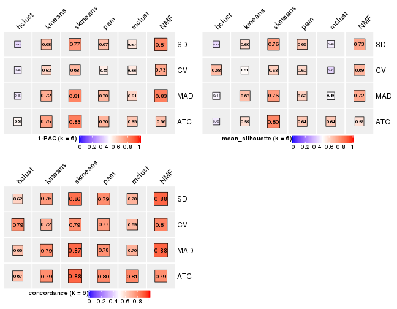</p>

</div>
</div>

### Partition from all methods


Collect partitions from all methods:


<script>
$( function() {
	$( '#tabs-collect-classes-from-consensus-partition-list' ).tabs();
} );
</script>
<div id='tabs-collect-classes-from-consensus-partition-list'>
<ul>
<li><a href='#tab-collect-classes-from-consensus-partition-list-1'>k = 2</a></li>
<li><a href='#tab-collect-classes-from-consensus-partition-list-2'>k = 3</a></li>
<li><a href='#tab-collect-classes-from-consensus-partition-list-3'>k = 4</a></li>
<li><a href='#tab-collect-classes-from-consensus-partition-list-4'>k = 5</a></li>
<li><a href='#tab-collect-classes-from-consensus-partition-list-5'>k = 6</a></li>
</ul>
<div id='tab-collect-classes-from-consensus-partition-list-1'>
<pre><code class="r">collect_classes(res_list, k = 2)
</code></pre>

<p></p>

</div>
<div id='tab-collect-classes-from-consensus-partition-list-2'>
<pre><code class="r">collect_classes(res_list, k = 3)
</code></pre>

<p></p>

</div>
<div id='tab-collect-classes-from-consensus-partition-list-3'>
<pre><code class="r">collect_classes(res_list, k = 4)
</code></pre>

<p></p>

</div>
<div id='tab-collect-classes-from-consensus-partition-list-4'>
<pre><code class="r">collect_classes(res_list, k = 5)
</code></pre>

<p></p>

</div>
<div id='tab-collect-classes-from-consensus-partition-list-5'>
<pre><code class="r">collect_classes(res_list, k = 6)
</code></pre>

<p></p>

</div>
</div>


### Top rows overlap


Overlap of top rows from different top-row methods:


<script>
$( function() {
	$( '#tabs-top-rows-overlap-by-euler' ).tabs();
} );
</script>
<div id='tabs-top-rows-overlap-by-euler'>
<ul>
<li><a href='#tab-top-rows-overlap-by-euler-1'>top_n = 1000</a></li>
<li><a href='#tab-top-rows-overlap-by-euler-2'>top_n = 2000</a></li>
<li><a href='#tab-top-rows-overlap-by-euler-3'>top_n = 3000</a></li>
<li><a href='#tab-top-rows-overlap-by-euler-4'>top_n = 4000</a></li>
<li><a href='#tab-top-rows-overlap-by-euler-5'>top_n = 5000</a></li>
</ul>
<div id='tab-top-rows-overlap-by-euler-1'>
<pre><code class="r">top_rows_overlap(res_list, top_n = 1000, method = &quot;euler&quot;)
</code></pre>

<p></p>

</div>
<div id='tab-top-rows-overlap-by-euler-2'>
<pre><code class="r">top_rows_overlap(res_list, top_n = 2000, method = &quot;euler&quot;)
</code></pre>

<p></p>

</div>
<div id='tab-top-rows-overlap-by-euler-3'>
<pre><code class="r">top_rows_overlap(res_list, top_n = 3000, method = &quot;euler&quot;)
</code></pre>

<p></p>

</div>
<div id='tab-top-rows-overlap-by-euler-4'>
<pre><code class="r">top_rows_overlap(res_list, top_n = 4000, method = &quot;euler&quot;)
</code></pre>

<p></p>

</div>
<div id='tab-top-rows-overlap-by-euler-5'>
<pre><code class="r">top_rows_overlap(res_list, top_n = 5000, method = &quot;euler&quot;)
</code></pre>

<p></p>

</div>
</div>

Also visualize the correspondance of rankings between different top-row methods:


<script>
$( function() {
	$( '#tabs-top-rows-overlap-by-correspondance' ).tabs();
} );
</script>
<div id='tabs-top-rows-overlap-by-correspondance'>
<ul>
<li><a href='#tab-top-rows-overlap-by-correspondance-1'>top_n = 1000</a></li>
<li><a href='#tab-top-rows-overlap-by-correspondance-2'>top_n = 2000</a></li>
<li><a href='#tab-top-rows-overlap-by-correspondance-3'>top_n = 3000</a></li>
<li><a href='#tab-top-rows-overlap-by-correspondance-4'>top_n = 4000</a></li>
<li><a href='#tab-top-rows-overlap-by-correspondance-5'>top_n = 5000</a></li>
</ul>
<div id='tab-top-rows-overlap-by-correspondance-1'>
<pre><code class="r">top_rows_overlap(res_list, top_n = 1000, method = &quot;correspondance&quot;)
</code></pre>

<p></p>

</div>
<div id='tab-top-rows-overlap-by-correspondance-2'>
<pre><code class="r">top_rows_overlap(res_list, top_n = 2000, method = &quot;correspondance&quot;)
</code></pre>

<p></p>

</div>
<div id='tab-top-rows-overlap-by-correspondance-3'>
<pre><code class="r">top_rows_overlap(res_list, top_n = 3000, method = &quot;correspondance&quot;)
</code></pre>

<p></p>

</div>
<div id='tab-top-rows-overlap-by-correspondance-4'>
<pre><code class="r">top_rows_overlap(res_list, top_n = 4000, method = &quot;correspondance&quot;)
</code></pre>

<p></p>

</div>
<div id='tab-top-rows-overlap-by-correspondance-5'>
<pre><code class="r">top_rows_overlap(res_list, top_n = 5000, method = &quot;correspondance&quot;)
</code></pre>

<p>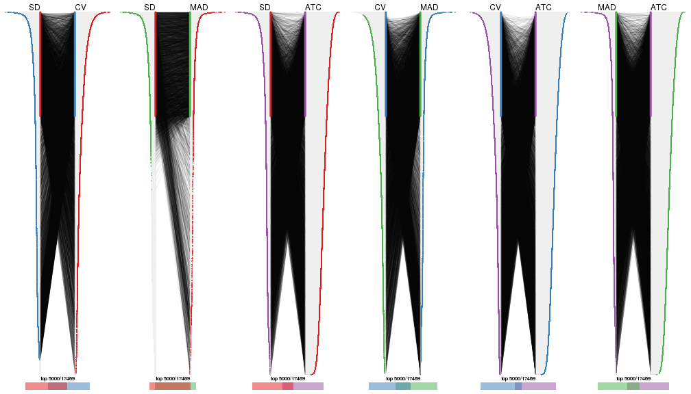</p>

</div>
</div>


Heatmaps of the top rows:


<script>
$( function() {
	$( '#tabs-top-rows-heatmap' ).tabs();
} );
</script>
<div id='tabs-top-rows-heatmap'>
<ul>
<li><a href='#tab-top-rows-heatmap-1'>top_n = 1000</a></li>
<li><a href='#tab-top-rows-heatmap-2'>top_n = 2000</a></li>
<li><a href='#tab-top-rows-heatmap-3'>top_n = 3000</a></li>
<li><a href='#tab-top-rows-heatmap-4'>top_n = 4000</a></li>
<li><a href='#tab-top-rows-heatmap-5'>top_n = 5000</a></li>
</ul>
<div id='tab-top-rows-heatmap-1'>
<pre><code class="r">top_rows_heatmap(res_list, top_n = 1000)
</code></pre>

<p></p>

</div>
<div id='tab-top-rows-heatmap-2'>
<pre><code class="r">top_rows_heatmap(res_list, top_n = 2000)
</code></pre>

<p></p>

</div>
<div id='tab-top-rows-heatmap-3'>
<pre><code class="r">top_rows_heatmap(res_list, top_n = 3000)
</code></pre>

<p></p>

</div>
<div id='tab-top-rows-heatmap-4'>
<pre><code class="r">top_rows_heatmap(res_list, top_n = 4000)
</code></pre>

<p></p>

</div>
<div id='tab-top-rows-heatmap-5'>
<pre><code class="r">top_rows_heatmap(res_list, top_n = 5000)
</code></pre>

<p></p>

</div>
</div>


 
## Results for each method


---------------------------------------------------


### SD:hclust


The object with results only for a single top-value method and a single partition method 
can be extracted as:

```r
res = res_list["SD", "hclust"]
# you can also extract it by
# res = res_list["SD:hclust"]
```

A summary of `res` and all the functions that can be applied to it:

```r
res
```

```
#> A 'ConsensusPartition' object with k = 2, 3, 4, 5, 6.
#>   On a matrix with 17469 rows and 309 columns.
#>   Top rows (1000, 2000, 3000, 4000, 5000) are extracted by 'SD' method.
#>   Subgroups are detected by 'hclust' method.
#>   Performed in total 1250 partitions by row resampling.
#>   Best k for subgroups seems to be 3.
#> 
#> Following methods can be applied to this 'ConsensusPartition' object:
#>  [1] "cola_report"             "collect_classes"         "collect_plots"          
#>  [4] "collect_stats"           "colnames"                "compare_signatures"     
#>  [7] "consensus_heatmap"       "dimension_reduction"     "functional_enrichment"  
#> [10] "get_anno_col"            "get_anno"                "get_classes"            
#> [13] "get_consensus"           "get_matrix"              "get_membership"         
#> [16] "get_param"               "get_signatures"          "get_stats"              
#> [19] "is_best_k"               "is_stable_k"             "membership_heatmap"     
#> [22] "ncol"                    "nrow"                    "plot_ecdf"              
#> [25] "rownames"                "select_partition_number" "show"                   
#> [28] "suggest_best_k"          "test_to_known_factors"
```

`collect_plots()` function collects all the plots made from `res` for all `k` (number of partitions)
into one single page to provide an easy and fast comparison between different `k`.

```r
collect_plots(res)
```


The plots are:

- The first row: a plot of the ECDF (Empirical cumulative distribution
  function) curves of the consensus matrix for each `k` and the heatmap of
  predicted classes for each `k`.
- The second row: heatmaps of the consensus matrix for each `k`.
- The third row: heatmaps of the membership matrix for each `k`.
- The fouth row: heatmaps of the signatures for each `k`.

All the plots in panels can be made by individual functions and they are
plotted later in this section.

`select_partition_number()` produces several plots showing different
statistics for choosing "optimized" `k`. There are following statistics:

- ECDF curves of the consensus matrix for each `k`;
- 1-PAC. [The PAC
  score](https://en.wikipedia.org/wiki/Consensus_clustering#Over-interpretation_potential_of_consensus_clustering)
  measures the proportion of the ambiguous subgrouping.
- Mean silhouette score.
- Concordance. The mean probability of fiting the consensus class ids in all
  partitions.
- Area increased. Denote $A_k$ as the area under the ECDF curve for current
  `k`, the area increased is defined as $A_k - A_{k-1}$.
- Rand index. The percent of pairs of samples that are both in a same cluster
  or both are not in a same cluster in the partition of k and k-1.
- Jaccard index. The ratio of pairs of samples are both in a same cluster in
  the partition of k and k-1 and the pairs of samples are both in a same
  cluster in the partition k or k-1.

The detailed explanations of these statistics can be found in [the cola
vignette](http://bioconductor.org/packages/devel/bioc/vignettes/cola/inst/doc/cola.html#toc_13).

Generally speaking, lower PAC score, higher mean silhouette score or higher
concordance corresponds to better partition. Rand index and Jaccard index
measure how similar the current partition is compared to partition with `k-1`.
If they are too similar, we won't accept `k` is better than `k-1`.

```r
select_partition_number(res)
```


The numeric values for all these statistics can be obtained by `get_stats()`.

```r
get_stats(res)
```

```
#>   k 1-PAC mean_silhouette concordance area_increased  Rand Jaccard
#> 2 2 0.541           0.818       0.891         0.3058 0.670   0.670
#> 3 3 0.649           0.811       0.897         0.4107 0.925   0.889
#> 4 4 0.398           0.485       0.748         0.3227 0.967   0.946
#> 5 5 0.382           0.413       0.646         0.1838 0.737   0.551
#> 6 6 0.420           0.422       0.619         0.0986 0.752   0.431
```

`suggest_best_k()` suggests the best $k$ based on these statistics. The rules are as follows:

- All $k$ with Jaccard index larger than 0.95 are removed because the increase of
  the partition number does not provides enough extra information. If all $k$ are removed,
  the best $k$ is assigned by `NA`.
- For $k$ with 1-PAC larger than 0.9, the maximal $k$ is taken as the "best k". Other $k$ is called "optional k".
- If it does not fit the second rule. The $k$ with the highest vote of highest
  1-PAC, mean silhouette and concordance is taken as the "best k".

```r
suggest_best_k(res)
```

```
#> [1] 3
```


Following shows the table of the partitions (You need to click the **show/hide
code output** link to see it). The membership matrix (columns with name `p*`)
is inferred by
[`clue::cl_consensus()`](https://www.rdocumentation.org/link/cl_consensus?package=clue)
function with the `SE` method. Basically the value in the membership matrix
represents the probability to belong to a certain group. The finall class
label for an item is determined with the group with highest probability it
belongs to.

In `get_classes()` function, the entropy is calculated from the membership
matrix and the silhouette score is calculated from the consensus matrix.


<script>
$( function() {
	$( '#tabs-SD-hclust-get-classes' ).tabs();
} );
</script>
<div id='tabs-SD-hclust-get-classes'>
<ul>
<li><a href='#tab-SD-hclust-get-classes-1'>k = 2</a></li>
<li><a href='#tab-SD-hclust-get-classes-2'>k = 3</a></li>
<li><a href='#tab-SD-hclust-get-classes-3'>k = 4</a></li>
<li><a href='#tab-SD-hclust-get-classes-4'>k = 5</a></li>
<li><a href='#tab-SD-hclust-get-classes-5'>k = 6</a></li>
</ul>

<div id='tab-SD-hclust-get-classes-1'>
<p><a id='tab-SD-hclust-get-classes-1-a' style='color:#0366d6' href='#'>show/hide code output</a></p>
<pre><code class="r">cbind(get_classes(res, k = 2), get_membership(res, k = 2))
</code></pre>

<pre><code>#&gt;                                      class entropy silhouette    p1    p2
#&gt; 7826AE44-B03A-4528-9CB5-7421E592AE36     1  0.3733     0.8844 0.928 0.072
#&gt; 0DC2197B-2FEA-48EB-953E-8E44E1933757     1  0.2043     0.9131 0.968 0.032
#&gt; 87ABB098-8C1E-4677-8C31-48B71EFE41C7     1  0.4562     0.8693 0.904 0.096
#&gt; EC0154E7-7A27-4535-83AE-6B379E99A93C     1  0.0672     0.9164 0.992 0.008
#&gt; 78F79407-D49F-4FA2-B09F-0665C502827C     1  0.0376     0.9164 0.996 0.004
#&gt; 03E81178-E971-4E91-8BED-D8273EA1425C     1  0.2236     0.9113 0.964 0.036
#&gt; 62FCAEFF-16D8-4019-84B6-18EC3A88BC32     1  0.8661     0.4836 0.712 0.288
#&gt; 722C1284-5983-4CC1-B19C-214C2DE6F8A6     2  0.7528     0.8751 0.216 0.784
#&gt; 54E42A64-B350-4A94-8FED-C9BC1872660E     1  0.4161     0.8661 0.916 0.084
#&gt; 53062969-D209-490B-9C9B-5D297625E2AE     1  0.0376     0.9165 0.996 0.004
#&gt; B710293C-41D3-4A2E-8104-5402F91DD859     1  0.0376     0.9164 0.996 0.004
#&gt; 73CB1D05-7AE4-457D-B4EF-25AC5C1F2132     1  0.0376     0.9165 0.996 0.004
#&gt; B055A70B-3003-47CB-BDAA-6378C000BF24     1  0.2948     0.9016 0.948 0.052
#&gt; 46C3A870-E37A-42CB-8C0C-6ACACEAC1ADC     2  0.9393     0.7517 0.356 0.644
#&gt; E8E6270E-F26D-4F2E-A63E-7885BDE05FDB     1  0.3584     0.8965 0.932 0.068
#&gt; C4A5EBA2-9091-4D12-BDC8-B84B122022B9     1  0.2778     0.9046 0.952 0.048
#&gt; 5B1839C4-549D-41D1-B559-3C6D2A1528CE     1  0.1843     0.9139 0.972 0.028
#&gt; A0DF05EB-DC44-4492-9A8A-F278F7B0C266     1  0.0672     0.9170 0.992 0.008
#&gt; B5182F49-70F2-45B7-82DE-C6DA68145EEA     1  0.0376     0.9147 0.996 0.004
#&gt; C204D355-B876-4341-A111-36D48CBDD2A8     1  0.1414     0.9148 0.980 0.020
#&gt; 7B070AAA-EF97-4D3B-AA19-EEC170C7927D     2  0.7528     0.8751 0.216 0.784
#&gt; 05A8A881-F8EE-48A2-B11C-A08D7D80CE18     1  0.0938     0.9167 0.988 0.012
#&gt; BA59EF50-CFE9-456D-B1B6-67D0945004F6     1  0.0000     0.9155 1.000 0.000
#&gt; AD97B334-E034-4D33-A4D5-48C32D5D521C     1  0.1184     0.9175 0.984 0.016
#&gt; 51DA2568-32EA-4668-9876-4B6E7CA68860     1  0.2043     0.9131 0.968 0.032
#&gt; 78C26A05-2084-494D-83D3-C52C1B800F4C     1  0.2236     0.9125 0.964 0.036
#&gt; 2B5DD791-7692-4721-9519-7D7D49B52570     1  0.2778     0.9046 0.952 0.048
#&gt; C0BBE26A-79C8-4392-9978-7C420B3786B5     1  0.1414     0.9167 0.980 0.020
#&gt; F35A8359-3A7A-414F-8A5C-D278F3B45387     2  0.7528     0.8751 0.216 0.784
#&gt; 8C9BA49C-1270-491D-A234-AE1B1C0609BA     2  0.8207     0.8592 0.256 0.744
#&gt; CA104B57-B160-4148-8A0A-D34BB3E8D88A     1  0.0376     0.9164 0.996 0.004
#&gt; 877E18A5-6A7A-4E29-9871-DC7EA14A5F27     1  0.3879     0.8758 0.924 0.076
#&gt; 904EDF2E-411E-43BD-901D-46129AFA283A     1  0.0376     0.9165 0.996 0.004
#&gt; FD9F5A9B-2BEB-4D31-9A2D-8D4B4ECBB478     1  0.0000     0.9155 1.000 0.000
#&gt; 2E206314-9928-456E-B7C6-893DC0E3C7C2     1  0.9491     0.2004 0.632 0.368
#&gt; 913DB655-2C7F-4369-83DE-9257F04CF39B     1  0.4815     0.8569 0.896 0.104
#&gt; 72B5B724-FEB5-43BD-83F6-2E2152DDD800     1  0.8555     0.5322 0.720 0.280
#&gt; 920B547C-6898-446C-AAAF-F4ED96E40AAB     2  0.7528     0.8751 0.216 0.784
#&gt; 847F796A-8CD6-4013-A0FB-26F4FC3EAF0D     1  0.0938     0.9167 0.988 0.012
#&gt; C4D64E7A-33F7-4CFC-9FD3-D6AA3D8EFAA7     1  0.0000     0.9155 1.000 0.000
#&gt; EABA0B17-8E19-48C5-BF62-2A45C9632807     2  0.9460     0.7421 0.364 0.636
#&gt; 7263CBA8-CE37-4531-A795-9324C6D2A672     1  0.1633     0.9145 0.976 0.024
#&gt; 6D3CC3AC-618B-414A-B640-169C735A6568     1  0.2778     0.9046 0.952 0.048
#&gt; 710C05C7-F9CE-45FA-A8CC-29DE2903E04F     1  0.0376     0.9165 0.996 0.004
#&gt; 3D631A56-2C55-48EA-A667-BA46023C9D50     1  0.0000     0.9155 1.000 0.000
#&gt; F1C65F64-AF05-4875-B7E4-60FFF56A3F46     1  0.2043     0.9145 0.968 0.032
#&gt; E5DF76E7-A765-4E07-B87A-06168BF66C5F     1  0.2778     0.8994 0.952 0.048
#&gt; 5C8C8A6E-40D4-4F82-AC3D-90CFDEE15C0A     2  0.7528     0.8751 0.216 0.784
#&gt; 0117CBB9-1BF9-48B1-BE6E-A9A770FF8721     1  0.1633     0.9145 0.976 0.024
#&gt; 31EF66E5-419A-44C3-BB2A-B69B52FFCECC     1  0.9970    -0.2549 0.532 0.468
#&gt; C149CEF5-61F3-4B53-B8A9-8244B673EBD0     1  0.0938     0.9172 0.988 0.012
#&gt; 0AF351D0-4EC5-4275-AA0A-4FA2AF8A9C85     2  0.8386     0.8329 0.268 0.732
#&gt; B507E82F-6680-497B-A014-033EDD7A2E03     1  0.1633     0.9145 0.976 0.024
#&gt; F941890E-AB33-478F-8C97-1C785DD9428F     1  0.2948     0.9047 0.948 0.052
#&gt; 7987E019-8FED-469B-A6C1-34EE430A60C3     1  0.0938     0.9167 0.988 0.012
#&gt; 76084AA6-19BF-4605-B6A1-73F1D4BADAF9     1  0.4161     0.8779 0.916 0.084
#&gt; 329807F7-E0D4-4F53-94E8-E4080E90CB47     1  0.8499     0.5817 0.724 0.276
#&gt; 1B6505FF-C1A7-4DD0-9827-41A0A3A28F3E     1  0.4022     0.8711 0.920 0.080
#&gt; 49778E92-B5D3-4AD9-A1AF-3B722D631B96     2  0.7528     0.8702 0.216 0.784
#&gt; A22892DE-0AF4-4B63-9513-1D6825059040     1  0.0000     0.9155 1.000 0.000
#&gt; 6D77ECAE-A715-4ADD-97D8-A916DC31A4EA     1  0.1184     0.9174 0.984 0.016
#&gt; 09758B6F-1B2D-4AED-8913-696097069409     1  0.1184     0.9179 0.984 0.016
#&gt; 8B709DB4-0B28-42F1-A7C5-106F5809BEA2     1  0.2236     0.9116 0.964 0.036
#&gt; F2B356FA-79CD-4867-8ABF-84C90A493A75     1  0.0672     0.9170 0.992 0.008
#&gt; 131213AD-0313-4DF1-B013-CE67ED262C37     2  0.7528     0.8751 0.216 0.784
#&gt; D94F7E81-0F60-473B-AD4A-0AC13508BDE2     1  0.8081     0.6456 0.752 0.248
#&gt; 29C17355-D646-48DA-9E54-7B6DD85DD610     1  0.0938     0.9172 0.988 0.012
#&gt; B8BD866A-2A7C-45C3-96BB-9AB892D26AE5     1  0.0672     0.9168 0.992 0.008
#&gt; 13EFD045-AD61-41EE-9896-67BFA4FC8C09     1  0.7602     0.6902 0.780 0.220
#&gt; 2655F609-B3BB-4D01-B421-D5F4B1232EC8     2  0.9393     0.7517 0.356 0.644
#&gt; 04BC7A52-C67F-42CB-8672-D3C51A20F2BA     1  0.0938     0.9171 0.988 0.012
#&gt; 45472BD4-DBDB-41FE-B0E3-2440880E1DE6     1  0.0000     0.9155 1.000 0.000
#&gt; B87FFFCD-CB57-4ACD-9C74-AB188984BBB2     1  0.1633     0.9152 0.976 0.024
#&gt; 5271374C-13CD-4BFE-AC6D-C95AFE491322     1  0.0376     0.9165 0.996 0.004
#&gt; E3372ACE-C7C8-43E5-B30A-1F2D662D8170     1  0.0376     0.9165 0.996 0.004
#&gt; B08DF564-E4D0-4540-8160-93B3981DF1D8     1  0.0000     0.9155 1.000 0.000
#&gt; 61A7D1B9-FC5A-4B9C-989F-936CDA948C27     1  0.0938     0.9180 0.988 0.012
#&gt; 74E768C1-8766-46AC-AAB4-D79E5049F76A     2  0.7528     0.8751 0.216 0.784
#&gt; 0CEA28F0-D7F0-4EB7-A23F-0C5CA6245971     1  0.7528     0.6961 0.784 0.216
#&gt; 95C4EFF6-147C-48EC-A2C1-16B8F12AEEF2     1  0.9909    -0.1142 0.556 0.444
#&gt; C9A78BEA-D455-4F5E-8B7B-19BCB42887E7     1  0.1843     0.9153 0.972 0.028
#&gt; DB970740-9AC1-4C10-9658-8A77B1C390DD     2  0.6801     0.7394 0.180 0.820
#&gt; 883FBD37-0CA0-4562-8925-72ACC1EE93D9     1  0.0938     0.9171 0.988 0.012
#&gt; 9FE1D006-49F2-471E-91E6-AF0414C24479     1  0.0000     0.9155 1.000 0.000
#&gt; 11816CC6-8C8B-49C0-99EE-896377BCFCCD     1  0.0000     0.9155 1.000 0.000
#&gt; 063FC5C8-4318-4ECC-9CA0-1976CBC8ACB6     1  0.1414     0.9166 0.980 0.020
#&gt; E0F085CC-B90D-4FDE-B60E-C613971BAA00     1  0.0000     0.9155 1.000 0.000
#&gt; 62361DA2-E4EE-46DA-BB1F-C51DCA9307CC     2  0.9323     0.7633 0.348 0.652
#&gt; 1BA16D48-B09E-4699-A1AD-2FFECE4F3CDB     2  0.7602     0.8748 0.220 0.780
#&gt; 3E4F14E9-60AE-4F17-9BA7-2A02E908204A     1  0.3274     0.9008 0.940 0.060
#&gt; 79226DD7-BC85-4B8E-BFF8-B1E073129D34     1  0.2423     0.9103 0.960 0.040
#&gt; D47D0936-826F-4D54-9225-F71B95357438     1  0.0938     0.9171 0.988 0.012
#&gt; 0AE02B91-574C-4165-BA39-E9D7C1A870A2     2  0.9983     0.4509 0.476 0.524
#&gt; DED8E9DF-CEFE-45ED-9374-EF9925A135C4     1  0.1633     0.9145 0.976 0.024
#&gt; D587A993-3C47-4D4C-B744-59169D4F7451     1  0.4022     0.8711 0.920 0.080
#&gt; 6BCA24E6-440F-42C5-ABE5-66C37B713A39     1  0.0672     0.9169 0.992 0.008
#&gt; 86A5EDFB-9D06-4FED-BF57-F8D74A68E156     1  0.4815     0.8569 0.896 0.104
#&gt; B9BD5134-2F6A-4454-8F83-69B63F9AE114     1  0.2603     0.9051 0.956 0.044
#&gt; 082DA9E1-A40D-482B-8E21-A93BA97185F0     1  0.2603     0.9034 0.956 0.044
#&gt; 16A8343A-1203-44FB-9F03-05CC7C71B4CC     1  0.2778     0.9046 0.952 0.048
#&gt; 00439565-02CE-4BF5-956D-7078B51C0947     1  0.4815     0.8617 0.896 0.104
#&gt; 7B2BD361-2BF1-4E97-BC08-457F5A9C2682     2  0.7528     0.8751 0.216 0.784
#&gt; C1D8439A-D527-47F6-ADC1-25867B65DA21     2  0.7528     0.8751 0.216 0.784
#&gt; D9096909-1439-462D-B69C-CAD1BF4F420C     1  0.0000     0.9155 1.000 0.000
#&gt; 7822EA86-35A1-4285-9429-2B63111B9885     1  0.4022     0.8711 0.920 0.080
#&gt; 6FD0CFC8-AC8D-4CF1-8C33-833AD98A30EF     2  0.7528     0.8751 0.216 0.784
#&gt; A451F278-5E83-4BC6-9B15-3AA2117B99B6     1  0.8713     0.4055 0.708 0.292
#&gt; 6EC25686-4547-459C-9E01-7EDF8DAECE35     1  0.2043     0.9131 0.968 0.032
#&gt; 5D2F1EEA-2BA8-4C3A-8436-544EE1D23E7E     1  0.0000     0.9155 1.000 0.000
#&gt; 675A4293-A4CE-4307-B00B-DFC4D44A87C6     1  0.9954    -0.2155 0.540 0.460
#&gt; 6FBE0AEF-476A-42B2-A857-846CF1ED92B6     2  0.7528     0.8751 0.216 0.784
#&gt; 7139D616-1A15-4288-A9AE-411856A4A76D     1  0.7602     0.6183 0.780 0.220
#&gt; 46D7F8C1-D5C5-40CC-BEF5-2E590A847BD9     1  0.2423     0.9099 0.960 0.040
#&gt; 984C44D3-4F5F-44C9-BCD9-C991EBC1FCB8     1  0.1633     0.9145 0.976 0.024
#&gt; 83FE52E0-2DC2-4580-8BB2-FBCBEE4AC240     1  0.2603     0.9106 0.956 0.044
#&gt; 0923F9CB-DF6F-4BAA-A5F8-0F83CE60D1ED     1  0.0672     0.9171 0.992 0.008
#&gt; 1DEB5206-78CC-4EB5-BCD5-85A6A5B4E273     1  0.2236     0.9131 0.964 0.036
#&gt; E4DB18DA-EB0C-4B2F-9566-7F72222B16D4     1  0.7674     0.6052 0.776 0.224
#&gt; F7456312-1309-4B2F-875D-0F90CDF3EC35     1  0.0672     0.9174 0.992 0.008
#&gt; 9A25E5D8-0706-4960-A76B-BCD0AC93E4FA     1  0.0376     0.9165 0.996 0.004
#&gt; 5A41FE8F-FFB3-4B87-BF11-A570C184096D     1  0.0000     0.9155 1.000 0.000
#&gt; 33F84E63-3F6C-4867-ADB1-A0DF39F1295B     1  0.1633     0.9122 0.976 0.024
#&gt; D6A644F5-D1D0-4A8D-94C4-EE6C3ECE7430     1  0.2778     0.9077 0.952 0.048
#&gt; 2A5848CC-A9A2-4AA8-A752-321273E62CF0     1  0.0000     0.9155 1.000 0.000
#&gt; 7CA6358B-FC8A-4675-B092-9E061038FC83     1  0.3431     0.8916 0.936 0.064
#&gt; A4C2F4BC-5C62-4B1F-9AB8-46D9468EF523     1  0.9954    -0.2155 0.540 0.460
#&gt; 8AF4EB7F-418D-4CC9-A9B8-A93A4C1A173B     2  0.8763     0.7931 0.296 0.704
#&gt; E5048887-70C8-468F-881E-2EC55F6E6F3B     1  0.0000     0.9155 1.000 0.000
#&gt; 1BADCC7C-C4D8-4C34-9534-59D622C7A2A2     2  0.6887     0.7375 0.184 0.816
#&gt; 02CE7DF7-64BD-4297-A240-A5B9EE8771D3     1  0.2778     0.9059 0.952 0.048
#&gt; CBF6E96A-F56C-4C87-B851-D319930BAAB8     1  0.2043     0.9115 0.968 0.032
#&gt; 48F6B774-CFD2-4DDF-B7A2-696596413C3F     1  0.0376     0.9164 0.996 0.004
#&gt; 41D88C3E-5848-4B09-8A77-EAE6AC4EC6B0     2  0.7453     0.8720 0.212 0.788
#&gt; BDF79CC0-00C7-49C1-900B-AB065A733B17     1  0.0000     0.9155 1.000 0.000
#&gt; A894D686-BFC7-4AEE-A794-DBE718C6B6F6     2  0.7528     0.8751 0.216 0.784
#&gt; 0712029E-3765-4272-BE5B-B6C8BCCC0F0F     2  0.7528     0.8751 0.216 0.784
#&gt; 7B051855-9B09-4887-9BC0-9F077537938E     1  0.0376     0.9165 0.996 0.004
#&gt; EF357C46-5C3C-4F51-9383-FF7694D07B97     2  0.7528     0.8751 0.216 0.784
#&gt; 9492A322-37CA-4582-AC68-66B5D80778AF     2  0.9993     0.4245 0.484 0.516
#&gt; 993399A4-1B9F-4258-B2D0-155AD58A2E82     1  0.0376     0.9164 0.996 0.004
#&gt; 7B7DC93D-5494-4E69-BE07-2967887182F9     1  0.2603     0.9059 0.956 0.044
#&gt; 29BCBA51-2580-473D-9CF7-BEDBD0DBAD1B     2  0.9710     0.6777 0.400 0.600
#&gt; 40855647-E942-4F32-90B7-BEB921929BFB     1  0.1184     0.9177 0.984 0.016
#&gt; 0DC723D0-7C68-4495-A4B9-2DF2FF19AB14     1  0.9954    -0.2155 0.540 0.460
#&gt; 7540005F-57E0-4E2E-A8A2-BEF2B0F333B1     2  0.9552     0.7234 0.376 0.624
#&gt; EB1DDB14-4076-4C2C-B911-390C17C21486     1  0.2778     0.9059 0.952 0.048
#&gt; 9EA70EC4-8BA0-4E3D-B3CB-A68D19E89868     1  0.2603     0.9051 0.956 0.044
#&gt; B04E2E50-0A6E-4224-A825-1714D12E5669     2  0.1184     0.7085 0.016 0.984
#&gt; B0BF5E01-536D-40FF-9C24-CBBD611E2FC2     1  0.6438     0.7804 0.836 0.164
#&gt; 7B6B1788-B297-4442-B6BE-B7CE8754491E     1  0.1843     0.9121 0.972 0.028
#&gt; A090D00C-34DF-4906-A517-4803C4C9A332     1  0.0000     0.9155 1.000 0.000
#&gt; 340D44A6-9BEA-412C-9973-D9ABD6692255     1  0.0672     0.9168 0.992 0.008
#&gt; E8D0D1E7-E5A8-4014-80C1-0245F90F4358     2  0.9427     0.7466 0.360 0.640
#&gt; 19EA1494-8572-40E1-B9BB-3739F47B607D     1  0.0672     0.9168 0.992 0.008
#&gt; 1C1B4793-8DAF-4763-BA4D-C4E869A4ED35     1  0.1633     0.9157 0.976 0.024
#&gt; 45BF59B3-95BD-4196-ABAA-4C4F0DB38572     2  0.8555     0.7993 0.280 0.720
#&gt; 47B5A2A7-7E13-4558-99D2-067F5075C6A4     1  0.1184     0.9169 0.984 0.016
#&gt; E94638E8-CB51-4FBB-8BCB-4BFD7A812291     1  0.1184     0.9170 0.984 0.016
#&gt; A17352A8-0D3C-4545-8136-7DAE2FB0E102     2  0.9710     0.6449 0.400 0.600
#&gt; B18A6F95-D4ED-416B-B5A1-9A4934865D0D     2  0.7528     0.8723 0.216 0.784
#&gt; 33E92C5F-0C42-4549-AD5B-0A064182A272     1  0.1184     0.9163 0.984 0.016
#&gt; E041B375-3E60-4F18-A6EF-D1C249E3B8EE     1  0.2423     0.9110 0.960 0.040
#&gt; EDF90AF6-6C64-4BD2-AADF-8D7D188650B2     2  0.7883     0.8701 0.236 0.764
#&gt; 569320D2-316C-4E2D-B7B3-D7D5C4DAD42D     1  0.0000     0.9155 1.000 0.000
#&gt; AFFB223D-DAE9-4567-9EF2-8E4DF9D8782D     2  0.9944     0.5447 0.456 0.544
#&gt; 56FC9454-0A6A-4CC3-95C4-BE0E0D0BAFCE     2  0.9896     0.5881 0.440 0.560
#&gt; 43226365-FAEF-46C5-AF1B-5C6C2BED84FF     1  0.3879     0.8703 0.924 0.076
#&gt; 1536110A-B42A-4A84-9474-9895321FDCE9     2  0.9710     0.6882 0.400 0.600
#&gt; 812255DD-536B-4216-90B1-27D5AB339BE2     1  0.0000     0.9155 1.000 0.000
#&gt; 5D4563D6-68B7-4C9D-A3F4-AA7D45D5112C     1  0.9970    -0.2489 0.532 0.468
#&gt; BAA39781-DB94-473C-98B1-FA6CD3E1C67A     1  0.3114     0.8956 0.944 0.056
#&gt; C1411CDA-814D-4E21-8929-C0F77858828F     1  0.2043     0.9141 0.968 0.032
#&gt; EFE2F248-C13E-4E8D-9153-8C903848AC4A     1  0.2948     0.8997 0.948 0.052
#&gt; D3939C84-D1D6-4060-9F91-AEB222A9BDD5     1  0.2603     0.9106 0.956 0.044
#&gt; EABD2987-8C1E-49E5-94AF-C0BDE5335A48     1  0.0000     0.9155 1.000 0.000
#&gt; F4BE2ABE-2CEB-4A6A-B8EC-0355F8C63B9B     1  0.0376     0.9164 0.996 0.004
#&gt; 627BC251-D217-4955-B718-6B9D6DEA1756     1  0.1184     0.9157 0.984 0.016
#&gt; 31B54613-A20E-4039-BB8B-9B52104CE418     1  0.0000     0.9155 1.000 0.000
#&gt; 3F292B7C-A535-4DBD-BC20-CB4F85A1C94B     1  0.3584     0.8965 0.932 0.068
#&gt; BEA2A5EB-EEA9-4F31-AC38-810E04CE124B     1  0.9970    -0.2549 0.532 0.468
#&gt; 99D84D46-19DA-43F1-B639-DCE9953F1529     2  0.7528     0.8751 0.216 0.784
#&gt; 4588817E-1068-4A78-86B6-4674A0112DDA     1  0.4161     0.8661 0.916 0.084
#&gt; 6AC633BD-BEC1-4750-94E3-378972DAB6B3     2  0.1633     0.7137 0.024 0.976
#&gt; 09E17C6E-7EDE-4DDF-B5ED-2521AF870C9A     1  0.0938     0.9167 0.988 0.012
#&gt; 58D9C750-26A2-4B7C-84C4-13D7AFB4C5EA     1  0.0376     0.9165 0.996 0.004
#&gt; DF28E138-E222-4F77-9B61-69E601CA7E60     2  0.8144     0.8627 0.252 0.748
#&gt; FEA489A8-E423-4266-AADA-9BAAB29AB94B     1  0.0000     0.9155 1.000 0.000
#&gt; F3FCC207-15CD-41EA-A3EF-F5D2C12AC373     1  0.0672     0.9168 0.992 0.008
#&gt; 53DD7AFB-A258-4643-A501-BACC95D17A50     2  0.9866     0.6005 0.432 0.568
#&gt; D850B2A1-1F8A-4A44-A0CF-8D9DD4A1889A     2  0.7528     0.8751 0.216 0.784
#&gt; B3F746DC-E487-4305-9F30-825D1520E8FD     1  0.9909    -0.1192 0.556 0.444
#&gt; BE38240A-F7C2-439F-9AAE-51C8A340F310     1  0.1184     0.9174 0.984 0.016
#&gt; A9022D9E-1D30-49EE-8552-1364A8027F34     1  0.2778     0.9070 0.952 0.048
#&gt; 0E8A56EE-D9A2-48A5-B793-A358BE1E4EFA     1  0.0000     0.9155 1.000 0.000
#&gt; 51667574-318E-4BDB-8F42-8512A4C1B84F     1  0.1843     0.9152 0.972 0.028
#&gt; B0A442C9-67E4-4534-8A5C-D6D73F42358C     1  0.0000     0.9155 1.000 0.000
#&gt; 25A5BC09-0D88-4385-87AF-997F9018522D     2  0.8144     0.8618 0.252 0.748
#&gt; 344B9631-AAA5-4302-8747-D584345D9131     1  0.1633     0.9152 0.976 0.024
#&gt; 1C3795AD-6306-4892-95F5-92DF3375D46A     1  0.1184     0.9170 0.984 0.016
#&gt; 17BB221D-8BF9-4391-83DD-423AE1E03651     1  0.4161     0.8661 0.916 0.084
#&gt; 297611E9-9555-4BCA-A723-02E846ACC23A     1  0.0672     0.9169 0.992 0.008
#&gt; AD7FF180-1EAC-4783-8A62-E9626B96DD9F     1  0.9710     0.0846 0.600 0.400
#&gt; FD544083-9BD5-4036-BD81-0352B67CC45C     1  0.1414     0.9161 0.980 0.020
#&gt; 879A74D5-5B29-418D-A0F4-8E88D6384008     1  0.0000     0.9155 1.000 0.000
#&gt; 43CD982C-13C0-4A52-803A-9A3A3FAE09BC     1  0.0672     0.9170 0.992 0.008
#&gt; DCD0313D-5206-4111-8743-A8A0227257D9     1  0.0938     0.9171 0.988 0.012
#&gt; 331A9160-D730-45DD-A985-C6CAC03035ED     1  0.0376     0.9164 0.996 0.004
#&gt; 9EEECA0E-530D-4724-B016-A716F0782148     1  0.3431     0.8945 0.936 0.064
#&gt; B3073976-CA3F-4115-9243-8C2D9E1B975D     1  0.2043     0.9147 0.968 0.032
#&gt; 77B3C9B4-1A7F-41BB-A37D-01EF80E933CC     2  0.1633     0.7137 0.024 0.976
#&gt; C0C26822-2E9F-4FB0-81D4-575027C8B71C     1  0.9909    -0.1142 0.556 0.444
#&gt; F1FCE328-2B3B-499A-888D-0E66A017E8B0     1  0.3733     0.8914 0.928 0.072
#&gt; F069DAD6-F1EB-42F7-8252-F3F6EC46CC3E     1  0.1414     0.9148 0.980 0.020
#&gt; 99CC822E-8C98-4EEC-BB58-AEF76A0B5332     1  0.0672     0.9174 0.992 0.008
#&gt; C86EBD08-53F2-4972-801A-74970FDD6A62     1  0.6438     0.7804 0.836 0.164
#&gt; F07326F2-C1D6-4D5A-9693-25C3A04B0EC2     1  0.0000     0.9155 1.000 0.000
#&gt; 8ACBD428-7713-48D9-810A-43C9CD191A73     1  0.9209     0.3264 0.664 0.336
#&gt; 3D3501B4-1A43-4FA7-90A2-CCEBF66BFD4A     1  0.8016     0.6151 0.756 0.244
#&gt; DD51C17C-300F-44A4-955A-C9BC85417842     1  0.4562     0.8673 0.904 0.096
#&gt; 58FF391C-1D83-426C-8F92-C15F78F56C95     1  0.0000     0.9155 1.000 0.000
#&gt; ACE65C6E-2B10-4972-91B4-9199DD4B179D     1  0.4022     0.8711 0.920 0.080
#&gt; B2088466-FA5D-491C-9982-99B33683E66F     2  0.9044     0.8056 0.320 0.680
#&gt; D47AF416-1687-4FE0-A235-8815B6E8EB0B     1  0.8327     0.6023 0.736 0.264
#&gt; 4DCAD07F-CC43-46F6-B2F3-EDBF3EDD1045     2  0.7528     0.8751 0.216 0.784
#&gt; AAAE0BD9-63FC-4A0E-A27E-447B634BAD99     2  0.7528     0.8751 0.216 0.784
#&gt; BC471AA1-52CF-4CEE-9866-34CE91404F45     2  0.7815     0.8717 0.232 0.768
#&gt; 81D3EE3F-AC11-404F-8092-307F0DC12198     1  0.1414     0.9161 0.980 0.020
#&gt; 8C02026C-C25E-406B-B8B8-A1A82362AE79     1  0.5737     0.8112 0.864 0.136
#&gt; 6A005F2A-A0C1-4CA4-B15B-96B08F013874     1  0.2236     0.9146 0.964 0.036
#&gt; B55743F2-4D63-4375-85D3-F58281CFD852     1  0.0000     0.9155 1.000 0.000
#&gt; 24F98393-C817-4D0E-A7DB-05D2B5C71F40     1  0.0672     0.9169 0.992 0.008
#&gt; 2C2AEF1D-4112-4EC7-9027-5E3FD26E8802     1  0.2423     0.9099 0.960 0.040
#&gt; 8BAC3CB5-2987-4349-8AE8-B83DDD16CA3C     1  0.2948     0.9016 0.948 0.052
#&gt; ED9C74E6-92FC-4E58-8FCE-1761DEA0C977     1  0.1414     0.9166 0.980 0.020
#&gt; BA732ED4-F6BA-404E-BA3C-CA558FAD866A     1  0.0376     0.9164 0.996 0.004
#&gt; E750385A-12D9-4A88-B4DF-C1306B5EF3B7     2  0.7528     0.8751 0.216 0.784
#&gt; 6B1DC5E4-5F82-4395-913F-6AEDB5B63188     1  0.1843     0.9107 0.972 0.028
#&gt; A7C12D37-FD50-4674-A054-1774F4E5C3B3     1  0.4690     0.8641 0.900 0.100
#&gt; 2155C764-2063-4D9C-9ACD-96AA73475F5E     1  0.7950     0.6475 0.760 0.240
#&gt; DE23CC15-A95E-4119-9B3C-8EEC45900D11     1  0.9970    -0.2398 0.532 0.468
#&gt; 5DB1DCAD-638E-48A4-9F40-3D6268FDEC33     2  0.8909     0.8137 0.308 0.692
#&gt; 34AF0341-73D7-4080-AAEB-4C1541C2569F     1  0.0000     0.9155 1.000 0.000
#&gt; B60D4235-44AF-4BA4-98C0-BCCDC28E90B9     2  0.9710     0.6777 0.400 0.600
#&gt; CF463D89-2C9F-4257-BF04-8BC1CD40EA7D     2  0.8144     0.8627 0.252 0.748
#&gt; EF6C8165-484A-4530-AEDF-93DCC4A8455D     1  0.0938     0.9167 0.988 0.012
#&gt; B9F6B5E4-4D10-49B8-A8FE-8F33C5A62CBF     1  0.0938     0.9167 0.988 0.012
#&gt; CE539000-92D7-4622-9C8D-BC6E01310681     2  0.7745     0.8640 0.228 0.772
#&gt; D3BBC405-A22A-4009-ABF6-96FEEE653051     2  0.7528     0.8751 0.216 0.784
#&gt; 0B3C86BD-0D20-4408-9BE3-05658729505F     1  0.4161     0.8804 0.916 0.084
#&gt; 9B9C5071-7C3F-416C-B91C-6F5966747F54     1  0.0000     0.9155 1.000 0.000
#&gt; A9469A4A-C5F9-4681-A916-A26F0B4307BA     1  0.0000     0.9155 1.000 0.000
#&gt; A31B57E4-E30B-4A1B-829D-1B47D9CEC041     2  0.9393     0.7549 0.356 0.644
#&gt; 647255CE-F84A-4070-B3FD-D8ACA32C4D09     1  0.0938     0.9175 0.988 0.012
#&gt; 8F5E9F02-51D7-410E-B8B7-22737F2F095A     2  0.9710     0.6777 0.400 0.600
#&gt; 8074A7F6-2FDE-4578-B71C-01C542D468FE     1  0.0938     0.9165 0.988 0.012
#&gt; 2A946F17-F245-409E-A019-C60CDA18DC7D     1  0.0000     0.9155 1.000 0.000
#&gt; 0878C381-47F9-4786-82C2-94AC840BEDCB     1  0.3733     0.8933 0.928 0.072
#&gt; 54504893-92C5-4328-85A8-2A882680B5E0     1  0.1633     0.9152 0.976 0.024
#&gt; 0A27D1BE-E5DD-459A-A51F-6D8AAF7CFEB4     1  0.0000     0.9155 1.000 0.000
#&gt; 89ED5A3E-CAC0-4AB4-B858-A3CD8F34DBD5     2  0.7602     0.8748 0.220 0.780
#&gt; ACEEB0A5-AADB-4EF9-8710-4BAF95522CEA     1  0.0000     0.9155 1.000 0.000
#&gt; 02C74D81-5976-4252-BC6C-B10E934DECA2     1  0.1633     0.9171 0.976 0.024
#&gt; D365A238-4739-4B54-9608-DC548F21C04E     1  0.0000     0.9155 1.000 0.000
#&gt; F70F7ED5-A3B7-4210-95AD-DEFA0A565F06     1  0.2043     0.9142 0.968 0.032
#&gt; A92C23A9-BC25-4025-9501-6D5FF8E2A502     1  0.1184     0.9174 0.984 0.016
#&gt; ECE9BBF4-840E-47A6-8378-0B6C4A2369D3     1  0.0000     0.9155 1.000 0.000
#&gt; 38749490-0FCF-4B33-9EBC-8F86C2D9E4AF     1  0.0000     0.9155 1.000 0.000
#&gt; 02ABB64E-768B-4999-A899-EEE573D5F186     1  0.2043     0.9099 0.968 0.032
#&gt; C1C467A8-18B1-4C3F-AC45-33359ED6FDC4     1  0.1184     0.9174 0.984 0.016
#&gt; 78B2E4A1-9DAE-404F-AB47-1896450EF254     1  0.1184     0.9170 0.984 0.016
#&gt; CCDB0290-91DA-4089-84A6-4434BA028D30     1  0.4690     0.8658 0.900 0.100
#&gt; D5041E80-20A0-4C1A-9AC1-2394F6DB6E92     1  0.2043     0.9145 0.968 0.032
#&gt; 20EB9CC6-EABB-438A-9030-E766459996D1     2  0.7602     0.8748 0.220 0.780
#&gt; 73E99110-9A7C-4F73-98C5-79D22CB06230     1  0.1843     0.9103 0.972 0.028
#&gt; FAD8A464-9BC3-4ED9-9517-B18D36514325     1  0.2948     0.9013 0.948 0.052
#&gt; 9AF0E82E-E621-437A-8D19-700532B95090     1  0.0000     0.9155 1.000 0.000
#&gt; 27DA48F3-4FC1-41A3-8E49-5B25F1CCFF07     1  0.0000     0.9155 1.000 0.000
#&gt; EFE5A302-D138-4044-A301-5C5FD1C24836     1  0.0000     0.9155 1.000 0.000
#&gt; D3E866AC-D66A-4C07-9F47-89AF460320DE     2  0.7453     0.8720 0.212 0.788
#&gt; 89C45456-9392-4EB3-9A82-A130B6702AAF     1  0.3431     0.8945 0.936 0.064
#&gt; 8FF5C8FC-2565-49BE-9EE0-91A84A85AB2A     1  0.9815     0.1927 0.580 0.420
#&gt; 846DF088-75D5-49CF-BDDC-27E735A08DCA     1  0.3274     0.8985 0.940 0.060
#&gt; EA3A19E1-7ADE-47B6-A35A-71290967147A     1  1.0000    -0.4546 0.500 0.500
#&gt; B2C43D0C-732B-4C54-938F-D3C9FDA880DA     1  0.3114     0.8978 0.944 0.056
#&gt; EEC856B5-9B7F-488D-975E-CE2FF7072879     1  0.1843     0.9155 0.972 0.028
#&gt; 8A68C417-09CC-4FA1-BFEB-EB4B738853A4     1  0.0376     0.9165 0.996 0.004
#&gt; C5DF1A0D-952C-44E2-BF83-ED57177EF60E     1  0.0000     0.9155 1.000 0.000
#&gt; B5C9EA22-F758-4BD2-BD1F-282EC1078AED     2  0.9427     0.7489 0.360 0.640
#&gt; 3F08AE92-3EFD-4D7F-8C5C-BFB3621F0CD6     1  0.0000     0.9155 1.000 0.000
#&gt; 8F0D43F1-2199-4DBB-9B16-1E5F2CED2FEC     1  0.9909    -0.1142 0.556 0.444
#&gt; 54BABD8B-EA9F-4875-8594-2179B38C73BD     1  0.1633     0.9156 0.976 0.024
#&gt; C149B6F8-03DC-4907-920A-F3318B8D2A1E     1  0.9286     0.4235 0.656 0.344
#&gt; F93D26E2-4B45-495D-BC8E-5B592F8FDABF     1  0.4161     0.8779 0.916 0.084
#&gt; C98275CD-C39A-4E14-A731-4F3EB7396665     1  0.2603     0.9019 0.956 0.044
#&gt; 354DC705-216E-42F0-B29E-C1F8D6C9489A     1  0.3584     0.8965 0.932 0.068
#&gt; 6752EED9-7990-433F-A206-D5398C396471     1  0.2603     0.9036 0.956 0.044
#&gt; C3E94C5D-68C4-400C-B7CB-38C42E9D5FFF     1  0.1184     0.9169 0.984 0.016
#&gt; CE6B6871-3ED3-44DE-A777-7558D4429057     1  0.1843     0.9139 0.972 0.028
#&gt; A06E7D1E-E432-4A4C-8BB0-314304F96EDF     1  0.2236     0.9133 0.964 0.036
#&gt; 1ABBEF80-508F-4247-B43D-3E549372113B     1  0.3584     0.8965 0.932 0.068
#&gt; 835AAE7F-F873-4D11-8845-232D261A38DF     1  0.0672     0.9170 0.992 0.008
#&gt; E98A0460-6529-4DBA-8542-1B98801D7A7D     1  0.0376     0.9165 0.996 0.004
#&gt; 06A9CBF8-01D0-4720-BCE8-83F0E77C862F     1  0.0376     0.9164 0.996 0.004
#&gt; 206865A9-A67C-49A6-93AD-55D06E777559     2  0.7528     0.8751 0.216 0.784
#&gt; 26DABC83-DB30-452F-9BE2-366760CB138E     2  0.7528     0.8751 0.216 0.784
#&gt; 9DD5272A-2D6E-4774-83E3-0CD761EDE926     1  0.2043     0.9131 0.968 0.032
#&gt; 4938E366-C740-4C9C-9358-FF37997DC9EF     1  0.1414     0.9178 0.980 0.020
#&gt; E2DA59C4-A47C-41E3-BC55-2D00C6EC17FB     1  0.0672     0.9164 0.992 0.008
#&gt; 37349E62-0BFB-4FEA-81D0-2AB7E7625B0D     1  0.0000     0.9155 1.000 0.000
</code></pre>

<script>
$('#tab-SD-hclust-get-classes-1-a').parent().next().next().hide();
$('#tab-SD-hclust-get-classes-1-a').click(function(){
  $('#tab-SD-hclust-get-classes-1-a').parent().next().next().toggle();
  return(false);
});
</script>
</div>

<div id='tab-SD-hclust-get-classes-2'>
<p><a id='tab-SD-hclust-get-classes-2-a' style='color:#0366d6' href='#'>show/hide code output</a></p>
<pre><code class="r">cbind(get_classes(res, k = 3), get_membership(res, k = 3))
</code></pre>

<pre><code>#&gt;                                      class entropy silhouette    p1    p2    p3
#&gt; 7826AE44-B03A-4528-9CB5-7421E592AE36     1  0.6685     0.6272 0.708 0.048 0.244
#&gt; 0DC2197B-2FEA-48EB-953E-8E44E1933757     1  0.1711     0.9294 0.960 0.008 0.032
#&gt; 87ABB098-8C1E-4677-8C31-48B71EFE41C7     1  0.3791     0.8917 0.892 0.048 0.060
#&gt; EC0154E7-7A27-4535-83AE-6B379E99A93C     1  0.0592     0.9344 0.988 0.000 0.012
#&gt; 78F79407-D49F-4FA2-B09F-0665C502827C     1  0.0661     0.9345 0.988 0.004 0.008
#&gt; 03E81178-E971-4E91-8BED-D8273EA1425C     1  0.1399     0.9327 0.968 0.004 0.028
#&gt; 62FCAEFF-16D8-4019-84B6-18EC3A88BC32     1  0.7298     0.5932 0.692 0.220 0.088
#&gt; 722C1284-5983-4CC1-B19C-214C2DE6F8A6     2  0.1129     0.7872 0.020 0.976 0.004
#&gt; 54E42A64-B350-4A94-8FED-C9BC1872660E     1  0.4092     0.8695 0.876 0.036 0.088
#&gt; 53062969-D209-490B-9C9B-5D297625E2AE     1  0.0592     0.9333 0.988 0.000 0.012
#&gt; B710293C-41D3-4A2E-8104-5402F91DD859     1  0.1015     0.9335 0.980 0.008 0.012
#&gt; 73CB1D05-7AE4-457D-B4EF-25AC5C1F2132     1  0.1529     0.9308 0.960 0.000 0.040
#&gt; B055A70B-3003-47CB-BDAA-6378C000BF24     1  0.2229     0.9242 0.944 0.012 0.044
#&gt; 46C3A870-E37A-42CB-8C0C-6ACACEAC1ADC     2  0.6950     0.0703 0.020 0.572 0.408
#&gt; E8E6270E-F26D-4F2E-A63E-7885BDE05FDB     1  0.2651     0.9170 0.928 0.012 0.060
#&gt; C4A5EBA2-9091-4D12-BDC8-B84B122022B9     1  0.2492     0.9206 0.936 0.016 0.048
#&gt; 5B1839C4-549D-41D1-B559-3C6D2A1528CE     1  0.1711     0.9289 0.960 0.008 0.032
#&gt; A0DF05EB-DC44-4492-9A8A-F278F7B0C266     1  0.0424     0.9335 0.992 0.000 0.008
#&gt; B5182F49-70F2-45B7-82DE-C6DA68145EEA     1  0.0747     0.9336 0.984 0.000 0.016
#&gt; C204D355-B876-4341-A111-36D48CBDD2A8     1  0.0983     0.9319 0.980 0.004 0.016
#&gt; 7B070AAA-EF97-4D3B-AA19-EEC170C7927D     2  0.0892     0.7876 0.020 0.980 0.000
#&gt; 05A8A881-F8EE-48A2-B11C-A08D7D80CE18     1  0.0747     0.9330 0.984 0.000 0.016
#&gt; BA59EF50-CFE9-456D-B1B6-67D0945004F6     1  0.0592     0.9329 0.988 0.000 0.012
#&gt; AD97B334-E034-4D33-A4D5-48C32D5D521C     1  0.0747     0.9345 0.984 0.000 0.016
#&gt; 51DA2568-32EA-4668-9876-4B6E7CA68860     1  0.1711     0.9294 0.960 0.008 0.032
#&gt; 78C26A05-2084-494D-83D3-C52C1B800F4C     1  0.1399     0.9322 0.968 0.004 0.028
#&gt; 2B5DD791-7692-4721-9519-7D7D49B52570     1  0.2492     0.9206 0.936 0.016 0.048
#&gt; C0BBE26A-79C8-4392-9978-7C420B3786B5     1  0.1129     0.9346 0.976 0.004 0.020
#&gt; F35A8359-3A7A-414F-8A5C-D278F3B45387     2  0.0892     0.7876 0.020 0.980 0.000
#&gt; 8C9BA49C-1270-491D-A234-AE1B1C0609BA     2  0.3083     0.7251 0.060 0.916 0.024
#&gt; CA104B57-B160-4148-8A0A-D34BB3E8D88A     1  0.0661     0.9342 0.988 0.004 0.008
#&gt; 877E18A5-6A7A-4E29-9871-DC7EA14A5F27     1  0.4269     0.8659 0.872 0.052 0.076
#&gt; 904EDF2E-411E-43BD-901D-46129AFA283A     1  0.0592     0.9333 0.988 0.000 0.012
#&gt; FD9F5A9B-2BEB-4D31-9A2D-8D4B4ECBB478     1  0.0424     0.9327 0.992 0.000 0.008
#&gt; 2E206314-9928-456E-B7C6-893DC0E3C7C2     1  0.8054     0.3021 0.580 0.340 0.080
#&gt; 913DB655-2C7F-4369-83DE-9257F04CF39B     1  0.3791     0.8916 0.892 0.048 0.060
#&gt; 72B5B724-FEB5-43BD-83F6-2E2152DDD800     1  0.7726     0.5499 0.676 0.192 0.132
#&gt; 920B547C-6898-446C-AAAF-F4ED96E40AAB     2  0.1129     0.7867 0.020 0.976 0.004
#&gt; 847F796A-8CD6-4013-A0FB-26F4FC3EAF0D     1  0.0747     0.9330 0.984 0.000 0.016
#&gt; C4D64E7A-33F7-4CFC-9FD3-D6AA3D8EFAA7     1  0.0829     0.9332 0.984 0.004 0.012
#&gt; EABA0B17-8E19-48C5-BF62-2A45C9632807     2  0.8476    -0.1144 0.108 0.560 0.332
#&gt; 7263CBA8-CE37-4531-A795-9324C6D2A672     1  0.1525     0.9300 0.964 0.004 0.032
#&gt; 6D3CC3AC-618B-414A-B640-169C735A6568     1  0.2492     0.9206 0.936 0.016 0.048
#&gt; 710C05C7-F9CE-45FA-A8CC-29DE2903E04F     1  0.1529     0.9308 0.960 0.000 0.040
#&gt; 3D631A56-2C55-48EA-A667-BA46023C9D50     1  0.0592     0.9329 0.988 0.000 0.012
#&gt; F1C65F64-AF05-4875-B7E4-60FFF56A3F46     1  0.1267     0.9329 0.972 0.004 0.024
#&gt; E5DF76E7-A765-4E07-B87A-06168BF66C5F     1  0.2446     0.9189 0.936 0.012 0.052
#&gt; 5C8C8A6E-40D4-4F82-AC3D-90CFDEE15C0A     2  0.1129     0.7872 0.020 0.976 0.004
#&gt; 0117CBB9-1BF9-48B1-BE6E-A9A770FF8721     1  0.1525     0.9300 0.964 0.004 0.032
#&gt; 31EF66E5-419A-44C3-BB2A-B69B52FFCECC     3  0.7276     0.7289 0.104 0.192 0.704
#&gt; C149CEF5-61F3-4B53-B8A9-8244B673EBD0     1  0.1289     0.9319 0.968 0.000 0.032
#&gt; 0AF351D0-4EC5-4275-AA0A-4FA2AF8A9C85     2  0.6819     0.3427 0.028 0.644 0.328
#&gt; B507E82F-6680-497B-A014-033EDD7A2E03     1  0.1163     0.9310 0.972 0.000 0.028
#&gt; F941890E-AB33-478F-8C97-1C785DD9428F     1  0.3045     0.9088 0.916 0.020 0.064
#&gt; 7987E019-8FED-469B-A6C1-34EE430A60C3     1  0.0747     0.9330 0.984 0.000 0.016
#&gt; 76084AA6-19BF-4605-B6A1-73F1D4BADAF9     1  0.4712     0.8494 0.848 0.044 0.108
#&gt; 329807F7-E0D4-4F53-94E8-E4080E90CB47     1  0.6546     0.6671 0.716 0.044 0.240
#&gt; 1B6505FF-C1A7-4DD0-9827-41A0A3A28F3E     1  0.4357     0.8621 0.868 0.052 0.080
#&gt; 49778E92-B5D3-4AD9-A1AF-3B722D631B96     2  0.3213     0.7555 0.028 0.912 0.060
#&gt; A22892DE-0AF4-4B63-9513-1D6825059040     1  0.0424     0.9327 0.992 0.000 0.008
#&gt; 6D77ECAE-A715-4ADD-97D8-A916DC31A4EA     1  0.1015     0.9345 0.980 0.008 0.012
#&gt; 09758B6F-1B2D-4AED-8913-696097069409     1  0.4316     0.8538 0.868 0.044 0.088
#&gt; 8B709DB4-0B28-42F1-A7C5-106F5809BEA2     1  0.4575     0.8117 0.828 0.012 0.160
#&gt; F2B356FA-79CD-4867-8ABF-84C90A493A75     1  0.0424     0.9335 0.992 0.000 0.008
#&gt; 131213AD-0313-4DF1-B013-CE67ED262C37     2  0.0892     0.7876 0.020 0.980 0.000
#&gt; D94F7E81-0F60-473B-AD4A-0AC13508BDE2     1  0.6141     0.7065 0.736 0.032 0.232
#&gt; 29C17355-D646-48DA-9E54-7B6DD85DD610     1  0.1289     0.9319 0.968 0.000 0.032
#&gt; B8BD866A-2A7C-45C3-96BB-9AB892D26AE5     1  0.0829     0.9345 0.984 0.004 0.012
#&gt; 13EFD045-AD61-41EE-9896-67BFA4FC8C09     1  0.5461     0.7501 0.768 0.016 0.216
#&gt; 2655F609-B3BB-4D01-B421-D5F4B1232EC8     2  0.6950     0.0703 0.020 0.572 0.408
#&gt; 04BC7A52-C67F-42CB-8672-D3C51A20F2BA     1  0.0424     0.9346 0.992 0.000 0.008
#&gt; 45472BD4-DBDB-41FE-B0E3-2440880E1DE6     1  0.0592     0.9329 0.988 0.000 0.012
#&gt; B87FFFCD-CB57-4ACD-9C74-AB188984BBB2     1  0.1129     0.9335 0.976 0.004 0.020
#&gt; 5271374C-13CD-4BFE-AC6D-C95AFE491322     1  0.0592     0.9333 0.988 0.000 0.012
#&gt; E3372ACE-C7C8-43E5-B30A-1F2D662D8170     1  0.1529     0.9308 0.960 0.000 0.040
#&gt; B08DF564-E4D0-4540-8160-93B3981DF1D8     1  0.0592     0.9329 0.988 0.000 0.012
#&gt; 61A7D1B9-FC5A-4B9C-989F-936CDA948C27     1  0.0592     0.9352 0.988 0.000 0.012
#&gt; 74E768C1-8766-46AC-AAB4-D79E5049F76A     2  0.0892     0.7876 0.020 0.980 0.000
#&gt; 0CEA28F0-D7F0-4EB7-A23F-0C5CA6245971     1  0.5414     0.7552 0.772 0.016 0.212
#&gt; 95C4EFF6-147C-48EC-A2C1-16B8F12AEEF2     3  0.6046     0.7046 0.136 0.080 0.784
#&gt; C9A78BEA-D455-4F5E-8B7B-19BCB42887E7     1  0.1315     0.9327 0.972 0.008 0.020
#&gt; DB970740-9AC1-4C10-9658-8A77B1C390DD     2  0.9025     0.0945 0.172 0.544 0.284
#&gt; 883FBD37-0CA0-4562-8925-72ACC1EE93D9     1  0.0424     0.9346 0.992 0.000 0.008
#&gt; 9FE1D006-49F2-471E-91E6-AF0414C24479     1  0.0424     0.9327 0.992 0.000 0.008
#&gt; 11816CC6-8C8B-49C0-99EE-896377BCFCCD     1  0.0592     0.9329 0.988 0.000 0.012
#&gt; 063FC5C8-4318-4ECC-9CA0-1976CBC8ACB6     1  0.2096     0.9227 0.944 0.004 0.052
#&gt; E0F085CC-B90D-4FDE-B60E-C613971BAA00     1  0.1529     0.9305 0.960 0.000 0.040
#&gt; 62361DA2-E4EE-46DA-BB1F-C51DCA9307CC     2  0.6912    -0.0531 0.016 0.540 0.444
#&gt; 1BA16D48-B09E-4699-A1AD-2FFECE4F3CDB     2  0.1482     0.7858 0.020 0.968 0.012
#&gt; 3E4F14E9-60AE-4F17-9BA7-2A02E908204A     1  0.2663     0.9190 0.932 0.024 0.044
#&gt; 79226DD7-BC85-4B8E-BFF8-B1E073129D34     1  0.1751     0.9295 0.960 0.028 0.012
#&gt; D47D0936-826F-4D54-9225-F71B95357438     1  0.0983     0.9347 0.980 0.004 0.016
#&gt; 0AE02B91-574C-4165-BA39-E9D7C1A870A2     3  0.7002     0.6379 0.048 0.280 0.672
#&gt; DED8E9DF-CEFE-45ED-9374-EF9925A135C4     1  0.1399     0.9306 0.968 0.004 0.028
#&gt; D587A993-3C47-4D4C-B744-59169D4F7451     1  0.4357     0.8621 0.868 0.052 0.080
#&gt; 6BCA24E6-440F-42C5-ABE5-66C37B713A39     1  0.0475     0.9345 0.992 0.004 0.004
#&gt; 86A5EDFB-9D06-4FED-BF57-F8D74A68E156     1  0.3791     0.8916 0.892 0.048 0.060
#&gt; B9BD5134-2F6A-4454-8F83-69B63F9AE114     1  0.6276     0.6761 0.736 0.040 0.224
#&gt; 082DA9E1-A40D-482B-8E21-A93BA97185F0     1  0.2050     0.9267 0.952 0.020 0.028
#&gt; 16A8343A-1203-44FB-9F03-05CC7C71B4CC     1  0.2492     0.9206 0.936 0.016 0.048
#&gt; 00439565-02CE-4BF5-956D-7078B51C0947     1  0.3742     0.8927 0.892 0.036 0.072
#&gt; 7B2BD361-2BF1-4E97-BC08-457F5A9C2682     2  0.0892     0.7876 0.020 0.980 0.000
#&gt; C1D8439A-D527-47F6-ADC1-25867B65DA21     2  0.0892     0.7876 0.020 0.980 0.000
#&gt; D9096909-1439-462D-B69C-CAD1BF4F420C     1  0.0424     0.9327 0.992 0.000 0.008
#&gt; 7822EA86-35A1-4285-9429-2B63111B9885     1  0.4357     0.8621 0.868 0.052 0.080
#&gt; 6FD0CFC8-AC8D-4CF1-8C33-833AD98A30EF     2  0.1129     0.7872 0.020 0.976 0.004
#&gt; A451F278-5E83-4BC6-9B15-3AA2117B99B6     1  0.7442     0.2490 0.588 0.368 0.044
#&gt; 6EC25686-4547-459C-9E01-7EDF8DAECE35     1  0.1711     0.9294 0.960 0.008 0.032
#&gt; 5D2F1EEA-2BA8-4C3A-8436-544EE1D23E7E     1  0.0592     0.9329 0.988 0.000 0.012
#&gt; 675A4293-A4CE-4307-B00B-DFC4D44A87C6     3  0.7104     0.7277 0.140 0.136 0.724
#&gt; 6FBE0AEF-476A-42B2-A857-846CF1ED92B6     2  0.1129     0.7875 0.020 0.976 0.004
#&gt; 7139D616-1A15-4288-A9AE-411856A4A76D     1  0.6475     0.5362 0.692 0.280 0.028
#&gt; 46D7F8C1-D5C5-40CC-BEF5-2E590A847BD9     1  0.1950     0.9274 0.952 0.008 0.040
#&gt; 984C44D3-4F5F-44C9-BCD9-C991EBC1FCB8     1  0.1163     0.9310 0.972 0.000 0.028
#&gt; 83FE52E0-2DC2-4580-8BB2-FBCBEE4AC240     1  0.1877     0.9290 0.956 0.012 0.032
#&gt; 0923F9CB-DF6F-4BAA-A5F8-0F83CE60D1ED     1  0.0747     0.9344 0.984 0.000 0.016
#&gt; 1DEB5206-78CC-4EB5-BCD5-85A6A5B4E273     1  0.1289     0.9332 0.968 0.000 0.032
#&gt; E4DB18DA-EB0C-4B2F-9566-7F72222B16D4     1  0.6730     0.5177 0.680 0.284 0.036
#&gt; F7456312-1309-4B2F-875D-0F90CDF3EC35     1  0.0747     0.9339 0.984 0.000 0.016
#&gt; 9A25E5D8-0706-4960-A76B-BCD0AC93E4FA     1  0.0592     0.9333 0.988 0.000 0.012
#&gt; 5A41FE8F-FFB3-4B87-BF11-A570C184096D     1  0.0424     0.9327 0.992 0.000 0.008
#&gt; 33F84E63-3F6C-4867-ADB1-A0DF39F1295B     1  0.1453     0.9337 0.968 0.008 0.024
#&gt; D6A644F5-D1D0-4A8D-94C4-EE6C3ECE7430     1  0.1999     0.9282 0.952 0.012 0.036
#&gt; 2A5848CC-A9A2-4AA8-A752-321273E62CF0     1  0.0424     0.9327 0.992 0.000 0.008
#&gt; 7CA6358B-FC8A-4675-B092-9E061038FC83     1  0.6596     0.6208 0.704 0.040 0.256
#&gt; A4C2F4BC-5C62-4B1F-9AB8-46D9468EF523     3  0.7104     0.7277 0.140 0.136 0.724
#&gt; 8AF4EB7F-418D-4CC9-A9B8-A93A4C1A173B     3  0.9111     0.3344 0.140 0.424 0.436
#&gt; E5048887-70C8-468F-881E-2EC55F6E6F3B     1  0.0424     0.9327 0.992 0.000 0.008
#&gt; 1BADCC7C-C4D8-4C34-9534-59D622C7A2A2     2  0.9042     0.0950 0.176 0.544 0.280
#&gt; 02CE7DF7-64BD-4297-A240-A5B9EE8771D3     1  0.1832     0.9284 0.956 0.008 0.036
#&gt; CBF6E96A-F56C-4C87-B851-D319930BAAB8     1  0.6142     0.6891 0.748 0.040 0.212
#&gt; 48F6B774-CFD2-4DDF-B7A2-696596413C3F     1  0.0592     0.9338 0.988 0.000 0.012
#&gt; 41D88C3E-5848-4B09-8A77-EAE6AC4EC6B0     2  0.1636     0.7818 0.020 0.964 0.016
#&gt; BDF79CC0-00C7-49C1-900B-AB065A733B17     1  0.0592     0.9329 0.988 0.000 0.012
#&gt; A894D686-BFC7-4AEE-A794-DBE718C6B6F6     2  0.1129     0.7875 0.020 0.976 0.004
#&gt; 0712029E-3765-4272-BE5B-B6C8BCCC0F0F     2  0.0892     0.7876 0.020 0.980 0.000
#&gt; 7B051855-9B09-4887-9BC0-9F077537938E     1  0.0592     0.9333 0.988 0.000 0.012
#&gt; EF357C46-5C3C-4F51-9383-FF7694D07B97     2  0.1129     0.7875 0.020 0.976 0.004
#&gt; 9492A322-37CA-4582-AC68-66B5D80778AF     3  0.6904     0.6426 0.048 0.268 0.684
#&gt; 993399A4-1B9F-4258-B2D0-155AD58A2E82     1  0.0983     0.9340 0.980 0.004 0.016
#&gt; 7B7DC93D-5494-4E69-BE07-2967887182F9     1  0.1525     0.9298 0.964 0.004 0.032
#&gt; 29BCBA51-2580-473D-9CF7-BEDBD0DBAD1B     3  0.7319     0.4034 0.032 0.420 0.548
#&gt; 40855647-E942-4F32-90B7-BEB921929BFB     1  0.1525     0.9355 0.964 0.004 0.032
#&gt; 0DC723D0-7C68-4495-A4B9-2DF2FF19AB14     3  0.7104     0.7277 0.140 0.136 0.724
#&gt; 7540005F-57E0-4E2E-A8A2-BEF2B0F333B1     2  0.7839    -0.0315 0.060 0.560 0.380
#&gt; EB1DDB14-4076-4C2C-B911-390C17C21486     1  0.1832     0.9284 0.956 0.008 0.036
#&gt; 9EA70EC4-8BA0-4E3D-B3CB-A68D19E89868     1  0.6276     0.6761 0.736 0.040 0.224
#&gt; B04E2E50-0A6E-4224-A825-1714D12E5669     2  0.5690     0.4921 0.004 0.708 0.288
#&gt; B0BF5E01-536D-40FF-9C24-CBBD611E2FC2     1  0.4915     0.8263 0.832 0.036 0.132
#&gt; 7B6B1788-B297-4442-B6BE-B7CE8754491E     1  0.1453     0.9341 0.968 0.008 0.024
#&gt; A090D00C-34DF-4906-A517-4803C4C9A332     1  0.0424     0.9327 0.992 0.000 0.008
#&gt; 340D44A6-9BEA-412C-9973-D9ABD6692255     1  0.0592     0.9338 0.988 0.000 0.012
#&gt; E8D0D1E7-E5A8-4014-80C1-0245F90F4358     2  0.7143     0.0775 0.028 0.576 0.396
#&gt; 19EA1494-8572-40E1-B9BB-3739F47B607D     1  0.0592     0.9338 0.988 0.000 0.012
#&gt; 1C1B4793-8DAF-4763-BA4D-C4E869A4ED35     1  0.2280     0.9208 0.940 0.008 0.052
#&gt; 45BF59B3-95BD-4196-ABAA-4C4F0DB38572     3  0.8981     0.3304 0.128 0.424 0.448
#&gt; 47B5A2A7-7E13-4558-99D2-067F5075C6A4     1  0.1525     0.9349 0.964 0.004 0.032
#&gt; E94638E8-CB51-4FBB-8BCB-4BFD7A812291     1  0.1878     0.9264 0.952 0.004 0.044
#&gt; A17352A8-0D3C-4545-8136-7DAE2FB0E102     3  0.9818     0.3451 0.248 0.344 0.408
#&gt; B18A6F95-D4ED-416B-B5A1-9A4934865D0D     2  0.2187     0.7759 0.024 0.948 0.028
#&gt; 33E92C5F-0C42-4549-AD5B-0A064182A272     1  0.1129     0.9331 0.976 0.004 0.020
#&gt; E041B375-3E60-4F18-A6EF-D1C249E3B8EE     1  0.2313     0.9254 0.944 0.024 0.032
#&gt; EDF90AF6-6C64-4BD2-AADF-8D7D188650B2     2  0.1999     0.7665 0.036 0.952 0.012
#&gt; 569320D2-316C-4E2D-B7B3-D7D5C4DAD42D     1  0.0424     0.9327 0.992 0.000 0.008
#&gt; AFFB223D-DAE9-4567-9EF2-8E4DF9D8782D     3  0.7874     0.6203 0.076 0.320 0.604
#&gt; 56FC9454-0A6A-4CC3-95C4-BE0E0D0BAFCE     3  0.8131     0.5493 0.076 0.376 0.548
#&gt; 43226365-FAEF-46C5-AF1B-5C6C2BED84FF     1  0.2918     0.9011 0.924 0.044 0.032
#&gt; 1536110A-B42A-4A84-9474-9895321FDCE9     2  0.8043    -0.0313 0.072 0.556 0.372
#&gt; 812255DD-536B-4216-90B1-27D5AB339BE2     1  0.0424     0.9327 0.992 0.000 0.008
#&gt; 5D4563D6-68B7-4C9D-A3F4-AA7D45D5112C     3  0.7228     0.7285 0.104 0.188 0.708
#&gt; BAA39781-DB94-473C-98B1-FA6CD3E1C67A     1  0.2384     0.9186 0.936 0.008 0.056
#&gt; C1411CDA-814D-4E21-8929-C0F77858828F     1  0.1337     0.9329 0.972 0.012 0.016
#&gt; EFE2F248-C13E-4E8D-9153-8C903848AC4A     1  0.6437     0.6523 0.732 0.048 0.220
#&gt; D3939C84-D1D6-4060-9F91-AEB222A9BDD5     1  0.1877     0.9290 0.956 0.012 0.032
#&gt; EABD2987-8C1E-49E5-94AF-C0BDE5335A48     1  0.0592     0.9329 0.988 0.000 0.012
#&gt; F4BE2ABE-2CEB-4A6A-B8EC-0355F8C63B9B     1  0.0592     0.9338 0.988 0.000 0.012
#&gt; 627BC251-D217-4955-B718-6B9D6DEA1756     1  0.0592     0.9322 0.988 0.000 0.012
#&gt; 31B54613-A20E-4039-BB8B-9B52104CE418     1  0.0592     0.9329 0.988 0.000 0.012
#&gt; 3F292B7C-A535-4DBD-BC20-CB4F85A1C94B     1  0.2651     0.9170 0.928 0.012 0.060
#&gt; BEA2A5EB-EEA9-4F31-AC38-810E04CE124B     3  0.7276     0.7289 0.104 0.192 0.704
#&gt; 99D84D46-19DA-43F1-B639-DCE9953F1529     2  0.0892     0.7876 0.020 0.980 0.000
#&gt; 4588817E-1068-4A78-86B6-4674A0112DDA     1  0.4527     0.8536 0.860 0.052 0.088
#&gt; 6AC633BD-BEC1-4750-94E3-378972DAB6B3     2  0.5443     0.5218 0.004 0.736 0.260
#&gt; 09E17C6E-7EDE-4DDF-B5ED-2521AF870C9A     1  0.0747     0.9330 0.984 0.000 0.016
#&gt; 58D9C750-26A2-4B7C-84C4-13D7AFB4C5EA     1  0.0592     0.9333 0.988 0.000 0.012
#&gt; DF28E138-E222-4F77-9B61-69E601CA7E60     2  0.2590     0.7106 0.072 0.924 0.004
#&gt; FEA489A8-E423-4266-AADA-9BAAB29AB94B     1  0.0424     0.9327 0.992 0.000 0.008
#&gt; F3FCC207-15CD-41EA-A3EF-F5D2C12AC373     1  0.0592     0.9338 0.988 0.000 0.012
#&gt; 53DD7AFB-A258-4643-A501-BACC95D17A50     3  0.8665     0.5066 0.104 0.412 0.484
#&gt; D850B2A1-1F8A-4A44-A0CF-8D9DD4A1889A     2  0.0892     0.7876 0.020 0.980 0.000
#&gt; B3F746DC-E487-4305-9F30-825D1520E8FD     3  0.5974     0.6926 0.148 0.068 0.784
#&gt; BE38240A-F7C2-439F-9AAE-51C8A340F310     1  0.0747     0.9348 0.984 0.000 0.016
#&gt; A9022D9E-1D30-49EE-8552-1364A8027F34     1  0.1765     0.9290 0.956 0.004 0.040
#&gt; 0E8A56EE-D9A2-48A5-B793-A358BE1E4EFA     1  0.0424     0.9327 0.992 0.000 0.008
#&gt; 51667574-318E-4BDB-8F42-8512A4C1B84F     1  0.1170     0.9333 0.976 0.008 0.016
#&gt; B0A442C9-67E4-4534-8A5C-D6D73F42358C     1  0.0592     0.9329 0.988 0.000 0.012
#&gt; 25A5BC09-0D88-4385-87AF-997F9018522D     2  0.2846     0.7336 0.056 0.924 0.020
#&gt; 344B9631-AAA5-4302-8747-D584345D9131     1  0.1129     0.9335 0.976 0.004 0.020
#&gt; 1C3795AD-6306-4892-95F5-92DF3375D46A     1  0.1878     0.9264 0.952 0.004 0.044
#&gt; 17BB221D-8BF9-4391-83DD-423AE1E03651     1  0.4527     0.8536 0.860 0.052 0.088
#&gt; 297611E9-9555-4BCA-A723-02E846ACC23A     1  0.0475     0.9345 0.992 0.004 0.004
#&gt; AD7FF180-1EAC-4783-8A62-E9626B96DD9F     1  0.8962     0.1442 0.540 0.304 0.156
#&gt; FD544083-9BD5-4036-BD81-0352B67CC45C     1  0.0983     0.9332 0.980 0.004 0.016
#&gt; 879A74D5-5B29-418D-A0F4-8E88D6384008     1  0.0424     0.9327 0.992 0.000 0.008
#&gt; 43CD982C-13C0-4A52-803A-9A3A3FAE09BC     1  0.1411     0.9316 0.964 0.000 0.036
#&gt; DCD0313D-5206-4111-8743-A8A0227257D9     1  0.0424     0.9346 0.992 0.000 0.008
#&gt; 331A9160-D730-45DD-A985-C6CAC03035ED     1  0.1163     0.9329 0.972 0.000 0.028
#&gt; 9EEECA0E-530D-4724-B016-A716F0782148     1  0.3550     0.8925 0.896 0.024 0.080
#&gt; B3073976-CA3F-4115-9243-8C2D9E1B975D     1  0.1491     0.9328 0.968 0.016 0.016
#&gt; 77B3C9B4-1A7F-41BB-A37D-01EF80E933CC     2  0.5443     0.5218 0.004 0.736 0.260
#&gt; C0C26822-2E9F-4FB0-81D4-575027C8B71C     3  0.5473     0.6942 0.140 0.052 0.808
#&gt; F1FCE328-2B3B-499A-888D-0E66A017E8B0     1  0.3406     0.9023 0.904 0.028 0.068
#&gt; F069DAD6-F1EB-42F7-8252-F3F6EC46CC3E     1  0.0592     0.9325 0.988 0.000 0.012
#&gt; 99CC822E-8C98-4EEC-BB58-AEF76A0B5332     1  0.0424     0.9341 0.992 0.000 0.008
#&gt; C86EBD08-53F2-4972-801A-74970FDD6A62     1  0.4915     0.8263 0.832 0.036 0.132
#&gt; F07326F2-C1D6-4D5A-9693-25C3A04B0EC2     1  0.0424     0.9327 0.992 0.000 0.008
#&gt; 8ACBD428-7713-48D9-810A-43C9CD191A73     1  0.7742     0.4472 0.632 0.288 0.080
#&gt; 3D3501B4-1A43-4FA7-90A2-CCEBF66BFD4A     1  0.6447     0.6982 0.744 0.060 0.196
#&gt; DD51C17C-300F-44A4-955A-C9BC85417842     1  0.3921     0.8865 0.884 0.036 0.080
#&gt; 58FF391C-1D83-426C-8F92-C15F78F56C95     1  0.0424     0.9327 0.992 0.000 0.008
#&gt; ACE65C6E-2B10-4972-91B4-9199DD4B179D     1  0.4357     0.8621 0.868 0.052 0.080
#&gt; B2088466-FA5D-491C-9982-99B33683E66F     2  0.7317     0.4107 0.096 0.696 0.208
#&gt; D47AF416-1687-4FE0-A235-8815B6E8EB0B     1  0.6481     0.6843 0.728 0.048 0.224
#&gt; 4DCAD07F-CC43-46F6-B2F3-EDBF3EDD1045     2  0.1129     0.7875 0.020 0.976 0.004
#&gt; AAAE0BD9-63FC-4A0E-A27E-447B634BAD99     2  0.0892     0.7876 0.020 0.980 0.000
#&gt; BC471AA1-52CF-4CEE-9866-34CE91404F45     2  0.2313     0.7680 0.032 0.944 0.024
#&gt; 81D3EE3F-AC11-404F-8092-307F0DC12198     1  0.0983     0.9332 0.980 0.004 0.016
#&gt; 8C02026C-C25E-406B-B8B8-A1A82362AE79     1  0.4925     0.8439 0.844 0.080 0.076
#&gt; 6A005F2A-A0C1-4CA4-B15B-96B08F013874     1  0.1289     0.9339 0.968 0.000 0.032
#&gt; B55743F2-4D63-4375-85D3-F58281CFD852     1  0.0829     0.9337 0.984 0.004 0.012
#&gt; 24F98393-C817-4D0E-A7DB-05D2B5C71F40     1  0.0475     0.9345 0.992 0.004 0.004
#&gt; 2C2AEF1D-4112-4EC7-9027-5E3FD26E8802     1  0.2063     0.9258 0.948 0.008 0.044
#&gt; 8BAC3CB5-2987-4349-8AE8-B83DDD16CA3C     1  0.2229     0.9242 0.944 0.012 0.044
#&gt; ED9C74E6-92FC-4E58-8FCE-1761DEA0C977     1  0.1399     0.9299 0.968 0.028 0.004
#&gt; BA732ED4-F6BA-404E-BA3C-CA558FAD866A     1  0.0592     0.9338 0.988 0.000 0.012
#&gt; E750385A-12D9-4A88-B4DF-C1306B5EF3B7     2  0.1129     0.7875 0.020 0.976 0.004
#&gt; 6B1DC5E4-5F82-4395-913F-6AEDB5B63188     1  0.1774     0.9305 0.960 0.024 0.016
#&gt; A7C12D37-FD50-4674-A054-1774F4E5C3B3     1  0.4007     0.8830 0.880 0.036 0.084
#&gt; 2155C764-2063-4D9C-9ACD-96AA73475F5E     1  0.5756     0.7293 0.764 0.028 0.208
#&gt; DE23CC15-A95E-4119-9B3C-8EEC45900D11     3  0.6393     0.7271 0.112 0.120 0.768
#&gt; 5DB1DCAD-638E-48A4-9F40-3D6268FDEC33     2  0.4818     0.5924 0.108 0.844 0.048
#&gt; 34AF0341-73D7-4080-AAEB-4C1541C2569F     1  0.0592     0.9329 0.988 0.000 0.012
#&gt; B60D4235-44AF-4BA4-98C0-BCCDC28E90B9     3  0.7366     0.3521 0.032 0.444 0.524
#&gt; CF463D89-2C9F-4257-BF04-8BC1CD40EA7D     2  0.2590     0.7106 0.072 0.924 0.004
#&gt; EF6C8165-484A-4530-AEDF-93DCC4A8455D     1  0.0747     0.9330 0.984 0.000 0.016
#&gt; B9F6B5E4-4D10-49B8-A8FE-8F33C5A62CBF     1  0.0747     0.9330 0.984 0.000 0.016
#&gt; CE539000-92D7-4622-9C8D-BC6E01310681     2  0.4602     0.6617 0.016 0.832 0.152
#&gt; D3BBC405-A22A-4009-ABF6-96FEEE653051     2  0.0892     0.7876 0.020 0.980 0.000
#&gt; 0B3C86BD-0D20-4408-9BE3-05658729505F     1  0.3649     0.8956 0.896 0.036 0.068
#&gt; 9B9C5071-7C3F-416C-B91C-6F5966747F54     1  0.0592     0.9329 0.988 0.000 0.012
#&gt; A9469A4A-C5F9-4681-A916-A26F0B4307BA     1  0.0592     0.9329 0.988 0.000 0.012
#&gt; A31B57E4-E30B-4A1B-829D-1B47D9CEC041     2  0.6818     0.2396 0.024 0.628 0.348
#&gt; 647255CE-F84A-4070-B3FD-D8ACA32C4D09     1  0.0592     0.9342 0.988 0.000 0.012
#&gt; 8F5E9F02-51D7-410E-B8B7-22737F2F095A     3  0.7366     0.3521 0.032 0.444 0.524
#&gt; 8074A7F6-2FDE-4578-B71C-01C542D468FE     1  0.0661     0.9347 0.988 0.008 0.004
#&gt; 2A946F17-F245-409E-A019-C60CDA18DC7D     1  0.0592     0.9329 0.988 0.000 0.012
#&gt; 0878C381-47F9-4786-82C2-94AC840BEDCB     1  0.2749     0.9149 0.924 0.012 0.064
#&gt; 54504893-92C5-4328-85A8-2A882680B5E0     1  0.1315     0.9329 0.972 0.008 0.020
#&gt; 0A27D1BE-E5DD-459A-A51F-6D8AAF7CFEB4     1  0.0592     0.9329 0.988 0.000 0.012
#&gt; 89ED5A3E-CAC0-4AB4-B858-A3CD8F34DBD5     2  0.1315     0.7862 0.020 0.972 0.008
#&gt; ACEEB0A5-AADB-4EF9-8710-4BAF95522CEA     1  0.0592     0.9329 0.988 0.000 0.012
#&gt; 02C74D81-5976-4252-BC6C-B10E934DECA2     1  0.1267     0.9353 0.972 0.004 0.024
#&gt; D365A238-4739-4B54-9608-DC548F21C04E     1  0.0424     0.9327 0.992 0.000 0.008
#&gt; F70F7ED5-A3B7-4210-95AD-DEFA0A565F06     1  0.1482     0.9320 0.968 0.012 0.020
#&gt; A92C23A9-BC25-4025-9501-6D5FF8E2A502     1  0.1399     0.9326 0.968 0.004 0.028
#&gt; ECE9BBF4-840E-47A6-8378-0B6C4A2369D3     1  0.0424     0.9327 0.992 0.000 0.008
#&gt; 38749490-0FCF-4B33-9EBC-8F86C2D9E4AF     1  0.0592     0.9337 0.988 0.000 0.012
#&gt; 02ABB64E-768B-4999-A899-EEE573D5F186     1  0.2176     0.9295 0.948 0.020 0.032
#&gt; C1C467A8-18B1-4C3F-AC45-33359ED6FDC4     1  0.1399     0.9326 0.968 0.004 0.028
#&gt; 78B2E4A1-9DAE-404F-AB47-1896450EF254     1  0.1170     0.9347 0.976 0.008 0.016
#&gt; CCDB0290-91DA-4089-84A6-4434BA028D30     1  0.3649     0.8958 0.896 0.036 0.068
#&gt; D5041E80-20A0-4C1A-9AC1-2394F6DB6E92     1  0.1267     0.9329 0.972 0.004 0.024
#&gt; 20EB9CC6-EABB-438A-9030-E766459996D1     2  0.1482     0.7858 0.020 0.968 0.012
#&gt; 73E99110-9A7C-4F73-98C5-79D22CB06230     1  0.1751     0.9310 0.960 0.012 0.028
#&gt; FAD8A464-9BC3-4ED9-9517-B18D36514325     1  0.6380     0.6585 0.732 0.044 0.224
#&gt; 9AF0E82E-E621-437A-8D19-700532B95090     1  0.0592     0.9329 0.988 0.000 0.012
#&gt; 27DA48F3-4FC1-41A3-8E49-5B25F1CCFF07     1  0.0424     0.9327 0.992 0.000 0.008
#&gt; EFE5A302-D138-4044-A301-5C5FD1C24836     1  0.0424     0.9327 0.992 0.000 0.008
#&gt; D3E866AC-D66A-4C07-9F47-89AF460320DE     2  0.1781     0.7819 0.020 0.960 0.020
#&gt; 89C45456-9392-4EB3-9A82-A130B6702AAF     1  0.3550     0.8925 0.896 0.024 0.080
#&gt; 8FF5C8FC-2565-49BE-9EE0-91A84A85AB2A     1  0.8597     0.3591 0.576 0.132 0.292
#&gt; 846DF088-75D5-49CF-BDDC-27E735A08DCA     1  0.3112     0.9100 0.916 0.028 0.056
#&gt; EA3A19E1-7ADE-47B6-A35A-71290967147A     2  0.7620    -0.0199 0.348 0.596 0.056
#&gt; B2C43D0C-732B-4C54-938F-D3C9FDA880DA     1  0.2689     0.9189 0.932 0.032 0.036
#&gt; EEC856B5-9B7F-488D-975E-CE2FF7072879     1  0.4692     0.8013 0.820 0.012 0.168
#&gt; 8A68C417-09CC-4FA1-BFEB-EB4B738853A4     1  0.0592     0.9333 0.988 0.000 0.012
#&gt; C5DF1A0D-952C-44E2-BF83-ED57177EF60E     1  0.0592     0.9329 0.988 0.000 0.012
#&gt; B5C9EA22-F758-4BD2-BD1F-282EC1078AED     2  0.7169     0.0444 0.028 0.568 0.404
#&gt; 3F08AE92-3EFD-4D7F-8C5C-BFB3621F0CD6     1  0.0424     0.9327 0.992 0.000 0.008
#&gt; 8F0D43F1-2199-4DBB-9B16-1E5F2CED2FEC     3  0.5473     0.6942 0.140 0.052 0.808
#&gt; 54BABD8B-EA9F-4875-8594-2179B38C73BD     1  0.2860     0.9068 0.912 0.004 0.084
#&gt; C149B6F8-03DC-4907-920A-F3318B8D2A1E     1  0.7523     0.5429 0.660 0.080 0.260
#&gt; F93D26E2-4B45-495D-BC8E-5B592F8FDABF     1  0.4712     0.8494 0.848 0.044 0.108
#&gt; C98275CD-C39A-4E14-A731-4F3EB7396665     1  0.2434     0.9236 0.940 0.036 0.024
#&gt; 354DC705-216E-42F0-B29E-C1F8D6C9489A     1  0.2651     0.9170 0.928 0.012 0.060
#&gt; 6752EED9-7990-433F-A206-D5398C396471     1  0.1832     0.9284 0.956 0.008 0.036
#&gt; C3E94C5D-68C4-400C-B7CB-38C42E9D5FFF     1  0.1525     0.9349 0.964 0.004 0.032
#&gt; CE6B6871-3ED3-44DE-A777-7558D4429057     1  0.1585     0.9298 0.964 0.008 0.028
#&gt; A06E7D1E-E432-4A4C-8BB0-314304F96EDF     1  0.1905     0.9292 0.956 0.028 0.016
#&gt; 1ABBEF80-508F-4247-B43D-3E549372113B     1  0.2651     0.9170 0.928 0.012 0.060
#&gt; 835AAE7F-F873-4D11-8845-232D261A38DF     1  0.0747     0.9340 0.984 0.000 0.016
#&gt; E98A0460-6529-4DBA-8542-1B98801D7A7D     1  0.0592     0.9333 0.988 0.000 0.012
#&gt; 06A9CBF8-01D0-4720-BCE8-83F0E77C862F     1  0.0424     0.9335 0.992 0.000 0.008
#&gt; 206865A9-A67C-49A6-93AD-55D06E777559     2  0.0892     0.7876 0.020 0.980 0.000
#&gt; 26DABC83-DB30-452F-9BE2-366760CB138E     2  0.1315     0.7866 0.020 0.972 0.008
#&gt; 9DD5272A-2D6E-4774-83E3-0CD761EDE926     1  0.1711     0.9294 0.960 0.008 0.032
#&gt; 4938E366-C740-4C9C-9358-FF37997DC9EF     1  0.1031     0.9348 0.976 0.000 0.024
#&gt; E2DA59C4-A47C-41E3-BC55-2D00C6EC17FB     1  0.0829     0.9348 0.984 0.004 0.012
#&gt; 37349E62-0BFB-4FEA-81D0-2AB7E7625B0D     1  0.0424     0.9327 0.992 0.000 0.008
</code></pre>

<script>
$('#tab-SD-hclust-get-classes-2-a').parent().next().next().hide();
$('#tab-SD-hclust-get-classes-2-a').click(function(){
  $('#tab-SD-hclust-get-classes-2-a').parent().next().next().toggle();
  return(false);
});
</script>
</div>

<div id='tab-SD-hclust-get-classes-3'>
<p><a id='tab-SD-hclust-get-classes-3-a' style='color:#0366d6' href='#'>show/hide code output</a></p>
<pre><code class="r">cbind(get_classes(res, k = 4), get_membership(res, k = 4))
</code></pre>

<pre><code>#&gt;                                      class entropy silhouette    p1    p2    p3    p4
#&gt; 7826AE44-B03A-4528-9CB5-7421E592AE36     1  0.7706    -0.2735 0.464 0.008 0.176 0.352
#&gt; 0DC2197B-2FEA-48EB-953E-8E44E1933757     1  0.4655     0.5686 0.760 0.000 0.208 0.032
#&gt; 87ABB098-8C1E-4677-8C31-48B71EFE41C7     1  0.5633     0.4686 0.704 0.024 0.244 0.028
#&gt; EC0154E7-7A27-4535-83AE-6B379E99A93C     1  0.2408     0.6464 0.896 0.000 0.104 0.000
#&gt; 78F79407-D49F-4FA2-B09F-0665C502827C     1  0.2466     0.6517 0.900 0.004 0.096 0.000
#&gt; 03E81178-E971-4E91-8BED-D8273EA1425C     1  0.5154     0.3573 0.660 0.004 0.324 0.012
#&gt; 62FCAEFF-16D8-4019-84B6-18EC3A88BC32     1  0.8070    -0.0104 0.568 0.200 0.168 0.064
#&gt; 722C1284-5983-4CC1-B19C-214C2DE6F8A6     2  0.0188     0.7553 0.000 0.996 0.000 0.004
#&gt; 54E42A64-B350-4A94-8FED-C9BC1872660E     1  0.6988    -0.2636 0.496 0.044 0.424 0.036
#&gt; 53062969-D209-490B-9C9B-5D297625E2AE     1  0.1940     0.6399 0.924 0.000 0.076 0.000
#&gt; B710293C-41D3-4A2E-8104-5402F91DD859     1  0.3768     0.5748 0.808 0.008 0.184 0.000
#&gt; 73CB1D05-7AE4-457D-B4EF-25AC5C1F2132     1  0.3279     0.6294 0.872 0.000 0.096 0.032
#&gt; B055A70B-3003-47CB-BDAA-6378C000BF24     1  0.5067     0.5171 0.736 0.004 0.224 0.036
#&gt; 46C3A870-E37A-42CB-8C0C-6ACACEAC1ADC     2  0.5698     0.0397 0.004 0.560 0.020 0.416
#&gt; E8E6270E-F26D-4F2E-A63E-7885BDE05FDB     1  0.4675     0.4834 0.736 0.000 0.244 0.020
#&gt; C4A5EBA2-9091-4D12-BDC8-B84B122022B9     1  0.5201     0.5328 0.732 0.004 0.220 0.044
#&gt; 5B1839C4-549D-41D1-B559-3C6D2A1528CE     1  0.4238     0.6056 0.796 0.000 0.176 0.028
#&gt; A0DF05EB-DC44-4492-9A8A-F278F7B0C266     1  0.2011     0.6417 0.920 0.000 0.080 0.000
#&gt; B5182F49-70F2-45B7-82DE-C6DA68145EEA     1  0.3528     0.5655 0.808 0.000 0.192 0.000
#&gt; C204D355-B876-4341-A111-36D48CBDD2A8     1  0.4194     0.5875 0.764 0.000 0.228 0.008
#&gt; 7B070AAA-EF97-4D3B-AA19-EEC170C7927D     2  0.0000     0.7557 0.000 1.000 0.000 0.000
#&gt; 05A8A881-F8EE-48A2-B11C-A08D7D80CE18     1  0.3074     0.6105 0.848 0.000 0.152 0.000
#&gt; BA59EF50-CFE9-456D-B1B6-67D0945004F6     1  0.3266     0.5871 0.832 0.000 0.168 0.000
#&gt; AD97B334-E034-4D33-A4D5-48C32D5D521C     1  0.2345     0.6309 0.900 0.000 0.100 0.000
#&gt; 51DA2568-32EA-4668-9876-4B6E7CA68860     1  0.4524     0.5839 0.768 0.000 0.204 0.028
#&gt; 78C26A05-2084-494D-83D3-C52C1B800F4C     1  0.3688     0.6029 0.792 0.000 0.208 0.000
#&gt; 2B5DD791-7692-4721-9519-7D7D49B52570     1  0.5047     0.5346 0.744 0.004 0.212 0.040
#&gt; C0BBE26A-79C8-4392-9978-7C420B3786B5     1  0.3300     0.6428 0.848 0.000 0.144 0.008
#&gt; F35A8359-3A7A-414F-8A5C-D278F3B45387     2  0.0000     0.7557 0.000 1.000 0.000 0.000
#&gt; 8C9BA49C-1270-491D-A234-AE1B1C0609BA     2  0.2432     0.7209 0.024 0.928 0.028 0.020
#&gt; CA104B57-B160-4148-8A0A-D34BB3E8D88A     1  0.4122     0.4961 0.760 0.004 0.236 0.000
#&gt; 877E18A5-6A7A-4E29-9871-DC7EA14A5F27     1  0.7228    -0.2651 0.496 0.060 0.408 0.036
#&gt; 904EDF2E-411E-43BD-901D-46129AFA283A     1  0.2149     0.6357 0.912 0.000 0.088 0.000
#&gt; FD9F5A9B-2BEB-4D31-9A2D-8D4B4ECBB478     1  0.2530     0.6222 0.888 0.000 0.112 0.000
#&gt; 2E206314-9928-456E-B7C6-893DC0E3C7C2     1  0.8266    -0.2945 0.480 0.324 0.148 0.048
#&gt; 913DB655-2C7F-4369-83DE-9257F04CF39B     1  0.5683     0.4878 0.720 0.032 0.216 0.032
#&gt; 72B5B724-FEB5-43BD-83F6-2E2152DDD800     1  0.8149    -0.4981 0.436 0.156 0.376 0.032
#&gt; 920B547C-6898-446C-AAAF-F4ED96E40AAB     2  0.0188     0.7550 0.000 0.996 0.004 0.000
#&gt; 847F796A-8CD6-4013-A0FB-26F4FC3EAF0D     1  0.3172     0.6094 0.840 0.000 0.160 0.000
#&gt; C4D64E7A-33F7-4CFC-9FD3-D6AA3D8EFAA7     1  0.3494     0.5883 0.824 0.004 0.172 0.000
#&gt; EABA0B17-8E19-48C5-BF62-2A45C9632807     2  0.4994    -0.1095 0.000 0.520 0.000 0.480
#&gt; 7263CBA8-CE37-4531-A795-9324C6D2A672     1  0.4163     0.6083 0.792 0.000 0.188 0.020
#&gt; 6D3CC3AC-618B-414A-B640-169C735A6568     1  0.5166     0.5332 0.736 0.004 0.216 0.044
#&gt; 710C05C7-F9CE-45FA-A8CC-29DE2903E04F     1  0.3279     0.6294 0.872 0.000 0.096 0.032
#&gt; 3D631A56-2C55-48EA-A667-BA46023C9D50     1  0.3908     0.5375 0.784 0.000 0.212 0.004
#&gt; F1C65F64-AF05-4875-B7E4-60FFF56A3F46     1  0.3907     0.5588 0.768 0.000 0.232 0.000
#&gt; E5DF76E7-A765-4E07-B87A-06168BF66C5F     1  0.5331     0.4801 0.716 0.016 0.244 0.024
#&gt; 5C8C8A6E-40D4-4F82-AC3D-90CFDEE15C0A     2  0.0188     0.7553 0.000 0.996 0.000 0.004
#&gt; 0117CBB9-1BF9-48B1-BE6E-A9A770FF8721     1  0.4245     0.6069 0.784 0.000 0.196 0.020
#&gt; 31EF66E5-419A-44C3-BB2A-B69B52FFCECC     4  0.2973     0.7656 0.000 0.144 0.000 0.856
#&gt; C149CEF5-61F3-4B53-B8A9-8244B673EBD0     1  0.2984     0.6402 0.888 0.000 0.084 0.028
#&gt; 0AF351D0-4EC5-4275-AA0A-4FA2AF8A9C85     2  0.6409     0.2970 0.008 0.616 0.072 0.304
#&gt; B507E82F-6680-497B-A014-033EDD7A2E03     1  0.4307     0.5720 0.784 0.000 0.192 0.024
#&gt; F941890E-AB33-478F-8C97-1C785DD9428F     1  0.5803     0.4578 0.708 0.012 0.216 0.064
#&gt; 7987E019-8FED-469B-A6C1-34EE430A60C3     1  0.3219     0.6074 0.836 0.000 0.164 0.000
#&gt; 76084AA6-19BF-4605-B6A1-73F1D4BADAF9     1  0.7265     0.1126 0.588 0.012 0.220 0.180
#&gt; 329807F7-E0D4-4F53-94E8-E4080E90CB47     1  0.6065    -0.2217 0.532 0.004 0.428 0.036
#&gt; 1B6505FF-C1A7-4DD0-9827-41A0A3A28F3E     1  0.7238    -0.2873 0.488 0.060 0.416 0.036
#&gt; 49778E92-B5D3-4AD9-A1AF-3B722D631B96     2  0.2814     0.7170 0.008 0.908 0.032 0.052
#&gt; A22892DE-0AF4-4B63-9513-1D6825059040     1  0.2345     0.6359 0.900 0.000 0.100 0.000
#&gt; 6D77ECAE-A715-4ADD-97D8-A916DC31A4EA     1  0.4508     0.5061 0.744 0.008 0.244 0.004
#&gt; 09758B6F-1B2D-4AED-8913-696097069409     1  0.6673     0.1348 0.636 0.004 0.160 0.200
#&gt; 8B709DB4-0B28-42F1-A7C5-106F5809BEA2     1  0.6788     0.1470 0.608 0.000 0.188 0.204
#&gt; F2B356FA-79CD-4867-8ABF-84C90A493A75     1  0.2011     0.6406 0.920 0.000 0.080 0.000
#&gt; 131213AD-0313-4DF1-B013-CE67ED262C37     2  0.0000     0.7557 0.000 1.000 0.000 0.000
#&gt; D94F7E81-0F60-473B-AD4A-0AC13508BDE2     1  0.6484    -0.1052 0.552 0.016 0.388 0.044
#&gt; 29C17355-D646-48DA-9E54-7B6DD85DD610     1  0.2984     0.6402 0.888 0.000 0.084 0.028
#&gt; B8BD866A-2A7C-45C3-96BB-9AB892D26AE5     1  0.3791     0.5791 0.796 0.004 0.200 0.000
#&gt; 13EFD045-AD61-41EE-9896-67BFA4FC8C09     1  0.5896     0.0107 0.576 0.004 0.388 0.032
#&gt; 2655F609-B3BB-4D01-B421-D5F4B1232EC8     2  0.5698     0.0397 0.004 0.560 0.020 0.416
#&gt; 04BC7A52-C67F-42CB-8672-D3C51A20F2BA     1  0.3528     0.5673 0.808 0.000 0.192 0.000
#&gt; 45472BD4-DBDB-41FE-B0E3-2440880E1DE6     1  0.3908     0.5342 0.784 0.000 0.212 0.004
#&gt; B87FFFCD-CB57-4ACD-9C74-AB188984BBB2     1  0.4355     0.5892 0.772 0.004 0.212 0.012
#&gt; 5271374C-13CD-4BFE-AC6D-C95AFE491322     1  0.1474     0.6401 0.948 0.000 0.052 0.000
#&gt; E3372ACE-C7C8-43E5-B30A-1F2D662D8170     1  0.3215     0.6285 0.876 0.000 0.092 0.032
#&gt; B08DF564-E4D0-4540-8160-93B3981DF1D8     1  0.3873     0.5089 0.772 0.000 0.228 0.000
#&gt; 61A7D1B9-FC5A-4B9C-989F-936CDA948C27     1  0.3626     0.5976 0.812 0.000 0.184 0.004
#&gt; 74E768C1-8766-46AC-AAB4-D79E5049F76A     2  0.0000     0.7557 0.000 1.000 0.000 0.000
#&gt; 0CEA28F0-D7F0-4EB7-A23F-0C5CA6245971     1  0.5822     0.0171 0.576 0.004 0.392 0.028
#&gt; 95C4EFF6-147C-48EC-A2C1-16B8F12AEEF2     4  0.1209     0.7354 0.000 0.032 0.004 0.964
#&gt; C9A78BEA-D455-4F5E-8B7B-19BCB42887E7     1  0.3831     0.5897 0.792 0.000 0.204 0.004
#&gt; DB970740-9AC1-4C10-9658-8A77B1C390DD     2  0.7973     0.1739 0.124 0.448 0.392 0.036
#&gt; 883FBD37-0CA0-4562-8925-72ACC1EE93D9     1  0.3528     0.5673 0.808 0.000 0.192 0.000
#&gt; 9FE1D006-49F2-471E-91E6-AF0414C24479     1  0.3219     0.5779 0.836 0.000 0.164 0.000
#&gt; 11816CC6-8C8B-49C0-99EE-896377BCFCCD     1  0.3266     0.5935 0.832 0.000 0.168 0.000
#&gt; 063FC5C8-4318-4ECC-9CA0-1976CBC8ACB6     1  0.4482     0.5832 0.804 0.000 0.128 0.068
#&gt; E0F085CC-B90D-4FDE-B60E-C613971BAA00     1  0.3803     0.6355 0.836 0.000 0.132 0.032
#&gt; 62361DA2-E4EE-46DA-BB1F-C51DCA9307CC     2  0.5433    -0.0596 0.004 0.540 0.008 0.448
#&gt; 1BA16D48-B09E-4699-A1AD-2FFECE4F3CDB     2  0.0524     0.7542 0.000 0.988 0.004 0.008
#&gt; 3E4F14E9-60AE-4F17-9BA7-2A02E908204A     1  0.5025     0.5762 0.752 0.016 0.208 0.024
#&gt; 79226DD7-BC85-4B8E-BFF8-B1E073129D34     1  0.4722     0.5902 0.748 0.020 0.228 0.004
#&gt; D47D0936-826F-4D54-9225-F71B95357438     1  0.3810     0.6121 0.804 0.000 0.188 0.008
#&gt; 0AE02B91-574C-4165-BA39-E9D7C1A870A2     4  0.4188     0.7109 0.000 0.244 0.004 0.752
#&gt; DED8E9DF-CEFE-45ED-9374-EF9925A135C4     1  0.3853     0.6235 0.820 0.000 0.160 0.020
#&gt; D587A993-3C47-4D4C-B744-59169D4F7451     1  0.7238    -0.2873 0.488 0.060 0.416 0.036
#&gt; 6BCA24E6-440F-42C5-ABE5-66C37B713A39     1  0.4053     0.5102 0.768 0.004 0.228 0.000
#&gt; 86A5EDFB-9D06-4FED-BF57-F8D74A68E156     1  0.5683     0.4878 0.720 0.032 0.216 0.032
#&gt; B9BD5134-2F6A-4454-8F83-69B63F9AE114     1  0.7054    -0.1804 0.536 0.000 0.144 0.320
#&gt; 082DA9E1-A40D-482B-8E21-A93BA97185F0     1  0.4877     0.5679 0.768 0.020 0.192 0.020
#&gt; 16A8343A-1203-44FB-9F03-05CC7C71B4CC     1  0.5047     0.5346 0.744 0.004 0.212 0.040
#&gt; 00439565-02CE-4BF5-956D-7078B51C0947     1  0.5013     0.4008 0.688 0.000 0.292 0.020
#&gt; 7B2BD361-2BF1-4E97-BC08-457F5A9C2682     2  0.0000     0.7557 0.000 1.000 0.000 0.000
#&gt; C1D8439A-D527-47F6-ADC1-25867B65DA21     2  0.0000     0.7557 0.000 1.000 0.000 0.000
#&gt; D9096909-1439-462D-B69C-CAD1BF4F420C     1  0.3123     0.5860 0.844 0.000 0.156 0.000
#&gt; 7822EA86-35A1-4285-9429-2B63111B9885     1  0.7238    -0.2873 0.488 0.060 0.416 0.036
#&gt; 6FD0CFC8-AC8D-4CF1-8C33-833AD98A30EF     2  0.0188     0.7553 0.000 0.996 0.000 0.004
#&gt; A451F278-5E83-4BC6-9B15-3AA2117B99B6     2  0.8626    -0.4203 0.352 0.376 0.236 0.036
#&gt; 6EC25686-4547-459C-9E01-7EDF8DAECE35     1  0.4406     0.6050 0.780 0.000 0.192 0.028
#&gt; 5D2F1EEA-2BA8-4C3A-8436-544EE1D23E7E     1  0.3975     0.4931 0.760 0.000 0.240 0.000
#&gt; 675A4293-A4CE-4307-B00B-DFC4D44A87C6     4  0.3705     0.7617 0.020 0.092 0.024 0.864
#&gt; 6FBE0AEF-476A-42B2-A857-846CF1ED92B6     2  0.0188     0.7555 0.000 0.996 0.000 0.004
#&gt; 7139D616-1A15-4288-A9AE-411856A4A76D     1  0.8210    -0.3811 0.452 0.288 0.240 0.020
#&gt; 46D7F8C1-D5C5-40CC-BEF5-2E590A847BD9     1  0.4669     0.5743 0.764 0.000 0.200 0.036
#&gt; 984C44D3-4F5F-44C9-BCD9-C991EBC1FCB8     1  0.4307     0.5720 0.784 0.000 0.192 0.024
#&gt; 83FE52E0-2DC2-4580-8BB2-FBCBEE4AC240     1  0.4123     0.5413 0.772 0.000 0.220 0.008
#&gt; 0923F9CB-DF6F-4BAA-A5F8-0F83CE60D1ED     1  0.3494     0.6111 0.824 0.000 0.172 0.004
#&gt; 1DEB5206-78CC-4EB5-BCD5-85A6A5B4E273     1  0.5075     0.2967 0.644 0.000 0.344 0.012
#&gt; E4DB18DA-EB0C-4B2F-9566-7F72222B16D4     1  0.8223    -0.3854 0.448 0.292 0.240 0.020
#&gt; F7456312-1309-4B2F-875D-0F90CDF3EC35     1  0.2530     0.6303 0.888 0.000 0.112 0.000
#&gt; 9A25E5D8-0706-4960-A76B-BCD0AC93E4FA     1  0.2011     0.6449 0.920 0.000 0.080 0.000
#&gt; 5A41FE8F-FFB3-4B87-BF11-A570C184096D     1  0.2530     0.6356 0.896 0.000 0.100 0.004
#&gt; 33F84E63-3F6C-4867-ADB1-A0DF39F1295B     1  0.3123     0.6146 0.844 0.000 0.156 0.000
#&gt; D6A644F5-D1D0-4A8D-94C4-EE6C3ECE7430     1  0.4364     0.5362 0.764 0.000 0.220 0.016
#&gt; 2A5848CC-A9A2-4AA8-A752-321273E62CF0     1  0.2149     0.6357 0.912 0.000 0.088 0.000
#&gt; 7CA6358B-FC8A-4675-B092-9E061038FC83     1  0.7441    -0.2627 0.468 0.000 0.180 0.352
#&gt; A4C2F4BC-5C62-4B1F-9AB8-46D9468EF523     4  0.3705     0.7617 0.020 0.092 0.024 0.864
#&gt; 8AF4EB7F-418D-4CC9-A9B8-A93A4C1A173B     2  0.9277    -0.1945 0.100 0.368 0.200 0.332
#&gt; E5048887-70C8-468F-881E-2EC55F6E6F3B     1  0.3266     0.5934 0.832 0.000 0.168 0.000
#&gt; 1BADCC7C-C4D8-4C34-9534-59D622C7A2A2     2  0.7967     0.1734 0.132 0.448 0.388 0.032
#&gt; 02CE7DF7-64BD-4297-A240-A5B9EE8771D3     1  0.3942     0.5341 0.764 0.000 0.236 0.000
#&gt; CBF6E96A-F56C-4C87-B851-D319930BAAB8     1  0.6664    -0.1321 0.580 0.000 0.112 0.308
#&gt; 48F6B774-CFD2-4DDF-B7A2-696596413C3F     1  0.3569     0.6017 0.804 0.000 0.196 0.000
#&gt; 41D88C3E-5848-4B09-8A77-EAE6AC4EC6B0     2  0.0707     0.7494 0.000 0.980 0.020 0.000
#&gt; BDF79CC0-00C7-49C1-900B-AB065A733B17     1  0.3791     0.5448 0.796 0.000 0.200 0.004
#&gt; A894D686-BFC7-4AEE-A794-DBE718C6B6F6     2  0.0188     0.7555 0.000 0.996 0.000 0.004
#&gt; 0712029E-3765-4272-BE5B-B6C8BCCC0F0F     2  0.0000     0.7557 0.000 1.000 0.000 0.000
#&gt; 7B051855-9B09-4887-9BC0-9F077537938E     1  0.1474     0.6401 0.948 0.000 0.052 0.000
#&gt; EF357C46-5C3C-4F51-9383-FF7694D07B97     2  0.0188     0.7555 0.000 0.996 0.000 0.004
#&gt; 9492A322-37CA-4582-AC68-66B5D80778AF     4  0.4088     0.7196 0.000 0.232 0.004 0.764
#&gt; 993399A4-1B9F-4258-B2D0-155AD58A2E82     1  0.3557     0.6313 0.856 0.000 0.108 0.036
#&gt; 7B7DC93D-5494-4E69-BE07-2967887182F9     1  0.3257     0.6343 0.844 0.000 0.152 0.004
#&gt; 29BCBA51-2580-473D-9CF7-BEDBD0DBAD1B     4  0.5050     0.4489 0.000 0.408 0.004 0.588
#&gt; 40855647-E942-4F32-90B7-BEB921929BFB     1  0.3142     0.6529 0.860 0.000 0.132 0.008
#&gt; 0DC723D0-7C68-4495-A4B9-2DF2FF19AB14     4  0.3705     0.7617 0.020 0.092 0.024 0.864
#&gt; 7540005F-57E0-4E2E-A8A2-BEF2B0F333B1     2  0.5852    -0.0302 0.008 0.544 0.020 0.428
#&gt; EB1DDB14-4076-4C2C-B911-390C17C21486     1  0.3942     0.5426 0.764 0.000 0.236 0.000
#&gt; 9EA70EC4-8BA0-4E3D-B3CB-A68D19E89868     1  0.7054    -0.1804 0.536 0.000 0.144 0.320
#&gt; B04E2E50-0A6E-4224-A825-1714D12E5669     2  0.5681     0.3513 0.000 0.568 0.404 0.028
#&gt; B0BF5E01-536D-40FF-9C24-CBBD611E2FC2     3  0.6105     0.2834 0.476 0.004 0.484 0.036
#&gt; 7B6B1788-B297-4442-B6BE-B7CE8754491E     1  0.3444     0.5942 0.816 0.000 0.184 0.000
#&gt; A090D00C-34DF-4906-A517-4803C4C9A332     1  0.2011     0.6363 0.920 0.000 0.080 0.000
#&gt; 340D44A6-9BEA-412C-9973-D9ABD6692255     1  0.3356     0.6203 0.824 0.000 0.176 0.000
#&gt; E8D0D1E7-E5A8-4014-80C1-0245F90F4358     2  0.5853     0.0607 0.004 0.564 0.028 0.404
#&gt; 19EA1494-8572-40E1-B9BB-3739F47B607D     1  0.3528     0.5871 0.808 0.000 0.192 0.000
#&gt; 1C1B4793-8DAF-4763-BA4D-C4E869A4ED35     1  0.4664     0.5810 0.800 0.004 0.128 0.068
#&gt; 45BF59B3-95BD-4196-ABAA-4C4F0DB38572     2  0.9225    -0.2031 0.088 0.364 0.216 0.332
#&gt; 47B5A2A7-7E13-4558-99D2-067F5075C6A4     1  0.2676     0.6366 0.896 0.000 0.092 0.012
#&gt; E94638E8-CB51-4FBB-8BCB-4BFD7A812291     1  0.4171     0.5949 0.824 0.000 0.116 0.060
#&gt; A17352A8-0D3C-4545-8136-7DAE2FB0E102     4  0.9790     0.1705 0.156 0.296 0.248 0.300
#&gt; B18A6F95-D4ED-416B-B5A1-9A4934865D0D     2  0.1707     0.7415 0.004 0.952 0.020 0.024
#&gt; 33E92C5F-0C42-4549-AD5B-0A064182A272     1  0.4123     0.5907 0.772 0.000 0.220 0.008
#&gt; E041B375-3E60-4F18-A6EF-D1C249E3B8EE     1  0.5101     0.5876 0.756 0.016 0.196 0.032
#&gt; EDF90AF6-6C64-4BD2-AADF-8D7D188650B2     2  0.1377     0.7441 0.008 0.964 0.020 0.008
#&gt; 569320D2-316C-4E2D-B7B3-D7D5C4DAD42D     1  0.2149     0.6357 0.912 0.000 0.088 0.000
#&gt; AFFB223D-DAE9-4567-9EF2-8E4DF9D8782D     4  0.4831     0.6551 0.000 0.280 0.016 0.704
#&gt; 56FC9454-0A6A-4CC3-95C4-BE0E0D0BAFCE     4  0.5149     0.5828 0.000 0.336 0.016 0.648
#&gt; 43226365-FAEF-46C5-AF1B-5C6C2BED84FF     1  0.5763     0.4789 0.712 0.048 0.220 0.020
#&gt; 1536110A-B42A-4A84-9474-9895321FDCE9     2  0.6737     0.0839 0.020 0.556 0.056 0.368
#&gt; 812255DD-536B-4216-90B1-27D5AB339BE2     1  0.2011     0.6474 0.920 0.000 0.080 0.000
#&gt; 5D4563D6-68B7-4C9D-A3F4-AA7D45D5112C     4  0.2868     0.7653 0.000 0.136 0.000 0.864
#&gt; BAA39781-DB94-473C-98B1-FA6CD3E1C67A     1  0.5281     0.4703 0.708 0.008 0.256 0.028
#&gt; C1411CDA-814D-4E21-8929-C0F77858828F     1  0.3972     0.5600 0.788 0.000 0.204 0.008
#&gt; EFE2F248-C13E-4E8D-9153-8C903848AC4A     1  0.7306    -0.2097 0.528 0.008 0.136 0.328
#&gt; D3939C84-D1D6-4060-9F91-AEB222A9BDD5     1  0.4123     0.5413 0.772 0.000 0.220 0.008
#&gt; EABD2987-8C1E-49E5-94AF-C0BDE5335A48     1  0.3945     0.5323 0.780 0.000 0.216 0.004
#&gt; F4BE2ABE-2CEB-4A6A-B8EC-0355F8C63B9B     1  0.3649     0.5843 0.796 0.000 0.204 0.000
#&gt; 627BC251-D217-4955-B718-6B9D6DEA1756     1  0.3311     0.5980 0.828 0.000 0.172 0.000
#&gt; 31B54613-A20E-4039-BB8B-9B52104CE418     1  0.3975     0.4931 0.760 0.000 0.240 0.000
#&gt; 3F292B7C-A535-4DBD-BC20-CB4F85A1C94B     1  0.4872     0.4740 0.728 0.000 0.244 0.028
#&gt; BEA2A5EB-EEA9-4F31-AC38-810E04CE124B     4  0.2973     0.7656 0.000 0.144 0.000 0.856
#&gt; 99D84D46-19DA-43F1-B639-DCE9953F1529     2  0.0000     0.7557 0.000 1.000 0.000 0.000
#&gt; 4588817E-1068-4A78-86B6-4674A0112DDA     1  0.7250    -0.3139 0.476 0.060 0.428 0.036
#&gt; 6AC633BD-BEC1-4750-94E3-378972DAB6B3     2  0.5138     0.3890 0.000 0.600 0.392 0.008
#&gt; 09E17C6E-7EDE-4DDF-B5ED-2521AF870C9A     1  0.3123     0.6087 0.844 0.000 0.156 0.000
#&gt; 58D9C750-26A2-4B7C-84C4-13D7AFB4C5EA     1  0.2149     0.6357 0.912 0.000 0.088 0.000
#&gt; DF28E138-E222-4F77-9B61-69E601CA7E60     2  0.1863     0.7082 0.040 0.944 0.012 0.004
#&gt; FEA489A8-E423-4266-AADA-9BAAB29AB94B     1  0.2081     0.6367 0.916 0.000 0.084 0.000
#&gt; F3FCC207-15CD-41EA-A3EF-F5D2C12AC373     1  0.3831     0.5800 0.792 0.000 0.204 0.004
#&gt; 53DD7AFB-A258-4643-A501-BACC95D17A50     4  0.4746     0.5224 0.000 0.368 0.000 0.632
#&gt; D850B2A1-1F8A-4A44-A0CF-8D9DD4A1889A     2  0.0000     0.7557 0.000 1.000 0.000 0.000
#&gt; B3F746DC-E487-4305-9F30-825D1520E8FD     4  0.1516     0.7254 0.008 0.016 0.016 0.960
#&gt; BE38240A-F7C2-439F-9AAE-51C8A340F310     1  0.2048     0.6459 0.928 0.000 0.064 0.008
#&gt; A9022D9E-1D30-49EE-8552-1364A8027F34     1  0.4252     0.5446 0.744 0.000 0.252 0.004
#&gt; 0E8A56EE-D9A2-48A5-B793-A358BE1E4EFA     1  0.3172     0.6002 0.840 0.000 0.160 0.000
#&gt; 51667574-318E-4BDB-8F42-8512A4C1B84F     1  0.3751     0.5816 0.800 0.000 0.196 0.004
#&gt; B0A442C9-67E4-4534-8A5C-D6D73F42358C     1  0.3266     0.5871 0.832 0.000 0.168 0.000
#&gt; 25A5BC09-0D88-4385-87AF-997F9018522D     2  0.2210     0.7261 0.020 0.936 0.028 0.016
#&gt; 344B9631-AAA5-4302-8747-D584345D9131     1  0.4429     0.5873 0.764 0.004 0.220 0.012
#&gt; 1C3795AD-6306-4892-95F5-92DF3375D46A     1  0.4227     0.5954 0.820 0.000 0.120 0.060
#&gt; 17BB221D-8BF9-4391-83DD-423AE1E03651     1  0.7250    -0.3139 0.476 0.060 0.428 0.036
#&gt; 297611E9-9555-4BCA-A723-02E846ACC23A     1  0.4053     0.5102 0.768 0.004 0.228 0.000
#&gt; AD7FF180-1EAC-4783-8A62-E9626B96DD9F     3  0.8835     0.3651 0.296 0.264 0.392 0.048
#&gt; FD544083-9BD5-4036-BD81-0352B67CC45C     1  0.3972     0.6127 0.788 0.000 0.204 0.008
#&gt; 879A74D5-5B29-418D-A0F4-8E88D6384008     1  0.2266     0.6373 0.912 0.000 0.084 0.004
#&gt; 43CD982C-13C0-4A52-803A-9A3A3FAE09BC     1  0.2670     0.6403 0.904 0.000 0.072 0.024
#&gt; DCD0313D-5206-4111-8743-A8A0227257D9     1  0.3649     0.5679 0.796 0.000 0.204 0.000
#&gt; 331A9160-D730-45DD-A985-C6CAC03035ED     1  0.2563     0.6429 0.908 0.000 0.072 0.020
#&gt; 9EEECA0E-530D-4724-B016-A716F0782148     1  0.6084     0.4359 0.696 0.012 0.204 0.088
#&gt; B3073976-CA3F-4115-9243-8C2D9E1B975D     1  0.4240     0.5826 0.784 0.004 0.200 0.012
#&gt; 77B3C9B4-1A7F-41BB-A37D-01EF80E933CC     2  0.5138     0.3890 0.000 0.600 0.392 0.008
#&gt; C0C26822-2E9F-4FB0-81D4-575027C8B71C     4  0.0188     0.7245 0.000 0.000 0.004 0.996
#&gt; F1FCE328-2B3B-499A-888D-0E66A017E8B0     1  0.6000     0.4127 0.688 0.020 0.240 0.052
#&gt; F069DAD6-F1EB-42F7-8252-F3F6EC46CC3E     1  0.2773     0.6350 0.880 0.000 0.116 0.004
#&gt; 99CC822E-8C98-4EEC-BB58-AEF76A0B5332     1  0.2675     0.6494 0.892 0.000 0.100 0.008
#&gt; C86EBD08-53F2-4972-801A-74970FDD6A62     3  0.6105     0.2834 0.476 0.004 0.484 0.036
#&gt; F07326F2-C1D6-4D5A-9693-25C3A04B0EC2     1  0.2647     0.6435 0.880 0.000 0.120 0.000
#&gt; 8ACBD428-7713-48D9-810A-43C9CD191A73     1  0.8182    -0.1793 0.528 0.268 0.148 0.056
#&gt; 3D3501B4-1A43-4FA7-90A2-CCEBF66BFD4A     1  0.5324    -0.0348 0.644 0.004 0.336 0.016
#&gt; DD51C17C-300F-44A4-955A-C9BC85417842     1  0.6156     0.4329 0.688 0.020 0.224 0.068
#&gt; 58FF391C-1D83-426C-8F92-C15F78F56C95     1  0.2408     0.6461 0.896 0.000 0.104 0.000
#&gt; ACE65C6E-2B10-4972-91B4-9199DD4B179D     1  0.7247    -0.2911 0.480 0.060 0.424 0.036
#&gt; B2088466-FA5D-491C-9982-99B33683E66F     2  0.6268     0.4498 0.048 0.692 0.044 0.216
#&gt; D47AF416-1687-4FE0-A235-8815B6E8EB0B     1  0.5702    -0.1432 0.572 0.008 0.404 0.016
#&gt; 4DCAD07F-CC43-46F6-B2F3-EDBF3EDD1045     2  0.0188     0.7555 0.000 0.996 0.000 0.004
#&gt; AAAE0BD9-63FC-4A0E-A27E-447B634BAD99     2  0.0000     0.7557 0.000 1.000 0.000 0.000
#&gt; BC471AA1-52CF-4CEE-9866-34CE91404F45     2  0.1516     0.7440 0.008 0.960 0.016 0.016
#&gt; 81D3EE3F-AC11-404F-8092-307F0DC12198     1  0.3972     0.6127 0.788 0.000 0.204 0.008
#&gt; 8C02026C-C25E-406B-B8B8-A1A82362AE79     1  0.6753     0.3937 0.672 0.064 0.204 0.060
#&gt; 6A005F2A-A0C1-4CA4-B15B-96B08F013874     1  0.4074     0.5975 0.792 0.004 0.196 0.008
#&gt; B55743F2-4D63-4375-85D3-F58281CFD852     1  0.4155     0.4884 0.756 0.004 0.240 0.000
#&gt; 24F98393-C817-4D0E-A7DB-05D2B5C71F40     1  0.4053     0.5102 0.768 0.004 0.228 0.000
#&gt; 2C2AEF1D-4112-4EC7-9027-5E3FD26E8802     1  0.4755     0.5699 0.760 0.000 0.200 0.040
#&gt; 8BAC3CB5-2987-4349-8AE8-B83DDD16CA3C     1  0.5067     0.5171 0.736 0.004 0.224 0.036
#&gt; ED9C74E6-92FC-4E58-8FCE-1761DEA0C977     1  0.4775     0.4788 0.740 0.028 0.232 0.000
#&gt; BA732ED4-F6BA-404E-BA3C-CA558FAD866A     1  0.3649     0.6089 0.796 0.000 0.204 0.000
#&gt; E750385A-12D9-4A88-B4DF-C1306B5EF3B7     2  0.0188     0.7555 0.000 0.996 0.000 0.004
#&gt; 6B1DC5E4-5F82-4395-913F-6AEDB5B63188     1  0.3712     0.6004 0.832 0.012 0.152 0.004
#&gt; A7C12D37-FD50-4674-A054-1774F4E5C3B3     1  0.6121     0.4310 0.688 0.020 0.228 0.064
#&gt; 2155C764-2063-4D9C-9ACD-96AA73475F5E     1  0.5229    -0.1422 0.564 0.000 0.428 0.008
#&gt; DE23CC15-A95E-4119-9B3C-8EEC45900D11     4  0.1978     0.7604 0.000 0.068 0.004 0.928
#&gt; 5DB1DCAD-638E-48A4-9F40-3D6268FDEC33     2  0.4003     0.6575 0.036 0.856 0.080 0.028
#&gt; 34AF0341-73D7-4080-AAEB-4C1541C2569F     1  0.3486     0.5808 0.812 0.000 0.188 0.000
#&gt; B60D4235-44AF-4BA4-98C0-BCCDC28E90B9     4  0.4933     0.3952 0.000 0.432 0.000 0.568
#&gt; CF463D89-2C9F-4257-BF04-8BC1CD40EA7D     2  0.1863     0.7082 0.040 0.944 0.012 0.004
#&gt; EF6C8165-484A-4530-AEDF-93DCC4A8455D     1  0.3306     0.6445 0.840 0.000 0.156 0.004
#&gt; B9F6B5E4-4D10-49B8-A8FE-8F33C5A62CBF     1  0.3172     0.6057 0.840 0.000 0.160 0.000
#&gt; CE539000-92D7-4622-9C8D-BC6E01310681     2  0.3355     0.6276 0.000 0.836 0.004 0.160
#&gt; D3BBC405-A22A-4009-ABF6-96FEEE653051     2  0.0000     0.7557 0.000 1.000 0.000 0.000
#&gt; 0B3C86BD-0D20-4408-9BE3-05658729505F     1  0.6019     0.4475 0.696 0.020 0.224 0.060
#&gt; 9B9C5071-7C3F-416C-B91C-6F5966747F54     1  0.3975     0.4931 0.760 0.000 0.240 0.000
#&gt; A9469A4A-C5F9-4681-A916-A26F0B4307BA     1  0.3945     0.5323 0.780 0.000 0.216 0.004
#&gt; A31B57E4-E30B-4A1B-829D-1B47D9CEC041     2  0.5598     0.2492 0.008 0.628 0.020 0.344
#&gt; 647255CE-F84A-4070-B3FD-D8ACA32C4D09     1  0.3636     0.6232 0.820 0.000 0.172 0.008
#&gt; 8F5E9F02-51D7-410E-B8B7-22737F2F095A     4  0.4933     0.3952 0.000 0.432 0.000 0.568
#&gt; 8074A7F6-2FDE-4578-B71C-01C542D468FE     1  0.3893     0.6112 0.796 0.008 0.196 0.000
#&gt; 2A946F17-F245-409E-A019-C60CDA18DC7D     1  0.3873     0.5089 0.772 0.000 0.228 0.000
#&gt; 0878C381-47F9-4786-82C2-94AC840BEDCB     1  0.4797     0.4629 0.720 0.000 0.260 0.020
#&gt; 54504893-92C5-4328-85A8-2A882680B5E0     1  0.4429     0.5842 0.764 0.004 0.220 0.012
#&gt; 0A27D1BE-E5DD-459A-A51F-6D8AAF7CFEB4     1  0.3486     0.5863 0.812 0.000 0.188 0.000
#&gt; 89ED5A3E-CAC0-4AB4-B858-A3CD8F34DBD5     2  0.0336     0.7544 0.000 0.992 0.000 0.008
#&gt; ACEEB0A5-AADB-4EF9-8710-4BAF95522CEA     1  0.3870     0.5425 0.788 0.000 0.208 0.004
#&gt; 02C74D81-5976-4252-BC6C-B10E934DECA2     1  0.3450     0.6478 0.836 0.000 0.156 0.008
#&gt; D365A238-4739-4B54-9608-DC548F21C04E     1  0.3486     0.5799 0.812 0.000 0.188 0.000
#&gt; F70F7ED5-A3B7-4210-95AD-DEFA0A565F06     1  0.3982     0.5419 0.776 0.000 0.220 0.004
#&gt; A92C23A9-BC25-4025-9501-6D5FF8E2A502     1  0.3439     0.6254 0.868 0.000 0.084 0.048
#&gt; ECE9BBF4-840E-47A6-8378-0B6C4A2369D3     1  0.2011     0.6404 0.920 0.000 0.080 0.000
#&gt; 38749490-0FCF-4B33-9EBC-8F86C2D9E4AF     1  0.2704     0.6458 0.876 0.000 0.124 0.000
#&gt; 02ABB64E-768B-4999-A899-EEE573D5F186     1  0.3983     0.6213 0.828 0.008 0.144 0.020
#&gt; C1C467A8-18B1-4C3F-AC45-33359ED6FDC4     1  0.3439     0.6244 0.868 0.000 0.084 0.048
#&gt; 78B2E4A1-9DAE-404F-AB47-1896450EF254     1  0.3591     0.6413 0.824 0.000 0.168 0.008
#&gt; CCDB0290-91DA-4089-84A6-4434BA028D30     1  0.4883     0.4140 0.696 0.000 0.288 0.016
#&gt; D5041E80-20A0-4C1A-9AC1-2394F6DB6E92     1  0.3907     0.5588 0.768 0.000 0.232 0.000
#&gt; 20EB9CC6-EABB-438A-9030-E766459996D1     2  0.0524     0.7542 0.000 0.988 0.004 0.008
#&gt; 73E99110-9A7C-4F73-98C5-79D22CB06230     1  0.3105     0.6070 0.868 0.000 0.120 0.012
#&gt; FAD8A464-9BC3-4ED9-9517-B18D36514325     1  0.7427    -0.2121 0.504 0.004 0.164 0.328
#&gt; 9AF0E82E-E621-437A-8D19-700532B95090     1  0.3444     0.5717 0.816 0.000 0.184 0.000
#&gt; 27DA48F3-4FC1-41A3-8E49-5B25F1CCFF07     1  0.2704     0.6290 0.876 0.000 0.124 0.000
#&gt; EFE5A302-D138-4044-A301-5C5FD1C24836     1  0.3219     0.5779 0.836 0.000 0.164 0.000
#&gt; D3E866AC-D66A-4C07-9F47-89AF460320DE     2  0.0895     0.7495 0.000 0.976 0.020 0.004
#&gt; 89C45456-9392-4EB3-9A82-A130B6702AAF     1  0.6084     0.4359 0.696 0.012 0.204 0.088
#&gt; 8FF5C8FC-2565-49BE-9EE0-91A84A85AB2A     3  0.7316     0.3804 0.408 0.052 0.492 0.048
#&gt; 846DF088-75D5-49CF-BDDC-27E735A08DCA     1  0.5980     0.4350 0.696 0.020 0.228 0.056
#&gt; EA3A19E1-7ADE-47B6-A35A-71290967147A     2  0.7429     0.2682 0.176 0.608 0.184 0.032
#&gt; B2C43D0C-732B-4C54-938F-D3C9FDA880DA     1  0.4470     0.6197 0.824 0.032 0.116 0.028
#&gt; EEC856B5-9B7F-488D-975E-CE2FF7072879     1  0.6555     0.1800 0.632 0.000 0.156 0.212
#&gt; 8A68C417-09CC-4FA1-BFEB-EB4B738853A4     1  0.2011     0.6434 0.920 0.000 0.080 0.000
#&gt; C5DF1A0D-952C-44E2-BF83-ED57177EF60E     1  0.3528     0.5628 0.808 0.000 0.192 0.000
#&gt; B5C9EA22-F758-4BD2-BD1F-282EC1078AED     2  0.5928     0.0583 0.004 0.564 0.032 0.400
#&gt; 3F08AE92-3EFD-4D7F-8C5C-BFB3621F0CD6     1  0.2281     0.6438 0.904 0.000 0.096 0.000
#&gt; 8F0D43F1-2199-4DBB-9B16-1E5F2CED2FEC     4  0.0188     0.7245 0.000 0.000 0.004 0.996
#&gt; 54BABD8B-EA9F-4875-8594-2179B38C73BD     1  0.4827     0.5587 0.784 0.000 0.124 0.092
#&gt; C149B6F8-03DC-4907-920A-F3318B8D2A1E     3  0.5503     0.3360 0.468 0.000 0.516 0.016
#&gt; F93D26E2-4B45-495D-BC8E-5B592F8FDABF     1  0.7265     0.1126 0.588 0.012 0.220 0.180
#&gt; C98275CD-C39A-4E14-A731-4F3EB7396665     1  0.4044     0.5886 0.820 0.024 0.152 0.004
#&gt; 354DC705-216E-42F0-B29E-C1F8D6C9489A     1  0.4964     0.4585 0.716 0.000 0.256 0.028
#&gt; 6752EED9-7990-433F-A206-D5398C396471     1  0.3219     0.5970 0.836 0.000 0.164 0.000
#&gt; C3E94C5D-68C4-400C-B7CB-38C42E9D5FFF     1  0.2676     0.6366 0.896 0.000 0.092 0.012
#&gt; CE6B6871-3ED3-44DE-A777-7558D4429057     1  0.4004     0.6211 0.812 0.000 0.164 0.024
#&gt; A06E7D1E-E432-4A4C-8BB0-314304F96EDF     1  0.4947     0.5882 0.752 0.024 0.212 0.012
#&gt; 1ABBEF80-508F-4247-B43D-3E549372113B     1  0.4964     0.4585 0.716 0.000 0.256 0.028
#&gt; 835AAE7F-F873-4D11-8845-232D261A38DF     1  0.3925     0.6339 0.808 0.000 0.176 0.016
#&gt; E98A0460-6529-4DBA-8542-1B98801D7A7D     1  0.1792     0.6418 0.932 0.000 0.068 0.000
#&gt; 06A9CBF8-01D0-4720-BCE8-83F0E77C862F     1  0.3444     0.5738 0.816 0.000 0.184 0.000
#&gt; 206865A9-A67C-49A6-93AD-55D06E777559     2  0.0000     0.7557 0.000 1.000 0.000 0.000
#&gt; 26DABC83-DB30-452F-9BE2-366760CB138E     2  0.0336     0.7547 0.000 0.992 0.000 0.008
#&gt; 9DD5272A-2D6E-4774-83E3-0CD761EDE926     1  0.4406     0.6050 0.780 0.000 0.192 0.028
#&gt; 4938E366-C740-4C9C-9358-FF37997DC9EF     1  0.2530     0.6333 0.896 0.000 0.100 0.004
#&gt; E2DA59C4-A47C-41E3-BC55-2D00C6EC17FB     1  0.4088     0.5201 0.764 0.004 0.232 0.000
#&gt; 37349E62-0BFB-4FEA-81D0-2AB7E7625B0D     1  0.2281     0.6335 0.904 0.000 0.096 0.000
</code></pre>

<script>
$('#tab-SD-hclust-get-classes-3-a').parent().next().next().hide();
$('#tab-SD-hclust-get-classes-3-a').click(function(){
  $('#tab-SD-hclust-get-classes-3-a').parent().next().next().toggle();
  return(false);
});
</script>
</div>

<div id='tab-SD-hclust-get-classes-4'>
<p><a id='tab-SD-hclust-get-classes-4-a' style='color:#0366d6' href='#'>show/hide code output</a></p>
<pre><code class="r">cbind(get_classes(res, k = 5), get_membership(res, k = 5))
</code></pre>

<pre><code>#&gt;                                      class entropy silhouette    p1    p2    p3    p4    p5
#&gt; 7826AE44-B03A-4528-9CB5-7421E592AE36     1  0.7631     0.2216 0.456 0.008 0.108 0.332 0.096
#&gt; 0DC2197B-2FEA-48EB-953E-8E44E1933757     1  0.5197     0.4872 0.712 0.000 0.080 0.020 0.188
#&gt; 87ABB098-8C1E-4677-8C31-48B71EFE41C7     1  0.3759     0.5176 0.828 0.008 0.084 0.000 0.080
#&gt; EC0154E7-7A27-4535-83AE-6B379E99A93C     1  0.4538     0.3416 0.620 0.000 0.016 0.000 0.364
#&gt; 78F79407-D49F-4FA2-B09F-0665C502827C     1  0.4945     0.1191 0.536 0.004 0.020 0.000 0.440
#&gt; 03E81178-E971-4E91-8BED-D8273EA1425C     5  0.6084     0.4819 0.208 0.000 0.220 0.000 0.572
#&gt; 62FCAEFF-16D8-4019-84B6-18EC3A88BC32     1  0.5625     0.3735 0.692 0.188 0.092 0.020 0.008
#&gt; 722C1284-5983-4CC1-B19C-214C2DE6F8A6     2  0.0162     0.8049 0.000 0.996 0.000 0.004 0.000
#&gt; 54E42A64-B350-4A94-8FED-C9BC1872660E     5  0.5559    -0.2753 0.052 0.004 0.392 0.004 0.548
#&gt; 53062969-D209-490B-9C9B-5D297625E2AE     1  0.4269     0.4383 0.684 0.000 0.016 0.000 0.300
#&gt; B710293C-41D3-4A2E-8104-5402F91DD859     5  0.4503     0.5396 0.268 0.000 0.036 0.000 0.696
#&gt; 73CB1D05-7AE4-457D-B4EF-25AC5C1F2132     1  0.5427     0.3057 0.580 0.000 0.024 0.028 0.368
#&gt; B055A70B-3003-47CB-BDAA-6378C000BF24     1  0.3942     0.5377 0.824 0.000 0.068 0.020 0.088
#&gt; 46C3A870-E37A-42CB-8C0C-6ACACEAC1ADC     2  0.5603     0.0239 0.000 0.528 0.024 0.416 0.032
#&gt; E8E6270E-F26D-4F2E-A63E-7885BDE05FDB     1  0.2514     0.5350 0.896 0.000 0.060 0.000 0.044
#&gt; C4A5EBA2-9091-4D12-BDC8-B84B122022B9     1  0.4129     0.5338 0.808 0.000 0.060 0.020 0.112
#&gt; 5B1839C4-549D-41D1-B559-3C6D2A1528CE     1  0.5322     0.4388 0.664 0.000 0.068 0.012 0.256
#&gt; A0DF05EB-DC44-4492-9A8A-F278F7B0C266     1  0.4494     0.3416 0.608 0.000 0.012 0.000 0.380
#&gt; B5182F49-70F2-45B7-82DE-C6DA68145EEA     5  0.4014     0.5371 0.256 0.000 0.016 0.000 0.728
#&gt; C204D355-B876-4341-A111-36D48CBDD2A8     5  0.5485     0.3192 0.400 0.000 0.056 0.004 0.540
#&gt; 7B070AAA-EF97-4D3B-AA19-EEC170C7927D     2  0.0000     0.8050 0.000 1.000 0.000 0.000 0.000
#&gt; 05A8A881-F8EE-48A2-B11C-A08D7D80CE18     1  0.3689     0.4849 0.740 0.000 0.004 0.000 0.256
#&gt; BA59EF50-CFE9-456D-B1B6-67D0945004F6     5  0.4283     0.4509 0.348 0.000 0.008 0.000 0.644
#&gt; AD97B334-E034-4D33-A4D5-48C32D5D521C     1  0.4040     0.4709 0.712 0.000 0.012 0.000 0.276
#&gt; 51DA2568-32EA-4668-9876-4B6E7CA68860     1  0.5293     0.4585 0.692 0.000 0.080 0.016 0.212
#&gt; 78C26A05-2084-494D-83D3-C52C1B800F4C     1  0.4763     0.4331 0.632 0.000 0.032 0.000 0.336
#&gt; 2B5DD791-7692-4721-9519-7D7D49B52570     1  0.4111     0.5299 0.808 0.000 0.068 0.016 0.108
#&gt; C0BBE26A-79C8-4392-9978-7C420B3786B5     1  0.5132     0.3623 0.612 0.000 0.036 0.008 0.344
#&gt; F35A8359-3A7A-414F-8A5C-D278F3B45387     2  0.0000     0.8050 0.000 1.000 0.000 0.000 0.000
#&gt; 8C9BA49C-1270-491D-A234-AE1B1C0609BA     2  0.3085     0.7480 0.024 0.888 0.040 0.012 0.036
#&gt; CA104B57-B160-4148-8A0A-D34BB3E8D88A     5  0.4488     0.5652 0.188 0.004 0.060 0.000 0.748
#&gt; 877E18A5-6A7A-4E29-9871-DC7EA14A5F27     5  0.5426    -0.2775 0.040 0.008 0.368 0.004 0.580
#&gt; 904EDF2E-411E-43BD-901D-46129AFA283A     1  0.4029     0.4333 0.680 0.000 0.004 0.000 0.316
#&gt; FD9F5A9B-2BEB-4D31-9A2D-8D4B4ECBB478     5  0.4627     0.1495 0.444 0.000 0.012 0.000 0.544
#&gt; 2E206314-9928-456E-B7C6-893DC0E3C7C2     1  0.5902     0.1267 0.588 0.312 0.084 0.016 0.000
#&gt; 913DB655-2C7F-4369-83DE-9257F04CF39B     1  0.3476     0.5311 0.860 0.024 0.072 0.004 0.040
#&gt; 72B5B724-FEB5-43BD-83F6-2E2152DDD800     5  0.8519    -0.3758 0.280 0.088 0.280 0.020 0.332
#&gt; 920B547C-6898-446C-AAAF-F4ED96E40AAB     2  0.0162     0.8041 0.000 0.996 0.004 0.000 0.000
#&gt; 847F796A-8CD6-4013-A0FB-26F4FC3EAF0D     1  0.3662     0.4878 0.744 0.000 0.004 0.000 0.252
#&gt; C4D64E7A-33F7-4CFC-9FD3-D6AA3D8EFAA7     5  0.4457     0.4142 0.368 0.000 0.012 0.000 0.620
#&gt; EABA0B17-8E19-48C5-BF62-2A45C9632807     2  0.4591    -0.0976 0.000 0.516 0.004 0.476 0.004
#&gt; 7263CBA8-CE37-4531-A795-9324C6D2A672     1  0.5140     0.4005 0.652 0.000 0.060 0.004 0.284
#&gt; 6D3CC3AC-618B-414A-B640-169C735A6568     1  0.4255     0.5330 0.800 0.000 0.068 0.020 0.112
#&gt; 710C05C7-F9CE-45FA-A8CC-29DE2903E04F     1  0.5427     0.3057 0.580 0.000 0.024 0.028 0.368
#&gt; 3D631A56-2C55-48EA-A667-BA46023C9D50     5  0.4644     0.5147 0.280 0.000 0.040 0.000 0.680
#&gt; F1C65F64-AF05-4875-B7E4-60FFF56A3F46     1  0.3804     0.5200 0.796 0.000 0.044 0.000 0.160
#&gt; E5DF76E7-A765-4E07-B87A-06168BF66C5F     5  0.6131     0.4421 0.228 0.000 0.208 0.000 0.564
#&gt; 5C8C8A6E-40D4-4F82-AC3D-90CFDEE15C0A     2  0.0162     0.8049 0.000 0.996 0.000 0.004 0.000
#&gt; 0117CBB9-1BF9-48B1-BE6E-A9A770FF8721     1  0.5180     0.3865 0.644 0.000 0.060 0.004 0.292
#&gt; 31EF66E5-419A-44C3-BB2A-B69B52FFCECC     4  0.2674     0.7480 0.000 0.140 0.004 0.856 0.000
#&gt; C149CEF5-61F3-4B53-B8A9-8244B673EBD0     1  0.5398     0.2885 0.564 0.000 0.028 0.020 0.388
#&gt; 0AF351D0-4EC5-4275-AA0A-4FA2AF8A9C85     2  0.6568     0.2260 0.004 0.560 0.092 0.304 0.040
#&gt; B507E82F-6680-497B-A014-033EDD7A2E03     1  0.3950     0.5456 0.816 0.000 0.052 0.016 0.116
#&gt; F941890E-AB33-478F-8C97-1C785DD9428F     1  0.3930     0.5315 0.844 0.012 0.044 0.056 0.044
#&gt; 7987E019-8FED-469B-A6C1-34EE430A60C3     1  0.3635     0.4914 0.748 0.000 0.004 0.000 0.248
#&gt; 76084AA6-19BF-4605-B6A1-73F1D4BADAF9     1  0.4769     0.4459 0.768 0.008 0.060 0.144 0.020
#&gt; 329807F7-E0D4-4F53-94E8-E4080E90CB47     1  0.5903     0.3749 0.608 0.000 0.280 0.016 0.096
#&gt; 1B6505FF-C1A7-4DD0-9827-41A0A3A28F3E     5  0.5391    -0.2884 0.036 0.008 0.380 0.004 0.572
#&gt; 49778E92-B5D3-4AD9-A1AF-3B722D631B96     2  0.3764     0.7324 0.004 0.848 0.056 0.052 0.040
#&gt; A22892DE-0AF4-4B63-9513-1D6825059040     1  0.4557     0.0992 0.516 0.000 0.008 0.000 0.476
#&gt; 6D77ECAE-A715-4ADD-97D8-A916DC31A4EA     5  0.5375     0.5495 0.220 0.004 0.108 0.000 0.668
#&gt; 09758B6F-1B2D-4AED-8913-696097069409     5  0.7761     0.0722 0.324 0.004 0.068 0.188 0.416
#&gt; 8B709DB4-0B28-42F1-A7C5-106F5809BEA2     1  0.7773     0.0749 0.400 0.000 0.080 0.192 0.328
#&gt; F2B356FA-79CD-4867-8ABF-84C90A493A75     1  0.4444     0.3677 0.624 0.000 0.012 0.000 0.364
#&gt; 131213AD-0313-4DF1-B013-CE67ED262C37     2  0.0000     0.8050 0.000 1.000 0.000 0.000 0.000
#&gt; D94F7E81-0F60-473B-AD4A-0AC13508BDE2     1  0.4570     0.4055 0.712 0.008 0.256 0.012 0.012
#&gt; 29C17355-D646-48DA-9E54-7B6DD85DD610     1  0.5398     0.2885 0.564 0.000 0.028 0.020 0.388
#&gt; B8BD866A-2A7C-45C3-96BB-9AB892D26AE5     5  0.4608     0.4869 0.336 0.000 0.024 0.000 0.640
#&gt; 13EFD045-AD61-41EE-9896-67BFA4FC8C09     1  0.5280     0.4339 0.676 0.000 0.240 0.012 0.072
#&gt; 2655F609-B3BB-4D01-B421-D5F4B1232EC8     2  0.5603     0.0239 0.000 0.528 0.024 0.416 0.032
#&gt; 04BC7A52-C67F-42CB-8672-D3C51A20F2BA     5  0.4820     0.4817 0.332 0.000 0.036 0.000 0.632
#&gt; 45472BD4-DBDB-41FE-B0E3-2440880E1DE6     5  0.4527     0.5418 0.260 0.000 0.040 0.000 0.700
#&gt; B87FFFCD-CB57-4ACD-9C74-AB188984BBB2     5  0.5524     0.3332 0.392 0.000 0.052 0.008 0.548
#&gt; 5271374C-13CD-4BFE-AC6D-C95AFE491322     1  0.4313     0.3722 0.636 0.000 0.008 0.000 0.356
#&gt; E3372ACE-C7C8-43E5-B30A-1F2D662D8170     1  0.5438     0.2941 0.576 0.000 0.024 0.028 0.372
#&gt; B08DF564-E4D0-4540-8160-93B3981DF1D8     5  0.3977     0.5716 0.204 0.000 0.032 0.000 0.764
#&gt; 61A7D1B9-FC5A-4B9C-989F-936CDA948C27     5  0.5045     0.5215 0.308 0.000 0.056 0.000 0.636
#&gt; 74E768C1-8766-46AC-AAB4-D79E5049F76A     2  0.0000     0.8050 0.000 1.000 0.000 0.000 0.000
#&gt; 0CEA28F0-D7F0-4EB7-A23F-0C5CA6245971     1  0.5250     0.4314 0.668 0.000 0.252 0.008 0.072
#&gt; 95C4EFF6-147C-48EC-A2C1-16B8F12AEEF2     4  0.1202     0.6948 0.000 0.032 0.004 0.960 0.004
#&gt; C9A78BEA-D455-4F5E-8B7B-19BCB42887E7     1  0.3882     0.5253 0.756 0.000 0.020 0.000 0.224
#&gt; DB970740-9AC1-4C10-9658-8A77B1C390DD     3  0.6743     0.2794 0.136 0.372 0.472 0.008 0.012
#&gt; 883FBD37-0CA0-4562-8925-72ACC1EE93D9     5  0.4820     0.4817 0.332 0.000 0.036 0.000 0.632
#&gt; 9FE1D006-49F2-471E-91E6-AF0414C24479     5  0.4306     0.4676 0.328 0.000 0.012 0.000 0.660
#&gt; 11816CC6-8C8B-49C0-99EE-896377BCFCCD     5  0.4313     0.4432 0.356 0.000 0.008 0.000 0.636
#&gt; 063FC5C8-4318-4ECC-9CA0-1976CBC8ACB6     1  0.6557     0.1093 0.480 0.000 0.068 0.052 0.400
#&gt; E0F085CC-B90D-4FDE-B60E-C613971BAA00     1  0.5696     0.2156 0.548 0.000 0.036 0.028 0.388
#&gt; 62361DA2-E4EE-46DA-BB1F-C51DCA9307CC     2  0.5454    -0.0903 0.000 0.504 0.012 0.448 0.036
#&gt; 1BA16D48-B09E-4699-A1AD-2FFECE4F3CDB     2  0.0451     0.8035 0.000 0.988 0.008 0.004 0.000
#&gt; 3E4F14E9-60AE-4F17-9BA7-2A02E908204A     1  0.4832     0.4679 0.712 0.004 0.068 0.000 0.216
#&gt; 79226DD7-BC85-4B8E-BFF8-B1E073129D34     1  0.5394     0.2512 0.580 0.008 0.048 0.000 0.364
#&gt; D47D0936-826F-4D54-9225-F71B95357438     5  0.5068     0.3886 0.388 0.000 0.040 0.000 0.572
#&gt; 0AE02B91-574C-4165-BA39-E9D7C1A870A2     4  0.3706     0.7126 0.000 0.236 0.004 0.756 0.004
#&gt; DED8E9DF-CEFE-45ED-9374-EF9925A135C4     1  0.5849     0.2087 0.540 0.000 0.080 0.008 0.372
#&gt; D587A993-3C47-4D4C-B744-59169D4F7451     5  0.5391    -0.2884 0.036 0.008 0.380 0.004 0.572
#&gt; 6BCA24E6-440F-42C5-ABE5-66C37B713A39     5  0.4773     0.5680 0.216 0.004 0.064 0.000 0.716
#&gt; 86A5EDFB-9D06-4FED-BF57-F8D74A68E156     1  0.3476     0.5311 0.860 0.024 0.072 0.004 0.040
#&gt; B9BD5134-2F6A-4454-8F83-69B63F9AE114     1  0.7843     0.1862 0.412 0.000 0.088 0.300 0.200
#&gt; 082DA9E1-A40D-482B-8E21-A93BA97185F0     5  0.6519     0.3835 0.340 0.016 0.108 0.008 0.528
#&gt; 16A8343A-1203-44FB-9F03-05CC7C71B4CC     1  0.4111     0.5299 0.808 0.000 0.068 0.016 0.108
#&gt; 00439565-02CE-4BF5-956D-7078B51C0947     1  0.2761     0.5120 0.872 0.000 0.104 0.000 0.024
#&gt; 7B2BD361-2BF1-4E97-BC08-457F5A9C2682     2  0.0000     0.8050 0.000 1.000 0.000 0.000 0.000
#&gt; C1D8439A-D527-47F6-ADC1-25867B65DA21     2  0.0000     0.8050 0.000 1.000 0.000 0.000 0.000
#&gt; D9096909-1439-462D-B69C-CAD1BF4F420C     5  0.4435     0.4566 0.336 0.000 0.016 0.000 0.648
#&gt; 7822EA86-35A1-4285-9429-2B63111B9885     5  0.5391    -0.2884 0.036 0.008 0.380 0.004 0.572
#&gt; 6FD0CFC8-AC8D-4CF1-8C33-833AD98A30EF     2  0.0162     0.8049 0.000 0.996 0.000 0.004 0.000
#&gt; A451F278-5E83-4BC6-9B15-3AA2117B99B6     5  0.8171    -0.3475 0.084 0.348 0.176 0.016 0.376
#&gt; 6EC25686-4547-459C-9E01-7EDF8DAECE35     1  0.5817     0.3676 0.608 0.000 0.084 0.016 0.292
#&gt; 5D2F1EEA-2BA8-4C3A-8436-544EE1D23E7E     5  0.4168     0.5680 0.200 0.000 0.044 0.000 0.756
#&gt; 675A4293-A4CE-4307-B00B-DFC4D44A87C6     4  0.3425     0.7233 0.004 0.064 0.024 0.864 0.044
#&gt; 6FBE0AEF-476A-42B2-A857-846CF1ED92B6     2  0.0162     0.8052 0.000 0.996 0.000 0.004 0.000
#&gt; 7139D616-1A15-4288-A9AE-411856A4A76D     5  0.8160    -0.0762 0.156 0.264 0.136 0.008 0.436
#&gt; 46D7F8C1-D5C5-40CC-BEF5-2E590A847BD9     1  0.5213     0.4748 0.704 0.000 0.072 0.020 0.204
#&gt; 984C44D3-4F5F-44C9-BCD9-C991EBC1FCB8     1  0.3950     0.5456 0.816 0.000 0.052 0.016 0.116
#&gt; 83FE52E0-2DC2-4580-8BB2-FBCBEE4AC240     1  0.2376     0.5445 0.904 0.000 0.044 0.000 0.052
#&gt; 0923F9CB-DF6F-4BAA-A5F8-0F83CE60D1ED     5  0.4874     0.4965 0.328 0.000 0.040 0.000 0.632
#&gt; 1DEB5206-78CC-4EB5-BCD5-85A6A5B4E273     5  0.6514     0.4255 0.280 0.000 0.236 0.000 0.484
#&gt; E4DB18DA-EB0C-4B2F-9566-7F72222B16D4     5  0.8049    -0.1604 0.108 0.268 0.192 0.004 0.428
#&gt; F7456312-1309-4B2F-875D-0F90CDF3EC35     1  0.3906     0.4576 0.704 0.000 0.004 0.000 0.292
#&gt; 9A25E5D8-0706-4960-A76B-BCD0AC93E4FA     1  0.4435     0.3960 0.648 0.000 0.016 0.000 0.336
#&gt; 5A41FE8F-FFB3-4B87-BF11-A570C184096D     1  0.4748     0.0129 0.492 0.000 0.016 0.000 0.492
#&gt; 33F84E63-3F6C-4867-ADB1-A0DF39F1295B     1  0.4243     0.4944 0.712 0.000 0.024 0.000 0.264
#&gt; D6A644F5-D1D0-4A8D-94C4-EE6C3ECE7430     1  0.2824     0.5566 0.872 0.000 0.032 0.000 0.096
#&gt; 2A5848CC-A9A2-4AA8-A752-321273E62CF0     1  0.4415     0.3158 0.604 0.000 0.008 0.000 0.388
#&gt; 7CA6358B-FC8A-4675-B092-9E061038FC83     1  0.7561     0.1969 0.444 0.000 0.108 0.332 0.116
#&gt; A4C2F4BC-5C62-4B1F-9AB8-46D9468EF523     4  0.3425     0.7233 0.004 0.064 0.024 0.864 0.044
#&gt; 8AF4EB7F-418D-4CC9-A9B8-A93A4C1A173B     4  0.9070     0.2038 0.040 0.272 0.228 0.320 0.140
#&gt; E5048887-70C8-468F-881E-2EC55F6E6F3B     5  0.4384     0.4865 0.324 0.000 0.016 0.000 0.660
#&gt; 1BADCC7C-C4D8-4C34-9534-59D622C7A2A2     3  0.6715     0.2874 0.136 0.368 0.476 0.004 0.016
#&gt; 02CE7DF7-64BD-4297-A240-A5B9EE8771D3     1  0.3647     0.5311 0.816 0.000 0.052 0.000 0.132
#&gt; CBF6E96A-F56C-4C87-B851-D319930BAAB8     1  0.7898     0.1100 0.364 0.000 0.072 0.288 0.276
#&gt; 48F6B774-CFD2-4DDF-B7A2-696596413C3F     5  0.4722     0.4389 0.368 0.000 0.024 0.000 0.608
#&gt; 41D88C3E-5848-4B09-8A77-EAE6AC4EC6B0     2  0.0771     0.7969 0.000 0.976 0.020 0.000 0.004
#&gt; BDF79CC0-00C7-49C1-900B-AB065A733B17     5  0.4599     0.5359 0.272 0.000 0.040 0.000 0.688
#&gt; A894D686-BFC7-4AEE-A794-DBE718C6B6F6     2  0.0324     0.8047 0.000 0.992 0.004 0.004 0.000
#&gt; 0712029E-3765-4272-BE5B-B6C8BCCC0F0F     2  0.0000     0.8050 0.000 1.000 0.000 0.000 0.000
#&gt; 7B051855-9B09-4887-9BC0-9F077537938E     1  0.4313     0.3722 0.636 0.000 0.008 0.000 0.356
#&gt; EF357C46-5C3C-4F51-9383-FF7694D07B97     2  0.0162     0.8052 0.000 0.996 0.000 0.004 0.000
#&gt; 9492A322-37CA-4582-AC68-66B5D80778AF     4  0.3616     0.7211 0.000 0.224 0.004 0.768 0.004
#&gt; 993399A4-1B9F-4258-B2D0-155AD58A2E82     1  0.5872     0.1629 0.500 0.000 0.048 0.024 0.428
#&gt; 7B7DC93D-5494-4E69-BE07-2967887182F9     1  0.5408     0.2639 0.532 0.000 0.060 0.000 0.408
#&gt; 29BCBA51-2580-473D-9CF7-BEDBD0DBAD1B     4  0.5087     0.4724 0.000 0.376 0.008 0.588 0.028
#&gt; 40855647-E942-4F32-90B7-BEB921929BFB     1  0.4869     0.3813 0.624 0.000 0.028 0.004 0.344
#&gt; 0DC723D0-7C68-4495-A4B9-2DF2FF19AB14     4  0.3425     0.7233 0.004 0.064 0.024 0.864 0.044
#&gt; 7540005F-57E0-4E2E-A8A2-BEF2B0F333B1     2  0.6106    -0.1196 0.004 0.492 0.036 0.428 0.040
#&gt; EB1DDB14-4076-4C2C-B911-390C17C21486     1  0.3821     0.5325 0.800 0.000 0.052 0.000 0.148
#&gt; 9EA70EC4-8BA0-4E3D-B3CB-A68D19E89868     1  0.7843     0.1862 0.412 0.000 0.088 0.300 0.200
#&gt; B04E2E50-0A6E-4224-A825-1714D12E5669     3  0.4706    -0.1048 0.008 0.488 0.500 0.004 0.000
#&gt; B0BF5E01-536D-40FF-9C24-CBBD611E2FC2     3  0.6099     0.1757 0.124 0.000 0.452 0.000 0.424
#&gt; 7B6B1788-B297-4442-B6BE-B7CE8754491E     1  0.3795     0.5396 0.780 0.000 0.028 0.000 0.192
#&gt; A090D00C-34DF-4906-A517-4803C4C9A332     1  0.4403     0.3214 0.608 0.000 0.008 0.000 0.384
#&gt; 340D44A6-9BEA-412C-9973-D9ABD6692255     5  0.4990     0.4081 0.384 0.000 0.036 0.000 0.580
#&gt; E8D0D1E7-E5A8-4014-80C1-0245F90F4358     2  0.5730     0.0446 0.000 0.532 0.032 0.404 0.032
#&gt; 19EA1494-8572-40E1-B9BB-3739F47B607D     5  0.4491     0.4940 0.328 0.000 0.020 0.000 0.652
#&gt; 1C1B4793-8DAF-4763-BA4D-C4E869A4ED35     1  0.6686     0.1321 0.488 0.004 0.068 0.052 0.388
#&gt; 45BF59B3-95BD-4196-ABAA-4C4F0DB38572     4  0.8983     0.2128 0.036 0.272 0.244 0.320 0.128
#&gt; 47B5A2A7-7E13-4558-99D2-067F5075C6A4     1  0.4754     0.4391 0.660 0.000 0.024 0.008 0.308
#&gt; E94638E8-CB51-4FBB-8BCB-4BFD7A812291     1  0.6415     0.0713 0.468 0.000 0.064 0.044 0.424
#&gt; A17352A8-0D3C-4545-8136-7DAE2FB0E102     3  0.9150    -0.1473 0.032 0.204 0.284 0.272 0.208
#&gt; B18A6F95-D4ED-416B-B5A1-9A4934865D0D     2  0.2776     0.7653 0.004 0.900 0.036 0.028 0.032
#&gt; 33E92C5F-0C42-4549-AD5B-0A064182A272     5  0.5442     0.3586 0.380 0.000 0.056 0.004 0.560
#&gt; E041B375-3E60-4F18-A6EF-D1C249E3B8EE     1  0.5570     0.2518 0.584 0.008 0.044 0.008 0.356
#&gt; EDF90AF6-6C64-4BD2-AADF-8D7D188650B2     2  0.2108     0.7758 0.008 0.928 0.024 0.004 0.036
#&gt; 569320D2-316C-4E2D-B7B3-D7D5C4DAD42D     1  0.4392     0.3323 0.612 0.000 0.008 0.000 0.380
#&gt; AFFB223D-DAE9-4567-9EF2-8E4DF9D8782D     4  0.5037     0.6810 0.000 0.236 0.032 0.700 0.032
#&gt; 56FC9454-0A6A-4CC3-95C4-BE0E0D0BAFCE     4  0.5343     0.6227 0.000 0.288 0.032 0.648 0.032
#&gt; 43226365-FAEF-46C5-AF1B-5C6C2BED84FF     5  0.7054     0.4049 0.340 0.044 0.124 0.004 0.488
#&gt; 1536110A-B42A-4A84-9474-9895321FDCE9     2  0.6692     0.0379 0.012 0.512 0.064 0.368 0.044
#&gt; 812255DD-536B-4216-90B1-27D5AB339BE2     1  0.5036     0.2518 0.560 0.000 0.036 0.000 0.404
#&gt; 5D4563D6-68B7-4C9D-A3F4-AA7D45D5112C     4  0.2787     0.7469 0.000 0.136 0.004 0.856 0.004
#&gt; BAA39781-DB94-473C-98B1-FA6CD3E1C67A     5  0.6552     0.4354 0.248 0.004 0.240 0.000 0.508
#&gt; C1411CDA-814D-4E21-8929-C0F77858828F     1  0.3037     0.5490 0.860 0.000 0.040 0.000 0.100
#&gt; EFE2F248-C13E-4E8D-9153-8C903848AC4A     1  0.7965     0.2012 0.412 0.008 0.076 0.308 0.196
#&gt; D3939C84-D1D6-4060-9F91-AEB222A9BDD5     1  0.2376     0.5445 0.904 0.000 0.044 0.000 0.052
#&gt; EABD2987-8C1E-49E5-94AF-C0BDE5335A48     5  0.4479     0.5263 0.264 0.000 0.036 0.000 0.700
#&gt; F4BE2ABE-2CEB-4A6A-B8EC-0355F8C63B9B     5  0.4252     0.5436 0.280 0.000 0.020 0.000 0.700
#&gt; 627BC251-D217-4955-B718-6B9D6DEA1756     1  0.3582     0.5083 0.768 0.000 0.008 0.000 0.224
#&gt; 31B54613-A20E-4039-BB8B-9B52104CE418     5  0.4168     0.5680 0.200 0.000 0.044 0.000 0.756
#&gt; 3F292B7C-A535-4DBD-BC20-CB4F85A1C94B     1  0.2597     0.5351 0.896 0.000 0.060 0.004 0.040
#&gt; BEA2A5EB-EEA9-4F31-AC38-810E04CE124B     4  0.2674     0.7480 0.000 0.140 0.004 0.856 0.000
#&gt; 99D84D46-19DA-43F1-B639-DCE9953F1529     2  0.0000     0.8050 0.000 1.000 0.000 0.000 0.000
#&gt; 4588817E-1068-4A78-86B6-4674A0112DDA     5  0.5358    -0.3080 0.032 0.008 0.396 0.004 0.560
#&gt; 6AC633BD-BEC1-4750-94E3-378972DAB6B3     2  0.4546     0.0545 0.008 0.532 0.460 0.000 0.000
#&gt; 09E17C6E-7EDE-4DDF-B5ED-2521AF870C9A     1  0.3662     0.4887 0.744 0.000 0.004 0.000 0.252
#&gt; 58D9C750-26A2-4B7C-84C4-13D7AFB4C5EA     1  0.4029     0.4333 0.680 0.000 0.004 0.000 0.316
#&gt; DF28E138-E222-4F77-9B61-69E601CA7E60     2  0.1502     0.7440 0.056 0.940 0.004 0.000 0.000
#&gt; FEA489A8-E423-4266-AADA-9BAAB29AB94B     1  0.4436     0.3095 0.596 0.000 0.008 0.000 0.396
#&gt; F3FCC207-15CD-41EA-A3EF-F5D2C12AC373     5  0.4733     0.4531 0.348 0.000 0.028 0.000 0.624
#&gt; 53DD7AFB-A258-4643-A501-BACC95D17A50     4  0.4074     0.5248 0.000 0.364 0.000 0.636 0.000
#&gt; D850B2A1-1F8A-4A44-A0CF-8D9DD4A1889A     2  0.0000     0.8050 0.000 1.000 0.000 0.000 0.000
#&gt; B3F746DC-E487-4305-9F30-825D1520E8FD     4  0.1533     0.6725 0.024 0.016 0.004 0.952 0.004
#&gt; BE38240A-F7C2-439F-9AAE-51C8A340F310     1  0.4859     0.3575 0.608 0.000 0.024 0.004 0.364
#&gt; A9022D9E-1D30-49EE-8552-1364A8027F34     1  0.4444     0.4910 0.756 0.000 0.088 0.000 0.156
#&gt; 0E8A56EE-D9A2-48A5-B793-A358BE1E4EFA     5  0.4437     0.5080 0.316 0.000 0.020 0.000 0.664
#&gt; 51667574-318E-4BDB-8F42-8512A4C1B84F     1  0.3621     0.5359 0.788 0.000 0.020 0.000 0.192
#&gt; B0A442C9-67E4-4534-8A5C-D6D73F42358C     5  0.4283     0.4509 0.348 0.000 0.008 0.000 0.644
#&gt; 25A5BC09-0D88-4385-87AF-997F9018522D     2  0.2881     0.7535 0.020 0.896 0.040 0.008 0.036
#&gt; 344B9631-AAA5-4302-8747-D584345D9131     5  0.5590     0.3218 0.396 0.000 0.056 0.008 0.540
#&gt; 1C3795AD-6306-4892-95F5-92DF3375D46A     1  0.6413     0.0797 0.472 0.000 0.064 0.044 0.420
#&gt; 17BB221D-8BF9-4391-83DD-423AE1E03651     5  0.5358    -0.3080 0.032 0.008 0.396 0.004 0.560
#&gt; 297611E9-9555-4BCA-A723-02E846ACC23A     5  0.4773     0.5680 0.216 0.004 0.064 0.000 0.716
#&gt; AD7FF180-1EAC-4783-8A62-E9626B96DD9F     3  0.8140     0.3571 0.068 0.172 0.384 0.024 0.352
#&gt; FD544083-9BD5-4036-BD81-0352B67CC45C     5  0.5405     0.1629 0.460 0.000 0.056 0.000 0.484
#&gt; 879A74D5-5B29-418D-A0F4-8E88D6384008     1  0.4655     0.0782 0.512 0.000 0.012 0.000 0.476
#&gt; 43CD982C-13C0-4A52-803A-9A3A3FAE09BC     1  0.5154     0.3052 0.576 0.000 0.020 0.016 0.388
#&gt; DCD0313D-5206-4111-8743-A8A0227257D9     5  0.4794     0.4715 0.344 0.000 0.032 0.000 0.624
#&gt; 331A9160-D730-45DD-A985-C6CAC03035ED     1  0.5106     0.2587 0.560 0.000 0.020 0.012 0.408
#&gt; 9EEECA0E-530D-4724-B016-A716F0782148     1  0.4445     0.5191 0.812 0.012 0.052 0.080 0.044
#&gt; B3073976-CA3F-4115-9243-8C2D9E1B975D     1  0.3885     0.5355 0.784 0.000 0.040 0.000 0.176
#&gt; 77B3C9B4-1A7F-41BB-A37D-01EF80E933CC     2  0.4546     0.0545 0.008 0.532 0.460 0.000 0.000
#&gt; C0C26822-2E9F-4FB0-81D4-575027C8B71C     4  0.0324     0.6754 0.000 0.000 0.004 0.992 0.004
#&gt; F1FCE328-2B3B-499A-888D-0E66A017E8B0     1  0.3767     0.5291 0.856 0.020 0.040 0.044 0.040
#&gt; F069DAD6-F1EB-42F7-8252-F3F6EC46CC3E     1  0.4295     0.5067 0.724 0.000 0.024 0.004 0.248
#&gt; 99CC822E-8C98-4EEC-BB58-AEF76A0B5332     1  0.5046     0.0581 0.500 0.000 0.032 0.000 0.468
#&gt; C86EBD08-53F2-4972-801A-74970FDD6A62     3  0.6099     0.1757 0.124 0.000 0.452 0.000 0.424
#&gt; F07326F2-C1D6-4D5A-9693-25C3A04B0EC2     1  0.4597     0.2305 0.564 0.000 0.012 0.000 0.424
#&gt; 8ACBD428-7713-48D9-810A-43C9CD191A73     1  0.5900     0.2622 0.636 0.256 0.084 0.016 0.008
#&gt; 3D3501B4-1A43-4FA7-90A2-CCEBF66BFD4A     1  0.6510     0.3921 0.568 0.004 0.228 0.012 0.188
#&gt; DD51C17C-300F-44A4-955A-C9BC85417842     1  0.3403     0.5145 0.864 0.012 0.080 0.028 0.016
#&gt; 58FF391C-1D83-426C-8F92-C15F78F56C95     1  0.4666     0.2704 0.572 0.000 0.016 0.000 0.412
#&gt; ACE65C6E-2B10-4972-91B4-9199DD4B179D     5  0.5585    -0.2613 0.048 0.008 0.380 0.004 0.560
#&gt; B2088466-FA5D-491C-9982-99B33683E66F     2  0.5843     0.4933 0.040 0.684 0.056 0.204 0.016
#&gt; D47AF416-1687-4FE0-A235-8815B6E8EB0B     1  0.6139     0.3484 0.560 0.000 0.288 0.004 0.148
#&gt; 4DCAD07F-CC43-46F6-B2F3-EDBF3EDD1045     2  0.0324     0.8047 0.000 0.992 0.004 0.004 0.000
#&gt; AAAE0BD9-63FC-4A0E-A27E-447B634BAD99     2  0.0000     0.8050 0.000 1.000 0.000 0.000 0.000
#&gt; BC471AA1-52CF-4CEE-9866-34CE91404F45     2  0.1997     0.7856 0.008 0.936 0.024 0.012 0.020
#&gt; 81D3EE3F-AC11-404F-8092-307F0DC12198     5  0.5405     0.1629 0.460 0.000 0.056 0.000 0.484
#&gt; 8C02026C-C25E-406B-B8B8-A1A82362AE79     1  0.4068     0.5042 0.832 0.056 0.076 0.020 0.016
#&gt; 6A005F2A-A0C1-4CA4-B15B-96B08F013874     5  0.5385     0.4203 0.288 0.000 0.088 0.000 0.624
#&gt; B55743F2-4D63-4375-85D3-F58281CFD852     5  0.4221     0.5667 0.188 0.004 0.044 0.000 0.764
#&gt; 24F98393-C817-4D0E-A7DB-05D2B5C71F40     5  0.4773     0.5680 0.216 0.004 0.064 0.000 0.716
#&gt; 2C2AEF1D-4112-4EC7-9027-5E3FD26E8802     1  0.5186     0.4724 0.704 0.000 0.068 0.020 0.208
#&gt; 8BAC3CB5-2987-4349-8AE8-B83DDD16CA3C     1  0.3942     0.5377 0.824 0.000 0.068 0.020 0.088
#&gt; ED9C74E6-92FC-4E58-8FCE-1761DEA0C977     5  0.5389     0.5572 0.216 0.024 0.072 0.000 0.688
#&gt; BA732ED4-F6BA-404E-BA3C-CA558FAD866A     5  0.4822     0.4626 0.352 0.000 0.032 0.000 0.616
#&gt; E750385A-12D9-4A88-B4DF-C1306B5EF3B7     2  0.0324     0.8047 0.000 0.992 0.004 0.004 0.000
#&gt; 6B1DC5E4-5F82-4395-913F-6AEDB5B63188     1  0.4573     0.4986 0.704 0.008 0.028 0.000 0.260
#&gt; A7C12D37-FD50-4674-A054-1774F4E5C3B3     1  0.3375     0.5117 0.864 0.012 0.084 0.024 0.016
#&gt; 2155C764-2063-4D9C-9ACD-96AA73475F5E     1  0.4873     0.3952 0.688 0.000 0.244 0.000 0.068
#&gt; DE23CC15-A95E-4119-9B3C-8EEC45900D11     4  0.1864     0.7293 0.000 0.068 0.004 0.924 0.004
#&gt; 5DB1DCAD-638E-48A4-9F40-3D6268FDEC33     2  0.4233     0.6780 0.024 0.816 0.104 0.012 0.044
#&gt; 34AF0341-73D7-4080-AAEB-4C1541C2569F     5  0.4524     0.4855 0.336 0.000 0.020 0.000 0.644
#&gt; B60D4235-44AF-4BA4-98C0-BCCDC28E90B9     4  0.5033     0.4198 0.000 0.400 0.004 0.568 0.028
#&gt; CF463D89-2C9F-4257-BF04-8BC1CD40EA7D     2  0.1502     0.7440 0.056 0.940 0.004 0.000 0.000
#&gt; EF6C8165-484A-4530-AEDF-93DCC4A8455D     1  0.4588     0.2913 0.604 0.000 0.016 0.000 0.380
#&gt; B9F6B5E4-4D10-49B8-A8FE-8F33C5A62CBF     1  0.3579     0.4967 0.756 0.000 0.004 0.000 0.240
#&gt; CE539000-92D7-4622-9C8D-BC6E01310681     2  0.3210     0.6803 0.000 0.832 0.008 0.152 0.008
#&gt; D3BBC405-A22A-4009-ABF6-96FEEE653051     2  0.0000     0.8050 0.000 1.000 0.000 0.000 0.000
#&gt; 0B3C86BD-0D20-4408-9BE3-05658729505F     1  0.3352     0.5220 0.868 0.012 0.076 0.024 0.020
#&gt; 9B9C5071-7C3F-416C-B91C-6F5966747F54     5  0.4168     0.5680 0.200 0.000 0.044 0.000 0.756
#&gt; A9469A4A-C5F9-4681-A916-A26F0B4307BA     5  0.4479     0.5263 0.264 0.000 0.036 0.000 0.700
#&gt; A31B57E4-E30B-4A1B-829D-1B47D9CEC041     2  0.5710     0.2443 0.004 0.592 0.028 0.340 0.036
#&gt; 647255CE-F84A-4070-B3FD-D8ACA32C4D09     5  0.5513     0.2780 0.408 0.000 0.068 0.000 0.524
#&gt; 8F5E9F02-51D7-410E-B8B7-22737F2F095A     4  0.5033     0.4198 0.000 0.400 0.004 0.568 0.028
#&gt; 8074A7F6-2FDE-4578-B71C-01C542D468FE     5  0.5199     0.3378 0.412 0.004 0.036 0.000 0.548
#&gt; 2A946F17-F245-409E-A019-C60CDA18DC7D     5  0.3977     0.5716 0.204 0.000 0.032 0.000 0.764
#&gt; 0878C381-47F9-4786-82C2-94AC840BEDCB     1  0.2046     0.5240 0.916 0.000 0.068 0.000 0.016
#&gt; 54504893-92C5-4328-85A8-2A882680B5E0     5  0.5604     0.3059 0.404 0.000 0.056 0.008 0.532
#&gt; 0A27D1BE-E5DD-459A-A51F-6D8AAF7CFEB4     5  0.4524     0.4765 0.336 0.000 0.020 0.000 0.644
#&gt; 89ED5A3E-CAC0-4AB4-B858-A3CD8F34DBD5     2  0.0324     0.8043 0.000 0.992 0.004 0.004 0.000
#&gt; ACEEB0A5-AADB-4EF9-8710-4BAF95522CEA     5  0.4520     0.5122 0.284 0.000 0.032 0.000 0.684
#&gt; 02C74D81-5976-4252-BC6C-B10E934DECA2     1  0.4752     0.2984 0.568 0.000 0.020 0.000 0.412
#&gt; D365A238-4739-4B54-9608-DC548F21C04E     5  0.4165     0.4945 0.320 0.000 0.008 0.000 0.672
#&gt; F70F7ED5-A3B7-4210-95AD-DEFA0A565F06     1  0.3262     0.5376 0.840 0.000 0.036 0.000 0.124
#&gt; A92C23A9-BC25-4025-9501-6D5FF8E2A502     1  0.5873     0.2053 0.520 0.000 0.036 0.036 0.408
#&gt; ECE9BBF4-840E-47A6-8378-0B6C4A2369D3     1  0.4533     0.1737 0.544 0.000 0.008 0.000 0.448
#&gt; 38749490-0FCF-4B33-9EBC-8F86C2D9E4AF     1  0.4717     0.3174 0.584 0.000 0.020 0.000 0.396
#&gt; 02ABB64E-768B-4999-A899-EEE573D5F186     1  0.5209     0.4037 0.628 0.004 0.044 0.004 0.320
#&gt; C1C467A8-18B1-4C3F-AC45-33359ED6FDC4     1  0.5943     0.1845 0.512 0.000 0.040 0.036 0.412
#&gt; 78B2E4A1-9DAE-404F-AB47-1896450EF254     1  0.5250     0.1466 0.536 0.000 0.048 0.000 0.416
#&gt; CCDB0290-91DA-4089-84A6-4434BA028D30     1  0.2813     0.5157 0.868 0.000 0.108 0.000 0.024
#&gt; D5041E80-20A0-4C1A-9AC1-2394F6DB6E92     1  0.3804     0.5200 0.796 0.000 0.044 0.000 0.160
#&gt; 20EB9CC6-EABB-438A-9030-E766459996D1     2  0.0451     0.8035 0.000 0.988 0.008 0.004 0.000
#&gt; 73E99110-9A7C-4F73-98C5-79D22CB06230     1  0.3958     0.5333 0.776 0.000 0.040 0.000 0.184
#&gt; FAD8A464-9BC3-4ED9-9517-B18D36514325     1  0.8035     0.1749 0.400 0.004 0.096 0.308 0.192
#&gt; 9AF0E82E-E621-437A-8D19-700532B95090     5  0.4270     0.4952 0.320 0.000 0.012 0.000 0.668
#&gt; 27DA48F3-4FC1-41A3-8E49-5B25F1CCFF07     5  0.4811     0.1530 0.452 0.000 0.020 0.000 0.528
#&gt; EFE5A302-D138-4044-A301-5C5FD1C24836     5  0.4306     0.4676 0.328 0.000 0.012 0.000 0.660
#&gt; D3E866AC-D66A-4C07-9F47-89AF460320DE     2  0.1455     0.7907 0.000 0.952 0.032 0.008 0.008
#&gt; 89C45456-9392-4EB3-9A82-A130B6702AAF     1  0.4445     0.5191 0.812 0.012 0.052 0.080 0.044
#&gt; 8FF5C8FC-2565-49BE-9EE0-91A84A85AB2A     1  0.5527     0.0830 0.576 0.040 0.368 0.012 0.004
#&gt; 846DF088-75D5-49CF-BDDC-27E735A08DCA     1  0.3601     0.5334 0.864 0.020 0.028 0.044 0.044
#&gt; EA3A19E1-7ADE-47B6-A35A-71290967147A     2  0.7006     0.1530 0.036 0.568 0.188 0.012 0.196
#&gt; B2C43D0C-732B-4C54-938F-D3C9FDA880DA     1  0.6721     0.2682 0.516 0.028 0.068 0.024 0.364
#&gt; EEC856B5-9B7F-488D-975E-CE2FF7072879     1  0.7751     0.1033 0.400 0.000 0.076 0.196 0.328
#&gt; 8A68C417-09CC-4FA1-BFEB-EB4B738853A4     1  0.4416     0.3673 0.632 0.000 0.012 0.000 0.356
#&gt; C5DF1A0D-952C-44E2-BF83-ED57177EF60E     5  0.4297     0.5249 0.288 0.000 0.020 0.000 0.692
#&gt; B5C9EA22-F758-4BD2-BD1F-282EC1078AED     2  0.5860     0.0347 0.000 0.528 0.036 0.400 0.036
#&gt; 3F08AE92-3EFD-4D7F-8C5C-BFB3621F0CD6     1  0.4897     0.1024 0.516 0.000 0.024 0.000 0.460
#&gt; 8F0D43F1-2199-4DBB-9B16-1E5F2CED2FEC     4  0.0324     0.6754 0.000 0.000 0.004 0.992 0.004
#&gt; 54BABD8B-EA9F-4875-8594-2179B38C73BD     1  0.6691     0.3204 0.548 0.000 0.072 0.076 0.304
#&gt; C149B6F8-03DC-4907-920A-F3318B8D2A1E     1  0.5030     0.2079 0.604 0.000 0.352 0.000 0.044
#&gt; F93D26E2-4B45-495D-BC8E-5B592F8FDABF     1  0.4769     0.4459 0.768 0.008 0.060 0.144 0.020
#&gt; C98275CD-C39A-4E14-A731-4F3EB7396665     1  0.4818     0.4993 0.700 0.020 0.028 0.000 0.252
#&gt; 354DC705-216E-42F0-B29E-C1F8D6C9489A     1  0.2141     0.5247 0.916 0.000 0.064 0.004 0.016
#&gt; 6752EED9-7990-433F-A206-D5398C396471     1  0.4890     0.4362 0.628 0.000 0.040 0.000 0.332
#&gt; C3E94C5D-68C4-400C-B7CB-38C42E9D5FFF     1  0.4754     0.4391 0.660 0.000 0.024 0.008 0.308
#&gt; CE6B6871-3ED3-44DE-A777-7558D4429057     1  0.5770     0.3255 0.584 0.000 0.076 0.012 0.328
#&gt; A06E7D1E-E432-4A4C-8BB0-314304F96EDF     1  0.5930    -0.0544 0.500 0.012 0.060 0.004 0.424
#&gt; 1ABBEF80-508F-4247-B43D-3E549372113B     1  0.2141     0.5247 0.916 0.000 0.064 0.004 0.016
#&gt; 835AAE7F-F873-4D11-8845-232D261A38DF     1  0.4622     0.5066 0.700 0.000 0.024 0.012 0.264
#&gt; E98A0460-6529-4DBA-8542-1B98801D7A7D     1  0.4457     0.3495 0.620 0.000 0.012 0.000 0.368
#&gt; 06A9CBF8-01D0-4720-BCE8-83F0E77C862F     5  0.4584     0.5079 0.312 0.000 0.028 0.000 0.660
#&gt; 206865A9-A67C-49A6-93AD-55D06E777559     2  0.0000     0.8050 0.000 1.000 0.000 0.000 0.000
#&gt; 26DABC83-DB30-452F-9BE2-366760CB138E     2  0.0451     0.8044 0.000 0.988 0.004 0.008 0.000
#&gt; 9DD5272A-2D6E-4774-83E3-0CD761EDE926     1  0.5817     0.3676 0.608 0.000 0.084 0.016 0.292
#&gt; 4938E366-C740-4C9C-9358-FF37997DC9EF     1  0.3934     0.5041 0.740 0.000 0.016 0.000 0.244
#&gt; E2DA59C4-A47C-41E3-BC55-2D00C6EC17FB     5  0.5042     0.5634 0.256 0.004 0.064 0.000 0.676
#&gt; 37349E62-0BFB-4FEA-81D0-2AB7E7625B0D     5  0.4740     0.0881 0.468 0.000 0.016 0.000 0.516
</code></pre>

<script>
$('#tab-SD-hclust-get-classes-4-a').parent().next().next().hide();
$('#tab-SD-hclust-get-classes-4-a').click(function(){
  $('#tab-SD-hclust-get-classes-4-a').parent().next().next().toggle();
  return(false);
});
</script>
</div>

<div id='tab-SD-hclust-get-classes-5'>
<p><a id='tab-SD-hclust-get-classes-5-a' style='color:#0366d6' href='#'>show/hide code output</a></p>
<pre><code class="r">cbind(get_classes(res, k = 6), get_membership(res, k = 6))
</code></pre>

<pre><code>#&gt;                                      class entropy silhouette    p1    p2    p3    p4    p5    p6
#&gt; 7826AE44-B03A-4528-9CB5-7421E592AE36     3  0.8621    0.12879 0.120 0.004 0.304 0.296 0.148 0.128
#&gt; 0DC2197B-2FEA-48EB-953E-8E44E1933757     3  0.7033    0.23618 0.332 0.000 0.420 0.004 0.096 0.148
#&gt; 87ABB098-8C1E-4677-8C31-48B71EFE41C7     3  0.4704    0.58289 0.120 0.000 0.732 0.000 0.032 0.116
#&gt; EC0154E7-7A27-4535-83AE-6B379E99A93C     1  0.4890    0.20878 0.516 0.000 0.436 0.000 0.036 0.012
#&gt; 78F79407-D49F-4FA2-B09F-0665C502827C     1  0.4832    0.42389 0.608 0.000 0.324 0.000 0.064 0.004
#&gt; 03E81178-E971-4E91-8BED-D8273EA1425C     1  0.4727    0.13399 0.560 0.000 0.024 0.000 0.400 0.016
#&gt; 62FCAEFF-16D8-4019-84B6-18EC3A88BC32     3  0.5908    0.40192 0.040 0.160 0.648 0.004 0.016 0.132
#&gt; 722C1284-5983-4CC1-B19C-214C2DE6F8A6     2  0.0146    0.77185 0.000 0.996 0.000 0.004 0.000 0.000
#&gt; 54E42A64-B350-4A94-8FED-C9BC1872660E     5  0.3104    0.74227 0.204 0.000 0.004 0.000 0.788 0.004
#&gt; 53062969-D209-490B-9C9B-5D297625E2AE     1  0.4731    0.15632 0.492 0.000 0.472 0.000 0.020 0.016
#&gt; B710293C-41D3-4A2E-8104-5402F91DD859     1  0.4271    0.54821 0.744 0.000 0.072 0.000 0.172 0.012
#&gt; 73CB1D05-7AE4-457D-B4EF-25AC5C1F2132     1  0.5844    0.37138 0.568 0.000 0.316 0.016 0.064 0.036
#&gt; B055A70B-3003-47CB-BDAA-6378C000BF24     3  0.5589    0.53568 0.140 0.000 0.652 0.004 0.040 0.164
#&gt; 46C3A870-E37A-42CB-8C0C-6ACACEAC1ADC     2  0.5947   -0.02744 0.000 0.444 0.004 0.440 0.064 0.048
#&gt; E8E6270E-F26D-4F2E-A63E-7885BDE05FDB     3  0.2872    0.58669 0.076 0.000 0.864 0.000 0.008 0.052
#&gt; C4A5EBA2-9091-4D12-BDC8-B84B122022B9     3  0.6185    0.46776 0.204 0.000 0.584 0.004 0.056 0.152
#&gt; 5B1839C4-549D-41D1-B559-3C6D2A1528CE     1  0.6818   -0.00079 0.432 0.000 0.340 0.000 0.096 0.132
#&gt; A0DF05EB-DC44-4492-9A8A-F278F7B0C266     1  0.4751    0.28609 0.556 0.000 0.400 0.000 0.036 0.008
#&gt; B5182F49-70F2-45B7-82DE-C6DA68145EEA     1  0.4091    0.52299 0.772 0.000 0.064 0.000 0.144 0.020
#&gt; C204D355-B876-4341-A111-36D48CBDD2A8     1  0.5824    0.47342 0.640 0.000 0.128 0.000 0.140 0.092
#&gt; 7B070AAA-EF97-4D3B-AA19-EEC170C7927D     2  0.0000    0.77196 0.000 1.000 0.000 0.000 0.000 0.000
#&gt; 05A8A881-F8EE-48A2-B11C-A08D7D80CE18     3  0.3857    0.02515 0.468 0.000 0.532 0.000 0.000 0.000
#&gt; BA59EF50-CFE9-456D-B1B6-67D0945004F6     1  0.3207    0.55984 0.844 0.000 0.092 0.000 0.048 0.016
#&gt; AD97B334-E034-4D33-A4D5-48C32D5D521C     3  0.4703    0.05187 0.432 0.000 0.532 0.000 0.020 0.016
#&gt; 51DA2568-32EA-4668-9876-4B6E7CA68860     1  0.7045   -0.13233 0.376 0.000 0.364 0.000 0.108 0.152
#&gt; 78C26A05-2084-494D-83D3-C52C1B800F4C     3  0.5475    0.15575 0.404 0.000 0.500 0.000 0.080 0.016
#&gt; 2B5DD791-7692-4721-9519-7D7D49B52570     3  0.5990    0.46928 0.212 0.000 0.588 0.000 0.048 0.152
#&gt; C0BBE26A-79C8-4392-9978-7C420B3786B5     1  0.5917    0.24183 0.512 0.000 0.360 0.000 0.052 0.076
#&gt; F35A8359-3A7A-414F-8A5C-D278F3B45387     2  0.0000    0.77196 0.000 1.000 0.000 0.000 0.000 0.000
#&gt; 8C9BA49C-1270-491D-A234-AE1B1C0609BA     2  0.4497    0.63610 0.004 0.784 0.024 0.028 0.088 0.072
#&gt; CA104B57-B160-4148-8A0A-D34BB3E8D88A     1  0.3627    0.39910 0.752 0.000 0.004 0.000 0.224 0.020
#&gt; 877E18A5-6A7A-4E29-9871-DC7EA14A5F27     5  0.3450    0.74496 0.208 0.000 0.008 0.000 0.772 0.012
#&gt; 904EDF2E-411E-43BD-901D-46129AFA283A     1  0.4471    0.16615 0.532 0.000 0.444 0.000 0.016 0.008
#&gt; FD9F5A9B-2BEB-4D31-9A2D-8D4B4ECBB478     1  0.4089    0.53019 0.744 0.000 0.204 0.000 0.032 0.020
#&gt; 2E206314-9928-456E-B7C6-893DC0E3C7C2     3  0.6013    0.12005 0.020 0.284 0.568 0.004 0.012 0.112
#&gt; 913DB655-2C7F-4369-83DE-9257F04CF39B     3  0.4812    0.58896 0.132 0.008 0.736 0.004 0.020 0.100
#&gt; 72B5B724-FEB5-43BD-83F6-2E2152DDD800     5  0.8215    0.33732 0.152 0.028 0.216 0.024 0.412 0.168
#&gt; 920B547C-6898-446C-AAAF-F4ED96E40AAB     2  0.0291    0.76960 0.000 0.992 0.004 0.000 0.000 0.004
#&gt; 847F796A-8CD6-4013-A0FB-26F4FC3EAF0D     3  0.3979    0.05536 0.456 0.000 0.540 0.000 0.000 0.004
#&gt; C4D64E7A-33F7-4CFC-9FD3-D6AA3D8EFAA7     1  0.4062    0.55973 0.772 0.000 0.144 0.000 0.068 0.016
#&gt; EABA0B17-8E19-48C5-BF62-2A45C9632807     4  0.4471    0.00061 0.000 0.472 0.000 0.500 0.000 0.028
#&gt; 7263CBA8-CE37-4531-A795-9324C6D2A672     1  0.6690   -0.03719 0.404 0.000 0.392 0.000 0.096 0.108
#&gt; 6D3CC3AC-618B-414A-B640-169C735A6568     3  0.6077    0.47798 0.200 0.000 0.596 0.004 0.052 0.148
#&gt; 710C05C7-F9CE-45FA-A8CC-29DE2903E04F     1  0.5844    0.37138 0.568 0.000 0.316 0.016 0.064 0.036
#&gt; 3D631A56-2C55-48EA-A667-BA46023C9D50     1  0.3914    0.56056 0.800 0.000 0.052 0.000 0.108 0.040
#&gt; F1C65F64-AF05-4875-B7E4-60FFF56A3F46     3  0.4548    0.44711 0.260 0.000 0.676 0.000 0.056 0.008
#&gt; E5DF76E7-A765-4E07-B87A-06168BF66C5F     1  0.5234    0.17076 0.532 0.000 0.060 0.000 0.392 0.016
#&gt; 5C8C8A6E-40D4-4F82-AC3D-90CFDEE15C0A     2  0.0146    0.77185 0.000 0.996 0.000 0.004 0.000 0.000
#&gt; 0117CBB9-1BF9-48B1-BE6E-A9A770FF8721     1  0.6720   -0.02115 0.404 0.000 0.388 0.000 0.100 0.108
#&gt; 31EF66E5-419A-44C3-BB2A-B69B52FFCECC     4  0.2196    0.57201 0.000 0.108 0.000 0.884 0.004 0.004
#&gt; C149CEF5-61F3-4B53-B8A9-8244B673EBD0     1  0.5730    0.37308 0.560 0.000 0.336 0.012 0.052 0.040
#&gt; 0AF351D0-4EC5-4275-AA0A-4FA2AF8A9C85     2  0.7010    0.08166 0.000 0.444 0.012 0.324 0.080 0.140
#&gt; B507E82F-6680-497B-A014-033EDD7A2E03     3  0.5389    0.52716 0.148 0.000 0.676 0.004 0.040 0.132
#&gt; F941890E-AB33-478F-8C97-1C785DD9428F     3  0.5047    0.56268 0.080 0.000 0.748 0.036 0.072 0.064
#&gt; 7987E019-8FED-469B-A6C1-34EE430A60C3     3  0.3979    0.06375 0.456 0.000 0.540 0.000 0.000 0.004
#&gt; 76084AA6-19BF-4605-B6A1-73F1D4BADAF9     3  0.5793    0.53289 0.040 0.000 0.664 0.120 0.028 0.148
#&gt; 329807F7-E0D4-4F53-94E8-E4080E90CB47     3  0.6315    0.40553 0.156 0.000 0.420 0.000 0.032 0.392
#&gt; 1B6505FF-C1A7-4DD0-9827-41A0A3A28F3E     5  0.3292    0.74684 0.200 0.000 0.008 0.000 0.784 0.008
#&gt; 49778E92-B5D3-4AD9-A1AF-3B722D631B96     2  0.4884    0.58575 0.000 0.748 0.012 0.072 0.076 0.092
#&gt; A22892DE-0AF4-4B63-9513-1D6825059040     1  0.4077    0.47010 0.692 0.000 0.280 0.000 0.016 0.012
#&gt; 6D77ECAE-A715-4ADD-97D8-A916DC31A4EA     1  0.4656    0.36541 0.660 0.000 0.044 0.000 0.280 0.016
#&gt; 09758B6F-1B2D-4AED-8913-696097069409     1  0.8258    0.26469 0.408 0.004 0.196 0.168 0.156 0.068
#&gt; 8B709DB4-0B28-42F1-A7C5-106F5809BEA2     1  0.8296    0.13960 0.396 0.000 0.196 0.164 0.156 0.088
#&gt; F2B356FA-79CD-4867-8ABF-84C90A493A75     1  0.4740    0.26299 0.544 0.000 0.416 0.000 0.028 0.012
#&gt; 131213AD-0313-4DF1-B013-CE67ED262C37     2  0.0000    0.77196 0.000 1.000 0.000 0.000 0.000 0.000
#&gt; D94F7E81-0F60-473B-AD4A-0AC13508BDE2     3  0.5022    0.42602 0.040 0.000 0.584 0.000 0.024 0.352
#&gt; 29C17355-D646-48DA-9E54-7B6DD85DD610     1  0.5730    0.37308 0.560 0.000 0.336 0.012 0.052 0.040
#&gt; B8BD866A-2A7C-45C3-96BB-9AB892D26AE5     1  0.5195    0.54156 0.696 0.000 0.116 0.000 0.132 0.056
#&gt; 13EFD045-AD61-41EE-9896-67BFA4FC8C09     3  0.6026    0.46820 0.112 0.000 0.520 0.000 0.040 0.328
#&gt; 2655F609-B3BB-4D01-B421-D5F4B1232EC8     2  0.5947   -0.02744 0.000 0.444 0.004 0.440 0.064 0.048
#&gt; 04BC7A52-C67F-42CB-8672-D3C51A20F2BA     1  0.4793    0.51910 0.712 0.000 0.136 0.000 0.132 0.020
#&gt; 45472BD4-DBDB-41FE-B0E3-2440880E1DE6     1  0.3785    0.55688 0.804 0.000 0.040 0.000 0.120 0.036
#&gt; B87FFFCD-CB57-4ACD-9C74-AB188984BBB2     1  0.5918    0.48460 0.628 0.000 0.140 0.000 0.144 0.088
#&gt; 5271374C-13CD-4BFE-AC6D-C95AFE491322     1  0.4357    0.27282 0.560 0.000 0.420 0.000 0.008 0.012
#&gt; E3372ACE-C7C8-43E5-B30A-1F2D662D8170     1  0.5879    0.37522 0.568 0.000 0.312 0.016 0.068 0.036
#&gt; B08DF564-E4D0-4540-8160-93B3981DF1D8     1  0.3852    0.45346 0.764 0.000 0.020 0.000 0.192 0.024
#&gt; 61A7D1B9-FC5A-4B9C-989F-936CDA948C27     1  0.4532    0.53534 0.728 0.000 0.068 0.000 0.180 0.024
#&gt; 74E768C1-8766-46AC-AAB4-D79E5049F76A     2  0.0000    0.77196 0.000 1.000 0.000 0.000 0.000 0.000
#&gt; 0CEA28F0-D7F0-4EB7-A23F-0C5CA6245971     3  0.6177    0.46426 0.112 0.000 0.512 0.000 0.052 0.324
#&gt; 95C4EFF6-147C-48EC-A2C1-16B8F12AEEF2     4  0.1875    0.53365 0.000 0.032 0.000 0.928 0.020 0.020
#&gt; C9A78BEA-D455-4F5E-8B7B-19BCB42887E7     3  0.4616    0.29990 0.360 0.000 0.596 0.000 0.040 0.004
#&gt; DB970740-9AC1-4C10-9658-8A77B1C390DD     6  0.5745    0.73050 0.004 0.200 0.128 0.004 0.032 0.632
#&gt; 883FBD37-0CA0-4562-8925-72ACC1EE93D9     1  0.4793    0.51910 0.712 0.000 0.136 0.000 0.132 0.020
#&gt; 9FE1D006-49F2-471E-91E6-AF0414C24479     1  0.3594    0.57047 0.820 0.000 0.100 0.000 0.056 0.024
#&gt; 11816CC6-8C8B-49C0-99EE-896377BCFCCD     1  0.3304    0.56019 0.836 0.000 0.100 0.000 0.048 0.016
#&gt; 063FC5C8-4318-4ECC-9CA0-1976CBC8ACB6     1  0.6731    0.39950 0.560 0.000 0.212 0.036 0.136 0.056
#&gt; E0F085CC-B90D-4FDE-B60E-C613971BAA00     1  0.5975    0.41293 0.572 0.000 0.296 0.016 0.076 0.040
#&gt; 62361DA2-E4EE-46DA-BB1F-C51DCA9307CC     4  0.5886    0.08177 0.000 0.416 0.004 0.472 0.064 0.044
#&gt; 1BA16D48-B09E-4699-A1AD-2FFECE4F3CDB     2  0.1036    0.76454 0.000 0.964 0.004 0.008 0.000 0.024
#&gt; 3E4F14E9-60AE-4F17-9BA7-2A02E908204A     3  0.6016    0.46205 0.236 0.000 0.588 0.000 0.072 0.104
#&gt; 79226DD7-BC85-4B8E-BFF8-B1E073129D34     1  0.6509    0.10028 0.432 0.000 0.384 0.000 0.108 0.076
#&gt; D47D0936-826F-4D54-9225-F71B95357438     1  0.5138    0.53779 0.704 0.000 0.132 0.000 0.100 0.064
#&gt; 0AE02B91-574C-4165-BA39-E9D7C1A870A2     4  0.3734    0.54638 0.000 0.184 0.004 0.776 0.028 0.008
#&gt; DED8E9DF-CEFE-45ED-9374-EF9925A135C4     1  0.6580    0.30313 0.548 0.000 0.184 0.000 0.124 0.144
#&gt; D587A993-3C47-4D4C-B744-59169D4F7451     5  0.3292    0.74684 0.200 0.000 0.008 0.000 0.784 0.008
#&gt; 6BCA24E6-440F-42C5-ABE5-66C37B713A39     1  0.4269    0.42977 0.724 0.000 0.036 0.000 0.220 0.020
#&gt; 86A5EDFB-9D06-4FED-BF57-F8D74A68E156     3  0.4812    0.58896 0.132 0.008 0.736 0.004 0.020 0.100
#&gt; B9BD5134-2F6A-4454-8F83-69B63F9AE114     4  0.8564   -0.21753 0.256 0.000 0.256 0.264 0.136 0.088
#&gt; 082DA9E1-A40D-482B-8E21-A93BA97185F0     1  0.6108    0.45004 0.600 0.004 0.096 0.008 0.236 0.056
#&gt; 16A8343A-1203-44FB-9F03-05CC7C71B4CC     3  0.5990    0.46928 0.212 0.000 0.588 0.000 0.048 0.152
#&gt; 00439565-02CE-4BF5-956D-7078B51C0947     3  0.3192    0.58297 0.048 0.000 0.848 0.000 0.020 0.084
#&gt; 7B2BD361-2BF1-4E97-BC08-457F5A9C2682     2  0.0000    0.77196 0.000 1.000 0.000 0.000 0.000 0.000
#&gt; C1D8439A-D527-47F6-ADC1-25867B65DA21     2  0.0000    0.77196 0.000 1.000 0.000 0.000 0.000 0.000
#&gt; D9096909-1439-462D-B69C-CAD1BF4F420C     1  0.3630    0.57277 0.816 0.000 0.100 0.000 0.064 0.020
#&gt; 7822EA86-35A1-4285-9429-2B63111B9885     5  0.3292    0.74684 0.200 0.000 0.008 0.000 0.784 0.008
#&gt; 6FD0CFC8-AC8D-4CF1-8C33-833AD98A30EF     2  0.0146    0.77185 0.000 0.996 0.000 0.004 0.000 0.000
#&gt; A451F278-5E83-4BC6-9B15-3AA2117B99B6     5  0.7797    0.31259 0.292 0.288 0.020 0.024 0.328 0.048
#&gt; 6EC25686-4547-459C-9E01-7EDF8DAECE35     1  0.6992    0.13031 0.464 0.000 0.256 0.000 0.120 0.160
#&gt; 5D2F1EEA-2BA8-4C3A-8436-544EE1D23E7E     1  0.3719    0.43536 0.764 0.000 0.008 0.000 0.200 0.028
#&gt; 675A4293-A4CE-4307-B00B-DFC4D44A87C6     4  0.2736    0.55236 0.000 0.028 0.000 0.876 0.076 0.020
#&gt; 6FBE0AEF-476A-42B2-A857-846CF1ED92B6     2  0.0291    0.77210 0.000 0.992 0.000 0.004 0.000 0.004
#&gt; 7139D616-1A15-4288-A9AE-411856A4A76D     1  0.8302   -0.36242 0.352 0.220 0.072 0.016 0.276 0.064
#&gt; 46D7F8C1-D5C5-40CC-BEF5-2E590A847BD9     3  0.6959    0.15833 0.372 0.000 0.380 0.000 0.096 0.152
#&gt; 984C44D3-4F5F-44C9-BCD9-C991EBC1FCB8     3  0.5389    0.52716 0.148 0.000 0.676 0.004 0.040 0.132
#&gt; 83FE52E0-2DC2-4580-8BB2-FBCBEE4AC240     3  0.2932    0.56744 0.140 0.000 0.836 0.000 0.004 0.020
#&gt; 0923F9CB-DF6F-4BAA-A5F8-0F83CE60D1ED     1  0.4254    0.57095 0.764 0.000 0.092 0.000 0.124 0.020
#&gt; 1DEB5206-78CC-4EB5-BCD5-85A6A5B4E273     1  0.5666    0.04680 0.484 0.000 0.092 0.000 0.404 0.020
#&gt; E4DB18DA-EB0C-4B2F-9566-7F72222B16D4     5  0.7856    0.40367 0.332 0.220 0.036 0.012 0.340 0.060
#&gt; F7456312-1309-4B2F-875D-0F90CDF3EC35     1  0.3999    0.09202 0.500 0.000 0.496 0.000 0.000 0.004
#&gt; 9A25E5D8-0706-4960-A76B-BCD0AC93E4FA     1  0.4546    0.24282 0.540 0.000 0.432 0.000 0.016 0.012
#&gt; 5A41FE8F-FFB3-4B87-BF11-A570C184096D     1  0.4278    0.50196 0.716 0.000 0.232 0.000 0.032 0.020
#&gt; 33F84E63-3F6C-4867-ADB1-A0DF39F1295B     3  0.5056    0.18312 0.392 0.000 0.548 0.000 0.036 0.024
#&gt; D6A644F5-D1D0-4A8D-94C4-EE6C3ECE7430     3  0.4099    0.53034 0.196 0.000 0.748 0.000 0.020 0.036
#&gt; 2A5848CC-A9A2-4AA8-A752-321273E62CF0     1  0.4312    0.30849 0.584 0.000 0.396 0.000 0.008 0.012
#&gt; 7CA6358B-FC8A-4675-B092-9E061038FC83     4  0.8669   -0.13171 0.152 0.000 0.268 0.296 0.152 0.132
#&gt; A4C2F4BC-5C62-4B1F-9AB8-46D9468EF523     4  0.2736    0.55236 0.000 0.028 0.000 0.876 0.076 0.020
#&gt; 8AF4EB7F-418D-4CC9-A9B8-A93A4C1A173B     4  0.8276   -0.00262 0.008 0.128 0.040 0.332 0.216 0.276
#&gt; E5048887-70C8-468F-881E-2EC55F6E6F3B     1  0.4267    0.57764 0.764 0.000 0.104 0.000 0.112 0.020
#&gt; 1BADCC7C-C4D8-4C34-9534-59D622C7A2A2     6  0.5874    0.72549 0.012 0.200 0.128 0.004 0.028 0.628
#&gt; 02CE7DF7-64BD-4297-A240-A5B9EE8771D3     3  0.4370    0.50985 0.212 0.000 0.724 0.000 0.032 0.032
#&gt; CBF6E96A-F56C-4C87-B851-D319930BAAB8     1  0.8277    0.01468 0.340 0.000 0.212 0.260 0.120 0.068
#&gt; 48F6B774-CFD2-4DDF-B7A2-696596413C3F     1  0.4372    0.56450 0.752 0.000 0.136 0.000 0.092 0.020
#&gt; 41D88C3E-5848-4B09-8A77-EAE6AC4EC6B0     2  0.0964    0.76158 0.000 0.968 0.000 0.004 0.012 0.016
#&gt; BDF79CC0-00C7-49C1-900B-AB065A733B17     1  0.3983    0.55571 0.792 0.000 0.040 0.000 0.120 0.048
#&gt; A894D686-BFC7-4AEE-A794-DBE718C6B6F6     2  0.0798    0.76583 0.000 0.976 0.004 0.004 0.004 0.012
#&gt; 0712029E-3765-4272-BE5B-B6C8BCCC0F0F     2  0.0000    0.77196 0.000 1.000 0.000 0.000 0.000 0.000
#&gt; 7B051855-9B09-4887-9BC0-9F077537938E     1  0.4357    0.27282 0.560 0.000 0.420 0.000 0.008 0.012
#&gt; EF357C46-5C3C-4F51-9383-FF7694D07B97     2  0.0291    0.77210 0.000 0.992 0.000 0.004 0.000 0.004
#&gt; 9492A322-37CA-4582-AC68-66B5D80778AF     4  0.3635    0.55067 0.000 0.172 0.004 0.788 0.028 0.008
#&gt; 993399A4-1B9F-4258-B2D0-155AD58A2E82     1  0.6028    0.44745 0.576 0.000 0.272 0.012 0.104 0.036
#&gt; 7B7DC93D-5494-4E69-BE07-2967887182F9     1  0.6362    0.20227 0.456 0.000 0.372 0.000 0.112 0.060
#&gt; 29BCBA51-2580-473D-9CF7-BEDBD0DBAD1B     4  0.5167    0.39441 0.000 0.304 0.004 0.616 0.052 0.024
#&gt; 40855647-E942-4F32-90B7-BEB921929BFB     1  0.5671    0.19019 0.484 0.000 0.412 0.000 0.032 0.072
#&gt; 0DC723D0-7C68-4495-A4B9-2DF2FF19AB14     4  0.2736    0.55236 0.000 0.028 0.000 0.876 0.076 0.020
#&gt; 7540005F-57E0-4E2E-A8A2-BEF2B0F333B1     4  0.6461    0.13357 0.000 0.396 0.012 0.448 0.080 0.064
#&gt; EB1DDB14-4076-4C2C-B911-390C17C21486     3  0.4492    0.50272 0.220 0.000 0.712 0.000 0.036 0.032
#&gt; 9EA70EC4-8BA0-4E3D-B3CB-A68D19E89868     4  0.8564   -0.21753 0.256 0.000 0.256 0.264 0.136 0.088
#&gt; B04E2E50-0A6E-4224-A825-1714D12E5669     6  0.4503    0.78321 0.000 0.328 0.012 0.004 0.020 0.636
#&gt; B0BF5E01-536D-40FF-9C24-CBBD611E2FC2     5  0.5358    0.65711 0.240 0.000 0.032 0.000 0.636 0.092
#&gt; 7B6B1788-B297-4442-B6BE-B7CE8754491E     3  0.4723    0.42196 0.272 0.000 0.664 0.000 0.032 0.032
#&gt; A090D00C-34DF-4906-A517-4803C4C9A332     1  0.4404    0.30650 0.576 0.000 0.400 0.000 0.008 0.016
#&gt; 340D44A6-9BEA-412C-9973-D9ABD6692255     1  0.5235    0.52990 0.692 0.000 0.144 0.000 0.104 0.060
#&gt; E8D0D1E7-E5A8-4014-80C1-0245F90F4358     2  0.6029   -0.00773 0.000 0.448 0.004 0.428 0.072 0.048
#&gt; 19EA1494-8572-40E1-B9BB-3739F47B607D     1  0.4615    0.54941 0.748 0.000 0.072 0.000 0.124 0.056
#&gt; 1C1B4793-8DAF-4763-BA4D-C4E869A4ED35     1  0.6738    0.39021 0.560 0.000 0.216 0.036 0.128 0.060
#&gt; 45BF59B3-95BD-4196-ABAA-4C4F0DB38572     4  0.8211   -0.01177 0.008 0.128 0.036 0.332 0.204 0.292
#&gt; 47B5A2A7-7E13-4558-99D2-067F5075C6A4     1  0.5252    0.13380 0.488 0.000 0.448 0.004 0.036 0.024
#&gt; E94638E8-CB51-4FBB-8BCB-4BFD7A812291     1  0.6506    0.42001 0.580 0.000 0.216 0.028 0.116 0.060
#&gt; A17352A8-0D3C-4545-8136-7DAE2FB0E102     5  0.8284   -0.14888 0.040 0.084 0.020 0.276 0.324 0.256
#&gt; B18A6F95-D4ED-416B-B5A1-9A4934865D0D     2  0.3801    0.66619 0.000 0.820 0.004 0.044 0.068 0.064
#&gt; 33E92C5F-0C42-4549-AD5B-0A064182A272     1  0.5594    0.48509 0.664 0.000 0.112 0.000 0.136 0.088
#&gt; E041B375-3E60-4F18-A6EF-D1C249E3B8EE     1  0.7202    0.05218 0.396 0.008 0.348 0.000 0.120 0.128
#&gt; EDF90AF6-6C64-4BD2-AADF-8D7D188650B2     2  0.3680    0.67759 0.000 0.828 0.012 0.020 0.076 0.064
#&gt; 569320D2-316C-4E2D-B7B3-D7D5C4DAD42D     1  0.4412    0.29839 0.572 0.000 0.404 0.000 0.008 0.016
#&gt; AFFB223D-DAE9-4567-9EF2-8E4DF9D8782D     4  0.4839    0.51226 0.000 0.164 0.004 0.724 0.060 0.048
#&gt; 56FC9454-0A6A-4CC3-95C4-BE0E0D0BAFCE     4  0.5270    0.48512 0.000 0.216 0.004 0.668 0.064 0.048
#&gt; 43226365-FAEF-46C5-AF1B-5C6C2BED84FF     1  0.6434    0.43964 0.584 0.024 0.124 0.012 0.228 0.028
#&gt; 1536110A-B42A-4A84-9474-9895321FDCE9     2  0.6959   -0.07610 0.000 0.400 0.012 0.388 0.108 0.092
#&gt; 812255DD-536B-4216-90B1-27D5AB339BE2     1  0.5529    0.38111 0.560 0.000 0.336 0.000 0.072 0.032
#&gt; 5D4563D6-68B7-4C9D-A3F4-AA7D45D5112C     4  0.2006    0.57043 0.000 0.104 0.000 0.892 0.000 0.004
#&gt; BAA39781-DB94-473C-98B1-FA6CD3E1C67A     1  0.4983    0.13954 0.532 0.000 0.060 0.000 0.404 0.004
#&gt; C1411CDA-814D-4E21-8929-C0F77858828F     3  0.3691    0.53344 0.204 0.000 0.764 0.000 0.012 0.020
#&gt; EFE2F248-C13E-4E8D-9153-8C903848AC4A     3  0.8491    0.16296 0.228 0.004 0.300 0.276 0.116 0.076
#&gt; D3939C84-D1D6-4060-9F91-AEB222A9BDD5     3  0.2932    0.56744 0.140 0.000 0.836 0.000 0.004 0.020
#&gt; EABD2987-8C1E-49E5-94AF-C0BDE5335A48     1  0.3694    0.56151 0.812 0.000 0.044 0.000 0.112 0.032
#&gt; F4BE2ABE-2CEB-4A6A-B8EC-0355F8C63B9B     1  0.4339    0.53852 0.752 0.000 0.080 0.000 0.148 0.020
#&gt; 627BC251-D217-4955-B718-6B9D6DEA1756     3  0.3937    0.14539 0.424 0.000 0.572 0.000 0.000 0.004
#&gt; 31B54613-A20E-4039-BB8B-9B52104CE418     1  0.3719    0.43536 0.764 0.000 0.008 0.000 0.200 0.028
#&gt; 3F292B7C-A535-4DBD-BC20-CB4F85A1C94B     3  0.2959    0.58845 0.072 0.000 0.864 0.004 0.008 0.052
#&gt; BEA2A5EB-EEA9-4F31-AC38-810E04CE124B     4  0.2196    0.57201 0.000 0.108 0.000 0.884 0.004 0.004
#&gt; 99D84D46-19DA-43F1-B639-DCE9953F1529     2  0.0000    0.77196 0.000 1.000 0.000 0.000 0.000 0.000
#&gt; 4588817E-1068-4A78-86B6-4674A0112DDA     5  0.2979    0.73903 0.188 0.000 0.004 0.000 0.804 0.004
#&gt; 6AC633BD-BEC1-4750-94E3-378972DAB6B3     6  0.4496    0.74476 0.000 0.408 0.008 0.000 0.020 0.564
#&gt; 09E17C6E-7EDE-4DDF-B5ED-2521AF870C9A     3  0.3982    0.04639 0.460 0.000 0.536 0.000 0.000 0.004
#&gt; 58D9C750-26A2-4B7C-84C4-13D7AFB4C5EA     1  0.4471    0.16615 0.532 0.000 0.444 0.000 0.016 0.008
#&gt; DF28E138-E222-4F77-9B61-69E601CA7E60     2  0.2180    0.69870 0.004 0.912 0.048 0.000 0.008 0.028
#&gt; FEA489A8-E423-4266-AADA-9BAAB29AB94B     1  0.4193    0.32338 0.600 0.000 0.384 0.000 0.008 0.008
#&gt; F3FCC207-15CD-41EA-A3EF-F5D2C12AC373     1  0.4662    0.54606 0.748 0.000 0.088 0.000 0.104 0.060
#&gt; 53DD7AFB-A258-4643-A501-BACC95D17A50     4  0.3894    0.40133 0.000 0.324 0.000 0.664 0.004 0.008
#&gt; D850B2A1-1F8A-4A44-A0CF-8D9DD4A1889A     2  0.0000    0.77196 0.000 1.000 0.000 0.000 0.000 0.000
#&gt; B3F746DC-E487-4305-9F30-825D1520E8FD     4  0.1882    0.51611 0.000 0.000 0.024 0.928 0.028 0.020
#&gt; BE38240A-F7C2-439F-9AAE-51C8A340F310     1  0.5194    0.30621 0.544 0.000 0.392 0.004 0.028 0.032
#&gt; A9022D9E-1D30-49EE-8552-1364A8027F34     3  0.5261    0.46605 0.216 0.000 0.656 0.000 0.096 0.032
#&gt; 0E8A56EE-D9A2-48A5-B793-A358BE1E4EFA     1  0.4765    0.56964 0.704 0.000 0.132 0.000 0.152 0.012
#&gt; 51667574-318E-4BDB-8F42-8512A4C1B84F     3  0.4652    0.36290 0.324 0.000 0.628 0.000 0.032 0.016
#&gt; B0A442C9-67E4-4534-8A5C-D6D73F42358C     1  0.3207    0.55984 0.844 0.000 0.092 0.000 0.048 0.016
#&gt; 25A5BC09-0D88-4385-87AF-997F9018522D     2  0.4341    0.64350 0.004 0.792 0.020 0.024 0.088 0.072
#&gt; 344B9631-AAA5-4302-8747-D584345D9131     1  0.5983    0.47741 0.620 0.000 0.144 0.000 0.148 0.088
#&gt; 1C3795AD-6306-4892-95F5-92DF3375D46A     1  0.6556    0.41768 0.576 0.000 0.216 0.028 0.116 0.064
#&gt; 17BB221D-8BF9-4391-83DD-423AE1E03651     5  0.2979    0.73903 0.188 0.000 0.004 0.000 0.804 0.004
#&gt; 297611E9-9555-4BCA-A723-02E846ACC23A     1  0.4269    0.42977 0.724 0.000 0.036 0.000 0.220 0.020
#&gt; AD7FF180-1EAC-4783-8A62-E9626B96DD9F     5  0.7289    0.35024 0.136 0.052 0.028 0.024 0.508 0.252
#&gt; FD544083-9BD5-4036-BD81-0352B67CC45C     1  0.6247    0.42798 0.576 0.000 0.196 0.000 0.152 0.076
#&gt; 879A74D5-5B29-418D-A0F4-8E88D6384008     1  0.4195    0.48818 0.704 0.000 0.256 0.000 0.024 0.016
#&gt; 43CD982C-13C0-4A52-803A-9A3A3FAE09BC     1  0.5503    0.36260 0.564 0.000 0.348 0.008 0.044 0.036
#&gt; DCD0313D-5206-4111-8743-A8A0227257D9     1  0.4749    0.51814 0.716 0.000 0.144 0.000 0.120 0.020
#&gt; 331A9160-D730-45DD-A985-C6CAC03035ED     1  0.5129    0.40574 0.604 0.000 0.328 0.008 0.028 0.032
#&gt; 9EEECA0E-530D-4724-B016-A716F0782148     3  0.5756    0.54213 0.096 0.000 0.696 0.060 0.076 0.072
#&gt; B3073976-CA3F-4115-9243-8C2D9E1B975D     3  0.4917    0.41126 0.304 0.000 0.628 0.000 0.044 0.024
#&gt; 77B3C9B4-1A7F-41BB-A37D-01EF80E933CC     6  0.4496    0.74476 0.000 0.408 0.008 0.000 0.020 0.564
#&gt; C0C26822-2E9F-4FB0-81D4-575027C8B71C     4  0.1092    0.52515 0.000 0.000 0.000 0.960 0.020 0.020
#&gt; F1FCE328-2B3B-499A-888D-0E66A017E8B0     3  0.4613    0.57910 0.072 0.000 0.776 0.024 0.056 0.072
#&gt; F069DAD6-F1EB-42F7-8252-F3F6EC46CC3E     3  0.5760    0.08012 0.380 0.000 0.508 0.000 0.044 0.068
#&gt; 99CC822E-8C98-4EEC-BB58-AEF76A0B5332     1  0.4743    0.50548 0.684 0.000 0.240 0.000 0.044 0.032
#&gt; C86EBD08-53F2-4972-801A-74970FDD6A62     5  0.5358    0.65711 0.240 0.000 0.032 0.000 0.636 0.092
#&gt; F07326F2-C1D6-4D5A-9693-25C3A04B0EC2     1  0.4987    0.40006 0.588 0.000 0.340 0.000 0.064 0.008
#&gt; 8ACBD428-7713-48D9-810A-43C9CD191A73     3  0.5978    0.26876 0.028 0.228 0.612 0.004 0.016 0.112
#&gt; 3D3501B4-1A43-4FA7-90A2-CCEBF66BFD4A     3  0.6394    0.37712 0.256 0.000 0.484 0.008 0.016 0.236
#&gt; DD51C17C-300F-44A4-955A-C9BC85417842     3  0.4884    0.57137 0.068 0.000 0.712 0.004 0.036 0.180
#&gt; 58FF391C-1D83-426C-8F92-C15F78F56C95     1  0.4823    0.38470 0.600 0.000 0.344 0.000 0.044 0.012
#&gt; ACE65C6E-2B10-4972-91B4-9199DD4B179D     5  0.3438    0.73781 0.220 0.000 0.008 0.000 0.764 0.008
#&gt; B2088466-FA5D-491C-9982-99B33683E66F     2  0.6555    0.37922 0.008 0.584 0.032 0.236 0.060 0.080
#&gt; D47AF416-1687-4FE0-A235-8815B6E8EB0B     3  0.6911    0.33676 0.208 0.000 0.368 0.000 0.064 0.360
#&gt; 4DCAD07F-CC43-46F6-B2F3-EDBF3EDD1045     2  0.0798    0.76583 0.000 0.976 0.004 0.004 0.004 0.012
#&gt; AAAE0BD9-63FC-4A0E-A27E-447B634BAD99     2  0.0000    0.77196 0.000 1.000 0.000 0.000 0.000 0.000
#&gt; BC471AA1-52CF-4CEE-9866-34CE91404F45     2  0.3214    0.70527 0.000 0.860 0.008 0.028 0.052 0.052
#&gt; 81D3EE3F-AC11-404F-8092-307F0DC12198     1  0.6247    0.42798 0.576 0.000 0.196 0.000 0.152 0.076
#&gt; 8C02026C-C25E-406B-B8B8-A1A82362AE79     3  0.5514    0.56926 0.068 0.044 0.692 0.000 0.036 0.160
#&gt; 6A005F2A-A0C1-4CA4-B15B-96B08F013874     1  0.6071    0.39471 0.568 0.000 0.108 0.000 0.260 0.064
#&gt; B55743F2-4D63-4375-85D3-F58281CFD852     1  0.3514    0.41696 0.768 0.000 0.004 0.000 0.208 0.020
#&gt; 24F98393-C817-4D0E-A7DB-05D2B5C71F40     1  0.4269    0.42977 0.724 0.000 0.036 0.000 0.220 0.020
#&gt; 2C2AEF1D-4112-4EC7-9027-5E3FD26E8802     1  0.6896   -0.16119 0.380 0.000 0.380 0.000 0.088 0.152
#&gt; 8BAC3CB5-2987-4349-8AE8-B83DDD16CA3C     3  0.5589    0.53568 0.140 0.000 0.652 0.004 0.040 0.164
#&gt; ED9C74E6-92FC-4E58-8FCE-1761DEA0C977     1  0.5006    0.39644 0.680 0.020 0.044 0.000 0.236 0.020
#&gt; BA732ED4-F6BA-404E-BA3C-CA558FAD866A     1  0.4552    0.56070 0.736 0.000 0.136 0.000 0.108 0.020
#&gt; E750385A-12D9-4A88-B4DF-C1306B5EF3B7     2  0.0798    0.76583 0.000 0.976 0.004 0.004 0.004 0.012
#&gt; 6B1DC5E4-5F82-4395-913F-6AEDB5B63188     3  0.4779    0.03963 0.468 0.000 0.488 0.000 0.004 0.040
#&gt; A7C12D37-FD50-4674-A054-1774F4E5C3B3     3  0.4367    0.57510 0.056 0.000 0.740 0.000 0.024 0.180
#&gt; 2155C764-2063-4D9C-9ACD-96AA73475F5E     3  0.5120    0.49687 0.092 0.000 0.652 0.000 0.020 0.236
#&gt; DE23CC15-A95E-4119-9B3C-8EEC45900D11     4  0.1461    0.55941 0.000 0.044 0.000 0.940 0.000 0.016
#&gt; 5DB1DCAD-638E-48A4-9F40-3D6268FDEC33     2  0.5214    0.54509 0.004 0.712 0.020 0.028 0.156 0.080
#&gt; 34AF0341-73D7-4080-AAEB-4C1541C2569F     1  0.4548    0.52862 0.732 0.000 0.140 0.000 0.112 0.016
#&gt; B60D4235-44AF-4BA4-98C0-BCCDC28E90B9     4  0.5255    0.35836 0.000 0.324 0.004 0.596 0.048 0.028
#&gt; CF463D89-2C9F-4257-BF04-8BC1CD40EA7D     2  0.2256    0.69693 0.004 0.908 0.048 0.000 0.008 0.032
#&gt; EF6C8165-484A-4530-AEDF-93DCC4A8455D     1  0.5453    0.32963 0.556 0.000 0.352 0.000 0.048 0.044
#&gt; B9F6B5E4-4D10-49B8-A8FE-8F33C5A62CBF     3  0.3966    0.08863 0.444 0.000 0.552 0.000 0.000 0.004
#&gt; CE539000-92D7-4622-9C8D-BC6E01310681     2  0.3811    0.60597 0.000 0.776 0.008 0.180 0.008 0.028
#&gt; D3BBC405-A22A-4009-ABF6-96FEEE653051     2  0.0000    0.77196 0.000 1.000 0.000 0.000 0.000 0.000
#&gt; 0B3C86BD-0D20-4408-9BE3-05658729505F     3  0.5032    0.56677 0.088 0.000 0.700 0.004 0.032 0.176
#&gt; 9B9C5071-7C3F-416C-B91C-6F5966747F54     1  0.3719    0.43536 0.764 0.000 0.008 0.000 0.200 0.028
#&gt; A9469A4A-C5F9-4681-A916-A26F0B4307BA     1  0.3694    0.56151 0.812 0.000 0.044 0.000 0.112 0.032
#&gt; A31B57E4-E30B-4A1B-829D-1B47D9CEC041     2  0.6216    0.14158 0.000 0.492 0.008 0.368 0.072 0.060
#&gt; 647255CE-F84A-4070-B3FD-D8ACA32C4D09     1  0.6069    0.52350 0.592 0.000 0.168 0.000 0.180 0.060
#&gt; 8F5E9F02-51D7-410E-B8B7-22737F2F095A     4  0.5255    0.35836 0.000 0.324 0.004 0.596 0.048 0.028
#&gt; 8074A7F6-2FDE-4578-B71C-01C542D468FE     1  0.4483    0.55573 0.720 0.000 0.180 0.000 0.092 0.008
#&gt; 2A946F17-F245-409E-A019-C60CDA18DC7D     1  0.3852    0.45346 0.764 0.000 0.020 0.000 0.192 0.024
#&gt; 0878C381-47F9-4786-82C2-94AC840BEDCB     3  0.2490    0.58278 0.044 0.000 0.892 0.000 0.012 0.052
#&gt; 54504893-92C5-4328-85A8-2A882680B5E0     1  0.6076    0.46270 0.608 0.000 0.144 0.000 0.160 0.088
#&gt; 0A27D1BE-E5DD-459A-A51F-6D8AAF7CFEB4     1  0.3992    0.56021 0.788 0.000 0.104 0.000 0.088 0.020
#&gt; 89ED5A3E-CAC0-4AB4-B858-A3CD8F34DBD5     2  0.0862    0.76745 0.000 0.972 0.004 0.008 0.000 0.016
#&gt; ACEEB0A5-AADB-4EF9-8710-4BAF95522CEA     1  0.3961    0.56382 0.800 0.000 0.060 0.000 0.096 0.044
#&gt; 02C74D81-5976-4252-BC6C-B10E934DECA2     1  0.5501    0.20514 0.512 0.000 0.396 0.000 0.064 0.028
#&gt; D365A238-4739-4B54-9608-DC548F21C04E     1  0.4050    0.55111 0.780 0.000 0.104 0.000 0.100 0.016
#&gt; F70F7ED5-A3B7-4210-95AD-DEFA0A565F06     3  0.4264    0.49951 0.232 0.000 0.716 0.000 0.036 0.016
#&gt; A92C23A9-BC25-4025-9501-6D5FF8E2A502     1  0.5991    0.40778 0.584 0.000 0.280 0.020 0.076 0.040
#&gt; ECE9BBF4-840E-47A6-8378-0B6C4A2369D3     1  0.4848    0.44321 0.628 0.000 0.304 0.000 0.056 0.012
#&gt; 38749490-0FCF-4B33-9EBC-8F86C2D9E4AF     1  0.4653    0.11177 0.488 0.000 0.480 0.000 0.012 0.020
#&gt; 02ABB64E-768B-4999-A899-EEE573D5F186     3  0.5309    0.22173 0.372 0.000 0.548 0.000 0.028 0.052
#&gt; C1C467A8-18B1-4C3F-AC45-33359ED6FDC4     1  0.6088    0.41492 0.584 0.000 0.268 0.020 0.084 0.044
#&gt; 78B2E4A1-9DAE-404F-AB47-1896450EF254     1  0.4736    0.43807 0.636 0.000 0.304 0.000 0.048 0.012
#&gt; CCDB0290-91DA-4089-84A6-4434BA028D30     3  0.3306    0.58930 0.052 0.000 0.840 0.000 0.020 0.088
#&gt; D5041E80-20A0-4C1A-9AC1-2394F6DB6E92     3  0.4548    0.44711 0.260 0.000 0.676 0.000 0.056 0.008
#&gt; 20EB9CC6-EABB-438A-9030-E766459996D1     2  0.1036    0.76454 0.000 0.964 0.004 0.008 0.000 0.024
#&gt; 73E99110-9A7C-4F73-98C5-79D22CB06230     3  0.3997    0.40935 0.288 0.000 0.688 0.000 0.004 0.020
#&gt; FAD8A464-9BC3-4ED9-9517-B18D36514325     4  0.8709   -0.17993 0.224 0.004 0.264 0.276 0.136 0.096
#&gt; 9AF0E82E-E621-437A-8D19-700532B95090     1  0.3408    0.55837 0.832 0.000 0.080 0.000 0.072 0.016
#&gt; 27DA48F3-4FC1-41A3-8E49-5B25F1CCFF07     1  0.4537    0.53045 0.708 0.000 0.220 0.000 0.048 0.024
#&gt; EFE5A302-D138-4044-A301-5C5FD1C24836     1  0.3594    0.57047 0.820 0.000 0.100 0.000 0.056 0.024
#&gt; D3E866AC-D66A-4C07-9F47-89AF460320DE     2  0.2507    0.72424 0.000 0.892 0.000 0.020 0.028 0.060
#&gt; 89C45456-9392-4EB3-9A82-A130B6702AAF     3  0.5756    0.54213 0.096 0.000 0.696 0.060 0.076 0.072
#&gt; 8FF5C8FC-2565-49BE-9EE0-91A84A85AB2A     3  0.4488    0.17767 0.004 0.016 0.544 0.000 0.004 0.432
#&gt; 846DF088-75D5-49CF-BDDC-27E735A08DCA     3  0.4448    0.57854 0.072 0.000 0.788 0.024 0.056 0.060
#&gt; EA3A19E1-7ADE-47B6-A35A-71290967147A     2  0.7369    0.07448 0.080 0.476 0.028 0.028 0.308 0.080
#&gt; B2C43D0C-732B-4C54-938F-D3C9FDA880DA     1  0.6895    0.33331 0.532 0.016 0.268 0.016 0.096 0.072
#&gt; EEC856B5-9B7F-488D-975E-CE2FF7072879     1  0.8402    0.10914 0.388 0.000 0.180 0.172 0.152 0.108
#&gt; 8A68C417-09CC-4FA1-BFEB-EB4B738853A4     1  0.4623    0.25532 0.540 0.000 0.428 0.000 0.016 0.016
#&gt; C5DF1A0D-952C-44E2-BF83-ED57177EF60E     1  0.3613    0.54575 0.816 0.000 0.076 0.000 0.092 0.016
#&gt; B5C9EA22-F758-4BD2-BD1F-282EC1078AED     2  0.6155   -0.02539 0.000 0.440 0.004 0.424 0.080 0.052
#&gt; 3F08AE92-3EFD-4D7F-8C5C-BFB3621F0CD6     1  0.4884    0.43484 0.608 0.000 0.324 0.000 0.060 0.008
#&gt; 8F0D43F1-2199-4DBB-9B16-1E5F2CED2FEC     4  0.1092    0.52515 0.000 0.000 0.000 0.960 0.020 0.020
#&gt; 54BABD8B-EA9F-4875-8594-2179B38C73BD     1  0.7275    0.24253 0.480 0.000 0.280 0.052 0.112 0.076
#&gt; C149B6F8-03DC-4907-920A-F3318B8D2A1E     3  0.5029    0.32659 0.048 0.000 0.592 0.000 0.020 0.340
#&gt; F93D26E2-4B45-495D-BC8E-5B592F8FDABF     3  0.5793    0.53289 0.040 0.000 0.664 0.120 0.028 0.148
#&gt; C98275CD-C39A-4E14-A731-4F3EB7396665     3  0.5005    0.06133 0.460 0.008 0.488 0.000 0.004 0.040
#&gt; 354DC705-216E-42F0-B29E-C1F8D6C9489A     3  0.2569    0.58395 0.044 0.000 0.892 0.004 0.012 0.048
#&gt; 6752EED9-7990-433F-A206-D5398C396471     3  0.5640    0.06847 0.428 0.000 0.472 0.000 0.068 0.032
#&gt; C3E94C5D-68C4-400C-B7CB-38C42E9D5FFF     1  0.5252    0.13380 0.488 0.000 0.448 0.004 0.036 0.024
#&gt; CE6B6871-3ED3-44DE-A777-7558D4429057     1  0.6781    0.21663 0.504 0.000 0.236 0.000 0.116 0.144
#&gt; A06E7D1E-E432-4A4C-8BB0-314304F96EDF     1  0.7054    0.29707 0.484 0.012 0.260 0.000 0.144 0.100
#&gt; 1ABBEF80-508F-4247-B43D-3E549372113B     3  0.2569    0.58395 0.044 0.000 0.892 0.004 0.012 0.048
#&gt; 835AAE7F-F873-4D11-8845-232D261A38DF     3  0.5429    0.40449 0.288 0.000 0.608 0.004 0.028 0.072
#&gt; E98A0460-6529-4DBA-8542-1B98801D7A7D     1  0.4682    0.27397 0.548 0.000 0.416 0.000 0.016 0.020
#&gt; 06A9CBF8-01D0-4720-BCE8-83F0E77C862F     1  0.4396    0.52784 0.748 0.000 0.116 0.000 0.120 0.016
#&gt; 206865A9-A67C-49A6-93AD-55D06E777559     2  0.0146    0.77159 0.000 0.996 0.000 0.000 0.000 0.004
#&gt; 26DABC83-DB30-452F-9BE2-366760CB138E     2  0.0696    0.76830 0.000 0.980 0.004 0.008 0.004 0.004
#&gt; 9DD5272A-2D6E-4774-83E3-0CD761EDE926     1  0.6992    0.13031 0.464 0.000 0.256 0.000 0.120 0.160
#&gt; 4938E366-C740-4C9C-9358-FF37997DC9EF     3  0.4646    0.18201 0.396 0.000 0.568 0.000 0.016 0.020
#&gt; E2DA59C4-A47C-41E3-BC55-2D00C6EC17FB     1  0.5113    0.42075 0.656 0.000 0.108 0.000 0.220 0.016
#&gt; 37349E62-0BFB-4FEA-81D0-2AB7E7625B0D     1  0.4722    0.49704 0.656 0.000 0.264 0.000 0.076 0.004
</code></pre>

<script>
$('#tab-SD-hclust-get-classes-5-a').parent().next().next().hide();
$('#tab-SD-hclust-get-classes-5-a').click(function(){
  $('#tab-SD-hclust-get-classes-5-a').parent().next().next().toggle();
  return(false);
});
</script>
</div>
</div>

Heatmaps for the consensus matrix. It visualizes the probability of two
samples to be in a same group.


<script>
$( function() {
	$( '#tabs-SD-hclust-consensus-heatmap' ).tabs();
} );
</script>
<div id='tabs-SD-hclust-consensus-heatmap'>
<ul>
<li><a href='#tab-SD-hclust-consensus-heatmap-1'>k = 2</a></li>
<li><a href='#tab-SD-hclust-consensus-heatmap-2'>k = 3</a></li>
<li><a href='#tab-SD-hclust-consensus-heatmap-3'>k = 4</a></li>
<li><a href='#tab-SD-hclust-consensus-heatmap-4'>k = 5</a></li>
<li><a href='#tab-SD-hclust-consensus-heatmap-5'>k = 6</a></li>
</ul>
<div id='tab-SD-hclust-consensus-heatmap-1'>
<pre><code class="r">consensus_heatmap(res, k = 2)
</code></pre>

<p></p>

</div>
<div id='tab-SD-hclust-consensus-heatmap-2'>
<pre><code class="r">consensus_heatmap(res, k = 3)
</code></pre>

<p></p>

</div>
<div id='tab-SD-hclust-consensus-heatmap-3'>
<pre><code class="r">consensus_heatmap(res, k = 4)
</code></pre>

<p></p>

</div>
<div id='tab-SD-hclust-consensus-heatmap-4'>
<pre><code class="r">consensus_heatmap(res, k = 5)
</code></pre>

<p></p>

</div>
<div id='tab-SD-hclust-consensus-heatmap-5'>
<pre><code class="r">consensus_heatmap(res, k = 6)
</code></pre>

<p></p>

</div>
</div>

Heatmaps for the membership of samples in all partitions to see how consistent they are:


<script>
$( function() {
	$( '#tabs-SD-hclust-membership-heatmap' ).tabs();
} );
</script>
<div id='tabs-SD-hclust-membership-heatmap'>
<ul>
<li><a href='#tab-SD-hclust-membership-heatmap-1'>k = 2</a></li>
<li><a href='#tab-SD-hclust-membership-heatmap-2'>k = 3</a></li>
<li><a href='#tab-SD-hclust-membership-heatmap-3'>k = 4</a></li>
<li><a href='#tab-SD-hclust-membership-heatmap-4'>k = 5</a></li>
<li><a href='#tab-SD-hclust-membership-heatmap-5'>k = 6</a></li>
</ul>
<div id='tab-SD-hclust-membership-heatmap-1'>
<pre><code class="r">membership_heatmap(res, k = 2)
</code></pre>

<p></p>

</div>
<div id='tab-SD-hclust-membership-heatmap-2'>
<pre><code class="r">membership_heatmap(res, k = 3)
</code></pre>

<p></p>

</div>
<div id='tab-SD-hclust-membership-heatmap-3'>
<pre><code class="r">membership_heatmap(res, k = 4)
</code></pre>

<p></p>

</div>
<div id='tab-SD-hclust-membership-heatmap-4'>
<pre><code class="r">membership_heatmap(res, k = 5)
</code></pre>

<p></p>

</div>
<div id='tab-SD-hclust-membership-heatmap-5'>
<pre><code class="r">membership_heatmap(res, k = 6)
</code></pre>

<p></p>

</div>
</div>

As soon as we have had the classes for columns, we can look for signatures
which are significantly different between classes which can be candidate marks
for certain classes. Following are the heatmaps for signatures.


Signature heatmaps where rows are scaled:


<script>
$( function() {
	$( '#tabs-SD-hclust-get-signatures' ).tabs();
} );
</script>
<div id='tabs-SD-hclust-get-signatures'>
<ul>
<li><a href='#tab-SD-hclust-get-signatures-1'>k = 2</a></li>
<li><a href='#tab-SD-hclust-get-signatures-2'>k = 3</a></li>
<li><a href='#tab-SD-hclust-get-signatures-3'>k = 4</a></li>
<li><a href='#tab-SD-hclust-get-signatures-4'>k = 5</a></li>
<li><a href='#tab-SD-hclust-get-signatures-5'>k = 6</a></li>
</ul>
<div id='tab-SD-hclust-get-signatures-1'>
<pre><code class="r">get_signatures(res, k = 2)
</code></pre>

<p></p>

</div>
<div id='tab-SD-hclust-get-signatures-2'>
<pre><code class="r">get_signatures(res, k = 3)
</code></pre>

<p></p>

</div>
<div id='tab-SD-hclust-get-signatures-3'>
<pre><code class="r">get_signatures(res, k = 4)
</code></pre>

<p></p>

</div>
<div id='tab-SD-hclust-get-signatures-4'>
<pre><code class="r">get_signatures(res, k = 5)
</code></pre>

<p></p>

</div>
<div id='tab-SD-hclust-get-signatures-5'>
<pre><code class="r">get_signatures(res, k = 6)
</code></pre>

<p></p>

</div>
</div>


Signature heatmaps where rows are not scaled:


<script>
$( function() {
	$( '#tabs-SD-hclust-get-signatures-no-scale' ).tabs();
} );
</script>
<div id='tabs-SD-hclust-get-signatures-no-scale'>
<ul>
<li><a href='#tab-SD-hclust-get-signatures-no-scale-1'>k = 2</a></li>
<li><a href='#tab-SD-hclust-get-signatures-no-scale-2'>k = 3</a></li>
<li><a href='#tab-SD-hclust-get-signatures-no-scale-3'>k = 4</a></li>
<li><a href='#tab-SD-hclust-get-signatures-no-scale-4'>k = 5</a></li>
<li><a href='#tab-SD-hclust-get-signatures-no-scale-5'>k = 6</a></li>
</ul>
<div id='tab-SD-hclust-get-signatures-no-scale-1'>
<pre><code class="r">get_signatures(res, k = 2, scale_rows = FALSE)
</code></pre>

<p></p>

</div>
<div id='tab-SD-hclust-get-signatures-no-scale-2'>
<pre><code class="r">get_signatures(res, k = 3, scale_rows = FALSE)
</code></pre>

<p></p>

</div>
<div id='tab-SD-hclust-get-signatures-no-scale-3'>
<pre><code class="r">get_signatures(res, k = 4, scale_rows = FALSE)
</code></pre>

<p></p>

</div>
<div id='tab-SD-hclust-get-signatures-no-scale-4'>
<pre><code class="r">get_signatures(res, k = 5, scale_rows = FALSE)
</code></pre>

<p></p>

</div>
<div id='tab-SD-hclust-get-signatures-no-scale-5'>
<pre><code class="r">get_signatures(res, k = 6, scale_rows = FALSE)
</code></pre>

<p></p>

</div>
</div>


Compare the overlap of signatures from different k:

```r
compare_signatures(res)
```


`get_signature()` returns a data frame invisibly. TO get the list of signatures, the function
call should be assigned to a variable explicitly. In following code, if `plot` argument is set
to `FALSE`, no heatmap is plotted while only the differential analysis is performed.

```r
# code only for demonstration
tb = get_signature(res, k = ..., plot = FALSE)
```

An example of the output of `tb` is:

```
#>   which_row         fdr    mean_1    mean_2 scaled_mean_1 scaled_mean_2 km
#> 1        38 0.042760348  8.373488  9.131774    -0.5533452     0.5164555  1
#> 2        40 0.018707592  7.106213  8.469186    -0.6173731     0.5762149  1
#> 3        55 0.019134737 10.221463 11.207825    -0.6159697     0.5749050  1
#> 4        59 0.006059896  5.921854  7.869574    -0.6899429     0.6439467  1
#> 5        60 0.018055526  8.928898 10.211722    -0.6204761     0.5791110  1
#> 6        98 0.009384629 15.714769 14.887706     0.6635654    -0.6193277  2
...
```

The columns in `tb` are:

1. `which_row`: row indices corresponding to the input matrix.
2. `fdr`: FDR for the differential test. 
3. `mean_x`: The mean value in group x.
4. `scaled_mean_x`: The mean value in group x after rows are scaled.
5. `km`: Row groups if k-means clustering is applied to rows.


UMAP plot which shows how samples are separated.


<script>
$( function() {
	$( '#tabs-SD-hclust-dimension-reduction' ).tabs();
} );
</script>
<div id='tabs-SD-hclust-dimension-reduction'>
<ul>
<li><a href='#tab-SD-hclust-dimension-reduction-1'>k = 2</a></li>
<li><a href='#tab-SD-hclust-dimension-reduction-2'>k = 3</a></li>
<li><a href='#tab-SD-hclust-dimension-reduction-3'>k = 4</a></li>
<li><a href='#tab-SD-hclust-dimension-reduction-4'>k = 5</a></li>
<li><a href='#tab-SD-hclust-dimension-reduction-5'>k = 6</a></li>
</ul>
<div id='tab-SD-hclust-dimension-reduction-1'>
<pre><code class="r">dimension_reduction(res, k = 2, method = &quot;UMAP&quot;)
</code></pre>

<p></p>

</div>
<div id='tab-SD-hclust-dimension-reduction-2'>
<pre><code class="r">dimension_reduction(res, k = 3, method = &quot;UMAP&quot;)
</code></pre>

<p></p>

</div>
<div id='tab-SD-hclust-dimension-reduction-3'>
<pre><code class="r">dimension_reduction(res, k = 4, method = &quot;UMAP&quot;)
</code></pre>

<p></p>

</div>
<div id='tab-SD-hclust-dimension-reduction-4'>
<pre><code class="r">dimension_reduction(res, k = 5, method = &quot;UMAP&quot;)
</code></pre>

<p></p>

</div>
<div id='tab-SD-hclust-dimension-reduction-5'>
<pre><code class="r">dimension_reduction(res, k = 6, method = &quot;UMAP&quot;)
</code></pre>

<p></p>

</div>
</div>


Following heatmap shows how subgroups are split when increasing `k`:

```r
collect_classes(res)
```

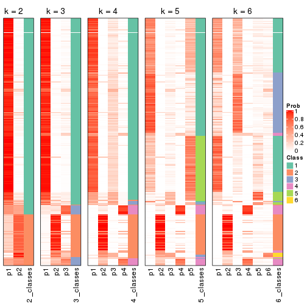


If matrix rows can be associated to genes, consider to use `GO_Enrichment(res,
...)` to perform function enrichment for the signature genes.


 

---------------------------------------------------


### SD:kmeans**


The object with results only for a single top-value method and a single partition method 
can be extracted as:

```r
res = res_list["SD", "kmeans"]
# you can also extract it by
# res = res_list["SD:kmeans"]
```

A summary of `res` and all the functions that can be applied to it:

```r
res
```

```
#> A 'ConsensusPartition' object with k = 2, 3, 4, 5, 6.
#>   On a matrix with 17469 rows and 309 columns.
#>   Top rows (1000, 2000, 3000, 4000, 5000) are extracted by 'SD' method.
#>   Subgroups are detected by 'kmeans' method.
#>   Performed in total 1250 partitions by row resampling.
#>   Best k for subgroups seems to be 2.
#> 
#> Following methods can be applied to this 'ConsensusPartition' object:
#>  [1] "cola_report"             "collect_classes"         "collect_plots"          
#>  [4] "collect_stats"           "colnames"                "compare_signatures"     
#>  [7] "consensus_heatmap"       "dimension_reduction"     "functional_enrichment"  
#> [10] "get_anno_col"            "get_anno"                "get_classes"            
#> [13] "get_consensus"           "get_matrix"              "get_membership"         
#> [16] "get_param"               "get_signatures"          "get_stats"              
#> [19] "is_best_k"               "is_stable_k"             "membership_heatmap"     
#> [22] "ncol"                    "nrow"                    "plot_ecdf"              
#> [25] "rownames"                "select_partition_number" "show"                   
#> [28] "suggest_best_k"          "test_to_known_factors"
```

`collect_plots()` function collects all the plots made from `res` for all `k` (number of partitions)
into one single page to provide an easy and fast comparison between different `k`.

```r
collect_plots(res)
```


The plots are:

- The first row: a plot of the ECDF (Empirical cumulative distribution
  function) curves of the consensus matrix for each `k` and the heatmap of
  predicted classes for each `k`.
- The second row: heatmaps of the consensus matrix for each `k`.
- The third row: heatmaps of the membership matrix for each `k`.
- The fouth row: heatmaps of the signatures for each `k`.

All the plots in panels can be made by individual functions and they are
plotted later in this section.

`select_partition_number()` produces several plots showing different
statistics for choosing "optimized" `k`. There are following statistics:

- ECDF curves of the consensus matrix for each `k`;
- 1-PAC. [The PAC
  score](https://en.wikipedia.org/wiki/Consensus_clustering#Over-interpretation_potential_of_consensus_clustering)
  measures the proportion of the ambiguous subgrouping.
- Mean silhouette score.
- Concordance. The mean probability of fiting the consensus class ids in all
  partitions.
- Area increased. Denote $A_k$ as the area under the ECDF curve for current
  `k`, the area increased is defined as $A_k - A_{k-1}$.
- Rand index. The percent of pairs of samples that are both in a same cluster
  or both are not in a same cluster in the partition of k and k-1.
- Jaccard index. The ratio of pairs of samples are both in a same cluster in
  the partition of k and k-1 and the pairs of samples are both in a same
  cluster in the partition k or k-1.

The detailed explanations of these statistics can be found in [the cola
vignette](http://bioconductor.org/packages/devel/bioc/vignettes/cola/inst/doc/cola.html#toc_13).

Generally speaking, lower PAC score, higher mean silhouette score or higher
concordance corresponds to better partition. Rand index and Jaccard index
measure how similar the current partition is compared to partition with `k-1`.
If they are too similar, we won't accept `k` is better than `k-1`.

```r
select_partition_number(res)
```


The numeric values for all these statistics can be obtained by `get_stats()`.

```r
get_stats(res)
```

```
#>   k 1-PAC mean_silhouette concordance area_increased  Rand Jaccard
#> 2 2 1.000           0.990       0.996         0.3928 0.609   0.609
#> 3 3 0.594           0.804       0.886         0.5567 0.755   0.602
#> 4 4 0.611           0.690       0.773         0.1638 0.779   0.491
#> 5 5 0.684           0.737       0.817         0.0900 0.931   0.757
#> 6 6 0.681           0.601       0.761         0.0492 0.943   0.762
```

`suggest_best_k()` suggests the best $k$ based on these statistics. The rules are as follows:

- All $k$ with Jaccard index larger than 0.95 are removed because the increase of
  the partition number does not provides enough extra information. If all $k$ are removed,
  the best $k$ is assigned by `NA`.
- For $k$ with 1-PAC larger than 0.9, the maximal $k$ is taken as the "best k". Other $k$ is called "optional k".
- If it does not fit the second rule. The $k$ with the highest vote of highest
  1-PAC, mean silhouette and concordance is taken as the "best k".

```r
suggest_best_k(res)
```

```
#> [1] 2
```


Following shows the table of the partitions (You need to click the **show/hide
code output** link to see it). The membership matrix (columns with name `p*`)
is inferred by
[`clue::cl_consensus()`](https://www.rdocumentation.org/link/cl_consensus?package=clue)
function with the `SE` method. Basically the value in the membership matrix
represents the probability to belong to a certain group. The finall class
label for an item is determined with the group with highest probability it
belongs to.

In `get_classes()` function, the entropy is calculated from the membership
matrix and the silhouette score is calculated from the consensus matrix.


<script>
$( function() {
	$( '#tabs-SD-kmeans-get-classes' ).tabs();
} );
</script>
<div id='tabs-SD-kmeans-get-classes'>
<ul>
<li><a href='#tab-SD-kmeans-get-classes-1'>k = 2</a></li>
<li><a href='#tab-SD-kmeans-get-classes-2'>k = 3</a></li>
<li><a href='#tab-SD-kmeans-get-classes-3'>k = 4</a></li>
<li><a href='#tab-SD-kmeans-get-classes-4'>k = 5</a></li>
<li><a href='#tab-SD-kmeans-get-classes-5'>k = 6</a></li>
</ul>

<div id='tab-SD-kmeans-get-classes-1'>
<p><a id='tab-SD-kmeans-get-classes-1-a' style='color:#0366d6' href='#'>show/hide code output</a></p>
<pre><code class="r">cbind(get_classes(res, k = 2), get_membership(res, k = 2))
</code></pre>

<pre><code>#&gt;                                      class entropy silhouette    p1    p2
#&gt; 7826AE44-B03A-4528-9CB5-7421E592AE36     1  0.0672      0.989 0.992 0.008
#&gt; 0DC2197B-2FEA-48EB-953E-8E44E1933757     1  0.0000      0.996 1.000 0.000
#&gt; 87ABB098-8C1E-4677-8C31-48B71EFE41C7     1  0.0000      0.996 1.000 0.000
#&gt; EC0154E7-7A27-4535-83AE-6B379E99A93C     1  0.0000      0.996 1.000 0.000
#&gt; 78F79407-D49F-4FA2-B09F-0665C502827C     1  0.0000      0.996 1.000 0.000
#&gt; 03E81178-E971-4E91-8BED-D8273EA1425C     1  0.0000      0.996 1.000 0.000
#&gt; 62FCAEFF-16D8-4019-84B6-18EC3A88BC32     2  0.0000      0.995 0.000 1.000
#&gt; 722C1284-5983-4CC1-B19C-214C2DE6F8A6     2  0.0000      0.995 0.000 1.000
#&gt; 54E42A64-B350-4A94-8FED-C9BC1872660E     1  0.0000      0.996 1.000 0.000
#&gt; 53062969-D209-490B-9C9B-5D297625E2AE     1  0.0000      0.996 1.000 0.000
#&gt; B710293C-41D3-4A2E-8104-5402F91DD859     1  0.0000      0.996 1.000 0.000
#&gt; 73CB1D05-7AE4-457D-B4EF-25AC5C1F2132     1  0.0000      0.996 1.000 0.000
#&gt; B055A70B-3003-47CB-BDAA-6378C000BF24     1  0.0000      0.996 1.000 0.000
#&gt; 46C3A870-E37A-42CB-8C0C-6ACACEAC1ADC     2  0.0000      0.995 0.000 1.000
#&gt; E8E6270E-F26D-4F2E-A63E-7885BDE05FDB     1  0.0000      0.996 1.000 0.000
#&gt; C4A5EBA2-9091-4D12-BDC8-B84B122022B9     1  0.0000      0.996 1.000 0.000
#&gt; 5B1839C4-549D-41D1-B559-3C6D2A1528CE     1  0.0000      0.996 1.000 0.000
#&gt; A0DF05EB-DC44-4492-9A8A-F278F7B0C266     1  0.0000      0.996 1.000 0.000
#&gt; B5182F49-70F2-45B7-82DE-C6DA68145EEA     1  0.0000      0.996 1.000 0.000
#&gt; C204D355-B876-4341-A111-36D48CBDD2A8     1  0.0000      0.996 1.000 0.000
#&gt; 7B070AAA-EF97-4D3B-AA19-EEC170C7927D     2  0.0000      0.995 0.000 1.000
#&gt; 05A8A881-F8EE-48A2-B11C-A08D7D80CE18     1  0.0000      0.996 1.000 0.000
#&gt; BA59EF50-CFE9-456D-B1B6-67D0945004F6     1  0.0000      0.996 1.000 0.000
#&gt; AD97B334-E034-4D33-A4D5-48C32D5D521C     1  0.0000      0.996 1.000 0.000
#&gt; 51DA2568-32EA-4668-9876-4B6E7CA68860     1  0.0000      0.996 1.000 0.000
#&gt; 78C26A05-2084-494D-83D3-C52C1B800F4C     1  0.0000      0.996 1.000 0.000
#&gt; 2B5DD791-7692-4721-9519-7D7D49B52570     1  0.0000      0.996 1.000 0.000
#&gt; C0BBE26A-79C8-4392-9978-7C420B3786B5     1  0.0000      0.996 1.000 0.000
#&gt; F35A8359-3A7A-414F-8A5C-D278F3B45387     2  0.0000      0.995 0.000 1.000
#&gt; 8C9BA49C-1270-491D-A234-AE1B1C0609BA     2  0.0000      0.995 0.000 1.000
#&gt; CA104B57-B160-4148-8A0A-D34BB3E8D88A     1  0.0000      0.996 1.000 0.000
#&gt; 877E18A5-6A7A-4E29-9871-DC7EA14A5F27     1  0.0000      0.996 1.000 0.000
#&gt; 904EDF2E-411E-43BD-901D-46129AFA283A     1  0.0000      0.996 1.000 0.000
#&gt; FD9F5A9B-2BEB-4D31-9A2D-8D4B4ECBB478     1  0.0000      0.996 1.000 0.000
#&gt; 2E206314-9928-456E-B7C6-893DC0E3C7C2     2  0.0000      0.995 0.000 1.000
#&gt; 913DB655-2C7F-4369-83DE-9257F04CF39B     1  0.0000      0.996 1.000 0.000
#&gt; 72B5B724-FEB5-43BD-83F6-2E2152DDD800     1  0.0000      0.996 1.000 0.000
#&gt; 920B547C-6898-446C-AAAF-F4ED96E40AAB     2  0.0000      0.995 0.000 1.000
#&gt; 847F796A-8CD6-4013-A0FB-26F4FC3EAF0D     1  0.0000      0.996 1.000 0.000
#&gt; C4D64E7A-33F7-4CFC-9FD3-D6AA3D8EFAA7     1  0.0000      0.996 1.000 0.000
#&gt; EABA0B17-8E19-48C5-BF62-2A45C9632807     2  0.0000      0.995 0.000 1.000
#&gt; 7263CBA8-CE37-4531-A795-9324C6D2A672     1  0.0000      0.996 1.000 0.000
#&gt; 6D3CC3AC-618B-414A-B640-169C735A6568     1  0.0000      0.996 1.000 0.000
#&gt; 710C05C7-F9CE-45FA-A8CC-29DE2903E04F     1  0.0000      0.996 1.000 0.000
#&gt; 3D631A56-2C55-48EA-A667-BA46023C9D50     1  0.0000      0.996 1.000 0.000
#&gt; F1C65F64-AF05-4875-B7E4-60FFF56A3F46     1  0.0000      0.996 1.000 0.000
#&gt; E5DF76E7-A765-4E07-B87A-06168BF66C5F     1  0.0000      0.996 1.000 0.000
#&gt; 5C8C8A6E-40D4-4F82-AC3D-90CFDEE15C0A     2  0.0000      0.995 0.000 1.000
#&gt; 0117CBB9-1BF9-48B1-BE6E-A9A770FF8721     1  0.0000      0.996 1.000 0.000
#&gt; 31EF66E5-419A-44C3-BB2A-B69B52FFCECC     2  0.0000      0.995 0.000 1.000
#&gt; C149CEF5-61F3-4B53-B8A9-8244B673EBD0     1  0.0000      0.996 1.000 0.000
#&gt; 0AF351D0-4EC5-4275-AA0A-4FA2AF8A9C85     2  0.0000      0.995 0.000 1.000
#&gt; B507E82F-6680-497B-A014-033EDD7A2E03     1  0.0000      0.996 1.000 0.000
#&gt; F941890E-AB33-478F-8C97-1C785DD9428F     1  0.0000      0.996 1.000 0.000
#&gt; 7987E019-8FED-469B-A6C1-34EE430A60C3     1  0.0000      0.996 1.000 0.000
#&gt; 76084AA6-19BF-4605-B6A1-73F1D4BADAF9     1  0.0000      0.996 1.000 0.000
#&gt; 329807F7-E0D4-4F53-94E8-E4080E90CB47     1  0.0000      0.996 1.000 0.000
#&gt; 1B6505FF-C1A7-4DD0-9827-41A0A3A28F3E     1  0.0000      0.996 1.000 0.000
#&gt; 49778E92-B5D3-4AD9-A1AF-3B722D631B96     2  0.0000      0.995 0.000 1.000
#&gt; A22892DE-0AF4-4B63-9513-1D6825059040     1  0.0000      0.996 1.000 0.000
#&gt; 6D77ECAE-A715-4ADD-97D8-A916DC31A4EA     1  0.0000      0.996 1.000 0.000
#&gt; 09758B6F-1B2D-4AED-8913-696097069409     1  0.0000      0.996 1.000 0.000
#&gt; 8B709DB4-0B28-42F1-A7C5-106F5809BEA2     1  0.0000      0.996 1.000 0.000
#&gt; F2B356FA-79CD-4867-8ABF-84C90A493A75     1  0.0000      0.996 1.000 0.000
#&gt; 131213AD-0313-4DF1-B013-CE67ED262C37     2  0.0000      0.995 0.000 1.000
#&gt; D94F7E81-0F60-473B-AD4A-0AC13508BDE2     1  0.0000      0.996 1.000 0.000
#&gt; 29C17355-D646-48DA-9E54-7B6DD85DD610     1  0.0000      0.996 1.000 0.000
#&gt; B8BD866A-2A7C-45C3-96BB-9AB892D26AE5     1  0.0000      0.996 1.000 0.000
#&gt; 13EFD045-AD61-41EE-9896-67BFA4FC8C09     1  0.0000      0.996 1.000 0.000
#&gt; 2655F609-B3BB-4D01-B421-D5F4B1232EC8     2  0.0000      0.995 0.000 1.000
#&gt; 04BC7A52-C67F-42CB-8672-D3C51A20F2BA     1  0.0000      0.996 1.000 0.000
#&gt; 45472BD4-DBDB-41FE-B0E3-2440880E1DE6     1  0.0000      0.996 1.000 0.000
#&gt; B87FFFCD-CB57-4ACD-9C74-AB188984BBB2     1  0.0000      0.996 1.000 0.000
#&gt; 5271374C-13CD-4BFE-AC6D-C95AFE491322     1  0.0000      0.996 1.000 0.000
#&gt; E3372ACE-C7C8-43E5-B30A-1F2D662D8170     1  0.0000      0.996 1.000 0.000
#&gt; B08DF564-E4D0-4540-8160-93B3981DF1D8     1  0.0000      0.996 1.000 0.000
#&gt; 61A7D1B9-FC5A-4B9C-989F-936CDA948C27     1  0.0000      0.996 1.000 0.000
#&gt; 74E768C1-8766-46AC-AAB4-D79E5049F76A     2  0.0000      0.995 0.000 1.000
#&gt; 0CEA28F0-D7F0-4EB7-A23F-0C5CA6245971     1  0.0000      0.996 1.000 0.000
#&gt; 95C4EFF6-147C-48EC-A2C1-16B8F12AEEF2     2  0.0000      0.995 0.000 1.000
#&gt; C9A78BEA-D455-4F5E-8B7B-19BCB42887E7     1  0.0000      0.996 1.000 0.000
#&gt; DB970740-9AC1-4C10-9658-8A77B1C390DD     2  0.1414      0.977 0.020 0.980
#&gt; 883FBD37-0CA0-4562-8925-72ACC1EE93D9     1  0.0000      0.996 1.000 0.000
#&gt; 9FE1D006-49F2-471E-91E6-AF0414C24479     1  0.0000      0.996 1.000 0.000
#&gt; 11816CC6-8C8B-49C0-99EE-896377BCFCCD     1  0.0000      0.996 1.000 0.000
#&gt; 063FC5C8-4318-4ECC-9CA0-1976CBC8ACB6     1  0.0000      0.996 1.000 0.000
#&gt; E0F085CC-B90D-4FDE-B60E-C613971BAA00     1  0.0000      0.996 1.000 0.000
#&gt; 62361DA2-E4EE-46DA-BB1F-C51DCA9307CC     2  0.0000      0.995 0.000 1.000
#&gt; 1BA16D48-B09E-4699-A1AD-2FFECE4F3CDB     2  0.0000      0.995 0.000 1.000
#&gt; 3E4F14E9-60AE-4F17-9BA7-2A02E908204A     1  0.0000      0.996 1.000 0.000
#&gt; 79226DD7-BC85-4B8E-BFF8-B1E073129D34     1  0.0000      0.996 1.000 0.000
#&gt; D47D0936-826F-4D54-9225-F71B95357438     1  0.0000      0.996 1.000 0.000
#&gt; 0AE02B91-574C-4165-BA39-E9D7C1A870A2     2  0.0000      0.995 0.000 1.000
#&gt; DED8E9DF-CEFE-45ED-9374-EF9925A135C4     1  0.0000      0.996 1.000 0.000
#&gt; D587A993-3C47-4D4C-B744-59169D4F7451     1  0.0000      0.996 1.000 0.000
#&gt; 6BCA24E6-440F-42C5-ABE5-66C37B713A39     1  0.0000      0.996 1.000 0.000
#&gt; 86A5EDFB-9D06-4FED-BF57-F8D74A68E156     1  0.0000      0.996 1.000 0.000
#&gt; B9BD5134-2F6A-4454-8F83-69B63F9AE114     1  0.0000      0.996 1.000 0.000
#&gt; 082DA9E1-A40D-482B-8E21-A93BA97185F0     1  0.0000      0.996 1.000 0.000
#&gt; 16A8343A-1203-44FB-9F03-05CC7C71B4CC     1  0.0000      0.996 1.000 0.000
#&gt; 00439565-02CE-4BF5-956D-7078B51C0947     1  0.0000      0.996 1.000 0.000
#&gt; 7B2BD361-2BF1-4E97-BC08-457F5A9C2682     2  0.0000      0.995 0.000 1.000
#&gt; C1D8439A-D527-47F6-ADC1-25867B65DA21     2  0.0000      0.995 0.000 1.000
#&gt; D9096909-1439-462D-B69C-CAD1BF4F420C     1  0.0000      0.996 1.000 0.000
#&gt; 7822EA86-35A1-4285-9429-2B63111B9885     1  0.0000      0.996 1.000 0.000
#&gt; 6FD0CFC8-AC8D-4CF1-8C33-833AD98A30EF     2  0.0000      0.995 0.000 1.000
#&gt; A451F278-5E83-4BC6-9B15-3AA2117B99B6     2  0.7056      0.766 0.192 0.808
#&gt; 6EC25686-4547-459C-9E01-7EDF8DAECE35     1  0.0000      0.996 1.000 0.000
#&gt; 5D2F1EEA-2BA8-4C3A-8436-544EE1D23E7E     1  0.0000      0.996 1.000 0.000
#&gt; 675A4293-A4CE-4307-B00B-DFC4D44A87C6     2  0.0000      0.995 0.000 1.000
#&gt; 6FBE0AEF-476A-42B2-A857-846CF1ED92B6     2  0.0000      0.995 0.000 1.000
#&gt; 7139D616-1A15-4288-A9AE-411856A4A76D     1  0.0000      0.996 1.000 0.000
#&gt; 46D7F8C1-D5C5-40CC-BEF5-2E590A847BD9     1  0.0000      0.996 1.000 0.000
#&gt; 984C44D3-4F5F-44C9-BCD9-C991EBC1FCB8     1  0.0000      0.996 1.000 0.000
#&gt; 83FE52E0-2DC2-4580-8BB2-FBCBEE4AC240     1  0.0000      0.996 1.000 0.000
#&gt; 0923F9CB-DF6F-4BAA-A5F8-0F83CE60D1ED     1  0.0000      0.996 1.000 0.000
#&gt; 1DEB5206-78CC-4EB5-BCD5-85A6A5B4E273     1  0.0000      0.996 1.000 0.000
#&gt; E4DB18DA-EB0C-4B2F-9566-7F72222B16D4     1  0.0000      0.996 1.000 0.000
#&gt; F7456312-1309-4B2F-875D-0F90CDF3EC35     1  0.0000      0.996 1.000 0.000
#&gt; 9A25E5D8-0706-4960-A76B-BCD0AC93E4FA     1  0.0000      0.996 1.000 0.000
#&gt; 5A41FE8F-FFB3-4B87-BF11-A570C184096D     1  0.0000      0.996 1.000 0.000
#&gt; 33F84E63-3F6C-4867-ADB1-A0DF39F1295B     1  0.0000      0.996 1.000 0.000
#&gt; D6A644F5-D1D0-4A8D-94C4-EE6C3ECE7430     1  0.0000      0.996 1.000 0.000
#&gt; 2A5848CC-A9A2-4AA8-A752-321273E62CF0     1  0.0000      0.996 1.000 0.000
#&gt; 7CA6358B-FC8A-4675-B092-9E061038FC83     1  0.0000      0.996 1.000 0.000
#&gt; A4C2F4BC-5C62-4B1F-9AB8-46D9468EF523     2  0.0000      0.995 0.000 1.000
#&gt; 8AF4EB7F-418D-4CC9-A9B8-A93A4C1A173B     2  0.0000      0.995 0.000 1.000
#&gt; E5048887-70C8-468F-881E-2EC55F6E6F3B     1  0.0000      0.996 1.000 0.000
#&gt; 1BADCC7C-C4D8-4C34-9534-59D622C7A2A2     1  0.0000      0.996 1.000 0.000
#&gt; 02CE7DF7-64BD-4297-A240-A5B9EE8771D3     1  0.0000      0.996 1.000 0.000
#&gt; CBF6E96A-F56C-4C87-B851-D319930BAAB8     1  0.0000      0.996 1.000 0.000
#&gt; 48F6B774-CFD2-4DDF-B7A2-696596413C3F     1  0.0000      0.996 1.000 0.000
#&gt; 41D88C3E-5848-4B09-8A77-EAE6AC4EC6B0     2  0.0000      0.995 0.000 1.000
#&gt; BDF79CC0-00C7-49C1-900B-AB065A733B17     1  0.0000      0.996 1.000 0.000
#&gt; A894D686-BFC7-4AEE-A794-DBE718C6B6F6     2  0.0000      0.995 0.000 1.000
#&gt; 0712029E-3765-4272-BE5B-B6C8BCCC0F0F     2  0.0000      0.995 0.000 1.000
#&gt; 7B051855-9B09-4887-9BC0-9F077537938E     1  0.0000      0.996 1.000 0.000
#&gt; EF357C46-5C3C-4F51-9383-FF7694D07B97     2  0.0000      0.995 0.000 1.000
#&gt; 9492A322-37CA-4582-AC68-66B5D80778AF     2  0.0000      0.995 0.000 1.000
#&gt; 993399A4-1B9F-4258-B2D0-155AD58A2E82     1  0.0000      0.996 1.000 0.000
#&gt; 7B7DC93D-5494-4E69-BE07-2967887182F9     1  0.0000      0.996 1.000 0.000
#&gt; 29BCBA51-2580-473D-9CF7-BEDBD0DBAD1B     2  0.0000      0.995 0.000 1.000
#&gt; 40855647-E942-4F32-90B7-BEB921929BFB     1  0.0000      0.996 1.000 0.000
#&gt; 0DC723D0-7C68-4495-A4B9-2DF2FF19AB14     2  0.0000      0.995 0.000 1.000
#&gt; 7540005F-57E0-4E2E-A8A2-BEF2B0F333B1     2  0.0000      0.995 0.000 1.000
#&gt; EB1DDB14-4076-4C2C-B911-390C17C21486     1  0.0000      0.996 1.000 0.000
#&gt; 9EA70EC4-8BA0-4E3D-B3CB-A68D19E89868     1  0.0000      0.996 1.000 0.000
#&gt; B04E2E50-0A6E-4224-A825-1714D12E5669     2  0.0000      0.995 0.000 1.000
#&gt; B0BF5E01-536D-40FF-9C24-CBBD611E2FC2     1  0.0000      0.996 1.000 0.000
#&gt; 7B6B1788-B297-4442-B6BE-B7CE8754491E     1  0.0000      0.996 1.000 0.000
#&gt; A090D00C-34DF-4906-A517-4803C4C9A332     1  0.0000      0.996 1.000 0.000
#&gt; 340D44A6-9BEA-412C-9973-D9ABD6692255     1  0.0000      0.996 1.000 0.000
#&gt; E8D0D1E7-E5A8-4014-80C1-0245F90F4358     2  0.0000      0.995 0.000 1.000
#&gt; 19EA1494-8572-40E1-B9BB-3739F47B607D     1  0.0000      0.996 1.000 0.000
#&gt; 1C1B4793-8DAF-4763-BA4D-C4E869A4ED35     1  0.0000      0.996 1.000 0.000
#&gt; 45BF59B3-95BD-4196-ABAA-4C4F0DB38572     2  0.0000      0.995 0.000 1.000
#&gt; 47B5A2A7-7E13-4558-99D2-067F5075C6A4     1  0.0000      0.996 1.000 0.000
#&gt; E94638E8-CB51-4FBB-8BCB-4BFD7A812291     1  0.0000      0.996 1.000 0.000
#&gt; A17352A8-0D3C-4545-8136-7DAE2FB0E102     2  0.0000      0.995 0.000 1.000
#&gt; B18A6F95-D4ED-416B-B5A1-9A4934865D0D     2  0.0000      0.995 0.000 1.000
#&gt; 33E92C5F-0C42-4549-AD5B-0A064182A272     1  0.0000      0.996 1.000 0.000
#&gt; E041B375-3E60-4F18-A6EF-D1C249E3B8EE     1  0.0000      0.996 1.000 0.000
#&gt; EDF90AF6-6C64-4BD2-AADF-8D7D188650B2     2  0.0000      0.995 0.000 1.000
#&gt; 569320D2-316C-4E2D-B7B3-D7D5C4DAD42D     1  0.0000      0.996 1.000 0.000
#&gt; AFFB223D-DAE9-4567-9EF2-8E4DF9D8782D     2  0.0000      0.995 0.000 1.000
#&gt; 56FC9454-0A6A-4CC3-95C4-BE0E0D0BAFCE     2  0.0000      0.995 0.000 1.000
#&gt; 43226365-FAEF-46C5-AF1B-5C6C2BED84FF     1  0.0000      0.996 1.000 0.000
#&gt; 1536110A-B42A-4A84-9474-9895321FDCE9     2  0.0000      0.995 0.000 1.000
#&gt; 812255DD-536B-4216-90B1-27D5AB339BE2     1  0.0000      0.996 1.000 0.000
#&gt; 5D4563D6-68B7-4C9D-A3F4-AA7D45D5112C     2  0.0000      0.995 0.000 1.000
#&gt; BAA39781-DB94-473C-98B1-FA6CD3E1C67A     1  0.0000      0.996 1.000 0.000
#&gt; C1411CDA-814D-4E21-8929-C0F77858828F     1  0.0000      0.996 1.000 0.000
#&gt; EFE2F248-C13E-4E8D-9153-8C903848AC4A     1  0.0000      0.996 1.000 0.000
#&gt; D3939C84-D1D6-4060-9F91-AEB222A9BDD5     1  0.0000      0.996 1.000 0.000
#&gt; EABD2987-8C1E-49E5-94AF-C0BDE5335A48     1  0.0000      0.996 1.000 0.000
#&gt; F4BE2ABE-2CEB-4A6A-B8EC-0355F8C63B9B     1  0.0000      0.996 1.000 0.000
#&gt; 627BC251-D217-4955-B718-6B9D6DEA1756     1  0.0000      0.996 1.000 0.000
#&gt; 31B54613-A20E-4039-BB8B-9B52104CE418     1  0.0000      0.996 1.000 0.000
#&gt; 3F292B7C-A535-4DBD-BC20-CB4F85A1C94B     1  0.0000      0.996 1.000 0.000
#&gt; BEA2A5EB-EEA9-4F31-AC38-810E04CE124B     2  0.0000      0.995 0.000 1.000
#&gt; 99D84D46-19DA-43F1-B639-DCE9953F1529     2  0.0000      0.995 0.000 1.000
#&gt; 4588817E-1068-4A78-86B6-4674A0112DDA     1  0.0000      0.996 1.000 0.000
#&gt; 6AC633BD-BEC1-4750-94E3-378972DAB6B3     2  0.0000      0.995 0.000 1.000
#&gt; 09E17C6E-7EDE-4DDF-B5ED-2521AF870C9A     1  0.0000      0.996 1.000 0.000
#&gt; 58D9C750-26A2-4B7C-84C4-13D7AFB4C5EA     1  0.0000      0.996 1.000 0.000
#&gt; DF28E138-E222-4F77-9B61-69E601CA7E60     2  0.0000      0.995 0.000 1.000
#&gt; FEA489A8-E423-4266-AADA-9BAAB29AB94B     1  0.0000      0.996 1.000 0.000
#&gt; F3FCC207-15CD-41EA-A3EF-F5D2C12AC373     1  0.0000      0.996 1.000 0.000
#&gt; 53DD7AFB-A258-4643-A501-BACC95D17A50     2  0.0000      0.995 0.000 1.000
#&gt; D850B2A1-1F8A-4A44-A0CF-8D9DD4A1889A     2  0.0000      0.995 0.000 1.000
#&gt; B3F746DC-E487-4305-9F30-825D1520E8FD     2  0.0000      0.995 0.000 1.000
#&gt; BE38240A-F7C2-439F-9AAE-51C8A340F310     1  0.0000      0.996 1.000 0.000
#&gt; A9022D9E-1D30-49EE-8552-1364A8027F34     1  0.0000      0.996 1.000 0.000
#&gt; 0E8A56EE-D9A2-48A5-B793-A358BE1E4EFA     1  0.0000      0.996 1.000 0.000
#&gt; 51667574-318E-4BDB-8F42-8512A4C1B84F     1  0.0000      0.996 1.000 0.000
#&gt; B0A442C9-67E4-4534-8A5C-D6D73F42358C     1  0.0000      0.996 1.000 0.000
#&gt; 25A5BC09-0D88-4385-87AF-997F9018522D     2  0.0000      0.995 0.000 1.000
#&gt; 344B9631-AAA5-4302-8747-D584345D9131     1  0.0000      0.996 1.000 0.000
#&gt; 1C3795AD-6306-4892-95F5-92DF3375D46A     1  0.0000      0.996 1.000 0.000
#&gt; 17BB221D-8BF9-4391-83DD-423AE1E03651     1  0.0000      0.996 1.000 0.000
#&gt; 297611E9-9555-4BCA-A723-02E846ACC23A     1  0.0000      0.996 1.000 0.000
#&gt; AD7FF180-1EAC-4783-8A62-E9626B96DD9F     2  0.3274      0.936 0.060 0.940
#&gt; FD544083-9BD5-4036-BD81-0352B67CC45C     1  0.0000      0.996 1.000 0.000
#&gt; 879A74D5-5B29-418D-A0F4-8E88D6384008     1  0.0000      0.996 1.000 0.000
#&gt; 43CD982C-13C0-4A52-803A-9A3A3FAE09BC     1  0.0000      0.996 1.000 0.000
#&gt; DCD0313D-5206-4111-8743-A8A0227257D9     1  0.0000      0.996 1.000 0.000
#&gt; 331A9160-D730-45DD-A985-C6CAC03035ED     1  0.0000      0.996 1.000 0.000
#&gt; 9EEECA0E-530D-4724-B016-A716F0782148     1  0.0000      0.996 1.000 0.000
#&gt; B3073976-CA3F-4115-9243-8C2D9E1B975D     1  0.0000      0.996 1.000 0.000
#&gt; 77B3C9B4-1A7F-41BB-A37D-01EF80E933CC     2  0.0000      0.995 0.000 1.000
#&gt; C0C26822-2E9F-4FB0-81D4-575027C8B71C     2  0.0000      0.995 0.000 1.000
#&gt; F1FCE328-2B3B-499A-888D-0E66A017E8B0     1  0.0000      0.996 1.000 0.000
#&gt; F069DAD6-F1EB-42F7-8252-F3F6EC46CC3E     1  0.0000      0.996 1.000 0.000
#&gt; 99CC822E-8C98-4EEC-BB58-AEF76A0B5332     1  0.0000      0.996 1.000 0.000
#&gt; C86EBD08-53F2-4972-801A-74970FDD6A62     1  0.0000      0.996 1.000 0.000
#&gt; F07326F2-C1D6-4D5A-9693-25C3A04B0EC2     1  0.0000      0.996 1.000 0.000
#&gt; 8ACBD428-7713-48D9-810A-43C9CD191A73     2  0.0000      0.995 0.000 1.000
#&gt; 3D3501B4-1A43-4FA7-90A2-CCEBF66BFD4A     1  0.0000      0.996 1.000 0.000
#&gt; DD51C17C-300F-44A4-955A-C9BC85417842     1  0.0672      0.989 0.992 0.008
#&gt; 58FF391C-1D83-426C-8F92-C15F78F56C95     1  0.0000      0.996 1.000 0.000
#&gt; ACE65C6E-2B10-4972-91B4-9199DD4B179D     1  0.0000      0.996 1.000 0.000
#&gt; B2088466-FA5D-491C-9982-99B33683E66F     2  0.0000      0.995 0.000 1.000
#&gt; D47AF416-1687-4FE0-A235-8815B6E8EB0B     1  0.0000      0.996 1.000 0.000
#&gt; 4DCAD07F-CC43-46F6-B2F3-EDBF3EDD1045     2  0.0000      0.995 0.000 1.000
#&gt; AAAE0BD9-63FC-4A0E-A27E-447B634BAD99     2  0.0000      0.995 0.000 1.000
#&gt; BC471AA1-52CF-4CEE-9866-34CE91404F45     2  0.0000      0.995 0.000 1.000
#&gt; 81D3EE3F-AC11-404F-8092-307F0DC12198     1  0.0000      0.996 1.000 0.000
#&gt; 8C02026C-C25E-406B-B8B8-A1A82362AE79     1  0.9427      0.437 0.640 0.360
#&gt; 6A005F2A-A0C1-4CA4-B15B-96B08F013874     1  0.0000      0.996 1.000 0.000
#&gt; B55743F2-4D63-4375-85D3-F58281CFD852     1  0.0000      0.996 1.000 0.000
#&gt; 24F98393-C817-4D0E-A7DB-05D2B5C71F40     1  0.0000      0.996 1.000 0.000
#&gt; 2C2AEF1D-4112-4EC7-9027-5E3FD26E8802     1  0.0000      0.996 1.000 0.000
#&gt; 8BAC3CB5-2987-4349-8AE8-B83DDD16CA3C     1  0.0000      0.996 1.000 0.000
#&gt; ED9C74E6-92FC-4E58-8FCE-1761DEA0C977     1  0.0000      0.996 1.000 0.000
#&gt; BA732ED4-F6BA-404E-BA3C-CA558FAD866A     1  0.0000      0.996 1.000 0.000
#&gt; E750385A-12D9-4A88-B4DF-C1306B5EF3B7     2  0.0000      0.995 0.000 1.000
#&gt; 6B1DC5E4-5F82-4395-913F-6AEDB5B63188     1  0.0000      0.996 1.000 0.000
#&gt; A7C12D37-FD50-4674-A054-1774F4E5C3B3     1  0.0000      0.996 1.000 0.000
#&gt; 2155C764-2063-4D9C-9ACD-96AA73475F5E     1  0.0000      0.996 1.000 0.000
#&gt; DE23CC15-A95E-4119-9B3C-8EEC45900D11     2  0.0000      0.995 0.000 1.000
#&gt; 5DB1DCAD-638E-48A4-9F40-3D6268FDEC33     2  0.0000      0.995 0.000 1.000
#&gt; 34AF0341-73D7-4080-AAEB-4C1541C2569F     1  0.0000      0.996 1.000 0.000
#&gt; B60D4235-44AF-4BA4-98C0-BCCDC28E90B9     2  0.0000      0.995 0.000 1.000
#&gt; CF463D89-2C9F-4257-BF04-8BC1CD40EA7D     2  0.0000      0.995 0.000 1.000
#&gt; EF6C8165-484A-4530-AEDF-93DCC4A8455D     1  0.0000      0.996 1.000 0.000
#&gt; B9F6B5E4-4D10-49B8-A8FE-8F33C5A62CBF     1  0.0000      0.996 1.000 0.000
#&gt; CE539000-92D7-4622-9C8D-BC6E01310681     2  0.0000      0.995 0.000 1.000
#&gt; D3BBC405-A22A-4009-ABF6-96FEEE653051     2  0.0000      0.995 0.000 1.000
#&gt; 0B3C86BD-0D20-4408-9BE3-05658729505F     1  0.9775      0.299 0.588 0.412
#&gt; 9B9C5071-7C3F-416C-B91C-6F5966747F54     1  0.0000      0.996 1.000 0.000
#&gt; A9469A4A-C5F9-4681-A916-A26F0B4307BA     1  0.0000      0.996 1.000 0.000
#&gt; A31B57E4-E30B-4A1B-829D-1B47D9CEC041     2  0.0000      0.995 0.000 1.000
#&gt; 647255CE-F84A-4070-B3FD-D8ACA32C4D09     1  0.0000      0.996 1.000 0.000
#&gt; 8F5E9F02-51D7-410E-B8B7-22737F2F095A     2  0.0000      0.995 0.000 1.000
#&gt; 8074A7F6-2FDE-4578-B71C-01C542D468FE     1  0.0000      0.996 1.000 0.000
#&gt; 2A946F17-F245-409E-A019-C60CDA18DC7D     1  0.0000      0.996 1.000 0.000
#&gt; 0878C381-47F9-4786-82C2-94AC840BEDCB     1  0.0000      0.996 1.000 0.000
#&gt; 54504893-92C5-4328-85A8-2A882680B5E0     1  0.0000      0.996 1.000 0.000
#&gt; 0A27D1BE-E5DD-459A-A51F-6D8AAF7CFEB4     1  0.0000      0.996 1.000 0.000
#&gt; 89ED5A3E-CAC0-4AB4-B858-A3CD8F34DBD5     2  0.0000      0.995 0.000 1.000
#&gt; ACEEB0A5-AADB-4EF9-8710-4BAF95522CEA     1  0.0000      0.996 1.000 0.000
#&gt; 02C74D81-5976-4252-BC6C-B10E934DECA2     1  0.0000      0.996 1.000 0.000
#&gt; D365A238-4739-4B54-9608-DC548F21C04E     1  0.0000      0.996 1.000 0.000
#&gt; F70F7ED5-A3B7-4210-95AD-DEFA0A565F06     1  0.0000      0.996 1.000 0.000
#&gt; A92C23A9-BC25-4025-9501-6D5FF8E2A502     1  0.0000      0.996 1.000 0.000
#&gt; ECE9BBF4-840E-47A6-8378-0B6C4A2369D3     1  0.0000      0.996 1.000 0.000
#&gt; 38749490-0FCF-4B33-9EBC-8F86C2D9E4AF     1  0.0000      0.996 1.000 0.000
#&gt; 02ABB64E-768B-4999-A899-EEE573D5F186     1  0.0000      0.996 1.000 0.000
#&gt; C1C467A8-18B1-4C3F-AC45-33359ED6FDC4     1  0.0000      0.996 1.000 0.000
#&gt; 78B2E4A1-9DAE-404F-AB47-1896450EF254     1  0.0000      0.996 1.000 0.000
#&gt; CCDB0290-91DA-4089-84A6-4434BA028D30     1  0.0000      0.996 1.000 0.000
#&gt; D5041E80-20A0-4C1A-9AC1-2394F6DB6E92     1  0.0000      0.996 1.000 0.000
#&gt; 20EB9CC6-EABB-438A-9030-E766459996D1     2  0.0000      0.995 0.000 1.000
#&gt; 73E99110-9A7C-4F73-98C5-79D22CB06230     1  0.0000      0.996 1.000 0.000
#&gt; FAD8A464-9BC3-4ED9-9517-B18D36514325     1  0.0000      0.996 1.000 0.000
#&gt; 9AF0E82E-E621-437A-8D19-700532B95090     1  0.0000      0.996 1.000 0.000
#&gt; 27DA48F3-4FC1-41A3-8E49-5B25F1CCFF07     1  0.0000      0.996 1.000 0.000
#&gt; EFE5A302-D138-4044-A301-5C5FD1C24836     1  0.0000      0.996 1.000 0.000
#&gt; D3E866AC-D66A-4C07-9F47-89AF460320DE     2  0.0000      0.995 0.000 1.000
#&gt; 89C45456-9392-4EB3-9A82-A130B6702AAF     1  0.0000      0.996 1.000 0.000
#&gt; 8FF5C8FC-2565-49BE-9EE0-91A84A85AB2A     2  0.0938      0.984 0.012 0.988
#&gt; 846DF088-75D5-49CF-BDDC-27E735A08DCA     1  0.0000      0.996 1.000 0.000
#&gt; EA3A19E1-7ADE-47B6-A35A-71290967147A     2  0.4562      0.895 0.096 0.904
#&gt; B2C43D0C-732B-4C54-938F-D3C9FDA880DA     1  0.0000      0.996 1.000 0.000
#&gt; EEC856B5-9B7F-488D-975E-CE2FF7072879     1  0.0000      0.996 1.000 0.000
#&gt; 8A68C417-09CC-4FA1-BFEB-EB4B738853A4     1  0.0000      0.996 1.000 0.000
#&gt; C5DF1A0D-952C-44E2-BF83-ED57177EF60E     1  0.0000      0.996 1.000 0.000
#&gt; B5C9EA22-F758-4BD2-BD1F-282EC1078AED     2  0.0000      0.995 0.000 1.000
#&gt; 3F08AE92-3EFD-4D7F-8C5C-BFB3621F0CD6     1  0.0000      0.996 1.000 0.000
#&gt; 8F0D43F1-2199-4DBB-9B16-1E5F2CED2FEC     2  0.0000      0.995 0.000 1.000
#&gt; 54BABD8B-EA9F-4875-8594-2179B38C73BD     1  0.0000      0.996 1.000 0.000
#&gt; C149B6F8-03DC-4907-920A-F3318B8D2A1E     1  0.0000      0.996 1.000 0.000
#&gt; F93D26E2-4B45-495D-BC8E-5B592F8FDABF     1  0.0000      0.996 1.000 0.000
#&gt; C98275CD-C39A-4E14-A731-4F3EB7396665     2  0.2948      0.945 0.052 0.948
#&gt; 354DC705-216E-42F0-B29E-C1F8D6C9489A     1  0.0000      0.996 1.000 0.000
#&gt; 6752EED9-7990-433F-A206-D5398C396471     1  0.0000      0.996 1.000 0.000
#&gt; C3E94C5D-68C4-400C-B7CB-38C42E9D5FFF     1  0.0000      0.996 1.000 0.000
#&gt; CE6B6871-3ED3-44DE-A777-7558D4429057     1  0.0000      0.996 1.000 0.000
#&gt; A06E7D1E-E432-4A4C-8BB0-314304F96EDF     1  0.0000      0.996 1.000 0.000
#&gt; 1ABBEF80-508F-4247-B43D-3E549372113B     1  0.0000      0.996 1.000 0.000
#&gt; 835AAE7F-F873-4D11-8845-232D261A38DF     1  0.0000      0.996 1.000 0.000
#&gt; E98A0460-6529-4DBA-8542-1B98801D7A7D     1  0.0000      0.996 1.000 0.000
#&gt; 06A9CBF8-01D0-4720-BCE8-83F0E77C862F     1  0.0000      0.996 1.000 0.000
#&gt; 206865A9-A67C-49A6-93AD-55D06E777559     2  0.0000      0.995 0.000 1.000
#&gt; 26DABC83-DB30-452F-9BE2-366760CB138E     2  0.0000      0.995 0.000 1.000
#&gt; 9DD5272A-2D6E-4774-83E3-0CD761EDE926     1  0.0000      0.996 1.000 0.000
#&gt; 4938E366-C740-4C9C-9358-FF37997DC9EF     1  0.0000      0.996 1.000 0.000
#&gt; E2DA59C4-A47C-41E3-BC55-2D00C6EC17FB     1  0.0000      0.996 1.000 0.000
#&gt; 37349E62-0BFB-4FEA-81D0-2AB7E7625B0D     1  0.0000      0.996 1.000 0.000
</code></pre>

<script>
$('#tab-SD-kmeans-get-classes-1-a').parent().next().next().hide();
$('#tab-SD-kmeans-get-classes-1-a').click(function(){
  $('#tab-SD-kmeans-get-classes-1-a').parent().next().next().toggle();
  return(false);
});
</script>
</div>

<div id='tab-SD-kmeans-get-classes-2'>
<p><a id='tab-SD-kmeans-get-classes-2-a' style='color:#0366d6' href='#'>show/hide code output</a></p>
<pre><code class="r">cbind(get_classes(res, k = 3), get_membership(res, k = 3))
</code></pre>

<pre><code>#&gt;                                      class entropy silhouette    p1    p2    p3
#&gt; 7826AE44-B03A-4528-9CB5-7421E592AE36     3  0.4256     0.7490 0.096 0.036 0.868
#&gt; 0DC2197B-2FEA-48EB-953E-8E44E1933757     3  0.3192     0.8401 0.112 0.000 0.888
#&gt; 87ABB098-8C1E-4677-8C31-48B71EFE41C7     3  0.2878     0.8385 0.096 0.000 0.904
#&gt; EC0154E7-7A27-4535-83AE-6B379E99A93C     1  0.3816     0.8183 0.852 0.000 0.148
#&gt; 78F79407-D49F-4FA2-B09F-0665C502827C     1  0.0892     0.8619 0.980 0.000 0.020
#&gt; 03E81178-E971-4E91-8BED-D8273EA1425C     1  0.0000     0.8624 1.000 0.000 0.000
#&gt; 62FCAEFF-16D8-4019-84B6-18EC3A88BC32     3  0.5754     0.4577 0.004 0.296 0.700
#&gt; 722C1284-5983-4CC1-B19C-214C2DE6F8A6     2  0.0000     0.9521 0.000 1.000 0.000
#&gt; 54E42A64-B350-4A94-8FED-C9BC1872660E     1  0.1860     0.8380 0.948 0.000 0.052
#&gt; 53062969-D209-490B-9C9B-5D297625E2AE     1  0.3816     0.8183 0.852 0.000 0.148
#&gt; B710293C-41D3-4A2E-8104-5402F91DD859     1  0.0000     0.8624 1.000 0.000 0.000
#&gt; 73CB1D05-7AE4-457D-B4EF-25AC5C1F2132     1  0.3816     0.8183 0.852 0.000 0.148
#&gt; B055A70B-3003-47CB-BDAA-6378C000BF24     3  0.3192     0.8401 0.112 0.000 0.888
#&gt; 46C3A870-E37A-42CB-8C0C-6ACACEAC1ADC     2  0.2796     0.9439 0.000 0.908 0.092
#&gt; E8E6270E-F26D-4F2E-A63E-7885BDE05FDB     3  0.3038     0.8360 0.104 0.000 0.896
#&gt; C4A5EBA2-9091-4D12-BDC8-B84B122022B9     3  0.3192     0.8401 0.112 0.000 0.888
#&gt; 5B1839C4-549D-41D1-B559-3C6D2A1528CE     3  0.5216     0.7415 0.260 0.000 0.740
#&gt; A0DF05EB-DC44-4492-9A8A-F278F7B0C266     1  0.3752     0.8208 0.856 0.000 0.144
#&gt; B5182F49-70F2-45B7-82DE-C6DA68145EEA     1  0.0000     0.8624 1.000 0.000 0.000
#&gt; C204D355-B876-4341-A111-36D48CBDD2A8     3  0.6244     0.5047 0.440 0.000 0.560
#&gt; 7B070AAA-EF97-4D3B-AA19-EEC170C7927D     2  0.0000     0.9521 0.000 1.000 0.000
#&gt; 05A8A881-F8EE-48A2-B11C-A08D7D80CE18     1  0.0892     0.8619 0.980 0.000 0.020
#&gt; BA59EF50-CFE9-456D-B1B6-67D0945004F6     1  0.3267     0.8355 0.884 0.000 0.116
#&gt; AD97B334-E034-4D33-A4D5-48C32D5D521C     1  0.3816     0.8183 0.852 0.000 0.148
#&gt; 51DA2568-32EA-4668-9876-4B6E7CA68860     3  0.3192     0.8401 0.112 0.000 0.888
#&gt; 78C26A05-2084-494D-83D3-C52C1B800F4C     1  0.3038     0.8047 0.896 0.000 0.104
#&gt; 2B5DD791-7692-4721-9519-7D7D49B52570     3  0.2796     0.8372 0.092 0.000 0.908
#&gt; C0BBE26A-79C8-4392-9978-7C420B3786B5     3  0.3412     0.8344 0.124 0.000 0.876
#&gt; F35A8359-3A7A-414F-8A5C-D278F3B45387     2  0.0000     0.9521 0.000 1.000 0.000
#&gt; 8C9BA49C-1270-491D-A234-AE1B1C0609BA     2  0.0000     0.9521 0.000 1.000 0.000
#&gt; CA104B57-B160-4148-8A0A-D34BB3E8D88A     1  0.0000     0.8624 1.000 0.000 0.000
#&gt; 877E18A5-6A7A-4E29-9871-DC7EA14A5F27     1  0.0000     0.8624 1.000 0.000 0.000
#&gt; 904EDF2E-411E-43BD-901D-46129AFA283A     1  0.3816     0.8183 0.852 0.000 0.148
#&gt; FD9F5A9B-2BEB-4D31-9A2D-8D4B4ECBB478     1  0.0000     0.8624 1.000 0.000 0.000
#&gt; 2E206314-9928-456E-B7C6-893DC0E3C7C2     2  0.0000     0.9521 0.000 1.000 0.000
#&gt; 913DB655-2C7F-4369-83DE-9257F04CF39B     3  0.6225     0.3143 0.432 0.000 0.568
#&gt; 72B5B724-FEB5-43BD-83F6-2E2152DDD800     1  0.5882     0.2782 0.652 0.000 0.348
#&gt; 920B547C-6898-446C-AAAF-F4ED96E40AAB     2  0.0000     0.9521 0.000 1.000 0.000
#&gt; 847F796A-8CD6-4013-A0FB-26F4FC3EAF0D     1  0.3816     0.8183 0.852 0.000 0.148
#&gt; C4D64E7A-33F7-4CFC-9FD3-D6AA3D8EFAA7     1  0.0892     0.8619 0.980 0.000 0.020
#&gt; EABA0B17-8E19-48C5-BF62-2A45C9632807     2  0.2711     0.9445 0.000 0.912 0.088
#&gt; 7263CBA8-CE37-4531-A795-9324C6D2A672     3  0.3619     0.8347 0.136 0.000 0.864
#&gt; 6D3CC3AC-618B-414A-B640-169C735A6568     3  0.1860     0.8025 0.052 0.000 0.948
#&gt; 710C05C7-F9CE-45FA-A8CC-29DE2903E04F     1  0.3816     0.8183 0.852 0.000 0.148
#&gt; 3D631A56-2C55-48EA-A667-BA46023C9D50     1  0.5785     0.2793 0.668 0.000 0.332
#&gt; F1C65F64-AF05-4875-B7E4-60FFF56A3F46     1  0.2796     0.8159 0.908 0.000 0.092
#&gt; E5DF76E7-A765-4E07-B87A-06168BF66C5F     1  0.0000     0.8624 1.000 0.000 0.000
#&gt; 5C8C8A6E-40D4-4F82-AC3D-90CFDEE15C0A     2  0.0000     0.9521 0.000 1.000 0.000
#&gt; 0117CBB9-1BF9-48B1-BE6E-A9A770FF8721     3  0.3192     0.8401 0.112 0.000 0.888
#&gt; 31EF66E5-419A-44C3-BB2A-B69B52FFCECC     2  0.2796     0.9439 0.000 0.908 0.092
#&gt; C149CEF5-61F3-4B53-B8A9-8244B673EBD0     1  0.3752     0.8208 0.856 0.000 0.144
#&gt; 0AF351D0-4EC5-4275-AA0A-4FA2AF8A9C85     2  0.2796     0.9439 0.000 0.908 0.092
#&gt; B507E82F-6680-497B-A014-033EDD7A2E03     3  0.2959     0.8394 0.100 0.000 0.900
#&gt; F941890E-AB33-478F-8C97-1C785DD9428F     3  0.5529     0.6577 0.296 0.000 0.704
#&gt; 7987E019-8FED-469B-A6C1-34EE430A60C3     1  0.4178     0.7986 0.828 0.000 0.172
#&gt; 76084AA6-19BF-4605-B6A1-73F1D4BADAF9     3  0.2261     0.8280 0.068 0.000 0.932
#&gt; 329807F7-E0D4-4F53-94E8-E4080E90CB47     3  0.2878     0.8385 0.096 0.000 0.904
#&gt; 1B6505FF-C1A7-4DD0-9827-41A0A3A28F3E     1  0.1031     0.8477 0.976 0.000 0.024
#&gt; 49778E92-B5D3-4AD9-A1AF-3B722D631B96     2  0.0747     0.9516 0.000 0.984 0.016
#&gt; A22892DE-0AF4-4B63-9513-1D6825059040     1  0.3816     0.8183 0.852 0.000 0.148
#&gt; 6D77ECAE-A715-4ADD-97D8-A916DC31A4EA     1  0.0000     0.8624 1.000 0.000 0.000
#&gt; 09758B6F-1B2D-4AED-8913-696097069409     1  0.2625     0.8449 0.916 0.000 0.084
#&gt; 8B709DB4-0B28-42F1-A7C5-106F5809BEA2     1  0.6295    -0.3004 0.528 0.000 0.472
#&gt; F2B356FA-79CD-4867-8ABF-84C90A493A75     1  0.3816     0.8183 0.852 0.000 0.148
#&gt; 131213AD-0313-4DF1-B013-CE67ED262C37     2  0.0000     0.9521 0.000 1.000 0.000
#&gt; D94F7E81-0F60-473B-AD4A-0AC13508BDE2     3  0.2796     0.8380 0.092 0.000 0.908
#&gt; 29C17355-D646-48DA-9E54-7B6DD85DD610     1  0.3686     0.8232 0.860 0.000 0.140
#&gt; B8BD866A-2A7C-45C3-96BB-9AB892D26AE5     1  0.3340     0.7527 0.880 0.000 0.120
#&gt; 13EFD045-AD61-41EE-9896-67BFA4FC8C09     3  0.3192     0.8401 0.112 0.000 0.888
#&gt; 2655F609-B3BB-4D01-B421-D5F4B1232EC8     2  0.2796     0.9439 0.000 0.908 0.092
#&gt; 04BC7A52-C67F-42CB-8672-D3C51A20F2BA     1  0.0000     0.8624 1.000 0.000 0.000
#&gt; 45472BD4-DBDB-41FE-B0E3-2440880E1DE6     1  0.0747     0.8560 0.984 0.000 0.016
#&gt; B87FFFCD-CB57-4ACD-9C74-AB188984BBB2     3  0.6225     0.5155 0.432 0.000 0.568
#&gt; 5271374C-13CD-4BFE-AC6D-C95AFE491322     1  0.3816     0.8183 0.852 0.000 0.148
#&gt; E3372ACE-C7C8-43E5-B30A-1F2D662D8170     1  0.4002     0.8089 0.840 0.000 0.160
#&gt; B08DF564-E4D0-4540-8160-93B3981DF1D8     1  0.0000     0.8624 1.000 0.000 0.000
#&gt; 61A7D1B9-FC5A-4B9C-989F-936CDA948C27     1  0.0000     0.8624 1.000 0.000 0.000
#&gt; 74E768C1-8766-46AC-AAB4-D79E5049F76A     2  0.0000     0.9521 0.000 1.000 0.000
#&gt; 0CEA28F0-D7F0-4EB7-A23F-0C5CA6245971     3  0.2711     0.8294 0.088 0.000 0.912
#&gt; 95C4EFF6-147C-48EC-A2C1-16B8F12AEEF2     2  0.2959     0.9402 0.000 0.900 0.100
#&gt; C9A78BEA-D455-4F5E-8B7B-19BCB42887E7     1  0.0892     0.8619 0.980 0.000 0.020
#&gt; DB970740-9AC1-4C10-9658-8A77B1C390DD     3  0.4128     0.6490 0.012 0.132 0.856
#&gt; 883FBD37-0CA0-4562-8925-72ACC1EE93D9     1  0.0424     0.8597 0.992 0.000 0.008
#&gt; 9FE1D006-49F2-471E-91E6-AF0414C24479     1  0.0000     0.8624 1.000 0.000 0.000
#&gt; 11816CC6-8C8B-49C0-99EE-896377BCFCCD     1  0.0892     0.8619 0.980 0.000 0.020
#&gt; 063FC5C8-4318-4ECC-9CA0-1976CBC8ACB6     1  0.0237     0.8631 0.996 0.000 0.004
#&gt; E0F085CC-B90D-4FDE-B60E-C613971BAA00     1  0.3412     0.8251 0.876 0.000 0.124
#&gt; 62361DA2-E4EE-46DA-BB1F-C51DCA9307CC     2  0.2796     0.9439 0.000 0.908 0.092
#&gt; 1BA16D48-B09E-4699-A1AD-2FFECE4F3CDB     2  0.1860     0.9492 0.000 0.948 0.052
#&gt; 3E4F14E9-60AE-4F17-9BA7-2A02E908204A     3  0.4974     0.7515 0.236 0.000 0.764
#&gt; 79226DD7-BC85-4B8E-BFF8-B1E073129D34     1  0.0000     0.8624 1.000 0.000 0.000
#&gt; D47D0936-826F-4D54-9225-F71B95357438     1  0.5363     0.4525 0.724 0.000 0.276
#&gt; 0AE02B91-574C-4165-BA39-E9D7C1A870A2     2  0.2796     0.9439 0.000 0.908 0.092
#&gt; DED8E9DF-CEFE-45ED-9374-EF9925A135C4     3  0.5621     0.7008 0.308 0.000 0.692
#&gt; D587A993-3C47-4D4C-B744-59169D4F7451     1  0.0000     0.8624 1.000 0.000 0.000
#&gt; 6BCA24E6-440F-42C5-ABE5-66C37B713A39     1  0.0000     0.8624 1.000 0.000 0.000
#&gt; 86A5EDFB-9D06-4FED-BF57-F8D74A68E156     3  0.5621     0.6265 0.308 0.000 0.692
#&gt; B9BD5134-2F6A-4454-8F83-69B63F9AE114     1  0.4291     0.8008 0.820 0.000 0.180
#&gt; 082DA9E1-A40D-482B-8E21-A93BA97185F0     1  0.0000     0.8624 1.000 0.000 0.000
#&gt; 16A8343A-1203-44FB-9F03-05CC7C71B4CC     3  0.3192     0.8401 0.112 0.000 0.888
#&gt; 00439565-02CE-4BF5-956D-7078B51C0947     3  0.4399     0.7851 0.188 0.000 0.812
#&gt; 7B2BD361-2BF1-4E97-BC08-457F5A9C2682     2  0.0000     0.9521 0.000 1.000 0.000
#&gt; C1D8439A-D527-47F6-ADC1-25867B65DA21     2  0.0000     0.9521 0.000 1.000 0.000
#&gt; D9096909-1439-462D-B69C-CAD1BF4F420C     1  0.0000     0.8624 1.000 0.000 0.000
#&gt; 7822EA86-35A1-4285-9429-2B63111B9885     1  0.0000     0.8624 1.000 0.000 0.000
#&gt; 6FD0CFC8-AC8D-4CF1-8C33-833AD98A30EF     2  0.0000     0.9521 0.000 1.000 0.000
#&gt; A451F278-5E83-4BC6-9B15-3AA2117B99B6     1  0.1905     0.8355 0.956 0.016 0.028
#&gt; 6EC25686-4547-459C-9E01-7EDF8DAECE35     3  0.3192     0.8401 0.112 0.000 0.888
#&gt; 5D2F1EEA-2BA8-4C3A-8436-544EE1D23E7E     1  0.0000     0.8624 1.000 0.000 0.000
#&gt; 675A4293-A4CE-4307-B00B-DFC4D44A87C6     2  0.2796     0.9439 0.000 0.908 0.092
#&gt; 6FBE0AEF-476A-42B2-A857-846CF1ED92B6     2  0.0000     0.9521 0.000 1.000 0.000
#&gt; 7139D616-1A15-4288-A9AE-411856A4A76D     1  0.0000     0.8624 1.000 0.000 0.000
#&gt; 46D7F8C1-D5C5-40CC-BEF5-2E590A847BD9     3  0.3038     0.8399 0.104 0.000 0.896
#&gt; 984C44D3-4F5F-44C9-BCD9-C991EBC1FCB8     3  0.2796     0.8372 0.092 0.000 0.908
#&gt; 83FE52E0-2DC2-4580-8BB2-FBCBEE4AC240     1  0.5733     0.5560 0.676 0.000 0.324
#&gt; 0923F9CB-DF6F-4BAA-A5F8-0F83CE60D1ED     1  0.0000     0.8624 1.000 0.000 0.000
#&gt; 1DEB5206-78CC-4EB5-BCD5-85A6A5B4E273     1  0.0424     0.8597 0.992 0.000 0.008
#&gt; E4DB18DA-EB0C-4B2F-9566-7F72222B16D4     1  0.0000     0.8624 1.000 0.000 0.000
#&gt; F7456312-1309-4B2F-875D-0F90CDF3EC35     1  0.3816     0.8183 0.852 0.000 0.148
#&gt; 9A25E5D8-0706-4960-A76B-BCD0AC93E4FA     1  0.1031     0.8620 0.976 0.000 0.024
#&gt; 5A41FE8F-FFB3-4B87-BF11-A570C184096D     1  0.4974     0.7365 0.764 0.000 0.236
#&gt; 33F84E63-3F6C-4867-ADB1-A0DF39F1295B     1  0.4750     0.7483 0.784 0.000 0.216
#&gt; D6A644F5-D1D0-4A8D-94C4-EE6C3ECE7430     3  0.4452     0.7839 0.192 0.000 0.808
#&gt; 2A5848CC-A9A2-4AA8-A752-321273E62CF0     1  0.3816     0.8183 0.852 0.000 0.148
#&gt; 7CA6358B-FC8A-4675-B092-9E061038FC83     3  0.4887     0.7197 0.228 0.000 0.772
#&gt; A4C2F4BC-5C62-4B1F-9AB8-46D9468EF523     2  0.2796     0.9439 0.000 0.908 0.092
#&gt; 8AF4EB7F-418D-4CC9-A9B8-A93A4C1A173B     2  0.2878     0.9424 0.000 0.904 0.096
#&gt; E5048887-70C8-468F-881E-2EC55F6E6F3B     1  0.0592     0.8625 0.988 0.000 0.012
#&gt; 1BADCC7C-C4D8-4C34-9534-59D622C7A2A2     3  0.6235     0.2987 0.436 0.000 0.564
#&gt; 02CE7DF7-64BD-4297-A240-A5B9EE8771D3     1  0.5859     0.5379 0.656 0.000 0.344
#&gt; CBF6E96A-F56C-4C87-B851-D319930BAAB8     1  0.3879     0.8164 0.848 0.000 0.152
#&gt; 48F6B774-CFD2-4DDF-B7A2-696596413C3F     1  0.0424     0.8626 0.992 0.000 0.008
#&gt; 41D88C3E-5848-4B09-8A77-EAE6AC4EC6B0     2  0.0000     0.9521 0.000 1.000 0.000
#&gt; BDF79CC0-00C7-49C1-900B-AB065A733B17     1  0.5835     0.2771 0.660 0.000 0.340
#&gt; A894D686-BFC7-4AEE-A794-DBE718C6B6F6     2  0.0237     0.9520 0.000 0.996 0.004
#&gt; 0712029E-3765-4272-BE5B-B6C8BCCC0F0F     2  0.0000     0.9521 0.000 1.000 0.000
#&gt; 7B051855-9B09-4887-9BC0-9F077537938E     1  0.3816     0.8183 0.852 0.000 0.148
#&gt; EF357C46-5C3C-4F51-9383-FF7694D07B97     2  0.0000     0.9521 0.000 1.000 0.000
#&gt; 9492A322-37CA-4582-AC68-66B5D80778AF     2  0.2796     0.9439 0.000 0.908 0.092
#&gt; 993399A4-1B9F-4258-B2D0-155AD58A2E82     1  0.3551     0.8268 0.868 0.000 0.132
#&gt; 7B7DC93D-5494-4E69-BE07-2967887182F9     1  0.5431     0.6592 0.716 0.000 0.284
#&gt; 29BCBA51-2580-473D-9CF7-BEDBD0DBAD1B     2  0.2796     0.9439 0.000 0.908 0.092
#&gt; 40855647-E942-4F32-90B7-BEB921929BFB     3  0.6267     0.2843 0.452 0.000 0.548
#&gt; 0DC723D0-7C68-4495-A4B9-2DF2FF19AB14     2  0.2796     0.9439 0.000 0.908 0.092
#&gt; 7540005F-57E0-4E2E-A8A2-BEF2B0F333B1     2  0.2796     0.9439 0.000 0.908 0.092
#&gt; EB1DDB14-4076-4C2C-B911-390C17C21486     1  0.6192     0.3169 0.580 0.000 0.420
#&gt; 9EA70EC4-8BA0-4E3D-B3CB-A68D19E89868     1  0.4235     0.7954 0.824 0.000 0.176
#&gt; B04E2E50-0A6E-4224-A825-1714D12E5669     2  0.1753     0.9230 0.000 0.952 0.048
#&gt; B0BF5E01-536D-40FF-9C24-CBBD611E2FC2     1  0.4291     0.6946 0.820 0.000 0.180
#&gt; 7B6B1788-B297-4442-B6BE-B7CE8754491E     1  0.5254     0.6825 0.736 0.000 0.264
#&gt; A090D00C-34DF-4906-A517-4803C4C9A332     1  0.3816     0.8183 0.852 0.000 0.148
#&gt; 340D44A6-9BEA-412C-9973-D9ABD6692255     1  0.1031     0.8517 0.976 0.000 0.024
#&gt; E8D0D1E7-E5A8-4014-80C1-0245F90F4358     2  0.2796     0.9439 0.000 0.908 0.092
#&gt; 19EA1494-8572-40E1-B9BB-3739F47B607D     1  0.4178     0.6798 0.828 0.000 0.172
#&gt; 1C1B4793-8DAF-4763-BA4D-C4E869A4ED35     1  0.4291     0.8020 0.820 0.000 0.180
#&gt; 45BF59B3-95BD-4196-ABAA-4C4F0DB38572     2  0.4346     0.8701 0.000 0.816 0.184
#&gt; 47B5A2A7-7E13-4558-99D2-067F5075C6A4     1  0.3816     0.8183 0.852 0.000 0.148
#&gt; E94638E8-CB51-4FBB-8BCB-4BFD7A812291     1  0.0000     0.8624 1.000 0.000 0.000
#&gt; A17352A8-0D3C-4545-8136-7DAE2FB0E102     2  0.2796     0.9439 0.000 0.908 0.092
#&gt; B18A6F95-D4ED-416B-B5A1-9A4934865D0D     2  0.0000     0.9521 0.000 1.000 0.000
#&gt; 33E92C5F-0C42-4549-AD5B-0A064182A272     3  0.6295     0.4298 0.472 0.000 0.528
#&gt; E041B375-3E60-4F18-A6EF-D1C249E3B8EE     3  0.3192     0.8401 0.112 0.000 0.888
#&gt; EDF90AF6-6C64-4BD2-AADF-8D7D188650B2     2  0.0000     0.9521 0.000 1.000 0.000
#&gt; 569320D2-316C-4E2D-B7B3-D7D5C4DAD42D     1  0.0892     0.8619 0.980 0.000 0.020
#&gt; AFFB223D-DAE9-4567-9EF2-8E4DF9D8782D     2  0.2796     0.9439 0.000 0.908 0.092
#&gt; 56FC9454-0A6A-4CC3-95C4-BE0E0D0BAFCE     2  0.2796     0.9439 0.000 0.908 0.092
#&gt; 43226365-FAEF-46C5-AF1B-5C6C2BED84FF     1  0.0892     0.8619 0.980 0.000 0.020
#&gt; 1536110A-B42A-4A84-9474-9895321FDCE9     2  0.2796     0.9439 0.000 0.908 0.092
#&gt; 812255DD-536B-4216-90B1-27D5AB339BE2     1  0.3752     0.8208 0.856 0.000 0.144
#&gt; 5D4563D6-68B7-4C9D-A3F4-AA7D45D5112C     2  0.2796     0.9439 0.000 0.908 0.092
#&gt; BAA39781-DB94-473C-98B1-FA6CD3E1C67A     1  0.0000     0.8624 1.000 0.000 0.000
#&gt; C1411CDA-814D-4E21-8929-C0F77858828F     1  0.6062     0.4184 0.616 0.000 0.384
#&gt; EFE2F248-C13E-4E8D-9153-8C903848AC4A     1  0.4062     0.8063 0.836 0.000 0.164
#&gt; D3939C84-D1D6-4060-9F91-AEB222A9BDD5     1  0.5678     0.5730 0.684 0.000 0.316
#&gt; EABD2987-8C1E-49E5-94AF-C0BDE5335A48     1  0.2796     0.7850 0.908 0.000 0.092
#&gt; F4BE2ABE-2CEB-4A6A-B8EC-0355F8C63B9B     1  0.0000     0.8624 1.000 0.000 0.000
#&gt; 627BC251-D217-4955-B718-6B9D6DEA1756     1  0.0892     0.8619 0.980 0.000 0.020
#&gt; 31B54613-A20E-4039-BB8B-9B52104CE418     1  0.0000     0.8624 1.000 0.000 0.000
#&gt; 3F292B7C-A535-4DBD-BC20-CB4F85A1C94B     3  0.6309     0.0455 0.496 0.000 0.504
#&gt; BEA2A5EB-EEA9-4F31-AC38-810E04CE124B     2  0.2796     0.9439 0.000 0.908 0.092
#&gt; 99D84D46-19DA-43F1-B639-DCE9953F1529     2  0.0000     0.9521 0.000 1.000 0.000
#&gt; 4588817E-1068-4A78-86B6-4674A0112DDA     1  0.2711     0.7839 0.912 0.000 0.088
#&gt; 6AC633BD-BEC1-4750-94E3-378972DAB6B3     2  0.0000     0.9521 0.000 1.000 0.000
#&gt; 09E17C6E-7EDE-4DDF-B5ED-2521AF870C9A     1  0.0892     0.8619 0.980 0.000 0.020
#&gt; 58D9C750-26A2-4B7C-84C4-13D7AFB4C5EA     1  0.3816     0.8183 0.852 0.000 0.148
#&gt; DF28E138-E222-4F77-9B61-69E601CA7E60     2  0.0000     0.9521 0.000 1.000 0.000
#&gt; FEA489A8-E423-4266-AADA-9BAAB29AB94B     1  0.3816     0.8183 0.852 0.000 0.148
#&gt; F3FCC207-15CD-41EA-A3EF-F5D2C12AC373     1  0.6215    -0.1116 0.572 0.000 0.428
#&gt; 53DD7AFB-A258-4643-A501-BACC95D17A50     2  0.1964     0.9490 0.000 0.944 0.056
#&gt; D850B2A1-1F8A-4A44-A0CF-8D9DD4A1889A     2  0.0000     0.9521 0.000 1.000 0.000
#&gt; B3F746DC-E487-4305-9F30-825D1520E8FD     2  0.4452     0.8603 0.000 0.808 0.192
#&gt; BE38240A-F7C2-439F-9AAE-51C8A340F310     1  0.3816     0.8183 0.852 0.000 0.148
#&gt; A9022D9E-1D30-49EE-8552-1364A8027F34     1  0.4002     0.7587 0.840 0.000 0.160
#&gt; 0E8A56EE-D9A2-48A5-B793-A358BE1E4EFA     1  0.0424     0.8626 0.992 0.000 0.008
#&gt; 51667574-318E-4BDB-8F42-8512A4C1B84F     1  0.4887     0.7373 0.772 0.000 0.228
#&gt; B0A442C9-67E4-4534-8A5C-D6D73F42358C     1  0.0892     0.8619 0.980 0.000 0.020
#&gt; 25A5BC09-0D88-4385-87AF-997F9018522D     2  0.0000     0.9521 0.000 1.000 0.000
#&gt; 344B9631-AAA5-4302-8747-D584345D9131     3  0.6267     0.4756 0.452 0.000 0.548
#&gt; 1C3795AD-6306-4892-95F5-92DF3375D46A     1  0.0000     0.8624 1.000 0.000 0.000
#&gt; 17BB221D-8BF9-4391-83DD-423AE1E03651     1  0.2356     0.8019 0.928 0.000 0.072
#&gt; 297611E9-9555-4BCA-A723-02E846ACC23A     1  0.0000     0.8624 1.000 0.000 0.000
#&gt; AD7FF180-1EAC-4783-8A62-E9626B96DD9F     2  0.7531     0.6534 0.236 0.672 0.092
#&gt; FD544083-9BD5-4036-BD81-0352B67CC45C     3  0.5621     0.6997 0.308 0.000 0.692
#&gt; 879A74D5-5B29-418D-A0F4-8E88D6384008     1  0.0892     0.8619 0.980 0.000 0.020
#&gt; 43CD982C-13C0-4A52-803A-9A3A3FAE09BC     1  0.3816     0.8183 0.852 0.000 0.148
#&gt; DCD0313D-5206-4111-8743-A8A0227257D9     1  0.2066     0.8300 0.940 0.000 0.060
#&gt; 331A9160-D730-45DD-A985-C6CAC03035ED     1  0.1643     0.8598 0.956 0.000 0.044
#&gt; 9EEECA0E-530D-4724-B016-A716F0782148     3  0.5706     0.5953 0.320 0.000 0.680
#&gt; B3073976-CA3F-4115-9243-8C2D9E1B975D     3  0.3686     0.8328 0.140 0.000 0.860
#&gt; 77B3C9B4-1A7F-41BB-A37D-01EF80E933CC     2  0.0000     0.9521 0.000 1.000 0.000
#&gt; C0C26822-2E9F-4FB0-81D4-575027C8B71C     2  0.3038     0.9384 0.000 0.896 0.104
#&gt; F1FCE328-2B3B-499A-888D-0E66A017E8B0     3  0.4399     0.7851 0.188 0.000 0.812
#&gt; F069DAD6-F1EB-42F7-8252-F3F6EC46CC3E     1  0.5760     0.5457 0.672 0.000 0.328
#&gt; 99CC822E-8C98-4EEC-BB58-AEF76A0B5332     1  0.0000     0.8624 1.000 0.000 0.000
#&gt; C86EBD08-53F2-4972-801A-74970FDD6A62     1  0.2066     0.8292 0.940 0.000 0.060
#&gt; F07326F2-C1D6-4D5A-9693-25C3A04B0EC2     1  0.0892     0.8619 0.980 0.000 0.020
#&gt; 8ACBD428-7713-48D9-810A-43C9CD191A73     2  0.2959     0.8721 0.000 0.900 0.100
#&gt; 3D3501B4-1A43-4FA7-90A2-CCEBF66BFD4A     3  0.4399     0.7851 0.188 0.000 0.812
#&gt; DD51C17C-300F-44A4-955A-C9BC85417842     3  0.2448     0.8216 0.076 0.000 0.924
#&gt; 58FF391C-1D83-426C-8F92-C15F78F56C95     1  0.0892     0.8619 0.980 0.000 0.020
#&gt; ACE65C6E-2B10-4972-91B4-9199DD4B179D     1  0.0000     0.8624 1.000 0.000 0.000
#&gt; B2088466-FA5D-491C-9982-99B33683E66F     2  0.2796     0.9439 0.000 0.908 0.092
#&gt; D47AF416-1687-4FE0-A235-8815B6E8EB0B     3  0.3192     0.8401 0.112 0.000 0.888
#&gt; 4DCAD07F-CC43-46F6-B2F3-EDBF3EDD1045     2  0.0000     0.9521 0.000 1.000 0.000
#&gt; AAAE0BD9-63FC-4A0E-A27E-447B634BAD99     2  0.0000     0.9521 0.000 1.000 0.000
#&gt; BC471AA1-52CF-4CEE-9866-34CE91404F45     2  0.0000     0.9521 0.000 1.000 0.000
#&gt; 81D3EE3F-AC11-404F-8092-307F0DC12198     3  0.5650     0.6955 0.312 0.000 0.688
#&gt; 8C02026C-C25E-406B-B8B8-A1A82362AE79     3  0.3587     0.8293 0.088 0.020 0.892
#&gt; 6A005F2A-A0C1-4CA4-B15B-96B08F013874     1  0.0424     0.8597 0.992 0.000 0.008
#&gt; B55743F2-4D63-4375-85D3-F58281CFD852     1  0.0000     0.8624 1.000 0.000 0.000
#&gt; 24F98393-C817-4D0E-A7DB-05D2B5C71F40     1  0.0000     0.8624 1.000 0.000 0.000
#&gt; 2C2AEF1D-4112-4EC7-9027-5E3FD26E8802     3  0.3192     0.8401 0.112 0.000 0.888
#&gt; 8BAC3CB5-2987-4349-8AE8-B83DDD16CA3C     3  0.2711     0.8366 0.088 0.000 0.912
#&gt; ED9C74E6-92FC-4E58-8FCE-1761DEA0C977     1  0.0000     0.8624 1.000 0.000 0.000
#&gt; BA732ED4-F6BA-404E-BA3C-CA558FAD866A     1  0.0000     0.8624 1.000 0.000 0.000
#&gt; E750385A-12D9-4A88-B4DF-C1306B5EF3B7     2  0.0000     0.9521 0.000 1.000 0.000
#&gt; 6B1DC5E4-5F82-4395-913F-6AEDB5B63188     1  0.3816     0.8183 0.852 0.000 0.148
#&gt; A7C12D37-FD50-4674-A054-1774F4E5C3B3     3  0.2878     0.8385 0.096 0.000 0.904
#&gt; 2155C764-2063-4D9C-9ACD-96AA73475F5E     3  0.3686     0.8204 0.140 0.000 0.860
#&gt; DE23CC15-A95E-4119-9B3C-8EEC45900D11     2  0.2796     0.9439 0.000 0.908 0.092
#&gt; 5DB1DCAD-638E-48A4-9F40-3D6268FDEC33     2  0.1643     0.9499 0.000 0.956 0.044
#&gt; 34AF0341-73D7-4080-AAEB-4C1541C2569F     1  0.0892     0.8619 0.980 0.000 0.020
#&gt; B60D4235-44AF-4BA4-98C0-BCCDC28E90B9     2  0.2796     0.9439 0.000 0.908 0.092
#&gt; CF463D89-2C9F-4257-BF04-8BC1CD40EA7D     2  0.0000     0.9521 0.000 1.000 0.000
#&gt; EF6C8165-484A-4530-AEDF-93DCC4A8455D     3  0.5760     0.6459 0.328 0.000 0.672
#&gt; B9F6B5E4-4D10-49B8-A8FE-8F33C5A62CBF     1  0.4291     0.7931 0.820 0.000 0.180
#&gt; CE539000-92D7-4622-9C8D-BC6E01310681     2  0.0237     0.9520 0.000 0.996 0.004
#&gt; D3BBC405-A22A-4009-ABF6-96FEEE653051     2  0.0000     0.9521 0.000 1.000 0.000
#&gt; 0B3C86BD-0D20-4408-9BE3-05658729505F     3  0.2066     0.8092 0.060 0.000 0.940
#&gt; 9B9C5071-7C3F-416C-B91C-6F5966747F54     1  0.0000     0.8624 1.000 0.000 0.000
#&gt; A9469A4A-C5F9-4681-A916-A26F0B4307BA     1  0.3267     0.7593 0.884 0.000 0.116
#&gt; A31B57E4-E30B-4A1B-829D-1B47D9CEC041     2  0.1860     0.9492 0.000 0.948 0.052
#&gt; 647255CE-F84A-4070-B3FD-D8ACA32C4D09     1  0.0000     0.8624 1.000 0.000 0.000
#&gt; 8F5E9F02-51D7-410E-B8B7-22737F2F095A     2  0.2796     0.9439 0.000 0.908 0.092
#&gt; 8074A7F6-2FDE-4578-B71C-01C542D468FE     1  0.0000     0.8624 1.000 0.000 0.000
#&gt; 2A946F17-F245-409E-A019-C60CDA18DC7D     1  0.0000     0.8624 1.000 0.000 0.000
#&gt; 0878C381-47F9-4786-82C2-94AC840BEDCB     1  0.6111     0.3797 0.604 0.000 0.396
#&gt; 54504893-92C5-4328-85A8-2A882680B5E0     3  0.5968     0.6324 0.364 0.000 0.636
#&gt; 0A27D1BE-E5DD-459A-A51F-6D8AAF7CFEB4     1  0.0000     0.8624 1.000 0.000 0.000
#&gt; 89ED5A3E-CAC0-4AB4-B858-A3CD8F34DBD5     2  0.0000     0.9521 0.000 1.000 0.000
#&gt; ACEEB0A5-AADB-4EF9-8710-4BAF95522CEA     1  0.4178     0.6808 0.828 0.000 0.172
#&gt; 02C74D81-5976-4252-BC6C-B10E934DECA2     1  0.4062     0.7548 0.836 0.000 0.164
#&gt; D365A238-4739-4B54-9608-DC548F21C04E     1  0.0000     0.8624 1.000 0.000 0.000
#&gt; F70F7ED5-A3B7-4210-95AD-DEFA0A565F06     3  0.3038     0.8370 0.104 0.000 0.896
#&gt; A92C23A9-BC25-4025-9501-6D5FF8E2A502     1  0.3816     0.8183 0.852 0.000 0.148
#&gt; ECE9BBF4-840E-47A6-8378-0B6C4A2369D3     1  0.0892     0.8619 0.980 0.000 0.020
#&gt; 38749490-0FCF-4B33-9EBC-8F86C2D9E4AF     3  0.6307     0.0410 0.488 0.000 0.512
#&gt; 02ABB64E-768B-4999-A899-EEE573D5F186     1  0.6154     0.2903 0.592 0.000 0.408
#&gt; C1C467A8-18B1-4C3F-AC45-33359ED6FDC4     1  0.3619     0.8245 0.864 0.000 0.136
#&gt; 78B2E4A1-9DAE-404F-AB47-1896450EF254     1  0.3752     0.8195 0.856 0.000 0.144
#&gt; CCDB0290-91DA-4089-84A6-4434BA028D30     3  0.4002     0.8077 0.160 0.000 0.840
#&gt; D5041E80-20A0-4C1A-9AC1-2394F6DB6E92     1  0.3686     0.8262 0.860 0.000 0.140
#&gt; 20EB9CC6-EABB-438A-9030-E766459996D1     2  0.0000     0.9521 0.000 1.000 0.000
#&gt; 73E99110-9A7C-4F73-98C5-79D22CB06230     1  0.5591     0.5981 0.696 0.000 0.304
#&gt; FAD8A464-9BC3-4ED9-9517-B18D36514325     1  0.4654     0.7771 0.792 0.000 0.208
#&gt; 9AF0E82E-E621-437A-8D19-700532B95090     1  0.0000     0.8624 1.000 0.000 0.000
#&gt; 27DA48F3-4FC1-41A3-8E49-5B25F1CCFF07     1  0.1289     0.8613 0.968 0.000 0.032
#&gt; EFE5A302-D138-4044-A301-5C5FD1C24836     1  0.0000     0.8624 1.000 0.000 0.000
#&gt; D3E866AC-D66A-4C07-9F47-89AF460320DE     2  0.0000     0.9521 0.000 1.000 0.000
#&gt; 89C45456-9392-4EB3-9A82-A130B6702AAF     3  0.5178     0.6761 0.256 0.000 0.744
#&gt; 8FF5C8FC-2565-49BE-9EE0-91A84A85AB2A     3  0.0829     0.7751 0.012 0.004 0.984
#&gt; 846DF088-75D5-49CF-BDDC-27E735A08DCA     3  0.4504     0.7718 0.196 0.000 0.804
#&gt; EA3A19E1-7ADE-47B6-A35A-71290967147A     2  0.6852     0.5477 0.300 0.664 0.036
#&gt; B2C43D0C-732B-4C54-938F-D3C9FDA880DA     3  0.3879     0.8273 0.152 0.000 0.848
#&gt; EEC856B5-9B7F-488D-975E-CE2FF7072879     3  0.4062     0.7884 0.164 0.000 0.836
#&gt; 8A68C417-09CC-4FA1-BFEB-EB4B738853A4     1  0.2165     0.8548 0.936 0.000 0.064
#&gt; C5DF1A0D-952C-44E2-BF83-ED57177EF60E     1  0.0000     0.8624 1.000 0.000 0.000
#&gt; B5C9EA22-F758-4BD2-BD1F-282EC1078AED     2  0.2796     0.9439 0.000 0.908 0.092
#&gt; 3F08AE92-3EFD-4D7F-8C5C-BFB3621F0CD6     1  0.3816     0.8183 0.852 0.000 0.148
#&gt; 8F0D43F1-2199-4DBB-9B16-1E5F2CED2FEC     2  0.3482     0.9224 0.000 0.872 0.128
#&gt; 54BABD8B-EA9F-4875-8594-2179B38C73BD     1  0.4062     0.8056 0.836 0.000 0.164
#&gt; C149B6F8-03DC-4907-920A-F3318B8D2A1E     3  0.2796     0.8372 0.092 0.000 0.908
#&gt; F93D26E2-4B45-495D-BC8E-5B592F8FDABF     3  0.2261     0.8280 0.068 0.000 0.932
#&gt; C98275CD-C39A-4E14-A731-4F3EB7396665     2  0.7216     0.6011 0.112 0.712 0.176
#&gt; 354DC705-216E-42F0-B29E-C1F8D6C9489A     1  0.5760     0.5472 0.672 0.000 0.328
#&gt; 6752EED9-7990-433F-A206-D5398C396471     1  0.5465     0.6514 0.712 0.000 0.288
#&gt; C3E94C5D-68C4-400C-B7CB-38C42E9D5FFF     1  0.4062     0.8056 0.836 0.000 0.164
#&gt; CE6B6871-3ED3-44DE-A777-7558D4429057     3  0.3192     0.8401 0.112 0.000 0.888
#&gt; A06E7D1E-E432-4A4C-8BB0-314304F96EDF     3  0.6126     0.5717 0.400 0.000 0.600
#&gt; 1ABBEF80-508F-4247-B43D-3E549372113B     3  0.4291     0.7885 0.180 0.000 0.820
#&gt; 835AAE7F-F873-4D11-8845-232D261A38DF     3  0.5291     0.6697 0.268 0.000 0.732
#&gt; E98A0460-6529-4DBA-8542-1B98801D7A7D     1  0.3752     0.8208 0.856 0.000 0.144
#&gt; 06A9CBF8-01D0-4720-BCE8-83F0E77C862F     1  0.1163     0.8535 0.972 0.000 0.028
#&gt; 206865A9-A67C-49A6-93AD-55D06E777559     2  0.0000     0.9521 0.000 1.000 0.000
#&gt; 26DABC83-DB30-452F-9BE2-366760CB138E     2  0.0000     0.9521 0.000 1.000 0.000
#&gt; 9DD5272A-2D6E-4774-83E3-0CD761EDE926     3  0.3192     0.8401 0.112 0.000 0.888
#&gt; 4938E366-C740-4C9C-9358-FF37997DC9EF     3  0.6309     0.0815 0.496 0.000 0.504
#&gt; E2DA59C4-A47C-41E3-BC55-2D00C6EC17FB     1  0.0000     0.8624 1.000 0.000 0.000
#&gt; 37349E62-0BFB-4FEA-81D0-2AB7E7625B0D     1  0.0892     0.8619 0.980 0.000 0.020
</code></pre>

<script>
$('#tab-SD-kmeans-get-classes-2-a').parent().next().next().hide();
$('#tab-SD-kmeans-get-classes-2-a').click(function(){
  $('#tab-SD-kmeans-get-classes-2-a').parent().next().next().toggle();
  return(false);
});
</script>
</div>

<div id='tab-SD-kmeans-get-classes-3'>
<p><a id='tab-SD-kmeans-get-classes-3-a' style='color:#0366d6' href='#'>show/hide code output</a></p>
<pre><code class="r">cbind(get_classes(res, k = 4), get_membership(res, k = 4))
</code></pre>

<pre><code>#&gt;                                      class entropy silhouette    p1    p2    p3    p4
#&gt; 7826AE44-B03A-4528-9CB5-7421E592AE36     1  0.9211     0.1473 0.448 0.244 0.132 0.176
#&gt; 0DC2197B-2FEA-48EB-953E-8E44E1933757     3  0.5524     0.9089 0.048 0.000 0.676 0.276
#&gt; 87ABB098-8C1E-4677-8C31-48B71EFE41C7     3  0.6602     0.8457 0.092 0.000 0.552 0.356
#&gt; EC0154E7-7A27-4535-83AE-6B379E99A93C     1  0.0817     0.7451 0.976 0.000 0.000 0.024
#&gt; 78F79407-D49F-4FA2-B09F-0665C502827C     1  0.3266     0.5615 0.832 0.000 0.000 0.168
#&gt; 03E81178-E971-4E91-8BED-D8273EA1425C     4  0.4804     0.7927 0.384 0.000 0.000 0.616
#&gt; 62FCAEFF-16D8-4019-84B6-18EC3A88BC32     3  0.7651     0.8336 0.048 0.096 0.552 0.304
#&gt; 722C1284-5983-4CC1-B19C-214C2DE6F8A6     2  0.4543     0.8648 0.000 0.676 0.324 0.000
#&gt; 54E42A64-B350-4A94-8FED-C9BC1872660E     4  0.6196     0.6969 0.228 0.100 0.004 0.668
#&gt; 53062969-D209-490B-9C9B-5D297625E2AE     1  0.1022     0.7452 0.968 0.000 0.000 0.032
#&gt; B710293C-41D3-4A2E-8104-5402F91DD859     4  0.4804     0.7921 0.384 0.000 0.000 0.616
#&gt; 73CB1D05-7AE4-457D-B4EF-25AC5C1F2132     1  0.1118     0.7352 0.964 0.000 0.000 0.036
#&gt; B055A70B-3003-47CB-BDAA-6378C000BF24     3  0.5599     0.9091 0.052 0.000 0.672 0.276
#&gt; 46C3A870-E37A-42CB-8C0C-6ACACEAC1ADC     2  0.0000     0.8256 0.000 1.000 0.000 0.000
#&gt; E8E6270E-F26D-4F2E-A63E-7885BDE05FDB     1  0.6824     0.1771 0.548 0.000 0.116 0.336
#&gt; C4A5EBA2-9091-4D12-BDC8-B84B122022B9     3  0.5672     0.9087 0.056 0.000 0.668 0.276
#&gt; 5B1839C4-549D-41D1-B559-3C6D2A1528CE     3  0.4978     0.8541 0.012 0.000 0.664 0.324
#&gt; A0DF05EB-DC44-4492-9A8A-F278F7B0C266     1  0.1118     0.7320 0.964 0.000 0.000 0.036
#&gt; B5182F49-70F2-45B7-82DE-C6DA68145EEA     4  0.4761     0.7924 0.372 0.000 0.000 0.628
#&gt; C204D355-B876-4341-A111-36D48CBDD2A8     4  0.6310    -0.3724 0.060 0.000 0.428 0.512
#&gt; 7B070AAA-EF97-4D3B-AA19-EEC170C7927D     2  0.4543     0.8648 0.000 0.676 0.324 0.000
#&gt; 05A8A881-F8EE-48A2-B11C-A08D7D80CE18     1  0.3074     0.5910 0.848 0.000 0.000 0.152
#&gt; BA59EF50-CFE9-456D-B1B6-67D0945004F6     1  0.1022     0.7360 0.968 0.000 0.000 0.032
#&gt; AD97B334-E034-4D33-A4D5-48C32D5D521C     1  0.0921     0.7451 0.972 0.000 0.000 0.028
#&gt; 51DA2568-32EA-4668-9876-4B6E7CA68860     3  0.5524     0.9089 0.048 0.000 0.676 0.276
#&gt; 78C26A05-2084-494D-83D3-C52C1B800F4C     4  0.4907     0.4560 0.420 0.000 0.000 0.580
#&gt; 2B5DD791-7692-4721-9519-7D7D49B52570     3  0.5716     0.9077 0.060 0.000 0.668 0.272
#&gt; C0BBE26A-79C8-4392-9978-7C420B3786B5     3  0.7846     0.6019 0.300 0.000 0.404 0.296
#&gt; F35A8359-3A7A-414F-8A5C-D278F3B45387     2  0.4543     0.8648 0.000 0.676 0.324 0.000
#&gt; 8C9BA49C-1270-491D-A234-AE1B1C0609BA     2  0.4543     0.8648 0.000 0.676 0.324 0.000
#&gt; CA104B57-B160-4148-8A0A-D34BB3E8D88A     4  0.4804     0.7927 0.384 0.000 0.000 0.616
#&gt; 877E18A5-6A7A-4E29-9871-DC7EA14A5F27     4  0.4713     0.7894 0.360 0.000 0.000 0.640
#&gt; 904EDF2E-411E-43BD-901D-46129AFA283A     1  0.0592     0.7433 0.984 0.000 0.000 0.016
#&gt; FD9F5A9B-2BEB-4D31-9A2D-8D4B4ECBB478     4  0.4817     0.7923 0.388 0.000 0.000 0.612
#&gt; 2E206314-9928-456E-B7C6-893DC0E3C7C2     2  0.4543     0.8648 0.000 0.676 0.324 0.000
#&gt; 913DB655-2C7F-4369-83DE-9257F04CF39B     1  0.3870     0.6472 0.788 0.000 0.004 0.208
#&gt; 72B5B724-FEB5-43BD-83F6-2E2152DDD800     4  0.5303     0.5494 0.136 0.084 0.012 0.768
#&gt; 920B547C-6898-446C-AAAF-F4ED96E40AAB     2  0.4543     0.8648 0.000 0.676 0.324 0.000
#&gt; 847F796A-8CD6-4013-A0FB-26F4FC3EAF0D     1  0.1022     0.7451 0.968 0.000 0.000 0.032
#&gt; C4D64E7A-33F7-4CFC-9FD3-D6AA3D8EFAA7     1  0.3688     0.4896 0.792 0.000 0.000 0.208
#&gt; EABA0B17-8E19-48C5-BF62-2A45C9632807     2  0.0000     0.8256 0.000 1.000 0.000 0.000
#&gt; 7263CBA8-CE37-4531-A795-9324C6D2A672     3  0.5697     0.9078 0.056 0.000 0.664 0.280
#&gt; 6D3CC3AC-618B-414A-B640-169C735A6568     3  0.5750     0.9088 0.052 0.004 0.672 0.272
#&gt; 710C05C7-F9CE-45FA-A8CC-29DE2903E04F     1  0.0921     0.7391 0.972 0.000 0.000 0.028
#&gt; 3D631A56-2C55-48EA-A667-BA46023C9D50     4  0.7031     0.3266 0.156 0.000 0.288 0.556
#&gt; F1C65F64-AF05-4875-B7E4-60FFF56A3F46     1  0.4866     0.2633 0.596 0.000 0.000 0.404
#&gt; E5DF76E7-A765-4E07-B87A-06168BF66C5F     4  0.4804     0.7927 0.384 0.000 0.000 0.616
#&gt; 5C8C8A6E-40D4-4F82-AC3D-90CFDEE15C0A     2  0.4543     0.8648 0.000 0.676 0.324 0.000
#&gt; 0117CBB9-1BF9-48B1-BE6E-A9A770FF8721     3  0.5549     0.9080 0.048 0.000 0.672 0.280
#&gt; 31EF66E5-419A-44C3-BB2A-B69B52FFCECC     2  0.0188     0.8245 0.000 0.996 0.004 0.000
#&gt; C149CEF5-61F3-4B53-B8A9-8244B673EBD0     1  0.1118     0.7351 0.964 0.000 0.000 0.036
#&gt; 0AF351D0-4EC5-4275-AA0A-4FA2AF8A9C85     2  0.0376     0.8230 0.000 0.992 0.004 0.004
#&gt; B507E82F-6680-497B-A014-033EDD7A2E03     3  0.5716     0.9077 0.060 0.000 0.668 0.272
#&gt; F941890E-AB33-478F-8C97-1C785DD9428F     1  0.4353     0.6064 0.756 0.000 0.012 0.232
#&gt; 7987E019-8FED-469B-A6C1-34EE430A60C3     1  0.0921     0.7451 0.972 0.000 0.000 0.028
#&gt; 76084AA6-19BF-4605-B6A1-73F1D4BADAF9     3  0.5750     0.9088 0.052 0.004 0.672 0.272
#&gt; 329807F7-E0D4-4F53-94E8-E4080E90CB47     3  0.5857     0.8951 0.056 0.000 0.636 0.308
#&gt; 1B6505FF-C1A7-4DD0-9827-41A0A3A28F3E     4  0.4713     0.7894 0.360 0.000 0.000 0.640
#&gt; 49778E92-B5D3-4AD9-A1AF-3B722D631B96     2  0.4193     0.8612 0.000 0.732 0.268 0.000
#&gt; A22892DE-0AF4-4B63-9513-1D6825059040     1  0.0817     0.7391 0.976 0.000 0.000 0.024
#&gt; 6D77ECAE-A715-4ADD-97D8-A916DC31A4EA     4  0.4804     0.7927 0.384 0.000 0.000 0.616
#&gt; 09758B6F-1B2D-4AED-8913-696097069409     1  0.4624     0.0286 0.660 0.000 0.000 0.340
#&gt; 8B709DB4-0B28-42F1-A7C5-106F5809BEA2     4  0.5248     0.6001 0.164 0.000 0.088 0.748
#&gt; F2B356FA-79CD-4867-8ABF-84C90A493A75     1  0.0592     0.7459 0.984 0.000 0.000 0.016
#&gt; 131213AD-0313-4DF1-B013-CE67ED262C37     2  0.4543     0.8648 0.000 0.676 0.324 0.000
#&gt; D94F7E81-0F60-473B-AD4A-0AC13508BDE2     3  0.5888     0.8961 0.048 0.004 0.640 0.308
#&gt; 29C17355-D646-48DA-9E54-7B6DD85DD610     1  0.1302     0.7290 0.956 0.000 0.000 0.044
#&gt; B8BD866A-2A7C-45C3-96BB-9AB892D26AE5     4  0.5817     0.7050 0.248 0.000 0.076 0.676
#&gt; 13EFD045-AD61-41EE-9896-67BFA4FC8C09     3  0.5675     0.9085 0.048 0.004 0.676 0.272
#&gt; 2655F609-B3BB-4D01-B421-D5F4B1232EC8     2  0.0188     0.8245 0.000 0.996 0.004 0.000
#&gt; 04BC7A52-C67F-42CB-8672-D3C51A20F2BA     4  0.4730     0.7898 0.364 0.000 0.000 0.636
#&gt; 45472BD4-DBDB-41FE-B0E3-2440880E1DE6     4  0.5204     0.7934 0.376 0.000 0.012 0.612
#&gt; B87FFFCD-CB57-4ACD-9C74-AB188984BBB2     4  0.6013    -0.0165 0.064 0.000 0.312 0.624
#&gt; 5271374C-13CD-4BFE-AC6D-C95AFE491322     1  0.0817     0.7391 0.976 0.000 0.000 0.024
#&gt; E3372ACE-C7C8-43E5-B30A-1F2D662D8170     1  0.0921     0.7391 0.972 0.000 0.000 0.028
#&gt; B08DF564-E4D0-4540-8160-93B3981DF1D8     4  0.4804     0.7927 0.384 0.000 0.000 0.616
#&gt; 61A7D1B9-FC5A-4B9C-989F-936CDA948C27     4  0.4804     0.7921 0.384 0.000 0.000 0.616
#&gt; 74E768C1-8766-46AC-AAB4-D79E5049F76A     2  0.4543     0.8648 0.000 0.676 0.324 0.000
#&gt; 0CEA28F0-D7F0-4EB7-A23F-0C5CA6245971     3  0.5675     0.9085 0.048 0.004 0.676 0.272
#&gt; 95C4EFF6-147C-48EC-A2C1-16B8F12AEEF2     2  0.0657     0.8193 0.000 0.984 0.004 0.012
#&gt; C9A78BEA-D455-4F5E-8B7B-19BCB42887E7     1  0.4454     0.2629 0.692 0.000 0.000 0.308
#&gt; DB970740-9AC1-4C10-9658-8A77B1C390DD     3  0.8733     0.6433 0.048 0.220 0.404 0.328
#&gt; 883FBD37-0CA0-4562-8925-72ACC1EE93D9     4  0.4713     0.7878 0.360 0.000 0.000 0.640
#&gt; 9FE1D006-49F2-471E-91E6-AF0414C24479     4  0.4817     0.7923 0.388 0.000 0.000 0.612
#&gt; 11816CC6-8C8B-49C0-99EE-896377BCFCCD     1  0.1792     0.7021 0.932 0.000 0.000 0.068
#&gt; 063FC5C8-4318-4ECC-9CA0-1976CBC8ACB6     1  0.4933    -0.4086 0.568 0.000 0.000 0.432
#&gt; E0F085CC-B90D-4FDE-B60E-C613971BAA00     1  0.2011     0.7067 0.920 0.000 0.000 0.080
#&gt; 62361DA2-E4EE-46DA-BB1F-C51DCA9307CC     2  0.0376     0.8229 0.000 0.992 0.004 0.004
#&gt; 1BA16D48-B09E-4699-A1AD-2FFECE4F3CDB     2  0.3444     0.8530 0.000 0.816 0.184 0.000
#&gt; 3E4F14E9-60AE-4F17-9BA7-2A02E908204A     3  0.4957     0.8721 0.012 0.000 0.668 0.320
#&gt; 79226DD7-BC85-4B8E-BFF8-B1E073129D34     4  0.4877     0.7634 0.408 0.000 0.000 0.592
#&gt; D47D0936-826F-4D54-9225-F71B95357438     4  0.6907     0.4480 0.172 0.000 0.240 0.588
#&gt; 0AE02B91-574C-4165-BA39-E9D7C1A870A2     2  0.0188     0.8245 0.000 0.996 0.004 0.000
#&gt; DED8E9DF-CEFE-45ED-9374-EF9925A135C4     3  0.5355     0.7888 0.020 0.000 0.620 0.360
#&gt; D587A993-3C47-4D4C-B744-59169D4F7451     4  0.4697     0.7900 0.356 0.000 0.000 0.644
#&gt; 6BCA24E6-440F-42C5-ABE5-66C37B713A39     4  0.4804     0.7927 0.384 0.000 0.000 0.616
#&gt; 86A5EDFB-9D06-4FED-BF57-F8D74A68E156     1  0.5642     0.5510 0.704 0.004 0.064 0.228
#&gt; B9BD5134-2F6A-4454-8F83-69B63F9AE114     1  0.1389     0.7405 0.952 0.000 0.000 0.048
#&gt; 082DA9E1-A40D-482B-8E21-A93BA97185F0     4  0.4713     0.7894 0.360 0.000 0.000 0.640
#&gt; 16A8343A-1203-44FB-9F03-05CC7C71B4CC     3  0.5672     0.9087 0.056 0.000 0.668 0.276
#&gt; 00439565-02CE-4BF5-956D-7078B51C0947     1  0.7031     0.1988 0.536 0.000 0.140 0.324
#&gt; 7B2BD361-2BF1-4E97-BC08-457F5A9C2682     2  0.4543     0.8648 0.000 0.676 0.324 0.000
#&gt; C1D8439A-D527-47F6-ADC1-25867B65DA21     2  0.4543     0.8648 0.000 0.676 0.324 0.000
#&gt; D9096909-1439-462D-B69C-CAD1BF4F420C     4  0.4855     0.7754 0.400 0.000 0.000 0.600
#&gt; 7822EA86-35A1-4285-9429-2B63111B9885     4  0.4697     0.7900 0.356 0.000 0.000 0.644
#&gt; 6FD0CFC8-AC8D-4CF1-8C33-833AD98A30EF     2  0.4543     0.8648 0.000 0.676 0.324 0.000
#&gt; A451F278-5E83-4BC6-9B15-3AA2117B99B6     4  0.5821     0.7541 0.368 0.040 0.000 0.592
#&gt; 6EC25686-4547-459C-9E01-7EDF8DAECE35     3  0.5599     0.9091 0.052 0.000 0.672 0.276
#&gt; 5D2F1EEA-2BA8-4C3A-8436-544EE1D23E7E     4  0.4817     0.7923 0.388 0.000 0.000 0.612
#&gt; 675A4293-A4CE-4307-B00B-DFC4D44A87C6     2  0.1109     0.8107 0.000 0.968 0.004 0.028
#&gt; 6FBE0AEF-476A-42B2-A857-846CF1ED92B6     2  0.4543     0.8648 0.000 0.676 0.324 0.000
#&gt; 7139D616-1A15-4288-A9AE-411856A4A76D     4  0.4697     0.7900 0.356 0.000 0.000 0.644
#&gt; 46D7F8C1-D5C5-40CC-BEF5-2E590A847BD9     3  0.5524     0.9089 0.048 0.000 0.676 0.276
#&gt; 984C44D3-4F5F-44C9-BCD9-C991EBC1FCB8     3  0.5972     0.8927 0.064 0.000 0.632 0.304
#&gt; 83FE52E0-2DC2-4580-8BB2-FBCBEE4AC240     1  0.2814     0.7110 0.868 0.000 0.000 0.132
#&gt; 0923F9CB-DF6F-4BAA-A5F8-0F83CE60D1ED     4  0.4804     0.7921 0.384 0.000 0.000 0.616
#&gt; 1DEB5206-78CC-4EB5-BCD5-85A6A5B4E273     4  0.4746     0.7914 0.368 0.000 0.000 0.632
#&gt; E4DB18DA-EB0C-4B2F-9566-7F72222B16D4     4  0.4697     0.7900 0.356 0.000 0.000 0.644
#&gt; F7456312-1309-4B2F-875D-0F90CDF3EC35     1  0.0921     0.7451 0.972 0.000 0.000 0.028
#&gt; 9A25E5D8-0706-4960-A76B-BCD0AC93E4FA     1  0.1867     0.6996 0.928 0.000 0.000 0.072
#&gt; 5A41FE8F-FFB3-4B87-BF11-A570C184096D     1  0.2596     0.7343 0.908 0.000 0.024 0.068
#&gt; 33F84E63-3F6C-4867-ADB1-A0DF39F1295B     1  0.2593     0.7228 0.892 0.000 0.004 0.104
#&gt; D6A644F5-D1D0-4A8D-94C4-EE6C3ECE7430     1  0.6136     0.3721 0.632 0.000 0.080 0.288
#&gt; 2A5848CC-A9A2-4AA8-A752-321273E62CF0     1  0.0707     0.7407 0.980 0.000 0.000 0.020
#&gt; 7CA6358B-FC8A-4675-B092-9E061038FC83     3  0.9262     0.5479 0.196 0.208 0.452 0.144
#&gt; A4C2F4BC-5C62-4B1F-9AB8-46D9468EF523     2  0.1209     0.8082 0.000 0.964 0.004 0.032
#&gt; 8AF4EB7F-418D-4CC9-A9B8-A93A4C1A173B     2  0.1970     0.7851 0.000 0.932 0.008 0.060
#&gt; E5048887-70C8-468F-881E-2EC55F6E6F3B     1  0.4730    -0.1404 0.636 0.000 0.000 0.364
#&gt; 1BADCC7C-C4D8-4C34-9534-59D622C7A2A2     1  0.7704     0.0116 0.452 0.000 0.264 0.284
#&gt; 02CE7DF7-64BD-4297-A240-A5B9EE8771D3     1  0.4920     0.6541 0.768 0.000 0.068 0.164
#&gt; CBF6E96A-F56C-4C87-B851-D319930BAAB8     1  0.4372     0.3285 0.728 0.004 0.000 0.268
#&gt; 48F6B774-CFD2-4DDF-B7A2-696596413C3F     1  0.4994    -0.5345 0.520 0.000 0.000 0.480
#&gt; 41D88C3E-5848-4B09-8A77-EAE6AC4EC6B0     2  0.4543     0.8648 0.000 0.676 0.324 0.000
#&gt; BDF79CC0-00C7-49C1-900B-AB065A733B17     4  0.6472     0.4562 0.148 0.000 0.212 0.640
#&gt; A894D686-BFC7-4AEE-A794-DBE718C6B6F6     2  0.4477     0.8647 0.000 0.688 0.312 0.000
#&gt; 0712029E-3765-4272-BE5B-B6C8BCCC0F0F     2  0.4543     0.8648 0.000 0.676 0.324 0.000
#&gt; 7B051855-9B09-4887-9BC0-9F077537938E     1  0.0000     0.7454 1.000 0.000 0.000 0.000
#&gt; EF357C46-5C3C-4F51-9383-FF7694D07B97     2  0.4543     0.8648 0.000 0.676 0.324 0.000
#&gt; 9492A322-37CA-4582-AC68-66B5D80778AF     2  0.0188     0.8245 0.000 0.996 0.004 0.000
#&gt; 993399A4-1B9F-4258-B2D0-155AD58A2E82     1  0.1792     0.7117 0.932 0.000 0.000 0.068
#&gt; 7B7DC93D-5494-4E69-BE07-2967887182F9     1  0.4633     0.6718 0.780 0.000 0.048 0.172
#&gt; 29BCBA51-2580-473D-9CF7-BEDBD0DBAD1B     2  0.0188     0.8245 0.000 0.996 0.004 0.000
#&gt; 40855647-E942-4F32-90B7-BEB921929BFB     1  0.6785     0.3801 0.608 0.000 0.184 0.208
#&gt; 0DC723D0-7C68-4495-A4B9-2DF2FF19AB14     2  0.1109     0.8107 0.000 0.968 0.004 0.028
#&gt; 7540005F-57E0-4E2E-A8A2-BEF2B0F333B1     2  0.0188     0.8245 0.000 0.996 0.004 0.000
#&gt; EB1DDB14-4076-4C2C-B911-390C17C21486     1  0.5091     0.6411 0.752 0.000 0.068 0.180
#&gt; 9EA70EC4-8BA0-4E3D-B3CB-A68D19E89868     1  0.1389     0.7423 0.952 0.000 0.000 0.048
#&gt; B04E2E50-0A6E-4224-A825-1714D12E5669     2  0.6253     0.7824 0.000 0.564 0.372 0.064
#&gt; B0BF5E01-536D-40FF-9C24-CBBD611E2FC2     4  0.4360     0.6748 0.248 0.000 0.008 0.744
#&gt; 7B6B1788-B297-4442-B6BE-B7CE8754491E     1  0.2773     0.7179 0.880 0.000 0.004 0.116
#&gt; A090D00C-34DF-4906-A517-4803C4C9A332     1  0.0707     0.7418 0.980 0.000 0.000 0.020
#&gt; 340D44A6-9BEA-412C-9973-D9ABD6692255     4  0.4746     0.7929 0.368 0.000 0.000 0.632
#&gt; E8D0D1E7-E5A8-4014-80C1-0245F90F4358     2  0.0000     0.8256 0.000 1.000 0.000 0.000
#&gt; 19EA1494-8572-40E1-B9BB-3739F47B607D     4  0.5938     0.6899 0.232 0.000 0.092 0.676
#&gt; 1C1B4793-8DAF-4763-BA4D-C4E869A4ED35     1  0.2222     0.7306 0.924 0.016 0.000 0.060
#&gt; 45BF59B3-95BD-4196-ABAA-4C4F0DB38572     2  0.3392     0.7300 0.000 0.872 0.056 0.072
#&gt; 47B5A2A7-7E13-4558-99D2-067F5075C6A4     1  0.0592     0.7445 0.984 0.000 0.000 0.016
#&gt; E94638E8-CB51-4FBB-8BCB-4BFD7A812291     4  0.4941     0.7190 0.436 0.000 0.000 0.564
#&gt; A17352A8-0D3C-4545-8136-7DAE2FB0E102     2  0.0895     0.8152 0.000 0.976 0.004 0.020
#&gt; B18A6F95-D4ED-416B-B5A1-9A4934865D0D     2  0.4543     0.8648 0.000 0.676 0.324 0.000
#&gt; 33E92C5F-0C42-4549-AD5B-0A064182A272     4  0.6261     0.0472 0.080 0.000 0.312 0.608
#&gt; E041B375-3E60-4F18-A6EF-D1C249E3B8EE     3  0.5624     0.9080 0.052 0.000 0.668 0.280
#&gt; EDF90AF6-6C64-4BD2-AADF-8D7D188650B2     2  0.4543     0.8648 0.000 0.676 0.324 0.000
#&gt; 569320D2-316C-4E2D-B7B3-D7D5C4DAD42D     1  0.1867     0.6964 0.928 0.000 0.000 0.072
#&gt; AFFB223D-DAE9-4567-9EF2-8E4DF9D8782D     2  0.0779     0.8172 0.000 0.980 0.004 0.016
#&gt; 56FC9454-0A6A-4CC3-95C4-BE0E0D0BAFCE     2  0.0188     0.8245 0.000 0.996 0.004 0.000
#&gt; 43226365-FAEF-46C5-AF1B-5C6C2BED84FF     1  0.2345     0.6855 0.900 0.000 0.000 0.100
#&gt; 1536110A-B42A-4A84-9474-9895321FDCE9     2  0.0376     0.8229 0.000 0.992 0.004 0.004
#&gt; 812255DD-536B-4216-90B1-27D5AB339BE2     1  0.1118     0.7404 0.964 0.000 0.000 0.036
#&gt; 5D4563D6-68B7-4C9D-A3F4-AA7D45D5112C     2  0.0376     0.8229 0.000 0.992 0.004 0.004
#&gt; BAA39781-DB94-473C-98B1-FA6CD3E1C67A     4  0.4776     0.7928 0.376 0.000 0.000 0.624
#&gt; C1411CDA-814D-4E21-8929-C0F77858828F     1  0.3668     0.6765 0.808 0.000 0.004 0.188
#&gt; EFE2F248-C13E-4E8D-9153-8C903848AC4A     1  0.1022     0.7447 0.968 0.000 0.000 0.032
#&gt; D3939C84-D1D6-4060-9F91-AEB222A9BDD5     1  0.2704     0.7144 0.876 0.000 0.000 0.124
#&gt; EABD2987-8C1E-49E5-94AF-C0BDE5335A48     4  0.5859     0.7342 0.284 0.000 0.064 0.652
#&gt; F4BE2ABE-2CEB-4A6A-B8EC-0355F8C63B9B     4  0.4679     0.7894 0.352 0.000 0.000 0.648
#&gt; 627BC251-D217-4955-B718-6B9D6DEA1756     1  0.3123     0.6187 0.844 0.000 0.000 0.156
#&gt; 31B54613-A20E-4039-BB8B-9B52104CE418     4  0.4817     0.7923 0.388 0.000 0.000 0.612
#&gt; 3F292B7C-A535-4DBD-BC20-CB4F85A1C94B     1  0.4053     0.6468 0.768 0.000 0.004 0.228
#&gt; BEA2A5EB-EEA9-4F31-AC38-810E04CE124B     2  0.0188     0.8245 0.000 0.996 0.004 0.000
#&gt; 99D84D46-19DA-43F1-B639-DCE9953F1529     2  0.4543     0.8648 0.000 0.676 0.324 0.000
#&gt; 4588817E-1068-4A78-86B6-4674A0112DDA     4  0.6308     0.5892 0.136 0.208 0.000 0.656
#&gt; 6AC633BD-BEC1-4750-94E3-378972DAB6B3     2  0.4543     0.8648 0.000 0.676 0.324 0.000
#&gt; 09E17C6E-7EDE-4DDF-B5ED-2521AF870C9A     1  0.3123     0.5846 0.844 0.000 0.000 0.156
#&gt; 58D9C750-26A2-4B7C-84C4-13D7AFB4C5EA     1  0.0336     0.7447 0.992 0.000 0.000 0.008
#&gt; DF28E138-E222-4F77-9B61-69E601CA7E60     2  0.4543     0.8648 0.000 0.676 0.324 0.000
#&gt; FEA489A8-E423-4266-AADA-9BAAB29AB94B     1  0.0921     0.7372 0.972 0.000 0.000 0.028
#&gt; F3FCC207-15CD-41EA-A3EF-F5D2C12AC373     4  0.7033     0.0282 0.128 0.000 0.364 0.508
#&gt; 53DD7AFB-A258-4643-A501-BACC95D17A50     2  0.1792     0.8366 0.000 0.932 0.068 0.000
#&gt; D850B2A1-1F8A-4A44-A0CF-8D9DD4A1889A     2  0.4543     0.8648 0.000 0.676 0.324 0.000
#&gt; B3F746DC-E487-4305-9F30-825D1520E8FD     2  0.1575     0.8034 0.004 0.956 0.012 0.028
#&gt; BE38240A-F7C2-439F-9AAE-51C8A340F310     1  0.0469     0.7433 0.988 0.000 0.000 0.012
#&gt; A9022D9E-1D30-49EE-8552-1364A8027F34     1  0.5070     0.3446 0.580 0.000 0.004 0.416
#&gt; 0E8A56EE-D9A2-48A5-B793-A358BE1E4EFA     1  0.4941    -0.3910 0.564 0.000 0.000 0.436
#&gt; 51667574-318E-4BDB-8F42-8512A4C1B84F     1  0.2345     0.7279 0.900 0.000 0.000 0.100
#&gt; B0A442C9-67E4-4534-8A5C-D6D73F42358C     1  0.4888    -0.3179 0.588 0.000 0.000 0.412
#&gt; 25A5BC09-0D88-4385-87AF-997F9018522D     2  0.4543     0.8648 0.000 0.676 0.324 0.000
#&gt; 344B9631-AAA5-4302-8747-D584345D9131     4  0.5949     0.0766 0.068 0.000 0.288 0.644
#&gt; 1C3795AD-6306-4892-95F5-92DF3375D46A     4  0.4713     0.7894 0.360 0.000 0.000 0.640
#&gt; 17BB221D-8BF9-4391-83DD-423AE1E03651     4  0.6353     0.6655 0.208 0.140 0.000 0.652
#&gt; 297611E9-9555-4BCA-A723-02E846ACC23A     4  0.4804     0.7927 0.384 0.000 0.000 0.616
#&gt; AD7FF180-1EAC-4783-8A62-E9626B96DD9F     4  0.4920     0.3923 0.004 0.368 0.000 0.628
#&gt; FD544083-9BD5-4036-BD81-0352B67CC45C     3  0.5268     0.7660 0.012 0.000 0.592 0.396
#&gt; 879A74D5-5B29-418D-A0F4-8E88D6384008     1  0.2011     0.6888 0.920 0.000 0.000 0.080
#&gt; 43CD982C-13C0-4A52-803A-9A3A3FAE09BC     1  0.0921     0.7391 0.972 0.000 0.000 0.028
#&gt; DCD0313D-5206-4111-8743-A8A0227257D9     4  0.4605     0.7619 0.336 0.000 0.000 0.664
#&gt; 331A9160-D730-45DD-A985-C6CAC03035ED     1  0.1940     0.6965 0.924 0.000 0.000 0.076
#&gt; 9EEECA0E-530D-4724-B016-A716F0782148     1  0.7955     0.3959 0.588 0.140 0.076 0.196
#&gt; B3073976-CA3F-4115-9243-8C2D9E1B975D     3  0.7501     0.7506 0.196 0.000 0.472 0.332
#&gt; 77B3C9B4-1A7F-41BB-A37D-01EF80E933CC     2  0.4543     0.8648 0.000 0.676 0.324 0.000
#&gt; C0C26822-2E9F-4FB0-81D4-575027C8B71C     2  0.1452     0.8032 0.000 0.956 0.008 0.036
#&gt; F1FCE328-2B3B-499A-888D-0E66A017E8B0     1  0.7059     0.1858 0.528 0.000 0.140 0.332
#&gt; F069DAD6-F1EB-42F7-8252-F3F6EC46CC3E     1  0.2408     0.7242 0.896 0.000 0.000 0.104
#&gt; 99CC822E-8C98-4EEC-BB58-AEF76A0B5332     4  0.4830     0.7893 0.392 0.000 0.000 0.608
#&gt; C86EBD08-53F2-4972-801A-74970FDD6A62     4  0.4164     0.7219 0.264 0.000 0.000 0.736
#&gt; F07326F2-C1D6-4D5A-9693-25C3A04B0EC2     1  0.2216     0.6784 0.908 0.000 0.000 0.092
#&gt; 8ACBD428-7713-48D9-810A-43C9CD191A73     2  0.6069     0.7870 0.000 0.588 0.356 0.056
#&gt; 3D3501B4-1A43-4FA7-90A2-CCEBF66BFD4A     1  0.6160     0.3746 0.612 0.000 0.072 0.316
#&gt; DD51C17C-300F-44A4-955A-C9BC85417842     3  0.5675     0.9085 0.048 0.004 0.676 0.272
#&gt; 58FF391C-1D83-426C-8F92-C15F78F56C95     1  0.4382     0.2085 0.704 0.000 0.000 0.296
#&gt; ACE65C6E-2B10-4972-91B4-9199DD4B179D     4  0.4697     0.7900 0.356 0.000 0.000 0.644
#&gt; B2088466-FA5D-491C-9982-99B33683E66F     2  0.0188     0.8245 0.000 0.996 0.004 0.000
#&gt; D47AF416-1687-4FE0-A235-8815B6E8EB0B     3  0.5697     0.9052 0.052 0.000 0.656 0.292
#&gt; 4DCAD07F-CC43-46F6-B2F3-EDBF3EDD1045     2  0.4543     0.8648 0.000 0.676 0.324 0.000
#&gt; AAAE0BD9-63FC-4A0E-A27E-447B634BAD99     2  0.4543     0.8648 0.000 0.676 0.324 0.000
#&gt; BC471AA1-52CF-4CEE-9866-34CE91404F45     2  0.4543     0.8648 0.000 0.676 0.324 0.000
#&gt; 81D3EE3F-AC11-404F-8092-307F0DC12198     4  0.5409    -0.6252 0.012 0.000 0.492 0.496
#&gt; 8C02026C-C25E-406B-B8B8-A1A82362AE79     3  0.5675     0.9085 0.048 0.004 0.676 0.272
#&gt; 6A005F2A-A0C1-4CA4-B15B-96B08F013874     4  0.4661     0.7887 0.348 0.000 0.000 0.652
#&gt; B55743F2-4D63-4375-85D3-F58281CFD852     4  0.4804     0.7927 0.384 0.000 0.000 0.616
#&gt; 24F98393-C817-4D0E-A7DB-05D2B5C71F40     4  0.4790     0.7930 0.380 0.000 0.000 0.620
#&gt; 2C2AEF1D-4112-4EC7-9027-5E3FD26E8802     3  0.5672     0.9087 0.056 0.000 0.668 0.276
#&gt; 8BAC3CB5-2987-4349-8AE8-B83DDD16CA3C     3  0.5750     0.9088 0.052 0.004 0.672 0.272
#&gt; ED9C74E6-92FC-4E58-8FCE-1761DEA0C977     4  0.4804     0.7927 0.384 0.000 0.000 0.616
#&gt; BA732ED4-F6BA-404E-BA3C-CA558FAD866A     4  0.4817     0.7923 0.388 0.000 0.000 0.612
#&gt; E750385A-12D9-4A88-B4DF-C1306B5EF3B7     2  0.4543     0.8648 0.000 0.676 0.324 0.000
#&gt; 6B1DC5E4-5F82-4395-913F-6AEDB5B63188     1  0.0000     0.7454 1.000 0.000 0.000 0.000
#&gt; A7C12D37-FD50-4674-A054-1774F4E5C3B3     3  0.5750     0.9089 0.052 0.004 0.672 0.272
#&gt; 2155C764-2063-4D9C-9ACD-96AA73475F5E     1  0.7776    -0.2389 0.412 0.000 0.248 0.340
#&gt; DE23CC15-A95E-4119-9B3C-8EEC45900D11     2  0.0376     0.8229 0.000 0.992 0.004 0.004
#&gt; 5DB1DCAD-638E-48A4-9F40-3D6268FDEC33     2  0.4277     0.8628 0.000 0.720 0.280 0.000
#&gt; 34AF0341-73D7-4080-AAEB-4C1541C2569F     4  0.4967     0.6739 0.452 0.000 0.000 0.548
#&gt; B60D4235-44AF-4BA4-98C0-BCCDC28E90B9     2  0.0188     0.8245 0.000 0.996 0.004 0.000
#&gt; CF463D89-2C9F-4257-BF04-8BC1CD40EA7D     2  0.4543     0.8648 0.000 0.676 0.324 0.000
#&gt; EF6C8165-484A-4530-AEDF-93DCC4A8455D     3  0.7503     0.6567 0.276 0.000 0.496 0.228
#&gt; B9F6B5E4-4D10-49B8-A8FE-8F33C5A62CBF     1  0.1474     0.7431 0.948 0.000 0.000 0.052
#&gt; CE539000-92D7-4622-9C8D-BC6E01310681     2  0.4431     0.8644 0.000 0.696 0.304 0.000
#&gt; D3BBC405-A22A-4009-ABF6-96FEEE653051     2  0.4543     0.8648 0.000 0.676 0.324 0.000
#&gt; 0B3C86BD-0D20-4408-9BE3-05658729505F     3  0.5750     0.9088 0.052 0.004 0.672 0.272
#&gt; 9B9C5071-7C3F-416C-B91C-6F5966747F54     4  0.4817     0.7923 0.388 0.000 0.000 0.612
#&gt; A9469A4A-C5F9-4681-A916-A26F0B4307BA     4  0.5799     0.7175 0.264 0.000 0.068 0.668
#&gt; A31B57E4-E30B-4A1B-829D-1B47D9CEC041     2  0.2868     0.8470 0.000 0.864 0.136 0.000
#&gt; 647255CE-F84A-4070-B3FD-D8ACA32C4D09     4  0.4804     0.7921 0.384 0.000 0.000 0.616
#&gt; 8F5E9F02-51D7-410E-B8B7-22737F2F095A     2  0.0188     0.8245 0.000 0.996 0.004 0.000
#&gt; 8074A7F6-2FDE-4578-B71C-01C542D468FE     4  0.4804     0.7927 0.384 0.000 0.000 0.616
#&gt; 2A946F17-F245-409E-A019-C60CDA18DC7D     4  0.4761     0.7924 0.372 0.000 0.000 0.628
#&gt; 0878C381-47F9-4786-82C2-94AC840BEDCB     1  0.3831     0.6697 0.792 0.000 0.004 0.204
#&gt; 54504893-92C5-4328-85A8-2A882680B5E0     4  0.5666    -0.2322 0.036 0.000 0.348 0.616
#&gt; 0A27D1BE-E5DD-459A-A51F-6D8AAF7CFEB4     4  0.4790     0.7845 0.380 0.000 0.000 0.620
#&gt; 89ED5A3E-CAC0-4AB4-B858-A3CD8F34DBD5     2  0.4543     0.8648 0.000 0.676 0.324 0.000
#&gt; ACEEB0A5-AADB-4EF9-8710-4BAF95522CEA     4  0.7396     0.4750 0.216 0.000 0.268 0.516
#&gt; 02C74D81-5976-4252-BC6C-B10E934DECA2     1  0.5050     0.3196 0.588 0.000 0.004 0.408
#&gt; D365A238-4739-4B54-9608-DC548F21C04E     4  0.4776     0.7928 0.376 0.000 0.000 0.624
#&gt; F70F7ED5-A3B7-4210-95AD-DEFA0A565F06     3  0.7781     0.6548 0.248 0.000 0.408 0.344
#&gt; A92C23A9-BC25-4025-9501-6D5FF8E2A502     1  0.0817     0.7408 0.976 0.000 0.000 0.024
#&gt; ECE9BBF4-840E-47A6-8378-0B6C4A2369D3     1  0.2281     0.6709 0.904 0.000 0.000 0.096
#&gt; 38749490-0FCF-4B33-9EBC-8F86C2D9E4AF     1  0.5279     0.6240 0.736 0.000 0.072 0.192
#&gt; 02ABB64E-768B-4999-A899-EEE573D5F186     3  0.7204     0.4702 0.332 0.000 0.512 0.156
#&gt; C1C467A8-18B1-4C3F-AC45-33359ED6FDC4     1  0.1118     0.7351 0.964 0.000 0.000 0.036
#&gt; 78B2E4A1-9DAE-404F-AB47-1896450EF254     1  0.0921     0.7466 0.972 0.000 0.000 0.028
#&gt; CCDB0290-91DA-4089-84A6-4434BA028D30     1  0.7232     0.1252 0.516 0.000 0.164 0.320
#&gt; D5041E80-20A0-4C1A-9AC1-2394F6DB6E92     1  0.2760     0.7185 0.872 0.000 0.000 0.128
#&gt; 20EB9CC6-EABB-438A-9030-E766459996D1     2  0.4543     0.8648 0.000 0.676 0.324 0.000
#&gt; 73E99110-9A7C-4F73-98C5-79D22CB06230     1  0.2469     0.7193 0.892 0.000 0.000 0.108
#&gt; FAD8A464-9BC3-4ED9-9517-B18D36514325     1  0.5644     0.5592 0.708 0.220 0.004 0.068
#&gt; 9AF0E82E-E621-437A-8D19-700532B95090     4  0.4804     0.7927 0.384 0.000 0.000 0.616
#&gt; 27DA48F3-4FC1-41A3-8E49-5B25F1CCFF07     1  0.3074     0.5963 0.848 0.000 0.000 0.152
#&gt; EFE5A302-D138-4044-A301-5C5FD1C24836     4  0.4817     0.7923 0.388 0.000 0.000 0.612
#&gt; D3E866AC-D66A-4C07-9F47-89AF460320DE     2  0.4543     0.8648 0.000 0.676 0.324 0.000
#&gt; 89C45456-9392-4EB3-9A82-A130B6702AAF     1  0.7952     0.3459 0.584 0.100 0.096 0.220
#&gt; 8FF5C8FC-2565-49BE-9EE0-91A84A85AB2A     3  0.6227     0.8689 0.056 0.004 0.588 0.352
#&gt; 846DF088-75D5-49CF-BDDC-27E735A08DCA     1  0.6078     0.3879 0.620 0.000 0.068 0.312
#&gt; EA3A19E1-7ADE-47B6-A35A-71290967147A     4  0.7746     0.5736 0.140 0.120 0.116 0.624
#&gt; B2C43D0C-732B-4C54-938F-D3C9FDA880DA     3  0.7283     0.7731 0.208 0.000 0.536 0.256
#&gt; EEC856B5-9B7F-488D-975E-CE2FF7072879     3  0.7710     0.6793 0.028 0.180 0.564 0.228
#&gt; 8A68C417-09CC-4FA1-BFEB-EB4B738853A4     1  0.1867     0.6964 0.928 0.000 0.000 0.072
#&gt; C5DF1A0D-952C-44E2-BF83-ED57177EF60E     4  0.4804     0.7927 0.384 0.000 0.000 0.616
#&gt; B5C9EA22-F758-4BD2-BD1F-282EC1078AED     2  0.0188     0.8245 0.000 0.996 0.004 0.000
#&gt; 3F08AE92-3EFD-4D7F-8C5C-BFB3621F0CD6     1  0.0336     0.7442 0.992 0.000 0.000 0.008
#&gt; 8F0D43F1-2199-4DBB-9B16-1E5F2CED2FEC     2  0.1771     0.7978 0.004 0.948 0.012 0.036
#&gt; 54BABD8B-EA9F-4875-8594-2179B38C73BD     1  0.1022     0.7428 0.968 0.000 0.000 0.032
#&gt; C149B6F8-03DC-4907-920A-F3318B8D2A1E     3  0.7710     0.6704 0.224 0.000 0.408 0.368
#&gt; F93D26E2-4B45-495D-BC8E-5B592F8FDABF     3  0.6758     0.8611 0.104 0.004 0.580 0.312
#&gt; C98275CD-C39A-4E14-A731-4F3EB7396665     1  0.3860     0.6705 0.852 0.104 0.032 0.012
#&gt; 354DC705-216E-42F0-B29E-C1F8D6C9489A     1  0.2921     0.7076 0.860 0.000 0.000 0.140
#&gt; 6752EED9-7990-433F-A206-D5398C396471     1  0.4562     0.6734 0.792 0.000 0.056 0.152
#&gt; C3E94C5D-68C4-400C-B7CB-38C42E9D5FFF     1  0.1302     0.7442 0.956 0.000 0.000 0.044
#&gt; CE6B6871-3ED3-44DE-A777-7558D4429057     3  0.5599     0.9091 0.052 0.000 0.672 0.276
#&gt; A06E7D1E-E432-4A4C-8BB0-314304F96EDF     4  0.5773    -0.1698 0.044 0.000 0.336 0.620
#&gt; 1ABBEF80-508F-4247-B43D-3E549372113B     1  0.6682     0.3026 0.576 0.000 0.112 0.312
#&gt; 835AAE7F-F873-4D11-8845-232D261A38DF     1  0.7309     0.1519 0.528 0.000 0.200 0.272
#&gt; E98A0460-6529-4DBA-8542-1B98801D7A7D     1  0.1118     0.7351 0.964 0.000 0.000 0.036
#&gt; 06A9CBF8-01D0-4720-BCE8-83F0E77C862F     4  0.4713     0.7722 0.360 0.000 0.000 0.640
#&gt; 206865A9-A67C-49A6-93AD-55D06E777559     2  0.4543     0.8648 0.000 0.676 0.324 0.000
#&gt; 26DABC83-DB30-452F-9BE2-366760CB138E     2  0.4543     0.8648 0.000 0.676 0.324 0.000
#&gt; 9DD5272A-2D6E-4774-83E3-0CD761EDE926     3  0.5599     0.9091 0.052 0.000 0.672 0.276
#&gt; 4938E366-C740-4C9C-9358-FF37997DC9EF     1  0.3444     0.6765 0.816 0.000 0.000 0.184
#&gt; E2DA59C4-A47C-41E3-BC55-2D00C6EC17FB     4  0.4761     0.7924 0.372 0.000 0.000 0.628
#&gt; 37349E62-0BFB-4FEA-81D0-2AB7E7625B0D     1  0.2345     0.6703 0.900 0.000 0.000 0.100
</code></pre>

<script>
$('#tab-SD-kmeans-get-classes-3-a').parent().next().next().hide();
$('#tab-SD-kmeans-get-classes-3-a').click(function(){
  $('#tab-SD-kmeans-get-classes-3-a').parent().next().next().toggle();
  return(false);
});
</script>
</div>

<div id='tab-SD-kmeans-get-classes-4'>
<p><a id='tab-SD-kmeans-get-classes-4-a' style='color:#0366d6' href='#'>show/hide code output</a></p>
<pre><code class="r">cbind(get_classes(res, k = 5), get_membership(res, k = 5))
</code></pre>

<pre><code>#&gt;                                      class entropy silhouette    p1    p2    p3    p4    p5
#&gt; 7826AE44-B03A-4528-9CB5-7421E592AE36     4  0.4452    0.33748 0.164 0.000 0.072 0.760 0.004
#&gt; 0DC2197B-2FEA-48EB-953E-8E44E1933757     3  0.0000    0.83040 0.000 0.000 1.000 0.000 0.000
#&gt; 87ABB098-8C1E-4677-8C31-48B71EFE41C7     3  0.6107    0.58969 0.132 0.000 0.616 0.232 0.020
#&gt; EC0154E7-7A27-4535-83AE-6B379E99A93C     1  0.2962    0.79936 0.868 0.000 0.000 0.084 0.048
#&gt; 78F79407-D49F-4FA2-B09F-0665C502827C     1  0.4349    0.76963 0.756 0.000 0.000 0.068 0.176
#&gt; 03E81178-E971-4E91-8BED-D8273EA1425C     5  0.0771    0.87425 0.020 0.000 0.000 0.004 0.976
#&gt; 62FCAEFF-16D8-4019-84B6-18EC3A88BC32     3  0.2790    0.77067 0.000 0.068 0.880 0.052 0.000
#&gt; 722C1284-5983-4CC1-B19C-214C2DE6F8A6     2  0.0000    0.93446 0.000 1.000 0.000 0.000 0.000
#&gt; 54E42A64-B350-4A94-8FED-C9BC1872660E     5  0.1364    0.85542 0.012 0.000 0.000 0.036 0.952
#&gt; 53062969-D209-490B-9C9B-5D297625E2AE     1  0.1697    0.79909 0.932 0.000 0.000 0.060 0.008
#&gt; B710293C-41D3-4A2E-8104-5402F91DD859     5  0.1469    0.87327 0.036 0.000 0.000 0.016 0.948
#&gt; 73CB1D05-7AE4-457D-B4EF-25AC5C1F2132     1  0.4269    0.76972 0.776 0.000 0.000 0.108 0.116
#&gt; B055A70B-3003-47CB-BDAA-6378C000BF24     3  0.0000    0.83040 0.000 0.000 1.000 0.000 0.000
#&gt; 46C3A870-E37A-42CB-8C0C-6ACACEAC1ADC     4  0.4288    0.83127 0.004 0.384 0.000 0.612 0.000
#&gt; E8E6270E-F26D-4F2E-A63E-7885BDE05FDB     1  0.5989    0.57322 0.620 0.000 0.124 0.240 0.016
#&gt; C4A5EBA2-9091-4D12-BDC8-B84B122022B9     3  0.0162    0.82955 0.000 0.000 0.996 0.004 0.000
#&gt; 5B1839C4-549D-41D1-B559-3C6D2A1528CE     3  0.0609    0.82506 0.000 0.000 0.980 0.020 0.000
#&gt; A0DF05EB-DC44-4492-9A8A-F278F7B0C266     1  0.2824    0.80213 0.872 0.000 0.000 0.032 0.096
#&gt; B5182F49-70F2-45B7-82DE-C6DA68145EEA     5  0.0510    0.87367 0.016 0.000 0.000 0.000 0.984
#&gt; C204D355-B876-4341-A111-36D48CBDD2A8     3  0.4558    0.43415 0.000 0.000 0.652 0.024 0.324
#&gt; 7B070AAA-EF97-4D3B-AA19-EEC170C7927D     2  0.0000    0.93446 0.000 1.000 0.000 0.000 0.000
#&gt; 05A8A881-F8EE-48A2-B11C-A08D7D80CE18     1  0.4297    0.77630 0.764 0.000 0.000 0.072 0.164
#&gt; BA59EF50-CFE9-456D-B1B6-67D0945004F6     1  0.2879    0.80431 0.868 0.000 0.000 0.032 0.100
#&gt; AD97B334-E034-4D33-A4D5-48C32D5D521C     1  0.2193    0.78620 0.900 0.000 0.000 0.092 0.008
#&gt; 51DA2568-32EA-4668-9876-4B6E7CA68860     3  0.0000    0.83040 0.000 0.000 1.000 0.000 0.000
#&gt; 78C26A05-2084-494D-83D3-C52C1B800F4C     5  0.5661    0.39681 0.272 0.000 0.000 0.120 0.608
#&gt; 2B5DD791-7692-4721-9519-7D7D49B52570     3  0.0290    0.82888 0.000 0.000 0.992 0.008 0.000
#&gt; C0BBE26A-79C8-4392-9978-7C420B3786B5     3  0.6062    0.30733 0.336 0.000 0.540 0.120 0.004
#&gt; F35A8359-3A7A-414F-8A5C-D278F3B45387     2  0.0000    0.93446 0.000 1.000 0.000 0.000 0.000
#&gt; 8C9BA49C-1270-491D-A234-AE1B1C0609BA     2  0.0162    0.93098 0.004 0.996 0.000 0.000 0.000
#&gt; CA104B57-B160-4148-8A0A-D34BB3E8D88A     5  0.1041    0.87496 0.032 0.000 0.000 0.004 0.964
#&gt; 877E18A5-6A7A-4E29-9871-DC7EA14A5F27     5  0.1750    0.87199 0.028 0.000 0.000 0.036 0.936
#&gt; 904EDF2E-411E-43BD-901D-46129AFA283A     1  0.2130    0.80758 0.908 0.000 0.000 0.012 0.080
#&gt; FD9F5A9B-2BEB-4D31-9A2D-8D4B4ECBB478     5  0.2793    0.84867 0.088 0.000 0.000 0.036 0.876
#&gt; 2E206314-9928-456E-B7C6-893DC0E3C7C2     2  0.0000    0.93446 0.000 1.000 0.000 0.000 0.000
#&gt; 913DB655-2C7F-4369-83DE-9257F04CF39B     1  0.2707    0.76958 0.860 0.000 0.008 0.132 0.000
#&gt; 72B5B724-FEB5-43BD-83F6-2E2152DDD800     5  0.5321    0.63250 0.108 0.000 0.016 0.172 0.704
#&gt; 920B547C-6898-446C-AAAF-F4ED96E40AAB     2  0.0000    0.93446 0.000 1.000 0.000 0.000 0.000
#&gt; 847F796A-8CD6-4013-A0FB-26F4FC3EAF0D     1  0.2522    0.78248 0.880 0.000 0.000 0.108 0.012
#&gt; C4D64E7A-33F7-4CFC-9FD3-D6AA3D8EFAA7     1  0.4384    0.71416 0.728 0.000 0.000 0.044 0.228
#&gt; EABA0B17-8E19-48C5-BF62-2A45C9632807     4  0.4138    0.83093 0.000 0.384 0.000 0.616 0.000
#&gt; 7263CBA8-CE37-4531-A795-9324C6D2A672     3  0.0162    0.82955 0.000 0.000 0.996 0.004 0.000
#&gt; 6D3CC3AC-618B-414A-B640-169C735A6568     3  0.0000    0.83040 0.000 0.000 1.000 0.000 0.000
#&gt; 710C05C7-F9CE-45FA-A8CC-29DE2903E04F     1  0.4221    0.77193 0.780 0.000 0.000 0.108 0.112
#&gt; 3D631A56-2C55-48EA-A667-BA46023C9D50     5  0.5083    0.19233 0.000 0.000 0.432 0.036 0.532
#&gt; F1C65F64-AF05-4875-B7E4-60FFF56A3F46     1  0.6066    0.36556 0.516 0.000 0.000 0.132 0.352
#&gt; E5DF76E7-A765-4E07-B87A-06168BF66C5F     5  0.0955    0.87459 0.028 0.000 0.000 0.004 0.968
#&gt; 5C8C8A6E-40D4-4F82-AC3D-90CFDEE15C0A     2  0.0000    0.93446 0.000 1.000 0.000 0.000 0.000
#&gt; 0117CBB9-1BF9-48B1-BE6E-A9A770FF8721     3  0.0000    0.83040 0.000 0.000 1.000 0.000 0.000
#&gt; 31EF66E5-419A-44C3-BB2A-B69B52FFCECC     4  0.4138    0.83093 0.000 0.384 0.000 0.616 0.000
#&gt; C149CEF5-61F3-4B53-B8A9-8244B673EBD0     1  0.4317    0.76763 0.772 0.000 0.000 0.116 0.112
#&gt; 0AF351D0-4EC5-4275-AA0A-4FA2AF8A9C85     4  0.4403    0.82993 0.008 0.384 0.000 0.608 0.000
#&gt; B507E82F-6680-497B-A014-033EDD7A2E03     3  0.0000    0.83040 0.000 0.000 1.000 0.000 0.000
#&gt; F941890E-AB33-478F-8C97-1C785DD9428F     1  0.2707    0.77242 0.860 0.000 0.008 0.132 0.000
#&gt; 7987E019-8FED-469B-A6C1-34EE430A60C3     1  0.2408    0.78299 0.892 0.000 0.004 0.096 0.008
#&gt; 76084AA6-19BF-4605-B6A1-73F1D4BADAF9     3  0.0609    0.82567 0.000 0.000 0.980 0.020 0.000
#&gt; 329807F7-E0D4-4F53-94E8-E4080E90CB47     3  0.1942    0.80270 0.000 0.000 0.920 0.068 0.012
#&gt; 1B6505FF-C1A7-4DD0-9827-41A0A3A28F3E     5  0.2616    0.85118 0.036 0.000 0.000 0.076 0.888
#&gt; 49778E92-B5D3-4AD9-A1AF-3B722D631B96     2  0.2439    0.74887 0.004 0.876 0.000 0.120 0.000
#&gt; A22892DE-0AF4-4B63-9513-1D6825059040     1  0.2361    0.80341 0.892 0.000 0.000 0.012 0.096
#&gt; 6D77ECAE-A715-4ADD-97D8-A916DC31A4EA     5  0.0865    0.87425 0.024 0.000 0.000 0.004 0.972
#&gt; 09758B6F-1B2D-4AED-8913-696097069409     5  0.6133   -0.06300 0.436 0.000 0.000 0.128 0.436
#&gt; 8B709DB4-0B28-42F1-A7C5-106F5809BEA2     5  0.4827    0.73956 0.016 0.000 0.136 0.096 0.752
#&gt; F2B356FA-79CD-4867-8ABF-84C90A493A75     1  0.2104    0.80798 0.916 0.000 0.000 0.024 0.060
#&gt; 131213AD-0313-4DF1-B013-CE67ED262C37     2  0.0000    0.93446 0.000 1.000 0.000 0.000 0.000
#&gt; D94F7E81-0F60-473B-AD4A-0AC13508BDE2     3  0.2069    0.79899 0.000 0.000 0.912 0.076 0.012
#&gt; 29C17355-D646-48DA-9E54-7B6DD85DD610     1  0.4365    0.76509 0.768 0.000 0.000 0.116 0.116
#&gt; B8BD866A-2A7C-45C3-96BB-9AB892D26AE5     5  0.3064    0.80394 0.000 0.000 0.108 0.036 0.856
#&gt; 13EFD045-AD61-41EE-9896-67BFA4FC8C09     3  0.0000    0.83040 0.000 0.000 1.000 0.000 0.000
#&gt; 2655F609-B3BB-4D01-B421-D5F4B1232EC8     4  0.4288    0.83127 0.004 0.384 0.000 0.612 0.000
#&gt; 04BC7A52-C67F-42CB-8672-D3C51A20F2BA     5  0.0290    0.87153 0.008 0.000 0.000 0.000 0.992
#&gt; 45472BD4-DBDB-41FE-B0E3-2440880E1DE6     5  0.2234    0.86665 0.044 0.000 0.004 0.036 0.916
#&gt; B87FFFCD-CB57-4ACD-9C74-AB188984BBB2     3  0.4907   -0.03962 0.000 0.000 0.488 0.024 0.488
#&gt; 5271374C-13CD-4BFE-AC6D-C95AFE491322     1  0.2983    0.80136 0.864 0.000 0.000 0.040 0.096
#&gt; E3372ACE-C7C8-43E5-B30A-1F2D662D8170     1  0.4221    0.77193 0.780 0.000 0.000 0.108 0.112
#&gt; B08DF564-E4D0-4540-8160-93B3981DF1D8     5  0.0992    0.87431 0.024 0.000 0.000 0.008 0.968
#&gt; 61A7D1B9-FC5A-4B9C-989F-936CDA948C27     5  0.1216    0.87491 0.020 0.000 0.000 0.020 0.960
#&gt; 74E768C1-8766-46AC-AAB4-D79E5049F76A     2  0.0000    0.93446 0.000 1.000 0.000 0.000 0.000
#&gt; 0CEA28F0-D7F0-4EB7-A23F-0C5CA6245971     3  0.0000    0.83040 0.000 0.000 1.000 0.000 0.000
#&gt; 95C4EFF6-147C-48EC-A2C1-16B8F12AEEF2     4  0.4088    0.82135 0.000 0.368 0.000 0.632 0.000
#&gt; C9A78BEA-D455-4F5E-8B7B-19BCB42887E7     1  0.5773    0.30454 0.512 0.000 0.000 0.092 0.396
#&gt; DB970740-9AC1-4C10-9658-8A77B1C390DD     3  0.7425    0.37169 0.048 0.120 0.508 0.300 0.024
#&gt; 883FBD37-0CA0-4562-8925-72ACC1EE93D9     5  0.0162    0.86988 0.004 0.000 0.000 0.000 0.996
#&gt; 9FE1D006-49F2-471E-91E6-AF0414C24479     5  0.1965    0.86749 0.052 0.000 0.000 0.024 0.924
#&gt; 11816CC6-8C8B-49C0-99EE-896377BCFCCD     1  0.2983    0.80559 0.864 0.000 0.000 0.040 0.096
#&gt; 063FC5C8-4318-4ECC-9CA0-1976CBC8ACB6     5  0.6194    0.12495 0.388 0.000 0.000 0.140 0.472
#&gt; E0F085CC-B90D-4FDE-B60E-C613971BAA00     1  0.5113    0.71915 0.708 0.000 0.004 0.128 0.160
#&gt; 62361DA2-E4EE-46DA-BB1F-C51DCA9307CC     4  0.4288    0.83127 0.004 0.384 0.000 0.612 0.000
#&gt; 1BA16D48-B09E-4699-A1AD-2FFECE4F3CDB     2  0.4201   -0.32256 0.000 0.592 0.000 0.408 0.000
#&gt; 3E4F14E9-60AE-4F17-9BA7-2A02E908204A     3  0.0865    0.82279 0.000 0.000 0.972 0.004 0.024
#&gt; 79226DD7-BC85-4B8E-BFF8-B1E073129D34     5  0.2616    0.83977 0.100 0.000 0.000 0.020 0.880
#&gt; D47D0936-826F-4D54-9225-F71B95357438     5  0.5132    0.42025 0.008 0.000 0.344 0.036 0.612
#&gt; 0AE02B91-574C-4165-BA39-E9D7C1A870A2     4  0.4288    0.82997 0.004 0.384 0.000 0.612 0.000
#&gt; DED8E9DF-CEFE-45ED-9374-EF9925A135C4     3  0.1522    0.80492 0.000 0.000 0.944 0.012 0.044
#&gt; D587A993-3C47-4D4C-B744-59169D4F7451     5  0.1195    0.87119 0.028 0.000 0.000 0.012 0.960
#&gt; 6BCA24E6-440F-42C5-ABE5-66C37B713A39     5  0.1469    0.87315 0.036 0.000 0.000 0.016 0.948
#&gt; 86A5EDFB-9D06-4FED-BF57-F8D74A68E156     1  0.4039    0.75762 0.784 0.000 0.044 0.168 0.004
#&gt; B9BD5134-2F6A-4454-8F83-69B63F9AE114     1  0.3601    0.78368 0.820 0.000 0.000 0.128 0.052
#&gt; 082DA9E1-A40D-482B-8E21-A93BA97185F0     5  0.3517    0.81352 0.068 0.000 0.000 0.100 0.832
#&gt; 16A8343A-1203-44FB-9F03-05CC7C71B4CC     3  0.0162    0.82955 0.000 0.000 0.996 0.004 0.000
#&gt; 00439565-02CE-4BF5-956D-7078B51C0947     1  0.6155    0.55584 0.608 0.000 0.132 0.240 0.020
#&gt; 7B2BD361-2BF1-4E97-BC08-457F5A9C2682     2  0.0000    0.93446 0.000 1.000 0.000 0.000 0.000
#&gt; C1D8439A-D527-47F6-ADC1-25867B65DA21     2  0.0000    0.93446 0.000 1.000 0.000 0.000 0.000
#&gt; D9096909-1439-462D-B69C-CAD1BF4F420C     5  0.2464    0.84798 0.096 0.000 0.000 0.016 0.888
#&gt; 7822EA86-35A1-4285-9429-2B63111B9885     5  0.1836    0.86769 0.032 0.000 0.000 0.036 0.932
#&gt; 6FD0CFC8-AC8D-4CF1-8C33-833AD98A30EF     2  0.0000    0.93446 0.000 1.000 0.000 0.000 0.000
#&gt; A451F278-5E83-4BC6-9B15-3AA2117B99B6     5  0.3805    0.80119 0.084 0.004 0.000 0.092 0.820
#&gt; 6EC25686-4547-459C-9E01-7EDF8DAECE35     3  0.0000    0.83040 0.000 0.000 1.000 0.000 0.000
#&gt; 5D2F1EEA-2BA8-4C3A-8436-544EE1D23E7E     5  0.1836    0.86975 0.032 0.000 0.000 0.036 0.932
#&gt; 675A4293-A4CE-4307-B00B-DFC4D44A87C6     4  0.4276    0.83008 0.004 0.380 0.000 0.616 0.000
#&gt; 6FBE0AEF-476A-42B2-A857-846CF1ED92B6     2  0.0000    0.93446 0.000 1.000 0.000 0.000 0.000
#&gt; 7139D616-1A15-4288-A9AE-411856A4A76D     5  0.1741    0.86930 0.040 0.000 0.000 0.024 0.936
#&gt; 46D7F8C1-D5C5-40CC-BEF5-2E590A847BD9     3  0.0000    0.83040 0.000 0.000 1.000 0.000 0.000
#&gt; 984C44D3-4F5F-44C9-BCD9-C991EBC1FCB8     3  0.2554    0.78392 0.036 0.000 0.892 0.072 0.000
#&gt; 83FE52E0-2DC2-4580-8BB2-FBCBEE4AC240     1  0.2411    0.77597 0.884 0.000 0.008 0.108 0.000
#&gt; 0923F9CB-DF6F-4BAA-A5F8-0F83CE60D1ED     5  0.2830    0.84835 0.080 0.000 0.000 0.044 0.876
#&gt; 1DEB5206-78CC-4EB5-BCD5-85A6A5B4E273     5  0.0671    0.87354 0.016 0.000 0.000 0.004 0.980
#&gt; E4DB18DA-EB0C-4B2F-9566-7F72222B16D4     5  0.1741    0.86993 0.040 0.000 0.000 0.024 0.936
#&gt; F7456312-1309-4B2F-875D-0F90CDF3EC35     1  0.2616    0.79890 0.888 0.000 0.000 0.076 0.036
#&gt; 9A25E5D8-0706-4960-A76B-BCD0AC93E4FA     1  0.2358    0.80499 0.888 0.000 0.000 0.008 0.104
#&gt; 5A41FE8F-FFB3-4B87-BF11-A570C184096D     1  0.3946    0.79912 0.820 0.000 0.016 0.064 0.100
#&gt; 33F84E63-3F6C-4867-ADB1-A0DF39F1295B     1  0.3844    0.74260 0.792 0.000 0.008 0.176 0.024
#&gt; D6A644F5-D1D0-4A8D-94C4-EE6C3ECE7430     1  0.3485    0.75641 0.828 0.000 0.048 0.124 0.000
#&gt; 2A5848CC-A9A2-4AA8-A752-321273E62CF0     1  0.2653    0.80254 0.880 0.000 0.000 0.024 0.096
#&gt; 7CA6358B-FC8A-4675-B092-9E061038FC83     4  0.6332   -0.06223 0.144 0.000 0.364 0.488 0.004
#&gt; A4C2F4BC-5C62-4B1F-9AB8-46D9468EF523     4  0.4276    0.83008 0.004 0.380 0.000 0.616 0.000
#&gt; 8AF4EB7F-418D-4CC9-A9B8-A93A4C1A173B     4  0.5000    0.66701 0.036 0.272 0.000 0.676 0.016
#&gt; E5048887-70C8-468F-881E-2EC55F6E6F3B     1  0.5019    0.23163 0.532 0.000 0.000 0.032 0.436
#&gt; 1BADCC7C-C4D8-4C34-9534-59D622C7A2A2     1  0.8084    0.15313 0.396 0.000 0.288 0.192 0.124
#&gt; 02CE7DF7-64BD-4297-A240-A5B9EE8771D3     1  0.5470    0.65100 0.684 0.000 0.072 0.216 0.028
#&gt; CBF6E96A-F56C-4C87-B851-D319930BAAB8     1  0.5938    0.40043 0.552 0.000 0.000 0.128 0.320
#&gt; 48F6B774-CFD2-4DDF-B7A2-696596413C3F     5  0.4080    0.64067 0.252 0.000 0.000 0.020 0.728
#&gt; 41D88C3E-5848-4B09-8A77-EAE6AC4EC6B0     2  0.0000    0.93446 0.000 1.000 0.000 0.000 0.000
#&gt; BDF79CC0-00C7-49C1-900B-AB065A733B17     5  0.4677    0.51974 0.000 0.000 0.300 0.036 0.664
#&gt; A894D686-BFC7-4AEE-A794-DBE718C6B6F6     2  0.0671    0.91440 0.004 0.980 0.000 0.016 0.000
#&gt; 0712029E-3765-4272-BE5B-B6C8BCCC0F0F     2  0.0000    0.93446 0.000 1.000 0.000 0.000 0.000
#&gt; 7B051855-9B09-4887-9BC0-9F077537938E     1  0.2209    0.80667 0.912 0.000 0.000 0.032 0.056
#&gt; EF357C46-5C3C-4F51-9383-FF7694D07B97     2  0.0000    0.93446 0.000 1.000 0.000 0.000 0.000
#&gt; 9492A322-37CA-4582-AC68-66B5D80778AF     4  0.4138    0.83093 0.000 0.384 0.000 0.616 0.000
#&gt; 993399A4-1B9F-4258-B2D0-155AD58A2E82     1  0.4827    0.72588 0.724 0.000 0.000 0.116 0.160
#&gt; 7B7DC93D-5494-4E69-BE07-2967887182F9     1  0.5901    0.69301 0.676 0.000 0.044 0.160 0.120
#&gt; 29BCBA51-2580-473D-9CF7-BEDBD0DBAD1B     4  0.4288    0.83127 0.004 0.384 0.000 0.612 0.000
#&gt; 40855647-E942-4F32-90B7-BEB921929BFB     1  0.7516    0.46354 0.496 0.000 0.260 0.136 0.108
#&gt; 0DC723D0-7C68-4495-A4B9-2DF2FF19AB14     4  0.4276    0.83008 0.004 0.380 0.000 0.616 0.000
#&gt; 7540005F-57E0-4E2E-A8A2-BEF2B0F333B1     4  0.4403    0.82993 0.008 0.384 0.000 0.608 0.000
#&gt; EB1DDB14-4076-4C2C-B911-390C17C21486     1  0.5526    0.64940 0.676 0.000 0.072 0.224 0.028
#&gt; 9EA70EC4-8BA0-4E3D-B3CB-A68D19E89868     1  0.3601    0.78368 0.820 0.000 0.000 0.128 0.052
#&gt; B04E2E50-0A6E-4224-A825-1714D12E5669     2  0.3597    0.71318 0.004 0.844 0.028 0.104 0.020
#&gt; B0BF5E01-536D-40FF-9C24-CBBD611E2FC2     5  0.4077    0.73743 0.064 0.000 0.008 0.128 0.800
#&gt; 7B6B1788-B297-4442-B6BE-B7CE8754491E     1  0.3477    0.76042 0.828 0.000 0.008 0.140 0.024
#&gt; A090D00C-34DF-4906-A517-4803C4C9A332     1  0.2850    0.80528 0.872 0.000 0.000 0.036 0.092
#&gt; 340D44A6-9BEA-412C-9973-D9ABD6692255     5  0.0865    0.87354 0.024 0.000 0.000 0.004 0.972
#&gt; E8D0D1E7-E5A8-4014-80C1-0245F90F4358     4  0.4288    0.83127 0.004 0.384 0.000 0.612 0.000
#&gt; 19EA1494-8572-40E1-B9BB-3739F47B607D     5  0.3064    0.80394 0.000 0.000 0.108 0.036 0.856
#&gt; 1C1B4793-8DAF-4763-BA4D-C4E869A4ED35     1  0.4149    0.76958 0.784 0.000 0.000 0.128 0.088
#&gt; 45BF59B3-95BD-4196-ABAA-4C4F0DB38572     4  0.5608    0.63701 0.016 0.268 0.040 0.656 0.020
#&gt; 47B5A2A7-7E13-4558-99D2-067F5075C6A4     1  0.3184    0.79219 0.852 0.000 0.000 0.100 0.048
#&gt; E94638E8-CB51-4FBB-8BCB-4BFD7A812291     5  0.5149    0.62111 0.216 0.000 0.000 0.104 0.680
#&gt; A17352A8-0D3C-4545-8136-7DAE2FB0E102     4  0.4392    0.82989 0.008 0.380 0.000 0.612 0.000
#&gt; B18A6F95-D4ED-416B-B5A1-9A4934865D0D     2  0.0000    0.93446 0.000 1.000 0.000 0.000 0.000
#&gt; 33E92C5F-0C42-4549-AD5B-0A064182A272     5  0.4905    0.05105 0.000 0.000 0.476 0.024 0.500
#&gt; E041B375-3E60-4F18-A6EF-D1C249E3B8EE     3  0.0162    0.82955 0.000 0.000 0.996 0.004 0.000
#&gt; EDF90AF6-6C64-4BD2-AADF-8D7D188650B2     2  0.0162    0.93098 0.004 0.996 0.000 0.000 0.000
#&gt; 569320D2-316C-4E2D-B7B3-D7D5C4DAD42D     1  0.2677    0.79752 0.872 0.000 0.000 0.016 0.112
#&gt; AFFB223D-DAE9-4567-9EF2-8E4DF9D8782D     4  0.4276    0.83008 0.004 0.380 0.000 0.616 0.000
#&gt; 56FC9454-0A6A-4CC3-95C4-BE0E0D0BAFCE     4  0.4288    0.82997 0.004 0.384 0.000 0.612 0.000
#&gt; 43226365-FAEF-46C5-AF1B-5C6C2BED84FF     1  0.3779    0.79348 0.804 0.000 0.000 0.052 0.144
#&gt; 1536110A-B42A-4A84-9474-9895321FDCE9     4  0.4288    0.83127 0.004 0.384 0.000 0.612 0.000
#&gt; 812255DD-536B-4216-90B1-27D5AB339BE2     1  0.3741    0.78443 0.816 0.000 0.000 0.108 0.076
#&gt; 5D4563D6-68B7-4C9D-A3F4-AA7D45D5112C     4  0.4138    0.83093 0.000 0.384 0.000 0.616 0.000
#&gt; BAA39781-DB94-473C-98B1-FA6CD3E1C67A     5  0.1041    0.87339 0.032 0.000 0.000 0.004 0.964
#&gt; C1411CDA-814D-4E21-8929-C0F77858828F     1  0.3342    0.76003 0.836 0.000 0.008 0.136 0.020
#&gt; EFE2F248-C13E-4E8D-9153-8C903848AC4A     1  0.3555    0.78423 0.824 0.000 0.000 0.124 0.052
#&gt; D3939C84-D1D6-4060-9F91-AEB222A9BDD5     1  0.2707    0.76922 0.860 0.000 0.008 0.132 0.000
#&gt; EABD2987-8C1E-49E5-94AF-C0BDE5335A48     5  0.2234    0.85955 0.012 0.000 0.032 0.036 0.920
#&gt; F4BE2ABE-2CEB-4A6A-B8EC-0355F8C63B9B     5  0.0510    0.87050 0.016 0.000 0.000 0.000 0.984
#&gt; 627BC251-D217-4955-B718-6B9D6DEA1756     1  0.4457    0.77859 0.756 0.000 0.000 0.092 0.152
#&gt; 31B54613-A20E-4039-BB8B-9B52104CE418     5  0.2616    0.85732 0.076 0.000 0.000 0.036 0.888
#&gt; 3F292B7C-A535-4DBD-BC20-CB4F85A1C94B     1  0.3504    0.74983 0.816 0.000 0.008 0.160 0.016
#&gt; BEA2A5EB-EEA9-4F31-AC38-810E04CE124B     4  0.4288    0.82997 0.004 0.384 0.000 0.612 0.000
#&gt; 99D84D46-19DA-43F1-B639-DCE9953F1529     2  0.0000    0.93446 0.000 1.000 0.000 0.000 0.000
#&gt; 4588817E-1068-4A78-86B6-4674A0112DDA     5  0.2293    0.81595 0.016 0.000 0.000 0.084 0.900
#&gt; 6AC633BD-BEC1-4750-94E3-378972DAB6B3     2  0.0000    0.93446 0.000 1.000 0.000 0.000 0.000
#&gt; 09E17C6E-7EDE-4DDF-B5ED-2521AF870C9A     1  0.4297    0.77275 0.764 0.000 0.000 0.072 0.164
#&gt; 58D9C750-26A2-4B7C-84C4-13D7AFB4C5EA     1  0.2344    0.80686 0.904 0.000 0.000 0.032 0.064
#&gt; DF28E138-E222-4F77-9B61-69E601CA7E60     2  0.0000    0.93446 0.000 1.000 0.000 0.000 0.000
#&gt; FEA489A8-E423-4266-AADA-9BAAB29AB94B     1  0.2249    0.80370 0.896 0.000 0.000 0.008 0.096
#&gt; F3FCC207-15CD-41EA-A3EF-F5D2C12AC373     3  0.5277    0.12255 0.008 0.000 0.524 0.032 0.436
#&gt; 53DD7AFB-A258-4643-A501-BACC95D17A50     2  0.4306   -0.58904 0.000 0.508 0.000 0.492 0.000
#&gt; D850B2A1-1F8A-4A44-A0CF-8D9DD4A1889A     2  0.0000    0.93446 0.000 1.000 0.000 0.000 0.000
#&gt; B3F746DC-E487-4305-9F30-825D1520E8FD     4  0.4193    0.76262 0.000 0.304 0.012 0.684 0.000
#&gt; BE38240A-F7C2-439F-9AAE-51C8A340F310     1  0.2946    0.80371 0.868 0.000 0.000 0.044 0.088
#&gt; A9022D9E-1D30-49EE-8552-1364A8027F34     1  0.6540    0.48161 0.528 0.000 0.008 0.216 0.248
#&gt; 0E8A56EE-D9A2-48A5-B793-A358BE1E4EFA     5  0.3814    0.59064 0.276 0.000 0.000 0.004 0.720
#&gt; 51667574-318E-4BDB-8F42-8512A4C1B84F     1  0.2646    0.77448 0.868 0.000 0.004 0.124 0.004
#&gt; B0A442C9-67E4-4534-8A5C-D6D73F42358C     1  0.4829    0.09737 0.496 0.000 0.000 0.020 0.484
#&gt; 25A5BC09-0D88-4385-87AF-997F9018522D     2  0.0162    0.93098 0.004 0.996 0.000 0.000 0.000
#&gt; 344B9631-AAA5-4302-8747-D584345D9131     5  0.4867    0.20093 0.000 0.000 0.432 0.024 0.544
#&gt; 1C3795AD-6306-4892-95F5-92DF3375D46A     5  0.4057    0.78919 0.088 0.000 0.000 0.120 0.792
#&gt; 17BB221D-8BF9-4391-83DD-423AE1E03651     5  0.1626    0.84930 0.016 0.000 0.000 0.044 0.940
#&gt; 297611E9-9555-4BCA-A723-02E846ACC23A     5  0.1628    0.86980 0.056 0.000 0.000 0.008 0.936
#&gt; AD7FF180-1EAC-4783-8A62-E9626B96DD9F     5  0.3250    0.73787 0.008 0.004 0.000 0.168 0.820
#&gt; FD544083-9BD5-4036-BD81-0352B67CC45C     3  0.2597    0.77624 0.000 0.000 0.884 0.024 0.092
#&gt; 879A74D5-5B29-418D-A0F4-8E88D6384008     1  0.3595    0.77948 0.816 0.000 0.000 0.044 0.140
#&gt; 43CD982C-13C0-4A52-803A-9A3A3FAE09BC     1  0.4270    0.76976 0.776 0.000 0.000 0.112 0.112
#&gt; DCD0313D-5206-4111-8743-A8A0227257D9     5  0.2079    0.84167 0.020 0.000 0.000 0.064 0.916
#&gt; 331A9160-D730-45DD-A985-C6CAC03035ED     1  0.4365    0.76509 0.768 0.000 0.000 0.116 0.116
#&gt; 9EEECA0E-530D-4724-B016-A716F0782148     4  0.6138   -0.33942 0.428 0.000 0.068 0.480 0.024
#&gt; B3073976-CA3F-4115-9243-8C2D9E1B975D     3  0.5979    0.54721 0.224 0.000 0.636 0.116 0.024
#&gt; 77B3C9B4-1A7F-41BB-A37D-01EF80E933CC     2  0.0510    0.91344 0.000 0.984 0.000 0.016 0.000
#&gt; C0C26822-2E9F-4FB0-81D4-575027C8B71C     4  0.4047    0.77389 0.000 0.320 0.004 0.676 0.000
#&gt; F1FCE328-2B3B-499A-888D-0E66A017E8B0     1  0.6273    0.54389 0.592 0.000 0.140 0.248 0.020
#&gt; F069DAD6-F1EB-42F7-8252-F3F6EC46CC3E     1  0.2818    0.78851 0.860 0.000 0.004 0.128 0.008
#&gt; 99CC822E-8C98-4EEC-BB58-AEF76A0B5332     5  0.3115    0.83100 0.112 0.000 0.000 0.036 0.852
#&gt; C86EBD08-53F2-4972-801A-74970FDD6A62     5  0.1626    0.85305 0.016 0.000 0.000 0.044 0.940
#&gt; F07326F2-C1D6-4D5A-9693-25C3A04B0EC2     1  0.3011    0.78999 0.844 0.000 0.000 0.016 0.140
#&gt; 8ACBD428-7713-48D9-810A-43C9CD191A73     2  0.2632    0.77934 0.000 0.888 0.072 0.040 0.000
#&gt; 3D3501B4-1A43-4FA7-90A2-CCEBF66BFD4A     1  0.5209    0.69670 0.700 0.000 0.076 0.208 0.016
#&gt; DD51C17C-300F-44A4-955A-C9BC85417842     3  0.0404    0.82797 0.000 0.000 0.988 0.012 0.000
#&gt; 58FF391C-1D83-426C-8F92-C15F78F56C95     1  0.4367    0.38295 0.580 0.000 0.000 0.004 0.416
#&gt; ACE65C6E-2B10-4972-91B4-9199DD4B179D     5  0.1195    0.87119 0.028 0.000 0.000 0.012 0.960
#&gt; B2088466-FA5D-491C-9982-99B33683E66F     4  0.4288    0.83127 0.004 0.384 0.000 0.612 0.000
#&gt; D47AF416-1687-4FE0-A235-8815B6E8EB0B     3  0.1670    0.81170 0.000 0.000 0.936 0.052 0.012
#&gt; 4DCAD07F-CC43-46F6-B2F3-EDBF3EDD1045     2  0.0000    0.93446 0.000 1.000 0.000 0.000 0.000
#&gt; AAAE0BD9-63FC-4A0E-A27E-447B634BAD99     2  0.0000    0.93446 0.000 1.000 0.000 0.000 0.000
#&gt; BC471AA1-52CF-4CEE-9866-34CE91404F45     2  0.0000    0.93446 0.000 1.000 0.000 0.000 0.000
#&gt; 81D3EE3F-AC11-404F-8092-307F0DC12198     3  0.3760    0.67718 0.000 0.000 0.784 0.028 0.188
#&gt; 8C02026C-C25E-406B-B8B8-A1A82362AE79     3  0.0000    0.83040 0.000 0.000 1.000 0.000 0.000
#&gt; 6A005F2A-A0C1-4CA4-B15B-96B08F013874     5  0.1568    0.87218 0.020 0.000 0.000 0.036 0.944
#&gt; B55743F2-4D63-4375-85D3-F58281CFD852     5  0.0703    0.87418 0.024 0.000 0.000 0.000 0.976
#&gt; 24F98393-C817-4D0E-A7DB-05D2B5C71F40     5  0.0609    0.87416 0.020 0.000 0.000 0.000 0.980
#&gt; 2C2AEF1D-4112-4EC7-9027-5E3FD26E8802     3  0.0000    0.83040 0.000 0.000 1.000 0.000 0.000
#&gt; 8BAC3CB5-2987-4349-8AE8-B83DDD16CA3C     3  0.0510    0.82695 0.000 0.000 0.984 0.016 0.000
#&gt; ED9C74E6-92FC-4E58-8FCE-1761DEA0C977     5  0.0794    0.87445 0.028 0.000 0.000 0.000 0.972
#&gt; BA732ED4-F6BA-404E-BA3C-CA558FAD866A     5  0.1579    0.87202 0.032 0.000 0.000 0.024 0.944
#&gt; E750385A-12D9-4A88-B4DF-C1306B5EF3B7     2  0.0000    0.93446 0.000 1.000 0.000 0.000 0.000
#&gt; 6B1DC5E4-5F82-4395-913F-6AEDB5B63188     1  0.1557    0.80777 0.940 0.000 0.000 0.008 0.052
#&gt; A7C12D37-FD50-4674-A054-1774F4E5C3B3     3  0.0404    0.82797 0.000 0.000 0.988 0.012 0.000
#&gt; 2155C764-2063-4D9C-9ACD-96AA73475F5E     1  0.6973    0.33155 0.496 0.000 0.244 0.236 0.024
#&gt; DE23CC15-A95E-4119-9B3C-8EEC45900D11     4  0.4138    0.83093 0.000 0.384 0.000 0.616 0.000
#&gt; 5DB1DCAD-638E-48A4-9F40-3D6268FDEC33     2  0.1768    0.83436 0.004 0.924 0.000 0.072 0.000
#&gt; 34AF0341-73D7-4080-AAEB-4C1541C2569F     5  0.3326    0.76621 0.152 0.000 0.000 0.024 0.824
#&gt; B60D4235-44AF-4BA4-98C0-BCCDC28E90B9     4  0.4288    0.83127 0.004 0.384 0.000 0.612 0.000
#&gt; CF463D89-2C9F-4257-BF04-8BC1CD40EA7D     2  0.0000    0.93446 0.000 1.000 0.000 0.000 0.000
#&gt; EF6C8165-484A-4530-AEDF-93DCC4A8455D     3  0.4969    0.62108 0.212 0.000 0.712 0.064 0.012
#&gt; B9F6B5E4-4D10-49B8-A8FE-8F33C5A62CBF     1  0.2624    0.77954 0.872 0.000 0.000 0.116 0.012
#&gt; CE539000-92D7-4622-9C8D-BC6E01310681     2  0.1043    0.88645 0.000 0.960 0.000 0.040 0.000
#&gt; D3BBC405-A22A-4009-ABF6-96FEEE653051     2  0.0000    0.93446 0.000 1.000 0.000 0.000 0.000
#&gt; 0B3C86BD-0D20-4408-9BE3-05658729505F     3  0.0000    0.83040 0.000 0.000 1.000 0.000 0.000
#&gt; 9B9C5071-7C3F-416C-B91C-6F5966747F54     5  0.2149    0.86644 0.048 0.000 0.000 0.036 0.916
#&gt; A9469A4A-C5F9-4681-A916-A26F0B4307BA     5  0.3114    0.82894 0.016 0.000 0.076 0.036 0.872
#&gt; A31B57E4-E30B-4A1B-829D-1B47D9CEC041     2  0.4101    0.02067 0.004 0.664 0.000 0.332 0.000
#&gt; 647255CE-F84A-4070-B3FD-D8ACA32C4D09     5  0.1399    0.87446 0.020 0.000 0.000 0.028 0.952
#&gt; 8F5E9F02-51D7-410E-B8B7-22737F2F095A     4  0.4288    0.83127 0.004 0.384 0.000 0.612 0.000
#&gt; 8074A7F6-2FDE-4578-B71C-01C542D468FE     5  0.0992    0.87431 0.024 0.000 0.000 0.008 0.968
#&gt; 2A946F17-F245-409E-A019-C60CDA18DC7D     5  0.0798    0.87393 0.016 0.000 0.000 0.008 0.976
#&gt; 0878C381-47F9-4786-82C2-94AC840BEDCB     1  0.3583    0.74394 0.808 0.000 0.008 0.168 0.016
#&gt; 54504893-92C5-4328-85A8-2A882680B5E0     3  0.4774    0.20147 0.000 0.000 0.556 0.020 0.424
#&gt; 0A27D1BE-E5DD-459A-A51F-6D8AAF7CFEB4     5  0.2669    0.84591 0.104 0.000 0.000 0.020 0.876
#&gt; 89ED5A3E-CAC0-4AB4-B858-A3CD8F34DBD5     2  0.0000    0.93446 0.000 1.000 0.000 0.000 0.000
#&gt; ACEEB0A5-AADB-4EF9-8710-4BAF95522CEA     5  0.5895    0.28574 0.040 0.000 0.384 0.036 0.540
#&gt; 02C74D81-5976-4252-BC6C-B10E934DECA2     1  0.6653    0.42773 0.484 0.000 0.008 0.192 0.316
#&gt; D365A238-4739-4B54-9608-DC548F21C04E     5  0.0703    0.87427 0.024 0.000 0.000 0.000 0.976
#&gt; F70F7ED5-A3B7-4210-95AD-DEFA0A565F06     3  0.6992    0.28742 0.304 0.000 0.464 0.212 0.020
#&gt; A92C23A9-BC25-4025-9501-6D5FF8E2A502     1  0.4022    0.77986 0.796 0.000 0.000 0.104 0.100
#&gt; ECE9BBF4-840E-47A6-8378-0B6C4A2369D3     1  0.3327    0.78562 0.828 0.000 0.000 0.028 0.144
#&gt; 38749490-0FCF-4B33-9EBC-8F86C2D9E4AF     1  0.5275    0.74206 0.740 0.000 0.076 0.120 0.064
#&gt; 02ABB64E-768B-4999-A899-EEE573D5F186     3  0.5161    0.64418 0.160 0.000 0.732 0.036 0.072
#&gt; C1C467A8-18B1-4C3F-AC45-33359ED6FDC4     1  0.4266    0.76979 0.776 0.000 0.000 0.120 0.104
#&gt; 78B2E4A1-9DAE-404F-AB47-1896450EF254     1  0.2729    0.80499 0.884 0.000 0.000 0.060 0.056
#&gt; CCDB0290-91DA-4089-84A6-4434BA028D30     1  0.6265    0.53733 0.596 0.000 0.144 0.240 0.020
#&gt; D5041E80-20A0-4C1A-9AC1-2394F6DB6E92     1  0.3794    0.75773 0.800 0.000 0.000 0.152 0.048
#&gt; 20EB9CC6-EABB-438A-9030-E766459996D1     2  0.0000    0.93446 0.000 1.000 0.000 0.000 0.000
#&gt; 73E99110-9A7C-4F73-98C5-79D22CB06230     1  0.2295    0.78347 0.900 0.000 0.008 0.088 0.004
#&gt; FAD8A464-9BC3-4ED9-9517-B18D36514325     4  0.5296   -0.25212 0.472 0.000 0.000 0.480 0.048
#&gt; 9AF0E82E-E621-437A-8D19-700532B95090     5  0.0703    0.87418 0.024 0.000 0.000 0.000 0.976
#&gt; 27DA48F3-4FC1-41A3-8E49-5B25F1CCFF07     1  0.4462    0.73256 0.740 0.000 0.000 0.064 0.196
#&gt; EFE5A302-D138-4044-A301-5C5FD1C24836     5  0.2712    0.84991 0.088 0.000 0.000 0.032 0.880
#&gt; D3E866AC-D66A-4C07-9F47-89AF460320DE     2  0.0000    0.93446 0.000 1.000 0.000 0.000 0.000
#&gt; 89C45456-9392-4EB3-9A82-A130B6702AAF     1  0.5414    0.67326 0.656 0.000 0.100 0.240 0.004
#&gt; 8FF5C8FC-2565-49BE-9EE0-91A84A85AB2A     3  0.4400    0.71068 0.048 0.000 0.772 0.164 0.016
#&gt; 846DF088-75D5-49CF-BDDC-27E735A08DCA     1  0.4902    0.72778 0.712 0.000 0.048 0.224 0.016
#&gt; EA3A19E1-7ADE-47B6-A35A-71290967147A     5  0.1996    0.84477 0.012 0.048 0.000 0.012 0.928
#&gt; B2C43D0C-732B-4C54-938F-D3C9FDA880DA     3  0.5109    0.62451 0.188 0.000 0.708 0.096 0.008
#&gt; EEC856B5-9B7F-488D-975E-CE2FF7072879     3  0.6051    0.29992 0.000 0.000 0.476 0.404 0.120
#&gt; 8A68C417-09CC-4FA1-BFEB-EB4B738853A4     1  0.3192    0.79303 0.848 0.000 0.000 0.040 0.112
#&gt; C5DF1A0D-952C-44E2-BF83-ED57177EF60E     5  0.1168    0.87374 0.032 0.000 0.000 0.008 0.960
#&gt; B5C9EA22-F758-4BD2-BD1F-282EC1078AED     4  0.4288    0.83127 0.004 0.384 0.000 0.612 0.000
#&gt; 3F08AE92-3EFD-4D7F-8C5C-BFB3621F0CD6     1  0.2505    0.80505 0.888 0.000 0.000 0.020 0.092
#&gt; 8F0D43F1-2199-4DBB-9B16-1E5F2CED2FEC     4  0.4193    0.75806 0.000 0.304 0.012 0.684 0.000
#&gt; 54BABD8B-EA9F-4875-8594-2179B38C73BD     1  0.3608    0.78442 0.824 0.000 0.000 0.112 0.064
#&gt; C149B6F8-03DC-4907-920A-F3318B8D2A1E     3  0.7215    0.17555 0.328 0.000 0.412 0.236 0.024
#&gt; F93D26E2-4B45-495D-BC8E-5B592F8FDABF     3  0.4617    0.67590 0.148 0.000 0.744 0.108 0.000
#&gt; C98275CD-C39A-4E14-A731-4F3EB7396665     1  0.3647    0.78340 0.840 0.028 0.000 0.100 0.032
#&gt; 354DC705-216E-42F0-B29E-C1F8D6C9489A     1  0.2563    0.77399 0.872 0.000 0.008 0.120 0.000
#&gt; 6752EED9-7990-433F-A206-D5398C396471     1  0.5432    0.69286 0.712 0.000 0.064 0.172 0.052
#&gt; C3E94C5D-68C4-400C-B7CB-38C42E9D5FFF     1  0.2818    0.78550 0.856 0.000 0.000 0.132 0.012
#&gt; CE6B6871-3ED3-44DE-A777-7558D4429057     3  0.0000    0.83040 0.000 0.000 1.000 0.000 0.000
#&gt; A06E7D1E-E432-4A4C-8BB0-314304F96EDF     3  0.4829   -0.00144 0.000 0.000 0.496 0.020 0.484
#&gt; 1ABBEF80-508F-4247-B43D-3E549372113B     1  0.5755    0.60627 0.640 0.000 0.100 0.244 0.016
#&gt; 835AAE7F-F873-4D11-8845-232D261A38DF     1  0.6687    0.54332 0.584 0.000 0.228 0.136 0.052
#&gt; E98A0460-6529-4DBA-8542-1B98801D7A7D     1  0.4221    0.77193 0.780 0.000 0.000 0.108 0.112
#&gt; 06A9CBF8-01D0-4720-BCE8-83F0E77C862F     5  0.1943    0.85004 0.020 0.000 0.000 0.056 0.924
#&gt; 206865A9-A67C-49A6-93AD-55D06E777559     2  0.0000    0.93446 0.000 1.000 0.000 0.000 0.000
#&gt; 26DABC83-DB30-452F-9BE2-366760CB138E     2  0.0000    0.93446 0.000 1.000 0.000 0.000 0.000
#&gt; 9DD5272A-2D6E-4774-83E3-0CD761EDE926     3  0.0000    0.83040 0.000 0.000 1.000 0.000 0.000
#&gt; 4938E366-C740-4C9C-9358-FF37997DC9EF     1  0.2513    0.77513 0.876 0.000 0.008 0.116 0.000
#&gt; E2DA59C4-A47C-41E3-BC55-2D00C6EC17FB     5  0.0510    0.87367 0.016 0.000 0.000 0.000 0.984
#&gt; 37349E62-0BFB-4FEA-81D0-2AB7E7625B0D     1  0.3182    0.79315 0.844 0.000 0.000 0.032 0.124
</code></pre>

<script>
$('#tab-SD-kmeans-get-classes-4-a').parent().next().next().hide();
$('#tab-SD-kmeans-get-classes-4-a').click(function(){
  $('#tab-SD-kmeans-get-classes-4-a').parent().next().next().toggle();
  return(false);
});
</script>
</div>

<div id='tab-SD-kmeans-get-classes-5'>
<p><a id='tab-SD-kmeans-get-classes-5-a' style='color:#0366d6' href='#'>show/hide code output</a></p>
<pre><code class="r">cbind(get_classes(res, k = 6), get_membership(res, k = 6))
</code></pre>

<pre><code>#&gt;                                      class entropy silhouette    p1    p2    p3    p4    p5    p6
#&gt; 7826AE44-B03A-4528-9CB5-7421E592AE36     4  0.6671    0.06994 0.152 0.000 0.032 0.412 0.016 0.388
#&gt; 0DC2197B-2FEA-48EB-953E-8E44E1933757     3  0.0146    0.76684 0.000 0.000 0.996 0.004 0.000 0.000
#&gt; 87ABB098-8C1E-4677-8C31-48B71EFE41C7     6  0.4998    0.34048 0.036 0.000 0.336 0.016 0.008 0.604
#&gt; EC0154E7-7A27-4535-83AE-6B379E99A93C     1  0.3717    0.36061 0.708 0.000 0.000 0.000 0.016 0.276
#&gt; 78F79407-D49F-4FA2-B09F-0665C502827C     1  0.4941    0.33160 0.660 0.000 0.000 0.008 0.104 0.228
#&gt; 03E81178-E971-4E91-8BED-D8273EA1425C     5  0.1798    0.81059 0.020 0.000 0.000 0.028 0.932 0.020
#&gt; 62FCAEFF-16D8-4019-84B6-18EC3A88BC32     3  0.3433    0.67402 0.004 0.032 0.832 0.024 0.000 0.108
#&gt; 722C1284-5983-4CC1-B19C-214C2DE6F8A6     2  0.0508    0.94287 0.004 0.984 0.000 0.000 0.000 0.012
#&gt; 54E42A64-B350-4A94-8FED-C9BC1872660E     5  0.1970    0.79947 0.008 0.000 0.000 0.044 0.920 0.028
#&gt; 53062969-D209-490B-9C9B-5D297625E2AE     1  0.2592    0.53847 0.864 0.000 0.000 0.004 0.016 0.116
#&gt; B710293C-41D3-4A2E-8104-5402F91DD859     5  0.3044    0.81460 0.048 0.000 0.000 0.036 0.864 0.052
#&gt; 73CB1D05-7AE4-457D-B4EF-25AC5C1F2132     1  0.3603    0.55022 0.816 0.000 0.000 0.036 0.032 0.116
#&gt; B055A70B-3003-47CB-BDAA-6378C000BF24     3  0.0146    0.76684 0.000 0.000 0.996 0.004 0.000 0.000
#&gt; 46C3A870-E37A-42CB-8C0C-6ACACEAC1ADC     4  0.4117    0.87166 0.000 0.192 0.000 0.740 0.004 0.064
#&gt; E8E6270E-F26D-4F2E-A63E-7885BDE05FDB     6  0.5162    0.61619 0.268 0.000 0.076 0.016 0.004 0.636
#&gt; C4A5EBA2-9091-4D12-BDC8-B84B122022B9     3  0.0405    0.76603 0.000 0.000 0.988 0.008 0.000 0.004
#&gt; 5B1839C4-549D-41D1-B559-3C6D2A1528CE     3  0.2860    0.72297 0.000 0.000 0.868 0.068 0.012 0.052
#&gt; A0DF05EB-DC44-4492-9A8A-F278F7B0C266     1  0.0914    0.57959 0.968 0.000 0.000 0.000 0.016 0.016
#&gt; B5182F49-70F2-45B7-82DE-C6DA68145EEA     5  0.1138    0.81423 0.012 0.000 0.000 0.004 0.960 0.024
#&gt; C204D355-B876-4341-A111-36D48CBDD2A8     3  0.5218    0.58437 0.000 0.000 0.668 0.068 0.212 0.052
#&gt; 7B070AAA-EF97-4D3B-AA19-EEC170C7927D     2  0.0146    0.94488 0.000 0.996 0.000 0.000 0.000 0.004
#&gt; 05A8A881-F8EE-48A2-B11C-A08D7D80CE18     1  0.4886    0.33115 0.664 0.000 0.000 0.012 0.084 0.240
#&gt; BA59EF50-CFE9-456D-B1B6-67D0945004F6     1  0.3517    0.52153 0.804 0.000 0.000 0.004 0.056 0.136
#&gt; AD97B334-E034-4D33-A4D5-48C32D5D521C     1  0.3628    0.35658 0.720 0.000 0.000 0.004 0.008 0.268
#&gt; 51DA2568-32EA-4668-9876-4B6E7CA68860     3  0.0000    0.76711 0.000 0.000 1.000 0.000 0.000 0.000
#&gt; 78C26A05-2084-494D-83D3-C52C1B800F4C     5  0.6231   -0.02493 0.240 0.000 0.000 0.012 0.448 0.300
#&gt; 2B5DD791-7692-4721-9519-7D7D49B52570     3  0.0717    0.76115 0.000 0.000 0.976 0.008 0.000 0.016
#&gt; C0BBE26A-79C8-4392-9978-7C420B3786B5     3  0.6883   -0.13853 0.172 0.000 0.440 0.044 0.016 0.328
#&gt; F35A8359-3A7A-414F-8A5C-D278F3B45387     2  0.0000    0.94479 0.000 1.000 0.000 0.000 0.000 0.000
#&gt; 8C9BA49C-1270-491D-A234-AE1B1C0609BA     2  0.2145    0.87161 0.000 0.900 0.000 0.028 0.000 0.072
#&gt; CA104B57-B160-4148-8A0A-D34BB3E8D88A     5  0.2565    0.81372 0.040 0.000 0.000 0.040 0.892 0.028
#&gt; 877E18A5-6A7A-4E29-9871-DC7EA14A5F27     5  0.3074    0.79569 0.016 0.000 0.000 0.068 0.856 0.060
#&gt; 904EDF2E-411E-43BD-901D-46129AFA283A     1  0.1624    0.57126 0.936 0.000 0.000 0.004 0.020 0.040
#&gt; FD9F5A9B-2BEB-4D31-9A2D-8D4B4ECBB478     5  0.5721    0.68543 0.176 0.000 0.008 0.080 0.656 0.080
#&gt; 2E206314-9928-456E-B7C6-893DC0E3C7C2     2  0.0653    0.94144 0.004 0.980 0.000 0.004 0.000 0.012
#&gt; 913DB655-2C7F-4369-83DE-9257F04CF39B     1  0.4151    0.06131 0.576 0.000 0.004 0.008 0.000 0.412
#&gt; 72B5B724-FEB5-43BD-83F6-2E2152DDD800     5  0.4433    0.52685 0.016 0.000 0.000 0.024 0.656 0.304
#&gt; 920B547C-6898-446C-AAAF-F4ED96E40AAB     2  0.0405    0.94390 0.004 0.988 0.000 0.000 0.000 0.008
#&gt; 847F796A-8CD6-4013-A0FB-26F4FC3EAF0D     1  0.4115    0.19551 0.624 0.000 0.000 0.004 0.012 0.360
#&gt; C4D64E7A-33F7-4CFC-9FD3-D6AA3D8EFAA7     1  0.5593    0.32738 0.616 0.000 0.000 0.024 0.204 0.156
#&gt; EABA0B17-8E19-48C5-BF62-2A45C9632807     4  0.3284    0.87824 0.000 0.196 0.000 0.784 0.000 0.020
#&gt; 7263CBA8-CE37-4531-A795-9324C6D2A672     3  0.0767    0.76397 0.000 0.000 0.976 0.008 0.004 0.012
#&gt; 6D3CC3AC-618B-414A-B640-169C735A6568     3  0.0405    0.76580 0.000 0.000 0.988 0.008 0.000 0.004
#&gt; 710C05C7-F9CE-45FA-A8CC-29DE2903E04F     1  0.3603    0.54885 0.816 0.000 0.000 0.036 0.032 0.116
#&gt; 3D631A56-2C55-48EA-A667-BA46023C9D50     3  0.6558    0.29762 0.016 0.000 0.488 0.076 0.344 0.076
#&gt; F1C65F64-AF05-4875-B7E4-60FFF56A3F46     6  0.6269    0.31620 0.288 0.000 0.000 0.008 0.296 0.408
#&gt; E5DF76E7-A765-4E07-B87A-06168BF66C5F     5  0.2602    0.80446 0.020 0.000 0.000 0.052 0.888 0.040
#&gt; 5C8C8A6E-40D4-4F82-AC3D-90CFDEE15C0A     2  0.0146    0.94488 0.000 0.996 0.000 0.000 0.000 0.004
#&gt; 0117CBB9-1BF9-48B1-BE6E-A9A770FF8721     3  0.0405    0.76596 0.000 0.000 0.988 0.008 0.000 0.004
#&gt; 31EF66E5-419A-44C3-BB2A-B69B52FFCECC     4  0.3253    0.87790 0.000 0.192 0.000 0.788 0.000 0.020
#&gt; C149CEF5-61F3-4B53-B8A9-8244B673EBD0     1  0.3869    0.53722 0.796 0.000 0.000 0.040 0.036 0.128
#&gt; 0AF351D0-4EC5-4275-AA0A-4FA2AF8A9C85     4  0.3978    0.87374 0.000 0.192 0.000 0.744 0.000 0.064
#&gt; B507E82F-6680-497B-A014-033EDD7A2E03     3  0.0000    0.76711 0.000 0.000 1.000 0.000 0.000 0.000
#&gt; F941890E-AB33-478F-8C97-1C785DD9428F     1  0.5112   -0.02313 0.540 0.000 0.020 0.028 0.008 0.404
#&gt; 7987E019-8FED-469B-A6C1-34EE430A60C3     1  0.3774    0.26208 0.664 0.000 0.000 0.000 0.008 0.328
#&gt; 76084AA6-19BF-4605-B6A1-73F1D4BADAF9     3  0.1245    0.74965 0.000 0.000 0.952 0.016 0.000 0.032
#&gt; 329807F7-E0D4-4F53-94E8-E4080E90CB47     3  0.2302    0.69515 0.000 0.000 0.872 0.008 0.000 0.120
#&gt; 1B6505FF-C1A7-4DD0-9827-41A0A3A28F3E     5  0.4134    0.73957 0.040 0.000 0.000 0.064 0.784 0.112
#&gt; 49778E92-B5D3-4AD9-A1AF-3B722D631B96     2  0.3626    0.70891 0.000 0.788 0.000 0.144 0.000 0.068
#&gt; A22892DE-0AF4-4B63-9513-1D6825059040     1  0.2065    0.57529 0.912 0.000 0.000 0.004 0.032 0.052
#&gt; 6D77ECAE-A715-4ADD-97D8-A916DC31A4EA     5  0.1959    0.81050 0.024 0.000 0.000 0.032 0.924 0.020
#&gt; 09758B6F-1B2D-4AED-8913-696097069409     1  0.6295    0.34384 0.568 0.000 0.000 0.072 0.176 0.184
#&gt; 8B709DB4-0B28-42F1-A7C5-106F5809BEA2     5  0.7268    0.52291 0.040 0.000 0.132 0.124 0.524 0.180
#&gt; F2B356FA-79CD-4867-8ABF-84C90A493A75     1  0.1297    0.56967 0.948 0.000 0.000 0.000 0.012 0.040
#&gt; 131213AD-0313-4DF1-B013-CE67ED262C37     2  0.0146    0.94488 0.000 0.996 0.000 0.000 0.000 0.004
#&gt; D94F7E81-0F60-473B-AD4A-0AC13508BDE2     3  0.2446    0.68726 0.000 0.000 0.864 0.012 0.000 0.124
#&gt; 29C17355-D646-48DA-9E54-7B6DD85DD610     1  0.3730    0.54144 0.804 0.000 0.000 0.032 0.036 0.128
#&gt; B8BD866A-2A7C-45C3-96BB-9AB892D26AE5     5  0.5363    0.66463 0.016 0.000 0.124 0.072 0.708 0.080
#&gt; 13EFD045-AD61-41EE-9896-67BFA4FC8C09     3  0.0405    0.76550 0.000 0.000 0.988 0.008 0.000 0.004
#&gt; 2655F609-B3BB-4D01-B421-D5F4B1232EC8     4  0.4117    0.87166 0.000 0.192 0.000 0.740 0.004 0.064
#&gt; 04BC7A52-C67F-42CB-8672-D3C51A20F2BA     5  0.1148    0.81314 0.016 0.000 0.000 0.004 0.960 0.020
#&gt; 45472BD4-DBDB-41FE-B0E3-2440880E1DE6     5  0.5041    0.74478 0.080 0.000 0.024 0.076 0.744 0.076
#&gt; B87FFFCD-CB57-4ACD-9C74-AB188984BBB2     3  0.5943    0.30518 0.000 0.000 0.504 0.068 0.368 0.060
#&gt; 5271374C-13CD-4BFE-AC6D-C95AFE491322     1  0.1341    0.58184 0.948 0.000 0.000 0.000 0.028 0.024
#&gt; E3372ACE-C7C8-43E5-B30A-1F2D662D8170     1  0.3689    0.54635 0.808 0.000 0.000 0.036 0.032 0.124
#&gt; B08DF564-E4D0-4540-8160-93B3981DF1D8     5  0.1944    0.81359 0.024 0.000 0.000 0.016 0.924 0.036
#&gt; 61A7D1B9-FC5A-4B9C-989F-936CDA948C27     5  0.2195    0.81623 0.024 0.000 0.000 0.028 0.912 0.036
#&gt; 74E768C1-8766-46AC-AAB4-D79E5049F76A     2  0.0000    0.94479 0.000 1.000 0.000 0.000 0.000 0.000
#&gt; 0CEA28F0-D7F0-4EB7-A23F-0C5CA6245971     3  0.0405    0.76550 0.000 0.000 0.988 0.008 0.000 0.004
#&gt; 95C4EFF6-147C-48EC-A2C1-16B8F12AEEF2     4  0.3831    0.85766 0.004 0.168 0.004 0.776 0.000 0.048
#&gt; C9A78BEA-D455-4F5E-8B7B-19BCB42887E7     1  0.6338   -0.23166 0.340 0.000 0.000 0.008 0.312 0.340
#&gt; DB970740-9AC1-4C10-9658-8A77B1C390DD     6  0.6448    0.01422 0.004 0.040 0.368 0.100 0.012 0.476
#&gt; 883FBD37-0CA0-4562-8925-72ACC1EE93D9     5  0.1148    0.81314 0.016 0.000 0.000 0.004 0.960 0.020
#&gt; 9FE1D006-49F2-471E-91E6-AF0414C24479     5  0.4082    0.77511 0.096 0.000 0.000 0.048 0.792 0.064
#&gt; 11816CC6-8C8B-49C0-99EE-896377BCFCCD     1  0.3980    0.47110 0.760 0.000 0.000 0.004 0.068 0.168
#&gt; 063FC5C8-4318-4ECC-9CA0-1976CBC8ACB6     1  0.5895    0.37379 0.612 0.000 0.000 0.056 0.148 0.184
#&gt; E0F085CC-B90D-4FDE-B60E-C613971BAA00     1  0.5157    0.48332 0.692 0.000 0.000 0.048 0.100 0.160
#&gt; 62361DA2-E4EE-46DA-BB1F-C51DCA9307CC     4  0.3946    0.87496 0.000 0.192 0.000 0.752 0.004 0.052
#&gt; 1BA16D48-B09E-4699-A1AD-2FFECE4F3CDB     4  0.4884    0.42258 0.004 0.460 0.000 0.488 0.000 0.048
#&gt; 3E4F14E9-60AE-4F17-9BA7-2A02E908204A     3  0.1944    0.74976 0.000 0.000 0.924 0.036 0.024 0.016
#&gt; 79226DD7-BC85-4B8E-BFF8-B1E073129D34     5  0.3623    0.77501 0.096 0.000 0.000 0.028 0.820 0.056
#&gt; D47D0936-826F-4D54-9225-F71B95357438     5  0.6628   -0.11163 0.016 0.000 0.416 0.076 0.416 0.076
#&gt; 0AE02B91-574C-4165-BA39-E9D7C1A870A2     4  0.2980    0.87929 0.000 0.192 0.000 0.800 0.000 0.008
#&gt; DED8E9DF-CEFE-45ED-9374-EF9925A135C4     3  0.1716    0.75024 0.000 0.000 0.932 0.028 0.004 0.036
#&gt; D587A993-3C47-4D4C-B744-59169D4F7451     5  0.2450    0.79825 0.016 0.000 0.000 0.048 0.896 0.040
#&gt; 6BCA24E6-440F-42C5-ABE5-66C37B713A39     5  0.2704    0.80518 0.076 0.000 0.000 0.012 0.876 0.036
#&gt; 86A5EDFB-9D06-4FED-BF57-F8D74A68E156     1  0.5204    0.32941 0.612 0.000 0.032 0.036 0.008 0.312
#&gt; B9BD5134-2F6A-4454-8F83-69B63F9AE114     1  0.4632    0.47277 0.712 0.000 0.000 0.052 0.032 0.204
#&gt; 082DA9E1-A40D-482B-8E21-A93BA97185F0     5  0.5321    0.64773 0.120 0.000 0.000 0.068 0.688 0.124
#&gt; 16A8343A-1203-44FB-9F03-05CC7C71B4CC     3  0.0000    0.76711 0.000 0.000 1.000 0.000 0.000 0.000
#&gt; 00439565-02CE-4BF5-956D-7078B51C0947     6  0.5227    0.61837 0.260 0.000 0.076 0.016 0.008 0.640
#&gt; 7B2BD361-2BF1-4E97-BC08-457F5A9C2682     2  0.0000    0.94479 0.000 1.000 0.000 0.000 0.000 0.000
#&gt; C1D8439A-D527-47F6-ADC1-25867B65DA21     2  0.0000    0.94479 0.000 1.000 0.000 0.000 0.000 0.000
#&gt; D9096909-1439-462D-B69C-CAD1BF4F420C     5  0.4437    0.72400 0.192 0.000 0.000 0.020 0.728 0.060
#&gt; 7822EA86-35A1-4285-9429-2B63111B9885     5  0.3414    0.77422 0.028 0.000 0.000 0.052 0.836 0.084
#&gt; 6FD0CFC8-AC8D-4CF1-8C33-833AD98A30EF     2  0.0146    0.94488 0.000 0.996 0.000 0.000 0.000 0.004
#&gt; A451F278-5E83-4BC6-9B15-3AA2117B99B6     5  0.6387    0.50086 0.172 0.000 0.000 0.076 0.556 0.196
#&gt; 6EC25686-4547-459C-9E01-7EDF8DAECE35     3  0.0000    0.76711 0.000 0.000 1.000 0.000 0.000 0.000
#&gt; 5D2F1EEA-2BA8-4C3A-8436-544EE1D23E7E     5  0.3995    0.77602 0.048 0.000 0.000 0.080 0.800 0.072
#&gt; 675A4293-A4CE-4307-B00B-DFC4D44A87C6     4  0.3301    0.87872 0.000 0.188 0.000 0.788 0.000 0.024
#&gt; 6FBE0AEF-476A-42B2-A857-846CF1ED92B6     2  0.0146    0.94488 0.000 0.996 0.000 0.000 0.000 0.004
#&gt; 7139D616-1A15-4288-A9AE-411856A4A76D     5  0.3057    0.78600 0.024 0.000 0.000 0.048 0.860 0.068
#&gt; 46D7F8C1-D5C5-40CC-BEF5-2E590A847BD9     3  0.0260    0.76625 0.000 0.000 0.992 0.008 0.000 0.000
#&gt; 984C44D3-4F5F-44C9-BCD9-C991EBC1FCB8     3  0.3053    0.61808 0.000 0.000 0.812 0.020 0.000 0.168
#&gt; 83FE52E0-2DC2-4580-8BB2-FBCBEE4AC240     1  0.4225    0.17428 0.628 0.000 0.004 0.012 0.004 0.352
#&gt; 0923F9CB-DF6F-4BAA-A5F8-0F83CE60D1ED     5  0.5274    0.71145 0.156 0.000 0.000 0.076 0.688 0.080
#&gt; 1DEB5206-78CC-4EB5-BCD5-85A6A5B4E273     5  0.1503    0.80787 0.008 0.000 0.000 0.032 0.944 0.016
#&gt; E4DB18DA-EB0C-4B2F-9566-7F72222B16D4     5  0.3550    0.77822 0.048 0.000 0.000 0.056 0.832 0.064
#&gt; F7456312-1309-4B2F-875D-0F90CDF3EC35     1  0.3665    0.39408 0.728 0.000 0.000 0.000 0.020 0.252
#&gt; 9A25E5D8-0706-4960-A76B-BCD0AC93E4FA     1  0.1989    0.57222 0.916 0.000 0.000 0.004 0.028 0.052
#&gt; 5A41FE8F-FFB3-4B87-BF11-A570C184096D     1  0.5519    0.40655 0.676 0.000 0.012 0.072 0.064 0.176
#&gt; 33F84E63-3F6C-4867-ADB1-A0DF39F1295B     1  0.4045   -0.05204 0.564 0.000 0.000 0.000 0.008 0.428
#&gt; D6A644F5-D1D0-4A8D-94C4-EE6C3ECE7430     1  0.4957   -0.05449 0.544 0.000 0.044 0.012 0.000 0.400
#&gt; 2A5848CC-A9A2-4AA8-A752-321273E62CF0     1  0.1723    0.57899 0.928 0.000 0.000 0.000 0.036 0.036
#&gt; 7CA6358B-FC8A-4675-B092-9E061038FC83     4  0.8042   -0.00930 0.196 0.000 0.280 0.316 0.024 0.184
#&gt; A4C2F4BC-5C62-4B1F-9AB8-46D9468EF523     4  0.3301    0.87872 0.000 0.188 0.000 0.788 0.000 0.024
#&gt; 8AF4EB7F-418D-4CC9-A9B8-A93A4C1A173B     4  0.5074    0.65766 0.000 0.108 0.000 0.596 0.000 0.296
#&gt; E5048887-70C8-468F-881E-2EC55F6E6F3B     1  0.4354    0.42508 0.704 0.000 0.000 0.012 0.240 0.044
#&gt; 1BADCC7C-C4D8-4C34-9534-59D622C7A2A2     6  0.6941    0.46366 0.300 0.000 0.132 0.032 0.052 0.484
#&gt; 02CE7DF7-64BD-4297-A240-A5B9EE8771D3     6  0.4591    0.48104 0.372 0.000 0.016 0.000 0.020 0.592
#&gt; CBF6E96A-F56C-4C87-B851-D319930BAAB8     1  0.6301    0.33454 0.568 0.000 0.000 0.080 0.144 0.208
#&gt; 48F6B774-CFD2-4DDF-B7A2-696596413C3F     5  0.4919    0.51850 0.324 0.000 0.000 0.020 0.612 0.044
#&gt; 41D88C3E-5848-4B09-8A77-EAE6AC4EC6B0     2  0.0000    0.94479 0.000 1.000 0.000 0.000 0.000 0.000
#&gt; BDF79CC0-00C7-49C1-900B-AB065A733B17     5  0.6222    0.14181 0.004 0.000 0.352 0.076 0.500 0.068
#&gt; A894D686-BFC7-4AEE-A794-DBE718C6B6F6     2  0.1951    0.88758 0.004 0.916 0.000 0.060 0.000 0.020
#&gt; 0712029E-3765-4272-BE5B-B6C8BCCC0F0F     2  0.0000    0.94479 0.000 1.000 0.000 0.000 0.000 0.000
#&gt; 7B051855-9B09-4887-9BC0-9F077537938E     1  0.0909    0.57821 0.968 0.000 0.000 0.000 0.020 0.012
#&gt; EF357C46-5C3C-4F51-9383-FF7694D07B97     2  0.0146    0.94488 0.000 0.996 0.000 0.000 0.000 0.004
#&gt; 9492A322-37CA-4582-AC68-66B5D80778AF     4  0.2730    0.87959 0.000 0.192 0.000 0.808 0.000 0.000
#&gt; 993399A4-1B9F-4258-B2D0-155AD58A2E82     1  0.4258    0.52032 0.764 0.000 0.000 0.040 0.048 0.148
#&gt; 7B7DC93D-5494-4E69-BE07-2967887182F9     1  0.5206   -0.23625 0.488 0.000 0.004 0.008 0.056 0.444
#&gt; 29BCBA51-2580-473D-9CF7-BEDBD0DBAD1B     4  0.3691    0.87855 0.000 0.192 0.000 0.768 0.004 0.036
#&gt; 40855647-E942-4F32-90B7-BEB921929BFB     1  0.7936    0.07240 0.408 0.000 0.260 0.100 0.064 0.168
#&gt; 0DC723D0-7C68-4495-A4B9-2DF2FF19AB14     4  0.3409    0.87795 0.000 0.192 0.000 0.780 0.000 0.028
#&gt; 7540005F-57E0-4E2E-A8A2-BEF2B0F333B1     4  0.3409    0.87967 0.000 0.192 0.000 0.780 0.000 0.028
#&gt; EB1DDB14-4076-4C2C-B911-390C17C21486     6  0.4497    0.49774 0.368 0.000 0.020 0.000 0.012 0.600
#&gt; 9EA70EC4-8BA0-4E3D-B3CB-A68D19E89868     1  0.4632    0.47277 0.712 0.000 0.000 0.052 0.032 0.204
#&gt; B04E2E50-0A6E-4224-A825-1714D12E5669     2  0.3922    0.67752 0.004 0.748 0.008 0.012 0.008 0.220
#&gt; B0BF5E01-536D-40FF-9C24-CBBD611E2FC2     5  0.4478    0.59447 0.012 0.000 0.004 0.036 0.688 0.260
#&gt; 7B6B1788-B297-4442-B6BE-B7CE8754491E     1  0.4002    0.04416 0.588 0.000 0.000 0.000 0.008 0.404
#&gt; A090D00C-34DF-4906-A517-4803C4C9A332     1  0.3389    0.50110 0.800 0.000 0.000 0.004 0.032 0.164
#&gt; 340D44A6-9BEA-412C-9973-D9ABD6692255     5  0.2520    0.79739 0.008 0.000 0.000 0.052 0.888 0.052
#&gt; E8D0D1E7-E5A8-4014-80C1-0245F90F4358     4  0.4171    0.87006 0.000 0.192 0.000 0.736 0.004 0.068
#&gt; 19EA1494-8572-40E1-B9BB-3739F47B607D     5  0.5187    0.66961 0.012 0.000 0.120 0.072 0.720 0.076
#&gt; 1C1B4793-8DAF-4763-BA4D-C4E869A4ED35     1  0.4941    0.45373 0.692 0.000 0.000 0.060 0.044 0.204
#&gt; 45BF59B3-95BD-4196-ABAA-4C4F0DB38572     4  0.5590    0.65676 0.000 0.116 0.008 0.580 0.008 0.288
#&gt; 47B5A2A7-7E13-4558-99D2-067F5075C6A4     1  0.3514    0.53348 0.808 0.000 0.000 0.028 0.020 0.144
#&gt; E94638E8-CB51-4FBB-8BCB-4BFD7A812291     5  0.6446    0.17583 0.400 0.000 0.000 0.040 0.400 0.160
#&gt; A17352A8-0D3C-4545-8136-7DAE2FB0E102     4  0.3551    0.87904 0.000 0.192 0.000 0.772 0.000 0.036
#&gt; B18A6F95-D4ED-416B-B5A1-9A4934865D0D     2  0.0146    0.94408 0.000 0.996 0.000 0.000 0.000 0.004
#&gt; 33E92C5F-0C42-4549-AD5B-0A064182A272     3  0.5982    0.34420 0.000 0.000 0.520 0.076 0.344 0.060
#&gt; E041B375-3E60-4F18-A6EF-D1C249E3B8EE     3  0.0725    0.76395 0.000 0.000 0.976 0.012 0.000 0.012
#&gt; EDF90AF6-6C64-4BD2-AADF-8D7D188650B2     2  0.1983    0.87892 0.000 0.908 0.000 0.020 0.000 0.072
#&gt; 569320D2-316C-4E2D-B7B3-D7D5C4DAD42D     1  0.2771    0.56394 0.868 0.000 0.000 0.004 0.068 0.060
#&gt; AFFB223D-DAE9-4567-9EF2-8E4DF9D8782D     4  0.3409    0.87795 0.000 0.192 0.000 0.780 0.000 0.028
#&gt; 56FC9454-0A6A-4CC3-95C4-BE0E0D0BAFCE     4  0.2980    0.87929 0.000 0.192 0.000 0.800 0.000 0.008
#&gt; 43226365-FAEF-46C5-AF1B-5C6C2BED84FF     1  0.5341    0.36479 0.644 0.000 0.000 0.028 0.220 0.108
#&gt; 1536110A-B42A-4A84-9474-9895321FDCE9     4  0.4171    0.87006 0.000 0.192 0.000 0.736 0.004 0.068
#&gt; 812255DD-536B-4216-90B1-27D5AB339BE2     1  0.4198    0.51884 0.772 0.000 0.000 0.056 0.036 0.136
#&gt; 5D4563D6-68B7-4C9D-A3F4-AA7D45D5112C     4  0.3621    0.87407 0.004 0.192 0.000 0.772 0.000 0.032
#&gt; BAA39781-DB94-473C-98B1-FA6CD3E1C67A     5  0.1949    0.80888 0.020 0.000 0.000 0.036 0.924 0.020
#&gt; C1411CDA-814D-4E21-8929-C0F77858828F     1  0.4082   -0.01284 0.560 0.000 0.004 0.000 0.004 0.432
#&gt; EFE2F248-C13E-4E8D-9153-8C903848AC4A     1  0.4423    0.50020 0.740 0.000 0.000 0.052 0.032 0.176
#&gt; D3939C84-D1D6-4060-9F91-AEB222A9BDD5     1  0.4252    0.07786 0.588 0.000 0.004 0.008 0.004 0.396
#&gt; EABD2987-8C1E-49E5-94AF-C0BDE5335A48     5  0.4602    0.75022 0.032 0.000 0.036 0.076 0.776 0.080
#&gt; F4BE2ABE-2CEB-4A6A-B8EC-0355F8C63B9B     5  0.0603    0.81272 0.004 0.000 0.000 0.000 0.980 0.016
#&gt; 627BC251-D217-4955-B718-6B9D6DEA1756     1  0.5168    0.24180 0.612 0.000 0.000 0.012 0.088 0.288
#&gt; 31B54613-A20E-4039-BB8B-9B52104CE418     5  0.4804    0.75310 0.116 0.000 0.000 0.072 0.736 0.076
#&gt; 3F292B7C-A535-4DBD-BC20-CB4F85A1C94B     1  0.4622   -0.22624 0.492 0.000 0.004 0.016 0.008 0.480
#&gt; BEA2A5EB-EEA9-4F31-AC38-810E04CE124B     4  0.3253    0.87790 0.000 0.192 0.000 0.788 0.000 0.020
#&gt; 99D84D46-19DA-43F1-B639-DCE9953F1529     2  0.0000    0.94479 0.000 1.000 0.000 0.000 0.000 0.000
#&gt; 4588817E-1068-4A78-86B6-4674A0112DDA     5  0.2505    0.79072 0.008 0.000 0.000 0.064 0.888 0.040
#&gt; 6AC633BD-BEC1-4750-94E3-378972DAB6B3     2  0.0767    0.93906 0.004 0.976 0.000 0.008 0.000 0.012
#&gt; 09E17C6E-7EDE-4DDF-B5ED-2521AF870C9A     1  0.5117    0.38556 0.660 0.000 0.000 0.016 0.116 0.208
#&gt; 58D9C750-26A2-4B7C-84C4-13D7AFB4C5EA     1  0.1401    0.57478 0.948 0.000 0.000 0.004 0.020 0.028
#&gt; DF28E138-E222-4F77-9B61-69E601CA7E60     2  0.0603    0.94216 0.004 0.980 0.000 0.000 0.000 0.016
#&gt; FEA489A8-E423-4266-AADA-9BAAB29AB94B     1  0.2128    0.57431 0.908 0.000 0.000 0.004 0.032 0.056
#&gt; F3FCC207-15CD-41EA-A3EF-F5D2C12AC373     3  0.6787    0.38177 0.036 0.000 0.520 0.076 0.288 0.080
#&gt; 53DD7AFB-A258-4643-A501-BACC95D17A50     4  0.3774    0.71946 0.000 0.328 0.000 0.664 0.000 0.008
#&gt; D850B2A1-1F8A-4A44-A0CF-8D9DD4A1889A     2  0.0405    0.94313 0.004 0.988 0.000 0.000 0.000 0.008
#&gt; B3F746DC-E487-4305-9F30-825D1520E8FD     4  0.3830    0.82445 0.008 0.120 0.004 0.796 0.000 0.072
#&gt; BE38240A-F7C2-439F-9AAE-51C8A340F310     1  0.1341    0.58213 0.948 0.000 0.000 0.000 0.028 0.024
#&gt; A9022D9E-1D30-49EE-8552-1364A8027F34     6  0.5272    0.52158 0.276 0.000 0.000 0.000 0.140 0.584
#&gt; 0E8A56EE-D9A2-48A5-B793-A358BE1E4EFA     5  0.4419    0.57290 0.304 0.000 0.000 0.012 0.656 0.028
#&gt; 51667574-318E-4BDB-8F42-8512A4C1B84F     1  0.4184    0.07345 0.576 0.000 0.000 0.000 0.016 0.408
#&gt; B0A442C9-67E4-4534-8A5C-D6D73F42358C     1  0.5610    0.22880 0.536 0.000 0.000 0.024 0.352 0.088
#&gt; 25A5BC09-0D88-4385-87AF-997F9018522D     2  0.2145    0.87161 0.000 0.900 0.000 0.028 0.000 0.072
#&gt; 344B9631-AAA5-4302-8747-D584345D9131     3  0.6035    0.14384 0.000 0.000 0.448 0.076 0.420 0.056
#&gt; 1C3795AD-6306-4892-95F5-92DF3375D46A     5  0.6136    0.57374 0.188 0.000 0.000 0.076 0.592 0.144
#&gt; 17BB221D-8BF9-4391-83DD-423AE1E03651     5  0.2085    0.79695 0.008 0.000 0.000 0.056 0.912 0.024
#&gt; 297611E9-9555-4BCA-A723-02E846ACC23A     5  0.3150    0.79521 0.112 0.000 0.000 0.012 0.840 0.036
#&gt; AD7FF180-1EAC-4783-8A62-E9626B96DD9F     5  0.3940    0.70542 0.000 0.000 0.000 0.140 0.764 0.096
#&gt; FD544083-9BD5-4036-BD81-0352B67CC45C     3  0.4865    0.64526 0.000 0.000 0.724 0.068 0.144 0.064
#&gt; 879A74D5-5B29-418D-A0F4-8E88D6384008     1  0.2492    0.57242 0.888 0.000 0.000 0.008 0.068 0.036
#&gt; 43CD982C-13C0-4A52-803A-9A3A3FAE09BC     1  0.3603    0.54734 0.816 0.000 0.000 0.032 0.036 0.116
#&gt; DCD0313D-5206-4111-8743-A8A0227257D9     5  0.3483    0.74858 0.036 0.000 0.000 0.012 0.808 0.144
#&gt; 331A9160-D730-45DD-A985-C6CAC03035ED     1  0.3371    0.55413 0.828 0.000 0.000 0.020 0.036 0.116
#&gt; 9EEECA0E-530D-4724-B016-A716F0782148     6  0.6862    0.13099 0.304 0.000 0.020 0.164 0.044 0.468
#&gt; B3073976-CA3F-4115-9243-8C2D9E1B975D     3  0.6978   -0.18840 0.136 0.000 0.412 0.028 0.048 0.376
#&gt; 77B3C9B4-1A7F-41BB-A37D-01EF80E933CC     2  0.0862    0.93043 0.004 0.972 0.000 0.008 0.000 0.016
#&gt; C0C26822-2E9F-4FB0-81D4-575027C8B71C     4  0.3517    0.82947 0.004 0.128 0.004 0.812 0.000 0.052
#&gt; F1FCE328-2B3B-499A-888D-0E66A017E8B0     6  0.5266    0.61469 0.268 0.000 0.076 0.016 0.008 0.632
#&gt; F069DAD6-F1EB-42F7-8252-F3F6EC46CC3E     1  0.3902    0.37852 0.720 0.000 0.004 0.012 0.008 0.256
#&gt; 99CC822E-8C98-4EEC-BB58-AEF76A0B5332     5  0.6119    0.62899 0.224 0.000 0.008 0.084 0.600 0.084
#&gt; C86EBD08-53F2-4972-801A-74970FDD6A62     5  0.2307    0.79433 0.004 0.000 0.000 0.032 0.896 0.068
#&gt; F07326F2-C1D6-4D5A-9693-25C3A04B0EC2     1  0.2663    0.56993 0.880 0.000 0.000 0.012 0.068 0.040
#&gt; 8ACBD428-7713-48D9-810A-43C9CD191A73     2  0.2619    0.85265 0.004 0.884 0.032 0.008 0.000 0.072
#&gt; 3D3501B4-1A43-4FA7-90A2-CCEBF66BFD4A     1  0.5355   -0.09391 0.512 0.000 0.032 0.036 0.004 0.416
#&gt; DD51C17C-300F-44A4-955A-C9BC85417842     3  0.0972    0.75637 0.000 0.000 0.964 0.008 0.000 0.028
#&gt; 58FF391C-1D83-426C-8F92-C15F78F56C95     1  0.5350    0.19092 0.532 0.000 0.000 0.012 0.376 0.080
#&gt; ACE65C6E-2B10-4972-91B4-9199DD4B179D     5  0.2450    0.79825 0.016 0.000 0.000 0.048 0.896 0.040
#&gt; B2088466-FA5D-491C-9982-99B33683E66F     4  0.4171    0.87006 0.000 0.192 0.000 0.736 0.004 0.068
#&gt; D47AF416-1687-4FE0-A235-8815B6E8EB0B     3  0.1967    0.72935 0.000 0.000 0.904 0.012 0.000 0.084
#&gt; 4DCAD07F-CC43-46F6-B2F3-EDBF3EDD1045     2  0.0508    0.94244 0.004 0.984 0.000 0.000 0.000 0.012
#&gt; AAAE0BD9-63FC-4A0E-A27E-447B634BAD99     2  0.0146    0.94488 0.000 0.996 0.000 0.000 0.000 0.004
#&gt; BC471AA1-52CF-4CEE-9866-34CE91404F45     2  0.0692    0.93379 0.000 0.976 0.000 0.004 0.000 0.020
#&gt; 81D3EE3F-AC11-404F-8092-307F0DC12198     3  0.5549    0.55302 0.000 0.000 0.632 0.072 0.232 0.064
#&gt; 8C02026C-C25E-406B-B8B8-A1A82362AE79     3  0.0405    0.76550 0.000 0.000 0.988 0.008 0.000 0.004
#&gt; 6A005F2A-A0C1-4CA4-B15B-96B08F013874     5  0.2755    0.80999 0.016 0.000 0.000 0.068 0.876 0.040
#&gt; B55743F2-4D63-4375-85D3-F58281CFD852     5  0.1230    0.81464 0.028 0.000 0.000 0.008 0.956 0.008
#&gt; 24F98393-C817-4D0E-A7DB-05D2B5C71F40     5  0.1116    0.81426 0.028 0.000 0.000 0.004 0.960 0.008
#&gt; 2C2AEF1D-4112-4EC7-9027-5E3FD26E8802     3  0.0000    0.76711 0.000 0.000 1.000 0.000 0.000 0.000
#&gt; 8BAC3CB5-2987-4349-8AE8-B83DDD16CA3C     3  0.0806    0.75950 0.000 0.000 0.972 0.008 0.000 0.020
#&gt; ED9C74E6-92FC-4E58-8FCE-1761DEA0C977     5  0.1871    0.81640 0.032 0.000 0.000 0.016 0.928 0.024
#&gt; BA732ED4-F6BA-404E-BA3C-CA558FAD866A     5  0.3303    0.79616 0.048 0.000 0.000 0.044 0.848 0.060
#&gt; E750385A-12D9-4A88-B4DF-C1306B5EF3B7     2  0.0508    0.94244 0.004 0.984 0.000 0.000 0.000 0.012
#&gt; 6B1DC5E4-5F82-4395-913F-6AEDB5B63188     1  0.1826    0.56660 0.924 0.000 0.000 0.004 0.020 0.052
#&gt; A7C12D37-FD50-4674-A054-1774F4E5C3B3     3  0.0806    0.75960 0.000 0.000 0.972 0.008 0.000 0.020
#&gt; 2155C764-2063-4D9C-9ACD-96AA73475F5E     6  0.5447    0.62089 0.236 0.000 0.108 0.008 0.016 0.632
#&gt; DE23CC15-A95E-4119-9B3C-8EEC45900D11     4  0.3691    0.87246 0.004 0.192 0.000 0.768 0.000 0.036
#&gt; 5DB1DCAD-638E-48A4-9F40-3D6268FDEC33     2  0.2696    0.84267 0.000 0.872 0.000 0.048 0.004 0.076
#&gt; 34AF0341-73D7-4080-AAEB-4C1541C2569F     5  0.4542    0.62654 0.176 0.000 0.000 0.008 0.716 0.100
#&gt; B60D4235-44AF-4BA4-98C0-BCCDC28E90B9     4  0.3946    0.87496 0.000 0.192 0.000 0.752 0.004 0.052
#&gt; CF463D89-2C9F-4257-BF04-8BC1CD40EA7D     2  0.0458    0.93908 0.000 0.984 0.000 0.000 0.000 0.016
#&gt; EF6C8165-484A-4530-AEDF-93DCC4A8455D     3  0.6437    0.41462 0.116 0.000 0.592 0.060 0.028 0.204
#&gt; B9F6B5E4-4D10-49B8-A8FE-8F33C5A62CBF     1  0.4446    0.11833 0.588 0.000 0.000 0.008 0.020 0.384
#&gt; CE539000-92D7-4622-9C8D-BC6E01310681     2  0.3091    0.76016 0.004 0.824 0.000 0.148 0.000 0.024
#&gt; D3BBC405-A22A-4009-ABF6-96FEEE653051     2  0.0260    0.94463 0.000 0.992 0.000 0.000 0.000 0.008
#&gt; 0B3C86BD-0D20-4408-9BE3-05658729505F     3  0.0260    0.76625 0.000 0.000 0.992 0.008 0.000 0.000
#&gt; 9B9C5071-7C3F-416C-B91C-6F5966747F54     5  0.4642    0.75691 0.092 0.000 0.000 0.076 0.752 0.080
#&gt; A9469A4A-C5F9-4681-A916-A26F0B4307BA     5  0.5927    0.66575 0.056 0.000 0.108 0.076 0.680 0.080
#&gt; A31B57E4-E30B-4A1B-829D-1B47D9CEC041     2  0.5096   -0.11660 0.000 0.536 0.000 0.388 0.004 0.072
#&gt; 647255CE-F84A-4070-B3FD-D8ACA32C4D09     5  0.3652    0.80037 0.028 0.000 0.000 0.080 0.820 0.072
#&gt; 8F5E9F02-51D7-410E-B8B7-22737F2F095A     4  0.3758    0.87786 0.000 0.192 0.000 0.764 0.004 0.040
#&gt; 8074A7F6-2FDE-4578-B71C-01C542D468FE     5  0.2351    0.81174 0.036 0.000 0.000 0.028 0.904 0.032
#&gt; 2A946F17-F245-409E-A019-C60CDA18DC7D     5  0.0909    0.81367 0.012 0.000 0.000 0.000 0.968 0.020
#&gt; 0878C381-47F9-4786-82C2-94AC840BEDCB     6  0.4621    0.21902 0.476 0.000 0.004 0.016 0.008 0.496
#&gt; 54504893-92C5-4328-85A8-2A882680B5E0     3  0.5894    0.31394 0.000 0.000 0.508 0.068 0.368 0.056
#&gt; 0A27D1BE-E5DD-459A-A51F-6D8AAF7CFEB4     5  0.3847    0.75906 0.136 0.000 0.000 0.004 0.780 0.080
#&gt; 89ED5A3E-CAC0-4AB4-B858-A3CD8F34DBD5     2  0.0508    0.94287 0.004 0.984 0.000 0.000 0.000 0.012
#&gt; ACEEB0A5-AADB-4EF9-8710-4BAF95522CEA     3  0.7409    0.20045 0.076 0.000 0.436 0.080 0.328 0.080
#&gt; 02C74D81-5976-4252-BC6C-B10E934DECA2     6  0.5729    0.44859 0.324 0.000 0.000 0.008 0.148 0.520
#&gt; D365A238-4739-4B54-9608-DC548F21C04E     5  0.1180    0.81545 0.016 0.000 0.000 0.012 0.960 0.012
#&gt; F70F7ED5-A3B7-4210-95AD-DEFA0A565F06     6  0.6241    0.55969 0.208 0.000 0.232 0.008 0.020 0.532
#&gt; A92C23A9-BC25-4025-9501-6D5FF8E2A502     1  0.3292    0.55338 0.836 0.000 0.000 0.032 0.024 0.108
#&gt; ECE9BBF4-840E-47A6-8378-0B6C4A2369D3     1  0.2076    0.57846 0.912 0.000 0.000 0.012 0.060 0.016
#&gt; 38749490-0FCF-4B33-9EBC-8F86C2D9E4AF     1  0.5416    0.06311 0.556 0.000 0.020 0.020 0.036 0.368
#&gt; 02ABB64E-768B-4999-A899-EEE573D5F186     3  0.6506    0.49628 0.184 0.000 0.608 0.076 0.052 0.080
#&gt; C1C467A8-18B1-4C3F-AC45-33359ED6FDC4     1  0.4069    0.52761 0.780 0.000 0.000 0.052 0.032 0.136
#&gt; 78B2E4A1-9DAE-404F-AB47-1896450EF254     1  0.3813    0.43958 0.744 0.000 0.000 0.008 0.024 0.224
#&gt; CCDB0290-91DA-4089-84A6-4434BA028D30     6  0.5233    0.62097 0.252 0.000 0.080 0.016 0.008 0.644
#&gt; D5041E80-20A0-4C1A-9AC1-2394F6DB6E92     1  0.4962   -0.10088 0.516 0.000 0.000 0.008 0.048 0.428
#&gt; 20EB9CC6-EABB-438A-9030-E766459996D1     2  0.0508    0.94287 0.004 0.984 0.000 0.000 0.000 0.012
#&gt; 73E99110-9A7C-4F73-98C5-79D22CB06230     1  0.3867    0.28478 0.688 0.000 0.004 0.012 0.000 0.296
#&gt; FAD8A464-9BC3-4ED9-9517-B18D36514325     1  0.6856    0.11203 0.416 0.000 0.000 0.248 0.056 0.280
#&gt; 9AF0E82E-E621-437A-8D19-700532B95090     5  0.1232    0.81560 0.024 0.000 0.000 0.004 0.956 0.016
#&gt; 27DA48F3-4FC1-41A3-8E49-5B25F1CCFF07     1  0.6618    0.28140 0.572 0.000 0.020 0.072 0.180 0.156
#&gt; EFE5A302-D138-4044-A301-5C5FD1C24836     5  0.4835    0.72723 0.160 0.000 0.000 0.052 0.720 0.068
#&gt; D3E866AC-D66A-4C07-9F47-89AF460320DE     2  0.0000    0.94479 0.000 1.000 0.000 0.000 0.000 0.000
#&gt; 89C45456-9392-4EB3-9A82-A130B6702AAF     6  0.6037    0.00234 0.432 0.000 0.048 0.056 0.012 0.452
#&gt; 8FF5C8FC-2565-49BE-9EE0-91A84A85AB2A     3  0.4481    0.22514 0.000 0.000 0.556 0.024 0.004 0.416
#&gt; 846DF088-75D5-49CF-BDDC-27E735A08DCA     6  0.5622    0.03240 0.456 0.000 0.040 0.032 0.012 0.460
#&gt; EA3A19E1-7ADE-47B6-A35A-71290967147A     5  0.4165    0.74179 0.012 0.012 0.000 0.088 0.784 0.104
#&gt; B2C43D0C-732B-4C54-938F-D3C9FDA880DA     3  0.6301    0.42611 0.232 0.000 0.572 0.060 0.008 0.128
#&gt; EEC856B5-9B7F-488D-975E-CE2FF7072879     3  0.7668    0.23167 0.028 0.000 0.360 0.320 0.092 0.200
#&gt; 8A68C417-09CC-4FA1-BFEB-EB4B738853A4     1  0.2144    0.57660 0.908 0.000 0.000 0.004 0.048 0.040
#&gt; C5DF1A0D-952C-44E2-BF83-ED57177EF60E     5  0.2763    0.80536 0.052 0.000 0.000 0.028 0.880 0.040
#&gt; B5C9EA22-F758-4BD2-BD1F-282EC1078AED     4  0.4117    0.87166 0.000 0.192 0.000 0.740 0.004 0.064
#&gt; 3F08AE92-3EFD-4D7F-8C5C-BFB3621F0CD6     1  0.1334    0.57389 0.948 0.000 0.000 0.000 0.020 0.032
#&gt; 8F0D43F1-2199-4DBB-9B16-1E5F2CED2FEC     4  0.3517    0.82947 0.004 0.128 0.004 0.812 0.000 0.052
#&gt; 54BABD8B-EA9F-4875-8594-2179B38C73BD     1  0.3986    0.52389 0.780 0.000 0.000 0.044 0.028 0.148
#&gt; C149B6F8-03DC-4907-920A-F3318B8D2A1E     6  0.5779    0.59365 0.160 0.000 0.176 0.020 0.016 0.628
#&gt; F93D26E2-4B45-495D-BC8E-5B592F8FDABF     3  0.5249    0.36131 0.068 0.000 0.636 0.036 0.000 0.260
#&gt; C98275CD-C39A-4E14-A731-4F3EB7396665     1  0.4313    0.46629 0.712 0.004 0.000 0.028 0.016 0.240
#&gt; 354DC705-216E-42F0-B29E-C1F8D6C9489A     1  0.4418    0.07251 0.584 0.000 0.004 0.016 0.004 0.392
#&gt; 6752EED9-7990-433F-A206-D5398C396471     1  0.4852   -0.33783 0.480 0.000 0.012 0.004 0.024 0.480
#&gt; C3E94C5D-68C4-400C-B7CB-38C42E9D5FFF     1  0.3991    0.48326 0.744 0.000 0.000 0.028 0.016 0.212
#&gt; CE6B6871-3ED3-44DE-A777-7558D4429057     3  0.0291    0.76714 0.000 0.000 0.992 0.004 0.000 0.004
#&gt; A06E7D1E-E432-4A4C-8BB0-314304F96EDF     3  0.5919    0.23987 0.000 0.000 0.488 0.072 0.388 0.052
#&gt; 1ABBEF80-508F-4247-B43D-3E549372113B     6  0.5105    0.59931 0.288 0.000 0.056 0.016 0.008 0.632
#&gt; 835AAE7F-F873-4D11-8845-232D261A38DF     6  0.7189    0.34285 0.348 0.000 0.176 0.036 0.040 0.400
#&gt; E98A0460-6529-4DBA-8542-1B98801D7A7D     1  0.3300    0.55328 0.832 0.000 0.000 0.020 0.032 0.116
#&gt; 06A9CBF8-01D0-4720-BCE8-83F0E77C862F     5  0.3286    0.77038 0.044 0.000 0.000 0.012 0.832 0.112
#&gt; 206865A9-A67C-49A6-93AD-55D06E777559     2  0.0146    0.94488 0.000 0.996 0.000 0.000 0.000 0.004
#&gt; 26DABC83-DB30-452F-9BE2-366760CB138E     2  0.0603    0.94201 0.004 0.980 0.000 0.000 0.000 0.016
#&gt; 9DD5272A-2D6E-4774-83E3-0CD761EDE926     3  0.0260    0.76625 0.000 0.000 0.992 0.008 0.000 0.000
#&gt; 4938E366-C740-4C9C-9358-FF37997DC9EF     1  0.4315    0.10466 0.596 0.000 0.004 0.012 0.004 0.384
#&gt; E2DA59C4-A47C-41E3-BC55-2D00C6EC17FB     5  0.1773    0.81158 0.016 0.000 0.000 0.036 0.932 0.016
#&gt; 37349E62-0BFB-4FEA-81D0-2AB7E7625B0D     1  0.1909    0.58133 0.920 0.000 0.000 0.004 0.052 0.024
</code></pre>

<script>
$('#tab-SD-kmeans-get-classes-5-a').parent().next().next().hide();
$('#tab-SD-kmeans-get-classes-5-a').click(function(){
  $('#tab-SD-kmeans-get-classes-5-a').parent().next().next().toggle();
  return(false);
});
</script>
</div>
</div>

Heatmaps for the consensus matrix. It visualizes the probability of two
samples to be in a same group.


<script>
$( function() {
	$( '#tabs-SD-kmeans-consensus-heatmap' ).tabs();
} );
</script>
<div id='tabs-SD-kmeans-consensus-heatmap'>
<ul>
<li><a href='#tab-SD-kmeans-consensus-heatmap-1'>k = 2</a></li>
<li><a href='#tab-SD-kmeans-consensus-heatmap-2'>k = 3</a></li>
<li><a href='#tab-SD-kmeans-consensus-heatmap-3'>k = 4</a></li>
<li><a href='#tab-SD-kmeans-consensus-heatmap-4'>k = 5</a></li>
<li><a href='#tab-SD-kmeans-consensus-heatmap-5'>k = 6</a></li>
</ul>
<div id='tab-SD-kmeans-consensus-heatmap-1'>
<pre><code class="r">consensus_heatmap(res, k = 2)
</code></pre>

<p></p>

</div>
<div id='tab-SD-kmeans-consensus-heatmap-2'>
<pre><code class="r">consensus_heatmap(res, k = 3)
</code></pre>

<p></p>

</div>
<div id='tab-SD-kmeans-consensus-heatmap-3'>
<pre><code class="r">consensus_heatmap(res, k = 4)
</code></pre>

<p></p>

</div>
<div id='tab-SD-kmeans-consensus-heatmap-4'>
<pre><code class="r">consensus_heatmap(res, k = 5)
</code></pre>

<p></p>

</div>
<div id='tab-SD-kmeans-consensus-heatmap-5'>
<pre><code class="r">consensus_heatmap(res, k = 6)
</code></pre>

<p></p>

</div>
</div>

Heatmaps for the membership of samples in all partitions to see how consistent they are:


<script>
$( function() {
	$( '#tabs-SD-kmeans-membership-heatmap' ).tabs();
} );
</script>
<div id='tabs-SD-kmeans-membership-heatmap'>
<ul>
<li><a href='#tab-SD-kmeans-membership-heatmap-1'>k = 2</a></li>
<li><a href='#tab-SD-kmeans-membership-heatmap-2'>k = 3</a></li>
<li><a href='#tab-SD-kmeans-membership-heatmap-3'>k = 4</a></li>
<li><a href='#tab-SD-kmeans-membership-heatmap-4'>k = 5</a></li>
<li><a href='#tab-SD-kmeans-membership-heatmap-5'>k = 6</a></li>
</ul>
<div id='tab-SD-kmeans-membership-heatmap-1'>
<pre><code class="r">membership_heatmap(res, k = 2)
</code></pre>

<p></p>

</div>
<div id='tab-SD-kmeans-membership-heatmap-2'>
<pre><code class="r">membership_heatmap(res, k = 3)
</code></pre>

<p></p>

</div>
<div id='tab-SD-kmeans-membership-heatmap-3'>
<pre><code class="r">membership_heatmap(res, k = 4)
</code></pre>

<p></p>

</div>
<div id='tab-SD-kmeans-membership-heatmap-4'>
<pre><code class="r">membership_heatmap(res, k = 5)
</code></pre>

<p></p>

</div>
<div id='tab-SD-kmeans-membership-heatmap-5'>
<pre><code class="r">membership_heatmap(res, k = 6)
</code></pre>

<p></p>

</div>
</div>

As soon as we have had the classes for columns, we can look for signatures
which are significantly different between classes which can be candidate marks
for certain classes. Following are the heatmaps for signatures.


Signature heatmaps where rows are scaled:


<script>
$( function() {
	$( '#tabs-SD-kmeans-get-signatures' ).tabs();
} );
</script>
<div id='tabs-SD-kmeans-get-signatures'>
<ul>
<li><a href='#tab-SD-kmeans-get-signatures-1'>k = 2</a></li>
<li><a href='#tab-SD-kmeans-get-signatures-2'>k = 3</a></li>
<li><a href='#tab-SD-kmeans-get-signatures-3'>k = 4</a></li>
<li><a href='#tab-SD-kmeans-get-signatures-4'>k = 5</a></li>
<li><a href='#tab-SD-kmeans-get-signatures-5'>k = 6</a></li>
</ul>
<div id='tab-SD-kmeans-get-signatures-1'>
<pre><code class="r">get_signatures(res, k = 2)
</code></pre>

<p></p>

</div>
<div id='tab-SD-kmeans-get-signatures-2'>
<pre><code class="r">get_signatures(res, k = 3)
</code></pre>

<p></p>

</div>
<div id='tab-SD-kmeans-get-signatures-3'>
<pre><code class="r">get_signatures(res, k = 4)
</code></pre>

<p></p>

</div>
<div id='tab-SD-kmeans-get-signatures-4'>
<pre><code class="r">get_signatures(res, k = 5)
</code></pre>

<p></p>

</div>
<div id='tab-SD-kmeans-get-signatures-5'>
<pre><code class="r">get_signatures(res, k = 6)
</code></pre>

<p></p>

</div>
</div>


Signature heatmaps where rows are not scaled:


<script>
$( function() {
	$( '#tabs-SD-kmeans-get-signatures-no-scale' ).tabs();
} );
</script>
<div id='tabs-SD-kmeans-get-signatures-no-scale'>
<ul>
<li><a href='#tab-SD-kmeans-get-signatures-no-scale-1'>k = 2</a></li>
<li><a href='#tab-SD-kmeans-get-signatures-no-scale-2'>k = 3</a></li>
<li><a href='#tab-SD-kmeans-get-signatures-no-scale-3'>k = 4</a></li>
<li><a href='#tab-SD-kmeans-get-signatures-no-scale-4'>k = 5</a></li>
<li><a href='#tab-SD-kmeans-get-signatures-no-scale-5'>k = 6</a></li>
</ul>
<div id='tab-SD-kmeans-get-signatures-no-scale-1'>
<pre><code class="r">get_signatures(res, k = 2, scale_rows = FALSE)
</code></pre>

<p></p>

</div>
<div id='tab-SD-kmeans-get-signatures-no-scale-2'>
<pre><code class="r">get_signatures(res, k = 3, scale_rows = FALSE)
</code></pre>

<p></p>

</div>
<div id='tab-SD-kmeans-get-signatures-no-scale-3'>
<pre><code class="r">get_signatures(res, k = 4, scale_rows = FALSE)
</code></pre>

<p></p>

</div>
<div id='tab-SD-kmeans-get-signatures-no-scale-4'>
<pre><code class="r">get_signatures(res, k = 5, scale_rows = FALSE)
</code></pre>

<p></p>

</div>
<div id='tab-SD-kmeans-get-signatures-no-scale-5'>
<pre><code class="r">get_signatures(res, k = 6, scale_rows = FALSE)
</code></pre>

<p></p>

</div>
</div>


Compare the overlap of signatures from different k:

```r
compare_signatures(res)
```


`get_signature()` returns a data frame invisibly. TO get the list of signatures, the function
call should be assigned to a variable explicitly. In following code, if `plot` argument is set
to `FALSE`, no heatmap is plotted while only the differential analysis is performed.

```r
# code only for demonstration
tb = get_signature(res, k = ..., plot = FALSE)
```

An example of the output of `tb` is:

```
#>   which_row         fdr    mean_1    mean_2 scaled_mean_1 scaled_mean_2 km
#> 1        38 0.042760348  8.373488  9.131774    -0.5533452     0.5164555  1
#> 2        40 0.018707592  7.106213  8.469186    -0.6173731     0.5762149  1
#> 3        55 0.019134737 10.221463 11.207825    -0.6159697     0.5749050  1
#> 4        59 0.006059896  5.921854  7.869574    -0.6899429     0.6439467  1
#> 5        60 0.018055526  8.928898 10.211722    -0.6204761     0.5791110  1
#> 6        98 0.009384629 15.714769 14.887706     0.6635654    -0.6193277  2
...
```

The columns in `tb` are:

1. `which_row`: row indices corresponding to the input matrix.
2. `fdr`: FDR for the differential test. 
3. `mean_x`: The mean value in group x.
4. `scaled_mean_x`: The mean value in group x after rows are scaled.
5. `km`: Row groups if k-means clustering is applied to rows.


UMAP plot which shows how samples are separated.


<script>
$( function() {
	$( '#tabs-SD-kmeans-dimension-reduction' ).tabs();
} );
</script>
<div id='tabs-SD-kmeans-dimension-reduction'>
<ul>
<li><a href='#tab-SD-kmeans-dimension-reduction-1'>k = 2</a></li>
<li><a href='#tab-SD-kmeans-dimension-reduction-2'>k = 3</a></li>
<li><a href='#tab-SD-kmeans-dimension-reduction-3'>k = 4</a></li>
<li><a href='#tab-SD-kmeans-dimension-reduction-4'>k = 5</a></li>
<li><a href='#tab-SD-kmeans-dimension-reduction-5'>k = 6</a></li>
</ul>
<div id='tab-SD-kmeans-dimension-reduction-1'>
<pre><code class="r">dimension_reduction(res, k = 2, method = &quot;UMAP&quot;)
</code></pre>

<p></p>

</div>
<div id='tab-SD-kmeans-dimension-reduction-2'>
<pre><code class="r">dimension_reduction(res, k = 3, method = &quot;UMAP&quot;)
</code></pre>

<p></p>

</div>
<div id='tab-SD-kmeans-dimension-reduction-3'>
<pre><code class="r">dimension_reduction(res, k = 4, method = &quot;UMAP&quot;)
</code></pre>

<p></p>

</div>
<div id='tab-SD-kmeans-dimension-reduction-4'>
<pre><code class="r">dimension_reduction(res, k = 5, method = &quot;UMAP&quot;)
</code></pre>

<p></p>

</div>
<div id='tab-SD-kmeans-dimension-reduction-5'>
<pre><code class="r">dimension_reduction(res, k = 6, method = &quot;UMAP&quot;)
</code></pre>

<p></p>

</div>
</div>


Following heatmap shows how subgroups are split when increasing `k`:

```r
collect_classes(res)
```


If matrix rows can be associated to genes, consider to use `GO_Enrichment(res,
...)` to perform function enrichment for the signature genes.


 

---------------------------------------------------


### SD:skmeans*


The object with results only for a single top-value method and a single partition method 
can be extracted as:

```r
res = res_list["SD", "skmeans"]
# you can also extract it by
# res = res_list["SD:skmeans"]
```

A summary of `res` and all the functions that can be applied to it:

```r
res
```

```
#> A 'ConsensusPartition' object with k = 2, 3, 4, 5, 6.
#>   On a matrix with 17469 rows and 309 columns.
#>   Top rows (1000, 2000, 3000, 4000, 5000) are extracted by 'SD' method.
#>   Subgroups are detected by 'skmeans' method.
#>   Performed in total 1250 partitions by row resampling.
#>   Best k for subgroups seems to be 2.
#> 
#> Following methods can be applied to this 'ConsensusPartition' object:
#>  [1] "cola_report"             "collect_classes"         "collect_plots"          
#>  [4] "collect_stats"           "colnames"                "compare_signatures"     
#>  [7] "consensus_heatmap"       "dimension_reduction"     "functional_enrichment"  
#> [10] "get_anno_col"            "get_anno"                "get_classes"            
#> [13] "get_consensus"           "get_matrix"              "get_membership"         
#> [16] "get_param"               "get_signatures"          "get_stats"              
#> [19] "is_best_k"               "is_stable_k"             "membership_heatmap"     
#> [22] "ncol"                    "nrow"                    "plot_ecdf"              
#> [25] "rownames"                "select_partition_number" "show"                   
#> [28] "suggest_best_k"          "test_to_known_factors"
```

`collect_plots()` function collects all the plots made from `res` for all `k` (number of partitions)
into one single page to provide an easy and fast comparison between different `k`.

```r
collect_plots(res)
```


The plots are:

- The first row: a plot of the ECDF (Empirical cumulative distribution
  function) curves of the consensus matrix for each `k` and the heatmap of
  predicted classes for each `k`.
- The second row: heatmaps of the consensus matrix for each `k`.
- The third row: heatmaps of the membership matrix for each `k`.
- The fouth row: heatmaps of the signatures for each `k`.

All the plots in panels can be made by individual functions and they are
plotted later in this section.

`select_partition_number()` produces several plots showing different
statistics for choosing "optimized" `k`. There are following statistics:

- ECDF curves of the consensus matrix for each `k`;
- 1-PAC. [The PAC
  score](https://en.wikipedia.org/wiki/Consensus_clustering#Over-interpretation_potential_of_consensus_clustering)
  measures the proportion of the ambiguous subgrouping.
- Mean silhouette score.
- Concordance. The mean probability of fiting the consensus class ids in all
  partitions.
- Area increased. Denote $A_k$ as the area under the ECDF curve for current
  `k`, the area increased is defined as $A_k - A_{k-1}$.
- Rand index. The percent of pairs of samples that are both in a same cluster
  or both are not in a same cluster in the partition of k and k-1.
- Jaccard index. The ratio of pairs of samples are both in a same cluster in
  the partition of k and k-1 and the pairs of samples are both in a same
  cluster in the partition k or k-1.

The detailed explanations of these statistics can be found in [the cola
vignette](http://bioconductor.org/packages/devel/bioc/vignettes/cola/inst/doc/cola.html#toc_13).

Generally speaking, lower PAC score, higher mean silhouette score or higher
concordance corresponds to better partition. Rand index and Jaccard index
measure how similar the current partition is compared to partition with `k-1`.
If they are too similar, we won't accept `k` is better than `k-1`.

```r
select_partition_number(res)
```


The numeric values for all these statistics can be obtained by `get_stats()`.

```r
get_stats(res)
```

```
#>   k 1-PAC mean_silhouette concordance area_increased  Rand Jaccard
#> 2 2 0.933           0.948       0.978         0.4825 0.515   0.515
#> 3 3 0.833           0.906       0.956         0.3365 0.770   0.583
#> 4 4 0.846           0.851       0.934         0.1596 0.829   0.562
#> 5 5 0.807           0.781       0.883         0.0611 0.906   0.660
#> 6 6 0.774           0.760       0.858         0.0445 0.938   0.713
```

`suggest_best_k()` suggests the best $k$ based on these statistics. The rules are as follows:

- All $k$ with Jaccard index larger than 0.95 are removed because the increase of
  the partition number does not provides enough extra information. If all $k$ are removed,
  the best $k$ is assigned by `NA`.
- For $k$ with 1-PAC larger than 0.9, the maximal $k$ is taken as the "best k". Other $k$ is called "optional k".
- If it does not fit the second rule. The $k$ with the highest vote of highest
  1-PAC, mean silhouette and concordance is taken as the "best k".

```r
suggest_best_k(res)
```

```
#> [1] 2
```


Following shows the table of the partitions (You need to click the **show/hide
code output** link to see it). The membership matrix (columns with name `p*`)
is inferred by
[`clue::cl_consensus()`](https://www.rdocumentation.org/link/cl_consensus?package=clue)
function with the `SE` method. Basically the value in the membership matrix
represents the probability to belong to a certain group. The finall class
label for an item is determined with the group with highest probability it
belongs to.

In `get_classes()` function, the entropy is calculated from the membership
matrix and the silhouette score is calculated from the consensus matrix.


<script>
$( function() {
	$( '#tabs-SD-skmeans-get-classes' ).tabs();
} );
</script>
<div id='tabs-SD-skmeans-get-classes'>
<ul>
<li><a href='#tab-SD-skmeans-get-classes-1'>k = 2</a></li>
<li><a href='#tab-SD-skmeans-get-classes-2'>k = 3</a></li>
<li><a href='#tab-SD-skmeans-get-classes-3'>k = 4</a></li>
<li><a href='#tab-SD-skmeans-get-classes-4'>k = 5</a></li>
<li><a href='#tab-SD-skmeans-get-classes-5'>k = 6</a></li>
</ul>

<div id='tab-SD-skmeans-get-classes-1'>
<p><a id='tab-SD-skmeans-get-classes-1-a' style='color:#0366d6' href='#'>show/hide code output</a></p>
<pre><code class="r">cbind(get_classes(res, k = 2), get_membership(res, k = 2))
</code></pre>

<pre><code>#&gt;                                      class entropy silhouette    p1    p2
#&gt; 7826AE44-B03A-4528-9CB5-7421E592AE36     2  0.0000      0.965 0.000 1.000
#&gt; 0DC2197B-2FEA-48EB-953E-8E44E1933757     1  0.9732      0.305 0.596 0.404
#&gt; 87ABB098-8C1E-4677-8C31-48B71EFE41C7     2  0.0000      0.965 0.000 1.000
#&gt; EC0154E7-7A27-4535-83AE-6B379E99A93C     1  0.0000      0.985 1.000 0.000
#&gt; 78F79407-D49F-4FA2-B09F-0665C502827C     1  0.0000      0.985 1.000 0.000
#&gt; 03E81178-E971-4E91-8BED-D8273EA1425C     1  0.0000      0.985 1.000 0.000
#&gt; 62FCAEFF-16D8-4019-84B6-18EC3A88BC32     2  0.0000      0.965 0.000 1.000
#&gt; 722C1284-5983-4CC1-B19C-214C2DE6F8A6     2  0.0000      0.965 0.000 1.000
#&gt; 54E42A64-B350-4A94-8FED-C9BC1872660E     1  0.0000      0.985 1.000 0.000
#&gt; 53062969-D209-490B-9C9B-5D297625E2AE     1  0.0000      0.985 1.000 0.000
#&gt; B710293C-41D3-4A2E-8104-5402F91DD859     1  0.0000      0.985 1.000 0.000
#&gt; 73CB1D05-7AE4-457D-B4EF-25AC5C1F2132     1  0.0000      0.985 1.000 0.000
#&gt; B055A70B-3003-47CB-BDAA-6378C000BF24     1  0.9209      0.484 0.664 0.336
#&gt; 46C3A870-E37A-42CB-8C0C-6ACACEAC1ADC     2  0.0000      0.965 0.000 1.000
#&gt; E8E6270E-F26D-4F2E-A63E-7885BDE05FDB     1  0.0000      0.985 1.000 0.000
#&gt; C4A5EBA2-9091-4D12-BDC8-B84B122022B9     2  0.9970      0.146 0.468 0.532
#&gt; 5B1839C4-549D-41D1-B559-3C6D2A1528CE     1  0.0000      0.985 1.000 0.000
#&gt; A0DF05EB-DC44-4492-9A8A-F278F7B0C266     1  0.0000      0.985 1.000 0.000
#&gt; B5182F49-70F2-45B7-82DE-C6DA68145EEA     1  0.0000      0.985 1.000 0.000
#&gt; C204D355-B876-4341-A111-36D48CBDD2A8     1  0.3733      0.912 0.928 0.072
#&gt; 7B070AAA-EF97-4D3B-AA19-EEC170C7927D     2  0.0000      0.965 0.000 1.000
#&gt; 05A8A881-F8EE-48A2-B11C-A08D7D80CE18     1  0.0000      0.985 1.000 0.000
#&gt; BA59EF50-CFE9-456D-B1B6-67D0945004F6     1  0.0000      0.985 1.000 0.000
#&gt; AD97B334-E034-4D33-A4D5-48C32D5D521C     1  0.0000      0.985 1.000 0.000
#&gt; 51DA2568-32EA-4668-9876-4B6E7CA68860     2  0.6801      0.784 0.180 0.820
#&gt; 78C26A05-2084-494D-83D3-C52C1B800F4C     1  0.0000      0.985 1.000 0.000
#&gt; 2B5DD791-7692-4721-9519-7D7D49B52570     2  0.9552      0.422 0.376 0.624
#&gt; C0BBE26A-79C8-4392-9978-7C420B3786B5     1  0.0000      0.985 1.000 0.000
#&gt; F35A8359-3A7A-414F-8A5C-D278F3B45387     2  0.0000      0.965 0.000 1.000
#&gt; 8C9BA49C-1270-491D-A234-AE1B1C0609BA     2  0.0000      0.965 0.000 1.000
#&gt; CA104B57-B160-4148-8A0A-D34BB3E8D88A     1  0.0000      0.985 1.000 0.000
#&gt; 877E18A5-6A7A-4E29-9871-DC7EA14A5F27     1  0.0000      0.985 1.000 0.000
#&gt; 904EDF2E-411E-43BD-901D-46129AFA283A     1  0.0000      0.985 1.000 0.000
#&gt; FD9F5A9B-2BEB-4D31-9A2D-8D4B4ECBB478     1  0.0000      0.985 1.000 0.000
#&gt; 2E206314-9928-456E-B7C6-893DC0E3C7C2     2  0.0000      0.965 0.000 1.000
#&gt; 913DB655-2C7F-4369-83DE-9257F04CF39B     2  0.1633      0.946 0.024 0.976
#&gt; 72B5B724-FEB5-43BD-83F6-2E2152DDD800     2  0.0000      0.965 0.000 1.000
#&gt; 920B547C-6898-446C-AAAF-F4ED96E40AAB     2  0.0000      0.965 0.000 1.000
#&gt; 847F796A-8CD6-4013-A0FB-26F4FC3EAF0D     1  0.0000      0.985 1.000 0.000
#&gt; C4D64E7A-33F7-4CFC-9FD3-D6AA3D8EFAA7     1  0.0000      0.985 1.000 0.000
#&gt; EABA0B17-8E19-48C5-BF62-2A45C9632807     2  0.0000      0.965 0.000 1.000
#&gt; 7263CBA8-CE37-4531-A795-9324C6D2A672     1  0.3733      0.912 0.928 0.072
#&gt; 6D3CC3AC-618B-414A-B640-169C735A6568     2  0.0000      0.965 0.000 1.000
#&gt; 710C05C7-F9CE-45FA-A8CC-29DE2903E04F     1  0.0000      0.985 1.000 0.000
#&gt; 3D631A56-2C55-48EA-A667-BA46023C9D50     1  0.0000      0.985 1.000 0.000
#&gt; F1C65F64-AF05-4875-B7E4-60FFF56A3F46     1  0.0000      0.985 1.000 0.000
#&gt; E5DF76E7-A765-4E07-B87A-06168BF66C5F     1  0.0000      0.985 1.000 0.000
#&gt; 5C8C8A6E-40D4-4F82-AC3D-90CFDEE15C0A     2  0.0000      0.965 0.000 1.000
#&gt; 0117CBB9-1BF9-48B1-BE6E-A9A770FF8721     1  0.6531      0.790 0.832 0.168
#&gt; 31EF66E5-419A-44C3-BB2A-B69B52FFCECC     2  0.0000      0.965 0.000 1.000
#&gt; C149CEF5-61F3-4B53-B8A9-8244B673EBD0     1  0.0000      0.985 1.000 0.000
#&gt; 0AF351D0-4EC5-4275-AA0A-4FA2AF8A9C85     2  0.0000      0.965 0.000 1.000
#&gt; B507E82F-6680-497B-A014-033EDD7A2E03     1  0.0000      0.985 1.000 0.000
#&gt; F941890E-AB33-478F-8C97-1C785DD9428F     1  0.0000      0.985 1.000 0.000
#&gt; 7987E019-8FED-469B-A6C1-34EE430A60C3     1  0.0000      0.985 1.000 0.000
#&gt; 76084AA6-19BF-4605-B6A1-73F1D4BADAF9     2  0.0000      0.965 0.000 1.000
#&gt; 329807F7-E0D4-4F53-94E8-E4080E90CB47     2  0.5059      0.865 0.112 0.888
#&gt; 1B6505FF-C1A7-4DD0-9827-41A0A3A28F3E     1  0.0000      0.985 1.000 0.000
#&gt; 49778E92-B5D3-4AD9-A1AF-3B722D631B96     2  0.0000      0.965 0.000 1.000
#&gt; A22892DE-0AF4-4B63-9513-1D6825059040     1  0.0000      0.985 1.000 0.000
#&gt; 6D77ECAE-A715-4ADD-97D8-A916DC31A4EA     1  0.0000      0.985 1.000 0.000
#&gt; 09758B6F-1B2D-4AED-8913-696097069409     1  0.5946      0.821 0.856 0.144
#&gt; 8B709DB4-0B28-42F1-A7C5-106F5809BEA2     1  0.0000      0.985 1.000 0.000
#&gt; F2B356FA-79CD-4867-8ABF-84C90A493A75     1  0.0000      0.985 1.000 0.000
#&gt; 131213AD-0313-4DF1-B013-CE67ED262C37     2  0.0000      0.965 0.000 1.000
#&gt; D94F7E81-0F60-473B-AD4A-0AC13508BDE2     2  0.0000      0.965 0.000 1.000
#&gt; 29C17355-D646-48DA-9E54-7B6DD85DD610     1  0.0000      0.985 1.000 0.000
#&gt; B8BD866A-2A7C-45C3-96BB-9AB892D26AE5     1  0.0000      0.985 1.000 0.000
#&gt; 13EFD045-AD61-41EE-9896-67BFA4FC8C09     2  0.5519      0.847 0.128 0.872
#&gt; 2655F609-B3BB-4D01-B421-D5F4B1232EC8     2  0.0000      0.965 0.000 1.000
#&gt; 04BC7A52-C67F-42CB-8672-D3C51A20F2BA     1  0.0000      0.985 1.000 0.000
#&gt; 45472BD4-DBDB-41FE-B0E3-2440880E1DE6     1  0.0000      0.985 1.000 0.000
#&gt; B87FFFCD-CB57-4ACD-9C74-AB188984BBB2     1  0.0000      0.985 1.000 0.000
#&gt; 5271374C-13CD-4BFE-AC6D-C95AFE491322     1  0.0000      0.985 1.000 0.000
#&gt; E3372ACE-C7C8-43E5-B30A-1F2D662D8170     1  0.0000      0.985 1.000 0.000
#&gt; B08DF564-E4D0-4540-8160-93B3981DF1D8     1  0.0000      0.985 1.000 0.000
#&gt; 61A7D1B9-FC5A-4B9C-989F-936CDA948C27     1  0.0000      0.985 1.000 0.000
#&gt; 74E768C1-8766-46AC-AAB4-D79E5049F76A     2  0.0000      0.965 0.000 1.000
#&gt; 0CEA28F0-D7F0-4EB7-A23F-0C5CA6245971     2  0.0000      0.965 0.000 1.000
#&gt; 95C4EFF6-147C-48EC-A2C1-16B8F12AEEF2     2  0.0000      0.965 0.000 1.000
#&gt; C9A78BEA-D455-4F5E-8B7B-19BCB42887E7     1  0.0000      0.985 1.000 0.000
#&gt; DB970740-9AC1-4C10-9658-8A77B1C390DD     2  0.0000      0.965 0.000 1.000
#&gt; 883FBD37-0CA0-4562-8925-72ACC1EE93D9     1  0.0000      0.985 1.000 0.000
#&gt; 9FE1D006-49F2-471E-91E6-AF0414C24479     1  0.0000      0.985 1.000 0.000
#&gt; 11816CC6-8C8B-49C0-99EE-896377BCFCCD     1  0.0000      0.985 1.000 0.000
#&gt; 063FC5C8-4318-4ECC-9CA0-1976CBC8ACB6     1  0.0000      0.985 1.000 0.000
#&gt; E0F085CC-B90D-4FDE-B60E-C613971BAA00     1  0.0000      0.985 1.000 0.000
#&gt; 62361DA2-E4EE-46DA-BB1F-C51DCA9307CC     2  0.0000      0.965 0.000 1.000
#&gt; 1BA16D48-B09E-4699-A1AD-2FFECE4F3CDB     2  0.0000      0.965 0.000 1.000
#&gt; 3E4F14E9-60AE-4F17-9BA7-2A02E908204A     1  0.9209      0.484 0.664 0.336
#&gt; 79226DD7-BC85-4B8E-BFF8-B1E073129D34     1  0.0000      0.985 1.000 0.000
#&gt; D47D0936-826F-4D54-9225-F71B95357438     1  0.0000      0.985 1.000 0.000
#&gt; 0AE02B91-574C-4165-BA39-E9D7C1A870A2     2  0.0000      0.965 0.000 1.000
#&gt; DED8E9DF-CEFE-45ED-9374-EF9925A135C4     1  0.7056      0.756 0.808 0.192
#&gt; D587A993-3C47-4D4C-B744-59169D4F7451     1  0.0000      0.985 1.000 0.000
#&gt; 6BCA24E6-440F-42C5-ABE5-66C37B713A39     1  0.0000      0.985 1.000 0.000
#&gt; 86A5EDFB-9D06-4FED-BF57-F8D74A68E156     2  0.0000      0.965 0.000 1.000
#&gt; B9BD5134-2F6A-4454-8F83-69B63F9AE114     1  0.0000      0.985 1.000 0.000
#&gt; 082DA9E1-A40D-482B-8E21-A93BA97185F0     1  0.0000      0.985 1.000 0.000
#&gt; 16A8343A-1203-44FB-9F03-05CC7C71B4CC     1  0.9044      0.521 0.680 0.320
#&gt; 00439565-02CE-4BF5-956D-7078B51C0947     2  0.0672      0.959 0.008 0.992
#&gt; 7B2BD361-2BF1-4E97-BC08-457F5A9C2682     2  0.0000      0.965 0.000 1.000
#&gt; C1D8439A-D527-47F6-ADC1-25867B65DA21     2  0.0000      0.965 0.000 1.000
#&gt; D9096909-1439-462D-B69C-CAD1BF4F420C     1  0.0000      0.985 1.000 0.000
#&gt; 7822EA86-35A1-4285-9429-2B63111B9885     1  0.0000      0.985 1.000 0.000
#&gt; 6FD0CFC8-AC8D-4CF1-8C33-833AD98A30EF     2  0.0000      0.965 0.000 1.000
#&gt; A451F278-5E83-4BC6-9B15-3AA2117B99B6     2  0.0000      0.965 0.000 1.000
#&gt; 6EC25686-4547-459C-9E01-7EDF8DAECE35     1  0.8713      0.580 0.708 0.292
#&gt; 5D2F1EEA-2BA8-4C3A-8436-544EE1D23E7E     1  0.0000      0.985 1.000 0.000
#&gt; 675A4293-A4CE-4307-B00B-DFC4D44A87C6     2  0.0000      0.965 0.000 1.000
#&gt; 6FBE0AEF-476A-42B2-A857-846CF1ED92B6     2  0.0000      0.965 0.000 1.000
#&gt; 7139D616-1A15-4288-A9AE-411856A4A76D     1  0.0000      0.985 1.000 0.000
#&gt; 46D7F8C1-D5C5-40CC-BEF5-2E590A847BD9     2  0.6531      0.800 0.168 0.832
#&gt; 984C44D3-4F5F-44C9-BCD9-C991EBC1FCB8     1  0.0000      0.985 1.000 0.000
#&gt; 83FE52E0-2DC2-4580-8BB2-FBCBEE4AC240     1  0.0000      0.985 1.000 0.000
#&gt; 0923F9CB-DF6F-4BAA-A5F8-0F83CE60D1ED     1  0.0000      0.985 1.000 0.000
#&gt; 1DEB5206-78CC-4EB5-BCD5-85A6A5B4E273     1  0.0000      0.985 1.000 0.000
#&gt; E4DB18DA-EB0C-4B2F-9566-7F72222B16D4     1  0.0000      0.985 1.000 0.000
#&gt; F7456312-1309-4B2F-875D-0F90CDF3EC35     1  0.0000      0.985 1.000 0.000
#&gt; 9A25E5D8-0706-4960-A76B-BCD0AC93E4FA     1  0.0000      0.985 1.000 0.000
#&gt; 5A41FE8F-FFB3-4B87-BF11-A570C184096D     1  0.0000      0.985 1.000 0.000
#&gt; 33F84E63-3F6C-4867-ADB1-A0DF39F1295B     1  0.0000      0.985 1.000 0.000
#&gt; D6A644F5-D1D0-4A8D-94C4-EE6C3ECE7430     1  0.3114      0.929 0.944 0.056
#&gt; 2A5848CC-A9A2-4AA8-A752-321273E62CF0     1  0.0000      0.985 1.000 0.000
#&gt; 7CA6358B-FC8A-4675-B092-9E061038FC83     2  0.0376      0.962 0.004 0.996
#&gt; A4C2F4BC-5C62-4B1F-9AB8-46D9468EF523     2  0.0000      0.965 0.000 1.000
#&gt; 8AF4EB7F-418D-4CC9-A9B8-A93A4C1A173B     2  0.0000      0.965 0.000 1.000
#&gt; E5048887-70C8-468F-881E-2EC55F6E6F3B     1  0.0000      0.985 1.000 0.000
#&gt; 1BADCC7C-C4D8-4C34-9534-59D622C7A2A2     2  0.5059      0.864 0.112 0.888
#&gt; 02CE7DF7-64BD-4297-A240-A5B9EE8771D3     1  0.0000      0.985 1.000 0.000
#&gt; CBF6E96A-F56C-4C87-B851-D319930BAAB8     1  0.6712      0.775 0.824 0.176
#&gt; 48F6B774-CFD2-4DDF-B7A2-696596413C3F     1  0.0000      0.985 1.000 0.000
#&gt; 41D88C3E-5848-4B09-8A77-EAE6AC4EC6B0     2  0.0000      0.965 0.000 1.000
#&gt; BDF79CC0-00C7-49C1-900B-AB065A733B17     1  0.0000      0.985 1.000 0.000
#&gt; A894D686-BFC7-4AEE-A794-DBE718C6B6F6     2  0.0000      0.965 0.000 1.000
#&gt; 0712029E-3765-4272-BE5B-B6C8BCCC0F0F     2  0.0000      0.965 0.000 1.000
#&gt; 7B051855-9B09-4887-9BC0-9F077537938E     1  0.0000      0.985 1.000 0.000
#&gt; EF357C46-5C3C-4F51-9383-FF7694D07B97     2  0.0000      0.965 0.000 1.000
#&gt; 9492A322-37CA-4582-AC68-66B5D80778AF     2  0.0000      0.965 0.000 1.000
#&gt; 993399A4-1B9F-4258-B2D0-155AD58A2E82     1  0.0000      0.985 1.000 0.000
#&gt; 7B7DC93D-5494-4E69-BE07-2967887182F9     1  0.0000      0.985 1.000 0.000
#&gt; 29BCBA51-2580-473D-9CF7-BEDBD0DBAD1B     2  0.0000      0.965 0.000 1.000
#&gt; 40855647-E942-4F32-90B7-BEB921929BFB     1  0.0000      0.985 1.000 0.000
#&gt; 0DC723D0-7C68-4495-A4B9-2DF2FF19AB14     2  0.0000      0.965 0.000 1.000
#&gt; 7540005F-57E0-4E2E-A8A2-BEF2B0F333B1     2  0.0000      0.965 0.000 1.000
#&gt; EB1DDB14-4076-4C2C-B911-390C17C21486     1  0.0000      0.985 1.000 0.000
#&gt; 9EA70EC4-8BA0-4E3D-B3CB-A68D19E89868     1  0.0000      0.985 1.000 0.000
#&gt; B04E2E50-0A6E-4224-A825-1714D12E5669     2  0.0000      0.965 0.000 1.000
#&gt; B0BF5E01-536D-40FF-9C24-CBBD611E2FC2     1  0.0000      0.985 1.000 0.000
#&gt; 7B6B1788-B297-4442-B6BE-B7CE8754491E     1  0.0000      0.985 1.000 0.000
#&gt; A090D00C-34DF-4906-A517-4803C4C9A332     1  0.0000      0.985 1.000 0.000
#&gt; 340D44A6-9BEA-412C-9973-D9ABD6692255     1  0.0000      0.985 1.000 0.000
#&gt; E8D0D1E7-E5A8-4014-80C1-0245F90F4358     2  0.0000      0.965 0.000 1.000
#&gt; 19EA1494-8572-40E1-B9BB-3739F47B607D     1  0.0000      0.985 1.000 0.000
#&gt; 1C1B4793-8DAF-4763-BA4D-C4E869A4ED35     2  0.0376      0.962 0.004 0.996
#&gt; 45BF59B3-95BD-4196-ABAA-4C4F0DB38572     2  0.0000      0.965 0.000 1.000
#&gt; 47B5A2A7-7E13-4558-99D2-067F5075C6A4     1  0.0000      0.985 1.000 0.000
#&gt; E94638E8-CB51-4FBB-8BCB-4BFD7A812291     1  0.0000      0.985 1.000 0.000
#&gt; A17352A8-0D3C-4545-8136-7DAE2FB0E102     2  0.0000      0.965 0.000 1.000
#&gt; B18A6F95-D4ED-416B-B5A1-9A4934865D0D     2  0.0000      0.965 0.000 1.000
#&gt; 33E92C5F-0C42-4549-AD5B-0A064182A272     1  0.0000      0.985 1.000 0.000
#&gt; E041B375-3E60-4F18-A6EF-D1C249E3B8EE     2  0.8499      0.634 0.276 0.724
#&gt; EDF90AF6-6C64-4BD2-AADF-8D7D188650B2     2  0.0000      0.965 0.000 1.000
#&gt; 569320D2-316C-4E2D-B7B3-D7D5C4DAD42D     1  0.0000      0.985 1.000 0.000
#&gt; AFFB223D-DAE9-4567-9EF2-8E4DF9D8782D     2  0.0000      0.965 0.000 1.000
#&gt; 56FC9454-0A6A-4CC3-95C4-BE0E0D0BAFCE     2  0.0000      0.965 0.000 1.000
#&gt; 43226365-FAEF-46C5-AF1B-5C6C2BED84FF     2  0.7815      0.708 0.232 0.768
#&gt; 1536110A-B42A-4A84-9474-9895321FDCE9     2  0.0000      0.965 0.000 1.000
#&gt; 812255DD-536B-4216-90B1-27D5AB339BE2     1  0.0000      0.985 1.000 0.000
#&gt; 5D4563D6-68B7-4C9D-A3F4-AA7D45D5112C     2  0.0000      0.965 0.000 1.000
#&gt; BAA39781-DB94-473C-98B1-FA6CD3E1C67A     1  0.0000      0.985 1.000 0.000
#&gt; C1411CDA-814D-4E21-8929-C0F77858828F     1  0.0000      0.985 1.000 0.000
#&gt; EFE2F248-C13E-4E8D-9153-8C903848AC4A     2  0.7453      0.742 0.212 0.788
#&gt; D3939C84-D1D6-4060-9F91-AEB222A9BDD5     1  0.0000      0.985 1.000 0.000
#&gt; EABD2987-8C1E-49E5-94AF-C0BDE5335A48     1  0.0000      0.985 1.000 0.000
#&gt; F4BE2ABE-2CEB-4A6A-B8EC-0355F8C63B9B     1  0.0000      0.985 1.000 0.000
#&gt; 627BC251-D217-4955-B718-6B9D6DEA1756     1  0.0000      0.985 1.000 0.000
#&gt; 31B54613-A20E-4039-BB8B-9B52104CE418     1  0.0000      0.985 1.000 0.000
#&gt; 3F292B7C-A535-4DBD-BC20-CB4F85A1C94B     1  0.0000      0.985 1.000 0.000
#&gt; BEA2A5EB-EEA9-4F31-AC38-810E04CE124B     2  0.0000      0.965 0.000 1.000
#&gt; 99D84D46-19DA-43F1-B639-DCE9953F1529     2  0.0000      0.965 0.000 1.000
#&gt; 4588817E-1068-4A78-86B6-4674A0112DDA     2  0.6801      0.785 0.180 0.820
#&gt; 6AC633BD-BEC1-4750-94E3-378972DAB6B3     2  0.0000      0.965 0.000 1.000
#&gt; 09E17C6E-7EDE-4DDF-B5ED-2521AF870C9A     1  0.0000      0.985 1.000 0.000
#&gt; 58D9C750-26A2-4B7C-84C4-13D7AFB4C5EA     1  0.0000      0.985 1.000 0.000
#&gt; DF28E138-E222-4F77-9B61-69E601CA7E60     2  0.0000      0.965 0.000 1.000
#&gt; FEA489A8-E423-4266-AADA-9BAAB29AB94B     1  0.0000      0.985 1.000 0.000
#&gt; F3FCC207-15CD-41EA-A3EF-F5D2C12AC373     1  0.0000      0.985 1.000 0.000
#&gt; 53DD7AFB-A258-4643-A501-BACC95D17A50     2  0.0000      0.965 0.000 1.000
#&gt; D850B2A1-1F8A-4A44-A0CF-8D9DD4A1889A     2  0.0000      0.965 0.000 1.000
#&gt; B3F746DC-E487-4305-9F30-825D1520E8FD     2  0.0000      0.965 0.000 1.000
#&gt; BE38240A-F7C2-439F-9AAE-51C8A340F310     1  0.0000      0.985 1.000 0.000
#&gt; A9022D9E-1D30-49EE-8552-1364A8027F34     1  0.0000      0.985 1.000 0.000
#&gt; 0E8A56EE-D9A2-48A5-B793-A358BE1E4EFA     1  0.0000      0.985 1.000 0.000
#&gt; 51667574-318E-4BDB-8F42-8512A4C1B84F     1  0.0000      0.985 1.000 0.000
#&gt; B0A442C9-67E4-4534-8A5C-D6D73F42358C     1  0.0000      0.985 1.000 0.000
#&gt; 25A5BC09-0D88-4385-87AF-997F9018522D     2  0.0000      0.965 0.000 1.000
#&gt; 344B9631-AAA5-4302-8747-D584345D9131     1  0.0000      0.985 1.000 0.000
#&gt; 1C3795AD-6306-4892-95F5-92DF3375D46A     1  0.0000      0.985 1.000 0.000
#&gt; 17BB221D-8BF9-4391-83DD-423AE1E03651     2  0.8555      0.629 0.280 0.720
#&gt; 297611E9-9555-4BCA-A723-02E846ACC23A     1  0.0000      0.985 1.000 0.000
#&gt; AD7FF180-1EAC-4783-8A62-E9626B96DD9F     2  0.0000      0.965 0.000 1.000
#&gt; FD544083-9BD5-4036-BD81-0352B67CC45C     1  0.0000      0.985 1.000 0.000
#&gt; 879A74D5-5B29-418D-A0F4-8E88D6384008     1  0.0000      0.985 1.000 0.000
#&gt; 43CD982C-13C0-4A52-803A-9A3A3FAE09BC     1  0.0000      0.985 1.000 0.000
#&gt; DCD0313D-5206-4111-8743-A8A0227257D9     1  0.0000      0.985 1.000 0.000
#&gt; 331A9160-D730-45DD-A985-C6CAC03035ED     1  0.0000      0.985 1.000 0.000
#&gt; 9EEECA0E-530D-4724-B016-A716F0782148     2  0.0000      0.965 0.000 1.000
#&gt; B3073976-CA3F-4115-9243-8C2D9E1B975D     1  0.0000      0.985 1.000 0.000
#&gt; 77B3C9B4-1A7F-41BB-A37D-01EF80E933CC     2  0.0000      0.965 0.000 1.000
#&gt; C0C26822-2E9F-4FB0-81D4-575027C8B71C     2  0.0000      0.965 0.000 1.000
#&gt; F1FCE328-2B3B-499A-888D-0E66A017E8B0     2  0.0000      0.965 0.000 1.000
#&gt; F069DAD6-F1EB-42F7-8252-F3F6EC46CC3E     1  0.0000      0.985 1.000 0.000
#&gt; 99CC822E-8C98-4EEC-BB58-AEF76A0B5332     1  0.0000      0.985 1.000 0.000
#&gt; C86EBD08-53F2-4972-801A-74970FDD6A62     1  0.0000      0.985 1.000 0.000
#&gt; F07326F2-C1D6-4D5A-9693-25C3A04B0EC2     1  0.0000      0.985 1.000 0.000
#&gt; 8ACBD428-7713-48D9-810A-43C9CD191A73     2  0.0000      0.965 0.000 1.000
#&gt; 3D3501B4-1A43-4FA7-90A2-CCEBF66BFD4A     2  0.0000      0.965 0.000 1.000
#&gt; DD51C17C-300F-44A4-955A-C9BC85417842     2  0.0000      0.965 0.000 1.000
#&gt; 58FF391C-1D83-426C-8F92-C15F78F56C95     1  0.0000      0.985 1.000 0.000
#&gt; ACE65C6E-2B10-4972-91B4-9199DD4B179D     1  0.0000      0.985 1.000 0.000
#&gt; B2088466-FA5D-491C-9982-99B33683E66F     2  0.0000      0.965 0.000 1.000
#&gt; D47AF416-1687-4FE0-A235-8815B6E8EB0B     2  0.9323      0.489 0.348 0.652
#&gt; 4DCAD07F-CC43-46F6-B2F3-EDBF3EDD1045     2  0.0000      0.965 0.000 1.000
#&gt; AAAE0BD9-63FC-4A0E-A27E-447B634BAD99     2  0.0000      0.965 0.000 1.000
#&gt; BC471AA1-52CF-4CEE-9866-34CE91404F45     2  0.0000      0.965 0.000 1.000
#&gt; 81D3EE3F-AC11-404F-8092-307F0DC12198     1  0.0000      0.985 1.000 0.000
#&gt; 8C02026C-C25E-406B-B8B8-A1A82362AE79     2  0.0000      0.965 0.000 1.000
#&gt; 6A005F2A-A0C1-4CA4-B15B-96B08F013874     1  0.0000      0.985 1.000 0.000
#&gt; B55743F2-4D63-4375-85D3-F58281CFD852     1  0.0000      0.985 1.000 0.000
#&gt; 24F98393-C817-4D0E-A7DB-05D2B5C71F40     1  0.0000      0.985 1.000 0.000
#&gt; 2C2AEF1D-4112-4EC7-9027-5E3FD26E8802     2  0.9933      0.202 0.452 0.548
#&gt; 8BAC3CB5-2987-4349-8AE8-B83DDD16CA3C     2  0.0000      0.965 0.000 1.000
#&gt; ED9C74E6-92FC-4E58-8FCE-1761DEA0C977     1  0.0000      0.985 1.000 0.000
#&gt; BA732ED4-F6BA-404E-BA3C-CA558FAD866A     1  0.0000      0.985 1.000 0.000
#&gt; E750385A-12D9-4A88-B4DF-C1306B5EF3B7     2  0.0000      0.965 0.000 1.000
#&gt; 6B1DC5E4-5F82-4395-913F-6AEDB5B63188     1  0.0000      0.985 1.000 0.000
#&gt; A7C12D37-FD50-4674-A054-1774F4E5C3B3     2  0.0000      0.965 0.000 1.000
#&gt; 2155C764-2063-4D9C-9ACD-96AA73475F5E     1  0.0000      0.985 1.000 0.000
#&gt; DE23CC15-A95E-4119-9B3C-8EEC45900D11     2  0.0000      0.965 0.000 1.000
#&gt; 5DB1DCAD-638E-48A4-9F40-3D6268FDEC33     2  0.0000      0.965 0.000 1.000
#&gt; 34AF0341-73D7-4080-AAEB-4C1541C2569F     1  0.0000      0.985 1.000 0.000
#&gt; B60D4235-44AF-4BA4-98C0-BCCDC28E90B9     2  0.0000      0.965 0.000 1.000
#&gt; CF463D89-2C9F-4257-BF04-8BC1CD40EA7D     2  0.0000      0.965 0.000 1.000
#&gt; EF6C8165-484A-4530-AEDF-93DCC4A8455D     1  0.0000      0.985 1.000 0.000
#&gt; B9F6B5E4-4D10-49B8-A8FE-8F33C5A62CBF     1  0.0000      0.985 1.000 0.000
#&gt; CE539000-92D7-4622-9C8D-BC6E01310681     2  0.0000      0.965 0.000 1.000
#&gt; D3BBC405-A22A-4009-ABF6-96FEEE653051     2  0.0000      0.965 0.000 1.000
#&gt; 0B3C86BD-0D20-4408-9BE3-05658729505F     2  0.0000      0.965 0.000 1.000
#&gt; 9B9C5071-7C3F-416C-B91C-6F5966747F54     1  0.0000      0.985 1.000 0.000
#&gt; A9469A4A-C5F9-4681-A916-A26F0B4307BA     1  0.0000      0.985 1.000 0.000
#&gt; A31B57E4-E30B-4A1B-829D-1B47D9CEC041     2  0.0000      0.965 0.000 1.000
#&gt; 647255CE-F84A-4070-B3FD-D8ACA32C4D09     1  0.0000      0.985 1.000 0.000
#&gt; 8F5E9F02-51D7-410E-B8B7-22737F2F095A     2  0.0000      0.965 0.000 1.000
#&gt; 8074A7F6-2FDE-4578-B71C-01C542D468FE     1  0.0000      0.985 1.000 0.000
#&gt; 2A946F17-F245-409E-A019-C60CDA18DC7D     1  0.0000      0.985 1.000 0.000
#&gt; 0878C381-47F9-4786-82C2-94AC840BEDCB     1  0.0000      0.985 1.000 0.000
#&gt; 54504893-92C5-4328-85A8-2A882680B5E0     1  0.0000      0.985 1.000 0.000
#&gt; 0A27D1BE-E5DD-459A-A51F-6D8AAF7CFEB4     1  0.0000      0.985 1.000 0.000
#&gt; 89ED5A3E-CAC0-4AB4-B858-A3CD8F34DBD5     2  0.0000      0.965 0.000 1.000
#&gt; ACEEB0A5-AADB-4EF9-8710-4BAF95522CEA     1  0.0000      0.985 1.000 0.000
#&gt; 02C74D81-5976-4252-BC6C-B10E934DECA2     1  0.0000      0.985 1.000 0.000
#&gt; D365A238-4739-4B54-9608-DC548F21C04E     1  0.0000      0.985 1.000 0.000
#&gt; F70F7ED5-A3B7-4210-95AD-DEFA0A565F06     1  0.0000      0.985 1.000 0.000
#&gt; A92C23A9-BC25-4025-9501-6D5FF8E2A502     1  0.0000      0.985 1.000 0.000
#&gt; ECE9BBF4-840E-47A6-8378-0B6C4A2369D3     1  0.0000      0.985 1.000 0.000
#&gt; 38749490-0FCF-4B33-9EBC-8F86C2D9E4AF     1  0.0000      0.985 1.000 0.000
#&gt; 02ABB64E-768B-4999-A899-EEE573D5F186     1  0.0000      0.985 1.000 0.000
#&gt; C1C467A8-18B1-4C3F-AC45-33359ED6FDC4     1  0.0000      0.985 1.000 0.000
#&gt; 78B2E4A1-9DAE-404F-AB47-1896450EF254     1  0.0000      0.985 1.000 0.000
#&gt; CCDB0290-91DA-4089-84A6-4434BA028D30     1  0.0000      0.985 1.000 0.000
#&gt; D5041E80-20A0-4C1A-9AC1-2394F6DB6E92     1  0.0000      0.985 1.000 0.000
#&gt; 20EB9CC6-EABB-438A-9030-E766459996D1     2  0.0000      0.965 0.000 1.000
#&gt; 73E99110-9A7C-4F73-98C5-79D22CB06230     1  0.0000      0.985 1.000 0.000
#&gt; FAD8A464-9BC3-4ED9-9517-B18D36514325     2  0.3274      0.916 0.060 0.940
#&gt; 9AF0E82E-E621-437A-8D19-700532B95090     1  0.0000      0.985 1.000 0.000
#&gt; 27DA48F3-4FC1-41A3-8E49-5B25F1CCFF07     1  0.0000      0.985 1.000 0.000
#&gt; EFE5A302-D138-4044-A301-5C5FD1C24836     1  0.0000      0.985 1.000 0.000
#&gt; D3E866AC-D66A-4C07-9F47-89AF460320DE     2  0.0000      0.965 0.000 1.000
#&gt; 89C45456-9392-4EB3-9A82-A130B6702AAF     2  0.0000      0.965 0.000 1.000
#&gt; 8FF5C8FC-2565-49BE-9EE0-91A84A85AB2A     2  0.0000      0.965 0.000 1.000
#&gt; 846DF088-75D5-49CF-BDDC-27E735A08DCA     2  0.0000      0.965 0.000 1.000
#&gt; EA3A19E1-7ADE-47B6-A35A-71290967147A     2  0.0000      0.965 0.000 1.000
#&gt; B2C43D0C-732B-4C54-938F-D3C9FDA880DA     1  0.0000      0.985 1.000 0.000
#&gt; EEC856B5-9B7F-488D-975E-CE2FF7072879     2  0.7950      0.701 0.240 0.760
#&gt; 8A68C417-09CC-4FA1-BFEB-EB4B738853A4     1  0.0000      0.985 1.000 0.000
#&gt; C5DF1A0D-952C-44E2-BF83-ED57177EF60E     1  0.0000      0.985 1.000 0.000
#&gt; B5C9EA22-F758-4BD2-BD1F-282EC1078AED     2  0.0000      0.965 0.000 1.000
#&gt; 3F08AE92-3EFD-4D7F-8C5C-BFB3621F0CD6     1  0.0000      0.985 1.000 0.000
#&gt; 8F0D43F1-2199-4DBB-9B16-1E5F2CED2FEC     2  0.0000      0.965 0.000 1.000
#&gt; 54BABD8B-EA9F-4875-8594-2179B38C73BD     1  0.0000      0.985 1.000 0.000
#&gt; C149B6F8-03DC-4907-920A-F3318B8D2A1E     1  0.0672      0.978 0.992 0.008
#&gt; F93D26E2-4B45-495D-BC8E-5B592F8FDABF     2  0.0000      0.965 0.000 1.000
#&gt; C98275CD-C39A-4E14-A731-4F3EB7396665     2  0.0000      0.965 0.000 1.000
#&gt; 354DC705-216E-42F0-B29E-C1F8D6C9489A     1  0.0000      0.985 1.000 0.000
#&gt; 6752EED9-7990-433F-A206-D5398C396471     1  0.0000      0.985 1.000 0.000
#&gt; C3E94C5D-68C4-400C-B7CB-38C42E9D5FFF     2  0.3733      0.905 0.072 0.928
#&gt; CE6B6871-3ED3-44DE-A777-7558D4429057     2  0.6438      0.805 0.164 0.836
#&gt; A06E7D1E-E432-4A4C-8BB0-314304F96EDF     2  0.0000      0.965 0.000 1.000
#&gt; 1ABBEF80-508F-4247-B43D-3E549372113B     2  0.0672      0.959 0.008 0.992
#&gt; 835AAE7F-F873-4D11-8845-232D261A38DF     1  0.0000      0.985 1.000 0.000
#&gt; E98A0460-6529-4DBA-8542-1B98801D7A7D     1  0.0000      0.985 1.000 0.000
#&gt; 06A9CBF8-01D0-4720-BCE8-83F0E77C862F     1  0.0000      0.985 1.000 0.000
#&gt; 206865A9-A67C-49A6-93AD-55D06E777559     2  0.0000      0.965 0.000 1.000
#&gt; 26DABC83-DB30-452F-9BE2-366760CB138E     2  0.0000      0.965 0.000 1.000
#&gt; 9DD5272A-2D6E-4774-83E3-0CD761EDE926     2  0.6438      0.805 0.164 0.836
#&gt; 4938E366-C740-4C9C-9358-FF37997DC9EF     1  0.0000      0.985 1.000 0.000
#&gt; E2DA59C4-A47C-41E3-BC55-2D00C6EC17FB     1  0.0000      0.985 1.000 0.000
#&gt; 37349E62-0BFB-4FEA-81D0-2AB7E7625B0D     1  0.0000      0.985 1.000 0.000
</code></pre>

<script>
$('#tab-SD-skmeans-get-classes-1-a').parent().next().next().hide();
$('#tab-SD-skmeans-get-classes-1-a').click(function(){
  $('#tab-SD-skmeans-get-classes-1-a').parent().next().next().toggle();
  return(false);
});
</script>
</div>

<div id='tab-SD-skmeans-get-classes-2'>
<p><a id='tab-SD-skmeans-get-classes-2-a' style='color:#0366d6' href='#'>show/hide code output</a></p>
<pre><code class="r">cbind(get_classes(res, k = 3), get_membership(res, k = 3))
</code></pre>

<pre><code>#&gt;                                      class entropy silhouette    p1    p2    p3
#&gt; 7826AE44-B03A-4528-9CB5-7421E592AE36     2  0.4555    0.73969 0.000 0.800 0.200
#&gt; 0DC2197B-2FEA-48EB-953E-8E44E1933757     3  0.0000    0.93014 0.000 0.000 1.000
#&gt; 87ABB098-8C1E-4677-8C31-48B71EFE41C7     3  0.0000    0.93014 0.000 0.000 1.000
#&gt; EC0154E7-7A27-4535-83AE-6B379E99A93C     1  0.0000    0.95170 1.000 0.000 0.000
#&gt; 78F79407-D49F-4FA2-B09F-0665C502827C     1  0.0000    0.95170 1.000 0.000 0.000
#&gt; 03E81178-E971-4E91-8BED-D8273EA1425C     1  0.0000    0.95170 1.000 0.000 0.000
#&gt; 62FCAEFF-16D8-4019-84B6-18EC3A88BC32     3  0.6168    0.31530 0.000 0.412 0.588
#&gt; 722C1284-5983-4CC1-B19C-214C2DE6F8A6     2  0.0000    0.97140 0.000 1.000 0.000
#&gt; 54E42A64-B350-4A94-8FED-C9BC1872660E     1  0.5635    0.76231 0.784 0.036 0.180
#&gt; 53062969-D209-490B-9C9B-5D297625E2AE     1  0.0000    0.95170 1.000 0.000 0.000
#&gt; B710293C-41D3-4A2E-8104-5402F91DD859     1  0.0000    0.95170 1.000 0.000 0.000
#&gt; 73CB1D05-7AE4-457D-B4EF-25AC5C1F2132     1  0.0000    0.95170 1.000 0.000 0.000
#&gt; B055A70B-3003-47CB-BDAA-6378C000BF24     3  0.0000    0.93014 0.000 0.000 1.000
#&gt; 46C3A870-E37A-42CB-8C0C-6ACACEAC1ADC     2  0.0000    0.97140 0.000 1.000 0.000
#&gt; E8E6270E-F26D-4F2E-A63E-7885BDE05FDB     3  0.0000    0.93014 0.000 0.000 1.000
#&gt; C4A5EBA2-9091-4D12-BDC8-B84B122022B9     3  0.0000    0.93014 0.000 0.000 1.000
#&gt; 5B1839C4-549D-41D1-B559-3C6D2A1528CE     3  0.0000    0.93014 0.000 0.000 1.000
#&gt; A0DF05EB-DC44-4492-9A8A-F278F7B0C266     1  0.0000    0.95170 1.000 0.000 0.000
#&gt; B5182F49-70F2-45B7-82DE-C6DA68145EEA     1  0.0000    0.95170 1.000 0.000 0.000
#&gt; C204D355-B876-4341-A111-36D48CBDD2A8     3  0.0592    0.92448 0.012 0.000 0.988
#&gt; 7B070AAA-EF97-4D3B-AA19-EEC170C7927D     2  0.0000    0.97140 0.000 1.000 0.000
#&gt; 05A8A881-F8EE-48A2-B11C-A08D7D80CE18     1  0.0000    0.95170 1.000 0.000 0.000
#&gt; BA59EF50-CFE9-456D-B1B6-67D0945004F6     1  0.0000    0.95170 1.000 0.000 0.000
#&gt; AD97B334-E034-4D33-A4D5-48C32D5D521C     1  0.0000    0.95170 1.000 0.000 0.000
#&gt; 51DA2568-32EA-4668-9876-4B6E7CA68860     3  0.0000    0.93014 0.000 0.000 1.000
#&gt; 78C26A05-2084-494D-83D3-C52C1B800F4C     1  0.4555    0.77278 0.800 0.000 0.200
#&gt; 2B5DD791-7692-4721-9519-7D7D49B52570     3  0.0000    0.93014 0.000 0.000 1.000
#&gt; C0BBE26A-79C8-4392-9978-7C420B3786B5     3  0.0000    0.93014 0.000 0.000 1.000
#&gt; F35A8359-3A7A-414F-8A5C-D278F3B45387     2  0.0000    0.97140 0.000 1.000 0.000
#&gt; 8C9BA49C-1270-491D-A234-AE1B1C0609BA     2  0.0000    0.97140 0.000 1.000 0.000
#&gt; CA104B57-B160-4148-8A0A-D34BB3E8D88A     1  0.0000    0.95170 1.000 0.000 0.000
#&gt; 877E18A5-6A7A-4E29-9871-DC7EA14A5F27     1  0.0000    0.95170 1.000 0.000 0.000
#&gt; 904EDF2E-411E-43BD-901D-46129AFA283A     1  0.0000    0.95170 1.000 0.000 0.000
#&gt; FD9F5A9B-2BEB-4D31-9A2D-8D4B4ECBB478     1  0.0000    0.95170 1.000 0.000 0.000
#&gt; 2E206314-9928-456E-B7C6-893DC0E3C7C2     2  0.0000    0.97140 0.000 1.000 0.000
#&gt; 913DB655-2C7F-4369-83DE-9257F04CF39B     2  0.7543    0.58985 0.216 0.680 0.104
#&gt; 72B5B724-FEB5-43BD-83F6-2E2152DDD800     2  0.4555    0.72411 0.000 0.800 0.200
#&gt; 920B547C-6898-446C-AAAF-F4ED96E40AAB     2  0.0000    0.97140 0.000 1.000 0.000
#&gt; 847F796A-8CD6-4013-A0FB-26F4FC3EAF0D     1  0.0000    0.95170 1.000 0.000 0.000
#&gt; C4D64E7A-33F7-4CFC-9FD3-D6AA3D8EFAA7     1  0.0000    0.95170 1.000 0.000 0.000
#&gt; EABA0B17-8E19-48C5-BF62-2A45C9632807     2  0.0000    0.97140 0.000 1.000 0.000
#&gt; 7263CBA8-CE37-4531-A795-9324C6D2A672     3  0.0000    0.93014 0.000 0.000 1.000
#&gt; 6D3CC3AC-618B-414A-B640-169C735A6568     3  0.0000    0.93014 0.000 0.000 1.000
#&gt; 710C05C7-F9CE-45FA-A8CC-29DE2903E04F     1  0.0000    0.95170 1.000 0.000 0.000
#&gt; 3D631A56-2C55-48EA-A667-BA46023C9D50     3  0.4504    0.76328 0.196 0.000 0.804
#&gt; F1C65F64-AF05-4875-B7E4-60FFF56A3F46     1  0.5254    0.69104 0.736 0.000 0.264
#&gt; E5DF76E7-A765-4E07-B87A-06168BF66C5F     1  0.0000    0.95170 1.000 0.000 0.000
#&gt; 5C8C8A6E-40D4-4F82-AC3D-90CFDEE15C0A     2  0.0000    0.97140 0.000 1.000 0.000
#&gt; 0117CBB9-1BF9-48B1-BE6E-A9A770FF8721     3  0.0000    0.93014 0.000 0.000 1.000
#&gt; 31EF66E5-419A-44C3-BB2A-B69B52FFCECC     2  0.0000    0.97140 0.000 1.000 0.000
#&gt; C149CEF5-61F3-4B53-B8A9-8244B673EBD0     1  0.0000    0.95170 1.000 0.000 0.000
#&gt; 0AF351D0-4EC5-4275-AA0A-4FA2AF8A9C85     2  0.0000    0.97140 0.000 1.000 0.000
#&gt; B507E82F-6680-497B-A014-033EDD7A2E03     3  0.0000    0.93014 0.000 0.000 1.000
#&gt; F941890E-AB33-478F-8C97-1C785DD9428F     3  0.3816    0.80724 0.148 0.000 0.852
#&gt; 7987E019-8FED-469B-A6C1-34EE430A60C3     1  0.0592    0.94507 0.988 0.000 0.012
#&gt; 76084AA6-19BF-4605-B6A1-73F1D4BADAF9     3  0.0000    0.93014 0.000 0.000 1.000
#&gt; 329807F7-E0D4-4F53-94E8-E4080E90CB47     3  0.0000    0.93014 0.000 0.000 1.000
#&gt; 1B6505FF-C1A7-4DD0-9827-41A0A3A28F3E     1  0.0000    0.95170 1.000 0.000 0.000
#&gt; 49778E92-B5D3-4AD9-A1AF-3B722D631B96     2  0.0000    0.97140 0.000 1.000 0.000
#&gt; A22892DE-0AF4-4B63-9513-1D6825059040     1  0.0000    0.95170 1.000 0.000 0.000
#&gt; 6D77ECAE-A715-4ADD-97D8-A916DC31A4EA     1  0.0000    0.95170 1.000 0.000 0.000
#&gt; 09758B6F-1B2D-4AED-8913-696097069409     1  0.2796    0.87025 0.908 0.092 0.000
#&gt; 8B709DB4-0B28-42F1-A7C5-106F5809BEA2     3  0.3686    0.82571 0.140 0.000 0.860
#&gt; F2B356FA-79CD-4867-8ABF-84C90A493A75     1  0.0000    0.95170 1.000 0.000 0.000
#&gt; 131213AD-0313-4DF1-B013-CE67ED262C37     2  0.0000    0.97140 0.000 1.000 0.000
#&gt; D94F7E81-0F60-473B-AD4A-0AC13508BDE2     3  0.0000    0.93014 0.000 0.000 1.000
#&gt; 29C17355-D646-48DA-9E54-7B6DD85DD610     1  0.0000    0.95170 1.000 0.000 0.000
#&gt; B8BD866A-2A7C-45C3-96BB-9AB892D26AE5     3  0.5254    0.67415 0.264 0.000 0.736
#&gt; 13EFD045-AD61-41EE-9896-67BFA4FC8C09     3  0.0000    0.93014 0.000 0.000 1.000
#&gt; 2655F609-B3BB-4D01-B421-D5F4B1232EC8     2  0.0000    0.97140 0.000 1.000 0.000
#&gt; 04BC7A52-C67F-42CB-8672-D3C51A20F2BA     1  0.0237    0.94961 0.996 0.000 0.004
#&gt; 45472BD4-DBDB-41FE-B0E3-2440880E1DE6     1  0.3816    0.82804 0.852 0.000 0.148
#&gt; B87FFFCD-CB57-4ACD-9C74-AB188984BBB2     3  0.0424    0.92657 0.008 0.000 0.992
#&gt; 5271374C-13CD-4BFE-AC6D-C95AFE491322     1  0.0000    0.95170 1.000 0.000 0.000
#&gt; E3372ACE-C7C8-43E5-B30A-1F2D662D8170     1  0.0000    0.95170 1.000 0.000 0.000
#&gt; B08DF564-E4D0-4540-8160-93B3981DF1D8     1  0.0000    0.95170 1.000 0.000 0.000
#&gt; 61A7D1B9-FC5A-4B9C-989F-936CDA948C27     1  0.0000    0.95170 1.000 0.000 0.000
#&gt; 74E768C1-8766-46AC-AAB4-D79E5049F76A     2  0.0000    0.97140 0.000 1.000 0.000
#&gt; 0CEA28F0-D7F0-4EB7-A23F-0C5CA6245971     3  0.0000    0.93014 0.000 0.000 1.000
#&gt; 95C4EFF6-147C-48EC-A2C1-16B8F12AEEF2     2  0.0000    0.97140 0.000 1.000 0.000
#&gt; C9A78BEA-D455-4F5E-8B7B-19BCB42887E7     1  0.0000    0.95170 1.000 0.000 0.000
#&gt; DB970740-9AC1-4C10-9658-8A77B1C390DD     2  0.6062    0.35181 0.000 0.616 0.384
#&gt; 883FBD37-0CA0-4562-8925-72ACC1EE93D9     1  0.3551    0.84437 0.868 0.000 0.132
#&gt; 9FE1D006-49F2-471E-91E6-AF0414C24479     1  0.0000    0.95170 1.000 0.000 0.000
#&gt; 11816CC6-8C8B-49C0-99EE-896377BCFCCD     1  0.0000    0.95170 1.000 0.000 0.000
#&gt; 063FC5C8-4318-4ECC-9CA0-1976CBC8ACB6     1  0.0000    0.95170 1.000 0.000 0.000
#&gt; E0F085CC-B90D-4FDE-B60E-C613971BAA00     1  0.1860    0.91718 0.948 0.000 0.052
#&gt; 62361DA2-E4EE-46DA-BB1F-C51DCA9307CC     2  0.0000    0.97140 0.000 1.000 0.000
#&gt; 1BA16D48-B09E-4699-A1AD-2FFECE4F3CDB     2  0.0000    0.97140 0.000 1.000 0.000
#&gt; 3E4F14E9-60AE-4F17-9BA7-2A02E908204A     3  0.0000    0.93014 0.000 0.000 1.000
#&gt; 79226DD7-BC85-4B8E-BFF8-B1E073129D34     1  0.0000    0.95170 1.000 0.000 0.000
#&gt; D47D0936-826F-4D54-9225-F71B95357438     3  0.4399    0.77168 0.188 0.000 0.812
#&gt; 0AE02B91-574C-4165-BA39-E9D7C1A870A2     2  0.0000    0.97140 0.000 1.000 0.000
#&gt; DED8E9DF-CEFE-45ED-9374-EF9925A135C4     3  0.0000    0.93014 0.000 0.000 1.000
#&gt; D587A993-3C47-4D4C-B744-59169D4F7451     1  0.0000    0.95170 1.000 0.000 0.000
#&gt; 6BCA24E6-440F-42C5-ABE5-66C37B713A39     1  0.0000    0.95170 1.000 0.000 0.000
#&gt; 86A5EDFB-9D06-4FED-BF57-F8D74A68E156     2  0.5330    0.76785 0.144 0.812 0.044
#&gt; B9BD5134-2F6A-4454-8F83-69B63F9AE114     1  0.0000    0.95170 1.000 0.000 0.000
#&gt; 082DA9E1-A40D-482B-8E21-A93BA97185F0     1  0.0000    0.95170 1.000 0.000 0.000
#&gt; 16A8343A-1203-44FB-9F03-05CC7C71B4CC     3  0.0000    0.93014 0.000 0.000 1.000
#&gt; 00439565-02CE-4BF5-956D-7078B51C0947     3  0.0237    0.92821 0.000 0.004 0.996
#&gt; 7B2BD361-2BF1-4E97-BC08-457F5A9C2682     2  0.0000    0.97140 0.000 1.000 0.000
#&gt; C1D8439A-D527-47F6-ADC1-25867B65DA21     2  0.0000    0.97140 0.000 1.000 0.000
#&gt; D9096909-1439-462D-B69C-CAD1BF4F420C     1  0.0000    0.95170 1.000 0.000 0.000
#&gt; 7822EA86-35A1-4285-9429-2B63111B9885     1  0.0000    0.95170 1.000 0.000 0.000
#&gt; 6FD0CFC8-AC8D-4CF1-8C33-833AD98A30EF     2  0.0000    0.97140 0.000 1.000 0.000
#&gt; A451F278-5E83-4BC6-9B15-3AA2117B99B6     2  0.0000    0.97140 0.000 1.000 0.000
#&gt; 6EC25686-4547-459C-9E01-7EDF8DAECE35     3  0.0000    0.93014 0.000 0.000 1.000
#&gt; 5D2F1EEA-2BA8-4C3A-8436-544EE1D23E7E     1  0.0000    0.95170 1.000 0.000 0.000
#&gt; 675A4293-A4CE-4307-B00B-DFC4D44A87C6     2  0.0000    0.97140 0.000 1.000 0.000
#&gt; 6FBE0AEF-476A-42B2-A857-846CF1ED92B6     2  0.0000    0.97140 0.000 1.000 0.000
#&gt; 7139D616-1A15-4288-A9AE-411856A4A76D     1  0.0000    0.95170 1.000 0.000 0.000
#&gt; 46D7F8C1-D5C5-40CC-BEF5-2E590A847BD9     3  0.0000    0.93014 0.000 0.000 1.000
#&gt; 984C44D3-4F5F-44C9-BCD9-C991EBC1FCB8     3  0.0000    0.93014 0.000 0.000 1.000
#&gt; 83FE52E0-2DC2-4580-8BB2-FBCBEE4AC240     1  0.3412    0.85568 0.876 0.000 0.124
#&gt; 0923F9CB-DF6F-4BAA-A5F8-0F83CE60D1ED     1  0.0424    0.94733 0.992 0.000 0.008
#&gt; 1DEB5206-78CC-4EB5-BCD5-85A6A5B4E273     1  0.3619    0.84048 0.864 0.000 0.136
#&gt; E4DB18DA-EB0C-4B2F-9566-7F72222B16D4     1  0.0000    0.95170 1.000 0.000 0.000
#&gt; F7456312-1309-4B2F-875D-0F90CDF3EC35     1  0.0000    0.95170 1.000 0.000 0.000
#&gt; 9A25E5D8-0706-4960-A76B-BCD0AC93E4FA     1  0.0000    0.95170 1.000 0.000 0.000
#&gt; 5A41FE8F-FFB3-4B87-BF11-A570C184096D     1  0.4555    0.77278 0.800 0.000 0.200
#&gt; 33F84E63-3F6C-4867-ADB1-A0DF39F1295B     1  0.0747    0.94251 0.984 0.000 0.016
#&gt; D6A644F5-D1D0-4A8D-94C4-EE6C3ECE7430     3  0.2711    0.86449 0.088 0.000 0.912
#&gt; 2A5848CC-A9A2-4AA8-A752-321273E62CF0     1  0.0000    0.95170 1.000 0.000 0.000
#&gt; 7CA6358B-FC8A-4675-B092-9E061038FC83     3  0.4887    0.68299 0.000 0.228 0.772
#&gt; A4C2F4BC-5C62-4B1F-9AB8-46D9468EF523     2  0.0000    0.97140 0.000 1.000 0.000
#&gt; 8AF4EB7F-418D-4CC9-A9B8-A93A4C1A173B     2  0.0000    0.97140 0.000 1.000 0.000
#&gt; E5048887-70C8-468F-881E-2EC55F6E6F3B     1  0.0000    0.95170 1.000 0.000 0.000
#&gt; 1BADCC7C-C4D8-4C34-9534-59D622C7A2A2     3  0.8372    0.45979 0.108 0.312 0.580
#&gt; 02CE7DF7-64BD-4297-A240-A5B9EE8771D3     1  0.4750    0.75407 0.784 0.000 0.216
#&gt; CBF6E96A-F56C-4C87-B851-D319930BAAB8     1  0.0000    0.95170 1.000 0.000 0.000
#&gt; 48F6B774-CFD2-4DDF-B7A2-696596413C3F     1  0.0000    0.95170 1.000 0.000 0.000
#&gt; 41D88C3E-5848-4B09-8A77-EAE6AC4EC6B0     2  0.0000    0.97140 0.000 1.000 0.000
#&gt; BDF79CC0-00C7-49C1-900B-AB065A733B17     3  0.4002    0.80331 0.160 0.000 0.840
#&gt; A894D686-BFC7-4AEE-A794-DBE718C6B6F6     2  0.0000    0.97140 0.000 1.000 0.000
#&gt; 0712029E-3765-4272-BE5B-B6C8BCCC0F0F     2  0.0000    0.97140 0.000 1.000 0.000
#&gt; 7B051855-9B09-4887-9BC0-9F077537938E     1  0.0000    0.95170 1.000 0.000 0.000
#&gt; EF357C46-5C3C-4F51-9383-FF7694D07B97     2  0.0000    0.97140 0.000 1.000 0.000
#&gt; 9492A322-37CA-4582-AC68-66B5D80778AF     2  0.0000    0.97140 0.000 1.000 0.000
#&gt; 993399A4-1B9F-4258-B2D0-155AD58A2E82     1  0.0000    0.95170 1.000 0.000 0.000
#&gt; 7B7DC93D-5494-4E69-BE07-2967887182F9     1  0.4605    0.76846 0.796 0.000 0.204
#&gt; 29BCBA51-2580-473D-9CF7-BEDBD0DBAD1B     2  0.0000    0.97140 0.000 1.000 0.000
#&gt; 40855647-E942-4F32-90B7-BEB921929BFB     3  0.4121    0.79292 0.168 0.000 0.832
#&gt; 0DC723D0-7C68-4495-A4B9-2DF2FF19AB14     2  0.0000    0.97140 0.000 1.000 0.000
#&gt; 7540005F-57E0-4E2E-A8A2-BEF2B0F333B1     2  0.0000    0.97140 0.000 1.000 0.000
#&gt; EB1DDB14-4076-4C2C-B911-390C17C21486     1  0.4887    0.73798 0.772 0.000 0.228
#&gt; 9EA70EC4-8BA0-4E3D-B3CB-A68D19E89868     1  0.0237    0.94944 0.996 0.000 0.004
#&gt; B04E2E50-0A6E-4224-A825-1714D12E5669     2  0.0000    0.97140 0.000 1.000 0.000
#&gt; B0BF5E01-536D-40FF-9C24-CBBD611E2FC2     1  0.4750    0.75289 0.784 0.000 0.216
#&gt; 7B6B1788-B297-4442-B6BE-B7CE8754491E     1  0.1031    0.93793 0.976 0.000 0.024
#&gt; A090D00C-34DF-4906-A517-4803C4C9A332     1  0.0000    0.95170 1.000 0.000 0.000
#&gt; 340D44A6-9BEA-412C-9973-D9ABD6692255     1  0.4235    0.79817 0.824 0.000 0.176
#&gt; E8D0D1E7-E5A8-4014-80C1-0245F90F4358     2  0.0000    0.97140 0.000 1.000 0.000
#&gt; 19EA1494-8572-40E1-B9BB-3739F47B607D     3  0.3482    0.84478 0.128 0.000 0.872
#&gt; 1C1B4793-8DAF-4763-BA4D-C4E869A4ED35     2  0.0592    0.95922 0.012 0.988 0.000
#&gt; 45BF59B3-95BD-4196-ABAA-4C4F0DB38572     2  0.0000    0.97140 0.000 1.000 0.000
#&gt; 47B5A2A7-7E13-4558-99D2-067F5075C6A4     1  0.0000    0.95170 1.000 0.000 0.000
#&gt; E94638E8-CB51-4FBB-8BCB-4BFD7A812291     1  0.0000    0.95170 1.000 0.000 0.000
#&gt; A17352A8-0D3C-4545-8136-7DAE2FB0E102     2  0.0000    0.97140 0.000 1.000 0.000
#&gt; B18A6F95-D4ED-416B-B5A1-9A4934865D0D     2  0.0000    0.97140 0.000 1.000 0.000
#&gt; 33E92C5F-0C42-4549-AD5B-0A064182A272     3  0.1031    0.91818 0.024 0.000 0.976
#&gt; E041B375-3E60-4F18-A6EF-D1C249E3B8EE     3  0.0000    0.93014 0.000 0.000 1.000
#&gt; EDF90AF6-6C64-4BD2-AADF-8D7D188650B2     2  0.0000    0.97140 0.000 1.000 0.000
#&gt; 569320D2-316C-4E2D-B7B3-D7D5C4DAD42D     1  0.0000    0.95170 1.000 0.000 0.000
#&gt; AFFB223D-DAE9-4567-9EF2-8E4DF9D8782D     2  0.0000    0.97140 0.000 1.000 0.000
#&gt; 56FC9454-0A6A-4CC3-95C4-BE0E0D0BAFCE     2  0.0000    0.97140 0.000 1.000 0.000
#&gt; 43226365-FAEF-46C5-AF1B-5C6C2BED84FF     2  0.6309    0.00889 0.500 0.500 0.000
#&gt; 1536110A-B42A-4A84-9474-9895321FDCE9     2  0.0000    0.97140 0.000 1.000 0.000
#&gt; 812255DD-536B-4216-90B1-27D5AB339BE2     1  0.0000    0.95170 1.000 0.000 0.000
#&gt; 5D4563D6-68B7-4C9D-A3F4-AA7D45D5112C     2  0.0000    0.97140 0.000 1.000 0.000
#&gt; BAA39781-DB94-473C-98B1-FA6CD3E1C67A     1  0.0000    0.95170 1.000 0.000 0.000
#&gt; C1411CDA-814D-4E21-8929-C0F77858828F     1  0.4178    0.81093 0.828 0.000 0.172
#&gt; EFE2F248-C13E-4E8D-9153-8C903848AC4A     1  0.9584    0.01471 0.428 0.372 0.200
#&gt; D3939C84-D1D6-4060-9F91-AEB222A9BDD5     1  0.1964    0.91648 0.944 0.000 0.056
#&gt; EABD2987-8C1E-49E5-94AF-C0BDE5335A48     1  0.2796    0.88239 0.908 0.000 0.092
#&gt; F4BE2ABE-2CEB-4A6A-B8EC-0355F8C63B9B     1  0.1163    0.93436 0.972 0.000 0.028
#&gt; 627BC251-D217-4955-B718-6B9D6DEA1756     1  0.0000    0.95170 1.000 0.000 0.000
#&gt; 31B54613-A20E-4039-BB8B-9B52104CE418     1  0.0000    0.95170 1.000 0.000 0.000
#&gt; 3F292B7C-A535-4DBD-BC20-CB4F85A1C94B     1  0.5216    0.67476 0.740 0.000 0.260
#&gt; BEA2A5EB-EEA9-4F31-AC38-810E04CE124B     2  0.0000    0.97140 0.000 1.000 0.000
#&gt; 99D84D46-19DA-43F1-B639-DCE9953F1529     2  0.0000    0.97140 0.000 1.000 0.000
#&gt; 4588817E-1068-4A78-86B6-4674A0112DDA     2  0.0237    0.96723 0.004 0.996 0.000
#&gt; 6AC633BD-BEC1-4750-94E3-378972DAB6B3     2  0.0000    0.97140 0.000 1.000 0.000
#&gt; 09E17C6E-7EDE-4DDF-B5ED-2521AF870C9A     1  0.0000    0.95170 1.000 0.000 0.000
#&gt; 58D9C750-26A2-4B7C-84C4-13D7AFB4C5EA     1  0.0000    0.95170 1.000 0.000 0.000
#&gt; DF28E138-E222-4F77-9B61-69E601CA7E60     2  0.0000    0.97140 0.000 1.000 0.000
#&gt; FEA489A8-E423-4266-AADA-9BAAB29AB94B     1  0.0000    0.95170 1.000 0.000 0.000
#&gt; F3FCC207-15CD-41EA-A3EF-F5D2C12AC373     3  0.2165    0.89182 0.064 0.000 0.936
#&gt; 53DD7AFB-A258-4643-A501-BACC95D17A50     2  0.0000    0.97140 0.000 1.000 0.000
#&gt; D850B2A1-1F8A-4A44-A0CF-8D9DD4A1889A     2  0.0000    0.97140 0.000 1.000 0.000
#&gt; B3F746DC-E487-4305-9F30-825D1520E8FD     2  0.0000    0.97140 0.000 1.000 0.000
#&gt; BE38240A-F7C2-439F-9AAE-51C8A340F310     1  0.0000    0.95170 1.000 0.000 0.000
#&gt; A9022D9E-1D30-49EE-8552-1364A8027F34     1  0.4605    0.76846 0.796 0.000 0.204
#&gt; 0E8A56EE-D9A2-48A5-B793-A358BE1E4EFA     1  0.0000    0.95170 1.000 0.000 0.000
#&gt; 51667574-318E-4BDB-8F42-8512A4C1B84F     1  0.3619    0.83787 0.864 0.000 0.136
#&gt; B0A442C9-67E4-4534-8A5C-D6D73F42358C     1  0.0000    0.95170 1.000 0.000 0.000
#&gt; 25A5BC09-0D88-4385-87AF-997F9018522D     2  0.0000    0.97140 0.000 1.000 0.000
#&gt; 344B9631-AAA5-4302-8747-D584345D9131     3  0.0592    0.92448 0.012 0.000 0.988
#&gt; 1C3795AD-6306-4892-95F5-92DF3375D46A     1  0.0000    0.95170 1.000 0.000 0.000
#&gt; 17BB221D-8BF9-4391-83DD-423AE1E03651     2  0.4178    0.75588 0.172 0.828 0.000
#&gt; 297611E9-9555-4BCA-A723-02E846ACC23A     1  0.0000    0.95170 1.000 0.000 0.000
#&gt; AD7FF180-1EAC-4783-8A62-E9626B96DD9F     2  0.0000    0.97140 0.000 1.000 0.000
#&gt; FD544083-9BD5-4036-BD81-0352B67CC45C     3  0.0000    0.93014 0.000 0.000 1.000
#&gt; 879A74D5-5B29-418D-A0F4-8E88D6384008     1  0.0000    0.95170 1.000 0.000 0.000
#&gt; 43CD982C-13C0-4A52-803A-9A3A3FAE09BC     1  0.0000    0.95170 1.000 0.000 0.000
#&gt; DCD0313D-5206-4111-8743-A8A0227257D9     1  0.4504    0.77655 0.804 0.000 0.196
#&gt; 331A9160-D730-45DD-A985-C6CAC03035ED     1  0.0000    0.95170 1.000 0.000 0.000
#&gt; 9EEECA0E-530D-4724-B016-A716F0782148     2  0.4931    0.68979 0.000 0.768 0.232
#&gt; B3073976-CA3F-4115-9243-8C2D9E1B975D     3  0.0000    0.93014 0.000 0.000 1.000
#&gt; 77B3C9B4-1A7F-41BB-A37D-01EF80E933CC     2  0.0000    0.97140 0.000 1.000 0.000
#&gt; C0C26822-2E9F-4FB0-81D4-575027C8B71C     2  0.0000    0.97140 0.000 1.000 0.000
#&gt; F1FCE328-2B3B-499A-888D-0E66A017E8B0     3  0.0237    0.92821 0.000 0.004 0.996
#&gt; F069DAD6-F1EB-42F7-8252-F3F6EC46CC3E     1  0.5098    0.68715 0.752 0.000 0.248
#&gt; 99CC822E-8C98-4EEC-BB58-AEF76A0B5332     1  0.0000    0.95170 1.000 0.000 0.000
#&gt; C86EBD08-53F2-4972-801A-74970FDD6A62     1  0.4555    0.77278 0.800 0.000 0.200
#&gt; F07326F2-C1D6-4D5A-9693-25C3A04B0EC2     1  0.0000    0.95170 1.000 0.000 0.000
#&gt; 8ACBD428-7713-48D9-810A-43C9CD191A73     2  0.0000    0.97140 0.000 1.000 0.000
#&gt; 3D3501B4-1A43-4FA7-90A2-CCEBF66BFD4A     3  0.0747    0.92106 0.000 0.016 0.984
#&gt; DD51C17C-300F-44A4-955A-C9BC85417842     3  0.0000    0.93014 0.000 0.000 1.000
#&gt; 58FF391C-1D83-426C-8F92-C15F78F56C95     1  0.0000    0.95170 1.000 0.000 0.000
#&gt; ACE65C6E-2B10-4972-91B4-9199DD4B179D     1  0.0000    0.95170 1.000 0.000 0.000
#&gt; B2088466-FA5D-491C-9982-99B33683E66F     2  0.0000    0.97140 0.000 1.000 0.000
#&gt; D47AF416-1687-4FE0-A235-8815B6E8EB0B     3  0.0000    0.93014 0.000 0.000 1.000
#&gt; 4DCAD07F-CC43-46F6-B2F3-EDBF3EDD1045     2  0.0000    0.97140 0.000 1.000 0.000
#&gt; AAAE0BD9-63FC-4A0E-A27E-447B634BAD99     2  0.0000    0.97140 0.000 1.000 0.000
#&gt; BC471AA1-52CF-4CEE-9866-34CE91404F45     2  0.0000    0.97140 0.000 1.000 0.000
#&gt; 81D3EE3F-AC11-404F-8092-307F0DC12198     3  0.0000    0.93014 0.000 0.000 1.000
#&gt; 8C02026C-C25E-406B-B8B8-A1A82362AE79     3  0.0000    0.93014 0.000 0.000 1.000
#&gt; 6A005F2A-A0C1-4CA4-B15B-96B08F013874     1  0.3551    0.84408 0.868 0.000 0.132
#&gt; B55743F2-4D63-4375-85D3-F58281CFD852     1  0.0000    0.95170 1.000 0.000 0.000
#&gt; 24F98393-C817-4D0E-A7DB-05D2B5C71F40     1  0.0000    0.95170 1.000 0.000 0.000
#&gt; 2C2AEF1D-4112-4EC7-9027-5E3FD26E8802     3  0.0000    0.93014 0.000 0.000 1.000
#&gt; 8BAC3CB5-2987-4349-8AE8-B83DDD16CA3C     3  0.0000    0.93014 0.000 0.000 1.000
#&gt; ED9C74E6-92FC-4E58-8FCE-1761DEA0C977     1  0.0000    0.95170 1.000 0.000 0.000
#&gt; BA732ED4-F6BA-404E-BA3C-CA558FAD866A     1  0.0000    0.95170 1.000 0.000 0.000
#&gt; E750385A-12D9-4A88-B4DF-C1306B5EF3B7     2  0.0000    0.97140 0.000 1.000 0.000
#&gt; 6B1DC5E4-5F82-4395-913F-6AEDB5B63188     1  0.0000    0.95170 1.000 0.000 0.000
#&gt; A7C12D37-FD50-4674-A054-1774F4E5C3B3     3  0.0000    0.93014 0.000 0.000 1.000
#&gt; 2155C764-2063-4D9C-9ACD-96AA73475F5E     3  0.0000    0.93014 0.000 0.000 1.000
#&gt; DE23CC15-A95E-4119-9B3C-8EEC45900D11     2  0.0000    0.97140 0.000 1.000 0.000
#&gt; 5DB1DCAD-638E-48A4-9F40-3D6268FDEC33     2  0.0000    0.97140 0.000 1.000 0.000
#&gt; 34AF0341-73D7-4080-AAEB-4C1541C2569F     1  0.0000    0.95170 1.000 0.000 0.000
#&gt; B60D4235-44AF-4BA4-98C0-BCCDC28E90B9     2  0.0000    0.97140 0.000 1.000 0.000
#&gt; CF463D89-2C9F-4257-BF04-8BC1CD40EA7D     2  0.0000    0.97140 0.000 1.000 0.000
#&gt; EF6C8165-484A-4530-AEDF-93DCC4A8455D     3  0.0892    0.92025 0.020 0.000 0.980
#&gt; B9F6B5E4-4D10-49B8-A8FE-8F33C5A62CBF     1  0.2261    0.90582 0.932 0.000 0.068
#&gt; CE539000-92D7-4622-9C8D-BC6E01310681     2  0.0000    0.97140 0.000 1.000 0.000
#&gt; D3BBC405-A22A-4009-ABF6-96FEEE653051     2  0.0000    0.97140 0.000 1.000 0.000
#&gt; 0B3C86BD-0D20-4408-9BE3-05658729505F     3  0.0000    0.93014 0.000 0.000 1.000
#&gt; 9B9C5071-7C3F-416C-B91C-6F5966747F54     1  0.0000    0.95170 1.000 0.000 0.000
#&gt; A9469A4A-C5F9-4681-A916-A26F0B4307BA     3  0.6045    0.43078 0.380 0.000 0.620
#&gt; A31B57E4-E30B-4A1B-829D-1B47D9CEC041     2  0.0000    0.97140 0.000 1.000 0.000
#&gt; 647255CE-F84A-4070-B3FD-D8ACA32C4D09     1  0.0000    0.95170 1.000 0.000 0.000
#&gt; 8F5E9F02-51D7-410E-B8B7-22737F2F095A     2  0.0000    0.97140 0.000 1.000 0.000
#&gt; 8074A7F6-2FDE-4578-B71C-01C542D468FE     1  0.0000    0.95170 1.000 0.000 0.000
#&gt; 2A946F17-F245-409E-A019-C60CDA18DC7D     1  0.0237    0.94963 0.996 0.000 0.004
#&gt; 0878C381-47F9-4786-82C2-94AC840BEDCB     1  0.3482    0.85696 0.872 0.000 0.128
#&gt; 54504893-92C5-4328-85A8-2A882680B5E0     3  0.0237    0.92840 0.004 0.000 0.996
#&gt; 0A27D1BE-E5DD-459A-A51F-6D8AAF7CFEB4     1  0.0000    0.95170 1.000 0.000 0.000
#&gt; 89ED5A3E-CAC0-4AB4-B858-A3CD8F34DBD5     2  0.0000    0.97140 0.000 1.000 0.000
#&gt; ACEEB0A5-AADB-4EF9-8710-4BAF95522CEA     3  0.5058    0.69347 0.244 0.000 0.756
#&gt; 02C74D81-5976-4252-BC6C-B10E934DECA2     1  0.4702    0.75834 0.788 0.000 0.212
#&gt; D365A238-4739-4B54-9608-DC548F21C04E     1  0.0424    0.94733 0.992 0.000 0.008
#&gt; F70F7ED5-A3B7-4210-95AD-DEFA0A565F06     3  0.0000    0.93014 0.000 0.000 1.000
#&gt; A92C23A9-BC25-4025-9501-6D5FF8E2A502     1  0.0000    0.95170 1.000 0.000 0.000
#&gt; ECE9BBF4-840E-47A6-8378-0B6C4A2369D3     1  0.0000    0.95170 1.000 0.000 0.000
#&gt; 38749490-0FCF-4B33-9EBC-8F86C2D9E4AF     3  0.5968    0.43269 0.364 0.000 0.636
#&gt; 02ABB64E-768B-4999-A899-EEE573D5F186     3  0.4796    0.72301 0.220 0.000 0.780
#&gt; C1C467A8-18B1-4C3F-AC45-33359ED6FDC4     1  0.0000    0.95170 1.000 0.000 0.000
#&gt; 78B2E4A1-9DAE-404F-AB47-1896450EF254     1  0.2625    0.88998 0.916 0.000 0.084
#&gt; CCDB0290-91DA-4089-84A6-4434BA028D30     3  0.0000    0.93014 0.000 0.000 1.000
#&gt; D5041E80-20A0-4C1A-9AC1-2394F6DB6E92     1  0.1860    0.91927 0.948 0.000 0.052
#&gt; 20EB9CC6-EABB-438A-9030-E766459996D1     2  0.0000    0.97140 0.000 1.000 0.000
#&gt; 73E99110-9A7C-4F73-98C5-79D22CB06230     1  0.0892    0.94020 0.980 0.000 0.020
#&gt; FAD8A464-9BC3-4ED9-9517-B18D36514325     2  0.2066    0.90382 0.060 0.940 0.000
#&gt; 9AF0E82E-E621-437A-8D19-700532B95090     1  0.0000    0.95170 1.000 0.000 0.000
#&gt; 27DA48F3-4FC1-41A3-8E49-5B25F1CCFF07     1  0.0000    0.95170 1.000 0.000 0.000
#&gt; EFE5A302-D138-4044-A301-5C5FD1C24836     1  0.0000    0.95170 1.000 0.000 0.000
#&gt; D3E866AC-D66A-4C07-9F47-89AF460320DE     2  0.0000    0.97140 0.000 1.000 0.000
#&gt; 89C45456-9392-4EB3-9A82-A130B6702AAF     3  0.5573    0.75087 0.044 0.160 0.796
#&gt; 8FF5C8FC-2565-49BE-9EE0-91A84A85AB2A     3  0.0592    0.92351 0.000 0.012 0.988
#&gt; 846DF088-75D5-49CF-BDDC-27E735A08DCA     3  0.4099    0.79699 0.008 0.140 0.852
#&gt; EA3A19E1-7ADE-47B6-A35A-71290967147A     2  0.0000    0.97140 0.000 1.000 0.000
#&gt; B2C43D0C-732B-4C54-938F-D3C9FDA880DA     3  0.0000    0.93014 0.000 0.000 1.000
#&gt; EEC856B5-9B7F-488D-975E-CE2FF7072879     3  0.4750    0.70052 0.000 0.216 0.784
#&gt; 8A68C417-09CC-4FA1-BFEB-EB4B738853A4     1  0.0000    0.95170 1.000 0.000 0.000
#&gt; C5DF1A0D-952C-44E2-BF83-ED57177EF60E     1  0.0000    0.95170 1.000 0.000 0.000
#&gt; B5C9EA22-F758-4BD2-BD1F-282EC1078AED     2  0.0000    0.97140 0.000 1.000 0.000
#&gt; 3F08AE92-3EFD-4D7F-8C5C-BFB3621F0CD6     1  0.0000    0.95170 1.000 0.000 0.000
#&gt; 8F0D43F1-2199-4DBB-9B16-1E5F2CED2FEC     2  0.0000    0.97140 0.000 1.000 0.000
#&gt; 54BABD8B-EA9F-4875-8594-2179B38C73BD     1  0.0237    0.94951 0.996 0.000 0.004
#&gt; C149B6F8-03DC-4907-920A-F3318B8D2A1E     3  0.0000    0.93014 0.000 0.000 1.000
#&gt; F93D26E2-4B45-495D-BC8E-5B592F8FDABF     3  0.0000    0.93014 0.000 0.000 1.000
#&gt; C98275CD-C39A-4E14-A731-4F3EB7396665     2  0.0000    0.97140 0.000 1.000 0.000
#&gt; 354DC705-216E-42F0-B29E-C1F8D6C9489A     1  0.1643    0.92465 0.956 0.000 0.044
#&gt; 6752EED9-7990-433F-A206-D5398C396471     1  0.4605    0.76846 0.796 0.000 0.204
#&gt; C3E94C5D-68C4-400C-B7CB-38C42E9D5FFF     1  0.5058    0.67409 0.756 0.244 0.000
#&gt; CE6B6871-3ED3-44DE-A777-7558D4429057     3  0.0000    0.93014 0.000 0.000 1.000
#&gt; A06E7D1E-E432-4A4C-8BB0-314304F96EDF     3  0.3879    0.80013 0.000 0.152 0.848
#&gt; 1ABBEF80-508F-4247-B43D-3E549372113B     3  0.0237    0.92821 0.000 0.004 0.996
#&gt; 835AAE7F-F873-4D11-8845-232D261A38DF     3  0.3116    0.85568 0.108 0.000 0.892
#&gt; E98A0460-6529-4DBA-8542-1B98801D7A7D     1  0.0000    0.95170 1.000 0.000 0.000
#&gt; 06A9CBF8-01D0-4720-BCE8-83F0E77C862F     1  0.4121    0.80721 0.832 0.000 0.168
#&gt; 206865A9-A67C-49A6-93AD-55D06E777559     2  0.0000    0.97140 0.000 1.000 0.000
#&gt; 26DABC83-DB30-452F-9BE2-366760CB138E     2  0.0000    0.97140 0.000 1.000 0.000
#&gt; 9DD5272A-2D6E-4774-83E3-0CD761EDE926     3  0.0000    0.93014 0.000 0.000 1.000
#&gt; 4938E366-C740-4C9C-9358-FF37997DC9EF     1  0.4974    0.70298 0.764 0.000 0.236
#&gt; E2DA59C4-A47C-41E3-BC55-2D00C6EC17FB     1  0.0000    0.95170 1.000 0.000 0.000
#&gt; 37349E62-0BFB-4FEA-81D0-2AB7E7625B0D     1  0.0000    0.95170 1.000 0.000 0.000
</code></pre>

<script>
$('#tab-SD-skmeans-get-classes-2-a').parent().next().next().hide();
$('#tab-SD-skmeans-get-classes-2-a').click(function(){
  $('#tab-SD-skmeans-get-classes-2-a').parent().next().next().toggle();
  return(false);
});
</script>
</div>

<div id='tab-SD-skmeans-get-classes-3'>
<p><a id='tab-SD-skmeans-get-classes-3-a' style='color:#0366d6' href='#'>show/hide code output</a></p>
<pre><code class="r">cbind(get_classes(res, k = 4), get_membership(res, k = 4))
</code></pre>

<pre><code>#&gt;                                      class entropy silhouette    p1    p2    p3    p4
#&gt; 7826AE44-B03A-4528-9CB5-7421E592AE36     2  0.3768     0.7561 0.008 0.808 0.184 0.000
#&gt; 0DC2197B-2FEA-48EB-953E-8E44E1933757     3  0.0000     0.8859 0.000 0.000 1.000 0.000
#&gt; 87ABB098-8C1E-4677-8C31-48B71EFE41C7     3  0.0188     0.8839 0.004 0.000 0.996 0.000
#&gt; EC0154E7-7A27-4535-83AE-6B379E99A93C     1  0.0000     0.9018 1.000 0.000 0.000 0.000
#&gt; 78F79407-D49F-4FA2-B09F-0665C502827C     1  0.4713     0.4160 0.640 0.000 0.000 0.360
#&gt; 03E81178-E971-4E91-8BED-D8273EA1425C     4  0.0000     0.9221 0.000 0.000 0.000 1.000
#&gt; 62FCAEFF-16D8-4019-84B6-18EC3A88BC32     3  0.4941     0.2338 0.000 0.436 0.564 0.000
#&gt; 722C1284-5983-4CC1-B19C-214C2DE6F8A6     2  0.0000     0.9831 0.000 1.000 0.000 0.000
#&gt; 54E42A64-B350-4A94-8FED-C9BC1872660E     4  0.0000     0.9221 0.000 0.000 0.000 1.000
#&gt; 53062969-D209-490B-9C9B-5D297625E2AE     1  0.0000     0.9018 1.000 0.000 0.000 0.000
#&gt; B710293C-41D3-4A2E-8104-5402F91DD859     4  0.0000     0.9221 0.000 0.000 0.000 1.000
#&gt; 73CB1D05-7AE4-457D-B4EF-25AC5C1F2132     1  0.0188     0.9022 0.996 0.000 0.000 0.004
#&gt; B055A70B-3003-47CB-BDAA-6378C000BF24     3  0.0000     0.8859 0.000 0.000 1.000 0.000
#&gt; 46C3A870-E37A-42CB-8C0C-6ACACEAC1ADC     2  0.0000     0.9831 0.000 1.000 0.000 0.000
#&gt; E8E6270E-F26D-4F2E-A63E-7885BDE05FDB     1  0.4454     0.6063 0.692 0.000 0.308 0.000
#&gt; C4A5EBA2-9091-4D12-BDC8-B84B122022B9     3  0.0000     0.8859 0.000 0.000 1.000 0.000
#&gt; 5B1839C4-549D-41D1-B559-3C6D2A1528CE     3  0.0000     0.8859 0.000 0.000 1.000 0.000
#&gt; A0DF05EB-DC44-4492-9A8A-F278F7B0C266     1  0.0188     0.9022 0.996 0.000 0.000 0.004
#&gt; B5182F49-70F2-45B7-82DE-C6DA68145EEA     4  0.0000     0.9221 0.000 0.000 0.000 1.000
#&gt; C204D355-B876-4341-A111-36D48CBDD2A8     3  0.3569     0.7294 0.000 0.000 0.804 0.196
#&gt; 7B070AAA-EF97-4D3B-AA19-EEC170C7927D     2  0.0000     0.9831 0.000 1.000 0.000 0.000
#&gt; 05A8A881-F8EE-48A2-B11C-A08D7D80CE18     1  0.4431     0.5415 0.696 0.000 0.000 0.304
#&gt; BA59EF50-CFE9-456D-B1B6-67D0945004F6     1  0.0188     0.9022 0.996 0.000 0.000 0.004
#&gt; AD97B334-E034-4D33-A4D5-48C32D5D521C     1  0.0000     0.9018 1.000 0.000 0.000 0.000
#&gt; 51DA2568-32EA-4668-9876-4B6E7CA68860     3  0.0000     0.8859 0.000 0.000 1.000 0.000
#&gt; 78C26A05-2084-494D-83D3-C52C1B800F4C     4  0.2760     0.8112 0.128 0.000 0.000 0.872
#&gt; 2B5DD791-7692-4721-9519-7D7D49B52570     3  0.0000     0.8859 0.000 0.000 1.000 0.000
#&gt; C0BBE26A-79C8-4392-9978-7C420B3786B5     3  0.0000     0.8859 0.000 0.000 1.000 0.000
#&gt; F35A8359-3A7A-414F-8A5C-D278F3B45387     2  0.0000     0.9831 0.000 1.000 0.000 0.000
#&gt; 8C9BA49C-1270-491D-A234-AE1B1C0609BA     2  0.0000     0.9831 0.000 1.000 0.000 0.000
#&gt; CA104B57-B160-4148-8A0A-D34BB3E8D88A     4  0.0000     0.9221 0.000 0.000 0.000 1.000
#&gt; 877E18A5-6A7A-4E29-9871-DC7EA14A5F27     4  0.0000     0.9221 0.000 0.000 0.000 1.000
#&gt; 904EDF2E-411E-43BD-901D-46129AFA283A     1  0.0188     0.9022 0.996 0.000 0.000 0.004
#&gt; FD9F5A9B-2BEB-4D31-9A2D-8D4B4ECBB478     4  0.0000     0.9221 0.000 0.000 0.000 1.000
#&gt; 2E206314-9928-456E-B7C6-893DC0E3C7C2     2  0.0000     0.9831 0.000 1.000 0.000 0.000
#&gt; 913DB655-2C7F-4369-83DE-9257F04CF39B     1  0.3400     0.7404 0.820 0.180 0.000 0.000
#&gt; 72B5B724-FEB5-43BD-83F6-2E2152DDD800     4  0.4313     0.6193 0.004 0.260 0.000 0.736
#&gt; 920B547C-6898-446C-AAAF-F4ED96E40AAB     2  0.0000     0.9831 0.000 1.000 0.000 0.000
#&gt; 847F796A-8CD6-4013-A0FB-26F4FC3EAF0D     1  0.0000     0.9018 1.000 0.000 0.000 0.000
#&gt; C4D64E7A-33F7-4CFC-9FD3-D6AA3D8EFAA7     4  0.4697     0.4490 0.356 0.000 0.000 0.644
#&gt; EABA0B17-8E19-48C5-BF62-2A45C9632807     2  0.0000     0.9831 0.000 1.000 0.000 0.000
#&gt; 7263CBA8-CE37-4531-A795-9324C6D2A672     3  0.0000     0.8859 0.000 0.000 1.000 0.000
#&gt; 6D3CC3AC-618B-414A-B640-169C735A6568     3  0.0000     0.8859 0.000 0.000 1.000 0.000
#&gt; 710C05C7-F9CE-45FA-A8CC-29DE2903E04F     1  0.0188     0.9022 0.996 0.000 0.000 0.004
#&gt; 3D631A56-2C55-48EA-A667-BA46023C9D50     3  0.4730     0.5032 0.000 0.000 0.636 0.364
#&gt; F1C65F64-AF05-4875-B7E4-60FFF56A3F46     4  0.4123     0.7001 0.220 0.000 0.008 0.772
#&gt; E5DF76E7-A765-4E07-B87A-06168BF66C5F     4  0.0000     0.9221 0.000 0.000 0.000 1.000
#&gt; 5C8C8A6E-40D4-4F82-AC3D-90CFDEE15C0A     2  0.0000     0.9831 0.000 1.000 0.000 0.000
#&gt; 0117CBB9-1BF9-48B1-BE6E-A9A770FF8721     3  0.0000     0.8859 0.000 0.000 1.000 0.000
#&gt; 31EF66E5-419A-44C3-BB2A-B69B52FFCECC     2  0.0000     0.9831 0.000 1.000 0.000 0.000
#&gt; C149CEF5-61F3-4B53-B8A9-8244B673EBD0     1  0.0188     0.9022 0.996 0.000 0.000 0.004
#&gt; 0AF351D0-4EC5-4275-AA0A-4FA2AF8A9C85     2  0.0000     0.9831 0.000 1.000 0.000 0.000
#&gt; B507E82F-6680-497B-A014-033EDD7A2E03     3  0.0000     0.8859 0.000 0.000 1.000 0.000
#&gt; F941890E-AB33-478F-8C97-1C785DD9428F     1  0.2814     0.8081 0.868 0.000 0.132 0.000
#&gt; 7987E019-8FED-469B-A6C1-34EE430A60C3     1  0.0000     0.9018 1.000 0.000 0.000 0.000
#&gt; 76084AA6-19BF-4605-B6A1-73F1D4BADAF9     3  0.0000     0.8859 0.000 0.000 1.000 0.000
#&gt; 329807F7-E0D4-4F53-94E8-E4080E90CB47     3  0.0000     0.8859 0.000 0.000 1.000 0.000
#&gt; 1B6505FF-C1A7-4DD0-9827-41A0A3A28F3E     4  0.0000     0.9221 0.000 0.000 0.000 1.000
#&gt; 49778E92-B5D3-4AD9-A1AF-3B722D631B96     2  0.0000     0.9831 0.000 1.000 0.000 0.000
#&gt; A22892DE-0AF4-4B63-9513-1D6825059040     1  0.0188     0.9022 0.996 0.000 0.000 0.004
#&gt; 6D77ECAE-A715-4ADD-97D8-A916DC31A4EA     4  0.0000     0.9221 0.000 0.000 0.000 1.000
#&gt; 09758B6F-1B2D-4AED-8913-696097069409     4  0.5645     0.3791 0.364 0.032 0.000 0.604
#&gt; 8B709DB4-0B28-42F1-A7C5-106F5809BEA2     4  0.4985    -0.0392 0.000 0.000 0.468 0.532
#&gt; F2B356FA-79CD-4867-8ABF-84C90A493A75     1  0.0188     0.9022 0.996 0.000 0.000 0.004
#&gt; 131213AD-0313-4DF1-B013-CE67ED262C37     2  0.0000     0.9831 0.000 1.000 0.000 0.000
#&gt; D94F7E81-0F60-473B-AD4A-0AC13508BDE2     3  0.0000     0.8859 0.000 0.000 1.000 0.000
#&gt; 29C17355-D646-48DA-9E54-7B6DD85DD610     1  0.0336     0.9006 0.992 0.000 0.000 0.008
#&gt; B8BD866A-2A7C-45C3-96BB-9AB892D26AE5     4  0.0469     0.9126 0.000 0.000 0.012 0.988
#&gt; 13EFD045-AD61-41EE-9896-67BFA4FC8C09     3  0.0000     0.8859 0.000 0.000 1.000 0.000
#&gt; 2655F609-B3BB-4D01-B421-D5F4B1232EC8     2  0.0000     0.9831 0.000 1.000 0.000 0.000
#&gt; 04BC7A52-C67F-42CB-8672-D3C51A20F2BA     4  0.0000     0.9221 0.000 0.000 0.000 1.000
#&gt; 45472BD4-DBDB-41FE-B0E3-2440880E1DE6     4  0.0000     0.9221 0.000 0.000 0.000 1.000
#&gt; B87FFFCD-CB57-4ACD-9C74-AB188984BBB2     3  0.4746     0.4926 0.000 0.000 0.632 0.368
#&gt; 5271374C-13CD-4BFE-AC6D-C95AFE491322     1  0.0188     0.9022 0.996 0.000 0.000 0.004
#&gt; E3372ACE-C7C8-43E5-B30A-1F2D662D8170     1  0.0188     0.9022 0.996 0.000 0.000 0.004
#&gt; B08DF564-E4D0-4540-8160-93B3981DF1D8     4  0.0000     0.9221 0.000 0.000 0.000 1.000
#&gt; 61A7D1B9-FC5A-4B9C-989F-936CDA948C27     4  0.0000     0.9221 0.000 0.000 0.000 1.000
#&gt; 74E768C1-8766-46AC-AAB4-D79E5049F76A     2  0.0000     0.9831 0.000 1.000 0.000 0.000
#&gt; 0CEA28F0-D7F0-4EB7-A23F-0C5CA6245971     3  0.0000     0.8859 0.000 0.000 1.000 0.000
#&gt; 95C4EFF6-147C-48EC-A2C1-16B8F12AEEF2     2  0.0000     0.9831 0.000 1.000 0.000 0.000
#&gt; C9A78BEA-D455-4F5E-8B7B-19BCB42887E7     4  0.4746     0.4270 0.368 0.000 0.000 0.632
#&gt; DB970740-9AC1-4C10-9658-8A77B1C390DD     2  0.4406     0.5579 0.000 0.700 0.300 0.000
#&gt; 883FBD37-0CA0-4562-8925-72ACC1EE93D9     4  0.0000     0.9221 0.000 0.000 0.000 1.000
#&gt; 9FE1D006-49F2-471E-91E6-AF0414C24479     4  0.0000     0.9221 0.000 0.000 0.000 1.000
#&gt; 11816CC6-8C8B-49C0-99EE-896377BCFCCD     1  0.0188     0.9022 0.996 0.000 0.000 0.004
#&gt; 063FC5C8-4318-4ECC-9CA0-1976CBC8ACB6     4  0.4477     0.5405 0.312 0.000 0.000 0.688
#&gt; E0F085CC-B90D-4FDE-B60E-C613971BAA00     1  0.6661     0.4659 0.604 0.000 0.132 0.264
#&gt; 62361DA2-E4EE-46DA-BB1F-C51DCA9307CC     2  0.0000     0.9831 0.000 1.000 0.000 0.000
#&gt; 1BA16D48-B09E-4699-A1AD-2FFECE4F3CDB     2  0.0000     0.9831 0.000 1.000 0.000 0.000
#&gt; 3E4F14E9-60AE-4F17-9BA7-2A02E908204A     3  0.0000     0.8859 0.000 0.000 1.000 0.000
#&gt; 79226DD7-BC85-4B8E-BFF8-B1E073129D34     4  0.0000     0.9221 0.000 0.000 0.000 1.000
#&gt; D47D0936-826F-4D54-9225-F71B95357438     3  0.4817     0.4537 0.000 0.000 0.612 0.388
#&gt; 0AE02B91-574C-4165-BA39-E9D7C1A870A2     2  0.0000     0.9831 0.000 1.000 0.000 0.000
#&gt; DED8E9DF-CEFE-45ED-9374-EF9925A135C4     3  0.0000     0.8859 0.000 0.000 1.000 0.000
#&gt; D587A993-3C47-4D4C-B744-59169D4F7451     4  0.0000     0.9221 0.000 0.000 0.000 1.000
#&gt; 6BCA24E6-440F-42C5-ABE5-66C37B713A39     4  0.0000     0.9221 0.000 0.000 0.000 1.000
#&gt; 86A5EDFB-9D06-4FED-BF57-F8D74A68E156     1  0.3710     0.7240 0.804 0.192 0.004 0.000
#&gt; B9BD5134-2F6A-4454-8F83-69B63F9AE114     1  0.0000     0.9018 1.000 0.000 0.000 0.000
#&gt; 082DA9E1-A40D-482B-8E21-A93BA97185F0     4  0.0000     0.9221 0.000 0.000 0.000 1.000
#&gt; 16A8343A-1203-44FB-9F03-05CC7C71B4CC     3  0.0000     0.8859 0.000 0.000 1.000 0.000
#&gt; 00439565-02CE-4BF5-956D-7078B51C0947     1  0.4761     0.4976 0.628 0.000 0.372 0.000
#&gt; 7B2BD361-2BF1-4E97-BC08-457F5A9C2682     2  0.0000     0.9831 0.000 1.000 0.000 0.000
#&gt; C1D8439A-D527-47F6-ADC1-25867B65DA21     2  0.0000     0.9831 0.000 1.000 0.000 0.000
#&gt; D9096909-1439-462D-B69C-CAD1BF4F420C     4  0.0000     0.9221 0.000 0.000 0.000 1.000
#&gt; 7822EA86-35A1-4285-9429-2B63111B9885     4  0.0000     0.9221 0.000 0.000 0.000 1.000
#&gt; 6FD0CFC8-AC8D-4CF1-8C33-833AD98A30EF     2  0.0000     0.9831 0.000 1.000 0.000 0.000
#&gt; A451F278-5E83-4BC6-9B15-3AA2117B99B6     2  0.0000     0.9831 0.000 1.000 0.000 0.000
#&gt; 6EC25686-4547-459C-9E01-7EDF8DAECE35     3  0.0000     0.8859 0.000 0.000 1.000 0.000
#&gt; 5D2F1EEA-2BA8-4C3A-8436-544EE1D23E7E     4  0.0000     0.9221 0.000 0.000 0.000 1.000
#&gt; 675A4293-A4CE-4307-B00B-DFC4D44A87C6     2  0.0000     0.9831 0.000 1.000 0.000 0.000
#&gt; 6FBE0AEF-476A-42B2-A857-846CF1ED92B6     2  0.0000     0.9831 0.000 1.000 0.000 0.000
#&gt; 7139D616-1A15-4288-A9AE-411856A4A76D     4  0.0000     0.9221 0.000 0.000 0.000 1.000
#&gt; 46D7F8C1-D5C5-40CC-BEF5-2E590A847BD9     3  0.0000     0.8859 0.000 0.000 1.000 0.000
#&gt; 984C44D3-4F5F-44C9-BCD9-C991EBC1FCB8     3  0.0000     0.8859 0.000 0.000 1.000 0.000
#&gt; 83FE52E0-2DC2-4580-8BB2-FBCBEE4AC240     1  0.0000     0.9018 1.000 0.000 0.000 0.000
#&gt; 0923F9CB-DF6F-4BAA-A5F8-0F83CE60D1ED     4  0.0000     0.9221 0.000 0.000 0.000 1.000
#&gt; 1DEB5206-78CC-4EB5-BCD5-85A6A5B4E273     4  0.0000     0.9221 0.000 0.000 0.000 1.000
#&gt; E4DB18DA-EB0C-4B2F-9566-7F72222B16D4     4  0.0000     0.9221 0.000 0.000 0.000 1.000
#&gt; F7456312-1309-4B2F-875D-0F90CDF3EC35     1  0.0000     0.9018 1.000 0.000 0.000 0.000
#&gt; 9A25E5D8-0706-4960-A76B-BCD0AC93E4FA     1  0.0188     0.9022 0.996 0.000 0.000 0.004
#&gt; 5A41FE8F-FFB3-4B87-BF11-A570C184096D     1  0.3710     0.7495 0.804 0.000 0.192 0.004
#&gt; 33F84E63-3F6C-4867-ADB1-A0DF39F1295B     1  0.0000     0.9018 1.000 0.000 0.000 0.000
#&gt; D6A644F5-D1D0-4A8D-94C4-EE6C3ECE7430     1  0.3356     0.7644 0.824 0.000 0.176 0.000
#&gt; 2A5848CC-A9A2-4AA8-A752-321273E62CF0     1  0.0188     0.9022 0.996 0.000 0.000 0.004
#&gt; 7CA6358B-FC8A-4675-B092-9E061038FC83     3  0.3791     0.6895 0.200 0.004 0.796 0.000
#&gt; A4C2F4BC-5C62-4B1F-9AB8-46D9468EF523     2  0.0000     0.9831 0.000 1.000 0.000 0.000
#&gt; 8AF4EB7F-418D-4CC9-A9B8-A93A4C1A173B     2  0.0000     0.9831 0.000 1.000 0.000 0.000
#&gt; E5048887-70C8-468F-881E-2EC55F6E6F3B     4  0.4250     0.6209 0.276 0.000 0.000 0.724
#&gt; 1BADCC7C-C4D8-4C34-9534-59D622C7A2A2     3  0.7260     0.2075 0.148 0.388 0.464 0.000
#&gt; 02CE7DF7-64BD-4297-A240-A5B9EE8771D3     1  0.3569     0.7443 0.804 0.000 0.196 0.000
#&gt; CBF6E96A-F56C-4C87-B851-D319930BAAB8     1  0.4948     0.2049 0.560 0.000 0.000 0.440
#&gt; 48F6B774-CFD2-4DDF-B7A2-696596413C3F     4  0.0592     0.9113 0.016 0.000 0.000 0.984
#&gt; 41D88C3E-5848-4B09-8A77-EAE6AC4EC6B0     2  0.0000     0.9831 0.000 1.000 0.000 0.000
#&gt; BDF79CC0-00C7-49C1-900B-AB065A733B17     3  0.4454     0.6010 0.000 0.000 0.692 0.308
#&gt; A894D686-BFC7-4AEE-A794-DBE718C6B6F6     2  0.0000     0.9831 0.000 1.000 0.000 0.000
#&gt; 0712029E-3765-4272-BE5B-B6C8BCCC0F0F     2  0.0000     0.9831 0.000 1.000 0.000 0.000
#&gt; 7B051855-9B09-4887-9BC0-9F077537938E     1  0.0188     0.9022 0.996 0.000 0.000 0.004
#&gt; EF357C46-5C3C-4F51-9383-FF7694D07B97     2  0.0000     0.9831 0.000 1.000 0.000 0.000
#&gt; 9492A322-37CA-4582-AC68-66B5D80778AF     2  0.0000     0.9831 0.000 1.000 0.000 0.000
#&gt; 993399A4-1B9F-4258-B2D0-155AD58A2E82     1  0.2589     0.8181 0.884 0.000 0.000 0.116
#&gt; 7B7DC93D-5494-4E69-BE07-2967887182F9     1  0.4375     0.7473 0.788 0.000 0.180 0.032
#&gt; 29BCBA51-2580-473D-9CF7-BEDBD0DBAD1B     2  0.0000     0.9831 0.000 1.000 0.000 0.000
#&gt; 40855647-E942-4F32-90B7-BEB921929BFB     3  0.3768     0.7458 0.008 0.000 0.808 0.184
#&gt; 0DC723D0-7C68-4495-A4B9-2DF2FF19AB14     2  0.0000     0.9831 0.000 1.000 0.000 0.000
#&gt; 7540005F-57E0-4E2E-A8A2-BEF2B0F333B1     2  0.0000     0.9831 0.000 1.000 0.000 0.000
#&gt; EB1DDB14-4076-4C2C-B911-390C17C21486     1  0.3569     0.7443 0.804 0.000 0.196 0.000
#&gt; 9EA70EC4-8BA0-4E3D-B3CB-A68D19E89868     1  0.0000     0.9018 1.000 0.000 0.000 0.000
#&gt; B04E2E50-0A6E-4224-A825-1714D12E5669     2  0.0000     0.9831 0.000 1.000 0.000 0.000
#&gt; B0BF5E01-536D-40FF-9C24-CBBD611E2FC2     4  0.1637     0.8668 0.000 0.000 0.060 0.940
#&gt; 7B6B1788-B297-4442-B6BE-B7CE8754491E     1  0.0000     0.9018 1.000 0.000 0.000 0.000
#&gt; A090D00C-34DF-4906-A517-4803C4C9A332     1  0.0188     0.9022 0.996 0.000 0.000 0.004
#&gt; 340D44A6-9BEA-412C-9973-D9ABD6692255     4  0.0000     0.9221 0.000 0.000 0.000 1.000
#&gt; E8D0D1E7-E5A8-4014-80C1-0245F90F4358     2  0.0000     0.9831 0.000 1.000 0.000 0.000
#&gt; 19EA1494-8572-40E1-B9BB-3739F47B607D     4  0.1940     0.8523 0.000 0.000 0.076 0.924
#&gt; 1C1B4793-8DAF-4763-BA4D-C4E869A4ED35     2  0.3942     0.6903 0.236 0.764 0.000 0.000
#&gt; 45BF59B3-95BD-4196-ABAA-4C4F0DB38572     2  0.0000     0.9831 0.000 1.000 0.000 0.000
#&gt; 47B5A2A7-7E13-4558-99D2-067F5075C6A4     1  0.0000     0.9018 1.000 0.000 0.000 0.000
#&gt; E94638E8-CB51-4FBB-8BCB-4BFD7A812291     4  0.2469     0.8270 0.108 0.000 0.000 0.892
#&gt; A17352A8-0D3C-4545-8136-7DAE2FB0E102     2  0.0000     0.9831 0.000 1.000 0.000 0.000
#&gt; B18A6F95-D4ED-416B-B5A1-9A4934865D0D     2  0.0000     0.9831 0.000 1.000 0.000 0.000
#&gt; 33E92C5F-0C42-4549-AD5B-0A064182A272     3  0.4776     0.4771 0.000 0.000 0.624 0.376
#&gt; E041B375-3E60-4F18-A6EF-D1C249E3B8EE     3  0.0000     0.8859 0.000 0.000 1.000 0.000
#&gt; EDF90AF6-6C64-4BD2-AADF-8D7D188650B2     2  0.0000     0.9831 0.000 1.000 0.000 0.000
#&gt; 569320D2-316C-4E2D-B7B3-D7D5C4DAD42D     1  0.0188     0.9022 0.996 0.000 0.000 0.004
#&gt; AFFB223D-DAE9-4567-9EF2-8E4DF9D8782D     2  0.0000     0.9831 0.000 1.000 0.000 0.000
#&gt; 56FC9454-0A6A-4CC3-95C4-BE0E0D0BAFCE     2  0.0000     0.9831 0.000 1.000 0.000 0.000
#&gt; 43226365-FAEF-46C5-AF1B-5C6C2BED84FF     1  0.6661     0.0434 0.460 0.456 0.000 0.084
#&gt; 1536110A-B42A-4A84-9474-9895321FDCE9     2  0.0000     0.9831 0.000 1.000 0.000 0.000
#&gt; 812255DD-536B-4216-90B1-27D5AB339BE2     1  0.0188     0.9022 0.996 0.000 0.000 0.004
#&gt; 5D4563D6-68B7-4C9D-A3F4-AA7D45D5112C     2  0.0000     0.9831 0.000 1.000 0.000 0.000
#&gt; BAA39781-DB94-473C-98B1-FA6CD3E1C67A     4  0.0000     0.9221 0.000 0.000 0.000 1.000
#&gt; C1411CDA-814D-4E21-8929-C0F77858828F     1  0.0000     0.9018 1.000 0.000 0.000 0.000
#&gt; EFE2F248-C13E-4E8D-9153-8C903848AC4A     1  0.0188     0.9004 0.996 0.000 0.004 0.000
#&gt; D3939C84-D1D6-4060-9F91-AEB222A9BDD5     1  0.0000     0.9018 1.000 0.000 0.000 0.000
#&gt; EABD2987-8C1E-49E5-94AF-C0BDE5335A48     4  0.0000     0.9221 0.000 0.000 0.000 1.000
#&gt; F4BE2ABE-2CEB-4A6A-B8EC-0355F8C63B9B     4  0.0000     0.9221 0.000 0.000 0.000 1.000
#&gt; 627BC251-D217-4955-B718-6B9D6DEA1756     1  0.4564     0.4912 0.672 0.000 0.000 0.328
#&gt; 31B54613-A20E-4039-BB8B-9B52104CE418     4  0.0000     0.9221 0.000 0.000 0.000 1.000
#&gt; 3F292B7C-A535-4DBD-BC20-CB4F85A1C94B     1  0.0000     0.9018 1.000 0.000 0.000 0.000
#&gt; BEA2A5EB-EEA9-4F31-AC38-810E04CE124B     2  0.0000     0.9831 0.000 1.000 0.000 0.000
#&gt; 99D84D46-19DA-43F1-B639-DCE9953F1529     2  0.0000     0.9831 0.000 1.000 0.000 0.000
#&gt; 4588817E-1068-4A78-86B6-4674A0112DDA     4  0.0188     0.9183 0.000 0.004 0.000 0.996
#&gt; 6AC633BD-BEC1-4750-94E3-378972DAB6B3     2  0.0000     0.9831 0.000 1.000 0.000 0.000
#&gt; 09E17C6E-7EDE-4DDF-B5ED-2521AF870C9A     1  0.4477     0.5256 0.688 0.000 0.000 0.312
#&gt; 58D9C750-26A2-4B7C-84C4-13D7AFB4C5EA     1  0.0188     0.9022 0.996 0.000 0.000 0.004
#&gt; DF28E138-E222-4F77-9B61-69E601CA7E60     2  0.0000     0.9831 0.000 1.000 0.000 0.000
#&gt; FEA489A8-E423-4266-AADA-9BAAB29AB94B     1  0.0188     0.9022 0.996 0.000 0.000 0.004
#&gt; F3FCC207-15CD-41EA-A3EF-F5D2C12AC373     3  0.4500     0.5851 0.000 0.000 0.684 0.316
#&gt; 53DD7AFB-A258-4643-A501-BACC95D17A50     2  0.0000     0.9831 0.000 1.000 0.000 0.000
#&gt; D850B2A1-1F8A-4A44-A0CF-8D9DD4A1889A     2  0.0000     0.9831 0.000 1.000 0.000 0.000
#&gt; B3F746DC-E487-4305-9F30-825D1520E8FD     2  0.0000     0.9831 0.000 1.000 0.000 0.000
#&gt; BE38240A-F7C2-439F-9AAE-51C8A340F310     1  0.0188     0.9022 0.996 0.000 0.000 0.004
#&gt; A9022D9E-1D30-49EE-8552-1364A8027F34     4  0.5119     0.2252 0.440 0.000 0.004 0.556
#&gt; 0E8A56EE-D9A2-48A5-B793-A358BE1E4EFA     4  0.3528     0.7412 0.192 0.000 0.000 0.808
#&gt; 51667574-318E-4BDB-8F42-8512A4C1B84F     1  0.0000     0.9018 1.000 0.000 0.000 0.000
#&gt; B0A442C9-67E4-4534-8A5C-D6D73F42358C     4  0.2216     0.8473 0.092 0.000 0.000 0.908
#&gt; 25A5BC09-0D88-4385-87AF-997F9018522D     2  0.0000     0.9831 0.000 1.000 0.000 0.000
#&gt; 344B9631-AAA5-4302-8747-D584345D9131     3  0.4817     0.4497 0.000 0.000 0.612 0.388
#&gt; 1C3795AD-6306-4892-95F5-92DF3375D46A     4  0.0000     0.9221 0.000 0.000 0.000 1.000
#&gt; 17BB221D-8BF9-4391-83DD-423AE1E03651     4  0.0000     0.9221 0.000 0.000 0.000 1.000
#&gt; 297611E9-9555-4BCA-A723-02E846ACC23A     4  0.0000     0.9221 0.000 0.000 0.000 1.000
#&gt; AD7FF180-1EAC-4783-8A62-E9626B96DD9F     2  0.1211     0.9410 0.000 0.960 0.000 0.040
#&gt; FD544083-9BD5-4036-BD81-0352B67CC45C     3  0.0000     0.8859 0.000 0.000 1.000 0.000
#&gt; 879A74D5-5B29-418D-A0F4-8E88D6384008     1  0.0707     0.8943 0.980 0.000 0.000 0.020
#&gt; 43CD982C-13C0-4A52-803A-9A3A3FAE09BC     1  0.0188     0.9022 0.996 0.000 0.000 0.004
#&gt; DCD0313D-5206-4111-8743-A8A0227257D9     4  0.0000     0.9221 0.000 0.000 0.000 1.000
#&gt; 331A9160-D730-45DD-A985-C6CAC03035ED     1  0.0336     0.9006 0.992 0.000 0.000 0.008
#&gt; 9EEECA0E-530D-4724-B016-A716F0782148     2  0.3768     0.7564 0.008 0.808 0.184 0.000
#&gt; B3073976-CA3F-4115-9243-8C2D9E1B975D     3  0.0000     0.8859 0.000 0.000 1.000 0.000
#&gt; 77B3C9B4-1A7F-41BB-A37D-01EF80E933CC     2  0.0000     0.9831 0.000 1.000 0.000 0.000
#&gt; C0C26822-2E9F-4FB0-81D4-575027C8B71C     2  0.0000     0.9831 0.000 1.000 0.000 0.000
#&gt; F1FCE328-2B3B-499A-888D-0E66A017E8B0     1  0.4761     0.4976 0.628 0.000 0.372 0.000
#&gt; F069DAD6-F1EB-42F7-8252-F3F6EC46CC3E     1  0.0000     0.9018 1.000 0.000 0.000 0.000
#&gt; 99CC822E-8C98-4EEC-BB58-AEF76A0B5332     4  0.0000     0.9221 0.000 0.000 0.000 1.000
#&gt; C86EBD08-53F2-4972-801A-74970FDD6A62     4  0.0000     0.9221 0.000 0.000 0.000 1.000
#&gt; F07326F2-C1D6-4D5A-9693-25C3A04B0EC2     1  0.1302     0.8780 0.956 0.000 0.000 0.044
#&gt; 8ACBD428-7713-48D9-810A-43C9CD191A73     2  0.0000     0.9831 0.000 1.000 0.000 0.000
#&gt; 3D3501B4-1A43-4FA7-90A2-CCEBF66BFD4A     1  0.3726     0.7320 0.788 0.000 0.212 0.000
#&gt; DD51C17C-300F-44A4-955A-C9BC85417842     3  0.0000     0.8859 0.000 0.000 1.000 0.000
#&gt; 58FF391C-1D83-426C-8F92-C15F78F56C95     4  0.4888     0.3138 0.412 0.000 0.000 0.588
#&gt; ACE65C6E-2B10-4972-91B4-9199DD4B179D     4  0.0000     0.9221 0.000 0.000 0.000 1.000
#&gt; B2088466-FA5D-491C-9982-99B33683E66F     2  0.0000     0.9831 0.000 1.000 0.000 0.000
#&gt; D47AF416-1687-4FE0-A235-8815B6E8EB0B     3  0.0000     0.8859 0.000 0.000 1.000 0.000
#&gt; 4DCAD07F-CC43-46F6-B2F3-EDBF3EDD1045     2  0.0000     0.9831 0.000 1.000 0.000 0.000
#&gt; AAAE0BD9-63FC-4A0E-A27E-447B634BAD99     2  0.0000     0.9831 0.000 1.000 0.000 0.000
#&gt; BC471AA1-52CF-4CEE-9866-34CE91404F45     2  0.0000     0.9831 0.000 1.000 0.000 0.000
#&gt; 81D3EE3F-AC11-404F-8092-307F0DC12198     3  0.0592     0.8789 0.000 0.000 0.984 0.016
#&gt; 8C02026C-C25E-406B-B8B8-A1A82362AE79     3  0.0000     0.8859 0.000 0.000 1.000 0.000
#&gt; 6A005F2A-A0C1-4CA4-B15B-96B08F013874     4  0.0000     0.9221 0.000 0.000 0.000 1.000
#&gt; B55743F2-4D63-4375-85D3-F58281CFD852     4  0.0000     0.9221 0.000 0.000 0.000 1.000
#&gt; 24F98393-C817-4D0E-A7DB-05D2B5C71F40     4  0.0000     0.9221 0.000 0.000 0.000 1.000
#&gt; 2C2AEF1D-4112-4EC7-9027-5E3FD26E8802     3  0.0000     0.8859 0.000 0.000 1.000 0.000
#&gt; 8BAC3CB5-2987-4349-8AE8-B83DDD16CA3C     3  0.0000     0.8859 0.000 0.000 1.000 0.000
#&gt; ED9C74E6-92FC-4E58-8FCE-1761DEA0C977     4  0.0000     0.9221 0.000 0.000 0.000 1.000
#&gt; BA732ED4-F6BA-404E-BA3C-CA558FAD866A     4  0.0000     0.9221 0.000 0.000 0.000 1.000
#&gt; E750385A-12D9-4A88-B4DF-C1306B5EF3B7     2  0.0000     0.9831 0.000 1.000 0.000 0.000
#&gt; 6B1DC5E4-5F82-4395-913F-6AEDB5B63188     1  0.0000     0.9018 1.000 0.000 0.000 0.000
#&gt; A7C12D37-FD50-4674-A054-1774F4E5C3B3     3  0.0000     0.8859 0.000 0.000 1.000 0.000
#&gt; 2155C764-2063-4D9C-9ACD-96AA73475F5E     3  0.4585     0.4051 0.332 0.000 0.668 0.000
#&gt; DE23CC15-A95E-4119-9B3C-8EEC45900D11     2  0.0000     0.9831 0.000 1.000 0.000 0.000
#&gt; 5DB1DCAD-638E-48A4-9F40-3D6268FDEC33     2  0.0000     0.9831 0.000 1.000 0.000 0.000
#&gt; 34AF0341-73D7-4080-AAEB-4C1541C2569F     4  0.1302     0.8881 0.044 0.000 0.000 0.956
#&gt; B60D4235-44AF-4BA4-98C0-BCCDC28E90B9     2  0.0000     0.9831 0.000 1.000 0.000 0.000
#&gt; CF463D89-2C9F-4257-BF04-8BC1CD40EA7D     2  0.0000     0.9831 0.000 1.000 0.000 0.000
#&gt; EF6C8165-484A-4530-AEDF-93DCC4A8455D     3  0.2563     0.8344 0.020 0.000 0.908 0.072
#&gt; B9F6B5E4-4D10-49B8-A8FE-8F33C5A62CBF     1  0.0000     0.9018 1.000 0.000 0.000 0.000
#&gt; CE539000-92D7-4622-9C8D-BC6E01310681     2  0.0000     0.9831 0.000 1.000 0.000 0.000
#&gt; D3BBC405-A22A-4009-ABF6-96FEEE653051     2  0.0000     0.9831 0.000 1.000 0.000 0.000
#&gt; 0B3C86BD-0D20-4408-9BE3-05658729505F     3  0.0000     0.8859 0.000 0.000 1.000 0.000
#&gt; 9B9C5071-7C3F-416C-B91C-6F5966747F54     4  0.0000     0.9221 0.000 0.000 0.000 1.000
#&gt; A9469A4A-C5F9-4681-A916-A26F0B4307BA     4  0.0188     0.9191 0.000 0.000 0.004 0.996
#&gt; A31B57E4-E30B-4A1B-829D-1B47D9CEC041     2  0.0000     0.9831 0.000 1.000 0.000 0.000
#&gt; 647255CE-F84A-4070-B3FD-D8ACA32C4D09     4  0.0000     0.9221 0.000 0.000 0.000 1.000
#&gt; 8F5E9F02-51D7-410E-B8B7-22737F2F095A     2  0.0000     0.9831 0.000 1.000 0.000 0.000
#&gt; 8074A7F6-2FDE-4578-B71C-01C542D468FE     4  0.0000     0.9221 0.000 0.000 0.000 1.000
#&gt; 2A946F17-F245-409E-A019-C60CDA18DC7D     4  0.0000     0.9221 0.000 0.000 0.000 1.000
#&gt; 0878C381-47F9-4786-82C2-94AC840BEDCB     1  0.0000     0.9018 1.000 0.000 0.000 0.000
#&gt; 54504893-92C5-4328-85A8-2A882680B5E0     3  0.4103     0.6610 0.000 0.000 0.744 0.256
#&gt; 0A27D1BE-E5DD-459A-A51F-6D8AAF7CFEB4     4  0.0000     0.9221 0.000 0.000 0.000 1.000
#&gt; 89ED5A3E-CAC0-4AB4-B858-A3CD8F34DBD5     2  0.0000     0.9831 0.000 1.000 0.000 0.000
#&gt; ACEEB0A5-AADB-4EF9-8710-4BAF95522CEA     3  0.4643     0.5406 0.000 0.000 0.656 0.344
#&gt; 02C74D81-5976-4252-BC6C-B10E934DECA2     4  0.5130     0.5222 0.312 0.000 0.020 0.668
#&gt; D365A238-4739-4B54-9608-DC548F21C04E     4  0.0000     0.9221 0.000 0.000 0.000 1.000
#&gt; F70F7ED5-A3B7-4210-95AD-DEFA0A565F06     3  0.0188     0.8839 0.004 0.000 0.996 0.000
#&gt; A92C23A9-BC25-4025-9501-6D5FF8E2A502     1  0.0188     0.9022 0.996 0.000 0.000 0.004
#&gt; ECE9BBF4-840E-47A6-8378-0B6C4A2369D3     1  0.1211     0.8806 0.960 0.000 0.000 0.040
#&gt; 38749490-0FCF-4B33-9EBC-8F86C2D9E4AF     1  0.3751     0.7449 0.800 0.000 0.196 0.004
#&gt; 02ABB64E-768B-4999-A899-EEE573D5F186     3  0.4525     0.7599 0.116 0.000 0.804 0.080
#&gt; C1C467A8-18B1-4C3F-AC45-33359ED6FDC4     1  0.0336     0.9006 0.992 0.000 0.000 0.008
#&gt; 78B2E4A1-9DAE-404F-AB47-1896450EF254     1  0.2469     0.8263 0.892 0.000 0.108 0.000
#&gt; CCDB0290-91DA-4089-84A6-4434BA028D30     1  0.4730     0.5121 0.636 0.000 0.364 0.000
#&gt; D5041E80-20A0-4C1A-9AC1-2394F6DB6E92     1  0.4543     0.5025 0.676 0.000 0.000 0.324
#&gt; 20EB9CC6-EABB-438A-9030-E766459996D1     2  0.0000     0.9831 0.000 1.000 0.000 0.000
#&gt; 73E99110-9A7C-4F73-98C5-79D22CB06230     1  0.0000     0.9018 1.000 0.000 0.000 0.000
#&gt; FAD8A464-9BC3-4ED9-9517-B18D36514325     2  0.6262     0.4993 0.280 0.628 0.000 0.092
#&gt; 9AF0E82E-E621-437A-8D19-700532B95090     4  0.0000     0.9221 0.000 0.000 0.000 1.000
#&gt; 27DA48F3-4FC1-41A3-8E49-5B25F1CCFF07     4  0.7506     0.1921 0.208 0.000 0.308 0.484
#&gt; EFE5A302-D138-4044-A301-5C5FD1C24836     4  0.0000     0.9221 0.000 0.000 0.000 1.000
#&gt; D3E866AC-D66A-4C07-9F47-89AF460320DE     2  0.0000     0.9831 0.000 1.000 0.000 0.000
#&gt; 89C45456-9392-4EB3-9A82-A130B6702AAF     1  0.3764     0.7183 0.784 0.000 0.216 0.000
#&gt; 8FF5C8FC-2565-49BE-9EE0-91A84A85AB2A     3  0.3907     0.6492 0.000 0.232 0.768 0.000
#&gt; 846DF088-75D5-49CF-BDDC-27E735A08DCA     1  0.3311     0.7685 0.828 0.000 0.172 0.000
#&gt; EA3A19E1-7ADE-47B6-A35A-71290967147A     2  0.0000     0.9831 0.000 1.000 0.000 0.000
#&gt; B2C43D0C-732B-4C54-938F-D3C9FDA880DA     3  0.0336     0.8814 0.008 0.000 0.992 0.000
#&gt; EEC856B5-9B7F-488D-975E-CE2FF7072879     3  0.5454     0.7077 0.000 0.096 0.732 0.172
#&gt; 8A68C417-09CC-4FA1-BFEB-EB4B738853A4     1  0.0188     0.9022 0.996 0.000 0.000 0.004
#&gt; C5DF1A0D-952C-44E2-BF83-ED57177EF60E     4  0.0000     0.9221 0.000 0.000 0.000 1.000
#&gt; B5C9EA22-F758-4BD2-BD1F-282EC1078AED     2  0.0000     0.9831 0.000 1.000 0.000 0.000
#&gt; 3F08AE92-3EFD-4D7F-8C5C-BFB3621F0CD6     1  0.0188     0.9022 0.996 0.000 0.000 0.004
#&gt; 8F0D43F1-2199-4DBB-9B16-1E5F2CED2FEC     2  0.0000     0.9831 0.000 1.000 0.000 0.000
#&gt; 54BABD8B-EA9F-4875-8594-2179B38C73BD     1  0.0188     0.9022 0.996 0.000 0.000 0.004
#&gt; C149B6F8-03DC-4907-920A-F3318B8D2A1E     3  0.0188     0.8839 0.004 0.000 0.996 0.000
#&gt; F93D26E2-4B45-495D-BC8E-5B592F8FDABF     3  0.1302     0.8552 0.044 0.000 0.956 0.000
#&gt; C98275CD-C39A-4E14-A731-4F3EB7396665     2  0.0000     0.9831 0.000 1.000 0.000 0.000
#&gt; 354DC705-216E-42F0-B29E-C1F8D6C9489A     1  0.0000     0.9018 1.000 0.000 0.000 0.000
#&gt; 6752EED9-7990-433F-A206-D5398C396471     1  0.4079     0.7532 0.800 0.000 0.180 0.020
#&gt; C3E94C5D-68C4-400C-B7CB-38C42E9D5FFF     1  0.0000     0.9018 1.000 0.000 0.000 0.000
#&gt; CE6B6871-3ED3-44DE-A777-7558D4429057     3  0.0000     0.8859 0.000 0.000 1.000 0.000
#&gt; A06E7D1E-E432-4A4C-8BB0-314304F96EDF     3  0.5257     0.6844 0.000 0.060 0.728 0.212
#&gt; 1ABBEF80-508F-4247-B43D-3E549372113B     1  0.3975     0.7031 0.760 0.000 0.240 0.000
#&gt; 835AAE7F-F873-4D11-8845-232D261A38DF     3  0.4610     0.6330 0.236 0.000 0.744 0.020
#&gt; E98A0460-6529-4DBA-8542-1B98801D7A7D     1  0.0188     0.9022 0.996 0.000 0.000 0.004
#&gt; 06A9CBF8-01D0-4720-BCE8-83F0E77C862F     4  0.0188     0.9194 0.004 0.000 0.000 0.996
#&gt; 206865A9-A67C-49A6-93AD-55D06E777559     2  0.0000     0.9831 0.000 1.000 0.000 0.000
#&gt; 26DABC83-DB30-452F-9BE2-366760CB138E     2  0.0000     0.9831 0.000 1.000 0.000 0.000
#&gt; 9DD5272A-2D6E-4774-83E3-0CD761EDE926     3  0.0000     0.8859 0.000 0.000 1.000 0.000
#&gt; 4938E366-C740-4C9C-9358-FF37997DC9EF     1  0.0000     0.9018 1.000 0.000 0.000 0.000
#&gt; E2DA59C4-A47C-41E3-BC55-2D00C6EC17FB     4  0.0000     0.9221 0.000 0.000 0.000 1.000
#&gt; 37349E62-0BFB-4FEA-81D0-2AB7E7625B0D     1  0.0921     0.8886 0.972 0.000 0.000 0.028
</code></pre>

<script>
$('#tab-SD-skmeans-get-classes-3-a').parent().next().next().hide();
$('#tab-SD-skmeans-get-classes-3-a').click(function(){
  $('#tab-SD-skmeans-get-classes-3-a').parent().next().next().toggle();
  return(false);
});
</script>
</div>

<div id='tab-SD-skmeans-get-classes-4'>
<p><a id='tab-SD-skmeans-get-classes-4-a' style='color:#0366d6' href='#'>show/hide code output</a></p>
<pre><code class="r">cbind(get_classes(res, k = 5), get_membership(res, k = 5))
</code></pre>

<pre><code>#&gt;                                      class entropy silhouette    p1    p2    p3    p4    p5
#&gt; 7826AE44-B03A-4528-9CB5-7421E592AE36     2  0.7289     0.2519 0.152 0.448 0.044 0.352 0.004
#&gt; 0DC2197B-2FEA-48EB-953E-8E44E1933757     3  0.0000     0.9027 0.000 0.000 1.000 0.000 0.000
#&gt; 87ABB098-8C1E-4677-8C31-48B71EFE41C7     1  0.3966     0.3550 0.664 0.000 0.336 0.000 0.000
#&gt; EC0154E7-7A27-4535-83AE-6B379E99A93C     1  0.3143     0.6412 0.796 0.000 0.000 0.204 0.000
#&gt; 78F79407-D49F-4FA2-B09F-0665C502827C     1  0.5505     0.4736 0.604 0.000 0.000 0.092 0.304
#&gt; 03E81178-E971-4E91-8BED-D8273EA1425C     5  0.0000     0.9098 0.000 0.000 0.000 0.000 1.000
#&gt; 62FCAEFF-16D8-4019-84B6-18EC3A88BC32     3  0.4978     0.0464 0.028 0.476 0.496 0.000 0.000
#&gt; 722C1284-5983-4CC1-B19C-214C2DE6F8A6     2  0.0000     0.9404 0.000 1.000 0.000 0.000 0.000
#&gt; 54E42A64-B350-4A94-8FED-C9BC1872660E     5  0.0000     0.9098 0.000 0.000 0.000 0.000 1.000
#&gt; 53062969-D209-490B-9C9B-5D297625E2AE     4  0.3752     0.6783 0.292 0.000 0.000 0.708 0.000
#&gt; B710293C-41D3-4A2E-8104-5402F91DD859     5  0.1043     0.9050 0.000 0.000 0.000 0.040 0.960
#&gt; 73CB1D05-7AE4-457D-B4EF-25AC5C1F2132     4  0.1478     0.7962 0.064 0.000 0.000 0.936 0.000
#&gt; B055A70B-3003-47CB-BDAA-6378C000BF24     3  0.0000     0.9027 0.000 0.000 1.000 0.000 0.000
#&gt; 46C3A870-E37A-42CB-8C0C-6ACACEAC1ADC     2  0.1478     0.9292 0.000 0.936 0.000 0.064 0.000
#&gt; E8E6270E-F26D-4F2E-A63E-7885BDE05FDB     1  0.0609     0.7402 0.980 0.000 0.020 0.000 0.000
#&gt; C4A5EBA2-9091-4D12-BDC8-B84B122022B9     3  0.0000     0.9027 0.000 0.000 1.000 0.000 0.000
#&gt; 5B1839C4-549D-41D1-B559-3C6D2A1528CE     3  0.0000     0.9027 0.000 0.000 1.000 0.000 0.000
#&gt; A0DF05EB-DC44-4492-9A8A-F278F7B0C266     4  0.3336     0.7376 0.228 0.000 0.000 0.772 0.000
#&gt; B5182F49-70F2-45B7-82DE-C6DA68145EEA     5  0.0162     0.9103 0.000 0.000 0.000 0.004 0.996
#&gt; C204D355-B876-4341-A111-36D48CBDD2A8     3  0.0794     0.8930 0.000 0.000 0.972 0.000 0.028
#&gt; 7B070AAA-EF97-4D3B-AA19-EEC170C7927D     2  0.0000     0.9404 0.000 1.000 0.000 0.000 0.000
#&gt; 05A8A881-F8EE-48A2-B11C-A08D7D80CE18     1  0.5303     0.5515 0.660 0.000 0.000 0.108 0.232
#&gt; BA59EF50-CFE9-456D-B1B6-67D0945004F6     1  0.4731     0.0702 0.528 0.000 0.000 0.456 0.016
#&gt; AD97B334-E034-4D33-A4D5-48C32D5D521C     1  0.3895     0.4568 0.680 0.000 0.000 0.320 0.000
#&gt; 51DA2568-32EA-4668-9876-4B6E7CA68860     3  0.0000     0.9027 0.000 0.000 1.000 0.000 0.000
#&gt; 78C26A05-2084-494D-83D3-C52C1B800F4C     1  0.4526     0.5076 0.672 0.000 0.000 0.028 0.300
#&gt; 2B5DD791-7692-4721-9519-7D7D49B52570     3  0.0000     0.9027 0.000 0.000 1.000 0.000 0.000
#&gt; C0BBE26A-79C8-4392-9978-7C420B3786B5     3  0.2424     0.8099 0.132 0.000 0.868 0.000 0.000
#&gt; F35A8359-3A7A-414F-8A5C-D278F3B45387     2  0.0000     0.9404 0.000 1.000 0.000 0.000 0.000
#&gt; 8C9BA49C-1270-491D-A234-AE1B1C0609BA     2  0.0000     0.9404 0.000 1.000 0.000 0.000 0.000
#&gt; CA104B57-B160-4148-8A0A-D34BB3E8D88A     5  0.0162     0.9103 0.000 0.000 0.000 0.004 0.996
#&gt; 877E18A5-6A7A-4E29-9871-DC7EA14A5F27     5  0.1270     0.8916 0.000 0.000 0.000 0.052 0.948
#&gt; 904EDF2E-411E-43BD-901D-46129AFA283A     4  0.3684     0.6789 0.280 0.000 0.000 0.720 0.000
#&gt; FD9F5A9B-2BEB-4D31-9A2D-8D4B4ECBB478     5  0.2329     0.8544 0.000 0.000 0.000 0.124 0.876
#&gt; 2E206314-9928-456E-B7C6-893DC0E3C7C2     2  0.0000     0.9404 0.000 1.000 0.000 0.000 0.000
#&gt; 913DB655-2C7F-4369-83DE-9257F04CF39B     1  0.1818     0.7345 0.932 0.044 0.000 0.024 0.000
#&gt; 72B5B724-FEB5-43BD-83F6-2E2152DDD800     5  0.5375     0.1054 0.452 0.004 0.000 0.044 0.500
#&gt; 920B547C-6898-446C-AAAF-F4ED96E40AAB     2  0.0000     0.9404 0.000 1.000 0.000 0.000 0.000
#&gt; 847F796A-8CD6-4013-A0FB-26F4FC3EAF0D     1  0.1478     0.7349 0.936 0.000 0.000 0.064 0.000
#&gt; C4D64E7A-33F7-4CFC-9FD3-D6AA3D8EFAA7     1  0.6075     0.2875 0.512 0.000 0.000 0.132 0.356
#&gt; EABA0B17-8E19-48C5-BF62-2A45C9632807     2  0.1478     0.9292 0.000 0.936 0.000 0.064 0.000
#&gt; 7263CBA8-CE37-4531-A795-9324C6D2A672     3  0.0000     0.9027 0.000 0.000 1.000 0.000 0.000
#&gt; 6D3CC3AC-618B-414A-B640-169C735A6568     3  0.0000     0.9027 0.000 0.000 1.000 0.000 0.000
#&gt; 710C05C7-F9CE-45FA-A8CC-29DE2903E04F     4  0.1478     0.7962 0.064 0.000 0.000 0.936 0.000
#&gt; 3D631A56-2C55-48EA-A667-BA46023C9D50     3  0.2488     0.8322 0.000 0.000 0.872 0.004 0.124
#&gt; F1C65F64-AF05-4875-B7E4-60FFF56A3F46     1  0.2672     0.6993 0.872 0.000 0.004 0.008 0.116
#&gt; E5DF76E7-A765-4E07-B87A-06168BF66C5F     5  0.0162     0.9101 0.000 0.000 0.000 0.004 0.996
#&gt; 5C8C8A6E-40D4-4F82-AC3D-90CFDEE15C0A     2  0.0000     0.9404 0.000 1.000 0.000 0.000 0.000
#&gt; 0117CBB9-1BF9-48B1-BE6E-A9A770FF8721     3  0.0000     0.9027 0.000 0.000 1.000 0.000 0.000
#&gt; 31EF66E5-419A-44C3-BB2A-B69B52FFCECC     2  0.1478     0.9292 0.000 0.936 0.000 0.064 0.000
#&gt; C149CEF5-61F3-4B53-B8A9-8244B673EBD0     4  0.1478     0.7962 0.064 0.000 0.000 0.936 0.000
#&gt; 0AF351D0-4EC5-4275-AA0A-4FA2AF8A9C85     2  0.1270     0.9319 0.000 0.948 0.000 0.052 0.000
#&gt; B507E82F-6680-497B-A014-033EDD7A2E03     3  0.0000     0.9027 0.000 0.000 1.000 0.000 0.000
#&gt; F941890E-AB33-478F-8C97-1C785DD9428F     1  0.3274     0.6096 0.780 0.000 0.000 0.220 0.000
#&gt; 7987E019-8FED-469B-A6C1-34EE430A60C3     1  0.3336     0.6053 0.772 0.000 0.000 0.228 0.000
#&gt; 76084AA6-19BF-4605-B6A1-73F1D4BADAF9     3  0.0000     0.9027 0.000 0.000 1.000 0.000 0.000
#&gt; 329807F7-E0D4-4F53-94E8-E4080E90CB47     3  0.1792     0.8537 0.084 0.000 0.916 0.000 0.000
#&gt; 1B6505FF-C1A7-4DD0-9827-41A0A3A28F3E     5  0.2852     0.7899 0.000 0.000 0.000 0.172 0.828
#&gt; 49778E92-B5D3-4AD9-A1AF-3B722D631B96     2  0.0000     0.9404 0.000 1.000 0.000 0.000 0.000
#&gt; A22892DE-0AF4-4B63-9513-1D6825059040     4  0.3707     0.6717 0.284 0.000 0.000 0.716 0.000
#&gt; 6D77ECAE-A715-4ADD-97D8-A916DC31A4EA     5  0.0000     0.9098 0.000 0.000 0.000 0.000 1.000
#&gt; 09758B6F-1B2D-4AED-8913-696097069409     4  0.1965     0.7216 0.000 0.000 0.000 0.904 0.096
#&gt; 8B709DB4-0B28-42F1-A7C5-106F5809BEA2     3  0.6163     0.4039 0.000 0.000 0.536 0.164 0.300
#&gt; F2B356FA-79CD-4867-8ABF-84C90A493A75     4  0.3661     0.6849 0.276 0.000 0.000 0.724 0.000
#&gt; 131213AD-0313-4DF1-B013-CE67ED262C37     2  0.0000     0.9404 0.000 1.000 0.000 0.000 0.000
#&gt; D94F7E81-0F60-473B-AD4A-0AC13508BDE2     3  0.1851     0.8504 0.088 0.000 0.912 0.000 0.000
#&gt; 29C17355-D646-48DA-9E54-7B6DD85DD610     4  0.1478     0.7962 0.064 0.000 0.000 0.936 0.000
#&gt; B8BD866A-2A7C-45C3-96BB-9AB892D26AE5     5  0.2970     0.7795 0.000 0.000 0.168 0.004 0.828
#&gt; 13EFD045-AD61-41EE-9896-67BFA4FC8C09     3  0.0000     0.9027 0.000 0.000 1.000 0.000 0.000
#&gt; 2655F609-B3BB-4D01-B421-D5F4B1232EC8     2  0.1478     0.9292 0.000 0.936 0.000 0.064 0.000
#&gt; 04BC7A52-C67F-42CB-8672-D3C51A20F2BA     5  0.0324     0.9100 0.004 0.000 0.000 0.004 0.992
#&gt; 45472BD4-DBDB-41FE-B0E3-2440880E1DE6     5  0.1908     0.8765 0.000 0.000 0.000 0.092 0.908
#&gt; B87FFFCD-CB57-4ACD-9C74-AB188984BBB2     3  0.1965     0.8568 0.000 0.000 0.904 0.000 0.096
#&gt; 5271374C-13CD-4BFE-AC6D-C95AFE491322     4  0.3210     0.7489 0.212 0.000 0.000 0.788 0.000
#&gt; E3372ACE-C7C8-43E5-B30A-1F2D662D8170     4  0.1478     0.7962 0.064 0.000 0.000 0.936 0.000
#&gt; B08DF564-E4D0-4540-8160-93B3981DF1D8     5  0.0162     0.9103 0.000 0.000 0.000 0.004 0.996
#&gt; 61A7D1B9-FC5A-4B9C-989F-936CDA948C27     5  0.0000     0.9098 0.000 0.000 0.000 0.000 1.000
#&gt; 74E768C1-8766-46AC-AAB4-D79E5049F76A     2  0.0000     0.9404 0.000 1.000 0.000 0.000 0.000
#&gt; 0CEA28F0-D7F0-4EB7-A23F-0C5CA6245971     3  0.0000     0.9027 0.000 0.000 1.000 0.000 0.000
#&gt; 95C4EFF6-147C-48EC-A2C1-16B8F12AEEF2     2  0.1478     0.9292 0.000 0.936 0.000 0.064 0.000
#&gt; C9A78BEA-D455-4F5E-8B7B-19BCB42887E7     1  0.4109     0.5540 0.700 0.000 0.000 0.012 0.288
#&gt; DB970740-9AC1-4C10-9658-8A77B1C390DD     2  0.5616     0.5208 0.300 0.624 0.040 0.036 0.000
#&gt; 883FBD37-0CA0-4562-8925-72ACC1EE93D9     5  0.0324     0.9100 0.004 0.000 0.000 0.004 0.992
#&gt; 9FE1D006-49F2-471E-91E6-AF0414C24479     5  0.1851     0.8789 0.000 0.000 0.000 0.088 0.912
#&gt; 11816CC6-8C8B-49C0-99EE-896377BCFCCD     1  0.5851     0.4238 0.588 0.000 0.000 0.272 0.140
#&gt; 063FC5C8-4318-4ECC-9CA0-1976CBC8ACB6     4  0.1764     0.7543 0.008 0.000 0.000 0.928 0.064
#&gt; E0F085CC-B90D-4FDE-B60E-C613971BAA00     4  0.3602     0.7020 0.020 0.000 0.036 0.840 0.104
#&gt; 62361DA2-E4EE-46DA-BB1F-C51DCA9307CC     2  0.1478     0.9292 0.000 0.936 0.000 0.064 0.000
#&gt; 1BA16D48-B09E-4699-A1AD-2FFECE4F3CDB     2  0.0404     0.9389 0.000 0.988 0.000 0.012 0.000
#&gt; 3E4F14E9-60AE-4F17-9BA7-2A02E908204A     3  0.0000     0.9027 0.000 0.000 1.000 0.000 0.000
#&gt; 79226DD7-BC85-4B8E-BFF8-B1E073129D34     5  0.0162     0.9103 0.000 0.000 0.000 0.004 0.996
#&gt; D47D0936-826F-4D54-9225-F71B95357438     3  0.2719     0.8154 0.000 0.000 0.852 0.004 0.144
#&gt; 0AE02B91-574C-4165-BA39-E9D7C1A870A2     2  0.1478     0.9292 0.000 0.936 0.000 0.064 0.000
#&gt; DED8E9DF-CEFE-45ED-9374-EF9925A135C4     3  0.0000     0.9027 0.000 0.000 1.000 0.000 0.000
#&gt; D587A993-3C47-4D4C-B744-59169D4F7451     5  0.0000     0.9098 0.000 0.000 0.000 0.000 1.000
#&gt; 6BCA24E6-440F-42C5-ABE5-66C37B713A39     5  0.0880     0.9056 0.000 0.000 0.000 0.032 0.968
#&gt; 86A5EDFB-9D06-4FED-BF57-F8D74A68E156     4  0.4320     0.5840 0.096 0.120 0.004 0.780 0.000
#&gt; B9BD5134-2F6A-4454-8F83-69B63F9AE114     4  0.1952     0.7707 0.084 0.000 0.000 0.912 0.004
#&gt; 082DA9E1-A40D-482B-8E21-A93BA97185F0     5  0.4101     0.4502 0.000 0.000 0.000 0.372 0.628
#&gt; 16A8343A-1203-44FB-9F03-05CC7C71B4CC     3  0.0000     0.9027 0.000 0.000 1.000 0.000 0.000
#&gt; 00439565-02CE-4BF5-956D-7078B51C0947     1  0.0992     0.7366 0.968 0.000 0.024 0.008 0.000
#&gt; 7B2BD361-2BF1-4E97-BC08-457F5A9C2682     2  0.0000     0.9404 0.000 1.000 0.000 0.000 0.000
#&gt; C1D8439A-D527-47F6-ADC1-25867B65DA21     2  0.0000     0.9404 0.000 1.000 0.000 0.000 0.000
#&gt; D9096909-1439-462D-B69C-CAD1BF4F420C     5  0.2329     0.8572 0.000 0.000 0.000 0.124 0.876
#&gt; 7822EA86-35A1-4285-9429-2B63111B9885     5  0.1270     0.8922 0.000 0.000 0.000 0.052 0.948
#&gt; 6FD0CFC8-AC8D-4CF1-8C33-833AD98A30EF     2  0.0000     0.9404 0.000 1.000 0.000 0.000 0.000
#&gt; A451F278-5E83-4BC6-9B15-3AA2117B99B6     2  0.1493     0.9115 0.000 0.948 0.000 0.028 0.024
#&gt; 6EC25686-4547-459C-9E01-7EDF8DAECE35     3  0.0000     0.9027 0.000 0.000 1.000 0.000 0.000
#&gt; 5D2F1EEA-2BA8-4C3A-8436-544EE1D23E7E     5  0.1478     0.8927 0.000 0.000 0.000 0.064 0.936
#&gt; 675A4293-A4CE-4307-B00B-DFC4D44A87C6     2  0.1478     0.9292 0.000 0.936 0.000 0.064 0.000
#&gt; 6FBE0AEF-476A-42B2-A857-846CF1ED92B6     2  0.0000     0.9404 0.000 1.000 0.000 0.000 0.000
#&gt; 7139D616-1A15-4288-A9AE-411856A4A76D     5  0.0963     0.9017 0.000 0.000 0.000 0.036 0.964
#&gt; 46D7F8C1-D5C5-40CC-BEF5-2E590A847BD9     3  0.0000     0.9027 0.000 0.000 1.000 0.000 0.000
#&gt; 984C44D3-4F5F-44C9-BCD9-C991EBC1FCB8     3  0.2813     0.7676 0.168 0.000 0.832 0.000 0.000
#&gt; 83FE52E0-2DC2-4580-8BB2-FBCBEE4AC240     1  0.3336     0.5985 0.772 0.000 0.000 0.228 0.000
#&gt; 0923F9CB-DF6F-4BAA-A5F8-0F83CE60D1ED     5  0.2773     0.8292 0.000 0.000 0.000 0.164 0.836
#&gt; 1DEB5206-78CC-4EB5-BCD5-85A6A5B4E273     5  0.0000     0.9098 0.000 0.000 0.000 0.000 1.000
#&gt; E4DB18DA-EB0C-4B2F-9566-7F72222B16D4     5  0.0510     0.9076 0.000 0.000 0.000 0.016 0.984
#&gt; F7456312-1309-4B2F-875D-0F90CDF3EC35     1  0.3966     0.4109 0.664 0.000 0.000 0.336 0.000
#&gt; 9A25E5D8-0706-4960-A76B-BCD0AC93E4FA     4  0.4290     0.6320 0.304 0.000 0.000 0.680 0.016
#&gt; 5A41FE8F-FFB3-4B87-BF11-A570C184096D     1  0.3636     0.5072 0.728 0.000 0.000 0.272 0.000
#&gt; 33F84E63-3F6C-4867-ADB1-A0DF39F1295B     1  0.1043     0.7405 0.960 0.000 0.000 0.040 0.000
#&gt; D6A644F5-D1D0-4A8D-94C4-EE6C3ECE7430     1  0.2824     0.7089 0.864 0.000 0.020 0.116 0.000
#&gt; 2A5848CC-A9A2-4AA8-A752-321273E62CF0     4  0.3424     0.7265 0.240 0.000 0.000 0.760 0.000
#&gt; 7CA6358B-FC8A-4675-B092-9E061038FC83     4  0.4181     0.3884 0.004 0.000 0.316 0.676 0.004
#&gt; A4C2F4BC-5C62-4B1F-9AB8-46D9468EF523     2  0.1478     0.9292 0.000 0.936 0.000 0.064 0.000
#&gt; 8AF4EB7F-418D-4CC9-A9B8-A93A4C1A173B     2  0.1557     0.9302 0.008 0.940 0.000 0.052 0.000
#&gt; E5048887-70C8-468F-881E-2EC55F6E6F3B     4  0.4588     0.3526 0.016 0.000 0.000 0.604 0.380
#&gt; 1BADCC7C-C4D8-4C34-9534-59D622C7A2A2     1  0.7522     0.1636 0.396 0.376 0.068 0.160 0.000
#&gt; 02CE7DF7-64BD-4297-A240-A5B9EE8771D3     1  0.0451     0.7442 0.988 0.000 0.004 0.008 0.000
#&gt; CBF6E96A-F56C-4C87-B851-D319930BAAB8     4  0.1410     0.7449 0.000 0.000 0.000 0.940 0.060
#&gt; 48F6B774-CFD2-4DDF-B7A2-696596413C3F     5  0.2280     0.8603 0.000 0.000 0.000 0.120 0.880
#&gt; 41D88C3E-5848-4B09-8A77-EAE6AC4EC6B0     2  0.0000     0.9404 0.000 1.000 0.000 0.000 0.000
#&gt; BDF79CC0-00C7-49C1-900B-AB065A733B17     3  0.3123     0.7727 0.000 0.000 0.812 0.004 0.184
#&gt; A894D686-BFC7-4AEE-A794-DBE718C6B6F6     2  0.0000     0.9404 0.000 1.000 0.000 0.000 0.000
#&gt; 0712029E-3765-4272-BE5B-B6C8BCCC0F0F     2  0.0000     0.9404 0.000 1.000 0.000 0.000 0.000
#&gt; 7B051855-9B09-4887-9BC0-9F077537938E     4  0.3336     0.7376 0.228 0.000 0.000 0.772 0.000
#&gt; EF357C46-5C3C-4F51-9383-FF7694D07B97     2  0.0000     0.9404 0.000 1.000 0.000 0.000 0.000
#&gt; 9492A322-37CA-4582-AC68-66B5D80778AF     2  0.1478     0.9292 0.000 0.936 0.000 0.064 0.000
#&gt; 993399A4-1B9F-4258-B2D0-155AD58A2E82     4  0.1725     0.7863 0.044 0.000 0.000 0.936 0.020
#&gt; 7B7DC93D-5494-4E69-BE07-2967887182F9     1  0.3737     0.5906 0.764 0.000 0.004 0.224 0.008
#&gt; 29BCBA51-2580-473D-9CF7-BEDBD0DBAD1B     2  0.1478     0.9292 0.000 0.936 0.000 0.064 0.000
#&gt; 40855647-E942-4F32-90B7-BEB921929BFB     3  0.4677     0.5834 0.000 0.000 0.664 0.300 0.036
#&gt; 0DC723D0-7C68-4495-A4B9-2DF2FF19AB14     2  0.1478     0.9292 0.000 0.936 0.000 0.064 0.000
#&gt; 7540005F-57E0-4E2E-A8A2-BEF2B0F333B1     2  0.1341     0.9309 0.000 0.944 0.000 0.056 0.000
#&gt; EB1DDB14-4076-4C2C-B911-390C17C21486     1  0.0451     0.7442 0.988 0.000 0.004 0.008 0.000
#&gt; 9EA70EC4-8BA0-4E3D-B3CB-A68D19E89868     4  0.1952     0.7707 0.084 0.000 0.000 0.912 0.004
#&gt; B04E2E50-0A6E-4224-A825-1714D12E5669     2  0.2813     0.7846 0.168 0.832 0.000 0.000 0.000
#&gt; B0BF5E01-536D-40FF-9C24-CBBD611E2FC2     5  0.3884     0.5923 0.288 0.000 0.004 0.000 0.708
#&gt; 7B6B1788-B297-4442-B6BE-B7CE8754491E     1  0.0703     0.7441 0.976 0.000 0.000 0.024 0.000
#&gt; A090D00C-34DF-4906-A517-4803C4C9A332     1  0.4283     0.0989 0.544 0.000 0.000 0.456 0.000
#&gt; 340D44A6-9BEA-412C-9973-D9ABD6692255     5  0.0000     0.9098 0.000 0.000 0.000 0.000 1.000
#&gt; E8D0D1E7-E5A8-4014-80C1-0245F90F4358     2  0.0880     0.9358 0.000 0.968 0.000 0.032 0.000
#&gt; 19EA1494-8572-40E1-B9BB-3739F47B607D     5  0.3074     0.7420 0.000 0.000 0.196 0.000 0.804
#&gt; 1C1B4793-8DAF-4763-BA4D-C4E869A4ED35     4  0.0771     0.7379 0.000 0.020 0.000 0.976 0.004
#&gt; 45BF59B3-95BD-4196-ABAA-4C4F0DB38572     2  0.4177     0.7719 0.168 0.776 0.004 0.052 0.000
#&gt; 47B5A2A7-7E13-4558-99D2-067F5075C6A4     4  0.2605     0.7800 0.148 0.000 0.000 0.852 0.000
#&gt; E94638E8-CB51-4FBB-8BCB-4BFD7A812291     4  0.3612     0.5285 0.000 0.000 0.000 0.732 0.268
#&gt; A17352A8-0D3C-4545-8136-7DAE2FB0E102     2  0.1478     0.9292 0.000 0.936 0.000 0.064 0.000
#&gt; B18A6F95-D4ED-416B-B5A1-9A4934865D0D     2  0.0000     0.9404 0.000 1.000 0.000 0.000 0.000
#&gt; 33E92C5F-0C42-4549-AD5B-0A064182A272     3  0.2074     0.8506 0.000 0.000 0.896 0.000 0.104
#&gt; E041B375-3E60-4F18-A6EF-D1C249E3B8EE     3  0.0000     0.9027 0.000 0.000 1.000 0.000 0.000
#&gt; EDF90AF6-6C64-4BD2-AADF-8D7D188650B2     2  0.0000     0.9404 0.000 1.000 0.000 0.000 0.000
#&gt; 569320D2-316C-4E2D-B7B3-D7D5C4DAD42D     4  0.3934     0.6794 0.276 0.000 0.000 0.716 0.008
#&gt; AFFB223D-DAE9-4567-9EF2-8E4DF9D8782D     2  0.1478     0.9292 0.000 0.936 0.000 0.064 0.000
#&gt; 56FC9454-0A6A-4CC3-95C4-BE0E0D0BAFCE     2  0.1478     0.9292 0.000 0.936 0.000 0.064 0.000
#&gt; 43226365-FAEF-46C5-AF1B-5C6C2BED84FF     2  0.7318     0.1766 0.080 0.512 0.000 0.260 0.148
#&gt; 1536110A-B42A-4A84-9474-9895321FDCE9     2  0.1478     0.9292 0.000 0.936 0.000 0.064 0.000
#&gt; 812255DD-536B-4216-90B1-27D5AB339BE2     4  0.1638     0.7948 0.064 0.000 0.000 0.932 0.004
#&gt; 5D4563D6-68B7-4C9D-A3F4-AA7D45D5112C     2  0.1478     0.9292 0.000 0.936 0.000 0.064 0.000
#&gt; BAA39781-DB94-473C-98B1-FA6CD3E1C67A     5  0.0000     0.9098 0.000 0.000 0.000 0.000 1.000
#&gt; C1411CDA-814D-4E21-8929-C0F77858828F     1  0.0290     0.7443 0.992 0.000 0.000 0.008 0.000
#&gt; EFE2F248-C13E-4E8D-9153-8C903848AC4A     4  0.1571     0.7817 0.060 0.000 0.000 0.936 0.004
#&gt; D3939C84-D1D6-4060-9F91-AEB222A9BDD5     1  0.2561     0.6855 0.856 0.000 0.000 0.144 0.000
#&gt; EABD2987-8C1E-49E5-94AF-C0BDE5335A48     5  0.1341     0.8960 0.000 0.000 0.000 0.056 0.944
#&gt; F4BE2ABE-2CEB-4A6A-B8EC-0355F8C63B9B     5  0.0000     0.9098 0.000 0.000 0.000 0.000 1.000
#&gt; 627BC251-D217-4955-B718-6B9D6DEA1756     1  0.3975     0.6672 0.792 0.000 0.000 0.064 0.144
#&gt; 31B54613-A20E-4039-BB8B-9B52104CE418     5  0.2329     0.8545 0.000 0.000 0.000 0.124 0.876
#&gt; 3F292B7C-A535-4DBD-BC20-CB4F85A1C94B     1  0.0703     0.7430 0.976 0.000 0.000 0.024 0.000
#&gt; BEA2A5EB-EEA9-4F31-AC38-810E04CE124B     2  0.1478     0.9292 0.000 0.936 0.000 0.064 0.000
#&gt; 99D84D46-19DA-43F1-B639-DCE9953F1529     2  0.0000     0.9404 0.000 1.000 0.000 0.000 0.000
#&gt; 4588817E-1068-4A78-86B6-4674A0112DDA     5  0.0609     0.9028 0.000 0.000 0.000 0.020 0.980
#&gt; 6AC633BD-BEC1-4750-94E3-378972DAB6B3     2  0.0000     0.9404 0.000 1.000 0.000 0.000 0.000
#&gt; 09E17C6E-7EDE-4DDF-B5ED-2521AF870C9A     1  0.5820     0.4953 0.612 0.000 0.000 0.196 0.192
#&gt; 58D9C750-26A2-4B7C-84C4-13D7AFB4C5EA     4  0.3424     0.7270 0.240 0.000 0.000 0.760 0.000
#&gt; DF28E138-E222-4F77-9B61-69E601CA7E60     2  0.0000     0.9404 0.000 1.000 0.000 0.000 0.000
#&gt; FEA489A8-E423-4266-AADA-9BAAB29AB94B     4  0.3707     0.6717 0.284 0.000 0.000 0.716 0.000
#&gt; F3FCC207-15CD-41EA-A3EF-F5D2C12AC373     3  0.1764     0.8738 0.000 0.000 0.928 0.008 0.064
#&gt; 53DD7AFB-A258-4643-A501-BACC95D17A50     2  0.0404     0.9389 0.000 0.988 0.000 0.012 0.000
#&gt; D850B2A1-1F8A-4A44-A0CF-8D9DD4A1889A     2  0.0000     0.9404 0.000 1.000 0.000 0.000 0.000
#&gt; B3F746DC-E487-4305-9F30-825D1520E8FD     2  0.1704     0.9257 0.004 0.928 0.000 0.068 0.000
#&gt; BE38240A-F7C2-439F-9AAE-51C8A340F310     4  0.3242     0.7466 0.216 0.000 0.000 0.784 0.000
#&gt; A9022D9E-1D30-49EE-8552-1364A8027F34     1  0.0932     0.7425 0.972 0.000 0.004 0.004 0.020
#&gt; 0E8A56EE-D9A2-48A5-B793-A358BE1E4EFA     5  0.3804     0.7673 0.044 0.000 0.000 0.160 0.796
#&gt; 51667574-318E-4BDB-8F42-8512A4C1B84F     1  0.0162     0.7441 0.996 0.000 0.000 0.004 0.000
#&gt; B0A442C9-67E4-4534-8A5C-D6D73F42358C     5  0.4417     0.7395 0.092 0.000 0.000 0.148 0.760
#&gt; 25A5BC09-0D88-4385-87AF-997F9018522D     2  0.0000     0.9404 0.000 1.000 0.000 0.000 0.000
#&gt; 344B9631-AAA5-4302-8747-D584345D9131     3  0.2377     0.8324 0.000 0.000 0.872 0.000 0.128
#&gt; 1C3795AD-6306-4892-95F5-92DF3375D46A     5  0.4306     0.1450 0.000 0.000 0.000 0.492 0.508
#&gt; 17BB221D-8BF9-4391-83DD-423AE1E03651     5  0.0000     0.9098 0.000 0.000 0.000 0.000 1.000
#&gt; 297611E9-9555-4BCA-A723-02E846ACC23A     5  0.1851     0.8792 0.000 0.000 0.000 0.088 0.912
#&gt; AD7FF180-1EAC-4783-8A62-E9626B96DD9F     2  0.4402     0.7289 0.000 0.740 0.000 0.056 0.204
#&gt; FD544083-9BD5-4036-BD81-0352B67CC45C     3  0.0162     0.9014 0.000 0.000 0.996 0.000 0.004
#&gt; 879A74D5-5B29-418D-A0F4-8E88D6384008     4  0.4467     0.7322 0.164 0.000 0.000 0.752 0.084
#&gt; 43CD982C-13C0-4A52-803A-9A3A3FAE09BC     4  0.1478     0.7962 0.064 0.000 0.000 0.936 0.000
#&gt; DCD0313D-5206-4111-8743-A8A0227257D9     5  0.3333     0.7221 0.208 0.000 0.000 0.004 0.788
#&gt; 331A9160-D730-45DD-A985-C6CAC03035ED     4  0.1478     0.7962 0.064 0.000 0.000 0.936 0.000
#&gt; 9EEECA0E-530D-4724-B016-A716F0782148     2  0.7345     0.2936 0.224 0.480 0.020 0.260 0.016
#&gt; B3073976-CA3F-4115-9243-8C2D9E1B975D     3  0.3932     0.5201 0.328 0.000 0.672 0.000 0.000
#&gt; 77B3C9B4-1A7F-41BB-A37D-01EF80E933CC     2  0.0000     0.9404 0.000 1.000 0.000 0.000 0.000
#&gt; C0C26822-2E9F-4FB0-81D4-575027C8B71C     2  0.2127     0.9014 0.000 0.892 0.000 0.108 0.000
#&gt; F1FCE328-2B3B-499A-888D-0E66A017E8B0     1  0.1364     0.7273 0.952 0.000 0.012 0.036 0.000
#&gt; F069DAD6-F1EB-42F7-8252-F3F6EC46CC3E     1  0.4273     0.1240 0.552 0.000 0.000 0.448 0.000
#&gt; 99CC822E-8C98-4EEC-BB58-AEF76A0B5332     5  0.3210     0.7604 0.000 0.000 0.000 0.212 0.788
#&gt; C86EBD08-53F2-4972-801A-74970FDD6A62     5  0.1410     0.8787 0.060 0.000 0.000 0.000 0.940
#&gt; F07326F2-C1D6-4D5A-9693-25C3A04B0EC2     4  0.5490     0.6062 0.248 0.000 0.000 0.636 0.116
#&gt; 8ACBD428-7713-48D9-810A-43C9CD191A73     2  0.0000     0.9404 0.000 1.000 0.000 0.000 0.000
#&gt; 3D3501B4-1A43-4FA7-90A2-CCEBF66BFD4A     1  0.4437     0.4083 0.664 0.000 0.020 0.316 0.000
#&gt; DD51C17C-300F-44A4-955A-C9BC85417842     3  0.0000     0.9027 0.000 0.000 1.000 0.000 0.000
#&gt; 58FF391C-1D83-426C-8F92-C15F78F56C95     5  0.5301     0.5866 0.148 0.000 0.000 0.176 0.676
#&gt; ACE65C6E-2B10-4972-91B4-9199DD4B179D     5  0.0162     0.9094 0.000 0.000 0.000 0.004 0.996
#&gt; B2088466-FA5D-491C-9982-99B33683E66F     2  0.1341     0.9313 0.000 0.944 0.000 0.056 0.000
#&gt; D47AF416-1687-4FE0-A235-8815B6E8EB0B     3  0.1608     0.8625 0.072 0.000 0.928 0.000 0.000
#&gt; 4DCAD07F-CC43-46F6-B2F3-EDBF3EDD1045     2  0.0000     0.9404 0.000 1.000 0.000 0.000 0.000
#&gt; AAAE0BD9-63FC-4A0E-A27E-447B634BAD99     2  0.0000     0.9404 0.000 1.000 0.000 0.000 0.000
#&gt; BC471AA1-52CF-4CEE-9866-34CE91404F45     2  0.0000     0.9404 0.000 1.000 0.000 0.000 0.000
#&gt; 81D3EE3F-AC11-404F-8092-307F0DC12198     3  0.0880     0.8920 0.000 0.000 0.968 0.000 0.032
#&gt; 8C02026C-C25E-406B-B8B8-A1A82362AE79     3  0.0000     0.9027 0.000 0.000 1.000 0.000 0.000
#&gt; 6A005F2A-A0C1-4CA4-B15B-96B08F013874     5  0.1197     0.8970 0.000 0.000 0.000 0.048 0.952
#&gt; B55743F2-4D63-4375-85D3-F58281CFD852     5  0.0162     0.9103 0.000 0.000 0.000 0.004 0.996
#&gt; 24F98393-C817-4D0E-A7DB-05D2B5C71F40     5  0.0162     0.9103 0.000 0.000 0.000 0.004 0.996
#&gt; 2C2AEF1D-4112-4EC7-9027-5E3FD26E8802     3  0.0000     0.9027 0.000 0.000 1.000 0.000 0.000
#&gt; 8BAC3CB5-2987-4349-8AE8-B83DDD16CA3C     3  0.0000     0.9027 0.000 0.000 1.000 0.000 0.000
#&gt; ED9C74E6-92FC-4E58-8FCE-1761DEA0C977     5  0.0162     0.9103 0.000 0.000 0.000 0.004 0.996
#&gt; BA732ED4-F6BA-404E-BA3C-CA558FAD866A     5  0.0510     0.9092 0.000 0.000 0.000 0.016 0.984
#&gt; E750385A-12D9-4A88-B4DF-C1306B5EF3B7     2  0.0000     0.9404 0.000 1.000 0.000 0.000 0.000
#&gt; 6B1DC5E4-5F82-4395-913F-6AEDB5B63188     4  0.4060     0.5245 0.360 0.000 0.000 0.640 0.000
#&gt; A7C12D37-FD50-4674-A054-1774F4E5C3B3     3  0.0000     0.9027 0.000 0.000 1.000 0.000 0.000
#&gt; 2155C764-2063-4D9C-9ACD-96AA73475F5E     1  0.0880     0.7360 0.968 0.000 0.032 0.000 0.000
#&gt; DE23CC15-A95E-4119-9B3C-8EEC45900D11     2  0.1478     0.9292 0.000 0.936 0.000 0.064 0.000
#&gt; 5DB1DCAD-638E-48A4-9F40-3D6268FDEC33     2  0.0000     0.9404 0.000 1.000 0.000 0.000 0.000
#&gt; 34AF0341-73D7-4080-AAEB-4C1541C2569F     5  0.1774     0.8866 0.052 0.000 0.000 0.016 0.932
#&gt; B60D4235-44AF-4BA4-98C0-BCCDC28E90B9     2  0.1478     0.9292 0.000 0.936 0.000 0.064 0.000
#&gt; CF463D89-2C9F-4257-BF04-8BC1CD40EA7D     2  0.0000     0.9404 0.000 1.000 0.000 0.000 0.000
#&gt; EF6C8165-484A-4530-AEDF-93DCC4A8455D     3  0.1410     0.8748 0.060 0.000 0.940 0.000 0.000
#&gt; B9F6B5E4-4D10-49B8-A8FE-8F33C5A62CBF     1  0.0880     0.7434 0.968 0.000 0.000 0.032 0.000
#&gt; CE539000-92D7-4622-9C8D-BC6E01310681     2  0.0000     0.9404 0.000 1.000 0.000 0.000 0.000
#&gt; D3BBC405-A22A-4009-ABF6-96FEEE653051     2  0.0000     0.9404 0.000 1.000 0.000 0.000 0.000
#&gt; 0B3C86BD-0D20-4408-9BE3-05658729505F     3  0.0000     0.9027 0.000 0.000 1.000 0.000 0.000
#&gt; 9B9C5071-7C3F-416C-B91C-6F5966747F54     5  0.1908     0.8765 0.000 0.000 0.000 0.092 0.908
#&gt; A9469A4A-C5F9-4681-A916-A26F0B4307BA     5  0.3644     0.8232 0.000 0.000 0.096 0.080 0.824
#&gt; A31B57E4-E30B-4A1B-829D-1B47D9CEC041     2  0.0000     0.9404 0.000 1.000 0.000 0.000 0.000
#&gt; 647255CE-F84A-4070-B3FD-D8ACA32C4D09     5  0.0000     0.9098 0.000 0.000 0.000 0.000 1.000
#&gt; 8F5E9F02-51D7-410E-B8B7-22737F2F095A     2  0.1478     0.9292 0.000 0.936 0.000 0.064 0.000
#&gt; 8074A7F6-2FDE-4578-B71C-01C542D468FE     5  0.0162     0.9103 0.000 0.000 0.000 0.004 0.996
#&gt; 2A946F17-F245-409E-A019-C60CDA18DC7D     5  0.0162     0.9103 0.000 0.000 0.000 0.004 0.996
#&gt; 0878C381-47F9-4786-82C2-94AC840BEDCB     1  0.0000     0.7437 1.000 0.000 0.000 0.000 0.000
#&gt; 54504893-92C5-4328-85A8-2A882680B5E0     3  0.1851     0.8630 0.000 0.000 0.912 0.000 0.088
#&gt; 0A27D1BE-E5DD-459A-A51F-6D8AAF7CFEB4     5  0.0880     0.9052 0.000 0.000 0.000 0.032 0.968
#&gt; 89ED5A3E-CAC0-4AB4-B858-A3CD8F34DBD5     2  0.0000     0.9404 0.000 1.000 0.000 0.000 0.000
#&gt; ACEEB0A5-AADB-4EF9-8710-4BAF95522CEA     3  0.3962     0.7772 0.000 0.000 0.800 0.088 0.112
#&gt; 02C74D81-5976-4252-BC6C-B10E934DECA2     1  0.2304     0.7263 0.908 0.000 0.004 0.020 0.068
#&gt; D365A238-4739-4B54-9608-DC548F21C04E     5  0.0000     0.9098 0.000 0.000 0.000 0.000 1.000
#&gt; F70F7ED5-A3B7-4210-95AD-DEFA0A565F06     1  0.1608     0.7137 0.928 0.000 0.072 0.000 0.000
#&gt; A92C23A9-BC25-4025-9501-6D5FF8E2A502     4  0.1478     0.7962 0.064 0.000 0.000 0.936 0.000
#&gt; ECE9BBF4-840E-47A6-8378-0B6C4A2369D3     4  0.4714     0.7142 0.192 0.000 0.000 0.724 0.084
#&gt; 38749490-0FCF-4B33-9EBC-8F86C2D9E4AF     1  0.2439     0.6997 0.876 0.000 0.004 0.120 0.000
#&gt; 02ABB64E-768B-4999-A899-EEE573D5F186     3  0.3843     0.7220 0.012 0.000 0.788 0.184 0.016
#&gt; C1C467A8-18B1-4C3F-AC45-33359ED6FDC4     4  0.1571     0.7947 0.060 0.000 0.000 0.936 0.004
#&gt; 78B2E4A1-9DAE-404F-AB47-1896450EF254     1  0.5554     0.3674 0.592 0.000 0.076 0.328 0.004
#&gt; CCDB0290-91DA-4089-84A6-4434BA028D30     1  0.0703     0.7390 0.976 0.000 0.024 0.000 0.000
#&gt; D5041E80-20A0-4C1A-9AC1-2394F6DB6E92     1  0.0290     0.7443 0.992 0.000 0.000 0.008 0.000
#&gt; 20EB9CC6-EABB-438A-9030-E766459996D1     2  0.0000     0.9404 0.000 1.000 0.000 0.000 0.000
#&gt; 73E99110-9A7C-4F73-98C5-79D22CB06230     1  0.3857     0.4859 0.688 0.000 0.000 0.312 0.000
#&gt; FAD8A464-9BC3-4ED9-9517-B18D36514325     4  0.2278     0.7009 0.032 0.000 0.000 0.908 0.060
#&gt; 9AF0E82E-E621-437A-8D19-700532B95090     5  0.0162     0.9103 0.000 0.000 0.000 0.004 0.996
#&gt; 27DA48F3-4FC1-41A3-8E49-5B25F1CCFF07     3  0.8419    -0.1219 0.272 0.000 0.324 0.156 0.248
#&gt; EFE5A302-D138-4044-A301-5C5FD1C24836     5  0.2280     0.8566 0.000 0.000 0.000 0.120 0.880
#&gt; D3E866AC-D66A-4C07-9F47-89AF460320DE     2  0.0000     0.9404 0.000 1.000 0.000 0.000 0.000
#&gt; 89C45456-9392-4EB3-9A82-A130B6702AAF     4  0.5057     0.1395 0.356 0.000 0.036 0.604 0.004
#&gt; 8FF5C8FC-2565-49BE-9EE0-91A84A85AB2A     2  0.7464    -0.0158 0.332 0.352 0.284 0.032 0.000
#&gt; 846DF088-75D5-49CF-BDDC-27E735A08DCA     1  0.4310     0.3910 0.604 0.000 0.004 0.392 0.000
#&gt; EA3A19E1-7ADE-47B6-A35A-71290967147A     2  0.2230     0.8447 0.000 0.884 0.000 0.000 0.116
#&gt; B2C43D0C-732B-4C54-938F-D3C9FDA880DA     3  0.1121     0.8827 0.000 0.000 0.956 0.044 0.000
#&gt; EEC856B5-9B7F-488D-975E-CE2FF7072879     3  0.3456     0.7674 0.000 0.000 0.800 0.184 0.016
#&gt; 8A68C417-09CC-4FA1-BFEB-EB4B738853A4     4  0.3242     0.7465 0.216 0.000 0.000 0.784 0.000
#&gt; C5DF1A0D-952C-44E2-BF83-ED57177EF60E     5  0.0404     0.9094 0.000 0.000 0.000 0.012 0.988
#&gt; B5C9EA22-F758-4BD2-BD1F-282EC1078AED     2  0.1478     0.9292 0.000 0.936 0.000 0.064 0.000
#&gt; 3F08AE92-3EFD-4D7F-8C5C-BFB3621F0CD6     4  0.3612     0.6955 0.268 0.000 0.000 0.732 0.000
#&gt; 8F0D43F1-2199-4DBB-9B16-1E5F2CED2FEC     2  0.2966     0.8295 0.000 0.816 0.000 0.184 0.000
#&gt; 54BABD8B-EA9F-4875-8594-2179B38C73BD     4  0.1478     0.7962 0.064 0.000 0.000 0.936 0.000
#&gt; C149B6F8-03DC-4907-920A-F3318B8D2A1E     1  0.2424     0.6643 0.868 0.000 0.132 0.000 0.000
#&gt; F93D26E2-4B45-495D-BC8E-5B592F8FDABF     3  0.5537     0.5591 0.192 0.000 0.648 0.160 0.000
#&gt; C98275CD-C39A-4E14-A731-4F3EB7396665     2  0.0000     0.9404 0.000 1.000 0.000 0.000 0.000
#&gt; 354DC705-216E-42F0-B29E-C1F8D6C9489A     1  0.3366     0.5940 0.768 0.000 0.000 0.232 0.000
#&gt; 6752EED9-7990-433F-A206-D5398C396471     1  0.2719     0.6823 0.852 0.000 0.004 0.144 0.000
#&gt; C3E94C5D-68C4-400C-B7CB-38C42E9D5FFF     4  0.3534     0.6800 0.256 0.000 0.000 0.744 0.000
#&gt; CE6B6871-3ED3-44DE-A777-7558D4429057     3  0.0000     0.9027 0.000 0.000 1.000 0.000 0.000
#&gt; A06E7D1E-E432-4A4C-8BB0-314304F96EDF     3  0.1557     0.8813 0.000 0.008 0.940 0.000 0.052
#&gt; 1ABBEF80-508F-4247-B43D-3E549372113B     1  0.0771     0.7384 0.976 0.000 0.004 0.020 0.000
#&gt; 835AAE7F-F873-4D11-8845-232D261A38DF     1  0.3593     0.6869 0.828 0.000 0.084 0.088 0.000
#&gt; E98A0460-6529-4DBA-8542-1B98801D7A7D     4  0.1478     0.7962 0.064 0.000 0.000 0.936 0.000
#&gt; 06A9CBF8-01D0-4720-BCE8-83F0E77C862F     5  0.3224     0.7798 0.160 0.000 0.000 0.016 0.824
#&gt; 206865A9-A67C-49A6-93AD-55D06E777559     2  0.0000     0.9404 0.000 1.000 0.000 0.000 0.000
#&gt; 26DABC83-DB30-452F-9BE2-366760CB138E     2  0.0000     0.9404 0.000 1.000 0.000 0.000 0.000
#&gt; 9DD5272A-2D6E-4774-83E3-0CD761EDE926     3  0.0000     0.9027 0.000 0.000 1.000 0.000 0.000
#&gt; 4938E366-C740-4C9C-9358-FF37997DC9EF     1  0.3395     0.5883 0.764 0.000 0.000 0.236 0.000
#&gt; E2DA59C4-A47C-41E3-BC55-2D00C6EC17FB     5  0.0324     0.9100 0.004 0.000 0.000 0.004 0.992
#&gt; 37349E62-0BFB-4FEA-81D0-2AB7E7625B0D     4  0.4303     0.7367 0.192 0.000 0.000 0.752 0.056
</code></pre>

<script>
$('#tab-SD-skmeans-get-classes-4-a').parent().next().next().hide();
$('#tab-SD-skmeans-get-classes-4-a').click(function(){
  $('#tab-SD-skmeans-get-classes-4-a').parent().next().next().toggle();
  return(false);
});
</script>
</div>

<div id='tab-SD-skmeans-get-classes-5'>
<p><a id='tab-SD-skmeans-get-classes-5-a' style='color:#0366d6' href='#'>show/hide code output</a></p>
<pre><code class="r">cbind(get_classes(res, k = 6), get_membership(res, k = 6))
</code></pre>

<pre><code>#&gt;                                      class entropy silhouette    p1    p2    p3    p4    p5    p6
#&gt; 7826AE44-B03A-4528-9CB5-7421E592AE36     4  0.1684     0.7553 0.028 0.008 0.008 0.940 0.000 0.016
#&gt; 0DC2197B-2FEA-48EB-953E-8E44E1933757     3  0.0146     0.9104 0.000 0.000 0.996 0.004 0.000 0.000
#&gt; 87ABB098-8C1E-4677-8C31-48B71EFE41C7     6  0.4236     0.3919 0.000 0.000 0.308 0.036 0.000 0.656
#&gt; EC0154E7-7A27-4535-83AE-6B379E99A93C     6  0.3850     0.5249 0.340 0.000 0.000 0.004 0.004 0.652
#&gt; 78F79407-D49F-4FA2-B09F-0665C502827C     6  0.5367     0.4592 0.300 0.000 0.000 0.004 0.124 0.572
#&gt; 03E81178-E971-4E91-8BED-D8273EA1425C     5  0.0363     0.8840 0.000 0.000 0.000 0.012 0.988 0.000
#&gt; 62FCAEFF-16D8-4019-84B6-18EC3A88BC32     3  0.5169     0.1772 0.000 0.432 0.504 0.024 0.000 0.040
#&gt; 722C1284-5983-4CC1-B19C-214C2DE6F8A6     2  0.0000     0.9635 0.000 1.000 0.000 0.000 0.000 0.000
#&gt; 54E42A64-B350-4A94-8FED-C9BC1872660E     5  0.1267     0.8720 0.000 0.000 0.000 0.060 0.940 0.000
#&gt; 53062969-D209-490B-9C9B-5D297625E2AE     1  0.2669     0.7284 0.836 0.000 0.000 0.008 0.000 0.156
#&gt; B710293C-41D3-4A2E-8104-5402F91DD859     5  0.1297     0.8862 0.040 0.000 0.000 0.012 0.948 0.000
#&gt; 73CB1D05-7AE4-457D-B4EF-25AC5C1F2132     1  0.0632     0.7630 0.976 0.000 0.000 0.024 0.000 0.000
#&gt; B055A70B-3003-47CB-BDAA-6378C000BF24     3  0.0146     0.9104 0.000 0.000 0.996 0.004 0.000 0.000
#&gt; 46C3A870-E37A-42CB-8C0C-6ACACEAC1ADC     4  0.2823     0.8449 0.000 0.204 0.000 0.796 0.000 0.000
#&gt; E8E6270E-F26D-4F2E-A63E-7885BDE05FDB     6  0.1194     0.7346 0.008 0.000 0.004 0.032 0.000 0.956
#&gt; C4A5EBA2-9091-4D12-BDC8-B84B122022B9     3  0.0146     0.9104 0.000 0.000 0.996 0.004 0.000 0.000
#&gt; 5B1839C4-549D-41D1-B559-3C6D2A1528CE     3  0.0405     0.9073 0.000 0.000 0.988 0.008 0.000 0.004
#&gt; A0DF05EB-DC44-4492-9A8A-F278F7B0C266     1  0.2135     0.7453 0.872 0.000 0.000 0.000 0.000 0.128
#&gt; B5182F49-70F2-45B7-82DE-C6DA68145EEA     5  0.0405     0.8863 0.008 0.000 0.000 0.000 0.988 0.004
#&gt; C204D355-B876-4341-A111-36D48CBDD2A8     3  0.0748     0.9043 0.000 0.000 0.976 0.004 0.016 0.004
#&gt; 7B070AAA-EF97-4D3B-AA19-EEC170C7927D     2  0.0000     0.9635 0.000 1.000 0.000 0.000 0.000 0.000
#&gt; 05A8A881-F8EE-48A2-B11C-A08D7D80CE18     6  0.5146     0.4895 0.300 0.000 0.000 0.004 0.100 0.596
#&gt; BA59EF50-CFE9-456D-B1B6-67D0945004F6     1  0.4836     0.1987 0.564 0.000 0.000 0.004 0.052 0.380
#&gt; AD97B334-E034-4D33-A4D5-48C32D5D521C     6  0.4116     0.3770 0.416 0.000 0.000 0.012 0.000 0.572
#&gt; 51DA2568-32EA-4668-9876-4B6E7CA68860     3  0.0146     0.9104 0.000 0.000 0.996 0.004 0.000 0.000
#&gt; 78C26A05-2084-494D-83D3-C52C1B800F4C     6  0.3781     0.6014 0.036 0.000 0.000 0.004 0.204 0.756
#&gt; 2B5DD791-7692-4721-9519-7D7D49B52570     3  0.0260     0.9096 0.000 0.000 0.992 0.008 0.000 0.000
#&gt; C0BBE26A-79C8-4392-9978-7C420B3786B5     3  0.3290     0.6597 0.000 0.000 0.744 0.004 0.000 0.252
#&gt; F35A8359-3A7A-414F-8A5C-D278F3B45387     2  0.0000     0.9635 0.000 1.000 0.000 0.000 0.000 0.000
#&gt; 8C9BA49C-1270-491D-A234-AE1B1C0609BA     2  0.0000     0.9635 0.000 1.000 0.000 0.000 0.000 0.000
#&gt; CA104B57-B160-4148-8A0A-D34BB3E8D88A     5  0.0508     0.8850 0.004 0.000 0.000 0.012 0.984 0.000
#&gt; 877E18A5-6A7A-4E29-9871-DC7EA14A5F27     5  0.2527     0.8528 0.064 0.000 0.000 0.048 0.884 0.004
#&gt; 904EDF2E-411E-43BD-901D-46129AFA283A     1  0.2982     0.7138 0.820 0.000 0.000 0.004 0.012 0.164
#&gt; FD9F5A9B-2BEB-4D31-9A2D-8D4B4ECBB478     5  0.3437     0.7768 0.188 0.000 0.004 0.012 0.788 0.008
#&gt; 2E206314-9928-456E-B7C6-893DC0E3C7C2     2  0.0000     0.9635 0.000 1.000 0.000 0.000 0.000 0.000
#&gt; 913DB655-2C7F-4369-83DE-9257F04CF39B     6  0.5240     0.6087 0.156 0.164 0.000 0.020 0.000 0.660
#&gt; 72B5B724-FEB5-43BD-83F6-2E2152DDD800     4  0.6062     0.1922 0.000 0.000 0.000 0.408 0.288 0.304
#&gt; 920B547C-6898-446C-AAAF-F4ED96E40AAB     2  0.0000     0.9635 0.000 1.000 0.000 0.000 0.000 0.000
#&gt; 847F796A-8CD6-4013-A0FB-26F4FC3EAF0D     6  0.3329     0.6499 0.236 0.000 0.000 0.004 0.004 0.756
#&gt; C4D64E7A-33F7-4CFC-9FD3-D6AA3D8EFAA7     6  0.6311     0.1257 0.296 0.000 0.000 0.008 0.316 0.380
#&gt; EABA0B17-8E19-48C5-BF62-2A45C9632807     4  0.2854     0.8423 0.000 0.208 0.000 0.792 0.000 0.000
#&gt; 7263CBA8-CE37-4531-A795-9324C6D2A672     3  0.0000     0.9098 0.000 0.000 1.000 0.000 0.000 0.000
#&gt; 6D3CC3AC-618B-414A-B640-169C735A6568     3  0.0363     0.9086 0.000 0.000 0.988 0.012 0.000 0.000
#&gt; 710C05C7-F9CE-45FA-A8CC-29DE2903E04F     1  0.0858     0.7625 0.968 0.000 0.000 0.028 0.000 0.004
#&gt; 3D631A56-2C55-48EA-A667-BA46023C9D50     3  0.3455     0.7990 0.032 0.000 0.812 0.008 0.144 0.004
#&gt; F1C65F64-AF05-4875-B7E4-60FFF56A3F46     6  0.1829     0.7251 0.012 0.000 0.000 0.004 0.064 0.920
#&gt; E5DF76E7-A765-4E07-B87A-06168BF66C5F     5  0.0725     0.8846 0.012 0.000 0.000 0.012 0.976 0.000
#&gt; 5C8C8A6E-40D4-4F82-AC3D-90CFDEE15C0A     2  0.0000     0.9635 0.000 1.000 0.000 0.000 0.000 0.000
#&gt; 0117CBB9-1BF9-48B1-BE6E-A9A770FF8721     3  0.0146     0.9104 0.000 0.000 0.996 0.004 0.000 0.000
#&gt; 31EF66E5-419A-44C3-BB2A-B69B52FFCECC     4  0.2378     0.8503 0.000 0.152 0.000 0.848 0.000 0.000
#&gt; C149CEF5-61F3-4B53-B8A9-8244B673EBD0     1  0.0632     0.7629 0.976 0.000 0.000 0.024 0.000 0.000
#&gt; 0AF351D0-4EC5-4275-AA0A-4FA2AF8A9C85     4  0.3446     0.7413 0.000 0.308 0.000 0.692 0.000 0.000
#&gt; B507E82F-6680-497B-A014-033EDD7A2E03     3  0.0146     0.9104 0.000 0.000 0.996 0.004 0.000 0.000
#&gt; F941890E-AB33-478F-8C97-1C785DD9428F     6  0.4091     0.6595 0.212 0.000 0.004 0.052 0.000 0.732
#&gt; 7987E019-8FED-469B-A6C1-34EE430A60C3     6  0.3499     0.5605 0.320 0.000 0.000 0.000 0.000 0.680
#&gt; 76084AA6-19BF-4605-B6A1-73F1D4BADAF9     3  0.0458     0.9071 0.000 0.000 0.984 0.016 0.000 0.000
#&gt; 329807F7-E0D4-4F53-94E8-E4080E90CB47     3  0.2450     0.8273 0.000 0.000 0.868 0.016 0.000 0.116
#&gt; 1B6505FF-C1A7-4DD0-9827-41A0A3A28F3E     5  0.3873     0.7645 0.104 0.000 0.000 0.124 0.772 0.000
#&gt; 49778E92-B5D3-4AD9-A1AF-3B722D631B96     2  0.0632     0.9372 0.000 0.976 0.000 0.024 0.000 0.000
#&gt; A22892DE-0AF4-4B63-9513-1D6825059040     1  0.2531     0.7386 0.860 0.000 0.000 0.004 0.008 0.128
#&gt; 6D77ECAE-A715-4ADD-97D8-A916DC31A4EA     5  0.0363     0.8840 0.000 0.000 0.000 0.012 0.988 0.000
#&gt; 09758B6F-1B2D-4AED-8913-696097069409     1  0.5133     0.3830 0.576 0.000 0.000 0.332 0.088 0.004
#&gt; 8B709DB4-0B28-42F1-A7C5-106F5809BEA2     5  0.7235     0.2679 0.096 0.000 0.236 0.244 0.420 0.004
#&gt; F2B356FA-79CD-4867-8ABF-84C90A493A75     1  0.2527     0.7155 0.832 0.000 0.000 0.000 0.000 0.168
#&gt; 131213AD-0313-4DF1-B013-CE67ED262C37     2  0.0000     0.9635 0.000 1.000 0.000 0.000 0.000 0.000
#&gt; D94F7E81-0F60-473B-AD4A-0AC13508BDE2     3  0.2494     0.8238 0.000 0.000 0.864 0.016 0.000 0.120
#&gt; 29C17355-D646-48DA-9E54-7B6DD85DD610     1  0.0458     0.7642 0.984 0.000 0.000 0.016 0.000 0.000
#&gt; B8BD866A-2A7C-45C3-96BB-9AB892D26AE5     5  0.3209     0.8159 0.032 0.000 0.120 0.008 0.836 0.004
#&gt; 13EFD045-AD61-41EE-9896-67BFA4FC8C09     3  0.0146     0.9104 0.000 0.000 0.996 0.004 0.000 0.000
#&gt; 2655F609-B3BB-4D01-B421-D5F4B1232EC8     4  0.2697     0.8483 0.000 0.188 0.000 0.812 0.000 0.000
#&gt; 04BC7A52-C67F-42CB-8672-D3C51A20F2BA     5  0.0665     0.8865 0.008 0.000 0.000 0.004 0.980 0.008
#&gt; 45472BD4-DBDB-41FE-B0E3-2440880E1DE6     5  0.2269     0.8661 0.076 0.000 0.008 0.008 0.900 0.008
#&gt; B87FFFCD-CB57-4ACD-9C74-AB188984BBB2     3  0.2261     0.8533 0.000 0.000 0.884 0.008 0.104 0.004
#&gt; 5271374C-13CD-4BFE-AC6D-C95AFE491322     1  0.1765     0.7580 0.904 0.000 0.000 0.000 0.000 0.096
#&gt; E3372ACE-C7C8-43E5-B30A-1F2D662D8170     1  0.1141     0.7529 0.948 0.000 0.000 0.052 0.000 0.000
#&gt; B08DF564-E4D0-4540-8160-93B3981DF1D8     5  0.0603     0.8871 0.016 0.000 0.000 0.004 0.980 0.000
#&gt; 61A7D1B9-FC5A-4B9C-989F-936CDA948C27     5  0.0551     0.8865 0.004 0.000 0.000 0.008 0.984 0.004
#&gt; 74E768C1-8766-46AC-AAB4-D79E5049F76A     2  0.0000     0.9635 0.000 1.000 0.000 0.000 0.000 0.000
#&gt; 0CEA28F0-D7F0-4EB7-A23F-0C5CA6245971     3  0.0260     0.9096 0.000 0.000 0.992 0.008 0.000 0.000
#&gt; 95C4EFF6-147C-48EC-A2C1-16B8F12AEEF2     4  0.2135     0.8422 0.000 0.128 0.000 0.872 0.000 0.000
#&gt; C9A78BEA-D455-4F5E-8B7B-19BCB42887E7     6  0.4127     0.5835 0.044 0.000 0.000 0.004 0.236 0.716
#&gt; DB970740-9AC1-4C10-9658-8A77B1C390DD     4  0.5963     0.3934 0.000 0.160 0.012 0.472 0.000 0.356
#&gt; 883FBD37-0CA0-4562-8925-72ACC1EE93D9     5  0.0520     0.8867 0.008 0.000 0.000 0.000 0.984 0.008
#&gt; 9FE1D006-49F2-471E-91E6-AF0414C24479     5  0.2110     0.8647 0.084 0.000 0.000 0.012 0.900 0.004
#&gt; 11816CC6-8C8B-49C0-99EE-896377BCFCCD     1  0.5516    -0.0697 0.460 0.000 0.000 0.004 0.112 0.424
#&gt; 063FC5C8-4318-4ECC-9CA0-1976CBC8ACB6     1  0.2007     0.7380 0.916 0.000 0.000 0.044 0.036 0.004
#&gt; E0F085CC-B90D-4FDE-B60E-C613971BAA00     1  0.2698     0.7048 0.872 0.000 0.004 0.020 0.096 0.008
#&gt; 62361DA2-E4EE-46DA-BB1F-C51DCA9307CC     4  0.2664     0.8489 0.000 0.184 0.000 0.816 0.000 0.000
#&gt; 1BA16D48-B09E-4699-A1AD-2FFECE4F3CDB     2  0.3464     0.3714 0.000 0.688 0.000 0.312 0.000 0.000
#&gt; 3E4F14E9-60AE-4F17-9BA7-2A02E908204A     3  0.0146     0.9095 0.000 0.000 0.996 0.000 0.004 0.000
#&gt; 79226DD7-BC85-4B8E-BFF8-B1E073129D34     5  0.1109     0.8867 0.016 0.000 0.004 0.004 0.964 0.012
#&gt; D47D0936-826F-4D54-9225-F71B95357438     3  0.3559     0.7719 0.024 0.000 0.792 0.008 0.172 0.004
#&gt; 0AE02B91-574C-4165-BA39-E9D7C1A870A2     4  0.2823     0.8449 0.000 0.204 0.000 0.796 0.000 0.000
#&gt; DED8E9DF-CEFE-45ED-9374-EF9925A135C4     3  0.0146     0.9091 0.000 0.000 0.996 0.000 0.000 0.004
#&gt; D587A993-3C47-4D4C-B744-59169D4F7451     5  0.0865     0.8793 0.000 0.000 0.000 0.036 0.964 0.000
#&gt; 6BCA24E6-440F-42C5-ABE5-66C37B713A39     5  0.1364     0.8811 0.048 0.000 0.000 0.004 0.944 0.004
#&gt; 86A5EDFB-9D06-4FED-BF57-F8D74A68E156     1  0.5696     0.4106 0.556 0.032 0.004 0.332 0.000 0.076
#&gt; B9BD5134-2F6A-4454-8F83-69B63F9AE114     1  0.3878     0.6250 0.748 0.000 0.000 0.212 0.008 0.032
#&gt; 082DA9E1-A40D-482B-8E21-A93BA97185F0     5  0.4198     0.6635 0.232 0.000 0.000 0.060 0.708 0.000
#&gt; 16A8343A-1203-44FB-9F03-05CC7C71B4CC     3  0.0146     0.9104 0.000 0.000 0.996 0.004 0.000 0.000
#&gt; 00439565-02CE-4BF5-956D-7078B51C0947     6  0.1268     0.7313 0.004 0.000 0.008 0.036 0.000 0.952
#&gt; 7B2BD361-2BF1-4E97-BC08-457F5A9C2682     2  0.0000     0.9635 0.000 1.000 0.000 0.000 0.000 0.000
#&gt; C1D8439A-D527-47F6-ADC1-25867B65DA21     2  0.0000     0.9635 0.000 1.000 0.000 0.000 0.000 0.000
#&gt; D9096909-1439-462D-B69C-CAD1BF4F420C     5  0.2879     0.7918 0.176 0.000 0.000 0.004 0.816 0.004
#&gt; 7822EA86-35A1-4285-9429-2B63111B9885     5  0.2660     0.8401 0.048 0.000 0.000 0.084 0.868 0.000
#&gt; 6FD0CFC8-AC8D-4CF1-8C33-833AD98A30EF     2  0.0000     0.9635 0.000 1.000 0.000 0.000 0.000 0.000
#&gt; A451F278-5E83-4BC6-9B15-3AA2117B99B6     2  0.1630     0.9025 0.016 0.940 0.000 0.024 0.020 0.000
#&gt; 6EC25686-4547-459C-9E01-7EDF8DAECE35     3  0.0146     0.9104 0.000 0.000 0.996 0.004 0.000 0.000
#&gt; 5D2F1EEA-2BA8-4C3A-8436-544EE1D23E7E     5  0.1686     0.8777 0.052 0.000 0.004 0.008 0.932 0.004
#&gt; 675A4293-A4CE-4307-B00B-DFC4D44A87C6     4  0.2260     0.8490 0.000 0.140 0.000 0.860 0.000 0.000
#&gt; 6FBE0AEF-476A-42B2-A857-846CF1ED92B6     2  0.0000     0.9635 0.000 1.000 0.000 0.000 0.000 0.000
#&gt; 7139D616-1A15-4288-A9AE-411856A4A76D     5  0.1780     0.8682 0.028 0.000 0.000 0.048 0.924 0.000
#&gt; 46D7F8C1-D5C5-40CC-BEF5-2E590A847BD9     3  0.0146     0.9104 0.000 0.000 0.996 0.004 0.000 0.000
#&gt; 984C44D3-4F5F-44C9-BCD9-C991EBC1FCB8     3  0.4024     0.6100 0.000 0.000 0.700 0.036 0.000 0.264
#&gt; 83FE52E0-2DC2-4580-8BB2-FBCBEE4AC240     6  0.3853     0.5692 0.304 0.000 0.000 0.016 0.000 0.680
#&gt; 0923F9CB-DF6F-4BAA-A5F8-0F83CE60D1ED     5  0.3418     0.7889 0.192 0.000 0.000 0.016 0.784 0.008
#&gt; 1DEB5206-78CC-4EB5-BCD5-85A6A5B4E273     5  0.0508     0.8842 0.000 0.000 0.000 0.012 0.984 0.004
#&gt; E4DB18DA-EB0C-4B2F-9566-7F72222B16D4     5  0.1633     0.8709 0.024 0.000 0.000 0.044 0.932 0.000
#&gt; F7456312-1309-4B2F-875D-0F90CDF3EC35     6  0.4033     0.3852 0.404 0.000 0.000 0.004 0.004 0.588
#&gt; 9A25E5D8-0706-4960-A76B-BCD0AC93E4FA     1  0.3361     0.6860 0.788 0.000 0.000 0.004 0.020 0.188
#&gt; 5A41FE8F-FFB3-4B87-BF11-A570C184096D     1  0.4978    -0.0698 0.484 0.000 0.004 0.012 0.032 0.468
#&gt; 33F84E63-3F6C-4867-ADB1-A0DF39F1295B     6  0.0937     0.7416 0.040 0.000 0.000 0.000 0.000 0.960
#&gt; D6A644F5-D1D0-4A8D-94C4-EE6C3ECE7430     6  0.3800     0.6884 0.192 0.000 0.008 0.036 0.000 0.764
#&gt; 2A5848CC-A9A2-4AA8-A752-321273E62CF0     1  0.1910     0.7538 0.892 0.000 0.000 0.000 0.000 0.108
#&gt; 7CA6358B-FC8A-4675-B092-9E061038FC83     4  0.4001     0.6124 0.168 0.000 0.052 0.768 0.008 0.004
#&gt; A4C2F4BC-5C62-4B1F-9AB8-46D9468EF523     4  0.2300     0.8498 0.000 0.144 0.000 0.856 0.000 0.000
#&gt; 8AF4EB7F-418D-4CC9-A9B8-A93A4C1A173B     4  0.4810     0.7412 0.000 0.220 0.000 0.660 0.000 0.120
#&gt; E5048887-70C8-468F-881E-2EC55F6E6F3B     1  0.3263     0.6557 0.800 0.000 0.000 0.004 0.176 0.020
#&gt; 1BADCC7C-C4D8-4C34-9534-59D622C7A2A2     2  0.5781     0.1720 0.072 0.492 0.012 0.020 0.000 0.404
#&gt; 02CE7DF7-64BD-4297-A240-A5B9EE8771D3     6  0.0632     0.7408 0.024 0.000 0.000 0.000 0.000 0.976
#&gt; CBF6E96A-F56C-4C87-B851-D319930BAAB8     1  0.4607     0.3565 0.580 0.000 0.000 0.380 0.036 0.004
#&gt; 48F6B774-CFD2-4DDF-B7A2-696596413C3F     5  0.3197     0.7851 0.176 0.000 0.000 0.012 0.804 0.008
#&gt; 41D88C3E-5848-4B09-8A77-EAE6AC4EC6B0     2  0.0000     0.9635 0.000 1.000 0.000 0.000 0.000 0.000
#&gt; BDF79CC0-00C7-49C1-900B-AB065A733B17     3  0.3618     0.7282 0.012 0.000 0.764 0.008 0.212 0.004
#&gt; A894D686-BFC7-4AEE-A794-DBE718C6B6F6     2  0.0146     0.9597 0.000 0.996 0.000 0.004 0.000 0.000
#&gt; 0712029E-3765-4272-BE5B-B6C8BCCC0F0F     2  0.0000     0.9635 0.000 1.000 0.000 0.000 0.000 0.000
#&gt; 7B051855-9B09-4887-9BC0-9F077537938E     1  0.2135     0.7453 0.872 0.000 0.000 0.000 0.000 0.128
#&gt; EF357C46-5C3C-4F51-9383-FF7694D07B97     2  0.0000     0.9635 0.000 1.000 0.000 0.000 0.000 0.000
#&gt; 9492A322-37CA-4582-AC68-66B5D80778AF     4  0.2823     0.8449 0.000 0.204 0.000 0.796 0.000 0.000
#&gt; 993399A4-1B9F-4258-B2D0-155AD58A2E82     1  0.0748     0.7632 0.976 0.000 0.000 0.016 0.004 0.004
#&gt; 7B7DC93D-5494-4E69-BE07-2967887182F9     6  0.3314     0.5700 0.256 0.000 0.000 0.004 0.000 0.740
#&gt; 29BCBA51-2580-473D-9CF7-BEDBD0DBAD1B     4  0.2823     0.8449 0.000 0.204 0.000 0.796 0.000 0.000
#&gt; 40855647-E942-4F32-90B7-BEB921929BFB     3  0.4624     0.5743 0.300 0.000 0.652 0.016 0.028 0.004
#&gt; 0DC723D0-7C68-4495-A4B9-2DF2FF19AB14     4  0.2260     0.8490 0.000 0.140 0.000 0.860 0.000 0.000
#&gt; 7540005F-57E0-4E2E-A8A2-BEF2B0F333B1     4  0.3266     0.7842 0.000 0.272 0.000 0.728 0.000 0.000
#&gt; EB1DDB14-4076-4C2C-B911-390C17C21486     6  0.0458     0.7405 0.016 0.000 0.000 0.000 0.000 0.984
#&gt; 9EA70EC4-8BA0-4E3D-B3CB-A68D19E89868     1  0.3834     0.6217 0.748 0.000 0.000 0.216 0.008 0.028
#&gt; B04E2E50-0A6E-4224-A825-1714D12E5669     2  0.2915     0.7286 0.000 0.808 0.000 0.008 0.000 0.184
#&gt; B0BF5E01-536D-40FF-9C24-CBBD611E2FC2     5  0.4064     0.4598 0.000 0.000 0.000 0.016 0.624 0.360
#&gt; 7B6B1788-B297-4442-B6BE-B7CE8754491E     6  0.1444     0.7418 0.072 0.000 0.000 0.000 0.000 0.928
#&gt; A090D00C-34DF-4906-A517-4803C4C9A332     1  0.4325     0.1519 0.568 0.000 0.000 0.004 0.016 0.412
#&gt; 340D44A6-9BEA-412C-9973-D9ABD6692255     5  0.0870     0.8868 0.004 0.000 0.000 0.012 0.972 0.012
#&gt; E8D0D1E7-E5A8-4014-80C1-0245F90F4358     4  0.3647     0.6581 0.000 0.360 0.000 0.640 0.000 0.000
#&gt; 19EA1494-8572-40E1-B9BB-3739F47B607D     5  0.3062     0.7848 0.008 0.000 0.156 0.008 0.824 0.004
#&gt; 1C1B4793-8DAF-4763-BA4D-C4E869A4ED35     1  0.3955     0.3624 0.608 0.000 0.000 0.384 0.008 0.000
#&gt; 45BF59B3-95BD-4196-ABAA-4C4F0DB38572     4  0.4949     0.6967 0.000 0.144 0.000 0.648 0.000 0.208
#&gt; 47B5A2A7-7E13-4558-99D2-067F5075C6A4     1  0.2165     0.7529 0.884 0.000 0.000 0.008 0.000 0.108
#&gt; E94638E8-CB51-4FBB-8BCB-4BFD7A812291     1  0.4034     0.4394 0.692 0.000 0.000 0.024 0.280 0.004
#&gt; A17352A8-0D3C-4545-8136-7DAE2FB0E102     4  0.2823     0.8449 0.000 0.204 0.000 0.796 0.000 0.000
#&gt; B18A6F95-D4ED-416B-B5A1-9A4934865D0D     2  0.0000     0.9635 0.000 1.000 0.000 0.000 0.000 0.000
#&gt; 33E92C5F-0C42-4549-AD5B-0A064182A272     3  0.2256     0.8600 0.004 0.000 0.892 0.008 0.092 0.004
#&gt; E041B375-3E60-4F18-A6EF-D1C249E3B8EE     3  0.0000     0.9098 0.000 0.000 1.000 0.000 0.000 0.000
#&gt; EDF90AF6-6C64-4BD2-AADF-8D7D188650B2     2  0.0000     0.9635 0.000 1.000 0.000 0.000 0.000 0.000
#&gt; 569320D2-316C-4E2D-B7B3-D7D5C4DAD42D     1  0.3236     0.7138 0.820 0.000 0.000 0.004 0.036 0.140
#&gt; AFFB223D-DAE9-4567-9EF2-8E4DF9D8782D     4  0.2378     0.8503 0.000 0.152 0.000 0.848 0.000 0.000
#&gt; 56FC9454-0A6A-4CC3-95C4-BE0E0D0BAFCE     4  0.2823     0.8449 0.000 0.204 0.000 0.796 0.000 0.000
#&gt; 43226365-FAEF-46C5-AF1B-5C6C2BED84FF     2  0.3814     0.7311 0.120 0.808 0.000 0.012 0.044 0.016
#&gt; 1536110A-B42A-4A84-9474-9895321FDCE9     4  0.2823     0.8449 0.000 0.204 0.000 0.796 0.000 0.000
#&gt; 812255DD-536B-4216-90B1-27D5AB339BE2     1  0.2015     0.7482 0.916 0.000 0.000 0.056 0.012 0.016
#&gt; 5D4563D6-68B7-4C9D-A3F4-AA7D45D5112C     4  0.2260     0.8487 0.000 0.140 0.000 0.860 0.000 0.000
#&gt; BAA39781-DB94-473C-98B1-FA6CD3E1C67A     5  0.0363     0.8840 0.000 0.000 0.000 0.012 0.988 0.000
#&gt; C1411CDA-814D-4E21-8929-C0F77858828F     6  0.1501     0.7402 0.076 0.000 0.000 0.000 0.000 0.924
#&gt; EFE2F248-C13E-4E8D-9153-8C903848AC4A     1  0.3124     0.6868 0.828 0.000 0.000 0.140 0.008 0.024
#&gt; D3939C84-D1D6-4060-9F91-AEB222A9BDD5     6  0.2946     0.6972 0.176 0.000 0.000 0.012 0.000 0.812
#&gt; EABD2987-8C1E-49E5-94AF-C0BDE5335A48     5  0.2058     0.8738 0.056 0.000 0.016 0.008 0.916 0.004
#&gt; F4BE2ABE-2CEB-4A6A-B8EC-0355F8C63B9B     5  0.0520     0.8867 0.008 0.000 0.000 0.000 0.984 0.008
#&gt; 627BC251-D217-4955-B718-6B9D6DEA1756     6  0.4821     0.5826 0.240 0.000 0.000 0.004 0.096 0.660
#&gt; 31B54613-A20E-4039-BB8B-9B52104CE418     5  0.3096     0.7964 0.172 0.000 0.004 0.008 0.812 0.004
#&gt; 3F292B7C-A535-4DBD-BC20-CB4F85A1C94B     6  0.1720     0.7365 0.032 0.000 0.000 0.040 0.000 0.928
#&gt; BEA2A5EB-EEA9-4F31-AC38-810E04CE124B     4  0.2416     0.8505 0.000 0.156 0.000 0.844 0.000 0.000
#&gt; 99D84D46-19DA-43F1-B639-DCE9953F1529     2  0.0000     0.9635 0.000 1.000 0.000 0.000 0.000 0.000
#&gt; 4588817E-1068-4A78-86B6-4674A0112DDA     5  0.2416     0.7992 0.000 0.000 0.000 0.156 0.844 0.000
#&gt; 6AC633BD-BEC1-4750-94E3-378972DAB6B3     2  0.0000     0.9635 0.000 1.000 0.000 0.000 0.000 0.000
#&gt; 09E17C6E-7EDE-4DDF-B5ED-2521AF870C9A     6  0.5473     0.3889 0.348 0.000 0.000 0.008 0.108 0.536
#&gt; 58D9C750-26A2-4B7C-84C4-13D7AFB4C5EA     1  0.2362     0.7407 0.860 0.000 0.000 0.000 0.004 0.136
#&gt; DF28E138-E222-4F77-9B61-69E601CA7E60     2  0.0000     0.9635 0.000 1.000 0.000 0.000 0.000 0.000
#&gt; FEA489A8-E423-4266-AADA-9BAAB29AB94B     1  0.2794     0.7250 0.840 0.000 0.000 0.004 0.012 0.144
#&gt; F3FCC207-15CD-41EA-A3EF-F5D2C12AC373     3  0.2113     0.8792 0.028 0.000 0.916 0.008 0.044 0.004
#&gt; 53DD7AFB-A258-4643-A501-BACC95D17A50     4  0.3866     0.3761 0.000 0.484 0.000 0.516 0.000 0.000
#&gt; D850B2A1-1F8A-4A44-A0CF-8D9DD4A1889A     2  0.0000     0.9635 0.000 1.000 0.000 0.000 0.000 0.000
#&gt; B3F746DC-E487-4305-9F30-825D1520E8FD     4  0.1444     0.8212 0.000 0.072 0.000 0.928 0.000 0.000
#&gt; BE38240A-F7C2-439F-9AAE-51C8A340F310     1  0.1663     0.7600 0.912 0.000 0.000 0.000 0.000 0.088
#&gt; A9022D9E-1D30-49EE-8552-1364A8027F34     6  0.0717     0.7388 0.008 0.000 0.000 0.000 0.016 0.976
#&gt; 0E8A56EE-D9A2-48A5-B793-A358BE1E4EFA     5  0.3388     0.7667 0.172 0.000 0.000 0.000 0.792 0.036
#&gt; 51667574-318E-4BDB-8F42-8512A4C1B84F     6  0.1204     0.7437 0.056 0.000 0.000 0.000 0.000 0.944
#&gt; B0A442C9-67E4-4534-8A5C-D6D73F42358C     5  0.4983     0.3994 0.356 0.000 0.000 0.008 0.576 0.060
#&gt; 25A5BC09-0D88-4385-87AF-997F9018522D     2  0.0000     0.9635 0.000 1.000 0.000 0.000 0.000 0.000
#&gt; 344B9631-AAA5-4302-8747-D584345D9131     3  0.2588     0.8354 0.000 0.000 0.860 0.012 0.124 0.004
#&gt; 1C3795AD-6306-4892-95F5-92DF3375D46A     5  0.5035     0.3800 0.380 0.000 0.000 0.068 0.548 0.004
#&gt; 17BB221D-8BF9-4391-83DD-423AE1E03651     5  0.1387     0.8684 0.000 0.000 0.000 0.068 0.932 0.000
#&gt; 297611E9-9555-4BCA-A723-02E846ACC23A     5  0.2149     0.8526 0.104 0.000 0.000 0.004 0.888 0.004
#&gt; AD7FF180-1EAC-4783-8A62-E9626B96DD9F     4  0.4566     0.7234 0.000 0.120 0.000 0.696 0.184 0.000
#&gt; FD544083-9BD5-4036-BD81-0352B67CC45C     3  0.0767     0.9045 0.000 0.000 0.976 0.008 0.012 0.004
#&gt; 879A74D5-5B29-418D-A0F4-8E88D6384008     1  0.2767     0.7476 0.868 0.000 0.000 0.004 0.056 0.072
#&gt; 43CD982C-13C0-4A52-803A-9A3A3FAE09BC     1  0.0603     0.7647 0.980 0.000 0.000 0.016 0.000 0.004
#&gt; DCD0313D-5206-4111-8743-A8A0227257D9     5  0.3426     0.7120 0.012 0.000 0.000 0.004 0.764 0.220
#&gt; 331A9160-D730-45DD-A985-C6CAC03035ED     1  0.0405     0.7651 0.988 0.000 0.000 0.008 0.000 0.004
#&gt; 9EEECA0E-530D-4724-B016-A716F0782148     4  0.0951     0.7599 0.008 0.000 0.000 0.968 0.004 0.020
#&gt; B3073976-CA3F-4115-9243-8C2D9E1B975D     3  0.3448     0.6198 0.000 0.000 0.716 0.004 0.000 0.280
#&gt; 77B3C9B4-1A7F-41BB-A37D-01EF80E933CC     2  0.0000     0.9635 0.000 1.000 0.000 0.000 0.000 0.000
#&gt; C0C26822-2E9F-4FB0-81D4-575027C8B71C     4  0.1471     0.8150 0.004 0.064 0.000 0.932 0.000 0.000
#&gt; F1FCE328-2B3B-499A-888D-0E66A017E8B0     6  0.1364     0.7294 0.004 0.000 0.004 0.048 0.000 0.944
#&gt; F069DAD6-F1EB-42F7-8252-F3F6EC46CC3E     6  0.4524     0.3937 0.404 0.000 0.000 0.036 0.000 0.560
#&gt; 99CC822E-8C98-4EEC-BB58-AEF76A0B5332     5  0.4128     0.6302 0.300 0.000 0.004 0.012 0.676 0.008
#&gt; C86EBD08-53F2-4972-801A-74970FDD6A62     5  0.2462     0.8339 0.000 0.000 0.000 0.028 0.876 0.096
#&gt; F07326F2-C1D6-4D5A-9693-25C3A04B0EC2     1  0.3506     0.7094 0.792 0.000 0.000 0.000 0.052 0.156
#&gt; 8ACBD428-7713-48D9-810A-43C9CD191A73     2  0.0260     0.9552 0.000 0.992 0.000 0.008 0.000 0.000
#&gt; 3D3501B4-1A43-4FA7-90A2-CCEBF66BFD4A     6  0.4678     0.4136 0.304 0.000 0.012 0.044 0.000 0.640
#&gt; DD51C17C-300F-44A4-955A-C9BC85417842     3  0.0260     0.9096 0.000 0.000 0.992 0.008 0.000 0.000
#&gt; 58FF391C-1D83-426C-8F92-C15F78F56C95     5  0.5377     0.3089 0.336 0.000 0.000 0.004 0.548 0.112
#&gt; ACE65C6E-2B10-4972-91B4-9199DD4B179D     5  0.1461     0.8735 0.016 0.000 0.000 0.044 0.940 0.000
#&gt; B2088466-FA5D-491C-9982-99B33683E66F     4  0.3221     0.7939 0.000 0.264 0.000 0.736 0.000 0.000
#&gt; D47AF416-1687-4FE0-A235-8815B6E8EB0B     3  0.1588     0.8718 0.000 0.000 0.924 0.004 0.000 0.072
#&gt; 4DCAD07F-CC43-46F6-B2F3-EDBF3EDD1045     2  0.0000     0.9635 0.000 1.000 0.000 0.000 0.000 0.000
#&gt; AAAE0BD9-63FC-4A0E-A27E-447B634BAD99     2  0.0000     0.9635 0.000 1.000 0.000 0.000 0.000 0.000
#&gt; BC471AA1-52CF-4CEE-9866-34CE91404F45     2  0.0000     0.9635 0.000 1.000 0.000 0.000 0.000 0.000
#&gt; 81D3EE3F-AC11-404F-8092-307F0DC12198     3  0.1036     0.9002 0.000 0.000 0.964 0.008 0.024 0.004
#&gt; 8C02026C-C25E-406B-B8B8-A1A82362AE79     3  0.0146     0.9104 0.000 0.000 0.996 0.004 0.000 0.000
#&gt; 6A005F2A-A0C1-4CA4-B15B-96B08F013874     5  0.2433     0.8565 0.072 0.000 0.000 0.044 0.884 0.000
#&gt; B55743F2-4D63-4375-85D3-F58281CFD852     5  0.0260     0.8864 0.008 0.000 0.000 0.000 0.992 0.000
#&gt; 24F98393-C817-4D0E-A7DB-05D2B5C71F40     5  0.0405     0.8863 0.008 0.000 0.000 0.000 0.988 0.004
#&gt; 2C2AEF1D-4112-4EC7-9027-5E3FD26E8802     3  0.0146     0.9104 0.000 0.000 0.996 0.004 0.000 0.000
#&gt; 8BAC3CB5-2987-4349-8AE8-B83DDD16CA3C     3  0.0363     0.9085 0.000 0.000 0.988 0.012 0.000 0.000
#&gt; ED9C74E6-92FC-4E58-8FCE-1761DEA0C977     5  0.0551     0.8866 0.008 0.000 0.000 0.004 0.984 0.004
#&gt; BA732ED4-F6BA-404E-BA3C-CA558FAD866A     5  0.1296     0.8836 0.032 0.000 0.000 0.012 0.952 0.004
#&gt; E750385A-12D9-4A88-B4DF-C1306B5EF3B7     2  0.0000     0.9635 0.000 1.000 0.000 0.000 0.000 0.000
#&gt; 6B1DC5E4-5F82-4395-913F-6AEDB5B63188     1  0.3463     0.6137 0.748 0.000 0.000 0.004 0.008 0.240
#&gt; A7C12D37-FD50-4674-A054-1774F4E5C3B3     3  0.0260     0.9096 0.000 0.000 0.992 0.008 0.000 0.000
#&gt; 2155C764-2063-4D9C-9ACD-96AA73475F5E     6  0.0806     0.7342 0.000 0.000 0.008 0.020 0.000 0.972
#&gt; DE23CC15-A95E-4119-9B3C-8EEC45900D11     4  0.2135     0.8449 0.000 0.128 0.000 0.872 0.000 0.000
#&gt; 5DB1DCAD-638E-48A4-9F40-3D6268FDEC33     2  0.0000     0.9635 0.000 1.000 0.000 0.000 0.000 0.000
#&gt; 34AF0341-73D7-4080-AAEB-4C1541C2569F     5  0.2575     0.8500 0.044 0.000 0.000 0.004 0.880 0.072
#&gt; B60D4235-44AF-4BA4-98C0-BCCDC28E90B9     4  0.2823     0.8449 0.000 0.204 0.000 0.796 0.000 0.000
#&gt; CF463D89-2C9F-4257-BF04-8BC1CD40EA7D     2  0.0000     0.9635 0.000 1.000 0.000 0.000 0.000 0.000
#&gt; EF6C8165-484A-4530-AEDF-93DCC4A8455D     3  0.1908     0.8558 0.000 0.000 0.900 0.004 0.000 0.096
#&gt; B9F6B5E4-4D10-49B8-A8FE-8F33C5A62CBF     6  0.3104     0.6767 0.204 0.000 0.000 0.004 0.004 0.788
#&gt; CE539000-92D7-4622-9C8D-BC6E01310681     2  0.0146     0.9596 0.000 0.996 0.000 0.004 0.000 0.000
#&gt; D3BBC405-A22A-4009-ABF6-96FEEE653051     2  0.0000     0.9635 0.000 1.000 0.000 0.000 0.000 0.000
#&gt; 0B3C86BD-0D20-4408-9BE3-05658729505F     3  0.0146     0.9104 0.000 0.000 0.996 0.004 0.000 0.000
#&gt; 9B9C5071-7C3F-416C-B91C-6F5966747F54     5  0.2044     0.8678 0.076 0.000 0.004 0.008 0.908 0.004
#&gt; A9469A4A-C5F9-4681-A916-A26F0B4307BA     5  0.3485     0.8183 0.060 0.000 0.104 0.008 0.824 0.004
#&gt; A31B57E4-E30B-4A1B-829D-1B47D9CEC041     2  0.0000     0.9635 0.000 1.000 0.000 0.000 0.000 0.000
#&gt; 647255CE-F84A-4070-B3FD-D8ACA32C4D09     5  0.0837     0.8860 0.000 0.000 0.004 0.020 0.972 0.004
#&gt; 8F5E9F02-51D7-410E-B8B7-22737F2F095A     4  0.2823     0.8449 0.000 0.204 0.000 0.796 0.000 0.000
#&gt; 8074A7F6-2FDE-4578-B71C-01C542D468FE     5  0.0665     0.8865 0.008 0.000 0.000 0.008 0.980 0.004
#&gt; 2A946F17-F245-409E-A019-C60CDA18DC7D     5  0.0260     0.8864 0.008 0.000 0.000 0.000 0.992 0.000
#&gt; 0878C381-47F9-4786-82C2-94AC840BEDCB     6  0.1418     0.7386 0.024 0.000 0.000 0.032 0.000 0.944
#&gt; 54504893-92C5-4328-85A8-2A882680B5E0     3  0.2420     0.8510 0.000 0.000 0.876 0.008 0.108 0.008
#&gt; 0A27D1BE-E5DD-459A-A51F-6D8AAF7CFEB4     5  0.1464     0.8852 0.036 0.000 0.000 0.016 0.944 0.004
#&gt; 89ED5A3E-CAC0-4AB4-B858-A3CD8F34DBD5     2  0.0000     0.9635 0.000 1.000 0.000 0.000 0.000 0.000
#&gt; ACEEB0A5-AADB-4EF9-8710-4BAF95522CEA     3  0.4044     0.7707 0.096 0.000 0.780 0.008 0.112 0.004
#&gt; 02C74D81-5976-4252-BC6C-B10E934DECA2     6  0.1408     0.7353 0.020 0.000 0.000 0.000 0.036 0.944
#&gt; D365A238-4739-4B54-9608-DC548F21C04E     5  0.0767     0.8874 0.008 0.000 0.000 0.012 0.976 0.004
#&gt; F70F7ED5-A3B7-4210-95AD-DEFA0A565F06     6  0.1152     0.7282 0.000 0.000 0.044 0.004 0.000 0.952
#&gt; A92C23A9-BC25-4025-9501-6D5FF8E2A502     1  0.0603     0.7647 0.980 0.000 0.000 0.016 0.000 0.004
#&gt; ECE9BBF4-840E-47A6-8378-0B6C4A2369D3     1  0.3096     0.7465 0.840 0.000 0.000 0.004 0.048 0.108
#&gt; 38749490-0FCF-4B33-9EBC-8F86C2D9E4AF     6  0.2723     0.7088 0.128 0.000 0.000 0.004 0.016 0.852
#&gt; 02ABB64E-768B-4999-A899-EEE573D5F186     3  0.3611     0.7379 0.188 0.000 0.780 0.008 0.020 0.004
#&gt; C1C467A8-18B1-4C3F-AC45-33359ED6FDC4     1  0.1578     0.7522 0.936 0.000 0.000 0.048 0.012 0.004
#&gt; 78B2E4A1-9DAE-404F-AB47-1896450EF254     6  0.5358     0.2861 0.408 0.000 0.072 0.008 0.004 0.508
#&gt; CCDB0290-91DA-4089-84A6-4434BA028D30     6  0.1116     0.7331 0.004 0.000 0.008 0.028 0.000 0.960
#&gt; D5041E80-20A0-4C1A-9AC1-2394F6DB6E92     6  0.1296     0.7420 0.032 0.000 0.000 0.004 0.012 0.952
#&gt; 20EB9CC6-EABB-438A-9030-E766459996D1     2  0.0000     0.9635 0.000 1.000 0.000 0.000 0.000 0.000
#&gt; 73E99110-9A7C-4F73-98C5-79D22CB06230     6  0.4150     0.4280 0.392 0.000 0.000 0.016 0.000 0.592
#&gt; FAD8A464-9BC3-4ED9-9517-B18D36514325     4  0.3121     0.6141 0.192 0.000 0.000 0.796 0.008 0.004
#&gt; 9AF0E82E-E621-437A-8D19-700532B95090     5  0.0551     0.8863 0.008 0.000 0.000 0.004 0.984 0.004
#&gt; 27DA48F3-4FC1-41A3-8E49-5B25F1CCFF07     1  0.7661     0.0682 0.392 0.000 0.156 0.012 0.192 0.248
#&gt; EFE5A302-D138-4044-A301-5C5FD1C24836     5  0.3231     0.7869 0.180 0.000 0.000 0.012 0.800 0.008
#&gt; D3E866AC-D66A-4C07-9F47-89AF460320DE     2  0.0000     0.9635 0.000 1.000 0.000 0.000 0.000 0.000
#&gt; 89C45456-9392-4EB3-9A82-A130B6702AAF     4  0.2617     0.7051 0.080 0.000 0.004 0.876 0.000 0.040
#&gt; 8FF5C8FC-2565-49BE-9EE0-91A84A85AB2A     6  0.6232    -0.1163 0.000 0.012 0.212 0.388 0.000 0.388
#&gt; 846DF088-75D5-49CF-BDDC-27E735A08DCA     6  0.5456     0.5123 0.188 0.000 0.004 0.216 0.000 0.592
#&gt; EA3A19E1-7ADE-47B6-A35A-71290967147A     2  0.1745     0.8738 0.000 0.920 0.000 0.012 0.068 0.000
#&gt; B2C43D0C-732B-4C54-938F-D3C9FDA880DA     3  0.1267     0.8838 0.060 0.000 0.940 0.000 0.000 0.000
#&gt; EEC856B5-9B7F-488D-975E-CE2FF7072879     4  0.5610     0.2959 0.104 0.000 0.304 0.572 0.016 0.004
#&gt; 8A68C417-09CC-4FA1-BFEB-EB4B738853A4     1  0.2454     0.7529 0.876 0.000 0.000 0.004 0.016 0.104
#&gt; C5DF1A0D-952C-44E2-BF83-ED57177EF60E     5  0.0951     0.8855 0.020 0.000 0.000 0.008 0.968 0.004
#&gt; B5C9EA22-F758-4BD2-BD1F-282EC1078AED     4  0.2823     0.8449 0.000 0.204 0.000 0.796 0.000 0.000
#&gt; 3F08AE92-3EFD-4D7F-8C5C-BFB3621F0CD6     1  0.2454     0.7213 0.840 0.000 0.000 0.000 0.000 0.160
#&gt; 8F0D43F1-2199-4DBB-9B16-1E5F2CED2FEC     4  0.1434     0.8029 0.012 0.048 0.000 0.940 0.000 0.000
#&gt; 54BABD8B-EA9F-4875-8594-2179B38C73BD     1  0.1625     0.7500 0.928 0.000 0.000 0.060 0.000 0.012
#&gt; C149B6F8-03DC-4907-920A-F3318B8D2A1E     6  0.1713     0.7162 0.000 0.000 0.044 0.028 0.000 0.928
#&gt; F93D26E2-4B45-495D-BC8E-5B592F8FDABF     3  0.5580     0.5454 0.024 0.000 0.620 0.168 0.000 0.188
#&gt; C98275CD-C39A-4E14-A731-4F3EB7396665     2  0.0000     0.9635 0.000 1.000 0.000 0.000 0.000 0.000
#&gt; 354DC705-216E-42F0-B29E-C1F8D6C9489A     6  0.3812     0.6205 0.264 0.000 0.000 0.024 0.000 0.712
#&gt; 6752EED9-7990-433F-A206-D5398C396471     6  0.2234     0.7068 0.124 0.000 0.000 0.004 0.000 0.872
#&gt; C3E94C5D-68C4-400C-B7CB-38C42E9D5FFF     1  0.4117     0.5882 0.716 0.000 0.000 0.056 0.000 0.228
#&gt; CE6B6871-3ED3-44DE-A777-7558D4429057     3  0.0146     0.9104 0.000 0.000 0.996 0.004 0.000 0.000
#&gt; A06E7D1E-E432-4A4C-8BB0-314304F96EDF     3  0.1484     0.8932 0.000 0.008 0.944 0.004 0.040 0.004
#&gt; 1ABBEF80-508F-4247-B43D-3E549372113B     6  0.1226     0.7312 0.004 0.000 0.004 0.040 0.000 0.952
#&gt; 835AAE7F-F873-4D11-8845-232D261A38DF     6  0.3020     0.6996 0.100 0.000 0.024 0.004 0.016 0.856
#&gt; E98A0460-6529-4DBA-8542-1B98801D7A7D     1  0.0508     0.7650 0.984 0.000 0.000 0.012 0.000 0.004
#&gt; 06A9CBF8-01D0-4720-BCE8-83F0E77C862F     5  0.3187     0.7523 0.012 0.000 0.000 0.004 0.796 0.188
#&gt; 206865A9-A67C-49A6-93AD-55D06E777559     2  0.0000     0.9635 0.000 1.000 0.000 0.000 0.000 0.000
#&gt; 26DABC83-DB30-452F-9BE2-366760CB138E     2  0.0000     0.9635 0.000 1.000 0.000 0.000 0.000 0.000
#&gt; 9DD5272A-2D6E-4774-83E3-0CD761EDE926     3  0.0146     0.9104 0.000 0.000 0.996 0.004 0.000 0.000
#&gt; 4938E366-C740-4C9C-9358-FF37997DC9EF     6  0.3799     0.6051 0.276 0.000 0.000 0.020 0.000 0.704
#&gt; E2DA59C4-A47C-41E3-BC55-2D00C6EC17FB     5  0.0767     0.8860 0.008 0.000 0.000 0.012 0.976 0.004
#&gt; 37349E62-0BFB-4FEA-81D0-2AB7E7625B0D     1  0.2527     0.7552 0.868 0.000 0.000 0.000 0.024 0.108
</code></pre>

<script>
$('#tab-SD-skmeans-get-classes-5-a').parent().next().next().hide();
$('#tab-SD-skmeans-get-classes-5-a').click(function(){
  $('#tab-SD-skmeans-get-classes-5-a').parent().next().next().toggle();
  return(false);
});
</script>
</div>
</div>

Heatmaps for the consensus matrix. It visualizes the probability of two
samples to be in a same group.


<script>
$( function() {
	$( '#tabs-SD-skmeans-consensus-heatmap' ).tabs();
} );
</script>
<div id='tabs-SD-skmeans-consensus-heatmap'>
<ul>
<li><a href='#tab-SD-skmeans-consensus-heatmap-1'>k = 2</a></li>
<li><a href='#tab-SD-skmeans-consensus-heatmap-2'>k = 3</a></li>
<li><a href='#tab-SD-skmeans-consensus-heatmap-3'>k = 4</a></li>
<li><a href='#tab-SD-skmeans-consensus-heatmap-4'>k = 5</a></li>
<li><a href='#tab-SD-skmeans-consensus-heatmap-5'>k = 6</a></li>
</ul>
<div id='tab-SD-skmeans-consensus-heatmap-1'>
<pre><code class="r">consensus_heatmap(res, k = 2)
</code></pre>

<p></p>

</div>
<div id='tab-SD-skmeans-consensus-heatmap-2'>
<pre><code class="r">consensus_heatmap(res, k = 3)
</code></pre>

<p></p>

</div>
<div id='tab-SD-skmeans-consensus-heatmap-3'>
<pre><code class="r">consensus_heatmap(res, k = 4)
</code></pre>

<p></p>

</div>
<div id='tab-SD-skmeans-consensus-heatmap-4'>
<pre><code class="r">consensus_heatmap(res, k = 5)
</code></pre>

<p></p>

</div>
<div id='tab-SD-skmeans-consensus-heatmap-5'>
<pre><code class="r">consensus_heatmap(res, k = 6)
</code></pre>

<p></p>

</div>
</div>

Heatmaps for the membership of samples in all partitions to see how consistent they are:


<script>
$( function() {
	$( '#tabs-SD-skmeans-membership-heatmap' ).tabs();
} );
</script>
<div id='tabs-SD-skmeans-membership-heatmap'>
<ul>
<li><a href='#tab-SD-skmeans-membership-heatmap-1'>k = 2</a></li>
<li><a href='#tab-SD-skmeans-membership-heatmap-2'>k = 3</a></li>
<li><a href='#tab-SD-skmeans-membership-heatmap-3'>k = 4</a></li>
<li><a href='#tab-SD-skmeans-membership-heatmap-4'>k = 5</a></li>
<li><a href='#tab-SD-skmeans-membership-heatmap-5'>k = 6</a></li>
</ul>
<div id='tab-SD-skmeans-membership-heatmap-1'>
<pre><code class="r">membership_heatmap(res, k = 2)
</code></pre>

<p></p>

</div>
<div id='tab-SD-skmeans-membership-heatmap-2'>
<pre><code class="r">membership_heatmap(res, k = 3)
</code></pre>

<p></p>

</div>
<div id='tab-SD-skmeans-membership-heatmap-3'>
<pre><code class="r">membership_heatmap(res, k = 4)
</code></pre>

<p></p>

</div>
<div id='tab-SD-skmeans-membership-heatmap-4'>
<pre><code class="r">membership_heatmap(res, k = 5)
</code></pre>

<p></p>

</div>
<div id='tab-SD-skmeans-membership-heatmap-5'>
<pre><code class="r">membership_heatmap(res, k = 6)
</code></pre>

<p></p>

</div>
</div>

As soon as we have had the classes for columns, we can look for signatures
which are significantly different between classes which can be candidate marks
for certain classes. Following are the heatmaps for signatures.


Signature heatmaps where rows are scaled:


<script>
$( function() {
	$( '#tabs-SD-skmeans-get-signatures' ).tabs();
} );
</script>
<div id='tabs-SD-skmeans-get-signatures'>
<ul>
<li><a href='#tab-SD-skmeans-get-signatures-1'>k = 2</a></li>
<li><a href='#tab-SD-skmeans-get-signatures-2'>k = 3</a></li>
<li><a href='#tab-SD-skmeans-get-signatures-3'>k = 4</a></li>
<li><a href='#tab-SD-skmeans-get-signatures-4'>k = 5</a></li>
<li><a href='#tab-SD-skmeans-get-signatures-5'>k = 6</a></li>
</ul>
<div id='tab-SD-skmeans-get-signatures-1'>
<pre><code class="r">get_signatures(res, k = 2)
</code></pre>

<p></p>

</div>
<div id='tab-SD-skmeans-get-signatures-2'>
<pre><code class="r">get_signatures(res, k = 3)
</code></pre>

<p></p>

</div>
<div id='tab-SD-skmeans-get-signatures-3'>
<pre><code class="r">get_signatures(res, k = 4)
</code></pre>

<p></p>

</div>
<div id='tab-SD-skmeans-get-signatures-4'>
<pre><code class="r">get_signatures(res, k = 5)
</code></pre>

<p></p>

</div>
<div id='tab-SD-skmeans-get-signatures-5'>
<pre><code class="r">get_signatures(res, k = 6)
</code></pre>

<p></p>

</div>
</div>


Signature heatmaps where rows are not scaled:


<script>
$( function() {
	$( '#tabs-SD-skmeans-get-signatures-no-scale' ).tabs();
} );
</script>
<div id='tabs-SD-skmeans-get-signatures-no-scale'>
<ul>
<li><a href='#tab-SD-skmeans-get-signatures-no-scale-1'>k = 2</a></li>
<li><a href='#tab-SD-skmeans-get-signatures-no-scale-2'>k = 3</a></li>
<li><a href='#tab-SD-skmeans-get-signatures-no-scale-3'>k = 4</a></li>
<li><a href='#tab-SD-skmeans-get-signatures-no-scale-4'>k = 5</a></li>
<li><a href='#tab-SD-skmeans-get-signatures-no-scale-5'>k = 6</a></li>
</ul>
<div id='tab-SD-skmeans-get-signatures-no-scale-1'>
<pre><code class="r">get_signatures(res, k = 2, scale_rows = FALSE)
</code></pre>

<p></p>

</div>
<div id='tab-SD-skmeans-get-signatures-no-scale-2'>
<pre><code class="r">get_signatures(res, k = 3, scale_rows = FALSE)
</code></pre>

<p></p>

</div>
<div id='tab-SD-skmeans-get-signatures-no-scale-3'>
<pre><code class="r">get_signatures(res, k = 4, scale_rows = FALSE)
</code></pre>

<p></p>

</div>
<div id='tab-SD-skmeans-get-signatures-no-scale-4'>
<pre><code class="r">get_signatures(res, k = 5, scale_rows = FALSE)
</code></pre>

<p>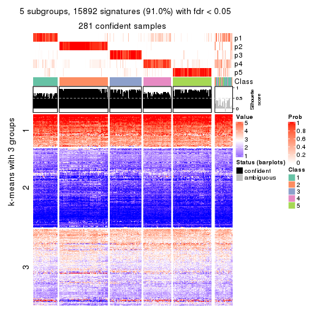</p>

</div>
<div id='tab-SD-skmeans-get-signatures-no-scale-5'>
<pre><code class="r">get_signatures(res, k = 6, scale_rows = FALSE)
</code></pre>

<p></p>

</div>
</div>


Compare the overlap of signatures from different k:

```r
compare_signatures(res)
```


`get_signature()` returns a data frame invisibly. TO get the list of signatures, the function
call should be assigned to a variable explicitly. In following code, if `plot` argument is set
to `FALSE`, no heatmap is plotted while only the differential analysis is performed.

```r
# code only for demonstration
tb = get_signature(res, k = ..., plot = FALSE)
```

An example of the output of `tb` is:

```
#>   which_row         fdr    mean_1    mean_2 scaled_mean_1 scaled_mean_2 km
#> 1        38 0.042760348  8.373488  9.131774    -0.5533452     0.5164555  1
#> 2        40 0.018707592  7.106213  8.469186    -0.6173731     0.5762149  1
#> 3        55 0.019134737 10.221463 11.207825    -0.6159697     0.5749050  1
#> 4        59 0.006059896  5.921854  7.869574    -0.6899429     0.6439467  1
#> 5        60 0.018055526  8.928898 10.211722    -0.6204761     0.5791110  1
#> 6        98 0.009384629 15.714769 14.887706     0.6635654    -0.6193277  2
...
```

The columns in `tb` are:

1. `which_row`: row indices corresponding to the input matrix.
2. `fdr`: FDR for the differential test. 
3. `mean_x`: The mean value in group x.
4. `scaled_mean_x`: The mean value in group x after rows are scaled.
5. `km`: Row groups if k-means clustering is applied to rows.


UMAP plot which shows how samples are separated.


<script>
$( function() {
	$( '#tabs-SD-skmeans-dimension-reduction' ).tabs();
} );
</script>
<div id='tabs-SD-skmeans-dimension-reduction'>
<ul>
<li><a href='#tab-SD-skmeans-dimension-reduction-1'>k = 2</a></li>
<li><a href='#tab-SD-skmeans-dimension-reduction-2'>k = 3</a></li>
<li><a href='#tab-SD-skmeans-dimension-reduction-3'>k = 4</a></li>
<li><a href='#tab-SD-skmeans-dimension-reduction-4'>k = 5</a></li>
<li><a href='#tab-SD-skmeans-dimension-reduction-5'>k = 6</a></li>
</ul>
<div id='tab-SD-skmeans-dimension-reduction-1'>
<pre><code class="r">dimension_reduction(res, k = 2, method = &quot;UMAP&quot;)
</code></pre>

<p>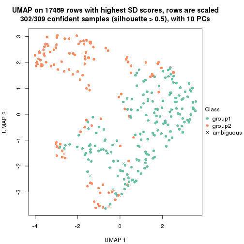</p>

</div>
<div id='tab-SD-skmeans-dimension-reduction-2'>
<pre><code class="r">dimension_reduction(res, k = 3, method = &quot;UMAP&quot;)
</code></pre>

<p></p>

</div>
<div id='tab-SD-skmeans-dimension-reduction-3'>
<pre><code class="r">dimension_reduction(res, k = 4, method = &quot;UMAP&quot;)
</code></pre>

<p></p>

</div>
<div id='tab-SD-skmeans-dimension-reduction-4'>
<pre><code class="r">dimension_reduction(res, k = 5, method = &quot;UMAP&quot;)
</code></pre>

<p></p>

</div>
<div id='tab-SD-skmeans-dimension-reduction-5'>
<pre><code class="r">dimension_reduction(res, k = 6, method = &quot;UMAP&quot;)
</code></pre>

<p></p>

</div>
</div>


Following heatmap shows how subgroups are split when increasing `k`:

```r
collect_classes(res)
```


If matrix rows can be associated to genes, consider to use `GO_Enrichment(res,
...)` to perform function enrichment for the signature genes.


 

---------------------------------------------------


### SD:pam**


The object with results only for a single top-value method and a single partition method 
can be extracted as:

```r
res = res_list["SD", "pam"]
# you can also extract it by
# res = res_list["SD:pam"]
```

A summary of `res` and all the functions that can be applied to it:

```r
res
```

```
#> A 'ConsensusPartition' object with k = 2, 3, 4, 5, 6.
#>   On a matrix with 17469 rows and 309 columns.
#>   Top rows (1000, 2000, 3000, 4000, 5000) are extracted by 'SD' method.
#>   Subgroups are detected by 'pam' method.
#>   Performed in total 1250 partitions by row resampling.
#>   Best k for subgroups seems to be 2.
#> 
#> Following methods can be applied to this 'ConsensusPartition' object:
#>  [1] "cola_report"             "collect_classes"         "collect_plots"          
#>  [4] "collect_stats"           "colnames"                "compare_signatures"     
#>  [7] "consensus_heatmap"       "dimension_reduction"     "functional_enrichment"  
#> [10] "get_anno_col"            "get_anno"                "get_classes"            
#> [13] "get_consensus"           "get_matrix"              "get_membership"         
#> [16] "get_param"               "get_signatures"          "get_stats"              
#> [19] "is_best_k"               "is_stable_k"             "membership_heatmap"     
#> [22] "ncol"                    "nrow"                    "plot_ecdf"              
#> [25] "rownames"                "select_partition_number" "show"                   
#> [28] "suggest_best_k"          "test_to_known_factors"
```

`collect_plots()` function collects all the plots made from `res` for all `k` (number of partitions)
into one single page to provide an easy and fast comparison between different `k`.

```r
collect_plots(res)
```

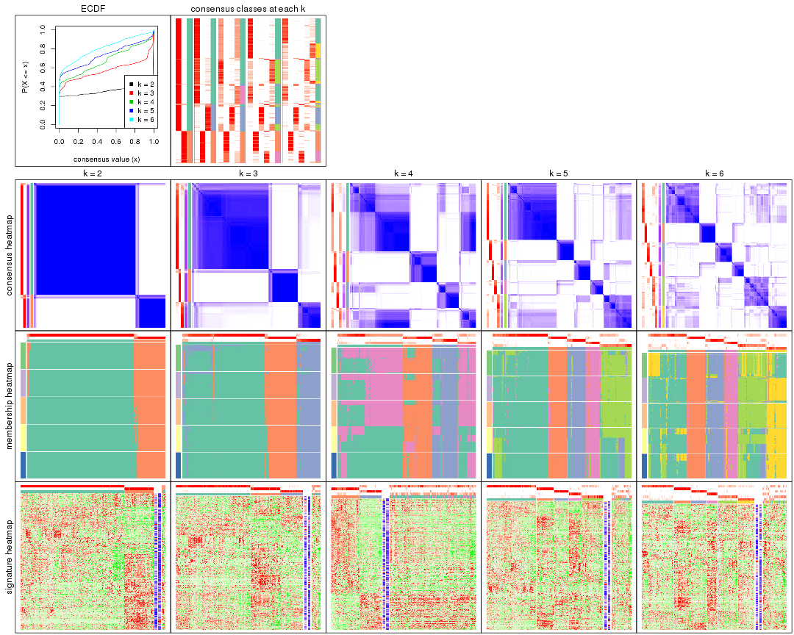

The plots are:

- The first row: a plot of the ECDF (Empirical cumulative distribution
  function) curves of the consensus matrix for each `k` and the heatmap of
  predicted classes for each `k`.
- The second row: heatmaps of the consensus matrix for each `k`.
- The third row: heatmaps of the membership matrix for each `k`.
- The fouth row: heatmaps of the signatures for each `k`.

All the plots in panels can be made by individual functions and they are
plotted later in this section.

`select_partition_number()` produces several plots showing different
statistics for choosing "optimized" `k`. There are following statistics:

- ECDF curves of the consensus matrix for each `k`;
- 1-PAC. [The PAC
  score](https://en.wikipedia.org/wiki/Consensus_clustering#Over-interpretation_potential_of_consensus_clustering)
  measures the proportion of the ambiguous subgrouping.
- Mean silhouette score.
- Concordance. The mean probability of fiting the consensus class ids in all
  partitions.
- Area increased. Denote $A_k$ as the area under the ECDF curve for current
  `k`, the area increased is defined as $A_k - A_{k-1}$.
- Rand index. The percent of pairs of samples that are both in a same cluster
  or both are not in a same cluster in the partition of k and k-1.
- Jaccard index. The ratio of pairs of samples are both in a same cluster in
  the partition of k and k-1 and the pairs of samples are both in a same
  cluster in the partition k or k-1.

The detailed explanations of these statistics can be found in [the cola
vignette](http://bioconductor.org/packages/devel/bioc/vignettes/cola/inst/doc/cola.html#toc_13).

Generally speaking, lower PAC score, higher mean silhouette score or higher
concordance corresponds to better partition. Rand index and Jaccard index
measure how similar the current partition is compared to partition with `k-1`.
If they are too similar, we won't accept `k` is better than `k-1`.

```r
select_partition_number(res)
```


The numeric values for all these statistics can be obtained by `get_stats()`.

```r
get_stats(res)
```

```
#>   k 1-PAC mean_silhouette concordance area_increased  Rand Jaccard
#> 2 2 1.000           0.959       0.984         0.3493 0.648   0.648
#> 3 3 0.844           0.860       0.938         0.6432 0.787   0.672
#> 4 4 0.625           0.339       0.674         0.1834 0.833   0.638
#> 5 5 0.699           0.718       0.857         0.0824 0.754   0.397
#> 6 6 0.674           0.657       0.793         0.1025 0.911   0.663
```

`suggest_best_k()` suggests the best $k$ based on these statistics. The rules are as follows:

- All $k$ with Jaccard index larger than 0.95 are removed because the increase of
  the partition number does not provides enough extra information. If all $k$ are removed,
  the best $k$ is assigned by `NA`.
- For $k$ with 1-PAC larger than 0.9, the maximal $k$ is taken as the "best k". Other $k$ is called "optional k".
- If it does not fit the second rule. The $k$ with the highest vote of highest
  1-PAC, mean silhouette and concordance is taken as the "best k".

```r
suggest_best_k(res)
```

```
#> [1] 2
```


Following shows the table of the partitions (You need to click the **show/hide
code output** link to see it). The membership matrix (columns with name `p*`)
is inferred by
[`clue::cl_consensus()`](https://www.rdocumentation.org/link/cl_consensus?package=clue)
function with the `SE` method. Basically the value in the membership matrix
represents the probability to belong to a certain group. The finall class
label for an item is determined with the group with highest probability it
belongs to.

In `get_classes()` function, the entropy is calculated from the membership
matrix and the silhouette score is calculated from the consensus matrix.


<script>
$( function() {
	$( '#tabs-SD-pam-get-classes' ).tabs();
} );
</script>
<div id='tabs-SD-pam-get-classes'>
<ul>
<li><a href='#tab-SD-pam-get-classes-1'>k = 2</a></li>
<li><a href='#tab-SD-pam-get-classes-2'>k = 3</a></li>
<li><a href='#tab-SD-pam-get-classes-3'>k = 4</a></li>
<li><a href='#tab-SD-pam-get-classes-4'>k = 5</a></li>
<li><a href='#tab-SD-pam-get-classes-5'>k = 6</a></li>
</ul>

<div id='tab-SD-pam-get-classes-1'>
<p><a id='tab-SD-pam-get-classes-1-a' style='color:#0366d6' href='#'>show/hide code output</a></p>
<pre><code class="r">cbind(get_classes(res, k = 2), get_membership(res, k = 2))
</code></pre>

<pre><code>#&gt;                                      class entropy silhouette    p1    p2
#&gt; 7826AE44-B03A-4528-9CB5-7421E592AE36     1   0.000     0.9907 1.000 0.000
#&gt; 0DC2197B-2FEA-48EB-953E-8E44E1933757     1   0.000     0.9907 1.000 0.000
#&gt; 87ABB098-8C1E-4677-8C31-48B71EFE41C7     1   0.000     0.9907 1.000 0.000
#&gt; EC0154E7-7A27-4535-83AE-6B379E99A93C     1   0.000     0.9907 1.000 0.000
#&gt; 78F79407-D49F-4FA2-B09F-0665C502827C     1   0.000     0.9907 1.000 0.000
#&gt; 03E81178-E971-4E91-8BED-D8273EA1425C     1   0.000     0.9907 1.000 0.000
#&gt; 62FCAEFF-16D8-4019-84B6-18EC3A88BC32     1   0.767     0.6928 0.776 0.224
#&gt; 722C1284-5983-4CC1-B19C-214C2DE6F8A6     2   0.000     0.9591 0.000 1.000
#&gt; 54E42A64-B350-4A94-8FED-C9BC1872660E     1   0.000     0.9907 1.000 0.000
#&gt; 53062969-D209-490B-9C9B-5D297625E2AE     1   0.000     0.9907 1.000 0.000
#&gt; B710293C-41D3-4A2E-8104-5402F91DD859     1   0.000     0.9907 1.000 0.000
#&gt; 73CB1D05-7AE4-457D-B4EF-25AC5C1F2132     1   0.000     0.9907 1.000 0.000
#&gt; B055A70B-3003-47CB-BDAA-6378C000BF24     1   0.000     0.9907 1.000 0.000
#&gt; 46C3A870-E37A-42CB-8C0C-6ACACEAC1ADC     2   0.000     0.9591 0.000 1.000
#&gt; E8E6270E-F26D-4F2E-A63E-7885BDE05FDB     1   0.000     0.9907 1.000 0.000
#&gt; C4A5EBA2-9091-4D12-BDC8-B84B122022B9     1   0.000     0.9907 1.000 0.000
#&gt; 5B1839C4-549D-41D1-B559-3C6D2A1528CE     1   0.000     0.9907 1.000 0.000
#&gt; A0DF05EB-DC44-4492-9A8A-F278F7B0C266     1   0.000     0.9907 1.000 0.000
#&gt; B5182F49-70F2-45B7-82DE-C6DA68145EEA     1   0.000     0.9907 1.000 0.000
#&gt; C204D355-B876-4341-A111-36D48CBDD2A8     1   0.000     0.9907 1.000 0.000
#&gt; 7B070AAA-EF97-4D3B-AA19-EEC170C7927D     2   0.000     0.9591 0.000 1.000
#&gt; 05A8A881-F8EE-48A2-B11C-A08D7D80CE18     1   0.000     0.9907 1.000 0.000
#&gt; BA59EF50-CFE9-456D-B1B6-67D0945004F6     1   0.000     0.9907 1.000 0.000
#&gt; AD97B334-E034-4D33-A4D5-48C32D5D521C     1   0.000     0.9907 1.000 0.000
#&gt; 51DA2568-32EA-4668-9876-4B6E7CA68860     1   0.000     0.9907 1.000 0.000
#&gt; 78C26A05-2084-494D-83D3-C52C1B800F4C     1   0.000     0.9907 1.000 0.000
#&gt; 2B5DD791-7692-4721-9519-7D7D49B52570     1   0.000     0.9907 1.000 0.000
#&gt; C0BBE26A-79C8-4392-9978-7C420B3786B5     1   0.000     0.9907 1.000 0.000
#&gt; F35A8359-3A7A-414F-8A5C-D278F3B45387     2   0.000     0.9591 0.000 1.000
#&gt; 8C9BA49C-1270-491D-A234-AE1B1C0609BA     2   0.000     0.9591 0.000 1.000
#&gt; CA104B57-B160-4148-8A0A-D34BB3E8D88A     1   0.000     0.9907 1.000 0.000
#&gt; 877E18A5-6A7A-4E29-9871-DC7EA14A5F27     1   0.000     0.9907 1.000 0.000
#&gt; 904EDF2E-411E-43BD-901D-46129AFA283A     1   0.000     0.9907 1.000 0.000
#&gt; FD9F5A9B-2BEB-4D31-9A2D-8D4B4ECBB478     1   0.000     0.9907 1.000 0.000
#&gt; 2E206314-9928-456E-B7C6-893DC0E3C7C2     2   0.000     0.9591 0.000 1.000
#&gt; 913DB655-2C7F-4369-83DE-9257F04CF39B     1   0.000     0.9907 1.000 0.000
#&gt; 72B5B724-FEB5-43BD-83F6-2E2152DDD800     1   0.000     0.9907 1.000 0.000
#&gt; 920B547C-6898-446C-AAAF-F4ED96E40AAB     2   0.000     0.9591 0.000 1.000
#&gt; 847F796A-8CD6-4013-A0FB-26F4FC3EAF0D     1   0.000     0.9907 1.000 0.000
#&gt; C4D64E7A-33F7-4CFC-9FD3-D6AA3D8EFAA7     1   0.000     0.9907 1.000 0.000
#&gt; EABA0B17-8E19-48C5-BF62-2A45C9632807     2   0.000     0.9591 0.000 1.000
#&gt; 7263CBA8-CE37-4531-A795-9324C6D2A672     1   0.000     0.9907 1.000 0.000
#&gt; 6D3CC3AC-618B-414A-B640-169C735A6568     1   0.000     0.9907 1.000 0.000
#&gt; 710C05C7-F9CE-45FA-A8CC-29DE2903E04F     1   0.000     0.9907 1.000 0.000
#&gt; 3D631A56-2C55-48EA-A667-BA46023C9D50     1   0.000     0.9907 1.000 0.000
#&gt; F1C65F64-AF05-4875-B7E4-60FFF56A3F46     1   0.000     0.9907 1.000 0.000
#&gt; E5DF76E7-A765-4E07-B87A-06168BF66C5F     1   0.000     0.9907 1.000 0.000
#&gt; 5C8C8A6E-40D4-4F82-AC3D-90CFDEE15C0A     2   0.000     0.9591 0.000 1.000
#&gt; 0117CBB9-1BF9-48B1-BE6E-A9A770FF8721     1   0.000     0.9907 1.000 0.000
#&gt; 31EF66E5-419A-44C3-BB2A-B69B52FFCECC     2   0.000     0.9591 0.000 1.000
#&gt; C149CEF5-61F3-4B53-B8A9-8244B673EBD0     1   0.000     0.9907 1.000 0.000
#&gt; 0AF351D0-4EC5-4275-AA0A-4FA2AF8A9C85     2   0.000     0.9591 0.000 1.000
#&gt; B507E82F-6680-497B-A014-033EDD7A2E03     1   0.000     0.9907 1.000 0.000
#&gt; F941890E-AB33-478F-8C97-1C785DD9428F     1   0.000     0.9907 1.000 0.000
#&gt; 7987E019-8FED-469B-A6C1-34EE430A60C3     1   0.000     0.9907 1.000 0.000
#&gt; 76084AA6-19BF-4605-B6A1-73F1D4BADAF9     1   0.000     0.9907 1.000 0.000
#&gt; 329807F7-E0D4-4F53-94E8-E4080E90CB47     1   0.000     0.9907 1.000 0.000
#&gt; 1B6505FF-C1A7-4DD0-9827-41A0A3A28F3E     1   0.000     0.9907 1.000 0.000
#&gt; 49778E92-B5D3-4AD9-A1AF-3B722D631B96     2   0.000     0.9591 0.000 1.000
#&gt; A22892DE-0AF4-4B63-9513-1D6825059040     1   0.000     0.9907 1.000 0.000
#&gt; 6D77ECAE-A715-4ADD-97D8-A916DC31A4EA     1   0.000     0.9907 1.000 0.000
#&gt; 09758B6F-1B2D-4AED-8913-696097069409     1   0.000     0.9907 1.000 0.000
#&gt; 8B709DB4-0B28-42F1-A7C5-106F5809BEA2     1   0.000     0.9907 1.000 0.000
#&gt; F2B356FA-79CD-4867-8ABF-84C90A493A75     1   0.000     0.9907 1.000 0.000
#&gt; 131213AD-0313-4DF1-B013-CE67ED262C37     2   0.000     0.9591 0.000 1.000
#&gt; D94F7E81-0F60-473B-AD4A-0AC13508BDE2     1   0.000     0.9907 1.000 0.000
#&gt; 29C17355-D646-48DA-9E54-7B6DD85DD610     1   0.000     0.9907 1.000 0.000
#&gt; B8BD866A-2A7C-45C3-96BB-9AB892D26AE5     1   0.000     0.9907 1.000 0.000
#&gt; 13EFD045-AD61-41EE-9896-67BFA4FC8C09     1   0.000     0.9907 1.000 0.000
#&gt; 2655F609-B3BB-4D01-B421-D5F4B1232EC8     2   0.722     0.7509 0.200 0.800
#&gt; 04BC7A52-C67F-42CB-8672-D3C51A20F2BA     1   0.000     0.9907 1.000 0.000
#&gt; 45472BD4-DBDB-41FE-B0E3-2440880E1DE6     1   0.000     0.9907 1.000 0.000
#&gt; B87FFFCD-CB57-4ACD-9C74-AB188984BBB2     1   0.000     0.9907 1.000 0.000
#&gt; 5271374C-13CD-4BFE-AC6D-C95AFE491322     1   0.000     0.9907 1.000 0.000
#&gt; E3372ACE-C7C8-43E5-B30A-1F2D662D8170     1   0.000     0.9907 1.000 0.000
#&gt; B08DF564-E4D0-4540-8160-93B3981DF1D8     1   0.000     0.9907 1.000 0.000
#&gt; 61A7D1B9-FC5A-4B9C-989F-936CDA948C27     1   0.000     0.9907 1.000 0.000
#&gt; 74E768C1-8766-46AC-AAB4-D79E5049F76A     2   0.000     0.9591 0.000 1.000
#&gt; 0CEA28F0-D7F0-4EB7-A23F-0C5CA6245971     1   0.000     0.9907 1.000 0.000
#&gt; 95C4EFF6-147C-48EC-A2C1-16B8F12AEEF2     2   0.000     0.9591 0.000 1.000
#&gt; C9A78BEA-D455-4F5E-8B7B-19BCB42887E7     1   0.000     0.9907 1.000 0.000
#&gt; DB970740-9AC1-4C10-9658-8A77B1C390DD     1   0.000     0.9907 1.000 0.000
#&gt; 883FBD37-0CA0-4562-8925-72ACC1EE93D9     1   0.000     0.9907 1.000 0.000
#&gt; 9FE1D006-49F2-471E-91E6-AF0414C24479     1   0.000     0.9907 1.000 0.000
#&gt; 11816CC6-8C8B-49C0-99EE-896377BCFCCD     1   0.000     0.9907 1.000 0.000
#&gt; 063FC5C8-4318-4ECC-9CA0-1976CBC8ACB6     1   0.000     0.9907 1.000 0.000
#&gt; E0F085CC-B90D-4FDE-B60E-C613971BAA00     1   0.000     0.9907 1.000 0.000
#&gt; 62361DA2-E4EE-46DA-BB1F-C51DCA9307CC     2   0.416     0.8842 0.084 0.916
#&gt; 1BA16D48-B09E-4699-A1AD-2FFECE4F3CDB     2   0.000     0.9591 0.000 1.000
#&gt; 3E4F14E9-60AE-4F17-9BA7-2A02E908204A     1   0.000     0.9907 1.000 0.000
#&gt; 79226DD7-BC85-4B8E-BFF8-B1E073129D34     1   0.000     0.9907 1.000 0.000
#&gt; D47D0936-826F-4D54-9225-F71B95357438     1   0.000     0.9907 1.000 0.000
#&gt; 0AE02B91-574C-4165-BA39-E9D7C1A870A2     2   0.000     0.9591 0.000 1.000
#&gt; DED8E9DF-CEFE-45ED-9374-EF9925A135C4     1   0.000     0.9907 1.000 0.000
#&gt; D587A993-3C47-4D4C-B744-59169D4F7451     1   0.000     0.9907 1.000 0.000
#&gt; 6BCA24E6-440F-42C5-ABE5-66C37B713A39     1   0.000     0.9907 1.000 0.000
#&gt; 86A5EDFB-9D06-4FED-BF57-F8D74A68E156     1   0.000     0.9907 1.000 0.000
#&gt; B9BD5134-2F6A-4454-8F83-69B63F9AE114     1   0.000     0.9907 1.000 0.000
#&gt; 082DA9E1-A40D-482B-8E21-A93BA97185F0     1   0.000     0.9907 1.000 0.000
#&gt; 16A8343A-1203-44FB-9F03-05CC7C71B4CC     1   0.000     0.9907 1.000 0.000
#&gt; 00439565-02CE-4BF5-956D-7078B51C0947     1   0.000     0.9907 1.000 0.000
#&gt; 7B2BD361-2BF1-4E97-BC08-457F5A9C2682     2   0.000     0.9591 0.000 1.000
#&gt; C1D8439A-D527-47F6-ADC1-25867B65DA21     2   0.000     0.9591 0.000 1.000
#&gt; D9096909-1439-462D-B69C-CAD1BF4F420C     1   0.000     0.9907 1.000 0.000
#&gt; 7822EA86-35A1-4285-9429-2B63111B9885     1   0.000     0.9907 1.000 0.000
#&gt; 6FD0CFC8-AC8D-4CF1-8C33-833AD98A30EF     2   0.000     0.9591 0.000 1.000
#&gt; A451F278-5E83-4BC6-9B15-3AA2117B99B6     1   0.000     0.9907 1.000 0.000
#&gt; 6EC25686-4547-459C-9E01-7EDF8DAECE35     1   0.000     0.9907 1.000 0.000
#&gt; 5D2F1EEA-2BA8-4C3A-8436-544EE1D23E7E     1   0.000     0.9907 1.000 0.000
#&gt; 675A4293-A4CE-4307-B00B-DFC4D44A87C6     1   0.932     0.4336 0.652 0.348
#&gt; 6FBE0AEF-476A-42B2-A857-846CF1ED92B6     2   0.000     0.9591 0.000 1.000
#&gt; 7139D616-1A15-4288-A9AE-411856A4A76D     1   0.000     0.9907 1.000 0.000
#&gt; 46D7F8C1-D5C5-40CC-BEF5-2E590A847BD9     1   0.000     0.9907 1.000 0.000
#&gt; 984C44D3-4F5F-44C9-BCD9-C991EBC1FCB8     1   0.000     0.9907 1.000 0.000
#&gt; 83FE52E0-2DC2-4580-8BB2-FBCBEE4AC240     1   0.000     0.9907 1.000 0.000
#&gt; 0923F9CB-DF6F-4BAA-A5F8-0F83CE60D1ED     1   0.000     0.9907 1.000 0.000
#&gt; 1DEB5206-78CC-4EB5-BCD5-85A6A5B4E273     1   0.000     0.9907 1.000 0.000
#&gt; E4DB18DA-EB0C-4B2F-9566-7F72222B16D4     1   0.000     0.9907 1.000 0.000
#&gt; F7456312-1309-4B2F-875D-0F90CDF3EC35     1   0.000     0.9907 1.000 0.000
#&gt; 9A25E5D8-0706-4960-A76B-BCD0AC93E4FA     1   0.000     0.9907 1.000 0.000
#&gt; 5A41FE8F-FFB3-4B87-BF11-A570C184096D     1   0.000     0.9907 1.000 0.000
#&gt; 33F84E63-3F6C-4867-ADB1-A0DF39F1295B     1   0.000     0.9907 1.000 0.000
#&gt; D6A644F5-D1D0-4A8D-94C4-EE6C3ECE7430     1   0.000     0.9907 1.000 0.000
#&gt; 2A5848CC-A9A2-4AA8-A752-321273E62CF0     1   0.000     0.9907 1.000 0.000
#&gt; 7CA6358B-FC8A-4675-B092-9E061038FC83     1   0.000     0.9907 1.000 0.000
#&gt; A4C2F4BC-5C62-4B1F-9AB8-46D9468EF523     1   0.469     0.8774 0.900 0.100
#&gt; 8AF4EB7F-418D-4CC9-A9B8-A93A4C1A173B     1   0.971     0.2901 0.600 0.400
#&gt; E5048887-70C8-468F-881E-2EC55F6E6F3B     1   0.000     0.9907 1.000 0.000
#&gt; 1BADCC7C-C4D8-4C34-9534-59D622C7A2A2     1   0.000     0.9907 1.000 0.000
#&gt; 02CE7DF7-64BD-4297-A240-A5B9EE8771D3     1   0.000     0.9907 1.000 0.000
#&gt; CBF6E96A-F56C-4C87-B851-D319930BAAB8     1   0.000     0.9907 1.000 0.000
#&gt; 48F6B774-CFD2-4DDF-B7A2-696596413C3F     1   0.000     0.9907 1.000 0.000
#&gt; 41D88C3E-5848-4B09-8A77-EAE6AC4EC6B0     2   0.000     0.9591 0.000 1.000
#&gt; BDF79CC0-00C7-49C1-900B-AB065A733B17     1   0.000     0.9907 1.000 0.000
#&gt; A894D686-BFC7-4AEE-A794-DBE718C6B6F6     2   0.000     0.9591 0.000 1.000
#&gt; 0712029E-3765-4272-BE5B-B6C8BCCC0F0F     2   0.000     0.9591 0.000 1.000
#&gt; 7B051855-9B09-4887-9BC0-9F077537938E     1   0.000     0.9907 1.000 0.000
#&gt; EF357C46-5C3C-4F51-9383-FF7694D07B97     2   0.000     0.9591 0.000 1.000
#&gt; 9492A322-37CA-4582-AC68-66B5D80778AF     2   0.000     0.9591 0.000 1.000
#&gt; 993399A4-1B9F-4258-B2D0-155AD58A2E82     1   0.000     0.9907 1.000 0.000
#&gt; 7B7DC93D-5494-4E69-BE07-2967887182F9     1   0.000     0.9907 1.000 0.000
#&gt; 29BCBA51-2580-473D-9CF7-BEDBD0DBAD1B     2   0.000     0.9591 0.000 1.000
#&gt; 40855647-E942-4F32-90B7-BEB921929BFB     1   0.000     0.9907 1.000 0.000
#&gt; 0DC723D0-7C68-4495-A4B9-2DF2FF19AB14     2   0.993     0.2237 0.452 0.548
#&gt; 7540005F-57E0-4E2E-A8A2-BEF2B0F333B1     2   0.000     0.9591 0.000 1.000
#&gt; EB1DDB14-4076-4C2C-B911-390C17C21486     1   0.000     0.9907 1.000 0.000
#&gt; 9EA70EC4-8BA0-4E3D-B3CB-A68D19E89868     1   0.000     0.9907 1.000 0.000
#&gt; B04E2E50-0A6E-4224-A825-1714D12E5669     2   0.000     0.9591 0.000 1.000
#&gt; B0BF5E01-536D-40FF-9C24-CBBD611E2FC2     1   0.000     0.9907 1.000 0.000
#&gt; 7B6B1788-B297-4442-B6BE-B7CE8754491E     1   0.000     0.9907 1.000 0.000
#&gt; A090D00C-34DF-4906-A517-4803C4C9A332     1   0.000     0.9907 1.000 0.000
#&gt; 340D44A6-9BEA-412C-9973-D9ABD6692255     1   0.000     0.9907 1.000 0.000
#&gt; E8D0D1E7-E5A8-4014-80C1-0245F90F4358     2   0.000     0.9591 0.000 1.000
#&gt; 19EA1494-8572-40E1-B9BB-3739F47B607D     1   0.000     0.9907 1.000 0.000
#&gt; 1C1B4793-8DAF-4763-BA4D-C4E869A4ED35     1   0.000     0.9907 1.000 0.000
#&gt; 45BF59B3-95BD-4196-ABAA-4C4F0DB38572     1   1.000    -0.0536 0.504 0.496
#&gt; 47B5A2A7-7E13-4558-99D2-067F5075C6A4     1   0.000     0.9907 1.000 0.000
#&gt; E94638E8-CB51-4FBB-8BCB-4BFD7A812291     1   0.000     0.9907 1.000 0.000
#&gt; A17352A8-0D3C-4545-8136-7DAE2FB0E102     2   0.971     0.3738 0.400 0.600
#&gt; B18A6F95-D4ED-416B-B5A1-9A4934865D0D     2   0.000     0.9591 0.000 1.000
#&gt; 33E92C5F-0C42-4549-AD5B-0A064182A272     1   0.000     0.9907 1.000 0.000
#&gt; E041B375-3E60-4F18-A6EF-D1C249E3B8EE     1   0.000     0.9907 1.000 0.000
#&gt; EDF90AF6-6C64-4BD2-AADF-8D7D188650B2     2   0.000     0.9591 0.000 1.000
#&gt; 569320D2-316C-4E2D-B7B3-D7D5C4DAD42D     1   0.000     0.9907 1.000 0.000
#&gt; AFFB223D-DAE9-4567-9EF2-8E4DF9D8782D     2   0.000     0.9591 0.000 1.000
#&gt; 56FC9454-0A6A-4CC3-95C4-BE0E0D0BAFCE     2   0.000     0.9591 0.000 1.000
#&gt; 43226365-FAEF-46C5-AF1B-5C6C2BED84FF     1   0.000     0.9907 1.000 0.000
#&gt; 1536110A-B42A-4A84-9474-9895321FDCE9     2   0.904     0.5549 0.320 0.680
#&gt; 812255DD-536B-4216-90B1-27D5AB339BE2     1   0.000     0.9907 1.000 0.000
#&gt; 5D4563D6-68B7-4C9D-A3F4-AA7D45D5112C     2   0.000     0.9591 0.000 1.000
#&gt; BAA39781-DB94-473C-98B1-FA6CD3E1C67A     1   0.000     0.9907 1.000 0.000
#&gt; C1411CDA-814D-4E21-8929-C0F77858828F     1   0.000     0.9907 1.000 0.000
#&gt; EFE2F248-C13E-4E8D-9153-8C903848AC4A     1   0.000     0.9907 1.000 0.000
#&gt; D3939C84-D1D6-4060-9F91-AEB222A9BDD5     1   0.000     0.9907 1.000 0.000
#&gt; EABD2987-8C1E-49E5-94AF-C0BDE5335A48     1   0.000     0.9907 1.000 0.000
#&gt; F4BE2ABE-2CEB-4A6A-B8EC-0355F8C63B9B     1   0.000     0.9907 1.000 0.000
#&gt; 627BC251-D217-4955-B718-6B9D6DEA1756     1   0.000     0.9907 1.000 0.000
#&gt; 31B54613-A20E-4039-BB8B-9B52104CE418     1   0.000     0.9907 1.000 0.000
#&gt; 3F292B7C-A535-4DBD-BC20-CB4F85A1C94B     1   0.000     0.9907 1.000 0.000
#&gt; BEA2A5EB-EEA9-4F31-AC38-810E04CE124B     2   0.000     0.9591 0.000 1.000
#&gt; 99D84D46-19DA-43F1-B639-DCE9953F1529     2   0.000     0.9591 0.000 1.000
#&gt; 4588817E-1068-4A78-86B6-4674A0112DDA     1   0.000     0.9907 1.000 0.000
#&gt; 6AC633BD-BEC1-4750-94E3-378972DAB6B3     2   0.000     0.9591 0.000 1.000
#&gt; 09E17C6E-7EDE-4DDF-B5ED-2521AF870C9A     1   0.000     0.9907 1.000 0.000
#&gt; 58D9C750-26A2-4B7C-84C4-13D7AFB4C5EA     1   0.000     0.9907 1.000 0.000
#&gt; DF28E138-E222-4F77-9B61-69E601CA7E60     2   0.000     0.9591 0.000 1.000
#&gt; FEA489A8-E423-4266-AADA-9BAAB29AB94B     1   0.000     0.9907 1.000 0.000
#&gt; F3FCC207-15CD-41EA-A3EF-F5D2C12AC373     1   0.000     0.9907 1.000 0.000
#&gt; 53DD7AFB-A258-4643-A501-BACC95D17A50     2   0.000     0.9591 0.000 1.000
#&gt; D850B2A1-1F8A-4A44-A0CF-8D9DD4A1889A     2   0.000     0.9591 0.000 1.000
#&gt; B3F746DC-E487-4305-9F30-825D1520E8FD     2   0.996     0.1839 0.464 0.536
#&gt; BE38240A-F7C2-439F-9AAE-51C8A340F310     1   0.000     0.9907 1.000 0.000
#&gt; A9022D9E-1D30-49EE-8552-1364A8027F34     1   0.000     0.9907 1.000 0.000
#&gt; 0E8A56EE-D9A2-48A5-B793-A358BE1E4EFA     1   0.000     0.9907 1.000 0.000
#&gt; 51667574-318E-4BDB-8F42-8512A4C1B84F     1   0.000     0.9907 1.000 0.000
#&gt; B0A442C9-67E4-4534-8A5C-D6D73F42358C     1   0.000     0.9907 1.000 0.000
#&gt; 25A5BC09-0D88-4385-87AF-997F9018522D     2   0.000     0.9591 0.000 1.000
#&gt; 344B9631-AAA5-4302-8747-D584345D9131     1   0.000     0.9907 1.000 0.000
#&gt; 1C3795AD-6306-4892-95F5-92DF3375D46A     1   0.000     0.9907 1.000 0.000
#&gt; 17BB221D-8BF9-4391-83DD-423AE1E03651     1   0.000     0.9907 1.000 0.000
#&gt; 297611E9-9555-4BCA-A723-02E846ACC23A     1   0.000     0.9907 1.000 0.000
#&gt; AD7FF180-1EAC-4783-8A62-E9626B96DD9F     1   0.000     0.9907 1.000 0.000
#&gt; FD544083-9BD5-4036-BD81-0352B67CC45C     1   0.000     0.9907 1.000 0.000
#&gt; 879A74D5-5B29-418D-A0F4-8E88D6384008     1   0.000     0.9907 1.000 0.000
#&gt; 43CD982C-13C0-4A52-803A-9A3A3FAE09BC     1   0.000     0.9907 1.000 0.000
#&gt; DCD0313D-5206-4111-8743-A8A0227257D9     1   0.000     0.9907 1.000 0.000
#&gt; 331A9160-D730-45DD-A985-C6CAC03035ED     1   0.000     0.9907 1.000 0.000
#&gt; 9EEECA0E-530D-4724-B016-A716F0782148     1   0.000     0.9907 1.000 0.000
#&gt; B3073976-CA3F-4115-9243-8C2D9E1B975D     1   0.000     0.9907 1.000 0.000
#&gt; 77B3C9B4-1A7F-41BB-A37D-01EF80E933CC     2   0.000     0.9591 0.000 1.000
#&gt; C0C26822-2E9F-4FB0-81D4-575027C8B71C     2   0.745     0.7344 0.212 0.788
#&gt; F1FCE328-2B3B-499A-888D-0E66A017E8B0     1   0.000     0.9907 1.000 0.000
#&gt; F069DAD6-F1EB-42F7-8252-F3F6EC46CC3E     1   0.000     0.9907 1.000 0.000
#&gt; 99CC822E-8C98-4EEC-BB58-AEF76A0B5332     1   0.000     0.9907 1.000 0.000
#&gt; C86EBD08-53F2-4972-801A-74970FDD6A62     1   0.000     0.9907 1.000 0.000
#&gt; F07326F2-C1D6-4D5A-9693-25C3A04B0EC2     1   0.000     0.9907 1.000 0.000
#&gt; 8ACBD428-7713-48D9-810A-43C9CD191A73     2   0.000     0.9591 0.000 1.000
#&gt; 3D3501B4-1A43-4FA7-90A2-CCEBF66BFD4A     1   0.000     0.9907 1.000 0.000
#&gt; DD51C17C-300F-44A4-955A-C9BC85417842     1   0.000     0.9907 1.000 0.000
#&gt; 58FF391C-1D83-426C-8F92-C15F78F56C95     1   0.000     0.9907 1.000 0.000
#&gt; ACE65C6E-2B10-4972-91B4-9199DD4B179D     1   0.000     0.9907 1.000 0.000
#&gt; B2088466-FA5D-491C-9982-99B33683E66F     2   0.963     0.4031 0.388 0.612
#&gt; D47AF416-1687-4FE0-A235-8815B6E8EB0B     1   0.000     0.9907 1.000 0.000
#&gt; 4DCAD07F-CC43-46F6-B2F3-EDBF3EDD1045     2   0.000     0.9591 0.000 1.000
#&gt; AAAE0BD9-63FC-4A0E-A27E-447B634BAD99     2   0.000     0.9591 0.000 1.000
#&gt; BC471AA1-52CF-4CEE-9866-34CE91404F45     2   0.000     0.9591 0.000 1.000
#&gt; 81D3EE3F-AC11-404F-8092-307F0DC12198     1   0.000     0.9907 1.000 0.000
#&gt; 8C02026C-C25E-406B-B8B8-A1A82362AE79     1   0.327     0.9260 0.940 0.060
#&gt; 6A005F2A-A0C1-4CA4-B15B-96B08F013874     1   0.000     0.9907 1.000 0.000
#&gt; B55743F2-4D63-4375-85D3-F58281CFD852     1   0.000     0.9907 1.000 0.000
#&gt; 24F98393-C817-4D0E-A7DB-05D2B5C71F40     1   0.000     0.9907 1.000 0.000
#&gt; 2C2AEF1D-4112-4EC7-9027-5E3FD26E8802     1   0.000     0.9907 1.000 0.000
#&gt; 8BAC3CB5-2987-4349-8AE8-B83DDD16CA3C     1   0.000     0.9907 1.000 0.000
#&gt; ED9C74E6-92FC-4E58-8FCE-1761DEA0C977     1   0.000     0.9907 1.000 0.000
#&gt; BA732ED4-F6BA-404E-BA3C-CA558FAD866A     1   0.000     0.9907 1.000 0.000
#&gt; E750385A-12D9-4A88-B4DF-C1306B5EF3B7     2   0.000     0.9591 0.000 1.000
#&gt; 6B1DC5E4-5F82-4395-913F-6AEDB5B63188     1   0.000     0.9907 1.000 0.000
#&gt; A7C12D37-FD50-4674-A054-1774F4E5C3B3     1   0.000     0.9907 1.000 0.000
#&gt; 2155C764-2063-4D9C-9ACD-96AA73475F5E     1   0.000     0.9907 1.000 0.000
#&gt; DE23CC15-A95E-4119-9B3C-8EEC45900D11     2   0.000     0.9591 0.000 1.000
#&gt; 5DB1DCAD-638E-48A4-9F40-3D6268FDEC33     2   0.000     0.9591 0.000 1.000
#&gt; 34AF0341-73D7-4080-AAEB-4C1541C2569F     1   0.000     0.9907 1.000 0.000
#&gt; B60D4235-44AF-4BA4-98C0-BCCDC28E90B9     2   0.000     0.9591 0.000 1.000
#&gt; CF463D89-2C9F-4257-BF04-8BC1CD40EA7D     2   0.808     0.6795 0.248 0.752
#&gt; EF6C8165-484A-4530-AEDF-93DCC4A8455D     1   0.000     0.9907 1.000 0.000
#&gt; B9F6B5E4-4D10-49B8-A8FE-8F33C5A62CBF     1   0.000     0.9907 1.000 0.000
#&gt; CE539000-92D7-4622-9C8D-BC6E01310681     2   0.000     0.9591 0.000 1.000
#&gt; D3BBC405-A22A-4009-ABF6-96FEEE653051     2   0.000     0.9591 0.000 1.000
#&gt; 0B3C86BD-0D20-4408-9BE3-05658729505F     1   0.000     0.9907 1.000 0.000
#&gt; 9B9C5071-7C3F-416C-B91C-6F5966747F54     1   0.000     0.9907 1.000 0.000
#&gt; A9469A4A-C5F9-4681-A916-A26F0B4307BA     1   0.000     0.9907 1.000 0.000
#&gt; A31B57E4-E30B-4A1B-829D-1B47D9CEC041     2   0.000     0.9591 0.000 1.000
#&gt; 647255CE-F84A-4070-B3FD-D8ACA32C4D09     1   0.000     0.9907 1.000 0.000
#&gt; 8F5E9F02-51D7-410E-B8B7-22737F2F095A     2   0.000     0.9591 0.000 1.000
#&gt; 8074A7F6-2FDE-4578-B71C-01C542D468FE     1   0.000     0.9907 1.000 0.000
#&gt; 2A946F17-F245-409E-A019-C60CDA18DC7D     1   0.000     0.9907 1.000 0.000
#&gt; 0878C381-47F9-4786-82C2-94AC840BEDCB     1   0.000     0.9907 1.000 0.000
#&gt; 54504893-92C5-4328-85A8-2A882680B5E0     1   0.000     0.9907 1.000 0.000
#&gt; 0A27D1BE-E5DD-459A-A51F-6D8AAF7CFEB4     1   0.000     0.9907 1.000 0.000
#&gt; 89ED5A3E-CAC0-4AB4-B858-A3CD8F34DBD5     2   0.000     0.9591 0.000 1.000
#&gt; ACEEB0A5-AADB-4EF9-8710-4BAF95522CEA     1   0.000     0.9907 1.000 0.000
#&gt; 02C74D81-5976-4252-BC6C-B10E934DECA2     1   0.000     0.9907 1.000 0.000
#&gt; D365A238-4739-4B54-9608-DC548F21C04E     1   0.000     0.9907 1.000 0.000
#&gt; F70F7ED5-A3B7-4210-95AD-DEFA0A565F06     1   0.000     0.9907 1.000 0.000
#&gt; A92C23A9-BC25-4025-9501-6D5FF8E2A502     1   0.000     0.9907 1.000 0.000
#&gt; ECE9BBF4-840E-47A6-8378-0B6C4A2369D3     1   0.000     0.9907 1.000 0.000
#&gt; 38749490-0FCF-4B33-9EBC-8F86C2D9E4AF     1   0.000     0.9907 1.000 0.000
#&gt; 02ABB64E-768B-4999-A899-EEE573D5F186     1   0.000     0.9907 1.000 0.000
#&gt; C1C467A8-18B1-4C3F-AC45-33359ED6FDC4     1   0.000     0.9907 1.000 0.000
#&gt; 78B2E4A1-9DAE-404F-AB47-1896450EF254     1   0.000     0.9907 1.000 0.000
#&gt; CCDB0290-91DA-4089-84A6-4434BA028D30     1   0.000     0.9907 1.000 0.000
#&gt; D5041E80-20A0-4C1A-9AC1-2394F6DB6E92     1   0.000     0.9907 1.000 0.000
#&gt; 20EB9CC6-EABB-438A-9030-E766459996D1     2   0.000     0.9591 0.000 1.000
#&gt; 73E99110-9A7C-4F73-98C5-79D22CB06230     1   0.000     0.9907 1.000 0.000
#&gt; FAD8A464-9BC3-4ED9-9517-B18D36514325     1   0.000     0.9907 1.000 0.000
#&gt; 9AF0E82E-E621-437A-8D19-700532B95090     1   0.000     0.9907 1.000 0.000
#&gt; 27DA48F3-4FC1-41A3-8E49-5B25F1CCFF07     1   0.000     0.9907 1.000 0.000
#&gt; EFE5A302-D138-4044-A301-5C5FD1C24836     1   0.000     0.9907 1.000 0.000
#&gt; D3E866AC-D66A-4C07-9F47-89AF460320DE     2   0.000     0.9591 0.000 1.000
#&gt; 89C45456-9392-4EB3-9A82-A130B6702AAF     1   0.000     0.9907 1.000 0.000
#&gt; 8FF5C8FC-2565-49BE-9EE0-91A84A85AB2A     1   0.000     0.9907 1.000 0.000
#&gt; 846DF088-75D5-49CF-BDDC-27E735A08DCA     1   0.000     0.9907 1.000 0.000
#&gt; EA3A19E1-7ADE-47B6-A35A-71290967147A     1   0.000     0.9907 1.000 0.000
#&gt; B2C43D0C-732B-4C54-938F-D3C9FDA880DA     1   0.000     0.9907 1.000 0.000
#&gt; EEC856B5-9B7F-488D-975E-CE2FF7072879     1   0.000     0.9907 1.000 0.000
#&gt; 8A68C417-09CC-4FA1-BFEB-EB4B738853A4     1   0.000     0.9907 1.000 0.000
#&gt; C5DF1A0D-952C-44E2-BF83-ED57177EF60E     1   0.000     0.9907 1.000 0.000
#&gt; B5C9EA22-F758-4BD2-BD1F-282EC1078AED     2   0.000     0.9591 0.000 1.000
#&gt; 3F08AE92-3EFD-4D7F-8C5C-BFB3621F0CD6     1   0.000     0.9907 1.000 0.000
#&gt; 8F0D43F1-2199-4DBB-9B16-1E5F2CED2FEC     1   0.997     0.0582 0.532 0.468
#&gt; 54BABD8B-EA9F-4875-8594-2179B38C73BD     1   0.000     0.9907 1.000 0.000
#&gt; C149B6F8-03DC-4907-920A-F3318B8D2A1E     1   0.000     0.9907 1.000 0.000
#&gt; F93D26E2-4B45-495D-BC8E-5B592F8FDABF     1   0.000     0.9907 1.000 0.000
#&gt; C98275CD-C39A-4E14-A731-4F3EB7396665     1   0.000     0.9907 1.000 0.000
#&gt; 354DC705-216E-42F0-B29E-C1F8D6C9489A     1   0.000     0.9907 1.000 0.000
#&gt; 6752EED9-7990-433F-A206-D5398C396471     1   0.000     0.9907 1.000 0.000
#&gt; C3E94C5D-68C4-400C-B7CB-38C42E9D5FFF     1   0.000     0.9907 1.000 0.000
#&gt; CE6B6871-3ED3-44DE-A777-7558D4429057     1   0.000     0.9907 1.000 0.000
#&gt; A06E7D1E-E432-4A4C-8BB0-314304F96EDF     1   0.000     0.9907 1.000 0.000
#&gt; 1ABBEF80-508F-4247-B43D-3E549372113B     1   0.000     0.9907 1.000 0.000
#&gt; 835AAE7F-F873-4D11-8845-232D261A38DF     1   0.000     0.9907 1.000 0.000
#&gt; E98A0460-6529-4DBA-8542-1B98801D7A7D     1   0.000     0.9907 1.000 0.000
#&gt; 06A9CBF8-01D0-4720-BCE8-83F0E77C862F     1   0.000     0.9907 1.000 0.000
#&gt; 206865A9-A67C-49A6-93AD-55D06E777559     2   0.000     0.9591 0.000 1.000
#&gt; 26DABC83-DB30-452F-9BE2-366760CB138E     2   0.000     0.9591 0.000 1.000
#&gt; 9DD5272A-2D6E-4774-83E3-0CD761EDE926     1   0.000     0.9907 1.000 0.000
#&gt; 4938E366-C740-4C9C-9358-FF37997DC9EF     1   0.000     0.9907 1.000 0.000
#&gt; E2DA59C4-A47C-41E3-BC55-2D00C6EC17FB     1   0.000     0.9907 1.000 0.000
#&gt; 37349E62-0BFB-4FEA-81D0-2AB7E7625B0D     1   0.000     0.9907 1.000 0.000
</code></pre>

<script>
$('#tab-SD-pam-get-classes-1-a').parent().next().next().hide();
$('#tab-SD-pam-get-classes-1-a').click(function(){
  $('#tab-SD-pam-get-classes-1-a').parent().next().next().toggle();
  return(false);
});
</script>
</div>

<div id='tab-SD-pam-get-classes-2'>
<p><a id='tab-SD-pam-get-classes-2-a' style='color:#0366d6' href='#'>show/hide code output</a></p>
<pre><code class="r">cbind(get_classes(res, k = 3), get_membership(res, k = 3))
</code></pre>

<pre><code>#&gt;                                      class entropy silhouette    p1    p2    p3
#&gt; 7826AE44-B03A-4528-9CB5-7421E592AE36     1  0.0592    0.93083 0.988 0.000 0.012
#&gt; 0DC2197B-2FEA-48EB-953E-8E44E1933757     3  0.0000    0.90016 0.000 0.000 1.000
#&gt; 87ABB098-8C1E-4677-8C31-48B71EFE41C7     1  0.4062    0.82703 0.836 0.000 0.164
#&gt; EC0154E7-7A27-4535-83AE-6B379E99A93C     1  0.0000    0.93033 1.000 0.000 0.000
#&gt; 78F79407-D49F-4FA2-B09F-0665C502827C     1  0.0000    0.93033 1.000 0.000 0.000
#&gt; 03E81178-E971-4E91-8BED-D8273EA1425C     1  0.2165    0.91260 0.936 0.000 0.064
#&gt; 62FCAEFF-16D8-4019-84B6-18EC3A88BC32     1  0.8727    0.39139 0.588 0.176 0.236
#&gt; 722C1284-5983-4CC1-B19C-214C2DE6F8A6     2  0.0000    0.93803 0.000 1.000 0.000
#&gt; 54E42A64-B350-4A94-8FED-C9BC1872660E     3  0.4974    0.69359 0.236 0.000 0.764
#&gt; 53062969-D209-490B-9C9B-5D297625E2AE     1  0.0424    0.93120 0.992 0.000 0.008
#&gt; B710293C-41D3-4A2E-8104-5402F91DD859     1  0.0747    0.93051 0.984 0.000 0.016
#&gt; 73CB1D05-7AE4-457D-B4EF-25AC5C1F2132     1  0.1529    0.92284 0.960 0.000 0.040
#&gt; B055A70B-3003-47CB-BDAA-6378C000BF24     3  0.2066    0.87546 0.060 0.000 0.940
#&gt; 46C3A870-E37A-42CB-8C0C-6ACACEAC1ADC     2  0.0000    0.93803 0.000 1.000 0.000
#&gt; E8E6270E-F26D-4F2E-A63E-7885BDE05FDB     1  0.0000    0.93033 1.000 0.000 0.000
#&gt; C4A5EBA2-9091-4D12-BDC8-B84B122022B9     3  0.0000    0.90016 0.000 0.000 1.000
#&gt; 5B1839C4-549D-41D1-B559-3C6D2A1528CE     3  0.0000    0.90016 0.000 0.000 1.000
#&gt; A0DF05EB-DC44-4492-9A8A-F278F7B0C266     1  0.0000    0.93033 1.000 0.000 0.000
#&gt; B5182F49-70F2-45B7-82DE-C6DA68145EEA     1  0.2066    0.91273 0.940 0.000 0.060
#&gt; C204D355-B876-4341-A111-36D48CBDD2A8     3  0.0592    0.89882 0.012 0.000 0.988
#&gt; 7B070AAA-EF97-4D3B-AA19-EEC170C7927D     2  0.0000    0.93803 0.000 1.000 0.000
#&gt; 05A8A881-F8EE-48A2-B11C-A08D7D80CE18     1  0.0000    0.93033 1.000 0.000 0.000
#&gt; BA59EF50-CFE9-456D-B1B6-67D0945004F6     1  0.2066    0.91273 0.940 0.000 0.060
#&gt; AD97B334-E034-4D33-A4D5-48C32D5D521C     1  0.0000    0.93033 1.000 0.000 0.000
#&gt; 51DA2568-32EA-4668-9876-4B6E7CA68860     3  0.0000    0.90016 0.000 0.000 1.000
#&gt; 78C26A05-2084-494D-83D3-C52C1B800F4C     1  0.0747    0.92958 0.984 0.000 0.016
#&gt; 2B5DD791-7692-4721-9519-7D7D49B52570     1  0.6225    0.20702 0.568 0.000 0.432
#&gt; C0BBE26A-79C8-4392-9978-7C420B3786B5     1  0.0424    0.93063 0.992 0.000 0.008
#&gt; F35A8359-3A7A-414F-8A5C-D278F3B45387     2  0.0000    0.93803 0.000 1.000 0.000
#&gt; 8C9BA49C-1270-491D-A234-AE1B1C0609BA     2  0.0000    0.93803 0.000 1.000 0.000
#&gt; CA104B57-B160-4148-8A0A-D34BB3E8D88A     1  0.0237    0.93060 0.996 0.000 0.004
#&gt; 877E18A5-6A7A-4E29-9871-DC7EA14A5F27     1  0.4654    0.77473 0.792 0.000 0.208
#&gt; 904EDF2E-411E-43BD-901D-46129AFA283A     1  0.0000    0.93033 1.000 0.000 0.000
#&gt; FD9F5A9B-2BEB-4D31-9A2D-8D4B4ECBB478     1  0.1289    0.92533 0.968 0.000 0.032
#&gt; 2E206314-9928-456E-B7C6-893DC0E3C7C2     2  0.0000    0.93803 0.000 1.000 0.000
#&gt; 913DB655-2C7F-4369-83DE-9257F04CF39B     1  0.0000    0.93033 1.000 0.000 0.000
#&gt; 72B5B724-FEB5-43BD-83F6-2E2152DDD800     1  0.2066    0.91273 0.940 0.000 0.060
#&gt; 920B547C-6898-446C-AAAF-F4ED96E40AAB     2  0.0000    0.93803 0.000 1.000 0.000
#&gt; 847F796A-8CD6-4013-A0FB-26F4FC3EAF0D     1  0.0000    0.93033 1.000 0.000 0.000
#&gt; C4D64E7A-33F7-4CFC-9FD3-D6AA3D8EFAA7     1  0.2356    0.90776 0.928 0.000 0.072
#&gt; EABA0B17-8E19-48C5-BF62-2A45C9632807     2  0.0000    0.93803 0.000 1.000 0.000
#&gt; 7263CBA8-CE37-4531-A795-9324C6D2A672     3  0.0237    0.90005 0.004 0.000 0.996
#&gt; 6D3CC3AC-618B-414A-B640-169C735A6568     3  0.0000    0.90016 0.000 0.000 1.000
#&gt; 710C05C7-F9CE-45FA-A8CC-29DE2903E04F     1  0.0424    0.93063 0.992 0.000 0.008
#&gt; 3D631A56-2C55-48EA-A667-BA46023C9D50     3  0.0892    0.89447 0.020 0.000 0.980
#&gt; F1C65F64-AF05-4875-B7E4-60FFF56A3F46     1  0.2066    0.91273 0.940 0.000 0.060
#&gt; E5DF76E7-A765-4E07-B87A-06168BF66C5F     1  0.0424    0.93063 0.992 0.000 0.008
#&gt; 5C8C8A6E-40D4-4F82-AC3D-90CFDEE15C0A     2  0.0000    0.93803 0.000 1.000 0.000
#&gt; 0117CBB9-1BF9-48B1-BE6E-A9A770FF8721     3  0.0000    0.90016 0.000 0.000 1.000
#&gt; 31EF66E5-419A-44C3-BB2A-B69B52FFCECC     2  0.0000    0.93803 0.000 1.000 0.000
#&gt; C149CEF5-61F3-4B53-B8A9-8244B673EBD0     1  0.0424    0.93063 0.992 0.000 0.008
#&gt; 0AF351D0-4EC5-4275-AA0A-4FA2AF8A9C85     2  0.0000    0.93803 0.000 1.000 0.000
#&gt; B507E82F-6680-497B-A014-033EDD7A2E03     3  0.2066    0.87546 0.060 0.000 0.940
#&gt; F941890E-AB33-478F-8C97-1C785DD9428F     1  0.0237    0.93053 0.996 0.000 0.004
#&gt; 7987E019-8FED-469B-A6C1-34EE430A60C3     1  0.0237    0.93053 0.996 0.000 0.004
#&gt; 76084AA6-19BF-4605-B6A1-73F1D4BADAF9     3  0.1529    0.88940 0.040 0.000 0.960
#&gt; 329807F7-E0D4-4F53-94E8-E4080E90CB47     3  0.2066    0.87546 0.060 0.000 0.940
#&gt; 1B6505FF-C1A7-4DD0-9827-41A0A3A28F3E     1  0.2261    0.91233 0.932 0.000 0.068
#&gt; 49778E92-B5D3-4AD9-A1AF-3B722D631B96     2  0.0000    0.93803 0.000 1.000 0.000
#&gt; A22892DE-0AF4-4B63-9513-1D6825059040     1  0.0237    0.93060 0.996 0.000 0.004
#&gt; 6D77ECAE-A715-4ADD-97D8-A916DC31A4EA     1  0.2796    0.89897 0.908 0.000 0.092
#&gt; 09758B6F-1B2D-4AED-8913-696097069409     1  0.0424    0.93063 0.992 0.000 0.008
#&gt; 8B709DB4-0B28-42F1-A7C5-106F5809BEA2     1  0.4605    0.78018 0.796 0.000 0.204
#&gt; F2B356FA-79CD-4867-8ABF-84C90A493A75     1  0.0424    0.93063 0.992 0.000 0.008
#&gt; 131213AD-0313-4DF1-B013-CE67ED262C37     2  0.0000    0.93803 0.000 1.000 0.000
#&gt; D94F7E81-0F60-473B-AD4A-0AC13508BDE2     3  0.1753    0.88523 0.048 0.000 0.952
#&gt; 29C17355-D646-48DA-9E54-7B6DD85DD610     1  0.0424    0.93063 0.992 0.000 0.008
#&gt; B8BD866A-2A7C-45C3-96BB-9AB892D26AE5     3  0.0000    0.90016 0.000 0.000 1.000
#&gt; 13EFD045-AD61-41EE-9896-67BFA4FC8C09     3  0.0000    0.90016 0.000 0.000 1.000
#&gt; 2655F609-B3BB-4D01-B421-D5F4B1232EC8     2  0.4452    0.69426 0.192 0.808 0.000
#&gt; 04BC7A52-C67F-42CB-8672-D3C51A20F2BA     1  0.2066    0.91273 0.940 0.000 0.060
#&gt; 45472BD4-DBDB-41FE-B0E3-2440880E1DE6     3  0.1411    0.88764 0.036 0.000 0.964
#&gt; B87FFFCD-CB57-4ACD-9C74-AB188984BBB2     3  0.0000    0.90016 0.000 0.000 1.000
#&gt; 5271374C-13CD-4BFE-AC6D-C95AFE491322     1  0.0000    0.93033 1.000 0.000 0.000
#&gt; E3372ACE-C7C8-43E5-B30A-1F2D662D8170     1  0.0424    0.93063 0.992 0.000 0.008
#&gt; B08DF564-E4D0-4540-8160-93B3981DF1D8     3  0.6274    0.13683 0.456 0.000 0.544
#&gt; 61A7D1B9-FC5A-4B9C-989F-936CDA948C27     1  0.2261    0.91233 0.932 0.000 0.068
#&gt; 74E768C1-8766-46AC-AAB4-D79E5049F76A     2  0.0000    0.93803 0.000 1.000 0.000
#&gt; 0CEA28F0-D7F0-4EB7-A23F-0C5CA6245971     3  0.0000    0.90016 0.000 0.000 1.000
#&gt; 95C4EFF6-147C-48EC-A2C1-16B8F12AEEF2     2  0.0000    0.93803 0.000 1.000 0.000
#&gt; C9A78BEA-D455-4F5E-8B7B-19BCB42887E7     1  0.1031    0.92686 0.976 0.000 0.024
#&gt; DB970740-9AC1-4C10-9658-8A77B1C390DD     3  0.6180    0.23823 0.416 0.000 0.584
#&gt; 883FBD37-0CA0-4562-8925-72ACC1EE93D9     1  0.2261    0.90961 0.932 0.000 0.068
#&gt; 9FE1D006-49F2-471E-91E6-AF0414C24479     1  0.2165    0.91260 0.936 0.000 0.064
#&gt; 11816CC6-8C8B-49C0-99EE-896377BCFCCD     1  0.0592    0.92983 0.988 0.000 0.012
#&gt; 063FC5C8-4318-4ECC-9CA0-1976CBC8ACB6     1  0.0892    0.92995 0.980 0.000 0.020
#&gt; E0F085CC-B90D-4FDE-B60E-C613971BAA00     1  0.3192    0.88311 0.888 0.000 0.112
#&gt; 62361DA2-E4EE-46DA-BB1F-C51DCA9307CC     2  0.2625    0.83860 0.084 0.916 0.000
#&gt; 1BA16D48-B09E-4699-A1AD-2FFECE4F3CDB     2  0.0000    0.93803 0.000 1.000 0.000
#&gt; 3E4F14E9-60AE-4F17-9BA7-2A02E908204A     3  0.0424    0.89694 0.008 0.000 0.992
#&gt; 79226DD7-BC85-4B8E-BFF8-B1E073129D34     1  0.2165    0.91565 0.936 0.000 0.064
#&gt; D47D0936-826F-4D54-9225-F71B95357438     3  0.5058    0.68924 0.244 0.000 0.756
#&gt; 0AE02B91-574C-4165-BA39-E9D7C1A870A2     2  0.0000    0.93803 0.000 1.000 0.000
#&gt; DED8E9DF-CEFE-45ED-9374-EF9925A135C4     3  0.0000    0.90016 0.000 0.000 1.000
#&gt; D587A993-3C47-4D4C-B744-59169D4F7451     1  0.2261    0.91233 0.932 0.000 0.068
#&gt; 6BCA24E6-440F-42C5-ABE5-66C37B713A39     1  0.2066    0.91273 0.940 0.000 0.060
#&gt; 86A5EDFB-9D06-4FED-BF57-F8D74A68E156     1  0.0592    0.93083 0.988 0.000 0.012
#&gt; B9BD5134-2F6A-4454-8F83-69B63F9AE114     1  0.0424    0.93063 0.992 0.000 0.008
#&gt; 082DA9E1-A40D-482B-8E21-A93BA97185F0     1  0.0424    0.93063 0.992 0.000 0.008
#&gt; 16A8343A-1203-44FB-9F03-05CC7C71B4CC     3  0.0747    0.89764 0.016 0.000 0.984
#&gt; 00439565-02CE-4BF5-956D-7078B51C0947     1  0.0000    0.93033 1.000 0.000 0.000
#&gt; 7B2BD361-2BF1-4E97-BC08-457F5A9C2682     2  0.0000    0.93803 0.000 1.000 0.000
#&gt; C1D8439A-D527-47F6-ADC1-25867B65DA21     2  0.0000    0.93803 0.000 1.000 0.000
#&gt; D9096909-1439-462D-B69C-CAD1BF4F420C     1  0.2165    0.91260 0.936 0.000 0.064
#&gt; 7822EA86-35A1-4285-9429-2B63111B9885     1  0.2066    0.91658 0.940 0.000 0.060
#&gt; 6FD0CFC8-AC8D-4CF1-8C33-833AD98A30EF     2  0.0000    0.93803 0.000 1.000 0.000
#&gt; A451F278-5E83-4BC6-9B15-3AA2117B99B6     1  0.0424    0.93063 0.992 0.000 0.008
#&gt; 6EC25686-4547-459C-9E01-7EDF8DAECE35     3  0.0592    0.89873 0.012 0.000 0.988
#&gt; 5D2F1EEA-2BA8-4C3A-8436-544EE1D23E7E     3  0.4974    0.69359 0.236 0.000 0.764
#&gt; 675A4293-A4CE-4307-B00B-DFC4D44A87C6     3  0.6191    0.72487 0.140 0.084 0.776
#&gt; 6FBE0AEF-476A-42B2-A857-846CF1ED92B6     2  0.0000    0.93803 0.000 1.000 0.000
#&gt; 7139D616-1A15-4288-A9AE-411856A4A76D     1  0.2261    0.91233 0.932 0.000 0.068
#&gt; 46D7F8C1-D5C5-40CC-BEF5-2E590A847BD9     3  0.1964    0.87831 0.056 0.000 0.944
#&gt; 984C44D3-4F5F-44C9-BCD9-C991EBC1FCB8     1  0.4002    0.79852 0.840 0.000 0.160
#&gt; 83FE52E0-2DC2-4580-8BB2-FBCBEE4AC240     1  0.0237    0.93053 0.996 0.000 0.004
#&gt; 0923F9CB-DF6F-4BAA-A5F8-0F83CE60D1ED     1  0.2448    0.90879 0.924 0.000 0.076
#&gt; 1DEB5206-78CC-4EB5-BCD5-85A6A5B4E273     1  0.0424    0.93063 0.992 0.000 0.008
#&gt; E4DB18DA-EB0C-4B2F-9566-7F72222B16D4     1  0.0424    0.93063 0.992 0.000 0.008
#&gt; F7456312-1309-4B2F-875D-0F90CDF3EC35     1  0.1529    0.92137 0.960 0.000 0.040
#&gt; 9A25E5D8-0706-4960-A76B-BCD0AC93E4FA     1  0.0000    0.93033 1.000 0.000 0.000
#&gt; 5A41FE8F-FFB3-4B87-BF11-A570C184096D     1  0.0000    0.93033 1.000 0.000 0.000
#&gt; 33F84E63-3F6C-4867-ADB1-A0DF39F1295B     1  0.0000    0.93033 1.000 0.000 0.000
#&gt; D6A644F5-D1D0-4A8D-94C4-EE6C3ECE7430     1  0.0237    0.93053 0.996 0.000 0.004
#&gt; 2A5848CC-A9A2-4AA8-A752-321273E62CF0     1  0.0237    0.93053 0.996 0.000 0.004
#&gt; 7CA6358B-FC8A-4675-B092-9E061038FC83     1  0.6274    0.25867 0.544 0.000 0.456
#&gt; A4C2F4BC-5C62-4B1F-9AB8-46D9468EF523     1  0.4652    0.85364 0.856 0.064 0.080
#&gt; 8AF4EB7F-418D-4CC9-A9B8-A93A4C1A173B     1  0.6126    0.33913 0.600 0.400 0.000
#&gt; E5048887-70C8-468F-881E-2EC55F6E6F3B     1  0.0424    0.93063 0.992 0.000 0.008
#&gt; 1BADCC7C-C4D8-4C34-9534-59D622C7A2A2     1  0.6140    0.22403 0.596 0.000 0.404
#&gt; 02CE7DF7-64BD-4297-A240-A5B9EE8771D3     1  0.0000    0.93033 1.000 0.000 0.000
#&gt; CBF6E96A-F56C-4C87-B851-D319930BAAB8     1  0.0424    0.93063 0.992 0.000 0.008
#&gt; 48F6B774-CFD2-4DDF-B7A2-696596413C3F     1  0.2165    0.91260 0.936 0.000 0.064
#&gt; 41D88C3E-5848-4B09-8A77-EAE6AC4EC6B0     2  0.0000    0.93803 0.000 1.000 0.000
#&gt; BDF79CC0-00C7-49C1-900B-AB065A733B17     3  0.0000    0.90016 0.000 0.000 1.000
#&gt; A894D686-BFC7-4AEE-A794-DBE718C6B6F6     2  0.0000    0.93803 0.000 1.000 0.000
#&gt; 0712029E-3765-4272-BE5B-B6C8BCCC0F0F     2  0.0000    0.93803 0.000 1.000 0.000
#&gt; 7B051855-9B09-4887-9BC0-9F077537938E     1  0.0000    0.93033 1.000 0.000 0.000
#&gt; EF357C46-5C3C-4F51-9383-FF7694D07B97     2  0.0000    0.93803 0.000 1.000 0.000
#&gt; 9492A322-37CA-4582-AC68-66B5D80778AF     2  0.0000    0.93803 0.000 1.000 0.000
#&gt; 993399A4-1B9F-4258-B2D0-155AD58A2E82     1  0.0424    0.93063 0.992 0.000 0.008
#&gt; 7B7DC93D-5494-4E69-BE07-2967887182F9     1  0.0424    0.93063 0.992 0.000 0.008
#&gt; 29BCBA51-2580-473D-9CF7-BEDBD0DBAD1B     2  0.0000    0.93803 0.000 1.000 0.000
#&gt; 40855647-E942-4F32-90B7-BEB921929BFB     3  0.5216    0.67124 0.260 0.000 0.740
#&gt; 0DC723D0-7C68-4495-A4B9-2DF2FF19AB14     2  0.7043    0.15003 0.448 0.532 0.020
#&gt; 7540005F-57E0-4E2E-A8A2-BEF2B0F333B1     2  0.0000    0.93803 0.000 1.000 0.000
#&gt; EB1DDB14-4076-4C2C-B911-390C17C21486     1  0.0000    0.93033 1.000 0.000 0.000
#&gt; 9EA70EC4-8BA0-4E3D-B3CB-A68D19E89868     1  0.0747    0.93046 0.984 0.000 0.016
#&gt; B04E2E50-0A6E-4224-A825-1714D12E5669     2  0.0000    0.93803 0.000 1.000 0.000
#&gt; B0BF5E01-536D-40FF-9C24-CBBD611E2FC2     1  0.5216    0.65807 0.740 0.000 0.260
#&gt; 7B6B1788-B297-4442-B6BE-B7CE8754491E     1  0.0000    0.93033 1.000 0.000 0.000
#&gt; A090D00C-34DF-4906-A517-4803C4C9A332     1  0.0000    0.93033 1.000 0.000 0.000
#&gt; 340D44A6-9BEA-412C-9973-D9ABD6692255     3  0.5058    0.69132 0.244 0.000 0.756
#&gt; E8D0D1E7-E5A8-4014-80C1-0245F90F4358     2  0.0000    0.93803 0.000 1.000 0.000
#&gt; 19EA1494-8572-40E1-B9BB-3739F47B607D     3  0.3116    0.83000 0.108 0.000 0.892
#&gt; 1C1B4793-8DAF-4763-BA4D-C4E869A4ED35     1  0.1289    0.92689 0.968 0.000 0.032
#&gt; 45BF59B3-95BD-4196-ABAA-4C4F0DB38572     1  0.6309    0.00845 0.504 0.496 0.000
#&gt; 47B5A2A7-7E13-4558-99D2-067F5075C6A4     1  0.0424    0.93063 0.992 0.000 0.008
#&gt; E94638E8-CB51-4FBB-8BCB-4BFD7A812291     1  0.2261    0.91233 0.932 0.000 0.068
#&gt; A17352A8-0D3C-4545-8136-7DAE2FB0E102     2  0.7890    0.24996 0.396 0.544 0.060
#&gt; B18A6F95-D4ED-416B-B5A1-9A4934865D0D     2  0.0000    0.93803 0.000 1.000 0.000
#&gt; 33E92C5F-0C42-4549-AD5B-0A064182A272     3  0.0000    0.90016 0.000 0.000 1.000
#&gt; E041B375-3E60-4F18-A6EF-D1C249E3B8EE     3  0.0000    0.90016 0.000 0.000 1.000
#&gt; EDF90AF6-6C64-4BD2-AADF-8D7D188650B2     2  0.0000    0.93803 0.000 1.000 0.000
#&gt; 569320D2-316C-4E2D-B7B3-D7D5C4DAD42D     1  0.1163    0.92692 0.972 0.000 0.028
#&gt; AFFB223D-DAE9-4567-9EF2-8E4DF9D8782D     2  0.0000    0.93803 0.000 1.000 0.000
#&gt; 56FC9454-0A6A-4CC3-95C4-BE0E0D0BAFCE     2  0.0000    0.93803 0.000 1.000 0.000
#&gt; 43226365-FAEF-46C5-AF1B-5C6C2BED84FF     1  0.0424    0.93063 0.992 0.000 0.008
#&gt; 1536110A-B42A-4A84-9474-9895321FDCE9     2  0.5678    0.51570 0.316 0.684 0.000
#&gt; 812255DD-536B-4216-90B1-27D5AB339BE2     1  0.0424    0.93063 0.992 0.000 0.008
#&gt; 5D4563D6-68B7-4C9D-A3F4-AA7D45D5112C     2  0.0000    0.93803 0.000 1.000 0.000
#&gt; BAA39781-DB94-473C-98B1-FA6CD3E1C67A     1  0.2165    0.91464 0.936 0.000 0.064
#&gt; C1411CDA-814D-4E21-8929-C0F77858828F     1  0.0000    0.93033 1.000 0.000 0.000
#&gt; EFE2F248-C13E-4E8D-9153-8C903848AC4A     1  0.0424    0.93063 0.992 0.000 0.008
#&gt; D3939C84-D1D6-4060-9F91-AEB222A9BDD5     1  0.0000    0.93033 1.000 0.000 0.000
#&gt; EABD2987-8C1E-49E5-94AF-C0BDE5335A48     3  0.1643    0.88101 0.044 0.000 0.956
#&gt; F4BE2ABE-2CEB-4A6A-B8EC-0355F8C63B9B     1  0.2066    0.91273 0.940 0.000 0.060
#&gt; 627BC251-D217-4955-B718-6B9D6DEA1756     1  0.0424    0.93042 0.992 0.000 0.008
#&gt; 31B54613-A20E-4039-BB8B-9B52104CE418     1  0.0424    0.93063 0.992 0.000 0.008
#&gt; 3F292B7C-A535-4DBD-BC20-CB4F85A1C94B     1  0.0237    0.93053 0.996 0.000 0.004
#&gt; BEA2A5EB-EEA9-4F31-AC38-810E04CE124B     2  0.0000    0.93803 0.000 1.000 0.000
#&gt; 99D84D46-19DA-43F1-B639-DCE9953F1529     2  0.0000    0.93803 0.000 1.000 0.000
#&gt; 4588817E-1068-4A78-86B6-4674A0112DDA     1  0.2356    0.91079 0.928 0.000 0.072
#&gt; 6AC633BD-BEC1-4750-94E3-378972DAB6B3     2  0.0000    0.93803 0.000 1.000 0.000
#&gt; 09E17C6E-7EDE-4DDF-B5ED-2521AF870C9A     1  0.1031    0.92693 0.976 0.000 0.024
#&gt; 58D9C750-26A2-4B7C-84C4-13D7AFB4C5EA     1  0.0237    0.93060 0.996 0.000 0.004
#&gt; DF28E138-E222-4F77-9B61-69E601CA7E60     2  0.4346    0.73342 0.000 0.816 0.184
#&gt; FEA489A8-E423-4266-AADA-9BAAB29AB94B     1  0.0000    0.93033 1.000 0.000 0.000
#&gt; F3FCC207-15CD-41EA-A3EF-F5D2C12AC373     3  0.0000    0.90016 0.000 0.000 1.000
#&gt; 53DD7AFB-A258-4643-A501-BACC95D17A50     2  0.0000    0.93803 0.000 1.000 0.000
#&gt; D850B2A1-1F8A-4A44-A0CF-8D9DD4A1889A     2  0.0000    0.93803 0.000 1.000 0.000
#&gt; B3F746DC-E487-4305-9F30-825D1520E8FD     2  0.6286    0.13111 0.464 0.536 0.000
#&gt; BE38240A-F7C2-439F-9AAE-51C8A340F310     1  0.0424    0.93063 0.992 0.000 0.008
#&gt; A9022D9E-1D30-49EE-8552-1364A8027F34     1  0.0000    0.93033 1.000 0.000 0.000
#&gt; 0E8A56EE-D9A2-48A5-B793-A358BE1E4EFA     1  0.0000    0.93033 1.000 0.000 0.000
#&gt; 51667574-318E-4BDB-8F42-8512A4C1B84F     1  0.0000    0.93033 1.000 0.000 0.000
#&gt; B0A442C9-67E4-4534-8A5C-D6D73F42358C     1  0.2066    0.91273 0.940 0.000 0.060
#&gt; 25A5BC09-0D88-4385-87AF-997F9018522D     2  0.0000    0.93803 0.000 1.000 0.000
#&gt; 344B9631-AAA5-4302-8747-D584345D9131     3  0.0000    0.90016 0.000 0.000 1.000
#&gt; 1C3795AD-6306-4892-95F5-92DF3375D46A     1  0.2261    0.91233 0.932 0.000 0.068
#&gt; 17BB221D-8BF9-4391-83DD-423AE1E03651     1  0.6095    0.40290 0.608 0.000 0.392
#&gt; 297611E9-9555-4BCA-A723-02E846ACC23A     1  0.0592    0.92987 0.988 0.000 0.012
#&gt; AD7FF180-1EAC-4783-8A62-E9626B96DD9F     3  0.5810    0.49701 0.336 0.000 0.664
#&gt; FD544083-9BD5-4036-BD81-0352B67CC45C     3  0.0237    0.89865 0.004 0.000 0.996
#&gt; 879A74D5-5B29-418D-A0F4-8E88D6384008     1  0.0000    0.93033 1.000 0.000 0.000
#&gt; 43CD982C-13C0-4A52-803A-9A3A3FAE09BC     1  0.0424    0.93063 0.992 0.000 0.008
#&gt; DCD0313D-5206-4111-8743-A8A0227257D9     1  0.2625    0.90009 0.916 0.000 0.084
#&gt; 331A9160-D730-45DD-A985-C6CAC03035ED     1  0.2165    0.91457 0.936 0.000 0.064
#&gt; 9EEECA0E-530D-4724-B016-A716F0782148     1  0.1031    0.92828 0.976 0.000 0.024
#&gt; B3073976-CA3F-4115-9243-8C2D9E1B975D     1  0.0000    0.93033 1.000 0.000 0.000
#&gt; 77B3C9B4-1A7F-41BB-A37D-01EF80E933CC     2  0.0000    0.93803 0.000 1.000 0.000
#&gt; C0C26822-2E9F-4FB0-81D4-575027C8B71C     2  0.5708    0.65082 0.204 0.768 0.028
#&gt; F1FCE328-2B3B-499A-888D-0E66A017E8B0     1  0.0424    0.93063 0.992 0.000 0.008
#&gt; F069DAD6-F1EB-42F7-8252-F3F6EC46CC3E     1  0.0424    0.93063 0.992 0.000 0.008
#&gt; 99CC822E-8C98-4EEC-BB58-AEF76A0B5332     1  0.2261    0.91233 0.932 0.000 0.068
#&gt; C86EBD08-53F2-4972-801A-74970FDD6A62     1  0.3340    0.87645 0.880 0.000 0.120
#&gt; F07326F2-C1D6-4D5A-9693-25C3A04B0EC2     1  0.0237    0.93060 0.996 0.000 0.004
#&gt; 8ACBD428-7713-48D9-810A-43C9CD191A73     2  0.0000    0.93803 0.000 1.000 0.000
#&gt; 3D3501B4-1A43-4FA7-90A2-CCEBF66BFD4A     1  0.0000    0.93033 1.000 0.000 0.000
#&gt; DD51C17C-300F-44A4-955A-C9BC85417842     3  0.0747    0.89706 0.016 0.000 0.984
#&gt; 58FF391C-1D83-426C-8F92-C15F78F56C95     1  0.0000    0.93033 1.000 0.000 0.000
#&gt; ACE65C6E-2B10-4972-91B4-9199DD4B179D     1  0.2261    0.91233 0.932 0.000 0.068
#&gt; B2088466-FA5D-491C-9982-99B33683E66F     2  0.6314    0.34645 0.392 0.604 0.004
#&gt; D47AF416-1687-4FE0-A235-8815B6E8EB0B     3  0.2066    0.87546 0.060 0.000 0.940
#&gt; 4DCAD07F-CC43-46F6-B2F3-EDBF3EDD1045     2  0.0000    0.93803 0.000 1.000 0.000
#&gt; AAAE0BD9-63FC-4A0E-A27E-447B634BAD99     2  0.0000    0.93803 0.000 1.000 0.000
#&gt; BC471AA1-52CF-4CEE-9866-34CE91404F45     2  0.0000    0.93803 0.000 1.000 0.000
#&gt; 81D3EE3F-AC11-404F-8092-307F0DC12198     3  0.0424    0.89694 0.008 0.000 0.992
#&gt; 8C02026C-C25E-406B-B8B8-A1A82362AE79     3  0.2280    0.87817 0.052 0.008 0.940
#&gt; 6A005F2A-A0C1-4CA4-B15B-96B08F013874     1  0.2261    0.91233 0.932 0.000 0.068
#&gt; B55743F2-4D63-4375-85D3-F58281CFD852     1  0.2165    0.91260 0.936 0.000 0.064
#&gt; 24F98393-C817-4D0E-A7DB-05D2B5C71F40     1  0.2165    0.91260 0.936 0.000 0.064
#&gt; 2C2AEF1D-4112-4EC7-9027-5E3FD26E8802     3  0.2066    0.87546 0.060 0.000 0.940
#&gt; 8BAC3CB5-2987-4349-8AE8-B83DDD16CA3C     1  0.6305    0.01008 0.516 0.000 0.484
#&gt; ED9C74E6-92FC-4E58-8FCE-1761DEA0C977     1  0.1860    0.91670 0.948 0.000 0.052
#&gt; BA732ED4-F6BA-404E-BA3C-CA558FAD866A     1  0.2796    0.89899 0.908 0.000 0.092
#&gt; E750385A-12D9-4A88-B4DF-C1306B5EF3B7     2  0.0000    0.93803 0.000 1.000 0.000
#&gt; 6B1DC5E4-5F82-4395-913F-6AEDB5B63188     1  0.0000    0.93033 1.000 0.000 0.000
#&gt; A7C12D37-FD50-4674-A054-1774F4E5C3B3     1  0.5905    0.42951 0.648 0.000 0.352
#&gt; 2155C764-2063-4D9C-9ACD-96AA73475F5E     1  0.1289    0.92435 0.968 0.000 0.032
#&gt; DE23CC15-A95E-4119-9B3C-8EEC45900D11     2  0.0000    0.93803 0.000 1.000 0.000
#&gt; 5DB1DCAD-638E-48A4-9F40-3D6268FDEC33     2  0.0000    0.93803 0.000 1.000 0.000
#&gt; 34AF0341-73D7-4080-AAEB-4C1541C2569F     1  0.2066    0.91273 0.940 0.000 0.060
#&gt; B60D4235-44AF-4BA4-98C0-BCCDC28E90B9     2  0.0000    0.93803 0.000 1.000 0.000
#&gt; CF463D89-2C9F-4257-BF04-8BC1CD40EA7D     2  0.5178    0.59727 0.256 0.744 0.000
#&gt; EF6C8165-484A-4530-AEDF-93DCC4A8455D     1  0.5733    0.50646 0.676 0.000 0.324
#&gt; B9F6B5E4-4D10-49B8-A8FE-8F33C5A62CBF     1  0.0000    0.93033 1.000 0.000 0.000
#&gt; CE539000-92D7-4622-9C8D-BC6E01310681     2  0.0000    0.93803 0.000 1.000 0.000
#&gt; D3BBC405-A22A-4009-ABF6-96FEEE653051     2  0.0000    0.93803 0.000 1.000 0.000
#&gt; 0B3C86BD-0D20-4408-9BE3-05658729505F     3  0.0000    0.90016 0.000 0.000 1.000
#&gt; 9B9C5071-7C3F-416C-B91C-6F5966747F54     1  0.6302   -0.06742 0.520 0.000 0.480
#&gt; A9469A4A-C5F9-4681-A916-A26F0B4307BA     3  0.4974    0.69359 0.236 0.000 0.764
#&gt; A31B57E4-E30B-4A1B-829D-1B47D9CEC041     2  0.0000    0.93803 0.000 1.000 0.000
#&gt; 647255CE-F84A-4070-B3FD-D8ACA32C4D09     1  0.4555    0.78615 0.800 0.000 0.200
#&gt; 8F5E9F02-51D7-410E-B8B7-22737F2F095A     2  0.0000    0.93803 0.000 1.000 0.000
#&gt; 8074A7F6-2FDE-4578-B71C-01C542D468FE     1  0.3752    0.84061 0.856 0.000 0.144
#&gt; 2A946F17-F245-409E-A019-C60CDA18DC7D     1  0.2261    0.91140 0.932 0.000 0.068
#&gt; 0878C381-47F9-4786-82C2-94AC840BEDCB     1  0.0000    0.93033 1.000 0.000 0.000
#&gt; 54504893-92C5-4328-85A8-2A882680B5E0     3  0.0237    0.89865 0.004 0.000 0.996
#&gt; 0A27D1BE-E5DD-459A-A51F-6D8AAF7CFEB4     1  0.2165    0.91260 0.936 0.000 0.064
#&gt; 89ED5A3E-CAC0-4AB4-B858-A3CD8F34DBD5     2  0.0000    0.93803 0.000 1.000 0.000
#&gt; ACEEB0A5-AADB-4EF9-8710-4BAF95522CEA     3  0.2959    0.85906 0.100 0.000 0.900
#&gt; 02C74D81-5976-4252-BC6C-B10E934DECA2     1  0.0000    0.93033 1.000 0.000 0.000
#&gt; D365A238-4739-4B54-9608-DC548F21C04E     1  0.2066    0.91273 0.940 0.000 0.060
#&gt; F70F7ED5-A3B7-4210-95AD-DEFA0A565F06     1  0.0747    0.92561 0.984 0.000 0.016
#&gt; A92C23A9-BC25-4025-9501-6D5FF8E2A502     1  0.0424    0.93063 0.992 0.000 0.008
#&gt; ECE9BBF4-840E-47A6-8378-0B6C4A2369D3     1  0.0424    0.93063 0.992 0.000 0.008
#&gt; 38749490-0FCF-4B33-9EBC-8F86C2D9E4AF     1  0.6045    0.40315 0.620 0.000 0.380
#&gt; 02ABB64E-768B-4999-A899-EEE573D5F186     3  0.2537    0.87001 0.080 0.000 0.920
#&gt; C1C467A8-18B1-4C3F-AC45-33359ED6FDC4     1  0.0424    0.93063 0.992 0.000 0.008
#&gt; 78B2E4A1-9DAE-404F-AB47-1896450EF254     1  0.0424    0.93063 0.992 0.000 0.008
#&gt; CCDB0290-91DA-4089-84A6-4434BA028D30     1  0.0000    0.93033 1.000 0.000 0.000
#&gt; D5041E80-20A0-4C1A-9AC1-2394F6DB6E92     1  0.0000    0.93033 1.000 0.000 0.000
#&gt; 20EB9CC6-EABB-438A-9030-E766459996D1     2  0.0000    0.93803 0.000 1.000 0.000
#&gt; 73E99110-9A7C-4F73-98C5-79D22CB06230     1  0.0000    0.93033 1.000 0.000 0.000
#&gt; FAD8A464-9BC3-4ED9-9517-B18D36514325     1  0.2165    0.91462 0.936 0.000 0.064
#&gt; 9AF0E82E-E621-437A-8D19-700532B95090     1  0.2165    0.91260 0.936 0.000 0.064
#&gt; 27DA48F3-4FC1-41A3-8E49-5B25F1CCFF07     1  0.2356    0.89048 0.928 0.000 0.072
#&gt; EFE5A302-D138-4044-A301-5C5FD1C24836     1  0.2165    0.91260 0.936 0.000 0.064
#&gt; D3E866AC-D66A-4C07-9F47-89AF460320DE     2  0.0000    0.93803 0.000 1.000 0.000
#&gt; 89C45456-9392-4EB3-9A82-A130B6702AAF     1  0.1643    0.92269 0.956 0.000 0.044
#&gt; 8FF5C8FC-2565-49BE-9EE0-91A84A85AB2A     1  0.6189    0.37323 0.632 0.004 0.364
#&gt; 846DF088-75D5-49CF-BDDC-27E735A08DCA     1  0.0424    0.93063 0.992 0.000 0.008
#&gt; EA3A19E1-7ADE-47B6-A35A-71290967147A     1  0.0237    0.93060 0.996 0.000 0.004
#&gt; B2C43D0C-732B-4C54-938F-D3C9FDA880DA     1  0.0424    0.93063 0.992 0.000 0.008
#&gt; EEC856B5-9B7F-488D-975E-CE2FF7072879     3  0.0000    0.90016 0.000 0.000 1.000
#&gt; 8A68C417-09CC-4FA1-BFEB-EB4B738853A4     1  0.2066    0.91273 0.940 0.000 0.060
#&gt; C5DF1A0D-952C-44E2-BF83-ED57177EF60E     1  0.3686    0.84629 0.860 0.000 0.140
#&gt; B5C9EA22-F758-4BD2-BD1F-282EC1078AED     2  0.0000    0.93803 0.000 1.000 0.000
#&gt; 3F08AE92-3EFD-4D7F-8C5C-BFB3621F0CD6     1  0.0237    0.93053 0.996 0.000 0.004
#&gt; 8F0D43F1-2199-4DBB-9B16-1E5F2CED2FEC     1  0.9624    0.17664 0.472 0.256 0.272
#&gt; 54BABD8B-EA9F-4875-8594-2179B38C73BD     1  0.0424    0.93063 0.992 0.000 0.008
#&gt; C149B6F8-03DC-4907-920A-F3318B8D2A1E     1  0.6126    0.35783 0.600 0.000 0.400
#&gt; F93D26E2-4B45-495D-BC8E-5B592F8FDABF     1  0.1031    0.92413 0.976 0.000 0.024
#&gt; C98275CD-C39A-4E14-A731-4F3EB7396665     1  0.0000    0.93033 1.000 0.000 0.000
#&gt; 354DC705-216E-42F0-B29E-C1F8D6C9489A     1  0.0000    0.93033 1.000 0.000 0.000
#&gt; 6752EED9-7990-433F-A206-D5398C396471     1  0.0000    0.93033 1.000 0.000 0.000
#&gt; C3E94C5D-68C4-400C-B7CB-38C42E9D5FFF     1  0.0424    0.93063 0.992 0.000 0.008
#&gt; CE6B6871-3ED3-44DE-A777-7558D4429057     3  0.2066    0.87546 0.060 0.000 0.940
#&gt; A06E7D1E-E432-4A4C-8BB0-314304F96EDF     3  0.0000    0.90016 0.000 0.000 1.000
#&gt; 1ABBEF80-508F-4247-B43D-3E549372113B     1  0.0237    0.93053 0.996 0.000 0.004
#&gt; 835AAE7F-F873-4D11-8845-232D261A38DF     1  0.4121    0.81266 0.832 0.000 0.168
#&gt; E98A0460-6529-4DBA-8542-1B98801D7A7D     1  0.0424    0.93063 0.992 0.000 0.008
#&gt; 06A9CBF8-01D0-4720-BCE8-83F0E77C862F     1  0.2878    0.89006 0.904 0.000 0.096
#&gt; 206865A9-A67C-49A6-93AD-55D06E777559     2  0.0000    0.93803 0.000 1.000 0.000
#&gt; 26DABC83-DB30-452F-9BE2-366760CB138E     2  0.0000    0.93803 0.000 1.000 0.000
#&gt; 9DD5272A-2D6E-4774-83E3-0CD761EDE926     3  0.1643    0.88548 0.044 0.000 0.956
#&gt; 4938E366-C740-4C9C-9358-FF37997DC9EF     1  0.0237    0.93053 0.996 0.000 0.004
#&gt; E2DA59C4-A47C-41E3-BC55-2D00C6EC17FB     1  0.0237    0.93060 0.996 0.000 0.004
#&gt; 37349E62-0BFB-4FEA-81D0-2AB7E7625B0D     1  0.0237    0.93060 0.996 0.000 0.004
</code></pre>

<script>
$('#tab-SD-pam-get-classes-2-a').parent().next().next().hide();
$('#tab-SD-pam-get-classes-2-a').click(function(){
  $('#tab-SD-pam-get-classes-2-a').parent().next().next().toggle();
  return(false);
});
</script>
</div>

<div id='tab-SD-pam-get-classes-3'>
<p><a id='tab-SD-pam-get-classes-3-a' style='color:#0366d6' href='#'>show/hide code output</a></p>
<pre><code class="r">cbind(get_classes(res, k = 4), get_membership(res, k = 4))
</code></pre>

<pre><code>#&gt;                                      class entropy silhouette    p1    p2    p3    p4
#&gt; 7826AE44-B03A-4528-9CB5-7421E592AE36     4  0.5126    0.19276 0.444 0.000 0.004 0.552
#&gt; 0DC2197B-2FEA-48EB-953E-8E44E1933757     3  0.0000    0.77490 0.000 0.000 1.000 0.000
#&gt; 87ABB098-8C1E-4677-8C31-48B71EFE41C7     1  0.6336    0.09338 0.608 0.000 0.088 0.304
#&gt; EC0154E7-7A27-4535-83AE-6B379E99A93C     1  0.5000   -0.13580 0.504 0.000 0.000 0.496
#&gt; 78F79407-D49F-4FA2-B09F-0665C502827C     1  0.5000   -0.13580 0.504 0.000 0.000 0.496
#&gt; 03E81178-E971-4E91-8BED-D8273EA1425C     1  0.1302    0.28171 0.956 0.000 0.000 0.044
#&gt; 62FCAEFF-16D8-4019-84B6-18EC3A88BC32     3  0.6770    0.05097 0.408 0.096 0.496 0.000
#&gt; 722C1284-5983-4CC1-B19C-214C2DE6F8A6     2  0.0000    0.89843 0.000 1.000 0.000 0.000
#&gt; 54E42A64-B350-4A94-8FED-C9BC1872660E     3  0.5000    0.58828 0.496 0.000 0.504 0.000
#&gt; 53062969-D209-490B-9C9B-5D297625E2AE     1  0.4961   -0.10250 0.552 0.000 0.000 0.448
#&gt; B710293C-41D3-4A2E-8104-5402F91DD859     1  0.4994   -0.11859 0.520 0.000 0.000 0.480
#&gt; 73CB1D05-7AE4-457D-B4EF-25AC5C1F2132     1  0.4855   -0.06387 0.600 0.000 0.000 0.400
#&gt; B055A70B-3003-47CB-BDAA-6378C000BF24     3  0.0000    0.77490 0.000 0.000 1.000 0.000
#&gt; 46C3A870-E37A-42CB-8C0C-6ACACEAC1ADC     2  0.4040    0.83244 0.000 0.752 0.000 0.248
#&gt; E8E6270E-F26D-4F2E-A63E-7885BDE05FDB     4  0.4356    0.44921 0.292 0.000 0.000 0.708
#&gt; C4A5EBA2-9091-4D12-BDC8-B84B122022B9     3  0.0000    0.77490 0.000 0.000 1.000 0.000
#&gt; 5B1839C4-549D-41D1-B559-3C6D2A1528CE     3  0.0817    0.77207 0.024 0.000 0.976 0.000
#&gt; A0DF05EB-DC44-4492-9A8A-F278F7B0C266     1  0.5000   -0.13665 0.500 0.000 0.000 0.500
#&gt; B5182F49-70F2-45B7-82DE-C6DA68145EEA     1  0.4072    0.15577 0.748 0.000 0.000 0.252
#&gt; C204D355-B876-4341-A111-36D48CBDD2A8     3  0.0469    0.77342 0.012 0.000 0.988 0.000
#&gt; 7B070AAA-EF97-4D3B-AA19-EEC170C7927D     2  0.0000    0.89843 0.000 1.000 0.000 0.000
#&gt; 05A8A881-F8EE-48A2-B11C-A08D7D80CE18     1  0.5000   -0.13580 0.504 0.000 0.000 0.496
#&gt; BA59EF50-CFE9-456D-B1B6-67D0945004F6     1  0.2081    0.27526 0.916 0.000 0.000 0.084
#&gt; AD97B334-E034-4D33-A4D5-48C32D5D521C     4  0.5000    0.10949 0.500 0.000 0.000 0.500
#&gt; 51DA2568-32EA-4668-9876-4B6E7CA68860     3  0.0000    0.77490 0.000 0.000 1.000 0.000
#&gt; 78C26A05-2084-494D-83D3-C52C1B800F4C     4  0.4382    0.43114 0.296 0.000 0.000 0.704
#&gt; 2B5DD791-7692-4721-9519-7D7D49B52570     3  0.4790    0.22949 0.380 0.000 0.620 0.000
#&gt; C0BBE26A-79C8-4392-9978-7C420B3786B5     1  0.4999   -0.12196 0.508 0.000 0.000 0.492
#&gt; F35A8359-3A7A-414F-8A5C-D278F3B45387     2  0.0000    0.89843 0.000 1.000 0.000 0.000
#&gt; 8C9BA49C-1270-491D-A234-AE1B1C0609BA     2  0.1940    0.88756 0.000 0.924 0.000 0.076
#&gt; CA104B57-B160-4148-8A0A-D34BB3E8D88A     1  0.5000   -0.13580 0.504 0.000 0.000 0.496
#&gt; 877E18A5-6A7A-4E29-9871-DC7EA14A5F27     1  0.2081    0.26072 0.916 0.000 0.084 0.000
#&gt; 904EDF2E-411E-43BD-901D-46129AFA283A     1  0.5000   -0.13580 0.504 0.000 0.000 0.496
#&gt; FD9F5A9B-2BEB-4D31-9A2D-8D4B4ECBB478     1  0.5277   -0.11792 0.532 0.000 0.008 0.460
#&gt; 2E206314-9928-456E-B7C6-893DC0E3C7C2     2  0.0000    0.89843 0.000 1.000 0.000 0.000
#&gt; 913DB655-2C7F-4369-83DE-9257F04CF39B     4  0.5000    0.10949 0.500 0.000 0.000 0.500
#&gt; 72B5B724-FEB5-43BD-83F6-2E2152DDD800     1  0.0707    0.29646 0.980 0.000 0.000 0.020
#&gt; 920B547C-6898-446C-AAAF-F4ED96E40AAB     2  0.0000    0.89843 0.000 1.000 0.000 0.000
#&gt; 847F796A-8CD6-4013-A0FB-26F4FC3EAF0D     4  0.5000    0.10949 0.500 0.000 0.000 0.500
#&gt; C4D64E7A-33F7-4CFC-9FD3-D6AA3D8EFAA7     1  0.2867    0.26527 0.884 0.000 0.012 0.104
#&gt; EABA0B17-8E19-48C5-BF62-2A45C9632807     2  0.2760    0.87592 0.000 0.872 0.000 0.128
#&gt; 7263CBA8-CE37-4531-A795-9324C6D2A672     3  0.0000    0.77490 0.000 0.000 1.000 0.000
#&gt; 6D3CC3AC-618B-414A-B640-169C735A6568     3  0.0000    0.77490 0.000 0.000 1.000 0.000
#&gt; 710C05C7-F9CE-45FA-A8CC-29DE2903E04F     1  0.4999   -0.12196 0.508 0.000 0.000 0.492
#&gt; 3D631A56-2C55-48EA-A667-BA46023C9D50     3  0.2593    0.75092 0.104 0.000 0.892 0.004
#&gt; F1C65F64-AF05-4875-B7E4-60FFF56A3F46     1  0.0336    0.29699 0.992 0.000 0.000 0.008
#&gt; E5DF76E7-A765-4E07-B87A-06168BF66C5F     1  0.4999   -0.12196 0.508 0.000 0.000 0.492
#&gt; 5C8C8A6E-40D4-4F82-AC3D-90CFDEE15C0A     2  0.0000    0.89843 0.000 1.000 0.000 0.000
#&gt; 0117CBB9-1BF9-48B1-BE6E-A9A770FF8721     3  0.0000    0.77490 0.000 0.000 1.000 0.000
#&gt; 31EF66E5-419A-44C3-BB2A-B69B52FFCECC     2  0.4283    0.82671 0.000 0.740 0.004 0.256
#&gt; C149CEF5-61F3-4B53-B8A9-8244B673EBD0     1  0.4999   -0.12196 0.508 0.000 0.000 0.492
#&gt; 0AF351D0-4EC5-4275-AA0A-4FA2AF8A9C85     2  0.3907    0.82987 0.000 0.768 0.000 0.232
#&gt; B507E82F-6680-497B-A014-033EDD7A2E03     3  0.0927    0.76746 0.008 0.000 0.976 0.016
#&gt; F941890E-AB33-478F-8C97-1C785DD9428F     1  0.4999   -0.12196 0.508 0.000 0.000 0.492
#&gt; 7987E019-8FED-469B-A6C1-34EE430A60C3     1  0.4999   -0.12196 0.508 0.000 0.000 0.492
#&gt; 76084AA6-19BF-4605-B6A1-73F1D4BADAF9     3  0.0000    0.77490 0.000 0.000 1.000 0.000
#&gt; 329807F7-E0D4-4F53-94E8-E4080E90CB47     3  0.0000    0.77490 0.000 0.000 1.000 0.000
#&gt; 1B6505FF-C1A7-4DD0-9827-41A0A3A28F3E     1  0.0188    0.29785 0.996 0.000 0.000 0.004
#&gt; 49778E92-B5D3-4AD9-A1AF-3B722D631B96     2  0.1302    0.89296 0.000 0.956 0.000 0.044
#&gt; A22892DE-0AF4-4B63-9513-1D6825059040     1  0.5000   -0.13665 0.500 0.000 0.000 0.500
#&gt; 6D77ECAE-A715-4ADD-97D8-A916DC31A4EA     1  0.0592    0.29337 0.984 0.000 0.016 0.000
#&gt; 09758B6F-1B2D-4AED-8913-696097069409     1  0.4999   -0.12196 0.508 0.000 0.000 0.492
#&gt; 8B709DB4-0B28-42F1-A7C5-106F5809BEA2     1  0.2197    0.26215 0.916 0.000 0.080 0.004
#&gt; F2B356FA-79CD-4867-8ABF-84C90A493A75     1  0.4999   -0.12196 0.508 0.000 0.000 0.492
#&gt; 131213AD-0313-4DF1-B013-CE67ED262C37     2  0.0000    0.89843 0.000 1.000 0.000 0.000
#&gt; D94F7E81-0F60-473B-AD4A-0AC13508BDE2     3  0.4008    0.61997 0.000 0.000 0.756 0.244
#&gt; 29C17355-D646-48DA-9E54-7B6DD85DD610     1  0.4999   -0.12196 0.508 0.000 0.000 0.492
#&gt; B8BD866A-2A7C-45C3-96BB-9AB892D26AE5     3  0.5000    0.58828 0.496 0.000 0.504 0.000
#&gt; 13EFD045-AD61-41EE-9896-67BFA4FC8C09     3  0.0000    0.77490 0.000 0.000 1.000 0.000
#&gt; 2655F609-B3BB-4D01-B421-D5F4B1232EC8     2  0.6993    0.61828 0.168 0.572 0.000 0.260
#&gt; 04BC7A52-C67F-42CB-8672-D3C51A20F2BA     1  0.4072    0.15577 0.748 0.000 0.000 0.252
#&gt; 45472BD4-DBDB-41FE-B0E3-2440880E1DE6     3  0.5296    0.58269 0.492 0.000 0.500 0.008
#&gt; B87FFFCD-CB57-4ACD-9C74-AB188984BBB2     3  0.5000    0.58828 0.496 0.000 0.504 0.000
#&gt; 5271374C-13CD-4BFE-AC6D-C95AFE491322     1  0.5000   -0.13665 0.500 0.000 0.000 0.500
#&gt; E3372ACE-C7C8-43E5-B30A-1F2D662D8170     1  0.4998   -0.12155 0.512 0.000 0.000 0.488
#&gt; B08DF564-E4D0-4540-8160-93B3981DF1D8     1  0.4877   -0.28300 0.664 0.000 0.328 0.008
#&gt; 61A7D1B9-FC5A-4B9C-989F-936CDA948C27     1  0.0188    0.29785 0.996 0.000 0.000 0.004
#&gt; 74E768C1-8766-46AC-AAB4-D79E5049F76A     2  0.0000    0.89843 0.000 1.000 0.000 0.000
#&gt; 0CEA28F0-D7F0-4EB7-A23F-0C5CA6245971     3  0.0000    0.77490 0.000 0.000 1.000 0.000
#&gt; 95C4EFF6-147C-48EC-A2C1-16B8F12AEEF2     2  0.3356    0.86087 0.000 0.824 0.000 0.176
#&gt; C9A78BEA-D455-4F5E-8B7B-19BCB42887E7     1  0.4948   -0.09891 0.560 0.000 0.000 0.440
#&gt; DB970740-9AC1-4C10-9658-8A77B1C390DD     1  0.6910   -0.06602 0.548 0.000 0.128 0.324
#&gt; 883FBD37-0CA0-4562-8925-72ACC1EE93D9     1  0.4391    0.15432 0.740 0.000 0.008 0.252
#&gt; 9FE1D006-49F2-471E-91E6-AF0414C24479     1  0.0336    0.29699 0.992 0.000 0.000 0.008
#&gt; 11816CC6-8C8B-49C0-99EE-896377BCFCCD     4  0.4855    0.35864 0.400 0.000 0.000 0.600
#&gt; 063FC5C8-4318-4ECC-9CA0-1976CBC8ACB6     1  0.5163   -0.12172 0.516 0.000 0.004 0.480
#&gt; E0F085CC-B90D-4FDE-B60E-C613971BAA00     1  0.0524    0.29617 0.988 0.000 0.008 0.004
#&gt; 62361DA2-E4EE-46DA-BB1F-C51DCA9307CC     2  0.5744    0.76591 0.068 0.676 0.000 0.256
#&gt; 1BA16D48-B09E-4699-A1AD-2FFECE4F3CDB     2  0.2868    0.87355 0.000 0.864 0.000 0.136
#&gt; 3E4F14E9-60AE-4F17-9BA7-2A02E908204A     3  0.0921    0.77175 0.028 0.000 0.972 0.000
#&gt; 79226DD7-BC85-4B8E-BFF8-B1E073129D34     1  0.4134    0.09050 0.740 0.000 0.000 0.260
#&gt; D47D0936-826F-4D54-9225-F71B95357438     3  0.7180    0.53588 0.348 0.000 0.504 0.148
#&gt; 0AE02B91-574C-4165-BA39-E9D7C1A870A2     2  0.4103    0.82882 0.000 0.744 0.000 0.256
#&gt; DED8E9DF-CEFE-45ED-9374-EF9925A135C4     3  0.0188    0.77415 0.004 0.000 0.996 0.000
#&gt; D587A993-3C47-4D4C-B744-59169D4F7451     1  0.1211    0.28767 0.960 0.000 0.000 0.040
#&gt; 6BCA24E6-440F-42C5-ABE5-66C37B713A39     1  0.0469    0.29692 0.988 0.000 0.000 0.012
#&gt; 86A5EDFB-9D06-4FED-BF57-F8D74A68E156     1  0.5693   -0.13965 0.504 0.000 0.024 0.472
#&gt; B9BD5134-2F6A-4454-8F83-69B63F9AE114     1  0.4999   -0.12196 0.508 0.000 0.000 0.492
#&gt; 082DA9E1-A40D-482B-8E21-A93BA97185F0     1  0.4999   -0.12196 0.508 0.000 0.000 0.492
#&gt; 16A8343A-1203-44FB-9F03-05CC7C71B4CC     3  0.0000    0.77490 0.000 0.000 1.000 0.000
#&gt; 00439565-02CE-4BF5-956D-7078B51C0947     4  0.4103    0.46824 0.256 0.000 0.000 0.744
#&gt; 7B2BD361-2BF1-4E97-BC08-457F5A9C2682     2  0.0000    0.89843 0.000 1.000 0.000 0.000
#&gt; C1D8439A-D527-47F6-ADC1-25867B65DA21     2  0.0000    0.89843 0.000 1.000 0.000 0.000
#&gt; D9096909-1439-462D-B69C-CAD1BF4F420C     1  0.2408    0.25325 0.896 0.000 0.000 0.104
#&gt; 7822EA86-35A1-4285-9429-2B63111B9885     1  0.4585    0.00743 0.668 0.000 0.000 0.332
#&gt; 6FD0CFC8-AC8D-4CF1-8C33-833AD98A30EF     2  0.0000    0.89843 0.000 1.000 0.000 0.000
#&gt; A451F278-5E83-4BC6-9B15-3AA2117B99B6     4  0.4830    0.23063 0.392 0.000 0.000 0.608
#&gt; 6EC25686-4547-459C-9E01-7EDF8DAECE35     3  0.0000    0.77490 0.000 0.000 1.000 0.000
#&gt; 5D2F1EEA-2BA8-4C3A-8436-544EE1D23E7E     3  0.5407    0.58791 0.484 0.000 0.504 0.012
#&gt; 675A4293-A4CE-4307-B00B-DFC4D44A87C6     1  0.7369   -0.32080 0.544 0.004 0.196 0.256
#&gt; 6FBE0AEF-476A-42B2-A857-846CF1ED92B6     2  0.0000    0.89843 0.000 1.000 0.000 0.000
#&gt; 7139D616-1A15-4288-A9AE-411856A4A76D     1  0.0188    0.29785 0.996 0.000 0.000 0.004
#&gt; 46D7F8C1-D5C5-40CC-BEF5-2E590A847BD9     3  0.0000    0.77490 0.000 0.000 1.000 0.000
#&gt; 984C44D3-4F5F-44C9-BCD9-C991EBC1FCB8     4  0.7544    0.26278 0.352 0.000 0.196 0.452
#&gt; 83FE52E0-2DC2-4580-8BB2-FBCBEE4AC240     1  0.4999   -0.12196 0.508 0.000 0.000 0.492
#&gt; 0923F9CB-DF6F-4BAA-A5F8-0F83CE60D1ED     1  0.0188    0.29785 0.996 0.000 0.000 0.004
#&gt; 1DEB5206-78CC-4EB5-BCD5-85A6A5B4E273     1  0.4999   -0.12196 0.508 0.000 0.000 0.492
#&gt; E4DB18DA-EB0C-4B2F-9566-7F72222B16D4     1  0.4999   -0.12196 0.508 0.000 0.000 0.492
#&gt; F7456312-1309-4B2F-875D-0F90CDF3EC35     1  0.4776   -0.03828 0.624 0.000 0.000 0.376
#&gt; 9A25E5D8-0706-4960-A76B-BCD0AC93E4FA     4  0.5000    0.10949 0.500 0.000 0.000 0.500
#&gt; 5A41FE8F-FFB3-4B87-BF11-A570C184096D     1  0.5000   -0.13580 0.504 0.000 0.000 0.496
#&gt; 33F84E63-3F6C-4867-ADB1-A0DF39F1295B     4  0.4134    0.46698 0.260 0.000 0.000 0.740
#&gt; D6A644F5-D1D0-4A8D-94C4-EE6C3ECE7430     1  0.4999   -0.12196 0.508 0.000 0.000 0.492
#&gt; 2A5848CC-A9A2-4AA8-A752-321273E62CF0     1  0.4999   -0.12196 0.508 0.000 0.000 0.492
#&gt; 7CA6358B-FC8A-4675-B092-9E061038FC83     1  0.3401    0.22374 0.840 0.000 0.152 0.008
#&gt; A4C2F4BC-5C62-4B1F-9AB8-46D9468EF523     1  0.5314    0.02994 0.676 0.004 0.024 0.296
#&gt; 8AF4EB7F-418D-4CC9-A9B8-A93A4C1A173B     4  0.6992    0.17124 0.156 0.280 0.000 0.564
#&gt; E5048887-70C8-468F-881E-2EC55F6E6F3B     1  0.4999   -0.12196 0.508 0.000 0.000 0.492
#&gt; 1BADCC7C-C4D8-4C34-9534-59D622C7A2A2     4  0.5910    0.32688 0.236 0.000 0.088 0.676
#&gt; 02CE7DF7-64BD-4297-A240-A5B9EE8771D3     4  0.4134    0.46698 0.260 0.000 0.000 0.740
#&gt; CBF6E96A-F56C-4C87-B851-D319930BAAB8     1  0.4999   -0.12196 0.508 0.000 0.000 0.492
#&gt; 48F6B774-CFD2-4DDF-B7A2-696596413C3F     1  0.0817    0.29436 0.976 0.000 0.000 0.024
#&gt; 41D88C3E-5848-4B09-8A77-EAE6AC4EC6B0     2  0.0000    0.89843 0.000 1.000 0.000 0.000
#&gt; BDF79CC0-00C7-49C1-900B-AB065A733B17     3  0.5000    0.58828 0.496 0.000 0.504 0.000
#&gt; A894D686-BFC7-4AEE-A794-DBE718C6B6F6     2  0.0000    0.89843 0.000 1.000 0.000 0.000
#&gt; 0712029E-3765-4272-BE5B-B6C8BCCC0F0F     2  0.0000    0.89843 0.000 1.000 0.000 0.000
#&gt; 7B051855-9B09-4887-9BC0-9F077537938E     4  0.5000    0.10949 0.500 0.000 0.000 0.500
#&gt; EF357C46-5C3C-4F51-9383-FF7694D07B97     2  0.0000    0.89843 0.000 1.000 0.000 0.000
#&gt; 9492A322-37CA-4582-AC68-66B5D80778AF     2  0.4661    0.81961 0.000 0.728 0.016 0.256
#&gt; 993399A4-1B9F-4258-B2D0-155AD58A2E82     1  0.4999   -0.12196 0.508 0.000 0.000 0.492
#&gt; 7B7DC93D-5494-4E69-BE07-2967887182F9     4  0.4164    0.46567 0.264 0.000 0.000 0.736
#&gt; 29BCBA51-2580-473D-9CF7-BEDBD0DBAD1B     2  0.4462    0.82458 0.004 0.736 0.004 0.256
#&gt; 40855647-E942-4F32-90B7-BEB921929BFB     3  0.7139    0.23787 0.140 0.000 0.500 0.360
#&gt; 0DC723D0-7C68-4495-A4B9-2DF2FF19AB14     1  0.7013    0.03007 0.616 0.104 0.024 0.256
#&gt; 7540005F-57E0-4E2E-A8A2-BEF2B0F333B1     2  0.3942    0.83779 0.000 0.764 0.000 0.236
#&gt; EB1DDB14-4076-4C2C-B911-390C17C21486     4  0.4134    0.46698 0.260 0.000 0.000 0.740
#&gt; 9EA70EC4-8BA0-4E3D-B3CB-A68D19E89868     1  0.4992   -0.11684 0.524 0.000 0.000 0.476
#&gt; B04E2E50-0A6E-4224-A825-1714D12E5669     2  0.4008    0.69356 0.000 0.756 0.000 0.244
#&gt; B0BF5E01-536D-40FF-9C24-CBBD611E2FC2     1  0.4891    0.12639 0.680 0.000 0.012 0.308
#&gt; 7B6B1788-B297-4442-B6BE-B7CE8754491E     4  0.5000    0.11554 0.496 0.000 0.000 0.504
#&gt; A090D00C-34DF-4906-A517-4803C4C9A332     1  0.5000   -0.13580 0.504 0.000 0.000 0.496
#&gt; 340D44A6-9BEA-412C-9973-D9ABD6692255     3  0.5296    0.58269 0.492 0.000 0.500 0.008
#&gt; E8D0D1E7-E5A8-4014-80C1-0245F90F4358     2  0.4008    0.83437 0.000 0.756 0.000 0.244
#&gt; 19EA1494-8572-40E1-B9BB-3739F47B607D     3  0.5000    0.58828 0.496 0.000 0.504 0.000
#&gt; 1C1B4793-8DAF-4763-BA4D-C4E869A4ED35     1  0.4843   -0.06534 0.604 0.000 0.000 0.396
#&gt; 45BF59B3-95BD-4196-ABAA-4C4F0DB38572     4  0.5190   -0.38949 0.008 0.328 0.008 0.656
#&gt; 47B5A2A7-7E13-4558-99D2-067F5075C6A4     1  0.4999   -0.12196 0.508 0.000 0.000 0.492
#&gt; E94638E8-CB51-4FBB-8BCB-4BFD7A812291     1  0.2281    0.25633 0.904 0.000 0.000 0.096
#&gt; A17352A8-0D3C-4545-8136-7DAE2FB0E102     4  0.6102   -0.27938 0.472 0.012 0.024 0.492
#&gt; B18A6F95-D4ED-416B-B5A1-9A4934865D0D     2  0.0000    0.89843 0.000 1.000 0.000 0.000
#&gt; 33E92C5F-0C42-4549-AD5B-0A064182A272     3  0.3873    0.71109 0.228 0.000 0.772 0.000
#&gt; E041B375-3E60-4F18-A6EF-D1C249E3B8EE     3  0.0000    0.77490 0.000 0.000 1.000 0.000
#&gt; EDF90AF6-6C64-4BD2-AADF-8D7D188650B2     2  0.0000    0.89843 0.000 1.000 0.000 0.000
#&gt; 569320D2-316C-4E2D-B7B3-D7D5C4DAD42D     1  0.4933   -0.09227 0.568 0.000 0.000 0.432
#&gt; AFFB223D-DAE9-4567-9EF2-8E4DF9D8782D     2  0.4661    0.81962 0.000 0.728 0.016 0.256
#&gt; 56FC9454-0A6A-4CC3-95C4-BE0E0D0BAFCE     2  0.4103    0.82882 0.000 0.744 0.000 0.256
#&gt; 43226365-FAEF-46C5-AF1B-5C6C2BED84FF     1  0.4999   -0.12196 0.508 0.000 0.000 0.492
#&gt; 1536110A-B42A-4A84-9474-9895321FDCE9     2  0.7670    0.47416 0.212 0.484 0.004 0.300
#&gt; 812255DD-536B-4216-90B1-27D5AB339BE2     1  0.4999   -0.12196 0.508 0.000 0.000 0.492
#&gt; 5D4563D6-68B7-4C9D-A3F4-AA7D45D5112C     2  0.4103    0.82882 0.000 0.744 0.000 0.256
#&gt; BAA39781-DB94-473C-98B1-FA6CD3E1C67A     1  0.1940    0.26941 0.924 0.000 0.000 0.076
#&gt; C1411CDA-814D-4E21-8929-C0F77858828F     1  0.5000   -0.13580 0.504 0.000 0.000 0.496
#&gt; EFE2F248-C13E-4E8D-9153-8C903848AC4A     1  0.4999   -0.12196 0.508 0.000 0.000 0.492
#&gt; D3939C84-D1D6-4060-9F91-AEB222A9BDD5     1  0.5000   -0.13665 0.500 0.000 0.000 0.500
#&gt; EABD2987-8C1E-49E5-94AF-C0BDE5335A48     3  0.5000    0.58828 0.496 0.000 0.504 0.000
#&gt; F4BE2ABE-2CEB-4A6A-B8EC-0355F8C63B9B     1  0.4072    0.15577 0.748 0.000 0.000 0.252
#&gt; 627BC251-D217-4955-B718-6B9D6DEA1756     1  0.4994   -0.12456 0.520 0.000 0.000 0.480
#&gt; 31B54613-A20E-4039-BB8B-9B52104CE418     1  0.4998   -0.12665 0.512 0.000 0.000 0.488
#&gt; 3F292B7C-A535-4DBD-BC20-CB4F85A1C94B     1  0.4999   -0.12196 0.508 0.000 0.000 0.492
#&gt; BEA2A5EB-EEA9-4F31-AC38-810E04CE124B     2  0.4103    0.82882 0.000 0.744 0.000 0.256
#&gt; 99D84D46-19DA-43F1-B639-DCE9953F1529     2  0.0000    0.89843 0.000 1.000 0.000 0.000
#&gt; 4588817E-1068-4A78-86B6-4674A0112DDA     1  0.0336    0.29734 0.992 0.000 0.000 0.008
#&gt; 6AC633BD-BEC1-4750-94E3-378972DAB6B3     2  0.0000    0.89843 0.000 1.000 0.000 0.000
#&gt; 09E17C6E-7EDE-4DDF-B5ED-2521AF870C9A     1  0.4898   -0.07879 0.584 0.000 0.000 0.416
#&gt; 58D9C750-26A2-4B7C-84C4-13D7AFB4C5EA     4  0.4961    0.21726 0.448 0.000 0.000 0.552
#&gt; DF28E138-E222-4F77-9B61-69E601CA7E60     2  0.2647    0.80616 0.000 0.880 0.120 0.000
#&gt; FEA489A8-E423-4266-AADA-9BAAB29AB94B     1  0.5000   -0.13580 0.504 0.000 0.000 0.496
#&gt; F3FCC207-15CD-41EA-A3EF-F5D2C12AC373     3  0.4817    0.64685 0.388 0.000 0.612 0.000
#&gt; 53DD7AFB-A258-4643-A501-BACC95D17A50     2  0.2921    0.87416 0.000 0.860 0.000 0.140
#&gt; D850B2A1-1F8A-4A44-A0CF-8D9DD4A1889A     2  0.0000    0.89843 0.000 1.000 0.000 0.000
#&gt; B3F746DC-E487-4305-9F30-825D1520E8FD     4  0.8405   -0.19717 0.236 0.352 0.024 0.388
#&gt; BE38240A-F7C2-439F-9AAE-51C8A340F310     1  0.4999   -0.12196 0.508 0.000 0.000 0.492
#&gt; A9022D9E-1D30-49EE-8552-1364A8027F34     4  0.4103    0.46824 0.256 0.000 0.000 0.744
#&gt; 0E8A56EE-D9A2-48A5-B793-A358BE1E4EFA     4  0.5000    0.10949 0.500 0.000 0.000 0.500
#&gt; 51667574-318E-4BDB-8F42-8512A4C1B84F     4  0.5000    0.10949 0.500 0.000 0.000 0.500
#&gt; B0A442C9-67E4-4534-8A5C-D6D73F42358C     1  0.1022    0.28776 0.968 0.000 0.000 0.032
#&gt; 25A5BC09-0D88-4385-87AF-997F9018522D     2  0.1557    0.89142 0.000 0.944 0.000 0.056
#&gt; 344B9631-AAA5-4302-8747-D584345D9131     3  0.5000    0.58828 0.496 0.000 0.504 0.000
#&gt; 1C3795AD-6306-4892-95F5-92DF3375D46A     1  0.0188    0.29785 0.996 0.000 0.000 0.004
#&gt; 17BB221D-8BF9-4391-83DD-423AE1E03651     1  0.5495    0.06394 0.728 0.000 0.096 0.176
#&gt; 297611E9-9555-4BCA-A723-02E846ACC23A     1  0.4994   -0.12418 0.520 0.000 0.000 0.480
#&gt; AD7FF180-1EAC-4783-8A62-E9626B96DD9F     1  0.5409   -0.22147 0.496 0.000 0.012 0.492
#&gt; FD544083-9BD5-4036-BD81-0352B67CC45C     3  0.0921    0.77188 0.028 0.000 0.972 0.000
#&gt; 879A74D5-5B29-418D-A0F4-8E88D6384008     4  0.5000    0.10949 0.500 0.000 0.000 0.500
#&gt; 43CD982C-13C0-4A52-803A-9A3A3FAE09BC     1  0.4999   -0.12196 0.508 0.000 0.000 0.492
#&gt; DCD0313D-5206-4111-8743-A8A0227257D9     1  0.4391    0.15432 0.740 0.000 0.008 0.252
#&gt; 331A9160-D730-45DD-A985-C6CAC03035ED     1  0.2589    0.23780 0.884 0.000 0.000 0.116
#&gt; 9EEECA0E-530D-4724-B016-A716F0782148     1  0.5126   -0.10254 0.552 0.000 0.004 0.444
#&gt; B3073976-CA3F-4115-9243-8C2D9E1B975D     4  0.5000    0.10949 0.500 0.000 0.000 0.500
#&gt; 77B3C9B4-1A7F-41BB-A37D-01EF80E933CC     2  0.0000    0.89843 0.000 1.000 0.000 0.000
#&gt; C0C26822-2E9F-4FB0-81D4-575027C8B71C     1  0.8041   -0.13769 0.504 0.216 0.024 0.256
#&gt; F1FCE328-2B3B-499A-888D-0E66A017E8B0     4  0.4422    0.46641 0.256 0.000 0.008 0.736
#&gt; F069DAD6-F1EB-42F7-8252-F3F6EC46CC3E     1  0.4999   -0.12196 0.508 0.000 0.000 0.492
#&gt; 99CC822E-8C98-4EEC-BB58-AEF76A0B5332     1  0.0188    0.29785 0.996 0.000 0.000 0.004
#&gt; C86EBD08-53F2-4972-801A-74970FDD6A62     1  0.4807    0.15038 0.728 0.000 0.024 0.248
#&gt; F07326F2-C1D6-4D5A-9693-25C3A04B0EC2     1  0.5000   -0.13580 0.504 0.000 0.000 0.496
#&gt; 8ACBD428-7713-48D9-810A-43C9CD191A73     2  0.0000    0.89843 0.000 1.000 0.000 0.000
#&gt; 3D3501B4-1A43-4FA7-90A2-CCEBF66BFD4A     4  0.4134    0.46746 0.260 0.000 0.000 0.740
#&gt; DD51C17C-300F-44A4-955A-C9BC85417842     3  0.0000    0.77490 0.000 0.000 1.000 0.000
#&gt; 58FF391C-1D83-426C-8F92-C15F78F56C95     1  0.5000   -0.13580 0.504 0.000 0.000 0.496
#&gt; ACE65C6E-2B10-4972-91B4-9199DD4B179D     1  0.0188    0.29785 0.996 0.000 0.000 0.004
#&gt; B2088466-FA5D-491C-9982-99B33683E66F     2  0.7323    0.42157 0.156 0.456 0.000 0.388
#&gt; D47AF416-1687-4FE0-A235-8815B6E8EB0B     3  0.0000    0.77490 0.000 0.000 1.000 0.000
#&gt; 4DCAD07F-CC43-46F6-B2F3-EDBF3EDD1045     2  0.0000    0.89843 0.000 1.000 0.000 0.000
#&gt; AAAE0BD9-63FC-4A0E-A27E-447B634BAD99     2  0.0000    0.89843 0.000 1.000 0.000 0.000
#&gt; BC471AA1-52CF-4CEE-9866-34CE91404F45     2  0.0000    0.89843 0.000 1.000 0.000 0.000
#&gt; 81D3EE3F-AC11-404F-8092-307F0DC12198     3  0.1004    0.77208 0.024 0.000 0.972 0.004
#&gt; 8C02026C-C25E-406B-B8B8-A1A82362AE79     3  0.0000    0.77490 0.000 0.000 1.000 0.000
#&gt; 6A005F2A-A0C1-4CA4-B15B-96B08F013874     1  0.1716    0.27590 0.936 0.000 0.000 0.064
#&gt; B55743F2-4D63-4375-85D3-F58281CFD852     1  0.0469    0.29678 0.988 0.000 0.000 0.012
#&gt; 24F98393-C817-4D0E-A7DB-05D2B5C71F40     1  0.0469    0.29677 0.988 0.000 0.000 0.012
#&gt; 2C2AEF1D-4112-4EC7-9027-5E3FD26E8802     3  0.0000    0.77490 0.000 0.000 1.000 0.000
#&gt; 8BAC3CB5-2987-4349-8AE8-B83DDD16CA3C     3  0.4679    0.30642 0.352 0.000 0.648 0.000
#&gt; ED9C74E6-92FC-4E58-8FCE-1761DEA0C977     1  0.4543    0.01383 0.676 0.000 0.000 0.324
#&gt; BA732ED4-F6BA-404E-BA3C-CA558FAD866A     1  0.0592    0.29337 0.984 0.000 0.016 0.000
#&gt; E750385A-12D9-4A88-B4DF-C1306B5EF3B7     2  0.0000    0.89843 0.000 1.000 0.000 0.000
#&gt; 6B1DC5E4-5F82-4395-913F-6AEDB5B63188     1  0.5000   -0.13580 0.504 0.000 0.000 0.496
#&gt; A7C12D37-FD50-4674-A054-1774F4E5C3B3     3  0.4925    0.07714 0.428 0.000 0.572 0.000
#&gt; 2155C764-2063-4D9C-9ACD-96AA73475F5E     4  0.4713    0.33171 0.360 0.000 0.000 0.640
#&gt; DE23CC15-A95E-4119-9B3C-8EEC45900D11     2  0.4103    0.82882 0.000 0.744 0.000 0.256
#&gt; 5DB1DCAD-638E-48A4-9F40-3D6268FDEC33     2  0.1302    0.89296 0.000 0.956 0.000 0.044
#&gt; 34AF0341-73D7-4080-AAEB-4C1541C2569F     1  0.4072    0.15577 0.748 0.000 0.000 0.252
#&gt; B60D4235-44AF-4BA4-98C0-BCCDC28E90B9     2  0.4040    0.83303 0.000 0.752 0.000 0.248
#&gt; CF463D89-2C9F-4257-BF04-8BC1CD40EA7D     2  0.4245    0.70529 0.064 0.820 0.000 0.116
#&gt; EF6C8165-484A-4530-AEDF-93DCC4A8455D     1  0.7073   -0.07117 0.464 0.000 0.412 0.124
#&gt; B9F6B5E4-4D10-49B8-A8FE-8F33C5A62CBF     1  0.5000   -0.13580 0.504 0.000 0.000 0.496
#&gt; CE539000-92D7-4622-9C8D-BC6E01310681     2  0.2814    0.87463 0.000 0.868 0.000 0.132
#&gt; D3BBC405-A22A-4009-ABF6-96FEEE653051     2  0.0000    0.89843 0.000 1.000 0.000 0.000
#&gt; 0B3C86BD-0D20-4408-9BE3-05658729505F     3  0.0000    0.77490 0.000 0.000 1.000 0.000
#&gt; 9B9C5071-7C3F-416C-B91C-6F5966747F54     4  0.7416    0.21736 0.192 0.000 0.312 0.496
#&gt; A9469A4A-C5F9-4681-A916-A26F0B4307BA     3  0.5000    0.58828 0.496 0.000 0.504 0.000
#&gt; A31B57E4-E30B-4A1B-829D-1B47D9CEC041     2  0.2814    0.87463 0.000 0.868 0.000 0.132
#&gt; 647255CE-F84A-4070-B3FD-D8ACA32C4D09     1  0.4100    0.24853 0.832 0.000 0.076 0.092
#&gt; 8F5E9F02-51D7-410E-B8B7-22737F2F095A     2  0.4072    0.83096 0.000 0.748 0.000 0.252
#&gt; 8074A7F6-2FDE-4578-B71C-01C542D468FE     1  0.2399    0.27642 0.920 0.000 0.048 0.032
#&gt; 2A946F17-F245-409E-A019-C60CDA18DC7D     1  0.4252    0.15500 0.744 0.000 0.004 0.252
#&gt; 0878C381-47F9-4786-82C2-94AC840BEDCB     1  0.5000   -0.13665 0.500 0.000 0.000 0.500
#&gt; 54504893-92C5-4328-85A8-2A882680B5E0     3  0.5000    0.58828 0.496 0.000 0.504 0.000
#&gt; 0A27D1BE-E5DD-459A-A51F-6D8AAF7CFEB4     1  0.0336    0.29775 0.992 0.000 0.000 0.008
#&gt; 89ED5A3E-CAC0-4AB4-B858-A3CD8F34DBD5     2  0.0000    0.89843 0.000 1.000 0.000 0.000
#&gt; ACEEB0A5-AADB-4EF9-8710-4BAF95522CEA     3  0.2611    0.72205 0.008 0.000 0.896 0.096
#&gt; 02C74D81-5976-4252-BC6C-B10E934DECA2     4  0.5000    0.10949 0.500 0.000 0.000 0.500
#&gt; D365A238-4739-4B54-9608-DC548F21C04E     1  0.1474    0.27737 0.948 0.000 0.000 0.052
#&gt; F70F7ED5-A3B7-4210-95AD-DEFA0A565F06     1  0.5511   -0.13942 0.500 0.000 0.016 0.484
#&gt; A92C23A9-BC25-4025-9501-6D5FF8E2A502     1  0.4999   -0.12196 0.508 0.000 0.000 0.492
#&gt; ECE9BBF4-840E-47A6-8378-0B6C4A2369D3     1  0.4999   -0.12196 0.508 0.000 0.000 0.492
#&gt; 38749490-0FCF-4B33-9EBC-8F86C2D9E4AF     4  0.6528    0.20144 0.300 0.000 0.104 0.596
#&gt; 02ABB64E-768B-4999-A899-EEE573D5F186     3  0.1890    0.74733 0.008 0.000 0.936 0.056
#&gt; C1C467A8-18B1-4C3F-AC45-33359ED6FDC4     1  0.4999   -0.12196 0.508 0.000 0.000 0.492
#&gt; 78B2E4A1-9DAE-404F-AB47-1896450EF254     1  0.4999   -0.12196 0.508 0.000 0.000 0.492
#&gt; CCDB0290-91DA-4089-84A6-4434BA028D30     4  0.4103    0.46824 0.256 0.000 0.000 0.744
#&gt; D5041E80-20A0-4C1A-9AC1-2394F6DB6E92     4  0.4967    0.21887 0.452 0.000 0.000 0.548
#&gt; 20EB9CC6-EABB-438A-9030-E766459996D1     2  0.0000    0.89843 0.000 1.000 0.000 0.000
#&gt; 73E99110-9A7C-4F73-98C5-79D22CB06230     1  0.5000   -0.13665 0.500 0.000 0.000 0.500
#&gt; FAD8A464-9BC3-4ED9-9517-B18D36514325     1  0.2011    0.26874 0.920 0.000 0.000 0.080
#&gt; 9AF0E82E-E621-437A-8D19-700532B95090     1  0.1637    0.27257 0.940 0.000 0.000 0.060
#&gt; 27DA48F3-4FC1-41A3-8E49-5B25F1CCFF07     4  0.5781    0.13657 0.480 0.000 0.028 0.492
#&gt; EFE5A302-D138-4044-A301-5C5FD1C24836     1  0.2345    0.25612 0.900 0.000 0.000 0.100
#&gt; D3E866AC-D66A-4C07-9F47-89AF460320DE     2  0.0000    0.89843 0.000 1.000 0.000 0.000
#&gt; 89C45456-9392-4EB3-9A82-A130B6702AAF     1  0.5560   -0.07762 0.584 0.000 0.024 0.392
#&gt; 8FF5C8FC-2565-49BE-9EE0-91A84A85AB2A     4  0.7221    0.15698 0.168 0.000 0.308 0.524
#&gt; 846DF088-75D5-49CF-BDDC-27E735A08DCA     1  0.5296   -0.13420 0.500 0.000 0.008 0.492
#&gt; EA3A19E1-7ADE-47B6-A35A-71290967147A     4  0.5147    0.17454 0.460 0.004 0.000 0.536
#&gt; B2C43D0C-732B-4C54-938F-D3C9FDA880DA     4  0.4250    0.46219 0.276 0.000 0.000 0.724
#&gt; EEC856B5-9B7F-488D-975E-CE2FF7072879     3  0.4999    0.59105 0.492 0.000 0.508 0.000
#&gt; 8A68C417-09CC-4FA1-BFEB-EB4B738853A4     1  0.0336    0.29699 0.992 0.000 0.000 0.008
#&gt; C5DF1A0D-952C-44E2-BF83-ED57177EF60E     1  0.4516    0.15176 0.736 0.000 0.012 0.252
#&gt; B5C9EA22-F758-4BD2-BD1F-282EC1078AED     2  0.4103    0.82882 0.000 0.744 0.000 0.256
#&gt; 3F08AE92-3EFD-4D7F-8C5C-BFB3621F0CD6     1  0.4999   -0.12196 0.508 0.000 0.000 0.492
#&gt; 8F0D43F1-2199-4DBB-9B16-1E5F2CED2FEC     1  0.5627    0.07685 0.696 0.024 0.024 0.256
#&gt; 54BABD8B-EA9F-4875-8594-2179B38C73BD     1  0.4999   -0.12196 0.508 0.000 0.000 0.492
#&gt; C149B6F8-03DC-4907-920A-F3318B8D2A1E     1  0.5879    0.05015 0.672 0.000 0.080 0.248
#&gt; F93D26E2-4B45-495D-BC8E-5B592F8FDABF     1  0.6380   -0.16182 0.500 0.000 0.064 0.436
#&gt; C98275CD-C39A-4E14-A731-4F3EB7396665     1  0.5000   -0.13665 0.500 0.000 0.000 0.500
#&gt; 354DC705-216E-42F0-B29E-C1F8D6C9489A     1  0.5000   -0.13665 0.500 0.000 0.000 0.500
#&gt; 6752EED9-7990-433F-A206-D5398C396471     4  0.4103    0.46824 0.256 0.000 0.000 0.744
#&gt; C3E94C5D-68C4-400C-B7CB-38C42E9D5FFF     1  0.4999   -0.12196 0.508 0.000 0.000 0.492
#&gt; CE6B6871-3ED3-44DE-A777-7558D4429057     3  0.0000    0.77490 0.000 0.000 1.000 0.000
#&gt; A06E7D1E-E432-4A4C-8BB0-314304F96EDF     3  0.4040    0.69932 0.248 0.000 0.752 0.000
#&gt; 1ABBEF80-508F-4247-B43D-3E549372113B     1  0.5296   -0.13420 0.500 0.000 0.008 0.492
#&gt; 835AAE7F-F873-4D11-8845-232D261A38DF     1  0.6554   -0.09259 0.540 0.000 0.084 0.376
#&gt; E98A0460-6529-4DBA-8542-1B98801D7A7D     1  0.4999   -0.12196 0.508 0.000 0.000 0.492
#&gt; 06A9CBF8-01D0-4720-BCE8-83F0E77C862F     1  0.4072    0.15577 0.748 0.000 0.000 0.252
#&gt; 206865A9-A67C-49A6-93AD-55D06E777559     2  0.0000    0.89843 0.000 1.000 0.000 0.000
#&gt; 26DABC83-DB30-452F-9BE2-366760CB138E     2  0.0000    0.89843 0.000 1.000 0.000 0.000
#&gt; 9DD5272A-2D6E-4774-83E3-0CD761EDE926     3  0.0000    0.77490 0.000 0.000 1.000 0.000
#&gt; 4938E366-C740-4C9C-9358-FF37997DC9EF     1  0.4999   -0.12196 0.508 0.000 0.000 0.492
#&gt; E2DA59C4-A47C-41E3-BC55-2D00C6EC17FB     4  0.4356    0.43408 0.292 0.000 0.000 0.708
#&gt; 37349E62-0BFB-4FEA-81D0-2AB7E7625B0D     1  0.5000   -0.13665 0.500 0.000 0.000 0.500
</code></pre>

<script>
$('#tab-SD-pam-get-classes-3-a').parent().next().next().hide();
$('#tab-SD-pam-get-classes-3-a').click(function(){
  $('#tab-SD-pam-get-classes-3-a').parent().next().next().toggle();
  return(false);
});
</script>
</div>

<div id='tab-SD-pam-get-classes-4'>
<p><a id='tab-SD-pam-get-classes-4-a' style='color:#0366d6' href='#'>show/hide code output</a></p>
<pre><code class="r">cbind(get_classes(res, k = 5), get_membership(res, k = 5))
</code></pre>

<pre><code>#&gt;                                      class entropy silhouette    p1    p2    p3    p4    p5
#&gt; 7826AE44-B03A-4528-9CB5-7421E592AE36     1  0.3010    0.72213 0.824 0.000 0.000 0.172 0.004
#&gt; 0DC2197B-2FEA-48EB-953E-8E44E1933757     3  0.0000    0.84737 0.000 0.000 1.000 0.000 0.000
#&gt; 87ABB098-8C1E-4677-8C31-48B71EFE41C7     5  0.3649    0.48521 0.088 0.000 0.088 0.000 0.824
#&gt; EC0154E7-7A27-4535-83AE-6B379E99A93C     1  0.1043    0.85644 0.960 0.000 0.000 0.000 0.040
#&gt; 78F79407-D49F-4FA2-B09F-0665C502827C     1  0.1121    0.85470 0.956 0.000 0.000 0.000 0.044
#&gt; 03E81178-E971-4E91-8BED-D8273EA1425C     5  0.3452    0.70430 0.244 0.000 0.000 0.000 0.756
#&gt; 62FCAEFF-16D8-4019-84B6-18EC3A88BC32     3  0.4731    0.35570 0.328 0.032 0.640 0.000 0.000
#&gt; 722C1284-5983-4CC1-B19C-214C2DE6F8A6     2  0.0290    0.92596 0.000 0.992 0.000 0.008 0.000
#&gt; 54E42A64-B350-4A94-8FED-C9BC1872660E     5  0.4430    0.40275 0.012 0.000 0.360 0.000 0.628
#&gt; 53062969-D209-490B-9C9B-5D297625E2AE     1  0.1638    0.82033 0.932 0.000 0.000 0.004 0.064
#&gt; B710293C-41D3-4A2E-8104-5402F91DD859     1  0.0703    0.85721 0.976 0.000 0.000 0.000 0.024
#&gt; 73CB1D05-7AE4-457D-B4EF-25AC5C1F2132     1  0.3010    0.71277 0.824 0.000 0.000 0.004 0.172
#&gt; B055A70B-3003-47CB-BDAA-6378C000BF24     3  0.0000    0.84737 0.000 0.000 1.000 0.000 0.000
#&gt; 46C3A870-E37A-42CB-8C0C-6ACACEAC1ADC     4  0.3636    0.64870 0.000 0.272 0.000 0.728 0.000
#&gt; E8E6270E-F26D-4F2E-A63E-7885BDE05FDB     1  0.3452    0.63587 0.756 0.000 0.000 0.000 0.244
#&gt; C4A5EBA2-9091-4D12-BDC8-B84B122022B9     3  0.0000    0.84737 0.000 0.000 1.000 0.000 0.000
#&gt; 5B1839C4-549D-41D1-B559-3C6D2A1528CE     3  0.0000    0.84737 0.000 0.000 1.000 0.000 0.000
#&gt; A0DF05EB-DC44-4492-9A8A-F278F7B0C266     1  0.0290    0.86754 0.992 0.000 0.000 0.000 0.008
#&gt; B5182F49-70F2-45B7-82DE-C6DA68145EEA     5  0.0000    0.56839 0.000 0.000 0.000 0.000 1.000
#&gt; C204D355-B876-4341-A111-36D48CBDD2A8     3  0.0000    0.84737 0.000 0.000 1.000 0.000 0.000
#&gt; 7B070AAA-EF97-4D3B-AA19-EEC170C7927D     2  0.0000    0.93117 0.000 1.000 0.000 0.000 0.000
#&gt; 05A8A881-F8EE-48A2-B11C-A08D7D80CE18     1  0.1270    0.84966 0.948 0.000 0.000 0.000 0.052
#&gt; BA59EF50-CFE9-456D-B1B6-67D0945004F6     5  0.4151    0.63574 0.344 0.000 0.000 0.004 0.652
#&gt; AD97B334-E034-4D33-A4D5-48C32D5D521C     1  0.0290    0.86754 0.992 0.000 0.000 0.000 0.008
#&gt; 51DA2568-32EA-4668-9876-4B6E7CA68860     3  0.0000    0.84737 0.000 0.000 1.000 0.000 0.000
#&gt; 78C26A05-2084-494D-83D3-C52C1B800F4C     1  0.4201    0.46397 0.592 0.000 0.000 0.000 0.408
#&gt; 2B5DD791-7692-4721-9519-7D7D49B52570     3  0.3913    0.38134 0.324 0.000 0.676 0.000 0.000
#&gt; C0BBE26A-79C8-4392-9978-7C420B3786B5     1  0.0000    0.86782 1.000 0.000 0.000 0.000 0.000
#&gt; F35A8359-3A7A-414F-8A5C-D278F3B45387     2  0.0000    0.93117 0.000 1.000 0.000 0.000 0.000
#&gt; 8C9BA49C-1270-491D-A234-AE1B1C0609BA     2  0.2966    0.72862 0.000 0.816 0.000 0.184 0.000
#&gt; CA104B57-B160-4148-8A0A-D34BB3E8D88A     1  0.1270    0.84966 0.948 0.000 0.000 0.000 0.052
#&gt; 877E18A5-6A7A-4E29-9871-DC7EA14A5F27     5  0.4718    0.68045 0.344 0.000 0.028 0.000 0.628
#&gt; 904EDF2E-411E-43BD-901D-46129AFA283A     1  0.1270    0.84966 0.948 0.000 0.000 0.000 0.052
#&gt; FD9F5A9B-2BEB-4D31-9A2D-8D4B4ECBB478     1  0.1502    0.83496 0.940 0.000 0.004 0.000 0.056
#&gt; 2E206314-9928-456E-B7C6-893DC0E3C7C2     2  0.0000    0.93117 0.000 1.000 0.000 0.000 0.000
#&gt; 913DB655-2C7F-4369-83DE-9257F04CF39B     1  0.0404    0.86732 0.988 0.000 0.000 0.000 0.012
#&gt; 72B5B724-FEB5-43BD-83F6-2E2152DDD800     5  0.4639    0.67407 0.344 0.000 0.000 0.024 0.632
#&gt; 920B547C-6898-446C-AAAF-F4ED96E40AAB     2  0.0000    0.93117 0.000 1.000 0.000 0.000 0.000
#&gt; 847F796A-8CD6-4013-A0FB-26F4FC3EAF0D     1  0.0290    0.86754 0.992 0.000 0.000 0.000 0.008
#&gt; C4D64E7A-33F7-4CFC-9FD3-D6AA3D8EFAA7     5  0.3561    0.67936 0.260 0.000 0.000 0.000 0.740
#&gt; EABA0B17-8E19-48C5-BF62-2A45C9632807     4  0.4262    0.25521 0.000 0.440 0.000 0.560 0.000
#&gt; 7263CBA8-CE37-4531-A795-9324C6D2A672     3  0.0000    0.84737 0.000 0.000 1.000 0.000 0.000
#&gt; 6D3CC3AC-618B-414A-B640-169C735A6568     3  0.0000    0.84737 0.000 0.000 1.000 0.000 0.000
#&gt; 710C05C7-F9CE-45FA-A8CC-29DE2903E04F     1  0.0162    0.86767 0.996 0.000 0.000 0.004 0.000
#&gt; 3D631A56-2C55-48EA-A667-BA46023C9D50     3  0.2953    0.69733 0.012 0.000 0.844 0.000 0.144
#&gt; F1C65F64-AF05-4875-B7E4-60FFF56A3F46     5  0.3913    0.68220 0.324 0.000 0.000 0.000 0.676
#&gt; E5DF76E7-A765-4E07-B87A-06168BF66C5F     1  0.0000    0.86782 1.000 0.000 0.000 0.000 0.000
#&gt; 5C8C8A6E-40D4-4F82-AC3D-90CFDEE15C0A     2  0.0000    0.93117 0.000 1.000 0.000 0.000 0.000
#&gt; 0117CBB9-1BF9-48B1-BE6E-A9A770FF8721     3  0.0000    0.84737 0.000 0.000 1.000 0.000 0.000
#&gt; 31EF66E5-419A-44C3-BB2A-B69B52FFCECC     4  0.0162    0.86283 0.000 0.004 0.000 0.996 0.000
#&gt; C149CEF5-61F3-4B53-B8A9-8244B673EBD0     1  0.0162    0.86767 0.996 0.000 0.000 0.004 0.000
#&gt; 0AF351D0-4EC5-4275-AA0A-4FA2AF8A9C85     4  0.4434    0.22546 0.000 0.460 0.000 0.536 0.004
#&gt; B507E82F-6680-497B-A014-033EDD7A2E03     3  0.0000    0.84737 0.000 0.000 1.000 0.000 0.000
#&gt; F941890E-AB33-478F-8C97-1C785DD9428F     1  0.0000    0.86782 1.000 0.000 0.000 0.000 0.000
#&gt; 7987E019-8FED-469B-A6C1-34EE430A60C3     1  0.0000    0.86782 1.000 0.000 0.000 0.000 0.000
#&gt; 76084AA6-19BF-4605-B6A1-73F1D4BADAF9     3  0.0000    0.84737 0.000 0.000 1.000 0.000 0.000
#&gt; 329807F7-E0D4-4F53-94E8-E4080E90CB47     3  0.0000    0.84737 0.000 0.000 1.000 0.000 0.000
#&gt; 1B6505FF-C1A7-4DD0-9827-41A0A3A28F3E     5  0.4101    0.66552 0.372 0.000 0.000 0.000 0.628
#&gt; 49778E92-B5D3-4AD9-A1AF-3B722D631B96     2  0.2732    0.76866 0.000 0.840 0.000 0.160 0.000
#&gt; A22892DE-0AF4-4B63-9513-1D6825059040     1  0.0671    0.86667 0.980 0.000 0.000 0.004 0.016
#&gt; 6D77ECAE-A715-4ADD-97D8-A916DC31A4EA     5  0.3932    0.68303 0.328 0.000 0.000 0.000 0.672
#&gt; 09758B6F-1B2D-4AED-8913-696097069409     1  0.0162    0.86767 0.996 0.000 0.000 0.004 0.000
#&gt; 8B709DB4-0B28-42F1-A7C5-106F5809BEA2     5  0.4654    0.67873 0.348 0.000 0.024 0.000 0.628
#&gt; F2B356FA-79CD-4867-8ABF-84C90A493A75     1  0.0000    0.86782 1.000 0.000 0.000 0.000 0.000
#&gt; 131213AD-0313-4DF1-B013-CE67ED262C37     2  0.0000    0.93117 0.000 1.000 0.000 0.000 0.000
#&gt; D94F7E81-0F60-473B-AD4A-0AC13508BDE2     3  0.3895    0.50870 0.000 0.000 0.680 0.000 0.320
#&gt; 29C17355-D646-48DA-9E54-7B6DD85DD610     1  0.0162    0.86767 0.996 0.000 0.000 0.004 0.000
#&gt; B8BD866A-2A7C-45C3-96BB-9AB892D26AE5     5  0.4341    0.39738 0.008 0.000 0.364 0.000 0.628
#&gt; 13EFD045-AD61-41EE-9896-67BFA4FC8C09     3  0.0000    0.84737 0.000 0.000 1.000 0.000 0.000
#&gt; 2655F609-B3BB-4D01-B421-D5F4B1232EC8     4  0.1792    0.82991 0.000 0.084 0.000 0.916 0.000
#&gt; 04BC7A52-C67F-42CB-8672-D3C51A20F2BA     5  0.0000    0.56839 0.000 0.000 0.000 0.000 1.000
#&gt; 45472BD4-DBDB-41FE-B0E3-2440880E1DE6     5  0.3895    0.44384 0.000 0.000 0.320 0.000 0.680
#&gt; B87FFFCD-CB57-4ACD-9C74-AB188984BBB2     5  0.4238    0.39221 0.004 0.000 0.368 0.000 0.628
#&gt; 5271374C-13CD-4BFE-AC6D-C95AFE491322     1  0.0451    0.86782 0.988 0.000 0.000 0.004 0.008
#&gt; E3372ACE-C7C8-43E5-B30A-1F2D662D8170     1  0.0324    0.86701 0.992 0.000 0.000 0.004 0.004
#&gt; B08DF564-E4D0-4540-8160-93B3981DF1D8     5  0.5271    0.62812 0.152 0.000 0.168 0.000 0.680
#&gt; 61A7D1B9-FC5A-4B9C-989F-936CDA948C27     5  0.4088    0.66813 0.368 0.000 0.000 0.000 0.632
#&gt; 74E768C1-8766-46AC-AAB4-D79E5049F76A     2  0.0000    0.93117 0.000 1.000 0.000 0.000 0.000
#&gt; 0CEA28F0-D7F0-4EB7-A23F-0C5CA6245971     3  0.0000    0.84737 0.000 0.000 1.000 0.000 0.000
#&gt; 95C4EFF6-147C-48EC-A2C1-16B8F12AEEF2     4  0.3508    0.65200 0.000 0.252 0.000 0.748 0.000
#&gt; C9A78BEA-D455-4F5E-8B7B-19BCB42887E7     1  0.2127    0.80310 0.892 0.000 0.000 0.000 0.108
#&gt; DB970740-9AC1-4C10-9658-8A77B1C390DD     5  0.4011    0.41245 0.012 0.000 0.124 0.056 0.808
#&gt; 883FBD37-0CA0-4562-8925-72ACC1EE93D9     5  0.0000    0.56839 0.000 0.000 0.000 0.000 1.000
#&gt; 9FE1D006-49F2-471E-91E6-AF0414C24479     5  0.3895    0.68240 0.320 0.000 0.000 0.000 0.680
#&gt; 11816CC6-8C8B-49C0-99EE-896377BCFCCD     1  0.3876    0.59170 0.684 0.000 0.000 0.000 0.316
#&gt; 063FC5C8-4318-4ECC-9CA0-1976CBC8ACB6     1  0.0671    0.86138 0.980 0.000 0.000 0.004 0.016
#&gt; E0F085CC-B90D-4FDE-B60E-C613971BAA00     5  0.4389    0.66665 0.368 0.000 0.004 0.004 0.624
#&gt; 62361DA2-E4EE-46DA-BB1F-C51DCA9307CC     4  0.1043    0.85190 0.000 0.040 0.000 0.960 0.000
#&gt; 1BA16D48-B09E-4699-A1AD-2FFECE4F3CDB     2  0.4278    0.08090 0.000 0.548 0.000 0.452 0.000
#&gt; 3E4F14E9-60AE-4F17-9BA7-2A02E908204A     3  0.1121    0.81358 0.000 0.000 0.956 0.000 0.044
#&gt; 79226DD7-BC85-4B8E-BFF8-B1E073129D34     1  0.3796    0.35094 0.700 0.000 0.000 0.000 0.300
#&gt; D47D0936-826F-4D54-9225-F71B95357438     5  0.6585    0.27660 0.212 0.000 0.360 0.000 0.428
#&gt; 0AE02B91-574C-4165-BA39-E9D7C1A870A2     4  0.0162    0.86283 0.000 0.004 0.000 0.996 0.000
#&gt; DED8E9DF-CEFE-45ED-9374-EF9925A135C4     3  0.0000    0.84737 0.000 0.000 1.000 0.000 0.000
#&gt; D587A993-3C47-4D4C-B744-59169D4F7451     5  0.4227    0.60648 0.420 0.000 0.000 0.000 0.580
#&gt; 6BCA24E6-440F-42C5-ABE5-66C37B713A39     5  0.3913    0.68092 0.324 0.000 0.000 0.000 0.676
#&gt; 86A5EDFB-9D06-4FED-BF57-F8D74A68E156     1  0.0486    0.86742 0.988 0.000 0.004 0.004 0.004
#&gt; B9BD5134-2F6A-4454-8F83-69B63F9AE114     1  0.0162    0.86767 0.996 0.000 0.000 0.004 0.000
#&gt; 082DA9E1-A40D-482B-8E21-A93BA97185F0     1  0.0324    0.86692 0.992 0.000 0.000 0.004 0.004
#&gt; 16A8343A-1203-44FB-9F03-05CC7C71B4CC     3  0.0000    0.84737 0.000 0.000 1.000 0.000 0.000
#&gt; 00439565-02CE-4BF5-956D-7078B51C0947     1  0.3932    0.53867 0.672 0.000 0.000 0.000 0.328
#&gt; 7B2BD361-2BF1-4E97-BC08-457F5A9C2682     2  0.0000    0.93117 0.000 1.000 0.000 0.000 0.000
#&gt; C1D8439A-D527-47F6-ADC1-25867B65DA21     2  0.0000    0.93117 0.000 1.000 0.000 0.000 0.000
#&gt; D9096909-1439-462D-B69C-CAD1BF4F420C     5  0.4425    0.46669 0.452 0.000 0.000 0.004 0.544
#&gt; 7822EA86-35A1-4285-9429-2B63111B9885     1  0.3210    0.57839 0.788 0.000 0.000 0.000 0.212
#&gt; 6FD0CFC8-AC8D-4CF1-8C33-833AD98A30EF     2  0.0000    0.93117 0.000 1.000 0.000 0.000 0.000
#&gt; A451F278-5E83-4BC6-9B15-3AA2117B99B6     1  0.4825    0.27972 0.568 0.000 0.000 0.408 0.024
#&gt; 6EC25686-4547-459C-9E01-7EDF8DAECE35     3  0.0000    0.84737 0.000 0.000 1.000 0.000 0.000
#&gt; 5D2F1EEA-2BA8-4C3A-8436-544EE1D23E7E     5  0.4890    0.42540 0.040 0.000 0.332 0.000 0.628
#&gt; 675A4293-A4CE-4307-B00B-DFC4D44A87C6     4  0.0162    0.86102 0.000 0.000 0.000 0.996 0.004
#&gt; 6FBE0AEF-476A-42B2-A857-846CF1ED92B6     2  0.0000    0.93117 0.000 1.000 0.000 0.000 0.000
#&gt; 7139D616-1A15-4288-A9AE-411856A4A76D     5  0.4101    0.66552 0.372 0.000 0.000 0.000 0.628
#&gt; 46D7F8C1-D5C5-40CC-BEF5-2E590A847BD9     3  0.0000    0.84737 0.000 0.000 1.000 0.000 0.000
#&gt; 984C44D3-4F5F-44C9-BCD9-C991EBC1FCB8     1  0.4901    0.60436 0.708 0.000 0.196 0.000 0.096
#&gt; 83FE52E0-2DC2-4580-8BB2-FBCBEE4AC240     1  0.0162    0.86767 0.996 0.000 0.000 0.004 0.000
#&gt; 0923F9CB-DF6F-4BAA-A5F8-0F83CE60D1ED     5  0.4101    0.66552 0.372 0.000 0.000 0.000 0.628
#&gt; 1DEB5206-78CC-4EB5-BCD5-85A6A5B4E273     1  0.0162    0.86828 0.996 0.000 0.000 0.000 0.004
#&gt; E4DB18DA-EB0C-4B2F-9566-7F72222B16D4     1  0.0000    0.86782 1.000 0.000 0.000 0.000 0.000
#&gt; F7456312-1309-4B2F-875D-0F90CDF3EC35     1  0.3003    0.65053 0.812 0.000 0.000 0.000 0.188
#&gt; 9A25E5D8-0706-4960-A76B-BCD0AC93E4FA     1  0.0880    0.86088 0.968 0.000 0.000 0.000 0.032
#&gt; 5A41FE8F-FFB3-4B87-BF11-A570C184096D     1  0.1043    0.85644 0.960 0.000 0.000 0.000 0.040
#&gt; 33F84E63-3F6C-4867-ADB1-A0DF39F1295B     1  0.4101    0.50672 0.628 0.000 0.000 0.000 0.372
#&gt; D6A644F5-D1D0-4A8D-94C4-EE6C3ECE7430     1  0.0290    0.86720 0.992 0.000 0.008 0.000 0.000
#&gt; 2A5848CC-A9A2-4AA8-A752-321273E62CF0     1  0.0162    0.86767 0.996 0.000 0.000 0.004 0.000
#&gt; 7CA6358B-FC8A-4675-B092-9E061038FC83     5  0.6410    0.57704 0.132 0.000 0.040 0.220 0.608
#&gt; A4C2F4BC-5C62-4B1F-9AB8-46D9468EF523     4  0.0162    0.86102 0.000 0.000 0.000 0.996 0.004
#&gt; 8AF4EB7F-418D-4CC9-A9B8-A93A4C1A173B     5  0.7903   -0.20338 0.312 0.068 0.000 0.300 0.320
#&gt; E5048887-70C8-468F-881E-2EC55F6E6F3B     1  0.0000    0.86782 1.000 0.000 0.000 0.000 0.000
#&gt; 1BADCC7C-C4D8-4C34-9534-59D622C7A2A2     1  0.4219    0.40964 0.584 0.000 0.000 0.000 0.416
#&gt; 02CE7DF7-64BD-4297-A240-A5B9EE8771D3     1  0.4101    0.50672 0.628 0.000 0.000 0.000 0.372
#&gt; CBF6E96A-F56C-4C87-B851-D319930BAAB8     1  0.0162    0.86767 0.996 0.000 0.000 0.004 0.000
#&gt; 48F6B774-CFD2-4DDF-B7A2-696596413C3F     5  0.3983    0.66842 0.340 0.000 0.000 0.000 0.660
#&gt; 41D88C3E-5848-4B09-8A77-EAE6AC4EC6B0     2  0.0000    0.93117 0.000 1.000 0.000 0.000 0.000
#&gt; BDF79CC0-00C7-49C1-900B-AB065A733B17     5  0.4341    0.39738 0.008 0.000 0.364 0.000 0.628
#&gt; A894D686-BFC7-4AEE-A794-DBE718C6B6F6     2  0.0510    0.92036 0.000 0.984 0.000 0.016 0.000
#&gt; 0712029E-3765-4272-BE5B-B6C8BCCC0F0F     2  0.0000    0.93117 0.000 1.000 0.000 0.000 0.000
#&gt; 7B051855-9B09-4887-9BC0-9F077537938E     1  0.0451    0.86782 0.988 0.000 0.000 0.004 0.008
#&gt; EF357C46-5C3C-4F51-9383-FF7694D07B97     2  0.0000    0.93117 0.000 1.000 0.000 0.000 0.000
#&gt; 9492A322-37CA-4582-AC68-66B5D80778AF     4  0.0162    0.86283 0.000 0.004 0.000 0.996 0.000
#&gt; 993399A4-1B9F-4258-B2D0-155AD58A2E82     1  0.0162    0.86767 0.996 0.000 0.000 0.004 0.000
#&gt; 7B7DC93D-5494-4E69-BE07-2967887182F9     1  0.3895    0.53975 0.680 0.000 0.000 0.000 0.320
#&gt; 29BCBA51-2580-473D-9CF7-BEDBD0DBAD1B     4  0.0162    0.86283 0.000 0.004 0.000 0.996 0.000
#&gt; 40855647-E942-4F32-90B7-BEB921929BFB     1  0.6582    0.01699 0.456 0.000 0.356 0.004 0.184
#&gt; 0DC723D0-7C68-4495-A4B9-2DF2FF19AB14     4  0.0162    0.86102 0.000 0.000 0.000 0.996 0.004
#&gt; 7540005F-57E0-4E2E-A8A2-BEF2B0F333B1     4  0.3452    0.68193 0.000 0.244 0.000 0.756 0.000
#&gt; EB1DDB14-4076-4C2C-B911-390C17C21486     1  0.4088    0.51027 0.632 0.000 0.000 0.000 0.368
#&gt; 9EA70EC4-8BA0-4E3D-B3CB-A68D19E89868     1  0.0955    0.85346 0.968 0.000 0.000 0.004 0.028
#&gt; B04E2E50-0A6E-4224-A825-1714D12E5669     2  0.3895    0.51710 0.000 0.680 0.000 0.000 0.320
#&gt; B0BF5E01-536D-40FF-9C24-CBBD611E2FC2     5  0.1851    0.54397 0.088 0.000 0.000 0.000 0.912
#&gt; 7B6B1788-B297-4442-B6BE-B7CE8754491E     1  0.0609    0.86637 0.980 0.000 0.000 0.000 0.020
#&gt; A090D00C-34DF-4906-A517-4803C4C9A332     1  0.1197    0.85214 0.952 0.000 0.000 0.000 0.048
#&gt; 340D44A6-9BEA-412C-9973-D9ABD6692255     5  0.3932    0.43633 0.000 0.000 0.328 0.000 0.672
#&gt; E8D0D1E7-E5A8-4014-80C1-0245F90F4358     4  0.3730    0.62455 0.000 0.288 0.000 0.712 0.000
#&gt; 19EA1494-8572-40E1-B9BB-3739F47B607D     5  0.4327    0.40255 0.008 0.000 0.360 0.000 0.632
#&gt; 1C1B4793-8DAF-4763-BA4D-C4E869A4ED35     1  0.2574    0.75331 0.876 0.000 0.000 0.012 0.112
#&gt; 45BF59B3-95BD-4196-ABAA-4C4F0DB38572     4  0.4828    0.60790 0.012 0.020 0.000 0.648 0.320
#&gt; 47B5A2A7-7E13-4558-99D2-067F5075C6A4     1  0.0000    0.86782 1.000 0.000 0.000 0.000 0.000
#&gt; E94638E8-CB51-4FBB-8BCB-4BFD7A812291     5  0.4449    0.46575 0.484 0.000 0.000 0.004 0.512
#&gt; A17352A8-0D3C-4545-8136-7DAE2FB0E102     4  0.3274    0.72255 0.000 0.000 0.000 0.780 0.220
#&gt; B18A6F95-D4ED-416B-B5A1-9A4934865D0D     2  0.0000    0.93117 0.000 1.000 0.000 0.000 0.000
#&gt; 33E92C5F-0C42-4549-AD5B-0A064182A272     3  0.4088    0.42350 0.008 0.000 0.688 0.000 0.304
#&gt; E041B375-3E60-4F18-A6EF-D1C249E3B8EE     3  0.0000    0.84737 0.000 0.000 1.000 0.000 0.000
#&gt; EDF90AF6-6C64-4BD2-AADF-8D7D188650B2     2  0.0000    0.93117 0.000 1.000 0.000 0.000 0.000
#&gt; 569320D2-316C-4E2D-B7B3-D7D5C4DAD42D     1  0.2536    0.78433 0.868 0.000 0.000 0.004 0.128
#&gt; AFFB223D-DAE9-4567-9EF2-8E4DF9D8782D     4  0.0162    0.86283 0.000 0.004 0.000 0.996 0.000
#&gt; 56FC9454-0A6A-4CC3-95C4-BE0E0D0BAFCE     4  0.0162    0.86283 0.000 0.004 0.000 0.996 0.000
#&gt; 43226365-FAEF-46C5-AF1B-5C6C2BED84FF     1  0.0000    0.86782 1.000 0.000 0.000 0.000 0.000
#&gt; 1536110A-B42A-4A84-9474-9895321FDCE9     4  0.4527    0.58988 0.204 0.064 0.000 0.732 0.000
#&gt; 812255DD-536B-4216-90B1-27D5AB339BE2     1  0.0000    0.86782 1.000 0.000 0.000 0.000 0.000
#&gt; 5D4563D6-68B7-4C9D-A3F4-AA7D45D5112C     4  0.0162    0.86283 0.000 0.004 0.000 0.996 0.000
#&gt; BAA39781-DB94-473C-98B1-FA6CD3E1C67A     5  0.4287    0.53197 0.460 0.000 0.000 0.000 0.540
#&gt; C1411CDA-814D-4E21-8929-C0F77858828F     1  0.1197    0.85214 0.952 0.000 0.000 0.000 0.048
#&gt; EFE2F248-C13E-4E8D-9153-8C903848AC4A     1  0.0162    0.86767 0.996 0.000 0.000 0.004 0.000
#&gt; D3939C84-D1D6-4060-9F91-AEB222A9BDD5     1  0.0290    0.86754 0.992 0.000 0.000 0.000 0.008
#&gt; EABD2987-8C1E-49E5-94AF-C0BDE5335A48     5  0.4327    0.40255 0.008 0.000 0.360 0.000 0.632
#&gt; F4BE2ABE-2CEB-4A6A-B8EC-0355F8C63B9B     5  0.0000    0.56839 0.000 0.000 0.000 0.000 1.000
#&gt; 627BC251-D217-4955-B718-6B9D6DEA1756     1  0.1544    0.84210 0.932 0.000 0.000 0.000 0.068
#&gt; 31B54613-A20E-4039-BB8B-9B52104CE418     1  0.1121    0.85304 0.956 0.000 0.000 0.000 0.044
#&gt; 3F292B7C-A535-4DBD-BC20-CB4F85A1C94B     1  0.0162    0.86767 0.996 0.000 0.000 0.004 0.000
#&gt; BEA2A5EB-EEA9-4F31-AC38-810E04CE124B     4  0.0162    0.86283 0.000 0.004 0.000 0.996 0.000
#&gt; 99D84D46-19DA-43F1-B639-DCE9953F1529     2  0.0000    0.93117 0.000 1.000 0.000 0.000 0.000
#&gt; 4588817E-1068-4A78-86B6-4674A0112DDA     5  0.4824    0.65656 0.376 0.000 0.000 0.028 0.596
#&gt; 6AC633BD-BEC1-4750-94E3-378972DAB6B3     2  0.0000    0.93117 0.000 1.000 0.000 0.000 0.000
#&gt; 09E17C6E-7EDE-4DDF-B5ED-2521AF870C9A     1  0.2813    0.72964 0.832 0.000 0.000 0.000 0.168
#&gt; 58D9C750-26A2-4B7C-84C4-13D7AFB4C5EA     1  0.2719    0.76859 0.852 0.000 0.000 0.004 0.144
#&gt; DF28E138-E222-4F77-9B61-69E601CA7E60     2  0.0510    0.91546 0.000 0.984 0.016 0.000 0.000
#&gt; FEA489A8-E423-4266-AADA-9BAAB29AB94B     1  0.1430    0.84978 0.944 0.000 0.000 0.004 0.052
#&gt; F3FCC207-15CD-41EA-A3EF-F5D2C12AC373     3  0.4291   -0.00877 0.000 0.000 0.536 0.000 0.464
#&gt; 53DD7AFB-A258-4643-A501-BACC95D17A50     4  0.4045    0.47395 0.000 0.356 0.000 0.644 0.000
#&gt; D850B2A1-1F8A-4A44-A0CF-8D9DD4A1889A     2  0.0000    0.93117 0.000 1.000 0.000 0.000 0.000
#&gt; B3F746DC-E487-4305-9F30-825D1520E8FD     4  0.0000    0.86103 0.000 0.000 0.000 1.000 0.000
#&gt; BE38240A-F7C2-439F-9AAE-51C8A340F310     1  0.0162    0.86767 0.996 0.000 0.000 0.004 0.000
#&gt; A9022D9E-1D30-49EE-8552-1364A8027F34     1  0.3932    0.53867 0.672 0.000 0.000 0.000 0.328
#&gt; 0E8A56EE-D9A2-48A5-B793-A358BE1E4EFA     1  0.0609    0.86536 0.980 0.000 0.000 0.000 0.020
#&gt; 51667574-318E-4BDB-8F42-8512A4C1B84F     1  0.0609    0.86536 0.980 0.000 0.000 0.000 0.020
#&gt; B0A442C9-67E4-4534-8A5C-D6D73F42358C     5  0.3534    0.70283 0.256 0.000 0.000 0.000 0.744
#&gt; 25A5BC09-0D88-4385-87AF-997F9018522D     2  0.3109    0.70231 0.000 0.800 0.000 0.200 0.000
#&gt; 344B9631-AAA5-4302-8747-D584345D9131     5  0.4341    0.39738 0.008 0.000 0.364 0.000 0.628
#&gt; 1C3795AD-6306-4892-95F5-92DF3375D46A     5  0.4264    0.65979 0.376 0.000 0.000 0.004 0.620
#&gt; 17BB221D-8BF9-4391-83DD-423AE1E03651     5  0.4964    0.68075 0.204 0.000 0.000 0.096 0.700
#&gt; 297611E9-9555-4BCA-A723-02E846ACC23A     1  0.1608    0.83962 0.928 0.000 0.000 0.000 0.072
#&gt; AD7FF180-1EAC-4783-8A62-E9626B96DD9F     5  0.2690    0.48959 0.000 0.000 0.000 0.156 0.844
#&gt; FD544083-9BD5-4036-BD81-0352B67CC45C     3  0.0162    0.84478 0.000 0.000 0.996 0.000 0.004
#&gt; 879A74D5-5B29-418D-A0F4-8E88D6384008     1  0.0703    0.86379 0.976 0.000 0.000 0.000 0.024
#&gt; 43CD982C-13C0-4A52-803A-9A3A3FAE09BC     1  0.0162    0.86767 0.996 0.000 0.000 0.004 0.000
#&gt; DCD0313D-5206-4111-8743-A8A0227257D9     5  0.0000    0.56839 0.000 0.000 0.000 0.000 1.000
#&gt; 331A9160-D730-45DD-A985-C6CAC03035ED     1  0.4449   -0.39620 0.512 0.000 0.000 0.004 0.484
#&gt; 9EEECA0E-530D-4724-B016-A716F0782148     1  0.1197    0.83721 0.952 0.000 0.000 0.000 0.048
#&gt; B3073976-CA3F-4115-9243-8C2D9E1B975D     1  0.0404    0.86725 0.988 0.000 0.000 0.000 0.012
#&gt; 77B3C9B4-1A7F-41BB-A37D-01EF80E933CC     2  0.0000    0.93117 0.000 1.000 0.000 0.000 0.000
#&gt; C0C26822-2E9F-4FB0-81D4-575027C8B71C     4  0.0000    0.86103 0.000 0.000 0.000 1.000 0.000
#&gt; F1FCE328-2B3B-499A-888D-0E66A017E8B0     1  0.3895    0.53975 0.680 0.000 0.000 0.000 0.320
#&gt; F069DAD6-F1EB-42F7-8252-F3F6EC46CC3E     1  0.0000    0.86782 1.000 0.000 0.000 0.000 0.000
#&gt; 99CC822E-8C98-4EEC-BB58-AEF76A0B5332     5  0.4088    0.66824 0.368 0.000 0.000 0.000 0.632
#&gt; C86EBD08-53F2-4972-801A-74970FDD6A62     5  0.1408    0.56966 0.044 0.000 0.008 0.000 0.948
#&gt; F07326F2-C1D6-4D5A-9693-25C3A04B0EC2     1  0.1270    0.84966 0.948 0.000 0.000 0.000 0.052
#&gt; 8ACBD428-7713-48D9-810A-43C9CD191A73     2  0.0290    0.92596 0.000 0.992 0.000 0.008 0.000
#&gt; 3D3501B4-1A43-4FA7-90A2-CCEBF66BFD4A     1  0.4066    0.53843 0.672 0.000 0.000 0.004 0.324
#&gt; DD51C17C-300F-44A4-955A-C9BC85417842     3  0.0000    0.84737 0.000 0.000 1.000 0.000 0.000
#&gt; 58FF391C-1D83-426C-8F92-C15F78F56C95     1  0.1270    0.84966 0.948 0.000 0.000 0.000 0.052
#&gt; ACE65C6E-2B10-4972-91B4-9199DD4B179D     5  0.4101    0.66552 0.372 0.000 0.000 0.000 0.628
#&gt; B2088466-FA5D-491C-9982-99B33683E66F     4  0.4829    0.68194 0.100 0.164 0.000 0.732 0.004
#&gt; D47AF416-1687-4FE0-A235-8815B6E8EB0B     3  0.0000    0.84737 0.000 0.000 1.000 0.000 0.000
#&gt; 4DCAD07F-CC43-46F6-B2F3-EDBF3EDD1045     2  0.0000    0.93117 0.000 1.000 0.000 0.000 0.000
#&gt; AAAE0BD9-63FC-4A0E-A27E-447B634BAD99     2  0.0000    0.93117 0.000 1.000 0.000 0.000 0.000
#&gt; BC471AA1-52CF-4CEE-9866-34CE91404F45     2  0.0000    0.93117 0.000 1.000 0.000 0.000 0.000
#&gt; 81D3EE3F-AC11-404F-8092-307F0DC12198     3  0.0162    0.84478 0.000 0.000 0.996 0.000 0.004
#&gt; 8C02026C-C25E-406B-B8B8-A1A82362AE79     3  0.0000    0.84737 0.000 0.000 1.000 0.000 0.000
#&gt; 6A005F2A-A0C1-4CA4-B15B-96B08F013874     5  0.4268    0.56225 0.444 0.000 0.000 0.000 0.556
#&gt; B55743F2-4D63-4375-85D3-F58281CFD852     5  0.3895    0.68332 0.320 0.000 0.000 0.000 0.680
#&gt; 24F98393-C817-4D0E-A7DB-05D2B5C71F40     5  0.3949    0.67560 0.332 0.000 0.000 0.000 0.668
#&gt; 2C2AEF1D-4112-4EC7-9027-5E3FD26E8802     3  0.0000    0.84737 0.000 0.000 1.000 0.000 0.000
#&gt; 8BAC3CB5-2987-4349-8AE8-B83DDD16CA3C     3  0.3913    0.38134 0.324 0.000 0.676 0.000 0.000
#&gt; ED9C74E6-92FC-4E58-8FCE-1761DEA0C977     1  0.3636    0.52132 0.728 0.000 0.000 0.000 0.272
#&gt; BA732ED4-F6BA-404E-BA3C-CA558FAD866A     5  0.3932    0.68303 0.328 0.000 0.000 0.000 0.672
#&gt; E750385A-12D9-4A88-B4DF-C1306B5EF3B7     2  0.0000    0.93117 0.000 1.000 0.000 0.000 0.000
#&gt; 6B1DC5E4-5F82-4395-913F-6AEDB5B63188     1  0.1430    0.84978 0.944 0.000 0.000 0.004 0.052
#&gt; A7C12D37-FD50-4674-A054-1774F4E5C3B3     3  0.3949    0.36916 0.332 0.000 0.668 0.000 0.000
#&gt; 2155C764-2063-4D9C-9ACD-96AA73475F5E     1  0.4273    0.36117 0.552 0.000 0.000 0.000 0.448
#&gt; DE23CC15-A95E-4119-9B3C-8EEC45900D11     4  0.0162    0.86283 0.000 0.004 0.000 0.996 0.000
#&gt; 5DB1DCAD-638E-48A4-9F40-3D6268FDEC33     2  0.3086    0.72870 0.004 0.816 0.000 0.180 0.000
#&gt; 34AF0341-73D7-4080-AAEB-4C1541C2569F     5  0.0000    0.56839 0.000 0.000 0.000 0.000 1.000
#&gt; B60D4235-44AF-4BA4-98C0-BCCDC28E90B9     4  0.2424    0.79642 0.000 0.132 0.000 0.868 0.000
#&gt; CF463D89-2C9F-4257-BF04-8BC1CD40EA7D     2  0.0290    0.92161 0.008 0.992 0.000 0.000 0.000
#&gt; EF6C8165-484A-4530-AEDF-93DCC4A8455D     3  0.4307    0.02752 0.496 0.000 0.504 0.000 0.000
#&gt; B9F6B5E4-4D10-49B8-A8FE-8F33C5A62CBF     1  0.1197    0.85239 0.952 0.000 0.000 0.000 0.048
#&gt; CE539000-92D7-4622-9C8D-BC6E01310681     2  0.4249    0.15728 0.000 0.568 0.000 0.432 0.000
#&gt; D3BBC405-A22A-4009-ABF6-96FEEE653051     2  0.0000    0.93117 0.000 1.000 0.000 0.000 0.000
#&gt; 0B3C86BD-0D20-4408-9BE3-05658729505F     3  0.0000    0.84737 0.000 0.000 1.000 0.000 0.000
#&gt; 9B9C5071-7C3F-416C-B91C-6F5966747F54     1  0.4168    0.65128 0.764 0.000 0.184 0.000 0.052
#&gt; A9469A4A-C5F9-4681-A916-A26F0B4307BA     5  0.4327    0.40255 0.008 0.000 0.360 0.000 0.632
#&gt; A31B57E4-E30B-4A1B-829D-1B47D9CEC041     2  0.4235    0.18175 0.000 0.576 0.000 0.424 0.000
#&gt; 647255CE-F84A-4070-B3FD-D8ACA32C4D09     5  0.4971    0.49624 0.460 0.000 0.028 0.000 0.512
#&gt; 8F5E9F02-51D7-410E-B8B7-22737F2F095A     4  0.1478    0.84249 0.000 0.064 0.000 0.936 0.000
#&gt; 8074A7F6-2FDE-4578-B71C-01C542D468FE     5  0.4654    0.65780 0.348 0.000 0.024 0.000 0.628
#&gt; 2A946F17-F245-409E-A019-C60CDA18DC7D     5  0.0000    0.56839 0.000 0.000 0.000 0.000 1.000
#&gt; 0878C381-47F9-4786-82C2-94AC840BEDCB     1  0.0290    0.86754 0.992 0.000 0.000 0.000 0.008
#&gt; 54504893-92C5-4328-85A8-2A882680B5E0     5  0.4101    0.38642 0.000 0.000 0.372 0.000 0.628
#&gt; 0A27D1BE-E5DD-459A-A51F-6D8AAF7CFEB4     5  0.4088    0.66652 0.368 0.000 0.000 0.000 0.632
#&gt; 89ED5A3E-CAC0-4AB4-B858-A3CD8F34DBD5     2  0.0000    0.93117 0.000 1.000 0.000 0.000 0.000
#&gt; ACEEB0A5-AADB-4EF9-8710-4BAF95522CEA     3  0.2848    0.69119 0.156 0.000 0.840 0.000 0.004
#&gt; 02C74D81-5976-4252-BC6C-B10E934DECA2     1  0.0290    0.86754 0.992 0.000 0.000 0.000 0.008
#&gt; D365A238-4739-4B54-9608-DC548F21C04E     5  0.3274    0.69799 0.220 0.000 0.000 0.000 0.780
#&gt; F70F7ED5-A3B7-4210-95AD-DEFA0A565F06     1  0.0963    0.85368 0.964 0.000 0.036 0.000 0.000
#&gt; A92C23A9-BC25-4025-9501-6D5FF8E2A502     1  0.0162    0.86767 0.996 0.000 0.000 0.004 0.000
#&gt; ECE9BBF4-840E-47A6-8378-0B6C4A2369D3     1  0.0000    0.86782 1.000 0.000 0.000 0.000 0.000
#&gt; 38749490-0FCF-4B33-9EBC-8F86C2D9E4AF     5  0.4787   -0.10614 0.432 0.000 0.020 0.000 0.548
#&gt; 02ABB64E-768B-4999-A899-EEE573D5F186     3  0.2074    0.75269 0.104 0.000 0.896 0.000 0.000
#&gt; C1C467A8-18B1-4C3F-AC45-33359ED6FDC4     1  0.0162    0.86767 0.996 0.000 0.000 0.004 0.000
#&gt; 78B2E4A1-9DAE-404F-AB47-1896450EF254     1  0.0000    0.86782 1.000 0.000 0.000 0.000 0.000
#&gt; CCDB0290-91DA-4089-84A6-4434BA028D30     1  0.3932    0.53867 0.672 0.000 0.000 0.000 0.328
#&gt; D5041E80-20A0-4C1A-9AC1-2394F6DB6E92     1  0.2773    0.76058 0.836 0.000 0.000 0.000 0.164
#&gt; 20EB9CC6-EABB-438A-9030-E766459996D1     2  0.0290    0.92596 0.000 0.992 0.000 0.008 0.000
#&gt; 73E99110-9A7C-4F73-98C5-79D22CB06230     1  0.0451    0.86782 0.988 0.000 0.000 0.004 0.008
#&gt; FAD8A464-9BC3-4ED9-9517-B18D36514325     5  0.4533    0.54580 0.448 0.000 0.000 0.008 0.544
#&gt; 9AF0E82E-E621-437A-8D19-700532B95090     5  0.3109    0.69031 0.200 0.000 0.000 0.000 0.800
#&gt; 27DA48F3-4FC1-41A3-8E49-5B25F1CCFF07     1  0.0290    0.86695 0.992 0.000 0.008 0.000 0.000
#&gt; EFE5A302-D138-4044-A301-5C5FD1C24836     5  0.4262    0.50673 0.440 0.000 0.000 0.000 0.560
#&gt; D3E866AC-D66A-4C07-9F47-89AF460320DE     2  0.0000    0.93117 0.000 1.000 0.000 0.000 0.000
#&gt; 89C45456-9392-4EB3-9A82-A130B6702AAF     1  0.2629    0.72367 0.860 0.000 0.000 0.004 0.136
#&gt; 8FF5C8FC-2565-49BE-9EE0-91A84A85AB2A     3  0.7459    0.19906 0.256 0.000 0.388 0.036 0.320
#&gt; 846DF088-75D5-49CF-BDDC-27E735A08DCA     1  0.0000    0.86782 1.000 0.000 0.000 0.000 0.000
#&gt; EA3A19E1-7ADE-47B6-A35A-71290967147A     1  0.4215    0.67574 0.772 0.004 0.000 0.172 0.052
#&gt; B2C43D0C-732B-4C54-938F-D3C9FDA880DA     1  0.3837    0.55592 0.692 0.000 0.000 0.000 0.308
#&gt; EEC856B5-9B7F-488D-975E-CE2FF7072879     5  0.4505    0.39027 0.008 0.000 0.368 0.004 0.620
#&gt; 8A68C417-09CC-4FA1-BFEB-EB4B738853A4     5  0.4047    0.68161 0.320 0.000 0.000 0.004 0.676
#&gt; C5DF1A0D-952C-44E2-BF83-ED57177EF60E     5  0.0000    0.56839 0.000 0.000 0.000 0.000 1.000
#&gt; B5C9EA22-F758-4BD2-BD1F-282EC1078AED     4  0.0404    0.86103 0.000 0.012 0.000 0.988 0.000
#&gt; 3F08AE92-3EFD-4D7F-8C5C-BFB3621F0CD6     1  0.0000    0.86782 1.000 0.000 0.000 0.000 0.000
#&gt; 8F0D43F1-2199-4DBB-9B16-1E5F2CED2FEC     4  0.0000    0.86103 0.000 0.000 0.000 1.000 0.000
#&gt; 54BABD8B-EA9F-4875-8594-2179B38C73BD     1  0.0162    0.86767 0.996 0.000 0.000 0.004 0.000
#&gt; C149B6F8-03DC-4907-920A-F3318B8D2A1E     5  0.1270    0.57265 0.052 0.000 0.000 0.000 0.948
#&gt; F93D26E2-4B45-495D-BC8E-5B592F8FDABF     1  0.1544    0.82835 0.932 0.000 0.068 0.000 0.000
#&gt; C98275CD-C39A-4E14-A731-4F3EB7396665     1  0.0451    0.86782 0.988 0.000 0.000 0.004 0.008
#&gt; 354DC705-216E-42F0-B29E-C1F8D6C9489A     1  0.0290    0.86754 0.992 0.000 0.000 0.000 0.008
#&gt; 6752EED9-7990-433F-A206-D5398C396471     1  0.3932    0.53867 0.672 0.000 0.000 0.000 0.328
#&gt; C3E94C5D-68C4-400C-B7CB-38C42E9D5FFF     1  0.0162    0.86767 0.996 0.000 0.000 0.004 0.000
#&gt; CE6B6871-3ED3-44DE-A777-7558D4429057     3  0.0000    0.84737 0.000 0.000 1.000 0.000 0.000
#&gt; A06E7D1E-E432-4A4C-8BB0-314304F96EDF     3  0.3707    0.48124 0.000 0.000 0.716 0.000 0.284
#&gt; 1ABBEF80-508F-4247-B43D-3E549372113B     1  0.0000    0.86782 1.000 0.000 0.000 0.000 0.000
#&gt; 835AAE7F-F873-4D11-8845-232D261A38DF     1  0.3535    0.65556 0.808 0.000 0.028 0.000 0.164
#&gt; E98A0460-6529-4DBA-8542-1B98801D7A7D     1  0.0162    0.86767 0.996 0.000 0.000 0.004 0.000
#&gt; 06A9CBF8-01D0-4720-BCE8-83F0E77C862F     5  0.0000    0.56839 0.000 0.000 0.000 0.000 1.000
#&gt; 206865A9-A67C-49A6-93AD-55D06E777559     2  0.0000    0.93117 0.000 1.000 0.000 0.000 0.000
#&gt; 26DABC83-DB30-452F-9BE2-366760CB138E     2  0.0000    0.93117 0.000 1.000 0.000 0.000 0.000
#&gt; 9DD5272A-2D6E-4774-83E3-0CD761EDE926     3  0.0000    0.84737 0.000 0.000 1.000 0.000 0.000
#&gt; 4938E366-C740-4C9C-9358-FF37997DC9EF     1  0.0000    0.86782 1.000 0.000 0.000 0.000 0.000
#&gt; E2DA59C4-A47C-41E3-BC55-2D00C6EC17FB     1  0.4201    0.45684 0.592 0.000 0.000 0.000 0.408
#&gt; 37349E62-0BFB-4FEA-81D0-2AB7E7625B0D     1  0.0451    0.86782 0.988 0.000 0.000 0.004 0.008
</code></pre>

<script>
$('#tab-SD-pam-get-classes-4-a').parent().next().next().hide();
$('#tab-SD-pam-get-classes-4-a').click(function(){
  $('#tab-SD-pam-get-classes-4-a').parent().next().next().toggle();
  return(false);
});
</script>
</div>

<div id='tab-SD-pam-get-classes-5'>
<p><a id='tab-SD-pam-get-classes-5-a' style='color:#0366d6' href='#'>show/hide code output</a></p>
<pre><code class="r">cbind(get_classes(res, k = 6), get_membership(res, k = 6))
</code></pre>

<pre><code>#&gt;                                      class entropy silhouette    p1    p2    p3    p4    p5    p6
#&gt; 7826AE44-B03A-4528-9CB5-7421E592AE36     6  0.4081     0.7621 0.120 0.000 0.000 0.088 0.016 0.776
#&gt; 0DC2197B-2FEA-48EB-953E-8E44E1933757     3  0.1075     0.8546 0.000 0.000 0.952 0.000 0.000 0.048
#&gt; 87ABB098-8C1E-4677-8C31-48B71EFE41C7     5  0.3522     0.5129 0.072 0.000 0.076 0.000 0.828 0.024
#&gt; EC0154E7-7A27-4535-83AE-6B379E99A93C     1  0.3017     0.6436 0.816 0.000 0.000 0.000 0.020 0.164
#&gt; 78F79407-D49F-4FA2-B09F-0665C502827C     1  0.3025     0.6474 0.820 0.000 0.000 0.000 0.024 0.156
#&gt; 03E81178-E971-4E91-8BED-D8273EA1425C     5  0.5495     0.5694 0.288 0.000 0.000 0.000 0.548 0.164
#&gt; 62FCAEFF-16D8-4019-84B6-18EC3A88BC32     3  0.5199     0.4861 0.216 0.000 0.628 0.000 0.004 0.152
#&gt; 722C1284-5983-4CC1-B19C-214C2DE6F8A6     2  0.0000     0.9438 0.000 1.000 0.000 0.000 0.000 0.000
#&gt; 54E42A64-B350-4A94-8FED-C9BC1872660E     5  0.3983     0.4269 0.000 0.000 0.348 0.004 0.640 0.008
#&gt; 53062969-D209-490B-9C9B-5D297625E2AE     6  0.3588     0.7909 0.152 0.000 0.000 0.000 0.060 0.788
#&gt; B710293C-41D3-4A2E-8104-5402F91DD859     1  0.1926     0.7103 0.912 0.000 0.000 0.000 0.020 0.068
#&gt; 73CB1D05-7AE4-457D-B4EF-25AC5C1F2132     6  0.1720     0.7075 0.032 0.000 0.000 0.000 0.040 0.928
#&gt; B055A70B-3003-47CB-BDAA-6378C000BF24     3  0.0937     0.8553 0.000 0.000 0.960 0.000 0.000 0.040
#&gt; 46C3A870-E37A-42CB-8C0C-6ACACEAC1ADC     4  0.1957     0.8125 0.000 0.112 0.000 0.888 0.000 0.000
#&gt; E8E6270E-F26D-4F2E-A63E-7885BDE05FDB     1  0.3595     0.5994 0.704 0.000 0.000 0.000 0.288 0.008
#&gt; C4A5EBA2-9091-4D12-BDC8-B84B122022B9     3  0.1075     0.8546 0.000 0.000 0.952 0.000 0.000 0.048
#&gt; 5B1839C4-549D-41D1-B559-3C6D2A1528CE     3  0.0146     0.8524 0.000 0.000 0.996 0.000 0.004 0.000
#&gt; A0DF05EB-DC44-4492-9A8A-F278F7B0C266     1  0.1957     0.6928 0.888 0.000 0.000 0.000 0.000 0.112
#&gt; B5182F49-70F2-45B7-82DE-C6DA68145EEA     5  0.2003     0.6487 0.116 0.000 0.000 0.000 0.884 0.000
#&gt; C204D355-B876-4341-A111-36D48CBDD2A8     3  0.0000     0.8538 0.000 0.000 1.000 0.000 0.000 0.000
#&gt; 7B070AAA-EF97-4D3B-AA19-EEC170C7927D     2  0.0000     0.9438 0.000 1.000 0.000 0.000 0.000 0.000
#&gt; 05A8A881-F8EE-48A2-B11C-A08D7D80CE18     1  0.3248     0.6340 0.804 0.000 0.000 0.000 0.032 0.164
#&gt; BA59EF50-CFE9-456D-B1B6-67D0945004F6     6  0.1333     0.6805 0.008 0.000 0.000 0.000 0.048 0.944
#&gt; AD97B334-E034-4D33-A4D5-48C32D5D521C     1  0.2003     0.6897 0.884 0.000 0.000 0.000 0.000 0.116
#&gt; 51DA2568-32EA-4668-9876-4B6E7CA68860     3  0.0000     0.8538 0.000 0.000 1.000 0.000 0.000 0.000
#&gt; 78C26A05-2084-494D-83D3-C52C1B800F4C     1  0.5584     0.4650 0.520 0.000 0.000 0.000 0.316 0.164
#&gt; 2B5DD791-7692-4721-9519-7D7D49B52570     3  0.4112     0.5823 0.224 0.000 0.724 0.000 0.004 0.048
#&gt; C0BBE26A-79C8-4392-9978-7C420B3786B5     1  0.2517     0.6966 0.876 0.000 0.100 0.000 0.016 0.008
#&gt; F35A8359-3A7A-414F-8A5C-D278F3B45387     2  0.0000     0.9438 0.000 1.000 0.000 0.000 0.000 0.000
#&gt; 8C9BA49C-1270-491D-A234-AE1B1C0609BA     2  0.3563     0.4285 0.000 0.664 0.000 0.336 0.000 0.000
#&gt; CA104B57-B160-4148-8A0A-D34BB3E8D88A     1  0.3248     0.6340 0.804 0.000 0.000 0.000 0.032 0.164
#&gt; 877E18A5-6A7A-4E29-9871-DC7EA14A5F27     5  0.5539     0.6218 0.232 0.000 0.080 0.000 0.632 0.056
#&gt; 904EDF2E-411E-43BD-901D-46129AFA283A     1  0.3248     0.6340 0.804 0.000 0.000 0.000 0.032 0.164
#&gt; FD9F5A9B-2BEB-4D31-9A2D-8D4B4ECBB478     1  0.2699     0.6994 0.884 0.000 0.028 0.000 0.048 0.040
#&gt; 2E206314-9928-456E-B7C6-893DC0E3C7C2     2  0.0146     0.9404 0.000 0.996 0.000 0.000 0.004 0.000
#&gt; 913DB655-2C7F-4369-83DE-9257F04CF39B     1  0.0603     0.7222 0.980 0.000 0.000 0.000 0.004 0.016
#&gt; 72B5B724-FEB5-43BD-83F6-2E2152DDD800     5  0.4139     0.6282 0.336 0.000 0.000 0.024 0.640 0.000
#&gt; 920B547C-6898-446C-AAAF-F4ED96E40AAB     2  0.0000     0.9438 0.000 1.000 0.000 0.000 0.000 0.000
#&gt; 847F796A-8CD6-4013-A0FB-26F4FC3EAF0D     1  0.0000     0.7211 1.000 0.000 0.000 0.000 0.000 0.000
#&gt; C4D64E7A-33F7-4CFC-9FD3-D6AA3D8EFAA7     5  0.5487     0.5280 0.320 0.000 0.000 0.000 0.532 0.148
#&gt; EABA0B17-8E19-48C5-BF62-2A45C9632807     4  0.3838     0.2589 0.000 0.448 0.000 0.552 0.000 0.000
#&gt; 7263CBA8-CE37-4531-A795-9324C6D2A672     3  0.1075     0.8546 0.000 0.000 0.952 0.000 0.000 0.048
#&gt; 6D3CC3AC-618B-414A-B640-169C735A6568     3  0.1285     0.8517 0.000 0.000 0.944 0.000 0.004 0.052
#&gt; 710C05C7-F9CE-45FA-A8CC-29DE2903E04F     6  0.2883     0.7976 0.212 0.000 0.000 0.000 0.000 0.788
#&gt; 3D631A56-2C55-48EA-A667-BA46023C9D50     3  0.2773     0.6959 0.004 0.000 0.836 0.000 0.152 0.008
#&gt; F1C65F64-AF05-4875-B7E4-60FFF56A3F46     5  0.3578     0.6331 0.340 0.000 0.000 0.000 0.660 0.000
#&gt; E5DF76E7-A765-4E07-B87A-06168BF66C5F     1  0.0260     0.7209 0.992 0.000 0.000 0.000 0.000 0.008
#&gt; 5C8C8A6E-40D4-4F82-AC3D-90CFDEE15C0A     2  0.0000     0.9438 0.000 1.000 0.000 0.000 0.000 0.000
#&gt; 0117CBB9-1BF9-48B1-BE6E-A9A770FF8721     3  0.1075     0.8546 0.000 0.000 0.952 0.000 0.000 0.048
#&gt; 31EF66E5-419A-44C3-BB2A-B69B52FFCECC     4  0.0000     0.8559 0.000 0.000 0.000 1.000 0.000 0.000
#&gt; C149CEF5-61F3-4B53-B8A9-8244B673EBD0     6  0.2883     0.7976 0.212 0.000 0.000 0.000 0.000 0.788
#&gt; 0AF351D0-4EC5-4275-AA0A-4FA2AF8A9C85     4  0.4057     0.2834 0.000 0.436 0.000 0.556 0.008 0.000
#&gt; B507E82F-6680-497B-A014-033EDD7A2E03     3  0.0146     0.8527 0.004 0.000 0.996 0.000 0.000 0.000
#&gt; F941890E-AB33-478F-8C97-1C785DD9428F     1  0.2312     0.6891 0.876 0.000 0.000 0.000 0.012 0.112
#&gt; 7987E019-8FED-469B-A6C1-34EE430A60C3     1  0.2191     0.6873 0.876 0.000 0.000 0.000 0.004 0.120
#&gt; 76084AA6-19BF-4605-B6A1-73F1D4BADAF9     3  0.1219     0.8532 0.000 0.000 0.948 0.000 0.004 0.048
#&gt; 329807F7-E0D4-4F53-94E8-E4080E90CB47     3  0.0260     0.8525 0.000 0.000 0.992 0.000 0.008 0.000
#&gt; 1B6505FF-C1A7-4DD0-9827-41A0A3A28F3E     5  0.4224     0.3406 0.028 0.000 0.000 0.000 0.632 0.340
#&gt; 49778E92-B5D3-4AD9-A1AF-3B722D631B96     2  0.2664     0.7381 0.000 0.816 0.000 0.184 0.000 0.000
#&gt; A22892DE-0AF4-4B63-9513-1D6825059040     6  0.3867     0.1508 0.488 0.000 0.000 0.000 0.000 0.512
#&gt; 6D77ECAE-A715-4ADD-97D8-A916DC31A4EA     5  0.5529     0.5632 0.336 0.000 0.000 0.000 0.516 0.148
#&gt; 09758B6F-1B2D-4AED-8913-696097069409     6  0.2883     0.7976 0.212 0.000 0.000 0.000 0.000 0.788
#&gt; 8B709DB4-0B28-42F1-A7C5-106F5809BEA2     5  0.5268     0.5857 0.240 0.000 0.016 0.000 0.632 0.112
#&gt; F2B356FA-79CD-4867-8ABF-84C90A493A75     1  0.2092     0.6857 0.876 0.000 0.000 0.000 0.000 0.124
#&gt; 131213AD-0313-4DF1-B013-CE67ED262C37     2  0.0000     0.9438 0.000 1.000 0.000 0.000 0.000 0.000
#&gt; D94F7E81-0F60-473B-AD4A-0AC13508BDE2     3  0.4467     0.5367 0.000 0.000 0.632 0.000 0.320 0.048
#&gt; 29C17355-D646-48DA-9E54-7B6DD85DD610     6  0.3847     0.3866 0.456 0.000 0.000 0.000 0.000 0.544
#&gt; B8BD866A-2A7C-45C3-96BB-9AB892D26AE5     5  0.4101     0.4298 0.008 0.000 0.352 0.000 0.632 0.008
#&gt; 13EFD045-AD61-41EE-9896-67BFA4FC8C09     3  0.1075     0.8546 0.000 0.000 0.952 0.000 0.000 0.048
#&gt; 2655F609-B3BB-4D01-B421-D5F4B1232EC8     4  0.1444     0.8338 0.000 0.072 0.000 0.928 0.000 0.000
#&gt; 04BC7A52-C67F-42CB-8672-D3C51A20F2BA     5  0.4449     0.5848 0.124 0.000 0.000 0.000 0.712 0.164
#&gt; 45472BD4-DBDB-41FE-B0E3-2440880E1DE6     5  0.7096     0.5198 0.124 0.000 0.224 0.000 0.456 0.196
#&gt; B87FFFCD-CB57-4ACD-9C74-AB188984BBB2     5  0.3852     0.3885 0.000 0.000 0.384 0.000 0.612 0.004
#&gt; 5271374C-13CD-4BFE-AC6D-C95AFE491322     6  0.3857     0.3728 0.468 0.000 0.000 0.000 0.000 0.532
#&gt; E3372ACE-C7C8-43E5-B30A-1F2D662D8170     6  0.2994     0.7982 0.208 0.000 0.000 0.000 0.004 0.788
#&gt; B08DF564-E4D0-4540-8160-93B3981DF1D8     5  0.6618     0.6232 0.244 0.000 0.100 0.000 0.520 0.136
#&gt; 61A7D1B9-FC5A-4B9C-989F-936CDA948C27     5  0.3887     0.6228 0.360 0.000 0.000 0.000 0.632 0.008
#&gt; 74E768C1-8766-46AC-AAB4-D79E5049F76A     2  0.0000     0.9438 0.000 1.000 0.000 0.000 0.000 0.000
#&gt; 0CEA28F0-D7F0-4EB7-A23F-0C5CA6245971     3  0.1219     0.8532 0.000 0.000 0.948 0.000 0.004 0.048
#&gt; 95C4EFF6-147C-48EC-A2C1-16B8F12AEEF2     6  0.5276     0.2650 0.000 0.112 0.000 0.348 0.000 0.540
#&gt; C9A78BEA-D455-4F5E-8B7B-19BCB42887E7     1  0.3102     0.6439 0.816 0.000 0.000 0.000 0.028 0.156
#&gt; DB970740-9AC1-4C10-9658-8A77B1C390DD     5  0.3712     0.4537 0.004 0.000 0.124 0.016 0.808 0.048
#&gt; 883FBD37-0CA0-4562-8925-72ACC1EE93D9     5  0.4449     0.5848 0.124 0.000 0.000 0.000 0.712 0.164
#&gt; 9FE1D006-49F2-471E-91E6-AF0414C24479     5  0.5054     0.6002 0.336 0.000 0.000 0.000 0.572 0.092
#&gt; 11816CC6-8C8B-49C0-99EE-896377BCFCCD     1  0.5726     0.3745 0.504 0.000 0.000 0.000 0.196 0.300
#&gt; 063FC5C8-4318-4ECC-9CA0-1976CBC8ACB6     6  0.3200     0.7990 0.196 0.000 0.000 0.000 0.016 0.788
#&gt; E0F085CC-B90D-4FDE-B60E-C613971BAA00     5  0.4466     0.3160 0.032 0.000 0.004 0.000 0.612 0.352
#&gt; 62361DA2-E4EE-46DA-BB1F-C51DCA9307CC     4  0.0858     0.8510 0.000 0.028 0.000 0.968 0.000 0.004
#&gt; 1BA16D48-B09E-4699-A1AD-2FFECE4F3CDB     2  0.3869    -0.1449 0.000 0.500 0.000 0.500 0.000 0.000
#&gt; 3E4F14E9-60AE-4F17-9BA7-2A02E908204A     3  0.1934     0.8335 0.000 0.000 0.916 0.000 0.044 0.040
#&gt; 79226DD7-BC85-4B8E-BFF8-B1E073129D34     1  0.3725     0.2599 0.676 0.000 0.000 0.000 0.316 0.008
#&gt; D47D0936-826F-4D54-9225-F71B95357438     5  0.6067     0.2687 0.192 0.000 0.376 0.000 0.424 0.008
#&gt; 0AE02B91-574C-4165-BA39-E9D7C1A870A2     4  0.0000     0.8559 0.000 0.000 0.000 1.000 0.000 0.000
#&gt; DED8E9DF-CEFE-45ED-9374-EF9925A135C4     3  0.0000     0.8538 0.000 0.000 1.000 0.000 0.000 0.000
#&gt; D587A993-3C47-4D4C-B744-59169D4F7451     5  0.4002     0.5784 0.404 0.000 0.000 0.000 0.588 0.008
#&gt; 6BCA24E6-440F-42C5-ABE5-66C37B713A39     5  0.4319     0.6220 0.348 0.000 0.000 0.000 0.620 0.032
#&gt; 86A5EDFB-9D06-4FED-BF57-F8D74A68E156     6  0.3309     0.7941 0.192 0.000 0.004 0.000 0.016 0.788
#&gt; B9BD5134-2F6A-4454-8F83-69B63F9AE114     6  0.2883     0.7976 0.212 0.000 0.000 0.000 0.000 0.788
#&gt; 082DA9E1-A40D-482B-8E21-A93BA97185F0     1  0.3819     0.2077 0.624 0.000 0.000 0.000 0.004 0.372
#&gt; 16A8343A-1203-44FB-9F03-05CC7C71B4CC     3  0.0000     0.8538 0.000 0.000 1.000 0.000 0.000 0.000
#&gt; 00439565-02CE-4BF5-956D-7078B51C0947     1  0.3563     0.5583 0.664 0.000 0.000 0.000 0.336 0.000
#&gt; 7B2BD361-2BF1-4E97-BC08-457F5A9C2682     2  0.0000     0.9438 0.000 1.000 0.000 0.000 0.000 0.000
#&gt; C1D8439A-D527-47F6-ADC1-25867B65DA21     2  0.0000     0.9438 0.000 1.000 0.000 0.000 0.000 0.000
#&gt; D9096909-1439-462D-B69C-CAD1BF4F420C     6  0.2934     0.5551 0.112 0.000 0.000 0.000 0.044 0.844
#&gt; 7822EA86-35A1-4285-9429-2B63111B9885     1  0.4684     0.5107 0.656 0.000 0.000 0.000 0.256 0.088
#&gt; 6FD0CFC8-AC8D-4CF1-8C33-833AD98A30EF     2  0.0000     0.9438 0.000 1.000 0.000 0.000 0.000 0.000
#&gt; A451F278-5E83-4BC6-9B15-3AA2117B99B6     6  0.2164     0.7413 0.060 0.000 0.000 0.020 0.012 0.908
#&gt; 6EC25686-4547-459C-9E01-7EDF8DAECE35     3  0.0865     0.8554 0.000 0.000 0.964 0.000 0.000 0.036
#&gt; 5D2F1EEA-2BA8-4C3A-8436-544EE1D23E7E     5  0.6999     0.5132 0.112 0.000 0.256 0.000 0.460 0.172
#&gt; 675A4293-A4CE-4307-B00B-DFC4D44A87C6     4  0.0000     0.8559 0.000 0.000 0.000 1.000 0.000 0.000
#&gt; 6FBE0AEF-476A-42B2-A857-846CF1ED92B6     2  0.0000     0.9438 0.000 1.000 0.000 0.000 0.000 0.000
#&gt; 7139D616-1A15-4288-A9AE-411856A4A76D     5  0.3967     0.6226 0.356 0.000 0.000 0.000 0.632 0.012
#&gt; 46D7F8C1-D5C5-40CC-BEF5-2E590A847BD9     3  0.0363     0.8549 0.000 0.000 0.988 0.000 0.000 0.012
#&gt; 984C44D3-4F5F-44C9-BCD9-C991EBC1FCB8     1  0.5853     0.5439 0.612 0.000 0.168 0.000 0.172 0.048
#&gt; 83FE52E0-2DC2-4580-8BB2-FBCBEE4AC240     1  0.3706     0.1848 0.620 0.000 0.000 0.000 0.000 0.380
#&gt; 0923F9CB-DF6F-4BAA-A5F8-0F83CE60D1ED     5  0.4968     0.5733 0.248 0.000 0.000 0.000 0.632 0.120
#&gt; 1DEB5206-78CC-4EB5-BCD5-85A6A5B4E273     1  0.0508     0.7213 0.984 0.000 0.000 0.000 0.004 0.012
#&gt; E4DB18DA-EB0C-4B2F-9566-7F72222B16D4     1  0.1633     0.7269 0.932 0.000 0.000 0.000 0.024 0.044
#&gt; F7456312-1309-4B2F-875D-0F90CDF3EC35     1  0.4311     0.5766 0.716 0.000 0.000 0.000 0.196 0.088
#&gt; 9A25E5D8-0706-4960-A76B-BCD0AC93E4FA     1  0.1333     0.7122 0.944 0.000 0.000 0.000 0.008 0.048
#&gt; 5A41FE8F-FFB3-4B87-BF11-A570C184096D     1  0.3017     0.6436 0.816 0.000 0.000 0.000 0.020 0.164
#&gt; 33F84E63-3F6C-4867-ADB1-A0DF39F1295B     1  0.5673     0.4566 0.480 0.000 0.000 0.000 0.356 0.164
#&gt; D6A644F5-D1D0-4A8D-94C4-EE6C3ECE7430     1  0.2312     0.6891 0.876 0.000 0.000 0.000 0.012 0.112
#&gt; 2A5848CC-A9A2-4AA8-A752-321273E62CF0     6  0.2883     0.7976 0.212 0.000 0.000 0.000 0.000 0.788
#&gt; 7CA6358B-FC8A-4675-B092-9E061038FC83     6  0.2595     0.6883 0.000 0.000 0.004 0.000 0.160 0.836
#&gt; A4C2F4BC-5C62-4B1F-9AB8-46D9468EF523     4  0.0146     0.8539 0.004 0.000 0.000 0.996 0.000 0.000
#&gt; 8AF4EB7F-418D-4CC9-A9B8-A93A4C1A173B     5  0.7086    -0.2156 0.316 0.068 0.000 0.280 0.336 0.000
#&gt; E5048887-70C8-468F-881E-2EC55F6E6F3B     1  0.3050     0.5067 0.764 0.000 0.000 0.000 0.000 0.236
#&gt; 1BADCC7C-C4D8-4C34-9534-59D622C7A2A2     1  0.5233     0.4370 0.500 0.000 0.000 0.000 0.404 0.096
#&gt; 02CE7DF7-64BD-4297-A240-A5B9EE8771D3     1  0.5544     0.4750 0.500 0.000 0.000 0.000 0.356 0.144
#&gt; CBF6E96A-F56C-4C87-B851-D319930BAAB8     6  0.2883     0.7976 0.212 0.000 0.000 0.000 0.000 0.788
#&gt; 48F6B774-CFD2-4DDF-B7A2-696596413C3F     5  0.3634     0.6211 0.356 0.000 0.000 0.000 0.644 0.000
#&gt; 41D88C3E-5848-4B09-8A77-EAE6AC4EC6B0     2  0.0000     0.9438 0.000 1.000 0.000 0.000 0.000 0.000
#&gt; BDF79CC0-00C7-49C1-900B-AB065A733B17     5  0.3945     0.3934 0.000 0.000 0.380 0.000 0.612 0.008
#&gt; A894D686-BFC7-4AEE-A794-DBE718C6B6F6     2  0.0260     0.9370 0.000 0.992 0.000 0.008 0.000 0.000
#&gt; 0712029E-3765-4272-BE5B-B6C8BCCC0F0F     2  0.0000     0.9438 0.000 1.000 0.000 0.000 0.000 0.000
#&gt; 7B051855-9B09-4887-9BC0-9F077537938E     6  0.2912     0.7955 0.216 0.000 0.000 0.000 0.000 0.784
#&gt; EF357C46-5C3C-4F51-9383-FF7694D07B97     2  0.0000     0.9438 0.000 1.000 0.000 0.000 0.000 0.000
#&gt; 9492A322-37CA-4582-AC68-66B5D80778AF     4  0.0000     0.8559 0.000 0.000 0.000 1.000 0.000 0.000
#&gt; 993399A4-1B9F-4258-B2D0-155AD58A2E82     1  0.3126     0.5307 0.752 0.000 0.000 0.000 0.000 0.248
#&gt; 7B7DC93D-5494-4E69-BE07-2967887182F9     1  0.3883     0.5565 0.656 0.000 0.000 0.000 0.332 0.012
#&gt; 29BCBA51-2580-473D-9CF7-BEDBD0DBAD1B     4  0.0000     0.8559 0.000 0.000 0.000 1.000 0.000 0.000
#&gt; 40855647-E942-4F32-90B7-BEB921929BFB     6  0.3985     0.6769 0.008 0.000 0.068 0.000 0.156 0.768
#&gt; 0DC723D0-7C68-4495-A4B9-2DF2FF19AB14     4  0.0000     0.8559 0.000 0.000 0.000 1.000 0.000 0.000
#&gt; 7540005F-57E0-4E2E-A8A2-BEF2B0F333B1     4  0.3023     0.6831 0.000 0.232 0.000 0.768 0.000 0.000
#&gt; EB1DDB14-4076-4C2C-B911-390C17C21486     1  0.5659     0.4643 0.488 0.000 0.000 0.000 0.348 0.164
#&gt; 9EA70EC4-8BA0-4E3D-B3CB-A68D19E89868     6  0.3345     0.7985 0.184 0.000 0.000 0.000 0.028 0.788
#&gt; B04E2E50-0A6E-4224-A825-1714D12E5669     2  0.3515     0.5301 0.000 0.676 0.000 0.000 0.324 0.000
#&gt; B0BF5E01-536D-40FF-9C24-CBBD611E2FC2     5  0.3351     0.5419 0.040 0.000 0.000 0.000 0.800 0.160
#&gt; 7B6B1788-B297-4442-B6BE-B7CE8754491E     1  0.2527     0.7229 0.868 0.000 0.000 0.000 0.108 0.024
#&gt; A090D00C-34DF-4906-A517-4803C4C9A332     1  0.3098     0.6404 0.812 0.000 0.000 0.000 0.024 0.164
#&gt; 340D44A6-9BEA-412C-9973-D9ABD6692255     5  0.4780     0.5698 0.112 0.000 0.228 0.000 0.660 0.000
#&gt; E8D0D1E7-E5A8-4014-80C1-0245F90F4358     4  0.2219     0.7943 0.000 0.136 0.000 0.864 0.000 0.000
#&gt; 19EA1494-8572-40E1-B9BB-3739F47B607D     5  0.4101     0.4298 0.008 0.000 0.352 0.000 0.632 0.008
#&gt; 1C1B4793-8DAF-4763-BA4D-C4E869A4ED35     6  0.3542     0.7939 0.160 0.000 0.000 0.000 0.052 0.788
#&gt; 45BF59B3-95BD-4196-ABAA-4C4F0DB38572     4  0.4155     0.5831 0.004 0.012 0.000 0.648 0.332 0.004
#&gt; 47B5A2A7-7E13-4558-99D2-067F5075C6A4     1  0.2092     0.6857 0.876 0.000 0.000 0.000 0.000 0.124
#&gt; E94638E8-CB51-4FBB-8BCB-4BFD7A812291     6  0.3345     0.6963 0.028 0.000 0.000 0.000 0.184 0.788
#&gt; A17352A8-0D3C-4545-8136-7DAE2FB0E102     4  0.1204     0.8336 0.000 0.000 0.000 0.944 0.056 0.000
#&gt; B18A6F95-D4ED-416B-B5A1-9A4934865D0D     2  0.0000     0.9438 0.000 1.000 0.000 0.000 0.000 0.000
#&gt; 33E92C5F-0C42-4549-AD5B-0A064182A272     3  0.3653     0.4453 0.000 0.000 0.692 0.000 0.300 0.008
#&gt; E041B375-3E60-4F18-A6EF-D1C249E3B8EE     3  0.0000     0.8538 0.000 0.000 1.000 0.000 0.000 0.000
#&gt; EDF90AF6-6C64-4BD2-AADF-8D7D188650B2     2  0.0000     0.9438 0.000 1.000 0.000 0.000 0.000 0.000
#&gt; 569320D2-316C-4E2D-B7B3-D7D5C4DAD42D     6  0.1418     0.6939 0.024 0.000 0.000 0.000 0.032 0.944
#&gt; AFFB223D-DAE9-4567-9EF2-8E4DF9D8782D     4  0.0000     0.8559 0.000 0.000 0.000 1.000 0.000 0.000
#&gt; 56FC9454-0A6A-4CC3-95C4-BE0E0D0BAFCE     4  0.0000     0.8559 0.000 0.000 0.000 1.000 0.000 0.000
#&gt; 43226365-FAEF-46C5-AF1B-5C6C2BED84FF     1  0.2135     0.6873 0.872 0.000 0.000 0.000 0.000 0.128
#&gt; 1536110A-B42A-4A84-9474-9895321FDCE9     4  0.2376     0.8183 0.000 0.044 0.000 0.888 0.000 0.068
#&gt; 812255DD-536B-4216-90B1-27D5AB339BE2     1  0.2092     0.6857 0.876 0.000 0.000 0.000 0.000 0.124
#&gt; 5D4563D6-68B7-4C9D-A3F4-AA7D45D5112C     4  0.0000     0.8559 0.000 0.000 0.000 1.000 0.000 0.000
#&gt; BAA39781-DB94-473C-98B1-FA6CD3E1C67A     5  0.4076     0.5187 0.452 0.000 0.000 0.000 0.540 0.008
#&gt; C1411CDA-814D-4E21-8929-C0F77858828F     1  0.3098     0.6404 0.812 0.000 0.000 0.000 0.024 0.164
#&gt; EFE2F248-C13E-4E8D-9153-8C903848AC4A     6  0.2883     0.7976 0.212 0.000 0.000 0.000 0.000 0.788
#&gt; D3939C84-D1D6-4060-9F91-AEB222A9BDD5     1  0.2312     0.6891 0.876 0.000 0.000 0.000 0.012 0.112
#&gt; EABD2987-8C1E-49E5-94AF-C0BDE5335A48     5  0.4161     0.4071 0.008 0.000 0.372 0.000 0.612 0.008
#&gt; F4BE2ABE-2CEB-4A6A-B8EC-0355F8C63B9B     5  0.0363     0.5951 0.012 0.000 0.000 0.000 0.988 0.000
#&gt; 627BC251-D217-4955-B718-6B9D6DEA1756     1  0.3248     0.6340 0.804 0.000 0.000 0.000 0.032 0.164
#&gt; 31B54613-A20E-4039-BB8B-9B52104CE418     1  0.3318     0.6373 0.796 0.000 0.000 0.000 0.032 0.172
#&gt; 3F292B7C-A535-4DBD-BC20-CB4F85A1C94B     6  0.4172     0.3767 0.460 0.000 0.000 0.000 0.012 0.528
#&gt; BEA2A5EB-EEA9-4F31-AC38-810E04CE124B     4  0.0000     0.8559 0.000 0.000 0.000 1.000 0.000 0.000
#&gt; 99D84D46-19DA-43F1-B639-DCE9953F1529     2  0.0000     0.9438 0.000 1.000 0.000 0.000 0.000 0.000
#&gt; 4588817E-1068-4A78-86B6-4674A0112DDA     5  0.5595     0.6164 0.252 0.000 0.012 0.124 0.604 0.008
#&gt; 6AC633BD-BEC1-4750-94E3-378972DAB6B3     2  0.0000     0.9438 0.000 1.000 0.000 0.000 0.000 0.000
#&gt; 09E17C6E-7EDE-4DDF-B5ED-2521AF870C9A     1  0.3387     0.6255 0.796 0.000 0.000 0.000 0.040 0.164
#&gt; 58D9C750-26A2-4B7C-84C4-13D7AFB4C5EA     1  0.4506     0.6251 0.704 0.000 0.000 0.000 0.120 0.176
#&gt; DF28E138-E222-4F77-9B61-69E601CA7E60     2  0.0458     0.9274 0.000 0.984 0.016 0.000 0.000 0.000
#&gt; FEA489A8-E423-4266-AADA-9BAAB29AB94B     6  0.1492     0.7025 0.036 0.000 0.000 0.000 0.024 0.940
#&gt; F3FCC207-15CD-41EA-A3EF-F5D2C12AC373     3  0.3833     0.0146 0.000 0.000 0.556 0.000 0.444 0.000
#&gt; 53DD7AFB-A258-4643-A501-BACC95D17A50     4  0.3847     0.2269 0.000 0.456 0.000 0.544 0.000 0.000
#&gt; D850B2A1-1F8A-4A44-A0CF-8D9DD4A1889A     2  0.0000     0.9438 0.000 1.000 0.000 0.000 0.000 0.000
#&gt; B3F746DC-E487-4305-9F30-825D1520E8FD     6  0.4067     0.2233 0.000 0.000 0.000 0.444 0.008 0.548
#&gt; BE38240A-F7C2-439F-9AAE-51C8A340F310     6  0.2883     0.7976 0.212 0.000 0.000 0.000 0.000 0.788
#&gt; A9022D9E-1D30-49EE-8552-1364A8027F34     1  0.3668     0.5627 0.668 0.000 0.000 0.000 0.328 0.004
#&gt; 0E8A56EE-D9A2-48A5-B793-A358BE1E4EFA     1  0.0820     0.7189 0.972 0.000 0.000 0.000 0.016 0.012
#&gt; 51667574-318E-4BDB-8F42-8512A4C1B84F     1  0.0458     0.7216 0.984 0.000 0.000 0.000 0.016 0.000
#&gt; B0A442C9-67E4-4534-8A5C-D6D73F42358C     5  0.5414     0.4400 0.116 0.000 0.000 0.000 0.468 0.416
#&gt; 25A5BC09-0D88-4385-87AF-997F9018522D     2  0.2941     0.6710 0.000 0.780 0.000 0.220 0.000 0.000
#&gt; 344B9631-AAA5-4302-8747-D584345D9131     5  0.3945     0.3934 0.000 0.000 0.380 0.000 0.612 0.008
#&gt; 1C3795AD-6306-4892-95F5-92DF3375D46A     6  0.3345     0.6963 0.028 0.000 0.000 0.000 0.184 0.788
#&gt; 17BB221D-8BF9-4391-83DD-423AE1E03651     5  0.4701     0.6585 0.192 0.000 0.000 0.128 0.680 0.000
#&gt; 297611E9-9555-4BCA-A723-02E846ACC23A     1  0.3699     0.6092 0.752 0.000 0.000 0.000 0.036 0.212
#&gt; AD7FF180-1EAC-4783-8A62-E9626B96DD9F     5  0.2664     0.5211 0.000 0.000 0.000 0.184 0.816 0.000
#&gt; FD544083-9BD5-4036-BD81-0352B67CC45C     3  0.0260     0.8509 0.000 0.000 0.992 0.000 0.008 0.000
#&gt; 879A74D5-5B29-418D-A0F4-8E88D6384008     1  0.2006     0.7295 0.892 0.000 0.000 0.000 0.004 0.104
#&gt; 43CD982C-13C0-4A52-803A-9A3A3FAE09BC     6  0.2883     0.7976 0.212 0.000 0.000 0.000 0.000 0.788
#&gt; DCD0313D-5206-4111-8743-A8A0227257D9     5  0.4449     0.5848 0.124 0.000 0.000 0.000 0.712 0.164
#&gt; 331A9160-D730-45DD-A985-C6CAC03035ED     6  0.3345     0.6963 0.028 0.000 0.000 0.000 0.184 0.788
#&gt; 9EEECA0E-530D-4724-B016-A716F0782148     1  0.3168     0.6914 0.828 0.000 0.000 0.000 0.056 0.116
#&gt; B3073976-CA3F-4115-9243-8C2D9E1B975D     1  0.0260     0.7216 0.992 0.000 0.000 0.000 0.000 0.008
#&gt; 77B3C9B4-1A7F-41BB-A37D-01EF80E933CC     2  0.0000     0.9438 0.000 1.000 0.000 0.000 0.000 0.000
#&gt; C0C26822-2E9F-4FB0-81D4-575027C8B71C     4  0.3774     0.1674 0.000 0.000 0.000 0.592 0.000 0.408
#&gt; F1FCE328-2B3B-499A-888D-0E66A017E8B0     1  0.3804     0.5535 0.656 0.000 0.000 0.000 0.336 0.008
#&gt; F069DAD6-F1EB-42F7-8252-F3F6EC46CC3E     1  0.2191     0.6873 0.876 0.000 0.000 0.000 0.004 0.120
#&gt; 99CC822E-8C98-4EEC-BB58-AEF76A0B5332     5  0.3874     0.6246 0.356 0.000 0.000 0.000 0.636 0.008
#&gt; C86EBD08-53F2-4972-801A-74970FDD6A62     5  0.1230     0.5886 0.028 0.000 0.008 0.000 0.956 0.008
#&gt; F07326F2-C1D6-4D5A-9693-25C3A04B0EC2     1  0.3248     0.6340 0.804 0.000 0.000 0.000 0.032 0.164
#&gt; 8ACBD428-7713-48D9-810A-43C9CD191A73     2  0.0146     0.9406 0.000 0.996 0.000 0.000 0.000 0.004
#&gt; 3D3501B4-1A43-4FA7-90A2-CCEBF66BFD4A     6  0.4254     0.7640 0.216 0.000 0.000 0.000 0.072 0.712
#&gt; DD51C17C-300F-44A4-955A-C9BC85417842     3  0.1219     0.8532 0.000 0.000 0.948 0.000 0.004 0.048
#&gt; 58FF391C-1D83-426C-8F92-C15F78F56C95     1  0.3248     0.6340 0.804 0.000 0.000 0.000 0.032 0.164
#&gt; ACE65C6E-2B10-4972-91B4-9199DD4B179D     5  0.3967     0.6226 0.356 0.000 0.000 0.000 0.632 0.012
#&gt; B2088466-FA5D-491C-9982-99B33683E66F     4  0.2344     0.8213 0.028 0.076 0.000 0.892 0.004 0.000
#&gt; D47AF416-1687-4FE0-A235-8815B6E8EB0B     3  0.0000     0.8538 0.000 0.000 1.000 0.000 0.000 0.000
#&gt; 4DCAD07F-CC43-46F6-B2F3-EDBF3EDD1045     2  0.0000     0.9438 0.000 1.000 0.000 0.000 0.000 0.000
#&gt; AAAE0BD9-63FC-4A0E-A27E-447B634BAD99     2  0.0000     0.9438 0.000 1.000 0.000 0.000 0.000 0.000
#&gt; BC471AA1-52CF-4CEE-9866-34CE91404F45     2  0.0000     0.9438 0.000 1.000 0.000 0.000 0.000 0.000
#&gt; 81D3EE3F-AC11-404F-8092-307F0DC12198     3  0.0260     0.8509 0.000 0.000 0.992 0.000 0.008 0.000
#&gt; 8C02026C-C25E-406B-B8B8-A1A82362AE79     3  0.1075     0.8546 0.000 0.000 0.952 0.000 0.000 0.048
#&gt; 6A005F2A-A0C1-4CA4-B15B-96B08F013874     5  0.4970     0.5550 0.320 0.000 0.068 0.000 0.604 0.008
#&gt; B55743F2-4D63-4375-85D3-F58281CFD852     5  0.5643     0.5404 0.340 0.000 0.000 0.000 0.496 0.164
#&gt; 24F98393-C817-4D0E-A7DB-05D2B5C71F40     5  0.5666     0.5268 0.352 0.000 0.000 0.000 0.484 0.164
#&gt; 2C2AEF1D-4112-4EC7-9027-5E3FD26E8802     3  0.0000     0.8538 0.000 0.000 1.000 0.000 0.000 0.000
#&gt; 8BAC3CB5-2987-4349-8AE8-B83DDD16CA3C     3  0.4893     0.5190 0.224 0.000 0.660 0.000 0.004 0.112
#&gt; ED9C74E6-92FC-4E58-8FCE-1761DEA0C977     1  0.4410     0.5111 0.716 0.000 0.000 0.000 0.120 0.164
#&gt; BA732ED4-F6BA-404E-BA3C-CA558FAD866A     5  0.3867     0.6346 0.328 0.000 0.000 0.000 0.660 0.012
#&gt; E750385A-12D9-4A88-B4DF-C1306B5EF3B7     2  0.0000     0.9438 0.000 1.000 0.000 0.000 0.000 0.000
#&gt; 6B1DC5E4-5F82-4395-913F-6AEDB5B63188     6  0.3062     0.5415 0.144 0.000 0.000 0.000 0.032 0.824
#&gt; A7C12D37-FD50-4674-A054-1774F4E5C3B3     3  0.4112     0.5823 0.224 0.000 0.724 0.000 0.004 0.048
#&gt; 2155C764-2063-4D9C-9ACD-96AA73475F5E     1  0.3862     0.4404 0.524 0.000 0.000 0.000 0.476 0.000
#&gt; DE23CC15-A95E-4119-9B3C-8EEC45900D11     4  0.0000     0.8559 0.000 0.000 0.000 1.000 0.000 0.000
#&gt; 5DB1DCAD-638E-48A4-9F40-3D6268FDEC33     2  0.2933     0.7002 0.004 0.796 0.000 0.200 0.000 0.000
#&gt; 34AF0341-73D7-4080-AAEB-4C1541C2569F     5  0.1957     0.6475 0.112 0.000 0.000 0.000 0.888 0.000
#&gt; B60D4235-44AF-4BA4-98C0-BCCDC28E90B9     4  0.2003     0.8062 0.000 0.116 0.000 0.884 0.000 0.000
#&gt; CF463D89-2C9F-4257-BF04-8BC1CD40EA7D     2  0.1610     0.8356 0.084 0.916 0.000 0.000 0.000 0.000
#&gt; EF6C8165-484A-4530-AEDF-93DCC4A8455D     3  0.3984     0.2945 0.396 0.000 0.596 0.000 0.000 0.008
#&gt; B9F6B5E4-4D10-49B8-A8FE-8F33C5A62CBF     1  0.3102     0.6447 0.816 0.000 0.000 0.000 0.028 0.156
#&gt; CE539000-92D7-4622-9C8D-BC6E01310681     4  0.3782     0.3466 0.000 0.412 0.000 0.588 0.000 0.000
#&gt; D3BBC405-A22A-4009-ABF6-96FEEE653051     2  0.0000     0.9438 0.000 1.000 0.000 0.000 0.000 0.000
#&gt; 0B3C86BD-0D20-4408-9BE3-05658729505F     3  0.1075     0.8546 0.000 0.000 0.952 0.000 0.000 0.048
#&gt; 9B9C5071-7C3F-416C-B91C-6F5966747F54     1  0.5358     0.5115 0.660 0.000 0.144 0.000 0.032 0.164
#&gt; A9469A4A-C5F9-4681-A916-A26F0B4307BA     5  0.4161     0.4071 0.008 0.000 0.372 0.000 0.612 0.008
#&gt; A31B57E4-E30B-4A1B-829D-1B47D9CEC041     4  0.4609     0.4153 0.000 0.364 0.000 0.588 0.000 0.048
#&gt; 647255CE-F84A-4070-B3FD-D8ACA32C4D09     5  0.5051     0.4938 0.416 0.000 0.056 0.000 0.520 0.008
#&gt; 8F5E9F02-51D7-410E-B8B7-22737F2F095A     4  0.0865     0.8493 0.000 0.036 0.000 0.964 0.000 0.000
#&gt; 8074A7F6-2FDE-4578-B71C-01C542D468FE     5  0.6137     0.5598 0.320 0.000 0.024 0.000 0.492 0.164
#&gt; 2A946F17-F245-409E-A019-C60CDA18DC7D     5  0.3637     0.5726 0.056 0.000 0.000 0.000 0.780 0.164
#&gt; 0878C381-47F9-4786-82C2-94AC840BEDCB     1  0.2257     0.7161 0.876 0.000 0.000 0.000 0.116 0.008
#&gt; 54504893-92C5-4328-85A8-2A882680B5E0     5  0.3695     0.3992 0.000 0.000 0.376 0.000 0.624 0.000
#&gt; 0A27D1BE-E5DD-459A-A51F-6D8AAF7CFEB4     5  0.4508     0.6117 0.316 0.000 0.000 0.000 0.632 0.052
#&gt; 89ED5A3E-CAC0-4AB4-B858-A3CD8F34DBD5     2  0.0000     0.9438 0.000 1.000 0.000 0.000 0.000 0.000
#&gt; ACEEB0A5-AADB-4EF9-8710-4BAF95522CEA     3  0.3522     0.6520 0.044 0.000 0.784 0.000 0.000 0.172
#&gt; 02C74D81-5976-4252-BC6C-B10E934DECA2     1  0.1863     0.7201 0.896 0.000 0.000 0.000 0.104 0.000
#&gt; D365A238-4739-4B54-9608-DC548F21C04E     5  0.3512     0.6619 0.272 0.000 0.000 0.000 0.720 0.008
#&gt; F70F7ED5-A3B7-4210-95AD-DEFA0A565F06     1  0.2747     0.7163 0.860 0.000 0.044 0.000 0.096 0.000
#&gt; A92C23A9-BC25-4025-9501-6D5FF8E2A502     6  0.2883     0.7976 0.212 0.000 0.000 0.000 0.000 0.788
#&gt; ECE9BBF4-840E-47A6-8378-0B6C4A2369D3     1  0.0260     0.7209 0.992 0.000 0.000 0.000 0.000 0.008
#&gt; 38749490-0FCF-4B33-9EBC-8F86C2D9E4AF     5  0.4930    -0.2594 0.404 0.000 0.008 0.000 0.540 0.048
#&gt; 02ABB64E-768B-4999-A899-EEE573D5F186     3  0.1918     0.7800 0.088 0.000 0.904 0.000 0.000 0.008
#&gt; C1C467A8-18B1-4C3F-AC45-33359ED6FDC4     6  0.2883     0.7976 0.212 0.000 0.000 0.000 0.000 0.788
#&gt; 78B2E4A1-9DAE-404F-AB47-1896450EF254     1  0.0260     0.7209 0.992 0.000 0.000 0.000 0.000 0.008
#&gt; CCDB0290-91DA-4089-84A6-4434BA028D30     1  0.3563     0.5583 0.664 0.000 0.000 0.000 0.336 0.000
#&gt; D5041E80-20A0-4C1A-9AC1-2394F6DB6E92     1  0.4243     0.5989 0.732 0.000 0.000 0.000 0.104 0.164
#&gt; 20EB9CC6-EABB-438A-9030-E766459996D1     2  0.0000     0.9438 0.000 1.000 0.000 0.000 0.000 0.000
#&gt; 73E99110-9A7C-4F73-98C5-79D22CB06230     6  0.3371     0.7267 0.292 0.000 0.000 0.000 0.000 0.708
#&gt; FAD8A464-9BC3-4ED9-9517-B18D36514325     6  0.3422     0.7049 0.036 0.000 0.000 0.000 0.176 0.788
#&gt; 9AF0E82E-E621-437A-8D19-700532B95090     5  0.3198     0.6646 0.260 0.000 0.000 0.000 0.740 0.000
#&gt; 27DA48F3-4FC1-41A3-8E49-5B25F1CCFF07     1  0.1866     0.7097 0.908 0.000 0.084 0.000 0.000 0.008
#&gt; EFE5A302-D138-4044-A301-5C5FD1C24836     5  0.4325     0.4673 0.456 0.000 0.000 0.000 0.524 0.020
#&gt; D3E866AC-D66A-4C07-9F47-89AF460320DE     2  0.0000     0.9438 0.000 1.000 0.000 0.000 0.000 0.000
#&gt; 89C45456-9392-4EB3-9A82-A130B6702AAF     6  0.5732     0.1641 0.376 0.000 0.004 0.000 0.148 0.472
#&gt; 8FF5C8FC-2565-49BE-9EE0-91A84A85AB2A     3  0.7039     0.1216 0.240 0.000 0.368 0.008 0.336 0.048
#&gt; 846DF088-75D5-49CF-BDDC-27E735A08DCA     1  0.2653     0.6632 0.844 0.000 0.000 0.000 0.012 0.144
#&gt; EA3A19E1-7ADE-47B6-A35A-71290967147A     1  0.5497     0.5023 0.656 0.004 0.000 0.156 0.032 0.152
#&gt; B2C43D0C-732B-4C54-938F-D3C9FDA880DA     1  0.3972     0.5656 0.664 0.000 0.004 0.000 0.320 0.012
#&gt; EEC856B5-9B7F-488D-975E-CE2FF7072879     6  0.6115    -0.0464 0.000 0.000 0.308 0.000 0.324 0.368
#&gt; 8A68C417-09CC-4FA1-BFEB-EB4B738853A4     6  0.3314     0.6627 0.012 0.000 0.000 0.000 0.224 0.764
#&gt; C5DF1A0D-952C-44E2-BF83-ED57177EF60E     5  0.4449     0.5848 0.124 0.000 0.000 0.000 0.712 0.164
#&gt; B5C9EA22-F758-4BD2-BD1F-282EC1078AED     4  0.0000     0.8559 0.000 0.000 0.000 1.000 0.000 0.000
#&gt; 3F08AE92-3EFD-4D7F-8C5C-BFB3621F0CD6     1  0.2092     0.6857 0.876 0.000 0.000 0.000 0.000 0.124
#&gt; 8F0D43F1-2199-4DBB-9B16-1E5F2CED2FEC     6  0.3804     0.2859 0.000 0.000 0.000 0.424 0.000 0.576
#&gt; 54BABD8B-EA9F-4875-8594-2179B38C73BD     6  0.2883     0.7976 0.212 0.000 0.000 0.000 0.000 0.788
#&gt; C149B6F8-03DC-4907-920A-F3318B8D2A1E     5  0.0858     0.5756 0.004 0.000 0.000 0.000 0.968 0.028
#&gt; F93D26E2-4B45-495D-BC8E-5B592F8FDABF     1  0.4170     0.6727 0.756 0.000 0.072 0.000 0.012 0.160
#&gt; C98275CD-C39A-4E14-A731-4F3EB7396665     6  0.2730     0.7936 0.192 0.000 0.000 0.000 0.000 0.808
#&gt; 354DC705-216E-42F0-B29E-C1F8D6C9489A     1  0.2631     0.6574 0.840 0.000 0.000 0.000 0.008 0.152
#&gt; 6752EED9-7990-433F-A206-D5398C396471     1  0.3515     0.5637 0.676 0.000 0.000 0.000 0.324 0.000
#&gt; C3E94C5D-68C4-400C-B7CB-38C42E9D5FFF     1  0.3620     0.2753 0.648 0.000 0.000 0.000 0.000 0.352
#&gt; CE6B6871-3ED3-44DE-A777-7558D4429057     3  0.0000     0.8538 0.000 0.000 1.000 0.000 0.000 0.000
#&gt; A06E7D1E-E432-4A4C-8BB0-314304F96EDF     3  0.4107     0.3939 0.036 0.000 0.684 0.000 0.280 0.000
#&gt; 1ABBEF80-508F-4247-B43D-3E549372113B     1  0.2257     0.7161 0.876 0.000 0.000 0.000 0.116 0.008
#&gt; 835AAE7F-F873-4D11-8845-232D261A38DF     1  0.4937     0.5223 0.676 0.000 0.096 0.000 0.212 0.016
#&gt; E98A0460-6529-4DBA-8542-1B98801D7A7D     6  0.2883     0.7976 0.212 0.000 0.000 0.000 0.000 0.788
#&gt; 06A9CBF8-01D0-4720-BCE8-83F0E77C862F     5  0.3017     0.5550 0.020 0.000 0.000 0.000 0.816 0.164
#&gt; 206865A9-A67C-49A6-93AD-55D06E777559     2  0.0000     0.9438 0.000 1.000 0.000 0.000 0.000 0.000
#&gt; 26DABC83-DB30-452F-9BE2-366760CB138E     2  0.0000     0.9438 0.000 1.000 0.000 0.000 0.000 0.000
#&gt; 9DD5272A-2D6E-4774-83E3-0CD761EDE926     3  0.1075     0.8546 0.000 0.000 0.952 0.000 0.000 0.048
#&gt; 4938E366-C740-4C9C-9358-FF37997DC9EF     1  0.2257     0.6884 0.876 0.000 0.000 0.000 0.008 0.116
#&gt; E2DA59C4-A47C-41E3-BC55-2D00C6EC17FB     1  0.5561     0.4108 0.536 0.000 0.000 0.000 0.292 0.172
#&gt; 37349E62-0BFB-4FEA-81D0-2AB7E7625B0D     1  0.3838    -0.1010 0.552 0.000 0.000 0.000 0.000 0.448
</code></pre>

<script>
$('#tab-SD-pam-get-classes-5-a').parent().next().next().hide();
$('#tab-SD-pam-get-classes-5-a').click(function(){
  $('#tab-SD-pam-get-classes-5-a').parent().next().next().toggle();
  return(false);
});
</script>
</div>
</div>

Heatmaps for the consensus matrix. It visualizes the probability of two
samples to be in a same group.


<script>
$( function() {
	$( '#tabs-SD-pam-consensus-heatmap' ).tabs();
} );
</script>
<div id='tabs-SD-pam-consensus-heatmap'>
<ul>
<li><a href='#tab-SD-pam-consensus-heatmap-1'>k = 2</a></li>
<li><a href='#tab-SD-pam-consensus-heatmap-2'>k = 3</a></li>
<li><a href='#tab-SD-pam-consensus-heatmap-3'>k = 4</a></li>
<li><a href='#tab-SD-pam-consensus-heatmap-4'>k = 5</a></li>
<li><a href='#tab-SD-pam-consensus-heatmap-5'>k = 6</a></li>
</ul>
<div id='tab-SD-pam-consensus-heatmap-1'>
<pre><code class="r">consensus_heatmap(res, k = 2)
</code></pre>

<p></p>

</div>
<div id='tab-SD-pam-consensus-heatmap-2'>
<pre><code class="r">consensus_heatmap(res, k = 3)
</code></pre>

<p></p>

</div>
<div id='tab-SD-pam-consensus-heatmap-3'>
<pre><code class="r">consensus_heatmap(res, k = 4)
</code></pre>

<p></p>

</div>
<div id='tab-SD-pam-consensus-heatmap-4'>
<pre><code class="r">consensus_heatmap(res, k = 5)
</code></pre>

<p></p>

</div>
<div id='tab-SD-pam-consensus-heatmap-5'>
<pre><code class="r">consensus_heatmap(res, k = 6)
</code></pre>

<p></p>

</div>
</div>

Heatmaps for the membership of samples in all partitions to see how consistent they are:


<script>
$( function() {
	$( '#tabs-SD-pam-membership-heatmap' ).tabs();
} );
</script>
<div id='tabs-SD-pam-membership-heatmap'>
<ul>
<li><a href='#tab-SD-pam-membership-heatmap-1'>k = 2</a></li>
<li><a href='#tab-SD-pam-membership-heatmap-2'>k = 3</a></li>
<li><a href='#tab-SD-pam-membership-heatmap-3'>k = 4</a></li>
<li><a href='#tab-SD-pam-membership-heatmap-4'>k = 5</a></li>
<li><a href='#tab-SD-pam-membership-heatmap-5'>k = 6</a></li>
</ul>
<div id='tab-SD-pam-membership-heatmap-1'>
<pre><code class="r">membership_heatmap(res, k = 2)
</code></pre>

<p></p>

</div>
<div id='tab-SD-pam-membership-heatmap-2'>
<pre><code class="r">membership_heatmap(res, k = 3)
</code></pre>

<p></p>

</div>
<div id='tab-SD-pam-membership-heatmap-3'>
<pre><code class="r">membership_heatmap(res, k = 4)
</code></pre>

<p></p>

</div>
<div id='tab-SD-pam-membership-heatmap-4'>
<pre><code class="r">membership_heatmap(res, k = 5)
</code></pre>

<p></p>

</div>
<div id='tab-SD-pam-membership-heatmap-5'>
<pre><code class="r">membership_heatmap(res, k = 6)
</code></pre>

<p></p>

</div>
</div>

As soon as we have had the classes for columns, we can look for signatures
which are significantly different between classes which can be candidate marks
for certain classes. Following are the heatmaps for signatures.


Signature heatmaps where rows are scaled:


<script>
$( function() {
	$( '#tabs-SD-pam-get-signatures' ).tabs();
} );
</script>
<div id='tabs-SD-pam-get-signatures'>
<ul>
<li><a href='#tab-SD-pam-get-signatures-1'>k = 2</a></li>
<li><a href='#tab-SD-pam-get-signatures-2'>k = 3</a></li>
<li><a href='#tab-SD-pam-get-signatures-3'>k = 4</a></li>
<li><a href='#tab-SD-pam-get-signatures-4'>k = 5</a></li>
<li><a href='#tab-SD-pam-get-signatures-5'>k = 6</a></li>
</ul>
<div id='tab-SD-pam-get-signatures-1'>
<pre><code class="r">get_signatures(res, k = 2)
</code></pre>

<p></p>

</div>
<div id='tab-SD-pam-get-signatures-2'>
<pre><code class="r">get_signatures(res, k = 3)
</code></pre>

<p></p>

</div>
<div id='tab-SD-pam-get-signatures-3'>
<pre><code class="r">get_signatures(res, k = 4)
</code></pre>

<p></p>

</div>
<div id='tab-SD-pam-get-signatures-4'>
<pre><code class="r">get_signatures(res, k = 5)
</code></pre>

<p></p>

</div>
<div id='tab-SD-pam-get-signatures-5'>
<pre><code class="r">get_signatures(res, k = 6)
</code></pre>

<p></p>

</div>
</div>


Signature heatmaps where rows are not scaled:


<script>
$( function() {
	$( '#tabs-SD-pam-get-signatures-no-scale' ).tabs();
} );
</script>
<div id='tabs-SD-pam-get-signatures-no-scale'>
<ul>
<li><a href='#tab-SD-pam-get-signatures-no-scale-1'>k = 2</a></li>
<li><a href='#tab-SD-pam-get-signatures-no-scale-2'>k = 3</a></li>
<li><a href='#tab-SD-pam-get-signatures-no-scale-3'>k = 4</a></li>
<li><a href='#tab-SD-pam-get-signatures-no-scale-4'>k = 5</a></li>
<li><a href='#tab-SD-pam-get-signatures-no-scale-5'>k = 6</a></li>
</ul>
<div id='tab-SD-pam-get-signatures-no-scale-1'>
<pre><code class="r">get_signatures(res, k = 2, scale_rows = FALSE)
</code></pre>

<p></p>

</div>
<div id='tab-SD-pam-get-signatures-no-scale-2'>
<pre><code class="r">get_signatures(res, k = 3, scale_rows = FALSE)
</code></pre>

<p>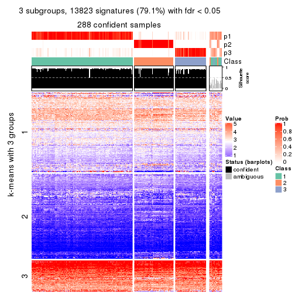</p>

</div>
<div id='tab-SD-pam-get-signatures-no-scale-3'>
<pre><code class="r">get_signatures(res, k = 4, scale_rows = FALSE)
</code></pre>

<p>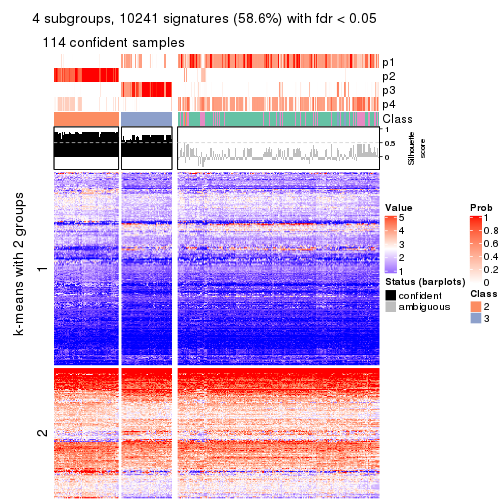</p>

</div>
<div id='tab-SD-pam-get-signatures-no-scale-4'>
<pre><code class="r">get_signatures(res, k = 5, scale_rows = FALSE)
</code></pre>

<p></p>

</div>
<div id='tab-SD-pam-get-signatures-no-scale-5'>
<pre><code class="r">get_signatures(res, k = 6, scale_rows = FALSE)
</code></pre>

<p></p>

</div>
</div>


Compare the overlap of signatures from different k:

```r
compare_signatures(res)
```


`get_signature()` returns a data frame invisibly. TO get the list of signatures, the function
call should be assigned to a variable explicitly. In following code, if `plot` argument is set
to `FALSE`, no heatmap is plotted while only the differential analysis is performed.

```r
# code only for demonstration
tb = get_signature(res, k = ..., plot = FALSE)
```

An example of the output of `tb` is:

```
#>   which_row         fdr    mean_1    mean_2 scaled_mean_1 scaled_mean_2 km
#> 1        38 0.042760348  8.373488  9.131774    -0.5533452     0.5164555  1
#> 2        40 0.018707592  7.106213  8.469186    -0.6173731     0.5762149  1
#> 3        55 0.019134737 10.221463 11.207825    -0.6159697     0.5749050  1
#> 4        59 0.006059896  5.921854  7.869574    -0.6899429     0.6439467  1
#> 5        60 0.018055526  8.928898 10.211722    -0.6204761     0.5791110  1
#> 6        98 0.009384629 15.714769 14.887706     0.6635654    -0.6193277  2
...
```

The columns in `tb` are:

1. `which_row`: row indices corresponding to the input matrix.
2. `fdr`: FDR for the differential test. 
3. `mean_x`: The mean value in group x.
4. `scaled_mean_x`: The mean value in group x after rows are scaled.
5. `km`: Row groups if k-means clustering is applied to rows.


UMAP plot which shows how samples are separated.


<script>
$( function() {
	$( '#tabs-SD-pam-dimension-reduction' ).tabs();
} );
</script>
<div id='tabs-SD-pam-dimension-reduction'>
<ul>
<li><a href='#tab-SD-pam-dimension-reduction-1'>k = 2</a></li>
<li><a href='#tab-SD-pam-dimension-reduction-2'>k = 3</a></li>
<li><a href='#tab-SD-pam-dimension-reduction-3'>k = 4</a></li>
<li><a href='#tab-SD-pam-dimension-reduction-4'>k = 5</a></li>
<li><a href='#tab-SD-pam-dimension-reduction-5'>k = 6</a></li>
</ul>
<div id='tab-SD-pam-dimension-reduction-1'>
<pre><code class="r">dimension_reduction(res, k = 2, method = &quot;UMAP&quot;)
</code></pre>

<p></p>

</div>
<div id='tab-SD-pam-dimension-reduction-2'>
<pre><code class="r">dimension_reduction(res, k = 3, method = &quot;UMAP&quot;)
</code></pre>

<p></p>

</div>
<div id='tab-SD-pam-dimension-reduction-3'>
<pre><code class="r">dimension_reduction(res, k = 4, method = &quot;UMAP&quot;)
</code></pre>

<p></p>

</div>
<div id='tab-SD-pam-dimension-reduction-4'>
<pre><code class="r">dimension_reduction(res, k = 5, method = &quot;UMAP&quot;)
</code></pre>

<p></p>

</div>
<div id='tab-SD-pam-dimension-reduction-5'>
<pre><code class="r">dimension_reduction(res, k = 6, method = &quot;UMAP&quot;)
</code></pre>

<p></p>

</div>
</div>


Following heatmap shows how subgroups are split when increasing `k`:

```r
collect_classes(res)
```


If matrix rows can be associated to genes, consider to use `GO_Enrichment(res,
...)` to perform function enrichment for the signature genes.


 

---------------------------------------------------


### SD:mclust**


The object with results only for a single top-value method and a single partition method 
can be extracted as:

```r
res = res_list["SD", "mclust"]
# you can also extract it by
# res = res_list["SD:mclust"]
```

A summary of `res` and all the functions that can be applied to it:

```r
res
```

```
#> A 'ConsensusPartition' object with k = 2, 3, 4, 5, 6.
#>   On a matrix with 17469 rows and 309 columns.
#>   Top rows (1000, 2000, 3000, 4000, 5000) are extracted by 'SD' method.
#>   Subgroups are detected by 'mclust' method.
#>   Performed in total 1250 partitions by row resampling.
#>   Best k for subgroups seems to be 2.
#> 
#> Following methods can be applied to this 'ConsensusPartition' object:
#>  [1] "cola_report"             "collect_classes"         "collect_plots"          
#>  [4] "collect_stats"           "colnames"                "compare_signatures"     
#>  [7] "consensus_heatmap"       "dimension_reduction"     "functional_enrichment"  
#> [10] "get_anno_col"            "get_anno"                "get_classes"            
#> [13] "get_consensus"           "get_matrix"              "get_membership"         
#> [16] "get_param"               "get_signatures"          "get_stats"              
#> [19] "is_best_k"               "is_stable_k"             "membership_heatmap"     
#> [22] "ncol"                    "nrow"                    "plot_ecdf"              
#> [25] "rownames"                "select_partition_number" "show"                   
#> [28] "suggest_best_k"          "test_to_known_factors"
```

`collect_plots()` function collects all the plots made from `res` for all `k` (number of partitions)
into one single page to provide an easy and fast comparison between different `k`.

```r
collect_plots(res)
```


The plots are:

- The first row: a plot of the ECDF (Empirical cumulative distribution
  function) curves of the consensus matrix for each `k` and the heatmap of
  predicted classes for each `k`.
- The second row: heatmaps of the consensus matrix for each `k`.
- The third row: heatmaps of the membership matrix for each `k`.
- The fouth row: heatmaps of the signatures for each `k`.

All the plots in panels can be made by individual functions and they are
plotted later in this section.

`select_partition_number()` produces several plots showing different
statistics for choosing "optimized" `k`. There are following statistics:

- ECDF curves of the consensus matrix for each `k`;
- 1-PAC. [The PAC
  score](https://en.wikipedia.org/wiki/Consensus_clustering#Over-interpretation_potential_of_consensus_clustering)
  measures the proportion of the ambiguous subgrouping.
- Mean silhouette score.
- Concordance. The mean probability of fiting the consensus class ids in all
  partitions.
- Area increased. Denote $A_k$ as the area under the ECDF curve for current
  `k`, the area increased is defined as $A_k - A_{k-1}$.
- Rand index. The percent of pairs of samples that are both in a same cluster
  or both are not in a same cluster in the partition of k and k-1.
- Jaccard index. The ratio of pairs of samples are both in a same cluster in
  the partition of k and k-1 and the pairs of samples are both in a same
  cluster in the partition k or k-1.

The detailed explanations of these statistics can be found in [the cola
vignette](http://bioconductor.org/packages/devel/bioc/vignettes/cola/inst/doc/cola.html#toc_13).

Generally speaking, lower PAC score, higher mean silhouette score or higher
concordance corresponds to better partition. Rand index and Jaccard index
measure how similar the current partition is compared to partition with `k-1`.
If they are too similar, we won't accept `k` is better than `k-1`.

```r
select_partition_number(res)
```


The numeric values for all these statistics can be obtained by `get_stats()`.

```r
get_stats(res)
```

```
#>   k 1-PAC mean_silhouette concordance area_increased  Rand Jaccard
#> 2 2 1.000           0.989       0.995         0.3797 0.621   0.621
#> 3 3 0.700           0.873       0.922         0.6702 0.721   0.555
#> 4 4 0.580           0.753       0.812         0.0599 0.967   0.911
#> 5 5 0.561           0.565       0.729         0.0862 0.886   0.693
#> 6 6 0.569           0.461       0.696         0.0577 0.928   0.755
```

`suggest_best_k()` suggests the best $k$ based on these statistics. The rules are as follows:

- All $k$ with Jaccard index larger than 0.95 are removed because the increase of
  the partition number does not provides enough extra information. If all $k$ are removed,
  the best $k$ is assigned by `NA`.
- For $k$ with 1-PAC larger than 0.9, the maximal $k$ is taken as the "best k". Other $k$ is called "optional k".
- If it does not fit the second rule. The $k$ with the highest vote of highest
  1-PAC, mean silhouette and concordance is taken as the "best k".

```r
suggest_best_k(res)
```

```
#> [1] 2
```


Following shows the table of the partitions (You need to click the **show/hide
code output** link to see it). The membership matrix (columns with name `p*`)
is inferred by
[`clue::cl_consensus()`](https://www.rdocumentation.org/link/cl_consensus?package=clue)
function with the `SE` method. Basically the value in the membership matrix
represents the probability to belong to a certain group. The finall class
label for an item is determined with the group with highest probability it
belongs to.

In `get_classes()` function, the entropy is calculated from the membership
matrix and the silhouette score is calculated from the consensus matrix.


<script>
$( function() {
	$( '#tabs-SD-mclust-get-classes' ).tabs();
} );
</script>
<div id='tabs-SD-mclust-get-classes'>
<ul>
<li><a href='#tab-SD-mclust-get-classes-1'>k = 2</a></li>
<li><a href='#tab-SD-mclust-get-classes-2'>k = 3</a></li>
<li><a href='#tab-SD-mclust-get-classes-3'>k = 4</a></li>
<li><a href='#tab-SD-mclust-get-classes-4'>k = 5</a></li>
<li><a href='#tab-SD-mclust-get-classes-5'>k = 6</a></li>
</ul>

<div id='tab-SD-mclust-get-classes-1'>
<p><a id='tab-SD-mclust-get-classes-1-a' style='color:#0366d6' href='#'>show/hide code output</a></p>
<pre><code class="r">cbind(get_classes(res, k = 2), get_membership(res, k = 2))
</code></pre>

<pre><code>#&gt;                                      class entropy silhouette    p1    p2
#&gt; 7826AE44-B03A-4528-9CB5-7421E592AE36     1  0.0672      0.989 0.992 0.008
#&gt; 0DC2197B-2FEA-48EB-953E-8E44E1933757     1  0.0000      0.997 1.000 0.000
#&gt; 87ABB098-8C1E-4677-8C31-48B71EFE41C7     1  0.0000      0.997 1.000 0.000
#&gt; EC0154E7-7A27-4535-83AE-6B379E99A93C     1  0.0000      0.997 1.000 0.000
#&gt; 78F79407-D49F-4FA2-B09F-0665C502827C     1  0.0000      0.997 1.000 0.000
#&gt; 03E81178-E971-4E91-8BED-D8273EA1425C     1  0.0000      0.997 1.000 0.000
#&gt; 62FCAEFF-16D8-4019-84B6-18EC3A88BC32     2  0.4431      0.896 0.092 0.908
#&gt; 722C1284-5983-4CC1-B19C-214C2DE6F8A6     2  0.0000      0.992 0.000 1.000
#&gt; 54E42A64-B350-4A94-8FED-C9BC1872660E     1  0.0000      0.997 1.000 0.000
#&gt; 53062969-D209-490B-9C9B-5D297625E2AE     1  0.0000      0.997 1.000 0.000
#&gt; B710293C-41D3-4A2E-8104-5402F91DD859     1  0.0000      0.997 1.000 0.000
#&gt; 73CB1D05-7AE4-457D-B4EF-25AC5C1F2132     1  0.0000      0.997 1.000 0.000
#&gt; B055A70B-3003-47CB-BDAA-6378C000BF24     1  0.0000      0.997 1.000 0.000
#&gt; 46C3A870-E37A-42CB-8C0C-6ACACEAC1ADC     2  0.0000      0.992 0.000 1.000
#&gt; E8E6270E-F26D-4F2E-A63E-7885BDE05FDB     1  0.0000      0.997 1.000 0.000
#&gt; C4A5EBA2-9091-4D12-BDC8-B84B122022B9     1  0.0000      0.997 1.000 0.000
#&gt; 5B1839C4-549D-41D1-B559-3C6D2A1528CE     1  0.0000      0.997 1.000 0.000
#&gt; A0DF05EB-DC44-4492-9A8A-F278F7B0C266     1  0.0000      0.997 1.000 0.000
#&gt; B5182F49-70F2-45B7-82DE-C6DA68145EEA     1  0.0000      0.997 1.000 0.000
#&gt; C204D355-B876-4341-A111-36D48CBDD2A8     1  0.0000      0.997 1.000 0.000
#&gt; 7B070AAA-EF97-4D3B-AA19-EEC170C7927D     2  0.0000      0.992 0.000 1.000
#&gt; 05A8A881-F8EE-48A2-B11C-A08D7D80CE18     1  0.0000      0.997 1.000 0.000
#&gt; BA59EF50-CFE9-456D-B1B6-67D0945004F6     1  0.0000      0.997 1.000 0.000
#&gt; AD97B334-E034-4D33-A4D5-48C32D5D521C     1  0.0000      0.997 1.000 0.000
#&gt; 51DA2568-32EA-4668-9876-4B6E7CA68860     1  0.0000      0.997 1.000 0.000
#&gt; 78C26A05-2084-494D-83D3-C52C1B800F4C     1  0.0000      0.997 1.000 0.000
#&gt; 2B5DD791-7692-4721-9519-7D7D49B52570     1  0.0000      0.997 1.000 0.000
#&gt; C0BBE26A-79C8-4392-9978-7C420B3786B5     1  0.0000      0.997 1.000 0.000
#&gt; F35A8359-3A7A-414F-8A5C-D278F3B45387     2  0.0000      0.992 0.000 1.000
#&gt; 8C9BA49C-1270-491D-A234-AE1B1C0609BA     2  0.0000      0.992 0.000 1.000
#&gt; CA104B57-B160-4148-8A0A-D34BB3E8D88A     1  0.0000      0.997 1.000 0.000
#&gt; 877E18A5-6A7A-4E29-9871-DC7EA14A5F27     1  0.0000      0.997 1.000 0.000
#&gt; 904EDF2E-411E-43BD-901D-46129AFA283A     1  0.0000      0.997 1.000 0.000
#&gt; FD9F5A9B-2BEB-4D31-9A2D-8D4B4ECBB478     1  0.0000      0.997 1.000 0.000
#&gt; 2E206314-9928-456E-B7C6-893DC0E3C7C2     2  0.0000      0.992 0.000 1.000
#&gt; 913DB655-2C7F-4369-83DE-9257F04CF39B     1  0.0000      0.997 1.000 0.000
#&gt; 72B5B724-FEB5-43BD-83F6-2E2152DDD800     1  0.0000      0.997 1.000 0.000
#&gt; 920B547C-6898-446C-AAAF-F4ED96E40AAB     2  0.0000      0.992 0.000 1.000
#&gt; 847F796A-8CD6-4013-A0FB-26F4FC3EAF0D     1  0.0000      0.997 1.000 0.000
#&gt; C4D64E7A-33F7-4CFC-9FD3-D6AA3D8EFAA7     1  0.0000      0.997 1.000 0.000
#&gt; EABA0B17-8E19-48C5-BF62-2A45C9632807     2  0.0000      0.992 0.000 1.000
#&gt; 7263CBA8-CE37-4531-A795-9324C6D2A672     1  0.0000      0.997 1.000 0.000
#&gt; 6D3CC3AC-618B-414A-B640-169C735A6568     1  0.0000      0.997 1.000 0.000
#&gt; 710C05C7-F9CE-45FA-A8CC-29DE2903E04F     1  0.0000      0.997 1.000 0.000
#&gt; 3D631A56-2C55-48EA-A667-BA46023C9D50     1  0.0000      0.997 1.000 0.000
#&gt; F1C65F64-AF05-4875-B7E4-60FFF56A3F46     1  0.0000      0.997 1.000 0.000
#&gt; E5DF76E7-A765-4E07-B87A-06168BF66C5F     1  0.0000      0.997 1.000 0.000
#&gt; 5C8C8A6E-40D4-4F82-AC3D-90CFDEE15C0A     2  0.0000      0.992 0.000 1.000
#&gt; 0117CBB9-1BF9-48B1-BE6E-A9A770FF8721     1  0.0000      0.997 1.000 0.000
#&gt; 31EF66E5-419A-44C3-BB2A-B69B52FFCECC     2  0.0000      0.992 0.000 1.000
#&gt; C149CEF5-61F3-4B53-B8A9-8244B673EBD0     1  0.0000      0.997 1.000 0.000
#&gt; 0AF351D0-4EC5-4275-AA0A-4FA2AF8A9C85     2  0.0000      0.992 0.000 1.000
#&gt; B507E82F-6680-497B-A014-033EDD7A2E03     1  0.0000      0.997 1.000 0.000
#&gt; F941890E-AB33-478F-8C97-1C785DD9428F     1  0.0000      0.997 1.000 0.000
#&gt; 7987E019-8FED-469B-A6C1-34EE430A60C3     1  0.0000      0.997 1.000 0.000
#&gt; 76084AA6-19BF-4605-B6A1-73F1D4BADAF9     1  0.0000      0.997 1.000 0.000
#&gt; 329807F7-E0D4-4F53-94E8-E4080E90CB47     1  0.0000      0.997 1.000 0.000
#&gt; 1B6505FF-C1A7-4DD0-9827-41A0A3A28F3E     1  0.0000      0.997 1.000 0.000
#&gt; 49778E92-B5D3-4AD9-A1AF-3B722D631B96     2  0.0000      0.992 0.000 1.000
#&gt; A22892DE-0AF4-4B63-9513-1D6825059040     1  0.0000      0.997 1.000 0.000
#&gt; 6D77ECAE-A715-4ADD-97D8-A916DC31A4EA     1  0.0000      0.997 1.000 0.000
#&gt; 09758B6F-1B2D-4AED-8913-696097069409     1  0.0000      0.997 1.000 0.000
#&gt; 8B709DB4-0B28-42F1-A7C5-106F5809BEA2     1  0.0000      0.997 1.000 0.000
#&gt; F2B356FA-79CD-4867-8ABF-84C90A493A75     1  0.0000      0.997 1.000 0.000
#&gt; 131213AD-0313-4DF1-B013-CE67ED262C37     2  0.0000      0.992 0.000 1.000
#&gt; D94F7E81-0F60-473B-AD4A-0AC13508BDE2     1  0.0000      0.997 1.000 0.000
#&gt; 29C17355-D646-48DA-9E54-7B6DD85DD610     1  0.0000      0.997 1.000 0.000
#&gt; B8BD866A-2A7C-45C3-96BB-9AB892D26AE5     1  0.0000      0.997 1.000 0.000
#&gt; 13EFD045-AD61-41EE-9896-67BFA4FC8C09     1  0.0000      0.997 1.000 0.000
#&gt; 2655F609-B3BB-4D01-B421-D5F4B1232EC8     2  0.0000      0.992 0.000 1.000
#&gt; 04BC7A52-C67F-42CB-8672-D3C51A20F2BA     1  0.0000      0.997 1.000 0.000
#&gt; 45472BD4-DBDB-41FE-B0E3-2440880E1DE6     1  0.0000      0.997 1.000 0.000
#&gt; B87FFFCD-CB57-4ACD-9C74-AB188984BBB2     1  0.0000      0.997 1.000 0.000
#&gt; 5271374C-13CD-4BFE-AC6D-C95AFE491322     1  0.0000      0.997 1.000 0.000
#&gt; E3372ACE-C7C8-43E5-B30A-1F2D662D8170     1  0.0000      0.997 1.000 0.000
#&gt; B08DF564-E4D0-4540-8160-93B3981DF1D8     1  0.0000      0.997 1.000 0.000
#&gt; 61A7D1B9-FC5A-4B9C-989F-936CDA948C27     1  0.0000      0.997 1.000 0.000
#&gt; 74E768C1-8766-46AC-AAB4-D79E5049F76A     2  0.0000      0.992 0.000 1.000
#&gt; 0CEA28F0-D7F0-4EB7-A23F-0C5CA6245971     1  0.0000      0.997 1.000 0.000
#&gt; 95C4EFF6-147C-48EC-A2C1-16B8F12AEEF2     2  0.0000      0.992 0.000 1.000
#&gt; C9A78BEA-D455-4F5E-8B7B-19BCB42887E7     1  0.0000      0.997 1.000 0.000
#&gt; DB970740-9AC1-4C10-9658-8A77B1C390DD     2  0.5737      0.841 0.136 0.864
#&gt; 883FBD37-0CA0-4562-8925-72ACC1EE93D9     1  0.0000      0.997 1.000 0.000
#&gt; 9FE1D006-49F2-471E-91E6-AF0414C24479     1  0.0000      0.997 1.000 0.000
#&gt; 11816CC6-8C8B-49C0-99EE-896377BCFCCD     1  0.0000      0.997 1.000 0.000
#&gt; 063FC5C8-4318-4ECC-9CA0-1976CBC8ACB6     1  0.0000      0.997 1.000 0.000
#&gt; E0F085CC-B90D-4FDE-B60E-C613971BAA00     1  0.0000      0.997 1.000 0.000
#&gt; 62361DA2-E4EE-46DA-BB1F-C51DCA9307CC     2  0.0000      0.992 0.000 1.000
#&gt; 1BA16D48-B09E-4699-A1AD-2FFECE4F3CDB     2  0.0000      0.992 0.000 1.000
#&gt; 3E4F14E9-60AE-4F17-9BA7-2A02E908204A     1  0.0000      0.997 1.000 0.000
#&gt; 79226DD7-BC85-4B8E-BFF8-B1E073129D34     1  0.0000      0.997 1.000 0.000
#&gt; D47D0936-826F-4D54-9225-F71B95357438     1  0.0000      0.997 1.000 0.000
#&gt; 0AE02B91-574C-4165-BA39-E9D7C1A870A2     2  0.0000      0.992 0.000 1.000
#&gt; DED8E9DF-CEFE-45ED-9374-EF9925A135C4     1  0.0000      0.997 1.000 0.000
#&gt; D587A993-3C47-4D4C-B744-59169D4F7451     1  0.0000      0.997 1.000 0.000
#&gt; 6BCA24E6-440F-42C5-ABE5-66C37B713A39     1  0.0000      0.997 1.000 0.000
#&gt; 86A5EDFB-9D06-4FED-BF57-F8D74A68E156     1  0.0000      0.997 1.000 0.000
#&gt; B9BD5134-2F6A-4454-8F83-69B63F9AE114     1  0.0000      0.997 1.000 0.000
#&gt; 082DA9E1-A40D-482B-8E21-A93BA97185F0     1  0.0000      0.997 1.000 0.000
#&gt; 16A8343A-1203-44FB-9F03-05CC7C71B4CC     1  0.0000      0.997 1.000 0.000
#&gt; 00439565-02CE-4BF5-956D-7078B51C0947     1  0.0000      0.997 1.000 0.000
#&gt; 7B2BD361-2BF1-4E97-BC08-457F5A9C2682     2  0.0000      0.992 0.000 1.000
#&gt; C1D8439A-D527-47F6-ADC1-25867B65DA21     2  0.0000      0.992 0.000 1.000
#&gt; D9096909-1439-462D-B69C-CAD1BF4F420C     1  0.0000      0.997 1.000 0.000
#&gt; 7822EA86-35A1-4285-9429-2B63111B9885     1  0.0000      0.997 1.000 0.000
#&gt; 6FD0CFC8-AC8D-4CF1-8C33-833AD98A30EF     2  0.0000      0.992 0.000 1.000
#&gt; A451F278-5E83-4BC6-9B15-3AA2117B99B6     1  0.0938      0.985 0.988 0.012
#&gt; 6EC25686-4547-459C-9E01-7EDF8DAECE35     1  0.0000      0.997 1.000 0.000
#&gt; 5D2F1EEA-2BA8-4C3A-8436-544EE1D23E7E     1  0.0000      0.997 1.000 0.000
#&gt; 675A4293-A4CE-4307-B00B-DFC4D44A87C6     2  0.0000      0.992 0.000 1.000
#&gt; 6FBE0AEF-476A-42B2-A857-846CF1ED92B6     2  0.0000      0.992 0.000 1.000
#&gt; 7139D616-1A15-4288-A9AE-411856A4A76D     1  0.0000      0.997 1.000 0.000
#&gt; 46D7F8C1-D5C5-40CC-BEF5-2E590A847BD9     1  0.0000      0.997 1.000 0.000
#&gt; 984C44D3-4F5F-44C9-BCD9-C991EBC1FCB8     1  0.0000      0.997 1.000 0.000
#&gt; 83FE52E0-2DC2-4580-8BB2-FBCBEE4AC240     1  0.0000      0.997 1.000 0.000
#&gt; 0923F9CB-DF6F-4BAA-A5F8-0F83CE60D1ED     1  0.0000      0.997 1.000 0.000
#&gt; 1DEB5206-78CC-4EB5-BCD5-85A6A5B4E273     1  0.0000      0.997 1.000 0.000
#&gt; E4DB18DA-EB0C-4B2F-9566-7F72222B16D4     1  0.0000      0.997 1.000 0.000
#&gt; F7456312-1309-4B2F-875D-0F90CDF3EC35     1  0.0000      0.997 1.000 0.000
#&gt; 9A25E5D8-0706-4960-A76B-BCD0AC93E4FA     1  0.0000      0.997 1.000 0.000
#&gt; 5A41FE8F-FFB3-4B87-BF11-A570C184096D     1  0.0000      0.997 1.000 0.000
#&gt; 33F84E63-3F6C-4867-ADB1-A0DF39F1295B     1  0.0000      0.997 1.000 0.000
#&gt; D6A644F5-D1D0-4A8D-94C4-EE6C3ECE7430     1  0.0000      0.997 1.000 0.000
#&gt; 2A5848CC-A9A2-4AA8-A752-321273E62CF0     1  0.0000      0.997 1.000 0.000
#&gt; 7CA6358B-FC8A-4675-B092-9E061038FC83     1  0.0000      0.997 1.000 0.000
#&gt; A4C2F4BC-5C62-4B1F-9AB8-46D9468EF523     2  0.0000      0.992 0.000 1.000
#&gt; 8AF4EB7F-418D-4CC9-A9B8-A93A4C1A173B     2  0.0000      0.992 0.000 1.000
#&gt; E5048887-70C8-468F-881E-2EC55F6E6F3B     1  0.0000      0.997 1.000 0.000
#&gt; 1BADCC7C-C4D8-4C34-9534-59D622C7A2A2     1  0.0000      0.997 1.000 0.000
#&gt; 02CE7DF7-64BD-4297-A240-A5B9EE8771D3     1  0.0000      0.997 1.000 0.000
#&gt; CBF6E96A-F56C-4C87-B851-D319930BAAB8     1  0.0000      0.997 1.000 0.000
#&gt; 48F6B774-CFD2-4DDF-B7A2-696596413C3F     1  0.0000      0.997 1.000 0.000
#&gt; 41D88C3E-5848-4B09-8A77-EAE6AC4EC6B0     2  0.0000      0.992 0.000 1.000
#&gt; BDF79CC0-00C7-49C1-900B-AB065A733B17     1  0.0000      0.997 1.000 0.000
#&gt; A894D686-BFC7-4AEE-A794-DBE718C6B6F6     2  0.0000      0.992 0.000 1.000
#&gt; 0712029E-3765-4272-BE5B-B6C8BCCC0F0F     2  0.0000      0.992 0.000 1.000
#&gt; 7B051855-9B09-4887-9BC0-9F077537938E     1  0.0000      0.997 1.000 0.000
#&gt; EF357C46-5C3C-4F51-9383-FF7694D07B97     2  0.0000      0.992 0.000 1.000
#&gt; 9492A322-37CA-4582-AC68-66B5D80778AF     2  0.0000      0.992 0.000 1.000
#&gt; 993399A4-1B9F-4258-B2D0-155AD58A2E82     1  0.0000      0.997 1.000 0.000
#&gt; 7B7DC93D-5494-4E69-BE07-2967887182F9     1  0.0000      0.997 1.000 0.000
#&gt; 29BCBA51-2580-473D-9CF7-BEDBD0DBAD1B     2  0.0000      0.992 0.000 1.000
#&gt; 40855647-E942-4F32-90B7-BEB921929BFB     1  0.0000      0.997 1.000 0.000
#&gt; 0DC723D0-7C68-4495-A4B9-2DF2FF19AB14     2  0.0000      0.992 0.000 1.000
#&gt; 7540005F-57E0-4E2E-A8A2-BEF2B0F333B1     2  0.0000      0.992 0.000 1.000
#&gt; EB1DDB14-4076-4C2C-B911-390C17C21486     1  0.0000      0.997 1.000 0.000
#&gt; 9EA70EC4-8BA0-4E3D-B3CB-A68D19E89868     1  0.0000      0.997 1.000 0.000
#&gt; B04E2E50-0A6E-4224-A825-1714D12E5669     2  0.0000      0.992 0.000 1.000
#&gt; B0BF5E01-536D-40FF-9C24-CBBD611E2FC2     1  0.0000      0.997 1.000 0.000
#&gt; 7B6B1788-B297-4442-B6BE-B7CE8754491E     1  0.0000      0.997 1.000 0.000
#&gt; A090D00C-34DF-4906-A517-4803C4C9A332     1  0.0000      0.997 1.000 0.000
#&gt; 340D44A6-9BEA-412C-9973-D9ABD6692255     1  0.0000      0.997 1.000 0.000
#&gt; E8D0D1E7-E5A8-4014-80C1-0245F90F4358     2  0.0000      0.992 0.000 1.000
#&gt; 19EA1494-8572-40E1-B9BB-3739F47B607D     1  0.0000      0.997 1.000 0.000
#&gt; 1C1B4793-8DAF-4763-BA4D-C4E869A4ED35     1  0.0000      0.997 1.000 0.000
#&gt; 45BF59B3-95BD-4196-ABAA-4C4F0DB38572     2  0.0000      0.992 0.000 1.000
#&gt; 47B5A2A7-7E13-4558-99D2-067F5075C6A4     1  0.0000      0.997 1.000 0.000
#&gt; E94638E8-CB51-4FBB-8BCB-4BFD7A812291     1  0.0000      0.997 1.000 0.000
#&gt; A17352A8-0D3C-4545-8136-7DAE2FB0E102     2  0.0000      0.992 0.000 1.000
#&gt; B18A6F95-D4ED-416B-B5A1-9A4934865D0D     2  0.0000      0.992 0.000 1.000
#&gt; 33E92C5F-0C42-4549-AD5B-0A064182A272     1  0.0000      0.997 1.000 0.000
#&gt; E041B375-3E60-4F18-A6EF-D1C249E3B8EE     1  0.0000      0.997 1.000 0.000
#&gt; EDF90AF6-6C64-4BD2-AADF-8D7D188650B2     2  0.0000      0.992 0.000 1.000
#&gt; 569320D2-316C-4E2D-B7B3-D7D5C4DAD42D     1  0.0000      0.997 1.000 0.000
#&gt; AFFB223D-DAE9-4567-9EF2-8E4DF9D8782D     2  0.0000      0.992 0.000 1.000
#&gt; 56FC9454-0A6A-4CC3-95C4-BE0E0D0BAFCE     2  0.0000      0.992 0.000 1.000
#&gt; 43226365-FAEF-46C5-AF1B-5C6C2BED84FF     1  0.0000      0.997 1.000 0.000
#&gt; 1536110A-B42A-4A84-9474-9895321FDCE9     2  0.0000      0.992 0.000 1.000
#&gt; 812255DD-536B-4216-90B1-27D5AB339BE2     1  0.0000      0.997 1.000 0.000
#&gt; 5D4563D6-68B7-4C9D-A3F4-AA7D45D5112C     2  0.0000      0.992 0.000 1.000
#&gt; BAA39781-DB94-473C-98B1-FA6CD3E1C67A     1  0.0000      0.997 1.000 0.000
#&gt; C1411CDA-814D-4E21-8929-C0F77858828F     1  0.0000      0.997 1.000 0.000
#&gt; EFE2F248-C13E-4E8D-9153-8C903848AC4A     1  0.0000      0.997 1.000 0.000
#&gt; D3939C84-D1D6-4060-9F91-AEB222A9BDD5     1  0.0000      0.997 1.000 0.000
#&gt; EABD2987-8C1E-49E5-94AF-C0BDE5335A48     1  0.0000      0.997 1.000 0.000
#&gt; F4BE2ABE-2CEB-4A6A-B8EC-0355F8C63B9B     1  0.0000      0.997 1.000 0.000
#&gt; 627BC251-D217-4955-B718-6B9D6DEA1756     1  0.0000      0.997 1.000 0.000
#&gt; 31B54613-A20E-4039-BB8B-9B52104CE418     1  0.0000      0.997 1.000 0.000
#&gt; 3F292B7C-A535-4DBD-BC20-CB4F85A1C94B     1  0.0000      0.997 1.000 0.000
#&gt; BEA2A5EB-EEA9-4F31-AC38-810E04CE124B     2  0.0000      0.992 0.000 1.000
#&gt; 99D84D46-19DA-43F1-B639-DCE9953F1529     2  0.0000      0.992 0.000 1.000
#&gt; 4588817E-1068-4A78-86B6-4674A0112DDA     1  0.0000      0.997 1.000 0.000
#&gt; 6AC633BD-BEC1-4750-94E3-378972DAB6B3     2  0.0000      0.992 0.000 1.000
#&gt; 09E17C6E-7EDE-4DDF-B5ED-2521AF870C9A     1  0.0000      0.997 1.000 0.000
#&gt; 58D9C750-26A2-4B7C-84C4-13D7AFB4C5EA     1  0.0000      0.997 1.000 0.000
#&gt; DF28E138-E222-4F77-9B61-69E601CA7E60     2  0.0000      0.992 0.000 1.000
#&gt; FEA489A8-E423-4266-AADA-9BAAB29AB94B     1  0.0000      0.997 1.000 0.000
#&gt; F3FCC207-15CD-41EA-A3EF-F5D2C12AC373     1  0.0000      0.997 1.000 0.000
#&gt; 53DD7AFB-A258-4643-A501-BACC95D17A50     2  0.0000      0.992 0.000 1.000
#&gt; D850B2A1-1F8A-4A44-A0CF-8D9DD4A1889A     2  0.0000      0.992 0.000 1.000
#&gt; B3F746DC-E487-4305-9F30-825D1520E8FD     2  0.0000      0.992 0.000 1.000
#&gt; BE38240A-F7C2-439F-9AAE-51C8A340F310     1  0.0000      0.997 1.000 0.000
#&gt; A9022D9E-1D30-49EE-8552-1364A8027F34     1  0.0000      0.997 1.000 0.000
#&gt; 0E8A56EE-D9A2-48A5-B793-A358BE1E4EFA     1  0.0000      0.997 1.000 0.000
#&gt; 51667574-318E-4BDB-8F42-8512A4C1B84F     1  0.0000      0.997 1.000 0.000
#&gt; B0A442C9-67E4-4534-8A5C-D6D73F42358C     1  0.0000      0.997 1.000 0.000
#&gt; 25A5BC09-0D88-4385-87AF-997F9018522D     2  0.0000      0.992 0.000 1.000
#&gt; 344B9631-AAA5-4302-8747-D584345D9131     1  0.0000      0.997 1.000 0.000
#&gt; 1C3795AD-6306-4892-95F5-92DF3375D46A     1  0.0000      0.997 1.000 0.000
#&gt; 17BB221D-8BF9-4391-83DD-423AE1E03651     1  0.0000      0.997 1.000 0.000
#&gt; 297611E9-9555-4BCA-A723-02E846ACC23A     1  0.0000      0.997 1.000 0.000
#&gt; AD7FF180-1EAC-4783-8A62-E9626B96DD9F     1  0.6887      0.774 0.816 0.184
#&gt; FD544083-9BD5-4036-BD81-0352B67CC45C     1  0.0000      0.997 1.000 0.000
#&gt; 879A74D5-5B29-418D-A0F4-8E88D6384008     1  0.0000      0.997 1.000 0.000
#&gt; 43CD982C-13C0-4A52-803A-9A3A3FAE09BC     1  0.0000      0.997 1.000 0.000
#&gt; DCD0313D-5206-4111-8743-A8A0227257D9     1  0.0000      0.997 1.000 0.000
#&gt; 331A9160-D730-45DD-A985-C6CAC03035ED     1  0.0000      0.997 1.000 0.000
#&gt; 9EEECA0E-530D-4724-B016-A716F0782148     1  0.0000      0.997 1.000 0.000
#&gt; B3073976-CA3F-4115-9243-8C2D9E1B975D     1  0.0000      0.997 1.000 0.000
#&gt; 77B3C9B4-1A7F-41BB-A37D-01EF80E933CC     2  0.0000      0.992 0.000 1.000
#&gt; C0C26822-2E9F-4FB0-81D4-575027C8B71C     2  0.0000      0.992 0.000 1.000
#&gt; F1FCE328-2B3B-499A-888D-0E66A017E8B0     1  0.0000      0.997 1.000 0.000
#&gt; F069DAD6-F1EB-42F7-8252-F3F6EC46CC3E     1  0.0000      0.997 1.000 0.000
#&gt; 99CC822E-8C98-4EEC-BB58-AEF76A0B5332     1  0.0000      0.997 1.000 0.000
#&gt; C86EBD08-53F2-4972-801A-74970FDD6A62     1  0.0000      0.997 1.000 0.000
#&gt; F07326F2-C1D6-4D5A-9693-25C3A04B0EC2     1  0.0000      0.997 1.000 0.000
#&gt; 8ACBD428-7713-48D9-810A-43C9CD191A73     2  0.0000      0.992 0.000 1.000
#&gt; 3D3501B4-1A43-4FA7-90A2-CCEBF66BFD4A     1  0.0000      0.997 1.000 0.000
#&gt; DD51C17C-300F-44A4-955A-C9BC85417842     1  0.0000      0.997 1.000 0.000
#&gt; 58FF391C-1D83-426C-8F92-C15F78F56C95     1  0.0000      0.997 1.000 0.000
#&gt; ACE65C6E-2B10-4972-91B4-9199DD4B179D     1  0.0000      0.997 1.000 0.000
#&gt; B2088466-FA5D-491C-9982-99B33683E66F     2  0.0000      0.992 0.000 1.000
#&gt; D47AF416-1687-4FE0-A235-8815B6E8EB0B     1  0.0000      0.997 1.000 0.000
#&gt; 4DCAD07F-CC43-46F6-B2F3-EDBF3EDD1045     2  0.0000      0.992 0.000 1.000
#&gt; AAAE0BD9-63FC-4A0E-A27E-447B634BAD99     2  0.0000      0.992 0.000 1.000
#&gt; BC471AA1-52CF-4CEE-9866-34CE91404F45     2  0.0000      0.992 0.000 1.000
#&gt; 81D3EE3F-AC11-404F-8092-307F0DC12198     1  0.0000      0.997 1.000 0.000
#&gt; 8C02026C-C25E-406B-B8B8-A1A82362AE79     1  0.1843      0.969 0.972 0.028
#&gt; 6A005F2A-A0C1-4CA4-B15B-96B08F013874     1  0.0000      0.997 1.000 0.000
#&gt; B55743F2-4D63-4375-85D3-F58281CFD852     1  0.0000      0.997 1.000 0.000
#&gt; 24F98393-C817-4D0E-A7DB-05D2B5C71F40     1  0.0000      0.997 1.000 0.000
#&gt; 2C2AEF1D-4112-4EC7-9027-5E3FD26E8802     1  0.0000      0.997 1.000 0.000
#&gt; 8BAC3CB5-2987-4349-8AE8-B83DDD16CA3C     1  0.0000      0.997 1.000 0.000
#&gt; ED9C74E6-92FC-4E58-8FCE-1761DEA0C977     1  0.0000      0.997 1.000 0.000
#&gt; BA732ED4-F6BA-404E-BA3C-CA558FAD866A     1  0.0000      0.997 1.000 0.000
#&gt; E750385A-12D9-4A88-B4DF-C1306B5EF3B7     2  0.0000      0.992 0.000 1.000
#&gt; 6B1DC5E4-5F82-4395-913F-6AEDB5B63188     1  0.0000      0.997 1.000 0.000
#&gt; A7C12D37-FD50-4674-A054-1774F4E5C3B3     1  0.0000      0.997 1.000 0.000
#&gt; 2155C764-2063-4D9C-9ACD-96AA73475F5E     1  0.0000      0.997 1.000 0.000
#&gt; DE23CC15-A95E-4119-9B3C-8EEC45900D11     2  0.0000      0.992 0.000 1.000
#&gt; 5DB1DCAD-638E-48A4-9F40-3D6268FDEC33     2  0.0000      0.992 0.000 1.000
#&gt; 34AF0341-73D7-4080-AAEB-4C1541C2569F     1  0.0000      0.997 1.000 0.000
#&gt; B60D4235-44AF-4BA4-98C0-BCCDC28E90B9     2  0.0000      0.992 0.000 1.000
#&gt; CF463D89-2C9F-4257-BF04-8BC1CD40EA7D     2  0.0000      0.992 0.000 1.000
#&gt; EF6C8165-484A-4530-AEDF-93DCC4A8455D     1  0.0000      0.997 1.000 0.000
#&gt; B9F6B5E4-4D10-49B8-A8FE-8F33C5A62CBF     1  0.0000      0.997 1.000 0.000
#&gt; CE539000-92D7-4622-9C8D-BC6E01310681     2  0.0000      0.992 0.000 1.000
#&gt; D3BBC405-A22A-4009-ABF6-96FEEE653051     2  0.0000      0.992 0.000 1.000
#&gt; 0B3C86BD-0D20-4408-9BE3-05658729505F     1  0.2603      0.952 0.956 0.044
#&gt; 9B9C5071-7C3F-416C-B91C-6F5966747F54     1  0.0000      0.997 1.000 0.000
#&gt; A9469A4A-C5F9-4681-A916-A26F0B4307BA     1  0.0000      0.997 1.000 0.000
#&gt; A31B57E4-E30B-4A1B-829D-1B47D9CEC041     2  0.0000      0.992 0.000 1.000
#&gt; 647255CE-F84A-4070-B3FD-D8ACA32C4D09     1  0.0000      0.997 1.000 0.000
#&gt; 8F5E9F02-51D7-410E-B8B7-22737F2F095A     2  0.0000      0.992 0.000 1.000
#&gt; 8074A7F6-2FDE-4578-B71C-01C542D468FE     1  0.0000      0.997 1.000 0.000
#&gt; 2A946F17-F245-409E-A019-C60CDA18DC7D     1  0.0000      0.997 1.000 0.000
#&gt; 0878C381-47F9-4786-82C2-94AC840BEDCB     1  0.0000      0.997 1.000 0.000
#&gt; 54504893-92C5-4328-85A8-2A882680B5E0     1  0.0000      0.997 1.000 0.000
#&gt; 0A27D1BE-E5DD-459A-A51F-6D8AAF7CFEB4     1  0.0000      0.997 1.000 0.000
#&gt; 89ED5A3E-CAC0-4AB4-B858-A3CD8F34DBD5     2  0.0000      0.992 0.000 1.000
#&gt; ACEEB0A5-AADB-4EF9-8710-4BAF95522CEA     1  0.0000      0.997 1.000 0.000
#&gt; 02C74D81-5976-4252-BC6C-B10E934DECA2     1  0.0000      0.997 1.000 0.000
#&gt; D365A238-4739-4B54-9608-DC548F21C04E     1  0.0000      0.997 1.000 0.000
#&gt; F70F7ED5-A3B7-4210-95AD-DEFA0A565F06     1  0.0000      0.997 1.000 0.000
#&gt; A92C23A9-BC25-4025-9501-6D5FF8E2A502     1  0.0000      0.997 1.000 0.000
#&gt; ECE9BBF4-840E-47A6-8378-0B6C4A2369D3     1  0.0000      0.997 1.000 0.000
#&gt; 38749490-0FCF-4B33-9EBC-8F86C2D9E4AF     1  0.0000      0.997 1.000 0.000
#&gt; 02ABB64E-768B-4999-A899-EEE573D5F186     1  0.0000      0.997 1.000 0.000
#&gt; C1C467A8-18B1-4C3F-AC45-33359ED6FDC4     1  0.0000      0.997 1.000 0.000
#&gt; 78B2E4A1-9DAE-404F-AB47-1896450EF254     1  0.0000      0.997 1.000 0.000
#&gt; CCDB0290-91DA-4089-84A6-4434BA028D30     1  0.0000      0.997 1.000 0.000
#&gt; D5041E80-20A0-4C1A-9AC1-2394F6DB6E92     1  0.0000      0.997 1.000 0.000
#&gt; 20EB9CC6-EABB-438A-9030-E766459996D1     2  0.0000      0.992 0.000 1.000
#&gt; 73E99110-9A7C-4F73-98C5-79D22CB06230     1  0.0000      0.997 1.000 0.000
#&gt; FAD8A464-9BC3-4ED9-9517-B18D36514325     1  0.0000      0.997 1.000 0.000
#&gt; 9AF0E82E-E621-437A-8D19-700532B95090     1  0.0000      0.997 1.000 0.000
#&gt; 27DA48F3-4FC1-41A3-8E49-5B25F1CCFF07     1  0.0000      0.997 1.000 0.000
#&gt; EFE5A302-D138-4044-A301-5C5FD1C24836     1  0.0000      0.997 1.000 0.000
#&gt; D3E866AC-D66A-4C07-9F47-89AF460320DE     2  0.0000      0.992 0.000 1.000
#&gt; 89C45456-9392-4EB3-9A82-A130B6702AAF     1  0.0000      0.997 1.000 0.000
#&gt; 8FF5C8FC-2565-49BE-9EE0-91A84A85AB2A     1  0.8016      0.677 0.756 0.244
#&gt; 846DF088-75D5-49CF-BDDC-27E735A08DCA     1  0.0000      0.997 1.000 0.000
#&gt; EA3A19E1-7ADE-47B6-A35A-71290967147A     1  0.8207      0.656 0.744 0.256
#&gt; B2C43D0C-732B-4C54-938F-D3C9FDA880DA     1  0.0000      0.997 1.000 0.000
#&gt; EEC856B5-9B7F-488D-975E-CE2FF7072879     1  0.0000      0.997 1.000 0.000
#&gt; 8A68C417-09CC-4FA1-BFEB-EB4B738853A4     1  0.0000      0.997 1.000 0.000
#&gt; C5DF1A0D-952C-44E2-BF83-ED57177EF60E     1  0.0000      0.997 1.000 0.000
#&gt; B5C9EA22-F758-4BD2-BD1F-282EC1078AED     2  0.0000      0.992 0.000 1.000
#&gt; 3F08AE92-3EFD-4D7F-8C5C-BFB3621F0CD6     1  0.0000      0.997 1.000 0.000
#&gt; 8F0D43F1-2199-4DBB-9B16-1E5F2CED2FEC     2  0.0000      0.992 0.000 1.000
#&gt; 54BABD8B-EA9F-4875-8594-2179B38C73BD     1  0.0000      0.997 1.000 0.000
#&gt; C149B6F8-03DC-4907-920A-F3318B8D2A1E     1  0.0000      0.997 1.000 0.000
#&gt; F93D26E2-4B45-495D-BC8E-5B592F8FDABF     1  0.0000      0.997 1.000 0.000
#&gt; C98275CD-C39A-4E14-A731-4F3EB7396665     2  0.9661      0.358 0.392 0.608
#&gt; 354DC705-216E-42F0-B29E-C1F8D6C9489A     1  0.0000      0.997 1.000 0.000
#&gt; 6752EED9-7990-433F-A206-D5398C396471     1  0.0000      0.997 1.000 0.000
#&gt; C3E94C5D-68C4-400C-B7CB-38C42E9D5FFF     1  0.0000      0.997 1.000 0.000
#&gt; CE6B6871-3ED3-44DE-A777-7558D4429057     1  0.0000      0.997 1.000 0.000
#&gt; A06E7D1E-E432-4A4C-8BB0-314304F96EDF     1  0.0000      0.997 1.000 0.000
#&gt; 1ABBEF80-508F-4247-B43D-3E549372113B     1  0.0000      0.997 1.000 0.000
#&gt; 835AAE7F-F873-4D11-8845-232D261A38DF     1  0.0000      0.997 1.000 0.000
#&gt; E98A0460-6529-4DBA-8542-1B98801D7A7D     1  0.0000      0.997 1.000 0.000
#&gt; 06A9CBF8-01D0-4720-BCE8-83F0E77C862F     1  0.0000      0.997 1.000 0.000
#&gt; 206865A9-A67C-49A6-93AD-55D06E777559     2  0.0000      0.992 0.000 1.000
#&gt; 26DABC83-DB30-452F-9BE2-366760CB138E     2  0.0000      0.992 0.000 1.000
#&gt; 9DD5272A-2D6E-4774-83E3-0CD761EDE926     1  0.0000      0.997 1.000 0.000
#&gt; 4938E366-C740-4C9C-9358-FF37997DC9EF     1  0.0000      0.997 1.000 0.000
#&gt; E2DA59C4-A47C-41E3-BC55-2D00C6EC17FB     1  0.0000      0.997 1.000 0.000
#&gt; 37349E62-0BFB-4FEA-81D0-2AB7E7625B0D     1  0.0000      0.997 1.000 0.000
</code></pre>

<script>
$('#tab-SD-mclust-get-classes-1-a').parent().next().next().hide();
$('#tab-SD-mclust-get-classes-1-a').click(function(){
  $('#tab-SD-mclust-get-classes-1-a').parent().next().next().toggle();
  return(false);
});
</script>
</div>

<div id='tab-SD-mclust-get-classes-2'>
<p><a id='tab-SD-mclust-get-classes-2-a' style='color:#0366d6' href='#'>show/hide code output</a></p>
<pre><code class="r">cbind(get_classes(res, k = 3), get_membership(res, k = 3))
</code></pre>

<pre><code>#&gt;                                      class entropy silhouette    p1    p2    p3
#&gt; 7826AE44-B03A-4528-9CB5-7421E592AE36     3  0.3267    0.90202 0.116 0.000 0.884
#&gt; 0DC2197B-2FEA-48EB-953E-8E44E1933757     3  0.3267    0.90202 0.116 0.000 0.884
#&gt; 87ABB098-8C1E-4677-8C31-48B71EFE41C7     3  0.2878    0.89910 0.096 0.000 0.904
#&gt; EC0154E7-7A27-4535-83AE-6B379E99A93C     1  0.1031    0.91340 0.976 0.000 0.024
#&gt; 78F79407-D49F-4FA2-B09F-0665C502827C     1  0.0747    0.91587 0.984 0.000 0.016
#&gt; 03E81178-E971-4E91-8BED-D8273EA1425C     1  0.2537    0.88149 0.920 0.000 0.080
#&gt; 62FCAEFF-16D8-4019-84B6-18EC3A88BC32     3  0.4750    0.68870 0.000 0.216 0.784
#&gt; 722C1284-5983-4CC1-B19C-214C2DE6F8A6     2  0.0000    0.98971 0.000 1.000 0.000
#&gt; 54E42A64-B350-4A94-8FED-C9BC1872660E     3  0.2625    0.87352 0.084 0.000 0.916
#&gt; 53062969-D209-490B-9C9B-5D297625E2AE     1  0.0237    0.91689 0.996 0.000 0.004
#&gt; B710293C-41D3-4A2E-8104-5402F91DD859     1  0.0000    0.91661 1.000 0.000 0.000
#&gt; 73CB1D05-7AE4-457D-B4EF-25AC5C1F2132     1  0.0000    0.91661 1.000 0.000 0.000
#&gt; B055A70B-3003-47CB-BDAA-6378C000BF24     3  0.3340    0.90144 0.120 0.000 0.880
#&gt; 46C3A870-E37A-42CB-8C0C-6ACACEAC1ADC     2  0.0000    0.98971 0.000 1.000 0.000
#&gt; E8E6270E-F26D-4F2E-A63E-7885BDE05FDB     3  0.5178    0.74144 0.256 0.000 0.744
#&gt; C4A5EBA2-9091-4D12-BDC8-B84B122022B9     3  0.3340    0.90144 0.120 0.000 0.880
#&gt; 5B1839C4-549D-41D1-B559-3C6D2A1528CE     1  0.4291    0.74557 0.820 0.000 0.180
#&gt; A0DF05EB-DC44-4492-9A8A-F278F7B0C266     1  0.0892    0.91475 0.980 0.000 0.020
#&gt; B5182F49-70F2-45B7-82DE-C6DA68145EEA     1  0.0747    0.91481 0.984 0.000 0.016
#&gt; C204D355-B876-4341-A111-36D48CBDD2A8     3  0.5465    0.74376 0.288 0.000 0.712
#&gt; 7B070AAA-EF97-4D3B-AA19-EEC170C7927D     2  0.0000    0.98971 0.000 1.000 0.000
#&gt; 05A8A881-F8EE-48A2-B11C-A08D7D80CE18     1  0.1031    0.91340 0.976 0.000 0.024
#&gt; BA59EF50-CFE9-456D-B1B6-67D0945004F6     1  0.0747    0.91587 0.984 0.000 0.016
#&gt; AD97B334-E034-4D33-A4D5-48C32D5D521C     1  0.0747    0.91587 0.984 0.000 0.016
#&gt; 51DA2568-32EA-4668-9876-4B6E7CA68860     3  0.3267    0.90202 0.116 0.000 0.884
#&gt; 78C26A05-2084-494D-83D3-C52C1B800F4C     1  0.1031    0.91340 0.976 0.000 0.024
#&gt; 2B5DD791-7692-4721-9519-7D7D49B52570     3  0.3267    0.90202 0.116 0.000 0.884
#&gt; C0BBE26A-79C8-4392-9978-7C420B3786B5     1  0.1289    0.90613 0.968 0.000 0.032
#&gt; F35A8359-3A7A-414F-8A5C-D278F3B45387     2  0.0000    0.98971 0.000 1.000 0.000
#&gt; 8C9BA49C-1270-491D-A234-AE1B1C0609BA     2  0.0000    0.98971 0.000 1.000 0.000
#&gt; CA104B57-B160-4148-8A0A-D34BB3E8D88A     1  0.5835    0.49279 0.660 0.000 0.340
#&gt; 877E18A5-6A7A-4E29-9871-DC7EA14A5F27     3  0.5216    0.69217 0.260 0.000 0.740
#&gt; 904EDF2E-411E-43BD-901D-46129AFA283A     1  0.1031    0.91340 0.976 0.000 0.024
#&gt; FD9F5A9B-2BEB-4D31-9A2D-8D4B4ECBB478     1  0.0000    0.91661 1.000 0.000 0.000
#&gt; 2E206314-9928-456E-B7C6-893DC0E3C7C2     2  0.0000    0.98971 0.000 1.000 0.000
#&gt; 913DB655-2C7F-4369-83DE-9257F04CF39B     3  0.1289    0.87300 0.032 0.000 0.968
#&gt; 72B5B724-FEB5-43BD-83F6-2E2152DDD800     3  0.2261    0.88904 0.068 0.000 0.932
#&gt; 920B547C-6898-446C-AAAF-F4ED96E40AAB     2  0.0000    0.98971 0.000 1.000 0.000
#&gt; 847F796A-8CD6-4013-A0FB-26F4FC3EAF0D     1  0.1031    0.91340 0.976 0.000 0.024
#&gt; C4D64E7A-33F7-4CFC-9FD3-D6AA3D8EFAA7     1  0.0747    0.91587 0.984 0.000 0.016
#&gt; EABA0B17-8E19-48C5-BF62-2A45C9632807     2  0.0000    0.98971 0.000 1.000 0.000
#&gt; 7263CBA8-CE37-4531-A795-9324C6D2A672     3  0.5291    0.77124 0.268 0.000 0.732
#&gt; 6D3CC3AC-618B-414A-B640-169C735A6568     3  0.3267    0.90202 0.116 0.000 0.884
#&gt; 710C05C7-F9CE-45FA-A8CC-29DE2903E04F     1  0.4235    0.73472 0.824 0.000 0.176
#&gt; 3D631A56-2C55-48EA-A667-BA46023C9D50     1  0.3192    0.83530 0.888 0.000 0.112
#&gt; F1C65F64-AF05-4875-B7E4-60FFF56A3F46     1  0.3192    0.84647 0.888 0.000 0.112
#&gt; E5DF76E7-A765-4E07-B87A-06168BF66C5F     1  0.0000    0.91661 1.000 0.000 0.000
#&gt; 5C8C8A6E-40D4-4F82-AC3D-90CFDEE15C0A     2  0.0000    0.98971 0.000 1.000 0.000
#&gt; 0117CBB9-1BF9-48B1-BE6E-A9A770FF8721     3  0.5254    0.77044 0.264 0.000 0.736
#&gt; 31EF66E5-419A-44C3-BB2A-B69B52FFCECC     2  0.0000    0.98971 0.000 1.000 0.000
#&gt; C149CEF5-61F3-4B53-B8A9-8244B673EBD0     1  0.0237    0.91641 0.996 0.000 0.004
#&gt; 0AF351D0-4EC5-4275-AA0A-4FA2AF8A9C85     2  0.0000    0.98971 0.000 1.000 0.000
#&gt; B507E82F-6680-497B-A014-033EDD7A2E03     3  0.4887    0.81770 0.228 0.000 0.772
#&gt; F941890E-AB33-478F-8C97-1C785DD9428F     3  0.4452    0.85224 0.192 0.000 0.808
#&gt; 7987E019-8FED-469B-A6C1-34EE430A60C3     1  0.0747    0.91587 0.984 0.000 0.016
#&gt; 76084AA6-19BF-4605-B6A1-73F1D4BADAF9     3  0.3267    0.90202 0.116 0.000 0.884
#&gt; 329807F7-E0D4-4F53-94E8-E4080E90CB47     3  0.3116    0.90166 0.108 0.000 0.892
#&gt; 1B6505FF-C1A7-4DD0-9827-41A0A3A28F3E     3  0.3340    0.85879 0.120 0.000 0.880
#&gt; 49778E92-B5D3-4AD9-A1AF-3B722D631B96     2  0.0000    0.98971 0.000 1.000 0.000
#&gt; A22892DE-0AF4-4B63-9513-1D6825059040     1  0.0747    0.91587 0.984 0.000 0.016
#&gt; 6D77ECAE-A715-4ADD-97D8-A916DC31A4EA     1  0.6204    0.38778 0.576 0.000 0.424
#&gt; 09758B6F-1B2D-4AED-8913-696097069409     3  0.3340    0.89885 0.120 0.000 0.880
#&gt; 8B709DB4-0B28-42F1-A7C5-106F5809BEA2     3  0.5254    0.77399 0.264 0.000 0.736
#&gt; F2B356FA-79CD-4867-8ABF-84C90A493A75     1  0.0747    0.91587 0.984 0.000 0.016
#&gt; 131213AD-0313-4DF1-B013-CE67ED262C37     2  0.0000    0.98971 0.000 1.000 0.000
#&gt; D94F7E81-0F60-473B-AD4A-0AC13508BDE2     3  0.2878    0.89987 0.096 0.000 0.904
#&gt; 29C17355-D646-48DA-9E54-7B6DD85DD610     1  0.0000    0.91661 1.000 0.000 0.000
#&gt; B8BD866A-2A7C-45C3-96BB-9AB892D26AE5     1  0.2959    0.85146 0.900 0.000 0.100
#&gt; 13EFD045-AD61-41EE-9896-67BFA4FC8C09     3  0.3267    0.90202 0.116 0.000 0.884
#&gt; 2655F609-B3BB-4D01-B421-D5F4B1232EC8     2  0.0000    0.98971 0.000 1.000 0.000
#&gt; 04BC7A52-C67F-42CB-8672-D3C51A20F2BA     1  0.3038    0.87624 0.896 0.000 0.104
#&gt; 45472BD4-DBDB-41FE-B0E3-2440880E1DE6     1  0.0000    0.91661 1.000 0.000 0.000
#&gt; B87FFFCD-CB57-4ACD-9C74-AB188984BBB2     1  0.5905    0.38987 0.648 0.000 0.352
#&gt; 5271374C-13CD-4BFE-AC6D-C95AFE491322     1  0.0892    0.91475 0.980 0.000 0.020
#&gt; E3372ACE-C7C8-43E5-B30A-1F2D662D8170     3  0.6260    0.42945 0.448 0.000 0.552
#&gt; B08DF564-E4D0-4540-8160-93B3981DF1D8     1  0.0000    0.91661 1.000 0.000 0.000
#&gt; 61A7D1B9-FC5A-4B9C-989F-936CDA948C27     3  0.6026    0.44442 0.376 0.000 0.624
#&gt; 74E768C1-8766-46AC-AAB4-D79E5049F76A     2  0.0000    0.98971 0.000 1.000 0.000
#&gt; 0CEA28F0-D7F0-4EB7-A23F-0C5CA6245971     3  0.3267    0.90202 0.116 0.000 0.884
#&gt; 95C4EFF6-147C-48EC-A2C1-16B8F12AEEF2     2  0.0000    0.98971 0.000 1.000 0.000
#&gt; C9A78BEA-D455-4F5E-8B7B-19BCB42887E7     1  0.0592    0.91652 0.988 0.000 0.012
#&gt; DB970740-9AC1-4C10-9658-8A77B1C390DD     3  0.4654    0.69539 0.000 0.208 0.792
#&gt; 883FBD37-0CA0-4562-8925-72ACC1EE93D9     1  0.1964    0.90709 0.944 0.000 0.056
#&gt; 9FE1D006-49F2-471E-91E6-AF0414C24479     1  0.0000    0.91661 1.000 0.000 0.000
#&gt; 11816CC6-8C8B-49C0-99EE-896377BCFCCD     1  0.0892    0.91492 0.980 0.000 0.020
#&gt; 063FC5C8-4318-4ECC-9CA0-1976CBC8ACB6     3  0.3412    0.86259 0.124 0.000 0.876
#&gt; E0F085CC-B90D-4FDE-B60E-C613971BAA00     1  0.1643    0.89920 0.956 0.000 0.044
#&gt; 62361DA2-E4EE-46DA-BB1F-C51DCA9307CC     2  0.0000    0.98971 0.000 1.000 0.000
#&gt; 1BA16D48-B09E-4699-A1AD-2FFECE4F3CDB     2  0.0000    0.98971 0.000 1.000 0.000
#&gt; 3E4F14E9-60AE-4F17-9BA7-2A02E908204A     3  0.3686    0.89398 0.140 0.000 0.860
#&gt; 79226DD7-BC85-4B8E-BFF8-B1E073129D34     1  0.5397    0.62361 0.720 0.000 0.280
#&gt; D47D0936-826F-4D54-9225-F71B95357438     1  0.1031    0.90946 0.976 0.000 0.024
#&gt; 0AE02B91-574C-4165-BA39-E9D7C1A870A2     2  0.0000    0.98971 0.000 1.000 0.000
#&gt; DED8E9DF-CEFE-45ED-9374-EF9925A135C4     3  0.5431    0.73997 0.284 0.000 0.716
#&gt; D587A993-3C47-4D4C-B744-59169D4F7451     1  0.6008    0.46666 0.628 0.000 0.372
#&gt; 6BCA24E6-440F-42C5-ABE5-66C37B713A39     1  0.0000    0.91661 1.000 0.000 0.000
#&gt; 86A5EDFB-9D06-4FED-BF57-F8D74A68E156     3  0.2878    0.89991 0.096 0.000 0.904
#&gt; B9BD5134-2F6A-4454-8F83-69B63F9AE114     3  0.3482    0.89957 0.128 0.000 0.872
#&gt; 082DA9E1-A40D-482B-8E21-A93BA97185F0     3  0.2448    0.87412 0.076 0.000 0.924
#&gt; 16A8343A-1203-44FB-9F03-05CC7C71B4CC     3  0.3752    0.89067 0.144 0.000 0.856
#&gt; 00439565-02CE-4BF5-956D-7078B51C0947     3  0.2796    0.89883 0.092 0.000 0.908
#&gt; 7B2BD361-2BF1-4E97-BC08-457F5A9C2682     2  0.0000    0.98971 0.000 1.000 0.000
#&gt; C1D8439A-D527-47F6-ADC1-25867B65DA21     2  0.0000    0.98971 0.000 1.000 0.000
#&gt; D9096909-1439-462D-B69C-CAD1BF4F420C     1  0.0000    0.91661 1.000 0.000 0.000
#&gt; 7822EA86-35A1-4285-9429-2B63111B9885     3  0.5733    0.58491 0.324 0.000 0.676
#&gt; 6FD0CFC8-AC8D-4CF1-8C33-833AD98A30EF     2  0.0000    0.98971 0.000 1.000 0.000
#&gt; A451F278-5E83-4BC6-9B15-3AA2117B99B6     3  0.0892    0.86521 0.020 0.000 0.980
#&gt; 6EC25686-4547-459C-9E01-7EDF8DAECE35     3  0.4178    0.87075 0.172 0.000 0.828
#&gt; 5D2F1EEA-2BA8-4C3A-8436-544EE1D23E7E     1  0.0000    0.91661 1.000 0.000 0.000
#&gt; 675A4293-A4CE-4307-B00B-DFC4D44A87C6     2  0.0000    0.98971 0.000 1.000 0.000
#&gt; 6FBE0AEF-476A-42B2-A857-846CF1ED92B6     2  0.0000    0.98971 0.000 1.000 0.000
#&gt; 7139D616-1A15-4288-A9AE-411856A4A76D     3  0.1529    0.87210 0.040 0.000 0.960
#&gt; 46D7F8C1-D5C5-40CC-BEF5-2E590A847BD9     3  0.3267    0.90202 0.116 0.000 0.884
#&gt; 984C44D3-4F5F-44C9-BCD9-C991EBC1FCB8     3  0.3267    0.90202 0.116 0.000 0.884
#&gt; 83FE52E0-2DC2-4580-8BB2-FBCBEE4AC240     1  0.6280   -0.00526 0.540 0.000 0.460
#&gt; 0923F9CB-DF6F-4BAA-A5F8-0F83CE60D1ED     1  0.1289    0.90589 0.968 0.000 0.032
#&gt; 1DEB5206-78CC-4EB5-BCD5-85A6A5B4E273     1  0.3412    0.86626 0.876 0.000 0.124
#&gt; E4DB18DA-EB0C-4B2F-9566-7F72222B16D4     3  0.1643    0.87234 0.044 0.000 0.956
#&gt; F7456312-1309-4B2F-875D-0F90CDF3EC35     1  0.0000    0.91661 1.000 0.000 0.000
#&gt; 9A25E5D8-0706-4960-A76B-BCD0AC93E4FA     1  0.0747    0.91587 0.984 0.000 0.016
#&gt; 5A41FE8F-FFB3-4B87-BF11-A570C184096D     1  0.1753    0.90107 0.952 0.000 0.048
#&gt; 33F84E63-3F6C-4867-ADB1-A0DF39F1295B     1  0.1031    0.91340 0.976 0.000 0.024
#&gt; D6A644F5-D1D0-4A8D-94C4-EE6C3ECE7430     3  0.3482    0.88966 0.128 0.000 0.872
#&gt; 2A5848CC-A9A2-4AA8-A752-321273E62CF0     1  0.0237    0.91689 0.996 0.000 0.004
#&gt; 7CA6358B-FC8A-4675-B092-9E061038FC83     3  0.3340    0.90139 0.120 0.000 0.880
#&gt; A4C2F4BC-5C62-4B1F-9AB8-46D9468EF523     2  0.1753    0.94912 0.000 0.952 0.048
#&gt; 8AF4EB7F-418D-4CC9-A9B8-A93A4C1A173B     2  0.2165    0.93325 0.000 0.936 0.064
#&gt; E5048887-70C8-468F-881E-2EC55F6E6F3B     1  0.0237    0.91689 0.996 0.000 0.004
#&gt; 1BADCC7C-C4D8-4C34-9534-59D622C7A2A2     3  0.0892    0.86521 0.020 0.000 0.980
#&gt; 02CE7DF7-64BD-4297-A240-A5B9EE8771D3     1  0.1411    0.91100 0.964 0.000 0.036
#&gt; CBF6E96A-F56C-4C87-B851-D319930BAAB8     3  0.2066    0.88321 0.060 0.000 0.940
#&gt; 48F6B774-CFD2-4DDF-B7A2-696596413C3F     1  0.0000    0.91661 1.000 0.000 0.000
#&gt; 41D88C3E-5848-4B09-8A77-EAE6AC4EC6B0     2  0.0000    0.98971 0.000 1.000 0.000
#&gt; BDF79CC0-00C7-49C1-900B-AB065A733B17     1  0.3686    0.80633 0.860 0.000 0.140
#&gt; A894D686-BFC7-4AEE-A794-DBE718C6B6F6     2  0.0000    0.98971 0.000 1.000 0.000
#&gt; 0712029E-3765-4272-BE5B-B6C8BCCC0F0F     2  0.0000    0.98971 0.000 1.000 0.000
#&gt; 7B051855-9B09-4887-9BC0-9F077537938E     1  0.2165    0.88729 0.936 0.000 0.064
#&gt; EF357C46-5C3C-4F51-9383-FF7694D07B97     2  0.0000    0.98971 0.000 1.000 0.000
#&gt; 9492A322-37CA-4582-AC68-66B5D80778AF     2  0.0000    0.98971 0.000 1.000 0.000
#&gt; 993399A4-1B9F-4258-B2D0-155AD58A2E82     1  0.0000    0.91661 1.000 0.000 0.000
#&gt; 7B7DC93D-5494-4E69-BE07-2967887182F9     1  0.0424    0.91704 0.992 0.000 0.008
#&gt; 29BCBA51-2580-473D-9CF7-BEDBD0DBAD1B     2  0.0000    0.98971 0.000 1.000 0.000
#&gt; 40855647-E942-4F32-90B7-BEB921929BFB     1  0.2066    0.88651 0.940 0.000 0.060
#&gt; 0DC723D0-7C68-4495-A4B9-2DF2FF19AB14     2  0.0000    0.98971 0.000 1.000 0.000
#&gt; 7540005F-57E0-4E2E-A8A2-BEF2B0F333B1     2  0.0000    0.98971 0.000 1.000 0.000
#&gt; EB1DDB14-4076-4C2C-B911-390C17C21486     1  0.1411    0.91100 0.964 0.000 0.036
#&gt; 9EA70EC4-8BA0-4E3D-B3CB-A68D19E89868     3  0.3412    0.90065 0.124 0.000 0.876
#&gt; B04E2E50-0A6E-4224-A825-1714D12E5669     2  0.1860    0.94539 0.000 0.948 0.052
#&gt; B0BF5E01-536D-40FF-9C24-CBBD611E2FC2     1  0.5835    0.50603 0.660 0.000 0.340
#&gt; 7B6B1788-B297-4442-B6BE-B7CE8754491E     1  0.1031    0.91340 0.976 0.000 0.024
#&gt; A090D00C-34DF-4906-A517-4803C4C9A332     1  0.1163    0.91225 0.972 0.000 0.028
#&gt; 340D44A6-9BEA-412C-9973-D9ABD6692255     1  0.1643    0.89837 0.956 0.000 0.044
#&gt; E8D0D1E7-E5A8-4014-80C1-0245F90F4358     2  0.0000    0.98971 0.000 1.000 0.000
#&gt; 19EA1494-8572-40E1-B9BB-3739F47B607D     1  0.3752    0.80165 0.856 0.000 0.144
#&gt; 1C1B4793-8DAF-4763-BA4D-C4E869A4ED35     3  0.0747    0.86414 0.016 0.000 0.984
#&gt; 45BF59B3-95BD-4196-ABAA-4C4F0DB38572     2  0.2066    0.93738 0.000 0.940 0.060
#&gt; 47B5A2A7-7E13-4558-99D2-067F5075C6A4     3  0.5058    0.77786 0.244 0.000 0.756
#&gt; E94638E8-CB51-4FBB-8BCB-4BFD7A812291     1  0.0000    0.91661 1.000 0.000 0.000
#&gt; A17352A8-0D3C-4545-8136-7DAE2FB0E102     2  0.0000    0.98971 0.000 1.000 0.000
#&gt; B18A6F95-D4ED-416B-B5A1-9A4934865D0D     2  0.0000    0.98971 0.000 1.000 0.000
#&gt; 33E92C5F-0C42-4549-AD5B-0A064182A272     1  0.6126    0.23296 0.600 0.000 0.400
#&gt; E041B375-3E60-4F18-A6EF-D1C249E3B8EE     3  0.3267    0.90202 0.116 0.000 0.884
#&gt; EDF90AF6-6C64-4BD2-AADF-8D7D188650B2     2  0.0237    0.98721 0.000 0.996 0.004
#&gt; 569320D2-316C-4E2D-B7B3-D7D5C4DAD42D     1  0.0237    0.91689 0.996 0.000 0.004
#&gt; AFFB223D-DAE9-4567-9EF2-8E4DF9D8782D     2  0.0000    0.98971 0.000 1.000 0.000
#&gt; 56FC9454-0A6A-4CC3-95C4-BE0E0D0BAFCE     2  0.0000    0.98971 0.000 1.000 0.000
#&gt; 43226365-FAEF-46C5-AF1B-5C6C2BED84FF     3  0.0892    0.86521 0.020 0.000 0.980
#&gt; 1536110A-B42A-4A84-9474-9895321FDCE9     2  0.0000    0.98971 0.000 1.000 0.000
#&gt; 812255DD-536B-4216-90B1-27D5AB339BE2     3  0.5291    0.77831 0.268 0.000 0.732
#&gt; 5D4563D6-68B7-4C9D-A3F4-AA7D45D5112C     2  0.0000    0.98971 0.000 1.000 0.000
#&gt; BAA39781-DB94-473C-98B1-FA6CD3E1C67A     1  0.0000    0.91661 1.000 0.000 0.000
#&gt; C1411CDA-814D-4E21-8929-C0F77858828F     1  0.1031    0.91340 0.976 0.000 0.024
#&gt; EFE2F248-C13E-4E8D-9153-8C903848AC4A     3  0.3482    0.89746 0.128 0.000 0.872
#&gt; D3939C84-D1D6-4060-9F91-AEB222A9BDD5     1  0.0892    0.91475 0.980 0.000 0.020
#&gt; EABD2987-8C1E-49E5-94AF-C0BDE5335A48     1  0.1163    0.90769 0.972 0.000 0.028
#&gt; F4BE2ABE-2CEB-4A6A-B8EC-0355F8C63B9B     1  0.3038    0.84671 0.896 0.000 0.104
#&gt; 627BC251-D217-4955-B718-6B9D6DEA1756     1  0.1031    0.91340 0.976 0.000 0.024
#&gt; 31B54613-A20E-4039-BB8B-9B52104CE418     1  0.0000    0.91661 1.000 0.000 0.000
#&gt; 3F292B7C-A535-4DBD-BC20-CB4F85A1C94B     3  0.3038    0.89830 0.104 0.000 0.896
#&gt; BEA2A5EB-EEA9-4F31-AC38-810E04CE124B     2  0.0000    0.98971 0.000 1.000 0.000
#&gt; 99D84D46-19DA-43F1-B639-DCE9953F1529     2  0.0000    0.98971 0.000 1.000 0.000
#&gt; 4588817E-1068-4A78-86B6-4674A0112DDA     3  0.1860    0.87258 0.052 0.000 0.948
#&gt; 6AC633BD-BEC1-4750-94E3-378972DAB6B3     2  0.0000    0.98971 0.000 1.000 0.000
#&gt; 09E17C6E-7EDE-4DDF-B5ED-2521AF870C9A     1  0.0000    0.91661 1.000 0.000 0.000
#&gt; 58D9C750-26A2-4B7C-84C4-13D7AFB4C5EA     1  0.3192    0.86408 0.888 0.000 0.112
#&gt; DF28E138-E222-4F77-9B61-69E601CA7E60     2  0.0000    0.98971 0.000 1.000 0.000
#&gt; FEA489A8-E423-4266-AADA-9BAAB29AB94B     1  0.1163    0.91258 0.972 0.000 0.028
#&gt; F3FCC207-15CD-41EA-A3EF-F5D2C12AC373     1  0.0892    0.91097 0.980 0.000 0.020
#&gt; 53DD7AFB-A258-4643-A501-BACC95D17A50     2  0.0000    0.98971 0.000 1.000 0.000
#&gt; D850B2A1-1F8A-4A44-A0CF-8D9DD4A1889A     2  0.0000    0.98971 0.000 1.000 0.000
#&gt; B3F746DC-E487-4305-9F30-825D1520E8FD     2  0.4346    0.78232 0.000 0.816 0.184
#&gt; BE38240A-F7C2-439F-9AAE-51C8A340F310     1  0.2625    0.87099 0.916 0.000 0.084
#&gt; A9022D9E-1D30-49EE-8552-1364A8027F34     1  0.2711    0.88399 0.912 0.000 0.088
#&gt; 0E8A56EE-D9A2-48A5-B793-A358BE1E4EFA     1  0.1031    0.91340 0.976 0.000 0.024
#&gt; 51667574-318E-4BDB-8F42-8512A4C1B84F     1  0.1031    0.91340 0.976 0.000 0.024
#&gt; B0A442C9-67E4-4534-8A5C-D6D73F42358C     1  0.0000    0.91661 1.000 0.000 0.000
#&gt; 25A5BC09-0D88-4385-87AF-997F9018522D     2  0.0000    0.98971 0.000 1.000 0.000
#&gt; 344B9631-AAA5-4302-8747-D584345D9131     1  0.6180    0.17224 0.584 0.000 0.416
#&gt; 1C3795AD-6306-4892-95F5-92DF3375D46A     3  0.4887    0.76035 0.228 0.000 0.772
#&gt; 17BB221D-8BF9-4391-83DD-423AE1E03651     3  0.1163    0.86895 0.028 0.000 0.972
#&gt; 297611E9-9555-4BCA-A723-02E846ACC23A     1  0.1643    0.91186 0.956 0.000 0.044
#&gt; AD7FF180-1EAC-4783-8A62-E9626B96DD9F     3  0.0892    0.86521 0.020 0.000 0.980
#&gt; FD544083-9BD5-4036-BD81-0352B67CC45C     1  0.3412    0.82607 0.876 0.000 0.124
#&gt; 879A74D5-5B29-418D-A0F4-8E88D6384008     1  0.0747    0.91587 0.984 0.000 0.016
#&gt; 43CD982C-13C0-4A52-803A-9A3A3FAE09BC     1  0.0000    0.91661 1.000 0.000 0.000
#&gt; DCD0313D-5206-4111-8743-A8A0227257D9     1  0.0592    0.91669 0.988 0.000 0.012
#&gt; 331A9160-D730-45DD-A985-C6CAC03035ED     1  0.0000    0.91661 1.000 0.000 0.000
#&gt; 9EEECA0E-530D-4724-B016-A716F0782148     3  0.3340    0.90139 0.120 0.000 0.880
#&gt; B3073976-CA3F-4115-9243-8C2D9E1B975D     1  0.2261    0.89672 0.932 0.000 0.068
#&gt; 77B3C9B4-1A7F-41BB-A37D-01EF80E933CC     2  0.0000    0.98971 0.000 1.000 0.000
#&gt; C0C26822-2E9F-4FB0-81D4-575027C8B71C     2  0.0592    0.98039 0.000 0.988 0.012
#&gt; F1FCE328-2B3B-499A-888D-0E66A017E8B0     3  0.2796    0.89883 0.092 0.000 0.908
#&gt; F069DAD6-F1EB-42F7-8252-F3F6EC46CC3E     1  0.2796    0.86018 0.908 0.000 0.092
#&gt; 99CC822E-8C98-4EEC-BB58-AEF76A0B5332     1  0.0000    0.91661 1.000 0.000 0.000
#&gt; C86EBD08-53F2-4972-801A-74970FDD6A62     3  0.6045    0.37199 0.380 0.000 0.620
#&gt; F07326F2-C1D6-4D5A-9693-25C3A04B0EC2     1  0.1964    0.89520 0.944 0.000 0.056
#&gt; 8ACBD428-7713-48D9-810A-43C9CD191A73     2  0.1860    0.94539 0.000 0.948 0.052
#&gt; 3D3501B4-1A43-4FA7-90A2-CCEBF66BFD4A     3  0.2711    0.89830 0.088 0.000 0.912
#&gt; DD51C17C-300F-44A4-955A-C9BC85417842     3  0.3267    0.90202 0.116 0.000 0.884
#&gt; 58FF391C-1D83-426C-8F92-C15F78F56C95     1  0.1031    0.91340 0.976 0.000 0.024
#&gt; ACE65C6E-2B10-4972-91B4-9199DD4B179D     1  0.6302    0.11805 0.520 0.000 0.480
#&gt; B2088466-FA5D-491C-9982-99B33683E66F     2  0.0000    0.98971 0.000 1.000 0.000
#&gt; D47AF416-1687-4FE0-A235-8815B6E8EB0B     3  0.3116    0.90166 0.108 0.000 0.892
#&gt; 4DCAD07F-CC43-46F6-B2F3-EDBF3EDD1045     2  0.0000    0.98971 0.000 1.000 0.000
#&gt; AAAE0BD9-63FC-4A0E-A27E-447B634BAD99     2  0.0000    0.98971 0.000 1.000 0.000
#&gt; BC471AA1-52CF-4CEE-9866-34CE91404F45     2  0.0000    0.98971 0.000 1.000 0.000
#&gt; 81D3EE3F-AC11-404F-8092-307F0DC12198     1  0.2165    0.88464 0.936 0.000 0.064
#&gt; 8C02026C-C25E-406B-B8B8-A1A82362AE79     3  0.3043    0.89725 0.084 0.008 0.908
#&gt; 6A005F2A-A0C1-4CA4-B15B-96B08F013874     1  0.4702    0.70238 0.788 0.000 0.212
#&gt; B55743F2-4D63-4375-85D3-F58281CFD852     1  0.1753    0.90987 0.952 0.000 0.048
#&gt; 24F98393-C817-4D0E-A7DB-05D2B5C71F40     1  0.0424    0.91691 0.992 0.000 0.008
#&gt; 2C2AEF1D-4112-4EC7-9027-5E3FD26E8802     3  0.3267    0.90202 0.116 0.000 0.884
#&gt; 8BAC3CB5-2987-4349-8AE8-B83DDD16CA3C     3  0.3267    0.90202 0.116 0.000 0.884
#&gt; ED9C74E6-92FC-4E58-8FCE-1761DEA0C977     3  0.1289    0.86818 0.032 0.000 0.968
#&gt; BA732ED4-F6BA-404E-BA3C-CA558FAD866A     1  0.0237    0.91618 0.996 0.000 0.004
#&gt; E750385A-12D9-4A88-B4DF-C1306B5EF3B7     2  0.0000    0.98971 0.000 1.000 0.000
#&gt; 6B1DC5E4-5F82-4395-913F-6AEDB5B63188     3  0.3412    0.85760 0.124 0.000 0.876
#&gt; A7C12D37-FD50-4674-A054-1774F4E5C3B3     3  0.2878    0.89987 0.096 0.000 0.904
#&gt; 2155C764-2063-4D9C-9ACD-96AA73475F5E     1  0.6267    0.05838 0.548 0.000 0.452
#&gt; DE23CC15-A95E-4119-9B3C-8EEC45900D11     2  0.0000    0.98971 0.000 1.000 0.000
#&gt; 5DB1DCAD-638E-48A4-9F40-3D6268FDEC33     2  0.0592    0.98197 0.000 0.988 0.012
#&gt; 34AF0341-73D7-4080-AAEB-4C1541C2569F     1  0.0424    0.91691 0.992 0.000 0.008
#&gt; B60D4235-44AF-4BA4-98C0-BCCDC28E90B9     2  0.0000    0.98971 0.000 1.000 0.000
#&gt; CF463D89-2C9F-4257-BF04-8BC1CD40EA7D     2  0.1031    0.97434 0.000 0.976 0.024
#&gt; EF6C8165-484A-4530-AEDF-93DCC4A8455D     1  0.1529    0.90165 0.960 0.000 0.040
#&gt; B9F6B5E4-4D10-49B8-A8FE-8F33C5A62CBF     1  0.1031    0.91340 0.976 0.000 0.024
#&gt; CE539000-92D7-4622-9C8D-BC6E01310681     2  0.0000    0.98971 0.000 1.000 0.000
#&gt; D3BBC405-A22A-4009-ABF6-96FEEE653051     2  0.0000    0.98971 0.000 1.000 0.000
#&gt; 0B3C86BD-0D20-4408-9BE3-05658729505F     3  0.3886    0.89505 0.096 0.024 0.880
#&gt; 9B9C5071-7C3F-416C-B91C-6F5966747F54     1  0.0000    0.91661 1.000 0.000 0.000
#&gt; A9469A4A-C5F9-4681-A916-A26F0B4307BA     1  0.0747    0.91231 0.984 0.000 0.016
#&gt; A31B57E4-E30B-4A1B-829D-1B47D9CEC041     2  0.0000    0.98971 0.000 1.000 0.000
#&gt; 647255CE-F84A-4070-B3FD-D8ACA32C4D09     1  0.1529    0.90181 0.960 0.000 0.040
#&gt; 8F5E9F02-51D7-410E-B8B7-22737F2F095A     2  0.0000    0.98971 0.000 1.000 0.000
#&gt; 8074A7F6-2FDE-4578-B71C-01C542D468FE     1  0.0000    0.91661 1.000 0.000 0.000
#&gt; 2A946F17-F245-409E-A019-C60CDA18DC7D     1  0.0000    0.91661 1.000 0.000 0.000
#&gt; 0878C381-47F9-4786-82C2-94AC840BEDCB     1  0.6045    0.27877 0.620 0.000 0.380
#&gt; 54504893-92C5-4328-85A8-2A882680B5E0     1  0.5327    0.58876 0.728 0.000 0.272
#&gt; 0A27D1BE-E5DD-459A-A51F-6D8AAF7CFEB4     1  0.5397    0.57244 0.720 0.000 0.280
#&gt; 89ED5A3E-CAC0-4AB4-B858-A3CD8F34DBD5     2  0.0000    0.98971 0.000 1.000 0.000
#&gt; ACEEB0A5-AADB-4EF9-8710-4BAF95522CEA     1  0.0000    0.91661 1.000 0.000 0.000
#&gt; 02C74D81-5976-4252-BC6C-B10E934DECA2     1  0.0000    0.91661 1.000 0.000 0.000
#&gt; D365A238-4739-4B54-9608-DC548F21C04E     1  0.5098    0.67454 0.752 0.000 0.248
#&gt; F70F7ED5-A3B7-4210-95AD-DEFA0A565F06     1  0.2796    0.87674 0.908 0.000 0.092
#&gt; A92C23A9-BC25-4025-9501-6D5FF8E2A502     3  0.1031    0.86673 0.024 0.000 0.976
#&gt; ECE9BBF4-840E-47A6-8378-0B6C4A2369D3     1  0.2066    0.89206 0.940 0.000 0.060
#&gt; 38749490-0FCF-4B33-9EBC-8F86C2D9E4AF     1  0.0237    0.91689 0.996 0.000 0.004
#&gt; 02ABB64E-768B-4999-A899-EEE573D5F186     3  0.6079    0.59094 0.388 0.000 0.612
#&gt; C1C467A8-18B1-4C3F-AC45-33359ED6FDC4     3  0.1163    0.86798 0.028 0.000 0.972
#&gt; 78B2E4A1-9DAE-404F-AB47-1896450EF254     1  0.1289    0.90690 0.968 0.000 0.032
#&gt; CCDB0290-91DA-4089-84A6-4434BA028D30     3  0.6126    0.46078 0.400 0.000 0.600
#&gt; D5041E80-20A0-4C1A-9AC1-2394F6DB6E92     1  0.1031    0.91340 0.976 0.000 0.024
#&gt; 20EB9CC6-EABB-438A-9030-E766459996D1     2  0.0000    0.98971 0.000 1.000 0.000
#&gt; 73E99110-9A7C-4F73-98C5-79D22CB06230     1  0.5706    0.46308 0.680 0.000 0.320
#&gt; FAD8A464-9BC3-4ED9-9517-B18D36514325     3  0.2261    0.88727 0.068 0.000 0.932
#&gt; 9AF0E82E-E621-437A-8D19-700532B95090     1  0.2711    0.87825 0.912 0.000 0.088
#&gt; 27DA48F3-4FC1-41A3-8E49-5B25F1CCFF07     1  0.0000    0.91661 1.000 0.000 0.000
#&gt; EFE5A302-D138-4044-A301-5C5FD1C24836     1  0.0000    0.91661 1.000 0.000 0.000
#&gt; D3E866AC-D66A-4C07-9F47-89AF460320DE     2  0.0000    0.98971 0.000 1.000 0.000
#&gt; 89C45456-9392-4EB3-9A82-A130B6702AAF     3  0.3267    0.90202 0.116 0.000 0.884
#&gt; 8FF5C8FC-2565-49BE-9EE0-91A84A85AB2A     3  0.2796    0.89883 0.092 0.000 0.908
#&gt; 846DF088-75D5-49CF-BDDC-27E735A08DCA     3  0.2878    0.89991 0.096 0.000 0.904
#&gt; EA3A19E1-7ADE-47B6-A35A-71290967147A     3  0.1337    0.86097 0.016 0.012 0.972
#&gt; B2C43D0C-732B-4C54-938F-D3C9FDA880DA     3  0.4452    0.85852 0.192 0.000 0.808
#&gt; EEC856B5-9B7F-488D-975E-CE2FF7072879     3  0.3340    0.90139 0.120 0.000 0.880
#&gt; 8A68C417-09CC-4FA1-BFEB-EB4B738853A4     1  0.0237    0.91689 0.996 0.000 0.004
#&gt; C5DF1A0D-952C-44E2-BF83-ED57177EF60E     1  0.0000    0.91661 1.000 0.000 0.000
#&gt; B5C9EA22-F758-4BD2-BD1F-282EC1078AED     2  0.0000    0.98971 0.000 1.000 0.000
#&gt; 3F08AE92-3EFD-4D7F-8C5C-BFB3621F0CD6     1  0.0747    0.91587 0.984 0.000 0.016
#&gt; 8F0D43F1-2199-4DBB-9B16-1E5F2CED2FEC     2  0.5138    0.67033 0.000 0.748 0.252
#&gt; 54BABD8B-EA9F-4875-8594-2179B38C73BD     3  0.5560    0.74160 0.300 0.000 0.700
#&gt; C149B6F8-03DC-4907-920A-F3318B8D2A1E     3  0.3340    0.90148 0.120 0.000 0.880
#&gt; F93D26E2-4B45-495D-BC8E-5B592F8FDABF     3  0.3267    0.90202 0.116 0.000 0.884
#&gt; C98275CD-C39A-4E14-A731-4F3EB7396665     3  0.0661    0.86008 0.008 0.004 0.988
#&gt; 354DC705-216E-42F0-B29E-C1F8D6C9489A     3  0.5926    0.57419 0.356 0.000 0.644
#&gt; 6752EED9-7990-433F-A206-D5398C396471     1  0.1031    0.91340 0.976 0.000 0.024
#&gt; C3E94C5D-68C4-400C-B7CB-38C42E9D5FFF     3  0.0892    0.86521 0.020 0.000 0.980
#&gt; CE6B6871-3ED3-44DE-A777-7558D4429057     3  0.3267    0.90202 0.116 0.000 0.884
#&gt; A06E7D1E-E432-4A4C-8BB0-314304F96EDF     3  0.1411    0.87525 0.036 0.000 0.964
#&gt; 1ABBEF80-508F-4247-B43D-3E549372113B     3  0.2796    0.89883 0.092 0.000 0.908
#&gt; 835AAE7F-F873-4D11-8845-232D261A38DF     1  0.1411    0.90377 0.964 0.000 0.036
#&gt; E98A0460-6529-4DBA-8542-1B98801D7A7D     1  0.0000    0.91661 1.000 0.000 0.000
#&gt; 06A9CBF8-01D0-4720-BCE8-83F0E77C862F     1  0.0892    0.91492 0.980 0.000 0.020
#&gt; 206865A9-A67C-49A6-93AD-55D06E777559     2  0.0000    0.98971 0.000 1.000 0.000
#&gt; 26DABC83-DB30-452F-9BE2-366760CB138E     2  0.0000    0.98971 0.000 1.000 0.000
#&gt; 9DD5272A-2D6E-4774-83E3-0CD761EDE926     3  0.3267    0.90202 0.116 0.000 0.884
#&gt; 4938E366-C740-4C9C-9358-FF37997DC9EF     1  0.4555    0.75514 0.800 0.000 0.200
#&gt; E2DA59C4-A47C-41E3-BC55-2D00C6EC17FB     1  0.1289    0.91060 0.968 0.000 0.032
#&gt; 37349E62-0BFB-4FEA-81D0-2AB7E7625B0D     1  0.1163    0.91400 0.972 0.000 0.028
</code></pre>

<script>
$('#tab-SD-mclust-get-classes-2-a').parent().next().next().hide();
$('#tab-SD-mclust-get-classes-2-a').click(function(){
  $('#tab-SD-mclust-get-classes-2-a').parent().next().next().toggle();
  return(false);
});
</script>
</div>

<div id='tab-SD-mclust-get-classes-3'>
<p><a id='tab-SD-mclust-get-classes-3-a' style='color:#0366d6' href='#'>show/hide code output</a></p>
<pre><code class="r">cbind(get_classes(res, k = 4), get_membership(res, k = 4))
</code></pre>

<pre><code>#&gt;                                      class entropy silhouette    p1    p2    p3    p4
#&gt; 7826AE44-B03A-4528-9CB5-7421E592AE36     3  0.0592     0.7421 0.000 0.000 0.984 0.016
#&gt; 0DC2197B-2FEA-48EB-953E-8E44E1933757     3  0.3074     0.7306 0.000 0.000 0.848 0.152
#&gt; 87ABB098-8C1E-4677-8C31-48B71EFE41C7     3  0.3969     0.7391 0.016 0.000 0.804 0.180
#&gt; EC0154E7-7A27-4535-83AE-6B379E99A93C     1  0.3306     0.8236 0.840 0.000 0.004 0.156
#&gt; 78F79407-D49F-4FA2-B09F-0665C502827C     1  0.2530     0.8384 0.888 0.000 0.000 0.112
#&gt; 03E81178-E971-4E91-8BED-D8273EA1425C     1  0.1743     0.8401 0.940 0.000 0.004 0.056
#&gt; 62FCAEFF-16D8-4019-84B6-18EC3A88BC32     3  0.7185     0.3992 0.000 0.284 0.540 0.176
#&gt; 722C1284-5983-4CC1-B19C-214C2DE6F8A6     2  0.1022     0.8956 0.000 0.968 0.000 0.032
#&gt; 54E42A64-B350-4A94-8FED-C9BC1872660E     3  0.7569     0.4010 0.368 0.000 0.436 0.196
#&gt; 53062969-D209-490B-9C9B-5D297625E2AE     1  0.3583     0.8287 0.816 0.000 0.004 0.180
#&gt; B710293C-41D3-4A2E-8104-5402F91DD859     1  0.1824     0.8377 0.936 0.000 0.004 0.060
#&gt; 73CB1D05-7AE4-457D-B4EF-25AC5C1F2132     1  0.2999     0.8469 0.864 0.000 0.004 0.132
#&gt; B055A70B-3003-47CB-BDAA-6378C000BF24     3  0.3659     0.7513 0.136 0.000 0.840 0.024
#&gt; 46C3A870-E37A-42CB-8C0C-6ACACEAC1ADC     2  0.0000     0.8967 0.000 1.000 0.000 0.000
#&gt; E8E6270E-F26D-4F2E-A63E-7885BDE05FDB     3  0.6320     0.7047 0.160 0.000 0.660 0.180
#&gt; C4A5EBA2-9091-4D12-BDC8-B84B122022B9     3  0.1936     0.7587 0.032 0.000 0.940 0.028
#&gt; 5B1839C4-549D-41D1-B559-3C6D2A1528CE     1  0.4171     0.7703 0.828 0.000 0.088 0.084
#&gt; A0DF05EB-DC44-4492-9A8A-F278F7B0C266     1  0.2216     0.8434 0.908 0.000 0.000 0.092
#&gt; B5182F49-70F2-45B7-82DE-C6DA68145EEA     1  0.0707     0.8446 0.980 0.000 0.000 0.020
#&gt; C204D355-B876-4341-A111-36D48CBDD2A8     3  0.7165     0.4474 0.372 0.000 0.488 0.140
#&gt; 7B070AAA-EF97-4D3B-AA19-EEC170C7927D     2  0.1118     0.8952 0.000 0.964 0.000 0.036
#&gt; 05A8A881-F8EE-48A2-B11C-A08D7D80CE18     1  0.2868     0.8317 0.864 0.000 0.000 0.136
#&gt; BA59EF50-CFE9-456D-B1B6-67D0945004F6     1  0.3024     0.8275 0.852 0.000 0.000 0.148
#&gt; AD97B334-E034-4D33-A4D5-48C32D5D521C     1  0.3306     0.8243 0.840 0.000 0.004 0.156
#&gt; 51DA2568-32EA-4668-9876-4B6E7CA68860     3  0.2480     0.7430 0.008 0.000 0.904 0.088
#&gt; 78C26A05-2084-494D-83D3-C52C1B800F4C     1  0.2973     0.8297 0.856 0.000 0.000 0.144
#&gt; 2B5DD791-7692-4721-9519-7D7D49B52570     3  0.0921     0.7425 0.000 0.000 0.972 0.028
#&gt; C0BBE26A-79C8-4392-9978-7C420B3786B5     1  0.4348     0.8284 0.780 0.000 0.024 0.196
#&gt; F35A8359-3A7A-414F-8A5C-D278F3B45387     2  0.4916     0.7163 0.000 0.576 0.000 0.424
#&gt; 8C9BA49C-1270-491D-A234-AE1B1C0609BA     2  0.1022     0.8956 0.000 0.968 0.000 0.032
#&gt; CA104B57-B160-4148-8A0A-D34BB3E8D88A     1  0.3856     0.7369 0.832 0.000 0.136 0.032
#&gt; 877E18A5-6A7A-4E29-9871-DC7EA14A5F27     1  0.7443     0.0289 0.492 0.000 0.312 0.196
#&gt; 904EDF2E-411E-43BD-901D-46129AFA283A     1  0.2760     0.8358 0.872 0.000 0.000 0.128
#&gt; FD9F5A9B-2BEB-4D31-9A2D-8D4B4ECBB478     1  0.1970     0.8348 0.932 0.000 0.008 0.060
#&gt; 2E206314-9928-456E-B7C6-893DC0E3C7C2     2  0.2586     0.8756 0.000 0.912 0.040 0.048
#&gt; 913DB655-2C7F-4369-83DE-9257F04CF39B     3  0.4605     0.7612 0.132 0.012 0.808 0.048
#&gt; 72B5B724-FEB5-43BD-83F6-2E2152DDD800     3  0.6864     0.7095 0.192 0.004 0.616 0.188
#&gt; 920B547C-6898-446C-AAAF-F4ED96E40AAB     2  0.1302     0.8938 0.000 0.956 0.000 0.044
#&gt; 847F796A-8CD6-4013-A0FB-26F4FC3EAF0D     1  0.3123     0.8247 0.844 0.000 0.000 0.156
#&gt; C4D64E7A-33F7-4CFC-9FD3-D6AA3D8EFAA7     1  0.3024     0.8277 0.852 0.000 0.000 0.148
#&gt; EABA0B17-8E19-48C5-BF62-2A45C9632807     2  0.0000     0.8967 0.000 1.000 0.000 0.000
#&gt; 7263CBA8-CE37-4531-A795-9324C6D2A672     3  0.6378     0.6361 0.264 0.000 0.628 0.108
#&gt; 6D3CC3AC-618B-414A-B640-169C735A6568     3  0.0188     0.7420 0.000 0.000 0.996 0.004
#&gt; 710C05C7-F9CE-45FA-A8CC-29DE2903E04F     1  0.4415     0.8136 0.804 0.000 0.056 0.140
#&gt; 3D631A56-2C55-48EA-A667-BA46023C9D50     1  0.3051     0.8124 0.884 0.000 0.028 0.088
#&gt; F1C65F64-AF05-4875-B7E4-60FFF56A3F46     1  0.3850     0.8292 0.840 0.000 0.044 0.116
#&gt; E5DF76E7-A765-4E07-B87A-06168BF66C5F     1  0.0707     0.8446 0.980 0.000 0.000 0.020
#&gt; 5C8C8A6E-40D4-4F82-AC3D-90CFDEE15C0A     2  0.4679     0.7576 0.000 0.648 0.000 0.352
#&gt; 0117CBB9-1BF9-48B1-BE6E-A9A770FF8721     3  0.5256     0.6964 0.204 0.000 0.732 0.064
#&gt; 31EF66E5-419A-44C3-BB2A-B69B52FFCECC     2  0.0000     0.8967 0.000 1.000 0.000 0.000
#&gt; C149CEF5-61F3-4B53-B8A9-8244B673EBD0     1  0.2329     0.8369 0.916 0.000 0.012 0.072
#&gt; 0AF351D0-4EC5-4275-AA0A-4FA2AF8A9C85     2  0.0707     0.8970 0.000 0.980 0.000 0.020
#&gt; B507E82F-6680-497B-A014-033EDD7A2E03     3  0.4908     0.5979 0.292 0.000 0.692 0.016
#&gt; F941890E-AB33-478F-8C97-1C785DD9428F     3  0.5721     0.6443 0.284 0.000 0.660 0.056
#&gt; 7987E019-8FED-469B-A6C1-34EE430A60C3     1  0.3123     0.8247 0.844 0.000 0.000 0.156
#&gt; 76084AA6-19BF-4605-B6A1-73F1D4BADAF9     3  0.1389     0.7404 0.000 0.000 0.952 0.048
#&gt; 329807F7-E0D4-4F53-94E8-E4080E90CB47     3  0.3219     0.7297 0.000 0.000 0.836 0.164
#&gt; 1B6505FF-C1A7-4DD0-9827-41A0A3A28F3E     3  0.7625     0.4185 0.360 0.000 0.432 0.208
#&gt; 49778E92-B5D3-4AD9-A1AF-3B722D631B96     2  0.1022     0.8956 0.000 0.968 0.000 0.032
#&gt; A22892DE-0AF4-4B63-9513-1D6825059040     1  0.3074     0.8259 0.848 0.000 0.000 0.152
#&gt; 6D77ECAE-A715-4ADD-97D8-A916DC31A4EA     1  0.4982     0.6794 0.772 0.000 0.136 0.092
#&gt; 09758B6F-1B2D-4AED-8913-696097069409     3  0.6943     0.6089 0.264 0.000 0.576 0.160
#&gt; 8B709DB4-0B28-42F1-A7C5-106F5809BEA2     3  0.7073     0.4547 0.364 0.000 0.504 0.132
#&gt; F2B356FA-79CD-4867-8ABF-84C90A493A75     1  0.3074     0.8259 0.848 0.000 0.000 0.152
#&gt; 131213AD-0313-4DF1-B013-CE67ED262C37     2  0.4907     0.7189 0.000 0.580 0.000 0.420
#&gt; D94F7E81-0F60-473B-AD4A-0AC13508BDE2     3  0.3172     0.7289 0.000 0.000 0.840 0.160
#&gt; 29C17355-D646-48DA-9E54-7B6DD85DD610     1  0.1902     0.8388 0.932 0.000 0.004 0.064
#&gt; B8BD866A-2A7C-45C3-96BB-9AB892D26AE5     1  0.3015     0.8128 0.884 0.000 0.024 0.092
#&gt; 13EFD045-AD61-41EE-9896-67BFA4FC8C09     3  0.3074     0.7306 0.000 0.000 0.848 0.152
#&gt; 2655F609-B3BB-4D01-B421-D5F4B1232EC8     2  0.0000     0.8967 0.000 1.000 0.000 0.000
#&gt; 04BC7A52-C67F-42CB-8672-D3C51A20F2BA     1  0.1284     0.8458 0.964 0.000 0.012 0.024
#&gt; 45472BD4-DBDB-41FE-B0E3-2440880E1DE6     1  0.0921     0.8446 0.972 0.000 0.000 0.028
#&gt; B87FFFCD-CB57-4ACD-9C74-AB188984BBB2     1  0.5272     0.6633 0.752 0.000 0.136 0.112
#&gt; 5271374C-13CD-4BFE-AC6D-C95AFE491322     1  0.2647     0.8376 0.880 0.000 0.000 0.120
#&gt; E3372ACE-C7C8-43E5-B30A-1F2D662D8170     3  0.6862     0.2768 0.408 0.000 0.488 0.104
#&gt; B08DF564-E4D0-4540-8160-93B3981DF1D8     1  0.1004     0.8445 0.972 0.000 0.004 0.024
#&gt; 61A7D1B9-FC5A-4B9C-989F-936CDA948C27     1  0.6903     0.3455 0.592 0.000 0.224 0.184
#&gt; 74E768C1-8766-46AC-AAB4-D79E5049F76A     2  0.4916     0.7163 0.000 0.576 0.000 0.424
#&gt; 0CEA28F0-D7F0-4EB7-A23F-0C5CA6245971     3  0.2868     0.7332 0.000 0.000 0.864 0.136
#&gt; 95C4EFF6-147C-48EC-A2C1-16B8F12AEEF2     2  0.0895     0.8932 0.000 0.976 0.004 0.020
#&gt; C9A78BEA-D455-4F5E-8B7B-19BCB42887E7     1  0.2973     0.8292 0.856 0.000 0.000 0.144
#&gt; DB970740-9AC1-4C10-9658-8A77B1C390DD     3  0.6924     0.5155 0.000 0.232 0.588 0.180
#&gt; 883FBD37-0CA0-4562-8925-72ACC1EE93D9     1  0.0817     0.8445 0.976 0.000 0.000 0.024
#&gt; 9FE1D006-49F2-471E-91E6-AF0414C24479     1  0.1902     0.8396 0.932 0.000 0.004 0.064
#&gt; 11816CC6-8C8B-49C0-99EE-896377BCFCCD     1  0.2973     0.8290 0.856 0.000 0.000 0.144
#&gt; 063FC5C8-4318-4ECC-9CA0-1976CBC8ACB6     3  0.7421     0.3477 0.400 0.000 0.432 0.168
#&gt; E0F085CC-B90D-4FDE-B60E-C613971BAA00     1  0.3117     0.8237 0.880 0.000 0.028 0.092
#&gt; 62361DA2-E4EE-46DA-BB1F-C51DCA9307CC     2  0.0000     0.8967 0.000 1.000 0.000 0.000
#&gt; 1BA16D48-B09E-4699-A1AD-2FFECE4F3CDB     2  0.0336     0.8973 0.000 0.992 0.000 0.008
#&gt; 3E4F14E9-60AE-4F17-9BA7-2A02E908204A     3  0.5558     0.7041 0.208 0.000 0.712 0.080
#&gt; 79226DD7-BC85-4B8E-BFF8-B1E073129D34     1  0.4511     0.6812 0.784 0.000 0.176 0.040
#&gt; D47D0936-826F-4D54-9225-F71B95357438     1  0.3051     0.8176 0.884 0.000 0.028 0.088
#&gt; 0AE02B91-574C-4165-BA39-E9D7C1A870A2     2  0.0000     0.8967 0.000 1.000 0.000 0.000
#&gt; DED8E9DF-CEFE-45ED-9374-EF9925A135C4     3  0.6095     0.6830 0.224 0.000 0.668 0.108
#&gt; D587A993-3C47-4D4C-B744-59169D4F7451     1  0.5619     0.6432 0.724 0.000 0.124 0.152
#&gt; 6BCA24E6-440F-42C5-ABE5-66C37B713A39     1  0.1398     0.8424 0.956 0.000 0.004 0.040
#&gt; 86A5EDFB-9D06-4FED-BF57-F8D74A68E156     3  0.1767     0.7472 0.012 0.000 0.944 0.044
#&gt; B9BD5134-2F6A-4454-8F83-69B63F9AE114     3  0.6204     0.7027 0.164 0.000 0.672 0.164
#&gt; 082DA9E1-A40D-482B-8E21-A93BA97185F0     3  0.7662     0.4483 0.344 0.000 0.436 0.220
#&gt; 16A8343A-1203-44FB-9F03-05CC7C71B4CC     3  0.3913     0.7456 0.148 0.000 0.824 0.028
#&gt; 00439565-02CE-4BF5-956D-7078B51C0947     3  0.4406     0.7417 0.028 0.000 0.780 0.192
#&gt; 7B2BD361-2BF1-4E97-BC08-457F5A9C2682     2  0.4916     0.7163 0.000 0.576 0.000 0.424
#&gt; C1D8439A-D527-47F6-ADC1-25867B65DA21     2  0.4916     0.7163 0.000 0.576 0.000 0.424
#&gt; D9096909-1439-462D-B69C-CAD1BF4F420C     1  0.1902     0.8370 0.932 0.000 0.004 0.064
#&gt; 7822EA86-35A1-4285-9429-2B63111B9885     1  0.7168     0.2378 0.552 0.000 0.256 0.192
#&gt; 6FD0CFC8-AC8D-4CF1-8C33-833AD98A30EF     2  0.2469     0.8731 0.000 0.892 0.000 0.108
#&gt; A451F278-5E83-4BC6-9B15-3AA2117B99B6     3  0.8588     0.6164 0.100 0.164 0.528 0.208
#&gt; 6EC25686-4547-459C-9E01-7EDF8DAECE35     3  0.3862     0.7433 0.152 0.000 0.824 0.024
#&gt; 5D2F1EEA-2BA8-4C3A-8436-544EE1D23E7E     1  0.1489     0.8416 0.952 0.000 0.004 0.044
#&gt; 675A4293-A4CE-4307-B00B-DFC4D44A87C6     2  0.0469     0.8941 0.000 0.988 0.000 0.012
#&gt; 6FBE0AEF-476A-42B2-A857-846CF1ED92B6     2  0.4916     0.7163 0.000 0.576 0.000 0.424
#&gt; 7139D616-1A15-4288-A9AE-411856A4A76D     3  0.7481     0.5280 0.308 0.000 0.488 0.204
#&gt; 46D7F8C1-D5C5-40CC-BEF5-2E590A847BD9     3  0.2149     0.7384 0.000 0.000 0.912 0.088
#&gt; 984C44D3-4F5F-44C9-BCD9-C991EBC1FCB8     3  0.3088     0.7400 0.008 0.000 0.864 0.128
#&gt; 83FE52E0-2DC2-4580-8BB2-FBCBEE4AC240     1  0.6285     0.0237 0.528 0.000 0.412 0.060
#&gt; 0923F9CB-DF6F-4BAA-A5F8-0F83CE60D1ED     1  0.2813     0.8187 0.896 0.000 0.024 0.080
#&gt; 1DEB5206-78CC-4EB5-BCD5-85A6A5B4E273     1  0.1510     0.8437 0.956 0.000 0.016 0.028
#&gt; E4DB18DA-EB0C-4B2F-9566-7F72222B16D4     3  0.7494     0.4633 0.352 0.000 0.460 0.188
#&gt; F7456312-1309-4B2F-875D-0F90CDF3EC35     1  0.3157     0.8286 0.852 0.000 0.004 0.144
#&gt; 9A25E5D8-0706-4960-A76B-BCD0AC93E4FA     1  0.2216     0.8424 0.908 0.000 0.000 0.092
#&gt; 5A41FE8F-FFB3-4B87-BF11-A570C184096D     1  0.3123     0.8247 0.844 0.000 0.000 0.156
#&gt; 33F84E63-3F6C-4867-ADB1-A0DF39F1295B     1  0.3123     0.8247 0.844 0.000 0.000 0.156
#&gt; D6A644F5-D1D0-4A8D-94C4-EE6C3ECE7430     3  0.5288     0.7037 0.224 0.000 0.720 0.056
#&gt; 2A5848CC-A9A2-4AA8-A752-321273E62CF0     1  0.3172     0.8285 0.840 0.000 0.000 0.160
#&gt; 7CA6358B-FC8A-4675-B092-9E061038FC83     3  0.0895     0.7450 0.004 0.000 0.976 0.020
#&gt; A4C2F4BC-5C62-4B1F-9AB8-46D9468EF523     2  0.1629     0.8772 0.000 0.952 0.024 0.024
#&gt; 8AF4EB7F-418D-4CC9-A9B8-A93A4C1A173B     2  0.2996     0.8530 0.000 0.892 0.064 0.044
#&gt; E5048887-70C8-468F-881E-2EC55F6E6F3B     1  0.0707     0.8446 0.980 0.000 0.000 0.020
#&gt; 1BADCC7C-C4D8-4C34-9534-59D622C7A2A2     3  0.6917     0.7070 0.208 0.000 0.592 0.200
#&gt; 02CE7DF7-64BD-4297-A240-A5B9EE8771D3     1  0.3355     0.8221 0.836 0.000 0.004 0.160
#&gt; CBF6E96A-F56C-4C87-B851-D319930BAAB8     3  0.6550     0.6822 0.184 0.000 0.636 0.180
#&gt; 48F6B774-CFD2-4DDF-B7A2-696596413C3F     1  0.1576     0.8468 0.948 0.000 0.004 0.048
#&gt; 41D88C3E-5848-4B09-8A77-EAE6AC4EC6B0     2  0.4916     0.7163 0.000 0.576 0.000 0.424
#&gt; BDF79CC0-00C7-49C1-900B-AB065A733B17     1  0.2943     0.8166 0.892 0.000 0.032 0.076
#&gt; A894D686-BFC7-4AEE-A794-DBE718C6B6F6     2  0.0336     0.8973 0.000 0.992 0.000 0.008
#&gt; 0712029E-3765-4272-BE5B-B6C8BCCC0F0F     2  0.4916     0.7163 0.000 0.576 0.000 0.424
#&gt; 7B051855-9B09-4887-9BC0-9F077537938E     1  0.3074     0.8275 0.848 0.000 0.000 0.152
#&gt; EF357C46-5C3C-4F51-9383-FF7694D07B97     2  0.4898     0.7213 0.000 0.584 0.000 0.416
#&gt; 9492A322-37CA-4582-AC68-66B5D80778AF     2  0.0000     0.8967 0.000 1.000 0.000 0.000
#&gt; 993399A4-1B9F-4258-B2D0-155AD58A2E82     1  0.1978     0.8375 0.928 0.000 0.004 0.068
#&gt; 7B7DC93D-5494-4E69-BE07-2967887182F9     1  0.3074     0.8290 0.848 0.000 0.000 0.152
#&gt; 29BCBA51-2580-473D-9CF7-BEDBD0DBAD1B     2  0.0000     0.8967 0.000 1.000 0.000 0.000
#&gt; 40855647-E942-4F32-90B7-BEB921929BFB     1  0.4957     0.7493 0.776 0.000 0.112 0.112
#&gt; 0DC723D0-7C68-4495-A4B9-2DF2FF19AB14     2  0.0592     0.8930 0.000 0.984 0.000 0.016
#&gt; 7540005F-57E0-4E2E-A8A2-BEF2B0F333B1     2  0.0469     0.8973 0.000 0.988 0.000 0.012
#&gt; EB1DDB14-4076-4C2C-B911-390C17C21486     1  0.3123     0.8247 0.844 0.000 0.000 0.156
#&gt; 9EA70EC4-8BA0-4E3D-B3CB-A68D19E89868     3  0.5412     0.7230 0.168 0.000 0.736 0.096
#&gt; B04E2E50-0A6E-4224-A825-1714D12E5669     2  0.3239     0.8633 0.000 0.880 0.052 0.068
#&gt; B0BF5E01-536D-40FF-9C24-CBBD611E2FC2     1  0.4667     0.7254 0.796 0.000 0.108 0.096
#&gt; 7B6B1788-B297-4442-B6BE-B7CE8754491E     1  0.3123     0.8247 0.844 0.000 0.000 0.156
#&gt; A090D00C-34DF-4906-A517-4803C4C9A332     1  0.3123     0.8247 0.844 0.000 0.000 0.156
#&gt; 340D44A6-9BEA-412C-9973-D9ABD6692255     1  0.1890     0.8406 0.936 0.000 0.008 0.056
#&gt; E8D0D1E7-E5A8-4014-80C1-0245F90F4358     2  0.0188     0.8970 0.000 0.996 0.000 0.004
#&gt; 19EA1494-8572-40E1-B9BB-3739F47B607D     1  0.3051     0.8129 0.884 0.000 0.028 0.088
#&gt; 1C1B4793-8DAF-4763-BA4D-C4E869A4ED35     3  0.6122     0.7078 0.160 0.000 0.680 0.160
#&gt; 45BF59B3-95BD-4196-ABAA-4C4F0DB38572     2  0.3009     0.8523 0.000 0.892 0.052 0.056
#&gt; 47B5A2A7-7E13-4558-99D2-067F5075C6A4     3  0.6831     0.3405 0.420 0.000 0.480 0.100
#&gt; E94638E8-CB51-4FBB-8BCB-4BFD7A812291     1  0.2542     0.8277 0.904 0.000 0.012 0.084
#&gt; A17352A8-0D3C-4545-8136-7DAE2FB0E102     2  0.0469     0.8941 0.000 0.988 0.000 0.012
#&gt; B18A6F95-D4ED-416B-B5A1-9A4934865D0D     2  0.1474     0.8921 0.000 0.948 0.000 0.052
#&gt; 33E92C5F-0C42-4549-AD5B-0A064182A272     1  0.5719     0.6114 0.716 0.000 0.152 0.132
#&gt; E041B375-3E60-4F18-A6EF-D1C249E3B8EE     3  0.4872     0.7460 0.148 0.000 0.776 0.076
#&gt; EDF90AF6-6C64-4BD2-AADF-8D7D188650B2     2  0.1118     0.8958 0.000 0.964 0.000 0.036
#&gt; 569320D2-316C-4E2D-B7B3-D7D5C4DAD42D     1  0.2589     0.8374 0.884 0.000 0.000 0.116
#&gt; AFFB223D-DAE9-4567-9EF2-8E4DF9D8782D     2  0.0000     0.8967 0.000 1.000 0.000 0.000
#&gt; 56FC9454-0A6A-4CC3-95C4-BE0E0D0BAFCE     2  0.0000     0.8967 0.000 1.000 0.000 0.000
#&gt; 43226365-FAEF-46C5-AF1B-5C6C2BED84FF     3  0.7064     0.6056 0.280 0.000 0.556 0.164
#&gt; 1536110A-B42A-4A84-9474-9895321FDCE9     2  0.0707     0.8939 0.000 0.980 0.000 0.020
#&gt; 812255DD-536B-4216-90B1-27D5AB339BE2     1  0.7006    -0.2584 0.456 0.000 0.428 0.116
#&gt; 5D4563D6-68B7-4C9D-A3F4-AA7D45D5112C     2  0.0188     0.8961 0.000 0.996 0.004 0.000
#&gt; BAA39781-DB94-473C-98B1-FA6CD3E1C67A     1  0.0707     0.8446 0.980 0.000 0.000 0.020
#&gt; C1411CDA-814D-4E21-8929-C0F77858828F     1  0.3450     0.8221 0.836 0.000 0.008 0.156
#&gt; EFE2F248-C13E-4E8D-9153-8C903848AC4A     3  0.6098     0.6928 0.200 0.000 0.676 0.124
#&gt; D3939C84-D1D6-4060-9F91-AEB222A9BDD5     1  0.3402     0.8210 0.832 0.000 0.004 0.164
#&gt; EABD2987-8C1E-49E5-94AF-C0BDE5335A48     1  0.3182     0.8138 0.876 0.000 0.028 0.096
#&gt; F4BE2ABE-2CEB-4A6A-B8EC-0355F8C63B9B     1  0.3439     0.8067 0.868 0.000 0.048 0.084
#&gt; 627BC251-D217-4955-B718-6B9D6DEA1756     1  0.2973     0.8290 0.856 0.000 0.000 0.144
#&gt; 31B54613-A20E-4039-BB8B-9B52104CE418     1  0.1004     0.8452 0.972 0.000 0.004 0.024
#&gt; 3F292B7C-A535-4DBD-BC20-CB4F85A1C94B     3  0.4487     0.7649 0.100 0.000 0.808 0.092
#&gt; BEA2A5EB-EEA9-4F31-AC38-810E04CE124B     2  0.0000     0.8967 0.000 1.000 0.000 0.000
#&gt; 99D84D46-19DA-43F1-B639-DCE9953F1529     2  0.4916     0.7163 0.000 0.576 0.000 0.424
#&gt; 4588817E-1068-4A78-86B6-4674A0112DDA     3  0.7693     0.5511 0.292 0.008 0.500 0.200
#&gt; 6AC633BD-BEC1-4750-94E3-378972DAB6B3     2  0.4697     0.7552 0.000 0.644 0.000 0.356
#&gt; 09E17C6E-7EDE-4DDF-B5ED-2521AF870C9A     1  0.2589     0.8377 0.884 0.000 0.000 0.116
#&gt; 58D9C750-26A2-4B7C-84C4-13D7AFB4C5EA     1  0.5050     0.6814 0.756 0.000 0.176 0.068
#&gt; DF28E138-E222-4F77-9B61-69E601CA7E60     2  0.1305     0.8954 0.000 0.960 0.004 0.036
#&gt; FEA489A8-E423-4266-AADA-9BAAB29AB94B     1  0.3074     0.8259 0.848 0.000 0.000 0.152
#&gt; F3FCC207-15CD-41EA-A3EF-F5D2C12AC373     1  0.3143     0.8195 0.876 0.000 0.024 0.100
#&gt; 53DD7AFB-A258-4643-A501-BACC95D17A50     2  0.0336     0.8974 0.000 0.992 0.000 0.008
#&gt; D850B2A1-1F8A-4A44-A0CF-8D9DD4A1889A     2  0.4907     0.7189 0.000 0.580 0.000 0.420
#&gt; B3F746DC-E487-4305-9F30-825D1520E8FD     2  0.4644     0.6794 0.000 0.748 0.228 0.024
#&gt; BE38240A-F7C2-439F-9AAE-51C8A340F310     1  0.3074     0.8279 0.848 0.000 0.000 0.152
#&gt; A9022D9E-1D30-49EE-8552-1364A8027F34     1  0.3257     0.8258 0.844 0.000 0.004 0.152
#&gt; 0E8A56EE-D9A2-48A5-B793-A358BE1E4EFA     1  0.1118     0.8490 0.964 0.000 0.000 0.036
#&gt; 51667574-318E-4BDB-8F42-8512A4C1B84F     1  0.3355     0.8218 0.836 0.000 0.004 0.160
#&gt; B0A442C9-67E4-4534-8A5C-D6D73F42358C     1  0.1474     0.8482 0.948 0.000 0.000 0.052
#&gt; 25A5BC09-0D88-4385-87AF-997F9018522D     2  0.0817     0.8966 0.000 0.976 0.000 0.024
#&gt; 344B9631-AAA5-4302-8747-D584345D9131     1  0.5874     0.5879 0.700 0.000 0.176 0.124
#&gt; 1C3795AD-6306-4892-95F5-92DF3375D46A     1  0.7385     0.0773 0.508 0.000 0.296 0.196
#&gt; 17BB221D-8BF9-4391-83DD-423AE1E03651     3  0.7453     0.5432 0.300 0.000 0.496 0.204
#&gt; 297611E9-9555-4BCA-A723-02E846ACC23A     1  0.1733     0.8422 0.948 0.000 0.028 0.024
#&gt; AD7FF180-1EAC-4783-8A62-E9626B96DD9F     3  0.8354     0.5528 0.048 0.224 0.508 0.220
#&gt; FD544083-9BD5-4036-BD81-0352B67CC45C     1  0.3570     0.8176 0.860 0.000 0.048 0.092
#&gt; 879A74D5-5B29-418D-A0F4-8E88D6384008     1  0.1716     0.8481 0.936 0.000 0.000 0.064
#&gt; 43CD982C-13C0-4A52-803A-9A3A3FAE09BC     1  0.2654     0.8459 0.888 0.000 0.004 0.108
#&gt; DCD0313D-5206-4111-8743-A8A0227257D9     1  0.2216     0.8463 0.908 0.000 0.000 0.092
#&gt; 331A9160-D730-45DD-A985-C6CAC03035ED     1  0.1902     0.8361 0.932 0.000 0.004 0.064
#&gt; 9EEECA0E-530D-4724-B016-A716F0782148     3  0.3278     0.7513 0.020 0.000 0.864 0.116
#&gt; B3073976-CA3F-4115-9243-8C2D9E1B975D     1  0.4514     0.8048 0.800 0.000 0.064 0.136
#&gt; 77B3C9B4-1A7F-41BB-A37D-01EF80E933CC     2  0.4761     0.7463 0.000 0.628 0.000 0.372
#&gt; C0C26822-2E9F-4FB0-81D4-575027C8B71C     2  0.0895     0.8906 0.000 0.976 0.004 0.020
#&gt; F1FCE328-2B3B-499A-888D-0E66A017E8B0     3  0.3718     0.7376 0.012 0.000 0.820 0.168
#&gt; F069DAD6-F1EB-42F7-8252-F3F6EC46CC3E     1  0.5280     0.7415 0.748 0.000 0.156 0.096
#&gt; 99CC822E-8C98-4EEC-BB58-AEF76A0B5332     1  0.1970     0.8348 0.932 0.000 0.008 0.060
#&gt; C86EBD08-53F2-4972-801A-74970FDD6A62     1  0.6071     0.5563 0.684 0.000 0.172 0.144
#&gt; F07326F2-C1D6-4D5A-9693-25C3A04B0EC2     1  0.1109     0.8487 0.968 0.000 0.004 0.028
#&gt; 8ACBD428-7713-48D9-810A-43C9CD191A73     2  0.3245     0.8545 0.000 0.880 0.064 0.056
#&gt; 3D3501B4-1A43-4FA7-90A2-CCEBF66BFD4A     3  0.3764     0.7657 0.076 0.000 0.852 0.072
#&gt; DD51C17C-300F-44A4-955A-C9BC85417842     3  0.2868     0.7332 0.000 0.000 0.864 0.136
#&gt; 58FF391C-1D83-426C-8F92-C15F78F56C95     1  0.1022     0.8482 0.968 0.000 0.000 0.032
#&gt; ACE65C6E-2B10-4972-91B4-9199DD4B179D     1  0.6284     0.5312 0.664 0.000 0.164 0.172
#&gt; B2088466-FA5D-491C-9982-99B33683E66F     2  0.0469     0.8941 0.000 0.988 0.000 0.012
#&gt; D47AF416-1687-4FE0-A235-8815B6E8EB0B     3  0.4508     0.7504 0.036 0.000 0.780 0.184
#&gt; 4DCAD07F-CC43-46F6-B2F3-EDBF3EDD1045     2  0.1022     0.8956 0.000 0.968 0.000 0.032
#&gt; AAAE0BD9-63FC-4A0E-A27E-447B634BAD99     2  0.4916     0.7163 0.000 0.576 0.000 0.424
#&gt; BC471AA1-52CF-4CEE-9866-34CE91404F45     2  0.0921     0.8962 0.000 0.972 0.000 0.028
#&gt; 81D3EE3F-AC11-404F-8092-307F0DC12198     1  0.3245     0.8386 0.872 0.000 0.028 0.100
#&gt; 8C02026C-C25E-406B-B8B8-A1A82362AE79     3  0.3402     0.7266 0.000 0.004 0.832 0.164
#&gt; 6A005F2A-A0C1-4CA4-B15B-96B08F013874     1  0.3674     0.7906 0.852 0.000 0.044 0.104
#&gt; B55743F2-4D63-4375-85D3-F58281CFD852     1  0.1297     0.8447 0.964 0.000 0.016 0.020
#&gt; 24F98393-C817-4D0E-A7DB-05D2B5C71F40     1  0.0707     0.8446 0.980 0.000 0.000 0.020
#&gt; 2C2AEF1D-4112-4EC7-9027-5E3FD26E8802     3  0.1151     0.7460 0.008 0.000 0.968 0.024
#&gt; 8BAC3CB5-2987-4349-8AE8-B83DDD16CA3C     3  0.0336     0.7421 0.000 0.000 0.992 0.008
#&gt; ED9C74E6-92FC-4E58-8FCE-1761DEA0C977     3  0.7332     0.3899 0.396 0.000 0.448 0.156
#&gt; BA732ED4-F6BA-404E-BA3C-CA558FAD866A     1  0.2522     0.8247 0.908 0.000 0.016 0.076
#&gt; E750385A-12D9-4A88-B4DF-C1306B5EF3B7     2  0.1211     0.8946 0.000 0.960 0.000 0.040
#&gt; 6B1DC5E4-5F82-4395-913F-6AEDB5B63188     3  0.6589     0.5125 0.352 0.000 0.556 0.092
#&gt; A7C12D37-FD50-4674-A054-1774F4E5C3B3     3  0.2973     0.7373 0.000 0.000 0.856 0.144
#&gt; 2155C764-2063-4D9C-9ACD-96AA73475F5E     1  0.7520     0.1836 0.492 0.000 0.228 0.280
#&gt; DE23CC15-A95E-4119-9B3C-8EEC45900D11     2  0.0000     0.8967 0.000 1.000 0.000 0.000
#&gt; 5DB1DCAD-638E-48A4-9F40-3D6268FDEC33     2  0.1022     0.8965 0.000 0.968 0.000 0.032
#&gt; 34AF0341-73D7-4080-AAEB-4C1541C2569F     1  0.2081     0.8473 0.916 0.000 0.000 0.084
#&gt; B60D4235-44AF-4BA4-98C0-BCCDC28E90B9     2  0.0000     0.8967 0.000 1.000 0.000 0.000
#&gt; CF463D89-2C9F-4257-BF04-8BC1CD40EA7D     2  0.2926     0.8663 0.000 0.896 0.048 0.056
#&gt; EF6C8165-484A-4530-AEDF-93DCC4A8455D     1  0.3464     0.8288 0.860 0.000 0.032 0.108
#&gt; B9F6B5E4-4D10-49B8-A8FE-8F33C5A62CBF     1  0.3123     0.8247 0.844 0.000 0.000 0.156
#&gt; CE539000-92D7-4622-9C8D-BC6E01310681     2  0.0707     0.8969 0.000 0.980 0.000 0.020
#&gt; D3BBC405-A22A-4009-ABF6-96FEEE653051     2  0.4916     0.7163 0.000 0.576 0.000 0.424
#&gt; 0B3C86BD-0D20-4408-9BE3-05658729505F     3  0.0524     0.7412 0.000 0.004 0.988 0.008
#&gt; 9B9C5071-7C3F-416C-B91C-6F5966747F54     1  0.0817     0.8448 0.976 0.000 0.000 0.024
#&gt; A9469A4A-C5F9-4681-A916-A26F0B4307BA     1  0.2706     0.8206 0.900 0.000 0.020 0.080
#&gt; A31B57E4-E30B-4A1B-829D-1B47D9CEC041     2  0.1022     0.8956 0.000 0.968 0.000 0.032
#&gt; 647255CE-F84A-4070-B3FD-D8ACA32C4D09     1  0.3143     0.8119 0.876 0.000 0.024 0.100
#&gt; 8F5E9F02-51D7-410E-B8B7-22737F2F095A     2  0.0000     0.8967 0.000 1.000 0.000 0.000
#&gt; 8074A7F6-2FDE-4578-B71C-01C542D468FE     1  0.0707     0.8446 0.980 0.000 0.000 0.020
#&gt; 2A946F17-F245-409E-A019-C60CDA18DC7D     1  0.1109     0.8452 0.968 0.000 0.004 0.028
#&gt; 0878C381-47F9-4786-82C2-94AC840BEDCB     1  0.5655     0.6130 0.704 0.000 0.212 0.084
#&gt; 54504893-92C5-4328-85A8-2A882680B5E0     1  0.5369     0.6548 0.740 0.000 0.164 0.096
#&gt; 0A27D1BE-E5DD-459A-A51F-6D8AAF7CFEB4     1  0.4581     0.7256 0.800 0.000 0.120 0.080
#&gt; 89ED5A3E-CAC0-4AB4-B858-A3CD8F34DBD5     2  0.0336     0.8973 0.000 0.992 0.000 0.008
#&gt; ACEEB0A5-AADB-4EF9-8710-4BAF95522CEA     1  0.1398     0.8478 0.956 0.000 0.004 0.040
#&gt; 02C74D81-5976-4252-BC6C-B10E934DECA2     1  0.3024     0.8283 0.852 0.000 0.000 0.148
#&gt; D365A238-4739-4B54-9608-DC548F21C04E     1  0.5018     0.7109 0.768 0.000 0.088 0.144
#&gt; F70F7ED5-A3B7-4210-95AD-DEFA0A565F06     1  0.5551     0.7324 0.728 0.000 0.112 0.160
#&gt; A92C23A9-BC25-4025-9501-6D5FF8E2A502     3  0.6194     0.6907 0.200 0.000 0.668 0.132
#&gt; ECE9BBF4-840E-47A6-8378-0B6C4A2369D3     1  0.1022     0.8490 0.968 0.000 0.000 0.032
#&gt; 38749490-0FCF-4B33-9EBC-8F86C2D9E4AF     1  0.3123     0.8247 0.844 0.000 0.000 0.156
#&gt; 02ABB64E-768B-4999-A899-EEE573D5F186     1  0.6615    -0.0565 0.512 0.000 0.404 0.084
#&gt; C1C467A8-18B1-4C3F-AC45-33359ED6FDC4     3  0.6781     0.6370 0.256 0.000 0.596 0.148
#&gt; 78B2E4A1-9DAE-404F-AB47-1896450EF254     1  0.3013     0.8349 0.888 0.000 0.032 0.080
#&gt; CCDB0290-91DA-4089-84A6-4434BA028D30     3  0.7402     0.5206 0.308 0.000 0.500 0.192
#&gt; D5041E80-20A0-4C1A-9AC1-2394F6DB6E92     1  0.3306     0.8233 0.840 0.000 0.004 0.156
#&gt; 20EB9CC6-EABB-438A-9030-E766459996D1     2  0.0336     0.8973 0.000 0.992 0.000 0.008
#&gt; 73E99110-9A7C-4F73-98C5-79D22CB06230     1  0.5816     0.5787 0.688 0.000 0.224 0.088
#&gt; FAD8A464-9BC3-4ED9-9517-B18D36514325     3  0.5891     0.7204 0.132 0.000 0.700 0.168
#&gt; 9AF0E82E-E621-437A-8D19-700532B95090     1  0.1398     0.8430 0.956 0.000 0.004 0.040
#&gt; 27DA48F3-4FC1-41A3-8E49-5B25F1CCFF07     1  0.2918     0.8466 0.876 0.000 0.008 0.116
#&gt; EFE5A302-D138-4044-A301-5C5FD1C24836     1  0.1978     0.8386 0.928 0.000 0.004 0.068
#&gt; D3E866AC-D66A-4C07-9F47-89AF460320DE     2  0.4907     0.7189 0.000 0.580 0.000 0.420
#&gt; 89C45456-9392-4EB3-9A82-A130B6702AAF     3  0.0817     0.7416 0.000 0.000 0.976 0.024
#&gt; 8FF5C8FC-2565-49BE-9EE0-91A84A85AB2A     3  0.4281     0.7083 0.000 0.028 0.792 0.180
#&gt; 846DF088-75D5-49CF-BDDC-27E735A08DCA     3  0.1256     0.7456 0.008 0.000 0.964 0.028
#&gt; EA3A19E1-7ADE-47B6-A35A-71290967147A     3  0.8430     0.4105 0.036 0.300 0.452 0.212
#&gt; B2C43D0C-732B-4C54-938F-D3C9FDA880DA     3  0.6688     0.4609 0.368 0.000 0.536 0.096
#&gt; EEC856B5-9B7F-488D-975E-CE2FF7072879     3  0.4083     0.7588 0.100 0.000 0.832 0.068
#&gt; 8A68C417-09CC-4FA1-BFEB-EB4B738853A4     1  0.2281     0.8415 0.904 0.000 0.000 0.096
#&gt; C5DF1A0D-952C-44E2-BF83-ED57177EF60E     1  0.0707     0.8446 0.980 0.000 0.000 0.020
#&gt; B5C9EA22-F758-4BD2-BD1F-282EC1078AED     2  0.0000     0.8967 0.000 1.000 0.000 0.000
#&gt; 3F08AE92-3EFD-4D7F-8C5C-BFB3621F0CD6     1  0.3123     0.8255 0.844 0.000 0.000 0.156
#&gt; 8F0D43F1-2199-4DBB-9B16-1E5F2CED2FEC     2  0.4182     0.7332 0.000 0.796 0.180 0.024
#&gt; 54BABD8B-EA9F-4875-8594-2179B38C73BD     3  0.6552     0.5077 0.328 0.000 0.576 0.096
#&gt; C149B6F8-03DC-4907-920A-F3318B8D2A1E     3  0.3681     0.7376 0.008 0.000 0.816 0.176
#&gt; F93D26E2-4B45-495D-BC8E-5B592F8FDABF     3  0.0817     0.7419 0.000 0.000 0.976 0.024
#&gt; C98275CD-C39A-4E14-A731-4F3EB7396665     3  0.6077     0.6835 0.044 0.136 0.736 0.084
#&gt; 354DC705-216E-42F0-B29E-C1F8D6C9489A     3  0.6055     0.4740 0.372 0.000 0.576 0.052
#&gt; 6752EED9-7990-433F-A206-D5398C396471     1  0.3123     0.8247 0.844 0.000 0.000 0.156
#&gt; C3E94C5D-68C4-400C-B7CB-38C42E9D5FFF     3  0.5410     0.7138 0.192 0.000 0.728 0.080
#&gt; CE6B6871-3ED3-44DE-A777-7558D4429057     3  0.1109     0.7439 0.004 0.000 0.968 0.028
#&gt; A06E7D1E-E432-4A4C-8BB0-314304F96EDF     3  0.6875     0.6688 0.220 0.000 0.596 0.184
#&gt; 1ABBEF80-508F-4247-B43D-3E549372113B     3  0.3991     0.7391 0.020 0.000 0.808 0.172
#&gt; 835AAE7F-F873-4D11-8845-232D261A38DF     1  0.4944     0.8106 0.768 0.000 0.072 0.160
#&gt; E98A0460-6529-4DBA-8542-1B98801D7A7D     1  0.2831     0.8477 0.876 0.000 0.004 0.120
#&gt; 06A9CBF8-01D0-4720-BCE8-83F0E77C862F     1  0.1637     0.8487 0.940 0.000 0.000 0.060
#&gt; 206865A9-A67C-49A6-93AD-55D06E777559     2  0.4916     0.7163 0.000 0.576 0.000 0.424
#&gt; 26DABC83-DB30-452F-9BE2-366760CB138E     2  0.3942     0.8160 0.000 0.764 0.000 0.236
#&gt; 9DD5272A-2D6E-4774-83E3-0CD761EDE926     3  0.1022     0.7417 0.000 0.000 0.968 0.032
#&gt; 4938E366-C740-4C9C-9358-FF37997DC9EF     1  0.5576     0.6679 0.720 0.000 0.184 0.096
#&gt; E2DA59C4-A47C-41E3-BC55-2D00C6EC17FB     1  0.0817     0.8451 0.976 0.000 0.000 0.024
#&gt; 37349E62-0BFB-4FEA-81D0-2AB7E7625B0D     1  0.0817     0.8463 0.976 0.000 0.000 0.024
</code></pre>

<script>
$('#tab-SD-mclust-get-classes-3-a').parent().next().next().hide();
$('#tab-SD-mclust-get-classes-3-a').click(function(){
  $('#tab-SD-mclust-get-classes-3-a').parent().next().next().toggle();
  return(false);
});
</script>
</div>

<div id='tab-SD-mclust-get-classes-4'>
<p><a id='tab-SD-mclust-get-classes-4-a' style='color:#0366d6' href='#'>show/hide code output</a></p>
<pre><code class="r">cbind(get_classes(res, k = 5), get_membership(res, k = 5))
</code></pre>

<pre><code>#&gt;                                      class entropy silhouette    p1    p2    p3    p4    p5
#&gt; 7826AE44-B03A-4528-9CB5-7421E592AE36     3  0.1493   0.697742 0.000 0.000 0.948 0.028 0.024
#&gt; 0DC2197B-2FEA-48EB-953E-8E44E1933757     3  0.2513   0.680851 0.000 0.000 0.876 0.116 0.008
#&gt; 87ABB098-8C1E-4677-8C31-48B71EFE41C7     3  0.3857   0.682256 0.044 0.000 0.820 0.120 0.016
#&gt; EC0154E7-7A27-4535-83AE-6B379E99A93C     1  0.1106   0.659522 0.964 0.000 0.000 0.012 0.024
#&gt; 78F79407-D49F-4FA2-B09F-0665C502827C     1  0.0566   0.673889 0.984 0.000 0.000 0.004 0.012
#&gt; 03E81178-E971-4E91-8BED-D8273EA1425C     1  0.4940   0.557144 0.576 0.000 0.000 0.032 0.392
#&gt; 62FCAEFF-16D8-4019-84B6-18EC3A88BC32     3  0.6072   0.395814 0.000 0.252 0.568 0.180 0.000
#&gt; 722C1284-5983-4CC1-B19C-214C2DE6F8A6     2  0.3109   0.732268 0.000 0.800 0.000 0.200 0.000
#&gt; 54E42A64-B350-4A94-8FED-C9BC1872660E     5  0.6115   0.384066 0.136 0.000 0.280 0.008 0.576
#&gt; 53062969-D209-490B-9C9B-5D297625E2AE     1  0.3080   0.570666 0.852 0.000 0.004 0.020 0.124
#&gt; B710293C-41D3-4A2E-8104-5402F91DD859     1  0.5080   0.577404 0.588 0.000 0.000 0.044 0.368
#&gt; 73CB1D05-7AE4-457D-B4EF-25AC5C1F2132     1  0.2891   0.688051 0.824 0.000 0.000 0.000 0.176
#&gt; B055A70B-3003-47CB-BDAA-6378C000BF24     3  0.1981   0.692717 0.048 0.000 0.924 0.000 0.028
#&gt; 46C3A870-E37A-42CB-8C0C-6ACACEAC1ADC     2  0.0000   0.826327 0.000 1.000 0.000 0.000 0.000
#&gt; E8E6270E-F26D-4F2E-A63E-7885BDE05FDB     3  0.5535   0.648442 0.060 0.000 0.720 0.108 0.112
#&gt; C4A5EBA2-9091-4D12-BDC8-B84B122022B9     3  0.2305   0.687919 0.012 0.000 0.896 0.000 0.092
#&gt; 5B1839C4-549D-41D1-B559-3C6D2A1528CE     1  0.5320   0.475634 0.524 0.000 0.016 0.024 0.436
#&gt; A0DF05EB-DC44-4492-9A8A-F278F7B0C266     1  0.1792   0.684651 0.916 0.000 0.000 0.000 0.084
#&gt; B5182F49-70F2-45B7-82DE-C6DA68145EEA     1  0.4898   0.595489 0.592 0.000 0.000 0.032 0.376
#&gt; C204D355-B876-4341-A111-36D48CBDD2A8     5  0.6709   0.326666 0.208 0.000 0.360 0.004 0.428
#&gt; 7B070AAA-EF97-4D3B-AA19-EEC170C7927D     2  0.3109   0.732268 0.000 0.800 0.000 0.200 0.000
#&gt; 05A8A881-F8EE-48A2-B11C-A08D7D80CE18     1  0.0451   0.669111 0.988 0.000 0.000 0.004 0.008
#&gt; BA59EF50-CFE9-456D-B1B6-67D0945004F6     1  0.0162   0.667213 0.996 0.000 0.000 0.004 0.000
#&gt; AD97B334-E034-4D33-A4D5-48C32D5D521C     1  0.1211   0.658383 0.960 0.000 0.000 0.016 0.024
#&gt; 51DA2568-32EA-4668-9876-4B6E7CA68860     3  0.0955   0.699728 0.000 0.000 0.968 0.028 0.004
#&gt; 78C26A05-2084-494D-83D3-C52C1B800F4C     1  0.2236   0.637662 0.908 0.000 0.000 0.024 0.068
#&gt; 2B5DD791-7692-4721-9519-7D7D49B52570     3  0.0963   0.697888 0.000 0.000 0.964 0.000 0.036
#&gt; C0BBE26A-79C8-4392-9978-7C420B3786B5     1  0.3569   0.585560 0.816 0.000 0.004 0.028 0.152
#&gt; F35A8359-3A7A-414F-8A5C-D278F3B45387     4  0.3774   0.955891 0.000 0.296 0.000 0.704 0.000
#&gt; 8C9BA49C-1270-491D-A234-AE1B1C0609BA     2  0.3109   0.732268 0.000 0.800 0.000 0.200 0.000
#&gt; CA104B57-B160-4148-8A0A-D34BB3E8D88A     5  0.5631  -0.342102 0.460 0.000 0.036 0.020 0.484
#&gt; 877E18A5-6A7A-4E29-9871-DC7EA14A5F27     5  0.6108   0.450388 0.164 0.000 0.216 0.012 0.608
#&gt; 904EDF2E-411E-43BD-901D-46129AFA283A     1  0.1043   0.672172 0.960 0.000 0.000 0.000 0.040
#&gt; FD9F5A9B-2BEB-4D31-9A2D-8D4B4ECBB478     1  0.4088   0.646099 0.688 0.000 0.000 0.008 0.304
#&gt; 2E206314-9928-456E-B7C6-893DC0E3C7C2     2  0.3551   0.729996 0.000 0.772 0.008 0.220 0.000
#&gt; 913DB655-2C7F-4369-83DE-9257F04CF39B     3  0.4998   0.604284 0.104 0.000 0.724 0.008 0.164
#&gt; 72B5B724-FEB5-43BD-83F6-2E2152DDD800     5  0.6035   0.065267 0.056 0.000 0.408 0.028 0.508
#&gt; 920B547C-6898-446C-AAAF-F4ED96E40AAB     2  0.3109   0.732268 0.000 0.800 0.000 0.200 0.000
#&gt; 847F796A-8CD6-4013-A0FB-26F4FC3EAF0D     1  0.1117   0.659945 0.964 0.000 0.000 0.016 0.020
#&gt; C4D64E7A-33F7-4CFC-9FD3-D6AA3D8EFAA7     1  0.1403   0.661195 0.952 0.000 0.000 0.024 0.024
#&gt; EABA0B17-8E19-48C5-BF62-2A45C9632807     2  0.0162   0.824888 0.000 0.996 0.000 0.004 0.000
#&gt; 7263CBA8-CE37-4531-A795-9324C6D2A672     3  0.6452   0.193912 0.192 0.000 0.540 0.008 0.260
#&gt; 6D3CC3AC-618B-414A-B640-169C735A6568     3  0.1195   0.698169 0.000 0.000 0.960 0.012 0.028
#&gt; 710C05C7-F9CE-45FA-A8CC-29DE2903E04F     1  0.5233   0.541548 0.700 0.000 0.112 0.008 0.180
#&gt; 3D631A56-2C55-48EA-A667-BA46023C9D50     1  0.4362   0.607986 0.632 0.000 0.004 0.004 0.360
#&gt; F1C65F64-AF05-4875-B7E4-60FFF56A3F46     1  0.4498   0.581774 0.688 0.000 0.000 0.032 0.280
#&gt; E5DF76E7-A765-4E07-B87A-06168BF66C5F     1  0.4703   0.620085 0.632 0.000 0.000 0.028 0.340
#&gt; 5C8C8A6E-40D4-4F82-AC3D-90CFDEE15C0A     4  0.4219   0.756488 0.000 0.416 0.000 0.584 0.000
#&gt; 0117CBB9-1BF9-48B1-BE6E-A9A770FF8721     3  0.4712   0.510973 0.168 0.000 0.732 0.000 0.100
#&gt; 31EF66E5-419A-44C3-BB2A-B69B52FFCECC     2  0.0609   0.816007 0.000 0.980 0.000 0.020 0.000
#&gt; C149CEF5-61F3-4B53-B8A9-8244B673EBD0     1  0.4522   0.649296 0.660 0.000 0.000 0.024 0.316
#&gt; 0AF351D0-4EC5-4275-AA0A-4FA2AF8A9C85     2  0.2230   0.797400 0.000 0.884 0.000 0.116 0.000
#&gt; B507E82F-6680-497B-A014-033EDD7A2E03     3  0.5610   0.376763 0.212 0.000 0.656 0.008 0.124
#&gt; F941890E-AB33-478F-8C97-1C785DD9428F     3  0.5276   0.557440 0.144 0.000 0.692 0.004 0.160
#&gt; 7987E019-8FED-469B-A6C1-34EE430A60C3     1  0.1493   0.654644 0.948 0.000 0.000 0.024 0.028
#&gt; 76084AA6-19BF-4605-B6A1-73F1D4BADAF9     3  0.0566   0.698852 0.000 0.000 0.984 0.012 0.004
#&gt; 329807F7-E0D4-4F53-94E8-E4080E90CB47     3  0.2563   0.679146 0.000 0.000 0.872 0.120 0.008
#&gt; 1B6505FF-C1A7-4DD0-9827-41A0A3A28F3E     5  0.5571   0.359802 0.096 0.000 0.276 0.004 0.624
#&gt; 49778E92-B5D3-4AD9-A1AF-3B722D631B96     2  0.3109   0.732268 0.000 0.800 0.000 0.200 0.000
#&gt; A22892DE-0AF4-4B63-9513-1D6825059040     1  0.0324   0.668162 0.992 0.000 0.000 0.004 0.004
#&gt; 6D77ECAE-A715-4ADD-97D8-A916DC31A4EA     5  0.4858  -0.251793 0.424 0.000 0.008 0.012 0.556
#&gt; 09758B6F-1B2D-4AED-8913-696097069409     5  0.5976   0.249536 0.116 0.000 0.376 0.000 0.508
#&gt; 8B709DB4-0B28-42F1-A7C5-106F5809BEA2     5  0.6291   0.323860 0.164 0.000 0.344 0.000 0.492
#&gt; F2B356FA-79CD-4867-8ABF-84C90A493A75     1  0.0566   0.664664 0.984 0.000 0.000 0.012 0.004
#&gt; 131213AD-0313-4DF1-B013-CE67ED262C37     4  0.3774   0.955891 0.000 0.296 0.000 0.704 0.000
#&gt; D94F7E81-0F60-473B-AD4A-0AC13508BDE2     3  0.2612   0.678905 0.000 0.000 0.868 0.124 0.008
#&gt; 29C17355-D646-48DA-9E54-7B6DD85DD610     1  0.4184   0.664472 0.700 0.000 0.000 0.016 0.284
#&gt; B8BD866A-2A7C-45C3-96BB-9AB892D26AE5     1  0.4436   0.575173 0.596 0.000 0.000 0.008 0.396
#&gt; 13EFD045-AD61-41EE-9896-67BFA4FC8C09     3  0.2462   0.681652 0.000 0.000 0.880 0.112 0.008
#&gt; 2655F609-B3BB-4D01-B421-D5F4B1232EC8     2  0.0000   0.826327 0.000 1.000 0.000 0.000 0.000
#&gt; 04BC7A52-C67F-42CB-8672-D3C51A20F2BA     1  0.5234   0.547176 0.524 0.000 0.004 0.036 0.436
#&gt; 45472BD4-DBDB-41FE-B0E3-2440880E1DE6     1  0.4384   0.639056 0.660 0.000 0.000 0.016 0.324
#&gt; B87FFFCD-CB57-4ACD-9C74-AB188984BBB2     5  0.5078  -0.327130 0.464 0.000 0.020 0.008 0.508
#&gt; 5271374C-13CD-4BFE-AC6D-C95AFE491322     1  0.1608   0.682560 0.928 0.000 0.000 0.000 0.072
#&gt; E3372ACE-C7C8-43E5-B30A-1F2D662D8170     3  0.6177  -0.032646 0.428 0.000 0.452 0.004 0.116
#&gt; B08DF564-E4D0-4540-8160-93B3981DF1D8     1  0.4774   0.604883 0.612 0.000 0.000 0.028 0.360
#&gt; 61A7D1B9-FC5A-4B9C-989F-936CDA948C27     5  0.5351   0.213015 0.304 0.000 0.068 0.004 0.624
#&gt; 74E768C1-8766-46AC-AAB4-D79E5049F76A     4  0.3774   0.955891 0.000 0.296 0.000 0.704 0.000
#&gt; 0CEA28F0-D7F0-4EB7-A23F-0C5CA6245971     3  0.1908   0.688015 0.000 0.000 0.908 0.092 0.000
#&gt; 95C4EFF6-147C-48EC-A2C1-16B8F12AEEF2     2  0.1831   0.808864 0.000 0.920 0.000 0.076 0.004
#&gt; C9A78BEA-D455-4F5E-8B7B-19BCB42887E7     1  0.0771   0.669997 0.976 0.000 0.000 0.004 0.020
#&gt; DB970740-9AC1-4C10-9658-8A77B1C390DD     3  0.5086   0.578621 0.000 0.144 0.700 0.156 0.000
#&gt; 883FBD37-0CA0-4562-8925-72ACC1EE93D9     1  0.5188   0.569130 0.540 0.000 0.000 0.044 0.416
#&gt; 9FE1D006-49F2-471E-91E6-AF0414C24479     1  0.4651   0.583589 0.608 0.000 0.000 0.020 0.372
#&gt; 11816CC6-8C8B-49C0-99EE-896377BCFCCD     1  0.0693   0.666762 0.980 0.000 0.000 0.008 0.012
#&gt; 063FC5C8-4318-4ECC-9CA0-1976CBC8ACB6     5  0.6392   0.405983 0.192 0.000 0.272 0.004 0.532
#&gt; E0F085CC-B90D-4FDE-B60E-C613971BAA00     1  0.4537   0.556764 0.592 0.000 0.000 0.012 0.396
#&gt; 62361DA2-E4EE-46DA-BB1F-C51DCA9307CC     2  0.0000   0.826327 0.000 1.000 0.000 0.000 0.000
#&gt; 1BA16D48-B09E-4699-A1AD-2FFECE4F3CDB     2  0.2074   0.800154 0.000 0.896 0.000 0.104 0.000
#&gt; 3E4F14E9-60AE-4F17-9BA7-2A02E908204A     3  0.5788   0.356330 0.152 0.000 0.628 0.004 0.216
#&gt; 79226DD7-BC85-4B8E-BFF8-B1E073129D34     1  0.6313   0.153221 0.544 0.000 0.180 0.004 0.272
#&gt; D47D0936-826F-4D54-9225-F71B95357438     1  0.4416   0.624856 0.632 0.000 0.000 0.012 0.356
#&gt; 0AE02B91-574C-4165-BA39-E9D7C1A870A2     2  0.0000   0.826327 0.000 1.000 0.000 0.000 0.000
#&gt; DED8E9DF-CEFE-45ED-9374-EF9925A135C4     3  0.6196   0.106146 0.152 0.000 0.508 0.000 0.340
#&gt; D587A993-3C47-4D4C-B744-59169D4F7451     5  0.4517  -0.113682 0.372 0.000 0.004 0.008 0.616
#&gt; 6BCA24E6-440F-42C5-ABE5-66C37B713A39     1  0.4714   0.629200 0.644 0.000 0.000 0.032 0.324
#&gt; 86A5EDFB-9D06-4FED-BF57-F8D74A68E156     3  0.1981   0.697015 0.016 0.000 0.920 0.000 0.064
#&gt; B9BD5134-2F6A-4454-8F83-69B63F9AE114     3  0.5947   0.061396 0.092 0.000 0.484 0.004 0.420
#&gt; 082DA9E1-A40D-482B-8E21-A93BA97185F0     5  0.5617   0.360112 0.100 0.000 0.276 0.004 0.620
#&gt; 16A8343A-1203-44FB-9F03-05CC7C71B4CC     3  0.2473   0.680302 0.072 0.000 0.896 0.000 0.032
#&gt; 00439565-02CE-4BF5-956D-7078B51C0947     3  0.4531   0.670981 0.068 0.000 0.780 0.128 0.024
#&gt; 7B2BD361-2BF1-4E97-BC08-457F5A9C2682     4  0.3774   0.955891 0.000 0.296 0.000 0.704 0.000
#&gt; C1D8439A-D527-47F6-ADC1-25867B65DA21     4  0.3774   0.955891 0.000 0.296 0.000 0.704 0.000
#&gt; D9096909-1439-462D-B69C-CAD1BF4F420C     1  0.4963   0.600152 0.608 0.000 0.000 0.040 0.352
#&gt; 7822EA86-35A1-4285-9429-2B63111B9885     5  0.5585   0.469800 0.208 0.000 0.136 0.004 0.652
#&gt; 6FD0CFC8-AC8D-4CF1-8C33-833AD98A30EF     2  0.3395   0.669917 0.000 0.764 0.000 0.236 0.000
#&gt; A451F278-5E83-4BC6-9B15-3AA2117B99B6     5  0.7164   0.179960 0.036 0.088 0.292 0.040 0.544
#&gt; 6EC25686-4547-459C-9E01-7EDF8DAECE35     3  0.3058   0.655781 0.096 0.000 0.860 0.000 0.044
#&gt; 5D2F1EEA-2BA8-4C3A-8436-544EE1D23E7E     1  0.4874   0.588435 0.600 0.000 0.000 0.032 0.368
#&gt; 675A4293-A4CE-4307-B00B-DFC4D44A87C6     2  0.0794   0.814163 0.000 0.972 0.000 0.028 0.000
#&gt; 6FBE0AEF-476A-42B2-A857-846CF1ED92B6     4  0.3796   0.952749 0.000 0.300 0.000 0.700 0.000
#&gt; 7139D616-1A15-4288-A9AE-411856A4A76D     5  0.5416   0.331640 0.080 0.000 0.284 0.004 0.632
#&gt; 46D7F8C1-D5C5-40CC-BEF5-2E590A847BD9     3  0.0794   0.697979 0.000 0.000 0.972 0.028 0.000
#&gt; 984C44D3-4F5F-44C9-BCD9-C991EBC1FCB8     3  0.3304   0.688922 0.004 0.000 0.852 0.052 0.092
#&gt; 83FE52E0-2DC2-4580-8BB2-FBCBEE4AC240     3  0.6595  -0.044071 0.384 0.000 0.456 0.012 0.148
#&gt; 0923F9CB-DF6F-4BAA-A5F8-0F83CE60D1ED     1  0.4327   0.618399 0.632 0.000 0.000 0.008 0.360
#&gt; 1DEB5206-78CC-4EB5-BCD5-85A6A5B4E273     1  0.4974   0.581531 0.560 0.000 0.000 0.032 0.408
#&gt; E4DB18DA-EB0C-4B2F-9566-7F72222B16D4     5  0.5728   0.379750 0.112 0.000 0.272 0.004 0.612
#&gt; F7456312-1309-4B2F-875D-0F90CDF3EC35     1  0.0451   0.666605 0.988 0.000 0.000 0.008 0.004
#&gt; 9A25E5D8-0706-4960-A76B-BCD0AC93E4FA     1  0.1768   0.683774 0.924 0.000 0.000 0.004 0.072
#&gt; 5A41FE8F-FFB3-4B87-BF11-A570C184096D     1  0.2067   0.639548 0.920 0.000 0.000 0.032 0.048
#&gt; 33F84E63-3F6C-4867-ADB1-A0DF39F1295B     1  0.2514   0.626291 0.896 0.000 0.000 0.044 0.060
#&gt; D6A644F5-D1D0-4A8D-94C4-EE6C3ECE7430     3  0.4997   0.584933 0.136 0.000 0.728 0.008 0.128
#&gt; 2A5848CC-A9A2-4AA8-A752-321273E62CF0     1  0.0898   0.661532 0.972 0.000 0.000 0.008 0.020
#&gt; 7CA6358B-FC8A-4675-B092-9E061038FC83     3  0.3596   0.610427 0.000 0.000 0.776 0.012 0.212
#&gt; A4C2F4BC-5C62-4B1F-9AB8-46D9468EF523     2  0.1485   0.791272 0.000 0.948 0.020 0.032 0.000
#&gt; 8AF4EB7F-418D-4CC9-A9B8-A93A4C1A173B     2  0.3262   0.772393 0.000 0.840 0.036 0.124 0.000
#&gt; E5048887-70C8-468F-881E-2EC55F6E6F3B     1  0.4522   0.638932 0.660 0.000 0.000 0.024 0.316
#&gt; 1BADCC7C-C4D8-4C34-9534-59D622C7A2A2     3  0.7173   0.462853 0.172 0.000 0.568 0.128 0.132
#&gt; 02CE7DF7-64BD-4297-A240-A5B9EE8771D3     1  0.3667   0.564546 0.812 0.000 0.000 0.048 0.140
#&gt; CBF6E96A-F56C-4C87-B851-D319930BAAB8     5  0.4764   0.001109 0.012 0.000 0.436 0.004 0.548
#&gt; 48F6B774-CFD2-4DDF-B7A2-696596413C3F     1  0.3928   0.657507 0.700 0.000 0.000 0.004 0.296
#&gt; 41D88C3E-5848-4B09-8A77-EAE6AC4EC6B0     4  0.3774   0.955891 0.000 0.296 0.000 0.704 0.000
#&gt; BDF79CC0-00C7-49C1-900B-AB065A733B17     5  0.5124  -0.471615 0.480 0.000 0.004 0.028 0.488
#&gt; A894D686-BFC7-4AEE-A794-DBE718C6B6F6     2  0.1043   0.824413 0.000 0.960 0.000 0.040 0.000
#&gt; 0712029E-3765-4272-BE5B-B6C8BCCC0F0F     4  0.3774   0.955891 0.000 0.296 0.000 0.704 0.000
#&gt; 7B051855-9B09-4887-9BC0-9F077537938E     1  0.1557   0.651600 0.940 0.000 0.000 0.008 0.052
#&gt; EF357C46-5C3C-4F51-9383-FF7694D07B97     4  0.3816   0.948804 0.000 0.304 0.000 0.696 0.000
#&gt; 9492A322-37CA-4582-AC68-66B5D80778AF     2  0.0000   0.826327 0.000 1.000 0.000 0.000 0.000
#&gt; 993399A4-1B9F-4258-B2D0-155AD58A2E82     1  0.4213   0.656315 0.680 0.000 0.000 0.012 0.308
#&gt; 7B7DC93D-5494-4E69-BE07-2967887182F9     1  0.3165   0.661652 0.848 0.000 0.000 0.036 0.116
#&gt; 29BCBA51-2580-473D-9CF7-BEDBD0DBAD1B     2  0.0000   0.826327 0.000 1.000 0.000 0.000 0.000
#&gt; 40855647-E942-4F32-90B7-BEB921929BFB     1  0.6077   0.463999 0.568 0.000 0.108 0.012 0.312
#&gt; 0DC723D0-7C68-4495-A4B9-2DF2FF19AB14     2  0.1197   0.797774 0.000 0.952 0.000 0.048 0.000
#&gt; 7540005F-57E0-4E2E-A8A2-BEF2B0F333B1     2  0.1341   0.820279 0.000 0.944 0.000 0.056 0.000
#&gt; EB1DDB14-4076-4C2C-B911-390C17C21486     1  0.3342   0.590466 0.848 0.000 0.004 0.048 0.100
#&gt; 9EA70EC4-8BA0-4E3D-B3CB-A68D19E89868     3  0.5622   0.441789 0.108 0.000 0.644 0.008 0.240
#&gt; B04E2E50-0A6E-4224-A825-1714D12E5669     2  0.4292   0.665524 0.000 0.704 0.024 0.272 0.000
#&gt; B0BF5E01-536D-40FF-9C24-CBBD611E2FC2     1  0.6495   0.467932 0.496 0.000 0.056 0.060 0.388
#&gt; 7B6B1788-B297-4442-B6BE-B7CE8754491E     1  0.2946   0.608842 0.868 0.000 0.000 0.044 0.088
#&gt; A090D00C-34DF-4906-A517-4803C4C9A332     1  0.0912   0.661229 0.972 0.000 0.000 0.016 0.012
#&gt; 340D44A6-9BEA-412C-9973-D9ABD6692255     1  0.4686   0.620033 0.596 0.000 0.000 0.020 0.384
#&gt; E8D0D1E7-E5A8-4014-80C1-0245F90F4358     2  0.0162   0.827013 0.000 0.996 0.000 0.004 0.000
#&gt; 19EA1494-8572-40E1-B9BB-3739F47B607D     1  0.4610   0.508991 0.556 0.000 0.000 0.012 0.432
#&gt; 1C1B4793-8DAF-4763-BA4D-C4E869A4ED35     5  0.5704   0.026441 0.060 0.000 0.444 0.008 0.488
#&gt; 45BF59B3-95BD-4196-ABAA-4C4F0DB38572     2  0.3449   0.732907 0.000 0.812 0.024 0.164 0.000
#&gt; 47B5A2A7-7E13-4558-99D2-067F5075C6A4     3  0.6921  -0.141097 0.328 0.000 0.380 0.004 0.288
#&gt; E94638E8-CB51-4FBB-8BCB-4BFD7A812291     1  0.4686   0.583922 0.596 0.000 0.000 0.020 0.384
#&gt; A17352A8-0D3C-4545-8136-7DAE2FB0E102     2  0.0609   0.819077 0.000 0.980 0.000 0.020 0.000
#&gt; B18A6F95-D4ED-416B-B5A1-9A4934865D0D     2  0.3242   0.708048 0.000 0.784 0.000 0.216 0.000
#&gt; 33E92C5F-0C42-4549-AD5B-0A064182A272     5  0.5008  -0.217251 0.428 0.000 0.024 0.004 0.544
#&gt; E041B375-3E60-4F18-A6EF-D1C249E3B8EE     3  0.3865   0.644249 0.092 0.000 0.808 0.000 0.100
#&gt; EDF90AF6-6C64-4BD2-AADF-8D7D188650B2     2  0.3109   0.732268 0.000 0.800 0.000 0.200 0.000
#&gt; 569320D2-316C-4E2D-B7B3-D7D5C4DAD42D     1  0.1124   0.681922 0.960 0.000 0.000 0.004 0.036
#&gt; AFFB223D-DAE9-4567-9EF2-8E4DF9D8782D     2  0.0404   0.820902 0.000 0.988 0.000 0.012 0.000
#&gt; 56FC9454-0A6A-4CC3-95C4-BE0E0D0BAFCE     2  0.0162   0.826963 0.000 0.996 0.000 0.004 0.000
#&gt; 43226365-FAEF-46C5-AF1B-5C6C2BED84FF     5  0.6476   0.262558 0.204 0.000 0.320 0.000 0.476
#&gt; 1536110A-B42A-4A84-9474-9895321FDCE9     2  0.0609   0.819077 0.000 0.980 0.000 0.020 0.000
#&gt; 812255DD-536B-4216-90B1-27D5AB339BE2     5  0.6765   0.352970 0.260 0.000 0.284 0.004 0.452
#&gt; 5D4563D6-68B7-4C9D-A3F4-AA7D45D5112C     2  0.0955   0.806829 0.000 0.968 0.000 0.028 0.004
#&gt; BAA39781-DB94-473C-98B1-FA6CD3E1C67A     1  0.4401   0.632249 0.656 0.000 0.000 0.016 0.328
#&gt; C1411CDA-814D-4E21-8929-C0F77858828F     1  0.3882   0.523773 0.788 0.000 0.000 0.044 0.168
#&gt; EFE2F248-C13E-4E8D-9153-8C903848AC4A     3  0.6160   0.221814 0.124 0.000 0.512 0.004 0.360
#&gt; D3939C84-D1D6-4060-9F91-AEB222A9BDD5     1  0.3398   0.546647 0.828 0.000 0.004 0.024 0.144
#&gt; EABD2987-8C1E-49E5-94AF-C0BDE5335A48     1  0.4415   0.576128 0.604 0.000 0.000 0.008 0.388
#&gt; F4BE2ABE-2CEB-4A6A-B8EC-0355F8C63B9B     1  0.4905   0.490822 0.500 0.000 0.000 0.024 0.476
#&gt; 627BC251-D217-4955-B718-6B9D6DEA1756     1  0.0671   0.667882 0.980 0.000 0.000 0.004 0.016
#&gt; 31B54613-A20E-4039-BB8B-9B52104CE418     1  0.4808   0.607061 0.620 0.000 0.000 0.032 0.348
#&gt; 3F292B7C-A535-4DBD-BC20-CB4F85A1C94B     3  0.4091   0.642528 0.076 0.000 0.796 0.004 0.124
#&gt; BEA2A5EB-EEA9-4F31-AC38-810E04CE124B     2  0.0162   0.824888 0.000 0.996 0.000 0.004 0.000
#&gt; 99D84D46-19DA-43F1-B639-DCE9953F1529     4  0.3774   0.955891 0.000 0.296 0.000 0.704 0.000
#&gt; 4588817E-1068-4A78-86B6-4674A0112DDA     5  0.5553   0.293837 0.064 0.000 0.292 0.016 0.628
#&gt; 6AC633BD-BEC1-4750-94E3-378972DAB6B3     4  0.4242   0.726260 0.000 0.428 0.000 0.572 0.000
#&gt; 09E17C6E-7EDE-4DDF-B5ED-2521AF870C9A     1  0.0865   0.678346 0.972 0.000 0.000 0.004 0.024
#&gt; 58D9C750-26A2-4B7C-84C4-13D7AFB4C5EA     1  0.5559   0.224958 0.648 0.000 0.228 0.004 0.120
#&gt; DF28E138-E222-4F77-9B61-69E601CA7E60     2  0.3196   0.762055 0.000 0.804 0.004 0.192 0.000
#&gt; FEA489A8-E423-4266-AADA-9BAAB29AB94B     1  0.0451   0.665796 0.988 0.000 0.000 0.008 0.004
#&gt; F3FCC207-15CD-41EA-A3EF-F5D2C12AC373     1  0.4232   0.652757 0.676 0.000 0.000 0.012 0.312
#&gt; 53DD7AFB-A258-4643-A501-BACC95D17A50     2  0.1121   0.823816 0.000 0.956 0.000 0.044 0.000
#&gt; D850B2A1-1F8A-4A44-A0CF-8D9DD4A1889A     4  0.3876   0.934233 0.000 0.316 0.000 0.684 0.000
#&gt; B3F746DC-E487-4305-9F30-825D1520E8FD     2  0.4712   0.480394 0.000 0.724 0.208 0.064 0.004
#&gt; BE38240A-F7C2-439F-9AAE-51C8A340F310     1  0.2574   0.594643 0.876 0.000 0.000 0.012 0.112
#&gt; A9022D9E-1D30-49EE-8552-1364A8027F34     1  0.3810   0.537981 0.792 0.000 0.000 0.040 0.168
#&gt; 0E8A56EE-D9A2-48A5-B793-A358BE1E4EFA     1  0.2763   0.692389 0.848 0.000 0.000 0.004 0.148
#&gt; 51667574-318E-4BDB-8F42-8512A4C1B84F     1  0.3214   0.577188 0.844 0.000 0.000 0.036 0.120
#&gt; B0A442C9-67E4-4534-8A5C-D6D73F42358C     1  0.3550   0.677140 0.760 0.000 0.000 0.004 0.236
#&gt; 25A5BC09-0D88-4385-87AF-997F9018522D     2  0.3003   0.744519 0.000 0.812 0.000 0.188 0.000
#&gt; 344B9631-AAA5-4302-8747-D584345D9131     5  0.5606   0.000901 0.380 0.000 0.068 0.004 0.548
#&gt; 1C3795AD-6306-4892-95F5-92DF3375D46A     5  0.6108   0.489347 0.216 0.000 0.164 0.012 0.608
#&gt; 17BB221D-8BF9-4391-83DD-423AE1E03651     5  0.5704   0.278273 0.060 0.000 0.300 0.024 0.616
#&gt; 297611E9-9555-4BCA-A723-02E846ACC23A     1  0.4774   0.602815 0.612 0.000 0.000 0.028 0.360
#&gt; AD7FF180-1EAC-4783-8A62-E9626B96DD9F     5  0.6425   0.125994 0.008 0.088 0.304 0.028 0.572
#&gt; FD544083-9BD5-4036-BD81-0352B67CC45C     1  0.5508   0.506389 0.512 0.000 0.012 0.040 0.436
#&gt; 879A74D5-5B29-418D-A0F4-8E88D6384008     1  0.2439   0.692468 0.876 0.000 0.000 0.004 0.120
#&gt; 43CD982C-13C0-4A52-803A-9A3A3FAE09BC     1  0.3421   0.684166 0.788 0.000 0.000 0.008 0.204
#&gt; DCD0313D-5206-4111-8743-A8A0227257D9     1  0.4221   0.659910 0.732 0.000 0.000 0.032 0.236
#&gt; 331A9160-D730-45DD-A985-C6CAC03035ED     1  0.4165   0.646156 0.672 0.000 0.000 0.008 0.320
#&gt; 9EEECA0E-530D-4724-B016-A716F0782148     3  0.4166   0.472277 0.000 0.000 0.648 0.004 0.348
#&gt; B3073976-CA3F-4115-9243-8C2D9E1B975D     1  0.6012   0.370486 0.660 0.000 0.124 0.040 0.176
#&gt; 77B3C9B4-1A7F-41BB-A37D-01EF80E933CC     4  0.4182   0.745310 0.000 0.400 0.000 0.600 0.000
#&gt; C0C26822-2E9F-4FB0-81D4-575027C8B71C     2  0.1788   0.778243 0.000 0.932 0.008 0.056 0.004
#&gt; F1FCE328-2B3B-499A-888D-0E66A017E8B0     3  0.3265   0.684513 0.012 0.000 0.848 0.120 0.020
#&gt; F069DAD6-F1EB-42F7-8252-F3F6EC46CC3E     1  0.5669   0.402723 0.660 0.000 0.128 0.012 0.200
#&gt; 99CC822E-8C98-4EEC-BB58-AEF76A0B5332     1  0.4165   0.641361 0.672 0.000 0.000 0.008 0.320
#&gt; C86EBD08-53F2-4972-801A-74970FDD6A62     5  0.4965  -0.040207 0.320 0.000 0.032 0.008 0.640
#&gt; F07326F2-C1D6-4D5A-9693-25C3A04B0EC2     1  0.3282   0.689687 0.804 0.000 0.000 0.008 0.188
#&gt; 8ACBD428-7713-48D9-810A-43C9CD191A73     2  0.4248   0.694325 0.000 0.728 0.032 0.240 0.000
#&gt; 3D3501B4-1A43-4FA7-90A2-CCEBF66BFD4A     3  0.3937   0.651088 0.072 0.000 0.808 0.004 0.116
#&gt; DD51C17C-300F-44A4-955A-C9BC85417842     3  0.2020   0.686151 0.000 0.000 0.900 0.100 0.000
#&gt; 58FF391C-1D83-426C-8F92-C15F78F56C95     1  0.2573   0.693295 0.880 0.000 0.000 0.016 0.104
#&gt; ACE65C6E-2B10-4972-91B4-9199DD4B179D     5  0.4194   0.179710 0.276 0.000 0.012 0.004 0.708
#&gt; B2088466-FA5D-491C-9982-99B33683E66F     2  0.0510   0.825034 0.000 0.984 0.000 0.016 0.000
#&gt; D47AF416-1687-4FE0-A235-8815B6E8EB0B     3  0.4686   0.663819 0.008 0.000 0.756 0.124 0.112
#&gt; 4DCAD07F-CC43-46F6-B2F3-EDBF3EDD1045     2  0.3109   0.732268 0.000 0.800 0.000 0.200 0.000
#&gt; AAAE0BD9-63FC-4A0E-A27E-447B634BAD99     4  0.3774   0.955891 0.000 0.296 0.000 0.704 0.000
#&gt; BC471AA1-52CF-4CEE-9866-34CE91404F45     2  0.3109   0.732268 0.000 0.800 0.000 0.200 0.000
#&gt; 81D3EE3F-AC11-404F-8092-307F0DC12198     1  0.5153   0.526645 0.524 0.000 0.000 0.040 0.436
#&gt; 8C02026C-C25E-406B-B8B8-A1A82362AE79     3  0.2864   0.678573 0.000 0.012 0.852 0.136 0.000
#&gt; 6A005F2A-A0C1-4CA4-B15B-96B08F013874     1  0.4692   0.475029 0.528 0.000 0.004 0.008 0.460
#&gt; B55743F2-4D63-4375-85D3-F58281CFD852     1  0.4824   0.583274 0.596 0.000 0.004 0.020 0.380
#&gt; 24F98393-C817-4D0E-A7DB-05D2B5C71F40     1  0.4718   0.623297 0.628 0.000 0.000 0.028 0.344
#&gt; 2C2AEF1D-4112-4EC7-9027-5E3FD26E8802     3  0.1270   0.695465 0.000 0.000 0.948 0.000 0.052
#&gt; 8BAC3CB5-2987-4349-8AE8-B83DDD16CA3C     3  0.0794   0.698421 0.000 0.000 0.972 0.000 0.028
#&gt; ED9C74E6-92FC-4E58-8FCE-1761DEA0C977     5  0.7007   0.414995 0.260 0.000 0.300 0.012 0.428
#&gt; BA732ED4-F6BA-404E-BA3C-CA558FAD866A     1  0.4101   0.629881 0.664 0.000 0.000 0.004 0.332
#&gt; E750385A-12D9-4A88-B4DF-C1306B5EF3B7     2  0.3242   0.708048 0.000 0.784 0.000 0.216 0.000
#&gt; 6B1DC5E4-5F82-4395-913F-6AEDB5B63188     3  0.6724   0.025925 0.316 0.000 0.452 0.004 0.228
#&gt; A7C12D37-FD50-4674-A054-1774F4E5C3B3     3  0.1697   0.694856 0.000 0.000 0.932 0.060 0.008
#&gt; 2155C764-2063-4D9C-9ACD-96AA73475F5E     1  0.7811  -0.103650 0.468 0.000 0.244 0.136 0.152
#&gt; DE23CC15-A95E-4119-9B3C-8EEC45900D11     2  0.0955   0.806829 0.000 0.968 0.000 0.028 0.004
#&gt; 5DB1DCAD-638E-48A4-9F40-3D6268FDEC33     2  0.2471   0.787594 0.000 0.864 0.000 0.136 0.000
#&gt; 34AF0341-73D7-4080-AAEB-4C1541C2569F     1  0.3476   0.688138 0.804 0.000 0.000 0.020 0.176
#&gt; B60D4235-44AF-4BA4-98C0-BCCDC28E90B9     2  0.0000   0.826327 0.000 1.000 0.000 0.000 0.000
#&gt; CF463D89-2C9F-4257-BF04-8BC1CD40EA7D     2  0.3659   0.729007 0.000 0.768 0.012 0.220 0.000
#&gt; EF6C8165-484A-4530-AEDF-93DCC4A8455D     1  0.4366   0.602903 0.664 0.000 0.000 0.016 0.320
#&gt; B9F6B5E4-4D10-49B8-A8FE-8F33C5A62CBF     1  0.1753   0.651613 0.936 0.000 0.000 0.032 0.032
#&gt; CE539000-92D7-4622-9C8D-BC6E01310681     2  0.2424   0.788733 0.000 0.868 0.000 0.132 0.000
#&gt; D3BBC405-A22A-4009-ABF6-96FEEE653051     4  0.3774   0.955891 0.000 0.296 0.000 0.704 0.000
#&gt; 0B3C86BD-0D20-4408-9BE3-05658729505F     3  0.1403   0.698174 0.000 0.000 0.952 0.024 0.024
#&gt; 9B9C5071-7C3F-416C-B91C-6F5966747F54     1  0.4655   0.627956 0.644 0.000 0.000 0.028 0.328
#&gt; A9469A4A-C5F9-4681-A916-A26F0B4307BA     1  0.4252   0.624518 0.652 0.000 0.000 0.008 0.340
#&gt; A31B57E4-E30B-4A1B-829D-1B47D9CEC041     2  0.3109   0.732268 0.000 0.800 0.000 0.200 0.000
#&gt; 647255CE-F84A-4070-B3FD-D8ACA32C4D09     1  0.4310   0.584372 0.604 0.000 0.000 0.004 0.392
#&gt; 8F5E9F02-51D7-410E-B8B7-22737F2F095A     2  0.0000   0.826327 0.000 1.000 0.000 0.000 0.000
#&gt; 8074A7F6-2FDE-4578-B71C-01C542D468FE     1  0.4558   0.628352 0.652 0.000 0.000 0.024 0.324
#&gt; 2A946F17-F245-409E-A019-C60CDA18DC7D     1  0.5086   0.591976 0.564 0.000 0.000 0.040 0.396
#&gt; 0878C381-47F9-4786-82C2-94AC840BEDCB     1  0.6604   0.030487 0.556 0.000 0.252 0.024 0.168
#&gt; 54504893-92C5-4328-85A8-2A882680B5E0     5  0.5328  -0.430661 0.468 0.000 0.012 0.028 0.492
#&gt; 0A27D1BE-E5DD-459A-A51F-6D8AAF7CFEB4     5  0.5000  -0.362992 0.476 0.000 0.016 0.008 0.500
#&gt; 89ED5A3E-CAC0-4AB4-B858-A3CD8F34DBD5     2  0.2020   0.801744 0.000 0.900 0.000 0.100 0.000
#&gt; ACEEB0A5-AADB-4EF9-8710-4BAF95522CEA     1  0.3607   0.675427 0.752 0.000 0.000 0.004 0.244
#&gt; 02C74D81-5976-4252-BC6C-B10E934DECA2     1  0.2535   0.638375 0.892 0.000 0.000 0.032 0.076
#&gt; D365A238-4739-4B54-9608-DC548F21C04E     5  0.4580  -0.319847 0.460 0.000 0.004 0.004 0.532
#&gt; F70F7ED5-A3B7-4210-95AD-DEFA0A565F06     1  0.5911   0.339011 0.668 0.000 0.100 0.044 0.188
#&gt; A92C23A9-BC25-4025-9501-6D5FF8E2A502     3  0.6459   0.225074 0.180 0.000 0.504 0.004 0.312
#&gt; ECE9BBF4-840E-47A6-8378-0B6C4A2369D3     1  0.3163   0.690587 0.824 0.000 0.000 0.012 0.164
#&gt; 38749490-0FCF-4B33-9EBC-8F86C2D9E4AF     1  0.2304   0.631869 0.908 0.000 0.000 0.044 0.048
#&gt; 02ABB64E-768B-4999-A899-EEE573D5F186     3  0.6832  -0.211695 0.364 0.000 0.392 0.004 0.240
#&gt; C1C467A8-18B1-4C3F-AC45-33359ED6FDC4     5  0.6157   0.249072 0.140 0.000 0.364 0.000 0.496
#&gt; 78B2E4A1-9DAE-404F-AB47-1896450EF254     1  0.5750   0.397526 0.612 0.000 0.116 0.004 0.268
#&gt; CCDB0290-91DA-4089-84A6-4434BA028D30     3  0.7254   0.505886 0.164 0.000 0.560 0.132 0.144
#&gt; D5041E80-20A0-4C1A-9AC1-2394F6DB6E92     1  0.2221   0.639745 0.912 0.000 0.000 0.036 0.052
#&gt; 20EB9CC6-EABB-438A-9030-E766459996D1     2  0.2424   0.786142 0.000 0.868 0.000 0.132 0.000
#&gt; 73E99110-9A7C-4F73-98C5-79D22CB06230     1  0.6377   0.099814 0.584 0.000 0.236 0.020 0.160
#&gt; FAD8A464-9BC3-4ED9-9517-B18D36514325     5  0.4627  -0.042571 0.000 0.000 0.444 0.012 0.544
#&gt; 9AF0E82E-E621-437A-8D19-700532B95090     1  0.4898   0.576632 0.592 0.000 0.000 0.032 0.376
#&gt; 27DA48F3-4FC1-41A3-8E49-5B25F1CCFF07     1  0.2439   0.694137 0.876 0.000 0.000 0.004 0.120
#&gt; EFE5A302-D138-4044-A301-5C5FD1C24836     1  0.4306   0.630064 0.660 0.000 0.000 0.012 0.328
#&gt; D3E866AC-D66A-4C07-9F47-89AF460320DE     4  0.3774   0.955891 0.000 0.296 0.000 0.704 0.000
#&gt; 89C45456-9392-4EB3-9A82-A130B6702AAF     3  0.1357   0.695323 0.000 0.000 0.948 0.004 0.048
#&gt; 8FF5C8FC-2565-49BE-9EE0-91A84A85AB2A     3  0.3326   0.664582 0.000 0.024 0.824 0.152 0.000
#&gt; 846DF088-75D5-49CF-BDDC-27E735A08DCA     3  0.0880   0.699001 0.000 0.000 0.968 0.000 0.032
#&gt; EA3A19E1-7ADE-47B6-A35A-71290967147A     5  0.6939   0.098234 0.004 0.140 0.280 0.040 0.536
#&gt; B2C43D0C-732B-4C54-938F-D3C9FDA880DA     3  0.6640  -0.019664 0.312 0.000 0.472 0.004 0.212
#&gt; EEC856B5-9B7F-488D-975E-CE2FF7072879     3  0.4464   0.448367 0.004 0.000 0.632 0.008 0.356
#&gt; 8A68C417-09CC-4FA1-BFEB-EB4B738853A4     1  0.1831   0.685439 0.920 0.000 0.000 0.004 0.076
#&gt; C5DF1A0D-952C-44E2-BF83-ED57177EF60E     1  0.4703   0.626060 0.632 0.000 0.000 0.028 0.340
#&gt; B5C9EA22-F758-4BD2-BD1F-282EC1078AED     2  0.0000   0.826327 0.000 1.000 0.000 0.000 0.000
#&gt; 3F08AE92-3EFD-4D7F-8C5C-BFB3621F0CD6     1  0.0912   0.662458 0.972 0.000 0.000 0.012 0.016
#&gt; 8F0D43F1-2199-4DBB-9B16-1E5F2CED2FEC     2  0.3909   0.601003 0.000 0.808 0.124 0.064 0.004
#&gt; 54BABD8B-EA9F-4875-8594-2179B38C73BD     3  0.6547   0.142804 0.216 0.000 0.504 0.004 0.276
#&gt; C149B6F8-03DC-4907-920A-F3318B8D2A1E     3  0.4513   0.667401 0.004 0.000 0.764 0.128 0.104
#&gt; F93D26E2-4B45-495D-BC8E-5B592F8FDABF     3  0.1018   0.699176 0.000 0.000 0.968 0.016 0.016
#&gt; C98275CD-C39A-4E14-A731-4F3EB7396665     3  0.6242   0.505043 0.048 0.004 0.628 0.080 0.240
#&gt; 354DC705-216E-42F0-B29E-C1F8D6C9489A     3  0.5805   0.458142 0.192 0.000 0.640 0.008 0.160
#&gt; 6752EED9-7990-433F-A206-D5398C396471     1  0.2889   0.607317 0.872 0.000 0.000 0.044 0.084
#&gt; C3E94C5D-68C4-400C-B7CB-38C42E9D5FFF     3  0.5959   0.432426 0.152 0.000 0.600 0.004 0.244
#&gt; CE6B6871-3ED3-44DE-A777-7558D4429057     3  0.1638   0.692206 0.000 0.000 0.932 0.004 0.064
#&gt; A06E7D1E-E432-4A4C-8BB0-314304F96EDF     5  0.6209   0.261843 0.096 0.000 0.336 0.020 0.548
#&gt; 1ABBEF80-508F-4247-B43D-3E549372113B     3  0.3010   0.689654 0.020 0.000 0.868 0.100 0.012
#&gt; 835AAE7F-F873-4D11-8845-232D261A38DF     1  0.4054   0.609828 0.812 0.000 0.028 0.040 0.120
#&gt; E98A0460-6529-4DBA-8542-1B98801D7A7D     1  0.3304   0.686470 0.816 0.000 0.000 0.016 0.168
#&gt; 06A9CBF8-01D0-4720-BCE8-83F0E77C862F     1  0.4562   0.659213 0.676 0.000 0.000 0.032 0.292
#&gt; 206865A9-A67C-49A6-93AD-55D06E777559     4  0.3774   0.955891 0.000 0.296 0.000 0.704 0.000
#&gt; 26DABC83-DB30-452F-9BE2-366760CB138E     2  0.4101   0.183969 0.000 0.628 0.000 0.372 0.000
#&gt; 9DD5272A-2D6E-4774-83E3-0CD761EDE926     3  0.0510   0.699324 0.000 0.000 0.984 0.000 0.016
#&gt; 4938E366-C740-4C9C-9358-FF37997DC9EF     1  0.6670  -0.091528 0.528 0.000 0.296 0.024 0.152
#&gt; E2DA59C4-A47C-41E3-BC55-2D00C6EC17FB     1  0.4779   0.629279 0.628 0.000 0.000 0.032 0.340
#&gt; 37349E62-0BFB-4FEA-81D0-2AB7E7625B0D     1  0.4292   0.665288 0.704 0.000 0.000 0.024 0.272
</code></pre>

<script>
$('#tab-SD-mclust-get-classes-4-a').parent().next().next().hide();
$('#tab-SD-mclust-get-classes-4-a').click(function(){
  $('#tab-SD-mclust-get-classes-4-a').parent().next().next().toggle();
  return(false);
});
</script>
</div>

<div id='tab-SD-mclust-get-classes-5'>
<p><a id='tab-SD-mclust-get-classes-5-a' style='color:#0366d6' href='#'>show/hide code output</a></p>
<pre><code class="r">cbind(get_classes(res, k = 6), get_membership(res, k = 6))
</code></pre>

<pre><code>#&gt;                                      class entropy silhouette    p1    p2    p3    p4    p5    p6
#&gt; 7826AE44-B03A-4528-9CB5-7421E592AE36     3  0.1838    0.71692 0.000 0.012 0.928 0.000 0.040 0.020
#&gt; 0DC2197B-2FEA-48EB-953E-8E44E1933757     3  0.2278    0.71270 0.000 0.044 0.900 0.000 0.004 0.052
#&gt; 87ABB098-8C1E-4677-8C31-48B71EFE41C7     3  0.4044    0.69236 0.008 0.044 0.788 0.000 0.024 0.136
#&gt; EC0154E7-7A27-4535-83AE-6B379E99A93C     1  0.1843    0.48379 0.912 0.004 0.000 0.000 0.004 0.080
#&gt; 78F79407-D49F-4FA2-B09F-0665C502827C     1  0.1863    0.36242 0.896 0.000 0.000 0.000 0.000 0.104
#&gt; 03E81178-E971-4E91-8BED-D8273EA1425C     6  0.4165    0.93068 0.452 0.000 0.000 0.000 0.012 0.536
#&gt; 62FCAEFF-16D8-4019-84B6-18EC3A88BC32     3  0.6024    0.30127 0.000 0.120 0.520 0.324 0.000 0.036
#&gt; 722C1284-5983-4CC1-B19C-214C2DE6F8A6     4  0.2730    0.76876 0.000 0.192 0.000 0.808 0.000 0.000
#&gt; 54E42A64-B350-4A94-8FED-C9BC1872660E     5  0.4876    0.63420 0.104 0.000 0.152 0.000 0.712 0.032
#&gt; 53062969-D209-490B-9C9B-5D297625E2AE     1  0.4108    0.47424 0.748 0.008 0.000 0.000 0.060 0.184
#&gt; B710293C-41D3-4A2E-8104-5402F91DD859     6  0.4242    0.91587 0.448 0.000 0.000 0.000 0.016 0.536
#&gt; 73CB1D05-7AE4-457D-B4EF-25AC5C1F2132     1  0.2959    0.39828 0.852 0.008 0.000 0.000 0.036 0.104
#&gt; B055A70B-3003-47CB-BDAA-6378C000BF24     3  0.1036    0.72525 0.024 0.000 0.964 0.000 0.008 0.004
#&gt; 46C3A870-E37A-42CB-8C0C-6ACACEAC1ADC     4  0.0146    0.83672 0.000 0.004 0.000 0.996 0.000 0.000
#&gt; E8E6270E-F26D-4F2E-A63E-7885BDE05FDB     3  0.5496    0.59267 0.016 0.036 0.660 0.000 0.076 0.212
#&gt; C4A5EBA2-9091-4D12-BDC8-B84B122022B9     3  0.2445    0.68262 0.008 0.000 0.868 0.000 0.120 0.004
#&gt; 5B1839C4-549D-41D1-B559-3C6D2A1528CE     1  0.6035    0.30737 0.460 0.004 0.000 0.000 0.300 0.236
#&gt; A0DF05EB-DC44-4492-9A8A-F278F7B0C266     1  0.2085    0.42964 0.912 0.008 0.000 0.000 0.024 0.056
#&gt; B5182F49-70F2-45B7-82DE-C6DA68145EEA     6  0.3854    0.90578 0.464 0.000 0.000 0.000 0.000 0.536
#&gt; C204D355-B876-4341-A111-36D48CBDD2A8     5  0.6452    0.60561 0.192 0.000 0.144 0.000 0.560 0.104
#&gt; 7B070AAA-EF97-4D3B-AA19-EEC170C7927D     4  0.2730    0.76876 0.000 0.192 0.000 0.808 0.000 0.000
#&gt; 05A8A881-F8EE-48A2-B11C-A08D7D80CE18     1  0.1387    0.40047 0.932 0.000 0.000 0.000 0.000 0.068
#&gt; BA59EF50-CFE9-456D-B1B6-67D0945004F6     1  0.1296    0.44330 0.948 0.004 0.000 0.000 0.004 0.044
#&gt; AD97B334-E034-4D33-A4D5-48C32D5D521C     1  0.2904    0.48843 0.852 0.008 0.000 0.000 0.028 0.112
#&gt; 51DA2568-32EA-4668-9876-4B6E7CA68860     3  0.0976    0.72671 0.000 0.008 0.968 0.000 0.016 0.008
#&gt; 78C26A05-2084-494D-83D3-C52C1B800F4C     1  0.2300    0.45368 0.856 0.000 0.000 0.000 0.000 0.144
#&gt; 2B5DD791-7692-4721-9519-7D7D49B52570     3  0.0713    0.72362 0.000 0.000 0.972 0.000 0.028 0.000
#&gt; C0BBE26A-79C8-4392-9978-7C420B3786B5     1  0.4171    0.46570 0.732 0.008 0.000 0.000 0.052 0.208
#&gt; F35A8359-3A7A-414F-8A5C-D278F3B45387     2  0.3076    0.95968 0.000 0.760 0.000 0.240 0.000 0.000
#&gt; 8C9BA49C-1270-491D-A234-AE1B1C0609BA     4  0.2762    0.76483 0.000 0.196 0.000 0.804 0.000 0.000
#&gt; CA104B57-B160-4148-8A0A-D34BB3E8D88A     1  0.6211   -0.38812 0.388 0.000 0.004 0.000 0.292 0.316
#&gt; 877E18A5-6A7A-4E29-9871-DC7EA14A5F27     5  0.5893    0.60733 0.192 0.008 0.120 0.000 0.628 0.052
#&gt; 904EDF2E-411E-43BD-901D-46129AFA283A     1  0.2085    0.45814 0.912 0.008 0.000 0.000 0.024 0.056
#&gt; FD9F5A9B-2BEB-4D31-9A2D-8D4B4ECBB478     1  0.4193   -0.12202 0.684 0.000 0.000 0.000 0.044 0.272
#&gt; 2E206314-9928-456E-B7C6-893DC0E3C7C2     4  0.3348    0.76324 0.000 0.216 0.000 0.768 0.000 0.016
#&gt; 913DB655-2C7F-4369-83DE-9257F04CF39B     3  0.6261    0.32055 0.076 0.000 0.560 0.000 0.240 0.124
#&gt; 72B5B724-FEB5-43BD-83F6-2E2152DDD800     5  0.5800    0.53560 0.056 0.008 0.236 0.000 0.620 0.080
#&gt; 920B547C-6898-446C-AAAF-F4ED96E40AAB     4  0.2912    0.74037 0.000 0.216 0.000 0.784 0.000 0.000
#&gt; 847F796A-8CD6-4013-A0FB-26F4FC3EAF0D     1  0.1267    0.45811 0.940 0.000 0.000 0.000 0.000 0.060
#&gt; C4D64E7A-33F7-4CFC-9FD3-D6AA3D8EFAA7     1  0.1387    0.45402 0.932 0.000 0.000 0.000 0.000 0.068
#&gt; EABA0B17-8E19-48C5-BF62-2A45C9632807     4  0.0363    0.83163 0.000 0.012 0.000 0.988 0.000 0.000
#&gt; 7263CBA8-CE37-4531-A795-9324C6D2A672     3  0.6997   -0.23990 0.156 0.000 0.400 0.000 0.344 0.100
#&gt; 6D3CC3AC-618B-414A-B640-169C735A6568     3  0.1080    0.72227 0.000 0.004 0.960 0.000 0.032 0.004
#&gt; 710C05C7-F9CE-45FA-A8CC-29DE2903E04F     1  0.5282    0.36669 0.700 0.004 0.088 0.000 0.136 0.072
#&gt; 3D631A56-2C55-48EA-A667-BA46023C9D50     1  0.5824    0.11125 0.540 0.008 0.000 0.000 0.228 0.224
#&gt; F1C65F64-AF05-4875-B7E4-60FFF56A3F46     1  0.4145    0.45452 0.700 0.000 0.000 0.000 0.048 0.252
#&gt; E5DF76E7-A765-4E07-B87A-06168BF66C5F     6  0.4083    0.91792 0.460 0.000 0.000 0.000 0.008 0.532
#&gt; 5C8C8A6E-40D4-4F82-AC3D-90CFDEE15C0A     2  0.3607    0.80546 0.000 0.652 0.000 0.348 0.000 0.000
#&gt; 0117CBB9-1BF9-48B1-BE6E-A9A770FF8721     3  0.5446    0.45645 0.132 0.000 0.676 0.000 0.120 0.072
#&gt; 31EF66E5-419A-44C3-BB2A-B69B52FFCECC     4  0.0777    0.82263 0.000 0.024 0.000 0.972 0.000 0.004
#&gt; C149CEF5-61F3-4B53-B8A9-8244B673EBD0     1  0.4845    0.29594 0.692 0.012 0.000 0.000 0.176 0.120
#&gt; 0AF351D0-4EC5-4275-AA0A-4FA2AF8A9C85     4  0.2260    0.81279 0.000 0.140 0.000 0.860 0.000 0.000
#&gt; B507E82F-6680-497B-A014-033EDD7A2E03     3  0.6655    0.18419 0.204 0.000 0.520 0.000 0.088 0.188
#&gt; F941890E-AB33-478F-8C97-1C785DD9428F     3  0.6628    0.28051 0.132 0.000 0.544 0.000 0.152 0.172
#&gt; 7987E019-8FED-469B-A6C1-34EE430A60C3     1  0.3310    0.48625 0.816 0.016 0.000 0.000 0.020 0.148
#&gt; 76084AA6-19BF-4605-B6A1-73F1D4BADAF9     3  0.0291    0.72465 0.000 0.000 0.992 0.000 0.004 0.004
#&gt; 329807F7-E0D4-4F53-94E8-E4080E90CB47     3  0.2575    0.70824 0.000 0.044 0.880 0.000 0.004 0.072
#&gt; 1B6505FF-C1A7-4DD0-9827-41A0A3A28F3E     5  0.5110    0.63379 0.132 0.000 0.132 0.000 0.696 0.040
#&gt; 49778E92-B5D3-4AD9-A1AF-3B722D631B96     4  0.2793    0.76649 0.000 0.200 0.000 0.800 0.000 0.000
#&gt; A22892DE-0AF4-4B63-9513-1D6825059040     1  0.1461    0.43461 0.940 0.000 0.000 0.000 0.016 0.044
#&gt; 6D77ECAE-A715-4ADD-97D8-A916DC31A4EA     1  0.6240   -0.35698 0.364 0.000 0.004 0.000 0.316 0.316
#&gt; 09758B6F-1B2D-4AED-8913-696097069409     5  0.5153    0.59721 0.088 0.000 0.224 0.000 0.660 0.028
#&gt; 8B709DB4-0B28-42F1-A7C5-106F5809BEA2     5  0.6322    0.59864 0.164 0.000 0.180 0.000 0.572 0.084
#&gt; F2B356FA-79CD-4867-8ABF-84C90A493A75     1  0.1675    0.46332 0.936 0.008 0.000 0.000 0.024 0.032
#&gt; 131213AD-0313-4DF1-B013-CE67ED262C37     2  0.3076    0.95968 0.000 0.760 0.000 0.240 0.000 0.000
#&gt; D94F7E81-0F60-473B-AD4A-0AC13508BDE2     3  0.2575    0.70824 0.000 0.044 0.880 0.000 0.004 0.072
#&gt; 29C17355-D646-48DA-9E54-7B6DD85DD610     1  0.4673    0.24405 0.708 0.008 0.000 0.000 0.148 0.136
#&gt; B8BD866A-2A7C-45C3-96BB-9AB892D26AE5     1  0.6088    0.20211 0.464 0.008 0.000 0.000 0.308 0.220
#&gt; 13EFD045-AD61-41EE-9896-67BFA4FC8C09     3  0.2146    0.71364 0.000 0.044 0.908 0.000 0.004 0.044
#&gt; 2655F609-B3BB-4D01-B421-D5F4B1232EC8     4  0.0146    0.83440 0.000 0.004 0.000 0.996 0.000 0.000
#&gt; 04BC7A52-C67F-42CB-8672-D3C51A20F2BA     1  0.5171   -0.22976 0.560 0.000 0.000 0.000 0.104 0.336
#&gt; 45472BD4-DBDB-41FE-B0E3-2440880E1DE6     1  0.4378   -0.26424 0.632 0.000 0.000 0.000 0.040 0.328
#&gt; B87FFFCD-CB57-4ACD-9C74-AB188984BBB2     5  0.6469   -0.16863 0.360 0.008 0.012 0.000 0.400 0.220
#&gt; 5271374C-13CD-4BFE-AC6D-C95AFE491322     1  0.2085    0.43951 0.912 0.008 0.000 0.000 0.024 0.056
#&gt; E3372ACE-C7C8-43E5-B30A-1F2D662D8170     1  0.7110   -0.21054 0.392 0.000 0.328 0.000 0.176 0.104
#&gt; B08DF564-E4D0-4540-8160-93B3981DF1D8     6  0.3975    0.92399 0.452 0.000 0.000 0.000 0.004 0.544
#&gt; 61A7D1B9-FC5A-4B9C-989F-936CDA948C27     5  0.6742    0.48046 0.224 0.008 0.092 0.000 0.532 0.144
#&gt; 74E768C1-8766-46AC-AAB4-D79E5049F76A     2  0.3076    0.95968 0.000 0.760 0.000 0.240 0.000 0.000
#&gt; 0CEA28F0-D7F0-4EB7-A23F-0C5CA6245971     3  0.1321    0.72183 0.000 0.024 0.952 0.000 0.004 0.020
#&gt; 95C4EFF6-147C-48EC-A2C1-16B8F12AEEF2     4  0.1829    0.80600 0.000 0.064 0.000 0.920 0.004 0.012
#&gt; C9A78BEA-D455-4F5E-8B7B-19BCB42887E7     1  0.1267    0.43924 0.940 0.000 0.000 0.000 0.000 0.060
#&gt; DB970740-9AC1-4C10-9658-8A77B1C390DD     3  0.6332    0.37254 0.000 0.172 0.516 0.268 0.000 0.044
#&gt; 883FBD37-0CA0-4562-8925-72ACC1EE93D9     6  0.4062    0.82504 0.440 0.000 0.000 0.000 0.008 0.552
#&gt; 9FE1D006-49F2-471E-91E6-AF0414C24479     1  0.4737   -0.52808 0.572 0.000 0.000 0.000 0.056 0.372
#&gt; 11816CC6-8C8B-49C0-99EE-896377BCFCCD     1  0.0937    0.43524 0.960 0.000 0.000 0.000 0.000 0.040
#&gt; 063FC5C8-4318-4ECC-9CA0-1976CBC8ACB6     5  0.5377    0.63887 0.140 0.000 0.140 0.000 0.672 0.048
#&gt; E0F085CC-B90D-4FDE-B60E-C613971BAA00     1  0.5758    0.35505 0.552 0.008 0.000 0.000 0.236 0.204
#&gt; 62361DA2-E4EE-46DA-BB1F-C51DCA9307CC     4  0.0146    0.83696 0.000 0.004 0.000 0.996 0.000 0.000
#&gt; 1BA16D48-B09E-4699-A1AD-2FFECE4F3CDB     4  0.1714    0.82490 0.000 0.092 0.000 0.908 0.000 0.000
#&gt; 3E4F14E9-60AE-4F17-9BA7-2A02E908204A     3  0.6360    0.25209 0.112 0.000 0.564 0.000 0.216 0.108
#&gt; 79226DD7-BC85-4B8E-BFF8-B1E073129D34     1  0.7108    0.09131 0.468 0.004 0.136 0.000 0.248 0.144
#&gt; D47D0936-826F-4D54-9225-F71B95357438     1  0.5663    0.34003 0.564 0.008 0.000 0.000 0.252 0.176
#&gt; 0AE02B91-574C-4165-BA39-E9D7C1A870A2     4  0.0000    0.83577 0.000 0.000 0.000 1.000 0.000 0.000
#&gt; DED8E9DF-CEFE-45ED-9374-EF9925A135C4     5  0.6315    0.46118 0.128 0.000 0.328 0.000 0.492 0.052
#&gt; D587A993-3C47-4D4C-B744-59169D4F7451     5  0.5897   -0.08452 0.280 0.000 0.000 0.000 0.472 0.248
#&gt; 6BCA24E6-440F-42C5-ABE5-66C37B713A39     1  0.4366   -0.65292 0.548 0.000 0.000 0.000 0.024 0.428
#&gt; 86A5EDFB-9D06-4FED-BF57-F8D74A68E156     3  0.2822    0.69549 0.004 0.000 0.856 0.000 0.108 0.032
#&gt; B9BD5134-2F6A-4454-8F83-69B63F9AE114     5  0.5390    0.48560 0.040 0.004 0.308 0.000 0.600 0.048
#&gt; 082DA9E1-A40D-482B-8E21-A93BA97185F0     5  0.4545    0.63064 0.068 0.000 0.148 0.000 0.744 0.040
#&gt; 16A8343A-1203-44FB-9F03-05CC7C71B4CC     3  0.2672    0.69688 0.048 0.000 0.884 0.000 0.048 0.020
#&gt; 00439565-02CE-4BF5-956D-7078B51C0947     3  0.4068    0.68659 0.008 0.044 0.776 0.000 0.016 0.156
#&gt; 7B2BD361-2BF1-4E97-BC08-457F5A9C2682     2  0.3076    0.95968 0.000 0.760 0.000 0.240 0.000 0.000
#&gt; C1D8439A-D527-47F6-ADC1-25867B65DA21     2  0.3076    0.95968 0.000 0.760 0.000 0.240 0.000 0.000
#&gt; D9096909-1439-462D-B69C-CAD1BF4F420C     6  0.4318    0.91232 0.448 0.000 0.000 0.000 0.020 0.532
#&gt; 7822EA86-35A1-4285-9429-2B63111B9885     5  0.5965    0.56494 0.208 0.004 0.092 0.000 0.616 0.080
#&gt; 6FD0CFC8-AC8D-4CF1-8C33-833AD98A30EF     4  0.3198    0.66316 0.000 0.260 0.000 0.740 0.000 0.000
#&gt; A451F278-5E83-4BC6-9B15-3AA2117B99B6     5  0.5443    0.55106 0.016 0.004 0.160 0.048 0.696 0.076
#&gt; 6EC25686-4547-459C-9E01-7EDF8DAECE35     3  0.3293    0.65553 0.084 0.000 0.844 0.000 0.032 0.040
#&gt; 5D2F1EEA-2BA8-4C3A-8436-544EE1D23E7E     6  0.4072    0.92625 0.448 0.000 0.000 0.000 0.008 0.544
#&gt; 675A4293-A4CE-4307-B00B-DFC4D44A87C6     4  0.0914    0.82676 0.000 0.016 0.000 0.968 0.000 0.016
#&gt; 6FBE0AEF-476A-42B2-A857-846CF1ED92B6     2  0.3126    0.95382 0.000 0.752 0.000 0.248 0.000 0.000
#&gt; 7139D616-1A15-4288-A9AE-411856A4A76D     5  0.3733    0.60953 0.036 0.000 0.152 0.000 0.792 0.020
#&gt; 46D7F8C1-D5C5-40CC-BEF5-2E590A847BD9     3  0.0405    0.72478 0.000 0.004 0.988 0.000 0.000 0.008
#&gt; 984C44D3-4F5F-44C9-BCD9-C991EBC1FCB8     3  0.2113    0.72522 0.000 0.008 0.912 0.000 0.048 0.032
#&gt; 83FE52E0-2DC2-4580-8BB2-FBCBEE4AC240     1  0.7633   -0.25594 0.328 0.004 0.300 0.000 0.156 0.212
#&gt; 0923F9CB-DF6F-4BAA-A5F8-0F83CE60D1ED     1  0.5755    0.25313 0.532 0.008 0.000 0.000 0.296 0.164
#&gt; 1DEB5206-78CC-4EB5-BCD5-85A6A5B4E273     1  0.5249   -0.44637 0.528 0.000 0.000 0.000 0.104 0.368
#&gt; E4DB18DA-EB0C-4B2F-9566-7F72222B16D4     5  0.4542    0.62262 0.052 0.000 0.152 0.000 0.744 0.052
#&gt; F7456312-1309-4B2F-875D-0F90CDF3EC35     1  0.2605    0.48866 0.864 0.000 0.000 0.000 0.028 0.108
#&gt; 9A25E5D8-0706-4960-A76B-BCD0AC93E4FA     1  0.2060    0.38585 0.900 0.000 0.000 0.000 0.016 0.084
#&gt; 5A41FE8F-FFB3-4B87-BF11-A570C184096D     1  0.1663    0.45351 0.912 0.000 0.000 0.000 0.000 0.088
#&gt; 33F84E63-3F6C-4867-ADB1-A0DF39F1295B     1  0.2668    0.45544 0.828 0.004 0.000 0.000 0.000 0.168
#&gt; D6A644F5-D1D0-4A8D-94C4-EE6C3ECE7430     3  0.5093    0.60527 0.056 0.004 0.716 0.000 0.104 0.120
#&gt; 2A5848CC-A9A2-4AA8-A752-321273E62CF0     1  0.1829    0.46165 0.928 0.008 0.000 0.000 0.028 0.036
#&gt; 7CA6358B-FC8A-4675-B092-9E061038FC83     3  0.3977    0.48188 0.000 0.004 0.692 0.000 0.284 0.020
#&gt; A4C2F4BC-5C62-4B1F-9AB8-46D9468EF523     4  0.1088    0.82262 0.000 0.024 0.000 0.960 0.000 0.016
#&gt; 8AF4EB7F-418D-4CC9-A9B8-A93A4C1A173B     4  0.3136    0.77855 0.000 0.188 0.000 0.796 0.000 0.016
#&gt; E5048887-70C8-468F-881E-2EC55F6E6F3B     1  0.4159   -0.54462 0.588 0.000 0.000 0.000 0.016 0.396
#&gt; 1BADCC7C-C4D8-4C34-9534-59D622C7A2A2     3  0.7417    0.20003 0.064 0.044 0.456 0.000 0.256 0.180
#&gt; 02CE7DF7-64BD-4297-A240-A5B9EE8771D3     1  0.3809    0.41862 0.716 0.008 0.000 0.000 0.012 0.264
#&gt; CBF6E96A-F56C-4C87-B851-D319930BAAB8     5  0.4402    0.52535 0.016 0.004 0.284 0.000 0.676 0.020
#&gt; 48F6B774-CFD2-4DDF-B7A2-696596413C3F     1  0.3695    0.04851 0.732 0.000 0.000 0.000 0.024 0.244
#&gt; 41D88C3E-5848-4B09-8A77-EAE6AC4EC6B0     2  0.3076    0.95968 0.000 0.760 0.000 0.240 0.000 0.000
#&gt; BDF79CC0-00C7-49C1-900B-AB065A733B17     1  0.6133    0.24252 0.420 0.000 0.004 0.000 0.252 0.324
#&gt; A894D686-BFC7-4AEE-A794-DBE718C6B6F6     4  0.1765    0.82374 0.000 0.096 0.000 0.904 0.000 0.000
#&gt; 0712029E-3765-4272-BE5B-B6C8BCCC0F0F     2  0.3076    0.95968 0.000 0.760 0.000 0.240 0.000 0.000
#&gt; 7B051855-9B09-4887-9BC0-9F077537938E     1  0.2390    0.47644 0.896 0.008 0.000 0.000 0.044 0.052
#&gt; EF357C46-5C3C-4F51-9383-FF7694D07B97     2  0.3126    0.95382 0.000 0.752 0.000 0.248 0.000 0.000
#&gt; 9492A322-37CA-4582-AC68-66B5D80778AF     4  0.0000    0.83577 0.000 0.000 0.000 1.000 0.000 0.000
#&gt; 993399A4-1B9F-4258-B2D0-155AD58A2E82     1  0.4628    0.29746 0.712 0.008 0.000 0.000 0.156 0.124
#&gt; 7B7DC93D-5494-4E69-BE07-2967887182F9     1  0.2778    0.46884 0.824 0.000 0.000 0.000 0.008 0.168
#&gt; 29BCBA51-2580-473D-9CF7-BEDBD0DBAD1B     4  0.0000    0.83577 0.000 0.000 0.000 1.000 0.000 0.000
#&gt; 40855647-E942-4F32-90B7-BEB921929BFB     1  0.6570    0.35373 0.532 0.000 0.088 0.000 0.216 0.164
#&gt; 0DC723D0-7C68-4495-A4B9-2DF2FF19AB14     4  0.1549    0.80480 0.000 0.044 0.000 0.936 0.000 0.020
#&gt; 7540005F-57E0-4E2E-A8A2-BEF2B0F333B1     4  0.1765    0.82373 0.000 0.096 0.000 0.904 0.000 0.000
#&gt; EB1DDB14-4076-4C2C-B911-390C17C21486     1  0.3596    0.43413 0.740 0.008 0.000 0.000 0.008 0.244
#&gt; 9EA70EC4-8BA0-4E3D-B3CB-A68D19E89868     3  0.6249    0.04923 0.052 0.004 0.500 0.000 0.344 0.100
#&gt; B04E2E50-0A6E-4224-A825-1714D12E5669     4  0.4110    0.57590 0.000 0.376 0.000 0.608 0.000 0.016
#&gt; B0BF5E01-536D-40FF-9C24-CBBD611E2FC2     1  0.6067    0.00974 0.504 0.008 0.028 0.000 0.104 0.356
#&gt; 7B6B1788-B297-4442-B6BE-B7CE8754491E     1  0.3089    0.45972 0.800 0.008 0.000 0.000 0.004 0.188
#&gt; A090D00C-34DF-4906-A517-4803C4C9A332     1  0.1267    0.43726 0.940 0.000 0.000 0.000 0.000 0.060
#&gt; 340D44A6-9BEA-412C-9973-D9ABD6692255     1  0.5030    0.15334 0.588 0.000 0.000 0.000 0.096 0.316
#&gt; E8D0D1E7-E5A8-4014-80C1-0245F90F4358     4  0.0260    0.83721 0.000 0.008 0.000 0.992 0.000 0.000
#&gt; 19EA1494-8572-40E1-B9BB-3739F47B607D     1  0.6016    0.26154 0.480 0.008 0.000 0.000 0.308 0.204
#&gt; 1C1B4793-8DAF-4763-BA4D-C4E869A4ED35     5  0.4823    0.55012 0.056 0.004 0.252 0.000 0.672 0.016
#&gt; 45BF59B3-95BD-4196-ABAA-4C4F0DB38572     4  0.3629    0.68074 0.000 0.260 0.000 0.724 0.000 0.016
#&gt; 47B5A2A7-7E13-4558-99D2-067F5075C6A4     5  0.7135    0.49301 0.256 0.000 0.200 0.000 0.432 0.112
#&gt; E94638E8-CB51-4FBB-8BCB-4BFD7A812291     1  0.5079   -0.57098 0.536 0.000 0.000 0.000 0.084 0.380
#&gt; A17352A8-0D3C-4545-8136-7DAE2FB0E102     4  0.0363    0.83646 0.000 0.012 0.000 0.988 0.000 0.000
#&gt; B18A6F95-D4ED-416B-B5A1-9A4934865D0D     4  0.2941    0.73481 0.000 0.220 0.000 0.780 0.000 0.000
#&gt; 33E92C5F-0C42-4549-AD5B-0A064182A272     5  0.6793    0.19591 0.312 0.008 0.056 0.000 0.460 0.164
#&gt; E041B375-3E60-4F18-A6EF-D1C249E3B8EE     3  0.4070    0.60985 0.048 0.000 0.764 0.000 0.168 0.020
#&gt; EDF90AF6-6C64-4BD2-AADF-8D7D188650B2     4  0.2730    0.76876 0.000 0.192 0.000 0.808 0.000 0.000
#&gt; 569320D2-316C-4E2D-B7B3-D7D5C4DAD42D     1  0.2404    0.34810 0.872 0.000 0.000 0.000 0.016 0.112
#&gt; AFFB223D-DAE9-4567-9EF2-8E4DF9D8782D     4  0.0713    0.82574 0.000 0.028 0.000 0.972 0.000 0.000
#&gt; 56FC9454-0A6A-4CC3-95C4-BE0E0D0BAFCE     4  0.0000    0.83577 0.000 0.000 0.000 1.000 0.000 0.000
#&gt; 43226365-FAEF-46C5-AF1B-5C6C2BED84FF     5  0.5503    0.58064 0.096 0.000 0.168 0.000 0.664 0.072
#&gt; 1536110A-B42A-4A84-9474-9895321FDCE9     4  0.1967    0.83139 0.000 0.084 0.000 0.904 0.000 0.012
#&gt; 812255DD-536B-4216-90B1-27D5AB339BE2     5  0.6673    0.57841 0.192 0.000 0.160 0.000 0.532 0.116
#&gt; 5D4563D6-68B7-4C9D-A3F4-AA7D45D5112C     4  0.1226    0.80965 0.000 0.040 0.000 0.952 0.004 0.004
#&gt; BAA39781-DB94-473C-98B1-FA6CD3E1C67A     1  0.4316   -0.21475 0.648 0.000 0.000 0.000 0.040 0.312
#&gt; C1411CDA-814D-4E21-8929-C0F77858828F     1  0.4178    0.45096 0.708 0.008 0.000 0.000 0.036 0.248
#&gt; EFE2F248-C13E-4E8D-9153-8C903848AC4A     5  0.5679    0.47559 0.056 0.004 0.296 0.000 0.588 0.056
#&gt; D3939C84-D1D6-4060-9F91-AEB222A9BDD5     1  0.4432    0.45394 0.708 0.012 0.000 0.000 0.056 0.224
#&gt; EABD2987-8C1E-49E5-94AF-C0BDE5335A48     1  0.5035   -0.50821 0.556 0.000 0.000 0.000 0.084 0.360
#&gt; F4BE2ABE-2CEB-4A6A-B8EC-0355F8C63B9B     1  0.5600    0.09855 0.508 0.000 0.000 0.000 0.160 0.332
#&gt; 627BC251-D217-4955-B718-6B9D6DEA1756     1  0.1444    0.42096 0.928 0.000 0.000 0.000 0.000 0.072
#&gt; 31B54613-A20E-4039-BB8B-9B52104CE418     1  0.4325   -0.74172 0.524 0.000 0.000 0.000 0.020 0.456
#&gt; 3F292B7C-A535-4DBD-BC20-CB4F85A1C94B     3  0.4681    0.58597 0.032 0.000 0.732 0.000 0.096 0.140
#&gt; BEA2A5EB-EEA9-4F31-AC38-810E04CE124B     4  0.0363    0.83163 0.000 0.012 0.000 0.988 0.000 0.000
#&gt; 99D84D46-19DA-43F1-B639-DCE9953F1529     2  0.3076    0.95968 0.000 0.760 0.000 0.240 0.000 0.000
#&gt; 4588817E-1068-4A78-86B6-4674A0112DDA     5  0.3294    0.58615 0.012 0.000 0.156 0.000 0.812 0.020
#&gt; 6AC633BD-BEC1-4750-94E3-378972DAB6B3     2  0.3531    0.75576 0.000 0.672 0.000 0.328 0.000 0.000
#&gt; 09E17C6E-7EDE-4DDF-B5ED-2521AF870C9A     1  0.1610    0.39682 0.916 0.000 0.000 0.000 0.000 0.084
#&gt; 58D9C750-26A2-4B7C-84C4-13D7AFB4C5EA     1  0.5328    0.36400 0.680 0.000 0.136 0.000 0.132 0.052
#&gt; DF28E138-E222-4F77-9B61-69E601CA7E60     4  0.3078    0.77535 0.000 0.192 0.000 0.796 0.000 0.012
#&gt; FEA489A8-E423-4266-AADA-9BAAB29AB94B     1  0.2060    0.40444 0.900 0.000 0.000 0.000 0.016 0.084
#&gt; F3FCC207-15CD-41EA-A3EF-F5D2C12AC373     1  0.4819    0.29537 0.628 0.000 0.000 0.000 0.088 0.284
#&gt; 53DD7AFB-A258-4643-A501-BACC95D17A50     4  0.0260    0.83731 0.000 0.008 0.000 0.992 0.000 0.000
#&gt; D850B2A1-1F8A-4A44-A0CF-8D9DD4A1889A     2  0.3351    0.90597 0.000 0.712 0.000 0.288 0.000 0.000
#&gt; B3F746DC-E487-4305-9F30-825D1520E8FD     4  0.3667    0.67798 0.000 0.056 0.084 0.828 0.012 0.020
#&gt; BE38240A-F7C2-439F-9AAE-51C8A340F310     1  0.3364    0.48833 0.828 0.008 0.000 0.000 0.096 0.068
#&gt; A9022D9E-1D30-49EE-8552-1364A8027F34     1  0.3848    0.46289 0.736 0.000 0.000 0.000 0.040 0.224
#&gt; 0E8A56EE-D9A2-48A5-B793-A358BE1E4EFA     1  0.2491    0.27648 0.836 0.000 0.000 0.000 0.000 0.164
#&gt; 51667574-318E-4BDB-8F42-8512A4C1B84F     1  0.3671    0.47383 0.756 0.000 0.000 0.000 0.036 0.208
#&gt; B0A442C9-67E4-4534-8A5C-D6D73F42358C     1  0.3244   -0.07262 0.732 0.000 0.000 0.000 0.000 0.268
#&gt; 25A5BC09-0D88-4385-87AF-997F9018522D     4  0.2664    0.77620 0.000 0.184 0.000 0.816 0.000 0.000
#&gt; 344B9631-AAA5-4302-8747-D584345D9131     5  0.6928    0.24234 0.304 0.008 0.072 0.000 0.456 0.160
#&gt; 1C3795AD-6306-4892-95F5-92DF3375D46A     5  0.5974    0.60435 0.200 0.004 0.112 0.000 0.616 0.068
#&gt; 17BB221D-8BF9-4391-83DD-423AE1E03651     5  0.3631    0.58414 0.012 0.000 0.160 0.000 0.792 0.036
#&gt; 297611E9-9555-4BCA-A723-02E846ACC23A     1  0.5052   -0.61424 0.532 0.000 0.000 0.000 0.080 0.388
#&gt; AD7FF180-1EAC-4783-8A62-E9626B96DD9F     5  0.4487    0.54224 0.000 0.008 0.168 0.040 0.748 0.036
#&gt; FD544083-9BD5-4036-BD81-0352B67CC45C     1  0.5422    0.38802 0.564 0.000 0.000 0.000 0.160 0.276
#&gt; 879A74D5-5B29-418D-A0F4-8E88D6384008     1  0.3081    0.11280 0.776 0.000 0.000 0.000 0.004 0.220
#&gt; 43CD982C-13C0-4A52-803A-9A3A3FAE09BC     1  0.3806    0.38125 0.796 0.012 0.000 0.000 0.112 0.080
#&gt; DCD0313D-5206-4111-8743-A8A0227257D9     1  0.3390    0.15276 0.704 0.000 0.000 0.000 0.000 0.296
#&gt; 331A9160-D730-45DD-A985-C6CAC03035ED     1  0.5063    0.12962 0.660 0.008 0.000 0.000 0.148 0.184
#&gt; 9EEECA0E-530D-4724-B016-A716F0782148     5  0.4312    0.06411 0.000 0.004 0.476 0.000 0.508 0.012
#&gt; B3073976-CA3F-4115-9243-8C2D9E1B975D     1  0.5269    0.41696 0.620 0.000 0.040 0.000 0.056 0.284
#&gt; 77B3C9B4-1A7F-41BB-A37D-01EF80E933CC     2  0.3309    0.81072 0.000 0.720 0.000 0.280 0.000 0.000
#&gt; C0C26822-2E9F-4FB0-81D4-575027C8B71C     4  0.1826    0.79398 0.000 0.052 0.000 0.924 0.004 0.020
#&gt; F1FCE328-2B3B-499A-888D-0E66A017E8B0     3  0.3660    0.69621 0.004 0.044 0.800 0.000 0.008 0.144
#&gt; F069DAD6-F1EB-42F7-8252-F3F6EC46CC3E     1  0.6288    0.40332 0.608 0.012 0.088 0.000 0.120 0.172
#&gt; 99CC822E-8C98-4EEC-BB58-AEF76A0B5332     1  0.5039    0.26035 0.656 0.008 0.000 0.000 0.124 0.212
#&gt; C86EBD08-53F2-4972-801A-74970FDD6A62     5  0.6239    0.15437 0.232 0.000 0.016 0.000 0.468 0.284
#&gt; F07326F2-C1D6-4D5A-9693-25C3A04B0EC2     1  0.3896    0.15948 0.748 0.000 0.000 0.000 0.056 0.196
#&gt; 8ACBD428-7713-48D9-810A-43C9CD191A73     4  0.3984    0.64367 0.000 0.336 0.000 0.648 0.000 0.016
#&gt; 3D3501B4-1A43-4FA7-90A2-CCEBF66BFD4A     3  0.5311    0.51841 0.056 0.000 0.684 0.000 0.132 0.128
#&gt; DD51C17C-300F-44A4-955A-C9BC85417842     3  0.1168    0.72267 0.000 0.028 0.956 0.000 0.000 0.016
#&gt; 58FF391C-1D83-426C-8F92-C15F78F56C95     1  0.3265    0.02818 0.748 0.000 0.000 0.000 0.004 0.248
#&gt; ACE65C6E-2B10-4972-91B4-9199DD4B179D     5  0.5989    0.24512 0.236 0.008 0.012 0.000 0.556 0.188
#&gt; B2088466-FA5D-491C-9982-99B33683E66F     4  0.0458    0.83749 0.000 0.016 0.000 0.984 0.000 0.000
#&gt; D47AF416-1687-4FE0-A235-8815B6E8EB0B     3  0.4997    0.64753 0.004 0.044 0.716 0.000 0.088 0.148
#&gt; 4DCAD07F-CC43-46F6-B2F3-EDBF3EDD1045     4  0.2762    0.76483 0.000 0.196 0.000 0.804 0.000 0.000
#&gt; AAAE0BD9-63FC-4A0E-A27E-447B634BAD99     2  0.3076    0.95968 0.000 0.760 0.000 0.240 0.000 0.000
#&gt; BC471AA1-52CF-4CEE-9866-34CE91404F45     4  0.2730    0.76876 0.000 0.192 0.000 0.808 0.000 0.000
#&gt; 81D3EE3F-AC11-404F-8092-307F0DC12198     1  0.5035    0.40759 0.600 0.000 0.000 0.000 0.104 0.296
#&gt; 8C02026C-C25E-406B-B8B8-A1A82362AE79     3  0.2450    0.71523 0.000 0.048 0.896 0.016 0.000 0.040
#&gt; 6A005F2A-A0C1-4CA4-B15B-96B08F013874     1  0.6070    0.17164 0.428 0.004 0.000 0.000 0.344 0.224
#&gt; B55743F2-4D63-4375-85D3-F58281CFD852     1  0.5149   -0.77621 0.476 0.000 0.000 0.000 0.084 0.440
#&gt; 24F98393-C817-4D0E-A7DB-05D2B5C71F40     6  0.3847    0.92205 0.456 0.000 0.000 0.000 0.000 0.544
#&gt; 2C2AEF1D-4112-4EC7-9027-5E3FD26E8802     3  0.1007    0.72036 0.000 0.000 0.956 0.000 0.044 0.000
#&gt; 8BAC3CB5-2987-4349-8AE8-B83DDD16CA3C     3  0.0777    0.72345 0.000 0.000 0.972 0.000 0.024 0.004
#&gt; ED9C74E6-92FC-4E58-8FCE-1761DEA0C977     5  0.6753    0.53507 0.212 0.000 0.156 0.000 0.516 0.116
#&gt; BA732ED4-F6BA-404E-BA3C-CA558FAD866A     1  0.4813    0.07314 0.648 0.000 0.000 0.000 0.104 0.248
#&gt; E750385A-12D9-4A88-B4DF-C1306B5EF3B7     4  0.2996    0.72254 0.000 0.228 0.000 0.772 0.000 0.000
#&gt; 6B1DC5E4-5F82-4395-913F-6AEDB5B63188     5  0.7284    0.38379 0.228 0.000 0.276 0.000 0.384 0.112
#&gt; A7C12D37-FD50-4674-A054-1774F4E5C3B3     3  0.1296    0.72612 0.000 0.012 0.952 0.000 0.004 0.032
#&gt; 2155C764-2063-4D9C-9ACD-96AA73475F5E     1  0.7528    0.07167 0.408 0.052 0.164 0.000 0.060 0.316
#&gt; DE23CC15-A95E-4119-9B3C-8EEC45900D11     4  0.1226    0.80965 0.000 0.040 0.000 0.952 0.004 0.004
#&gt; 5DB1DCAD-638E-48A4-9F40-3D6268FDEC33     4  0.2597    0.78273 0.000 0.176 0.000 0.824 0.000 0.000
#&gt; 34AF0341-73D7-4080-AAEB-4C1541C2569F     1  0.3198    0.01892 0.740 0.000 0.000 0.000 0.000 0.260
#&gt; B60D4235-44AF-4BA4-98C0-BCCDC28E90B9     4  0.0000    0.83577 0.000 0.000 0.000 1.000 0.000 0.000
#&gt; CF463D89-2C9F-4257-BF04-8BC1CD40EA7D     4  0.3620    0.76265 0.000 0.200 0.008 0.772 0.004 0.016
#&gt; EF6C8165-484A-4530-AEDF-93DCC4A8455D     1  0.5223    0.42515 0.640 0.008 0.000 0.000 0.176 0.176
#&gt; B9F6B5E4-4D10-49B8-A8FE-8F33C5A62CBF     1  0.2446    0.48627 0.864 0.000 0.000 0.000 0.012 0.124
#&gt; CE539000-92D7-4622-9C8D-BC6E01310681     4  0.2260    0.80732 0.000 0.140 0.000 0.860 0.000 0.000
#&gt; D3BBC405-A22A-4009-ABF6-96FEEE653051     2  0.3076    0.95968 0.000 0.760 0.000 0.240 0.000 0.000
#&gt; 0B3C86BD-0D20-4408-9BE3-05658729505F     3  0.1391    0.71942 0.000 0.000 0.944 0.000 0.040 0.016
#&gt; 9B9C5071-7C3F-416C-B91C-6F5966747F54     1  0.4250   -0.74631 0.528 0.000 0.000 0.000 0.016 0.456
#&gt; A9469A4A-C5F9-4681-A916-A26F0B4307BA     1  0.4819   -0.26004 0.628 0.000 0.000 0.000 0.088 0.284
#&gt; A31B57E4-E30B-4A1B-829D-1B47D9CEC041     4  0.2730    0.76876 0.000 0.192 0.000 0.808 0.000 0.000
#&gt; 647255CE-F84A-4070-B3FD-D8ACA32C4D09     1  0.5940   -0.18645 0.504 0.008 0.000 0.000 0.200 0.288
#&gt; 8F5E9F02-51D7-410E-B8B7-22737F2F095A     4  0.0000    0.83577 0.000 0.000 0.000 1.000 0.000 0.000
#&gt; 8074A7F6-2FDE-4578-B71C-01C542D468FE     1  0.3975   -0.71515 0.544 0.000 0.000 0.000 0.004 0.452
#&gt; 2A946F17-F245-409E-A019-C60CDA18DC7D     1  0.4634   -0.52182 0.556 0.000 0.000 0.000 0.044 0.400
#&gt; 0878C381-47F9-4786-82C2-94AC840BEDCB     1  0.6617    0.26610 0.504 0.008 0.148 0.000 0.056 0.284
#&gt; 54504893-92C5-4328-85A8-2A882680B5E0     1  0.6005    0.20130 0.388 0.000 0.000 0.000 0.376 0.236
#&gt; 0A27D1BE-E5DD-459A-A51F-6D8AAF7CFEB4     1  0.7292    0.01737 0.400 0.008 0.116 0.000 0.324 0.152
#&gt; 89ED5A3E-CAC0-4AB4-B858-A3CD8F34DBD5     4  0.1556    0.82454 0.000 0.080 0.000 0.920 0.000 0.000
#&gt; ACEEB0A5-AADB-4EF9-8710-4BAF95522CEA     1  0.3210    0.24872 0.804 0.000 0.000 0.000 0.028 0.168
#&gt; 02C74D81-5976-4252-BC6C-B10E934DECA2     1  0.2491    0.46356 0.836 0.000 0.000 0.000 0.000 0.164
#&gt; D365A238-4739-4B54-9608-DC548F21C04E     1  0.6271    0.04445 0.420 0.008 0.004 0.000 0.352 0.216
#&gt; F70F7ED5-A3B7-4210-95AD-DEFA0A565F06     1  0.5616    0.37875 0.596 0.008 0.056 0.000 0.044 0.296
#&gt; A92C23A9-BC25-4025-9501-6D5FF8E2A502     5  0.6405    0.36911 0.084 0.000 0.328 0.000 0.492 0.096
#&gt; ECE9BBF4-840E-47A6-8378-0B6C4A2369D3     1  0.3543    0.21498 0.768 0.000 0.000 0.000 0.032 0.200
#&gt; 38749490-0FCF-4B33-9EBC-8F86C2D9E4AF     1  0.3564    0.47040 0.772 0.008 0.000 0.000 0.020 0.200
#&gt; 02ABB64E-768B-4999-A899-EEE573D5F186     5  0.7245    0.42600 0.324 0.000 0.224 0.000 0.352 0.100
#&gt; C1C467A8-18B1-4C3F-AC45-33359ED6FDC4     5  0.5167    0.59086 0.092 0.000 0.208 0.000 0.668 0.032
#&gt; 78B2E4A1-9DAE-404F-AB47-1896450EF254     1  0.6678    0.34546 0.560 0.008 0.120 0.000 0.144 0.168
#&gt; CCDB0290-91DA-4089-84A6-4434BA028D30     3  0.7638    0.23992 0.168 0.052 0.412 0.000 0.072 0.296
#&gt; D5041E80-20A0-4C1A-9AC1-2394F6DB6E92     1  0.2805    0.47854 0.812 0.000 0.000 0.000 0.004 0.184
#&gt; 20EB9CC6-EABB-438A-9030-E766459996D1     4  0.2178    0.80864 0.000 0.132 0.000 0.868 0.000 0.000
#&gt; 73E99110-9A7C-4F73-98C5-79D22CB06230     1  0.6909    0.25153 0.520 0.012 0.164 0.000 0.092 0.212
#&gt; FAD8A464-9BC3-4ED9-9517-B18D36514325     5  0.3650    0.50188 0.000 0.004 0.272 0.000 0.716 0.008
#&gt; 9AF0E82E-E621-437A-8D19-700532B95090     6  0.4080    0.93077 0.456 0.000 0.000 0.000 0.008 0.536
#&gt; 27DA48F3-4FC1-41A3-8E49-5B25F1CCFF07     1  0.2517    0.48765 0.876 0.008 0.000 0.000 0.016 0.100
#&gt; EFE5A302-D138-4044-A301-5C5FD1C24836     1  0.4675   -0.49078 0.580 0.000 0.000 0.000 0.052 0.368
#&gt; D3E866AC-D66A-4C07-9F47-89AF460320DE     2  0.3076    0.95968 0.000 0.760 0.000 0.240 0.000 0.000
#&gt; 89C45456-9392-4EB3-9A82-A130B6702AAF     3  0.1897    0.70396 0.000 0.004 0.908 0.000 0.084 0.004
#&gt; 8FF5C8FC-2565-49BE-9EE0-91A84A85AB2A     3  0.4493    0.63679 0.000 0.168 0.740 0.052 0.000 0.040
#&gt; 846DF088-75D5-49CF-BDDC-27E735A08DCA     3  0.1341    0.72765 0.000 0.000 0.948 0.000 0.028 0.024
#&gt; EA3A19E1-7ADE-47B6-A35A-71290967147A     5  0.4959    0.52371 0.000 0.008 0.160 0.068 0.720 0.044
#&gt; B2C43D0C-732B-4C54-938F-D3C9FDA880DA     3  0.7351   -0.21177 0.200 0.000 0.384 0.000 0.280 0.136
#&gt; EEC856B5-9B7F-488D-975E-CE2FF7072879     3  0.5003   -0.02846 0.004 0.004 0.504 0.000 0.440 0.048
#&gt; 8A68C417-09CC-4FA1-BFEB-EB4B738853A4     1  0.2581    0.32945 0.856 0.000 0.000 0.000 0.016 0.128
#&gt; C5DF1A0D-952C-44E2-BF83-ED57177EF60E     6  0.3864    0.88877 0.480 0.000 0.000 0.000 0.000 0.520
#&gt; B5C9EA22-F758-4BD2-BD1F-282EC1078AED     4  0.0000    0.83577 0.000 0.000 0.000 1.000 0.000 0.000
#&gt; 3F08AE92-3EFD-4D7F-8C5C-BFB3621F0CD6     1  0.1749    0.46818 0.932 0.008 0.000 0.000 0.024 0.036
#&gt; 8F0D43F1-2199-4DBB-9B16-1E5F2CED2FEC     4  0.3396    0.70020 0.000 0.056 0.064 0.848 0.012 0.020
#&gt; 54BABD8B-EA9F-4875-8594-2179B38C73BD     3  0.7456   -0.33301 0.236 0.000 0.324 0.000 0.308 0.132
#&gt; C149B6F8-03DC-4907-920A-F3318B8D2A1E     3  0.4754    0.65917 0.004 0.044 0.728 0.000 0.056 0.168
#&gt; F93D26E2-4B45-495D-BC8E-5B592F8FDABF     3  0.0508    0.72431 0.000 0.000 0.984 0.000 0.012 0.004
#&gt; C98275CD-C39A-4E14-A731-4F3EB7396665     5  0.7236    0.13383 0.040 0.040 0.380 0.016 0.416 0.108
#&gt; 354DC705-216E-42F0-B29E-C1F8D6C9489A     3  0.7114    0.20275 0.136 0.008 0.496 0.000 0.172 0.188
#&gt; 6752EED9-7990-433F-A206-D5398C396471     1  0.2778    0.43215 0.824 0.008 0.000 0.000 0.000 0.168
#&gt; C3E94C5D-68C4-400C-B7CB-38C42E9D5FFF     5  0.6532    0.17907 0.072 0.000 0.388 0.000 0.424 0.116
#&gt; CE6B6871-3ED3-44DE-A777-7558D4429057     3  0.1765    0.69927 0.000 0.000 0.904 0.000 0.096 0.000
#&gt; A06E7D1E-E432-4A4C-8BB0-314304F96EDF     5  0.3953    0.59340 0.024 0.000 0.160 0.000 0.776 0.040
#&gt; 1ABBEF80-508F-4247-B43D-3E549372113B     3  0.3121    0.70960 0.004 0.032 0.844 0.000 0.008 0.112
#&gt; 835AAE7F-F873-4D11-8845-232D261A38DF     1  0.4111    0.45546 0.716 0.000 0.012 0.000 0.028 0.244
#&gt; E98A0460-6529-4DBA-8542-1B98801D7A7D     1  0.3039    0.39592 0.852 0.008 0.000 0.000 0.056 0.084
#&gt; 06A9CBF8-01D0-4720-BCE8-83F0E77C862F     1  0.3728   -0.21388 0.652 0.000 0.000 0.000 0.004 0.344
#&gt; 206865A9-A67C-49A6-93AD-55D06E777559     2  0.3076    0.95968 0.000 0.760 0.000 0.240 0.000 0.000
#&gt; 26DABC83-DB30-452F-9BE2-366760CB138E     4  0.3727    0.24889 0.000 0.388 0.000 0.612 0.000 0.000
#&gt; 9DD5272A-2D6E-4774-83E3-0CD761EDE926     3  0.0508    0.72471 0.000 0.000 0.984 0.000 0.012 0.004
#&gt; 4938E366-C740-4C9C-9358-FF37997DC9EF     1  0.7125    0.20668 0.496 0.012 0.136 0.000 0.136 0.220
#&gt; E2DA59C4-A47C-41E3-BC55-2D00C6EC17FB     1  0.4727   -0.39868 0.576 0.000 0.000 0.000 0.056 0.368
#&gt; 37349E62-0BFB-4FEA-81D0-2AB7E7625B0D     1  0.4553   -0.35385 0.620 0.000 0.000 0.000 0.052 0.328
</code></pre>

<script>
$('#tab-SD-mclust-get-classes-5-a').parent().next().next().hide();
$('#tab-SD-mclust-get-classes-5-a').click(function(){
  $('#tab-SD-mclust-get-classes-5-a').parent().next().next().toggle();
  return(false);
});
</script>
</div>
</div>

Heatmaps for the consensus matrix. It visualizes the probability of two
samples to be in a same group.


<script>
$( function() {
	$( '#tabs-SD-mclust-consensus-heatmap' ).tabs();
} );
</script>
<div id='tabs-SD-mclust-consensus-heatmap'>
<ul>
<li><a href='#tab-SD-mclust-consensus-heatmap-1'>k = 2</a></li>
<li><a href='#tab-SD-mclust-consensus-heatmap-2'>k = 3</a></li>
<li><a href='#tab-SD-mclust-consensus-heatmap-3'>k = 4</a></li>
<li><a href='#tab-SD-mclust-consensus-heatmap-4'>k = 5</a></li>
<li><a href='#tab-SD-mclust-consensus-heatmap-5'>k = 6</a></li>
</ul>
<div id='tab-SD-mclust-consensus-heatmap-1'>
<pre><code class="r">consensus_heatmap(res, k = 2)
</code></pre>

<p></p>

</div>
<div id='tab-SD-mclust-consensus-heatmap-2'>
<pre><code class="r">consensus_heatmap(res, k = 3)
</code></pre>

<p></p>

</div>
<div id='tab-SD-mclust-consensus-heatmap-3'>
<pre><code class="r">consensus_heatmap(res, k = 4)
</code></pre>

<p></p>

</div>
<div id='tab-SD-mclust-consensus-heatmap-4'>
<pre><code class="r">consensus_heatmap(res, k = 5)
</code></pre>

<p></p>

</div>
<div id='tab-SD-mclust-consensus-heatmap-5'>
<pre><code class="r">consensus_heatmap(res, k = 6)
</code></pre>

<p></p>

</div>
</div>

Heatmaps for the membership of samples in all partitions to see how consistent they are:


<script>
$( function() {
	$( '#tabs-SD-mclust-membership-heatmap' ).tabs();
} );
</script>
<div id='tabs-SD-mclust-membership-heatmap'>
<ul>
<li><a href='#tab-SD-mclust-membership-heatmap-1'>k = 2</a></li>
<li><a href='#tab-SD-mclust-membership-heatmap-2'>k = 3</a></li>
<li><a href='#tab-SD-mclust-membership-heatmap-3'>k = 4</a></li>
<li><a href='#tab-SD-mclust-membership-heatmap-4'>k = 5</a></li>
<li><a href='#tab-SD-mclust-membership-heatmap-5'>k = 6</a></li>
</ul>
<div id='tab-SD-mclust-membership-heatmap-1'>
<pre><code class="r">membership_heatmap(res, k = 2)
</code></pre>

<p></p>

</div>
<div id='tab-SD-mclust-membership-heatmap-2'>
<pre><code class="r">membership_heatmap(res, k = 3)
</code></pre>

<p></p>

</div>
<div id='tab-SD-mclust-membership-heatmap-3'>
<pre><code class="r">membership_heatmap(res, k = 4)
</code></pre>

<p></p>

</div>
<div id='tab-SD-mclust-membership-heatmap-4'>
<pre><code class="r">membership_heatmap(res, k = 5)
</code></pre>

<p></p>

</div>
<div id='tab-SD-mclust-membership-heatmap-5'>
<pre><code class="r">membership_heatmap(res, k = 6)
</code></pre>

<p></p>

</div>
</div>

As soon as we have had the classes for columns, we can look for signatures
which are significantly different between classes which can be candidate marks
for certain classes. Following are the heatmaps for signatures.


Signature heatmaps where rows are scaled:


<script>
$( function() {
	$( '#tabs-SD-mclust-get-signatures' ).tabs();
} );
</script>
<div id='tabs-SD-mclust-get-signatures'>
<ul>
<li><a href='#tab-SD-mclust-get-signatures-1'>k = 2</a></li>
<li><a href='#tab-SD-mclust-get-signatures-2'>k = 3</a></li>
<li><a href='#tab-SD-mclust-get-signatures-3'>k = 4</a></li>
<li><a href='#tab-SD-mclust-get-signatures-4'>k = 5</a></li>
<li><a href='#tab-SD-mclust-get-signatures-5'>k = 6</a></li>
</ul>
<div id='tab-SD-mclust-get-signatures-1'>
<pre><code class="r">get_signatures(res, k = 2)
</code></pre>

<pre><code>#&gt; Error in mat[ceiling(1:nr/h_ratio), ceiling(1:nc/w_ratio), drop = FALSE]: subscript out of bounds
</code></pre>

<p></p>

</div>
<div id='tab-SD-mclust-get-signatures-2'>
<pre><code class="r">get_signatures(res, k = 3)
</code></pre>

<p></p>

</div>
<div id='tab-SD-mclust-get-signatures-3'>
<pre><code class="r">get_signatures(res, k = 4)
</code></pre>

<p></p>

</div>
<div id='tab-SD-mclust-get-signatures-4'>
<pre><code class="r">get_signatures(res, k = 5)
</code></pre>

<p>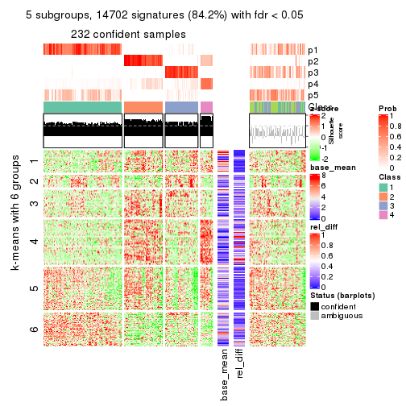</p>

</div>
<div id='tab-SD-mclust-get-signatures-5'>
<pre><code class="r">get_signatures(res, k = 6)
</code></pre>

<p></p>

</div>
</div>


Signature heatmaps where rows are not scaled:


<script>
$( function() {
	$( '#tabs-SD-mclust-get-signatures-no-scale' ).tabs();
} );
</script>
<div id='tabs-SD-mclust-get-signatures-no-scale'>
<ul>
<li><a href='#tab-SD-mclust-get-signatures-no-scale-1'>k = 2</a></li>
<li><a href='#tab-SD-mclust-get-signatures-no-scale-2'>k = 3</a></li>
<li><a href='#tab-SD-mclust-get-signatures-no-scale-3'>k = 4</a></li>
<li><a href='#tab-SD-mclust-get-signatures-no-scale-4'>k = 5</a></li>
<li><a href='#tab-SD-mclust-get-signatures-no-scale-5'>k = 6</a></li>
</ul>
<div id='tab-SD-mclust-get-signatures-no-scale-1'>
<pre><code class="r">get_signatures(res, k = 2, scale_rows = FALSE)
</code></pre>

<p></p>

</div>
<div id='tab-SD-mclust-get-signatures-no-scale-2'>
<pre><code class="r">get_signatures(res, k = 3, scale_rows = FALSE)
</code></pre>

<p></p>

</div>
<div id='tab-SD-mclust-get-signatures-no-scale-3'>
<pre><code class="r">get_signatures(res, k = 4, scale_rows = FALSE)
</code></pre>

<p></p>

</div>
<div id='tab-SD-mclust-get-signatures-no-scale-4'>
<pre><code class="r">get_signatures(res, k = 5, scale_rows = FALSE)
</code></pre>

<p></p>

</div>
<div id='tab-SD-mclust-get-signatures-no-scale-5'>
<pre><code class="r">get_signatures(res, k = 6, scale_rows = FALSE)
</code></pre>

<p></p>

</div>
</div>


Compare the overlap of signatures from different k:

```r
compare_signatures(res)
```


`get_signature()` returns a data frame invisibly. TO get the list of signatures, the function
call should be assigned to a variable explicitly. In following code, if `plot` argument is set
to `FALSE`, no heatmap is plotted while only the differential analysis is performed.

```r
# code only for demonstration
tb = get_signature(res, k = ..., plot = FALSE)
```

An example of the output of `tb` is:

```
#>   which_row         fdr    mean_1    mean_2 scaled_mean_1 scaled_mean_2 km
#> 1        38 0.042760348  8.373488  9.131774    -0.5533452     0.5164555  1
#> 2        40 0.018707592  7.106213  8.469186    -0.6173731     0.5762149  1
#> 3        55 0.019134737 10.221463 11.207825    -0.6159697     0.5749050  1
#> 4        59 0.006059896  5.921854  7.869574    -0.6899429     0.6439467  1
#> 5        60 0.018055526  8.928898 10.211722    -0.6204761     0.5791110  1
#> 6        98 0.009384629 15.714769 14.887706     0.6635654    -0.6193277  2
...
```

The columns in `tb` are:

1. `which_row`: row indices corresponding to the input matrix.
2. `fdr`: FDR for the differential test. 
3. `mean_x`: The mean value in group x.
4. `scaled_mean_x`: The mean value in group x after rows are scaled.
5. `km`: Row groups if k-means clustering is applied to rows.


UMAP plot which shows how samples are separated.


<script>
$( function() {
	$( '#tabs-SD-mclust-dimension-reduction' ).tabs();
} );
</script>
<div id='tabs-SD-mclust-dimension-reduction'>
<ul>
<li><a href='#tab-SD-mclust-dimension-reduction-1'>k = 2</a></li>
<li><a href='#tab-SD-mclust-dimension-reduction-2'>k = 3</a></li>
<li><a href='#tab-SD-mclust-dimension-reduction-3'>k = 4</a></li>
<li><a href='#tab-SD-mclust-dimension-reduction-4'>k = 5</a></li>
<li><a href='#tab-SD-mclust-dimension-reduction-5'>k = 6</a></li>
</ul>
<div id='tab-SD-mclust-dimension-reduction-1'>
<pre><code class="r">dimension_reduction(res, k = 2, method = &quot;UMAP&quot;)
</code></pre>

<p></p>

</div>
<div id='tab-SD-mclust-dimension-reduction-2'>
<pre><code class="r">dimension_reduction(res, k = 3, method = &quot;UMAP&quot;)
</code></pre>

<p></p>

</div>
<div id='tab-SD-mclust-dimension-reduction-3'>
<pre><code class="r">dimension_reduction(res, k = 4, method = &quot;UMAP&quot;)
</code></pre>

<p></p>

</div>
<div id='tab-SD-mclust-dimension-reduction-4'>
<pre><code class="r">dimension_reduction(res, k = 5, method = &quot;UMAP&quot;)
</code></pre>

<p></p>

</div>
<div id='tab-SD-mclust-dimension-reduction-5'>
<pre><code class="r">dimension_reduction(res, k = 6, method = &quot;UMAP&quot;)
</code></pre>

<p></p>

</div>
</div>


Following heatmap shows how subgroups are split when increasing `k`:

```r
collect_classes(res)
```


If matrix rows can be associated to genes, consider to use `GO_Enrichment(res,
...)` to perform function enrichment for the signature genes.


 

---------------------------------------------------


### SD:NMF*


The object with results only for a single top-value method and a single partition method 
can be extracted as:

```r
res = res_list["SD", "NMF"]
# you can also extract it by
# res = res_list["SD:NMF"]
```

A summary of `res` and all the functions that can be applied to it:

```r
res
```

```
#> A 'ConsensusPartition' object with k = 2, 3, 4, 5, 6.
#>   On a matrix with 17469 rows and 309 columns.
#>   Top rows (1000, 2000, 3000, 4000, 5000) are extracted by 'SD' method.
#>   Subgroups are detected by 'NMF' method.
#>   Performed in total 1250 partitions by row resampling.
#>   Best k for subgroups seems to be 5.
#> 
#> Following methods can be applied to this 'ConsensusPartition' object:
#>  [1] "cola_report"             "collect_classes"         "collect_plots"          
#>  [4] "collect_stats"           "colnames"                "compare_signatures"     
#>  [7] "consensus_heatmap"       "dimension_reduction"     "functional_enrichment"  
#> [10] "get_anno_col"            "get_anno"                "get_classes"            
#> [13] "get_consensus"           "get_matrix"              "get_membership"         
#> [16] "get_param"               "get_signatures"          "get_stats"              
#> [19] "is_best_k"               "is_stable_k"             "membership_heatmap"     
#> [22] "ncol"                    "nrow"                    "plot_ecdf"              
#> [25] "rownames"                "select_partition_number" "show"                   
#> [28] "suggest_best_k"          "test_to_known_factors"
```

`collect_plots()` function collects all the plots made from `res` for all `k` (number of partitions)
into one single page to provide an easy and fast comparison between different `k`.

```r
collect_plots(res)
```


The plots are:

- The first row: a plot of the ECDF (Empirical cumulative distribution
  function) curves of the consensus matrix for each `k` and the heatmap of
  predicted classes for each `k`.
- The second row: heatmaps of the consensus matrix for each `k`.
- The third row: heatmaps of the membership matrix for each `k`.
- The fouth row: heatmaps of the signatures for each `k`.

All the plots in panels can be made by individual functions and they are
plotted later in this section.

`select_partition_number()` produces several plots showing different
statistics for choosing "optimized" `k`. There are following statistics:

- ECDF curves of the consensus matrix for each `k`;
- 1-PAC. [The PAC
  score](https://en.wikipedia.org/wiki/Consensus_clustering#Over-interpretation_potential_of_consensus_clustering)
  measures the proportion of the ambiguous subgrouping.
- Mean silhouette score.
- Concordance. The mean probability of fiting the consensus class ids in all
  partitions.
- Area increased. Denote $A_k$ as the area under the ECDF curve for current
  `k`, the area increased is defined as $A_k - A_{k-1}$.
- Rand index. The percent of pairs of samples that are both in a same cluster
  or both are not in a same cluster in the partition of k and k-1.
- Jaccard index. The ratio of pairs of samples are both in a same cluster in
  the partition of k and k-1 and the pairs of samples are both in a same
  cluster in the partition k or k-1.

The detailed explanations of these statistics can be found in [the cola
vignette](http://bioconductor.org/packages/devel/bioc/vignettes/cola/inst/doc/cola.html#toc_13).

Generally speaking, lower PAC score, higher mean silhouette score or higher
concordance corresponds to better partition. Rand index and Jaccard index
measure how similar the current partition is compared to partition with `k-1`.
If they are too similar, we won't accept `k` is better than `k-1`.

```r
select_partition_number(res)
```


The numeric values for all these statistics can be obtained by `get_stats()`.

```r
get_stats(res)
```

```
#>   k 1-PAC mean_silhouette concordance area_increased  Rand Jaccard
#> 2 2 0.986           0.956       0.982         0.4262 0.586   0.586
#> 3 3 0.868           0.888       0.953         0.5018 0.734   0.562
#> 4 4 0.777           0.788       0.912         0.0907 0.885   0.703
#> 5 5 0.923           0.883       0.948         0.0818 0.873   0.621
#> 6 6 0.807           0.735       0.880         0.0566 0.931   0.737
```

`suggest_best_k()` suggests the best $k$ based on these statistics. The rules are as follows:

- All $k$ with Jaccard index larger than 0.95 are removed because the increase of
  the partition number does not provides enough extra information. If all $k$ are removed,
  the best $k$ is assigned by `NA`.
- For $k$ with 1-PAC larger than 0.9, the maximal $k$ is taken as the "best k". Other $k$ is called "optional k".
- If it does not fit the second rule. The $k$ with the highest vote of highest
  1-PAC, mean silhouette and concordance is taken as the "best k".

```r
suggest_best_k(res)
```

```
#> [1] 5
#> attr(,"optional")
#> [1] 2
```

There is also optional best $k$ = 2 that is worth to check.

Following shows the table of the partitions (You need to click the **show/hide
code output** link to see it). The membership matrix (columns with name `p*`)
is inferred by
[`clue::cl_consensus()`](https://www.rdocumentation.org/link/cl_consensus?package=clue)
function with the `SE` method. Basically the value in the membership matrix
represents the probability to belong to a certain group. The finall class
label for an item is determined with the group with highest probability it
belongs to.

In `get_classes()` function, the entropy is calculated from the membership
matrix and the silhouette score is calculated from the consensus matrix.


<script>
$( function() {
	$( '#tabs-SD-NMF-get-classes' ).tabs();
} );
</script>
<div id='tabs-SD-NMF-get-classes'>
<ul>
<li><a href='#tab-SD-NMF-get-classes-1'>k = 2</a></li>
<li><a href='#tab-SD-NMF-get-classes-2'>k = 3</a></li>
<li><a href='#tab-SD-NMF-get-classes-3'>k = 4</a></li>
<li><a href='#tab-SD-NMF-get-classes-4'>k = 5</a></li>
<li><a href='#tab-SD-NMF-get-classes-5'>k = 6</a></li>
</ul>

<div id='tab-SD-NMF-get-classes-1'>
<p><a id='tab-SD-NMF-get-classes-1-a' style='color:#0366d6' href='#'>show/hide code output</a></p>
<pre><code class="r">cbind(get_classes(res, k = 2), get_membership(res, k = 2))
</code></pre>

<pre><code>#&gt;                                      class entropy silhouette    p1    p2
#&gt; 7826AE44-B03A-4528-9CB5-7421E592AE36     2  0.0376      0.990 0.004 0.996
#&gt; 0DC2197B-2FEA-48EB-953E-8E44E1933757     1  0.0000      0.977 1.000 0.000
#&gt; 87ABB098-8C1E-4677-8C31-48B71EFE41C7     1  0.0000      0.977 1.000 0.000
#&gt; EC0154E7-7A27-4535-83AE-6B379E99A93C     1  0.0000      0.977 1.000 0.000
#&gt; 78F79407-D49F-4FA2-B09F-0665C502827C     1  0.0000      0.977 1.000 0.000
#&gt; 03E81178-E971-4E91-8BED-D8273EA1425C     1  0.0000      0.977 1.000 0.000
#&gt; 62FCAEFF-16D8-4019-84B6-18EC3A88BC32     2  0.0000      0.993 0.000 1.000
#&gt; 722C1284-5983-4CC1-B19C-214C2DE6F8A6     2  0.0000      0.993 0.000 1.000
#&gt; 54E42A64-B350-4A94-8FED-C9BC1872660E     1  0.0000      0.977 1.000 0.000
#&gt; 53062969-D209-490B-9C9B-5D297625E2AE     1  0.0000      0.977 1.000 0.000
#&gt; B710293C-41D3-4A2E-8104-5402F91DD859     1  0.0000      0.977 1.000 0.000
#&gt; 73CB1D05-7AE4-457D-B4EF-25AC5C1F2132     1  0.0000      0.977 1.000 0.000
#&gt; B055A70B-3003-47CB-BDAA-6378C000BF24     1  0.0000      0.977 1.000 0.000
#&gt; 46C3A870-E37A-42CB-8C0C-6ACACEAC1ADC     2  0.0000      0.993 0.000 1.000
#&gt; E8E6270E-F26D-4F2E-A63E-7885BDE05FDB     1  0.0000      0.977 1.000 0.000
#&gt; C4A5EBA2-9091-4D12-BDC8-B84B122022B9     1  0.0000      0.977 1.000 0.000
#&gt; 5B1839C4-549D-41D1-B559-3C6D2A1528CE     1  0.0000      0.977 1.000 0.000
#&gt; A0DF05EB-DC44-4492-9A8A-F278F7B0C266     1  0.0000      0.977 1.000 0.000
#&gt; B5182F49-70F2-45B7-82DE-C6DA68145EEA     1  0.0000      0.977 1.000 0.000
#&gt; C204D355-B876-4341-A111-36D48CBDD2A8     1  0.0000      0.977 1.000 0.000
#&gt; 7B070AAA-EF97-4D3B-AA19-EEC170C7927D     2  0.0000      0.993 0.000 1.000
#&gt; 05A8A881-F8EE-48A2-B11C-A08D7D80CE18     1  0.0000      0.977 1.000 0.000
#&gt; BA59EF50-CFE9-456D-B1B6-67D0945004F6     1  0.0000      0.977 1.000 0.000
#&gt; AD97B334-E034-4D33-A4D5-48C32D5D521C     1  0.0000      0.977 1.000 0.000
#&gt; 51DA2568-32EA-4668-9876-4B6E7CA68860     1  0.0000      0.977 1.000 0.000
#&gt; 78C26A05-2084-494D-83D3-C52C1B800F4C     1  0.0000      0.977 1.000 0.000
#&gt; 2B5DD791-7692-4721-9519-7D7D49B52570     1  0.0938      0.966 0.988 0.012
#&gt; C0BBE26A-79C8-4392-9978-7C420B3786B5     1  0.0000      0.977 1.000 0.000
#&gt; F35A8359-3A7A-414F-8A5C-D278F3B45387     2  0.0000      0.993 0.000 1.000
#&gt; 8C9BA49C-1270-491D-A234-AE1B1C0609BA     2  0.0000      0.993 0.000 1.000
#&gt; CA104B57-B160-4148-8A0A-D34BB3E8D88A     1  0.0000      0.977 1.000 0.000
#&gt; 877E18A5-6A7A-4E29-9871-DC7EA14A5F27     1  0.0000      0.977 1.000 0.000
#&gt; 904EDF2E-411E-43BD-901D-46129AFA283A     1  0.0000      0.977 1.000 0.000
#&gt; FD9F5A9B-2BEB-4D31-9A2D-8D4B4ECBB478     1  0.0000      0.977 1.000 0.000
#&gt; 2E206314-9928-456E-B7C6-893DC0E3C7C2     2  0.0000      0.993 0.000 1.000
#&gt; 913DB655-2C7F-4369-83DE-9257F04CF39B     1  0.7950      0.693 0.760 0.240
#&gt; 72B5B724-FEB5-43BD-83F6-2E2152DDD800     1  0.0000      0.977 1.000 0.000
#&gt; 920B547C-6898-446C-AAAF-F4ED96E40AAB     2  0.0000      0.993 0.000 1.000
#&gt; 847F796A-8CD6-4013-A0FB-26F4FC3EAF0D     1  0.0000      0.977 1.000 0.000
#&gt; C4D64E7A-33F7-4CFC-9FD3-D6AA3D8EFAA7     1  0.0000      0.977 1.000 0.000
#&gt; EABA0B17-8E19-48C5-BF62-2A45C9632807     2  0.0000      0.993 0.000 1.000
#&gt; 7263CBA8-CE37-4531-A795-9324C6D2A672     1  0.0000      0.977 1.000 0.000
#&gt; 6D3CC3AC-618B-414A-B640-169C735A6568     2  0.0672      0.986 0.008 0.992
#&gt; 710C05C7-F9CE-45FA-A8CC-29DE2903E04F     1  0.0000      0.977 1.000 0.000
#&gt; 3D631A56-2C55-48EA-A667-BA46023C9D50     1  0.0000      0.977 1.000 0.000
#&gt; F1C65F64-AF05-4875-B7E4-60FFF56A3F46     1  0.0000      0.977 1.000 0.000
#&gt; E5DF76E7-A765-4E07-B87A-06168BF66C5F     1  0.0000      0.977 1.000 0.000
#&gt; 5C8C8A6E-40D4-4F82-AC3D-90CFDEE15C0A     2  0.0000      0.993 0.000 1.000
#&gt; 0117CBB9-1BF9-48B1-BE6E-A9A770FF8721     1  0.0000      0.977 1.000 0.000
#&gt; 31EF66E5-419A-44C3-BB2A-B69B52FFCECC     2  0.0000      0.993 0.000 1.000
#&gt; C149CEF5-61F3-4B53-B8A9-8244B673EBD0     1  0.0000      0.977 1.000 0.000
#&gt; 0AF351D0-4EC5-4275-AA0A-4FA2AF8A9C85     2  0.0000      0.993 0.000 1.000
#&gt; B507E82F-6680-497B-A014-033EDD7A2E03     1  0.0000      0.977 1.000 0.000
#&gt; F941890E-AB33-478F-8C97-1C785DD9428F     1  0.0000      0.977 1.000 0.000
#&gt; 7987E019-8FED-469B-A6C1-34EE430A60C3     1  0.0000      0.977 1.000 0.000
#&gt; 76084AA6-19BF-4605-B6A1-73F1D4BADAF9     1  0.6712      0.786 0.824 0.176
#&gt; 329807F7-E0D4-4F53-94E8-E4080E90CB47     1  0.0000      0.977 1.000 0.000
#&gt; 1B6505FF-C1A7-4DD0-9827-41A0A3A28F3E     1  0.0000      0.977 1.000 0.000
#&gt; 49778E92-B5D3-4AD9-A1AF-3B722D631B96     2  0.0000      0.993 0.000 1.000
#&gt; A22892DE-0AF4-4B63-9513-1D6825059040     1  0.0000      0.977 1.000 0.000
#&gt; 6D77ECAE-A715-4ADD-97D8-A916DC31A4EA     1  0.0000      0.977 1.000 0.000
#&gt; 09758B6F-1B2D-4AED-8913-696097069409     1  0.0672      0.970 0.992 0.008
#&gt; 8B709DB4-0B28-42F1-A7C5-106F5809BEA2     1  0.0000      0.977 1.000 0.000
#&gt; F2B356FA-79CD-4867-8ABF-84C90A493A75     1  0.0000      0.977 1.000 0.000
#&gt; 131213AD-0313-4DF1-B013-CE67ED262C37     2  0.0000      0.993 0.000 1.000
#&gt; D94F7E81-0F60-473B-AD4A-0AC13508BDE2     1  0.8081      0.679 0.752 0.248
#&gt; 29C17355-D646-48DA-9E54-7B6DD85DD610     1  0.0000      0.977 1.000 0.000
#&gt; B8BD866A-2A7C-45C3-96BB-9AB892D26AE5     1  0.0000      0.977 1.000 0.000
#&gt; 13EFD045-AD61-41EE-9896-67BFA4FC8C09     1  0.0376      0.973 0.996 0.004
#&gt; 2655F609-B3BB-4D01-B421-D5F4B1232EC8     2  0.0000      0.993 0.000 1.000
#&gt; 04BC7A52-C67F-42CB-8672-D3C51A20F2BA     1  0.0000      0.977 1.000 0.000
#&gt; 45472BD4-DBDB-41FE-B0E3-2440880E1DE6     1  0.0000      0.977 1.000 0.000
#&gt; B87FFFCD-CB57-4ACD-9C74-AB188984BBB2     1  0.0000      0.977 1.000 0.000
#&gt; 5271374C-13CD-4BFE-AC6D-C95AFE491322     1  0.0000      0.977 1.000 0.000
#&gt; E3372ACE-C7C8-43E5-B30A-1F2D662D8170     1  0.0000      0.977 1.000 0.000
#&gt; B08DF564-E4D0-4540-8160-93B3981DF1D8     1  0.0000      0.977 1.000 0.000
#&gt; 61A7D1B9-FC5A-4B9C-989F-936CDA948C27     1  0.0000      0.977 1.000 0.000
#&gt; 74E768C1-8766-46AC-AAB4-D79E5049F76A     2  0.0000      0.993 0.000 1.000
#&gt; 0CEA28F0-D7F0-4EB7-A23F-0C5CA6245971     1  0.9993      0.100 0.516 0.484
#&gt; 95C4EFF6-147C-48EC-A2C1-16B8F12AEEF2     2  0.0000      0.993 0.000 1.000
#&gt; C9A78BEA-D455-4F5E-8B7B-19BCB42887E7     1  0.0000      0.977 1.000 0.000
#&gt; DB970740-9AC1-4C10-9658-8A77B1C390DD     2  0.0000      0.993 0.000 1.000
#&gt; 883FBD37-0CA0-4562-8925-72ACC1EE93D9     1  0.0000      0.977 1.000 0.000
#&gt; 9FE1D006-49F2-471E-91E6-AF0414C24479     1  0.0000      0.977 1.000 0.000
#&gt; 11816CC6-8C8B-49C0-99EE-896377BCFCCD     1  0.0000      0.977 1.000 0.000
#&gt; 063FC5C8-4318-4ECC-9CA0-1976CBC8ACB6     1  0.0000      0.977 1.000 0.000
#&gt; E0F085CC-B90D-4FDE-B60E-C613971BAA00     1  0.0000      0.977 1.000 0.000
#&gt; 62361DA2-E4EE-46DA-BB1F-C51DCA9307CC     2  0.0000      0.993 0.000 1.000
#&gt; 1BA16D48-B09E-4699-A1AD-2FFECE4F3CDB     2  0.0000      0.993 0.000 1.000
#&gt; 3E4F14E9-60AE-4F17-9BA7-2A02E908204A     1  0.0000      0.977 1.000 0.000
#&gt; 79226DD7-BC85-4B8E-BFF8-B1E073129D34     1  0.0000      0.977 1.000 0.000
#&gt; D47D0936-826F-4D54-9225-F71B95357438     1  0.0000      0.977 1.000 0.000
#&gt; 0AE02B91-574C-4165-BA39-E9D7C1A870A2     2  0.0000      0.993 0.000 1.000
#&gt; DED8E9DF-CEFE-45ED-9374-EF9925A135C4     1  0.0000      0.977 1.000 0.000
#&gt; D587A993-3C47-4D4C-B744-59169D4F7451     1  0.0000      0.977 1.000 0.000
#&gt; 6BCA24E6-440F-42C5-ABE5-66C37B713A39     1  0.0000      0.977 1.000 0.000
#&gt; 86A5EDFB-9D06-4FED-BF57-F8D74A68E156     2  0.6712      0.780 0.176 0.824
#&gt; B9BD5134-2F6A-4454-8F83-69B63F9AE114     1  0.0000      0.977 1.000 0.000
#&gt; 082DA9E1-A40D-482B-8E21-A93BA97185F0     1  0.0000      0.977 1.000 0.000
#&gt; 16A8343A-1203-44FB-9F03-05CC7C71B4CC     1  0.0000      0.977 1.000 0.000
#&gt; 00439565-02CE-4BF5-956D-7078B51C0947     1  0.0000      0.977 1.000 0.000
#&gt; 7B2BD361-2BF1-4E97-BC08-457F5A9C2682     2  0.0000      0.993 0.000 1.000
#&gt; C1D8439A-D527-47F6-ADC1-25867B65DA21     2  0.0000      0.993 0.000 1.000
#&gt; D9096909-1439-462D-B69C-CAD1BF4F420C     1  0.0000      0.977 1.000 0.000
#&gt; 7822EA86-35A1-4285-9429-2B63111B9885     1  0.0000      0.977 1.000 0.000
#&gt; 6FD0CFC8-AC8D-4CF1-8C33-833AD98A30EF     2  0.0000      0.993 0.000 1.000
#&gt; A451F278-5E83-4BC6-9B15-3AA2117B99B6     2  0.0000      0.993 0.000 1.000
#&gt; 6EC25686-4547-459C-9E01-7EDF8DAECE35     1  0.0000      0.977 1.000 0.000
#&gt; 5D2F1EEA-2BA8-4C3A-8436-544EE1D23E7E     1  0.0000      0.977 1.000 0.000
#&gt; 675A4293-A4CE-4307-B00B-DFC4D44A87C6     2  0.0000      0.993 0.000 1.000
#&gt; 6FBE0AEF-476A-42B2-A857-846CF1ED92B6     2  0.0000      0.993 0.000 1.000
#&gt; 7139D616-1A15-4288-A9AE-411856A4A76D     1  0.0000      0.977 1.000 0.000
#&gt; 46D7F8C1-D5C5-40CC-BEF5-2E590A847BD9     1  0.0000      0.977 1.000 0.000
#&gt; 984C44D3-4F5F-44C9-BCD9-C991EBC1FCB8     1  0.0000      0.977 1.000 0.000
#&gt; 83FE52E0-2DC2-4580-8BB2-FBCBEE4AC240     1  0.0000      0.977 1.000 0.000
#&gt; 0923F9CB-DF6F-4BAA-A5F8-0F83CE60D1ED     1  0.0000      0.977 1.000 0.000
#&gt; 1DEB5206-78CC-4EB5-BCD5-85A6A5B4E273     1  0.0000      0.977 1.000 0.000
#&gt; E4DB18DA-EB0C-4B2F-9566-7F72222B16D4     1  0.0000      0.977 1.000 0.000
#&gt; F7456312-1309-4B2F-875D-0F90CDF3EC35     1  0.0000      0.977 1.000 0.000
#&gt; 9A25E5D8-0706-4960-A76B-BCD0AC93E4FA     1  0.0000      0.977 1.000 0.000
#&gt; 5A41FE8F-FFB3-4B87-BF11-A570C184096D     1  0.0000      0.977 1.000 0.000
#&gt; 33F84E63-3F6C-4867-ADB1-A0DF39F1295B     1  0.0000      0.977 1.000 0.000
#&gt; D6A644F5-D1D0-4A8D-94C4-EE6C3ECE7430     1  0.0000      0.977 1.000 0.000
#&gt; 2A5848CC-A9A2-4AA8-A752-321273E62CF0     1  0.0000      0.977 1.000 0.000
#&gt; 7CA6358B-FC8A-4675-B092-9E061038FC83     1  0.9754      0.325 0.592 0.408
#&gt; A4C2F4BC-5C62-4B1F-9AB8-46D9468EF523     2  0.0000      0.993 0.000 1.000
#&gt; 8AF4EB7F-418D-4CC9-A9B8-A93A4C1A173B     2  0.0000      0.993 0.000 1.000
#&gt; E5048887-70C8-468F-881E-2EC55F6E6F3B     1  0.0000      0.977 1.000 0.000
#&gt; 1BADCC7C-C4D8-4C34-9534-59D622C7A2A2     1  0.0000      0.977 1.000 0.000
#&gt; 02CE7DF7-64BD-4297-A240-A5B9EE8771D3     1  0.0000      0.977 1.000 0.000
#&gt; CBF6E96A-F56C-4C87-B851-D319930BAAB8     1  0.0000      0.977 1.000 0.000
#&gt; 48F6B774-CFD2-4DDF-B7A2-696596413C3F     1  0.0000      0.977 1.000 0.000
#&gt; 41D88C3E-5848-4B09-8A77-EAE6AC4EC6B0     2  0.0000      0.993 0.000 1.000
#&gt; BDF79CC0-00C7-49C1-900B-AB065A733B17     1  0.0000      0.977 1.000 0.000
#&gt; A894D686-BFC7-4AEE-A794-DBE718C6B6F6     2  0.0000      0.993 0.000 1.000
#&gt; 0712029E-3765-4272-BE5B-B6C8BCCC0F0F     2  0.0000      0.993 0.000 1.000
#&gt; 7B051855-9B09-4887-9BC0-9F077537938E     1  0.0000      0.977 1.000 0.000
#&gt; EF357C46-5C3C-4F51-9383-FF7694D07B97     2  0.0000      0.993 0.000 1.000
#&gt; 9492A322-37CA-4582-AC68-66B5D80778AF     2  0.0000      0.993 0.000 1.000
#&gt; 993399A4-1B9F-4258-B2D0-155AD58A2E82     1  0.0000      0.977 1.000 0.000
#&gt; 7B7DC93D-5494-4E69-BE07-2967887182F9     1  0.0000      0.977 1.000 0.000
#&gt; 29BCBA51-2580-473D-9CF7-BEDBD0DBAD1B     2  0.0000      0.993 0.000 1.000
#&gt; 40855647-E942-4F32-90B7-BEB921929BFB     1  0.0000      0.977 1.000 0.000
#&gt; 0DC723D0-7C68-4495-A4B9-2DF2FF19AB14     2  0.0000      0.993 0.000 1.000
#&gt; 7540005F-57E0-4E2E-A8A2-BEF2B0F333B1     2  0.0000      0.993 0.000 1.000
#&gt; EB1DDB14-4076-4C2C-B911-390C17C21486     1  0.0000      0.977 1.000 0.000
#&gt; 9EA70EC4-8BA0-4E3D-B3CB-A68D19E89868     1  0.0000      0.977 1.000 0.000
#&gt; B04E2E50-0A6E-4224-A825-1714D12E5669     2  0.0000      0.993 0.000 1.000
#&gt; B0BF5E01-536D-40FF-9C24-CBBD611E2FC2     1  0.0000      0.977 1.000 0.000
#&gt; 7B6B1788-B297-4442-B6BE-B7CE8754491E     1  0.0000      0.977 1.000 0.000
#&gt; A090D00C-34DF-4906-A517-4803C4C9A332     1  0.0000      0.977 1.000 0.000
#&gt; 340D44A6-9BEA-412C-9973-D9ABD6692255     1  0.0000      0.977 1.000 0.000
#&gt; E8D0D1E7-E5A8-4014-80C1-0245F90F4358     2  0.0000      0.993 0.000 1.000
#&gt; 19EA1494-8572-40E1-B9BB-3739F47B607D     1  0.0000      0.977 1.000 0.000
#&gt; 1C1B4793-8DAF-4763-BA4D-C4E869A4ED35     2  0.2236      0.958 0.036 0.964
#&gt; 45BF59B3-95BD-4196-ABAA-4C4F0DB38572     2  0.0000      0.993 0.000 1.000
#&gt; 47B5A2A7-7E13-4558-99D2-067F5075C6A4     1  0.0000      0.977 1.000 0.000
#&gt; E94638E8-CB51-4FBB-8BCB-4BFD7A812291     1  0.0000      0.977 1.000 0.000
#&gt; A17352A8-0D3C-4545-8136-7DAE2FB0E102     2  0.0000      0.993 0.000 1.000
#&gt; B18A6F95-D4ED-416B-B5A1-9A4934865D0D     2  0.0000      0.993 0.000 1.000
#&gt; 33E92C5F-0C42-4549-AD5B-0A064182A272     1  0.0000      0.977 1.000 0.000
#&gt; E041B375-3E60-4F18-A6EF-D1C249E3B8EE     1  0.0000      0.977 1.000 0.000
#&gt; EDF90AF6-6C64-4BD2-AADF-8D7D188650B2     2  0.0000      0.993 0.000 1.000
#&gt; 569320D2-316C-4E2D-B7B3-D7D5C4DAD42D     1  0.0000      0.977 1.000 0.000
#&gt; AFFB223D-DAE9-4567-9EF2-8E4DF9D8782D     2  0.0000      0.993 0.000 1.000
#&gt; 56FC9454-0A6A-4CC3-95C4-BE0E0D0BAFCE     2  0.0000      0.993 0.000 1.000
#&gt; 43226365-FAEF-46C5-AF1B-5C6C2BED84FF     1  0.9248      0.506 0.660 0.340
#&gt; 1536110A-B42A-4A84-9474-9895321FDCE9     2  0.0000      0.993 0.000 1.000
#&gt; 812255DD-536B-4216-90B1-27D5AB339BE2     1  0.0000      0.977 1.000 0.000
#&gt; 5D4563D6-68B7-4C9D-A3F4-AA7D45D5112C     2  0.0000      0.993 0.000 1.000
#&gt; BAA39781-DB94-473C-98B1-FA6CD3E1C67A     1  0.0000      0.977 1.000 0.000
#&gt; C1411CDA-814D-4E21-8929-C0F77858828F     1  0.0000      0.977 1.000 0.000
#&gt; EFE2F248-C13E-4E8D-9153-8C903848AC4A     1  0.0938      0.966 0.988 0.012
#&gt; D3939C84-D1D6-4060-9F91-AEB222A9BDD5     1  0.0000      0.977 1.000 0.000
#&gt; EABD2987-8C1E-49E5-94AF-C0BDE5335A48     1  0.0000      0.977 1.000 0.000
#&gt; F4BE2ABE-2CEB-4A6A-B8EC-0355F8C63B9B     1  0.0000      0.977 1.000 0.000
#&gt; 627BC251-D217-4955-B718-6B9D6DEA1756     1  0.0000      0.977 1.000 0.000
#&gt; 31B54613-A20E-4039-BB8B-9B52104CE418     1  0.0000      0.977 1.000 0.000
#&gt; 3F292B7C-A535-4DBD-BC20-CB4F85A1C94B     1  0.0000      0.977 1.000 0.000
#&gt; BEA2A5EB-EEA9-4F31-AC38-810E04CE124B     2  0.0000      0.993 0.000 1.000
#&gt; 99D84D46-19DA-43F1-B639-DCE9953F1529     2  0.0000      0.993 0.000 1.000
#&gt; 4588817E-1068-4A78-86B6-4674A0112DDA     1  0.0000      0.977 1.000 0.000
#&gt; 6AC633BD-BEC1-4750-94E3-378972DAB6B3     2  0.0000      0.993 0.000 1.000
#&gt; 09E17C6E-7EDE-4DDF-B5ED-2521AF870C9A     1  0.0000      0.977 1.000 0.000
#&gt; 58D9C750-26A2-4B7C-84C4-13D7AFB4C5EA     1  0.0000      0.977 1.000 0.000
#&gt; DF28E138-E222-4F77-9B61-69E601CA7E60     2  0.0000      0.993 0.000 1.000
#&gt; FEA489A8-E423-4266-AADA-9BAAB29AB94B     1  0.0000      0.977 1.000 0.000
#&gt; F3FCC207-15CD-41EA-A3EF-F5D2C12AC373     1  0.0000      0.977 1.000 0.000
#&gt; 53DD7AFB-A258-4643-A501-BACC95D17A50     2  0.0000      0.993 0.000 1.000
#&gt; D850B2A1-1F8A-4A44-A0CF-8D9DD4A1889A     2  0.0000      0.993 0.000 1.000
#&gt; B3F746DC-E487-4305-9F30-825D1520E8FD     2  0.0000      0.993 0.000 1.000
#&gt; BE38240A-F7C2-439F-9AAE-51C8A340F310     1  0.0000      0.977 1.000 0.000
#&gt; A9022D9E-1D30-49EE-8552-1364A8027F34     1  0.0000      0.977 1.000 0.000
#&gt; 0E8A56EE-D9A2-48A5-B793-A358BE1E4EFA     1  0.0000      0.977 1.000 0.000
#&gt; 51667574-318E-4BDB-8F42-8512A4C1B84F     1  0.0000      0.977 1.000 0.000
#&gt; B0A442C9-67E4-4534-8A5C-D6D73F42358C     1  0.0000      0.977 1.000 0.000
#&gt; 25A5BC09-0D88-4385-87AF-997F9018522D     2  0.0000      0.993 0.000 1.000
#&gt; 344B9631-AAA5-4302-8747-D584345D9131     1  0.0000      0.977 1.000 0.000
#&gt; 1C3795AD-6306-4892-95F5-92DF3375D46A     1  0.0000      0.977 1.000 0.000
#&gt; 17BB221D-8BF9-4391-83DD-423AE1E03651     1  0.5519      0.844 0.872 0.128
#&gt; 297611E9-9555-4BCA-A723-02E846ACC23A     1  0.0000      0.977 1.000 0.000
#&gt; AD7FF180-1EAC-4783-8A62-E9626B96DD9F     2  0.3274      0.933 0.060 0.940
#&gt; FD544083-9BD5-4036-BD81-0352B67CC45C     1  0.0000      0.977 1.000 0.000
#&gt; 879A74D5-5B29-418D-A0F4-8E88D6384008     1  0.0000      0.977 1.000 0.000
#&gt; 43CD982C-13C0-4A52-803A-9A3A3FAE09BC     1  0.0000      0.977 1.000 0.000
#&gt; DCD0313D-5206-4111-8743-A8A0227257D9     1  0.0000      0.977 1.000 0.000
#&gt; 331A9160-D730-45DD-A985-C6CAC03035ED     1  0.0000      0.977 1.000 0.000
#&gt; 9EEECA0E-530D-4724-B016-A716F0782148     1  0.9393      0.458 0.644 0.356
#&gt; B3073976-CA3F-4115-9243-8C2D9E1B975D     1  0.0000      0.977 1.000 0.000
#&gt; 77B3C9B4-1A7F-41BB-A37D-01EF80E933CC     2  0.0000      0.993 0.000 1.000
#&gt; C0C26822-2E9F-4FB0-81D4-575027C8B71C     2  0.0000      0.993 0.000 1.000
#&gt; F1FCE328-2B3B-499A-888D-0E66A017E8B0     1  0.0000      0.977 1.000 0.000
#&gt; F069DAD6-F1EB-42F7-8252-F3F6EC46CC3E     1  0.0000      0.977 1.000 0.000
#&gt; 99CC822E-8C98-4EEC-BB58-AEF76A0B5332     1  0.0000      0.977 1.000 0.000
#&gt; C86EBD08-53F2-4972-801A-74970FDD6A62     1  0.0000      0.977 1.000 0.000
#&gt; F07326F2-C1D6-4D5A-9693-25C3A04B0EC2     1  0.0000      0.977 1.000 0.000
#&gt; 8ACBD428-7713-48D9-810A-43C9CD191A73     2  0.0000      0.993 0.000 1.000
#&gt; 3D3501B4-1A43-4FA7-90A2-CCEBF66BFD4A     1  0.8386      0.646 0.732 0.268
#&gt; DD51C17C-300F-44A4-955A-C9BC85417842     2  0.3879      0.914 0.076 0.924
#&gt; 58FF391C-1D83-426C-8F92-C15F78F56C95     1  0.0000      0.977 1.000 0.000
#&gt; ACE65C6E-2B10-4972-91B4-9199DD4B179D     1  0.0000      0.977 1.000 0.000
#&gt; B2088466-FA5D-491C-9982-99B33683E66F     2  0.0000      0.993 0.000 1.000
#&gt; D47AF416-1687-4FE0-A235-8815B6E8EB0B     1  0.0000      0.977 1.000 0.000
#&gt; 4DCAD07F-CC43-46F6-B2F3-EDBF3EDD1045     2  0.0000      0.993 0.000 1.000
#&gt; AAAE0BD9-63FC-4A0E-A27E-447B634BAD99     2  0.0000      0.993 0.000 1.000
#&gt; BC471AA1-52CF-4CEE-9866-34CE91404F45     2  0.0000      0.993 0.000 1.000
#&gt; 81D3EE3F-AC11-404F-8092-307F0DC12198     1  0.0000      0.977 1.000 0.000
#&gt; 8C02026C-C25E-406B-B8B8-A1A82362AE79     2  0.0000      0.993 0.000 1.000
#&gt; 6A005F2A-A0C1-4CA4-B15B-96B08F013874     1  0.0000      0.977 1.000 0.000
#&gt; B55743F2-4D63-4375-85D3-F58281CFD852     1  0.0000      0.977 1.000 0.000
#&gt; 24F98393-C817-4D0E-A7DB-05D2B5C71F40     1  0.0000      0.977 1.000 0.000
#&gt; 2C2AEF1D-4112-4EC7-9027-5E3FD26E8802     1  0.0000      0.977 1.000 0.000
#&gt; 8BAC3CB5-2987-4349-8AE8-B83DDD16CA3C     1  0.6887      0.775 0.816 0.184
#&gt; ED9C74E6-92FC-4E58-8FCE-1761DEA0C977     1  0.0000      0.977 1.000 0.000
#&gt; BA732ED4-F6BA-404E-BA3C-CA558FAD866A     1  0.0000      0.977 1.000 0.000
#&gt; E750385A-12D9-4A88-B4DF-C1306B5EF3B7     2  0.0000      0.993 0.000 1.000
#&gt; 6B1DC5E4-5F82-4395-913F-6AEDB5B63188     1  0.0000      0.977 1.000 0.000
#&gt; A7C12D37-FD50-4674-A054-1774F4E5C3B3     1  0.0000      0.977 1.000 0.000
#&gt; 2155C764-2063-4D9C-9ACD-96AA73475F5E     1  0.0000      0.977 1.000 0.000
#&gt; DE23CC15-A95E-4119-9B3C-8EEC45900D11     2  0.0000      0.993 0.000 1.000
#&gt; 5DB1DCAD-638E-48A4-9F40-3D6268FDEC33     2  0.0000      0.993 0.000 1.000
#&gt; 34AF0341-73D7-4080-AAEB-4C1541C2569F     1  0.0000      0.977 1.000 0.000
#&gt; B60D4235-44AF-4BA4-98C0-BCCDC28E90B9     2  0.0000      0.993 0.000 1.000
#&gt; CF463D89-2C9F-4257-BF04-8BC1CD40EA7D     2  0.0000      0.993 0.000 1.000
#&gt; EF6C8165-484A-4530-AEDF-93DCC4A8455D     1  0.0000      0.977 1.000 0.000
#&gt; B9F6B5E4-4D10-49B8-A8FE-8F33C5A62CBF     1  0.0000      0.977 1.000 0.000
#&gt; CE539000-92D7-4622-9C8D-BC6E01310681     2  0.0000      0.993 0.000 1.000
#&gt; D3BBC405-A22A-4009-ABF6-96FEEE653051     2  0.0000      0.993 0.000 1.000
#&gt; 0B3C86BD-0D20-4408-9BE3-05658729505F     2  0.0000      0.993 0.000 1.000
#&gt; 9B9C5071-7C3F-416C-B91C-6F5966747F54     1  0.0000      0.977 1.000 0.000
#&gt; A9469A4A-C5F9-4681-A916-A26F0B4307BA     1  0.0000      0.977 1.000 0.000
#&gt; A31B57E4-E30B-4A1B-829D-1B47D9CEC041     2  0.0000      0.993 0.000 1.000
#&gt; 647255CE-F84A-4070-B3FD-D8ACA32C4D09     1  0.0000      0.977 1.000 0.000
#&gt; 8F5E9F02-51D7-410E-B8B7-22737F2F095A     2  0.0000      0.993 0.000 1.000
#&gt; 8074A7F6-2FDE-4578-B71C-01C542D468FE     1  0.0000      0.977 1.000 0.000
#&gt; 2A946F17-F245-409E-A019-C60CDA18DC7D     1  0.0000      0.977 1.000 0.000
#&gt; 0878C381-47F9-4786-82C2-94AC840BEDCB     1  0.0000      0.977 1.000 0.000
#&gt; 54504893-92C5-4328-85A8-2A882680B5E0     1  0.0000      0.977 1.000 0.000
#&gt; 0A27D1BE-E5DD-459A-A51F-6D8AAF7CFEB4     1  0.0000      0.977 1.000 0.000
#&gt; 89ED5A3E-CAC0-4AB4-B858-A3CD8F34DBD5     2  0.0000      0.993 0.000 1.000
#&gt; ACEEB0A5-AADB-4EF9-8710-4BAF95522CEA     1  0.0000      0.977 1.000 0.000
#&gt; 02C74D81-5976-4252-BC6C-B10E934DECA2     1  0.0000      0.977 1.000 0.000
#&gt; D365A238-4739-4B54-9608-DC548F21C04E     1  0.0000      0.977 1.000 0.000
#&gt; F70F7ED5-A3B7-4210-95AD-DEFA0A565F06     1  0.0000      0.977 1.000 0.000
#&gt; A92C23A9-BC25-4025-9501-6D5FF8E2A502     1  0.7745      0.712 0.772 0.228
#&gt; ECE9BBF4-840E-47A6-8378-0B6C4A2369D3     1  0.0000      0.977 1.000 0.000
#&gt; 38749490-0FCF-4B33-9EBC-8F86C2D9E4AF     1  0.0000      0.977 1.000 0.000
#&gt; 02ABB64E-768B-4999-A899-EEE573D5F186     1  0.0000      0.977 1.000 0.000
#&gt; C1C467A8-18B1-4C3F-AC45-33359ED6FDC4     1  0.6973      0.770 0.812 0.188
#&gt; 78B2E4A1-9DAE-404F-AB47-1896450EF254     1  0.0000      0.977 1.000 0.000
#&gt; CCDB0290-91DA-4089-84A6-4434BA028D30     1  0.0000      0.977 1.000 0.000
#&gt; D5041E80-20A0-4C1A-9AC1-2394F6DB6E92     1  0.0000      0.977 1.000 0.000
#&gt; 20EB9CC6-EABB-438A-9030-E766459996D1     2  0.0000      0.993 0.000 1.000
#&gt; 73E99110-9A7C-4F73-98C5-79D22CB06230     1  0.0000      0.977 1.000 0.000
#&gt; FAD8A464-9BC3-4ED9-9517-B18D36514325     2  0.7674      0.707 0.224 0.776
#&gt; 9AF0E82E-E621-437A-8D19-700532B95090     1  0.0000      0.977 1.000 0.000
#&gt; 27DA48F3-4FC1-41A3-8E49-5B25F1CCFF07     1  0.0000      0.977 1.000 0.000
#&gt; EFE5A302-D138-4044-A301-5C5FD1C24836     1  0.0000      0.977 1.000 0.000
#&gt; D3E866AC-D66A-4C07-9F47-89AF460320DE     2  0.0000      0.993 0.000 1.000
#&gt; 89C45456-9392-4EB3-9A82-A130B6702AAF     1  0.0000      0.977 1.000 0.000
#&gt; 8FF5C8FC-2565-49BE-9EE0-91A84A85AB2A     2  0.0000      0.993 0.000 1.000
#&gt; 846DF088-75D5-49CF-BDDC-27E735A08DCA     1  0.9552      0.423 0.624 0.376
#&gt; EA3A19E1-7ADE-47B6-A35A-71290967147A     2  0.0000      0.993 0.000 1.000
#&gt; B2C43D0C-732B-4C54-938F-D3C9FDA880DA     1  0.0000      0.977 1.000 0.000
#&gt; EEC856B5-9B7F-488D-975E-CE2FF7072879     1  0.9522      0.419 0.628 0.372
#&gt; 8A68C417-09CC-4FA1-BFEB-EB4B738853A4     1  0.0000      0.977 1.000 0.000
#&gt; C5DF1A0D-952C-44E2-BF83-ED57177EF60E     1  0.0000      0.977 1.000 0.000
#&gt; B5C9EA22-F758-4BD2-BD1F-282EC1078AED     2  0.0000      0.993 0.000 1.000
#&gt; 3F08AE92-3EFD-4D7F-8C5C-BFB3621F0CD6     1  0.0000      0.977 1.000 0.000
#&gt; 8F0D43F1-2199-4DBB-9B16-1E5F2CED2FEC     2  0.0000      0.993 0.000 1.000
#&gt; 54BABD8B-EA9F-4875-8594-2179B38C73BD     1  0.0000      0.977 1.000 0.000
#&gt; C149B6F8-03DC-4907-920A-F3318B8D2A1E     1  0.0000      0.977 1.000 0.000
#&gt; F93D26E2-4B45-495D-BC8E-5B592F8FDABF     1  0.9988      0.115 0.520 0.480
#&gt; C98275CD-C39A-4E14-A731-4F3EB7396665     2  0.0000      0.993 0.000 1.000
#&gt; 354DC705-216E-42F0-B29E-C1F8D6C9489A     1  0.0000      0.977 1.000 0.000
#&gt; 6752EED9-7990-433F-A206-D5398C396471     1  0.0000      0.977 1.000 0.000
#&gt; C3E94C5D-68C4-400C-B7CB-38C42E9D5FFF     1  0.3274      0.921 0.940 0.060
#&gt; CE6B6871-3ED3-44DE-A777-7558D4429057     1  0.0376      0.973 0.996 0.004
#&gt; A06E7D1E-E432-4A4C-8BB0-314304F96EDF     1  0.9954      0.179 0.540 0.460
#&gt; 1ABBEF80-508F-4247-B43D-3E549372113B     1  0.0000      0.977 1.000 0.000
#&gt; 835AAE7F-F873-4D11-8845-232D261A38DF     1  0.0000      0.977 1.000 0.000
#&gt; E98A0460-6529-4DBA-8542-1B98801D7A7D     1  0.0000      0.977 1.000 0.000
#&gt; 06A9CBF8-01D0-4720-BCE8-83F0E77C862F     1  0.0000      0.977 1.000 0.000
#&gt; 206865A9-A67C-49A6-93AD-55D06E777559     2  0.0000      0.993 0.000 1.000
#&gt; 26DABC83-DB30-452F-9BE2-366760CB138E     2  0.0000      0.993 0.000 1.000
#&gt; 9DD5272A-2D6E-4774-83E3-0CD761EDE926     1  0.0000      0.977 1.000 0.000
#&gt; 4938E366-C740-4C9C-9358-FF37997DC9EF     1  0.0000      0.977 1.000 0.000
#&gt; E2DA59C4-A47C-41E3-BC55-2D00C6EC17FB     1  0.0000      0.977 1.000 0.000
#&gt; 37349E62-0BFB-4FEA-81D0-2AB7E7625B0D     1  0.0000      0.977 1.000 0.000
</code></pre>

<script>
$('#tab-SD-NMF-get-classes-1-a').parent().next().next().hide();
$('#tab-SD-NMF-get-classes-1-a').click(function(){
  $('#tab-SD-NMF-get-classes-1-a').parent().next().next().toggle();
  return(false);
});
</script>
</div>

<div id='tab-SD-NMF-get-classes-2'>
<p><a id='tab-SD-NMF-get-classes-2-a' style='color:#0366d6' href='#'>show/hide code output</a></p>
<pre><code class="r">cbind(get_classes(res, k = 3), get_membership(res, k = 3))
</code></pre>

<pre><code>#&gt;                                      class entropy silhouette    p1    p2    p3
#&gt; 7826AE44-B03A-4528-9CB5-7421E592AE36     3  0.2165      0.872 0.000 0.064 0.936
#&gt; 0DC2197B-2FEA-48EB-953E-8E44E1933757     3  0.0000      0.915 0.000 0.000 1.000
#&gt; 87ABB098-8C1E-4677-8C31-48B71EFE41C7     3  0.0000      0.915 0.000 0.000 1.000
#&gt; EC0154E7-7A27-4535-83AE-6B379E99A93C     1  0.0000      0.949 1.000 0.000 0.000
#&gt; 78F79407-D49F-4FA2-B09F-0665C502827C     1  0.0000      0.949 1.000 0.000 0.000
#&gt; 03E81178-E971-4E91-8BED-D8273EA1425C     1  0.0000      0.949 1.000 0.000 0.000
#&gt; 62FCAEFF-16D8-4019-84B6-18EC3A88BC32     3  0.0892      0.904 0.000 0.020 0.980
#&gt; 722C1284-5983-4CC1-B19C-214C2DE6F8A6     2  0.0000      0.977 0.000 1.000 0.000
#&gt; 54E42A64-B350-4A94-8FED-C9BC1872660E     1  0.0000      0.949 1.000 0.000 0.000
#&gt; 53062969-D209-490B-9C9B-5D297625E2AE     1  0.6274      0.111 0.544 0.000 0.456
#&gt; B710293C-41D3-4A2E-8104-5402F91DD859     1  0.0000      0.949 1.000 0.000 0.000
#&gt; 73CB1D05-7AE4-457D-B4EF-25AC5C1F2132     1  0.0000      0.949 1.000 0.000 0.000
#&gt; B055A70B-3003-47CB-BDAA-6378C000BF24     3  0.0000      0.915 0.000 0.000 1.000
#&gt; 46C3A870-E37A-42CB-8C0C-6ACACEAC1ADC     2  0.0000      0.977 0.000 1.000 0.000
#&gt; E8E6270E-F26D-4F2E-A63E-7885BDE05FDB     3  0.0000      0.915 0.000 0.000 1.000
#&gt; C4A5EBA2-9091-4D12-BDC8-B84B122022B9     3  0.0000      0.915 0.000 0.000 1.000
#&gt; 5B1839C4-549D-41D1-B559-3C6D2A1528CE     3  0.4002      0.799 0.160 0.000 0.840
#&gt; A0DF05EB-DC44-4492-9A8A-F278F7B0C266     1  0.0000      0.949 1.000 0.000 0.000
#&gt; B5182F49-70F2-45B7-82DE-C6DA68145EEA     1  0.0000      0.949 1.000 0.000 0.000
#&gt; C204D355-B876-4341-A111-36D48CBDD2A8     1  0.6026      0.387 0.624 0.000 0.376
#&gt; 7B070AAA-EF97-4D3B-AA19-EEC170C7927D     2  0.0000      0.977 0.000 1.000 0.000
#&gt; 05A8A881-F8EE-48A2-B11C-A08D7D80CE18     1  0.0000      0.949 1.000 0.000 0.000
#&gt; BA59EF50-CFE9-456D-B1B6-67D0945004F6     1  0.0000      0.949 1.000 0.000 0.000
#&gt; AD97B334-E034-4D33-A4D5-48C32D5D521C     1  0.1031      0.931 0.976 0.000 0.024
#&gt; 51DA2568-32EA-4668-9876-4B6E7CA68860     3  0.0000      0.915 0.000 0.000 1.000
#&gt; 78C26A05-2084-494D-83D3-C52C1B800F4C     1  0.0000      0.949 1.000 0.000 0.000
#&gt; 2B5DD791-7692-4721-9519-7D7D49B52570     3  0.0000      0.915 0.000 0.000 1.000
#&gt; C0BBE26A-79C8-4392-9978-7C420B3786B5     3  0.2356      0.876 0.072 0.000 0.928
#&gt; F35A8359-3A7A-414F-8A5C-D278F3B45387     2  0.0000      0.977 0.000 1.000 0.000
#&gt; 8C9BA49C-1270-491D-A234-AE1B1C0609BA     2  0.0000      0.977 0.000 1.000 0.000
#&gt; CA104B57-B160-4148-8A0A-D34BB3E8D88A     1  0.0000      0.949 1.000 0.000 0.000
#&gt; 877E18A5-6A7A-4E29-9871-DC7EA14A5F27     1  0.0000      0.949 1.000 0.000 0.000
#&gt; 904EDF2E-411E-43BD-901D-46129AFA283A     1  0.0000      0.949 1.000 0.000 0.000
#&gt; FD9F5A9B-2BEB-4D31-9A2D-8D4B4ECBB478     1  0.0000      0.949 1.000 0.000 0.000
#&gt; 2E206314-9928-456E-B7C6-893DC0E3C7C2     2  0.0000      0.977 0.000 1.000 0.000
#&gt; 913DB655-2C7F-4369-83DE-9257F04CF39B     3  0.4399      0.740 0.000 0.188 0.812
#&gt; 72B5B724-FEB5-43BD-83F6-2E2152DDD800     1  0.0000      0.949 1.000 0.000 0.000
#&gt; 920B547C-6898-446C-AAAF-F4ED96E40AAB     2  0.0000      0.977 0.000 1.000 0.000
#&gt; 847F796A-8CD6-4013-A0FB-26F4FC3EAF0D     1  0.0000      0.949 1.000 0.000 0.000
#&gt; C4D64E7A-33F7-4CFC-9FD3-D6AA3D8EFAA7     1  0.0000      0.949 1.000 0.000 0.000
#&gt; EABA0B17-8E19-48C5-BF62-2A45C9632807     2  0.0000      0.977 0.000 1.000 0.000
#&gt; 7263CBA8-CE37-4531-A795-9324C6D2A672     3  0.2165      0.881 0.064 0.000 0.936
#&gt; 6D3CC3AC-618B-414A-B640-169C735A6568     3  0.0000      0.915 0.000 0.000 1.000
#&gt; 710C05C7-F9CE-45FA-A8CC-29DE2903E04F     1  0.0000      0.949 1.000 0.000 0.000
#&gt; 3D631A56-2C55-48EA-A667-BA46023C9D50     1  0.0000      0.949 1.000 0.000 0.000
#&gt; F1C65F64-AF05-4875-B7E4-60FFF56A3F46     1  0.0747      0.937 0.984 0.000 0.016
#&gt; E5DF76E7-A765-4E07-B87A-06168BF66C5F     1  0.0000      0.949 1.000 0.000 0.000
#&gt; 5C8C8A6E-40D4-4F82-AC3D-90CFDEE15C0A     2  0.0000      0.977 0.000 1.000 0.000
#&gt; 0117CBB9-1BF9-48B1-BE6E-A9A770FF8721     3  0.0000      0.915 0.000 0.000 1.000
#&gt; 31EF66E5-419A-44C3-BB2A-B69B52FFCECC     2  0.0000      0.977 0.000 1.000 0.000
#&gt; C149CEF5-61F3-4B53-B8A9-8244B673EBD0     1  0.0000      0.949 1.000 0.000 0.000
#&gt; 0AF351D0-4EC5-4275-AA0A-4FA2AF8A9C85     2  0.0000      0.977 0.000 1.000 0.000
#&gt; B507E82F-6680-497B-A014-033EDD7A2E03     3  0.0000      0.915 0.000 0.000 1.000
#&gt; F941890E-AB33-478F-8C97-1C785DD9428F     3  0.0000      0.915 0.000 0.000 1.000
#&gt; 7987E019-8FED-469B-A6C1-34EE430A60C3     3  0.5327      0.652 0.272 0.000 0.728
#&gt; 76084AA6-19BF-4605-B6A1-73F1D4BADAF9     3  0.0000      0.915 0.000 0.000 1.000
#&gt; 329807F7-E0D4-4F53-94E8-E4080E90CB47     3  0.0000      0.915 0.000 0.000 1.000
#&gt; 1B6505FF-C1A7-4DD0-9827-41A0A3A28F3E     1  0.0000      0.949 1.000 0.000 0.000
#&gt; 49778E92-B5D3-4AD9-A1AF-3B722D631B96     2  0.0000      0.977 0.000 1.000 0.000
#&gt; A22892DE-0AF4-4B63-9513-1D6825059040     1  0.0000      0.949 1.000 0.000 0.000
#&gt; 6D77ECAE-A715-4ADD-97D8-A916DC31A4EA     1  0.0000      0.949 1.000 0.000 0.000
#&gt; 09758B6F-1B2D-4AED-8913-696097069409     1  0.1289      0.921 0.968 0.032 0.000
#&gt; 8B709DB4-0B28-42F1-A7C5-106F5809BEA2     3  0.5363      0.632 0.276 0.000 0.724
#&gt; F2B356FA-79CD-4867-8ABF-84C90A493A75     1  0.0000      0.949 1.000 0.000 0.000
#&gt; 131213AD-0313-4DF1-B013-CE67ED262C37     2  0.0000      0.977 0.000 1.000 0.000
#&gt; D94F7E81-0F60-473B-AD4A-0AC13508BDE2     3  0.0000      0.915 0.000 0.000 1.000
#&gt; 29C17355-D646-48DA-9E54-7B6DD85DD610     1  0.0000      0.949 1.000 0.000 0.000
#&gt; B8BD866A-2A7C-45C3-96BB-9AB892D26AE5     1  0.0000      0.949 1.000 0.000 0.000
#&gt; 13EFD045-AD61-41EE-9896-67BFA4FC8C09     3  0.0000      0.915 0.000 0.000 1.000
#&gt; 2655F609-B3BB-4D01-B421-D5F4B1232EC8     2  0.0000      0.977 0.000 1.000 0.000
#&gt; 04BC7A52-C67F-42CB-8672-D3C51A20F2BA     1  0.0000      0.949 1.000 0.000 0.000
#&gt; 45472BD4-DBDB-41FE-B0E3-2440880E1DE6     1  0.0000      0.949 1.000 0.000 0.000
#&gt; B87FFFCD-CB57-4ACD-9C74-AB188984BBB2     1  0.5529      0.569 0.704 0.000 0.296
#&gt; 5271374C-13CD-4BFE-AC6D-C95AFE491322     1  0.0000      0.949 1.000 0.000 0.000
#&gt; E3372ACE-C7C8-43E5-B30A-1F2D662D8170     3  0.5926      0.471 0.356 0.000 0.644
#&gt; B08DF564-E4D0-4540-8160-93B3981DF1D8     1  0.0000      0.949 1.000 0.000 0.000
#&gt; 61A7D1B9-FC5A-4B9C-989F-936CDA948C27     1  0.0000      0.949 1.000 0.000 0.000
#&gt; 74E768C1-8766-46AC-AAB4-D79E5049F76A     2  0.0000      0.977 0.000 1.000 0.000
#&gt; 0CEA28F0-D7F0-4EB7-A23F-0C5CA6245971     3  0.0000      0.915 0.000 0.000 1.000
#&gt; 95C4EFF6-147C-48EC-A2C1-16B8F12AEEF2     2  0.1163      0.954 0.000 0.972 0.028
#&gt; C9A78BEA-D455-4F5E-8B7B-19BCB42887E7     1  0.0000      0.949 1.000 0.000 0.000
#&gt; DB970740-9AC1-4C10-9658-8A77B1C390DD     3  0.4062      0.768 0.000 0.164 0.836
#&gt; 883FBD37-0CA0-4562-8925-72ACC1EE93D9     1  0.0000      0.949 1.000 0.000 0.000
#&gt; 9FE1D006-49F2-471E-91E6-AF0414C24479     1  0.0000      0.949 1.000 0.000 0.000
#&gt; 11816CC6-8C8B-49C0-99EE-896377BCFCCD     1  0.0000      0.949 1.000 0.000 0.000
#&gt; 063FC5C8-4318-4ECC-9CA0-1976CBC8ACB6     1  0.0000      0.949 1.000 0.000 0.000
#&gt; E0F085CC-B90D-4FDE-B60E-C613971BAA00     1  0.6267      0.157 0.548 0.000 0.452
#&gt; 62361DA2-E4EE-46DA-BB1F-C51DCA9307CC     2  0.0000      0.977 0.000 1.000 0.000
#&gt; 1BA16D48-B09E-4699-A1AD-2FFECE4F3CDB     2  0.0000      0.977 0.000 1.000 0.000
#&gt; 3E4F14E9-60AE-4F17-9BA7-2A02E908204A     3  0.1411      0.899 0.036 0.000 0.964
#&gt; 79226DD7-BC85-4B8E-BFF8-B1E073129D34     1  0.0000      0.949 1.000 0.000 0.000
#&gt; D47D0936-826F-4D54-9225-F71B95357438     1  0.0237      0.946 0.996 0.000 0.004
#&gt; 0AE02B91-574C-4165-BA39-E9D7C1A870A2     2  0.0000      0.977 0.000 1.000 0.000
#&gt; DED8E9DF-CEFE-45ED-9374-EF9925A135C4     3  0.4235      0.779 0.176 0.000 0.824
#&gt; D587A993-3C47-4D4C-B744-59169D4F7451     1  0.0000      0.949 1.000 0.000 0.000
#&gt; 6BCA24E6-440F-42C5-ABE5-66C37B713A39     1  0.0000      0.949 1.000 0.000 0.000
#&gt; 86A5EDFB-9D06-4FED-BF57-F8D74A68E156     3  0.0237      0.913 0.000 0.004 0.996
#&gt; B9BD5134-2F6A-4454-8F83-69B63F9AE114     1  0.5785      0.476 0.668 0.000 0.332
#&gt; 082DA9E1-A40D-482B-8E21-A93BA97185F0     1  0.0000      0.949 1.000 0.000 0.000
#&gt; 16A8343A-1203-44FB-9F03-05CC7C71B4CC     3  0.0000      0.915 0.000 0.000 1.000
#&gt; 00439565-02CE-4BF5-956D-7078B51C0947     3  0.0000      0.915 0.000 0.000 1.000
#&gt; 7B2BD361-2BF1-4E97-BC08-457F5A9C2682     2  0.0000      0.977 0.000 1.000 0.000
#&gt; C1D8439A-D527-47F6-ADC1-25867B65DA21     2  0.0000      0.977 0.000 1.000 0.000
#&gt; D9096909-1439-462D-B69C-CAD1BF4F420C     1  0.0000      0.949 1.000 0.000 0.000
#&gt; 7822EA86-35A1-4285-9429-2B63111B9885     1  0.0000      0.949 1.000 0.000 0.000
#&gt; 6FD0CFC8-AC8D-4CF1-8C33-833AD98A30EF     2  0.0000      0.977 0.000 1.000 0.000
#&gt; A451F278-5E83-4BC6-9B15-3AA2117B99B6     2  0.0424      0.969 0.008 0.992 0.000
#&gt; 6EC25686-4547-459C-9E01-7EDF8DAECE35     3  0.0000      0.915 0.000 0.000 1.000
#&gt; 5D2F1EEA-2BA8-4C3A-8436-544EE1D23E7E     1  0.0000      0.949 1.000 0.000 0.000
#&gt; 675A4293-A4CE-4307-B00B-DFC4D44A87C6     2  0.0000      0.977 0.000 1.000 0.000
#&gt; 6FBE0AEF-476A-42B2-A857-846CF1ED92B6     2  0.0000      0.977 0.000 1.000 0.000
#&gt; 7139D616-1A15-4288-A9AE-411856A4A76D     1  0.0000      0.949 1.000 0.000 0.000
#&gt; 46D7F8C1-D5C5-40CC-BEF5-2E590A847BD9     3  0.0000      0.915 0.000 0.000 1.000
#&gt; 984C44D3-4F5F-44C9-BCD9-C991EBC1FCB8     3  0.0000      0.915 0.000 0.000 1.000
#&gt; 83FE52E0-2DC2-4580-8BB2-FBCBEE4AC240     3  0.1411      0.899 0.036 0.000 0.964
#&gt; 0923F9CB-DF6F-4BAA-A5F8-0F83CE60D1ED     1  0.0000      0.949 1.000 0.000 0.000
#&gt; 1DEB5206-78CC-4EB5-BCD5-85A6A5B4E273     1  0.0000      0.949 1.000 0.000 0.000
#&gt; E4DB18DA-EB0C-4B2F-9566-7F72222B16D4     1  0.0000      0.949 1.000 0.000 0.000
#&gt; F7456312-1309-4B2F-875D-0F90CDF3EC35     1  0.0592      0.941 0.988 0.000 0.012
#&gt; 9A25E5D8-0706-4960-A76B-BCD0AC93E4FA     1  0.0000      0.949 1.000 0.000 0.000
#&gt; 5A41FE8F-FFB3-4B87-BF11-A570C184096D     1  0.0000      0.949 1.000 0.000 0.000
#&gt; 33F84E63-3F6C-4867-ADB1-A0DF39F1295B     1  0.0000      0.949 1.000 0.000 0.000
#&gt; D6A644F5-D1D0-4A8D-94C4-EE6C3ECE7430     3  0.0000      0.915 0.000 0.000 1.000
#&gt; 2A5848CC-A9A2-4AA8-A752-321273E62CF0     1  0.1289      0.924 0.968 0.000 0.032
#&gt; 7CA6358B-FC8A-4675-B092-9E061038FC83     3  0.0892      0.904 0.000 0.020 0.980
#&gt; A4C2F4BC-5C62-4B1F-9AB8-46D9468EF523     2  0.0000      0.977 0.000 1.000 0.000
#&gt; 8AF4EB7F-418D-4CC9-A9B8-A93A4C1A173B     2  0.0000      0.977 0.000 1.000 0.000
#&gt; E5048887-70C8-468F-881E-2EC55F6E6F3B     1  0.0000      0.949 1.000 0.000 0.000
#&gt; 1BADCC7C-C4D8-4C34-9534-59D622C7A2A2     1  0.9843     -0.154 0.380 0.248 0.372
#&gt; 02CE7DF7-64BD-4297-A240-A5B9EE8771D3     1  0.5431      0.586 0.716 0.000 0.284
#&gt; CBF6E96A-F56C-4C87-B851-D319930BAAB8     1  0.4654      0.708 0.792 0.000 0.208
#&gt; 48F6B774-CFD2-4DDF-B7A2-696596413C3F     1  0.0000      0.949 1.000 0.000 0.000
#&gt; 41D88C3E-5848-4B09-8A77-EAE6AC4EC6B0     2  0.0000      0.977 0.000 1.000 0.000
#&gt; BDF79CC0-00C7-49C1-900B-AB065A733B17     1  0.0000      0.949 1.000 0.000 0.000
#&gt; A894D686-BFC7-4AEE-A794-DBE718C6B6F6     2  0.0000      0.977 0.000 1.000 0.000
#&gt; 0712029E-3765-4272-BE5B-B6C8BCCC0F0F     2  0.0000      0.977 0.000 1.000 0.000
#&gt; 7B051855-9B09-4887-9BC0-9F077537938E     1  0.0000      0.949 1.000 0.000 0.000
#&gt; EF357C46-5C3C-4F51-9383-FF7694D07B97     2  0.0000      0.977 0.000 1.000 0.000
#&gt; 9492A322-37CA-4582-AC68-66B5D80778AF     2  0.0000      0.977 0.000 1.000 0.000
#&gt; 993399A4-1B9F-4258-B2D0-155AD58A2E82     1  0.0000      0.949 1.000 0.000 0.000
#&gt; 7B7DC93D-5494-4E69-BE07-2967887182F9     1  0.0592      0.940 0.988 0.000 0.012
#&gt; 29BCBA51-2580-473D-9CF7-BEDBD0DBAD1B     2  0.0000      0.977 0.000 1.000 0.000
#&gt; 40855647-E942-4F32-90B7-BEB921929BFB     3  0.5650      0.582 0.312 0.000 0.688
#&gt; 0DC723D0-7C68-4495-A4B9-2DF2FF19AB14     2  0.2625      0.894 0.000 0.916 0.084
#&gt; 7540005F-57E0-4E2E-A8A2-BEF2B0F333B1     2  0.0000      0.977 0.000 1.000 0.000
#&gt; EB1DDB14-4076-4C2C-B911-390C17C21486     1  0.6095      0.336 0.608 0.000 0.392
#&gt; 9EA70EC4-8BA0-4E3D-B3CB-A68D19E89868     3  0.0000      0.915 0.000 0.000 1.000
#&gt; B04E2E50-0A6E-4224-A825-1714D12E5669     2  0.0237      0.974 0.000 0.996 0.004
#&gt; B0BF5E01-536D-40FF-9C24-CBBD611E2FC2     1  0.0000      0.949 1.000 0.000 0.000
#&gt; 7B6B1788-B297-4442-B6BE-B7CE8754491E     1  0.5138      0.645 0.748 0.000 0.252
#&gt; A090D00C-34DF-4906-A517-4803C4C9A332     1  0.0000      0.949 1.000 0.000 0.000
#&gt; 340D44A6-9BEA-412C-9973-D9ABD6692255     1  0.0000      0.949 1.000 0.000 0.000
#&gt; E8D0D1E7-E5A8-4014-80C1-0245F90F4358     2  0.0000      0.977 0.000 1.000 0.000
#&gt; 19EA1494-8572-40E1-B9BB-3739F47B607D     1  0.0592      0.940 0.988 0.000 0.012
#&gt; 1C1B4793-8DAF-4763-BA4D-C4E869A4ED35     2  0.0237      0.973 0.004 0.996 0.000
#&gt; 45BF59B3-95BD-4196-ABAA-4C4F0DB38572     2  0.1031      0.957 0.000 0.976 0.024
#&gt; 47B5A2A7-7E13-4558-99D2-067F5075C6A4     1  0.0237      0.946 0.996 0.000 0.004
#&gt; E94638E8-CB51-4FBB-8BCB-4BFD7A812291     1  0.0000      0.949 1.000 0.000 0.000
#&gt; A17352A8-0D3C-4545-8136-7DAE2FB0E102     2  0.0000      0.977 0.000 1.000 0.000
#&gt; B18A6F95-D4ED-416B-B5A1-9A4934865D0D     2  0.0000      0.977 0.000 1.000 0.000
#&gt; 33E92C5F-0C42-4549-AD5B-0A064182A272     1  0.0747      0.937 0.984 0.000 0.016
#&gt; E041B375-3E60-4F18-A6EF-D1C249E3B8EE     3  0.0000      0.915 0.000 0.000 1.000
#&gt; EDF90AF6-6C64-4BD2-AADF-8D7D188650B2     2  0.0000      0.977 0.000 1.000 0.000
#&gt; 569320D2-316C-4E2D-B7B3-D7D5C4DAD42D     1  0.0000      0.949 1.000 0.000 0.000
#&gt; AFFB223D-DAE9-4567-9EF2-8E4DF9D8782D     2  0.0000      0.977 0.000 1.000 0.000
#&gt; 56FC9454-0A6A-4CC3-95C4-BE0E0D0BAFCE     2  0.0000      0.977 0.000 1.000 0.000
#&gt; 43226365-FAEF-46C5-AF1B-5C6C2BED84FF     1  0.5882      0.473 0.652 0.348 0.000
#&gt; 1536110A-B42A-4A84-9474-9895321FDCE9     2  0.0000      0.977 0.000 1.000 0.000
#&gt; 812255DD-536B-4216-90B1-27D5AB339BE2     1  0.0000      0.949 1.000 0.000 0.000
#&gt; 5D4563D6-68B7-4C9D-A3F4-AA7D45D5112C     2  0.0000      0.977 0.000 1.000 0.000
#&gt; BAA39781-DB94-473C-98B1-FA6CD3E1C67A     1  0.0000      0.949 1.000 0.000 0.000
#&gt; C1411CDA-814D-4E21-8929-C0F77858828F     3  0.4605      0.749 0.204 0.000 0.796
#&gt; EFE2F248-C13E-4E8D-9153-8C903848AC4A     3  0.9087      0.452 0.188 0.268 0.544
#&gt; D3939C84-D1D6-4060-9F91-AEB222A9BDD5     3  0.5138      0.678 0.252 0.000 0.748
#&gt; EABD2987-8C1E-49E5-94AF-C0BDE5335A48     1  0.0000      0.949 1.000 0.000 0.000
#&gt; F4BE2ABE-2CEB-4A6A-B8EC-0355F8C63B9B     1  0.0000      0.949 1.000 0.000 0.000
#&gt; 627BC251-D217-4955-B718-6B9D6DEA1756     1  0.0000      0.949 1.000 0.000 0.000
#&gt; 31B54613-A20E-4039-BB8B-9B52104CE418     1  0.0000      0.949 1.000 0.000 0.000
#&gt; 3F292B7C-A535-4DBD-BC20-CB4F85A1C94B     3  0.0000      0.915 0.000 0.000 1.000
#&gt; BEA2A5EB-EEA9-4F31-AC38-810E04CE124B     2  0.0000      0.977 0.000 1.000 0.000
#&gt; 99D84D46-19DA-43F1-B639-DCE9953F1529     2  0.0000      0.977 0.000 1.000 0.000
#&gt; 4588817E-1068-4A78-86B6-4674A0112DDA     1  0.0000      0.949 1.000 0.000 0.000
#&gt; 6AC633BD-BEC1-4750-94E3-378972DAB6B3     2  0.0000      0.977 0.000 1.000 0.000
#&gt; 09E17C6E-7EDE-4DDF-B5ED-2521AF870C9A     1  0.0000      0.949 1.000 0.000 0.000
#&gt; 58D9C750-26A2-4B7C-84C4-13D7AFB4C5EA     1  0.0000      0.949 1.000 0.000 0.000
#&gt; DF28E138-E222-4F77-9B61-69E601CA7E60     2  0.0000      0.977 0.000 1.000 0.000
#&gt; FEA489A8-E423-4266-AADA-9BAAB29AB94B     1  0.0000      0.949 1.000 0.000 0.000
#&gt; F3FCC207-15CD-41EA-A3EF-F5D2C12AC373     1  0.5733      0.513 0.676 0.000 0.324
#&gt; 53DD7AFB-A258-4643-A501-BACC95D17A50     2  0.0000      0.977 0.000 1.000 0.000
#&gt; D850B2A1-1F8A-4A44-A0CF-8D9DD4A1889A     2  0.0000      0.977 0.000 1.000 0.000
#&gt; B3F746DC-E487-4305-9F30-825D1520E8FD     3  0.4887      0.690 0.000 0.228 0.772
#&gt; BE38240A-F7C2-439F-9AAE-51C8A340F310     1  0.0000      0.949 1.000 0.000 0.000
#&gt; A9022D9E-1D30-49EE-8552-1364A8027F34     1  0.0000      0.949 1.000 0.000 0.000
#&gt; 0E8A56EE-D9A2-48A5-B793-A358BE1E4EFA     1  0.0000      0.949 1.000 0.000 0.000
#&gt; 51667574-318E-4BDB-8F42-8512A4C1B84F     1  0.4555      0.731 0.800 0.000 0.200
#&gt; B0A442C9-67E4-4534-8A5C-D6D73F42358C     1  0.0000      0.949 1.000 0.000 0.000
#&gt; 25A5BC09-0D88-4385-87AF-997F9018522D     2  0.0000      0.977 0.000 1.000 0.000
#&gt; 344B9631-AAA5-4302-8747-D584345D9131     1  0.5591      0.553 0.696 0.000 0.304
#&gt; 1C3795AD-6306-4892-95F5-92DF3375D46A     1  0.0000      0.949 1.000 0.000 0.000
#&gt; 17BB221D-8BF9-4391-83DD-423AE1E03651     1  0.0424      0.943 0.992 0.008 0.000
#&gt; 297611E9-9555-4BCA-A723-02E846ACC23A     1  0.0000      0.949 1.000 0.000 0.000
#&gt; AD7FF180-1EAC-4783-8A62-E9626B96DD9F     2  0.2165      0.905 0.064 0.936 0.000
#&gt; FD544083-9BD5-4036-BD81-0352B67CC45C     3  0.6295      0.119 0.472 0.000 0.528
#&gt; 879A74D5-5B29-418D-A0F4-8E88D6384008     1  0.0000      0.949 1.000 0.000 0.000
#&gt; 43CD982C-13C0-4A52-803A-9A3A3FAE09BC     1  0.0000      0.949 1.000 0.000 0.000
#&gt; DCD0313D-5206-4111-8743-A8A0227257D9     1  0.0000      0.949 1.000 0.000 0.000
#&gt; 331A9160-D730-45DD-A985-C6CAC03035ED     1  0.0000      0.949 1.000 0.000 0.000
#&gt; 9EEECA0E-530D-4724-B016-A716F0782148     3  0.5012      0.723 0.008 0.204 0.788
#&gt; B3073976-CA3F-4115-9243-8C2D9E1B975D     3  0.6204      0.279 0.424 0.000 0.576
#&gt; 77B3C9B4-1A7F-41BB-A37D-01EF80E933CC     2  0.0000      0.977 0.000 1.000 0.000
#&gt; C0C26822-2E9F-4FB0-81D4-575027C8B71C     2  0.4399      0.759 0.000 0.812 0.188
#&gt; F1FCE328-2B3B-499A-888D-0E66A017E8B0     3  0.0000      0.915 0.000 0.000 1.000
#&gt; F069DAD6-F1EB-42F7-8252-F3F6EC46CC3E     3  0.1031      0.905 0.024 0.000 0.976
#&gt; 99CC822E-8C98-4EEC-BB58-AEF76A0B5332     1  0.0000      0.949 1.000 0.000 0.000
#&gt; C86EBD08-53F2-4972-801A-74970FDD6A62     1  0.0000      0.949 1.000 0.000 0.000
#&gt; F07326F2-C1D6-4D5A-9693-25C3A04B0EC2     1  0.0000      0.949 1.000 0.000 0.000
#&gt; 8ACBD428-7713-48D9-810A-43C9CD191A73     2  0.1031      0.957 0.000 0.976 0.024
#&gt; 3D3501B4-1A43-4FA7-90A2-CCEBF66BFD4A     3  0.0000      0.915 0.000 0.000 1.000
#&gt; DD51C17C-300F-44A4-955A-C9BC85417842     3  0.0000      0.915 0.000 0.000 1.000
#&gt; 58FF391C-1D83-426C-8F92-C15F78F56C95     1  0.0000      0.949 1.000 0.000 0.000
#&gt; ACE65C6E-2B10-4972-91B4-9199DD4B179D     1  0.0000      0.949 1.000 0.000 0.000
#&gt; B2088466-FA5D-491C-9982-99B33683E66F     2  0.0000      0.977 0.000 1.000 0.000
#&gt; D47AF416-1687-4FE0-A235-8815B6E8EB0B     3  0.0000      0.915 0.000 0.000 1.000
#&gt; 4DCAD07F-CC43-46F6-B2F3-EDBF3EDD1045     2  0.0000      0.977 0.000 1.000 0.000
#&gt; AAAE0BD9-63FC-4A0E-A27E-447B634BAD99     2  0.0000      0.977 0.000 1.000 0.000
#&gt; BC471AA1-52CF-4CEE-9866-34CE91404F45     2  0.0000      0.977 0.000 1.000 0.000
#&gt; 81D3EE3F-AC11-404F-8092-307F0DC12198     1  0.5465      0.583 0.712 0.000 0.288
#&gt; 8C02026C-C25E-406B-B8B8-A1A82362AE79     3  0.0000      0.915 0.000 0.000 1.000
#&gt; 6A005F2A-A0C1-4CA4-B15B-96B08F013874     1  0.0000      0.949 1.000 0.000 0.000
#&gt; B55743F2-4D63-4375-85D3-F58281CFD852     1  0.0000      0.949 1.000 0.000 0.000
#&gt; 24F98393-C817-4D0E-A7DB-05D2B5C71F40     1  0.0000      0.949 1.000 0.000 0.000
#&gt; 2C2AEF1D-4112-4EC7-9027-5E3FD26E8802     3  0.0000      0.915 0.000 0.000 1.000
#&gt; 8BAC3CB5-2987-4349-8AE8-B83DDD16CA3C     3  0.0000      0.915 0.000 0.000 1.000
#&gt; ED9C74E6-92FC-4E58-8FCE-1761DEA0C977     1  0.0000      0.949 1.000 0.000 0.000
#&gt; BA732ED4-F6BA-404E-BA3C-CA558FAD866A     1  0.0000      0.949 1.000 0.000 0.000
#&gt; E750385A-12D9-4A88-B4DF-C1306B5EF3B7     2  0.0000      0.977 0.000 1.000 0.000
#&gt; 6B1DC5E4-5F82-4395-913F-6AEDB5B63188     1  0.1753      0.909 0.952 0.000 0.048
#&gt; A7C12D37-FD50-4674-A054-1774F4E5C3B3     3  0.0000      0.915 0.000 0.000 1.000
#&gt; 2155C764-2063-4D9C-9ACD-96AA73475F5E     3  0.0237      0.913 0.004 0.000 0.996
#&gt; DE23CC15-A95E-4119-9B3C-8EEC45900D11     2  0.0000      0.977 0.000 1.000 0.000
#&gt; 5DB1DCAD-638E-48A4-9F40-3D6268FDEC33     2  0.0000      0.977 0.000 1.000 0.000
#&gt; 34AF0341-73D7-4080-AAEB-4C1541C2569F     1  0.0000      0.949 1.000 0.000 0.000
#&gt; B60D4235-44AF-4BA4-98C0-BCCDC28E90B9     2  0.0000      0.977 0.000 1.000 0.000
#&gt; CF463D89-2C9F-4257-BF04-8BC1CD40EA7D     2  0.0000      0.977 0.000 1.000 0.000
#&gt; EF6C8165-484A-4530-AEDF-93DCC4A8455D     3  0.5058      0.685 0.244 0.000 0.756
#&gt; B9F6B5E4-4D10-49B8-A8FE-8F33C5A62CBF     1  0.4291      0.759 0.820 0.000 0.180
#&gt; CE539000-92D7-4622-9C8D-BC6E01310681     2  0.0000      0.977 0.000 1.000 0.000
#&gt; D3BBC405-A22A-4009-ABF6-96FEEE653051     2  0.0000      0.977 0.000 1.000 0.000
#&gt; 0B3C86BD-0D20-4408-9BE3-05658729505F     3  0.0424      0.911 0.000 0.008 0.992
#&gt; 9B9C5071-7C3F-416C-B91C-6F5966747F54     1  0.0000      0.949 1.000 0.000 0.000
#&gt; A9469A4A-C5F9-4681-A916-A26F0B4307BA     1  0.0000      0.949 1.000 0.000 0.000
#&gt; A31B57E4-E30B-4A1B-829D-1B47D9CEC041     2  0.0000      0.977 0.000 1.000 0.000
#&gt; 647255CE-F84A-4070-B3FD-D8ACA32C4D09     1  0.0000      0.949 1.000 0.000 0.000
#&gt; 8F5E9F02-51D7-410E-B8B7-22737F2F095A     2  0.0000      0.977 0.000 1.000 0.000
#&gt; 8074A7F6-2FDE-4578-B71C-01C542D468FE     1  0.0000      0.949 1.000 0.000 0.000
#&gt; 2A946F17-F245-409E-A019-C60CDA18DC7D     1  0.0000      0.949 1.000 0.000 0.000
#&gt; 0878C381-47F9-4786-82C2-94AC840BEDCB     3  0.2959      0.852 0.100 0.000 0.900
#&gt; 54504893-92C5-4328-85A8-2A882680B5E0     1  0.6180      0.276 0.584 0.000 0.416
#&gt; 0A27D1BE-E5DD-459A-A51F-6D8AAF7CFEB4     1  0.0000      0.949 1.000 0.000 0.000
#&gt; 89ED5A3E-CAC0-4AB4-B858-A3CD8F34DBD5     2  0.0000      0.977 0.000 1.000 0.000
#&gt; ACEEB0A5-AADB-4EF9-8710-4BAF95522CEA     1  0.0000      0.949 1.000 0.000 0.000
#&gt; 02C74D81-5976-4252-BC6C-B10E934DECA2     1  0.0000      0.949 1.000 0.000 0.000
#&gt; D365A238-4739-4B54-9608-DC548F21C04E     1  0.0000      0.949 1.000 0.000 0.000
#&gt; F70F7ED5-A3B7-4210-95AD-DEFA0A565F06     3  0.0747      0.909 0.016 0.000 0.984
#&gt; A92C23A9-BC25-4025-9501-6D5FF8E2A502     2  0.9667      0.147 0.264 0.464 0.272
#&gt; ECE9BBF4-840E-47A6-8378-0B6C4A2369D3     1  0.0000      0.949 1.000 0.000 0.000
#&gt; 38749490-0FCF-4B33-9EBC-8F86C2D9E4AF     3  0.4555      0.754 0.200 0.000 0.800
#&gt; 02ABB64E-768B-4999-A899-EEE573D5F186     1  0.5760      0.486 0.672 0.000 0.328
#&gt; C1C467A8-18B1-4C3F-AC45-33359ED6FDC4     1  0.6008      0.418 0.628 0.372 0.000
#&gt; 78B2E4A1-9DAE-404F-AB47-1896450EF254     1  0.3619      0.816 0.864 0.000 0.136
#&gt; CCDB0290-91DA-4089-84A6-4434BA028D30     3  0.0000      0.915 0.000 0.000 1.000
#&gt; D5041E80-20A0-4C1A-9AC1-2394F6DB6E92     1  0.0237      0.946 0.996 0.000 0.004
#&gt; 20EB9CC6-EABB-438A-9030-E766459996D1     2  0.0000      0.977 0.000 1.000 0.000
#&gt; 73E99110-9A7C-4F73-98C5-79D22CB06230     3  0.4887      0.710 0.228 0.000 0.772
#&gt; FAD8A464-9BC3-4ED9-9517-B18D36514325     2  0.6012      0.749 0.124 0.788 0.088
#&gt; 9AF0E82E-E621-437A-8D19-700532B95090     1  0.0000      0.949 1.000 0.000 0.000
#&gt; 27DA48F3-4FC1-41A3-8E49-5B25F1CCFF07     1  0.0747      0.937 0.984 0.000 0.016
#&gt; EFE5A302-D138-4044-A301-5C5FD1C24836     1  0.0000      0.949 1.000 0.000 0.000
#&gt; D3E866AC-D66A-4C07-9F47-89AF460320DE     2  0.0000      0.977 0.000 1.000 0.000
#&gt; 89C45456-9392-4EB3-9A82-A130B6702AAF     3  0.0000      0.915 0.000 0.000 1.000
#&gt; 8FF5C8FC-2565-49BE-9EE0-91A84A85AB2A     3  0.0000      0.915 0.000 0.000 1.000
#&gt; 846DF088-75D5-49CF-BDDC-27E735A08DCA     3  0.0000      0.915 0.000 0.000 1.000
#&gt; EA3A19E1-7ADE-47B6-A35A-71290967147A     2  0.0424      0.969 0.008 0.992 0.000
#&gt; B2C43D0C-732B-4C54-938F-D3C9FDA880DA     3  0.1031      0.905 0.024 0.000 0.976
#&gt; EEC856B5-9B7F-488D-975E-CE2FF7072879     3  0.4335      0.832 0.036 0.100 0.864
#&gt; 8A68C417-09CC-4FA1-BFEB-EB4B738853A4     1  0.0000      0.949 1.000 0.000 0.000
#&gt; C5DF1A0D-952C-44E2-BF83-ED57177EF60E     1  0.0000      0.949 1.000 0.000 0.000
#&gt; B5C9EA22-F758-4BD2-BD1F-282EC1078AED     2  0.0000      0.977 0.000 1.000 0.000
#&gt; 3F08AE92-3EFD-4D7F-8C5C-BFB3621F0CD6     1  0.0000      0.949 1.000 0.000 0.000
#&gt; 8F0D43F1-2199-4DBB-9B16-1E5F2CED2FEC     3  0.5810      0.495 0.000 0.336 0.664
#&gt; 54BABD8B-EA9F-4875-8594-2179B38C73BD     3  0.2165      0.882 0.064 0.000 0.936
#&gt; C149B6F8-03DC-4907-920A-F3318B8D2A1E     3  0.0000      0.915 0.000 0.000 1.000
#&gt; F93D26E2-4B45-495D-BC8E-5B592F8FDABF     3  0.0000      0.915 0.000 0.000 1.000
#&gt; C98275CD-C39A-4E14-A731-4F3EB7396665     2  0.0000      0.977 0.000 1.000 0.000
#&gt; 354DC705-216E-42F0-B29E-C1F8D6C9489A     3  0.2261      0.876 0.068 0.000 0.932
#&gt; 6752EED9-7990-433F-A206-D5398C396471     1  0.1031      0.930 0.976 0.000 0.024
#&gt; C3E94C5D-68C4-400C-B7CB-38C42E9D5FFF     2  0.9278      0.245 0.196 0.516 0.288
#&gt; CE6B6871-3ED3-44DE-A777-7558D4429057     3  0.0000      0.915 0.000 0.000 1.000
#&gt; A06E7D1E-E432-4A4C-8BB0-314304F96EDF     2  0.4110      0.787 0.152 0.844 0.004
#&gt; 1ABBEF80-508F-4247-B43D-3E549372113B     3  0.0000      0.915 0.000 0.000 1.000
#&gt; 835AAE7F-F873-4D11-8845-232D261A38DF     3  0.0424      0.912 0.008 0.000 0.992
#&gt; E98A0460-6529-4DBA-8542-1B98801D7A7D     1  0.0000      0.949 1.000 0.000 0.000
#&gt; 06A9CBF8-01D0-4720-BCE8-83F0E77C862F     1  0.0000      0.949 1.000 0.000 0.000
#&gt; 206865A9-A67C-49A6-93AD-55D06E777559     2  0.0000      0.977 0.000 1.000 0.000
#&gt; 26DABC83-DB30-452F-9BE2-366760CB138E     2  0.0000      0.977 0.000 1.000 0.000
#&gt; 9DD5272A-2D6E-4774-83E3-0CD761EDE926     3  0.0000      0.915 0.000 0.000 1.000
#&gt; 4938E366-C740-4C9C-9358-FF37997DC9EF     3  0.1411      0.900 0.036 0.000 0.964
#&gt; E2DA59C4-A47C-41E3-BC55-2D00C6EC17FB     1  0.0000      0.949 1.000 0.000 0.000
#&gt; 37349E62-0BFB-4FEA-81D0-2AB7E7625B0D     1  0.0000      0.949 1.000 0.000 0.000
</code></pre>

<script>
$('#tab-SD-NMF-get-classes-2-a').parent().next().next().hide();
$('#tab-SD-NMF-get-classes-2-a').click(function(){
  $('#tab-SD-NMF-get-classes-2-a').parent().next().next().toggle();
  return(false);
});
</script>
</div>

<div id='tab-SD-NMF-get-classes-3'>
<p><a id='tab-SD-NMF-get-classes-3-a' style='color:#0366d6' href='#'>show/hide code output</a></p>
<pre><code class="r">cbind(get_classes(res, k = 4), get_membership(res, k = 4))
</code></pre>

<pre><code>#&gt;                                      class entropy silhouette    p1    p2    p3    p4
#&gt; 7826AE44-B03A-4528-9CB5-7421E592AE36     4  0.0707     0.7671 0.000 0.000 0.020 0.980
#&gt; 0DC2197B-2FEA-48EB-953E-8E44E1933757     3  0.3610     0.6844 0.000 0.000 0.800 0.200
#&gt; 87ABB098-8C1E-4677-8C31-48B71EFE41C7     3  0.0188     0.7851 0.000 0.000 0.996 0.004
#&gt; EC0154E7-7A27-4535-83AE-6B379E99A93C     1  0.0188     0.9411 0.996 0.000 0.004 0.000
#&gt; 78F79407-D49F-4FA2-B09F-0665C502827C     1  0.0000     0.9433 1.000 0.000 0.000 0.000
#&gt; 03E81178-E971-4E91-8BED-D8273EA1425C     1  0.0000     0.9433 1.000 0.000 0.000 0.000
#&gt; 62FCAEFF-16D8-4019-84B6-18EC3A88BC32     3  0.1042     0.7787 0.000 0.020 0.972 0.008
#&gt; 722C1284-5983-4CC1-B19C-214C2DE6F8A6     2  0.0000     0.9410 0.000 1.000 0.000 0.000
#&gt; 54E42A64-B350-4A94-8FED-C9BC1872660E     4  0.5147     0.1732 0.460 0.000 0.004 0.536
#&gt; 53062969-D209-490B-9C9B-5D297625E2AE     1  0.5292     0.0193 0.512 0.000 0.480 0.008
#&gt; B710293C-41D3-4A2E-8104-5402F91DD859     1  0.0000     0.9433 1.000 0.000 0.000 0.000
#&gt; 73CB1D05-7AE4-457D-B4EF-25AC5C1F2132     1  0.0000     0.9433 1.000 0.000 0.000 0.000
#&gt; B055A70B-3003-47CB-BDAA-6378C000BF24     3  0.3219     0.7172 0.000 0.000 0.836 0.164
#&gt; 46C3A870-E37A-42CB-8C0C-6ACACEAC1ADC     2  0.0707     0.9264 0.000 0.980 0.000 0.020
#&gt; E8E6270E-F26D-4F2E-A63E-7885BDE05FDB     3  0.0336     0.7851 0.000 0.000 0.992 0.008
#&gt; C4A5EBA2-9091-4D12-BDC8-B84B122022B9     3  0.4985     0.2061 0.000 0.000 0.532 0.468
#&gt; 5B1839C4-549D-41D1-B559-3C6D2A1528CE     3  0.6752     0.2210 0.440 0.000 0.468 0.092
#&gt; A0DF05EB-DC44-4492-9A8A-F278F7B0C266     1  0.0000     0.9433 1.000 0.000 0.000 0.000
#&gt; B5182F49-70F2-45B7-82DE-C6DA68145EEA     1  0.0000     0.9433 1.000 0.000 0.000 0.000
#&gt; C204D355-B876-4341-A111-36D48CBDD2A8     1  0.6179     0.3430 0.608 0.000 0.320 0.072
#&gt; 7B070AAA-EF97-4D3B-AA19-EEC170C7927D     2  0.0000     0.9410 0.000 1.000 0.000 0.000
#&gt; 05A8A881-F8EE-48A2-B11C-A08D7D80CE18     1  0.0000     0.9433 1.000 0.000 0.000 0.000
#&gt; BA59EF50-CFE9-456D-B1B6-67D0945004F6     1  0.0000     0.9433 1.000 0.000 0.000 0.000
#&gt; AD97B334-E034-4D33-A4D5-48C32D5D521C     1  0.2408     0.8516 0.896 0.000 0.104 0.000
#&gt; 51DA2568-32EA-4668-9876-4B6E7CA68860     4  0.4994    -0.0738 0.000 0.000 0.480 0.520
#&gt; 78C26A05-2084-494D-83D3-C52C1B800F4C     1  0.0000     0.9433 1.000 0.000 0.000 0.000
#&gt; 2B5DD791-7692-4721-9519-7D7D49B52570     3  0.1389     0.7781 0.000 0.000 0.952 0.048
#&gt; C0BBE26A-79C8-4392-9978-7C420B3786B5     3  0.4868     0.5680 0.256 0.000 0.720 0.024
#&gt; F35A8359-3A7A-414F-8A5C-D278F3B45387     2  0.0000     0.9410 0.000 1.000 0.000 0.000
#&gt; 8C9BA49C-1270-491D-A234-AE1B1C0609BA     2  0.0000     0.9410 0.000 1.000 0.000 0.000
#&gt; CA104B57-B160-4148-8A0A-D34BB3E8D88A     1  0.0000     0.9433 1.000 0.000 0.000 0.000
#&gt; 877E18A5-6A7A-4E29-9871-DC7EA14A5F27     4  0.5070     0.2855 0.416 0.000 0.004 0.580
#&gt; 904EDF2E-411E-43BD-901D-46129AFA283A     1  0.0000     0.9433 1.000 0.000 0.000 0.000
#&gt; FD9F5A9B-2BEB-4D31-9A2D-8D4B4ECBB478     1  0.0000     0.9433 1.000 0.000 0.000 0.000
#&gt; 2E206314-9928-456E-B7C6-893DC0E3C7C2     2  0.0000     0.9410 0.000 1.000 0.000 0.000
#&gt; 913DB655-2C7F-4369-83DE-9257F04CF39B     3  0.3583     0.6111 0.000 0.180 0.816 0.004
#&gt; 72B5B724-FEB5-43BD-83F6-2E2152DDD800     1  0.0000     0.9433 1.000 0.000 0.000 0.000
#&gt; 920B547C-6898-446C-AAAF-F4ED96E40AAB     2  0.0000     0.9410 0.000 1.000 0.000 0.000
#&gt; 847F796A-8CD6-4013-A0FB-26F4FC3EAF0D     1  0.0817     0.9275 0.976 0.000 0.024 0.000
#&gt; C4D64E7A-33F7-4CFC-9FD3-D6AA3D8EFAA7     1  0.0000     0.9433 1.000 0.000 0.000 0.000
#&gt; EABA0B17-8E19-48C5-BF62-2A45C9632807     2  0.0000     0.9410 0.000 1.000 0.000 0.000
#&gt; 7263CBA8-CE37-4531-A795-9324C6D2A672     3  0.6897     0.4602 0.160 0.000 0.584 0.256
#&gt; 6D3CC3AC-618B-414A-B640-169C735A6568     4  0.4817     0.2139 0.000 0.000 0.388 0.612
#&gt; 710C05C7-F9CE-45FA-A8CC-29DE2903E04F     1  0.0000     0.9433 1.000 0.000 0.000 0.000
#&gt; 3D631A56-2C55-48EA-A667-BA46023C9D50     1  0.2546     0.8581 0.900 0.000 0.008 0.092
#&gt; F1C65F64-AF05-4875-B7E4-60FFF56A3F46     1  0.2469     0.8460 0.892 0.000 0.108 0.000
#&gt; E5DF76E7-A765-4E07-B87A-06168BF66C5F     1  0.0000     0.9433 1.000 0.000 0.000 0.000
#&gt; 5C8C8A6E-40D4-4F82-AC3D-90CFDEE15C0A     2  0.0000     0.9410 0.000 1.000 0.000 0.000
#&gt; 0117CBB9-1BF9-48B1-BE6E-A9A770FF8721     3  0.4792     0.5400 0.008 0.000 0.680 0.312
#&gt; 31EF66E5-419A-44C3-BB2A-B69B52FFCECC     4  0.2281     0.7380 0.000 0.096 0.000 0.904
#&gt; C149CEF5-61F3-4B53-B8A9-8244B673EBD0     1  0.0000     0.9433 1.000 0.000 0.000 0.000
#&gt; 0AF351D0-4EC5-4275-AA0A-4FA2AF8A9C85     2  0.0000     0.9410 0.000 1.000 0.000 0.000
#&gt; B507E82F-6680-497B-A014-033EDD7A2E03     3  0.2530     0.7516 0.000 0.000 0.888 0.112
#&gt; F941890E-AB33-478F-8C97-1C785DD9428F     3  0.0336     0.7851 0.000 0.000 0.992 0.008
#&gt; 7987E019-8FED-469B-A6C1-34EE430A60C3     3  0.1042     0.7824 0.020 0.000 0.972 0.008
#&gt; 76084AA6-19BF-4605-B6A1-73F1D4BADAF9     3  0.3172     0.7255 0.000 0.000 0.840 0.160
#&gt; 329807F7-E0D4-4F53-94E8-E4080E90CB47     3  0.0921     0.7824 0.000 0.000 0.972 0.028
#&gt; 1B6505FF-C1A7-4DD0-9827-41A0A3A28F3E     4  0.1792     0.7425 0.068 0.000 0.000 0.932
#&gt; 49778E92-B5D3-4AD9-A1AF-3B722D631B96     2  0.0000     0.9410 0.000 1.000 0.000 0.000
#&gt; A22892DE-0AF4-4B63-9513-1D6825059040     1  0.0000     0.9433 1.000 0.000 0.000 0.000
#&gt; 6D77ECAE-A715-4ADD-97D8-A916DC31A4EA     1  0.0000     0.9433 1.000 0.000 0.000 0.000
#&gt; 09758B6F-1B2D-4AED-8913-696097069409     4  0.4790     0.4088 0.380 0.000 0.000 0.620
#&gt; 8B709DB4-0B28-42F1-A7C5-106F5809BEA2     4  0.0336     0.7658 0.000 0.000 0.008 0.992
#&gt; F2B356FA-79CD-4867-8ABF-84C90A493A75     1  0.0000     0.9433 1.000 0.000 0.000 0.000
#&gt; 131213AD-0313-4DF1-B013-CE67ED262C37     2  0.0000     0.9410 0.000 1.000 0.000 0.000
#&gt; D94F7E81-0F60-473B-AD4A-0AC13508BDE2     3  0.0817     0.7829 0.000 0.000 0.976 0.024
#&gt; 29C17355-D646-48DA-9E54-7B6DD85DD610     1  0.0000     0.9433 1.000 0.000 0.000 0.000
#&gt; B8BD866A-2A7C-45C3-96BB-9AB892D26AE5     1  0.1284     0.9192 0.964 0.000 0.012 0.024
#&gt; 13EFD045-AD61-41EE-9896-67BFA4FC8C09     3  0.2589     0.7490 0.000 0.000 0.884 0.116
#&gt; 2655F609-B3BB-4D01-B421-D5F4B1232EC8     2  0.4193     0.6342 0.000 0.732 0.000 0.268
#&gt; 04BC7A52-C67F-42CB-8672-D3C51A20F2BA     1  0.0000     0.9433 1.000 0.000 0.000 0.000
#&gt; 45472BD4-DBDB-41FE-B0E3-2440880E1DE6     1  0.0188     0.9412 0.996 0.000 0.004 0.000
#&gt; B87FFFCD-CB57-4ACD-9C74-AB188984BBB2     1  0.6229     0.5156 0.664 0.000 0.204 0.132
#&gt; 5271374C-13CD-4BFE-AC6D-C95AFE491322     1  0.0000     0.9433 1.000 0.000 0.000 0.000
#&gt; E3372ACE-C7C8-43E5-B30A-1F2D662D8170     4  0.5294     0.1202 0.484 0.000 0.008 0.508
#&gt; B08DF564-E4D0-4540-8160-93B3981DF1D8     1  0.0000     0.9433 1.000 0.000 0.000 0.000
#&gt; 61A7D1B9-FC5A-4B9C-989F-936CDA948C27     1  0.0000     0.9433 1.000 0.000 0.000 0.000
#&gt; 74E768C1-8766-46AC-AAB4-D79E5049F76A     2  0.0000     0.9410 0.000 1.000 0.000 0.000
#&gt; 0CEA28F0-D7F0-4EB7-A23F-0C5CA6245971     3  0.3311     0.7102 0.000 0.000 0.828 0.172
#&gt; 95C4EFF6-147C-48EC-A2C1-16B8F12AEEF2     4  0.3837     0.6236 0.000 0.224 0.000 0.776
#&gt; C9A78BEA-D455-4F5E-8B7B-19BCB42887E7     1  0.0000     0.9433 1.000 0.000 0.000 0.000
#&gt; DB970740-9AC1-4C10-9658-8A77B1C390DD     3  0.2921     0.6745 0.000 0.140 0.860 0.000
#&gt; 883FBD37-0CA0-4562-8925-72ACC1EE93D9     1  0.0000     0.9433 1.000 0.000 0.000 0.000
#&gt; 9FE1D006-49F2-471E-91E6-AF0414C24479     1  0.0000     0.9433 1.000 0.000 0.000 0.000
#&gt; 11816CC6-8C8B-49C0-99EE-896377BCFCCD     1  0.0000     0.9433 1.000 0.000 0.000 0.000
#&gt; 063FC5C8-4318-4ECC-9CA0-1976CBC8ACB6     1  0.0895     0.9283 0.976 0.000 0.004 0.020
#&gt; E0F085CC-B90D-4FDE-B60E-C613971BAA00     1  0.3108     0.8271 0.872 0.000 0.112 0.016
#&gt; 62361DA2-E4EE-46DA-BB1F-C51DCA9307CC     2  0.4643     0.4975 0.000 0.656 0.000 0.344
#&gt; 1BA16D48-B09E-4699-A1AD-2FFECE4F3CDB     2  0.0000     0.9410 0.000 1.000 0.000 0.000
#&gt; 3E4F14E9-60AE-4F17-9BA7-2A02E908204A     3  0.6219     0.5136 0.264 0.000 0.640 0.096
#&gt; 79226DD7-BC85-4B8E-BFF8-B1E073129D34     1  0.0188     0.9411 0.996 0.000 0.004 0.000
#&gt; D47D0936-826F-4D54-9225-F71B95357438     1  0.1297     0.9194 0.964 0.000 0.016 0.020
#&gt; 0AE02B91-574C-4165-BA39-E9D7C1A870A2     2  0.2011     0.8745 0.000 0.920 0.000 0.080
#&gt; DED8E9DF-CEFE-45ED-9374-EF9925A135C4     4  0.5028     0.1736 0.004 0.000 0.400 0.596
#&gt; D587A993-3C47-4D4C-B744-59169D4F7451     1  0.0000     0.9433 1.000 0.000 0.000 0.000
#&gt; 6BCA24E6-440F-42C5-ABE5-66C37B713A39     1  0.0000     0.9433 1.000 0.000 0.000 0.000
#&gt; 86A5EDFB-9D06-4FED-BF57-F8D74A68E156     3  0.0469     0.7850 0.000 0.000 0.988 0.012
#&gt; B9BD5134-2F6A-4454-8F83-69B63F9AE114     4  0.1356     0.7616 0.032 0.000 0.008 0.960
#&gt; 082DA9E1-A40D-482B-8E21-A93BA97185F0     1  0.0188     0.9410 0.996 0.000 0.000 0.004
#&gt; 16A8343A-1203-44FB-9F03-05CC7C71B4CC     3  0.4661     0.4838 0.000 0.000 0.652 0.348
#&gt; 00439565-02CE-4BF5-956D-7078B51C0947     3  0.0336     0.7851 0.000 0.000 0.992 0.008
#&gt; 7B2BD361-2BF1-4E97-BC08-457F5A9C2682     2  0.0000     0.9410 0.000 1.000 0.000 0.000
#&gt; C1D8439A-D527-47F6-ADC1-25867B65DA21     2  0.0000     0.9410 0.000 1.000 0.000 0.000
#&gt; D9096909-1439-462D-B69C-CAD1BF4F420C     1  0.0000     0.9433 1.000 0.000 0.000 0.000
#&gt; 7822EA86-35A1-4285-9429-2B63111B9885     1  0.4898     0.2249 0.584 0.000 0.000 0.416
#&gt; 6FD0CFC8-AC8D-4CF1-8C33-833AD98A30EF     2  0.0000     0.9410 0.000 1.000 0.000 0.000
#&gt; A451F278-5E83-4BC6-9B15-3AA2117B99B6     2  0.0336     0.9328 0.008 0.992 0.000 0.000
#&gt; 6EC25686-4547-459C-9E01-7EDF8DAECE35     3  0.4250     0.5976 0.000 0.000 0.724 0.276
#&gt; 5D2F1EEA-2BA8-4C3A-8436-544EE1D23E7E     1  0.0188     0.9412 0.996 0.000 0.004 0.000
#&gt; 675A4293-A4CE-4307-B00B-DFC4D44A87C6     4  0.0817     0.7703 0.000 0.024 0.000 0.976
#&gt; 6FBE0AEF-476A-42B2-A857-846CF1ED92B6     2  0.0000     0.9410 0.000 1.000 0.000 0.000
#&gt; 7139D616-1A15-4288-A9AE-411856A4A76D     1  0.0000     0.9433 1.000 0.000 0.000 0.000
#&gt; 46D7F8C1-D5C5-40CC-BEF5-2E590A847BD9     3  0.3726     0.6735 0.000 0.000 0.788 0.212
#&gt; 984C44D3-4F5F-44C9-BCD9-C991EBC1FCB8     3  0.0336     0.7853 0.000 0.000 0.992 0.008
#&gt; 83FE52E0-2DC2-4580-8BB2-FBCBEE4AC240     3  0.0336     0.7851 0.000 0.000 0.992 0.008
#&gt; 0923F9CB-DF6F-4BAA-A5F8-0F83CE60D1ED     1  0.0000     0.9433 1.000 0.000 0.000 0.000
#&gt; 1DEB5206-78CC-4EB5-BCD5-85A6A5B4E273     1  0.0000     0.9433 1.000 0.000 0.000 0.000
#&gt; E4DB18DA-EB0C-4B2F-9566-7F72222B16D4     1  0.0000     0.9433 1.000 0.000 0.000 0.000
#&gt; F7456312-1309-4B2F-875D-0F90CDF3EC35     1  0.0895     0.9287 0.976 0.000 0.020 0.004
#&gt; 9A25E5D8-0706-4960-A76B-BCD0AC93E4FA     1  0.0000     0.9433 1.000 0.000 0.000 0.000
#&gt; 5A41FE8F-FFB3-4B87-BF11-A570C184096D     1  0.2973     0.7995 0.856 0.000 0.144 0.000
#&gt; 33F84E63-3F6C-4867-ADB1-A0DF39F1295B     3  0.4977     0.1758 0.460 0.000 0.540 0.000
#&gt; D6A644F5-D1D0-4A8D-94C4-EE6C3ECE7430     3  0.0336     0.7851 0.000 0.000 0.992 0.008
#&gt; 2A5848CC-A9A2-4AA8-A752-321273E62CF0     1  0.0817     0.9271 0.976 0.000 0.024 0.000
#&gt; 7CA6358B-FC8A-4675-B092-9E061038FC83     4  0.0000     0.7678 0.000 0.000 0.000 1.000
#&gt; A4C2F4BC-5C62-4B1F-9AB8-46D9468EF523     4  0.1389     0.7646 0.000 0.048 0.000 0.952
#&gt; 8AF4EB7F-418D-4CC9-A9B8-A93A4C1A173B     2  0.0188     0.9379 0.000 0.996 0.000 0.004
#&gt; E5048887-70C8-468F-881E-2EC55F6E6F3B     1  0.0000     0.9433 1.000 0.000 0.000 0.000
#&gt; 1BADCC7C-C4D8-4C34-9534-59D622C7A2A2     2  0.5716     0.2585 0.028 0.552 0.420 0.000
#&gt; 02CE7DF7-64BD-4297-A240-A5B9EE8771D3     3  0.3528     0.6205 0.192 0.000 0.808 0.000
#&gt; CBF6E96A-F56C-4C87-B851-D319930BAAB8     4  0.0188     0.7683 0.004 0.000 0.000 0.996
#&gt; 48F6B774-CFD2-4DDF-B7A2-696596413C3F     1  0.0000     0.9433 1.000 0.000 0.000 0.000
#&gt; 41D88C3E-5848-4B09-8A77-EAE6AC4EC6B0     2  0.0000     0.9410 0.000 1.000 0.000 0.000
#&gt; BDF79CC0-00C7-49C1-900B-AB065A733B17     1  0.1042     0.9249 0.972 0.000 0.008 0.020
#&gt; A894D686-BFC7-4AEE-A794-DBE718C6B6F6     2  0.0000     0.9410 0.000 1.000 0.000 0.000
#&gt; 0712029E-3765-4272-BE5B-B6C8BCCC0F0F     2  0.0000     0.9410 0.000 1.000 0.000 0.000
#&gt; 7B051855-9B09-4887-9BC0-9F077537938E     1  0.0707     0.9306 0.980 0.000 0.020 0.000
#&gt; EF357C46-5C3C-4F51-9383-FF7694D07B97     2  0.0000     0.9410 0.000 1.000 0.000 0.000
#&gt; 9492A322-37CA-4582-AC68-66B5D80778AF     2  0.1716     0.8890 0.000 0.936 0.000 0.064
#&gt; 993399A4-1B9F-4258-B2D0-155AD58A2E82     1  0.0000     0.9433 1.000 0.000 0.000 0.000
#&gt; 7B7DC93D-5494-4E69-BE07-2967887182F9     1  0.2589     0.8309 0.884 0.000 0.116 0.000
#&gt; 29BCBA51-2580-473D-9CF7-BEDBD0DBAD1B     4  0.4977     0.0118 0.000 0.460 0.000 0.540
#&gt; 40855647-E942-4F32-90B7-BEB921929BFB     1  0.4544     0.7228 0.788 0.000 0.164 0.048
#&gt; 0DC723D0-7C68-4495-A4B9-2DF2FF19AB14     4  0.0921     0.7697 0.000 0.028 0.000 0.972
#&gt; 7540005F-57E0-4E2E-A8A2-BEF2B0F333B1     2  0.0000     0.9410 0.000 1.000 0.000 0.000
#&gt; EB1DDB14-4076-4C2C-B911-390C17C21486     3  0.2647     0.7059 0.120 0.000 0.880 0.000
#&gt; 9EA70EC4-8BA0-4E3D-B3CB-A68D19E89868     4  0.0707     0.7671 0.000 0.000 0.020 0.980
#&gt; B04E2E50-0A6E-4224-A825-1714D12E5669     2  0.1022     0.9137 0.000 0.968 0.032 0.000
#&gt; B0BF5E01-536D-40FF-9C24-CBBD611E2FC2     1  0.1474     0.9009 0.948 0.000 0.052 0.000
#&gt; 7B6B1788-B297-4442-B6BE-B7CE8754491E     3  0.3219     0.6580 0.164 0.000 0.836 0.000
#&gt; A090D00C-34DF-4906-A517-4803C4C9A332     1  0.0000     0.9433 1.000 0.000 0.000 0.000
#&gt; 340D44A6-9BEA-412C-9973-D9ABD6692255     1  0.0000     0.9433 1.000 0.000 0.000 0.000
#&gt; E8D0D1E7-E5A8-4014-80C1-0245F90F4358     2  0.0000     0.9410 0.000 1.000 0.000 0.000
#&gt; 19EA1494-8572-40E1-B9BB-3739F47B607D     1  0.1406     0.9164 0.960 0.000 0.024 0.016
#&gt; 1C1B4793-8DAF-4763-BA4D-C4E869A4ED35     4  0.2011     0.7485 0.000 0.080 0.000 0.920
#&gt; 45BF59B3-95BD-4196-ABAA-4C4F0DB38572     2  0.2647     0.8185 0.000 0.880 0.120 0.000
#&gt; 47B5A2A7-7E13-4558-99D2-067F5075C6A4     1  0.0592     0.9337 0.984 0.000 0.016 0.000
#&gt; E94638E8-CB51-4FBB-8BCB-4BFD7A812291     1  0.0000     0.9433 1.000 0.000 0.000 0.000
#&gt; A17352A8-0D3C-4545-8136-7DAE2FB0E102     2  0.4999     0.1186 0.000 0.508 0.000 0.492
#&gt; B18A6F95-D4ED-416B-B5A1-9A4934865D0D     2  0.0000     0.9410 0.000 1.000 0.000 0.000
#&gt; 33E92C5F-0C42-4549-AD5B-0A064182A272     1  0.4155     0.7812 0.828 0.000 0.072 0.100
#&gt; E041B375-3E60-4F18-A6EF-D1C249E3B8EE     3  0.5279     0.6484 0.072 0.000 0.736 0.192
#&gt; EDF90AF6-6C64-4BD2-AADF-8D7D188650B2     2  0.0000     0.9410 0.000 1.000 0.000 0.000
#&gt; 569320D2-316C-4E2D-B7B3-D7D5C4DAD42D     1  0.0000     0.9433 1.000 0.000 0.000 0.000
#&gt; AFFB223D-DAE9-4567-9EF2-8E4DF9D8782D     4  0.2149     0.7425 0.000 0.088 0.000 0.912
#&gt; 56FC9454-0A6A-4CC3-95C4-BE0E0D0BAFCE     2  0.3219     0.7829 0.000 0.836 0.000 0.164
#&gt; 43226365-FAEF-46C5-AF1B-5C6C2BED84FF     2  0.2530     0.7964 0.112 0.888 0.000 0.000
#&gt; 1536110A-B42A-4A84-9474-9895321FDCE9     2  0.0469     0.9327 0.000 0.988 0.000 0.012
#&gt; 812255DD-536B-4216-90B1-27D5AB339BE2     1  0.0000     0.9433 1.000 0.000 0.000 0.000
#&gt; 5D4563D6-68B7-4C9D-A3F4-AA7D45D5112C     4  0.1302     0.7659 0.000 0.044 0.000 0.956
#&gt; BAA39781-DB94-473C-98B1-FA6CD3E1C67A     1  0.0000     0.9433 1.000 0.000 0.000 0.000
#&gt; C1411CDA-814D-4E21-8929-C0F77858828F     3  0.0469     0.7847 0.012 0.000 0.988 0.000
#&gt; EFE2F248-C13E-4E8D-9153-8C903848AC4A     4  0.3526     0.7091 0.040 0.008 0.080 0.872
#&gt; D3939C84-D1D6-4060-9F91-AEB222A9BDD5     3  0.2888     0.6938 0.124 0.000 0.872 0.004
#&gt; EABD2987-8C1E-49E5-94AF-C0BDE5335A48     1  0.0895     0.9278 0.976 0.000 0.004 0.020
#&gt; F4BE2ABE-2CEB-4A6A-B8EC-0355F8C63B9B     1  0.0000     0.9433 1.000 0.000 0.000 0.000
#&gt; 627BC251-D217-4955-B718-6B9D6DEA1756     1  0.0000     0.9433 1.000 0.000 0.000 0.000
#&gt; 31B54613-A20E-4039-BB8B-9B52104CE418     1  0.0000     0.9433 1.000 0.000 0.000 0.000
#&gt; 3F292B7C-A535-4DBD-BC20-CB4F85A1C94B     3  0.0336     0.7851 0.000 0.000 0.992 0.008
#&gt; BEA2A5EB-EEA9-4F31-AC38-810E04CE124B     4  0.3942     0.5679 0.000 0.236 0.000 0.764
#&gt; 99D84D46-19DA-43F1-B639-DCE9953F1529     2  0.0000     0.9410 0.000 1.000 0.000 0.000
#&gt; 4588817E-1068-4A78-86B6-4674A0112DDA     4  0.3400     0.6422 0.180 0.000 0.000 0.820
#&gt; 6AC633BD-BEC1-4750-94E3-378972DAB6B3     2  0.0000     0.9410 0.000 1.000 0.000 0.000
#&gt; 09E17C6E-7EDE-4DDF-B5ED-2521AF870C9A     1  0.0188     0.9411 0.996 0.000 0.004 0.000
#&gt; 58D9C750-26A2-4B7C-84C4-13D7AFB4C5EA     1  0.0000     0.9433 1.000 0.000 0.000 0.000
#&gt; DF28E138-E222-4F77-9B61-69E601CA7E60     2  0.0000     0.9410 0.000 1.000 0.000 0.000
#&gt; FEA489A8-E423-4266-AADA-9BAAB29AB94B     1  0.0000     0.9433 1.000 0.000 0.000 0.000
#&gt; F3FCC207-15CD-41EA-A3EF-F5D2C12AC373     1  0.5673     0.2793 0.596 0.000 0.372 0.032
#&gt; 53DD7AFB-A258-4643-A501-BACC95D17A50     2  0.0000     0.9410 0.000 1.000 0.000 0.000
#&gt; D850B2A1-1F8A-4A44-A0CF-8D9DD4A1889A     2  0.0000     0.9410 0.000 1.000 0.000 0.000
#&gt; B3F746DC-E487-4305-9F30-825D1520E8FD     4  0.1004     0.7662 0.000 0.004 0.024 0.972
#&gt; BE38240A-F7C2-439F-9AAE-51C8A340F310     1  0.0000     0.9433 1.000 0.000 0.000 0.000
#&gt; A9022D9E-1D30-49EE-8552-1364A8027F34     1  0.0336     0.9388 0.992 0.000 0.008 0.000
#&gt; 0E8A56EE-D9A2-48A5-B793-A358BE1E4EFA     1  0.0000     0.9433 1.000 0.000 0.000 0.000
#&gt; 51667574-318E-4BDB-8F42-8512A4C1B84F     3  0.4866     0.3911 0.404 0.000 0.596 0.000
#&gt; B0A442C9-67E4-4534-8A5C-D6D73F42358C     1  0.0000     0.9433 1.000 0.000 0.000 0.000
#&gt; 25A5BC09-0D88-4385-87AF-997F9018522D     2  0.0000     0.9410 0.000 1.000 0.000 0.000
#&gt; 344B9631-AAA5-4302-8747-D584345D9131     1  0.5842     0.5983 0.704 0.000 0.128 0.168
#&gt; 1C3795AD-6306-4892-95F5-92DF3375D46A     1  0.1211     0.9158 0.960 0.000 0.000 0.040
#&gt; 17BB221D-8BF9-4391-83DD-423AE1E03651     1  0.0188     0.9410 0.996 0.000 0.000 0.004
#&gt; 297611E9-9555-4BCA-A723-02E846ACC23A     1  0.0000     0.9433 1.000 0.000 0.000 0.000
#&gt; AD7FF180-1EAC-4783-8A62-E9626B96DD9F     2  0.5150     0.3007 0.396 0.596 0.000 0.008
#&gt; FD544083-9BD5-4036-BD81-0352B67CC45C     3  0.5827     0.2804 0.436 0.000 0.532 0.032
#&gt; 879A74D5-5B29-418D-A0F4-8E88D6384008     1  0.0000     0.9433 1.000 0.000 0.000 0.000
#&gt; 43CD982C-13C0-4A52-803A-9A3A3FAE09BC     1  0.0000     0.9433 1.000 0.000 0.000 0.000
#&gt; DCD0313D-5206-4111-8743-A8A0227257D9     1  0.0000     0.9433 1.000 0.000 0.000 0.000
#&gt; 331A9160-D730-45DD-A985-C6CAC03035ED     1  0.0000     0.9433 1.000 0.000 0.000 0.000
#&gt; 9EEECA0E-530D-4724-B016-A716F0782148     4  0.0657     0.7691 0.004 0.000 0.012 0.984
#&gt; B3073976-CA3F-4115-9243-8C2D9E1B975D     3  0.4522     0.5059 0.320 0.000 0.680 0.000
#&gt; 77B3C9B4-1A7F-41BB-A37D-01EF80E933CC     2  0.0000     0.9410 0.000 1.000 0.000 0.000
#&gt; C0C26822-2E9F-4FB0-81D4-575027C8B71C     4  0.0188     0.7684 0.000 0.000 0.004 0.996
#&gt; F1FCE328-2B3B-499A-888D-0E66A017E8B0     3  0.0336     0.7851 0.000 0.000 0.992 0.008
#&gt; F069DAD6-F1EB-42F7-8252-F3F6EC46CC3E     3  0.3833     0.7381 0.072 0.000 0.848 0.080
#&gt; 99CC822E-8C98-4EEC-BB58-AEF76A0B5332     1  0.0188     0.9412 0.996 0.000 0.004 0.000
#&gt; C86EBD08-53F2-4972-801A-74970FDD6A62     1  0.0000     0.9433 1.000 0.000 0.000 0.000
#&gt; F07326F2-C1D6-4D5A-9693-25C3A04B0EC2     1  0.0000     0.9433 1.000 0.000 0.000 0.000
#&gt; 8ACBD428-7713-48D9-810A-43C9CD191A73     2  0.0000     0.9410 0.000 1.000 0.000 0.000
#&gt; 3D3501B4-1A43-4FA7-90A2-CCEBF66BFD4A     3  0.0336     0.7851 0.000 0.000 0.992 0.008
#&gt; DD51C17C-300F-44A4-955A-C9BC85417842     3  0.3024     0.7285 0.000 0.000 0.852 0.148
#&gt; 58FF391C-1D83-426C-8F92-C15F78F56C95     1  0.0000     0.9433 1.000 0.000 0.000 0.000
#&gt; ACE65C6E-2B10-4972-91B4-9199DD4B179D     1  0.0707     0.9304 0.980 0.000 0.000 0.020
#&gt; B2088466-FA5D-491C-9982-99B33683E66F     2  0.0000     0.9410 0.000 1.000 0.000 0.000
#&gt; D47AF416-1687-4FE0-A235-8815B6E8EB0B     3  0.1389     0.7782 0.000 0.000 0.952 0.048
#&gt; 4DCAD07F-CC43-46F6-B2F3-EDBF3EDD1045     2  0.0000     0.9410 0.000 1.000 0.000 0.000
#&gt; AAAE0BD9-63FC-4A0E-A27E-447B634BAD99     2  0.0000     0.9410 0.000 1.000 0.000 0.000
#&gt; BC471AA1-52CF-4CEE-9866-34CE91404F45     2  0.0000     0.9410 0.000 1.000 0.000 0.000
#&gt; 81D3EE3F-AC11-404F-8092-307F0DC12198     1  0.5604    -0.0721 0.504 0.000 0.476 0.020
#&gt; 8C02026C-C25E-406B-B8B8-A1A82362AE79     3  0.2081     0.7650 0.000 0.000 0.916 0.084
#&gt; 6A005F2A-A0C1-4CA4-B15B-96B08F013874     1  0.0188     0.9411 0.996 0.000 0.000 0.004
#&gt; B55743F2-4D63-4375-85D3-F58281CFD852     1  0.0000     0.9433 1.000 0.000 0.000 0.000
#&gt; 24F98393-C817-4D0E-A7DB-05D2B5C71F40     1  0.0000     0.9433 1.000 0.000 0.000 0.000
#&gt; 2C2AEF1D-4112-4EC7-9027-5E3FD26E8802     3  0.4222     0.6039 0.000 0.000 0.728 0.272
#&gt; 8BAC3CB5-2987-4349-8AE8-B83DDD16CA3C     3  0.2149     0.7637 0.000 0.000 0.912 0.088
#&gt; ED9C74E6-92FC-4E58-8FCE-1761DEA0C977     1  0.0000     0.9433 1.000 0.000 0.000 0.000
#&gt; BA732ED4-F6BA-404E-BA3C-CA558FAD866A     1  0.0000     0.9433 1.000 0.000 0.000 0.000
#&gt; E750385A-12D9-4A88-B4DF-C1306B5EF3B7     2  0.0000     0.9410 0.000 1.000 0.000 0.000
#&gt; 6B1DC5E4-5F82-4395-913F-6AEDB5B63188     3  0.4985     0.2129 0.468 0.000 0.532 0.000
#&gt; A7C12D37-FD50-4674-A054-1774F4E5C3B3     3  0.1022     0.7817 0.000 0.000 0.968 0.032
#&gt; 2155C764-2063-4D9C-9ACD-96AA73475F5E     3  0.0336     0.7851 0.000 0.000 0.992 0.008
#&gt; DE23CC15-A95E-4119-9B3C-8EEC45900D11     4  0.1474     0.7629 0.000 0.052 0.000 0.948
#&gt; 5DB1DCAD-638E-48A4-9F40-3D6268FDEC33     2  0.0000     0.9410 0.000 1.000 0.000 0.000
#&gt; 34AF0341-73D7-4080-AAEB-4C1541C2569F     1  0.0000     0.9433 1.000 0.000 0.000 0.000
#&gt; B60D4235-44AF-4BA4-98C0-BCCDC28E90B9     2  0.0000     0.9410 0.000 1.000 0.000 0.000
#&gt; CF463D89-2C9F-4257-BF04-8BC1CD40EA7D     2  0.0000     0.9410 0.000 1.000 0.000 0.000
#&gt; EF6C8165-484A-4530-AEDF-93DCC4A8455D     3  0.6206     0.3521 0.404 0.000 0.540 0.056
#&gt; B9F6B5E4-4D10-49B8-A8FE-8F33C5A62CBF     3  0.4933     0.3226 0.432 0.000 0.568 0.000
#&gt; CE539000-92D7-4622-9C8D-BC6E01310681     2  0.0000     0.9410 0.000 1.000 0.000 0.000
#&gt; D3BBC405-A22A-4009-ABF6-96FEEE653051     2  0.0000     0.9410 0.000 1.000 0.000 0.000
#&gt; 0B3C86BD-0D20-4408-9BE3-05658729505F     3  0.4998     0.1470 0.000 0.000 0.512 0.488
#&gt; 9B9C5071-7C3F-416C-B91C-6F5966747F54     1  0.0000     0.9433 1.000 0.000 0.000 0.000
#&gt; A9469A4A-C5F9-4681-A916-A26F0B4307BA     1  0.1042     0.9249 0.972 0.000 0.008 0.020
#&gt; A31B57E4-E30B-4A1B-829D-1B47D9CEC041     2  0.0000     0.9410 0.000 1.000 0.000 0.000
#&gt; 647255CE-F84A-4070-B3FD-D8ACA32C4D09     1  0.0188     0.9412 0.996 0.000 0.004 0.000
#&gt; 8F5E9F02-51D7-410E-B8B7-22737F2F095A     2  0.0000     0.9410 0.000 1.000 0.000 0.000
#&gt; 8074A7F6-2FDE-4578-B71C-01C542D468FE     1  0.0000     0.9433 1.000 0.000 0.000 0.000
#&gt; 2A946F17-F245-409E-A019-C60CDA18DC7D     1  0.0000     0.9433 1.000 0.000 0.000 0.000
#&gt; 0878C381-47F9-4786-82C2-94AC840BEDCB     3  0.0524     0.7848 0.004 0.000 0.988 0.008
#&gt; 54504893-92C5-4328-85A8-2A882680B5E0     1  0.6189     0.2098 0.568 0.000 0.372 0.060
#&gt; 0A27D1BE-E5DD-459A-A51F-6D8AAF7CFEB4     1  0.0000     0.9433 1.000 0.000 0.000 0.000
#&gt; 89ED5A3E-CAC0-4AB4-B858-A3CD8F34DBD5     2  0.0000     0.9410 0.000 1.000 0.000 0.000
#&gt; ACEEB0A5-AADB-4EF9-8710-4BAF95522CEA     1  0.1584     0.9103 0.952 0.000 0.036 0.012
#&gt; 02C74D81-5976-4252-BC6C-B10E934DECA2     1  0.0000     0.9433 1.000 0.000 0.000 0.000
#&gt; D365A238-4739-4B54-9608-DC548F21C04E     1  0.0000     0.9433 1.000 0.000 0.000 0.000
#&gt; F70F7ED5-A3B7-4210-95AD-DEFA0A565F06     3  0.0000     0.7851 0.000 0.000 1.000 0.000
#&gt; A92C23A9-BC25-4025-9501-6D5FF8E2A502     2  0.5487     0.2700 0.400 0.580 0.020 0.000
#&gt; ECE9BBF4-840E-47A6-8378-0B6C4A2369D3     1  0.0000     0.9433 1.000 0.000 0.000 0.000
#&gt; 38749490-0FCF-4B33-9EBC-8F86C2D9E4AF     3  0.1022     0.7804 0.032 0.000 0.968 0.000
#&gt; 02ABB64E-768B-4999-A899-EEE573D5F186     1  0.4741     0.6314 0.744 0.000 0.228 0.028
#&gt; C1C467A8-18B1-4C3F-AC45-33359ED6FDC4     1  0.3266     0.7561 0.832 0.168 0.000 0.000
#&gt; 78B2E4A1-9DAE-404F-AB47-1896450EF254     1  0.4713     0.3801 0.640 0.000 0.360 0.000
#&gt; CCDB0290-91DA-4089-84A6-4434BA028D30     3  0.0336     0.7851 0.000 0.000 0.992 0.008
#&gt; D5041E80-20A0-4C1A-9AC1-2394F6DB6E92     1  0.2814     0.8157 0.868 0.000 0.132 0.000
#&gt; 20EB9CC6-EABB-438A-9030-E766459996D1     2  0.0000     0.9410 0.000 1.000 0.000 0.000
#&gt; 73E99110-9A7C-4F73-98C5-79D22CB06230     3  0.3591     0.6391 0.168 0.000 0.824 0.008
#&gt; FAD8A464-9BC3-4ED9-9517-B18D36514325     4  0.0707     0.7706 0.000 0.020 0.000 0.980
#&gt; 9AF0E82E-E621-437A-8D19-700532B95090     1  0.0000     0.9433 1.000 0.000 0.000 0.000
#&gt; 27DA48F3-4FC1-41A3-8E49-5B25F1CCFF07     1  0.4605     0.4438 0.664 0.000 0.336 0.000
#&gt; EFE5A302-D138-4044-A301-5C5FD1C24836     1  0.0000     0.9433 1.000 0.000 0.000 0.000
#&gt; D3E866AC-D66A-4C07-9F47-89AF460320DE     2  0.0000     0.9410 0.000 1.000 0.000 0.000
#&gt; 89C45456-9392-4EB3-9A82-A130B6702AAF     4  0.1302     0.7579 0.000 0.000 0.044 0.956
#&gt; 8FF5C8FC-2565-49BE-9EE0-91A84A85AB2A     3  0.0336     0.7851 0.000 0.000 0.992 0.008
#&gt; 846DF088-75D5-49CF-BDDC-27E735A08DCA     3  0.1118     0.7724 0.000 0.000 0.964 0.036
#&gt; EA3A19E1-7ADE-47B6-A35A-71290967147A     2  0.0000     0.9410 0.000 1.000 0.000 0.000
#&gt; B2C43D0C-732B-4C54-938F-D3C9FDA880DA     3  0.6393     0.4837 0.284 0.000 0.616 0.100
#&gt; EEC856B5-9B7F-488D-975E-CE2FF7072879     4  0.0336     0.7658 0.000 0.000 0.008 0.992
#&gt; 8A68C417-09CC-4FA1-BFEB-EB4B738853A4     1  0.0000     0.9433 1.000 0.000 0.000 0.000
#&gt; C5DF1A0D-952C-44E2-BF83-ED57177EF60E     1  0.0000     0.9433 1.000 0.000 0.000 0.000
#&gt; B5C9EA22-F758-4BD2-BD1F-282EC1078AED     2  0.3873     0.6984 0.000 0.772 0.000 0.228
#&gt; 3F08AE92-3EFD-4D7F-8C5C-BFB3621F0CD6     1  0.0000     0.9433 1.000 0.000 0.000 0.000
#&gt; 8F0D43F1-2199-4DBB-9B16-1E5F2CED2FEC     4  0.0188     0.7684 0.000 0.000 0.004 0.996
#&gt; 54BABD8B-EA9F-4875-8594-2179B38C73BD     4  0.7010     0.3460 0.184 0.000 0.240 0.576
#&gt; C149B6F8-03DC-4907-920A-F3318B8D2A1E     3  0.0336     0.7851 0.000 0.000 0.992 0.008
#&gt; F93D26E2-4B45-495D-BC8E-5B592F8FDABF     3  0.1389     0.7789 0.000 0.000 0.952 0.048
#&gt; C98275CD-C39A-4E14-A731-4F3EB7396665     2  0.0000     0.9410 0.000 1.000 0.000 0.000
#&gt; 354DC705-216E-42F0-B29E-C1F8D6C9489A     3  0.0672     0.7839 0.008 0.000 0.984 0.008
#&gt; 6752EED9-7990-433F-A206-D5398C396471     1  0.4500     0.4991 0.684 0.000 0.316 0.000
#&gt; C3E94C5D-68C4-400C-B7CB-38C42E9D5FFF     3  0.6634     0.4256 0.112 0.248 0.632 0.008
#&gt; CE6B6871-3ED3-44DE-A777-7558D4429057     4  0.4989    -0.0488 0.000 0.000 0.472 0.528
#&gt; A06E7D1E-E432-4A4C-8BB0-314304F96EDF     2  0.4505     0.7360 0.112 0.824 0.028 0.036
#&gt; 1ABBEF80-508F-4247-B43D-3E549372113B     3  0.0336     0.7851 0.000 0.000 0.992 0.008
#&gt; 835AAE7F-F873-4D11-8845-232D261A38DF     3  0.0469     0.7860 0.012 0.000 0.988 0.000
#&gt; E98A0460-6529-4DBA-8542-1B98801D7A7D     1  0.0000     0.9433 1.000 0.000 0.000 0.000
#&gt; 06A9CBF8-01D0-4720-BCE8-83F0E77C862F     1  0.0000     0.9433 1.000 0.000 0.000 0.000
#&gt; 206865A9-A67C-49A6-93AD-55D06E777559     2  0.0000     0.9410 0.000 1.000 0.000 0.000
#&gt; 26DABC83-DB30-452F-9BE2-366760CB138E     2  0.0000     0.9410 0.000 1.000 0.000 0.000
#&gt; 9DD5272A-2D6E-4774-83E3-0CD761EDE926     4  0.4989    -0.0470 0.000 0.000 0.472 0.528
#&gt; 4938E366-C740-4C9C-9358-FF37997DC9EF     3  0.0336     0.7851 0.000 0.000 0.992 0.008
#&gt; E2DA59C4-A47C-41E3-BC55-2D00C6EC17FB     1  0.0000     0.9433 1.000 0.000 0.000 0.000
#&gt; 37349E62-0BFB-4FEA-81D0-2AB7E7625B0D     1  0.0000     0.9433 1.000 0.000 0.000 0.000
</code></pre>

<script>
$('#tab-SD-NMF-get-classes-3-a').parent().next().next().hide();
$('#tab-SD-NMF-get-classes-3-a').click(function(){
  $('#tab-SD-NMF-get-classes-3-a').parent().next().next().toggle();
  return(false);
});
</script>
</div>

<div id='tab-SD-NMF-get-classes-4'>
<p><a id='tab-SD-NMF-get-classes-4-a' style='color:#0366d6' href='#'>show/hide code output</a></p>
<pre><code class="r">cbind(get_classes(res, k = 5), get_membership(res, k = 5))
</code></pre>

<pre><code>#&gt;                                      class entropy silhouette    p1    p2    p3    p4    p5
#&gt; 7826AE44-B03A-4528-9CB5-7421E592AE36     4  0.0162     0.8798 0.000 0.000 0.004 0.996 0.000
#&gt; 0DC2197B-2FEA-48EB-953E-8E44E1933757     3  0.0510     0.9599 0.000 0.000 0.984 0.000 0.016
#&gt; 87ABB098-8C1E-4677-8C31-48B71EFE41C7     5  0.3816     0.5788 0.000 0.000 0.304 0.000 0.696
#&gt; EC0154E7-7A27-4535-83AE-6B379E99A93C     1  0.0404     0.9584 0.988 0.000 0.000 0.000 0.012
#&gt; 78F79407-D49F-4FA2-B09F-0665C502827C     1  0.0000     0.9608 1.000 0.000 0.000 0.000 0.000
#&gt; 03E81178-E971-4E91-8BED-D8273EA1425C     1  0.0162     0.9604 0.996 0.000 0.000 0.000 0.004
#&gt; 62FCAEFF-16D8-4019-84B6-18EC3A88BC32     3  0.5841     0.4434 0.000 0.180 0.608 0.000 0.212
#&gt; 722C1284-5983-4CC1-B19C-214C2DE6F8A6     2  0.0000     0.9355 0.000 1.000 0.000 0.000 0.000
#&gt; 54E42A64-B350-4A94-8FED-C9BC1872660E     4  0.4001     0.6604 0.204 0.000 0.020 0.768 0.008
#&gt; 53062969-D209-490B-9C9B-5D297625E2AE     5  0.3928     0.5546 0.296 0.000 0.000 0.004 0.700
#&gt; B710293C-41D3-4A2E-8104-5402F91DD859     1  0.0162     0.9604 0.996 0.000 0.000 0.000 0.004
#&gt; 73CB1D05-7AE4-457D-B4EF-25AC5C1F2132     1  0.0162     0.9606 0.996 0.000 0.000 0.000 0.004
#&gt; B055A70B-3003-47CB-BDAA-6378C000BF24     3  0.0510     0.9599 0.000 0.000 0.984 0.000 0.016
#&gt; 46C3A870-E37A-42CB-8C0C-6ACACEAC1ADC     2  0.4297     0.0929 0.000 0.528 0.000 0.472 0.000
#&gt; E8E6270E-F26D-4F2E-A63E-7885BDE05FDB     5  0.0404     0.9008 0.000 0.000 0.012 0.000 0.988
#&gt; C4A5EBA2-9091-4D12-BDC8-B84B122022B9     3  0.0404     0.9594 0.000 0.000 0.988 0.012 0.000
#&gt; 5B1839C4-549D-41D1-B559-3C6D2A1528CE     3  0.0510     0.9607 0.016 0.000 0.984 0.000 0.000
#&gt; A0DF05EB-DC44-4492-9A8A-F278F7B0C266     1  0.0290     0.9599 0.992 0.000 0.000 0.000 0.008
#&gt; B5182F49-70F2-45B7-82DE-C6DA68145EEA     1  0.0566     0.9554 0.984 0.000 0.012 0.000 0.004
#&gt; C204D355-B876-4341-A111-36D48CBDD2A8     3  0.0609     0.9597 0.020 0.000 0.980 0.000 0.000
#&gt; 7B070AAA-EF97-4D3B-AA19-EEC170C7927D     2  0.0000     0.9355 0.000 1.000 0.000 0.000 0.000
#&gt; 05A8A881-F8EE-48A2-B11C-A08D7D80CE18     1  0.0000     0.9608 1.000 0.000 0.000 0.000 0.000
#&gt; BA59EF50-CFE9-456D-B1B6-67D0945004F6     1  0.0290     0.9599 0.992 0.000 0.000 0.000 0.008
#&gt; AD97B334-E034-4D33-A4D5-48C32D5D521C     1  0.1851     0.8956 0.912 0.000 0.000 0.000 0.088
#&gt; 51DA2568-32EA-4668-9876-4B6E7CA68860     3  0.0609     0.9566 0.000 0.000 0.980 0.020 0.000
#&gt; 78C26A05-2084-494D-83D3-C52C1B800F4C     1  0.0290     0.9597 0.992 0.000 0.008 0.000 0.000
#&gt; 2B5DD791-7692-4721-9519-7D7D49B52570     3  0.0609     0.9587 0.000 0.000 0.980 0.000 0.020
#&gt; C0BBE26A-79C8-4392-9978-7C420B3786B5     3  0.0671     0.9610 0.016 0.000 0.980 0.000 0.004
#&gt; F35A8359-3A7A-414F-8A5C-D278F3B45387     2  0.0000     0.9355 0.000 1.000 0.000 0.000 0.000
#&gt; 8C9BA49C-1270-491D-A234-AE1B1C0609BA     2  0.0000     0.9355 0.000 1.000 0.000 0.000 0.000
#&gt; CA104B57-B160-4148-8A0A-D34BB3E8D88A     1  0.0162     0.9604 0.996 0.000 0.000 0.000 0.004
#&gt; 877E18A5-6A7A-4E29-9871-DC7EA14A5F27     4  0.2233     0.7927 0.104 0.000 0.000 0.892 0.004
#&gt; 904EDF2E-411E-43BD-901D-46129AFA283A     1  0.0290     0.9599 0.992 0.000 0.000 0.000 0.008
#&gt; FD9F5A9B-2BEB-4D31-9A2D-8D4B4ECBB478     1  0.0290     0.9594 0.992 0.000 0.008 0.000 0.000
#&gt; 2E206314-9928-456E-B7C6-893DC0E3C7C2     2  0.0000     0.9355 0.000 1.000 0.000 0.000 0.000
#&gt; 913DB655-2C7F-4369-83DE-9257F04CF39B     5  0.2806     0.7701 0.000 0.152 0.004 0.000 0.844
#&gt; 72B5B724-FEB5-43BD-83F6-2E2152DDD800     1  0.1809     0.9173 0.928 0.000 0.012 0.000 0.060
#&gt; 920B547C-6898-446C-AAAF-F4ED96E40AAB     2  0.0000     0.9355 0.000 1.000 0.000 0.000 0.000
#&gt; 847F796A-8CD6-4013-A0FB-26F4FC3EAF0D     1  0.0404     0.9584 0.988 0.000 0.000 0.000 0.012
#&gt; C4D64E7A-33F7-4CFC-9FD3-D6AA3D8EFAA7     1  0.0290     0.9593 0.992 0.000 0.008 0.000 0.000
#&gt; EABA0B17-8E19-48C5-BF62-2A45C9632807     2  0.0162     0.9326 0.000 0.996 0.000 0.004 0.000
#&gt; 7263CBA8-CE37-4531-A795-9324C6D2A672     3  0.0510     0.9607 0.016 0.000 0.984 0.000 0.000
#&gt; 6D3CC3AC-618B-414A-B640-169C735A6568     3  0.0794     0.9521 0.000 0.000 0.972 0.028 0.000
#&gt; 710C05C7-F9CE-45FA-A8CC-29DE2903E04F     1  0.0671     0.9546 0.980 0.000 0.000 0.016 0.004
#&gt; 3D631A56-2C55-48EA-A667-BA46023C9D50     3  0.0771     0.9586 0.020 0.000 0.976 0.000 0.004
#&gt; F1C65F64-AF05-4875-B7E4-60FFF56A3F46     1  0.0510     0.9566 0.984 0.000 0.000 0.000 0.016
#&gt; E5DF76E7-A765-4E07-B87A-06168BF66C5F     1  0.0162     0.9604 0.996 0.000 0.000 0.000 0.004
#&gt; 5C8C8A6E-40D4-4F82-AC3D-90CFDEE15C0A     2  0.0000     0.9355 0.000 1.000 0.000 0.000 0.000
#&gt; 0117CBB9-1BF9-48B1-BE6E-A9A770FF8721     3  0.0510     0.9597 0.000 0.000 0.984 0.000 0.016
#&gt; 31EF66E5-419A-44C3-BB2A-B69B52FFCECC     4  0.0000     0.8807 0.000 0.000 0.000 1.000 0.000
#&gt; C149CEF5-61F3-4B53-B8A9-8244B673EBD0     1  0.0162     0.9606 0.996 0.000 0.000 0.000 0.004
#&gt; 0AF351D0-4EC5-4275-AA0A-4FA2AF8A9C85     2  0.0162     0.9328 0.000 0.996 0.004 0.000 0.000
#&gt; B507E82F-6680-497B-A014-033EDD7A2E03     3  0.0404     0.9606 0.000 0.000 0.988 0.000 0.012
#&gt; F941890E-AB33-478F-8C97-1C785DD9428F     5  0.0324     0.9022 0.004 0.000 0.004 0.000 0.992
#&gt; 7987E019-8FED-469B-A6C1-34EE430A60C3     5  0.1831     0.8532 0.076 0.000 0.004 0.000 0.920
#&gt; 76084AA6-19BF-4605-B6A1-73F1D4BADAF9     3  0.0880     0.9517 0.000 0.000 0.968 0.000 0.032
#&gt; 329807F7-E0D4-4F53-94E8-E4080E90CB47     3  0.0703     0.9568 0.000 0.000 0.976 0.000 0.024
#&gt; 1B6505FF-C1A7-4DD0-9827-41A0A3A28F3E     4  0.0566     0.8751 0.012 0.000 0.000 0.984 0.004
#&gt; 49778E92-B5D3-4AD9-A1AF-3B722D631B96     2  0.0000     0.9355 0.000 1.000 0.000 0.000 0.000
#&gt; A22892DE-0AF4-4B63-9513-1D6825059040     1  0.0290     0.9599 0.992 0.000 0.000 0.000 0.008
#&gt; 6D77ECAE-A715-4ADD-97D8-A916DC31A4EA     1  0.0162     0.9604 0.996 0.000 0.000 0.000 0.004
#&gt; 09758B6F-1B2D-4AED-8913-696097069409     4  0.3647     0.6300 0.228 0.000 0.004 0.764 0.004
#&gt; 8B709DB4-0B28-42F1-A7C5-106F5809BEA2     4  0.0162     0.8797 0.000 0.000 0.000 0.996 0.004
#&gt; F2B356FA-79CD-4867-8ABF-84C90A493A75     1  0.0290     0.9599 0.992 0.000 0.000 0.000 0.008
#&gt; 131213AD-0313-4DF1-B013-CE67ED262C37     2  0.0000     0.9355 0.000 1.000 0.000 0.000 0.000
#&gt; D94F7E81-0F60-473B-AD4A-0AC13508BDE2     3  0.1197     0.9388 0.000 0.000 0.952 0.000 0.048
#&gt; 29C17355-D646-48DA-9E54-7B6DD85DD610     1  0.0162     0.9604 0.996 0.000 0.004 0.000 0.000
#&gt; B8BD866A-2A7C-45C3-96BB-9AB892D26AE5     3  0.0955     0.9519 0.028 0.000 0.968 0.000 0.004
#&gt; 13EFD045-AD61-41EE-9896-67BFA4FC8C09     3  0.0510     0.9599 0.000 0.000 0.984 0.000 0.016
#&gt; 2655F609-B3BB-4D01-B421-D5F4B1232EC8     4  0.0963     0.8633 0.000 0.036 0.000 0.964 0.000
#&gt; 04BC7A52-C67F-42CB-8672-D3C51A20F2BA     1  0.0000     0.9608 1.000 0.000 0.000 0.000 0.000
#&gt; 45472BD4-DBDB-41FE-B0E3-2440880E1DE6     1  0.4242     0.2486 0.572 0.000 0.428 0.000 0.000
#&gt; B87FFFCD-CB57-4ACD-9C74-AB188984BBB2     3  0.0609     0.9597 0.020 0.000 0.980 0.000 0.000
#&gt; 5271374C-13CD-4BFE-AC6D-C95AFE491322     1  0.0162     0.9606 0.996 0.000 0.000 0.000 0.004
#&gt; E3372ACE-C7C8-43E5-B30A-1F2D662D8170     4  0.4692     0.1665 0.460 0.000 0.004 0.528 0.008
#&gt; B08DF564-E4D0-4540-8160-93B3981DF1D8     1  0.0324     0.9596 0.992 0.000 0.004 0.000 0.004
#&gt; 61A7D1B9-FC5A-4B9C-989F-936CDA948C27     1  0.0451     0.9583 0.988 0.000 0.008 0.000 0.004
#&gt; 74E768C1-8766-46AC-AAB4-D79E5049F76A     2  0.0000     0.9355 0.000 1.000 0.000 0.000 0.000
#&gt; 0CEA28F0-D7F0-4EB7-A23F-0C5CA6245971     3  0.0671     0.9594 0.000 0.000 0.980 0.004 0.016
#&gt; 95C4EFF6-147C-48EC-A2C1-16B8F12AEEF2     4  0.2648     0.7568 0.000 0.152 0.000 0.848 0.000
#&gt; C9A78BEA-D455-4F5E-8B7B-19BCB42887E7     1  0.0162     0.9607 0.996 0.000 0.000 0.000 0.004
#&gt; DB970740-9AC1-4C10-9658-8A77B1C390DD     2  0.5828     0.1802 0.000 0.520 0.100 0.000 0.380
#&gt; 883FBD37-0CA0-4562-8925-72ACC1EE93D9     1  0.0451     0.9575 0.988 0.000 0.008 0.000 0.004
#&gt; 9FE1D006-49F2-471E-91E6-AF0414C24479     1  0.0162     0.9604 0.996 0.000 0.004 0.000 0.000
#&gt; 11816CC6-8C8B-49C0-99EE-896377BCFCCD     1  0.0290     0.9599 0.992 0.000 0.000 0.000 0.008
#&gt; 063FC5C8-4318-4ECC-9CA0-1976CBC8ACB6     1  0.0771     0.9514 0.976 0.000 0.020 0.000 0.004
#&gt; E0F085CC-B90D-4FDE-B60E-C613971BAA00     1  0.3452     0.6758 0.756 0.000 0.244 0.000 0.000
#&gt; 62361DA2-E4EE-46DA-BB1F-C51DCA9307CC     4  0.0963     0.8628 0.000 0.036 0.000 0.964 0.000
#&gt; 1BA16D48-B09E-4699-A1AD-2FFECE4F3CDB     2  0.0000     0.9355 0.000 1.000 0.000 0.000 0.000
#&gt; 3E4F14E9-60AE-4F17-9BA7-2A02E908204A     3  0.0451     0.9613 0.008 0.000 0.988 0.000 0.004
#&gt; 79226DD7-BC85-4B8E-BFF8-B1E073129D34     1  0.0290     0.9593 0.992 0.000 0.008 0.000 0.000
#&gt; D47D0936-826F-4D54-9225-F71B95357438     3  0.0771     0.9586 0.020 0.000 0.976 0.000 0.004
#&gt; 0AE02B91-574C-4165-BA39-E9D7C1A870A2     2  0.4242     0.2492 0.000 0.572 0.000 0.428 0.000
#&gt; DED8E9DF-CEFE-45ED-9374-EF9925A135C4     3  0.0671     0.9582 0.004 0.000 0.980 0.016 0.000
#&gt; D587A993-3C47-4D4C-B744-59169D4F7451     1  0.0451     0.9582 0.988 0.000 0.008 0.000 0.004
#&gt; 6BCA24E6-440F-42C5-ABE5-66C37B713A39     1  0.0000     0.9608 1.000 0.000 0.000 0.000 0.000
#&gt; 86A5EDFB-9D06-4FED-BF57-F8D74A68E156     5  0.1430     0.8733 0.000 0.000 0.004 0.052 0.944
#&gt; B9BD5134-2F6A-4454-8F83-69B63F9AE114     4  0.0290     0.8780 0.008 0.000 0.000 0.992 0.000
#&gt; 082DA9E1-A40D-482B-8E21-A93BA97185F0     1  0.1329     0.9381 0.956 0.000 0.008 0.032 0.004
#&gt; 16A8343A-1203-44FB-9F03-05CC7C71B4CC     3  0.0404     0.9606 0.000 0.000 0.988 0.000 0.012
#&gt; 00439565-02CE-4BF5-956D-7078B51C0947     5  0.0290     0.9011 0.000 0.000 0.008 0.000 0.992
#&gt; 7B2BD361-2BF1-4E97-BC08-457F5A9C2682     2  0.0000     0.9355 0.000 1.000 0.000 0.000 0.000
#&gt; C1D8439A-D527-47F6-ADC1-25867B65DA21     2  0.0000     0.9355 0.000 1.000 0.000 0.000 0.000
#&gt; D9096909-1439-462D-B69C-CAD1BF4F420C     1  0.0000     0.9608 1.000 0.000 0.000 0.000 0.000
#&gt; 7822EA86-35A1-4285-9429-2B63111B9885     4  0.3128     0.7111 0.168 0.000 0.004 0.824 0.004
#&gt; 6FD0CFC8-AC8D-4CF1-8C33-833AD98A30EF     2  0.0000     0.9355 0.000 1.000 0.000 0.000 0.000
#&gt; A451F278-5E83-4BC6-9B15-3AA2117B99B6     2  0.0290     0.9282 0.008 0.992 0.000 0.000 0.000
#&gt; 6EC25686-4547-459C-9E01-7EDF8DAECE35     3  0.0510     0.9599 0.000 0.000 0.984 0.000 0.016
#&gt; 5D2F1EEA-2BA8-4C3A-8436-544EE1D23E7E     1  0.1041     0.9418 0.964 0.000 0.032 0.000 0.004
#&gt; 675A4293-A4CE-4307-B00B-DFC4D44A87C6     4  0.0000     0.8807 0.000 0.000 0.000 1.000 0.000
#&gt; 6FBE0AEF-476A-42B2-A857-846CF1ED92B6     2  0.0000     0.9355 0.000 1.000 0.000 0.000 0.000
#&gt; 7139D616-1A15-4288-A9AE-411856A4A76D     1  0.1430     0.9244 0.944 0.000 0.000 0.052 0.004
#&gt; 46D7F8C1-D5C5-40CC-BEF5-2E590A847BD9     3  0.0510     0.9599 0.000 0.000 0.984 0.000 0.016
#&gt; 984C44D3-4F5F-44C9-BCD9-C991EBC1FCB8     3  0.1341     0.9314 0.000 0.000 0.944 0.000 0.056
#&gt; 83FE52E0-2DC2-4580-8BB2-FBCBEE4AC240     5  0.0451     0.9020 0.008 0.000 0.004 0.000 0.988
#&gt; 0923F9CB-DF6F-4BAA-A5F8-0F83CE60D1ED     1  0.0510     0.9552 0.984 0.000 0.016 0.000 0.000
#&gt; 1DEB5206-78CC-4EB5-BCD5-85A6A5B4E273     1  0.0162     0.9604 0.996 0.000 0.000 0.000 0.004
#&gt; E4DB18DA-EB0C-4B2F-9566-7F72222B16D4     1  0.0451     0.9582 0.988 0.000 0.008 0.000 0.004
#&gt; F7456312-1309-4B2F-875D-0F90CDF3EC35     1  0.0794     0.9497 0.972 0.000 0.000 0.000 0.028
#&gt; 9A25E5D8-0706-4960-A76B-BCD0AC93E4FA     1  0.0290     0.9599 0.992 0.000 0.000 0.000 0.008
#&gt; 5A41FE8F-FFB3-4B87-BF11-A570C184096D     1  0.0880     0.9445 0.968 0.000 0.032 0.000 0.000
#&gt; 33F84E63-3F6C-4867-ADB1-A0DF39F1295B     1  0.3177     0.7393 0.792 0.000 0.000 0.000 0.208
#&gt; D6A644F5-D1D0-4A8D-94C4-EE6C3ECE7430     5  0.0404     0.9016 0.000 0.000 0.012 0.000 0.988
#&gt; 2A5848CC-A9A2-4AA8-A752-321273E62CF0     1  0.0290     0.9599 0.992 0.000 0.000 0.000 0.008
#&gt; 7CA6358B-FC8A-4675-B092-9E061038FC83     4  0.0000     0.8807 0.000 0.000 0.000 1.000 0.000
#&gt; A4C2F4BC-5C62-4B1F-9AB8-46D9468EF523     4  0.0000     0.8807 0.000 0.000 0.000 1.000 0.000
#&gt; 8AF4EB7F-418D-4CC9-A9B8-A93A4C1A173B     2  0.3585     0.6946 0.000 0.772 0.004 0.004 0.220
#&gt; E5048887-70C8-468F-881E-2EC55F6E6F3B     1  0.0000     0.9608 1.000 0.000 0.000 0.000 0.000
#&gt; 1BADCC7C-C4D8-4C34-9534-59D622C7A2A2     2  0.3848     0.7168 0.000 0.788 0.040 0.000 0.172
#&gt; 02CE7DF7-64BD-4297-A240-A5B9EE8771D3     5  0.0671     0.9001 0.016 0.000 0.004 0.000 0.980
#&gt; CBF6E96A-F56C-4C87-B851-D319930BAAB8     4  0.0162     0.8797 0.000 0.000 0.000 0.996 0.004
#&gt; 48F6B774-CFD2-4DDF-B7A2-696596413C3F     1  0.0000     0.9608 1.000 0.000 0.000 0.000 0.000
#&gt; 41D88C3E-5848-4B09-8A77-EAE6AC4EC6B0     2  0.0000     0.9355 0.000 1.000 0.000 0.000 0.000
#&gt; BDF79CC0-00C7-49C1-900B-AB065A733B17     3  0.0609     0.9597 0.020 0.000 0.980 0.000 0.000
#&gt; A894D686-BFC7-4AEE-A794-DBE718C6B6F6     2  0.0000     0.9355 0.000 1.000 0.000 0.000 0.000
#&gt; 0712029E-3765-4272-BE5B-B6C8BCCC0F0F     2  0.0000     0.9355 0.000 1.000 0.000 0.000 0.000
#&gt; 7B051855-9B09-4887-9BC0-9F077537938E     1  0.0880     0.9465 0.968 0.000 0.000 0.000 0.032
#&gt; EF357C46-5C3C-4F51-9383-FF7694D07B97     2  0.0000     0.9355 0.000 1.000 0.000 0.000 0.000
#&gt; 9492A322-37CA-4582-AC68-66B5D80778AF     2  0.1341     0.8866 0.000 0.944 0.000 0.056 0.000
#&gt; 993399A4-1B9F-4258-B2D0-155AD58A2E82     1  0.0324     0.9596 0.992 0.000 0.004 0.000 0.004
#&gt; 7B7DC93D-5494-4E69-BE07-2967887182F9     1  0.1568     0.9289 0.944 0.000 0.020 0.000 0.036
#&gt; 29BCBA51-2580-473D-9CF7-BEDBD0DBAD1B     4  0.0963     0.8622 0.000 0.036 0.000 0.964 0.000
#&gt; 40855647-E942-4F32-90B7-BEB921929BFB     3  0.1544     0.9006 0.068 0.000 0.932 0.000 0.000
#&gt; 0DC723D0-7C68-4495-A4B9-2DF2FF19AB14     4  0.0000     0.8807 0.000 0.000 0.000 1.000 0.000
#&gt; 7540005F-57E0-4E2E-A8A2-BEF2B0F333B1     2  0.0000     0.9355 0.000 1.000 0.000 0.000 0.000
#&gt; EB1DDB14-4076-4C2C-B911-390C17C21486     5  0.1956     0.8509 0.076 0.000 0.008 0.000 0.916
#&gt; 9EA70EC4-8BA0-4E3D-B3CB-A68D19E89868     4  0.0162     0.8796 0.004 0.000 0.000 0.996 0.000
#&gt; B04E2E50-0A6E-4224-A825-1714D12E5669     2  0.1704     0.8746 0.000 0.928 0.004 0.000 0.068
#&gt; B0BF5E01-536D-40FF-9C24-CBBD611E2FC2     1  0.1893     0.9173 0.928 0.000 0.024 0.000 0.048
#&gt; 7B6B1788-B297-4442-B6BE-B7CE8754491E     5  0.2338     0.8110 0.112 0.000 0.004 0.000 0.884
#&gt; A090D00C-34DF-4906-A517-4803C4C9A332     1  0.0290     0.9599 0.992 0.000 0.000 0.000 0.008
#&gt; 340D44A6-9BEA-412C-9973-D9ABD6692255     1  0.0865     0.9485 0.972 0.000 0.024 0.000 0.004
#&gt; E8D0D1E7-E5A8-4014-80C1-0245F90F4358     2  0.0000     0.9355 0.000 1.000 0.000 0.000 0.000
#&gt; 19EA1494-8572-40E1-B9BB-3739F47B607D     3  0.0880     0.9502 0.032 0.000 0.968 0.000 0.000
#&gt; 1C1B4793-8DAF-4763-BA4D-C4E869A4ED35     4  0.0000     0.8807 0.000 0.000 0.000 1.000 0.000
#&gt; 45BF59B3-95BD-4196-ABAA-4C4F0DB38572     2  0.4978     0.4351 0.000 0.628 0.012 0.024 0.336
#&gt; 47B5A2A7-7E13-4558-99D2-067F5075C6A4     1  0.0290     0.9599 0.992 0.000 0.000 0.000 0.008
#&gt; E94638E8-CB51-4FBB-8BCB-4BFD7A812291     1  0.0162     0.9604 0.996 0.000 0.000 0.000 0.004
#&gt; A17352A8-0D3C-4545-8136-7DAE2FB0E102     4  0.3686     0.6914 0.000 0.204 0.012 0.780 0.004
#&gt; B18A6F95-D4ED-416B-B5A1-9A4934865D0D     2  0.0000     0.9355 0.000 1.000 0.000 0.000 0.000
#&gt; 33E92C5F-0C42-4549-AD5B-0A064182A272     3  0.0771     0.9586 0.020 0.000 0.976 0.000 0.004
#&gt; E041B375-3E60-4F18-A6EF-D1C249E3B8EE     3  0.0404     0.9606 0.000 0.000 0.988 0.000 0.012
#&gt; EDF90AF6-6C64-4BD2-AADF-8D7D188650B2     2  0.0000     0.9355 0.000 1.000 0.000 0.000 0.000
#&gt; 569320D2-316C-4E2D-B7B3-D7D5C4DAD42D     1  0.0162     0.9606 0.996 0.000 0.000 0.000 0.004
#&gt; AFFB223D-DAE9-4567-9EF2-8E4DF9D8782D     4  0.0000     0.8807 0.000 0.000 0.000 1.000 0.000
#&gt; 56FC9454-0A6A-4CC3-95C4-BE0E0D0BAFCE     2  0.4219     0.2864 0.000 0.584 0.000 0.416 0.000
#&gt; 43226365-FAEF-46C5-AF1B-5C6C2BED84FF     1  0.4287     0.1569 0.540 0.460 0.000 0.000 0.000
#&gt; 1536110A-B42A-4A84-9474-9895321FDCE9     4  0.4300     0.0604 0.000 0.476 0.000 0.524 0.000
#&gt; 812255DD-536B-4216-90B1-27D5AB339BE2     1  0.0290     0.9607 0.992 0.000 0.000 0.000 0.008
#&gt; 5D4563D6-68B7-4C9D-A3F4-AA7D45D5112C     4  0.0000     0.8807 0.000 0.000 0.000 1.000 0.000
#&gt; BAA39781-DB94-473C-98B1-FA6CD3E1C67A     1  0.0451     0.9582 0.988 0.000 0.008 0.000 0.004
#&gt; C1411CDA-814D-4E21-8929-C0F77858828F     5  0.0324     0.9022 0.004 0.000 0.004 0.000 0.992
#&gt; EFE2F248-C13E-4E8D-9153-8C903848AC4A     4  0.1270     0.8426 0.052 0.000 0.000 0.948 0.000
#&gt; D3939C84-D1D6-4060-9F91-AEB222A9BDD5     5  0.1282     0.8826 0.044 0.000 0.004 0.000 0.952
#&gt; EABD2987-8C1E-49E5-94AF-C0BDE5335A48     3  0.3814     0.5612 0.276 0.000 0.720 0.000 0.004
#&gt; F4BE2ABE-2CEB-4A6A-B8EC-0355F8C63B9B     1  0.0566     0.9554 0.984 0.000 0.012 0.000 0.004
#&gt; 627BC251-D217-4955-B718-6B9D6DEA1756     1  0.0290     0.9599 0.992 0.000 0.000 0.000 0.008
#&gt; 31B54613-A20E-4039-BB8B-9B52104CE418     1  0.0324     0.9596 0.992 0.000 0.004 0.000 0.004
#&gt; 3F292B7C-A535-4DBD-BC20-CB4F85A1C94B     5  0.0324     0.9011 0.000 0.000 0.004 0.004 0.992
#&gt; BEA2A5EB-EEA9-4F31-AC38-810E04CE124B     4  0.0404     0.8761 0.000 0.012 0.000 0.988 0.000
#&gt; 99D84D46-19DA-43F1-B639-DCE9953F1529     2  0.0000     0.9355 0.000 1.000 0.000 0.000 0.000
#&gt; 4588817E-1068-4A78-86B6-4674A0112DDA     4  0.1059     0.8687 0.020 0.000 0.008 0.968 0.004
#&gt; 6AC633BD-BEC1-4750-94E3-378972DAB6B3     2  0.0000     0.9355 0.000 1.000 0.000 0.000 0.000
#&gt; 09E17C6E-7EDE-4DDF-B5ED-2521AF870C9A     1  0.0290     0.9595 0.992 0.000 0.008 0.000 0.000
#&gt; 58D9C750-26A2-4B7C-84C4-13D7AFB4C5EA     1  0.0290     0.9599 0.992 0.000 0.000 0.000 0.008
#&gt; DF28E138-E222-4F77-9B61-69E601CA7E60     2  0.0000     0.9355 0.000 1.000 0.000 0.000 0.000
#&gt; FEA489A8-E423-4266-AADA-9BAAB29AB94B     1  0.0162     0.9606 0.996 0.000 0.000 0.000 0.004
#&gt; F3FCC207-15CD-41EA-A3EF-F5D2C12AC373     3  0.0609     0.9597 0.020 0.000 0.980 0.000 0.000
#&gt; 53DD7AFB-A258-4643-A501-BACC95D17A50     2  0.0000     0.9355 0.000 1.000 0.000 0.000 0.000
#&gt; D850B2A1-1F8A-4A44-A0CF-8D9DD4A1889A     2  0.0000     0.9355 0.000 1.000 0.000 0.000 0.000
#&gt; B3F746DC-E487-4305-9F30-825D1520E8FD     4  0.0000     0.8807 0.000 0.000 0.000 1.000 0.000
#&gt; BE38240A-F7C2-439F-9AAE-51C8A340F310     1  0.0290     0.9599 0.992 0.000 0.000 0.000 0.008
#&gt; A9022D9E-1D30-49EE-8552-1364A8027F34     1  0.1012     0.9495 0.968 0.000 0.012 0.000 0.020
#&gt; 0E8A56EE-D9A2-48A5-B793-A358BE1E4EFA     1  0.0000     0.9608 1.000 0.000 0.000 0.000 0.000
#&gt; 51667574-318E-4BDB-8F42-8512A4C1B84F     1  0.3966     0.5040 0.664 0.000 0.000 0.000 0.336
#&gt; B0A442C9-67E4-4534-8A5C-D6D73F42358C     1  0.0162     0.9604 0.996 0.000 0.004 0.000 0.000
#&gt; 25A5BC09-0D88-4385-87AF-997F9018522D     2  0.0000     0.9355 0.000 1.000 0.000 0.000 0.000
#&gt; 344B9631-AAA5-4302-8747-D584345D9131     3  0.0771     0.9586 0.020 0.000 0.976 0.000 0.004
#&gt; 1C3795AD-6306-4892-95F5-92DF3375D46A     1  0.4084     0.4782 0.668 0.000 0.000 0.328 0.004
#&gt; 17BB221D-8BF9-4391-83DD-423AE1E03651     1  0.1095     0.9480 0.968 0.000 0.012 0.012 0.008
#&gt; 297611E9-9555-4BCA-A723-02E846ACC23A     1  0.0000     0.9608 1.000 0.000 0.000 0.000 0.000
#&gt; AD7FF180-1EAC-4783-8A62-E9626B96DD9F     2  0.6776     0.2883 0.176 0.544 0.016 0.256 0.008
#&gt; FD544083-9BD5-4036-BD81-0352B67CC45C     3  0.0510     0.9607 0.016 0.000 0.984 0.000 0.000
#&gt; 879A74D5-5B29-418D-A0F4-8E88D6384008     1  0.0000     0.9608 1.000 0.000 0.000 0.000 0.000
#&gt; 43CD982C-13C0-4A52-803A-9A3A3FAE09BC     1  0.0162     0.9606 0.996 0.000 0.000 0.000 0.004
#&gt; DCD0313D-5206-4111-8743-A8A0227257D9     1  0.0000     0.9608 1.000 0.000 0.000 0.000 0.000
#&gt; 331A9160-D730-45DD-A985-C6CAC03035ED     1  0.0000     0.9608 1.000 0.000 0.000 0.000 0.000
#&gt; 9EEECA0E-530D-4724-B016-A716F0782148     4  0.0000     0.8807 0.000 0.000 0.000 1.000 0.000
#&gt; B3073976-CA3F-4115-9243-8C2D9E1B975D     3  0.0703     0.9567 0.024 0.000 0.976 0.000 0.000
#&gt; 77B3C9B4-1A7F-41BB-A37D-01EF80E933CC     2  0.0000     0.9355 0.000 1.000 0.000 0.000 0.000
#&gt; C0C26822-2E9F-4FB0-81D4-575027C8B71C     4  0.0000     0.8807 0.000 0.000 0.000 1.000 0.000
#&gt; F1FCE328-2B3B-499A-888D-0E66A017E8B0     5  0.0404     0.9002 0.000 0.000 0.012 0.000 0.988
#&gt; F069DAD6-F1EB-42F7-8252-F3F6EC46CC3E     5  0.4004     0.7119 0.172 0.000 0.004 0.040 0.784
#&gt; 99CC822E-8C98-4EEC-BB58-AEF76A0B5332     1  0.3796     0.5806 0.700 0.000 0.300 0.000 0.000
#&gt; C86EBD08-53F2-4972-801A-74970FDD6A62     1  0.0693     0.9542 0.980 0.000 0.012 0.000 0.008
#&gt; F07326F2-C1D6-4D5A-9693-25C3A04B0EC2     1  0.0000     0.9608 1.000 0.000 0.000 0.000 0.000
#&gt; 8ACBD428-7713-48D9-810A-43C9CD191A73     2  0.0162     0.9323 0.000 0.996 0.004 0.000 0.000
#&gt; 3D3501B4-1A43-4FA7-90A2-CCEBF66BFD4A     5  0.0510     0.9003 0.000 0.000 0.016 0.000 0.984
#&gt; DD51C17C-300F-44A4-955A-C9BC85417842     3  0.0609     0.9587 0.000 0.000 0.980 0.000 0.020
#&gt; 58FF391C-1D83-426C-8F92-C15F78F56C95     1  0.0000     0.9608 1.000 0.000 0.000 0.000 0.000
#&gt; ACE65C6E-2B10-4972-91B4-9199DD4B179D     1  0.2352     0.8772 0.896 0.000 0.008 0.092 0.004
#&gt; B2088466-FA5D-491C-9982-99B33683E66F     2  0.0000     0.9355 0.000 1.000 0.000 0.000 0.000
#&gt; D47AF416-1687-4FE0-A235-8815B6E8EB0B     3  0.0404     0.9603 0.000 0.000 0.988 0.000 0.012
#&gt; 4DCAD07F-CC43-46F6-B2F3-EDBF3EDD1045     2  0.0000     0.9355 0.000 1.000 0.000 0.000 0.000
#&gt; AAAE0BD9-63FC-4A0E-A27E-447B634BAD99     2  0.0000     0.9355 0.000 1.000 0.000 0.000 0.000
#&gt; BC471AA1-52CF-4CEE-9866-34CE91404F45     2  0.0000     0.9355 0.000 1.000 0.000 0.000 0.000
#&gt; 81D3EE3F-AC11-404F-8092-307F0DC12198     3  0.0510     0.9607 0.016 0.000 0.984 0.000 0.000
#&gt; 8C02026C-C25E-406B-B8B8-A1A82362AE79     3  0.0510     0.9599 0.000 0.000 0.984 0.000 0.016
#&gt; 6A005F2A-A0C1-4CA4-B15B-96B08F013874     1  0.1095     0.9481 0.968 0.000 0.012 0.012 0.008
#&gt; B55743F2-4D63-4375-85D3-F58281CFD852     1  0.0000     0.9608 1.000 0.000 0.000 0.000 0.000
#&gt; 24F98393-C817-4D0E-A7DB-05D2B5C71F40     1  0.0000     0.9608 1.000 0.000 0.000 0.000 0.000
#&gt; 2C2AEF1D-4112-4EC7-9027-5E3FD26E8802     3  0.0510     0.9599 0.000 0.000 0.984 0.000 0.016
#&gt; 8BAC3CB5-2987-4349-8AE8-B83DDD16CA3C     3  0.0703     0.9568 0.000 0.000 0.976 0.000 0.024
#&gt; ED9C74E6-92FC-4E58-8FCE-1761DEA0C977     1  0.0000     0.9608 1.000 0.000 0.000 0.000 0.000
#&gt; BA732ED4-F6BA-404E-BA3C-CA558FAD866A     1  0.0162     0.9604 0.996 0.000 0.004 0.000 0.000
#&gt; E750385A-12D9-4A88-B4DF-C1306B5EF3B7     2  0.0000     0.9355 0.000 1.000 0.000 0.000 0.000
#&gt; 6B1DC5E4-5F82-4395-913F-6AEDB5B63188     1  0.2124     0.8856 0.900 0.000 0.004 0.000 0.096
#&gt; A7C12D37-FD50-4674-A054-1774F4E5C3B3     3  0.0510     0.9599 0.000 0.000 0.984 0.000 0.016
#&gt; 2155C764-2063-4D9C-9ACD-96AA73475F5E     5  0.0609     0.8990 0.000 0.000 0.020 0.000 0.980
#&gt; DE23CC15-A95E-4119-9B3C-8EEC45900D11     4  0.0000     0.8807 0.000 0.000 0.000 1.000 0.000
#&gt; 5DB1DCAD-638E-48A4-9F40-3D6268FDEC33     2  0.0000     0.9355 0.000 1.000 0.000 0.000 0.000
#&gt; 34AF0341-73D7-4080-AAEB-4C1541C2569F     1  0.0000     0.9608 1.000 0.000 0.000 0.000 0.000
#&gt; B60D4235-44AF-4BA4-98C0-BCCDC28E90B9     2  0.0000     0.9355 0.000 1.000 0.000 0.000 0.000
#&gt; CF463D89-2C9F-4257-BF04-8BC1CD40EA7D     2  0.0000     0.9355 0.000 1.000 0.000 0.000 0.000
#&gt; EF6C8165-484A-4530-AEDF-93DCC4A8455D     3  0.0794     0.9538 0.028 0.000 0.972 0.000 0.000
#&gt; B9F6B5E4-4D10-49B8-A8FE-8F33C5A62CBF     1  0.1670     0.9227 0.936 0.000 0.012 0.000 0.052
#&gt; CE539000-92D7-4622-9C8D-BC6E01310681     2  0.0000     0.9355 0.000 1.000 0.000 0.000 0.000
#&gt; D3BBC405-A22A-4009-ABF6-96FEEE653051     2  0.0000     0.9355 0.000 1.000 0.000 0.000 0.000
#&gt; 0B3C86BD-0D20-4408-9BE3-05658729505F     3  0.0566     0.9586 0.000 0.004 0.984 0.012 0.000
#&gt; 9B9C5071-7C3F-416C-B91C-6F5966747F54     1  0.0771     0.9514 0.976 0.000 0.020 0.000 0.004
#&gt; A9469A4A-C5F9-4681-A916-A26F0B4307BA     3  0.0955     0.9528 0.028 0.000 0.968 0.000 0.004
#&gt; A31B57E4-E30B-4A1B-829D-1B47D9CEC041     2  0.0000     0.9355 0.000 1.000 0.000 0.000 0.000
#&gt; 647255CE-F84A-4070-B3FD-D8ACA32C4D09     1  0.0671     0.9541 0.980 0.000 0.016 0.000 0.004
#&gt; 8F5E9F02-51D7-410E-B8B7-22737F2F095A     2  0.1478     0.8806 0.000 0.936 0.000 0.064 0.000
#&gt; 8074A7F6-2FDE-4578-B71C-01C542D468FE     1  0.0000     0.9608 1.000 0.000 0.000 0.000 0.000
#&gt; 2A946F17-F245-409E-A019-C60CDA18DC7D     1  0.0566     0.9578 0.984 0.000 0.012 0.000 0.004
#&gt; 0878C381-47F9-4786-82C2-94AC840BEDCB     5  0.0324     0.9022 0.004 0.000 0.004 0.000 0.992
#&gt; 54504893-92C5-4328-85A8-2A882680B5E0     3  0.0609     0.9597 0.020 0.000 0.980 0.000 0.000
#&gt; 0A27D1BE-E5DD-459A-A51F-6D8AAF7CFEB4     1  0.0000     0.9608 1.000 0.000 0.000 0.000 0.000
#&gt; 89ED5A3E-CAC0-4AB4-B858-A3CD8F34DBD5     2  0.0000     0.9355 0.000 1.000 0.000 0.000 0.000
#&gt; ACEEB0A5-AADB-4EF9-8710-4BAF95522CEA     3  0.0703     0.9574 0.024 0.000 0.976 0.000 0.000
#&gt; 02C74D81-5976-4252-BC6C-B10E934DECA2     1  0.0162     0.9607 0.996 0.000 0.000 0.000 0.004
#&gt; D365A238-4739-4B54-9608-DC548F21C04E     1  0.0162     0.9604 0.996 0.000 0.004 0.000 0.000
#&gt; F70F7ED5-A3B7-4210-95AD-DEFA0A565F06     5  0.3928     0.5953 0.004 0.000 0.296 0.000 0.700
#&gt; A92C23A9-BC25-4025-9501-6D5FF8E2A502     2  0.4430     0.1333 0.456 0.540 0.000 0.000 0.004
#&gt; ECE9BBF4-840E-47A6-8378-0B6C4A2369D3     1  0.0000     0.9608 1.000 0.000 0.000 0.000 0.000
#&gt; 38749490-0FCF-4B33-9EBC-8F86C2D9E4AF     5  0.6631     0.2291 0.224 0.000 0.356 0.000 0.420
#&gt; 02ABB64E-768B-4999-A899-EEE573D5F186     3  0.0955     0.9525 0.028 0.000 0.968 0.000 0.004
#&gt; C1C467A8-18B1-4C3F-AC45-33359ED6FDC4     1  0.2732     0.7872 0.840 0.160 0.000 0.000 0.000
#&gt; 78B2E4A1-9DAE-404F-AB47-1896450EF254     1  0.1965     0.8785 0.904 0.000 0.096 0.000 0.000
#&gt; CCDB0290-91DA-4089-84A6-4434BA028D30     5  0.0510     0.9001 0.000 0.000 0.016 0.000 0.984
#&gt; D5041E80-20A0-4C1A-9AC1-2394F6DB6E92     1  0.0703     0.9521 0.976 0.000 0.000 0.000 0.024
#&gt; 20EB9CC6-EABB-438A-9030-E766459996D1     2  0.0000     0.9355 0.000 1.000 0.000 0.000 0.000
#&gt; 73E99110-9A7C-4F73-98C5-79D22CB06230     5  0.0671     0.8998 0.016 0.000 0.004 0.000 0.980
#&gt; FAD8A464-9BC3-4ED9-9517-B18D36514325     4  0.0000     0.8807 0.000 0.000 0.000 1.000 0.000
#&gt; 9AF0E82E-E621-437A-8D19-700532B95090     1  0.0000     0.9608 1.000 0.000 0.000 0.000 0.000
#&gt; 27DA48F3-4FC1-41A3-8E49-5B25F1CCFF07     3  0.2891     0.7377 0.176 0.000 0.824 0.000 0.000
#&gt; EFE5A302-D138-4044-A301-5C5FD1C24836     1  0.0162     0.9604 0.996 0.000 0.004 0.000 0.000
#&gt; D3E866AC-D66A-4C07-9F47-89AF460320DE     2  0.0000     0.9355 0.000 1.000 0.000 0.000 0.000
#&gt; 89C45456-9392-4EB3-9A82-A130B6702AAF     4  0.0162     0.8792 0.000 0.000 0.000 0.996 0.004
#&gt; 8FF5C8FC-2565-49BE-9EE0-91A84A85AB2A     5  0.0963     0.8908 0.000 0.000 0.036 0.000 0.964
#&gt; 846DF088-75D5-49CF-BDDC-27E735A08DCA     5  0.0324     0.9011 0.000 0.000 0.004 0.004 0.992
#&gt; EA3A19E1-7ADE-47B6-A35A-71290967147A     2  0.0162     0.9325 0.000 0.996 0.000 0.000 0.004
#&gt; B2C43D0C-732B-4C54-938F-D3C9FDA880DA     3  0.0451     0.9613 0.004 0.000 0.988 0.000 0.008
#&gt; EEC856B5-9B7F-488D-975E-CE2FF7072879     4  0.3366     0.6519 0.000 0.000 0.232 0.768 0.000
#&gt; 8A68C417-09CC-4FA1-BFEB-EB4B738853A4     1  0.0162     0.9606 0.996 0.000 0.000 0.000 0.004
#&gt; C5DF1A0D-952C-44E2-BF83-ED57177EF60E     1  0.0162     0.9604 0.996 0.000 0.004 0.000 0.000
#&gt; B5C9EA22-F758-4BD2-BD1F-282EC1078AED     4  0.3774     0.5475 0.000 0.296 0.000 0.704 0.000
#&gt; 3F08AE92-3EFD-4D7F-8C5C-BFB3621F0CD6     1  0.0290     0.9599 0.992 0.000 0.000 0.000 0.008
#&gt; 8F0D43F1-2199-4DBB-9B16-1E5F2CED2FEC     4  0.0000     0.8807 0.000 0.000 0.000 1.000 0.000
#&gt; 54BABD8B-EA9F-4875-8594-2179B38C73BD     4  0.4161     0.3802 0.392 0.000 0.000 0.608 0.000
#&gt; C149B6F8-03DC-4907-920A-F3318B8D2A1E     5  0.0609     0.8990 0.000 0.000 0.020 0.000 0.980
#&gt; F93D26E2-4B45-495D-BC8E-5B592F8FDABF     5  0.2763     0.7993 0.000 0.000 0.148 0.004 0.848
#&gt; C98275CD-C39A-4E14-A731-4F3EB7396665     2  0.0000     0.9355 0.000 1.000 0.000 0.000 0.000
#&gt; 354DC705-216E-42F0-B29E-C1F8D6C9489A     5  0.0451     0.9020 0.008 0.000 0.004 0.000 0.988
#&gt; 6752EED9-7990-433F-A206-D5398C396471     1  0.3492     0.7492 0.796 0.000 0.016 0.000 0.188
#&gt; C3E94C5D-68C4-400C-B7CB-38C42E9D5FFF     5  0.1282     0.8804 0.044 0.004 0.000 0.000 0.952
#&gt; CE6B6871-3ED3-44DE-A777-7558D4429057     3  0.0404     0.9594 0.000 0.000 0.988 0.012 0.000
#&gt; A06E7D1E-E432-4A4C-8BB0-314304F96EDF     3  0.0932     0.9522 0.004 0.020 0.972 0.000 0.004
#&gt; 1ABBEF80-508F-4247-B43D-3E549372113B     5  0.0324     0.9011 0.000 0.000 0.004 0.004 0.992
#&gt; 835AAE7F-F873-4D11-8845-232D261A38DF     3  0.1197     0.9383 0.000 0.000 0.952 0.000 0.048
#&gt; E98A0460-6529-4DBA-8542-1B98801D7A7D     1  0.0162     0.9606 0.996 0.000 0.000 0.000 0.004
#&gt; 06A9CBF8-01D0-4720-BCE8-83F0E77C862F     1  0.0451     0.9575 0.988 0.000 0.008 0.000 0.004
#&gt; 206865A9-A67C-49A6-93AD-55D06E777559     2  0.0000     0.9355 0.000 1.000 0.000 0.000 0.000
#&gt; 26DABC83-DB30-452F-9BE2-366760CB138E     2  0.0000     0.9355 0.000 1.000 0.000 0.000 0.000
#&gt; 9DD5272A-2D6E-4774-83E3-0CD761EDE926     3  0.0510     0.9582 0.000 0.000 0.984 0.016 0.000
#&gt; 4938E366-C740-4C9C-9358-FF37997DC9EF     5  0.0579     0.9024 0.008 0.000 0.008 0.000 0.984
#&gt; E2DA59C4-A47C-41E3-BC55-2D00C6EC17FB     1  0.0290     0.9591 0.992 0.000 0.008 0.000 0.000
#&gt; 37349E62-0BFB-4FEA-81D0-2AB7E7625B0D     1  0.0162     0.9606 0.996 0.000 0.000 0.000 0.004
</code></pre>

<script>
$('#tab-SD-NMF-get-classes-4-a').parent().next().next().hide();
$('#tab-SD-NMF-get-classes-4-a').click(function(){
  $('#tab-SD-NMF-get-classes-4-a').parent().next().next().toggle();
  return(false);
});
</script>
</div>

<div id='tab-SD-NMF-get-classes-5'>
<p><a id='tab-SD-NMF-get-classes-5-a' style='color:#0366d6' href='#'>show/hide code output</a></p>
<pre><code class="r">cbind(get_classes(res, k = 6), get_membership(res, k = 6))
</code></pre>

<pre><code>#&gt;                                      class entropy silhouette    p1    p2    p3    p4    p5    p6
#&gt; 7826AE44-B03A-4528-9CB5-7421E592AE36     4  0.3409    0.64266 0.000 0.000 0.000 0.700 0.300 0.000
#&gt; 0DC2197B-2FEA-48EB-953E-8E44E1933757     3  0.0146    0.95486 0.000 0.000 0.996 0.000 0.004 0.000
#&gt; 87ABB098-8C1E-4677-8C31-48B71EFE41C7     6  0.6119    0.33092 0.000 0.000 0.312 0.000 0.324 0.364
#&gt; EC0154E7-7A27-4535-83AE-6B379E99A93C     1  0.0363    0.82320 0.988 0.000 0.000 0.000 0.000 0.012
#&gt; 78F79407-D49F-4FA2-B09F-0665C502827C     1  0.3023    0.64355 0.784 0.000 0.000 0.000 0.212 0.004
#&gt; 03E81178-E971-4E91-8BED-D8273EA1425C     5  0.3789    0.34238 0.416 0.000 0.000 0.000 0.584 0.000
#&gt; 62FCAEFF-16D8-4019-84B6-18EC3A88BC32     3  0.5697    0.31569 0.000 0.240 0.548 0.000 0.004 0.208
#&gt; 722C1284-5983-4CC1-B19C-214C2DE6F8A6     2  0.0000    0.94415 0.000 1.000 0.000 0.000 0.000 0.000
#&gt; 54E42A64-B350-4A94-8FED-C9BC1872660E     5  0.2562    0.44606 0.000 0.000 0.000 0.172 0.828 0.000
#&gt; 53062969-D209-490B-9C9B-5D297625E2AE     1  0.4063    0.58317 0.736 0.000 0.000 0.052 0.004 0.208
#&gt; B710293C-41D3-4A2E-8104-5402F91DD859     1  0.3151    0.59584 0.748 0.000 0.000 0.000 0.252 0.000
#&gt; 73CB1D05-7AE4-457D-B4EF-25AC5C1F2132     1  0.0146    0.82297 0.996 0.000 0.000 0.000 0.000 0.004
#&gt; B055A70B-3003-47CB-BDAA-6378C000BF24     3  0.0000    0.95537 0.000 0.000 1.000 0.000 0.000 0.000
#&gt; 46C3A870-E37A-42CB-8C0C-6ACACEAC1ADC     2  0.3345    0.70320 0.000 0.776 0.000 0.204 0.020 0.000
#&gt; E8E6270E-F26D-4F2E-A63E-7885BDE05FDB     6  0.0508    0.77288 0.000 0.000 0.004 0.000 0.012 0.984
#&gt; C4A5EBA2-9091-4D12-BDC8-B84B122022B9     3  0.0000    0.95537 0.000 0.000 1.000 0.000 0.000 0.000
#&gt; 5B1839C4-549D-41D1-B559-3C6D2A1528CE     3  0.0146    0.95486 0.000 0.000 0.996 0.000 0.004 0.000
#&gt; A0DF05EB-DC44-4492-9A8A-F278F7B0C266     1  0.3081    0.63786 0.776 0.000 0.000 0.000 0.220 0.004
#&gt; B5182F49-70F2-45B7-82DE-C6DA68145EEA     1  0.2527    0.70293 0.832 0.000 0.000 0.000 0.168 0.000
#&gt; C204D355-B876-4341-A111-36D48CBDD2A8     3  0.0146    0.95471 0.004 0.000 0.996 0.000 0.000 0.000
#&gt; 7B070AAA-EF97-4D3B-AA19-EEC170C7927D     2  0.0000    0.94415 0.000 1.000 0.000 0.000 0.000 0.000
#&gt; 05A8A881-F8EE-48A2-B11C-A08D7D80CE18     1  0.2300    0.73239 0.856 0.000 0.000 0.000 0.144 0.000
#&gt; BA59EF50-CFE9-456D-B1B6-67D0945004F6     1  0.0146    0.82297 0.996 0.000 0.000 0.000 0.000 0.004
#&gt; AD97B334-E034-4D33-A4D5-48C32D5D521C     1  0.5662    0.20508 0.524 0.000 0.000 0.000 0.196 0.280
#&gt; 51DA2568-32EA-4668-9876-4B6E7CA68860     3  0.0146    0.95486 0.000 0.000 0.996 0.000 0.004 0.000
#&gt; 78C26A05-2084-494D-83D3-C52C1B800F4C     1  0.1814    0.77635 0.900 0.000 0.000 0.000 0.100 0.000
#&gt; 2B5DD791-7692-4721-9519-7D7D49B52570     3  0.0000    0.95537 0.000 0.000 1.000 0.000 0.000 0.000
#&gt; C0BBE26A-79C8-4392-9978-7C420B3786B5     3  0.0508    0.95155 0.004 0.000 0.984 0.000 0.012 0.000
#&gt; F35A8359-3A7A-414F-8A5C-D278F3B45387     2  0.0000    0.94415 0.000 1.000 0.000 0.000 0.000 0.000
#&gt; 8C9BA49C-1270-491D-A234-AE1B1C0609BA     2  0.0146    0.94193 0.000 0.996 0.000 0.000 0.004 0.000
#&gt; CA104B57-B160-4148-8A0A-D34BB3E8D88A     1  0.3446    0.49535 0.692 0.000 0.000 0.000 0.308 0.000
#&gt; 877E18A5-6A7A-4E29-9871-DC7EA14A5F27     5  0.4818    0.26157 0.064 0.000 0.000 0.364 0.572 0.000
#&gt; 904EDF2E-411E-43BD-901D-46129AFA283A     1  0.0508    0.82212 0.984 0.000 0.000 0.000 0.012 0.004
#&gt; FD9F5A9B-2BEB-4D31-9A2D-8D4B4ECBB478     1  0.0000    0.82298 1.000 0.000 0.000 0.000 0.000 0.000
#&gt; 2E206314-9928-456E-B7C6-893DC0E3C7C2     2  0.0146    0.94205 0.000 0.996 0.000 0.000 0.004 0.000
#&gt; 913DB655-2C7F-4369-83DE-9257F04CF39B     6  0.4089    0.62109 0.032 0.204 0.000 0.000 0.020 0.744
#&gt; 72B5B724-FEB5-43BD-83F6-2E2152DDD800     5  0.0692    0.53737 0.020 0.000 0.000 0.000 0.976 0.004
#&gt; 920B547C-6898-446C-AAAF-F4ED96E40AAB     2  0.0000    0.94415 0.000 1.000 0.000 0.000 0.000 0.000
#&gt; 847F796A-8CD6-4013-A0FB-26F4FC3EAF0D     1  0.3620    0.64676 0.772 0.000 0.000 0.000 0.184 0.044
#&gt; C4D64E7A-33F7-4CFC-9FD3-D6AA3D8EFAA7     1  0.0000    0.82298 1.000 0.000 0.000 0.000 0.000 0.000
#&gt; EABA0B17-8E19-48C5-BF62-2A45C9632807     2  0.0713    0.92544 0.000 0.972 0.000 0.028 0.000 0.000
#&gt; 7263CBA8-CE37-4531-A795-9324C6D2A672     3  0.0146    0.95471 0.004 0.000 0.996 0.000 0.000 0.000
#&gt; 6D3CC3AC-618B-414A-B640-169C735A6568     3  0.0000    0.95537 0.000 0.000 1.000 0.000 0.000 0.000
#&gt; 710C05C7-F9CE-45FA-A8CC-29DE2903E04F     1  0.1168    0.81188 0.956 0.000 0.000 0.028 0.000 0.016
#&gt; 3D631A56-2C55-48EA-A667-BA46023C9D50     3  0.0146    0.95471 0.004 0.000 0.996 0.000 0.000 0.000
#&gt; F1C65F64-AF05-4875-B7E4-60FFF56A3F46     1  0.3344    0.69451 0.804 0.000 0.000 0.000 0.044 0.152
#&gt; E5DF76E7-A765-4E07-B87A-06168BF66C5F     5  0.3860    0.18613 0.472 0.000 0.000 0.000 0.528 0.000
#&gt; 5C8C8A6E-40D4-4F82-AC3D-90CFDEE15C0A     2  0.0000    0.94415 0.000 1.000 0.000 0.000 0.000 0.000
#&gt; 0117CBB9-1BF9-48B1-BE6E-A9A770FF8721     3  0.0146    0.95486 0.000 0.000 0.996 0.000 0.004 0.000
#&gt; 31EF66E5-419A-44C3-BB2A-B69B52FFCECC     4  0.0458    0.86732 0.000 0.000 0.000 0.984 0.016 0.000
#&gt; C149CEF5-61F3-4B53-B8A9-8244B673EBD0     1  0.0508    0.82185 0.984 0.000 0.000 0.004 0.012 0.000
#&gt; 0AF351D0-4EC5-4275-AA0A-4FA2AF8A9C85     2  0.2454    0.81038 0.000 0.840 0.000 0.000 0.160 0.000
#&gt; B507E82F-6680-497B-A014-033EDD7A2E03     3  0.0146    0.95471 0.004 0.000 0.996 0.000 0.000 0.000
#&gt; F941890E-AB33-478F-8C97-1C785DD9428F     6  0.0458    0.77347 0.000 0.000 0.000 0.000 0.016 0.984
#&gt; 7987E019-8FED-469B-A6C1-34EE430A60C3     6  0.3592    0.38726 0.344 0.000 0.000 0.000 0.000 0.656
#&gt; 76084AA6-19BF-4605-B6A1-73F1D4BADAF9     3  0.0000    0.95537 0.000 0.000 1.000 0.000 0.000 0.000
#&gt; 329807F7-E0D4-4F53-94E8-E4080E90CB47     3  0.1549    0.90962 0.000 0.000 0.936 0.000 0.044 0.020
#&gt; 1B6505FF-C1A7-4DD0-9827-41A0A3A28F3E     4  0.3838    0.23107 0.000 0.000 0.000 0.552 0.448 0.000
#&gt; 49778E92-B5D3-4AD9-A1AF-3B722D631B96     2  0.0000    0.94415 0.000 1.000 0.000 0.000 0.000 0.000
#&gt; A22892DE-0AF4-4B63-9513-1D6825059040     1  0.0725    0.81926 0.976 0.000 0.000 0.000 0.012 0.012
#&gt; 6D77ECAE-A715-4ADD-97D8-A916DC31A4EA     1  0.3499    0.48751 0.680 0.000 0.000 0.000 0.320 0.000
#&gt; 09758B6F-1B2D-4AED-8913-696097069409     5  0.3828   -0.00723 0.000 0.000 0.000 0.440 0.560 0.000
#&gt; 8B709DB4-0B28-42F1-A7C5-106F5809BEA2     4  0.0508    0.86823 0.000 0.000 0.004 0.984 0.012 0.000
#&gt; F2B356FA-79CD-4867-8ABF-84C90A493A75     1  0.2964    0.65593 0.792 0.000 0.000 0.000 0.204 0.004
#&gt; 131213AD-0313-4DF1-B013-CE67ED262C37     2  0.0000    0.94415 0.000 1.000 0.000 0.000 0.000 0.000
#&gt; D94F7E81-0F60-473B-AD4A-0AC13508BDE2     3  0.1074    0.92912 0.000 0.000 0.960 0.000 0.012 0.028
#&gt; 29C17355-D646-48DA-9E54-7B6DD85DD610     1  0.0363    0.82196 0.988 0.000 0.000 0.000 0.012 0.000
#&gt; B8BD866A-2A7C-45C3-96BB-9AB892D26AE5     3  0.1141    0.90698 0.052 0.000 0.948 0.000 0.000 0.000
#&gt; 13EFD045-AD61-41EE-9896-67BFA4FC8C09     3  0.0146    0.95486 0.000 0.000 0.996 0.000 0.004 0.000
#&gt; 2655F609-B3BB-4D01-B421-D5F4B1232EC8     4  0.1245    0.85189 0.000 0.032 0.000 0.952 0.016 0.000
#&gt; 04BC7A52-C67F-42CB-8672-D3C51A20F2BA     1  0.1863    0.76981 0.896 0.000 0.000 0.000 0.104 0.000
#&gt; 45472BD4-DBDB-41FE-B0E3-2440880E1DE6     1  0.3607    0.36341 0.652 0.000 0.348 0.000 0.000 0.000
#&gt; B87FFFCD-CB57-4ACD-9C74-AB188984BBB2     3  0.0291    0.95457 0.004 0.000 0.992 0.000 0.004 0.000
#&gt; 5271374C-13CD-4BFE-AC6D-C95AFE491322     1  0.0146    0.82297 0.996 0.000 0.000 0.000 0.000 0.004
#&gt; E3372ACE-C7C8-43E5-B30A-1F2D662D8170     1  0.4601    0.00347 0.496 0.000 0.000 0.472 0.004 0.028
#&gt; B08DF564-E4D0-4540-8160-93B3981DF1D8     1  0.1663    0.78046 0.912 0.000 0.000 0.000 0.088 0.000
#&gt; 61A7D1B9-FC5A-4B9C-989F-936CDA948C27     1  0.1957    0.75881 0.888 0.000 0.000 0.000 0.112 0.000
#&gt; 74E768C1-8766-46AC-AAB4-D79E5049F76A     2  0.0000    0.94415 0.000 1.000 0.000 0.000 0.000 0.000
#&gt; 0CEA28F0-D7F0-4EB7-A23F-0C5CA6245971     3  0.0146    0.95486 0.000 0.000 0.996 0.000 0.004 0.000
#&gt; 95C4EFF6-147C-48EC-A2C1-16B8F12AEEF2     4  0.0363    0.86336 0.000 0.012 0.000 0.988 0.000 0.000
#&gt; C9A78BEA-D455-4F5E-8B7B-19BCB42887E7     1  0.0291    0.82333 0.992 0.000 0.000 0.000 0.004 0.004
#&gt; DB970740-9AC1-4C10-9658-8A77B1C390DD     5  0.7288   -0.30793 0.000 0.264 0.096 0.000 0.320 0.320
#&gt; 883FBD37-0CA0-4562-8925-72ACC1EE93D9     1  0.1610    0.78288 0.916 0.000 0.000 0.000 0.084 0.000
#&gt; 9FE1D006-49F2-471E-91E6-AF0414C24479     1  0.0000    0.82298 1.000 0.000 0.000 0.000 0.000 0.000
#&gt; 11816CC6-8C8B-49C0-99EE-896377BCFCCD     1  0.0146    0.82297 0.996 0.000 0.000 0.000 0.000 0.004
#&gt; 063FC5C8-4318-4ECC-9CA0-1976CBC8ACB6     1  0.1391    0.80496 0.944 0.000 0.040 0.000 0.016 0.000
#&gt; E0F085CC-B90D-4FDE-B60E-C613971BAA00     1  0.0363    0.82098 0.988 0.000 0.012 0.000 0.000 0.000
#&gt; 62361DA2-E4EE-46DA-BB1F-C51DCA9307CC     4  0.1858    0.83638 0.000 0.004 0.000 0.904 0.092 0.000
#&gt; 1BA16D48-B09E-4699-A1AD-2FFECE4F3CDB     2  0.0000    0.94415 0.000 1.000 0.000 0.000 0.000 0.000
#&gt; 3E4F14E9-60AE-4F17-9BA7-2A02E908204A     3  0.0146    0.95486 0.000 0.000 0.996 0.000 0.004 0.000
#&gt; 79226DD7-BC85-4B8E-BFF8-B1E073129D34     1  0.1858    0.77838 0.912 0.000 0.076 0.000 0.012 0.000
#&gt; D47D0936-826F-4D54-9225-F71B95357438     3  0.0146    0.95471 0.004 0.000 0.996 0.000 0.000 0.000
#&gt; 0AE02B91-574C-4165-BA39-E9D7C1A870A2     2  0.4494    0.20130 0.000 0.544 0.000 0.424 0.032 0.000
#&gt; DED8E9DF-CEFE-45ED-9374-EF9925A135C4     3  0.0146    0.95471 0.004 0.000 0.996 0.000 0.000 0.000
#&gt; D587A993-3C47-4D4C-B744-59169D4F7451     5  0.3512    0.61151 0.272 0.000 0.000 0.008 0.720 0.000
#&gt; 6BCA24E6-440F-42C5-ABE5-66C37B713A39     1  0.0260    0.82275 0.992 0.000 0.000 0.000 0.008 0.000
#&gt; 86A5EDFB-9D06-4FED-BF57-F8D74A68E156     6  0.3314    0.55532 0.000 0.000 0.000 0.256 0.004 0.740
#&gt; B9BD5134-2F6A-4454-8F83-69B63F9AE114     4  0.0000    0.86840 0.000 0.000 0.000 1.000 0.000 0.000
#&gt; 082DA9E1-A40D-482B-8E21-A93BA97185F0     5  0.3925    0.63394 0.200 0.000 0.000 0.056 0.744 0.000
#&gt; 16A8343A-1203-44FB-9F03-05CC7C71B4CC     3  0.0000    0.95537 0.000 0.000 1.000 0.000 0.000 0.000
#&gt; 00439565-02CE-4BF5-956D-7078B51C0947     6  0.2454    0.74220 0.000 0.000 0.000 0.000 0.160 0.840
#&gt; 7B2BD361-2BF1-4E97-BC08-457F5A9C2682     2  0.0000    0.94415 0.000 1.000 0.000 0.000 0.000 0.000
#&gt; C1D8439A-D527-47F6-ADC1-25867B65DA21     2  0.0000    0.94415 0.000 1.000 0.000 0.000 0.000 0.000
#&gt; D9096909-1439-462D-B69C-CAD1BF4F420C     1  0.0146    0.82300 0.996 0.000 0.000 0.000 0.004 0.000
#&gt; 7822EA86-35A1-4285-9429-2B63111B9885     5  0.3804    0.22950 0.008 0.000 0.000 0.336 0.656 0.000
#&gt; 6FD0CFC8-AC8D-4CF1-8C33-833AD98A30EF     2  0.0000    0.94415 0.000 1.000 0.000 0.000 0.000 0.000
#&gt; A451F278-5E83-4BC6-9B15-3AA2117B99B6     2  0.0777    0.92515 0.004 0.972 0.000 0.000 0.024 0.000
#&gt; 6EC25686-4547-459C-9E01-7EDF8DAECE35     3  0.0000    0.95537 0.000 0.000 1.000 0.000 0.000 0.000
#&gt; 5D2F1EEA-2BA8-4C3A-8436-544EE1D23E7E     1  0.0790    0.81071 0.968 0.000 0.032 0.000 0.000 0.000
#&gt; 675A4293-A4CE-4307-B00B-DFC4D44A87C6     4  0.1387    0.84978 0.000 0.000 0.000 0.932 0.068 0.000
#&gt; 6FBE0AEF-476A-42B2-A857-846CF1ED92B6     2  0.0000    0.94415 0.000 1.000 0.000 0.000 0.000 0.000
#&gt; 7139D616-1A15-4288-A9AE-411856A4A76D     5  0.3956    0.58652 0.292 0.000 0.000 0.024 0.684 0.000
#&gt; 46D7F8C1-D5C5-40CC-BEF5-2E590A847BD9     3  0.0146    0.95486 0.000 0.000 0.996 0.000 0.004 0.000
#&gt; 984C44D3-4F5F-44C9-BCD9-C991EBC1FCB8     3  0.0937    0.92675 0.000 0.000 0.960 0.000 0.000 0.040
#&gt; 83FE52E0-2DC2-4580-8BB2-FBCBEE4AC240     6  0.3364    0.63451 0.024 0.000 0.000 0.000 0.196 0.780
#&gt; 0923F9CB-DF6F-4BAA-A5F8-0F83CE60D1ED     1  0.0146    0.82309 0.996 0.000 0.000 0.004 0.000 0.000
#&gt; 1DEB5206-78CC-4EB5-BCD5-85A6A5B4E273     1  0.3864   -0.01654 0.520 0.000 0.000 0.000 0.480 0.000
#&gt; E4DB18DA-EB0C-4B2F-9566-7F72222B16D4     5  0.3190    0.64208 0.220 0.000 0.000 0.008 0.772 0.000
#&gt; F7456312-1309-4B2F-875D-0F90CDF3EC35     1  0.1757    0.79298 0.916 0.000 0.000 0.000 0.008 0.076
#&gt; 9A25E5D8-0706-4960-A76B-BCD0AC93E4FA     1  0.0508    0.82212 0.984 0.000 0.000 0.000 0.012 0.004
#&gt; 5A41FE8F-FFB3-4B87-BF11-A570C184096D     1  0.0000    0.82298 1.000 0.000 0.000 0.000 0.000 0.000
#&gt; 33F84E63-3F6C-4867-ADB1-A0DF39F1295B     1  0.3298    0.58532 0.756 0.000 0.000 0.000 0.008 0.236
#&gt; D6A644F5-D1D0-4A8D-94C4-EE6C3ECE7430     6  0.0291    0.77317 0.000 0.000 0.004 0.000 0.004 0.992
#&gt; 2A5848CC-A9A2-4AA8-A752-321273E62CF0     1  0.1542    0.79935 0.936 0.000 0.004 0.000 0.008 0.052
#&gt; 7CA6358B-FC8A-4675-B092-9E061038FC83     4  0.0000    0.86840 0.000 0.000 0.000 1.000 0.000 0.000
#&gt; A4C2F4BC-5C62-4B1F-9AB8-46D9468EF523     4  0.2219    0.80908 0.000 0.000 0.000 0.864 0.136 0.000
#&gt; 8AF4EB7F-418D-4CC9-A9B8-A93A4C1A173B     6  0.5438    0.46858 0.000 0.260 0.000 0.000 0.172 0.568
#&gt; E5048887-70C8-468F-881E-2EC55F6E6F3B     1  0.0363    0.82196 0.988 0.000 0.000 0.000 0.012 0.000
#&gt; 1BADCC7C-C4D8-4C34-9534-59D622C7A2A2     2  0.5010    0.41065 0.000 0.564 0.012 0.000 0.372 0.052
#&gt; 02CE7DF7-64BD-4297-A240-A5B9EE8771D3     6  0.3023    0.56893 0.232 0.000 0.000 0.000 0.000 0.768
#&gt; CBF6E96A-F56C-4C87-B851-D319930BAAB8     4  0.0146    0.86780 0.000 0.000 0.000 0.996 0.004 0.000
#&gt; 48F6B774-CFD2-4DDF-B7A2-696596413C3F     1  0.0000    0.82298 1.000 0.000 0.000 0.000 0.000 0.000
#&gt; 41D88C3E-5848-4B09-8A77-EAE6AC4EC6B0     2  0.0000    0.94415 0.000 1.000 0.000 0.000 0.000 0.000
#&gt; BDF79CC0-00C7-49C1-900B-AB065A733B17     3  0.0146    0.95486 0.000 0.000 0.996 0.000 0.004 0.000
#&gt; A894D686-BFC7-4AEE-A794-DBE718C6B6F6     2  0.0000    0.94415 0.000 1.000 0.000 0.000 0.000 0.000
#&gt; 0712029E-3765-4272-BE5B-B6C8BCCC0F0F     2  0.0000    0.94415 0.000 1.000 0.000 0.000 0.000 0.000
#&gt; 7B051855-9B09-4887-9BC0-9F077537938E     1  0.1333    0.80460 0.944 0.000 0.000 0.000 0.008 0.048
#&gt; EF357C46-5C3C-4F51-9383-FF7694D07B97     2  0.0000    0.94415 0.000 1.000 0.000 0.000 0.000 0.000
#&gt; 9492A322-37CA-4582-AC68-66B5D80778AF     2  0.1245    0.90993 0.000 0.952 0.000 0.032 0.016 0.000
#&gt; 993399A4-1B9F-4258-B2D0-155AD58A2E82     1  0.2300    0.72835 0.856 0.000 0.000 0.000 0.144 0.000
#&gt; 7B7DC93D-5494-4E69-BE07-2967887182F9     1  0.4152    0.25308 0.548 0.000 0.000 0.000 0.440 0.012
#&gt; 29BCBA51-2580-473D-9CF7-BEDBD0DBAD1B     4  0.3658    0.71767 0.000 0.032 0.000 0.752 0.216 0.000
#&gt; 40855647-E942-4F32-90B7-BEB921929BFB     3  0.0993    0.93552 0.012 0.000 0.964 0.000 0.024 0.000
#&gt; 0DC723D0-7C68-4495-A4B9-2DF2FF19AB14     4  0.0458    0.86732 0.000 0.000 0.000 0.984 0.016 0.000
#&gt; 7540005F-57E0-4E2E-A8A2-BEF2B0F333B1     2  0.0000    0.94415 0.000 1.000 0.000 0.000 0.000 0.000
#&gt; EB1DDB14-4076-4C2C-B911-390C17C21486     6  0.2860    0.73619 0.100 0.000 0.000 0.000 0.048 0.852
#&gt; 9EA70EC4-8BA0-4E3D-B3CB-A68D19E89868     4  0.0000    0.86840 0.000 0.000 0.000 1.000 0.000 0.000
#&gt; B04E2E50-0A6E-4224-A825-1714D12E5669     2  0.3968    0.70591 0.000 0.756 0.004 0.000 0.180 0.060
#&gt; B0BF5E01-536D-40FF-9C24-CBBD611E2FC2     5  0.0713    0.54310 0.028 0.000 0.000 0.000 0.972 0.000
#&gt; 7B6B1788-B297-4442-B6BE-B7CE8754491E     6  0.2912    0.60645 0.216 0.000 0.000 0.000 0.000 0.784
#&gt; A090D00C-34DF-4906-A517-4803C4C9A332     1  0.0777    0.81825 0.972 0.000 0.000 0.000 0.004 0.024
#&gt; 340D44A6-9BEA-412C-9973-D9ABD6692255     1  0.4032    0.16540 0.572 0.000 0.008 0.000 0.420 0.000
#&gt; E8D0D1E7-E5A8-4014-80C1-0245F90F4358     2  0.0146    0.94176 0.000 0.996 0.000 0.000 0.004 0.000
#&gt; 19EA1494-8572-40E1-B9BB-3739F47B607D     3  0.2593    0.78297 0.148 0.000 0.844 0.000 0.008 0.000
#&gt; 1C1B4793-8DAF-4763-BA4D-C4E869A4ED35     4  0.0000    0.86840 0.000 0.000 0.000 1.000 0.000 0.000
#&gt; 45BF59B3-95BD-4196-ABAA-4C4F0DB38572     2  0.6701   -0.09835 0.000 0.408 0.004 0.032 0.228 0.328
#&gt; 47B5A2A7-7E13-4558-99D2-067F5075C6A4     1  0.4558    0.57596 0.700 0.000 0.000 0.000 0.168 0.132
#&gt; E94638E8-CB51-4FBB-8BCB-4BFD7A812291     1  0.0146    0.82300 0.996 0.000 0.000 0.000 0.004 0.000
#&gt; A17352A8-0D3C-4545-8136-7DAE2FB0E102     5  0.4439   -0.25043 0.000 0.028 0.000 0.432 0.540 0.000
#&gt; B18A6F95-D4ED-416B-B5A1-9A4934865D0D     2  0.0000    0.94415 0.000 1.000 0.000 0.000 0.000 0.000
#&gt; 33E92C5F-0C42-4549-AD5B-0A064182A272     3  0.0146    0.95471 0.004 0.000 0.996 0.000 0.000 0.000
#&gt; E041B375-3E60-4F18-A6EF-D1C249E3B8EE     3  0.0146    0.95486 0.000 0.000 0.996 0.000 0.004 0.000
#&gt; EDF90AF6-6C64-4BD2-AADF-8D7D188650B2     2  0.0000    0.94415 0.000 1.000 0.000 0.000 0.000 0.000
#&gt; 569320D2-316C-4E2D-B7B3-D7D5C4DAD42D     1  0.0000    0.82298 1.000 0.000 0.000 0.000 0.000 0.000
#&gt; AFFB223D-DAE9-4567-9EF2-8E4DF9D8782D     4  0.0363    0.86807 0.000 0.000 0.000 0.988 0.012 0.000
#&gt; 56FC9454-0A6A-4CC3-95C4-BE0E0D0BAFCE     2  0.4183    0.52326 0.000 0.668 0.000 0.296 0.036 0.000
#&gt; 43226365-FAEF-46C5-AF1B-5C6C2BED84FF     5  0.5807    0.50756 0.256 0.216 0.000 0.000 0.524 0.004
#&gt; 1536110A-B42A-4A84-9474-9895321FDCE9     2  0.4475    0.22280 0.000 0.556 0.000 0.412 0.032 0.000
#&gt; 812255DD-536B-4216-90B1-27D5AB339BE2     5  0.4083    0.20936 0.460 0.000 0.000 0.000 0.532 0.008
#&gt; 5D4563D6-68B7-4C9D-A3F4-AA7D45D5112C     4  0.0000    0.86840 0.000 0.000 0.000 1.000 0.000 0.000
#&gt; BAA39781-DB94-473C-98B1-FA6CD3E1C67A     5  0.3464    0.55190 0.312 0.000 0.000 0.000 0.688 0.000
#&gt; C1411CDA-814D-4E21-8929-C0F77858828F     6  0.1285    0.76334 0.052 0.000 0.000 0.000 0.004 0.944
#&gt; EFE2F248-C13E-4E8D-9153-8C903848AC4A     4  0.3807    0.49852 0.000 0.000 0.004 0.628 0.368 0.000
#&gt; D3939C84-D1D6-4060-9F91-AEB222A9BDD5     6  0.2318    0.74209 0.044 0.000 0.000 0.000 0.064 0.892
#&gt; EABD2987-8C1E-49E5-94AF-C0BDE5335A48     3  0.3390    0.55537 0.296 0.000 0.704 0.000 0.000 0.000
#&gt; F4BE2ABE-2CEB-4A6A-B8EC-0355F8C63B9B     1  0.3817    0.17484 0.568 0.000 0.000 0.000 0.432 0.000
#&gt; 627BC251-D217-4955-B718-6B9D6DEA1756     1  0.0000    0.82298 1.000 0.000 0.000 0.000 0.000 0.000
#&gt; 31B54613-A20E-4039-BB8B-9B52104CE418     1  0.0146    0.82300 0.996 0.000 0.000 0.000 0.004 0.000
#&gt; 3F292B7C-A535-4DBD-BC20-CB4F85A1C94B     6  0.0146    0.77193 0.000 0.000 0.000 0.000 0.004 0.996
#&gt; BEA2A5EB-EEA9-4F31-AC38-810E04CE124B     4  0.0806    0.86570 0.000 0.008 0.000 0.972 0.020 0.000
#&gt; 99D84D46-19DA-43F1-B639-DCE9953F1529     2  0.0000    0.94415 0.000 1.000 0.000 0.000 0.000 0.000
#&gt; 4588817E-1068-4A78-86B6-4674A0112DDA     5  0.2762    0.42596 0.000 0.000 0.000 0.196 0.804 0.000
#&gt; 6AC633BD-BEC1-4750-94E3-378972DAB6B3     2  0.0000    0.94415 0.000 1.000 0.000 0.000 0.000 0.000
#&gt; 09E17C6E-7EDE-4DDF-B5ED-2521AF870C9A     1  0.0508    0.82155 0.984 0.000 0.004 0.000 0.012 0.000
#&gt; 58D9C750-26A2-4B7C-84C4-13D7AFB4C5EA     1  0.2738    0.69111 0.820 0.000 0.000 0.000 0.176 0.004
#&gt; DF28E138-E222-4F77-9B61-69E601CA7E60     2  0.0000    0.94415 0.000 1.000 0.000 0.000 0.000 0.000
#&gt; FEA489A8-E423-4266-AADA-9BAAB29AB94B     1  0.0622    0.82129 0.980 0.000 0.000 0.000 0.008 0.012
#&gt; F3FCC207-15CD-41EA-A3EF-F5D2C12AC373     3  0.0146    0.95471 0.004 0.000 0.996 0.000 0.000 0.000
#&gt; 53DD7AFB-A258-4643-A501-BACC95D17A50     2  0.0000    0.94415 0.000 1.000 0.000 0.000 0.000 0.000
#&gt; D850B2A1-1F8A-4A44-A0CF-8D9DD4A1889A     2  0.0000    0.94415 0.000 1.000 0.000 0.000 0.000 0.000
#&gt; B3F746DC-E487-4305-9F30-825D1520E8FD     4  0.0260    0.86825 0.000 0.000 0.000 0.992 0.008 0.000
#&gt; BE38240A-F7C2-439F-9AAE-51C8A340F310     1  0.0146    0.82297 0.996 0.000 0.000 0.000 0.000 0.004
#&gt; A9022D9E-1D30-49EE-8552-1364A8027F34     5  0.4321    0.53456 0.204 0.000 0.000 0.000 0.712 0.084
#&gt; 0E8A56EE-D9A2-48A5-B793-A358BE1E4EFA     1  0.3647    0.36877 0.640 0.000 0.000 0.000 0.360 0.000
#&gt; 51667574-318E-4BDB-8F42-8512A4C1B84F     6  0.4788    0.21293 0.372 0.000 0.000 0.000 0.060 0.568
#&gt; B0A442C9-67E4-4534-8A5C-D6D73F42358C     1  0.0000    0.82298 1.000 0.000 0.000 0.000 0.000 0.000
#&gt; 25A5BC09-0D88-4385-87AF-997F9018522D     2  0.0000    0.94415 0.000 1.000 0.000 0.000 0.000 0.000
#&gt; 344B9631-AAA5-4302-8747-D584345D9131     3  0.0291    0.95457 0.004 0.000 0.992 0.000 0.004 0.000
#&gt; 1C3795AD-6306-4892-95F5-92DF3375D46A     1  0.6004   -0.20070 0.408 0.000 0.000 0.352 0.240 0.000
#&gt; 17BB221D-8BF9-4391-83DD-423AE1E03651     5  0.2006    0.59068 0.080 0.000 0.000 0.016 0.904 0.000
#&gt; 297611E9-9555-4BCA-A723-02E846ACC23A     1  0.0458    0.82184 0.984 0.000 0.000 0.000 0.016 0.000
#&gt; AD7FF180-1EAC-4783-8A62-E9626B96DD9F     5  0.4594    0.40724 0.216 0.044 0.000 0.032 0.708 0.000
#&gt; FD544083-9BD5-4036-BD81-0352B67CC45C     3  0.0146    0.95471 0.004 0.000 0.996 0.000 0.000 0.000
#&gt; 879A74D5-5B29-418D-A0F4-8E88D6384008     1  0.0000    0.82298 1.000 0.000 0.000 0.000 0.000 0.000
#&gt; 43CD982C-13C0-4A52-803A-9A3A3FAE09BC     1  0.0725    0.81926 0.976 0.000 0.000 0.000 0.012 0.012
#&gt; DCD0313D-5206-4111-8743-A8A0227257D9     1  0.0000    0.82298 1.000 0.000 0.000 0.000 0.000 0.000
#&gt; 331A9160-D730-45DD-A985-C6CAC03035ED     1  0.0146    0.82300 0.996 0.000 0.000 0.000 0.004 0.000
#&gt; 9EEECA0E-530D-4724-B016-A716F0782148     4  0.3695    0.49265 0.000 0.000 0.000 0.624 0.376 0.000
#&gt; B3073976-CA3F-4115-9243-8C2D9E1B975D     3  0.0458    0.94870 0.000 0.000 0.984 0.000 0.016 0.000
#&gt; 77B3C9B4-1A7F-41BB-A37D-01EF80E933CC     2  0.0146    0.94188 0.000 0.996 0.000 0.000 0.004 0.000
#&gt; C0C26822-2E9F-4FB0-81D4-575027C8B71C     4  0.0000    0.86840 0.000 0.000 0.000 1.000 0.000 0.000
#&gt; F1FCE328-2B3B-499A-888D-0E66A017E8B0     6  0.2902    0.72737 0.000 0.000 0.004 0.000 0.196 0.800
#&gt; F069DAD6-F1EB-42F7-8252-F3F6EC46CC3E     6  0.5554    0.29384 0.204 0.000 0.000 0.004 0.216 0.576
#&gt; 99CC822E-8C98-4EEC-BB58-AEF76A0B5332     1  0.3515    0.45066 0.676 0.000 0.324 0.000 0.000 0.000
#&gt; C86EBD08-53F2-4972-801A-74970FDD6A62     5  0.1007    0.56115 0.044 0.000 0.000 0.000 0.956 0.000
#&gt; F07326F2-C1D6-4D5A-9693-25C3A04B0EC2     1  0.3789    0.21218 0.584 0.000 0.000 0.000 0.416 0.000
#&gt; 8ACBD428-7713-48D9-810A-43C9CD191A73     2  0.0146    0.94135 0.000 0.996 0.004 0.000 0.000 0.000
#&gt; 3D3501B4-1A43-4FA7-90A2-CCEBF66BFD4A     6  0.1285    0.76880 0.000 0.000 0.004 0.000 0.052 0.944
#&gt; DD51C17C-300F-44A4-955A-C9BC85417842     3  0.0146    0.95486 0.000 0.000 0.996 0.000 0.004 0.000
#&gt; 58FF391C-1D83-426C-8F92-C15F78F56C95     1  0.0000    0.82298 1.000 0.000 0.000 0.000 0.000 0.000
#&gt; ACE65C6E-2B10-4972-91B4-9199DD4B179D     5  0.3679    0.63905 0.200 0.000 0.000 0.040 0.760 0.000
#&gt; B2088466-FA5D-491C-9982-99B33683E66F     2  0.0717    0.92888 0.000 0.976 0.000 0.016 0.008 0.000
#&gt; D47AF416-1687-4FE0-A235-8815B6E8EB0B     3  0.1075    0.92293 0.000 0.000 0.952 0.000 0.048 0.000
#&gt; 4DCAD07F-CC43-46F6-B2F3-EDBF3EDD1045     2  0.0000    0.94415 0.000 1.000 0.000 0.000 0.000 0.000
#&gt; AAAE0BD9-63FC-4A0E-A27E-447B634BAD99     2  0.0000    0.94415 0.000 1.000 0.000 0.000 0.000 0.000
#&gt; BC471AA1-52CF-4CEE-9866-34CE91404F45     2  0.0000    0.94415 0.000 1.000 0.000 0.000 0.000 0.000
#&gt; 81D3EE3F-AC11-404F-8092-307F0DC12198     3  0.0146    0.95471 0.004 0.000 0.996 0.000 0.000 0.000
#&gt; 8C02026C-C25E-406B-B8B8-A1A82362AE79     3  0.0000    0.95537 0.000 0.000 1.000 0.000 0.000 0.000
#&gt; 6A005F2A-A0C1-4CA4-B15B-96B08F013874     5  0.3043    0.62297 0.200 0.000 0.000 0.008 0.792 0.000
#&gt; B55743F2-4D63-4375-85D3-F58281CFD852     1  0.0632    0.81688 0.976 0.000 0.000 0.000 0.024 0.000
#&gt; 24F98393-C817-4D0E-A7DB-05D2B5C71F40     1  0.2048    0.76392 0.880 0.000 0.000 0.000 0.120 0.000
#&gt; 2C2AEF1D-4112-4EC7-9027-5E3FD26E8802     3  0.0000    0.95537 0.000 0.000 1.000 0.000 0.000 0.000
#&gt; 8BAC3CB5-2987-4349-8AE8-B83DDD16CA3C     3  0.0000    0.95537 0.000 0.000 1.000 0.000 0.000 0.000
#&gt; ED9C74E6-92FC-4E58-8FCE-1761DEA0C977     1  0.1349    0.81047 0.940 0.004 0.000 0.000 0.056 0.000
#&gt; BA732ED4-F6BA-404E-BA3C-CA558FAD866A     1  0.1075    0.80487 0.952 0.000 0.000 0.000 0.048 0.000
#&gt; E750385A-12D9-4A88-B4DF-C1306B5EF3B7     2  0.0000    0.94415 0.000 1.000 0.000 0.000 0.000 0.000
#&gt; 6B1DC5E4-5F82-4395-913F-6AEDB5B63188     1  0.1616    0.79776 0.932 0.000 0.000 0.000 0.020 0.048
#&gt; A7C12D37-FD50-4674-A054-1774F4E5C3B3     3  0.0000    0.95537 0.000 0.000 1.000 0.000 0.000 0.000
#&gt; 2155C764-2063-4D9C-9ACD-96AA73475F5E     6  0.2703    0.73457 0.000 0.000 0.004 0.000 0.172 0.824
#&gt; DE23CC15-A95E-4119-9B3C-8EEC45900D11     4  0.0000    0.86840 0.000 0.000 0.000 1.000 0.000 0.000
#&gt; 5DB1DCAD-638E-48A4-9F40-3D6268FDEC33     2  0.1863    0.85452 0.000 0.896 0.000 0.000 0.104 0.000
#&gt; 34AF0341-73D7-4080-AAEB-4C1541C2569F     1  0.0146    0.82277 0.996 0.000 0.000 0.000 0.004 0.000
#&gt; B60D4235-44AF-4BA4-98C0-BCCDC28E90B9     2  0.0146    0.94190 0.000 0.996 0.000 0.004 0.000 0.000
#&gt; CF463D89-2C9F-4257-BF04-8BC1CD40EA7D     2  0.0000    0.94415 0.000 1.000 0.000 0.000 0.000 0.000
#&gt; EF6C8165-484A-4530-AEDF-93DCC4A8455D     3  0.0146    0.95471 0.004 0.000 0.996 0.000 0.000 0.000
#&gt; B9F6B5E4-4D10-49B8-A8FE-8F33C5A62CBF     1  0.1333    0.80712 0.944 0.000 0.000 0.000 0.008 0.048
#&gt; CE539000-92D7-4622-9C8D-BC6E01310681     2  0.0000    0.94415 0.000 1.000 0.000 0.000 0.000 0.000
#&gt; D3BBC405-A22A-4009-ABF6-96FEEE653051     2  0.0000    0.94415 0.000 1.000 0.000 0.000 0.000 0.000
#&gt; 0B3C86BD-0D20-4408-9BE3-05658729505F     3  0.0000    0.95537 0.000 0.000 1.000 0.000 0.000 0.000
#&gt; 9B9C5071-7C3F-416C-B91C-6F5966747F54     1  0.0291    0.82317 0.992 0.000 0.004 0.000 0.004 0.000
#&gt; A9469A4A-C5F9-4681-A916-A26F0B4307BA     3  0.2933    0.71094 0.200 0.000 0.796 0.000 0.004 0.000
#&gt; A31B57E4-E30B-4A1B-829D-1B47D9CEC041     2  0.0000    0.94415 0.000 1.000 0.000 0.000 0.000 0.000
#&gt; 647255CE-F84A-4070-B3FD-D8ACA32C4D09     5  0.3727    0.42343 0.388 0.000 0.000 0.000 0.612 0.000
#&gt; 8F5E9F02-51D7-410E-B8B7-22737F2F095A     2  0.1745    0.88191 0.000 0.920 0.000 0.068 0.012 0.000
#&gt; 8074A7F6-2FDE-4578-B71C-01C542D468FE     1  0.0146    0.82271 0.996 0.000 0.000 0.000 0.004 0.000
#&gt; 2A946F17-F245-409E-A019-C60CDA18DC7D     1  0.3634    0.40134 0.644 0.000 0.000 0.000 0.356 0.000
#&gt; 0878C381-47F9-4786-82C2-94AC840BEDCB     6  0.0363    0.77333 0.000 0.000 0.000 0.000 0.012 0.988
#&gt; 54504893-92C5-4328-85A8-2A882680B5E0     3  0.0291    0.95308 0.004 0.000 0.992 0.000 0.004 0.000
#&gt; 0A27D1BE-E5DD-459A-A51F-6D8AAF7CFEB4     1  0.0146    0.82277 0.996 0.000 0.000 0.000 0.004 0.000
#&gt; 89ED5A3E-CAC0-4AB4-B858-A3CD8F34DBD5     2  0.0000    0.94415 0.000 1.000 0.000 0.000 0.000 0.000
#&gt; ACEEB0A5-AADB-4EF9-8710-4BAF95522CEA     3  0.0146    0.95471 0.004 0.000 0.996 0.000 0.000 0.000
#&gt; 02C74D81-5976-4252-BC6C-B10E934DECA2     1  0.4089    0.04315 0.524 0.000 0.000 0.000 0.468 0.008
#&gt; D365A238-4739-4B54-9608-DC548F21C04E     1  0.1007    0.80689 0.956 0.000 0.000 0.000 0.044 0.000
#&gt; F70F7ED5-A3B7-4210-95AD-DEFA0A565F06     6  0.4224    0.47275 0.000 0.000 0.340 0.000 0.028 0.632
#&gt; A92C23A9-BC25-4025-9501-6D5FF8E2A502     1  0.2929    0.76109 0.880 0.036 0.004 0.008 0.020 0.052
#&gt; ECE9BBF4-840E-47A6-8378-0B6C4A2369D3     1  0.3023    0.63954 0.768 0.000 0.000 0.000 0.232 0.000
#&gt; 38749490-0FCF-4B33-9EBC-8F86C2D9E4AF     1  0.5800   -0.00429 0.488 0.000 0.148 0.000 0.008 0.356
#&gt; 02ABB64E-768B-4999-A899-EEE573D5F186     3  0.3101    0.64347 0.244 0.000 0.756 0.000 0.000 0.000
#&gt; C1C467A8-18B1-4C3F-AC45-33359ED6FDC4     1  0.4573    0.50432 0.692 0.196 0.000 0.000 0.112 0.000
#&gt; 78B2E4A1-9DAE-404F-AB47-1896450EF254     1  0.6231   -0.20244 0.368 0.000 0.332 0.000 0.296 0.004
#&gt; CCDB0290-91DA-4089-84A6-4434BA028D30     6  0.2738    0.73399 0.000 0.000 0.004 0.000 0.176 0.820
#&gt; D5041E80-20A0-4C1A-9AC1-2394F6DB6E92     1  0.3314    0.60276 0.740 0.000 0.000 0.000 0.004 0.256
#&gt; 20EB9CC6-EABB-438A-9030-E766459996D1     2  0.0000    0.94415 0.000 1.000 0.000 0.000 0.000 0.000
#&gt; 73E99110-9A7C-4F73-98C5-79D22CB06230     6  0.2234    0.71955 0.124 0.000 0.000 0.000 0.004 0.872
#&gt; FAD8A464-9BC3-4ED9-9517-B18D36514325     4  0.1863    0.81916 0.000 0.000 0.000 0.896 0.104 0.000
#&gt; 9AF0E82E-E621-437A-8D19-700532B95090     1  0.0363    0.82109 0.988 0.000 0.000 0.000 0.012 0.000
#&gt; 27DA48F3-4FC1-41A3-8E49-5B25F1CCFF07     1  0.2838    0.62612 0.808 0.000 0.188 0.000 0.004 0.000
#&gt; EFE5A302-D138-4044-A301-5C5FD1C24836     1  0.0000    0.82298 1.000 0.000 0.000 0.000 0.000 0.000
#&gt; D3E866AC-D66A-4C07-9F47-89AF460320DE     2  0.0000    0.94415 0.000 1.000 0.000 0.000 0.000 0.000
#&gt; 89C45456-9392-4EB3-9A82-A130B6702AAF     4  0.3481    0.76202 0.000 0.000 0.000 0.804 0.124 0.072
#&gt; 8FF5C8FC-2565-49BE-9EE0-91A84A85AB2A     6  0.2436    0.76053 0.000 0.000 0.032 0.000 0.088 0.880
#&gt; 846DF088-75D5-49CF-BDDC-27E735A08DCA     6  0.0260    0.77324 0.000 0.000 0.000 0.000 0.008 0.992
#&gt; EA3A19E1-7ADE-47B6-A35A-71290967147A     5  0.3828    0.14404 0.000 0.440 0.000 0.000 0.560 0.000
#&gt; B2C43D0C-732B-4C54-938F-D3C9FDA880DA     3  0.0260    0.95330 0.000 0.000 0.992 0.000 0.008 0.000
#&gt; EEC856B5-9B7F-488D-975E-CE2FF7072879     4  0.1644    0.80562 0.004 0.000 0.076 0.920 0.000 0.000
#&gt; 8A68C417-09CC-4FA1-BFEB-EB4B738853A4     1  0.0146    0.82297 0.996 0.000 0.000 0.000 0.000 0.004
#&gt; C5DF1A0D-952C-44E2-BF83-ED57177EF60E     1  0.0260    0.82212 0.992 0.000 0.000 0.000 0.008 0.000
#&gt; B5C9EA22-F758-4BD2-BD1F-282EC1078AED     4  0.6122    0.16886 0.000 0.324 0.000 0.360 0.316 0.000
#&gt; 3F08AE92-3EFD-4D7F-8C5C-BFB3621F0CD6     1  0.0458    0.82196 0.984 0.000 0.000 0.000 0.000 0.016
#&gt; 8F0D43F1-2199-4DBB-9B16-1E5F2CED2FEC     4  0.0000    0.86840 0.000 0.000 0.000 1.000 0.000 0.000
#&gt; 54BABD8B-EA9F-4875-8594-2179B38C73BD     4  0.4724    0.49418 0.184 0.000 0.016 0.724 0.060 0.016
#&gt; C149B6F8-03DC-4907-920A-F3318B8D2A1E     6  0.3314    0.68060 0.000 0.000 0.004 0.000 0.256 0.740
#&gt; F93D26E2-4B45-495D-BC8E-5B592F8FDABF     6  0.2845    0.67765 0.000 0.000 0.172 0.004 0.004 0.820
#&gt; C98275CD-C39A-4E14-A731-4F3EB7396665     2  0.0260    0.93944 0.000 0.992 0.000 0.000 0.008 0.000
#&gt; 354DC705-216E-42F0-B29E-C1F8D6C9489A     6  0.0260    0.77182 0.008 0.000 0.000 0.000 0.000 0.992
#&gt; 6752EED9-7990-433F-A206-D5398C396471     1  0.5859    0.01386 0.460 0.000 0.000 0.000 0.332 0.208
#&gt; C3E94C5D-68C4-400C-B7CB-38C42E9D5FFF     6  0.3974    0.57943 0.048 0.000 0.000 0.000 0.224 0.728
#&gt; CE6B6871-3ED3-44DE-A777-7558D4429057     3  0.0000    0.95537 0.000 0.000 1.000 0.000 0.000 0.000
#&gt; A06E7D1E-E432-4A4C-8BB0-314304F96EDF     3  0.0291    0.95359 0.000 0.004 0.992 0.000 0.004 0.000
#&gt; 1ABBEF80-508F-4247-B43D-3E549372113B     6  0.0363    0.77321 0.000 0.000 0.000 0.000 0.012 0.988
#&gt; 835AAE7F-F873-4D11-8845-232D261A38DF     3  0.3740    0.63792 0.228 0.000 0.740 0.000 0.000 0.032
#&gt; E98A0460-6529-4DBA-8542-1B98801D7A7D     1  0.0725    0.82008 0.976 0.000 0.000 0.000 0.012 0.012
#&gt; 06A9CBF8-01D0-4720-BCE8-83F0E77C862F     1  0.1387    0.79451 0.932 0.000 0.000 0.000 0.068 0.000
#&gt; 206865A9-A67C-49A6-93AD-55D06E777559     2  0.0000    0.94415 0.000 1.000 0.000 0.000 0.000 0.000
#&gt; 26DABC83-DB30-452F-9BE2-366760CB138E     2  0.0000    0.94415 0.000 1.000 0.000 0.000 0.000 0.000
#&gt; 9DD5272A-2D6E-4774-83E3-0CD761EDE926     3  0.0000    0.95537 0.000 0.000 1.000 0.000 0.000 0.000
#&gt; 4938E366-C740-4C9C-9358-FF37997DC9EF     6  0.3376    0.61851 0.016 0.000 0.000 0.000 0.220 0.764
#&gt; E2DA59C4-A47C-41E3-BC55-2D00C6EC17FB     1  0.3847    0.10198 0.544 0.000 0.000 0.000 0.456 0.000
#&gt; 37349E62-0BFB-4FEA-81D0-2AB7E7625B0D     1  0.2964    0.66276 0.792 0.000 0.000 0.000 0.204 0.004
</code></pre>

<script>
$('#tab-SD-NMF-get-classes-5-a').parent().next().next().hide();
$('#tab-SD-NMF-get-classes-5-a').click(function(){
  $('#tab-SD-NMF-get-classes-5-a').parent().next().next().toggle();
  return(false);
});
</script>
</div>
</div>

Heatmaps for the consensus matrix. It visualizes the probability of two
samples to be in a same group.


<script>
$( function() {
	$( '#tabs-SD-NMF-consensus-heatmap' ).tabs();
} );
</script>
<div id='tabs-SD-NMF-consensus-heatmap'>
<ul>
<li><a href='#tab-SD-NMF-consensus-heatmap-1'>k = 2</a></li>
<li><a href='#tab-SD-NMF-consensus-heatmap-2'>k = 3</a></li>
<li><a href='#tab-SD-NMF-consensus-heatmap-3'>k = 4</a></li>
<li><a href='#tab-SD-NMF-consensus-heatmap-4'>k = 5</a></li>
<li><a href='#tab-SD-NMF-consensus-heatmap-5'>k = 6</a></li>
</ul>
<div id='tab-SD-NMF-consensus-heatmap-1'>
<pre><code class="r">consensus_heatmap(res, k = 2)
</code></pre>

<p></p>

</div>
<div id='tab-SD-NMF-consensus-heatmap-2'>
<pre><code class="r">consensus_heatmap(res, k = 3)
</code></pre>

<p></p>

</div>
<div id='tab-SD-NMF-consensus-heatmap-3'>
<pre><code class="r">consensus_heatmap(res, k = 4)
</code></pre>

<p></p>

</div>
<div id='tab-SD-NMF-consensus-heatmap-4'>
<pre><code class="r">consensus_heatmap(res, k = 5)
</code></pre>

<p></p>

</div>
<div id='tab-SD-NMF-consensus-heatmap-5'>
<pre><code class="r">consensus_heatmap(res, k = 6)
</code></pre>

<p></p>

</div>
</div>

Heatmaps for the membership of samples in all partitions to see how consistent they are:


<script>
$( function() {
	$( '#tabs-SD-NMF-membership-heatmap' ).tabs();
} );
</script>
<div id='tabs-SD-NMF-membership-heatmap'>
<ul>
<li><a href='#tab-SD-NMF-membership-heatmap-1'>k = 2</a></li>
<li><a href='#tab-SD-NMF-membership-heatmap-2'>k = 3</a></li>
<li><a href='#tab-SD-NMF-membership-heatmap-3'>k = 4</a></li>
<li><a href='#tab-SD-NMF-membership-heatmap-4'>k = 5</a></li>
<li><a href='#tab-SD-NMF-membership-heatmap-5'>k = 6</a></li>
</ul>
<div id='tab-SD-NMF-membership-heatmap-1'>
<pre><code class="r">membership_heatmap(res, k = 2)
</code></pre>

<p></p>

</div>
<div id='tab-SD-NMF-membership-heatmap-2'>
<pre><code class="r">membership_heatmap(res, k = 3)
</code></pre>

<p></p>

</div>
<div id='tab-SD-NMF-membership-heatmap-3'>
<pre><code class="r">membership_heatmap(res, k = 4)
</code></pre>

<p></p>

</div>
<div id='tab-SD-NMF-membership-heatmap-4'>
<pre><code class="r">membership_heatmap(res, k = 5)
</code></pre>

<p></p>

</div>
<div id='tab-SD-NMF-membership-heatmap-5'>
<pre><code class="r">membership_heatmap(res, k = 6)
</code></pre>

<p></p>

</div>
</div>

As soon as we have had the classes for columns, we can look for signatures
which are significantly different between classes which can be candidate marks
for certain classes. Following are the heatmaps for signatures.


Signature heatmaps where rows are scaled:


<script>
$( function() {
	$( '#tabs-SD-NMF-get-signatures' ).tabs();
} );
</script>
<div id='tabs-SD-NMF-get-signatures'>
<ul>
<li><a href='#tab-SD-NMF-get-signatures-1'>k = 2</a></li>
<li><a href='#tab-SD-NMF-get-signatures-2'>k = 3</a></li>
<li><a href='#tab-SD-NMF-get-signatures-3'>k = 4</a></li>
<li><a href='#tab-SD-NMF-get-signatures-4'>k = 5</a></li>
<li><a href='#tab-SD-NMF-get-signatures-5'>k = 6</a></li>
</ul>
<div id='tab-SD-NMF-get-signatures-1'>
<pre><code class="r">get_signatures(res, k = 2)
</code></pre>

<p></p>

</div>
<div id='tab-SD-NMF-get-signatures-2'>
<pre><code class="r">get_signatures(res, k = 3)
</code></pre>

<p></p>

</div>
<div id='tab-SD-NMF-get-signatures-3'>
<pre><code class="r">get_signatures(res, k = 4)
</code></pre>

<p></p>

</div>
<div id='tab-SD-NMF-get-signatures-4'>
<pre><code class="r">get_signatures(res, k = 5)
</code></pre>

<p></p>

</div>
<div id='tab-SD-NMF-get-signatures-5'>
<pre><code class="r">get_signatures(res, k = 6)
</code></pre>

<p></p>

</div>
</div>


Signature heatmaps where rows are not scaled:


<script>
$( function() {
	$( '#tabs-SD-NMF-get-signatures-no-scale' ).tabs();
} );
</script>
<div id='tabs-SD-NMF-get-signatures-no-scale'>
<ul>
<li><a href='#tab-SD-NMF-get-signatures-no-scale-1'>k = 2</a></li>
<li><a href='#tab-SD-NMF-get-signatures-no-scale-2'>k = 3</a></li>
<li><a href='#tab-SD-NMF-get-signatures-no-scale-3'>k = 4</a></li>
<li><a href='#tab-SD-NMF-get-signatures-no-scale-4'>k = 5</a></li>
<li><a href='#tab-SD-NMF-get-signatures-no-scale-5'>k = 6</a></li>
</ul>
<div id='tab-SD-NMF-get-signatures-no-scale-1'>
<pre><code class="r">get_signatures(res, k = 2, scale_rows = FALSE)
</code></pre>

<p></p>

</div>
<div id='tab-SD-NMF-get-signatures-no-scale-2'>
<pre><code class="r">get_signatures(res, k = 3, scale_rows = FALSE)
</code></pre>

<p></p>

</div>
<div id='tab-SD-NMF-get-signatures-no-scale-3'>
<pre><code class="r">get_signatures(res, k = 4, scale_rows = FALSE)
</code></pre>

<p></p>

</div>
<div id='tab-SD-NMF-get-signatures-no-scale-4'>
<pre><code class="r">get_signatures(res, k = 5, scale_rows = FALSE)
</code></pre>

<p></p>

</div>
<div id='tab-SD-NMF-get-signatures-no-scale-5'>
<pre><code class="r">get_signatures(res, k = 6, scale_rows = FALSE)
</code></pre>

<p></p>

</div>
</div>


Compare the overlap of signatures from different k:

```r
compare_signatures(res)
```


`get_signature()` returns a data frame invisibly. TO get the list of signatures, the function
call should be assigned to a variable explicitly. In following code, if `plot` argument is set
to `FALSE`, no heatmap is plotted while only the differential analysis is performed.

```r
# code only for demonstration
tb = get_signature(res, k = ..., plot = FALSE)
```

An example of the output of `tb` is:

```
#>   which_row         fdr    mean_1    mean_2 scaled_mean_1 scaled_mean_2 km
#> 1        38 0.042760348  8.373488  9.131774    -0.5533452     0.5164555  1
#> 2        40 0.018707592  7.106213  8.469186    -0.6173731     0.5762149  1
#> 3        55 0.019134737 10.221463 11.207825    -0.6159697     0.5749050  1
#> 4        59 0.006059896  5.921854  7.869574    -0.6899429     0.6439467  1
#> 5        60 0.018055526  8.928898 10.211722    -0.6204761     0.5791110  1
#> 6        98 0.009384629 15.714769 14.887706     0.6635654    -0.6193277  2
...
```

The columns in `tb` are:

1. `which_row`: row indices corresponding to the input matrix.
2. `fdr`: FDR for the differential test. 
3. `mean_x`: The mean value in group x.
4. `scaled_mean_x`: The mean value in group x after rows are scaled.
5. `km`: Row groups if k-means clustering is applied to rows.


UMAP plot which shows how samples are separated.


<script>
$( function() {
	$( '#tabs-SD-NMF-dimension-reduction' ).tabs();
} );
</script>
<div id='tabs-SD-NMF-dimension-reduction'>
<ul>
<li><a href='#tab-SD-NMF-dimension-reduction-1'>k = 2</a></li>
<li><a href='#tab-SD-NMF-dimension-reduction-2'>k = 3</a></li>
<li><a href='#tab-SD-NMF-dimension-reduction-3'>k = 4</a></li>
<li><a href='#tab-SD-NMF-dimension-reduction-4'>k = 5</a></li>
<li><a href='#tab-SD-NMF-dimension-reduction-5'>k = 6</a></li>
</ul>
<div id='tab-SD-NMF-dimension-reduction-1'>
<pre><code class="r">dimension_reduction(res, k = 2, method = &quot;UMAP&quot;)
</code></pre>

<p></p>

</div>
<div id='tab-SD-NMF-dimension-reduction-2'>
<pre><code class="r">dimension_reduction(res, k = 3, method = &quot;UMAP&quot;)
</code></pre>

<p></p>

</div>
<div id='tab-SD-NMF-dimension-reduction-3'>
<pre><code class="r">dimension_reduction(res, k = 4, method = &quot;UMAP&quot;)
</code></pre>

<p></p>

</div>
<div id='tab-SD-NMF-dimension-reduction-4'>
<pre><code class="r">dimension_reduction(res, k = 5, method = &quot;UMAP&quot;)
</code></pre>

<p></p>

</div>
<div id='tab-SD-NMF-dimension-reduction-5'>
<pre><code class="r">dimension_reduction(res, k = 6, method = &quot;UMAP&quot;)
</code></pre>

<p></p>

</div>
</div>


Following heatmap shows how subgroups are split when increasing `k`:

```r
collect_classes(res)
```


If matrix rows can be associated to genes, consider to use `GO_Enrichment(res,
...)` to perform function enrichment for the signature genes.


 

---------------------------------------------------


### CV:hclust


The object with results only for a single top-value method and a single partition method 
can be extracted as:

```r
res = res_list["CV", "hclust"]
# you can also extract it by
# res = res_list["CV:hclust"]
```

A summary of `res` and all the functions that can be applied to it:

```r
res
```

```
#> A 'ConsensusPartition' object with k = 2, 3, 4, 5, 6.
#>   On a matrix with 17469 rows and 309 columns.
#>   Top rows (1000, 2000, 3000, 4000, 5000) are extracted by 'CV' method.
#>   Subgroups are detected by 'hclust' method.
#>   Performed in total 1250 partitions by row resampling.
#>   There is no best k.
#> 
#> Following methods can be applied to this 'ConsensusPartition' object:
#>  [1] "cola_report"             "collect_classes"         "collect_plots"          
#>  [4] "collect_stats"           "colnames"                "compare_signatures"     
#>  [7] "consensus_heatmap"       "dimension_reduction"     "functional_enrichment"  
#> [10] "get_anno_col"            "get_anno"                "get_classes"            
#> [13] "get_consensus"           "get_matrix"              "get_membership"         
#> [16] "get_param"               "get_signatures"          "get_stats"              
#> [19] "is_best_k"               "is_stable_k"             "membership_heatmap"     
#> [22] "ncol"                    "nrow"                    "plot_ecdf"              
#> [25] "rownames"                "select_partition_number" "show"                   
#> [28] "suggest_best_k"          "test_to_known_factors"
```

`collect_plots()` function collects all the plots made from `res` for all `k` (number of partitions)
into one single page to provide an easy and fast comparison between different `k`.

```r
collect_plots(res)
```


The plots are:

- The first row: a plot of the ECDF (Empirical cumulative distribution
  function) curves of the consensus matrix for each `k` and the heatmap of
  predicted classes for each `k`.
- The second row: heatmaps of the consensus matrix for each `k`.
- The third row: heatmaps of the membership matrix for each `k`.
- The fouth row: heatmaps of the signatures for each `k`.

All the plots in panels can be made by individual functions and they are
plotted later in this section.

`select_partition_number()` produces several plots showing different
statistics for choosing "optimized" `k`. There are following statistics:

- ECDF curves of the consensus matrix for each `k`;
- 1-PAC. [The PAC
  score](https://en.wikipedia.org/wiki/Consensus_clustering#Over-interpretation_potential_of_consensus_clustering)
  measures the proportion of the ambiguous subgrouping.
- Mean silhouette score.
- Concordance. The mean probability of fiting the consensus class ids in all
  partitions.
- Area increased. Denote $A_k$ as the area under the ECDF curve for current
  `k`, the area increased is defined as $A_k - A_{k-1}$.
- Rand index. The percent of pairs of samples that are both in a same cluster
  or both are not in a same cluster in the partition of k and k-1.
- Jaccard index. The ratio of pairs of samples are both in a same cluster in
  the partition of k and k-1 and the pairs of samples are both in a same
  cluster in the partition k or k-1.

The detailed explanations of these statistics can be found in [the cola
vignette](http://bioconductor.org/packages/devel/bioc/vignettes/cola/inst/doc/cola.html#toc_13).

Generally speaking, lower PAC score, higher mean silhouette score or higher
concordance corresponds to better partition. Rand index and Jaccard index
measure how similar the current partition is compared to partition with `k-1`.
If they are too similar, we won't accept `k` is better than `k-1`.

```r
select_partition_number(res)
```


The numeric values for all these statistics can be obtained by `get_stats()`.

```r
get_stats(res)
```

```
#>   k 1-PAC mean_silhouette concordance area_increased  Rand Jaccard
#> 2 2 0.579           0.818       0.889         0.2537 0.663   0.663
#> 3 3 0.795           0.857       0.931         0.6283 0.900   0.851
#> 4 4 0.833           0.809       0.897         0.0428 0.986   0.976
#> 5 5 0.683           0.778       0.861         0.0963 0.989   0.982
#> 6 6 0.456           0.677       0.788         0.1223 0.992   0.985
```

`suggest_best_k()` suggests the best $k$ based on these statistics. The rules are as follows:

- All $k$ with Jaccard index larger than 0.95 are removed because the increase of
  the partition number does not provides enough extra information. If all $k$ are removed,
  the best $k$ is assigned by `NA`.
- For $k$ with 1-PAC larger than 0.9, the maximal $k$ is taken as the "best k". Other $k$ is called "optional k".
- If it does not fit the second rule. The $k$ with the highest vote of highest
  1-PAC, mean silhouette and concordance is taken as the "best k".

```r
suggest_best_k(res)
```

```
#> [1] NA
```


Following shows the table of the partitions (You need to click the **show/hide
code output** link to see it). The membership matrix (columns with name `p*`)
is inferred by
[`clue::cl_consensus()`](https://www.rdocumentation.org/link/cl_consensus?package=clue)
function with the `SE` method. Basically the value in the membership matrix
represents the probability to belong to a certain group. The finall class
label for an item is determined with the group with highest probability it
belongs to.

In `get_classes()` function, the entropy is calculated from the membership
matrix and the silhouette score is calculated from the consensus matrix.


<script>
$( function() {
	$( '#tabs-CV-hclust-get-classes' ).tabs();
} );
</script>
<div id='tabs-CV-hclust-get-classes'>
<ul>
<li><a href='#tab-CV-hclust-get-classes-1'>k = 2</a></li>
<li><a href='#tab-CV-hclust-get-classes-2'>k = 3</a></li>
<li><a href='#tab-CV-hclust-get-classes-3'>k = 4</a></li>
<li><a href='#tab-CV-hclust-get-classes-4'>k = 5</a></li>
<li><a href='#tab-CV-hclust-get-classes-5'>k = 6</a></li>
</ul>

<div id='tab-CV-hclust-get-classes-1'>
<p><a id='tab-CV-hclust-get-classes-1-a' style='color:#0366d6' href='#'>show/hide code output</a></p>
<pre><code class="r">cbind(get_classes(res, k = 2), get_membership(res, k = 2))
</code></pre>

<pre><code>#&gt;                                      class entropy silhouette    p1    p2
#&gt; 7826AE44-B03A-4528-9CB5-7421E592AE36     1  0.9988     -0.515 0.520 0.480
#&gt; 0DC2197B-2FEA-48EB-953E-8E44E1933757     1  0.0000      0.940 1.000 0.000
#&gt; 87ABB098-8C1E-4677-8C31-48B71EFE41C7     1  0.0000      0.940 1.000 0.000
#&gt; EC0154E7-7A27-4535-83AE-6B379E99A93C     1  0.0000      0.940 1.000 0.000
#&gt; 78F79407-D49F-4FA2-B09F-0665C502827C     1  0.0000      0.940 1.000 0.000
#&gt; 03E81178-E971-4E91-8BED-D8273EA1425C     1  0.0000      0.940 1.000 0.000
#&gt; 62FCAEFF-16D8-4019-84B6-18EC3A88BC32     1  0.0672      0.932 0.992 0.008
#&gt; 722C1284-5983-4CC1-B19C-214C2DE6F8A6     2  0.9358      0.792 0.352 0.648
#&gt; 54E42A64-B350-4A94-8FED-C9BC1872660E     1  0.0672      0.932 0.992 0.008
#&gt; 53062969-D209-490B-9C9B-5D297625E2AE     1  0.0938      0.928 0.988 0.012
#&gt; B710293C-41D3-4A2E-8104-5402F91DD859     1  0.0000      0.940 1.000 0.000
#&gt; 73CB1D05-7AE4-457D-B4EF-25AC5C1F2132     1  0.2043      0.905 0.968 0.032
#&gt; B055A70B-3003-47CB-BDAA-6378C000BF24     1  0.0000      0.940 1.000 0.000
#&gt; 46C3A870-E37A-42CB-8C0C-6ACACEAC1ADC     2  0.9944      0.725 0.456 0.544
#&gt; E8E6270E-F26D-4F2E-A63E-7885BDE05FDB     1  0.0000      0.940 1.000 0.000
#&gt; C4A5EBA2-9091-4D12-BDC8-B84B122022B9     1  0.0000      0.940 1.000 0.000
#&gt; 5B1839C4-549D-41D1-B559-3C6D2A1528CE     1  0.0000      0.940 1.000 0.000
#&gt; A0DF05EB-DC44-4492-9A8A-F278F7B0C266     1  0.0376      0.936 0.996 0.004
#&gt; B5182F49-70F2-45B7-82DE-C6DA68145EEA     1  0.0000      0.940 1.000 0.000
#&gt; C204D355-B876-4341-A111-36D48CBDD2A8     1  0.0000      0.940 1.000 0.000
#&gt; 7B070AAA-EF97-4D3B-AA19-EEC170C7927D     2  0.9754      0.802 0.408 0.592
#&gt; 05A8A881-F8EE-48A2-B11C-A08D7D80CE18     1  0.0000      0.940 1.000 0.000
#&gt; BA59EF50-CFE9-456D-B1B6-67D0945004F6     1  0.0000      0.940 1.000 0.000
#&gt; AD97B334-E034-4D33-A4D5-48C32D5D521C     1  0.0000      0.940 1.000 0.000
#&gt; 51DA2568-32EA-4668-9876-4B6E7CA68860     1  0.0000      0.940 1.000 0.000
#&gt; 78C26A05-2084-494D-83D3-C52C1B800F4C     1  0.0000      0.940 1.000 0.000
#&gt; 2B5DD791-7692-4721-9519-7D7D49B52570     1  0.0000      0.940 1.000 0.000
#&gt; C0BBE26A-79C8-4392-9978-7C420B3786B5     1  0.0000      0.940 1.000 0.000
#&gt; F35A8359-3A7A-414F-8A5C-D278F3B45387     2  0.9732      0.803 0.404 0.596
#&gt; 8C9BA49C-1270-491D-A234-AE1B1C0609BA     1  0.9866     -0.522 0.568 0.432
#&gt; CA104B57-B160-4148-8A0A-D34BB3E8D88A     1  0.0000      0.940 1.000 0.000
#&gt; 877E18A5-6A7A-4E29-9871-DC7EA14A5F27     1  0.0376      0.936 0.996 0.004
#&gt; 904EDF2E-411E-43BD-901D-46129AFA283A     1  0.0000      0.940 1.000 0.000
#&gt; FD9F5A9B-2BEB-4D31-9A2D-8D4B4ECBB478     1  0.0000      0.940 1.000 0.000
#&gt; 2E206314-9928-456E-B7C6-893DC0E3C7C2     1  0.3879      0.828 0.924 0.076
#&gt; 913DB655-2C7F-4369-83DE-9257F04CF39B     1  0.0376      0.936 0.996 0.004
#&gt; 72B5B724-FEB5-43BD-83F6-2E2152DDD800     1  0.0376      0.936 0.996 0.004
#&gt; 920B547C-6898-446C-AAAF-F4ED96E40AAB     2  0.9754      0.802 0.408 0.592
#&gt; 847F796A-8CD6-4013-A0FB-26F4FC3EAF0D     1  0.0000      0.940 1.000 0.000
#&gt; C4D64E7A-33F7-4CFC-9FD3-D6AA3D8EFAA7     1  0.0000      0.940 1.000 0.000
#&gt; EABA0B17-8E19-48C5-BF62-2A45C9632807     2  0.9358      0.792 0.352 0.648
#&gt; 7263CBA8-CE37-4531-A795-9324C6D2A672     1  0.0000      0.940 1.000 0.000
#&gt; 6D3CC3AC-618B-414A-B640-169C735A6568     1  0.5178      0.748 0.884 0.116
#&gt; 710C05C7-F9CE-45FA-A8CC-29DE2903E04F     1  0.3431      0.856 0.936 0.064
#&gt; 3D631A56-2C55-48EA-A667-BA46023C9D50     1  0.0000      0.940 1.000 0.000
#&gt; F1C65F64-AF05-4875-B7E4-60FFF56A3F46     1  0.0000      0.940 1.000 0.000
#&gt; E5DF76E7-A765-4E07-B87A-06168BF66C5F     1  0.0000      0.940 1.000 0.000
#&gt; 5C8C8A6E-40D4-4F82-AC3D-90CFDEE15C0A     2  0.9732      0.803 0.404 0.596
#&gt; 0117CBB9-1BF9-48B1-BE6E-A9A770FF8721     1  0.0000      0.940 1.000 0.000
#&gt; 31EF66E5-419A-44C3-BB2A-B69B52FFCECC     2  0.6531      0.647 0.168 0.832
#&gt; C149CEF5-61F3-4B53-B8A9-8244B673EBD0     1  0.1184      0.925 0.984 0.016
#&gt; 0AF351D0-4EC5-4275-AA0A-4FA2AF8A9C85     2  0.9815      0.778 0.420 0.580
#&gt; B507E82F-6680-497B-A014-033EDD7A2E03     1  0.0000      0.940 1.000 0.000
#&gt; F941890E-AB33-478F-8C97-1C785DD9428F     1  0.0938      0.928 0.988 0.012
#&gt; 7987E019-8FED-469B-A6C1-34EE430A60C3     1  0.0000      0.940 1.000 0.000
#&gt; 76084AA6-19BF-4605-B6A1-73F1D4BADAF9     1  0.0000      0.940 1.000 0.000
#&gt; 329807F7-E0D4-4F53-94E8-E4080E90CB47     1  0.0000      0.940 1.000 0.000
#&gt; 1B6505FF-C1A7-4DD0-9827-41A0A3A28F3E     1  0.0376      0.936 0.996 0.004
#&gt; 49778E92-B5D3-4AD9-A1AF-3B722D631B96     1  0.9988     -0.649 0.520 0.480
#&gt; A22892DE-0AF4-4B63-9513-1D6825059040     1  0.0000      0.940 1.000 0.000
#&gt; 6D77ECAE-A715-4ADD-97D8-A916DC31A4EA     1  0.0000      0.940 1.000 0.000
#&gt; 09758B6F-1B2D-4AED-8913-696097069409     1  0.9988     -0.515 0.520 0.480
#&gt; 8B709DB4-0B28-42F1-A7C5-106F5809BEA2     1  0.0000      0.940 1.000 0.000
#&gt; F2B356FA-79CD-4867-8ABF-84C90A493A75     1  0.0000      0.940 1.000 0.000
#&gt; 131213AD-0313-4DF1-B013-CE67ED262C37     2  0.9754      0.802 0.408 0.592
#&gt; D94F7E81-0F60-473B-AD4A-0AC13508BDE2     1  0.0000      0.940 1.000 0.000
#&gt; 29C17355-D646-48DA-9E54-7B6DD85DD610     1  0.1184      0.925 0.984 0.016
#&gt; B8BD866A-2A7C-45C3-96BB-9AB892D26AE5     1  0.0000      0.940 1.000 0.000
#&gt; 13EFD045-AD61-41EE-9896-67BFA4FC8C09     1  0.0000      0.940 1.000 0.000
#&gt; 2655F609-B3BB-4D01-B421-D5F4B1232EC8     2  0.9944      0.725 0.456 0.544
#&gt; 04BC7A52-C67F-42CB-8672-D3C51A20F2BA     1  0.0000      0.940 1.000 0.000
#&gt; 45472BD4-DBDB-41FE-B0E3-2440880E1DE6     1  0.0000      0.940 1.000 0.000
#&gt; B87FFFCD-CB57-4ACD-9C74-AB188984BBB2     1  0.0000      0.940 1.000 0.000
#&gt; 5271374C-13CD-4BFE-AC6D-C95AFE491322     1  0.0376      0.936 0.996 0.004
#&gt; E3372ACE-C7C8-43E5-B30A-1F2D662D8170     1  0.3431      0.856 0.936 0.064
#&gt; B08DF564-E4D0-4540-8160-93B3981DF1D8     1  0.0000      0.940 1.000 0.000
#&gt; 61A7D1B9-FC5A-4B9C-989F-936CDA948C27     1  0.0000      0.940 1.000 0.000
#&gt; 74E768C1-8766-46AC-AAB4-D79E5049F76A     2  0.9775      0.799 0.412 0.588
#&gt; 0CEA28F0-D7F0-4EB7-A23F-0C5CA6245971     1  0.0000      0.940 1.000 0.000
#&gt; 95C4EFF6-147C-48EC-A2C1-16B8F12AEEF2     2  0.6973      0.640 0.188 0.812
#&gt; C9A78BEA-D455-4F5E-8B7B-19BCB42887E7     1  0.0000      0.940 1.000 0.000
#&gt; DB970740-9AC1-4C10-9658-8A77B1C390DD     1  0.0938      0.927 0.988 0.012
#&gt; 883FBD37-0CA0-4562-8925-72ACC1EE93D9     1  0.0000      0.940 1.000 0.000
#&gt; 9FE1D006-49F2-471E-91E6-AF0414C24479     1  0.0000      0.940 1.000 0.000
#&gt; 11816CC6-8C8B-49C0-99EE-896377BCFCCD     1  0.0000      0.940 1.000 0.000
#&gt; 063FC5C8-4318-4ECC-9CA0-1976CBC8ACB6     1  0.3431      0.856 0.936 0.064
#&gt; E0F085CC-B90D-4FDE-B60E-C613971BAA00     1  0.0672      0.933 0.992 0.008
#&gt; 62361DA2-E4EE-46DA-BB1F-C51DCA9307CC     2  0.9996      0.670 0.488 0.512
#&gt; 1BA16D48-B09E-4699-A1AD-2FFECE4F3CDB     2  0.9358      0.792 0.352 0.648
#&gt; 3E4F14E9-60AE-4F17-9BA7-2A02E908204A     1  0.0000      0.940 1.000 0.000
#&gt; 79226DD7-BC85-4B8E-BFF8-B1E073129D34     1  0.0376      0.936 0.996 0.004
#&gt; D47D0936-826F-4D54-9225-F71B95357438     1  0.0000      0.940 1.000 0.000
#&gt; 0AE02B91-574C-4165-BA39-E9D7C1A870A2     2  0.9954      0.725 0.460 0.540
#&gt; DED8E9DF-CEFE-45ED-9374-EF9925A135C4     1  0.0000      0.940 1.000 0.000
#&gt; D587A993-3C47-4D4C-B744-59169D4F7451     1  0.0000      0.940 1.000 0.000
#&gt; 6BCA24E6-440F-42C5-ABE5-66C37B713A39     1  0.0000      0.940 1.000 0.000
#&gt; 86A5EDFB-9D06-4FED-BF57-F8D74A68E156     1  0.0938      0.929 0.988 0.012
#&gt; B9BD5134-2F6A-4454-8F83-69B63F9AE114     2  0.9393      0.565 0.356 0.644
#&gt; 082DA9E1-A40D-482B-8E21-A93BA97185F0     1  0.2043      0.904 0.968 0.032
#&gt; 16A8343A-1203-44FB-9F03-05CC7C71B4CC     1  0.0000      0.940 1.000 0.000
#&gt; 00439565-02CE-4BF5-956D-7078B51C0947     1  0.0000      0.940 1.000 0.000
#&gt; 7B2BD361-2BF1-4E97-BC08-457F5A9C2682     2  0.9754      0.802 0.408 0.592
#&gt; C1D8439A-D527-47F6-ADC1-25867B65DA21     2  0.9754      0.802 0.408 0.592
#&gt; D9096909-1439-462D-B69C-CAD1BF4F420C     1  0.1184      0.924 0.984 0.016
#&gt; 7822EA86-35A1-4285-9429-2B63111B9885     1  0.0000      0.940 1.000 0.000
#&gt; 6FD0CFC8-AC8D-4CF1-8C33-833AD98A30EF     2  0.9754      0.802 0.408 0.592
#&gt; A451F278-5E83-4BC6-9B15-3AA2117B99B6     1  0.3584      0.850 0.932 0.068
#&gt; 6EC25686-4547-459C-9E01-7EDF8DAECE35     1  0.0000      0.940 1.000 0.000
#&gt; 5D2F1EEA-2BA8-4C3A-8436-544EE1D23E7E     1  0.0000      0.940 1.000 0.000
#&gt; 675A4293-A4CE-4307-B00B-DFC4D44A87C6     2  0.9710      0.641 0.400 0.600
#&gt; 6FBE0AEF-476A-42B2-A857-846CF1ED92B6     2  0.9732      0.803 0.404 0.596
#&gt; 7139D616-1A15-4288-A9AE-411856A4A76D     1  0.0000      0.940 1.000 0.000
#&gt; 46D7F8C1-D5C5-40CC-BEF5-2E590A847BD9     1  0.0000      0.940 1.000 0.000
#&gt; 984C44D3-4F5F-44C9-BCD9-C991EBC1FCB8     1  0.0000      0.940 1.000 0.000
#&gt; 83FE52E0-2DC2-4580-8BB2-FBCBEE4AC240     1  0.0000      0.940 1.000 0.000
#&gt; 0923F9CB-DF6F-4BAA-A5F8-0F83CE60D1ED     1  0.0000      0.940 1.000 0.000
#&gt; 1DEB5206-78CC-4EB5-BCD5-85A6A5B4E273     1  0.0000      0.940 1.000 0.000
#&gt; E4DB18DA-EB0C-4B2F-9566-7F72222B16D4     1  0.0376      0.936 0.996 0.004
#&gt; F7456312-1309-4B2F-875D-0F90CDF3EC35     1  0.0000      0.940 1.000 0.000
#&gt; 9A25E5D8-0706-4960-A76B-BCD0AC93E4FA     1  0.0000      0.940 1.000 0.000
#&gt; 5A41FE8F-FFB3-4B87-BF11-A570C184096D     1  0.0000      0.940 1.000 0.000
#&gt; 33F84E63-3F6C-4867-ADB1-A0DF39F1295B     1  0.0000      0.940 1.000 0.000
#&gt; D6A644F5-D1D0-4A8D-94C4-EE6C3ECE7430     1  0.0376      0.936 0.996 0.004
#&gt; 2A5848CC-A9A2-4AA8-A752-321273E62CF0     1  0.0000      0.940 1.000 0.000
#&gt; 7CA6358B-FC8A-4675-B092-9E061038FC83     2  0.9209      0.583 0.336 0.664
#&gt; A4C2F4BC-5C62-4B1F-9AB8-46D9468EF523     2  0.9710      0.641 0.400 0.600
#&gt; 8AF4EB7F-418D-4CC9-A9B8-A93A4C1A173B     1  0.5519      0.717 0.872 0.128
#&gt; E5048887-70C8-468F-881E-2EC55F6E6F3B     1  0.0000      0.940 1.000 0.000
#&gt; 1BADCC7C-C4D8-4C34-9534-59D622C7A2A2     1  0.0938      0.927 0.988 0.012
#&gt; 02CE7DF7-64BD-4297-A240-A5B9EE8771D3     1  0.0000      0.940 1.000 0.000
#&gt; CBF6E96A-F56C-4C87-B851-D319930BAAB8     2  0.9393      0.565 0.356 0.644
#&gt; 48F6B774-CFD2-4DDF-B7A2-696596413C3F     1  0.0000      0.940 1.000 0.000
#&gt; 41D88C3E-5848-4B09-8A77-EAE6AC4EC6B0     2  0.9754      0.802 0.408 0.592
#&gt; BDF79CC0-00C7-49C1-900B-AB065A733B17     1  0.0000      0.940 1.000 0.000
#&gt; A894D686-BFC7-4AEE-A794-DBE718C6B6F6     2  0.9815      0.794 0.420 0.580
#&gt; 0712029E-3765-4272-BE5B-B6C8BCCC0F0F     2  0.9754      0.802 0.408 0.592
#&gt; 7B051855-9B09-4887-9BC0-9F077537938E     1  0.0672      0.932 0.992 0.008
#&gt; EF357C46-5C3C-4F51-9383-FF7694D07B97     2  0.9732      0.803 0.404 0.596
#&gt; 9492A322-37CA-4582-AC68-66B5D80778AF     2  0.9954      0.725 0.460 0.540
#&gt; 993399A4-1B9F-4258-B2D0-155AD58A2E82     1  0.1184      0.925 0.984 0.016
#&gt; 7B7DC93D-5494-4E69-BE07-2967887182F9     1  0.0000      0.940 1.000 0.000
#&gt; 29BCBA51-2580-473D-9CF7-BEDBD0DBAD1B     2  0.9970      0.722 0.468 0.532
#&gt; 40855647-E942-4F32-90B7-BEB921929BFB     1  0.0000      0.940 1.000 0.000
#&gt; 0DC723D0-7C68-4495-A4B9-2DF2FF19AB14     2  0.9710      0.641 0.400 0.600
#&gt; 7540005F-57E0-4E2E-A8A2-BEF2B0F333B1     2  1.0000      0.695 0.496 0.504
#&gt; EB1DDB14-4076-4C2C-B911-390C17C21486     1  0.0000      0.940 1.000 0.000
#&gt; 9EA70EC4-8BA0-4E3D-B3CB-A68D19E89868     2  0.9686      0.516 0.396 0.604
#&gt; B04E2E50-0A6E-4224-A825-1714D12E5669     2  0.9795      0.797 0.416 0.584
#&gt; B0BF5E01-536D-40FF-9C24-CBBD611E2FC2     1  0.0000      0.940 1.000 0.000
#&gt; 7B6B1788-B297-4442-B6BE-B7CE8754491E     1  0.0000      0.940 1.000 0.000
#&gt; A090D00C-34DF-4906-A517-4803C4C9A332     1  0.0000      0.940 1.000 0.000
#&gt; 340D44A6-9BEA-412C-9973-D9ABD6692255     1  0.0000      0.940 1.000 0.000
#&gt; E8D0D1E7-E5A8-4014-80C1-0245F90F4358     2  0.9944      0.725 0.456 0.544
#&gt; 19EA1494-8572-40E1-B9BB-3739F47B607D     1  0.0000      0.940 1.000 0.000
#&gt; 1C1B4793-8DAF-4763-BA4D-C4E869A4ED35     1  0.8443      0.252 0.728 0.272
#&gt; 45BF59B3-95BD-4196-ABAA-4C4F0DB38572     1  0.6048      0.667 0.852 0.148
#&gt; 47B5A2A7-7E13-4558-99D2-067F5075C6A4     1  0.2236      0.899 0.964 0.036
#&gt; E94638E8-CB51-4FBB-8BCB-4BFD7A812291     1  0.1633      0.915 0.976 0.024
#&gt; A17352A8-0D3C-4545-8136-7DAE2FB0E102     1  0.9710     -0.407 0.600 0.400
#&gt; B18A6F95-D4ED-416B-B5A1-9A4934865D0D     2  0.9933      0.763 0.452 0.548
#&gt; 33E92C5F-0C42-4549-AD5B-0A064182A272     1  0.0000      0.940 1.000 0.000
#&gt; E041B375-3E60-4F18-A6EF-D1C249E3B8EE     1  0.0000      0.940 1.000 0.000
#&gt; EDF90AF6-6C64-4BD2-AADF-8D7D188650B2     2  0.9963      0.747 0.464 0.536
#&gt; 569320D2-316C-4E2D-B7B3-D7D5C4DAD42D     1  0.0000      0.940 1.000 0.000
#&gt; AFFB223D-DAE9-4567-9EF2-8E4DF9D8782D     2  0.9909      0.745 0.444 0.556
#&gt; 56FC9454-0A6A-4CC3-95C4-BE0E0D0BAFCE     2  0.9815      0.768 0.420 0.580
#&gt; 43226365-FAEF-46C5-AF1B-5C6C2BED84FF     1  0.0000      0.940 1.000 0.000
#&gt; 1536110A-B42A-4A84-9474-9895321FDCE9     1  0.9944     -0.558 0.544 0.456
#&gt; 812255DD-536B-4216-90B1-27D5AB339BE2     1  0.0376      0.936 0.996 0.004
#&gt; 5D4563D6-68B7-4C9D-A3F4-AA7D45D5112C     2  0.6801      0.650 0.180 0.820
#&gt; BAA39781-DB94-473C-98B1-FA6CD3E1C67A     1  0.0000      0.940 1.000 0.000
#&gt; C1411CDA-814D-4E21-8929-C0F77858828F     1  0.0000      0.940 1.000 0.000
#&gt; EFE2F248-C13E-4E8D-9153-8C903848AC4A     1  0.9896     -0.438 0.560 0.440
#&gt; D3939C84-D1D6-4060-9F91-AEB222A9BDD5     1  0.0000      0.940 1.000 0.000
#&gt; EABD2987-8C1E-49E5-94AF-C0BDE5335A48     1  0.0000      0.940 1.000 0.000
#&gt; F4BE2ABE-2CEB-4A6A-B8EC-0355F8C63B9B     1  0.0000      0.940 1.000 0.000
#&gt; 627BC251-D217-4955-B718-6B9D6DEA1756     1  0.0000      0.940 1.000 0.000
#&gt; 31B54613-A20E-4039-BB8B-9B52104CE418     1  0.0000      0.940 1.000 0.000
#&gt; 3F292B7C-A535-4DBD-BC20-CB4F85A1C94B     1  0.0376      0.936 0.996 0.004
#&gt; BEA2A5EB-EEA9-4F31-AC38-810E04CE124B     2  0.6531      0.647 0.168 0.832
#&gt; 99D84D46-19DA-43F1-B639-DCE9953F1529     2  0.9754      0.802 0.408 0.592
#&gt; 4588817E-1068-4A78-86B6-4674A0112DDA     1  0.0000      0.940 1.000 0.000
#&gt; 6AC633BD-BEC1-4750-94E3-378972DAB6B3     2  0.9754      0.802 0.408 0.592
#&gt; 09E17C6E-7EDE-4DDF-B5ED-2521AF870C9A     1  0.0000      0.940 1.000 0.000
#&gt; 58D9C750-26A2-4B7C-84C4-13D7AFB4C5EA     1  0.0000      0.940 1.000 0.000
#&gt; DF28E138-E222-4F77-9B61-69E601CA7E60     1  0.9635     -0.360 0.612 0.388
#&gt; FEA489A8-E423-4266-AADA-9BAAB29AB94B     1  0.0000      0.940 1.000 0.000
#&gt; F3FCC207-15CD-41EA-A3EF-F5D2C12AC373     1  0.0000      0.940 1.000 0.000
#&gt; 53DD7AFB-A258-4643-A501-BACC95D17A50     2  0.9460      0.755 0.364 0.636
#&gt; D850B2A1-1F8A-4A44-A0CF-8D9DD4A1889A     2  0.9775      0.799 0.412 0.588
#&gt; B3F746DC-E487-4305-9F30-825D1520E8FD     2  0.6801      0.639 0.180 0.820
#&gt; BE38240A-F7C2-439F-9AAE-51C8A340F310     1  0.3584      0.841 0.932 0.068
#&gt; A9022D9E-1D30-49EE-8552-1364A8027F34     1  0.0000      0.940 1.000 0.000
#&gt; 0E8A56EE-D9A2-48A5-B793-A358BE1E4EFA     1  0.0000      0.940 1.000 0.000
#&gt; 51667574-318E-4BDB-8F42-8512A4C1B84F     1  0.0000      0.940 1.000 0.000
#&gt; B0A442C9-67E4-4534-8A5C-D6D73F42358C     1  0.0000      0.940 1.000 0.000
#&gt; 25A5BC09-0D88-4385-87AF-997F9018522D     2  0.9963      0.747 0.464 0.536
#&gt; 344B9631-AAA5-4302-8747-D584345D9131     1  0.0000      0.940 1.000 0.000
#&gt; 1C3795AD-6306-4892-95F5-92DF3375D46A     1  0.3431      0.857 0.936 0.064
#&gt; 17BB221D-8BF9-4391-83DD-423AE1E03651     1  0.0000      0.940 1.000 0.000
#&gt; 297611E9-9555-4BCA-A723-02E846ACC23A     1  0.0000      0.940 1.000 0.000
#&gt; AD7FF180-1EAC-4783-8A62-E9626B96DD9F     1  0.9686     -0.393 0.604 0.396
#&gt; FD544083-9BD5-4036-BD81-0352B67CC45C     1  0.0000      0.940 1.000 0.000
#&gt; 879A74D5-5B29-418D-A0F4-8E88D6384008     1  0.0000      0.940 1.000 0.000
#&gt; 43CD982C-13C0-4A52-803A-9A3A3FAE09BC     1  0.1184      0.925 0.984 0.016
#&gt; DCD0313D-5206-4111-8743-A8A0227257D9     1  0.0000      0.940 1.000 0.000
#&gt; 331A9160-D730-45DD-A985-C6CAC03035ED     1  0.0376      0.936 0.996 0.004
#&gt; 9EEECA0E-530D-4724-B016-A716F0782148     1  0.1633      0.915 0.976 0.024
#&gt; B3073976-CA3F-4115-9243-8C2D9E1B975D     1  0.0000      0.940 1.000 0.000
#&gt; 77B3C9B4-1A7F-41BB-A37D-01EF80E933CC     2  0.9754      0.802 0.408 0.592
#&gt; C0C26822-2E9F-4FB0-81D4-575027C8B71C     2  0.7056      0.640 0.192 0.808
#&gt; F1FCE328-2B3B-499A-888D-0E66A017E8B0     1  0.0938      0.928 0.988 0.012
#&gt; F069DAD6-F1EB-42F7-8252-F3F6EC46CC3E     1  0.0376      0.936 0.996 0.004
#&gt; 99CC822E-8C98-4EEC-BB58-AEF76A0B5332     1  0.0000      0.940 1.000 0.000
#&gt; C86EBD08-53F2-4972-801A-74970FDD6A62     1  0.0000      0.940 1.000 0.000
#&gt; F07326F2-C1D6-4D5A-9693-25C3A04B0EC2     1  0.0000      0.940 1.000 0.000
#&gt; 8ACBD428-7713-48D9-810A-43C9CD191A73     1  0.3879      0.828 0.924 0.076
#&gt; 3D3501B4-1A43-4FA7-90A2-CCEBF66BFD4A     1  0.0376      0.936 0.996 0.004
#&gt; DD51C17C-300F-44A4-955A-C9BC85417842     1  0.0000      0.940 1.000 0.000
#&gt; 58FF391C-1D83-426C-8F92-C15F78F56C95     1  0.0000      0.940 1.000 0.000
#&gt; ACE65C6E-2B10-4972-91B4-9199DD4B179D     1  0.0000      0.940 1.000 0.000
#&gt; B2088466-FA5D-491C-9982-99B33683E66F     1  0.9909     -0.535 0.556 0.444
#&gt; D47AF416-1687-4FE0-A235-8815B6E8EB0B     1  0.0000      0.940 1.000 0.000
#&gt; 4DCAD07F-CC43-46F6-B2F3-EDBF3EDD1045     2  0.9815      0.794 0.420 0.580
#&gt; AAAE0BD9-63FC-4A0E-A27E-447B634BAD99     2  0.9754      0.802 0.408 0.592
#&gt; BC471AA1-52CF-4CEE-9866-34CE91404F45     2  0.9661      0.804 0.392 0.608
#&gt; 81D3EE3F-AC11-404F-8092-307F0DC12198     1  0.0000      0.940 1.000 0.000
#&gt; 8C02026C-C25E-406B-B8B8-A1A82362AE79     1  0.0000      0.940 1.000 0.000
#&gt; 6A005F2A-A0C1-4CA4-B15B-96B08F013874     1  0.0376      0.936 0.996 0.004
#&gt; B55743F2-4D63-4375-85D3-F58281CFD852     1  0.0000      0.940 1.000 0.000
#&gt; 24F98393-C817-4D0E-A7DB-05D2B5C71F40     1  0.0000      0.940 1.000 0.000
#&gt; 2C2AEF1D-4112-4EC7-9027-5E3FD26E8802     1  0.0000      0.940 1.000 0.000
#&gt; 8BAC3CB5-2987-4349-8AE8-B83DDD16CA3C     1  0.0000      0.940 1.000 0.000
#&gt; ED9C74E6-92FC-4E58-8FCE-1761DEA0C977     1  0.0376      0.936 0.996 0.004
#&gt; BA732ED4-F6BA-404E-BA3C-CA558FAD866A     1  0.0376      0.936 0.996 0.004
#&gt; E750385A-12D9-4A88-B4DF-C1306B5EF3B7     2  0.9795      0.797 0.416 0.584
#&gt; 6B1DC5E4-5F82-4395-913F-6AEDB5B63188     1  0.0672      0.932 0.992 0.008
#&gt; A7C12D37-FD50-4674-A054-1774F4E5C3B3     1  0.0000      0.940 1.000 0.000
#&gt; 2155C764-2063-4D9C-9ACD-96AA73475F5E     1  0.0000      0.940 1.000 0.000
#&gt; DE23CC15-A95E-4119-9B3C-8EEC45900D11     2  0.7299      0.654 0.204 0.796
#&gt; 5DB1DCAD-638E-48A4-9F40-3D6268FDEC33     2  0.9850      0.789 0.428 0.572
#&gt; 34AF0341-73D7-4080-AAEB-4C1541C2569F     1  0.0000      0.940 1.000 0.000
#&gt; B60D4235-44AF-4BA4-98C0-BCCDC28E90B9     2  0.9970      0.722 0.468 0.532
#&gt; CF463D89-2C9F-4257-BF04-8BC1CD40EA7D     1  0.9635     -0.360 0.612 0.388
#&gt; EF6C8165-484A-4530-AEDF-93DCC4A8455D     1  0.0000      0.940 1.000 0.000
#&gt; B9F6B5E4-4D10-49B8-A8FE-8F33C5A62CBF     1  0.0000      0.940 1.000 0.000
#&gt; CE539000-92D7-4622-9C8D-BC6E01310681     1  0.6148      0.652 0.848 0.152
#&gt; D3BBC405-A22A-4009-ABF6-96FEEE653051     2  0.9754      0.802 0.408 0.592
#&gt; 0B3C86BD-0D20-4408-9BE3-05658729505F     1  0.0000      0.940 1.000 0.000
#&gt; 9B9C5071-7C3F-416C-B91C-6F5966747F54     1  0.0000      0.940 1.000 0.000
#&gt; A9469A4A-C5F9-4681-A916-A26F0B4307BA     1  0.0000      0.940 1.000 0.000
#&gt; A31B57E4-E30B-4A1B-829D-1B47D9CEC041     1  0.9661     -0.358 0.608 0.392
#&gt; 647255CE-F84A-4070-B3FD-D8ACA32C4D09     1  0.2778      0.872 0.952 0.048
#&gt; 8F5E9F02-51D7-410E-B8B7-22737F2F095A     2  0.9970      0.722 0.468 0.532
#&gt; 8074A7F6-2FDE-4578-B71C-01C542D468FE     1  0.0000      0.940 1.000 0.000
#&gt; 2A946F17-F245-409E-A019-C60CDA18DC7D     1  0.0000      0.940 1.000 0.000
#&gt; 0878C381-47F9-4786-82C2-94AC840BEDCB     1  0.0000      0.940 1.000 0.000
#&gt; 54504893-92C5-4328-85A8-2A882680B5E0     1  0.0000      0.940 1.000 0.000
#&gt; 0A27D1BE-E5DD-459A-A51F-6D8AAF7CFEB4     1  0.0672      0.932 0.992 0.008
#&gt; 89ED5A3E-CAC0-4AB4-B858-A3CD8F34DBD5     2  0.9393      0.794 0.356 0.644
#&gt; ACEEB0A5-AADB-4EF9-8710-4BAF95522CEA     1  0.0000      0.940 1.000 0.000
#&gt; 02C74D81-5976-4252-BC6C-B10E934DECA2     1  0.0000      0.940 1.000 0.000
#&gt; D365A238-4739-4B54-9608-DC548F21C04E     1  0.0000      0.940 1.000 0.000
#&gt; F70F7ED5-A3B7-4210-95AD-DEFA0A565F06     1  0.0000      0.940 1.000 0.000
#&gt; A92C23A9-BC25-4025-9501-6D5FF8E2A502     1  0.6148      0.678 0.848 0.152
#&gt; ECE9BBF4-840E-47A6-8378-0B6C4A2369D3     1  0.0000      0.940 1.000 0.000
#&gt; 38749490-0FCF-4B33-9EBC-8F86C2D9E4AF     1  0.0000      0.940 1.000 0.000
#&gt; 02ABB64E-768B-4999-A899-EEE573D5F186     1  0.0000      0.940 1.000 0.000
#&gt; C1C467A8-18B1-4C3F-AC45-33359ED6FDC4     1  0.6148      0.678 0.848 0.152
#&gt; 78B2E4A1-9DAE-404F-AB47-1896450EF254     1  0.0000      0.940 1.000 0.000
#&gt; CCDB0290-91DA-4089-84A6-4434BA028D30     1  0.0000      0.940 1.000 0.000
#&gt; D5041E80-20A0-4C1A-9AC1-2394F6DB6E92     1  0.0000      0.940 1.000 0.000
#&gt; 20EB9CC6-EABB-438A-9030-E766459996D1     2  0.9358      0.792 0.352 0.648
#&gt; 73E99110-9A7C-4F73-98C5-79D22CB06230     1  0.0000      0.940 1.000 0.000
#&gt; FAD8A464-9BC3-4ED9-9517-B18D36514325     1  0.9988     -0.515 0.520 0.480
#&gt; 9AF0E82E-E621-437A-8D19-700532B95090     1  0.0000      0.940 1.000 0.000
#&gt; 27DA48F3-4FC1-41A3-8E49-5B25F1CCFF07     1  0.0000      0.940 1.000 0.000
#&gt; EFE5A302-D138-4044-A301-5C5FD1C24836     1  0.0000      0.940 1.000 0.000
#&gt; D3E866AC-D66A-4C07-9F47-89AF460320DE     2  0.9933      0.763 0.452 0.548
#&gt; 89C45456-9392-4EB3-9A82-A130B6702AAF     1  0.1633      0.915 0.976 0.024
#&gt; 8FF5C8FC-2565-49BE-9EE0-91A84A85AB2A     1  0.0672      0.932 0.992 0.008
#&gt; 846DF088-75D5-49CF-BDDC-27E735A08DCA     1  0.0938      0.928 0.988 0.012
#&gt; EA3A19E1-7ADE-47B6-A35A-71290967147A     1  0.9866     -0.522 0.568 0.432
#&gt; B2C43D0C-732B-4C54-938F-D3C9FDA880DA     1  0.0000      0.940 1.000 0.000
#&gt; EEC856B5-9B7F-488D-975E-CE2FF7072879     1  0.9552     -0.120 0.624 0.376
#&gt; 8A68C417-09CC-4FA1-BFEB-EB4B738853A4     1  0.0672      0.932 0.992 0.008
#&gt; C5DF1A0D-952C-44E2-BF83-ED57177EF60E     1  0.0000      0.940 1.000 0.000
#&gt; B5C9EA22-F758-4BD2-BD1F-282EC1078AED     2  0.9954      0.719 0.460 0.540
#&gt; 3F08AE92-3EFD-4D7F-8C5C-BFB3621F0CD6     1  0.0000      0.940 1.000 0.000
#&gt; 8F0D43F1-2199-4DBB-9B16-1E5F2CED2FEC     2  0.7056      0.640 0.192 0.808
#&gt; 54BABD8B-EA9F-4875-8594-2179B38C73BD     1  0.3114      0.868 0.944 0.056
#&gt; C149B6F8-03DC-4907-920A-F3318B8D2A1E     1  0.0000      0.940 1.000 0.000
#&gt; F93D26E2-4B45-495D-BC8E-5B592F8FDABF     1  0.0000      0.940 1.000 0.000
#&gt; C98275CD-C39A-4E14-A731-4F3EB7396665     1  0.1414      0.916 0.980 0.020
#&gt; 354DC705-216E-42F0-B29E-C1F8D6C9489A     1  0.0000      0.940 1.000 0.000
#&gt; 6752EED9-7990-433F-A206-D5398C396471     1  0.0000      0.940 1.000 0.000
#&gt; C3E94C5D-68C4-400C-B7CB-38C42E9D5FFF     1  0.0938      0.929 0.988 0.012
#&gt; CE6B6871-3ED3-44DE-A777-7558D4429057     1  0.0000      0.940 1.000 0.000
#&gt; A06E7D1E-E432-4A4C-8BB0-314304F96EDF     1  0.0000      0.940 1.000 0.000
#&gt; 1ABBEF80-508F-4247-B43D-3E549372113B     1  0.0000      0.940 1.000 0.000
#&gt; 835AAE7F-F873-4D11-8845-232D261A38DF     1  0.0000      0.940 1.000 0.000
#&gt; E98A0460-6529-4DBA-8542-1B98801D7A7D     1  0.2043      0.904 0.968 0.032
#&gt; 06A9CBF8-01D0-4720-BCE8-83F0E77C862F     1  0.0000      0.940 1.000 0.000
#&gt; 206865A9-A67C-49A6-93AD-55D06E777559     2  0.9732      0.803 0.404 0.596
#&gt; 26DABC83-DB30-452F-9BE2-366760CB138E     2  0.9795      0.797 0.416 0.584
#&gt; 9DD5272A-2D6E-4774-83E3-0CD761EDE926     1  0.0000      0.940 1.000 0.000
#&gt; 4938E366-C740-4C9C-9358-FF37997DC9EF     1  0.0000      0.940 1.000 0.000
#&gt; E2DA59C4-A47C-41E3-BC55-2D00C6EC17FB     1  0.0000      0.940 1.000 0.000
#&gt; 37349E62-0BFB-4FEA-81D0-2AB7E7625B0D     1  0.0672      0.931 0.992 0.008
</code></pre>

<script>
$('#tab-CV-hclust-get-classes-1-a').parent().next().next().hide();
$('#tab-CV-hclust-get-classes-1-a').click(function(){
  $('#tab-CV-hclust-get-classes-1-a').parent().next().next().toggle();
  return(false);
});
</script>
</div>

<div id='tab-CV-hclust-get-classes-2'>
<p><a id='tab-CV-hclust-get-classes-2-a' style='color:#0366d6' href='#'>show/hide code output</a></p>
<pre><code class="r">cbind(get_classes(res, k = 3), get_membership(res, k = 3))
</code></pre>

<pre><code>#&gt;                                      class entropy silhouette    p1    p2    p3
#&gt; 7826AE44-B03A-4528-9CB5-7421E592AE36     3  0.8727      0.533 0.236 0.176 0.588
#&gt; 0DC2197B-2FEA-48EB-953E-8E44E1933757     1  0.0000      0.973 1.000 0.000 0.000
#&gt; 87ABB098-8C1E-4677-8C31-48B71EFE41C7     1  0.0000      0.973 1.000 0.000 0.000
#&gt; EC0154E7-7A27-4535-83AE-6B379E99A93C     1  0.0000      0.973 1.000 0.000 0.000
#&gt; 78F79407-D49F-4FA2-B09F-0665C502827C     1  0.0000      0.973 1.000 0.000 0.000
#&gt; 03E81178-E971-4E91-8BED-D8273EA1425C     1  0.0000      0.973 1.000 0.000 0.000
#&gt; 62FCAEFF-16D8-4019-84B6-18EC3A88BC32     1  0.1529      0.940 0.960 0.040 0.000
#&gt; 722C1284-5983-4CC1-B19C-214C2DE6F8A6     2  0.3983      0.772 0.004 0.852 0.144
#&gt; 54E42A64-B350-4A94-8FED-C9BC1872660E     1  0.0747      0.963 0.984 0.000 0.016
#&gt; 53062969-D209-490B-9C9B-5D297625E2AE     1  0.1877      0.939 0.956 0.032 0.012
#&gt; B710293C-41D3-4A2E-8104-5402F91DD859     1  0.0000      0.973 1.000 0.000 0.000
#&gt; 73CB1D05-7AE4-457D-B4EF-25AC5C1F2132     1  0.2806      0.910 0.928 0.040 0.032
#&gt; B055A70B-3003-47CB-BDAA-6378C000BF24     1  0.0000      0.973 1.000 0.000 0.000
#&gt; 46C3A870-E37A-42CB-8C0C-6ACACEAC1ADC     3  0.6497      0.406 0.016 0.336 0.648
#&gt; E8E6270E-F26D-4F2E-A63E-7885BDE05FDB     1  0.0237      0.971 0.996 0.000 0.004
#&gt; C4A5EBA2-9091-4D12-BDC8-B84B122022B9     1  0.0000      0.973 1.000 0.000 0.000
#&gt; 5B1839C4-549D-41D1-B559-3C6D2A1528CE     1  0.0000      0.973 1.000 0.000 0.000
#&gt; A0DF05EB-DC44-4492-9A8A-F278F7B0C266     1  0.0661      0.967 0.988 0.004 0.008
#&gt; B5182F49-70F2-45B7-82DE-C6DA68145EEA     1  0.0000      0.973 1.000 0.000 0.000
#&gt; C204D355-B876-4341-A111-36D48CBDD2A8     1  0.0000      0.973 1.000 0.000 0.000
#&gt; 7B070AAA-EF97-4D3B-AA19-EEC170C7927D     2  0.0661      0.861 0.004 0.988 0.008
#&gt; 05A8A881-F8EE-48A2-B11C-A08D7D80CE18     1  0.0000      0.973 1.000 0.000 0.000
#&gt; BA59EF50-CFE9-456D-B1B6-67D0945004F6     1  0.0000      0.973 1.000 0.000 0.000
#&gt; AD97B334-E034-4D33-A4D5-48C32D5D521C     1  0.0000      0.973 1.000 0.000 0.000
#&gt; 51DA2568-32EA-4668-9876-4B6E7CA68860     1  0.0000      0.973 1.000 0.000 0.000
#&gt; 78C26A05-2084-494D-83D3-C52C1B800F4C     1  0.0000      0.973 1.000 0.000 0.000
#&gt; 2B5DD791-7692-4721-9519-7D7D49B52570     1  0.0000      0.973 1.000 0.000 0.000
#&gt; C0BBE26A-79C8-4392-9978-7C420B3786B5     1  0.0000      0.973 1.000 0.000 0.000
#&gt; F35A8359-3A7A-414F-8A5C-D278F3B45387     2  0.0892      0.856 0.000 0.980 0.020
#&gt; 8C9BA49C-1270-491D-A234-AE1B1C0609BA     2  0.7603      0.441 0.096 0.668 0.236
#&gt; CA104B57-B160-4148-8A0A-D34BB3E8D88A     1  0.0000      0.973 1.000 0.000 0.000
#&gt; 877E18A5-6A7A-4E29-9871-DC7EA14A5F27     1  0.0661      0.967 0.988 0.004 0.008
#&gt; 904EDF2E-411E-43BD-901D-46129AFA283A     1  0.0424      0.968 0.992 0.000 0.008
#&gt; FD9F5A9B-2BEB-4D31-9A2D-8D4B4ECBB478     1  0.0000      0.973 1.000 0.000 0.000
#&gt; 2E206314-9928-456E-B7C6-893DC0E3C7C2     1  0.3644      0.832 0.872 0.124 0.004
#&gt; 913DB655-2C7F-4369-83DE-9257F04CF39B     1  0.0848      0.964 0.984 0.008 0.008
#&gt; 72B5B724-FEB5-43BD-83F6-2E2152DDD800     1  0.1453      0.948 0.968 0.024 0.008
#&gt; 920B547C-6898-446C-AAAF-F4ED96E40AAB     2  0.0661      0.861 0.004 0.988 0.008
#&gt; 847F796A-8CD6-4013-A0FB-26F4FC3EAF0D     1  0.0000      0.973 1.000 0.000 0.000
#&gt; C4D64E7A-33F7-4CFC-9FD3-D6AA3D8EFAA7     1  0.0000      0.973 1.000 0.000 0.000
#&gt; EABA0B17-8E19-48C5-BF62-2A45C9632807     2  0.3983      0.772 0.004 0.852 0.144
#&gt; 7263CBA8-CE37-4531-A795-9324C6D2A672     1  0.0000      0.973 1.000 0.000 0.000
#&gt; 6D3CC3AC-618B-414A-B640-169C735A6568     1  0.5357      0.760 0.820 0.064 0.116
#&gt; 710C05C7-F9CE-45FA-A8CC-29DE2903E04F     1  0.3764      0.869 0.892 0.040 0.068
#&gt; 3D631A56-2C55-48EA-A667-BA46023C9D50     1  0.0000      0.973 1.000 0.000 0.000
#&gt; F1C65F64-AF05-4875-B7E4-60FFF56A3F46     1  0.0000      0.973 1.000 0.000 0.000
#&gt; E5DF76E7-A765-4E07-B87A-06168BF66C5F     1  0.0000      0.973 1.000 0.000 0.000
#&gt; 5C8C8A6E-40D4-4F82-AC3D-90CFDEE15C0A     2  0.0237      0.858 0.000 0.996 0.004
#&gt; 0117CBB9-1BF9-48B1-BE6E-A9A770FF8721     1  0.0000      0.973 1.000 0.000 0.000
#&gt; 31EF66E5-419A-44C3-BB2A-B69B52FFCECC     3  0.1860      0.518 0.000 0.052 0.948
#&gt; C149CEF5-61F3-4B53-B8A9-8244B673EBD0     1  0.1774      0.943 0.960 0.024 0.016
#&gt; 0AF351D0-4EC5-4275-AA0A-4FA2AF8A9C85     2  0.6442      0.259 0.004 0.564 0.432
#&gt; B507E82F-6680-497B-A014-033EDD7A2E03     1  0.0000      0.973 1.000 0.000 0.000
#&gt; F941890E-AB33-478F-8C97-1C785DD9428F     1  0.1031      0.957 0.976 0.000 0.024
#&gt; 7987E019-8FED-469B-A6C1-34EE430A60C3     1  0.0000      0.973 1.000 0.000 0.000
#&gt; 76084AA6-19BF-4605-B6A1-73F1D4BADAF9     1  0.0000      0.973 1.000 0.000 0.000
#&gt; 329807F7-E0D4-4F53-94E8-E4080E90CB47     1  0.0000      0.973 1.000 0.000 0.000
#&gt; 1B6505FF-C1A7-4DD0-9827-41A0A3A28F3E     1  0.0475      0.969 0.992 0.004 0.004
#&gt; 49778E92-B5D3-4AD9-A1AF-3B722D631B96     2  0.6936      0.562 0.064 0.704 0.232
#&gt; A22892DE-0AF4-4B63-9513-1D6825059040     1  0.0000      0.973 1.000 0.000 0.000
#&gt; 6D77ECAE-A715-4ADD-97D8-A916DC31A4EA     1  0.0000      0.973 1.000 0.000 0.000
#&gt; 09758B6F-1B2D-4AED-8913-696097069409     3  0.8727      0.533 0.236 0.176 0.588
#&gt; 8B709DB4-0B28-42F1-A7C5-106F5809BEA2     1  0.0000      0.973 1.000 0.000 0.000
#&gt; F2B356FA-79CD-4867-8ABF-84C90A493A75     1  0.0000      0.973 1.000 0.000 0.000
#&gt; 131213AD-0313-4DF1-B013-CE67ED262C37     2  0.0237      0.860 0.004 0.996 0.000
#&gt; D94F7E81-0F60-473B-AD4A-0AC13508BDE2     1  0.0000      0.973 1.000 0.000 0.000
#&gt; 29C17355-D646-48DA-9E54-7B6DD85DD610     1  0.1774      0.943 0.960 0.024 0.016
#&gt; B8BD866A-2A7C-45C3-96BB-9AB892D26AE5     1  0.0000      0.973 1.000 0.000 0.000
#&gt; 13EFD045-AD61-41EE-9896-67BFA4FC8C09     1  0.0000      0.973 1.000 0.000 0.000
#&gt; 2655F609-B3BB-4D01-B421-D5F4B1232EC8     3  0.6497      0.406 0.016 0.336 0.648
#&gt; 04BC7A52-C67F-42CB-8672-D3C51A20F2BA     1  0.0000      0.973 1.000 0.000 0.000
#&gt; 45472BD4-DBDB-41FE-B0E3-2440880E1DE6     1  0.0000      0.973 1.000 0.000 0.000
#&gt; B87FFFCD-CB57-4ACD-9C74-AB188984BBB2     1  0.0000      0.973 1.000 0.000 0.000
#&gt; 5271374C-13CD-4BFE-AC6D-C95AFE491322     1  0.0661      0.966 0.988 0.008 0.004
#&gt; E3372ACE-C7C8-43E5-B30A-1F2D662D8170     1  0.3764      0.869 0.892 0.040 0.068
#&gt; B08DF564-E4D0-4540-8160-93B3981DF1D8     1  0.0000      0.973 1.000 0.000 0.000
#&gt; 61A7D1B9-FC5A-4B9C-989F-936CDA948C27     1  0.1170      0.957 0.976 0.016 0.008
#&gt; 74E768C1-8766-46AC-AAB4-D79E5049F76A     2  0.0661      0.860 0.008 0.988 0.004
#&gt; 0CEA28F0-D7F0-4EB7-A23F-0C5CA6245971     1  0.0000      0.973 1.000 0.000 0.000
#&gt; 95C4EFF6-147C-48EC-A2C1-16B8F12AEEF2     3  0.1411      0.557 0.036 0.000 0.964
#&gt; C9A78BEA-D455-4F5E-8B7B-19BCB42887E7     1  0.0000      0.973 1.000 0.000 0.000
#&gt; DB970740-9AC1-4C10-9658-8A77B1C390DD     1  0.1337      0.954 0.972 0.012 0.016
#&gt; 883FBD37-0CA0-4562-8925-72ACC1EE93D9     1  0.0000      0.973 1.000 0.000 0.000
#&gt; 9FE1D006-49F2-471E-91E6-AF0414C24479     1  0.0000      0.973 1.000 0.000 0.000
#&gt; 11816CC6-8C8B-49C0-99EE-896377BCFCCD     1  0.0000      0.973 1.000 0.000 0.000
#&gt; 063FC5C8-4318-4ECC-9CA0-1976CBC8ACB6     1  0.4652      0.818 0.856 0.064 0.080
#&gt; E0F085CC-B90D-4FDE-B60E-C613971BAA00     1  0.0848      0.964 0.984 0.008 0.008
#&gt; 62361DA2-E4EE-46DA-BB1F-C51DCA9307CC     3  0.7801      0.465 0.076 0.308 0.616
#&gt; 1BA16D48-B09E-4699-A1AD-2FFECE4F3CDB     2  0.3983      0.772 0.004 0.852 0.144
#&gt; 3E4F14E9-60AE-4F17-9BA7-2A02E908204A     1  0.0000      0.973 1.000 0.000 0.000
#&gt; 79226DD7-BC85-4B8E-BFF8-B1E073129D34     1  0.0661      0.966 0.988 0.004 0.008
#&gt; D47D0936-826F-4D54-9225-F71B95357438     1  0.0000      0.973 1.000 0.000 0.000
#&gt; 0AE02B91-574C-4165-BA39-E9D7C1A870A2     3  0.7067      0.327 0.028 0.376 0.596
#&gt; DED8E9DF-CEFE-45ED-9374-EF9925A135C4     1  0.0000      0.973 1.000 0.000 0.000
#&gt; D587A993-3C47-4D4C-B744-59169D4F7451     1  0.0000      0.973 1.000 0.000 0.000
#&gt; 6BCA24E6-440F-42C5-ABE5-66C37B713A39     1  0.0000      0.973 1.000 0.000 0.000
#&gt; 86A5EDFB-9D06-4FED-BF57-F8D74A68E156     1  0.1781      0.945 0.960 0.020 0.020
#&gt; B9BD5134-2F6A-4454-8F83-69B63F9AE114     3  0.5621      0.479 0.308 0.000 0.692
#&gt; 082DA9E1-A40D-482B-8E21-A93BA97185F0     1  0.2926      0.907 0.924 0.036 0.040
#&gt; 16A8343A-1203-44FB-9F03-05CC7C71B4CC     1  0.0000      0.973 1.000 0.000 0.000
#&gt; 00439565-02CE-4BF5-956D-7078B51C0947     1  0.0237      0.971 0.996 0.000 0.004
#&gt; 7B2BD361-2BF1-4E97-BC08-457F5A9C2682     2  0.0475      0.861 0.004 0.992 0.004
#&gt; C1D8439A-D527-47F6-ADC1-25867B65DA21     2  0.0237      0.860 0.004 0.996 0.000
#&gt; D9096909-1439-462D-B69C-CAD1BF4F420C     1  0.1491      0.950 0.968 0.016 0.016
#&gt; 7822EA86-35A1-4285-9429-2B63111B9885     1  0.0237      0.970 0.996 0.004 0.000
#&gt; 6FD0CFC8-AC8D-4CF1-8C33-833AD98A30EF     2  0.0661      0.861 0.004 0.988 0.008
#&gt; A451F278-5E83-4BC6-9B15-3AA2117B99B6     1  0.4745      0.813 0.852 0.068 0.080
#&gt; 6EC25686-4547-459C-9E01-7EDF8DAECE35     1  0.0000      0.973 1.000 0.000 0.000
#&gt; 5D2F1EEA-2BA8-4C3A-8436-544EE1D23E7E     1  0.0000      0.973 1.000 0.000 0.000
#&gt; 675A4293-A4CE-4307-B00B-DFC4D44A87C6     3  0.6960      0.586 0.152 0.116 0.732
#&gt; 6FBE0AEF-476A-42B2-A857-846CF1ED92B6     2  0.0892      0.856 0.000 0.980 0.020
#&gt; 7139D616-1A15-4288-A9AE-411856A4A76D     1  0.0237      0.971 0.996 0.000 0.004
#&gt; 46D7F8C1-D5C5-40CC-BEF5-2E590A847BD9     1  0.0000      0.973 1.000 0.000 0.000
#&gt; 984C44D3-4F5F-44C9-BCD9-C991EBC1FCB8     1  0.0000      0.973 1.000 0.000 0.000
#&gt; 83FE52E0-2DC2-4580-8BB2-FBCBEE4AC240     1  0.0000      0.973 1.000 0.000 0.000
#&gt; 0923F9CB-DF6F-4BAA-A5F8-0F83CE60D1ED     1  0.0237      0.971 0.996 0.000 0.004
#&gt; 1DEB5206-78CC-4EB5-BCD5-85A6A5B4E273     1  0.0000      0.973 1.000 0.000 0.000
#&gt; E4DB18DA-EB0C-4B2F-9566-7F72222B16D4     1  0.0829      0.964 0.984 0.004 0.012
#&gt; F7456312-1309-4B2F-875D-0F90CDF3EC35     1  0.0000      0.973 1.000 0.000 0.000
#&gt; 9A25E5D8-0706-4960-A76B-BCD0AC93E4FA     1  0.0424      0.968 0.992 0.008 0.000
#&gt; 5A41FE8F-FFB3-4B87-BF11-A570C184096D     1  0.0000      0.973 1.000 0.000 0.000
#&gt; 33F84E63-3F6C-4867-ADB1-A0DF39F1295B     1  0.0000      0.973 1.000 0.000 0.000
#&gt; D6A644F5-D1D0-4A8D-94C4-EE6C3ECE7430     1  0.0661      0.966 0.988 0.004 0.008
#&gt; 2A5848CC-A9A2-4AA8-A752-321273E62CF0     1  0.0424      0.968 0.992 0.008 0.000
#&gt; 7CA6358B-FC8A-4675-B092-9E061038FC83     3  0.5291      0.508 0.268 0.000 0.732
#&gt; A4C2F4BC-5C62-4B1F-9AB8-46D9468EF523     3  0.6960      0.586 0.152 0.116 0.732
#&gt; 8AF4EB7F-418D-4CC9-A9B8-A93A4C1A173B     1  0.6234      0.682 0.776 0.096 0.128
#&gt; E5048887-70C8-468F-881E-2EC55F6E6F3B     1  0.0000      0.973 1.000 0.000 0.000
#&gt; 1BADCC7C-C4D8-4C34-9534-59D622C7A2A2     1  0.1015      0.960 0.980 0.012 0.008
#&gt; 02CE7DF7-64BD-4297-A240-A5B9EE8771D3     1  0.0000      0.973 1.000 0.000 0.000
#&gt; CBF6E96A-F56C-4C87-B851-D319930BAAB8     3  0.5621      0.479 0.308 0.000 0.692
#&gt; 48F6B774-CFD2-4DDF-B7A2-696596413C3F     1  0.0000      0.973 1.000 0.000 0.000
#&gt; 41D88C3E-5848-4B09-8A77-EAE6AC4EC6B0     2  0.0983      0.860 0.004 0.980 0.016
#&gt; BDF79CC0-00C7-49C1-900B-AB065A733B17     1  0.0000      0.973 1.000 0.000 0.000
#&gt; A894D686-BFC7-4AEE-A794-DBE718C6B6F6     2  0.1267      0.847 0.024 0.972 0.004
#&gt; 0712029E-3765-4272-BE5B-B6C8BCCC0F0F     2  0.0475      0.861 0.004 0.992 0.004
#&gt; 7B051855-9B09-4887-9BC0-9F077537938E     1  0.0848      0.963 0.984 0.008 0.008
#&gt; EF357C46-5C3C-4F51-9383-FF7694D07B97     2  0.0424      0.858 0.000 0.992 0.008
#&gt; 9492A322-37CA-4582-AC68-66B5D80778AF     3  0.7067      0.327 0.028 0.376 0.596
#&gt; 993399A4-1B9F-4258-B2D0-155AD58A2E82     1  0.1905      0.939 0.956 0.028 0.016
#&gt; 7B7DC93D-5494-4E69-BE07-2967887182F9     1  0.0000      0.973 1.000 0.000 0.000
#&gt; 29BCBA51-2580-473D-9CF7-BEDBD0DBAD1B     3  0.6849      0.334 0.020 0.380 0.600
#&gt; 40855647-E942-4F32-90B7-BEB921929BFB     1  0.0000      0.973 1.000 0.000 0.000
#&gt; 0DC723D0-7C68-4495-A4B9-2DF2FF19AB14     3  0.6960      0.586 0.152 0.116 0.732
#&gt; 7540005F-57E0-4E2E-A8A2-BEF2B0F333B1     2  0.6632      0.552 0.036 0.692 0.272
#&gt; EB1DDB14-4076-4C2C-B911-390C17C21486     1  0.0000      0.973 1.000 0.000 0.000
#&gt; 9EA70EC4-8BA0-4E3D-B3CB-A68D19E89868     3  0.5882      0.440 0.348 0.000 0.652
#&gt; B04E2E50-0A6E-4224-A825-1714D12E5669     2  0.1129      0.851 0.020 0.976 0.004
#&gt; B0BF5E01-536D-40FF-9C24-CBBD611E2FC2     1  0.0000      0.973 1.000 0.000 0.000
#&gt; 7B6B1788-B297-4442-B6BE-B7CE8754491E     1  0.0000      0.973 1.000 0.000 0.000
#&gt; A090D00C-34DF-4906-A517-4803C4C9A332     1  0.0000      0.973 1.000 0.000 0.000
#&gt; 340D44A6-9BEA-412C-9973-D9ABD6692255     1  0.0000      0.973 1.000 0.000 0.000
#&gt; E8D0D1E7-E5A8-4014-80C1-0245F90F4358     3  0.6497      0.406 0.016 0.336 0.648
#&gt; 19EA1494-8572-40E1-B9BB-3739F47B607D     1  0.0000      0.973 1.000 0.000 0.000
#&gt; 1C1B4793-8DAF-4763-BA4D-C4E869A4ED35     1  0.9167     -0.129 0.512 0.168 0.320
#&gt; 45BF59B3-95BD-4196-ABAA-4C4F0DB38572     1  0.6848      0.601 0.736 0.100 0.164
#&gt; 47B5A2A7-7E13-4558-99D2-067F5075C6A4     1  0.3148      0.897 0.916 0.048 0.036
#&gt; E94638E8-CB51-4FBB-8BCB-4BFD7A812291     1  0.2313      0.928 0.944 0.032 0.024
#&gt; A17352A8-0D3C-4545-8136-7DAE2FB0E102     3  0.9335      0.430 0.324 0.184 0.492
#&gt; B18A6F95-D4ED-416B-B5A1-9A4934865D0D     2  0.4563      0.773 0.036 0.852 0.112
#&gt; 33E92C5F-0C42-4549-AD5B-0A064182A272     1  0.0000      0.973 1.000 0.000 0.000
#&gt; E041B375-3E60-4F18-A6EF-D1C249E3B8EE     1  0.0000      0.973 1.000 0.000 0.000
#&gt; EDF90AF6-6C64-4BD2-AADF-8D7D188650B2     2  0.5254      0.627 0.000 0.736 0.264
#&gt; 569320D2-316C-4E2D-B7B3-D7D5C4DAD42D     1  0.0424      0.968 0.992 0.008 0.000
#&gt; AFFB223D-DAE9-4567-9EF2-8E4DF9D8782D     3  0.6865      0.313 0.020 0.384 0.596
#&gt; 56FC9454-0A6A-4CC3-95C4-BE0E0D0BAFCE     3  0.6095      0.246 0.000 0.392 0.608
#&gt; 43226365-FAEF-46C5-AF1B-5C6C2BED84FF     1  0.1015      0.962 0.980 0.012 0.008
#&gt; 1536110A-B42A-4A84-9474-9895321FDCE9     3  0.8896      0.469 0.156 0.292 0.552
#&gt; 812255DD-536B-4216-90B1-27D5AB339BE2     1  0.0661      0.967 0.988 0.004 0.008
#&gt; 5D4563D6-68B7-4C9D-A3F4-AA7D45D5112C     3  0.1753      0.516 0.000 0.048 0.952
#&gt; BAA39781-DB94-473C-98B1-FA6CD3E1C67A     1  0.0000      0.973 1.000 0.000 0.000
#&gt; C1411CDA-814D-4E21-8929-C0F77858828F     1  0.0000      0.973 1.000 0.000 0.000
#&gt; EFE2F248-C13E-4E8D-9153-8C903848AC4A     3  0.8918      0.488 0.296 0.156 0.548
#&gt; D3939C84-D1D6-4060-9F91-AEB222A9BDD5     1  0.0000      0.973 1.000 0.000 0.000
#&gt; EABD2987-8C1E-49E5-94AF-C0BDE5335A48     1  0.0000      0.973 1.000 0.000 0.000
#&gt; F4BE2ABE-2CEB-4A6A-B8EC-0355F8C63B9B     1  0.0000      0.973 1.000 0.000 0.000
#&gt; 627BC251-D217-4955-B718-6B9D6DEA1756     1  0.0000      0.973 1.000 0.000 0.000
#&gt; 31B54613-A20E-4039-BB8B-9B52104CE418     1  0.0000      0.973 1.000 0.000 0.000
#&gt; 3F292B7C-A535-4DBD-BC20-CB4F85A1C94B     1  0.0424      0.969 0.992 0.000 0.008
#&gt; BEA2A5EB-EEA9-4F31-AC38-810E04CE124B     3  0.1860      0.518 0.000 0.052 0.948
#&gt; 99D84D46-19DA-43F1-B639-DCE9953F1529     2  0.0237      0.860 0.004 0.996 0.000
#&gt; 4588817E-1068-4A78-86B6-4674A0112DDA     1  0.0000      0.973 1.000 0.000 0.000
#&gt; 6AC633BD-BEC1-4750-94E3-378972DAB6B3     2  0.0592      0.858 0.012 0.988 0.000
#&gt; 09E17C6E-7EDE-4DDF-B5ED-2521AF870C9A     1  0.0000      0.973 1.000 0.000 0.000
#&gt; 58D9C750-26A2-4B7C-84C4-13D7AFB4C5EA     1  0.0000      0.973 1.000 0.000 0.000
#&gt; DF28E138-E222-4F77-9B61-69E601CA7E60     2  0.7129      0.387 0.180 0.716 0.104
#&gt; FEA489A8-E423-4266-AADA-9BAAB29AB94B     1  0.0000      0.973 1.000 0.000 0.000
#&gt; F3FCC207-15CD-41EA-A3EF-F5D2C12AC373     1  0.0000      0.973 1.000 0.000 0.000
#&gt; 53DD7AFB-A258-4643-A501-BACC95D17A50     3  0.5591      0.369 0.000 0.304 0.696
#&gt; D850B2A1-1F8A-4A44-A0CF-8D9DD4A1889A     2  0.0424      0.861 0.008 0.992 0.000
#&gt; B3F746DC-E487-4305-9F30-825D1520E8FD     3  0.1129      0.544 0.020 0.004 0.976
#&gt; BE38240A-F7C2-439F-9AAE-51C8A340F310     1  0.4335      0.831 0.864 0.036 0.100
#&gt; A9022D9E-1D30-49EE-8552-1364A8027F34     1  0.0000      0.973 1.000 0.000 0.000
#&gt; 0E8A56EE-D9A2-48A5-B793-A358BE1E4EFA     1  0.0000      0.973 1.000 0.000 0.000
#&gt; 51667574-318E-4BDB-8F42-8512A4C1B84F     1  0.0000      0.973 1.000 0.000 0.000
#&gt; B0A442C9-67E4-4534-8A5C-D6D73F42358C     1  0.0000      0.973 1.000 0.000 0.000
#&gt; 25A5BC09-0D88-4385-87AF-997F9018522D     2  0.5291      0.620 0.000 0.732 0.268
#&gt; 344B9631-AAA5-4302-8747-D584345D9131     1  0.0000      0.973 1.000 0.000 0.000
#&gt; 1C3795AD-6306-4892-95F5-92DF3375D46A     1  0.3623      0.875 0.896 0.032 0.072
#&gt; 17BB221D-8BF9-4391-83DD-423AE1E03651     1  0.0000      0.973 1.000 0.000 0.000
#&gt; 297611E9-9555-4BCA-A723-02E846ACC23A     1  0.0000      0.973 1.000 0.000 0.000
#&gt; AD7FF180-1EAC-4783-8A62-E9626B96DD9F     3  0.9374      0.434 0.316 0.192 0.492
#&gt; FD544083-9BD5-4036-BD81-0352B67CC45C     1  0.0000      0.973 1.000 0.000 0.000
#&gt; 879A74D5-5B29-418D-A0F4-8E88D6384008     1  0.0000      0.973 1.000 0.000 0.000
#&gt; 43CD982C-13C0-4A52-803A-9A3A3FAE09BC     1  0.2031      0.935 0.952 0.032 0.016
#&gt; DCD0313D-5206-4111-8743-A8A0227257D9     1  0.0000      0.973 1.000 0.000 0.000
#&gt; 331A9160-D730-45DD-A985-C6CAC03035ED     1  0.0661      0.967 0.988 0.004 0.008
#&gt; 9EEECA0E-530D-4724-B016-A716F0782148     1  0.1411      0.948 0.964 0.000 0.036
#&gt; B3073976-CA3F-4115-9243-8C2D9E1B975D     1  0.0000      0.973 1.000 0.000 0.000
#&gt; 77B3C9B4-1A7F-41BB-A37D-01EF80E933CC     2  0.0829      0.858 0.012 0.984 0.004
#&gt; C0C26822-2E9F-4FB0-81D4-575027C8B71C     3  0.1529      0.559 0.040 0.000 0.960
#&gt; F1FCE328-2B3B-499A-888D-0E66A017E8B0     1  0.1031      0.957 0.976 0.000 0.024
#&gt; F069DAD6-F1EB-42F7-8252-F3F6EC46CC3E     1  0.0237      0.971 0.996 0.000 0.004
#&gt; 99CC822E-8C98-4EEC-BB58-AEF76A0B5332     1  0.0000      0.973 1.000 0.000 0.000
#&gt; C86EBD08-53F2-4972-801A-74970FDD6A62     1  0.0000      0.973 1.000 0.000 0.000
#&gt; F07326F2-C1D6-4D5A-9693-25C3A04B0EC2     1  0.0424      0.968 0.992 0.000 0.008
#&gt; 8ACBD428-7713-48D9-810A-43C9CD191A73     1  0.3644      0.832 0.872 0.124 0.004
#&gt; 3D3501B4-1A43-4FA7-90A2-CCEBF66BFD4A     1  0.0892      0.960 0.980 0.020 0.000
#&gt; DD51C17C-300F-44A4-955A-C9BC85417842     1  0.0000      0.973 1.000 0.000 0.000
#&gt; 58FF391C-1D83-426C-8F92-C15F78F56C95     1  0.0000      0.973 1.000 0.000 0.000
#&gt; ACE65C6E-2B10-4972-91B4-9199DD4B179D     1  0.0000      0.973 1.000 0.000 0.000
#&gt; B2088466-FA5D-491C-9982-99B33683E66F     3  0.9217      0.468 0.208 0.260 0.532
#&gt; D47AF416-1687-4FE0-A235-8815B6E8EB0B     1  0.0000      0.973 1.000 0.000 0.000
#&gt; 4DCAD07F-CC43-46F6-B2F3-EDBF3EDD1045     2  0.1267      0.847 0.024 0.972 0.004
#&gt; AAAE0BD9-63FC-4A0E-A27E-447B634BAD99     2  0.0237      0.860 0.004 0.996 0.000
#&gt; BC471AA1-52CF-4CEE-9866-34CE91404F45     2  0.3340      0.802 0.000 0.880 0.120
#&gt; 81D3EE3F-AC11-404F-8092-307F0DC12198     1  0.0000      0.973 1.000 0.000 0.000
#&gt; 8C02026C-C25E-406B-B8B8-A1A82362AE79     1  0.0000      0.973 1.000 0.000 0.000
#&gt; 6A005F2A-A0C1-4CA4-B15B-96B08F013874     1  0.0475      0.969 0.992 0.004 0.004
#&gt; B55743F2-4D63-4375-85D3-F58281CFD852     1  0.0000      0.973 1.000 0.000 0.000
#&gt; 24F98393-C817-4D0E-A7DB-05D2B5C71F40     1  0.0000      0.973 1.000 0.000 0.000
#&gt; 2C2AEF1D-4112-4EC7-9027-5E3FD26E8802     1  0.0000      0.973 1.000 0.000 0.000
#&gt; 8BAC3CB5-2987-4349-8AE8-B83DDD16CA3C     1  0.0000      0.973 1.000 0.000 0.000
#&gt; ED9C74E6-92FC-4E58-8FCE-1761DEA0C977     1  0.0747      0.963 0.984 0.000 0.016
#&gt; BA732ED4-F6BA-404E-BA3C-CA558FAD866A     1  0.0475      0.969 0.992 0.004 0.004
#&gt; E750385A-12D9-4A88-B4DF-C1306B5EF3B7     2  0.1129      0.851 0.020 0.976 0.004
#&gt; 6B1DC5E4-5F82-4395-913F-6AEDB5B63188     1  0.1031      0.956 0.976 0.000 0.024
#&gt; A7C12D37-FD50-4674-A054-1774F4E5C3B3     1  0.0000      0.973 1.000 0.000 0.000
#&gt; 2155C764-2063-4D9C-9ACD-96AA73475F5E     1  0.0000      0.973 1.000 0.000 0.000
#&gt; DE23CC15-A95E-4119-9B3C-8EEC45900D11     3  0.2050      0.547 0.020 0.028 0.952
#&gt; 5DB1DCAD-638E-48A4-9F40-3D6268FDEC33     2  0.4121      0.756 0.000 0.832 0.168
#&gt; 34AF0341-73D7-4080-AAEB-4C1541C2569F     1  0.0000      0.973 1.000 0.000 0.000
#&gt; B60D4235-44AF-4BA4-98C0-BCCDC28E90B9     3  0.6849      0.334 0.020 0.380 0.600
#&gt; CF463D89-2C9F-4257-BF04-8BC1CD40EA7D     2  0.7129      0.387 0.180 0.716 0.104
#&gt; EF6C8165-484A-4530-AEDF-93DCC4A8455D     1  0.0000      0.973 1.000 0.000 0.000
#&gt; B9F6B5E4-4D10-49B8-A8FE-8F33C5A62CBF     1  0.0000      0.973 1.000 0.000 0.000
#&gt; CE539000-92D7-4622-9C8D-BC6E01310681     1  0.8574     -0.227 0.472 0.432 0.096
#&gt; D3BBC405-A22A-4009-ABF6-96FEEE653051     2  0.0237      0.860 0.004 0.996 0.000
#&gt; 0B3C86BD-0D20-4408-9BE3-05658729505F     1  0.0000      0.973 1.000 0.000 0.000
#&gt; 9B9C5071-7C3F-416C-B91C-6F5966747F54     1  0.0000      0.973 1.000 0.000 0.000
#&gt; A9469A4A-C5F9-4681-A916-A26F0B4307BA     1  0.0000      0.973 1.000 0.000 0.000
#&gt; A31B57E4-E30B-4A1B-829D-1B47D9CEC041     3  0.9203      0.385 0.368 0.156 0.476
#&gt; 647255CE-F84A-4070-B3FD-D8ACA32C4D09     1  0.3340      0.844 0.880 0.000 0.120
#&gt; 8F5E9F02-51D7-410E-B8B7-22737F2F095A     3  0.6849      0.334 0.020 0.380 0.600
#&gt; 8074A7F6-2FDE-4578-B71C-01C542D468FE     1  0.0000      0.973 1.000 0.000 0.000
#&gt; 2A946F17-F245-409E-A019-C60CDA18DC7D     1  0.0000      0.973 1.000 0.000 0.000
#&gt; 0878C381-47F9-4786-82C2-94AC840BEDCB     1  0.0000      0.973 1.000 0.000 0.000
#&gt; 54504893-92C5-4328-85A8-2A882680B5E0     1  0.0000      0.973 1.000 0.000 0.000
#&gt; 0A27D1BE-E5DD-459A-A51F-6D8AAF7CFEB4     1  0.0661      0.966 0.988 0.004 0.008
#&gt; 89ED5A3E-CAC0-4AB4-B858-A3CD8F34DBD5     2  0.3918      0.775 0.004 0.856 0.140
#&gt; ACEEB0A5-AADB-4EF9-8710-4BAF95522CEA     1  0.0000      0.973 1.000 0.000 0.000
#&gt; 02C74D81-5976-4252-BC6C-B10E934DECA2     1  0.0000      0.973 1.000 0.000 0.000
#&gt; D365A238-4739-4B54-9608-DC548F21C04E     1  0.0000      0.973 1.000 0.000 0.000
#&gt; F70F7ED5-A3B7-4210-95AD-DEFA0A565F06     1  0.0000      0.973 1.000 0.000 0.000
#&gt; A92C23A9-BC25-4025-9501-6D5FF8E2A502     1  0.7144      0.526 0.700 0.080 0.220
#&gt; ECE9BBF4-840E-47A6-8378-0B6C4A2369D3     1  0.0000      0.973 1.000 0.000 0.000
#&gt; 38749490-0FCF-4B33-9EBC-8F86C2D9E4AF     1  0.0000      0.973 1.000 0.000 0.000
#&gt; 02ABB64E-768B-4999-A899-EEE573D5F186     1  0.0424      0.968 0.992 0.008 0.000
#&gt; C1C467A8-18B1-4C3F-AC45-33359ED6FDC4     1  0.7144      0.526 0.700 0.080 0.220
#&gt; 78B2E4A1-9DAE-404F-AB47-1896450EF254     1  0.0237      0.971 0.996 0.000 0.004
#&gt; CCDB0290-91DA-4089-84A6-4434BA028D30     1  0.0000      0.973 1.000 0.000 0.000
#&gt; D5041E80-20A0-4C1A-9AC1-2394F6DB6E92     1  0.0000      0.973 1.000 0.000 0.000
#&gt; 20EB9CC6-EABB-438A-9030-E766459996D1     2  0.3983      0.772 0.004 0.852 0.144
#&gt; 73E99110-9A7C-4F73-98C5-79D22CB06230     1  0.0000      0.973 1.000 0.000 0.000
#&gt; FAD8A464-9BC3-4ED9-9517-B18D36514325     3  0.8727      0.533 0.236 0.176 0.588
#&gt; 9AF0E82E-E621-437A-8D19-700532B95090     1  0.0000      0.973 1.000 0.000 0.000
#&gt; 27DA48F3-4FC1-41A3-8E49-5B25F1CCFF07     1  0.0000      0.973 1.000 0.000 0.000
#&gt; EFE5A302-D138-4044-A301-5C5FD1C24836     1  0.0000      0.973 1.000 0.000 0.000
#&gt; D3E866AC-D66A-4C07-9F47-89AF460320DE     2  0.3425      0.801 0.004 0.884 0.112
#&gt; 89C45456-9392-4EB3-9A82-A130B6702AAF     1  0.1411      0.948 0.964 0.000 0.036
#&gt; 8FF5C8FC-2565-49BE-9EE0-91A84A85AB2A     1  0.0592      0.966 0.988 0.012 0.000
#&gt; 846DF088-75D5-49CF-BDDC-27E735A08DCA     1  0.1031      0.957 0.976 0.000 0.024
#&gt; EA3A19E1-7ADE-47B6-A35A-71290967147A     2  0.7741      0.418 0.104 0.660 0.236
#&gt; B2C43D0C-732B-4C54-938F-D3C9FDA880DA     1  0.0237      0.971 0.996 0.004 0.000
#&gt; EEC856B5-9B7F-488D-975E-CE2FF7072879     1  0.8633     -0.296 0.464 0.100 0.436
#&gt; 8A68C417-09CC-4FA1-BFEB-EB4B738853A4     1  0.1711      0.942 0.960 0.032 0.008
#&gt; C5DF1A0D-952C-44E2-BF83-ED57177EF60E     1  0.0000      0.973 1.000 0.000 0.000
#&gt; B5C9EA22-F758-4BD2-BD1F-282EC1078AED     3  0.6603      0.416 0.020 0.332 0.648
#&gt; 3F08AE92-3EFD-4D7F-8C5C-BFB3621F0CD6     1  0.0424      0.968 0.992 0.008 0.000
#&gt; 8F0D43F1-2199-4DBB-9B16-1E5F2CED2FEC     3  0.1529      0.559 0.040 0.000 0.960
#&gt; 54BABD8B-EA9F-4875-8594-2179B38C73BD     1  0.3530      0.880 0.900 0.032 0.068
#&gt; C149B6F8-03DC-4907-920A-F3318B8D2A1E     1  0.0000      0.973 1.000 0.000 0.000
#&gt; F93D26E2-4B45-495D-BC8E-5B592F8FDABF     1  0.0000      0.973 1.000 0.000 0.000
#&gt; C98275CD-C39A-4E14-A731-4F3EB7396665     1  0.1765      0.938 0.956 0.004 0.040
#&gt; 354DC705-216E-42F0-B29E-C1F8D6C9489A     1  0.0000      0.973 1.000 0.000 0.000
#&gt; 6752EED9-7990-433F-A206-D5398C396471     1  0.0000      0.973 1.000 0.000 0.000
#&gt; C3E94C5D-68C4-400C-B7CB-38C42E9D5FFF     1  0.1491      0.951 0.968 0.016 0.016
#&gt; CE6B6871-3ED3-44DE-A777-7558D4429057     1  0.0000      0.973 1.000 0.000 0.000
#&gt; A06E7D1E-E432-4A4C-8BB0-314304F96EDF     1  0.0237      0.971 0.996 0.000 0.004
#&gt; 1ABBEF80-508F-4247-B43D-3E549372113B     1  0.0237      0.971 0.996 0.000 0.004
#&gt; 835AAE7F-F873-4D11-8845-232D261A38DF     1  0.0000      0.973 1.000 0.000 0.000
#&gt; E98A0460-6529-4DBA-8542-1B98801D7A7D     1  0.2569      0.920 0.936 0.032 0.032
#&gt; 06A9CBF8-01D0-4720-BCE8-83F0E77C862F     1  0.0000      0.973 1.000 0.000 0.000
#&gt; 206865A9-A67C-49A6-93AD-55D06E777559     2  0.0424      0.858 0.000 0.992 0.008
#&gt; 26DABC83-DB30-452F-9BE2-366760CB138E     2  0.1129      0.851 0.020 0.976 0.004
#&gt; 9DD5272A-2D6E-4774-83E3-0CD761EDE926     1  0.0000      0.973 1.000 0.000 0.000
#&gt; 4938E366-C740-4C9C-9358-FF37997DC9EF     1  0.0000      0.973 1.000 0.000 0.000
#&gt; E2DA59C4-A47C-41E3-BC55-2D00C6EC17FB     1  0.0000      0.973 1.000 0.000 0.000
#&gt; 37349E62-0BFB-4FEA-81D0-2AB7E7625B0D     1  0.1015      0.961 0.980 0.008 0.012
</code></pre>

<script>
$('#tab-CV-hclust-get-classes-2-a').parent().next().next().hide();
$('#tab-CV-hclust-get-classes-2-a').click(function(){
  $('#tab-CV-hclust-get-classes-2-a').parent().next().next().toggle();
  return(false);
});
</script>
</div>

<div id='tab-CV-hclust-get-classes-3'>
<p><a id='tab-CV-hclust-get-classes-3-a' style='color:#0366d6' href='#'>show/hide code output</a></p>
<pre><code class="r">cbind(get_classes(res, k = 4), get_membership(res, k = 4))
</code></pre>

<pre><code>#&gt;                                      class entropy silhouette    p1    p2    p3    p4
#&gt; 7826AE44-B03A-4528-9CB5-7421E592AE36     4  0.7036     0.0896 0.208 0.000 0.216 0.576
#&gt; 0DC2197B-2FEA-48EB-953E-8E44E1933757     1  0.0188     0.9698 0.996 0.000 0.000 0.004
#&gt; 87ABB098-8C1E-4677-8C31-48B71EFE41C7     1  0.0188     0.9698 0.996 0.000 0.000 0.004
#&gt; EC0154E7-7A27-4535-83AE-6B379E99A93C     1  0.0188     0.9698 0.996 0.000 0.000 0.004
#&gt; 78F79407-D49F-4FA2-B09F-0665C502827C     1  0.0188     0.9698 0.996 0.000 0.000 0.004
#&gt; 03E81178-E971-4E91-8BED-D8273EA1425C     1  0.0000     0.9706 1.000 0.000 0.000 0.000
#&gt; 62FCAEFF-16D8-4019-84B6-18EC3A88BC32     1  0.2010     0.9251 0.940 0.040 0.012 0.008
#&gt; 722C1284-5983-4CC1-B19C-214C2DE6F8A6     2  0.5803     0.6891 0.004 0.716 0.172 0.108
#&gt; 54E42A64-B350-4A94-8FED-C9BC1872660E     1  0.0804     0.9602 0.980 0.000 0.008 0.012
#&gt; 53062969-D209-490B-9C9B-5D297625E2AE     1  0.1398     0.9415 0.956 0.000 0.004 0.040
#&gt; B710293C-41D3-4A2E-8104-5402F91DD859     1  0.0188     0.9698 0.996 0.000 0.000 0.004
#&gt; 73CB1D05-7AE4-457D-B4EF-25AC5C1F2132     1  0.2101     0.9141 0.928 0.000 0.012 0.060
#&gt; B055A70B-3003-47CB-BDAA-6378C000BF24     1  0.0188     0.9698 0.996 0.000 0.000 0.004
#&gt; 46C3A870-E37A-42CB-8C0C-6ACACEAC1ADC     4  0.2101     0.2928 0.000 0.012 0.060 0.928
#&gt; E8E6270E-F26D-4F2E-A63E-7885BDE05FDB     1  0.0188     0.9696 0.996 0.000 0.000 0.004
#&gt; C4A5EBA2-9091-4D12-BDC8-B84B122022B9     1  0.0524     0.9673 0.988 0.000 0.004 0.008
#&gt; 5B1839C4-549D-41D1-B559-3C6D2A1528CE     1  0.0188     0.9698 0.996 0.000 0.000 0.004
#&gt; A0DF05EB-DC44-4492-9A8A-F278F7B0C266     1  0.0592     0.9656 0.984 0.000 0.000 0.016
#&gt; B5182F49-70F2-45B7-82DE-C6DA68145EEA     1  0.0000     0.9706 1.000 0.000 0.000 0.000
#&gt; C204D355-B876-4341-A111-36D48CBDD2A8     1  0.0000     0.9706 1.000 0.000 0.000 0.000
#&gt; 7B070AAA-EF97-4D3B-AA19-EEC170C7927D     2  0.2266     0.8148 0.000 0.912 0.084 0.004
#&gt; 05A8A881-F8EE-48A2-B11C-A08D7D80CE18     1  0.0000     0.9706 1.000 0.000 0.000 0.000
#&gt; BA59EF50-CFE9-456D-B1B6-67D0945004F6     1  0.0000     0.9706 1.000 0.000 0.000 0.000
#&gt; AD97B334-E034-4D33-A4D5-48C32D5D521C     1  0.0000     0.9706 1.000 0.000 0.000 0.000
#&gt; 51DA2568-32EA-4668-9876-4B6E7CA68860     1  0.0188     0.9698 0.996 0.000 0.000 0.004
#&gt; 78C26A05-2084-494D-83D3-C52C1B800F4C     1  0.0000     0.9706 1.000 0.000 0.000 0.000
#&gt; 2B5DD791-7692-4721-9519-7D7D49B52570     1  0.0524     0.9673 0.988 0.000 0.004 0.008
#&gt; C0BBE26A-79C8-4392-9978-7C420B3786B5     1  0.0000     0.9706 1.000 0.000 0.000 0.000
#&gt; F35A8359-3A7A-414F-8A5C-D278F3B45387     2  0.3577     0.7882 0.000 0.832 0.156 0.012
#&gt; 8C9BA49C-1270-491D-A234-AE1B1C0609BA     4  0.7666     0.1682 0.076 0.368 0.052 0.504
#&gt; CA104B57-B160-4148-8A0A-D34BB3E8D88A     1  0.0000     0.9706 1.000 0.000 0.000 0.000
#&gt; 877E18A5-6A7A-4E29-9871-DC7EA14A5F27     1  0.0524     0.9664 0.988 0.000 0.004 0.008
#&gt; 904EDF2E-411E-43BD-901D-46129AFA283A     1  0.0524     0.9661 0.988 0.000 0.004 0.008
#&gt; FD9F5A9B-2BEB-4D31-9A2D-8D4B4ECBB478     1  0.0000     0.9706 1.000 0.000 0.000 0.000
#&gt; 2E206314-9928-456E-B7C6-893DC0E3C7C2     1  0.3668     0.8134 0.852 0.116 0.028 0.004
#&gt; 913DB655-2C7F-4369-83DE-9257F04CF39B     1  0.0779     0.9632 0.980 0.004 0.000 0.016
#&gt; 72B5B724-FEB5-43BD-83F6-2E2152DDD800     1  0.1118     0.9491 0.964 0.000 0.000 0.036
#&gt; 920B547C-6898-446C-AAAF-F4ED96E40AAB     2  0.2401     0.8135 0.000 0.904 0.092 0.004
#&gt; 847F796A-8CD6-4013-A0FB-26F4FC3EAF0D     1  0.0000     0.9706 1.000 0.000 0.000 0.000
#&gt; C4D64E7A-33F7-4CFC-9FD3-D6AA3D8EFAA7     1  0.0000     0.9706 1.000 0.000 0.000 0.000
#&gt; EABA0B17-8E19-48C5-BF62-2A45C9632807     2  0.5815     0.6864 0.004 0.716 0.168 0.112
#&gt; 7263CBA8-CE37-4531-A795-9324C6D2A672     1  0.0524     0.9673 0.988 0.000 0.004 0.008
#&gt; 6D3CC3AC-618B-414A-B640-169C735A6568     1  0.4483     0.7540 0.808 0.000 0.088 0.104
#&gt; 710C05C7-F9CE-45FA-A8CC-29DE2903E04F     1  0.2882     0.8734 0.892 0.000 0.024 0.084
#&gt; 3D631A56-2C55-48EA-A667-BA46023C9D50     1  0.0000     0.9706 1.000 0.000 0.000 0.000
#&gt; F1C65F64-AF05-4875-B7E4-60FFF56A3F46     1  0.0000     0.9706 1.000 0.000 0.000 0.000
#&gt; E5DF76E7-A765-4E07-B87A-06168BF66C5F     1  0.0000     0.9706 1.000 0.000 0.000 0.000
#&gt; 5C8C8A6E-40D4-4F82-AC3D-90CFDEE15C0A     2  0.2928     0.8080 0.000 0.880 0.108 0.012
#&gt; 0117CBB9-1BF9-48B1-BE6E-A9A770FF8721     1  0.0188     0.9698 0.996 0.000 0.000 0.004
#&gt; 31EF66E5-419A-44C3-BB2A-B69B52FFCECC     3  0.5281     0.3058 0.000 0.008 0.528 0.464
#&gt; C149CEF5-61F3-4B53-B8A9-8244B673EBD0     1  0.1356     0.9449 0.960 0.000 0.008 0.032
#&gt; 0AF351D0-4EC5-4275-AA0A-4FA2AF8A9C85     4  0.7577     0.0813 0.000 0.376 0.196 0.428
#&gt; B507E82F-6680-497B-A014-033EDD7A2E03     1  0.0000     0.9706 1.000 0.000 0.000 0.000
#&gt; F941890E-AB33-478F-8C97-1C785DD9428F     1  0.0921     0.9571 0.972 0.000 0.000 0.028
#&gt; 7987E019-8FED-469B-A6C1-34EE430A60C3     1  0.0000     0.9706 1.000 0.000 0.000 0.000
#&gt; 76084AA6-19BF-4605-B6A1-73F1D4BADAF9     1  0.0524     0.9673 0.988 0.000 0.004 0.008
#&gt; 329807F7-E0D4-4F53-94E8-E4080E90CB47     1  0.0188     0.9698 0.996 0.000 0.000 0.004
#&gt; 1B6505FF-C1A7-4DD0-9827-41A0A3A28F3E     1  0.0376     0.9679 0.992 0.000 0.004 0.004
#&gt; 49778E92-B5D3-4AD9-A1AF-3B722D631B96     2  0.7814     0.2899 0.056 0.528 0.092 0.324
#&gt; A22892DE-0AF4-4B63-9513-1D6825059040     1  0.0188     0.9698 0.996 0.000 0.000 0.004
#&gt; 6D77ECAE-A715-4ADD-97D8-A916DC31A4EA     1  0.0188     0.9698 0.996 0.000 0.000 0.004
#&gt; 09758B6F-1B2D-4AED-8913-696097069409     4  0.7036     0.0896 0.208 0.000 0.216 0.576
#&gt; 8B709DB4-0B28-42F1-A7C5-106F5809BEA2     1  0.0000     0.9706 1.000 0.000 0.000 0.000
#&gt; F2B356FA-79CD-4867-8ABF-84C90A493A75     1  0.0000     0.9706 1.000 0.000 0.000 0.000
#&gt; 131213AD-0313-4DF1-B013-CE67ED262C37     2  0.0524     0.8182 0.000 0.988 0.008 0.004
#&gt; D94F7E81-0F60-473B-AD4A-0AC13508BDE2     1  0.0524     0.9673 0.988 0.000 0.004 0.008
#&gt; 29C17355-D646-48DA-9E54-7B6DD85DD610     1  0.1356     0.9449 0.960 0.000 0.008 0.032
#&gt; B8BD866A-2A7C-45C3-96BB-9AB892D26AE5     1  0.0000     0.9706 1.000 0.000 0.000 0.000
#&gt; 13EFD045-AD61-41EE-9896-67BFA4FC8C09     1  0.0524     0.9673 0.988 0.000 0.004 0.008
#&gt; 2655F609-B3BB-4D01-B421-D5F4B1232EC8     4  0.2101     0.2928 0.000 0.012 0.060 0.928
#&gt; 04BC7A52-C67F-42CB-8672-D3C51A20F2BA     1  0.0000     0.9706 1.000 0.000 0.000 0.000
#&gt; 45472BD4-DBDB-41FE-B0E3-2440880E1DE6     1  0.0000     0.9706 1.000 0.000 0.000 0.000
#&gt; B87FFFCD-CB57-4ACD-9C74-AB188984BBB2     1  0.0000     0.9706 1.000 0.000 0.000 0.000
#&gt; 5271374C-13CD-4BFE-AC6D-C95AFE491322     1  0.0469     0.9659 0.988 0.000 0.000 0.012
#&gt; E3372ACE-C7C8-43E5-B30A-1F2D662D8170     1  0.2882     0.8734 0.892 0.000 0.024 0.084
#&gt; B08DF564-E4D0-4540-8160-93B3981DF1D8     1  0.0000     0.9706 1.000 0.000 0.000 0.000
#&gt; 61A7D1B9-FC5A-4B9C-989F-936CDA948C27     1  0.0817     0.9583 0.976 0.000 0.000 0.024
#&gt; 74E768C1-8766-46AC-AAB4-D79E5049F76A     2  0.2197     0.8109 0.000 0.916 0.080 0.004
#&gt; 0CEA28F0-D7F0-4EB7-A23F-0C5CA6245971     1  0.0524     0.9673 0.988 0.000 0.004 0.008
#&gt; 95C4EFF6-147C-48EC-A2C1-16B8F12AEEF2     3  0.5110     0.4064 0.012 0.000 0.636 0.352
#&gt; C9A78BEA-D455-4F5E-8B7B-19BCB42887E7     1  0.0000     0.9706 1.000 0.000 0.000 0.000
#&gt; DB970740-9AC1-4C10-9658-8A77B1C390DD     1  0.1229     0.9539 0.968 0.008 0.004 0.020
#&gt; 883FBD37-0CA0-4562-8925-72ACC1EE93D9     1  0.0000     0.9706 1.000 0.000 0.000 0.000
#&gt; 9FE1D006-49F2-471E-91E6-AF0414C24479     1  0.0000     0.9706 1.000 0.000 0.000 0.000
#&gt; 11816CC6-8C8B-49C0-99EE-896377BCFCCD     1  0.0000     0.9706 1.000 0.000 0.000 0.000
#&gt; 063FC5C8-4318-4ECC-9CA0-1976CBC8ACB6     1  0.3663     0.8204 0.848 0.016 0.008 0.128
#&gt; E0F085CC-B90D-4FDE-B60E-C613971BAA00     1  0.0657     0.9638 0.984 0.000 0.004 0.012
#&gt; 62361DA2-E4EE-46DA-BB1F-C51DCA9307CC     4  0.3009     0.3015 0.052 0.000 0.056 0.892
#&gt; 1BA16D48-B09E-4699-A1AD-2FFECE4F3CDB     2  0.5761     0.6906 0.004 0.720 0.168 0.108
#&gt; 3E4F14E9-60AE-4F17-9BA7-2A02E908204A     1  0.0188     0.9698 0.996 0.000 0.000 0.004
#&gt; 79226DD7-BC85-4B8E-BFF8-B1E073129D34     1  0.0657     0.9652 0.984 0.004 0.000 0.012
#&gt; D47D0936-826F-4D54-9225-F71B95357438     1  0.0000     0.9706 1.000 0.000 0.000 0.000
#&gt; 0AE02B91-574C-4165-BA39-E9D7C1A870A2     4  0.7627     0.2101 0.012 0.264 0.192 0.532
#&gt; DED8E9DF-CEFE-45ED-9374-EF9925A135C4     1  0.0188     0.9698 0.996 0.000 0.000 0.004
#&gt; D587A993-3C47-4D4C-B744-59169D4F7451     1  0.0000     0.9706 1.000 0.000 0.000 0.000
#&gt; 6BCA24E6-440F-42C5-ABE5-66C37B713A39     1  0.0000     0.9706 1.000 0.000 0.000 0.000
#&gt; 86A5EDFB-9D06-4FED-BF57-F8D74A68E156     1  0.1492     0.9457 0.956 0.004 0.004 0.036
#&gt; B9BD5134-2F6A-4454-8F83-69B63F9AE114     3  0.7011     0.2147 0.300 0.000 0.552 0.148
#&gt; 082DA9E1-A40D-482B-8E21-A93BA97185F0     1  0.2125     0.9090 0.920 0.000 0.004 0.076
#&gt; 16A8343A-1203-44FB-9F03-05CC7C71B4CC     1  0.0524     0.9673 0.988 0.000 0.004 0.008
#&gt; 00439565-02CE-4BF5-956D-7078B51C0947     1  0.0188     0.9696 0.996 0.000 0.000 0.004
#&gt; 7B2BD361-2BF1-4E97-BC08-457F5A9C2682     2  0.2053     0.8157 0.000 0.924 0.072 0.004
#&gt; C1D8439A-D527-47F6-ADC1-25867B65DA21     2  0.1004     0.8179 0.000 0.972 0.024 0.004
#&gt; D9096909-1439-462D-B69C-CAD1BF4F420C     1  0.1109     0.9519 0.968 0.000 0.004 0.028
#&gt; 7822EA86-35A1-4285-9429-2B63111B9885     1  0.0188     0.9696 0.996 0.000 0.000 0.004
#&gt; 6FD0CFC8-AC8D-4CF1-8C33-833AD98A30EF     2  0.2401     0.8135 0.000 0.904 0.092 0.004
#&gt; A451F278-5E83-4BC6-9B15-3AA2117B99B6     1  0.3774     0.8155 0.844 0.020 0.008 0.128
#&gt; 6EC25686-4547-459C-9E01-7EDF8DAECE35     1  0.0188     0.9698 0.996 0.000 0.000 0.004
#&gt; 5D2F1EEA-2BA8-4C3A-8436-544EE1D23E7E     1  0.0000     0.9706 1.000 0.000 0.000 0.000
#&gt; 675A4293-A4CE-4307-B00B-DFC4D44A87C6     4  0.6882    -0.0131 0.124 0.000 0.328 0.548
#&gt; 6FBE0AEF-476A-42B2-A857-846CF1ED92B6     2  0.3647     0.7886 0.000 0.832 0.152 0.016
#&gt; 7139D616-1A15-4288-A9AE-411856A4A76D     1  0.0336     0.9686 0.992 0.000 0.000 0.008
#&gt; 46D7F8C1-D5C5-40CC-BEF5-2E590A847BD9     1  0.0188     0.9698 0.996 0.000 0.000 0.004
#&gt; 984C44D3-4F5F-44C9-BCD9-C991EBC1FCB8     1  0.0000     0.9706 1.000 0.000 0.000 0.000
#&gt; 83FE52E0-2DC2-4580-8BB2-FBCBEE4AC240     1  0.0000     0.9706 1.000 0.000 0.000 0.000
#&gt; 0923F9CB-DF6F-4BAA-A5F8-0F83CE60D1ED     1  0.0188     0.9696 0.996 0.000 0.000 0.004
#&gt; 1DEB5206-78CC-4EB5-BCD5-85A6A5B4E273     1  0.0000     0.9706 1.000 0.000 0.000 0.000
#&gt; E4DB18DA-EB0C-4B2F-9566-7F72222B16D4     1  0.0707     0.9631 0.980 0.000 0.000 0.020
#&gt; F7456312-1309-4B2F-875D-0F90CDF3EC35     1  0.0000     0.9706 1.000 0.000 0.000 0.000
#&gt; 9A25E5D8-0706-4960-A76B-BCD0AC93E4FA     1  0.0336     0.9678 0.992 0.000 0.000 0.008
#&gt; 5A41FE8F-FFB3-4B87-BF11-A570C184096D     1  0.0000     0.9706 1.000 0.000 0.000 0.000
#&gt; 33F84E63-3F6C-4867-ADB1-A0DF39F1295B     1  0.0000     0.9706 1.000 0.000 0.000 0.000
#&gt; D6A644F5-D1D0-4A8D-94C4-EE6C3ECE7430     1  0.0657     0.9652 0.984 0.004 0.000 0.012
#&gt; 2A5848CC-A9A2-4AA8-A752-321273E62CF0     1  0.0469     0.9675 0.988 0.000 0.000 0.012
#&gt; 7CA6358B-FC8A-4675-B092-9E061038FC83     3  0.7028     0.2185 0.260 0.000 0.568 0.172
#&gt; A4C2F4BC-5C62-4B1F-9AB8-46D9468EF523     4  0.6882    -0.0131 0.124 0.000 0.328 0.548
#&gt; 8AF4EB7F-418D-4CC9-A9B8-A93A4C1A173B     1  0.4987     0.6913 0.772 0.036 0.016 0.176
#&gt; E5048887-70C8-468F-881E-2EC55F6E6F3B     1  0.0188     0.9698 0.996 0.000 0.000 0.004
#&gt; 1BADCC7C-C4D8-4C34-9534-59D622C7A2A2     1  0.0992     0.9598 0.976 0.008 0.004 0.012
#&gt; 02CE7DF7-64BD-4297-A240-A5B9EE8771D3     1  0.0188     0.9698 0.996 0.000 0.000 0.004
#&gt; CBF6E96A-F56C-4C87-B851-D319930BAAB8     3  0.6990     0.2145 0.304 0.000 0.552 0.144
#&gt; 48F6B774-CFD2-4DDF-B7A2-696596413C3F     1  0.0000     0.9706 1.000 0.000 0.000 0.000
#&gt; 41D88C3E-5848-4B09-8A77-EAE6AC4EC6B0     2  0.2198     0.8175 0.000 0.920 0.072 0.008
#&gt; BDF79CC0-00C7-49C1-900B-AB065A733B17     1  0.0000     0.9706 1.000 0.000 0.000 0.000
#&gt; A894D686-BFC7-4AEE-A794-DBE718C6B6F6     2  0.4034     0.7646 0.008 0.796 0.192 0.004
#&gt; 0712029E-3765-4272-BE5B-B6C8BCCC0F0F     2  0.2053     0.8157 0.000 0.924 0.072 0.004
#&gt; 7B051855-9B09-4887-9BC0-9F077537938E     1  0.0657     0.9636 0.984 0.000 0.004 0.012
#&gt; EF357C46-5C3C-4F51-9383-FF7694D07B97     2  0.2988     0.8067 0.000 0.876 0.112 0.012
#&gt; 9492A322-37CA-4582-AC68-66B5D80778AF     4  0.7627     0.2101 0.012 0.264 0.192 0.532
#&gt; 993399A4-1B9F-4258-B2D0-155AD58A2E82     1  0.1545     0.9404 0.952 0.000 0.008 0.040
#&gt; 7B7DC93D-5494-4E69-BE07-2967887182F9     1  0.0000     0.9706 1.000 0.000 0.000 0.000
#&gt; 29BCBA51-2580-473D-9CF7-BEDBD0DBAD1B     4  0.3170     0.3141 0.008 0.044 0.056 0.892
#&gt; 40855647-E942-4F32-90B7-BEB921929BFB     1  0.0000     0.9706 1.000 0.000 0.000 0.000
#&gt; 0DC723D0-7C68-4495-A4B9-2DF2FF19AB14     4  0.6882    -0.0131 0.124 0.000 0.328 0.548
#&gt; 7540005F-57E0-4E2E-A8A2-BEF2B0F333B1     2  0.7570     0.2697 0.024 0.512 0.116 0.348
#&gt; EB1DDB14-4076-4C2C-B911-390C17C21486     1  0.0000     0.9706 1.000 0.000 0.000 0.000
#&gt; 9EA70EC4-8BA0-4E3D-B3CB-A68D19E89868     3  0.6966     0.1712 0.340 0.000 0.532 0.128
#&gt; B04E2E50-0A6E-4224-A825-1714D12E5669     2  0.3088     0.7931 0.008 0.864 0.128 0.000
#&gt; B0BF5E01-536D-40FF-9C24-CBBD611E2FC2     1  0.0188     0.9698 0.996 0.000 0.000 0.004
#&gt; 7B6B1788-B297-4442-B6BE-B7CE8754491E     1  0.0188     0.9698 0.996 0.000 0.000 0.004
#&gt; A090D00C-34DF-4906-A517-4803C4C9A332     1  0.0000     0.9706 1.000 0.000 0.000 0.000
#&gt; 340D44A6-9BEA-412C-9973-D9ABD6692255     1  0.0000     0.9706 1.000 0.000 0.000 0.000
#&gt; E8D0D1E7-E5A8-4014-80C1-0245F90F4358     4  0.2101     0.2928 0.000 0.012 0.060 0.928
#&gt; 19EA1494-8572-40E1-B9BB-3739F47B607D     1  0.0000     0.9706 1.000 0.000 0.000 0.000
#&gt; 1C1B4793-8DAF-4763-BA4D-C4E869A4ED35     1  0.5864    -0.1156 0.492 0.004 0.024 0.480
#&gt; 45BF59B3-95BD-4196-ABAA-4C4F0DB38572     1  0.5512     0.6138 0.732 0.036 0.024 0.208
#&gt; 47B5A2A7-7E13-4558-99D2-067F5075C6A4     1  0.2402     0.9003 0.912 0.000 0.012 0.076
#&gt; E94638E8-CB51-4FBB-8BCB-4BFD7A812291     1  0.1854     0.9297 0.940 0.000 0.012 0.048
#&gt; A17352A8-0D3C-4545-8136-7DAE2FB0E102     4  0.5110     0.1375 0.292 0.008 0.012 0.688
#&gt; B18A6F95-D4ED-416B-B5A1-9A4934865D0D     2  0.6794     0.5835 0.032 0.664 0.108 0.196
#&gt; 33E92C5F-0C42-4549-AD5B-0A064182A272     1  0.0188     0.9698 0.996 0.000 0.000 0.004
#&gt; E041B375-3E60-4F18-A6EF-D1C249E3B8EE     1  0.0524     0.9673 0.988 0.000 0.004 0.008
#&gt; EDF90AF6-6C64-4BD2-AADF-8D7D188650B2     4  0.6835     0.1023 0.000 0.316 0.124 0.560
#&gt; 569320D2-316C-4E2D-B7B3-D7D5C4DAD42D     1  0.0336     0.9678 0.992 0.000 0.000 0.008
#&gt; AFFB223D-DAE9-4567-9EF2-8E4DF9D8782D     4  0.7526     0.1974 0.004 0.260 0.216 0.520
#&gt; 56FC9454-0A6A-4CC3-95C4-BE0E0D0BAFCE     4  0.7472     0.1974 0.000 0.264 0.232 0.504
#&gt; 43226365-FAEF-46C5-AF1B-5C6C2BED84FF     1  0.0895     0.9612 0.976 0.004 0.000 0.020
#&gt; 1536110A-B42A-4A84-9474-9895321FDCE9     4  0.3774     0.2952 0.128 0.008 0.020 0.844
#&gt; 812255DD-536B-4216-90B1-27D5AB339BE2     1  0.0592     0.9656 0.984 0.000 0.000 0.016
#&gt; 5D4563D6-68B7-4C9D-A3F4-AA7D45D5112C     3  0.5212     0.3381 0.000 0.008 0.572 0.420
#&gt; BAA39781-DB94-473C-98B1-FA6CD3E1C67A     1  0.0000     0.9706 1.000 0.000 0.000 0.000
#&gt; C1411CDA-814D-4E21-8929-C0F77858828F     1  0.0000     0.9706 1.000 0.000 0.000 0.000
#&gt; EFE2F248-C13E-4E8D-9153-8C903848AC4A     4  0.7201     0.0387 0.268 0.000 0.188 0.544
#&gt; D3939C84-D1D6-4060-9F91-AEB222A9BDD5     1  0.0000     0.9706 1.000 0.000 0.000 0.000
#&gt; EABD2987-8C1E-49E5-94AF-C0BDE5335A48     1  0.0000     0.9706 1.000 0.000 0.000 0.000
#&gt; F4BE2ABE-2CEB-4A6A-B8EC-0355F8C63B9B     1  0.0000     0.9706 1.000 0.000 0.000 0.000
#&gt; 627BC251-D217-4955-B718-6B9D6DEA1756     1  0.0000     0.9706 1.000 0.000 0.000 0.000
#&gt; 31B54613-A20E-4039-BB8B-9B52104CE418     1  0.0000     0.9706 1.000 0.000 0.000 0.000
#&gt; 3F292B7C-A535-4DBD-BC20-CB4F85A1C94B     1  0.0524     0.9677 0.988 0.000 0.004 0.008
#&gt; BEA2A5EB-EEA9-4F31-AC38-810E04CE124B     3  0.5281     0.3058 0.000 0.008 0.528 0.464
#&gt; 99D84D46-19DA-43F1-B639-DCE9953F1529     2  0.1978     0.8124 0.000 0.928 0.068 0.004
#&gt; 4588817E-1068-4A78-86B6-4674A0112DDA     1  0.0188     0.9698 0.996 0.000 0.000 0.004
#&gt; 6AC633BD-BEC1-4750-94E3-378972DAB6B3     2  0.2197     0.8167 0.004 0.916 0.080 0.000
#&gt; 09E17C6E-7EDE-4DDF-B5ED-2521AF870C9A     1  0.0000     0.9706 1.000 0.000 0.000 0.000
#&gt; 58D9C750-26A2-4B7C-84C4-13D7AFB4C5EA     1  0.0188     0.9698 0.996 0.000 0.000 0.004
#&gt; DF28E138-E222-4F77-9B61-69E601CA7E60     2  0.7129     0.3776 0.160 0.664 0.068 0.108
#&gt; FEA489A8-E423-4266-AADA-9BAAB29AB94B     1  0.0000     0.9706 1.000 0.000 0.000 0.000
#&gt; F3FCC207-15CD-41EA-A3EF-F5D2C12AC373     1  0.0000     0.9706 1.000 0.000 0.000 0.000
#&gt; 53DD7AFB-A258-4643-A501-BACC95D17A50     4  0.7495     0.0808 0.000 0.192 0.340 0.468
#&gt; D850B2A1-1F8A-4A44-A0CF-8D9DD4A1889A     2  0.1576     0.8170 0.000 0.948 0.048 0.004
#&gt; B3F746DC-E487-4305-9F30-825D1520E8FD     3  0.5152     0.3882 0.004 0.004 0.608 0.384
#&gt; BE38240A-F7C2-439F-9AAE-51C8A340F310     1  0.3390     0.8232 0.852 0.000 0.016 0.132
#&gt; A9022D9E-1D30-49EE-8552-1364A8027F34     1  0.0000     0.9706 1.000 0.000 0.000 0.000
#&gt; 0E8A56EE-D9A2-48A5-B793-A358BE1E4EFA     1  0.0000     0.9706 1.000 0.000 0.000 0.000
#&gt; 51667574-318E-4BDB-8F42-8512A4C1B84F     1  0.0000     0.9706 1.000 0.000 0.000 0.000
#&gt; B0A442C9-67E4-4534-8A5C-D6D73F42358C     1  0.0000     0.9706 1.000 0.000 0.000 0.000
#&gt; 25A5BC09-0D88-4385-87AF-997F9018522D     4  0.6757     0.1276 0.000 0.308 0.120 0.572
#&gt; 344B9631-AAA5-4302-8747-D584345D9131     1  0.0188     0.9698 0.996 0.000 0.000 0.004
#&gt; 1C3795AD-6306-4892-95F5-92DF3375D46A     1  0.2943     0.8779 0.892 0.000 0.032 0.076
#&gt; 17BB221D-8BF9-4391-83DD-423AE1E03651     1  0.0000     0.9706 1.000 0.000 0.000 0.000
#&gt; 297611E9-9555-4BCA-A723-02E846ACC23A     1  0.0188     0.9698 0.996 0.000 0.000 0.004
#&gt; AD7FF180-1EAC-4783-8A62-E9626B96DD9F     4  0.5085     0.1457 0.288 0.008 0.012 0.692
#&gt; FD544083-9BD5-4036-BD81-0352B67CC45C     1  0.0000     0.9706 1.000 0.000 0.000 0.000
#&gt; 879A74D5-5B29-418D-A0F4-8E88D6384008     1  0.0188     0.9698 0.996 0.000 0.000 0.004
#&gt; 43CD982C-13C0-4A52-803A-9A3A3FAE09BC     1  0.1545     0.9374 0.952 0.000 0.008 0.040
#&gt; DCD0313D-5206-4111-8743-A8A0227257D9     1  0.0000     0.9706 1.000 0.000 0.000 0.000
#&gt; 331A9160-D730-45DD-A985-C6CAC03035ED     1  0.0469     0.9666 0.988 0.000 0.000 0.012
#&gt; 9EEECA0E-530D-4724-B016-A716F0782148     1  0.1388     0.9478 0.960 0.000 0.012 0.028
#&gt; B3073976-CA3F-4115-9243-8C2D9E1B975D     1  0.0000     0.9706 1.000 0.000 0.000 0.000
#&gt; 77B3C9B4-1A7F-41BB-A37D-01EF80E933CC     2  0.1824     0.8195 0.004 0.936 0.060 0.000
#&gt; C0C26822-2E9F-4FB0-81D4-575027C8B71C     3  0.5203     0.4076 0.016 0.000 0.636 0.348
#&gt; F1FCE328-2B3B-499A-888D-0E66A017E8B0     1  0.0921     0.9571 0.972 0.000 0.000 0.028
#&gt; F069DAD6-F1EB-42F7-8252-F3F6EC46CC3E     1  0.0188     0.9695 0.996 0.000 0.000 0.004
#&gt; 99CC822E-8C98-4EEC-BB58-AEF76A0B5332     1  0.0000     0.9706 1.000 0.000 0.000 0.000
#&gt; C86EBD08-53F2-4972-801A-74970FDD6A62     1  0.0188     0.9698 0.996 0.000 0.000 0.004
#&gt; F07326F2-C1D6-4D5A-9693-25C3A04B0EC2     1  0.0469     0.9669 0.988 0.000 0.000 0.012
#&gt; 8ACBD428-7713-48D9-810A-43C9CD191A73     1  0.3668     0.8134 0.852 0.116 0.028 0.004
#&gt; 3D3501B4-1A43-4FA7-90A2-CCEBF66BFD4A     1  0.0967     0.9607 0.976 0.004 0.004 0.016
#&gt; DD51C17C-300F-44A4-955A-C9BC85417842     1  0.0524     0.9673 0.988 0.000 0.004 0.008
#&gt; 58FF391C-1D83-426C-8F92-C15F78F56C95     1  0.0000     0.9706 1.000 0.000 0.000 0.000
#&gt; ACE65C6E-2B10-4972-91B4-9199DD4B179D     1  0.0000     0.9706 1.000 0.000 0.000 0.000
#&gt; B2088466-FA5D-491C-9982-99B33683E66F     4  0.4461     0.2484 0.184 0.012 0.016 0.788
#&gt; D47AF416-1687-4FE0-A235-8815B6E8EB0B     1  0.0188     0.9698 0.996 0.000 0.000 0.004
#&gt; 4DCAD07F-CC43-46F6-B2F3-EDBF3EDD1045     2  0.4034     0.7646 0.008 0.796 0.192 0.004
#&gt; AAAE0BD9-63FC-4A0E-A27E-447B634BAD99     2  0.0524     0.8182 0.000 0.988 0.008 0.004
#&gt; BC471AA1-52CF-4CEE-9866-34CE91404F45     2  0.6943     0.5206 0.000 0.576 0.160 0.264
#&gt; 81D3EE3F-AC11-404F-8092-307F0DC12198     1  0.0000     0.9706 1.000 0.000 0.000 0.000
#&gt; 8C02026C-C25E-406B-B8B8-A1A82362AE79     1  0.0524     0.9673 0.988 0.000 0.004 0.008
#&gt; 6A005F2A-A0C1-4CA4-B15B-96B08F013874     1  0.0336     0.9682 0.992 0.000 0.000 0.008
#&gt; B55743F2-4D63-4375-85D3-F58281CFD852     1  0.0000     0.9706 1.000 0.000 0.000 0.000
#&gt; 24F98393-C817-4D0E-A7DB-05D2B5C71F40     1  0.0000     0.9706 1.000 0.000 0.000 0.000
#&gt; 2C2AEF1D-4112-4EC7-9027-5E3FD26E8802     1  0.0188     0.9698 0.996 0.000 0.000 0.004
#&gt; 8BAC3CB5-2987-4349-8AE8-B83DDD16CA3C     1  0.0188     0.9698 0.996 0.000 0.000 0.004
#&gt; ED9C74E6-92FC-4E58-8FCE-1761DEA0C977     1  0.0707     0.9623 0.980 0.000 0.000 0.020
#&gt; BA732ED4-F6BA-404E-BA3C-CA558FAD866A     1  0.0336     0.9682 0.992 0.000 0.000 0.008
#&gt; E750385A-12D9-4A88-B4DF-C1306B5EF3B7     2  0.3852     0.7657 0.008 0.800 0.192 0.000
#&gt; 6B1DC5E4-5F82-4395-913F-6AEDB5B63188     1  0.1209     0.9495 0.964 0.000 0.004 0.032
#&gt; A7C12D37-FD50-4674-A054-1774F4E5C3B3     1  0.0524     0.9673 0.988 0.000 0.004 0.008
#&gt; 2155C764-2063-4D9C-9ACD-96AA73475F5E     1  0.0000     0.9706 1.000 0.000 0.000 0.000
#&gt; DE23CC15-A95E-4119-9B3C-8EEC45900D11     3  0.5243     0.3719 0.004 0.004 0.576 0.416
#&gt; 5DB1DCAD-638E-48A4-9F40-3D6268FDEC33     4  0.7325    -0.0989 0.000 0.368 0.160 0.472
#&gt; 34AF0341-73D7-4080-AAEB-4C1541C2569F     1  0.0000     0.9706 1.000 0.000 0.000 0.000
#&gt; B60D4235-44AF-4BA4-98C0-BCCDC28E90B9     4  0.3170     0.3141 0.008 0.044 0.056 0.892
#&gt; CF463D89-2C9F-4257-BF04-8BC1CD40EA7D     2  0.7129     0.3776 0.160 0.664 0.068 0.108
#&gt; EF6C8165-484A-4530-AEDF-93DCC4A8455D     1  0.0000     0.9706 1.000 0.000 0.000 0.000
#&gt; B9F6B5E4-4D10-49B8-A8FE-8F33C5A62CBF     1  0.0000     0.9706 1.000 0.000 0.000 0.000
#&gt; CE539000-92D7-4622-9C8D-BC6E01310681     1  0.7941    -0.1992 0.456 0.396 0.048 0.100
#&gt; D3BBC405-A22A-4009-ABF6-96FEEE653051     2  0.2053     0.8142 0.000 0.924 0.072 0.004
#&gt; 0B3C86BD-0D20-4408-9BE3-05658729505F     1  0.0524     0.9673 0.988 0.000 0.004 0.008
#&gt; 9B9C5071-7C3F-416C-B91C-6F5966747F54     1  0.0000     0.9706 1.000 0.000 0.000 0.000
#&gt; A9469A4A-C5F9-4681-A916-A26F0B4307BA     1  0.0000     0.9706 1.000 0.000 0.000 0.000
#&gt; A31B57E4-E30B-4A1B-829D-1B47D9CEC041     4  0.6657     0.0559 0.352 0.028 0.044 0.576
#&gt; 647255CE-F84A-4070-B3FD-D8ACA32C4D09     1  0.3271     0.8193 0.856 0.000 0.012 0.132
#&gt; 8F5E9F02-51D7-410E-B8B7-22737F2F095A     4  0.3170     0.3141 0.008 0.044 0.056 0.892
#&gt; 8074A7F6-2FDE-4578-B71C-01C542D468FE     1  0.0000     0.9706 1.000 0.000 0.000 0.000
#&gt; 2A946F17-F245-409E-A019-C60CDA18DC7D     1  0.0000     0.9706 1.000 0.000 0.000 0.000
#&gt; 0878C381-47F9-4786-82C2-94AC840BEDCB     1  0.0000     0.9706 1.000 0.000 0.000 0.000
#&gt; 54504893-92C5-4328-85A8-2A882680B5E0     1  0.0000     0.9706 1.000 0.000 0.000 0.000
#&gt; 0A27D1BE-E5DD-459A-A51F-6D8AAF7CFEB4     1  0.0657     0.9657 0.984 0.000 0.004 0.012
#&gt; 89ED5A3E-CAC0-4AB4-B858-A3CD8F34DBD5     2  0.5082     0.7123 0.004 0.776 0.112 0.108
#&gt; ACEEB0A5-AADB-4EF9-8710-4BAF95522CEA     1  0.0000     0.9706 1.000 0.000 0.000 0.000
#&gt; 02C74D81-5976-4252-BC6C-B10E934DECA2     1  0.0000     0.9706 1.000 0.000 0.000 0.000
#&gt; D365A238-4739-4B54-9608-DC548F21C04E     1  0.0000     0.9706 1.000 0.000 0.000 0.000
#&gt; F70F7ED5-A3B7-4210-95AD-DEFA0A565F06     1  0.0000     0.9706 1.000 0.000 0.000 0.000
#&gt; A92C23A9-BC25-4025-9501-6D5FF8E2A502     1  0.6176     0.5033 0.676 0.016 0.068 0.240
#&gt; ECE9BBF4-840E-47A6-8378-0B6C4A2369D3     1  0.0188     0.9698 0.996 0.000 0.000 0.004
#&gt; 38749490-0FCF-4B33-9EBC-8F86C2D9E4AF     1  0.0000     0.9706 1.000 0.000 0.000 0.000
#&gt; 02ABB64E-768B-4999-A899-EEE573D5F186     1  0.0712     0.9632 0.984 0.008 0.004 0.004
#&gt; C1C467A8-18B1-4C3F-AC45-33359ED6FDC4     1  0.6176     0.5033 0.676 0.016 0.068 0.240
#&gt; 78B2E4A1-9DAE-404F-AB47-1896450EF254     1  0.0188     0.9696 0.996 0.000 0.000 0.004
#&gt; CCDB0290-91DA-4089-84A6-4434BA028D30     1  0.0000     0.9706 1.000 0.000 0.000 0.000
#&gt; D5041E80-20A0-4C1A-9AC1-2394F6DB6E92     1  0.0000     0.9706 1.000 0.000 0.000 0.000
#&gt; 20EB9CC6-EABB-438A-9030-E766459996D1     2  0.5857     0.6851 0.004 0.712 0.172 0.112
#&gt; 73E99110-9A7C-4F73-98C5-79D22CB06230     1  0.0000     0.9706 1.000 0.000 0.000 0.000
#&gt; FAD8A464-9BC3-4ED9-9517-B18D36514325     4  0.7036     0.0896 0.208 0.000 0.216 0.576
#&gt; 9AF0E82E-E621-437A-8D19-700532B95090     1  0.0000     0.9706 1.000 0.000 0.000 0.000
#&gt; 27DA48F3-4FC1-41A3-8E49-5B25F1CCFF07     1  0.0000     0.9706 1.000 0.000 0.000 0.000
#&gt; EFE5A302-D138-4044-A301-5C5FD1C24836     1  0.0000     0.9706 1.000 0.000 0.000 0.000
#&gt; D3E866AC-D66A-4C07-9F47-89AF460320DE     2  0.5705     0.6521 0.000 0.712 0.108 0.180
#&gt; 89C45456-9392-4EB3-9A82-A130B6702AAF     1  0.1388     0.9478 0.960 0.000 0.012 0.028
#&gt; 8FF5C8FC-2565-49BE-9EE0-91A84A85AB2A     1  0.0712     0.9650 0.984 0.008 0.004 0.004
#&gt; 846DF088-75D5-49CF-BDDC-27E735A08DCA     1  0.0921     0.9571 0.972 0.000 0.000 0.028
#&gt; EA3A19E1-7ADE-47B6-A35A-71290967147A     4  0.7772     0.1713 0.084 0.368 0.052 0.496
#&gt; B2C43D0C-732B-4C54-938F-D3C9FDA880DA     1  0.0336     0.9691 0.992 0.000 0.000 0.008
#&gt; EEC856B5-9B7F-488D-975E-CE2FF7072879     1  0.7721    -0.3095 0.448 0.000 0.280 0.272
#&gt; 8A68C417-09CC-4FA1-BFEB-EB4B738853A4     1  0.1302     0.9440 0.956 0.000 0.000 0.044
#&gt; C5DF1A0D-952C-44E2-BF83-ED57177EF60E     1  0.0000     0.9706 1.000 0.000 0.000 0.000
#&gt; B5C9EA22-F758-4BD2-BD1F-282EC1078AED     4  0.1978     0.2850 0.000 0.004 0.068 0.928
#&gt; 3F08AE92-3EFD-4D7F-8C5C-BFB3621F0CD6     1  0.0336     0.9678 0.992 0.000 0.000 0.008
#&gt; 8F0D43F1-2199-4DBB-9B16-1E5F2CED2FEC     3  0.5203     0.4076 0.016 0.000 0.636 0.348
#&gt; 54BABD8B-EA9F-4875-8594-2179B38C73BD     1  0.2845     0.8826 0.896 0.000 0.028 0.076
#&gt; C149B6F8-03DC-4907-920A-F3318B8D2A1E     1  0.0000     0.9706 1.000 0.000 0.000 0.000
#&gt; F93D26E2-4B45-495D-BC8E-5B592F8FDABF     1  0.0188     0.9698 0.996 0.000 0.000 0.004
#&gt; C98275CD-C39A-4E14-A731-4F3EB7396665     1  0.1930     0.9227 0.936 0.004 0.004 0.056
#&gt; 354DC705-216E-42F0-B29E-C1F8D6C9489A     1  0.0000     0.9706 1.000 0.000 0.000 0.000
#&gt; 6752EED9-7990-433F-A206-D5398C396471     1  0.0000     0.9706 1.000 0.000 0.000 0.000
#&gt; C3E94C5D-68C4-400C-B7CB-38C42E9D5FFF     1  0.1209     0.9517 0.964 0.000 0.004 0.032
#&gt; CE6B6871-3ED3-44DE-A777-7558D4429057     1  0.0188     0.9698 0.996 0.000 0.000 0.004
#&gt; A06E7D1E-E432-4A4C-8BB0-314304F96EDF     1  0.0469     0.9673 0.988 0.000 0.000 0.012
#&gt; 1ABBEF80-508F-4247-B43D-3E549372113B     1  0.0336     0.9689 0.992 0.000 0.000 0.008
#&gt; 835AAE7F-F873-4D11-8845-232D261A38DF     1  0.0000     0.9706 1.000 0.000 0.000 0.000
#&gt; E98A0460-6529-4DBA-8542-1B98801D7A7D     1  0.1938     0.9220 0.936 0.000 0.012 0.052
#&gt; 06A9CBF8-01D0-4720-BCE8-83F0E77C862F     1  0.0000     0.9706 1.000 0.000 0.000 0.000
#&gt; 206865A9-A67C-49A6-93AD-55D06E777559     2  0.2867     0.8088 0.000 0.884 0.104 0.012
#&gt; 26DABC83-DB30-452F-9BE2-366760CB138E     2  0.3852     0.7657 0.008 0.800 0.192 0.000
#&gt; 9DD5272A-2D6E-4774-83E3-0CD761EDE926     1  0.0188     0.9698 0.996 0.000 0.000 0.004
#&gt; 4938E366-C740-4C9C-9358-FF37997DC9EF     1  0.0188     0.9698 0.996 0.000 0.000 0.004
#&gt; E2DA59C4-A47C-41E3-BC55-2D00C6EC17FB     1  0.0000     0.9706 1.000 0.000 0.000 0.000
#&gt; 37349E62-0BFB-4FEA-81D0-2AB7E7625B0D     1  0.0817     0.9602 0.976 0.000 0.000 0.024
</code></pre>

<script>
$('#tab-CV-hclust-get-classes-3-a').parent().next().next().hide();
$('#tab-CV-hclust-get-classes-3-a').click(function(){
  $('#tab-CV-hclust-get-classes-3-a').parent().next().next().toggle();
  return(false);
});
</script>
</div>

<div id='tab-CV-hclust-get-classes-4'>
<p><a id='tab-CV-hclust-get-classes-4-a' style='color:#0366d6' href='#'>show/hide code output</a></p>
<pre><code class="r">cbind(get_classes(res, k = 5), get_membership(res, k = 5))
</code></pre>

<pre><code>#&gt;                                      class entropy silhouette    p1    p2 p3    p4    p5
#&gt; 7826AE44-B03A-4528-9CB5-7421E592AE36     5  0.7643    0.22508 0.140 0.000 NA 0.276 0.472
#&gt; 0DC2197B-2FEA-48EB-953E-8E44E1933757     1  0.0798    0.93964 0.976 0.000 NA 0.008 0.000
#&gt; 87ABB098-8C1E-4677-8C31-48B71EFE41C7     1  0.2046    0.92373 0.916 0.000 NA 0.016 0.000
#&gt; EC0154E7-7A27-4535-83AE-6B379E99A93C     1  0.1430    0.93152 0.944 0.000 NA 0.004 0.000
#&gt; 78F79407-D49F-4FA2-B09F-0665C502827C     1  0.0771    0.93930 0.976 0.000 NA 0.004 0.000
#&gt; 03E81178-E971-4E91-8BED-D8273EA1425C     1  0.0703    0.93555 0.976 0.000 NA 0.000 0.000
#&gt; 62FCAEFF-16D8-4019-84B6-18EC3A88BC32     1  0.3439    0.87580 0.848 0.028 NA 0.020 0.000
#&gt; 722C1284-5983-4CC1-B19C-214C2DE6F8A6     2  0.5844    0.65949 0.000 0.672 NA 0.060 0.068
#&gt; 54E42A64-B350-4A94-8FED-C9BC1872660E     1  0.1891    0.92562 0.936 0.000 NA 0.016 0.016
#&gt; 53062969-D209-490B-9C9B-5D297625E2AE     1  0.2701    0.90055 0.884 0.000 NA 0.012 0.012
#&gt; B710293C-41D3-4A2E-8104-5402F91DD859     1  0.0865    0.93631 0.972 0.000 NA 0.004 0.000
#&gt; 73CB1D05-7AE4-457D-B4EF-25AC5C1F2132     1  0.3483    0.86809 0.852 0.000 NA 0.032 0.028
#&gt; B055A70B-3003-47CB-BDAA-6378C000BF24     1  0.1701    0.93233 0.936 0.000 NA 0.016 0.000
#&gt; 46C3A870-E37A-42CB-8C0C-6ACACEAC1ADC     5  0.2077    0.27723 0.000 0.008 NA 0.084 0.908
#&gt; E8E6270E-F26D-4F2E-A63E-7885BDE05FDB     1  0.1991    0.92173 0.916 0.000 NA 0.004 0.004
#&gt; C4A5EBA2-9091-4D12-BDC8-B84B122022B9     1  0.1661    0.93264 0.940 0.000 NA 0.024 0.000
#&gt; 5B1839C4-549D-41D1-B559-3C6D2A1528CE     1  0.0693    0.93896 0.980 0.000 NA 0.012 0.000
#&gt; A0DF05EB-DC44-4492-9A8A-F278F7B0C266     1  0.1243    0.93984 0.960 0.000 NA 0.008 0.004
#&gt; B5182F49-70F2-45B7-82DE-C6DA68145EEA     1  0.0703    0.93555 0.976 0.000 NA 0.000 0.000
#&gt; C204D355-B876-4341-A111-36D48CBDD2A8     1  0.0771    0.93645 0.976 0.000 NA 0.004 0.000
#&gt; 7B070AAA-EF97-4D3B-AA19-EEC170C7927D     2  0.1197    0.76554 0.000 0.952 NA 0.000 0.000
#&gt; 05A8A881-F8EE-48A2-B11C-A08D7D80CE18     1  0.0609    0.93797 0.980 0.000 NA 0.000 0.000
#&gt; BA59EF50-CFE9-456D-B1B6-67D0945004F6     1  0.0510    0.93896 0.984 0.000 NA 0.000 0.000
#&gt; AD97B334-E034-4D33-A4D5-48C32D5D521C     1  0.1831    0.92245 0.920 0.000 NA 0.004 0.000
#&gt; 51DA2568-32EA-4668-9876-4B6E7CA68860     1  0.0807    0.93861 0.976 0.000 NA 0.012 0.000
#&gt; 78C26A05-2084-494D-83D3-C52C1B800F4C     1  0.0510    0.93720 0.984 0.000 NA 0.000 0.000
#&gt; 2B5DD791-7692-4721-9519-7D7D49B52570     1  0.2423    0.91453 0.896 0.000 NA 0.024 0.000
#&gt; C0BBE26A-79C8-4392-9978-7C420B3786B5     1  0.0771    0.93845 0.976 0.000 NA 0.004 0.000
#&gt; F35A8359-3A7A-414F-8A5C-D278F3B45387     2  0.3209    0.71412 0.000 0.812 NA 0.008 0.000
#&gt; 8C9BA49C-1270-491D-A234-AE1B1C0609BA     5  0.8785    0.14836 0.052 0.280 NA 0.108 0.396
#&gt; CA104B57-B160-4148-8A0A-D34BB3E8D88A     1  0.0609    0.93607 0.980 0.000 NA 0.000 0.000
#&gt; 877E18A5-6A7A-4E29-9871-DC7EA14A5F27     1  0.1412    0.93245 0.952 0.000 NA 0.004 0.008
#&gt; 904EDF2E-411E-43BD-901D-46129AFA283A     1  0.2032    0.92761 0.924 0.000 NA 0.020 0.004
#&gt; FD9F5A9B-2BEB-4D31-9A2D-8D4B4ECBB478     1  0.0609    0.93844 0.980 0.000 NA 0.000 0.000
#&gt; 2E206314-9928-456E-B7C6-893DC0E3C7C2     1  0.4716    0.75524 0.760 0.072 NA 0.020 0.000
#&gt; 913DB655-2C7F-4369-83DE-9257F04CF39B     1  0.2642    0.91088 0.888 0.000 NA 0.024 0.004
#&gt; 72B5B724-FEB5-43BD-83F6-2E2152DDD800     1  0.1988    0.92843 0.928 0.000 NA 0.008 0.016
#&gt; 920B547C-6898-446C-AAAF-F4ED96E40AAB     2  0.1341    0.76364 0.000 0.944 NA 0.000 0.000
#&gt; 847F796A-8CD6-4013-A0FB-26F4FC3EAF0D     1  0.0510    0.93898 0.984 0.000 NA 0.000 0.000
#&gt; C4D64E7A-33F7-4CFC-9FD3-D6AA3D8EFAA7     1  0.0703    0.93924 0.976 0.000 NA 0.000 0.000
#&gt; EABA0B17-8E19-48C5-BF62-2A45C9632807     2  0.5844    0.65737 0.000 0.672 NA 0.060 0.068
#&gt; 7263CBA8-CE37-4531-A795-9324C6D2A672     1  0.1403    0.93620 0.952 0.000 NA 0.024 0.000
#&gt; 6D3CC3AC-618B-414A-B640-169C735A6568     1  0.4876    0.76050 0.772 0.000 NA 0.084 0.060
#&gt; 710C05C7-F9CE-45FA-A8CC-29DE2903E04F     1  0.4137    0.82345 0.816 0.000 NA 0.064 0.032
#&gt; 3D631A56-2C55-48EA-A667-BA46023C9D50     1  0.0703    0.93555 0.976 0.000 NA 0.000 0.000
#&gt; F1C65F64-AF05-4875-B7E4-60FFF56A3F46     1  0.0609    0.93914 0.980 0.000 NA 0.000 0.000
#&gt; E5DF76E7-A765-4E07-B87A-06168BF66C5F     1  0.0703    0.93555 0.976 0.000 NA 0.000 0.000
#&gt; 5C8C8A6E-40D4-4F82-AC3D-90CFDEE15C0A     2  0.1965    0.75441 0.000 0.904 NA 0.000 0.000
#&gt; 0117CBB9-1BF9-48B1-BE6E-A9A770FF8721     1  0.1300    0.93847 0.956 0.000 NA 0.016 0.000
#&gt; 31EF66E5-419A-44C3-BB2A-B69B52FFCECC     4  0.5661    0.38441 0.000 0.000 NA 0.608 0.272
#&gt; C149CEF5-61F3-4B53-B8A9-8244B673EBD0     1  0.2644    0.90983 0.896 0.000 NA 0.020 0.016
#&gt; 0AF351D0-4EC5-4275-AA0A-4FA2AF8A9C85     2  0.8552   -0.10927 0.000 0.288 NA 0.276 0.200
#&gt; B507E82F-6680-497B-A014-033EDD7A2E03     1  0.1502    0.93080 0.940 0.000 NA 0.004 0.000
#&gt; F941890E-AB33-478F-8C97-1C785DD9428F     1  0.3169    0.89708 0.868 0.000 NA 0.024 0.024
#&gt; 7987E019-8FED-469B-A6C1-34EE430A60C3     1  0.1270    0.93148 0.948 0.000 NA 0.000 0.000
#&gt; 76084AA6-19BF-4605-B6A1-73F1D4BADAF9     1  0.2482    0.91238 0.892 0.000 NA 0.024 0.000
#&gt; 329807F7-E0D4-4F53-94E8-E4080E90CB47     1  0.0807    0.93861 0.976 0.000 NA 0.012 0.000
#&gt; 1B6505FF-C1A7-4DD0-9827-41A0A3A28F3E     1  0.1285    0.93341 0.956 0.000 NA 0.004 0.004
#&gt; 49778E92-B5D3-4AD9-A1AF-3B722D631B96     2  0.8688    0.27590 0.040 0.408 NA 0.120 0.164
#&gt; A22892DE-0AF4-4B63-9513-1D6825059040     1  0.1357    0.93263 0.948 0.000 NA 0.004 0.000
#&gt; 6D77ECAE-A715-4ADD-97D8-A916DC31A4EA     1  0.0771    0.93681 0.976 0.000 NA 0.004 0.000
#&gt; 09758B6F-1B2D-4AED-8913-696097069409     5  0.7643    0.22508 0.140 0.000 NA 0.276 0.472
#&gt; 8B709DB4-0B28-42F1-A7C5-106F5809BEA2     1  0.1026    0.93918 0.968 0.000 NA 0.004 0.004
#&gt; F2B356FA-79CD-4867-8ABF-84C90A493A75     1  0.0880    0.93719 0.968 0.000 NA 0.000 0.000
#&gt; 131213AD-0313-4DF1-B013-CE67ED262C37     2  0.1792    0.76772 0.000 0.916 NA 0.000 0.000
#&gt; D94F7E81-0F60-473B-AD4A-0AC13508BDE2     1  0.2171    0.92313 0.912 0.000 NA 0.024 0.000
#&gt; 29C17355-D646-48DA-9E54-7B6DD85DD610     1  0.2644    0.90983 0.896 0.000 NA 0.020 0.016
#&gt; B8BD866A-2A7C-45C3-96BB-9AB892D26AE5     1  0.0932    0.93700 0.972 0.000 NA 0.004 0.004
#&gt; 13EFD045-AD61-41EE-9896-67BFA4FC8C09     1  0.1661    0.93264 0.940 0.000 NA 0.024 0.000
#&gt; 2655F609-B3BB-4D01-B421-D5F4B1232EC8     5  0.2077    0.27723 0.000 0.008 NA 0.084 0.908
#&gt; 04BC7A52-C67F-42CB-8672-D3C51A20F2BA     1  0.0609    0.93607 0.980 0.000 NA 0.000 0.000
#&gt; 45472BD4-DBDB-41FE-B0E3-2440880E1DE6     1  0.0609    0.93607 0.980 0.000 NA 0.000 0.000
#&gt; B87FFFCD-CB57-4ACD-9C74-AB188984BBB2     1  0.0932    0.93781 0.972 0.000 NA 0.004 0.004
#&gt; 5271374C-13CD-4BFE-AC6D-C95AFE491322     1  0.1952    0.91917 0.912 0.000 NA 0.000 0.004
#&gt; E3372ACE-C7C8-43E5-B30A-1F2D662D8170     1  0.4137    0.82345 0.816 0.000 NA 0.064 0.032
#&gt; B08DF564-E4D0-4540-8160-93B3981DF1D8     1  0.0703    0.93555 0.976 0.000 NA 0.000 0.000
#&gt; 61A7D1B9-FC5A-4B9C-989F-936CDA948C27     1  0.1560    0.93670 0.948 0.000 NA 0.004 0.020
#&gt; 74E768C1-8766-46AC-AAB4-D79E5049F76A     2  0.3160    0.75193 0.000 0.808 NA 0.004 0.000
#&gt; 0CEA28F0-D7F0-4EB7-A23F-0C5CA6245971     1  0.1741    0.93197 0.936 0.000 NA 0.024 0.000
#&gt; 95C4EFF6-147C-48EC-A2C1-16B8F12AEEF2     4  0.2304    0.42626 0.000 0.000 NA 0.892 0.100
#&gt; C9A78BEA-D455-4F5E-8B7B-19BCB42887E7     1  0.0609    0.93810 0.980 0.000 NA 0.000 0.000
#&gt; DB970740-9AC1-4C10-9658-8A77B1C390DD     1  0.1960    0.93242 0.936 0.004 NA 0.020 0.012
#&gt; 883FBD37-0CA0-4562-8925-72ACC1EE93D9     1  0.0609    0.93607 0.980 0.000 NA 0.000 0.000
#&gt; 9FE1D006-49F2-471E-91E6-AF0414C24479     1  0.0703    0.93740 0.976 0.000 NA 0.000 0.000
#&gt; 11816CC6-8C8B-49C0-99EE-896377BCFCCD     1  0.0510    0.93896 0.984 0.000 NA 0.000 0.000
#&gt; 063FC5C8-4318-4ECC-9CA0-1976CBC8ACB6     1  0.4996    0.76595 0.780 0.016 NA 0.060 0.088
#&gt; E0F085CC-B90D-4FDE-B60E-C613971BAA00     1  0.1442    0.93808 0.952 0.000 NA 0.012 0.004
#&gt; 62361DA2-E4EE-46DA-BB1F-C51DCA9307CC     5  0.3646    0.31421 0.040 0.000 NA 0.072 0.848
#&gt; 1BA16D48-B09E-4699-A1AD-2FFECE4F3CDB     2  0.5814    0.66077 0.000 0.676 NA 0.060 0.068
#&gt; 3E4F14E9-60AE-4F17-9BA7-2A02E908204A     1  0.1211    0.93824 0.960 0.000 NA 0.016 0.000
#&gt; 79226DD7-BC85-4B8E-BFF8-B1E073129D34     1  0.1564    0.93446 0.948 0.000 NA 0.024 0.004
#&gt; D47D0936-826F-4D54-9225-F71B95357438     1  0.0771    0.93645 0.976 0.000 NA 0.004 0.000
#&gt; 0AE02B91-574C-4165-BA39-E9D7C1A870A2     4  0.8551    0.22415 0.004 0.200 NA 0.332 0.284
#&gt; DED8E9DF-CEFE-45ED-9374-EF9925A135C4     1  0.1012    0.93797 0.968 0.000 NA 0.012 0.000
#&gt; D587A993-3C47-4D4C-B744-59169D4F7451     1  0.1041    0.93575 0.964 0.000 NA 0.000 0.004
#&gt; 6BCA24E6-440F-42C5-ABE5-66C37B713A39     1  0.0703    0.93555 0.976 0.000 NA 0.000 0.000
#&gt; 86A5EDFB-9D06-4FED-BF57-F8D74A68E156     1  0.3107    0.89550 0.864 0.000 NA 0.032 0.008
#&gt; B9BD5134-2F6A-4454-8F83-69B63F9AE114     4  0.4998    0.10552 0.264 0.000 NA 0.680 0.044
#&gt; 082DA9E1-A40D-482B-8E21-A93BA97185F0     1  0.3134    0.88569 0.876 0.000 NA 0.024 0.056
#&gt; 16A8343A-1203-44FB-9F03-05CC7C71B4CC     1  0.1661    0.93264 0.940 0.000 NA 0.024 0.000
#&gt; 00439565-02CE-4BF5-956D-7078B51C0947     1  0.2054    0.92305 0.916 0.000 NA 0.008 0.004
#&gt; 7B2BD361-2BF1-4E97-BC08-457F5A9C2682     2  0.1197    0.76565 0.000 0.952 NA 0.000 0.000
#&gt; C1D8439A-D527-47F6-ADC1-25867B65DA21     2  0.2020    0.76747 0.000 0.900 NA 0.000 0.000
#&gt; D9096909-1439-462D-B69C-CAD1BF4F420C     1  0.2302    0.92267 0.916 0.000 NA 0.020 0.016
#&gt; 7822EA86-35A1-4285-9429-2B63111B9885     1  0.1124    0.93478 0.960 0.000 NA 0.000 0.004
#&gt; 6FD0CFC8-AC8D-4CF1-8C33-833AD98A30EF     2  0.1341    0.76364 0.000 0.944 NA 0.000 0.000
#&gt; A451F278-5E83-4BC6-9B15-3AA2117B99B6     1  0.5059    0.76040 0.776 0.016 NA 0.064 0.088
#&gt; 6EC25686-4547-459C-9E01-7EDF8DAECE35     1  0.0693    0.93896 0.980 0.000 NA 0.012 0.000
#&gt; 5D2F1EEA-2BA8-4C3A-8436-544EE1D23E7E     1  0.0703    0.93555 0.976 0.000 NA 0.000 0.000
#&gt; 675A4293-A4CE-4307-B00B-DFC4D44A87C6     5  0.7707   -0.02369 0.080 0.000 NA 0.372 0.376
#&gt; 6FBE0AEF-476A-42B2-A857-846CF1ED92B6     2  0.2997    0.73002 0.000 0.840 NA 0.012 0.000
#&gt; 7139D616-1A15-4288-A9AE-411856A4A76D     1  0.0833    0.93861 0.976 0.000 NA 0.004 0.004
#&gt; 46D7F8C1-D5C5-40CC-BEF5-2E590A847BD9     1  0.0912    0.93847 0.972 0.000 NA 0.012 0.000
#&gt; 984C44D3-4F5F-44C9-BCD9-C991EBC1FCB8     1  0.1502    0.93080 0.940 0.000 NA 0.004 0.000
#&gt; 83FE52E0-2DC2-4580-8BB2-FBCBEE4AC240     1  0.1671    0.92261 0.924 0.000 NA 0.000 0.000
#&gt; 0923F9CB-DF6F-4BAA-A5F8-0F83CE60D1ED     1  0.0960    0.93851 0.972 0.000 NA 0.008 0.004
#&gt; 1DEB5206-78CC-4EB5-BCD5-85A6A5B4E273     1  0.0703    0.93555 0.976 0.000 NA 0.000 0.000
#&gt; E4DB18DA-EB0C-4B2F-9566-7F72222B16D4     1  0.1369    0.93895 0.956 0.000 NA 0.008 0.008
#&gt; F7456312-1309-4B2F-875D-0F90CDF3EC35     1  0.1341    0.93018 0.944 0.000 NA 0.000 0.000
#&gt; 9A25E5D8-0706-4960-A76B-BCD0AC93E4FA     1  0.1732    0.92225 0.920 0.000 NA 0.000 0.000
#&gt; 5A41FE8F-FFB3-4B87-BF11-A570C184096D     1  0.0609    0.93844 0.980 0.000 NA 0.000 0.000
#&gt; 33F84E63-3F6C-4867-ADB1-A0DF39F1295B     1  0.0880    0.93663 0.968 0.000 NA 0.000 0.000
#&gt; D6A644F5-D1D0-4A8D-94C4-EE6C3ECE7430     1  0.2522    0.91560 0.896 0.000 NA 0.024 0.004
#&gt; 2A5848CC-A9A2-4AA8-A752-321273E62CF0     1  0.1956    0.92335 0.916 0.000 NA 0.008 0.000
#&gt; 7CA6358B-FC8A-4675-B092-9E061038FC83     4  0.4841    0.12851 0.220 0.000 NA 0.716 0.052
#&gt; A4C2F4BC-5C62-4B1F-9AB8-46D9468EF523     5  0.7707   -0.02369 0.080 0.000 NA 0.372 0.376
#&gt; 8AF4EB7F-418D-4CC9-A9B8-A93A4C1A173B     1  0.5986    0.63592 0.704 0.020 NA 0.048 0.132
#&gt; E5048887-70C8-468F-881E-2EC55F6E6F3B     1  0.0865    0.93986 0.972 0.000 NA 0.004 0.000
#&gt; 1BADCC7C-C4D8-4C34-9534-59D622C7A2A2     1  0.1748    0.93603 0.944 0.004 NA 0.016 0.008
#&gt; 02CE7DF7-64BD-4297-A240-A5B9EE8771D3     1  0.0771    0.93966 0.976 0.000 NA 0.004 0.000
#&gt; CBF6E96A-F56C-4C87-B851-D319930BAAB8     4  0.5021    0.10543 0.268 0.000 NA 0.676 0.044
#&gt; 48F6B774-CFD2-4DDF-B7A2-696596413C3F     1  0.0703    0.93555 0.976 0.000 NA 0.000 0.000
#&gt; 41D88C3E-5848-4B09-8A77-EAE6AC4EC6B0     2  0.1408    0.76642 0.000 0.948 NA 0.008 0.000
#&gt; BDF79CC0-00C7-49C1-900B-AB065A733B17     1  0.0932    0.93700 0.972 0.000 NA 0.004 0.004
#&gt; A894D686-BFC7-4AEE-A794-DBE718C6B6F6     2  0.4264    0.66167 0.000 0.620 NA 0.004 0.000
#&gt; 0712029E-3765-4272-BE5B-B6C8BCCC0F0F     2  0.1197    0.76565 0.000 0.952 NA 0.000 0.000
#&gt; 7B051855-9B09-4887-9BC0-9F077537938E     1  0.2189    0.91583 0.904 0.000 NA 0.012 0.000
#&gt; EF357C46-5C3C-4F51-9383-FF7694D07B97     2  0.2124    0.75308 0.000 0.900 NA 0.004 0.000
#&gt; 9492A322-37CA-4582-AC68-66B5D80778AF     4  0.8551    0.22415 0.004 0.200 NA 0.332 0.284
#&gt; 993399A4-1B9F-4258-B2D0-155AD58A2E82     1  0.2580    0.91033 0.900 0.000 NA 0.016 0.020
#&gt; 7B7DC93D-5494-4E69-BE07-2967887182F9     1  0.1124    0.93937 0.960 0.000 NA 0.004 0.000
#&gt; 29BCBA51-2580-473D-9CF7-BEDBD0DBAD1B     5  0.5182    0.19678 0.000 0.012 NA 0.184 0.708
#&gt; 40855647-E942-4F32-90B7-BEB921929BFB     1  0.0703    0.93555 0.976 0.000 NA 0.000 0.000
#&gt; 0DC723D0-7C68-4495-A4B9-2DF2FF19AB14     5  0.7707   -0.02369 0.080 0.000 NA 0.372 0.376
#&gt; 7540005F-57E0-4E2E-A8A2-BEF2B0F333B1     2  0.8410    0.27499 0.012 0.396 NA 0.152 0.156
#&gt; EB1DDB14-4076-4C2C-B911-390C17C21486     1  0.0880    0.93850 0.968 0.000 NA 0.000 0.000
#&gt; 9EA70EC4-8BA0-4E3D-B3CB-A68D19E89868     4  0.5208    0.05678 0.304 0.000 NA 0.640 0.044
#&gt; B04E2E50-0A6E-4224-A825-1714D12E5669     2  0.3636    0.72232 0.000 0.728 NA 0.000 0.000
#&gt; B0BF5E01-536D-40FF-9C24-CBBD611E2FC2     1  0.0865    0.93631 0.972 0.000 NA 0.004 0.000
#&gt; 7B6B1788-B297-4442-B6BE-B7CE8754491E     1  0.1502    0.93004 0.940 0.000 NA 0.004 0.000
#&gt; A090D00C-34DF-4906-A517-4803C4C9A332     1  0.0609    0.93825 0.980 0.000 NA 0.000 0.000
#&gt; 340D44A6-9BEA-412C-9973-D9ABD6692255     1  0.1026    0.93599 0.968 0.000 NA 0.004 0.004
#&gt; E8D0D1E7-E5A8-4014-80C1-0245F90F4358     5  0.2077    0.27723 0.000 0.008 NA 0.084 0.908
#&gt; 19EA1494-8572-40E1-B9BB-3739F47B607D     1  0.0771    0.93645 0.976 0.000 NA 0.004 0.000
#&gt; 1C1B4793-8DAF-4763-BA4D-C4E869A4ED35     5  0.6934    0.11406 0.424 0.000 NA 0.060 0.424
#&gt; 45BF59B3-95BD-4196-ABAA-4C4F0DB38572     1  0.6405    0.55245 0.668 0.020 NA 0.056 0.152
#&gt; 47B5A2A7-7E13-4558-99D2-067F5075C6A4     1  0.3913    0.85047 0.828 0.000 NA 0.024 0.064
#&gt; E94638E8-CB51-4FBB-8BCB-4BFD7A812291     1  0.2795    0.90914 0.892 0.000 NA 0.024 0.024
#&gt; A17352A8-0D3C-4545-8136-7DAE2FB0E102     5  0.5704    0.25352 0.272 0.000 NA 0.028 0.636
#&gt; B18A6F95-D4ED-416B-B5A1-9A4934865D0D     2  0.7242    0.50453 0.024 0.540 NA 0.080 0.068
#&gt; 33E92C5F-0C42-4549-AD5B-0A064182A272     1  0.0798    0.93788 0.976 0.000 NA 0.008 0.000
#&gt; E041B375-3E60-4F18-A6EF-D1C249E3B8EE     1  0.1403    0.93474 0.952 0.000 NA 0.024 0.000
#&gt; EDF90AF6-6C64-4BD2-AADF-8D7D188650B2     5  0.8090    0.10695 0.000 0.236 NA 0.124 0.412
#&gt; 569320D2-316C-4E2D-B7B3-D7D5C4DAD42D     1  0.1831    0.92382 0.920 0.000 NA 0.004 0.000
#&gt; AFFB223D-DAE9-4567-9EF2-8E4DF9D8782D     4  0.8330    0.26704 0.000 0.200 NA 0.380 0.240
#&gt; 56FC9454-0A6A-4CC3-95C4-BE0E0D0BAFCE     4  0.8420    0.24256 0.000 0.200 NA 0.352 0.256
#&gt; 43226365-FAEF-46C5-AF1B-5C6C2BED84FF     1  0.2322    0.92369 0.912 0.004 NA 0.012 0.008
#&gt; 1536110A-B42A-4A84-9474-9895321FDCE9     5  0.4182    0.34281 0.104 0.000 NA 0.024 0.808
#&gt; 812255DD-536B-4216-90B1-27D5AB339BE2     1  0.1243    0.93989 0.960 0.000 NA 0.004 0.008
#&gt; 5D4563D6-68B7-4C9D-A3F4-AA7D45D5112C     4  0.5448    0.40597 0.000 0.012 NA 0.676 0.212
#&gt; BAA39781-DB94-473C-98B1-FA6CD3E1C67A     1  0.0771    0.93645 0.976 0.000 NA 0.004 0.000
#&gt; C1411CDA-814D-4E21-8929-C0F77858828F     1  0.1831    0.92245 0.920 0.000 NA 0.004 0.000
#&gt; EFE2F248-C13E-4E8D-9153-8C903848AC4A     5  0.7812    0.20766 0.188 0.000 NA 0.256 0.452
#&gt; D3939C84-D1D6-4060-9F91-AEB222A9BDD5     1  0.1671    0.92261 0.924 0.000 NA 0.000 0.000
#&gt; EABD2987-8C1E-49E5-94AF-C0BDE5335A48     1  0.0703    0.93555 0.976 0.000 NA 0.000 0.000
#&gt; F4BE2ABE-2CEB-4A6A-B8EC-0355F8C63B9B     1  0.0865    0.93584 0.972 0.000 NA 0.004 0.000
#&gt; 627BC251-D217-4955-B718-6B9D6DEA1756     1  0.0510    0.93898 0.984 0.000 NA 0.000 0.000
#&gt; 31B54613-A20E-4039-BB8B-9B52104CE418     1  0.0703    0.93555 0.976 0.000 NA 0.000 0.000
#&gt; 3F292B7C-A535-4DBD-BC20-CB4F85A1C94B     1  0.2331    0.91682 0.900 0.000 NA 0.020 0.000
#&gt; BEA2A5EB-EEA9-4F31-AC38-810E04CE124B     4  0.5661    0.38441 0.000 0.000 NA 0.608 0.272
#&gt; 99D84D46-19DA-43F1-B639-DCE9953F1529     2  0.2648    0.76161 0.000 0.848 NA 0.000 0.000
#&gt; 4588817E-1068-4A78-86B6-4674A0112DDA     1  0.1329    0.93582 0.956 0.000 NA 0.008 0.004
#&gt; 6AC633BD-BEC1-4750-94E3-378972DAB6B3     2  0.2648    0.76633 0.000 0.848 NA 0.000 0.000
#&gt; 09E17C6E-7EDE-4DDF-B5ED-2521AF870C9A     1  0.0609    0.93797 0.980 0.000 NA 0.000 0.000
#&gt; 58D9C750-26A2-4B7C-84C4-13D7AFB4C5EA     1  0.1557    0.93086 0.940 0.000 NA 0.008 0.000
#&gt; DF28E138-E222-4F77-9B61-69E601CA7E60     2  0.7352    0.40513 0.136 0.612 NA 0.100 0.048
#&gt; FEA489A8-E423-4266-AADA-9BAAB29AB94B     1  0.1608    0.92362 0.928 0.000 NA 0.000 0.000
#&gt; F3FCC207-15CD-41EA-A3EF-F5D2C12AC373     1  0.0609    0.93607 0.980 0.000 NA 0.000 0.000
#&gt; 53DD7AFB-A258-4643-A501-BACC95D17A50     4  0.7969    0.30811 0.000 0.148 NA 0.452 0.224
#&gt; D850B2A1-1F8A-4A44-A0CF-8D9DD4A1889A     2  0.2674    0.76124 0.000 0.856 NA 0.004 0.000
#&gt; B3F746DC-E487-4305-9F30-825D1520E8FD     4  0.3141    0.42640 0.000 0.000 NA 0.832 0.152
#&gt; BE38240A-F7C2-439F-9AAE-51C8A340F310     1  0.5090    0.74117 0.744 0.000 NA 0.124 0.032
#&gt; A9022D9E-1D30-49EE-8552-1364A8027F34     1  0.0671    0.93894 0.980 0.000 NA 0.004 0.000
#&gt; 0E8A56EE-D9A2-48A5-B793-A358BE1E4EFA     1  0.0703    0.93555 0.976 0.000 NA 0.000 0.000
#&gt; 51667574-318E-4BDB-8F42-8512A4C1B84F     1  0.1043    0.93575 0.960 0.000 NA 0.000 0.000
#&gt; B0A442C9-67E4-4534-8A5C-D6D73F42358C     1  0.0510    0.93896 0.984 0.000 NA 0.000 0.000
#&gt; 25A5BC09-0D88-4385-87AF-997F9018522D     5  0.8073    0.12916 0.000 0.220 NA 0.124 0.416
#&gt; 344B9631-AAA5-4302-8747-D584345D9131     1  0.0898    0.93776 0.972 0.000 NA 0.008 0.000
#&gt; 1C3795AD-6306-4892-95F5-92DF3375D46A     1  0.3872    0.85322 0.836 0.000 NA 0.060 0.040
#&gt; 17BB221D-8BF9-4391-83DD-423AE1E03651     1  0.1041    0.93575 0.964 0.000 NA 0.000 0.004
#&gt; 297611E9-9555-4BCA-A723-02E846ACC23A     1  0.0865    0.93631 0.972 0.000 NA 0.004 0.000
#&gt; AD7FF180-1EAC-4783-8A62-E9626B96DD9F     5  0.5615    0.26427 0.260 0.000 NA 0.024 0.648
#&gt; FD544083-9BD5-4036-BD81-0352B67CC45C     1  0.0771    0.93645 0.976 0.000 NA 0.004 0.000
#&gt; 879A74D5-5B29-418D-A0F4-8E88D6384008     1  0.0771    0.93906 0.976 0.000 NA 0.004 0.000
#&gt; 43CD982C-13C0-4A52-803A-9A3A3FAE09BC     1  0.2770    0.89947 0.888 0.000 NA 0.020 0.016
#&gt; DCD0313D-5206-4111-8743-A8A0227257D9     1  0.0609    0.93607 0.980 0.000 NA 0.000 0.000
#&gt; 331A9160-D730-45DD-A985-C6CAC03035ED     1  0.1830    0.93442 0.932 0.000 NA 0.012 0.004
#&gt; 9EEECA0E-530D-4724-B016-A716F0782148     1  0.3426    0.88980 0.856 0.000 NA 0.032 0.028
#&gt; B3073976-CA3F-4115-9243-8C2D9E1B975D     1  0.0671    0.93757 0.980 0.000 NA 0.004 0.000
#&gt; 77B3C9B4-1A7F-41BB-A37D-01EF80E933CC     2  0.1410    0.77001 0.000 0.940 NA 0.000 0.000
#&gt; C0C26822-2E9F-4FB0-81D4-575027C8B71C     4  0.2463    0.42635 0.004 0.000 NA 0.888 0.100
#&gt; F1FCE328-2B3B-499A-888D-0E66A017E8B0     1  0.3169    0.89708 0.868 0.000 NA 0.024 0.024
#&gt; F069DAD6-F1EB-42F7-8252-F3F6EC46CC3E     1  0.1571    0.92838 0.936 0.000 NA 0.000 0.004
#&gt; 99CC822E-8C98-4EEC-BB58-AEF76A0B5332     1  0.0794    0.93689 0.972 0.000 NA 0.000 0.000
#&gt; C86EBD08-53F2-4972-801A-74970FDD6A62     1  0.0865    0.93631 0.972 0.000 NA 0.004 0.000
#&gt; F07326F2-C1D6-4D5A-9693-25C3A04B0EC2     1  0.1644    0.93200 0.940 0.000 NA 0.008 0.004
#&gt; 8ACBD428-7713-48D9-810A-43C9CD191A73     1  0.4716    0.75524 0.760 0.072 NA 0.020 0.000
#&gt; 3D3501B4-1A43-4FA7-90A2-CCEBF66BFD4A     1  0.2416    0.91001 0.888 0.000 NA 0.012 0.000
#&gt; DD51C17C-300F-44A4-955A-C9BC85417842     1  0.1893    0.92891 0.928 0.000 NA 0.024 0.000
#&gt; 58FF391C-1D83-426C-8F92-C15F78F56C95     1  0.0510    0.93924 0.984 0.000 NA 0.000 0.000
#&gt; ACE65C6E-2B10-4972-91B4-9199DD4B179D     1  0.1041    0.93575 0.964 0.000 NA 0.000 0.004
#&gt; B2088466-FA5D-491C-9982-99B33683E66F     5  0.5379    0.32636 0.164 0.004 NA 0.044 0.724
#&gt; D47AF416-1687-4FE0-A235-8815B6E8EB0B     1  0.0693    0.93896 0.980 0.000 NA 0.012 0.000
#&gt; 4DCAD07F-CC43-46F6-B2F3-EDBF3EDD1045     2  0.4264    0.66167 0.000 0.620 NA 0.004 0.000
#&gt; AAAE0BD9-63FC-4A0E-A27E-447B634BAD99     2  0.1792    0.76772 0.000 0.916 NA 0.000 0.000
#&gt; BC471AA1-52CF-4CEE-9866-34CE91404F45     2  0.6960    0.42999 0.000 0.528 NA 0.036 0.204
#&gt; 81D3EE3F-AC11-404F-8092-307F0DC12198     1  0.0771    0.93645 0.976 0.000 NA 0.004 0.000
#&gt; 8C02026C-C25E-406B-B8B8-A1A82362AE79     1  0.1800    0.92975 0.932 0.000 NA 0.020 0.000
#&gt; 6A005F2A-A0C1-4CA4-B15B-96B08F013874     1  0.1243    0.93429 0.960 0.000 NA 0.008 0.004
#&gt; B55743F2-4D63-4375-85D3-F58281CFD852     1  0.0609    0.93607 0.980 0.000 NA 0.000 0.000
#&gt; 24F98393-C817-4D0E-A7DB-05D2B5C71F40     1  0.0703    0.93555 0.976 0.000 NA 0.000 0.000
#&gt; 2C2AEF1D-4112-4EC7-9027-5E3FD26E8802     1  0.0912    0.93847 0.972 0.000 NA 0.012 0.000
#&gt; 8BAC3CB5-2987-4349-8AE8-B83DDD16CA3C     1  0.2233    0.91778 0.904 0.000 NA 0.016 0.000
#&gt; ED9C74E6-92FC-4E58-8FCE-1761DEA0C977     1  0.1518    0.93336 0.952 0.000 NA 0.020 0.012
#&gt; BA732ED4-F6BA-404E-BA3C-CA558FAD866A     1  0.1243    0.93800 0.960 0.000 NA 0.008 0.004
#&gt; E750385A-12D9-4A88-B4DF-C1306B5EF3B7     2  0.4251    0.66303 0.000 0.624 NA 0.004 0.000
#&gt; 6B1DC5E4-5F82-4395-913F-6AEDB5B63188     1  0.3110    0.90106 0.876 0.000 NA 0.044 0.020
#&gt; A7C12D37-FD50-4674-A054-1774F4E5C3B3     1  0.1893    0.92891 0.928 0.000 NA 0.024 0.000
#&gt; 2155C764-2063-4D9C-9ACD-96AA73475F5E     1  0.0955    0.93898 0.968 0.000 NA 0.004 0.000
#&gt; DE23CC15-A95E-4119-9B3C-8EEC45900D11     4  0.4768    0.41961 0.000 0.000 NA 0.724 0.180
#&gt; 5DB1DCAD-638E-48A4-9F40-3D6268FDEC33     5  0.7800   -0.00648 0.000 0.296 NA 0.060 0.356
#&gt; 34AF0341-73D7-4080-AAEB-4C1541C2569F     1  0.0963    0.93919 0.964 0.000 NA 0.000 0.000
#&gt; B60D4235-44AF-4BA4-98C0-BCCDC28E90B9     5  0.5148    0.20155 0.000 0.012 NA 0.180 0.712
#&gt; CF463D89-2C9F-4257-BF04-8BC1CD40EA7D     2  0.7376    0.41088 0.132 0.612 NA 0.100 0.052
#&gt; EF6C8165-484A-4530-AEDF-93DCC4A8455D     1  0.0865    0.93761 0.972 0.000 NA 0.004 0.000
#&gt; B9F6B5E4-4D10-49B8-A8FE-8F33C5A62CBF     1  0.0609    0.93813 0.980 0.000 NA 0.000 0.000
#&gt; CE539000-92D7-4622-9C8D-BC6E01310681     1  0.8229   -0.22436 0.424 0.336 NA 0.084 0.048
#&gt; D3BBC405-A22A-4009-ABF6-96FEEE653051     2  0.2732    0.76280 0.000 0.840 NA 0.000 0.000
#&gt; 0B3C86BD-0D20-4408-9BE3-05658729505F     1  0.1893    0.92891 0.928 0.000 NA 0.024 0.000
#&gt; 9B9C5071-7C3F-416C-B91C-6F5966747F54     1  0.0609    0.93607 0.980 0.000 NA 0.000 0.000
#&gt; A9469A4A-C5F9-4681-A916-A26F0B4307BA     1  0.0703    0.93555 0.976 0.000 NA 0.000 0.000
#&gt; A31B57E4-E30B-4A1B-829D-1B47D9CEC041     5  0.6900    0.17800 0.328 0.020 NA 0.080 0.532
#&gt; 647255CE-F84A-4070-B3FD-D8ACA32C4D09     1  0.4112    0.78437 0.812 0.000 NA 0.072 0.096
#&gt; 8F5E9F02-51D7-410E-B8B7-22737F2F095A     5  0.5148    0.20155 0.000 0.012 NA 0.180 0.712
#&gt; 8074A7F6-2FDE-4578-B71C-01C542D468FE     1  0.0609    0.93607 0.980 0.000 NA 0.000 0.000
#&gt; 2A946F17-F245-409E-A019-C60CDA18DC7D     1  0.0703    0.93555 0.976 0.000 NA 0.000 0.000
#&gt; 0878C381-47F9-4786-82C2-94AC840BEDCB     1  0.1671    0.92261 0.924 0.000 NA 0.000 0.000
#&gt; 54504893-92C5-4328-85A8-2A882680B5E0     1  0.0771    0.93645 0.976 0.000 NA 0.004 0.000
#&gt; 0A27D1BE-E5DD-459A-A51F-6D8AAF7CFEB4     1  0.1471    0.93522 0.952 0.000 NA 0.020 0.004
#&gt; 89ED5A3E-CAC0-4AB4-B858-A3CD8F34DBD5     2  0.5251    0.68102 0.000 0.736 NA 0.056 0.068
#&gt; ACEEB0A5-AADB-4EF9-8710-4BAF95522CEA     1  0.0865    0.93584 0.972 0.000 NA 0.004 0.000
#&gt; 02C74D81-5976-4252-BC6C-B10E934DECA2     1  0.0880    0.93908 0.968 0.000 NA 0.000 0.000
#&gt; D365A238-4739-4B54-9608-DC548F21C04E     1  0.1116    0.93793 0.964 0.000 NA 0.004 0.004
#&gt; F70F7ED5-A3B7-4210-95AD-DEFA0A565F06     1  0.0955    0.93999 0.968 0.000 NA 0.004 0.000
#&gt; A92C23A9-BC25-4025-9501-6D5FF8E2A502     1  0.7246    0.36209 0.580 0.016 NA 0.204 0.108
#&gt; ECE9BBF4-840E-47A6-8378-0B6C4A2369D3     1  0.0865    0.93808 0.972 0.000 NA 0.004 0.000
#&gt; 38749490-0FCF-4B33-9EBC-8F86C2D9E4AF     1  0.1341    0.93083 0.944 0.000 NA 0.000 0.000
#&gt; 02ABB64E-768B-4999-A899-EEE573D5F186     1  0.2131    0.92654 0.920 0.008 NA 0.016 0.000
#&gt; C1C467A8-18B1-4C3F-AC45-33359ED6FDC4     1  0.7246    0.36209 0.580 0.016 NA 0.204 0.108
#&gt; 78B2E4A1-9DAE-404F-AB47-1896450EF254     1  0.2054    0.92316 0.916 0.000 NA 0.008 0.004
#&gt; CCDB0290-91DA-4089-84A6-4434BA028D30     1  0.1041    0.93870 0.964 0.000 NA 0.004 0.000
#&gt; D5041E80-20A0-4C1A-9AC1-2394F6DB6E92     1  0.0609    0.93914 0.980 0.000 NA 0.000 0.000
#&gt; 20EB9CC6-EABB-438A-9030-E766459996D1     2  0.5903    0.65524 0.000 0.664 NA 0.060 0.068
#&gt; 73E99110-9A7C-4F73-98C5-79D22CB06230     1  0.1671    0.92261 0.924 0.000 NA 0.000 0.000
#&gt; FAD8A464-9BC3-4ED9-9517-B18D36514325     5  0.7643    0.22508 0.140 0.000 NA 0.276 0.472
#&gt; 9AF0E82E-E621-437A-8D19-700532B95090     1  0.0703    0.93555 0.976 0.000 NA 0.000 0.000
#&gt; 27DA48F3-4FC1-41A3-8E49-5B25F1CCFF07     1  0.0865    0.93993 0.972 0.000 NA 0.004 0.000
#&gt; EFE5A302-D138-4044-A301-5C5FD1C24836     1  0.0703    0.93740 0.976 0.000 NA 0.000 0.000
#&gt; D3E866AC-D66A-4C07-9F47-89AF460320DE     2  0.6481    0.56153 0.000 0.588 NA 0.080 0.064
#&gt; 89C45456-9392-4EB3-9A82-A130B6702AAF     1  0.3426    0.88980 0.856 0.000 NA 0.032 0.028
#&gt; 8FF5C8FC-2565-49BE-9EE0-91A84A85AB2A     1  0.2362    0.91872 0.900 0.000 NA 0.024 0.000
#&gt; 846DF088-75D5-49CF-BDDC-27E735A08DCA     1  0.3169    0.89708 0.868 0.000 NA 0.024 0.024
#&gt; EA3A19E1-7ADE-47B6-A35A-71290967147A     5  0.8882    0.15355 0.060 0.280 NA 0.108 0.388
#&gt; B2C43D0C-732B-4C54-938F-D3C9FDA880DA     1  0.0932    0.93868 0.972 0.000 NA 0.004 0.004
#&gt; EEC856B5-9B7F-488D-975E-CE2FF7072879     1  0.8115   -0.38010 0.380 0.000 NA 0.312 0.140
#&gt; 8A68C417-09CC-4FA1-BFEB-EB4B738853A4     1  0.2756    0.90006 0.880 0.000 NA 0.012 0.012
#&gt; C5DF1A0D-952C-44E2-BF83-ED57177EF60E     1  0.0865    0.93583 0.972 0.000 NA 0.000 0.004
#&gt; B5C9EA22-F758-4BD2-BD1F-282EC1078AED     5  0.2017    0.27518 0.000 0.000 NA 0.080 0.912
#&gt; 3F08AE92-3EFD-4D7F-8C5C-BFB3621F0CD6     1  0.1732    0.92324 0.920 0.000 NA 0.000 0.000
#&gt; 8F0D43F1-2199-4DBB-9B16-1E5F2CED2FEC     4  0.2463    0.42635 0.004 0.000 NA 0.888 0.100
#&gt; 54BABD8B-EA9F-4875-8594-2179B38C73BD     1  0.4061    0.83981 0.824 0.000 NA 0.064 0.040
#&gt; C149B6F8-03DC-4907-920A-F3318B8D2A1E     1  0.0955    0.93988 0.968 0.000 NA 0.004 0.000
#&gt; F93D26E2-4B45-495D-BC8E-5B592F8FDABF     1  0.2233    0.91778 0.904 0.000 NA 0.016 0.000
#&gt; C98275CD-C39A-4E14-A731-4F3EB7396665     1  0.3664    0.87431 0.848 0.000 NA 0.056 0.036
#&gt; 354DC705-216E-42F0-B29E-C1F8D6C9489A     1  0.1671    0.92261 0.924 0.000 NA 0.000 0.000
#&gt; 6752EED9-7990-433F-A206-D5398C396471     1  0.0963    0.93882 0.964 0.000 NA 0.000 0.000
#&gt; C3E94C5D-68C4-400C-B7CB-38C42E9D5FFF     1  0.2720    0.90280 0.880 0.000 NA 0.020 0.004
#&gt; CE6B6871-3ED3-44DE-A777-7558D4429057     1  0.0807    0.93861 0.976 0.000 NA 0.012 0.000
#&gt; A06E7D1E-E432-4A4C-8BB0-314304F96EDF     1  0.1211    0.93715 0.960 0.000 NA 0.016 0.000
#&gt; 1ABBEF80-508F-4247-B43D-3E549372113B     1  0.2069    0.92078 0.912 0.000 NA 0.012 0.000
#&gt; 835AAE7F-F873-4D11-8845-232D261A38DF     1  0.1341    0.93083 0.944 0.000 NA 0.000 0.000
#&gt; E98A0460-6529-4DBA-8542-1B98801D7A7D     1  0.2990    0.89170 0.876 0.000 NA 0.032 0.012
#&gt; 06A9CBF8-01D0-4720-BCE8-83F0E77C862F     1  0.0703    0.93555 0.976 0.000 NA 0.000 0.000
#&gt; 206865A9-A67C-49A6-93AD-55D06E777559     2  0.2011    0.75525 0.000 0.908 NA 0.004 0.000
#&gt; 26DABC83-DB30-452F-9BE2-366760CB138E     2  0.4251    0.66303 0.000 0.624 NA 0.004 0.000
#&gt; 9DD5272A-2D6E-4774-83E3-0CD761EDE926     1  0.0807    0.93861 0.976 0.000 NA 0.012 0.000
#&gt; 4938E366-C740-4C9C-9358-FF37997DC9EF     1  0.1956    0.92162 0.916 0.000 NA 0.008 0.000
#&gt; E2DA59C4-A47C-41E3-BC55-2D00C6EC17FB     1  0.0609    0.93607 0.980 0.000 NA 0.000 0.000
#&gt; 37349E62-0BFB-4FEA-81D0-2AB7E7625B0D     1  0.1651    0.93575 0.944 0.000 NA 0.008 0.012
</code></pre>

<script>
$('#tab-CV-hclust-get-classes-4-a').parent().next().next().hide();
$('#tab-CV-hclust-get-classes-4-a').click(function(){
  $('#tab-CV-hclust-get-classes-4-a').parent().next().next().toggle();
  return(false);
});
</script>
</div>

<div id='tab-CV-hclust-get-classes-5'>
<p><a id='tab-CV-hclust-get-classes-5-a' style='color:#0366d6' href='#'>show/hide code output</a></p>
<pre><code class="r">cbind(get_classes(res, k = 6), get_membership(res, k = 6))
</code></pre>

<pre><code>#&gt;                                      class entropy silhouette    p1    p2    p3    p4    p5    p6
#&gt; 7826AE44-B03A-4528-9CB5-7421E592AE36     5  0.7859   -0.08247 0.056 0.000 0.084 0.176 0.360 0.324
#&gt; 0DC2197B-2FEA-48EB-953E-8E44E1933757     1  0.1814    0.88016 0.900 0.000 0.000 0.000 0.000 0.100
#&gt; 87ABB098-8C1E-4677-8C31-48B71EFE41C7     1  0.2941    0.83850 0.780 0.000 0.000 0.000 0.000 0.220
#&gt; EC0154E7-7A27-4535-83AE-6B379E99A93C     1  0.2378    0.86093 0.848 0.000 0.000 0.000 0.000 0.152
#&gt; 78F79407-D49F-4FA2-B09F-0665C502827C     1  0.1814    0.88194 0.900 0.000 0.000 0.000 0.000 0.100
#&gt; 03E81178-E971-4E91-8BED-D8273EA1425C     1  0.1152    0.86778 0.952 0.000 0.004 0.000 0.000 0.044
#&gt; 62FCAEFF-16D8-4019-84B6-18EC3A88BC32     1  0.4403    0.76111 0.684 0.016 0.032 0.000 0.000 0.268
#&gt; 722C1284-5983-4CC1-B19C-214C2DE6F8A6     2  0.5409    0.48431 0.000 0.692 0.172 0.028 0.040 0.068
#&gt; 54E42A64-B350-4A94-8FED-C9BC1872660E     1  0.2196    0.84087 0.884 0.000 0.004 0.004 0.000 0.108
#&gt; 53062969-D209-490B-9C9B-5D297625E2AE     1  0.3683    0.81528 0.760 0.000 0.020 0.004 0.004 0.212
#&gt; B710293C-41D3-4A2E-8104-5402F91DD859     1  0.1152    0.87513 0.952 0.000 0.004 0.000 0.000 0.044
#&gt; 73CB1D05-7AE4-457D-B4EF-25AC5C1F2132     1  0.4251    0.76094 0.708 0.000 0.040 0.004 0.004 0.244
#&gt; B055A70B-3003-47CB-BDAA-6378C000BF24     1  0.2491    0.86745 0.836 0.000 0.000 0.000 0.000 0.164
#&gt; 46C3A870-E37A-42CB-8C0C-6ACACEAC1ADC     5  0.1333    0.27142 0.000 0.008 0.000 0.048 0.944 0.000
#&gt; E8E6270E-F26D-4F2E-A63E-7885BDE05FDB     1  0.3081    0.82551 0.776 0.000 0.000 0.000 0.004 0.220
#&gt; C4A5EBA2-9091-4D12-BDC8-B84B122022B9     1  0.2491    0.86247 0.836 0.000 0.000 0.000 0.000 0.164
#&gt; 5B1839C4-549D-41D1-B559-3C6D2A1528CE     1  0.1556    0.88039 0.920 0.000 0.000 0.000 0.000 0.080
#&gt; A0DF05EB-DC44-4492-9A8A-F278F7B0C266     1  0.1956    0.88462 0.908 0.000 0.008 0.000 0.004 0.080
#&gt; B5182F49-70F2-45B7-82DE-C6DA68145EEA     1  0.1152    0.86927 0.952 0.000 0.004 0.000 0.000 0.044
#&gt; C204D355-B876-4341-A111-36D48CBDD2A8     1  0.0865    0.87911 0.964 0.000 0.000 0.000 0.000 0.036
#&gt; 7B070AAA-EF97-4D3B-AA19-EEC170C7927D     2  0.2191    0.61782 0.000 0.876 0.120 0.004 0.000 0.000
#&gt; 05A8A881-F8EE-48A2-B11C-A08D7D80CE18     1  0.1556    0.88088 0.920 0.000 0.000 0.000 0.000 0.080
#&gt; BA59EF50-CFE9-456D-B1B6-67D0945004F6     1  0.1471    0.88180 0.932 0.000 0.004 0.000 0.000 0.064
#&gt; AD97B334-E034-4D33-A4D5-48C32D5D521C     1  0.2941    0.82701 0.780 0.000 0.000 0.000 0.000 0.220
#&gt; 51DA2568-32EA-4668-9876-4B6E7CA68860     1  0.1957    0.87510 0.888 0.000 0.000 0.000 0.000 0.112
#&gt; 78C26A05-2084-494D-83D3-C52C1B800F4C     1  0.0632    0.87601 0.976 0.000 0.000 0.000 0.000 0.024
#&gt; 2B5DD791-7692-4721-9519-7D7D49B52570     1  0.3221    0.80868 0.736 0.000 0.000 0.000 0.000 0.264
#&gt; C0BBE26A-79C8-4392-9978-7C420B3786B5     1  0.0937    0.87984 0.960 0.000 0.000 0.000 0.000 0.040
#&gt; F35A8359-3A7A-414F-8A5C-D278F3B45387     2  0.3519    0.47048 0.000 0.752 0.232 0.008 0.000 0.008
#&gt; 8C9BA49C-1270-491D-A234-AE1B1C0609BA     5  0.8654   -0.41022 0.028 0.256 0.204 0.084 0.348 0.080
#&gt; CA104B57-B160-4148-8A0A-D34BB3E8D88A     1  0.1082    0.86918 0.956 0.000 0.004 0.000 0.000 0.040
#&gt; 877E18A5-6A7A-4E29-9871-DC7EA14A5F27     1  0.1699    0.86637 0.928 0.000 0.004 0.004 0.004 0.060
#&gt; 904EDF2E-411E-43BD-901D-46129AFA283A     1  0.2697    0.85168 0.812 0.000 0.000 0.000 0.000 0.188
#&gt; FD9F5A9B-2BEB-4D31-9A2D-8D4B4ECBB478     1  0.1285    0.87974 0.944 0.000 0.004 0.000 0.000 0.052
#&gt; 2E206314-9928-456E-B7C6-893DC0E3C7C2     1  0.5682    0.62028 0.600 0.068 0.064 0.000 0.000 0.268
#&gt; 913DB655-2C7F-4369-83DE-9257F04CF39B     1  0.3354    0.82097 0.752 0.000 0.004 0.000 0.004 0.240
#&gt; 72B5B724-FEB5-43BD-83F6-2E2152DDD800     1  0.2358    0.87866 0.876 0.000 0.016 0.000 0.000 0.108
#&gt; 920B547C-6898-446C-AAAF-F4ED96E40AAB     2  0.2100    0.60853 0.000 0.884 0.112 0.004 0.000 0.000
#&gt; 847F796A-8CD6-4013-A0FB-26F4FC3EAF0D     1  0.1327    0.88233 0.936 0.000 0.000 0.000 0.000 0.064
#&gt; C4D64E7A-33F7-4CFC-9FD3-D6AA3D8EFAA7     1  0.1663    0.88464 0.912 0.000 0.000 0.000 0.000 0.088
#&gt; EABA0B17-8E19-48C5-BF62-2A45C9632807     2  0.5409    0.48155 0.000 0.692 0.172 0.028 0.040 0.068
#&gt; 7263CBA8-CE37-4531-A795-9324C6D2A672     1  0.2092    0.86871 0.876 0.000 0.000 0.000 0.000 0.124
#&gt; 6D3CC3AC-618B-414A-B640-169C735A6568     1  0.5502    0.72411 0.684 0.000 0.088 0.044 0.020 0.164
#&gt; 710C05C7-F9CE-45FA-A8CC-29DE2903E04F     1  0.4751    0.72281 0.684 0.000 0.040 0.020 0.008 0.248
#&gt; 3D631A56-2C55-48EA-A667-BA46023C9D50     1  0.1082    0.86856 0.956 0.000 0.004 0.000 0.000 0.040
#&gt; F1C65F64-AF05-4875-B7E4-60FFF56A3F46     1  0.0632    0.88077 0.976 0.000 0.000 0.000 0.000 0.024
#&gt; E5DF76E7-A765-4E07-B87A-06168BF66C5F     1  0.1152    0.86995 0.952 0.000 0.004 0.000 0.000 0.044
#&gt; 5C8C8A6E-40D4-4F82-AC3D-90CFDEE15C0A     2  0.2553    0.58357 0.000 0.848 0.144 0.000 0.000 0.008
#&gt; 0117CBB9-1BF9-48B1-BE6E-A9A770FF8721     1  0.1714    0.87822 0.908 0.000 0.000 0.000 0.000 0.092
#&gt; 31EF66E5-419A-44C3-BB2A-B69B52FFCECC     4  0.7015    0.22928 0.000 0.000 0.136 0.480 0.184 0.200
#&gt; C149CEF5-61F3-4B53-B8A9-8244B673EBD0     1  0.2826    0.85955 0.844 0.000 0.028 0.000 0.000 0.128
#&gt; 0AF351D0-4EC5-4275-AA0A-4FA2AF8A9C85     3  0.8582    0.46599 0.000 0.252 0.300 0.212 0.140 0.096
#&gt; B507E82F-6680-497B-A014-033EDD7A2E03     1  0.2527    0.86435 0.832 0.000 0.000 0.000 0.000 0.168
#&gt; F941890E-AB33-478F-8C97-1C785DD9428F     1  0.3601    0.75958 0.684 0.000 0.000 0.000 0.004 0.312
#&gt; 7987E019-8FED-469B-A6C1-34EE430A60C3     1  0.2340    0.86196 0.852 0.000 0.000 0.000 0.000 0.148
#&gt; 76084AA6-19BF-4605-B6A1-73F1D4BADAF9     1  0.3309    0.79659 0.720 0.000 0.000 0.000 0.000 0.280
#&gt; 329807F7-E0D4-4F53-94E8-E4080E90CB47     1  0.1863    0.87746 0.896 0.000 0.000 0.000 0.000 0.104
#&gt; 1B6505FF-C1A7-4DD0-9827-41A0A3A28F3E     1  0.1615    0.86550 0.928 0.000 0.004 0.004 0.000 0.064
#&gt; 49778E92-B5D3-4AD9-A1AF-3B722D631B96     2  0.8183   -0.57078 0.024 0.360 0.348 0.104 0.100 0.064
#&gt; A22892DE-0AF4-4B63-9513-1D6825059040     1  0.2378    0.86216 0.848 0.000 0.000 0.000 0.000 0.152
#&gt; 6D77ECAE-A715-4ADD-97D8-A916DC31A4EA     1  0.0790    0.87541 0.968 0.000 0.000 0.000 0.000 0.032
#&gt; 09758B6F-1B2D-4AED-8913-696097069409     5  0.7859   -0.08247 0.056 0.000 0.084 0.176 0.360 0.324
#&gt; 8B709DB4-0B28-42F1-A7C5-106F5809BEA2     1  0.1219    0.87521 0.948 0.000 0.004 0.000 0.000 0.048
#&gt; F2B356FA-79CD-4867-8ABF-84C90A493A75     1  0.2003    0.87647 0.884 0.000 0.000 0.000 0.000 0.116
#&gt; 131213AD-0313-4DF1-B013-CE67ED262C37     2  0.0937    0.64048 0.000 0.960 0.040 0.000 0.000 0.000
#&gt; D94F7E81-0F60-473B-AD4A-0AC13508BDE2     1  0.3076    0.82577 0.760 0.000 0.000 0.000 0.000 0.240
#&gt; 29C17355-D646-48DA-9E54-7B6DD85DD610     1  0.2826    0.85955 0.844 0.000 0.028 0.000 0.000 0.128
#&gt; B8BD866A-2A7C-45C3-96BB-9AB892D26AE5     1  0.1152    0.87054 0.952 0.000 0.004 0.000 0.000 0.044
#&gt; 13EFD045-AD61-41EE-9896-67BFA4FC8C09     1  0.2491    0.86247 0.836 0.000 0.000 0.000 0.000 0.164
#&gt; 2655F609-B3BB-4D01-B421-D5F4B1232EC8     5  0.1333    0.27142 0.000 0.008 0.000 0.048 0.944 0.000
#&gt; 04BC7A52-C67F-42CB-8672-D3C51A20F2BA     1  0.0713    0.87295 0.972 0.000 0.000 0.000 0.000 0.028
#&gt; 45472BD4-DBDB-41FE-B0E3-2440880E1DE6     1  0.0935    0.86942 0.964 0.000 0.004 0.000 0.000 0.032
#&gt; B87FFFCD-CB57-4ACD-9C74-AB188984BBB2     1  0.1152    0.87500 0.952 0.000 0.004 0.000 0.000 0.044
#&gt; 5271374C-13CD-4BFE-AC6D-C95AFE491322     1  0.3012    0.83898 0.796 0.000 0.008 0.000 0.000 0.196
#&gt; E3372ACE-C7C8-43E5-B30A-1F2D662D8170     1  0.4751    0.72281 0.684 0.000 0.040 0.020 0.008 0.248
#&gt; B08DF564-E4D0-4540-8160-93B3981DF1D8     1  0.1152    0.86778 0.952 0.000 0.004 0.000 0.000 0.044
#&gt; 61A7D1B9-FC5A-4B9C-989F-936CDA948C27     1  0.1983    0.87979 0.916 0.000 0.012 0.000 0.012 0.060
#&gt; 74E768C1-8766-46AC-AAB4-D79E5049F76A     2  0.3253    0.59840 0.000 0.788 0.192 0.000 0.000 0.020
#&gt; 0CEA28F0-D7F0-4EB7-A23F-0C5CA6245971     1  0.2762    0.85172 0.804 0.000 0.000 0.000 0.000 0.196
#&gt; 95C4EFF6-147C-48EC-A2C1-16B8F12AEEF2     4  0.2144    0.33174 0.000 0.000 0.004 0.908 0.048 0.040
#&gt; C9A78BEA-D455-4F5E-8B7B-19BCB42887E7     1  0.0790    0.87807 0.968 0.000 0.000 0.000 0.000 0.032
#&gt; DB970740-9AC1-4C10-9658-8A77B1C390DD     1  0.2704    0.87286 0.876 0.004 0.008 0.004 0.016 0.092
#&gt; 883FBD37-0CA0-4562-8925-72ACC1EE93D9     1  0.0713    0.87295 0.972 0.000 0.000 0.000 0.000 0.028
#&gt; 9FE1D006-49F2-471E-91E6-AF0414C24479     1  0.1010    0.87713 0.960 0.000 0.004 0.000 0.000 0.036
#&gt; 11816CC6-8C8B-49C0-99EE-896377BCFCCD     1  0.1411    0.88137 0.936 0.000 0.004 0.000 0.000 0.060
#&gt; 063FC5C8-4318-4ECC-9CA0-1976CBC8ACB6     1  0.5456    0.64928 0.644 0.016 0.028 0.016 0.032 0.264
#&gt; E0F085CC-B90D-4FDE-B60E-C613971BAA00     1  0.2402    0.88091 0.868 0.000 0.012 0.000 0.000 0.120
#&gt; 62361DA2-E4EE-46DA-BB1F-C51DCA9307CC     5  0.3508    0.32903 0.036 0.000 0.028 0.028 0.848 0.060
#&gt; 1BA16D48-B09E-4699-A1AD-2FFECE4F3CDB     2  0.5378    0.48618 0.000 0.696 0.168 0.028 0.040 0.068
#&gt; 3E4F14E9-60AE-4F17-9BA7-2A02E908204A     1  0.1908    0.87549 0.900 0.000 0.004 0.000 0.000 0.096
#&gt; 79226DD7-BC85-4B8E-BFF8-B1E073129D34     1  0.1531    0.87748 0.928 0.000 0.000 0.000 0.004 0.068
#&gt; D47D0936-826F-4D54-9225-F71B95357438     1  0.0937    0.87937 0.960 0.000 0.000 0.000 0.000 0.040
#&gt; 0AE02B91-574C-4165-BA39-E9D7C1A870A2     4  0.8906   -0.23377 0.000 0.180 0.204 0.264 0.184 0.168
#&gt; DED8E9DF-CEFE-45ED-9374-EF9925A135C4     1  0.1765    0.87547 0.904 0.000 0.000 0.000 0.000 0.096
#&gt; D587A993-3C47-4D4C-B744-59169D4F7451     1  0.1411    0.86661 0.936 0.000 0.004 0.000 0.000 0.060
#&gt; 6BCA24E6-440F-42C5-ABE5-66C37B713A39     1  0.1010    0.87166 0.960 0.000 0.004 0.000 0.000 0.036
#&gt; 86A5EDFB-9D06-4FED-BF57-F8D74A68E156     1  0.3583    0.80517 0.728 0.000 0.004 0.000 0.008 0.260
#&gt; B9BD5134-2F6A-4454-8F83-69B63F9AE114     4  0.5558   -0.03071 0.196 0.000 0.000 0.600 0.012 0.192
#&gt; 082DA9E1-A40D-482B-8E21-A93BA97185F0     1  0.3697    0.83399 0.804 0.000 0.028 0.004 0.024 0.140
#&gt; 16A8343A-1203-44FB-9F03-05CC7C71B4CC     1  0.2491    0.86247 0.836 0.000 0.000 0.000 0.000 0.164
#&gt; 00439565-02CE-4BF5-956D-7078B51C0947     1  0.2912    0.83317 0.784 0.000 0.000 0.000 0.000 0.216
#&gt; 7B2BD361-2BF1-4E97-BC08-457F5A9C2682     2  0.1958    0.61263 0.000 0.896 0.100 0.000 0.000 0.004
#&gt; C1D8439A-D527-47F6-ADC1-25867B65DA21     2  0.1333    0.64063 0.000 0.944 0.048 0.000 0.000 0.008
#&gt; D9096909-1439-462D-B69C-CAD1BF4F420C     1  0.2975    0.86016 0.832 0.000 0.004 0.004 0.012 0.148
#&gt; 7822EA86-35A1-4285-9429-2B63111B9885     1  0.1471    0.86524 0.932 0.000 0.004 0.000 0.000 0.064
#&gt; 6FD0CFC8-AC8D-4CF1-8C33-833AD98A30EF     2  0.2100    0.60853 0.000 0.884 0.112 0.004 0.000 0.000
#&gt; A451F278-5E83-4BC6-9B15-3AA2117B99B6     1  0.5456    0.64828 0.644 0.016 0.028 0.016 0.032 0.264
#&gt; 6EC25686-4547-459C-9E01-7EDF8DAECE35     1  0.1814    0.87633 0.900 0.000 0.000 0.000 0.000 0.100
#&gt; 5D2F1EEA-2BA8-4C3A-8436-544EE1D23E7E     1  0.1010    0.86829 0.960 0.000 0.004 0.000 0.000 0.036
#&gt; 675A4293-A4CE-4307-B00B-DFC4D44A87C6     6  0.7569    0.41423 0.028 0.000 0.164 0.192 0.152 0.464
#&gt; 6FBE0AEF-476A-42B2-A857-846CF1ED92B6     2  0.3323    0.51498 0.000 0.780 0.204 0.008 0.000 0.008
#&gt; 7139D616-1A15-4288-A9AE-411856A4A76D     1  0.1364    0.87685 0.944 0.000 0.004 0.000 0.004 0.048
#&gt; 46D7F8C1-D5C5-40CC-BEF5-2E590A847BD9     1  0.2003    0.87474 0.884 0.000 0.000 0.000 0.000 0.116
#&gt; 984C44D3-4F5F-44C9-BCD9-C991EBC1FCB8     1  0.2562    0.86346 0.828 0.000 0.000 0.000 0.000 0.172
#&gt; 83FE52E0-2DC2-4580-8BB2-FBCBEE4AC240     1  0.2912    0.82815 0.784 0.000 0.000 0.000 0.000 0.216
#&gt; 0923F9CB-DF6F-4BAA-A5F8-0F83CE60D1ED     1  0.1588    0.88219 0.924 0.000 0.004 0.000 0.000 0.072
#&gt; 1DEB5206-78CC-4EB5-BCD5-85A6A5B4E273     1  0.1010    0.86829 0.960 0.000 0.004 0.000 0.000 0.036
#&gt; E4DB18DA-EB0C-4B2F-9566-7F72222B16D4     1  0.2013    0.88287 0.908 0.000 0.008 0.000 0.008 0.076
#&gt; F7456312-1309-4B2F-875D-0F90CDF3EC35     1  0.2300    0.86395 0.856 0.000 0.000 0.000 0.000 0.144
#&gt; 9A25E5D8-0706-4960-A76B-BCD0AC93E4FA     1  0.2980    0.83853 0.800 0.000 0.008 0.000 0.000 0.192
#&gt; 5A41FE8F-FFB3-4B87-BF11-A570C184096D     1  0.1219    0.87943 0.948 0.000 0.004 0.000 0.000 0.048
#&gt; 33F84E63-3F6C-4867-ADB1-A0DF39F1295B     1  0.1910    0.88015 0.892 0.000 0.000 0.000 0.000 0.108
#&gt; D6A644F5-D1D0-4A8D-94C4-EE6C3ECE7430     1  0.3240    0.82101 0.752 0.000 0.000 0.000 0.004 0.244
#&gt; 2A5848CC-A9A2-4AA8-A752-321273E62CF0     1  0.2980    0.84768 0.800 0.000 0.008 0.000 0.000 0.192
#&gt; 7CA6358B-FC8A-4675-B092-9E061038FC83     4  0.5379   -0.00243 0.156 0.000 0.000 0.624 0.012 0.208
#&gt; A4C2F4BC-5C62-4B1F-9AB8-46D9468EF523     6  0.7569    0.41423 0.028 0.000 0.164 0.192 0.152 0.464
#&gt; 8AF4EB7F-418D-4CC9-A9B8-A93A4C1A173B     1  0.6340    0.55976 0.616 0.016 0.056 0.016 0.092 0.204
#&gt; E5048887-70C8-468F-881E-2EC55F6E6F3B     1  0.1714    0.88340 0.908 0.000 0.000 0.000 0.000 0.092
#&gt; 1BADCC7C-C4D8-4C34-9534-59D622C7A2A2     1  0.2288    0.88217 0.904 0.004 0.008 0.004 0.012 0.068
#&gt; 02CE7DF7-64BD-4297-A240-A5B9EE8771D3     1  0.0790    0.88212 0.968 0.000 0.000 0.000 0.000 0.032
#&gt; CBF6E96A-F56C-4C87-B851-D319930BAAB8     4  0.5557   -0.03173 0.200 0.000 0.000 0.600 0.012 0.188
#&gt; 48F6B774-CFD2-4DDF-B7A2-696596413C3F     1  0.1219    0.87181 0.948 0.000 0.004 0.000 0.000 0.048
#&gt; 41D88C3E-5848-4B09-8A77-EAE6AC4EC6B0     2  0.2001    0.61619 0.000 0.900 0.092 0.004 0.000 0.004
#&gt; BDF79CC0-00C7-49C1-900B-AB065A733B17     1  0.1082    0.87086 0.956 0.000 0.004 0.000 0.000 0.040
#&gt; A894D686-BFC7-4AEE-A794-DBE718C6B6F6     2  0.5014    0.44264 0.000 0.564 0.368 0.008 0.000 0.060
#&gt; 0712029E-3765-4272-BE5B-B6C8BCCC0F0F     2  0.1958    0.61263 0.000 0.896 0.100 0.000 0.000 0.004
#&gt; 7B051855-9B09-4887-9BC0-9F077537938E     1  0.3243    0.83101 0.780 0.000 0.008 0.004 0.000 0.208
#&gt; EF357C46-5C3C-4F51-9383-FF7694D07B97     2  0.2624    0.57858 0.000 0.844 0.148 0.004 0.000 0.004
#&gt; 9492A322-37CA-4582-AC68-66B5D80778AF     4  0.8906   -0.23377 0.000 0.180 0.204 0.264 0.184 0.168
#&gt; 993399A4-1B9F-4258-B2D0-155AD58A2E82     1  0.3280    0.84637 0.808 0.000 0.028 0.000 0.004 0.160
#&gt; 7B7DC93D-5494-4E69-BE07-2967887182F9     1  0.1588    0.88379 0.924 0.000 0.004 0.000 0.000 0.072
#&gt; 29BCBA51-2580-473D-9CF7-BEDBD0DBAD1B     5  0.6768    0.07256 0.000 0.008 0.108 0.200 0.540 0.144
#&gt; 40855647-E942-4F32-90B7-BEB921929BFB     1  0.1082    0.86856 0.956 0.000 0.004 0.000 0.000 0.040
#&gt; 0DC723D0-7C68-4495-A4B9-2DF2FF19AB14     6  0.7569    0.41423 0.028 0.000 0.164 0.192 0.152 0.464
#&gt; 7540005F-57E0-4E2E-A8A2-BEF2B0F333B1     3  0.7990    0.49788 0.008 0.348 0.360 0.124 0.100 0.060
#&gt; EB1DDB14-4076-4C2C-B911-390C17C21486     1  0.1814    0.87936 0.900 0.000 0.000 0.000 0.000 0.100
#&gt; 9EA70EC4-8BA0-4E3D-B3CB-A68D19E89868     4  0.5774   -0.09214 0.240 0.000 0.000 0.560 0.012 0.188
#&gt; B04E2E50-0A6E-4224-A825-1714D12E5669     2  0.4087    0.54386 0.000 0.688 0.276 0.000 0.000 0.036
#&gt; B0BF5E01-536D-40FF-9C24-CBBD611E2FC2     1  0.1152    0.87050 0.952 0.000 0.004 0.000 0.000 0.044
#&gt; 7B6B1788-B297-4442-B6BE-B7CE8754491E     1  0.2416    0.85905 0.844 0.000 0.000 0.000 0.000 0.156
#&gt; A090D00C-34DF-4906-A517-4803C4C9A332     1  0.1910    0.87991 0.892 0.000 0.000 0.000 0.000 0.108
#&gt; 340D44A6-9BEA-412C-9973-D9ABD6692255     1  0.1285    0.86965 0.944 0.000 0.004 0.000 0.000 0.052
#&gt; E8D0D1E7-E5A8-4014-80C1-0245F90F4358     5  0.1333    0.27142 0.000 0.008 0.000 0.048 0.944 0.000
#&gt; 19EA1494-8572-40E1-B9BB-3739F47B607D     1  0.1152    0.86979 0.952 0.000 0.004 0.000 0.000 0.044
#&gt; 1C1B4793-8DAF-4763-BA4D-C4E869A4ED35     5  0.7239   -0.07892 0.348 0.000 0.064 0.012 0.356 0.220
#&gt; 45BF59B3-95BD-4196-ABAA-4C4F0DB38572     1  0.6914    0.44880 0.572 0.016 0.064 0.032 0.108 0.208
#&gt; 47B5A2A7-7E13-4558-99D2-067F5075C6A4     1  0.4367    0.77215 0.712 0.000 0.016 0.000 0.044 0.228
#&gt; E94638E8-CB51-4FBB-8BCB-4BFD7A812291     1  0.3265    0.85072 0.824 0.000 0.024 0.004 0.008 0.140
#&gt; A17352A8-0D3C-4545-8136-7DAE2FB0E102     5  0.6426    0.12079 0.248 0.000 0.048 0.016 0.556 0.132
#&gt; B18A6F95-D4ED-416B-B5A1-9A4934865D0D     2  0.6655   -0.32283 0.020 0.476 0.376 0.068 0.028 0.032
#&gt; 33E92C5F-0C42-4549-AD5B-0A064182A272     1  0.1644    0.87964 0.920 0.000 0.004 0.000 0.000 0.076
#&gt; E041B375-3E60-4F18-A6EF-D1C249E3B8EE     1  0.1958    0.86973 0.896 0.000 0.004 0.000 0.000 0.100
#&gt; EDF90AF6-6C64-4BD2-AADF-8D7D188650B2     5  0.7784   -0.55674 0.000 0.196 0.304 0.104 0.364 0.032
#&gt; 569320D2-316C-4E2D-B7B3-D7D5C4DAD42D     1  0.2948    0.84798 0.804 0.000 0.008 0.000 0.000 0.188
#&gt; AFFB223D-DAE9-4567-9EF2-8E4DF9D8782D     4  0.8586   -0.19543 0.000 0.180 0.204 0.344 0.160 0.112
#&gt; 56FC9454-0A6A-4CC3-95C4-BE0E0D0BAFCE     4  0.8817   -0.29948 0.000 0.180 0.228 0.276 0.184 0.132
#&gt; 43226365-FAEF-46C5-AF1B-5C6C2BED84FF     1  0.3264    0.85319 0.796 0.000 0.012 0.000 0.008 0.184
#&gt; 1536110A-B42A-4A84-9474-9895321FDCE9     5  0.5010    0.29107 0.084 0.000 0.048 0.008 0.724 0.136
#&gt; 812255DD-536B-4216-90B1-27D5AB339BE2     1  0.2013    0.88436 0.908 0.000 0.008 0.000 0.008 0.076
#&gt; 5D4563D6-68B7-4C9D-A3F4-AA7D45D5112C     4  0.6390    0.25759 0.000 0.000 0.116 0.568 0.120 0.196
#&gt; BAA39781-DB94-473C-98B1-FA6CD3E1C67A     1  0.1152    0.86979 0.952 0.000 0.004 0.000 0.000 0.044
#&gt; C1411CDA-814D-4E21-8929-C0F77858828F     1  0.2912    0.82990 0.784 0.000 0.000 0.000 0.000 0.216
#&gt; EFE2F248-C13E-4E8D-9153-8C903848AC4A     5  0.7907   -0.08440 0.096 0.000 0.056 0.164 0.348 0.336
#&gt; D3939C84-D1D6-4060-9F91-AEB222A9BDD5     1  0.2912    0.82815 0.784 0.000 0.000 0.000 0.000 0.216
#&gt; EABD2987-8C1E-49E5-94AF-C0BDE5335A48     1  0.1152    0.86778 0.952 0.000 0.004 0.000 0.000 0.044
#&gt; F4BE2ABE-2CEB-4A6A-B8EC-0355F8C63B9B     1  0.1219    0.87133 0.948 0.000 0.004 0.000 0.000 0.048
#&gt; 627BC251-D217-4955-B718-6B9D6DEA1756     1  0.1141    0.88236 0.948 0.000 0.000 0.000 0.000 0.052
#&gt; 31B54613-A20E-4039-BB8B-9B52104CE418     1  0.1152    0.86778 0.952 0.000 0.004 0.000 0.000 0.044
#&gt; 3F292B7C-A535-4DBD-BC20-CB4F85A1C94B     1  0.3151    0.81357 0.748 0.000 0.000 0.000 0.000 0.252
#&gt; BEA2A5EB-EEA9-4F31-AC38-810E04CE124B     4  0.7015    0.22928 0.000 0.000 0.136 0.480 0.184 0.200
#&gt; 99D84D46-19DA-43F1-B639-DCE9953F1529     2  0.2070    0.63549 0.000 0.892 0.100 0.000 0.000 0.008
#&gt; 4588817E-1068-4A78-86B6-4674A0112DDA     1  0.1588    0.86780 0.924 0.000 0.004 0.000 0.000 0.072
#&gt; 6AC633BD-BEC1-4750-94E3-378972DAB6B3     2  0.2848    0.62176 0.000 0.816 0.176 0.000 0.000 0.008
#&gt; 09E17C6E-7EDE-4DDF-B5ED-2521AF870C9A     1  0.1444    0.88089 0.928 0.000 0.000 0.000 0.000 0.072
#&gt; 58D9C750-26A2-4B7C-84C4-13D7AFB4C5EA     1  0.2562    0.85617 0.828 0.000 0.000 0.000 0.000 0.172
#&gt; DF28E138-E222-4F77-9B61-69E601CA7E60     2  0.7275    0.20454 0.120 0.584 0.128 0.064 0.028 0.076
#&gt; FEA489A8-E423-4266-AADA-9BAAB29AB94B     1  0.2793    0.84170 0.800 0.000 0.000 0.000 0.000 0.200
#&gt; F3FCC207-15CD-41EA-A3EF-F5D2C12AC373     1  0.0790    0.87575 0.968 0.000 0.000 0.000 0.000 0.032
#&gt; 53DD7AFB-A258-4643-A501-BACC95D17A50     4  0.8485   -0.04899 0.000 0.120 0.216 0.364 0.132 0.168
#&gt; D850B2A1-1F8A-4A44-A0CF-8D9DD4A1889A     2  0.2783    0.61458 0.000 0.836 0.148 0.000 0.000 0.016
#&gt; B3F746DC-E487-4305-9F30-825D1520E8FD     4  0.2644    0.33727 0.000 0.000 0.008 0.880 0.060 0.052
#&gt; BE38240A-F7C2-439F-9AAE-51C8A340F310     1  0.5631    0.57477 0.584 0.000 0.024 0.072 0.012 0.308
#&gt; A9022D9E-1D30-49EE-8552-1364A8027F34     1  0.0713    0.88146 0.972 0.000 0.000 0.000 0.000 0.028
#&gt; 0E8A56EE-D9A2-48A5-B793-A358BE1E4EFA     1  0.1152    0.86778 0.952 0.000 0.004 0.000 0.000 0.044
#&gt; 51667574-318E-4BDB-8F42-8512A4C1B84F     1  0.2135    0.87109 0.872 0.000 0.000 0.000 0.000 0.128
#&gt; B0A442C9-67E4-4534-8A5C-D6D73F42358C     1  0.1471    0.88229 0.932 0.000 0.004 0.000 0.000 0.064
#&gt; 25A5BC09-0D88-4385-87AF-997F9018522D     5  0.7736   -0.54375 0.000 0.180 0.316 0.104 0.368 0.032
#&gt; 344B9631-AAA5-4302-8747-D584345D9131     1  0.1285    0.87424 0.944 0.000 0.004 0.000 0.000 0.052
#&gt; 1C3795AD-6306-4892-95F5-92DF3375D46A     1  0.4308    0.77800 0.752 0.000 0.024 0.020 0.020 0.184
#&gt; 17BB221D-8BF9-4391-83DD-423AE1E03651     1  0.1531    0.86469 0.928 0.000 0.004 0.000 0.000 0.068
#&gt; 297611E9-9555-4BCA-A723-02E846ACC23A     1  0.1082    0.87403 0.956 0.000 0.004 0.000 0.000 0.040
#&gt; AD7FF180-1EAC-4783-8A62-E9626B96DD9F     5  0.6336    0.14244 0.228 0.000 0.052 0.008 0.564 0.148
#&gt; FD544083-9BD5-4036-BD81-0352B67CC45C     1  0.0865    0.87900 0.964 0.000 0.000 0.000 0.000 0.036
#&gt; 879A74D5-5B29-418D-A0F4-8E88D6384008     1  0.1411    0.88140 0.936 0.000 0.004 0.000 0.000 0.060
#&gt; 43CD982C-13C0-4A52-803A-9A3A3FAE09BC     1  0.3283    0.84225 0.804 0.000 0.036 0.000 0.000 0.160
#&gt; DCD0313D-5206-4111-8743-A8A0227257D9     1  0.0713    0.87295 0.972 0.000 0.000 0.000 0.000 0.028
#&gt; 331A9160-D730-45DD-A985-C6CAC03035ED     1  0.2053    0.88192 0.888 0.000 0.004 0.000 0.000 0.108
#&gt; 9EEECA0E-530D-4724-B016-A716F0782148     1  0.3915    0.75547 0.680 0.000 0.000 0.008 0.008 0.304
#&gt; B3073976-CA3F-4115-9243-8C2D9E1B975D     1  0.0865    0.87940 0.964 0.000 0.000 0.000 0.000 0.036
#&gt; 77B3C9B4-1A7F-41BB-A37D-01EF80E933CC     2  0.2520    0.63086 0.000 0.844 0.152 0.000 0.000 0.004
#&gt; C0C26822-2E9F-4FB0-81D4-575027C8B71C     4  0.2288    0.33008 0.004 0.000 0.004 0.904 0.048 0.040
#&gt; F1FCE328-2B3B-499A-888D-0E66A017E8B0     1  0.3601    0.75958 0.684 0.000 0.000 0.000 0.004 0.312
#&gt; F069DAD6-F1EB-42F7-8252-F3F6EC46CC3E     1  0.2454    0.86033 0.840 0.000 0.000 0.000 0.000 0.160
#&gt; 99CC822E-8C98-4EEC-BB58-AEF76A0B5332     1  0.1152    0.87538 0.952 0.000 0.004 0.000 0.000 0.044
#&gt; C86EBD08-53F2-4972-801A-74970FDD6A62     1  0.1152    0.87050 0.952 0.000 0.004 0.000 0.000 0.044
#&gt; F07326F2-C1D6-4D5A-9693-25C3A04B0EC2     1  0.2738    0.85975 0.820 0.000 0.000 0.000 0.004 0.176
#&gt; 8ACBD428-7713-48D9-810A-43C9CD191A73     1  0.5682    0.62028 0.600 0.068 0.064 0.000 0.000 0.268
#&gt; 3D3501B4-1A43-4FA7-90A2-CCEBF66BFD4A     1  0.3647    0.81782 0.748 0.000 0.012 0.004 0.004 0.232
#&gt; DD51C17C-300F-44A4-955A-C9BC85417842     1  0.2823    0.84517 0.796 0.000 0.000 0.000 0.000 0.204
#&gt; 58FF391C-1D83-426C-8F92-C15F78F56C95     1  0.1444    0.88503 0.928 0.000 0.000 0.000 0.000 0.072
#&gt; ACE65C6E-2B10-4972-91B4-9199DD4B179D     1  0.1411    0.86661 0.936 0.000 0.004 0.000 0.000 0.060
#&gt; B2088466-FA5D-491C-9982-99B33683E66F     5  0.6168    0.25225 0.144 0.004 0.040 0.040 0.644 0.128
#&gt; D47AF416-1687-4FE0-A235-8815B6E8EB0B     1  0.1714    0.87706 0.908 0.000 0.000 0.000 0.000 0.092
#&gt; 4DCAD07F-CC43-46F6-B2F3-EDBF3EDD1045     2  0.5014    0.44264 0.000 0.564 0.368 0.008 0.000 0.060
#&gt; AAAE0BD9-63FC-4A0E-A27E-447B634BAD99     2  0.0937    0.64048 0.000 0.960 0.040 0.000 0.000 0.000
#&gt; BC471AA1-52CF-4CEE-9866-34CE91404F45     2  0.6605   -0.27505 0.000 0.472 0.304 0.024 0.184 0.016
#&gt; 81D3EE3F-AC11-404F-8092-307F0DC12198     1  0.0865    0.87900 0.964 0.000 0.000 0.000 0.000 0.036
#&gt; 8C02026C-C25E-406B-B8B8-A1A82362AE79     1  0.2823    0.84460 0.796 0.000 0.000 0.000 0.000 0.204
#&gt; 6A005F2A-A0C1-4CA4-B15B-96B08F013874     1  0.1411    0.87099 0.936 0.000 0.004 0.000 0.000 0.060
#&gt; B55743F2-4D63-4375-85D3-F58281CFD852     1  0.1082    0.86918 0.956 0.000 0.004 0.000 0.000 0.040
#&gt; 24F98393-C817-4D0E-A7DB-05D2B5C71F40     1  0.1082    0.87225 0.956 0.000 0.004 0.000 0.000 0.040
#&gt; 2C2AEF1D-4112-4EC7-9027-5E3FD26E8802     1  0.2048    0.87416 0.880 0.000 0.000 0.000 0.000 0.120
#&gt; 8BAC3CB5-2987-4349-8AE8-B83DDD16CA3C     1  0.3244    0.80573 0.732 0.000 0.000 0.000 0.000 0.268
#&gt; ED9C74E6-92FC-4E58-8FCE-1761DEA0C977     1  0.2068    0.86983 0.904 0.000 0.008 0.000 0.008 0.080
#&gt; BA732ED4-F6BA-404E-BA3C-CA558FAD866A     1  0.1644    0.87417 0.920 0.000 0.004 0.000 0.000 0.076
#&gt; E750385A-12D9-4A88-B4DF-C1306B5EF3B7     2  0.4963    0.44548 0.000 0.568 0.368 0.008 0.000 0.056
#&gt; 6B1DC5E4-5F82-4395-913F-6AEDB5B63188     1  0.3840    0.78891 0.716 0.000 0.004 0.004 0.012 0.264
#&gt; A7C12D37-FD50-4674-A054-1774F4E5C3B3     1  0.2823    0.84517 0.796 0.000 0.000 0.000 0.000 0.204
#&gt; 2155C764-2063-4D9C-9ACD-96AA73475F5E     1  0.1610    0.88322 0.916 0.000 0.000 0.000 0.000 0.084
#&gt; DE23CC15-A95E-4119-9B3C-8EEC45900D11     4  0.5286    0.27784 0.000 0.000 0.100 0.696 0.092 0.112
#&gt; 5DB1DCAD-638E-48A4-9F40-3D6268FDEC33     3  0.7300    0.41396 0.000 0.240 0.360 0.052 0.328 0.020
#&gt; 34AF0341-73D7-4080-AAEB-4C1541C2569F     1  0.1531    0.87605 0.928 0.000 0.004 0.000 0.000 0.068
#&gt; B60D4235-44AF-4BA4-98C0-BCCDC28E90B9     5  0.6746    0.07817 0.000 0.008 0.108 0.196 0.544 0.144
#&gt; CF463D89-2C9F-4257-BF04-8BC1CD40EA7D     2  0.7285    0.20696 0.116 0.584 0.128 0.064 0.028 0.080
#&gt; EF6C8165-484A-4530-AEDF-93DCC4A8455D     1  0.0937    0.87984 0.960 0.000 0.000 0.000 0.000 0.040
#&gt; B9F6B5E4-4D10-49B8-A8FE-8F33C5A62CBF     1  0.1444    0.88092 0.928 0.000 0.000 0.000 0.000 0.072
#&gt; CE539000-92D7-4622-9C8D-BC6E01310681     1  0.8373   -0.24436 0.380 0.280 0.156 0.056 0.024 0.104
#&gt; D3BBC405-A22A-4009-ABF6-96FEEE653051     2  0.2218    0.63648 0.000 0.884 0.104 0.000 0.000 0.012
#&gt; 0B3C86BD-0D20-4408-9BE3-05658729505F     1  0.2883    0.84347 0.788 0.000 0.000 0.000 0.000 0.212
#&gt; 9B9C5071-7C3F-416C-B91C-6F5966747F54     1  0.1082    0.86918 0.956 0.000 0.004 0.000 0.000 0.040
#&gt; A9469A4A-C5F9-4681-A916-A26F0B4307BA     1  0.1152    0.86778 0.952 0.000 0.004 0.000 0.000 0.044
#&gt; A31B57E4-E30B-4A1B-829D-1B47D9CEC041     5  0.6913    0.01490 0.260 0.016 0.020 0.052 0.532 0.120
#&gt; 647255CE-F84A-4070-B3FD-D8ACA32C4D09     1  0.4559    0.66957 0.752 0.000 0.004 0.036 0.072 0.136
#&gt; 8F5E9F02-51D7-410E-B8B7-22737F2F095A     5  0.6746    0.07817 0.000 0.008 0.108 0.196 0.544 0.144
#&gt; 8074A7F6-2FDE-4578-B71C-01C542D468FE     1  0.0632    0.87698 0.976 0.000 0.000 0.000 0.000 0.024
#&gt; 2A946F17-F245-409E-A019-C60CDA18DC7D     1  0.1152    0.86778 0.952 0.000 0.004 0.000 0.000 0.044
#&gt; 0878C381-47F9-4786-82C2-94AC840BEDCB     1  0.2883    0.82886 0.788 0.000 0.000 0.000 0.000 0.212
#&gt; 54504893-92C5-4328-85A8-2A882680B5E0     1  0.1075    0.87950 0.952 0.000 0.000 0.000 0.000 0.048
#&gt; 0A27D1BE-E5DD-459A-A51F-6D8AAF7CFEB4     1  0.1806    0.87890 0.908 0.000 0.004 0.000 0.000 0.088
#&gt; 89ED5A3E-CAC0-4AB4-B858-A3CD8F34DBD5     2  0.4801    0.50564 0.000 0.752 0.124 0.024 0.040 0.060
#&gt; ACEEB0A5-AADB-4EF9-8710-4BAF95522CEA     1  0.1082    0.86906 0.956 0.000 0.004 0.000 0.000 0.040
#&gt; 02C74D81-5976-4252-BC6C-B10E934DECA2     1  0.0865    0.88144 0.964 0.000 0.000 0.000 0.000 0.036
#&gt; D365A238-4739-4B54-9608-DC548F21C04E     1  0.1219    0.87348 0.948 0.000 0.004 0.000 0.000 0.048
#&gt; F70F7ED5-A3B7-4210-95AD-DEFA0A565F06     1  0.1141    0.88253 0.948 0.000 0.000 0.000 0.000 0.052
#&gt; A92C23A9-BC25-4025-9501-6D5FF8E2A502     1  0.7306   -0.02609 0.412 0.016 0.048 0.104 0.040 0.380
#&gt; ECE9BBF4-840E-47A6-8378-0B6C4A2369D3     1  0.1910    0.87906 0.892 0.000 0.000 0.000 0.000 0.108
#&gt; 38749490-0FCF-4B33-9EBC-8F86C2D9E4AF     1  0.2491    0.86382 0.836 0.000 0.000 0.000 0.000 0.164
#&gt; 02ABB64E-768B-4999-A899-EEE573D5F186     1  0.3248    0.83195 0.768 0.004 0.004 0.000 0.000 0.224
#&gt; C1C467A8-18B1-4C3F-AC45-33359ED6FDC4     1  0.7306   -0.02609 0.412 0.016 0.048 0.104 0.040 0.380
#&gt; 78B2E4A1-9DAE-404F-AB47-1896450EF254     1  0.2883    0.83558 0.788 0.000 0.000 0.000 0.000 0.212
#&gt; CCDB0290-91DA-4089-84A6-4434BA028D30     1  0.1957    0.87911 0.888 0.000 0.000 0.000 0.000 0.112
#&gt; D5041E80-20A0-4C1A-9AC1-2394F6DB6E92     1  0.0632    0.88077 0.976 0.000 0.000 0.000 0.000 0.024
#&gt; 20EB9CC6-EABB-438A-9030-E766459996D1     2  0.5491    0.47845 0.000 0.684 0.176 0.028 0.040 0.072
#&gt; 73E99110-9A7C-4F73-98C5-79D22CB06230     1  0.2941    0.82893 0.780 0.000 0.000 0.000 0.000 0.220
#&gt; FAD8A464-9BC3-4ED9-9517-B18D36514325     5  0.7859   -0.08247 0.056 0.000 0.084 0.176 0.360 0.324
#&gt; 9AF0E82E-E621-437A-8D19-700532B95090     1  0.1152    0.87343 0.952 0.000 0.004 0.000 0.000 0.044
#&gt; 27DA48F3-4FC1-41A3-8E49-5B25F1CCFF07     1  0.1714    0.88269 0.908 0.000 0.000 0.000 0.000 0.092
#&gt; EFE5A302-D138-4044-A301-5C5FD1C24836     1  0.1082    0.87769 0.956 0.000 0.004 0.000 0.000 0.040
#&gt; D3E866AC-D66A-4C07-9F47-89AF460320DE     2  0.5950   -0.18532 0.000 0.528 0.356 0.068 0.028 0.020
#&gt; 89C45456-9392-4EB3-9A82-A130B6702AAF     1  0.3915    0.75547 0.680 0.000 0.000 0.008 0.008 0.304
#&gt; 8FF5C8FC-2565-49BE-9EE0-91A84A85AB2A     1  0.3699    0.80613 0.728 0.000 0.008 0.004 0.004 0.256
#&gt; 846DF088-75D5-49CF-BDDC-27E735A08DCA     1  0.3601    0.75958 0.684 0.000 0.000 0.000 0.004 0.312
#&gt; EA3A19E1-7ADE-47B6-A35A-71290967147A     5  0.8761   -0.39976 0.036 0.256 0.204 0.084 0.340 0.080
#&gt; B2C43D0C-732B-4C54-938F-D3C9FDA880DA     1  0.1524    0.87930 0.932 0.000 0.008 0.000 0.000 0.060
#&gt; EEC856B5-9B7F-488D-975E-CE2FF7072879     6  0.8055    0.02237 0.304 0.000 0.128 0.188 0.044 0.336
#&gt; 8A68C417-09CC-4FA1-BFEB-EB4B738853A4     1  0.3711    0.81745 0.756 0.000 0.020 0.004 0.004 0.216
#&gt; C5DF1A0D-952C-44E2-BF83-ED57177EF60E     1  0.1152    0.86830 0.952 0.000 0.004 0.000 0.000 0.044
#&gt; B5C9EA22-F758-4BD2-BD1F-282EC1078AED     5  0.1599    0.27234 0.000 0.000 0.008 0.028 0.940 0.024
#&gt; 3F08AE92-3EFD-4D7F-8C5C-BFB3621F0CD6     1  0.3073    0.84006 0.788 0.000 0.008 0.000 0.000 0.204
#&gt; 8F0D43F1-2199-4DBB-9B16-1E5F2CED2FEC     4  0.2288    0.33008 0.004 0.000 0.004 0.904 0.048 0.040
#&gt; 54BABD8B-EA9F-4875-8594-2179B38C73BD     1  0.4694    0.73287 0.684 0.000 0.028 0.016 0.016 0.256
#&gt; C149B6F8-03DC-4907-920A-F3318B8D2A1E     1  0.1327    0.88357 0.936 0.000 0.000 0.000 0.000 0.064
#&gt; F93D26E2-4B45-495D-BC8E-5B592F8FDABF     1  0.3198    0.81076 0.740 0.000 0.000 0.000 0.000 0.260
#&gt; C98275CD-C39A-4E14-A731-4F3EB7396665     1  0.4352    0.75136 0.684 0.000 0.004 0.012 0.024 0.276
#&gt; 354DC705-216E-42F0-B29E-C1F8D6C9489A     1  0.2883    0.82886 0.788 0.000 0.000 0.000 0.000 0.212
#&gt; 6752EED9-7990-433F-A206-D5398C396471     1  0.1588    0.88401 0.924 0.000 0.004 0.000 0.000 0.072
#&gt; C3E94C5D-68C4-400C-B7CB-38C42E9D5FFF     1  0.3380    0.81411 0.748 0.000 0.004 0.000 0.004 0.244
#&gt; CE6B6871-3ED3-44DE-A777-7558D4429057     1  0.1957    0.87510 0.888 0.000 0.000 0.000 0.000 0.112
#&gt; A06E7D1E-E432-4A4C-8BB0-314304F96EDF     1  0.1644    0.87009 0.920 0.000 0.004 0.000 0.000 0.076
#&gt; 1ABBEF80-508F-4247-B43D-3E549372113B     1  0.3023    0.82376 0.768 0.000 0.000 0.000 0.000 0.232
#&gt; 835AAE7F-F873-4D11-8845-232D261A38DF     1  0.2491    0.86449 0.836 0.000 0.000 0.000 0.000 0.164
#&gt; E98A0460-6529-4DBA-8542-1B98801D7A7D     1  0.4016    0.80978 0.752 0.000 0.036 0.016 0.000 0.196
#&gt; 06A9CBF8-01D0-4720-BCE8-83F0E77C862F     1  0.1152    0.86778 0.952 0.000 0.004 0.000 0.000 0.044
#&gt; 206865A9-A67C-49A6-93AD-55D06E777559     2  0.2504    0.58744 0.000 0.856 0.136 0.004 0.000 0.004
#&gt; 26DABC83-DB30-452F-9BE2-366760CB138E     2  0.4963    0.44548 0.000 0.568 0.368 0.008 0.000 0.056
#&gt; 9DD5272A-2D6E-4774-83E3-0CD761EDE926     1  0.1957    0.87510 0.888 0.000 0.000 0.000 0.000 0.112
#&gt; 4938E366-C740-4C9C-9358-FF37997DC9EF     1  0.2996    0.82490 0.772 0.000 0.000 0.000 0.000 0.228
#&gt; E2DA59C4-A47C-41E3-BC55-2D00C6EC17FB     1  0.0713    0.87453 0.972 0.000 0.000 0.000 0.000 0.028
#&gt; 37349E62-0BFB-4FEA-81D0-2AB7E7625B0D     1  0.2982    0.86945 0.828 0.000 0.008 0.000 0.012 0.152
</code></pre>

<script>
$('#tab-CV-hclust-get-classes-5-a').parent().next().next().hide();
$('#tab-CV-hclust-get-classes-5-a').click(function(){
  $('#tab-CV-hclust-get-classes-5-a').parent().next().next().toggle();
  return(false);
});
</script>
</div>
</div>

Heatmaps for the consensus matrix. It visualizes the probability of two
samples to be in a same group.


<script>
$( function() {
	$( '#tabs-CV-hclust-consensus-heatmap' ).tabs();
} );
</script>
<div id='tabs-CV-hclust-consensus-heatmap'>
<ul>
<li><a href='#tab-CV-hclust-consensus-heatmap-1'>k = 2</a></li>
<li><a href='#tab-CV-hclust-consensus-heatmap-2'>k = 3</a></li>
<li><a href='#tab-CV-hclust-consensus-heatmap-3'>k = 4</a></li>
<li><a href='#tab-CV-hclust-consensus-heatmap-4'>k = 5</a></li>
<li><a href='#tab-CV-hclust-consensus-heatmap-5'>k = 6</a></li>
</ul>
<div id='tab-CV-hclust-consensus-heatmap-1'>
<pre><code class="r">consensus_heatmap(res, k = 2)
</code></pre>

<p></p>

</div>
<div id='tab-CV-hclust-consensus-heatmap-2'>
<pre><code class="r">consensus_heatmap(res, k = 3)
</code></pre>

<p></p>

</div>
<div id='tab-CV-hclust-consensus-heatmap-3'>
<pre><code class="r">consensus_heatmap(res, k = 4)
</code></pre>

<p></p>

</div>
<div id='tab-CV-hclust-consensus-heatmap-4'>
<pre><code class="r">consensus_heatmap(res, k = 5)
</code></pre>

<p></p>

</div>
<div id='tab-CV-hclust-consensus-heatmap-5'>
<pre><code class="r">consensus_heatmap(res, k = 6)
</code></pre>

<p></p>

</div>
</div>

Heatmaps for the membership of samples in all partitions to see how consistent they are:


<script>
$( function() {
	$( '#tabs-CV-hclust-membership-heatmap' ).tabs();
} );
</script>
<div id='tabs-CV-hclust-membership-heatmap'>
<ul>
<li><a href='#tab-CV-hclust-membership-heatmap-1'>k = 2</a></li>
<li><a href='#tab-CV-hclust-membership-heatmap-2'>k = 3</a></li>
<li><a href='#tab-CV-hclust-membership-heatmap-3'>k = 4</a></li>
<li><a href='#tab-CV-hclust-membership-heatmap-4'>k = 5</a></li>
<li><a href='#tab-CV-hclust-membership-heatmap-5'>k = 6</a></li>
</ul>
<div id='tab-CV-hclust-membership-heatmap-1'>
<pre><code class="r">membership_heatmap(res, k = 2)
</code></pre>

<p></p>

</div>
<div id='tab-CV-hclust-membership-heatmap-2'>
<pre><code class="r">membership_heatmap(res, k = 3)
</code></pre>

<p></p>

</div>
<div id='tab-CV-hclust-membership-heatmap-3'>
<pre><code class="r">membership_heatmap(res, k = 4)
</code></pre>

<p></p>

</div>
<div id='tab-CV-hclust-membership-heatmap-4'>
<pre><code class="r">membership_heatmap(res, k = 5)
</code></pre>

<p></p>

</div>
<div id='tab-CV-hclust-membership-heatmap-5'>
<pre><code class="r">membership_heatmap(res, k = 6)
</code></pre>

<p></p>

</div>
</div>

As soon as we have had the classes for columns, we can look for signatures
which are significantly different between classes which can be candidate marks
for certain classes. Following are the heatmaps for signatures.


Signature heatmaps where rows are scaled:


<script>
$( function() {
	$( '#tabs-CV-hclust-get-signatures' ).tabs();
} );
</script>
<div id='tabs-CV-hclust-get-signatures'>
<ul>
<li><a href='#tab-CV-hclust-get-signatures-1'>k = 2</a></li>
<li><a href='#tab-CV-hclust-get-signatures-2'>k = 3</a></li>
<li><a href='#tab-CV-hclust-get-signatures-3'>k = 4</a></li>
<li><a href='#tab-CV-hclust-get-signatures-4'>k = 5</a></li>
<li><a href='#tab-CV-hclust-get-signatures-5'>k = 6</a></li>
</ul>
<div id='tab-CV-hclust-get-signatures-1'>
<pre><code class="r">get_signatures(res, k = 2)
</code></pre>

<p></p>

</div>
<div id='tab-CV-hclust-get-signatures-2'>
<pre><code class="r">get_signatures(res, k = 3)
</code></pre>

<p>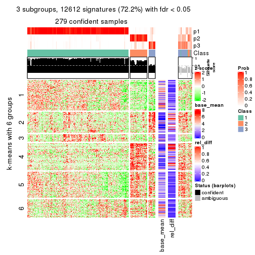</p>

</div>
<div id='tab-CV-hclust-get-signatures-3'>
<pre><code class="r">get_signatures(res, k = 4)
</code></pre>

<p></p>

</div>
<div id='tab-CV-hclust-get-signatures-4'>
<pre><code class="r">get_signatures(res, k = 5)
</code></pre>

<p></p>

</div>
<div id='tab-CV-hclust-get-signatures-5'>
<pre><code class="r">get_signatures(res, k = 6)
</code></pre>

<p></p>

</div>
</div>


Signature heatmaps where rows are not scaled:


<script>
$( function() {
	$( '#tabs-CV-hclust-get-signatures-no-scale' ).tabs();
} );
</script>
<div id='tabs-CV-hclust-get-signatures-no-scale'>
<ul>
<li><a href='#tab-CV-hclust-get-signatures-no-scale-1'>k = 2</a></li>
<li><a href='#tab-CV-hclust-get-signatures-no-scale-2'>k = 3</a></li>
<li><a href='#tab-CV-hclust-get-signatures-no-scale-3'>k = 4</a></li>
<li><a href='#tab-CV-hclust-get-signatures-no-scale-4'>k = 5</a></li>
<li><a href='#tab-CV-hclust-get-signatures-no-scale-5'>k = 6</a></li>
</ul>
<div id='tab-CV-hclust-get-signatures-no-scale-1'>
<pre><code class="r">get_signatures(res, k = 2, scale_rows = FALSE)
</code></pre>

<p>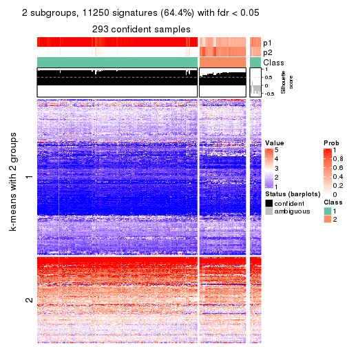</p>

</div>
<div id='tab-CV-hclust-get-signatures-no-scale-2'>
<pre><code class="r">get_signatures(res, k = 3, scale_rows = FALSE)
</code></pre>

<p></p>

</div>
<div id='tab-CV-hclust-get-signatures-no-scale-3'>
<pre><code class="r">get_signatures(res, k = 4, scale_rows = FALSE)
</code></pre>

<p></p>

</div>
<div id='tab-CV-hclust-get-signatures-no-scale-4'>
<pre><code class="r">get_signatures(res, k = 5, scale_rows = FALSE)
</code></pre>

<p></p>

</div>
<div id='tab-CV-hclust-get-signatures-no-scale-5'>
<pre><code class="r">get_signatures(res, k = 6, scale_rows = FALSE)
</code></pre>

<p></p>

</div>
</div>


Compare the overlap of signatures from different k:

```r
compare_signatures(res)
```


`get_signature()` returns a data frame invisibly. TO get the list of signatures, the function
call should be assigned to a variable explicitly. In following code, if `plot` argument is set
to `FALSE`, no heatmap is plotted while only the differential analysis is performed.

```r
# code only for demonstration
tb = get_signature(res, k = ..., plot = FALSE)
```

An example of the output of `tb` is:

```
#>   which_row         fdr    mean_1    mean_2 scaled_mean_1 scaled_mean_2 km
#> 1        38 0.042760348  8.373488  9.131774    -0.5533452     0.5164555  1
#> 2        40 0.018707592  7.106213  8.469186    -0.6173731     0.5762149  1
#> 3        55 0.019134737 10.221463 11.207825    -0.6159697     0.5749050  1
#> 4        59 0.006059896  5.921854  7.869574    -0.6899429     0.6439467  1
#> 5        60 0.018055526  8.928898 10.211722    -0.6204761     0.5791110  1
#> 6        98 0.009384629 15.714769 14.887706     0.6635654    -0.6193277  2
...
```

The columns in `tb` are:

1. `which_row`: row indices corresponding to the input matrix.
2. `fdr`: FDR for the differential test. 
3. `mean_x`: The mean value in group x.
4. `scaled_mean_x`: The mean value in group x after rows are scaled.
5. `km`: Row groups if k-means clustering is applied to rows.


UMAP plot which shows how samples are separated.


<script>
$( function() {
	$( '#tabs-CV-hclust-dimension-reduction' ).tabs();
} );
</script>
<div id='tabs-CV-hclust-dimension-reduction'>
<ul>
<li><a href='#tab-CV-hclust-dimension-reduction-1'>k = 2</a></li>
<li><a href='#tab-CV-hclust-dimension-reduction-2'>k = 3</a></li>
<li><a href='#tab-CV-hclust-dimension-reduction-3'>k = 4</a></li>
<li><a href='#tab-CV-hclust-dimension-reduction-4'>k = 5</a></li>
<li><a href='#tab-CV-hclust-dimension-reduction-5'>k = 6</a></li>
</ul>
<div id='tab-CV-hclust-dimension-reduction-1'>
<pre><code class="r">dimension_reduction(res, k = 2, method = &quot;UMAP&quot;)
</code></pre>

<p></p>

</div>
<div id='tab-CV-hclust-dimension-reduction-2'>
<pre><code class="r">dimension_reduction(res, k = 3, method = &quot;UMAP&quot;)
</code></pre>

<p></p>

</div>
<div id='tab-CV-hclust-dimension-reduction-3'>
<pre><code class="r">dimension_reduction(res, k = 4, method = &quot;UMAP&quot;)
</code></pre>

<p></p>

</div>
<div id='tab-CV-hclust-dimension-reduction-4'>
<pre><code class="r">dimension_reduction(res, k = 5, method = &quot;UMAP&quot;)
</code></pre>

<p></p>

</div>
<div id='tab-CV-hclust-dimension-reduction-5'>
<pre><code class="r">dimension_reduction(res, k = 6, method = &quot;UMAP&quot;)
</code></pre>

<p>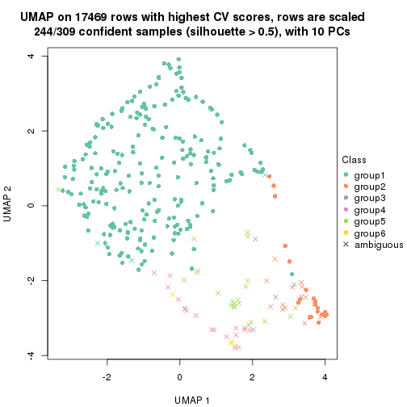</p>

</div>
</div>


Following heatmap shows how subgroups are split when increasing `k`:

```r
collect_classes(res)
```


If matrix rows can be associated to genes, consider to use `GO_Enrichment(res,
...)` to perform function enrichment for the signature genes.


 

---------------------------------------------------


### CV:kmeans**


The object with results only for a single top-value method and a single partition method 
can be extracted as:

```r
res = res_list["CV", "kmeans"]
# you can also extract it by
# res = res_list["CV:kmeans"]
```

A summary of `res` and all the functions that can be applied to it:

```r
res
```

```
#> A 'ConsensusPartition' object with k = 2, 3, 4, 5, 6.
#>   On a matrix with 17469 rows and 309 columns.
#>   Top rows (1000, 2000, 3000, 4000, 5000) are extracted by 'CV' method.
#>   Subgroups are detected by 'kmeans' method.
#>   Performed in total 1250 partitions by row resampling.
#>   Best k for subgroups seems to be 2.
#> 
#> Following methods can be applied to this 'ConsensusPartition' object:
#>  [1] "cola_report"             "collect_classes"         "collect_plots"          
#>  [4] "collect_stats"           "colnames"                "compare_signatures"     
#>  [7] "consensus_heatmap"       "dimension_reduction"     "functional_enrichment"  
#> [10] "get_anno_col"            "get_anno"                "get_classes"            
#> [13] "get_consensus"           "get_matrix"              "get_membership"         
#> [16] "get_param"               "get_signatures"          "get_stats"              
#> [19] "is_best_k"               "is_stable_k"             "membership_heatmap"     
#> [22] "ncol"                    "nrow"                    "plot_ecdf"              
#> [25] "rownames"                "select_partition_number" "show"                   
#> [28] "suggest_best_k"          "test_to_known_factors"
```

`collect_plots()` function collects all the plots made from `res` for all `k` (number of partitions)
into one single page to provide an easy and fast comparison between different `k`.

```r
collect_plots(res)
```

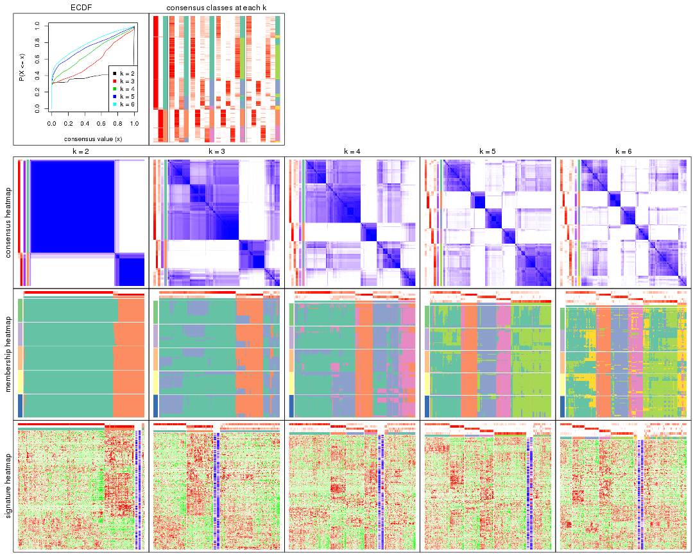

The plots are:

- The first row: a plot of the ECDF (Empirical cumulative distribution
  function) curves of the consensus matrix for each `k` and the heatmap of
  predicted classes for each `k`.
- The second row: heatmaps of the consensus matrix for each `k`.
- The third row: heatmaps of the membership matrix for each `k`.
- The fouth row: heatmaps of the signatures for each `k`.

All the plots in panels can be made by individual functions and they are
plotted later in this section.

`select_partition_number()` produces several plots showing different
statistics for choosing "optimized" `k`. There are following statistics:

- ECDF curves of the consensus matrix for each `k`;
- 1-PAC. [The PAC
  score](https://en.wikipedia.org/wiki/Consensus_clustering#Over-interpretation_potential_of_consensus_clustering)
  measures the proportion of the ambiguous subgrouping.
- Mean silhouette score.
- Concordance. The mean probability of fiting the consensus class ids in all
  partitions.
- Area increased. Denote $A_k$ as the area under the ECDF curve for current
  `k`, the area increased is defined as $A_k - A_{k-1}$.
- Rand index. The percent of pairs of samples that are both in a same cluster
  or both are not in a same cluster in the partition of k and k-1.
- Jaccard index. The ratio of pairs of samples are both in a same cluster in
  the partition of k and k-1 and the pairs of samples are both in a same
  cluster in the partition k or k-1.

The detailed explanations of these statistics can be found in [the cola
vignette](http://bioconductor.org/packages/devel/bioc/vignettes/cola/inst/doc/cola.html#toc_13).

Generally speaking, lower PAC score, higher mean silhouette score or higher
concordance corresponds to better partition. Rand index and Jaccard index
measure how similar the current partition is compared to partition with `k-1`.
If they are too similar, we won't accept `k` is better than `k-1`.

```r
select_partition_number(res)
```


The numeric values for all these statistics can be obtained by `get_stats()`.

```r
get_stats(res)
```

```
#>   k 1-PAC mean_silhouette concordance area_increased  Rand Jaccard
#> 2 2 0.986           0.957       0.982         0.3812 0.612   0.612
#> 3 3 0.453           0.477       0.768         0.5390 0.845   0.749
#> 4 4 0.508           0.547       0.731         0.1683 0.795   0.595
#> 5 5 0.607           0.667       0.801         0.1022 0.821   0.519
#> 6 6 0.617           0.513       0.720         0.0569 0.894   0.603
```

`suggest_best_k()` suggests the best $k$ based on these statistics. The rules are as follows:

- All $k$ with Jaccard index larger than 0.95 are removed because the increase of
  the partition number does not provides enough extra information. If all $k$ are removed,
  the best $k$ is assigned by `NA`.
- For $k$ with 1-PAC larger than 0.9, the maximal $k$ is taken as the "best k". Other $k$ is called "optional k".
- If it does not fit the second rule. The $k$ with the highest vote of highest
  1-PAC, mean silhouette and concordance is taken as the "best k".

```r
suggest_best_k(res)
```

```
#> [1] 2
```


Following shows the table of the partitions (You need to click the **show/hide
code output** link to see it). The membership matrix (columns with name `p*`)
is inferred by
[`clue::cl_consensus()`](https://www.rdocumentation.org/link/cl_consensus?package=clue)
function with the `SE` method. Basically the value in the membership matrix
represents the probability to belong to a certain group. The finall class
label for an item is determined with the group with highest probability it
belongs to.

In `get_classes()` function, the entropy is calculated from the membership
matrix and the silhouette score is calculated from the consensus matrix.


<script>
$( function() {
	$( '#tabs-CV-kmeans-get-classes' ).tabs();
} );
</script>
<div id='tabs-CV-kmeans-get-classes'>
<ul>
<li><a href='#tab-CV-kmeans-get-classes-1'>k = 2</a></li>
<li><a href='#tab-CV-kmeans-get-classes-2'>k = 3</a></li>
<li><a href='#tab-CV-kmeans-get-classes-3'>k = 4</a></li>
<li><a href='#tab-CV-kmeans-get-classes-4'>k = 5</a></li>
<li><a href='#tab-CV-kmeans-get-classes-5'>k = 6</a></li>
</ul>

<div id='tab-CV-kmeans-get-classes-1'>
<p><a id='tab-CV-kmeans-get-classes-1-a' style='color:#0366d6' href='#'>show/hide code output</a></p>
<pre><code class="r">cbind(get_classes(res, k = 2), get_membership(res, k = 2))
</code></pre>

<pre><code>#&gt;                                      class entropy silhouette    p1    p2
#&gt; 7826AE44-B03A-4528-9CB5-7421E592AE36     2  0.8443    0.66185 0.272 0.728
#&gt; 0DC2197B-2FEA-48EB-953E-8E44E1933757     1  0.0000    0.99250 1.000 0.000
#&gt; 87ABB098-8C1E-4677-8C31-48B71EFE41C7     1  0.0000    0.99250 1.000 0.000
#&gt; EC0154E7-7A27-4535-83AE-6B379E99A93C     1  0.0000    0.99250 1.000 0.000
#&gt; 78F79407-D49F-4FA2-B09F-0665C502827C     1  0.0000    0.99250 1.000 0.000
#&gt; 03E81178-E971-4E91-8BED-D8273EA1425C     1  0.0000    0.99250 1.000 0.000
#&gt; 62FCAEFF-16D8-4019-84B6-18EC3A88BC32     1  0.0000    0.99250 1.000 0.000
#&gt; 722C1284-5983-4CC1-B19C-214C2DE6F8A6     2  0.0000    0.95145 0.000 1.000
#&gt; 54E42A64-B350-4A94-8FED-C9BC1872660E     1  0.0000    0.99250 1.000 0.000
#&gt; 53062969-D209-490B-9C9B-5D297625E2AE     1  0.0000    0.99250 1.000 0.000
#&gt; B710293C-41D3-4A2E-8104-5402F91DD859     1  0.0000    0.99250 1.000 0.000
#&gt; 73CB1D05-7AE4-457D-B4EF-25AC5C1F2132     1  0.0000    0.99250 1.000 0.000
#&gt; B055A70B-3003-47CB-BDAA-6378C000BF24     1  0.0000    0.99250 1.000 0.000
#&gt; 46C3A870-E37A-42CB-8C0C-6ACACEAC1ADC     2  0.0000    0.95145 0.000 1.000
#&gt; E8E6270E-F26D-4F2E-A63E-7885BDE05FDB     1  0.0000    0.99250 1.000 0.000
#&gt; C4A5EBA2-9091-4D12-BDC8-B84B122022B9     1  0.0000    0.99250 1.000 0.000
#&gt; 5B1839C4-549D-41D1-B559-3C6D2A1528CE     1  0.0000    0.99250 1.000 0.000
#&gt; A0DF05EB-DC44-4492-9A8A-F278F7B0C266     1  0.0000    0.99250 1.000 0.000
#&gt; B5182F49-70F2-45B7-82DE-C6DA68145EEA     1  0.0000    0.99250 1.000 0.000
#&gt; C204D355-B876-4341-A111-36D48CBDD2A8     1  0.0000    0.99250 1.000 0.000
#&gt; 7B070AAA-EF97-4D3B-AA19-EEC170C7927D     2  0.0000    0.95145 0.000 1.000
#&gt; 05A8A881-F8EE-48A2-B11C-A08D7D80CE18     1  0.0000    0.99250 1.000 0.000
#&gt; BA59EF50-CFE9-456D-B1B6-67D0945004F6     1  0.0000    0.99250 1.000 0.000
#&gt; AD97B334-E034-4D33-A4D5-48C32D5D521C     1  0.0000    0.99250 1.000 0.000
#&gt; 51DA2568-32EA-4668-9876-4B6E7CA68860     1  0.0000    0.99250 1.000 0.000
#&gt; 78C26A05-2084-494D-83D3-C52C1B800F4C     1  0.0000    0.99250 1.000 0.000
#&gt; 2B5DD791-7692-4721-9519-7D7D49B52570     1  0.0000    0.99250 1.000 0.000
#&gt; C0BBE26A-79C8-4392-9978-7C420B3786B5     1  0.0000    0.99250 1.000 0.000
#&gt; F35A8359-3A7A-414F-8A5C-D278F3B45387     2  0.0000    0.95145 0.000 1.000
#&gt; 8C9BA49C-1270-491D-A234-AE1B1C0609BA     2  0.0000    0.95145 0.000 1.000
#&gt; CA104B57-B160-4148-8A0A-D34BB3E8D88A     1  0.0000    0.99250 1.000 0.000
#&gt; 877E18A5-6A7A-4E29-9871-DC7EA14A5F27     1  0.0000    0.99250 1.000 0.000
#&gt; 904EDF2E-411E-43BD-901D-46129AFA283A     1  0.0000    0.99250 1.000 0.000
#&gt; FD9F5A9B-2BEB-4D31-9A2D-8D4B4ECBB478     1  0.0000    0.99250 1.000 0.000
#&gt; 2E206314-9928-456E-B7C6-893DC0E3C7C2     2  0.0000    0.95145 0.000 1.000
#&gt; 913DB655-2C7F-4369-83DE-9257F04CF39B     1  0.0000    0.99250 1.000 0.000
#&gt; 72B5B724-FEB5-43BD-83F6-2E2152DDD800     1  0.0000    0.99250 1.000 0.000
#&gt; 920B547C-6898-446C-AAAF-F4ED96E40AAB     2  0.0000    0.95145 0.000 1.000
#&gt; 847F796A-8CD6-4013-A0FB-26F4FC3EAF0D     1  0.0000    0.99250 1.000 0.000
#&gt; C4D64E7A-33F7-4CFC-9FD3-D6AA3D8EFAA7     1  0.0000    0.99250 1.000 0.000
#&gt; EABA0B17-8E19-48C5-BF62-2A45C9632807     2  0.0000    0.95145 0.000 1.000
#&gt; 7263CBA8-CE37-4531-A795-9324C6D2A672     1  0.0000    0.99250 1.000 0.000
#&gt; 6D3CC3AC-618B-414A-B640-169C735A6568     1  0.0000    0.99250 1.000 0.000
#&gt; 710C05C7-F9CE-45FA-A8CC-29DE2903E04F     1  0.0000    0.99250 1.000 0.000
#&gt; 3D631A56-2C55-48EA-A667-BA46023C9D50     1  0.0000    0.99250 1.000 0.000
#&gt; F1C65F64-AF05-4875-B7E4-60FFF56A3F46     1  0.0000    0.99250 1.000 0.000
#&gt; E5DF76E7-A765-4E07-B87A-06168BF66C5F     1  0.0000    0.99250 1.000 0.000
#&gt; 5C8C8A6E-40D4-4F82-AC3D-90CFDEE15C0A     2  0.0000    0.95145 0.000 1.000
#&gt; 0117CBB9-1BF9-48B1-BE6E-A9A770FF8721     1  0.0000    0.99250 1.000 0.000
#&gt; 31EF66E5-419A-44C3-BB2A-B69B52FFCECC     2  0.0000    0.95145 0.000 1.000
#&gt; C149CEF5-61F3-4B53-B8A9-8244B673EBD0     1  0.0000    0.99250 1.000 0.000
#&gt; 0AF351D0-4EC5-4275-AA0A-4FA2AF8A9C85     2  0.0000    0.95145 0.000 1.000
#&gt; B507E82F-6680-497B-A014-033EDD7A2E03     1  0.0000    0.99250 1.000 0.000
#&gt; F941890E-AB33-478F-8C97-1C785DD9428F     1  0.0000    0.99250 1.000 0.000
#&gt; 7987E019-8FED-469B-A6C1-34EE430A60C3     1  0.0000    0.99250 1.000 0.000
#&gt; 76084AA6-19BF-4605-B6A1-73F1D4BADAF9     1  0.0000    0.99250 1.000 0.000
#&gt; 329807F7-E0D4-4F53-94E8-E4080E90CB47     1  0.0000    0.99250 1.000 0.000
#&gt; 1B6505FF-C1A7-4DD0-9827-41A0A3A28F3E     1  0.0000    0.99250 1.000 0.000
#&gt; 49778E92-B5D3-4AD9-A1AF-3B722D631B96     2  0.0000    0.95145 0.000 1.000
#&gt; A22892DE-0AF4-4B63-9513-1D6825059040     1  0.0000    0.99250 1.000 0.000
#&gt; 6D77ECAE-A715-4ADD-97D8-A916DC31A4EA     1  0.0000    0.99250 1.000 0.000
#&gt; 09758B6F-1B2D-4AED-8913-696097069409     2  0.7602    0.74240 0.220 0.780
#&gt; 8B709DB4-0B28-42F1-A7C5-106F5809BEA2     1  0.0000    0.99250 1.000 0.000
#&gt; F2B356FA-79CD-4867-8ABF-84C90A493A75     1  0.0000    0.99250 1.000 0.000
#&gt; 131213AD-0313-4DF1-B013-CE67ED262C37     2  0.0000    0.95145 0.000 1.000
#&gt; D94F7E81-0F60-473B-AD4A-0AC13508BDE2     1  0.0000    0.99250 1.000 0.000
#&gt; 29C17355-D646-48DA-9E54-7B6DD85DD610     1  0.0000    0.99250 1.000 0.000
#&gt; B8BD866A-2A7C-45C3-96BB-9AB892D26AE5     1  0.0000    0.99250 1.000 0.000
#&gt; 13EFD045-AD61-41EE-9896-67BFA4FC8C09     1  0.0000    0.99250 1.000 0.000
#&gt; 2655F609-B3BB-4D01-B421-D5F4B1232EC8     2  0.0000    0.95145 0.000 1.000
#&gt; 04BC7A52-C67F-42CB-8672-D3C51A20F2BA     1  0.0000    0.99250 1.000 0.000
#&gt; 45472BD4-DBDB-41FE-B0E3-2440880E1DE6     1  0.0000    0.99250 1.000 0.000
#&gt; B87FFFCD-CB57-4ACD-9C74-AB188984BBB2     1  0.0000    0.99250 1.000 0.000
#&gt; 5271374C-13CD-4BFE-AC6D-C95AFE491322     1  0.0000    0.99250 1.000 0.000
#&gt; E3372ACE-C7C8-43E5-B30A-1F2D662D8170     1  0.0000    0.99250 1.000 0.000
#&gt; B08DF564-E4D0-4540-8160-93B3981DF1D8     1  0.0000    0.99250 1.000 0.000
#&gt; 61A7D1B9-FC5A-4B9C-989F-936CDA948C27     1  0.0000    0.99250 1.000 0.000
#&gt; 74E768C1-8766-46AC-AAB4-D79E5049F76A     2  0.0000    0.95145 0.000 1.000
#&gt; 0CEA28F0-D7F0-4EB7-A23F-0C5CA6245971     1  0.0000    0.99250 1.000 0.000
#&gt; 95C4EFF6-147C-48EC-A2C1-16B8F12AEEF2     2  0.0000    0.95145 0.000 1.000
#&gt; C9A78BEA-D455-4F5E-8B7B-19BCB42887E7     1  0.0000    0.99250 1.000 0.000
#&gt; DB970740-9AC1-4C10-9658-8A77B1C390DD     1  0.0000    0.99250 1.000 0.000
#&gt; 883FBD37-0CA0-4562-8925-72ACC1EE93D9     1  0.0000    0.99250 1.000 0.000
#&gt; 9FE1D006-49F2-471E-91E6-AF0414C24479     1  0.0000    0.99250 1.000 0.000
#&gt; 11816CC6-8C8B-49C0-99EE-896377BCFCCD     1  0.0000    0.99250 1.000 0.000
#&gt; 063FC5C8-4318-4ECC-9CA0-1976CBC8ACB6     1  0.0000    0.99250 1.000 0.000
#&gt; E0F085CC-B90D-4FDE-B60E-C613971BAA00     1  0.0000    0.99250 1.000 0.000
#&gt; 62361DA2-E4EE-46DA-BB1F-C51DCA9307CC     2  0.0000    0.95145 0.000 1.000
#&gt; 1BA16D48-B09E-4699-A1AD-2FFECE4F3CDB     2  0.0000    0.95145 0.000 1.000
#&gt; 3E4F14E9-60AE-4F17-9BA7-2A02E908204A     1  0.0000    0.99250 1.000 0.000
#&gt; 79226DD7-BC85-4B8E-BFF8-B1E073129D34     1  0.0000    0.99250 1.000 0.000
#&gt; D47D0936-826F-4D54-9225-F71B95357438     1  0.0000    0.99250 1.000 0.000
#&gt; 0AE02B91-574C-4165-BA39-E9D7C1A870A2     2  0.0000    0.95145 0.000 1.000
#&gt; DED8E9DF-CEFE-45ED-9374-EF9925A135C4     1  0.0000    0.99250 1.000 0.000
#&gt; D587A993-3C47-4D4C-B744-59169D4F7451     1  0.0000    0.99250 1.000 0.000
#&gt; 6BCA24E6-440F-42C5-ABE5-66C37B713A39     1  0.0000    0.99250 1.000 0.000
#&gt; 86A5EDFB-9D06-4FED-BF57-F8D74A68E156     1  0.0000    0.99250 1.000 0.000
#&gt; B9BD5134-2F6A-4454-8F83-69B63F9AE114     1  0.0376    0.98844 0.996 0.004
#&gt; 082DA9E1-A40D-482B-8E21-A93BA97185F0     1  0.0000    0.99250 1.000 0.000
#&gt; 16A8343A-1203-44FB-9F03-05CC7C71B4CC     1  0.0000    0.99250 1.000 0.000
#&gt; 00439565-02CE-4BF5-956D-7078B51C0947     1  0.0000    0.99250 1.000 0.000
#&gt; 7B2BD361-2BF1-4E97-BC08-457F5A9C2682     2  0.0000    0.95145 0.000 1.000
#&gt; C1D8439A-D527-47F6-ADC1-25867B65DA21     2  0.0000    0.95145 0.000 1.000
#&gt; D9096909-1439-462D-B69C-CAD1BF4F420C     1  0.0000    0.99250 1.000 0.000
#&gt; 7822EA86-35A1-4285-9429-2B63111B9885     1  0.0000    0.99250 1.000 0.000
#&gt; 6FD0CFC8-AC8D-4CF1-8C33-833AD98A30EF     2  0.0000    0.95145 0.000 1.000
#&gt; A451F278-5E83-4BC6-9B15-3AA2117B99B6     1  1.0000   -0.08185 0.504 0.496
#&gt; 6EC25686-4547-459C-9E01-7EDF8DAECE35     1  0.0000    0.99250 1.000 0.000
#&gt; 5D2F1EEA-2BA8-4C3A-8436-544EE1D23E7E     1  0.0000    0.99250 1.000 0.000
#&gt; 675A4293-A4CE-4307-B00B-DFC4D44A87C6     2  0.7453    0.75326 0.212 0.788
#&gt; 6FBE0AEF-476A-42B2-A857-846CF1ED92B6     2  0.0000    0.95145 0.000 1.000
#&gt; 7139D616-1A15-4288-A9AE-411856A4A76D     1  0.0000    0.99250 1.000 0.000
#&gt; 46D7F8C1-D5C5-40CC-BEF5-2E590A847BD9     1  0.0000    0.99250 1.000 0.000
#&gt; 984C44D3-4F5F-44C9-BCD9-C991EBC1FCB8     1  0.0000    0.99250 1.000 0.000
#&gt; 83FE52E0-2DC2-4580-8BB2-FBCBEE4AC240     1  0.0000    0.99250 1.000 0.000
#&gt; 0923F9CB-DF6F-4BAA-A5F8-0F83CE60D1ED     1  0.0000    0.99250 1.000 0.000
#&gt; 1DEB5206-78CC-4EB5-BCD5-85A6A5B4E273     1  0.0000    0.99250 1.000 0.000
#&gt; E4DB18DA-EB0C-4B2F-9566-7F72222B16D4     1  0.0000    0.99250 1.000 0.000
#&gt; F7456312-1309-4B2F-875D-0F90CDF3EC35     1  0.0000    0.99250 1.000 0.000
#&gt; 9A25E5D8-0706-4960-A76B-BCD0AC93E4FA     1  0.0000    0.99250 1.000 0.000
#&gt; 5A41FE8F-FFB3-4B87-BF11-A570C184096D     1  0.0000    0.99250 1.000 0.000
#&gt; 33F84E63-3F6C-4867-ADB1-A0DF39F1295B     1  0.0000    0.99250 1.000 0.000
#&gt; D6A644F5-D1D0-4A8D-94C4-EE6C3ECE7430     1  0.0000    0.99250 1.000 0.000
#&gt; 2A5848CC-A9A2-4AA8-A752-321273E62CF0     1  0.0000    0.99250 1.000 0.000
#&gt; 7CA6358B-FC8A-4675-B092-9E061038FC83     1  0.9833    0.19357 0.576 0.424
#&gt; A4C2F4BC-5C62-4B1F-9AB8-46D9468EF523     2  0.7453    0.75326 0.212 0.788
#&gt; 8AF4EB7F-418D-4CC9-A9B8-A93A4C1A173B     1  0.4690    0.87665 0.900 0.100
#&gt; E5048887-70C8-468F-881E-2EC55F6E6F3B     1  0.0000    0.99250 1.000 0.000
#&gt; 1BADCC7C-C4D8-4C34-9534-59D622C7A2A2     1  0.0000    0.99250 1.000 0.000
#&gt; 02CE7DF7-64BD-4297-A240-A5B9EE8771D3     1  0.0000    0.99250 1.000 0.000
#&gt; CBF6E96A-F56C-4C87-B851-D319930BAAB8     1  0.0672    0.98435 0.992 0.008
#&gt; 48F6B774-CFD2-4DDF-B7A2-696596413C3F     1  0.0000    0.99250 1.000 0.000
#&gt; 41D88C3E-5848-4B09-8A77-EAE6AC4EC6B0     2  0.0000    0.95145 0.000 1.000
#&gt; BDF79CC0-00C7-49C1-900B-AB065A733B17     1  0.0000    0.99250 1.000 0.000
#&gt; A894D686-BFC7-4AEE-A794-DBE718C6B6F6     2  0.0000    0.95145 0.000 1.000
#&gt; 0712029E-3765-4272-BE5B-B6C8BCCC0F0F     2  0.0000    0.95145 0.000 1.000
#&gt; 7B051855-9B09-4887-9BC0-9F077537938E     1  0.0000    0.99250 1.000 0.000
#&gt; EF357C46-5C3C-4F51-9383-FF7694D07B97     2  0.0000    0.95145 0.000 1.000
#&gt; 9492A322-37CA-4582-AC68-66B5D80778AF     2  0.0000    0.95145 0.000 1.000
#&gt; 993399A4-1B9F-4258-B2D0-155AD58A2E82     1  0.0000    0.99250 1.000 0.000
#&gt; 7B7DC93D-5494-4E69-BE07-2967887182F9     1  0.0000    0.99250 1.000 0.000
#&gt; 29BCBA51-2580-473D-9CF7-BEDBD0DBAD1B     2  0.0000    0.95145 0.000 1.000
#&gt; 40855647-E942-4F32-90B7-BEB921929BFB     1  0.0000    0.99250 1.000 0.000
#&gt; 0DC723D0-7C68-4495-A4B9-2DF2FF19AB14     2  0.7219    0.76850 0.200 0.800
#&gt; 7540005F-57E0-4E2E-A8A2-BEF2B0F333B1     2  0.0000    0.95145 0.000 1.000
#&gt; EB1DDB14-4076-4C2C-B911-390C17C21486     1  0.0000    0.99250 1.000 0.000
#&gt; 9EA70EC4-8BA0-4E3D-B3CB-A68D19E89868     1  0.0000    0.99250 1.000 0.000
#&gt; B04E2E50-0A6E-4224-A825-1714D12E5669     2  0.0000    0.95145 0.000 1.000
#&gt; B0BF5E01-536D-40FF-9C24-CBBD611E2FC2     1  0.0000    0.99250 1.000 0.000
#&gt; 7B6B1788-B297-4442-B6BE-B7CE8754491E     1  0.0000    0.99250 1.000 0.000
#&gt; A090D00C-34DF-4906-A517-4803C4C9A332     1  0.0000    0.99250 1.000 0.000
#&gt; 340D44A6-9BEA-412C-9973-D9ABD6692255     1  0.0000    0.99250 1.000 0.000
#&gt; E8D0D1E7-E5A8-4014-80C1-0245F90F4358     2  0.0000    0.95145 0.000 1.000
#&gt; 19EA1494-8572-40E1-B9BB-3739F47B607D     1  0.0000    0.99250 1.000 0.000
#&gt; 1C1B4793-8DAF-4763-BA4D-C4E869A4ED35     2  0.9909    0.27355 0.444 0.556
#&gt; 45BF59B3-95BD-4196-ABAA-4C4F0DB38572     2  0.9866    0.31004 0.432 0.568
#&gt; 47B5A2A7-7E13-4558-99D2-067F5075C6A4     1  0.0000    0.99250 1.000 0.000
#&gt; E94638E8-CB51-4FBB-8BCB-4BFD7A812291     1  0.0000    0.99250 1.000 0.000
#&gt; A17352A8-0D3C-4545-8136-7DAE2FB0E102     2  0.9710    0.39604 0.400 0.600
#&gt; B18A6F95-D4ED-416B-B5A1-9A4934865D0D     2  0.0000    0.95145 0.000 1.000
#&gt; 33E92C5F-0C42-4549-AD5B-0A064182A272     1  0.0000    0.99250 1.000 0.000
#&gt; E041B375-3E60-4F18-A6EF-D1C249E3B8EE     1  0.0000    0.99250 1.000 0.000
#&gt; EDF90AF6-6C64-4BD2-AADF-8D7D188650B2     2  0.0000    0.95145 0.000 1.000
#&gt; 569320D2-316C-4E2D-B7B3-D7D5C4DAD42D     1  0.0000    0.99250 1.000 0.000
#&gt; AFFB223D-DAE9-4567-9EF2-8E4DF9D8782D     2  0.0000    0.95145 0.000 1.000
#&gt; 56FC9454-0A6A-4CC3-95C4-BE0E0D0BAFCE     2  0.0000    0.95145 0.000 1.000
#&gt; 43226365-FAEF-46C5-AF1B-5C6C2BED84FF     1  0.0000    0.99250 1.000 0.000
#&gt; 1536110A-B42A-4A84-9474-9895321FDCE9     2  0.0000    0.95145 0.000 1.000
#&gt; 812255DD-536B-4216-90B1-27D5AB339BE2     1  0.0000    0.99250 1.000 0.000
#&gt; 5D4563D6-68B7-4C9D-A3F4-AA7D45D5112C     2  0.0000    0.95145 0.000 1.000
#&gt; BAA39781-DB94-473C-98B1-FA6CD3E1C67A     1  0.0000    0.99250 1.000 0.000
#&gt; C1411CDA-814D-4E21-8929-C0F77858828F     1  0.0000    0.99250 1.000 0.000
#&gt; EFE2F248-C13E-4E8D-9153-8C903848AC4A     1  0.4022    0.90239 0.920 0.080
#&gt; D3939C84-D1D6-4060-9F91-AEB222A9BDD5     1  0.0000    0.99250 1.000 0.000
#&gt; EABD2987-8C1E-49E5-94AF-C0BDE5335A48     1  0.0000    0.99250 1.000 0.000
#&gt; F4BE2ABE-2CEB-4A6A-B8EC-0355F8C63B9B     1  0.0000    0.99250 1.000 0.000
#&gt; 627BC251-D217-4955-B718-6B9D6DEA1756     1  0.0000    0.99250 1.000 0.000
#&gt; 31B54613-A20E-4039-BB8B-9B52104CE418     1  0.0000    0.99250 1.000 0.000
#&gt; 3F292B7C-A535-4DBD-BC20-CB4F85A1C94B     1  0.0000    0.99250 1.000 0.000
#&gt; BEA2A5EB-EEA9-4F31-AC38-810E04CE124B     2  0.0000    0.95145 0.000 1.000
#&gt; 99D84D46-19DA-43F1-B639-DCE9953F1529     2  0.0000    0.95145 0.000 1.000
#&gt; 4588817E-1068-4A78-86B6-4674A0112DDA     1  0.0000    0.99250 1.000 0.000
#&gt; 6AC633BD-BEC1-4750-94E3-378972DAB6B3     2  0.0000    0.95145 0.000 1.000
#&gt; 09E17C6E-7EDE-4DDF-B5ED-2521AF870C9A     1  0.0000    0.99250 1.000 0.000
#&gt; 58D9C750-26A2-4B7C-84C4-13D7AFB4C5EA     1  0.0000    0.99250 1.000 0.000
#&gt; DF28E138-E222-4F77-9B61-69E601CA7E60     2  0.0000    0.95145 0.000 1.000
#&gt; FEA489A8-E423-4266-AADA-9BAAB29AB94B     1  0.0000    0.99250 1.000 0.000
#&gt; F3FCC207-15CD-41EA-A3EF-F5D2C12AC373     1  0.0000    0.99250 1.000 0.000
#&gt; 53DD7AFB-A258-4643-A501-BACC95D17A50     2  0.0000    0.95145 0.000 1.000
#&gt; D850B2A1-1F8A-4A44-A0CF-8D9DD4A1889A     2  0.0000    0.95145 0.000 1.000
#&gt; B3F746DC-E487-4305-9F30-825D1520E8FD     2  0.0000    0.95145 0.000 1.000
#&gt; BE38240A-F7C2-439F-9AAE-51C8A340F310     1  0.0000    0.99250 1.000 0.000
#&gt; A9022D9E-1D30-49EE-8552-1364A8027F34     1  0.0000    0.99250 1.000 0.000
#&gt; 0E8A56EE-D9A2-48A5-B793-A358BE1E4EFA     1  0.0000    0.99250 1.000 0.000
#&gt; 51667574-318E-4BDB-8F42-8512A4C1B84F     1  0.0000    0.99250 1.000 0.000
#&gt; B0A442C9-67E4-4534-8A5C-D6D73F42358C     1  0.0000    0.99250 1.000 0.000
#&gt; 25A5BC09-0D88-4385-87AF-997F9018522D     2  0.0000    0.95145 0.000 1.000
#&gt; 344B9631-AAA5-4302-8747-D584345D9131     1  0.0000    0.99250 1.000 0.000
#&gt; 1C3795AD-6306-4892-95F5-92DF3375D46A     1  0.0000    0.99250 1.000 0.000
#&gt; 17BB221D-8BF9-4391-83DD-423AE1E03651     1  0.0000    0.99250 1.000 0.000
#&gt; 297611E9-9555-4BCA-A723-02E846ACC23A     1  0.0000    0.99250 1.000 0.000
#&gt; AD7FF180-1EAC-4783-8A62-E9626B96DD9F     1  0.0000    0.99250 1.000 0.000
#&gt; FD544083-9BD5-4036-BD81-0352B67CC45C     1  0.0000    0.99250 1.000 0.000
#&gt; 879A74D5-5B29-418D-A0F4-8E88D6384008     1  0.0000    0.99250 1.000 0.000
#&gt; 43CD982C-13C0-4A52-803A-9A3A3FAE09BC     1  0.0000    0.99250 1.000 0.000
#&gt; DCD0313D-5206-4111-8743-A8A0227257D9     1  0.0000    0.99250 1.000 0.000
#&gt; 331A9160-D730-45DD-A985-C6CAC03035ED     1  0.0000    0.99250 1.000 0.000
#&gt; 9EEECA0E-530D-4724-B016-A716F0782148     1  0.0000    0.99250 1.000 0.000
#&gt; B3073976-CA3F-4115-9243-8C2D9E1B975D     1  0.0000    0.99250 1.000 0.000
#&gt; 77B3C9B4-1A7F-41BB-A37D-01EF80E933CC     2  0.0000    0.95145 0.000 1.000
#&gt; C0C26822-2E9F-4FB0-81D4-575027C8B71C     2  0.7056    0.77800 0.192 0.808
#&gt; F1FCE328-2B3B-499A-888D-0E66A017E8B0     1  0.0000    0.99250 1.000 0.000
#&gt; F069DAD6-F1EB-42F7-8252-F3F6EC46CC3E     1  0.0000    0.99250 1.000 0.000
#&gt; 99CC822E-8C98-4EEC-BB58-AEF76A0B5332     1  0.0000    0.99250 1.000 0.000
#&gt; C86EBD08-53F2-4972-801A-74970FDD6A62     1  0.0000    0.99250 1.000 0.000
#&gt; F07326F2-C1D6-4D5A-9693-25C3A04B0EC2     1  0.0000    0.99250 1.000 0.000
#&gt; 8ACBD428-7713-48D9-810A-43C9CD191A73     2  0.0000    0.95145 0.000 1.000
#&gt; 3D3501B4-1A43-4FA7-90A2-CCEBF66BFD4A     1  0.0000    0.99250 1.000 0.000
#&gt; DD51C17C-300F-44A4-955A-C9BC85417842     1  0.0000    0.99250 1.000 0.000
#&gt; 58FF391C-1D83-426C-8F92-C15F78F56C95     1  0.0000    0.99250 1.000 0.000
#&gt; ACE65C6E-2B10-4972-91B4-9199DD4B179D     1  0.0000    0.99250 1.000 0.000
#&gt; B2088466-FA5D-491C-9982-99B33683E66F     2  0.0000    0.95145 0.000 1.000
#&gt; D47AF416-1687-4FE0-A235-8815B6E8EB0B     1  0.0000    0.99250 1.000 0.000
#&gt; 4DCAD07F-CC43-46F6-B2F3-EDBF3EDD1045     2  0.0000    0.95145 0.000 1.000
#&gt; AAAE0BD9-63FC-4A0E-A27E-447B634BAD99     2  0.0000    0.95145 0.000 1.000
#&gt; BC471AA1-52CF-4CEE-9866-34CE91404F45     2  0.0000    0.95145 0.000 1.000
#&gt; 81D3EE3F-AC11-404F-8092-307F0DC12198     1  0.0000    0.99250 1.000 0.000
#&gt; 8C02026C-C25E-406B-B8B8-A1A82362AE79     1  0.0000    0.99250 1.000 0.000
#&gt; 6A005F2A-A0C1-4CA4-B15B-96B08F013874     1  0.0000    0.99250 1.000 0.000
#&gt; B55743F2-4D63-4375-85D3-F58281CFD852     1  0.0000    0.99250 1.000 0.000
#&gt; 24F98393-C817-4D0E-A7DB-05D2B5C71F40     1  0.0000    0.99250 1.000 0.000
#&gt; 2C2AEF1D-4112-4EC7-9027-5E3FD26E8802     1  0.0000    0.99250 1.000 0.000
#&gt; 8BAC3CB5-2987-4349-8AE8-B83DDD16CA3C     1  0.0000    0.99250 1.000 0.000
#&gt; ED9C74E6-92FC-4E58-8FCE-1761DEA0C977     1  0.0000    0.99250 1.000 0.000
#&gt; BA732ED4-F6BA-404E-BA3C-CA558FAD866A     1  0.0000    0.99250 1.000 0.000
#&gt; E750385A-12D9-4A88-B4DF-C1306B5EF3B7     2  0.0000    0.95145 0.000 1.000
#&gt; 6B1DC5E4-5F82-4395-913F-6AEDB5B63188     1  0.0000    0.99250 1.000 0.000
#&gt; A7C12D37-FD50-4674-A054-1774F4E5C3B3     1  0.0000    0.99250 1.000 0.000
#&gt; 2155C764-2063-4D9C-9ACD-96AA73475F5E     1  0.0000    0.99250 1.000 0.000
#&gt; DE23CC15-A95E-4119-9B3C-8EEC45900D11     2  0.0000    0.95145 0.000 1.000
#&gt; 5DB1DCAD-638E-48A4-9F40-3D6268FDEC33     2  0.0000    0.95145 0.000 1.000
#&gt; 34AF0341-73D7-4080-AAEB-4C1541C2569F     1  0.0000    0.99250 1.000 0.000
#&gt; B60D4235-44AF-4BA4-98C0-BCCDC28E90B9     2  0.0000    0.95145 0.000 1.000
#&gt; CF463D89-2C9F-4257-BF04-8BC1CD40EA7D     2  0.0000    0.95145 0.000 1.000
#&gt; EF6C8165-484A-4530-AEDF-93DCC4A8455D     1  0.0000    0.99250 1.000 0.000
#&gt; B9F6B5E4-4D10-49B8-A8FE-8F33C5A62CBF     1  0.0000    0.99250 1.000 0.000
#&gt; CE539000-92D7-4622-9C8D-BC6E01310681     2  0.0000    0.95145 0.000 1.000
#&gt; D3BBC405-A22A-4009-ABF6-96FEEE653051     2  0.0000    0.95145 0.000 1.000
#&gt; 0B3C86BD-0D20-4408-9BE3-05658729505F     1  0.0000    0.99250 1.000 0.000
#&gt; 9B9C5071-7C3F-416C-B91C-6F5966747F54     1  0.0000    0.99250 1.000 0.000
#&gt; A9469A4A-C5F9-4681-A916-A26F0B4307BA     1  0.0000    0.99250 1.000 0.000
#&gt; A31B57E4-E30B-4A1B-829D-1B47D9CEC041     2  0.0000    0.95145 0.000 1.000
#&gt; 647255CE-F84A-4070-B3FD-D8ACA32C4D09     1  0.0000    0.99250 1.000 0.000
#&gt; 8F5E9F02-51D7-410E-B8B7-22737F2F095A     2  0.0000    0.95145 0.000 1.000
#&gt; 8074A7F6-2FDE-4578-B71C-01C542D468FE     1  0.0000    0.99250 1.000 0.000
#&gt; 2A946F17-F245-409E-A019-C60CDA18DC7D     1  0.0000    0.99250 1.000 0.000
#&gt; 0878C381-47F9-4786-82C2-94AC840BEDCB     1  0.0000    0.99250 1.000 0.000
#&gt; 54504893-92C5-4328-85A8-2A882680B5E0     1  0.0000    0.99250 1.000 0.000
#&gt; 0A27D1BE-E5DD-459A-A51F-6D8AAF7CFEB4     1  0.0000    0.99250 1.000 0.000
#&gt; 89ED5A3E-CAC0-4AB4-B858-A3CD8F34DBD5     2  0.0000    0.95145 0.000 1.000
#&gt; ACEEB0A5-AADB-4EF9-8710-4BAF95522CEA     1  0.0000    0.99250 1.000 0.000
#&gt; 02C74D81-5976-4252-BC6C-B10E934DECA2     1  0.0000    0.99250 1.000 0.000
#&gt; D365A238-4739-4B54-9608-DC548F21C04E     1  0.0000    0.99250 1.000 0.000
#&gt; F70F7ED5-A3B7-4210-95AD-DEFA0A565F06     1  0.0000    0.99250 1.000 0.000
#&gt; A92C23A9-BC25-4025-9501-6D5FF8E2A502     1  0.9993   -0.00224 0.516 0.484
#&gt; ECE9BBF4-840E-47A6-8378-0B6C4A2369D3     1  0.0000    0.99250 1.000 0.000
#&gt; 38749490-0FCF-4B33-9EBC-8F86C2D9E4AF     1  0.0000    0.99250 1.000 0.000
#&gt; 02ABB64E-768B-4999-A899-EEE573D5F186     1  0.0000    0.99250 1.000 0.000
#&gt; C1C467A8-18B1-4C3F-AC45-33359ED6FDC4     2  0.9954    0.19468 0.460 0.540
#&gt; 78B2E4A1-9DAE-404F-AB47-1896450EF254     1  0.0000    0.99250 1.000 0.000
#&gt; CCDB0290-91DA-4089-84A6-4434BA028D30     1  0.0000    0.99250 1.000 0.000
#&gt; D5041E80-20A0-4C1A-9AC1-2394F6DB6E92     1  0.0000    0.99250 1.000 0.000
#&gt; 20EB9CC6-EABB-438A-9030-E766459996D1     2  0.0000    0.95145 0.000 1.000
#&gt; 73E99110-9A7C-4F73-98C5-79D22CB06230     1  0.0000    0.99250 1.000 0.000
#&gt; FAD8A464-9BC3-4ED9-9517-B18D36514325     2  0.7602    0.74240 0.220 0.780
#&gt; 9AF0E82E-E621-437A-8D19-700532B95090     1  0.0000    0.99250 1.000 0.000
#&gt; 27DA48F3-4FC1-41A3-8E49-5B25F1CCFF07     1  0.0000    0.99250 1.000 0.000
#&gt; EFE5A302-D138-4044-A301-5C5FD1C24836     1  0.0000    0.99250 1.000 0.000
#&gt; D3E866AC-D66A-4C07-9F47-89AF460320DE     2  0.0000    0.95145 0.000 1.000
#&gt; 89C45456-9392-4EB3-9A82-A130B6702AAF     1  0.0000    0.99250 1.000 0.000
#&gt; 8FF5C8FC-2565-49BE-9EE0-91A84A85AB2A     1  0.0000    0.99250 1.000 0.000
#&gt; 846DF088-75D5-49CF-BDDC-27E735A08DCA     1  0.0000    0.99250 1.000 0.000
#&gt; EA3A19E1-7ADE-47B6-A35A-71290967147A     2  0.6148    0.82113 0.152 0.848
#&gt; B2C43D0C-732B-4C54-938F-D3C9FDA880DA     1  0.0000    0.99250 1.000 0.000
#&gt; EEC856B5-9B7F-488D-975E-CE2FF7072879     1  0.0672    0.98435 0.992 0.008
#&gt; 8A68C417-09CC-4FA1-BFEB-EB4B738853A4     1  0.0000    0.99250 1.000 0.000
#&gt; C5DF1A0D-952C-44E2-BF83-ED57177EF60E     1  0.0000    0.99250 1.000 0.000
#&gt; B5C9EA22-F758-4BD2-BD1F-282EC1078AED     2  0.0000    0.95145 0.000 1.000
#&gt; 3F08AE92-3EFD-4D7F-8C5C-BFB3621F0CD6     1  0.0000    0.99250 1.000 0.000
#&gt; 8F0D43F1-2199-4DBB-9B16-1E5F2CED2FEC     2  0.7219    0.76850 0.200 0.800
#&gt; 54BABD8B-EA9F-4875-8594-2179B38C73BD     1  0.0000    0.99250 1.000 0.000
#&gt; C149B6F8-03DC-4907-920A-F3318B8D2A1E     1  0.0000    0.99250 1.000 0.000
#&gt; F93D26E2-4B45-495D-BC8E-5B592F8FDABF     1  0.0000    0.99250 1.000 0.000
#&gt; C98275CD-C39A-4E14-A731-4F3EB7396665     2  0.7139    0.77344 0.196 0.804
#&gt; 354DC705-216E-42F0-B29E-C1F8D6C9489A     1  0.0000    0.99250 1.000 0.000
#&gt; 6752EED9-7990-433F-A206-D5398C396471     1  0.0000    0.99250 1.000 0.000
#&gt; C3E94C5D-68C4-400C-B7CB-38C42E9D5FFF     1  0.0000    0.99250 1.000 0.000
#&gt; CE6B6871-3ED3-44DE-A777-7558D4429057     1  0.0000    0.99250 1.000 0.000
#&gt; A06E7D1E-E432-4A4C-8BB0-314304F96EDF     1  0.0000    0.99250 1.000 0.000
#&gt; 1ABBEF80-508F-4247-B43D-3E549372113B     1  0.0000    0.99250 1.000 0.000
#&gt; 835AAE7F-F873-4D11-8845-232D261A38DF     1  0.0000    0.99250 1.000 0.000
#&gt; E98A0460-6529-4DBA-8542-1B98801D7A7D     1  0.0000    0.99250 1.000 0.000
#&gt; 06A9CBF8-01D0-4720-BCE8-83F0E77C862F     1  0.0000    0.99250 1.000 0.000
#&gt; 206865A9-A67C-49A6-93AD-55D06E777559     2  0.0000    0.95145 0.000 1.000
#&gt; 26DABC83-DB30-452F-9BE2-366760CB138E     2  0.0000    0.95145 0.000 1.000
#&gt; 9DD5272A-2D6E-4774-83E3-0CD761EDE926     1  0.0000    0.99250 1.000 0.000
#&gt; 4938E366-C740-4C9C-9358-FF37997DC9EF     1  0.0000    0.99250 1.000 0.000
#&gt; E2DA59C4-A47C-41E3-BC55-2D00C6EC17FB     1  0.0000    0.99250 1.000 0.000
#&gt; 37349E62-0BFB-4FEA-81D0-2AB7E7625B0D     1  0.0000    0.99250 1.000 0.000
</code></pre>

<script>
$('#tab-CV-kmeans-get-classes-1-a').parent().next().next().hide();
$('#tab-CV-kmeans-get-classes-1-a').click(function(){
  $('#tab-CV-kmeans-get-classes-1-a').parent().next().next().toggle();
  return(false);
});
</script>
</div>

<div id='tab-CV-kmeans-get-classes-2'>
<p><a id='tab-CV-kmeans-get-classes-2-a' style='color:#0366d6' href='#'>show/hide code output</a></p>
<pre><code class="r">cbind(get_classes(res, k = 3), get_membership(res, k = 3))
</code></pre>

<pre><code>#&gt;                                      class entropy silhouette    p1    p2    p3
#&gt; 7826AE44-B03A-4528-9CB5-7421E592AE36     3  0.6234    0.38170 0.096 0.128 0.776
#&gt; 0DC2197B-2FEA-48EB-953E-8E44E1933757     1  0.5988    0.35802 0.632 0.000 0.368
#&gt; 87ABB098-8C1E-4677-8C31-48B71EFE41C7     1  0.6079    0.34091 0.612 0.000 0.388
#&gt; EC0154E7-7A27-4535-83AE-6B379E99A93C     1  0.5178    0.37276 0.744 0.000 0.256
#&gt; 78F79407-D49F-4FA2-B09F-0665C502827C     1  0.0000    0.61840 1.000 0.000 0.000
#&gt; 03E81178-E971-4E91-8BED-D8273EA1425C     1  0.0424    0.61589 0.992 0.000 0.008
#&gt; 62FCAEFF-16D8-4019-84B6-18EC3A88BC32     3  0.5988    0.17247 0.368 0.000 0.632
#&gt; 722C1284-5983-4CC1-B19C-214C2DE6F8A6     2  0.0000    0.88998 0.000 1.000 0.000
#&gt; 54E42A64-B350-4A94-8FED-C9BC1872660E     1  0.1643    0.60372 0.956 0.000 0.044
#&gt; 53062969-D209-490B-9C9B-5D297625E2AE     1  0.6062    0.16279 0.616 0.000 0.384
#&gt; B710293C-41D3-4A2E-8104-5402F91DD859     1  0.1411    0.59980 0.964 0.000 0.036
#&gt; 73CB1D05-7AE4-457D-B4EF-25AC5C1F2132     1  0.6244    0.00773 0.560 0.000 0.440
#&gt; B055A70B-3003-47CB-BDAA-6378C000BF24     1  0.6140    0.32198 0.596 0.000 0.404
#&gt; 46C3A870-E37A-42CB-8C0C-6ACACEAC1ADC     2  0.5178    0.83653 0.000 0.744 0.256
#&gt; E8E6270E-F26D-4F2E-A63E-7885BDE05FDB     3  0.6244    0.08566 0.440 0.000 0.560
#&gt; C4A5EBA2-9091-4D12-BDC8-B84B122022B9     1  0.6026    0.34988 0.624 0.000 0.376
#&gt; 5B1839C4-549D-41D1-B559-3C6D2A1528CE     1  0.5926    0.37274 0.644 0.000 0.356
#&gt; A0DF05EB-DC44-4492-9A8A-F278F7B0C266     1  0.5988    0.19520 0.632 0.000 0.368
#&gt; B5182F49-70F2-45B7-82DE-C6DA68145EEA     1  0.0237    0.61730 0.996 0.000 0.004
#&gt; C204D355-B876-4341-A111-36D48CBDD2A8     1  0.5882    0.38050 0.652 0.000 0.348
#&gt; 7B070AAA-EF97-4D3B-AA19-EEC170C7927D     2  0.0000    0.88998 0.000 1.000 0.000
#&gt; 05A8A881-F8EE-48A2-B11C-A08D7D80CE18     1  0.0237    0.61818 0.996 0.000 0.004
#&gt; BA59EF50-CFE9-456D-B1B6-67D0945004F6     1  0.5178    0.37276 0.744 0.000 0.256
#&gt; AD97B334-E034-4D33-A4D5-48C32D5D521C     1  0.5968    0.20116 0.636 0.000 0.364
#&gt; 51DA2568-32EA-4668-9876-4B6E7CA68860     1  0.5988    0.35802 0.632 0.000 0.368
#&gt; 78C26A05-2084-494D-83D3-C52C1B800F4C     1  0.1529    0.60787 0.960 0.000 0.040
#&gt; 2B5DD791-7692-4721-9519-7D7D49B52570     3  0.5988    0.17247 0.368 0.000 0.632
#&gt; C0BBE26A-79C8-4392-9978-7C420B3786B5     1  0.5882    0.38151 0.652 0.000 0.348
#&gt; F35A8359-3A7A-414F-8A5C-D278F3B45387     2  0.0000    0.88998 0.000 1.000 0.000
#&gt; 8C9BA49C-1270-491D-A234-AE1B1C0609BA     2  0.3116    0.88156 0.000 0.892 0.108
#&gt; CA104B57-B160-4148-8A0A-D34BB3E8D88A     1  0.0424    0.61589 0.992 0.000 0.008
#&gt; 877E18A5-6A7A-4E29-9871-DC7EA14A5F27     1  0.3267    0.52336 0.884 0.000 0.116
#&gt; 904EDF2E-411E-43BD-901D-46129AFA283A     1  0.5254    0.36141 0.736 0.000 0.264
#&gt; FD9F5A9B-2BEB-4D31-9A2D-8D4B4ECBB478     1  0.0000    0.61840 1.000 0.000 0.000
#&gt; 2E206314-9928-456E-B7C6-893DC0E3C7C2     2  0.1163    0.88144 0.000 0.972 0.028
#&gt; 913DB655-2C7F-4369-83DE-9257F04CF39B     3  0.6260    0.07777 0.448 0.000 0.552
#&gt; 72B5B724-FEB5-43BD-83F6-2E2152DDD800     1  0.3551    0.55047 0.868 0.000 0.132
#&gt; 920B547C-6898-446C-AAAF-F4ED96E40AAB     2  0.0000    0.88998 0.000 1.000 0.000
#&gt; 847F796A-8CD6-4013-A0FB-26F4FC3EAF0D     1  0.0424    0.61805 0.992 0.000 0.008
#&gt; C4D64E7A-33F7-4CFC-9FD3-D6AA3D8EFAA7     1  0.0424    0.61758 0.992 0.000 0.008
#&gt; EABA0B17-8E19-48C5-BF62-2A45C9632807     2  0.2711    0.87766 0.000 0.912 0.088
#&gt; 7263CBA8-CE37-4531-A795-9324C6D2A672     1  0.6026    0.34988 0.624 0.000 0.376
#&gt; 6D3CC3AC-618B-414A-B640-169C735A6568     3  0.2537    0.42653 0.080 0.000 0.920
#&gt; 710C05C7-F9CE-45FA-A8CC-29DE2903E04F     1  0.6309   -0.15154 0.500 0.000 0.500
#&gt; 3D631A56-2C55-48EA-A667-BA46023C9D50     1  0.4605    0.49336 0.796 0.000 0.204
#&gt; F1C65F64-AF05-4875-B7E4-60FFF56A3F46     1  0.4654    0.50116 0.792 0.000 0.208
#&gt; E5DF76E7-A765-4E07-B87A-06168BF66C5F     1  0.0747    0.61214 0.984 0.000 0.016
#&gt; 5C8C8A6E-40D4-4F82-AC3D-90CFDEE15C0A     2  0.0000    0.88998 0.000 1.000 0.000
#&gt; 0117CBB9-1BF9-48B1-BE6E-A9A770FF8721     1  0.5988    0.35802 0.632 0.000 0.368
#&gt; 31EF66E5-419A-44C3-BB2A-B69B52FFCECC     2  0.5178    0.83653 0.000 0.744 0.256
#&gt; C149CEF5-61F3-4B53-B8A9-8244B673EBD0     1  0.6026    0.17688 0.624 0.000 0.376
#&gt; 0AF351D0-4EC5-4275-AA0A-4FA2AF8A9C85     2  0.5138    0.83864 0.000 0.748 0.252
#&gt; B507E82F-6680-497B-A014-033EDD7A2E03     1  0.6252    0.25762 0.556 0.000 0.444
#&gt; F941890E-AB33-478F-8C97-1C785DD9428F     3  0.6309    0.03892 0.496 0.000 0.504
#&gt; 7987E019-8FED-469B-A6C1-34EE430A60C3     1  0.5363    0.35058 0.724 0.000 0.276
#&gt; 76084AA6-19BF-4605-B6A1-73F1D4BADAF9     3  0.5926    0.19124 0.356 0.000 0.644
#&gt; 329807F7-E0D4-4F53-94E8-E4080E90CB47     1  0.6140    0.32198 0.596 0.000 0.404
#&gt; 1B6505FF-C1A7-4DD0-9827-41A0A3A28F3E     1  0.6274   -0.08805 0.544 0.000 0.456
#&gt; 49778E92-B5D3-4AD9-A1AF-3B722D631B96     2  0.3482    0.87767 0.000 0.872 0.128
#&gt; A22892DE-0AF4-4B63-9513-1D6825059040     1  0.5178    0.37276 0.744 0.000 0.256
#&gt; 6D77ECAE-A715-4ADD-97D8-A916DC31A4EA     1  0.0237    0.61827 0.996 0.000 0.004
#&gt; 09758B6F-1B2D-4AED-8913-696097069409     3  0.6858    0.27993 0.084 0.188 0.728
#&gt; 8B709DB4-0B28-42F1-A7C5-106F5809BEA2     1  0.6267    0.05976 0.548 0.000 0.452
#&gt; F2B356FA-79CD-4867-8ABF-84C90A493A75     1  0.5397    0.34163 0.720 0.000 0.280
#&gt; 131213AD-0313-4DF1-B013-CE67ED262C37     2  0.0000    0.88998 0.000 1.000 0.000
#&gt; D94F7E81-0F60-473B-AD4A-0AC13508BDE2     1  0.6168    0.31219 0.588 0.000 0.412
#&gt; 29C17355-D646-48DA-9E54-7B6DD85DD610     1  0.5988    0.19331 0.632 0.000 0.368
#&gt; B8BD866A-2A7C-45C3-96BB-9AB892D26AE5     1  0.5621    0.41422 0.692 0.000 0.308
#&gt; 13EFD045-AD61-41EE-9896-67BFA4FC8C09     1  0.6140    0.32198 0.596 0.000 0.404
#&gt; 2655F609-B3BB-4D01-B421-D5F4B1232EC8     2  0.5178    0.83653 0.000 0.744 0.256
#&gt; 04BC7A52-C67F-42CB-8672-D3C51A20F2BA     1  0.0000    0.61840 1.000 0.000 0.000
#&gt; 45472BD4-DBDB-41FE-B0E3-2440880E1DE6     1  0.3816    0.54081 0.852 0.000 0.148
#&gt; B87FFFCD-CB57-4ACD-9C74-AB188984BBB2     1  0.5882    0.38050 0.652 0.000 0.348
#&gt; 5271374C-13CD-4BFE-AC6D-C95AFE491322     1  0.5968    0.20116 0.636 0.000 0.364
#&gt; E3372ACE-C7C8-43E5-B30A-1F2D662D8170     1  0.6309   -0.14583 0.504 0.000 0.496
#&gt; B08DF564-E4D0-4540-8160-93B3981DF1D8     1  0.0000    0.61840 1.000 0.000 0.000
#&gt; 61A7D1B9-FC5A-4B9C-989F-936CDA948C27     1  0.0892    0.61507 0.980 0.000 0.020
#&gt; 74E768C1-8766-46AC-AAB4-D79E5049F76A     2  0.0000    0.88998 0.000 1.000 0.000
#&gt; 0CEA28F0-D7F0-4EB7-A23F-0C5CA6245971     3  0.6215    0.02346 0.428 0.000 0.572
#&gt; 95C4EFF6-147C-48EC-A2C1-16B8F12AEEF2     2  0.5785    0.76700 0.000 0.668 0.332
#&gt; C9A78BEA-D455-4F5E-8B7B-19BCB42887E7     1  0.0424    0.61758 0.992 0.000 0.008
#&gt; DB970740-9AC1-4C10-9658-8A77B1C390DD     1  0.5988    0.35802 0.632 0.000 0.368
#&gt; 883FBD37-0CA0-4562-8925-72ACC1EE93D9     1  0.0237    0.61818 0.996 0.000 0.004
#&gt; 9FE1D006-49F2-471E-91E6-AF0414C24479     1  0.0000    0.61840 1.000 0.000 0.000
#&gt; 11816CC6-8C8B-49C0-99EE-896377BCFCCD     1  0.5178    0.37276 0.744 0.000 0.256
#&gt; 063FC5C8-4318-4ECC-9CA0-1976CBC8ACB6     3  0.6305    0.15303 0.484 0.000 0.516
#&gt; E0F085CC-B90D-4FDE-B60E-C613971BAA00     1  0.6192    0.15101 0.580 0.000 0.420
#&gt; 62361DA2-E4EE-46DA-BB1F-C51DCA9307CC     2  0.5254    0.83177 0.000 0.736 0.264
#&gt; 1BA16D48-B09E-4699-A1AD-2FFECE4F3CDB     2  0.3116    0.87176 0.000 0.892 0.108
#&gt; 3E4F14E9-60AE-4F17-9BA7-2A02E908204A     1  0.5988    0.35802 0.632 0.000 0.368
#&gt; 79226DD7-BC85-4B8E-BFF8-B1E073129D34     1  0.3816    0.54169 0.852 0.000 0.148
#&gt; D47D0936-826F-4D54-9225-F71B95357438     1  0.5529    0.43032 0.704 0.000 0.296
#&gt; 0AE02B91-574C-4165-BA39-E9D7C1A870A2     2  0.5138    0.83864 0.000 0.748 0.252
#&gt; DED8E9DF-CEFE-45ED-9374-EF9925A135C4     1  0.5988    0.35802 0.632 0.000 0.368
#&gt; D587A993-3C47-4D4C-B744-59169D4F7451     1  0.3267    0.52336 0.884 0.000 0.116
#&gt; 6BCA24E6-440F-42C5-ABE5-66C37B713A39     1  0.0000    0.61840 1.000 0.000 0.000
#&gt; 86A5EDFB-9D06-4FED-BF57-F8D74A68E156     3  0.6274    0.13466 0.456 0.000 0.544
#&gt; B9BD5134-2F6A-4454-8F83-69B63F9AE114     3  0.6180    0.27452 0.416 0.000 0.584
#&gt; 082DA9E1-A40D-482B-8E21-A93BA97185F0     1  0.3551    0.52116 0.868 0.000 0.132
#&gt; 16A8343A-1203-44FB-9F03-05CC7C71B4CC     1  0.6140    0.32198 0.596 0.000 0.404
#&gt; 00439565-02CE-4BF5-956D-7078B51C0947     3  0.6291    0.04420 0.468 0.000 0.532
#&gt; 7B2BD361-2BF1-4E97-BC08-457F5A9C2682     2  0.0000    0.88998 0.000 1.000 0.000
#&gt; C1D8439A-D527-47F6-ADC1-25867B65DA21     2  0.0000    0.88998 0.000 1.000 0.000
#&gt; D9096909-1439-462D-B69C-CAD1BF4F420C     1  0.5835    0.23215 0.660 0.000 0.340
#&gt; 7822EA86-35A1-4285-9429-2B63111B9885     1  0.5254    0.35961 0.736 0.000 0.264
#&gt; 6FD0CFC8-AC8D-4CF1-8C33-833AD98A30EF     2  0.0000    0.88998 0.000 1.000 0.000
#&gt; A451F278-5E83-4BC6-9B15-3AA2117B99B6     1  0.9754   -0.25121 0.444 0.264 0.292
#&gt; 6EC25686-4547-459C-9E01-7EDF8DAECE35     1  0.5988    0.35802 0.632 0.000 0.368
#&gt; 5D2F1EEA-2BA8-4C3A-8436-544EE1D23E7E     1  0.0237    0.61821 0.996 0.000 0.004
#&gt; 675A4293-A4CE-4307-B00B-DFC4D44A87C6     3  0.6307   -0.53056 0.000 0.488 0.512
#&gt; 6FBE0AEF-476A-42B2-A857-846CF1ED92B6     2  0.0000    0.88998 0.000 1.000 0.000
#&gt; 7139D616-1A15-4288-A9AE-411856A4A76D     1  0.4931    0.46154 0.768 0.000 0.232
#&gt; 46D7F8C1-D5C5-40CC-BEF5-2E590A847BD9     3  0.6280   -0.06961 0.460 0.000 0.540
#&gt; 984C44D3-4F5F-44C9-BCD9-C991EBC1FCB8     3  0.6045    0.15226 0.380 0.000 0.620
#&gt; 83FE52E0-2DC2-4580-8BB2-FBCBEE4AC240     1  0.5859    0.27233 0.656 0.000 0.344
#&gt; 0923F9CB-DF6F-4BAA-A5F8-0F83CE60D1ED     1  0.4504    0.45025 0.804 0.000 0.196
#&gt; 1DEB5206-78CC-4EB5-BCD5-85A6A5B4E273     1  0.0000    0.61840 1.000 0.000 0.000
#&gt; E4DB18DA-EB0C-4B2F-9566-7F72222B16D4     1  0.3267    0.54027 0.884 0.000 0.116
#&gt; F7456312-1309-4B2F-875D-0F90CDF3EC35     1  0.5178    0.37276 0.744 0.000 0.256
#&gt; 9A25E5D8-0706-4960-A76B-BCD0AC93E4FA     1  0.5216    0.37075 0.740 0.000 0.260
#&gt; 5A41FE8F-FFB3-4B87-BF11-A570C184096D     1  0.1411    0.60925 0.964 0.000 0.036
#&gt; 33F84E63-3F6C-4867-ADB1-A0DF39F1295B     1  0.1289    0.60656 0.968 0.000 0.032
#&gt; D6A644F5-D1D0-4A8D-94C4-EE6C3ECE7430     3  0.6180    0.12243 0.416 0.000 0.584
#&gt; 2A5848CC-A9A2-4AA8-A752-321273E62CF0     1  0.5497    0.32123 0.708 0.000 0.292
#&gt; 7CA6358B-FC8A-4675-B092-9E061038FC83     3  0.6662    0.44457 0.232 0.052 0.716
#&gt; A4C2F4BC-5C62-4B1F-9AB8-46D9468EF523     3  0.6308   -0.53700 0.000 0.492 0.508
#&gt; 8AF4EB7F-418D-4CC9-A9B8-A93A4C1A173B     1  0.8130    0.01349 0.528 0.072 0.400
#&gt; E5048887-70C8-468F-881E-2EC55F6E6F3B     1  0.0237    0.61757 0.996 0.000 0.004
#&gt; 1BADCC7C-C4D8-4C34-9534-59D622C7A2A2     1  0.4931    0.48381 0.768 0.000 0.232
#&gt; 02CE7DF7-64BD-4297-A240-A5B9EE8771D3     1  0.1643    0.60929 0.956 0.000 0.044
#&gt; CBF6E96A-F56C-4C87-B851-D319930BAAB8     3  0.6180    0.27452 0.416 0.000 0.584
#&gt; 48F6B774-CFD2-4DDF-B7A2-696596413C3F     1  0.0000    0.61840 1.000 0.000 0.000
#&gt; 41D88C3E-5848-4B09-8A77-EAE6AC4EC6B0     2  0.0000    0.88998 0.000 1.000 0.000
#&gt; BDF79CC0-00C7-49C1-900B-AB065A733B17     1  0.5835    0.38918 0.660 0.000 0.340
#&gt; A894D686-BFC7-4AEE-A794-DBE718C6B6F6     2  0.0000    0.88998 0.000 1.000 0.000
#&gt; 0712029E-3765-4272-BE5B-B6C8BCCC0F0F     2  0.0000    0.88998 0.000 1.000 0.000
#&gt; 7B051855-9B09-4887-9BC0-9F077537938E     1  0.6045    0.16969 0.620 0.000 0.380
#&gt; EF357C46-5C3C-4F51-9383-FF7694D07B97     2  0.0000    0.88998 0.000 1.000 0.000
#&gt; 9492A322-37CA-4582-AC68-66B5D80778AF     2  0.5138    0.83864 0.000 0.748 0.252
#&gt; 993399A4-1B9F-4258-B2D0-155AD58A2E82     1  0.5988    0.19331 0.632 0.000 0.368
#&gt; 7B7DC93D-5494-4E69-BE07-2967887182F9     1  0.0000    0.61840 1.000 0.000 0.000
#&gt; 29BCBA51-2580-473D-9CF7-BEDBD0DBAD1B     2  0.5178    0.83653 0.000 0.744 0.256
#&gt; 40855647-E942-4F32-90B7-BEB921929BFB     1  0.3686    0.51644 0.860 0.000 0.140
#&gt; 0DC723D0-7C68-4495-A4B9-2DF2FF19AB14     2  0.6308    0.54427 0.000 0.508 0.492
#&gt; 7540005F-57E0-4E2E-A8A2-BEF2B0F333B1     2  0.4887    0.84888 0.000 0.772 0.228
#&gt; EB1DDB14-4076-4C2C-B911-390C17C21486     1  0.2448    0.60259 0.924 0.000 0.076
#&gt; 9EA70EC4-8BA0-4E3D-B3CB-A68D19E89868     3  0.6026    0.32029 0.376 0.000 0.624
#&gt; B04E2E50-0A6E-4224-A825-1714D12E5669     2  0.0000    0.88998 0.000 1.000 0.000
#&gt; B0BF5E01-536D-40FF-9C24-CBBD611E2FC2     1  0.0000    0.61840 1.000 0.000 0.000
#&gt; 7B6B1788-B297-4442-B6BE-B7CE8754491E     1  0.5254    0.36747 0.736 0.000 0.264
#&gt; A090D00C-34DF-4906-A517-4803C4C9A332     1  0.4842    0.41765 0.776 0.000 0.224
#&gt; 340D44A6-9BEA-412C-9973-D9ABD6692255     1  0.3412    0.56418 0.876 0.000 0.124
#&gt; E8D0D1E7-E5A8-4014-80C1-0245F90F4358     2  0.4654    0.85634 0.000 0.792 0.208
#&gt; 19EA1494-8572-40E1-B9BB-3739F47B607D     1  0.4399    0.50801 0.812 0.000 0.188
#&gt; 1C1B4793-8DAF-4763-BA4D-C4E869A4ED35     3  0.6473    0.36753 0.312 0.020 0.668
#&gt; 45BF59B3-95BD-4196-ABAA-4C4F0DB38572     2  0.9684    0.01845 0.220 0.428 0.352
#&gt; 47B5A2A7-7E13-4558-99D2-067F5075C6A4     1  0.6252    0.06649 0.556 0.000 0.444
#&gt; E94638E8-CB51-4FBB-8BCB-4BFD7A812291     1  0.5706    0.26690 0.680 0.000 0.320
#&gt; A17352A8-0D3C-4545-8136-7DAE2FB0E102     3  0.8149   -0.35689 0.072 0.408 0.520
#&gt; B18A6F95-D4ED-416B-B5A1-9A4934865D0D     2  0.2066    0.88747 0.000 0.940 0.060
#&gt; 33E92C5F-0C42-4549-AD5B-0A064182A272     1  0.5882    0.38050 0.652 0.000 0.348
#&gt; E041B375-3E60-4F18-A6EF-D1C249E3B8EE     1  0.5988    0.35802 0.632 0.000 0.368
#&gt; EDF90AF6-6C64-4BD2-AADF-8D7D188650B2     2  0.2537    0.88549 0.000 0.920 0.080
#&gt; 569320D2-316C-4E2D-B7B3-D7D5C4DAD42D     1  0.5254    0.36286 0.736 0.000 0.264
#&gt; AFFB223D-DAE9-4567-9EF2-8E4DF9D8782D     2  0.5178    0.83653 0.000 0.744 0.256
#&gt; 56FC9454-0A6A-4CC3-95C4-BE0E0D0BAFCE     2  0.5138    0.83864 0.000 0.748 0.252
#&gt; 43226365-FAEF-46C5-AF1B-5C6C2BED84FF     1  0.5465    0.34397 0.712 0.000 0.288
#&gt; 1536110A-B42A-4A84-9474-9895321FDCE9     2  0.5706    0.78189 0.000 0.680 0.320
#&gt; 812255DD-536B-4216-90B1-27D5AB339BE2     1  0.6111    0.15019 0.604 0.000 0.396
#&gt; 5D4563D6-68B7-4C9D-A3F4-AA7D45D5112C     2  0.5178    0.83653 0.000 0.744 0.256
#&gt; BAA39781-DB94-473C-98B1-FA6CD3E1C67A     1  0.0000    0.61840 1.000 0.000 0.000
#&gt; C1411CDA-814D-4E21-8929-C0F77858828F     3  0.6302   -0.00340 0.480 0.000 0.520
#&gt; EFE2F248-C13E-4E8D-9153-8C903848AC4A     3  0.5551    0.44209 0.224 0.016 0.760
#&gt; D3939C84-D1D6-4060-9F91-AEB222A9BDD5     1  0.5497    0.33826 0.708 0.000 0.292
#&gt; EABD2987-8C1E-49E5-94AF-C0BDE5335A48     1  0.3192    0.56544 0.888 0.000 0.112
#&gt; F4BE2ABE-2CEB-4A6A-B8EC-0355F8C63B9B     1  0.0592    0.61728 0.988 0.000 0.012
#&gt; 627BC251-D217-4955-B718-6B9D6DEA1756     1  0.0237    0.61818 0.996 0.000 0.004
#&gt; 31B54613-A20E-4039-BB8B-9B52104CE418     1  0.0000    0.61840 1.000 0.000 0.000
#&gt; 3F292B7C-A535-4DBD-BC20-CB4F85A1C94B     1  0.6291    0.02073 0.532 0.000 0.468
#&gt; BEA2A5EB-EEA9-4F31-AC38-810E04CE124B     2  0.5138    0.83864 0.000 0.748 0.252
#&gt; 99D84D46-19DA-43F1-B639-DCE9953F1529     2  0.0000    0.88998 0.000 1.000 0.000
#&gt; 4588817E-1068-4A78-86B6-4674A0112DDA     1  0.3816    0.54850 0.852 0.000 0.148
#&gt; 6AC633BD-BEC1-4750-94E3-378972DAB6B3     2  0.0000    0.88998 0.000 1.000 0.000
#&gt; 09E17C6E-7EDE-4DDF-B5ED-2521AF870C9A     1  0.1031    0.61338 0.976 0.000 0.024
#&gt; 58D9C750-26A2-4B7C-84C4-13D7AFB4C5EA     1  0.5497    0.33478 0.708 0.000 0.292
#&gt; DF28E138-E222-4F77-9B61-69E601CA7E60     2  0.4178    0.82728 0.000 0.828 0.172
#&gt; FEA489A8-E423-4266-AADA-9BAAB29AB94B     1  0.5254    0.36286 0.736 0.000 0.264
#&gt; F3FCC207-15CD-41EA-A3EF-F5D2C12AC373     1  0.5591    0.41735 0.696 0.000 0.304
#&gt; 53DD7AFB-A258-4643-A501-BACC95D17A50     2  0.0237    0.89005 0.000 0.996 0.004
#&gt; D850B2A1-1F8A-4A44-A0CF-8D9DD4A1889A     2  0.0000    0.88998 0.000 1.000 0.000
#&gt; B3F746DC-E487-4305-9F30-825D1520E8FD     3  0.6215   -0.34794 0.000 0.428 0.572
#&gt; BE38240A-F7C2-439F-9AAE-51C8A340F310     1  0.5968    0.20116 0.636 0.000 0.364
#&gt; A9022D9E-1D30-49EE-8552-1364A8027F34     1  0.1860    0.60255 0.948 0.000 0.052
#&gt; 0E8A56EE-D9A2-48A5-B793-A358BE1E4EFA     1  0.0237    0.61730 0.996 0.000 0.004
#&gt; 51667574-318E-4BDB-8F42-8512A4C1B84F     1  0.4002    0.54755 0.840 0.000 0.160
#&gt; B0A442C9-67E4-4534-8A5C-D6D73F42358C     1  0.2356    0.57969 0.928 0.000 0.072
#&gt; 25A5BC09-0D88-4385-87AF-997F9018522D     2  0.3482    0.87767 0.000 0.872 0.128
#&gt; 344B9631-AAA5-4302-8747-D584345D9131     1  0.5882    0.38050 0.652 0.000 0.348
#&gt; 1C3795AD-6306-4892-95F5-92DF3375D46A     1  0.5905    0.22279 0.648 0.000 0.352
#&gt; 17BB221D-8BF9-4391-83DD-423AE1E03651     1  0.1289    0.60258 0.968 0.000 0.032
#&gt; 297611E9-9555-4BCA-A723-02E846ACC23A     1  0.0000    0.61840 1.000 0.000 0.000
#&gt; AD7FF180-1EAC-4783-8A62-E9626B96DD9F     1  0.5529    0.36968 0.704 0.000 0.296
#&gt; FD544083-9BD5-4036-BD81-0352B67CC45C     1  0.5926    0.37274 0.644 0.000 0.356
#&gt; 879A74D5-5B29-418D-A0F4-8E88D6384008     1  0.0237    0.61730 0.996 0.000 0.004
#&gt; 43CD982C-13C0-4A52-803A-9A3A3FAE09BC     1  0.6008    0.18485 0.628 0.000 0.372
#&gt; DCD0313D-5206-4111-8743-A8A0227257D9     1  0.0892    0.61459 0.980 0.000 0.020
#&gt; 331A9160-D730-45DD-A985-C6CAC03035ED     1  0.5988    0.19331 0.632 0.000 0.368
#&gt; 9EEECA0E-530D-4724-B016-A716F0782148     3  0.5785    0.37023 0.332 0.000 0.668
#&gt; B3073976-CA3F-4115-9243-8C2D9E1B975D     1  0.5926    0.37274 0.644 0.000 0.356
#&gt; 77B3C9B4-1A7F-41BB-A37D-01EF80E933CC     2  0.0000    0.88998 0.000 1.000 0.000
#&gt; C0C26822-2E9F-4FB0-81D4-575027C8B71C     2  0.6309    0.53087 0.000 0.500 0.500
#&gt; F1FCE328-2B3B-499A-888D-0E66A017E8B0     3  0.6307    0.05762 0.488 0.000 0.512
#&gt; F069DAD6-F1EB-42F7-8252-F3F6EC46CC3E     1  0.6079    0.20136 0.612 0.000 0.388
#&gt; 99CC822E-8C98-4EEC-BB58-AEF76A0B5332     1  0.1031    0.61559 0.976 0.000 0.024
#&gt; C86EBD08-53F2-4972-801A-74970FDD6A62     1  0.0237    0.61725 0.996 0.000 0.004
#&gt; F07326F2-C1D6-4D5A-9693-25C3A04B0EC2     1  0.0237    0.61725 0.996 0.000 0.004
#&gt; 8ACBD428-7713-48D9-810A-43C9CD191A73     2  0.2356    0.84041 0.000 0.928 0.072
#&gt; 3D3501B4-1A43-4FA7-90A2-CCEBF66BFD4A     3  0.6286    0.11037 0.464 0.000 0.536
#&gt; DD51C17C-300F-44A4-955A-C9BC85417842     1  0.6305    0.18790 0.516 0.000 0.484
#&gt; 58FF391C-1D83-426C-8F92-C15F78F56C95     1  0.0000    0.61840 1.000 0.000 0.000
#&gt; ACE65C6E-2B10-4972-91B4-9199DD4B179D     1  0.3267    0.52336 0.884 0.000 0.116
#&gt; B2088466-FA5D-491C-9982-99B33683E66F     2  0.5678    0.78752 0.000 0.684 0.316
#&gt; D47AF416-1687-4FE0-A235-8815B6E8EB0B     1  0.5988    0.35802 0.632 0.000 0.368
#&gt; 4DCAD07F-CC43-46F6-B2F3-EDBF3EDD1045     2  0.0000    0.88998 0.000 1.000 0.000
#&gt; AAAE0BD9-63FC-4A0E-A27E-447B634BAD99     2  0.0000    0.88998 0.000 1.000 0.000
#&gt; BC471AA1-52CF-4CEE-9866-34CE91404F45     2  0.2448    0.88587 0.000 0.924 0.076
#&gt; 81D3EE3F-AC11-404F-8092-307F0DC12198     1  0.5926    0.37274 0.644 0.000 0.356
#&gt; 8C02026C-C25E-406B-B8B8-A1A82362AE79     1  0.6045    0.34640 0.620 0.000 0.380
#&gt; 6A005F2A-A0C1-4CA4-B15B-96B08F013874     1  0.1031    0.60715 0.976 0.000 0.024
#&gt; B55743F2-4D63-4375-85D3-F58281CFD852     1  0.0000    0.61840 1.000 0.000 0.000
#&gt; 24F98393-C817-4D0E-A7DB-05D2B5C71F40     1  0.0000    0.61840 1.000 0.000 0.000
#&gt; 2C2AEF1D-4112-4EC7-9027-5E3FD26E8802     1  0.6299    0.20460 0.524 0.000 0.476
#&gt; 8BAC3CB5-2987-4349-8AE8-B83DDD16CA3C     3  0.5988    0.17247 0.368 0.000 0.632
#&gt; ED9C74E6-92FC-4E58-8FCE-1761DEA0C977     1  0.0237    0.61725 0.996 0.000 0.004
#&gt; BA732ED4-F6BA-404E-BA3C-CA558FAD866A     1  0.0000    0.61840 1.000 0.000 0.000
#&gt; E750385A-12D9-4A88-B4DF-C1306B5EF3B7     2  0.0000    0.88998 0.000 1.000 0.000
#&gt; 6B1DC5E4-5F82-4395-913F-6AEDB5B63188     1  0.5397    0.35525 0.720 0.000 0.280
#&gt; A7C12D37-FD50-4674-A054-1774F4E5C3B3     1  0.6305    0.18790 0.516 0.000 0.484
#&gt; 2155C764-2063-4D9C-9ACD-96AA73475F5E     1  0.4062    0.53623 0.836 0.000 0.164
#&gt; DE23CC15-A95E-4119-9B3C-8EEC45900D11     2  0.5216    0.83392 0.000 0.740 0.260
#&gt; 5DB1DCAD-638E-48A4-9F40-3D6268FDEC33     2  0.3038    0.88226 0.000 0.896 0.104
#&gt; 34AF0341-73D7-4080-AAEB-4C1541C2569F     1  0.0000    0.61840 1.000 0.000 0.000
#&gt; B60D4235-44AF-4BA4-98C0-BCCDC28E90B9     2  0.4346    0.86432 0.000 0.816 0.184
#&gt; CF463D89-2C9F-4257-BF04-8BC1CD40EA7D     2  0.2356    0.88623 0.000 0.928 0.072
#&gt; EF6C8165-484A-4530-AEDF-93DCC4A8455D     1  0.5905    0.37759 0.648 0.000 0.352
#&gt; B9F6B5E4-4D10-49B8-A8FE-8F33C5A62CBF     1  0.4750    0.50098 0.784 0.000 0.216
#&gt; CE539000-92D7-4622-9C8D-BC6E01310681     2  0.3551    0.87729 0.000 0.868 0.132
#&gt; D3BBC405-A22A-4009-ABF6-96FEEE653051     2  0.0000    0.88998 0.000 1.000 0.000
#&gt; 0B3C86BD-0D20-4408-9BE3-05658729505F     1  0.6026    0.34988 0.624 0.000 0.376
#&gt; 9B9C5071-7C3F-416C-B91C-6F5966747F54     1  0.0000    0.61840 1.000 0.000 0.000
#&gt; A9469A4A-C5F9-4681-A916-A26F0B4307BA     1  0.4504    0.50066 0.804 0.000 0.196
#&gt; A31B57E4-E30B-4A1B-829D-1B47D9CEC041     2  0.5178    0.83653 0.000 0.744 0.256
#&gt; 647255CE-F84A-4070-B3FD-D8ACA32C4D09     1  0.3816    0.54850 0.852 0.000 0.148
#&gt; 8F5E9F02-51D7-410E-B8B7-22737F2F095A     2  0.4346    0.86432 0.000 0.816 0.184
#&gt; 8074A7F6-2FDE-4578-B71C-01C542D468FE     1  0.0000    0.61840 1.000 0.000 0.000
#&gt; 2A946F17-F245-409E-A019-C60CDA18DC7D     1  0.0000    0.61840 1.000 0.000 0.000
#&gt; 0878C381-47F9-4786-82C2-94AC840BEDCB     1  0.5882    0.26996 0.652 0.000 0.348
#&gt; 54504893-92C5-4328-85A8-2A882680B5E0     1  0.5882    0.38151 0.652 0.000 0.348
#&gt; 0A27D1BE-E5DD-459A-A51F-6D8AAF7CFEB4     1  0.6280    0.03923 0.540 0.000 0.460
#&gt; 89ED5A3E-CAC0-4AB4-B858-A3CD8F34DBD5     2  0.0000    0.88998 0.000 1.000 0.000
#&gt; ACEEB0A5-AADB-4EF9-8710-4BAF95522CEA     1  0.4555    0.49710 0.800 0.000 0.200
#&gt; 02C74D81-5976-4252-BC6C-B10E934DECA2     1  0.0000    0.61840 1.000 0.000 0.000
#&gt; D365A238-4739-4B54-9608-DC548F21C04E     1  0.2878    0.57583 0.904 0.000 0.096
#&gt; F70F7ED5-A3B7-4210-95AD-DEFA0A565F06     1  0.5905    0.37759 0.648 0.000 0.352
#&gt; A92C23A9-BC25-4025-9501-6D5FF8E2A502     3  0.8199    0.36342 0.200 0.160 0.640
#&gt; ECE9BBF4-840E-47A6-8378-0B6C4A2369D3     1  0.0000    0.61840 1.000 0.000 0.000
#&gt; 38749490-0FCF-4B33-9EBC-8F86C2D9E4AF     1  0.5926    0.34798 0.644 0.000 0.356
#&gt; 02ABB64E-768B-4999-A899-EEE573D5F186     1  0.5621    0.42554 0.692 0.000 0.308
#&gt; C1C467A8-18B1-4C3F-AC45-33359ED6FDC4     3  0.8231    0.37045 0.208 0.156 0.636
#&gt; 78B2E4A1-9DAE-404F-AB47-1896450EF254     1  0.6204    0.17196 0.576 0.000 0.424
#&gt; CCDB0290-91DA-4089-84A6-4434BA028D30     1  0.5835    0.39252 0.660 0.000 0.340
#&gt; D5041E80-20A0-4C1A-9AC1-2394F6DB6E92     1  0.2261    0.60084 0.932 0.000 0.068
#&gt; 20EB9CC6-EABB-438A-9030-E766459996D1     2  0.0000    0.88998 0.000 1.000 0.000
#&gt; 73E99110-9A7C-4F73-98C5-79D22CB06230     1  0.5948    0.21319 0.640 0.000 0.360
#&gt; FAD8A464-9BC3-4ED9-9517-B18D36514325     3  0.6858    0.27975 0.084 0.188 0.728
#&gt; 9AF0E82E-E621-437A-8D19-700532B95090     1  0.0000    0.61840 1.000 0.000 0.000
#&gt; 27DA48F3-4FC1-41A3-8E49-5B25F1CCFF07     1  0.4178    0.54149 0.828 0.000 0.172
#&gt; EFE5A302-D138-4044-A301-5C5FD1C24836     1  0.0000    0.61840 1.000 0.000 0.000
#&gt; D3E866AC-D66A-4C07-9F47-89AF460320DE     2  0.0000    0.88998 0.000 1.000 0.000
#&gt; 89C45456-9392-4EB3-9A82-A130B6702AAF     3  0.5785    0.37023 0.332 0.000 0.668
#&gt; 8FF5C8FC-2565-49BE-9EE0-91A84A85AB2A     3  0.5988    0.17247 0.368 0.000 0.632
#&gt; 846DF088-75D5-49CF-BDDC-27E735A08DCA     3  0.5810    0.36637 0.336 0.000 0.664
#&gt; EA3A19E1-7ADE-47B6-A35A-71290967147A     2  0.5760    0.81741 0.064 0.796 0.140
#&gt; B2C43D0C-732B-4C54-938F-D3C9FDA880DA     1  0.5760    0.40081 0.672 0.000 0.328
#&gt; EEC856B5-9B7F-488D-975E-CE2FF7072879     3  0.4750    0.42113 0.216 0.000 0.784
#&gt; 8A68C417-09CC-4FA1-BFEB-EB4B738853A4     1  0.5859    0.23431 0.656 0.000 0.344
#&gt; C5DF1A0D-952C-44E2-BF83-ED57177EF60E     1  0.0000    0.61840 1.000 0.000 0.000
#&gt; B5C9EA22-F758-4BD2-BD1F-282EC1078AED     2  0.5178    0.83653 0.000 0.744 0.256
#&gt; 3F08AE92-3EFD-4D7F-8C5C-BFB3621F0CD6     1  0.5397    0.33950 0.720 0.000 0.280
#&gt; 8F0D43F1-2199-4DBB-9B16-1E5F2CED2FEC     3  0.5529   -0.03565 0.000 0.296 0.704
#&gt; 54BABD8B-EA9F-4875-8594-2179B38C73BD     1  0.6111    0.14925 0.604 0.000 0.396
#&gt; C149B6F8-03DC-4907-920A-F3318B8D2A1E     1  0.5560    0.42414 0.700 0.000 0.300
#&gt; F93D26E2-4B45-495D-BC8E-5B592F8FDABF     3  0.4178    0.39115 0.172 0.000 0.828
#&gt; C98275CD-C39A-4E14-A731-4F3EB7396665     3  0.5506    0.18493 0.016 0.220 0.764
#&gt; 354DC705-216E-42F0-B29E-C1F8D6C9489A     1  0.6095    0.16436 0.608 0.000 0.392
#&gt; 6752EED9-7990-433F-A206-D5398C396471     1  0.0000    0.61840 1.000 0.000 0.000
#&gt; C3E94C5D-68C4-400C-B7CB-38C42E9D5FFF     1  0.6267    0.05056 0.548 0.000 0.452
#&gt; CE6B6871-3ED3-44DE-A777-7558D4429057     3  0.6309   -0.16345 0.496 0.000 0.504
#&gt; A06E7D1E-E432-4A4C-8BB0-314304F96EDF     1  0.5926    0.37083 0.644 0.000 0.356
#&gt; 1ABBEF80-508F-4247-B43D-3E549372113B     1  0.6305   -0.02076 0.516 0.000 0.484
#&gt; 835AAE7F-F873-4D11-8845-232D261A38DF     1  0.5431    0.45850 0.716 0.000 0.284
#&gt; E98A0460-6529-4DBA-8542-1B98801D7A7D     1  0.6026    0.17688 0.624 0.000 0.376
#&gt; 06A9CBF8-01D0-4720-BCE8-83F0E77C862F     1  0.0000    0.61840 1.000 0.000 0.000
#&gt; 206865A9-A67C-49A6-93AD-55D06E777559     2  0.0000    0.88998 0.000 1.000 0.000
#&gt; 26DABC83-DB30-452F-9BE2-366760CB138E     2  0.0000    0.88998 0.000 1.000 0.000
#&gt; 9DD5272A-2D6E-4774-83E3-0CD761EDE926     3  0.6204    0.03483 0.424 0.000 0.576
#&gt; 4938E366-C740-4C9C-9358-FF37997DC9EF     1  0.5859    0.27254 0.656 0.000 0.344
#&gt; E2DA59C4-A47C-41E3-BC55-2D00C6EC17FB     1  0.0000    0.61840 1.000 0.000 0.000
#&gt; 37349E62-0BFB-4FEA-81D0-2AB7E7625B0D     1  0.5948    0.20981 0.640 0.000 0.360
</code></pre>

<script>
$('#tab-CV-kmeans-get-classes-2-a').parent().next().next().hide();
$('#tab-CV-kmeans-get-classes-2-a').click(function(){
  $('#tab-CV-kmeans-get-classes-2-a').parent().next().next().toggle();
  return(false);
});
</script>
</div>

<div id='tab-CV-kmeans-get-classes-3'>
<p><a id='tab-CV-kmeans-get-classes-3-a' style='color:#0366d6' href='#'>show/hide code output</a></p>
<pre><code class="r">cbind(get_classes(res, k = 4), get_membership(res, k = 4))
</code></pre>

<pre><code>#&gt;                                      class entropy silhouette    p1    p2    p3    p4
#&gt; 7826AE44-B03A-4528-9CB5-7421E592AE36     4  0.1406     0.6172 0.016 0.000 0.024 0.960
#&gt; 0DC2197B-2FEA-48EB-953E-8E44E1933757     3  0.4406     0.6598 0.300 0.000 0.700 0.000
#&gt; 87ABB098-8C1E-4677-8C31-48B71EFE41C7     3  0.3837     0.6729 0.224 0.000 0.776 0.000
#&gt; EC0154E7-7A27-4535-83AE-6B379E99A93C     1  0.6444     0.5242 0.612 0.000 0.284 0.104
#&gt; 78F79407-D49F-4FA2-B09F-0665C502827C     1  0.1109     0.6600 0.968 0.000 0.028 0.004
#&gt; 03E81178-E971-4E91-8BED-D8273EA1425C     1  0.1109     0.6505 0.968 0.000 0.004 0.028
#&gt; 62FCAEFF-16D8-4019-84B6-18EC3A88BC32     3  0.1661     0.6004 0.052 0.000 0.944 0.004
#&gt; 722C1284-5983-4CC1-B19C-214C2DE6F8A6     2  0.0336     0.8772 0.000 0.992 0.008 0.000
#&gt; 54E42A64-B350-4A94-8FED-C9BC1872660E     1  0.2197     0.6327 0.916 0.000 0.004 0.080
#&gt; 53062969-D209-490B-9C9B-5D297625E2AE     1  0.7661     0.4105 0.464 0.000 0.264 0.272
#&gt; B710293C-41D3-4A2E-8104-5402F91DD859     1  0.1151     0.6625 0.968 0.000 0.024 0.008
#&gt; 73CB1D05-7AE4-457D-B4EF-25AC5C1F2132     1  0.7726     0.4023 0.444 0.000 0.260 0.296
#&gt; B055A70B-3003-47CB-BDAA-6378C000BF24     3  0.3975     0.6731 0.240 0.000 0.760 0.000
#&gt; 46C3A870-E37A-42CB-8C0C-6ACACEAC1ADC     4  0.5233     0.5474 0.000 0.332 0.020 0.648
#&gt; E8E6270E-F26D-4F2E-A63E-7885BDE05FDB     3  0.5620     0.3513 0.208 0.000 0.708 0.084
#&gt; C4A5EBA2-9091-4D12-BDC8-B84B122022B9     3  0.4454     0.6563 0.308 0.000 0.692 0.000
#&gt; 5B1839C4-549D-41D1-B559-3C6D2A1528CE     3  0.4699     0.6489 0.320 0.000 0.676 0.004
#&gt; A0DF05EB-DC44-4492-9A8A-F278F7B0C266     1  0.6814     0.5109 0.584 0.000 0.276 0.140
#&gt; B5182F49-70F2-45B7-82DE-C6DA68145EEA     1  0.0921     0.6527 0.972 0.000 0.000 0.028
#&gt; C204D355-B876-4341-A111-36D48CBDD2A8     3  0.4907     0.5599 0.420 0.000 0.580 0.000
#&gt; 7B070AAA-EF97-4D3B-AA19-EEC170C7927D     2  0.0000     0.8782 0.000 1.000 0.000 0.000
#&gt; 05A8A881-F8EE-48A2-B11C-A08D7D80CE18     1  0.0336     0.6563 0.992 0.000 0.008 0.000
#&gt; BA59EF50-CFE9-456D-B1B6-67D0945004F6     1  0.6708     0.5226 0.592 0.000 0.280 0.128
#&gt; AD97B334-E034-4D33-A4D5-48C32D5D521C     1  0.6836     0.5074 0.580 0.000 0.280 0.140
#&gt; 51DA2568-32EA-4668-9876-4B6E7CA68860     3  0.4454     0.6563 0.308 0.000 0.692 0.000
#&gt; 78C26A05-2084-494D-83D3-C52C1B800F4C     1  0.0524     0.6553 0.988 0.000 0.008 0.004
#&gt; 2B5DD791-7692-4721-9519-7D7D49B52570     3  0.1890     0.6023 0.056 0.000 0.936 0.008
#&gt; C0BBE26A-79C8-4392-9978-7C420B3786B5     1  0.5292    -0.4177 0.512 0.000 0.480 0.008
#&gt; F35A8359-3A7A-414F-8A5C-D278F3B45387     2  0.0000     0.8782 0.000 1.000 0.000 0.000
#&gt; 8C9BA49C-1270-491D-A234-AE1B1C0609BA     2  0.4797     0.5618 0.000 0.720 0.020 0.260
#&gt; CA104B57-B160-4148-8A0A-D34BB3E8D88A     1  0.1151     0.6623 0.968 0.000 0.024 0.008
#&gt; 877E18A5-6A7A-4E29-9871-DC7EA14A5F27     1  0.3763     0.6029 0.832 0.000 0.024 0.144
#&gt; 904EDF2E-411E-43BD-901D-46129AFA283A     1  0.6522     0.5245 0.608 0.000 0.280 0.112
#&gt; FD9F5A9B-2BEB-4D31-9A2D-8D4B4ECBB478     1  0.1256     0.6490 0.964 0.000 0.008 0.028
#&gt; 2E206314-9928-456E-B7C6-893DC0E3C7C2     2  0.1677     0.8447 0.000 0.948 0.040 0.012
#&gt; 913DB655-2C7F-4369-83DE-9257F04CF39B     3  0.5279     0.4099 0.232 0.000 0.716 0.052
#&gt; 72B5B724-FEB5-43BD-83F6-2E2152DDD800     1  0.3542     0.5246 0.852 0.000 0.120 0.028
#&gt; 920B547C-6898-446C-AAAF-F4ED96E40AAB     2  0.0000     0.8782 0.000 1.000 0.000 0.000
#&gt; 847F796A-8CD6-4013-A0FB-26F4FC3EAF0D     1  0.3105     0.6284 0.856 0.000 0.140 0.004
#&gt; C4D64E7A-33F7-4CFC-9FD3-D6AA3D8EFAA7     1  0.1520     0.6547 0.956 0.000 0.024 0.020
#&gt; EABA0B17-8E19-48C5-BF62-2A45C9632807     2  0.4621     0.4497 0.000 0.708 0.008 0.284
#&gt; 7263CBA8-CE37-4531-A795-9324C6D2A672     3  0.4406     0.6598 0.300 0.000 0.700 0.000
#&gt; 6D3CC3AC-618B-414A-B640-169C735A6568     3  0.5184     0.3340 0.024 0.000 0.672 0.304
#&gt; 710C05C7-F9CE-45FA-A8CC-29DE2903E04F     1  0.7714     0.3892 0.448 0.000 0.260 0.292
#&gt; 3D631A56-2C55-48EA-A667-BA46023C9D50     1  0.5157     0.1366 0.688 0.000 0.284 0.028
#&gt; F1C65F64-AF05-4875-B7E4-60FFF56A3F46     1  0.3751     0.4128 0.800 0.000 0.196 0.004
#&gt; E5DF76E7-A765-4E07-B87A-06168BF66C5F     1  0.1284     0.6619 0.964 0.000 0.024 0.012
#&gt; 5C8C8A6E-40D4-4F82-AC3D-90CFDEE15C0A     2  0.0000     0.8782 0.000 1.000 0.000 0.000
#&gt; 0117CBB9-1BF9-48B1-BE6E-A9A770FF8721     3  0.4431     0.6583 0.304 0.000 0.696 0.000
#&gt; 31EF66E5-419A-44C3-BB2A-B69B52FFCECC     4  0.4761     0.5542 0.000 0.332 0.004 0.664
#&gt; C149CEF5-61F3-4B53-B8A9-8244B673EBD0     1  0.7497     0.4406 0.500 0.000 0.260 0.240
#&gt; 0AF351D0-4EC5-4275-AA0A-4FA2AF8A9C85     4  0.4897     0.5532 0.000 0.332 0.008 0.660
#&gt; B507E82F-6680-497B-A014-033EDD7A2E03     3  0.2675     0.6373 0.100 0.000 0.892 0.008
#&gt; F941890E-AB33-478F-8C97-1C785DD9428F     3  0.7554    -0.2338 0.376 0.000 0.432 0.192
#&gt; 7987E019-8FED-469B-A6C1-34EE430A60C3     1  0.6558     0.5121 0.596 0.000 0.296 0.108
#&gt; 76084AA6-19BF-4605-B6A1-73F1D4BADAF9     3  0.1890     0.6023 0.056 0.000 0.936 0.008
#&gt; 329807F7-E0D4-4F53-94E8-E4080E90CB47     3  0.3975     0.6731 0.240 0.000 0.760 0.000
#&gt; 1B6505FF-C1A7-4DD0-9827-41A0A3A28F3E     1  0.5992     0.3823 0.516 0.000 0.040 0.444
#&gt; 49778E92-B5D3-4AD9-A1AF-3B722D631B96     2  0.4936     0.5259 0.000 0.700 0.020 0.280
#&gt; A22892DE-0AF4-4B63-9513-1D6825059040     1  0.6444     0.5242 0.612 0.000 0.284 0.104
#&gt; 6D77ECAE-A715-4ADD-97D8-A916DC31A4EA     1  0.0524     0.6566 0.988 0.000 0.008 0.004
#&gt; 09758B6F-1B2D-4AED-8913-696097069409     4  0.1471     0.6235 0.004 0.012 0.024 0.960
#&gt; 8B709DB4-0B28-42F1-A7C5-106F5809BEA2     1  0.6025     0.4612 0.668 0.000 0.096 0.236
#&gt; F2B356FA-79CD-4867-8ABF-84C90A493A75     1  0.6473     0.5247 0.612 0.000 0.280 0.108
#&gt; 131213AD-0313-4DF1-B013-CE67ED262C37     2  0.0000     0.8782 0.000 1.000 0.000 0.000
#&gt; D94F7E81-0F60-473B-AD4A-0AC13508BDE2     3  0.2345     0.6397 0.100 0.000 0.900 0.000
#&gt; 29C17355-D646-48DA-9E54-7B6DD85DD610     1  0.7402     0.4635 0.516 0.000 0.264 0.220
#&gt; B8BD866A-2A7C-45C3-96BB-9AB892D26AE5     3  0.5781     0.4385 0.484 0.000 0.488 0.028
#&gt; 13EFD045-AD61-41EE-9896-67BFA4FC8C09     3  0.3975     0.6731 0.240 0.000 0.760 0.000
#&gt; 2655F609-B3BB-4D01-B421-D5F4B1232EC8     4  0.5233     0.5474 0.000 0.332 0.020 0.648
#&gt; 04BC7A52-C67F-42CB-8672-D3C51A20F2BA     1  0.0336     0.6563 0.992 0.000 0.008 0.000
#&gt; 45472BD4-DBDB-41FE-B0E3-2440880E1DE6     1  0.3913     0.4719 0.824 0.000 0.148 0.028
#&gt; B87FFFCD-CB57-4ACD-9C74-AB188984BBB2     3  0.5097     0.5483 0.428 0.000 0.568 0.004
#&gt; 5271374C-13CD-4BFE-AC6D-C95AFE491322     1  0.6752     0.5117 0.588 0.000 0.280 0.132
#&gt; E3372ACE-C7C8-43E5-B30A-1F2D662D8170     1  0.7768     0.3828 0.428 0.000 0.260 0.312
#&gt; B08DF564-E4D0-4540-8160-93B3981DF1D8     1  0.1109     0.6505 0.968 0.000 0.004 0.028
#&gt; 61A7D1B9-FC5A-4B9C-989F-936CDA948C27     1  0.1209     0.6523 0.964 0.000 0.004 0.032
#&gt; 74E768C1-8766-46AC-AAB4-D79E5049F76A     2  0.0336     0.8772 0.000 0.992 0.008 0.000
#&gt; 0CEA28F0-D7F0-4EB7-A23F-0C5CA6245971     3  0.2345     0.6397 0.100 0.000 0.900 0.000
#&gt; 95C4EFF6-147C-48EC-A2C1-16B8F12AEEF2     4  0.3791     0.6299 0.000 0.200 0.004 0.796
#&gt; C9A78BEA-D455-4F5E-8B7B-19BCB42887E7     1  0.0524     0.6553 0.988 0.000 0.008 0.004
#&gt; DB970740-9AC1-4C10-9658-8A77B1C390DD     3  0.4431     0.6583 0.304 0.000 0.696 0.000
#&gt; 883FBD37-0CA0-4562-8925-72ACC1EE93D9     1  0.0336     0.6563 0.992 0.000 0.008 0.000
#&gt; 9FE1D006-49F2-471E-91E6-AF0414C24479     1  0.0921     0.6527 0.972 0.000 0.000 0.028
#&gt; 11816CC6-8C8B-49C0-99EE-896377BCFCCD     1  0.6422     0.5270 0.616 0.000 0.280 0.104
#&gt; 063FC5C8-4318-4ECC-9CA0-1976CBC8ACB6     1  0.6176     0.3989 0.524 0.000 0.052 0.424
#&gt; E0F085CC-B90D-4FDE-B60E-C613971BAA00     1  0.6884     0.2599 0.464 0.000 0.432 0.104
#&gt; 62361DA2-E4EE-46DA-BB1F-C51DCA9307CC     4  0.4963     0.5896 0.000 0.284 0.020 0.696
#&gt; 1BA16D48-B09E-4699-A1AD-2FFECE4F3CDB     2  0.4973     0.2711 0.000 0.644 0.008 0.348
#&gt; 3E4F14E9-60AE-4F17-9BA7-2A02E908204A     3  0.4500     0.6517 0.316 0.000 0.684 0.000
#&gt; 79226DD7-BC85-4B8E-BFF8-B1E073129D34     1  0.3494     0.4565 0.824 0.000 0.172 0.004
#&gt; D47D0936-826F-4D54-9225-F71B95357438     1  0.4877     0.0307 0.664 0.000 0.328 0.008
#&gt; 0AE02B91-574C-4165-BA39-E9D7C1A870A2     4  0.4741     0.5592 0.000 0.328 0.004 0.668
#&gt; DED8E9DF-CEFE-45ED-9374-EF9925A135C4     3  0.4500     0.6517 0.316 0.000 0.684 0.000
#&gt; D587A993-3C47-4D4C-B744-59169D4F7451     1  0.3913     0.5998 0.824 0.000 0.028 0.148
#&gt; 6BCA24E6-440F-42C5-ABE5-66C37B713A39     1  0.0188     0.6588 0.996 0.000 0.000 0.004
#&gt; 86A5EDFB-9D06-4FED-BF57-F8D74A68E156     3  0.7758    -0.0724 0.272 0.000 0.436 0.292
#&gt; B9BD5134-2F6A-4454-8F83-69B63F9AE114     4  0.5522     0.2351 0.288 0.000 0.044 0.668
#&gt; 082DA9E1-A40D-482B-8E21-A93BA97185F0     1  0.4050     0.5997 0.820 0.000 0.036 0.144
#&gt; 16A8343A-1203-44FB-9F03-05CC7C71B4CC     3  0.3975     0.6731 0.240 0.000 0.760 0.000
#&gt; 00439565-02CE-4BF5-956D-7078B51C0947     3  0.6089     0.2995 0.280 0.000 0.640 0.080
#&gt; 7B2BD361-2BF1-4E97-BC08-457F5A9C2682     2  0.0000     0.8782 0.000 1.000 0.000 0.000
#&gt; C1D8439A-D527-47F6-ADC1-25867B65DA21     2  0.0000     0.8782 0.000 1.000 0.000 0.000
#&gt; D9096909-1439-462D-B69C-CAD1BF4F420C     1  0.5219     0.5843 0.728 0.000 0.056 0.216
#&gt; 7822EA86-35A1-4285-9429-2B63111B9885     1  0.4149     0.5966 0.804 0.000 0.028 0.168
#&gt; 6FD0CFC8-AC8D-4CF1-8C33-833AD98A30EF     2  0.0000     0.8782 0.000 1.000 0.000 0.000
#&gt; A451F278-5E83-4BC6-9B15-3AA2117B99B6     1  0.7863     0.3142 0.508 0.076 0.068 0.348
#&gt; 6EC25686-4547-459C-9E01-7EDF8DAECE35     3  0.4356     0.6616 0.292 0.000 0.708 0.000
#&gt; 5D2F1EEA-2BA8-4C3A-8436-544EE1D23E7E     1  0.1256     0.6490 0.964 0.000 0.008 0.028
#&gt; 675A4293-A4CE-4307-B00B-DFC4D44A87C6     4  0.3681     0.6456 0.004 0.124 0.024 0.848
#&gt; 6FBE0AEF-476A-42B2-A857-846CF1ED92B6     2  0.0000     0.8782 0.000 1.000 0.000 0.000
#&gt; 7139D616-1A15-4288-A9AE-411856A4A76D     1  0.4824     0.5686 0.780 0.000 0.076 0.144
#&gt; 46D7F8C1-D5C5-40CC-BEF5-2E590A847BD9     3  0.2973     0.6548 0.144 0.000 0.856 0.000
#&gt; 984C44D3-4F5F-44C9-BCD9-C991EBC1FCB8     3  0.2271     0.6158 0.076 0.000 0.916 0.008
#&gt; 83FE52E0-2DC2-4580-8BB2-FBCBEE4AC240     1  0.6993     0.4610 0.532 0.000 0.336 0.132
#&gt; 0923F9CB-DF6F-4BAA-A5F8-0F83CE60D1ED     1  0.3182     0.6537 0.876 0.000 0.028 0.096
#&gt; 1DEB5206-78CC-4EB5-BCD5-85A6A5B4E273     1  0.0804     0.6533 0.980 0.000 0.008 0.012
#&gt; E4DB18DA-EB0C-4B2F-9566-7F72222B16D4     1  0.3308     0.6338 0.872 0.000 0.036 0.092
#&gt; F7456312-1309-4B2F-875D-0F90CDF3EC35     1  0.6444     0.5242 0.612 0.000 0.284 0.104
#&gt; 9A25E5D8-0706-4960-A76B-BCD0AC93E4FA     1  0.6473     0.5247 0.612 0.000 0.280 0.108
#&gt; 5A41FE8F-FFB3-4B87-BF11-A570C184096D     1  0.1256     0.6490 0.964 0.000 0.008 0.028
#&gt; 33F84E63-3F6C-4867-ADB1-A0DF39F1295B     1  0.4744     0.5720 0.736 0.000 0.240 0.024
#&gt; D6A644F5-D1D0-4A8D-94C4-EE6C3ECE7430     3  0.4552     0.5149 0.128 0.000 0.800 0.072
#&gt; 2A5848CC-A9A2-4AA8-A752-321273E62CF0     1  0.6663     0.5183 0.596 0.000 0.280 0.124
#&gt; 7CA6358B-FC8A-4675-B092-9E061038FC83     4  0.4088     0.5307 0.040 0.000 0.140 0.820
#&gt; A4C2F4BC-5C62-4B1F-9AB8-46D9468EF523     4  0.3681     0.6456 0.004 0.124 0.024 0.848
#&gt; 8AF4EB7F-418D-4CC9-A9B8-A93A4C1A173B     3  0.8033    -0.0592 0.320 0.032 0.492 0.156
#&gt; E5048887-70C8-468F-881E-2EC55F6E6F3B     1  0.2401     0.6551 0.904 0.000 0.092 0.004
#&gt; 1BADCC7C-C4D8-4C34-9534-59D622C7A2A2     1  0.4353     0.3161 0.756 0.000 0.232 0.012
#&gt; 02CE7DF7-64BD-4297-A240-A5B9EE8771D3     1  0.4891     0.5355 0.680 0.000 0.308 0.012
#&gt; CBF6E96A-F56C-4C87-B851-D319930BAAB8     4  0.5222     0.2771 0.280 0.000 0.032 0.688
#&gt; 48F6B774-CFD2-4DDF-B7A2-696596413C3F     1  0.0921     0.6527 0.972 0.000 0.000 0.028
#&gt; 41D88C3E-5848-4B09-8A77-EAE6AC4EC6B0     2  0.0000     0.8782 0.000 1.000 0.000 0.000
#&gt; BDF79CC0-00C7-49C1-900B-AB065A733B17     1  0.5407    -0.4261 0.504 0.000 0.484 0.012
#&gt; A894D686-BFC7-4AEE-A794-DBE718C6B6F6     2  0.0336     0.8772 0.000 0.992 0.008 0.000
#&gt; 0712029E-3765-4272-BE5B-B6C8BCCC0F0F     2  0.0000     0.8782 0.000 1.000 0.000 0.000
#&gt; 7B051855-9B09-4887-9BC0-9F077537938E     1  0.7508     0.4401 0.496 0.000 0.272 0.232
#&gt; EF357C46-5C3C-4F51-9383-FF7694D07B97     2  0.0000     0.8782 0.000 1.000 0.000 0.000
#&gt; 9492A322-37CA-4582-AC68-66B5D80778AF     4  0.4741     0.5592 0.000 0.328 0.004 0.668
#&gt; 993399A4-1B9F-4258-B2D0-155AD58A2E82     1  0.7277     0.4750 0.536 0.000 0.260 0.204
#&gt; 7B7DC93D-5494-4E69-BE07-2967887182F9     1  0.0779     0.6618 0.980 0.000 0.016 0.004
#&gt; 29BCBA51-2580-473D-9CF7-BEDBD0DBAD1B     4  0.4632     0.5778 0.000 0.308 0.004 0.688
#&gt; 40855647-E942-4F32-90B7-BEB921929BFB     1  0.2522     0.6566 0.908 0.000 0.016 0.076
#&gt; 0DC723D0-7C68-4495-A4B9-2DF2FF19AB14     4  0.3681     0.6456 0.004 0.124 0.024 0.848
#&gt; 7540005F-57E0-4E2E-A8A2-BEF2B0F333B1     4  0.5220     0.5181 0.000 0.352 0.016 0.632
#&gt; EB1DDB14-4076-4C2C-B911-390C17C21486     1  0.5195     0.5426 0.692 0.000 0.276 0.032
#&gt; 9EA70EC4-8BA0-4E3D-B3CB-A68D19E89868     4  0.7270    -0.1403 0.332 0.000 0.164 0.504
#&gt; B04E2E50-0A6E-4224-A825-1714D12E5669     2  0.0336     0.8772 0.000 0.992 0.008 0.000
#&gt; B0BF5E01-536D-40FF-9C24-CBBD611E2FC2     1  0.0672     0.6540 0.984 0.000 0.008 0.008
#&gt; 7B6B1788-B297-4442-B6BE-B7CE8754491E     1  0.6457     0.5170 0.604 0.000 0.296 0.100
#&gt; A090D00C-34DF-4906-A517-4803C4C9A332     1  0.6182     0.5351 0.636 0.000 0.276 0.088
#&gt; 340D44A6-9BEA-412C-9973-D9ABD6692255     1  0.3047     0.5466 0.872 0.000 0.116 0.012
#&gt; E8D0D1E7-E5A8-4014-80C1-0245F90F4358     4  0.5355     0.5025 0.000 0.360 0.020 0.620
#&gt; 19EA1494-8572-40E1-B9BB-3739F47B607D     1  0.3913     0.4607 0.824 0.000 0.148 0.028
#&gt; 1C1B4793-8DAF-4763-BA4D-C4E869A4ED35     4  0.3009     0.5846 0.052 0.000 0.056 0.892
#&gt; 45BF59B3-95BD-4196-ABAA-4C4F0DB38572     3  0.8827    -0.1025 0.116 0.132 0.480 0.272
#&gt; 47B5A2A7-7E13-4558-99D2-067F5075C6A4     1  0.7767     0.3807 0.432 0.000 0.268 0.300
#&gt; E94638E8-CB51-4FBB-8BCB-4BFD7A812291     1  0.4713     0.6146 0.776 0.000 0.052 0.172
#&gt; A17352A8-0D3C-4545-8136-7DAE2FB0E102     4  0.4961     0.6415 0.032 0.132 0.040 0.796
#&gt; B18A6F95-D4ED-416B-B5A1-9A4934865D0D     2  0.3108     0.7765 0.000 0.872 0.016 0.112
#&gt; 33E92C5F-0C42-4549-AD5B-0A064182A272     3  0.4907     0.5599 0.420 0.000 0.580 0.000
#&gt; E041B375-3E60-4F18-A6EF-D1C249E3B8EE     3  0.4477     0.6540 0.312 0.000 0.688 0.000
#&gt; EDF90AF6-6C64-4BD2-AADF-8D7D188650B2     2  0.4399     0.6447 0.000 0.768 0.020 0.212
#&gt; 569320D2-316C-4E2D-B7B3-D7D5C4DAD42D     1  0.6708     0.5226 0.592 0.000 0.280 0.128
#&gt; AFFB223D-DAE9-4567-9EF2-8E4DF9D8782D     4  0.4741     0.5592 0.000 0.328 0.004 0.668
#&gt; 56FC9454-0A6A-4CC3-95C4-BE0E0D0BAFCE     4  0.4761     0.5542 0.000 0.332 0.004 0.664
#&gt; 43226365-FAEF-46C5-AF1B-5C6C2BED84FF     1  0.6686     0.5215 0.596 0.000 0.276 0.128
#&gt; 1536110A-B42A-4A84-9474-9895321FDCE9     4  0.3946     0.6387 0.000 0.168 0.020 0.812
#&gt; 812255DD-536B-4216-90B1-27D5AB339BE2     1  0.7612     0.4268 0.476 0.000 0.260 0.264
#&gt; 5D4563D6-68B7-4C9D-A3F4-AA7D45D5112C     4  0.4632     0.5761 0.000 0.308 0.004 0.688
#&gt; BAA39781-DB94-473C-98B1-FA6CD3E1C67A     1  0.0524     0.6566 0.988 0.000 0.004 0.008
#&gt; C1411CDA-814D-4E21-8929-C0F77858828F     3  0.5970     0.1746 0.348 0.000 0.600 0.052
#&gt; EFE2F248-C13E-4E8D-9153-8C903848AC4A     4  0.3708     0.5487 0.020 0.000 0.148 0.832
#&gt; D3939C84-D1D6-4060-9F91-AEB222A9BDD5     1  0.6597     0.5067 0.588 0.000 0.304 0.108
#&gt; EABD2987-8C1E-49E5-94AF-C0BDE5335A48     1  0.3182     0.5569 0.876 0.000 0.096 0.028
#&gt; F4BE2ABE-2CEB-4A6A-B8EC-0355F8C63B9B     1  0.1042     0.6492 0.972 0.000 0.020 0.008
#&gt; 627BC251-D217-4955-B718-6B9D6DEA1756     1  0.1022     0.6581 0.968 0.000 0.032 0.000
#&gt; 31B54613-A20E-4039-BB8B-9B52104CE418     1  0.0921     0.6527 0.972 0.000 0.000 0.028
#&gt; 3F292B7C-A535-4DBD-BC20-CB4F85A1C94B     1  0.7654     0.3749 0.440 0.000 0.340 0.220
#&gt; BEA2A5EB-EEA9-4F31-AC38-810E04CE124B     4  0.4761     0.5542 0.000 0.332 0.004 0.664
#&gt; 99D84D46-19DA-43F1-B639-DCE9953F1529     2  0.0000     0.8782 0.000 1.000 0.000 0.000
#&gt; 4588817E-1068-4A78-86B6-4674A0112DDA     1  0.3370     0.5955 0.872 0.000 0.048 0.080
#&gt; 6AC633BD-BEC1-4750-94E3-378972DAB6B3     2  0.0188     0.8777 0.000 0.996 0.004 0.000
#&gt; 09E17C6E-7EDE-4DDF-B5ED-2521AF870C9A     1  0.0921     0.6572 0.972 0.000 0.028 0.000
#&gt; 58D9C750-26A2-4B7C-84C4-13D7AFB4C5EA     1  0.6752     0.5159 0.588 0.000 0.280 0.132
#&gt; DF28E138-E222-4F77-9B61-69E601CA7E60     2  0.6111     0.5204 0.000 0.652 0.256 0.092
#&gt; FEA489A8-E423-4266-AADA-9BAAB29AB94B     1  0.6708     0.5226 0.592 0.000 0.280 0.128
#&gt; F3FCC207-15CD-41EA-A3EF-F5D2C12AC373     3  0.5764     0.4958 0.452 0.000 0.520 0.028
#&gt; 53DD7AFB-A258-4643-A501-BACC95D17A50     2  0.1854     0.8437 0.000 0.940 0.012 0.048
#&gt; D850B2A1-1F8A-4A44-A0CF-8D9DD4A1889A     2  0.0336     0.8772 0.000 0.992 0.008 0.000
#&gt; B3F746DC-E487-4305-9F30-825D1520E8FD     4  0.2329     0.6389 0.000 0.072 0.012 0.916
#&gt; BE38240A-F7C2-439F-9AAE-51C8A340F310     1  0.6794     0.5095 0.584 0.000 0.280 0.136
#&gt; A9022D9E-1D30-49EE-8552-1364A8027F34     1  0.2282     0.6235 0.924 0.000 0.052 0.024
#&gt; 0E8A56EE-D9A2-48A5-B793-A358BE1E4EFA     1  0.0921     0.6527 0.972 0.000 0.000 0.028
#&gt; 51667574-318E-4BDB-8F42-8512A4C1B84F     1  0.5888     0.3481 0.540 0.000 0.424 0.036
#&gt; B0A442C9-67E4-4534-8A5C-D6D73F42358C     1  0.3037     0.6498 0.888 0.000 0.076 0.036
#&gt; 25A5BC09-0D88-4385-87AF-997F9018522D     2  0.5339     0.3370 0.000 0.624 0.020 0.356
#&gt; 344B9631-AAA5-4302-8747-D584345D9131     3  0.5244     0.5337 0.436 0.000 0.556 0.008
#&gt; 1C3795AD-6306-4892-95F5-92DF3375D46A     1  0.5599     0.5213 0.672 0.000 0.052 0.276
#&gt; 17BB221D-8BF9-4391-83DD-423AE1E03651     1  0.2401     0.6297 0.904 0.000 0.004 0.092
#&gt; 297611E9-9555-4BCA-A723-02E846ACC23A     1  0.1004     0.6624 0.972 0.000 0.024 0.004
#&gt; AD7FF180-1EAC-4783-8A62-E9626B96DD9F     1  0.5736     0.2112 0.628 0.000 0.044 0.328
#&gt; FD544083-9BD5-4036-BD81-0352B67CC45C     3  0.4776     0.6071 0.376 0.000 0.624 0.000
#&gt; 879A74D5-5B29-418D-A0F4-8E88D6384008     1  0.1629     0.6616 0.952 0.000 0.024 0.024
#&gt; 43CD982C-13C0-4A52-803A-9A3A3FAE09BC     1  0.7494     0.4426 0.500 0.000 0.264 0.236
#&gt; DCD0313D-5206-4111-8743-A8A0227257D9     1  0.0336     0.6563 0.992 0.000 0.008 0.000
#&gt; 331A9160-D730-45DD-A985-C6CAC03035ED     1  0.7351     0.4643 0.524 0.000 0.264 0.212
#&gt; 9EEECA0E-530D-4724-B016-A716F0782148     4  0.7401     0.0281 0.196 0.000 0.300 0.504
#&gt; B3073976-CA3F-4115-9243-8C2D9E1B975D     3  0.4830     0.5950 0.392 0.000 0.608 0.000
#&gt; 77B3C9B4-1A7F-41BB-A37D-01EF80E933CC     2  0.0000     0.8782 0.000 1.000 0.000 0.000
#&gt; C0C26822-2E9F-4FB0-81D4-575027C8B71C     4  0.3450     0.6444 0.004 0.108 0.024 0.864
#&gt; F1FCE328-2B3B-499A-888D-0E66A017E8B0     3  0.7510    -0.2343 0.380 0.000 0.436 0.184
#&gt; F069DAD6-F1EB-42F7-8252-F3F6EC46CC3E     1  0.7098     0.3925 0.492 0.000 0.376 0.132
#&gt; 99CC822E-8C98-4EEC-BB58-AEF76A0B5332     1  0.1716     0.6151 0.936 0.000 0.064 0.000
#&gt; C86EBD08-53F2-4972-801A-74970FDD6A62     1  0.1109     0.6534 0.968 0.000 0.004 0.028
#&gt; F07326F2-C1D6-4D5A-9693-25C3A04B0EC2     1  0.1284     0.6622 0.964 0.000 0.024 0.012
#&gt; 8ACBD428-7713-48D9-810A-43C9CD191A73     2  0.3400     0.6687 0.000 0.820 0.180 0.000
#&gt; 3D3501B4-1A43-4FA7-90A2-CCEBF66BFD4A     3  0.7373    -0.0373 0.300 0.000 0.508 0.192
#&gt; DD51C17C-300F-44A4-955A-C9BC85417842     3  0.2345     0.6397 0.100 0.000 0.900 0.000
#&gt; 58FF391C-1D83-426C-8F92-C15F78F56C95     1  0.0817     0.6544 0.976 0.000 0.000 0.024
#&gt; ACE65C6E-2B10-4972-91B4-9199DD4B179D     1  0.3813     0.5997 0.828 0.000 0.024 0.148
#&gt; B2088466-FA5D-491C-9982-99B33683E66F     4  0.5143     0.6022 0.000 0.256 0.036 0.708
#&gt; D47AF416-1687-4FE0-A235-8815B6E8EB0B     3  0.4454     0.6563 0.308 0.000 0.692 0.000
#&gt; 4DCAD07F-CC43-46F6-B2F3-EDBF3EDD1045     2  0.0336     0.8772 0.000 0.992 0.008 0.000
#&gt; AAAE0BD9-63FC-4A0E-A27E-447B634BAD99     2  0.0000     0.8782 0.000 1.000 0.000 0.000
#&gt; BC471AA1-52CF-4CEE-9866-34CE91404F45     2  0.3443     0.7505 0.000 0.848 0.016 0.136
#&gt; 81D3EE3F-AC11-404F-8092-307F0DC12198     3  0.4776     0.6071 0.376 0.000 0.624 0.000
#&gt; 8C02026C-C25E-406B-B8B8-A1A82362AE79     3  0.4103     0.6702 0.256 0.000 0.744 0.000
#&gt; 6A005F2A-A0C1-4CA4-B15B-96B08F013874     1  0.1297     0.6623 0.964 0.000 0.016 0.020
#&gt; B55743F2-4D63-4375-85D3-F58281CFD852     1  0.1109     0.6505 0.968 0.000 0.004 0.028
#&gt; 24F98393-C817-4D0E-A7DB-05D2B5C71F40     1  0.0336     0.6563 0.992 0.000 0.008 0.000
#&gt; 2C2AEF1D-4112-4EC7-9027-5E3FD26E8802     3  0.3649     0.6695 0.204 0.000 0.796 0.000
#&gt; 8BAC3CB5-2987-4349-8AE8-B83DDD16CA3C     3  0.1890     0.6023 0.056 0.000 0.936 0.008
#&gt; ED9C74E6-92FC-4E58-8FCE-1761DEA0C977     1  0.0707     0.6571 0.980 0.000 0.000 0.020
#&gt; BA732ED4-F6BA-404E-BA3C-CA558FAD866A     1  0.0592     0.6559 0.984 0.000 0.000 0.016
#&gt; E750385A-12D9-4A88-B4DF-C1306B5EF3B7     2  0.0336     0.8772 0.000 0.992 0.008 0.000
#&gt; 6B1DC5E4-5F82-4395-913F-6AEDB5B63188     1  0.6587     0.5144 0.596 0.000 0.292 0.112
#&gt; A7C12D37-FD50-4674-A054-1774F4E5C3B3     3  0.2345     0.6397 0.100 0.000 0.900 0.000
#&gt; 2155C764-2063-4D9C-9ACD-96AA73475F5E     1  0.4008     0.4003 0.756 0.000 0.244 0.000
#&gt; DE23CC15-A95E-4119-9B3C-8EEC45900D11     4  0.4053     0.6193 0.000 0.228 0.004 0.768
#&gt; 5DB1DCAD-638E-48A4-9F40-3D6268FDEC33     2  0.5173     0.4359 0.000 0.660 0.020 0.320
#&gt; 34AF0341-73D7-4080-AAEB-4C1541C2569F     1  0.1733     0.6591 0.948 0.000 0.024 0.028
#&gt; B60D4235-44AF-4BA4-98C0-BCCDC28E90B9     4  0.5364     0.4357 0.000 0.392 0.016 0.592
#&gt; CF463D89-2C9F-4257-BF04-8BC1CD40EA7D     2  0.4004     0.7135 0.000 0.812 0.024 0.164
#&gt; EF6C8165-484A-4530-AEDF-93DCC4A8455D     3  0.4543     0.6505 0.324 0.000 0.676 0.000
#&gt; B9F6B5E4-4D10-49B8-A8FE-8F33C5A62CBF     1  0.4431     0.2134 0.696 0.000 0.304 0.000
#&gt; CE539000-92D7-4622-9C8D-BC6E01310681     2  0.5010     0.5298 0.000 0.700 0.024 0.276
#&gt; D3BBC405-A22A-4009-ABF6-96FEEE653051     2  0.0336     0.8772 0.000 0.992 0.008 0.000
#&gt; 0B3C86BD-0D20-4408-9BE3-05658729505F     3  0.4406     0.6598 0.300 0.000 0.700 0.000
#&gt; 9B9C5071-7C3F-416C-B91C-6F5966747F54     1  0.1109     0.6505 0.968 0.000 0.004 0.028
#&gt; A9469A4A-C5F9-4681-A916-A26F0B4307BA     1  0.4775     0.2868 0.740 0.000 0.232 0.028
#&gt; A31B57E4-E30B-4A1B-829D-1B47D9CEC041     4  0.5306     0.5245 0.000 0.348 0.020 0.632
#&gt; 647255CE-F84A-4070-B3FD-D8ACA32C4D09     1  0.3286     0.6030 0.876 0.000 0.044 0.080
#&gt; 8F5E9F02-51D7-410E-B8B7-22737F2F095A     4  0.5352     0.4442 0.000 0.388 0.016 0.596
#&gt; 8074A7F6-2FDE-4578-B71C-01C542D468FE     1  0.0524     0.6553 0.988 0.000 0.008 0.004
#&gt; 2A946F17-F245-409E-A019-C60CDA18DC7D     1  0.1109     0.6505 0.968 0.000 0.004 0.028
#&gt; 0878C381-47F9-4786-82C2-94AC840BEDCB     1  0.6991     0.4486 0.524 0.000 0.348 0.128
#&gt; 54504893-92C5-4328-85A8-2A882680B5E0     3  0.4961     0.5272 0.448 0.000 0.552 0.000
#&gt; 0A27D1BE-E5DD-459A-A51F-6D8AAF7CFEB4     1  0.5624     0.5756 0.724 0.000 0.128 0.148
#&gt; 89ED5A3E-CAC0-4AB4-B858-A3CD8F34DBD5     2  0.0336     0.8772 0.000 0.992 0.008 0.000
#&gt; ACEEB0A5-AADB-4EF9-8710-4BAF95522CEA     1  0.5050     0.1894 0.704 0.000 0.268 0.028
#&gt; 02C74D81-5976-4252-BC6C-B10E934DECA2     1  0.0707     0.6576 0.980 0.000 0.020 0.000
#&gt; D365A238-4739-4B54-9608-DC548F21C04E     1  0.2670     0.5974 0.904 0.000 0.072 0.024
#&gt; F70F7ED5-A3B7-4210-95AD-DEFA0A565F06     3  0.4624     0.6389 0.340 0.000 0.660 0.000
#&gt; A92C23A9-BC25-4025-9501-6D5FF8E2A502     4  0.7615     0.2867 0.120 0.040 0.268 0.572
#&gt; ECE9BBF4-840E-47A6-8378-0B6C4A2369D3     1  0.1256     0.6628 0.964 0.000 0.028 0.008
#&gt; 38749490-0FCF-4B33-9EBC-8F86C2D9E4AF     1  0.6549     0.2599 0.488 0.000 0.436 0.076
#&gt; 02ABB64E-768B-4999-A899-EEE573D5F186     3  0.5339     0.5326 0.356 0.000 0.624 0.020
#&gt; C1C467A8-18B1-4C3F-AC45-33359ED6FDC4     4  0.5088     0.5210 0.080 0.020 0.108 0.792
#&gt; 78B2E4A1-9DAE-404F-AB47-1896450EF254     3  0.6785    -0.0807 0.420 0.000 0.484 0.096
#&gt; CCDB0290-91DA-4089-84A6-4434BA028D30     3  0.5090     0.3779 0.324 0.000 0.660 0.016
#&gt; D5041E80-20A0-4C1A-9AC1-2394F6DB6E92     1  0.2149     0.6158 0.912 0.000 0.088 0.000
#&gt; 20EB9CC6-EABB-438A-9030-E766459996D1     2  0.0336     0.8772 0.000 0.992 0.008 0.000
#&gt; 73E99110-9A7C-4F73-98C5-79D22CB06230     1  0.7031     0.4825 0.552 0.000 0.296 0.152
#&gt; FAD8A464-9BC3-4ED9-9517-B18D36514325     4  0.1739     0.6211 0.016 0.008 0.024 0.952
#&gt; 9AF0E82E-E621-437A-8D19-700532B95090     1  0.0000     0.6586 1.000 0.000 0.000 0.000
#&gt; 27DA48F3-4FC1-41A3-8E49-5B25F1CCFF07     1  0.5193     0.4198 0.656 0.000 0.324 0.020
#&gt; EFE5A302-D138-4044-A301-5C5FD1C24836     1  0.0921     0.6527 0.972 0.000 0.000 0.028
#&gt; D3E866AC-D66A-4C07-9F47-89AF460320DE     2  0.0000     0.8782 0.000 1.000 0.000 0.000
#&gt; 89C45456-9392-4EB3-9A82-A130B6702AAF     3  0.7546     0.0573 0.188 0.000 0.412 0.400
#&gt; 8FF5C8FC-2565-49BE-9EE0-91A84A85AB2A     3  0.1743     0.6038 0.056 0.000 0.940 0.004
#&gt; 846DF088-75D5-49CF-BDDC-27E735A08DCA     3  0.7720    -0.0175 0.228 0.000 0.412 0.360
#&gt; EA3A19E1-7ADE-47B6-A35A-71290967147A     2  0.7880     0.2025 0.192 0.528 0.024 0.256
#&gt; B2C43D0C-732B-4C54-938F-D3C9FDA880DA     1  0.5383    -0.3521 0.536 0.000 0.452 0.012
#&gt; EEC856B5-9B7F-488D-975E-CE2FF7072879     4  0.4832     0.4946 0.176 0.000 0.056 0.768
#&gt; 8A68C417-09CC-4FA1-BFEB-EB4B738853A4     1  0.6708     0.5179 0.592 0.000 0.280 0.128
#&gt; C5DF1A0D-952C-44E2-BF83-ED57177EF60E     1  0.1109     0.6505 0.968 0.000 0.004 0.028
#&gt; B5C9EA22-F758-4BD2-BD1F-282EC1078AED     4  0.5108     0.5733 0.000 0.308 0.020 0.672
#&gt; 3F08AE92-3EFD-4D7F-8C5C-BFB3621F0CD6     1  0.6570     0.5203 0.604 0.000 0.280 0.116
#&gt; 8F0D43F1-2199-4DBB-9B16-1E5F2CED2FEC     4  0.2297     0.6333 0.004 0.044 0.024 0.928
#&gt; 54BABD8B-EA9F-4875-8594-2179B38C73BD     1  0.7714     0.3966 0.448 0.000 0.260 0.292
#&gt; C149B6F8-03DC-4907-920A-F3318B8D2A1E     1  0.5097    -0.2477 0.568 0.000 0.428 0.004
#&gt; F93D26E2-4B45-495D-BC8E-5B592F8FDABF     3  0.4669     0.4435 0.036 0.000 0.764 0.200
#&gt; C98275CD-C39A-4E14-A731-4F3EB7396665     4  0.5344     0.3816 0.032 0.000 0.300 0.668
#&gt; 354DC705-216E-42F0-B29E-C1F8D6C9489A     1  0.7329     0.4602 0.516 0.000 0.296 0.188
#&gt; 6752EED9-7990-433F-A206-D5398C396471     1  0.0188     0.6580 0.996 0.000 0.004 0.000
#&gt; C3E94C5D-68C4-400C-B7CB-38C42E9D5FFF     1  0.7761     0.3870 0.436 0.000 0.280 0.284
#&gt; CE6B6871-3ED3-44DE-A777-7558D4429057     3  0.3801     0.6719 0.220 0.000 0.780 0.000
#&gt; A06E7D1E-E432-4A4C-8BB0-314304F96EDF     3  0.4898     0.5636 0.416 0.000 0.584 0.000
#&gt; 1ABBEF80-508F-4247-B43D-3E549372113B     3  0.7446    -0.2552 0.396 0.000 0.432 0.172
#&gt; 835AAE7F-F873-4D11-8845-232D261A38DF     1  0.6000     0.2218 0.508 0.000 0.452 0.040
#&gt; E98A0460-6529-4DBA-8542-1B98801D7A7D     1  0.7494     0.4426 0.500 0.000 0.264 0.236
#&gt; 06A9CBF8-01D0-4720-BCE8-83F0E77C862F     1  0.1256     0.6490 0.964 0.000 0.008 0.028
#&gt; 206865A9-A67C-49A6-93AD-55D06E777559     2  0.0000     0.8782 0.000 1.000 0.000 0.000
#&gt; 26DABC83-DB30-452F-9BE2-366760CB138E     2  0.0336     0.8772 0.000 0.992 0.008 0.000
#&gt; 9DD5272A-2D6E-4774-83E3-0CD761EDE926     3  0.2345     0.6397 0.100 0.000 0.900 0.000
#&gt; 4938E366-C740-4C9C-9358-FF37997DC9EF     1  0.6993     0.4612 0.532 0.000 0.336 0.132
#&gt; E2DA59C4-A47C-41E3-BC55-2D00C6EC17FB     1  0.1042     0.6626 0.972 0.000 0.020 0.008
#&gt; 37349E62-0BFB-4FEA-81D0-2AB7E7625B0D     1  0.6083     0.5642 0.672 0.000 0.216 0.112
</code></pre>

<script>
$('#tab-CV-kmeans-get-classes-3-a').parent().next().next().hide();
$('#tab-CV-kmeans-get-classes-3-a').click(function(){
  $('#tab-CV-kmeans-get-classes-3-a').parent().next().next().toggle();
  return(false);
});
</script>
</div>

<div id='tab-CV-kmeans-get-classes-4'>
<p><a id='tab-CV-kmeans-get-classes-4-a' style='color:#0366d6' href='#'>show/hide code output</a></p>
<pre><code class="r">cbind(get_classes(res, k = 5), get_membership(res, k = 5))
</code></pre>

<pre><code>#&gt;                                      class entropy silhouette    p1    p2    p3    p4    p5
#&gt; 7826AE44-B03A-4528-9CB5-7421E592AE36     4  0.3656    0.77132 0.168 0.000 0.032 0.800 0.000
#&gt; 0DC2197B-2FEA-48EB-953E-8E44E1933757     3  0.1608    0.85697 0.000 0.000 0.928 0.000 0.072
#&gt; 87ABB098-8C1E-4677-8C31-48B71EFE41C7     3  0.2067    0.84918 0.032 0.000 0.920 0.000 0.048
#&gt; EC0154E7-7A27-4535-83AE-6B379E99A93C     1  0.4475    0.65741 0.692 0.000 0.032 0.000 0.276
#&gt; 78F79407-D49F-4FA2-B09F-0665C502827C     5  0.4452    0.60877 0.272 0.000 0.032 0.000 0.696
#&gt; 03E81178-E971-4E91-8BED-D8273EA1425C     5  0.1282    0.73459 0.044 0.000 0.000 0.004 0.952
#&gt; 62FCAEFF-16D8-4019-84B6-18EC3A88BC32     3  0.2172    0.81233 0.076 0.000 0.908 0.000 0.016
#&gt; 722C1284-5983-4CC1-B19C-214C2DE6F8A6     2  0.0162    0.87995 0.000 0.996 0.004 0.000 0.000
#&gt; 54E42A64-B350-4A94-8FED-C9BC1872660E     5  0.3963    0.67220 0.256 0.000 0.004 0.008 0.732
#&gt; 53062969-D209-490B-9C9B-5D297625E2AE     1  0.2818    0.72488 0.860 0.000 0.004 0.008 0.128
#&gt; B710293C-41D3-4A2E-8104-5402F91DD859     5  0.3734    0.66714 0.240 0.000 0.004 0.004 0.752
#&gt; 73CB1D05-7AE4-457D-B4EF-25AC5C1F2132     1  0.4265    0.64222 0.712 0.000 0.012 0.008 0.268
#&gt; B055A70B-3003-47CB-BDAA-6378C000BF24     3  0.1331    0.85767 0.008 0.000 0.952 0.000 0.040
#&gt; 46C3A870-E37A-42CB-8C0C-6ACACEAC1ADC     4  0.1808    0.86388 0.040 0.020 0.004 0.936 0.000
#&gt; E8E6270E-F26D-4F2E-A63E-7885BDE05FDB     1  0.4980    0.61431 0.676 0.000 0.252 0.000 0.072
#&gt; C4A5EBA2-9091-4D12-BDC8-B84B122022B9     3  0.1671    0.85617 0.000 0.000 0.924 0.000 0.076
#&gt; 5B1839C4-549D-41D1-B559-3C6D2A1528CE     3  0.1671    0.85617 0.000 0.000 0.924 0.000 0.076
#&gt; A0DF05EB-DC44-4492-9A8A-F278F7B0C266     1  0.3093    0.73197 0.824 0.000 0.008 0.000 0.168
#&gt; B5182F49-70F2-45B7-82DE-C6DA68145EEA     5  0.0290    0.72684 0.008 0.000 0.000 0.000 0.992
#&gt; C204D355-B876-4341-A111-36D48CBDD2A8     3  0.4610    0.39463 0.016 0.000 0.596 0.000 0.388
#&gt; 7B070AAA-EF97-4D3B-AA19-EEC170C7927D     2  0.0162    0.88005 0.000 0.996 0.004 0.000 0.000
#&gt; 05A8A881-F8EE-48A2-B11C-A08D7D80CE18     5  0.3305    0.70403 0.224 0.000 0.000 0.000 0.776
#&gt; BA59EF50-CFE9-456D-B1B6-67D0945004F6     1  0.5003    0.57726 0.544 0.000 0.032 0.000 0.424
#&gt; AD97B334-E034-4D33-A4D5-48C32D5D521C     1  0.3085    0.73500 0.852 0.000 0.032 0.000 0.116
#&gt; 51DA2568-32EA-4668-9876-4B6E7CA68860     3  0.1671    0.85617 0.000 0.000 0.924 0.000 0.076
#&gt; 78C26A05-2084-494D-83D3-C52C1B800F4C     5  0.2891    0.73465 0.176 0.000 0.000 0.000 0.824
#&gt; 2B5DD791-7692-4721-9519-7D7D49B52570     3  0.2110    0.81349 0.072 0.000 0.912 0.000 0.016
#&gt; C0BBE26A-79C8-4392-9978-7C420B3786B5     5  0.5215    0.28804 0.052 0.000 0.372 0.000 0.576
#&gt; F35A8359-3A7A-414F-8A5C-D278F3B45387     2  0.0290    0.87902 0.000 0.992 0.008 0.000 0.000
#&gt; 8C9BA49C-1270-491D-A234-AE1B1C0609BA     2  0.5242    0.36763 0.036 0.576 0.008 0.380 0.000
#&gt; CA104B57-B160-4148-8A0A-D34BB3E8D88A     5  0.2970    0.74075 0.168 0.000 0.000 0.004 0.828
#&gt; 877E18A5-6A7A-4E29-9871-DC7EA14A5F27     5  0.4317    0.59395 0.320 0.000 0.004 0.008 0.668
#&gt; 904EDF2E-411E-43BD-901D-46129AFA283A     1  0.4623    0.66931 0.664 0.000 0.032 0.000 0.304
#&gt; FD9F5A9B-2BEB-4D31-9A2D-8D4B4ECBB478     5  0.0290    0.72759 0.008 0.000 0.000 0.000 0.992
#&gt; 2E206314-9928-456E-B7C6-893DC0E3C7C2     2  0.0960    0.86855 0.016 0.972 0.004 0.008 0.000
#&gt; 913DB655-2C7F-4369-83DE-9257F04CF39B     1  0.5404    0.58757 0.636 0.000 0.264 0.000 0.100
#&gt; 72B5B724-FEB5-43BD-83F6-2E2152DDD800     5  0.3999    0.70992 0.240 0.000 0.020 0.000 0.740
#&gt; 920B547C-6898-446C-AAAF-F4ED96E40AAB     2  0.0290    0.88005 0.000 0.992 0.008 0.000 0.000
#&gt; 847F796A-8CD6-4013-A0FB-26F4FC3EAF0D     5  0.5024    0.10992 0.440 0.000 0.032 0.000 0.528
#&gt; C4D64E7A-33F7-4CFC-9FD3-D6AA3D8EFAA7     5  0.2722    0.68709 0.108 0.000 0.020 0.000 0.872
#&gt; EABA0B17-8E19-48C5-BF62-2A45C9632807     2  0.4517    0.15568 0.000 0.556 0.008 0.436 0.000
#&gt; 7263CBA8-CE37-4531-A795-9324C6D2A672     3  0.1671    0.85617 0.000 0.000 0.924 0.000 0.076
#&gt; 6D3CC3AC-618B-414A-B640-169C735A6568     3  0.1954    0.80378 0.032 0.000 0.932 0.028 0.008
#&gt; 710C05C7-F9CE-45FA-A8CC-29DE2903E04F     1  0.3622    0.71255 0.804 0.000 0.016 0.008 0.172
#&gt; 3D631A56-2C55-48EA-A667-BA46023C9D50     5  0.3242    0.54058 0.000 0.000 0.216 0.000 0.784
#&gt; F1C65F64-AF05-4875-B7E4-60FFF56A3F46     5  0.4352    0.69435 0.244 0.000 0.036 0.000 0.720
#&gt; E5DF76E7-A765-4E07-B87A-06168BF66C5F     5  0.3086    0.73223 0.180 0.000 0.000 0.004 0.816
#&gt; 5C8C8A6E-40D4-4F82-AC3D-90CFDEE15C0A     2  0.0290    0.88005 0.000 0.992 0.008 0.000 0.000
#&gt; 0117CBB9-1BF9-48B1-BE6E-A9A770FF8721     3  0.1671    0.85617 0.000 0.000 0.924 0.000 0.076
#&gt; 31EF66E5-419A-44C3-BB2A-B69B52FFCECC     4  0.1471    0.87027 0.024 0.020 0.004 0.952 0.000
#&gt; C149CEF5-61F3-4B53-B8A9-8244B673EBD0     1  0.3124    0.72428 0.840 0.000 0.008 0.008 0.144
#&gt; 0AF351D0-4EC5-4275-AA0A-4FA2AF8A9C85     4  0.0932    0.87073 0.004 0.020 0.004 0.972 0.000
#&gt; B507E82F-6680-497B-A014-033EDD7A2E03     3  0.1399    0.84961 0.020 0.000 0.952 0.000 0.028
#&gt; F941890E-AB33-478F-8C97-1C785DD9428F     1  0.2922    0.73015 0.872 0.000 0.056 0.000 0.072
#&gt; 7987E019-8FED-469B-A6C1-34EE430A60C3     1  0.4276    0.69056 0.724 0.000 0.032 0.000 0.244
#&gt; 76084AA6-19BF-4605-B6A1-73F1D4BADAF9     3  0.2110    0.81349 0.072 0.000 0.912 0.000 0.016
#&gt; 329807F7-E0D4-4F53-94E8-E4080E90CB47     3  0.1408    0.85878 0.008 0.000 0.948 0.000 0.044
#&gt; 1B6505FF-C1A7-4DD0-9827-41A0A3A28F3E     5  0.5280    0.45422 0.372 0.000 0.024 0.020 0.584
#&gt; 49778E92-B5D3-4AD9-A1AF-3B722D631B96     2  0.5311    0.28882 0.036 0.544 0.008 0.412 0.000
#&gt; A22892DE-0AF4-4B63-9513-1D6825059040     1  0.4747    0.63445 0.636 0.000 0.032 0.000 0.332
#&gt; 6D77ECAE-A715-4ADD-97D8-A916DC31A4EA     5  0.3336    0.71606 0.228 0.000 0.000 0.000 0.772
#&gt; 09758B6F-1B2D-4AED-8913-696097069409     4  0.3035    0.81321 0.112 0.000 0.032 0.856 0.000
#&gt; 8B709DB4-0B28-42F1-A7C5-106F5809BEA2     5  0.4589    0.57650 0.292 0.000 0.020 0.008 0.680
#&gt; F2B356FA-79CD-4867-8ABF-84C90A493A75     1  0.3805    0.72664 0.784 0.000 0.032 0.000 0.184
#&gt; 131213AD-0313-4DF1-B013-CE67ED262C37     2  0.0162    0.87995 0.000 0.996 0.004 0.000 0.000
#&gt; D94F7E81-0F60-473B-AD4A-0AC13508BDE2     3  0.1310    0.84936 0.020 0.000 0.956 0.000 0.024
#&gt; 29C17355-D646-48DA-9E54-7B6DD85DD610     1  0.3858    0.68903 0.760 0.000 0.008 0.008 0.224
#&gt; B8BD866A-2A7C-45C3-96BB-9AB892D26AE5     5  0.3980    0.42046 0.008 0.000 0.284 0.000 0.708
#&gt; 13EFD045-AD61-41EE-9896-67BFA4FC8C09     3  0.1408    0.85878 0.008 0.000 0.948 0.000 0.044
#&gt; 2655F609-B3BB-4D01-B421-D5F4B1232EC8     4  0.1808    0.86388 0.040 0.020 0.004 0.936 0.000
#&gt; 04BC7A52-C67F-42CB-8672-D3C51A20F2BA     5  0.3109    0.72172 0.200 0.000 0.000 0.000 0.800
#&gt; 45472BD4-DBDB-41FE-B0E3-2440880E1DE6     5  0.1638    0.70271 0.004 0.000 0.064 0.000 0.932
#&gt; B87FFFCD-CB57-4ACD-9C74-AB188984BBB2     3  0.4321    0.39818 0.004 0.000 0.600 0.000 0.396
#&gt; 5271374C-13CD-4BFE-AC6D-C95AFE491322     1  0.3010    0.73331 0.824 0.000 0.004 0.000 0.172
#&gt; E3372ACE-C7C8-43E5-B30A-1F2D662D8170     1  0.4430    0.64529 0.708 0.000 0.020 0.008 0.264
#&gt; B08DF564-E4D0-4540-8160-93B3981DF1D8     5  0.0162    0.72697 0.004 0.000 0.000 0.000 0.996
#&gt; 61A7D1B9-FC5A-4B9C-989F-936CDA948C27     5  0.3123    0.73155 0.184 0.000 0.000 0.004 0.812
#&gt; 74E768C1-8766-46AC-AAB4-D79E5049F76A     2  0.0000    0.88016 0.000 1.000 0.000 0.000 0.000
#&gt; 0CEA28F0-D7F0-4EB7-A23F-0C5CA6245971     3  0.1310    0.84936 0.020 0.000 0.956 0.000 0.024
#&gt; 95C4EFF6-147C-48EC-A2C1-16B8F12AEEF2     4  0.2196    0.85729 0.056 0.004 0.024 0.916 0.000
#&gt; C9A78BEA-D455-4F5E-8B7B-19BCB42887E7     5  0.2852    0.73488 0.172 0.000 0.000 0.000 0.828
#&gt; DB970740-9AC1-4C10-9658-8A77B1C390DD     3  0.1671    0.85617 0.000 0.000 0.924 0.000 0.076
#&gt; 883FBD37-0CA0-4562-8925-72ACC1EE93D9     5  0.3074    0.72418 0.196 0.000 0.000 0.000 0.804
#&gt; 9FE1D006-49F2-471E-91E6-AF0414C24479     5  0.0404    0.72738 0.012 0.000 0.000 0.000 0.988
#&gt; 11816CC6-8C8B-49C0-99EE-896377BCFCCD     1  0.4822    0.59583 0.616 0.000 0.032 0.000 0.352
#&gt; 063FC5C8-4318-4ECC-9CA0-1976CBC8ACB6     1  0.5160   -0.15902 0.524 0.000 0.020 0.012 0.444
#&gt; E0F085CC-B90D-4FDE-B60E-C613971BAA00     1  0.4851    0.68662 0.712 0.000 0.092 0.000 0.196
#&gt; 62361DA2-E4EE-46DA-BB1F-C51DCA9307CC     4  0.1808    0.86388 0.040 0.020 0.004 0.936 0.000
#&gt; 1BA16D48-B09E-4699-A1AD-2FFECE4F3CDB     2  0.4650    0.03753 0.000 0.520 0.012 0.468 0.000
#&gt; 3E4F14E9-60AE-4F17-9BA7-2A02E908204A     3  0.1671    0.85617 0.000 0.000 0.924 0.000 0.076
#&gt; 79226DD7-BC85-4B8E-BFF8-B1E073129D34     5  0.4612    0.69524 0.232 0.000 0.056 0.000 0.712
#&gt; D47D0936-826F-4D54-9225-F71B95357438     5  0.5006    0.67114 0.136 0.000 0.156 0.000 0.708
#&gt; 0AE02B91-574C-4165-BA39-E9D7C1A870A2     4  0.1117    0.87107 0.016 0.020 0.000 0.964 0.000
#&gt; DED8E9DF-CEFE-45ED-9374-EF9925A135C4     3  0.1671    0.85617 0.000 0.000 0.924 0.000 0.076
#&gt; D587A993-3C47-4D4C-B744-59169D4F7451     5  0.4299    0.59656 0.316 0.000 0.004 0.008 0.672
#&gt; 6BCA24E6-440F-42C5-ABE5-66C37B713A39     5  0.2471    0.73213 0.136 0.000 0.000 0.000 0.864
#&gt; 86A5EDFB-9D06-4FED-BF57-F8D74A68E156     1  0.2589    0.71586 0.900 0.000 0.044 0.008 0.048
#&gt; B9BD5134-2F6A-4454-8F83-69B63F9AE114     1  0.6103    0.05945 0.524 0.000 0.028 0.384 0.064
#&gt; 082DA9E1-A40D-482B-8E21-A93BA97185F0     5  0.4464    0.56437 0.356 0.000 0.004 0.008 0.632
#&gt; 16A8343A-1203-44FB-9F03-05CC7C71B4CC     3  0.1408    0.85878 0.008 0.000 0.948 0.000 0.044
#&gt; 00439565-02CE-4BF5-956D-7078B51C0947     1  0.5322    0.62583 0.672 0.000 0.140 0.000 0.188
#&gt; 7B2BD361-2BF1-4E97-BC08-457F5A9C2682     2  0.0162    0.88005 0.000 0.996 0.004 0.000 0.000
#&gt; C1D8439A-D527-47F6-ADC1-25867B65DA21     2  0.0000    0.88016 0.000 1.000 0.000 0.000 0.000
#&gt; D9096909-1439-462D-B69C-CAD1BF4F420C     5  0.4639    0.31531 0.344 0.000 0.008 0.012 0.636
#&gt; 7822EA86-35A1-4285-9429-2B63111B9885     5  0.4240    0.58811 0.304 0.000 0.004 0.008 0.684
#&gt; 6FD0CFC8-AC8D-4CF1-8C33-833AD98A30EF     2  0.0290    0.88005 0.000 0.992 0.008 0.000 0.000
#&gt; A451F278-5E83-4BC6-9B15-3AA2117B99B6     1  0.5272   -0.19979 0.528 0.000 0.008 0.032 0.432
#&gt; 6EC25686-4547-459C-9E01-7EDF8DAECE35     3  0.1270    0.85873 0.000 0.000 0.948 0.000 0.052
#&gt; 5D2F1EEA-2BA8-4C3A-8436-544EE1D23E7E     5  0.0162    0.72697 0.004 0.000 0.000 0.000 0.996
#&gt; 675A4293-A4CE-4307-B00B-DFC4D44A87C6     4  0.1281    0.86805 0.032 0.000 0.012 0.956 0.000
#&gt; 6FBE0AEF-476A-42B2-A857-846CF1ED92B6     2  0.0162    0.88005 0.000 0.996 0.004 0.000 0.000
#&gt; 7139D616-1A15-4288-A9AE-411856A4A76D     5  0.4666    0.54215 0.388 0.000 0.012 0.004 0.596
#&gt; 46D7F8C1-D5C5-40CC-BEF5-2E590A847BD9     3  0.1444    0.85751 0.012 0.000 0.948 0.000 0.040
#&gt; 984C44D3-4F5F-44C9-BCD9-C991EBC1FCB8     3  0.2573    0.79108 0.104 0.000 0.880 0.000 0.016
#&gt; 83FE52E0-2DC2-4580-8BB2-FBCBEE4AC240     1  0.4031    0.71283 0.772 0.000 0.044 0.000 0.184
#&gt; 0923F9CB-DF6F-4BAA-A5F8-0F83CE60D1ED     5  0.1197    0.71584 0.048 0.000 0.000 0.000 0.952
#&gt; 1DEB5206-78CC-4EB5-BCD5-85A6A5B4E273     5  0.2230    0.74658 0.116 0.000 0.000 0.000 0.884
#&gt; E4DB18DA-EB0C-4B2F-9566-7F72222B16D4     5  0.4414    0.55846 0.376 0.000 0.004 0.004 0.616
#&gt; F7456312-1309-4B2F-875D-0F90CDF3EC35     1  0.4603    0.62596 0.668 0.000 0.032 0.000 0.300
#&gt; 9A25E5D8-0706-4960-A76B-BCD0AC93E4FA     1  0.4248    0.68793 0.728 0.000 0.032 0.000 0.240
#&gt; 5A41FE8F-FFB3-4B87-BF11-A570C184096D     5  0.1893    0.71164 0.024 0.000 0.048 0.000 0.928
#&gt; 33F84E63-3F6C-4867-ADB1-A0DF39F1295B     1  0.5047    0.41970 0.496 0.000 0.032 0.000 0.472
#&gt; D6A644F5-D1D0-4A8D-94C4-EE6C3ECE7430     1  0.5036    0.18601 0.516 0.000 0.452 0.000 0.032
#&gt; 2A5848CC-A9A2-4AA8-A752-321273E62CF0     1  0.4583    0.68798 0.672 0.000 0.032 0.000 0.296
#&gt; 7CA6358B-FC8A-4675-B092-9E061038FC83     4  0.5202    0.51852 0.348 0.000 0.056 0.596 0.000
#&gt; A4C2F4BC-5C62-4B1F-9AB8-46D9468EF523     4  0.1281    0.86805 0.032 0.000 0.012 0.956 0.000
#&gt; 8AF4EB7F-418D-4CC9-A9B8-A93A4C1A173B     1  0.4543    0.69605 0.800 0.004 0.080 0.068 0.048
#&gt; E5048887-70C8-468F-881E-2EC55F6E6F3B     5  0.3635    0.59267 0.248 0.000 0.004 0.000 0.748
#&gt; 1BADCC7C-C4D8-4C34-9534-59D622C7A2A2     5  0.4855    0.69678 0.168 0.000 0.112 0.000 0.720
#&gt; 02CE7DF7-64BD-4297-A240-A5B9EE8771D3     1  0.4770    0.59558 0.644 0.000 0.036 0.000 0.320
#&gt; CBF6E96A-F56C-4C87-B851-D319930BAAB8     1  0.6146   -0.03265 0.496 0.000 0.028 0.412 0.064
#&gt; 48F6B774-CFD2-4DDF-B7A2-696596413C3F     5  0.0290    0.72684 0.008 0.000 0.000 0.000 0.992
#&gt; 41D88C3E-5848-4B09-8A77-EAE6AC4EC6B0     2  0.0290    0.87902 0.000 0.992 0.008 0.000 0.000
#&gt; BDF79CC0-00C7-49C1-900B-AB065A733B17     5  0.4949    0.23024 0.032 0.000 0.396 0.000 0.572
#&gt; A894D686-BFC7-4AEE-A794-DBE718C6B6F6     2  0.0324    0.87924 0.004 0.992 0.004 0.000 0.000
#&gt; 0712029E-3765-4272-BE5B-B6C8BCCC0F0F     2  0.0162    0.88005 0.000 0.996 0.004 0.000 0.000
#&gt; 7B051855-9B09-4887-9BC0-9F077537938E     1  0.2516    0.73112 0.860 0.000 0.000 0.000 0.140
#&gt; EF357C46-5C3C-4F51-9383-FF7694D07B97     2  0.0290    0.88005 0.000 0.992 0.008 0.000 0.000
#&gt; 9492A322-37CA-4582-AC68-66B5D80778AF     4  0.1117    0.87107 0.016 0.020 0.000 0.964 0.000
#&gt; 993399A4-1B9F-4258-B2D0-155AD58A2E82     1  0.2956    0.72466 0.848 0.000 0.008 0.004 0.140
#&gt; 7B7DC93D-5494-4E69-BE07-2967887182F9     5  0.3508    0.70199 0.252 0.000 0.000 0.000 0.748
#&gt; 29BCBA51-2580-473D-9CF7-BEDBD0DBAD1B     4  0.0771    0.87067 0.004 0.020 0.000 0.976 0.000
#&gt; 40855647-E942-4F32-90B7-BEB921929BFB     5  0.1800    0.70887 0.020 0.000 0.048 0.000 0.932
#&gt; 0DC723D0-7C68-4495-A4B9-2DF2FF19AB14     4  0.1469    0.86578 0.036 0.000 0.016 0.948 0.000
#&gt; 7540005F-57E0-4E2E-A8A2-BEF2B0F333B1     4  0.2036    0.86044 0.036 0.028 0.008 0.928 0.000
#&gt; EB1DDB14-4076-4C2C-B911-390C17C21486     5  0.5175   -0.40225 0.464 0.000 0.040 0.000 0.496
#&gt; 9EA70EC4-8BA0-4E3D-B3CB-A68D19E89868     1  0.3130    0.70030 0.872 0.000 0.040 0.016 0.072
#&gt; B04E2E50-0A6E-4224-A825-1714D12E5669     2  0.0162    0.87995 0.000 0.996 0.004 0.000 0.000
#&gt; B0BF5E01-536D-40FF-9C24-CBBD611E2FC2     5  0.2966    0.73492 0.184 0.000 0.000 0.000 0.816
#&gt; 7B6B1788-B297-4442-B6BE-B7CE8754491E     1  0.4520    0.64726 0.684 0.000 0.032 0.000 0.284
#&gt; A090D00C-34DF-4906-A517-4803C4C9A332     1  0.4862    0.59561 0.604 0.000 0.032 0.000 0.364
#&gt; 340D44A6-9BEA-412C-9973-D9ABD6692255     5  0.3521    0.73952 0.140 0.000 0.040 0.000 0.820
#&gt; E8D0D1E7-E5A8-4014-80C1-0245F90F4358     4  0.1990    0.86073 0.040 0.028 0.004 0.928 0.000
#&gt; 19EA1494-8572-40E1-B9BB-3739F47B607D     5  0.2460    0.69603 0.024 0.000 0.072 0.004 0.900
#&gt; 1C1B4793-8DAF-4763-BA4D-C4E869A4ED35     4  0.5377    0.44941 0.416 0.000 0.024 0.540 0.020
#&gt; 45BF59B3-95BD-4196-ABAA-4C4F0DB38572     3  0.6874   -0.00341 0.268 0.004 0.404 0.324 0.000
#&gt; 47B5A2A7-7E13-4558-99D2-067F5075C6A4     1  0.2699    0.71141 0.880 0.000 0.012 0.008 0.100
#&gt; E94638E8-CB51-4FBB-8BCB-4BFD7A812291     5  0.3989    0.48525 0.260 0.000 0.008 0.004 0.728
#&gt; A17352A8-0D3C-4545-8136-7DAE2FB0E102     4  0.1628    0.86426 0.056 0.000 0.008 0.936 0.000
#&gt; B18A6F95-D4ED-416B-B5A1-9A4934865D0D     2  0.3757    0.73784 0.040 0.816 0.008 0.136 0.000
#&gt; 33E92C5F-0C42-4549-AD5B-0A064182A272     3  0.4060    0.48012 0.000 0.000 0.640 0.000 0.360
#&gt; E041B375-3E60-4F18-A6EF-D1C249E3B8EE     3  0.1671    0.85617 0.000 0.000 0.924 0.000 0.076
#&gt; EDF90AF6-6C64-4BD2-AADF-8D7D188650B2     2  0.4906    0.54295 0.036 0.664 0.008 0.292 0.000
#&gt; 569320D2-316C-4E2D-B7B3-D7D5C4DAD42D     1  0.4958    0.60209 0.568 0.000 0.032 0.000 0.400
#&gt; AFFB223D-DAE9-4567-9EF2-8E4DF9D8782D     4  0.1471    0.87027 0.024 0.020 0.004 0.952 0.000
#&gt; 56FC9454-0A6A-4CC3-95C4-BE0E0D0BAFCE     4  0.1278    0.87102 0.016 0.020 0.004 0.960 0.000
#&gt; 43226365-FAEF-46C5-AF1B-5C6C2BED84FF     1  0.3841    0.72052 0.780 0.000 0.032 0.000 0.188
#&gt; 1536110A-B42A-4A84-9474-9895321FDCE9     4  0.1569    0.86614 0.044 0.008 0.004 0.944 0.000
#&gt; 812255DD-536B-4216-90B1-27D5AB339BE2     1  0.3250    0.67445 0.820 0.000 0.008 0.004 0.168
#&gt; 5D4563D6-68B7-4C9D-A3F4-AA7D45D5112C     4  0.1913    0.86829 0.024 0.020 0.020 0.936 0.000
#&gt; BAA39781-DB94-473C-98B1-FA6CD3E1C67A     5  0.3160    0.73453 0.188 0.000 0.000 0.004 0.808
#&gt; C1411CDA-814D-4E21-8929-C0F77858828F     1  0.5541    0.60621 0.636 0.000 0.128 0.000 0.236
#&gt; EFE2F248-C13E-4E8D-9153-8C903848AC4A     4  0.5304    0.64144 0.272 0.000 0.088 0.640 0.000
#&gt; D3939C84-D1D6-4060-9F91-AEB222A9BDD5     1  0.4010    0.70212 0.760 0.000 0.032 0.000 0.208
#&gt; EABD2987-8C1E-49E5-94AF-C0BDE5335A48     5  0.0955    0.71824 0.004 0.000 0.028 0.000 0.968
#&gt; F4BE2ABE-2CEB-4A6A-B8EC-0355F8C63B9B     5  0.2732    0.74167 0.160 0.000 0.000 0.000 0.840
#&gt; 627BC251-D217-4955-B718-6B9D6DEA1756     5  0.4104    0.63707 0.220 0.000 0.032 0.000 0.748
#&gt; 31B54613-A20E-4039-BB8B-9B52104CE418     5  0.0290    0.72684 0.008 0.000 0.000 0.000 0.992
#&gt; 3F292B7C-A535-4DBD-BC20-CB4F85A1C94B     1  0.2719    0.73132 0.884 0.000 0.048 0.000 0.068
#&gt; BEA2A5EB-EEA9-4F31-AC38-810E04CE124B     4  0.1471    0.87027 0.024 0.020 0.004 0.952 0.000
#&gt; 99D84D46-19DA-43F1-B639-DCE9953F1529     2  0.0000    0.88016 0.000 1.000 0.000 0.000 0.000
#&gt; 4588817E-1068-4A78-86B6-4674A0112DDA     5  0.4363    0.65978 0.268 0.000 0.016 0.008 0.708
#&gt; 6AC633BD-BEC1-4750-94E3-378972DAB6B3     2  0.0162    0.87995 0.000 0.996 0.004 0.000 0.000
#&gt; 09E17C6E-7EDE-4DDF-B5ED-2521AF870C9A     5  0.4086    0.65854 0.240 0.000 0.024 0.000 0.736
#&gt; 58D9C750-26A2-4B7C-84C4-13D7AFB4C5EA     1  0.3910    0.71741 0.772 0.000 0.032 0.000 0.196
#&gt; DF28E138-E222-4F77-9B61-69E601CA7E60     2  0.6240    0.50883 0.040 0.600 0.284 0.072 0.004
#&gt; FEA489A8-E423-4266-AADA-9BAAB29AB94B     1  0.4966    0.60178 0.564 0.000 0.032 0.000 0.404
#&gt; F3FCC207-15CD-41EA-A3EF-F5D2C12AC373     5  0.4327    0.22793 0.008 0.000 0.360 0.000 0.632
#&gt; 53DD7AFB-A258-4643-A501-BACC95D17A50     2  0.3861    0.60132 0.004 0.712 0.000 0.284 0.000
#&gt; D850B2A1-1F8A-4A44-A0CF-8D9DD4A1889A     2  0.0000    0.88016 0.000 1.000 0.000 0.000 0.000
#&gt; B3F746DC-E487-4305-9F30-825D1520E8FD     4  0.1728    0.86581 0.036 0.004 0.020 0.940 0.000
#&gt; BE38240A-F7C2-439F-9AAE-51C8A340F310     1  0.2930    0.73281 0.832 0.000 0.004 0.000 0.164
#&gt; A9022D9E-1D30-49EE-8552-1364A8027F34     5  0.4114    0.68093 0.272 0.000 0.016 0.000 0.712
#&gt; 0E8A56EE-D9A2-48A5-B793-A358BE1E4EFA     5  0.0609    0.73006 0.020 0.000 0.000 0.000 0.980
#&gt; 51667574-318E-4BDB-8F42-8512A4C1B84F     1  0.4706    0.63430 0.692 0.000 0.052 0.000 0.256
#&gt; B0A442C9-67E4-4534-8A5C-D6D73F42358C     5  0.1386    0.71852 0.032 0.000 0.016 0.000 0.952
#&gt; 25A5BC09-0D88-4385-87AF-997F9018522D     4  0.5271    0.18779 0.036 0.392 0.008 0.564 0.000
#&gt; 344B9631-AAA5-4302-8747-D584345D9131     3  0.4446    0.19212 0.004 0.000 0.520 0.000 0.476
#&gt; 1C3795AD-6306-4892-95F5-92DF3375D46A     1  0.4913   -0.28160 0.492 0.000 0.008 0.012 0.488
#&gt; 17BB221D-8BF9-4391-83DD-423AE1E03651     5  0.3093    0.70170 0.168 0.000 0.000 0.008 0.824
#&gt; 297611E9-9555-4BCA-A723-02E846ACC23A     5  0.2471    0.73091 0.136 0.000 0.000 0.000 0.864
#&gt; AD7FF180-1EAC-4783-8A62-E9626B96DD9F     5  0.5623    0.40126 0.076 0.000 0.008 0.316 0.600
#&gt; FD544083-9BD5-4036-BD81-0352B67CC45C     3  0.3171    0.77704 0.008 0.000 0.816 0.000 0.176
#&gt; 879A74D5-5B29-418D-A0F4-8E88D6384008     5  0.1410    0.72642 0.060 0.000 0.000 0.000 0.940
#&gt; 43CD982C-13C0-4A52-803A-9A3A3FAE09BC     1  0.3373    0.71966 0.816 0.000 0.008 0.008 0.168
#&gt; DCD0313D-5206-4111-8743-A8A0227257D9     5  0.2648    0.73165 0.152 0.000 0.000 0.000 0.848
#&gt; 331A9160-D730-45DD-A985-C6CAC03035ED     1  0.3764    0.69994 0.772 0.000 0.008 0.008 0.212
#&gt; 9EEECA0E-530D-4724-B016-A716F0782148     1  0.4758    0.62964 0.772 0.000 0.048 0.124 0.056
#&gt; B3073976-CA3F-4115-9243-8C2D9E1B975D     3  0.5188    0.25045 0.044 0.000 0.540 0.000 0.416
#&gt; 77B3C9B4-1A7F-41BB-A37D-01EF80E933CC     2  0.0162    0.88005 0.000 0.996 0.004 0.000 0.000
#&gt; C0C26822-2E9F-4FB0-81D4-575027C8B71C     4  0.2325    0.85177 0.068 0.000 0.028 0.904 0.000
#&gt; F1FCE328-2B3B-499A-888D-0E66A017E8B0     1  0.3051    0.73003 0.864 0.000 0.060 0.000 0.076
#&gt; F069DAD6-F1EB-42F7-8252-F3F6EC46CC3E     1  0.3863    0.72673 0.796 0.000 0.052 0.000 0.152
#&gt; 99CC822E-8C98-4EEC-BB58-AEF76A0B5332     5  0.3656    0.72598 0.196 0.000 0.020 0.000 0.784
#&gt; C86EBD08-53F2-4972-801A-74970FDD6A62     5  0.3160    0.73412 0.188 0.000 0.000 0.004 0.808
#&gt; F07326F2-C1D6-4D5A-9693-25C3A04B0EC2     5  0.3048    0.73540 0.176 0.000 0.000 0.004 0.820
#&gt; 8ACBD428-7713-48D9-810A-43C9CD191A73     2  0.4025    0.55734 0.008 0.700 0.292 0.000 0.000
#&gt; 3D3501B4-1A43-4FA7-90A2-CCEBF66BFD4A     1  0.3110    0.72335 0.860 0.000 0.080 0.000 0.060
#&gt; DD51C17C-300F-44A4-955A-C9BC85417842     3  0.1310    0.84936 0.020 0.000 0.956 0.000 0.024
#&gt; 58FF391C-1D83-426C-8F92-C15F78F56C95     5  0.0794    0.72994 0.028 0.000 0.000 0.000 0.972
#&gt; ACE65C6E-2B10-4972-91B4-9199DD4B179D     5  0.4353    0.58388 0.328 0.000 0.004 0.008 0.660
#&gt; B2088466-FA5D-491C-9982-99B33683E66F     4  0.1836    0.86443 0.040 0.016 0.008 0.936 0.000
#&gt; D47AF416-1687-4FE0-A235-8815B6E8EB0B     3  0.1671    0.85617 0.000 0.000 0.924 0.000 0.076
#&gt; 4DCAD07F-CC43-46F6-B2F3-EDBF3EDD1045     2  0.0324    0.87924 0.004 0.992 0.004 0.000 0.000
#&gt; AAAE0BD9-63FC-4A0E-A27E-447B634BAD99     2  0.0162    0.88005 0.000 0.996 0.004 0.000 0.000
#&gt; BC471AA1-52CF-4CEE-9866-34CE91404F45     2  0.4758    0.59777 0.032 0.696 0.012 0.260 0.000
#&gt; 81D3EE3F-AC11-404F-8092-307F0DC12198     3  0.3171    0.77704 0.008 0.000 0.816 0.000 0.176
#&gt; 8C02026C-C25E-406B-B8B8-A1A82362AE79     3  0.1522    0.85822 0.012 0.000 0.944 0.000 0.044
#&gt; 6A005F2A-A0C1-4CA4-B15B-96B08F013874     5  0.4122    0.64215 0.304 0.000 0.004 0.004 0.688
#&gt; B55743F2-4D63-4375-85D3-F58281CFD852     5  0.0324    0.72917 0.004 0.000 0.000 0.004 0.992
#&gt; 24F98393-C817-4D0E-A7DB-05D2B5C71F40     5  0.2929    0.72809 0.180 0.000 0.000 0.000 0.820
#&gt; 2C2AEF1D-4112-4EC7-9027-5E3FD26E8802     3  0.1444    0.85751 0.012 0.000 0.948 0.000 0.040
#&gt; 8BAC3CB5-2987-4349-8AE8-B83DDD16CA3C     3  0.2110    0.81349 0.072 0.000 0.912 0.000 0.016
#&gt; ED9C74E6-92FC-4E58-8FCE-1761DEA0C977     5  0.3550    0.71372 0.236 0.000 0.000 0.004 0.760
#&gt; BA732ED4-F6BA-404E-BA3C-CA558FAD866A     5  0.1043    0.74063 0.040 0.000 0.000 0.000 0.960
#&gt; E750385A-12D9-4A88-B4DF-C1306B5EF3B7     2  0.0162    0.87995 0.000 0.996 0.004 0.000 0.000
#&gt; 6B1DC5E4-5F82-4395-913F-6AEDB5B63188     1  0.4779    0.63999 0.628 0.000 0.032 0.000 0.340
#&gt; A7C12D37-FD50-4674-A054-1774F4E5C3B3     3  0.1310    0.84936 0.020 0.000 0.956 0.000 0.024
#&gt; 2155C764-2063-4D9C-9ACD-96AA73475F5E     5  0.6155    0.47421 0.252 0.000 0.192 0.000 0.556
#&gt; DE23CC15-A95E-4119-9B3C-8EEC45900D11     4  0.1772    0.86668 0.032 0.008 0.020 0.940 0.000
#&gt; 5DB1DCAD-638E-48A4-9F40-3D6268FDEC33     4  0.5366    0.06159 0.032 0.428 0.012 0.528 0.000
#&gt; 34AF0341-73D7-4080-AAEB-4C1541C2569F     5  0.0703    0.72984 0.024 0.000 0.000 0.000 0.976
#&gt; B60D4235-44AF-4BA4-98C0-BCCDC28E90B9     4  0.2960    0.81759 0.036 0.080 0.008 0.876 0.000
#&gt; CF463D89-2C9F-4257-BF04-8BC1CD40EA7D     2  0.4749    0.60110 0.040 0.700 0.008 0.252 0.000
#&gt; EF6C8165-484A-4530-AEDF-93DCC4A8455D     3  0.4064    0.74113 0.116 0.000 0.792 0.000 0.092
#&gt; B9F6B5E4-4D10-49B8-A8FE-8F33C5A62CBF     5  0.6261    0.46555 0.264 0.000 0.200 0.000 0.536
#&gt; CE539000-92D7-4622-9C8D-BC6E01310681     2  0.5306    0.31445 0.044 0.552 0.004 0.400 0.000
#&gt; D3BBC405-A22A-4009-ABF6-96FEEE653051     2  0.0162    0.87995 0.000 0.996 0.004 0.000 0.000
#&gt; 0B3C86BD-0D20-4408-9BE3-05658729505F     3  0.1671    0.85617 0.000 0.000 0.924 0.000 0.076
#&gt; 9B9C5071-7C3F-416C-B91C-6F5966747F54     5  0.0324    0.72781 0.004 0.000 0.000 0.004 0.992
#&gt; A9469A4A-C5F9-4681-A916-A26F0B4307BA     5  0.2011    0.68359 0.004 0.000 0.088 0.000 0.908
#&gt; A31B57E4-E30B-4A1B-829D-1B47D9CEC041     4  0.2075    0.85867 0.040 0.032 0.004 0.924 0.000
#&gt; 647255CE-F84A-4070-B3FD-D8ACA32C4D09     5  0.4017    0.67876 0.248 0.000 0.012 0.004 0.736
#&gt; 8F5E9F02-51D7-410E-B8B7-22737F2F095A     4  0.2960    0.81759 0.036 0.080 0.008 0.876 0.000
#&gt; 8074A7F6-2FDE-4578-B71C-01C542D468FE     5  0.2773    0.73874 0.164 0.000 0.000 0.000 0.836
#&gt; 2A946F17-F245-409E-A019-C60CDA18DC7D     5  0.0162    0.72697 0.004 0.000 0.000 0.000 0.996
#&gt; 0878C381-47F9-4786-82C2-94AC840BEDCB     1  0.3991    0.71458 0.780 0.000 0.048 0.000 0.172
#&gt; 54504893-92C5-4328-85A8-2A882680B5E0     3  0.5289    0.12223 0.048 0.000 0.500 0.000 0.452
#&gt; 0A27D1BE-E5DD-459A-A51F-6D8AAF7CFEB4     1  0.4649    0.02555 0.580 0.000 0.016 0.000 0.404
#&gt; 89ED5A3E-CAC0-4AB4-B858-A3CD8F34DBD5     2  0.0162    0.87995 0.000 0.996 0.004 0.000 0.000
#&gt; ACEEB0A5-AADB-4EF9-8710-4BAF95522CEA     5  0.3812    0.56300 0.024 0.000 0.204 0.000 0.772
#&gt; 02C74D81-5976-4252-BC6C-B10E934DECA2     5  0.4040    0.66254 0.260 0.000 0.016 0.000 0.724
#&gt; D365A238-4739-4B54-9608-DC548F21C04E     5  0.3278    0.73561 0.156 0.000 0.020 0.000 0.824
#&gt; F70F7ED5-A3B7-4210-95AD-DEFA0A565F06     3  0.3307    0.80124 0.052 0.000 0.844 0.000 0.104
#&gt; A92C23A9-BC25-4025-9501-6D5FF8E2A502     1  0.4801    0.53679 0.744 0.004 0.012 0.180 0.060
#&gt; ECE9BBF4-840E-47A6-8378-0B6C4A2369D3     5  0.3480    0.69919 0.248 0.000 0.000 0.000 0.752
#&gt; 38749490-0FCF-4B33-9EBC-8F86C2D9E4AF     5  0.5884   -0.37111 0.420 0.000 0.100 0.000 0.480
#&gt; 02ABB64E-768B-4999-A899-EEE573D5F186     3  0.3720    0.72073 0.012 0.000 0.760 0.000 0.228
#&gt; C1C467A8-18B1-4C3F-AC45-33359ED6FDC4     1  0.5554    0.31961 0.644 0.004 0.020 0.280 0.052
#&gt; 78B2E4A1-9DAE-404F-AB47-1896450EF254     1  0.5329    0.60364 0.656 0.000 0.108 0.000 0.236
#&gt; CCDB0290-91DA-4089-84A6-4434BA028D30     1  0.6307    0.47645 0.532 0.000 0.244 0.000 0.224
#&gt; D5041E80-20A0-4C1A-9AC1-2394F6DB6E92     5  0.4758    0.62340 0.276 0.000 0.048 0.000 0.676
#&gt; 20EB9CC6-EABB-438A-9030-E766459996D1     2  0.0162    0.87995 0.000 0.996 0.004 0.000 0.000
#&gt; 73E99110-9A7C-4F73-98C5-79D22CB06230     1  0.4248    0.72004 0.728 0.000 0.032 0.000 0.240
#&gt; FAD8A464-9BC3-4ED9-9517-B18D36514325     4  0.3616    0.77484 0.164 0.000 0.032 0.804 0.000
#&gt; 9AF0E82E-E621-437A-8D19-700532B95090     5  0.3003    0.72465 0.188 0.000 0.000 0.000 0.812
#&gt; 27DA48F3-4FC1-41A3-8E49-5B25F1CCFF07     5  0.6387   -0.00842 0.272 0.000 0.216 0.000 0.512
#&gt; EFE5A302-D138-4044-A301-5C5FD1C24836     5  0.0404    0.72738 0.012 0.000 0.000 0.000 0.988
#&gt; D3E866AC-D66A-4C07-9F47-89AF460320DE     2  0.0290    0.87902 0.000 0.992 0.008 0.000 0.000
#&gt; 89C45456-9392-4EB3-9A82-A130B6702AAF     1  0.3115    0.69874 0.876 0.000 0.048 0.020 0.056
#&gt; 8FF5C8FC-2565-49BE-9EE0-91A84A85AB2A     3  0.1626    0.83375 0.044 0.000 0.940 0.000 0.016
#&gt; 846DF088-75D5-49CF-BDDC-27E735A08DCA     1  0.2844    0.71224 0.888 0.000 0.032 0.016 0.064
#&gt; EA3A19E1-7ADE-47B6-A35A-71290967147A     5  0.8476    0.08751 0.168 0.172 0.008 0.276 0.376
#&gt; B2C43D0C-732B-4C54-938F-D3C9FDA880DA     5  0.5870    0.48532 0.136 0.000 0.284 0.000 0.580
#&gt; EEC856B5-9B7F-488D-975E-CE2FF7072879     4  0.6743    0.53118 0.184 0.000 0.036 0.564 0.216
#&gt; 8A68C417-09CC-4FA1-BFEB-EB4B738853A4     1  0.4182    0.65587 0.644 0.000 0.004 0.000 0.352
#&gt; C5DF1A0D-952C-44E2-BF83-ED57177EF60E     5  0.0000    0.72764 0.000 0.000 0.000 0.000 1.000
#&gt; B5C9EA22-F758-4BD2-BD1F-282EC1078AED     4  0.1648    0.86517 0.040 0.020 0.000 0.940 0.000
#&gt; 3F08AE92-3EFD-4D7F-8C5C-BFB3621F0CD6     1  0.4276    0.71227 0.724 0.000 0.032 0.000 0.244
#&gt; 8F0D43F1-2199-4DBB-9B16-1E5F2CED2FEC     4  0.2511    0.84567 0.080 0.000 0.028 0.892 0.000
#&gt; 54BABD8B-EA9F-4875-8594-2179B38C73BD     1  0.2533    0.71290 0.888 0.000 0.008 0.008 0.096
#&gt; C149B6F8-03DC-4907-920A-F3318B8D2A1E     5  0.6529    0.42383 0.228 0.000 0.296 0.000 0.476
#&gt; F93D26E2-4B45-495D-BC8E-5B592F8FDABF     1  0.4804    0.13872 0.524 0.000 0.460 0.008 0.008
#&gt; C98275CD-C39A-4E14-A731-4F3EB7396665     1  0.4288    0.26523 0.664 0.000 0.012 0.324 0.000
#&gt; 354DC705-216E-42F0-B29E-C1F8D6C9489A     1  0.2824    0.73519 0.872 0.000 0.032 0.000 0.096
#&gt; 6752EED9-7990-433F-A206-D5398C396471     5  0.3109    0.72769 0.200 0.000 0.000 0.000 0.800
#&gt; C3E94C5D-68C4-400C-B7CB-38C42E9D5FFF     1  0.1831    0.72387 0.920 0.000 0.004 0.000 0.076
#&gt; CE6B6871-3ED3-44DE-A777-7558D4429057     3  0.1408    0.85878 0.008 0.000 0.948 0.000 0.044
#&gt; A06E7D1E-E432-4A4C-8BB0-314304F96EDF     3  0.4138    0.42794 0.000 0.000 0.616 0.000 0.384
#&gt; 1ABBEF80-508F-4247-B43D-3E549372113B     1  0.3090    0.73274 0.860 0.000 0.052 0.000 0.088
#&gt; 835AAE7F-F873-4D11-8845-232D261A38DF     5  0.6240   -0.26760 0.360 0.000 0.152 0.000 0.488
#&gt; E98A0460-6529-4DBA-8542-1B98801D7A7D     1  0.3450    0.71666 0.808 0.000 0.008 0.008 0.176
#&gt; 06A9CBF8-01D0-4720-BCE8-83F0E77C862F     5  0.0794    0.72770 0.028 0.000 0.000 0.000 0.972
#&gt; 206865A9-A67C-49A6-93AD-55D06E777559     2  0.0162    0.88005 0.000 0.996 0.004 0.000 0.000
#&gt; 26DABC83-DB30-452F-9BE2-366760CB138E     2  0.0162    0.87995 0.000 0.996 0.004 0.000 0.000
#&gt; 9DD5272A-2D6E-4774-83E3-0CD761EDE926     3  0.1310    0.84936 0.020 0.000 0.956 0.000 0.024
#&gt; 4938E366-C740-4C9C-9358-FF37997DC9EF     1  0.3882    0.71920 0.788 0.000 0.044 0.000 0.168
#&gt; E2DA59C4-A47C-41E3-BC55-2D00C6EC17FB     5  0.3336    0.71408 0.228 0.000 0.000 0.000 0.772
#&gt; 37349E62-0BFB-4FEA-81D0-2AB7E7625B0D     1  0.3756    0.60511 0.744 0.000 0.008 0.000 0.248
</code></pre>

<script>
$('#tab-CV-kmeans-get-classes-4-a').parent().next().next().hide();
$('#tab-CV-kmeans-get-classes-4-a').click(function(){
  $('#tab-CV-kmeans-get-classes-4-a').parent().next().next().toggle();
  return(false);
});
</script>
</div>

<div id='tab-CV-kmeans-get-classes-5'>
<p><a id='tab-CV-kmeans-get-classes-5-a' style='color:#0366d6' href='#'>show/hide code output</a></p>
<pre><code class="r">cbind(get_classes(res, k = 6), get_membership(res, k = 6))
</code></pre>

<pre><code>#&gt;                                      class entropy silhouette    p1    p2    p3    p4    p5    p6
#&gt; 7826AE44-B03A-4528-9CB5-7421E592AE36     6  0.4603   -0.14240 0.040 0.000 0.000 0.416 0.000 0.544
#&gt; 0DC2197B-2FEA-48EB-953E-8E44E1933757     3  0.1562    0.84719 0.004 0.000 0.940 0.000 0.024 0.032
#&gt; 87ABB098-8C1E-4677-8C31-48B71EFE41C7     3  0.4386    0.65704 0.228 0.000 0.712 0.000 0.020 0.040
#&gt; EC0154E7-7A27-4535-83AE-6B379E99A93C     1  0.2320    0.60366 0.864 0.000 0.000 0.000 0.132 0.004
#&gt; 78F79407-D49F-4FA2-B09F-0665C502827C     1  0.4099    0.19720 0.612 0.000 0.000 0.000 0.372 0.016
#&gt; 03E81178-E971-4E91-8BED-D8273EA1425C     5  0.2070    0.64777 0.008 0.000 0.000 0.000 0.892 0.100
#&gt; 62FCAEFF-16D8-4019-84B6-18EC3A88BC32     3  0.2527    0.79173 0.084 0.000 0.876 0.000 0.000 0.040
#&gt; 722C1284-5983-4CC1-B19C-214C2DE6F8A6     2  0.0405    0.87534 0.008 0.988 0.004 0.000 0.000 0.000
#&gt; 54E42A64-B350-4A94-8FED-C9BC1872660E     5  0.4819    0.54503 0.116 0.000 0.000 0.000 0.656 0.228
#&gt; 53062969-D209-490B-9C9B-5D297625E2AE     1  0.4432   -0.08817 0.600 0.000 0.000 0.000 0.036 0.364
#&gt; B710293C-41D3-4A2E-8104-5402F91DD859     5  0.4877    0.56302 0.192 0.000 0.000 0.000 0.660 0.148
#&gt; 73CB1D05-7AE4-457D-B4EF-25AC5C1F2132     6  0.5873    0.43215 0.352 0.000 0.000 0.000 0.204 0.444
#&gt; B055A70B-3003-47CB-BDAA-6378C000BF24     3  0.1605    0.84996 0.016 0.000 0.940 0.000 0.012 0.032
#&gt; 46C3A870-E37A-42CB-8C0C-6ACACEAC1ADC     4  0.0547    0.75458 0.000 0.000 0.000 0.980 0.000 0.020
#&gt; E8E6270E-F26D-4F2E-A63E-7885BDE05FDB     1  0.3893    0.51804 0.796 0.000 0.120 0.000 0.028 0.056
#&gt; C4A5EBA2-9091-4D12-BDC8-B84B122022B9     3  0.0777    0.84769 0.004 0.000 0.972 0.000 0.024 0.000
#&gt; 5B1839C4-549D-41D1-B559-3C6D2A1528CE     3  0.1723    0.84223 0.000 0.000 0.928 0.000 0.036 0.036
#&gt; A0DF05EB-DC44-4492-9A8A-F278F7B0C266     1  0.4482    0.01823 0.628 0.000 0.000 0.000 0.048 0.324
#&gt; B5182F49-70F2-45B7-82DE-C6DA68145EEA     5  0.1398    0.65188 0.008 0.000 0.000 0.000 0.940 0.052
#&gt; C204D355-B876-4341-A111-36D48CBDD2A8     3  0.5156    0.19136 0.020 0.000 0.540 0.000 0.392 0.048
#&gt; 7B070AAA-EF97-4D3B-AA19-EEC170C7927D     2  0.1410    0.87516 0.008 0.944 0.004 0.000 0.000 0.044
#&gt; 05A8A881-F8EE-48A2-B11C-A08D7D80CE18     1  0.4263   -0.15233 0.504 0.000 0.000 0.000 0.480 0.016
#&gt; BA59EF50-CFE9-456D-B1B6-67D0945004F6     1  0.3998    0.48602 0.644 0.000 0.000 0.000 0.340 0.016
#&gt; AD97B334-E034-4D33-A4D5-48C32D5D521C     1  0.3027    0.42300 0.824 0.000 0.000 0.000 0.028 0.148
#&gt; 51DA2568-32EA-4668-9876-4B6E7CA68860     3  0.1562    0.84719 0.004 0.000 0.940 0.000 0.024 0.032
#&gt; 78C26A05-2084-494D-83D3-C52C1B800F4C     5  0.4049    0.52077 0.332 0.000 0.000 0.000 0.648 0.020
#&gt; 2B5DD791-7692-4721-9519-7D7D49B52570     3  0.2457    0.79330 0.084 0.000 0.880 0.000 0.000 0.036
#&gt; C0BBE26A-79C8-4392-9978-7C420B3786B5     5  0.5886    0.46757 0.096 0.000 0.280 0.000 0.572 0.052
#&gt; F35A8359-3A7A-414F-8A5C-D278F3B45387     2  0.1410    0.87516 0.008 0.944 0.004 0.000 0.000 0.044
#&gt; 8C9BA49C-1270-491D-A234-AE1B1C0609BA     4  0.5091    0.00502 0.004 0.424 0.004 0.512 0.000 0.056
#&gt; CA104B57-B160-4148-8A0A-D34BB3E8D88A     5  0.4454    0.60995 0.224 0.000 0.000 0.000 0.692 0.084
#&gt; 877E18A5-6A7A-4E29-9871-DC7EA14A5F27     5  0.5529    0.34496 0.148 0.000 0.000 0.004 0.556 0.292
#&gt; 904EDF2E-411E-43BD-901D-46129AFA283A     1  0.3319    0.59838 0.800 0.000 0.000 0.000 0.164 0.036
#&gt; FD9F5A9B-2BEB-4D31-9A2D-8D4B4ECBB478     5  0.1616    0.65121 0.048 0.000 0.000 0.000 0.932 0.020
#&gt; 2E206314-9928-456E-B7C6-893DC0E3C7C2     2  0.2827    0.82436 0.012 0.884 0.044 0.020 0.000 0.040
#&gt; 913DB655-2C7F-4369-83DE-9257F04CF39B     1  0.3968    0.53697 0.788 0.000 0.132 0.000 0.048 0.032
#&gt; 72B5B724-FEB5-43BD-83F6-2E2152DDD800     5  0.4993    0.55556 0.304 0.000 0.004 0.000 0.608 0.084
#&gt; 920B547C-6898-446C-AAAF-F4ED96E40AAB     2  0.1410    0.87516 0.008 0.944 0.004 0.000 0.000 0.044
#&gt; 847F796A-8CD6-4013-A0FB-26F4FC3EAF0D     1  0.3871    0.34966 0.676 0.000 0.000 0.000 0.308 0.016
#&gt; C4D64E7A-33F7-4CFC-9FD3-D6AA3D8EFAA7     5  0.4261    0.13771 0.408 0.000 0.000 0.000 0.572 0.020
#&gt; EABA0B17-8E19-48C5-BF62-2A45C9632807     2  0.5060    0.27451 0.008 0.592 0.012 0.344 0.000 0.044
#&gt; 7263CBA8-CE37-4531-A795-9324C6D2A672     3  0.0777    0.84769 0.004 0.000 0.972 0.000 0.024 0.000
#&gt; 6D3CC3AC-618B-414A-B640-169C735A6568     3  0.1588    0.81463 0.004 0.000 0.924 0.000 0.000 0.072
#&gt; 710C05C7-F9CE-45FA-A8CC-29DE2903E04F     6  0.4757    0.34051 0.468 0.000 0.000 0.000 0.048 0.484
#&gt; 3D631A56-2C55-48EA-A667-BA46023C9D50     5  0.3239    0.58445 0.008 0.000 0.152 0.000 0.816 0.024
#&gt; F1C65F64-AF05-4875-B7E4-60FFF56A3F46     1  0.4756   -0.12840 0.504 0.000 0.008 0.000 0.456 0.032
#&gt; E5DF76E7-A765-4E07-B87A-06168BF66C5F     5  0.4252    0.62416 0.188 0.000 0.000 0.000 0.724 0.088
#&gt; 5C8C8A6E-40D4-4F82-AC3D-90CFDEE15C0A     2  0.1340    0.87586 0.008 0.948 0.004 0.000 0.000 0.040
#&gt; 0117CBB9-1BF9-48B1-BE6E-A9A770FF8721     3  0.1405    0.84924 0.004 0.000 0.948 0.000 0.024 0.024
#&gt; 31EF66E5-419A-44C3-BB2A-B69B52FFCECC     4  0.3189    0.72293 0.000 0.000 0.020 0.796 0.000 0.184
#&gt; C149CEF5-61F3-4B53-B8A9-8244B673EBD0     1  0.4726   -0.24459 0.528 0.000 0.000 0.000 0.048 0.424
#&gt; 0AF351D0-4EC5-4275-AA0A-4FA2AF8A9C85     4  0.1588    0.75555 0.000 0.000 0.004 0.924 0.000 0.072
#&gt; B507E82F-6680-497B-A014-033EDD7A2E03     3  0.2497    0.83578 0.040 0.000 0.896 0.000 0.032 0.032
#&gt; F941890E-AB33-478F-8C97-1C785DD9428F     1  0.2963    0.42817 0.828 0.000 0.004 0.000 0.016 0.152
#&gt; 7987E019-8FED-469B-A6C1-34EE430A60C3     1  0.2536    0.60180 0.864 0.000 0.000 0.000 0.116 0.020
#&gt; 76084AA6-19BF-4605-B6A1-73F1D4BADAF9     3  0.2457    0.79330 0.084 0.000 0.880 0.000 0.000 0.036
#&gt; 329807F7-E0D4-4F53-94E8-E4080E90CB47     3  0.1528    0.85024 0.016 0.000 0.944 0.000 0.012 0.028
#&gt; 1B6505FF-C1A7-4DD0-9827-41A0A3A28F3E     6  0.5622    0.32600 0.144 0.000 0.000 0.004 0.332 0.520
#&gt; 49778E92-B5D3-4AD9-A1AF-3B722D631B96     4  0.4884    0.11733 0.004 0.392 0.004 0.556 0.000 0.044
#&gt; A22892DE-0AF4-4B63-9513-1D6825059040     1  0.3104    0.59745 0.800 0.000 0.000 0.000 0.184 0.016
#&gt; 6D77ECAE-A715-4ADD-97D8-A916DC31A4EA     5  0.3986    0.55487 0.316 0.000 0.000 0.000 0.664 0.020
#&gt; 09758B6F-1B2D-4AED-8913-696097069409     6  0.4517   -0.22556 0.032 0.000 0.000 0.444 0.000 0.524
#&gt; 8B709DB4-0B28-42F1-A7C5-106F5809BEA2     5  0.5471    0.15500 0.112 0.000 0.004 0.000 0.504 0.380
#&gt; F2B356FA-79CD-4867-8ABF-84C90A493A75     1  0.2571    0.56157 0.876 0.000 0.000 0.000 0.064 0.060
#&gt; 131213AD-0313-4DF1-B013-CE67ED262C37     2  0.0260    0.87676 0.008 0.992 0.000 0.000 0.000 0.000
#&gt; D94F7E81-0F60-473B-AD4A-0AC13508BDE2     3  0.1168    0.84060 0.028 0.000 0.956 0.000 0.000 0.016
#&gt; 29C17355-D646-48DA-9E54-7B6DD85DD610     1  0.5228   -0.24250 0.504 0.000 0.000 0.000 0.096 0.400
#&gt; B8BD866A-2A7C-45C3-96BB-9AB892D26AE5     5  0.3932    0.56795 0.024 0.000 0.192 0.000 0.760 0.024
#&gt; 13EFD045-AD61-41EE-9896-67BFA4FC8C09     3  0.0820    0.84853 0.016 0.000 0.972 0.000 0.012 0.000
#&gt; 2655F609-B3BB-4D01-B421-D5F4B1232EC8     4  0.0547    0.75458 0.000 0.000 0.000 0.980 0.000 0.020
#&gt; 04BC7A52-C67F-42CB-8672-D3C51A20F2BA     5  0.3912    0.52453 0.340 0.000 0.000 0.000 0.648 0.012
#&gt; 45472BD4-DBDB-41FE-B0E3-2440880E1DE6     5  0.2818    0.63067 0.024 0.000 0.076 0.000 0.872 0.028
#&gt; B87FFFCD-CB57-4ACD-9C74-AB188984BBB2     5  0.5096    0.01127 0.016 0.000 0.460 0.000 0.480 0.044
#&gt; 5271374C-13CD-4BFE-AC6D-C95AFE491322     1  0.4467    0.03074 0.632 0.000 0.000 0.000 0.048 0.320
#&gt; E3372ACE-C7C8-43E5-B30A-1F2D662D8170     6  0.5763    0.43845 0.356 0.000 0.000 0.000 0.180 0.464
#&gt; B08DF564-E4D0-4540-8160-93B3981DF1D8     5  0.0692    0.65443 0.004 0.000 0.000 0.000 0.976 0.020
#&gt; 61A7D1B9-FC5A-4B9C-989F-936CDA948C27     5  0.4111    0.63623 0.144 0.000 0.000 0.000 0.748 0.108
#&gt; 74E768C1-8766-46AC-AAB4-D79E5049F76A     2  0.0551    0.87517 0.008 0.984 0.004 0.000 0.000 0.004
#&gt; 0CEA28F0-D7F0-4EB7-A23F-0C5CA6245971     3  0.1168    0.84060 0.028 0.000 0.956 0.000 0.000 0.016
#&gt; 95C4EFF6-147C-48EC-A2C1-16B8F12AEEF2     4  0.3799    0.66551 0.000 0.000 0.020 0.704 0.000 0.276
#&gt; C9A78BEA-D455-4F5E-8B7B-19BCB42887E7     5  0.4258    0.21372 0.468 0.000 0.000 0.000 0.516 0.016
#&gt; DB970740-9AC1-4C10-9658-8A77B1C390DD     3  0.1405    0.84717 0.004 0.000 0.948 0.000 0.024 0.024
#&gt; 883FBD37-0CA0-4562-8925-72ACC1EE93D9     5  0.3883    0.53205 0.332 0.000 0.000 0.000 0.656 0.012
#&gt; 9FE1D006-49F2-471E-91E6-AF0414C24479     5  0.1265    0.65279 0.044 0.000 0.000 0.000 0.948 0.008
#&gt; 11816CC6-8C8B-49C0-99EE-896377BCFCCD     1  0.2871    0.58130 0.804 0.000 0.000 0.000 0.192 0.004
#&gt; 063FC5C8-4318-4ECC-9CA0-1976CBC8ACB6     6  0.5422    0.51974 0.280 0.000 0.000 0.004 0.140 0.576
#&gt; E0F085CC-B90D-4FDE-B60E-C613971BAA00     1  0.4772    0.57255 0.728 0.000 0.036 0.000 0.116 0.120
#&gt; 62361DA2-E4EE-46DA-BB1F-C51DCA9307CC     4  0.0713    0.75450 0.000 0.000 0.000 0.972 0.000 0.028
#&gt; 1BA16D48-B09E-4699-A1AD-2FFECE4F3CDB     2  0.5385    0.21917 0.008 0.564 0.012 0.348 0.000 0.068
#&gt; 3E4F14E9-60AE-4F17-9BA7-2A02E908204A     3  0.1049    0.84532 0.000 0.000 0.960 0.000 0.032 0.008
#&gt; 79226DD7-BC85-4B8E-BFF8-B1E073129D34     5  0.4752    0.39123 0.412 0.000 0.020 0.000 0.548 0.020
#&gt; D47D0936-826F-4D54-9225-F71B95357438     5  0.5541    0.59266 0.184 0.000 0.120 0.000 0.648 0.048
#&gt; 0AE02B91-574C-4165-BA39-E9D7C1A870A2     4  0.1753    0.75436 0.000 0.000 0.004 0.912 0.000 0.084
#&gt; DED8E9DF-CEFE-45ED-9374-EF9925A135C4     3  0.1498    0.84524 0.000 0.000 0.940 0.000 0.028 0.032
#&gt; D587A993-3C47-4D4C-B744-59169D4F7451     5  0.5437    0.35530 0.136 0.000 0.000 0.004 0.568 0.292
#&gt; 6BCA24E6-440F-42C5-ABE5-66C37B713A39     5  0.3489    0.56599 0.288 0.000 0.000 0.000 0.708 0.004
#&gt; 86A5EDFB-9D06-4FED-BF57-F8D74A68E156     1  0.4435   -0.10870 0.604 0.000 0.028 0.000 0.004 0.364
#&gt; B9BD5134-2F6A-4454-8F83-69B63F9AE114     6  0.4986    0.60199 0.260 0.000 0.000 0.076 0.016 0.648
#&gt; 082DA9E1-A40D-482B-8E21-A93BA97185F0     5  0.5849    0.21170 0.180 0.000 0.000 0.004 0.484 0.332
#&gt; 16A8343A-1203-44FB-9F03-05CC7C71B4CC     3  0.1180    0.84620 0.016 0.000 0.960 0.000 0.012 0.012
#&gt; 00439565-02CE-4BF5-956D-7078B51C0947     1  0.4394    0.56327 0.768 0.000 0.048 0.000 0.096 0.088
#&gt; 7B2BD361-2BF1-4E97-BC08-457F5A9C2682     2  0.1340    0.87586 0.008 0.948 0.004 0.000 0.000 0.040
#&gt; C1D8439A-D527-47F6-ADC1-25867B65DA21     2  0.0146    0.87652 0.004 0.996 0.000 0.000 0.000 0.000
#&gt; D9096909-1439-462D-B69C-CAD1BF4F420C     6  0.5812    0.43063 0.192 0.000 0.000 0.000 0.348 0.460
#&gt; 7822EA86-35A1-4285-9429-2B63111B9885     5  0.5478    0.28891 0.128 0.000 0.000 0.004 0.544 0.324
#&gt; 6FD0CFC8-AC8D-4CF1-8C33-833AD98A30EF     2  0.1410    0.87516 0.008 0.944 0.004 0.000 0.000 0.044
#&gt; A451F278-5E83-4BC6-9B15-3AA2117B99B6     6  0.6359    0.54696 0.252 0.000 0.000 0.080 0.124 0.544
#&gt; 6EC25686-4547-459C-9E01-7EDF8DAECE35     3  0.1605    0.84996 0.016 0.000 0.940 0.000 0.012 0.032
#&gt; 5D2F1EEA-2BA8-4C3A-8436-544EE1D23E7E     5  0.0622    0.65557 0.008 0.000 0.000 0.000 0.980 0.012
#&gt; 675A4293-A4CE-4307-B00B-DFC4D44A87C6     4  0.3721    0.68314 0.004 0.000 0.016 0.728 0.000 0.252
#&gt; 6FBE0AEF-476A-42B2-A857-846CF1ED92B6     2  0.1410    0.87516 0.008 0.944 0.004 0.000 0.000 0.044
#&gt; 7139D616-1A15-4288-A9AE-411856A4A76D     5  0.6085    0.32675 0.272 0.000 0.000 0.008 0.476 0.244
#&gt; 46D7F8C1-D5C5-40CC-BEF5-2E590A847BD9     3  0.1605    0.84996 0.016 0.000 0.940 0.000 0.012 0.032
#&gt; 984C44D3-4F5F-44C9-BCD9-C991EBC1FCB8     3  0.4702    0.51114 0.332 0.000 0.612 0.000 0.004 0.052
#&gt; 83FE52E0-2DC2-4580-8BB2-FBCBEE4AC240     1  0.2647    0.59100 0.868 0.000 0.000 0.000 0.088 0.044
#&gt; 0923F9CB-DF6F-4BAA-A5F8-0F83CE60D1ED     5  0.3714    0.49883 0.044 0.000 0.000 0.000 0.760 0.196
#&gt; 1DEB5206-78CC-4EB5-BCD5-85A6A5B4E273     5  0.3196    0.66062 0.108 0.000 0.000 0.000 0.828 0.064
#&gt; E4DB18DA-EB0C-4B2F-9566-7F72222B16D4     5  0.5864    0.35021 0.228 0.000 0.000 0.004 0.512 0.256
#&gt; F7456312-1309-4B2F-875D-0F90CDF3EC35     1  0.2340    0.59773 0.852 0.000 0.000 0.000 0.148 0.000
#&gt; 9A25E5D8-0706-4960-A76B-BCD0AC93E4FA     1  0.1908    0.59892 0.900 0.000 0.000 0.000 0.096 0.004
#&gt; 5A41FE8F-FFB3-4B87-BF11-A570C184096D     5  0.4492    0.46162 0.220 0.000 0.036 0.000 0.712 0.032
#&gt; 33F84E63-3F6C-4867-ADB1-A0DF39F1295B     1  0.3969    0.44636 0.668 0.000 0.000 0.000 0.312 0.020
#&gt; D6A644F5-D1D0-4A8D-94C4-EE6C3ECE7430     1  0.4392    0.26630 0.628 0.000 0.332 0.000 0.000 0.040
#&gt; 2A5848CC-A9A2-4AA8-A752-321273E62CF0     1  0.3602    0.53876 0.796 0.000 0.000 0.000 0.116 0.088
#&gt; 7CA6358B-FC8A-4675-B092-9E061038FC83     6  0.4837    0.36555 0.092 0.000 0.008 0.232 0.000 0.668
#&gt; A4C2F4BC-5C62-4B1F-9AB8-46D9468EF523     4  0.3721    0.68314 0.004 0.000 0.016 0.728 0.000 0.252
#&gt; 8AF4EB7F-418D-4CC9-A9B8-A93A4C1A173B     1  0.4934    0.39783 0.712 0.000 0.020 0.172 0.012 0.084
#&gt; E5048887-70C8-468F-881E-2EC55F6E6F3B     5  0.4407    0.07349 0.480 0.000 0.000 0.000 0.496 0.024
#&gt; 1BADCC7C-C4D8-4C34-9534-59D622C7A2A2     5  0.5579    0.60752 0.196 0.000 0.104 0.000 0.644 0.056
#&gt; 02CE7DF7-64BD-4297-A240-A5B9EE8771D3     1  0.3136    0.55278 0.796 0.000 0.000 0.000 0.188 0.016
#&gt; CBF6E96A-F56C-4C87-B851-D319930BAAB8     6  0.5286    0.60535 0.216 0.000 0.000 0.120 0.020 0.644
#&gt; 48F6B774-CFD2-4DDF-B7A2-696596413C3F     5  0.1141    0.65858 0.052 0.000 0.000 0.000 0.948 0.000
#&gt; 41D88C3E-5848-4B09-8A77-EAE6AC4EC6B0     2  0.1644    0.87183 0.012 0.932 0.004 0.000 0.000 0.052
#&gt; BDF79CC0-00C7-49C1-900B-AB065A733B17     5  0.5413    0.43243 0.052 0.000 0.304 0.000 0.596 0.048
#&gt; A894D686-BFC7-4AEE-A794-DBE718C6B6F6     2  0.0551    0.87517 0.008 0.984 0.004 0.000 0.000 0.004
#&gt; 0712029E-3765-4272-BE5B-B6C8BCCC0F0F     2  0.1340    0.87586 0.008 0.948 0.004 0.000 0.000 0.040
#&gt; 7B051855-9B09-4887-9BC0-9F077537938E     1  0.4344   -0.05205 0.612 0.000 0.000 0.000 0.032 0.356
#&gt; EF357C46-5C3C-4F51-9383-FF7694D07B97     2  0.1340    0.87586 0.008 0.948 0.004 0.000 0.000 0.040
#&gt; 9492A322-37CA-4582-AC68-66B5D80778AF     4  0.1753    0.75436 0.000 0.000 0.004 0.912 0.000 0.084
#&gt; 993399A4-1B9F-4258-B2D0-155AD58A2E82     1  0.4721   -0.23622 0.532 0.000 0.000 0.000 0.048 0.420
#&gt; 7B7DC93D-5494-4E69-BE07-2967887182F9     5  0.4410    0.40917 0.412 0.000 0.000 0.000 0.560 0.028
#&gt; 29BCBA51-2580-473D-9CF7-BEDBD0DBAD1B     4  0.1267    0.75764 0.000 0.000 0.000 0.940 0.000 0.060
#&gt; 40855647-E942-4F32-90B7-BEB921929BFB     5  0.3095    0.61415 0.020 0.000 0.052 0.000 0.856 0.072
#&gt; 0DC723D0-7C68-4495-A4B9-2DF2FF19AB14     4  0.4016    0.65763 0.004 0.000 0.020 0.684 0.000 0.292
#&gt; 7540005F-57E0-4E2E-A8A2-BEF2B0F333B1     4  0.0405    0.75524 0.004 0.000 0.000 0.988 0.000 0.008
#&gt; EB1DDB14-4076-4C2C-B911-390C17C21486     1  0.4249    0.43144 0.640 0.000 0.000 0.000 0.328 0.032
#&gt; 9EA70EC4-8BA0-4E3D-B3CB-A68D19E89868     6  0.4419    0.49404 0.408 0.000 0.000 0.008 0.016 0.568
#&gt; B04E2E50-0A6E-4224-A825-1714D12E5669     2  0.0551    0.87517 0.008 0.984 0.004 0.000 0.000 0.004
#&gt; B0BF5E01-536D-40FF-9C24-CBBD611E2FC2     5  0.4095    0.62462 0.216 0.000 0.000 0.000 0.724 0.060
#&gt; 7B6B1788-B297-4442-B6BE-B7CE8754491E     1  0.2613    0.60363 0.848 0.000 0.000 0.000 0.140 0.012
#&gt; A090D00C-34DF-4906-A517-4803C4C9A332     1  0.3201    0.58028 0.780 0.000 0.000 0.000 0.208 0.012
#&gt; 340D44A6-9BEA-412C-9973-D9ABD6692255     5  0.3732    0.64589 0.180 0.000 0.012 0.000 0.776 0.032
#&gt; E8D0D1E7-E5A8-4014-80C1-0245F90F4358     4  0.0632    0.75378 0.000 0.000 0.000 0.976 0.000 0.024
#&gt; 19EA1494-8572-40E1-B9BB-3739F47B607D     5  0.2737    0.63839 0.036 0.000 0.060 0.000 0.880 0.024
#&gt; 1C1B4793-8DAF-4763-BA4D-C4E869A4ED35     6  0.5436    0.52468 0.152 0.000 0.000 0.240 0.008 0.600
#&gt; 45BF59B3-95BD-4196-ABAA-4C4F0DB38572     4  0.6577    0.18325 0.348 0.000 0.116 0.464 0.004 0.068
#&gt; 47B5A2A7-7E13-4558-99D2-067F5075C6A4     6  0.4336    0.39068 0.476 0.000 0.000 0.000 0.020 0.504
#&gt; E94638E8-CB51-4FBB-8BCB-4BFD7A812291     5  0.5701   -0.32988 0.160 0.000 0.000 0.000 0.432 0.408
#&gt; A17352A8-0D3C-4545-8136-7DAE2FB0E102     4  0.2362    0.69891 0.004 0.000 0.000 0.860 0.000 0.136
#&gt; B18A6F95-D4ED-416B-B5A1-9A4934865D0D     2  0.4364    0.64872 0.008 0.720 0.004 0.216 0.000 0.052
#&gt; 33E92C5F-0C42-4549-AD5B-0A064182A272     3  0.4845    0.26852 0.008 0.000 0.560 0.000 0.388 0.044
#&gt; E041B375-3E60-4F18-A6EF-D1C249E3B8EE     3  0.0713    0.84645 0.000 0.000 0.972 0.000 0.028 0.000
#&gt; EDF90AF6-6C64-4BD2-AADF-8D7D188650B2     2  0.5015    0.12883 0.004 0.476 0.004 0.468 0.000 0.048
#&gt; 569320D2-316C-4E2D-B7B3-D7D5C4DAD42D     1  0.4166    0.48044 0.648 0.000 0.000 0.000 0.324 0.028
#&gt; AFFB223D-DAE9-4567-9EF2-8E4DF9D8782D     4  0.3189    0.72293 0.000 0.000 0.020 0.796 0.000 0.184
#&gt; 56FC9454-0A6A-4CC3-95C4-BE0E0D0BAFCE     4  0.2163    0.75119 0.000 0.000 0.016 0.892 0.000 0.092
#&gt; 43226365-FAEF-46C5-AF1B-5C6C2BED84FF     1  0.3055    0.55049 0.840 0.000 0.000 0.000 0.064 0.096
#&gt; 1536110A-B42A-4A84-9474-9895321FDCE9     4  0.0632    0.75480 0.000 0.000 0.000 0.976 0.000 0.024
#&gt; 812255DD-536B-4216-90B1-27D5AB339BE2     6  0.5331    0.44154 0.408 0.000 0.000 0.004 0.092 0.496
#&gt; 5D4563D6-68B7-4C9D-A3F4-AA7D45D5112C     4  0.3374    0.71283 0.000 0.000 0.020 0.772 0.000 0.208
#&gt; BAA39781-DB94-473C-98B1-FA6CD3E1C67A     5  0.4444    0.59687 0.256 0.000 0.000 0.000 0.676 0.068
#&gt; C1411CDA-814D-4E21-8929-C0F77858828F     1  0.3648    0.59694 0.808 0.000 0.024 0.000 0.128 0.040
#&gt; EFE2F248-C13E-4E8D-9153-8C903848AC4A     6  0.6166    0.44629 0.132 0.000 0.044 0.264 0.004 0.556
#&gt; D3939C84-D1D6-4060-9F91-AEB222A9BDD5     1  0.2573    0.60118 0.864 0.000 0.000 0.000 0.112 0.024
#&gt; EABD2987-8C1E-49E5-94AF-C0BDE5335A48     5  0.1434    0.64965 0.008 0.000 0.024 0.000 0.948 0.020
#&gt; F4BE2ABE-2CEB-4A6A-B8EC-0355F8C63B9B     5  0.3014    0.64960 0.184 0.000 0.000 0.000 0.804 0.012
#&gt; 627BC251-D217-4955-B718-6B9D6DEA1756     1  0.4269    0.11893 0.568 0.000 0.000 0.000 0.412 0.020
#&gt; 31B54613-A20E-4039-BB8B-9B52104CE418     5  0.0622    0.65503 0.008 0.000 0.000 0.000 0.980 0.012
#&gt; 3F292B7C-A535-4DBD-BC20-CB4F85A1C94B     1  0.2342    0.49871 0.888 0.000 0.004 0.000 0.020 0.088
#&gt; BEA2A5EB-EEA9-4F31-AC38-810E04CE124B     4  0.3189    0.72293 0.000 0.000 0.020 0.796 0.000 0.184
#&gt; 99D84D46-19DA-43F1-B639-DCE9953F1529     2  0.0146    0.87652 0.004 0.996 0.000 0.000 0.000 0.000
#&gt; 4588817E-1068-4A78-86B6-4674A0112DDA     5  0.5076    0.52153 0.124 0.000 0.000 0.004 0.636 0.236
#&gt; 6AC633BD-BEC1-4750-94E3-378972DAB6B3     2  0.0291    0.87594 0.004 0.992 0.004 0.000 0.000 0.000
#&gt; 09E17C6E-7EDE-4DDF-B5ED-2521AF870C9A     1  0.4361    0.04053 0.552 0.000 0.000 0.000 0.424 0.024
#&gt; 58D9C750-26A2-4B7C-84C4-13D7AFB4C5EA     1  0.2799    0.57506 0.860 0.000 0.000 0.000 0.076 0.064
#&gt; DF28E138-E222-4F77-9B61-69E601CA7E60     2  0.5832    0.28743 0.004 0.500 0.376 0.100 0.000 0.020
#&gt; FEA489A8-E423-4266-AADA-9BAAB29AB94B     1  0.4420    0.46110 0.620 0.000 0.000 0.000 0.340 0.040
#&gt; F3FCC207-15CD-41EA-A3EF-F5D2C12AC373     5  0.4378    0.48941 0.016 0.000 0.240 0.000 0.704 0.040
#&gt; 53DD7AFB-A258-4643-A501-BACC95D17A50     4  0.4736    0.19284 0.004 0.432 0.008 0.532 0.000 0.024
#&gt; D850B2A1-1F8A-4A44-A0CF-8D9DD4A1889A     2  0.0551    0.87517 0.008 0.984 0.004 0.000 0.000 0.004
#&gt; B3F746DC-E487-4305-9F30-825D1520E8FD     4  0.3460    0.70806 0.000 0.000 0.020 0.760 0.000 0.220
#&gt; BE38240A-F7C2-439F-9AAE-51C8A340F310     1  0.4252    0.06718 0.652 0.000 0.000 0.000 0.036 0.312
#&gt; A9022D9E-1D30-49EE-8552-1364A8027F34     1  0.4264   -0.20002 0.500 0.000 0.000 0.000 0.484 0.016
#&gt; 0E8A56EE-D9A2-48A5-B793-A358BE1E4EFA     5  0.0937    0.65291 0.000 0.000 0.000 0.000 0.960 0.040
#&gt; 51667574-318E-4BDB-8F42-8512A4C1B84F     1  0.3203    0.57436 0.812 0.000 0.004 0.000 0.160 0.024
#&gt; B0A442C9-67E4-4534-8A5C-D6D73F42358C     5  0.3323    0.45389 0.240 0.000 0.000 0.000 0.752 0.008
#&gt; 25A5BC09-0D88-4385-87AF-997F9018522D     4  0.4250    0.50701 0.004 0.224 0.004 0.720 0.000 0.048
#&gt; 344B9631-AAA5-4302-8747-D584345D9131     5  0.5071    0.25146 0.012 0.000 0.376 0.000 0.556 0.056
#&gt; 1C3795AD-6306-4892-95F5-92DF3375D46A     6  0.5856    0.43335 0.280 0.000 0.000 0.004 0.208 0.508
#&gt; 17BB221D-8BF9-4391-83DD-423AE1E03651     5  0.4171    0.57048 0.068 0.000 0.000 0.004 0.736 0.192
#&gt; 297611E9-9555-4BCA-A723-02E846ACC23A     5  0.4009    0.56214 0.288 0.000 0.000 0.000 0.684 0.028
#&gt; AD7FF180-1EAC-4783-8A62-E9626B96DD9F     5  0.5954    0.25073 0.012 0.000 0.000 0.308 0.504 0.176
#&gt; FD544083-9BD5-4036-BD81-0352B67CC45C     3  0.4298    0.64104 0.016 0.000 0.732 0.000 0.200 0.052
#&gt; 879A74D5-5B29-418D-A0F4-8E88D6384008     5  0.3014    0.63871 0.132 0.000 0.000 0.000 0.832 0.036
#&gt; 43CD982C-13C0-4A52-803A-9A3A3FAE09BC     1  0.4814   -0.20752 0.532 0.000 0.000 0.000 0.056 0.412
#&gt; DCD0313D-5206-4111-8743-A8A0227257D9     5  0.4189    0.43771 0.376 0.000 0.000 0.000 0.604 0.020
#&gt; 331A9160-D730-45DD-A985-C6CAC03035ED     1  0.5016   -0.20312 0.532 0.000 0.000 0.000 0.076 0.392
#&gt; 9EEECA0E-530D-4724-B016-A716F0782148     6  0.5043    0.50953 0.396 0.000 0.012 0.024 0.016 0.552
#&gt; B3073976-CA3F-4115-9243-8C2D9E1B975D     5  0.6903    0.23139 0.256 0.000 0.340 0.000 0.352 0.052
#&gt; 77B3C9B4-1A7F-41BB-A37D-01EF80E933CC     2  0.1410    0.87516 0.008 0.944 0.004 0.000 0.000 0.044
#&gt; C0C26822-2E9F-4FB0-81D4-575027C8B71C     4  0.4118    0.59356 0.000 0.000 0.020 0.628 0.000 0.352
#&gt; F1FCE328-2B3B-499A-888D-0E66A017E8B0     1  0.3309    0.36055 0.788 0.000 0.004 0.000 0.016 0.192
#&gt; F069DAD6-F1EB-42F7-8252-F3F6EC46CC3E     1  0.2231    0.58432 0.900 0.000 0.004 0.000 0.068 0.028
#&gt; 99CC822E-8C98-4EEC-BB58-AEF76A0B5332     5  0.3955    0.55732 0.316 0.000 0.004 0.000 0.668 0.012
#&gt; C86EBD08-53F2-4972-801A-74970FDD6A62     5  0.4500    0.61127 0.224 0.000 0.000 0.000 0.688 0.088
#&gt; F07326F2-C1D6-4D5A-9693-25C3A04B0EC2     5  0.4407    0.61179 0.232 0.000 0.000 0.000 0.692 0.076
#&gt; 8ACBD428-7713-48D9-810A-43C9CD191A73     2  0.4378    0.56363 0.012 0.676 0.280 0.000 0.000 0.032
#&gt; 3D3501B4-1A43-4FA7-90A2-CCEBF66BFD4A     1  0.4399    0.16949 0.688 0.000 0.056 0.000 0.004 0.252
#&gt; DD51C17C-300F-44A4-955A-C9BC85417842     3  0.1168    0.84060 0.028 0.000 0.956 0.000 0.000 0.016
#&gt; 58FF391C-1D83-426C-8F92-C15F78F56C95     5  0.2841    0.62106 0.164 0.000 0.000 0.000 0.824 0.012
#&gt; ACE65C6E-2B10-4972-91B4-9199DD4B179D     5  0.5479    0.34067 0.136 0.000 0.000 0.004 0.556 0.304
#&gt; B2088466-FA5D-491C-9982-99B33683E66F     4  0.0632    0.75480 0.000 0.000 0.000 0.976 0.000 0.024
#&gt; D47AF416-1687-4FE0-A235-8815B6E8EB0B     3  0.1572    0.84452 0.000 0.000 0.936 0.000 0.028 0.036
#&gt; 4DCAD07F-CC43-46F6-B2F3-EDBF3EDD1045     2  0.0551    0.87517 0.008 0.984 0.004 0.000 0.000 0.004
#&gt; AAAE0BD9-63FC-4A0E-A27E-447B634BAD99     2  0.1268    0.87629 0.008 0.952 0.004 0.000 0.000 0.036
#&gt; BC471AA1-52CF-4CEE-9866-34CE91404F45     2  0.5098    0.35080 0.012 0.560 0.004 0.376 0.000 0.048
#&gt; 81D3EE3F-AC11-404F-8092-307F0DC12198     3  0.4298    0.64104 0.016 0.000 0.732 0.000 0.200 0.052
#&gt; 8C02026C-C25E-406B-B8B8-A1A82362AE79     3  0.1364    0.84451 0.016 0.000 0.952 0.000 0.012 0.020
#&gt; 6A005F2A-A0C1-4CA4-B15B-96B08F013874     5  0.5102    0.54574 0.240 0.000 0.000 0.000 0.620 0.140
#&gt; B55743F2-4D63-4375-85D3-F58281CFD852     5  0.0717    0.65680 0.016 0.000 0.000 0.000 0.976 0.008
#&gt; 24F98393-C817-4D0E-A7DB-05D2B5C71F40     5  0.3938    0.53403 0.324 0.000 0.000 0.000 0.660 0.016
#&gt; 2C2AEF1D-4112-4EC7-9027-5E3FD26E8802     3  0.1605    0.84996 0.016 0.000 0.940 0.000 0.012 0.032
#&gt; 8BAC3CB5-2987-4349-8AE8-B83DDD16CA3C     3  0.2660    0.79496 0.084 0.000 0.868 0.000 0.000 0.048
#&gt; ED9C74E6-92FC-4E58-8FCE-1761DEA0C977     5  0.4747    0.57108 0.288 0.000 0.000 0.000 0.632 0.080
#&gt; BA732ED4-F6BA-404E-BA3C-CA558FAD866A     5  0.2135    0.66286 0.128 0.000 0.000 0.000 0.872 0.000
#&gt; E750385A-12D9-4A88-B4DF-C1306B5EF3B7     2  0.0551    0.87517 0.008 0.984 0.004 0.000 0.000 0.004
#&gt; 6B1DC5E4-5F82-4395-913F-6AEDB5B63188     1  0.3301    0.59298 0.788 0.000 0.000 0.000 0.188 0.024
#&gt; A7C12D37-FD50-4674-A054-1774F4E5C3B3     3  0.1168    0.84060 0.028 0.000 0.956 0.000 0.000 0.016
#&gt; 2155C764-2063-4D9C-9ACD-96AA73475F5E     1  0.5326    0.21222 0.584 0.000 0.048 0.000 0.328 0.040
#&gt; DE23CC15-A95E-4119-9B3C-8EEC45900D11     4  0.3403    0.71107 0.000 0.000 0.020 0.768 0.000 0.212
#&gt; 5DB1DCAD-638E-48A4-9F40-3D6268FDEC33     4  0.4619    0.45668 0.008 0.248 0.004 0.684 0.000 0.056
#&gt; 34AF0341-73D7-4080-AAEB-4C1541C2569F     5  0.2357    0.64731 0.116 0.000 0.000 0.000 0.872 0.012
#&gt; B60D4235-44AF-4BA4-98C0-BCCDC28E90B9     4  0.1007    0.75008 0.004 0.016 0.004 0.968 0.000 0.008
#&gt; CF463D89-2C9F-4257-BF04-8BC1CD40EA7D     2  0.5325    0.31095 0.004 0.532 0.012 0.388 0.000 0.064
#&gt; EF6C8165-484A-4530-AEDF-93DCC4A8455D     3  0.6180    0.13634 0.400 0.000 0.448 0.000 0.104 0.048
#&gt; B9F6B5E4-4D10-49B8-A8FE-8F33C5A62CBF     1  0.5061    0.27988 0.620 0.000 0.040 0.000 0.304 0.036
#&gt; CE539000-92D7-4622-9C8D-BC6E01310681     4  0.4993    0.17430 0.004 0.392 0.024 0.556 0.000 0.024
#&gt; D3BBC405-A22A-4009-ABF6-96FEEE653051     2  0.0146    0.87652 0.004 0.996 0.000 0.000 0.000 0.000
#&gt; 0B3C86BD-0D20-4408-9BE3-05658729505F     3  0.1232    0.84457 0.004 0.000 0.956 0.000 0.024 0.016
#&gt; 9B9C5071-7C3F-416C-B91C-6F5966747F54     5  0.0520    0.65498 0.008 0.000 0.000 0.000 0.984 0.008
#&gt; A9469A4A-C5F9-4681-A916-A26F0B4307BA     5  0.2555    0.62039 0.008 0.000 0.096 0.000 0.876 0.020
#&gt; A31B57E4-E30B-4A1B-829D-1B47D9CEC041     4  0.0713    0.75324 0.000 0.000 0.000 0.972 0.000 0.028
#&gt; 647255CE-F84A-4070-B3FD-D8ACA32C4D09     5  0.4486    0.57448 0.096 0.000 0.000 0.000 0.696 0.208
#&gt; 8F5E9F02-51D7-410E-B8B7-22737F2F095A     4  0.1007    0.75008 0.004 0.016 0.004 0.968 0.000 0.008
#&gt; 8074A7F6-2FDE-4578-B71C-01C542D468FE     5  0.3953    0.54007 0.328 0.000 0.000 0.000 0.656 0.016
#&gt; 2A946F17-F245-409E-A019-C60CDA18DC7D     5  0.0858    0.65363 0.004 0.000 0.000 0.000 0.968 0.028
#&gt; 0878C381-47F9-4786-82C2-94AC840BEDCB     1  0.2380    0.58274 0.892 0.000 0.004 0.000 0.068 0.036
#&gt; 54504893-92C5-4328-85A8-2A882680B5E0     5  0.6559    0.38394 0.168 0.000 0.320 0.000 0.460 0.052
#&gt; 0A27D1BE-E5DD-459A-A51F-6D8AAF7CFEB4     1  0.5679   -0.00978 0.536 0.000 0.004 0.000 0.172 0.288
#&gt; 89ED5A3E-CAC0-4AB4-B858-A3CD8F34DBD5     2  0.0551    0.87716 0.008 0.984 0.004 0.000 0.000 0.004
#&gt; ACEEB0A5-AADB-4EF9-8710-4BAF95522CEA     5  0.4468    0.58941 0.056 0.000 0.144 0.000 0.752 0.048
#&gt; 02C74D81-5976-4252-BC6C-B10E934DECA2     1  0.4205    0.04040 0.564 0.000 0.000 0.000 0.420 0.016
#&gt; D365A238-4739-4B54-9608-DC548F21C04E     5  0.3785    0.65566 0.152 0.000 0.004 0.000 0.780 0.064
#&gt; F70F7ED5-A3B7-4210-95AD-DEFA0A565F06     3  0.6376    0.13590 0.384 0.000 0.436 0.000 0.132 0.048
#&gt; A92C23A9-BC25-4025-9501-6D5FF8E2A502     6  0.6048    0.51107 0.348 0.000 0.000 0.132 0.028 0.492
#&gt; ECE9BBF4-840E-47A6-8378-0B6C4A2369D3     5  0.4649    0.47256 0.380 0.000 0.000 0.000 0.572 0.048
#&gt; 38749490-0FCF-4B33-9EBC-8F86C2D9E4AF     1  0.4841    0.27742 0.504 0.000 0.012 0.000 0.452 0.032
#&gt; 02ABB64E-768B-4999-A899-EEE573D5F186     3  0.3928    0.68760 0.020 0.000 0.760 0.000 0.192 0.028
#&gt; C1C467A8-18B1-4C3F-AC45-33359ED6FDC4     6  0.5448    0.58886 0.280 0.000 0.000 0.120 0.012 0.588
#&gt; 78B2E4A1-9DAE-404F-AB47-1896450EF254     1  0.4868    0.53370 0.712 0.000 0.028 0.000 0.124 0.136
#&gt; CCDB0290-91DA-4089-84A6-4434BA028D30     1  0.5106    0.51070 0.700 0.000 0.088 0.000 0.156 0.056
#&gt; D5041E80-20A0-4C1A-9AC1-2394F6DB6E92     1  0.4292    0.14199 0.588 0.000 0.000 0.000 0.388 0.024
#&gt; 20EB9CC6-EABB-438A-9030-E766459996D1     2  0.0405    0.87534 0.008 0.988 0.004 0.000 0.000 0.000
#&gt; 73E99110-9A7C-4F73-98C5-79D22CB06230     1  0.3423    0.51587 0.812 0.000 0.000 0.000 0.088 0.100
#&gt; FAD8A464-9BC3-4ED9-9517-B18D36514325     6  0.4603   -0.14240 0.040 0.000 0.000 0.416 0.000 0.544
#&gt; 9AF0E82E-E621-437A-8D19-700532B95090     5  0.3464    0.55759 0.312 0.000 0.000 0.000 0.688 0.000
#&gt; 27DA48F3-4FC1-41A3-8E49-5B25F1CCFF07     1  0.5701    0.19202 0.492 0.000 0.076 0.000 0.400 0.032
#&gt; EFE5A302-D138-4044-A301-5C5FD1C24836     5  0.1462    0.65043 0.056 0.000 0.000 0.000 0.936 0.008
#&gt; D3E866AC-D66A-4C07-9F47-89AF460320DE     2  0.1788    0.87001 0.012 0.928 0.004 0.004 0.000 0.052
#&gt; 89C45456-9392-4EB3-9A82-A130B6702AAF     6  0.4530    0.47259 0.420 0.000 0.012 0.000 0.016 0.552
#&gt; 8FF5C8FC-2565-49BE-9EE0-91A84A85AB2A     3  0.2221    0.80681 0.072 0.000 0.896 0.000 0.000 0.032
#&gt; 846DF088-75D5-49CF-BDDC-27E735A08DCA     1  0.4323   -0.36213 0.508 0.000 0.008 0.000 0.008 0.476
#&gt; EA3A19E1-7ADE-47B6-A35A-71290967147A     4  0.7824    0.03016 0.100 0.048 0.004 0.388 0.324 0.136
#&gt; B2C43D0C-732B-4C54-938F-D3C9FDA880DA     5  0.5977    0.51609 0.100 0.000 0.256 0.000 0.580 0.064
#&gt; EEC856B5-9B7F-488D-975E-CE2FF7072879     6  0.6687    0.28579 0.056 0.000 0.004 0.256 0.192 0.492
#&gt; 8A68C417-09CC-4FA1-BFEB-EB4B738853A4     1  0.5421    0.36371 0.580 0.000 0.000 0.000 0.204 0.216
#&gt; C5DF1A0D-952C-44E2-BF83-ED57177EF60E     5  0.1049    0.65677 0.032 0.000 0.000 0.000 0.960 0.008
#&gt; B5C9EA22-F758-4BD2-BD1F-282EC1078AED     4  0.0937    0.75561 0.000 0.000 0.000 0.960 0.000 0.040
#&gt; 3F08AE92-3EFD-4D7F-8C5C-BFB3621F0CD6     1  0.3655    0.55152 0.792 0.000 0.000 0.000 0.112 0.096
#&gt; 8F0D43F1-2199-4DBB-9B16-1E5F2CED2FEC     4  0.4167    0.57287 0.000 0.000 0.020 0.612 0.000 0.368
#&gt; 54BABD8B-EA9F-4875-8594-2179B38C73BD     1  0.4336   -0.36021 0.504 0.000 0.000 0.000 0.020 0.476
#&gt; C149B6F8-03DC-4907-920A-F3318B8D2A1E     1  0.6219    0.07511 0.512 0.000 0.136 0.000 0.308 0.044
#&gt; F93D26E2-4B45-495D-BC8E-5B592F8FDABF     3  0.5819    0.06826 0.368 0.000 0.444 0.000 0.000 0.188
#&gt; C98275CD-C39A-4E14-A731-4F3EB7396665     4  0.5982   -0.31882 0.228 0.000 0.000 0.392 0.000 0.380
#&gt; 354DC705-216E-42F0-B29E-C1F8D6C9489A     1  0.2282    0.49993 0.888 0.000 0.000 0.000 0.024 0.088
#&gt; 6752EED9-7990-433F-A206-D5398C396471     1  0.4473   -0.17511 0.488 0.000 0.000 0.000 0.484 0.028
#&gt; C3E94C5D-68C4-400C-B7CB-38C42E9D5FFF     1  0.4057   -0.12241 0.600 0.000 0.000 0.000 0.012 0.388
#&gt; CE6B6871-3ED3-44DE-A777-7558D4429057     3  0.1605    0.84996 0.016 0.000 0.940 0.000 0.012 0.032
#&gt; A06E7D1E-E432-4A4C-8BB0-314304F96EDF     3  0.4141    0.26447 0.000 0.000 0.596 0.000 0.388 0.016
#&gt; 1ABBEF80-508F-4247-B43D-3E549372113B     1  0.1982    0.52305 0.912 0.000 0.004 0.000 0.016 0.068
#&gt; 835AAE7F-F873-4D11-8845-232D261A38DF     5  0.5249   -0.22555 0.464 0.000 0.028 0.000 0.468 0.040
#&gt; E98A0460-6529-4DBA-8542-1B98801D7A7D     1  0.4814   -0.21757 0.532 0.000 0.000 0.000 0.056 0.412
#&gt; 06A9CBF8-01D0-4720-BCE8-83F0E77C862F     5  0.2981    0.62697 0.160 0.000 0.000 0.000 0.820 0.020
#&gt; 206865A9-A67C-49A6-93AD-55D06E777559     2  0.1340    0.87586 0.008 0.948 0.004 0.000 0.000 0.040
#&gt; 26DABC83-DB30-452F-9BE2-366760CB138E     2  0.0405    0.87534 0.008 0.988 0.004 0.000 0.000 0.000
#&gt; 9DD5272A-2D6E-4774-83E3-0CD761EDE926     3  0.1592    0.84886 0.020 0.000 0.940 0.000 0.008 0.032
#&gt; 4938E366-C740-4C9C-9358-FF37997DC9EF     1  0.2506    0.57467 0.880 0.000 0.000 0.000 0.068 0.052
#&gt; E2DA59C4-A47C-41E3-BC55-2D00C6EC17FB     5  0.4552    0.56706 0.300 0.000 0.000 0.000 0.640 0.060
#&gt; 37349E62-0BFB-4FEA-81D0-2AB7E7625B0D     1  0.5515   -0.19643 0.492 0.000 0.000 0.000 0.136 0.372
</code></pre>

<script>
$('#tab-CV-kmeans-get-classes-5-a').parent().next().next().hide();
$('#tab-CV-kmeans-get-classes-5-a').click(function(){
  $('#tab-CV-kmeans-get-classes-5-a').parent().next().next().toggle();
  return(false);
});
</script>
</div>
</div>

Heatmaps for the consensus matrix. It visualizes the probability of two
samples to be in a same group.


<script>
$( function() {
	$( '#tabs-CV-kmeans-consensus-heatmap' ).tabs();
} );
</script>
<div id='tabs-CV-kmeans-consensus-heatmap'>
<ul>
<li><a href='#tab-CV-kmeans-consensus-heatmap-1'>k = 2</a></li>
<li><a href='#tab-CV-kmeans-consensus-heatmap-2'>k = 3</a></li>
<li><a href='#tab-CV-kmeans-consensus-heatmap-3'>k = 4</a></li>
<li><a href='#tab-CV-kmeans-consensus-heatmap-4'>k = 5</a></li>
<li><a href='#tab-CV-kmeans-consensus-heatmap-5'>k = 6</a></li>
</ul>
<div id='tab-CV-kmeans-consensus-heatmap-1'>
<pre><code class="r">consensus_heatmap(res, k = 2)
</code></pre>

<p></p>

</div>
<div id='tab-CV-kmeans-consensus-heatmap-2'>
<pre><code class="r">consensus_heatmap(res, k = 3)
</code></pre>

<p></p>

</div>
<div id='tab-CV-kmeans-consensus-heatmap-3'>
<pre><code class="r">consensus_heatmap(res, k = 4)
</code></pre>

<p></p>

</div>
<div id='tab-CV-kmeans-consensus-heatmap-4'>
<pre><code class="r">consensus_heatmap(res, k = 5)
</code></pre>

<p></p>

</div>
<div id='tab-CV-kmeans-consensus-heatmap-5'>
<pre><code class="r">consensus_heatmap(res, k = 6)
</code></pre>

<p></p>

</div>
</div>

Heatmaps for the membership of samples in all partitions to see how consistent they are:


<script>
$( function() {
	$( '#tabs-CV-kmeans-membership-heatmap' ).tabs();
} );
</script>
<div id='tabs-CV-kmeans-membership-heatmap'>
<ul>
<li><a href='#tab-CV-kmeans-membership-heatmap-1'>k = 2</a></li>
<li><a href='#tab-CV-kmeans-membership-heatmap-2'>k = 3</a></li>
<li><a href='#tab-CV-kmeans-membership-heatmap-3'>k = 4</a></li>
<li><a href='#tab-CV-kmeans-membership-heatmap-4'>k = 5</a></li>
<li><a href='#tab-CV-kmeans-membership-heatmap-5'>k = 6</a></li>
</ul>
<div id='tab-CV-kmeans-membership-heatmap-1'>
<pre><code class="r">membership_heatmap(res, k = 2)
</code></pre>

<p></p>

</div>
<div id='tab-CV-kmeans-membership-heatmap-2'>
<pre><code class="r">membership_heatmap(res, k = 3)
</code></pre>

<p></p>

</div>
<div id='tab-CV-kmeans-membership-heatmap-3'>
<pre><code class="r">membership_heatmap(res, k = 4)
</code></pre>

<p></p>

</div>
<div id='tab-CV-kmeans-membership-heatmap-4'>
<pre><code class="r">membership_heatmap(res, k = 5)
</code></pre>

<p></p>

</div>
<div id='tab-CV-kmeans-membership-heatmap-5'>
<pre><code class="r">membership_heatmap(res, k = 6)
</code></pre>

<p></p>

</div>
</div>

As soon as we have had the classes for columns, we can look for signatures
which are significantly different between classes which can be candidate marks
for certain classes. Following are the heatmaps for signatures.


Signature heatmaps where rows are scaled:


<script>
$( function() {
	$( '#tabs-CV-kmeans-get-signatures' ).tabs();
} );
</script>
<div id='tabs-CV-kmeans-get-signatures'>
<ul>
<li><a href='#tab-CV-kmeans-get-signatures-1'>k = 2</a></li>
<li><a href='#tab-CV-kmeans-get-signatures-2'>k = 3</a></li>
<li><a href='#tab-CV-kmeans-get-signatures-3'>k = 4</a></li>
<li><a href='#tab-CV-kmeans-get-signatures-4'>k = 5</a></li>
<li><a href='#tab-CV-kmeans-get-signatures-5'>k = 6</a></li>
</ul>
<div id='tab-CV-kmeans-get-signatures-1'>
<pre><code class="r">get_signatures(res, k = 2)
</code></pre>

<p></p>

</div>
<div id='tab-CV-kmeans-get-signatures-2'>
<pre><code class="r">get_signatures(res, k = 3)
</code></pre>

<p></p>

</div>
<div id='tab-CV-kmeans-get-signatures-3'>
<pre><code class="r">get_signatures(res, k = 4)
</code></pre>

<p></p>

</div>
<div id='tab-CV-kmeans-get-signatures-4'>
<pre><code class="r">get_signatures(res, k = 5)
</code></pre>

<p></p>

</div>
<div id='tab-CV-kmeans-get-signatures-5'>
<pre><code class="r">get_signatures(res, k = 6)
</code></pre>

<p></p>

</div>
</div>


Signature heatmaps where rows are not scaled:


<script>
$( function() {
	$( '#tabs-CV-kmeans-get-signatures-no-scale' ).tabs();
} );
</script>
<div id='tabs-CV-kmeans-get-signatures-no-scale'>
<ul>
<li><a href='#tab-CV-kmeans-get-signatures-no-scale-1'>k = 2</a></li>
<li><a href='#tab-CV-kmeans-get-signatures-no-scale-2'>k = 3</a></li>
<li><a href='#tab-CV-kmeans-get-signatures-no-scale-3'>k = 4</a></li>
<li><a href='#tab-CV-kmeans-get-signatures-no-scale-4'>k = 5</a></li>
<li><a href='#tab-CV-kmeans-get-signatures-no-scale-5'>k = 6</a></li>
</ul>
<div id='tab-CV-kmeans-get-signatures-no-scale-1'>
<pre><code class="r">get_signatures(res, k = 2, scale_rows = FALSE)
</code></pre>

<p></p>

</div>
<div id='tab-CV-kmeans-get-signatures-no-scale-2'>
<pre><code class="r">get_signatures(res, k = 3, scale_rows = FALSE)
</code></pre>

<p></p>

</div>
<div id='tab-CV-kmeans-get-signatures-no-scale-3'>
<pre><code class="r">get_signatures(res, k = 4, scale_rows = FALSE)
</code></pre>

<p></p>

</div>
<div id='tab-CV-kmeans-get-signatures-no-scale-4'>
<pre><code class="r">get_signatures(res, k = 5, scale_rows = FALSE)
</code></pre>

<p></p>

</div>
<div id='tab-CV-kmeans-get-signatures-no-scale-5'>
<pre><code class="r">get_signatures(res, k = 6, scale_rows = FALSE)
</code></pre>

<p></p>

</div>
</div>


Compare the overlap of signatures from different k:

```r
compare_signatures(res)
```


`get_signature()` returns a data frame invisibly. TO get the list of signatures, the function
call should be assigned to a variable explicitly. In following code, if `plot` argument is set
to `FALSE`, no heatmap is plotted while only the differential analysis is performed.

```r
# code only for demonstration
tb = get_signature(res, k = ..., plot = FALSE)
```

An example of the output of `tb` is:

```
#>   which_row         fdr    mean_1    mean_2 scaled_mean_1 scaled_mean_2 km
#> 1        38 0.042760348  8.373488  9.131774    -0.5533452     0.5164555  1
#> 2        40 0.018707592  7.106213  8.469186    -0.6173731     0.5762149  1
#> 3        55 0.019134737 10.221463 11.207825    -0.6159697     0.5749050  1
#> 4        59 0.006059896  5.921854  7.869574    -0.6899429     0.6439467  1
#> 5        60 0.018055526  8.928898 10.211722    -0.6204761     0.5791110  1
#> 6        98 0.009384629 15.714769 14.887706     0.6635654    -0.6193277  2
...
```

The columns in `tb` are:

1. `which_row`: row indices corresponding to the input matrix.
2. `fdr`: FDR for the differential test. 
3. `mean_x`: The mean value in group x.
4. `scaled_mean_x`: The mean value in group x after rows are scaled.
5. `km`: Row groups if k-means clustering is applied to rows.


UMAP plot which shows how samples are separated.


<script>
$( function() {
	$( '#tabs-CV-kmeans-dimension-reduction' ).tabs();
} );
</script>
<div id='tabs-CV-kmeans-dimension-reduction'>
<ul>
<li><a href='#tab-CV-kmeans-dimension-reduction-1'>k = 2</a></li>
<li><a href='#tab-CV-kmeans-dimension-reduction-2'>k = 3</a></li>
<li><a href='#tab-CV-kmeans-dimension-reduction-3'>k = 4</a></li>
<li><a href='#tab-CV-kmeans-dimension-reduction-4'>k = 5</a></li>
<li><a href='#tab-CV-kmeans-dimension-reduction-5'>k = 6</a></li>
</ul>
<div id='tab-CV-kmeans-dimension-reduction-1'>
<pre><code class="r">dimension_reduction(res, k = 2, method = &quot;UMAP&quot;)
</code></pre>

<p></p>

</div>
<div id='tab-CV-kmeans-dimension-reduction-2'>
<pre><code class="r">dimension_reduction(res, k = 3, method = &quot;UMAP&quot;)
</code></pre>

<p></p>

</div>
<div id='tab-CV-kmeans-dimension-reduction-3'>
<pre><code class="r">dimension_reduction(res, k = 4, method = &quot;UMAP&quot;)
</code></pre>

<p></p>

</div>
<div id='tab-CV-kmeans-dimension-reduction-4'>
<pre><code class="r">dimension_reduction(res, k = 5, method = &quot;UMAP&quot;)
</code></pre>

<p></p>

</div>
<div id='tab-CV-kmeans-dimension-reduction-5'>
<pre><code class="r">dimension_reduction(res, k = 6, method = &quot;UMAP&quot;)
</code></pre>

<p></p>

</div>
</div>


Following heatmap shows how subgroups are split when increasing `k`:

```r
collect_classes(res)
```


If matrix rows can be associated to genes, consider to use `GO_Enrichment(res,
...)` to perform function enrichment for the signature genes.


 

---------------------------------------------------


### CV:skmeans*


The object with results only for a single top-value method and a single partition method 
can be extracted as:

```r
res = res_list["CV", "skmeans"]
# you can also extract it by
# res = res_list["CV:skmeans"]
```

A summary of `res` and all the functions that can be applied to it:

```r
res
```

```
#> A 'ConsensusPartition' object with k = 2, 3, 4, 5, 6.
#>   On a matrix with 17469 rows and 309 columns.
#>   Top rows (1000, 2000, 3000, 4000, 5000) are extracted by 'CV' method.
#>   Subgroups are detected by 'skmeans' method.
#>   Performed in total 1250 partitions by row resampling.
#>   Best k for subgroups seems to be 2.
#> 
#> Following methods can be applied to this 'ConsensusPartition' object:
#>  [1] "cola_report"             "collect_classes"         "collect_plots"          
#>  [4] "collect_stats"           "colnames"                "compare_signatures"     
#>  [7] "consensus_heatmap"       "dimension_reduction"     "functional_enrichment"  
#> [10] "get_anno_col"            "get_anno"                "get_classes"            
#> [13] "get_consensus"           "get_matrix"              "get_membership"         
#> [16] "get_param"               "get_signatures"          "get_stats"              
#> [19] "is_best_k"               "is_stable_k"             "membership_heatmap"     
#> [22] "ncol"                    "nrow"                    "plot_ecdf"              
#> [25] "rownames"                "select_partition_number" "show"                   
#> [28] "suggest_best_k"          "test_to_known_factors"
```

`collect_plots()` function collects all the plots made from `res` for all `k` (number of partitions)
into one single page to provide an easy and fast comparison between different `k`.

```r
collect_plots(res)
```


The plots are:

- The first row: a plot of the ECDF (Empirical cumulative distribution
  function) curves of the consensus matrix for each `k` and the heatmap of
  predicted classes for each `k`.
- The second row: heatmaps of the consensus matrix for each `k`.
- The third row: heatmaps of the membership matrix for each `k`.
- The fouth row: heatmaps of the signatures for each `k`.

All the plots in panels can be made by individual functions and they are
plotted later in this section.

`select_partition_number()` produces several plots showing different
statistics for choosing "optimized" `k`. There are following statistics:

- ECDF curves of the consensus matrix for each `k`;
- 1-PAC. [The PAC
  score](https://en.wikipedia.org/wiki/Consensus_clustering#Over-interpretation_potential_of_consensus_clustering)
  measures the proportion of the ambiguous subgrouping.
- Mean silhouette score.
- Concordance. The mean probability of fiting the consensus class ids in all
  partitions.
- Area increased. Denote $A_k$ as the area under the ECDF curve for current
  `k`, the area increased is defined as $A_k - A_{k-1}$.
- Rand index. The percent of pairs of samples that are both in a same cluster
  or both are not in a same cluster in the partition of k and k-1.
- Jaccard index. The ratio of pairs of samples are both in a same cluster in
  the partition of k and k-1 and the pairs of samples are both in a same
  cluster in the partition k or k-1.

The detailed explanations of these statistics can be found in [the cola
vignette](http://bioconductor.org/packages/devel/bioc/vignettes/cola/inst/doc/cola.html#toc_13).

Generally speaking, lower PAC score, higher mean silhouette score or higher
concordance corresponds to better partition. Rand index and Jaccard index
measure how similar the current partition is compared to partition with `k-1`.
If they are too similar, we won't accept `k` is better than `k-1`.

```r
select_partition_number(res)
```


The numeric values for all these statistics can be obtained by `get_stats()`.

```r
get_stats(res)
```

```
#>   k 1-PAC mean_silhouette concordance area_increased  Rand Jaccard
#> 2 2 0.921           0.950       0.978         0.4500 0.542   0.542
#> 3 3 0.661           0.681       0.837         0.4508 0.721   0.525
#> 4 4 0.681           0.627       0.842         0.1368 0.837   0.578
#> 5 5 0.688           0.713       0.831         0.0681 0.849   0.506
#> 6 6 0.684           0.626       0.793         0.0431 0.911   0.617
```

`suggest_best_k()` suggests the best $k$ based on these statistics. The rules are as follows:

- All $k$ with Jaccard index larger than 0.95 are removed because the increase of
  the partition number does not provides enough extra information. If all $k$ are removed,
  the best $k$ is assigned by `NA`.
- For $k$ with 1-PAC larger than 0.9, the maximal $k$ is taken as the "best k". Other $k$ is called "optional k".
- If it does not fit the second rule. The $k$ with the highest vote of highest
  1-PAC, mean silhouette and concordance is taken as the "best k".

```r
suggest_best_k(res)
```

```
#> [1] 2
```


Following shows the table of the partitions (You need to click the **show/hide
code output** link to see it). The membership matrix (columns with name `p*`)
is inferred by
[`clue::cl_consensus()`](https://www.rdocumentation.org/link/cl_consensus?package=clue)
function with the `SE` method. Basically the value in the membership matrix
represents the probability to belong to a certain group. The finall class
label for an item is determined with the group with highest probability it
belongs to.

In `get_classes()` function, the entropy is calculated from the membership
matrix and the silhouette score is calculated from the consensus matrix.


<script>
$( function() {
	$( '#tabs-CV-skmeans-get-classes' ).tabs();
} );
</script>
<div id='tabs-CV-skmeans-get-classes'>
<ul>
<li><a href='#tab-CV-skmeans-get-classes-1'>k = 2</a></li>
<li><a href='#tab-CV-skmeans-get-classes-2'>k = 3</a></li>
<li><a href='#tab-CV-skmeans-get-classes-3'>k = 4</a></li>
<li><a href='#tab-CV-skmeans-get-classes-4'>k = 5</a></li>
<li><a href='#tab-CV-skmeans-get-classes-5'>k = 6</a></li>
</ul>

<div id='tab-CV-skmeans-get-classes-1'>
<p><a id='tab-CV-skmeans-get-classes-1-a' style='color:#0366d6' href='#'>show/hide code output</a></p>
<pre><code class="r">cbind(get_classes(res, k = 2), get_membership(res, k = 2))
</code></pre>

<pre><code>#&gt;                                      class entropy silhouette    p1    p2
#&gt; 7826AE44-B03A-4528-9CB5-7421E592AE36     2  0.0000      0.949 0.000 1.000
#&gt; 0DC2197B-2FEA-48EB-953E-8E44E1933757     1  0.0000      0.992 1.000 0.000
#&gt; 87ABB098-8C1E-4677-8C31-48B71EFE41C7     1  0.0000      0.992 1.000 0.000
#&gt; EC0154E7-7A27-4535-83AE-6B379E99A93C     1  0.0000      0.992 1.000 0.000
#&gt; 78F79407-D49F-4FA2-B09F-0665C502827C     1  0.0000      0.992 1.000 0.000
#&gt; 03E81178-E971-4E91-8BED-D8273EA1425C     1  0.0000      0.992 1.000 0.000
#&gt; 62FCAEFF-16D8-4019-84B6-18EC3A88BC32     2  0.0000      0.949 0.000 1.000
#&gt; 722C1284-5983-4CC1-B19C-214C2DE6F8A6     2  0.0000      0.949 0.000 1.000
#&gt; 54E42A64-B350-4A94-8FED-C9BC1872660E     1  0.0000      0.992 1.000 0.000
#&gt; 53062969-D209-490B-9C9B-5D297625E2AE     1  0.0000      0.992 1.000 0.000
#&gt; B710293C-41D3-4A2E-8104-5402F91DD859     1  0.0000      0.992 1.000 0.000
#&gt; 73CB1D05-7AE4-457D-B4EF-25AC5C1F2132     1  0.6343      0.797 0.840 0.160
#&gt; B055A70B-3003-47CB-BDAA-6378C000BF24     1  0.0000      0.992 1.000 0.000
#&gt; 46C3A870-E37A-42CB-8C0C-6ACACEAC1ADC     2  0.0000      0.949 0.000 1.000
#&gt; E8E6270E-F26D-4F2E-A63E-7885BDE05FDB     1  0.0000      0.992 1.000 0.000
#&gt; C4A5EBA2-9091-4D12-BDC8-B84B122022B9     1  0.0000      0.992 1.000 0.000
#&gt; 5B1839C4-549D-41D1-B559-3C6D2A1528CE     1  0.0000      0.992 1.000 0.000
#&gt; A0DF05EB-DC44-4492-9A8A-F278F7B0C266     1  0.0000      0.992 1.000 0.000
#&gt; B5182F49-70F2-45B7-82DE-C6DA68145EEA     1  0.0000      0.992 1.000 0.000
#&gt; C204D355-B876-4341-A111-36D48CBDD2A8     1  0.0000      0.992 1.000 0.000
#&gt; 7B070AAA-EF97-4D3B-AA19-EEC170C7927D     2  0.0000      0.949 0.000 1.000
#&gt; 05A8A881-F8EE-48A2-B11C-A08D7D80CE18     1  0.0000      0.992 1.000 0.000
#&gt; BA59EF50-CFE9-456D-B1B6-67D0945004F6     1  0.0000      0.992 1.000 0.000
#&gt; AD97B334-E034-4D33-A4D5-48C32D5D521C     1  0.0000      0.992 1.000 0.000
#&gt; 51DA2568-32EA-4668-9876-4B6E7CA68860     1  0.0000      0.992 1.000 0.000
#&gt; 78C26A05-2084-494D-83D3-C52C1B800F4C     1  0.0000      0.992 1.000 0.000
#&gt; 2B5DD791-7692-4721-9519-7D7D49B52570     1  0.0000      0.992 1.000 0.000
#&gt; C0BBE26A-79C8-4392-9978-7C420B3786B5     1  0.0000      0.992 1.000 0.000
#&gt; F35A8359-3A7A-414F-8A5C-D278F3B45387     2  0.0000      0.949 0.000 1.000
#&gt; 8C9BA49C-1270-491D-A234-AE1B1C0609BA     2  0.0000      0.949 0.000 1.000
#&gt; CA104B57-B160-4148-8A0A-D34BB3E8D88A     1  0.0000      0.992 1.000 0.000
#&gt; 877E18A5-6A7A-4E29-9871-DC7EA14A5F27     1  0.0000      0.992 1.000 0.000
#&gt; 904EDF2E-411E-43BD-901D-46129AFA283A     1  0.0000      0.992 1.000 0.000
#&gt; FD9F5A9B-2BEB-4D31-9A2D-8D4B4ECBB478     1  0.0000      0.992 1.000 0.000
#&gt; 2E206314-9928-456E-B7C6-893DC0E3C7C2     2  0.0000      0.949 0.000 1.000
#&gt; 913DB655-2C7F-4369-83DE-9257F04CF39B     1  0.0000      0.992 1.000 0.000
#&gt; 72B5B724-FEB5-43BD-83F6-2E2152DDD800     1  0.0000      0.992 1.000 0.000
#&gt; 920B547C-6898-446C-AAAF-F4ED96E40AAB     2  0.0000      0.949 0.000 1.000
#&gt; 847F796A-8CD6-4013-A0FB-26F4FC3EAF0D     1  0.0000      0.992 1.000 0.000
#&gt; C4D64E7A-33F7-4CFC-9FD3-D6AA3D8EFAA7     1  0.0000      0.992 1.000 0.000
#&gt; EABA0B17-8E19-48C5-BF62-2A45C9632807     2  0.0000      0.949 0.000 1.000
#&gt; 7263CBA8-CE37-4531-A795-9324C6D2A672     1  0.0000      0.992 1.000 0.000
#&gt; 6D3CC3AC-618B-414A-B640-169C735A6568     2  0.0000      0.949 0.000 1.000
#&gt; 710C05C7-F9CE-45FA-A8CC-29DE2903E04F     2  0.9866      0.313 0.432 0.568
#&gt; 3D631A56-2C55-48EA-A667-BA46023C9D50     1  0.0000      0.992 1.000 0.000
#&gt; F1C65F64-AF05-4875-B7E4-60FFF56A3F46     1  0.0000      0.992 1.000 0.000
#&gt; E5DF76E7-A765-4E07-B87A-06168BF66C5F     1  0.0000      0.992 1.000 0.000
#&gt; 5C8C8A6E-40D4-4F82-AC3D-90CFDEE15C0A     2  0.0000      0.949 0.000 1.000
#&gt; 0117CBB9-1BF9-48B1-BE6E-A9A770FF8721     1  0.0000      0.992 1.000 0.000
#&gt; 31EF66E5-419A-44C3-BB2A-B69B52FFCECC     2  0.0000      0.949 0.000 1.000
#&gt; C149CEF5-61F3-4B53-B8A9-8244B673EBD0     1  0.0000      0.992 1.000 0.000
#&gt; 0AF351D0-4EC5-4275-AA0A-4FA2AF8A9C85     2  0.0000      0.949 0.000 1.000
#&gt; B507E82F-6680-497B-A014-033EDD7A2E03     1  0.0000      0.992 1.000 0.000
#&gt; F941890E-AB33-478F-8C97-1C785DD9428F     1  0.0000      0.992 1.000 0.000
#&gt; 7987E019-8FED-469B-A6C1-34EE430A60C3     1  0.0000      0.992 1.000 0.000
#&gt; 76084AA6-19BF-4605-B6A1-73F1D4BADAF9     1  0.0672      0.984 0.992 0.008
#&gt; 329807F7-E0D4-4F53-94E8-E4080E90CB47     1  0.0000      0.992 1.000 0.000
#&gt; 1B6505FF-C1A7-4DD0-9827-41A0A3A28F3E     1  0.7815      0.679 0.768 0.232
#&gt; 49778E92-B5D3-4AD9-A1AF-3B722D631B96     2  0.0000      0.949 0.000 1.000
#&gt; A22892DE-0AF4-4B63-9513-1D6825059040     1  0.0000      0.992 1.000 0.000
#&gt; 6D77ECAE-A715-4ADD-97D8-A916DC31A4EA     1  0.0000      0.992 1.000 0.000
#&gt; 09758B6F-1B2D-4AED-8913-696097069409     2  0.0000      0.949 0.000 1.000
#&gt; 8B709DB4-0B28-42F1-A7C5-106F5809BEA2     1  0.0000      0.992 1.000 0.000
#&gt; F2B356FA-79CD-4867-8ABF-84C90A493A75     1  0.0000      0.992 1.000 0.000
#&gt; 131213AD-0313-4DF1-B013-CE67ED262C37     2  0.0000      0.949 0.000 1.000
#&gt; D94F7E81-0F60-473B-AD4A-0AC13508BDE2     1  0.0000      0.992 1.000 0.000
#&gt; 29C17355-D646-48DA-9E54-7B6DD85DD610     1  0.0000      0.992 1.000 0.000
#&gt; B8BD866A-2A7C-45C3-96BB-9AB892D26AE5     1  0.0000      0.992 1.000 0.000
#&gt; 13EFD045-AD61-41EE-9896-67BFA4FC8C09     1  0.0000      0.992 1.000 0.000
#&gt; 2655F609-B3BB-4D01-B421-D5F4B1232EC8     2  0.0000      0.949 0.000 1.000
#&gt; 04BC7A52-C67F-42CB-8672-D3C51A20F2BA     1  0.0000      0.992 1.000 0.000
#&gt; 45472BD4-DBDB-41FE-B0E3-2440880E1DE6     1  0.0000      0.992 1.000 0.000
#&gt; B87FFFCD-CB57-4ACD-9C74-AB188984BBB2     1  0.0000      0.992 1.000 0.000
#&gt; 5271374C-13CD-4BFE-AC6D-C95AFE491322     1  0.0000      0.992 1.000 0.000
#&gt; E3372ACE-C7C8-43E5-B30A-1F2D662D8170     2  0.9795      0.358 0.416 0.584
#&gt; B08DF564-E4D0-4540-8160-93B3981DF1D8     1  0.0000      0.992 1.000 0.000
#&gt; 61A7D1B9-FC5A-4B9C-989F-936CDA948C27     1  0.0000      0.992 1.000 0.000
#&gt; 74E768C1-8766-46AC-AAB4-D79E5049F76A     2  0.0000      0.949 0.000 1.000
#&gt; 0CEA28F0-D7F0-4EB7-A23F-0C5CA6245971     1  0.0376      0.988 0.996 0.004
#&gt; 95C4EFF6-147C-48EC-A2C1-16B8F12AEEF2     2  0.0000      0.949 0.000 1.000
#&gt; C9A78BEA-D455-4F5E-8B7B-19BCB42887E7     1  0.0000      0.992 1.000 0.000
#&gt; DB970740-9AC1-4C10-9658-8A77B1C390DD     2  0.9491      0.456 0.368 0.632
#&gt; 883FBD37-0CA0-4562-8925-72ACC1EE93D9     1  0.0000      0.992 1.000 0.000
#&gt; 9FE1D006-49F2-471E-91E6-AF0414C24479     1  0.0000      0.992 1.000 0.000
#&gt; 11816CC6-8C8B-49C0-99EE-896377BCFCCD     1  0.0000      0.992 1.000 0.000
#&gt; 063FC5C8-4318-4ECC-9CA0-1976CBC8ACB6     2  0.7815      0.726 0.232 0.768
#&gt; E0F085CC-B90D-4FDE-B60E-C613971BAA00     1  0.0000      0.992 1.000 0.000
#&gt; 62361DA2-E4EE-46DA-BB1F-C51DCA9307CC     2  0.0000      0.949 0.000 1.000
#&gt; 1BA16D48-B09E-4699-A1AD-2FFECE4F3CDB     2  0.0000      0.949 0.000 1.000
#&gt; 3E4F14E9-60AE-4F17-9BA7-2A02E908204A     1  0.0000      0.992 1.000 0.000
#&gt; 79226DD7-BC85-4B8E-BFF8-B1E073129D34     1  0.0000      0.992 1.000 0.000
#&gt; D47D0936-826F-4D54-9225-F71B95357438     1  0.0000      0.992 1.000 0.000
#&gt; 0AE02B91-574C-4165-BA39-E9D7C1A870A2     2  0.0000      0.949 0.000 1.000
#&gt; DED8E9DF-CEFE-45ED-9374-EF9925A135C4     1  0.0000      0.992 1.000 0.000
#&gt; D587A993-3C47-4D4C-B744-59169D4F7451     1  0.0000      0.992 1.000 0.000
#&gt; 6BCA24E6-440F-42C5-ABE5-66C37B713A39     1  0.0000      0.992 1.000 0.000
#&gt; 86A5EDFB-9D06-4FED-BF57-F8D74A68E156     2  0.6887      0.788 0.184 0.816
#&gt; B9BD5134-2F6A-4454-8F83-69B63F9AE114     2  0.7219      0.769 0.200 0.800
#&gt; 082DA9E1-A40D-482B-8E21-A93BA97185F0     1  0.4815      0.874 0.896 0.104
#&gt; 16A8343A-1203-44FB-9F03-05CC7C71B4CC     1  0.0000      0.992 1.000 0.000
#&gt; 00439565-02CE-4BF5-956D-7078B51C0947     1  0.0000      0.992 1.000 0.000
#&gt; 7B2BD361-2BF1-4E97-BC08-457F5A9C2682     2  0.0000      0.949 0.000 1.000
#&gt; C1D8439A-D527-47F6-ADC1-25867B65DA21     2  0.0000      0.949 0.000 1.000
#&gt; D9096909-1439-462D-B69C-CAD1BF4F420C     1  0.0000      0.992 1.000 0.000
#&gt; 7822EA86-35A1-4285-9429-2B63111B9885     1  0.0000      0.992 1.000 0.000
#&gt; 6FD0CFC8-AC8D-4CF1-8C33-833AD98A30EF     2  0.0000      0.949 0.000 1.000
#&gt; A451F278-5E83-4BC6-9B15-3AA2117B99B6     2  0.0000      0.949 0.000 1.000
#&gt; 6EC25686-4547-459C-9E01-7EDF8DAECE35     1  0.0000      0.992 1.000 0.000
#&gt; 5D2F1EEA-2BA8-4C3A-8436-544EE1D23E7E     1  0.0000      0.992 1.000 0.000
#&gt; 675A4293-A4CE-4307-B00B-DFC4D44A87C6     2  0.0000      0.949 0.000 1.000
#&gt; 6FBE0AEF-476A-42B2-A857-846CF1ED92B6     2  0.0000      0.949 0.000 1.000
#&gt; 7139D616-1A15-4288-A9AE-411856A4A76D     2  0.9710      0.401 0.400 0.600
#&gt; 46D7F8C1-D5C5-40CC-BEF5-2E590A847BD9     1  0.0000      0.992 1.000 0.000
#&gt; 984C44D3-4F5F-44C9-BCD9-C991EBC1FCB8     1  0.0000      0.992 1.000 0.000
#&gt; 83FE52E0-2DC2-4580-8BB2-FBCBEE4AC240     1  0.0000      0.992 1.000 0.000
#&gt; 0923F9CB-DF6F-4BAA-A5F8-0F83CE60D1ED     1  0.0000      0.992 1.000 0.000
#&gt; 1DEB5206-78CC-4EB5-BCD5-85A6A5B4E273     1  0.0000      0.992 1.000 0.000
#&gt; E4DB18DA-EB0C-4B2F-9566-7F72222B16D4     1  0.8207      0.634 0.744 0.256
#&gt; F7456312-1309-4B2F-875D-0F90CDF3EC35     1  0.0000      0.992 1.000 0.000
#&gt; 9A25E5D8-0706-4960-A76B-BCD0AC93E4FA     1  0.0000      0.992 1.000 0.000
#&gt; 5A41FE8F-FFB3-4B87-BF11-A570C184096D     1  0.0000      0.992 1.000 0.000
#&gt; 33F84E63-3F6C-4867-ADB1-A0DF39F1295B     1  0.0000      0.992 1.000 0.000
#&gt; D6A644F5-D1D0-4A8D-94C4-EE6C3ECE7430     1  0.0000      0.992 1.000 0.000
#&gt; 2A5848CC-A9A2-4AA8-A752-321273E62CF0     1  0.0000      0.992 1.000 0.000
#&gt; 7CA6358B-FC8A-4675-B092-9E061038FC83     2  0.6712      0.797 0.176 0.824
#&gt; A4C2F4BC-5C62-4B1F-9AB8-46D9468EF523     2  0.0000      0.949 0.000 1.000
#&gt; 8AF4EB7F-418D-4CC9-A9B8-A93A4C1A173B     2  0.0000      0.949 0.000 1.000
#&gt; E5048887-70C8-468F-881E-2EC55F6E6F3B     1  0.0000      0.992 1.000 0.000
#&gt; 1BADCC7C-C4D8-4C34-9534-59D622C7A2A2     1  0.0000      0.992 1.000 0.000
#&gt; 02CE7DF7-64BD-4297-A240-A5B9EE8771D3     1  0.0000      0.992 1.000 0.000
#&gt; CBF6E96A-F56C-4C87-B851-D319930BAAB8     2  0.7219      0.769 0.200 0.800
#&gt; 48F6B774-CFD2-4DDF-B7A2-696596413C3F     1  0.0000      0.992 1.000 0.000
#&gt; 41D88C3E-5848-4B09-8A77-EAE6AC4EC6B0     2  0.0000      0.949 0.000 1.000
#&gt; BDF79CC0-00C7-49C1-900B-AB065A733B17     1  0.0000      0.992 1.000 0.000
#&gt; A894D686-BFC7-4AEE-A794-DBE718C6B6F6     2  0.0000      0.949 0.000 1.000
#&gt; 0712029E-3765-4272-BE5B-B6C8BCCC0F0F     2  0.0000      0.949 0.000 1.000
#&gt; 7B051855-9B09-4887-9BC0-9F077537938E     1  0.0000      0.992 1.000 0.000
#&gt; EF357C46-5C3C-4F51-9383-FF7694D07B97     2  0.0000      0.949 0.000 1.000
#&gt; 9492A322-37CA-4582-AC68-66B5D80778AF     2  0.0000      0.949 0.000 1.000
#&gt; 993399A4-1B9F-4258-B2D0-155AD58A2E82     1  0.0000      0.992 1.000 0.000
#&gt; 7B7DC93D-5494-4E69-BE07-2967887182F9     1  0.0000      0.992 1.000 0.000
#&gt; 29BCBA51-2580-473D-9CF7-BEDBD0DBAD1B     2  0.0000      0.949 0.000 1.000
#&gt; 40855647-E942-4F32-90B7-BEB921929BFB     1  0.0000      0.992 1.000 0.000
#&gt; 0DC723D0-7C68-4495-A4B9-2DF2FF19AB14     2  0.0000      0.949 0.000 1.000
#&gt; 7540005F-57E0-4E2E-A8A2-BEF2B0F333B1     2  0.0000      0.949 0.000 1.000
#&gt; EB1DDB14-4076-4C2C-B911-390C17C21486     1  0.0000      0.992 1.000 0.000
#&gt; 9EA70EC4-8BA0-4E3D-B3CB-A68D19E89868     2  0.9661      0.421 0.392 0.608
#&gt; B04E2E50-0A6E-4224-A825-1714D12E5669     2  0.0000      0.949 0.000 1.000
#&gt; B0BF5E01-536D-40FF-9C24-CBBD611E2FC2     1  0.0000      0.992 1.000 0.000
#&gt; 7B6B1788-B297-4442-B6BE-B7CE8754491E     1  0.0000      0.992 1.000 0.000
#&gt; A090D00C-34DF-4906-A517-4803C4C9A332     1  0.0000      0.992 1.000 0.000
#&gt; 340D44A6-9BEA-412C-9973-D9ABD6692255     1  0.0000      0.992 1.000 0.000
#&gt; E8D0D1E7-E5A8-4014-80C1-0245F90F4358     2  0.0000      0.949 0.000 1.000
#&gt; 19EA1494-8572-40E1-B9BB-3739F47B607D     1  0.0000      0.992 1.000 0.000
#&gt; 1C1B4793-8DAF-4763-BA4D-C4E869A4ED35     2  0.0000      0.949 0.000 1.000
#&gt; 45BF59B3-95BD-4196-ABAA-4C4F0DB38572     2  0.0000      0.949 0.000 1.000
#&gt; 47B5A2A7-7E13-4558-99D2-067F5075C6A4     2  0.9661      0.422 0.392 0.608
#&gt; E94638E8-CB51-4FBB-8BCB-4BFD7A812291     1  0.0000      0.992 1.000 0.000
#&gt; A17352A8-0D3C-4545-8136-7DAE2FB0E102     2  0.0000      0.949 0.000 1.000
#&gt; B18A6F95-D4ED-416B-B5A1-9A4934865D0D     2  0.0000      0.949 0.000 1.000
#&gt; 33E92C5F-0C42-4549-AD5B-0A064182A272     1  0.0000      0.992 1.000 0.000
#&gt; E041B375-3E60-4F18-A6EF-D1C249E3B8EE     1  0.0000      0.992 1.000 0.000
#&gt; EDF90AF6-6C64-4BD2-AADF-8D7D188650B2     2  0.0000      0.949 0.000 1.000
#&gt; 569320D2-316C-4E2D-B7B3-D7D5C4DAD42D     1  0.0000      0.992 1.000 0.000
#&gt; AFFB223D-DAE9-4567-9EF2-8E4DF9D8782D     2  0.0000      0.949 0.000 1.000
#&gt; 56FC9454-0A6A-4CC3-95C4-BE0E0D0BAFCE     2  0.0000      0.949 0.000 1.000
#&gt; 43226365-FAEF-46C5-AF1B-5C6C2BED84FF     1  0.5059      0.869 0.888 0.112
#&gt; 1536110A-B42A-4A84-9474-9895321FDCE9     2  0.0000      0.949 0.000 1.000
#&gt; 812255DD-536B-4216-90B1-27D5AB339BE2     1  0.9580      0.337 0.620 0.380
#&gt; 5D4563D6-68B7-4C9D-A3F4-AA7D45D5112C     2  0.0000      0.949 0.000 1.000
#&gt; BAA39781-DB94-473C-98B1-FA6CD3E1C67A     1  0.0000      0.992 1.000 0.000
#&gt; C1411CDA-814D-4E21-8929-C0F77858828F     1  0.0000      0.992 1.000 0.000
#&gt; EFE2F248-C13E-4E8D-9153-8C903848AC4A     2  0.0000      0.949 0.000 1.000
#&gt; D3939C84-D1D6-4060-9F91-AEB222A9BDD5     1  0.0000      0.992 1.000 0.000
#&gt; EABD2987-8C1E-49E5-94AF-C0BDE5335A48     1  0.0000      0.992 1.000 0.000
#&gt; F4BE2ABE-2CEB-4A6A-B8EC-0355F8C63B9B     1  0.0000      0.992 1.000 0.000
#&gt; 627BC251-D217-4955-B718-6B9D6DEA1756     1  0.0000      0.992 1.000 0.000
#&gt; 31B54613-A20E-4039-BB8B-9B52104CE418     1  0.0000      0.992 1.000 0.000
#&gt; 3F292B7C-A535-4DBD-BC20-CB4F85A1C94B     1  0.0672      0.984 0.992 0.008
#&gt; BEA2A5EB-EEA9-4F31-AC38-810E04CE124B     2  0.0000      0.949 0.000 1.000
#&gt; 99D84D46-19DA-43F1-B639-DCE9953F1529     2  0.0000      0.949 0.000 1.000
#&gt; 4588817E-1068-4A78-86B6-4674A0112DDA     1  0.0000      0.992 1.000 0.000
#&gt; 6AC633BD-BEC1-4750-94E3-378972DAB6B3     2  0.0000      0.949 0.000 1.000
#&gt; 09E17C6E-7EDE-4DDF-B5ED-2521AF870C9A     1  0.0000      0.992 1.000 0.000
#&gt; 58D9C750-26A2-4B7C-84C4-13D7AFB4C5EA     1  0.0000      0.992 1.000 0.000
#&gt; DF28E138-E222-4F77-9B61-69E601CA7E60     2  0.0000      0.949 0.000 1.000
#&gt; FEA489A8-E423-4266-AADA-9BAAB29AB94B     1  0.0000      0.992 1.000 0.000
#&gt; F3FCC207-15CD-41EA-A3EF-F5D2C12AC373     1  0.0000      0.992 1.000 0.000
#&gt; 53DD7AFB-A258-4643-A501-BACC95D17A50     2  0.0000      0.949 0.000 1.000
#&gt; D850B2A1-1F8A-4A44-A0CF-8D9DD4A1889A     2  0.0000      0.949 0.000 1.000
#&gt; B3F746DC-E487-4305-9F30-825D1520E8FD     2  0.0000      0.949 0.000 1.000
#&gt; BE38240A-F7C2-439F-9AAE-51C8A340F310     1  0.0376      0.988 0.996 0.004
#&gt; A9022D9E-1D30-49EE-8552-1364A8027F34     1  0.0000      0.992 1.000 0.000
#&gt; 0E8A56EE-D9A2-48A5-B793-A358BE1E4EFA     1  0.0000      0.992 1.000 0.000
#&gt; 51667574-318E-4BDB-8F42-8512A4C1B84F     1  0.0000      0.992 1.000 0.000
#&gt; B0A442C9-67E4-4534-8A5C-D6D73F42358C     1  0.0000      0.992 1.000 0.000
#&gt; 25A5BC09-0D88-4385-87AF-997F9018522D     2  0.0000      0.949 0.000 1.000
#&gt; 344B9631-AAA5-4302-8747-D584345D9131     1  0.0000      0.992 1.000 0.000
#&gt; 1C3795AD-6306-4892-95F5-92DF3375D46A     1  0.7139      0.741 0.804 0.196
#&gt; 17BB221D-8BF9-4391-83DD-423AE1E03651     1  0.0000      0.992 1.000 0.000
#&gt; 297611E9-9555-4BCA-A723-02E846ACC23A     1  0.0000      0.992 1.000 0.000
#&gt; AD7FF180-1EAC-4783-8A62-E9626B96DD9F     2  0.0000      0.949 0.000 1.000
#&gt; FD544083-9BD5-4036-BD81-0352B67CC45C     1  0.0000      0.992 1.000 0.000
#&gt; 879A74D5-5B29-418D-A0F4-8E88D6384008     1  0.0000      0.992 1.000 0.000
#&gt; 43CD982C-13C0-4A52-803A-9A3A3FAE09BC     1  0.0000      0.992 1.000 0.000
#&gt; DCD0313D-5206-4111-8743-A8A0227257D9     1  0.0000      0.992 1.000 0.000
#&gt; 331A9160-D730-45DD-A985-C6CAC03035ED     1  0.0000      0.992 1.000 0.000
#&gt; 9EEECA0E-530D-4724-B016-A716F0782148     2  0.7219      0.769 0.200 0.800
#&gt; B3073976-CA3F-4115-9243-8C2D9E1B975D     1  0.0000      0.992 1.000 0.000
#&gt; 77B3C9B4-1A7F-41BB-A37D-01EF80E933CC     2  0.0000      0.949 0.000 1.000
#&gt; C0C26822-2E9F-4FB0-81D4-575027C8B71C     2  0.0000      0.949 0.000 1.000
#&gt; F1FCE328-2B3B-499A-888D-0E66A017E8B0     1  0.0000      0.992 1.000 0.000
#&gt; F069DAD6-F1EB-42F7-8252-F3F6EC46CC3E     1  0.0000      0.992 1.000 0.000
#&gt; 99CC822E-8C98-4EEC-BB58-AEF76A0B5332     1  0.0000      0.992 1.000 0.000
#&gt; C86EBD08-53F2-4972-801A-74970FDD6A62     1  0.0000      0.992 1.000 0.000
#&gt; F07326F2-C1D6-4D5A-9693-25C3A04B0EC2     1  0.0000      0.992 1.000 0.000
#&gt; 8ACBD428-7713-48D9-810A-43C9CD191A73     2  0.0000      0.949 0.000 1.000
#&gt; 3D3501B4-1A43-4FA7-90A2-CCEBF66BFD4A     2  0.8016      0.711 0.244 0.756
#&gt; DD51C17C-300F-44A4-955A-C9BC85417842     1  0.0376      0.988 0.996 0.004
#&gt; 58FF391C-1D83-426C-8F92-C15F78F56C95     1  0.0000      0.992 1.000 0.000
#&gt; ACE65C6E-2B10-4972-91B4-9199DD4B179D     1  0.0000      0.992 1.000 0.000
#&gt; B2088466-FA5D-491C-9982-99B33683E66F     2  0.0000      0.949 0.000 1.000
#&gt; D47AF416-1687-4FE0-A235-8815B6E8EB0B     1  0.0000      0.992 1.000 0.000
#&gt; 4DCAD07F-CC43-46F6-B2F3-EDBF3EDD1045     2  0.0000      0.949 0.000 1.000
#&gt; AAAE0BD9-63FC-4A0E-A27E-447B634BAD99     2  0.0000      0.949 0.000 1.000
#&gt; BC471AA1-52CF-4CEE-9866-34CE91404F45     2  0.0000      0.949 0.000 1.000
#&gt; 81D3EE3F-AC11-404F-8092-307F0DC12198     1  0.0000      0.992 1.000 0.000
#&gt; 8C02026C-C25E-406B-B8B8-A1A82362AE79     2  0.5629      0.836 0.132 0.868
#&gt; 6A005F2A-A0C1-4CA4-B15B-96B08F013874     1  0.0000      0.992 1.000 0.000
#&gt; B55743F2-4D63-4375-85D3-F58281CFD852     1  0.0000      0.992 1.000 0.000
#&gt; 24F98393-C817-4D0E-A7DB-05D2B5C71F40     1  0.0000      0.992 1.000 0.000
#&gt; 2C2AEF1D-4112-4EC7-9027-5E3FD26E8802     1  0.0000      0.992 1.000 0.000
#&gt; 8BAC3CB5-2987-4349-8AE8-B83DDD16CA3C     1  0.0000      0.992 1.000 0.000
#&gt; ED9C74E6-92FC-4E58-8FCE-1761DEA0C977     1  0.0672      0.984 0.992 0.008
#&gt; BA732ED4-F6BA-404E-BA3C-CA558FAD866A     1  0.0000      0.992 1.000 0.000
#&gt; E750385A-12D9-4A88-B4DF-C1306B5EF3B7     2  0.0000      0.949 0.000 1.000
#&gt; 6B1DC5E4-5F82-4395-913F-6AEDB5B63188     1  0.0000      0.992 1.000 0.000
#&gt; A7C12D37-FD50-4674-A054-1774F4E5C3B3     1  0.0000      0.992 1.000 0.000
#&gt; 2155C764-2063-4D9C-9ACD-96AA73475F5E     1  0.0000      0.992 1.000 0.000
#&gt; DE23CC15-A95E-4119-9B3C-8EEC45900D11     2  0.0000      0.949 0.000 1.000
#&gt; 5DB1DCAD-638E-48A4-9F40-3D6268FDEC33     2  0.0000      0.949 0.000 1.000
#&gt; 34AF0341-73D7-4080-AAEB-4C1541C2569F     1  0.0000      0.992 1.000 0.000
#&gt; B60D4235-44AF-4BA4-98C0-BCCDC28E90B9     2  0.0000      0.949 0.000 1.000
#&gt; CF463D89-2C9F-4257-BF04-8BC1CD40EA7D     2  0.0000      0.949 0.000 1.000
#&gt; EF6C8165-484A-4530-AEDF-93DCC4A8455D     1  0.0000      0.992 1.000 0.000
#&gt; B9F6B5E4-4D10-49B8-A8FE-8F33C5A62CBF     1  0.0000      0.992 1.000 0.000
#&gt; CE539000-92D7-4622-9C8D-BC6E01310681     2  0.0000      0.949 0.000 1.000
#&gt; D3BBC405-A22A-4009-ABF6-96FEEE653051     2  0.0000      0.949 0.000 1.000
#&gt; 0B3C86BD-0D20-4408-9BE3-05658729505F     2  0.9686      0.405 0.396 0.604
#&gt; 9B9C5071-7C3F-416C-B91C-6F5966747F54     1  0.0000      0.992 1.000 0.000
#&gt; A9469A4A-C5F9-4681-A916-A26F0B4307BA     1  0.0000      0.992 1.000 0.000
#&gt; A31B57E4-E30B-4A1B-829D-1B47D9CEC041     2  0.0000      0.949 0.000 1.000
#&gt; 647255CE-F84A-4070-B3FD-D8ACA32C4D09     1  0.0000      0.992 1.000 0.000
#&gt; 8F5E9F02-51D7-410E-B8B7-22737F2F095A     2  0.0000      0.949 0.000 1.000
#&gt; 8074A7F6-2FDE-4578-B71C-01C542D468FE     1  0.0000      0.992 1.000 0.000
#&gt; 2A946F17-F245-409E-A019-C60CDA18DC7D     1  0.0000      0.992 1.000 0.000
#&gt; 0878C381-47F9-4786-82C2-94AC840BEDCB     1  0.0000      0.992 1.000 0.000
#&gt; 54504893-92C5-4328-85A8-2A882680B5E0     1  0.0000      0.992 1.000 0.000
#&gt; 0A27D1BE-E5DD-459A-A51F-6D8AAF7CFEB4     1  0.0000      0.992 1.000 0.000
#&gt; 89ED5A3E-CAC0-4AB4-B858-A3CD8F34DBD5     2  0.0000      0.949 0.000 1.000
#&gt; ACEEB0A5-AADB-4EF9-8710-4BAF95522CEA     1  0.0000      0.992 1.000 0.000
#&gt; 02C74D81-5976-4252-BC6C-B10E934DECA2     1  0.0000      0.992 1.000 0.000
#&gt; D365A238-4739-4B54-9608-DC548F21C04E     1  0.0000      0.992 1.000 0.000
#&gt; F70F7ED5-A3B7-4210-95AD-DEFA0A565F06     1  0.0000      0.992 1.000 0.000
#&gt; A92C23A9-BC25-4025-9501-6D5FF8E2A502     2  0.0000      0.949 0.000 1.000
#&gt; ECE9BBF4-840E-47A6-8378-0B6C4A2369D3     1  0.0000      0.992 1.000 0.000
#&gt; 38749490-0FCF-4B33-9EBC-8F86C2D9E4AF     1  0.0000      0.992 1.000 0.000
#&gt; 02ABB64E-768B-4999-A899-EEE573D5F186     1  0.0672      0.984 0.992 0.008
#&gt; C1C467A8-18B1-4C3F-AC45-33359ED6FDC4     2  0.0000      0.949 0.000 1.000
#&gt; 78B2E4A1-9DAE-404F-AB47-1896450EF254     1  0.0000      0.992 1.000 0.000
#&gt; CCDB0290-91DA-4089-84A6-4434BA028D30     1  0.0000      0.992 1.000 0.000
#&gt; D5041E80-20A0-4C1A-9AC1-2394F6DB6E92     1  0.0000      0.992 1.000 0.000
#&gt; 20EB9CC6-EABB-438A-9030-E766459996D1     2  0.0000      0.949 0.000 1.000
#&gt; 73E99110-9A7C-4F73-98C5-79D22CB06230     1  0.0000      0.992 1.000 0.000
#&gt; FAD8A464-9BC3-4ED9-9517-B18D36514325     2  0.0000      0.949 0.000 1.000
#&gt; 9AF0E82E-E621-437A-8D19-700532B95090     1  0.0000      0.992 1.000 0.000
#&gt; 27DA48F3-4FC1-41A3-8E49-5B25F1CCFF07     1  0.0000      0.992 1.000 0.000
#&gt; EFE5A302-D138-4044-A301-5C5FD1C24836     1  0.0000      0.992 1.000 0.000
#&gt; D3E866AC-D66A-4C07-9F47-89AF460320DE     2  0.0000      0.949 0.000 1.000
#&gt; 89C45456-9392-4EB3-9A82-A130B6702AAF     2  0.7453      0.754 0.212 0.788
#&gt; 8FF5C8FC-2565-49BE-9EE0-91A84A85AB2A     2  0.6048      0.822 0.148 0.852
#&gt; 846DF088-75D5-49CF-BDDC-27E735A08DCA     2  0.4298      0.881 0.088 0.912
#&gt; EA3A19E1-7ADE-47B6-A35A-71290967147A     2  0.0000      0.949 0.000 1.000
#&gt; B2C43D0C-732B-4C54-938F-D3C9FDA880DA     1  0.0000      0.992 1.000 0.000
#&gt; EEC856B5-9B7F-488D-975E-CE2FF7072879     2  0.6887      0.788 0.184 0.816
#&gt; 8A68C417-09CC-4FA1-BFEB-EB4B738853A4     1  0.0000      0.992 1.000 0.000
#&gt; C5DF1A0D-952C-44E2-BF83-ED57177EF60E     1  0.0000      0.992 1.000 0.000
#&gt; B5C9EA22-F758-4BD2-BD1F-282EC1078AED     2  0.0000      0.949 0.000 1.000
#&gt; 3F08AE92-3EFD-4D7F-8C5C-BFB3621F0CD6     1  0.0000      0.992 1.000 0.000
#&gt; 8F0D43F1-2199-4DBB-9B16-1E5F2CED2FEC     2  0.0000      0.949 0.000 1.000
#&gt; 54BABD8B-EA9F-4875-8594-2179B38C73BD     1  0.0000      0.992 1.000 0.000
#&gt; C149B6F8-03DC-4907-920A-F3318B8D2A1E     1  0.0000      0.992 1.000 0.000
#&gt; F93D26E2-4B45-495D-BC8E-5B592F8FDABF     2  0.7219      0.769 0.200 0.800
#&gt; C98275CD-C39A-4E14-A731-4F3EB7396665     2  0.0000      0.949 0.000 1.000
#&gt; 354DC705-216E-42F0-B29E-C1F8D6C9489A     1  0.0672      0.984 0.992 0.008
#&gt; 6752EED9-7990-433F-A206-D5398C396471     1  0.0000      0.992 1.000 0.000
#&gt; C3E94C5D-68C4-400C-B7CB-38C42E9D5FFF     2  0.7453      0.754 0.212 0.788
#&gt; CE6B6871-3ED3-44DE-A777-7558D4429057     1  0.0376      0.988 0.996 0.004
#&gt; A06E7D1E-E432-4A4C-8BB0-314304F96EDF     1  0.1633      0.968 0.976 0.024
#&gt; 1ABBEF80-508F-4247-B43D-3E549372113B     1  0.0000      0.992 1.000 0.000
#&gt; 835AAE7F-F873-4D11-8845-232D261A38DF     1  0.0000      0.992 1.000 0.000
#&gt; E98A0460-6529-4DBA-8542-1B98801D7A7D     1  0.0000      0.992 1.000 0.000
#&gt; 06A9CBF8-01D0-4720-BCE8-83F0E77C862F     1  0.0000      0.992 1.000 0.000
#&gt; 206865A9-A67C-49A6-93AD-55D06E777559     2  0.0000      0.949 0.000 1.000
#&gt; 26DABC83-DB30-452F-9BE2-366760CB138E     2  0.0000      0.949 0.000 1.000
#&gt; 9DD5272A-2D6E-4774-83E3-0CD761EDE926     1  0.0000      0.992 1.000 0.000
#&gt; 4938E366-C740-4C9C-9358-FF37997DC9EF     1  0.0000      0.992 1.000 0.000
#&gt; E2DA59C4-A47C-41E3-BC55-2D00C6EC17FB     1  0.0000      0.992 1.000 0.000
#&gt; 37349E62-0BFB-4FEA-81D0-2AB7E7625B0D     1  0.0000      0.992 1.000 0.000
</code></pre>

<script>
$('#tab-CV-skmeans-get-classes-1-a').parent().next().next().hide();
$('#tab-CV-skmeans-get-classes-1-a').click(function(){
  $('#tab-CV-skmeans-get-classes-1-a').parent().next().next().toggle();
  return(false);
});
</script>
</div>

<div id='tab-CV-skmeans-get-classes-2'>
<p><a id='tab-CV-skmeans-get-classes-2-a' style='color:#0366d6' href='#'>show/hide code output</a></p>
<pre><code class="r">cbind(get_classes(res, k = 3), get_membership(res, k = 3))
</code></pre>

<pre><code>#&gt;                                      class entropy silhouette    p1    p2    p3
#&gt; 7826AE44-B03A-4528-9CB5-7421E592AE36     2  0.0000     0.9809 0.000 1.000 0.000
#&gt; 0DC2197B-2FEA-48EB-953E-8E44E1933757     3  0.0000     0.7236 0.000 0.000 1.000
#&gt; 87ABB098-8C1E-4677-8C31-48B71EFE41C7     3  0.1031     0.7197 0.024 0.000 0.976
#&gt; EC0154E7-7A27-4535-83AE-6B379E99A93C     1  0.0000     0.6203 1.000 0.000 0.000
#&gt; 78F79407-D49F-4FA2-B09F-0665C502827C     1  0.6008     0.6336 0.628 0.000 0.372
#&gt; 03E81178-E971-4E91-8BED-D8273EA1425C     1  0.6154     0.6309 0.592 0.000 0.408
#&gt; 62FCAEFF-16D8-4019-84B6-18EC3A88BC32     3  0.6513     0.5119 0.400 0.008 0.592
#&gt; 722C1284-5983-4CC1-B19C-214C2DE6F8A6     2  0.0000     0.9809 0.000 1.000 0.000
#&gt; 54E42A64-B350-4A94-8FED-C9BC1872660E     1  0.6154     0.6309 0.592 0.000 0.408
#&gt; 53062969-D209-490B-9C9B-5D297625E2AE     1  0.0000     0.6203 1.000 0.000 0.000
#&gt; B710293C-41D3-4A2E-8104-5402F91DD859     1  0.6126     0.6328 0.600 0.000 0.400
#&gt; 73CB1D05-7AE4-457D-B4EF-25AC5C1F2132     1  0.0000     0.6203 1.000 0.000 0.000
#&gt; B055A70B-3003-47CB-BDAA-6378C000BF24     3  0.0892     0.7208 0.020 0.000 0.980
#&gt; 46C3A870-E37A-42CB-8C0C-6ACACEAC1ADC     2  0.0000     0.9809 0.000 1.000 0.000
#&gt; E8E6270E-F26D-4F2E-A63E-7885BDE05FDB     3  0.6154     0.5090 0.408 0.000 0.592
#&gt; C4A5EBA2-9091-4D12-BDC8-B84B122022B9     3  0.0000     0.7236 0.000 0.000 1.000
#&gt; 5B1839C4-549D-41D1-B559-3C6D2A1528CE     3  0.0000     0.7236 0.000 0.000 1.000
#&gt; A0DF05EB-DC44-4492-9A8A-F278F7B0C266     1  0.0000     0.6203 1.000 0.000 0.000
#&gt; B5182F49-70F2-45B7-82DE-C6DA68145EEA     1  0.6154     0.6309 0.592 0.000 0.408
#&gt; C204D355-B876-4341-A111-36D48CBDD2A8     3  0.0000     0.7236 0.000 0.000 1.000
#&gt; 7B070AAA-EF97-4D3B-AA19-EEC170C7927D     2  0.0000     0.9809 0.000 1.000 0.000
#&gt; 05A8A881-F8EE-48A2-B11C-A08D7D80CE18     1  0.6154     0.6309 0.592 0.000 0.408
#&gt; BA59EF50-CFE9-456D-B1B6-67D0945004F6     1  0.0000     0.6203 1.000 0.000 0.000
#&gt; AD97B334-E034-4D33-A4D5-48C32D5D521C     1  0.0000     0.6203 1.000 0.000 0.000
#&gt; 51DA2568-32EA-4668-9876-4B6E7CA68860     3  0.0000     0.7236 0.000 0.000 1.000
#&gt; 78C26A05-2084-494D-83D3-C52C1B800F4C     1  0.6244     0.5870 0.560 0.000 0.440
#&gt; 2B5DD791-7692-4721-9519-7D7D49B52570     3  0.6126     0.5169 0.400 0.000 0.600
#&gt; C0BBE26A-79C8-4392-9978-7C420B3786B5     3  0.0000     0.7236 0.000 0.000 1.000
#&gt; F35A8359-3A7A-414F-8A5C-D278F3B45387     2  0.0000     0.9809 0.000 1.000 0.000
#&gt; 8C9BA49C-1270-491D-A234-AE1B1C0609BA     2  0.0000     0.9809 0.000 1.000 0.000
#&gt; CA104B57-B160-4148-8A0A-D34BB3E8D88A     1  0.6140     0.6323 0.596 0.000 0.404
#&gt; 877E18A5-6A7A-4E29-9871-DC7EA14A5F27     1  0.6126     0.6328 0.600 0.000 0.400
#&gt; 904EDF2E-411E-43BD-901D-46129AFA283A     1  0.0000     0.6203 1.000 0.000 0.000
#&gt; FD9F5A9B-2BEB-4D31-9A2D-8D4B4ECBB478     1  0.6154     0.6309 0.592 0.000 0.408
#&gt; 2E206314-9928-456E-B7C6-893DC0E3C7C2     2  0.0000     0.9809 0.000 1.000 0.000
#&gt; 913DB655-2C7F-4369-83DE-9257F04CF39B     3  0.6126     0.5169 0.400 0.000 0.600
#&gt; 72B5B724-FEB5-43BD-83F6-2E2152DDD800     3  0.6111    -0.2377 0.396 0.000 0.604
#&gt; 920B547C-6898-446C-AAAF-F4ED96E40AAB     2  0.0000     0.9809 0.000 1.000 0.000
#&gt; 847F796A-8CD6-4013-A0FB-26F4FC3EAF0D     1  0.3551     0.6176 0.868 0.000 0.132
#&gt; C4D64E7A-33F7-4CFC-9FD3-D6AA3D8EFAA7     1  0.6154     0.6309 0.592 0.000 0.408
#&gt; EABA0B17-8E19-48C5-BF62-2A45C9632807     2  0.0000     0.9809 0.000 1.000 0.000
#&gt; 7263CBA8-CE37-4531-A795-9324C6D2A672     3  0.0000     0.7236 0.000 0.000 1.000
#&gt; 6D3CC3AC-618B-414A-B640-169C735A6568     3  0.6359     0.2048 0.004 0.404 0.592
#&gt; 710C05C7-F9CE-45FA-A8CC-29DE2903E04F     1  0.0000     0.6203 1.000 0.000 0.000
#&gt; 3D631A56-2C55-48EA-A667-BA46023C9D50     3  0.4555     0.4394 0.200 0.000 0.800
#&gt; F1C65F64-AF05-4875-B7E4-60FFF56A3F46     3  0.2356     0.6515 0.072 0.000 0.928
#&gt; E5DF76E7-A765-4E07-B87A-06168BF66C5F     1  0.6140     0.6323 0.596 0.000 0.404
#&gt; 5C8C8A6E-40D4-4F82-AC3D-90CFDEE15C0A     2  0.0000     0.9809 0.000 1.000 0.000
#&gt; 0117CBB9-1BF9-48B1-BE6E-A9A770FF8721     3  0.0000     0.7236 0.000 0.000 1.000
#&gt; 31EF66E5-419A-44C3-BB2A-B69B52FFCECC     2  0.0000     0.9809 0.000 1.000 0.000
#&gt; C149CEF5-61F3-4B53-B8A9-8244B673EBD0     1  0.0000     0.6203 1.000 0.000 0.000
#&gt; 0AF351D0-4EC5-4275-AA0A-4FA2AF8A9C85     2  0.0000     0.9809 0.000 1.000 0.000
#&gt; B507E82F-6680-497B-A014-033EDD7A2E03     3  0.5560     0.5905 0.300 0.000 0.700
#&gt; F941890E-AB33-478F-8C97-1C785DD9428F     1  0.4555     0.3361 0.800 0.000 0.200
#&gt; 7987E019-8FED-469B-A6C1-34EE430A60C3     1  0.0000     0.6203 1.000 0.000 0.000
#&gt; 76084AA6-19BF-4605-B6A1-73F1D4BADAF9     3  0.6126     0.5169 0.400 0.000 0.600
#&gt; 329807F7-E0D4-4F53-94E8-E4080E90CB47     3  0.1031     0.7197 0.024 0.000 0.976
#&gt; 1B6505FF-C1A7-4DD0-9827-41A0A3A28F3E     1  0.5591     0.6310 0.696 0.000 0.304
#&gt; 49778E92-B5D3-4AD9-A1AF-3B722D631B96     2  0.0000     0.9809 0.000 1.000 0.000
#&gt; A22892DE-0AF4-4B63-9513-1D6825059040     1  0.0000     0.6203 1.000 0.000 0.000
#&gt; 6D77ECAE-A715-4ADD-97D8-A916DC31A4EA     1  0.6154     0.6309 0.592 0.000 0.408
#&gt; 09758B6F-1B2D-4AED-8913-696097069409     2  0.0000     0.9809 0.000 1.000 0.000
#&gt; 8B709DB4-0B28-42F1-A7C5-106F5809BEA2     3  0.5678     0.2519 0.316 0.000 0.684
#&gt; F2B356FA-79CD-4867-8ABF-84C90A493A75     1  0.0000     0.6203 1.000 0.000 0.000
#&gt; 131213AD-0313-4DF1-B013-CE67ED262C37     2  0.0000     0.9809 0.000 1.000 0.000
#&gt; D94F7E81-0F60-473B-AD4A-0AC13508BDE2     3  0.5397     0.6026 0.280 0.000 0.720
#&gt; 29C17355-D646-48DA-9E54-7B6DD85DD610     1  0.0000     0.6203 1.000 0.000 0.000
#&gt; B8BD866A-2A7C-45C3-96BB-9AB892D26AE5     3  0.0237     0.7208 0.004 0.000 0.996
#&gt; 13EFD045-AD61-41EE-9896-67BFA4FC8C09     3  0.0747     0.7217 0.016 0.000 0.984
#&gt; 2655F609-B3BB-4D01-B421-D5F4B1232EC8     2  0.0000     0.9809 0.000 1.000 0.000
#&gt; 04BC7A52-C67F-42CB-8672-D3C51A20F2BA     1  0.6154     0.6309 0.592 0.000 0.408
#&gt; 45472BD4-DBDB-41FE-B0E3-2440880E1DE6     3  0.4796     0.3938 0.220 0.000 0.780
#&gt; B87FFFCD-CB57-4ACD-9C74-AB188984BBB2     3  0.0000     0.7236 0.000 0.000 1.000
#&gt; 5271374C-13CD-4BFE-AC6D-C95AFE491322     1  0.0000     0.6203 1.000 0.000 0.000
#&gt; E3372ACE-C7C8-43E5-B30A-1F2D662D8170     1  0.0000     0.6203 1.000 0.000 0.000
#&gt; B08DF564-E4D0-4540-8160-93B3981DF1D8     1  0.6154     0.6309 0.592 0.000 0.408
#&gt; 61A7D1B9-FC5A-4B9C-989F-936CDA948C27     1  0.6154     0.6309 0.592 0.000 0.408
#&gt; 74E768C1-8766-46AC-AAB4-D79E5049F76A     2  0.0000     0.9809 0.000 1.000 0.000
#&gt; 0CEA28F0-D7F0-4EB7-A23F-0C5CA6245971     3  0.5560     0.5909 0.300 0.000 0.700
#&gt; 95C4EFF6-147C-48EC-A2C1-16B8F12AEEF2     2  0.0000     0.9809 0.000 1.000 0.000
#&gt; C9A78BEA-D455-4F5E-8B7B-19BCB42887E7     1  0.6154     0.6309 0.592 0.000 0.408
#&gt; DB970740-9AC1-4C10-9658-8A77B1C390DD     3  0.0000     0.7236 0.000 0.000 1.000
#&gt; 883FBD37-0CA0-4562-8925-72ACC1EE93D9     1  0.6154     0.6309 0.592 0.000 0.408
#&gt; 9FE1D006-49F2-471E-91E6-AF0414C24479     1  0.6154     0.6309 0.592 0.000 0.408
#&gt; 11816CC6-8C8B-49C0-99EE-896377BCFCCD     1  0.0237     0.6199 0.996 0.000 0.004
#&gt; 063FC5C8-4318-4ECC-9CA0-1976CBC8ACB6     1  0.6302     0.0634 0.520 0.480 0.000
#&gt; E0F085CC-B90D-4FDE-B60E-C613971BAA00     3  0.6140     0.5140 0.404 0.000 0.596
#&gt; 62361DA2-E4EE-46DA-BB1F-C51DCA9307CC     2  0.0000     0.9809 0.000 1.000 0.000
#&gt; 1BA16D48-B09E-4699-A1AD-2FFECE4F3CDB     2  0.0000     0.9809 0.000 1.000 0.000
#&gt; 3E4F14E9-60AE-4F17-9BA7-2A02E908204A     3  0.0000     0.7236 0.000 0.000 1.000
#&gt; 79226DD7-BC85-4B8E-BFF8-B1E073129D34     3  0.4399     0.4479 0.188 0.000 0.812
#&gt; D47D0936-826F-4D54-9225-F71B95357438     3  0.1529     0.6877 0.040 0.000 0.960
#&gt; 0AE02B91-574C-4165-BA39-E9D7C1A870A2     2  0.0000     0.9809 0.000 1.000 0.000
#&gt; DED8E9DF-CEFE-45ED-9374-EF9925A135C4     3  0.0000     0.7236 0.000 0.000 1.000
#&gt; D587A993-3C47-4D4C-B744-59169D4F7451     1  0.6126     0.6328 0.600 0.000 0.400
#&gt; 6BCA24E6-440F-42C5-ABE5-66C37B713A39     1  0.6154     0.6309 0.592 0.000 0.408
#&gt; 86A5EDFB-9D06-4FED-BF57-F8D74A68E156     1  0.9612    -0.1633 0.424 0.372 0.204
#&gt; B9BD5134-2F6A-4454-8F83-69B63F9AE114     1  0.4399     0.4076 0.812 0.188 0.000
#&gt; 082DA9E1-A40D-482B-8E21-A93BA97185F0     1  0.6126     0.6328 0.600 0.000 0.400
#&gt; 16A8343A-1203-44FB-9F03-05CC7C71B4CC     3  0.0747     0.7217 0.016 0.000 0.984
#&gt; 00439565-02CE-4BF5-956D-7078B51C0947     3  0.6126     0.5169 0.400 0.000 0.600
#&gt; 7B2BD361-2BF1-4E97-BC08-457F5A9C2682     2  0.0000     0.9809 0.000 1.000 0.000
#&gt; C1D8439A-D527-47F6-ADC1-25867B65DA21     2  0.0000     0.9809 0.000 1.000 0.000
#&gt; D9096909-1439-462D-B69C-CAD1BF4F420C     1  0.4887     0.6317 0.772 0.000 0.228
#&gt; 7822EA86-35A1-4285-9429-2B63111B9885     1  0.6008     0.6336 0.628 0.000 0.372
#&gt; 6FD0CFC8-AC8D-4CF1-8C33-833AD98A30EF     2  0.0000     0.9809 0.000 1.000 0.000
#&gt; A451F278-5E83-4BC6-9B15-3AA2117B99B6     2  0.0000     0.9809 0.000 1.000 0.000
#&gt; 6EC25686-4547-459C-9E01-7EDF8DAECE35     3  0.0000     0.7236 0.000 0.000 1.000
#&gt; 5D2F1EEA-2BA8-4C3A-8436-544EE1D23E7E     1  0.6154     0.6309 0.592 0.000 0.408
#&gt; 675A4293-A4CE-4307-B00B-DFC4D44A87C6     2  0.0000     0.9809 0.000 1.000 0.000
#&gt; 6FBE0AEF-476A-42B2-A857-846CF1ED92B6     2  0.0000     0.9809 0.000 1.000 0.000
#&gt; 7139D616-1A15-4288-A9AE-411856A4A76D     1  0.8720     0.5375 0.584 0.164 0.252
#&gt; 46D7F8C1-D5C5-40CC-BEF5-2E590A847BD9     3  0.4931     0.6294 0.232 0.000 0.768
#&gt; 984C44D3-4F5F-44C9-BCD9-C991EBC1FCB8     3  0.6126     0.5169 0.400 0.000 0.600
#&gt; 83FE52E0-2DC2-4580-8BB2-FBCBEE4AC240     1  0.0237     0.6173 0.996 0.000 0.004
#&gt; 0923F9CB-DF6F-4BAA-A5F8-0F83CE60D1ED     1  0.3340     0.6298 0.880 0.000 0.120
#&gt; 1DEB5206-78CC-4EB5-BCD5-85A6A5B4E273     1  0.6154     0.6309 0.592 0.000 0.408
#&gt; E4DB18DA-EB0C-4B2F-9566-7F72222B16D4     1  0.6126     0.6328 0.600 0.000 0.400
#&gt; F7456312-1309-4B2F-875D-0F90CDF3EC35     1  0.0237     0.6199 0.996 0.000 0.004
#&gt; 9A25E5D8-0706-4960-A76B-BCD0AC93E4FA     1  0.0000     0.6203 1.000 0.000 0.000
#&gt; 5A41FE8F-FFB3-4B87-BF11-A570C184096D     1  0.6260     0.5740 0.552 0.000 0.448
#&gt; 33F84E63-3F6C-4867-ADB1-A0DF39F1295B     1  0.2448     0.6181 0.924 0.000 0.076
#&gt; D6A644F5-D1D0-4A8D-94C4-EE6C3ECE7430     3  0.6126     0.5169 0.400 0.000 0.600
#&gt; 2A5848CC-A9A2-4AA8-A752-321273E62CF0     1  0.0000     0.6203 1.000 0.000 0.000
#&gt; 7CA6358B-FC8A-4675-B092-9E061038FC83     2  0.7078     0.6371 0.088 0.712 0.200
#&gt; A4C2F4BC-5C62-4B1F-9AB8-46D9468EF523     2  0.0000     0.9809 0.000 1.000 0.000
#&gt; 8AF4EB7F-418D-4CC9-A9B8-A93A4C1A173B     2  0.1860     0.9287 0.000 0.948 0.052
#&gt; E5048887-70C8-468F-881E-2EC55F6E6F3B     1  0.1964     0.6273 0.944 0.000 0.056
#&gt; 1BADCC7C-C4D8-4C34-9534-59D622C7A2A2     3  0.0000     0.7236 0.000 0.000 1.000
#&gt; 02CE7DF7-64BD-4297-A240-A5B9EE8771D3     1  0.2356     0.6183 0.928 0.000 0.072
#&gt; CBF6E96A-F56C-4C87-B851-D319930BAAB8     1  0.6308     0.0106 0.508 0.492 0.000
#&gt; 48F6B774-CFD2-4DDF-B7A2-696596413C3F     1  0.6154     0.6309 0.592 0.000 0.408
#&gt; 41D88C3E-5848-4B09-8A77-EAE6AC4EC6B0     2  0.0000     0.9809 0.000 1.000 0.000
#&gt; BDF79CC0-00C7-49C1-900B-AB065A733B17     3  0.0000     0.7236 0.000 0.000 1.000
#&gt; A894D686-BFC7-4AEE-A794-DBE718C6B6F6     2  0.0000     0.9809 0.000 1.000 0.000
#&gt; 0712029E-3765-4272-BE5B-B6C8BCCC0F0F     2  0.0000     0.9809 0.000 1.000 0.000
#&gt; 7B051855-9B09-4887-9BC0-9F077537938E     1  0.0000     0.6203 1.000 0.000 0.000
#&gt; EF357C46-5C3C-4F51-9383-FF7694D07B97     2  0.0000     0.9809 0.000 1.000 0.000
#&gt; 9492A322-37CA-4582-AC68-66B5D80778AF     2  0.0000     0.9809 0.000 1.000 0.000
#&gt; 993399A4-1B9F-4258-B2D0-155AD58A2E82     1  0.0000     0.6203 1.000 0.000 0.000
#&gt; 7B7DC93D-5494-4E69-BE07-2967887182F9     1  0.6140     0.6323 0.596 0.000 0.404
#&gt; 29BCBA51-2580-473D-9CF7-BEDBD0DBAD1B     2  0.0000     0.9809 0.000 1.000 0.000
#&gt; 40855647-E942-4F32-90B7-BEB921929BFB     3  0.6154     0.1477 0.408 0.000 0.592
#&gt; 0DC723D0-7C68-4495-A4B9-2DF2FF19AB14     2  0.0000     0.9809 0.000 1.000 0.000
#&gt; 7540005F-57E0-4E2E-A8A2-BEF2B0F333B1     2  0.0000     0.9809 0.000 1.000 0.000
#&gt; EB1DDB14-4076-4C2C-B911-390C17C21486     1  0.3038     0.6151 0.896 0.000 0.104
#&gt; 9EA70EC4-8BA0-4E3D-B3CB-A68D19E89868     1  0.0424     0.6141 0.992 0.000 0.008
#&gt; B04E2E50-0A6E-4224-A825-1714D12E5669     2  0.0000     0.9809 0.000 1.000 0.000
#&gt; B0BF5E01-536D-40FF-9C24-CBBD611E2FC2     1  0.6154     0.6309 0.592 0.000 0.408
#&gt; 7B6B1788-B297-4442-B6BE-B7CE8754491E     1  0.0237     0.6199 0.996 0.000 0.004
#&gt; A090D00C-34DF-4906-A517-4803C4C9A332     1  0.0237     0.6199 0.996 0.000 0.004
#&gt; 340D44A6-9BEA-412C-9973-D9ABD6692255     3  0.5465     0.1708 0.288 0.000 0.712
#&gt; E8D0D1E7-E5A8-4014-80C1-0245F90F4358     2  0.0000     0.9809 0.000 1.000 0.000
#&gt; 19EA1494-8572-40E1-B9BB-3739F47B607D     3  0.4504     0.4482 0.196 0.000 0.804
#&gt; 1C1B4793-8DAF-4763-BA4D-C4E869A4ED35     2  0.0237     0.9772 0.004 0.996 0.000
#&gt; 45BF59B3-95BD-4196-ABAA-4C4F0DB38572     2  0.0000     0.9809 0.000 1.000 0.000
#&gt; 47B5A2A7-7E13-4558-99D2-067F5075C6A4     1  0.0000     0.6203 1.000 0.000 0.000
#&gt; E94638E8-CB51-4FBB-8BCB-4BFD7A812291     1  0.5397     0.6313 0.720 0.000 0.280
#&gt; A17352A8-0D3C-4545-8136-7DAE2FB0E102     2  0.0000     0.9809 0.000 1.000 0.000
#&gt; B18A6F95-D4ED-416B-B5A1-9A4934865D0D     2  0.0000     0.9809 0.000 1.000 0.000
#&gt; 33E92C5F-0C42-4549-AD5B-0A064182A272     3  0.0000     0.7236 0.000 0.000 1.000
#&gt; E041B375-3E60-4F18-A6EF-D1C249E3B8EE     3  0.0000     0.7236 0.000 0.000 1.000
#&gt; EDF90AF6-6C64-4BD2-AADF-8D7D188650B2     2  0.0000     0.9809 0.000 1.000 0.000
#&gt; 569320D2-316C-4E2D-B7B3-D7D5C4DAD42D     1  0.0000     0.6203 1.000 0.000 0.000
#&gt; AFFB223D-DAE9-4567-9EF2-8E4DF9D8782D     2  0.0000     0.9809 0.000 1.000 0.000
#&gt; 56FC9454-0A6A-4CC3-95C4-BE0E0D0BAFCE     2  0.0000     0.9809 0.000 1.000 0.000
#&gt; 43226365-FAEF-46C5-AF1B-5C6C2BED84FF     1  0.0000     0.6203 1.000 0.000 0.000
#&gt; 1536110A-B42A-4A84-9474-9895321FDCE9     2  0.0000     0.9809 0.000 1.000 0.000
#&gt; 812255DD-536B-4216-90B1-27D5AB339BE2     1  0.0000     0.6203 1.000 0.000 0.000
#&gt; 5D4563D6-68B7-4C9D-A3F4-AA7D45D5112C     2  0.0000     0.9809 0.000 1.000 0.000
#&gt; BAA39781-DB94-473C-98B1-FA6CD3E1C67A     1  0.6154     0.6309 0.592 0.000 0.408
#&gt; C1411CDA-814D-4E21-8929-C0F77858828F     3  0.6140     0.5143 0.404 0.000 0.596
#&gt; EFE2F248-C13E-4E8D-9153-8C903848AC4A     2  0.0000     0.9809 0.000 1.000 0.000
#&gt; D3939C84-D1D6-4060-9F91-AEB222A9BDD5     1  0.0000     0.6203 1.000 0.000 0.000
#&gt; EABD2987-8C1E-49E5-94AF-C0BDE5335A48     3  0.6308    -0.4677 0.492 0.000 0.508
#&gt; F4BE2ABE-2CEB-4A6A-B8EC-0355F8C63B9B     1  0.6154     0.6309 0.592 0.000 0.408
#&gt; 627BC251-D217-4955-B718-6B9D6DEA1756     1  0.6095     0.6335 0.608 0.000 0.392
#&gt; 31B54613-A20E-4039-BB8B-9B52104CE418     1  0.6154     0.6309 0.592 0.000 0.408
#&gt; 3F292B7C-A535-4DBD-BC20-CB4F85A1C94B     1  0.0892     0.6032 0.980 0.000 0.020
#&gt; BEA2A5EB-EEA9-4F31-AC38-810E04CE124B     2  0.0000     0.9809 0.000 1.000 0.000
#&gt; 99D84D46-19DA-43F1-B639-DCE9953F1529     2  0.0000     0.9809 0.000 1.000 0.000
#&gt; 4588817E-1068-4A78-86B6-4674A0112DDA     1  0.6244     0.5902 0.560 0.000 0.440
#&gt; 6AC633BD-BEC1-4750-94E3-378972DAB6B3     2  0.0000     0.9809 0.000 1.000 0.000
#&gt; 09E17C6E-7EDE-4DDF-B5ED-2521AF870C9A     1  0.6154     0.6309 0.592 0.000 0.408
#&gt; 58D9C750-26A2-4B7C-84C4-13D7AFB4C5EA     1  0.0000     0.6203 1.000 0.000 0.000
#&gt; DF28E138-E222-4F77-9B61-69E601CA7E60     2  0.0000     0.9809 0.000 1.000 0.000
#&gt; FEA489A8-E423-4266-AADA-9BAAB29AB94B     1  0.0000     0.6203 1.000 0.000 0.000
#&gt; F3FCC207-15CD-41EA-A3EF-F5D2C12AC373     3  0.0000     0.7236 0.000 0.000 1.000
#&gt; 53DD7AFB-A258-4643-A501-BACC95D17A50     2  0.0000     0.9809 0.000 1.000 0.000
#&gt; D850B2A1-1F8A-4A44-A0CF-8D9DD4A1889A     2  0.0000     0.9809 0.000 1.000 0.000
#&gt; B3F746DC-E487-4305-9F30-825D1520E8FD     2  0.0000     0.9809 0.000 1.000 0.000
#&gt; BE38240A-F7C2-439F-9AAE-51C8A340F310     1  0.0000     0.6203 1.000 0.000 0.000
#&gt; A9022D9E-1D30-49EE-8552-1364A8027F34     1  0.6180     0.6226 0.584 0.000 0.416
#&gt; 0E8A56EE-D9A2-48A5-B793-A358BE1E4EFA     1  0.6154     0.6309 0.592 0.000 0.408
#&gt; 51667574-318E-4BDB-8F42-8512A4C1B84F     1  0.5098     0.3202 0.752 0.000 0.248
#&gt; B0A442C9-67E4-4534-8A5C-D6D73F42358C     1  0.4235     0.6235 0.824 0.000 0.176
#&gt; 25A5BC09-0D88-4385-87AF-997F9018522D     2  0.0000     0.9809 0.000 1.000 0.000
#&gt; 344B9631-AAA5-4302-8747-D584345D9131     3  0.0000     0.7236 0.000 0.000 1.000
#&gt; 1C3795AD-6306-4892-95F5-92DF3375D46A     1  0.5497     0.6309 0.708 0.000 0.292
#&gt; 17BB221D-8BF9-4391-83DD-423AE1E03651     1  0.6154     0.6309 0.592 0.000 0.408
#&gt; 297611E9-9555-4BCA-A723-02E846ACC23A     1  0.6140     0.6323 0.596 0.000 0.404
#&gt; AD7FF180-1EAC-4783-8A62-E9626B96DD9F     2  0.5497     0.5240 0.000 0.708 0.292
#&gt; FD544083-9BD5-4036-BD81-0352B67CC45C     3  0.0000     0.7236 0.000 0.000 1.000
#&gt; 879A74D5-5B29-418D-A0F4-8E88D6384008     1  0.6126     0.6328 0.600 0.000 0.400
#&gt; 43CD982C-13C0-4A52-803A-9A3A3FAE09BC     1  0.0000     0.6203 1.000 0.000 0.000
#&gt; DCD0313D-5206-4111-8743-A8A0227257D9     1  0.6154     0.6309 0.592 0.000 0.408
#&gt; 331A9160-D730-45DD-A985-C6CAC03035ED     1  0.0000     0.6203 1.000 0.000 0.000
#&gt; 9EEECA0E-530D-4724-B016-A716F0782148     2  0.5708     0.7071 0.028 0.768 0.204
#&gt; B3073976-CA3F-4115-9243-8C2D9E1B975D     3  0.0000     0.7236 0.000 0.000 1.000
#&gt; 77B3C9B4-1A7F-41BB-A37D-01EF80E933CC     2  0.0000     0.9809 0.000 1.000 0.000
#&gt; C0C26822-2E9F-4FB0-81D4-575027C8B71C     2  0.0000     0.9809 0.000 1.000 0.000
#&gt; F1FCE328-2B3B-499A-888D-0E66A017E8B0     1  0.4504     0.3441 0.804 0.000 0.196
#&gt; F069DAD6-F1EB-42F7-8252-F3F6EC46CC3E     1  0.4121     0.3981 0.832 0.000 0.168
#&gt; 99CC822E-8C98-4EEC-BB58-AEF76A0B5332     3  0.6280    -0.4002 0.460 0.000 0.540
#&gt; C86EBD08-53F2-4972-801A-74970FDD6A62     1  0.6154     0.6309 0.592 0.000 0.408
#&gt; F07326F2-C1D6-4D5A-9693-25C3A04B0EC2     1  0.6140     0.6323 0.596 0.000 0.404
#&gt; 8ACBD428-7713-48D9-810A-43C9CD191A73     2  0.0000     0.9809 0.000 1.000 0.000
#&gt; 3D3501B4-1A43-4FA7-90A2-CCEBF66BFD4A     3  0.6373     0.5070 0.408 0.004 0.588
#&gt; DD51C17C-300F-44A4-955A-C9BC85417842     3  0.5431     0.6005 0.284 0.000 0.716
#&gt; 58FF391C-1D83-426C-8F92-C15F78F56C95     1  0.6154     0.6309 0.592 0.000 0.408
#&gt; ACE65C6E-2B10-4972-91B4-9199DD4B179D     1  0.6126     0.6328 0.600 0.000 0.400
#&gt; B2088466-FA5D-491C-9982-99B33683E66F     2  0.0000     0.9809 0.000 1.000 0.000
#&gt; D47AF416-1687-4FE0-A235-8815B6E8EB0B     3  0.0000     0.7236 0.000 0.000 1.000
#&gt; 4DCAD07F-CC43-46F6-B2F3-EDBF3EDD1045     2  0.0000     0.9809 0.000 1.000 0.000
#&gt; AAAE0BD9-63FC-4A0E-A27E-447B634BAD99     2  0.0000     0.9809 0.000 1.000 0.000
#&gt; BC471AA1-52CF-4CEE-9866-34CE91404F45     2  0.0000     0.9809 0.000 1.000 0.000
#&gt; 81D3EE3F-AC11-404F-8092-307F0DC12198     3  0.0000     0.7236 0.000 0.000 1.000
#&gt; 8C02026C-C25E-406B-B8B8-A1A82362AE79     3  0.5254     0.5244 0.000 0.264 0.736
#&gt; 6A005F2A-A0C1-4CA4-B15B-96B08F013874     1  0.6126     0.6328 0.600 0.000 0.400
#&gt; B55743F2-4D63-4375-85D3-F58281CFD852     1  0.6154     0.6309 0.592 0.000 0.408
#&gt; 24F98393-C817-4D0E-A7DB-05D2B5C71F40     1  0.6154     0.6309 0.592 0.000 0.408
#&gt; 2C2AEF1D-4112-4EC7-9027-5E3FD26E8802     3  0.4842     0.6336 0.224 0.000 0.776
#&gt; 8BAC3CB5-2987-4349-8AE8-B83DDD16CA3C     3  0.6126     0.5169 0.400 0.000 0.600
#&gt; ED9C74E6-92FC-4E58-8FCE-1761DEA0C977     1  0.6154     0.6309 0.592 0.000 0.408
#&gt; BA732ED4-F6BA-404E-BA3C-CA558FAD866A     1  0.6154     0.6309 0.592 0.000 0.408
#&gt; E750385A-12D9-4A88-B4DF-C1306B5EF3B7     2  0.0000     0.9809 0.000 1.000 0.000
#&gt; 6B1DC5E4-5F82-4395-913F-6AEDB5B63188     1  0.5254     0.1697 0.736 0.000 0.264
#&gt; A7C12D37-FD50-4674-A054-1774F4E5C3B3     3  0.5560     0.5905 0.300 0.000 0.700
#&gt; 2155C764-2063-4D9C-9ACD-96AA73475F5E     3  0.3038     0.6090 0.104 0.000 0.896
#&gt; DE23CC15-A95E-4119-9B3C-8EEC45900D11     2  0.0000     0.9809 0.000 1.000 0.000
#&gt; 5DB1DCAD-638E-48A4-9F40-3D6268FDEC33     2  0.0000     0.9809 0.000 1.000 0.000
#&gt; 34AF0341-73D7-4080-AAEB-4C1541C2569F     1  0.6140     0.6323 0.596 0.000 0.404
#&gt; B60D4235-44AF-4BA4-98C0-BCCDC28E90B9     2  0.0000     0.9809 0.000 1.000 0.000
#&gt; CF463D89-2C9F-4257-BF04-8BC1CD40EA7D     2  0.0000     0.9809 0.000 1.000 0.000
#&gt; EF6C8165-484A-4530-AEDF-93DCC4A8455D     3  0.0000     0.7236 0.000 0.000 1.000
#&gt; B9F6B5E4-4D10-49B8-A8FE-8F33C5A62CBF     3  0.0237     0.7208 0.004 0.000 0.996
#&gt; CE539000-92D7-4622-9C8D-BC6E01310681     2  0.0000     0.9809 0.000 1.000 0.000
#&gt; D3BBC405-A22A-4009-ABF6-96FEEE653051     2  0.0000     0.9809 0.000 1.000 0.000
#&gt; 0B3C86BD-0D20-4408-9BE3-05658729505F     3  0.0237     0.7225 0.000 0.004 0.996
#&gt; 9B9C5071-7C3F-416C-B91C-6F5966747F54     1  0.6154     0.6309 0.592 0.000 0.408
#&gt; A9469A4A-C5F9-4681-A916-A26F0B4307BA     3  0.4605     0.4307 0.204 0.000 0.796
#&gt; A31B57E4-E30B-4A1B-829D-1B47D9CEC041     2  0.0000     0.9809 0.000 1.000 0.000
#&gt; 647255CE-F84A-4070-B3FD-D8ACA32C4D09     1  0.6180     0.6219 0.584 0.000 0.416
#&gt; 8F5E9F02-51D7-410E-B8B7-22737F2F095A     2  0.0000     0.9809 0.000 1.000 0.000
#&gt; 8074A7F6-2FDE-4578-B71C-01C542D468FE     1  0.6154     0.6309 0.592 0.000 0.408
#&gt; 2A946F17-F245-409E-A019-C60CDA18DC7D     1  0.6154     0.6309 0.592 0.000 0.408
#&gt; 0878C381-47F9-4786-82C2-94AC840BEDCB     1  0.0892     0.6032 0.980 0.000 0.020
#&gt; 54504893-92C5-4328-85A8-2A882680B5E0     3  0.0000     0.7236 0.000 0.000 1.000
#&gt; 0A27D1BE-E5DD-459A-A51F-6D8AAF7CFEB4     1  0.5431     0.5872 0.716 0.000 0.284
#&gt; 89ED5A3E-CAC0-4AB4-B858-A3CD8F34DBD5     2  0.0000     0.9809 0.000 1.000 0.000
#&gt; ACEEB0A5-AADB-4EF9-8710-4BAF95522CEA     3  0.4291     0.4810 0.180 0.000 0.820
#&gt; 02C74D81-5976-4252-BC6C-B10E934DECA2     1  0.6154     0.6309 0.592 0.000 0.408
#&gt; D365A238-4739-4B54-9608-DC548F21C04E     1  0.6280     0.5588 0.540 0.000 0.460
#&gt; F70F7ED5-A3B7-4210-95AD-DEFA0A565F06     3  0.0000     0.7236 0.000 0.000 1.000
#&gt; A92C23A9-BC25-4025-9501-6D5FF8E2A502     2  0.6126     0.4339 0.400 0.600 0.000
#&gt; ECE9BBF4-840E-47A6-8378-0B6C4A2369D3     1  0.6140     0.6323 0.596 0.000 0.404
#&gt; 38749490-0FCF-4B33-9EBC-8F86C2D9E4AF     1  0.6126    -0.2295 0.600 0.000 0.400
#&gt; 02ABB64E-768B-4999-A899-EEE573D5F186     3  0.6260     0.3999 0.448 0.000 0.552
#&gt; C1C467A8-18B1-4C3F-AC45-33359ED6FDC4     2  0.0747     0.9659 0.016 0.984 0.000
#&gt; 78B2E4A1-9DAE-404F-AB47-1896450EF254     3  0.6079     0.5261 0.388 0.000 0.612
#&gt; CCDB0290-91DA-4089-84A6-4434BA028D30     3  0.5591     0.5876 0.304 0.000 0.696
#&gt; D5041E80-20A0-4C1A-9AC1-2394F6DB6E92     1  0.6274     0.5657 0.544 0.000 0.456
#&gt; 20EB9CC6-EABB-438A-9030-E766459996D1     2  0.0000     0.9809 0.000 1.000 0.000
#&gt; 73E99110-9A7C-4F73-98C5-79D22CB06230     1  0.0000     0.6203 1.000 0.000 0.000
#&gt; FAD8A464-9BC3-4ED9-9517-B18D36514325     2  0.0000     0.9809 0.000 1.000 0.000
#&gt; 9AF0E82E-E621-437A-8D19-700532B95090     1  0.6154     0.6309 0.592 0.000 0.408
#&gt; 27DA48F3-4FC1-41A3-8E49-5B25F1CCFF07     3  0.6309     0.3180 0.500 0.000 0.500
#&gt; EFE5A302-D138-4044-A301-5C5FD1C24836     1  0.6154     0.6309 0.592 0.000 0.408
#&gt; D3E866AC-D66A-4C07-9F47-89AF460320DE     2  0.0000     0.9809 0.000 1.000 0.000
#&gt; 89C45456-9392-4EB3-9A82-A130B6702AAF     1  0.9706    -0.2063 0.456 0.272 0.272
#&gt; 8FF5C8FC-2565-49BE-9EE0-91A84A85AB2A     3  0.6126     0.5169 0.400 0.000 0.600
#&gt; 846DF088-75D5-49CF-BDDC-27E735A08DCA     1  0.9576    -0.1833 0.408 0.396 0.196
#&gt; EA3A19E1-7ADE-47B6-A35A-71290967147A     2  0.0000     0.9809 0.000 1.000 0.000
#&gt; B2C43D0C-732B-4C54-938F-D3C9FDA880DA     3  0.0000     0.7236 0.000 0.000 1.000
#&gt; EEC856B5-9B7F-488D-975E-CE2FF7072879     2  0.7180     0.6023 0.196 0.708 0.096
#&gt; 8A68C417-09CC-4FA1-BFEB-EB4B738853A4     1  0.0000     0.6203 1.000 0.000 0.000
#&gt; C5DF1A0D-952C-44E2-BF83-ED57177EF60E     1  0.6154     0.6309 0.592 0.000 0.408
#&gt; B5C9EA22-F758-4BD2-BD1F-282EC1078AED     2  0.0000     0.9809 0.000 1.000 0.000
#&gt; 3F08AE92-3EFD-4D7F-8C5C-BFB3621F0CD6     1  0.0000     0.6203 1.000 0.000 0.000
#&gt; 8F0D43F1-2199-4DBB-9B16-1E5F2CED2FEC     2  0.0000     0.9809 0.000 1.000 0.000
#&gt; 54BABD8B-EA9F-4875-8594-2179B38C73BD     1  0.0000     0.6203 1.000 0.000 0.000
#&gt; C149B6F8-03DC-4907-920A-F3318B8D2A1E     3  0.0000     0.7236 0.000 0.000 1.000
#&gt; F93D26E2-4B45-495D-BC8E-5B592F8FDABF     3  0.6154     0.5090 0.408 0.000 0.592
#&gt; C98275CD-C39A-4E14-A731-4F3EB7396665     2  0.0000     0.9809 0.000 1.000 0.000
#&gt; 354DC705-216E-42F0-B29E-C1F8D6C9489A     1  0.0000     0.6203 1.000 0.000 0.000
#&gt; 6752EED9-7990-433F-A206-D5398C396471     1  0.6140     0.6323 0.596 0.000 0.404
#&gt; C3E94C5D-68C4-400C-B7CB-38C42E9D5FFF     1  0.0000     0.6203 1.000 0.000 0.000
#&gt; CE6B6871-3ED3-44DE-A777-7558D4429057     3  0.4796     0.6356 0.220 0.000 0.780
#&gt; A06E7D1E-E432-4A4C-8BB0-314304F96EDF     3  0.0000     0.7236 0.000 0.000 1.000
#&gt; 1ABBEF80-508F-4247-B43D-3E549372113B     1  0.4504     0.3441 0.804 0.000 0.196
#&gt; 835AAE7F-F873-4D11-8845-232D261A38DF     1  0.6309    -0.3217 0.504 0.000 0.496
#&gt; E98A0460-6529-4DBA-8542-1B98801D7A7D     1  0.0000     0.6203 1.000 0.000 0.000
#&gt; 06A9CBF8-01D0-4720-BCE8-83F0E77C862F     1  0.6154     0.6309 0.592 0.000 0.408
#&gt; 206865A9-A67C-49A6-93AD-55D06E777559     2  0.0000     0.9809 0.000 1.000 0.000
#&gt; 26DABC83-DB30-452F-9BE2-366760CB138E     2  0.0000     0.9809 0.000 1.000 0.000
#&gt; 9DD5272A-2D6E-4774-83E3-0CD761EDE926     3  0.5591     0.5888 0.304 0.000 0.696
#&gt; 4938E366-C740-4C9C-9358-FF37997DC9EF     1  0.0424     0.6141 0.992 0.000 0.008
#&gt; E2DA59C4-A47C-41E3-BC55-2D00C6EC17FB     1  0.6140     0.6323 0.596 0.000 0.404
#&gt; 37349E62-0BFB-4FEA-81D0-2AB7E7625B0D     1  0.0000     0.6203 1.000 0.000 0.000
</code></pre>

<script>
$('#tab-CV-skmeans-get-classes-2-a').parent().next().next().hide();
$('#tab-CV-skmeans-get-classes-2-a').click(function(){
  $('#tab-CV-skmeans-get-classes-2-a').parent().next().next().toggle();
  return(false);
});
</script>
</div>

<div id='tab-CV-skmeans-get-classes-3'>
<p><a id='tab-CV-skmeans-get-classes-3-a' style='color:#0366d6' href='#'>show/hide code output</a></p>
<pre><code class="r">cbind(get_classes(res, k = 4), get_membership(res, k = 4))
</code></pre>

<pre><code>#&gt;                                      class entropy silhouette    p1    p2    p3    p4
#&gt; 7826AE44-B03A-4528-9CB5-7421E592AE36     4  0.4992   -0.11641 0.000 0.476 0.000 0.524
#&gt; 0DC2197B-2FEA-48EB-953E-8E44E1933757     3  0.0188    0.85692 0.004 0.000 0.996 0.000
#&gt; 87ABB098-8C1E-4677-8C31-48B71EFE41C7     3  0.0000    0.85651 0.000 0.000 1.000 0.000
#&gt; EC0154E7-7A27-4535-83AE-6B379E99A93C     1  0.5165    0.10389 0.512 0.000 0.004 0.484
#&gt; 78F79407-D49F-4FA2-B09F-0665C502827C     1  0.1978    0.71677 0.928 0.000 0.004 0.068
#&gt; 03E81178-E971-4E91-8BED-D8273EA1425C     1  0.2216    0.68204 0.908 0.000 0.000 0.092
#&gt; 62FCAEFF-16D8-4019-84B6-18EC3A88BC32     3  0.2469    0.78149 0.000 0.000 0.892 0.108
#&gt; 722C1284-5983-4CC1-B19C-214C2DE6F8A6     2  0.0000    0.94611 0.000 1.000 0.000 0.000
#&gt; 54E42A64-B350-4A94-8FED-C9BC1872660E     1  0.4661    0.31939 0.652 0.000 0.000 0.348
#&gt; 53062969-D209-490B-9C9B-5D297625E2AE     4  0.3024    0.60400 0.148 0.000 0.000 0.852
#&gt; B710293C-41D3-4A2E-8104-5402F91DD859     1  0.4008    0.50734 0.756 0.000 0.000 0.244
#&gt; 73CB1D05-7AE4-457D-B4EF-25AC5C1F2132     4  0.3610    0.58624 0.200 0.000 0.000 0.800
#&gt; B055A70B-3003-47CB-BDAA-6378C000BF24     3  0.0000    0.85651 0.000 0.000 1.000 0.000
#&gt; 46C3A870-E37A-42CB-8C0C-6ACACEAC1ADC     2  0.0000    0.94611 0.000 1.000 0.000 0.000
#&gt; E8E6270E-F26D-4F2E-A63E-7885BDE05FDB     3  0.5080    0.31324 0.004 0.000 0.576 0.420
#&gt; C4A5EBA2-9091-4D12-BDC8-B84B122022B9     3  0.0188    0.85692 0.004 0.000 0.996 0.000
#&gt; 5B1839C4-549D-41D1-B559-3C6D2A1528CE     3  0.0188    0.85692 0.004 0.000 0.996 0.000
#&gt; A0DF05EB-DC44-4492-9A8A-F278F7B0C266     4  0.2408    0.61414 0.104 0.000 0.000 0.896
#&gt; B5182F49-70F2-45B7-82DE-C6DA68145EEA     1  0.0000    0.71684 1.000 0.000 0.000 0.000
#&gt; C204D355-B876-4341-A111-36D48CBDD2A8     3  0.2921    0.77718 0.140 0.000 0.860 0.000
#&gt; 7B070AAA-EF97-4D3B-AA19-EEC170C7927D     2  0.0000    0.94611 0.000 1.000 0.000 0.000
#&gt; 05A8A881-F8EE-48A2-B11C-A08D7D80CE18     1  0.1792    0.71692 0.932 0.000 0.000 0.068
#&gt; BA59EF50-CFE9-456D-B1B6-67D0945004F6     1  0.5070    0.14321 0.580 0.000 0.004 0.416
#&gt; AD97B334-E034-4D33-A4D5-48C32D5D521C     4  0.1902    0.61450 0.064 0.000 0.004 0.932
#&gt; 51DA2568-32EA-4668-9876-4B6E7CA68860     3  0.0188    0.85692 0.004 0.000 0.996 0.000
#&gt; 78C26A05-2084-494D-83D3-C52C1B800F4C     1  0.1637    0.71784 0.940 0.000 0.000 0.060
#&gt; 2B5DD791-7692-4721-9519-7D7D49B52570     3  0.2469    0.78149 0.000 0.000 0.892 0.108
#&gt; C0BBE26A-79C8-4392-9978-7C420B3786B5     3  0.1637    0.83120 0.060 0.000 0.940 0.000
#&gt; F35A8359-3A7A-414F-8A5C-D278F3B45387     2  0.0000    0.94611 0.000 1.000 0.000 0.000
#&gt; 8C9BA49C-1270-491D-A234-AE1B1C0609BA     2  0.0000    0.94611 0.000 1.000 0.000 0.000
#&gt; CA104B57-B160-4148-8A0A-D34BB3E8D88A     1  0.2469    0.70390 0.892 0.000 0.000 0.108
#&gt; 877E18A5-6A7A-4E29-9871-DC7EA14A5F27     4  0.4992    0.10747 0.476 0.000 0.000 0.524
#&gt; 904EDF2E-411E-43BD-901D-46129AFA283A     1  0.5070    0.15088 0.580 0.000 0.004 0.416
#&gt; FD9F5A9B-2BEB-4D31-9A2D-8D4B4ECBB478     1  0.0000    0.71684 1.000 0.000 0.000 0.000
#&gt; 2E206314-9928-456E-B7C6-893DC0E3C7C2     2  0.0000    0.94611 0.000 1.000 0.000 0.000
#&gt; 913DB655-2C7F-4369-83DE-9257F04CF39B     3  0.6316    0.38118 0.080 0.000 0.596 0.324
#&gt; 72B5B724-FEB5-43BD-83F6-2E2152DDD800     1  0.3610    0.63590 0.800 0.000 0.000 0.200
#&gt; 920B547C-6898-446C-AAAF-F4ED96E40AAB     2  0.0000    0.94611 0.000 1.000 0.000 0.000
#&gt; 847F796A-8CD6-4013-A0FB-26F4FC3EAF0D     1  0.4562    0.59621 0.764 0.000 0.028 0.208
#&gt; C4D64E7A-33F7-4CFC-9FD3-D6AA3D8EFAA7     1  0.0188    0.71667 0.996 0.000 0.004 0.000
#&gt; EABA0B17-8E19-48C5-BF62-2A45C9632807     2  0.0000    0.94611 0.000 1.000 0.000 0.000
#&gt; 7263CBA8-CE37-4531-A795-9324C6D2A672     3  0.0188    0.85692 0.004 0.000 0.996 0.000
#&gt; 6D3CC3AC-618B-414A-B640-169C735A6568     3  0.0188    0.85554 0.000 0.000 0.996 0.004
#&gt; 710C05C7-F9CE-45FA-A8CC-29DE2903E04F     4  0.3024    0.60400 0.148 0.000 0.000 0.852
#&gt; 3D631A56-2C55-48EA-A667-BA46023C9D50     3  0.4925    0.34394 0.428 0.000 0.572 0.000
#&gt; F1C65F64-AF05-4875-B7E4-60FFF56A3F46     1  0.4701    0.61352 0.780 0.000 0.164 0.056
#&gt; E5DF76E7-A765-4E07-B87A-06168BF66C5F     1  0.3024    0.67941 0.852 0.000 0.000 0.148
#&gt; 5C8C8A6E-40D4-4F82-AC3D-90CFDEE15C0A     2  0.0000    0.94611 0.000 1.000 0.000 0.000
#&gt; 0117CBB9-1BF9-48B1-BE6E-A9A770FF8721     3  0.0188    0.85692 0.004 0.000 0.996 0.000
#&gt; 31EF66E5-419A-44C3-BB2A-B69B52FFCECC     2  0.0000    0.94611 0.000 1.000 0.000 0.000
#&gt; C149CEF5-61F3-4B53-B8A9-8244B673EBD0     4  0.2921    0.60708 0.140 0.000 0.000 0.860
#&gt; 0AF351D0-4EC5-4275-AA0A-4FA2AF8A9C85     2  0.0000    0.94611 0.000 1.000 0.000 0.000
#&gt; B507E82F-6680-497B-A014-033EDD7A2E03     3  0.0000    0.85651 0.000 0.000 1.000 0.000
#&gt; F941890E-AB33-478F-8C97-1C785DD9428F     4  0.2943    0.61134 0.032 0.000 0.076 0.892
#&gt; 7987E019-8FED-469B-A6C1-34EE430A60C3     1  0.5161    0.11101 0.520 0.000 0.004 0.476
#&gt; 76084AA6-19BF-4605-B6A1-73F1D4BADAF9     3  0.2469    0.78149 0.000 0.000 0.892 0.108
#&gt; 329807F7-E0D4-4F53-94E8-E4080E90CB47     3  0.0000    0.85651 0.000 0.000 1.000 0.000
#&gt; 1B6505FF-C1A7-4DD0-9827-41A0A3A28F3E     4  0.4898    0.22698 0.416 0.000 0.000 0.584
#&gt; 49778E92-B5D3-4AD9-A1AF-3B722D631B96     2  0.0000    0.94611 0.000 1.000 0.000 0.000
#&gt; A22892DE-0AF4-4B63-9513-1D6825059040     1  0.5155    0.11413 0.528 0.000 0.004 0.468
#&gt; 6D77ECAE-A715-4ADD-97D8-A916DC31A4EA     1  0.2589    0.70082 0.884 0.000 0.000 0.116
#&gt; 09758B6F-1B2D-4AED-8913-696097069409     2  0.4941    0.31693 0.000 0.564 0.000 0.436
#&gt; 8B709DB4-0B28-42F1-A7C5-106F5809BEA2     4  0.6009    0.25343 0.380 0.000 0.048 0.572
#&gt; F2B356FA-79CD-4867-8ABF-84C90A493A75     4  0.5126   -0.00181 0.444 0.000 0.004 0.552
#&gt; 131213AD-0313-4DF1-B013-CE67ED262C37     2  0.0000    0.94611 0.000 1.000 0.000 0.000
#&gt; D94F7E81-0F60-473B-AD4A-0AC13508BDE2     3  0.0000    0.85651 0.000 0.000 1.000 0.000
#&gt; 29C17355-D646-48DA-9E54-7B6DD85DD610     4  0.3172    0.59711 0.160 0.000 0.000 0.840
#&gt; B8BD866A-2A7C-45C3-96BB-9AB892D26AE5     3  0.4040    0.68019 0.248 0.000 0.752 0.000
#&gt; 13EFD045-AD61-41EE-9896-67BFA4FC8C09     3  0.0000    0.85651 0.000 0.000 1.000 0.000
#&gt; 2655F609-B3BB-4D01-B421-D5F4B1232EC8     2  0.0000    0.94611 0.000 1.000 0.000 0.000
#&gt; 04BC7A52-C67F-42CB-8672-D3C51A20F2BA     1  0.1792    0.71692 0.932 0.000 0.000 0.068
#&gt; 45472BD4-DBDB-41FE-B0E3-2440880E1DE6     1  0.4134    0.50044 0.740 0.000 0.260 0.000
#&gt; B87FFFCD-CB57-4ACD-9C74-AB188984BBB2     3  0.2704    0.78976 0.124 0.000 0.876 0.000
#&gt; 5271374C-13CD-4BFE-AC6D-C95AFE491322     4  0.3942    0.52212 0.236 0.000 0.000 0.764
#&gt; E3372ACE-C7C8-43E5-B30A-1F2D662D8170     4  0.3610    0.58624 0.200 0.000 0.000 0.800
#&gt; B08DF564-E4D0-4540-8160-93B3981DF1D8     1  0.0000    0.71684 1.000 0.000 0.000 0.000
#&gt; 61A7D1B9-FC5A-4B9C-989F-936CDA948C27     1  0.3219    0.63891 0.836 0.000 0.000 0.164
#&gt; 74E768C1-8766-46AC-AAB4-D79E5049F76A     2  0.0000    0.94611 0.000 1.000 0.000 0.000
#&gt; 0CEA28F0-D7F0-4EB7-A23F-0C5CA6245971     3  0.0000    0.85651 0.000 0.000 1.000 0.000
#&gt; 95C4EFF6-147C-48EC-A2C1-16B8F12AEEF2     2  0.2814    0.81054 0.000 0.868 0.000 0.132
#&gt; C9A78BEA-D455-4F5E-8B7B-19BCB42887E7     1  0.1211    0.72098 0.960 0.000 0.000 0.040
#&gt; DB970740-9AC1-4C10-9658-8A77B1C390DD     3  0.0188    0.85692 0.004 0.000 0.996 0.000
#&gt; 883FBD37-0CA0-4562-8925-72ACC1EE93D9     1  0.1716    0.71767 0.936 0.000 0.000 0.064
#&gt; 9FE1D006-49F2-471E-91E6-AF0414C24479     1  0.0000    0.71684 1.000 0.000 0.000 0.000
#&gt; 11816CC6-8C8B-49C0-99EE-896377BCFCCD     1  0.5132    0.16823 0.548 0.000 0.004 0.448
#&gt; 063FC5C8-4318-4ECC-9CA0-1976CBC8ACB6     4  0.5732    0.42259 0.064 0.264 0.000 0.672
#&gt; E0F085CC-B90D-4FDE-B60E-C613971BAA00     3  0.7252    0.03260 0.144 0.000 0.436 0.420
#&gt; 62361DA2-E4EE-46DA-BB1F-C51DCA9307CC     2  0.0000    0.94611 0.000 1.000 0.000 0.000
#&gt; 1BA16D48-B09E-4699-A1AD-2FFECE4F3CDB     2  0.0000    0.94611 0.000 1.000 0.000 0.000
#&gt; 3E4F14E9-60AE-4F17-9BA7-2A02E908204A     3  0.0188    0.85692 0.004 0.000 0.996 0.000
#&gt; 79226DD7-BC85-4B8E-BFF8-B1E073129D34     1  0.4507    0.60533 0.788 0.000 0.168 0.044
#&gt; D47D0936-826F-4D54-9225-F71B95357438     3  0.4950    0.45206 0.376 0.000 0.620 0.004
#&gt; 0AE02B91-574C-4165-BA39-E9D7C1A870A2     2  0.0000    0.94611 0.000 1.000 0.000 0.000
#&gt; DED8E9DF-CEFE-45ED-9374-EF9925A135C4     3  0.0188    0.85692 0.004 0.000 0.996 0.000
#&gt; D587A993-3C47-4D4C-B744-59169D4F7451     4  0.4996    0.09782 0.484 0.000 0.000 0.516
#&gt; 6BCA24E6-440F-42C5-ABE5-66C37B713A39     1  0.1389    0.71867 0.952 0.000 0.000 0.048
#&gt; 86A5EDFB-9D06-4FED-BF57-F8D74A68E156     4  0.3486    0.52511 0.000 0.000 0.188 0.812
#&gt; B9BD5134-2F6A-4454-8F83-69B63F9AE114     4  0.0000    0.61329 0.000 0.000 0.000 1.000
#&gt; 082DA9E1-A40D-482B-8E21-A93BA97185F0     4  0.4907    0.12620 0.420 0.000 0.000 0.580
#&gt; 16A8343A-1203-44FB-9F03-05CC7C71B4CC     3  0.0000    0.85651 0.000 0.000 1.000 0.000
#&gt; 00439565-02CE-4BF5-956D-7078B51C0947     3  0.6737    0.17414 0.092 0.000 0.488 0.420
#&gt; 7B2BD361-2BF1-4E97-BC08-457F5A9C2682     2  0.0000    0.94611 0.000 1.000 0.000 0.000
#&gt; C1D8439A-D527-47F6-ADC1-25867B65DA21     2  0.0000    0.94611 0.000 1.000 0.000 0.000
#&gt; D9096909-1439-462D-B69C-CAD1BF4F420C     1  0.4998   -0.18681 0.512 0.000 0.000 0.488
#&gt; 7822EA86-35A1-4285-9429-2B63111B9885     4  0.4994    0.10491 0.480 0.000 0.000 0.520
#&gt; 6FD0CFC8-AC8D-4CF1-8C33-833AD98A30EF     2  0.0000    0.94611 0.000 1.000 0.000 0.000
#&gt; A451F278-5E83-4BC6-9B15-3AA2117B99B6     2  0.4776    0.41921 0.000 0.624 0.000 0.376
#&gt; 6EC25686-4547-459C-9E01-7EDF8DAECE35     3  0.0188    0.85692 0.004 0.000 0.996 0.000
#&gt; 5D2F1EEA-2BA8-4C3A-8436-544EE1D23E7E     1  0.0000    0.71684 1.000 0.000 0.000 0.000
#&gt; 675A4293-A4CE-4307-B00B-DFC4D44A87C6     2  0.1474    0.90513 0.000 0.948 0.000 0.052
#&gt; 6FBE0AEF-476A-42B2-A857-846CF1ED92B6     2  0.0000    0.94611 0.000 1.000 0.000 0.000
#&gt; 7139D616-1A15-4288-A9AE-411856A4A76D     4  0.4907    0.12620 0.420 0.000 0.000 0.580
#&gt; 46D7F8C1-D5C5-40CC-BEF5-2E590A847BD9     3  0.0000    0.85651 0.000 0.000 1.000 0.000
#&gt; 984C44D3-4F5F-44C9-BCD9-C991EBC1FCB8     3  0.2814    0.75733 0.000 0.000 0.868 0.132
#&gt; 83FE52E0-2DC2-4580-8BB2-FBCBEE4AC240     4  0.5060    0.05827 0.412 0.000 0.004 0.584
#&gt; 0923F9CB-DF6F-4BAA-A5F8-0F83CE60D1ED     1  0.4040    0.48570 0.752 0.000 0.000 0.248
#&gt; 1DEB5206-78CC-4EB5-BCD5-85A6A5B4E273     1  0.1867    0.69538 0.928 0.000 0.000 0.072
#&gt; E4DB18DA-EB0C-4B2F-9566-7F72222B16D4     1  0.4994    0.11525 0.520 0.000 0.000 0.480
#&gt; F7456312-1309-4B2F-875D-0F90CDF3EC35     1  0.5158    0.13238 0.524 0.000 0.004 0.472
#&gt; 9A25E5D8-0706-4960-A76B-BCD0AC93E4FA     1  0.5165    0.10389 0.512 0.000 0.004 0.484
#&gt; 5A41FE8F-FFB3-4B87-BF11-A570C184096D     1  0.3074    0.61813 0.848 0.000 0.152 0.000
#&gt; 33F84E63-3F6C-4867-ADB1-A0DF39F1295B     1  0.4632    0.39475 0.688 0.000 0.004 0.308
#&gt; D6A644F5-D1D0-4A8D-94C4-EE6C3ECE7430     3  0.4697    0.44301 0.000 0.000 0.644 0.356
#&gt; 2A5848CC-A9A2-4AA8-A752-321273E62CF0     4  0.5004    0.24286 0.392 0.000 0.004 0.604
#&gt; 7CA6358B-FC8A-4675-B092-9E061038FC83     4  0.5733    0.30880 0.000 0.312 0.048 0.640
#&gt; A4C2F4BC-5C62-4B1F-9AB8-46D9468EF523     2  0.1474    0.90513 0.000 0.948 0.000 0.052
#&gt; 8AF4EB7F-418D-4CC9-A9B8-A93A4C1A173B     2  0.1059    0.92378 0.000 0.972 0.016 0.012
#&gt; E5048887-70C8-468F-881E-2EC55F6E6F3B     1  0.2408    0.69250 0.896 0.000 0.000 0.104
#&gt; 1BADCC7C-C4D8-4C34-9534-59D622C7A2A2     3  0.4804    0.40296 0.384 0.000 0.616 0.000
#&gt; 02CE7DF7-64BD-4297-A240-A5B9EE8771D3     1  0.6520    0.21805 0.536 0.000 0.080 0.384
#&gt; CBF6E96A-F56C-4C87-B851-D319930BAAB8     4  0.3768    0.53396 0.008 0.184 0.000 0.808
#&gt; 48F6B774-CFD2-4DDF-B7A2-696596413C3F     1  0.0000    0.71684 1.000 0.000 0.000 0.000
#&gt; 41D88C3E-5848-4B09-8A77-EAE6AC4EC6B0     2  0.0000    0.94611 0.000 1.000 0.000 0.000
#&gt; BDF79CC0-00C7-49C1-900B-AB065A733B17     3  0.3219    0.75975 0.164 0.000 0.836 0.000
#&gt; A894D686-BFC7-4AEE-A794-DBE718C6B6F6     2  0.0000    0.94611 0.000 1.000 0.000 0.000
#&gt; 0712029E-3765-4272-BE5B-B6C8BCCC0F0F     2  0.0000    0.94611 0.000 1.000 0.000 0.000
#&gt; 7B051855-9B09-4887-9BC0-9F077537938E     4  0.2973    0.60530 0.144 0.000 0.000 0.856
#&gt; EF357C46-5C3C-4F51-9383-FF7694D07B97     2  0.0000    0.94611 0.000 1.000 0.000 0.000
#&gt; 9492A322-37CA-4582-AC68-66B5D80778AF     2  0.0000    0.94611 0.000 1.000 0.000 0.000
#&gt; 993399A4-1B9F-4258-B2D0-155AD58A2E82     4  0.2814    0.60930 0.132 0.000 0.000 0.868
#&gt; 7B7DC93D-5494-4E69-BE07-2967887182F9     1  0.2704    0.69678 0.876 0.000 0.000 0.124
#&gt; 29BCBA51-2580-473D-9CF7-BEDBD0DBAD1B     2  0.0000    0.94611 0.000 1.000 0.000 0.000
#&gt; 40855647-E942-4F32-90B7-BEB921929BFB     1  0.6055    0.05552 0.520 0.000 0.436 0.044
#&gt; 0DC723D0-7C68-4495-A4B9-2DF2FF19AB14     2  0.1474    0.90513 0.000 0.948 0.000 0.052
#&gt; 7540005F-57E0-4E2E-A8A2-BEF2B0F333B1     2  0.0000    0.94611 0.000 1.000 0.000 0.000
#&gt; EB1DDB14-4076-4C2C-B911-390C17C21486     1  0.6374    0.26283 0.592 0.000 0.084 0.324
#&gt; 9EA70EC4-8BA0-4E3D-B3CB-A68D19E89868     4  0.0000    0.61329 0.000 0.000 0.000 1.000
#&gt; B04E2E50-0A6E-4224-A825-1714D12E5669     2  0.0000    0.94611 0.000 1.000 0.000 0.000
#&gt; B0BF5E01-536D-40FF-9C24-CBBD611E2FC2     1  0.2973    0.68340 0.856 0.000 0.000 0.144
#&gt; 7B6B1788-B297-4442-B6BE-B7CE8754491E     1  0.5165    0.10389 0.512 0.000 0.004 0.484
#&gt; A090D00C-34DF-4906-A517-4803C4C9A332     1  0.5132    0.16090 0.548 0.000 0.004 0.448
#&gt; 340D44A6-9BEA-412C-9973-D9ABD6692255     1  0.1807    0.70072 0.940 0.000 0.052 0.008
#&gt; E8D0D1E7-E5A8-4014-80C1-0245F90F4358     2  0.0000    0.94611 0.000 1.000 0.000 0.000
#&gt; 19EA1494-8572-40E1-B9BB-3739F47B607D     1  0.4605    0.38727 0.664 0.000 0.336 0.000
#&gt; 1C1B4793-8DAF-4763-BA4D-C4E869A4ED35     2  0.4992    0.20865 0.000 0.524 0.000 0.476
#&gt; 45BF59B3-95BD-4196-ABAA-4C4F0DB38572     2  0.0000    0.94611 0.000 1.000 0.000 0.000
#&gt; 47B5A2A7-7E13-4558-99D2-067F5075C6A4     4  0.1637    0.60563 0.060 0.000 0.000 0.940
#&gt; E94638E8-CB51-4FBB-8BCB-4BFD7A812291     1  0.4977   -0.12542 0.540 0.000 0.000 0.460
#&gt; A17352A8-0D3C-4545-8136-7DAE2FB0E102     2  0.1474    0.90513 0.000 0.948 0.000 0.052
#&gt; B18A6F95-D4ED-416B-B5A1-9A4934865D0D     2  0.0000    0.94611 0.000 1.000 0.000 0.000
#&gt; 33E92C5F-0C42-4549-AD5B-0A064182A272     3  0.2647    0.79244 0.120 0.000 0.880 0.000
#&gt; E041B375-3E60-4F18-A6EF-D1C249E3B8EE     3  0.0188    0.85692 0.004 0.000 0.996 0.000
#&gt; EDF90AF6-6C64-4BD2-AADF-8D7D188650B2     2  0.0000    0.94611 0.000 1.000 0.000 0.000
#&gt; 569320D2-316C-4E2D-B7B3-D7D5C4DAD42D     1  0.5070    0.14321 0.580 0.000 0.004 0.416
#&gt; AFFB223D-DAE9-4567-9EF2-8E4DF9D8782D     2  0.0000    0.94611 0.000 1.000 0.000 0.000
#&gt; 56FC9454-0A6A-4CC3-95C4-BE0E0D0BAFCE     2  0.0000    0.94611 0.000 1.000 0.000 0.000
#&gt; 43226365-FAEF-46C5-AF1B-5C6C2BED84FF     4  0.5260    0.01755 0.424 0.004 0.004 0.568
#&gt; 1536110A-B42A-4A84-9474-9895321FDCE9     2  0.0000    0.94611 0.000 1.000 0.000 0.000
#&gt; 812255DD-536B-4216-90B1-27D5AB339BE2     4  0.1302    0.60381 0.044 0.000 0.000 0.956
#&gt; 5D4563D6-68B7-4C9D-A3F4-AA7D45D5112C     2  0.0000    0.94611 0.000 1.000 0.000 0.000
#&gt; BAA39781-DB94-473C-98B1-FA6CD3E1C67A     1  0.3074    0.67750 0.848 0.000 0.000 0.152
#&gt; C1411CDA-814D-4E21-8929-C0F77858828F     1  0.7665    0.07584 0.424 0.000 0.216 0.360
#&gt; EFE2F248-C13E-4E8D-9153-8C903848AC4A     2  0.4941    0.31655 0.000 0.564 0.000 0.436
#&gt; D3939C84-D1D6-4060-9F91-AEB222A9BDD5     4  0.5105    0.00463 0.432 0.000 0.004 0.564
#&gt; EABD2987-8C1E-49E5-94AF-C0BDE5335A48     1  0.1792    0.67943 0.932 0.000 0.068 0.000
#&gt; F4BE2ABE-2CEB-4A6A-B8EC-0355F8C63B9B     1  0.0707    0.71850 0.980 0.000 0.000 0.020
#&gt; 627BC251-D217-4955-B718-6B9D6DEA1756     1  0.1807    0.71911 0.940 0.000 0.008 0.052
#&gt; 31B54613-A20E-4039-BB8B-9B52104CE418     1  0.0000    0.71684 1.000 0.000 0.000 0.000
#&gt; 3F292B7C-A535-4DBD-BC20-CB4F85A1C94B     4  0.2654    0.61346 0.108 0.000 0.004 0.888
#&gt; BEA2A5EB-EEA9-4F31-AC38-810E04CE124B     2  0.0000    0.94611 0.000 1.000 0.000 0.000
#&gt; 99D84D46-19DA-43F1-B639-DCE9953F1529     2  0.0000    0.94611 0.000 1.000 0.000 0.000
#&gt; 4588817E-1068-4A78-86B6-4674A0112DDA     1  0.4866    0.30698 0.596 0.000 0.000 0.404
#&gt; 6AC633BD-BEC1-4750-94E3-378972DAB6B3     2  0.0000    0.94611 0.000 1.000 0.000 0.000
#&gt; 09E17C6E-7EDE-4DDF-B5ED-2521AF870C9A     1  0.2101    0.71718 0.928 0.000 0.012 0.060
#&gt; 58D9C750-26A2-4B7C-84C4-13D7AFB4C5EA     4  0.5112   -0.00281 0.436 0.000 0.004 0.560
#&gt; DF28E138-E222-4F77-9B61-69E601CA7E60     2  0.0000    0.94611 0.000 1.000 0.000 0.000
#&gt; FEA489A8-E423-4266-AADA-9BAAB29AB94B     1  0.5070    0.14321 0.580 0.000 0.004 0.416
#&gt; F3FCC207-15CD-41EA-A3EF-F5D2C12AC373     3  0.3610    0.73471 0.200 0.000 0.800 0.000
#&gt; 53DD7AFB-A258-4643-A501-BACC95D17A50     2  0.0000    0.94611 0.000 1.000 0.000 0.000
#&gt; D850B2A1-1F8A-4A44-A0CF-8D9DD4A1889A     2  0.0000    0.94611 0.000 1.000 0.000 0.000
#&gt; B3F746DC-E487-4305-9F30-825D1520E8FD     2  0.1389    0.90700 0.000 0.952 0.000 0.048
#&gt; BE38240A-F7C2-439F-9AAE-51C8A340F310     4  0.3873    0.53426 0.228 0.000 0.000 0.772
#&gt; A9022D9E-1D30-49EE-8552-1364A8027F34     1  0.3074    0.67750 0.848 0.000 0.000 0.152
#&gt; 0E8A56EE-D9A2-48A5-B793-A358BE1E4EFA     1  0.0707    0.71582 0.980 0.000 0.000 0.020
#&gt; 51667574-318E-4BDB-8F42-8512A4C1B84F     4  0.7396   -0.07528 0.404 0.000 0.164 0.432
#&gt; B0A442C9-67E4-4534-8A5C-D6D73F42358C     1  0.1824    0.69320 0.936 0.000 0.004 0.060
#&gt; 25A5BC09-0D88-4385-87AF-997F9018522D     2  0.0000    0.94611 0.000 1.000 0.000 0.000
#&gt; 344B9631-AAA5-4302-8747-D584345D9131     3  0.3024    0.77062 0.148 0.000 0.852 0.000
#&gt; 1C3795AD-6306-4892-95F5-92DF3375D46A     4  0.4477    0.31857 0.312 0.000 0.000 0.688
#&gt; 17BB221D-8BF9-4391-83DD-423AE1E03651     1  0.4277    0.44581 0.720 0.000 0.000 0.280
#&gt; 297611E9-9555-4BCA-A723-02E846ACC23A     1  0.1474    0.71790 0.948 0.000 0.000 0.052
#&gt; AD7FF180-1EAC-4783-8A62-E9626B96DD9F     2  0.6233    0.26477 0.388 0.552 0.000 0.060
#&gt; FD544083-9BD5-4036-BD81-0352B67CC45C     3  0.0336    0.85582 0.008 0.000 0.992 0.000
#&gt; 879A74D5-5B29-418D-A0F4-8E88D6384008     1  0.0592    0.71968 0.984 0.000 0.000 0.016
#&gt; 43CD982C-13C0-4A52-803A-9A3A3FAE09BC     4  0.3074    0.60205 0.152 0.000 0.000 0.848
#&gt; DCD0313D-5206-4111-8743-A8A0227257D9     1  0.1557    0.71798 0.944 0.000 0.000 0.056
#&gt; 331A9160-D730-45DD-A985-C6CAC03035ED     4  0.3123    0.59977 0.156 0.000 0.000 0.844
#&gt; 9EEECA0E-530D-4724-B016-A716F0782148     4  0.6069    0.20006 0.000 0.356 0.056 0.588
#&gt; B3073976-CA3F-4115-9243-8C2D9E1B975D     3  0.0188    0.85692 0.004 0.000 0.996 0.000
#&gt; 77B3C9B4-1A7F-41BB-A37D-01EF80E933CC     2  0.0000    0.94611 0.000 1.000 0.000 0.000
#&gt; C0C26822-2E9F-4FB0-81D4-575027C8B71C     2  0.4925    0.33134 0.000 0.572 0.000 0.428
#&gt; F1FCE328-2B3B-499A-888D-0E66A017E8B0     4  0.1209    0.61224 0.004 0.000 0.032 0.964
#&gt; F069DAD6-F1EB-42F7-8252-F3F6EC46CC3E     4  0.5226    0.46563 0.180 0.000 0.076 0.744
#&gt; 99CC822E-8C98-4EEC-BB58-AEF76A0B5332     1  0.4336    0.64915 0.812 0.000 0.128 0.060
#&gt; C86EBD08-53F2-4972-801A-74970FDD6A62     1  0.3266    0.66547 0.832 0.000 0.000 0.168
#&gt; F07326F2-C1D6-4D5A-9693-25C3A04B0EC2     1  0.2530    0.69386 0.888 0.000 0.000 0.112
#&gt; 8ACBD428-7713-48D9-810A-43C9CD191A73     2  0.1940    0.87227 0.000 0.924 0.076 0.000
#&gt; 3D3501B4-1A43-4FA7-90A2-CCEBF66BFD4A     4  0.4661    0.26998 0.000 0.000 0.348 0.652
#&gt; DD51C17C-300F-44A4-955A-C9BC85417842     3  0.0000    0.85651 0.000 0.000 1.000 0.000
#&gt; 58FF391C-1D83-426C-8F92-C15F78F56C95     1  0.0000    0.71684 1.000 0.000 0.000 0.000
#&gt; ACE65C6E-2B10-4972-91B4-9199DD4B179D     4  0.4994    0.10644 0.480 0.000 0.000 0.520
#&gt; B2088466-FA5D-491C-9982-99B33683E66F     2  0.0000    0.94611 0.000 1.000 0.000 0.000
#&gt; D47AF416-1687-4FE0-A235-8815B6E8EB0B     3  0.0188    0.85692 0.004 0.000 0.996 0.000
#&gt; 4DCAD07F-CC43-46F6-B2F3-EDBF3EDD1045     2  0.0000    0.94611 0.000 1.000 0.000 0.000
#&gt; AAAE0BD9-63FC-4A0E-A27E-447B634BAD99     2  0.0000    0.94611 0.000 1.000 0.000 0.000
#&gt; BC471AA1-52CF-4CEE-9866-34CE91404F45     2  0.0000    0.94611 0.000 1.000 0.000 0.000
#&gt; 81D3EE3F-AC11-404F-8092-307F0DC12198     3  0.0336    0.85582 0.008 0.000 0.992 0.000
#&gt; 8C02026C-C25E-406B-B8B8-A1A82362AE79     3  0.0188    0.85523 0.000 0.004 0.996 0.000
#&gt; 6A005F2A-A0C1-4CA4-B15B-96B08F013874     1  0.4730    0.37154 0.636 0.000 0.000 0.364
#&gt; B55743F2-4D63-4375-85D3-F58281CFD852     1  0.0000    0.71684 1.000 0.000 0.000 0.000
#&gt; 24F98393-C817-4D0E-A7DB-05D2B5C71F40     1  0.1637    0.71784 0.940 0.000 0.000 0.060
#&gt; 2C2AEF1D-4112-4EC7-9027-5E3FD26E8802     3  0.0000    0.85651 0.000 0.000 1.000 0.000
#&gt; 8BAC3CB5-2987-4349-8AE8-B83DDD16CA3C     3  0.2469    0.78149 0.000 0.000 0.892 0.108
#&gt; ED9C74E6-92FC-4E58-8FCE-1761DEA0C977     1  0.1867    0.71803 0.928 0.000 0.000 0.072
#&gt; BA732ED4-F6BA-404E-BA3C-CA558FAD866A     1  0.0000    0.71684 1.000 0.000 0.000 0.000
#&gt; E750385A-12D9-4A88-B4DF-C1306B5EF3B7     2  0.0000    0.94611 0.000 1.000 0.000 0.000
#&gt; 6B1DC5E4-5F82-4395-913F-6AEDB5B63188     1  0.5193    0.14667 0.580 0.000 0.008 0.412
#&gt; A7C12D37-FD50-4674-A054-1774F4E5C3B3     3  0.0000    0.85651 0.000 0.000 1.000 0.000
#&gt; 2155C764-2063-4D9C-9ACD-96AA73475F5E     1  0.6120    0.25107 0.520 0.000 0.432 0.048
#&gt; DE23CC15-A95E-4119-9B3C-8EEC45900D11     2  0.0000    0.94611 0.000 1.000 0.000 0.000
#&gt; 5DB1DCAD-638E-48A4-9F40-3D6268FDEC33     2  0.0000    0.94611 0.000 1.000 0.000 0.000
#&gt; 34AF0341-73D7-4080-AAEB-4C1541C2569F     1  0.0188    0.71779 0.996 0.000 0.000 0.004
#&gt; B60D4235-44AF-4BA4-98C0-BCCDC28E90B9     2  0.0000    0.94611 0.000 1.000 0.000 0.000
#&gt; CF463D89-2C9F-4257-BF04-8BC1CD40EA7D     2  0.0000    0.94611 0.000 1.000 0.000 0.000
#&gt; EF6C8165-484A-4530-AEDF-93DCC4A8455D     3  0.0336    0.85437 0.000 0.000 0.992 0.008
#&gt; B9F6B5E4-4D10-49B8-A8FE-8F33C5A62CBF     3  0.6334   -0.12192 0.456 0.000 0.484 0.060
#&gt; CE539000-92D7-4622-9C8D-BC6E01310681     2  0.0000    0.94611 0.000 1.000 0.000 0.000
#&gt; D3BBC405-A22A-4009-ABF6-96FEEE653051     2  0.0000    0.94611 0.000 1.000 0.000 0.000
#&gt; 0B3C86BD-0D20-4408-9BE3-05658729505F     3  0.0188    0.85692 0.004 0.000 0.996 0.000
#&gt; 9B9C5071-7C3F-416C-B91C-6F5966747F54     1  0.0000    0.71684 1.000 0.000 0.000 0.000
#&gt; A9469A4A-C5F9-4681-A916-A26F0B4307BA     1  0.4643    0.35970 0.656 0.000 0.344 0.000
#&gt; A31B57E4-E30B-4A1B-829D-1B47D9CEC041     2  0.0000    0.94611 0.000 1.000 0.000 0.000
#&gt; 647255CE-F84A-4070-B3FD-D8ACA32C4D09     1  0.5075    0.30646 0.644 0.000 0.012 0.344
#&gt; 8F5E9F02-51D7-410E-B8B7-22737F2F095A     2  0.0000    0.94611 0.000 1.000 0.000 0.000
#&gt; 8074A7F6-2FDE-4578-B71C-01C542D468FE     1  0.1716    0.71767 0.936 0.000 0.000 0.064
#&gt; 2A946F17-F245-409E-A019-C60CDA18DC7D     1  0.0000    0.71684 1.000 0.000 0.000 0.000
#&gt; 0878C381-47F9-4786-82C2-94AC840BEDCB     4  0.5097    0.01724 0.428 0.000 0.004 0.568
#&gt; 54504893-92C5-4328-85A8-2A882680B5E0     3  0.3351    0.76730 0.148 0.000 0.844 0.008
#&gt; 0A27D1BE-E5DD-459A-A51F-6D8AAF7CFEB4     4  0.4720    0.49504 0.264 0.000 0.016 0.720
#&gt; 89ED5A3E-CAC0-4AB4-B858-A3CD8F34DBD5     2  0.0000    0.94611 0.000 1.000 0.000 0.000
#&gt; ACEEB0A5-AADB-4EF9-8710-4BAF95522CEA     3  0.5000    0.12596 0.496 0.000 0.504 0.000
#&gt; 02C74D81-5976-4252-BC6C-B10E934DECA2     1  0.1940    0.71756 0.924 0.000 0.000 0.076
#&gt; D365A238-4739-4B54-9608-DC548F21C04E     1  0.1209    0.71263 0.964 0.000 0.004 0.032
#&gt; F70F7ED5-A3B7-4210-95AD-DEFA0A565F06     3  0.0336    0.85437 0.000 0.000 0.992 0.008
#&gt; A92C23A9-BC25-4025-9501-6D5FF8E2A502     4  0.4866    0.24557 0.000 0.404 0.000 0.596
#&gt; ECE9BBF4-840E-47A6-8378-0B6C4A2369D3     1  0.2589    0.70082 0.884 0.000 0.000 0.116
#&gt; 38749490-0FCF-4B33-9EBC-8F86C2D9E4AF     1  0.7625    0.11430 0.472 0.000 0.276 0.252
#&gt; 02ABB64E-768B-4999-A899-EEE573D5F186     3  0.3569    0.69733 0.196 0.000 0.804 0.000
#&gt; C1C467A8-18B1-4C3F-AC45-33359ED6FDC4     2  0.4989    0.18260 0.000 0.528 0.000 0.472
#&gt; 78B2E4A1-9DAE-404F-AB47-1896450EF254     3  0.5643    0.32701 0.024 0.000 0.548 0.428
#&gt; CCDB0290-91DA-4089-84A6-4434BA028D30     3  0.6984    0.37955 0.184 0.000 0.580 0.236
#&gt; D5041E80-20A0-4C1A-9AC1-2394F6DB6E92     1  0.3164    0.70612 0.884 0.000 0.052 0.064
#&gt; 20EB9CC6-EABB-438A-9030-E766459996D1     2  0.0000    0.94611 0.000 1.000 0.000 0.000
#&gt; 73E99110-9A7C-4F73-98C5-79D22CB06230     4  0.4872    0.32095 0.356 0.000 0.004 0.640
#&gt; FAD8A464-9BC3-4ED9-9517-B18D36514325     4  0.4994   -0.12737 0.000 0.480 0.000 0.520
#&gt; 9AF0E82E-E621-437A-8D19-700532B95090     1  0.1716    0.71773 0.936 0.000 0.000 0.064
#&gt; 27DA48F3-4FC1-41A3-8E49-5B25F1CCFF07     1  0.4948    0.21029 0.560 0.000 0.440 0.000
#&gt; EFE5A302-D138-4044-A301-5C5FD1C24836     1  0.0000    0.71684 1.000 0.000 0.000 0.000
#&gt; D3E866AC-D66A-4C07-9F47-89AF460320DE     2  0.0000    0.94611 0.000 1.000 0.000 0.000
#&gt; 89C45456-9392-4EB3-9A82-A130B6702AAF     4  0.1557    0.60500 0.000 0.000 0.056 0.944
#&gt; 8FF5C8FC-2565-49BE-9EE0-91A84A85AB2A     3  0.0000    0.85651 0.000 0.000 1.000 0.000
#&gt; 846DF088-75D5-49CF-BDDC-27E735A08DCA     4  0.1389    0.60708 0.000 0.000 0.048 0.952
#&gt; EA3A19E1-7ADE-47B6-A35A-71290967147A     2  0.0000    0.94611 0.000 1.000 0.000 0.000
#&gt; B2C43D0C-732B-4C54-938F-D3C9FDA880DA     3  0.3441    0.78233 0.120 0.000 0.856 0.024
#&gt; EEC856B5-9B7F-488D-975E-CE2FF7072879     4  0.7371    0.06664 0.160 0.416 0.000 0.424
#&gt; 8A68C417-09CC-4FA1-BFEB-EB4B738853A4     4  0.4992    0.05765 0.476 0.000 0.000 0.524
#&gt; C5DF1A0D-952C-44E2-BF83-ED57177EF60E     1  0.0000    0.71684 1.000 0.000 0.000 0.000
#&gt; B5C9EA22-F758-4BD2-BD1F-282EC1078AED     2  0.0000    0.94611 0.000 1.000 0.000 0.000
#&gt; 3F08AE92-3EFD-4D7F-8C5C-BFB3621F0CD6     1  0.5132    0.11795 0.548 0.000 0.004 0.448
#&gt; 8F0D43F1-2199-4DBB-9B16-1E5F2CED2FEC     2  0.4972    0.27172 0.000 0.544 0.000 0.456
#&gt; 54BABD8B-EA9F-4875-8594-2179B38C73BD     4  0.0336    0.61470 0.008 0.000 0.000 0.992
#&gt; C149B6F8-03DC-4907-920A-F3318B8D2A1E     3  0.1256    0.84257 0.028 0.000 0.964 0.008
#&gt; F93D26E2-4B45-495D-BC8E-5B592F8FDABF     4  0.4888    0.11857 0.000 0.000 0.412 0.588
#&gt; C98275CD-C39A-4E14-A731-4F3EB7396665     2  0.0000    0.94611 0.000 1.000 0.000 0.000
#&gt; 354DC705-216E-42F0-B29E-C1F8D6C9489A     4  0.2266    0.61051 0.084 0.000 0.004 0.912
#&gt; 6752EED9-7990-433F-A206-D5398C396471     1  0.1637    0.71811 0.940 0.000 0.000 0.060
#&gt; C3E94C5D-68C4-400C-B7CB-38C42E9D5FFF     4  0.0000    0.61329 0.000 0.000 0.000 1.000
#&gt; CE6B6871-3ED3-44DE-A777-7558D4429057     3  0.0000    0.85651 0.000 0.000 1.000 0.000
#&gt; A06E7D1E-E432-4A4C-8BB0-314304F96EDF     3  0.2868    0.78054 0.136 0.000 0.864 0.000
#&gt; 1ABBEF80-508F-4247-B43D-3E549372113B     4  0.3088    0.60236 0.060 0.000 0.052 0.888
#&gt; 835AAE7F-F873-4D11-8845-232D261A38DF     1  0.6944    0.14036 0.484 0.000 0.404 0.112
#&gt; E98A0460-6529-4DBA-8542-1B98801D7A7D     4  0.3024    0.60400 0.148 0.000 0.000 0.852
#&gt; 06A9CBF8-01D0-4720-BCE8-83F0E77C862F     1  0.0336    0.71856 0.992 0.000 0.000 0.008
#&gt; 206865A9-A67C-49A6-93AD-55D06E777559     2  0.0000    0.94611 0.000 1.000 0.000 0.000
#&gt; 26DABC83-DB30-452F-9BE2-366760CB138E     2  0.0000    0.94611 0.000 1.000 0.000 0.000
#&gt; 9DD5272A-2D6E-4774-83E3-0CD761EDE926     3  0.0000    0.85651 0.000 0.000 1.000 0.000
#&gt; 4938E366-C740-4C9C-9358-FF37997DC9EF     4  0.5097    0.01724 0.428 0.000 0.004 0.568
#&gt; E2DA59C4-A47C-41E3-BC55-2D00C6EC17FB     1  0.3024    0.68031 0.852 0.000 0.000 0.148
#&gt; 37349E62-0BFB-4FEA-81D0-2AB7E7625B0D     4  0.4948    0.10727 0.440 0.000 0.000 0.560
</code></pre>

<script>
$('#tab-CV-skmeans-get-classes-3-a').parent().next().next().hide();
$('#tab-CV-skmeans-get-classes-3-a').click(function(){
  $('#tab-CV-skmeans-get-classes-3-a').parent().next().next().toggle();
  return(false);
});
</script>
</div>

<div id='tab-CV-skmeans-get-classes-4'>
<p><a id='tab-CV-skmeans-get-classes-4-a' style='color:#0366d6' href='#'>show/hide code output</a></p>
<pre><code class="r">cbind(get_classes(res, k = 5), get_membership(res, k = 5))
</code></pre>

<pre><code>#&gt;                                      class entropy silhouette    p1    p2    p3    p4    p5
#&gt; 7826AE44-B03A-4528-9CB5-7421E592AE36     4  0.0000     0.7827 0.000 0.000 0.000 1.000 0.000
#&gt; 0DC2197B-2FEA-48EB-953E-8E44E1933757     3  0.0000     0.8668 0.000 0.000 1.000 0.000 0.000
#&gt; 87ABB098-8C1E-4677-8C31-48B71EFE41C7     3  0.0609     0.8576 0.020 0.000 0.980 0.000 0.000
#&gt; EC0154E7-7A27-4535-83AE-6B379E99A93C     1  0.1851     0.7702 0.912 0.000 0.000 0.000 0.088
#&gt; 78F79407-D49F-4FA2-B09F-0665C502827C     1  0.2891     0.7162 0.824 0.000 0.000 0.000 0.176
#&gt; 03E81178-E971-4E91-8BED-D8273EA1425C     5  0.1648     0.7284 0.040 0.000 0.000 0.020 0.940
#&gt; 62FCAEFF-16D8-4019-84B6-18EC3A88BC32     3  0.1965     0.8054 0.096 0.000 0.904 0.000 0.000
#&gt; 722C1284-5983-4CC1-B19C-214C2DE6F8A6     2  0.0000     0.9247 0.000 1.000 0.000 0.000 0.000
#&gt; 54E42A64-B350-4A94-8FED-C9BC1872660E     5  0.4558     0.6330 0.060 0.000 0.000 0.216 0.724
#&gt; 53062969-D209-490B-9C9B-5D297625E2AE     4  0.5651     0.6469 0.248 0.000 0.000 0.620 0.132
#&gt; B710293C-41D3-4A2E-8104-5402F91DD859     5  0.3791     0.7018 0.112 0.000 0.000 0.076 0.812
#&gt; 73CB1D05-7AE4-457D-B4EF-25AC5C1F2132     4  0.4555     0.7501 0.068 0.000 0.000 0.732 0.200
#&gt; B055A70B-3003-47CB-BDAA-6378C000BF24     3  0.0000     0.8668 0.000 0.000 1.000 0.000 0.000
#&gt; 46C3A870-E37A-42CB-8C0C-6ACACEAC1ADC     2  0.2561     0.8899 0.000 0.856 0.000 0.144 0.000
#&gt; E8E6270E-F26D-4F2E-A63E-7885BDE05FDB     1  0.3612     0.5654 0.732 0.000 0.268 0.000 0.000
#&gt; C4A5EBA2-9091-4D12-BDC8-B84B122022B9     3  0.0000     0.8668 0.000 0.000 1.000 0.000 0.000
#&gt; 5B1839C4-549D-41D1-B559-3C6D2A1528CE     3  0.0000     0.8668 0.000 0.000 1.000 0.000 0.000
#&gt; A0DF05EB-DC44-4492-9A8A-F278F7B0C266     1  0.4541     0.5660 0.744 0.000 0.000 0.172 0.084
#&gt; B5182F49-70F2-45B7-82DE-C6DA68145EEA     5  0.0000     0.7267 0.000 0.000 0.000 0.000 1.000
#&gt; C204D355-B876-4341-A111-36D48CBDD2A8     3  0.3109     0.7041 0.000 0.000 0.800 0.000 0.200
#&gt; 7B070AAA-EF97-4D3B-AA19-EEC170C7927D     2  0.0000     0.9247 0.000 1.000 0.000 0.000 0.000
#&gt; 05A8A881-F8EE-48A2-B11C-A08D7D80CE18     1  0.3684     0.5733 0.720 0.000 0.000 0.000 0.280
#&gt; BA59EF50-CFE9-456D-B1B6-67D0945004F6     1  0.3837     0.6692 0.692 0.000 0.000 0.000 0.308
#&gt; AD97B334-E034-4D33-A4D5-48C32D5D521C     1  0.2017     0.7135 0.912 0.000 0.000 0.080 0.008
#&gt; 51DA2568-32EA-4668-9876-4B6E7CA68860     3  0.0000     0.8668 0.000 0.000 1.000 0.000 0.000
#&gt; 78C26A05-2084-494D-83D3-C52C1B800F4C     5  0.3932     0.5799 0.328 0.000 0.000 0.000 0.672
#&gt; 2B5DD791-7692-4721-9519-7D7D49B52570     3  0.1965     0.8054 0.096 0.000 0.904 0.000 0.000
#&gt; C0BBE26A-79C8-4392-9978-7C420B3786B5     3  0.4173     0.5786 0.012 0.000 0.688 0.000 0.300
#&gt; F35A8359-3A7A-414F-8A5C-D278F3B45387     2  0.0000     0.9247 0.000 1.000 0.000 0.000 0.000
#&gt; 8C9BA49C-1270-491D-A234-AE1B1C0609BA     2  0.1544     0.9152 0.000 0.932 0.000 0.068 0.000
#&gt; CA104B57-B160-4148-8A0A-D34BB3E8D88A     5  0.3563     0.6977 0.208 0.000 0.000 0.012 0.780
#&gt; 877E18A5-6A7A-4E29-9871-DC7EA14A5F27     5  0.5375     0.4402 0.076 0.000 0.000 0.320 0.604
#&gt; 904EDF2E-411E-43BD-901D-46129AFA283A     1  0.3612     0.7044 0.732 0.000 0.000 0.000 0.268
#&gt; FD9F5A9B-2BEB-4D31-9A2D-8D4B4ECBB478     5  0.0794     0.7222 0.028 0.000 0.000 0.000 0.972
#&gt; 2E206314-9928-456E-B7C6-893DC0E3C7C2     2  0.0000     0.9247 0.000 1.000 0.000 0.000 0.000
#&gt; 913DB655-2C7F-4369-83DE-9257F04CF39B     1  0.2966     0.6849 0.816 0.000 0.184 0.000 0.000
#&gt; 72B5B724-FEB5-43BD-83F6-2E2152DDD800     5  0.4768     0.6273 0.304 0.000 0.000 0.040 0.656
#&gt; 920B547C-6898-446C-AAAF-F4ED96E40AAB     2  0.0000     0.9247 0.000 1.000 0.000 0.000 0.000
#&gt; 847F796A-8CD6-4013-A0FB-26F4FC3EAF0D     1  0.1892     0.7673 0.916 0.000 0.004 0.000 0.080
#&gt; C4D64E7A-33F7-4CFC-9FD3-D6AA3D8EFAA7     1  0.4150     0.5883 0.612 0.000 0.000 0.000 0.388
#&gt; EABA0B17-8E19-48C5-BF62-2A45C9632807     2  0.0510     0.9221 0.000 0.984 0.000 0.016 0.000
#&gt; 7263CBA8-CE37-4531-A795-9324C6D2A672     3  0.0000     0.8668 0.000 0.000 1.000 0.000 0.000
#&gt; 6D3CC3AC-618B-414A-B640-169C735A6568     3  0.2377     0.7625 0.000 0.000 0.872 0.128 0.000
#&gt; 710C05C7-F9CE-45FA-A8CC-29DE2903E04F     4  0.4764     0.7642 0.140 0.000 0.000 0.732 0.128
#&gt; 3D631A56-2C55-48EA-A667-BA46023C9D50     5  0.4088     0.2328 0.000 0.000 0.368 0.000 0.632
#&gt; F1C65F64-AF05-4875-B7E4-60FFF56A3F46     1  0.4777     0.5187 0.680 0.000 0.052 0.000 0.268
#&gt; E5DF76E7-A765-4E07-B87A-06168BF66C5F     5  0.3724     0.7030 0.204 0.000 0.000 0.020 0.776
#&gt; 5C8C8A6E-40D4-4F82-AC3D-90CFDEE15C0A     2  0.0000     0.9247 0.000 1.000 0.000 0.000 0.000
#&gt; 0117CBB9-1BF9-48B1-BE6E-A9A770FF8721     3  0.0000     0.8668 0.000 0.000 1.000 0.000 0.000
#&gt; 31EF66E5-419A-44C3-BB2A-B69B52FFCECC     2  0.2605     0.8876 0.000 0.852 0.000 0.148 0.000
#&gt; C149CEF5-61F3-4B53-B8A9-8244B673EBD0     4  0.4827     0.7639 0.160 0.000 0.000 0.724 0.116
#&gt; 0AF351D0-4EC5-4275-AA0A-4FA2AF8A9C85     2  0.2516     0.8918 0.000 0.860 0.000 0.140 0.000
#&gt; B507E82F-6680-497B-A014-033EDD7A2E03     3  0.0324     0.8646 0.004 0.000 0.992 0.000 0.004
#&gt; F941890E-AB33-478F-8C97-1C785DD9428F     1  0.3342     0.6611 0.836 0.000 0.020 0.136 0.008
#&gt; 7987E019-8FED-469B-A6C1-34EE430A60C3     1  0.1908     0.7696 0.908 0.000 0.000 0.000 0.092
#&gt; 76084AA6-19BF-4605-B6A1-73F1D4BADAF9     3  0.1851     0.8116 0.088 0.000 0.912 0.000 0.000
#&gt; 329807F7-E0D4-4F53-94E8-E4080E90CB47     3  0.0000     0.8668 0.000 0.000 1.000 0.000 0.000
#&gt; 1B6505FF-C1A7-4DD0-9827-41A0A3A28F3E     4  0.3980     0.7451 0.076 0.000 0.000 0.796 0.128
#&gt; 49778E92-B5D3-4AD9-A1AF-3B722D631B96     2  0.1792     0.9112 0.000 0.916 0.000 0.084 0.000
#&gt; A22892DE-0AF4-4B63-9513-1D6825059040     1  0.2852     0.7535 0.828 0.000 0.000 0.000 0.172
#&gt; 6D77ECAE-A715-4ADD-97D8-A916DC31A4EA     5  0.4030     0.5958 0.352 0.000 0.000 0.000 0.648
#&gt; 09758B6F-1B2D-4AED-8913-696097069409     4  0.0290     0.7811 0.000 0.008 0.000 0.992 0.000
#&gt; 8B709DB4-0B28-42F1-A7C5-106F5809BEA2     4  0.5285     0.3956 0.060 0.000 0.000 0.584 0.356
#&gt; F2B356FA-79CD-4867-8ABF-84C90A493A75     1  0.1522     0.7637 0.944 0.000 0.000 0.012 0.044
#&gt; 131213AD-0313-4DF1-B013-CE67ED262C37     2  0.0000     0.9247 0.000 1.000 0.000 0.000 0.000
#&gt; D94F7E81-0F60-473B-AD4A-0AC13508BDE2     3  0.0000     0.8668 0.000 0.000 1.000 0.000 0.000
#&gt; 29C17355-D646-48DA-9E54-7B6DD85DD610     4  0.5008     0.7475 0.140 0.000 0.000 0.708 0.152
#&gt; B8BD866A-2A7C-45C3-96BB-9AB892D26AE5     3  0.4306     0.1591 0.000 0.000 0.508 0.000 0.492
#&gt; 13EFD045-AD61-41EE-9896-67BFA4FC8C09     3  0.0000     0.8668 0.000 0.000 1.000 0.000 0.000
#&gt; 2655F609-B3BB-4D01-B421-D5F4B1232EC8     2  0.2605     0.8876 0.000 0.852 0.000 0.148 0.000
#&gt; 04BC7A52-C67F-42CB-8672-D3C51A20F2BA     5  0.3932     0.5839 0.328 0.000 0.000 0.000 0.672
#&gt; 45472BD4-DBDB-41FE-B0E3-2440880E1DE6     5  0.2997     0.6493 0.012 0.000 0.148 0.000 0.840
#&gt; B87FFFCD-CB57-4ACD-9C74-AB188984BBB2     3  0.3366     0.6809 0.000 0.000 0.768 0.000 0.232
#&gt; 5271374C-13CD-4BFE-AC6D-C95AFE491322     1  0.5835     0.2261 0.568 0.000 0.000 0.312 0.120
#&gt; E3372ACE-C7C8-43E5-B30A-1F2D662D8170     4  0.4555     0.7501 0.068 0.000 0.000 0.732 0.200
#&gt; B08DF564-E4D0-4540-8160-93B3981DF1D8     5  0.0000     0.7267 0.000 0.000 0.000 0.000 1.000
#&gt; 61A7D1B9-FC5A-4B9C-989F-936CDA948C27     5  0.3410     0.7113 0.068 0.000 0.000 0.092 0.840
#&gt; 74E768C1-8766-46AC-AAB4-D79E5049F76A     2  0.0000     0.9247 0.000 1.000 0.000 0.000 0.000
#&gt; 0CEA28F0-D7F0-4EB7-A23F-0C5CA6245971     3  0.0000     0.8668 0.000 0.000 1.000 0.000 0.000
#&gt; 95C4EFF6-147C-48EC-A2C1-16B8F12AEEF2     4  0.3837     0.5049 0.000 0.308 0.000 0.692 0.000
#&gt; C9A78BEA-D455-4F5E-8B7B-19BCB42887E7     1  0.4291     0.1087 0.536 0.000 0.000 0.000 0.464
#&gt; DB970740-9AC1-4C10-9658-8A77B1C390DD     3  0.0000     0.8668 0.000 0.000 1.000 0.000 0.000
#&gt; 883FBD37-0CA0-4562-8925-72ACC1EE93D9     5  0.3932     0.5799 0.328 0.000 0.000 0.000 0.672
#&gt; 9FE1D006-49F2-471E-91E6-AF0414C24479     5  0.0404     0.7255 0.012 0.000 0.000 0.000 0.988
#&gt; 11816CC6-8C8B-49C0-99EE-896377BCFCCD     1  0.2471     0.7683 0.864 0.000 0.000 0.000 0.136
#&gt; 063FC5C8-4318-4ECC-9CA0-1976CBC8ACB6     4  0.2628     0.8002 0.088 0.000 0.000 0.884 0.028
#&gt; E0F085CC-B90D-4FDE-B60E-C613971BAA00     1  0.5743     0.5906 0.660 0.000 0.208 0.020 0.112
#&gt; 62361DA2-E4EE-46DA-BB1F-C51DCA9307CC     2  0.2605     0.8876 0.000 0.852 0.000 0.148 0.000
#&gt; 1BA16D48-B09E-4699-A1AD-2FFECE4F3CDB     2  0.0510     0.9221 0.000 0.984 0.000 0.016 0.000
#&gt; 3E4F14E9-60AE-4F17-9BA7-2A02E908204A     3  0.0000     0.8668 0.000 0.000 1.000 0.000 0.000
#&gt; 79226DD7-BC85-4B8E-BFF8-B1E073129D34     5  0.5551     0.2643 0.444 0.000 0.068 0.000 0.488
#&gt; D47D0936-826F-4D54-9225-F71B95357438     5  0.5338     0.1300 0.056 0.000 0.400 0.000 0.544
#&gt; 0AE02B91-574C-4165-BA39-E9D7C1A870A2     2  0.2516     0.8918 0.000 0.860 0.000 0.140 0.000
#&gt; DED8E9DF-CEFE-45ED-9374-EF9925A135C4     3  0.0000     0.8668 0.000 0.000 1.000 0.000 0.000
#&gt; D587A993-3C47-4D4C-B744-59169D4F7451     5  0.4766     0.6108 0.072 0.000 0.000 0.220 0.708
#&gt; 6BCA24E6-440F-42C5-ABE5-66C37B713A39     5  0.2929     0.6744 0.180 0.000 0.000 0.000 0.820
#&gt; 86A5EDFB-9D06-4FED-BF57-F8D74A68E156     4  0.5191     0.6945 0.192 0.000 0.124 0.684 0.000
#&gt; B9BD5134-2F6A-4454-8F83-69B63F9AE114     4  0.2424     0.7959 0.132 0.000 0.000 0.868 0.000
#&gt; 082DA9E1-A40D-482B-8E21-A93BA97185F0     5  0.5947     0.4488 0.132 0.000 0.000 0.312 0.556
#&gt; 16A8343A-1203-44FB-9F03-05CC7C71B4CC     3  0.0000     0.8668 0.000 0.000 1.000 0.000 0.000
#&gt; 00439565-02CE-4BF5-956D-7078B51C0947     1  0.3433     0.7059 0.832 0.000 0.132 0.032 0.004
#&gt; 7B2BD361-2BF1-4E97-BC08-457F5A9C2682     2  0.0000     0.9247 0.000 1.000 0.000 0.000 0.000
#&gt; C1D8439A-D527-47F6-ADC1-25867B65DA21     2  0.0000     0.9247 0.000 1.000 0.000 0.000 0.000
#&gt; D9096909-1439-462D-B69C-CAD1BF4F420C     4  0.4481     0.7305 0.048 0.000 0.000 0.720 0.232
#&gt; 7822EA86-35A1-4285-9429-2B63111B9885     5  0.5490     0.3334 0.072 0.000 0.000 0.372 0.556
#&gt; 6FD0CFC8-AC8D-4CF1-8C33-833AD98A30EF     2  0.0000     0.9247 0.000 1.000 0.000 0.000 0.000
#&gt; A451F278-5E83-4BC6-9B15-3AA2117B99B6     2  0.5188     0.0609 0.044 0.540 0.000 0.416 0.000
#&gt; 6EC25686-4547-459C-9E01-7EDF8DAECE35     3  0.0000     0.8668 0.000 0.000 1.000 0.000 0.000
#&gt; 5D2F1EEA-2BA8-4C3A-8436-544EE1D23E7E     5  0.0000     0.7267 0.000 0.000 0.000 0.000 1.000
#&gt; 675A4293-A4CE-4307-B00B-DFC4D44A87C6     2  0.3816     0.7286 0.000 0.696 0.000 0.304 0.000
#&gt; 6FBE0AEF-476A-42B2-A857-846CF1ED92B6     2  0.0000     0.9247 0.000 1.000 0.000 0.000 0.000
#&gt; 7139D616-1A15-4288-A9AE-411856A4A76D     5  0.6009     0.4488 0.136 0.000 0.000 0.320 0.544
#&gt; 46D7F8C1-D5C5-40CC-BEF5-2E590A847BD9     3  0.0000     0.8668 0.000 0.000 1.000 0.000 0.000
#&gt; 984C44D3-4F5F-44C9-BCD9-C991EBC1FCB8     3  0.3796     0.5253 0.300 0.000 0.700 0.000 0.000
#&gt; 83FE52E0-2DC2-4580-8BB2-FBCBEE4AC240     1  0.1121     0.7657 0.956 0.000 0.000 0.000 0.044
#&gt; 0923F9CB-DF6F-4BAA-A5F8-0F83CE60D1ED     5  0.4446    -0.0153 0.008 0.000 0.000 0.400 0.592
#&gt; 1DEB5206-78CC-4EB5-BCD5-85A6A5B4E273     5  0.1740     0.7317 0.056 0.000 0.000 0.012 0.932
#&gt; E4DB18DA-EB0C-4B2F-9566-7F72222B16D4     5  0.5831     0.5230 0.140 0.000 0.000 0.268 0.592
#&gt; F7456312-1309-4B2F-875D-0F90CDF3EC35     1  0.1792     0.7706 0.916 0.000 0.000 0.000 0.084
#&gt; 9A25E5D8-0706-4960-A76B-BCD0AC93E4FA     1  0.1410     0.7722 0.940 0.000 0.000 0.000 0.060
#&gt; 5A41FE8F-FFB3-4B87-BF11-A570C184096D     5  0.5353     0.1276 0.328 0.000 0.072 0.000 0.600
#&gt; 33F84E63-3F6C-4867-ADB1-A0DF39F1295B     1  0.3366     0.7313 0.768 0.000 0.000 0.000 0.232
#&gt; D6A644F5-D1D0-4A8D-94C4-EE6C3ECE7430     1  0.4161     0.3398 0.608 0.000 0.392 0.000 0.000
#&gt; 2A5848CC-A9A2-4AA8-A752-321273E62CF0     1  0.2605     0.7540 0.852 0.000 0.000 0.000 0.148
#&gt; 7CA6358B-FC8A-4675-B092-9E061038FC83     4  0.0794     0.7884 0.028 0.000 0.000 0.972 0.000
#&gt; A4C2F4BC-5C62-4B1F-9AB8-46D9468EF523     2  0.3752     0.7444 0.000 0.708 0.000 0.292 0.000
#&gt; 8AF4EB7F-418D-4CC9-A9B8-A93A4C1A173B     2  0.3617     0.8621 0.060 0.836 0.008 0.096 0.000
#&gt; E5048887-70C8-468F-881E-2EC55F6E6F3B     1  0.4150     0.4909 0.612 0.000 0.000 0.000 0.388
#&gt; 1BADCC7C-C4D8-4C34-9534-59D622C7A2A2     5  0.4310     0.2786 0.004 0.000 0.392 0.000 0.604
#&gt; 02CE7DF7-64BD-4297-A240-A5B9EE8771D3     1  0.2011     0.7702 0.908 0.000 0.004 0.000 0.088
#&gt; CBF6E96A-F56C-4C87-B851-D319930BAAB8     4  0.2536     0.7969 0.128 0.000 0.000 0.868 0.004
#&gt; 48F6B774-CFD2-4DDF-B7A2-696596413C3F     5  0.0000     0.7267 0.000 0.000 0.000 0.000 1.000
#&gt; 41D88C3E-5848-4B09-8A77-EAE6AC4EC6B0     2  0.0000     0.9247 0.000 1.000 0.000 0.000 0.000
#&gt; BDF79CC0-00C7-49C1-900B-AB065A733B17     3  0.4138     0.4274 0.000 0.000 0.616 0.000 0.384
#&gt; A894D686-BFC7-4AEE-A794-DBE718C6B6F6     2  0.0000     0.9247 0.000 1.000 0.000 0.000 0.000
#&gt; 0712029E-3765-4272-BE5B-B6C8BCCC0F0F     2  0.0000     0.9247 0.000 1.000 0.000 0.000 0.000
#&gt; 7B051855-9B09-4887-9BC0-9F077537938E     4  0.6012     0.3599 0.400 0.000 0.000 0.484 0.116
#&gt; EF357C46-5C3C-4F51-9383-FF7694D07B97     2  0.0000     0.9247 0.000 1.000 0.000 0.000 0.000
#&gt; 9492A322-37CA-4582-AC68-66B5D80778AF     2  0.2516     0.8918 0.000 0.860 0.000 0.140 0.000
#&gt; 993399A4-1B9F-4258-B2D0-155AD58A2E82     4  0.4840     0.7617 0.152 0.000 0.000 0.724 0.124
#&gt; 7B7DC93D-5494-4E69-BE07-2967887182F9     5  0.4617     0.4405 0.436 0.000 0.000 0.012 0.552
#&gt; 29BCBA51-2580-473D-9CF7-BEDBD0DBAD1B     2  0.2648     0.8853 0.000 0.848 0.000 0.152 0.000
#&gt; 40855647-E942-4F32-90B7-BEB921929BFB     5  0.4150     0.5871 0.004 0.000 0.180 0.044 0.772
#&gt; 0DC723D0-7C68-4495-A4B9-2DF2FF19AB14     2  0.4283     0.4437 0.000 0.544 0.000 0.456 0.000
#&gt; 7540005F-57E0-4E2E-A8A2-BEF2B0F333B1     2  0.2230     0.9015 0.000 0.884 0.000 0.116 0.000
#&gt; EB1DDB14-4076-4C2C-B911-390C17C21486     1  0.3123     0.7554 0.812 0.000 0.004 0.000 0.184
#&gt; 9EA70EC4-8BA0-4E3D-B3CB-A68D19E89868     4  0.2471     0.7960 0.136 0.000 0.000 0.864 0.000
#&gt; B04E2E50-0A6E-4224-A825-1714D12E5669     2  0.0000     0.9247 0.000 1.000 0.000 0.000 0.000
#&gt; B0BF5E01-536D-40FF-9C24-CBBD611E2FC2     5  0.3992     0.6672 0.268 0.000 0.000 0.012 0.720
#&gt; 7B6B1788-B297-4442-B6BE-B7CE8754491E     1  0.1851     0.7702 0.912 0.000 0.000 0.000 0.088
#&gt; A090D00C-34DF-4906-A517-4803C4C9A332     1  0.2966     0.7498 0.816 0.000 0.000 0.000 0.184
#&gt; 340D44A6-9BEA-412C-9973-D9ABD6692255     5  0.2595     0.7184 0.080 0.000 0.032 0.000 0.888
#&gt; E8D0D1E7-E5A8-4014-80C1-0245F90F4358     2  0.2230     0.9018 0.000 0.884 0.000 0.116 0.000
#&gt; 19EA1494-8572-40E1-B9BB-3739F47B607D     5  0.3053     0.6336 0.008 0.000 0.164 0.000 0.828
#&gt; 1C1B4793-8DAF-4763-BA4D-C4E869A4ED35     4  0.1211     0.7845 0.016 0.024 0.000 0.960 0.000
#&gt; 45BF59B3-95BD-4196-ABAA-4C4F0DB38572     2  0.1851     0.9102 0.000 0.912 0.000 0.088 0.000
#&gt; 47B5A2A7-7E13-4558-99D2-067F5075C6A4     4  0.3789     0.7397 0.224 0.000 0.000 0.760 0.016
#&gt; E94638E8-CB51-4FBB-8BCB-4BFD7A812291     4  0.4938     0.6456 0.048 0.000 0.000 0.640 0.312
#&gt; A17352A8-0D3C-4545-8136-7DAE2FB0E102     2  0.3508     0.7912 0.000 0.748 0.000 0.252 0.000
#&gt; B18A6F95-D4ED-416B-B5A1-9A4934865D0D     2  0.0000     0.9247 0.000 1.000 0.000 0.000 0.000
#&gt; 33E92C5F-0C42-4549-AD5B-0A064182A272     3  0.3039     0.7266 0.000 0.000 0.808 0.000 0.192
#&gt; E041B375-3E60-4F18-A6EF-D1C249E3B8EE     3  0.0000     0.8668 0.000 0.000 1.000 0.000 0.000
#&gt; EDF90AF6-6C64-4BD2-AADF-8D7D188650B2     2  0.1270     0.9184 0.000 0.948 0.000 0.052 0.000
#&gt; 569320D2-316C-4E2D-B7B3-D7D5C4DAD42D     1  0.3730     0.6877 0.712 0.000 0.000 0.000 0.288
#&gt; AFFB223D-DAE9-4567-9EF2-8E4DF9D8782D     2  0.2605     0.8876 0.000 0.852 0.000 0.148 0.000
#&gt; 56FC9454-0A6A-4CC3-95C4-BE0E0D0BAFCE     2  0.2516     0.8918 0.000 0.860 0.000 0.140 0.000
#&gt; 43226365-FAEF-46C5-AF1B-5C6C2BED84FF     1  0.1173     0.7644 0.964 0.004 0.000 0.012 0.020
#&gt; 1536110A-B42A-4A84-9474-9895321FDCE9     2  0.2605     0.8876 0.000 0.852 0.000 0.148 0.000
#&gt; 812255DD-536B-4216-90B1-27D5AB339BE2     4  0.2732     0.7917 0.160 0.000 0.000 0.840 0.000
#&gt; 5D4563D6-68B7-4C9D-A3F4-AA7D45D5112C     2  0.3561     0.7753 0.000 0.740 0.000 0.260 0.000
#&gt; BAA39781-DB94-473C-98B1-FA6CD3E1C67A     5  0.4173     0.6398 0.300 0.000 0.000 0.012 0.688
#&gt; C1411CDA-814D-4E21-8929-C0F77858828F     1  0.2592     0.7649 0.892 0.000 0.052 0.000 0.056
#&gt; EFE2F248-C13E-4E8D-9153-8C903848AC4A     4  0.0865     0.7738 0.000 0.024 0.004 0.972 0.000
#&gt; D3939C84-D1D6-4060-9F91-AEB222A9BDD5     1  0.1121     0.7657 0.956 0.000 0.000 0.000 0.044
#&gt; EABD2987-8C1E-49E5-94AF-C0BDE5335A48     5  0.1197     0.7109 0.000 0.000 0.048 0.000 0.952
#&gt; F4BE2ABE-2CEB-4A6A-B8EC-0355F8C63B9B     5  0.1851     0.7231 0.088 0.000 0.000 0.000 0.912
#&gt; 627BC251-D217-4955-B718-6B9D6DEA1756     1  0.3430     0.7081 0.776 0.000 0.004 0.000 0.220
#&gt; 31B54613-A20E-4039-BB8B-9B52104CE418     5  0.0000     0.7267 0.000 0.000 0.000 0.000 1.000
#&gt; 3F292B7C-A535-4DBD-BC20-CB4F85A1C94B     1  0.1830     0.7236 0.924 0.000 0.000 0.068 0.008
#&gt; BEA2A5EB-EEA9-4F31-AC38-810E04CE124B     2  0.2605     0.8876 0.000 0.852 0.000 0.148 0.000
#&gt; 99D84D46-19DA-43F1-B639-DCE9953F1529     2  0.0000     0.9247 0.000 1.000 0.000 0.000 0.000
#&gt; 4588817E-1068-4A78-86B6-4674A0112DDA     5  0.5149     0.6189 0.104 0.000 0.000 0.216 0.680
#&gt; 6AC633BD-BEC1-4750-94E3-378972DAB6B3     2  0.0000     0.9247 0.000 1.000 0.000 0.000 0.000
#&gt; 09E17C6E-7EDE-4DDF-B5ED-2521AF870C9A     1  0.3300     0.6926 0.792 0.000 0.004 0.000 0.204
#&gt; 58D9C750-26A2-4B7C-84C4-13D7AFB4C5EA     1  0.1310     0.7634 0.956 0.000 0.000 0.020 0.024
#&gt; DF28E138-E222-4F77-9B61-69E601CA7E60     2  0.0000     0.9247 0.000 1.000 0.000 0.000 0.000
#&gt; FEA489A8-E423-4266-AADA-9BAAB29AB94B     1  0.3752     0.6841 0.708 0.000 0.000 0.000 0.292
#&gt; F3FCC207-15CD-41EA-A3EF-F5D2C12AC373     3  0.4242     0.3451 0.000 0.000 0.572 0.000 0.428
#&gt; 53DD7AFB-A258-4643-A501-BACC95D17A50     2  0.0000     0.9247 0.000 1.000 0.000 0.000 0.000
#&gt; D850B2A1-1F8A-4A44-A0CF-8D9DD4A1889A     2  0.0000     0.9247 0.000 1.000 0.000 0.000 0.000
#&gt; B3F746DC-E487-4305-9F30-825D1520E8FD     4  0.3999     0.2593 0.000 0.344 0.000 0.656 0.000
#&gt; BE38240A-F7C2-439F-9AAE-51C8A340F310     1  0.6058     0.0424 0.508 0.000 0.000 0.364 0.128
#&gt; A9022D9E-1D30-49EE-8552-1364A8027F34     1  0.4015     0.2790 0.652 0.000 0.000 0.000 0.348
#&gt; 0E8A56EE-D9A2-48A5-B793-A358BE1E4EFA     5  0.0771     0.7296 0.020 0.000 0.000 0.004 0.976
#&gt; 51667574-318E-4BDB-8F42-8512A4C1B84F     1  0.1626     0.7684 0.940 0.000 0.016 0.000 0.044
#&gt; B0A442C9-67E4-4534-8A5C-D6D73F42358C     5  0.4074     0.0614 0.364 0.000 0.000 0.000 0.636
#&gt; 25A5BC09-0D88-4385-87AF-997F9018522D     2  0.2074     0.9055 0.000 0.896 0.000 0.104 0.000
#&gt; 344B9631-AAA5-4302-8747-D584345D9131     3  0.4074     0.4650 0.000 0.000 0.636 0.000 0.364
#&gt; 1C3795AD-6306-4892-95F5-92DF3375D46A     4  0.2561     0.7950 0.144 0.000 0.000 0.856 0.000
#&gt; 17BB221D-8BF9-4391-83DD-423AE1E03651     5  0.3736     0.6820 0.052 0.000 0.000 0.140 0.808
#&gt; 297611E9-9555-4BCA-A723-02E846ACC23A     5  0.3395     0.6342 0.236 0.000 0.000 0.000 0.764
#&gt; AD7FF180-1EAC-4783-8A62-E9626B96DD9F     5  0.6120     0.4015 0.000 0.196 0.000 0.240 0.564
#&gt; FD544083-9BD5-4036-BD81-0352B67CC45C     3  0.0880     0.8543 0.000 0.000 0.968 0.000 0.032
#&gt; 879A74D5-5B29-418D-A0F4-8E88D6384008     5  0.2690     0.6897 0.156 0.000 0.000 0.000 0.844
#&gt; 43CD982C-13C0-4A52-803A-9A3A3FAE09BC     4  0.5008     0.7461 0.152 0.000 0.000 0.708 0.140
#&gt; DCD0313D-5206-4111-8743-A8A0227257D9     5  0.4161     0.4275 0.392 0.000 0.000 0.000 0.608
#&gt; 331A9160-D730-45DD-A985-C6CAC03035ED     4  0.4929     0.7539 0.136 0.000 0.000 0.716 0.148
#&gt; 9EEECA0E-530D-4724-B016-A716F0782148     4  0.2012     0.7926 0.060 0.000 0.020 0.920 0.000
#&gt; B3073976-CA3F-4115-9243-8C2D9E1B975D     3  0.2824     0.8001 0.096 0.000 0.872 0.000 0.032
#&gt; 77B3C9B4-1A7F-41BB-A37D-01EF80E933CC     2  0.0000     0.9247 0.000 1.000 0.000 0.000 0.000
#&gt; C0C26822-2E9F-4FB0-81D4-575027C8B71C     4  0.0609     0.7788 0.000 0.020 0.000 0.980 0.000
#&gt; F1FCE328-2B3B-499A-888D-0E66A017E8B0     1  0.3398     0.5759 0.780 0.000 0.004 0.216 0.000
#&gt; F069DAD6-F1EB-42F7-8252-F3F6EC46CC3E     1  0.1372     0.7635 0.956 0.000 0.004 0.016 0.024
#&gt; 99CC822E-8C98-4EEC-BB58-AEF76A0B5332     5  0.5270     0.6355 0.208 0.000 0.120 0.000 0.672
#&gt; C86EBD08-53F2-4972-801A-74970FDD6A62     5  0.4016     0.6647 0.272 0.000 0.000 0.012 0.716
#&gt; F07326F2-C1D6-4D5A-9693-25C3A04B0EC2     5  0.3724     0.6997 0.204 0.000 0.000 0.020 0.776
#&gt; 8ACBD428-7713-48D9-810A-43C9CD191A73     2  0.1121     0.8972 0.000 0.956 0.044 0.000 0.000
#&gt; 3D3501B4-1A43-4FA7-90A2-CCEBF66BFD4A     1  0.6637     0.1114 0.452 0.000 0.280 0.268 0.000
#&gt; DD51C17C-300F-44A4-955A-C9BC85417842     3  0.0000     0.8668 0.000 0.000 1.000 0.000 0.000
#&gt; 58FF391C-1D83-426C-8F92-C15F78F56C95     5  0.2424     0.6879 0.132 0.000 0.000 0.000 0.868
#&gt; ACE65C6E-2B10-4972-91B4-9199DD4B179D     5  0.4959     0.5873 0.076 0.000 0.000 0.240 0.684
#&gt; B2088466-FA5D-491C-9982-99B33683E66F     2  0.2605     0.8876 0.000 0.852 0.000 0.148 0.000
#&gt; D47AF416-1687-4FE0-A235-8815B6E8EB0B     3  0.0000     0.8668 0.000 0.000 1.000 0.000 0.000
#&gt; 4DCAD07F-CC43-46F6-B2F3-EDBF3EDD1045     2  0.0000     0.9247 0.000 1.000 0.000 0.000 0.000
#&gt; AAAE0BD9-63FC-4A0E-A27E-447B634BAD99     2  0.0000     0.9247 0.000 1.000 0.000 0.000 0.000
#&gt; BC471AA1-52CF-4CEE-9866-34CE91404F45     2  0.0510     0.9234 0.000 0.984 0.000 0.016 0.000
#&gt; 81D3EE3F-AC11-404F-8092-307F0DC12198     3  0.1043     0.8503 0.000 0.000 0.960 0.000 0.040
#&gt; 8C02026C-C25E-406B-B8B8-A1A82362AE79     3  0.0000     0.8668 0.000 0.000 1.000 0.000 0.000
#&gt; 6A005F2A-A0C1-4CA4-B15B-96B08F013874     5  0.5232     0.6538 0.228 0.000 0.000 0.104 0.668
#&gt; B55743F2-4D63-4375-85D3-F58281CFD852     5  0.0162     0.7265 0.004 0.000 0.000 0.000 0.996
#&gt; 24F98393-C817-4D0E-A7DB-05D2B5C71F40     5  0.3895     0.5857 0.320 0.000 0.000 0.000 0.680
#&gt; 2C2AEF1D-4112-4EC7-9027-5E3FD26E8802     3  0.0000     0.8668 0.000 0.000 1.000 0.000 0.000
#&gt; 8BAC3CB5-2987-4349-8AE8-B83DDD16CA3C     3  0.1965     0.8054 0.096 0.000 0.904 0.000 0.000
#&gt; ED9C74E6-92FC-4E58-8FCE-1761DEA0C977     5  0.3487     0.6802 0.212 0.000 0.000 0.008 0.780
#&gt; BA732ED4-F6BA-404E-BA3C-CA558FAD866A     5  0.0000     0.7267 0.000 0.000 0.000 0.000 1.000
#&gt; E750385A-12D9-4A88-B4DF-C1306B5EF3B7     2  0.0000     0.9247 0.000 1.000 0.000 0.000 0.000
#&gt; 6B1DC5E4-5F82-4395-913F-6AEDB5B63188     1  0.3684     0.6945 0.720 0.000 0.000 0.000 0.280
#&gt; A7C12D37-FD50-4674-A054-1774F4E5C3B3     3  0.0000     0.8668 0.000 0.000 1.000 0.000 0.000
#&gt; 2155C764-2063-4D9C-9ACD-96AA73475F5E     1  0.3622     0.7506 0.820 0.000 0.056 0.000 0.124
#&gt; DE23CC15-A95E-4119-9B3C-8EEC45900D11     2  0.4262     0.4317 0.000 0.560 0.000 0.440 0.000
#&gt; 5DB1DCAD-638E-48A4-9F40-3D6268FDEC33     2  0.1851     0.9105 0.000 0.912 0.000 0.088 0.000
#&gt; 34AF0341-73D7-4080-AAEB-4C1541C2569F     5  0.2074     0.7081 0.104 0.000 0.000 0.000 0.896
#&gt; B60D4235-44AF-4BA4-98C0-BCCDC28E90B9     2  0.2127     0.9043 0.000 0.892 0.000 0.108 0.000
#&gt; CF463D89-2C9F-4257-BF04-8BC1CD40EA7D     2  0.0000     0.9247 0.000 1.000 0.000 0.000 0.000
#&gt; EF6C8165-484A-4530-AEDF-93DCC4A8455D     3  0.2127     0.8033 0.108 0.000 0.892 0.000 0.000
#&gt; B9F6B5E4-4D10-49B8-A8FE-8F33C5A62CBF     1  0.2790     0.7627 0.880 0.000 0.052 0.000 0.068
#&gt; CE539000-92D7-4622-9C8D-BC6E01310681     2  0.0000     0.9247 0.000 1.000 0.000 0.000 0.000
#&gt; D3BBC405-A22A-4009-ABF6-96FEEE653051     2  0.0000     0.9247 0.000 1.000 0.000 0.000 0.000
#&gt; 0B3C86BD-0D20-4408-9BE3-05658729505F     3  0.0000     0.8668 0.000 0.000 1.000 0.000 0.000
#&gt; 9B9C5071-7C3F-416C-B91C-6F5966747F54     5  0.0000     0.7267 0.000 0.000 0.000 0.000 1.000
#&gt; A9469A4A-C5F9-4681-A916-A26F0B4307BA     5  0.2471     0.6559 0.000 0.000 0.136 0.000 0.864
#&gt; A31B57E4-E30B-4A1B-829D-1B47D9CEC041     2  0.2020     0.9070 0.000 0.900 0.000 0.100 0.000
#&gt; 647255CE-F84A-4070-B3FD-D8ACA32C4D09     5  0.3953     0.6759 0.060 0.000 0.000 0.148 0.792
#&gt; 8F5E9F02-51D7-410E-B8B7-22737F2F095A     2  0.2127     0.9043 0.000 0.892 0.000 0.108 0.000
#&gt; 8074A7F6-2FDE-4578-B71C-01C542D468FE     5  0.3816     0.6082 0.304 0.000 0.000 0.000 0.696
#&gt; 2A946F17-F245-409E-A019-C60CDA18DC7D     5  0.0000     0.7267 0.000 0.000 0.000 0.000 1.000
#&gt; 0878C381-47F9-4786-82C2-94AC840BEDCB     1  0.0703     0.7647 0.976 0.000 0.000 0.000 0.024
#&gt; 54504893-92C5-4328-85A8-2A882680B5E0     3  0.5237     0.5521 0.100 0.000 0.664 0.000 0.236
#&gt; 0A27D1BE-E5DD-459A-A51F-6D8AAF7CFEB4     4  0.5304     0.6831 0.252 0.000 0.008 0.664 0.076
#&gt; 89ED5A3E-CAC0-4AB4-B858-A3CD8F34DBD5     2  0.0000     0.9247 0.000 1.000 0.000 0.000 0.000
#&gt; ACEEB0A5-AADB-4EF9-8710-4BAF95522CEA     5  0.4557     0.1391 0.012 0.000 0.404 0.000 0.584
#&gt; 02C74D81-5976-4252-BC6C-B10E934DECA2     1  0.3452     0.6258 0.756 0.000 0.000 0.000 0.244
#&gt; D365A238-4739-4B54-9608-DC548F21C04E     5  0.1399     0.7332 0.028 0.000 0.000 0.020 0.952
#&gt; F70F7ED5-A3B7-4210-95AD-DEFA0A565F06     3  0.3910     0.5869 0.272 0.000 0.720 0.000 0.008
#&gt; A92C23A9-BC25-4025-9501-6D5FF8E2A502     4  0.4620     0.5807 0.028 0.320 0.000 0.652 0.000
#&gt; ECE9BBF4-840E-47A6-8378-0B6C4A2369D3     5  0.4489     0.4950 0.420 0.000 0.000 0.008 0.572
#&gt; 38749490-0FCF-4B33-9EBC-8F86C2D9E4AF     1  0.4276     0.5836 0.616 0.000 0.004 0.000 0.380
#&gt; 02ABB64E-768B-4999-A899-EEE573D5F186     3  0.3242     0.6760 0.000 0.000 0.784 0.000 0.216
#&gt; C1C467A8-18B1-4C3F-AC45-33359ED6FDC4     4  0.3630     0.7204 0.016 0.204 0.000 0.780 0.000
#&gt; 78B2E4A1-9DAE-404F-AB47-1896450EF254     1  0.5285     0.5855 0.692 0.000 0.192 0.108 0.008
#&gt; CCDB0290-91DA-4089-84A6-4434BA028D30     1  0.3160     0.6788 0.808 0.000 0.188 0.000 0.004
#&gt; D5041E80-20A0-4C1A-9AC1-2394F6DB6E92     1  0.3488     0.7106 0.808 0.000 0.024 0.000 0.168
#&gt; 20EB9CC6-EABB-438A-9030-E766459996D1     2  0.0000     0.9247 0.000 1.000 0.000 0.000 0.000
#&gt; 73E99110-9A7C-4F73-98C5-79D22CB06230     1  0.2561     0.7553 0.856 0.000 0.000 0.000 0.144
#&gt; FAD8A464-9BC3-4ED9-9517-B18D36514325     4  0.0000     0.7827 0.000 0.000 0.000 1.000 0.000
#&gt; 9AF0E82E-E621-437A-8D19-700532B95090     5  0.3636     0.6321 0.272 0.000 0.000 0.000 0.728
#&gt; 27DA48F3-4FC1-41A3-8E49-5B25F1CCFF07     1  0.5334     0.6624 0.652 0.000 0.104 0.000 0.244
#&gt; EFE5A302-D138-4044-A301-5C5FD1C24836     5  0.0609     0.7240 0.020 0.000 0.000 0.000 0.980
#&gt; D3E866AC-D66A-4C07-9F47-89AF460320DE     2  0.0000     0.9247 0.000 1.000 0.000 0.000 0.000
#&gt; 89C45456-9392-4EB3-9A82-A130B6702AAF     4  0.2654     0.7926 0.084 0.000 0.032 0.884 0.000
#&gt; 8FF5C8FC-2565-49BE-9EE0-91A84A85AB2A     3  0.1410     0.8327 0.060 0.000 0.940 0.000 0.000
#&gt; 846DF088-75D5-49CF-BDDC-27E735A08DCA     4  0.3274     0.7376 0.220 0.000 0.000 0.780 0.000
#&gt; EA3A19E1-7ADE-47B6-A35A-71290967147A     2  0.1270     0.9184 0.000 0.948 0.000 0.052 0.000
#&gt; B2C43D0C-732B-4C54-938F-D3C9FDA880DA     3  0.3920     0.6302 0.004 0.000 0.724 0.004 0.268
#&gt; EEC856B5-9B7F-488D-975E-CE2FF7072879     4  0.3171     0.7577 0.000 0.000 0.008 0.816 0.176
#&gt; 8A68C417-09CC-4FA1-BFEB-EB4B738853A4     1  0.3988     0.7092 0.732 0.000 0.000 0.016 0.252
#&gt; C5DF1A0D-952C-44E2-BF83-ED57177EF60E     5  0.0000     0.7267 0.000 0.000 0.000 0.000 1.000
#&gt; B5C9EA22-F758-4BD2-BD1F-282EC1078AED     2  0.2648     0.8853 0.000 0.848 0.000 0.152 0.000
#&gt; 3F08AE92-3EFD-4D7F-8C5C-BFB3621F0CD6     1  0.2813     0.7517 0.832 0.000 0.000 0.000 0.168
#&gt; 8F0D43F1-2199-4DBB-9B16-1E5F2CED2FEC     4  0.0404     0.7801 0.000 0.012 0.000 0.988 0.000
#&gt; 54BABD8B-EA9F-4875-8594-2179B38C73BD     4  0.3196     0.7816 0.192 0.000 0.000 0.804 0.004
#&gt; C149B6F8-03DC-4907-920A-F3318B8D2A1E     3  0.4961     0.0963 0.448 0.000 0.524 0.000 0.028
#&gt; F93D26E2-4B45-495D-BC8E-5B592F8FDABF     3  0.6244    -0.0653 0.144 0.000 0.444 0.412 0.000
#&gt; C98275CD-C39A-4E14-A731-4F3EB7396665     2  0.1671     0.9143 0.000 0.924 0.000 0.076 0.000
#&gt; 354DC705-216E-42F0-B29E-C1F8D6C9489A     1  0.0404     0.7551 0.988 0.000 0.000 0.012 0.000
#&gt; 6752EED9-7990-433F-A206-D5398C396471     1  0.4288     0.3460 0.612 0.000 0.000 0.004 0.384
#&gt; C3E94C5D-68C4-400C-B7CB-38C42E9D5FFF     4  0.4101     0.5986 0.372 0.000 0.000 0.628 0.000
#&gt; CE6B6871-3ED3-44DE-A777-7558D4429057     3  0.0000     0.8668 0.000 0.000 1.000 0.000 0.000
#&gt; A06E7D1E-E432-4A4C-8BB0-314304F96EDF     3  0.3143     0.7009 0.000 0.000 0.796 0.000 0.204
#&gt; 1ABBEF80-508F-4247-B43D-3E549372113B     1  0.0000     0.7579 1.000 0.000 0.000 0.000 0.000
#&gt; 835AAE7F-F873-4D11-8845-232D261A38DF     1  0.4675     0.5734 0.600 0.000 0.020 0.000 0.380
#&gt; E98A0460-6529-4DBA-8542-1B98801D7A7D     4  0.4889     0.7554 0.144 0.000 0.000 0.720 0.136
#&gt; 06A9CBF8-01D0-4720-BCE8-83F0E77C862F     5  0.3003     0.6662 0.188 0.000 0.000 0.000 0.812
#&gt; 206865A9-A67C-49A6-93AD-55D06E777559     2  0.0000     0.9247 0.000 1.000 0.000 0.000 0.000
#&gt; 26DABC83-DB30-452F-9BE2-366760CB138E     2  0.0000     0.9247 0.000 1.000 0.000 0.000 0.000
#&gt; 9DD5272A-2D6E-4774-83E3-0CD761EDE926     3  0.0000     0.8668 0.000 0.000 1.000 0.000 0.000
#&gt; 4938E366-C740-4C9C-9358-FF37997DC9EF     1  0.0671     0.7629 0.980 0.000 0.000 0.004 0.016
#&gt; E2DA59C4-A47C-41E3-BC55-2D00C6EC17FB     5  0.4323     0.6129 0.332 0.000 0.000 0.012 0.656
#&gt; 37349E62-0BFB-4FEA-81D0-2AB7E7625B0D     1  0.6420    -0.0396 0.448 0.000 0.000 0.176 0.376
</code></pre>

<script>
$('#tab-CV-skmeans-get-classes-4-a').parent().next().next().hide();
$('#tab-CV-skmeans-get-classes-4-a').click(function(){
  $('#tab-CV-skmeans-get-classes-4-a').parent().next().next().toggle();
  return(false);
});
</script>
</div>

<div id='tab-CV-skmeans-get-classes-5'>
<p><a id='tab-CV-skmeans-get-classes-5-a' style='color:#0366d6' href='#'>show/hide code output</a></p>
<pre><code class="r">cbind(get_classes(res, k = 6), get_membership(res, k = 6))
</code></pre>

<pre><code>#&gt;                                      class entropy silhouette    p1    p2    p3    p4    p5    p6
#&gt; 7826AE44-B03A-4528-9CB5-7421E592AE36     4  0.2003     0.7632 0.116 0.000 0.000 0.884 0.000 0.000
#&gt; 0DC2197B-2FEA-48EB-953E-8E44E1933757     3  0.0000     0.8556 0.000 0.000 1.000 0.000 0.000 0.000
#&gt; 87ABB098-8C1E-4677-8C31-48B71EFE41C7     3  0.1956     0.8126 0.004 0.000 0.908 0.008 0.000 0.080
#&gt; EC0154E7-7A27-4535-83AE-6B379E99A93C     6  0.2003     0.6620 0.116 0.000 0.000 0.000 0.000 0.884
#&gt; 78F79407-D49F-4FA2-B09F-0665C502827C     6  0.1838     0.6642 0.016 0.000 0.000 0.000 0.068 0.916
#&gt; 03E81178-E971-4E91-8BED-D8273EA1425C     5  0.2912     0.6817 0.116 0.000 0.000 0.040 0.844 0.000
#&gt; 62FCAEFF-16D8-4019-84B6-18EC3A88BC32     3  0.2356     0.7781 0.016 0.000 0.884 0.004 0.000 0.096
#&gt; 722C1284-5983-4CC1-B19C-214C2DE6F8A6     2  0.0000     0.9086 0.000 1.000 0.000 0.000 0.000 0.000
#&gt; 54E42A64-B350-4A94-8FED-C9BC1872660E     5  0.4239     0.6466 0.156 0.000 0.000 0.088 0.748 0.008
#&gt; 53062969-D209-490B-9C9B-5D297625E2AE     1  0.3701     0.6822 0.788 0.000 0.000 0.000 0.112 0.100
#&gt; B710293C-41D3-4A2E-8104-5402F91DD859     5  0.4139     0.6532 0.136 0.000 0.000 0.036 0.776 0.052
#&gt; 73CB1D05-7AE4-457D-B4EF-25AC5C1F2132     1  0.3648     0.6904 0.776 0.000 0.000 0.024 0.188 0.012
#&gt; B055A70B-3003-47CB-BDAA-6378C000BF24     3  0.0000     0.8556 0.000 0.000 1.000 0.000 0.000 0.000
#&gt; 46C3A870-E37A-42CB-8C0C-6ACACEAC1ADC     4  0.2092     0.8519 0.000 0.124 0.000 0.876 0.000 0.000
#&gt; E8E6270E-F26D-4F2E-A63E-7885BDE05FDB     6  0.5104     0.5312 0.172 0.000 0.164 0.008 0.000 0.656
#&gt; C4A5EBA2-9091-4D12-BDC8-B84B122022B9     3  0.0000     0.8556 0.000 0.000 1.000 0.000 0.000 0.000
#&gt; 5B1839C4-549D-41D1-B559-3C6D2A1528CE     3  0.0508     0.8505 0.000 0.000 0.984 0.004 0.012 0.000
#&gt; A0DF05EB-DC44-4492-9A8A-F278F7B0C266     1  0.3533     0.6785 0.820 0.000 0.000 0.016 0.060 0.104
#&gt; B5182F49-70F2-45B7-82DE-C6DA68145EEA     5  0.0972     0.6992 0.000 0.000 0.000 0.008 0.964 0.028
#&gt; C204D355-B876-4341-A111-36D48CBDD2A8     3  0.3357     0.6482 0.000 0.000 0.764 0.004 0.224 0.008
#&gt; 7B070AAA-EF97-4D3B-AA19-EEC170C7927D     2  0.0000     0.9086 0.000 1.000 0.000 0.000 0.000 0.000
#&gt; 05A8A881-F8EE-48A2-B11C-A08D7D80CE18     6  0.2402     0.5877 0.004 0.000 0.000 0.000 0.140 0.856
#&gt; BA59EF50-CFE9-456D-B1B6-67D0945004F6     6  0.5298     0.5123 0.160 0.000 0.000 0.000 0.248 0.592
#&gt; AD97B334-E034-4D33-A4D5-48C32D5D521C     1  0.4850    -0.0379 0.524 0.000 0.000 0.020 0.024 0.432
#&gt; 51DA2568-32EA-4668-9876-4B6E7CA68860     3  0.0000     0.8556 0.000 0.000 1.000 0.000 0.000 0.000
#&gt; 78C26A05-2084-494D-83D3-C52C1B800F4C     6  0.3833    -0.1489 0.000 0.000 0.000 0.000 0.444 0.556
#&gt; 2B5DD791-7692-4721-9519-7D7D49B52570     3  0.2356     0.7781 0.016 0.000 0.884 0.004 0.000 0.096
#&gt; C0BBE26A-79C8-4392-9978-7C420B3786B5     3  0.5445     0.3450 0.000 0.000 0.548 0.004 0.324 0.124
#&gt; F35A8359-3A7A-414F-8A5C-D278F3B45387     2  0.0000     0.9086 0.000 1.000 0.000 0.000 0.000 0.000
#&gt; 8C9BA49C-1270-491D-A234-AE1B1C0609BA     2  0.2092     0.8081 0.000 0.876 0.000 0.124 0.000 0.000
#&gt; CA104B57-B160-4148-8A0A-D34BB3E8D88A     5  0.4709     0.6503 0.140 0.000 0.000 0.016 0.716 0.128
#&gt; 877E18A5-6A7A-4E29-9871-DC7EA14A5F27     5  0.4680     0.5400 0.264 0.000 0.000 0.084 0.652 0.000
#&gt; 904EDF2E-411E-43BD-901D-46129AFA283A     6  0.5375     0.5019 0.208 0.000 0.000 0.000 0.204 0.588
#&gt; FD9F5A9B-2BEB-4D31-9A2D-8D4B4ECBB478     5  0.2178     0.6666 0.000 0.000 0.000 0.000 0.868 0.132
#&gt; 2E206314-9928-456E-B7C6-893DC0E3C7C2     2  0.0000     0.9086 0.000 1.000 0.000 0.000 0.000 0.000
#&gt; 913DB655-2C7F-4369-83DE-9257F04CF39B     6  0.3118     0.6462 0.072 0.000 0.092 0.000 0.000 0.836
#&gt; 72B5B724-FEB5-43BD-83F6-2E2152DDD800     5  0.5392     0.4644 0.064 0.000 0.000 0.028 0.564 0.344
#&gt; 920B547C-6898-446C-AAAF-F4ED96E40AAB     2  0.0000     0.9086 0.000 1.000 0.000 0.000 0.000 0.000
#&gt; 847F796A-8CD6-4013-A0FB-26F4FC3EAF0D     6  0.0603     0.6733 0.004 0.000 0.000 0.000 0.016 0.980
#&gt; C4D64E7A-33F7-4CFC-9FD3-D6AA3D8EFAA7     6  0.3309     0.5382 0.000 0.000 0.000 0.000 0.280 0.720
#&gt; EABA0B17-8E19-48C5-BF62-2A45C9632807     2  0.3578     0.4181 0.000 0.660 0.000 0.340 0.000 0.000
#&gt; 7263CBA8-CE37-4531-A795-9324C6D2A672     3  0.0000     0.8556 0.000 0.000 1.000 0.000 0.000 0.000
#&gt; 6D3CC3AC-618B-414A-B640-169C735A6568     3  0.2357     0.7612 0.012 0.000 0.872 0.116 0.000 0.000
#&gt; 710C05C7-F9CE-45FA-A8CC-29DE2903E04F     1  0.3406     0.7233 0.832 0.000 0.000 0.024 0.100 0.044
#&gt; 3D631A56-2C55-48EA-A667-BA46023C9D50     5  0.4308     0.3996 0.000 0.000 0.300 0.008 0.664 0.028
#&gt; F1C65F64-AF05-4875-B7E4-60FFF56A3F46     6  0.2631     0.5987 0.004 0.000 0.012 0.000 0.128 0.856
#&gt; E5DF76E7-A765-4E07-B87A-06168BF66C5F     5  0.4403     0.6549 0.172 0.000 0.000 0.040 0.744 0.044
#&gt; 5C8C8A6E-40D4-4F82-AC3D-90CFDEE15C0A     2  0.0000     0.9086 0.000 1.000 0.000 0.000 0.000 0.000
#&gt; 0117CBB9-1BF9-48B1-BE6E-A9A770FF8721     3  0.0000     0.8556 0.000 0.000 1.000 0.000 0.000 0.000
#&gt; 31EF66E5-419A-44C3-BB2A-B69B52FFCECC     4  0.2092     0.8519 0.000 0.124 0.000 0.876 0.000 0.000
#&gt; C149CEF5-61F3-4B53-B8A9-8244B673EBD0     1  0.3557     0.7229 0.828 0.000 0.000 0.032 0.080 0.060
#&gt; 0AF351D0-4EC5-4275-AA0A-4FA2AF8A9C85     4  0.2178     0.8468 0.000 0.132 0.000 0.868 0.000 0.000
#&gt; B507E82F-6680-497B-A014-033EDD7A2E03     3  0.1003     0.8437 0.000 0.000 0.964 0.000 0.016 0.020
#&gt; F941890E-AB33-478F-8C97-1C785DD9428F     6  0.4084     0.3701 0.400 0.000 0.000 0.012 0.000 0.588
#&gt; 7987E019-8FED-469B-A6C1-34EE430A60C3     6  0.2300     0.6491 0.144 0.000 0.000 0.000 0.000 0.856
#&gt; 76084AA6-19BF-4605-B6A1-73F1D4BADAF9     3  0.2306     0.7819 0.016 0.000 0.888 0.004 0.000 0.092
#&gt; 329807F7-E0D4-4F53-94E8-E4080E90CB47     3  0.0000     0.8556 0.000 0.000 1.000 0.000 0.000 0.000
#&gt; 1B6505FF-C1A7-4DD0-9827-41A0A3A28F3E     1  0.5662     0.3264 0.524 0.000 0.000 0.196 0.280 0.000
#&gt; 49778E92-B5D3-4AD9-A1AF-3B722D631B96     2  0.2597     0.7477 0.000 0.824 0.000 0.176 0.000 0.000
#&gt; A22892DE-0AF4-4B63-9513-1D6825059040     6  0.3908     0.6270 0.132 0.000 0.000 0.000 0.100 0.768
#&gt; 6D77ECAE-A715-4ADD-97D8-A916DC31A4EA     5  0.4504     0.3524 0.024 0.000 0.000 0.004 0.540 0.432
#&gt; 09758B6F-1B2D-4AED-8913-696097069409     4  0.1663     0.7803 0.088 0.000 0.000 0.912 0.000 0.000
#&gt; 8B709DB4-0B28-42F1-A7C5-106F5809BEA2     5  0.5582     0.2821 0.332 0.000 0.004 0.092 0.556 0.016
#&gt; F2B356FA-79CD-4867-8ABF-84C90A493A75     6  0.4527     0.2695 0.456 0.000 0.000 0.004 0.024 0.516
#&gt; 131213AD-0313-4DF1-B013-CE67ED262C37     2  0.0000     0.9086 0.000 1.000 0.000 0.000 0.000 0.000
#&gt; D94F7E81-0F60-473B-AD4A-0AC13508BDE2     3  0.0000     0.8556 0.000 0.000 1.000 0.000 0.000 0.000
#&gt; 29C17355-D646-48DA-9E54-7B6DD85DD610     1  0.4021     0.7021 0.780 0.000 0.000 0.032 0.144 0.044
#&gt; B8BD866A-2A7C-45C3-96BB-9AB892D26AE5     5  0.4579     0.2319 0.000 0.000 0.380 0.008 0.584 0.028
#&gt; 13EFD045-AD61-41EE-9896-67BFA4FC8C09     3  0.0000     0.8556 0.000 0.000 1.000 0.000 0.000 0.000
#&gt; 2655F609-B3BB-4D01-B421-D5F4B1232EC8     4  0.2135     0.8501 0.000 0.128 0.000 0.872 0.000 0.000
#&gt; 04BC7A52-C67F-42CB-8672-D3C51A20F2BA     6  0.4181    -0.2478 0.012 0.000 0.000 0.000 0.476 0.512
#&gt; 45472BD4-DBDB-41FE-B0E3-2440880E1DE6     5  0.3840     0.6210 0.000 0.000 0.152 0.004 0.776 0.068
#&gt; B87FFFCD-CB57-4ACD-9C74-AB188984BBB2     3  0.4325     0.5067 0.000 0.000 0.660 0.008 0.304 0.028
#&gt; 5271374C-13CD-4BFE-AC6D-C95AFE491322     1  0.3552     0.6845 0.800 0.000 0.000 0.000 0.084 0.116
#&gt; E3372ACE-C7C8-43E5-B30A-1F2D662D8170     1  0.3736     0.7007 0.788 0.000 0.000 0.032 0.160 0.020
#&gt; B08DF564-E4D0-4540-8160-93B3981DF1D8     5  0.0858     0.6968 0.000 0.000 0.000 0.004 0.968 0.028
#&gt; 61A7D1B9-FC5A-4B9C-989F-936CDA948C27     5  0.3164     0.6740 0.140 0.000 0.000 0.032 0.824 0.004
#&gt; 74E768C1-8766-46AC-AAB4-D79E5049F76A     2  0.0000     0.9086 0.000 1.000 0.000 0.000 0.000 0.000
#&gt; 0CEA28F0-D7F0-4EB7-A23F-0C5CA6245971     3  0.0000     0.8556 0.000 0.000 1.000 0.000 0.000 0.000
#&gt; 95C4EFF6-147C-48EC-A2C1-16B8F12AEEF2     4  0.3695     0.7600 0.060 0.164 0.000 0.776 0.000 0.000
#&gt; C9A78BEA-D455-4F5E-8B7B-19BCB42887E7     6  0.2854     0.5276 0.000 0.000 0.000 0.000 0.208 0.792
#&gt; DB970740-9AC1-4C10-9658-8A77B1C390DD     3  0.0000     0.8556 0.000 0.000 1.000 0.000 0.000 0.000
#&gt; 883FBD37-0CA0-4562-8925-72ACC1EE93D9     6  0.3862    -0.2396 0.000 0.000 0.000 0.000 0.476 0.524
#&gt; 9FE1D006-49F2-471E-91E6-AF0414C24479     5  0.1970     0.6799 0.008 0.000 0.000 0.000 0.900 0.092
#&gt; 11816CC6-8C8B-49C0-99EE-896377BCFCCD     6  0.2740     0.6733 0.076 0.000 0.000 0.000 0.060 0.864
#&gt; 063FC5C8-4318-4ECC-9CA0-1976CBC8ACB6     1  0.3515     0.6187 0.780 0.000 0.000 0.192 0.016 0.012
#&gt; E0F085CC-B90D-4FDE-B60E-C613971BAA00     6  0.6587     0.2952 0.336 0.000 0.084 0.004 0.100 0.476
#&gt; 62361DA2-E4EE-46DA-BB1F-C51DCA9307CC     4  0.2048     0.8529 0.000 0.120 0.000 0.880 0.000 0.000
#&gt; 1BA16D48-B09E-4699-A1AD-2FFECE4F3CDB     2  0.3737     0.2693 0.000 0.608 0.000 0.392 0.000 0.000
#&gt; 3E4F14E9-60AE-4F17-9BA7-2A02E908204A     3  0.0146     0.8544 0.000 0.000 0.996 0.004 0.000 0.000
#&gt; 79226DD7-BC85-4B8E-BFF8-B1E073129D34     6  0.4215     0.2902 0.008 0.000 0.016 0.004 0.300 0.672
#&gt; D47D0936-826F-4D54-9225-F71B95357438     5  0.5510     0.3490 0.000 0.000 0.312 0.008 0.556 0.124
#&gt; 0AE02B91-574C-4165-BA39-E9D7C1A870A2     4  0.2135     0.8499 0.000 0.128 0.000 0.872 0.000 0.000
#&gt; DED8E9DF-CEFE-45ED-9374-EF9925A135C4     3  0.0000     0.8556 0.000 0.000 1.000 0.000 0.000 0.000
#&gt; D587A993-3C47-4D4C-B744-59169D4F7451     5  0.4552     0.6038 0.204 0.000 0.000 0.092 0.700 0.004
#&gt; 6BCA24E6-440F-42C5-ABE5-66C37B713A39     5  0.3565     0.5152 0.004 0.000 0.000 0.000 0.692 0.304
#&gt; 86A5EDFB-9D06-4FED-BF57-F8D74A68E156     1  0.3894     0.6244 0.772 0.000 0.072 0.004 0.000 0.152
#&gt; B9BD5134-2F6A-4454-8F83-69B63F9AE114     1  0.2706     0.6494 0.832 0.000 0.000 0.160 0.000 0.008
#&gt; 082DA9E1-A40D-482B-8E21-A93BA97185F0     1  0.5075    -0.1652 0.480 0.000 0.000 0.064 0.452 0.004
#&gt; 16A8343A-1203-44FB-9F03-05CC7C71B4CC     3  0.0000     0.8556 0.000 0.000 1.000 0.000 0.000 0.000
#&gt; 00439565-02CE-4BF5-956D-7078B51C0947     6  0.3817     0.6425 0.120 0.000 0.052 0.020 0.004 0.804
#&gt; 7B2BD361-2BF1-4E97-BC08-457F5A9C2682     2  0.0000     0.9086 0.000 1.000 0.000 0.000 0.000 0.000
#&gt; C1D8439A-D527-47F6-ADC1-25867B65DA21     2  0.0000     0.9086 0.000 1.000 0.000 0.000 0.000 0.000
#&gt; D9096909-1439-462D-B69C-CAD1BF4F420C     1  0.4532     0.6022 0.660 0.000 0.000 0.028 0.292 0.020
#&gt; 7822EA86-35A1-4285-9429-2B63111B9885     5  0.4771     0.5360 0.256 0.000 0.000 0.096 0.648 0.000
#&gt; 6FD0CFC8-AC8D-4CF1-8C33-833AD98A30EF     2  0.0000     0.9086 0.000 1.000 0.000 0.000 0.000 0.000
#&gt; A451F278-5E83-4BC6-9B15-3AA2117B99B6     1  0.5236     0.3445 0.548 0.364 0.000 0.080 0.008 0.000
#&gt; 6EC25686-4547-459C-9E01-7EDF8DAECE35     3  0.0000     0.8556 0.000 0.000 1.000 0.000 0.000 0.000
#&gt; 5D2F1EEA-2BA8-4C3A-8436-544EE1D23E7E     5  0.0865     0.6970 0.000 0.000 0.000 0.000 0.964 0.036
#&gt; 675A4293-A4CE-4307-B00B-DFC4D44A87C6     4  0.1588     0.8483 0.004 0.072 0.000 0.924 0.000 0.000
#&gt; 6FBE0AEF-476A-42B2-A857-846CF1ED92B6     2  0.0000     0.9086 0.000 1.000 0.000 0.000 0.000 0.000
#&gt; 7139D616-1A15-4288-A9AE-411856A4A76D     5  0.7077     0.2117 0.220 0.000 0.000 0.324 0.376 0.080
#&gt; 46D7F8C1-D5C5-40CC-BEF5-2E590A847BD9     3  0.0000     0.8556 0.000 0.000 1.000 0.000 0.000 0.000
#&gt; 984C44D3-4F5F-44C9-BCD9-C991EBC1FCB8     3  0.4350     0.4685 0.024 0.000 0.648 0.004 0.004 0.320
#&gt; 83FE52E0-2DC2-4580-8BB2-FBCBEE4AC240     6  0.3390     0.6183 0.200 0.000 0.000 0.008 0.012 0.780
#&gt; 0923F9CB-DF6F-4BAA-A5F8-0F83CE60D1ED     5  0.5335     0.2223 0.300 0.000 0.000 0.040 0.604 0.056
#&gt; 1DEB5206-78CC-4EB5-BCD5-85A6A5B4E273     5  0.3485     0.6908 0.112 0.000 0.000 0.036 0.824 0.028
#&gt; E4DB18DA-EB0C-4B2F-9566-7F72222B16D4     5  0.5291     0.4389 0.364 0.000 0.000 0.052 0.556 0.028
#&gt; F7456312-1309-4B2F-875D-0F90CDF3EC35     6  0.1556     0.6709 0.080 0.000 0.000 0.000 0.000 0.920
#&gt; 9A25E5D8-0706-4960-A76B-BCD0AC93E4FA     6  0.2562     0.6415 0.172 0.000 0.000 0.000 0.000 0.828
#&gt; 5A41FE8F-FFB3-4B87-BF11-A570C184096D     5  0.4847     0.1426 0.000 0.000 0.048 0.004 0.532 0.416
#&gt; 33F84E63-3F6C-4867-ADB1-A0DF39F1295B     6  0.2595     0.6407 0.004 0.000 0.000 0.000 0.160 0.836
#&gt; D6A644F5-D1D0-4A8D-94C4-EE6C3ECE7430     6  0.5970     0.2331 0.172 0.000 0.376 0.008 0.000 0.444
#&gt; 2A5848CC-A9A2-4AA8-A752-321273E62CF0     6  0.5479     0.2553 0.388 0.000 0.000 0.000 0.128 0.484
#&gt; 7CA6358B-FC8A-4675-B092-9E061038FC83     4  0.3782     0.2662 0.412 0.000 0.000 0.588 0.000 0.000
#&gt; A4C2F4BC-5C62-4B1F-9AB8-46D9468EF523     4  0.1644     0.8496 0.004 0.076 0.000 0.920 0.000 0.000
#&gt; 8AF4EB7F-418D-4CC9-A9B8-A93A4C1A173B     2  0.3977     0.6799 0.016 0.752 0.000 0.200 0.000 0.032
#&gt; E5048887-70C8-468F-881E-2EC55F6E6F3B     6  0.5280     0.3395 0.104 0.000 0.000 0.004 0.328 0.564
#&gt; 1BADCC7C-C4D8-4C34-9534-59D622C7A2A2     5  0.5159     0.3063 0.004 0.000 0.376 0.004 0.548 0.068
#&gt; 02CE7DF7-64BD-4297-A240-A5B9EE8771D3     6  0.0146     0.6740 0.004 0.000 0.000 0.000 0.000 0.996
#&gt; CBF6E96A-F56C-4C87-B851-D319930BAAB8     1  0.3152     0.6084 0.792 0.000 0.000 0.196 0.004 0.008
#&gt; 48F6B774-CFD2-4DDF-B7A2-696596413C3F     5  0.1493     0.6930 0.004 0.000 0.000 0.004 0.936 0.056
#&gt; 41D88C3E-5848-4B09-8A77-EAE6AC4EC6B0     2  0.0000     0.9086 0.000 1.000 0.000 0.000 0.000 0.000
#&gt; BDF79CC0-00C7-49C1-900B-AB065A733B17     3  0.4566     0.2147 0.000 0.000 0.540 0.004 0.428 0.028
#&gt; A894D686-BFC7-4AEE-A794-DBE718C6B6F6     2  0.0000     0.9086 0.000 1.000 0.000 0.000 0.000 0.000
#&gt; 0712029E-3765-4272-BE5B-B6C8BCCC0F0F     2  0.0000     0.9086 0.000 1.000 0.000 0.000 0.000 0.000
#&gt; 7B051855-9B09-4887-9BC0-9F077537938E     1  0.3492     0.6840 0.804 0.000 0.000 0.000 0.076 0.120
#&gt; EF357C46-5C3C-4F51-9383-FF7694D07B97     2  0.0000     0.9086 0.000 1.000 0.000 0.000 0.000 0.000
#&gt; 9492A322-37CA-4582-AC68-66B5D80778AF     4  0.2135     0.8499 0.000 0.128 0.000 0.872 0.000 0.000
#&gt; 993399A4-1B9F-4258-B2D0-155AD58A2E82     1  0.3070     0.7230 0.860 0.000 0.000 0.028 0.068 0.044
#&gt; 7B7DC93D-5494-4E69-BE07-2967887182F9     6  0.5551     0.0270 0.116 0.000 0.000 0.008 0.352 0.524
#&gt; 29BCBA51-2580-473D-9CF7-BEDBD0DBAD1B     4  0.1957     0.8540 0.000 0.112 0.000 0.888 0.000 0.000
#&gt; 40855647-E942-4F32-90B7-BEB921929BFB     5  0.4436     0.5744 0.080 0.000 0.132 0.008 0.760 0.020
#&gt; 0DC723D0-7C68-4495-A4B9-2DF2FF19AB14     4  0.1285     0.8386 0.004 0.052 0.000 0.944 0.000 0.000
#&gt; 7540005F-57E0-4E2E-A8A2-BEF2B0F333B1     4  0.3151     0.7058 0.000 0.252 0.000 0.748 0.000 0.000
#&gt; EB1DDB14-4076-4C2C-B911-390C17C21486     6  0.2070     0.6682 0.008 0.000 0.000 0.000 0.100 0.892
#&gt; 9EA70EC4-8BA0-4E3D-B3CB-A68D19E89868     1  0.2730     0.6596 0.836 0.000 0.000 0.152 0.000 0.012
#&gt; B04E2E50-0A6E-4224-A825-1714D12E5669     2  0.0000     0.9086 0.000 1.000 0.000 0.000 0.000 0.000
#&gt; B0BF5E01-536D-40FF-9C24-CBBD611E2FC2     5  0.5183     0.6247 0.112 0.000 0.000 0.032 0.676 0.180
#&gt; 7B6B1788-B297-4442-B6BE-B7CE8754491E     6  0.1863     0.6649 0.104 0.000 0.000 0.000 0.000 0.896
#&gt; A090D00C-34DF-4906-A517-4803C4C9A332     6  0.3548     0.6364 0.068 0.000 0.000 0.000 0.136 0.796
#&gt; 340D44A6-9BEA-412C-9973-D9ABD6692255     5  0.3089     0.6612 0.000 0.000 0.004 0.008 0.800 0.188
#&gt; E8D0D1E7-E5A8-4014-80C1-0245F90F4358     4  0.3198     0.6939 0.000 0.260 0.000 0.740 0.000 0.000
#&gt; 19EA1494-8572-40E1-B9BB-3739F47B607D     5  0.3912     0.6209 0.000 0.000 0.148 0.008 0.776 0.068
#&gt; 1C1B4793-8DAF-4763-BA4D-C4E869A4ED35     4  0.4096    -0.0303 0.484 0.008 0.000 0.508 0.000 0.000
#&gt; 45BF59B3-95BD-4196-ABAA-4C4F0DB38572     2  0.2883     0.7019 0.000 0.788 0.000 0.212 0.000 0.000
#&gt; 47B5A2A7-7E13-4558-99D2-067F5075C6A4     1  0.2407     0.6900 0.892 0.000 0.000 0.048 0.004 0.056
#&gt; E94638E8-CB51-4FBB-8BCB-4BFD7A812291     1  0.4826     0.5698 0.636 0.000 0.000 0.044 0.300 0.020
#&gt; A17352A8-0D3C-4545-8136-7DAE2FB0E102     4  0.1700     0.8503 0.004 0.080 0.000 0.916 0.000 0.000
#&gt; B18A6F95-D4ED-416B-B5A1-9A4934865D0D     2  0.0000     0.9086 0.000 1.000 0.000 0.000 0.000 0.000
#&gt; 33E92C5F-0C42-4549-AD5B-0A064182A272     3  0.3404     0.6287 0.000 0.000 0.744 0.004 0.248 0.004
#&gt; E041B375-3E60-4F18-A6EF-D1C249E3B8EE     3  0.0146     0.8544 0.000 0.000 0.996 0.004 0.000 0.000
#&gt; EDF90AF6-6C64-4BD2-AADF-8D7D188650B2     2  0.1663     0.8426 0.000 0.912 0.000 0.088 0.000 0.000
#&gt; 569320D2-316C-4E2D-B7B3-D7D5C4DAD42D     6  0.5625     0.4379 0.244 0.000 0.000 0.000 0.216 0.540
#&gt; AFFB223D-DAE9-4567-9EF2-8E4DF9D8782D     4  0.2092     0.8519 0.000 0.124 0.000 0.876 0.000 0.000
#&gt; 56FC9454-0A6A-4CC3-95C4-BE0E0D0BAFCE     4  0.2135     0.8499 0.000 0.128 0.000 0.872 0.000 0.000
#&gt; 43226365-FAEF-46C5-AF1B-5C6C2BED84FF     6  0.5173     0.4245 0.364 0.004 0.000 0.020 0.044 0.568
#&gt; 1536110A-B42A-4A84-9474-9895321FDCE9     4  0.2092     0.8519 0.000 0.124 0.000 0.876 0.000 0.000
#&gt; 812255DD-536B-4216-90B1-27D5AB339BE2     1  0.2939     0.6927 0.860 0.000 0.000 0.072 0.060 0.008
#&gt; 5D4563D6-68B7-4C9D-A3F4-AA7D45D5112C     4  0.1714     0.8538 0.000 0.092 0.000 0.908 0.000 0.000
#&gt; BAA39781-DB94-473C-98B1-FA6CD3E1C67A     5  0.5207     0.5729 0.108 0.000 0.000 0.016 0.640 0.236
#&gt; C1411CDA-814D-4E21-8929-C0F77858828F     6  0.1471     0.6713 0.064 0.000 0.004 0.000 0.000 0.932
#&gt; EFE2F248-C13E-4E8D-9153-8C903848AC4A     4  0.1908     0.7759 0.096 0.000 0.004 0.900 0.000 0.000
#&gt; D3939C84-D1D6-4060-9F91-AEB222A9BDD5     6  0.3056     0.6419 0.160 0.000 0.000 0.008 0.012 0.820
#&gt; EABD2987-8C1E-49E5-94AF-C0BDE5335A48     5  0.1755     0.6919 0.000 0.000 0.028 0.008 0.932 0.032
#&gt; F4BE2ABE-2CEB-4A6A-B8EC-0355F8C63B9B     5  0.2946     0.6685 0.004 0.000 0.000 0.004 0.808 0.184
#&gt; 627BC251-D217-4955-B718-6B9D6DEA1756     6  0.1858     0.6548 0.004 0.000 0.000 0.000 0.092 0.904
#&gt; 31B54613-A20E-4039-BB8B-9B52104CE418     5  0.0937     0.6956 0.000 0.000 0.000 0.000 0.960 0.040
#&gt; 3F292B7C-A535-4DBD-BC20-CB4F85A1C94B     6  0.3955     0.3709 0.384 0.000 0.000 0.008 0.000 0.608
#&gt; BEA2A5EB-EEA9-4F31-AC38-810E04CE124B     4  0.2092     0.8519 0.000 0.124 0.000 0.876 0.000 0.000
#&gt; 99D84D46-19DA-43F1-B639-DCE9953F1529     2  0.0000     0.9086 0.000 1.000 0.000 0.000 0.000 0.000
#&gt; 4588817E-1068-4A78-86B6-4674A0112DDA     5  0.4510     0.6397 0.172 0.000 0.000 0.084 0.728 0.016
#&gt; 6AC633BD-BEC1-4750-94E3-378972DAB6B3     2  0.0000     0.9086 0.000 1.000 0.000 0.000 0.000 0.000
#&gt; 09E17C6E-7EDE-4DDF-B5ED-2521AF870C9A     6  0.1753     0.6414 0.004 0.000 0.000 0.000 0.084 0.912
#&gt; 58D9C750-26A2-4B7C-84C4-13D7AFB4C5EA     1  0.4529    -0.1357 0.512 0.000 0.000 0.004 0.024 0.460
#&gt; DF28E138-E222-4F77-9B61-69E601CA7E60     2  0.0000     0.9086 0.000 1.000 0.000 0.000 0.000 0.000
#&gt; FEA489A8-E423-4266-AADA-9BAAB29AB94B     6  0.5663     0.4342 0.248 0.000 0.000 0.000 0.220 0.532
#&gt; F3FCC207-15CD-41EA-A3EF-F5D2C12AC373     5  0.4529    -0.0208 0.000 0.000 0.460 0.004 0.512 0.024
#&gt; 53DD7AFB-A258-4643-A501-BACC95D17A50     2  0.2793     0.6992 0.000 0.800 0.000 0.200 0.000 0.000
#&gt; D850B2A1-1F8A-4A44-A0CF-8D9DD4A1889A     2  0.0000     0.9086 0.000 1.000 0.000 0.000 0.000 0.000
#&gt; B3F746DC-E487-4305-9F30-825D1520E8FD     4  0.1349     0.8421 0.004 0.056 0.000 0.940 0.000 0.000
#&gt; BE38240A-F7C2-439F-9AAE-51C8A340F310     1  0.3611     0.6854 0.796 0.000 0.000 0.000 0.096 0.108
#&gt; A9022D9E-1D30-49EE-8552-1364A8027F34     6  0.3236     0.5416 0.024 0.000 0.000 0.000 0.180 0.796
#&gt; 0E8A56EE-D9A2-48A5-B793-A358BE1E4EFA     5  0.1528     0.7035 0.028 0.000 0.000 0.016 0.944 0.012
#&gt; 51667574-318E-4BDB-8F42-8512A4C1B84F     6  0.0547     0.6729 0.020 0.000 0.000 0.000 0.000 0.980
#&gt; B0A442C9-67E4-4534-8A5C-D6D73F42358C     5  0.4434     0.0815 0.028 0.000 0.000 0.000 0.544 0.428
#&gt; 25A5BC09-0D88-4385-87AF-997F9018522D     2  0.3868    -0.0605 0.000 0.504 0.000 0.496 0.000 0.000
#&gt; 344B9631-AAA5-4302-8747-D584345D9131     3  0.4471     0.1736 0.000 0.000 0.532 0.016 0.444 0.008
#&gt; 1C3795AD-6306-4892-95F5-92DF3375D46A     1  0.3952     0.6443 0.780 0.000 0.000 0.108 0.104 0.008
#&gt; 17BB221D-8BF9-4391-83DD-423AE1E03651     5  0.3627     0.6631 0.128 0.000 0.000 0.080 0.792 0.000
#&gt; 297611E9-9555-4BCA-A723-02E846ACC23A     5  0.4721     0.4650 0.048 0.000 0.000 0.008 0.620 0.324
#&gt; AD7FF180-1EAC-4783-8A62-E9626B96DD9F     4  0.4302     0.3215 0.004 0.024 0.000 0.628 0.344 0.000
#&gt; FD544083-9BD5-4036-BD81-0352B67CC45C     3  0.2527     0.8015 0.000 0.000 0.884 0.004 0.064 0.048
#&gt; 879A74D5-5B29-418D-A0F4-8E88D6384008     5  0.4713     0.5787 0.124 0.000 0.000 0.004 0.692 0.180
#&gt; 43CD982C-13C0-4A52-803A-9A3A3FAE09BC     1  0.3757     0.7128 0.808 0.000 0.000 0.024 0.104 0.064
#&gt; DCD0313D-5206-4111-8743-A8A0227257D9     6  0.3742     0.1982 0.004 0.000 0.000 0.000 0.348 0.648
#&gt; 331A9160-D730-45DD-A985-C6CAC03035ED     1  0.4572     0.6914 0.744 0.000 0.000 0.032 0.124 0.100
#&gt; 9EEECA0E-530D-4724-B016-A716F0782148     4  0.3389     0.6677 0.164 0.000 0.004 0.800 0.000 0.032
#&gt; B3073976-CA3F-4115-9243-8C2D9E1B975D     3  0.4836     0.3696 0.000 0.000 0.564 0.004 0.052 0.380
#&gt; 77B3C9B4-1A7F-41BB-A37D-01EF80E933CC     2  0.0000     0.9086 0.000 1.000 0.000 0.000 0.000 0.000
#&gt; C0C26822-2E9F-4FB0-81D4-575027C8B71C     4  0.1753     0.7894 0.084 0.004 0.000 0.912 0.000 0.000
#&gt; F1FCE328-2B3B-499A-888D-0E66A017E8B0     6  0.4620     0.3239 0.428 0.000 0.000 0.040 0.000 0.532
#&gt; F069DAD6-F1EB-42F7-8252-F3F6EC46CC3E     6  0.4172     0.6298 0.192 0.000 0.012 0.012 0.032 0.752
#&gt; 99CC822E-8C98-4EEC-BB58-AEF76A0B5332     5  0.5051     0.5438 0.004 0.000 0.080 0.004 0.616 0.296
#&gt; C86EBD08-53F2-4972-801A-74970FDD6A62     5  0.5215     0.6324 0.128 0.000 0.000 0.040 0.684 0.148
#&gt; F07326F2-C1D6-4D5A-9693-25C3A04B0EC2     5  0.5171     0.6322 0.144 0.000 0.000 0.020 0.668 0.168
#&gt; 8ACBD428-7713-48D9-810A-43C9CD191A73     2  0.0547     0.8892 0.000 0.980 0.020 0.000 0.000 0.000
#&gt; 3D3501B4-1A43-4FA7-90A2-CCEBF66BFD4A     1  0.5908     0.2942 0.520 0.000 0.256 0.008 0.000 0.216
#&gt; DD51C17C-300F-44A4-955A-C9BC85417842     3  0.0000     0.8556 0.000 0.000 1.000 0.000 0.000 0.000
#&gt; 58FF391C-1D83-426C-8F92-C15F78F56C95     5  0.3565     0.5050 0.004 0.000 0.000 0.000 0.692 0.304
#&gt; ACE65C6E-2B10-4972-91B4-9199DD4B179D     5  0.4328     0.6142 0.192 0.000 0.000 0.092 0.716 0.000
#&gt; B2088466-FA5D-491C-9982-99B33683E66F     4  0.2135     0.8501 0.000 0.128 0.000 0.872 0.000 0.000
#&gt; D47AF416-1687-4FE0-A235-8815B6E8EB0B     3  0.0000     0.8556 0.000 0.000 1.000 0.000 0.000 0.000
#&gt; 4DCAD07F-CC43-46F6-B2F3-EDBF3EDD1045     2  0.0000     0.9086 0.000 1.000 0.000 0.000 0.000 0.000
#&gt; AAAE0BD9-63FC-4A0E-A27E-447B634BAD99     2  0.0000     0.9086 0.000 1.000 0.000 0.000 0.000 0.000
#&gt; BC471AA1-52CF-4CEE-9866-34CE91404F45     2  0.1141     0.8724 0.000 0.948 0.000 0.052 0.000 0.000
#&gt; 81D3EE3F-AC11-404F-8092-307F0DC12198     3  0.2696     0.7917 0.000 0.000 0.872 0.004 0.076 0.048
#&gt; 8C02026C-C25E-406B-B8B8-A1A82362AE79     3  0.0000     0.8556 0.000 0.000 1.000 0.000 0.000 0.000
#&gt; 6A005F2A-A0C1-4CA4-B15B-96B08F013874     5  0.4793     0.6286 0.208 0.000 0.000 0.040 0.700 0.052
#&gt; B55743F2-4D63-4375-85D3-F58281CFD852     5  0.1471     0.6957 0.000 0.000 0.000 0.004 0.932 0.064
#&gt; 24F98393-C817-4D0E-A7DB-05D2B5C71F40     6  0.4315    -0.2700 0.012 0.000 0.000 0.004 0.488 0.496
#&gt; 2C2AEF1D-4112-4EC7-9027-5E3FD26E8802     3  0.0000     0.8556 0.000 0.000 1.000 0.000 0.000 0.000
#&gt; 8BAC3CB5-2987-4349-8AE8-B83DDD16CA3C     3  0.2356     0.7781 0.016 0.000 0.884 0.004 0.000 0.096
#&gt; ED9C74E6-92FC-4E58-8FCE-1761DEA0C977     5  0.4907     0.5824 0.064 0.000 0.000 0.024 0.668 0.244
#&gt; BA732ED4-F6BA-404E-BA3C-CA558FAD866A     5  0.1349     0.6942 0.000 0.000 0.000 0.004 0.940 0.056
#&gt; E750385A-12D9-4A88-B4DF-C1306B5EF3B7     2  0.0000     0.9086 0.000 1.000 0.000 0.000 0.000 0.000
#&gt; 6B1DC5E4-5F82-4395-913F-6AEDB5B63188     6  0.4655     0.5791 0.112 0.000 0.000 0.000 0.208 0.680
#&gt; A7C12D37-FD50-4674-A054-1774F4E5C3B3     3  0.0000     0.8556 0.000 0.000 1.000 0.000 0.000 0.000
#&gt; 2155C764-2063-4D9C-9ACD-96AA73475F5E     6  0.1434     0.6686 0.000 0.000 0.012 0.000 0.048 0.940
#&gt; DE23CC15-A95E-4119-9B3C-8EEC45900D11     4  0.1806     0.8528 0.004 0.088 0.000 0.908 0.000 0.000
#&gt; 5DB1DCAD-638E-48A4-9F40-3D6268FDEC33     2  0.3634     0.4234 0.000 0.644 0.000 0.356 0.000 0.000
#&gt; 34AF0341-73D7-4080-AAEB-4C1541C2569F     5  0.3298     0.5920 0.008 0.000 0.000 0.000 0.756 0.236
#&gt; B60D4235-44AF-4BA4-98C0-BCCDC28E90B9     4  0.3647     0.4939 0.000 0.360 0.000 0.640 0.000 0.000
#&gt; CF463D89-2C9F-4257-BF04-8BC1CD40EA7D     2  0.0000     0.9086 0.000 1.000 0.000 0.000 0.000 0.000
#&gt; EF6C8165-484A-4530-AEDF-93DCC4A8455D     3  0.3861     0.4662 0.000 0.000 0.640 0.000 0.008 0.352
#&gt; B9F6B5E4-4D10-49B8-A8FE-8F33C5A62CBF     6  0.0405     0.6741 0.000 0.000 0.004 0.000 0.008 0.988
#&gt; CE539000-92D7-4622-9C8D-BC6E01310681     2  0.0000     0.9086 0.000 1.000 0.000 0.000 0.000 0.000
#&gt; D3BBC405-A22A-4009-ABF6-96FEEE653051     2  0.0000     0.9086 0.000 1.000 0.000 0.000 0.000 0.000
#&gt; 0B3C86BD-0D20-4408-9BE3-05658729505F     3  0.0000     0.8556 0.000 0.000 1.000 0.000 0.000 0.000
#&gt; 9B9C5071-7C3F-416C-B91C-6F5966747F54     5  0.1196     0.6954 0.000 0.000 0.000 0.008 0.952 0.040
#&gt; A9469A4A-C5F9-4681-A916-A26F0B4307BA     5  0.3153     0.6415 0.000 0.000 0.128 0.008 0.832 0.032
#&gt; A31B57E4-E30B-4A1B-829D-1B47D9CEC041     2  0.3833     0.1622 0.000 0.556 0.000 0.444 0.000 0.000
#&gt; 647255CE-F84A-4070-B3FD-D8ACA32C4D09     5  0.3493     0.6645 0.136 0.000 0.000 0.064 0.800 0.000
#&gt; 8F5E9F02-51D7-410E-B8B7-22737F2F095A     4  0.3647     0.4941 0.000 0.360 0.000 0.640 0.000 0.000
#&gt; 8074A7F6-2FDE-4578-B71C-01C542D468FE     5  0.3991     0.2916 0.004 0.000 0.000 0.000 0.524 0.472
#&gt; 2A946F17-F245-409E-A019-C60CDA18DC7D     5  0.1088     0.7001 0.000 0.000 0.000 0.016 0.960 0.024
#&gt; 0878C381-47F9-4786-82C2-94AC840BEDCB     6  0.3217     0.6068 0.224 0.000 0.000 0.008 0.000 0.768
#&gt; 54504893-92C5-4328-85A8-2A882680B5E0     3  0.6045     0.2325 0.000 0.000 0.488 0.008 0.244 0.260
#&gt; 0A27D1BE-E5DD-459A-A51F-6D8AAF7CFEB4     1  0.4683     0.6200 0.700 0.000 0.000 0.024 0.060 0.216
#&gt; 89ED5A3E-CAC0-4AB4-B858-A3CD8F34DBD5     2  0.0000     0.9086 0.000 1.000 0.000 0.000 0.000 0.000
#&gt; ACEEB0A5-AADB-4EF9-8710-4BAF95522CEA     5  0.5027     0.3039 0.000 0.000 0.340 0.004 0.580 0.076
#&gt; 02C74D81-5976-4252-BC6C-B10E934DECA2     6  0.2748     0.6199 0.024 0.000 0.000 0.000 0.128 0.848
#&gt; D365A238-4739-4B54-9608-DC548F21C04E     5  0.3369     0.6957 0.040 0.000 0.000 0.028 0.836 0.096
#&gt; F70F7ED5-A3B7-4210-95AD-DEFA0A565F06     6  0.3859     0.4493 0.000 0.000 0.288 0.000 0.020 0.692
#&gt; A92C23A9-BC25-4025-9501-6D5FF8E2A502     1  0.3979     0.6044 0.720 0.244 0.000 0.032 0.000 0.004
#&gt; ECE9BBF4-840E-47A6-8378-0B6C4A2369D3     5  0.5845     0.2641 0.164 0.000 0.000 0.004 0.436 0.396
#&gt; 38749490-0FCF-4B33-9EBC-8F86C2D9E4AF     6  0.4794     0.4659 0.056 0.000 0.004 0.000 0.344 0.596
#&gt; 02ABB64E-768B-4999-A899-EEE573D5F186     3  0.3201     0.6559 0.000 0.000 0.780 0.000 0.208 0.012
#&gt; C1C467A8-18B1-4C3F-AC45-33359ED6FDC4     1  0.5273     0.4782 0.604 0.212 0.000 0.184 0.000 0.000
#&gt; 78B2E4A1-9DAE-404F-AB47-1896450EF254     6  0.5378     0.5613 0.160 0.000 0.116 0.036 0.008 0.680
#&gt; CCDB0290-91DA-4089-84A6-4434BA028D30     6  0.1757     0.6569 0.008 0.000 0.076 0.000 0.000 0.916
#&gt; D5041E80-20A0-4C1A-9AC1-2394F6DB6E92     6  0.1327     0.6558 0.000 0.000 0.000 0.000 0.064 0.936
#&gt; 20EB9CC6-EABB-438A-9030-E766459996D1     2  0.0000     0.9086 0.000 1.000 0.000 0.000 0.000 0.000
#&gt; 73E99110-9A7C-4F73-98C5-79D22CB06230     6  0.5593     0.3120 0.356 0.000 0.000 0.008 0.120 0.516
#&gt; FAD8A464-9BC3-4ED9-9517-B18D36514325     4  0.1910     0.7693 0.108 0.000 0.000 0.892 0.000 0.000
#&gt; 9AF0E82E-E621-437A-8D19-700532B95090     5  0.4191     0.4441 0.012 0.000 0.000 0.004 0.596 0.388
#&gt; 27DA48F3-4FC1-41A3-8E49-5B25F1CCFF07     6  0.3435     0.6284 0.000 0.000 0.060 0.000 0.136 0.804
#&gt; EFE5A302-D138-4044-A301-5C5FD1C24836     5  0.2572     0.6573 0.012 0.000 0.000 0.000 0.852 0.136
#&gt; D3E866AC-D66A-4C07-9F47-89AF460320DE     2  0.0000     0.9086 0.000 1.000 0.000 0.000 0.000 0.000
#&gt; 89C45456-9392-4EB3-9A82-A130B6702AAF     1  0.5143     0.3383 0.560 0.000 0.012 0.364 0.000 0.064
#&gt; 8FF5C8FC-2565-49BE-9EE0-91A84A85AB2A     3  0.2009     0.7964 0.008 0.000 0.904 0.004 0.000 0.084
#&gt; 846DF088-75D5-49CF-BDDC-27E735A08DCA     1  0.4328     0.6019 0.716 0.000 0.000 0.192 0.000 0.092
#&gt; EA3A19E1-7ADE-47B6-A35A-71290967147A     2  0.2048     0.8190 0.000 0.880 0.000 0.120 0.000 0.000
#&gt; B2C43D0C-732B-4C54-938F-D3C9FDA880DA     3  0.4688     0.4032 0.020 0.000 0.608 0.012 0.352 0.008
#&gt; EEC856B5-9B7F-488D-975E-CE2FF7072879     4  0.4056     0.5930 0.064 0.000 0.000 0.748 0.184 0.004
#&gt; 8A68C417-09CC-4FA1-BFEB-EB4B738853A4     1  0.5404     0.4086 0.580 0.000 0.000 0.000 0.184 0.236
#&gt; C5DF1A0D-952C-44E2-BF83-ED57177EF60E     5  0.1285     0.6936 0.000 0.000 0.000 0.004 0.944 0.052
#&gt; B5C9EA22-F758-4BD2-BD1F-282EC1078AED     4  0.1910     0.8541 0.000 0.108 0.000 0.892 0.000 0.000
#&gt; 3F08AE92-3EFD-4D7F-8C5C-BFB3621F0CD6     6  0.5568     0.3311 0.360 0.000 0.000 0.008 0.116 0.516
#&gt; 8F0D43F1-2199-4DBB-9B16-1E5F2CED2FEC     4  0.1958     0.7817 0.100 0.004 0.000 0.896 0.000 0.000
#&gt; 54BABD8B-EA9F-4875-8594-2179B38C73BD     1  0.1575     0.7138 0.936 0.000 0.000 0.032 0.000 0.032
#&gt; C149B6F8-03DC-4907-920A-F3318B8D2A1E     6  0.3694     0.5353 0.000 0.000 0.232 0.000 0.028 0.740
#&gt; F93D26E2-4B45-495D-BC8E-5B592F8FDABF     3  0.6096     0.3103 0.264 0.000 0.552 0.044 0.000 0.140
#&gt; C98275CD-C39A-4E14-A731-4F3EB7396665     2  0.4181    -0.0117 0.012 0.512 0.000 0.476 0.000 0.000
#&gt; 354DC705-216E-42F0-B29E-C1F8D6C9489A     6  0.3847     0.4526 0.348 0.000 0.000 0.008 0.000 0.644
#&gt; 6752EED9-7990-433F-A206-D5398C396471     6  0.4223     0.4531 0.060 0.000 0.000 0.000 0.236 0.704
#&gt; C3E94C5D-68C4-400C-B7CB-38C42E9D5FFF     1  0.2212     0.6749 0.880 0.000 0.000 0.008 0.000 0.112
#&gt; CE6B6871-3ED3-44DE-A777-7558D4429057     3  0.0000     0.8556 0.000 0.000 1.000 0.000 0.000 0.000
#&gt; A06E7D1E-E432-4A4C-8BB0-314304F96EDF     3  0.3302     0.6408 0.000 0.000 0.760 0.004 0.232 0.004
#&gt; 1ABBEF80-508F-4247-B43D-3E549372113B     6  0.3534     0.5495 0.276 0.000 0.000 0.008 0.000 0.716
#&gt; 835AAE7F-F873-4D11-8845-232D261A38DF     6  0.4406     0.4529 0.024 0.000 0.008 0.000 0.344 0.624
#&gt; E98A0460-6529-4DBA-8542-1B98801D7A7D     1  0.3730     0.7124 0.808 0.000 0.000 0.024 0.112 0.056
#&gt; 06A9CBF8-01D0-4720-BCE8-83F0E77C862F     5  0.3563     0.4793 0.000 0.000 0.000 0.000 0.664 0.336
#&gt; 206865A9-A67C-49A6-93AD-55D06E777559     2  0.0000     0.9086 0.000 1.000 0.000 0.000 0.000 0.000
#&gt; 26DABC83-DB30-452F-9BE2-366760CB138E     2  0.0000     0.9086 0.000 1.000 0.000 0.000 0.000 0.000
#&gt; 9DD5272A-2D6E-4774-83E3-0CD761EDE926     3  0.0000     0.8556 0.000 0.000 1.000 0.000 0.000 0.000
#&gt; 4938E366-C740-4C9C-9358-FF37997DC9EF     6  0.3967     0.5334 0.316 0.000 0.000 0.008 0.008 0.668
#&gt; E2DA59C4-A47C-41E3-BC55-2D00C6EC17FB     5  0.5645     0.5257 0.144 0.000 0.000 0.016 0.580 0.260
#&gt; 37349E62-0BFB-4FEA-81D0-2AB7E7625B0D     1  0.3533     0.6837 0.820 0.000 0.000 0.016 0.104 0.060
</code></pre>

<script>
$('#tab-CV-skmeans-get-classes-5-a').parent().next().next().hide();
$('#tab-CV-skmeans-get-classes-5-a').click(function(){
  $('#tab-CV-skmeans-get-classes-5-a').parent().next().next().toggle();
  return(false);
});
</script>
</div>
</div>

Heatmaps for the consensus matrix. It visualizes the probability of two
samples to be in a same group.


<script>
$( function() {
	$( '#tabs-CV-skmeans-consensus-heatmap' ).tabs();
} );
</script>
<div id='tabs-CV-skmeans-consensus-heatmap'>
<ul>
<li><a href='#tab-CV-skmeans-consensus-heatmap-1'>k = 2</a></li>
<li><a href='#tab-CV-skmeans-consensus-heatmap-2'>k = 3</a></li>
<li><a href='#tab-CV-skmeans-consensus-heatmap-3'>k = 4</a></li>
<li><a href='#tab-CV-skmeans-consensus-heatmap-4'>k = 5</a></li>
<li><a href='#tab-CV-skmeans-consensus-heatmap-5'>k = 6</a></li>
</ul>
<div id='tab-CV-skmeans-consensus-heatmap-1'>
<pre><code class="r">consensus_heatmap(res, k = 2)
</code></pre>

<p></p>

</div>
<div id='tab-CV-skmeans-consensus-heatmap-2'>
<pre><code class="r">consensus_heatmap(res, k = 3)
</code></pre>

<p></p>

</div>
<div id='tab-CV-skmeans-consensus-heatmap-3'>
<pre><code class="r">consensus_heatmap(res, k = 4)
</code></pre>

<p>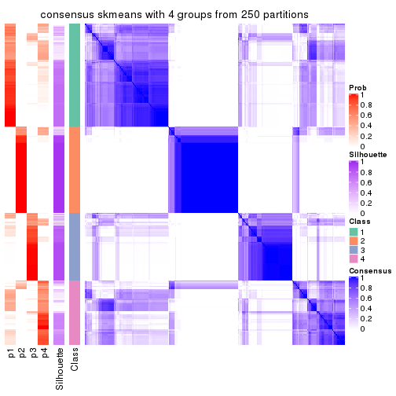</p>

</div>
<div id='tab-CV-skmeans-consensus-heatmap-4'>
<pre><code class="r">consensus_heatmap(res, k = 5)
</code></pre>

<p></p>

</div>
<div id='tab-CV-skmeans-consensus-heatmap-5'>
<pre><code class="r">consensus_heatmap(res, k = 6)
</code></pre>

<p></p>

</div>
</div>

Heatmaps for the membership of samples in all partitions to see how consistent they are:


<script>
$( function() {
	$( '#tabs-CV-skmeans-membership-heatmap' ).tabs();
} );
</script>
<div id='tabs-CV-skmeans-membership-heatmap'>
<ul>
<li><a href='#tab-CV-skmeans-membership-heatmap-1'>k = 2</a></li>
<li><a href='#tab-CV-skmeans-membership-heatmap-2'>k = 3</a></li>
<li><a href='#tab-CV-skmeans-membership-heatmap-3'>k = 4</a></li>
<li><a href='#tab-CV-skmeans-membership-heatmap-4'>k = 5</a></li>
<li><a href='#tab-CV-skmeans-membership-heatmap-5'>k = 6</a></li>
</ul>
<div id='tab-CV-skmeans-membership-heatmap-1'>
<pre><code class="r">membership_heatmap(res, k = 2)
</code></pre>

<p></p>

</div>
<div id='tab-CV-skmeans-membership-heatmap-2'>
<pre><code class="r">membership_heatmap(res, k = 3)
</code></pre>

<p></p>

</div>
<div id='tab-CV-skmeans-membership-heatmap-3'>
<pre><code class="r">membership_heatmap(res, k = 4)
</code></pre>

<p></p>

</div>
<div id='tab-CV-skmeans-membership-heatmap-4'>
<pre><code class="r">membership_heatmap(res, k = 5)
</code></pre>

<p></p>

</div>
<div id='tab-CV-skmeans-membership-heatmap-5'>
<pre><code class="r">membership_heatmap(res, k = 6)
</code></pre>

<p></p>

</div>
</div>

As soon as we have had the classes for columns, we can look for signatures
which are significantly different between classes which can be candidate marks
for certain classes. Following are the heatmaps for signatures.


Signature heatmaps where rows are scaled:


<script>
$( function() {
	$( '#tabs-CV-skmeans-get-signatures' ).tabs();
} );
</script>
<div id='tabs-CV-skmeans-get-signatures'>
<ul>
<li><a href='#tab-CV-skmeans-get-signatures-1'>k = 2</a></li>
<li><a href='#tab-CV-skmeans-get-signatures-2'>k = 3</a></li>
<li><a href='#tab-CV-skmeans-get-signatures-3'>k = 4</a></li>
<li><a href='#tab-CV-skmeans-get-signatures-4'>k = 5</a></li>
<li><a href='#tab-CV-skmeans-get-signatures-5'>k = 6</a></li>
</ul>
<div id='tab-CV-skmeans-get-signatures-1'>
<pre><code class="r">get_signatures(res, k = 2)
</code></pre>

<p></p>

</div>
<div id='tab-CV-skmeans-get-signatures-2'>
<pre><code class="r">get_signatures(res, k = 3)
</code></pre>

<p></p>

</div>
<div id='tab-CV-skmeans-get-signatures-3'>
<pre><code class="r">get_signatures(res, k = 4)
</code></pre>

<p></p>

</div>
<div id='tab-CV-skmeans-get-signatures-4'>
<pre><code class="r">get_signatures(res, k = 5)
</code></pre>

<p></p>

</div>
<div id='tab-CV-skmeans-get-signatures-5'>
<pre><code class="r">get_signatures(res, k = 6)
</code></pre>

<p></p>

</div>
</div>


Signature heatmaps where rows are not scaled:


<script>
$( function() {
	$( '#tabs-CV-skmeans-get-signatures-no-scale' ).tabs();
} );
</script>
<div id='tabs-CV-skmeans-get-signatures-no-scale'>
<ul>
<li><a href='#tab-CV-skmeans-get-signatures-no-scale-1'>k = 2</a></li>
<li><a href='#tab-CV-skmeans-get-signatures-no-scale-2'>k = 3</a></li>
<li><a href='#tab-CV-skmeans-get-signatures-no-scale-3'>k = 4</a></li>
<li><a href='#tab-CV-skmeans-get-signatures-no-scale-4'>k = 5</a></li>
<li><a href='#tab-CV-skmeans-get-signatures-no-scale-5'>k = 6</a></li>
</ul>
<div id='tab-CV-skmeans-get-signatures-no-scale-1'>
<pre><code class="r">get_signatures(res, k = 2, scale_rows = FALSE)
</code></pre>

<p></p>

</div>
<div id='tab-CV-skmeans-get-signatures-no-scale-2'>
<pre><code class="r">get_signatures(res, k = 3, scale_rows = FALSE)
</code></pre>

<p></p>

</div>
<div id='tab-CV-skmeans-get-signatures-no-scale-3'>
<pre><code class="r">get_signatures(res, k = 4, scale_rows = FALSE)
</code></pre>

<p></p>

</div>
<div id='tab-CV-skmeans-get-signatures-no-scale-4'>
<pre><code class="r">get_signatures(res, k = 5, scale_rows = FALSE)
</code></pre>

<p></p>

</div>
<div id='tab-CV-skmeans-get-signatures-no-scale-5'>
<pre><code class="r">get_signatures(res, k = 6, scale_rows = FALSE)
</code></pre>

<p></p>

</div>
</div>


Compare the overlap of signatures from different k:

```r
compare_signatures(res)
```


`get_signature()` returns a data frame invisibly. TO get the list of signatures, the function
call should be assigned to a variable explicitly. In following code, if `plot` argument is set
to `FALSE`, no heatmap is plotted while only the differential analysis is performed.

```r
# code only for demonstration
tb = get_signature(res, k = ..., plot = FALSE)
```

An example of the output of `tb` is:

```
#>   which_row         fdr    mean_1    mean_2 scaled_mean_1 scaled_mean_2 km
#> 1        38 0.042760348  8.373488  9.131774    -0.5533452     0.5164555  1
#> 2        40 0.018707592  7.106213  8.469186    -0.6173731     0.5762149  1
#> 3        55 0.019134737 10.221463 11.207825    -0.6159697     0.5749050  1
#> 4        59 0.006059896  5.921854  7.869574    -0.6899429     0.6439467  1
#> 5        60 0.018055526  8.928898 10.211722    -0.6204761     0.5791110  1
#> 6        98 0.009384629 15.714769 14.887706     0.6635654    -0.6193277  2
...
```

The columns in `tb` are:

1. `which_row`: row indices corresponding to the input matrix.
2. `fdr`: FDR for the differential test. 
3. `mean_x`: The mean value in group x.
4. `scaled_mean_x`: The mean value in group x after rows are scaled.
5. `km`: Row groups if k-means clustering is applied to rows.


UMAP plot which shows how samples are separated.


<script>
$( function() {
	$( '#tabs-CV-skmeans-dimension-reduction' ).tabs();
} );
</script>
<div id='tabs-CV-skmeans-dimension-reduction'>
<ul>
<li><a href='#tab-CV-skmeans-dimension-reduction-1'>k = 2</a></li>
<li><a href='#tab-CV-skmeans-dimension-reduction-2'>k = 3</a></li>
<li><a href='#tab-CV-skmeans-dimension-reduction-3'>k = 4</a></li>
<li><a href='#tab-CV-skmeans-dimension-reduction-4'>k = 5</a></li>
<li><a href='#tab-CV-skmeans-dimension-reduction-5'>k = 6</a></li>
</ul>
<div id='tab-CV-skmeans-dimension-reduction-1'>
<pre><code class="r">dimension_reduction(res, k = 2, method = &quot;UMAP&quot;)
</code></pre>

<p></p>

</div>
<div id='tab-CV-skmeans-dimension-reduction-2'>
<pre><code class="r">dimension_reduction(res, k = 3, method = &quot;UMAP&quot;)
</code></pre>

<p></p>

</div>
<div id='tab-CV-skmeans-dimension-reduction-3'>
<pre><code class="r">dimension_reduction(res, k = 4, method = &quot;UMAP&quot;)
</code></pre>

<p></p>

</div>
<div id='tab-CV-skmeans-dimension-reduction-4'>
<pre><code class="r">dimension_reduction(res, k = 5, method = &quot;UMAP&quot;)
</code></pre>

<p></p>

</div>
<div id='tab-CV-skmeans-dimension-reduction-5'>
<pre><code class="r">dimension_reduction(res, k = 6, method = &quot;UMAP&quot;)
</code></pre>

<p></p>

</div>
</div>


Following heatmap shows how subgroups are split when increasing `k`:

```r
collect_classes(res)
```


If matrix rows can be associated to genes, consider to use `GO_Enrichment(res,
...)` to perform function enrichment for the signature genes.


 

---------------------------------------------------


### CV:pam**


The object with results only for a single top-value method and a single partition method 
can be extracted as:

```r
res = res_list["CV", "pam"]
# you can also extract it by
# res = res_list["CV:pam"]
```

A summary of `res` and all the functions that can be applied to it:

```r
res
```

```
#> A 'ConsensusPartition' object with k = 2, 3, 4, 5, 6.
#>   On a matrix with 17469 rows and 309 columns.
#>   Top rows (1000, 2000, 3000, 4000, 5000) are extracted by 'CV' method.
#>   Subgroups are detected by 'pam' method.
#>   Performed in total 1250 partitions by row resampling.
#>   Best k for subgroups seems to be 2.
#> 
#> Following methods can be applied to this 'ConsensusPartition' object:
#>  [1] "cola_report"             "collect_classes"         "collect_plots"          
#>  [4] "collect_stats"           "colnames"                "compare_signatures"     
#>  [7] "consensus_heatmap"       "dimension_reduction"     "functional_enrichment"  
#> [10] "get_anno_col"            "get_anno"                "get_classes"            
#> [13] "get_consensus"           "get_matrix"              "get_membership"         
#> [16] "get_param"               "get_signatures"          "get_stats"              
#> [19] "is_best_k"               "is_stable_k"             "membership_heatmap"     
#> [22] "ncol"                    "nrow"                    "plot_ecdf"              
#> [25] "rownames"                "select_partition_number" "show"                   
#> [28] "suggest_best_k"          "test_to_known_factors"
```

`collect_plots()` function collects all the plots made from `res` for all `k` (number of partitions)
into one single page to provide an easy and fast comparison between different `k`.

```r
collect_plots(res)
```


The plots are:

- The first row: a plot of the ECDF (Empirical cumulative distribution
  function) curves of the consensus matrix for each `k` and the heatmap of
  predicted classes for each `k`.
- The second row: heatmaps of the consensus matrix for each `k`.
- The third row: heatmaps of the membership matrix for each `k`.
- The fouth row: heatmaps of the signatures for each `k`.

All the plots in panels can be made by individual functions and they are
plotted later in this section.

`select_partition_number()` produces several plots showing different
statistics for choosing "optimized" `k`. There are following statistics:

- ECDF curves of the consensus matrix for each `k`;
- 1-PAC. [The PAC
  score](https://en.wikipedia.org/wiki/Consensus_clustering#Over-interpretation_potential_of_consensus_clustering)
  measures the proportion of the ambiguous subgrouping.
- Mean silhouette score.
- Concordance. The mean probability of fiting the consensus class ids in all
  partitions.
- Area increased. Denote $A_k$ as the area under the ECDF curve for current
  `k`, the area increased is defined as $A_k - A_{k-1}$.
- Rand index. The percent of pairs of samples that are both in a same cluster
  or both are not in a same cluster in the partition of k and k-1.
- Jaccard index. The ratio of pairs of samples are both in a same cluster in
  the partition of k and k-1 and the pairs of samples are both in a same
  cluster in the partition k or k-1.

The detailed explanations of these statistics can be found in [the cola
vignette](http://bioconductor.org/packages/devel/bioc/vignettes/cola/inst/doc/cola.html#toc_13).

Generally speaking, lower PAC score, higher mean silhouette score or higher
concordance corresponds to better partition. Rand index and Jaccard index
measure how similar the current partition is compared to partition with `k-1`.
If they are too similar, we won't accept `k` is better than `k-1`.

```r
select_partition_number(res)
```


The numeric values for all these statistics can be obtained by `get_stats()`.

```r
get_stats(res)
```

```
#>   k 1-PAC mean_silhouette concordance area_increased  Rand Jaccard
#> 2 2 0.980           0.941       0.978         0.2521 0.755   0.755
#> 3 3 0.551           0.759       0.885         1.2370 0.670   0.567
#> 4 4 0.452           0.621       0.799         0.2114 0.808   0.597
#> 5 5 0.498           0.560       0.738         0.1084 0.817   0.500
#> 6 6 0.546           0.602       0.765         0.0357 0.954   0.805
```

`suggest_best_k()` suggests the best $k$ based on these statistics. The rules are as follows:

- All $k$ with Jaccard index larger than 0.95 are removed because the increase of
  the partition number does not provides enough extra information. If all $k$ are removed,
  the best $k$ is assigned by `NA`.
- For $k$ with 1-PAC larger than 0.9, the maximal $k$ is taken as the "best k". Other $k$ is called "optional k".
- If it does not fit the second rule. The $k$ with the highest vote of highest
  1-PAC, mean silhouette and concordance is taken as the "best k".

```r
suggest_best_k(res)
```

```
#> [1] 2
```


Following shows the table of the partitions (You need to click the **show/hide
code output** link to see it). The membership matrix (columns with name `p*`)
is inferred by
[`clue::cl_consensus()`](https://www.rdocumentation.org/link/cl_consensus?package=clue)
function with the `SE` method. Basically the value in the membership matrix
represents the probability to belong to a certain group. The finall class
label for an item is determined with the group with highest probability it
belongs to.

In `get_classes()` function, the entropy is calculated from the membership
matrix and the silhouette score is calculated from the consensus matrix.


<script>
$( function() {
	$( '#tabs-CV-pam-get-classes' ).tabs();
} );
</script>
<div id='tabs-CV-pam-get-classes'>
<ul>
<li><a href='#tab-CV-pam-get-classes-1'>k = 2</a></li>
<li><a href='#tab-CV-pam-get-classes-2'>k = 3</a></li>
<li><a href='#tab-CV-pam-get-classes-3'>k = 4</a></li>
<li><a href='#tab-CV-pam-get-classes-4'>k = 5</a></li>
<li><a href='#tab-CV-pam-get-classes-5'>k = 6</a></li>
</ul>

<div id='tab-CV-pam-get-classes-1'>
<p><a id='tab-CV-pam-get-classes-1-a' style='color:#0366d6' href='#'>show/hide code output</a></p>
<pre><code class="r">cbind(get_classes(res, k = 2), get_membership(res, k = 2))
</code></pre>

<pre><code>#&gt;                                      class entropy silhouette    p1    p2
#&gt; 7826AE44-B03A-4528-9CB5-7421E592AE36     1  0.0000     0.9832 1.000 0.000
#&gt; 0DC2197B-2FEA-48EB-953E-8E44E1933757     1  0.0000     0.9832 1.000 0.000
#&gt; 87ABB098-8C1E-4677-8C31-48B71EFE41C7     1  0.0000     0.9832 1.000 0.000
#&gt; EC0154E7-7A27-4535-83AE-6B379E99A93C     1  0.0000     0.9832 1.000 0.000
#&gt; 78F79407-D49F-4FA2-B09F-0665C502827C     1  0.0000     0.9832 1.000 0.000
#&gt; 03E81178-E971-4E91-8BED-D8273EA1425C     1  0.0000     0.9832 1.000 0.000
#&gt; 62FCAEFF-16D8-4019-84B6-18EC3A88BC32     1  0.0000     0.9832 1.000 0.000
#&gt; 722C1284-5983-4CC1-B19C-214C2DE6F8A6     2  0.0000     0.9380 0.000 1.000
#&gt; 54E42A64-B350-4A94-8FED-C9BC1872660E     1  0.0000     0.9832 1.000 0.000
#&gt; 53062969-D209-490B-9C9B-5D297625E2AE     1  0.0000     0.9832 1.000 0.000
#&gt; B710293C-41D3-4A2E-8104-5402F91DD859     1  0.0000     0.9832 1.000 0.000
#&gt; 73CB1D05-7AE4-457D-B4EF-25AC5C1F2132     1  0.0000     0.9832 1.000 0.000
#&gt; B055A70B-3003-47CB-BDAA-6378C000BF24     1  0.0000     0.9832 1.000 0.000
#&gt; 46C3A870-E37A-42CB-8C0C-6ACACEAC1ADC     2  0.9686     0.3931 0.396 0.604
#&gt; E8E6270E-F26D-4F2E-A63E-7885BDE05FDB     1  0.0000     0.9832 1.000 0.000
#&gt; C4A5EBA2-9091-4D12-BDC8-B84B122022B9     1  0.0000     0.9832 1.000 0.000
#&gt; 5B1839C4-549D-41D1-B559-3C6D2A1528CE     1  0.0000     0.9832 1.000 0.000
#&gt; A0DF05EB-DC44-4492-9A8A-F278F7B0C266     1  0.0000     0.9832 1.000 0.000
#&gt; B5182F49-70F2-45B7-82DE-C6DA68145EEA     1  0.0000     0.9832 1.000 0.000
#&gt; C204D355-B876-4341-A111-36D48CBDD2A8     1  0.0000     0.9832 1.000 0.000
#&gt; 7B070AAA-EF97-4D3B-AA19-EEC170C7927D     2  0.0000     0.9380 0.000 1.000
#&gt; 05A8A881-F8EE-48A2-B11C-A08D7D80CE18     1  0.0000     0.9832 1.000 0.000
#&gt; BA59EF50-CFE9-456D-B1B6-67D0945004F6     1  0.0000     0.9832 1.000 0.000
#&gt; AD97B334-E034-4D33-A4D5-48C32D5D521C     1  0.0000     0.9832 1.000 0.000
#&gt; 51DA2568-32EA-4668-9876-4B6E7CA68860     1  0.0000     0.9832 1.000 0.000
#&gt; 78C26A05-2084-494D-83D3-C52C1B800F4C     1  0.0000     0.9832 1.000 0.000
#&gt; 2B5DD791-7692-4721-9519-7D7D49B52570     1  0.0000     0.9832 1.000 0.000
#&gt; C0BBE26A-79C8-4392-9978-7C420B3786B5     1  0.0000     0.9832 1.000 0.000
#&gt; F35A8359-3A7A-414F-8A5C-D278F3B45387     2  0.0000     0.9380 0.000 1.000
#&gt; 8C9BA49C-1270-491D-A234-AE1B1C0609BA     1  0.9933     0.0964 0.548 0.452
#&gt; CA104B57-B160-4148-8A0A-D34BB3E8D88A     1  0.0000     0.9832 1.000 0.000
#&gt; 877E18A5-6A7A-4E29-9871-DC7EA14A5F27     1  0.0000     0.9832 1.000 0.000
#&gt; 904EDF2E-411E-43BD-901D-46129AFA283A     1  0.0000     0.9832 1.000 0.000
#&gt; FD9F5A9B-2BEB-4D31-9A2D-8D4B4ECBB478     1  0.0000     0.9832 1.000 0.000
#&gt; 2E206314-9928-456E-B7C6-893DC0E3C7C2     1  0.0000     0.9832 1.000 0.000
#&gt; 913DB655-2C7F-4369-83DE-9257F04CF39B     1  0.0000     0.9832 1.000 0.000
#&gt; 72B5B724-FEB5-43BD-83F6-2E2152DDD800     1  0.0000     0.9832 1.000 0.000
#&gt; 920B547C-6898-446C-AAAF-F4ED96E40AAB     2  0.0000     0.9380 0.000 1.000
#&gt; 847F796A-8CD6-4013-A0FB-26F4FC3EAF0D     1  0.0000     0.9832 1.000 0.000
#&gt; C4D64E7A-33F7-4CFC-9FD3-D6AA3D8EFAA7     1  0.0000     0.9832 1.000 0.000
#&gt; EABA0B17-8E19-48C5-BF62-2A45C9632807     2  0.0000     0.9380 0.000 1.000
#&gt; 7263CBA8-CE37-4531-A795-9324C6D2A672     1  0.0000     0.9832 1.000 0.000
#&gt; 6D3CC3AC-618B-414A-B640-169C735A6568     1  0.0000     0.9832 1.000 0.000
#&gt; 710C05C7-F9CE-45FA-A8CC-29DE2903E04F     1  0.0000     0.9832 1.000 0.000
#&gt; 3D631A56-2C55-48EA-A667-BA46023C9D50     1  0.0000     0.9832 1.000 0.000
#&gt; F1C65F64-AF05-4875-B7E4-60FFF56A3F46     1  0.0000     0.9832 1.000 0.000
#&gt; E5DF76E7-A765-4E07-B87A-06168BF66C5F     1  0.0000     0.9832 1.000 0.000
#&gt; 5C8C8A6E-40D4-4F82-AC3D-90CFDEE15C0A     2  0.0000     0.9380 0.000 1.000
#&gt; 0117CBB9-1BF9-48B1-BE6E-A9A770FF8721     1  0.0000     0.9832 1.000 0.000
#&gt; 31EF66E5-419A-44C3-BB2A-B69B52FFCECC     2  0.1843     0.9189 0.028 0.972
#&gt; C149CEF5-61F3-4B53-B8A9-8244B673EBD0     1  0.0000     0.9832 1.000 0.000
#&gt; 0AF351D0-4EC5-4275-AA0A-4FA2AF8A9C85     2  0.9000     0.5722 0.316 0.684
#&gt; B507E82F-6680-497B-A014-033EDD7A2E03     1  0.0000     0.9832 1.000 0.000
#&gt; F941890E-AB33-478F-8C97-1C785DD9428F     1  0.0000     0.9832 1.000 0.000
#&gt; 7987E019-8FED-469B-A6C1-34EE430A60C3     1  0.0000     0.9832 1.000 0.000
#&gt; 76084AA6-19BF-4605-B6A1-73F1D4BADAF9     1  0.0000     0.9832 1.000 0.000
#&gt; 329807F7-E0D4-4F53-94E8-E4080E90CB47     1  0.0000     0.9832 1.000 0.000
#&gt; 1B6505FF-C1A7-4DD0-9827-41A0A3A28F3E     1  0.0000     0.9832 1.000 0.000
#&gt; 49778E92-B5D3-4AD9-A1AF-3B722D631B96     1  0.9977     0.0173 0.528 0.472
#&gt; A22892DE-0AF4-4B63-9513-1D6825059040     1  0.0000     0.9832 1.000 0.000
#&gt; 6D77ECAE-A715-4ADD-97D8-A916DC31A4EA     1  0.0000     0.9832 1.000 0.000
#&gt; 09758B6F-1B2D-4AED-8913-696097069409     1  0.0000     0.9832 1.000 0.000
#&gt; 8B709DB4-0B28-42F1-A7C5-106F5809BEA2     1  0.0000     0.9832 1.000 0.000
#&gt; F2B356FA-79CD-4867-8ABF-84C90A493A75     1  0.0000     0.9832 1.000 0.000
#&gt; 131213AD-0313-4DF1-B013-CE67ED262C37     2  0.0000     0.9380 0.000 1.000
#&gt; D94F7E81-0F60-473B-AD4A-0AC13508BDE2     1  0.0000     0.9832 1.000 0.000
#&gt; 29C17355-D646-48DA-9E54-7B6DD85DD610     1  0.0000     0.9832 1.000 0.000
#&gt; B8BD866A-2A7C-45C3-96BB-9AB892D26AE5     1  0.0000     0.9832 1.000 0.000
#&gt; 13EFD045-AD61-41EE-9896-67BFA4FC8C09     1  0.0000     0.9832 1.000 0.000
#&gt; 2655F609-B3BB-4D01-B421-D5F4B1232EC8     1  0.6973     0.7458 0.812 0.188
#&gt; 04BC7A52-C67F-42CB-8672-D3C51A20F2BA     1  0.0000     0.9832 1.000 0.000
#&gt; 45472BD4-DBDB-41FE-B0E3-2440880E1DE6     1  0.0000     0.9832 1.000 0.000
#&gt; B87FFFCD-CB57-4ACD-9C74-AB188984BBB2     1  0.0000     0.9832 1.000 0.000
#&gt; 5271374C-13CD-4BFE-AC6D-C95AFE491322     1  0.0000     0.9832 1.000 0.000
#&gt; E3372ACE-C7C8-43E5-B30A-1F2D662D8170     1  0.0000     0.9832 1.000 0.000
#&gt; B08DF564-E4D0-4540-8160-93B3981DF1D8     1  0.0000     0.9832 1.000 0.000
#&gt; 61A7D1B9-FC5A-4B9C-989F-936CDA948C27     1  0.0000     0.9832 1.000 0.000
#&gt; 74E768C1-8766-46AC-AAB4-D79E5049F76A     2  0.0000     0.9380 0.000 1.000
#&gt; 0CEA28F0-D7F0-4EB7-A23F-0C5CA6245971     1  0.0000     0.9832 1.000 0.000
#&gt; 95C4EFF6-147C-48EC-A2C1-16B8F12AEEF2     1  0.9970     0.0329 0.532 0.468
#&gt; C9A78BEA-D455-4F5E-8B7B-19BCB42887E7     1  0.0000     0.9832 1.000 0.000
#&gt; DB970740-9AC1-4C10-9658-8A77B1C390DD     1  0.0000     0.9832 1.000 0.000
#&gt; 883FBD37-0CA0-4562-8925-72ACC1EE93D9     1  0.0000     0.9832 1.000 0.000
#&gt; 9FE1D006-49F2-471E-91E6-AF0414C24479     1  0.0000     0.9832 1.000 0.000
#&gt; 11816CC6-8C8B-49C0-99EE-896377BCFCCD     1  0.0000     0.9832 1.000 0.000
#&gt; 063FC5C8-4318-4ECC-9CA0-1976CBC8ACB6     1  0.0000     0.9832 1.000 0.000
#&gt; E0F085CC-B90D-4FDE-B60E-C613971BAA00     1  0.0000     0.9832 1.000 0.000
#&gt; 62361DA2-E4EE-46DA-BB1F-C51DCA9307CC     1  0.0000     0.9832 1.000 0.000
#&gt; 1BA16D48-B09E-4699-A1AD-2FFECE4F3CDB     2  0.0000     0.9380 0.000 1.000
#&gt; 3E4F14E9-60AE-4F17-9BA7-2A02E908204A     1  0.0000     0.9832 1.000 0.000
#&gt; 79226DD7-BC85-4B8E-BFF8-B1E073129D34     1  0.0000     0.9832 1.000 0.000
#&gt; D47D0936-826F-4D54-9225-F71B95357438     1  0.0000     0.9832 1.000 0.000
#&gt; 0AE02B91-574C-4165-BA39-E9D7C1A870A2     1  0.0000     0.9832 1.000 0.000
#&gt; DED8E9DF-CEFE-45ED-9374-EF9925A135C4     1  0.0000     0.9832 1.000 0.000
#&gt; D587A993-3C47-4D4C-B744-59169D4F7451     1  0.0000     0.9832 1.000 0.000
#&gt; 6BCA24E6-440F-42C5-ABE5-66C37B713A39     1  0.0000     0.9832 1.000 0.000
#&gt; 86A5EDFB-9D06-4FED-BF57-F8D74A68E156     1  0.0000     0.9832 1.000 0.000
#&gt; B9BD5134-2F6A-4454-8F83-69B63F9AE114     1  0.0000     0.9832 1.000 0.000
#&gt; 082DA9E1-A40D-482B-8E21-A93BA97185F0     1  0.0000     0.9832 1.000 0.000
#&gt; 16A8343A-1203-44FB-9F03-05CC7C71B4CC     1  0.0000     0.9832 1.000 0.000
#&gt; 00439565-02CE-4BF5-956D-7078B51C0947     1  0.0000     0.9832 1.000 0.000
#&gt; 7B2BD361-2BF1-4E97-BC08-457F5A9C2682     2  0.0000     0.9380 0.000 1.000
#&gt; C1D8439A-D527-47F6-ADC1-25867B65DA21     2  0.0000     0.9380 0.000 1.000
#&gt; D9096909-1439-462D-B69C-CAD1BF4F420C     1  0.0000     0.9832 1.000 0.000
#&gt; 7822EA86-35A1-4285-9429-2B63111B9885     1  0.0000     0.9832 1.000 0.000
#&gt; 6FD0CFC8-AC8D-4CF1-8C33-833AD98A30EF     2  0.0000     0.9380 0.000 1.000
#&gt; A451F278-5E83-4BC6-9B15-3AA2117B99B6     1  0.0000     0.9832 1.000 0.000
#&gt; 6EC25686-4547-459C-9E01-7EDF8DAECE35     1  0.0000     0.9832 1.000 0.000
#&gt; 5D2F1EEA-2BA8-4C3A-8436-544EE1D23E7E     1  0.0000     0.9832 1.000 0.000
#&gt; 675A4293-A4CE-4307-B00B-DFC4D44A87C6     1  0.0000     0.9832 1.000 0.000
#&gt; 6FBE0AEF-476A-42B2-A857-846CF1ED92B6     2  0.0000     0.9380 0.000 1.000
#&gt; 7139D616-1A15-4288-A9AE-411856A4A76D     1  0.0000     0.9832 1.000 0.000
#&gt; 46D7F8C1-D5C5-40CC-BEF5-2E590A847BD9     1  0.0000     0.9832 1.000 0.000
#&gt; 984C44D3-4F5F-44C9-BCD9-C991EBC1FCB8     1  0.0000     0.9832 1.000 0.000
#&gt; 83FE52E0-2DC2-4580-8BB2-FBCBEE4AC240     1  0.0000     0.9832 1.000 0.000
#&gt; 0923F9CB-DF6F-4BAA-A5F8-0F83CE60D1ED     1  0.0000     0.9832 1.000 0.000
#&gt; 1DEB5206-78CC-4EB5-BCD5-85A6A5B4E273     1  0.0000     0.9832 1.000 0.000
#&gt; E4DB18DA-EB0C-4B2F-9566-7F72222B16D4     1  0.0000     0.9832 1.000 0.000
#&gt; F7456312-1309-4B2F-875D-0F90CDF3EC35     1  0.0000     0.9832 1.000 0.000
#&gt; 9A25E5D8-0706-4960-A76B-BCD0AC93E4FA     1  0.0000     0.9832 1.000 0.000
#&gt; 5A41FE8F-FFB3-4B87-BF11-A570C184096D     1  0.0000     0.9832 1.000 0.000
#&gt; 33F84E63-3F6C-4867-ADB1-A0DF39F1295B     1  0.0000     0.9832 1.000 0.000
#&gt; D6A644F5-D1D0-4A8D-94C4-EE6C3ECE7430     1  0.0000     0.9832 1.000 0.000
#&gt; 2A5848CC-A9A2-4AA8-A752-321273E62CF0     1  0.0000     0.9832 1.000 0.000
#&gt; 7CA6358B-FC8A-4675-B092-9E061038FC83     1  0.0000     0.9832 1.000 0.000
#&gt; A4C2F4BC-5C62-4B1F-9AB8-46D9468EF523     1  0.0000     0.9832 1.000 0.000
#&gt; 8AF4EB7F-418D-4CC9-A9B8-A93A4C1A173B     1  0.0000     0.9832 1.000 0.000
#&gt; E5048887-70C8-468F-881E-2EC55F6E6F3B     1  0.0000     0.9832 1.000 0.000
#&gt; 1BADCC7C-C4D8-4C34-9534-59D622C7A2A2     1  0.0000     0.9832 1.000 0.000
#&gt; 02CE7DF7-64BD-4297-A240-A5B9EE8771D3     1  0.0000     0.9832 1.000 0.000
#&gt; CBF6E96A-F56C-4C87-B851-D319930BAAB8     1  0.0000     0.9832 1.000 0.000
#&gt; 48F6B774-CFD2-4DDF-B7A2-696596413C3F     1  0.0000     0.9832 1.000 0.000
#&gt; 41D88C3E-5848-4B09-8A77-EAE6AC4EC6B0     2  0.0000     0.9380 0.000 1.000
#&gt; BDF79CC0-00C7-49C1-900B-AB065A733B17     1  0.0000     0.9832 1.000 0.000
#&gt; A894D686-BFC7-4AEE-A794-DBE718C6B6F6     1  0.9996    -0.0449 0.512 0.488
#&gt; 0712029E-3765-4272-BE5B-B6C8BCCC0F0F     2  0.0000     0.9380 0.000 1.000
#&gt; 7B051855-9B09-4887-9BC0-9F077537938E     1  0.0000     0.9832 1.000 0.000
#&gt; EF357C46-5C3C-4F51-9383-FF7694D07B97     2  0.0000     0.9380 0.000 1.000
#&gt; 9492A322-37CA-4582-AC68-66B5D80778AF     1  0.9608     0.3206 0.616 0.384
#&gt; 993399A4-1B9F-4258-B2D0-155AD58A2E82     1  0.0000     0.9832 1.000 0.000
#&gt; 7B7DC93D-5494-4E69-BE07-2967887182F9     1  0.0000     0.9832 1.000 0.000
#&gt; 29BCBA51-2580-473D-9CF7-BEDBD0DBAD1B     1  0.4690     0.8708 0.900 0.100
#&gt; 40855647-E942-4F32-90B7-BEB921929BFB     1  0.0000     0.9832 1.000 0.000
#&gt; 0DC723D0-7C68-4495-A4B9-2DF2FF19AB14     1  0.0000     0.9832 1.000 0.000
#&gt; 7540005F-57E0-4E2E-A8A2-BEF2B0F333B1     2  0.9954     0.2175 0.460 0.540
#&gt; EB1DDB14-4076-4C2C-B911-390C17C21486     1  0.0000     0.9832 1.000 0.000
#&gt; 9EA70EC4-8BA0-4E3D-B3CB-A68D19E89868     1  0.0000     0.9832 1.000 0.000
#&gt; B04E2E50-0A6E-4224-A825-1714D12E5669     2  0.0000     0.9380 0.000 1.000
#&gt; B0BF5E01-536D-40FF-9C24-CBBD611E2FC2     1  0.0000     0.9832 1.000 0.000
#&gt; 7B6B1788-B297-4442-B6BE-B7CE8754491E     1  0.0000     0.9832 1.000 0.000
#&gt; A090D00C-34DF-4906-A517-4803C4C9A332     1  0.0000     0.9832 1.000 0.000
#&gt; 340D44A6-9BEA-412C-9973-D9ABD6692255     1  0.0000     0.9832 1.000 0.000
#&gt; E8D0D1E7-E5A8-4014-80C1-0245F90F4358     1  0.8909     0.5199 0.692 0.308
#&gt; 19EA1494-8572-40E1-B9BB-3739F47B607D     1  0.0000     0.9832 1.000 0.000
#&gt; 1C1B4793-8DAF-4763-BA4D-C4E869A4ED35     1  0.0000     0.9832 1.000 0.000
#&gt; 45BF59B3-95BD-4196-ABAA-4C4F0DB38572     1  0.0000     0.9832 1.000 0.000
#&gt; 47B5A2A7-7E13-4558-99D2-067F5075C6A4     1  0.0000     0.9832 1.000 0.000
#&gt; E94638E8-CB51-4FBB-8BCB-4BFD7A812291     1  0.0000     0.9832 1.000 0.000
#&gt; A17352A8-0D3C-4545-8136-7DAE2FB0E102     1  0.0000     0.9832 1.000 0.000
#&gt; B18A6F95-D4ED-416B-B5A1-9A4934865D0D     2  0.6712     0.7813 0.176 0.824
#&gt; 33E92C5F-0C42-4549-AD5B-0A064182A272     1  0.0000     0.9832 1.000 0.000
#&gt; E041B375-3E60-4F18-A6EF-D1C249E3B8EE     1  0.0000     0.9832 1.000 0.000
#&gt; EDF90AF6-6C64-4BD2-AADF-8D7D188650B2     2  0.7139     0.7567 0.196 0.804
#&gt; 569320D2-316C-4E2D-B7B3-D7D5C4DAD42D     1  0.0000     0.9832 1.000 0.000
#&gt; AFFB223D-DAE9-4567-9EF2-8E4DF9D8782D     1  0.2948     0.9280 0.948 0.052
#&gt; 56FC9454-0A6A-4CC3-95C4-BE0E0D0BAFCE     2  0.6048     0.8118 0.148 0.852
#&gt; 43226365-FAEF-46C5-AF1B-5C6C2BED84FF     1  0.0000     0.9832 1.000 0.000
#&gt; 1536110A-B42A-4A84-9474-9895321FDCE9     1  0.0000     0.9832 1.000 0.000
#&gt; 812255DD-536B-4216-90B1-27D5AB339BE2     1  0.0000     0.9832 1.000 0.000
#&gt; 5D4563D6-68B7-4C9D-A3F4-AA7D45D5112C     2  0.0938     0.9304 0.012 0.988
#&gt; BAA39781-DB94-473C-98B1-FA6CD3E1C67A     1  0.0000     0.9832 1.000 0.000
#&gt; C1411CDA-814D-4E21-8929-C0F77858828F     1  0.0000     0.9832 1.000 0.000
#&gt; EFE2F248-C13E-4E8D-9153-8C903848AC4A     1  0.0000     0.9832 1.000 0.000
#&gt; D3939C84-D1D6-4060-9F91-AEB222A9BDD5     1  0.0000     0.9832 1.000 0.000
#&gt; EABD2987-8C1E-49E5-94AF-C0BDE5335A48     1  0.0000     0.9832 1.000 0.000
#&gt; F4BE2ABE-2CEB-4A6A-B8EC-0355F8C63B9B     1  0.0000     0.9832 1.000 0.000
#&gt; 627BC251-D217-4955-B718-6B9D6DEA1756     1  0.0000     0.9832 1.000 0.000
#&gt; 31B54613-A20E-4039-BB8B-9B52104CE418     1  0.0000     0.9832 1.000 0.000
#&gt; 3F292B7C-A535-4DBD-BC20-CB4F85A1C94B     1  0.0000     0.9832 1.000 0.000
#&gt; BEA2A5EB-EEA9-4F31-AC38-810E04CE124B     2  0.0000     0.9380 0.000 1.000
#&gt; 99D84D46-19DA-43F1-B639-DCE9953F1529     2  0.0000     0.9380 0.000 1.000
#&gt; 4588817E-1068-4A78-86B6-4674A0112DDA     1  0.0000     0.9832 1.000 0.000
#&gt; 6AC633BD-BEC1-4750-94E3-378972DAB6B3     2  0.0000     0.9380 0.000 1.000
#&gt; 09E17C6E-7EDE-4DDF-B5ED-2521AF870C9A     1  0.0000     0.9832 1.000 0.000
#&gt; 58D9C750-26A2-4B7C-84C4-13D7AFB4C5EA     1  0.0000     0.9832 1.000 0.000
#&gt; DF28E138-E222-4F77-9B61-69E601CA7E60     1  0.0000     0.9832 1.000 0.000
#&gt; FEA489A8-E423-4266-AADA-9BAAB29AB94B     1  0.0000     0.9832 1.000 0.000
#&gt; F3FCC207-15CD-41EA-A3EF-F5D2C12AC373     1  0.0000     0.9832 1.000 0.000
#&gt; 53DD7AFB-A258-4643-A501-BACC95D17A50     2  0.0000     0.9380 0.000 1.000
#&gt; D850B2A1-1F8A-4A44-A0CF-8D9DD4A1889A     2  0.0000     0.9380 0.000 1.000
#&gt; B3F746DC-E487-4305-9F30-825D1520E8FD     1  0.0000     0.9832 1.000 0.000
#&gt; BE38240A-F7C2-439F-9AAE-51C8A340F310     1  0.0000     0.9832 1.000 0.000
#&gt; A9022D9E-1D30-49EE-8552-1364A8027F34     1  0.0000     0.9832 1.000 0.000
#&gt; 0E8A56EE-D9A2-48A5-B793-A358BE1E4EFA     1  0.0000     0.9832 1.000 0.000
#&gt; 51667574-318E-4BDB-8F42-8512A4C1B84F     1  0.0000     0.9832 1.000 0.000
#&gt; B0A442C9-67E4-4534-8A5C-D6D73F42358C     1  0.0000     0.9832 1.000 0.000
#&gt; 25A5BC09-0D88-4385-87AF-997F9018522D     2  0.0376     0.9355 0.004 0.996
#&gt; 344B9631-AAA5-4302-8747-D584345D9131     1  0.0000     0.9832 1.000 0.000
#&gt; 1C3795AD-6306-4892-95F5-92DF3375D46A     1  0.0000     0.9832 1.000 0.000
#&gt; 17BB221D-8BF9-4391-83DD-423AE1E03651     1  0.0000     0.9832 1.000 0.000
#&gt; 297611E9-9555-4BCA-A723-02E846ACC23A     1  0.0000     0.9832 1.000 0.000
#&gt; AD7FF180-1EAC-4783-8A62-E9626B96DD9F     1  0.0000     0.9832 1.000 0.000
#&gt; FD544083-9BD5-4036-BD81-0352B67CC45C     1  0.0000     0.9832 1.000 0.000
#&gt; 879A74D5-5B29-418D-A0F4-8E88D6384008     1  0.0000     0.9832 1.000 0.000
#&gt; 43CD982C-13C0-4A52-803A-9A3A3FAE09BC     1  0.0000     0.9832 1.000 0.000
#&gt; DCD0313D-5206-4111-8743-A8A0227257D9     1  0.0000     0.9832 1.000 0.000
#&gt; 331A9160-D730-45DD-A985-C6CAC03035ED     1  0.0000     0.9832 1.000 0.000
#&gt; 9EEECA0E-530D-4724-B016-A716F0782148     1  0.0000     0.9832 1.000 0.000
#&gt; B3073976-CA3F-4115-9243-8C2D9E1B975D     1  0.0000     0.9832 1.000 0.000
#&gt; 77B3C9B4-1A7F-41BB-A37D-01EF80E933CC     2  0.0000     0.9380 0.000 1.000
#&gt; C0C26822-2E9F-4FB0-81D4-575027C8B71C     1  0.0000     0.9832 1.000 0.000
#&gt; F1FCE328-2B3B-499A-888D-0E66A017E8B0     1  0.0000     0.9832 1.000 0.000
#&gt; F069DAD6-F1EB-42F7-8252-F3F6EC46CC3E     1  0.0000     0.9832 1.000 0.000
#&gt; 99CC822E-8C98-4EEC-BB58-AEF76A0B5332     1  0.0000     0.9832 1.000 0.000
#&gt; C86EBD08-53F2-4972-801A-74970FDD6A62     1  0.0000     0.9832 1.000 0.000
#&gt; F07326F2-C1D6-4D5A-9693-25C3A04B0EC2     1  0.0000     0.9832 1.000 0.000
#&gt; 8ACBD428-7713-48D9-810A-43C9CD191A73     1  0.2423     0.9415 0.960 0.040
#&gt; 3D3501B4-1A43-4FA7-90A2-CCEBF66BFD4A     1  0.0000     0.9832 1.000 0.000
#&gt; DD51C17C-300F-44A4-955A-C9BC85417842     1  0.0000     0.9832 1.000 0.000
#&gt; 58FF391C-1D83-426C-8F92-C15F78F56C95     1  0.0000     0.9832 1.000 0.000
#&gt; ACE65C6E-2B10-4972-91B4-9199DD4B179D     1  0.0000     0.9832 1.000 0.000
#&gt; B2088466-FA5D-491C-9982-99B33683E66F     1  0.0000     0.9832 1.000 0.000
#&gt; D47AF416-1687-4FE0-A235-8815B6E8EB0B     1  0.0000     0.9832 1.000 0.000
#&gt; 4DCAD07F-CC43-46F6-B2F3-EDBF3EDD1045     1  0.9996    -0.0440 0.512 0.488
#&gt; AAAE0BD9-63FC-4A0E-A27E-447B634BAD99     2  0.0000     0.9380 0.000 1.000
#&gt; BC471AA1-52CF-4CEE-9866-34CE91404F45     2  0.0000     0.9380 0.000 1.000
#&gt; 81D3EE3F-AC11-404F-8092-307F0DC12198     1  0.0000     0.9832 1.000 0.000
#&gt; 8C02026C-C25E-406B-B8B8-A1A82362AE79     1  0.0000     0.9832 1.000 0.000
#&gt; 6A005F2A-A0C1-4CA4-B15B-96B08F013874     1  0.0000     0.9832 1.000 0.000
#&gt; B55743F2-4D63-4375-85D3-F58281CFD852     1  0.0000     0.9832 1.000 0.000
#&gt; 24F98393-C817-4D0E-A7DB-05D2B5C71F40     1  0.0000     0.9832 1.000 0.000
#&gt; 2C2AEF1D-4112-4EC7-9027-5E3FD26E8802     1  0.0000     0.9832 1.000 0.000
#&gt; 8BAC3CB5-2987-4349-8AE8-B83DDD16CA3C     1  0.0000     0.9832 1.000 0.000
#&gt; ED9C74E6-92FC-4E58-8FCE-1761DEA0C977     1  0.0000     0.9832 1.000 0.000
#&gt; BA732ED4-F6BA-404E-BA3C-CA558FAD866A     1  0.0000     0.9832 1.000 0.000
#&gt; E750385A-12D9-4A88-B4DF-C1306B5EF3B7     2  0.0000     0.9380 0.000 1.000
#&gt; 6B1DC5E4-5F82-4395-913F-6AEDB5B63188     1  0.0000     0.9832 1.000 0.000
#&gt; A7C12D37-FD50-4674-A054-1774F4E5C3B3     1  0.0000     0.9832 1.000 0.000
#&gt; 2155C764-2063-4D9C-9ACD-96AA73475F5E     1  0.0000     0.9832 1.000 0.000
#&gt; DE23CC15-A95E-4119-9B3C-8EEC45900D11     2  0.9866     0.3047 0.432 0.568
#&gt; 5DB1DCAD-638E-48A4-9F40-3D6268FDEC33     2  0.0000     0.9380 0.000 1.000
#&gt; 34AF0341-73D7-4080-AAEB-4C1541C2569F     1  0.0000     0.9832 1.000 0.000
#&gt; B60D4235-44AF-4BA4-98C0-BCCDC28E90B9     1  0.7745     0.6770 0.772 0.228
#&gt; CF463D89-2C9F-4257-BF04-8BC1CD40EA7D     1  0.0938     0.9712 0.988 0.012
#&gt; EF6C8165-484A-4530-AEDF-93DCC4A8455D     1  0.0000     0.9832 1.000 0.000
#&gt; B9F6B5E4-4D10-49B8-A8FE-8F33C5A62CBF     1  0.0000     0.9832 1.000 0.000
#&gt; CE539000-92D7-4622-9C8D-BC6E01310681     1  0.0000     0.9832 1.000 0.000
#&gt; D3BBC405-A22A-4009-ABF6-96FEEE653051     2  0.0000     0.9380 0.000 1.000
#&gt; 0B3C86BD-0D20-4408-9BE3-05658729505F     1  0.0000     0.9832 1.000 0.000
#&gt; 9B9C5071-7C3F-416C-B91C-6F5966747F54     1  0.0000     0.9832 1.000 0.000
#&gt; A9469A4A-C5F9-4681-A916-A26F0B4307BA     1  0.0000     0.9832 1.000 0.000
#&gt; A31B57E4-E30B-4A1B-829D-1B47D9CEC041     1  0.0000     0.9832 1.000 0.000
#&gt; 647255CE-F84A-4070-B3FD-D8ACA32C4D09     1  0.0000     0.9832 1.000 0.000
#&gt; 8F5E9F02-51D7-410E-B8B7-22737F2F095A     1  0.9881     0.1545 0.564 0.436
#&gt; 8074A7F6-2FDE-4578-B71C-01C542D468FE     1  0.0000     0.9832 1.000 0.000
#&gt; 2A946F17-F245-409E-A019-C60CDA18DC7D     1  0.0000     0.9832 1.000 0.000
#&gt; 0878C381-47F9-4786-82C2-94AC840BEDCB     1  0.0000     0.9832 1.000 0.000
#&gt; 54504893-92C5-4328-85A8-2A882680B5E0     1  0.0000     0.9832 1.000 0.000
#&gt; 0A27D1BE-E5DD-459A-A51F-6D8AAF7CFEB4     1  0.0000     0.9832 1.000 0.000
#&gt; 89ED5A3E-CAC0-4AB4-B858-A3CD8F34DBD5     2  0.0000     0.9380 0.000 1.000
#&gt; ACEEB0A5-AADB-4EF9-8710-4BAF95522CEA     1  0.0000     0.9832 1.000 0.000
#&gt; 02C74D81-5976-4252-BC6C-B10E934DECA2     1  0.0000     0.9832 1.000 0.000
#&gt; D365A238-4739-4B54-9608-DC548F21C04E     1  0.0000     0.9832 1.000 0.000
#&gt; F70F7ED5-A3B7-4210-95AD-DEFA0A565F06     1  0.0000     0.9832 1.000 0.000
#&gt; A92C23A9-BC25-4025-9501-6D5FF8E2A502     1  0.0000     0.9832 1.000 0.000
#&gt; ECE9BBF4-840E-47A6-8378-0B6C4A2369D3     1  0.0000     0.9832 1.000 0.000
#&gt; 38749490-0FCF-4B33-9EBC-8F86C2D9E4AF     1  0.0000     0.9832 1.000 0.000
#&gt; 02ABB64E-768B-4999-A899-EEE573D5F186     1  0.0000     0.9832 1.000 0.000
#&gt; C1C467A8-18B1-4C3F-AC45-33359ED6FDC4     1  0.0000     0.9832 1.000 0.000
#&gt; 78B2E4A1-9DAE-404F-AB47-1896450EF254     1  0.0000     0.9832 1.000 0.000
#&gt; CCDB0290-91DA-4089-84A6-4434BA028D30     1  0.0000     0.9832 1.000 0.000
#&gt; D5041E80-20A0-4C1A-9AC1-2394F6DB6E92     1  0.0000     0.9832 1.000 0.000
#&gt; 20EB9CC6-EABB-438A-9030-E766459996D1     2  0.0000     0.9380 0.000 1.000
#&gt; 73E99110-9A7C-4F73-98C5-79D22CB06230     1  0.0000     0.9832 1.000 0.000
#&gt; FAD8A464-9BC3-4ED9-9517-B18D36514325     1  0.0000     0.9832 1.000 0.000
#&gt; 9AF0E82E-E621-437A-8D19-700532B95090     1  0.0000     0.9832 1.000 0.000
#&gt; 27DA48F3-4FC1-41A3-8E49-5B25F1CCFF07     1  0.0000     0.9832 1.000 0.000
#&gt; EFE5A302-D138-4044-A301-5C5FD1C24836     1  0.0000     0.9832 1.000 0.000
#&gt; D3E866AC-D66A-4C07-9F47-89AF460320DE     2  0.0000     0.9380 0.000 1.000
#&gt; 89C45456-9392-4EB3-9A82-A130B6702AAF     1  0.0000     0.9832 1.000 0.000
#&gt; 8FF5C8FC-2565-49BE-9EE0-91A84A85AB2A     1  0.0000     0.9832 1.000 0.000
#&gt; 846DF088-75D5-49CF-BDDC-27E735A08DCA     1  0.0000     0.9832 1.000 0.000
#&gt; EA3A19E1-7ADE-47B6-A35A-71290967147A     1  0.0000     0.9832 1.000 0.000
#&gt; B2C43D0C-732B-4C54-938F-D3C9FDA880DA     1  0.0000     0.9832 1.000 0.000
#&gt; EEC856B5-9B7F-488D-975E-CE2FF7072879     1  0.0000     0.9832 1.000 0.000
#&gt; 8A68C417-09CC-4FA1-BFEB-EB4B738853A4     1  0.0000     0.9832 1.000 0.000
#&gt; C5DF1A0D-952C-44E2-BF83-ED57177EF60E     1  0.0000     0.9832 1.000 0.000
#&gt; B5C9EA22-F758-4BD2-BD1F-282EC1078AED     2  0.9833     0.3262 0.424 0.576
#&gt; 3F08AE92-3EFD-4D7F-8C5C-BFB3621F0CD6     1  0.0000     0.9832 1.000 0.000
#&gt; 8F0D43F1-2199-4DBB-9B16-1E5F2CED2FEC     1  0.0000     0.9832 1.000 0.000
#&gt; 54BABD8B-EA9F-4875-8594-2179B38C73BD     1  0.0000     0.9832 1.000 0.000
#&gt; C149B6F8-03DC-4907-920A-F3318B8D2A1E     1  0.0000     0.9832 1.000 0.000
#&gt; F93D26E2-4B45-495D-BC8E-5B592F8FDABF     1  0.0000     0.9832 1.000 0.000
#&gt; C98275CD-C39A-4E14-A731-4F3EB7396665     1  0.0000     0.9832 1.000 0.000
#&gt; 354DC705-216E-42F0-B29E-C1F8D6C9489A     1  0.0000     0.9832 1.000 0.000
#&gt; 6752EED9-7990-433F-A206-D5398C396471     1  0.0000     0.9832 1.000 0.000
#&gt; C3E94C5D-68C4-400C-B7CB-38C42E9D5FFF     1  0.0000     0.9832 1.000 0.000
#&gt; CE6B6871-3ED3-44DE-A777-7558D4429057     1  0.0000     0.9832 1.000 0.000
#&gt; A06E7D1E-E432-4A4C-8BB0-314304F96EDF     1  0.0000     0.9832 1.000 0.000
#&gt; 1ABBEF80-508F-4247-B43D-3E549372113B     1  0.0000     0.9832 1.000 0.000
#&gt; 835AAE7F-F873-4D11-8845-232D261A38DF     1  0.0000     0.9832 1.000 0.000
#&gt; E98A0460-6529-4DBA-8542-1B98801D7A7D     1  0.0000     0.9832 1.000 0.000
#&gt; 06A9CBF8-01D0-4720-BCE8-83F0E77C862F     1  0.0000     0.9832 1.000 0.000
#&gt; 206865A9-A67C-49A6-93AD-55D06E777559     2  0.0000     0.9380 0.000 1.000
#&gt; 26DABC83-DB30-452F-9BE2-366760CB138E     2  0.0000     0.9380 0.000 1.000
#&gt; 9DD5272A-2D6E-4774-83E3-0CD761EDE926     1  0.0000     0.9832 1.000 0.000
#&gt; 4938E366-C740-4C9C-9358-FF37997DC9EF     1  0.0000     0.9832 1.000 0.000
#&gt; E2DA59C4-A47C-41E3-BC55-2D00C6EC17FB     1  0.0000     0.9832 1.000 0.000
#&gt; 37349E62-0BFB-4FEA-81D0-2AB7E7625B0D     1  0.0000     0.9832 1.000 0.000
</code></pre>

<script>
$('#tab-CV-pam-get-classes-1-a').parent().next().next().hide();
$('#tab-CV-pam-get-classes-1-a').click(function(){
  $('#tab-CV-pam-get-classes-1-a').parent().next().next().toggle();
  return(false);
});
</script>
</div>

<div id='tab-CV-pam-get-classes-2'>
<p><a id='tab-CV-pam-get-classes-2-a' style='color:#0366d6' href='#'>show/hide code output</a></p>
<pre><code class="r">cbind(get_classes(res, k = 3), get_membership(res, k = 3))
</code></pre>

<pre><code>#&gt;                                      class entropy silhouette    p1    p2    p3
#&gt; 7826AE44-B03A-4528-9CB5-7421E592AE36     1  0.4504     0.7843 0.804 0.000 0.196
#&gt; 0DC2197B-2FEA-48EB-953E-8E44E1933757     3  0.0000     0.7880 0.000 0.000 1.000
#&gt; 87ABB098-8C1E-4677-8C31-48B71EFE41C7     3  0.4654     0.7104 0.208 0.000 0.792
#&gt; EC0154E7-7A27-4535-83AE-6B379E99A93C     1  0.0000     0.8801 1.000 0.000 0.000
#&gt; 78F79407-D49F-4FA2-B09F-0665C502827C     1  0.0000     0.8801 1.000 0.000 0.000
#&gt; 03E81178-E971-4E91-8BED-D8273EA1425C     1  0.1753     0.8758 0.952 0.000 0.048
#&gt; 62FCAEFF-16D8-4019-84B6-18EC3A88BC32     1  0.5529     0.6022 0.704 0.000 0.296
#&gt; 722C1284-5983-4CC1-B19C-214C2DE6F8A6     2  0.0000     0.8978 0.000 1.000 0.000
#&gt; 54E42A64-B350-4A94-8FED-C9BC1872660E     3  0.4399     0.7433 0.188 0.000 0.812
#&gt; 53062969-D209-490B-9C9B-5D297625E2AE     1  0.1163     0.8805 0.972 0.000 0.028
#&gt; B710293C-41D3-4A2E-8104-5402F91DD859     1  0.1411     0.8795 0.964 0.000 0.036
#&gt; 73CB1D05-7AE4-457D-B4EF-25AC5C1F2132     1  0.1031     0.8817 0.976 0.000 0.024
#&gt; B055A70B-3003-47CB-BDAA-6378C000BF24     3  0.0424     0.7898 0.008 0.000 0.992
#&gt; 46C3A870-E37A-42CB-8C0C-6ACACEAC1ADC     2  0.7571     0.3840 0.356 0.592 0.052
#&gt; E8E6270E-F26D-4F2E-A63E-7885BDE05FDB     1  0.2356     0.8709 0.928 0.000 0.072
#&gt; C4A5EBA2-9091-4D12-BDC8-B84B122022B9     3  0.0000     0.7880 0.000 0.000 1.000
#&gt; 5B1839C4-549D-41D1-B559-3C6D2A1528CE     3  0.1289     0.7879 0.032 0.000 0.968
#&gt; A0DF05EB-DC44-4492-9A8A-F278F7B0C266     1  0.0000     0.8801 1.000 0.000 0.000
#&gt; B5182F49-70F2-45B7-82DE-C6DA68145EEA     1  0.1289     0.8795 0.968 0.000 0.032
#&gt; C204D355-B876-4341-A111-36D48CBDD2A8     3  0.0000     0.7880 0.000 0.000 1.000
#&gt; 7B070AAA-EF97-4D3B-AA19-EEC170C7927D     2  0.0000     0.8978 0.000 1.000 0.000
#&gt; 05A8A881-F8EE-48A2-B11C-A08D7D80CE18     1  0.1411     0.8790 0.964 0.000 0.036
#&gt; BA59EF50-CFE9-456D-B1B6-67D0945004F6     1  0.0000     0.8801 1.000 0.000 0.000
#&gt; AD97B334-E034-4D33-A4D5-48C32D5D521C     1  0.0747     0.8825 0.984 0.000 0.016
#&gt; 51DA2568-32EA-4668-9876-4B6E7CA68860     3  0.0000     0.7880 0.000 0.000 1.000
#&gt; 78C26A05-2084-494D-83D3-C52C1B800F4C     3  0.4121     0.7601 0.168 0.000 0.832
#&gt; 2B5DD791-7692-4721-9519-7D7D49B52570     3  0.6180     0.2879 0.416 0.000 0.584
#&gt; C0BBE26A-79C8-4392-9978-7C420B3786B5     3  0.4399     0.7077 0.188 0.000 0.812
#&gt; F35A8359-3A7A-414F-8A5C-D278F3B45387     2  0.0000     0.8978 0.000 1.000 0.000
#&gt; 8C9BA49C-1270-491D-A234-AE1B1C0609BA     1  0.7819     0.0660 0.508 0.440 0.052
#&gt; CA104B57-B160-4148-8A0A-D34BB3E8D88A     1  0.0000     0.8801 1.000 0.000 0.000
#&gt; 877E18A5-6A7A-4E29-9871-DC7EA14A5F27     1  0.3619     0.8214 0.864 0.000 0.136
#&gt; 904EDF2E-411E-43BD-901D-46129AFA283A     1  0.0000     0.8801 1.000 0.000 0.000
#&gt; FD9F5A9B-2BEB-4D31-9A2D-8D4B4ECBB478     1  0.2711     0.8624 0.912 0.000 0.088
#&gt; 2E206314-9928-456E-B7C6-893DC0E3C7C2     1  0.3686     0.8253 0.860 0.000 0.140
#&gt; 913DB655-2C7F-4369-83DE-9257F04CF39B     1  0.4452     0.7424 0.808 0.000 0.192
#&gt; 72B5B724-FEB5-43BD-83F6-2E2152DDD800     1  0.2878     0.8680 0.904 0.000 0.096
#&gt; 920B547C-6898-446C-AAAF-F4ED96E40AAB     2  0.0000     0.8978 0.000 1.000 0.000
#&gt; 847F796A-8CD6-4013-A0FB-26F4FC3EAF0D     1  0.0237     0.8811 0.996 0.000 0.004
#&gt; C4D64E7A-33F7-4CFC-9FD3-D6AA3D8EFAA7     1  0.1289     0.8745 0.968 0.000 0.032
#&gt; EABA0B17-8E19-48C5-BF62-2A45C9632807     2  0.0000     0.8978 0.000 1.000 0.000
#&gt; 7263CBA8-CE37-4531-A795-9324C6D2A672     3  0.0000     0.7880 0.000 0.000 1.000
#&gt; 6D3CC3AC-618B-414A-B640-169C735A6568     3  0.6045     0.3210 0.380 0.000 0.620
#&gt; 710C05C7-F9CE-45FA-A8CC-29DE2903E04F     1  0.0000     0.8801 1.000 0.000 0.000
#&gt; 3D631A56-2C55-48EA-A667-BA46023C9D50     3  0.1964     0.7921 0.056 0.000 0.944
#&gt; F1C65F64-AF05-4875-B7E4-60FFF56A3F46     3  0.1643     0.7964 0.044 0.000 0.956
#&gt; E5DF76E7-A765-4E07-B87A-06168BF66C5F     1  0.1289     0.8795 0.968 0.000 0.032
#&gt; 5C8C8A6E-40D4-4F82-AC3D-90CFDEE15C0A     2  0.0000     0.8978 0.000 1.000 0.000
#&gt; 0117CBB9-1BF9-48B1-BE6E-A9A770FF8721     3  0.0892     0.7862 0.020 0.000 0.980
#&gt; 31EF66E5-419A-44C3-BB2A-B69B52FFCECC     2  0.3295     0.8183 0.008 0.896 0.096
#&gt; C149CEF5-61F3-4B53-B8A9-8244B673EBD0     1  0.1411     0.8820 0.964 0.000 0.036
#&gt; 0AF351D0-4EC5-4275-AA0A-4FA2AF8A9C85     2  0.7388     0.6241 0.160 0.704 0.136
#&gt; B507E82F-6680-497B-A014-033EDD7A2E03     3  0.1529     0.7881 0.040 0.000 0.960
#&gt; F941890E-AB33-478F-8C97-1C785DD9428F     1  0.1643     0.8785 0.956 0.000 0.044
#&gt; 7987E019-8FED-469B-A6C1-34EE430A60C3     1  0.1411     0.8806 0.964 0.000 0.036
#&gt; 76084AA6-19BF-4605-B6A1-73F1D4BADAF9     3  0.6295     0.0824 0.472 0.000 0.528
#&gt; 329807F7-E0D4-4F53-94E8-E4080E90CB47     3  0.0000     0.7880 0.000 0.000 1.000
#&gt; 1B6505FF-C1A7-4DD0-9827-41A0A3A28F3E     1  0.1529     0.8809 0.960 0.000 0.040
#&gt; 49778E92-B5D3-4AD9-A1AF-3B722D631B96     2  0.8389     0.3275 0.372 0.536 0.092
#&gt; A22892DE-0AF4-4B63-9513-1D6825059040     1  0.0424     0.8813 0.992 0.000 0.008
#&gt; 6D77ECAE-A715-4ADD-97D8-A916DC31A4EA     1  0.2165     0.8721 0.936 0.000 0.064
#&gt; 09758B6F-1B2D-4AED-8913-696097069409     1  0.3879     0.8252 0.848 0.000 0.152
#&gt; 8B709DB4-0B28-42F1-A7C5-106F5809BEA2     1  0.4654     0.7668 0.792 0.000 0.208
#&gt; F2B356FA-79CD-4867-8ABF-84C90A493A75     1  0.0000     0.8801 1.000 0.000 0.000
#&gt; 131213AD-0313-4DF1-B013-CE67ED262C37     2  0.0000     0.8978 0.000 1.000 0.000
#&gt; D94F7E81-0F60-473B-AD4A-0AC13508BDE2     3  0.0000     0.7880 0.000 0.000 1.000
#&gt; 29C17355-D646-48DA-9E54-7B6DD85DD610     1  0.1163     0.8802 0.972 0.000 0.028
#&gt; B8BD866A-2A7C-45C3-96BB-9AB892D26AE5     3  0.2878     0.7864 0.096 0.000 0.904
#&gt; 13EFD045-AD61-41EE-9896-67BFA4FC8C09     3  0.0000     0.7880 0.000 0.000 1.000
#&gt; 2655F609-B3BB-4D01-B421-D5F4B1232EC8     1  0.6151     0.7353 0.764 0.180 0.056
#&gt; 04BC7A52-C67F-42CB-8672-D3C51A20F2BA     1  0.0237     0.8805 0.996 0.000 0.004
#&gt; 45472BD4-DBDB-41FE-B0E3-2440880E1DE6     3  0.3192     0.7813 0.112 0.000 0.888
#&gt; B87FFFCD-CB57-4ACD-9C74-AB188984BBB2     3  0.1031     0.7883 0.024 0.000 0.976
#&gt; 5271374C-13CD-4BFE-AC6D-C95AFE491322     1  0.0892     0.8817 0.980 0.000 0.020
#&gt; E3372ACE-C7C8-43E5-B30A-1F2D662D8170     1  0.0747     0.8822 0.984 0.000 0.016
#&gt; B08DF564-E4D0-4540-8160-93B3981DF1D8     1  0.5178     0.5516 0.744 0.000 0.256
#&gt; 61A7D1B9-FC5A-4B9C-989F-936CDA948C27     1  0.1529     0.8810 0.960 0.000 0.040
#&gt; 74E768C1-8766-46AC-AAB4-D79E5049F76A     2  0.0000     0.8978 0.000 1.000 0.000
#&gt; 0CEA28F0-D7F0-4EB7-A23F-0C5CA6245971     3  0.3686     0.7365 0.140 0.000 0.860
#&gt; 95C4EFF6-147C-48EC-A2C1-16B8F12AEEF2     2  0.7627     0.2166 0.428 0.528 0.044
#&gt; C9A78BEA-D455-4F5E-8B7B-19BCB42887E7     1  0.4750     0.7626 0.784 0.000 0.216
#&gt; DB970740-9AC1-4C10-9658-8A77B1C390DD     3  0.2165     0.7902 0.064 0.000 0.936
#&gt; 883FBD37-0CA0-4562-8925-72ACC1EE93D9     3  0.5431     0.6734 0.284 0.000 0.716
#&gt; 9FE1D006-49F2-471E-91E6-AF0414C24479     1  0.0237     0.8807 0.996 0.000 0.004
#&gt; 11816CC6-8C8B-49C0-99EE-896377BCFCCD     1  0.0000     0.8801 1.000 0.000 0.000
#&gt; 063FC5C8-4318-4ECC-9CA0-1976CBC8ACB6     1  0.1860     0.8812 0.948 0.000 0.052
#&gt; E0F085CC-B90D-4FDE-B60E-C613971BAA00     1  0.5431     0.6346 0.716 0.000 0.284
#&gt; 62361DA2-E4EE-46DA-BB1F-C51DCA9307CC     1  0.2356     0.8770 0.928 0.000 0.072
#&gt; 1BA16D48-B09E-4699-A1AD-2FFECE4F3CDB     2  0.0000     0.8978 0.000 1.000 0.000
#&gt; 3E4F14E9-60AE-4F17-9BA7-2A02E908204A     3  0.0592     0.7875 0.012 0.000 0.988
#&gt; 79226DD7-BC85-4B8E-BFF8-B1E073129D34     1  0.6045     0.3003 0.620 0.000 0.380
#&gt; D47D0936-826F-4D54-9225-F71B95357438     3  0.3038     0.7845 0.104 0.000 0.896
#&gt; 0AE02B91-574C-4165-BA39-E9D7C1A870A2     1  0.4002     0.8308 0.840 0.000 0.160
#&gt; DED8E9DF-CEFE-45ED-9374-EF9925A135C4     3  0.1163     0.7886 0.028 0.000 0.972
#&gt; D587A993-3C47-4D4C-B744-59169D4F7451     1  0.1289     0.8812 0.968 0.000 0.032
#&gt; 6BCA24E6-440F-42C5-ABE5-66C37B713A39     1  0.1031     0.8812 0.976 0.000 0.024
#&gt; 86A5EDFB-9D06-4FED-BF57-F8D74A68E156     1  0.1643     0.8798 0.956 0.000 0.044
#&gt; B9BD5134-2F6A-4454-8F83-69B63F9AE114     1  0.2066     0.8781 0.940 0.000 0.060
#&gt; 082DA9E1-A40D-482B-8E21-A93BA97185F0     1  0.1753     0.8809 0.952 0.000 0.048
#&gt; 16A8343A-1203-44FB-9F03-05CC7C71B4CC     3  0.1289     0.7847 0.032 0.000 0.968
#&gt; 00439565-02CE-4BF5-956D-7078B51C0947     1  0.2537     0.8682 0.920 0.000 0.080
#&gt; 7B2BD361-2BF1-4E97-BC08-457F5A9C2682     2  0.0000     0.8978 0.000 1.000 0.000
#&gt; C1D8439A-D527-47F6-ADC1-25867B65DA21     2  0.0000     0.8978 0.000 1.000 0.000
#&gt; D9096909-1439-462D-B69C-CAD1BF4F420C     1  0.0000     0.8801 1.000 0.000 0.000
#&gt; 7822EA86-35A1-4285-9429-2B63111B9885     1  0.1529     0.8804 0.960 0.000 0.040
#&gt; 6FD0CFC8-AC8D-4CF1-8C33-833AD98A30EF     2  0.0000     0.8978 0.000 1.000 0.000
#&gt; A451F278-5E83-4BC6-9B15-3AA2117B99B6     1  0.0747     0.8818 0.984 0.000 0.016
#&gt; 6EC25686-4547-459C-9E01-7EDF8DAECE35     3  0.0000     0.7880 0.000 0.000 1.000
#&gt; 5D2F1EEA-2BA8-4C3A-8436-544EE1D23E7E     3  0.6008     0.5223 0.372 0.000 0.628
#&gt; 675A4293-A4CE-4307-B00B-DFC4D44A87C6     3  0.3816     0.7402 0.148 0.000 0.852
#&gt; 6FBE0AEF-476A-42B2-A857-846CF1ED92B6     2  0.0000     0.8978 0.000 1.000 0.000
#&gt; 7139D616-1A15-4288-A9AE-411856A4A76D     1  0.2261     0.8776 0.932 0.000 0.068
#&gt; 46D7F8C1-D5C5-40CC-BEF5-2E590A847BD9     3  0.5291     0.5807 0.268 0.000 0.732
#&gt; 984C44D3-4F5F-44C9-BCD9-C991EBC1FCB8     3  0.6260     0.1507 0.448 0.000 0.552
#&gt; 83FE52E0-2DC2-4580-8BB2-FBCBEE4AC240     1  0.1031     0.8826 0.976 0.000 0.024
#&gt; 0923F9CB-DF6F-4BAA-A5F8-0F83CE60D1ED     1  0.2878     0.8533 0.904 0.000 0.096
#&gt; 1DEB5206-78CC-4EB5-BCD5-85A6A5B4E273     1  0.1289     0.8795 0.968 0.000 0.032
#&gt; E4DB18DA-EB0C-4B2F-9566-7F72222B16D4     1  0.2165     0.8776 0.936 0.000 0.064
#&gt; F7456312-1309-4B2F-875D-0F90CDF3EC35     1  0.1753     0.8823 0.952 0.000 0.048
#&gt; 9A25E5D8-0706-4960-A76B-BCD0AC93E4FA     1  0.1529     0.8833 0.960 0.000 0.040
#&gt; 5A41FE8F-FFB3-4B87-BF11-A570C184096D     3  0.6295     0.3500 0.472 0.000 0.528
#&gt; 33F84E63-3F6C-4867-ADB1-A0DF39F1295B     1  0.0000     0.8801 1.000 0.000 0.000
#&gt; D6A644F5-D1D0-4A8D-94C4-EE6C3ECE7430     1  0.4346     0.7857 0.816 0.000 0.184
#&gt; 2A5848CC-A9A2-4AA8-A752-321273E62CF0     1  0.0424     0.8813 0.992 0.000 0.008
#&gt; 7CA6358B-FC8A-4675-B092-9E061038FC83     1  0.4974     0.7439 0.764 0.000 0.236
#&gt; A4C2F4BC-5C62-4B1F-9AB8-46D9468EF523     1  0.5529     0.6554 0.704 0.000 0.296
#&gt; 8AF4EB7F-418D-4CC9-A9B8-A93A4C1A173B     1  0.2537     0.8745 0.920 0.000 0.080
#&gt; E5048887-70C8-468F-881E-2EC55F6E6F3B     1  0.0747     0.8820 0.984 0.000 0.016
#&gt; 1BADCC7C-C4D8-4C34-9534-59D622C7A2A2     1  0.5760     0.5579 0.672 0.000 0.328
#&gt; 02CE7DF7-64BD-4297-A240-A5B9EE8771D3     1  0.4235     0.7373 0.824 0.000 0.176
#&gt; CBF6E96A-F56C-4C87-B851-D319930BAAB8     1  0.1860     0.8809 0.948 0.000 0.052
#&gt; 48F6B774-CFD2-4DDF-B7A2-696596413C3F     1  0.0000     0.8801 1.000 0.000 0.000
#&gt; 41D88C3E-5848-4B09-8A77-EAE6AC4EC6B0     2  0.0000     0.8978 0.000 1.000 0.000
#&gt; BDF79CC0-00C7-49C1-900B-AB065A733B17     3  0.2537     0.7927 0.080 0.000 0.920
#&gt; A894D686-BFC7-4AEE-A794-DBE718C6B6F6     3  0.7323     0.6582 0.196 0.104 0.700
#&gt; 0712029E-3765-4272-BE5B-B6C8BCCC0F0F     2  0.0000     0.8978 0.000 1.000 0.000
#&gt; 7B051855-9B09-4887-9BC0-9F077537938E     1  0.1031     0.8811 0.976 0.000 0.024
#&gt; EF357C46-5C3C-4F51-9383-FF7694D07B97     2  0.0000     0.8978 0.000 1.000 0.000
#&gt; 9492A322-37CA-4582-AC68-66B5D80778AF     3  0.6858     0.6465 0.188 0.084 0.728
#&gt; 993399A4-1B9F-4258-B2D0-155AD58A2E82     1  0.1163     0.8802 0.972 0.000 0.028
#&gt; 7B7DC93D-5494-4E69-BE07-2967887182F9     1  0.1289     0.8795 0.968 0.000 0.032
#&gt; 29BCBA51-2580-473D-9CF7-BEDBD0DBAD1B     1  0.7673     0.6224 0.664 0.100 0.236
#&gt; 40855647-E942-4F32-90B7-BEB921929BFB     1  0.5138     0.6722 0.748 0.000 0.252
#&gt; 0DC723D0-7C68-4495-A4B9-2DF2FF19AB14     1  0.5098     0.7291 0.752 0.000 0.248
#&gt; 7540005F-57E0-4E2E-A8A2-BEF2B0F333B1     2  0.7671     0.2911 0.408 0.544 0.048
#&gt; EB1DDB14-4076-4C2C-B911-390C17C21486     1  0.1643     0.8741 0.956 0.000 0.044
#&gt; 9EA70EC4-8BA0-4E3D-B3CB-A68D19E89868     1  0.2165     0.8776 0.936 0.000 0.064
#&gt; B04E2E50-0A6E-4224-A825-1714D12E5669     2  0.0237     0.8946 0.000 0.996 0.004
#&gt; B0BF5E01-536D-40FF-9C24-CBBD611E2FC2     1  0.6235     0.0460 0.564 0.000 0.436
#&gt; 7B6B1788-B297-4442-B6BE-B7CE8754491E     1  0.0892     0.8817 0.980 0.000 0.020
#&gt; A090D00C-34DF-4906-A517-4803C4C9A332     1  0.0000     0.8801 1.000 0.000 0.000
#&gt; 340D44A6-9BEA-412C-9973-D9ABD6692255     3  0.2878     0.7885 0.096 0.000 0.904
#&gt; E8D0D1E7-E5A8-4014-80C1-0245F90F4358     1  0.8107     0.4573 0.604 0.300 0.096
#&gt; 19EA1494-8572-40E1-B9BB-3739F47B607D     3  0.3686     0.7750 0.140 0.000 0.860
#&gt; 1C1B4793-8DAF-4763-BA4D-C4E869A4ED35     1  0.1753     0.8809 0.952 0.000 0.048
#&gt; 45BF59B3-95BD-4196-ABAA-4C4F0DB38572     1  0.4504     0.7817 0.804 0.000 0.196
#&gt; 47B5A2A7-7E13-4558-99D2-067F5075C6A4     1  0.1289     0.8797 0.968 0.000 0.032
#&gt; E94638E8-CB51-4FBB-8BCB-4BFD7A812291     1  0.1163     0.8802 0.972 0.000 0.028
#&gt; A17352A8-0D3C-4545-8136-7DAE2FB0E102     1  0.2878     0.8701 0.904 0.000 0.096
#&gt; B18A6F95-D4ED-416B-B5A1-9A4934865D0D     2  0.5047     0.7355 0.140 0.824 0.036
#&gt; 33E92C5F-0C42-4549-AD5B-0A064182A272     3  0.1289     0.7879 0.032 0.000 0.968
#&gt; E041B375-3E60-4F18-A6EF-D1C249E3B8EE     3  0.0592     0.7906 0.012 0.000 0.988
#&gt; EDF90AF6-6C64-4BD2-AADF-8D7D188650B2     2  0.5656     0.7323 0.128 0.804 0.068
#&gt; 569320D2-316C-4E2D-B7B3-D7D5C4DAD42D     1  0.0000     0.8801 1.000 0.000 0.000
#&gt; AFFB223D-DAE9-4567-9EF2-8E4DF9D8782D     1  0.5473     0.8065 0.808 0.052 0.140
#&gt; 56FC9454-0A6A-4CC3-95C4-BE0E0D0BAFCE     2  0.5000     0.7678 0.044 0.832 0.124
#&gt; 43226365-FAEF-46C5-AF1B-5C6C2BED84FF     1  0.0747     0.8818 0.984 0.000 0.016
#&gt; 1536110A-B42A-4A84-9474-9895321FDCE9     1  0.1411     0.8795 0.964 0.000 0.036
#&gt; 812255DD-536B-4216-90B1-27D5AB339BE2     1  0.1964     0.8793 0.944 0.000 0.056
#&gt; 5D4563D6-68B7-4C9D-A3F4-AA7D45D5112C     2  0.1337     0.8796 0.012 0.972 0.016
#&gt; BAA39781-DB94-473C-98B1-FA6CD3E1C67A     1  0.1163     0.8802 0.972 0.000 0.028
#&gt; C1411CDA-814D-4E21-8929-C0F77858828F     1  0.4842     0.7035 0.776 0.000 0.224
#&gt; EFE2F248-C13E-4E8D-9153-8C903848AC4A     1  0.4002     0.7975 0.840 0.000 0.160
#&gt; D3939C84-D1D6-4060-9F91-AEB222A9BDD5     1  0.1643     0.8787 0.956 0.000 0.044
#&gt; EABD2987-8C1E-49E5-94AF-C0BDE5335A48     3  0.3267     0.7806 0.116 0.000 0.884
#&gt; F4BE2ABE-2CEB-4A6A-B8EC-0355F8C63B9B     1  0.3038     0.8554 0.896 0.000 0.104
#&gt; 627BC251-D217-4955-B718-6B9D6DEA1756     1  0.3879     0.7690 0.848 0.000 0.152
#&gt; 31B54613-A20E-4039-BB8B-9B52104CE418     1  0.0237     0.8805 0.996 0.000 0.004
#&gt; 3F292B7C-A535-4DBD-BC20-CB4F85A1C94B     1  0.1289     0.8797 0.968 0.000 0.032
#&gt; BEA2A5EB-EEA9-4F31-AC38-810E04CE124B     2  0.0000     0.8978 0.000 1.000 0.000
#&gt; 99D84D46-19DA-43F1-B639-DCE9953F1529     2  0.0000     0.8978 0.000 1.000 0.000
#&gt; 4588817E-1068-4A78-86B6-4674A0112DDA     3  0.6267     0.1955 0.452 0.000 0.548
#&gt; 6AC633BD-BEC1-4750-94E3-378972DAB6B3     2  0.0000     0.8978 0.000 1.000 0.000
#&gt; 09E17C6E-7EDE-4DDF-B5ED-2521AF870C9A     3  0.5988     0.5709 0.368 0.000 0.632
#&gt; 58D9C750-26A2-4B7C-84C4-13D7AFB4C5EA     1  0.0237     0.8811 0.996 0.000 0.004
#&gt; DF28E138-E222-4F77-9B61-69E601CA7E60     3  0.0592     0.7919 0.012 0.000 0.988
#&gt; FEA489A8-E423-4266-AADA-9BAAB29AB94B     1  0.0000     0.8801 1.000 0.000 0.000
#&gt; F3FCC207-15CD-41EA-A3EF-F5D2C12AC373     3  0.1289     0.7879 0.032 0.000 0.968
#&gt; 53DD7AFB-A258-4643-A501-BACC95D17A50     2  0.0000     0.8978 0.000 1.000 0.000
#&gt; D850B2A1-1F8A-4A44-A0CF-8D9DD4A1889A     2  0.0000     0.8978 0.000 1.000 0.000
#&gt; B3F746DC-E487-4305-9F30-825D1520E8FD     1  0.4504     0.7655 0.804 0.000 0.196
#&gt; BE38240A-F7C2-439F-9AAE-51C8A340F310     1  0.0237     0.8809 0.996 0.000 0.004
#&gt; A9022D9E-1D30-49EE-8552-1364A8027F34     1  0.2625     0.8745 0.916 0.000 0.084
#&gt; 0E8A56EE-D9A2-48A5-B793-A358BE1E4EFA     1  0.1964     0.8791 0.944 0.000 0.056
#&gt; 51667574-318E-4BDB-8F42-8512A4C1B84F     1  0.4235     0.7648 0.824 0.000 0.176
#&gt; B0A442C9-67E4-4534-8A5C-D6D73F42358C     1  0.0592     0.8802 0.988 0.000 0.012
#&gt; 25A5BC09-0D88-4385-87AF-997F9018522D     2  0.0661     0.8902 0.004 0.988 0.008
#&gt; 344B9631-AAA5-4302-8747-D584345D9131     3  0.0000     0.7880 0.000 0.000 1.000
#&gt; 1C3795AD-6306-4892-95F5-92DF3375D46A     1  0.1529     0.8819 0.960 0.000 0.040
#&gt; 17BB221D-8BF9-4391-83DD-423AE1E03651     3  0.6235     0.3693 0.436 0.000 0.564
#&gt; 297611E9-9555-4BCA-A723-02E846ACC23A     1  0.0592     0.8818 0.988 0.000 0.012
#&gt; AD7FF180-1EAC-4783-8A62-E9626B96DD9F     3  0.3619     0.7682 0.136 0.000 0.864
#&gt; FD544083-9BD5-4036-BD81-0352B67CC45C     3  0.0892     0.7914 0.020 0.000 0.980
#&gt; 879A74D5-5B29-418D-A0F4-8E88D6384008     1  0.1289     0.8795 0.968 0.000 0.032
#&gt; 43CD982C-13C0-4A52-803A-9A3A3FAE09BC     1  0.1163     0.8802 0.972 0.000 0.028
#&gt; DCD0313D-5206-4111-8743-A8A0227257D9     3  0.5098     0.6892 0.248 0.000 0.752
#&gt; 331A9160-D730-45DD-A985-C6CAC03035ED     1  0.1289     0.8795 0.968 0.000 0.032
#&gt; 9EEECA0E-530D-4724-B016-A716F0782148     1  0.3116     0.8514 0.892 0.000 0.108
#&gt; B3073976-CA3F-4115-9243-8C2D9E1B975D     3  0.3116     0.7732 0.108 0.000 0.892
#&gt; 77B3C9B4-1A7F-41BB-A37D-01EF80E933CC     2  0.0000     0.8978 0.000 1.000 0.000
#&gt; C0C26822-2E9F-4FB0-81D4-575027C8B71C     1  0.3340     0.8526 0.880 0.000 0.120
#&gt; F1FCE328-2B3B-499A-888D-0E66A017E8B0     1  0.2261     0.8768 0.932 0.000 0.068
#&gt; F069DAD6-F1EB-42F7-8252-F3F6EC46CC3E     1  0.4702     0.7746 0.788 0.000 0.212
#&gt; 99CC822E-8C98-4EEC-BB58-AEF76A0B5332     1  0.6309    -0.0796 0.504 0.000 0.496
#&gt; C86EBD08-53F2-4972-801A-74970FDD6A62     1  0.6235     0.0644 0.564 0.000 0.436
#&gt; F07326F2-C1D6-4D5A-9693-25C3A04B0EC2     1  0.0592     0.8818 0.988 0.000 0.012
#&gt; 8ACBD428-7713-48D9-810A-43C9CD191A73     1  0.6606     0.6334 0.716 0.048 0.236
#&gt; 3D3501B4-1A43-4FA7-90A2-CCEBF66BFD4A     1  0.1031     0.8811 0.976 0.000 0.024
#&gt; DD51C17C-300F-44A4-955A-C9BC85417842     3  0.0424     0.7897 0.008 0.000 0.992
#&gt; 58FF391C-1D83-426C-8F92-C15F78F56C95     1  0.0000     0.8801 1.000 0.000 0.000
#&gt; ACE65C6E-2B10-4972-91B4-9199DD4B179D     1  0.3192     0.8564 0.888 0.000 0.112
#&gt; B2088466-FA5D-491C-9982-99B33683E66F     1  0.3267     0.8537 0.884 0.000 0.116
#&gt; D47AF416-1687-4FE0-A235-8815B6E8EB0B     3  0.1289     0.7879 0.032 0.000 0.968
#&gt; 4DCAD07F-CC43-46F6-B2F3-EDBF3EDD1045     3  0.7804     0.6290 0.216 0.120 0.664
#&gt; AAAE0BD9-63FC-4A0E-A27E-447B634BAD99     2  0.0000     0.8978 0.000 1.000 0.000
#&gt; BC471AA1-52CF-4CEE-9866-34CE91404F45     2  0.0000     0.8978 0.000 1.000 0.000
#&gt; 81D3EE3F-AC11-404F-8092-307F0DC12198     3  0.1643     0.7864 0.044 0.000 0.956
#&gt; 8C02026C-C25E-406B-B8B8-A1A82362AE79     3  0.0000     0.7880 0.000 0.000 1.000
#&gt; 6A005F2A-A0C1-4CA4-B15B-96B08F013874     1  0.1529     0.8809 0.960 0.000 0.040
#&gt; B55743F2-4D63-4375-85D3-F58281CFD852     1  0.0592     0.8800 0.988 0.000 0.012
#&gt; 24F98393-C817-4D0E-A7DB-05D2B5C71F40     3  0.6286     0.3092 0.464 0.000 0.536
#&gt; 2C2AEF1D-4112-4EC7-9027-5E3FD26E8802     3  0.0592     0.7912 0.012 0.000 0.988
#&gt; 8BAC3CB5-2987-4349-8AE8-B83DDD16CA3C     3  0.6274     0.1403 0.456 0.000 0.544
#&gt; ED9C74E6-92FC-4E58-8FCE-1761DEA0C977     1  0.0237     0.8810 0.996 0.000 0.004
#&gt; BA732ED4-F6BA-404E-BA3C-CA558FAD866A     1  0.2165     0.8721 0.936 0.000 0.064
#&gt; E750385A-12D9-4A88-B4DF-C1306B5EF3B7     2  0.0000     0.8978 0.000 1.000 0.000
#&gt; 6B1DC5E4-5F82-4395-913F-6AEDB5B63188     1  0.2356     0.8556 0.928 0.000 0.072
#&gt; A7C12D37-FD50-4674-A054-1774F4E5C3B3     3  0.4399     0.7161 0.188 0.000 0.812
#&gt; 2155C764-2063-4D9C-9ACD-96AA73475F5E     1  0.2959     0.8461 0.900 0.000 0.100
#&gt; DE23CC15-A95E-4119-9B3C-8EEC45900D11     2  0.8310     0.4401 0.312 0.584 0.104
#&gt; 5DB1DCAD-638E-48A4-9F40-3D6268FDEC33     2  0.0000     0.8978 0.000 1.000 0.000
#&gt; 34AF0341-73D7-4080-AAEB-4C1541C2569F     1  0.0000     0.8801 1.000 0.000 0.000
#&gt; B60D4235-44AF-4BA4-98C0-BCCDC28E90B9     1  0.8268     0.5424 0.628 0.228 0.144
#&gt; CF463D89-2C9F-4257-BF04-8BC1CD40EA7D     1  0.4062     0.8029 0.836 0.000 0.164
#&gt; EF6C8165-484A-4530-AEDF-93DCC4A8455D     3  0.2356     0.7900 0.072 0.000 0.928
#&gt; B9F6B5E4-4D10-49B8-A8FE-8F33C5A62CBF     3  0.3192     0.7856 0.112 0.000 0.888
#&gt; CE539000-92D7-4622-9C8D-BC6E01310681     3  0.6299     0.1714 0.476 0.000 0.524
#&gt; D3BBC405-A22A-4009-ABF6-96FEEE653051     2  0.0000     0.8978 0.000 1.000 0.000
#&gt; 0B3C86BD-0D20-4408-9BE3-05658729505F     3  0.0237     0.7893 0.004 0.000 0.996
#&gt; 9B9C5071-7C3F-416C-B91C-6F5966747F54     1  0.2537     0.8561 0.920 0.000 0.080
#&gt; A9469A4A-C5F9-4681-A916-A26F0B4307BA     3  0.3116     0.7843 0.108 0.000 0.892
#&gt; A31B57E4-E30B-4A1B-829D-1B47D9CEC041     1  0.1289     0.8808 0.968 0.000 0.032
#&gt; 647255CE-F84A-4070-B3FD-D8ACA32C4D09     1  0.4750     0.7516 0.784 0.000 0.216
#&gt; 8F5E9F02-51D7-410E-B8B7-22737F2F095A     2  0.9498     0.2402 0.356 0.452 0.192
#&gt; 8074A7F6-2FDE-4578-B71C-01C542D468FE     3  0.6244     0.4322 0.440 0.000 0.560
#&gt; 2A946F17-F245-409E-A019-C60CDA18DC7D     1  0.6299    -0.1228 0.524 0.000 0.476
#&gt; 0878C381-47F9-4786-82C2-94AC840BEDCB     1  0.1289     0.8797 0.968 0.000 0.032
#&gt; 54504893-92C5-4328-85A8-2A882680B5E0     3  0.0000     0.7880 0.000 0.000 1.000
#&gt; 0A27D1BE-E5DD-459A-A51F-6D8AAF7CFEB4     1  0.2537     0.8748 0.920 0.000 0.080
#&gt; 89ED5A3E-CAC0-4AB4-B858-A3CD8F34DBD5     2  0.0000     0.8978 0.000 1.000 0.000
#&gt; ACEEB0A5-AADB-4EF9-8710-4BAF95522CEA     3  0.3116     0.7824 0.108 0.000 0.892
#&gt; 02C74D81-5976-4252-BC6C-B10E934DECA2     1  0.1031     0.8790 0.976 0.000 0.024
#&gt; D365A238-4739-4B54-9608-DC548F21C04E     3  0.3412     0.7849 0.124 0.000 0.876
#&gt; F70F7ED5-A3B7-4210-95AD-DEFA0A565F06     3  0.1163     0.7816 0.028 0.000 0.972
#&gt; A92C23A9-BC25-4025-9501-6D5FF8E2A502     1  0.1163     0.8818 0.972 0.000 0.028
#&gt; ECE9BBF4-840E-47A6-8378-0B6C4A2369D3     1  0.0000     0.8801 1.000 0.000 0.000
#&gt; 38749490-0FCF-4B33-9EBC-8F86C2D9E4AF     1  0.6267     0.1575 0.548 0.000 0.452
#&gt; 02ABB64E-768B-4999-A899-EEE573D5F186     1  0.6274    -0.0916 0.544 0.000 0.456
#&gt; C1C467A8-18B1-4C3F-AC45-33359ED6FDC4     1  0.0424     0.8813 0.992 0.000 0.008
#&gt; 78B2E4A1-9DAE-404F-AB47-1896450EF254     1  0.2878     0.8591 0.904 0.000 0.096
#&gt; CCDB0290-91DA-4089-84A6-4434BA028D30     1  0.5859     0.4914 0.656 0.000 0.344
#&gt; D5041E80-20A0-4C1A-9AC1-2394F6DB6E92     1  0.6062     0.3179 0.616 0.000 0.384
#&gt; 20EB9CC6-EABB-438A-9030-E766459996D1     2  0.0000     0.8978 0.000 1.000 0.000
#&gt; 73E99110-9A7C-4F73-98C5-79D22CB06230     1  0.1031     0.8811 0.976 0.000 0.024
#&gt; FAD8A464-9BC3-4ED9-9517-B18D36514325     1  0.4178     0.8095 0.828 0.000 0.172
#&gt; 9AF0E82E-E621-437A-8D19-700532B95090     1  0.1289     0.8795 0.968 0.000 0.032
#&gt; 27DA48F3-4FC1-41A3-8E49-5B25F1CCFF07     1  0.6192     0.1199 0.580 0.000 0.420
#&gt; EFE5A302-D138-4044-A301-5C5FD1C24836     1  0.0237     0.8805 0.996 0.000 0.004
#&gt; D3E866AC-D66A-4C07-9F47-89AF460320DE     2  0.0000     0.8978 0.000 1.000 0.000
#&gt; 89C45456-9392-4EB3-9A82-A130B6702AAF     1  0.4750     0.7655 0.784 0.000 0.216
#&gt; 8FF5C8FC-2565-49BE-9EE0-91A84A85AB2A     1  0.6280     0.2610 0.540 0.000 0.460
#&gt; 846DF088-75D5-49CF-BDDC-27E735A08DCA     1  0.2625     0.8605 0.916 0.000 0.084
#&gt; EA3A19E1-7ADE-47B6-A35A-71290967147A     1  0.1860     0.8807 0.948 0.000 0.052
#&gt; B2C43D0C-732B-4C54-938F-D3C9FDA880DA     1  0.4750     0.7485 0.784 0.000 0.216
#&gt; EEC856B5-9B7F-488D-975E-CE2FF7072879     1  0.4750     0.7517 0.784 0.000 0.216
#&gt; 8A68C417-09CC-4FA1-BFEB-EB4B738853A4     1  0.0000     0.8801 1.000 0.000 0.000
#&gt; C5DF1A0D-952C-44E2-BF83-ED57177EF60E     3  0.6299     0.3159 0.476 0.000 0.524
#&gt; B5C9EA22-F758-4BD2-BD1F-282EC1078AED     1  0.7382     0.0338 0.512 0.456 0.032
#&gt; 3F08AE92-3EFD-4D7F-8C5C-BFB3621F0CD6     1  0.0000     0.8801 1.000 0.000 0.000
#&gt; 8F0D43F1-2199-4DBB-9B16-1E5F2CED2FEC     1  0.3551     0.8425 0.868 0.000 0.132
#&gt; 54BABD8B-EA9F-4875-8594-2179B38C73BD     1  0.1643     0.8815 0.956 0.000 0.044
#&gt; C149B6F8-03DC-4907-920A-F3318B8D2A1E     3  0.5835     0.4592 0.340 0.000 0.660
#&gt; F93D26E2-4B45-495D-BC8E-5B592F8FDABF     1  0.5058     0.7317 0.756 0.000 0.244
#&gt; C98275CD-C39A-4E14-A731-4F3EB7396665     1  0.1163     0.8806 0.972 0.000 0.028
#&gt; 354DC705-216E-42F0-B29E-C1F8D6C9489A     1  0.1411     0.8795 0.964 0.000 0.036
#&gt; 6752EED9-7990-433F-A206-D5398C396471     1  0.1289     0.8795 0.968 0.000 0.032
#&gt; C3E94C5D-68C4-400C-B7CB-38C42E9D5FFF     1  0.1289     0.8797 0.968 0.000 0.032
#&gt; CE6B6871-3ED3-44DE-A777-7558D4429057     3  0.1031     0.7896 0.024 0.000 0.976
#&gt; A06E7D1E-E432-4A4C-8BB0-314304F96EDF     3  0.1643     0.7946 0.044 0.000 0.956
#&gt; 1ABBEF80-508F-4247-B43D-3E549372113B     1  0.1529     0.8796 0.960 0.000 0.040
#&gt; 835AAE7F-F873-4D11-8845-232D261A38DF     1  0.6305    -0.0368 0.516 0.000 0.484
#&gt; E98A0460-6529-4DBA-8542-1B98801D7A7D     1  0.0000     0.8801 1.000 0.000 0.000
#&gt; 06A9CBF8-01D0-4720-BCE8-83F0E77C862F     3  0.6291     0.3518 0.468 0.000 0.532
#&gt; 206865A9-A67C-49A6-93AD-55D06E777559     2  0.0000     0.8978 0.000 1.000 0.000
#&gt; 26DABC83-DB30-452F-9BE2-366760CB138E     2  0.0000     0.8978 0.000 1.000 0.000
#&gt; 9DD5272A-2D6E-4774-83E3-0CD761EDE926     3  0.6026     0.3483 0.376 0.000 0.624
#&gt; 4938E366-C740-4C9C-9358-FF37997DC9EF     1  0.1289     0.8797 0.968 0.000 0.032
#&gt; E2DA59C4-A47C-41E3-BC55-2D00C6EC17FB     1  0.1289     0.8795 0.968 0.000 0.032
#&gt; 37349E62-0BFB-4FEA-81D0-2AB7E7625B0D     1  0.0000     0.8801 1.000 0.000 0.000
</code></pre>

<script>
$('#tab-CV-pam-get-classes-2-a').parent().next().next().hide();
$('#tab-CV-pam-get-classes-2-a').click(function(){
  $('#tab-CV-pam-get-classes-2-a').parent().next().next().toggle();
  return(false);
});
</script>
</div>

<div id='tab-CV-pam-get-classes-3'>
<p><a id='tab-CV-pam-get-classes-3-a' style='color:#0366d6' href='#'>show/hide code output</a></p>
<pre><code class="r">cbind(get_classes(res, k = 4), get_membership(res, k = 4))
</code></pre>

<pre><code>#&gt;                                      class entropy silhouette    p1    p2    p3    p4
#&gt; 7826AE44-B03A-4528-9CB5-7421E592AE36     4  0.4365     0.6907 0.188 0.000 0.028 0.784
#&gt; 0DC2197B-2FEA-48EB-953E-8E44E1933757     3  0.0000     0.8103 0.000 0.000 1.000 0.000
#&gt; 87ABB098-8C1E-4677-8C31-48B71EFE41C7     3  0.6193     0.5394 0.180 0.000 0.672 0.148
#&gt; EC0154E7-7A27-4535-83AE-6B379E99A93C     1  0.2589     0.7014 0.884 0.000 0.000 0.116
#&gt; 78F79407-D49F-4FA2-B09F-0665C502827C     1  0.2081     0.7086 0.916 0.000 0.000 0.084
#&gt; 03E81178-E971-4E91-8BED-D8273EA1425C     1  0.1888     0.6775 0.940 0.000 0.016 0.044
#&gt; 62FCAEFF-16D8-4019-84B6-18EC3A88BC32     1  0.6916     0.5164 0.588 0.000 0.236 0.176
#&gt; 722C1284-5983-4CC1-B19C-214C2DE6F8A6     2  0.0000     0.8976 0.000 1.000 0.000 0.000
#&gt; 54E42A64-B350-4A94-8FED-C9BC1872660E     3  0.6121     0.5098 0.352 0.000 0.588 0.060
#&gt; 53062969-D209-490B-9C9B-5D297625E2AE     1  0.4103     0.6410 0.744 0.000 0.000 0.256
#&gt; B710293C-41D3-4A2E-8104-5402F91DD859     4  0.4804     0.4907 0.384 0.000 0.000 0.616
#&gt; 73CB1D05-7AE4-457D-B4EF-25AC5C1F2132     1  0.4817     0.4146 0.612 0.000 0.000 0.388
#&gt; B055A70B-3003-47CB-BDAA-6378C000BF24     3  0.0000     0.8103 0.000 0.000 1.000 0.000
#&gt; 46C3A870-E37A-42CB-8C0C-6ACACEAC1ADC     4  0.4595     0.5109 0.040 0.184 0.000 0.776
#&gt; E8E6270E-F26D-4F2E-A63E-7885BDE05FDB     1  0.5318     0.6606 0.732 0.000 0.072 0.196
#&gt; C4A5EBA2-9091-4D12-BDC8-B84B122022B9     3  0.0000     0.8103 0.000 0.000 1.000 0.000
#&gt; 5B1839C4-549D-41D1-B559-3C6D2A1528CE     3  0.0000     0.8103 0.000 0.000 1.000 0.000
#&gt; A0DF05EB-DC44-4492-9A8A-F278F7B0C266     1  0.2589     0.7004 0.884 0.000 0.000 0.116
#&gt; B5182F49-70F2-45B7-82DE-C6DA68145EEA     1  0.0817     0.6926 0.976 0.000 0.000 0.024
#&gt; C204D355-B876-4341-A111-36D48CBDD2A8     3  0.0188     0.8092 0.000 0.000 0.996 0.004
#&gt; 7B070AAA-EF97-4D3B-AA19-EEC170C7927D     2  0.0000     0.8976 0.000 1.000 0.000 0.000
#&gt; 05A8A881-F8EE-48A2-B11C-A08D7D80CE18     1  0.2741     0.7117 0.892 0.000 0.012 0.096
#&gt; BA59EF50-CFE9-456D-B1B6-67D0945004F6     1  0.0000     0.6976 1.000 0.000 0.000 0.000
#&gt; AD97B334-E034-4D33-A4D5-48C32D5D521C     1  0.3356     0.6948 0.824 0.000 0.000 0.176
#&gt; 51DA2568-32EA-4668-9876-4B6E7CA68860     3  0.0000     0.8103 0.000 0.000 1.000 0.000
#&gt; 78C26A05-2084-494D-83D3-C52C1B800F4C     3  0.5141     0.6542 0.268 0.000 0.700 0.032
#&gt; 2B5DD791-7692-4721-9519-7D7D49B52570     3  0.4585     0.4133 0.332 0.000 0.668 0.000
#&gt; C0BBE26A-79C8-4392-9978-7C420B3786B5     3  0.5962     0.5990 0.260 0.000 0.660 0.080
#&gt; F35A8359-3A7A-414F-8A5C-D278F3B45387     2  0.0000     0.8976 0.000 1.000 0.000 0.000
#&gt; 8C9BA49C-1270-491D-A234-AE1B1C0609BA     2  0.7617    -0.0380 0.216 0.452 0.000 0.332
#&gt; CA104B57-B160-4148-8A0A-D34BB3E8D88A     1  0.1716     0.7118 0.936 0.000 0.000 0.064
#&gt; 877E18A5-6A7A-4E29-9871-DC7EA14A5F27     4  0.6202     0.5618 0.312 0.000 0.076 0.612
#&gt; 904EDF2E-411E-43BD-901D-46129AFA283A     1  0.2530     0.7010 0.888 0.000 0.000 0.112
#&gt; FD9F5A9B-2BEB-4D31-9A2D-8D4B4ECBB478     1  0.4057     0.7049 0.816 0.000 0.032 0.152
#&gt; 2E206314-9928-456E-B7C6-893DC0E3C7C2     1  0.5773     0.5353 0.632 0.000 0.048 0.320
#&gt; 913DB655-2C7F-4369-83DE-9257F04CF39B     1  0.6224     0.6107 0.668 0.000 0.144 0.188
#&gt; 72B5B724-FEB5-43BD-83F6-2E2152DDD800     1  0.5559     0.6496 0.696 0.000 0.064 0.240
#&gt; 920B547C-6898-446C-AAAF-F4ED96E40AAB     2  0.0000     0.8976 0.000 1.000 0.000 0.000
#&gt; 847F796A-8CD6-4013-A0FB-26F4FC3EAF0D     1  0.0804     0.7030 0.980 0.000 0.012 0.008
#&gt; C4D64E7A-33F7-4CFC-9FD3-D6AA3D8EFAA7     1  0.0188     0.6979 0.996 0.000 0.004 0.000
#&gt; EABA0B17-8E19-48C5-BF62-2A45C9632807     2  0.3873     0.7139 0.000 0.772 0.000 0.228
#&gt; 7263CBA8-CE37-4531-A795-9324C6D2A672     3  0.0000     0.8103 0.000 0.000 1.000 0.000
#&gt; 6D3CC3AC-618B-414A-B640-169C735A6568     3  0.4744     0.5039 0.284 0.000 0.704 0.012
#&gt; 710C05C7-F9CE-45FA-A8CC-29DE2903E04F     1  0.4866     0.3062 0.596 0.000 0.000 0.404
#&gt; 3D631A56-2C55-48EA-A667-BA46023C9D50     3  0.2670     0.7833 0.072 0.000 0.904 0.024
#&gt; F1C65F64-AF05-4875-B7E4-60FFF56A3F46     3  0.4706     0.7356 0.140 0.000 0.788 0.072
#&gt; E5DF76E7-A765-4E07-B87A-06168BF66C5F     1  0.1637     0.6928 0.940 0.000 0.000 0.060
#&gt; 5C8C8A6E-40D4-4F82-AC3D-90CFDEE15C0A     2  0.0000     0.8976 0.000 1.000 0.000 0.000
#&gt; 0117CBB9-1BF9-48B1-BE6E-A9A770FF8721     3  0.0000     0.8103 0.000 0.000 1.000 0.000
#&gt; 31EF66E5-419A-44C3-BB2A-B69B52FFCECC     2  0.4761     0.6059 0.000 0.628 0.000 0.372
#&gt; C149CEF5-61F3-4B53-B8A9-8244B673EBD0     4  0.4643     0.5588 0.344 0.000 0.000 0.656
#&gt; 0AF351D0-4EC5-4275-AA0A-4FA2AF8A9C85     2  0.5334     0.5208 0.008 0.588 0.004 0.400
#&gt; B507E82F-6680-497B-A014-033EDD7A2E03     3  0.0000     0.8103 0.000 0.000 1.000 0.000
#&gt; F941890E-AB33-478F-8C97-1C785DD9428F     1  0.4955     0.6160 0.708 0.000 0.024 0.268
#&gt; 7987E019-8FED-469B-A6C1-34EE430A60C3     1  0.3991     0.6889 0.808 0.000 0.020 0.172
#&gt; 76084AA6-19BF-4605-B6A1-73F1D4BADAF9     3  0.6249     0.2571 0.336 0.000 0.592 0.072
#&gt; 329807F7-E0D4-4F53-94E8-E4080E90CB47     3  0.0000     0.8103 0.000 0.000 1.000 0.000
#&gt; 1B6505FF-C1A7-4DD0-9827-41A0A3A28F3E     4  0.4643     0.5555 0.344 0.000 0.000 0.656
#&gt; 49778E92-B5D3-4AD9-A1AF-3B722D631B96     2  0.7812     0.1725 0.216 0.520 0.016 0.248
#&gt; A22892DE-0AF4-4B63-9513-1D6825059040     1  0.1022     0.6879 0.968 0.000 0.000 0.032
#&gt; 6D77ECAE-A715-4ADD-97D8-A916DC31A4EA     1  0.2256     0.6813 0.924 0.000 0.020 0.056
#&gt; 09758B6F-1B2D-4AED-8913-696097069409     4  0.4253     0.6817 0.208 0.000 0.016 0.776
#&gt; 8B709DB4-0B28-42F1-A7C5-106F5809BEA2     1  0.6991     0.4955 0.580 0.000 0.232 0.188
#&gt; F2B356FA-79CD-4867-8ABF-84C90A493A75     1  0.2760     0.7015 0.872 0.000 0.000 0.128
#&gt; 131213AD-0313-4DF1-B013-CE67ED262C37     2  0.0000     0.8976 0.000 1.000 0.000 0.000
#&gt; D94F7E81-0F60-473B-AD4A-0AC13508BDE2     3  0.0000     0.8103 0.000 0.000 1.000 0.000
#&gt; 29C17355-D646-48DA-9E54-7B6DD85DD610     1  0.4164     0.5649 0.736 0.000 0.000 0.264
#&gt; B8BD866A-2A7C-45C3-96BB-9AB892D26AE5     3  0.4387     0.7235 0.200 0.000 0.776 0.024
#&gt; 13EFD045-AD61-41EE-9896-67BFA4FC8C09     3  0.0000     0.8103 0.000 0.000 1.000 0.000
#&gt; 2655F609-B3BB-4D01-B421-D5F4B1232EC8     4  0.3652     0.6757 0.052 0.092 0.000 0.856
#&gt; 04BC7A52-C67F-42CB-8672-D3C51A20F2BA     1  0.0000     0.6976 1.000 0.000 0.000 0.000
#&gt; 45472BD4-DBDB-41FE-B0E3-2440880E1DE6     3  0.4706     0.7013 0.224 0.000 0.748 0.028
#&gt; B87FFFCD-CB57-4ACD-9C74-AB188984BBB2     3  0.0000     0.8103 0.000 0.000 1.000 0.000
#&gt; 5271374C-13CD-4BFE-AC6D-C95AFE491322     1  0.3172     0.7081 0.840 0.000 0.000 0.160
#&gt; E3372ACE-C7C8-43E5-B30A-1F2D662D8170     1  0.4585     0.4745 0.668 0.000 0.000 0.332
#&gt; B08DF564-E4D0-4540-8160-93B3981DF1D8     1  0.4669     0.4703 0.764 0.000 0.200 0.036
#&gt; 61A7D1B9-FC5A-4B9C-989F-936CDA948C27     1  0.3144     0.6934 0.884 0.000 0.044 0.072
#&gt; 74E768C1-8766-46AC-AAB4-D79E5049F76A     2  0.0000     0.8976 0.000 1.000 0.000 0.000
#&gt; 0CEA28F0-D7F0-4EB7-A23F-0C5CA6245971     3  0.2859     0.7417 0.112 0.000 0.880 0.008
#&gt; 95C4EFF6-147C-48EC-A2C1-16B8F12AEEF2     4  0.2654     0.5432 0.004 0.108 0.000 0.888
#&gt; C9A78BEA-D455-4F5E-8B7B-19BCB42887E7     1  0.6416     0.6070 0.648 0.000 0.152 0.200
#&gt; DB970740-9AC1-4C10-9658-8A77B1C390DD     3  0.6013     0.6545 0.196 0.000 0.684 0.120
#&gt; 883FBD37-0CA0-4562-8925-72ACC1EE93D9     1  0.5937    -0.2307 0.492 0.000 0.472 0.036
#&gt; 9FE1D006-49F2-471E-91E6-AF0414C24479     1  0.0817     0.7013 0.976 0.000 0.000 0.024
#&gt; 11816CC6-8C8B-49C0-99EE-896377BCFCCD     1  0.0000     0.6976 1.000 0.000 0.000 0.000
#&gt; 063FC5C8-4318-4ECC-9CA0-1976CBC8ACB6     4  0.3751     0.7017 0.196 0.000 0.004 0.800
#&gt; E0F085CC-B90D-4FDE-B60E-C613971BAA00     1  0.6809     0.4325 0.552 0.000 0.332 0.116
#&gt; 62361DA2-E4EE-46DA-BB1F-C51DCA9307CC     4  0.4372     0.5829 0.268 0.000 0.004 0.728
#&gt; 1BA16D48-B09E-4699-A1AD-2FFECE4F3CDB     2  0.2589     0.8372 0.000 0.884 0.000 0.116
#&gt; 3E4F14E9-60AE-4F17-9BA7-2A02E908204A     3  0.0336     0.8092 0.008 0.000 0.992 0.000
#&gt; 79226DD7-BC85-4B8E-BFF8-B1E073129D34     1  0.6698     0.4594 0.604 0.000 0.256 0.140
#&gt; D47D0936-826F-4D54-9225-F71B95357438     3  0.3383     0.7702 0.076 0.000 0.872 0.052
#&gt; 0AE02B91-574C-4165-BA39-E9D7C1A870A2     4  0.1970     0.7085 0.060 0.000 0.008 0.932
#&gt; DED8E9DF-CEFE-45ED-9374-EF9925A135C4     3  0.0000     0.8103 0.000 0.000 1.000 0.000
#&gt; D587A993-3C47-4D4C-B744-59169D4F7451     4  0.4961     0.3427 0.448 0.000 0.000 0.552
#&gt; 6BCA24E6-440F-42C5-ABE5-66C37B713A39     1  0.2589     0.7014 0.884 0.000 0.000 0.116
#&gt; 86A5EDFB-9D06-4FED-BF57-F8D74A68E156     1  0.4889     0.5517 0.636 0.000 0.004 0.360
#&gt; B9BD5134-2F6A-4454-8F83-69B63F9AE114     4  0.3649     0.6932 0.204 0.000 0.000 0.796
#&gt; 082DA9E1-A40D-482B-8E21-A93BA97185F0     4  0.4855     0.5497 0.400 0.000 0.000 0.600
#&gt; 16A8343A-1203-44FB-9F03-05CC7C71B4CC     3  0.0000     0.8103 0.000 0.000 1.000 0.000
#&gt; 00439565-02CE-4BF5-956D-7078B51C0947     1  0.3224     0.6791 0.864 0.000 0.016 0.120
#&gt; 7B2BD361-2BF1-4E97-BC08-457F5A9C2682     2  0.0000     0.8976 0.000 1.000 0.000 0.000
#&gt; C1D8439A-D527-47F6-ADC1-25867B65DA21     2  0.0000     0.8976 0.000 1.000 0.000 0.000
#&gt; D9096909-1439-462D-B69C-CAD1BF4F420C     1  0.3172     0.7012 0.840 0.000 0.000 0.160
#&gt; 7822EA86-35A1-4285-9429-2B63111B9885     1  0.3105     0.6522 0.856 0.000 0.004 0.140
#&gt; 6FD0CFC8-AC8D-4CF1-8C33-833AD98A30EF     2  0.0000     0.8976 0.000 1.000 0.000 0.000
#&gt; A451F278-5E83-4BC6-9B15-3AA2117B99B6     4  0.4008     0.6756 0.244 0.000 0.000 0.756
#&gt; 6EC25686-4547-459C-9E01-7EDF8DAECE35     3  0.0000     0.8103 0.000 0.000 1.000 0.000
#&gt; 5D2F1EEA-2BA8-4C3A-8436-544EE1D23E7E     1  0.6392    -0.1990 0.484 0.000 0.452 0.064
#&gt; 675A4293-A4CE-4307-B00B-DFC4D44A87C6     4  0.4804     0.4842 0.016 0.000 0.276 0.708
#&gt; 6FBE0AEF-476A-42B2-A857-846CF1ED92B6     2  0.0000     0.8976 0.000 1.000 0.000 0.000
#&gt; 7139D616-1A15-4288-A9AE-411856A4A76D     4  0.3831     0.6850 0.204 0.000 0.004 0.792
#&gt; 46D7F8C1-D5C5-40CC-BEF5-2E590A847BD9     3  0.4123     0.6180 0.220 0.000 0.772 0.008
#&gt; 984C44D3-4F5F-44C9-BCD9-C991EBC1FCB8     3  0.5920     0.3062 0.336 0.000 0.612 0.052
#&gt; 83FE52E0-2DC2-4580-8BB2-FBCBEE4AC240     1  0.3597     0.6987 0.836 0.000 0.016 0.148
#&gt; 0923F9CB-DF6F-4BAA-A5F8-0F83CE60D1ED     1  0.3301     0.7015 0.876 0.000 0.048 0.076
#&gt; 1DEB5206-78CC-4EB5-BCD5-85A6A5B4E273     1  0.1302     0.6837 0.956 0.000 0.000 0.044
#&gt; E4DB18DA-EB0C-4B2F-9566-7F72222B16D4     4  0.4103     0.6562 0.256 0.000 0.000 0.744
#&gt; F7456312-1309-4B2F-875D-0F90CDF3EC35     1  0.3900     0.6953 0.816 0.000 0.020 0.164
#&gt; 9A25E5D8-0706-4960-A76B-BCD0AC93E4FA     1  0.4098     0.6946 0.784 0.000 0.012 0.204
#&gt; 5A41FE8F-FFB3-4B87-BF11-A570C184096D     1  0.5297     0.3459 0.676 0.000 0.292 0.032
#&gt; 33F84E63-3F6C-4867-ADB1-A0DF39F1295B     1  0.0336     0.6965 0.992 0.000 0.000 0.008
#&gt; D6A644F5-D1D0-4A8D-94C4-EE6C3ECE7430     1  0.6178     0.6004 0.660 0.000 0.112 0.228
#&gt; 2A5848CC-A9A2-4AA8-A752-321273E62CF0     1  0.3074     0.7025 0.848 0.000 0.000 0.152
#&gt; 7CA6358B-FC8A-4675-B092-9E061038FC83     4  0.4037     0.7190 0.112 0.000 0.056 0.832
#&gt; A4C2F4BC-5C62-4B1F-9AB8-46D9468EF523     4  0.6039     0.3057 0.348 0.000 0.056 0.596
#&gt; 8AF4EB7F-418D-4CC9-A9B8-A93A4C1A173B     1  0.4428     0.5932 0.720 0.000 0.004 0.276
#&gt; E5048887-70C8-468F-881E-2EC55F6E6F3B     1  0.2589     0.7004 0.884 0.000 0.000 0.116
#&gt; 1BADCC7C-C4D8-4C34-9534-59D622C7A2A2     1  0.6295     0.2984 0.580 0.000 0.348 0.072
#&gt; 02CE7DF7-64BD-4297-A240-A5B9EE8771D3     1  0.3156     0.6701 0.884 0.000 0.068 0.048
#&gt; CBF6E96A-F56C-4C87-B851-D319930BAAB8     4  0.3528     0.7021 0.192 0.000 0.000 0.808
#&gt; 48F6B774-CFD2-4DDF-B7A2-696596413C3F     1  0.1792     0.7102 0.932 0.000 0.000 0.068
#&gt; 41D88C3E-5848-4B09-8A77-EAE6AC4EC6B0     2  0.0000     0.8976 0.000 1.000 0.000 0.000
#&gt; BDF79CC0-00C7-49C1-900B-AB065A733B17     3  0.3958     0.7531 0.144 0.000 0.824 0.032
#&gt; A894D686-BFC7-4AEE-A794-DBE718C6B6F6     3  0.8944     0.3861 0.184 0.144 0.500 0.172
#&gt; 0712029E-3765-4272-BE5B-B6C8BCCC0F0F     2  0.0000     0.8976 0.000 1.000 0.000 0.000
#&gt; 7B051855-9B09-4887-9BC0-9F077537938E     1  0.4250     0.6181 0.724 0.000 0.000 0.276
#&gt; EF357C46-5C3C-4F51-9383-FF7694D07B97     2  0.0000     0.8976 0.000 1.000 0.000 0.000
#&gt; 9492A322-37CA-4582-AC68-66B5D80778AF     4  0.3585     0.5420 0.004 0.004 0.164 0.828
#&gt; 993399A4-1B9F-4258-B2D0-155AD58A2E82     1  0.3569     0.6600 0.804 0.000 0.000 0.196
#&gt; 7B7DC93D-5494-4E69-BE07-2967887182F9     1  0.1302     0.6837 0.956 0.000 0.000 0.044
#&gt; 29BCBA51-2580-473D-9CF7-BEDBD0DBAD1B     4  0.2007     0.6573 0.036 0.020 0.004 0.940
#&gt; 40855647-E942-4F32-90B7-BEB921929BFB     1  0.6547     0.5139 0.616 0.000 0.260 0.124
#&gt; 0DC723D0-7C68-4495-A4B9-2DF2FF19AB14     4  0.1807     0.7073 0.052 0.000 0.008 0.940
#&gt; 7540005F-57E0-4E2E-A8A2-BEF2B0F333B1     2  0.7147     0.2940 0.108 0.508 0.008 0.376
#&gt; EB1DDB14-4076-4C2C-B911-390C17C21486     1  0.1174     0.6989 0.968 0.000 0.020 0.012
#&gt; 9EA70EC4-8BA0-4E3D-B3CB-A68D19E89868     4  0.3172     0.7061 0.160 0.000 0.000 0.840
#&gt; B04E2E50-0A6E-4224-A825-1714D12E5669     2  0.2345     0.7992 0.100 0.900 0.000 0.000
#&gt; B0BF5E01-536D-40FF-9C24-CBBD611E2FC2     1  0.5614     0.3028 0.652 0.000 0.304 0.044
#&gt; 7B6B1788-B297-4442-B6BE-B7CE8754491E     1  0.2589     0.7146 0.884 0.000 0.000 0.116
#&gt; A090D00C-34DF-4906-A517-4803C4C9A332     1  0.1940     0.7098 0.924 0.000 0.000 0.076
#&gt; 340D44A6-9BEA-412C-9973-D9ABD6692255     3  0.4589     0.7327 0.168 0.000 0.784 0.048
#&gt; E8D0D1E7-E5A8-4014-80C1-0245F90F4358     4  0.5221     0.6697 0.088 0.116 0.016 0.780
#&gt; 19EA1494-8572-40E1-B9BB-3739F47B607D     3  0.4053     0.7197 0.228 0.000 0.768 0.004
#&gt; 1C1B4793-8DAF-4763-BA4D-C4E869A4ED35     4  0.3975     0.6809 0.240 0.000 0.000 0.760
#&gt; 45BF59B3-95BD-4196-ABAA-4C4F0DB38572     1  0.5352     0.6070 0.740 0.000 0.092 0.168
#&gt; 47B5A2A7-7E13-4558-99D2-067F5075C6A4     1  0.4543     0.5618 0.676 0.000 0.000 0.324
#&gt; E94638E8-CB51-4FBB-8BCB-4BFD7A812291     4  0.4877     0.4820 0.408 0.000 0.000 0.592
#&gt; A17352A8-0D3C-4545-8136-7DAE2FB0E102     4  0.4897     0.6133 0.332 0.000 0.008 0.660
#&gt; B18A6F95-D4ED-416B-B5A1-9A4934865D0D     2  0.4395     0.7253 0.016 0.776 0.004 0.204
#&gt; 33E92C5F-0C42-4549-AD5B-0A064182A272     3  0.0000     0.8103 0.000 0.000 1.000 0.000
#&gt; E041B375-3E60-4F18-A6EF-D1C249E3B8EE     3  0.0000     0.8103 0.000 0.000 1.000 0.000
#&gt; EDF90AF6-6C64-4BD2-AADF-8D7D188650B2     2  0.5012     0.6819 0.032 0.748 0.008 0.212
#&gt; 569320D2-316C-4E2D-B7B3-D7D5C4DAD42D     1  0.2530     0.7010 0.888 0.000 0.000 0.112
#&gt; AFFB223D-DAE9-4567-9EF2-8E4DF9D8782D     4  0.1262     0.6553 0.008 0.016 0.008 0.968
#&gt; 56FC9454-0A6A-4CC3-95C4-BE0E0D0BAFCE     2  0.4643     0.6298 0.000 0.656 0.000 0.344
#&gt; 43226365-FAEF-46C5-AF1B-5C6C2BED84FF     1  0.3649     0.6735 0.796 0.000 0.000 0.204
#&gt; 1536110A-B42A-4A84-9474-9895321FDCE9     4  0.4998    -0.1599 0.488 0.000 0.000 0.512
#&gt; 812255DD-536B-4216-90B1-27D5AB339BE2     1  0.4948     0.3309 0.560 0.000 0.000 0.440
#&gt; 5D4563D6-68B7-4C9D-A3F4-AA7D45D5112C     4  0.3873     0.3427 0.000 0.228 0.000 0.772
#&gt; BAA39781-DB94-473C-98B1-FA6CD3E1C67A     1  0.0817     0.7009 0.976 0.000 0.000 0.024
#&gt; C1411CDA-814D-4E21-8929-C0F77858828F     1  0.5952     0.6363 0.692 0.000 0.124 0.184
#&gt; EFE2F248-C13E-4E8D-9153-8C903848AC4A     1  0.6583     0.2716 0.528 0.000 0.084 0.388
#&gt; D3939C84-D1D6-4060-9F91-AEB222A9BDD5     1  0.3933     0.6784 0.792 0.000 0.008 0.200
#&gt; EABD2987-8C1E-49E5-94AF-C0BDE5335A48     3  0.4244     0.7371 0.168 0.000 0.800 0.032
#&gt; F4BE2ABE-2CEB-4A6A-B8EC-0355F8C63B9B     1  0.3239     0.6880 0.880 0.000 0.068 0.052
#&gt; 627BC251-D217-4955-B718-6B9D6DEA1756     1  0.1302     0.6921 0.956 0.000 0.044 0.000
#&gt; 31B54613-A20E-4039-BB8B-9B52104CE418     1  0.2081     0.7077 0.916 0.000 0.000 0.084
#&gt; 3F292B7C-A535-4DBD-BC20-CB4F85A1C94B     1  0.4576     0.6316 0.728 0.000 0.012 0.260
#&gt; BEA2A5EB-EEA9-4F31-AC38-810E04CE124B     2  0.3486     0.8011 0.000 0.812 0.000 0.188
#&gt; 99D84D46-19DA-43F1-B639-DCE9953F1529     2  0.0000     0.8976 0.000 1.000 0.000 0.000
#&gt; 4588817E-1068-4A78-86B6-4674A0112DDA     1  0.7877    -0.1369 0.388 0.000 0.312 0.300
#&gt; 6AC633BD-BEC1-4750-94E3-378972DAB6B3     2  0.0000     0.8976 0.000 1.000 0.000 0.000
#&gt; 09E17C6E-7EDE-4DDF-B5ED-2521AF870C9A     1  0.6477     0.0114 0.508 0.000 0.420 0.072
#&gt; 58D9C750-26A2-4B7C-84C4-13D7AFB4C5EA     1  0.1867     0.6938 0.928 0.000 0.000 0.072
#&gt; DF28E138-E222-4F77-9B61-69E601CA7E60     3  0.2714     0.7388 0.004 0.000 0.884 0.112
#&gt; FEA489A8-E423-4266-AADA-9BAAB29AB94B     1  0.2530     0.7010 0.888 0.000 0.000 0.112
#&gt; F3FCC207-15CD-41EA-A3EF-F5D2C12AC373     3  0.0000     0.8103 0.000 0.000 1.000 0.000
#&gt; 53DD7AFB-A258-4643-A501-BACC95D17A50     2  0.1022     0.8859 0.000 0.968 0.000 0.032
#&gt; D850B2A1-1F8A-4A44-A0CF-8D9DD4A1889A     2  0.0000     0.8976 0.000 1.000 0.000 0.000
#&gt; B3F746DC-E487-4305-9F30-825D1520E8FD     4  0.4454     0.3482 0.308 0.000 0.000 0.692
#&gt; BE38240A-F7C2-439F-9AAE-51C8A340F310     1  0.2704     0.7036 0.876 0.000 0.000 0.124
#&gt; A9022D9E-1D30-49EE-8552-1364A8027F34     1  0.2805     0.6868 0.888 0.000 0.012 0.100
#&gt; 0E8A56EE-D9A2-48A5-B793-A358BE1E4EFA     1  0.2760     0.7026 0.872 0.000 0.000 0.128
#&gt; 51667574-318E-4BDB-8F42-8512A4C1B84F     1  0.4235     0.6576 0.824 0.000 0.092 0.084
#&gt; B0A442C9-67E4-4534-8A5C-D6D73F42358C     1  0.0817     0.6916 0.976 0.000 0.000 0.024
#&gt; 25A5BC09-0D88-4385-87AF-997F9018522D     2  0.3873     0.7433 0.000 0.772 0.000 0.228
#&gt; 344B9631-AAA5-4302-8747-D584345D9131     3  0.0000     0.8103 0.000 0.000 1.000 0.000
#&gt; 1C3795AD-6306-4892-95F5-92DF3375D46A     4  0.4679     0.5646 0.352 0.000 0.000 0.648
#&gt; 17BB221D-8BF9-4391-83DD-423AE1E03651     1  0.6887    -0.2000 0.456 0.000 0.440 0.104
#&gt; 297611E9-9555-4BCA-A723-02E846ACC23A     1  0.2704     0.7070 0.876 0.000 0.000 0.124
#&gt; AD7FF180-1EAC-4783-8A62-E9626B96DD9F     3  0.6678     0.5695 0.208 0.000 0.620 0.172
#&gt; FD544083-9BD5-4036-BD81-0352B67CC45C     3  0.0000     0.8103 0.000 0.000 1.000 0.000
#&gt; 879A74D5-5B29-418D-A0F4-8E88D6384008     1  0.1118     0.6872 0.964 0.000 0.000 0.036
#&gt; 43CD982C-13C0-4A52-803A-9A3A3FAE09BC     1  0.4250     0.5842 0.724 0.000 0.000 0.276
#&gt; DCD0313D-5206-4111-8743-A8A0227257D9     3  0.5912     0.3513 0.440 0.000 0.524 0.036
#&gt; 331A9160-D730-45DD-A985-C6CAC03035ED     1  0.4955     0.0879 0.556 0.000 0.000 0.444
#&gt; 9EEECA0E-530D-4724-B016-A716F0782148     1  0.5581     0.2630 0.532 0.000 0.020 0.448
#&gt; B3073976-CA3F-4115-9243-8C2D9E1B975D     3  0.2831     0.7777 0.120 0.000 0.876 0.004
#&gt; 77B3C9B4-1A7F-41BB-A37D-01EF80E933CC     2  0.0000     0.8976 0.000 1.000 0.000 0.000
#&gt; C0C26822-2E9F-4FB0-81D4-575027C8B71C     4  0.0817     0.6720 0.024 0.000 0.000 0.976
#&gt; F1FCE328-2B3B-499A-888D-0E66A017E8B0     1  0.4431     0.5898 0.696 0.000 0.000 0.304
#&gt; F069DAD6-F1EB-42F7-8252-F3F6EC46CC3E     1  0.5200     0.6775 0.744 0.000 0.072 0.184
#&gt; 99CC822E-8C98-4EEC-BB58-AEF76A0B5332     4  0.7764     0.2987 0.356 0.000 0.240 0.404
#&gt; C86EBD08-53F2-4972-801A-74970FDD6A62     1  0.6478     0.1785 0.576 0.000 0.336 0.088
#&gt; F07326F2-C1D6-4D5A-9693-25C3A04B0EC2     1  0.2345     0.7121 0.900 0.000 0.000 0.100
#&gt; 8ACBD428-7713-48D9-810A-43C9CD191A73     1  0.7601     0.5291 0.572 0.032 0.140 0.256
#&gt; 3D3501B4-1A43-4FA7-90A2-CCEBF66BFD4A     1  0.3852     0.6465 0.800 0.000 0.008 0.192
#&gt; DD51C17C-300F-44A4-955A-C9BC85417842     3  0.0188     0.8095 0.004 0.000 0.996 0.000
#&gt; 58FF391C-1D83-426C-8F92-C15F78F56C95     1  0.0000     0.6976 1.000 0.000 0.000 0.000
#&gt; ACE65C6E-2B10-4972-91B4-9199DD4B179D     4  0.5112     0.5637 0.384 0.000 0.008 0.608
#&gt; B2088466-FA5D-491C-9982-99B33683E66F     4  0.5358     0.6673 0.252 0.000 0.048 0.700
#&gt; D47AF416-1687-4FE0-A235-8815B6E8EB0B     3  0.0000     0.8103 0.000 0.000 1.000 0.000
#&gt; 4DCAD07F-CC43-46F6-B2F3-EDBF3EDD1045     3  0.9117     0.3464 0.264 0.184 0.444 0.108
#&gt; AAAE0BD9-63FC-4A0E-A27E-447B634BAD99     2  0.0000     0.8976 0.000 1.000 0.000 0.000
#&gt; BC471AA1-52CF-4CEE-9866-34CE91404F45     2  0.0817     0.8890 0.000 0.976 0.000 0.024
#&gt; 81D3EE3F-AC11-404F-8092-307F0DC12198     3  0.0000     0.8103 0.000 0.000 1.000 0.000
#&gt; 8C02026C-C25E-406B-B8B8-A1A82362AE79     3  0.0000     0.8103 0.000 0.000 1.000 0.000
#&gt; 6A005F2A-A0C1-4CA4-B15B-96B08F013874     1  0.4948    -0.1669 0.560 0.000 0.000 0.440
#&gt; B55743F2-4D63-4375-85D3-F58281CFD852     1  0.0524     0.6949 0.988 0.000 0.004 0.008
#&gt; 24F98393-C817-4D0E-A7DB-05D2B5C71F40     1  0.5869     0.1414 0.596 0.000 0.360 0.044
#&gt; 2C2AEF1D-4112-4EC7-9027-5E3FD26E8802     3  0.0000     0.8103 0.000 0.000 1.000 0.000
#&gt; 8BAC3CB5-2987-4349-8AE8-B83DDD16CA3C     3  0.4697     0.3484 0.356 0.000 0.644 0.000
#&gt; ED9C74E6-92FC-4E58-8FCE-1761DEA0C977     1  0.3172     0.7020 0.840 0.000 0.000 0.160
#&gt; BA732ED4-F6BA-404E-BA3C-CA558FAD866A     1  0.1833     0.6909 0.944 0.000 0.032 0.024
#&gt; E750385A-12D9-4A88-B4DF-C1306B5EF3B7     2  0.0000     0.8976 0.000 1.000 0.000 0.000
#&gt; 6B1DC5E4-5F82-4395-913F-6AEDB5B63188     1  0.4635     0.6971 0.796 0.000 0.080 0.124
#&gt; A7C12D37-FD50-4674-A054-1774F4E5C3B3     3  0.3217     0.7225 0.128 0.000 0.860 0.012
#&gt; 2155C764-2063-4D9C-9ACD-96AA73475F5E     1  0.2466     0.6893 0.916 0.000 0.028 0.056
#&gt; DE23CC15-A95E-4119-9B3C-8EEC45900D11     4  0.3105     0.4851 0.004 0.140 0.000 0.856
#&gt; 5DB1DCAD-638E-48A4-9F40-3D6268FDEC33     2  0.2081     0.8578 0.000 0.916 0.000 0.084
#&gt; 34AF0341-73D7-4080-AAEB-4C1541C2569F     1  0.0188     0.6967 0.996 0.000 0.000 0.004
#&gt; B60D4235-44AF-4BA4-98C0-BCCDC28E90B9     4  0.3869     0.6939 0.076 0.060 0.008 0.856
#&gt; CF463D89-2C9F-4257-BF04-8BC1CD40EA7D     1  0.6990     0.4322 0.552 0.000 0.144 0.304
#&gt; EF6C8165-484A-4530-AEDF-93DCC4A8455D     3  0.1211     0.8004 0.040 0.000 0.960 0.000
#&gt; B9F6B5E4-4D10-49B8-A8FE-8F33C5A62CBF     3  0.3355     0.7624 0.160 0.000 0.836 0.004
#&gt; CE539000-92D7-4622-9C8D-BC6E01310681     4  0.7551     0.4610 0.272 0.000 0.240 0.488
#&gt; D3BBC405-A22A-4009-ABF6-96FEEE653051     2  0.0000     0.8976 0.000 1.000 0.000 0.000
#&gt; 0B3C86BD-0D20-4408-9BE3-05658729505F     3  0.0376     0.8083 0.004 0.000 0.992 0.004
#&gt; 9B9C5071-7C3F-416C-B91C-6F5966747F54     1  0.5330     0.6545 0.748 0.000 0.132 0.120
#&gt; A9469A4A-C5F9-4681-A916-A26F0B4307BA     3  0.4538     0.7123 0.216 0.000 0.760 0.024
#&gt; A31B57E4-E30B-4A1B-829D-1B47D9CEC041     4  0.4955     0.1082 0.444 0.000 0.000 0.556
#&gt; 647255CE-F84A-4070-B3FD-D8ACA32C4D09     1  0.5579     0.4701 0.688 0.000 0.060 0.252
#&gt; 8F5E9F02-51D7-410E-B8B7-22737F2F095A     4  0.4981     0.5950 0.056 0.140 0.016 0.788
#&gt; 8074A7F6-2FDE-4578-B71C-01C542D468FE     1  0.4855     0.0556 0.600 0.000 0.400 0.000
#&gt; 2A946F17-F245-409E-A019-C60CDA18DC7D     1  0.5755     0.2284 0.624 0.000 0.332 0.044
#&gt; 0878C381-47F9-4786-82C2-94AC840BEDCB     1  0.4134     0.6358 0.740 0.000 0.000 0.260
#&gt; 54504893-92C5-4328-85A8-2A882680B5E0     3  0.1474     0.7895 0.000 0.000 0.948 0.052
#&gt; 0A27D1BE-E5DD-459A-A51F-6D8AAF7CFEB4     1  0.4576     0.6367 0.748 0.000 0.020 0.232
#&gt; 89ED5A3E-CAC0-4AB4-B858-A3CD8F34DBD5     2  0.0336     0.8948 0.000 0.992 0.000 0.008
#&gt; ACEEB0A5-AADB-4EF9-8710-4BAF95522CEA     3  0.3910     0.7499 0.156 0.000 0.820 0.024
#&gt; 02C74D81-5976-4252-BC6C-B10E934DECA2     1  0.0336     0.7006 0.992 0.000 0.008 0.000
#&gt; D365A238-4739-4B54-9608-DC548F21C04E     3  0.4720     0.6717 0.264 0.000 0.720 0.016
#&gt; F70F7ED5-A3B7-4210-95AD-DEFA0A565F06     3  0.0000     0.8103 0.000 0.000 1.000 0.000
#&gt; A92C23A9-BC25-4025-9501-6D5FF8E2A502     1  0.4511     0.6167 0.724 0.000 0.008 0.268
#&gt; ECE9BBF4-840E-47A6-8378-0B6C4A2369D3     1  0.3311     0.6895 0.828 0.000 0.000 0.172
#&gt; 38749490-0FCF-4B33-9EBC-8F86C2D9E4AF     1  0.5530     0.3167 0.632 0.000 0.336 0.032
#&gt; 02ABB64E-768B-4999-A899-EEE573D5F186     1  0.7059     0.3798 0.528 0.000 0.332 0.140
#&gt; C1C467A8-18B1-4C3F-AC45-33359ED6FDC4     1  0.3907     0.6473 0.768 0.000 0.000 0.232
#&gt; 78B2E4A1-9DAE-404F-AB47-1896450EF254     1  0.5062     0.6750 0.752 0.000 0.064 0.184
#&gt; CCDB0290-91DA-4089-84A6-4434BA028D30     1  0.5083     0.5267 0.716 0.000 0.248 0.036
#&gt; D5041E80-20A0-4C1A-9AC1-2394F6DB6E92     1  0.5491     0.4787 0.688 0.000 0.260 0.052
#&gt; 20EB9CC6-EABB-438A-9030-E766459996D1     2  0.0000     0.8976 0.000 1.000 0.000 0.000
#&gt; 73E99110-9A7C-4F73-98C5-79D22CB06230     1  0.3356     0.6894 0.824 0.000 0.000 0.176
#&gt; FAD8A464-9BC3-4ED9-9517-B18D36514325     4  0.3501     0.7113 0.132 0.000 0.020 0.848
#&gt; 9AF0E82E-E621-437A-8D19-700532B95090     1  0.4560     0.2355 0.700 0.000 0.004 0.296
#&gt; 27DA48F3-4FC1-41A3-8E49-5B25F1CCFF07     1  0.6618     0.4910 0.604 0.000 0.272 0.124
#&gt; EFE5A302-D138-4044-A301-5C5FD1C24836     1  0.2530     0.7010 0.888 0.000 0.000 0.112
#&gt; D3E866AC-D66A-4C07-9F47-89AF460320DE     2  0.0188     0.8964 0.000 0.996 0.000 0.004
#&gt; 89C45456-9392-4EB3-9A82-A130B6702AAF     1  0.6192     0.2467 0.512 0.000 0.052 0.436
#&gt; 8FF5C8FC-2565-49BE-9EE0-91A84A85AB2A     3  0.6487    -0.0231 0.428 0.000 0.500 0.072
#&gt; 846DF088-75D5-49CF-BDDC-27E735A08DCA     1  0.5417     0.3841 0.572 0.000 0.016 0.412
#&gt; EA3A19E1-7ADE-47B6-A35A-71290967147A     4  0.4277     0.6696 0.280 0.000 0.000 0.720
#&gt; B2C43D0C-732B-4C54-938F-D3C9FDA880DA     1  0.5723     0.4817 0.684 0.000 0.244 0.072
#&gt; EEC856B5-9B7F-488D-975E-CE2FF7072879     4  0.7091     0.5842 0.224 0.000 0.208 0.568
#&gt; 8A68C417-09CC-4FA1-BFEB-EB4B738853A4     1  0.2530     0.7010 0.888 0.000 0.000 0.112
#&gt; C5DF1A0D-952C-44E2-BF83-ED57177EF60E     1  0.4978     0.1431 0.612 0.000 0.384 0.004
#&gt; B5C9EA22-F758-4BD2-BD1F-282EC1078AED     4  0.3367     0.5363 0.028 0.108 0.000 0.864
#&gt; 3F08AE92-3EFD-4D7F-8C5C-BFB3621F0CD6     1  0.2647     0.7016 0.880 0.000 0.000 0.120
#&gt; 8F0D43F1-2199-4DBB-9B16-1E5F2CED2FEC     4  0.0592     0.6756 0.016 0.000 0.000 0.984
#&gt; 54BABD8B-EA9F-4875-8594-2179B38C73BD     4  0.5442     0.6410 0.288 0.000 0.040 0.672
#&gt; C149B6F8-03DC-4907-920A-F3318B8D2A1E     3  0.7037     0.2129 0.416 0.000 0.464 0.120
#&gt; F93D26E2-4B45-495D-BC8E-5B592F8FDABF     1  0.6574     0.3902 0.548 0.000 0.088 0.364
#&gt; C98275CD-C39A-4E14-A731-4F3EB7396665     1  0.4382     0.5939 0.704 0.000 0.000 0.296
#&gt; 354DC705-216E-42F0-B29E-C1F8D6C9489A     1  0.4372     0.6287 0.728 0.000 0.004 0.268
#&gt; 6752EED9-7990-433F-A206-D5398C396471     1  0.1022     0.6893 0.968 0.000 0.000 0.032
#&gt; C3E94C5D-68C4-400C-B7CB-38C42E9D5FFF     1  0.4522     0.5705 0.680 0.000 0.000 0.320
#&gt; CE6B6871-3ED3-44DE-A777-7558D4429057     3  0.0000     0.8103 0.000 0.000 1.000 0.000
#&gt; A06E7D1E-E432-4A4C-8BB0-314304F96EDF     3  0.3450     0.7588 0.156 0.000 0.836 0.008
#&gt; 1ABBEF80-508F-4247-B43D-3E549372113B     1  0.4910     0.6091 0.704 0.000 0.020 0.276
#&gt; 835AAE7F-F873-4D11-8845-232D261A38DF     1  0.6417     0.2299 0.540 0.000 0.388 0.072
#&gt; E98A0460-6529-4DBA-8542-1B98801D7A7D     1  0.3356     0.6797 0.824 0.000 0.000 0.176
#&gt; 06A9CBF8-01D0-4720-BCE8-83F0E77C862F     1  0.5756     0.1094 0.592 0.000 0.372 0.036
#&gt; 206865A9-A67C-49A6-93AD-55D06E777559     2  0.0000     0.8976 0.000 1.000 0.000 0.000
#&gt; 26DABC83-DB30-452F-9BE2-366760CB138E     2  0.0000     0.8976 0.000 1.000 0.000 0.000
#&gt; 9DD5272A-2D6E-4774-83E3-0CD761EDE926     3  0.4647     0.4974 0.288 0.000 0.704 0.008
#&gt; 4938E366-C740-4C9C-9358-FF37997DC9EF     1  0.4277     0.6135 0.720 0.000 0.000 0.280
#&gt; E2DA59C4-A47C-41E3-BC55-2D00C6EC17FB     1  0.2530     0.6412 0.888 0.000 0.000 0.112
#&gt; 37349E62-0BFB-4FEA-81D0-2AB7E7625B0D     1  0.2868     0.6989 0.864 0.000 0.000 0.136
</code></pre>

<script>
$('#tab-CV-pam-get-classes-3-a').parent().next().next().hide();
$('#tab-CV-pam-get-classes-3-a').click(function(){
  $('#tab-CV-pam-get-classes-3-a').parent().next().next().toggle();
  return(false);
});
</script>
</div>

<div id='tab-CV-pam-get-classes-4'>
<p><a id='tab-CV-pam-get-classes-4-a' style='color:#0366d6' href='#'>show/hide code output</a></p>
<pre><code class="r">cbind(get_classes(res, k = 5), get_membership(res, k = 5))
</code></pre>

<pre><code>#&gt;                                      class entropy silhouette    p1    p2    p3    p4    p5
#&gt; 7826AE44-B03A-4528-9CB5-7421E592AE36     1  0.5441    -0.3632 0.536 0.000 0.008 0.412 0.044
#&gt; 0DC2197B-2FEA-48EB-953E-8E44E1933757     3  0.0000     0.8054 0.000 0.000 1.000 0.000 0.000
#&gt; 87ABB098-8C1E-4677-8C31-48B71EFE41C7     3  0.5318     0.0570 0.460 0.000 0.496 0.004 0.040
#&gt; EC0154E7-7A27-4535-83AE-6B379E99A93C     1  0.3684     0.6325 0.720 0.000 0.000 0.000 0.280
#&gt; 78F79407-D49F-4FA2-B09F-0665C502827C     1  0.4201     0.4578 0.592 0.000 0.000 0.000 0.408
#&gt; 03E81178-E971-4E91-8BED-D8273EA1425C     5  0.0880     0.7004 0.032 0.000 0.000 0.000 0.968
#&gt; 62FCAEFF-16D8-4019-84B6-18EC3A88BC32     1  0.4893     0.5711 0.704 0.000 0.208 0.000 0.088
#&gt; 722C1284-5983-4CC1-B19C-214C2DE6F8A6     2  0.0000     0.8639 0.000 1.000 0.000 0.000 0.000
#&gt; 54E42A64-B350-4A94-8FED-C9BC1872660E     5  0.4208     0.5792 0.016 0.000 0.204 0.020 0.760
#&gt; 53062969-D209-490B-9C9B-5D297625E2AE     1  0.2361     0.6916 0.892 0.000 0.000 0.012 0.096
#&gt; B710293C-41D3-4A2E-8104-5402F91DD859     4  0.6786     0.2274 0.292 0.000 0.000 0.384 0.324
#&gt; 73CB1D05-7AE4-457D-B4EF-25AC5C1F2132     1  0.4216     0.5546 0.780 0.000 0.000 0.120 0.100
#&gt; B055A70B-3003-47CB-BDAA-6378C000BF24     3  0.0000     0.8054 0.000 0.000 1.000 0.000 0.000
#&gt; 46C3A870-E37A-42CB-8C0C-6ACACEAC1ADC     4  0.5052     0.6350 0.156 0.084 0.000 0.736 0.024
#&gt; E8E6270E-F26D-4F2E-A63E-7885BDE05FDB     1  0.3339     0.6796 0.840 0.000 0.048 0.000 0.112
#&gt; C4A5EBA2-9091-4D12-BDC8-B84B122022B9     3  0.0000     0.8054 0.000 0.000 1.000 0.000 0.000
#&gt; 5B1839C4-549D-41D1-B559-3C6D2A1528CE     3  0.0000     0.8054 0.000 0.000 1.000 0.000 0.000
#&gt; A0DF05EB-DC44-4492-9A8A-F278F7B0C266     1  0.3707     0.6375 0.716 0.000 0.000 0.000 0.284
#&gt; B5182F49-70F2-45B7-82DE-C6DA68145EEA     5  0.1478     0.7018 0.064 0.000 0.000 0.000 0.936
#&gt; C204D355-B876-4341-A111-36D48CBDD2A8     3  0.0162     0.8041 0.004 0.000 0.996 0.000 0.000
#&gt; 7B070AAA-EF97-4D3B-AA19-EEC170C7927D     2  0.0000     0.8639 0.000 1.000 0.000 0.000 0.000
#&gt; 05A8A881-F8EE-48A2-B11C-A08D7D80CE18     5  0.4655    -0.1612 0.476 0.000 0.012 0.000 0.512
#&gt; BA59EF50-CFE9-456D-B1B6-67D0945004F6     5  0.3048     0.6636 0.176 0.000 0.000 0.004 0.820
#&gt; AD97B334-E034-4D33-A4D5-48C32D5D521C     1  0.3424     0.6698 0.760 0.000 0.000 0.000 0.240
#&gt; 51DA2568-32EA-4668-9876-4B6E7CA68860     3  0.0000     0.8054 0.000 0.000 1.000 0.000 0.000
#&gt; 78C26A05-2084-494D-83D3-C52C1B800F4C     5  0.4980     0.2583 0.036 0.000 0.380 0.000 0.584
#&gt; 2B5DD791-7692-4721-9519-7D7D49B52570     3  0.2806     0.6943 0.152 0.000 0.844 0.000 0.004
#&gt; C0BBE26A-79C8-4392-9978-7C420B3786B5     3  0.6337     0.2603 0.192 0.000 0.512 0.000 0.296
#&gt; F35A8359-3A7A-414F-8A5C-D278F3B45387     2  0.0162     0.8625 0.000 0.996 0.000 0.004 0.000
#&gt; 8C9BA49C-1270-491D-A234-AE1B1C0609BA     2  0.7303     0.0628 0.356 0.444 0.000 0.136 0.064
#&gt; CA104B57-B160-4148-8A0A-D34BB3E8D88A     5  0.4321     0.2026 0.396 0.000 0.000 0.004 0.600
#&gt; 877E18A5-6A7A-4E29-9871-DC7EA14A5F27     4  0.7800     0.3330 0.256 0.000 0.064 0.372 0.308
#&gt; 904EDF2E-411E-43BD-901D-46129AFA283A     1  0.3876     0.6103 0.684 0.000 0.000 0.000 0.316
#&gt; FD9F5A9B-2BEB-4D31-9A2D-8D4B4ECBB478     1  0.4651     0.5997 0.608 0.000 0.020 0.000 0.372
#&gt; 2E206314-9928-456E-B7C6-893DC0E3C7C2     1  0.2758     0.6531 0.888 0.000 0.024 0.012 0.076
#&gt; 913DB655-2C7F-4369-83DE-9257F04CF39B     1  0.4149     0.6678 0.784 0.000 0.088 0.000 0.128
#&gt; 72B5B724-FEB5-43BD-83F6-2E2152DDD800     1  0.4100     0.6723 0.792 0.000 0.052 0.008 0.148
#&gt; 920B547C-6898-446C-AAAF-F4ED96E40AAB     2  0.0000     0.8639 0.000 1.000 0.000 0.000 0.000
#&gt; 847F796A-8CD6-4013-A0FB-26F4FC3EAF0D     5  0.2929     0.6905 0.152 0.000 0.008 0.000 0.840
#&gt; C4D64E7A-33F7-4CFC-9FD3-D6AA3D8EFAA7     5  0.2424     0.6866 0.132 0.000 0.000 0.000 0.868
#&gt; EABA0B17-8E19-48C5-BF62-2A45C9632807     2  0.3661     0.6189 0.000 0.724 0.000 0.276 0.000
#&gt; 7263CBA8-CE37-4531-A795-9324C6D2A672     3  0.0000     0.8054 0.000 0.000 1.000 0.000 0.000
#&gt; 6D3CC3AC-618B-414A-B640-169C735A6568     3  0.2464     0.7387 0.096 0.000 0.888 0.016 0.000
#&gt; 710C05C7-F9CE-45FA-A8CC-29DE2903E04F     1  0.4835     0.5660 0.724 0.000 0.000 0.156 0.120
#&gt; 3D631A56-2C55-48EA-A667-BA46023C9D50     3  0.2424     0.7345 0.000 0.000 0.868 0.000 0.132
#&gt; F1C65F64-AF05-4875-B7E4-60FFF56A3F46     3  0.5685     0.2340 0.084 0.000 0.520 0.000 0.396
#&gt; E5DF76E7-A765-4E07-B87A-06168BF66C5F     5  0.2471     0.6332 0.136 0.000 0.000 0.000 0.864
#&gt; 5C8C8A6E-40D4-4F82-AC3D-90CFDEE15C0A     2  0.0000     0.8639 0.000 1.000 0.000 0.000 0.000
#&gt; 0117CBB9-1BF9-48B1-BE6E-A9A770FF8721     3  0.0000     0.8054 0.000 0.000 1.000 0.000 0.000
#&gt; 31EF66E5-419A-44C3-BB2A-B69B52FFCECC     4  0.4380    -0.2471 0.008 0.376 0.000 0.616 0.000
#&gt; C149CEF5-61F3-4B53-B8A9-8244B673EBD0     4  0.6695     0.2195 0.368 0.000 0.000 0.392 0.240
#&gt; 0AF351D0-4EC5-4275-AA0A-4FA2AF8A9C85     2  0.5503     0.4111 0.024 0.484 0.000 0.468 0.024
#&gt; B507E82F-6680-497B-A014-033EDD7A2E03     3  0.0000     0.8054 0.000 0.000 1.000 0.000 0.000
#&gt; F941890E-AB33-478F-8C97-1C785DD9428F     1  0.2046     0.6770 0.916 0.000 0.016 0.000 0.068
#&gt; 7987E019-8FED-469B-A6C1-34EE430A60C3     1  0.3391     0.6791 0.800 0.000 0.012 0.000 0.188
#&gt; 76084AA6-19BF-4605-B6A1-73F1D4BADAF9     3  0.4084     0.4294 0.328 0.000 0.668 0.000 0.004
#&gt; 329807F7-E0D4-4F53-94E8-E4080E90CB47     3  0.1270     0.7836 0.000 0.000 0.948 0.000 0.052
#&gt; 1B6505FF-C1A7-4DD0-9827-41A0A3A28F3E     4  0.6224     0.4846 0.152 0.000 0.000 0.496 0.352
#&gt; 49778E92-B5D3-4AD9-A1AF-3B722D631B96     2  0.6936     0.1110 0.368 0.464 0.008 0.020 0.140
#&gt; A22892DE-0AF4-4B63-9513-1D6825059040     5  0.3074     0.6356 0.196 0.000 0.000 0.000 0.804
#&gt; 6D77ECAE-A715-4ADD-97D8-A916DC31A4EA     5  0.2280     0.6830 0.120 0.000 0.000 0.000 0.880
#&gt; 09758B6F-1B2D-4AED-8913-696097069409     1  0.5345    -0.3397 0.540 0.000 0.000 0.404 0.056
#&gt; 8B709DB4-0B28-42F1-A7C5-106F5809BEA2     1  0.5882     0.4787 0.588 0.000 0.148 0.000 0.264
#&gt; F2B356FA-79CD-4867-8ABF-84C90A493A75     1  0.3949     0.5974 0.668 0.000 0.000 0.000 0.332
#&gt; 131213AD-0313-4DF1-B013-CE67ED262C37     2  0.0000     0.8639 0.000 1.000 0.000 0.000 0.000
#&gt; D94F7E81-0F60-473B-AD4A-0AC13508BDE2     3  0.0000     0.8054 0.000 0.000 1.000 0.000 0.000
#&gt; 29C17355-D646-48DA-9E54-7B6DD85DD610     1  0.5379     0.5906 0.648 0.000 0.000 0.108 0.244
#&gt; B8BD866A-2A7C-45C3-96BB-9AB892D26AE5     3  0.4443     0.1843 0.004 0.000 0.524 0.000 0.472
#&gt; 13EFD045-AD61-41EE-9896-67BFA4FC8C09     3  0.0000     0.8054 0.000 0.000 1.000 0.000 0.000
#&gt; 2655F609-B3BB-4D01-B421-D5F4B1232EC8     4  0.6024     0.6474 0.216 0.104 0.000 0.644 0.036
#&gt; 04BC7A52-C67F-42CB-8672-D3C51A20F2BA     5  0.3395     0.6119 0.236 0.000 0.000 0.000 0.764
#&gt; 45472BD4-DBDB-41FE-B0E3-2440880E1DE6     3  0.4891     0.1128 0.016 0.000 0.500 0.004 0.480
#&gt; B87FFFCD-CB57-4ACD-9C74-AB188984BBB2     3  0.0000     0.8054 0.000 0.000 1.000 0.000 0.000
#&gt; 5271374C-13CD-4BFE-AC6D-C95AFE491322     5  0.4650    -0.3128 0.468 0.000 0.000 0.012 0.520
#&gt; E3372ACE-C7C8-43E5-B30A-1F2D662D8170     1  0.6211     0.3553 0.544 0.000 0.000 0.264 0.192
#&gt; B08DF564-E4D0-4540-8160-93B3981DF1D8     5  0.2130     0.7014 0.080 0.000 0.012 0.000 0.908
#&gt; 61A7D1B9-FC5A-4B9C-989F-936CDA948C27     5  0.4019     0.6728 0.152 0.000 0.052 0.004 0.792
#&gt; 74E768C1-8766-46AC-AAB4-D79E5049F76A     2  0.0000     0.8639 0.000 1.000 0.000 0.000 0.000
#&gt; 0CEA28F0-D7F0-4EB7-A23F-0C5CA6245971     3  0.1444     0.7866 0.040 0.000 0.948 0.000 0.012
#&gt; 95C4EFF6-147C-48EC-A2C1-16B8F12AEEF2     4  0.0703     0.5934 0.024 0.000 0.000 0.976 0.000
#&gt; C9A78BEA-D455-4F5E-8B7B-19BCB42887E7     1  0.5562     0.5237 0.604 0.000 0.100 0.000 0.296
#&gt; DB970740-9AC1-4C10-9658-8A77B1C390DD     5  0.5608     0.4769 0.116 0.000 0.224 0.008 0.652
#&gt; 883FBD37-0CA0-4562-8925-72ACC1EE93D9     5  0.3164     0.6923 0.104 0.000 0.044 0.000 0.852
#&gt; 9FE1D006-49F2-471E-91E6-AF0414C24479     5  0.3883     0.5524 0.244 0.000 0.004 0.008 0.744
#&gt; 11816CC6-8C8B-49C0-99EE-896377BCFCCD     5  0.2798     0.6868 0.140 0.000 0.000 0.008 0.852
#&gt; 063FC5C8-4318-4ECC-9CA0-1976CBC8ACB6     4  0.5986     0.5987 0.336 0.000 0.004 0.548 0.112
#&gt; E0F085CC-B90D-4FDE-B60E-C613971BAA00     1  0.4716     0.4946 0.656 0.000 0.308 0.000 0.036
#&gt; 62361DA2-E4EE-46DA-BB1F-C51DCA9307CC     1  0.4774    -0.3090 0.556 0.000 0.000 0.424 0.020
#&gt; 1BA16D48-B09E-4699-A1AD-2FFECE4F3CDB     2  0.3480     0.6705 0.000 0.752 0.000 0.248 0.000
#&gt; 3E4F14E9-60AE-4F17-9BA7-2A02E908204A     3  0.0510     0.8009 0.000 0.000 0.984 0.000 0.016
#&gt; 79226DD7-BC85-4B8E-BFF8-B1E073129D34     1  0.5915     0.3556 0.552 0.000 0.124 0.000 0.324
#&gt; D47D0936-826F-4D54-9225-F71B95357438     3  0.3506     0.7160 0.064 0.000 0.832 0.000 0.104
#&gt; 0AE02B91-574C-4165-BA39-E9D7C1A870A2     4  0.4798     0.6067 0.272 0.000 0.008 0.684 0.036
#&gt; DED8E9DF-CEFE-45ED-9374-EF9925A135C4     3  0.0000     0.8054 0.000 0.000 1.000 0.000 0.000
#&gt; D587A993-3C47-4D4C-B744-59169D4F7451     5  0.6734    -0.2273 0.292 0.000 0.000 0.292 0.416
#&gt; 6BCA24E6-440F-42C5-ABE5-66C37B713A39     1  0.4161     0.5534 0.608 0.000 0.000 0.000 0.392
#&gt; 86A5EDFB-9D06-4FED-BF57-F8D74A68E156     1  0.2583     0.6445 0.864 0.000 0.000 0.004 0.132
#&gt; B9BD5134-2F6A-4454-8F83-69B63F9AE114     4  0.5330     0.5732 0.396 0.000 0.000 0.548 0.056
#&gt; 082DA9E1-A40D-482B-8E21-A93BA97185F0     5  0.4269     0.5704 0.188 0.000 0.000 0.056 0.756
#&gt; 16A8343A-1203-44FB-9F03-05CC7C71B4CC     3  0.0000     0.8054 0.000 0.000 1.000 0.000 0.000
#&gt; 00439565-02CE-4BF5-956D-7078B51C0947     5  0.4483     0.5865 0.308 0.000 0.012 0.008 0.672
#&gt; 7B2BD361-2BF1-4E97-BC08-457F5A9C2682     2  0.0000     0.8639 0.000 1.000 0.000 0.000 0.000
#&gt; C1D8439A-D527-47F6-ADC1-25867B65DA21     2  0.0000     0.8639 0.000 1.000 0.000 0.000 0.000
#&gt; D9096909-1439-462D-B69C-CAD1BF4F420C     1  0.4491     0.6230 0.652 0.000 0.000 0.020 0.328
#&gt; 7822EA86-35A1-4285-9429-2B63111B9885     5  0.3521     0.5810 0.232 0.000 0.004 0.000 0.764
#&gt; 6FD0CFC8-AC8D-4CF1-8C33-833AD98A30EF     2  0.0000     0.8639 0.000 1.000 0.000 0.000 0.000
#&gt; A451F278-5E83-4BC6-9B15-3AA2117B99B6     1  0.6269    -0.3160 0.444 0.000 0.000 0.408 0.148
#&gt; 6EC25686-4547-459C-9E01-7EDF8DAECE35     3  0.0000     0.8054 0.000 0.000 1.000 0.000 0.000
#&gt; 5D2F1EEA-2BA8-4C3A-8436-544EE1D23E7E     5  0.1918     0.6982 0.036 0.000 0.036 0.000 0.928
#&gt; 675A4293-A4CE-4307-B00B-DFC4D44A87C6     4  0.7510     0.6105 0.212 0.000 0.160 0.516 0.112
#&gt; 6FBE0AEF-476A-42B2-A857-846CF1ED92B6     2  0.0000     0.8639 0.000 1.000 0.000 0.000 0.000
#&gt; 7139D616-1A15-4288-A9AE-411856A4A76D     1  0.6363    -0.4204 0.468 0.000 0.004 0.384 0.144
#&gt; 46D7F8C1-D5C5-40CC-BEF5-2E590A847BD9     3  0.2754     0.7393 0.080 0.000 0.880 0.000 0.040
#&gt; 984C44D3-4F5F-44C9-BCD9-C991EBC1FCB8     3  0.5417     0.4848 0.236 0.000 0.648 0.000 0.116
#&gt; 83FE52E0-2DC2-4580-8BB2-FBCBEE4AC240     1  0.3863     0.6608 0.740 0.000 0.012 0.000 0.248
#&gt; 0923F9CB-DF6F-4BAA-A5F8-0F83CE60D1ED     5  0.4248     0.4831 0.240 0.000 0.032 0.000 0.728
#&gt; 1DEB5206-78CC-4EB5-BCD5-85A6A5B4E273     5  0.0162     0.7015 0.004 0.000 0.000 0.000 0.996
#&gt; E4DB18DA-EB0C-4B2F-9566-7F72222B16D4     1  0.6336    -0.3719 0.468 0.000 0.000 0.368 0.164
#&gt; F7456312-1309-4B2F-875D-0F90CDF3EC35     1  0.3916     0.6502 0.732 0.000 0.012 0.000 0.256
#&gt; 9A25E5D8-0706-4960-A76B-BCD0AC93E4FA     1  0.3809     0.6678 0.736 0.000 0.008 0.000 0.256
#&gt; 5A41FE8F-FFB3-4B87-BF11-A570C184096D     5  0.3224     0.6588 0.160 0.000 0.016 0.000 0.824
#&gt; 33F84E63-3F6C-4867-ADB1-A0DF39F1295B     5  0.2773     0.6716 0.164 0.000 0.000 0.000 0.836
#&gt; D6A644F5-D1D0-4A8D-94C4-EE6C3ECE7430     1  0.3362     0.6656 0.844 0.000 0.080 0.000 0.076
#&gt; 2A5848CC-A9A2-4AA8-A752-321273E62CF0     1  0.4147     0.6272 0.676 0.000 0.000 0.008 0.316
#&gt; 7CA6358B-FC8A-4675-B092-9E061038FC83     4  0.6523     0.6527 0.288 0.000 0.064 0.572 0.076
#&gt; A4C2F4BC-5C62-4B1F-9AB8-46D9468EF523     1  0.6574    -0.0496 0.564 0.000 0.040 0.280 0.116
#&gt; 8AF4EB7F-418D-4CC9-A9B8-A93A4C1A173B     1  0.4641     0.0209 0.532 0.000 0.000 0.012 0.456
#&gt; E5048887-70C8-468F-881E-2EC55F6E6F3B     1  0.3928     0.6375 0.700 0.000 0.000 0.004 0.296
#&gt; 1BADCC7C-C4D8-4C34-9534-59D622C7A2A2     5  0.4779     0.6216 0.096 0.000 0.164 0.004 0.736
#&gt; 02CE7DF7-64BD-4297-A240-A5B9EE8771D3     5  0.3596     0.6365 0.200 0.000 0.016 0.000 0.784
#&gt; CBF6E96A-F56C-4C87-B851-D319930BAAB8     4  0.6016     0.6106 0.312 0.000 0.000 0.548 0.140
#&gt; 48F6B774-CFD2-4DDF-B7A2-696596413C3F     5  0.4287    -0.1385 0.460 0.000 0.000 0.000 0.540
#&gt; 41D88C3E-5848-4B09-8A77-EAE6AC4EC6B0     2  0.0000     0.8639 0.000 1.000 0.000 0.000 0.000
#&gt; BDF79CC0-00C7-49C1-900B-AB065A733B17     3  0.4574     0.3114 0.012 0.000 0.576 0.000 0.412
#&gt; A894D686-BFC7-4AEE-A794-DBE718C6B6F6     5  0.8978     0.0417 0.188 0.236 0.276 0.020 0.280
#&gt; 0712029E-3765-4272-BE5B-B6C8BCCC0F0F     2  0.0000     0.8639 0.000 1.000 0.000 0.000 0.000
#&gt; 7B051855-9B09-4887-9BC0-9F077537938E     1  0.3134     0.6878 0.848 0.000 0.000 0.032 0.120
#&gt; EF357C46-5C3C-4F51-9383-FF7694D07B97     2  0.0000     0.8639 0.000 1.000 0.000 0.000 0.000
#&gt; 9492A322-37CA-4582-AC68-66B5D80778AF     4  0.4694     0.5559 0.032 0.016 0.140 0.780 0.032
#&gt; 993399A4-1B9F-4258-B2D0-155AD58A2E82     1  0.4885     0.6343 0.668 0.000 0.000 0.056 0.276
#&gt; 7B7DC93D-5494-4E69-BE07-2967887182F9     5  0.0703     0.7054 0.024 0.000 0.000 0.000 0.976
#&gt; 29BCBA51-2580-473D-9CF7-BEDBD0DBAD1B     4  0.2988     0.6057 0.072 0.024 0.000 0.880 0.024
#&gt; 40855647-E942-4F32-90B7-BEB921929BFB     1  0.6369     0.4520 0.544 0.000 0.216 0.004 0.236
#&gt; 0DC723D0-7C68-4495-A4B9-2DF2FF19AB14     4  0.4675     0.6737 0.248 0.000 0.004 0.704 0.044
#&gt; 7540005F-57E0-4E2E-A8A2-BEF2B0F333B1     2  0.7166     0.2698 0.240 0.476 0.000 0.252 0.032
#&gt; EB1DDB14-4076-4C2C-B911-390C17C21486     5  0.2777     0.7062 0.120 0.000 0.016 0.000 0.864
#&gt; 9EA70EC4-8BA0-4E3D-B3CB-A68D19E89868     4  0.5700     0.6098 0.380 0.000 0.000 0.532 0.088
#&gt; B04E2E50-0A6E-4224-A825-1714D12E5669     2  0.4227     0.2012 0.000 0.580 0.000 0.000 0.420
#&gt; B0BF5E01-536D-40FF-9C24-CBBD611E2FC2     5  0.0290     0.7023 0.008 0.000 0.000 0.000 0.992
#&gt; 7B6B1788-B297-4442-B6BE-B7CE8754491E     1  0.4182     0.3926 0.600 0.000 0.000 0.000 0.400
#&gt; A090D00C-34DF-4906-A517-4803C4C9A332     1  0.4171     0.4759 0.604 0.000 0.000 0.000 0.396
#&gt; 340D44A6-9BEA-412C-9973-D9ABD6692255     3  0.5148     0.2180 0.040 0.000 0.528 0.000 0.432
#&gt; E8D0D1E7-E5A8-4014-80C1-0245F90F4358     4  0.7267     0.6144 0.296 0.156 0.012 0.500 0.036
#&gt; 19EA1494-8572-40E1-B9BB-3739F47B607D     3  0.5473     0.1865 0.064 0.000 0.520 0.000 0.416
#&gt; 1C1B4793-8DAF-4763-BA4D-C4E869A4ED35     4  0.5744     0.5452 0.380 0.000 0.000 0.528 0.092
#&gt; 45BF59B3-95BD-4196-ABAA-4C4F0DB38572     5  0.5158     0.5170 0.316 0.000 0.044 0.008 0.632
#&gt; 47B5A2A7-7E13-4558-99D2-067F5075C6A4     1  0.3366     0.6518 0.828 0.000 0.000 0.032 0.140
#&gt; E94638E8-CB51-4FBB-8BCB-4BFD7A812291     4  0.6763     0.1909 0.332 0.000 0.000 0.392 0.276
#&gt; A17352A8-0D3C-4545-8136-7DAE2FB0E102     5  0.6186     0.2569 0.300 0.000 0.004 0.148 0.548
#&gt; B18A6F95-D4ED-416B-B5A1-9A4934865D0D     2  0.4494     0.6769 0.168 0.768 0.004 0.048 0.012
#&gt; 33E92C5F-0C42-4549-AD5B-0A064182A272     3  0.0162     0.8040 0.000 0.000 0.996 0.000 0.004
#&gt; E041B375-3E60-4F18-A6EF-D1C249E3B8EE     3  0.0000     0.8054 0.000 0.000 1.000 0.000 0.000
#&gt; EDF90AF6-6C64-4BD2-AADF-8D7D188650B2     2  0.4971     0.6548 0.172 0.740 0.012 0.068 0.008
#&gt; 569320D2-316C-4E2D-B7B3-D7D5C4DAD42D     1  0.3816     0.6196 0.696 0.000 0.000 0.000 0.304
#&gt; AFFB223D-DAE9-4567-9EF2-8E4DF9D8782D     4  0.1430     0.5954 0.052 0.000 0.004 0.944 0.000
#&gt; 56FC9454-0A6A-4CC3-95C4-BE0E0D0BAFCE     2  0.4821     0.4589 0.020 0.516 0.000 0.464 0.000
#&gt; 43226365-FAEF-46C5-AF1B-5C6C2BED84FF     1  0.3487     0.6768 0.780 0.000 0.000 0.008 0.212
#&gt; 1536110A-B42A-4A84-9474-9895321FDCE9     1  0.3582     0.3757 0.768 0.000 0.000 0.224 0.008
#&gt; 812255DD-536B-4216-90B1-27D5AB339BE2     1  0.4541     0.5149 0.752 0.000 0.000 0.112 0.136
#&gt; 5D4563D6-68B7-4C9D-A3F4-AA7D45D5112C     4  0.0566     0.5697 0.004 0.012 0.000 0.984 0.000
#&gt; BAA39781-DB94-473C-98B1-FA6CD3E1C67A     5  0.2471     0.6825 0.136 0.000 0.000 0.000 0.864
#&gt; C1411CDA-814D-4E21-8929-C0F77858828F     1  0.4094     0.6718 0.788 0.000 0.084 0.000 0.128
#&gt; EFE2F248-C13E-4E8D-9153-8C903848AC4A     1  0.4953     0.4862 0.752 0.000 0.092 0.128 0.028
#&gt; D3939C84-D1D6-4060-9F91-AEB222A9BDD5     1  0.2848     0.6871 0.840 0.000 0.004 0.000 0.156
#&gt; EABD2987-8C1E-49E5-94AF-C0BDE5335A48     3  0.3895     0.5196 0.000 0.000 0.680 0.000 0.320
#&gt; F4BE2ABE-2CEB-4A6A-B8EC-0355F8C63B9B     5  0.4302     0.6554 0.208 0.000 0.048 0.000 0.744
#&gt; 627BC251-D217-4955-B718-6B9D6DEA1756     5  0.2864     0.6876 0.136 0.000 0.012 0.000 0.852
#&gt; 31B54613-A20E-4039-BB8B-9B52104CE418     5  0.4331     0.0197 0.400 0.000 0.000 0.004 0.596
#&gt; 3F292B7C-A535-4DBD-BC20-CB4F85A1C94B     1  0.1956     0.6803 0.916 0.000 0.008 0.000 0.076
#&gt; BEA2A5EB-EEA9-4F31-AC38-810E04CE124B     2  0.4278     0.5033 0.000 0.548 0.000 0.452 0.000
#&gt; 99D84D46-19DA-43F1-B639-DCE9953F1529     2  0.0000     0.8639 0.000 1.000 0.000 0.000 0.000
#&gt; 4588817E-1068-4A78-86B6-4674A0112DDA     5  0.6583     0.3860 0.296 0.000 0.104 0.044 0.556
#&gt; 6AC633BD-BEC1-4750-94E3-378972DAB6B3     2  0.0000     0.8639 0.000 1.000 0.000 0.000 0.000
#&gt; 09E17C6E-7EDE-4DDF-B5ED-2521AF870C9A     5  0.6410     0.2503 0.304 0.000 0.200 0.000 0.496
#&gt; 58D9C750-26A2-4B7C-84C4-13D7AFB4C5EA     5  0.3246     0.6851 0.184 0.000 0.000 0.008 0.808
#&gt; DF28E138-E222-4F77-9B61-69E601CA7E60     3  0.2792     0.7285 0.084 0.000 0.884 0.016 0.016
#&gt; FEA489A8-E423-4266-AADA-9BAAB29AB94B     1  0.3730     0.6294 0.712 0.000 0.000 0.000 0.288
#&gt; F3FCC207-15CD-41EA-A3EF-F5D2C12AC373     3  0.0290     0.8026 0.000 0.000 0.992 0.000 0.008
#&gt; 53DD7AFB-A258-4643-A501-BACC95D17A50     2  0.2773     0.7779 0.000 0.836 0.000 0.164 0.000
#&gt; D850B2A1-1F8A-4A44-A0CF-8D9DD4A1889A     2  0.0000     0.8639 0.000 1.000 0.000 0.000 0.000
#&gt; B3F746DC-E487-4305-9F30-825D1520E8FD     4  0.3876     0.3510 0.316 0.000 0.000 0.684 0.000
#&gt; BE38240A-F7C2-439F-9AAE-51C8A340F310     1  0.4114     0.5378 0.624 0.000 0.000 0.000 0.376
#&gt; A9022D9E-1D30-49EE-8552-1364A8027F34     5  0.2813     0.6811 0.168 0.000 0.000 0.000 0.832
#&gt; 0E8A56EE-D9A2-48A5-B793-A358BE1E4EFA     5  0.4227     0.1962 0.420 0.000 0.000 0.000 0.580
#&gt; 51667574-318E-4BDB-8F42-8512A4C1B84F     5  0.4668     0.5861 0.272 0.000 0.044 0.000 0.684
#&gt; B0A442C9-67E4-4534-8A5C-D6D73F42358C     5  0.2462     0.7034 0.112 0.000 0.000 0.008 0.880
#&gt; 25A5BC09-0D88-4385-87AF-997F9018522D     2  0.5010     0.6455 0.088 0.688 0.000 0.224 0.000
#&gt; 344B9631-AAA5-4302-8747-D584345D9131     3  0.0000     0.8054 0.000 0.000 1.000 0.000 0.000
#&gt; 1C3795AD-6306-4892-95F5-92DF3375D46A     1  0.6500    -0.2113 0.412 0.000 0.000 0.400 0.188
#&gt; 17BB221D-8BF9-4391-83DD-423AE1E03651     5  0.2511     0.6820 0.080 0.000 0.028 0.000 0.892
#&gt; 297611E9-9555-4BCA-A723-02E846ACC23A     1  0.4278     0.4601 0.548 0.000 0.000 0.000 0.452
#&gt; AD7FF180-1EAC-4783-8A62-E9626B96DD9F     5  0.5015     0.5718 0.136 0.000 0.120 0.012 0.732
#&gt; FD544083-9BD5-4036-BD81-0352B67CC45C     3  0.0000     0.8054 0.000 0.000 1.000 0.000 0.000
#&gt; 879A74D5-5B29-418D-A0F4-8E88D6384008     5  0.2077     0.7022 0.084 0.000 0.000 0.008 0.908
#&gt; 43CD982C-13C0-4A52-803A-9A3A3FAE09BC     1  0.5315     0.5657 0.600 0.000 0.000 0.068 0.332
#&gt; DCD0313D-5206-4111-8743-A8A0227257D9     5  0.4002     0.6633 0.084 0.000 0.120 0.000 0.796
#&gt; 331A9160-D730-45DD-A985-C6CAC03035ED     1  0.6631     0.2705 0.420 0.000 0.000 0.224 0.356
#&gt; 9EEECA0E-530D-4724-B016-A716F0782148     1  0.2575     0.5091 0.884 0.000 0.012 0.100 0.004
#&gt; B3073976-CA3F-4115-9243-8C2D9E1B975D     3  0.3582     0.6468 0.008 0.000 0.768 0.000 0.224
#&gt; 77B3C9B4-1A7F-41BB-A37D-01EF80E933CC     2  0.0000     0.8639 0.000 1.000 0.000 0.000 0.000
#&gt; C0C26822-2E9F-4FB0-81D4-575027C8B71C     4  0.1124     0.6004 0.036 0.000 0.000 0.960 0.004
#&gt; F1FCE328-2B3B-499A-888D-0E66A017E8B0     1  0.3160     0.6267 0.808 0.000 0.000 0.004 0.188
#&gt; F069DAD6-F1EB-42F7-8252-F3F6EC46CC3E     5  0.5109    -0.1610 0.460 0.000 0.036 0.000 0.504
#&gt; 99CC822E-8C98-4EEC-BB58-AEF76A0B5332     5  0.8514    -0.1823 0.212 0.000 0.200 0.284 0.304
#&gt; C86EBD08-53F2-4972-801A-74970FDD6A62     5  0.1638     0.6949 0.064 0.000 0.004 0.000 0.932
#&gt; F07326F2-C1D6-4D5A-9693-25C3A04B0EC2     5  0.4298     0.3456 0.352 0.000 0.000 0.008 0.640
#&gt; 8ACBD428-7713-48D9-810A-43C9CD191A73     1  0.4811     0.6315 0.764 0.012 0.088 0.008 0.128
#&gt; 3D3501B4-1A43-4FA7-90A2-CCEBF66BFD4A     1  0.4695     0.3508 0.644 0.000 0.012 0.012 0.332
#&gt; DD51C17C-300F-44A4-955A-C9BC85417842     3  0.0000     0.8054 0.000 0.000 1.000 0.000 0.000
#&gt; 58FF391C-1D83-426C-8F92-C15F78F56C95     5  0.2471     0.6879 0.136 0.000 0.000 0.000 0.864
#&gt; ACE65C6E-2B10-4972-91B4-9199DD4B179D     5  0.6560    -0.2172 0.188 0.000 0.004 0.332 0.476
#&gt; B2088466-FA5D-491C-9982-99B33683E66F     4  0.7591     0.4258 0.228 0.000 0.056 0.424 0.292
#&gt; D47AF416-1687-4FE0-A235-8815B6E8EB0B     3  0.0000     0.8054 0.000 0.000 1.000 0.000 0.000
#&gt; 4DCAD07F-CC43-46F6-B2F3-EDBF3EDD1045     5  0.8340     0.2376 0.188 0.264 0.180 0.000 0.368
#&gt; AAAE0BD9-63FC-4A0E-A27E-447B634BAD99     2  0.0000     0.8639 0.000 1.000 0.000 0.000 0.000
#&gt; BC471AA1-52CF-4CEE-9866-34CE91404F45     2  0.1851     0.8242 0.000 0.912 0.000 0.088 0.000
#&gt; 81D3EE3F-AC11-404F-8092-307F0DC12198     3  0.0000     0.8054 0.000 0.000 1.000 0.000 0.000
#&gt; 8C02026C-C25E-406B-B8B8-A1A82362AE79     3  0.0000     0.8054 0.000 0.000 1.000 0.000 0.000
#&gt; 6A005F2A-A0C1-4CA4-B15B-96B08F013874     5  0.6549    -0.1268 0.244 0.000 0.000 0.280 0.476
#&gt; B55743F2-4D63-4375-85D3-F58281CFD852     5  0.2377     0.6960 0.128 0.000 0.000 0.000 0.872
#&gt; 24F98393-C817-4D0E-A7DB-05D2B5C71F40     5  0.1671     0.6971 0.076 0.000 0.000 0.000 0.924
#&gt; 2C2AEF1D-4112-4EC7-9027-5E3FD26E8802     3  0.0000     0.8054 0.000 0.000 1.000 0.000 0.000
#&gt; 8BAC3CB5-2987-4349-8AE8-B83DDD16CA3C     3  0.2930     0.6801 0.164 0.000 0.832 0.000 0.004
#&gt; ED9C74E6-92FC-4E58-8FCE-1761DEA0C977     1  0.4306     0.6139 0.660 0.000 0.000 0.012 0.328
#&gt; BA732ED4-F6BA-404E-BA3C-CA558FAD866A     5  0.2448     0.7068 0.088 0.000 0.020 0.000 0.892
#&gt; E750385A-12D9-4A88-B4DF-C1306B5EF3B7     2  0.0000     0.8639 0.000 1.000 0.000 0.000 0.000
#&gt; 6B1DC5E4-5F82-4395-913F-6AEDB5B63188     1  0.4585     0.6621 0.728 0.000 0.052 0.004 0.216
#&gt; A7C12D37-FD50-4674-A054-1774F4E5C3B3     3  0.2020     0.7441 0.100 0.000 0.900 0.000 0.000
#&gt; 2155C764-2063-4D9C-9ACD-96AA73475F5E     5  0.2358     0.7076 0.104 0.000 0.008 0.000 0.888
#&gt; DE23CC15-A95E-4119-9B3C-8EEC45900D11     4  0.0963     0.5974 0.036 0.000 0.000 0.964 0.000
#&gt; 5DB1DCAD-638E-48A4-9F40-3D6268FDEC33     2  0.3460     0.7703 0.044 0.828 0.000 0.128 0.000
#&gt; 34AF0341-73D7-4080-AAEB-4C1541C2569F     5  0.2424     0.6937 0.132 0.000 0.000 0.000 0.868
#&gt; B60D4235-44AF-4BA4-98C0-BCCDC28E90B9     4  0.6276     0.6221 0.332 0.056 0.004 0.564 0.044
#&gt; CF463D89-2C9F-4257-BF04-8BC1CD40EA7D     1  0.4492     0.5573 0.776 0.000 0.144 0.020 0.060
#&gt; EF6C8165-484A-4530-AEDF-93DCC4A8455D     3  0.1403     0.7855 0.024 0.000 0.952 0.000 0.024
#&gt; B9F6B5E4-4D10-49B8-A8FE-8F33C5A62CBF     3  0.5492     0.1461 0.064 0.000 0.504 0.000 0.432
#&gt; CE539000-92D7-4622-9C8D-BC6E01310681     3  0.8565    -0.3532 0.268 0.000 0.280 0.252 0.200
#&gt; D3BBC405-A22A-4009-ABF6-96FEEE653051     2  0.0000     0.8639 0.000 1.000 0.000 0.000 0.000
#&gt; 0B3C86BD-0D20-4408-9BE3-05658729505F     3  0.0324     0.8025 0.004 0.000 0.992 0.000 0.004
#&gt; 9B9C5071-7C3F-416C-B91C-6F5966747F54     1  0.5829     0.5288 0.572 0.000 0.088 0.008 0.332
#&gt; A9469A4A-C5F9-4681-A916-A26F0B4307BA     3  0.4449     0.1540 0.004 0.000 0.512 0.000 0.484
#&gt; A31B57E4-E30B-4A1B-829D-1B47D9CEC041     1  0.5139     0.2474 0.624 0.000 0.000 0.316 0.060
#&gt; 647255CE-F84A-4070-B3FD-D8ACA32C4D09     5  0.3863     0.6219 0.176 0.000 0.020 0.012 0.792
#&gt; 8F5E9F02-51D7-410E-B8B7-22737F2F095A     4  0.7663     0.6209 0.292 0.144 0.012 0.480 0.072
#&gt; 8074A7F6-2FDE-4578-B71C-01C542D468FE     5  0.3184     0.6973 0.100 0.000 0.048 0.000 0.852
#&gt; 2A946F17-F245-409E-A019-C60CDA18DC7D     5  0.0000     0.7015 0.000 0.000 0.000 0.000 1.000
#&gt; 0878C381-47F9-4786-82C2-94AC840BEDCB     1  0.1851     0.6812 0.912 0.000 0.000 0.000 0.088
#&gt; 54504893-92C5-4328-85A8-2A882680B5E0     3  0.1638     0.7710 0.064 0.000 0.932 0.000 0.004
#&gt; 0A27D1BE-E5DD-459A-A51F-6D8AAF7CFEB4     1  0.4581     0.3618 0.624 0.000 0.012 0.004 0.360
#&gt; 89ED5A3E-CAC0-4AB4-B858-A3CD8F34DBD5     2  0.0404     0.8591 0.000 0.988 0.000 0.012 0.000
#&gt; ACEEB0A5-AADB-4EF9-8710-4BAF95522CEA     3  0.3992     0.5767 0.012 0.000 0.720 0.000 0.268
#&gt; 02C74D81-5976-4252-BC6C-B10E934DECA2     5  0.2563     0.6910 0.120 0.000 0.008 0.000 0.872
#&gt; D365A238-4739-4B54-9608-DC548F21C04E     5  0.4583     0.4645 0.032 0.000 0.296 0.000 0.672
#&gt; F70F7ED5-A3B7-4210-95AD-DEFA0A565F06     3  0.0000     0.8054 0.000 0.000 1.000 0.000 0.000
#&gt; A92C23A9-BC25-4025-9501-6D5FF8E2A502     1  0.3478     0.6875 0.828 0.000 0.004 0.032 0.136
#&gt; ECE9BBF4-840E-47A6-8378-0B6C4A2369D3     1  0.3750     0.6651 0.756 0.000 0.000 0.012 0.232
#&gt; 38749490-0FCF-4B33-9EBC-8F86C2D9E4AF     5  0.4719     0.5195 0.056 0.000 0.248 0.000 0.696
#&gt; 02ABB64E-768B-4999-A899-EEE573D5F186     1  0.6462     0.5056 0.548 0.000 0.176 0.012 0.264
#&gt; C1C467A8-18B1-4C3F-AC45-33359ED6FDC4     1  0.3841     0.6774 0.780 0.000 0.000 0.032 0.188
#&gt; 78B2E4A1-9DAE-404F-AB47-1896450EF254     1  0.3958     0.6779 0.776 0.000 0.040 0.000 0.184
#&gt; CCDB0290-91DA-4089-84A6-4434BA028D30     5  0.6225     0.5062 0.256 0.000 0.200 0.000 0.544
#&gt; D5041E80-20A0-4C1A-9AC1-2394F6DB6E92     5  0.4069     0.6693 0.076 0.000 0.136 0.000 0.788
#&gt; 20EB9CC6-EABB-438A-9030-E766459996D1     2  0.0000     0.8639 0.000 1.000 0.000 0.000 0.000
#&gt; 73E99110-9A7C-4F73-98C5-79D22CB06230     1  0.2966     0.6813 0.816 0.000 0.000 0.000 0.184
#&gt; FAD8A464-9BC3-4ED9-9517-B18D36514325     4  0.4970     0.6456 0.340 0.000 0.008 0.624 0.028
#&gt; 9AF0E82E-E621-437A-8D19-700532B95090     5  0.1798     0.7081 0.064 0.000 0.004 0.004 0.928
#&gt; 27DA48F3-4FC1-41A3-8E49-5B25F1CCFF07     1  0.5887     0.5471 0.596 0.000 0.164 0.000 0.240
#&gt; EFE5A302-D138-4044-A301-5C5FD1C24836     1  0.3661     0.6335 0.724 0.000 0.000 0.000 0.276
#&gt; D3E866AC-D66A-4C07-9F47-89AF460320DE     2  0.0609     0.8564 0.000 0.980 0.000 0.020 0.000
#&gt; 89C45456-9392-4EB3-9A82-A130B6702AAF     1  0.3878     0.4658 0.828 0.000 0.044 0.100 0.028
#&gt; 8FF5C8FC-2565-49BE-9EE0-91A84A85AB2A     3  0.5347     0.5329 0.108 0.000 0.672 0.004 0.216
#&gt; 846DF088-75D5-49CF-BDDC-27E735A08DCA     1  0.2908     0.5796 0.884 0.000 0.016 0.032 0.068
#&gt; EA3A19E1-7ADE-47B6-A35A-71290967147A     4  0.6684     0.4465 0.372 0.000 0.000 0.392 0.236
#&gt; B2C43D0C-732B-4C54-938F-D3C9FDA880DA     5  0.4696     0.6066 0.084 0.000 0.172 0.004 0.740
#&gt; EEC856B5-9B7F-488D-975E-CE2FF7072879     4  0.7410     0.5693 0.168 0.000 0.108 0.532 0.192
#&gt; 8A68C417-09CC-4FA1-BFEB-EB4B738853A4     1  0.3999     0.5889 0.656 0.000 0.000 0.000 0.344
#&gt; C5DF1A0D-952C-44E2-BF83-ED57177EF60E     5  0.3416     0.7039 0.088 0.000 0.072 0.000 0.840
#&gt; B5C9EA22-F758-4BD2-BD1F-282EC1078AED     4  0.2280     0.6322 0.120 0.000 0.000 0.880 0.000
#&gt; 3F08AE92-3EFD-4D7F-8C5C-BFB3621F0CD6     1  0.3508     0.6441 0.748 0.000 0.000 0.000 0.252
#&gt; 8F0D43F1-2199-4DBB-9B16-1E5F2CED2FEC     4  0.3086     0.6540 0.180 0.000 0.000 0.816 0.004
#&gt; 54BABD8B-EA9F-4875-8594-2179B38C73BD     1  0.6881    -0.2822 0.448 0.000 0.048 0.400 0.104
#&gt; C149B6F8-03DC-4907-920A-F3318B8D2A1E     5  0.5006     0.5718 0.136 0.000 0.156 0.000 0.708
#&gt; F93D26E2-4B45-495D-BC8E-5B592F8FDABF     1  0.3807     0.5600 0.828 0.000 0.088 0.012 0.072
#&gt; C98275CD-C39A-4E14-A731-4F3EB7396665     1  0.2813     0.6771 0.876 0.000 0.000 0.040 0.084
#&gt; 354DC705-216E-42F0-B29E-C1F8D6C9489A     1  0.2286     0.6833 0.888 0.000 0.004 0.000 0.108
#&gt; 6752EED9-7990-433F-A206-D5398C396471     5  0.1792     0.7045 0.084 0.000 0.000 0.000 0.916
#&gt; C3E94C5D-68C4-400C-B7CB-38C42E9D5FFF     1  0.1670     0.6553 0.936 0.000 0.000 0.012 0.052
#&gt; CE6B6871-3ED3-44DE-A777-7558D4429057     3  0.0000     0.8054 0.000 0.000 1.000 0.000 0.000
#&gt; A06E7D1E-E432-4A4C-8BB0-314304F96EDF     3  0.4227     0.3092 0.000 0.000 0.580 0.000 0.420
#&gt; 1ABBEF80-508F-4247-B43D-3E549372113B     1  0.2349     0.6722 0.900 0.000 0.012 0.004 0.084
#&gt; 835AAE7F-F873-4D11-8845-232D261A38DF     5  0.6624     0.2562 0.264 0.000 0.280 0.000 0.456
#&gt; E98A0460-6529-4DBA-8542-1B98801D7A7D     1  0.3852     0.6650 0.760 0.000 0.000 0.020 0.220
#&gt; 06A9CBF8-01D0-4720-BCE8-83F0E77C862F     5  0.1915     0.7087 0.040 0.000 0.032 0.000 0.928
#&gt; 206865A9-A67C-49A6-93AD-55D06E777559     2  0.0000     0.8639 0.000 1.000 0.000 0.000 0.000
#&gt; 26DABC83-DB30-452F-9BE2-366760CB138E     2  0.0000     0.8639 0.000 1.000 0.000 0.000 0.000
#&gt; 9DD5272A-2D6E-4774-83E3-0CD761EDE926     3  0.2127     0.7353 0.108 0.000 0.892 0.000 0.000
#&gt; 4938E366-C740-4C9C-9358-FF37997DC9EF     1  0.1732     0.6808 0.920 0.000 0.000 0.000 0.080
#&gt; E2DA59C4-A47C-41E3-BC55-2D00C6EC17FB     5  0.1197     0.7048 0.048 0.000 0.000 0.000 0.952
#&gt; 37349E62-0BFB-4FEA-81D0-2AB7E7625B0D     1  0.4206     0.6409 0.696 0.000 0.000 0.016 0.288
</code></pre>

<script>
$('#tab-CV-pam-get-classes-4-a').parent().next().next().hide();
$('#tab-CV-pam-get-classes-4-a').click(function(){
  $('#tab-CV-pam-get-classes-4-a').parent().next().next().toggle();
  return(false);
});
</script>
</div>

<div id='tab-CV-pam-get-classes-5'>
<p><a id='tab-CV-pam-get-classes-5-a' style='color:#0366d6' href='#'>show/hide code output</a></p>
<pre><code class="r">cbind(get_classes(res, k = 6), get_membership(res, k = 6))
</code></pre>

<pre><code>#&gt;                                      class entropy silhouette    p1    p2    p3    p4    p5    p6
#&gt; 7826AE44-B03A-4528-9CB5-7421E592AE36     4  0.4844    0.57791 0.328 0.000 0.004 0.616 0.040 0.012
#&gt; 0DC2197B-2FEA-48EB-953E-8E44E1933757     3  0.0000    0.79241 0.000 0.000 1.000 0.000 0.000 0.000
#&gt; 87ABB098-8C1E-4677-8C31-48B71EFE41C7     3  0.5019   -0.02837 0.468 0.000 0.476 0.012 0.044 0.000
#&gt; EC0154E7-7A27-4535-83AE-6B379E99A93C     1  0.2300    0.72256 0.856 0.000 0.000 0.000 0.144 0.000
#&gt; 78F79407-D49F-4FA2-B09F-0665C502827C     1  0.3515    0.55025 0.676 0.000 0.000 0.000 0.324 0.000
#&gt; 03E81178-E971-4E91-8BED-D8273EA1425C     5  0.2179    0.71161 0.036 0.000 0.000 0.064 0.900 0.000
#&gt; 62FCAEFF-16D8-4019-84B6-18EC3A88BC32     1  0.3604    0.60636 0.788 0.000 0.168 0.036 0.008 0.000
#&gt; 722C1284-5983-4CC1-B19C-214C2DE6F8A6     2  0.0000    0.83660 0.000 1.000 0.000 0.000 0.000 0.000
#&gt; 54E42A64-B350-4A94-8FED-C9BC1872660E     5  0.3985    0.63751 0.016 0.000 0.136 0.068 0.780 0.000
#&gt; 53062969-D209-490B-9C9B-5D297625E2AE     1  0.1668    0.72156 0.928 0.000 0.000 0.060 0.008 0.004
#&gt; B710293C-41D3-4A2E-8104-5402F91DD859     4  0.5682    0.53209 0.224 0.000 0.000 0.528 0.248 0.000
#&gt; 73CB1D05-7AE4-457D-B4EF-25AC5C1F2132     1  0.4454    0.52755 0.684 0.000 0.000 0.252 0.060 0.004
#&gt; B055A70B-3003-47CB-BDAA-6378C000BF24     3  0.0000    0.79241 0.000 0.000 1.000 0.000 0.000 0.000
#&gt; 46C3A870-E37A-42CB-8C0C-6ACACEAC1ADC     4  0.3141    0.34619 0.012 0.020 0.000 0.828 0.000 0.140
#&gt; E8E6270E-F26D-4F2E-A63E-7885BDE05FDB     1  0.1353    0.71493 0.952 0.000 0.012 0.024 0.012 0.000
#&gt; C4A5EBA2-9091-4D12-BDC8-B84B122022B9     3  0.0260    0.79115 0.000 0.000 0.992 0.008 0.000 0.000
#&gt; 5B1839C4-549D-41D1-B559-3C6D2A1528CE     3  0.0146    0.79133 0.000 0.000 0.996 0.000 0.004 0.000
#&gt; A0DF05EB-DC44-4492-9A8A-F278F7B0C266     1  0.3231    0.72397 0.784 0.000 0.000 0.016 0.200 0.000
#&gt; B5182F49-70F2-45B7-82DE-C6DA68145EEA     5  0.1572    0.71920 0.028 0.000 0.000 0.036 0.936 0.000
#&gt; C204D355-B876-4341-A111-36D48CBDD2A8     3  0.0146    0.79191 0.004 0.000 0.996 0.000 0.000 0.000
#&gt; 7B070AAA-EF97-4D3B-AA19-EEC170C7927D     2  0.0000    0.83660 0.000 1.000 0.000 0.000 0.000 0.000
#&gt; 05A8A881-F8EE-48A2-B11C-A08D7D80CE18     1  0.3684    0.36314 0.628 0.000 0.000 0.000 0.372 0.000
#&gt; BA59EF50-CFE9-456D-B1B6-67D0945004F6     5  0.3834    0.69423 0.232 0.000 0.000 0.036 0.732 0.000
#&gt; AD97B334-E034-4D33-A4D5-48C32D5D521C     1  0.3424    0.71043 0.772 0.000 0.000 0.024 0.204 0.000
#&gt; 51DA2568-32EA-4668-9876-4B6E7CA68860     3  0.0000    0.79241 0.000 0.000 1.000 0.000 0.000 0.000
#&gt; 78C26A05-2084-494D-83D3-C52C1B800F4C     5  0.4664    0.30357 0.052 0.000 0.364 0.000 0.584 0.000
#&gt; 2B5DD791-7692-4721-9519-7D7D49B52570     3  0.2631    0.67844 0.152 0.000 0.840 0.008 0.000 0.000
#&gt; C0BBE26A-79C8-4392-9978-7C420B3786B5     3  0.5922    0.24095 0.192 0.000 0.504 0.008 0.296 0.000
#&gt; F35A8359-3A7A-414F-8A5C-D278F3B45387     2  0.0291    0.83277 0.000 0.992 0.000 0.004 0.000 0.004
#&gt; 8C9BA49C-1270-491D-A234-AE1B1C0609BA     2  0.6965    0.11715 0.164 0.424 0.000 0.348 0.032 0.032
#&gt; CA104B57-B160-4148-8A0A-D34BB3E8D88A     5  0.4815    0.23768 0.384 0.000 0.000 0.060 0.556 0.000
#&gt; 877E18A5-6A7A-4E29-9871-DC7EA14A5F27     4  0.6101    0.55646 0.148 0.000 0.036 0.536 0.280 0.000
#&gt; 904EDF2E-411E-43BD-901D-46129AFA283A     1  0.3050    0.70429 0.764 0.000 0.000 0.000 0.236 0.000
#&gt; FD9F5A9B-2BEB-4D31-9A2D-8D4B4ECBB478     1  0.4113    0.69126 0.712 0.000 0.000 0.040 0.244 0.004
#&gt; 2E206314-9928-456E-B7C6-893DC0E3C7C2     1  0.2401    0.69454 0.892 0.000 0.016 0.076 0.016 0.000
#&gt; 913DB655-2C7F-4369-83DE-9257F04CF39B     1  0.2070    0.72382 0.908 0.000 0.048 0.000 0.044 0.000
#&gt; 72B5B724-FEB5-43BD-83F6-2E2152DDD800     1  0.3346    0.68723 0.840 0.000 0.024 0.056 0.080 0.000
#&gt; 920B547C-6898-446C-AAAF-F4ED96E40AAB     2  0.0000    0.83660 0.000 1.000 0.000 0.000 0.000 0.000
#&gt; 847F796A-8CD6-4013-A0FB-26F4FC3EAF0D     5  0.2558    0.73901 0.156 0.000 0.004 0.000 0.840 0.000
#&gt; C4D64E7A-33F7-4CFC-9FD3-D6AA3D8EFAA7     5  0.2915    0.73582 0.164 0.000 0.004 0.004 0.824 0.004
#&gt; EABA0B17-8E19-48C5-BF62-2A45C9632807     2  0.5071    0.40966 0.000 0.632 0.000 0.212 0.000 0.156
#&gt; 7263CBA8-CE37-4531-A795-9324C6D2A672     3  0.0260    0.79115 0.000 0.000 0.992 0.008 0.000 0.000
#&gt; 6D3CC3AC-618B-414A-B640-169C735A6568     3  0.2355    0.71324 0.112 0.000 0.876 0.008 0.000 0.004
#&gt; 710C05C7-F9CE-45FA-A8CC-29DE2903E04F     1  0.4706    0.52183 0.652 0.000 0.000 0.284 0.052 0.012
#&gt; 3D631A56-2C55-48EA-A667-BA46023C9D50     3  0.2913    0.71578 0.000 0.000 0.848 0.032 0.116 0.004
#&gt; F1C65F64-AF05-4875-B7E4-60FFF56A3F46     3  0.5433    0.16643 0.076 0.000 0.504 0.016 0.404 0.000
#&gt; E5DF76E7-A765-4E07-B87A-06168BF66C5F     5  0.2999    0.68190 0.112 0.000 0.000 0.048 0.840 0.000
#&gt; 5C8C8A6E-40D4-4F82-AC3D-90CFDEE15C0A     2  0.0000    0.83660 0.000 1.000 0.000 0.000 0.000 0.000
#&gt; 0117CBB9-1BF9-48B1-BE6E-A9A770FF8721     3  0.0000    0.79241 0.000 0.000 1.000 0.000 0.000 0.000
#&gt; 31EF66E5-419A-44C3-BB2A-B69B52FFCECC     6  0.2854    0.73423 0.000 0.000 0.000 0.208 0.000 0.792
#&gt; C149CEF5-61F3-4B53-B8A9-8244B673EBD0     4  0.5715    0.51684 0.284 0.000 0.000 0.532 0.180 0.004
#&gt; 0AF351D0-4EC5-4275-AA0A-4FA2AF8A9C85     6  0.5820    0.11423 0.000 0.400 0.000 0.184 0.000 0.416
#&gt; B507E82F-6680-497B-A014-033EDD7A2E03     3  0.0653    0.78762 0.000 0.000 0.980 0.012 0.004 0.004
#&gt; F941890E-AB33-478F-8C97-1C785DD9428F     1  0.0858    0.71032 0.968 0.000 0.000 0.028 0.004 0.000
#&gt; 7987E019-8FED-469B-A6C1-34EE430A60C3     1  0.1267    0.73115 0.940 0.000 0.000 0.000 0.060 0.000
#&gt; 76084AA6-19BF-4605-B6A1-73F1D4BADAF9     3  0.3867    0.42533 0.328 0.000 0.660 0.012 0.000 0.000
#&gt; 329807F7-E0D4-4F53-94E8-E4080E90CB47     3  0.1204    0.76834 0.000 0.000 0.944 0.000 0.056 0.000
#&gt; 1B6505FF-C1A7-4DD0-9827-41A0A3A28F3E     4  0.5953    0.53488 0.100 0.000 0.000 0.536 0.320 0.044
#&gt; 49778E92-B5D3-4AD9-A1AF-3B722D631B96     2  0.6320    0.16263 0.356 0.476 0.000 0.104 0.064 0.000
#&gt; A22892DE-0AF4-4B63-9513-1D6825059040     5  0.3653    0.61762 0.300 0.000 0.000 0.008 0.692 0.000
#&gt; 6D77ECAE-A715-4ADD-97D8-A916DC31A4EA     5  0.3558    0.68513 0.212 0.000 0.000 0.028 0.760 0.000
#&gt; 09758B6F-1B2D-4AED-8913-696097069409     4  0.4504    0.58656 0.296 0.000 0.000 0.652 0.048 0.004
#&gt; 8B709DB4-0B28-42F1-A7C5-106F5809BEA2     1  0.5383    0.54464 0.600 0.000 0.104 0.016 0.280 0.000
#&gt; F2B356FA-79CD-4867-8ABF-84C90A493A75     1  0.3221    0.67773 0.736 0.000 0.000 0.000 0.264 0.000
#&gt; 131213AD-0313-4DF1-B013-CE67ED262C37     2  0.0000    0.83660 0.000 1.000 0.000 0.000 0.000 0.000
#&gt; D94F7E81-0F60-473B-AD4A-0AC13508BDE2     3  0.0260    0.79115 0.000 0.000 0.992 0.008 0.000 0.000
#&gt; 29C17355-D646-48DA-9E54-7B6DD85DD610     1  0.5150    0.58174 0.624 0.000 0.000 0.188 0.188 0.000
#&gt; B8BD866A-2A7C-45C3-96BB-9AB892D26AE5     3  0.4705    0.12697 0.016 0.000 0.504 0.012 0.464 0.004
#&gt; 13EFD045-AD61-41EE-9896-67BFA4FC8C09     3  0.0260    0.79115 0.000 0.000 0.992 0.008 0.000 0.000
#&gt; 2655F609-B3BB-4D01-B421-D5F4B1232EC8     4  0.3103    0.39060 0.024 0.044 0.000 0.856 0.000 0.076
#&gt; 04BC7A52-C67F-42CB-8672-D3C51A20F2BA     5  0.3515    0.61184 0.324 0.000 0.000 0.000 0.676 0.000
#&gt; 45472BD4-DBDB-41FE-B0E3-2440880E1DE6     3  0.5070    0.09546 0.024 0.000 0.488 0.024 0.460 0.004
#&gt; B87FFFCD-CB57-4ACD-9C74-AB188984BBB2     3  0.0653    0.78762 0.000 0.000 0.980 0.012 0.004 0.004
#&gt; 5271374C-13CD-4BFE-AC6D-C95AFE491322     1  0.4700    0.30508 0.500 0.000 0.000 0.044 0.456 0.000
#&gt; E3372ACE-C7C8-43E5-B30A-1F2D662D8170     1  0.6514    0.44659 0.544 0.000 0.000 0.208 0.156 0.092
#&gt; B08DF564-E4D0-4540-8160-93B3981DF1D8     5  0.3705    0.71978 0.124 0.000 0.008 0.060 0.804 0.004
#&gt; 61A7D1B9-FC5A-4B9C-989F-936CDA948C27     5  0.4787    0.69144 0.216 0.000 0.040 0.048 0.696 0.000
#&gt; 74E768C1-8766-46AC-AAB4-D79E5049F76A     2  0.0000    0.83660 0.000 1.000 0.000 0.000 0.000 0.000
#&gt; 0CEA28F0-D7F0-4EB7-A23F-0C5CA6245971     3  0.1692    0.77008 0.048 0.000 0.932 0.008 0.012 0.000
#&gt; 95C4EFF6-147C-48EC-A2C1-16B8F12AEEF2     6  0.1196    0.75816 0.008 0.000 0.000 0.040 0.000 0.952
#&gt; C9A78BEA-D455-4F5E-8B7B-19BCB42887E7     1  0.5127    0.59174 0.644 0.000 0.096 0.016 0.244 0.000
#&gt; DB970740-9AC1-4C10-9658-8A77B1C390DD     5  0.5095    0.58951 0.112 0.000 0.160 0.036 0.692 0.000
#&gt; 883FBD37-0CA0-4562-8925-72ACC1EE93D9     5  0.3686    0.69185 0.220 0.000 0.032 0.000 0.748 0.000
#&gt; 9FE1D006-49F2-471E-91E6-AF0414C24479     5  0.4064    0.63081 0.236 0.000 0.000 0.040 0.720 0.004
#&gt; 11816CC6-8C8B-49C0-99EE-896377BCFCCD     5  0.2946    0.73252 0.176 0.000 0.000 0.012 0.812 0.000
#&gt; 063FC5C8-4318-4ECC-9CA0-1976CBC8ACB6     4  0.5887    0.61310 0.196 0.000 0.000 0.620 0.092 0.092
#&gt; E0F085CC-B90D-4FDE-B60E-C613971BAA00     1  0.3725    0.50028 0.676 0.000 0.316 0.000 0.008 0.000
#&gt; 62361DA2-E4EE-46DA-BB1F-C51DCA9307CC     4  0.4050    0.42317 0.236 0.000 0.000 0.716 0.000 0.048
#&gt; 1BA16D48-B09E-4699-A1AD-2FFECE4F3CDB     2  0.3744    0.63020 0.000 0.764 0.000 0.184 0.000 0.052
#&gt; 3E4F14E9-60AE-4F17-9BA7-2A02E908204A     3  0.0458    0.78948 0.000 0.000 0.984 0.000 0.016 0.000
#&gt; 79226DD7-BC85-4B8E-BFF8-B1E073129D34     1  0.4707    0.46178 0.672 0.000 0.112 0.000 0.216 0.000
#&gt; D47D0936-826F-4D54-9225-F71B95357438     3  0.3370    0.70473 0.072 0.000 0.828 0.008 0.092 0.000
#&gt; 0AE02B91-574C-4165-BA39-E9D7C1A870A2     4  0.5268    0.32605 0.084 0.000 0.004 0.656 0.028 0.228
#&gt; DED8E9DF-CEFE-45ED-9374-EF9925A135C4     3  0.0000    0.79241 0.000 0.000 1.000 0.000 0.000 0.000
#&gt; D587A993-3C47-4D4C-B744-59169D4F7451     5  0.5887   -0.37757 0.200 0.000 0.000 0.396 0.404 0.000
#&gt; 6BCA24E6-440F-42C5-ABE5-66C37B713A39     1  0.3905    0.64920 0.668 0.000 0.000 0.016 0.316 0.000
#&gt; 86A5EDFB-9D06-4FED-BF57-F8D74A68E156     1  0.2571    0.68150 0.876 0.000 0.000 0.064 0.060 0.000
#&gt; B9BD5134-2F6A-4454-8F83-69B63F9AE114     4  0.5752    0.59830 0.196 0.000 0.000 0.624 0.052 0.128
#&gt; 082DA9E1-A40D-482B-8E21-A93BA97185F0     5  0.4149    0.59073 0.064 0.000 0.000 0.216 0.720 0.000
#&gt; 16A8343A-1203-44FB-9F03-05CC7C71B4CC     3  0.0260    0.79115 0.000 0.000 0.992 0.008 0.000 0.000
#&gt; 00439565-02CE-4BF5-956D-7078B51C0947     5  0.4289    0.65040 0.256 0.000 0.008 0.040 0.696 0.000
#&gt; 7B2BD361-2BF1-4E97-BC08-457F5A9C2682     2  0.0000    0.83660 0.000 1.000 0.000 0.000 0.000 0.000
#&gt; C1D8439A-D527-47F6-ADC1-25867B65DA21     2  0.0000    0.83660 0.000 1.000 0.000 0.000 0.000 0.000
#&gt; D9096909-1439-462D-B69C-CAD1BF4F420C     1  0.4051    0.70125 0.756 0.000 0.000 0.076 0.164 0.004
#&gt; 7822EA86-35A1-4285-9429-2B63111B9885     5  0.3506    0.65437 0.156 0.000 0.000 0.052 0.792 0.000
#&gt; 6FD0CFC8-AC8D-4CF1-8C33-833AD98A30EF     2  0.0000    0.83660 0.000 1.000 0.000 0.000 0.000 0.000
#&gt; A451F278-5E83-4BC6-9B15-3AA2117B99B6     4  0.4925    0.59680 0.256 0.000 0.000 0.648 0.088 0.008
#&gt; 6EC25686-4547-459C-9E01-7EDF8DAECE35     3  0.0000    0.79241 0.000 0.000 1.000 0.000 0.000 0.000
#&gt; 5D2F1EEA-2BA8-4C3A-8436-544EE1D23E7E     5  0.2151    0.72080 0.024 0.000 0.016 0.048 0.912 0.000
#&gt; 675A4293-A4CE-4307-B00B-DFC4D44A87C6     4  0.7306    0.46020 0.148 0.000 0.168 0.532 0.084 0.068
#&gt; 6FBE0AEF-476A-42B2-A857-846CF1ED92B6     2  0.0000    0.83660 0.000 1.000 0.000 0.000 0.000 0.000
#&gt; 7139D616-1A15-4288-A9AE-411856A4A76D     4  0.5333    0.59706 0.300 0.000 0.004 0.576 0.120 0.000
#&gt; 46D7F8C1-D5C5-40CC-BEF5-2E590A847BD9     3  0.2309    0.73140 0.084 0.000 0.888 0.000 0.028 0.000
#&gt; 984C44D3-4F5F-44C9-BCD9-C991EBC1FCB8     3  0.5242    0.46532 0.236 0.000 0.636 0.008 0.116 0.004
#&gt; 83FE52E0-2DC2-4580-8BB2-FBCBEE4AC240     1  0.2362    0.73894 0.860 0.000 0.000 0.004 0.136 0.000
#&gt; 0923F9CB-DF6F-4BAA-A5F8-0F83CE60D1ED     5  0.4047    0.53690 0.244 0.000 0.016 0.020 0.720 0.000
#&gt; 1DEB5206-78CC-4EB5-BCD5-85A6A5B4E273     5  0.1418    0.72583 0.024 0.000 0.000 0.032 0.944 0.000
#&gt; E4DB18DA-EB0C-4B2F-9566-7F72222B16D4     4  0.5378    0.59369 0.304 0.000 0.000 0.556 0.140 0.000
#&gt; F7456312-1309-4B2F-875D-0F90CDF3EC35     1  0.2613    0.73324 0.848 0.000 0.000 0.012 0.140 0.000
#&gt; 9A25E5D8-0706-4960-A76B-BCD0AC93E4FA     1  0.2146    0.72761 0.880 0.000 0.000 0.004 0.116 0.000
#&gt; 5A41FE8F-FFB3-4B87-BF11-A570C184096D     5  0.4075    0.67081 0.228 0.000 0.012 0.024 0.732 0.004
#&gt; 33F84E63-3F6C-4867-ADB1-A0DF39F1295B     5  0.3136    0.69272 0.228 0.000 0.000 0.004 0.768 0.000
#&gt; D6A644F5-D1D0-4A8D-94C4-EE6C3ECE7430     1  0.1890    0.71138 0.924 0.000 0.044 0.024 0.008 0.000
#&gt; 2A5848CC-A9A2-4AA8-A752-321273E62CF0     1  0.3284    0.72077 0.800 0.000 0.000 0.032 0.168 0.000
#&gt; 7CA6358B-FC8A-4675-B092-9E061038FC83     4  0.5974    0.46425 0.076 0.000 0.048 0.616 0.024 0.236
#&gt; A4C2F4BC-5C62-4B1F-9AB8-46D9468EF523     1  0.6034   -0.09660 0.500 0.000 0.020 0.364 0.104 0.012
#&gt; 8AF4EB7F-418D-4CC9-A9B8-A93A4C1A173B     1  0.5029    0.07189 0.524 0.000 0.000 0.076 0.400 0.000
#&gt; E5048887-70C8-468F-881E-2EC55F6E6F3B     1  0.3178    0.72319 0.804 0.000 0.000 0.016 0.176 0.004
#&gt; 1BADCC7C-C4D8-4C34-9534-59D622C7A2A2     5  0.4008    0.68378 0.056 0.000 0.124 0.032 0.788 0.000
#&gt; 02CE7DF7-64BD-4297-A240-A5B9EE8771D3     5  0.3464    0.61724 0.312 0.000 0.000 0.000 0.688 0.000
#&gt; CBF6E96A-F56C-4C87-B851-D319930BAAB8     4  0.5680    0.52139 0.092 0.000 0.000 0.624 0.060 0.224
#&gt; 48F6B774-CFD2-4DDF-B7A2-696596413C3F     5  0.4258   -0.08608 0.468 0.000 0.000 0.016 0.516 0.000
#&gt; 41D88C3E-5848-4B09-8A77-EAE6AC4EC6B0     2  0.0000    0.83660 0.000 1.000 0.000 0.000 0.000 0.000
#&gt; BDF79CC0-00C7-49C1-900B-AB065A733B17     3  0.4361    0.23089 0.024 0.000 0.552 0.000 0.424 0.000
#&gt; A894D686-BFC7-4AEE-A794-DBE718C6B6F6     2  0.8471   -0.00785 0.160 0.324 0.244 0.076 0.196 0.000
#&gt; 0712029E-3765-4272-BE5B-B6C8BCCC0F0F     2  0.0000    0.83660 0.000 1.000 0.000 0.000 0.000 0.000
#&gt; 7B051855-9B09-4887-9BC0-9F077537938E     1  0.3309    0.70775 0.824 0.000 0.000 0.116 0.056 0.004
#&gt; EF357C46-5C3C-4F51-9383-FF7694D07B97     2  0.0000    0.83660 0.000 1.000 0.000 0.000 0.000 0.000
#&gt; 9492A322-37CA-4582-AC68-66B5D80778AF     4  0.6033   -0.11444 0.032 0.000 0.032 0.496 0.048 0.392
#&gt; 993399A4-1B9F-4258-B2D0-155AD58A2E82     1  0.4500    0.67260 0.688 0.000 0.000 0.088 0.224 0.000
#&gt; 7B7DC93D-5494-4E69-BE07-2967887182F9     5  0.1663    0.74376 0.088 0.000 0.000 0.000 0.912 0.000
#&gt; 29BCBA51-2580-473D-9CF7-BEDBD0DBAD1B     4  0.3126    0.21521 0.000 0.000 0.000 0.752 0.000 0.248
#&gt; 40855647-E942-4F32-90B7-BEB921929BFB     1  0.6194    0.51283 0.556 0.000 0.172 0.036 0.232 0.004
#&gt; 0DC723D0-7C68-4495-A4B9-2DF2FF19AB14     6  0.5824    0.35660 0.172 0.000 0.000 0.164 0.048 0.616
#&gt; 7540005F-57E0-4E2E-A8A2-BEF2B0F333B1     2  0.7118    0.09309 0.160 0.432 0.000 0.280 0.000 0.128
#&gt; EB1DDB14-4076-4C2C-B911-390C17C21486     5  0.2497    0.74982 0.112 0.000 0.008 0.004 0.872 0.004
#&gt; 9EA70EC4-8BA0-4E3D-B3CB-A68D19E89868     4  0.5945    0.58901 0.256 0.000 0.000 0.584 0.068 0.092
#&gt; B04E2E50-0A6E-4224-A825-1714D12E5669     2  0.3789    0.16956 0.000 0.584 0.000 0.000 0.416 0.000
#&gt; B0BF5E01-536D-40FF-9C24-CBBD611E2FC2     5  0.0972    0.73009 0.028 0.000 0.000 0.008 0.964 0.000
#&gt; 7B6B1788-B297-4442-B6BE-B7CE8754491E     1  0.3351    0.48569 0.712 0.000 0.000 0.000 0.288 0.000
#&gt; A090D00C-34DF-4906-A517-4803C4C9A332     1  0.3897    0.57888 0.696 0.000 0.000 0.024 0.280 0.000
#&gt; 340D44A6-9BEA-412C-9973-D9ABD6692255     3  0.5130    0.15952 0.044 0.000 0.508 0.012 0.432 0.004
#&gt; E8D0D1E7-E5A8-4014-80C1-0245F90F4358     4  0.3226    0.42966 0.060 0.024 0.004 0.860 0.004 0.048
#&gt; 19EA1494-8572-40E1-B9BB-3739F47B607D     3  0.5402    0.14227 0.060 0.000 0.500 0.016 0.420 0.004
#&gt; 1C1B4793-8DAF-4763-BA4D-C4E869A4ED35     4  0.5834    0.61404 0.232 0.000 0.000 0.608 0.084 0.076
#&gt; 45BF59B3-95BD-4196-ABAA-4C4F0DB38572     5  0.4873    0.53758 0.376 0.000 0.016 0.036 0.572 0.000
#&gt; 47B5A2A7-7E13-4558-99D2-067F5075C6A4     1  0.4419    0.64194 0.728 0.000 0.000 0.136 0.132 0.004
#&gt; E94638E8-CB51-4FBB-8BCB-4BFD7A812291     4  0.5617    0.56565 0.204 0.000 0.000 0.564 0.228 0.004
#&gt; A17352A8-0D3C-4545-8136-7DAE2FB0E102     5  0.5486    0.33891 0.188 0.000 0.000 0.248 0.564 0.000
#&gt; B18A6F95-D4ED-416B-B5A1-9A4934865D0D     2  0.4104    0.64352 0.096 0.784 0.000 0.092 0.000 0.028
#&gt; 33E92C5F-0C42-4549-AD5B-0A064182A272     3  0.0146    0.79190 0.000 0.000 0.996 0.000 0.004 0.000
#&gt; E041B375-3E60-4F18-A6EF-D1C249E3B8EE     3  0.0260    0.79115 0.000 0.000 0.992 0.008 0.000 0.000
#&gt; EDF90AF6-6C64-4BD2-AADF-8D7D188650B2     2  0.5440    0.49446 0.064 0.640 0.008 0.248 0.000 0.040
#&gt; 569320D2-316C-4E2D-B7B3-D7D5C4DAD42D     1  0.3296    0.71875 0.796 0.000 0.000 0.020 0.180 0.004
#&gt; AFFB223D-DAE9-4567-9EF2-8E4DF9D8782D     6  0.3612    0.74343 0.036 0.000 0.000 0.200 0.000 0.764
#&gt; 56FC9454-0A6A-4CC3-95C4-BE0E0D0BAFCE     6  0.4030    0.72454 0.000 0.080 0.000 0.172 0.000 0.748
#&gt; 43226365-FAEF-46C5-AF1B-5C6C2BED84FF     1  0.2658    0.73295 0.864 0.000 0.000 0.036 0.100 0.000
#&gt; 1536110A-B42A-4A84-9474-9895321FDCE9     4  0.4731    0.06158 0.428 0.000 0.000 0.524 0.000 0.048
#&gt; 812255DD-536B-4216-90B1-27D5AB339BE2     1  0.4215    0.53346 0.724 0.000 0.000 0.196 0.080 0.000
#&gt; 5D4563D6-68B7-4C9D-A3F4-AA7D45D5112C     6  0.1204    0.77306 0.000 0.000 0.000 0.056 0.000 0.944
#&gt; BAA39781-DB94-473C-98B1-FA6CD3E1C67A     5  0.3094    0.72131 0.140 0.000 0.000 0.036 0.824 0.000
#&gt; C1411CDA-814D-4E21-8929-C0F77858828F     1  0.2614    0.72401 0.884 0.000 0.060 0.012 0.044 0.000
#&gt; EFE2F248-C13E-4E8D-9153-8C903848AC4A     1  0.5036    0.48957 0.636 0.000 0.060 0.284 0.016 0.004
#&gt; D3939C84-D1D6-4060-9F91-AEB222A9BDD5     1  0.2128    0.71710 0.908 0.000 0.004 0.032 0.056 0.000
#&gt; EABD2987-8C1E-49E5-94AF-C0BDE5335A48     3  0.4634    0.49038 0.000 0.000 0.640 0.056 0.300 0.004
#&gt; F4BE2ABE-2CEB-4A6A-B8EC-0355F8C63B9B     5  0.3957    0.71644 0.200 0.000 0.036 0.012 0.752 0.000
#&gt; 627BC251-D217-4955-B718-6B9D6DEA1756     5  0.3159    0.73142 0.168 0.000 0.012 0.004 0.812 0.004
#&gt; 31B54613-A20E-4039-BB8B-9B52104CE418     5  0.4996    0.12398 0.384 0.000 0.000 0.064 0.548 0.004
#&gt; 3F292B7C-A535-4DBD-BC20-CB4F85A1C94B     1  0.0935    0.70962 0.964 0.000 0.000 0.032 0.004 0.000
#&gt; BEA2A5EB-EEA9-4F31-AC38-810E04CE124B     6  0.3773    0.72898 0.000 0.044 0.000 0.204 0.000 0.752
#&gt; 99D84D46-19DA-43F1-B639-DCE9953F1529     2  0.0000    0.83660 0.000 1.000 0.000 0.000 0.000 0.000
#&gt; 4588817E-1068-4A78-86B6-4674A0112DDA     5  0.6186    0.44330 0.196 0.000 0.076 0.144 0.584 0.000
#&gt; 6AC633BD-BEC1-4750-94E3-378972DAB6B3     2  0.0000    0.83660 0.000 1.000 0.000 0.000 0.000 0.000
#&gt; 09E17C6E-7EDE-4DDF-B5ED-2521AF870C9A     5  0.5900    0.18736 0.384 0.000 0.204 0.000 0.412 0.000
#&gt; 58D9C750-26A2-4B7C-84C4-13D7AFB4C5EA     5  0.3261    0.73086 0.104 0.000 0.000 0.072 0.824 0.000
#&gt; DF28E138-E222-4F77-9B61-69E601CA7E60     3  0.2478    0.72856 0.024 0.000 0.888 0.076 0.012 0.000
#&gt; FEA489A8-E423-4266-AADA-9BAAB29AB94B     1  0.2896    0.72210 0.824 0.000 0.000 0.016 0.160 0.000
#&gt; F3FCC207-15CD-41EA-A3EF-F5D2C12AC373     3  0.0862    0.78521 0.000 0.000 0.972 0.016 0.008 0.004
#&gt; 53DD7AFB-A258-4643-A501-BACC95D17A50     2  0.2994    0.64710 0.000 0.788 0.000 0.004 0.000 0.208
#&gt; D850B2A1-1F8A-4A44-A0CF-8D9DD4A1889A     2  0.0000    0.83660 0.000 1.000 0.000 0.000 0.000 0.000
#&gt; B3F746DC-E487-4305-9F30-825D1520E8FD     6  0.1124    0.76924 0.036 0.000 0.000 0.008 0.000 0.956
#&gt; BE38240A-F7C2-439F-9AAE-51C8A340F310     1  0.3695    0.64637 0.732 0.000 0.000 0.024 0.244 0.000
#&gt; A9022D9E-1D30-49EE-8552-1364A8027F34     5  0.3558    0.69122 0.248 0.000 0.000 0.016 0.736 0.000
#&gt; 0E8A56EE-D9A2-48A5-B793-A358BE1E4EFA     5  0.4964    0.24427 0.388 0.000 0.000 0.072 0.540 0.000
#&gt; 51667574-318E-4BDB-8F42-8512A4C1B84F     5  0.4500    0.57330 0.376 0.000 0.024 0.008 0.592 0.000
#&gt; B0A442C9-67E4-4534-8A5C-D6D73F42358C     5  0.3013    0.74746 0.140 0.000 0.000 0.024 0.832 0.004
#&gt; 25A5BC09-0D88-4385-87AF-997F9018522D     2  0.5442    0.30275 0.004 0.532 0.000 0.348 0.000 0.116
#&gt; 344B9631-AAA5-4302-8747-D584345D9131     3  0.0000    0.79241 0.000 0.000 1.000 0.000 0.000 0.000
#&gt; 1C3795AD-6306-4892-95F5-92DF3375D46A     4  0.5395    0.52908 0.308 0.000 0.000 0.564 0.124 0.004
#&gt; 17BB221D-8BF9-4391-83DD-423AE1E03651     5  0.2177    0.70470 0.032 0.000 0.008 0.052 0.908 0.000
#&gt; 297611E9-9555-4BCA-A723-02E846ACC23A     1  0.4285    0.58102 0.644 0.000 0.000 0.036 0.320 0.000
#&gt; AD7FF180-1EAC-4783-8A62-E9626B96DD9F     5  0.4784    0.64576 0.100 0.000 0.080 0.080 0.740 0.000
#&gt; FD544083-9BD5-4036-BD81-0352B67CC45C     3  0.0000    0.79241 0.000 0.000 1.000 0.000 0.000 0.000
#&gt; 879A74D5-5B29-418D-A0F4-8E88D6384008     5  0.2457    0.74214 0.084 0.000 0.000 0.036 0.880 0.000
#&gt; 43CD982C-13C0-4A52-803A-9A3A3FAE09BC     1  0.5164    0.58684 0.584 0.000 0.000 0.116 0.300 0.000
#&gt; DCD0313D-5206-4111-8743-A8A0227257D9     5  0.4526    0.66636 0.184 0.000 0.116 0.000 0.700 0.000
#&gt; 331A9160-D730-45DD-A985-C6CAC03035ED     1  0.6091    0.14574 0.388 0.000 0.000 0.292 0.320 0.000
#&gt; 9EEECA0E-530D-4724-B016-A716F0782148     1  0.3381    0.53822 0.772 0.000 0.008 0.212 0.008 0.000
#&gt; B3073976-CA3F-4115-9243-8C2D9E1B975D     3  0.3329    0.63223 0.004 0.000 0.756 0.004 0.236 0.000
#&gt; 77B3C9B4-1A7F-41BB-A37D-01EF80E933CC     2  0.0000    0.83660 0.000 1.000 0.000 0.000 0.000 0.000
#&gt; C0C26822-2E9F-4FB0-81D4-575027C8B71C     6  0.1341    0.76401 0.024 0.000 0.000 0.028 0.000 0.948
#&gt; F1FCE328-2B3B-499A-888D-0E66A017E8B0     1  0.3971    0.60493 0.748 0.000 0.000 0.068 0.184 0.000
#&gt; F069DAD6-F1EB-42F7-8252-F3F6EC46CC3E     5  0.5070   -0.10202 0.472 0.000 0.032 0.024 0.472 0.000
#&gt; 99CC822E-8C98-4EEC-BB58-AEF76A0B5332     4  0.7524    0.33477 0.228 0.000 0.160 0.352 0.260 0.000
#&gt; C86EBD08-53F2-4972-801A-74970FDD6A62     5  0.1649    0.72249 0.036 0.000 0.000 0.032 0.932 0.000
#&gt; F07326F2-C1D6-4D5A-9693-25C3A04B0EC2     5  0.4842    0.46467 0.324 0.000 0.000 0.076 0.600 0.000
#&gt; 8ACBD428-7713-48D9-810A-43C9CD191A73     1  0.3302    0.68659 0.856 0.008 0.052 0.040 0.044 0.000
#&gt; 3D3501B4-1A43-4FA7-90A2-CCEBF66BFD4A     1  0.5059    0.42891 0.636 0.000 0.012 0.088 0.264 0.000
#&gt; DD51C17C-300F-44A4-955A-C9BC85417842     3  0.0260    0.79115 0.000 0.000 0.992 0.008 0.000 0.000
#&gt; 58FF391C-1D83-426C-8F92-C15F78F56C95     5  0.2473    0.73605 0.136 0.000 0.000 0.008 0.856 0.000
#&gt; ACE65C6E-2B10-4972-91B4-9199DD4B179D     4  0.4903    0.25104 0.060 0.000 0.000 0.476 0.464 0.000
#&gt; B2088466-FA5D-491C-9982-99B33683E66F     4  0.5071    0.32756 0.032 0.000 0.036 0.720 0.164 0.048
#&gt; D47AF416-1687-4FE0-A235-8815B6E8EB0B     3  0.0000    0.79241 0.000 0.000 1.000 0.000 0.000 0.000
#&gt; 4DCAD07F-CC43-46F6-B2F3-EDBF3EDD1045     5  0.8272    0.13701 0.168 0.300 0.164 0.056 0.312 0.000
#&gt; AAAE0BD9-63FC-4A0E-A27E-447B634BAD99     2  0.0000    0.83660 0.000 1.000 0.000 0.000 0.000 0.000
#&gt; BC471AA1-52CF-4CEE-9866-34CE91404F45     2  0.3501    0.68567 0.000 0.804 0.000 0.116 0.000 0.080
#&gt; 81D3EE3F-AC11-404F-8092-307F0DC12198     3  0.0000    0.79241 0.000 0.000 1.000 0.000 0.000 0.000
#&gt; 8C02026C-C25E-406B-B8B8-A1A82362AE79     3  0.0260    0.79115 0.000 0.000 0.992 0.008 0.000 0.000
#&gt; 6A005F2A-A0C1-4CA4-B15B-96B08F013874     5  0.6020   -0.28945 0.204 0.000 0.004 0.372 0.420 0.000
#&gt; B55743F2-4D63-4375-85D3-F58281CFD852     5  0.2402    0.74352 0.140 0.000 0.000 0.004 0.856 0.000
#&gt; 24F98393-C817-4D0E-A7DB-05D2B5C71F40     5  0.2743    0.71564 0.164 0.000 0.000 0.008 0.828 0.000
#&gt; 2C2AEF1D-4112-4EC7-9027-5E3FD26E8802     3  0.0000    0.79241 0.000 0.000 1.000 0.000 0.000 0.000
#&gt; 8BAC3CB5-2987-4349-8AE8-B83DDD16CA3C     3  0.2778    0.65982 0.168 0.000 0.824 0.008 0.000 0.000
#&gt; ED9C74E6-92FC-4E58-8FCE-1761DEA0C977     1  0.3928    0.70304 0.760 0.000 0.000 0.080 0.160 0.000
#&gt; BA732ED4-F6BA-404E-BA3C-CA558FAD866A     5  0.2215    0.74361 0.076 0.000 0.012 0.012 0.900 0.000
#&gt; E750385A-12D9-4A88-B4DF-C1306B5EF3B7     2  0.0000    0.83660 0.000 1.000 0.000 0.000 0.000 0.000
#&gt; 6B1DC5E4-5F82-4395-913F-6AEDB5B63188     1  0.3281    0.72659 0.840 0.000 0.056 0.016 0.088 0.000
#&gt; A7C12D37-FD50-4674-A054-1774F4E5C3B3     3  0.2070    0.73303 0.100 0.000 0.892 0.008 0.000 0.000
#&gt; 2155C764-2063-4D9C-9ACD-96AA73475F5E     5  0.2773    0.74097 0.152 0.000 0.004 0.008 0.836 0.000
#&gt; DE23CC15-A95E-4119-9B3C-8EEC45900D11     6  0.1088    0.77059 0.024 0.000 0.000 0.016 0.000 0.960
#&gt; 5DB1DCAD-638E-48A4-9F40-3D6268FDEC33     2  0.4367    0.57872 0.004 0.708 0.000 0.220 0.000 0.068
#&gt; 34AF0341-73D7-4080-AAEB-4C1541C2569F     5  0.2908    0.74286 0.104 0.000 0.000 0.048 0.848 0.000
#&gt; B60D4235-44AF-4BA4-98C0-BCCDC28E90B9     4  0.3972    0.43816 0.100 0.008 0.000 0.796 0.012 0.084
#&gt; CF463D89-2C9F-4257-BF04-8BC1CD40EA7D     1  0.5352    0.56497 0.680 0.000 0.148 0.112 0.060 0.000
#&gt; EF6C8165-484A-4530-AEDF-93DCC4A8455D     3  0.1334    0.77300 0.032 0.000 0.948 0.000 0.020 0.000
#&gt; B9F6B5E4-4D10-49B8-A8FE-8F33C5A62CBF     3  0.5029    0.06893 0.072 0.000 0.484 0.000 0.444 0.000
#&gt; CE539000-92D7-4622-9C8D-BC6E01310681     4  0.7254    0.32869 0.308 0.000 0.232 0.360 0.100 0.000
#&gt; D3BBC405-A22A-4009-ABF6-96FEEE653051     2  0.0000    0.83660 0.000 1.000 0.000 0.000 0.000 0.000
#&gt; 0B3C86BD-0D20-4408-9BE3-05658729505F     3  0.0622    0.78788 0.000 0.000 0.980 0.012 0.008 0.000
#&gt; 9B9C5071-7C3F-416C-B91C-6F5966747F54     1  0.5805    0.55348 0.572 0.000 0.052 0.068 0.304 0.004
#&gt; A9469A4A-C5F9-4681-A916-A26F0B4307BA     3  0.4664    0.11988 0.000 0.000 0.488 0.032 0.476 0.004
#&gt; A31B57E4-E30B-4A1B-829D-1B47D9CEC041     4  0.5147    0.31695 0.332 0.000 0.000 0.592 0.028 0.048
#&gt; 647255CE-F84A-4070-B3FD-D8ACA32C4D09     5  0.3570    0.66688 0.064 0.000 0.000 0.144 0.792 0.000
#&gt; 8F5E9F02-51D7-410E-B8B7-22737F2F095A     4  0.4789    0.49971 0.144 0.028 0.004 0.748 0.056 0.020
#&gt; 8074A7F6-2FDE-4578-B71C-01C542D468FE     5  0.2956    0.74406 0.120 0.000 0.040 0.000 0.840 0.000
#&gt; 2A946F17-F245-409E-A019-C60CDA18DC7D     5  0.1555    0.70541 0.004 0.000 0.000 0.060 0.932 0.004
#&gt; 0878C381-47F9-4786-82C2-94AC840BEDCB     1  0.1151    0.71334 0.956 0.000 0.000 0.032 0.012 0.000
#&gt; 54504893-92C5-4328-85A8-2A882680B5E0     3  0.1829    0.75250 0.064 0.000 0.920 0.012 0.004 0.000
#&gt; 0A27D1BE-E5DD-459A-A51F-6D8AAF7CFEB4     1  0.4989    0.32212 0.568 0.000 0.004 0.068 0.360 0.000
#&gt; 89ED5A3E-CAC0-4AB4-B858-A3CD8F34DBD5     2  0.0458    0.82773 0.000 0.984 0.000 0.016 0.000 0.000
#&gt; ACEEB0A5-AADB-4EF9-8710-4BAF95522CEA     3  0.3876    0.54672 0.024 0.000 0.700 0.000 0.276 0.000
#&gt; 02C74D81-5976-4252-BC6C-B10E934DECA2     5  0.2320    0.73580 0.132 0.000 0.000 0.004 0.864 0.000
#&gt; D365A238-4739-4B54-9608-DC548F21C04E     5  0.3641    0.61651 0.028 0.000 0.224 0.000 0.748 0.000
#&gt; F70F7ED5-A3B7-4210-95AD-DEFA0A565F06     3  0.0000    0.79241 0.000 0.000 1.000 0.000 0.000 0.000
#&gt; A92C23A9-BC25-4025-9501-6D5FF8E2A502     1  0.2984    0.71442 0.848 0.000 0.000 0.104 0.044 0.004
#&gt; ECE9BBF4-840E-47A6-8378-0B6C4A2369D3     1  0.2697    0.72831 0.864 0.000 0.000 0.044 0.092 0.000
#&gt; 38749490-0FCF-4B33-9EBC-8F86C2D9E4AF     5  0.4739    0.58778 0.060 0.000 0.204 0.024 0.708 0.004
#&gt; 02ABB64E-768B-4999-A899-EEE573D5F186     1  0.5342    0.61849 0.684 0.000 0.144 0.044 0.124 0.004
#&gt; C1C467A8-18B1-4C3F-AC45-33359ED6FDC4     1  0.3174    0.71658 0.836 0.000 0.000 0.104 0.056 0.004
#&gt; 78B2E4A1-9DAE-404F-AB47-1896450EF254     1  0.3667    0.69842 0.788 0.000 0.036 0.012 0.164 0.000
#&gt; CCDB0290-91DA-4089-84A6-4434BA028D30     5  0.5801    0.53057 0.296 0.000 0.188 0.004 0.512 0.000
#&gt; D5041E80-20A0-4C1A-9AC1-2394F6DB6E92     5  0.3468    0.73033 0.088 0.000 0.092 0.004 0.816 0.000
#&gt; 20EB9CC6-EABB-438A-9030-E766459996D1     2  0.0000    0.83660 0.000 1.000 0.000 0.000 0.000 0.000
#&gt; 73E99110-9A7C-4F73-98C5-79D22CB06230     1  0.1141    0.72763 0.948 0.000 0.000 0.000 0.052 0.000
#&gt; FAD8A464-9BC3-4ED9-9517-B18D36514325     4  0.4503    0.56101 0.144 0.000 0.004 0.744 0.016 0.092
#&gt; 9AF0E82E-E621-437A-8D19-700532B95090     5  0.2311    0.74552 0.104 0.000 0.000 0.016 0.880 0.000
#&gt; 27DA48F3-4FC1-41A3-8E49-5B25F1CCFF07     1  0.4811    0.63799 0.696 0.000 0.148 0.004 0.148 0.004
#&gt; EFE5A302-D138-4044-A301-5C5FD1C24836     1  0.3630    0.72194 0.780 0.000 0.000 0.040 0.176 0.004
#&gt; D3E866AC-D66A-4C07-9F47-89AF460320DE     2  0.0547    0.82515 0.000 0.980 0.000 0.000 0.000 0.020
#&gt; 89C45456-9392-4EB3-9A82-A130B6702AAF     1  0.4242    0.49188 0.728 0.000 0.020 0.216 0.036 0.000
#&gt; 8FF5C8FC-2565-49BE-9EE0-91A84A85AB2A     3  0.5227    0.50282 0.112 0.000 0.664 0.028 0.196 0.000
#&gt; 846DF088-75D5-49CF-BDDC-27E735A08DCA     1  0.4103    0.60901 0.776 0.000 0.012 0.132 0.076 0.004
#&gt; EA3A19E1-7ADE-47B6-A35A-71290967147A     4  0.5303    0.62214 0.232 0.000 0.000 0.596 0.172 0.000
#&gt; B2C43D0C-732B-4C54-938F-D3C9FDA880DA     5  0.3815    0.66808 0.036 0.000 0.144 0.028 0.792 0.000
#&gt; EEC856B5-9B7F-488D-975E-CE2FF7072879     4  0.7061    0.57083 0.128 0.000 0.056 0.560 0.164 0.092
#&gt; 8A68C417-09CC-4FA1-BFEB-EB4B738853A4     1  0.3917    0.65817 0.692 0.000 0.000 0.024 0.284 0.000
#&gt; C5DF1A0D-952C-44E2-BF83-ED57177EF60E     5  0.3485    0.74603 0.096 0.000 0.052 0.024 0.828 0.000
#&gt; B5C9EA22-F758-4BD2-BD1F-282EC1078AED     4  0.2703    0.32973 0.004 0.000 0.000 0.824 0.000 0.172
#&gt; 3F08AE92-3EFD-4D7F-8C5C-BFB3621F0CD6     1  0.2260    0.72747 0.860 0.000 0.000 0.000 0.140 0.000
#&gt; 8F0D43F1-2199-4DBB-9B16-1E5F2CED2FEC     6  0.3727    0.61243 0.128 0.000 0.000 0.088 0.000 0.784
#&gt; 54BABD8B-EA9F-4875-8594-2179B38C73BD     4  0.5276    0.54128 0.316 0.000 0.012 0.592 0.076 0.004
#&gt; C149B6F8-03DC-4907-920A-F3318B8D2A1E     5  0.4316    0.64961 0.140 0.000 0.072 0.028 0.760 0.000
#&gt; F93D26E2-4B45-495D-BC8E-5B592F8FDABF     1  0.4864    0.59241 0.732 0.000 0.076 0.080 0.112 0.000
#&gt; C98275CD-C39A-4E14-A731-4F3EB7396665     1  0.2798    0.70740 0.852 0.000 0.000 0.112 0.036 0.000
#&gt; 354DC705-216E-42F0-B29E-C1F8D6C9489A     1  0.1074    0.71187 0.960 0.000 0.000 0.028 0.012 0.000
#&gt; 6752EED9-7990-433F-A206-D5398C396471     5  0.1610    0.74274 0.084 0.000 0.000 0.000 0.916 0.000
#&gt; C3E94C5D-68C4-400C-B7CB-38C42E9D5FFF     1  0.2212    0.68481 0.880 0.000 0.000 0.112 0.008 0.000
#&gt; CE6B6871-3ED3-44DE-A777-7558D4429057     3  0.0000    0.79241 0.000 0.000 1.000 0.000 0.000 0.000
#&gt; A06E7D1E-E432-4A4C-8BB0-314304F96EDF     3  0.4262    0.25827 0.004 0.000 0.560 0.012 0.424 0.000
#&gt; 1ABBEF80-508F-4247-B43D-3E549372113B     1  0.1442    0.70554 0.944 0.000 0.004 0.040 0.012 0.000
#&gt; 835AAE7F-F873-4D11-8845-232D261A38DF     5  0.6433    0.28876 0.264 0.000 0.228 0.024 0.480 0.004
#&gt; E98A0460-6529-4DBA-8542-1B98801D7A7D     1  0.3002    0.72457 0.848 0.000 0.000 0.048 0.100 0.004
#&gt; 06A9CBF8-01D0-4720-BCE8-83F0E77C862F     5  0.2501    0.74600 0.072 0.000 0.028 0.012 0.888 0.000
#&gt; 206865A9-A67C-49A6-93AD-55D06E777559     2  0.0000    0.83660 0.000 1.000 0.000 0.000 0.000 0.000
#&gt; 26DABC83-DB30-452F-9BE2-366760CB138E     2  0.0000    0.83660 0.000 1.000 0.000 0.000 0.000 0.000
#&gt; 9DD5272A-2D6E-4774-83E3-0CD761EDE926     3  0.2243    0.71517 0.112 0.000 0.880 0.004 0.004 0.000
#&gt; 4938E366-C740-4C9C-9358-FF37997DC9EF     1  0.1088    0.71836 0.960 0.000 0.000 0.024 0.016 0.000
#&gt; E2DA59C4-A47C-41E3-BC55-2D00C6EC17FB     5  0.2651    0.73433 0.112 0.000 0.000 0.028 0.860 0.000
#&gt; 37349E62-0BFB-4FEA-81D0-2AB7E7625B0D     1  0.3344    0.71410 0.804 0.000 0.000 0.044 0.152 0.000
</code></pre>

<script>
$('#tab-CV-pam-get-classes-5-a').parent().next().next().hide();
$('#tab-CV-pam-get-classes-5-a').click(function(){
  $('#tab-CV-pam-get-classes-5-a').parent().next().next().toggle();
  return(false);
});
</script>
</div>
</div>

Heatmaps for the consensus matrix. It visualizes the probability of two
samples to be in a same group.


<script>
$( function() {
	$( '#tabs-CV-pam-consensus-heatmap' ).tabs();
} );
</script>
<div id='tabs-CV-pam-consensus-heatmap'>
<ul>
<li><a href='#tab-CV-pam-consensus-heatmap-1'>k = 2</a></li>
<li><a href='#tab-CV-pam-consensus-heatmap-2'>k = 3</a></li>
<li><a href='#tab-CV-pam-consensus-heatmap-3'>k = 4</a></li>
<li><a href='#tab-CV-pam-consensus-heatmap-4'>k = 5</a></li>
<li><a href='#tab-CV-pam-consensus-heatmap-5'>k = 6</a></li>
</ul>
<div id='tab-CV-pam-consensus-heatmap-1'>
<pre><code class="r">consensus_heatmap(res, k = 2)
</code></pre>

<p></p>

</div>
<div id='tab-CV-pam-consensus-heatmap-2'>
<pre><code class="r">consensus_heatmap(res, k = 3)
</code></pre>

<p>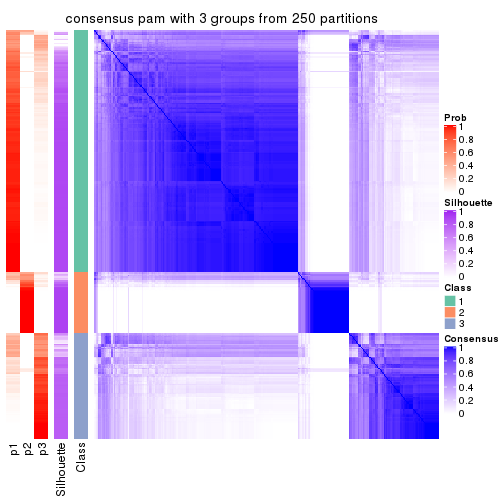</p>

</div>
<div id='tab-CV-pam-consensus-heatmap-3'>
<pre><code class="r">consensus_heatmap(res, k = 4)
</code></pre>

<p></p>

</div>
<div id='tab-CV-pam-consensus-heatmap-4'>
<pre><code class="r">consensus_heatmap(res, k = 5)
</code></pre>

<p></p>

</div>
<div id='tab-CV-pam-consensus-heatmap-5'>
<pre><code class="r">consensus_heatmap(res, k = 6)
</code></pre>

<p></p>

</div>
</div>

Heatmaps for the membership of samples in all partitions to see how consistent they are:


<script>
$( function() {
	$( '#tabs-CV-pam-membership-heatmap' ).tabs();
} );
</script>
<div id='tabs-CV-pam-membership-heatmap'>
<ul>
<li><a href='#tab-CV-pam-membership-heatmap-1'>k = 2</a></li>
<li><a href='#tab-CV-pam-membership-heatmap-2'>k = 3</a></li>
<li><a href='#tab-CV-pam-membership-heatmap-3'>k = 4</a></li>
<li><a href='#tab-CV-pam-membership-heatmap-4'>k = 5</a></li>
<li><a href='#tab-CV-pam-membership-heatmap-5'>k = 6</a></li>
</ul>
<div id='tab-CV-pam-membership-heatmap-1'>
<pre><code class="r">membership_heatmap(res, k = 2)
</code></pre>

<p></p>

</div>
<div id='tab-CV-pam-membership-heatmap-2'>
<pre><code class="r">membership_heatmap(res, k = 3)
</code></pre>

<p></p>

</div>
<div id='tab-CV-pam-membership-heatmap-3'>
<pre><code class="r">membership_heatmap(res, k = 4)
</code></pre>

<p></p>

</div>
<div id='tab-CV-pam-membership-heatmap-4'>
<pre><code class="r">membership_heatmap(res, k = 5)
</code></pre>

<p></p>

</div>
<div id='tab-CV-pam-membership-heatmap-5'>
<pre><code class="r">membership_heatmap(res, k = 6)
</code></pre>

<p></p>

</div>
</div>

As soon as we have had the classes for columns, we can look for signatures
which are significantly different between classes which can be candidate marks
for certain classes. Following are the heatmaps for signatures.


Signature heatmaps where rows are scaled:


<script>
$( function() {
	$( '#tabs-CV-pam-get-signatures' ).tabs();
} );
</script>
<div id='tabs-CV-pam-get-signatures'>
<ul>
<li><a href='#tab-CV-pam-get-signatures-1'>k = 2</a></li>
<li><a href='#tab-CV-pam-get-signatures-2'>k = 3</a></li>
<li><a href='#tab-CV-pam-get-signatures-3'>k = 4</a></li>
<li><a href='#tab-CV-pam-get-signatures-4'>k = 5</a></li>
<li><a href='#tab-CV-pam-get-signatures-5'>k = 6</a></li>
</ul>
<div id='tab-CV-pam-get-signatures-1'>
<pre><code class="r">get_signatures(res, k = 2)
</code></pre>

<p></p>

</div>
<div id='tab-CV-pam-get-signatures-2'>
<pre><code class="r">get_signatures(res, k = 3)
</code></pre>

<p></p>

</div>
<div id='tab-CV-pam-get-signatures-3'>
<pre><code class="r">get_signatures(res, k = 4)
</code></pre>

<p></p>

</div>
<div id='tab-CV-pam-get-signatures-4'>
<pre><code class="r">get_signatures(res, k = 5)
</code></pre>

<p></p>

</div>
<div id='tab-CV-pam-get-signatures-5'>
<pre><code class="r">get_signatures(res, k = 6)
</code></pre>

<p></p>

</div>
</div>


Signature heatmaps where rows are not scaled:


<script>
$( function() {
	$( '#tabs-CV-pam-get-signatures-no-scale' ).tabs();
} );
</script>
<div id='tabs-CV-pam-get-signatures-no-scale'>
<ul>
<li><a href='#tab-CV-pam-get-signatures-no-scale-1'>k = 2</a></li>
<li><a href='#tab-CV-pam-get-signatures-no-scale-2'>k = 3</a></li>
<li><a href='#tab-CV-pam-get-signatures-no-scale-3'>k = 4</a></li>
<li><a href='#tab-CV-pam-get-signatures-no-scale-4'>k = 5</a></li>
<li><a href='#tab-CV-pam-get-signatures-no-scale-5'>k = 6</a></li>
</ul>
<div id='tab-CV-pam-get-signatures-no-scale-1'>
<pre><code class="r">get_signatures(res, k = 2, scale_rows = FALSE)
</code></pre>

<p></p>

</div>
<div id='tab-CV-pam-get-signatures-no-scale-2'>
<pre><code class="r">get_signatures(res, k = 3, scale_rows = FALSE)
</code></pre>

<p></p>

</div>
<div id='tab-CV-pam-get-signatures-no-scale-3'>
<pre><code class="r">get_signatures(res, k = 4, scale_rows = FALSE)
</code></pre>

<p></p>

</div>
<div id='tab-CV-pam-get-signatures-no-scale-4'>
<pre><code class="r">get_signatures(res, k = 5, scale_rows = FALSE)
</code></pre>

<p></p>

</div>
<div id='tab-CV-pam-get-signatures-no-scale-5'>
<pre><code class="r">get_signatures(res, k = 6, scale_rows = FALSE)
</code></pre>

<p></p>

</div>
</div>


Compare the overlap of signatures from different k:

```r
compare_signatures(res)
```


`get_signature()` returns a data frame invisibly. TO get the list of signatures, the function
call should be assigned to a variable explicitly. In following code, if `plot` argument is set
to `FALSE`, no heatmap is plotted while only the differential analysis is performed.

```r
# code only for demonstration
tb = get_signature(res, k = ..., plot = FALSE)
```

An example of the output of `tb` is:

```
#>   which_row         fdr    mean_1    mean_2 scaled_mean_1 scaled_mean_2 km
#> 1        38 0.042760348  8.373488  9.131774    -0.5533452     0.5164555  1
#> 2        40 0.018707592  7.106213  8.469186    -0.6173731     0.5762149  1
#> 3        55 0.019134737 10.221463 11.207825    -0.6159697     0.5749050  1
#> 4        59 0.006059896  5.921854  7.869574    -0.6899429     0.6439467  1
#> 5        60 0.018055526  8.928898 10.211722    -0.6204761     0.5791110  1
#> 6        98 0.009384629 15.714769 14.887706     0.6635654    -0.6193277  2
...
```

The columns in `tb` are:

1. `which_row`: row indices corresponding to the input matrix.
2. `fdr`: FDR for the differential test. 
3. `mean_x`: The mean value in group x.
4. `scaled_mean_x`: The mean value in group x after rows are scaled.
5. `km`: Row groups if k-means clustering is applied to rows.


UMAP plot which shows how samples are separated.


<script>
$( function() {
	$( '#tabs-CV-pam-dimension-reduction' ).tabs();
} );
</script>
<div id='tabs-CV-pam-dimension-reduction'>
<ul>
<li><a href='#tab-CV-pam-dimension-reduction-1'>k = 2</a></li>
<li><a href='#tab-CV-pam-dimension-reduction-2'>k = 3</a></li>
<li><a href='#tab-CV-pam-dimension-reduction-3'>k = 4</a></li>
<li><a href='#tab-CV-pam-dimension-reduction-4'>k = 5</a></li>
<li><a href='#tab-CV-pam-dimension-reduction-5'>k = 6</a></li>
</ul>
<div id='tab-CV-pam-dimension-reduction-1'>
<pre><code class="r">dimension_reduction(res, k = 2, method = &quot;UMAP&quot;)
</code></pre>

<p></p>

</div>
<div id='tab-CV-pam-dimension-reduction-2'>
<pre><code class="r">dimension_reduction(res, k = 3, method = &quot;UMAP&quot;)
</code></pre>

<p></p>

</div>
<div id='tab-CV-pam-dimension-reduction-3'>
<pre><code class="r">dimension_reduction(res, k = 4, method = &quot;UMAP&quot;)
</code></pre>

<p></p>

</div>
<div id='tab-CV-pam-dimension-reduction-4'>
<pre><code class="r">dimension_reduction(res, k = 5, method = &quot;UMAP&quot;)
</code></pre>

<p></p>

</div>
<div id='tab-CV-pam-dimension-reduction-5'>
<pre><code class="r">dimension_reduction(res, k = 6, method = &quot;UMAP&quot;)
</code></pre>

<p></p>

</div>
</div>


Following heatmap shows how subgroups are split when increasing `k`:

```r
collect_classes(res)
```

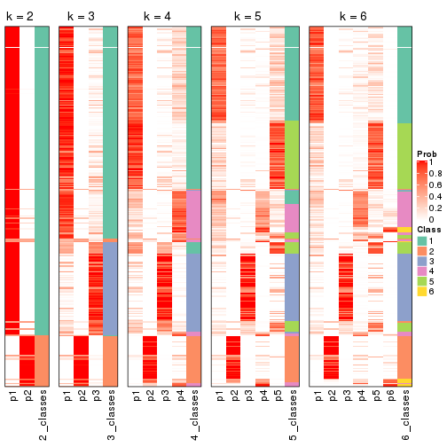


If matrix rows can be associated to genes, consider to use `GO_Enrichment(res,
...)` to perform function enrichment for the signature genes.


 

---------------------------------------------------


### CV:mclust**


The object with results only for a single top-value method and a single partition method 
can be extracted as:

```r
res = res_list["CV", "mclust"]
# you can also extract it by
# res = res_list["CV:mclust"]
```

A summary of `res` and all the functions that can be applied to it:

```r
res
```

```
#> A 'ConsensusPartition' object with k = 2, 3, 4, 5, 6.
#>   On a matrix with 17469 rows and 309 columns.
#>   Top rows (1000, 2000, 3000, 4000, 5000) are extracted by 'CV' method.
#>   Subgroups are detected by 'mclust' method.
#>   Performed in total 1250 partitions by row resampling.
#>   Best k for subgroups seems to be 2.
#> 
#> Following methods can be applied to this 'ConsensusPartition' object:
#>  [1] "cola_report"             "collect_classes"         "collect_plots"          
#>  [4] "collect_stats"           "colnames"                "compare_signatures"     
#>  [7] "consensus_heatmap"       "dimension_reduction"     "functional_enrichment"  
#> [10] "get_anno_col"            "get_anno"                "get_classes"            
#> [13] "get_consensus"           "get_matrix"              "get_membership"         
#> [16] "get_param"               "get_signatures"          "get_stats"              
#> [19] "is_best_k"               "is_stable_k"             "membership_heatmap"     
#> [22] "ncol"                    "nrow"                    "plot_ecdf"              
#> [25] "rownames"                "select_partition_number" "show"                   
#> [28] "suggest_best_k"          "test_to_known_factors"
```

`collect_plots()` function collects all the plots made from `res` for all `k` (number of partitions)
into one single page to provide an easy and fast comparison between different `k`.

```r
collect_plots(res)
```


The plots are:

- The first row: a plot of the ECDF (Empirical cumulative distribution
  function) curves of the consensus matrix for each `k` and the heatmap of
  predicted classes for each `k`.
- The second row: heatmaps of the consensus matrix for each `k`.
- The third row: heatmaps of the membership matrix for each `k`.
- The fouth row: heatmaps of the signatures for each `k`.

All the plots in panels can be made by individual functions and they are
plotted later in this section.

`select_partition_number()` produces several plots showing different
statistics for choosing "optimized" `k`. There are following statistics:

- ECDF curves of the consensus matrix for each `k`;
- 1-PAC. [The PAC
  score](https://en.wikipedia.org/wiki/Consensus_clustering#Over-interpretation_potential_of_consensus_clustering)
  measures the proportion of the ambiguous subgrouping.
- Mean silhouette score.
- Concordance. The mean probability of fiting the consensus class ids in all
  partitions.
- Area increased. Denote $A_k$ as the area under the ECDF curve for current
  `k`, the area increased is defined as $A_k - A_{k-1}$.
- Rand index. The percent of pairs of samples that are both in a same cluster
  or both are not in a same cluster in the partition of k and k-1.
- Jaccard index. The ratio of pairs of samples are both in a same cluster in
  the partition of k and k-1 and the pairs of samples are both in a same
  cluster in the partition k or k-1.

The detailed explanations of these statistics can be found in [the cola
vignette](http://bioconductor.org/packages/devel/bioc/vignettes/cola/inst/doc/cola.html#toc_13).

Generally speaking, lower PAC score, higher mean silhouette score or higher
concordance corresponds to better partition. Rand index and Jaccard index
measure how similar the current partition is compared to partition with `k-1`.
If they are too similar, we won't accept `k` is better than `k-1`.

```r
select_partition_number(res)
```


The numeric values for all these statistics can be obtained by `get_stats()`.

```r
get_stats(res)
```

```
#>   k 1-PAC mean_silhouette concordance area_increased  Rand Jaccard
#> 2 2 0.979           0.949       0.979         0.4212 0.583   0.583
#> 3 3 0.590           0.569       0.815         0.4974 0.800   0.661
#> 4 4 0.465           0.518       0.718         0.0905 0.748   0.465
#> 5 5 0.500           0.338       0.634         0.0888 0.746   0.372
#> 6 6 0.558           0.413       0.692         0.0584 0.804   0.390
```

`suggest_best_k()` suggests the best $k$ based on these statistics. The rules are as follows:

- All $k$ with Jaccard index larger than 0.95 are removed because the increase of
  the partition number does not provides enough extra information. If all $k$ are removed,
  the best $k$ is assigned by `NA`.
- For $k$ with 1-PAC larger than 0.9, the maximal $k$ is taken as the "best k". Other $k$ is called "optional k".
- If it does not fit the second rule. The $k$ with the highest vote of highest
  1-PAC, mean silhouette and concordance is taken as the "best k".

```r
suggest_best_k(res)
```

```
#> [1] 2
```


Following shows the table of the partitions (You need to click the **show/hide
code output** link to see it). The membership matrix (columns with name `p*`)
is inferred by
[`clue::cl_consensus()`](https://www.rdocumentation.org/link/cl_consensus?package=clue)
function with the `SE` method. Basically the value in the membership matrix
represents the probability to belong to a certain group. The finall class
label for an item is determined with the group with highest probability it
belongs to.

In `get_classes()` function, the entropy is calculated from the membership
matrix and the silhouette score is calculated from the consensus matrix.


<script>
$( function() {
	$( '#tabs-CV-mclust-get-classes' ).tabs();
} );
</script>
<div id='tabs-CV-mclust-get-classes'>
<ul>
<li><a href='#tab-CV-mclust-get-classes-1'>k = 2</a></li>
<li><a href='#tab-CV-mclust-get-classes-2'>k = 3</a></li>
<li><a href='#tab-CV-mclust-get-classes-3'>k = 4</a></li>
<li><a href='#tab-CV-mclust-get-classes-4'>k = 5</a></li>
<li><a href='#tab-CV-mclust-get-classes-5'>k = 6</a></li>
</ul>

<div id='tab-CV-mclust-get-classes-1'>
<p><a id='tab-CV-mclust-get-classes-1-a' style='color:#0366d6' href='#'>show/hide code output</a></p>
<pre><code class="r">cbind(get_classes(res, k = 2), get_membership(res, k = 2))
</code></pre>

<pre><code>#&gt;                                      class entropy silhouette    p1    p2
#&gt; 7826AE44-B03A-4528-9CB5-7421E592AE36     2  0.2603   0.937830 0.044 0.956
#&gt; 0DC2197B-2FEA-48EB-953E-8E44E1933757     1  0.0000   0.980574 1.000 0.000
#&gt; 87ABB098-8C1E-4677-8C31-48B71EFE41C7     1  0.0376   0.978073 0.996 0.004
#&gt; EC0154E7-7A27-4535-83AE-6B379E99A93C     1  0.0000   0.980574 1.000 0.000
#&gt; 78F79407-D49F-4FA2-B09F-0665C502827C     1  0.0000   0.980574 1.000 0.000
#&gt; 03E81178-E971-4E91-8BED-D8273EA1425C     1  0.0000   0.980574 1.000 0.000
#&gt; 62FCAEFF-16D8-4019-84B6-18EC3A88BC32     1  0.9129   0.508995 0.672 0.328
#&gt; 722C1284-5983-4CC1-B19C-214C2DE6F8A6     2  0.0000   0.972747 0.000 1.000
#&gt; 54E42A64-B350-4A94-8FED-C9BC1872660E     1  0.0000   0.980574 1.000 0.000
#&gt; 53062969-D209-490B-9C9B-5D297625E2AE     1  0.0000   0.980574 1.000 0.000
#&gt; B710293C-41D3-4A2E-8104-5402F91DD859     1  0.0000   0.980574 1.000 0.000
#&gt; 73CB1D05-7AE4-457D-B4EF-25AC5C1F2132     1  0.3584   0.913785 0.932 0.068
#&gt; B055A70B-3003-47CB-BDAA-6378C000BF24     1  0.0376   0.978073 0.996 0.004
#&gt; 46C3A870-E37A-42CB-8C0C-6ACACEAC1ADC     2  0.0000   0.972747 0.000 1.000
#&gt; E8E6270E-F26D-4F2E-A63E-7885BDE05FDB     1  0.0000   0.980574 1.000 0.000
#&gt; C4A5EBA2-9091-4D12-BDC8-B84B122022B9     1  0.0376   0.978073 0.996 0.004
#&gt; 5B1839C4-549D-41D1-B559-3C6D2A1528CE     1  0.0000   0.980574 1.000 0.000
#&gt; A0DF05EB-DC44-4492-9A8A-F278F7B0C266     1  0.0000   0.980574 1.000 0.000
#&gt; B5182F49-70F2-45B7-82DE-C6DA68145EEA     1  0.0000   0.980574 1.000 0.000
#&gt; C204D355-B876-4341-A111-36D48CBDD2A8     1  0.0000   0.980574 1.000 0.000
#&gt; 7B070AAA-EF97-4D3B-AA19-EEC170C7927D     2  0.0000   0.972747 0.000 1.000
#&gt; 05A8A881-F8EE-48A2-B11C-A08D7D80CE18     1  0.0000   0.980574 1.000 0.000
#&gt; BA59EF50-CFE9-456D-B1B6-67D0945004F6     1  0.0000   0.980574 1.000 0.000
#&gt; AD97B334-E034-4D33-A4D5-48C32D5D521C     1  0.0000   0.980574 1.000 0.000
#&gt; 51DA2568-32EA-4668-9876-4B6E7CA68860     1  0.0376   0.978073 0.996 0.004
#&gt; 78C26A05-2084-494D-83D3-C52C1B800F4C     1  0.0000   0.980574 1.000 0.000
#&gt; 2B5DD791-7692-4721-9519-7D7D49B52570     1  0.0376   0.978073 0.996 0.004
#&gt; C0BBE26A-79C8-4392-9978-7C420B3786B5     1  0.0000   0.980574 1.000 0.000
#&gt; F35A8359-3A7A-414F-8A5C-D278F3B45387     2  0.0000   0.972747 0.000 1.000
#&gt; 8C9BA49C-1270-491D-A234-AE1B1C0609BA     2  0.0000   0.972747 0.000 1.000
#&gt; CA104B57-B160-4148-8A0A-D34BB3E8D88A     1  0.0000   0.980574 1.000 0.000
#&gt; 877E18A5-6A7A-4E29-9871-DC7EA14A5F27     1  0.0000   0.980574 1.000 0.000
#&gt; 904EDF2E-411E-43BD-901D-46129AFA283A     1  0.0000   0.980574 1.000 0.000
#&gt; FD9F5A9B-2BEB-4D31-9A2D-8D4B4ECBB478     1  0.0000   0.980574 1.000 0.000
#&gt; 2E206314-9928-456E-B7C6-893DC0E3C7C2     2  0.0000   0.972747 0.000 1.000
#&gt; 913DB655-2C7F-4369-83DE-9257F04CF39B     1  0.0376   0.978073 0.996 0.004
#&gt; 72B5B724-FEB5-43BD-83F6-2E2152DDD800     1  0.0000   0.980574 1.000 0.000
#&gt; 920B547C-6898-446C-AAAF-F4ED96E40AAB     2  0.0000   0.972747 0.000 1.000
#&gt; 847F796A-8CD6-4013-A0FB-26F4FC3EAF0D     1  0.0000   0.980574 1.000 0.000
#&gt; C4D64E7A-33F7-4CFC-9FD3-D6AA3D8EFAA7     1  0.0000   0.980574 1.000 0.000
#&gt; EABA0B17-8E19-48C5-BF62-2A45C9632807     2  0.0000   0.972747 0.000 1.000
#&gt; 7263CBA8-CE37-4531-A795-9324C6D2A672     1  0.0376   0.978073 0.996 0.004
#&gt; 6D3CC3AC-618B-414A-B640-169C735A6568     1  0.9732   0.306796 0.596 0.404
#&gt; 710C05C7-F9CE-45FA-A8CC-29DE2903E04F     1  0.7674   0.702635 0.776 0.224
#&gt; 3D631A56-2C55-48EA-A667-BA46023C9D50     1  0.0000   0.980574 1.000 0.000
#&gt; F1C65F64-AF05-4875-B7E4-60FFF56A3F46     1  0.0000   0.980574 1.000 0.000
#&gt; E5DF76E7-A765-4E07-B87A-06168BF66C5F     1  0.0000   0.980574 1.000 0.000
#&gt; 5C8C8A6E-40D4-4F82-AC3D-90CFDEE15C0A     2  0.0000   0.972747 0.000 1.000
#&gt; 0117CBB9-1BF9-48B1-BE6E-A9A770FF8721     1  0.0000   0.980574 1.000 0.000
#&gt; 31EF66E5-419A-44C3-BB2A-B69B52FFCECC     2  0.0000   0.972747 0.000 1.000
#&gt; C149CEF5-61F3-4B53-B8A9-8244B673EBD0     1  0.0000   0.980574 1.000 0.000
#&gt; 0AF351D0-4EC5-4275-AA0A-4FA2AF8A9C85     2  0.0000   0.972747 0.000 1.000
#&gt; B507E82F-6680-497B-A014-033EDD7A2E03     1  0.0376   0.978073 0.996 0.004
#&gt; F941890E-AB33-478F-8C97-1C785DD9428F     1  0.0000   0.980574 1.000 0.000
#&gt; 7987E019-8FED-469B-A6C1-34EE430A60C3     1  0.0000   0.980574 1.000 0.000
#&gt; 76084AA6-19BF-4605-B6A1-73F1D4BADAF9     1  0.0376   0.978073 0.996 0.004
#&gt; 329807F7-E0D4-4F53-94E8-E4080E90CB47     1  0.0376   0.978073 0.996 0.004
#&gt; 1B6505FF-C1A7-4DD0-9827-41A0A3A28F3E     1  0.9661   0.338498 0.608 0.392
#&gt; 49778E92-B5D3-4AD9-A1AF-3B722D631B96     2  0.0000   0.972747 0.000 1.000
#&gt; A22892DE-0AF4-4B63-9513-1D6825059040     1  0.0000   0.980574 1.000 0.000
#&gt; 6D77ECAE-A715-4ADD-97D8-A916DC31A4EA     1  0.0000   0.980574 1.000 0.000
#&gt; 09758B6F-1B2D-4AED-8913-696097069409     2  0.2603   0.937830 0.044 0.956
#&gt; 8B709DB4-0B28-42F1-A7C5-106F5809BEA2     1  0.0000   0.980574 1.000 0.000
#&gt; F2B356FA-79CD-4867-8ABF-84C90A493A75     1  0.0000   0.980574 1.000 0.000
#&gt; 131213AD-0313-4DF1-B013-CE67ED262C37     2  0.0000   0.972747 0.000 1.000
#&gt; D94F7E81-0F60-473B-AD4A-0AC13508BDE2     1  0.0376   0.978073 0.996 0.004
#&gt; 29C17355-D646-48DA-9E54-7B6DD85DD610     1  0.0000   0.980574 1.000 0.000
#&gt; B8BD866A-2A7C-45C3-96BB-9AB892D26AE5     1  0.0000   0.980574 1.000 0.000
#&gt; 13EFD045-AD61-41EE-9896-67BFA4FC8C09     1  0.0376   0.978073 0.996 0.004
#&gt; 2655F609-B3BB-4D01-B421-D5F4B1232EC8     2  0.0000   0.972747 0.000 1.000
#&gt; 04BC7A52-C67F-42CB-8672-D3C51A20F2BA     1  0.0000   0.980574 1.000 0.000
#&gt; 45472BD4-DBDB-41FE-B0E3-2440880E1DE6     1  0.0000   0.980574 1.000 0.000
#&gt; B87FFFCD-CB57-4ACD-9C74-AB188984BBB2     1  0.0000   0.980574 1.000 0.000
#&gt; 5271374C-13CD-4BFE-AC6D-C95AFE491322     1  0.0000   0.980574 1.000 0.000
#&gt; E3372ACE-C7C8-43E5-B30A-1F2D662D8170     1  0.9998  -0.000259 0.508 0.492
#&gt; B08DF564-E4D0-4540-8160-93B3981DF1D8     1  0.0000   0.980574 1.000 0.000
#&gt; 61A7D1B9-FC5A-4B9C-989F-936CDA948C27     1  0.0000   0.980574 1.000 0.000
#&gt; 74E768C1-8766-46AC-AAB4-D79E5049F76A     2  0.0000   0.972747 0.000 1.000
#&gt; 0CEA28F0-D7F0-4EB7-A23F-0C5CA6245971     1  0.0376   0.978073 0.996 0.004
#&gt; 95C4EFF6-147C-48EC-A2C1-16B8F12AEEF2     2  0.0000   0.972747 0.000 1.000
#&gt; C9A78BEA-D455-4F5E-8B7B-19BCB42887E7     1  0.0000   0.980574 1.000 0.000
#&gt; DB970740-9AC1-4C10-9658-8A77B1C390DD     1  0.3584   0.916089 0.932 0.068
#&gt; 883FBD37-0CA0-4562-8925-72ACC1EE93D9     1  0.0000   0.980574 1.000 0.000
#&gt; 9FE1D006-49F2-471E-91E6-AF0414C24479     1  0.0000   0.980574 1.000 0.000
#&gt; 11816CC6-8C8B-49C0-99EE-896377BCFCCD     1  0.0000   0.980574 1.000 0.000
#&gt; 063FC5C8-4318-4ECC-9CA0-1976CBC8ACB6     1  0.5946   0.822133 0.856 0.144
#&gt; E0F085CC-B90D-4FDE-B60E-C613971BAA00     1  0.0000   0.980574 1.000 0.000
#&gt; 62361DA2-E4EE-46DA-BB1F-C51DCA9307CC     2  0.0000   0.972747 0.000 1.000
#&gt; 1BA16D48-B09E-4699-A1AD-2FFECE4F3CDB     2  0.0000   0.972747 0.000 1.000
#&gt; 3E4F14E9-60AE-4F17-9BA7-2A02E908204A     1  0.0376   0.978073 0.996 0.004
#&gt; 79226DD7-BC85-4B8E-BFF8-B1E073129D34     1  0.0000   0.980574 1.000 0.000
#&gt; D47D0936-826F-4D54-9225-F71B95357438     1  0.0000   0.980574 1.000 0.000
#&gt; 0AE02B91-574C-4165-BA39-E9D7C1A870A2     2  0.0000   0.972747 0.000 1.000
#&gt; DED8E9DF-CEFE-45ED-9374-EF9925A135C4     1  0.0000   0.980574 1.000 0.000
#&gt; D587A993-3C47-4D4C-B744-59169D4F7451     1  0.0000   0.980574 1.000 0.000
#&gt; 6BCA24E6-440F-42C5-ABE5-66C37B713A39     1  0.0000   0.980574 1.000 0.000
#&gt; 86A5EDFB-9D06-4FED-BF57-F8D74A68E156     1  0.0376   0.978073 0.996 0.004
#&gt; B9BD5134-2F6A-4454-8F83-69B63F9AE114     2  0.9881   0.243178 0.436 0.564
#&gt; 082DA9E1-A40D-482B-8E21-A93BA97185F0     1  0.0000   0.980574 1.000 0.000
#&gt; 16A8343A-1203-44FB-9F03-05CC7C71B4CC     1  0.0376   0.978073 0.996 0.004
#&gt; 00439565-02CE-4BF5-956D-7078B51C0947     1  0.0000   0.980574 1.000 0.000
#&gt; 7B2BD361-2BF1-4E97-BC08-457F5A9C2682     2  0.0000   0.972747 0.000 1.000
#&gt; C1D8439A-D527-47F6-ADC1-25867B65DA21     2  0.0000   0.972747 0.000 1.000
#&gt; D9096909-1439-462D-B69C-CAD1BF4F420C     1  0.0000   0.980574 1.000 0.000
#&gt; 7822EA86-35A1-4285-9429-2B63111B9885     1  0.0000   0.980574 1.000 0.000
#&gt; 6FD0CFC8-AC8D-4CF1-8C33-833AD98A30EF     2  0.0000   0.972747 0.000 1.000
#&gt; A451F278-5E83-4BC6-9B15-3AA2117B99B6     2  0.2603   0.937830 0.044 0.956
#&gt; 6EC25686-4547-459C-9E01-7EDF8DAECE35     1  0.0376   0.978073 0.996 0.004
#&gt; 5D2F1EEA-2BA8-4C3A-8436-544EE1D23E7E     1  0.0000   0.980574 1.000 0.000
#&gt; 675A4293-A4CE-4307-B00B-DFC4D44A87C6     2  0.0000   0.972747 0.000 1.000
#&gt; 6FBE0AEF-476A-42B2-A857-846CF1ED92B6     2  0.0000   0.972747 0.000 1.000
#&gt; 7139D616-1A15-4288-A9AE-411856A4A76D     1  0.0000   0.980574 1.000 0.000
#&gt; 46D7F8C1-D5C5-40CC-BEF5-2E590A847BD9     1  0.0376   0.978073 0.996 0.004
#&gt; 984C44D3-4F5F-44C9-BCD9-C991EBC1FCB8     1  0.0376   0.978073 0.996 0.004
#&gt; 83FE52E0-2DC2-4580-8BB2-FBCBEE4AC240     1  0.0000   0.980574 1.000 0.000
#&gt; 0923F9CB-DF6F-4BAA-A5F8-0F83CE60D1ED     1  0.0000   0.980574 1.000 0.000
#&gt; 1DEB5206-78CC-4EB5-BCD5-85A6A5B4E273     1  0.0000   0.980574 1.000 0.000
#&gt; E4DB18DA-EB0C-4B2F-9566-7F72222B16D4     1  0.0000   0.980574 1.000 0.000
#&gt; F7456312-1309-4B2F-875D-0F90CDF3EC35     1  0.0000   0.980574 1.000 0.000
#&gt; 9A25E5D8-0706-4960-A76B-BCD0AC93E4FA     1  0.0000   0.980574 1.000 0.000
#&gt; 5A41FE8F-FFB3-4B87-BF11-A570C184096D     1  0.0000   0.980574 1.000 0.000
#&gt; 33F84E63-3F6C-4867-ADB1-A0DF39F1295B     1  0.0000   0.980574 1.000 0.000
#&gt; D6A644F5-D1D0-4A8D-94C4-EE6C3ECE7430     1  0.0000   0.980574 1.000 0.000
#&gt; 2A5848CC-A9A2-4AA8-A752-321273E62CF0     1  0.0000   0.980574 1.000 0.000
#&gt; 7CA6358B-FC8A-4675-B092-9E061038FC83     2  0.0000   0.972747 0.000 1.000
#&gt; A4C2F4BC-5C62-4B1F-9AB8-46D9468EF523     2  0.0000   0.972747 0.000 1.000
#&gt; 8AF4EB7F-418D-4CC9-A9B8-A93A4C1A173B     2  0.5737   0.836025 0.136 0.864
#&gt; E5048887-70C8-468F-881E-2EC55F6E6F3B     1  0.0000   0.980574 1.000 0.000
#&gt; 1BADCC7C-C4D8-4C34-9534-59D622C7A2A2     1  0.0000   0.980574 1.000 0.000
#&gt; 02CE7DF7-64BD-4297-A240-A5B9EE8771D3     1  0.0000   0.980574 1.000 0.000
#&gt; CBF6E96A-F56C-4C87-B851-D319930BAAB8     2  0.9460   0.441405 0.364 0.636
#&gt; 48F6B774-CFD2-4DDF-B7A2-696596413C3F     1  0.0000   0.980574 1.000 0.000
#&gt; 41D88C3E-5848-4B09-8A77-EAE6AC4EC6B0     2  0.0000   0.972747 0.000 1.000
#&gt; BDF79CC0-00C7-49C1-900B-AB065A733B17     1  0.0000   0.980574 1.000 0.000
#&gt; A894D686-BFC7-4AEE-A794-DBE718C6B6F6     2  0.0000   0.972747 0.000 1.000
#&gt; 0712029E-3765-4272-BE5B-B6C8BCCC0F0F     2  0.0000   0.972747 0.000 1.000
#&gt; 7B051855-9B09-4887-9BC0-9F077537938E     1  0.0000   0.980574 1.000 0.000
#&gt; EF357C46-5C3C-4F51-9383-FF7694D07B97     2  0.0000   0.972747 0.000 1.000
#&gt; 9492A322-37CA-4582-AC68-66B5D80778AF     2  0.0000   0.972747 0.000 1.000
#&gt; 993399A4-1B9F-4258-B2D0-155AD58A2E82     1  0.0000   0.980574 1.000 0.000
#&gt; 7B7DC93D-5494-4E69-BE07-2967887182F9     1  0.0000   0.980574 1.000 0.000
#&gt; 29BCBA51-2580-473D-9CF7-BEDBD0DBAD1B     2  0.0000   0.972747 0.000 1.000
#&gt; 40855647-E942-4F32-90B7-BEB921929BFB     1  0.0000   0.980574 1.000 0.000
#&gt; 0DC723D0-7C68-4495-A4B9-2DF2FF19AB14     2  0.0000   0.972747 0.000 1.000
#&gt; 7540005F-57E0-4E2E-A8A2-BEF2B0F333B1     2  0.0000   0.972747 0.000 1.000
#&gt; EB1DDB14-4076-4C2C-B911-390C17C21486     1  0.0000   0.980574 1.000 0.000
#&gt; 9EA70EC4-8BA0-4E3D-B3CB-A68D19E89868     2  0.9922   0.207593 0.448 0.552
#&gt; B04E2E50-0A6E-4224-A825-1714D12E5669     2  0.0000   0.972747 0.000 1.000
#&gt; B0BF5E01-536D-40FF-9C24-CBBD611E2FC2     1  0.0000   0.980574 1.000 0.000
#&gt; 7B6B1788-B297-4442-B6BE-B7CE8754491E     1  0.0000   0.980574 1.000 0.000
#&gt; A090D00C-34DF-4906-A517-4803C4C9A332     1  0.0000   0.980574 1.000 0.000
#&gt; 340D44A6-9BEA-412C-9973-D9ABD6692255     1  0.0000   0.980574 1.000 0.000
#&gt; E8D0D1E7-E5A8-4014-80C1-0245F90F4358     2  0.0000   0.972747 0.000 1.000
#&gt; 19EA1494-8572-40E1-B9BB-3739F47B607D     1  0.0000   0.980574 1.000 0.000
#&gt; 1C1B4793-8DAF-4763-BA4D-C4E869A4ED35     2  0.2603   0.937830 0.044 0.956
#&gt; 45BF59B3-95BD-4196-ABAA-4C4F0DB38572     2  0.0000   0.972747 0.000 1.000
#&gt; 47B5A2A7-7E13-4558-99D2-067F5075C6A4     1  0.0000   0.980574 1.000 0.000
#&gt; E94638E8-CB51-4FBB-8BCB-4BFD7A812291     1  0.0000   0.980574 1.000 0.000
#&gt; A17352A8-0D3C-4545-8136-7DAE2FB0E102     2  0.0672   0.966763 0.008 0.992
#&gt; B18A6F95-D4ED-416B-B5A1-9A4934865D0D     2  0.0000   0.972747 0.000 1.000
#&gt; 33E92C5F-0C42-4549-AD5B-0A064182A272     1  0.0000   0.980574 1.000 0.000
#&gt; E041B375-3E60-4F18-A6EF-D1C249E3B8EE     1  0.0376   0.978073 0.996 0.004
#&gt; EDF90AF6-6C64-4BD2-AADF-8D7D188650B2     2  0.0000   0.972747 0.000 1.000
#&gt; 569320D2-316C-4E2D-B7B3-D7D5C4DAD42D     1  0.0000   0.980574 1.000 0.000
#&gt; AFFB223D-DAE9-4567-9EF2-8E4DF9D8782D     2  0.0000   0.972747 0.000 1.000
#&gt; 56FC9454-0A6A-4CC3-95C4-BE0E0D0BAFCE     2  0.0000   0.972747 0.000 1.000
#&gt; 43226365-FAEF-46C5-AF1B-5C6C2BED84FF     1  0.6148   0.813418 0.848 0.152
#&gt; 1536110A-B42A-4A84-9474-9895321FDCE9     2  0.0000   0.972747 0.000 1.000
#&gt; 812255DD-536B-4216-90B1-27D5AB339BE2     1  0.0000   0.980574 1.000 0.000
#&gt; 5D4563D6-68B7-4C9D-A3F4-AA7D45D5112C     2  0.0000   0.972747 0.000 1.000
#&gt; BAA39781-DB94-473C-98B1-FA6CD3E1C67A     1  0.0000   0.980574 1.000 0.000
#&gt; C1411CDA-814D-4E21-8929-C0F77858828F     1  0.0000   0.980574 1.000 0.000
#&gt; EFE2F248-C13E-4E8D-9153-8C903848AC4A     2  0.2603   0.937830 0.044 0.956
#&gt; D3939C84-D1D6-4060-9F91-AEB222A9BDD5     1  0.0000   0.980574 1.000 0.000
#&gt; EABD2987-8C1E-49E5-94AF-C0BDE5335A48     1  0.0000   0.980574 1.000 0.000
#&gt; F4BE2ABE-2CEB-4A6A-B8EC-0355F8C63B9B     1  0.0000   0.980574 1.000 0.000
#&gt; 627BC251-D217-4955-B718-6B9D6DEA1756     1  0.0000   0.980574 1.000 0.000
#&gt; 31B54613-A20E-4039-BB8B-9B52104CE418     1  0.0000   0.980574 1.000 0.000
#&gt; 3F292B7C-A535-4DBD-BC20-CB4F85A1C94B     1  0.0000   0.980574 1.000 0.000
#&gt; BEA2A5EB-EEA9-4F31-AC38-810E04CE124B     2  0.0000   0.972747 0.000 1.000
#&gt; 99D84D46-19DA-43F1-B639-DCE9953F1529     2  0.0000   0.972747 0.000 1.000
#&gt; 4588817E-1068-4A78-86B6-4674A0112DDA     1  0.6887   0.766840 0.816 0.184
#&gt; 6AC633BD-BEC1-4750-94E3-378972DAB6B3     2  0.0000   0.972747 0.000 1.000
#&gt; 09E17C6E-7EDE-4DDF-B5ED-2521AF870C9A     1  0.0000   0.980574 1.000 0.000
#&gt; 58D9C750-26A2-4B7C-84C4-13D7AFB4C5EA     1  0.0000   0.980574 1.000 0.000
#&gt; DF28E138-E222-4F77-9B61-69E601CA7E60     2  0.0000   0.972747 0.000 1.000
#&gt; FEA489A8-E423-4266-AADA-9BAAB29AB94B     1  0.0000   0.980574 1.000 0.000
#&gt; F3FCC207-15CD-41EA-A3EF-F5D2C12AC373     1  0.0000   0.980574 1.000 0.000
#&gt; 53DD7AFB-A258-4643-A501-BACC95D17A50     2  0.0000   0.972747 0.000 1.000
#&gt; D850B2A1-1F8A-4A44-A0CF-8D9DD4A1889A     2  0.0000   0.972747 0.000 1.000
#&gt; B3F746DC-E487-4305-9F30-825D1520E8FD     2  0.0000   0.972747 0.000 1.000
#&gt; BE38240A-F7C2-439F-9AAE-51C8A340F310     1  0.1414   0.963074 0.980 0.020
#&gt; A9022D9E-1D30-49EE-8552-1364A8027F34     1  0.0000   0.980574 1.000 0.000
#&gt; 0E8A56EE-D9A2-48A5-B793-A358BE1E4EFA     1  0.0000   0.980574 1.000 0.000
#&gt; 51667574-318E-4BDB-8F42-8512A4C1B84F     1  0.0000   0.980574 1.000 0.000
#&gt; B0A442C9-67E4-4534-8A5C-D6D73F42358C     1  0.0000   0.980574 1.000 0.000
#&gt; 25A5BC09-0D88-4385-87AF-997F9018522D     2  0.0000   0.972747 0.000 1.000
#&gt; 344B9631-AAA5-4302-8747-D584345D9131     1  0.0000   0.980574 1.000 0.000
#&gt; 1C3795AD-6306-4892-95F5-92DF3375D46A     1  0.0000   0.980574 1.000 0.000
#&gt; 17BB221D-8BF9-4391-83DD-423AE1E03651     1  0.0000   0.980574 1.000 0.000
#&gt; 297611E9-9555-4BCA-A723-02E846ACC23A     1  0.0000   0.980574 1.000 0.000
#&gt; AD7FF180-1EAC-4783-8A62-E9626B96DD9F     1  0.9427   0.436986 0.640 0.360
#&gt; FD544083-9BD5-4036-BD81-0352B67CC45C     1  0.0000   0.980574 1.000 0.000
#&gt; 879A74D5-5B29-418D-A0F4-8E88D6384008     1  0.0000   0.980574 1.000 0.000
#&gt; 43CD982C-13C0-4A52-803A-9A3A3FAE09BC     1  0.0000   0.980574 1.000 0.000
#&gt; DCD0313D-5206-4111-8743-A8A0227257D9     1  0.0000   0.980574 1.000 0.000
#&gt; 331A9160-D730-45DD-A985-C6CAC03035ED     1  0.0000   0.980574 1.000 0.000
#&gt; 9EEECA0E-530D-4724-B016-A716F0782148     1  0.9209   0.485357 0.664 0.336
#&gt; B3073976-CA3F-4115-9243-8C2D9E1B975D     1  0.0000   0.980574 1.000 0.000
#&gt; 77B3C9B4-1A7F-41BB-A37D-01EF80E933CC     2  0.0000   0.972747 0.000 1.000
#&gt; C0C26822-2E9F-4FB0-81D4-575027C8B71C     2  0.0000   0.972747 0.000 1.000
#&gt; F1FCE328-2B3B-499A-888D-0E66A017E8B0     1  0.0000   0.980574 1.000 0.000
#&gt; F069DAD6-F1EB-42F7-8252-F3F6EC46CC3E     1  0.0000   0.980574 1.000 0.000
#&gt; 99CC822E-8C98-4EEC-BB58-AEF76A0B5332     1  0.0000   0.980574 1.000 0.000
#&gt; C86EBD08-53F2-4972-801A-74970FDD6A62     1  0.0000   0.980574 1.000 0.000
#&gt; F07326F2-C1D6-4D5A-9693-25C3A04B0EC2     1  0.0000   0.980574 1.000 0.000
#&gt; 8ACBD428-7713-48D9-810A-43C9CD191A73     2  0.0000   0.972747 0.000 1.000
#&gt; 3D3501B4-1A43-4FA7-90A2-CCEBF66BFD4A     1  0.0376   0.978073 0.996 0.004
#&gt; DD51C17C-300F-44A4-955A-C9BC85417842     1  0.0376   0.978073 0.996 0.004
#&gt; 58FF391C-1D83-426C-8F92-C15F78F56C95     1  0.0000   0.980574 1.000 0.000
#&gt; ACE65C6E-2B10-4972-91B4-9199DD4B179D     1  0.0938   0.970570 0.988 0.012
#&gt; B2088466-FA5D-491C-9982-99B33683E66F     2  0.0000   0.972747 0.000 1.000
#&gt; D47AF416-1687-4FE0-A235-8815B6E8EB0B     1  0.0376   0.978073 0.996 0.004
#&gt; 4DCAD07F-CC43-46F6-B2F3-EDBF3EDD1045     2  0.0000   0.972747 0.000 1.000
#&gt; AAAE0BD9-63FC-4A0E-A27E-447B634BAD99     2  0.0000   0.972747 0.000 1.000
#&gt; BC471AA1-52CF-4CEE-9866-34CE91404F45     2  0.0000   0.972747 0.000 1.000
#&gt; 81D3EE3F-AC11-404F-8092-307F0DC12198     1  0.0000   0.980574 1.000 0.000
#&gt; 8C02026C-C25E-406B-B8B8-A1A82362AE79     2  0.8955   0.552298 0.312 0.688
#&gt; 6A005F2A-A0C1-4CA4-B15B-96B08F013874     1  0.0000   0.980574 1.000 0.000
#&gt; B55743F2-4D63-4375-85D3-F58281CFD852     1  0.0000   0.980574 1.000 0.000
#&gt; 24F98393-C817-4D0E-A7DB-05D2B5C71F40     1  0.0000   0.980574 1.000 0.000
#&gt; 2C2AEF1D-4112-4EC7-9027-5E3FD26E8802     1  0.0376   0.978073 0.996 0.004
#&gt; 8BAC3CB5-2987-4349-8AE8-B83DDD16CA3C     1  0.0376   0.978073 0.996 0.004
#&gt; ED9C74E6-92FC-4E58-8FCE-1761DEA0C977     1  0.0000   0.980574 1.000 0.000
#&gt; BA732ED4-F6BA-404E-BA3C-CA558FAD866A     1  0.0000   0.980574 1.000 0.000
#&gt; E750385A-12D9-4A88-B4DF-C1306B5EF3B7     2  0.0000   0.972747 0.000 1.000
#&gt; 6B1DC5E4-5F82-4395-913F-6AEDB5B63188     1  0.0000   0.980574 1.000 0.000
#&gt; A7C12D37-FD50-4674-A054-1774F4E5C3B3     1  0.0376   0.978073 0.996 0.004
#&gt; 2155C764-2063-4D9C-9ACD-96AA73475F5E     1  0.0000   0.980574 1.000 0.000
#&gt; DE23CC15-A95E-4119-9B3C-8EEC45900D11     2  0.0000   0.972747 0.000 1.000
#&gt; 5DB1DCAD-638E-48A4-9F40-3D6268FDEC33     2  0.0000   0.972747 0.000 1.000
#&gt; 34AF0341-73D7-4080-AAEB-4C1541C2569F     1  0.0000   0.980574 1.000 0.000
#&gt; B60D4235-44AF-4BA4-98C0-BCCDC28E90B9     2  0.0000   0.972747 0.000 1.000
#&gt; CF463D89-2C9F-4257-BF04-8BC1CD40EA7D     2  0.0000   0.972747 0.000 1.000
#&gt; EF6C8165-484A-4530-AEDF-93DCC4A8455D     1  0.0000   0.980574 1.000 0.000
#&gt; B9F6B5E4-4D10-49B8-A8FE-8F33C5A62CBF     1  0.0000   0.980574 1.000 0.000
#&gt; CE539000-92D7-4622-9C8D-BC6E01310681     2  0.0000   0.972747 0.000 1.000
#&gt; D3BBC405-A22A-4009-ABF6-96FEEE653051     2  0.0000   0.972747 0.000 1.000
#&gt; 0B3C86BD-0D20-4408-9BE3-05658729505F     1  0.0376   0.978073 0.996 0.004
#&gt; 9B9C5071-7C3F-416C-B91C-6F5966747F54     1  0.0000   0.980574 1.000 0.000
#&gt; A9469A4A-C5F9-4681-A916-A26F0B4307BA     1  0.0000   0.980574 1.000 0.000
#&gt; A31B57E4-E30B-4A1B-829D-1B47D9CEC041     2  0.0000   0.972747 0.000 1.000
#&gt; 647255CE-F84A-4070-B3FD-D8ACA32C4D09     1  0.0000   0.980574 1.000 0.000
#&gt; 8F5E9F02-51D7-410E-B8B7-22737F2F095A     2  0.0000   0.972747 0.000 1.000
#&gt; 8074A7F6-2FDE-4578-B71C-01C542D468FE     1  0.0000   0.980574 1.000 0.000
#&gt; 2A946F17-F245-409E-A019-C60CDA18DC7D     1  0.0000   0.980574 1.000 0.000
#&gt; 0878C381-47F9-4786-82C2-94AC840BEDCB     1  0.0000   0.980574 1.000 0.000
#&gt; 54504893-92C5-4328-85A8-2A882680B5E0     1  0.0000   0.980574 1.000 0.000
#&gt; 0A27D1BE-E5DD-459A-A51F-6D8AAF7CFEB4     1  0.0000   0.980574 1.000 0.000
#&gt; 89ED5A3E-CAC0-4AB4-B858-A3CD8F34DBD5     2  0.0000   0.972747 0.000 1.000
#&gt; ACEEB0A5-AADB-4EF9-8710-4BAF95522CEA     1  0.0000   0.980574 1.000 0.000
#&gt; 02C74D81-5976-4252-BC6C-B10E934DECA2     1  0.0000   0.980574 1.000 0.000
#&gt; D365A238-4739-4B54-9608-DC548F21C04E     1  0.0000   0.980574 1.000 0.000
#&gt; F70F7ED5-A3B7-4210-95AD-DEFA0A565F06     1  0.0000   0.980574 1.000 0.000
#&gt; A92C23A9-BC25-4025-9501-6D5FF8E2A502     2  0.2603   0.937830 0.044 0.956
#&gt; ECE9BBF4-840E-47A6-8378-0B6C4A2369D3     1  0.0000   0.980574 1.000 0.000
#&gt; 38749490-0FCF-4B33-9EBC-8F86C2D9E4AF     1  0.0000   0.980574 1.000 0.000
#&gt; 02ABB64E-768B-4999-A899-EEE573D5F186     1  0.7299   0.738042 0.796 0.204
#&gt; C1C467A8-18B1-4C3F-AC45-33359ED6FDC4     2  0.2603   0.937830 0.044 0.956
#&gt; 78B2E4A1-9DAE-404F-AB47-1896450EF254     1  0.0000   0.980574 1.000 0.000
#&gt; CCDB0290-91DA-4089-84A6-4434BA028D30     1  0.0000   0.980574 1.000 0.000
#&gt; D5041E80-20A0-4C1A-9AC1-2394F6DB6E92     1  0.0000   0.980574 1.000 0.000
#&gt; 20EB9CC6-EABB-438A-9030-E766459996D1     2  0.0000   0.972747 0.000 1.000
#&gt; 73E99110-9A7C-4F73-98C5-79D22CB06230     1  0.0000   0.980574 1.000 0.000
#&gt; FAD8A464-9BC3-4ED9-9517-B18D36514325     2  0.2603   0.937830 0.044 0.956
#&gt; 9AF0E82E-E621-437A-8D19-700532B95090     1  0.0000   0.980574 1.000 0.000
#&gt; 27DA48F3-4FC1-41A3-8E49-5B25F1CCFF07     1  0.0000   0.980574 1.000 0.000
#&gt; EFE5A302-D138-4044-A301-5C5FD1C24836     1  0.0000   0.980574 1.000 0.000
#&gt; D3E866AC-D66A-4C07-9F47-89AF460320DE     2  0.0000   0.972747 0.000 1.000
#&gt; 89C45456-9392-4EB3-9A82-A130B6702AAF     1  0.9608   0.368420 0.616 0.384
#&gt; 8FF5C8FC-2565-49BE-9EE0-91A84A85AB2A     1  0.0376   0.978073 0.996 0.004
#&gt; 846DF088-75D5-49CF-BDDC-27E735A08DCA     1  0.4815   0.872345 0.896 0.104
#&gt; EA3A19E1-7ADE-47B6-A35A-71290967147A     2  0.0000   0.972747 0.000 1.000
#&gt; B2C43D0C-732B-4C54-938F-D3C9FDA880DA     1  0.0000   0.980574 1.000 0.000
#&gt; EEC856B5-9B7F-488D-975E-CE2FF7072879     2  0.9087   0.531641 0.324 0.676
#&gt; 8A68C417-09CC-4FA1-BFEB-EB4B738853A4     1  0.0000   0.980574 1.000 0.000
#&gt; C5DF1A0D-952C-44E2-BF83-ED57177EF60E     1  0.0000   0.980574 1.000 0.000
#&gt; B5C9EA22-F758-4BD2-BD1F-282EC1078AED     2  0.0000   0.972747 0.000 1.000
#&gt; 3F08AE92-3EFD-4D7F-8C5C-BFB3621F0CD6     1  0.0000   0.980574 1.000 0.000
#&gt; 8F0D43F1-2199-4DBB-9B16-1E5F2CED2FEC     2  0.0000   0.972747 0.000 1.000
#&gt; 54BABD8B-EA9F-4875-8594-2179B38C73BD     1  0.0000   0.980574 1.000 0.000
#&gt; C149B6F8-03DC-4907-920A-F3318B8D2A1E     1  0.0000   0.980574 1.000 0.000
#&gt; F93D26E2-4B45-495D-BC8E-5B592F8FDABF     1  0.0376   0.978073 0.996 0.004
#&gt; C98275CD-C39A-4E14-A731-4F3EB7396665     2  0.0000   0.972747 0.000 1.000
#&gt; 354DC705-216E-42F0-B29E-C1F8D6C9489A     1  0.0000   0.980574 1.000 0.000
#&gt; 6752EED9-7990-433F-A206-D5398C396471     1  0.0000   0.980574 1.000 0.000
#&gt; C3E94C5D-68C4-400C-B7CB-38C42E9D5FFF     1  0.0000   0.980574 1.000 0.000
#&gt; CE6B6871-3ED3-44DE-A777-7558D4429057     1  0.0376   0.978073 0.996 0.004
#&gt; A06E7D1E-E432-4A4C-8BB0-314304F96EDF     1  0.2423   0.944301 0.960 0.040
#&gt; 1ABBEF80-508F-4247-B43D-3E549372113B     1  0.0000   0.980574 1.000 0.000
#&gt; 835AAE7F-F873-4D11-8845-232D261A38DF     1  0.0000   0.980574 1.000 0.000
#&gt; E98A0460-6529-4DBA-8542-1B98801D7A7D     1  0.0000   0.980574 1.000 0.000
#&gt; 06A9CBF8-01D0-4720-BCE8-83F0E77C862F     1  0.0000   0.980574 1.000 0.000
#&gt; 206865A9-A67C-49A6-93AD-55D06E777559     2  0.0000   0.972747 0.000 1.000
#&gt; 26DABC83-DB30-452F-9BE2-366760CB138E     2  0.0000   0.972747 0.000 1.000
#&gt; 9DD5272A-2D6E-4774-83E3-0CD761EDE926     1  0.0376   0.978073 0.996 0.004
#&gt; 4938E366-C740-4C9C-9358-FF37997DC9EF     1  0.0000   0.980574 1.000 0.000
#&gt; E2DA59C4-A47C-41E3-BC55-2D00C6EC17FB     1  0.0000   0.980574 1.000 0.000
#&gt; 37349E62-0BFB-4FEA-81D0-2AB7E7625B0D     1  0.0000   0.980574 1.000 0.000
</code></pre>

<script>
$('#tab-CV-mclust-get-classes-1-a').parent().next().next().hide();
$('#tab-CV-mclust-get-classes-1-a').click(function(){
  $('#tab-CV-mclust-get-classes-1-a').parent().next().next().toggle();
  return(false);
});
</script>
</div>

<div id='tab-CV-mclust-get-classes-2'>
<p><a id='tab-CV-mclust-get-classes-2-a' style='color:#0366d6' href='#'>show/hide code output</a></p>
<pre><code class="r">cbind(get_classes(res, k = 3), get_membership(res, k = 3))
</code></pre>

<pre><code>#&gt;                                      class entropy silhouette    p1    p2    p3
#&gt; 7826AE44-B03A-4528-9CB5-7421E592AE36     2  0.0000     0.9645 0.000 1.000 0.000
#&gt; 0DC2197B-2FEA-48EB-953E-8E44E1933757     3  0.6307     0.1124 0.488 0.000 0.512
#&gt; 87ABB098-8C1E-4677-8C31-48B71EFE41C7     3  0.5263     0.6232 0.088 0.084 0.828
#&gt; EC0154E7-7A27-4535-83AE-6B379E99A93C     1  0.1860     0.5938 0.948 0.000 0.052
#&gt; 78F79407-D49F-4FA2-B09F-0665C502827C     1  0.0237     0.6029 0.996 0.000 0.004
#&gt; 03E81178-E971-4E91-8BED-D8273EA1425C     1  0.1163     0.5943 0.972 0.000 0.028
#&gt; 62FCAEFF-16D8-4019-84B6-18EC3A88BC32     3  0.1919     0.6320 0.024 0.020 0.956
#&gt; 722C1284-5983-4CC1-B19C-214C2DE6F8A6     2  0.0892     0.9639 0.000 0.980 0.020
#&gt; 54E42A64-B350-4A94-8FED-C9BC1872660E     1  0.6672     0.2250 0.520 0.008 0.472
#&gt; 53062969-D209-490B-9C9B-5D297625E2AE     1  0.6295     0.2354 0.528 0.000 0.472
#&gt; B710293C-41D3-4A2E-8104-5402F91DD859     1  0.6079     0.3386 0.612 0.000 0.388
#&gt; 73CB1D05-7AE4-457D-B4EF-25AC5C1F2132     1  0.6274     0.2650 0.544 0.000 0.456
#&gt; B055A70B-3003-47CB-BDAA-6378C000BF24     3  0.6126     0.2396 0.400 0.000 0.600
#&gt; 46C3A870-E37A-42CB-8C0C-6ACACEAC1ADC     2  0.0000     0.9645 0.000 1.000 0.000
#&gt; E8E6270E-F26D-4F2E-A63E-7885BDE05FDB     3  0.5595     0.4837 0.228 0.016 0.756
#&gt; C4A5EBA2-9091-4D12-BDC8-B84B122022B9     3  0.2066     0.6417 0.060 0.000 0.940
#&gt; 5B1839C4-549D-41D1-B559-3C6D2A1528CE     1  0.5948     0.2010 0.640 0.000 0.360
#&gt; A0DF05EB-DC44-4492-9A8A-F278F7B0C266     1  0.6225     0.2977 0.568 0.000 0.432
#&gt; B5182F49-70F2-45B7-82DE-C6DA68145EEA     1  0.1031     0.5958 0.976 0.000 0.024
#&gt; C204D355-B876-4341-A111-36D48CBDD2A8     1  0.5650     0.3087 0.688 0.000 0.312
#&gt; 7B070AAA-EF97-4D3B-AA19-EEC170C7927D     2  0.0892     0.9639 0.000 0.980 0.020
#&gt; 05A8A881-F8EE-48A2-B11C-A08D7D80CE18     1  0.0237     0.6029 0.996 0.000 0.004
#&gt; BA59EF50-CFE9-456D-B1B6-67D0945004F6     1  0.6140     0.3135 0.596 0.000 0.404
#&gt; AD97B334-E034-4D33-A4D5-48C32D5D521C     1  0.6225     0.2977 0.568 0.000 0.432
#&gt; 51DA2568-32EA-4668-9876-4B6E7CA68860     3  0.3482     0.6014 0.128 0.000 0.872
#&gt; 78C26A05-2084-494D-83D3-C52C1B800F4C     1  0.0747     0.5999 0.984 0.000 0.016
#&gt; 2B5DD791-7692-4721-9519-7D7D49B52570     3  0.1964     0.6428 0.056 0.000 0.944
#&gt; C0BBE26A-79C8-4392-9978-7C420B3786B5     1  0.4887     0.4251 0.772 0.000 0.228
#&gt; F35A8359-3A7A-414F-8A5C-D278F3B45387     2  0.0892     0.9639 0.000 0.980 0.020
#&gt; 8C9BA49C-1270-491D-A234-AE1B1C0609BA     2  0.0000     0.9645 0.000 1.000 0.000
#&gt; CA104B57-B160-4148-8A0A-D34BB3E8D88A     1  0.5905     0.3420 0.648 0.000 0.352
#&gt; 877E18A5-6A7A-4E29-9871-DC7EA14A5F27     1  0.6274     0.2650 0.544 0.000 0.456
#&gt; 904EDF2E-411E-43BD-901D-46129AFA283A     1  0.6307     0.1863 0.512 0.000 0.488
#&gt; FD9F5A9B-2BEB-4D31-9A2D-8D4B4ECBB478     1  0.0424     0.6021 0.992 0.000 0.008
#&gt; 2E206314-9928-456E-B7C6-893DC0E3C7C2     2  0.0892     0.9639 0.000 0.980 0.020
#&gt; 913DB655-2C7F-4369-83DE-9257F04CF39B     3  0.5377     0.6108 0.112 0.068 0.820
#&gt; 72B5B724-FEB5-43BD-83F6-2E2152DDD800     3  0.6126     0.1441 0.400 0.000 0.600
#&gt; 920B547C-6898-446C-AAAF-F4ED96E40AAB     2  0.0892     0.9639 0.000 0.980 0.020
#&gt; 847F796A-8CD6-4013-A0FB-26F4FC3EAF0D     1  0.0237     0.6029 0.996 0.000 0.004
#&gt; C4D64E7A-33F7-4CFC-9FD3-D6AA3D8EFAA7     1  0.0237     0.6029 0.996 0.000 0.004
#&gt; EABA0B17-8E19-48C5-BF62-2A45C9632807     2  0.0892     0.9639 0.000 0.980 0.020
#&gt; 7263CBA8-CE37-4531-A795-9324C6D2A672     3  0.2165     0.6401 0.064 0.000 0.936
#&gt; 6D3CC3AC-618B-414A-B640-169C735A6568     2  0.7438     0.1801 0.036 0.536 0.428
#&gt; 710C05C7-F9CE-45FA-A8CC-29DE2903E04F     1  0.6286     0.2510 0.536 0.000 0.464
#&gt; 3D631A56-2C55-48EA-A667-BA46023C9D50     1  0.4931     0.4202 0.768 0.000 0.232
#&gt; F1C65F64-AF05-4875-B7E4-60FFF56A3F46     1  0.5016     0.4099 0.760 0.000 0.240
#&gt; E5DF76E7-A765-4E07-B87A-06168BF66C5F     1  0.1411     0.5903 0.964 0.000 0.036
#&gt; 5C8C8A6E-40D4-4F82-AC3D-90CFDEE15C0A     2  0.0892     0.9639 0.000 0.980 0.020
#&gt; 0117CBB9-1BF9-48B1-BE6E-A9A770FF8721     3  0.6274     0.1671 0.456 0.000 0.544
#&gt; 31EF66E5-419A-44C3-BB2A-B69B52FFCECC     2  0.0000     0.9645 0.000 1.000 0.000
#&gt; C149CEF5-61F3-4B53-B8A9-8244B673EBD0     1  0.6215     0.3008 0.572 0.000 0.428
#&gt; 0AF351D0-4EC5-4275-AA0A-4FA2AF8A9C85     2  0.0000     0.9645 0.000 1.000 0.000
#&gt; B507E82F-6680-497B-A014-033EDD7A2E03     1  0.6126     0.1600 0.600 0.000 0.400
#&gt; F941890E-AB33-478F-8C97-1C785DD9428F     1  0.6302     0.2234 0.520 0.000 0.480
#&gt; 7987E019-8FED-469B-A6C1-34EE430A60C3     1  0.6126     0.3134 0.600 0.000 0.400
#&gt; 76084AA6-19BF-4605-B6A1-73F1D4BADAF9     3  0.1964     0.6428 0.056 0.000 0.944
#&gt; 329807F7-E0D4-4F53-94E8-E4080E90CB47     3  0.4291     0.5446 0.180 0.000 0.820
#&gt; 1B6505FF-C1A7-4DD0-9827-41A0A3A28F3E     1  0.6672     0.2250 0.520 0.008 0.472
#&gt; 49778E92-B5D3-4AD9-A1AF-3B722D631B96     2  0.0000     0.9645 0.000 1.000 0.000
#&gt; A22892DE-0AF4-4B63-9513-1D6825059040     1  0.1529     0.5981 0.960 0.000 0.040
#&gt; 6D77ECAE-A715-4ADD-97D8-A916DC31A4EA     1  0.1529     0.5892 0.960 0.000 0.040
#&gt; 09758B6F-1B2D-4AED-8913-696097069409     2  0.0747     0.9558 0.000 0.984 0.016
#&gt; 8B709DB4-0B28-42F1-A7C5-106F5809BEA2     1  0.6672     0.2250 0.520 0.008 0.472
#&gt; F2B356FA-79CD-4867-8ABF-84C90A493A75     1  0.6180     0.3096 0.584 0.000 0.416
#&gt; 131213AD-0313-4DF1-B013-CE67ED262C37     2  0.0892     0.9639 0.000 0.980 0.020
#&gt; D94F7E81-0F60-473B-AD4A-0AC13508BDE2     3  0.2066     0.6418 0.060 0.000 0.940
#&gt; 29C17355-D646-48DA-9E54-7B6DD85DD610     1  0.6204     0.3032 0.576 0.000 0.424
#&gt; B8BD866A-2A7C-45C3-96BB-9AB892D26AE5     1  0.5098     0.3992 0.752 0.000 0.248
#&gt; 13EFD045-AD61-41EE-9896-67BFA4FC8C09     3  0.6204     0.2061 0.424 0.000 0.576
#&gt; 2655F609-B3BB-4D01-B421-D5F4B1232EC8     2  0.0000     0.9645 0.000 1.000 0.000
#&gt; 04BC7A52-C67F-42CB-8672-D3C51A20F2BA     1  0.1289     0.5934 0.968 0.000 0.032
#&gt; 45472BD4-DBDB-41FE-B0E3-2440880E1DE6     1  0.3551     0.5186 0.868 0.000 0.132
#&gt; B87FFFCD-CB57-4ACD-9C74-AB188984BBB2     1  0.5497     0.3310 0.708 0.000 0.292
#&gt; 5271374C-13CD-4BFE-AC6D-C95AFE491322     1  0.6235     0.2939 0.564 0.000 0.436
#&gt; E3372ACE-C7C8-43E5-B30A-1F2D662D8170     1  0.6235     0.2939 0.564 0.000 0.436
#&gt; B08DF564-E4D0-4540-8160-93B3981DF1D8     1  0.0000     0.6032 1.000 0.000 0.000
#&gt; 61A7D1B9-FC5A-4B9C-989F-936CDA948C27     1  0.6280     0.2582 0.540 0.000 0.460
#&gt; 74E768C1-8766-46AC-AAB4-D79E5049F76A     2  0.0892     0.9639 0.000 0.980 0.020
#&gt; 0CEA28F0-D7F0-4EB7-A23F-0C5CA6245971     3  0.1964     0.6428 0.056 0.000 0.944
#&gt; 95C4EFF6-147C-48EC-A2C1-16B8F12AEEF2     2  0.0000     0.9645 0.000 1.000 0.000
#&gt; C9A78BEA-D455-4F5E-8B7B-19BCB42887E7     1  0.1411     0.5916 0.964 0.000 0.036
#&gt; DB970740-9AC1-4C10-9658-8A77B1C390DD     3  0.5069     0.6127 0.044 0.128 0.828
#&gt; 883FBD37-0CA0-4562-8925-72ACC1EE93D9     1  0.0000     0.6032 1.000 0.000 0.000
#&gt; 9FE1D006-49F2-471E-91E6-AF0414C24479     1  0.1031     0.5970 0.976 0.000 0.024
#&gt; 11816CC6-8C8B-49C0-99EE-896377BCFCCD     1  0.1163     0.5998 0.972 0.000 0.028
#&gt; 063FC5C8-4318-4ECC-9CA0-1976CBC8ACB6     1  0.6672     0.2250 0.520 0.008 0.472
#&gt; E0F085CC-B90D-4FDE-B60E-C613971BAA00     1  0.6168     0.3017 0.588 0.000 0.412
#&gt; 62361DA2-E4EE-46DA-BB1F-C51DCA9307CC     2  0.0000     0.9645 0.000 1.000 0.000
#&gt; 1BA16D48-B09E-4699-A1AD-2FFECE4F3CDB     2  0.0892     0.9639 0.000 0.980 0.020
#&gt; 3E4F14E9-60AE-4F17-9BA7-2A02E908204A     3  0.6111     0.2458 0.396 0.000 0.604
#&gt; 79226DD7-BC85-4B8E-BFF8-B1E073129D34     1  0.5785     0.3165 0.668 0.000 0.332
#&gt; D47D0936-826F-4D54-9225-F71B95357438     1  0.4887     0.4251 0.772 0.000 0.228
#&gt; 0AE02B91-574C-4165-BA39-E9D7C1A870A2     2  0.0000     0.9645 0.000 1.000 0.000
#&gt; DED8E9DF-CEFE-45ED-9374-EF9925A135C4     1  0.6299    -0.0643 0.524 0.000 0.476
#&gt; D587A993-3C47-4D4C-B744-59169D4F7451     1  0.6672     0.2250 0.520 0.008 0.472
#&gt; 6BCA24E6-440F-42C5-ABE5-66C37B713A39     1  0.0000     0.6032 1.000 0.000 0.000
#&gt; 86A5EDFB-9D06-4FED-BF57-F8D74A68E156     3  0.8825     0.4313 0.152 0.288 0.560
#&gt; B9BD5134-2F6A-4454-8F83-69B63F9AE114     2  0.8210    -0.0792 0.460 0.468 0.072
#&gt; 082DA9E1-A40D-482B-8E21-A93BA97185F0     1  0.6672     0.2250 0.520 0.008 0.472
#&gt; 16A8343A-1203-44FB-9F03-05CC7C71B4CC     3  0.4346     0.5391 0.184 0.000 0.816
#&gt; 00439565-02CE-4BF5-956D-7078B51C0947     3  0.5560     0.3351 0.300 0.000 0.700
#&gt; 7B2BD361-2BF1-4E97-BC08-457F5A9C2682     2  0.0892     0.9639 0.000 0.980 0.020
#&gt; C1D8439A-D527-47F6-ADC1-25867B65DA21     2  0.0892     0.9639 0.000 0.980 0.020
#&gt; D9096909-1439-462D-B69C-CAD1BF4F420C     1  0.6260     0.2777 0.552 0.000 0.448
#&gt; 7822EA86-35A1-4285-9429-2B63111B9885     1  0.6672     0.2250 0.520 0.008 0.472
#&gt; 6FD0CFC8-AC8D-4CF1-8C33-833AD98A30EF     2  0.0892     0.9639 0.000 0.980 0.020
#&gt; A451F278-5E83-4BC6-9B15-3AA2117B99B6     2  0.1964     0.9235 0.000 0.944 0.056
#&gt; 6EC25686-4547-459C-9E01-7EDF8DAECE35     3  0.6274     0.1671 0.456 0.000 0.544
#&gt; 5D2F1EEA-2BA8-4C3A-8436-544EE1D23E7E     1  0.0000     0.6032 1.000 0.000 0.000
#&gt; 675A4293-A4CE-4307-B00B-DFC4D44A87C6     2  0.0237     0.9628 0.000 0.996 0.004
#&gt; 6FBE0AEF-476A-42B2-A857-846CF1ED92B6     2  0.0892     0.9639 0.000 0.980 0.020
#&gt; 7139D616-1A15-4288-A9AE-411856A4A76D     1  0.6509     0.2305 0.524 0.004 0.472
#&gt; 46D7F8C1-D5C5-40CC-BEF5-2E590A847BD9     3  0.1964     0.6428 0.056 0.000 0.944
#&gt; 984C44D3-4F5F-44C9-BCD9-C991EBC1FCB8     3  0.5016     0.4720 0.240 0.000 0.760
#&gt; 83FE52E0-2DC2-4580-8BB2-FBCBEE4AC240     1  0.6215     0.2896 0.572 0.000 0.428
#&gt; 0923F9CB-DF6F-4BAA-A5F8-0F83CE60D1ED     1  0.6192     0.3076 0.580 0.000 0.420
#&gt; 1DEB5206-78CC-4EB5-BCD5-85A6A5B4E273     1  0.0000     0.6032 1.000 0.000 0.000
#&gt; E4DB18DA-EB0C-4B2F-9566-7F72222B16D4     1  0.6672     0.2250 0.520 0.008 0.472
#&gt; F7456312-1309-4B2F-875D-0F90CDF3EC35     1  0.2959     0.5672 0.900 0.000 0.100
#&gt; 9A25E5D8-0706-4960-A76B-BCD0AC93E4FA     1  0.6140     0.3135 0.596 0.000 0.404
#&gt; 5A41FE8F-FFB3-4B87-BF11-A570C184096D     1  0.0237     0.6029 0.996 0.000 0.004
#&gt; 33F84E63-3F6C-4867-ADB1-A0DF39F1295B     1  0.1289     0.6001 0.968 0.000 0.032
#&gt; D6A644F5-D1D0-4A8D-94C4-EE6C3ECE7430     3  0.4702     0.5101 0.212 0.000 0.788
#&gt; 2A5848CC-A9A2-4AA8-A752-321273E62CF0     1  0.6140     0.3135 0.596 0.000 0.404
#&gt; 7CA6358B-FC8A-4675-B092-9E061038FC83     2  0.0661     0.9585 0.004 0.988 0.008
#&gt; A4C2F4BC-5C62-4B1F-9AB8-46D9468EF523     2  0.0237     0.9628 0.000 0.996 0.004
#&gt; 8AF4EB7F-418D-4CC9-A9B8-A93A4C1A173B     2  0.3921     0.8370 0.016 0.872 0.112
#&gt; E5048887-70C8-468F-881E-2EC55F6E6F3B     1  0.0424     0.6034 0.992 0.000 0.008
#&gt; 1BADCC7C-C4D8-4C34-9534-59D622C7A2A2     3  0.7165     0.5371 0.172 0.112 0.716
#&gt; 02CE7DF7-64BD-4297-A240-A5B9EE8771D3     1  0.2959     0.5485 0.900 0.000 0.100
#&gt; CBF6E96A-F56C-4C87-B851-D319930BAAB8     2  0.8203    -0.0412 0.444 0.484 0.072
#&gt; 48F6B774-CFD2-4DDF-B7A2-696596413C3F     1  0.2537     0.5802 0.920 0.000 0.080
#&gt; 41D88C3E-5848-4B09-8A77-EAE6AC4EC6B0     2  0.0892     0.9639 0.000 0.980 0.020
#&gt; BDF79CC0-00C7-49C1-900B-AB065A733B17     1  0.5058     0.4048 0.756 0.000 0.244
#&gt; A894D686-BFC7-4AEE-A794-DBE718C6B6F6     2  0.0892     0.9639 0.000 0.980 0.020
#&gt; 0712029E-3765-4272-BE5B-B6C8BCCC0F0F     2  0.0892     0.9639 0.000 0.980 0.020
#&gt; 7B051855-9B09-4887-9BC0-9F077537938E     1  0.6286     0.2510 0.536 0.000 0.464
#&gt; EF357C46-5C3C-4F51-9383-FF7694D07B97     2  0.0892     0.9639 0.000 0.980 0.020
#&gt; 9492A322-37CA-4582-AC68-66B5D80778AF     2  0.0000     0.9645 0.000 1.000 0.000
#&gt; 993399A4-1B9F-4258-B2D0-155AD58A2E82     1  0.6215     0.3008 0.572 0.000 0.428
#&gt; 7B7DC93D-5494-4E69-BE07-2967887182F9     1  0.0237     0.6028 0.996 0.000 0.004
#&gt; 29BCBA51-2580-473D-9CF7-BEDBD0DBAD1B     2  0.0000     0.9645 0.000 1.000 0.000
#&gt; 40855647-E942-4F32-90B7-BEB921929BFB     1  0.6192     0.3076 0.580 0.000 0.420
#&gt; 0DC723D0-7C68-4495-A4B9-2DF2FF19AB14     2  0.0000     0.9645 0.000 1.000 0.000
#&gt; 7540005F-57E0-4E2E-A8A2-BEF2B0F333B1     2  0.0000     0.9645 0.000 1.000 0.000
#&gt; EB1DDB14-4076-4C2C-B911-390C17C21486     1  0.2066     0.5921 0.940 0.000 0.060
#&gt; 9EA70EC4-8BA0-4E3D-B3CB-A68D19E89868     1  0.9480     0.0678 0.496 0.236 0.268
#&gt; B04E2E50-0A6E-4224-A825-1714D12E5669     2  0.0892     0.9639 0.000 0.980 0.020
#&gt; B0BF5E01-536D-40FF-9C24-CBBD611E2FC2     1  0.0000     0.6032 1.000 0.000 0.000
#&gt; 7B6B1788-B297-4442-B6BE-B7CE8754491E     1  0.1964     0.5923 0.944 0.000 0.056
#&gt; A090D00C-34DF-4906-A517-4803C4C9A332     1  0.1163     0.6010 0.972 0.000 0.028
#&gt; 340D44A6-9BEA-412C-9973-D9ABD6692255     1  0.2356     0.5703 0.928 0.000 0.072
#&gt; E8D0D1E7-E5A8-4014-80C1-0245F90F4358     2  0.0000     0.9645 0.000 1.000 0.000
#&gt; 19EA1494-8572-40E1-B9BB-3739F47B607D     1  0.4887     0.4251 0.772 0.000 0.228
#&gt; 1C1B4793-8DAF-4763-BA4D-C4E869A4ED35     2  0.1411     0.9392 0.000 0.964 0.036
#&gt; 45BF59B3-95BD-4196-ABAA-4C4F0DB38572     2  0.0000     0.9645 0.000 1.000 0.000
#&gt; 47B5A2A7-7E13-4558-99D2-067F5075C6A4     1  0.6672     0.2250 0.520 0.008 0.472
#&gt; E94638E8-CB51-4FBB-8BCB-4BFD7A812291     1  0.6225     0.2977 0.568 0.000 0.432
#&gt; A17352A8-0D3C-4545-8136-7DAE2FB0E102     2  0.0424     0.9608 0.000 0.992 0.008
#&gt; B18A6F95-D4ED-416B-B5A1-9A4934865D0D     2  0.0892     0.9639 0.000 0.980 0.020
#&gt; 33E92C5F-0C42-4549-AD5B-0A064182A272     1  0.5363     0.3575 0.724 0.000 0.276
#&gt; E041B375-3E60-4F18-A6EF-D1C249E3B8EE     3  0.6244     0.1883 0.440 0.000 0.560
#&gt; EDF90AF6-6C64-4BD2-AADF-8D7D188650B2     2  0.0000     0.9645 0.000 1.000 0.000
#&gt; 569320D2-316C-4E2D-B7B3-D7D5C4DAD42D     1  0.4555     0.4940 0.800 0.000 0.200
#&gt; AFFB223D-DAE9-4567-9EF2-8E4DF9D8782D     2  0.0000     0.9645 0.000 1.000 0.000
#&gt; 56FC9454-0A6A-4CC3-95C4-BE0E0D0BAFCE     2  0.0000     0.9645 0.000 1.000 0.000
#&gt; 43226365-FAEF-46C5-AF1B-5C6C2BED84FF     3  0.6982     0.5345 0.072 0.220 0.708
#&gt; 1536110A-B42A-4A84-9474-9895321FDCE9     2  0.0000     0.9645 0.000 1.000 0.000
#&gt; 812255DD-536B-4216-90B1-27D5AB339BE2     1  0.6672     0.2250 0.520 0.008 0.472
#&gt; 5D4563D6-68B7-4C9D-A3F4-AA7D45D5112C     2  0.0000     0.9645 0.000 1.000 0.000
#&gt; BAA39781-DB94-473C-98B1-FA6CD3E1C67A     1  0.0237     0.6028 0.996 0.000 0.004
#&gt; C1411CDA-814D-4E21-8929-C0F77858828F     1  0.5859     0.3324 0.656 0.000 0.344
#&gt; EFE2F248-C13E-4E8D-9153-8C903848AC4A     2  0.0892     0.9529 0.000 0.980 0.020
#&gt; D3939C84-D1D6-4060-9F91-AEB222A9BDD5     1  0.6244     0.2643 0.560 0.000 0.440
#&gt; EABD2987-8C1E-49E5-94AF-C0BDE5335A48     1  0.2796     0.5559 0.908 0.000 0.092
#&gt; F4BE2ABE-2CEB-4A6A-B8EC-0355F8C63B9B     1  0.0237     0.6028 0.996 0.000 0.004
#&gt; 627BC251-D217-4955-B718-6B9D6DEA1756     1  0.0237     0.6029 0.996 0.000 0.004
#&gt; 31B54613-A20E-4039-BB8B-9B52104CE418     1  0.0237     0.6029 0.996 0.000 0.004
#&gt; 3F292B7C-A535-4DBD-BC20-CB4F85A1C94B     1  0.6215     0.2981 0.572 0.000 0.428
#&gt; BEA2A5EB-EEA9-4F31-AC38-810E04CE124B     2  0.0000     0.9645 0.000 1.000 0.000
#&gt; 99D84D46-19DA-43F1-B639-DCE9953F1529     2  0.0892     0.9639 0.000 0.980 0.020
#&gt; 4588817E-1068-4A78-86B6-4674A0112DDA     3  0.9075     0.0913 0.388 0.140 0.472
#&gt; 6AC633BD-BEC1-4750-94E3-378972DAB6B3     2  0.0892     0.9639 0.000 0.980 0.020
#&gt; 09E17C6E-7EDE-4DDF-B5ED-2521AF870C9A     1  0.3267     0.5329 0.884 0.000 0.116
#&gt; 58D9C750-26A2-4B7C-84C4-13D7AFB4C5EA     3  0.6309    -0.2018 0.496 0.000 0.504
#&gt; DF28E138-E222-4F77-9B61-69E601CA7E60     2  0.0892     0.9639 0.000 0.980 0.020
#&gt; FEA489A8-E423-4266-AADA-9BAAB29AB94B     1  0.3551     0.5678 0.868 0.000 0.132
#&gt; F3FCC207-15CD-41EA-A3EF-F5D2C12AC373     1  0.5138     0.3936 0.748 0.000 0.252
#&gt; 53DD7AFB-A258-4643-A501-BACC95D17A50     2  0.0892     0.9639 0.000 0.980 0.020
#&gt; D850B2A1-1F8A-4A44-A0CF-8D9DD4A1889A     2  0.0892     0.9639 0.000 0.980 0.020
#&gt; B3F746DC-E487-4305-9F30-825D1520E8FD     2  0.0000     0.9645 0.000 1.000 0.000
#&gt; BE38240A-F7C2-439F-9AAE-51C8A340F310     3  0.8559     0.2680 0.304 0.124 0.572
#&gt; A9022D9E-1D30-49EE-8552-1364A8027F34     1  0.0892     0.5986 0.980 0.000 0.020
#&gt; 0E8A56EE-D9A2-48A5-B793-A358BE1E4EFA     1  0.0892     0.5978 0.980 0.000 0.020
#&gt; 51667574-318E-4BDB-8F42-8512A4C1B84F     1  0.4931     0.4449 0.768 0.000 0.232
#&gt; B0A442C9-67E4-4534-8A5C-D6D73F42358C     1  0.1031     0.6007 0.976 0.000 0.024
#&gt; 25A5BC09-0D88-4385-87AF-997F9018522D     2  0.0000     0.9645 0.000 1.000 0.000
#&gt; 344B9631-AAA5-4302-8747-D584345D9131     1  0.5178     0.3935 0.744 0.000 0.256
#&gt; 1C3795AD-6306-4892-95F5-92DF3375D46A     1  0.6672     0.2250 0.520 0.008 0.472
#&gt; 17BB221D-8BF9-4391-83DD-423AE1E03651     1  0.6509     0.2305 0.524 0.004 0.472
#&gt; 297611E9-9555-4BCA-A723-02E846ACC23A     1  0.5178     0.4202 0.744 0.000 0.256
#&gt; AD7FF180-1EAC-4783-8A62-E9626B96DD9F     3  0.6460     0.2502 0.004 0.440 0.556
#&gt; FD544083-9BD5-4036-BD81-0352B67CC45C     1  0.5968     0.1918 0.636 0.000 0.364
#&gt; 879A74D5-5B29-418D-A0F4-8E88D6384008     1  0.0237     0.6028 0.996 0.000 0.004
#&gt; 43CD982C-13C0-4A52-803A-9A3A3FAE09BC     1  0.6204     0.3032 0.576 0.000 0.424
#&gt; DCD0313D-5206-4111-8743-A8A0227257D9     1  0.0237     0.6029 0.996 0.000 0.004
#&gt; 331A9160-D730-45DD-A985-C6CAC03035ED     1  0.6225     0.2977 0.568 0.000 0.432
#&gt; 9EEECA0E-530D-4724-B016-A716F0782148     3  0.9447     0.3444 0.188 0.348 0.464
#&gt; B3073976-CA3F-4115-9243-8C2D9E1B975D     1  0.5254     0.3793 0.736 0.000 0.264
#&gt; 77B3C9B4-1A7F-41BB-A37D-01EF80E933CC     2  0.0892     0.9639 0.000 0.980 0.020
#&gt; C0C26822-2E9F-4FB0-81D4-575027C8B71C     2  0.0000     0.9645 0.000 1.000 0.000
#&gt; F1FCE328-2B3B-499A-888D-0E66A017E8B0     1  0.6299     0.2334 0.524 0.000 0.476
#&gt; F069DAD6-F1EB-42F7-8252-F3F6EC46CC3E     1  0.6180     0.3070 0.584 0.000 0.416
#&gt; 99CC822E-8C98-4EEC-BB58-AEF76A0B5332     1  0.4504     0.5258 0.804 0.000 0.196
#&gt; C86EBD08-53F2-4972-801A-74970FDD6A62     1  0.0424     0.6020 0.992 0.000 0.008
#&gt; F07326F2-C1D6-4D5A-9693-25C3A04B0EC2     1  0.5431     0.4074 0.716 0.000 0.284
#&gt; 8ACBD428-7713-48D9-810A-43C9CD191A73     2  0.0892     0.9639 0.000 0.980 0.020
#&gt; 3D3501B4-1A43-4FA7-90A2-CCEBF66BFD4A     3  0.7007     0.5078 0.176 0.100 0.724
#&gt; DD51C17C-300F-44A4-955A-C9BC85417842     3  0.1964     0.6428 0.056 0.000 0.944
#&gt; 58FF391C-1D83-426C-8F92-C15F78F56C95     1  0.0000     0.6032 1.000 0.000 0.000
#&gt; ACE65C6E-2B10-4972-91B4-9199DD4B179D     3  0.8339    -0.0618 0.448 0.080 0.472
#&gt; B2088466-FA5D-491C-9982-99B33683E66F     2  0.0000     0.9645 0.000 1.000 0.000
#&gt; D47AF416-1687-4FE0-A235-8815B6E8EB0B     3  0.6225     0.1975 0.432 0.000 0.568
#&gt; 4DCAD07F-CC43-46F6-B2F3-EDBF3EDD1045     2  0.0892     0.9639 0.000 0.980 0.020
#&gt; AAAE0BD9-63FC-4A0E-A27E-447B634BAD99     2  0.0892     0.9639 0.000 0.980 0.020
#&gt; BC471AA1-52CF-4CEE-9866-34CE91404F45     2  0.0000     0.9645 0.000 1.000 0.000
#&gt; 81D3EE3F-AC11-404F-8092-307F0DC12198     1  0.5591     0.3102 0.696 0.000 0.304
#&gt; 8C02026C-C25E-406B-B8B8-A1A82362AE79     3  0.2846     0.6142 0.020 0.056 0.924
#&gt; 6A005F2A-A0C1-4CA4-B15B-96B08F013874     1  0.5216     0.4484 0.740 0.000 0.260
#&gt; B55743F2-4D63-4375-85D3-F58281CFD852     1  0.0592     0.6009 0.988 0.000 0.012
#&gt; 24F98393-C817-4D0E-A7DB-05D2B5C71F40     1  0.0000     0.6032 1.000 0.000 0.000
#&gt; 2C2AEF1D-4112-4EC7-9027-5E3FD26E8802     3  0.1964     0.6428 0.056 0.000 0.944
#&gt; 8BAC3CB5-2987-4349-8AE8-B83DDD16CA3C     3  0.1964     0.6428 0.056 0.000 0.944
#&gt; ED9C74E6-92FC-4E58-8FCE-1761DEA0C977     3  0.5896     0.3018 0.292 0.008 0.700
#&gt; BA732ED4-F6BA-404E-BA3C-CA558FAD866A     1  0.0237     0.6028 0.996 0.000 0.004
#&gt; E750385A-12D9-4A88-B4DF-C1306B5EF3B7     2  0.0892     0.9639 0.000 0.980 0.020
#&gt; 6B1DC5E4-5F82-4395-913F-6AEDB5B63188     3  0.5760     0.2883 0.328 0.000 0.672
#&gt; A7C12D37-FD50-4674-A054-1774F4E5C3B3     3  0.1964     0.6428 0.056 0.000 0.944
#&gt; 2155C764-2063-4D9C-9ACD-96AA73475F5E     1  0.5058     0.4049 0.756 0.000 0.244
#&gt; DE23CC15-A95E-4119-9B3C-8EEC45900D11     2  0.0000     0.9645 0.000 1.000 0.000
#&gt; 5DB1DCAD-638E-48A4-9F40-3D6268FDEC33     2  0.0000     0.9645 0.000 1.000 0.000
#&gt; 34AF0341-73D7-4080-AAEB-4C1541C2569F     1  0.0237     0.6029 0.996 0.000 0.004
#&gt; B60D4235-44AF-4BA4-98C0-BCCDC28E90B9     2  0.0000     0.9645 0.000 1.000 0.000
#&gt; CF463D89-2C9F-4257-BF04-8BC1CD40EA7D     2  0.0892     0.9639 0.000 0.980 0.020
#&gt; EF6C8165-484A-4530-AEDF-93DCC4A8455D     1  0.5327     0.3655 0.728 0.000 0.272
#&gt; B9F6B5E4-4D10-49B8-A8FE-8F33C5A62CBF     1  0.4796     0.4346 0.780 0.000 0.220
#&gt; CE539000-92D7-4622-9C8D-BC6E01310681     2  0.0892     0.9639 0.000 0.980 0.020
#&gt; D3BBC405-A22A-4009-ABF6-96FEEE653051     2  0.0892     0.9639 0.000 0.980 0.020
#&gt; 0B3C86BD-0D20-4408-9BE3-05658729505F     3  0.1964     0.6428 0.056 0.000 0.944
#&gt; 9B9C5071-7C3F-416C-B91C-6F5966747F54     1  0.0000     0.6032 1.000 0.000 0.000
#&gt; A9469A4A-C5F9-4681-A916-A26F0B4307BA     1  0.3816     0.5091 0.852 0.000 0.148
#&gt; A31B57E4-E30B-4A1B-829D-1B47D9CEC041     2  0.0000     0.9645 0.000 1.000 0.000
#&gt; 647255CE-F84A-4070-B3FD-D8ACA32C4D09     1  0.6553     0.2960 0.580 0.008 0.412
#&gt; 8F5E9F02-51D7-410E-B8B7-22737F2F095A     2  0.0000     0.9645 0.000 1.000 0.000
#&gt; 8074A7F6-2FDE-4578-B71C-01C542D468FE     1  0.0000     0.6032 1.000 0.000 0.000
#&gt; 2A946F17-F245-409E-A019-C60CDA18DC7D     1  0.0424     0.6021 0.992 0.000 0.008
#&gt; 0878C381-47F9-4786-82C2-94AC840BEDCB     1  0.6140     0.3112 0.596 0.000 0.404
#&gt; 54504893-92C5-4328-85A8-2A882680B5E0     1  0.5327     0.3640 0.728 0.000 0.272
#&gt; 0A27D1BE-E5DD-459A-A51F-6D8AAF7CFEB4     1  0.6215     0.3008 0.572 0.000 0.428
#&gt; 89ED5A3E-CAC0-4AB4-B858-A3CD8F34DBD5     2  0.0892     0.9639 0.000 0.980 0.020
#&gt; ACEEB0A5-AADB-4EF9-8710-4BAF95522CEA     1  0.3879     0.5015 0.848 0.000 0.152
#&gt; 02C74D81-5976-4252-BC6C-B10E934DECA2     1  0.0237     0.6029 0.996 0.000 0.004
#&gt; D365A238-4739-4B54-9608-DC548F21C04E     1  0.5785     0.3829 0.668 0.000 0.332
#&gt; F70F7ED5-A3B7-4210-95AD-DEFA0A565F06     1  0.5216     0.3827 0.740 0.000 0.260
#&gt; A92C23A9-BC25-4025-9501-6D5FF8E2A502     2  0.2625     0.8830 0.000 0.916 0.084
#&gt; ECE9BBF4-840E-47A6-8378-0B6C4A2369D3     1  0.2878     0.5711 0.904 0.000 0.096
#&gt; 38749490-0FCF-4B33-9EBC-8F86C2D9E4AF     1  0.5397     0.3895 0.720 0.000 0.280
#&gt; 02ABB64E-768B-4999-A899-EEE573D5F186     3  0.7276     0.5509 0.104 0.192 0.704
#&gt; C1C467A8-18B1-4C3F-AC45-33359ED6FDC4     2  0.1411     0.9392 0.000 0.964 0.036
#&gt; 78B2E4A1-9DAE-404F-AB47-1896450EF254     3  0.5733     0.2712 0.324 0.000 0.676
#&gt; CCDB0290-91DA-4089-84A6-4434BA028D30     1  0.5363     0.3874 0.724 0.000 0.276
#&gt; D5041E80-20A0-4C1A-9AC1-2394F6DB6E92     1  0.4796     0.4346 0.780 0.000 0.220
#&gt; 20EB9CC6-EABB-438A-9030-E766459996D1     2  0.0892     0.9639 0.000 0.980 0.020
#&gt; 73E99110-9A7C-4F73-98C5-79D22CB06230     1  0.6192     0.3076 0.580 0.000 0.420
#&gt; FAD8A464-9BC3-4ED9-9517-B18D36514325     2  0.0237     0.9628 0.000 0.996 0.004
#&gt; 9AF0E82E-E621-437A-8D19-700532B95090     1  0.0237     0.6028 0.996 0.000 0.004
#&gt; 27DA48F3-4FC1-41A3-8E49-5B25F1CCFF07     1  0.4796     0.4346 0.780 0.000 0.220
#&gt; EFE5A302-D138-4044-A301-5C5FD1C24836     1  0.0000     0.6032 1.000 0.000 0.000
#&gt; D3E866AC-D66A-4C07-9F47-89AF460320DE     2  0.0892     0.9639 0.000 0.980 0.020
#&gt; 89C45456-9392-4EB3-9A82-A130B6702AAF     3  0.9319     0.3508 0.168 0.368 0.464
#&gt; 8FF5C8FC-2565-49BE-9EE0-91A84A85AB2A     3  0.2200     0.6430 0.056 0.004 0.940
#&gt; 846DF088-75D5-49CF-BDDC-27E735A08DCA     3  0.9613     0.2632 0.284 0.244 0.472
#&gt; EA3A19E1-7ADE-47B6-A35A-71290967147A     2  0.1031     0.9498 0.000 0.976 0.024
#&gt; B2C43D0C-732B-4C54-938F-D3C9FDA880DA     1  0.6045     0.2835 0.620 0.000 0.380
#&gt; EEC856B5-9B7F-488D-975E-CE2FF7072879     2  0.5598     0.6859 0.148 0.800 0.052
#&gt; 8A68C417-09CC-4FA1-BFEB-EB4B738853A4     1  0.6192     0.3076 0.580 0.000 0.420
#&gt; C5DF1A0D-952C-44E2-BF83-ED57177EF60E     1  0.0000     0.6032 1.000 0.000 0.000
#&gt; B5C9EA22-F758-4BD2-BD1F-282EC1078AED     2  0.0000     0.9645 0.000 1.000 0.000
#&gt; 3F08AE92-3EFD-4D7F-8C5C-BFB3621F0CD6     1  0.6154     0.3123 0.592 0.000 0.408
#&gt; 8F0D43F1-2199-4DBB-9B16-1E5F2CED2FEC     2  0.0000     0.9645 0.000 1.000 0.000
#&gt; 54BABD8B-EA9F-4875-8594-2179B38C73BD     1  0.6260     0.2736 0.552 0.000 0.448
#&gt; C149B6F8-03DC-4907-920A-F3318B8D2A1E     1  0.5098     0.3992 0.752 0.000 0.248
#&gt; F93D26E2-4B45-495D-BC8E-5B592F8FDABF     3  0.8010     0.3611 0.068 0.384 0.548
#&gt; C98275CD-C39A-4E14-A731-4F3EB7396665     2  0.0747     0.9558 0.000 0.984 0.016
#&gt; 354DC705-216E-42F0-B29E-C1F8D6C9489A     1  0.6286     0.2482 0.536 0.000 0.464
#&gt; 6752EED9-7990-433F-A206-D5398C396471     1  0.0000     0.6032 1.000 0.000 0.000
#&gt; C3E94C5D-68C4-400C-B7CB-38C42E9D5FFF     3  0.7063    -0.1323 0.464 0.020 0.516
#&gt; CE6B6871-3ED3-44DE-A777-7558D4429057     3  0.1964     0.6428 0.056 0.000 0.944
#&gt; A06E7D1E-E432-4A4C-8BB0-314304F96EDF     3  0.5036     0.6138 0.048 0.120 0.832
#&gt; 1ABBEF80-508F-4247-B43D-3E549372113B     1  0.6308     0.1730 0.508 0.000 0.492
#&gt; 835AAE7F-F873-4D11-8845-232D261A38DF     1  0.5431     0.3834 0.716 0.000 0.284
#&gt; E98A0460-6529-4DBA-8542-1B98801D7A7D     1  0.6204     0.3032 0.576 0.000 0.424
#&gt; 06A9CBF8-01D0-4720-BCE8-83F0E77C862F     1  0.0000     0.6032 1.000 0.000 0.000
#&gt; 206865A9-A67C-49A6-93AD-55D06E777559     2  0.0892     0.9639 0.000 0.980 0.020
#&gt; 26DABC83-DB30-452F-9BE2-366760CB138E     2  0.0892     0.9639 0.000 0.980 0.020
#&gt; 9DD5272A-2D6E-4774-83E3-0CD761EDE926     3  0.1964     0.6428 0.056 0.000 0.944
#&gt; 4938E366-C740-4C9C-9358-FF37997DC9EF     1  0.6235     0.2789 0.564 0.000 0.436
#&gt; E2DA59C4-A47C-41E3-BC55-2D00C6EC17FB     1  0.0424     0.6020 0.992 0.000 0.008
#&gt; 37349E62-0BFB-4FEA-81D0-2AB7E7625B0D     1  0.6267     0.2751 0.548 0.000 0.452
</code></pre>

<script>
$('#tab-CV-mclust-get-classes-2-a').parent().next().next().hide();
$('#tab-CV-mclust-get-classes-2-a').click(function(){
  $('#tab-CV-mclust-get-classes-2-a').parent().next().next().toggle();
  return(false);
});
</script>
</div>

<div id='tab-CV-mclust-get-classes-3'>
<p><a id='tab-CV-mclust-get-classes-3-a' style='color:#0366d6' href='#'>show/hide code output</a></p>
<pre><code class="r">cbind(get_classes(res, k = 4), get_membership(res, k = 4))
</code></pre>

<pre><code>#&gt;                                      class entropy silhouette    p1    p2    p3    p4
#&gt; 7826AE44-B03A-4528-9CB5-7421E592AE36     2  0.0921    0.77231 0.000 0.972 0.028 0.000
#&gt; 0DC2197B-2FEA-48EB-953E-8E44E1933757     1  0.5764    0.40206 0.644 0.000 0.304 0.052
#&gt; 87ABB098-8C1E-4677-8C31-48B71EFE41C7     3  0.6272    0.33751 0.276 0.048 0.652 0.024
#&gt; EC0154E7-7A27-4535-83AE-6B379E99A93C     1  0.5126   -0.09294 0.552 0.000 0.444 0.004
#&gt; 78F79407-D49F-4FA2-B09F-0665C502827C     1  0.2714    0.64859 0.884 0.000 0.112 0.004
#&gt; 03E81178-E971-4E91-8BED-D8273EA1425C     1  0.3052    0.62985 0.860 0.000 0.136 0.004
#&gt; 62FCAEFF-16D8-4019-84B6-18EC3A88BC32     3  0.5266    0.43610 0.020 0.012 0.704 0.264
#&gt; 722C1284-5983-4CC1-B19C-214C2DE6F8A6     4  0.4730    0.82173 0.000 0.364 0.000 0.636
#&gt; 54E42A64-B350-4A94-8FED-C9BC1872660E     3  0.7035    0.33214 0.384 0.108 0.504 0.004
#&gt; 53062969-D209-490B-9C9B-5D297625E2AE     3  0.4677    0.52758 0.316 0.000 0.680 0.004
#&gt; B710293C-41D3-4A2E-8104-5402F91DD859     1  0.4761    0.31315 0.664 0.000 0.332 0.004
#&gt; 73CB1D05-7AE4-457D-B4EF-25AC5C1F2132     3  0.5888    0.53024 0.308 0.048 0.640 0.004
#&gt; B055A70B-3003-47CB-BDAA-6378C000BF24     3  0.5528    0.42098 0.064 0.000 0.700 0.236
#&gt; 46C3A870-E37A-42CB-8C0C-6ACACEAC1ADC     2  0.0188    0.78621 0.000 0.996 0.000 0.004
#&gt; E8E6270E-F26D-4F2E-A63E-7885BDE05FDB     3  0.4800    0.29580 0.340 0.000 0.656 0.004
#&gt; C4A5EBA2-9091-4D12-BDC8-B84B122022B9     3  0.7536    0.13130 0.264 0.000 0.492 0.244
#&gt; 5B1839C4-549D-41D1-B559-3C6D2A1528CE     1  0.3718    0.60405 0.820 0.000 0.168 0.012
#&gt; A0DF05EB-DC44-4492-9A8A-F278F7B0C266     3  0.4679    0.50485 0.352 0.000 0.648 0.000
#&gt; B5182F49-70F2-45B7-82DE-C6DA68145EEA     1  0.3105    0.62202 0.856 0.000 0.140 0.004
#&gt; C204D355-B876-4341-A111-36D48CBDD2A8     1  0.3791    0.60630 0.796 0.000 0.200 0.004
#&gt; 7B070AAA-EF97-4D3B-AA19-EEC170C7927D     4  0.4134    0.90943 0.000 0.260 0.000 0.740
#&gt; 05A8A881-F8EE-48A2-B11C-A08D7D80CE18     1  0.1661    0.68659 0.944 0.000 0.052 0.004
#&gt; BA59EF50-CFE9-456D-B1B6-67D0945004F6     1  0.4999   -0.23445 0.508 0.000 0.492 0.000
#&gt; AD97B334-E034-4D33-A4D5-48C32D5D521C     3  0.4679    0.50485 0.352 0.000 0.648 0.000
#&gt; 51DA2568-32EA-4668-9876-4B6E7CA68860     1  0.7748    0.08778 0.424 0.000 0.332 0.244
#&gt; 78C26A05-2084-494D-83D3-C52C1B800F4C     1  0.2125    0.69324 0.920 0.000 0.076 0.004
#&gt; 2B5DD791-7692-4721-9519-7D7D49B52570     3  0.4964    0.43871 0.032 0.000 0.724 0.244
#&gt; C0BBE26A-79C8-4392-9978-7C420B3786B5     1  0.2675    0.65836 0.892 0.000 0.100 0.008
#&gt; F35A8359-3A7A-414F-8A5C-D278F3B45387     4  0.4134    0.90943 0.000 0.260 0.000 0.740
#&gt; 8C9BA49C-1270-491D-A234-AE1B1C0609BA     2  0.4994   -0.39816 0.000 0.520 0.000 0.480
#&gt; CA104B57-B160-4148-8A0A-D34BB3E8D88A     1  0.6182    0.36718 0.616 0.076 0.308 0.000
#&gt; 877E18A5-6A7A-4E29-9871-DC7EA14A5F27     3  0.5852    0.51591 0.332 0.040 0.624 0.004
#&gt; 904EDF2E-411E-43BD-901D-46129AFA283A     3  0.4981    0.24064 0.464 0.000 0.536 0.000
#&gt; FD9F5A9B-2BEB-4D31-9A2D-8D4B4ECBB478     1  0.1398    0.69175 0.956 0.000 0.040 0.004
#&gt; 2E206314-9928-456E-B7C6-893DC0E3C7C2     4  0.4722    0.86974 0.000 0.300 0.008 0.692
#&gt; 913DB655-2C7F-4369-83DE-9257F04CF39B     3  0.6071    0.35425 0.260 0.060 0.668 0.012
#&gt; 72B5B724-FEB5-43BD-83F6-2E2152DDD800     1  0.4277    0.50526 0.720 0.000 0.280 0.000
#&gt; 920B547C-6898-446C-AAAF-F4ED96E40AAB     4  0.4697    0.82972 0.000 0.356 0.000 0.644
#&gt; 847F796A-8CD6-4013-A0FB-26F4FC3EAF0D     1  0.2593    0.65129 0.892 0.000 0.104 0.004
#&gt; C4D64E7A-33F7-4CFC-9FD3-D6AA3D8EFAA7     1  0.1576    0.68727 0.948 0.000 0.048 0.004
#&gt; EABA0B17-8E19-48C5-BF62-2A45C9632807     2  0.3649    0.52095 0.000 0.796 0.000 0.204
#&gt; 7263CBA8-CE37-4531-A795-9324C6D2A672     3  0.7355    0.06297 0.340 0.000 0.488 0.172
#&gt; 6D3CC3AC-618B-414A-B640-169C735A6568     3  0.6923    0.29593 0.032 0.276 0.616 0.076
#&gt; 710C05C7-F9CE-45FA-A8CC-29DE2903E04F     3  0.5945    0.53636 0.292 0.056 0.648 0.004
#&gt; 3D631A56-2C55-48EA-A667-BA46023C9D50     1  0.2480    0.66560 0.904 0.000 0.088 0.008
#&gt; F1C65F64-AF05-4875-B7E4-60FFF56A3F46     1  0.2466    0.66087 0.900 0.000 0.096 0.004
#&gt; E5DF76E7-A765-4E07-B87A-06168BF66C5F     1  0.3448    0.59567 0.828 0.000 0.168 0.004
#&gt; 5C8C8A6E-40D4-4F82-AC3D-90CFDEE15C0A     4  0.4697    0.82972 0.000 0.356 0.000 0.644
#&gt; 0117CBB9-1BF9-48B1-BE6E-A9A770FF8721     1  0.6133    0.40821 0.644 0.000 0.268 0.088
#&gt; 31EF66E5-419A-44C3-BB2A-B69B52FFCECC     2  0.0000    0.78755 0.000 1.000 0.000 0.000
#&gt; C149CEF5-61F3-4B53-B8A9-8244B673EBD0     3  0.5615    0.50340 0.356 0.032 0.612 0.000
#&gt; 0AF351D0-4EC5-4275-AA0A-4FA2AF8A9C85     2  0.0592    0.77935 0.000 0.984 0.000 0.016
#&gt; B507E82F-6680-497B-A014-033EDD7A2E03     3  0.5636    0.13547 0.424 0.000 0.552 0.024
#&gt; F941890E-AB33-478F-8C97-1C785DD9428F     3  0.4406    0.52873 0.300 0.000 0.700 0.000
#&gt; 7987E019-8FED-469B-A6C1-34EE430A60C3     3  0.4998    0.27354 0.488 0.000 0.512 0.000
#&gt; 76084AA6-19BF-4605-B6A1-73F1D4BADAF9     3  0.4995    0.43777 0.032 0.000 0.720 0.248
#&gt; 329807F7-E0D4-4F53-94E8-E4080E90CB47     3  0.5528    0.40009 0.144 0.000 0.732 0.124
#&gt; 1B6505FF-C1A7-4DD0-9827-41A0A3A28F3E     3  0.7165    0.47211 0.152 0.288 0.556 0.004
#&gt; 49778E92-B5D3-4AD9-A1AF-3B722D631B96     2  0.4989   -0.36943 0.000 0.528 0.000 0.472
#&gt; A22892DE-0AF4-4B63-9513-1D6825059040     1  0.5050   -0.02560 0.588 0.000 0.408 0.004
#&gt; 6D77ECAE-A715-4ADD-97D8-A916DC31A4EA     1  0.2053    0.69171 0.924 0.000 0.072 0.004
#&gt; 09758B6F-1B2D-4AED-8913-696097069409     2  0.2053    0.73954 0.000 0.924 0.072 0.004
#&gt; 8B709DB4-0B28-42F1-A7C5-106F5809BEA2     3  0.6164    0.54648 0.240 0.104 0.656 0.000
#&gt; F2B356FA-79CD-4867-8ABF-84C90A493A75     3  0.4972    0.34651 0.456 0.000 0.544 0.000
#&gt; 131213AD-0313-4DF1-B013-CE67ED262C37     4  0.4134    0.90943 0.000 0.260 0.000 0.740
#&gt; D94F7E81-0F60-473B-AD4A-0AC13508BDE2     3  0.5292    0.43214 0.064 0.000 0.728 0.208
#&gt; 29C17355-D646-48DA-9E54-7B6DD85DD610     3  0.4713    0.50000 0.360 0.000 0.640 0.000
#&gt; B8BD866A-2A7C-45C3-96BB-9AB892D26AE5     1  0.2799    0.65354 0.884 0.000 0.108 0.008
#&gt; 13EFD045-AD61-41EE-9896-67BFA4FC8C09     3  0.5550    0.41765 0.060 0.000 0.692 0.248
#&gt; 2655F609-B3BB-4D01-B421-D5F4B1232EC8     2  0.0000    0.78755 0.000 1.000 0.000 0.000
#&gt; 04BC7A52-C67F-42CB-8672-D3C51A20F2BA     1  0.1867    0.69125 0.928 0.000 0.072 0.000
#&gt; 45472BD4-DBDB-41FE-B0E3-2440880E1DE6     1  0.1109    0.68830 0.968 0.000 0.028 0.004
#&gt; B87FFFCD-CB57-4ACD-9C74-AB188984BBB2     1  0.3217    0.63789 0.860 0.000 0.128 0.012
#&gt; 5271374C-13CD-4BFE-AC6D-C95AFE491322     3  0.4679    0.50485 0.352 0.000 0.648 0.000
#&gt; E3372ACE-C7C8-43E5-B30A-1F2D662D8170     3  0.6353    0.52186 0.320 0.072 0.604 0.004
#&gt; B08DF564-E4D0-4540-8160-93B3981DF1D8     1  0.1902    0.67926 0.932 0.000 0.064 0.004
#&gt; 61A7D1B9-FC5A-4B9C-989F-936CDA948C27     1  0.5016    0.15215 0.600 0.000 0.396 0.004
#&gt; 74E768C1-8766-46AC-AAB4-D79E5049F76A     4  0.4134    0.90943 0.000 0.260 0.000 0.740
#&gt; 0CEA28F0-D7F0-4EB7-A23F-0C5CA6245971     3  0.5052    0.43999 0.036 0.000 0.720 0.244
#&gt; 95C4EFF6-147C-48EC-A2C1-16B8F12AEEF2     2  0.0000    0.78755 0.000 1.000 0.000 0.000
#&gt; C9A78BEA-D455-4F5E-8B7B-19BCB42887E7     1  0.1489    0.68486 0.952 0.000 0.044 0.004
#&gt; DB970740-9AC1-4C10-9658-8A77B1C390DD     3  0.8084    0.20814 0.296 0.108 0.528 0.068
#&gt; 883FBD37-0CA0-4562-8925-72ACC1EE93D9     1  0.2266    0.67493 0.912 0.000 0.084 0.004
#&gt; 9FE1D006-49F2-471E-91E6-AF0414C24479     1  0.1792    0.69336 0.932 0.000 0.068 0.000
#&gt; 11816CC6-8C8B-49C0-99EE-896377BCFCCD     1  0.5050   -0.02560 0.588 0.000 0.408 0.004
#&gt; 063FC5C8-4318-4ECC-9CA0-1976CBC8ACB6     3  0.7327    0.44367 0.176 0.320 0.504 0.000
#&gt; E0F085CC-B90D-4FDE-B60E-C613971BAA00     3  0.5126    0.30808 0.444 0.000 0.552 0.004
#&gt; 62361DA2-E4EE-46DA-BB1F-C51DCA9307CC     2  0.0000    0.78755 0.000 1.000 0.000 0.000
#&gt; 1BA16D48-B09E-4699-A1AD-2FFECE4F3CDB     2  0.3837    0.47804 0.000 0.776 0.000 0.224
#&gt; 3E4F14E9-60AE-4F17-9BA7-2A02E908204A     1  0.5894    0.27635 0.536 0.000 0.428 0.036
#&gt; 79226DD7-BC85-4B8E-BFF8-B1E073129D34     1  0.4431    0.50150 0.696 0.000 0.304 0.000
#&gt; D47D0936-826F-4D54-9225-F71B95357438     1  0.2198    0.67354 0.920 0.000 0.072 0.008
#&gt; 0AE02B91-574C-4165-BA39-E9D7C1A870A2     2  0.0336    0.78503 0.000 0.992 0.000 0.008
#&gt; DED8E9DF-CEFE-45ED-9374-EF9925A135C4     1  0.4988    0.45642 0.692 0.000 0.288 0.020
#&gt; D587A993-3C47-4D4C-B744-59169D4F7451     3  0.6230    0.54159 0.256 0.088 0.652 0.004
#&gt; 6BCA24E6-440F-42C5-ABE5-66C37B713A39     1  0.2081    0.67010 0.916 0.000 0.084 0.000
#&gt; 86A5EDFB-9D06-4FED-BF57-F8D74A68E156     3  0.5828    0.52763 0.084 0.196 0.712 0.008
#&gt; B9BD5134-2F6A-4454-8F83-69B63F9AE114     2  0.6698    0.33527 0.140 0.604 0.256 0.000
#&gt; 082DA9E1-A40D-482B-8E21-A93BA97185F0     3  0.6770    0.50281 0.304 0.108 0.584 0.004
#&gt; 16A8343A-1203-44FB-9F03-05CC7C71B4CC     3  0.5052    0.43661 0.036 0.000 0.720 0.244
#&gt; 00439565-02CE-4BF5-956D-7078B51C0947     3  0.5308    0.21174 0.452 0.004 0.540 0.004
#&gt; 7B2BD361-2BF1-4E97-BC08-457F5A9C2682     4  0.4134    0.90943 0.000 0.260 0.000 0.740
#&gt; C1D8439A-D527-47F6-ADC1-25867B65DA21     4  0.4134    0.90943 0.000 0.260 0.000 0.740
#&gt; D9096909-1439-462D-B69C-CAD1BF4F420C     3  0.5686    0.51709 0.332 0.032 0.632 0.004
#&gt; 7822EA86-35A1-4285-9429-2B63111B9885     3  0.6340    0.54246 0.240 0.104 0.652 0.004
#&gt; 6FD0CFC8-AC8D-4CF1-8C33-833AD98A30EF     4  0.4679    0.83498 0.000 0.352 0.000 0.648
#&gt; A451F278-5E83-4BC6-9B15-3AA2117B99B6     2  0.3668    0.61996 0.000 0.808 0.188 0.004
#&gt; 6EC25686-4547-459C-9E01-7EDF8DAECE35     1  0.6603    0.31997 0.572 0.000 0.328 0.100
#&gt; 5D2F1EEA-2BA8-4C3A-8436-544EE1D23E7E     1  0.2266    0.67000 0.912 0.000 0.084 0.004
#&gt; 675A4293-A4CE-4307-B00B-DFC4D44A87C6     2  0.0188    0.78696 0.000 0.996 0.004 0.000
#&gt; 6FBE0AEF-476A-42B2-A857-846CF1ED92B6     4  0.4697    0.82972 0.000 0.356 0.000 0.644
#&gt; 7139D616-1A15-4288-A9AE-411856A4A76D     3  0.7707    0.42911 0.252 0.256 0.488 0.004
#&gt; 46D7F8C1-D5C5-40CC-BEF5-2E590A847BD9     3  0.5052    0.43975 0.036 0.000 0.720 0.244
#&gt; 984C44D3-4F5F-44C9-BCD9-C991EBC1FCB8     3  0.5660    0.22936 0.396 0.000 0.576 0.028
#&gt; 83FE52E0-2DC2-4580-8BB2-FBCBEE4AC240     3  0.4994    0.23726 0.480 0.000 0.520 0.000
#&gt; 0923F9CB-DF6F-4BAA-A5F8-0F83CE60D1ED     3  0.4730    0.49847 0.364 0.000 0.636 0.000
#&gt; 1DEB5206-78CC-4EB5-BCD5-85A6A5B4E273     1  0.1902    0.68148 0.932 0.000 0.064 0.004
#&gt; E4DB18DA-EB0C-4B2F-9566-7F72222B16D4     3  0.7516    0.45966 0.228 0.244 0.524 0.004
#&gt; F7456312-1309-4B2F-875D-0F90CDF3EC35     1  0.5112   -0.10555 0.560 0.000 0.436 0.004
#&gt; 9A25E5D8-0706-4960-A76B-BCD0AC93E4FA     1  0.4996   -0.22426 0.516 0.000 0.484 0.000
#&gt; 5A41FE8F-FFB3-4B87-BF11-A570C184096D     1  0.1661    0.68852 0.944 0.000 0.052 0.004
#&gt; 33F84E63-3F6C-4867-ADB1-A0DF39F1295B     1  0.4936    0.09186 0.624 0.000 0.372 0.004
#&gt; D6A644F5-D1D0-4A8D-94C4-EE6C3ECE7430     3  0.5057    0.28302 0.340 0.000 0.648 0.012
#&gt; 2A5848CC-A9A2-4AA8-A752-321273E62CF0     3  0.4941    0.39650 0.436 0.000 0.564 0.000
#&gt; 7CA6358B-FC8A-4675-B092-9E061038FC83     2  0.1174    0.77344 0.012 0.968 0.020 0.000
#&gt; A4C2F4BC-5C62-4B1F-9AB8-46D9468EF523     2  0.0336    0.78584 0.000 0.992 0.008 0.000
#&gt; 8AF4EB7F-418D-4CC9-A9B8-A93A4C1A173B     2  0.7325    0.11820 0.004 0.536 0.168 0.292
#&gt; E5048887-70C8-468F-881E-2EC55F6E6F3B     1  0.4761    0.25071 0.664 0.000 0.332 0.004
#&gt; 1BADCC7C-C4D8-4C34-9534-59D622C7A2A2     1  0.7466    0.08711 0.448 0.152 0.396 0.004
#&gt; 02CE7DF7-64BD-4297-A240-A5B9EE8771D3     1  0.4800    0.21305 0.656 0.000 0.340 0.004
#&gt; CBF6E96A-F56C-4C87-B851-D319930BAAB8     2  0.6703    0.34976 0.156 0.612 0.232 0.000
#&gt; 48F6B774-CFD2-4DDF-B7A2-696596413C3F     1  0.4643    0.22751 0.656 0.000 0.344 0.000
#&gt; 41D88C3E-5848-4B09-8A77-EAE6AC4EC6B0     4  0.4134    0.90943 0.000 0.260 0.000 0.740
#&gt; BDF79CC0-00C7-49C1-900B-AB065A733B17     1  0.2714    0.65285 0.884 0.000 0.112 0.004
#&gt; A894D686-BFC7-4AEE-A794-DBE718C6B6F6     4  0.4304    0.90195 0.000 0.284 0.000 0.716
#&gt; 0712029E-3765-4272-BE5B-B6C8BCCC0F0F     4  0.4134    0.90943 0.000 0.260 0.000 0.740
#&gt; 7B051855-9B09-4887-9BC0-9F077537938E     3  0.4677    0.52758 0.316 0.000 0.680 0.004
#&gt; EF357C46-5C3C-4F51-9383-FF7694D07B97     4  0.4697    0.82972 0.000 0.356 0.000 0.644
#&gt; 9492A322-37CA-4582-AC68-66B5D80778AF     2  0.0188    0.78621 0.000 0.996 0.000 0.004
#&gt; 993399A4-1B9F-4258-B2D0-155AD58A2E82     3  0.4713    0.50000 0.360 0.000 0.640 0.000
#&gt; 7B7DC93D-5494-4E69-BE07-2967887182F9     1  0.1940    0.67529 0.924 0.000 0.076 0.000
#&gt; 29BCBA51-2580-473D-9CF7-BEDBD0DBAD1B     2  0.0000    0.78755 0.000 1.000 0.000 0.000
#&gt; 40855647-E942-4F32-90B7-BEB921929BFB     3  0.4790    0.48260 0.380 0.000 0.620 0.000
#&gt; 0DC723D0-7C68-4495-A4B9-2DF2FF19AB14     2  0.0188    0.78696 0.000 0.996 0.004 0.000
#&gt; 7540005F-57E0-4E2E-A8A2-BEF2B0F333B1     2  0.4193    0.35780 0.000 0.732 0.000 0.268
#&gt; EB1DDB14-4076-4C2C-B911-390C17C21486     1  0.4964    0.04214 0.616 0.000 0.380 0.004
#&gt; 9EA70EC4-8BA0-4E3D-B3CB-A68D19E89868     3  0.6860    0.53033 0.224 0.160 0.612 0.004
#&gt; B04E2E50-0A6E-4224-A825-1714D12E5669     4  0.4193    0.90823 0.000 0.268 0.000 0.732
#&gt; B0BF5E01-536D-40FF-9C24-CBBD611E2FC2     1  0.2125    0.67507 0.920 0.000 0.076 0.004
#&gt; 7B6B1788-B297-4442-B6BE-B7CE8754491E     1  0.5070   -0.08122 0.580 0.000 0.416 0.004
#&gt; A090D00C-34DF-4906-A517-4803C4C9A332     1  0.5039   -0.01882 0.592 0.000 0.404 0.004
#&gt; 340D44A6-9BEA-412C-9973-D9ABD6692255     1  0.1824    0.68298 0.936 0.000 0.060 0.004
#&gt; E8D0D1E7-E5A8-4014-80C1-0245F90F4358     2  0.1022    0.76840 0.000 0.968 0.000 0.032
#&gt; 19EA1494-8572-40E1-B9BB-3739F47B607D     1  0.2081    0.66862 0.916 0.000 0.084 0.000
#&gt; 1C1B4793-8DAF-4763-BA4D-C4E869A4ED35     2  0.3583    0.62865 0.000 0.816 0.180 0.004
#&gt; 45BF59B3-95BD-4196-ABAA-4C4F0DB38572     2  0.5440   -0.03975 0.000 0.596 0.020 0.384
#&gt; 47B5A2A7-7E13-4558-99D2-067F5075C6A4     3  0.6292    0.54762 0.220 0.112 0.664 0.004
#&gt; E94638E8-CB51-4FBB-8BCB-4BFD7A812291     3  0.5788    0.50224 0.356 0.032 0.608 0.004
#&gt; A17352A8-0D3C-4545-8136-7DAE2FB0E102     2  0.0469    0.78397 0.000 0.988 0.012 0.000
#&gt; B18A6F95-D4ED-416B-B5A1-9A4934865D0D     4  0.4250    0.90521 0.000 0.276 0.000 0.724
#&gt; 33E92C5F-0C42-4549-AD5B-0A064182A272     1  0.3672    0.60693 0.824 0.000 0.164 0.012
#&gt; E041B375-3E60-4F18-A6EF-D1C249E3B8EE     1  0.6024    0.28398 0.540 0.000 0.416 0.044
#&gt; EDF90AF6-6C64-4BD2-AADF-8D7D188650B2     4  0.4972    0.57776 0.000 0.456 0.000 0.544
#&gt; 569320D2-316C-4E2D-B7B3-D7D5C4DAD42D     1  0.5165   -0.22588 0.512 0.000 0.484 0.004
#&gt; AFFB223D-DAE9-4567-9EF2-8E4DF9D8782D     2  0.0000    0.78755 0.000 1.000 0.000 0.000
#&gt; 56FC9454-0A6A-4CC3-95C4-BE0E0D0BAFCE     2  0.0592    0.77931 0.000 0.984 0.000 0.016
#&gt; 43226365-FAEF-46C5-AF1B-5C6C2BED84FF     3  0.6207    0.39971 0.064 0.316 0.616 0.004
#&gt; 1536110A-B42A-4A84-9474-9895321FDCE9     2  0.0000    0.78755 0.000 1.000 0.000 0.000
#&gt; 812255DD-536B-4216-90B1-27D5AB339BE2     3  0.5785    0.54456 0.272 0.064 0.664 0.000
#&gt; 5D4563D6-68B7-4C9D-A3F4-AA7D45D5112C     2  0.0000    0.78755 0.000 1.000 0.000 0.000
#&gt; BAA39781-DB94-473C-98B1-FA6CD3E1C67A     1  0.2401    0.66445 0.904 0.000 0.092 0.004
#&gt; C1411CDA-814D-4E21-8929-C0F77858828F     3  0.5292    0.11584 0.480 0.000 0.512 0.008
#&gt; EFE2F248-C13E-4E8D-9153-8C903848AC4A     2  0.2714    0.70210 0.000 0.884 0.112 0.004
#&gt; D3939C84-D1D6-4060-9F91-AEB222A9BDD5     1  0.4985   -0.15753 0.532 0.000 0.468 0.000
#&gt; EABD2987-8C1E-49E5-94AF-C0BDE5335A48     1  0.1902    0.67784 0.932 0.000 0.064 0.004
#&gt; F4BE2ABE-2CEB-4A6A-B8EC-0355F8C63B9B     1  0.1902    0.67991 0.932 0.000 0.064 0.004
#&gt; 627BC251-D217-4955-B718-6B9D6DEA1756     1  0.1398    0.68899 0.956 0.000 0.040 0.004
#&gt; 31B54613-A20E-4039-BB8B-9B52104CE418     1  0.1824    0.69120 0.936 0.000 0.060 0.004
#&gt; 3F292B7C-A535-4DBD-BC20-CB4F85A1C94B     3  0.4872    0.50195 0.356 0.000 0.640 0.004
#&gt; BEA2A5EB-EEA9-4F31-AC38-810E04CE124B     2  0.0000    0.78755 0.000 1.000 0.000 0.000
#&gt; 99D84D46-19DA-43F1-B639-DCE9953F1529     4  0.4134    0.90943 0.000 0.260 0.000 0.740
#&gt; 4588817E-1068-4A78-86B6-4674A0112DDA     3  0.7735    0.28995 0.340 0.184 0.468 0.008
#&gt; 6AC633BD-BEC1-4750-94E3-378972DAB6B3     4  0.4134    0.90943 0.000 0.260 0.000 0.740
#&gt; 09E17C6E-7EDE-4DDF-B5ED-2521AF870C9A     1  0.1978    0.68413 0.928 0.000 0.068 0.004
#&gt; 58D9C750-26A2-4B7C-84C4-13D7AFB4C5EA     3  0.4776    0.43911 0.376 0.000 0.624 0.000
#&gt; DF28E138-E222-4F77-9B61-69E601CA7E60     4  0.4331    0.89669 0.000 0.288 0.000 0.712
#&gt; FEA489A8-E423-4266-AADA-9BAAB29AB94B     1  0.5147   -0.09768 0.536 0.000 0.460 0.004
#&gt; F3FCC207-15CD-41EA-A3EF-F5D2C12AC373     1  0.2799    0.65334 0.884 0.000 0.108 0.008
#&gt; 53DD7AFB-A258-4643-A501-BACC95D17A50     2  0.3400    0.58852 0.000 0.820 0.000 0.180
#&gt; D850B2A1-1F8A-4A44-A0CF-8D9DD4A1889A     4  0.4277    0.90276 0.000 0.280 0.000 0.720
#&gt; B3F746DC-E487-4305-9F30-825D1520E8FD     2  0.0000    0.78755 0.000 1.000 0.000 0.000
#&gt; BE38240A-F7C2-439F-9AAE-51C8A340F310     3  0.5777    0.52467 0.072 0.228 0.696 0.004
#&gt; A9022D9E-1D30-49EE-8552-1364A8027F34     1  0.1557    0.69331 0.944 0.000 0.056 0.000
#&gt; 0E8A56EE-D9A2-48A5-B793-A358BE1E4EFA     1  0.2593    0.65601 0.892 0.000 0.104 0.004
#&gt; 51667574-318E-4BDB-8F42-8512A4C1B84F     1  0.4991    0.13165 0.608 0.000 0.388 0.004
#&gt; B0A442C9-67E4-4534-8A5C-D6D73F42358C     1  0.4920    0.11398 0.628 0.000 0.368 0.004
#&gt; 25A5BC09-0D88-4385-87AF-997F9018522D     2  0.2081    0.71687 0.000 0.916 0.000 0.084
#&gt; 344B9631-AAA5-4302-8747-D584345D9131     1  0.2988    0.65586 0.876 0.000 0.112 0.012
#&gt; 1C3795AD-6306-4892-95F5-92DF3375D46A     3  0.5651    0.52947 0.308 0.036 0.652 0.004
#&gt; 17BB221D-8BF9-4391-83DD-423AE1E03651     3  0.6900    0.27728 0.416 0.092 0.488 0.004
#&gt; 297611E9-9555-4BCA-A723-02E846ACC23A     1  0.3105    0.66846 0.856 0.004 0.140 0.000
#&gt; AD7FF180-1EAC-4783-8A62-E9626B96DD9F     2  0.5135    0.48432 0.012 0.684 0.296 0.008
#&gt; FD544083-9BD5-4036-BD81-0352B67CC45C     1  0.4535    0.52212 0.744 0.000 0.240 0.016
#&gt; 879A74D5-5B29-418D-A0F4-8E88D6384008     1  0.2401    0.66537 0.904 0.000 0.092 0.004
#&gt; 43CD982C-13C0-4A52-803A-9A3A3FAE09BC     3  0.4713    0.50000 0.360 0.000 0.640 0.000
#&gt; DCD0313D-5206-4111-8743-A8A0227257D9     1  0.1305    0.69027 0.960 0.000 0.036 0.004
#&gt; 331A9160-D730-45DD-A985-C6CAC03035ED     3  0.4679    0.50485 0.352 0.000 0.648 0.000
#&gt; 9EEECA0E-530D-4724-B016-A716F0782148     3  0.6943    0.51034 0.140 0.268 0.588 0.004
#&gt; B3073976-CA3F-4115-9243-8C2D9E1B975D     1  0.3583    0.59378 0.816 0.000 0.180 0.004
#&gt; 77B3C9B4-1A7F-41BB-A37D-01EF80E933CC     4  0.4134    0.90943 0.000 0.260 0.000 0.740
#&gt; C0C26822-2E9F-4FB0-81D4-575027C8B71C     2  0.0000    0.78755 0.000 1.000 0.000 0.000
#&gt; F1FCE328-2B3B-499A-888D-0E66A017E8B0     3  0.4406    0.53154 0.300 0.000 0.700 0.000
#&gt; F069DAD6-F1EB-42F7-8252-F3F6EC46CC3E     3  0.4776    0.48778 0.376 0.000 0.624 0.000
#&gt; 99CC822E-8C98-4EEC-BB58-AEF76A0B5332     1  0.2921    0.67428 0.860 0.000 0.140 0.000
#&gt; C86EBD08-53F2-4972-801A-74970FDD6A62     1  0.2401    0.66999 0.904 0.000 0.092 0.004
#&gt; F07326F2-C1D6-4D5A-9693-25C3A04B0EC2     1  0.3626    0.63709 0.812 0.004 0.184 0.000
#&gt; 8ACBD428-7713-48D9-810A-43C9CD191A73     4  0.4746    0.86580 0.000 0.304 0.008 0.688
#&gt; 3D3501B4-1A43-4FA7-90A2-CCEBF66BFD4A     3  0.5702    0.51745 0.076 0.196 0.720 0.008
#&gt; DD51C17C-300F-44A4-955A-C9BC85417842     3  0.5106    0.43950 0.040 0.000 0.720 0.240
#&gt; 58FF391C-1D83-426C-8F92-C15F78F56C95     1  0.1743    0.68825 0.940 0.000 0.056 0.004
#&gt; ACE65C6E-2B10-4972-91B4-9199DD4B179D     3  0.6697    0.51609 0.144 0.224 0.628 0.004
#&gt; B2088466-FA5D-491C-9982-99B33683E66F     2  0.0188    0.78621 0.000 0.996 0.000 0.004
#&gt; D47AF416-1687-4FE0-A235-8815B6E8EB0B     1  0.5660    0.33588 0.576 0.000 0.396 0.028
#&gt; 4DCAD07F-CC43-46F6-B2F3-EDBF3EDD1045     4  0.4250    0.90495 0.000 0.276 0.000 0.724
#&gt; AAAE0BD9-63FC-4A0E-A27E-447B634BAD99     4  0.4134    0.90943 0.000 0.260 0.000 0.740
#&gt; BC471AA1-52CF-4CEE-9866-34CE91404F45     2  0.4977   -0.40300 0.000 0.540 0.000 0.460
#&gt; 81D3EE3F-AC11-404F-8092-307F0DC12198     1  0.4175    0.56861 0.784 0.000 0.200 0.016
#&gt; 8C02026C-C25E-406B-B8B8-A1A82362AE79     4  0.5759    0.29044 0.028 0.020 0.276 0.676
#&gt; 6A005F2A-A0C1-4CA4-B15B-96B08F013874     1  0.4535    0.39207 0.704 0.000 0.292 0.004
#&gt; B55743F2-4D63-4375-85D3-F58281CFD852     1  0.1824    0.68901 0.936 0.000 0.060 0.004
#&gt; 24F98393-C817-4D0E-A7DB-05D2B5C71F40     1  0.1824    0.68109 0.936 0.000 0.060 0.004
#&gt; 2C2AEF1D-4112-4EC7-9027-5E3FD26E8802     3  0.4964    0.43871 0.032 0.000 0.724 0.244
#&gt; 8BAC3CB5-2987-4349-8AE8-B83DDD16CA3C     3  0.4964    0.43871 0.032 0.000 0.724 0.244
#&gt; ED9C74E6-92FC-4E58-8FCE-1761DEA0C977     3  0.7710    0.27724 0.200 0.340 0.456 0.004
#&gt; BA732ED4-F6BA-404E-BA3C-CA558FAD866A     1  0.2466    0.66157 0.900 0.000 0.096 0.004
#&gt; E750385A-12D9-4A88-B4DF-C1306B5EF3B7     4  0.4193    0.90823 0.000 0.268 0.000 0.732
#&gt; 6B1DC5E4-5F82-4395-913F-6AEDB5B63188     3  0.5126    0.22701 0.444 0.004 0.552 0.000
#&gt; A7C12D37-FD50-4674-A054-1774F4E5C3B3     3  0.4964    0.43871 0.032 0.000 0.724 0.244
#&gt; 2155C764-2063-4D9C-9ACD-96AA73475F5E     1  0.3300    0.64667 0.848 0.000 0.144 0.008
#&gt; DE23CC15-A95E-4119-9B3C-8EEC45900D11     2  0.0000    0.78755 0.000 1.000 0.000 0.000
#&gt; 5DB1DCAD-638E-48A4-9F40-3D6268FDEC33     2  0.2216    0.70794 0.000 0.908 0.000 0.092
#&gt; 34AF0341-73D7-4080-AAEB-4C1541C2569F     1  0.1743    0.68539 0.940 0.000 0.056 0.004
#&gt; B60D4235-44AF-4BA4-98C0-BCCDC28E90B9     2  0.1211    0.76109 0.000 0.960 0.000 0.040
#&gt; CF463D89-2C9F-4257-BF04-8BC1CD40EA7D     4  0.4790    0.75907 0.000 0.380 0.000 0.620
#&gt; EF6C8165-484A-4530-AEDF-93DCC4A8455D     1  0.4098    0.59107 0.784 0.000 0.204 0.012
#&gt; B9F6B5E4-4D10-49B8-A8FE-8F33C5A62CBF     1  0.4422    0.52318 0.736 0.000 0.256 0.008
#&gt; CE539000-92D7-4622-9C8D-BC6E01310681     2  0.4992   -0.45054 0.000 0.524 0.000 0.476
#&gt; D3BBC405-A22A-4009-ABF6-96FEEE653051     4  0.4643    0.84427 0.000 0.344 0.000 0.656
#&gt; 0B3C86BD-0D20-4408-9BE3-05658729505F     3  0.6229    0.36844 0.116 0.000 0.656 0.228
#&gt; 9B9C5071-7C3F-416C-B91C-6F5966747F54     1  0.1902    0.68204 0.932 0.000 0.064 0.004
#&gt; A9469A4A-C5F9-4681-A916-A26F0B4307BA     1  0.1978    0.67953 0.928 0.000 0.068 0.004
#&gt; A31B57E4-E30B-4A1B-829D-1B47D9CEC041     2  0.3975    0.42491 0.000 0.760 0.000 0.240
#&gt; 647255CE-F84A-4070-B3FD-D8ACA32C4D09     1  0.5874    0.25613 0.616 0.032 0.344 0.008
#&gt; 8F5E9F02-51D7-410E-B8B7-22737F2F095A     2  0.1867    0.72982 0.000 0.928 0.000 0.072
#&gt; 8074A7F6-2FDE-4578-B71C-01C542D468FE     1  0.1398    0.68769 0.956 0.000 0.040 0.004
#&gt; 2A946F17-F245-409E-A019-C60CDA18DC7D     1  0.0657    0.69118 0.984 0.000 0.012 0.004
#&gt; 0878C381-47F9-4786-82C2-94AC840BEDCB     1  0.4972   -0.16831 0.544 0.000 0.456 0.000
#&gt; 54504893-92C5-4328-85A8-2A882680B5E0     1  0.3479    0.62074 0.840 0.000 0.148 0.012
#&gt; 0A27D1BE-E5DD-459A-A51F-6D8AAF7CFEB4     3  0.4697    0.50237 0.356 0.000 0.644 0.000
#&gt; 89ED5A3E-CAC0-4AB4-B858-A3CD8F34DBD5     2  0.4992   -0.45032 0.000 0.524 0.000 0.476
#&gt; ACEEB0A5-AADB-4EF9-8710-4BAF95522CEA     1  0.1398    0.68614 0.956 0.000 0.040 0.004
#&gt; 02C74D81-5976-4252-BC6C-B10E934DECA2     1  0.1576    0.68601 0.948 0.000 0.048 0.004
#&gt; D365A238-4739-4B54-9608-DC548F21C04E     1  0.4088    0.51615 0.764 0.000 0.232 0.004
#&gt; F70F7ED5-A3B7-4210-95AD-DEFA0A565F06     1  0.4630    0.55039 0.732 0.000 0.252 0.016
#&gt; A92C23A9-BC25-4025-9501-6D5FF8E2A502     3  0.5296    0.02694 0.000 0.492 0.500 0.008
#&gt; ECE9BBF4-840E-47A6-8378-0B6C4A2369D3     1  0.2647    0.67847 0.880 0.000 0.120 0.000
#&gt; 38749490-0FCF-4B33-9EBC-8F86C2D9E4AF     1  0.5277    0.00306 0.532 0.000 0.460 0.008
#&gt; 02ABB64E-768B-4999-A899-EEE573D5F186     3  0.7353    0.37776 0.252 0.180 0.560 0.008
#&gt; C1C467A8-18B1-4C3F-AC45-33359ED6FDC4     2  0.3668    0.62094 0.000 0.808 0.188 0.004
#&gt; 78B2E4A1-9DAE-404F-AB47-1896450EF254     3  0.5155    0.22779 0.468 0.000 0.528 0.004
#&gt; CCDB0290-91DA-4089-84A6-4434BA028D30     1  0.5288    0.00760 0.520 0.000 0.472 0.008
#&gt; D5041E80-20A0-4C1A-9AC1-2394F6DB6E92     1  0.2593    0.66984 0.892 0.000 0.104 0.004
#&gt; 20EB9CC6-EABB-438A-9030-E766459996D1     4  0.4925    0.69932 0.000 0.428 0.000 0.572
#&gt; 73E99110-9A7C-4F73-98C5-79D22CB06230     3  0.4925    0.40794 0.428 0.000 0.572 0.000
#&gt; FAD8A464-9BC3-4ED9-9517-B18D36514325     2  0.0921    0.77231 0.000 0.972 0.028 0.000
#&gt; 9AF0E82E-E621-437A-8D19-700532B95090     1  0.2334    0.66686 0.908 0.000 0.088 0.004
#&gt; 27DA48F3-4FC1-41A3-8E49-5B25F1CCFF07     1  0.4741    0.33712 0.668 0.000 0.328 0.004
#&gt; EFE5A302-D138-4044-A301-5C5FD1C24836     1  0.2081    0.67165 0.916 0.000 0.084 0.000
#&gt; D3E866AC-D66A-4C07-9F47-89AF460320DE     4  0.4164    0.90899 0.000 0.264 0.000 0.736
#&gt; 89C45456-9392-4EB3-9A82-A130B6702AAF     3  0.7215    0.46202 0.140 0.328 0.528 0.004
#&gt; 8FF5C8FC-2565-49BE-9EE0-91A84A85AB2A     3  0.5326    0.43762 0.040 0.008 0.724 0.228
#&gt; 846DF088-75D5-49CF-BDDC-27E735A08DCA     3  0.6138    0.40896 0.048 0.332 0.612 0.008
#&gt; EA3A19E1-7ADE-47B6-A35A-71290967147A     2  0.2412    0.72771 0.000 0.908 0.084 0.008
#&gt; B2C43D0C-732B-4C54-938F-D3C9FDA880DA     1  0.3528    0.61162 0.808 0.000 0.192 0.000
#&gt; EEC856B5-9B7F-488D-975E-CE2FF7072879     2  0.4155    0.61609 0.100 0.828 0.072 0.000
#&gt; 8A68C417-09CC-4FA1-BFEB-EB4B738853A4     3  0.4761    0.48744 0.372 0.000 0.628 0.000
#&gt; C5DF1A0D-952C-44E2-BF83-ED57177EF60E     1  0.2266    0.67010 0.912 0.000 0.084 0.004
#&gt; B5C9EA22-F758-4BD2-BD1F-282EC1078AED     2  0.0000    0.78755 0.000 1.000 0.000 0.000
#&gt; 3F08AE92-3EFD-4D7F-8C5C-BFB3621F0CD6     3  0.4916    0.40938 0.424 0.000 0.576 0.000
#&gt; 8F0D43F1-2199-4DBB-9B16-1E5F2CED2FEC     2  0.0188    0.78696 0.000 0.996 0.004 0.000
#&gt; 54BABD8B-EA9F-4875-8594-2179B38C73BD     3  0.5075    0.51378 0.344 0.012 0.644 0.000
#&gt; C149B6F8-03DC-4907-920A-F3318B8D2A1E     1  0.3161    0.65401 0.864 0.000 0.124 0.012
#&gt; F93D26E2-4B45-495D-BC8E-5B592F8FDABF     3  0.7972    0.35529 0.144 0.372 0.456 0.028
#&gt; C98275CD-C39A-4E14-A731-4F3EB7396665     2  0.5219    0.42430 0.000 0.712 0.044 0.244
#&gt; 354DC705-216E-42F0-B29E-C1F8D6C9489A     3  0.4699    0.52588 0.320 0.000 0.676 0.004
#&gt; 6752EED9-7990-433F-A206-D5398C396471     1  0.1824    0.68082 0.936 0.000 0.060 0.004
#&gt; C3E94C5D-68C4-400C-B7CB-38C42E9D5FFF     3  0.5590    0.44064 0.028 0.304 0.660 0.008
#&gt; CE6B6871-3ED3-44DE-A777-7558D4429057     3  0.4964    0.43871 0.032 0.000 0.724 0.244
#&gt; A06E7D1E-E432-4A4C-8BB0-314304F96EDF     3  0.8433    0.19001 0.256 0.284 0.432 0.028
#&gt; 1ABBEF80-508F-4247-B43D-3E549372113B     3  0.4843    0.41005 0.396 0.000 0.604 0.000
#&gt; 835AAE7F-F873-4D11-8845-232D261A38DF     1  0.5277    0.01440 0.532 0.000 0.460 0.008
#&gt; E98A0460-6529-4DBA-8542-1B98801D7A7D     3  0.4872    0.50363 0.356 0.004 0.640 0.000
#&gt; 06A9CBF8-01D0-4720-BCE8-83F0E77C862F     1  0.2334    0.66686 0.908 0.000 0.088 0.004
#&gt; 206865A9-A67C-49A6-93AD-55D06E777559     4  0.4134    0.90943 0.000 0.260 0.000 0.740
#&gt; 26DABC83-DB30-452F-9BE2-366760CB138E     4  0.4164    0.90892 0.000 0.264 0.000 0.736
#&gt; 9DD5272A-2D6E-4774-83E3-0CD761EDE926     3  0.5052    0.43841 0.036 0.000 0.720 0.244
#&gt; 4938E366-C740-4C9C-9358-FF37997DC9EF     1  0.4999   -0.20418 0.508 0.000 0.492 0.000
#&gt; E2DA59C4-A47C-41E3-BC55-2D00C6EC17FB     1  0.2466    0.66249 0.900 0.000 0.096 0.004
#&gt; 37349E62-0BFB-4FEA-81D0-2AB7E7625B0D     3  0.4605    0.51365 0.336 0.000 0.664 0.000
</code></pre>

<script>
$('#tab-CV-mclust-get-classes-3-a').parent().next().next().hide();
$('#tab-CV-mclust-get-classes-3-a').click(function(){
  $('#tab-CV-mclust-get-classes-3-a').parent().next().next().toggle();
  return(false);
});
</script>
</div>

<div id='tab-CV-mclust-get-classes-4'>
<p><a id='tab-CV-mclust-get-classes-4-a' style='color:#0366d6' href='#'>show/hide code output</a></p>
<pre><code class="r">cbind(get_classes(res, k = 5), get_membership(res, k = 5))
</code></pre>

<pre><code>#&gt;                                      class entropy silhouette    p1    p2    p3    p4    p5
#&gt; 7826AE44-B03A-4528-9CB5-7421E592AE36     4  0.0290    0.79981 0.000 0.000 0.000 0.992 0.008
#&gt; 0DC2197B-2FEA-48EB-953E-8E44E1933757     3  0.6422    0.23315 0.256 0.000 0.508 0.000 0.236
#&gt; 87ABB098-8C1E-4677-8C31-48B71EFE41C7     1  0.7863   -0.08158 0.404 0.004 0.336 0.084 0.172
#&gt; EC0154E7-7A27-4535-83AE-6B379E99A93C     1  0.2012    0.39565 0.920 0.000 0.020 0.000 0.060
#&gt; 78F79407-D49F-4FA2-B09F-0665C502827C     1  0.3695    0.32867 0.800 0.000 0.036 0.000 0.164
#&gt; 03E81178-E971-4E91-8BED-D8273EA1425C     1  0.6737    0.18213 0.424 0.008 0.380 0.000 0.188
#&gt; 62FCAEFF-16D8-4019-84B6-18EC3A88BC32     3  0.7450    0.14047 0.260 0.012 0.452 0.024 0.252
#&gt; 722C1284-5983-4CC1-B19C-214C2DE6F8A6     2  0.2690    0.79974 0.000 0.844 0.000 0.156 0.000
#&gt; 54E42A64-B350-4A94-8FED-C9BC1872660E     5  0.6670    0.71184 0.188 0.000 0.036 0.200 0.576
#&gt; 53062969-D209-490B-9C9B-5D297625E2AE     1  0.4307   -0.27362 0.504 0.000 0.000 0.000 0.496
#&gt; B710293C-41D3-4A2E-8104-5402F91DD859     5  0.6721    0.14891 0.304 0.000 0.276 0.000 0.420
#&gt; 73CB1D05-7AE4-457D-B4EF-25AC5C1F2132     5  0.6386    0.55313 0.368 0.000 0.000 0.172 0.460
#&gt; B055A70B-3003-47CB-BDAA-6378C000BF24     3  0.6970    0.23710 0.272 0.012 0.444 0.000 0.272
#&gt; 46C3A870-E37A-42CB-8C0C-6ACACEAC1ADC     4  0.1043    0.78747 0.000 0.040 0.000 0.960 0.000
#&gt; E8E6270E-F26D-4F2E-A63E-7885BDE05FDB     1  0.7068    0.05396 0.436 0.000 0.272 0.016 0.276
#&gt; C4A5EBA2-9091-4D12-BDC8-B84B122022B9     3  0.4007    0.30970 0.020 0.012 0.776 0.000 0.192
#&gt; 5B1839C4-549D-41D1-B559-3C6D2A1528CE     3  0.5255    0.15986 0.388 0.000 0.560 0.000 0.052
#&gt; A0DF05EB-DC44-4492-9A8A-F278F7B0C266     1  0.4030   -0.05408 0.648 0.000 0.000 0.000 0.352
#&gt; B5182F49-70F2-45B7-82DE-C6DA68145EEA     1  0.6800    0.19871 0.436 0.008 0.348 0.000 0.208
#&gt; C204D355-B876-4341-A111-36D48CBDD2A8     3  0.5126    0.20858 0.300 0.000 0.636 0.000 0.064
#&gt; 7B070AAA-EF97-4D3B-AA19-EEC170C7927D     2  0.1544    0.83326 0.000 0.932 0.000 0.068 0.000
#&gt; 05A8A881-F8EE-48A2-B11C-A08D7D80CE18     1  0.5684    0.22213 0.644 0.004 0.196 0.000 0.156
#&gt; BA59EF50-CFE9-456D-B1B6-67D0945004F6     1  0.2605    0.33661 0.852 0.000 0.000 0.000 0.148
#&gt; AD97B334-E034-4D33-A4D5-48C32D5D521C     1  0.4219   -0.11267 0.584 0.000 0.000 0.000 0.416
#&gt; 51DA2568-32EA-4668-9876-4B6E7CA68860     3  0.4261    0.30576 0.048 0.012 0.780 0.000 0.160
#&gt; 78C26A05-2084-494D-83D3-C52C1B800F4C     1  0.4294    0.06546 0.532 0.000 0.468 0.000 0.000
#&gt; 2B5DD791-7692-4721-9519-7D7D49B52570     3  0.6992    0.17369 0.284 0.012 0.436 0.000 0.268
#&gt; C0BBE26A-79C8-4392-9978-7C420B3786B5     3  0.5557    0.07246 0.464 0.000 0.468 0.000 0.068
#&gt; F35A8359-3A7A-414F-8A5C-D278F3B45387     2  0.0609    0.84425 0.000 0.980 0.000 0.020 0.000
#&gt; 8C9BA49C-1270-491D-A234-AE1B1C0609BA     2  0.4297    0.28761 0.000 0.528 0.000 0.472 0.000
#&gt; CA104B57-B160-4148-8A0A-D34BB3E8D88A     3  0.7628    0.06915 0.248 0.008 0.492 0.068 0.184
#&gt; 877E18A5-6A7A-4E29-9871-DC7EA14A5F27     5  0.6438    0.67768 0.280 0.000 0.000 0.220 0.500
#&gt; 904EDF2E-411E-43BD-901D-46129AFA283A     1  0.5538    0.02155 0.588 0.000 0.088 0.000 0.324
#&gt; FD9F5A9B-2BEB-4D31-9A2D-8D4B4ECBB478     1  0.4555   -0.02360 0.520 0.000 0.472 0.000 0.008
#&gt; 2E206314-9928-456E-B7C6-893DC0E3C7C2     2  0.4950    0.47464 0.000 0.588 0.008 0.384 0.020
#&gt; 913DB655-2C7F-4369-83DE-9257F04CF39B     1  0.7743   -0.04329 0.384 0.004 0.312 0.048 0.252
#&gt; 72B5B724-FEB5-43BD-83F6-2E2152DDD800     3  0.6674   -0.04344 0.208 0.000 0.452 0.004 0.336
#&gt; 920B547C-6898-446C-AAAF-F4ED96E40AAB     2  0.0703    0.84399 0.000 0.976 0.000 0.024 0.000
#&gt; 847F796A-8CD6-4013-A0FB-26F4FC3EAF0D     1  0.4433    0.29885 0.764 0.004 0.076 0.000 0.156
#&gt; C4D64E7A-33F7-4CFC-9FD3-D6AA3D8EFAA7     1  0.4277    0.29992 0.768 0.000 0.076 0.000 0.156
#&gt; EABA0B17-8E19-48C5-BF62-2A45C9632807     4  0.3452    0.58773 0.000 0.244 0.000 0.756 0.000
#&gt; 7263CBA8-CE37-4531-A795-9324C6D2A672     3  0.4545    0.30823 0.048 0.008 0.740 0.000 0.204
#&gt; 6D3CC3AC-618B-414A-B640-169C735A6568     4  0.7365    0.27887 0.088 0.000 0.292 0.492 0.128
#&gt; 710C05C7-F9CE-45FA-A8CC-29DE2903E04F     5  0.6624    0.65658 0.264 0.000 0.000 0.280 0.456
#&gt; 3D631A56-2C55-48EA-A667-BA46023C9D50     3  0.4825    0.13162 0.408 0.000 0.568 0.000 0.024
#&gt; F1C65F64-AF05-4875-B7E4-60FFF56A3F46     1  0.5891   -0.06571 0.468 0.000 0.432 0.000 0.100
#&gt; E5DF76E7-A765-4E07-B87A-06168BF66C5F     1  0.6620    0.17282 0.412 0.004 0.400 0.000 0.184
#&gt; 5C8C8A6E-40D4-4F82-AC3D-90CFDEE15C0A     2  0.0703    0.84399 0.000 0.976 0.000 0.024 0.000
#&gt; 0117CBB9-1BF9-48B1-BE6E-A9A770FF8721     3  0.4823    0.30912 0.128 0.008 0.744 0.000 0.120
#&gt; 31EF66E5-419A-44C3-BB2A-B69B52FFCECC     4  0.1043    0.78747 0.000 0.040 0.000 0.960 0.000
#&gt; C149CEF5-61F3-4B53-B8A9-8244B673EBD0     1  0.6261   -0.47808 0.456 0.000 0.000 0.148 0.396
#&gt; 0AF351D0-4EC5-4275-AA0A-4FA2AF8A9C85     4  0.2690    0.69459 0.000 0.156 0.000 0.844 0.000
#&gt; B507E82F-6680-497B-A014-033EDD7A2E03     1  0.4841    0.18616 0.708 0.000 0.208 0.000 0.084
#&gt; F941890E-AB33-478F-8C97-1C785DD9428F     1  0.4957   -0.18677 0.528 0.000 0.028 0.000 0.444
#&gt; 7987E019-8FED-469B-A6C1-34EE430A60C3     1  0.2674    0.36241 0.856 0.000 0.004 0.000 0.140
#&gt; 76084AA6-19BF-4605-B6A1-73F1D4BADAF9     3  0.7001    0.17501 0.292 0.012 0.432 0.000 0.264
#&gt; 329807F7-E0D4-4F53-94E8-E4080E90CB47     3  0.6250    0.22392 0.328 0.012 0.540 0.000 0.120
#&gt; 1B6505FF-C1A7-4DD0-9827-41A0A3A28F3E     5  0.6337    0.66638 0.180 0.000 0.000 0.320 0.500
#&gt; 49778E92-B5D3-4AD9-A1AF-3B722D631B96     2  0.4182    0.50315 0.000 0.600 0.000 0.400 0.000
#&gt; A22892DE-0AF4-4B63-9513-1D6825059040     1  0.1408    0.39342 0.948 0.000 0.008 0.000 0.044
#&gt; 6D77ECAE-A715-4ADD-97D8-A916DC31A4EA     1  0.5159    0.05149 0.496 0.008 0.472 0.000 0.024
#&gt; 09758B6F-1B2D-4AED-8913-696097069409     4  0.1205    0.79272 0.000 0.000 0.004 0.956 0.040
#&gt; 8B709DB4-0B28-42F1-A7C5-106F5809BEA2     5  0.6108    0.70602 0.248 0.000 0.000 0.188 0.564
#&gt; F2B356FA-79CD-4867-8ABF-84C90A493A75     1  0.3305    0.17634 0.776 0.000 0.000 0.000 0.224
#&gt; 131213AD-0313-4DF1-B013-CE67ED262C37     2  0.0609    0.84425 0.000 0.980 0.000 0.020 0.000
#&gt; D94F7E81-0F60-473B-AD4A-0AC13508BDE2     3  0.6652    0.21909 0.316 0.012 0.496 0.000 0.176
#&gt; 29C17355-D646-48DA-9E54-7B6DD85DD610     1  0.4540   -0.02917 0.656 0.000 0.000 0.024 0.320
#&gt; B8BD866A-2A7C-45C3-96BB-9AB892D26AE5     3  0.4893    0.13724 0.404 0.000 0.568 0.000 0.028
#&gt; 13EFD045-AD61-41EE-9896-67BFA4FC8C09     3  0.6957    0.23209 0.248 0.012 0.444 0.000 0.296
#&gt; 2655F609-B3BB-4D01-B421-D5F4B1232EC8     4  0.0880    0.79116 0.000 0.032 0.000 0.968 0.000
#&gt; 04BC7A52-C67F-42CB-8672-D3C51A20F2BA     1  0.5046    0.12172 0.540 0.008 0.432 0.000 0.020
#&gt; 45472BD4-DBDB-41FE-B0E3-2440880E1DE6     1  0.4300    0.04283 0.524 0.000 0.476 0.000 0.000
#&gt; B87FFFCD-CB57-4ACD-9C74-AB188984BBB2     3  0.5423    0.15552 0.388 0.000 0.548 0.000 0.064
#&gt; 5271374C-13CD-4BFE-AC6D-C95AFE491322     1  0.4060   -0.05929 0.640 0.000 0.000 0.000 0.360
#&gt; E3372ACE-C7C8-43E5-B30A-1F2D662D8170     5  0.6767    0.61023 0.280 0.000 0.000 0.328 0.392
#&gt; B08DF564-E4D0-4540-8160-93B3981DF1D8     1  0.5014    0.15338 0.560 0.008 0.412 0.000 0.020
#&gt; 61A7D1B9-FC5A-4B9C-989F-936CDA948C27     5  0.6489    0.30339 0.268 0.000 0.240 0.000 0.492
#&gt; 74E768C1-8766-46AC-AAB4-D79E5049F76A     2  0.0609    0.84425 0.000 0.980 0.000 0.020 0.000
#&gt; 0CEA28F0-D7F0-4EB7-A23F-0C5CA6245971     3  0.6957    0.20388 0.344 0.012 0.420 0.000 0.224
#&gt; 95C4EFF6-147C-48EC-A2C1-16B8F12AEEF2     4  0.0000    0.80040 0.000 0.000 0.000 1.000 0.000
#&gt; C9A78BEA-D455-4F5E-8B7B-19BCB42887E7     1  0.5948    0.15063 0.580 0.000 0.264 0.000 0.156
#&gt; DB970740-9AC1-4C10-9658-8A77B1C390DD     3  0.7849    0.09932 0.140 0.004 0.488 0.220 0.148
#&gt; 883FBD37-0CA0-4562-8925-72ACC1EE93D9     1  0.5311    0.18079 0.544 0.008 0.412 0.000 0.036
#&gt; 9FE1D006-49F2-471E-91E6-AF0414C24479     3  0.4892   -0.01878 0.484 0.004 0.496 0.000 0.016
#&gt; 11816CC6-8C8B-49C0-99EE-896377BCFCCD     1  0.1270    0.40254 0.948 0.000 0.000 0.000 0.052
#&gt; 063FC5C8-4318-4ECC-9CA0-1976CBC8ACB6     5  0.6229    0.50271 0.144 0.000 0.000 0.392 0.464
#&gt; E0F085CC-B90D-4FDE-B60E-C613971BAA00     1  0.3732    0.28485 0.792 0.000 0.032 0.000 0.176
#&gt; 62361DA2-E4EE-46DA-BB1F-C51DCA9307CC     4  0.0000    0.80040 0.000 0.000 0.000 1.000 0.000
#&gt; 1BA16D48-B09E-4699-A1AD-2FFECE4F3CDB     4  0.3508    0.57695 0.000 0.252 0.000 0.748 0.000
#&gt; 3E4F14E9-60AE-4F17-9BA7-2A02E908204A     3  0.2677    0.31365 0.112 0.000 0.872 0.000 0.016
#&gt; 79226DD7-BC85-4B8E-BFF8-B1E073129D34     3  0.5885    0.18212 0.296 0.000 0.572 0.000 0.132
#&gt; D47D0936-826F-4D54-9225-F71B95357438     3  0.4748   -0.02334 0.492 0.000 0.492 0.000 0.016
#&gt; 0AE02B91-574C-4165-BA39-E9D7C1A870A2     4  0.1732    0.76698 0.000 0.080 0.000 0.920 0.000
#&gt; DED8E9DF-CEFE-45ED-9374-EF9925A135C4     3  0.4871    0.27372 0.212 0.000 0.704 0.000 0.084
#&gt; D587A993-3C47-4D4C-B744-59169D4F7451     5  0.6157    0.72164 0.200 0.000 0.004 0.216 0.580
#&gt; 6BCA24E6-440F-42C5-ABE5-66C37B713A39     1  0.5028    0.19035 0.564 0.000 0.400 0.000 0.036
#&gt; 86A5EDFB-9D06-4FED-BF57-F8D74A68E156     1  0.7868   -0.24869 0.360 0.000 0.068 0.296 0.276
#&gt; B9BD5134-2F6A-4454-8F83-69B63F9AE114     4  0.5925   -0.03518 0.128 0.000 0.000 0.556 0.316
#&gt; 082DA9E1-A40D-482B-8E21-A93BA97185F0     5  0.6033    0.72097 0.200 0.000 0.000 0.220 0.580
#&gt; 16A8343A-1203-44FB-9F03-05CC7C71B4CC     3  0.6853    0.21032 0.360 0.012 0.432 0.000 0.196
#&gt; 00439565-02CE-4BF5-956D-7078B51C0947     1  0.6598    0.11174 0.456 0.004 0.188 0.000 0.352
#&gt; 7B2BD361-2BF1-4E97-BC08-457F5A9C2682     2  0.0609    0.84425 0.000 0.980 0.000 0.020 0.000
#&gt; C1D8439A-D527-47F6-ADC1-25867B65DA21     2  0.0609    0.84425 0.000 0.980 0.000 0.020 0.000
#&gt; D9096909-1439-462D-B69C-CAD1BF4F420C     5  0.6438    0.67887 0.280 0.000 0.000 0.220 0.500
#&gt; 7822EA86-35A1-4285-9429-2B63111B9885     5  0.6033    0.72097 0.200 0.000 0.000 0.220 0.580
#&gt; 6FD0CFC8-AC8D-4CF1-8C33-833AD98A30EF     2  0.0703    0.84399 0.000 0.976 0.000 0.024 0.000
#&gt; A451F278-5E83-4BC6-9B15-3AA2117B99B6     4  0.2533    0.76746 0.000 0.008 0.008 0.888 0.096
#&gt; 6EC25686-4547-459C-9E01-7EDF8DAECE35     3  0.6223    0.27215 0.160 0.008 0.572 0.000 0.260
#&gt; 5D2F1EEA-2BA8-4C3A-8436-544EE1D23E7E     1  0.5540    0.18916 0.540 0.008 0.400 0.000 0.052
#&gt; 675A4293-A4CE-4307-B00B-DFC4D44A87C6     4  0.0000    0.80040 0.000 0.000 0.000 1.000 0.000
#&gt; 6FBE0AEF-476A-42B2-A857-846CF1ED92B6     2  0.0703    0.84399 0.000 0.976 0.000 0.024 0.000
#&gt; 7139D616-1A15-4288-A9AE-411856A4A76D     5  0.6050    0.64403 0.144 0.000 0.000 0.312 0.544
#&gt; 46D7F8C1-D5C5-40CC-BEF5-2E590A847BD9     3  0.6908    0.19630 0.360 0.012 0.420 0.000 0.208
#&gt; 984C44D3-4F5F-44C9-BCD9-C991EBC1FCB8     1  0.5115    0.19983 0.696 0.000 0.168 0.000 0.136
#&gt; 83FE52E0-2DC2-4580-8BB2-FBCBEE4AC240     1  0.4109    0.16624 0.700 0.000 0.012 0.000 0.288
#&gt; 0923F9CB-DF6F-4BAA-A5F8-0F83CE60D1ED     1  0.4268    0.08657 0.708 0.000 0.000 0.024 0.268
#&gt; 1DEB5206-78CC-4EB5-BCD5-85A6A5B4E273     1  0.5155    0.16610 0.560 0.008 0.404 0.000 0.028
#&gt; E4DB18DA-EB0C-4B2F-9566-7F72222B16D4     5  0.6586    0.69196 0.136 0.000 0.044 0.232 0.588
#&gt; F7456312-1309-4B2F-875D-0F90CDF3EC35     1  0.1608    0.39559 0.928 0.000 0.000 0.000 0.072
#&gt; 9A25E5D8-0706-4960-A76B-BCD0AC93E4FA     1  0.2329    0.32954 0.876 0.000 0.000 0.000 0.124
#&gt; 5A41FE8F-FFB3-4B87-BF11-A570C184096D     1  0.5762    0.25424 0.632 0.004 0.152 0.000 0.212
#&gt; 33F84E63-3F6C-4867-ADB1-A0DF39F1295B     1  0.4372    0.32876 0.756 0.000 0.072 0.000 0.172
#&gt; D6A644F5-D1D0-4A8D-94C4-EE6C3ECE7430     1  0.6432    0.03102 0.492 0.000 0.304 0.000 0.204
#&gt; 2A5848CC-A9A2-4AA8-A752-321273E62CF0     1  0.3242    0.27180 0.784 0.000 0.000 0.000 0.216
#&gt; 7CA6358B-FC8A-4675-B092-9E061038FC83     4  0.1956    0.76213 0.008 0.000 0.000 0.916 0.076
#&gt; A4C2F4BC-5C62-4B1F-9AB8-46D9468EF523     4  0.0162    0.80012 0.000 0.000 0.000 0.996 0.004
#&gt; 8AF4EB7F-418D-4CC9-A9B8-A93A4C1A173B     4  0.7303    0.29609 0.256 0.060 0.020 0.548 0.116
#&gt; E5048887-70C8-468F-881E-2EC55F6E6F3B     1  0.4288    0.34499 0.764 0.004 0.180 0.000 0.052
#&gt; 1BADCC7C-C4D8-4C34-9534-59D622C7A2A2     3  0.7147    0.07370 0.080 0.004 0.520 0.096 0.300
#&gt; 02CE7DF7-64BD-4297-A240-A5B9EE8771D3     1  0.2962    0.33681 0.868 0.000 0.084 0.000 0.048
#&gt; CBF6E96A-F56C-4C87-B851-D319930BAAB8     4  0.5896   -0.00644 0.128 0.000 0.000 0.564 0.308
#&gt; 48F6B774-CFD2-4DDF-B7A2-696596413C3F     1  0.5498    0.24460 0.580 0.000 0.340 0.000 0.080
#&gt; 41D88C3E-5848-4B09-8A77-EAE6AC4EC6B0     2  0.0609    0.84425 0.000 0.980 0.000 0.020 0.000
#&gt; BDF79CC0-00C7-49C1-900B-AB065A733B17     3  0.4885    0.14189 0.400 0.000 0.572 0.000 0.028
#&gt; A894D686-BFC7-4AEE-A794-DBE718C6B6F6     2  0.3074    0.77636 0.000 0.804 0.000 0.196 0.000
#&gt; 0712029E-3765-4272-BE5B-B6C8BCCC0F0F     2  0.0609    0.84425 0.000 0.980 0.000 0.020 0.000
#&gt; 7B051855-9B09-4887-9BC0-9F077537938E     1  0.4300   -0.23443 0.524 0.000 0.000 0.000 0.476
#&gt; EF357C46-5C3C-4F51-9383-FF7694D07B97     2  0.0703    0.84399 0.000 0.976 0.000 0.024 0.000
#&gt; 9492A322-37CA-4582-AC68-66B5D80778AF     4  0.1792    0.76335 0.000 0.084 0.000 0.916 0.000
#&gt; 993399A4-1B9F-4258-B2D0-155AD58A2E82     1  0.4524   -0.05926 0.644 0.000 0.000 0.020 0.336
#&gt; 7B7DC93D-5494-4E69-BE07-2967887182F9     1  0.5353    0.23487 0.600 0.000 0.328 0.000 0.072
#&gt; 29BCBA51-2580-473D-9CF7-BEDBD0DBAD1B     4  0.1043    0.78747 0.000 0.040 0.000 0.960 0.000
#&gt; 40855647-E942-4F32-90B7-BEB921929BFB     1  0.3534    0.14920 0.744 0.000 0.000 0.000 0.256
#&gt; 0DC723D0-7C68-4495-A4B9-2DF2FF19AB14     4  0.0000    0.80040 0.000 0.000 0.000 1.000 0.000
#&gt; 7540005F-57E0-4E2E-A8A2-BEF2B0F333B1     4  0.3561    0.51808 0.000 0.260 0.000 0.740 0.000
#&gt; EB1DDB14-4076-4C2C-B911-390C17C21486     1  0.2438    0.36653 0.900 0.000 0.060 0.000 0.040
#&gt; 9EA70EC4-8BA0-4E3D-B3CB-A68D19E89868     4  0.6411   -0.35178 0.196 0.000 0.000 0.492 0.312
#&gt; B04E2E50-0A6E-4224-A825-1714D12E5669     2  0.3550    0.77823 0.000 0.796 0.000 0.184 0.020
#&gt; B0BF5E01-536D-40FF-9C24-CBBD611E2FC2     1  0.5155    0.17266 0.560 0.008 0.404 0.000 0.028
#&gt; 7B6B1788-B297-4442-B6BE-B7CE8754491E     1  0.2331    0.38548 0.908 0.004 0.024 0.000 0.064
#&gt; A090D00C-34DF-4906-A517-4803C4C9A332     1  0.1885    0.38742 0.932 0.004 0.020 0.000 0.044
#&gt; 340D44A6-9BEA-412C-9973-D9ABD6692255     3  0.4561   -0.01582 0.488 0.000 0.504 0.000 0.008
#&gt; E8D0D1E7-E5A8-4014-80C1-0245F90F4358     4  0.2732    0.69708 0.000 0.160 0.000 0.840 0.000
#&gt; 19EA1494-8572-40E1-B9BB-3739F47B607D     3  0.4826    0.07446 0.472 0.000 0.508 0.000 0.020
#&gt; 1C1B4793-8DAF-4763-BA4D-C4E869A4ED35     4  0.2237    0.77376 0.000 0.008 0.004 0.904 0.084
#&gt; 45BF59B3-95BD-4196-ABAA-4C4F0DB38572     4  0.5681    0.59180 0.128 0.092 0.020 0.724 0.036
#&gt; 47B5A2A7-7E13-4558-99D2-067F5075C6A4     5  0.5049    0.36356 0.480 0.000 0.000 0.032 0.488
#&gt; E94638E8-CB51-4FBB-8BCB-4BFD7A812291     5  0.6579    0.60877 0.332 0.000 0.000 0.220 0.448
#&gt; A17352A8-0D3C-4545-8136-7DAE2FB0E102     4  0.1121    0.79479 0.000 0.000 0.000 0.956 0.044
#&gt; B18A6F95-D4ED-416B-B5A1-9A4934865D0D     2  0.3789    0.76303 0.000 0.768 0.000 0.212 0.020
#&gt; 33E92C5F-0C42-4549-AD5B-0A064182A272     3  0.4835    0.16373 0.380 0.000 0.592 0.000 0.028
#&gt; E041B375-3E60-4F18-A6EF-D1C249E3B8EE     3  0.3133    0.32107 0.080 0.004 0.864 0.000 0.052
#&gt; EDF90AF6-6C64-4BD2-AADF-8D7D188650B2     2  0.4138    0.53587 0.000 0.616 0.000 0.384 0.000
#&gt; 569320D2-316C-4E2D-B7B3-D7D5C4DAD42D     1  0.2964    0.39591 0.856 0.000 0.024 0.000 0.120
#&gt; AFFB223D-DAE9-4567-9EF2-8E4DF9D8782D     4  0.0000    0.80040 0.000 0.000 0.000 1.000 0.000
#&gt; 56FC9454-0A6A-4CC3-95C4-BE0E0D0BAFCE     4  0.2329    0.72797 0.000 0.124 0.000 0.876 0.000
#&gt; 43226365-FAEF-46C5-AF1B-5C6C2BED84FF     1  0.7912   -0.26901 0.376 0.000 0.080 0.236 0.308
#&gt; 1536110A-B42A-4A84-9474-9895321FDCE9     4  0.0000    0.80040 0.000 0.000 0.000 1.000 0.000
#&gt; 812255DD-536B-4216-90B1-27D5AB339BE2     5  0.6184    0.53673 0.380 0.000 0.000 0.140 0.480
#&gt; 5D4563D6-68B7-4C9D-A3F4-AA7D45D5112C     4  0.0000    0.80040 0.000 0.000 0.000 1.000 0.000
#&gt; BAA39781-DB94-473C-98B1-FA6CD3E1C67A     1  0.5540    0.19002 0.540 0.008 0.400 0.000 0.052
#&gt; C1411CDA-814D-4E21-8929-C0F77858828F     1  0.4971    0.24103 0.708 0.000 0.176 0.000 0.116
#&gt; EFE2F248-C13E-4E8D-9153-8C903848AC4A     4  0.1041    0.79318 0.004 0.000 0.000 0.964 0.032
#&gt; D3939C84-D1D6-4060-9F91-AEB222A9BDD5     1  0.3723    0.37997 0.804 0.000 0.044 0.000 0.152
#&gt; EABD2987-8C1E-49E5-94AF-C0BDE5335A48     3  0.4517    0.08429 0.436 0.000 0.556 0.000 0.008
#&gt; F4BE2ABE-2CEB-4A6A-B8EC-0355F8C63B9B     1  0.5221    0.19242 0.552 0.000 0.400 0.000 0.048
#&gt; 627BC251-D217-4955-B718-6B9D6DEA1756     1  0.4835    0.26720 0.724 0.000 0.120 0.000 0.156
#&gt; 31B54613-A20E-4039-BB8B-9B52104CE418     1  0.5724    0.15802 0.516 0.008 0.412 0.000 0.064
#&gt; 3F292B7C-A535-4DBD-BC20-CB4F85A1C94B     1  0.4201   -0.08524 0.592 0.000 0.000 0.000 0.408
#&gt; BEA2A5EB-EEA9-4F31-AC38-810E04CE124B     4  0.1043    0.78747 0.000 0.040 0.000 0.960 0.000
#&gt; 99D84D46-19DA-43F1-B639-DCE9953F1529     2  0.0609    0.84425 0.000 0.980 0.000 0.020 0.000
#&gt; 4588817E-1068-4A78-86B6-4674A0112DDA     5  0.6492    0.71466 0.172 0.000 0.020 0.240 0.568
#&gt; 6AC633BD-BEC1-4750-94E3-378972DAB6B3     2  0.0703    0.84434 0.000 0.976 0.000 0.024 0.000
#&gt; 09E17C6E-7EDE-4DDF-B5ED-2521AF870C9A     1  0.5006    0.25486 0.708 0.000 0.136 0.000 0.156
#&gt; 58D9C750-26A2-4B7C-84C4-13D7AFB4C5EA     1  0.5246   -0.09495 0.564 0.000 0.052 0.000 0.384
#&gt; DF28E138-E222-4F77-9B61-69E601CA7E60     2  0.3612    0.75149 0.000 0.764 0.008 0.228 0.000
#&gt; FEA489A8-E423-4266-AADA-9BAAB29AB94B     1  0.4167    0.35367 0.788 0.004 0.072 0.000 0.136
#&gt; F3FCC207-15CD-41EA-A3EF-F5D2C12AC373     3  0.4885    0.14189 0.400 0.000 0.572 0.000 0.028
#&gt; 53DD7AFB-A258-4643-A501-BACC95D17A50     4  0.4201    0.11813 0.000 0.408 0.000 0.592 0.000
#&gt; D850B2A1-1F8A-4A44-A0CF-8D9DD4A1889A     2  0.3274    0.75939 0.000 0.780 0.000 0.220 0.000
#&gt; B3F746DC-E487-4305-9F30-825D1520E8FD     4  0.0000    0.80040 0.000 0.000 0.000 1.000 0.000
#&gt; BE38240A-F7C2-439F-9AAE-51C8A340F310     1  0.7392   -0.33140 0.412 0.000 0.052 0.172 0.364
#&gt; A9022D9E-1D30-49EE-8552-1364A8027F34     1  0.5099    0.17182 0.612 0.000 0.336 0.000 0.052
#&gt; 0E8A56EE-D9A2-48A5-B793-A358BE1E4EFA     1  0.6514    0.18916 0.444 0.008 0.400 0.000 0.148
#&gt; 51667574-318E-4BDB-8F42-8512A4C1B84F     1  0.5159    0.21806 0.692 0.000 0.164 0.000 0.144
#&gt; B0A442C9-67E4-4534-8A5C-D6D73F42358C     1  0.2153    0.39780 0.916 0.000 0.040 0.000 0.044
#&gt; 25A5BC09-0D88-4385-87AF-997F9018522D     4  0.4088    0.22778 0.000 0.368 0.000 0.632 0.000
#&gt; 344B9631-AAA5-4302-8747-D584345D9131     3  0.5314    0.09402 0.420 0.000 0.528 0.000 0.052
#&gt; 1C3795AD-6306-4892-95F5-92DF3375D46A     5  0.6109    0.72102 0.212 0.000 0.000 0.220 0.568
#&gt; 17BB221D-8BF9-4391-83DD-423AE1E03651     5  0.6431    0.71734 0.176 0.000 0.020 0.224 0.580
#&gt; 297611E9-9555-4BCA-A723-02E846ACC23A     3  0.6461    0.00111 0.332 0.008 0.504 0.000 0.156
#&gt; AD7FF180-1EAC-4783-8A62-E9626B96DD9F     4  0.3387    0.69617 0.004 0.000 0.004 0.796 0.196
#&gt; FD544083-9BD5-4036-BD81-0352B67CC45C     3  0.5420    0.20919 0.332 0.000 0.592 0.000 0.076
#&gt; 879A74D5-5B29-418D-A0F4-8E88D6384008     1  0.6083    0.21864 0.528 0.008 0.360 0.000 0.104
#&gt; 43CD982C-13C0-4A52-803A-9A3A3FAE09BC     1  0.4238    0.00467 0.628 0.000 0.000 0.004 0.368
#&gt; DCD0313D-5206-4111-8743-A8A0227257D9     1  0.4557    0.11623 0.584 0.000 0.404 0.000 0.012
#&gt; 331A9160-D730-45DD-A985-C6CAC03035ED     1  0.5077   -0.24130 0.568 0.000 0.000 0.040 0.392
#&gt; 9EEECA0E-530D-4724-B016-A716F0782148     4  0.5303    0.36611 0.108 0.000 0.000 0.660 0.232
#&gt; B3073976-CA3F-4115-9243-8C2D9E1B975D     3  0.5895    0.08971 0.440 0.000 0.460 0.000 0.100
#&gt; 77B3C9B4-1A7F-41BB-A37D-01EF80E933CC     2  0.0609    0.84425 0.000 0.980 0.000 0.020 0.000
#&gt; C0C26822-2E9F-4FB0-81D4-575027C8B71C     4  0.0000    0.80040 0.000 0.000 0.000 1.000 0.000
#&gt; F1FCE328-2B3B-499A-888D-0E66A017E8B0     5  0.4307    0.24864 0.500 0.000 0.000 0.000 0.500
#&gt; F069DAD6-F1EB-42F7-8252-F3F6EC46CC3E     1  0.3835    0.20578 0.732 0.000 0.008 0.000 0.260
#&gt; 99CC822E-8C98-4EEC-BB58-AEF76A0B5332     3  0.4452   -0.01997 0.496 0.000 0.500 0.000 0.004
#&gt; C86EBD08-53F2-4972-801A-74970FDD6A62     1  0.6270    0.16300 0.472 0.008 0.404 0.000 0.116
#&gt; F07326F2-C1D6-4D5A-9693-25C3A04B0EC2     3  0.6681   -0.04640 0.392 0.008 0.424 0.000 0.176
#&gt; 8ACBD428-7713-48D9-810A-43C9CD191A73     2  0.5145    0.41823 0.004 0.564 0.008 0.404 0.020
#&gt; 3D3501B4-1A43-4FA7-90A2-CCEBF66BFD4A     1  0.8027   -0.25835 0.352 0.000 0.104 0.200 0.344
#&gt; DD51C17C-300F-44A4-955A-C9BC85417842     3  0.6941    0.21105 0.344 0.012 0.424 0.000 0.220
#&gt; 58FF391C-1D83-426C-8F92-C15F78F56C95     1  0.6105    0.23148 0.596 0.008 0.232 0.000 0.164
#&gt; ACE65C6E-2B10-4972-91B4-9199DD4B179D     5  0.5970    0.71302 0.184 0.000 0.000 0.228 0.588
#&gt; B2088466-FA5D-491C-9982-99B33683E66F     4  0.0000    0.80040 0.000 0.000 0.000 1.000 0.000
#&gt; D47AF416-1687-4FE0-A235-8815B6E8EB0B     3  0.4466    0.28038 0.176 0.000 0.748 0.000 0.076
#&gt; 4DCAD07F-CC43-46F6-B2F3-EDBF3EDD1045     2  0.2966    0.78304 0.000 0.816 0.000 0.184 0.000
#&gt; AAAE0BD9-63FC-4A0E-A27E-447B634BAD99     2  0.0609    0.84425 0.000 0.980 0.000 0.020 0.000
#&gt; BC471AA1-52CF-4CEE-9866-34CE91404F45     2  0.3636    0.66604 0.000 0.728 0.000 0.272 0.000
#&gt; 81D3EE3F-AC11-404F-8092-307F0DC12198     3  0.5498    0.18879 0.356 0.000 0.568 0.000 0.076
#&gt; 8C02026C-C25E-406B-B8B8-A1A82362AE79     3  0.8460    0.08476 0.236 0.032 0.448 0.120 0.164
#&gt; 6A005F2A-A0C1-4CA4-B15B-96B08F013874     5  0.6794    0.06480 0.300 0.000 0.320 0.000 0.380
#&gt; B55743F2-4D63-4375-85D3-F58281CFD852     1  0.5735    0.14684 0.508 0.008 0.420 0.000 0.064
#&gt; 24F98393-C817-4D0E-A7DB-05D2B5C71F40     1  0.4912    0.16840 0.572 0.008 0.404 0.000 0.016
#&gt; 2C2AEF1D-4112-4EC7-9027-5E3FD26E8802     3  0.6862    0.20766 0.352 0.012 0.436 0.000 0.200
#&gt; 8BAC3CB5-2987-4349-8AE8-B83DDD16CA3C     3  0.6992    0.17369 0.284 0.012 0.436 0.000 0.268
#&gt; ED9C74E6-92FC-4E58-8FCE-1761DEA0C977     5  0.7755    0.19954 0.084 0.004 0.380 0.148 0.384
#&gt; BA732ED4-F6BA-404E-BA3C-CA558FAD866A     1  0.5338    0.19969 0.544 0.000 0.400 0.000 0.056
#&gt; E750385A-12D9-4A88-B4DF-C1306B5EF3B7     2  0.2966    0.78304 0.000 0.816 0.000 0.184 0.000
#&gt; 6B1DC5E4-5F82-4395-913F-6AEDB5B63188     1  0.6497    0.03222 0.504 0.000 0.164 0.008 0.324
#&gt; A7C12D37-FD50-4674-A054-1774F4E5C3B3     3  0.6965    0.20504 0.320 0.012 0.432 0.000 0.236
#&gt; 2155C764-2063-4D9C-9ACD-96AA73475F5E     1  0.5787    0.13169 0.616 0.000 0.204 0.000 0.180
#&gt; DE23CC15-A95E-4119-9B3C-8EEC45900D11     4  0.0000    0.80040 0.000 0.000 0.000 1.000 0.000
#&gt; 5DB1DCAD-638E-48A4-9F40-3D6268FDEC33     4  0.4201    0.13910 0.000 0.408 0.000 0.592 0.000
#&gt; 34AF0341-73D7-4080-AAEB-4C1541C2569F     1  0.5421    0.12054 0.584 0.004 0.352 0.000 0.060
#&gt; B60D4235-44AF-4BA4-98C0-BCCDC28E90B9     4  0.2929    0.66717 0.000 0.180 0.000 0.820 0.000
#&gt; CF463D89-2C9F-4257-BF04-8BC1CD40EA7D     2  0.3689    0.72406 0.000 0.740 0.000 0.256 0.004
#&gt; EF6C8165-484A-4530-AEDF-93DCC4A8455D     1  0.6120    0.06515 0.560 0.000 0.256 0.000 0.184
#&gt; B9F6B5E4-4D10-49B8-A8FE-8F33C5A62CBF     1  0.5046    0.23742 0.704 0.000 0.140 0.000 0.156
#&gt; CE539000-92D7-4622-9C8D-BC6E01310681     2  0.4084    0.63355 0.000 0.668 0.000 0.328 0.004
#&gt; D3BBC405-A22A-4009-ABF6-96FEEE653051     2  0.0609    0.84425 0.000 0.980 0.000 0.020 0.000
#&gt; 0B3C86BD-0D20-4408-9BE3-05658729505F     3  0.6293    0.25802 0.136 0.012 0.664 0.044 0.144
#&gt; 9B9C5071-7C3F-416C-B91C-6F5966747F54     1  0.5659    0.16730 0.528 0.008 0.404 0.000 0.060
#&gt; A9469A4A-C5F9-4681-A916-A26F0B4307BA     3  0.4256    0.09710 0.436 0.000 0.564 0.000 0.000
#&gt; A31B57E4-E30B-4A1B-829D-1B47D9CEC041     4  0.0880    0.79435 0.000 0.032 0.000 0.968 0.000
#&gt; 647255CE-F84A-4070-B3FD-D8ACA32C4D09     5  0.6319    0.35656 0.196 0.000 0.284 0.000 0.520
#&gt; 8F5E9F02-51D7-410E-B8B7-22737F2F095A     4  0.3424    0.56959 0.000 0.240 0.000 0.760 0.000
#&gt; 8074A7F6-2FDE-4578-B71C-01C542D468FE     1  0.4464    0.14465 0.584 0.008 0.408 0.000 0.000
#&gt; 2A946F17-F245-409E-A019-C60CDA18DC7D     1  0.4892    0.00160 0.492 0.004 0.488 0.000 0.016
#&gt; 0878C381-47F9-4786-82C2-94AC840BEDCB     1  0.2771    0.38837 0.860 0.000 0.012 0.000 0.128
#&gt; 54504893-92C5-4328-85A8-2A882680B5E0     3  0.4866    0.15219 0.392 0.000 0.580 0.000 0.028
#&gt; 0A27D1BE-E5DD-459A-A51F-6D8AAF7CFEB4     1  0.4482   -0.14451 0.612 0.000 0.000 0.012 0.376
#&gt; 89ED5A3E-CAC0-4AB4-B858-A3CD8F34DBD5     2  0.4126    0.50722 0.000 0.620 0.000 0.380 0.000
#&gt; ACEEB0A5-AADB-4EF9-8710-4BAF95522CEA     1  0.4449    0.02598 0.512 0.000 0.484 0.000 0.004
#&gt; 02C74D81-5976-4252-BC6C-B10E934DECA2     1  0.4696    0.27613 0.736 0.000 0.108 0.000 0.156
#&gt; D365A238-4739-4B54-9608-DC548F21C04E     3  0.6691   -0.20489 0.360 0.000 0.400 0.000 0.240
#&gt; F70F7ED5-A3B7-4210-95AD-DEFA0A565F06     1  0.5314    0.13815 0.672 0.000 0.192 0.000 0.136
#&gt; A92C23A9-BC25-4025-9501-6D5FF8E2A502     4  0.3777    0.72887 0.056 0.008 0.008 0.836 0.092
#&gt; ECE9BBF4-840E-47A6-8378-0B6C4A2369D3     1  0.6721    0.08728 0.452 0.008 0.348 0.000 0.192
#&gt; 38749490-0FCF-4B33-9EBC-8F86C2D9E4AF     1  0.4449    0.23691 0.752 0.000 0.168 0.000 0.080
#&gt; 02ABB64E-768B-4999-A899-EEE573D5F186     1  0.8491   -0.04073 0.396 0.012 0.240 0.140 0.212
#&gt; C1C467A8-18B1-4C3F-AC45-33359ED6FDC4     4  0.2420    0.77055 0.000 0.008 0.008 0.896 0.088
#&gt; 78B2E4A1-9DAE-404F-AB47-1896450EF254     1  0.5338    0.02736 0.604 0.000 0.072 0.000 0.324
#&gt; CCDB0290-91DA-4089-84A6-4434BA028D30     1  0.4349    0.22972 0.756 0.000 0.176 0.000 0.068
#&gt; D5041E80-20A0-4C1A-9AC1-2394F6DB6E92     1  0.5502    0.18701 0.652 0.000 0.192 0.000 0.156
#&gt; 20EB9CC6-EABB-438A-9030-E766459996D1     2  0.4088    0.51503 0.000 0.632 0.000 0.368 0.000
#&gt; 73E99110-9A7C-4F73-98C5-79D22CB06230     1  0.3983    0.07724 0.660 0.000 0.000 0.000 0.340
#&gt; FAD8A464-9BC3-4ED9-9517-B18D36514325     4  0.0290    0.79981 0.000 0.000 0.000 0.992 0.008
#&gt; 9AF0E82E-E621-437A-8D19-700532B95090     1  0.5368    0.19522 0.548 0.004 0.400 0.000 0.048
#&gt; 27DA48F3-4FC1-41A3-8E49-5B25F1CCFF07     1  0.5184    0.21495 0.688 0.000 0.136 0.000 0.176
#&gt; EFE5A302-D138-4044-A301-5C5FD1C24836     1  0.5304    0.19645 0.560 0.000 0.384 0.000 0.056
#&gt; D3E866AC-D66A-4C07-9F47-89AF460320DE     2  0.0703    0.84403 0.000 0.976 0.000 0.024 0.000
#&gt; 89C45456-9392-4EB3-9A82-A130B6702AAF     4  0.5551    0.24819 0.096 0.000 0.000 0.600 0.304
#&gt; 8FF5C8FC-2565-49BE-9EE0-91A84A85AB2A     3  0.6890    0.15353 0.264 0.012 0.468 0.000 0.256
#&gt; 846DF088-75D5-49CF-BDDC-27E735A08DCA     4  0.6790   -0.21733 0.316 0.000 0.000 0.384 0.300
#&gt; EA3A19E1-7ADE-47B6-A35A-71290967147A     4  0.4167    0.72019 0.000 0.136 0.004 0.788 0.072
#&gt; B2C43D0C-732B-4C54-938F-D3C9FDA880DA     3  0.5596    0.14039 0.304 0.000 0.596 0.000 0.100
#&gt; EEC856B5-9B7F-488D-975E-CE2FF7072879     4  0.4054    0.58628 0.036 0.000 0.000 0.760 0.204
#&gt; 8A68C417-09CC-4FA1-BFEB-EB4B738853A4     1  0.4015    0.04161 0.652 0.000 0.000 0.000 0.348
#&gt; C5DF1A0D-952C-44E2-BF83-ED57177EF60E     1  0.5706    0.19591 0.528 0.008 0.400 0.000 0.064
#&gt; B5C9EA22-F758-4BD2-BD1F-282EC1078AED     4  0.1043    0.78747 0.000 0.040 0.000 0.960 0.000
#&gt; 3F08AE92-3EFD-4D7F-8C5C-BFB3621F0CD6     1  0.3796    0.12679 0.700 0.000 0.000 0.000 0.300
#&gt; 8F0D43F1-2199-4DBB-9B16-1E5F2CED2FEC     4  0.0290    0.80015 0.000 0.000 0.000 0.992 0.008
#&gt; 54BABD8B-EA9F-4875-8594-2179B38C73BD     1  0.4675   -0.16759 0.600 0.000 0.000 0.020 0.380
#&gt; C149B6F8-03DC-4907-920A-F3318B8D2A1E     1  0.6176    0.09147 0.548 0.000 0.268 0.000 0.184
#&gt; F93D26E2-4B45-495D-BC8E-5B592F8FDABF     1  0.8090   -0.17179 0.356 0.000 0.096 0.272 0.276
#&gt; C98275CD-C39A-4E14-A731-4F3EB7396665     4  0.3225    0.76513 0.048 0.024 0.004 0.876 0.048
#&gt; 354DC705-216E-42F0-B29E-C1F8D6C9489A     1  0.4268   -0.16346 0.556 0.000 0.000 0.000 0.444
#&gt; 6752EED9-7990-433F-A206-D5398C396471     1  0.5908    0.25461 0.628 0.008 0.180 0.000 0.184
#&gt; C3E94C5D-68C4-400C-B7CB-38C42E9D5FFF     5  0.6778    0.35219 0.348 0.000 0.004 0.228 0.420
#&gt; CE6B6871-3ED3-44DE-A777-7558D4429057     3  0.6907    0.19791 0.344 0.012 0.432 0.000 0.212
#&gt; A06E7D1E-E432-4A4C-8BB0-314304F96EDF     3  0.6690    0.16442 0.028 0.004 0.576 0.216 0.176
#&gt; 1ABBEF80-508F-4247-B43D-3E549372113B     1  0.4674   -0.11395 0.568 0.000 0.016 0.000 0.416
#&gt; 835AAE7F-F873-4D11-8845-232D261A38DF     1  0.4833    0.23164 0.736 0.008 0.168 0.000 0.088
#&gt; E98A0460-6529-4DBA-8542-1B98801D7A7D     1  0.4242   -0.12653 0.572 0.000 0.000 0.000 0.428
#&gt; 06A9CBF8-01D0-4720-BCE8-83F0E77C862F     1  0.5306    0.19364 0.552 0.004 0.400 0.000 0.044
#&gt; 206865A9-A67C-49A6-93AD-55D06E777559     2  0.0609    0.84425 0.000 0.980 0.000 0.020 0.000
#&gt; 26DABC83-DB30-452F-9BE2-366760CB138E     2  0.0609    0.84425 0.000 0.980 0.000 0.020 0.000
#&gt; 9DD5272A-2D6E-4774-83E3-0CD761EDE926     3  0.6938    0.19494 0.356 0.012 0.416 0.000 0.216
#&gt; 4938E366-C740-4C9C-9358-FF37997DC9EF     1  0.3630    0.31297 0.780 0.000 0.016 0.000 0.204
#&gt; E2DA59C4-A47C-41E3-BC55-2D00C6EC17FB     1  0.6193    0.17901 0.484 0.008 0.400 0.000 0.108
#&gt; 37349E62-0BFB-4FEA-81D0-2AB7E7625B0D     1  0.4074   -0.08838 0.636 0.000 0.000 0.000 0.364
</code></pre>

<script>
$('#tab-CV-mclust-get-classes-4-a').parent().next().next().hide();
$('#tab-CV-mclust-get-classes-4-a').click(function(){
  $('#tab-CV-mclust-get-classes-4-a').parent().next().next().toggle();
  return(false);
});
</script>
</div>

<div id='tab-CV-mclust-get-classes-5'>
<p><a id='tab-CV-mclust-get-classes-5-a' style='color:#0366d6' href='#'>show/hide code output</a></p>
<pre><code class="r">cbind(get_classes(res, k = 6), get_membership(res, k = 6))
</code></pre>

<pre><code>#&gt;                                      class entropy silhouette    p1    p2    p3    p4    p5    p6
#&gt; 7826AE44-B03A-4528-9CB5-7421E592AE36     4  0.2367   0.749492 0.088 0.000 0.008 0.888 0.000 0.016
#&gt; 0DC2197B-2FEA-48EB-953E-8E44E1933757     3  0.5423   0.201594 0.000 0.000 0.444 0.000 0.116 0.440
#&gt; 87ABB098-8C1E-4677-8C31-48B71EFE41C7     6  0.5647   0.342496 0.044 0.000 0.348 0.000 0.064 0.544
#&gt; EC0154E7-7A27-4535-83AE-6B379E99A93C     5  0.5341   0.168741 0.004 0.000 0.276 0.000 0.588 0.132
#&gt; 78F79407-D49F-4FA2-B09F-0665C502827C     5  0.4144   0.171810 0.004 0.000 0.008 0.000 0.580 0.408
#&gt; 03E81178-E971-4E91-8BED-D8273EA1425C     5  0.2300   0.463139 0.144 0.000 0.000 0.000 0.856 0.000
#&gt; 62FCAEFF-16D8-4019-84B6-18EC3A88BC32     3  0.3343   0.389774 0.004 0.008 0.816 0.148 0.000 0.024
#&gt; 722C1284-5983-4CC1-B19C-214C2DE6F8A6     2  0.1501   0.796637 0.000 0.924 0.000 0.076 0.000 0.000
#&gt; 54E42A64-B350-4A94-8FED-C9BC1872660E     1  0.2978   0.584326 0.856 0.000 0.000 0.084 0.052 0.008
#&gt; 53062969-D209-490B-9C9B-5D297625E2AE     1  0.5730   0.551048 0.536 0.000 0.360 0.032 0.064 0.008
#&gt; B710293C-41D3-4A2E-8104-5402F91DD859     1  0.3607   0.408863 0.652 0.000 0.000 0.000 0.348 0.000
#&gt; 73CB1D05-7AE4-457D-B4EF-25AC5C1F2132     1  0.6439   0.606230 0.564 0.000 0.220 0.112 0.100 0.004
#&gt; B055A70B-3003-47CB-BDAA-6378C000BF24     3  0.4327   0.422330 0.004 0.000 0.688 0.000 0.048 0.260
#&gt; 46C3A870-E37A-42CB-8C0C-6ACACEAC1ADC     4  0.0972   0.742487 0.008 0.000 0.000 0.964 0.000 0.028
#&gt; E8E6270E-F26D-4F2E-A63E-7885BDE05FDB     6  0.6333   0.187461 0.124 0.000 0.408 0.000 0.048 0.420
#&gt; C4A5EBA2-9091-4D12-BDC8-B84B122022B9     3  0.4923   0.243906 0.000 0.000 0.560 0.000 0.368 0.072
#&gt; 5B1839C4-549D-41D1-B559-3C6D2A1528CE     5  0.3828   0.024670 0.000 0.000 0.000 0.000 0.560 0.440
#&gt; A0DF05EB-DC44-4492-9A8A-F278F7B0C266     1  0.6630   0.444302 0.472 0.000 0.300 0.000 0.164 0.064
#&gt; B5182F49-70F2-45B7-82DE-C6DA68145EEA     5  0.2730   0.431746 0.192 0.000 0.000 0.000 0.808 0.000
#&gt; C204D355-B876-4341-A111-36D48CBDD2A8     5  0.4841  -0.019383 0.020 0.000 0.024 0.000 0.532 0.424
#&gt; 7B070AAA-EF97-4D3B-AA19-EEC170C7927D     2  0.0146   0.823545 0.000 0.996 0.000 0.004 0.000 0.000
#&gt; 05A8A881-F8EE-48A2-B11C-A08D7D80CE18     5  0.4045   0.149808 0.008 0.000 0.000 0.000 0.564 0.428
#&gt; BA59EF50-CFE9-456D-B1B6-67D0945004F6     5  0.5324   0.165829 0.024 0.000 0.328 0.000 0.580 0.068
#&gt; AD97B334-E034-4D33-A4D5-48C32D5D521C     1  0.5902   0.476659 0.456 0.000 0.388 0.000 0.144 0.012
#&gt; 51DA2568-32EA-4668-9876-4B6E7CA68860     3  0.4315   0.089940 0.012 0.000 0.496 0.000 0.488 0.004
#&gt; 78C26A05-2084-494D-83D3-C52C1B800F4C     5  0.3923   0.053569 0.004 0.000 0.000 0.000 0.580 0.416
#&gt; 2B5DD791-7692-4721-9519-7D7D49B52570     3  0.1649   0.496830 0.036 0.000 0.932 0.000 0.032 0.000
#&gt; C0BBE26A-79C8-4392-9978-7C420B3786B5     6  0.3756   0.298216 0.000 0.000 0.000 0.000 0.400 0.600
#&gt; F35A8359-3A7A-414F-8A5C-D278F3B45387     2  0.0000   0.824187 0.000 1.000 0.000 0.000 0.000 0.000
#&gt; 8C9BA49C-1270-491D-A234-AE1B1C0609BA     2  0.4093   0.252715 0.000 0.516 0.000 0.476 0.000 0.008
#&gt; CA104B57-B160-4148-8A0A-D34BB3E8D88A     5  0.4937   0.309667 0.256 0.000 0.000 0.056 0.660 0.028
#&gt; 877E18A5-6A7A-4E29-9871-DC7EA14A5F27     1  0.3888   0.605727 0.780 0.000 0.000 0.108 0.108 0.004
#&gt; 904EDF2E-411E-43BD-901D-46129AFA283A     5  0.6751   0.131003 0.108 0.000 0.252 0.000 0.500 0.140
#&gt; FD9F5A9B-2BEB-4D31-9A2D-8D4B4ECBB478     5  0.2482   0.460473 0.004 0.000 0.000 0.000 0.848 0.148
#&gt; 2E206314-9928-456E-B7C6-893DC0E3C7C2     2  0.4985   0.381929 0.012 0.584 0.036 0.360 0.000 0.008
#&gt; 913DB655-2C7F-4369-83DE-9257F04CF39B     6  0.5568   0.208497 0.056 0.000 0.440 0.000 0.036 0.468
#&gt; 72B5B724-FEB5-43BD-83F6-2E2152DDD800     5  0.5919  -0.021096 0.224 0.000 0.000 0.000 0.448 0.328
#&gt; 920B547C-6898-446C-AAAF-F4ED96E40AAB     2  0.0000   0.824187 0.000 1.000 0.000 0.000 0.000 0.000
#&gt; 847F796A-8CD6-4013-A0FB-26F4FC3EAF0D     6  0.4279   0.108961 0.004 0.000 0.012 0.000 0.436 0.548
#&gt; C4D64E7A-33F7-4CFC-9FD3-D6AA3D8EFAA7     6  0.4184   0.120143 0.004 0.000 0.008 0.000 0.432 0.556
#&gt; EABA0B17-8E19-48C5-BF62-2A45C9632807     4  0.3121   0.627953 0.008 0.192 0.000 0.796 0.000 0.004
#&gt; 7263CBA8-CE37-4531-A795-9324C6D2A672     3  0.5819   0.228265 0.012 0.000 0.508 0.000 0.336 0.144
#&gt; 6D3CC3AC-618B-414A-B640-169C735A6568     4  0.6085   0.492068 0.108 0.000 0.268 0.568 0.052 0.004
#&gt; 710C05C7-F9CE-45FA-A8CC-29DE2903E04F     1  0.7146   0.410934 0.432 0.000 0.120 0.324 0.112 0.012
#&gt; 3D631A56-2C55-48EA-A667-BA46023C9D50     5  0.4025   0.050444 0.008 0.000 0.000 0.000 0.576 0.416
#&gt; F1C65F64-AF05-4875-B7E4-60FFF56A3F46     6  0.3737   0.320926 0.000 0.000 0.000 0.000 0.392 0.608
#&gt; E5DF76E7-A765-4E07-B87A-06168BF66C5F     5  0.2941   0.409032 0.220 0.000 0.000 0.000 0.780 0.000
#&gt; 5C8C8A6E-40D4-4F82-AC3D-90CFDEE15C0A     2  0.0260   0.821818 0.000 0.992 0.000 0.008 0.000 0.000
#&gt; 0117CBB9-1BF9-48B1-BE6E-A9A770FF8721     3  0.5571   0.181772 0.000 0.000 0.484 0.000 0.372 0.144
#&gt; 31EF66E5-419A-44C3-BB2A-B69B52FFCECC     4  0.0405   0.746120 0.008 0.000 0.000 0.988 0.000 0.004
#&gt; C149CEF5-61F3-4B53-B8A9-8244B673EBD0     1  0.6304   0.606198 0.588 0.000 0.192 0.068 0.144 0.008
#&gt; 0AF351D0-4EC5-4275-AA0A-4FA2AF8A9C85     4  0.3463   0.530601 0.008 0.240 0.000 0.748 0.000 0.004
#&gt; B507E82F-6680-497B-A014-033EDD7A2E03     3  0.5705  -0.224854 0.000 0.000 0.456 0.000 0.164 0.380
#&gt; F941890E-AB33-478F-8C97-1C785DD9428F     1  0.5757   0.476798 0.476 0.000 0.396 0.000 0.112 0.016
#&gt; 7987E019-8FED-469B-A6C1-34EE430A60C3     5  0.6804  -0.072560 0.100 0.000 0.388 0.000 0.392 0.120
#&gt; 76084AA6-19BF-4605-B6A1-73F1D4BADAF9     3  0.2001   0.496282 0.048 0.000 0.912 0.000 0.040 0.000
#&gt; 329807F7-E0D4-4F53-94E8-E4080E90CB47     3  0.4178   0.438561 0.008 0.000 0.708 0.000 0.036 0.248
#&gt; 1B6505FF-C1A7-4DD0-9827-41A0A3A28F3E     1  0.3368   0.410849 0.756 0.000 0.000 0.232 0.012 0.000
#&gt; 49778E92-B5D3-4AD9-A1AF-3B722D631B96     2  0.3862   0.269232 0.000 0.524 0.000 0.476 0.000 0.000
#&gt; A22892DE-0AF4-4B63-9513-1D6825059040     5  0.5799   0.149738 0.016 0.000 0.244 0.000 0.564 0.176
#&gt; 6D77ECAE-A715-4ADD-97D8-A916DC31A4EA     5  0.0622   0.513497 0.012 0.000 0.000 0.000 0.980 0.008
#&gt; 09758B6F-1B2D-4AED-8913-696097069409     4  0.3703   0.731556 0.132 0.000 0.004 0.792 0.000 0.072
#&gt; 8B709DB4-0B28-42F1-A7C5-106F5809BEA2     1  0.2136   0.586110 0.908 0.000 0.000 0.064 0.016 0.012
#&gt; F2B356FA-79CD-4867-8ABF-84C90A493A75     5  0.6666   0.118841 0.116 0.000 0.280 0.000 0.496 0.108
#&gt; 131213AD-0313-4DF1-B013-CE67ED262C37     2  0.0000   0.824187 0.000 1.000 0.000 0.000 0.000 0.000
#&gt; D94F7E81-0F60-473B-AD4A-0AC13508BDE2     3  0.2726   0.499495 0.000 0.000 0.856 0.000 0.032 0.112
#&gt; 29C17355-D646-48DA-9E54-7B6DD85DD610     1  0.5958   0.544538 0.560 0.000 0.240 0.008 0.180 0.012
#&gt; B8BD866A-2A7C-45C3-96BB-9AB892D26AE5     5  0.3817   0.035794 0.000 0.000 0.000 0.000 0.568 0.432
#&gt; 13EFD045-AD61-41EE-9896-67BFA4FC8C09     3  0.4328   0.405833 0.004 0.000 0.672 0.000 0.040 0.284
#&gt; 2655F609-B3BB-4D01-B421-D5F4B1232EC8     4  0.0603   0.743659 0.004 0.000 0.000 0.980 0.000 0.016
#&gt; 04BC7A52-C67F-42CB-8672-D3C51A20F2BA     5  0.0260   0.512453 0.000 0.000 0.000 0.000 0.992 0.008
#&gt; 45472BD4-DBDB-41FE-B0E3-2440880E1DE6     5  0.3789   0.058278 0.000 0.000 0.000 0.000 0.584 0.416
#&gt; B87FFFCD-CB57-4ACD-9C74-AB188984BBB2     5  0.4057   0.022264 0.008 0.000 0.000 0.000 0.556 0.436
#&gt; 5271374C-13CD-4BFE-AC6D-C95AFE491322     1  0.6589   0.439385 0.452 0.000 0.324 0.000 0.172 0.052
#&gt; E3372ACE-C7C8-43E5-B30A-1F2D662D8170     1  0.7158   0.421732 0.404 0.000 0.104 0.328 0.160 0.004
#&gt; B08DF564-E4D0-4540-8160-93B3981DF1D8     5  0.0993   0.510415 0.012 0.000 0.000 0.000 0.964 0.024
#&gt; 61A7D1B9-FC5A-4B9C-989F-936CDA948C27     1  0.3468   0.498827 0.712 0.000 0.000 0.000 0.284 0.004
#&gt; 74E768C1-8766-46AC-AAB4-D79E5049F76A     2  0.0000   0.824187 0.000 1.000 0.000 0.000 0.000 0.000
#&gt; 0CEA28F0-D7F0-4EB7-A23F-0C5CA6245971     3  0.3113   0.508954 0.028 0.000 0.856 0.000 0.040 0.076
#&gt; 95C4EFF6-147C-48EC-A2C1-16B8F12AEEF2     4  0.0891   0.751303 0.024 0.000 0.000 0.968 0.000 0.008
#&gt; C9A78BEA-D455-4F5E-8B7B-19BCB42887E7     6  0.3240   0.502368 0.004 0.000 0.000 0.000 0.244 0.752
#&gt; DB970740-9AC1-4C10-9658-8A77B1C390DD     6  0.8214  -0.065798 0.068 0.000 0.308 0.200 0.108 0.316
#&gt; 883FBD37-0CA0-4562-8925-72ACC1EE93D9     5  0.1010   0.504918 0.004 0.000 0.000 0.000 0.960 0.036
#&gt; 9FE1D006-49F2-471E-91E6-AF0414C24479     5  0.1151   0.509772 0.012 0.000 0.000 0.000 0.956 0.032
#&gt; 11816CC6-8C8B-49C0-99EE-896377BCFCCD     5  0.5755   0.165737 0.016 0.000 0.220 0.000 0.576 0.188
#&gt; 063FC5C8-4318-4ECC-9CA0-1976CBC8ACB6     1  0.3469   0.583923 0.828 0.000 0.000 0.104 0.036 0.032
#&gt; E0F085CC-B90D-4FDE-B60E-C613971BAA00     6  0.6955   0.396474 0.096 0.000 0.264 0.000 0.184 0.456
#&gt; 62361DA2-E4EE-46DA-BB1F-C51DCA9307CC     4  0.0508   0.747321 0.012 0.000 0.000 0.984 0.000 0.004
#&gt; 1BA16D48-B09E-4699-A1AD-2FFECE4F3CDB     4  0.3183   0.620730 0.008 0.200 0.000 0.788 0.000 0.004
#&gt; 3E4F14E9-60AE-4F17-9BA7-2A02E908204A     3  0.5723   0.075158 0.000 0.000 0.428 0.000 0.408 0.164
#&gt; 79226DD7-BC85-4B8E-BFF8-B1E073129D34     6  0.5126   0.371848 0.036 0.000 0.036 0.000 0.340 0.588
#&gt; D47D0936-826F-4D54-9225-F71B95357438     5  0.3804   0.041207 0.000 0.000 0.000 0.000 0.576 0.424
#&gt; 0AE02B91-574C-4165-BA39-E9D7C1A870A2     4  0.3213   0.585453 0.008 0.204 0.000 0.784 0.000 0.004
#&gt; DED8E9DF-CEFE-45ED-9374-EF9925A135C4     5  0.5176   0.097744 0.000 0.000 0.352 0.000 0.548 0.100
#&gt; D587A993-3C47-4D4C-B744-59169D4F7451     1  0.2445   0.567447 0.872 0.000 0.000 0.108 0.020 0.000
#&gt; 6BCA24E6-440F-42C5-ABE5-66C37B713A39     5  0.0972   0.509489 0.008 0.000 0.000 0.000 0.964 0.028
#&gt; 86A5EDFB-9D06-4FED-BF57-F8D74A68E156     1  0.6582   0.444689 0.436 0.000 0.404 0.084 0.052 0.024
#&gt; B9BD5134-2F6A-4454-8F83-69B63F9AE114     4  0.3592   0.565637 0.344 0.000 0.000 0.656 0.000 0.000
#&gt; 082DA9E1-A40D-482B-8E21-A93BA97185F0     1  0.2445   0.567447 0.872 0.000 0.000 0.108 0.020 0.000
#&gt; 16A8343A-1203-44FB-9F03-05CC7C71B4CC     3  0.4052   0.464913 0.016 0.000 0.752 0.000 0.040 0.192
#&gt; 00439565-02CE-4BF5-956D-7078B51C0947     6  0.6550   0.265075 0.120 0.000 0.372 0.000 0.072 0.436
#&gt; 7B2BD361-2BF1-4E97-BC08-457F5A9C2682     2  0.0000   0.824187 0.000 1.000 0.000 0.000 0.000 0.000
#&gt; C1D8439A-D527-47F6-ADC1-25867B65DA21     2  0.0000   0.824187 0.000 1.000 0.000 0.000 0.000 0.000
#&gt; D9096909-1439-462D-B69C-CAD1BF4F420C     1  0.3508   0.607788 0.800 0.000 0.000 0.068 0.132 0.000
#&gt; 7822EA86-35A1-4285-9429-2B63111B9885     1  0.1802   0.581533 0.916 0.000 0.000 0.072 0.012 0.000
#&gt; 6FD0CFC8-AC8D-4CF1-8C33-833AD98A30EF     2  0.0000   0.824187 0.000 1.000 0.000 0.000 0.000 0.000
#&gt; A451F278-5E83-4BC6-9B15-3AA2117B99B6     4  0.5289   0.602933 0.280 0.000 0.000 0.580 0.000 0.140
#&gt; 6EC25686-4547-459C-9E01-7EDF8DAECE35     3  0.4794   0.284258 0.000 0.000 0.508 0.000 0.052 0.440
#&gt; 5D2F1EEA-2BA8-4C3A-8436-544EE1D23E7E     5  0.0520   0.513357 0.008 0.000 0.000 0.000 0.984 0.008
#&gt; 675A4293-A4CE-4307-B00B-DFC4D44A87C6     4  0.2418   0.748528 0.092 0.000 0.008 0.884 0.000 0.016
#&gt; 6FBE0AEF-476A-42B2-A857-846CF1ED92B6     2  0.0000   0.824187 0.000 1.000 0.000 0.000 0.000 0.000
#&gt; 7139D616-1A15-4288-A9AE-411856A4A76D     1  0.2798   0.569235 0.860 0.000 0.000 0.108 0.020 0.012
#&gt; 46D7F8C1-D5C5-40CC-BEF5-2E590A847BD9     3  0.3557   0.496094 0.024 0.000 0.824 0.000 0.060 0.092
#&gt; 984C44D3-4F5F-44C9-BCD9-C991EBC1FCB8     3  0.5527  -0.088266 0.004 0.000 0.564 0.000 0.156 0.276
#&gt; 83FE52E0-2DC2-4580-8BB2-FBCBEE4AC240     3  0.7496  -0.158681 0.168 0.000 0.372 0.000 0.220 0.240
#&gt; 0923F9CB-DF6F-4BAA-A5F8-0F83CE60D1ED     1  0.5867   0.519167 0.588 0.000 0.168 0.012 0.220 0.012
#&gt; 1DEB5206-78CC-4EB5-BCD5-85A6A5B4E273     5  0.0458   0.513086 0.016 0.000 0.000 0.000 0.984 0.000
#&gt; E4DB18DA-EB0C-4B2F-9566-7F72222B16D4     1  0.2651   0.575444 0.872 0.000 0.000 0.088 0.036 0.004
#&gt; F7456312-1309-4B2F-875D-0F90CDF3EC35     5  0.5773   0.146282 0.020 0.000 0.288 0.000 0.556 0.136
#&gt; 9A25E5D8-0706-4960-A76B-BCD0AC93E4FA     5  0.5713   0.163694 0.032 0.000 0.272 0.000 0.584 0.112
#&gt; 5A41FE8F-FFB3-4B87-BF11-A570C184096D     6  0.4473   0.180056 0.020 0.000 0.008 0.000 0.396 0.576
#&gt; 33F84E63-3F6C-4867-ADB1-A0DF39F1295B     5  0.5460   0.167324 0.012 0.000 0.116 0.000 0.580 0.292
#&gt; D6A644F5-D1D0-4A8D-94C4-EE6C3ECE7430     3  0.5800  -0.301985 0.032 0.000 0.460 0.000 0.084 0.424
#&gt; 2A5848CC-A9A2-4AA8-A752-321273E62CF0     5  0.6297  -0.044202 0.176 0.000 0.396 0.000 0.404 0.024
#&gt; 7CA6358B-FC8A-4675-B092-9E061038FC83     4  0.2968   0.726673 0.168 0.000 0.000 0.816 0.000 0.016
#&gt; A4C2F4BC-5C62-4B1F-9AB8-46D9468EF523     4  0.2520   0.747071 0.108 0.000 0.008 0.872 0.000 0.012
#&gt; 8AF4EB7F-418D-4CC9-A9B8-A93A4C1A173B     4  0.7214   0.315009 0.168 0.016 0.256 0.492 0.040 0.028
#&gt; E5048887-70C8-468F-881E-2EC55F6E6F3B     5  0.5337   0.254932 0.024 0.000 0.120 0.000 0.644 0.212
#&gt; 1BADCC7C-C4D8-4C34-9534-59D622C7A2A2     6  0.6111   0.126552 0.124 0.000 0.032 0.000 0.392 0.452
#&gt; 02CE7DF7-64BD-4297-A240-A5B9EE8771D3     6  0.5034   0.532928 0.000 0.000 0.132 0.000 0.240 0.628
#&gt; CBF6E96A-F56C-4C87-B851-D319930BAAB8     4  0.3592   0.565637 0.344 0.000 0.000 0.656 0.000 0.000
#&gt; 48F6B774-CFD2-4DDF-B7A2-696596413C3F     5  0.1713   0.503293 0.028 0.000 0.000 0.000 0.928 0.044
#&gt; 41D88C3E-5848-4B09-8A77-EAE6AC4EC6B0     2  0.0000   0.824187 0.000 1.000 0.000 0.000 0.000 0.000
#&gt; BDF79CC0-00C7-49C1-900B-AB065A733B17     5  0.3823   0.031041 0.000 0.000 0.000 0.000 0.564 0.436
#&gt; A894D686-BFC7-4AEE-A794-DBE718C6B6F6     2  0.3536   0.640643 0.000 0.736 0.004 0.252 0.000 0.008
#&gt; 0712029E-3765-4272-BE5B-B6C8BCCC0F0F     2  0.0000   0.824187 0.000 1.000 0.000 0.000 0.000 0.000
#&gt; 7B051855-9B09-4887-9BC0-9F077537938E     1  0.5787   0.506432 0.508 0.000 0.364 0.000 0.104 0.024
#&gt; EF357C46-5C3C-4F51-9383-FF7694D07B97     2  0.0260   0.821818 0.000 0.992 0.000 0.008 0.000 0.000
#&gt; 9492A322-37CA-4582-AC68-66B5D80778AF     4  0.2655   0.653614 0.008 0.140 0.000 0.848 0.000 0.004
#&gt; 993399A4-1B9F-4258-B2D0-155AD58A2E82     1  0.5980   0.546878 0.544 0.000 0.276 0.008 0.160 0.012
#&gt; 7B7DC93D-5494-4E69-BE07-2967887182F9     5  0.3830   0.386898 0.044 0.000 0.000 0.000 0.744 0.212
#&gt; 29BCBA51-2580-473D-9CF7-BEDBD0DBAD1B     4  0.0405   0.740720 0.008 0.000 0.000 0.988 0.000 0.004
#&gt; 40855647-E942-4F32-90B7-BEB921929BFB     1  0.7303   0.328226 0.440 0.000 0.224 0.008 0.220 0.108
#&gt; 0DC723D0-7C68-4495-A4B9-2DF2FF19AB14     4  0.1555   0.751803 0.040 0.000 0.008 0.940 0.000 0.012
#&gt; 7540005F-57E0-4E2E-A8A2-BEF2B0F333B1     4  0.3910   0.346581 0.008 0.328 0.000 0.660 0.000 0.004
#&gt; EB1DDB14-4076-4C2C-B911-390C17C21486     6  0.5569   0.488517 0.000 0.000 0.280 0.000 0.180 0.540
#&gt; 9EA70EC4-8BA0-4E3D-B3CB-A68D19E89868     4  0.4580   0.104845 0.484 0.000 0.000 0.488 0.012 0.016
#&gt; B04E2E50-0A6E-4224-A825-1714D12E5669     2  0.2003   0.771770 0.000 0.884 0.000 0.116 0.000 0.000
#&gt; B0BF5E01-536D-40FF-9C24-CBBD611E2FC2     5  0.0260   0.513072 0.008 0.000 0.000 0.000 0.992 0.000
#&gt; 7B6B1788-B297-4442-B6BE-B7CE8754491E     5  0.5101   0.151638 0.008 0.000 0.364 0.000 0.560 0.068
#&gt; A090D00C-34DF-4906-A517-4803C4C9A332     5  0.5649   0.161069 0.008 0.000 0.228 0.000 0.572 0.192
#&gt; 340D44A6-9BEA-412C-9973-D9ABD6692255     5  0.3782   0.061900 0.000 0.000 0.000 0.000 0.588 0.412
#&gt; E8D0D1E7-E5A8-4014-80C1-0245F90F4358     4  0.4015   0.335066 0.008 0.328 0.000 0.656 0.000 0.008
#&gt; 19EA1494-8572-40E1-B9BB-3739F47B607D     5  0.3843   0.001402 0.000 0.000 0.000 0.000 0.548 0.452
#&gt; 1C1B4793-8DAF-4763-BA4D-C4E869A4ED35     4  0.4427   0.691687 0.148 0.000 0.000 0.716 0.000 0.136
#&gt; 45BF59B3-95BD-4196-ABAA-4C4F0DB38572     4  0.5828   0.603695 0.056 0.084 0.180 0.656 0.000 0.024
#&gt; 47B5A2A7-7E13-4558-99D2-067F5075C6A4     1  0.4260   0.543907 0.644 0.000 0.332 0.004 0.008 0.012
#&gt; E94638E8-CB51-4FBB-8BCB-4BFD7A812291     1  0.3874   0.593352 0.760 0.000 0.000 0.068 0.172 0.000
#&gt; A17352A8-0D3C-4545-8136-7DAE2FB0E102     4  0.4233   0.647975 0.304 0.000 0.008 0.668 0.004 0.016
#&gt; B18A6F95-D4ED-416B-B5A1-9A4934865D0D     2  0.2854   0.702775 0.000 0.792 0.000 0.208 0.000 0.000
#&gt; 33E92C5F-0C42-4549-AD5B-0A064182A272     5  0.4062   0.020930 0.008 0.000 0.000 0.000 0.552 0.440
#&gt; E041B375-3E60-4F18-A6EF-D1C249E3B8EE     3  0.5201   0.173379 0.000 0.000 0.500 0.000 0.408 0.092
#&gt; EDF90AF6-6C64-4BD2-AADF-8D7D188650B2     2  0.4032   0.392763 0.000 0.572 0.000 0.420 0.000 0.008
#&gt; 569320D2-316C-4E2D-B7B3-D7D5C4DAD42D     5  0.5286   0.167185 0.012 0.000 0.348 0.000 0.560 0.080
#&gt; AFFB223D-DAE9-4567-9EF2-8E4DF9D8782D     4  0.0146   0.743775 0.000 0.000 0.000 0.996 0.000 0.004
#&gt; 56FC9454-0A6A-4CC3-95C4-BE0E0D0BAFCE     4  0.2695   0.648159 0.008 0.144 0.000 0.844 0.000 0.004
#&gt; 43226365-FAEF-46C5-AF1B-5C6C2BED84FF     3  0.8649  -0.088354 0.244 0.000 0.304 0.108 0.152 0.192
#&gt; 1536110A-B42A-4A84-9474-9895321FDCE9     4  0.0713   0.751144 0.028 0.000 0.000 0.972 0.000 0.000
#&gt; 812255DD-536B-4216-90B1-27D5AB339BE2     1  0.4291   0.615809 0.776 0.000 0.124 0.052 0.044 0.004
#&gt; 5D4563D6-68B7-4C9D-A3F4-AA7D45D5112C     4  0.0508   0.748277 0.012 0.000 0.000 0.984 0.000 0.004
#&gt; BAA39781-DB94-473C-98B1-FA6CD3E1C67A     5  0.0865   0.508146 0.036 0.000 0.000 0.000 0.964 0.000
#&gt; C1411CDA-814D-4E21-8929-C0F77858828F     6  0.5714   0.401028 0.000 0.000 0.368 0.000 0.168 0.464
#&gt; EFE2F248-C13E-4E8D-9153-8C903848AC4A     4  0.3338   0.724823 0.172 0.000 0.008 0.800 0.000 0.020
#&gt; D3939C84-D1D6-4060-9F91-AEB222A9BDD5     3  0.6525  -0.325229 0.028 0.000 0.400 0.000 0.224 0.348
#&gt; EABD2987-8C1E-49E5-94AF-C0BDE5335A48     5  0.2704   0.439552 0.016 0.000 0.000 0.000 0.844 0.140
#&gt; F4BE2ABE-2CEB-4A6A-B8EC-0355F8C63B9B     5  0.1418   0.506555 0.024 0.000 0.000 0.000 0.944 0.032
#&gt; 627BC251-D217-4955-B718-6B9D6DEA1756     5  0.4225   0.038491 0.004 0.000 0.008 0.000 0.508 0.480
#&gt; 31B54613-A20E-4039-BB8B-9B52104CE418     5  0.0508   0.513019 0.004 0.000 0.000 0.000 0.984 0.012
#&gt; 3F292B7C-A535-4DBD-BC20-CB4F85A1C94B     1  0.5919   0.477738 0.476 0.000 0.360 0.000 0.152 0.012
#&gt; BEA2A5EB-EEA9-4F31-AC38-810E04CE124B     4  0.0405   0.740720 0.008 0.000 0.000 0.988 0.000 0.004
#&gt; 99D84D46-19DA-43F1-B639-DCE9953F1529     2  0.0000   0.824187 0.000 1.000 0.000 0.000 0.000 0.000
#&gt; 4588817E-1068-4A78-86B6-4674A0112DDA     1  0.2703   0.560728 0.860 0.000 0.000 0.116 0.016 0.008
#&gt; 6AC633BD-BEC1-4750-94E3-378972DAB6B3     2  0.0000   0.824187 0.000 1.000 0.000 0.000 0.000 0.000
#&gt; 09E17C6E-7EDE-4DDF-B5ED-2521AF870C9A     6  0.2882   0.556973 0.000 0.000 0.008 0.000 0.180 0.812
#&gt; 58D9C750-26A2-4B7C-84C4-13D7AFB4C5EA     5  0.7318   0.064142 0.184 0.000 0.220 0.000 0.424 0.172
#&gt; DF28E138-E222-4F77-9B61-69E601CA7E60     2  0.4769   0.562823 0.012 0.656 0.040 0.284 0.000 0.008
#&gt; FEA489A8-E423-4266-AADA-9BAAB29AB94B     5  0.4856   0.174993 0.008 0.000 0.368 0.000 0.576 0.048
#&gt; F3FCC207-15CD-41EA-A3EF-F5D2C12AC373     5  0.3817   0.035794 0.000 0.000 0.000 0.000 0.568 0.432
#&gt; 53DD7AFB-A258-4643-A501-BACC95D17A50     2  0.4323   0.245483 0.008 0.508 0.000 0.476 0.000 0.008
#&gt; D850B2A1-1F8A-4A44-A0CF-8D9DD4A1889A     2  0.2199   0.786798 0.000 0.892 0.020 0.088 0.000 0.000
#&gt; B3F746DC-E487-4305-9F30-825D1520E8FD     4  0.0858   0.751127 0.028 0.000 0.000 0.968 0.000 0.004
#&gt; BE38240A-F7C2-439F-9AAE-51C8A340F310     1  0.6379   0.430641 0.476 0.000 0.320 0.012 0.016 0.176
#&gt; A9022D9E-1D30-49EE-8552-1364A8027F34     5  0.4175  -0.109930 0.012 0.000 0.000 0.000 0.524 0.464
#&gt; 0E8A56EE-D9A2-48A5-B793-A358BE1E4EFA     5  0.1007   0.503959 0.044 0.000 0.000 0.000 0.956 0.000
#&gt; 51667574-318E-4BDB-8F42-8512A4C1B84F     6  0.4299   0.579475 0.000 0.000 0.092 0.000 0.188 0.720
#&gt; B0A442C9-67E4-4534-8A5C-D6D73F42358C     5  0.5880   0.182569 0.028 0.000 0.180 0.000 0.580 0.212
#&gt; 25A5BC09-0D88-4385-87AF-997F9018522D     4  0.4325  -0.205448 0.008 0.480 0.000 0.504 0.000 0.008
#&gt; 344B9631-AAA5-4302-8747-D584345D9131     5  0.4446   0.015603 0.008 0.000 0.016 0.000 0.552 0.424
#&gt; 1C3795AD-6306-4892-95F5-92DF3375D46A     1  0.2214   0.576734 0.888 0.000 0.000 0.096 0.016 0.000
#&gt; 17BB221D-8BF9-4391-83DD-423AE1E03651     1  0.2867   0.562634 0.848 0.000 0.000 0.112 0.040 0.000
#&gt; 297611E9-9555-4BCA-A723-02E846ACC23A     5  0.2457   0.476547 0.084 0.000 0.000 0.000 0.880 0.036
#&gt; AD7FF180-1EAC-4783-8A62-E9626B96DD9F     1  0.4960  -0.360002 0.480 0.000 0.008 0.476 0.020 0.016
#&gt; FD544083-9BD5-4036-BD81-0352B67CC45C     5  0.4076  -0.000462 0.000 0.000 0.008 0.000 0.540 0.452
#&gt; 879A74D5-5B29-418D-A0F4-8E88D6384008     5  0.1074   0.511267 0.012 0.000 0.000 0.000 0.960 0.028
#&gt; 43CD982C-13C0-4A52-803A-9A3A3FAE09BC     1  0.6408   0.481169 0.444 0.000 0.348 0.024 0.180 0.004
#&gt; DCD0313D-5206-4111-8743-A8A0227257D9     5  0.3907   0.066726 0.004 0.000 0.000 0.000 0.588 0.408
#&gt; 331A9160-D730-45DD-A985-C6CAC03035ED     1  0.5642   0.612343 0.668 0.000 0.132 0.048 0.140 0.012
#&gt; 9EEECA0E-530D-4724-B016-A716F0782148     4  0.6416   0.266408 0.336 0.000 0.164 0.468 0.012 0.020
#&gt; B3073976-CA3F-4115-9243-8C2D9E1B975D     6  0.3499   0.423532 0.000 0.000 0.000 0.000 0.320 0.680
#&gt; 77B3C9B4-1A7F-41BB-A37D-01EF80E933CC     2  0.0000   0.824187 0.000 1.000 0.000 0.000 0.000 0.000
#&gt; C0C26822-2E9F-4FB0-81D4-575027C8B71C     4  0.1370   0.751854 0.036 0.000 0.004 0.948 0.000 0.012
#&gt; F1FCE328-2B3B-499A-888D-0E66A017E8B0     1  0.4853   0.512000 0.556 0.000 0.396 0.000 0.032 0.016
#&gt; F069DAD6-F1EB-42F7-8252-F3F6EC46CC3E     3  0.7566  -0.186457 0.192 0.000 0.332 0.000 0.188 0.288
#&gt; 99CC822E-8C98-4EEC-BB58-AEF76A0B5332     5  0.4002   0.062349 0.008 0.000 0.000 0.000 0.588 0.404
#&gt; C86EBD08-53F2-4972-801A-74970FDD6A62     5  0.1908   0.484855 0.096 0.000 0.000 0.000 0.900 0.004
#&gt; F07326F2-C1D6-4D5A-9693-25C3A04B0EC2     5  0.4016   0.432857 0.108 0.000 0.004 0.000 0.768 0.120
#&gt; 8ACBD428-7713-48D9-810A-43C9CD191A73     2  0.5140   0.297285 0.020 0.556 0.032 0.384 0.000 0.008
#&gt; 3D3501B4-1A43-4FA7-90A2-CCEBF66BFD4A     1  0.6761   0.424582 0.432 0.000 0.400 0.048 0.052 0.068
#&gt; DD51C17C-300F-44A4-955A-C9BC85417842     3  0.2883   0.506598 0.008 0.000 0.860 0.000 0.040 0.092
#&gt; 58FF391C-1D83-426C-8F92-C15F78F56C95     5  0.2883   0.399306 0.000 0.000 0.000 0.000 0.788 0.212
#&gt; ACE65C6E-2B10-4972-91B4-9199DD4B179D     1  0.2547   0.560193 0.868 0.000 0.000 0.112 0.016 0.004
#&gt; B2088466-FA5D-491C-9982-99B33683E66F     4  0.1668   0.752735 0.060 0.004 0.000 0.928 0.000 0.008
#&gt; D47AF416-1687-4FE0-A235-8815B6E8EB0B     6  0.5947   0.304029 0.024 0.000 0.136 0.000 0.320 0.520
#&gt; 4DCAD07F-CC43-46F6-B2F3-EDBF3EDD1045     2  0.2969   0.677394 0.000 0.776 0.000 0.224 0.000 0.000
#&gt; AAAE0BD9-63FC-4A0E-A27E-447B634BAD99     2  0.0000   0.824187 0.000 1.000 0.000 0.000 0.000 0.000
#&gt; BC471AA1-52CF-4CEE-9866-34CE91404F45     2  0.3383   0.627585 0.000 0.728 0.000 0.268 0.000 0.004
#&gt; 81D3EE3F-AC11-404F-8092-307F0DC12198     5  0.3851  -0.002972 0.000 0.000 0.000 0.000 0.540 0.460
#&gt; 8C02026C-C25E-406B-B8B8-A1A82362AE79     3  0.5873   0.358325 0.024 0.024 0.632 0.216 0.004 0.100
#&gt; 6A005F2A-A0C1-4CA4-B15B-96B08F013874     1  0.3647   0.385630 0.640 0.000 0.000 0.000 0.360 0.000
#&gt; B55743F2-4D63-4375-85D3-F58281CFD852     5  0.0820   0.513505 0.016 0.000 0.000 0.000 0.972 0.012
#&gt; 24F98393-C817-4D0E-A7DB-05D2B5C71F40     5  0.0777   0.508578 0.004 0.000 0.000 0.000 0.972 0.024
#&gt; 2C2AEF1D-4112-4EC7-9027-5E3FD26E8802     3  0.3824   0.478120 0.016 0.000 0.780 0.000 0.040 0.164
#&gt; 8BAC3CB5-2987-4349-8AE8-B83DDD16CA3C     3  0.1572   0.498394 0.028 0.000 0.936 0.000 0.036 0.000
#&gt; ED9C74E6-92FC-4E58-8FCE-1761DEA0C977     5  0.4672   0.112370 0.392 0.000 0.000 0.008 0.568 0.032
#&gt; BA732ED4-F6BA-404E-BA3C-CA558FAD866A     5  0.1528   0.510102 0.048 0.000 0.000 0.000 0.936 0.016
#&gt; E750385A-12D9-4A88-B4DF-C1306B5EF3B7     2  0.0547   0.819392 0.000 0.980 0.000 0.020 0.000 0.000
#&gt; 6B1DC5E4-5F82-4395-913F-6AEDB5B63188     6  0.6724   0.346800 0.108 0.000 0.300 0.000 0.116 0.476
#&gt; A7C12D37-FD50-4674-A054-1774F4E5C3B3     3  0.2365   0.509157 0.000 0.000 0.888 0.000 0.040 0.072
#&gt; 2155C764-2063-4D9C-9ACD-96AA73475F5E     6  0.2877   0.562659 0.000 0.000 0.012 0.000 0.168 0.820
#&gt; DE23CC15-A95E-4119-9B3C-8EEC45900D11     4  0.0508   0.748277 0.012 0.000 0.000 0.984 0.000 0.004
#&gt; 5DB1DCAD-638E-48A4-9F40-3D6268FDEC33     4  0.4760  -0.166228 0.008 0.464 0.000 0.496 0.000 0.032
#&gt; 34AF0341-73D7-4080-AAEB-4C1541C2569F     5  0.2814   0.434720 0.008 0.000 0.000 0.000 0.820 0.172
#&gt; B60D4235-44AF-4BA4-98C0-BCCDC28E90B9     4  0.3791   0.409116 0.008 0.300 0.000 0.688 0.000 0.004
#&gt; CF463D89-2C9F-4257-BF04-8BC1CD40EA7D     2  0.4267   0.603124 0.000 0.688 0.012 0.272 0.000 0.028
#&gt; EF6C8165-484A-4530-AEDF-93DCC4A8455D     6  0.2945   0.560244 0.000 0.000 0.020 0.000 0.156 0.824
#&gt; B9F6B5E4-4D10-49B8-A8FE-8F33C5A62CBF     6  0.3819   0.582562 0.000 0.000 0.064 0.000 0.172 0.764
#&gt; CE539000-92D7-4622-9C8D-BC6E01310681     2  0.4864   0.421117 0.000 0.576 0.016 0.372 0.000 0.036
#&gt; D3BBC405-A22A-4009-ABF6-96FEEE653051     2  0.0000   0.824187 0.000 1.000 0.000 0.000 0.000 0.000
#&gt; 0B3C86BD-0D20-4408-9BE3-05658729505F     3  0.5728   0.410555 0.064 0.000 0.652 0.004 0.128 0.152
#&gt; 9B9C5071-7C3F-416C-B91C-6F5966747F54     5  0.0508   0.513019 0.004 0.000 0.000 0.000 0.984 0.012
#&gt; A9469A4A-C5F9-4681-A916-A26F0B4307BA     5  0.4025   0.053991 0.008 0.000 0.000 0.000 0.576 0.416
#&gt; A31B57E4-E30B-4A1B-829D-1B47D9CEC041     4  0.4428   0.565476 0.016 0.228 0.000 0.708 0.000 0.048
#&gt; 647255CE-F84A-4070-B3FD-D8ACA32C4D09     1  0.3103   0.492008 0.784 0.000 0.000 0.000 0.208 0.008
#&gt; 8F5E9F02-51D7-410E-B8B7-22737F2F095A     4  0.4100   0.149852 0.008 0.388 0.000 0.600 0.000 0.004
#&gt; 8074A7F6-2FDE-4578-B71C-01C542D468FE     5  0.0692   0.509184 0.004 0.000 0.000 0.000 0.976 0.020
#&gt; 2A946F17-F245-409E-A019-C60CDA18DC7D     5  0.0993   0.510415 0.012 0.000 0.000 0.000 0.964 0.024
#&gt; 0878C381-47F9-4786-82C2-94AC840BEDCB     5  0.6571  -0.156365 0.040 0.000 0.372 0.000 0.400 0.188
#&gt; 54504893-92C5-4328-85A8-2A882680B5E0     5  0.3833   0.020212 0.000 0.000 0.000 0.000 0.556 0.444
#&gt; 0A27D1BE-E5DD-459A-A51F-6D8AAF7CFEB4     1  0.5653   0.572384 0.620 0.000 0.200 0.008 0.156 0.016
#&gt; 89ED5A3E-CAC0-4AB4-B858-A3CD8F34DBD5     2  0.4413   0.482826 0.008 0.620 0.016 0.352 0.000 0.004
#&gt; ACEEB0A5-AADB-4EF9-8710-4BAF95522CEA     5  0.3823   0.026405 0.000 0.000 0.000 0.000 0.564 0.436
#&gt; 02C74D81-5976-4252-BC6C-B10E934DECA2     5  0.4225   0.041750 0.008 0.000 0.004 0.000 0.508 0.480
#&gt; D365A238-4739-4B54-9608-DC548F21C04E     5  0.4032   0.056718 0.420 0.000 0.000 0.000 0.572 0.008
#&gt; F70F7ED5-A3B7-4210-95AD-DEFA0A565F06     6  0.4530   0.566857 0.000 0.000 0.136 0.000 0.160 0.704
#&gt; A92C23A9-BC25-4025-9501-6D5FF8E2A502     4  0.6778   0.475095 0.132 0.000 0.208 0.516 0.000 0.144
#&gt; ECE9BBF4-840E-47A6-8378-0B6C4A2369D3     5  0.4500   0.338071 0.076 0.000 0.000 0.000 0.676 0.248
#&gt; 38749490-0FCF-4B33-9EBC-8F86C2D9E4AF     6  0.5636   0.458796 0.000 0.000 0.308 0.000 0.176 0.516
#&gt; 02ABB64E-768B-4999-A899-EEE573D5F186     6  0.5027   0.273001 0.064 0.000 0.324 0.012 0.000 0.600
#&gt; C1C467A8-18B1-4C3F-AC45-33359ED6FDC4     4  0.4393   0.695370 0.140 0.000 0.000 0.720 0.000 0.140
#&gt; 78B2E4A1-9DAE-404F-AB47-1896450EF254     6  0.6343   0.329618 0.184 0.000 0.228 0.000 0.052 0.536
#&gt; CCDB0290-91DA-4089-84A6-4434BA028D30     6  0.5438   0.489935 0.000 0.000 0.280 0.000 0.160 0.560
#&gt; D5041E80-20A0-4C1A-9AC1-2394F6DB6E92     6  0.2980   0.554196 0.000 0.000 0.008 0.000 0.192 0.800
#&gt; 20EB9CC6-EABB-438A-9030-E766459996D1     2  0.3437   0.661312 0.008 0.752 0.000 0.236 0.000 0.004
#&gt; 73E99110-9A7C-4F73-98C5-79D22CB06230     5  0.6191  -0.221314 0.264 0.000 0.360 0.000 0.372 0.004
#&gt; FAD8A464-9BC3-4ED9-9517-B18D36514325     4  0.1914   0.751738 0.056 0.000 0.008 0.920 0.000 0.016
#&gt; 9AF0E82E-E621-437A-8D19-700532B95090     5  0.0547   0.513490 0.020 0.000 0.000 0.000 0.980 0.000
#&gt; 27DA48F3-4FC1-41A3-8E49-5B25F1CCFF07     6  0.3168   0.568663 0.000 0.000 0.024 0.000 0.172 0.804
#&gt; EFE5A302-D138-4044-A301-5C5FD1C24836     5  0.1625   0.503529 0.012 0.000 0.000 0.000 0.928 0.060
#&gt; D3E866AC-D66A-4C07-9F47-89AF460320DE     2  0.0146   0.823487 0.000 0.996 0.000 0.004 0.000 0.000
#&gt; 89C45456-9392-4EB3-9A82-A130B6702AAF     4  0.6557   0.249568 0.304 0.000 0.204 0.460 0.012 0.020
#&gt; 8FF5C8FC-2565-49BE-9EE0-91A84A85AB2A     3  0.2172   0.490800 0.020 0.000 0.912 0.000 0.024 0.044
#&gt; 846DF088-75D5-49CF-BDDC-27E735A08DCA     1  0.6267   0.422358 0.452 0.000 0.308 0.224 0.000 0.016
#&gt; EA3A19E1-7ADE-47B6-A35A-71290967147A     4  0.7135   0.329917 0.124 0.296 0.000 0.436 0.004 0.140
#&gt; B2C43D0C-732B-4C54-938F-D3C9FDA880DA     5  0.4427  -0.003892 0.020 0.000 0.004 0.000 0.548 0.428
#&gt; EEC856B5-9B7F-488D-975E-CE2FF7072879     4  0.4130   0.588724 0.300 0.000 0.000 0.672 0.024 0.004
#&gt; 8A68C417-09CC-4FA1-BFEB-EB4B738853A4     3  0.6655  -0.300208 0.340 0.000 0.344 0.000 0.288 0.028
#&gt; C5DF1A0D-952C-44E2-BF83-ED57177EF60E     5  0.0547   0.513182 0.020 0.000 0.000 0.000 0.980 0.000
#&gt; B5C9EA22-F758-4BD2-BD1F-282EC1078AED     4  0.0858   0.746782 0.004 0.000 0.000 0.968 0.000 0.028
#&gt; 3F08AE92-3EFD-4D7F-8C5C-BFB3621F0CD6     5  0.6281  -0.094197 0.188 0.000 0.380 0.000 0.412 0.020
#&gt; 8F0D43F1-2199-4DBB-9B16-1E5F2CED2FEC     4  0.1806   0.751876 0.044 0.000 0.008 0.928 0.000 0.020
#&gt; 54BABD8B-EA9F-4875-8594-2179B38C73BD     1  0.6382   0.578444 0.548 0.000 0.248 0.040 0.152 0.012
#&gt; C149B6F8-03DC-4907-920A-F3318B8D2A1E     6  0.3345   0.570688 0.000 0.000 0.028 0.000 0.184 0.788
#&gt; F93D26E2-4B45-495D-BC8E-5B592F8FDABF     3  0.6866   0.039140 0.084 0.000 0.428 0.376 0.096 0.016
#&gt; C98275CD-C39A-4E14-A731-4F3EB7396665     4  0.6559   0.509497 0.124 0.000 0.196 0.548 0.000 0.132
#&gt; 354DC705-216E-42F0-B29E-C1F8D6C9489A     1  0.5721   0.498880 0.504 0.000 0.360 0.000 0.124 0.012
#&gt; 6752EED9-7990-433F-A206-D5398C396471     5  0.3852   0.203293 0.004 0.000 0.000 0.000 0.612 0.384
#&gt; C3E94C5D-68C4-400C-B7CB-38C42E9D5FFF     1  0.5672   0.498953 0.524 0.000 0.384 0.012 0.044 0.036
#&gt; CE6B6871-3ED3-44DE-A777-7558D4429057     3  0.3171   0.505105 0.028 0.000 0.844 0.000 0.024 0.104
#&gt; A06E7D1E-E432-4A4C-8BB0-314304F96EDF     6  0.6804   0.157793 0.088 0.000 0.116 0.004 0.384 0.408
#&gt; 1ABBEF80-508F-4247-B43D-3E549372113B     3  0.7395  -0.156660 0.300 0.000 0.364 0.000 0.144 0.192
#&gt; 835AAE7F-F873-4D11-8845-232D261A38DF     6  0.5519   0.480489 0.000 0.000 0.280 0.000 0.172 0.548
#&gt; E98A0460-6529-4DBA-8542-1B98801D7A7D     1  0.6660   0.522271 0.448 0.000 0.332 0.048 0.168 0.004
#&gt; 06A9CBF8-01D0-4720-BCE8-83F0E77C862F     5  0.1049   0.509062 0.008 0.000 0.000 0.000 0.960 0.032
#&gt; 206865A9-A67C-49A6-93AD-55D06E777559     2  0.0000   0.824187 0.000 1.000 0.000 0.000 0.000 0.000
#&gt; 26DABC83-DB30-452F-9BE2-366760CB138E     2  0.0000   0.824187 0.000 1.000 0.000 0.000 0.000 0.000
#&gt; 9DD5272A-2D6E-4774-83E3-0CD761EDE926     3  0.3125   0.502299 0.024 0.000 0.856 0.000 0.056 0.064
#&gt; 4938E366-C740-4C9C-9358-FF37997DC9EF     5  0.5831   0.095702 0.052 0.000 0.388 0.000 0.496 0.064
#&gt; E2DA59C4-A47C-41E3-BC55-2D00C6EC17FB     5  0.1075   0.503403 0.048 0.000 0.000 0.000 0.952 0.000
#&gt; 37349E62-0BFB-4FEA-81D0-2AB7E7625B0D     1  0.6877   0.426484 0.488 0.000 0.232 0.000 0.172 0.108
</code></pre>

<script>
$('#tab-CV-mclust-get-classes-5-a').parent().next().next().hide();
$('#tab-CV-mclust-get-classes-5-a').click(function(){
  $('#tab-CV-mclust-get-classes-5-a').parent().next().next().toggle();
  return(false);
});
</script>
</div>
</div>

Heatmaps for the consensus matrix. It visualizes the probability of two
samples to be in a same group.


<script>
$( function() {
	$( '#tabs-CV-mclust-consensus-heatmap' ).tabs();
} );
</script>
<div id='tabs-CV-mclust-consensus-heatmap'>
<ul>
<li><a href='#tab-CV-mclust-consensus-heatmap-1'>k = 2</a></li>
<li><a href='#tab-CV-mclust-consensus-heatmap-2'>k = 3</a></li>
<li><a href='#tab-CV-mclust-consensus-heatmap-3'>k = 4</a></li>
<li><a href='#tab-CV-mclust-consensus-heatmap-4'>k = 5</a></li>
<li><a href='#tab-CV-mclust-consensus-heatmap-5'>k = 6</a></li>
</ul>
<div id='tab-CV-mclust-consensus-heatmap-1'>
<pre><code class="r">consensus_heatmap(res, k = 2)
</code></pre>

<p></p>

</div>
<div id='tab-CV-mclust-consensus-heatmap-2'>
<pre><code class="r">consensus_heatmap(res, k = 3)
</code></pre>

<p></p>

</div>
<div id='tab-CV-mclust-consensus-heatmap-3'>
<pre><code class="r">consensus_heatmap(res, k = 4)
</code></pre>

<p></p>

</div>
<div id='tab-CV-mclust-consensus-heatmap-4'>
<pre><code class="r">consensus_heatmap(res, k = 5)
</code></pre>

<p></p>

</div>
<div id='tab-CV-mclust-consensus-heatmap-5'>
<pre><code class="r">consensus_heatmap(res, k = 6)
</code></pre>

<p></p>

</div>
</div>

Heatmaps for the membership of samples in all partitions to see how consistent they are:


<script>
$( function() {
	$( '#tabs-CV-mclust-membership-heatmap' ).tabs();
} );
</script>
<div id='tabs-CV-mclust-membership-heatmap'>
<ul>
<li><a href='#tab-CV-mclust-membership-heatmap-1'>k = 2</a></li>
<li><a href='#tab-CV-mclust-membership-heatmap-2'>k = 3</a></li>
<li><a href='#tab-CV-mclust-membership-heatmap-3'>k = 4</a></li>
<li><a href='#tab-CV-mclust-membership-heatmap-4'>k = 5</a></li>
<li><a href='#tab-CV-mclust-membership-heatmap-5'>k = 6</a></li>
</ul>
<div id='tab-CV-mclust-membership-heatmap-1'>
<pre><code class="r">membership_heatmap(res, k = 2)
</code></pre>

<p></p>

</div>
<div id='tab-CV-mclust-membership-heatmap-2'>
<pre><code class="r">membership_heatmap(res, k = 3)
</code></pre>

<p></p>

</div>
<div id='tab-CV-mclust-membership-heatmap-3'>
<pre><code class="r">membership_heatmap(res, k = 4)
</code></pre>

<p></p>

</div>
<div id='tab-CV-mclust-membership-heatmap-4'>
<pre><code class="r">membership_heatmap(res, k = 5)
</code></pre>

<p></p>

</div>
<div id='tab-CV-mclust-membership-heatmap-5'>
<pre><code class="r">membership_heatmap(res, k = 6)
</code></pre>

<p></p>

</div>
</div>

As soon as we have had the classes for columns, we can look for signatures
which are significantly different between classes which can be candidate marks
for certain classes. Following are the heatmaps for signatures.


Signature heatmaps where rows are scaled:


<script>
$( function() {
	$( '#tabs-CV-mclust-get-signatures' ).tabs();
} );
</script>
<div id='tabs-CV-mclust-get-signatures'>
<ul>
<li><a href='#tab-CV-mclust-get-signatures-1'>k = 2</a></li>
<li><a href='#tab-CV-mclust-get-signatures-2'>k = 3</a></li>
<li><a href='#tab-CV-mclust-get-signatures-3'>k = 4</a></li>
<li><a href='#tab-CV-mclust-get-signatures-4'>k = 5</a></li>
<li><a href='#tab-CV-mclust-get-signatures-5'>k = 6</a></li>
</ul>
<div id='tab-CV-mclust-get-signatures-1'>
<pre><code class="r">get_signatures(res, k = 2)
</code></pre>

<p></p>

</div>
<div id='tab-CV-mclust-get-signatures-2'>
<pre><code class="r">get_signatures(res, k = 3)
</code></pre>

<p></p>

</div>
<div id='tab-CV-mclust-get-signatures-3'>
<pre><code class="r">get_signatures(res, k = 4)
</code></pre>

<p></p>

</div>
<div id='tab-CV-mclust-get-signatures-4'>
<pre><code class="r">get_signatures(res, k = 5)
</code></pre>

<p></p>

</div>
<div id='tab-CV-mclust-get-signatures-5'>
<pre><code class="r">get_signatures(res, k = 6)
</code></pre>

<p></p>

</div>
</div>


Signature heatmaps where rows are not scaled:


<script>
$( function() {
	$( '#tabs-CV-mclust-get-signatures-no-scale' ).tabs();
} );
</script>
<div id='tabs-CV-mclust-get-signatures-no-scale'>
<ul>
<li><a href='#tab-CV-mclust-get-signatures-no-scale-1'>k = 2</a></li>
<li><a href='#tab-CV-mclust-get-signatures-no-scale-2'>k = 3</a></li>
<li><a href='#tab-CV-mclust-get-signatures-no-scale-3'>k = 4</a></li>
<li><a href='#tab-CV-mclust-get-signatures-no-scale-4'>k = 5</a></li>
<li><a href='#tab-CV-mclust-get-signatures-no-scale-5'>k = 6</a></li>
</ul>
<div id='tab-CV-mclust-get-signatures-no-scale-1'>
<pre><code class="r">get_signatures(res, k = 2, scale_rows = FALSE)
</code></pre>

<p></p>

</div>
<div id='tab-CV-mclust-get-signatures-no-scale-2'>
<pre><code class="r">get_signatures(res, k = 3, scale_rows = FALSE)
</code></pre>

<p></p>

</div>
<div id='tab-CV-mclust-get-signatures-no-scale-3'>
<pre><code class="r">get_signatures(res, k = 4, scale_rows = FALSE)
</code></pre>

<p>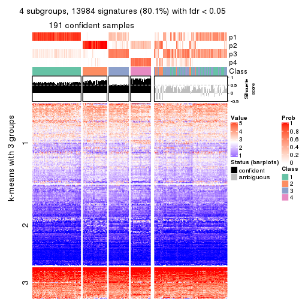</p>

</div>
<div id='tab-CV-mclust-get-signatures-no-scale-4'>
<pre><code class="r">get_signatures(res, k = 5, scale_rows = FALSE)
</code></pre>

<p></p>

</div>
<div id='tab-CV-mclust-get-signatures-no-scale-5'>
<pre><code class="r">get_signatures(res, k = 6, scale_rows = FALSE)
</code></pre>

<p></p>

</div>
</div>


Compare the overlap of signatures from different k:

```r
compare_signatures(res)
```


`get_signature()` returns a data frame invisibly. TO get the list of signatures, the function
call should be assigned to a variable explicitly. In following code, if `plot` argument is set
to `FALSE`, no heatmap is plotted while only the differential analysis is performed.

```r
# code only for demonstration
tb = get_signature(res, k = ..., plot = FALSE)
```

An example of the output of `tb` is:

```
#>   which_row         fdr    mean_1    mean_2 scaled_mean_1 scaled_mean_2 km
#> 1        38 0.042760348  8.373488  9.131774    -0.5533452     0.5164555  1
#> 2        40 0.018707592  7.106213  8.469186    -0.6173731     0.5762149  1
#> 3        55 0.019134737 10.221463 11.207825    -0.6159697     0.5749050  1
#> 4        59 0.006059896  5.921854  7.869574    -0.6899429     0.6439467  1
#> 5        60 0.018055526  8.928898 10.211722    -0.6204761     0.5791110  1
#> 6        98 0.009384629 15.714769 14.887706     0.6635654    -0.6193277  2
...
```

The columns in `tb` are:

1. `which_row`: row indices corresponding to the input matrix.
2. `fdr`: FDR for the differential test. 
3. `mean_x`: The mean value in group x.
4. `scaled_mean_x`: The mean value in group x after rows are scaled.
5. `km`: Row groups if k-means clustering is applied to rows.


UMAP plot which shows how samples are separated.


<script>
$( function() {
	$( '#tabs-CV-mclust-dimension-reduction' ).tabs();
} );
</script>
<div id='tabs-CV-mclust-dimension-reduction'>
<ul>
<li><a href='#tab-CV-mclust-dimension-reduction-1'>k = 2</a></li>
<li><a href='#tab-CV-mclust-dimension-reduction-2'>k = 3</a></li>
<li><a href='#tab-CV-mclust-dimension-reduction-3'>k = 4</a></li>
<li><a href='#tab-CV-mclust-dimension-reduction-4'>k = 5</a></li>
<li><a href='#tab-CV-mclust-dimension-reduction-5'>k = 6</a></li>
</ul>
<div id='tab-CV-mclust-dimension-reduction-1'>
<pre><code class="r">dimension_reduction(res, k = 2, method = &quot;UMAP&quot;)
</code></pre>

<p></p>

</div>
<div id='tab-CV-mclust-dimension-reduction-2'>
<pre><code class="r">dimension_reduction(res, k = 3, method = &quot;UMAP&quot;)
</code></pre>

<p></p>

</div>
<div id='tab-CV-mclust-dimension-reduction-3'>
<pre><code class="r">dimension_reduction(res, k = 4, method = &quot;UMAP&quot;)
</code></pre>

<p></p>

</div>
<div id='tab-CV-mclust-dimension-reduction-4'>
<pre><code class="r">dimension_reduction(res, k = 5, method = &quot;UMAP&quot;)
</code></pre>

<p></p>

</div>
<div id='tab-CV-mclust-dimension-reduction-5'>
<pre><code class="r">dimension_reduction(res, k = 6, method = &quot;UMAP&quot;)
</code></pre>

<p></p>

</div>
</div>


Following heatmap shows how subgroups are split when increasing `k`:

```r
collect_classes(res)
```


If matrix rows can be associated to genes, consider to use `GO_Enrichment(res,
...)` to perform function enrichment for the signature genes.


 

---------------------------------------------------


### CV:NMF**


The object with results only for a single top-value method and a single partition method 
can be extracted as:

```r
res = res_list["CV", "NMF"]
# you can also extract it by
# res = res_list["CV:NMF"]
```

A summary of `res` and all the functions that can be applied to it:

```r
res
```

```
#> A 'ConsensusPartition' object with k = 2, 3, 4, 5, 6.
#>   On a matrix with 17469 rows and 309 columns.
#>   Top rows (1000, 2000, 3000, 4000, 5000) are extracted by 'CV' method.
#>   Subgroups are detected by 'NMF' method.
#>   Performed in total 1250 partitions by row resampling.
#>   Best k for subgroups seems to be 2.
#> 
#> Following methods can be applied to this 'ConsensusPartition' object:
#>  [1] "cola_report"             "collect_classes"         "collect_plots"          
#>  [4] "collect_stats"           "colnames"                "compare_signatures"     
#>  [7] "consensus_heatmap"       "dimension_reduction"     "functional_enrichment"  
#> [10] "get_anno_col"            "get_anno"                "get_classes"            
#> [13] "get_consensus"           "get_matrix"              "get_membership"         
#> [16] "get_param"               "get_signatures"          "get_stats"              
#> [19] "is_best_k"               "is_stable_k"             "membership_heatmap"     
#> [22] "ncol"                    "nrow"                    "plot_ecdf"              
#> [25] "rownames"                "select_partition_number" "show"                   
#> [28] "suggest_best_k"          "test_to_known_factors"
```

`collect_plots()` function collects all the plots made from `res` for all `k` (number of partitions)
into one single page to provide an easy and fast comparison between different `k`.

```r
collect_plots(res)
```


The plots are:

- The first row: a plot of the ECDF (Empirical cumulative distribution
  function) curves of the consensus matrix for each `k` and the heatmap of
  predicted classes for each `k`.
- The second row: heatmaps of the consensus matrix for each `k`.
- The third row: heatmaps of the membership matrix for each `k`.
- The fouth row: heatmaps of the signatures for each `k`.

All the plots in panels can be made by individual functions and they are
plotted later in this section.

`select_partition_number()` produces several plots showing different
statistics for choosing "optimized" `k`. There are following statistics:

- ECDF curves of the consensus matrix for each `k`;
- 1-PAC. [The PAC
  score](https://en.wikipedia.org/wiki/Consensus_clustering#Over-interpretation_potential_of_consensus_clustering)
  measures the proportion of the ambiguous subgrouping.
- Mean silhouette score.
- Concordance. The mean probability of fiting the consensus class ids in all
  partitions.
- Area increased. Denote $A_k$ as the area under the ECDF curve for current
  `k`, the area increased is defined as $A_k - A_{k-1}$.
- Rand index. The percent of pairs of samples that are both in a same cluster
  or both are not in a same cluster in the partition of k and k-1.
- Jaccard index. The ratio of pairs of samples are both in a same cluster in
  the partition of k and k-1 and the pairs of samples are both in a same
  cluster in the partition k or k-1.

The detailed explanations of these statistics can be found in [the cola
vignette](http://bioconductor.org/packages/devel/bioc/vignettes/cola/inst/doc/cola.html#toc_13).

Generally speaking, lower PAC score, higher mean silhouette score or higher
concordance corresponds to better partition. Rand index and Jaccard index
measure how similar the current partition is compared to partition with `k-1`.
If they are too similar, we won't accept `k` is better than `k-1`.

```r
select_partition_number(res)
```


The numeric values for all these statistics can be obtained by `get_stats()`.

```r
get_stats(res)
```

```
#>   k 1-PAC mean_silhouette concordance area_increased  Rand Jaccard
#> 2 2 1.000           0.963       0.985         0.4227 0.575   0.575
#> 3 3 0.560           0.661       0.857         0.4702 0.786   0.639
#> 4 4 0.689           0.727       0.871         0.1522 0.817   0.581
#> 5 5 0.715           0.740       0.833         0.0917 0.868   0.590
#> 6 6 0.729           0.695       0.814         0.0399 0.910   0.636
```

`suggest_best_k()` suggests the best $k$ based on these statistics. The rules are as follows:

- All $k$ with Jaccard index larger than 0.95 are removed because the increase of
  the partition number does not provides enough extra information. If all $k$ are removed,
  the best $k$ is assigned by `NA`.
- For $k$ with 1-PAC larger than 0.9, the maximal $k$ is taken as the "best k". Other $k$ is called "optional k".
- If it does not fit the second rule. The $k$ with the highest vote of highest
  1-PAC, mean silhouette and concordance is taken as the "best k".

```r
suggest_best_k(res)
```

```
#> [1] 2
```


Following shows the table of the partitions (You need to click the **show/hide
code output** link to see it). The membership matrix (columns with name `p*`)
is inferred by
[`clue::cl_consensus()`](https://www.rdocumentation.org/link/cl_consensus?package=clue)
function with the `SE` method. Basically the value in the membership matrix
represents the probability to belong to a certain group. The finall class
label for an item is determined with the group with highest probability it
belongs to.

In `get_classes()` function, the entropy is calculated from the membership
matrix and the silhouette score is calculated from the consensus matrix.


<script>
$( function() {
	$( '#tabs-CV-NMF-get-classes' ).tabs();
} );
</script>
<div id='tabs-CV-NMF-get-classes'>
<ul>
<li><a href='#tab-CV-NMF-get-classes-1'>k = 2</a></li>
<li><a href='#tab-CV-NMF-get-classes-2'>k = 3</a></li>
<li><a href='#tab-CV-NMF-get-classes-3'>k = 4</a></li>
<li><a href='#tab-CV-NMF-get-classes-4'>k = 5</a></li>
<li><a href='#tab-CV-NMF-get-classes-5'>k = 6</a></li>
</ul>

<div id='tab-CV-NMF-get-classes-1'>
<p><a id='tab-CV-NMF-get-classes-1-a' style='color:#0366d6' href='#'>show/hide code output</a></p>
<pre><code class="r">cbind(get_classes(res, k = 2), get_membership(res, k = 2))
</code></pre>

<pre><code>#&gt;                                      class entropy silhouette    p1    p2
#&gt; 7826AE44-B03A-4528-9CB5-7421E592AE36     2  0.4161      0.891 0.084 0.916
#&gt; 0DC2197B-2FEA-48EB-953E-8E44E1933757     1  0.0000      0.991 1.000 0.000
#&gt; 87ABB098-8C1E-4677-8C31-48B71EFE41C7     1  0.5178      0.866 0.884 0.116
#&gt; EC0154E7-7A27-4535-83AE-6B379E99A93C     1  0.0000      0.991 1.000 0.000
#&gt; 78F79407-D49F-4FA2-B09F-0665C502827C     1  0.0000      0.991 1.000 0.000
#&gt; 03E81178-E971-4E91-8BED-D8273EA1425C     1  0.0000      0.991 1.000 0.000
#&gt; 62FCAEFF-16D8-4019-84B6-18EC3A88BC32     2  0.0000      0.969 0.000 1.000
#&gt; 722C1284-5983-4CC1-B19C-214C2DE6F8A6     2  0.0000      0.969 0.000 1.000
#&gt; 54E42A64-B350-4A94-8FED-C9BC1872660E     1  0.0000      0.991 1.000 0.000
#&gt; 53062969-D209-490B-9C9B-5D297625E2AE     1  0.0000      0.991 1.000 0.000
#&gt; B710293C-41D3-4A2E-8104-5402F91DD859     1  0.0000      0.991 1.000 0.000
#&gt; 73CB1D05-7AE4-457D-B4EF-25AC5C1F2132     1  0.0000      0.991 1.000 0.000
#&gt; B055A70B-3003-47CB-BDAA-6378C000BF24     1  0.0000      0.991 1.000 0.000
#&gt; 46C3A870-E37A-42CB-8C0C-6ACACEAC1ADC     2  0.0000      0.969 0.000 1.000
#&gt; E8E6270E-F26D-4F2E-A63E-7885BDE05FDB     1  0.0376      0.987 0.996 0.004
#&gt; C4A5EBA2-9091-4D12-BDC8-B84B122022B9     1  0.0000      0.991 1.000 0.000
#&gt; 5B1839C4-549D-41D1-B559-3C6D2A1528CE     1  0.0000      0.991 1.000 0.000
#&gt; A0DF05EB-DC44-4492-9A8A-F278F7B0C266     1  0.0000      0.991 1.000 0.000
#&gt; B5182F49-70F2-45B7-82DE-C6DA68145EEA     1  0.0000      0.991 1.000 0.000
#&gt; C204D355-B876-4341-A111-36D48CBDD2A8     1  0.0000      0.991 1.000 0.000
#&gt; 7B070AAA-EF97-4D3B-AA19-EEC170C7927D     2  0.0000      0.969 0.000 1.000
#&gt; 05A8A881-F8EE-48A2-B11C-A08D7D80CE18     1  0.0000      0.991 1.000 0.000
#&gt; BA59EF50-CFE9-456D-B1B6-67D0945004F6     1  0.0000      0.991 1.000 0.000
#&gt; AD97B334-E034-4D33-A4D5-48C32D5D521C     1  0.0000      0.991 1.000 0.000
#&gt; 51DA2568-32EA-4668-9876-4B6E7CA68860     1  0.0000      0.991 1.000 0.000
#&gt; 78C26A05-2084-494D-83D3-C52C1B800F4C     1  0.0000      0.991 1.000 0.000
#&gt; 2B5DD791-7692-4721-9519-7D7D49B52570     1  0.0000      0.991 1.000 0.000
#&gt; C0BBE26A-79C8-4392-9978-7C420B3786B5     1  0.0000      0.991 1.000 0.000
#&gt; F35A8359-3A7A-414F-8A5C-D278F3B45387     2  0.0000      0.969 0.000 1.000
#&gt; 8C9BA49C-1270-491D-A234-AE1B1C0609BA     2  0.0000      0.969 0.000 1.000
#&gt; CA104B57-B160-4148-8A0A-D34BB3E8D88A     1  0.0000      0.991 1.000 0.000
#&gt; 877E18A5-6A7A-4E29-9871-DC7EA14A5F27     1  0.0000      0.991 1.000 0.000
#&gt; 904EDF2E-411E-43BD-901D-46129AFA283A     1  0.0000      0.991 1.000 0.000
#&gt; FD9F5A9B-2BEB-4D31-9A2D-8D4B4ECBB478     1  0.0000      0.991 1.000 0.000
#&gt; 2E206314-9928-456E-B7C6-893DC0E3C7C2     2  0.0000      0.969 0.000 1.000
#&gt; 913DB655-2C7F-4369-83DE-9257F04CF39B     1  0.8443      0.621 0.728 0.272
#&gt; 72B5B724-FEB5-43BD-83F6-2E2152DDD800     1  0.0000      0.991 1.000 0.000
#&gt; 920B547C-6898-446C-AAAF-F4ED96E40AAB     2  0.0000      0.969 0.000 1.000
#&gt; 847F796A-8CD6-4013-A0FB-26F4FC3EAF0D     1  0.0000      0.991 1.000 0.000
#&gt; C4D64E7A-33F7-4CFC-9FD3-D6AA3D8EFAA7     1  0.0000      0.991 1.000 0.000
#&gt; EABA0B17-8E19-48C5-BF62-2A45C9632807     2  0.0000      0.969 0.000 1.000
#&gt; 7263CBA8-CE37-4531-A795-9324C6D2A672     1  0.0000      0.991 1.000 0.000
#&gt; 6D3CC3AC-618B-414A-B640-169C735A6568     2  0.5946      0.826 0.144 0.856
#&gt; 710C05C7-F9CE-45FA-A8CC-29DE2903E04F     1  0.0000      0.991 1.000 0.000
#&gt; 3D631A56-2C55-48EA-A667-BA46023C9D50     1  0.0000      0.991 1.000 0.000
#&gt; F1C65F64-AF05-4875-B7E4-60FFF56A3F46     1  0.0000      0.991 1.000 0.000
#&gt; E5DF76E7-A765-4E07-B87A-06168BF66C5F     1  0.0000      0.991 1.000 0.000
#&gt; 5C8C8A6E-40D4-4F82-AC3D-90CFDEE15C0A     2  0.0000      0.969 0.000 1.000
#&gt; 0117CBB9-1BF9-48B1-BE6E-A9A770FF8721     1  0.0000      0.991 1.000 0.000
#&gt; 31EF66E5-419A-44C3-BB2A-B69B52FFCECC     2  0.0000      0.969 0.000 1.000
#&gt; C149CEF5-61F3-4B53-B8A9-8244B673EBD0     1  0.0000      0.991 1.000 0.000
#&gt; 0AF351D0-4EC5-4275-AA0A-4FA2AF8A9C85     2  0.0000      0.969 0.000 1.000
#&gt; B507E82F-6680-497B-A014-033EDD7A2E03     1  0.0000      0.991 1.000 0.000
#&gt; F941890E-AB33-478F-8C97-1C785DD9428F     1  0.0000      0.991 1.000 0.000
#&gt; 7987E019-8FED-469B-A6C1-34EE430A60C3     1  0.0000      0.991 1.000 0.000
#&gt; 76084AA6-19BF-4605-B6A1-73F1D4BADAF9     1  0.2043      0.960 0.968 0.032
#&gt; 329807F7-E0D4-4F53-94E8-E4080E90CB47     1  0.0000      0.991 1.000 0.000
#&gt; 1B6505FF-C1A7-4DD0-9827-41A0A3A28F3E     1  0.0000      0.991 1.000 0.000
#&gt; 49778E92-B5D3-4AD9-A1AF-3B722D631B96     2  0.0000      0.969 0.000 1.000
#&gt; A22892DE-0AF4-4B63-9513-1D6825059040     1  0.0000      0.991 1.000 0.000
#&gt; 6D77ECAE-A715-4ADD-97D8-A916DC31A4EA     1  0.0000      0.991 1.000 0.000
#&gt; 09758B6F-1B2D-4AED-8913-696097069409     2  0.8909      0.577 0.308 0.692
#&gt; 8B709DB4-0B28-42F1-A7C5-106F5809BEA2     1  0.0000      0.991 1.000 0.000
#&gt; F2B356FA-79CD-4867-8ABF-84C90A493A75     1  0.0000      0.991 1.000 0.000
#&gt; 131213AD-0313-4DF1-B013-CE67ED262C37     2  0.0000      0.969 0.000 1.000
#&gt; D94F7E81-0F60-473B-AD4A-0AC13508BDE2     1  0.7674      0.707 0.776 0.224
#&gt; 29C17355-D646-48DA-9E54-7B6DD85DD610     1  0.0000      0.991 1.000 0.000
#&gt; B8BD866A-2A7C-45C3-96BB-9AB892D26AE5     1  0.0000      0.991 1.000 0.000
#&gt; 13EFD045-AD61-41EE-9896-67BFA4FC8C09     1  0.0000      0.991 1.000 0.000
#&gt; 2655F609-B3BB-4D01-B421-D5F4B1232EC8     2  0.0000      0.969 0.000 1.000
#&gt; 04BC7A52-C67F-42CB-8672-D3C51A20F2BA     1  0.0000      0.991 1.000 0.000
#&gt; 45472BD4-DBDB-41FE-B0E3-2440880E1DE6     1  0.0000      0.991 1.000 0.000
#&gt; B87FFFCD-CB57-4ACD-9C74-AB188984BBB2     1  0.0000      0.991 1.000 0.000
#&gt; 5271374C-13CD-4BFE-AC6D-C95AFE491322     1  0.0000      0.991 1.000 0.000
#&gt; E3372ACE-C7C8-43E5-B30A-1F2D662D8170     1  0.0000      0.991 1.000 0.000
#&gt; B08DF564-E4D0-4540-8160-93B3981DF1D8     1  0.0000      0.991 1.000 0.000
#&gt; 61A7D1B9-FC5A-4B9C-989F-936CDA948C27     1  0.0000      0.991 1.000 0.000
#&gt; 74E768C1-8766-46AC-AAB4-D79E5049F76A     2  0.0000      0.969 0.000 1.000
#&gt; 0CEA28F0-D7F0-4EB7-A23F-0C5CA6245971     1  0.3431      0.927 0.936 0.064
#&gt; 95C4EFF6-147C-48EC-A2C1-16B8F12AEEF2     2  0.0000      0.969 0.000 1.000
#&gt; C9A78BEA-D455-4F5E-8B7B-19BCB42887E7     1  0.0000      0.991 1.000 0.000
#&gt; DB970740-9AC1-4C10-9658-8A77B1C390DD     2  0.0000      0.969 0.000 1.000
#&gt; 883FBD37-0CA0-4562-8925-72ACC1EE93D9     1  0.0000      0.991 1.000 0.000
#&gt; 9FE1D006-49F2-471E-91E6-AF0414C24479     1  0.0000      0.991 1.000 0.000
#&gt; 11816CC6-8C8B-49C0-99EE-896377BCFCCD     1  0.0000      0.991 1.000 0.000
#&gt; 063FC5C8-4318-4ECC-9CA0-1976CBC8ACB6     1  0.0000      0.991 1.000 0.000
#&gt; E0F085CC-B90D-4FDE-B60E-C613971BAA00     1  0.0000      0.991 1.000 0.000
#&gt; 62361DA2-E4EE-46DA-BB1F-C51DCA9307CC     2  0.0000      0.969 0.000 1.000
#&gt; 1BA16D48-B09E-4699-A1AD-2FFECE4F3CDB     2  0.0000      0.969 0.000 1.000
#&gt; 3E4F14E9-60AE-4F17-9BA7-2A02E908204A     1  0.0000      0.991 1.000 0.000
#&gt; 79226DD7-BC85-4B8E-BFF8-B1E073129D34     1  0.0000      0.991 1.000 0.000
#&gt; D47D0936-826F-4D54-9225-F71B95357438     1  0.0000      0.991 1.000 0.000
#&gt; 0AE02B91-574C-4165-BA39-E9D7C1A870A2     2  0.0000      0.969 0.000 1.000
#&gt; DED8E9DF-CEFE-45ED-9374-EF9925A135C4     1  0.0000      0.991 1.000 0.000
#&gt; D587A993-3C47-4D4C-B744-59169D4F7451     1  0.0000      0.991 1.000 0.000
#&gt; 6BCA24E6-440F-42C5-ABE5-66C37B713A39     1  0.0000      0.991 1.000 0.000
#&gt; 86A5EDFB-9D06-4FED-BF57-F8D74A68E156     2  0.9850      0.269 0.428 0.572
#&gt; B9BD5134-2F6A-4454-8F83-69B63F9AE114     1  0.1843      0.964 0.972 0.028
#&gt; 082DA9E1-A40D-482B-8E21-A93BA97185F0     1  0.0000      0.991 1.000 0.000
#&gt; 16A8343A-1203-44FB-9F03-05CC7C71B4CC     1  0.0000      0.991 1.000 0.000
#&gt; 00439565-02CE-4BF5-956D-7078B51C0947     1  0.0000      0.991 1.000 0.000
#&gt; 7B2BD361-2BF1-4E97-BC08-457F5A9C2682     2  0.0000      0.969 0.000 1.000
#&gt; C1D8439A-D527-47F6-ADC1-25867B65DA21     2  0.0000      0.969 0.000 1.000
#&gt; D9096909-1439-462D-B69C-CAD1BF4F420C     1  0.0000      0.991 1.000 0.000
#&gt; 7822EA86-35A1-4285-9429-2B63111B9885     1  0.0000      0.991 1.000 0.000
#&gt; 6FD0CFC8-AC8D-4CF1-8C33-833AD98A30EF     2  0.0000      0.969 0.000 1.000
#&gt; A451F278-5E83-4BC6-9B15-3AA2117B99B6     2  0.0000      0.969 0.000 1.000
#&gt; 6EC25686-4547-459C-9E01-7EDF8DAECE35     1  0.0000      0.991 1.000 0.000
#&gt; 5D2F1EEA-2BA8-4C3A-8436-544EE1D23E7E     1  0.0000      0.991 1.000 0.000
#&gt; 675A4293-A4CE-4307-B00B-DFC4D44A87C6     2  0.0000      0.969 0.000 1.000
#&gt; 6FBE0AEF-476A-42B2-A857-846CF1ED92B6     2  0.0000      0.969 0.000 1.000
#&gt; 7139D616-1A15-4288-A9AE-411856A4A76D     1  0.4431      0.893 0.908 0.092
#&gt; 46D7F8C1-D5C5-40CC-BEF5-2E590A847BD9     1  0.0000      0.991 1.000 0.000
#&gt; 984C44D3-4F5F-44C9-BCD9-C991EBC1FCB8     1  0.0000      0.991 1.000 0.000
#&gt; 83FE52E0-2DC2-4580-8BB2-FBCBEE4AC240     1  0.0000      0.991 1.000 0.000
#&gt; 0923F9CB-DF6F-4BAA-A5F8-0F83CE60D1ED     1  0.0000      0.991 1.000 0.000
#&gt; 1DEB5206-78CC-4EB5-BCD5-85A6A5B4E273     1  0.0000      0.991 1.000 0.000
#&gt; E4DB18DA-EB0C-4B2F-9566-7F72222B16D4     1  0.0000      0.991 1.000 0.000
#&gt; F7456312-1309-4B2F-875D-0F90CDF3EC35     1  0.0000      0.991 1.000 0.000
#&gt; 9A25E5D8-0706-4960-A76B-BCD0AC93E4FA     1  0.0000      0.991 1.000 0.000
#&gt; 5A41FE8F-FFB3-4B87-BF11-A570C184096D     1  0.0000      0.991 1.000 0.000
#&gt; 33F84E63-3F6C-4867-ADB1-A0DF39F1295B     1  0.0000      0.991 1.000 0.000
#&gt; D6A644F5-D1D0-4A8D-94C4-EE6C3ECE7430     1  0.0000      0.991 1.000 0.000
#&gt; 2A5848CC-A9A2-4AA8-A752-321273E62CF0     1  0.0000      0.991 1.000 0.000
#&gt; 7CA6358B-FC8A-4675-B092-9E061038FC83     2  0.9710      0.369 0.400 0.600
#&gt; A4C2F4BC-5C62-4B1F-9AB8-46D9468EF523     2  0.0000      0.969 0.000 1.000
#&gt; 8AF4EB7F-418D-4CC9-A9B8-A93A4C1A173B     2  0.0000      0.969 0.000 1.000
#&gt; E5048887-70C8-468F-881E-2EC55F6E6F3B     1  0.0000      0.991 1.000 0.000
#&gt; 1BADCC7C-C4D8-4C34-9534-59D622C7A2A2     1  0.0000      0.991 1.000 0.000
#&gt; 02CE7DF7-64BD-4297-A240-A5B9EE8771D3     1  0.0000      0.991 1.000 0.000
#&gt; CBF6E96A-F56C-4C87-B851-D319930BAAB8     1  0.7883      0.679 0.764 0.236
#&gt; 48F6B774-CFD2-4DDF-B7A2-696596413C3F     1  0.0000      0.991 1.000 0.000
#&gt; 41D88C3E-5848-4B09-8A77-EAE6AC4EC6B0     2  0.0000      0.969 0.000 1.000
#&gt; BDF79CC0-00C7-49C1-900B-AB065A733B17     1  0.0000      0.991 1.000 0.000
#&gt; A894D686-BFC7-4AEE-A794-DBE718C6B6F6     2  0.0000      0.969 0.000 1.000
#&gt; 0712029E-3765-4272-BE5B-B6C8BCCC0F0F     2  0.0000      0.969 0.000 1.000
#&gt; 7B051855-9B09-4887-9BC0-9F077537938E     1  0.0000      0.991 1.000 0.000
#&gt; EF357C46-5C3C-4F51-9383-FF7694D07B97     2  0.0000      0.969 0.000 1.000
#&gt; 9492A322-37CA-4582-AC68-66B5D80778AF     2  0.0000      0.969 0.000 1.000
#&gt; 993399A4-1B9F-4258-B2D0-155AD58A2E82     1  0.0000      0.991 1.000 0.000
#&gt; 7B7DC93D-5494-4E69-BE07-2967887182F9     1  0.0000      0.991 1.000 0.000
#&gt; 29BCBA51-2580-473D-9CF7-BEDBD0DBAD1B     2  0.0000      0.969 0.000 1.000
#&gt; 40855647-E942-4F32-90B7-BEB921929BFB     1  0.0000      0.991 1.000 0.000
#&gt; 0DC723D0-7C68-4495-A4B9-2DF2FF19AB14     2  0.0000      0.969 0.000 1.000
#&gt; 7540005F-57E0-4E2E-A8A2-BEF2B0F333B1     2  0.0000      0.969 0.000 1.000
#&gt; EB1DDB14-4076-4C2C-B911-390C17C21486     1  0.0000      0.991 1.000 0.000
#&gt; 9EA70EC4-8BA0-4E3D-B3CB-A68D19E89868     1  0.0000      0.991 1.000 0.000
#&gt; B04E2E50-0A6E-4224-A825-1714D12E5669     2  0.0000      0.969 0.000 1.000
#&gt; B0BF5E01-536D-40FF-9C24-CBBD611E2FC2     1  0.0000      0.991 1.000 0.000
#&gt; 7B6B1788-B297-4442-B6BE-B7CE8754491E     1  0.0000      0.991 1.000 0.000
#&gt; A090D00C-34DF-4906-A517-4803C4C9A332     1  0.0000      0.991 1.000 0.000
#&gt; 340D44A6-9BEA-412C-9973-D9ABD6692255     1  0.0000      0.991 1.000 0.000
#&gt; E8D0D1E7-E5A8-4014-80C1-0245F90F4358     2  0.0000      0.969 0.000 1.000
#&gt; 19EA1494-8572-40E1-B9BB-3739F47B607D     1  0.0000      0.991 1.000 0.000
#&gt; 1C1B4793-8DAF-4763-BA4D-C4E869A4ED35     2  0.8763      0.600 0.296 0.704
#&gt; 45BF59B3-95BD-4196-ABAA-4C4F0DB38572     2  0.0000      0.969 0.000 1.000
#&gt; 47B5A2A7-7E13-4558-99D2-067F5075C6A4     1  0.0000      0.991 1.000 0.000
#&gt; E94638E8-CB51-4FBB-8BCB-4BFD7A812291     1  0.0000      0.991 1.000 0.000
#&gt; A17352A8-0D3C-4545-8136-7DAE2FB0E102     2  0.0000      0.969 0.000 1.000
#&gt; B18A6F95-D4ED-416B-B5A1-9A4934865D0D     2  0.0000      0.969 0.000 1.000
#&gt; 33E92C5F-0C42-4549-AD5B-0A064182A272     1  0.0000      0.991 1.000 0.000
#&gt; E041B375-3E60-4F18-A6EF-D1C249E3B8EE     1  0.0000      0.991 1.000 0.000
#&gt; EDF90AF6-6C64-4BD2-AADF-8D7D188650B2     2  0.0000      0.969 0.000 1.000
#&gt; 569320D2-316C-4E2D-B7B3-D7D5C4DAD42D     1  0.0000      0.991 1.000 0.000
#&gt; AFFB223D-DAE9-4567-9EF2-8E4DF9D8782D     2  0.0000      0.969 0.000 1.000
#&gt; 56FC9454-0A6A-4CC3-95C4-BE0E0D0BAFCE     2  0.0000      0.969 0.000 1.000
#&gt; 43226365-FAEF-46C5-AF1B-5C6C2BED84FF     1  0.3879      0.913 0.924 0.076
#&gt; 1536110A-B42A-4A84-9474-9895321FDCE9     2  0.0000      0.969 0.000 1.000
#&gt; 812255DD-536B-4216-90B1-27D5AB339BE2     1  0.0000      0.991 1.000 0.000
#&gt; 5D4563D6-68B7-4C9D-A3F4-AA7D45D5112C     2  0.0000      0.969 0.000 1.000
#&gt; BAA39781-DB94-473C-98B1-FA6CD3E1C67A     1  0.0000      0.991 1.000 0.000
#&gt; C1411CDA-814D-4E21-8929-C0F77858828F     1  0.0000      0.991 1.000 0.000
#&gt; EFE2F248-C13E-4E8D-9153-8C903848AC4A     1  0.3274      0.930 0.940 0.060
#&gt; D3939C84-D1D6-4060-9F91-AEB222A9BDD5     1  0.0000      0.991 1.000 0.000
#&gt; EABD2987-8C1E-49E5-94AF-C0BDE5335A48     1  0.0000      0.991 1.000 0.000
#&gt; F4BE2ABE-2CEB-4A6A-B8EC-0355F8C63B9B     1  0.0000      0.991 1.000 0.000
#&gt; 627BC251-D217-4955-B718-6B9D6DEA1756     1  0.0000      0.991 1.000 0.000
#&gt; 31B54613-A20E-4039-BB8B-9B52104CE418     1  0.0000      0.991 1.000 0.000
#&gt; 3F292B7C-A535-4DBD-BC20-CB4F85A1C94B     1  0.0000      0.991 1.000 0.000
#&gt; BEA2A5EB-EEA9-4F31-AC38-810E04CE124B     2  0.0000      0.969 0.000 1.000
#&gt; 99D84D46-19DA-43F1-B639-DCE9953F1529     2  0.0000      0.969 0.000 1.000
#&gt; 4588817E-1068-4A78-86B6-4674A0112DDA     1  0.0000      0.991 1.000 0.000
#&gt; 6AC633BD-BEC1-4750-94E3-378972DAB6B3     2  0.0000      0.969 0.000 1.000
#&gt; 09E17C6E-7EDE-4DDF-B5ED-2521AF870C9A     1  0.0000      0.991 1.000 0.000
#&gt; 58D9C750-26A2-4B7C-84C4-13D7AFB4C5EA     1  0.0000      0.991 1.000 0.000
#&gt; DF28E138-E222-4F77-9B61-69E601CA7E60     2  0.0000      0.969 0.000 1.000
#&gt; FEA489A8-E423-4266-AADA-9BAAB29AB94B     1  0.0000      0.991 1.000 0.000
#&gt; F3FCC207-15CD-41EA-A3EF-F5D2C12AC373     1  0.0000      0.991 1.000 0.000
#&gt; 53DD7AFB-A258-4643-A501-BACC95D17A50     2  0.0000      0.969 0.000 1.000
#&gt; D850B2A1-1F8A-4A44-A0CF-8D9DD4A1889A     2  0.0000      0.969 0.000 1.000
#&gt; B3F746DC-E487-4305-9F30-825D1520E8FD     2  0.0000      0.969 0.000 1.000
#&gt; BE38240A-F7C2-439F-9AAE-51C8A340F310     1  0.0000      0.991 1.000 0.000
#&gt; A9022D9E-1D30-49EE-8552-1364A8027F34     1  0.0000      0.991 1.000 0.000
#&gt; 0E8A56EE-D9A2-48A5-B793-A358BE1E4EFA     1  0.0000      0.991 1.000 0.000
#&gt; 51667574-318E-4BDB-8F42-8512A4C1B84F     1  0.0000      0.991 1.000 0.000
#&gt; B0A442C9-67E4-4534-8A5C-D6D73F42358C     1  0.0000      0.991 1.000 0.000
#&gt; 25A5BC09-0D88-4385-87AF-997F9018522D     2  0.0000      0.969 0.000 1.000
#&gt; 344B9631-AAA5-4302-8747-D584345D9131     1  0.0000      0.991 1.000 0.000
#&gt; 1C3795AD-6306-4892-95F5-92DF3375D46A     1  0.0000      0.991 1.000 0.000
#&gt; 17BB221D-8BF9-4391-83DD-423AE1E03651     1  0.0000      0.991 1.000 0.000
#&gt; 297611E9-9555-4BCA-A723-02E846ACC23A     1  0.0000      0.991 1.000 0.000
#&gt; AD7FF180-1EAC-4783-8A62-E9626B96DD9F     2  0.6623      0.791 0.172 0.828
#&gt; FD544083-9BD5-4036-BD81-0352B67CC45C     1  0.0000      0.991 1.000 0.000
#&gt; 879A74D5-5B29-418D-A0F4-8E88D6384008     1  0.0000      0.991 1.000 0.000
#&gt; 43CD982C-13C0-4A52-803A-9A3A3FAE09BC     1  0.0000      0.991 1.000 0.000
#&gt; DCD0313D-5206-4111-8743-A8A0227257D9     1  0.0000      0.991 1.000 0.000
#&gt; 331A9160-D730-45DD-A985-C6CAC03035ED     1  0.0000      0.991 1.000 0.000
#&gt; 9EEECA0E-530D-4724-B016-A716F0782148     2  0.9944      0.203 0.456 0.544
#&gt; B3073976-CA3F-4115-9243-8C2D9E1B975D     1  0.0000      0.991 1.000 0.000
#&gt; 77B3C9B4-1A7F-41BB-A37D-01EF80E933CC     2  0.0000      0.969 0.000 1.000
#&gt; C0C26822-2E9F-4FB0-81D4-575027C8B71C     2  0.0000      0.969 0.000 1.000
#&gt; F1FCE328-2B3B-499A-888D-0E66A017E8B0     1  0.0000      0.991 1.000 0.000
#&gt; F069DAD6-F1EB-42F7-8252-F3F6EC46CC3E     1  0.0000      0.991 1.000 0.000
#&gt; 99CC822E-8C98-4EEC-BB58-AEF76A0B5332     1  0.0000      0.991 1.000 0.000
#&gt; C86EBD08-53F2-4972-801A-74970FDD6A62     1  0.0000      0.991 1.000 0.000
#&gt; F07326F2-C1D6-4D5A-9693-25C3A04B0EC2     1  0.0000      0.991 1.000 0.000
#&gt; 8ACBD428-7713-48D9-810A-43C9CD191A73     2  0.0000      0.969 0.000 1.000
#&gt; 3D3501B4-1A43-4FA7-90A2-CCEBF66BFD4A     1  0.0000      0.991 1.000 0.000
#&gt; DD51C17C-300F-44A4-955A-C9BC85417842     1  0.4431      0.895 0.908 0.092
#&gt; 58FF391C-1D83-426C-8F92-C15F78F56C95     1  0.0000      0.991 1.000 0.000
#&gt; ACE65C6E-2B10-4972-91B4-9199DD4B179D     1  0.0000      0.991 1.000 0.000
#&gt; B2088466-FA5D-491C-9982-99B33683E66F     2  0.0000      0.969 0.000 1.000
#&gt; D47AF416-1687-4FE0-A235-8815B6E8EB0B     1  0.0000      0.991 1.000 0.000
#&gt; 4DCAD07F-CC43-46F6-B2F3-EDBF3EDD1045     2  0.0000      0.969 0.000 1.000
#&gt; AAAE0BD9-63FC-4A0E-A27E-447B634BAD99     2  0.0000      0.969 0.000 1.000
#&gt; BC471AA1-52CF-4CEE-9866-34CE91404F45     2  0.0000      0.969 0.000 1.000
#&gt; 81D3EE3F-AC11-404F-8092-307F0DC12198     1  0.0000      0.991 1.000 0.000
#&gt; 8C02026C-C25E-406B-B8B8-A1A82362AE79     2  0.0000      0.969 0.000 1.000
#&gt; 6A005F2A-A0C1-4CA4-B15B-96B08F013874     1  0.0000      0.991 1.000 0.000
#&gt; B55743F2-4D63-4375-85D3-F58281CFD852     1  0.0000      0.991 1.000 0.000
#&gt; 24F98393-C817-4D0E-A7DB-05D2B5C71F40     1  0.0000      0.991 1.000 0.000
#&gt; 2C2AEF1D-4112-4EC7-9027-5E3FD26E8802     1  0.0000      0.991 1.000 0.000
#&gt; 8BAC3CB5-2987-4349-8AE8-B83DDD16CA3C     1  0.5178      0.865 0.884 0.116
#&gt; ED9C74E6-92FC-4E58-8FCE-1761DEA0C977     1  0.0000      0.991 1.000 0.000
#&gt; BA732ED4-F6BA-404E-BA3C-CA558FAD866A     1  0.0000      0.991 1.000 0.000
#&gt; E750385A-12D9-4A88-B4DF-C1306B5EF3B7     2  0.0000      0.969 0.000 1.000
#&gt; 6B1DC5E4-5F82-4395-913F-6AEDB5B63188     1  0.0000      0.991 1.000 0.000
#&gt; A7C12D37-FD50-4674-A054-1774F4E5C3B3     1  0.0000      0.991 1.000 0.000
#&gt; 2155C764-2063-4D9C-9ACD-96AA73475F5E     1  0.0000      0.991 1.000 0.000
#&gt; DE23CC15-A95E-4119-9B3C-8EEC45900D11     2  0.0000      0.969 0.000 1.000
#&gt; 5DB1DCAD-638E-48A4-9F40-3D6268FDEC33     2  0.0000      0.969 0.000 1.000
#&gt; 34AF0341-73D7-4080-AAEB-4C1541C2569F     1  0.0000      0.991 1.000 0.000
#&gt; B60D4235-44AF-4BA4-98C0-BCCDC28E90B9     2  0.0000      0.969 0.000 1.000
#&gt; CF463D89-2C9F-4257-BF04-8BC1CD40EA7D     2  0.0000      0.969 0.000 1.000
#&gt; EF6C8165-484A-4530-AEDF-93DCC4A8455D     1  0.0000      0.991 1.000 0.000
#&gt; B9F6B5E4-4D10-49B8-A8FE-8F33C5A62CBF     1  0.0000      0.991 1.000 0.000
#&gt; CE539000-92D7-4622-9C8D-BC6E01310681     2  0.0000      0.969 0.000 1.000
#&gt; D3BBC405-A22A-4009-ABF6-96FEEE653051     2  0.0000      0.969 0.000 1.000
#&gt; 0B3C86BD-0D20-4408-9BE3-05658729505F     2  0.0000      0.969 0.000 1.000
#&gt; 9B9C5071-7C3F-416C-B91C-6F5966747F54     1  0.0000      0.991 1.000 0.000
#&gt; A9469A4A-C5F9-4681-A916-A26F0B4307BA     1  0.0000      0.991 1.000 0.000
#&gt; A31B57E4-E30B-4A1B-829D-1B47D9CEC041     2  0.0000      0.969 0.000 1.000
#&gt; 647255CE-F84A-4070-B3FD-D8ACA32C4D09     1  0.0000      0.991 1.000 0.000
#&gt; 8F5E9F02-51D7-410E-B8B7-22737F2F095A     2  0.0000      0.969 0.000 1.000
#&gt; 8074A7F6-2FDE-4578-B71C-01C542D468FE     1  0.0000      0.991 1.000 0.000
#&gt; 2A946F17-F245-409E-A019-C60CDA18DC7D     1  0.0000      0.991 1.000 0.000
#&gt; 0878C381-47F9-4786-82C2-94AC840BEDCB     1  0.0000      0.991 1.000 0.000
#&gt; 54504893-92C5-4328-85A8-2A882680B5E0     1  0.0000      0.991 1.000 0.000
#&gt; 0A27D1BE-E5DD-459A-A51F-6D8AAF7CFEB4     1  0.0000      0.991 1.000 0.000
#&gt; 89ED5A3E-CAC0-4AB4-B858-A3CD8F34DBD5     2  0.0000      0.969 0.000 1.000
#&gt; ACEEB0A5-AADB-4EF9-8710-4BAF95522CEA     1  0.0000      0.991 1.000 0.000
#&gt; 02C74D81-5976-4252-BC6C-B10E934DECA2     1  0.0000      0.991 1.000 0.000
#&gt; D365A238-4739-4B54-9608-DC548F21C04E     1  0.0000      0.991 1.000 0.000
#&gt; F70F7ED5-A3B7-4210-95AD-DEFA0A565F06     1  0.0000      0.991 1.000 0.000
#&gt; A92C23A9-BC25-4025-9501-6D5FF8E2A502     2  0.1184      0.955 0.016 0.984
#&gt; ECE9BBF4-840E-47A6-8378-0B6C4A2369D3     1  0.0000      0.991 1.000 0.000
#&gt; 38749490-0FCF-4B33-9EBC-8F86C2D9E4AF     1  0.0000      0.991 1.000 0.000
#&gt; 02ABB64E-768B-4999-A899-EEE573D5F186     1  0.0000      0.991 1.000 0.000
#&gt; C1C467A8-18B1-4C3F-AC45-33359ED6FDC4     2  0.0000      0.969 0.000 1.000
#&gt; 78B2E4A1-9DAE-404F-AB47-1896450EF254     1  0.0000      0.991 1.000 0.000
#&gt; CCDB0290-91DA-4089-84A6-4434BA028D30     1  0.0000      0.991 1.000 0.000
#&gt; D5041E80-20A0-4C1A-9AC1-2394F6DB6E92     1  0.0000      0.991 1.000 0.000
#&gt; 20EB9CC6-EABB-438A-9030-E766459996D1     2  0.0000      0.969 0.000 1.000
#&gt; 73E99110-9A7C-4F73-98C5-79D22CB06230     1  0.0000      0.991 1.000 0.000
#&gt; FAD8A464-9BC3-4ED9-9517-B18D36514325     2  0.7376      0.743 0.208 0.792
#&gt; 9AF0E82E-E621-437A-8D19-700532B95090     1  0.0000      0.991 1.000 0.000
#&gt; 27DA48F3-4FC1-41A3-8E49-5B25F1CCFF07     1  0.0000      0.991 1.000 0.000
#&gt; EFE5A302-D138-4044-A301-5C5FD1C24836     1  0.0000      0.991 1.000 0.000
#&gt; D3E866AC-D66A-4C07-9F47-89AF460320DE     2  0.0000      0.969 0.000 1.000
#&gt; 89C45456-9392-4EB3-9A82-A130B6702AAF     1  0.0000      0.991 1.000 0.000
#&gt; 8FF5C8FC-2565-49BE-9EE0-91A84A85AB2A     2  0.9460      0.441 0.364 0.636
#&gt; 846DF088-75D5-49CF-BDDC-27E735A08DCA     1  0.0000      0.991 1.000 0.000
#&gt; EA3A19E1-7ADE-47B6-A35A-71290967147A     2  0.0000      0.969 0.000 1.000
#&gt; B2C43D0C-732B-4C54-938F-D3C9FDA880DA     1  0.0000      0.991 1.000 0.000
#&gt; EEC856B5-9B7F-488D-975E-CE2FF7072879     1  0.9833      0.224 0.576 0.424
#&gt; 8A68C417-09CC-4FA1-BFEB-EB4B738853A4     1  0.0000      0.991 1.000 0.000
#&gt; C5DF1A0D-952C-44E2-BF83-ED57177EF60E     1  0.0000      0.991 1.000 0.000
#&gt; B5C9EA22-F758-4BD2-BD1F-282EC1078AED     2  0.0000      0.969 0.000 1.000
#&gt; 3F08AE92-3EFD-4D7F-8C5C-BFB3621F0CD6     1  0.0000      0.991 1.000 0.000
#&gt; 8F0D43F1-2199-4DBB-9B16-1E5F2CED2FEC     2  0.0000      0.969 0.000 1.000
#&gt; 54BABD8B-EA9F-4875-8594-2179B38C73BD     1  0.0000      0.991 1.000 0.000
#&gt; C149B6F8-03DC-4907-920A-F3318B8D2A1E     1  0.0000      0.991 1.000 0.000
#&gt; F93D26E2-4B45-495D-BC8E-5B592F8FDABF     1  0.0376      0.987 0.996 0.004
#&gt; C98275CD-C39A-4E14-A731-4F3EB7396665     2  0.0000      0.969 0.000 1.000
#&gt; 354DC705-216E-42F0-B29E-C1F8D6C9489A     1  0.0000      0.991 1.000 0.000
#&gt; 6752EED9-7990-433F-A206-D5398C396471     1  0.0000      0.991 1.000 0.000
#&gt; C3E94C5D-68C4-400C-B7CB-38C42E9D5FFF     1  0.2603      0.948 0.956 0.044
#&gt; CE6B6871-3ED3-44DE-A777-7558D4429057     1  0.0000      0.991 1.000 0.000
#&gt; A06E7D1E-E432-4A4C-8BB0-314304F96EDF     1  0.0376      0.987 0.996 0.004
#&gt; 1ABBEF80-508F-4247-B43D-3E549372113B     1  0.0000      0.991 1.000 0.000
#&gt; 835AAE7F-F873-4D11-8845-232D261A38DF     1  0.0000      0.991 1.000 0.000
#&gt; E98A0460-6529-4DBA-8542-1B98801D7A7D     1  0.0000      0.991 1.000 0.000
#&gt; 06A9CBF8-01D0-4720-BCE8-83F0E77C862F     1  0.0000      0.991 1.000 0.000
#&gt; 206865A9-A67C-49A6-93AD-55D06E777559     2  0.0000      0.969 0.000 1.000
#&gt; 26DABC83-DB30-452F-9BE2-366760CB138E     2  0.0000      0.969 0.000 1.000
#&gt; 9DD5272A-2D6E-4774-83E3-0CD761EDE926     1  0.0000      0.991 1.000 0.000
#&gt; 4938E366-C740-4C9C-9358-FF37997DC9EF     1  0.0000      0.991 1.000 0.000
#&gt; E2DA59C4-A47C-41E3-BC55-2D00C6EC17FB     1  0.0000      0.991 1.000 0.000
#&gt; 37349E62-0BFB-4FEA-81D0-2AB7E7625B0D     1  0.0000      0.991 1.000 0.000
</code></pre>

<script>
$('#tab-CV-NMF-get-classes-1-a').parent().next().next().hide();
$('#tab-CV-NMF-get-classes-1-a').click(function(){
  $('#tab-CV-NMF-get-classes-1-a').parent().next().next().toggle();
  return(false);
});
</script>
</div>

<div id='tab-CV-NMF-get-classes-2'>
<p><a id='tab-CV-NMF-get-classes-2-a' style='color:#0366d6' href='#'>show/hide code output</a></p>
<pre><code class="r">cbind(get_classes(res, k = 3), get_membership(res, k = 3))
</code></pre>

<pre><code>#&gt;                                      class entropy silhouette    p1    p2    p3
#&gt; 7826AE44-B03A-4528-9CB5-7421E592AE36     3  0.6045     0.0941 0.000 0.380 0.620
#&gt; 0DC2197B-2FEA-48EB-953E-8E44E1933757     3  0.3941     0.6782 0.156 0.000 0.844
#&gt; 87ABB098-8C1E-4677-8C31-48B71EFE41C7     3  0.4784     0.6377 0.200 0.004 0.796
#&gt; EC0154E7-7A27-4535-83AE-6B379E99A93C     1  0.5216     0.5904 0.740 0.000 0.260
#&gt; 78F79407-D49F-4FA2-B09F-0665C502827C     1  0.0000     0.8094 1.000 0.000 0.000
#&gt; 03E81178-E971-4E91-8BED-D8273EA1425C     1  0.0000     0.8094 1.000 0.000 0.000
#&gt; 62FCAEFF-16D8-4019-84B6-18EC3A88BC32     3  0.4504     0.5659 0.000 0.196 0.804
#&gt; 722C1284-5983-4CC1-B19C-214C2DE6F8A6     2  0.0000     0.9168 0.000 1.000 0.000
#&gt; 54E42A64-B350-4A94-8FED-C9BC1872660E     1  0.6235     0.1124 0.564 0.000 0.436
#&gt; 53062969-D209-490B-9C9B-5D297625E2AE     1  0.5926     0.4499 0.644 0.000 0.356
#&gt; B710293C-41D3-4A2E-8104-5402F91DD859     1  0.0000     0.8094 1.000 0.000 0.000
#&gt; 73CB1D05-7AE4-457D-B4EF-25AC5C1F2132     1  0.5529     0.5400 0.704 0.000 0.296
#&gt; B055A70B-3003-47CB-BDAA-6378C000BF24     3  0.3551     0.6946 0.132 0.000 0.868
#&gt; 46C3A870-E37A-42CB-8C0C-6ACACEAC1ADC     2  0.0424     0.9129 0.000 0.992 0.008
#&gt; E8E6270E-F26D-4F2E-A63E-7885BDE05FDB     3  0.8644     0.2123 0.400 0.104 0.496
#&gt; C4A5EBA2-9091-4D12-BDC8-B84B122022B9     3  0.3816     0.6910 0.148 0.000 0.852
#&gt; 5B1839C4-549D-41D1-B559-3C6D2A1528CE     1  0.6192     0.1599 0.580 0.000 0.420
#&gt; A0DF05EB-DC44-4492-9A8A-F278F7B0C266     1  0.0000     0.8094 1.000 0.000 0.000
#&gt; B5182F49-70F2-45B7-82DE-C6DA68145EEA     1  0.0000     0.8094 1.000 0.000 0.000
#&gt; C204D355-B876-4341-A111-36D48CBDD2A8     1  0.6260     0.0306 0.552 0.000 0.448
#&gt; 7B070AAA-EF97-4D3B-AA19-EEC170C7927D     2  0.0000     0.9168 0.000 1.000 0.000
#&gt; 05A8A881-F8EE-48A2-B11C-A08D7D80CE18     1  0.0000     0.8094 1.000 0.000 0.000
#&gt; BA59EF50-CFE9-456D-B1B6-67D0945004F6     1  0.2796     0.7582 0.908 0.000 0.092
#&gt; AD97B334-E034-4D33-A4D5-48C32D5D521C     1  0.5678     0.5104 0.684 0.000 0.316
#&gt; 51DA2568-32EA-4668-9876-4B6E7CA68860     3  0.2625     0.6855 0.084 0.000 0.916
#&gt; 78C26A05-2084-494D-83D3-C52C1B800F4C     1  0.0000     0.8094 1.000 0.000 0.000
#&gt; 2B5DD791-7692-4721-9519-7D7D49B52570     3  0.3340     0.6998 0.120 0.000 0.880
#&gt; C0BBE26A-79C8-4392-9978-7C420B3786B5     1  0.5733     0.3886 0.676 0.000 0.324
#&gt; F35A8359-3A7A-414F-8A5C-D278F3B45387     2  0.0000     0.9168 0.000 1.000 0.000
#&gt; 8C9BA49C-1270-491D-A234-AE1B1C0609BA     2  0.0000     0.9168 0.000 1.000 0.000
#&gt; CA104B57-B160-4148-8A0A-D34BB3E8D88A     1  0.0000     0.8094 1.000 0.000 0.000
#&gt; 877E18A5-6A7A-4E29-9871-DC7EA14A5F27     1  0.1643     0.7816 0.956 0.000 0.044
#&gt; 904EDF2E-411E-43BD-901D-46129AFA283A     1  0.0000     0.8094 1.000 0.000 0.000
#&gt; FD9F5A9B-2BEB-4D31-9A2D-8D4B4ECBB478     1  0.0000     0.8094 1.000 0.000 0.000
#&gt; 2E206314-9928-456E-B7C6-893DC0E3C7C2     2  0.0000     0.9168 0.000 1.000 0.000
#&gt; 913DB655-2C7F-4369-83DE-9257F04CF39B     3  0.9850     0.3764 0.264 0.324 0.412
#&gt; 72B5B724-FEB5-43BD-83F6-2E2152DDD800     1  0.2356     0.7676 0.928 0.000 0.072
#&gt; 920B547C-6898-446C-AAAF-F4ED96E40AAB     2  0.0000     0.9168 0.000 1.000 0.000
#&gt; 847F796A-8CD6-4013-A0FB-26F4FC3EAF0D     1  0.0000     0.8094 1.000 0.000 0.000
#&gt; C4D64E7A-33F7-4CFC-9FD3-D6AA3D8EFAA7     1  0.0000     0.8094 1.000 0.000 0.000
#&gt; EABA0B17-8E19-48C5-BF62-2A45C9632807     2  0.0000     0.9168 0.000 1.000 0.000
#&gt; 7263CBA8-CE37-4531-A795-9324C6D2A672     3  0.4062     0.6829 0.164 0.000 0.836
#&gt; 6D3CC3AC-618B-414A-B640-169C735A6568     3  0.0000     0.6795 0.000 0.000 1.000
#&gt; 710C05C7-F9CE-45FA-A8CC-29DE2903E04F     1  0.6204     0.3260 0.576 0.000 0.424
#&gt; 3D631A56-2C55-48EA-A667-BA46023C9D50     1  0.3340     0.7186 0.880 0.000 0.120
#&gt; F1C65F64-AF05-4875-B7E4-60FFF56A3F46     1  0.3267     0.7181 0.884 0.000 0.116
#&gt; E5DF76E7-A765-4E07-B87A-06168BF66C5F     1  0.0000     0.8094 1.000 0.000 0.000
#&gt; 5C8C8A6E-40D4-4F82-AC3D-90CFDEE15C0A     2  0.0000     0.9168 0.000 1.000 0.000
#&gt; 0117CBB9-1BF9-48B1-BE6E-A9A770FF8721     3  0.4654     0.6472 0.208 0.000 0.792
#&gt; 31EF66E5-419A-44C3-BB2A-B69B52FFCECC     2  0.5835     0.5971 0.000 0.660 0.340
#&gt; C149CEF5-61F3-4B53-B8A9-8244B673EBD0     1  0.5397     0.5628 0.720 0.000 0.280
#&gt; 0AF351D0-4EC5-4275-AA0A-4FA2AF8A9C85     2  0.0424     0.9129 0.000 0.992 0.008
#&gt; B507E82F-6680-497B-A014-033EDD7A2E03     3  0.5650     0.4663 0.312 0.000 0.688
#&gt; F941890E-AB33-478F-8C97-1C785DD9428F     1  0.5785     0.4854 0.668 0.000 0.332
#&gt; 7987E019-8FED-469B-A6C1-34EE430A60C3     1  0.5760     0.4907 0.672 0.000 0.328
#&gt; 76084AA6-19BF-4605-B6A1-73F1D4BADAF9     3  0.0592     0.6882 0.012 0.000 0.988
#&gt; 329807F7-E0D4-4F53-94E8-E4080E90CB47     3  0.4291     0.6576 0.180 0.000 0.820
#&gt; 1B6505FF-C1A7-4DD0-9827-41A0A3A28F3E     1  0.5591     0.4223 0.696 0.000 0.304
#&gt; 49778E92-B5D3-4AD9-A1AF-3B722D631B96     2  0.0000     0.9168 0.000 1.000 0.000
#&gt; A22892DE-0AF4-4B63-9513-1D6825059040     1  0.4504     0.6660 0.804 0.000 0.196
#&gt; 6D77ECAE-A715-4ADD-97D8-A916DC31A4EA     1  0.0000     0.8094 1.000 0.000 0.000
#&gt; 09758B6F-1B2D-4AED-8913-696097069409     3  0.6398    -0.0163 0.004 0.416 0.580
#&gt; 8B709DB4-0B28-42F1-A7C5-106F5809BEA2     3  0.6299     0.1677 0.476 0.000 0.524
#&gt; F2B356FA-79CD-4867-8ABF-84C90A493A75     1  0.1031     0.7998 0.976 0.000 0.024
#&gt; 131213AD-0313-4DF1-B013-CE67ED262C37     2  0.0000     0.9168 0.000 1.000 0.000
#&gt; D94F7E81-0F60-473B-AD4A-0AC13508BDE2     3  0.4033     0.6919 0.136 0.008 0.856
#&gt; 29C17355-D646-48DA-9E54-7B6DD85DD610     1  0.0237     0.8083 0.996 0.000 0.004
#&gt; B8BD866A-2A7C-45C3-96BB-9AB892D26AE5     1  0.5706     0.3979 0.680 0.000 0.320
#&gt; 13EFD045-AD61-41EE-9896-67BFA4FC8C09     3  0.2959     0.7055 0.100 0.000 0.900
#&gt; 2655F609-B3BB-4D01-B421-D5F4B1232EC8     2  0.3816     0.8206 0.000 0.852 0.148
#&gt; 04BC7A52-C67F-42CB-8672-D3C51A20F2BA     1  0.0000     0.8094 1.000 0.000 0.000
#&gt; 45472BD4-DBDB-41FE-B0E3-2440880E1DE6     1  0.0424     0.8061 0.992 0.000 0.008
#&gt; B87FFFCD-CB57-4ACD-9C74-AB188984BBB2     1  0.6225     0.0853 0.568 0.000 0.432
#&gt; 5271374C-13CD-4BFE-AC6D-C95AFE491322     1  0.0424     0.8068 0.992 0.000 0.008
#&gt; E3372ACE-C7C8-43E5-B30A-1F2D662D8170     3  0.6299    -0.0622 0.476 0.000 0.524
#&gt; B08DF564-E4D0-4540-8160-93B3981DF1D8     1  0.0000     0.8094 1.000 0.000 0.000
#&gt; 61A7D1B9-FC5A-4B9C-989F-936CDA948C27     1  0.0000     0.8094 1.000 0.000 0.000
#&gt; 74E768C1-8766-46AC-AAB4-D79E5049F76A     2  0.0000     0.9168 0.000 1.000 0.000
#&gt; 0CEA28F0-D7F0-4EB7-A23F-0C5CA6245971     3  0.0424     0.6858 0.008 0.000 0.992
#&gt; 95C4EFF6-147C-48EC-A2C1-16B8F12AEEF2     2  0.5760     0.6143 0.000 0.672 0.328
#&gt; C9A78BEA-D455-4F5E-8B7B-19BCB42887E7     1  0.0000     0.8094 1.000 0.000 0.000
#&gt; DB970740-9AC1-4C10-9658-8A77B1C390DD     2  0.6295     0.1375 0.000 0.528 0.472
#&gt; 883FBD37-0CA0-4562-8925-72ACC1EE93D9     1  0.0000     0.8094 1.000 0.000 0.000
#&gt; 9FE1D006-49F2-471E-91E6-AF0414C24479     1  0.0000     0.8094 1.000 0.000 0.000
#&gt; 11816CC6-8C8B-49C0-99EE-896377BCFCCD     1  0.0237     0.8082 0.996 0.000 0.004
#&gt; 063FC5C8-4318-4ECC-9CA0-1976CBC8ACB6     1  0.1753     0.7809 0.952 0.000 0.048
#&gt; E0F085CC-B90D-4FDE-B60E-C613971BAA00     1  0.6280     0.1678 0.540 0.000 0.460
#&gt; 62361DA2-E4EE-46DA-BB1F-C51DCA9307CC     2  0.3482     0.8358 0.000 0.872 0.128
#&gt; 1BA16D48-B09E-4699-A1AD-2FFECE4F3CDB     2  0.0000     0.9168 0.000 1.000 0.000
#&gt; 3E4F14E9-60AE-4F17-9BA7-2A02E908204A     3  0.6079     0.3918 0.388 0.000 0.612
#&gt; 79226DD7-BC85-4B8E-BFF8-B1E073129D34     1  0.0000     0.8094 1.000 0.000 0.000
#&gt; D47D0936-826F-4D54-9225-F71B95357438     1  0.5621     0.4223 0.692 0.000 0.308
#&gt; 0AE02B91-574C-4165-BA39-E9D7C1A870A2     2  0.3752     0.8241 0.000 0.856 0.144
#&gt; DED8E9DF-CEFE-45ED-9374-EF9925A135C4     3  0.6008     0.4245 0.372 0.000 0.628
#&gt; D587A993-3C47-4D4C-B744-59169D4F7451     1  0.1529     0.7843 0.960 0.000 0.040
#&gt; 6BCA24E6-440F-42C5-ABE5-66C37B713A39     1  0.0000     0.8094 1.000 0.000 0.000
#&gt; 86A5EDFB-9D06-4FED-BF57-F8D74A68E156     3  0.5678     0.2897 0.000 0.316 0.684
#&gt; B9BD5134-2F6A-4454-8F83-69B63F9AE114     3  0.5733     0.3660 0.324 0.000 0.676
#&gt; 082DA9E1-A40D-482B-8E21-A93BA97185F0     1  0.0424     0.8053 0.992 0.000 0.008
#&gt; 16A8343A-1203-44FB-9F03-05CC7C71B4CC     3  0.3340     0.6999 0.120 0.000 0.880
#&gt; 00439565-02CE-4BF5-956D-7078B51C0947     3  0.5178     0.5714 0.256 0.000 0.744
#&gt; 7B2BD361-2BF1-4E97-BC08-457F5A9C2682     2  0.0000     0.9168 0.000 1.000 0.000
#&gt; C1D8439A-D527-47F6-ADC1-25867B65DA21     2  0.0000     0.9168 0.000 1.000 0.000
#&gt; D9096909-1439-462D-B69C-CAD1BF4F420C     1  0.0000     0.8094 1.000 0.000 0.000
#&gt; 7822EA86-35A1-4285-9429-2B63111B9885     1  0.3116     0.7200 0.892 0.000 0.108
#&gt; 6FD0CFC8-AC8D-4CF1-8C33-833AD98A30EF     2  0.0000     0.9168 0.000 1.000 0.000
#&gt; A451F278-5E83-4BC6-9B15-3AA2117B99B6     2  0.0000     0.9168 0.000 1.000 0.000
#&gt; 6EC25686-4547-459C-9E01-7EDF8DAECE35     3  0.3686     0.6898 0.140 0.000 0.860
#&gt; 5D2F1EEA-2BA8-4C3A-8436-544EE1D23E7E     1  0.0000     0.8094 1.000 0.000 0.000
#&gt; 675A4293-A4CE-4307-B00B-DFC4D44A87C6     2  0.6295     0.3206 0.000 0.528 0.472
#&gt; 6FBE0AEF-476A-42B2-A857-846CF1ED92B6     2  0.0000     0.9168 0.000 1.000 0.000
#&gt; 7139D616-1A15-4288-A9AE-411856A4A76D     1  0.3038     0.7290 0.896 0.000 0.104
#&gt; 46D7F8C1-D5C5-40CC-BEF5-2E590A847BD9     3  0.1643     0.7067 0.044 0.000 0.956
#&gt; 984C44D3-4F5F-44C9-BCD9-C991EBC1FCB8     3  0.4452     0.6465 0.192 0.000 0.808
#&gt; 83FE52E0-2DC2-4580-8BB2-FBCBEE4AC240     1  0.5760     0.4907 0.672 0.000 0.328
#&gt; 0923F9CB-DF6F-4BAA-A5F8-0F83CE60D1ED     1  0.1753     0.7877 0.952 0.000 0.048
#&gt; 1DEB5206-78CC-4EB5-BCD5-85A6A5B4E273     1  0.0000     0.8094 1.000 0.000 0.000
#&gt; E4DB18DA-EB0C-4B2F-9566-7F72222B16D4     1  0.0424     0.8053 0.992 0.000 0.008
#&gt; F7456312-1309-4B2F-875D-0F90CDF3EC35     1  0.2261     0.7750 0.932 0.000 0.068
#&gt; 9A25E5D8-0706-4960-A76B-BCD0AC93E4FA     1  0.5098     0.6053 0.752 0.000 0.248
#&gt; 5A41FE8F-FFB3-4B87-BF11-A570C184096D     1  0.0000     0.8094 1.000 0.000 0.000
#&gt; 33F84E63-3F6C-4867-ADB1-A0DF39F1295B     1  0.0000     0.8094 1.000 0.000 0.000
#&gt; D6A644F5-D1D0-4A8D-94C4-EE6C3ECE7430     3  0.5733     0.4404 0.324 0.000 0.676
#&gt; 2A5848CC-A9A2-4AA8-A752-321273E62CF0     1  0.5760     0.4907 0.672 0.000 0.328
#&gt; 7CA6358B-FC8A-4675-B092-9E061038FC83     3  0.0747     0.6732 0.000 0.016 0.984
#&gt; A4C2F4BC-5C62-4B1F-9AB8-46D9468EF523     3  0.6274    -0.1379 0.000 0.456 0.544
#&gt; 8AF4EB7F-418D-4CC9-A9B8-A93A4C1A173B     2  0.0424     0.9129 0.000 0.992 0.008
#&gt; E5048887-70C8-468F-881E-2EC55F6E6F3B     1  0.0000     0.8094 1.000 0.000 0.000
#&gt; 1BADCC7C-C4D8-4C34-9534-59D622C7A2A2     1  0.4002     0.6675 0.840 0.000 0.160
#&gt; 02CE7DF7-64BD-4297-A240-A5B9EE8771D3     1  0.5678     0.5102 0.684 0.000 0.316
#&gt; CBF6E96A-F56C-4C87-B851-D319930BAAB8     3  0.6553     0.3660 0.324 0.020 0.656
#&gt; 48F6B774-CFD2-4DDF-B7A2-696596413C3F     1  0.0000     0.8094 1.000 0.000 0.000
#&gt; 41D88C3E-5848-4B09-8A77-EAE6AC4EC6B0     2  0.0000     0.9168 0.000 1.000 0.000
#&gt; BDF79CC0-00C7-49C1-900B-AB065A733B17     1  0.5291     0.5022 0.732 0.000 0.268
#&gt; A894D686-BFC7-4AEE-A794-DBE718C6B6F6     2  0.0000     0.9168 0.000 1.000 0.000
#&gt; 0712029E-3765-4272-BE5B-B6C8BCCC0F0F     2  0.0000     0.9168 0.000 1.000 0.000
#&gt; 7B051855-9B09-4887-9BC0-9F077537938E     1  0.5760     0.4907 0.672 0.000 0.328
#&gt; EF357C46-5C3C-4F51-9383-FF7694D07B97     2  0.0000     0.9168 0.000 1.000 0.000
#&gt; 9492A322-37CA-4582-AC68-66B5D80778AF     2  0.3482     0.8357 0.000 0.872 0.128
#&gt; 993399A4-1B9F-4258-B2D0-155AD58A2E82     1  0.0000     0.8094 1.000 0.000 0.000
#&gt; 7B7DC93D-5494-4E69-BE07-2967887182F9     1  0.0000     0.8094 1.000 0.000 0.000
#&gt; 29BCBA51-2580-473D-9CF7-BEDBD0DBAD1B     2  0.5363     0.6837 0.000 0.724 0.276
#&gt; 40855647-E942-4F32-90B7-BEB921929BFB     1  0.0000     0.8094 1.000 0.000 0.000
#&gt; 0DC723D0-7C68-4495-A4B9-2DF2FF19AB14     3  0.6280    -0.1500 0.000 0.460 0.540
#&gt; 7540005F-57E0-4E2E-A8A2-BEF2B0F333B1     2  0.0424     0.9129 0.000 0.992 0.008
#&gt; EB1DDB14-4076-4C2C-B911-390C17C21486     1  0.4654     0.6537 0.792 0.000 0.208
#&gt; 9EA70EC4-8BA0-4E3D-B3CB-A68D19E89868     3  0.5591     0.4066 0.304 0.000 0.696
#&gt; B04E2E50-0A6E-4224-A825-1714D12E5669     2  0.0000     0.9168 0.000 1.000 0.000
#&gt; B0BF5E01-536D-40FF-9C24-CBBD611E2FC2     1  0.0000     0.8094 1.000 0.000 0.000
#&gt; 7B6B1788-B297-4442-B6BE-B7CE8754491E     1  0.5650     0.5168 0.688 0.000 0.312
#&gt; A090D00C-34DF-4906-A517-4803C4C9A332     1  0.4121     0.6941 0.832 0.000 0.168
#&gt; 340D44A6-9BEA-412C-9973-D9ABD6692255     1  0.4452     0.6203 0.808 0.000 0.192
#&gt; E8D0D1E7-E5A8-4014-80C1-0245F90F4358     2  0.0237     0.9149 0.000 0.996 0.004
#&gt; 19EA1494-8572-40E1-B9BB-3739F47B607D     1  0.0424     0.8062 0.992 0.000 0.008
#&gt; 1C1B4793-8DAF-4763-BA4D-C4E869A4ED35     2  0.9347     0.2902 0.212 0.512 0.276
#&gt; 45BF59B3-95BD-4196-ABAA-4C4F0DB38572     2  0.0000     0.9168 0.000 1.000 0.000
#&gt; 47B5A2A7-7E13-4558-99D2-067F5075C6A4     1  0.3816     0.6864 0.852 0.000 0.148
#&gt; E94638E8-CB51-4FBB-8BCB-4BFD7A812291     1  0.0000     0.8094 1.000 0.000 0.000
#&gt; A17352A8-0D3C-4545-8136-7DAE2FB0E102     3  0.6252    -0.1013 0.000 0.444 0.556
#&gt; B18A6F95-D4ED-416B-B5A1-9A4934865D0D     2  0.0000     0.9168 0.000 1.000 0.000
#&gt; 33E92C5F-0C42-4549-AD5B-0A064182A272     1  0.5948     0.3000 0.640 0.000 0.360
#&gt; E041B375-3E60-4F18-A6EF-D1C249E3B8EE     3  0.6235     0.2834 0.436 0.000 0.564
#&gt; EDF90AF6-6C64-4BD2-AADF-8D7D188650B2     2  0.0000     0.9168 0.000 1.000 0.000
#&gt; 569320D2-316C-4E2D-B7B3-D7D5C4DAD42D     1  0.3412     0.7339 0.876 0.000 0.124
#&gt; AFFB223D-DAE9-4567-9EF2-8E4DF9D8782D     2  0.5497     0.6679 0.000 0.708 0.292
#&gt; 56FC9454-0A6A-4CC3-95C4-BE0E0D0BAFCE     2  0.0424     0.9129 0.000 0.992 0.008
#&gt; 43226365-FAEF-46C5-AF1B-5C6C2BED84FF     1  0.1163     0.7935 0.972 0.028 0.000
#&gt; 1536110A-B42A-4A84-9474-9895321FDCE9     2  0.4291     0.7924 0.000 0.820 0.180
#&gt; 812255DD-536B-4216-90B1-27D5AB339BE2     1  0.0424     0.8053 0.992 0.000 0.008
#&gt; 5D4563D6-68B7-4C9D-A3F4-AA7D45D5112C     2  0.5678     0.6298 0.000 0.684 0.316
#&gt; BAA39781-DB94-473C-98B1-FA6CD3E1C67A     1  0.0000     0.8094 1.000 0.000 0.000
#&gt; C1411CDA-814D-4E21-8929-C0F77858828F     1  0.6095     0.3770 0.608 0.000 0.392
#&gt; EFE2F248-C13E-4E8D-9153-8C903848AC4A     3  0.6387     0.2834 0.020 0.300 0.680
#&gt; D3939C84-D1D6-4060-9F91-AEB222A9BDD5     1  0.5760     0.4907 0.672 0.000 0.328
#&gt; EABD2987-8C1E-49E5-94AF-C0BDE5335A48     1  0.0000     0.8094 1.000 0.000 0.000
#&gt; F4BE2ABE-2CEB-4A6A-B8EC-0355F8C63B9B     1  0.0000     0.8094 1.000 0.000 0.000
#&gt; 627BC251-D217-4955-B718-6B9D6DEA1756     1  0.0000     0.8094 1.000 0.000 0.000
#&gt; 31B54613-A20E-4039-BB8B-9B52104CE418     1  0.0000     0.8094 1.000 0.000 0.000
#&gt; 3F292B7C-A535-4DBD-BC20-CB4F85A1C94B     1  0.5948     0.4361 0.640 0.000 0.360
#&gt; BEA2A5EB-EEA9-4F31-AC38-810E04CE124B     2  0.3879     0.8167 0.000 0.848 0.152
#&gt; 99D84D46-19DA-43F1-B639-DCE9953F1529     2  0.0000     0.9168 0.000 1.000 0.000
#&gt; 4588817E-1068-4A78-86B6-4674A0112DDA     1  0.6286     0.0341 0.536 0.000 0.464
#&gt; 6AC633BD-BEC1-4750-94E3-378972DAB6B3     2  0.0000     0.9168 0.000 1.000 0.000
#&gt; 09E17C6E-7EDE-4DDF-B5ED-2521AF870C9A     1  0.0000     0.8094 1.000 0.000 0.000
#&gt; 58D9C750-26A2-4B7C-84C4-13D7AFB4C5EA     1  0.0000     0.8094 1.000 0.000 0.000
#&gt; DF28E138-E222-4F77-9B61-69E601CA7E60     2  0.0000     0.9168 0.000 1.000 0.000
#&gt; FEA489A8-E423-4266-AADA-9BAAB29AB94B     1  0.0000     0.8094 1.000 0.000 0.000
#&gt; F3FCC207-15CD-41EA-A3EF-F5D2C12AC373     1  0.5621     0.4237 0.692 0.000 0.308
#&gt; 53DD7AFB-A258-4643-A501-BACC95D17A50     2  0.0000     0.9168 0.000 1.000 0.000
#&gt; D850B2A1-1F8A-4A44-A0CF-8D9DD4A1889A     2  0.0000     0.9168 0.000 1.000 0.000
#&gt; B3F746DC-E487-4305-9F30-825D1520E8FD     3  0.5905     0.1940 0.000 0.352 0.648
#&gt; BE38240A-F7C2-439F-9AAE-51C8A340F310     1  0.3686     0.7198 0.860 0.000 0.140
#&gt; A9022D9E-1D30-49EE-8552-1364A8027F34     1  0.0000     0.8094 1.000 0.000 0.000
#&gt; 0E8A56EE-D9A2-48A5-B793-A358BE1E4EFA     1  0.0000     0.8094 1.000 0.000 0.000
#&gt; 51667574-318E-4BDB-8F42-8512A4C1B84F     1  0.4062     0.6990 0.836 0.000 0.164
#&gt; B0A442C9-67E4-4534-8A5C-D6D73F42358C     1  0.0000     0.8094 1.000 0.000 0.000
#&gt; 25A5BC09-0D88-4385-87AF-997F9018522D     2  0.0000     0.9168 0.000 1.000 0.000
#&gt; 344B9631-AAA5-4302-8747-D584345D9131     1  0.6291    -0.0386 0.532 0.000 0.468
#&gt; 1C3795AD-6306-4892-95F5-92DF3375D46A     1  0.4555     0.6032 0.800 0.000 0.200
#&gt; 17BB221D-8BF9-4391-83DD-423AE1E03651     1  0.0424     0.8053 0.992 0.000 0.008
#&gt; 297611E9-9555-4BCA-A723-02E846ACC23A     1  0.0000     0.8094 1.000 0.000 0.000
#&gt; AD7FF180-1EAC-4783-8A62-E9626B96DD9F     2  0.6079     0.4012 0.000 0.612 0.388
#&gt; FD544083-9BD5-4036-BD81-0352B67CC45C     1  0.6008     0.2812 0.628 0.000 0.372
#&gt; 879A74D5-5B29-418D-A0F4-8E88D6384008     1  0.0000     0.8094 1.000 0.000 0.000
#&gt; 43CD982C-13C0-4A52-803A-9A3A3FAE09BC     1  0.5760     0.4907 0.672 0.000 0.328
#&gt; DCD0313D-5206-4111-8743-A8A0227257D9     1  0.0000     0.8094 1.000 0.000 0.000
#&gt; 331A9160-D730-45DD-A985-C6CAC03035ED     1  0.0424     0.8069 0.992 0.000 0.008
#&gt; 9EEECA0E-530D-4724-B016-A716F0782148     3  0.2448     0.6345 0.000 0.076 0.924
#&gt; B3073976-CA3F-4115-9243-8C2D9E1B975D     1  0.5835     0.3741 0.660 0.000 0.340
#&gt; 77B3C9B4-1A7F-41BB-A37D-01EF80E933CC     2  0.0000     0.9168 0.000 1.000 0.000
#&gt; C0C26822-2E9F-4FB0-81D4-575027C8B71C     2  0.6062     0.5224 0.000 0.616 0.384
#&gt; F1FCE328-2B3B-499A-888D-0E66A017E8B0     3  0.6295     0.0203 0.472 0.000 0.528
#&gt; F069DAD6-F1EB-42F7-8252-F3F6EC46CC3E     1  0.6045     0.4009 0.620 0.000 0.380
#&gt; 99CC822E-8C98-4EEC-BB58-AEF76A0B5332     1  0.0000     0.8094 1.000 0.000 0.000
#&gt; C86EBD08-53F2-4972-801A-74970FDD6A62     1  0.0000     0.8094 1.000 0.000 0.000
#&gt; F07326F2-C1D6-4D5A-9693-25C3A04B0EC2     1  0.0000     0.8094 1.000 0.000 0.000
#&gt; 8ACBD428-7713-48D9-810A-43C9CD191A73     2  0.0000     0.9168 0.000 1.000 0.000
#&gt; 3D3501B4-1A43-4FA7-90A2-CCEBF66BFD4A     3  0.5327     0.5451 0.272 0.000 0.728
#&gt; DD51C17C-300F-44A4-955A-C9BC85417842     3  0.0829     0.6891 0.012 0.004 0.984
#&gt; 58FF391C-1D83-426C-8F92-C15F78F56C95     1  0.0000     0.8094 1.000 0.000 0.000
#&gt; ACE65C6E-2B10-4972-91B4-9199DD4B179D     1  0.5138     0.5444 0.748 0.000 0.252
#&gt; B2088466-FA5D-491C-9982-99B33683E66F     2  0.4555     0.7491 0.000 0.800 0.200
#&gt; D47AF416-1687-4FE0-A235-8815B6E8EB0B     3  0.6267     0.2337 0.452 0.000 0.548
#&gt; 4DCAD07F-CC43-46F6-B2F3-EDBF3EDD1045     2  0.0000     0.9168 0.000 1.000 0.000
#&gt; AAAE0BD9-63FC-4A0E-A27E-447B634BAD99     2  0.0000     0.9168 0.000 1.000 0.000
#&gt; BC471AA1-52CF-4CEE-9866-34CE91404F45     2  0.0000     0.9168 0.000 1.000 0.000
#&gt; 81D3EE3F-AC11-404F-8092-307F0DC12198     1  0.5785     0.3699 0.668 0.000 0.332
#&gt; 8C02026C-C25E-406B-B8B8-A1A82362AE79     3  0.4702     0.5775 0.000 0.212 0.788
#&gt; 6A005F2A-A0C1-4CA4-B15B-96B08F013874     1  0.0000     0.8094 1.000 0.000 0.000
#&gt; B55743F2-4D63-4375-85D3-F58281CFD852     1  0.0000     0.8094 1.000 0.000 0.000
#&gt; 24F98393-C817-4D0E-A7DB-05D2B5C71F40     1  0.0000     0.8094 1.000 0.000 0.000
#&gt; 2C2AEF1D-4112-4EC7-9027-5E3FD26E8802     3  0.3551     0.6946 0.132 0.000 0.868
#&gt; 8BAC3CB5-2987-4349-8AE8-B83DDD16CA3C     3  0.3193     0.7058 0.100 0.004 0.896
#&gt; ED9C74E6-92FC-4E58-8FCE-1761DEA0C977     1  0.1399     0.7883 0.968 0.028 0.004
#&gt; BA732ED4-F6BA-404E-BA3C-CA558FAD866A     1  0.0000     0.8094 1.000 0.000 0.000
#&gt; E750385A-12D9-4A88-B4DF-C1306B5EF3B7     2  0.0000     0.9168 0.000 1.000 0.000
#&gt; 6B1DC5E4-5F82-4395-913F-6AEDB5B63188     1  0.5706     0.5050 0.680 0.000 0.320
#&gt; A7C12D37-FD50-4674-A054-1774F4E5C3B3     3  0.3116     0.7036 0.108 0.000 0.892
#&gt; 2155C764-2063-4D9C-9ACD-96AA73475F5E     1  0.5465     0.5552 0.712 0.000 0.288
#&gt; DE23CC15-A95E-4119-9B3C-8EEC45900D11     2  0.5859     0.5905 0.000 0.656 0.344
#&gt; 5DB1DCAD-638E-48A4-9F40-3D6268FDEC33     2  0.0000     0.9168 0.000 1.000 0.000
#&gt; 34AF0341-73D7-4080-AAEB-4C1541C2569F     1  0.0000     0.8094 1.000 0.000 0.000
#&gt; B60D4235-44AF-4BA4-98C0-BCCDC28E90B9     2  0.0237     0.9149 0.000 0.996 0.004
#&gt; CF463D89-2C9F-4257-BF04-8BC1CD40EA7D     2  0.0000     0.9168 0.000 1.000 0.000
#&gt; EF6C8165-484A-4530-AEDF-93DCC4A8455D     3  0.5810     0.4216 0.336 0.000 0.664
#&gt; B9F6B5E4-4D10-49B8-A8FE-8F33C5A62CBF     1  0.3192     0.7457 0.888 0.000 0.112
#&gt; CE539000-92D7-4622-9C8D-BC6E01310681     2  0.0000     0.9168 0.000 1.000 0.000
#&gt; D3BBC405-A22A-4009-ABF6-96FEEE653051     2  0.0000     0.9168 0.000 1.000 0.000
#&gt; 0B3C86BD-0D20-4408-9BE3-05658729505F     3  0.1411     0.6762 0.000 0.036 0.964
#&gt; 9B9C5071-7C3F-416C-B91C-6F5966747F54     1  0.0000     0.8094 1.000 0.000 0.000
#&gt; A9469A4A-C5F9-4681-A916-A26F0B4307BA     1  0.0747     0.8020 0.984 0.000 0.016
#&gt; A31B57E4-E30B-4A1B-829D-1B47D9CEC041     2  0.0237     0.9149 0.000 0.996 0.004
#&gt; 647255CE-F84A-4070-B3FD-D8ACA32C4D09     1  0.6079     0.2102 0.612 0.000 0.388
#&gt; 8F5E9F02-51D7-410E-B8B7-22737F2F095A     2  0.0237     0.9149 0.000 0.996 0.004
#&gt; 8074A7F6-2FDE-4578-B71C-01C542D468FE     1  0.0000     0.8094 1.000 0.000 0.000
#&gt; 2A946F17-F245-409E-A019-C60CDA18DC7D     1  0.0000     0.8094 1.000 0.000 0.000
#&gt; 0878C381-47F9-4786-82C2-94AC840BEDCB     1  0.5760     0.4907 0.672 0.000 0.328
#&gt; 54504893-92C5-4328-85A8-2A882680B5E0     1  0.5882     0.3308 0.652 0.000 0.348
#&gt; 0A27D1BE-E5DD-459A-A51F-6D8AAF7CFEB4     1  0.4235     0.6567 0.824 0.000 0.176
#&gt; 89ED5A3E-CAC0-4AB4-B858-A3CD8F34DBD5     2  0.0000     0.9168 0.000 1.000 0.000
#&gt; ACEEB0A5-AADB-4EF9-8710-4BAF95522CEA     1  0.2066     0.7741 0.940 0.000 0.060
#&gt; 02C74D81-5976-4252-BC6C-B10E934DECA2     1  0.0000     0.8094 1.000 0.000 0.000
#&gt; D365A238-4739-4B54-9608-DC548F21C04E     1  0.4178     0.6495 0.828 0.000 0.172
#&gt; F70F7ED5-A3B7-4210-95AD-DEFA0A565F06     3  0.5948     0.3613 0.360 0.000 0.640
#&gt; A92C23A9-BC25-4025-9501-6D5FF8E2A502     2  0.7748     0.2099 0.064 0.596 0.340
#&gt; ECE9BBF4-840E-47A6-8378-0B6C4A2369D3     1  0.0000     0.8094 1.000 0.000 0.000
#&gt; 38749490-0FCF-4B33-9EBC-8F86C2D9E4AF     1  0.6062     0.3954 0.616 0.000 0.384
#&gt; 02ABB64E-768B-4999-A899-EEE573D5F186     1  0.6308     0.0882 0.508 0.000 0.492
#&gt; C1C467A8-18B1-4C3F-AC45-33359ED6FDC4     2  0.4709     0.7780 0.092 0.852 0.056
#&gt; 78B2E4A1-9DAE-404F-AB47-1896450EF254     3  0.5859     0.4626 0.344 0.000 0.656
#&gt; CCDB0290-91DA-4089-84A6-4434BA028D30     3  0.6295     0.0221 0.472 0.000 0.528
#&gt; D5041E80-20A0-4C1A-9AC1-2394F6DB6E92     1  0.0000     0.8094 1.000 0.000 0.000
#&gt; 20EB9CC6-EABB-438A-9030-E766459996D1     2  0.0000     0.9168 0.000 1.000 0.000
#&gt; 73E99110-9A7C-4F73-98C5-79D22CB06230     1  0.5760     0.4907 0.672 0.000 0.328
#&gt; FAD8A464-9BC3-4ED9-9517-B18D36514325     3  0.6126     0.0345 0.000 0.400 0.600
#&gt; 9AF0E82E-E621-437A-8D19-700532B95090     1  0.0000     0.8094 1.000 0.000 0.000
#&gt; 27DA48F3-4FC1-41A3-8E49-5B25F1CCFF07     1  0.5835     0.4778 0.660 0.000 0.340
#&gt; EFE5A302-D138-4044-A301-5C5FD1C24836     1  0.0000     0.8094 1.000 0.000 0.000
#&gt; D3E866AC-D66A-4C07-9F47-89AF460320DE     2  0.0000     0.9168 0.000 1.000 0.000
#&gt; 89C45456-9392-4EB3-9A82-A130B6702AAF     3  0.0237     0.6814 0.004 0.000 0.996
#&gt; 8FF5C8FC-2565-49BE-9EE0-91A84A85AB2A     3  0.2056     0.6951 0.024 0.024 0.952
#&gt; 846DF088-75D5-49CF-BDDC-27E735A08DCA     3  0.2165     0.6921 0.064 0.000 0.936
#&gt; EA3A19E1-7ADE-47B6-A35A-71290967147A     2  0.0000     0.9168 0.000 1.000 0.000
#&gt; B2C43D0C-732B-4C54-938F-D3C9FDA880DA     1  0.5560     0.4414 0.700 0.000 0.300
#&gt; EEC856B5-9B7F-488D-975E-CE2FF7072879     3  0.5988     0.5352 0.056 0.168 0.776
#&gt; 8A68C417-09CC-4FA1-BFEB-EB4B738853A4     1  0.0424     0.8068 0.992 0.000 0.008
#&gt; C5DF1A0D-952C-44E2-BF83-ED57177EF60E     1  0.0000     0.8094 1.000 0.000 0.000
#&gt; B5C9EA22-F758-4BD2-BD1F-282EC1078AED     2  0.4702     0.7555 0.000 0.788 0.212
#&gt; 3F08AE92-3EFD-4D7F-8C5C-BFB3621F0CD6     1  0.5216     0.5902 0.740 0.000 0.260
#&gt; 8F0D43F1-2199-4DBB-9B16-1E5F2CED2FEC     3  0.6140     0.0339 0.000 0.404 0.596
#&gt; 54BABD8B-EA9F-4875-8594-2179B38C73BD     1  0.5882     0.4573 0.652 0.000 0.348
#&gt; C149B6F8-03DC-4907-920A-F3318B8D2A1E     3  0.5058     0.5854 0.244 0.000 0.756
#&gt; F93D26E2-4B45-495D-BC8E-5B592F8FDABF     3  0.0000     0.6795 0.000 0.000 1.000
#&gt; C98275CD-C39A-4E14-A731-4F3EB7396665     2  0.0000     0.9168 0.000 1.000 0.000
#&gt; 354DC705-216E-42F0-B29E-C1F8D6C9489A     1  0.5835     0.4770 0.660 0.000 0.340
#&gt; 6752EED9-7990-433F-A206-D5398C396471     1  0.0000     0.8094 1.000 0.000 0.000
#&gt; C3E94C5D-68C4-400C-B7CB-38C42E9D5FFF     1  0.6180     0.4807 0.660 0.008 0.332
#&gt; CE6B6871-3ED3-44DE-A777-7558D4429057     3  0.2796     0.7066 0.092 0.000 0.908
#&gt; A06E7D1E-E432-4A4C-8BB0-314304F96EDF     1  0.7699     0.0127 0.532 0.048 0.420
#&gt; 1ABBEF80-508F-4247-B43D-3E549372113B     1  0.5948     0.4442 0.640 0.000 0.360
#&gt; 835AAE7F-F873-4D11-8845-232D261A38DF     1  0.6079     0.3866 0.612 0.000 0.388
#&gt; E98A0460-6529-4DBA-8542-1B98801D7A7D     1  0.5760     0.4907 0.672 0.000 0.328
#&gt; 06A9CBF8-01D0-4720-BCE8-83F0E77C862F     1  0.0000     0.8094 1.000 0.000 0.000
#&gt; 206865A9-A67C-49A6-93AD-55D06E777559     2  0.0000     0.9168 0.000 1.000 0.000
#&gt; 26DABC83-DB30-452F-9BE2-366760CB138E     2  0.0000     0.9168 0.000 1.000 0.000
#&gt; 9DD5272A-2D6E-4774-83E3-0CD761EDE926     3  0.0424     0.6852 0.008 0.000 0.992
#&gt; 4938E366-C740-4C9C-9358-FF37997DC9EF     1  0.5760     0.4907 0.672 0.000 0.328
#&gt; E2DA59C4-A47C-41E3-BC55-2D00C6EC17FB     1  0.0000     0.8094 1.000 0.000 0.000
#&gt; 37349E62-0BFB-4FEA-81D0-2AB7E7625B0D     1  0.0000     0.8094 1.000 0.000 0.000
</code></pre>

<script>
$('#tab-CV-NMF-get-classes-2-a').parent().next().next().hide();
$('#tab-CV-NMF-get-classes-2-a').click(function(){
  $('#tab-CV-NMF-get-classes-2-a').parent().next().next().toggle();
  return(false);
});
</script>
</div>

<div id='tab-CV-NMF-get-classes-3'>
<p><a id='tab-CV-NMF-get-classes-3-a' style='color:#0366d6' href='#'>show/hide code output</a></p>
<pre><code class="r">cbind(get_classes(res, k = 4), get_membership(res, k = 4))
</code></pre>

<pre><code>#&gt;                                      class entropy silhouette    p1    p2    p3    p4
#&gt; 7826AE44-B03A-4528-9CB5-7421E592AE36     4  0.0707      0.833 0.000 0.020 0.000 0.980
#&gt; 0DC2197B-2FEA-48EB-953E-8E44E1933757     3  0.0000      0.800 0.000 0.000 1.000 0.000
#&gt; 87ABB098-8C1E-4677-8C31-48B71EFE41C7     3  0.0188      0.799 0.000 0.000 0.996 0.004
#&gt; EC0154E7-7A27-4535-83AE-6B379E99A93C     1  0.4761      0.554 0.664 0.000 0.332 0.004
#&gt; 78F79407-D49F-4FA2-B09F-0665C502827C     1  0.0000      0.822 1.000 0.000 0.000 0.000
#&gt; 03E81178-E971-4E91-8BED-D8273EA1425C     1  0.0188      0.823 0.996 0.000 0.004 0.000
#&gt; 62FCAEFF-16D8-4019-84B6-18EC3A88BC32     3  0.3025      0.750 0.004 0.056 0.896 0.044
#&gt; 722C1284-5983-4CC1-B19C-214C2DE6F8A6     2  0.0000      0.952 0.000 1.000 0.000 0.000
#&gt; 54E42A64-B350-4A94-8FED-C9BC1872660E     4  0.1716      0.816 0.064 0.000 0.000 0.936
#&gt; 53062969-D209-490B-9C9B-5D297625E2AE     1  0.7278      0.430 0.528 0.000 0.188 0.284
#&gt; B710293C-41D3-4A2E-8104-5402F91DD859     1  0.0188      0.823 0.996 0.000 0.004 0.000
#&gt; 73CB1D05-7AE4-457D-B4EF-25AC5C1F2132     1  0.4713      0.487 0.640 0.000 0.000 0.360
#&gt; B055A70B-3003-47CB-BDAA-6378C000BF24     3  0.0000      0.800 0.000 0.000 1.000 0.000
#&gt; 46C3A870-E37A-42CB-8C0C-6ACACEAC1ADC     2  0.4972      0.135 0.000 0.544 0.000 0.456
#&gt; E8E6270E-F26D-4F2E-A63E-7885BDE05FDB     3  0.3052      0.751 0.008 0.032 0.896 0.064
#&gt; C4A5EBA2-9091-4D12-BDC8-B84B122022B9     3  0.0376      0.799 0.004 0.000 0.992 0.004
#&gt; 5B1839C4-549D-41D1-B559-3C6D2A1528CE     3  0.3172      0.726 0.160 0.000 0.840 0.000
#&gt; A0DF05EB-DC44-4492-9A8A-F278F7B0C266     1  0.0000      0.822 1.000 0.000 0.000 0.000
#&gt; B5182F49-70F2-45B7-82DE-C6DA68145EEA     1  0.0188      0.823 0.996 0.000 0.004 0.000
#&gt; C204D355-B876-4341-A111-36D48CBDD2A8     3  0.4585      0.565 0.332 0.000 0.668 0.000
#&gt; 7B070AAA-EF97-4D3B-AA19-EEC170C7927D     2  0.0000      0.952 0.000 1.000 0.000 0.000
#&gt; 05A8A881-F8EE-48A2-B11C-A08D7D80CE18     1  0.0000      0.822 1.000 0.000 0.000 0.000
#&gt; BA59EF50-CFE9-456D-B1B6-67D0945004F6     1  0.2921      0.748 0.860 0.000 0.140 0.000
#&gt; AD97B334-E034-4D33-A4D5-48C32D5D521C     1  0.5906      0.554 0.644 0.000 0.292 0.064
#&gt; 51DA2568-32EA-4668-9876-4B6E7CA68860     3  0.3123      0.682 0.000 0.000 0.844 0.156
#&gt; 78C26A05-2084-494D-83D3-C52C1B800F4C     1  0.0188      0.823 0.996 0.000 0.004 0.000
#&gt; 2B5DD791-7692-4721-9519-7D7D49B52570     3  0.0188      0.799 0.004 0.000 0.996 0.000
#&gt; C0BBE26A-79C8-4392-9978-7C420B3786B5     3  0.4477      0.591 0.312 0.000 0.688 0.000
#&gt; F35A8359-3A7A-414F-8A5C-D278F3B45387     2  0.0000      0.952 0.000 1.000 0.000 0.000
#&gt; 8C9BA49C-1270-491D-A234-AE1B1C0609BA     2  0.0000      0.952 0.000 1.000 0.000 0.000
#&gt; CA104B57-B160-4148-8A0A-D34BB3E8D88A     1  0.0188      0.823 0.996 0.000 0.004 0.000
#&gt; 877E18A5-6A7A-4E29-9871-DC7EA14A5F27     1  0.3448      0.697 0.828 0.000 0.004 0.168
#&gt; 904EDF2E-411E-43BD-901D-46129AFA283A     1  0.1211      0.808 0.960 0.000 0.040 0.000
#&gt; FD9F5A9B-2BEB-4D31-9A2D-8D4B4ECBB478     1  0.0188      0.823 0.996 0.000 0.004 0.000
#&gt; 2E206314-9928-456E-B7C6-893DC0E3C7C2     2  0.0000      0.952 0.000 1.000 0.000 0.000
#&gt; 913DB655-2C7F-4369-83DE-9257F04CF39B     3  0.6373      0.321 0.004 0.356 0.576 0.064
#&gt; 72B5B724-FEB5-43BD-83F6-2E2152DDD800     1  0.5028      0.206 0.596 0.000 0.004 0.400
#&gt; 920B547C-6898-446C-AAAF-F4ED96E40AAB     2  0.0000      0.952 0.000 1.000 0.000 0.000
#&gt; 847F796A-8CD6-4013-A0FB-26F4FC3EAF0D     1  0.3837      0.679 0.776 0.000 0.224 0.000
#&gt; C4D64E7A-33F7-4CFC-9FD3-D6AA3D8EFAA7     1  0.0188      0.823 0.996 0.000 0.004 0.000
#&gt; EABA0B17-8E19-48C5-BF62-2A45C9632807     2  0.0469      0.942 0.000 0.988 0.000 0.012
#&gt; 7263CBA8-CE37-4531-A795-9324C6D2A672     3  0.0188      0.800 0.004 0.000 0.996 0.000
#&gt; 6D3CC3AC-618B-414A-B640-169C735A6568     3  0.4331      0.500 0.000 0.000 0.712 0.288
#&gt; 710C05C7-F9CE-45FA-A8CC-29DE2903E04F     1  0.5244      0.318 0.556 0.000 0.008 0.436
#&gt; 3D631A56-2C55-48EA-A667-BA46023C9D50     3  0.4817      0.480 0.388 0.000 0.612 0.000
#&gt; F1C65F64-AF05-4875-B7E4-60FFF56A3F46     1  0.0707      0.814 0.980 0.000 0.020 0.000
#&gt; E5DF76E7-A765-4E07-B87A-06168BF66C5F     1  0.0188      0.823 0.996 0.000 0.004 0.000
#&gt; 5C8C8A6E-40D4-4F82-AC3D-90CFDEE15C0A     2  0.0000      0.952 0.000 1.000 0.000 0.000
#&gt; 0117CBB9-1BF9-48B1-BE6E-A9A770FF8721     3  0.0657      0.798 0.012 0.000 0.984 0.004
#&gt; 31EF66E5-419A-44C3-BB2A-B69B52FFCECC     4  0.1716      0.832 0.000 0.064 0.000 0.936
#&gt; C149CEF5-61F3-4B53-B8A9-8244B673EBD0     1  0.4866      0.400 0.596 0.000 0.000 0.404
#&gt; 0AF351D0-4EC5-4275-AA0A-4FA2AF8A9C85     2  0.4746      0.390 0.000 0.632 0.000 0.368
#&gt; B507E82F-6680-497B-A014-033EDD7A2E03     3  0.0000      0.800 0.000 0.000 1.000 0.000
#&gt; F941890E-AB33-478F-8C97-1C785DD9428F     1  0.6295      0.461 0.580 0.000 0.348 0.072
#&gt; 7987E019-8FED-469B-A6C1-34EE430A60C3     1  0.6106      0.495 0.604 0.000 0.332 0.064
#&gt; 76084AA6-19BF-4605-B6A1-73F1D4BADAF9     3  0.0188      0.799 0.000 0.000 0.996 0.004
#&gt; 329807F7-E0D4-4F53-94E8-E4080E90CB47     3  0.0000      0.800 0.000 0.000 1.000 0.000
#&gt; 1B6505FF-C1A7-4DD0-9827-41A0A3A28F3E     4  0.3219      0.739 0.164 0.000 0.000 0.836
#&gt; 49778E92-B5D3-4AD9-A1AF-3B722D631B96     2  0.0000      0.952 0.000 1.000 0.000 0.000
#&gt; A22892DE-0AF4-4B63-9513-1D6825059040     1  0.4543      0.568 0.676 0.000 0.324 0.000
#&gt; 6D77ECAE-A715-4ADD-97D8-A916DC31A4EA     1  0.0188      0.823 0.996 0.000 0.004 0.000
#&gt; 09758B6F-1B2D-4AED-8913-696097069409     4  0.1716      0.832 0.000 0.064 0.000 0.936
#&gt; 8B709DB4-0B28-42F1-A7C5-106F5809BEA2     4  0.2578      0.814 0.036 0.000 0.052 0.912
#&gt; F2B356FA-79CD-4867-8ABF-84C90A493A75     1  0.2216      0.780 0.908 0.000 0.092 0.000
#&gt; 131213AD-0313-4DF1-B013-CE67ED262C37     2  0.0000      0.952 0.000 1.000 0.000 0.000
#&gt; D94F7E81-0F60-473B-AD4A-0AC13508BDE2     3  0.0000      0.800 0.000 0.000 1.000 0.000
#&gt; 29C17355-D646-48DA-9E54-7B6DD85DD610     1  0.0000      0.822 1.000 0.000 0.000 0.000
#&gt; B8BD866A-2A7C-45C3-96BB-9AB892D26AE5     3  0.4585      0.565 0.332 0.000 0.668 0.000
#&gt; 13EFD045-AD61-41EE-9896-67BFA4FC8C09     3  0.0188      0.799 0.000 0.000 0.996 0.004
#&gt; 2655F609-B3BB-4D01-B421-D5F4B1232EC8     4  0.1792      0.830 0.000 0.068 0.000 0.932
#&gt; 04BC7A52-C67F-42CB-8672-D3C51A20F2BA     1  0.0188      0.823 0.996 0.000 0.004 0.000
#&gt; 45472BD4-DBDB-41FE-B0E3-2440880E1DE6     1  0.4008      0.557 0.756 0.000 0.244 0.000
#&gt; B87FFFCD-CB57-4ACD-9C74-AB188984BBB2     3  0.4585      0.565 0.332 0.000 0.668 0.000
#&gt; 5271374C-13CD-4BFE-AC6D-C95AFE491322     1  0.0000      0.822 1.000 0.000 0.000 0.000
#&gt; E3372ACE-C7C8-43E5-B30A-1F2D662D8170     4  0.4866      0.172 0.404 0.000 0.000 0.596
#&gt; B08DF564-E4D0-4540-8160-93B3981DF1D8     1  0.0188      0.823 0.996 0.000 0.004 0.000
#&gt; 61A7D1B9-FC5A-4B9C-989F-936CDA948C27     1  0.0376      0.821 0.992 0.000 0.004 0.004
#&gt; 74E768C1-8766-46AC-AAB4-D79E5049F76A     2  0.0000      0.952 0.000 1.000 0.000 0.000
#&gt; 0CEA28F0-D7F0-4EB7-A23F-0C5CA6245971     3  0.0188      0.799 0.000 0.000 0.996 0.004
#&gt; 95C4EFF6-147C-48EC-A2C1-16B8F12AEEF2     4  0.3764      0.654 0.000 0.216 0.000 0.784
#&gt; C9A78BEA-D455-4F5E-8B7B-19BCB42887E7     1  0.0188      0.823 0.996 0.000 0.004 0.000
#&gt; DB970740-9AC1-4C10-9658-8A77B1C390DD     3  0.4522      0.453 0.000 0.320 0.680 0.000
#&gt; 883FBD37-0CA0-4562-8925-72ACC1EE93D9     1  0.0188      0.823 0.996 0.000 0.004 0.000
#&gt; 9FE1D006-49F2-471E-91E6-AF0414C24479     1  0.0188      0.823 0.996 0.000 0.004 0.000
#&gt; 11816CC6-8C8B-49C0-99EE-896377BCFCCD     1  0.1211      0.808 0.960 0.000 0.040 0.000
#&gt; 063FC5C8-4318-4ECC-9CA0-1976CBC8ACB6     1  0.4925      0.235 0.572 0.000 0.000 0.428
#&gt; E0F085CC-B90D-4FDE-B60E-C613971BAA00     3  0.4307      0.716 0.192 0.000 0.784 0.024
#&gt; 62361DA2-E4EE-46DA-BB1F-C51DCA9307CC     4  0.1940      0.827 0.000 0.076 0.000 0.924
#&gt; 1BA16D48-B09E-4699-A1AD-2FFECE4F3CDB     2  0.0000      0.952 0.000 1.000 0.000 0.000
#&gt; 3E4F14E9-60AE-4F17-9BA7-2A02E908204A     3  0.2345      0.763 0.100 0.000 0.900 0.000
#&gt; 79226DD7-BC85-4B8E-BFF8-B1E073129D34     1  0.0188      0.822 0.996 0.000 0.004 0.000
#&gt; D47D0936-826F-4D54-9225-F71B95357438     3  0.4855      0.454 0.400 0.000 0.600 0.000
#&gt; 0AE02B91-574C-4165-BA39-E9D7C1A870A2     4  0.3356      0.737 0.000 0.176 0.000 0.824
#&gt; DED8E9DF-CEFE-45ED-9374-EF9925A135C4     3  0.3074      0.731 0.152 0.000 0.848 0.000
#&gt; D587A993-3C47-4D4C-B744-59169D4F7451     1  0.4509      0.484 0.708 0.000 0.004 0.288
#&gt; 6BCA24E6-440F-42C5-ABE5-66C37B713A39     1  0.0188      0.823 0.996 0.000 0.004 0.000
#&gt; 86A5EDFB-9D06-4FED-BF57-F8D74A68E156     4  0.4584      0.462 0.004 0.000 0.300 0.696
#&gt; B9BD5134-2F6A-4454-8F83-69B63F9AE114     4  0.0000      0.829 0.000 0.000 0.000 1.000
#&gt; 082DA9E1-A40D-482B-8E21-A93BA97185F0     1  0.3448      0.678 0.828 0.000 0.004 0.168
#&gt; 16A8343A-1203-44FB-9F03-05CC7C71B4CC     3  0.0000      0.800 0.000 0.000 1.000 0.000
#&gt; 00439565-02CE-4BF5-956D-7078B51C0947     3  0.7067      0.335 0.160 0.000 0.552 0.288
#&gt; 7B2BD361-2BF1-4E97-BC08-457F5A9C2682     2  0.0000      0.952 0.000 1.000 0.000 0.000
#&gt; C1D8439A-D527-47F6-ADC1-25867B65DA21     2  0.0000      0.952 0.000 1.000 0.000 0.000
#&gt; D9096909-1439-462D-B69C-CAD1BF4F420C     1  0.0000      0.822 1.000 0.000 0.000 0.000
#&gt; 7822EA86-35A1-4285-9429-2B63111B9885     4  0.4428      0.578 0.276 0.000 0.004 0.720
#&gt; 6FD0CFC8-AC8D-4CF1-8C33-833AD98A30EF     2  0.0000      0.952 0.000 1.000 0.000 0.000
#&gt; A451F278-5E83-4BC6-9B15-3AA2117B99B6     2  0.0707      0.929 0.020 0.980 0.000 0.000
#&gt; 6EC25686-4547-459C-9E01-7EDF8DAECE35     3  0.0000      0.800 0.000 0.000 1.000 0.000
#&gt; 5D2F1EEA-2BA8-4C3A-8436-544EE1D23E7E     1  0.0188      0.823 0.996 0.000 0.004 0.000
#&gt; 675A4293-A4CE-4307-B00B-DFC4D44A87C6     4  0.1716      0.832 0.000 0.064 0.000 0.936
#&gt; 6FBE0AEF-476A-42B2-A857-846CF1ED92B6     2  0.0000      0.952 0.000 1.000 0.000 0.000
#&gt; 7139D616-1A15-4288-A9AE-411856A4A76D     4  0.4877      0.370 0.408 0.000 0.000 0.592
#&gt; 46D7F8C1-D5C5-40CC-BEF5-2E590A847BD9     3  0.0336      0.798 0.000 0.000 0.992 0.008
#&gt; 984C44D3-4F5F-44C9-BCD9-C991EBC1FCB8     3  0.0779      0.793 0.004 0.000 0.980 0.016
#&gt; 83FE52E0-2DC2-4580-8BB2-FBCBEE4AC240     1  0.6200      0.455 0.580 0.000 0.356 0.064
#&gt; 0923F9CB-DF6F-4BAA-A5F8-0F83CE60D1ED     1  0.1209      0.814 0.964 0.000 0.004 0.032
#&gt; 1DEB5206-78CC-4EB5-BCD5-85A6A5B4E273     1  0.0188      0.823 0.996 0.000 0.004 0.000
#&gt; E4DB18DA-EB0C-4B2F-9566-7F72222B16D4     1  0.4304      0.497 0.716 0.000 0.000 0.284
#&gt; F7456312-1309-4B2F-875D-0F90CDF3EC35     1  0.2647      0.763 0.880 0.000 0.120 0.000
#&gt; 9A25E5D8-0706-4960-A76B-BCD0AC93E4FA     1  0.4466      0.698 0.784 0.000 0.180 0.036
#&gt; 5A41FE8F-FFB3-4B87-BF11-A570C184096D     1  0.0188      0.823 0.996 0.000 0.004 0.000
#&gt; 33F84E63-3F6C-4867-ADB1-A0DF39F1295B     1  0.1716      0.796 0.936 0.000 0.064 0.000
#&gt; D6A644F5-D1D0-4A8D-94C4-EE6C3ECE7430     3  0.1824      0.769 0.004 0.000 0.936 0.060
#&gt; 2A5848CC-A9A2-4AA8-A752-321273E62CF0     1  0.6106      0.495 0.604 0.000 0.332 0.064
#&gt; 7CA6358B-FC8A-4675-B092-9E061038FC83     4  0.0000      0.829 0.000 0.000 0.000 1.000
#&gt; A4C2F4BC-5C62-4B1F-9AB8-46D9468EF523     4  0.1716      0.832 0.000 0.064 0.000 0.936
#&gt; 8AF4EB7F-418D-4CC9-A9B8-A93A4C1A173B     2  0.3610      0.720 0.000 0.800 0.000 0.200
#&gt; E5048887-70C8-468F-881E-2EC55F6E6F3B     1  0.0000      0.822 1.000 0.000 0.000 0.000
#&gt; 1BADCC7C-C4D8-4C34-9534-59D622C7A2A2     1  0.4889      0.271 0.636 0.004 0.360 0.000
#&gt; 02CE7DF7-64BD-4297-A240-A5B9EE8771D3     1  0.5331      0.535 0.644 0.000 0.332 0.024
#&gt; CBF6E96A-F56C-4C87-B851-D319930BAAB8     4  0.0000      0.829 0.000 0.000 0.000 1.000
#&gt; 48F6B774-CFD2-4DDF-B7A2-696596413C3F     1  0.0188      0.823 0.996 0.000 0.004 0.000
#&gt; 41D88C3E-5848-4B09-8A77-EAE6AC4EC6B0     2  0.0000      0.952 0.000 1.000 0.000 0.000
#&gt; BDF79CC0-00C7-49C1-900B-AB065A733B17     3  0.4605      0.559 0.336 0.000 0.664 0.000
#&gt; A894D686-BFC7-4AEE-A794-DBE718C6B6F6     2  0.0000      0.952 0.000 1.000 0.000 0.000
#&gt; 0712029E-3765-4272-BE5B-B6C8BCCC0F0F     2  0.0000      0.952 0.000 1.000 0.000 0.000
#&gt; 7B051855-9B09-4887-9BC0-9F077537938E     1  0.6089      0.501 0.608 0.000 0.328 0.064
#&gt; EF357C46-5C3C-4F51-9383-FF7694D07B97     2  0.0000      0.952 0.000 1.000 0.000 0.000
#&gt; 9492A322-37CA-4582-AC68-66B5D80778AF     4  0.2469      0.806 0.000 0.108 0.000 0.892
#&gt; 993399A4-1B9F-4258-B2D0-155AD58A2E82     1  0.0000      0.822 1.000 0.000 0.000 0.000
#&gt; 7B7DC93D-5494-4E69-BE07-2967887182F9     1  0.0000      0.822 1.000 0.000 0.000 0.000
#&gt; 29BCBA51-2580-473D-9CF7-BEDBD0DBAD1B     4  0.1792      0.830 0.000 0.068 0.000 0.932
#&gt; 40855647-E942-4F32-90B7-BEB921929BFB     1  0.4605      0.342 0.664 0.000 0.336 0.000
#&gt; 0DC723D0-7C68-4495-A4B9-2DF2FF19AB14     4  0.1637      0.833 0.000 0.060 0.000 0.940
#&gt; 7540005F-57E0-4E2E-A8A2-BEF2B0F333B1     2  0.3610      0.720 0.000 0.800 0.000 0.200
#&gt; EB1DDB14-4076-4C2C-B911-390C17C21486     1  0.4585      0.557 0.668 0.000 0.332 0.000
#&gt; 9EA70EC4-8BA0-4E3D-B3CB-A68D19E89868     4  0.0000      0.829 0.000 0.000 0.000 1.000
#&gt; B04E2E50-0A6E-4224-A825-1714D12E5669     2  0.0000      0.952 0.000 1.000 0.000 0.000
#&gt; B0BF5E01-536D-40FF-9C24-CBBD611E2FC2     1  0.0188      0.823 0.996 0.000 0.004 0.000
#&gt; 7B6B1788-B297-4442-B6BE-B7CE8754491E     1  0.5511      0.528 0.636 0.000 0.332 0.032
#&gt; A090D00C-34DF-4906-A517-4803C4C9A332     1  0.4546      0.639 0.732 0.000 0.256 0.012
#&gt; 340D44A6-9BEA-412C-9973-D9ABD6692255     1  0.3688      0.610 0.792 0.000 0.208 0.000
#&gt; E8D0D1E7-E5A8-4014-80C1-0245F90F4358     2  0.1211      0.917 0.000 0.960 0.000 0.040
#&gt; 19EA1494-8572-40E1-B9BB-3739F47B607D     1  0.4134      0.525 0.740 0.000 0.260 0.000
#&gt; 1C1B4793-8DAF-4763-BA4D-C4E869A4ED35     4  0.1474      0.834 0.000 0.052 0.000 0.948
#&gt; 45BF59B3-95BD-4196-ABAA-4C4F0DB38572     2  0.0000      0.952 0.000 1.000 0.000 0.000
#&gt; 47B5A2A7-7E13-4558-99D2-067F5075C6A4     1  0.3831      0.631 0.792 0.000 0.004 0.204
#&gt; E94638E8-CB51-4FBB-8BCB-4BFD7A812291     1  0.0188      0.823 0.996 0.000 0.004 0.000
#&gt; A17352A8-0D3C-4545-8136-7DAE2FB0E102     4  0.1792      0.830 0.000 0.068 0.000 0.932
#&gt; B18A6F95-D4ED-416B-B5A1-9A4934865D0D     2  0.0000      0.952 0.000 1.000 0.000 0.000
#&gt; 33E92C5F-0C42-4549-AD5B-0A064182A272     3  0.4585      0.565 0.332 0.000 0.668 0.000
#&gt; E041B375-3E60-4F18-A6EF-D1C249E3B8EE     3  0.1637      0.783 0.060 0.000 0.940 0.000
#&gt; EDF90AF6-6C64-4BD2-AADF-8D7D188650B2     2  0.0000      0.952 0.000 1.000 0.000 0.000
#&gt; 569320D2-316C-4E2D-B7B3-D7D5C4DAD42D     1  0.3486      0.711 0.812 0.000 0.188 0.000
#&gt; AFFB223D-DAE9-4567-9EF2-8E4DF9D8782D     4  0.1716      0.832 0.000 0.064 0.000 0.936
#&gt; 56FC9454-0A6A-4CC3-95C4-BE0E0D0BAFCE     2  0.4790      0.360 0.000 0.620 0.000 0.380
#&gt; 43226365-FAEF-46C5-AF1B-5C6C2BED84FF     1  0.5633      0.652 0.716 0.100 0.184 0.000
#&gt; 1536110A-B42A-4A84-9474-9895321FDCE9     4  0.2216      0.818 0.000 0.092 0.000 0.908
#&gt; 812255DD-536B-4216-90B1-27D5AB339BE2     1  0.3569      0.642 0.804 0.000 0.000 0.196
#&gt; 5D4563D6-68B7-4C9D-A3F4-AA7D45D5112C     4  0.2704      0.793 0.000 0.124 0.000 0.876
#&gt; BAA39781-DB94-473C-98B1-FA6CD3E1C67A     1  0.0188      0.823 0.996 0.000 0.004 0.000
#&gt; C1411CDA-814D-4E21-8929-C0F77858828F     3  0.6171      0.232 0.348 0.000 0.588 0.064
#&gt; EFE2F248-C13E-4E8D-9153-8C903848AC4A     4  0.5152      0.471 0.000 0.020 0.316 0.664
#&gt; D3939C84-D1D6-4060-9F91-AEB222A9BDD5     1  0.6123      0.489 0.600 0.000 0.336 0.064
#&gt; EABD2987-8C1E-49E5-94AF-C0BDE5335A48     1  0.1302      0.802 0.956 0.000 0.044 0.000
#&gt; F4BE2ABE-2CEB-4A6A-B8EC-0355F8C63B9B     1  0.0188      0.823 0.996 0.000 0.004 0.000
#&gt; 627BC251-D217-4955-B718-6B9D6DEA1756     1  0.0188      0.821 0.996 0.000 0.004 0.000
#&gt; 31B54613-A20E-4039-BB8B-9B52104CE418     1  0.0188      0.823 0.996 0.000 0.004 0.000
#&gt; 3F292B7C-A535-4DBD-BC20-CB4F85A1C94B     1  0.7238      0.371 0.508 0.000 0.332 0.160
#&gt; BEA2A5EB-EEA9-4F31-AC38-810E04CE124B     4  0.2647      0.798 0.000 0.120 0.000 0.880
#&gt; 99D84D46-19DA-43F1-B639-DCE9953F1529     2  0.0000      0.952 0.000 1.000 0.000 0.000
#&gt; 4588817E-1068-4A78-86B6-4674A0112DDA     4  0.5016      0.390 0.396 0.000 0.004 0.600
#&gt; 6AC633BD-BEC1-4750-94E3-378972DAB6B3     2  0.0000      0.952 0.000 1.000 0.000 0.000
#&gt; 09E17C6E-7EDE-4DDF-B5ED-2521AF870C9A     1  0.0000      0.822 1.000 0.000 0.000 0.000
#&gt; 58D9C750-26A2-4B7C-84C4-13D7AFB4C5EA     1  0.0000      0.822 1.000 0.000 0.000 0.000
#&gt; DF28E138-E222-4F77-9B61-69E601CA7E60     2  0.0000      0.952 0.000 1.000 0.000 0.000
#&gt; FEA489A8-E423-4266-AADA-9BAAB29AB94B     1  0.3074      0.740 0.848 0.000 0.152 0.000
#&gt; F3FCC207-15CD-41EA-A3EF-F5D2C12AC373     3  0.4585      0.565 0.332 0.000 0.668 0.000
#&gt; 53DD7AFB-A258-4643-A501-BACC95D17A50     2  0.0000      0.952 0.000 1.000 0.000 0.000
#&gt; D850B2A1-1F8A-4A44-A0CF-8D9DD4A1889A     2  0.0000      0.952 0.000 1.000 0.000 0.000
#&gt; B3F746DC-E487-4305-9F30-825D1520E8FD     4  0.0000      0.829 0.000 0.000 0.000 1.000
#&gt; BE38240A-F7C2-439F-9AAE-51C8A340F310     1  0.1356      0.810 0.960 0.000 0.032 0.008
#&gt; A9022D9E-1D30-49EE-8552-1364A8027F34     1  0.0000      0.822 1.000 0.000 0.000 0.000
#&gt; 0E8A56EE-D9A2-48A5-B793-A358BE1E4EFA     1  0.0188      0.823 0.996 0.000 0.004 0.000
#&gt; 51667574-318E-4BDB-8F42-8512A4C1B84F     1  0.4585      0.557 0.668 0.000 0.332 0.000
#&gt; B0A442C9-67E4-4534-8A5C-D6D73F42358C     1  0.0188      0.823 0.996 0.000 0.004 0.000
#&gt; 25A5BC09-0D88-4385-87AF-997F9018522D     2  0.0000      0.952 0.000 1.000 0.000 0.000
#&gt; 344B9631-AAA5-4302-8747-D584345D9131     3  0.4585      0.565 0.332 0.000 0.668 0.000
#&gt; 1C3795AD-6306-4892-95F5-92DF3375D46A     4  0.2011      0.809 0.080 0.000 0.000 0.920
#&gt; 17BB221D-8BF9-4391-83DD-423AE1E03651     1  0.4372      0.526 0.728 0.000 0.004 0.268
#&gt; 297611E9-9555-4BCA-A723-02E846ACC23A     1  0.0000      0.822 1.000 0.000 0.000 0.000
#&gt; AD7FF180-1EAC-4783-8A62-E9626B96DD9F     4  0.6490      0.498 0.324 0.080 0.004 0.592
#&gt; FD544083-9BD5-4036-BD81-0352B67CC45C     3  0.3266      0.720 0.168 0.000 0.832 0.000
#&gt; 879A74D5-5B29-418D-A0F4-8E88D6384008     1  0.0000      0.822 1.000 0.000 0.000 0.000
#&gt; 43CD982C-13C0-4A52-803A-9A3A3FAE09BC     1  0.6555      0.570 0.632 0.000 0.212 0.156
#&gt; DCD0313D-5206-4111-8743-A8A0227257D9     1  0.0188      0.823 0.996 0.000 0.004 0.000
#&gt; 331A9160-D730-45DD-A985-C6CAC03035ED     1  0.3219      0.720 0.836 0.000 0.000 0.164
#&gt; 9EEECA0E-530D-4724-B016-A716F0782148     4  0.0000      0.829 0.000 0.000 0.000 1.000
#&gt; B3073976-CA3F-4115-9243-8C2D9E1B975D     3  0.1637      0.783 0.060 0.000 0.940 0.000
#&gt; 77B3C9B4-1A7F-41BB-A37D-01EF80E933CC     2  0.0000      0.952 0.000 1.000 0.000 0.000
#&gt; C0C26822-2E9F-4FB0-81D4-575027C8B71C     4  0.0592      0.832 0.000 0.016 0.000 0.984
#&gt; F1FCE328-2B3B-499A-888D-0E66A017E8B0     1  0.7841      0.194 0.396 0.000 0.332 0.272
#&gt; F069DAD6-F1EB-42F7-8252-F3F6EC46CC3E     1  0.6186      0.463 0.584 0.000 0.352 0.064
#&gt; 99CC822E-8C98-4EEC-BB58-AEF76A0B5332     1  0.0336      0.821 0.992 0.000 0.008 0.000
#&gt; C86EBD08-53F2-4972-801A-74970FDD6A62     1  0.0188      0.823 0.996 0.000 0.004 0.000
#&gt; F07326F2-C1D6-4D5A-9693-25C3A04B0EC2     1  0.0188      0.823 0.996 0.000 0.004 0.000
#&gt; 8ACBD428-7713-48D9-810A-43C9CD191A73     2  0.0188      0.948 0.000 0.996 0.004 0.000
#&gt; 3D3501B4-1A43-4FA7-90A2-CCEBF66BFD4A     3  0.1902      0.767 0.004 0.000 0.932 0.064
#&gt; DD51C17C-300F-44A4-955A-C9BC85417842     3  0.0188      0.799 0.000 0.000 0.996 0.004
#&gt; 58FF391C-1D83-426C-8F92-C15F78F56C95     1  0.0188      0.823 0.996 0.000 0.004 0.000
#&gt; ACE65C6E-2B10-4972-91B4-9199DD4B179D     4  0.5050      0.363 0.408 0.000 0.004 0.588
#&gt; B2088466-FA5D-491C-9982-99B33683E66F     4  0.4933      0.226 0.000 0.432 0.000 0.568
#&gt; D47AF416-1687-4FE0-A235-8815B6E8EB0B     3  0.0188      0.800 0.004 0.000 0.996 0.000
#&gt; 4DCAD07F-CC43-46F6-B2F3-EDBF3EDD1045     2  0.0000      0.952 0.000 1.000 0.000 0.000
#&gt; AAAE0BD9-63FC-4A0E-A27E-447B634BAD99     2  0.0000      0.952 0.000 1.000 0.000 0.000
#&gt; BC471AA1-52CF-4CEE-9866-34CE91404F45     2  0.0000      0.952 0.000 1.000 0.000 0.000
#&gt; 81D3EE3F-AC11-404F-8092-307F0DC12198     3  0.3907      0.673 0.232 0.000 0.768 0.000
#&gt; 8C02026C-C25E-406B-B8B8-A1A82362AE79     3  0.0336      0.798 0.000 0.008 0.992 0.000
#&gt; 6A005F2A-A0C1-4CA4-B15B-96B08F013874     1  0.0188      0.823 0.996 0.000 0.004 0.000
#&gt; B55743F2-4D63-4375-85D3-F58281CFD852     1  0.0188      0.823 0.996 0.000 0.004 0.000
#&gt; 24F98393-C817-4D0E-A7DB-05D2B5C71F40     1  0.0188      0.823 0.996 0.000 0.004 0.000
#&gt; 2C2AEF1D-4112-4EC7-9027-5E3FD26E8802     3  0.0000      0.800 0.000 0.000 1.000 0.000
#&gt; 8BAC3CB5-2987-4349-8AE8-B83DDD16CA3C     3  0.0188      0.799 0.000 0.000 0.996 0.004
#&gt; ED9C74E6-92FC-4E58-8FCE-1761DEA0C977     1  0.0188      0.823 0.996 0.000 0.004 0.000
#&gt; BA732ED4-F6BA-404E-BA3C-CA558FAD866A     1  0.0188      0.823 0.996 0.000 0.004 0.000
#&gt; E750385A-12D9-4A88-B4DF-C1306B5EF3B7     2  0.0000      0.952 0.000 1.000 0.000 0.000
#&gt; 6B1DC5E4-5F82-4395-913F-6AEDB5B63188     1  0.5467      0.489 0.612 0.000 0.364 0.024
#&gt; A7C12D37-FD50-4674-A054-1774F4E5C3B3     3  0.0188      0.799 0.000 0.000 0.996 0.004
#&gt; 2155C764-2063-4D9C-9ACD-96AA73475F5E     1  0.5466      0.347 0.548 0.000 0.436 0.016
#&gt; DE23CC15-A95E-4119-9B3C-8EEC45900D11     4  0.1557      0.833 0.000 0.056 0.000 0.944
#&gt; 5DB1DCAD-638E-48A4-9F40-3D6268FDEC33     2  0.0000      0.952 0.000 1.000 0.000 0.000
#&gt; 34AF0341-73D7-4080-AAEB-4C1541C2569F     1  0.0188      0.823 0.996 0.000 0.004 0.000
#&gt; B60D4235-44AF-4BA4-98C0-BCCDC28E90B9     2  0.2216      0.863 0.000 0.908 0.000 0.092
#&gt; CF463D89-2C9F-4257-BF04-8BC1CD40EA7D     2  0.0000      0.952 0.000 1.000 0.000 0.000
#&gt; EF6C8165-484A-4530-AEDF-93DCC4A8455D     3  0.0000      0.800 0.000 0.000 1.000 0.000
#&gt; B9F6B5E4-4D10-49B8-A8FE-8F33C5A62CBF     1  0.4855      0.450 0.600 0.000 0.400 0.000
#&gt; CE539000-92D7-4622-9C8D-BC6E01310681     2  0.0000      0.952 0.000 1.000 0.000 0.000
#&gt; D3BBC405-A22A-4009-ABF6-96FEEE653051     2  0.0000      0.952 0.000 1.000 0.000 0.000
#&gt; 0B3C86BD-0D20-4408-9BE3-05658729505F     3  0.0336      0.798 0.000 0.000 0.992 0.008
#&gt; 9B9C5071-7C3F-416C-B91C-6F5966747F54     1  0.0188      0.823 0.996 0.000 0.004 0.000
#&gt; A9469A4A-C5F9-4681-A916-A26F0B4307BA     1  0.4989     -0.128 0.528 0.000 0.472 0.000
#&gt; A31B57E4-E30B-4A1B-829D-1B47D9CEC041     2  0.1474      0.906 0.000 0.948 0.000 0.052
#&gt; 647255CE-F84A-4070-B3FD-D8ACA32C4D09     1  0.4567      0.556 0.740 0.000 0.016 0.244
#&gt; 8F5E9F02-51D7-410E-B8B7-22737F2F095A     2  0.2921      0.805 0.000 0.860 0.000 0.140
#&gt; 8074A7F6-2FDE-4578-B71C-01C542D468FE     1  0.0188      0.823 0.996 0.000 0.004 0.000
#&gt; 2A946F17-F245-409E-A019-C60CDA18DC7D     1  0.0188      0.823 0.996 0.000 0.004 0.000
#&gt; 0878C381-47F9-4786-82C2-94AC840BEDCB     1  0.6123      0.489 0.600 0.000 0.336 0.064
#&gt; 54504893-92C5-4328-85A8-2A882680B5E0     3  0.4585      0.565 0.332 0.000 0.668 0.000
#&gt; 0A27D1BE-E5DD-459A-A51F-6D8AAF7CFEB4     4  0.3074      0.758 0.152 0.000 0.000 0.848
#&gt; 89ED5A3E-CAC0-4AB4-B858-A3CD8F34DBD5     2  0.0000      0.952 0.000 1.000 0.000 0.000
#&gt; ACEEB0A5-AADB-4EF9-8710-4BAF95522CEA     3  0.4746      0.513 0.368 0.000 0.632 0.000
#&gt; 02C74D81-5976-4252-BC6C-B10E934DECA2     1  0.0000      0.822 1.000 0.000 0.000 0.000
#&gt; D365A238-4739-4B54-9608-DC548F21C04E     1  0.1389      0.795 0.952 0.000 0.048 0.000
#&gt; F70F7ED5-A3B7-4210-95AD-DEFA0A565F06     3  0.0188      0.799 0.000 0.000 0.996 0.004
#&gt; A92C23A9-BC25-4025-9501-6D5FF8E2A502     2  0.6343      0.343 0.004 0.596 0.332 0.068
#&gt; ECE9BBF4-840E-47A6-8378-0B6C4A2369D3     1  0.0000      0.822 1.000 0.000 0.000 0.000
#&gt; 38749490-0FCF-4B33-9EBC-8F86C2D9E4AF     3  0.3933      0.620 0.200 0.000 0.792 0.008
#&gt; 02ABB64E-768B-4999-A899-EEE573D5F186     3  0.0000      0.800 0.000 0.000 1.000 0.000
#&gt; C1C467A8-18B1-4C3F-AC45-33359ED6FDC4     4  0.7822      0.200 0.256 0.364 0.000 0.380
#&gt; 78B2E4A1-9DAE-404F-AB47-1896450EF254     3  0.4590      0.606 0.036 0.000 0.772 0.192
#&gt; CCDB0290-91DA-4089-84A6-4434BA028D30     3  0.2830      0.756 0.060 0.000 0.900 0.040
#&gt; D5041E80-20A0-4C1A-9AC1-2394F6DB6E92     1  0.0921      0.814 0.972 0.000 0.028 0.000
#&gt; 20EB9CC6-EABB-438A-9030-E766459996D1     2  0.0000      0.952 0.000 1.000 0.000 0.000
#&gt; 73E99110-9A7C-4F73-98C5-79D22CB06230     1  0.6170      0.491 0.600 0.000 0.332 0.068
#&gt; FAD8A464-9BC3-4ED9-9517-B18D36514325     4  0.1118      0.834 0.000 0.036 0.000 0.964
#&gt; 9AF0E82E-E621-437A-8D19-700532B95090     1  0.0188      0.823 0.996 0.000 0.004 0.000
#&gt; 27DA48F3-4FC1-41A3-8E49-5B25F1CCFF07     3  0.5290      0.111 0.404 0.000 0.584 0.012
#&gt; EFE5A302-D138-4044-A301-5C5FD1C24836     1  0.0188      0.823 0.996 0.000 0.004 0.000
#&gt; D3E866AC-D66A-4C07-9F47-89AF460320DE     2  0.0000      0.952 0.000 1.000 0.000 0.000
#&gt; 89C45456-9392-4EB3-9A82-A130B6702AAF     4  0.0000      0.829 0.000 0.000 0.000 1.000
#&gt; 8FF5C8FC-2565-49BE-9EE0-91A84A85AB2A     3  0.0376      0.797 0.004 0.000 0.992 0.004
#&gt; 846DF088-75D5-49CF-BDDC-27E735A08DCA     4  0.4761      0.400 0.004 0.000 0.332 0.664
#&gt; EA3A19E1-7ADE-47B6-A35A-71290967147A     2  0.0000      0.952 0.000 1.000 0.000 0.000
#&gt; B2C43D0C-732B-4C54-938F-D3C9FDA880DA     3  0.4585      0.565 0.332 0.000 0.668 0.000
#&gt; EEC856B5-9B7F-488D-975E-CE2FF7072879     4  0.1637      0.814 0.000 0.000 0.060 0.940
#&gt; 8A68C417-09CC-4FA1-BFEB-EB4B738853A4     1  0.0000      0.822 1.000 0.000 0.000 0.000
#&gt; C5DF1A0D-952C-44E2-BF83-ED57177EF60E     1  0.0188      0.823 0.996 0.000 0.004 0.000
#&gt; B5C9EA22-F758-4BD2-BD1F-282EC1078AED     4  0.2011      0.825 0.000 0.080 0.000 0.920
#&gt; 3F08AE92-3EFD-4D7F-8C5C-BFB3621F0CD6     1  0.5090      0.554 0.660 0.000 0.324 0.016
#&gt; 8F0D43F1-2199-4DBB-9B16-1E5F2CED2FEC     4  0.0000      0.829 0.000 0.000 0.000 1.000
#&gt; 54BABD8B-EA9F-4875-8594-2179B38C73BD     1  0.4907      0.364 0.580 0.000 0.000 0.420
#&gt; C149B6F8-03DC-4907-920A-F3318B8D2A1E     3  0.1520      0.786 0.020 0.000 0.956 0.024
#&gt; F93D26E2-4B45-495D-BC8E-5B592F8FDABF     3  0.1792      0.767 0.000 0.000 0.932 0.068
#&gt; C98275CD-C39A-4E14-A731-4F3EB7396665     2  0.0188      0.948 0.004 0.996 0.000 0.000
#&gt; 354DC705-216E-42F0-B29E-C1F8D6C9489A     1  0.6462      0.473 0.580 0.000 0.332 0.088
#&gt; 6752EED9-7990-433F-A206-D5398C396471     1  0.0000      0.822 1.000 0.000 0.000 0.000
#&gt; C3E94C5D-68C4-400C-B7CB-38C42E9D5FFF     1  0.7357      0.378 0.500 0.000 0.320 0.180
#&gt; CE6B6871-3ED3-44DE-A777-7558D4429057     3  0.0188      0.799 0.000 0.000 0.996 0.004
#&gt; A06E7D1E-E432-4A4C-8BB0-314304F96EDF     3  0.5344      0.589 0.300 0.032 0.668 0.000
#&gt; 1ABBEF80-508F-4247-B43D-3E549372113B     3  0.7775      0.009 0.240 0.000 0.380 0.380
#&gt; 835AAE7F-F873-4D11-8845-232D261A38DF     3  0.4609      0.567 0.224 0.000 0.752 0.024
#&gt; E98A0460-6529-4DBA-8542-1B98801D7A7D     1  0.5809      0.625 0.692 0.000 0.216 0.092
#&gt; 06A9CBF8-01D0-4720-BCE8-83F0E77C862F     1  0.0188      0.823 0.996 0.000 0.004 0.000
#&gt; 206865A9-A67C-49A6-93AD-55D06E777559     2  0.0000      0.952 0.000 1.000 0.000 0.000
#&gt; 26DABC83-DB30-452F-9BE2-366760CB138E     2  0.0000      0.952 0.000 1.000 0.000 0.000
#&gt; 9DD5272A-2D6E-4774-83E3-0CD761EDE926     3  0.0336      0.798 0.000 0.000 0.992 0.008
#&gt; 4938E366-C740-4C9C-9358-FF37997DC9EF     1  0.6041      0.499 0.608 0.000 0.332 0.060
#&gt; E2DA59C4-A47C-41E3-BC55-2D00C6EC17FB     1  0.0188      0.823 0.996 0.000 0.004 0.000
#&gt; 37349E62-0BFB-4FEA-81D0-2AB7E7625B0D     1  0.0000      0.822 1.000 0.000 0.000 0.000
</code></pre>

<script>
$('#tab-CV-NMF-get-classes-3-a').parent().next().next().hide();
$('#tab-CV-NMF-get-classes-3-a').click(function(){
  $('#tab-CV-NMF-get-classes-3-a').parent().next().next().toggle();
  return(false);
});
</script>
</div>

<div id='tab-CV-NMF-get-classes-4'>
<p><a id='tab-CV-NMF-get-classes-4-a' style='color:#0366d6' href='#'>show/hide code output</a></p>
<pre><code class="r">cbind(get_classes(res, k = 5), get_membership(res, k = 5))
</code></pre>

<pre><code>#&gt;                                      class entropy silhouette    p1    p2    p3    p4    p5
#&gt; 7826AE44-B03A-4528-9CB5-7421E592AE36     4  0.1851     0.7831 0.088 0.000 0.000 0.912 0.000
#&gt; 0DC2197B-2FEA-48EB-953E-8E44E1933757     3  0.0000     0.9068 0.000 0.000 1.000 0.000 0.000
#&gt; 87ABB098-8C1E-4677-8C31-48B71EFE41C7     3  0.2966     0.8183 0.136 0.000 0.848 0.016 0.000
#&gt; EC0154E7-7A27-4535-83AE-6B379E99A93C     1  0.3684     0.7503 0.720 0.000 0.000 0.000 0.280
#&gt; 78F79407-D49F-4FA2-B09F-0665C502827C     5  0.2813     0.7529 0.168 0.000 0.000 0.000 0.832
#&gt; 03E81178-E971-4E91-8BED-D8273EA1425C     5  0.3424     0.6533 0.240 0.000 0.000 0.000 0.760
#&gt; 62FCAEFF-16D8-4019-84B6-18EC3A88BC32     1  0.5195     0.1632 0.536 0.044 0.420 0.000 0.000
#&gt; 722C1284-5983-4CC1-B19C-214C2DE6F8A6     2  0.0000     0.9597 0.000 1.000 0.000 0.000 0.000
#&gt; 54E42A64-B350-4A94-8FED-C9BC1872660E     4  0.4021     0.7222 0.200 0.000 0.000 0.764 0.036
#&gt; 53062969-D209-490B-9C9B-5D297625E2AE     1  0.4660     0.7413 0.728 0.000 0.000 0.080 0.192
#&gt; B710293C-41D3-4A2E-8104-5402F91DD859     5  0.2471     0.7627 0.136 0.000 0.000 0.000 0.864
#&gt; 73CB1D05-7AE4-457D-B4EF-25AC5C1F2132     5  0.4588     0.6080 0.116 0.000 0.000 0.136 0.748
#&gt; B055A70B-3003-47CB-BDAA-6378C000BF24     3  0.0000     0.9068 0.000 0.000 1.000 0.000 0.000
#&gt; 46C3A870-E37A-42CB-8C0C-6ACACEAC1ADC     4  0.4592     0.4279 0.024 0.332 0.000 0.644 0.000
#&gt; E8E6270E-F26D-4F2E-A63E-7885BDE05FDB     1  0.5697     0.5069 0.620 0.020 0.292 0.000 0.068
#&gt; C4A5EBA2-9091-4D12-BDC8-B84B122022B9     3  0.0162     0.9066 0.004 0.000 0.996 0.000 0.000
#&gt; 5B1839C4-549D-41D1-B559-3C6D2A1528CE     3  0.0000     0.9068 0.000 0.000 1.000 0.000 0.000
#&gt; A0DF05EB-DC44-4492-9A8A-F278F7B0C266     5  0.3143     0.7254 0.204 0.000 0.000 0.000 0.796
#&gt; B5182F49-70F2-45B7-82DE-C6DA68145EEA     5  0.1732     0.7368 0.080 0.000 0.000 0.000 0.920
#&gt; C204D355-B876-4341-A111-36D48CBDD2A8     3  0.1331     0.8882 0.040 0.000 0.952 0.000 0.008
#&gt; 7B070AAA-EF97-4D3B-AA19-EEC170C7927D     2  0.0000     0.9597 0.000 1.000 0.000 0.000 0.000
#&gt; 05A8A881-F8EE-48A2-B11C-A08D7D80CE18     5  0.2813     0.7399 0.168 0.000 0.000 0.000 0.832
#&gt; BA59EF50-CFE9-456D-B1B6-67D0945004F6     5  0.3684     0.4369 0.280 0.000 0.000 0.000 0.720
#&gt; AD97B334-E034-4D33-A4D5-48C32D5D521C     1  0.3561     0.7518 0.740 0.000 0.000 0.000 0.260
#&gt; 51DA2568-32EA-4668-9876-4B6E7CA68860     3  0.0000     0.9068 0.000 0.000 1.000 0.000 0.000
#&gt; 78C26A05-2084-494D-83D3-C52C1B800F4C     5  0.0510     0.7625 0.016 0.000 0.000 0.000 0.984
#&gt; 2B5DD791-7692-4721-9519-7D7D49B52570     3  0.0000     0.9068 0.000 0.000 1.000 0.000 0.000
#&gt; C0BBE26A-79C8-4392-9978-7C420B3786B5     3  0.1485     0.8844 0.020 0.000 0.948 0.000 0.032
#&gt; F35A8359-3A7A-414F-8A5C-D278F3B45387     2  0.0703     0.9524 0.024 0.976 0.000 0.000 0.000
#&gt; 8C9BA49C-1270-491D-A234-AE1B1C0609BA     2  0.0703     0.9524 0.024 0.976 0.000 0.000 0.000
#&gt; CA104B57-B160-4148-8A0A-D34BB3E8D88A     5  0.2891     0.7558 0.176 0.000 0.000 0.000 0.824
#&gt; 877E18A5-6A7A-4E29-9871-DC7EA14A5F27     4  0.6455     0.4918 0.236 0.000 0.000 0.500 0.264
#&gt; 904EDF2E-411E-43BD-901D-46129AFA283A     5  0.2966     0.6958 0.184 0.000 0.000 0.000 0.816
#&gt; FD9F5A9B-2BEB-4D31-9A2D-8D4B4ECBB478     5  0.0794     0.7678 0.028 0.000 0.000 0.000 0.972
#&gt; 2E206314-9928-456E-B7C6-893DC0E3C7C2     2  0.0000     0.9597 0.000 1.000 0.000 0.000 0.000
#&gt; 913DB655-2C7F-4369-83DE-9257F04CF39B     1  0.6085     0.6375 0.668 0.168 0.080 0.000 0.084
#&gt; 72B5B724-FEB5-43BD-83F6-2E2152DDD800     5  0.5680     0.5408 0.240 0.000 0.000 0.140 0.620
#&gt; 920B547C-6898-446C-AAAF-F4ED96E40AAB     2  0.0000     0.9597 0.000 1.000 0.000 0.000 0.000
#&gt; 847F796A-8CD6-4013-A0FB-26F4FC3EAF0D     5  0.4192     0.2929 0.404 0.000 0.000 0.000 0.596
#&gt; C4D64E7A-33F7-4CFC-9FD3-D6AA3D8EFAA7     5  0.1732     0.7570 0.080 0.000 0.000 0.000 0.920
#&gt; EABA0B17-8E19-48C5-BF62-2A45C9632807     2  0.0794     0.9408 0.000 0.972 0.000 0.028 0.000
#&gt; 7263CBA8-CE37-4531-A795-9324C6D2A672     3  0.0162     0.9066 0.004 0.000 0.996 0.000 0.000
#&gt; 6D3CC3AC-618B-414A-B640-169C735A6568     3  0.0162     0.9066 0.004 0.000 0.996 0.000 0.000
#&gt; 710C05C7-F9CE-45FA-A8CC-29DE2903E04F     1  0.5277     0.7055 0.664 0.000 0.000 0.108 0.228
#&gt; 3D631A56-2C55-48EA-A667-BA46023C9D50     3  0.3326     0.7990 0.024 0.000 0.824 0.000 0.152
#&gt; F1C65F64-AF05-4875-B7E4-60FFF56A3F46     5  0.4523     0.7317 0.212 0.000 0.032 0.016 0.740
#&gt; E5DF76E7-A765-4E07-B87A-06168BF66C5F     5  0.3480     0.6870 0.248 0.000 0.000 0.000 0.752
#&gt; 5C8C8A6E-40D4-4F82-AC3D-90CFDEE15C0A     2  0.0000     0.9597 0.000 1.000 0.000 0.000 0.000
#&gt; 0117CBB9-1BF9-48B1-BE6E-A9A770FF8721     3  0.0162     0.9066 0.004 0.000 0.996 0.000 0.000
#&gt; 31EF66E5-419A-44C3-BB2A-B69B52FFCECC     4  0.0609     0.7893 0.020 0.000 0.000 0.980 0.000
#&gt; C149CEF5-61F3-4B53-B8A9-8244B673EBD0     4  0.6401     0.0586 0.184 0.000 0.000 0.480 0.336
#&gt; 0AF351D0-4EC5-4275-AA0A-4FA2AF8A9C85     2  0.4484     0.5719 0.024 0.668 0.000 0.308 0.000
#&gt; B507E82F-6680-497B-A014-033EDD7A2E03     3  0.0000     0.9068 0.000 0.000 1.000 0.000 0.000
#&gt; F941890E-AB33-478F-8C97-1C785DD9428F     1  0.4082     0.7651 0.740 0.000 0.008 0.012 0.240
#&gt; 7987E019-8FED-469B-A6C1-34EE430A60C3     1  0.3837     0.7443 0.692 0.000 0.000 0.000 0.308
#&gt; 76084AA6-19BF-4605-B6A1-73F1D4BADAF9     3  0.0162     0.9066 0.004 0.000 0.996 0.000 0.000
#&gt; 329807F7-E0D4-4F53-94E8-E4080E90CB47     3  0.0000     0.9068 0.000 0.000 1.000 0.000 0.000
#&gt; 1B6505FF-C1A7-4DD0-9827-41A0A3A28F3E     4  0.5091     0.6776 0.236 0.000 0.000 0.676 0.088
#&gt; 49778E92-B5D3-4AD9-A1AF-3B722D631B96     2  0.2236     0.9053 0.024 0.908 0.000 0.068 0.000
#&gt; A22892DE-0AF4-4B63-9513-1D6825059040     1  0.3876     0.7356 0.684 0.000 0.000 0.000 0.316
#&gt; 6D77ECAE-A715-4ADD-97D8-A916DC31A4EA     5  0.3074     0.7563 0.196 0.000 0.000 0.000 0.804
#&gt; 09758B6F-1B2D-4AED-8913-696097069409     4  0.2648     0.7628 0.152 0.000 0.000 0.848 0.000
#&gt; 8B709DB4-0B28-42F1-A7C5-106F5809BEA2     4  0.5837     0.6350 0.208 0.000 0.004 0.624 0.164
#&gt; F2B356FA-79CD-4867-8ABF-84C90A493A75     5  0.3707     0.6212 0.284 0.000 0.000 0.000 0.716
#&gt; 131213AD-0313-4DF1-B013-CE67ED262C37     2  0.0000     0.9597 0.000 1.000 0.000 0.000 0.000
#&gt; D94F7E81-0F60-473B-AD4A-0AC13508BDE2     3  0.0162     0.9066 0.004 0.000 0.996 0.000 0.000
#&gt; 29C17355-D646-48DA-9E54-7B6DD85DD610     5  0.2732     0.7417 0.160 0.000 0.000 0.000 0.840
#&gt; B8BD866A-2A7C-45C3-96BB-9AB892D26AE5     3  0.2233     0.8500 0.004 0.000 0.892 0.000 0.104
#&gt; 13EFD045-AD61-41EE-9896-67BFA4FC8C09     3  0.0162     0.9066 0.004 0.000 0.996 0.000 0.000
#&gt; 2655F609-B3BB-4D01-B421-D5F4B1232EC8     4  0.2362     0.7727 0.024 0.076 0.000 0.900 0.000
#&gt; 04BC7A52-C67F-42CB-8672-D3C51A20F2BA     5  0.2605     0.7581 0.148 0.000 0.000 0.000 0.852
#&gt; 45472BD4-DBDB-41FE-B0E3-2440880E1DE6     3  0.3913     0.5533 0.000 0.000 0.676 0.000 0.324
#&gt; B87FFFCD-CB57-4ACD-9C74-AB188984BBB2     3  0.0671     0.9008 0.004 0.000 0.980 0.000 0.016
#&gt; 5271374C-13CD-4BFE-AC6D-C95AFE491322     5  0.3336     0.6918 0.228 0.000 0.000 0.000 0.772
#&gt; E3372ACE-C7C8-43E5-B30A-1F2D662D8170     4  0.6033     0.3131 0.220 0.000 0.000 0.580 0.200
#&gt; B08DF564-E4D0-4540-8160-93B3981DF1D8     5  0.1270     0.7498 0.052 0.000 0.000 0.000 0.948
#&gt; 61A7D1B9-FC5A-4B9C-989F-936CDA948C27     5  0.3910     0.6503 0.272 0.000 0.000 0.008 0.720
#&gt; 74E768C1-8766-46AC-AAB4-D79E5049F76A     2  0.0000     0.9597 0.000 1.000 0.000 0.000 0.000
#&gt; 0CEA28F0-D7F0-4EB7-A23F-0C5CA6245971     3  0.0162     0.9066 0.004 0.000 0.996 0.000 0.000
#&gt; 95C4EFF6-147C-48EC-A2C1-16B8F12AEEF2     4  0.2905     0.7548 0.036 0.096 0.000 0.868 0.000
#&gt; C9A78BEA-D455-4F5E-8B7B-19BCB42887E7     5  0.0510     0.7675 0.016 0.000 0.000 0.000 0.984
#&gt; DB970740-9AC1-4C10-9658-8A77B1C390DD     3  0.0162     0.9066 0.004 0.000 0.996 0.000 0.000
#&gt; 883FBD37-0CA0-4562-8925-72ACC1EE93D9     5  0.1544     0.7752 0.068 0.000 0.000 0.000 0.932
#&gt; 9FE1D006-49F2-471E-91E6-AF0414C24479     5  0.1043     0.7677 0.040 0.000 0.000 0.000 0.960
#&gt; 11816CC6-8C8B-49C0-99EE-896377BCFCCD     5  0.2773     0.7175 0.164 0.000 0.000 0.000 0.836
#&gt; 063FC5C8-4318-4ECC-9CA0-1976CBC8ACB6     4  0.5478     0.4737 0.180 0.000 0.000 0.656 0.164
#&gt; E0F085CC-B90D-4FDE-B60E-C613971BAA00     3  0.3409     0.7530 0.032 0.000 0.824 0.000 0.144
#&gt; 62361DA2-E4EE-46DA-BB1F-C51DCA9307CC     4  0.2464     0.7856 0.096 0.016 0.000 0.888 0.000
#&gt; 1BA16D48-B09E-4699-A1AD-2FFECE4F3CDB     2  0.0000     0.9597 0.000 1.000 0.000 0.000 0.000
#&gt; 3E4F14E9-60AE-4F17-9BA7-2A02E908204A     3  0.0162     0.9066 0.004 0.000 0.996 0.000 0.000
#&gt; 79226DD7-BC85-4B8E-BFF8-B1E073129D34     5  0.3534     0.6606 0.256 0.000 0.000 0.000 0.744
#&gt; D47D0936-826F-4D54-9225-F71B95357438     3  0.4805     0.7110 0.128 0.000 0.728 0.000 0.144
#&gt; 0AE02B91-574C-4165-BA39-E9D7C1A870A2     4  0.2561     0.7574 0.020 0.096 0.000 0.884 0.000
#&gt; DED8E9DF-CEFE-45ED-9374-EF9925A135C4     3  0.0000     0.9068 0.000 0.000 1.000 0.000 0.000
#&gt; D587A993-3C47-4D4C-B744-59169D4F7451     5  0.5264     0.5709 0.256 0.000 0.000 0.092 0.652
#&gt; 6BCA24E6-440F-42C5-ABE5-66C37B713A39     5  0.1270     0.7670 0.052 0.000 0.000 0.000 0.948
#&gt; 86A5EDFB-9D06-4FED-BF57-F8D74A68E156     1  0.3837     0.4154 0.692 0.000 0.000 0.308 0.000
#&gt; B9BD5134-2F6A-4454-8F83-69B63F9AE114     4  0.2561     0.7329 0.144 0.000 0.000 0.856 0.000
#&gt; 082DA9E1-A40D-482B-8E21-A93BA97185F0     5  0.4584     0.6379 0.312 0.000 0.000 0.028 0.660
#&gt; 16A8343A-1203-44FB-9F03-05CC7C71B4CC     3  0.0162     0.9066 0.004 0.000 0.996 0.000 0.000
#&gt; 00439565-02CE-4BF5-956D-7078B51C0947     1  0.3847     0.4010 0.800 0.000 0.004 0.156 0.040
#&gt; 7B2BD361-2BF1-4E97-BC08-457F5A9C2682     2  0.0000     0.9597 0.000 1.000 0.000 0.000 0.000
#&gt; C1D8439A-D527-47F6-ADC1-25867B65DA21     2  0.0000     0.9597 0.000 1.000 0.000 0.000 0.000
#&gt; D9096909-1439-462D-B69C-CAD1BF4F420C     5  0.2230     0.7595 0.116 0.000 0.000 0.000 0.884
#&gt; 7822EA86-35A1-4285-9429-2B63111B9885     4  0.5866     0.6126 0.248 0.000 0.000 0.596 0.156
#&gt; 6FD0CFC8-AC8D-4CF1-8C33-833AD98A30EF     2  0.0000     0.9597 0.000 1.000 0.000 0.000 0.000
#&gt; A451F278-5E83-4BC6-9B15-3AA2117B99B6     2  0.5201     0.6756 0.144 0.732 0.000 0.092 0.032
#&gt; 6EC25686-4547-459C-9E01-7EDF8DAECE35     3  0.0000     0.9068 0.000 0.000 1.000 0.000 0.000
#&gt; 5D2F1EEA-2BA8-4C3A-8436-544EE1D23E7E     5  0.1197     0.7678 0.048 0.000 0.000 0.000 0.952
#&gt; 675A4293-A4CE-4307-B00B-DFC4D44A87C6     4  0.1197     0.7896 0.048 0.000 0.000 0.952 0.000
#&gt; 6FBE0AEF-476A-42B2-A857-846CF1ED92B6     2  0.0162     0.9586 0.004 0.996 0.000 0.000 0.000
#&gt; 7139D616-1A15-4288-A9AE-411856A4A76D     4  0.6285     0.1233 0.152 0.000 0.000 0.456 0.392
#&gt; 46D7F8C1-D5C5-40CC-BEF5-2E590A847BD9     3  0.0000     0.9068 0.000 0.000 1.000 0.000 0.000
#&gt; 984C44D3-4F5F-44C9-BCD9-C991EBC1FCB8     3  0.1671     0.8558 0.076 0.000 0.924 0.000 0.000
#&gt; 83FE52E0-2DC2-4580-8BB2-FBCBEE4AC240     1  0.3177     0.7379 0.792 0.000 0.000 0.000 0.208
#&gt; 0923F9CB-DF6F-4BAA-A5F8-0F83CE60D1ED     5  0.1478     0.7411 0.000 0.000 0.000 0.064 0.936
#&gt; 1DEB5206-78CC-4EB5-BCD5-85A6A5B4E273     5  0.2929     0.7106 0.180 0.000 0.000 0.000 0.820
#&gt; E4DB18DA-EB0C-4B2F-9566-7F72222B16D4     5  0.5306     0.5959 0.316 0.000 0.000 0.072 0.612
#&gt; F7456312-1309-4B2F-875D-0F90CDF3EC35     5  0.3913     0.4923 0.324 0.000 0.000 0.000 0.676
#&gt; 9A25E5D8-0706-4960-A76B-BCD0AC93E4FA     1  0.3837     0.7149 0.692 0.000 0.000 0.000 0.308
#&gt; 5A41FE8F-FFB3-4B87-BF11-A570C184096D     5  0.1197     0.7667 0.048 0.000 0.000 0.000 0.952
#&gt; 33F84E63-3F6C-4867-ADB1-A0DF39F1295B     5  0.2605     0.7266 0.148 0.000 0.000 0.000 0.852
#&gt; D6A644F5-D1D0-4A8D-94C4-EE6C3ECE7430     1  0.4210     0.2496 0.588 0.000 0.412 0.000 0.000
#&gt; 2A5848CC-A9A2-4AA8-A752-321273E62CF0     1  0.3837     0.7448 0.692 0.000 0.000 0.000 0.308
#&gt; 7CA6358B-FC8A-4675-B092-9E061038FC83     4  0.0963     0.7847 0.036 0.000 0.000 0.964 0.000
#&gt; A4C2F4BC-5C62-4B1F-9AB8-46D9468EF523     4  0.1478     0.7881 0.064 0.000 0.000 0.936 0.000
#&gt; 8AF4EB7F-418D-4CC9-A9B8-A93A4C1A173B     2  0.3565     0.7875 0.024 0.800 0.000 0.176 0.000
#&gt; E5048887-70C8-468F-881E-2EC55F6E6F3B     5  0.2732     0.7417 0.160 0.000 0.000 0.000 0.840
#&gt; 1BADCC7C-C4D8-4C34-9534-59D622C7A2A2     3  0.5675     0.3501 0.092 0.000 0.556 0.000 0.352
#&gt; 02CE7DF7-64BD-4297-A240-A5B9EE8771D3     1  0.3684     0.7503 0.720 0.000 0.000 0.000 0.280
#&gt; CBF6E96A-F56C-4C87-B851-D319930BAAB8     4  0.2516     0.7362 0.140 0.000 0.000 0.860 0.000
#&gt; 48F6B774-CFD2-4DDF-B7A2-696596413C3F     5  0.0609     0.7613 0.020 0.000 0.000 0.000 0.980
#&gt; 41D88C3E-5848-4B09-8A77-EAE6AC4EC6B0     2  0.0703     0.9524 0.024 0.976 0.000 0.000 0.000
#&gt; BDF79CC0-00C7-49C1-900B-AB065A733B17     3  0.1043     0.8914 0.000 0.000 0.960 0.000 0.040
#&gt; A894D686-BFC7-4AEE-A794-DBE718C6B6F6     2  0.0000     0.9597 0.000 1.000 0.000 0.000 0.000
#&gt; 0712029E-3765-4272-BE5B-B6C8BCCC0F0F     2  0.0000     0.9597 0.000 1.000 0.000 0.000 0.000
#&gt; 7B051855-9B09-4887-9BC0-9F077537938E     1  0.3508     0.7608 0.748 0.000 0.000 0.000 0.252
#&gt; EF357C46-5C3C-4F51-9383-FF7694D07B97     2  0.0000     0.9597 0.000 1.000 0.000 0.000 0.000
#&gt; 9492A322-37CA-4582-AC68-66B5D80778AF     4  0.2079     0.7766 0.020 0.064 0.000 0.916 0.000
#&gt; 993399A4-1B9F-4258-B2D0-155AD58A2E82     5  0.2891     0.7470 0.176 0.000 0.000 0.000 0.824
#&gt; 7B7DC93D-5494-4E69-BE07-2967887182F9     5  0.2929     0.7410 0.180 0.000 0.000 0.000 0.820
#&gt; 29BCBA51-2580-473D-9CF7-BEDBD0DBAD1B     4  0.1478     0.7902 0.064 0.000 0.000 0.936 0.000
#&gt; 40855647-E942-4F32-90B7-BEB921929BFB     3  0.4640     0.6535 0.048 0.000 0.696 0.000 0.256
#&gt; 0DC723D0-7C68-4495-A4B9-2DF2FF19AB14     4  0.0000     0.7898 0.000 0.000 0.000 1.000 0.000
#&gt; 7540005F-57E0-4E2E-A8A2-BEF2B0F333B1     2  0.3650     0.7832 0.028 0.796 0.000 0.176 0.000
#&gt; EB1DDB14-4076-4C2C-B911-390C17C21486     1  0.4219     0.6523 0.584 0.000 0.000 0.000 0.416
#&gt; 9EA70EC4-8BA0-4E3D-B3CB-A68D19E89868     4  0.2690     0.7250 0.156 0.000 0.000 0.844 0.000
#&gt; B04E2E50-0A6E-4224-A825-1714D12E5669     2  0.0000     0.9597 0.000 1.000 0.000 0.000 0.000
#&gt; B0BF5E01-536D-40FF-9C24-CBBD611E2FC2     5  0.3452     0.6779 0.244 0.000 0.000 0.000 0.756
#&gt; 7B6B1788-B297-4442-B6BE-B7CE8754491E     1  0.3707     0.7500 0.716 0.000 0.000 0.000 0.284
#&gt; A090D00C-34DF-4906-A517-4803C4C9A332     1  0.3913     0.7361 0.676 0.000 0.000 0.000 0.324
#&gt; 340D44A6-9BEA-412C-9973-D9ABD6692255     5  0.4610     0.6010 0.168 0.000 0.092 0.000 0.740
#&gt; E8D0D1E7-E5A8-4014-80C1-0245F90F4358     2  0.2300     0.9022 0.024 0.904 0.000 0.072 0.000
#&gt; 19EA1494-8572-40E1-B9BB-3739F47B607D     3  0.5912     0.4076 0.116 0.000 0.536 0.000 0.348
#&gt; 1C1B4793-8DAF-4763-BA4D-C4E869A4ED35     4  0.2732     0.7709 0.160 0.000 0.000 0.840 0.000
#&gt; 45BF59B3-95BD-4196-ABAA-4C4F0DB38572     2  0.2036     0.9163 0.024 0.920 0.000 0.056 0.000
#&gt; 47B5A2A7-7E13-4558-99D2-067F5075C6A4     5  0.5990     0.5700 0.280 0.000 0.000 0.152 0.568
#&gt; E94638E8-CB51-4FBB-8BCB-4BFD7A812291     5  0.2516     0.7603 0.140 0.000 0.000 0.000 0.860
#&gt; A17352A8-0D3C-4545-8136-7DAE2FB0E102     4  0.2929     0.7540 0.180 0.000 0.000 0.820 0.000
#&gt; B18A6F95-D4ED-416B-B5A1-9A4934865D0D     2  0.0703     0.9524 0.024 0.976 0.000 0.000 0.000
#&gt; 33E92C5F-0C42-4549-AD5B-0A064182A272     3  0.0000     0.9068 0.000 0.000 1.000 0.000 0.000
#&gt; E041B375-3E60-4F18-A6EF-D1C249E3B8EE     3  0.0162     0.9066 0.004 0.000 0.996 0.000 0.000
#&gt; EDF90AF6-6C64-4BD2-AADF-8D7D188650B2     2  0.0703     0.9524 0.024 0.976 0.000 0.000 0.000
#&gt; 569320D2-316C-4E2D-B7B3-D7D5C4DAD42D     5  0.4283    -0.3184 0.456 0.000 0.000 0.000 0.544
#&gt; AFFB223D-DAE9-4567-9EF2-8E4DF9D8782D     4  0.0510     0.7891 0.016 0.000 0.000 0.984 0.000
#&gt; 56FC9454-0A6A-4CC3-95C4-BE0E0D0BAFCE     4  0.4747    -0.0565 0.016 0.488 0.000 0.496 0.000
#&gt; 43226365-FAEF-46C5-AF1B-5C6C2BED84FF     5  0.4890     0.5781 0.332 0.040 0.000 0.000 0.628
#&gt; 1536110A-B42A-4A84-9474-9895321FDCE9     4  0.2325     0.7877 0.068 0.028 0.000 0.904 0.000
#&gt; 812255DD-536B-4216-90B1-27D5AB339BE2     5  0.4270     0.7337 0.204 0.000 0.000 0.048 0.748
#&gt; 5D4563D6-68B7-4C9D-A3F4-AA7D45D5112C     4  0.1568     0.7829 0.036 0.020 0.000 0.944 0.000
#&gt; BAA39781-DB94-473C-98B1-FA6CD3E1C67A     5  0.3534     0.7062 0.256 0.000 0.000 0.000 0.744
#&gt; C1411CDA-814D-4E21-8929-C0F77858828F     1  0.4603     0.7448 0.668 0.000 0.032 0.000 0.300
#&gt; EFE2F248-C13E-4E8D-9153-8C903848AC4A     4  0.5718     0.6211 0.160 0.000 0.196 0.640 0.004
#&gt; D3939C84-D1D6-4060-9F91-AEB222A9BDD5     1  0.3508     0.7516 0.748 0.000 0.000 0.000 0.252
#&gt; EABD2987-8C1E-49E5-94AF-C0BDE5335A48     5  0.4622     0.4017 0.044 0.000 0.264 0.000 0.692
#&gt; F4BE2ABE-2CEB-4A6A-B8EC-0355F8C63B9B     5  0.2377     0.7073 0.128 0.000 0.000 0.000 0.872
#&gt; 627BC251-D217-4955-B718-6B9D6DEA1756     5  0.2230     0.7468 0.116 0.000 0.000 0.000 0.884
#&gt; 31B54613-A20E-4039-BB8B-9B52104CE418     5  0.0000     0.7651 0.000 0.000 0.000 0.000 1.000
#&gt; 3F292B7C-A535-4DBD-BC20-CB4F85A1C94B     1  0.4313     0.7443 0.760 0.000 0.000 0.068 0.172
#&gt; BEA2A5EB-EEA9-4F31-AC38-810E04CE124B     4  0.1956     0.7779 0.008 0.076 0.000 0.916 0.000
#&gt; 99D84D46-19DA-43F1-B639-DCE9953F1529     2  0.0000     0.9597 0.000 1.000 0.000 0.000 0.000
#&gt; 4588817E-1068-4A78-86B6-4674A0112DDA     5  0.6692     0.0496 0.248 0.000 0.000 0.336 0.416
#&gt; 6AC633BD-BEC1-4750-94E3-378972DAB6B3     2  0.0000     0.9597 0.000 1.000 0.000 0.000 0.000
#&gt; 09E17C6E-7EDE-4DDF-B5ED-2521AF870C9A     5  0.2280     0.7492 0.120 0.000 0.000 0.000 0.880
#&gt; 58D9C750-26A2-4B7C-84C4-13D7AFB4C5EA     5  0.3395     0.7346 0.236 0.000 0.000 0.000 0.764
#&gt; DF28E138-E222-4F77-9B61-69E601CA7E60     2  0.0000     0.9597 0.000 1.000 0.000 0.000 0.000
#&gt; FEA489A8-E423-4266-AADA-9BAAB29AB94B     5  0.3480     0.5547 0.248 0.000 0.000 0.000 0.752
#&gt; F3FCC207-15CD-41EA-A3EF-F5D2C12AC373     3  0.2127     0.8480 0.000 0.000 0.892 0.000 0.108
#&gt; 53DD7AFB-A258-4643-A501-BACC95D17A50     2  0.0000     0.9597 0.000 1.000 0.000 0.000 0.000
#&gt; D850B2A1-1F8A-4A44-A0CF-8D9DD4A1889A     2  0.0000     0.9597 0.000 1.000 0.000 0.000 0.000
#&gt; B3F746DC-E487-4305-9F30-825D1520E8FD     4  0.0404     0.7889 0.012 0.000 0.000 0.988 0.000
#&gt; BE38240A-F7C2-439F-9AAE-51C8A340F310     5  0.4734     0.3460 0.372 0.024 0.000 0.000 0.604
#&gt; A9022D9E-1D30-49EE-8552-1364A8027F34     5  0.3690     0.7352 0.224 0.000 0.000 0.012 0.764
#&gt; 0E8A56EE-D9A2-48A5-B793-A358BE1E4EFA     5  0.2813     0.7069 0.168 0.000 0.000 0.000 0.832
#&gt; 51667574-318E-4BDB-8F42-8512A4C1B84F     1  0.3612     0.7508 0.732 0.000 0.000 0.000 0.268
#&gt; B0A442C9-67E4-4534-8A5C-D6D73F42358C     5  0.1043     0.7675 0.040 0.000 0.000 0.000 0.960
#&gt; 25A5BC09-0D88-4385-87AF-997F9018522D     2  0.1741     0.9296 0.024 0.936 0.000 0.040 0.000
#&gt; 344B9631-AAA5-4302-8747-D584345D9131     3  0.4255     0.7532 0.140 0.000 0.788 0.012 0.060
#&gt; 1C3795AD-6306-4892-95F5-92DF3375D46A     4  0.3675     0.6997 0.188 0.000 0.000 0.788 0.024
#&gt; 17BB221D-8BF9-4391-83DD-423AE1E03651     5  0.4847     0.5865 0.216 0.000 0.000 0.080 0.704
#&gt; 297611E9-9555-4BCA-A723-02E846ACC23A     5  0.2516     0.7553 0.140 0.000 0.000 0.000 0.860
#&gt; AD7FF180-1EAC-4783-8A62-E9626B96DD9F     4  0.7869     0.4174 0.192 0.108 0.000 0.444 0.256
#&gt; FD544083-9BD5-4036-BD81-0352B67CC45C     3  0.0000     0.9068 0.000 0.000 1.000 0.000 0.000
#&gt; 879A74D5-5B29-418D-A0F4-8E88D6384008     5  0.2605     0.7557 0.148 0.000 0.000 0.000 0.852
#&gt; 43CD982C-13C0-4A52-803A-9A3A3FAE09BC     1  0.4894     0.6280 0.612 0.000 0.000 0.036 0.352
#&gt; DCD0313D-5206-4111-8743-A8A0227257D9     5  0.2074     0.7555 0.104 0.000 0.000 0.000 0.896
#&gt; 331A9160-D730-45DD-A985-C6CAC03035ED     5  0.5704     0.4495 0.148 0.000 0.000 0.232 0.620
#&gt; 9EEECA0E-530D-4724-B016-A716F0782148     4  0.0162     0.7905 0.004 0.000 0.000 0.996 0.000
#&gt; B3073976-CA3F-4115-9243-8C2D9E1B975D     3  0.0000     0.9068 0.000 0.000 1.000 0.000 0.000
#&gt; 77B3C9B4-1A7F-41BB-A37D-01EF80E933CC     2  0.0000     0.9597 0.000 1.000 0.000 0.000 0.000
#&gt; C0C26822-2E9F-4FB0-81D4-575027C8B71C     4  0.0963     0.7847 0.036 0.000 0.000 0.964 0.000
#&gt; F1FCE328-2B3B-499A-888D-0E66A017E8B0     1  0.2378     0.6312 0.904 0.000 0.000 0.048 0.048
#&gt; F069DAD6-F1EB-42F7-8252-F3F6EC46CC3E     1  0.4434     0.6890 0.720 0.000 0.012 0.020 0.248
#&gt; 99CC822E-8C98-4EEC-BB58-AEF76A0B5332     5  0.4670     0.6117 0.076 0.000 0.200 0.000 0.724
#&gt; C86EBD08-53F2-4972-801A-74970FDD6A62     5  0.4541     0.6296 0.288 0.000 0.000 0.032 0.680
#&gt; F07326F2-C1D6-4D5A-9693-25C3A04B0EC2     5  0.3452     0.7174 0.244 0.000 0.000 0.000 0.756
#&gt; 8ACBD428-7713-48D9-810A-43C9CD191A73     2  0.0000     0.9597 0.000 1.000 0.000 0.000 0.000
#&gt; 3D3501B4-1A43-4FA7-90A2-CCEBF66BFD4A     1  0.4015     0.4083 0.652 0.000 0.348 0.000 0.000
#&gt; DD51C17C-300F-44A4-955A-C9BC85417842     3  0.0162     0.9066 0.004 0.000 0.996 0.000 0.000
#&gt; 58FF391C-1D83-426C-8F92-C15F78F56C95     5  0.1410     0.7677 0.060 0.000 0.000 0.000 0.940
#&gt; ACE65C6E-2B10-4972-91B4-9199DD4B179D     5  0.6496     0.2169 0.232 0.000 0.000 0.280 0.488
#&gt; B2088466-FA5D-491C-9982-99B33683E66F     4  0.5896     0.0290 0.100 0.448 0.000 0.452 0.000
#&gt; D47AF416-1687-4FE0-A235-8815B6E8EB0B     3  0.0000     0.9068 0.000 0.000 1.000 0.000 0.000
#&gt; 4DCAD07F-CC43-46F6-B2F3-EDBF3EDD1045     2  0.0000     0.9597 0.000 1.000 0.000 0.000 0.000
#&gt; AAAE0BD9-63FC-4A0E-A27E-447B634BAD99     2  0.0000     0.9597 0.000 1.000 0.000 0.000 0.000
#&gt; BC471AA1-52CF-4CEE-9866-34CE91404F45     2  0.0703     0.9524 0.024 0.976 0.000 0.000 0.000
#&gt; 81D3EE3F-AC11-404F-8092-307F0DC12198     3  0.0000     0.9068 0.000 0.000 1.000 0.000 0.000
#&gt; 8C02026C-C25E-406B-B8B8-A1A82362AE79     3  0.0162     0.9066 0.004 0.000 0.996 0.000 0.000
#&gt; 6A005F2A-A0C1-4CA4-B15B-96B08F013874     5  0.3086     0.7610 0.180 0.000 0.000 0.004 0.816
#&gt; B55743F2-4D63-4375-85D3-F58281CFD852     5  0.0703     0.7601 0.024 0.000 0.000 0.000 0.976
#&gt; 24F98393-C817-4D0E-A7DB-05D2B5C71F40     5  0.1851     0.7697 0.088 0.000 0.000 0.000 0.912
#&gt; 2C2AEF1D-4112-4EC7-9027-5E3FD26E8802     3  0.0000     0.9068 0.000 0.000 1.000 0.000 0.000
#&gt; 8BAC3CB5-2987-4349-8AE8-B83DDD16CA3C     3  0.0000     0.9068 0.000 0.000 1.000 0.000 0.000
#&gt; ED9C74E6-92FC-4E58-8FCE-1761DEA0C977     5  0.2891     0.7311 0.176 0.000 0.000 0.000 0.824
#&gt; BA732ED4-F6BA-404E-BA3C-CA558FAD866A     5  0.0609     0.7613 0.020 0.000 0.000 0.000 0.980
#&gt; E750385A-12D9-4A88-B4DF-C1306B5EF3B7     2  0.0000     0.9597 0.000 1.000 0.000 0.000 0.000
#&gt; 6B1DC5E4-5F82-4395-913F-6AEDB5B63188     1  0.4030     0.7181 0.648 0.000 0.000 0.000 0.352
#&gt; A7C12D37-FD50-4674-A054-1774F4E5C3B3     3  0.0162     0.9066 0.004 0.000 0.996 0.000 0.000
#&gt; 2155C764-2063-4D9C-9ACD-96AA73475F5E     1  0.4114     0.6998 0.624 0.000 0.000 0.000 0.376
#&gt; DE23CC15-A95E-4119-9B3C-8EEC45900D11     4  0.0963     0.7847 0.036 0.000 0.000 0.964 0.000
#&gt; 5DB1DCAD-638E-48A4-9F40-3D6268FDEC33     2  0.0703     0.9524 0.024 0.976 0.000 0.000 0.000
#&gt; 34AF0341-73D7-4080-AAEB-4C1541C2569F     5  0.1197     0.7665 0.048 0.000 0.000 0.000 0.952
#&gt; B60D4235-44AF-4BA4-98C0-BCCDC28E90B9     2  0.3527     0.7926 0.024 0.804 0.000 0.172 0.000
#&gt; CF463D89-2C9F-4257-BF04-8BC1CD40EA7D     2  0.0703     0.9524 0.024 0.976 0.000 0.000 0.000
#&gt; EF6C8165-484A-4530-AEDF-93DCC4A8455D     3  0.0404     0.9027 0.000 0.000 0.988 0.000 0.012
#&gt; B9F6B5E4-4D10-49B8-A8FE-8F33C5A62CBF     1  0.4101     0.6766 0.628 0.000 0.000 0.000 0.372
#&gt; CE539000-92D7-4622-9C8D-BC6E01310681     2  0.0000     0.9597 0.000 1.000 0.000 0.000 0.000
#&gt; D3BBC405-A22A-4009-ABF6-96FEEE653051     2  0.0000     0.9597 0.000 1.000 0.000 0.000 0.000
#&gt; 0B3C86BD-0D20-4408-9BE3-05658729505F     3  0.0162     0.9066 0.004 0.000 0.996 0.000 0.000
#&gt; 9B9C5071-7C3F-416C-B91C-6F5966747F54     5  0.1121     0.7531 0.044 0.000 0.000 0.000 0.956
#&gt; A9469A4A-C5F9-4681-A916-A26F0B4307BA     3  0.3809     0.6905 0.008 0.000 0.736 0.000 0.256
#&gt; A31B57E4-E30B-4A1B-829D-1B47D9CEC041     2  0.1741     0.9293 0.024 0.936 0.000 0.040 0.000
#&gt; 647255CE-F84A-4070-B3FD-D8ACA32C4D09     5  0.5815     0.5562 0.232 0.000 0.016 0.112 0.640
#&gt; 8F5E9F02-51D7-410E-B8B7-22737F2F095A     2  0.3565     0.7875 0.024 0.800 0.000 0.176 0.000
#&gt; 8074A7F6-2FDE-4578-B71C-01C542D468FE     5  0.0880     0.7711 0.032 0.000 0.000 0.000 0.968
#&gt; 2A946F17-F245-409E-A019-C60CDA18DC7D     5  0.1270     0.7498 0.052 0.000 0.000 0.000 0.948
#&gt; 0878C381-47F9-4786-82C2-94AC840BEDCB     1  0.3424     0.7496 0.760 0.000 0.000 0.000 0.240
#&gt; 54504893-92C5-4328-85A8-2A882680B5E0     3  0.3359     0.8132 0.052 0.000 0.840 0.000 0.108
#&gt; 0A27D1BE-E5DD-459A-A51F-6D8AAF7CFEB4     4  0.4815     0.5719 0.064 0.000 0.000 0.692 0.244
#&gt; 89ED5A3E-CAC0-4AB4-B858-A3CD8F34DBD5     2  0.0000     0.9597 0.000 1.000 0.000 0.000 0.000
#&gt; ACEEB0A5-AADB-4EF9-8710-4BAF95522CEA     3  0.1544     0.8738 0.000 0.000 0.932 0.000 0.068
#&gt; 02C74D81-5976-4252-BC6C-B10E934DECA2     5  0.2690     0.7629 0.156 0.000 0.000 0.000 0.844
#&gt; D365A238-4739-4B54-9608-DC548F21C04E     5  0.5027     0.5949 0.196 0.000 0.032 0.048 0.724
#&gt; F70F7ED5-A3B7-4210-95AD-DEFA0A565F06     3  0.2966     0.7376 0.184 0.000 0.816 0.000 0.000
#&gt; A92C23A9-BC25-4025-9501-6D5FF8E2A502     1  0.5737     0.5874 0.660 0.224 0.000 0.028 0.088
#&gt; ECE9BBF4-840E-47A6-8378-0B6C4A2369D3     5  0.2966     0.7411 0.184 0.000 0.000 0.000 0.816
#&gt; 38749490-0FCF-4B33-9EBC-8F86C2D9E4AF     3  0.5562     0.5335 0.156 0.000 0.644 0.000 0.200
#&gt; 02ABB64E-768B-4999-A899-EEE573D5F186     3  0.1788     0.8755 0.004 0.008 0.932 0.000 0.056
#&gt; C1C467A8-18B1-4C3F-AC45-33359ED6FDC4     4  0.7188     0.4756 0.096 0.280 0.000 0.520 0.104
#&gt; 78B2E4A1-9DAE-404F-AB47-1896450EF254     1  0.7965    -0.1548 0.368 0.000 0.356 0.144 0.132
#&gt; CCDB0290-91DA-4089-84A6-4434BA028D30     1  0.4980     0.3502 0.584 0.000 0.380 0.000 0.036
#&gt; D5041E80-20A0-4C1A-9AC1-2394F6DB6E92     5  0.2929     0.7377 0.180 0.000 0.000 0.000 0.820
#&gt; 20EB9CC6-EABB-438A-9030-E766459996D1     2  0.0000     0.9597 0.000 1.000 0.000 0.000 0.000
#&gt; 73E99110-9A7C-4F73-98C5-79D22CB06230     1  0.3796     0.7488 0.700 0.000 0.000 0.000 0.300
#&gt; FAD8A464-9BC3-4ED9-9517-B18D36514325     4  0.1544     0.7875 0.068 0.000 0.000 0.932 0.000
#&gt; 9AF0E82E-E621-437A-8D19-700532B95090     5  0.2020     0.7684 0.100 0.000 0.000 0.000 0.900
#&gt; 27DA48F3-4FC1-41A3-8E49-5B25F1CCFF07     1  0.5930     0.6234 0.516 0.000 0.112 0.000 0.372
#&gt; EFE5A302-D138-4044-A301-5C5FD1C24836     5  0.1341     0.7649 0.056 0.000 0.000 0.000 0.944
#&gt; D3E866AC-D66A-4C07-9F47-89AF460320DE     2  0.0703     0.9524 0.024 0.976 0.000 0.000 0.000
#&gt; 89C45456-9392-4EB3-9A82-A130B6702AAF     4  0.0963     0.7880 0.036 0.000 0.000 0.964 0.000
#&gt; 8FF5C8FC-2565-49BE-9EE0-91A84A85AB2A     3  0.1965     0.8416 0.096 0.000 0.904 0.000 0.000
#&gt; 846DF088-75D5-49CF-BDDC-27E735A08DCA     1  0.3636     0.4606 0.728 0.000 0.000 0.272 0.000
#&gt; EA3A19E1-7ADE-47B6-A35A-71290967147A     2  0.1544     0.9203 0.068 0.932 0.000 0.000 0.000
#&gt; B2C43D0C-732B-4C54-938F-D3C9FDA880DA     3  0.0162     0.9057 0.004 0.000 0.996 0.000 0.000
#&gt; EEC856B5-9B7F-488D-975E-CE2FF7072879     4  0.1211     0.7848 0.024 0.000 0.016 0.960 0.000
#&gt; 8A68C417-09CC-4FA1-BFEB-EB4B738853A4     5  0.2605     0.7406 0.148 0.000 0.000 0.000 0.852
#&gt; C5DF1A0D-952C-44E2-BF83-ED57177EF60E     5  0.1671     0.7413 0.076 0.000 0.000 0.000 0.924
#&gt; B5C9EA22-F758-4BD2-BD1F-282EC1078AED     4  0.2648     0.7688 0.152 0.000 0.000 0.848 0.000
#&gt; 3F08AE92-3EFD-4D7F-8C5C-BFB3621F0CD6     1  0.3707     0.7475 0.716 0.000 0.000 0.000 0.284
#&gt; 8F0D43F1-2199-4DBB-9B16-1E5F2CED2FEC     4  0.0963     0.7847 0.036 0.000 0.000 0.964 0.000
#&gt; 54BABD8B-EA9F-4875-8594-2179B38C73BD     4  0.6552     0.0998 0.276 0.000 0.000 0.476 0.248
#&gt; C149B6F8-03DC-4907-920A-F3318B8D2A1E     3  0.5264     0.5475 0.256 0.000 0.660 0.004 0.080
#&gt; F93D26E2-4B45-495D-BC8E-5B592F8FDABF     3  0.4171     0.3276 0.396 0.000 0.604 0.000 0.000
#&gt; C98275CD-C39A-4E14-A731-4F3EB7396665     2  0.1830     0.9162 0.068 0.924 0.000 0.008 0.000
#&gt; 354DC705-216E-42F0-B29E-C1F8D6C9489A     1  0.4136     0.7528 0.764 0.000 0.000 0.048 0.188
#&gt; 6752EED9-7990-433F-A206-D5398C396471     5  0.2852     0.7495 0.172 0.000 0.000 0.000 0.828
#&gt; C3E94C5D-68C4-400C-B7CB-38C42E9D5FFF     1  0.3731     0.7413 0.800 0.000 0.000 0.040 0.160
#&gt; CE6B6871-3ED3-44DE-A777-7558D4429057     3  0.0000     0.9068 0.000 0.000 1.000 0.000 0.000
#&gt; A06E7D1E-E432-4A4C-8BB0-314304F96EDF     3  0.1800     0.8779 0.048 0.000 0.932 0.000 0.020
#&gt; 1ABBEF80-508F-4247-B43D-3E549372113B     1  0.4133     0.6307 0.768 0.000 0.000 0.180 0.052
#&gt; 835AAE7F-F873-4D11-8845-232D261A38DF     3  0.5851     0.3900 0.140 0.000 0.588 0.000 0.272
#&gt; E98A0460-6529-4DBA-8542-1B98801D7A7D     1  0.3586     0.7596 0.736 0.000 0.000 0.000 0.264
#&gt; 06A9CBF8-01D0-4720-BCE8-83F0E77C862F     5  0.0000     0.7651 0.000 0.000 0.000 0.000 1.000
#&gt; 206865A9-A67C-49A6-93AD-55D06E777559     2  0.0000     0.9597 0.000 1.000 0.000 0.000 0.000
#&gt; 26DABC83-DB30-452F-9BE2-366760CB138E     2  0.0000     0.9597 0.000 1.000 0.000 0.000 0.000
#&gt; 9DD5272A-2D6E-4774-83E3-0CD761EDE926     3  0.0000     0.9068 0.000 0.000 1.000 0.000 0.000
#&gt; 4938E366-C740-4C9C-9358-FF37997DC9EF     1  0.3305     0.7442 0.776 0.000 0.000 0.000 0.224
#&gt; E2DA59C4-A47C-41E3-BC55-2D00C6EC17FB     5  0.3109     0.7558 0.200 0.000 0.000 0.000 0.800
#&gt; 37349E62-0BFB-4FEA-81D0-2AB7E7625B0D     5  0.3242     0.7430 0.216 0.000 0.000 0.000 0.784
</code></pre>

<script>
$('#tab-CV-NMF-get-classes-4-a').parent().next().next().hide();
$('#tab-CV-NMF-get-classes-4-a').click(function(){
  $('#tab-CV-NMF-get-classes-4-a').parent().next().next().toggle();
  return(false);
});
</script>
</div>

<div id='tab-CV-NMF-get-classes-5'>
<p><a id='tab-CV-NMF-get-classes-5-a' style='color:#0366d6' href='#'>show/hide code output</a></p>
<pre><code class="r">cbind(get_classes(res, k = 6), get_membership(res, k = 6))
</code></pre>

<pre><code>#&gt;                                      class entropy silhouette    p1    p2    p3    p4    p5    p6
#&gt; 7826AE44-B03A-4528-9CB5-7421E592AE36     5  0.3023     0.7124 0.000 0.000 0.000 0.212 0.784 0.004
#&gt; 0DC2197B-2FEA-48EB-953E-8E44E1933757     3  0.0146     0.8882 0.000 0.000 0.996 0.000 0.004 0.000
#&gt; 87ABB098-8C1E-4677-8C31-48B71EFE41C7     5  0.3674     0.5766 0.000 0.000 0.268 0.000 0.716 0.016
#&gt; EC0154E7-7A27-4535-83AE-6B379E99A93C     1  0.3765     0.5454 0.596 0.000 0.000 0.000 0.000 0.404
#&gt; 78F79407-D49F-4FA2-B09F-0665C502827C     1  0.3198     0.7366 0.740 0.000 0.000 0.000 0.000 0.260
#&gt; 03E81178-E971-4E91-8BED-D8273EA1425C     1  0.4400     0.4113 0.592 0.000 0.000 0.000 0.376 0.032
#&gt; 62FCAEFF-16D8-4019-84B6-18EC3A88BC32     6  0.5144     0.3605 0.000 0.100 0.340 0.000 0.000 0.560
#&gt; 722C1284-5983-4CC1-B19C-214C2DE6F8A6     2  0.0000     0.8797 0.000 1.000 0.000 0.000 0.000 0.000
#&gt; 54E42A64-B350-4A94-8FED-C9BC1872660E     5  0.2320     0.7663 0.024 0.000 0.000 0.080 0.892 0.004
#&gt; 53062969-D209-490B-9C9B-5D297625E2AE     6  0.5222     0.0340 0.080 0.000 0.000 0.416 0.004 0.500
#&gt; B710293C-41D3-4A2E-8104-5402F91DD859     1  0.3213     0.7577 0.808 0.000 0.000 0.000 0.032 0.160
#&gt; 73CB1D05-7AE4-457D-B4EF-25AC5C1F2132     1  0.4596     0.4952 0.672 0.000 0.000 0.240 0.000 0.088
#&gt; B055A70B-3003-47CB-BDAA-6378C000BF24     3  0.0000     0.8891 0.000 0.000 1.000 0.000 0.000 0.000
#&gt; 46C3A870-E37A-42CB-8C0C-6ACACEAC1ADC     2  0.5454     0.7092 0.000 0.676 0.000 0.144 0.092 0.088
#&gt; E8E6270E-F26D-4F2E-A63E-7885BDE05FDB     6  0.4650     0.5413 0.052 0.000 0.264 0.008 0.004 0.672
#&gt; C4A5EBA2-9091-4D12-BDC8-B84B122022B9     3  0.0000     0.8891 0.000 0.000 1.000 0.000 0.000 0.000
#&gt; 5B1839C4-549D-41D1-B559-3C6D2A1528CE     3  0.0146     0.8882 0.000 0.000 0.996 0.000 0.004 0.000
#&gt; A0DF05EB-DC44-4492-9A8A-F278F7B0C266     1  0.3670     0.7187 0.704 0.000 0.000 0.000 0.012 0.284
#&gt; B5182F49-70F2-45B7-82DE-C6DA68145EEA     1  0.1910     0.6767 0.892 0.000 0.000 0.000 0.108 0.000
#&gt; C204D355-B876-4341-A111-36D48CBDD2A8     3  0.1610     0.8459 0.000 0.000 0.916 0.000 0.084 0.000
#&gt; 7B070AAA-EF97-4D3B-AA19-EEC170C7927D     2  0.0000     0.8797 0.000 1.000 0.000 0.000 0.000 0.000
#&gt; 05A8A881-F8EE-48A2-B11C-A08D7D80CE18     1  0.3076     0.7392 0.760 0.000 0.000 0.000 0.000 0.240
#&gt; BA59EF50-CFE9-456D-B1B6-67D0945004F6     1  0.0790     0.7438 0.968 0.000 0.000 0.000 0.000 0.032
#&gt; AD97B334-E034-4D33-A4D5-48C32D5D521C     6  0.2309     0.7165 0.084 0.000 0.000 0.000 0.028 0.888
#&gt; 51DA2568-32EA-4668-9876-4B6E7CA68860     3  0.0146     0.8882 0.000 0.000 0.996 0.000 0.004 0.000
#&gt; 78C26A05-2084-494D-83D3-C52C1B800F4C     1  0.0508     0.7333 0.984 0.000 0.000 0.000 0.012 0.004
#&gt; 2B5DD791-7692-4721-9519-7D7D49B52570     3  0.0000     0.8891 0.000 0.000 1.000 0.000 0.000 0.000
#&gt; C0BBE26A-79C8-4392-9978-7C420B3786B5     3  0.1462     0.8612 0.008 0.000 0.936 0.000 0.056 0.000
#&gt; F35A8359-3A7A-414F-8A5C-D278F3B45387     2  0.2283     0.8564 0.000 0.904 0.000 0.020 0.020 0.056
#&gt; 8C9BA49C-1270-491D-A234-AE1B1C0609BA     2  0.3270     0.8316 0.000 0.844 0.000 0.028 0.040 0.088
#&gt; CA104B57-B160-4148-8A0A-D34BB3E8D88A     1  0.4435     0.7084 0.672 0.000 0.000 0.000 0.064 0.264
#&gt; 877E18A5-6A7A-4E29-9871-DC7EA14A5F27     1  0.6429     0.1519 0.460 0.000 0.000 0.200 0.308 0.032
#&gt; 904EDF2E-411E-43BD-901D-46129AFA283A     1  0.2996     0.7429 0.772 0.000 0.000 0.000 0.000 0.228
#&gt; FD9F5A9B-2BEB-4D31-9A2D-8D4B4ECBB478     1  0.0405     0.7336 0.988 0.000 0.000 0.000 0.008 0.004
#&gt; 2E206314-9928-456E-B7C6-893DC0E3C7C2     2  0.0000     0.8797 0.000 1.000 0.000 0.000 0.000 0.000
#&gt; 913DB655-2C7F-4369-83DE-9257F04CF39B     6  0.3386     0.6760 0.040 0.104 0.024 0.000 0.000 0.832
#&gt; 72B5B724-FEB5-43BD-83F6-2E2152DDD800     5  0.1194     0.7675 0.004 0.000 0.000 0.008 0.956 0.032
#&gt; 920B547C-6898-446C-AAAF-F4ED96E40AAB     2  0.0000     0.8797 0.000 1.000 0.000 0.000 0.000 0.000
#&gt; 847F796A-8CD6-4013-A0FB-26F4FC3EAF0D     1  0.3482     0.6879 0.684 0.000 0.000 0.000 0.000 0.316
#&gt; C4D64E7A-33F7-4CFC-9FD3-D6AA3D8EFAA7     1  0.1444     0.7522 0.928 0.000 0.000 0.000 0.000 0.072
#&gt; EABA0B17-8E19-48C5-BF62-2A45C9632807     2  0.0260     0.8755 0.000 0.992 0.000 0.008 0.000 0.000
#&gt; 7263CBA8-CE37-4531-A795-9324C6D2A672     3  0.0000     0.8891 0.000 0.000 1.000 0.000 0.000 0.000
#&gt; 6D3CC3AC-618B-414A-B640-169C735A6568     3  0.0000     0.8891 0.000 0.000 1.000 0.000 0.000 0.000
#&gt; 710C05C7-F9CE-45FA-A8CC-29DE2903E04F     4  0.4963     0.4539 0.100 0.000 0.000 0.612 0.000 0.288
#&gt; 3D631A56-2C55-48EA-A667-BA46023C9D50     3  0.3975     0.6904 0.244 0.000 0.716 0.000 0.040 0.000
#&gt; F1C65F64-AF05-4875-B7E4-60FFF56A3F46     1  0.5534     0.5960 0.608 0.000 0.012 0.004 0.240 0.136
#&gt; E5DF76E7-A765-4E07-B87A-06168BF66C5F     1  0.4408     0.5780 0.656 0.000 0.000 0.000 0.292 0.052
#&gt; 5C8C8A6E-40D4-4F82-AC3D-90CFDEE15C0A     2  0.0000     0.8797 0.000 1.000 0.000 0.000 0.000 0.000
#&gt; 0117CBB9-1BF9-48B1-BE6E-A9A770FF8721     3  0.0000     0.8891 0.000 0.000 1.000 0.000 0.000 0.000
#&gt; 31EF66E5-419A-44C3-BB2A-B69B52FFCECC     4  0.2511     0.6742 0.000 0.000 0.000 0.880 0.056 0.064
#&gt; C149CEF5-61F3-4B53-B8A9-8244B673EBD0     4  0.5523     0.3689 0.180 0.000 0.000 0.552 0.000 0.268
#&gt; 0AF351D0-4EC5-4275-AA0A-4FA2AF8A9C85     2  0.6771     0.3849 0.000 0.484 0.000 0.164 0.264 0.088
#&gt; B507E82F-6680-497B-A014-033EDD7A2E03     3  0.0291     0.8878 0.004 0.000 0.992 0.000 0.004 0.000
#&gt; F941890E-AB33-478F-8C97-1C785DD9428F     6  0.2792     0.6859 0.036 0.000 0.004 0.072 0.012 0.876
#&gt; 7987E019-8FED-469B-A6C1-34EE430A60C3     6  0.2340     0.7098 0.148 0.000 0.000 0.000 0.000 0.852
#&gt; 76084AA6-19BF-4605-B6A1-73F1D4BADAF9     3  0.0000     0.8891 0.000 0.000 1.000 0.000 0.000 0.000
#&gt; 329807F7-E0D4-4F53-94E8-E4080E90CB47     3  0.0146     0.8882 0.000 0.000 0.996 0.000 0.004 0.000
#&gt; 1B6505FF-C1A7-4DD0-9827-41A0A3A28F3E     4  0.4915     0.5451 0.076 0.000 0.000 0.680 0.220 0.024
#&gt; 49778E92-B5D3-4AD9-A1AF-3B722D631B96     2  0.4487     0.7789 0.000 0.756 0.000 0.116 0.040 0.088
#&gt; A22892DE-0AF4-4B63-9513-1D6825059040     1  0.3101     0.7364 0.756 0.000 0.000 0.000 0.000 0.244
#&gt; 6D77ECAE-A715-4ADD-97D8-A916DC31A4EA     1  0.4024     0.7220 0.700 0.000 0.000 0.000 0.036 0.264
#&gt; 09758B6F-1B2D-4AED-8913-696097069409     5  0.2668     0.7416 0.004 0.000 0.000 0.168 0.828 0.000
#&gt; 8B709DB4-0B28-42F1-A7C5-106F5809BEA2     5  0.2177     0.7622 0.052 0.000 0.008 0.032 0.908 0.000
#&gt; F2B356FA-79CD-4867-8ABF-84C90A493A75     1  0.3819     0.6922 0.672 0.000 0.000 0.000 0.012 0.316
#&gt; 131213AD-0313-4DF1-B013-CE67ED262C37     2  0.0000     0.8797 0.000 1.000 0.000 0.000 0.000 0.000
#&gt; D94F7E81-0F60-473B-AD4A-0AC13508BDE2     3  0.0000     0.8891 0.000 0.000 1.000 0.000 0.000 0.000
#&gt; 29C17355-D646-48DA-9E54-7B6DD85DD610     1  0.3259     0.7481 0.772 0.000 0.000 0.012 0.000 0.216
#&gt; B8BD866A-2A7C-45C3-96BB-9AB892D26AE5     3  0.3081     0.7407 0.220 0.000 0.776 0.000 0.004 0.000
#&gt; 13EFD045-AD61-41EE-9896-67BFA4FC8C09     3  0.0000     0.8891 0.000 0.000 1.000 0.000 0.000 0.000
#&gt; 2655F609-B3BB-4D01-B421-D5F4B1232EC8     4  0.3739     0.6345 0.000 0.040 0.000 0.816 0.056 0.088
#&gt; 04BC7A52-C67F-42CB-8672-D3C51A20F2BA     1  0.3175     0.7348 0.744 0.000 0.000 0.000 0.000 0.256
#&gt; 45472BD4-DBDB-41FE-B0E3-2440880E1DE6     3  0.3706     0.5347 0.380 0.000 0.620 0.000 0.000 0.000
#&gt; B87FFFCD-CB57-4ACD-9C74-AB188984BBB2     3  0.0891     0.8797 0.008 0.000 0.968 0.000 0.024 0.000
#&gt; 5271374C-13CD-4BFE-AC6D-C95AFE491322     1  0.3221     0.7301 0.736 0.000 0.000 0.000 0.000 0.264
#&gt; E3372ACE-C7C8-43E5-B30A-1F2D662D8170     4  0.4277     0.6353 0.144 0.000 0.000 0.732 0.000 0.124
#&gt; B08DF564-E4D0-4540-8160-93B3981DF1D8     1  0.1075     0.7117 0.952 0.000 0.000 0.000 0.048 0.000
#&gt; 61A7D1B9-FC5A-4B9C-989F-936CDA948C27     1  0.4344     0.5591 0.652 0.000 0.000 0.000 0.304 0.044
#&gt; 74E768C1-8766-46AC-AAB4-D79E5049F76A     2  0.0000     0.8797 0.000 1.000 0.000 0.000 0.000 0.000
#&gt; 0CEA28F0-D7F0-4EB7-A23F-0C5CA6245971     3  0.0000     0.8891 0.000 0.000 1.000 0.000 0.000 0.000
#&gt; 95C4EFF6-147C-48EC-A2C1-16B8F12AEEF2     4  0.1492     0.7362 0.000 0.036 0.000 0.940 0.000 0.024
#&gt; C9A78BEA-D455-4F5E-8B7B-19BCB42887E7     1  0.0777     0.7266 0.972 0.000 0.000 0.000 0.024 0.004
#&gt; DB970740-9AC1-4C10-9658-8A77B1C390DD     3  0.3995    -0.0166 0.000 0.000 0.516 0.000 0.480 0.004
#&gt; 883FBD37-0CA0-4562-8925-72ACC1EE93D9     1  0.2772     0.7607 0.816 0.000 0.000 0.000 0.004 0.180
#&gt; 9FE1D006-49F2-471E-91E6-AF0414C24479     1  0.0146     0.7363 0.996 0.000 0.000 0.000 0.000 0.004
#&gt; 11816CC6-8C8B-49C0-99EE-896377BCFCCD     1  0.2631     0.7561 0.820 0.000 0.000 0.000 0.000 0.180
#&gt; 063FC5C8-4318-4ECC-9CA0-1976CBC8ACB6     4  0.5449     0.4230 0.188 0.000 0.000 0.572 0.000 0.240
#&gt; E0F085CC-B90D-4FDE-B60E-C613971BAA00     3  0.2980     0.6787 0.192 0.000 0.800 0.000 0.008 0.000
#&gt; 62361DA2-E4EE-46DA-BB1F-C51DCA9307CC     5  0.4239     0.6788 0.000 0.008 0.000 0.156 0.748 0.088
#&gt; 1BA16D48-B09E-4699-A1AD-2FFECE4F3CDB     2  0.0000     0.8797 0.000 1.000 0.000 0.000 0.000 0.000
#&gt; 3E4F14E9-60AE-4F17-9BA7-2A02E908204A     3  0.0000     0.8891 0.000 0.000 1.000 0.000 0.000 0.000
#&gt; 79226DD7-BC85-4B8E-BFF8-B1E073129D34     1  0.3534     0.7230 0.716 0.000 0.008 0.000 0.000 0.276
#&gt; D47D0936-826F-4D54-9225-F71B95357438     3  0.4732     0.6418 0.148 0.000 0.680 0.000 0.172 0.000
#&gt; 0AE02B91-574C-4165-BA39-E9D7C1A870A2     2  0.7170     0.1220 0.000 0.348 0.000 0.336 0.228 0.088
#&gt; DED8E9DF-CEFE-45ED-9374-EF9925A135C4     3  0.0000     0.8891 0.000 0.000 1.000 0.000 0.000 0.000
#&gt; D587A993-3C47-4D4C-B744-59169D4F7451     5  0.1636     0.7626 0.024 0.000 0.000 0.004 0.936 0.036
#&gt; 6BCA24E6-440F-42C5-ABE5-66C37B713A39     1  0.0632     0.7438 0.976 0.000 0.000 0.000 0.000 0.024
#&gt; 86A5EDFB-9D06-4FED-BF57-F8D74A68E156     4  0.3037     0.7279 0.000 0.000 0.004 0.820 0.016 0.160
#&gt; B9BD5134-2F6A-4454-8F83-69B63F9AE114     4  0.2597     0.7159 0.000 0.000 0.000 0.824 0.000 0.176
#&gt; 082DA9E1-A40D-482B-8E21-A93BA97185F0     1  0.5087     0.3876 0.508 0.000 0.000 0.000 0.412 0.080
#&gt; 16A8343A-1203-44FB-9F03-05CC7C71B4CC     3  0.0000     0.8891 0.000 0.000 1.000 0.000 0.000 0.000
#&gt; 00439565-02CE-4BF5-956D-7078B51C0947     6  0.4199     0.1516 0.000 0.000 0.000 0.016 0.416 0.568
#&gt; 7B2BD361-2BF1-4E97-BC08-457F5A9C2682     2  0.0000     0.8797 0.000 1.000 0.000 0.000 0.000 0.000
#&gt; C1D8439A-D527-47F6-ADC1-25867B65DA21     2  0.0000     0.8797 0.000 1.000 0.000 0.000 0.000 0.000
#&gt; D9096909-1439-462D-B69C-CAD1BF4F420C     1  0.2389     0.7657 0.864 0.000 0.000 0.008 0.000 0.128
#&gt; 7822EA86-35A1-4285-9429-2B63111B9885     5  0.1749     0.7626 0.036 0.000 0.000 0.008 0.932 0.024
#&gt; 6FD0CFC8-AC8D-4CF1-8C33-833AD98A30EF     2  0.0000     0.8797 0.000 1.000 0.000 0.000 0.000 0.000
#&gt; A451F278-5E83-4BC6-9B15-3AA2117B99B6     2  0.6123     0.3584 0.096 0.568 0.000 0.064 0.004 0.268
#&gt; 6EC25686-4547-459C-9E01-7EDF8DAECE35     3  0.0000     0.8891 0.000 0.000 1.000 0.000 0.000 0.000
#&gt; 5D2F1EEA-2BA8-4C3A-8436-544EE1D23E7E     1  0.1176     0.7360 0.956 0.000 0.000 0.000 0.020 0.024
#&gt; 675A4293-A4CE-4307-B00B-DFC4D44A87C6     4  0.4117     0.2987 0.000 0.000 0.000 0.672 0.296 0.032
#&gt; 6FBE0AEF-476A-42B2-A857-846CF1ED92B6     2  0.1546     0.8679 0.000 0.944 0.000 0.020 0.020 0.016
#&gt; 7139D616-1A15-4288-A9AE-411856A4A76D     5  0.3424     0.7255 0.000 0.000 0.000 0.096 0.812 0.092
#&gt; 46D7F8C1-D5C5-40CC-BEF5-2E590A847BD9     3  0.0000     0.8891 0.000 0.000 1.000 0.000 0.000 0.000
#&gt; 984C44D3-4F5F-44C9-BCD9-C991EBC1FCB8     3  0.0603     0.8807 0.000 0.000 0.980 0.000 0.004 0.016
#&gt; 83FE52E0-2DC2-4580-8BB2-FBCBEE4AC240     6  0.2404     0.6968 0.036 0.000 0.000 0.000 0.080 0.884
#&gt; 0923F9CB-DF6F-4BAA-A5F8-0F83CE60D1ED     1  0.2527     0.6567 0.868 0.000 0.000 0.108 0.024 0.000
#&gt; 1DEB5206-78CC-4EB5-BCD5-85A6A5B4E273     1  0.3900     0.6084 0.728 0.000 0.000 0.000 0.232 0.040
#&gt; E4DB18DA-EB0C-4B2F-9566-7F72222B16D4     5  0.2362     0.7175 0.004 0.000 0.000 0.000 0.860 0.136
#&gt; F7456312-1309-4B2F-875D-0F90CDF3EC35     1  0.3175     0.7310 0.744 0.000 0.000 0.000 0.000 0.256
#&gt; 9A25E5D8-0706-4960-A76B-BCD0AC93E4FA     1  0.3266     0.7251 0.728 0.000 0.000 0.000 0.000 0.272
#&gt; 5A41FE8F-FFB3-4B87-BF11-A570C184096D     1  0.0146     0.7363 0.996 0.000 0.000 0.000 0.000 0.004
#&gt; 33F84E63-3F6C-4867-ADB1-A0DF39F1295B     1  0.2762     0.7388 0.804 0.000 0.000 0.000 0.000 0.196
#&gt; D6A644F5-D1D0-4A8D-94C4-EE6C3ECE7430     6  0.3647     0.4069 0.000 0.000 0.360 0.000 0.000 0.640
#&gt; 2A5848CC-A9A2-4AA8-A752-321273E62CF0     1  0.3742     0.6146 0.648 0.000 0.000 0.004 0.000 0.348
#&gt; 7CA6358B-FC8A-4675-B092-9E061038FC83     4  0.1176     0.7376 0.000 0.000 0.000 0.956 0.020 0.024
#&gt; A4C2F4BC-5C62-4B1F-9AB8-46D9468EF523     5  0.4591     0.2983 0.000 0.000 0.000 0.464 0.500 0.036
#&gt; 8AF4EB7F-418D-4CC9-A9B8-A93A4C1A173B     5  0.6645     0.4392 0.000 0.100 0.000 0.116 0.488 0.296
#&gt; E5048887-70C8-468F-881E-2EC55F6E6F3B     1  0.3076     0.7393 0.760 0.000 0.000 0.000 0.000 0.240
#&gt; 1BADCC7C-C4D8-4C34-9534-59D622C7A2A2     3  0.6365     0.4370 0.176 0.004 0.584 0.000 0.144 0.092
#&gt; 02CE7DF7-64BD-4297-A240-A5B9EE8771D3     6  0.2260     0.7089 0.140 0.000 0.000 0.000 0.000 0.860
#&gt; CBF6E96A-F56C-4C87-B851-D319930BAAB8     4  0.2513     0.7364 0.000 0.000 0.000 0.852 0.008 0.140
#&gt; 48F6B774-CFD2-4DDF-B7A2-696596413C3F     1  0.1007     0.7136 0.956 0.000 0.000 0.000 0.044 0.000
#&gt; 41D88C3E-5848-4B09-8A77-EAE6AC4EC6B0     2  0.2345     0.8553 0.000 0.900 0.000 0.020 0.020 0.060
#&gt; BDF79CC0-00C7-49C1-900B-AB065A733B17     3  0.1074     0.8754 0.028 0.000 0.960 0.000 0.012 0.000
#&gt; A894D686-BFC7-4AEE-A794-DBE718C6B6F6     2  0.0000     0.8797 0.000 1.000 0.000 0.000 0.000 0.000
#&gt; 0712029E-3765-4272-BE5B-B6C8BCCC0F0F     2  0.0520     0.8772 0.000 0.984 0.000 0.008 0.008 0.000
#&gt; 7B051855-9B09-4887-9BC0-9F077537938E     6  0.3695     0.4850 0.272 0.000 0.000 0.016 0.000 0.712
#&gt; EF357C46-5C3C-4F51-9383-FF7694D07B97     2  0.0000     0.8797 0.000 1.000 0.000 0.000 0.000 0.000
#&gt; 9492A322-37CA-4582-AC68-66B5D80778AF     2  0.6244     0.2641 0.000 0.436 0.000 0.412 0.072 0.080
#&gt; 993399A4-1B9F-4258-B2D0-155AD58A2E82     1  0.3812     0.7272 0.712 0.000 0.000 0.000 0.024 0.264
#&gt; 7B7DC93D-5494-4E69-BE07-2967887182F9     1  0.3290     0.7410 0.744 0.000 0.000 0.000 0.004 0.252
#&gt; 29BCBA51-2580-473D-9CF7-BEDBD0DBAD1B     5  0.4223     0.6735 0.000 0.000 0.000 0.204 0.720 0.076
#&gt; 40855647-E942-4F32-90B7-BEB921929BFB     3  0.4190     0.6662 0.260 0.000 0.692 0.000 0.048 0.000
#&gt; 0DC723D0-7C68-4495-A4B9-2DF2FF19AB14     4  0.1471     0.7083 0.000 0.000 0.000 0.932 0.064 0.004
#&gt; 7540005F-57E0-4E2E-A8A2-BEF2B0F333B1     2  0.4848     0.7542 0.000 0.724 0.000 0.140 0.048 0.088
#&gt; EB1DDB14-4076-4C2C-B911-390C17C21486     6  0.3409     0.6298 0.300 0.000 0.000 0.000 0.000 0.700
#&gt; 9EA70EC4-8BA0-4E3D-B3CB-A68D19E89868     4  0.2697     0.7068 0.000 0.000 0.000 0.812 0.000 0.188
#&gt; B04E2E50-0A6E-4224-A825-1714D12E5669     2  0.0000     0.8797 0.000 1.000 0.000 0.000 0.000 0.000
#&gt; B0BF5E01-536D-40FF-9C24-CBBD611E2FC2     5  0.4619     0.1520 0.392 0.000 0.000 0.000 0.564 0.044
#&gt; 7B6B1788-B297-4442-B6BE-B7CE8754491E     6  0.2260     0.7112 0.140 0.000 0.000 0.000 0.000 0.860
#&gt; A090D00C-34DF-4906-A517-4803C4C9A332     1  0.2762     0.7539 0.804 0.000 0.000 0.000 0.000 0.196
#&gt; 340D44A6-9BEA-412C-9973-D9ABD6692255     5  0.4514     0.3314 0.372 0.000 0.040 0.000 0.588 0.000
#&gt; E8D0D1E7-E5A8-4014-80C1-0245F90F4358     2  0.5561     0.6960 0.000 0.668 0.000 0.116 0.128 0.088
#&gt; 19EA1494-8572-40E1-B9BB-3739F47B607D     3  0.4747     0.5609 0.324 0.000 0.608 0.000 0.068 0.000
#&gt; 1C1B4793-8DAF-4763-BA4D-C4E869A4ED35     4  0.3978     0.7068 0.000 0.000 0.000 0.744 0.064 0.192
#&gt; 45BF59B3-95BD-4196-ABAA-4C4F0DB38572     2  0.4640     0.7723 0.000 0.744 0.000 0.120 0.044 0.092
#&gt; 47B5A2A7-7E13-4558-99D2-067F5075C6A4     5  0.2898     0.7291 0.040 0.000 0.000 0.020 0.868 0.072
#&gt; E94638E8-CB51-4FBB-8BCB-4BFD7A812291     1  0.2632     0.7628 0.832 0.000 0.000 0.004 0.000 0.164
#&gt; A17352A8-0D3C-4545-8136-7DAE2FB0E102     5  0.2568     0.7592 0.000 0.000 0.000 0.056 0.876 0.068
#&gt; B18A6F95-D4ED-416B-B5A1-9A4934865D0D     2  0.2345     0.8552 0.000 0.900 0.000 0.020 0.020 0.060
#&gt; 33E92C5F-0C42-4549-AD5B-0A064182A272     3  0.0146     0.8882 0.000 0.000 0.996 0.000 0.004 0.000
#&gt; E041B375-3E60-4F18-A6EF-D1C249E3B8EE     3  0.0000     0.8891 0.000 0.000 1.000 0.000 0.000 0.000
#&gt; EDF90AF6-6C64-4BD2-AADF-8D7D188650B2     2  0.3275     0.8318 0.000 0.844 0.000 0.032 0.036 0.088
#&gt; 569320D2-316C-4E2D-B7B3-D7D5C4DAD42D     1  0.0937     0.7461 0.960 0.000 0.000 0.000 0.000 0.040
#&gt; AFFB223D-DAE9-4567-9EF2-8E4DF9D8782D     4  0.1498     0.7179 0.000 0.000 0.000 0.940 0.032 0.028
#&gt; 56FC9454-0A6A-4CC3-95C4-BE0E0D0BAFCE     2  0.6338     0.5564 0.000 0.572 0.000 0.164 0.176 0.088
#&gt; 43226365-FAEF-46C5-AF1B-5C6C2BED84FF     6  0.4297     0.6505 0.136 0.032 0.000 0.000 0.068 0.764
#&gt; 1536110A-B42A-4A84-9474-9895321FDCE9     5  0.4266     0.6731 0.000 0.004 0.000 0.172 0.736 0.088
#&gt; 812255DD-536B-4216-90B1-27D5AB339BE2     5  0.5850     0.2595 0.128 0.000 0.000 0.028 0.556 0.288
#&gt; 5D4563D6-68B7-4C9D-A3F4-AA7D45D5112C     4  0.0692     0.7326 0.000 0.004 0.000 0.976 0.020 0.000
#&gt; BAA39781-DB94-473C-98B1-FA6CD3E1C67A     1  0.5721     0.4637 0.480 0.000 0.000 0.000 0.344 0.176
#&gt; C1411CDA-814D-4E21-8929-C0F77858828F     6  0.3071     0.7010 0.180 0.000 0.016 0.000 0.000 0.804
#&gt; EFE2F248-C13E-4E8D-9153-8C903848AC4A     5  0.3111     0.7192 0.000 0.000 0.120 0.020 0.840 0.020
#&gt; D3939C84-D1D6-4060-9F91-AEB222A9BDD5     6  0.2199     0.7170 0.088 0.000 0.000 0.000 0.020 0.892
#&gt; EABD2987-8C1E-49E5-94AF-C0BDE5335A48     1  0.4393     0.2696 0.640 0.000 0.316 0.000 0.044 0.000
#&gt; F4BE2ABE-2CEB-4A6A-B8EC-0355F8C63B9B     1  0.3765     0.2073 0.596 0.000 0.000 0.000 0.404 0.000
#&gt; 627BC251-D217-4955-B718-6B9D6DEA1756     1  0.2823     0.7470 0.796 0.000 0.000 0.000 0.000 0.204
#&gt; 31B54613-A20E-4039-BB8B-9B52104CE418     1  0.0260     0.7320 0.992 0.000 0.000 0.000 0.008 0.000
#&gt; 3F292B7C-A535-4DBD-BC20-CB4F85A1C94B     6  0.2214     0.7149 0.096 0.000 0.000 0.016 0.000 0.888
#&gt; BEA2A5EB-EEA9-4F31-AC38-810E04CE124B     4  0.3555     0.6472 0.000 0.052 0.000 0.832 0.060 0.056
#&gt; 99D84D46-19DA-43F1-B639-DCE9953F1529     2  0.0000     0.8797 0.000 1.000 0.000 0.000 0.000 0.000
#&gt; 4588817E-1068-4A78-86B6-4674A0112DDA     5  0.1251     0.7678 0.012 0.000 0.000 0.008 0.956 0.024
#&gt; 6AC633BD-BEC1-4750-94E3-378972DAB6B3     2  0.0000     0.8797 0.000 1.000 0.000 0.000 0.000 0.000
#&gt; 09E17C6E-7EDE-4DDF-B5ED-2521AF870C9A     1  0.2378     0.7591 0.848 0.000 0.000 0.000 0.000 0.152
#&gt; 58D9C750-26A2-4B7C-84C4-13D7AFB4C5EA     1  0.3816     0.7100 0.688 0.000 0.000 0.000 0.016 0.296
#&gt; DF28E138-E222-4F77-9B61-69E601CA7E60     2  0.0000     0.8797 0.000 1.000 0.000 0.000 0.000 0.000
#&gt; FEA489A8-E423-4266-AADA-9BAAB29AB94B     1  0.2260     0.7607 0.860 0.000 0.000 0.000 0.000 0.140
#&gt; F3FCC207-15CD-41EA-A3EF-F5D2C12AC373     3  0.3163     0.7301 0.232 0.000 0.764 0.000 0.004 0.000
#&gt; 53DD7AFB-A258-4643-A501-BACC95D17A50     2  0.0692     0.8726 0.000 0.976 0.000 0.020 0.000 0.004
#&gt; D850B2A1-1F8A-4A44-A0CF-8D9DD4A1889A     2  0.0000     0.8797 0.000 1.000 0.000 0.000 0.000 0.000
#&gt; B3F746DC-E487-4305-9F30-825D1520E8FD     4  0.0865     0.7256 0.000 0.000 0.000 0.964 0.036 0.000
#&gt; BE38240A-F7C2-439F-9AAE-51C8A340F310     1  0.3833     0.7224 0.708 0.016 0.000 0.004 0.000 0.272
#&gt; A9022D9E-1D30-49EE-8552-1364A8027F34     1  0.5316     0.5166 0.528 0.000 0.000 0.040 0.036 0.396
#&gt; 0E8A56EE-D9A2-48A5-B793-A358BE1E4EFA     1  0.3719     0.5918 0.728 0.000 0.000 0.000 0.248 0.024
#&gt; 51667574-318E-4BDB-8F42-8512A4C1B84F     6  0.1957     0.7158 0.112 0.000 0.000 0.000 0.000 0.888
#&gt; B0A442C9-67E4-4534-8A5C-D6D73F42358C     1  0.0146     0.7363 0.996 0.000 0.000 0.000 0.000 0.004
#&gt; 25A5BC09-0D88-4385-87AF-997F9018522D     2  0.4673     0.7684 0.000 0.740 0.000 0.128 0.044 0.088
#&gt; 344B9631-AAA5-4302-8747-D584345D9131     3  0.3487     0.6929 0.020 0.000 0.756 0.000 0.224 0.000
#&gt; 1C3795AD-6306-4892-95F5-92DF3375D46A     4  0.3800     0.6978 0.004 0.000 0.000 0.776 0.060 0.160
#&gt; 17BB221D-8BF9-4391-83DD-423AE1E03651     5  0.1511     0.7670 0.032 0.000 0.000 0.012 0.944 0.012
#&gt; 297611E9-9555-4BCA-A723-02E846ACC23A     1  0.3076     0.7398 0.760 0.000 0.000 0.000 0.000 0.240
#&gt; AD7FF180-1EAC-4783-8A62-E9626B96DD9F     5  0.2568     0.7586 0.000 0.000 0.000 0.068 0.876 0.056
#&gt; FD544083-9BD5-4036-BD81-0352B67CC45C     3  0.0000     0.8891 0.000 0.000 1.000 0.000 0.000 0.000
#&gt; 879A74D5-5B29-418D-A0F4-8E88D6384008     1  0.2996     0.7458 0.772 0.000 0.000 0.000 0.000 0.228
#&gt; 43CD982C-13C0-4A52-803A-9A3A3FAE09BC     4  0.5901     0.2251 0.272 0.000 0.000 0.472 0.000 0.256
#&gt; DCD0313D-5206-4111-8743-A8A0227257D9     1  0.1387     0.7556 0.932 0.000 0.000 0.000 0.000 0.068
#&gt; 331A9160-D730-45DD-A985-C6CAC03035ED     1  0.5675     0.3165 0.488 0.000 0.000 0.344 0.000 0.168
#&gt; 9EEECA0E-530D-4724-B016-A716F0782148     5  0.3774     0.5952 0.000 0.000 0.000 0.328 0.664 0.008
#&gt; B3073976-CA3F-4115-9243-8C2D9E1B975D     3  0.0363     0.8860 0.000 0.000 0.988 0.000 0.012 0.000
#&gt; 77B3C9B4-1A7F-41BB-A37D-01EF80E933CC     2  0.0146     0.8792 0.000 0.996 0.000 0.000 0.004 0.000
#&gt; C0C26822-2E9F-4FB0-81D4-575027C8B71C     4  0.1176     0.7376 0.000 0.000 0.000 0.956 0.020 0.024
#&gt; F1FCE328-2B3B-499A-888D-0E66A017E8B0     6  0.3466     0.5802 0.008 0.000 0.000 0.008 0.224 0.760
#&gt; F069DAD6-F1EB-42F7-8252-F3F6EC46CC3E     6  0.5829     0.4294 0.244 0.000 0.000 0.060 0.096 0.600
#&gt; 99CC822E-8C98-4EEC-BB58-AEF76A0B5332     1  0.4321     0.6517 0.740 0.000 0.160 0.000 0.008 0.092
#&gt; C86EBD08-53F2-4972-801A-74970FDD6A62     5  0.1829     0.7516 0.024 0.000 0.000 0.000 0.920 0.056
#&gt; F07326F2-C1D6-4D5A-9693-25C3A04B0EC2     1  0.5123     0.6235 0.616 0.000 0.000 0.000 0.244 0.140
#&gt; 8ACBD428-7713-48D9-810A-43C9CD191A73     2  0.0000     0.8797 0.000 1.000 0.000 0.000 0.000 0.000
#&gt; 3D3501B4-1A43-4FA7-90A2-CCEBF66BFD4A     6  0.2980     0.6252 0.008 0.000 0.192 0.000 0.000 0.800
#&gt; DD51C17C-300F-44A4-955A-C9BC85417842     3  0.0000     0.8891 0.000 0.000 1.000 0.000 0.000 0.000
#&gt; 58FF391C-1D83-426C-8F92-C15F78F56C95     1  0.2416     0.7594 0.844 0.000 0.000 0.000 0.000 0.156
#&gt; ACE65C6E-2B10-4972-91B4-9199DD4B179D     5  0.1458     0.7672 0.020 0.000 0.000 0.016 0.948 0.016
#&gt; B2088466-FA5D-491C-9982-99B33683E66F     5  0.5309     0.6194 0.000 0.092 0.000 0.128 0.692 0.088
#&gt; D47AF416-1687-4FE0-A235-8815B6E8EB0B     3  0.0000     0.8891 0.000 0.000 1.000 0.000 0.000 0.000
#&gt; 4DCAD07F-CC43-46F6-B2F3-EDBF3EDD1045     2  0.0000     0.8797 0.000 1.000 0.000 0.000 0.000 0.000
#&gt; AAAE0BD9-63FC-4A0E-A27E-447B634BAD99     2  0.0000     0.8797 0.000 1.000 0.000 0.000 0.000 0.000
#&gt; BC471AA1-52CF-4CEE-9866-34CE91404F45     2  0.3078     0.8374 0.000 0.856 0.000 0.028 0.032 0.084
#&gt; 81D3EE3F-AC11-404F-8092-307F0DC12198     3  0.0146     0.8882 0.000 0.000 0.996 0.000 0.004 0.000
#&gt; 8C02026C-C25E-406B-B8B8-A1A82362AE79     3  0.0146     0.8876 0.000 0.004 0.996 0.000 0.000 0.000
#&gt; 6A005F2A-A0C1-4CA4-B15B-96B08F013874     1  0.4513     0.7028 0.724 0.000 0.000 0.008 0.116 0.152
#&gt; B55743F2-4D63-4375-85D3-F58281CFD852     1  0.0146     0.7374 0.996 0.000 0.000 0.000 0.000 0.004
#&gt; 24F98393-C817-4D0E-A7DB-05D2B5C71F40     1  0.2793     0.7558 0.800 0.000 0.000 0.000 0.000 0.200
#&gt; 2C2AEF1D-4112-4EC7-9027-5E3FD26E8802     3  0.0000     0.8891 0.000 0.000 1.000 0.000 0.000 0.000
#&gt; 8BAC3CB5-2987-4349-8AE8-B83DDD16CA3C     3  0.0000     0.8891 0.000 0.000 1.000 0.000 0.000 0.000
#&gt; ED9C74E6-92FC-4E58-8FCE-1761DEA0C977     1  0.5711     0.4768 0.568 0.000 0.000 0.020 0.280 0.132
#&gt; BA732ED4-F6BA-404E-BA3C-CA558FAD866A     1  0.0865     0.7184 0.964 0.000 0.000 0.000 0.036 0.000
#&gt; E750385A-12D9-4A88-B4DF-C1306B5EF3B7     2  0.0000     0.8797 0.000 1.000 0.000 0.000 0.000 0.000
#&gt; 6B1DC5E4-5F82-4395-913F-6AEDB5B63188     1  0.2854     0.7006 0.792 0.000 0.000 0.000 0.000 0.208
#&gt; A7C12D37-FD50-4674-A054-1774F4E5C3B3     3  0.0000     0.8891 0.000 0.000 1.000 0.000 0.000 0.000
#&gt; 2155C764-2063-4D9C-9ACD-96AA73475F5E     6  0.3198     0.6565 0.260 0.000 0.000 0.000 0.000 0.740
#&gt; DE23CC15-A95E-4119-9B3C-8EEC45900D11     4  0.0632     0.7313 0.000 0.000 0.000 0.976 0.024 0.000
#&gt; 5DB1DCAD-638E-48A4-9F40-3D6268FDEC33     2  0.6003     0.1287 0.000 0.444 0.000 0.044 0.424 0.088
#&gt; 34AF0341-73D7-4080-AAEB-4C1541C2569F     1  0.0405     0.7379 0.988 0.000 0.000 0.000 0.004 0.008
#&gt; B60D4235-44AF-4BA4-98C0-BCCDC28E90B9     2  0.4686     0.7647 0.000 0.736 0.000 0.136 0.040 0.088
#&gt; CF463D89-2C9F-4257-BF04-8BC1CD40EA7D     2  0.2918     0.8409 0.000 0.864 0.000 0.020 0.032 0.084
#&gt; EF6C8165-484A-4530-AEDF-93DCC4A8455D     3  0.0363     0.8843 0.012 0.000 0.988 0.000 0.000 0.000
#&gt; B9F6B5E4-4D10-49B8-A8FE-8F33C5A62CBF     6  0.3747     0.2546 0.396 0.000 0.000 0.000 0.000 0.604
#&gt; CE539000-92D7-4622-9C8D-BC6E01310681     2  0.0260     0.8788 0.000 0.992 0.000 0.000 0.000 0.008
#&gt; D3BBC405-A22A-4009-ABF6-96FEEE653051     2  0.0000     0.8797 0.000 1.000 0.000 0.000 0.000 0.000
#&gt; 0B3C86BD-0D20-4408-9BE3-05658729505F     3  0.0000     0.8891 0.000 0.000 1.000 0.000 0.000 0.000
#&gt; 9B9C5071-7C3F-416C-B91C-6F5966747F54     1  0.0937     0.7160 0.960 0.000 0.000 0.000 0.040 0.000
#&gt; A9469A4A-C5F9-4681-A916-A26F0B4307BA     3  0.3986     0.6183 0.316 0.000 0.664 0.000 0.020 0.000
#&gt; A31B57E4-E30B-4A1B-829D-1B47D9CEC041     2  0.4266     0.7929 0.000 0.776 0.000 0.096 0.040 0.088
#&gt; 647255CE-F84A-4070-B3FD-D8ACA32C4D09     5  0.1528     0.7658 0.028 0.000 0.000 0.016 0.944 0.012
#&gt; 8F5E9F02-51D7-410E-B8B7-22737F2F095A     2  0.4787     0.7580 0.000 0.728 0.000 0.140 0.044 0.088
#&gt; 8074A7F6-2FDE-4578-B71C-01C542D468FE     1  0.2121     0.7638 0.892 0.000 0.000 0.000 0.012 0.096
#&gt; 2A946F17-F245-409E-A019-C60CDA18DC7D     1  0.1556     0.6996 0.920 0.000 0.000 0.000 0.080 0.000
#&gt; 0878C381-47F9-4786-82C2-94AC840BEDCB     6  0.1946     0.7127 0.072 0.000 0.000 0.012 0.004 0.912
#&gt; 54504893-92C5-4328-85A8-2A882680B5E0     3  0.3714     0.7329 0.196 0.000 0.760 0.000 0.044 0.000
#&gt; 0A27D1BE-E5DD-459A-A51F-6D8AAF7CFEB4     4  0.3930     0.7110 0.096 0.000 0.000 0.796 0.024 0.084
#&gt; 89ED5A3E-CAC0-4AB4-B858-A3CD8F34DBD5     2  0.0000     0.8797 0.000 1.000 0.000 0.000 0.000 0.000
#&gt; ACEEB0A5-AADB-4EF9-8710-4BAF95522CEA     3  0.2442     0.8030 0.144 0.000 0.852 0.000 0.004 0.000
#&gt; 02C74D81-5976-4252-BC6C-B10E934DECA2     6  0.5826     0.1917 0.324 0.000 0.000 0.000 0.204 0.472
#&gt; D365A238-4739-4B54-9608-DC548F21C04E     5  0.2086     0.7610 0.064 0.000 0.008 0.012 0.912 0.004
#&gt; F70F7ED5-A3B7-4210-95AD-DEFA0A565F06     3  0.3950     0.1488 0.000 0.000 0.564 0.000 0.004 0.432
#&gt; A92C23A9-BC25-4025-9501-6D5FF8E2A502     4  0.5449     0.3946 0.032 0.384 0.000 0.528 0.000 0.056
#&gt; ECE9BBF4-840E-47A6-8378-0B6C4A2369D3     1  0.3555     0.7223 0.712 0.000 0.000 0.000 0.008 0.280
#&gt; 38749490-0FCF-4B33-9EBC-8F86C2D9E4AF     3  0.5016     0.5023 0.324 0.000 0.584 0.000 0.000 0.092
#&gt; 02ABB64E-768B-4999-A899-EEE573D5F186     3  0.1950     0.8442 0.064 0.024 0.912 0.000 0.000 0.000
#&gt; C1C467A8-18B1-4C3F-AC45-33359ED6FDC4     4  0.4990     0.6728 0.028 0.164 0.000 0.696 0.000 0.112
#&gt; 78B2E4A1-9DAE-404F-AB47-1896450EF254     5  0.2437     0.7512 0.008 0.000 0.008 0.020 0.896 0.068
#&gt; CCDB0290-91DA-4089-84A6-4434BA028D30     6  0.3853     0.5499 0.008 0.000 0.272 0.000 0.012 0.708
#&gt; D5041E80-20A0-4C1A-9AC1-2394F6DB6E92     6  0.3717     0.2104 0.384 0.000 0.000 0.000 0.000 0.616
#&gt; 20EB9CC6-EABB-438A-9030-E766459996D1     2  0.0000     0.8797 0.000 1.000 0.000 0.000 0.000 0.000
#&gt; 73E99110-9A7C-4F73-98C5-79D22CB06230     6  0.2340     0.7099 0.148 0.000 0.000 0.000 0.000 0.852
#&gt; FAD8A464-9BC3-4ED9-9517-B18D36514325     5  0.3830     0.5309 0.000 0.000 0.000 0.376 0.620 0.004
#&gt; 9AF0E82E-E621-437A-8D19-700532B95090     1  0.2527     0.7632 0.832 0.000 0.000 0.000 0.000 0.168
#&gt; 27DA48F3-4FC1-41A3-8E49-5B25F1CCFF07     1  0.5294     0.1744 0.532 0.000 0.356 0.000 0.000 0.112
#&gt; EFE5A302-D138-4044-A301-5C5FD1C24836     1  0.0146     0.7363 0.996 0.000 0.000 0.000 0.000 0.004
#&gt; D3E866AC-D66A-4C07-9F47-89AF460320DE     2  0.2345     0.8552 0.000 0.900 0.000 0.020 0.020 0.060
#&gt; 89C45456-9392-4EB3-9A82-A130B6702AAF     6  0.6112    -0.1253 0.000 0.000 0.000 0.332 0.300 0.368
#&gt; 8FF5C8FC-2565-49BE-9EE0-91A84A85AB2A     3  0.2300     0.7557 0.000 0.000 0.856 0.000 0.000 0.144
#&gt; 846DF088-75D5-49CF-BDDC-27E735A08DCA     6  0.3698     0.5910 0.000 0.000 0.000 0.096 0.116 0.788
#&gt; EA3A19E1-7ADE-47B6-A35A-71290967147A     2  0.3714     0.8079 0.000 0.800 0.000 0.020 0.044 0.136
#&gt; B2C43D0C-732B-4C54-938F-D3C9FDA880DA     3  0.0806     0.8807 0.008 0.000 0.972 0.000 0.020 0.000
#&gt; EEC856B5-9B7F-488D-975E-CE2FF7072879     4  0.0964     0.7339 0.012 0.000 0.000 0.968 0.016 0.004
#&gt; 8A68C417-09CC-4FA1-BFEB-EB4B738853A4     1  0.2854     0.7505 0.792 0.000 0.000 0.000 0.000 0.208
#&gt; C5DF1A0D-952C-44E2-BF83-ED57177EF60E     1  0.1444     0.7069 0.928 0.000 0.000 0.000 0.072 0.000
#&gt; B5C9EA22-F758-4BD2-BD1F-282EC1078AED     5  0.3327     0.7293 0.000 0.000 0.000 0.092 0.820 0.088
#&gt; 3F08AE92-3EFD-4D7F-8C5C-BFB3621F0CD6     6  0.2597     0.6729 0.176 0.000 0.000 0.000 0.000 0.824
#&gt; 8F0D43F1-2199-4DBB-9B16-1E5F2CED2FEC     4  0.1176     0.7376 0.000 0.000 0.000 0.956 0.020 0.024
#&gt; 54BABD8B-EA9F-4875-8594-2179B38C73BD     4  0.5112     0.4355 0.112 0.000 0.000 0.592 0.000 0.296
#&gt; C149B6F8-03DC-4907-920A-F3318B8D2A1E     6  0.5875     0.4072 0.044 0.000 0.304 0.004 0.084 0.564
#&gt; F93D26E2-4B45-495D-BC8E-5B592F8FDABF     6  0.3789     0.2811 0.000 0.000 0.416 0.000 0.000 0.584
#&gt; C98275CD-C39A-4E14-A731-4F3EB7396665     2  0.4488     0.7364 0.000 0.724 0.000 0.036 0.040 0.200
#&gt; 354DC705-216E-42F0-B29E-C1F8D6C9489A     6  0.2190     0.7057 0.060 0.000 0.000 0.040 0.000 0.900
#&gt; 6752EED9-7990-433F-A206-D5398C396471     1  0.3383     0.7327 0.728 0.000 0.000 0.000 0.004 0.268
#&gt; C3E94C5D-68C4-400C-B7CB-38C42E9D5FFF     6  0.1713     0.7022 0.044 0.000 0.000 0.028 0.000 0.928
#&gt; CE6B6871-3ED3-44DE-A777-7558D4429057     3  0.0000     0.8891 0.000 0.000 1.000 0.000 0.000 0.000
#&gt; A06E7D1E-E432-4A4C-8BB0-314304F96EDF     3  0.1007     0.8727 0.000 0.000 0.956 0.000 0.044 0.000
#&gt; 1ABBEF80-508F-4247-B43D-3E549372113B     6  0.2066     0.6839 0.024 0.000 0.000 0.072 0.000 0.904
#&gt; 835AAE7F-F873-4D11-8845-232D261A38DF     3  0.4763     0.5155 0.344 0.000 0.592 0.000 0.000 0.064
#&gt; E98A0460-6529-4DBA-8542-1B98801D7A7D     1  0.5926     0.3572 0.464 0.000 0.000 0.260 0.000 0.276
#&gt; 06A9CBF8-01D0-4720-BCE8-83F0E77C862F     1  0.0260     0.7331 0.992 0.000 0.000 0.000 0.008 0.000
#&gt; 206865A9-A67C-49A6-93AD-55D06E777559     2  0.0000     0.8797 0.000 1.000 0.000 0.000 0.000 0.000
#&gt; 26DABC83-DB30-452F-9BE2-366760CB138E     2  0.0000     0.8797 0.000 1.000 0.000 0.000 0.000 0.000
#&gt; 9DD5272A-2D6E-4774-83E3-0CD761EDE926     3  0.0000     0.8891 0.000 0.000 1.000 0.000 0.000 0.000
#&gt; 4938E366-C740-4C9C-9358-FF37997DC9EF     6  0.2376     0.7133 0.068 0.000 0.000 0.000 0.044 0.888
#&gt; E2DA59C4-A47C-41E3-BC55-2D00C6EC17FB     1  0.4634     0.7002 0.656 0.000 0.000 0.000 0.080 0.264
#&gt; 37349E62-0BFB-4FEA-81D0-2AB7E7625B0D     1  0.3799     0.7206 0.704 0.000 0.000 0.000 0.020 0.276
</code></pre>

<script>
$('#tab-CV-NMF-get-classes-5-a').parent().next().next().hide();
$('#tab-CV-NMF-get-classes-5-a').click(function(){
  $('#tab-CV-NMF-get-classes-5-a').parent().next().next().toggle();
  return(false);
});
</script>
</div>
</div>

Heatmaps for the consensus matrix. It visualizes the probability of two
samples to be in a same group.


<script>
$( function() {
	$( '#tabs-CV-NMF-consensus-heatmap' ).tabs();
} );
</script>
<div id='tabs-CV-NMF-consensus-heatmap'>
<ul>
<li><a href='#tab-CV-NMF-consensus-heatmap-1'>k = 2</a></li>
<li><a href='#tab-CV-NMF-consensus-heatmap-2'>k = 3</a></li>
<li><a href='#tab-CV-NMF-consensus-heatmap-3'>k = 4</a></li>
<li><a href='#tab-CV-NMF-consensus-heatmap-4'>k = 5</a></li>
<li><a href='#tab-CV-NMF-consensus-heatmap-5'>k = 6</a></li>
</ul>
<div id='tab-CV-NMF-consensus-heatmap-1'>
<pre><code class="r">consensus_heatmap(res, k = 2)
</code></pre>

<p></p>

</div>
<div id='tab-CV-NMF-consensus-heatmap-2'>
<pre><code class="r">consensus_heatmap(res, k = 3)
</code></pre>

<p></p>

</div>
<div id='tab-CV-NMF-consensus-heatmap-3'>
<pre><code class="r">consensus_heatmap(res, k = 4)
</code></pre>

<p></p>

</div>
<div id='tab-CV-NMF-consensus-heatmap-4'>
<pre><code class="r">consensus_heatmap(res, k = 5)
</code></pre>

<p></p>

</div>
<div id='tab-CV-NMF-consensus-heatmap-5'>
<pre><code class="r">consensus_heatmap(res, k = 6)
</code></pre>

<p></p>

</div>
</div>

Heatmaps for the membership of samples in all partitions to see how consistent they are:


<script>
$( function() {
	$( '#tabs-CV-NMF-membership-heatmap' ).tabs();
} );
</script>
<div id='tabs-CV-NMF-membership-heatmap'>
<ul>
<li><a href='#tab-CV-NMF-membership-heatmap-1'>k = 2</a></li>
<li><a href='#tab-CV-NMF-membership-heatmap-2'>k = 3</a></li>
<li><a href='#tab-CV-NMF-membership-heatmap-3'>k = 4</a></li>
<li><a href='#tab-CV-NMF-membership-heatmap-4'>k = 5</a></li>
<li><a href='#tab-CV-NMF-membership-heatmap-5'>k = 6</a></li>
</ul>
<div id='tab-CV-NMF-membership-heatmap-1'>
<pre><code class="r">membership_heatmap(res, k = 2)
</code></pre>

<p></p>

</div>
<div id='tab-CV-NMF-membership-heatmap-2'>
<pre><code class="r">membership_heatmap(res, k = 3)
</code></pre>

<p></p>

</div>
<div id='tab-CV-NMF-membership-heatmap-3'>
<pre><code class="r">membership_heatmap(res, k = 4)
</code></pre>

<p></p>

</div>
<div id='tab-CV-NMF-membership-heatmap-4'>
<pre><code class="r">membership_heatmap(res, k = 5)
</code></pre>

<p></p>

</div>
<div id='tab-CV-NMF-membership-heatmap-5'>
<pre><code class="r">membership_heatmap(res, k = 6)
</code></pre>

<p></p>

</div>
</div>

As soon as we have had the classes for columns, we can look for signatures
which are significantly different between classes which can be candidate marks
for certain classes. Following are the heatmaps for signatures.


Signature heatmaps where rows are scaled:


<script>
$( function() {
	$( '#tabs-CV-NMF-get-signatures' ).tabs();
} );
</script>
<div id='tabs-CV-NMF-get-signatures'>
<ul>
<li><a href='#tab-CV-NMF-get-signatures-1'>k = 2</a></li>
<li><a href='#tab-CV-NMF-get-signatures-2'>k = 3</a></li>
<li><a href='#tab-CV-NMF-get-signatures-3'>k = 4</a></li>
<li><a href='#tab-CV-NMF-get-signatures-4'>k = 5</a></li>
<li><a href='#tab-CV-NMF-get-signatures-5'>k = 6</a></li>
</ul>
<div id='tab-CV-NMF-get-signatures-1'>
<pre><code class="r">get_signatures(res, k = 2)
</code></pre>

<p></p>

</div>
<div id='tab-CV-NMF-get-signatures-2'>
<pre><code class="r">get_signatures(res, k = 3)
</code></pre>

<p></p>

</div>
<div id='tab-CV-NMF-get-signatures-3'>
<pre><code class="r">get_signatures(res, k = 4)
</code></pre>

<p></p>

</div>
<div id='tab-CV-NMF-get-signatures-4'>
<pre><code class="r">get_signatures(res, k = 5)
</code></pre>

<p></p>

</div>
<div id='tab-CV-NMF-get-signatures-5'>
<pre><code class="r">get_signatures(res, k = 6)
</code></pre>

<p></p>

</div>
</div>


Signature heatmaps where rows are not scaled:


<script>
$( function() {
	$( '#tabs-CV-NMF-get-signatures-no-scale' ).tabs();
} );
</script>
<div id='tabs-CV-NMF-get-signatures-no-scale'>
<ul>
<li><a href='#tab-CV-NMF-get-signatures-no-scale-1'>k = 2</a></li>
<li><a href='#tab-CV-NMF-get-signatures-no-scale-2'>k = 3</a></li>
<li><a href='#tab-CV-NMF-get-signatures-no-scale-3'>k = 4</a></li>
<li><a href='#tab-CV-NMF-get-signatures-no-scale-4'>k = 5</a></li>
<li><a href='#tab-CV-NMF-get-signatures-no-scale-5'>k = 6</a></li>
</ul>
<div id='tab-CV-NMF-get-signatures-no-scale-1'>
<pre><code class="r">get_signatures(res, k = 2, scale_rows = FALSE)
</code></pre>

<p></p>

</div>
<div id='tab-CV-NMF-get-signatures-no-scale-2'>
<pre><code class="r">get_signatures(res, k = 3, scale_rows = FALSE)
</code></pre>

<p></p>

</div>
<div id='tab-CV-NMF-get-signatures-no-scale-3'>
<pre><code class="r">get_signatures(res, k = 4, scale_rows = FALSE)
</code></pre>

<p></p>

</div>
<div id='tab-CV-NMF-get-signatures-no-scale-4'>
<pre><code class="r">get_signatures(res, k = 5, scale_rows = FALSE)
</code></pre>

<p></p>

</div>
<div id='tab-CV-NMF-get-signatures-no-scale-5'>
<pre><code class="r">get_signatures(res, k = 6, scale_rows = FALSE)
</code></pre>

<p></p>

</div>
</div>


Compare the overlap of signatures from different k:

```r
compare_signatures(res)
```


`get_signature()` returns a data frame invisibly. TO get the list of signatures, the function
call should be assigned to a variable explicitly. In following code, if `plot` argument is set
to `FALSE`, no heatmap is plotted while only the differential analysis is performed.

```r
# code only for demonstration
tb = get_signature(res, k = ..., plot = FALSE)
```

An example of the output of `tb` is:

```
#>   which_row         fdr    mean_1    mean_2 scaled_mean_1 scaled_mean_2 km
#> 1        38 0.042760348  8.373488  9.131774    -0.5533452     0.5164555  1
#> 2        40 0.018707592  7.106213  8.469186    -0.6173731     0.5762149  1
#> 3        55 0.019134737 10.221463 11.207825    -0.6159697     0.5749050  1
#> 4        59 0.006059896  5.921854  7.869574    -0.6899429     0.6439467  1
#> 5        60 0.018055526  8.928898 10.211722    -0.6204761     0.5791110  1
#> 6        98 0.009384629 15.714769 14.887706     0.6635654    -0.6193277  2
...
```

The columns in `tb` are:

1. `which_row`: row indices corresponding to the input matrix.
2. `fdr`: FDR for the differential test. 
3. `mean_x`: The mean value in group x.
4. `scaled_mean_x`: The mean value in group x after rows are scaled.
5. `km`: Row groups if k-means clustering is applied to rows.


UMAP plot which shows how samples are separated.


<script>
$( function() {
	$( '#tabs-CV-NMF-dimension-reduction' ).tabs();
} );
</script>
<div id='tabs-CV-NMF-dimension-reduction'>
<ul>
<li><a href='#tab-CV-NMF-dimension-reduction-1'>k = 2</a></li>
<li><a href='#tab-CV-NMF-dimension-reduction-2'>k = 3</a></li>
<li><a href='#tab-CV-NMF-dimension-reduction-3'>k = 4</a></li>
<li><a href='#tab-CV-NMF-dimension-reduction-4'>k = 5</a></li>
<li><a href='#tab-CV-NMF-dimension-reduction-5'>k = 6</a></li>
</ul>
<div id='tab-CV-NMF-dimension-reduction-1'>
<pre><code class="r">dimension_reduction(res, k = 2, method = &quot;UMAP&quot;)
</code></pre>

<p></p>

</div>
<div id='tab-CV-NMF-dimension-reduction-2'>
<pre><code class="r">dimension_reduction(res, k = 3, method = &quot;UMAP&quot;)
</code></pre>

<p></p>

</div>
<div id='tab-CV-NMF-dimension-reduction-3'>
<pre><code class="r">dimension_reduction(res, k = 4, method = &quot;UMAP&quot;)
</code></pre>

<p></p>

</div>
<div id='tab-CV-NMF-dimension-reduction-4'>
<pre><code class="r">dimension_reduction(res, k = 5, method = &quot;UMAP&quot;)
</code></pre>

<p></p>

</div>
<div id='tab-CV-NMF-dimension-reduction-5'>
<pre><code class="r">dimension_reduction(res, k = 6, method = &quot;UMAP&quot;)
</code></pre>

<p></p>

</div>
</div>


Following heatmap shows how subgroups are split when increasing `k`:

```r
collect_classes(res)
```


If matrix rows can be associated to genes, consider to use `GO_Enrichment(res,
...)` to perform function enrichment for the signature genes.


 

---------------------------------------------------


### MAD:hclust


The object with results only for a single top-value method and a single partition method 
can be extracted as:

```r
res = res_list["MAD", "hclust"]
# you can also extract it by
# res = res_list["MAD:hclust"]
```

A summary of `res` and all the functions that can be applied to it:

```r
res
```

```
#> A 'ConsensusPartition' object with k = 2, 3, 4, 5, 6.
#>   On a matrix with 17469 rows and 309 columns.
#>   Top rows (1000, 2000, 3000, 4000, 5000) are extracted by 'MAD' method.
#>   Subgroups are detected by 'hclust' method.
#>   Performed in total 1250 partitions by row resampling.
#>   Best k for subgroups seems to be 3.
#> 
#> Following methods can be applied to this 'ConsensusPartition' object:
#>  [1] "cola_report"             "collect_classes"         "collect_plots"          
#>  [4] "collect_stats"           "colnames"                "compare_signatures"     
#>  [7] "consensus_heatmap"       "dimension_reduction"     "functional_enrichment"  
#> [10] "get_anno_col"            "get_anno"                "get_classes"            
#> [13] "get_consensus"           "get_matrix"              "get_membership"         
#> [16] "get_param"               "get_signatures"          "get_stats"              
#> [19] "is_best_k"               "is_stable_k"             "membership_heatmap"     
#> [22] "ncol"                    "nrow"                    "plot_ecdf"              
#> [25] "rownames"                "select_partition_number" "show"                   
#> [28] "suggest_best_k"          "test_to_known_factors"
```

`collect_plots()` function collects all the plots made from `res` for all `k` (number of partitions)
into one single page to provide an easy and fast comparison between different `k`.

```r
collect_plots(res)
```


The plots are:

- The first row: a plot of the ECDF (Empirical cumulative distribution
  function) curves of the consensus matrix for each `k` and the heatmap of
  predicted classes for each `k`.
- The second row: heatmaps of the consensus matrix for each `k`.
- The third row: heatmaps of the membership matrix for each `k`.
- The fouth row: heatmaps of the signatures for each `k`.

All the plots in panels can be made by individual functions and they are
plotted later in this section.

`select_partition_number()` produces several plots showing different
statistics for choosing "optimized" `k`. There are following statistics:

- ECDF curves of the consensus matrix for each `k`;
- 1-PAC. [The PAC
  score](https://en.wikipedia.org/wiki/Consensus_clustering#Over-interpretation_potential_of_consensus_clustering)
  measures the proportion of the ambiguous subgrouping.
- Mean silhouette score.
- Concordance. The mean probability of fiting the consensus class ids in all
  partitions.
- Area increased. Denote $A_k$ as the area under the ECDF curve for current
  `k`, the area increased is defined as $A_k - A_{k-1}$.
- Rand index. The percent of pairs of samples that are both in a same cluster
  or both are not in a same cluster in the partition of k and k-1.
- Jaccard index. The ratio of pairs of samples are both in a same cluster in
  the partition of k and k-1 and the pairs of samples are both in a same
  cluster in the partition k or k-1.

The detailed explanations of these statistics can be found in [the cola
vignette](http://bioconductor.org/packages/devel/bioc/vignettes/cola/inst/doc/cola.html#toc_13).

Generally speaking, lower PAC score, higher mean silhouette score or higher
concordance corresponds to better partition. Rand index and Jaccard index
measure how similar the current partition is compared to partition with `k-1`.
If they are too similar, we won't accept `k` is better than `k-1`.

```r
select_partition_number(res)
```


The numeric values for all these statistics can be obtained by `get_stats()`.

```r
get_stats(res)
```

```
#>   k 1-PAC mean_silhouette concordance area_increased  Rand Jaccard
#> 2 2 0.306           0.590       0.838         0.2891 0.760   0.760
#> 3 3 0.158           0.653       0.778         0.6347 0.793   0.738
#> 4 4 0.359           0.500       0.744         0.2486 0.835   0.733
#> 5 5 0.397           0.500       0.701         0.1585 0.831   0.653
#> 6 6 0.454           0.478       0.659         0.0894 0.945   0.846
```

`suggest_best_k()` suggests the best $k$ based on these statistics. The rules are as follows:

- All $k$ with Jaccard index larger than 0.95 are removed because the increase of
  the partition number does not provides enough extra information. If all $k$ are removed,
  the best $k$ is assigned by `NA`.
- For $k$ with 1-PAC larger than 0.9, the maximal $k$ is taken as the "best k". Other $k$ is called "optional k".
- If it does not fit the second rule. The $k$ with the highest vote of highest
  1-PAC, mean silhouette and concordance is taken as the "best k".

```r
suggest_best_k(res)
```

```
#> [1] 3
```


Following shows the table of the partitions (You need to click the **show/hide
code output** link to see it). The membership matrix (columns with name `p*`)
is inferred by
[`clue::cl_consensus()`](https://www.rdocumentation.org/link/cl_consensus?package=clue)
function with the `SE` method. Basically the value in the membership matrix
represents the probability to belong to a certain group. The finall class
label for an item is determined with the group with highest probability it
belongs to.

In `get_classes()` function, the entropy is calculated from the membership
matrix and the silhouette score is calculated from the consensus matrix.


<script>
$( function() {
	$( '#tabs-MAD-hclust-get-classes' ).tabs();
} );
</script>
<div id='tabs-MAD-hclust-get-classes'>
<ul>
<li><a href='#tab-MAD-hclust-get-classes-1'>k = 2</a></li>
<li><a href='#tab-MAD-hclust-get-classes-2'>k = 3</a></li>
<li><a href='#tab-MAD-hclust-get-classes-3'>k = 4</a></li>
<li><a href='#tab-MAD-hclust-get-classes-4'>k = 5</a></li>
<li><a href='#tab-MAD-hclust-get-classes-5'>k = 6</a></li>
</ul>

<div id='tab-MAD-hclust-get-classes-1'>
<p><a id='tab-MAD-hclust-get-classes-1-a' style='color:#0366d6' href='#'>show/hide code output</a></p>
<pre><code class="r">cbind(get_classes(res, k = 2), get_membership(res, k = 2))
</code></pre>

<pre><code>#&gt;                                      class entropy silhouette    p1    p2
#&gt; 7826AE44-B03A-4528-9CB5-7421E592AE36     1  0.7745     0.6196 0.772 0.228
#&gt; 0DC2197B-2FEA-48EB-953E-8E44E1933757     1  0.5408     0.7574 0.876 0.124
#&gt; 87ABB098-8C1E-4677-8C31-48B71EFE41C7     1  0.7139     0.6797 0.804 0.196
#&gt; EC0154E7-7A27-4535-83AE-6B379E99A93C     1  0.1414     0.8012 0.980 0.020
#&gt; 78F79407-D49F-4FA2-B09F-0665C502827C     1  0.1414     0.8004 0.980 0.020
#&gt; 03E81178-E971-4E91-8BED-D8273EA1425C     1  0.0938     0.8013 0.988 0.012
#&gt; 62FCAEFF-16D8-4019-84B6-18EC3A88BC32     1  0.8555     0.5346 0.720 0.280
#&gt; 722C1284-5983-4CC1-B19C-214C2DE6F8A6     1  0.9983    -0.4751 0.524 0.476
#&gt; 54E42A64-B350-4A94-8FED-C9BC1872660E     1  0.5737     0.6887 0.864 0.136
#&gt; 53062969-D209-490B-9C9B-5D297625E2AE     1  0.2236     0.7999 0.964 0.036
#&gt; B710293C-41D3-4A2E-8104-5402F91DD859     1  0.0376     0.7984 0.996 0.004
#&gt; 73CB1D05-7AE4-457D-B4EF-25AC5C1F2132     1  0.1184     0.8013 0.984 0.016
#&gt; B055A70B-3003-47CB-BDAA-6378C000BF24     1  0.6148     0.7315 0.848 0.152
#&gt; 46C3A870-E37A-42CB-8C0C-6ACACEAC1ADC     2  0.9996     0.5792 0.488 0.512
#&gt; E8E6270E-F26D-4F2E-A63E-7885BDE05FDB     1  0.6148     0.7229 0.848 0.152
#&gt; C4A5EBA2-9091-4D12-BDC8-B84B122022B9     1  0.5059     0.7637 0.888 0.112
#&gt; 5B1839C4-549D-41D1-B559-3C6D2A1528CE     1  0.3114     0.7957 0.944 0.056
#&gt; A0DF05EB-DC44-4492-9A8A-F278F7B0C266     1  0.1184     0.8021 0.984 0.016
#&gt; B5182F49-70F2-45B7-82DE-C6DA68145EEA     1  0.0000     0.7983 1.000 0.000
#&gt; C204D355-B876-4341-A111-36D48CBDD2A8     1  0.1414     0.8025 0.980 0.020
#&gt; 7B070AAA-EF97-4D3B-AA19-EEC170C7927D     1  0.9983    -0.4751 0.524 0.476
#&gt; 05A8A881-F8EE-48A2-B11C-A08D7D80CE18     1  0.1184     0.8004 0.984 0.016
#&gt; BA59EF50-CFE9-456D-B1B6-67D0945004F6     1  0.0000     0.7983 1.000 0.000
#&gt; AD97B334-E034-4D33-A4D5-48C32D5D521C     1  0.2043     0.8004 0.968 0.032
#&gt; 51DA2568-32EA-4668-9876-4B6E7CA68860     1  0.4562     0.7733 0.904 0.096
#&gt; 78C26A05-2084-494D-83D3-C52C1B800F4C     1  0.2043     0.8008 0.968 0.032
#&gt; 2B5DD791-7692-4721-9519-7D7D49B52570     1  0.6438     0.7163 0.836 0.164
#&gt; C0BBE26A-79C8-4392-9978-7C420B3786B5     1  0.2236     0.8020 0.964 0.036
#&gt; F35A8359-3A7A-414F-8A5C-D278F3B45387     1  0.9983    -0.4751 0.524 0.476
#&gt; 8C9BA49C-1270-491D-A234-AE1B1C0609BA     1  0.9983    -0.4751 0.524 0.476
#&gt; CA104B57-B160-4148-8A0A-D34BB3E8D88A     1  0.0672     0.8010 0.992 0.008
#&gt; 877E18A5-6A7A-4E29-9871-DC7EA14A5F27     1  0.5059     0.7183 0.888 0.112
#&gt; 904EDF2E-411E-43BD-901D-46129AFA283A     1  0.0938     0.8018 0.988 0.012
#&gt; FD9F5A9B-2BEB-4D31-9A2D-8D4B4ECBB478     1  0.0000     0.7983 1.000 0.000
#&gt; 2E206314-9928-456E-B7C6-893DC0E3C7C2     1  0.8555     0.5287 0.720 0.280
#&gt; 913DB655-2C7F-4369-83DE-9257F04CF39B     1  0.6712     0.6977 0.824 0.176
#&gt; 72B5B724-FEB5-43BD-83F6-2E2152DDD800     1  0.9000     0.3361 0.684 0.316
#&gt; 920B547C-6898-446C-AAAF-F4ED96E40AAB     1  0.9983    -0.4751 0.524 0.476
#&gt; 847F796A-8CD6-4013-A0FB-26F4FC3EAF0D     1  0.1633     0.7993 0.976 0.024
#&gt; C4D64E7A-33F7-4CFC-9FD3-D6AA3D8EFAA7     1  0.0000     0.7983 1.000 0.000
#&gt; EABA0B17-8E19-48C5-BF62-2A45C9632807     2  0.9427     0.7349 0.360 0.640
#&gt; 7263CBA8-CE37-4531-A795-9324C6D2A672     1  0.4562     0.7762 0.904 0.096
#&gt; 6D3CC3AC-618B-414A-B640-169C735A6568     1  0.5737     0.7410 0.864 0.136
#&gt; 710C05C7-F9CE-45FA-A8CC-29DE2903E04F     1  0.1184     0.8013 0.984 0.016
#&gt; 3D631A56-2C55-48EA-A667-BA46023C9D50     1  0.0000     0.7983 1.000 0.000
#&gt; F1C65F64-AF05-4875-B7E4-60FFF56A3F46     1  0.4022     0.7792 0.920 0.080
#&gt; E5DF76E7-A765-4E07-B87A-06168BF66C5F     1  0.0938     0.8015 0.988 0.012
#&gt; 5C8C8A6E-40D4-4F82-AC3D-90CFDEE15C0A     1  0.9983    -0.4751 0.524 0.476
#&gt; 0117CBB9-1BF9-48B1-BE6E-A9A770FF8721     1  0.3879     0.7873 0.924 0.076
#&gt; 31EF66E5-419A-44C3-BB2A-B69B52FFCECC     2  0.9248     0.7400 0.340 0.660
#&gt; C149CEF5-61F3-4B53-B8A9-8244B673EBD0     1  0.1633     0.8008 0.976 0.024
#&gt; 0AF351D0-4EC5-4275-AA0A-4FA2AF8A9C85     2  0.9248     0.7305 0.340 0.660
#&gt; B507E82F-6680-497B-A014-033EDD7A2E03     1  0.5294     0.7548 0.880 0.120
#&gt; F941890E-AB33-478F-8C97-1C785DD9428F     1  0.7453     0.6546 0.788 0.212
#&gt; 7987E019-8FED-469B-A6C1-34EE430A60C3     1  0.1633     0.7993 0.976 0.024
#&gt; 76084AA6-19BF-4605-B6A1-73F1D4BADAF9     1  0.8386     0.5473 0.732 0.268
#&gt; 329807F7-E0D4-4F53-94E8-E4080E90CB47     1  0.8443     0.5384 0.728 0.272
#&gt; 1B6505FF-C1A7-4DD0-9827-41A0A3A28F3E     1  0.5059     0.7183 0.888 0.112
#&gt; 49778E92-B5D3-4AD9-A1AF-3B722D631B96     2  0.9963     0.6175 0.464 0.536
#&gt; A22892DE-0AF4-4B63-9513-1D6825059040     1  0.0376     0.7997 0.996 0.004
#&gt; 6D77ECAE-A715-4ADD-97D8-A916DC31A4EA     1  0.0938     0.8014 0.988 0.012
#&gt; 09758B6F-1B2D-4AED-8913-696097069409     1  0.2603     0.7972 0.956 0.044
#&gt; 8B709DB4-0B28-42F1-A7C5-106F5809BEA2     1  0.6801     0.6686 0.820 0.180
#&gt; F2B356FA-79CD-4867-8ABF-84C90A493A75     1  0.1184     0.8021 0.984 0.016
#&gt; 131213AD-0313-4DF1-B013-CE67ED262C37     1  0.9983    -0.4751 0.524 0.476
#&gt; D94F7E81-0F60-473B-AD4A-0AC13508BDE2     1  0.9170     0.4195 0.668 0.332
#&gt; 29C17355-D646-48DA-9E54-7B6DD85DD610     1  0.1633     0.8008 0.976 0.024
#&gt; B8BD866A-2A7C-45C3-96BB-9AB892D26AE5     1  0.0938     0.8013 0.988 0.012
#&gt; 13EFD045-AD61-41EE-9896-67BFA4FC8C09     1  0.8608     0.5152 0.716 0.284
#&gt; 2655F609-B3BB-4D01-B421-D5F4B1232EC8     2  0.9996     0.5792 0.488 0.512
#&gt; 04BC7A52-C67F-42CB-8672-D3C51A20F2BA     1  0.2043     0.7913 0.968 0.032
#&gt; 45472BD4-DBDB-41FE-B0E3-2440880E1DE6     1  0.0000     0.7983 1.000 0.000
#&gt; B87FFFCD-CB57-4ACD-9C74-AB188984BBB2     1  0.1184     0.8017 0.984 0.016
#&gt; 5271374C-13CD-4BFE-AC6D-C95AFE491322     1  0.0672     0.8004 0.992 0.008
#&gt; E3372ACE-C7C8-43E5-B30A-1F2D662D8170     1  0.1184     0.8013 0.984 0.016
#&gt; B08DF564-E4D0-4540-8160-93B3981DF1D8     1  0.0376     0.7980 0.996 0.004
#&gt; 61A7D1B9-FC5A-4B9C-989F-936CDA948C27     1  0.0672     0.8005 0.992 0.008
#&gt; 74E768C1-8766-46AC-AAB4-D79E5049F76A     1  0.9983    -0.4751 0.524 0.476
#&gt; 0CEA28F0-D7F0-4EB7-A23F-0C5CA6245971     1  0.8608     0.5152 0.716 0.284
#&gt; 95C4EFF6-147C-48EC-A2C1-16B8F12AEEF2     2  0.8861     0.7222 0.304 0.696
#&gt; C9A78BEA-D455-4F5E-8B7B-19BCB42887E7     1  0.2603     0.7979 0.956 0.044
#&gt; DB970740-9AC1-4C10-9658-8A77B1C390DD     2  0.2778     0.5410 0.048 0.952
#&gt; 883FBD37-0CA0-4562-8925-72ACC1EE93D9     1  0.2043     0.7913 0.968 0.032
#&gt; 9FE1D006-49F2-471E-91E6-AF0414C24479     1  0.0000     0.7983 1.000 0.000
#&gt; 11816CC6-8C8B-49C0-99EE-896377BCFCCD     1  0.0000     0.7983 1.000 0.000
#&gt; 063FC5C8-4318-4ECC-9CA0-1976CBC8ACB6     1  0.2603     0.7971 0.956 0.044
#&gt; E0F085CC-B90D-4FDE-B60E-C613971BAA00     1  0.2236     0.8010 0.964 0.036
#&gt; 62361DA2-E4EE-46DA-BB1F-C51DCA9307CC     2  0.9993     0.5893 0.484 0.516
#&gt; 1BA16D48-B09E-4699-A1AD-2FFECE4F3CDB     1  0.9983    -0.4756 0.524 0.476
#&gt; 3E4F14E9-60AE-4F17-9BA7-2A02E908204A     1  0.6531     0.7130 0.832 0.168
#&gt; 79226DD7-BC85-4B8E-BFF8-B1E073129D34     1  0.2948     0.7987 0.948 0.052
#&gt; D47D0936-826F-4D54-9225-F71B95357438     1  0.0672     0.7999 0.992 0.008
#&gt; 0AE02B91-574C-4165-BA39-E9D7C1A870A2     2  0.9358     0.7370 0.352 0.648
#&gt; DED8E9DF-CEFE-45ED-9374-EF9925A135C4     1  0.3584     0.7839 0.932 0.068
#&gt; D587A993-3C47-4D4C-B744-59169D4F7451     1  0.5059     0.7183 0.888 0.112
#&gt; 6BCA24E6-440F-42C5-ABE5-66C37B713A39     1  0.0000     0.7983 1.000 0.000
#&gt; 86A5EDFB-9D06-4FED-BF57-F8D74A68E156     1  0.6712     0.6977 0.824 0.176
#&gt; B9BD5134-2F6A-4454-8F83-69B63F9AE114     1  0.4431     0.7670 0.908 0.092
#&gt; 082DA9E1-A40D-482B-8E21-A93BA97185F0     1  0.2236     0.7977 0.964 0.036
#&gt; 16A8343A-1203-44FB-9F03-05CC7C71B4CC     1  0.6438     0.7163 0.836 0.164
#&gt; 00439565-02CE-4BF5-956D-7078B51C0947     1  0.9129     0.3946 0.672 0.328
#&gt; 7B2BD361-2BF1-4E97-BC08-457F5A9C2682     1  0.9983    -0.4751 0.524 0.476
#&gt; C1D8439A-D527-47F6-ADC1-25867B65DA21     1  0.9983    -0.4751 0.524 0.476
#&gt; D9096909-1439-462D-B69C-CAD1BF4F420C     1  0.0376     0.7984 0.996 0.004
#&gt; 7822EA86-35A1-4285-9429-2B63111B9885     1  0.5059     0.7183 0.888 0.112
#&gt; 6FD0CFC8-AC8D-4CF1-8C33-833AD98A30EF     1  0.9983    -0.4751 0.524 0.476
#&gt; A451F278-5E83-4BC6-9B15-3AA2117B99B6     1  0.6343     0.6500 0.840 0.160
#&gt; 6EC25686-4547-459C-9E01-7EDF8DAECE35     1  0.4562     0.7706 0.904 0.096
#&gt; 5D2F1EEA-2BA8-4C3A-8436-544EE1D23E7E     1  0.0000     0.7983 1.000 0.000
#&gt; 675A4293-A4CE-4307-B00B-DFC4D44A87C6     2  0.9286     0.7402 0.344 0.656
#&gt; 6FBE0AEF-476A-42B2-A857-846CF1ED92B6     1  0.9988    -0.4891 0.520 0.480
#&gt; 7139D616-1A15-4288-A9AE-411856A4A76D     1  0.5178     0.7151 0.884 0.116
#&gt; 46D7F8C1-D5C5-40CC-BEF5-2E590A847BD9     1  0.5408     0.7576 0.876 0.124
#&gt; 984C44D3-4F5F-44C9-BCD9-C991EBC1FCB8     1  0.5519     0.7481 0.872 0.128
#&gt; 83FE52E0-2DC2-4580-8BB2-FBCBEE4AC240     1  0.5737     0.7352 0.864 0.136
#&gt; 0923F9CB-DF6F-4BAA-A5F8-0F83CE60D1ED     1  0.0000     0.7983 1.000 0.000
#&gt; 1DEB5206-78CC-4EB5-BCD5-85A6A5B4E273     1  0.3584     0.7829 0.932 0.068
#&gt; E4DB18DA-EB0C-4B2F-9566-7F72222B16D4     1  0.5519     0.6990 0.872 0.128
#&gt; F7456312-1309-4B2F-875D-0F90CDF3EC35     1  0.1414     0.8015 0.980 0.020
#&gt; 9A25E5D8-0706-4960-A76B-BCD0AC93E4FA     1  0.1184     0.8020 0.984 0.016
#&gt; 5A41FE8F-FFB3-4B87-BF11-A570C184096D     1  0.0376     0.7997 0.996 0.004
#&gt; 33F84E63-3F6C-4867-ADB1-A0DF39F1295B     1  0.2948     0.7945 0.948 0.052
#&gt; D6A644F5-D1D0-4A8D-94C4-EE6C3ECE7430     1  0.5059     0.7649 0.888 0.112
#&gt; 2A5848CC-A9A2-4AA8-A752-321273E62CF0     1  0.0376     0.7997 0.996 0.004
#&gt; 7CA6358B-FC8A-4675-B092-9E061038FC83     1  0.7376     0.6268 0.792 0.208
#&gt; A4C2F4BC-5C62-4B1F-9AB8-46D9468EF523     2  0.9286     0.7402 0.344 0.656
#&gt; 8AF4EB7F-418D-4CC9-A9B8-A93A4C1A173B     2  0.9000     0.6620 0.316 0.684
#&gt; E5048887-70C8-468F-881E-2EC55F6E6F3B     1  0.0000     0.7983 1.000 0.000
#&gt; 1BADCC7C-C4D8-4C34-9534-59D622C7A2A2     2  0.2778     0.5410 0.048 0.952
#&gt; 02CE7DF7-64BD-4297-A240-A5B9EE8771D3     1  0.4562     0.7726 0.904 0.096
#&gt; CBF6E96A-F56C-4C87-B851-D319930BAAB8     1  0.3879     0.7778 0.924 0.076
#&gt; 48F6B774-CFD2-4DDF-B7A2-696596413C3F     1  0.0000     0.7983 1.000 0.000
#&gt; 41D88C3E-5848-4B09-8A77-EAE6AC4EC6B0     1  1.0000    -0.5376 0.504 0.496
#&gt; BDF79CC0-00C7-49C1-900B-AB065A733B17     1  0.0000     0.7983 1.000 0.000
#&gt; A894D686-BFC7-4AEE-A794-DBE718C6B6F6     1  0.9983    -0.4751 0.524 0.476
#&gt; 0712029E-3765-4272-BE5B-B6C8BCCC0F0F     1  0.9983    -0.4751 0.524 0.476
#&gt; 7B051855-9B09-4887-9BC0-9F077537938E     1  0.0672     0.8004 0.992 0.008
#&gt; EF357C46-5C3C-4F51-9383-FF7694D07B97     1  0.9988    -0.4891 0.520 0.480
#&gt; 9492A322-37CA-4582-AC68-66B5D80778AF     2  0.9491     0.7278 0.368 0.632
#&gt; 993399A4-1B9F-4258-B2D0-155AD58A2E82     1  0.1414     0.8015 0.980 0.020
#&gt; 7B7DC93D-5494-4E69-BE07-2967887182F9     1  0.4161     0.7639 0.916 0.084
#&gt; 29BCBA51-2580-473D-9CF7-BEDBD0DBAD1B     2  0.9954     0.6320 0.460 0.540
#&gt; 40855647-E942-4F32-90B7-BEB921929BFB     1  0.3114     0.7979 0.944 0.056
#&gt; 0DC723D0-7C68-4495-A4B9-2DF2FF19AB14     2  0.9286     0.7402 0.344 0.656
#&gt; 7540005F-57E0-4E2E-A8A2-BEF2B0F333B1     2  0.9850     0.6714 0.428 0.572
#&gt; EB1DDB14-4076-4C2C-B911-390C17C21486     1  0.4939     0.7661 0.892 0.108
#&gt; 9EA70EC4-8BA0-4E3D-B3CB-A68D19E89868     1  0.4431     0.7670 0.908 0.092
#&gt; B04E2E50-0A6E-4224-A825-1714D12E5669     2  0.1633     0.5403 0.024 0.976
#&gt; B0BF5E01-536D-40FF-9C24-CBBD611E2FC2     1  0.9170     0.3113 0.668 0.332
#&gt; 7B6B1788-B297-4442-B6BE-B7CE8754491E     1  0.4939     0.7594 0.892 0.108
#&gt; A090D00C-34DF-4906-A517-4803C4C9A332     1  0.0376     0.7997 0.996 0.004
#&gt; 340D44A6-9BEA-412C-9973-D9ABD6692255     1  0.0938     0.8009 0.988 0.012
#&gt; E8D0D1E7-E5A8-4014-80C1-0245F90F4358     2  1.0000     0.5621 0.496 0.504
#&gt; 19EA1494-8572-40E1-B9BB-3739F47B607D     1  0.0672     0.8004 0.992 0.008
#&gt; 1C1B4793-8DAF-4763-BA4D-C4E869A4ED35     1  0.2948     0.7937 0.948 0.052
#&gt; 45BF59B3-95BD-4196-ABAA-4C4F0DB38572     2  0.6048     0.5825 0.148 0.852
#&gt; 47B5A2A7-7E13-4558-99D2-067F5075C6A4     1  0.2043     0.8012 0.968 0.032
#&gt; E94638E8-CB51-4FBB-8BCB-4BFD7A812291     1  0.2423     0.7973 0.960 0.040
#&gt; A17352A8-0D3C-4545-8136-7DAE2FB0E102     2  0.9710     0.6452 0.400 0.600
#&gt; B18A6F95-D4ED-416B-B5A1-9A4934865D0D     2  0.9996     0.5636 0.488 0.512
#&gt; 33E92C5F-0C42-4549-AD5B-0A064182A272     1  0.0000     0.7983 1.000 0.000
#&gt; E041B375-3E60-4F18-A6EF-D1C249E3B8EE     1  0.2948     0.7982 0.948 0.052
#&gt; EDF90AF6-6C64-4BD2-AADF-8D7D188650B2     1  0.9977    -0.4645 0.528 0.472
#&gt; 569320D2-316C-4E2D-B7B3-D7D5C4DAD42D     1  0.0000     0.7983 1.000 0.000
#&gt; AFFB223D-DAE9-4567-9EF2-8E4DF9D8782D     2  0.9286     0.7395 0.344 0.656
#&gt; 56FC9454-0A6A-4CC3-95C4-BE0E0D0BAFCE     2  0.9323     0.7391 0.348 0.652
#&gt; 43226365-FAEF-46C5-AF1B-5C6C2BED84FF     1  0.1843     0.8002 0.972 0.028
#&gt; 1536110A-B42A-4A84-9474-9895321FDCE9     2  0.9993     0.5893 0.484 0.516
#&gt; 812255DD-536B-4216-90B1-27D5AB339BE2     1  0.1414     0.8026 0.980 0.020
#&gt; 5D4563D6-68B7-4C9D-A3F4-AA7D45D5112C     2  0.9209     0.7391 0.336 0.664
#&gt; BAA39781-DB94-473C-98B1-FA6CD3E1C67A     1  0.1633     0.7985 0.976 0.024
#&gt; C1411CDA-814D-4E21-8929-C0F77858828F     1  0.5294     0.7548 0.880 0.120
#&gt; EFE2F248-C13E-4E8D-9153-8C903848AC4A     1  0.5629     0.7371 0.868 0.132
#&gt; D3939C84-D1D6-4060-9F91-AEB222A9BDD5     1  0.5737     0.7352 0.864 0.136
#&gt; EABD2987-8C1E-49E5-94AF-C0BDE5335A48     1  0.0000     0.7983 1.000 0.000
#&gt; F4BE2ABE-2CEB-4A6A-B8EC-0355F8C63B9B     1  0.0000     0.7983 1.000 0.000
#&gt; 627BC251-D217-4955-B718-6B9D6DEA1756     1  0.1633     0.8002 0.976 0.024
#&gt; 31B54613-A20E-4039-BB8B-9B52104CE418     1  0.0000     0.7983 1.000 0.000
#&gt; 3F292B7C-A535-4DBD-BC20-CB4F85A1C94B     1  0.6148     0.7215 0.848 0.152
#&gt; BEA2A5EB-EEA9-4F31-AC38-810E04CE124B     2  0.9248     0.7400 0.340 0.660
#&gt; 99D84D46-19DA-43F1-B639-DCE9953F1529     1  0.9983    -0.4751 0.524 0.476
#&gt; 4588817E-1068-4A78-86B6-4674A0112DDA     1  0.5737     0.6887 0.864 0.136
#&gt; 6AC633BD-BEC1-4750-94E3-378972DAB6B3     2  0.1633     0.5419 0.024 0.976
#&gt; 09E17C6E-7EDE-4DDF-B5ED-2521AF870C9A     1  0.1184     0.8004 0.984 0.016
#&gt; 58D9C750-26A2-4B7C-84C4-13D7AFB4C5EA     1  0.0938     0.8018 0.988 0.012
#&gt; DF28E138-E222-4F77-9B61-69E601CA7E60     1  0.9977    -0.4562 0.528 0.472
#&gt; FEA489A8-E423-4266-AADA-9BAAB29AB94B     1  0.0376     0.7997 0.996 0.004
#&gt; F3FCC207-15CD-41EA-A3EF-F5D2C12AC373     1  0.0376     0.8002 0.996 0.004
#&gt; 53DD7AFB-A258-4643-A501-BACC95D17A50     2  0.9710     0.7027 0.400 0.600
#&gt; D850B2A1-1F8A-4A44-A0CF-8D9DD4A1889A     1  0.9983    -0.4751 0.524 0.476
#&gt; B3F746DC-E487-4305-9F30-825D1520E8FD     2  0.9358     0.7175 0.352 0.648
#&gt; BE38240A-F7C2-439F-9AAE-51C8A340F310     1  0.2043     0.7946 0.968 0.032
#&gt; A9022D9E-1D30-49EE-8552-1364A8027F34     1  0.4431     0.7744 0.908 0.092
#&gt; 0E8A56EE-D9A2-48A5-B793-A358BE1E4EFA     1  0.0672     0.8001 0.992 0.008
#&gt; 51667574-318E-4BDB-8F42-8512A4C1B84F     1  0.2603     0.7956 0.956 0.044
#&gt; B0A442C9-67E4-4534-8A5C-D6D73F42358C     1  0.0000     0.7983 1.000 0.000
#&gt; 25A5BC09-0D88-4385-87AF-997F9018522D     1  0.9983    -0.4751 0.524 0.476
#&gt; 344B9631-AAA5-4302-8747-D584345D9131     1  0.1184     0.8017 0.984 0.016
#&gt; 1C3795AD-6306-4892-95F5-92DF3375D46A     1  0.2423     0.7973 0.960 0.040
#&gt; 17BB221D-8BF9-4391-83DD-423AE1E03651     1  0.5737     0.6887 0.864 0.136
#&gt; 297611E9-9555-4BCA-A723-02E846ACC23A     1  0.0000     0.7983 1.000 0.000
#&gt; AD7FF180-1EAC-4783-8A62-E9626B96DD9F     1  0.9552     0.0715 0.624 0.376
#&gt; FD544083-9BD5-4036-BD81-0352B67CC45C     1  0.1184     0.8019 0.984 0.016
#&gt; 879A74D5-5B29-418D-A0F4-8E88D6384008     1  0.0376     0.7997 0.996 0.004
#&gt; 43CD982C-13C0-4A52-803A-9A3A3FAE09BC     1  0.1414     0.8004 0.980 0.020
#&gt; DCD0313D-5206-4111-8743-A8A0227257D9     1  0.2043     0.7913 0.968 0.032
#&gt; 331A9160-D730-45DD-A985-C6CAC03035ED     1  0.1184     0.8002 0.984 0.016
#&gt; 9EEECA0E-530D-4724-B016-A716F0782148     1  0.8081     0.5947 0.752 0.248
#&gt; B3073976-CA3F-4115-9243-8C2D9E1B975D     1  0.4431     0.7798 0.908 0.092
#&gt; 77B3C9B4-1A7F-41BB-A37D-01EF80E933CC     2  0.1633     0.5419 0.024 0.976
#&gt; C0C26822-2E9F-4FB0-81D4-575027C8B71C     2  0.8861     0.7222 0.304 0.696
#&gt; F1FCE328-2B3B-499A-888D-0E66A017E8B0     1  0.8267     0.5722 0.740 0.260
#&gt; F069DAD6-F1EB-42F7-8252-F3F6EC46CC3E     1  0.3114     0.7969 0.944 0.056
#&gt; 99CC822E-8C98-4EEC-BB58-AEF76A0B5332     1  0.0376     0.7984 0.996 0.004
#&gt; C86EBD08-53F2-4972-801A-74970FDD6A62     1  0.9248     0.2898 0.660 0.340
#&gt; F07326F2-C1D6-4D5A-9693-25C3A04B0EC2     1  0.0938     0.8018 0.988 0.012
#&gt; 8ACBD428-7713-48D9-810A-43C9CD191A73     1  0.8555     0.5287 0.720 0.280
#&gt; 3D3501B4-1A43-4FA7-90A2-CCEBF66BFD4A     1  0.4562     0.7660 0.904 0.096
#&gt; DD51C17C-300F-44A4-955A-C9BC85417842     1  0.7815     0.6281 0.768 0.232
#&gt; 58FF391C-1D83-426C-8F92-C15F78F56C95     1  0.1184     0.8004 0.984 0.016
#&gt; ACE65C6E-2B10-4972-91B4-9199DD4B179D     1  0.4939     0.7238 0.892 0.108
#&gt; B2088466-FA5D-491C-9982-99B33683E66F     1  0.9954    -0.4396 0.540 0.460
#&gt; D47AF416-1687-4FE0-A235-8815B6E8EB0B     1  0.8081     0.5608 0.752 0.248
#&gt; 4DCAD07F-CC43-46F6-B2F3-EDBF3EDD1045     1  0.9983    -0.4751 0.524 0.476
#&gt; AAAE0BD9-63FC-4A0E-A27E-447B634BAD99     1  0.9983    -0.4751 0.524 0.476
#&gt; BC471AA1-52CF-4CEE-9866-34CE91404F45     1  0.9988    -0.4891 0.520 0.480
#&gt; 81D3EE3F-AC11-404F-8092-307F0DC12198     1  0.1184     0.8019 0.984 0.016
#&gt; 8C02026C-C25E-406B-B8B8-A1A82362AE79     1  0.7745     0.6344 0.772 0.228
#&gt; 6A005F2A-A0C1-4CA4-B15B-96B08F013874     1  0.2778     0.7966 0.952 0.048
#&gt; B55743F2-4D63-4375-85D3-F58281CFD852     1  0.0376     0.7998 0.996 0.004
#&gt; 24F98393-C817-4D0E-A7DB-05D2B5C71F40     1  0.0000     0.7983 1.000 0.000
#&gt; 2C2AEF1D-4112-4EC7-9027-5E3FD26E8802     1  0.4690     0.7726 0.900 0.100
#&gt; 8BAC3CB5-2987-4349-8AE8-B83DDD16CA3C     1  0.6148     0.7315 0.848 0.152
#&gt; ED9C74E6-92FC-4E58-8FCE-1761DEA0C977     1  0.0672     0.8009 0.992 0.008
#&gt; BA732ED4-F6BA-404E-BA3C-CA558FAD866A     1  0.0672     0.8004 0.992 0.008
#&gt; E750385A-12D9-4A88-B4DF-C1306B5EF3B7     1  0.9983    -0.4751 0.524 0.476
#&gt; 6B1DC5E4-5F82-4395-913F-6AEDB5B63188     1  0.4022     0.7836 0.920 0.080
#&gt; A7C12D37-FD50-4674-A054-1774F4E5C3B3     1  0.8016     0.6067 0.756 0.244
#&gt; 2155C764-2063-4D9C-9ACD-96AA73475F5E     2  0.9944     0.1264 0.456 0.544
#&gt; DE23CC15-A95E-4119-9B3C-8EEC45900D11     2  0.9209     0.7391 0.336 0.664
#&gt; 5DB1DCAD-638E-48A4-9F40-3D6268FDEC33     1  0.9922    -0.3945 0.552 0.448
#&gt; 34AF0341-73D7-4080-AAEB-4C1541C2569F     1  0.1633     0.7956 0.976 0.024
#&gt; B60D4235-44AF-4BA4-98C0-BCCDC28E90B9     2  0.9993     0.5893 0.484 0.516
#&gt; CF463D89-2C9F-4257-BF04-8BC1CD40EA7D     1  0.9977    -0.4562 0.528 0.472
#&gt; EF6C8165-484A-4530-AEDF-93DCC4A8455D     1  0.1414     0.8033 0.980 0.020
#&gt; B9F6B5E4-4D10-49B8-A8FE-8F33C5A62CBF     1  0.1633     0.7993 0.976 0.024
#&gt; CE539000-92D7-4622-9C8D-BC6E01310681     2  0.9963     0.6244 0.464 0.536
#&gt; D3BBC405-A22A-4009-ABF6-96FEEE653051     1  0.9983    -0.4751 0.524 0.476
#&gt; 0B3C86BD-0D20-4408-9BE3-05658729505F     1  0.7602     0.6475 0.780 0.220
#&gt; 9B9C5071-7C3F-416C-B91C-6F5966747F54     1  0.0000     0.7983 1.000 0.000
#&gt; A9469A4A-C5F9-4681-A916-A26F0B4307BA     1  0.0000     0.7983 1.000 0.000
#&gt; A31B57E4-E30B-4A1B-829D-1B47D9CEC041     2  0.9996     0.5805 0.488 0.512
#&gt; 647255CE-F84A-4070-B3FD-D8ACA32C4D09     1  0.2043     0.8008 0.968 0.032
#&gt; 8F5E9F02-51D7-410E-B8B7-22737F2F095A     2  0.9993     0.5893 0.484 0.516
#&gt; 8074A7F6-2FDE-4578-B71C-01C542D468FE     1  0.0672     0.8004 0.992 0.008
#&gt; 2A946F17-F245-409E-A019-C60CDA18DC7D     1  0.0938     0.8009 0.988 0.012
#&gt; 0878C381-47F9-4786-82C2-94AC840BEDCB     1  0.6343     0.7123 0.840 0.160
#&gt; 54504893-92C5-4328-85A8-2A882680B5E0     1  0.1184     0.8017 0.984 0.016
#&gt; 0A27D1BE-E5DD-459A-A51F-6D8AAF7CFEB4     1  0.0000     0.7983 1.000 0.000
#&gt; 89ED5A3E-CAC0-4AB4-B858-A3CD8F34DBD5     1  0.9983    -0.4756 0.524 0.476
#&gt; ACEEB0A5-AADB-4EF9-8710-4BAF95522CEA     1  0.0000     0.7983 1.000 0.000
#&gt; 02C74D81-5976-4252-BC6C-B10E934DECA2     1  0.4298     0.7738 0.912 0.088
#&gt; D365A238-4739-4B54-9608-DC548F21C04E     1  0.0000     0.7983 1.000 0.000
#&gt; F70F7ED5-A3B7-4210-95AD-DEFA0A565F06     1  0.3879     0.7853 0.924 0.076
#&gt; A92C23A9-BC25-4025-9501-6D5FF8E2A502     1  0.1184     0.8013 0.984 0.016
#&gt; ECE9BBF4-840E-47A6-8378-0B6C4A2369D3     1  0.0672     0.8013 0.992 0.008
#&gt; 38749490-0FCF-4B33-9EBC-8F86C2D9E4AF     1  0.4431     0.7744 0.908 0.092
#&gt; 02ABB64E-768B-4999-A899-EEE573D5F186     1  0.6048     0.7131 0.852 0.148
#&gt; C1C467A8-18B1-4C3F-AC45-33359ED6FDC4     1  0.1184     0.8009 0.984 0.016
#&gt; 78B2E4A1-9DAE-404F-AB47-1896450EF254     1  0.1843     0.8031 0.972 0.028
#&gt; CCDB0290-91DA-4089-84A6-4434BA028D30     1  0.9129     0.3906 0.672 0.328
#&gt; D5041E80-20A0-4C1A-9AC1-2394F6DB6E92     1  0.4161     0.7782 0.916 0.084
#&gt; 20EB9CC6-EABB-438A-9030-E766459996D1     1  0.9983    -0.4756 0.524 0.476
#&gt; 73E99110-9A7C-4F73-98C5-79D22CB06230     1  0.6148     0.7215 0.848 0.152
#&gt; FAD8A464-9BC3-4ED9-9517-B18D36514325     1  0.5629     0.7371 0.868 0.132
#&gt; 9AF0E82E-E621-437A-8D19-700532B95090     1  0.0000     0.7983 1.000 0.000
#&gt; 27DA48F3-4FC1-41A3-8E49-5B25F1CCFF07     1  0.0000     0.7983 1.000 0.000
#&gt; EFE5A302-D138-4044-A301-5C5FD1C24836     1  0.0000     0.7983 1.000 0.000
#&gt; D3E866AC-D66A-4C07-9F47-89AF460320DE     1  1.0000    -0.5376 0.504 0.496
#&gt; 89C45456-9392-4EB3-9A82-A130B6702AAF     1  0.8016     0.6024 0.756 0.244
#&gt; 8FF5C8FC-2565-49BE-9EE0-91A84A85AB2A     2  0.9881     0.2459 0.436 0.564
#&gt; 846DF088-75D5-49CF-BDDC-27E735A08DCA     1  0.7299     0.6637 0.796 0.204
#&gt; EA3A19E1-7ADE-47B6-A35A-71290967147A     1  0.9286     0.0489 0.656 0.344
#&gt; B2C43D0C-732B-4C54-938F-D3C9FDA880DA     1  0.3431     0.7871 0.936 0.064
#&gt; EEC856B5-9B7F-488D-975E-CE2FF7072879     1  0.6801     0.6704 0.820 0.180
#&gt; 8A68C417-09CC-4FA1-BFEB-EB4B738853A4     1  0.0672     0.8005 0.992 0.008
#&gt; C5DF1A0D-952C-44E2-BF83-ED57177EF60E     1  0.0000     0.7983 1.000 0.000
#&gt; B5C9EA22-F758-4BD2-BD1F-282EC1078AED     2  0.9977     0.6141 0.472 0.528
#&gt; 3F08AE92-3EFD-4D7F-8C5C-BFB3621F0CD6     1  0.0672     0.8004 0.992 0.008
#&gt; 8F0D43F1-2199-4DBB-9B16-1E5F2CED2FEC     2  0.8861     0.7222 0.304 0.696
#&gt; 54BABD8B-EA9F-4875-8594-2179B38C73BD     1  0.2236     0.7967 0.964 0.036
#&gt; C149B6F8-03DC-4907-920A-F3318B8D2A1E     2  0.9896     0.1524 0.440 0.560
#&gt; F93D26E2-4B45-495D-BC8E-5B592F8FDABF     1  0.8386     0.5473 0.732 0.268
#&gt; C98275CD-C39A-4E14-A731-4F3EB7396665     1  0.4562     0.7727 0.904 0.096
#&gt; 354DC705-216E-42F0-B29E-C1F8D6C9489A     1  0.6148     0.7215 0.848 0.152
#&gt; 6752EED9-7990-433F-A206-D5398C396471     1  0.4562     0.7659 0.904 0.096
#&gt; C3E94C5D-68C4-400C-B7CB-38C42E9D5FFF     1  0.2043     0.8012 0.968 0.032
#&gt; CE6B6871-3ED3-44DE-A777-7558D4429057     1  0.4161     0.7783 0.916 0.084
#&gt; A06E7D1E-E432-4A4C-8BB0-314304F96EDF     1  0.2423     0.8018 0.960 0.040
#&gt; 1ABBEF80-508F-4247-B43D-3E549372113B     1  0.6148     0.7215 0.848 0.152
#&gt; 835AAE7F-F873-4D11-8845-232D261A38DF     1  0.5519     0.7481 0.872 0.128
#&gt; E98A0460-6529-4DBA-8542-1B98801D7A7D     1  0.0672     0.8005 0.992 0.008
#&gt; 06A9CBF8-01D0-4720-BCE8-83F0E77C862F     1  0.1633     0.7956 0.976 0.024
#&gt; 206865A9-A67C-49A6-93AD-55D06E777559     1  0.9988    -0.4891 0.520 0.480
#&gt; 26DABC83-DB30-452F-9BE2-366760CB138E     1  0.9983    -0.4751 0.524 0.476
#&gt; 9DD5272A-2D6E-4774-83E3-0CD761EDE926     1  0.4562     0.7706 0.904 0.096
#&gt; 4938E366-C740-4C9C-9358-FF37997DC9EF     1  0.2603     0.7977 0.956 0.044
#&gt; E2DA59C4-A47C-41E3-BC55-2D00C6EC17FB     1  0.1843     0.7937 0.972 0.028
#&gt; 37349E62-0BFB-4FEA-81D0-2AB7E7625B0D     1  0.0938     0.8018 0.988 0.012
</code></pre>

<script>
$('#tab-MAD-hclust-get-classes-1-a').parent().next().next().hide();
$('#tab-MAD-hclust-get-classes-1-a').click(function(){
  $('#tab-MAD-hclust-get-classes-1-a').parent().next().next().toggle();
  return(false);
});
</script>
</div>

<div id='tab-MAD-hclust-get-classes-2'>
<p><a id='tab-MAD-hclust-get-classes-2-a' style='color:#0366d6' href='#'>show/hide code output</a></p>
<pre><code class="r">cbind(get_classes(res, k = 3), get_membership(res, k = 3))
</code></pre>

<pre><code>#&gt;                                      class entropy silhouette    p1    p2    p3
#&gt; 7826AE44-B03A-4528-9CB5-7421E592AE36     1   0.965   -0.07263 0.468 0.272 0.260
#&gt; 0DC2197B-2FEA-48EB-953E-8E44E1933757     1   0.615    0.73119 0.764 0.056 0.180
#&gt; 87ABB098-8C1E-4677-8C31-48B71EFE41C7     1   0.698    0.66015 0.708 0.072 0.220
#&gt; EC0154E7-7A27-4535-83AE-6B379E99A93C     1   0.333    0.80095 0.904 0.020 0.076
#&gt; 78F79407-D49F-4FA2-B09F-0665C502827C     1   0.341    0.80417 0.900 0.020 0.080
#&gt; 03E81178-E971-4E91-8BED-D8273EA1425C     1   0.348    0.78055 0.904 0.048 0.048
#&gt; 62FCAEFF-16D8-4019-84B6-18EC3A88BC32     1   0.843    0.46370 0.604 0.136 0.260
#&gt; 722C1284-5983-4CC1-B19C-214C2DE6F8A6     2   0.452    0.71034 0.180 0.816 0.004
#&gt; 54E42A64-B350-4A94-8FED-C9BC1872660E     1   0.743    0.47004 0.688 0.212 0.100
#&gt; 53062969-D209-490B-9C9B-5D297625E2AE     1   0.375    0.79539 0.884 0.020 0.096
#&gt; B710293C-41D3-4A2E-8104-5402F91DD859     1   0.164    0.79393 0.964 0.016 0.020
#&gt; 73CB1D05-7AE4-457D-B4EF-25AC5C1F2132     1   0.379    0.80484 0.892 0.048 0.060
#&gt; B055A70B-3003-47CB-BDAA-6378C000BF24     1   0.677    0.68710 0.724 0.068 0.208
#&gt; 46C3A870-E37A-42CB-8C0C-6ACACEAC1ADC     2   0.783    0.66413 0.160 0.672 0.168
#&gt; E8E6270E-F26D-4F2E-A63E-7885BDE05FDB     1   0.636    0.67905 0.728 0.040 0.232
#&gt; C4A5EBA2-9091-4D12-BDC8-B84B122022B9     1   0.595    0.74691 0.772 0.048 0.180
#&gt; 5B1839C4-549D-41D1-B559-3C6D2A1528CE     1   0.494    0.79046 0.840 0.056 0.104
#&gt; A0DF05EB-DC44-4492-9A8A-F278F7B0C266     1   0.318    0.80203 0.912 0.024 0.064
#&gt; B5182F49-70F2-45B7-82DE-C6DA68145EEA     1   0.175    0.78884 0.960 0.012 0.028
#&gt; C204D355-B876-4341-A111-36D48CBDD2A8     1   0.509    0.77340 0.836 0.092 0.072
#&gt; 7B070AAA-EF97-4D3B-AA19-EEC170C7927D     2   0.429    0.71023 0.180 0.820 0.000
#&gt; 05A8A881-F8EE-48A2-B11C-A08D7D80CE18     1   0.354    0.79044 0.888 0.012 0.100
#&gt; BA59EF50-CFE9-456D-B1B6-67D0945004F6     1   0.191    0.79207 0.956 0.016 0.028
#&gt; AD97B334-E034-4D33-A4D5-48C32D5D521C     1   0.401    0.79117 0.876 0.028 0.096
#&gt; 51DA2568-32EA-4668-9876-4B6E7CA68860     1   0.591    0.75321 0.784 0.060 0.156
#&gt; 78C26A05-2084-494D-83D3-C52C1B800F4C     1   0.399    0.80633 0.872 0.020 0.108
#&gt; 2B5DD791-7692-4721-9519-7D7D49B52570     1   0.689    0.67468 0.716 0.072 0.212
#&gt; C0BBE26A-79C8-4392-9978-7C420B3786B5     1   0.383    0.81020 0.888 0.036 0.076
#&gt; F35A8359-3A7A-414F-8A5C-D278F3B45387     2   0.429    0.71023 0.180 0.820 0.000
#&gt; 8C9BA49C-1270-491D-A234-AE1B1C0609BA     2   0.429    0.71023 0.180 0.820 0.000
#&gt; CA104B57-B160-4148-8A0A-D34BB3E8D88A     1   0.398    0.76198 0.884 0.068 0.048
#&gt; 877E18A5-6A7A-4E29-9871-DC7EA14A5F27     1   0.709    0.52509 0.716 0.188 0.096
#&gt; 904EDF2E-411E-43BD-901D-46129AFA283A     1   0.295    0.80363 0.920 0.020 0.060
#&gt; FD9F5A9B-2BEB-4D31-9A2D-8D4B4ECBB478     1   0.101    0.79590 0.980 0.012 0.008
#&gt; 2E206314-9928-456E-B7C6-893DC0E3C7C2     1   0.858    0.44191 0.596 0.152 0.252
#&gt; 913DB655-2C7F-4369-83DE-9257F04CF39B     1   0.691    0.69185 0.728 0.092 0.180
#&gt; 72B5B724-FEB5-43BD-83F6-2E2152DDD800     1   0.949   -0.05573 0.496 0.260 0.244
#&gt; 920B547C-6898-446C-AAAF-F4ED96E40AAB     2   0.435    0.70626 0.184 0.816 0.000
#&gt; 847F796A-8CD6-4013-A0FB-26F4FC3EAF0D     1   0.399    0.78661 0.872 0.020 0.108
#&gt; C4D64E7A-33F7-4CFC-9FD3-D6AA3D8EFAA7     1   0.238    0.79773 0.940 0.016 0.044
#&gt; EABA0B17-8E19-48C5-BF62-2A45C9632807     2   0.719    0.48398 0.056 0.664 0.280
#&gt; 7263CBA8-CE37-4531-A795-9324C6D2A672     1   0.556    0.77323 0.800 0.048 0.152
#&gt; 6D3CC3AC-618B-414A-B640-169C735A6568     1   0.640    0.71906 0.748 0.060 0.192
#&gt; 710C05C7-F9CE-45FA-A8CC-29DE2903E04F     1   0.379    0.80484 0.892 0.048 0.060
#&gt; 3D631A56-2C55-48EA-A667-BA46023C9D50     1   0.232    0.79260 0.944 0.028 0.028
#&gt; F1C65F64-AF05-4875-B7E4-60FFF56A3F46     1   0.504    0.76538 0.808 0.020 0.172
#&gt; E5DF76E7-A765-4E07-B87A-06168BF66C5F     1   0.489    0.72395 0.840 0.112 0.048
#&gt; 5C8C8A6E-40D4-4F82-AC3D-90CFDEE15C0A     2   0.452    0.71034 0.180 0.816 0.004
#&gt; 0117CBB9-1BF9-48B1-BE6E-A9A770FF8721     1   0.521    0.78914 0.824 0.052 0.124
#&gt; 31EF66E5-419A-44C3-BB2A-B69B52FFCECC     2   0.769    0.36312 0.048 0.536 0.416
#&gt; C149CEF5-61F3-4B53-B8A9-8244B673EBD0     1   0.301    0.80600 0.920 0.028 0.052
#&gt; 0AF351D0-4EC5-4275-AA0A-4FA2AF8A9C85     2   0.784    0.55319 0.092 0.636 0.272
#&gt; B507E82F-6680-497B-A014-033EDD7A2E03     1   0.631    0.70599 0.748 0.052 0.200
#&gt; F941890E-AB33-478F-8C97-1C785DD9428F     1   0.782    0.56569 0.648 0.100 0.252
#&gt; 7987E019-8FED-469B-A6C1-34EE430A60C3     1   0.399    0.78661 0.872 0.020 0.108
#&gt; 76084AA6-19BF-4605-B6A1-73F1D4BADAF9     1   0.978   -0.14655 0.440 0.284 0.276
#&gt; 329807F7-E0D4-4F53-94E8-E4080E90CB47     1   0.714    0.48348 0.632 0.040 0.328
#&gt; 1B6505FF-C1A7-4DD0-9827-41A0A3A28F3E     1   0.716    0.52075 0.712 0.188 0.100
#&gt; 49778E92-B5D3-4AD9-A1AF-3B722D631B96     2   0.579    0.68462 0.148 0.792 0.060
#&gt; A22892DE-0AF4-4B63-9513-1D6825059040     1   0.228    0.80143 0.940 0.008 0.052
#&gt; 6D77ECAE-A715-4ADD-97D8-A916DC31A4EA     1   0.293    0.78840 0.924 0.036 0.040
#&gt; 09758B6F-1B2D-4AED-8913-696097069409     1   0.517    0.75975 0.832 0.092 0.076
#&gt; 8B709DB4-0B28-42F1-A7C5-106F5809BEA2     1   0.938   -0.00464 0.504 0.288 0.208
#&gt; F2B356FA-79CD-4867-8ABF-84C90A493A75     1   0.318    0.80203 0.912 0.024 0.064
#&gt; 131213AD-0313-4DF1-B013-CE67ED262C37     2   0.429    0.71023 0.180 0.820 0.000
#&gt; D94F7E81-0F60-473B-AD4A-0AC13508BDE2     1   0.804    0.29608 0.556 0.072 0.372
#&gt; 29C17355-D646-48DA-9E54-7B6DD85DD610     1   0.301    0.80600 0.920 0.028 0.052
#&gt; B8BD866A-2A7C-45C3-96BB-9AB892D26AE5     1   0.258    0.80343 0.928 0.008 0.064
#&gt; 13EFD045-AD61-41EE-9896-67BFA4FC8C09     1   0.738    0.44304 0.616 0.048 0.336
#&gt; 2655F609-B3BB-4D01-B421-D5F4B1232EC8     2   0.783    0.66413 0.160 0.672 0.168
#&gt; 04BC7A52-C67F-42CB-8672-D3C51A20F2BA     1   0.249    0.79090 0.932 0.008 0.060
#&gt; 45472BD4-DBDB-41FE-B0E3-2440880E1DE6     1   0.191    0.79152 0.956 0.016 0.028
#&gt; B87FFFCD-CB57-4ACD-9C74-AB188984BBB2     1   0.379    0.79875 0.892 0.048 0.060
#&gt; 5271374C-13CD-4BFE-AC6D-C95AFE491322     1   0.260    0.80259 0.932 0.016 0.052
#&gt; E3372ACE-C7C8-43E5-B30A-1F2D662D8170     1   0.379    0.80484 0.892 0.048 0.060
#&gt; B08DF564-E4D0-4540-8160-93B3981DF1D8     1   0.215    0.78744 0.948 0.016 0.036
#&gt; 61A7D1B9-FC5A-4B9C-989F-936CDA948C27     1   0.281    0.79084 0.928 0.032 0.040
#&gt; 74E768C1-8766-46AC-AAB4-D79E5049F76A     2   0.429    0.71023 0.180 0.820 0.000
#&gt; 0CEA28F0-D7F0-4EB7-A23F-0C5CA6245971     1   0.738    0.44304 0.616 0.048 0.336
#&gt; 95C4EFF6-147C-48EC-A2C1-16B8F12AEEF2     2   0.682    0.25092 0.012 0.512 0.476
#&gt; C9A78BEA-D455-4F5E-8B7B-19BCB42887E7     1   0.448    0.78995 0.844 0.020 0.136
#&gt; DB970740-9AC1-4C10-9658-8A77B1C390DD     2   0.719    0.10179 0.024 0.492 0.484
#&gt; 883FBD37-0CA0-4562-8925-72ACC1EE93D9     1   0.249    0.79090 0.932 0.008 0.060
#&gt; 9FE1D006-49F2-471E-91E6-AF0414C24479     1   0.158    0.78994 0.964 0.008 0.028
#&gt; 11816CC6-8C8B-49C0-99EE-896377BCFCCD     1   0.191    0.79207 0.956 0.016 0.028
#&gt; 063FC5C8-4318-4ECC-9CA0-1976CBC8ACB6     1   0.409    0.79255 0.880 0.052 0.068
#&gt; E0F085CC-B90D-4FDE-B60E-C613971BAA00     1   0.494    0.80194 0.840 0.056 0.104
#&gt; 62361DA2-E4EE-46DA-BB1F-C51DCA9307CC     2   0.788    0.66086 0.160 0.668 0.172
#&gt; 1BA16D48-B09E-4699-A1AD-2FFECE4F3CDB     2   0.556    0.69935 0.192 0.780 0.028
#&gt; 3E4F14E9-60AE-4F17-9BA7-2A02E908204A     1   0.653    0.71599 0.744 0.068 0.188
#&gt; 79226DD7-BC85-4B8E-BFF8-B1E073129D34     1   0.367    0.80700 0.896 0.040 0.064
#&gt; D47D0936-826F-4D54-9225-F71B95357438     1   0.249    0.80861 0.932 0.008 0.060
#&gt; 0AE02B91-574C-4165-BA39-E9D7C1A870A2     2   0.787    0.41055 0.060 0.552 0.388
#&gt; DED8E9DF-CEFE-45ED-9374-EF9925A135C4     1   0.517    0.77965 0.828 0.056 0.116
#&gt; D587A993-3C47-4D4C-B744-59169D4F7451     1   0.716    0.52075 0.712 0.188 0.100
#&gt; 6BCA24E6-440F-42C5-ABE5-66C37B713A39     1   0.241    0.79088 0.940 0.020 0.040
#&gt; 86A5EDFB-9D06-4FED-BF57-F8D74A68E156     1   0.691    0.69185 0.728 0.092 0.180
#&gt; B9BD5134-2F6A-4454-8F83-69B63F9AE114     1   0.846    0.39666 0.612 0.232 0.156
#&gt; 082DA9E1-A40D-482B-8E21-A93BA97185F0     1   0.389    0.78298 0.888 0.048 0.064
#&gt; 16A8343A-1203-44FB-9F03-05CC7C71B4CC     1   0.689    0.67468 0.716 0.072 0.212
#&gt; 00439565-02CE-4BF5-956D-7078B51C0947     1   0.771    0.25406 0.556 0.052 0.392
#&gt; 7B2BD361-2BF1-4E97-BC08-457F5A9C2682     2   0.429    0.71023 0.180 0.820 0.000
#&gt; C1D8439A-D527-47F6-ADC1-25867B65DA21     2   0.429    0.71023 0.180 0.820 0.000
#&gt; D9096909-1439-462D-B69C-CAD1BF4F420C     1   0.148    0.79410 0.968 0.012 0.020
#&gt; 7822EA86-35A1-4285-9429-2B63111B9885     1   0.716    0.52075 0.712 0.188 0.100
#&gt; 6FD0CFC8-AC8D-4CF1-8C33-833AD98A30EF     2   0.452    0.71034 0.180 0.816 0.004
#&gt; A451F278-5E83-4BC6-9B15-3AA2117B99B6     1   0.783    0.20085 0.592 0.340 0.068
#&gt; 6EC25686-4547-459C-9E01-7EDF8DAECE35     1   0.576    0.75419 0.792 0.056 0.152
#&gt; 5D2F1EEA-2BA8-4C3A-8436-544EE1D23E7E     1   0.218    0.78649 0.948 0.020 0.032
#&gt; 675A4293-A4CE-4307-B00B-DFC4D44A87C6     2   0.768    0.37534 0.048 0.540 0.412
#&gt; 6FBE0AEF-476A-42B2-A857-846CF1ED92B6     2   0.452    0.71043 0.180 0.816 0.004
#&gt; 7139D616-1A15-4288-A9AE-411856A4A76D     1   0.696    0.35493 0.660 0.300 0.040
#&gt; 46D7F8C1-D5C5-40CC-BEF5-2E590A847BD9     1   0.628    0.72597 0.760 0.064 0.176
#&gt; 984C44D3-4F5F-44C9-BCD9-C991EBC1FCB8     1   0.640    0.69862 0.740 0.052 0.208
#&gt; 83FE52E0-2DC2-4580-8BB2-FBCBEE4AC240     1   0.608    0.69771 0.748 0.036 0.216
#&gt; 0923F9CB-DF6F-4BAA-A5F8-0F83CE60D1ED     1   0.158    0.78994 0.964 0.008 0.028
#&gt; 1DEB5206-78CC-4EB5-BCD5-85A6A5B4E273     1   0.425    0.76252 0.872 0.048 0.080
#&gt; E4DB18DA-EB0C-4B2F-9566-7F72222B16D4     1   0.733    0.30927 0.636 0.312 0.052
#&gt; F7456312-1309-4B2F-875D-0F90CDF3EC35     1   0.350    0.79719 0.896 0.020 0.084
#&gt; 9A25E5D8-0706-4960-A76B-BCD0AC93E4FA     1   0.318    0.80481 0.908 0.016 0.076
#&gt; 5A41FE8F-FFB3-4B87-BF11-A570C184096D     1   0.195    0.80374 0.952 0.008 0.040
#&gt; 33F84E63-3F6C-4867-ADB1-A0DF39F1295B     1   0.425    0.78539 0.864 0.028 0.108
#&gt; D6A644F5-D1D0-4A8D-94C4-EE6C3ECE7430     1   0.585    0.74286 0.780 0.048 0.172
#&gt; 2A5848CC-A9A2-4AA8-A752-321273E62CF0     1   0.255    0.80078 0.932 0.012 0.056
#&gt; 7CA6358B-FC8A-4675-B092-9E061038FC83     1   0.965   -0.10611 0.460 0.304 0.236
#&gt; A4C2F4BC-5C62-4B1F-9AB8-46D9468EF523     2   0.768    0.37534 0.048 0.540 0.412
#&gt; 8AF4EB7F-418D-4CC9-A9B8-A93A4C1A173B     2   0.960    0.08586 0.224 0.464 0.312
#&gt; E5048887-70C8-468F-881E-2EC55F6E6F3B     1   0.118    0.79420 0.976 0.012 0.012
#&gt; 1BADCC7C-C4D8-4C34-9534-59D622C7A2A2     2   0.719    0.10179 0.024 0.492 0.484
#&gt; 02CE7DF7-64BD-4297-A240-A5B9EE8771D3     1   0.533    0.74288 0.792 0.024 0.184
#&gt; CBF6E96A-F56C-4C87-B851-D319930BAAB8     1   0.786    0.44158 0.656 0.228 0.116
#&gt; 48F6B774-CFD2-4DDF-B7A2-696596413C3F     1   0.191    0.79135 0.956 0.016 0.028
#&gt; 41D88C3E-5848-4B09-8A77-EAE6AC4EC6B0     2   0.490    0.70292 0.172 0.812 0.016
#&gt; BDF79CC0-00C7-49C1-900B-AB065A733B17     1   0.191    0.79152 0.956 0.016 0.028
#&gt; A894D686-BFC7-4AEE-A794-DBE718C6B6F6     2   0.452    0.71009 0.180 0.816 0.004
#&gt; 0712029E-3765-4272-BE5B-B6C8BCCC0F0F     2   0.429    0.71023 0.180 0.820 0.000
#&gt; 7B051855-9B09-4887-9BC0-9F077537938E     1   0.260    0.80259 0.932 0.016 0.052
#&gt; EF357C46-5C3C-4F51-9383-FF7694D07B97     2   0.452    0.71043 0.180 0.816 0.004
#&gt; 9492A322-37CA-4582-AC68-66B5D80778AF     2   0.795    0.43627 0.068 0.564 0.368
#&gt; 993399A4-1B9F-4258-B2D0-155AD58A2E82     1   0.338    0.80402 0.908 0.048 0.044
#&gt; 7B7DC93D-5494-4E69-BE07-2967887182F9     1   0.412    0.79340 0.868 0.024 0.108
#&gt; 29BCBA51-2580-473D-9CF7-BEDBD0DBAD1B     2   0.847    0.60478 0.144 0.604 0.252
#&gt; 40855647-E942-4F32-90B7-BEB921929BFB     1   0.479    0.80135 0.844 0.044 0.112
#&gt; 0DC723D0-7C68-4495-A4B9-2DF2FF19AB14     2   0.768    0.37534 0.048 0.540 0.412
#&gt; 7540005F-57E0-4E2E-A8A2-BEF2B0F333B1     2   0.840    0.59834 0.136 0.608 0.256
#&gt; EB1DDB14-4076-4C2C-B911-390C17C21486     1   0.561    0.73268 0.776 0.028 0.196
#&gt; 9EA70EC4-8BA0-4E3D-B3CB-A68D19E89868     1   0.846    0.39666 0.612 0.232 0.156
#&gt; B04E2E50-0A6E-4224-A825-1714D12E5669     2   0.652    0.14351 0.004 0.516 0.480
#&gt; B0BF5E01-536D-40FF-9C24-CBBD611E2FC2     1   0.812    0.24889 0.608 0.100 0.292
#&gt; 7B6B1788-B297-4442-B6BE-B7CE8754491E     1   0.552    0.73943 0.788 0.032 0.180
#&gt; A090D00C-34DF-4906-A517-4803C4C9A332     1   0.255    0.80052 0.932 0.012 0.056
#&gt; 340D44A6-9BEA-412C-9973-D9ABD6692255     1   0.245    0.80627 0.936 0.012 0.052
#&gt; E8D0D1E7-E5A8-4014-80C1-0245F90F4358     2   0.825    0.64392 0.164 0.636 0.200
#&gt; 19EA1494-8572-40E1-B9BB-3739F47B607D     1   0.230    0.80347 0.936 0.004 0.060
#&gt; 1C1B4793-8DAF-4763-BA4D-C4E869A4ED35     1   0.453    0.78827 0.860 0.052 0.088
#&gt; 45BF59B3-95BD-4196-ABAA-4C4F0DB38572     3   0.857   -0.19791 0.096 0.424 0.480
#&gt; 47B5A2A7-7E13-4558-99D2-067F5075C6A4     1   0.375    0.80043 0.884 0.020 0.096
#&gt; E94638E8-CB51-4FBB-8BCB-4BFD7A812291     1   0.388    0.79291 0.888 0.044 0.068
#&gt; A17352A8-0D3C-4545-8136-7DAE2FB0E102     2   0.985    0.11655 0.292 0.420 0.288
#&gt; B18A6F95-D4ED-416B-B5A1-9A4934865D0D     2   0.558    0.69930 0.168 0.792 0.040
#&gt; 33E92C5F-0C42-4549-AD5B-0A064182A272     1   0.325    0.80222 0.912 0.036 0.052
#&gt; E041B375-3E60-4F18-A6EF-D1C249E3B8EE     1   0.526    0.77273 0.828 0.080 0.092
#&gt; EDF90AF6-6C64-4BD2-AADF-8D7D188650B2     2   0.435    0.70697 0.184 0.816 0.000
#&gt; 569320D2-316C-4E2D-B7B3-D7D5C4DAD42D     1   0.223    0.80314 0.944 0.012 0.044
#&gt; AFFB223D-DAE9-4567-9EF2-8E4DF9D8782D     2   0.788    0.40079 0.060 0.548 0.392
#&gt; 56FC9454-0A6A-4CC3-95C4-BE0E0D0BAFCE     2   0.793    0.42017 0.064 0.552 0.384
#&gt; 43226365-FAEF-46C5-AF1B-5C6C2BED84FF     1   0.380    0.79604 0.892 0.052 0.056
#&gt; 1536110A-B42A-4A84-9474-9895321FDCE9     2   0.788    0.66086 0.160 0.668 0.172
#&gt; 812255DD-536B-4216-90B1-27D5AB339BE2     1   0.279    0.80991 0.928 0.028 0.044
#&gt; 5D4563D6-68B7-4C9D-A3F4-AA7D45D5112C     2   0.763    0.35351 0.044 0.528 0.428
#&gt; BAA39781-DB94-473C-98B1-FA6CD3E1C67A     1   0.315    0.79240 0.916 0.036 0.048
#&gt; C1411CDA-814D-4E21-8929-C0F77858828F     1   0.589    0.71802 0.764 0.036 0.200
#&gt; EFE2F248-C13E-4E8D-9153-8C903848AC4A     1   0.697    0.65947 0.728 0.104 0.168
#&gt; D3939C84-D1D6-4060-9F91-AEB222A9BDD5     1   0.608    0.69771 0.748 0.036 0.216
#&gt; EABD2987-8C1E-49E5-94AF-C0BDE5335A48     1   0.219    0.79180 0.948 0.024 0.028
#&gt; F4BE2ABE-2CEB-4A6A-B8EC-0355F8C63B9B     1   0.158    0.78994 0.964 0.008 0.028
#&gt; 627BC251-D217-4955-B718-6B9D6DEA1756     1   0.399    0.78681 0.872 0.020 0.108
#&gt; 31B54613-A20E-4039-BB8B-9B52104CE418     1   0.218    0.78649 0.948 0.020 0.032
#&gt; 3F292B7C-A535-4DBD-BC20-CB4F85A1C94B     1   0.656    0.66877 0.720 0.048 0.232
#&gt; BEA2A5EB-EEA9-4F31-AC38-810E04CE124B     2   0.769    0.36312 0.048 0.536 0.416
#&gt; 99D84D46-19DA-43F1-B639-DCE9953F1529     2   0.429    0.71023 0.180 0.820 0.000
#&gt; 4588817E-1068-4A78-86B6-4674A0112DDA     1   0.747    0.45998 0.684 0.216 0.100
#&gt; 6AC633BD-BEC1-4750-94E3-378972DAB6B3     2   0.630    0.15538 0.000 0.524 0.476
#&gt; 09E17C6E-7EDE-4DDF-B5ED-2521AF870C9A     1   0.329    0.79651 0.900 0.012 0.088
#&gt; 58D9C750-26A2-4B7C-84C4-13D7AFB4C5EA     1   0.295    0.80363 0.920 0.020 0.060
#&gt; DF28E138-E222-4F77-9B61-69E601CA7E60     2   0.602    0.49274 0.288 0.700 0.012
#&gt; FEA489A8-E423-4266-AADA-9BAAB29AB94B     1   0.245    0.80111 0.936 0.012 0.052
#&gt; F3FCC207-15CD-41EA-A3EF-F5D2C12AC373     1   0.288    0.80413 0.924 0.024 0.052
#&gt; 53DD7AFB-A258-4643-A501-BACC95D17A50     2   0.777    0.48941 0.072 0.612 0.316
#&gt; D850B2A1-1F8A-4A44-A0CF-8D9DD4A1889A     2   0.429    0.71023 0.180 0.820 0.000
#&gt; B3F746DC-E487-4305-9F30-825D1520E8FD     3   0.784   -0.32750 0.052 0.460 0.488
#&gt; BE38240A-F7C2-439F-9AAE-51C8A340F310     1   0.265    0.80472 0.928 0.012 0.060
#&gt; A9022D9E-1D30-49EE-8552-1364A8027F34     1   0.515    0.75612 0.800 0.020 0.180
#&gt; 0E8A56EE-D9A2-48A5-B793-A358BE1E4EFA     1   0.230    0.80624 0.944 0.020 0.036
#&gt; 51667574-318E-4BDB-8F42-8512A4C1B84F     1   0.454    0.77944 0.848 0.028 0.124
#&gt; B0A442C9-67E4-4534-8A5C-D6D73F42358C     1   0.191    0.79207 0.956 0.016 0.028
#&gt; 25A5BC09-0D88-4385-87AF-997F9018522D     2   0.429    0.71023 0.180 0.820 0.000
#&gt; 344B9631-AAA5-4302-8747-D584345D9131     1   0.379    0.79875 0.892 0.048 0.060
#&gt; 1C3795AD-6306-4892-95F5-92DF3375D46A     1   0.388    0.79291 0.888 0.044 0.068
#&gt; 17BB221D-8BF9-4391-83DD-423AE1E03651     1   0.747    0.45998 0.684 0.216 0.100
#&gt; 297611E9-9555-4BCA-A723-02E846ACC23A     1   0.313    0.77655 0.916 0.052 0.032
#&gt; AD7FF180-1EAC-4783-8A62-E9626B96DD9F     1   0.937   -0.15405 0.488 0.324 0.188
#&gt; FD544083-9BD5-4036-BD81-0352B67CC45C     1   0.318    0.80727 0.908 0.016 0.076
#&gt; 879A74D5-5B29-418D-A0F4-8E88D6384008     1   0.206    0.80321 0.948 0.008 0.044
#&gt; 43CD982C-13C0-4A52-803A-9A3A3FAE09BC     1   0.313    0.80609 0.916 0.032 0.052
#&gt; DCD0313D-5206-4111-8743-A8A0227257D9     1   0.249    0.79090 0.932 0.008 0.060
#&gt; 331A9160-D730-45DD-A985-C6CAC03035ED     1   0.264    0.80740 0.932 0.020 0.048
#&gt; 9EEECA0E-530D-4724-B016-A716F0782148     1   0.895    0.34487 0.556 0.172 0.272
#&gt; B3073976-CA3F-4115-9243-8C2D9E1B975D     1   0.552    0.76647 0.796 0.040 0.164
#&gt; 77B3C9B4-1A7F-41BB-A37D-01EF80E933CC     2   0.630    0.15538 0.000 0.524 0.476
#&gt; C0C26822-2E9F-4FB0-81D4-575027C8B71C     2   0.682    0.25092 0.012 0.512 0.476
#&gt; F1FCE328-2B3B-499A-888D-0E66A017E8B0     1   0.804    0.47028 0.608 0.092 0.300
#&gt; F069DAD6-F1EB-42F7-8252-F3F6EC46CC3E     1   0.433    0.79971 0.864 0.036 0.100
#&gt; 99CC822E-8C98-4EEC-BB58-AEF76A0B5332     1   0.191    0.80663 0.956 0.016 0.028
#&gt; C86EBD08-53F2-4972-801A-74970FDD6A62     1   0.817    0.22026 0.600 0.100 0.300
#&gt; F07326F2-C1D6-4D5A-9693-25C3A04B0EC2     1   0.260    0.80646 0.932 0.016 0.052
#&gt; 8ACBD428-7713-48D9-810A-43C9CD191A73     1   0.853    0.45222 0.600 0.148 0.252
#&gt; 3D3501B4-1A43-4FA7-90A2-CCEBF66BFD4A     1   0.506    0.77216 0.816 0.028 0.156
#&gt; DD51C17C-300F-44A4-955A-C9BC85417842     1   0.763    0.57112 0.652 0.084 0.264
#&gt; 58FF391C-1D83-426C-8F92-C15F78F56C95     1   0.300    0.80275 0.916 0.016 0.068
#&gt; ACE65C6E-2B10-4972-91B4-9199DD4B179D     1   0.618    0.65569 0.780 0.120 0.100
#&gt; B2088466-FA5D-491C-9982-99B33683E66F     2   0.734    0.63099 0.224 0.688 0.088
#&gt; D47AF416-1687-4FE0-A235-8815B6E8EB0B     1   0.671    0.54941 0.672 0.032 0.296
#&gt; 4DCAD07F-CC43-46F6-B2F3-EDBF3EDD1045     2   0.452    0.71009 0.180 0.816 0.004
#&gt; AAAE0BD9-63FC-4A0E-A27E-447B634BAD99     2   0.429    0.71023 0.180 0.820 0.000
#&gt; BC471AA1-52CF-4CEE-9866-34CE91404F45     2   0.470    0.71064 0.180 0.812 0.008
#&gt; 81D3EE3F-AC11-404F-8092-307F0DC12198     1   0.318    0.80727 0.908 0.016 0.076
#&gt; 8C02026C-C25E-406B-B8B8-A1A82362AE79     1   0.760    0.58078 0.656 0.084 0.260
#&gt; 6A005F2A-A0C1-4CA4-B15B-96B08F013874     1   0.359    0.80598 0.896 0.028 0.076
#&gt; B55743F2-4D63-4375-85D3-F58281CFD852     1   0.244    0.78614 0.940 0.028 0.032
#&gt; 24F98393-C817-4D0E-A7DB-05D2B5C71F40     1   0.218    0.78768 0.948 0.020 0.032
#&gt; 2C2AEF1D-4112-4EC7-9027-5E3FD26E8802     1   0.606    0.74793 0.776 0.064 0.160
#&gt; 8BAC3CB5-2987-4349-8AE8-B83DDD16CA3C     1   0.677    0.68710 0.724 0.068 0.208
#&gt; ED9C74E6-92FC-4E58-8FCE-1761DEA0C977     1   0.367    0.76641 0.896 0.064 0.040
#&gt; BA732ED4-F6BA-404E-BA3C-CA558FAD866A     1   0.245    0.79716 0.936 0.012 0.052
#&gt; E750385A-12D9-4A88-B4DF-C1306B5EF3B7     2   0.452    0.71009 0.180 0.816 0.004
#&gt; 6B1DC5E4-5F82-4395-913F-6AEDB5B63188     1   0.522    0.76874 0.816 0.040 0.144
#&gt; A7C12D37-FD50-4674-A054-1774F4E5C3B3     1   0.788    0.53539 0.636 0.096 0.268
#&gt; 2155C764-2063-4D9C-9ACD-96AA73475F5E     3   0.762    0.47118 0.368 0.052 0.580
#&gt; DE23CC15-A95E-4119-9B3C-8EEC45900D11     2   0.763    0.34927 0.044 0.524 0.432
#&gt; 5DB1DCAD-638E-48A4-9F40-3D6268FDEC33     2   0.550    0.67534 0.208 0.772 0.020
#&gt; 34AF0341-73D7-4080-AAEB-4C1541C2569F     1   0.249    0.79679 0.936 0.016 0.048
#&gt; B60D4235-44AF-4BA4-98C0-BCCDC28E90B9     2   0.807    0.65223 0.160 0.652 0.188
#&gt; CF463D89-2C9F-4257-BF04-8BC1CD40EA7D     2   0.602    0.49274 0.288 0.700 0.012
#&gt; EF6C8165-484A-4530-AEDF-93DCC4A8455D     1   0.311    0.81296 0.916 0.028 0.056
#&gt; B9F6B5E4-4D10-49B8-A8FE-8F33C5A62CBF     1   0.399    0.78661 0.872 0.020 0.108
#&gt; CE539000-92D7-4622-9C8D-BC6E01310681     2   0.832    0.63954 0.160 0.628 0.212
#&gt; D3BBC405-A22A-4009-ABF6-96FEEE653051     2   0.429    0.71023 0.180 0.820 0.000
#&gt; 0B3C86BD-0D20-4408-9BE3-05658729505F     1   0.741    0.60117 0.668 0.076 0.256
#&gt; 9B9C5071-7C3F-416C-B91C-6F5966747F54     1   0.218    0.78649 0.948 0.020 0.032
#&gt; A9469A4A-C5F9-4681-A916-A26F0B4307BA     1   0.219    0.79180 0.948 0.024 0.028
#&gt; A31B57E4-E30B-4A1B-829D-1B47D9CEC041     2   0.778    0.66500 0.164 0.676 0.160
#&gt; 647255CE-F84A-4070-B3FD-D8ACA32C4D09     1   0.334    0.80560 0.908 0.032 0.060
#&gt; 8F5E9F02-51D7-410E-B8B7-22737F2F095A     2   0.807    0.65223 0.160 0.652 0.188
#&gt; 8074A7F6-2FDE-4578-B71C-01C542D468FE     1   0.243    0.79447 0.940 0.024 0.036
#&gt; 2A946F17-F245-409E-A019-C60CDA18DC7D     1   0.274    0.78719 0.928 0.020 0.052
#&gt; 0878C381-47F9-4786-82C2-94AC840BEDCB     1   0.648    0.66327 0.716 0.040 0.244
#&gt; 54504893-92C5-4328-85A8-2A882680B5E0     1   0.334    0.80294 0.908 0.032 0.060
#&gt; 0A27D1BE-E5DD-459A-A51F-6D8AAF7CFEB4     1   0.191    0.78845 0.956 0.016 0.028
#&gt; 89ED5A3E-CAC0-4AB4-B858-A3CD8F34DBD5     2   0.551    0.70282 0.188 0.784 0.028
#&gt; ACEEB0A5-AADB-4EF9-8710-4BAF95522CEA     1   0.175    0.79141 0.960 0.012 0.028
#&gt; 02C74D81-5976-4252-BC6C-B10E934DECA2     1   0.416    0.79179 0.848 0.008 0.144
#&gt; D365A238-4739-4B54-9608-DC548F21C04E     1   0.175    0.78978 0.960 0.012 0.028
#&gt; F70F7ED5-A3B7-4210-95AD-DEFA0A565F06     1   0.511    0.75425 0.808 0.024 0.168
#&gt; A92C23A9-BC25-4025-9501-6D5FF8E2A502     1   0.326    0.80530 0.912 0.048 0.040
#&gt; ECE9BBF4-840E-47A6-8378-0B6C4A2369D3     1   0.203    0.80540 0.952 0.016 0.032
#&gt; 38749490-0FCF-4B33-9EBC-8F86C2D9E4AF     1   0.528    0.75347 0.796 0.024 0.180
#&gt; 02ABB64E-768B-4999-A899-EEE573D5F186     1   0.583    0.72067 0.784 0.052 0.164
#&gt; C1C467A8-18B1-4C3F-AC45-33359ED6FDC4     1   0.290    0.80225 0.924 0.048 0.028
#&gt; 78B2E4A1-9DAE-404F-AB47-1896450EF254     1   0.324    0.80718 0.912 0.032 0.056
#&gt; CCDB0290-91DA-4089-84A6-4434BA028D30     1   0.770    0.26009 0.560 0.052 0.388
#&gt; D5041E80-20A0-4C1A-9AC1-2394F6DB6E92     1   0.509    0.75746 0.804 0.020 0.176
#&gt; 20EB9CC6-EABB-438A-9030-E766459996D1     2   0.556    0.69935 0.192 0.780 0.028
#&gt; 73E99110-9A7C-4F73-98C5-79D22CB06230     1   0.632    0.67896 0.732 0.040 0.228
#&gt; FAD8A464-9BC3-4ED9-9517-B18D36514325     1   0.699    0.65314 0.728 0.108 0.164
#&gt; 9AF0E82E-E621-437A-8D19-700532B95090     1   0.205    0.78892 0.952 0.020 0.028
#&gt; 27DA48F3-4FC1-41A3-8E49-5B25F1CCFF07     1   0.101    0.79560 0.980 0.012 0.008
#&gt; EFE5A302-D138-4044-A301-5C5FD1C24836     1   0.158    0.78994 0.964 0.008 0.028
#&gt; D3E866AC-D66A-4C07-9F47-89AF460320DE     2   0.517    0.70454 0.172 0.804 0.024
#&gt; 89C45456-9392-4EB3-9A82-A130B6702AAF     1   0.892    0.35707 0.560 0.172 0.268
#&gt; 8FF5C8FC-2565-49BE-9EE0-91A84A85AB2A     3   0.903    0.48134 0.352 0.144 0.504
#&gt; 846DF088-75D5-49CF-BDDC-27E735A08DCA     1   0.775    0.57313 0.652 0.096 0.252
#&gt; EA3A19E1-7ADE-47B6-A35A-71290967147A     2   0.695    0.30676 0.376 0.600 0.024
#&gt; B2C43D0C-732B-4C54-938F-D3C9FDA880DA     1   0.418    0.80065 0.876 0.052 0.072
#&gt; EEC856B5-9B7F-488D-975E-CE2FF7072879     1   0.937   -0.03306 0.500 0.300 0.200
#&gt; 8A68C417-09CC-4FA1-BFEB-EB4B738853A4     1   0.270    0.80378 0.928 0.016 0.056
#&gt; C5DF1A0D-952C-44E2-BF83-ED57177EF60E     1   0.158    0.78994 0.964 0.008 0.028
#&gt; B5C9EA22-F758-4BD2-BD1F-282EC1078AED     2   0.826    0.62677 0.152 0.632 0.216
#&gt; 3F08AE92-3EFD-4D7F-8C5C-BFB3621F0CD6     1   0.260    0.80550 0.932 0.016 0.052
#&gt; 8F0D43F1-2199-4DBB-9B16-1E5F2CED2FEC     2   0.682    0.25092 0.012 0.512 0.476
#&gt; 54BABD8B-EA9F-4875-8594-2179B38C73BD     1   0.419    0.79077 0.876 0.060 0.064
#&gt; C149B6F8-03DC-4907-920A-F3318B8D2A1E     3   0.774    0.49906 0.356 0.060 0.584
#&gt; F93D26E2-4B45-495D-BC8E-5B592F8FDABF     1   0.978   -0.14655 0.440 0.284 0.276
#&gt; C98275CD-C39A-4E14-A731-4F3EB7396665     1   0.547    0.76542 0.808 0.052 0.140
#&gt; 354DC705-216E-42F0-B29E-C1F8D6C9489A     1   0.661    0.66564 0.716 0.048 0.236
#&gt; 6752EED9-7990-433F-A206-D5398C396471     1   0.481    0.77376 0.828 0.024 0.148
#&gt; C3E94C5D-68C4-400C-B7CB-38C42E9D5FFF     1   0.375    0.80043 0.884 0.020 0.096
#&gt; CE6B6871-3ED3-44DE-A777-7558D4429057     1   0.534    0.77252 0.816 0.052 0.132
#&gt; A06E7D1E-E432-4A4C-8BB0-314304F96EDF     1   0.557    0.75447 0.812 0.108 0.080
#&gt; 1ABBEF80-508F-4247-B43D-3E549372113B     1   0.661    0.66564 0.716 0.048 0.236
#&gt; 835AAE7F-F873-4D11-8845-232D261A38DF     1   0.635    0.70104 0.744 0.052 0.204
#&gt; E98A0460-6529-4DBA-8542-1B98801D7A7D     1   0.270    0.80378 0.928 0.016 0.056
#&gt; 06A9CBF8-01D0-4720-BCE8-83F0E77C862F     1   0.217    0.79315 0.944 0.008 0.048
#&gt; 206865A9-A67C-49A6-93AD-55D06E777559     2   0.452    0.71043 0.180 0.816 0.004
#&gt; 26DABC83-DB30-452F-9BE2-366760CB138E     2   0.429    0.71023 0.180 0.820 0.000
#&gt; 9DD5272A-2D6E-4774-83E3-0CD761EDE926     1   0.576    0.75419 0.792 0.056 0.152
#&gt; 4938E366-C740-4C9C-9358-FF37997DC9EF     1   0.432    0.78722 0.860 0.028 0.112
#&gt; E2DA59C4-A47C-41E3-BC55-2D00C6EC17FB     1   0.265    0.79282 0.928 0.012 0.060
#&gt; 37349E62-0BFB-4FEA-81D0-2AB7E7625B0D     1   0.301    0.80861 0.920 0.028 0.052
</code></pre>

<script>
$('#tab-MAD-hclust-get-classes-2-a').parent().next().next().hide();
$('#tab-MAD-hclust-get-classes-2-a').click(function(){
  $('#tab-MAD-hclust-get-classes-2-a').parent().next().next().toggle();
  return(false);
});
</script>
</div>

<div id='tab-MAD-hclust-get-classes-3'>
<p><a id='tab-MAD-hclust-get-classes-3-a' style='color:#0366d6' href='#'>show/hide code output</a></p>
<pre><code class="r">cbind(get_classes(res, k = 4), get_membership(res, k = 4))
</code></pre>

<pre><code>#&gt;                                      class entropy silhouette    p1    p2    p3    p4
#&gt; 7826AE44-B03A-4528-9CB5-7421E592AE36     4  0.8522    -0.3845 0.340 0.024 0.284 0.352
#&gt; 0DC2197B-2FEA-48EB-953E-8E44E1933757     1  0.6548     0.3633 0.616 0.012 0.296 0.076
#&gt; 87ABB098-8C1E-4677-8C31-48B71EFE41C7     1  0.6691    -0.1005 0.508 0.032 0.428 0.032
#&gt; EC0154E7-7A27-4535-83AE-6B379E99A93C     1  0.4098     0.6265 0.784 0.012 0.204 0.000
#&gt; 78F79407-D49F-4FA2-B09F-0665C502827C     1  0.3991     0.6580 0.808 0.020 0.172 0.000
#&gt; 03E81178-E971-4E91-8BED-D8273EA1425C     1  0.3622     0.6177 0.872 0.052 0.064 0.012
#&gt; 62FCAEFF-16D8-4019-84B6-18EC3A88BC32     3  0.7520     0.3946 0.388 0.096 0.488 0.028
#&gt; 722C1284-5983-4CC1-B19C-214C2DE6F8A6     2  0.0657     0.8189 0.012 0.984 0.000 0.004
#&gt; 54E42A64-B350-4A94-8FED-C9BC1872660E     1  0.7963     0.1736 0.560 0.264 0.092 0.084
#&gt; 53062969-D209-490B-9C9B-5D297625E2AE     1  0.4955     0.5458 0.708 0.016 0.272 0.004
#&gt; B710293C-41D3-4A2E-8104-5402F91DD859     1  0.1953     0.6705 0.940 0.012 0.044 0.004
#&gt; 73CB1D05-7AE4-457D-B4EF-25AC5C1F2132     1  0.5214     0.6437 0.772 0.032 0.160 0.036
#&gt; B055A70B-3003-47CB-BDAA-6378C000BF24     1  0.6926     0.1250 0.544 0.020 0.368 0.068
#&gt; 46C3A870-E37A-42CB-8C0C-6ACACEAC1ADC     2  0.4707     0.6253 0.012 0.744 0.008 0.236
#&gt; E8E6270E-F26D-4F2E-A63E-7885BDE05FDB     3  0.5406     0.1400 0.480 0.012 0.508 0.000
#&gt; C4A5EBA2-9091-4D12-BDC8-B84B122022B9     1  0.6370     0.4345 0.644 0.024 0.280 0.052
#&gt; 5B1839C4-549D-41D1-B559-3C6D2A1528CE     1  0.4751     0.6497 0.808 0.020 0.120 0.052
#&gt; A0DF05EB-DC44-4492-9A8A-F278F7B0C266     1  0.4722     0.5918 0.748 0.020 0.228 0.004
#&gt; B5182F49-70F2-45B7-82DE-C6DA68145EEA     1  0.1109     0.6671 0.968 0.004 0.028 0.000
#&gt; C204D355-B876-4341-A111-36D48CBDD2A8     1  0.4931     0.6009 0.800 0.088 0.096 0.016
#&gt; 7B070AAA-EF97-4D3B-AA19-EEC170C7927D     2  0.0469     0.8190 0.012 0.988 0.000 0.000
#&gt; 05A8A881-F8EE-48A2-B11C-A08D7D80CE18     1  0.4482     0.5576 0.728 0.008 0.264 0.000
#&gt; BA59EF50-CFE9-456D-B1B6-67D0945004F6     1  0.1356     0.6715 0.960 0.008 0.032 0.000
#&gt; AD97B334-E034-4D33-A4D5-48C32D5D521C     1  0.5035     0.5177 0.696 0.016 0.284 0.004
#&gt; 51DA2568-32EA-4668-9876-4B6E7CA68860     1  0.6496     0.4467 0.640 0.016 0.268 0.076
#&gt; 78C26A05-2084-494D-83D3-C52C1B800F4C     1  0.4319     0.6157 0.760 0.012 0.228 0.000
#&gt; 2B5DD791-7692-4721-9519-7D7D49B52570     1  0.7112     0.0315 0.528 0.036 0.380 0.056
#&gt; C0BBE26A-79C8-4392-9978-7C420B3786B5     1  0.4715     0.6513 0.788 0.028 0.168 0.016
#&gt; F35A8359-3A7A-414F-8A5C-D278F3B45387     2  0.0469     0.8190 0.012 0.988 0.000 0.000
#&gt; 8C9BA49C-1270-491D-A234-AE1B1C0609BA     2  0.0992     0.8172 0.012 0.976 0.008 0.004
#&gt; CA104B57-B160-4148-8A0A-D34BB3E8D88A     1  0.3711     0.6009 0.864 0.076 0.052 0.008
#&gt; 877E18A5-6A7A-4E29-9871-DC7EA14A5F27     1  0.7654     0.2280 0.596 0.240 0.084 0.080
#&gt; 904EDF2E-411E-43BD-901D-46129AFA283A     1  0.4436     0.6016 0.764 0.020 0.216 0.000
#&gt; FD9F5A9B-2BEB-4D31-9A2D-8D4B4ECBB478     1  0.1489     0.6785 0.952 0.004 0.044 0.000
#&gt; 2E206314-9928-456E-B7C6-893DC0E3C7C2     3  0.7732     0.3961 0.384 0.116 0.472 0.028
#&gt; 913DB655-2C7F-4369-83DE-9257F04CF39B     1  0.6899    -0.0760 0.508 0.060 0.412 0.020
#&gt; 72B5B724-FEB5-43BD-83F6-2E2152DDD800     3  0.9056     0.1925 0.332 0.272 0.336 0.060
#&gt; 920B547C-6898-446C-AAAF-F4ED96E40AAB     2  0.0707     0.8143 0.020 0.980 0.000 0.000
#&gt; 847F796A-8CD6-4013-A0FB-26F4FC3EAF0D     1  0.4883     0.5170 0.696 0.016 0.288 0.000
#&gt; C4D64E7A-33F7-4CFC-9FD3-D6AA3D8EFAA7     1  0.1722     0.6769 0.944 0.008 0.048 0.000
#&gt; EABA0B17-8E19-48C5-BF62-2A45C9632807     4  0.5384     0.3257 0.004 0.420 0.008 0.568
#&gt; 7263CBA8-CE37-4531-A795-9324C6D2A672     1  0.5587     0.5745 0.740 0.028 0.188 0.044
#&gt; 6D3CC3AC-618B-414A-B640-169C735A6568     1  0.6840     0.3271 0.600 0.032 0.308 0.060
#&gt; 710C05C7-F9CE-45FA-A8CC-29DE2903E04F     1  0.5214     0.6437 0.772 0.032 0.160 0.036
#&gt; 3D631A56-2C55-48EA-A667-BA46023C9D50     1  0.2353     0.6589 0.928 0.024 0.040 0.008
#&gt; F1C65F64-AF05-4875-B7E4-60FFF56A3F46     1  0.4917     0.4406 0.656 0.008 0.336 0.000
#&gt; E5DF76E7-A765-4E07-B87A-06168BF66C5F     1  0.5766     0.4511 0.732 0.172 0.080 0.016
#&gt; 5C8C8A6E-40D4-4F82-AC3D-90CFDEE15C0A     2  0.0657     0.8189 0.012 0.984 0.000 0.004
#&gt; 0117CBB9-1BF9-48B1-BE6E-A9A770FF8721     1  0.5120     0.6194 0.776 0.028 0.160 0.036
#&gt; 31EF66E5-419A-44C3-BB2A-B69B52FFCECC     4  0.4856     0.6183 0.008 0.272 0.008 0.712
#&gt; C149CEF5-61F3-4B53-B8A9-8244B673EBD0     1  0.4121     0.6713 0.844 0.020 0.100 0.036
#&gt; 0AF351D0-4EC5-4275-AA0A-4FA2AF8A9C85     2  0.7011     0.3486 0.008 0.592 0.136 0.264
#&gt; B507E82F-6680-497B-A014-033EDD7A2E03     1  0.6179    -0.0342 0.504 0.012 0.456 0.028
#&gt; F941890E-AB33-478F-8C97-1C785DD9428F     3  0.7182     0.3439 0.404 0.028 0.500 0.068
#&gt; 7987E019-8FED-469B-A6C1-34EE430A60C3     1  0.4908     0.5114 0.692 0.016 0.292 0.000
#&gt; 76084AA6-19BF-4605-B6A1-73F1D4BADAF9     3  0.8512     0.4141 0.212 0.040 0.444 0.304
#&gt; 329807F7-E0D4-4F53-94E8-E4080E90CB47     3  0.6672     0.2070 0.456 0.004 0.468 0.072
#&gt; 1B6505FF-C1A7-4DD0-9827-41A0A3A28F3E     1  0.7710     0.2265 0.592 0.240 0.088 0.080
#&gt; 49778E92-B5D3-4AD9-A1AF-3B722D631B96     2  0.3455     0.7623 0.012 0.880 0.044 0.064
#&gt; A22892DE-0AF4-4B63-9513-1D6825059040     1  0.3810     0.6261 0.804 0.008 0.188 0.000
#&gt; 6D77ECAE-A715-4ADD-97D8-A916DC31A4EA     1  0.3000     0.6389 0.900 0.040 0.052 0.008
#&gt; 09758B6F-1B2D-4AED-8913-696097069409     1  0.5616     0.6267 0.772 0.048 0.084 0.096
#&gt; 8B709DB4-0B28-42F1-A7C5-106F5809BEA2     1  0.7857    -0.0685 0.432 0.024 0.136 0.408
#&gt; F2B356FA-79CD-4867-8ABF-84C90A493A75     1  0.4756     0.5880 0.744 0.020 0.232 0.004
#&gt; 131213AD-0313-4DF1-B013-CE67ED262C37     2  0.0469     0.8190 0.012 0.988 0.000 0.000
#&gt; D94F7E81-0F60-473B-AD4A-0AC13508BDE2     3  0.6952     0.4231 0.352 0.032 0.560 0.056
#&gt; 29C17355-D646-48DA-9E54-7B6DD85DD610     1  0.4121     0.6713 0.844 0.020 0.100 0.036
#&gt; B8BD866A-2A7C-45C3-96BB-9AB892D26AE5     1  0.2510     0.6750 0.916 0.008 0.064 0.012
#&gt; 13EFD045-AD61-41EE-9896-67BFA4FC8C09     3  0.6935     0.2217 0.456 0.020 0.464 0.060
#&gt; 2655F609-B3BB-4D01-B421-D5F4B1232EC8     2  0.4707     0.6253 0.012 0.744 0.008 0.236
#&gt; 04BC7A52-C67F-42CB-8672-D3C51A20F2BA     1  0.1792     0.6619 0.932 0.000 0.068 0.000
#&gt; 45472BD4-DBDB-41FE-B0E3-2440880E1DE6     1  0.1639     0.6636 0.952 0.008 0.036 0.004
#&gt; B87FFFCD-CB57-4ACD-9C74-AB188984BBB2     1  0.3656     0.6635 0.872 0.036 0.072 0.020
#&gt; 5271374C-13CD-4BFE-AC6D-C95AFE491322     1  0.4214     0.6111 0.780 0.016 0.204 0.000
#&gt; E3372ACE-C7C8-43E5-B30A-1F2D662D8170     1  0.5214     0.6437 0.772 0.032 0.160 0.036
#&gt; B08DF564-E4D0-4540-8160-93B3981DF1D8     1  0.1854     0.6572 0.940 0.012 0.048 0.000
#&gt; 61A7D1B9-FC5A-4B9C-989F-936CDA948C27     1  0.2831     0.6447 0.908 0.040 0.044 0.008
#&gt; 74E768C1-8766-46AC-AAB4-D79E5049F76A     2  0.0469     0.8190 0.012 0.988 0.000 0.000
#&gt; 0CEA28F0-D7F0-4EB7-A23F-0C5CA6245971     3  0.6935     0.2217 0.456 0.020 0.464 0.060
#&gt; 95C4EFF6-147C-48EC-A2C1-16B8F12AEEF2     4  0.1297     0.5879 0.000 0.016 0.020 0.964
#&gt; C9A78BEA-D455-4F5E-8B7B-19BCB42887E7     1  0.4820     0.5180 0.692 0.012 0.296 0.000
#&gt; DB970740-9AC1-4C10-9658-8A77B1C390DD     3  0.6583    -0.3453 0.012 0.420 0.516 0.052
#&gt; 883FBD37-0CA0-4562-8925-72ACC1EE93D9     1  0.1792     0.6619 0.932 0.000 0.068 0.000
#&gt; 9FE1D006-49F2-471E-91E6-AF0414C24479     1  0.1022     0.6711 0.968 0.000 0.032 0.000
#&gt; 11816CC6-8C8B-49C0-99EE-896377BCFCCD     1  0.1356     0.6715 0.960 0.008 0.032 0.000
#&gt; 063FC5C8-4318-4ECC-9CA0-1976CBC8ACB6     1  0.5204     0.6466 0.796 0.044 0.092 0.068
#&gt; E0F085CC-B90D-4FDE-B60E-C613971BAA00     1  0.5646     0.6345 0.740 0.036 0.184 0.040
#&gt; 62361DA2-E4EE-46DA-BB1F-C51DCA9307CC     2  0.4664     0.6139 0.012 0.736 0.004 0.248
#&gt; 1BA16D48-B09E-4699-A1AD-2FFECE4F3CDB     2  0.1920     0.8057 0.028 0.944 0.004 0.024
#&gt; 3E4F14E9-60AE-4F17-9BA7-2A02E908204A     1  0.6245     0.3569 0.640 0.028 0.296 0.036
#&gt; 79226DD7-BC85-4B8E-BFF8-B1E073129D34     1  0.3860     0.6645 0.852 0.032 0.104 0.012
#&gt; D47D0936-826F-4D54-9225-F71B95357438     1  0.2587     0.6837 0.908 0.004 0.076 0.012
#&gt; 0AE02B91-574C-4165-BA39-E9D7C1A870A2     4  0.4997     0.5892 0.004 0.296 0.012 0.688
#&gt; DED8E9DF-CEFE-45ED-9374-EF9925A135C4     1  0.5374     0.6302 0.780 0.032 0.112 0.076
#&gt; D587A993-3C47-4D4C-B744-59169D4F7451     1  0.7710     0.2265 0.592 0.240 0.088 0.080
#&gt; 6BCA24E6-440F-42C5-ABE5-66C37B713A39     1  0.2174     0.6600 0.928 0.020 0.052 0.000
#&gt; 86A5EDFB-9D06-4FED-BF57-F8D74A68E156     1  0.6899    -0.0760 0.508 0.060 0.412 0.020
#&gt; B9BD5134-2F6A-4454-8F83-69B63F9AE114     1  0.7813     0.1696 0.528 0.028 0.152 0.292
#&gt; 082DA9E1-A40D-482B-8E21-A93BA97185F0     1  0.4403     0.6374 0.840 0.056 0.068 0.036
#&gt; 16A8343A-1203-44FB-9F03-05CC7C71B4CC     1  0.7112     0.0315 0.528 0.036 0.380 0.056
#&gt; 00439565-02CE-4BF5-956D-7078B51C0947     3  0.5631     0.4519 0.304 0.016 0.660 0.020
#&gt; 7B2BD361-2BF1-4E97-BC08-457F5A9C2682     2  0.0469     0.8190 0.012 0.988 0.000 0.000
#&gt; C1D8439A-D527-47F6-ADC1-25867B65DA21     2  0.0469     0.8190 0.012 0.988 0.000 0.000
#&gt; D9096909-1439-462D-B69C-CAD1BF4F420C     1  0.1675     0.6721 0.948 0.004 0.044 0.004
#&gt; 7822EA86-35A1-4285-9429-2B63111B9885     1  0.7710     0.2265 0.592 0.240 0.088 0.080
#&gt; 6FD0CFC8-AC8D-4CF1-8C33-833AD98A30EF     2  0.0657     0.8189 0.012 0.984 0.000 0.004
#&gt; A451F278-5E83-4BC6-9B15-3AA2117B99B6     2  0.7215     0.0405 0.452 0.456 0.048 0.044
#&gt; 6EC25686-4547-459C-9E01-7EDF8DAECE35     1  0.6145     0.5310 0.692 0.016 0.212 0.080
#&gt; 5D2F1EEA-2BA8-4C3A-8436-544EE1D23E7E     1  0.2002     0.6512 0.936 0.020 0.044 0.000
#&gt; 675A4293-A4CE-4307-B00B-DFC4D44A87C6     4  0.4601     0.6301 0.004 0.256 0.008 0.732
#&gt; 6FBE0AEF-476A-42B2-A857-846CF1ED92B6     2  0.0657     0.8181 0.012 0.984 0.004 0.000
#&gt; 7139D616-1A15-4288-A9AE-411856A4A76D     1  0.6627     0.0471 0.528 0.408 0.044 0.020
#&gt; 46D7F8C1-D5C5-40CC-BEF5-2E590A847BD9     1  0.6662     0.2835 0.588 0.008 0.320 0.084
#&gt; 984C44D3-4F5F-44C9-BCD9-C991EBC1FCB8     1  0.6186    -0.0843 0.492 0.012 0.468 0.028
#&gt; 83FE52E0-2DC2-4580-8BB2-FBCBEE4AC240     3  0.5409     0.1038 0.492 0.012 0.496 0.000
#&gt; 0923F9CB-DF6F-4BAA-A5F8-0F83CE60D1ED     1  0.1022     0.6711 0.968 0.000 0.032 0.000
#&gt; 1DEB5206-78CC-4EB5-BCD5-85A6A5B4E273     1  0.3884     0.6051 0.856 0.036 0.092 0.016
#&gt; E4DB18DA-EB0C-4B2F-9566-7F72222B16D4     1  0.6887     0.0190 0.508 0.416 0.048 0.028
#&gt; F7456312-1309-4B2F-875D-0F90CDF3EC35     1  0.4720     0.5544 0.720 0.016 0.264 0.000
#&gt; 9A25E5D8-0706-4960-A76B-BCD0AC93E4FA     1  0.4364     0.6102 0.764 0.016 0.220 0.000
#&gt; 5A41FE8F-FFB3-4B87-BF11-A570C184096D     1  0.3401     0.6506 0.840 0.008 0.152 0.000
#&gt; 33F84E63-3F6C-4867-ADB1-A0DF39F1295B     1  0.4883     0.5152 0.696 0.016 0.288 0.000
#&gt; D6A644F5-D1D0-4A8D-94C4-EE6C3ECE7430     1  0.5843     0.1958 0.568 0.028 0.400 0.004
#&gt; 2A5848CC-A9A2-4AA8-A752-321273E62CF0     1  0.4019     0.6191 0.792 0.012 0.196 0.000
#&gt; 7CA6358B-FC8A-4675-B092-9E061038FC83     4  0.8002    -0.2391 0.388 0.024 0.156 0.432
#&gt; A4C2F4BC-5C62-4B1F-9AB8-46D9468EF523     4  0.4601     0.6301 0.004 0.256 0.008 0.732
#&gt; 8AF4EB7F-418D-4CC9-A9B8-A93A4C1A173B     2  0.9235     0.0365 0.128 0.412 0.304 0.156
#&gt; E5048887-70C8-468F-881E-2EC55F6E6F3B     1  0.1902     0.6801 0.932 0.004 0.064 0.000
#&gt; 1BADCC7C-C4D8-4C34-9534-59D622C7A2A2     3  0.6583    -0.3453 0.012 0.420 0.516 0.052
#&gt; 02CE7DF7-64BD-4297-A240-A5B9EE8771D3     1  0.5217     0.3294 0.608 0.012 0.380 0.000
#&gt; CBF6E96A-F56C-4C87-B851-D319930BAAB8     1  0.7162     0.2648 0.592 0.028 0.096 0.284
#&gt; 48F6B774-CFD2-4DDF-B7A2-696596413C3F     1  0.1677     0.6756 0.948 0.012 0.040 0.000
#&gt; 41D88C3E-5848-4B09-8A77-EAE6AC4EC6B0     2  0.1369     0.8092 0.016 0.964 0.016 0.004
#&gt; BDF79CC0-00C7-49C1-900B-AB065A733B17     1  0.1639     0.6636 0.952 0.008 0.036 0.004
#&gt; A894D686-BFC7-4AEE-A794-DBE718C6B6F6     2  0.0657     0.8185 0.012 0.984 0.000 0.004
#&gt; 0712029E-3765-4272-BE5B-B6C8BCCC0F0F     2  0.0469     0.8190 0.012 0.988 0.000 0.000
#&gt; 7B051855-9B09-4887-9BC0-9F077537938E     1  0.4214     0.6111 0.780 0.016 0.204 0.000
#&gt; EF357C46-5C3C-4F51-9383-FF7694D07B97     2  0.0657     0.8181 0.012 0.984 0.004 0.000
#&gt; 9492A322-37CA-4582-AC68-66B5D80778AF     4  0.5054     0.5416 0.004 0.328 0.008 0.660
#&gt; 993399A4-1B9F-4258-B2D0-155AD58A2E82     1  0.4866     0.6625 0.808 0.044 0.112 0.036
#&gt; 7B7DC93D-5494-4E69-BE07-2967887182F9     1  0.4773     0.6182 0.756 0.016 0.216 0.012
#&gt; 29BCBA51-2580-473D-9CF7-BEDBD0DBAD1B     2  0.5441     0.3032 0.012 0.588 0.004 0.396
#&gt; 40855647-E942-4F32-90B7-BEB921929BFB     1  0.5353     0.6284 0.744 0.028 0.200 0.028
#&gt; 0DC723D0-7C68-4495-A4B9-2DF2FF19AB14     4  0.4601     0.6301 0.004 0.256 0.008 0.732
#&gt; 7540005F-57E0-4E2E-A8A2-BEF2B0F333B1     2  0.5941     0.3996 0.012 0.624 0.032 0.332
#&gt; EB1DDB14-4076-4C2C-B911-390C17C21486     1  0.5345     0.1927 0.560 0.012 0.428 0.000
#&gt; 9EA70EC4-8BA0-4E3D-B3CB-A68D19E89868     1  0.7813     0.1696 0.528 0.028 0.152 0.292
#&gt; B04E2E50-0A6E-4224-A825-1714D12E5669     3  0.6319    -0.3749 0.000 0.436 0.504 0.060
#&gt; B0BF5E01-536D-40FF-9C24-CBBD611E2FC2     1  0.7728     0.1050 0.564 0.068 0.284 0.084
#&gt; 7B6B1788-B297-4442-B6BE-B7CE8754491E     1  0.5256     0.2969 0.596 0.012 0.392 0.000
#&gt; A090D00C-34DF-4906-A517-4803C4C9A332     1  0.4098     0.6122 0.784 0.012 0.204 0.000
#&gt; 340D44A6-9BEA-412C-9973-D9ABD6692255     1  0.2271     0.6828 0.916 0.000 0.076 0.008
#&gt; E8D0D1E7-E5A8-4014-80C1-0245F90F4358     2  0.5585     0.4694 0.020 0.652 0.012 0.316
#&gt; 19EA1494-8572-40E1-B9BB-3739F47B607D     1  0.2156     0.6739 0.928 0.004 0.060 0.008
#&gt; 1C1B4793-8DAF-4763-BA4D-C4E869A4ED35     1  0.5132     0.6433 0.800 0.040 0.080 0.080
#&gt; 45BF59B3-95BD-4196-ABAA-4C4F0DB38572     3  0.7916    -0.3578 0.020 0.348 0.468 0.164
#&gt; 47B5A2A7-7E13-4558-99D2-067F5075C6A4     1  0.5148     0.5737 0.720 0.020 0.248 0.012
#&gt; E94638E8-CB51-4FBB-8BCB-4BFD7A812291     1  0.4529     0.6616 0.832 0.032 0.076 0.060
#&gt; A17352A8-0D3C-4545-8136-7DAE2FB0E102     2  0.9803    -0.0879 0.212 0.344 0.188 0.256
#&gt; B18A6F95-D4ED-416B-B5A1-9A4934865D0D     2  0.2982     0.7784 0.012 0.900 0.024 0.064
#&gt; 33E92C5F-0C42-4549-AD5B-0A064182A272     1  0.3084     0.6635 0.896 0.028 0.064 0.012
#&gt; E041B375-3E60-4F18-A6EF-D1C249E3B8EE     1  0.5326     0.6035 0.784 0.080 0.104 0.032
#&gt; EDF90AF6-6C64-4BD2-AADF-8D7D188650B2     2  0.0937     0.8175 0.012 0.976 0.012 0.000
#&gt; 569320D2-316C-4E2D-B7B3-D7D5C4DAD42D     1  0.3937     0.6266 0.800 0.012 0.188 0.000
#&gt; AFFB223D-DAE9-4567-9EF2-8E4DF9D8782D     4  0.5085     0.6001 0.008 0.288 0.012 0.692
#&gt; 56FC9454-0A6A-4CC3-95C4-BE0E0D0BAFCE     4  0.5157     0.5783 0.004 0.304 0.016 0.676
#&gt; 43226365-FAEF-46C5-AF1B-5C6C2BED84FF     1  0.4255     0.6511 0.844 0.056 0.076 0.024
#&gt; 1536110A-B42A-4A84-9474-9895321FDCE9     2  0.4664     0.6139 0.012 0.736 0.004 0.248
#&gt; 812255DD-536B-4216-90B1-27D5AB339BE2     1  0.4493     0.6676 0.816 0.028 0.132 0.024
#&gt; 5D4563D6-68B7-4C9D-A3F4-AA7D45D5112C     4  0.4303     0.6354 0.004 0.220 0.008 0.768
#&gt; BAA39781-DB94-473C-98B1-FA6CD3E1C67A     1  0.3622     0.6486 0.876 0.032 0.064 0.028
#&gt; C1411CDA-814D-4E21-8929-C0F77858828F     1  0.5488     0.0675 0.532 0.016 0.452 0.000
#&gt; EFE2F248-C13E-4E8D-9153-8C903848AC4A     1  0.7219     0.4387 0.640 0.040 0.156 0.164
#&gt; D3939C84-D1D6-4060-9F91-AEB222A9BDD5     3  0.5409     0.1038 0.492 0.012 0.496 0.000
#&gt; EABD2987-8C1E-49E5-94AF-C0BDE5335A48     1  0.2153     0.6607 0.936 0.020 0.036 0.008
#&gt; F4BE2ABE-2CEB-4A6A-B8EC-0355F8C63B9B     1  0.0921     0.6676 0.972 0.000 0.028 0.000
#&gt; 627BC251-D217-4955-B718-6B9D6DEA1756     1  0.4857     0.5207 0.700 0.016 0.284 0.000
#&gt; 31B54613-A20E-4039-BB8B-9B52104CE418     1  0.2002     0.6512 0.936 0.020 0.044 0.000
#&gt; 3F292B7C-A535-4DBD-BC20-CB4F85A1C94B     3  0.5672     0.1837 0.468 0.016 0.512 0.004
#&gt; BEA2A5EB-EEA9-4F31-AC38-810E04CE124B     4  0.4856     0.6183 0.008 0.272 0.008 0.712
#&gt; 99D84D46-19DA-43F1-B639-DCE9953F1529     2  0.0469     0.8190 0.012 0.988 0.000 0.000
#&gt; 4588817E-1068-4A78-86B6-4674A0112DDA     1  0.7984     0.1664 0.556 0.268 0.092 0.084
#&gt; 6AC633BD-BEC1-4750-94E3-378972DAB6B3     3  0.6207    -0.3872 0.000 0.452 0.496 0.052
#&gt; 09E17C6E-7EDE-4DDF-B5ED-2521AF870C9A     1  0.4228     0.5975 0.760 0.008 0.232 0.000
#&gt; 58D9C750-26A2-4B7C-84C4-13D7AFB4C5EA     1  0.4436     0.6016 0.764 0.020 0.216 0.000
#&gt; DF28E138-E222-4F77-9B61-69E601CA7E60     2  0.3790     0.5968 0.132 0.840 0.024 0.004
#&gt; FEA489A8-E423-4266-AADA-9BAAB29AB94B     1  0.3978     0.6215 0.796 0.012 0.192 0.000
#&gt; F3FCC207-15CD-41EA-A3EF-F5D2C12AC373     1  0.2950     0.6733 0.900 0.020 0.068 0.012
#&gt; 53DD7AFB-A258-4643-A501-BACC95D17A50     4  0.5272     0.4269 0.004 0.380 0.008 0.608
#&gt; D850B2A1-1F8A-4A44-A0CF-8D9DD4A1889A     2  0.0469     0.8190 0.012 0.988 0.000 0.000
#&gt; B3F746DC-E487-4305-9F30-825D1520E8FD     4  0.4742     0.5381 0.016 0.044 0.140 0.800
#&gt; BE38240A-F7C2-439F-9AAE-51C8A340F310     1  0.4201     0.6323 0.788 0.012 0.196 0.004
#&gt; A9022D9E-1D30-49EE-8552-1364A8027F34     1  0.4936     0.4343 0.652 0.008 0.340 0.000
#&gt; 0E8A56EE-D9A2-48A5-B793-A358BE1E4EFA     1  0.3047     0.6833 0.872 0.012 0.116 0.000
#&gt; 51667574-318E-4BDB-8F42-8512A4C1B84F     1  0.4957     0.5052 0.684 0.016 0.300 0.000
#&gt; B0A442C9-67E4-4534-8A5C-D6D73F42358C     1  0.1356     0.6715 0.960 0.008 0.032 0.000
#&gt; 25A5BC09-0D88-4385-87AF-997F9018522D     2  0.0992     0.8172 0.012 0.976 0.008 0.004
#&gt; 344B9631-AAA5-4302-8747-D584345D9131     1  0.3656     0.6635 0.872 0.036 0.072 0.020
#&gt; 1C3795AD-6306-4892-95F5-92DF3375D46A     1  0.4529     0.6616 0.832 0.032 0.076 0.060
#&gt; 17BB221D-8BF9-4391-83DD-423AE1E03651     1  0.7984     0.1664 0.556 0.268 0.092 0.084
#&gt; 297611E9-9555-4BCA-A723-02E846ACC23A     1  0.2751     0.6320 0.904 0.056 0.040 0.000
#&gt; AD7FF180-1EAC-4783-8A62-E9626B96DD9F     1  0.9201    -0.1336 0.396 0.320 0.180 0.104
#&gt; FD544083-9BD5-4036-BD81-0352B67CC45C     1  0.3006     0.6745 0.888 0.008 0.092 0.012
#&gt; 879A74D5-5B29-418D-A0F4-8E88D6384008     1  0.3498     0.6468 0.832 0.008 0.160 0.000
#&gt; 43CD982C-13C0-4A52-803A-9A3A3FAE09BC     1  0.4300     0.6691 0.832 0.020 0.112 0.036
#&gt; DCD0313D-5206-4111-8743-A8A0227257D9     1  0.1716     0.6668 0.936 0.000 0.064 0.000
#&gt; 331A9160-D730-45DD-A985-C6CAC03035ED     1  0.3910     0.6733 0.844 0.016 0.120 0.020
#&gt; 9EEECA0E-530D-4724-B016-A716F0782148     3  0.8252     0.3724 0.368 0.032 0.428 0.172
#&gt; B3073976-CA3F-4115-9243-8C2D9E1B975D     1  0.5889     0.3877 0.620 0.028 0.340 0.012
#&gt; 77B3C9B4-1A7F-41BB-A37D-01EF80E933CC     3  0.6207    -0.3872 0.000 0.452 0.496 0.052
#&gt; C0C26822-2E9F-4FB0-81D4-575027C8B71C     4  0.1297     0.5879 0.000 0.016 0.020 0.964
#&gt; F1FCE328-2B3B-499A-888D-0E66A017E8B0     3  0.7045     0.4056 0.368 0.028 0.540 0.064
#&gt; F069DAD6-F1EB-42F7-8252-F3F6EC46CC3E     1  0.5563     0.5650 0.704 0.020 0.248 0.028
#&gt; 99CC822E-8C98-4EEC-BB58-AEF76A0B5332     1  0.3004     0.6799 0.884 0.008 0.100 0.008
#&gt; C86EBD08-53F2-4972-801A-74970FDD6A62     1  0.7835     0.0940 0.556 0.068 0.284 0.092
#&gt; F07326F2-C1D6-4D5A-9693-25C3A04B0EC2     1  0.3757     0.6562 0.828 0.020 0.152 0.000
#&gt; 8ACBD428-7713-48D9-810A-43C9CD191A73     3  0.7697     0.3924 0.388 0.112 0.472 0.028
#&gt; 3D3501B4-1A43-4FA7-90A2-CCEBF66BFD4A     1  0.5653     0.4804 0.656 0.016 0.308 0.020
#&gt; DD51C17C-300F-44A4-955A-C9BC85417842     3  0.7214     0.2666 0.448 0.044 0.460 0.048
#&gt; 58FF391C-1D83-426C-8F92-C15F78F56C95     1  0.4214     0.6289 0.780 0.016 0.204 0.000
#&gt; ACE65C6E-2B10-4972-91B4-9199DD4B179D     1  0.6403     0.4675 0.724 0.116 0.084 0.076
#&gt; B2088466-FA5D-491C-9982-99B33683E66F     2  0.4804     0.7077 0.056 0.812 0.028 0.104
#&gt; D47AF416-1687-4FE0-A235-8815B6E8EB0B     1  0.6256     0.1468 0.580 0.004 0.360 0.056
#&gt; 4DCAD07F-CC43-46F6-B2F3-EDBF3EDD1045     2  0.0657     0.8185 0.012 0.984 0.000 0.004
#&gt; AAAE0BD9-63FC-4A0E-A27E-447B634BAD99     2  0.0469     0.8190 0.012 0.988 0.000 0.000
#&gt; BC471AA1-52CF-4CEE-9866-34CE91404F45     2  0.1509     0.8123 0.012 0.960 0.008 0.020
#&gt; 81D3EE3F-AC11-404F-8092-307F0DC12198     1  0.3006     0.6745 0.888 0.008 0.092 0.012
#&gt; 8C02026C-C25E-406B-B8B8-A1A82362AE79     1  0.7278    -0.2550 0.456 0.044 0.448 0.052
#&gt; 6A005F2A-A0C1-4CA4-B15B-96B08F013874     1  0.4483     0.6669 0.828 0.032 0.104 0.036
#&gt; B55743F2-4D63-4375-85D3-F58281CFD852     1  0.2214     0.6472 0.928 0.028 0.044 0.000
#&gt; 24F98393-C817-4D0E-A7DB-05D2B5C71F40     1  0.1913     0.6545 0.940 0.020 0.040 0.000
#&gt; 2C2AEF1D-4112-4EC7-9027-5E3FD26E8802     1  0.6731     0.4037 0.620 0.020 0.280 0.080
#&gt; 8BAC3CB5-2987-4349-8AE8-B83DDD16CA3C     1  0.6926     0.1250 0.544 0.020 0.368 0.068
#&gt; ED9C74E6-92FC-4E58-8FCE-1761DEA0C977     1  0.3648     0.6138 0.868 0.068 0.056 0.008
#&gt; BA732ED4-F6BA-404E-BA3C-CA558FAD866A     1  0.2302     0.6820 0.924 0.008 0.060 0.008
#&gt; E750385A-12D9-4A88-B4DF-C1306B5EF3B7     2  0.0657     0.8185 0.012 0.984 0.000 0.004
#&gt; 6B1DC5E4-5F82-4395-913F-6AEDB5B63188     1  0.5723     0.3662 0.624 0.032 0.340 0.004
#&gt; A7C12D37-FD50-4674-A054-1774F4E5C3B3     3  0.7253     0.3390 0.412 0.052 0.492 0.044
#&gt; 2155C764-2063-4D9C-9ACD-96AA73475F5E     3  0.4439     0.3242 0.140 0.004 0.808 0.048
#&gt; DE23CC15-A95E-4119-9B3C-8EEC45900D11     4  0.4074     0.6348 0.004 0.196 0.008 0.792
#&gt; 5DB1DCAD-638E-48A4-9F40-3D6268FDEC33     2  0.2353     0.7873 0.040 0.928 0.008 0.024
#&gt; 34AF0341-73D7-4080-AAEB-4C1541C2569F     1  0.1722     0.6729 0.944 0.008 0.048 0.000
#&gt; B60D4235-44AF-4BA4-98C0-BCCDC28E90B9     2  0.4813     0.5848 0.012 0.716 0.004 0.268
#&gt; CF463D89-2C9F-4257-BF04-8BC1CD40EA7D     2  0.3790     0.5968 0.132 0.840 0.024 0.004
#&gt; EF6C8165-484A-4530-AEDF-93DCC4A8455D     1  0.4000     0.6706 0.828 0.012 0.144 0.016
#&gt; B9F6B5E4-4D10-49B8-A8FE-8F33C5A62CBF     1  0.4908     0.5120 0.692 0.016 0.292 0.000
#&gt; CE539000-92D7-4622-9C8D-BC6E01310681     2  0.5245     0.4770 0.016 0.660 0.004 0.320
#&gt; D3BBC405-A22A-4009-ABF6-96FEEE653051     2  0.0469     0.8190 0.012 0.988 0.000 0.000
#&gt; 0B3C86BD-0D20-4408-9BE3-05658729505F     1  0.7205    -0.2049 0.472 0.040 0.436 0.052
#&gt; 9B9C5071-7C3F-416C-B91C-6F5966747F54     1  0.2002     0.6512 0.936 0.020 0.044 0.000
#&gt; A9469A4A-C5F9-4681-A916-A26F0B4307BA     1  0.2153     0.6607 0.936 0.020 0.036 0.008
#&gt; A31B57E4-E30B-4A1B-829D-1B47D9CEC041     2  0.4318     0.6633 0.012 0.776 0.004 0.208
#&gt; 647255CE-F84A-4070-B3FD-D8ACA32C4D09     1  0.4330     0.6751 0.836 0.032 0.100 0.032
#&gt; 8F5E9F02-51D7-410E-B8B7-22737F2F095A     2  0.4813     0.5848 0.012 0.716 0.004 0.268
#&gt; 8074A7F6-2FDE-4578-B71C-01C542D468FE     1  0.2570     0.6722 0.916 0.028 0.052 0.004
#&gt; 2A946F17-F245-409E-A019-C60CDA18DC7D     1  0.2604     0.6517 0.916 0.016 0.056 0.012
#&gt; 0878C381-47F9-4786-82C2-94AC840BEDCB     3  0.5378     0.2355 0.448 0.012 0.540 0.000
#&gt; 54504893-92C5-4328-85A8-2A882680B5E0     1  0.3363     0.6701 0.884 0.024 0.072 0.020
#&gt; 0A27D1BE-E5DD-459A-A51F-6D8AAF7CFEB4     1  0.1256     0.6695 0.964 0.008 0.028 0.000
#&gt; 89ED5A3E-CAC0-4AB4-B858-A3CD8F34DBD5     2  0.1707     0.8091 0.020 0.952 0.004 0.024
#&gt; ACEEB0A5-AADB-4EF9-8710-4BAF95522CEA     1  0.1706     0.6633 0.948 0.016 0.036 0.000
#&gt; 02C74D81-5976-4252-BC6C-B10E934DECA2     1  0.4567     0.6102 0.748 0.004 0.236 0.012
#&gt; D365A238-4739-4B54-9608-DC548F21C04E     1  0.1109     0.6679 0.968 0.004 0.028 0.000
#&gt; F70F7ED5-A3B7-4210-95AD-DEFA0A565F06     1  0.5256     0.3013 0.596 0.012 0.392 0.000
#&gt; A92C23A9-BC25-4025-9501-6D5FF8E2A502     1  0.4925     0.6563 0.796 0.032 0.136 0.036
#&gt; ECE9BBF4-840E-47A6-8378-0B6C4A2369D3     1  0.3606     0.6624 0.840 0.020 0.140 0.000
#&gt; 38749490-0FCF-4B33-9EBC-8F86C2D9E4AF     1  0.5256     0.2649 0.596 0.012 0.392 0.000
#&gt; 02ABB64E-768B-4999-A899-EEE573D5F186     1  0.5947     0.3281 0.644 0.028 0.308 0.020
#&gt; C1C467A8-18B1-4C3F-AC45-33359ED6FDC4     1  0.4666     0.6666 0.820 0.052 0.100 0.028
#&gt; 78B2E4A1-9DAE-404F-AB47-1896450EF254     1  0.3824     0.6743 0.852 0.036 0.104 0.008
#&gt; CCDB0290-91DA-4089-84A6-4434BA028D30     3  0.5675     0.4466 0.312 0.016 0.652 0.020
#&gt; D5041E80-20A0-4C1A-9AC1-2394F6DB6E92     1  0.4990     0.4085 0.640 0.008 0.352 0.000
#&gt; 20EB9CC6-EABB-438A-9030-E766459996D1     2  0.1920     0.8057 0.028 0.944 0.004 0.024
#&gt; 73E99110-9A7C-4F73-98C5-79D22CB06230     3  0.5407     0.1371 0.484 0.012 0.504 0.000
#&gt; FAD8A464-9BC3-4ED9-9517-B18D36514325     1  0.7214     0.4419 0.644 0.044 0.148 0.164
#&gt; 9AF0E82E-E621-437A-8D19-700532B95090     1  0.1388     0.6675 0.960 0.012 0.028 0.000
#&gt; 27DA48F3-4FC1-41A3-8E49-5B25F1CCFF07     1  0.1978     0.6804 0.928 0.004 0.068 0.000
#&gt; EFE5A302-D138-4044-A301-5C5FD1C24836     1  0.1022     0.6711 0.968 0.000 0.032 0.000
#&gt; D3E866AC-D66A-4C07-9F47-89AF460320DE     2  0.2384     0.7989 0.016 0.928 0.016 0.040
#&gt; 89C45456-9392-4EB3-9A82-A130B6702AAF     3  0.8225     0.3737 0.368 0.032 0.432 0.168
#&gt; 8FF5C8FC-2565-49BE-9EE0-91A84A85AB2A     3  0.6511     0.3259 0.152 0.064 0.708 0.076
#&gt; 846DF088-75D5-49CF-BDDC-27E735A08DCA     3  0.7056     0.3467 0.400 0.028 0.512 0.060
#&gt; EA3A19E1-7ADE-47B6-A35A-71290967147A     2  0.5353     0.4938 0.200 0.744 0.028 0.028
#&gt; B2C43D0C-732B-4C54-938F-D3C9FDA880DA     1  0.5633     0.6343 0.752 0.052 0.160 0.036
#&gt; EEC856B5-9B7F-488D-975E-CE2FF7072879     4  0.7859    -0.2298 0.420 0.024 0.136 0.420
#&gt; 8A68C417-09CC-4FA1-BFEB-EB4B738853A4     1  0.4317     0.6209 0.784 0.016 0.196 0.004
#&gt; C5DF1A0D-952C-44E2-BF83-ED57177EF60E     1  0.0817     0.6664 0.976 0.000 0.024 0.000
#&gt; B5C9EA22-F758-4BD2-BD1F-282EC1078AED     2  0.5632     0.3984 0.020 0.620 0.008 0.352
#&gt; 3F08AE92-3EFD-4D7F-8C5C-BFB3621F0CD6     1  0.3597     0.6596 0.836 0.016 0.148 0.000
#&gt; 8F0D43F1-2199-4DBB-9B16-1E5F2CED2FEC     4  0.1297     0.5879 0.000 0.016 0.020 0.964
#&gt; 54BABD8B-EA9F-4875-8594-2179B38C73BD     1  0.5327     0.6451 0.784 0.036 0.112 0.068
#&gt; C149B6F8-03DC-4907-920A-F3318B8D2A1E     3  0.4254     0.2833 0.120 0.004 0.824 0.052
#&gt; F93D26E2-4B45-495D-BC8E-5B592F8FDABF     3  0.8512     0.4141 0.212 0.040 0.444 0.304
#&gt; C98275CD-C39A-4E14-A731-4F3EB7396665     1  0.5947     0.3416 0.616 0.044 0.336 0.004
#&gt; 354DC705-216E-42F0-B29E-C1F8D6C9489A     3  0.5653     0.2357 0.448 0.016 0.532 0.004
#&gt; 6752EED9-7990-433F-A206-D5398C396471     1  0.5112     0.4855 0.668 0.012 0.316 0.004
#&gt; C3E94C5D-68C4-400C-B7CB-38C42E9D5FFF     1  0.5148     0.5737 0.720 0.020 0.248 0.012
#&gt; CE6B6871-3ED3-44DE-A777-7558D4429057     1  0.5252     0.6223 0.776 0.016 0.128 0.080
#&gt; A06E7D1E-E432-4A4C-8BB0-314304F96EDF     1  0.5732     0.5700 0.748 0.108 0.124 0.020
#&gt; 1ABBEF80-508F-4247-B43D-3E549372113B     3  0.5653     0.2357 0.448 0.016 0.532 0.004
#&gt; 835AAE7F-F873-4D11-8845-232D261A38DF     1  0.6182    -0.0595 0.500 0.012 0.460 0.028
#&gt; E98A0460-6529-4DBA-8542-1B98801D7A7D     1  0.4317     0.6209 0.784 0.016 0.196 0.004
#&gt; 06A9CBF8-01D0-4720-BCE8-83F0E77C862F     1  0.1302     0.6674 0.956 0.000 0.044 0.000
#&gt; 206865A9-A67C-49A6-93AD-55D06E777559     2  0.0657     0.8181 0.012 0.984 0.004 0.000
#&gt; 26DABC83-DB30-452F-9BE2-366760CB138E     2  0.0469     0.8190 0.012 0.988 0.000 0.000
#&gt; 9DD5272A-2D6E-4774-83E3-0CD761EDE926     1  0.6145     0.5310 0.692 0.016 0.212 0.080
#&gt; 4938E366-C740-4C9C-9358-FF37997DC9EF     1  0.5202     0.4741 0.668 0.016 0.312 0.004
#&gt; E2DA59C4-A47C-41E3-BC55-2D00C6EC17FB     1  0.2198     0.6562 0.920 0.008 0.072 0.000
#&gt; 37349E62-0BFB-4FEA-81D0-2AB7E7625B0D     1  0.3653     0.6708 0.844 0.028 0.128 0.000
</code></pre>

<script>
$('#tab-MAD-hclust-get-classes-3-a').parent().next().next().hide();
$('#tab-MAD-hclust-get-classes-3-a').click(function(){
  $('#tab-MAD-hclust-get-classes-3-a').parent().next().next().toggle();
  return(false);
});
</script>
</div>

<div id='tab-MAD-hclust-get-classes-4'>
<p><a id='tab-MAD-hclust-get-classes-4-a' style='color:#0366d6' href='#'>show/hide code output</a></p>
<pre><code class="r">cbind(get_classes(res, k = 5), get_membership(res, k = 5))
</code></pre>

<pre><code>#&gt;                                      class entropy silhouette    p1    p2    p3    p4    p5
#&gt; 7826AE44-B03A-4528-9CB5-7421E592AE36     3  0.8136    0.30645 0.212 0.008 0.364 0.332 0.084
#&gt; 0DC2197B-2FEA-48EB-953E-8E44E1933757     1  0.6784   -0.19788 0.436 0.000 0.412 0.032 0.120
#&gt; 87ABB098-8C1E-4677-8C31-48B71EFE41C7     3  0.5909    0.64028 0.284 0.024 0.628 0.016 0.048
#&gt; EC0154E7-7A27-4535-83AE-6B379E99A93C     1  0.4268    0.47724 0.708 0.004 0.272 0.000 0.016
#&gt; 78F79407-D49F-4FA2-B09F-0665C502827C     1  0.4164    0.56425 0.764 0.012 0.200 0.000 0.024
#&gt; 03E81178-E971-4E91-8BED-D8273EA1425C     1  0.4427    0.51606 0.752 0.032 0.016 0.000 0.200
#&gt; 62FCAEFF-16D8-4019-84B6-18EC3A88BC32     3  0.5841    0.65269 0.168 0.076 0.700 0.016 0.040
#&gt; 722C1284-5983-4CC1-B19C-214C2DE6F8A6     2  0.0486    0.77753 0.004 0.988 0.004 0.004 0.000
#&gt; 54E42A64-B350-4A94-8FED-C9BC1872660E     5  0.6846    0.70759 0.272 0.180 0.020 0.004 0.524
#&gt; 53062969-D209-490B-9C9B-5D297625E2AE     1  0.4798    0.30941 0.624 0.004 0.352 0.004 0.016
#&gt; B710293C-41D3-4A2E-8104-5402F91DD859     1  0.2977    0.64231 0.876 0.008 0.040 0.000 0.076
#&gt; 73CB1D05-7AE4-457D-B4EF-25AC5C1F2132     1  0.5475    0.53536 0.696 0.008 0.212 0.028 0.056
#&gt; B055A70B-3003-47CB-BDAA-6378C000BF24     3  0.6454    0.52339 0.340 0.008 0.544 0.028 0.080
#&gt; 46C3A870-E37A-42CB-8C0C-6ACACEAC1ADC     2  0.3906    0.58041 0.000 0.744 0.000 0.240 0.016
#&gt; E8E6270E-F26D-4F2E-A63E-7885BDE05FDB     3  0.4044    0.64908 0.252 0.004 0.732 0.000 0.012
#&gt; C4A5EBA2-9091-4D12-BDC8-B84B122022B9     1  0.6637   -0.18686 0.460 0.008 0.408 0.016 0.108
#&gt; 5B1839C4-549D-41D1-B559-3C6D2A1528CE     1  0.5937    0.50553 0.660 0.004 0.176 0.020 0.140
#&gt; A0DF05EB-DC44-4492-9A8A-F278F7B0C266     1  0.4654    0.39438 0.664 0.008 0.312 0.004 0.012
#&gt; B5182F49-70F2-45B7-82DE-C6DA68145EEA     1  0.2983    0.61958 0.864 0.000 0.040 0.000 0.096
#&gt; C204D355-B876-4341-A111-36D48CBDD2A8     1  0.6268    0.51587 0.664 0.064 0.092 0.008 0.172
#&gt; 7B070AAA-EF97-4D3B-AA19-EEC170C7927D     2  0.0162    0.77765 0.004 0.996 0.000 0.000 0.000
#&gt; 05A8A881-F8EE-48A2-B11C-A08D7D80CE18     1  0.4464    0.33134 0.632 0.004 0.356 0.000 0.008
#&gt; BA59EF50-CFE9-456D-B1B6-67D0945004F6     1  0.1907    0.63380 0.928 0.000 0.028 0.000 0.044
#&gt; AD97B334-E034-4D33-A4D5-48C32D5D521C     1  0.4598    0.21942 0.600 0.004 0.388 0.004 0.004
#&gt; 51DA2568-32EA-4668-9876-4B6E7CA68860     1  0.6874    0.11735 0.508 0.004 0.332 0.036 0.120
#&gt; 78C26A05-2084-494D-83D3-C52C1B800F4C     1  0.5466    0.42441 0.628 0.004 0.284 0.000 0.084
#&gt; 2B5DD791-7692-4721-9519-7D7D49B52570     3  0.6356    0.58948 0.312 0.020 0.580 0.024 0.064
#&gt; C0BBE26A-79C8-4392-9978-7C420B3786B5     1  0.5278    0.51762 0.684 0.008 0.244 0.012 0.052
#&gt; F35A8359-3A7A-414F-8A5C-D278F3B45387     2  0.0162    0.77765 0.004 0.996 0.000 0.000 0.000
#&gt; 8C9BA49C-1270-491D-A234-AE1B1C0609BA     2  0.0865    0.77320 0.000 0.972 0.000 0.004 0.024
#&gt; CA104B57-B160-4148-8A0A-D34BB3E8D88A     1  0.4243    0.50650 0.772 0.056 0.004 0.000 0.168
#&gt; 877E18A5-6A7A-4E29-9871-DC7EA14A5F27     5  0.6908    0.70612 0.336 0.172 0.016 0.004 0.472
#&gt; 904EDF2E-411E-43BD-901D-46129AFA283A     1  0.4280    0.40195 0.676 0.008 0.312 0.000 0.004
#&gt; FD9F5A9B-2BEB-4D31-9A2D-8D4B4ECBB478     1  0.2514    0.64418 0.896 0.000 0.060 0.000 0.044
#&gt; 2E206314-9928-456E-B7C6-893DC0E3C7C2     3  0.6029    0.64340 0.168 0.096 0.684 0.016 0.036
#&gt; 913DB655-2C7F-4369-83DE-9257F04CF39B     3  0.6081    0.61193 0.320 0.044 0.592 0.016 0.028
#&gt; 72B5B724-FEB5-43BD-83F6-2E2152DDD800     5  0.8469    0.41641 0.148 0.192 0.244 0.012 0.404
#&gt; 920B547C-6898-446C-AAAF-F4ED96E40AAB     2  0.0740    0.77541 0.008 0.980 0.004 0.000 0.008
#&gt; 847F796A-8CD6-4013-A0FB-26F4FC3EAF0D     1  0.4438    0.25319 0.608 0.004 0.384 0.000 0.004
#&gt; C4D64E7A-33F7-4CFC-9FD3-D6AA3D8EFAA7     1  0.2830    0.63241 0.876 0.000 0.080 0.000 0.044
#&gt; EABA0B17-8E19-48C5-BF62-2A45C9632807     4  0.4595    0.35538 0.000 0.400 0.004 0.588 0.008
#&gt; 7263CBA8-CE37-4531-A795-9324C6D2A672     1  0.6649    0.10356 0.516 0.008 0.328 0.012 0.136
#&gt; 6D3CC3AC-618B-414A-B640-169C735A6568     3  0.6938    0.34559 0.408 0.016 0.448 0.024 0.104
#&gt; 710C05C7-F9CE-45FA-A8CC-29DE2903E04F     1  0.5475    0.53536 0.696 0.008 0.212 0.028 0.056
#&gt; 3D631A56-2C55-48EA-A667-BA46023C9D50     1  0.3835    0.61434 0.812 0.004 0.040 0.004 0.140
#&gt; F1C65F64-AF05-4875-B7E4-60FFF56A3F46     3  0.5295    0.21206 0.464 0.000 0.488 0.000 0.048
#&gt; E5DF76E7-A765-4E07-B87A-06168BF66C5F     1  0.6567   -0.09874 0.568 0.140 0.032 0.000 0.260
#&gt; 5C8C8A6E-40D4-4F82-AC3D-90CFDEE15C0A     2  0.0324    0.77757 0.004 0.992 0.004 0.000 0.000
#&gt; 0117CBB9-1BF9-48B1-BE6E-A9A770FF8721     1  0.6333    0.34430 0.584 0.008 0.256 0.008 0.144
#&gt; 31EF66E5-419A-44C3-BB2A-B69B52FFCECC     4  0.3963    0.63178 0.000 0.256 0.004 0.732 0.008
#&gt; C149CEF5-61F3-4B53-B8A9-8244B673EBD0     1  0.4906    0.59671 0.760 0.004 0.132 0.024 0.080
#&gt; 0AF351D0-4EC5-4275-AA0A-4FA2AF8A9C85     2  0.6944    0.29446 0.000 0.556 0.072 0.252 0.120
#&gt; B507E82F-6680-497B-A014-033EDD7A2E03     3  0.4870    0.63297 0.272 0.000 0.680 0.008 0.040
#&gt; F941890E-AB33-478F-8C97-1C785DD9428F     3  0.5716    0.66531 0.184 0.020 0.704 0.048 0.044
#&gt; 7987E019-8FED-469B-A6C1-34EE430A60C3     1  0.4449    0.24422 0.604 0.004 0.388 0.000 0.004
#&gt; 76084AA6-19BF-4605-B6A1-73F1D4BADAF9     3  0.7186    0.42842 0.076 0.032 0.556 0.276 0.060
#&gt; 329807F7-E0D4-4F53-94E8-E4080E90CB47     3  0.6586    0.54062 0.264 0.000 0.564 0.032 0.140
#&gt; 1B6505FF-C1A7-4DD0-9827-41A0A3A28F3E     5  0.6900    0.70887 0.332 0.172 0.016 0.004 0.476
#&gt; 49778E92-B5D3-4AD9-A1AF-3B722D631B96     2  0.3345    0.72002 0.000 0.864 0.024 0.060 0.052
#&gt; A22892DE-0AF4-4B63-9513-1D6825059040     1  0.4146    0.48203 0.716 0.004 0.268 0.000 0.012
#&gt; 6D77ECAE-A715-4ADD-97D8-A916DC31A4EA     1  0.3504    0.59471 0.816 0.016 0.008 0.000 0.160
#&gt; 09758B6F-1B2D-4AED-8913-696097069409     1  0.6380    0.54641 0.672 0.016 0.144 0.072 0.096
#&gt; 8B709DB4-0B28-42F1-A7C5-106F5809BEA2     4  0.8065   -0.19799 0.348 0.004 0.152 0.376 0.120
#&gt; F2B356FA-79CD-4867-8ABF-84C90A493A75     1  0.4673    0.38617 0.660 0.008 0.316 0.004 0.012
#&gt; 131213AD-0313-4DF1-B013-CE67ED262C37     2  0.0162    0.77765 0.004 0.996 0.000 0.000 0.000
#&gt; D94F7E81-0F60-473B-AD4A-0AC13508BDE2     3  0.5838    0.63121 0.140 0.024 0.708 0.028 0.100
#&gt; 29C17355-D646-48DA-9E54-7B6DD85DD610     1  0.4906    0.59671 0.760 0.004 0.132 0.024 0.080
#&gt; B8BD866A-2A7C-45C3-96BB-9AB892D26AE5     1  0.3555    0.63166 0.824 0.000 0.052 0.000 0.124
#&gt; 13EFD045-AD61-41EE-9896-67BFA4FC8C09     3  0.6765    0.57127 0.256 0.012 0.572 0.028 0.132
#&gt; 2655F609-B3BB-4D01-B421-D5F4B1232EC8     2  0.3906    0.58041 0.000 0.744 0.000 0.240 0.016
#&gt; 04BC7A52-C67F-42CB-8672-D3C51A20F2BA     1  0.3749    0.59884 0.816 0.000 0.080 0.000 0.104
#&gt; 45472BD4-DBDB-41FE-B0E3-2440880E1DE6     1  0.3602    0.62112 0.820 0.000 0.036 0.004 0.140
#&gt; B87FFFCD-CB57-4ACD-9C74-AB188984BBB2     1  0.4806    0.59095 0.744 0.016 0.052 0.004 0.184
#&gt; 5271374C-13CD-4BFE-AC6D-C95AFE491322     1  0.4134    0.45462 0.704 0.004 0.284 0.000 0.008
#&gt; E3372ACE-C7C8-43E5-B30A-1F2D662D8170     1  0.5475    0.53536 0.696 0.008 0.212 0.028 0.056
#&gt; B08DF564-E4D0-4540-8160-93B3981DF1D8     1  0.3601    0.60443 0.824 0.008 0.032 0.000 0.136
#&gt; 61A7D1B9-FC5A-4B9C-989F-936CDA948C27     1  0.3504    0.59586 0.816 0.016 0.008 0.000 0.160
#&gt; 74E768C1-8766-46AC-AAB4-D79E5049F76A     2  0.0162    0.77765 0.004 0.996 0.000 0.000 0.000
#&gt; 0CEA28F0-D7F0-4EB7-A23F-0C5CA6245971     3  0.6765    0.57127 0.256 0.012 0.572 0.028 0.132
#&gt; 95C4EFF6-147C-48EC-A2C1-16B8F12AEEF2     4  0.0693    0.54015 0.000 0.000 0.012 0.980 0.008
#&gt; C9A78BEA-D455-4F5E-8B7B-19BCB42887E7     1  0.5206    0.20703 0.572 0.004 0.384 0.000 0.040
#&gt; DB970740-9AC1-4C10-9658-8A77B1C390DD     2  0.7303    0.09493 0.008 0.384 0.224 0.016 0.368
#&gt; 883FBD37-0CA0-4562-8925-72ACC1EE93D9     1  0.3749    0.59884 0.816 0.000 0.080 0.000 0.104
#&gt; 9FE1D006-49F2-471E-91E6-AF0414C24479     1  0.1648    0.63304 0.940 0.000 0.020 0.000 0.040
#&gt; 11816CC6-8C8B-49C0-99EE-896377BCFCCD     1  0.1907    0.63380 0.928 0.000 0.028 0.000 0.044
#&gt; 063FC5C8-4318-4ECC-9CA0-1976CBC8ACB6     1  0.5940    0.56260 0.696 0.012 0.124 0.040 0.128
#&gt; E0F085CC-B90D-4FDE-B60E-C613971BAA00     1  0.5720    0.51578 0.672 0.012 0.232 0.028 0.056
#&gt; 62361DA2-E4EE-46DA-BB1F-C51DCA9307CC     2  0.3961    0.56808 0.000 0.736 0.000 0.248 0.016
#&gt; 1BA16D48-B09E-4699-A1AD-2FFECE4F3CDB     2  0.1898    0.76712 0.008 0.940 0.016 0.024 0.012
#&gt; 3E4F14E9-60AE-4F17-9BA7-2A02E908204A     3  0.6535    0.39675 0.404 0.016 0.484 0.016 0.080
#&gt; 79226DD7-BC85-4B8E-BFF8-B1E073129D34     1  0.5316    0.57320 0.728 0.028 0.148 0.004 0.092
#&gt; D47D0936-826F-4D54-9225-F71B95357438     1  0.4221    0.62916 0.780 0.000 0.108 0.000 0.112
#&gt; 0AE02B91-574C-4165-BA39-E9D7C1A870A2     4  0.3980    0.60292 0.000 0.284 0.000 0.708 0.008
#&gt; DED8E9DF-CEFE-45ED-9374-EF9925A135C4     1  0.6125    0.50776 0.656 0.004 0.124 0.036 0.180
#&gt; D587A993-3C47-4D4C-B744-59169D4F7451     5  0.6900    0.70887 0.332 0.172 0.016 0.004 0.476
#&gt; 6BCA24E6-440F-42C5-ABE5-66C37B713A39     1  0.2900    0.62390 0.876 0.012 0.020 0.000 0.092
#&gt; 86A5EDFB-9D06-4FED-BF57-F8D74A68E156     3  0.6081    0.61193 0.320 0.044 0.592 0.016 0.028
#&gt; B9BD5134-2F6A-4454-8F83-69B63F9AE114     1  0.8095    0.06407 0.424 0.004 0.188 0.268 0.116
#&gt; 082DA9E1-A40D-482B-8E21-A93BA97185F0     1  0.4862    0.57755 0.744 0.028 0.040 0.004 0.184
#&gt; 16A8343A-1203-44FB-9F03-05CC7C71B4CC     3  0.6356    0.58948 0.312 0.020 0.580 0.024 0.064
#&gt; 00439565-02CE-4BF5-956D-7078B51C0947     3  0.5029    0.60671 0.140 0.004 0.728 0.004 0.124
#&gt; 7B2BD361-2BF1-4E97-BC08-457F5A9C2682     2  0.0162    0.77765 0.004 0.996 0.000 0.000 0.000
#&gt; C1D8439A-D527-47F6-ADC1-25867B65DA21     2  0.0162    0.77765 0.004 0.996 0.000 0.000 0.000
#&gt; D9096909-1439-462D-B69C-CAD1BF4F420C     1  0.2632    0.64280 0.888 0.000 0.040 0.000 0.072
#&gt; 7822EA86-35A1-4285-9429-2B63111B9885     5  0.6900    0.70887 0.332 0.172 0.016 0.004 0.476
#&gt; 6FD0CFC8-AC8D-4CF1-8C33-833AD98A30EF     2  0.0324    0.77757 0.004 0.992 0.004 0.000 0.000
#&gt; A451F278-5E83-4BC6-9B15-3AA2117B99B6     2  0.7026   -0.41394 0.360 0.424 0.008 0.008 0.200
#&gt; 6EC25686-4547-459C-9E01-7EDF8DAECE35     1  0.6761    0.25557 0.556 0.004 0.280 0.040 0.120
#&gt; 5D2F1EEA-2BA8-4C3A-8436-544EE1D23E7E     1  0.3099    0.61260 0.848 0.012 0.008 0.000 0.132
#&gt; 675A4293-A4CE-4307-B00B-DFC4D44A87C6     4  0.4155    0.65128 0.000 0.228 0.004 0.744 0.024
#&gt; 6FBE0AEF-476A-42B2-A857-846CF1ED92B6     2  0.0451    0.77710 0.004 0.988 0.000 0.000 0.008
#&gt; 7139D616-1A15-4288-A9AE-411856A4A76D     1  0.6927   -0.42754 0.432 0.384 0.016 0.004 0.164
#&gt; 46D7F8C1-D5C5-40CC-BEF5-2E590A847BD9     3  0.6659    0.30532 0.412 0.000 0.456 0.040 0.092
#&gt; 984C44D3-4F5F-44C9-BCD9-C991EBC1FCB8     3  0.4799    0.64365 0.260 0.000 0.692 0.008 0.040
#&gt; 83FE52E0-2DC2-4580-8BB2-FBCBEE4AC240     3  0.4156    0.63250 0.288 0.004 0.700 0.000 0.008
#&gt; 0923F9CB-DF6F-4BAA-A5F8-0F83CE60D1ED     1  0.2139    0.63198 0.916 0.000 0.032 0.000 0.052
#&gt; 1DEB5206-78CC-4EB5-BCD5-85A6A5B4E273     1  0.5308    0.44025 0.676 0.008 0.088 0.000 0.228
#&gt; E4DB18DA-EB0C-4B2F-9566-7F72222B16D4     1  0.6955   -0.47117 0.412 0.388 0.012 0.004 0.184
#&gt; F7456312-1309-4B2F-875D-0F90CDF3EC35     1  0.4449    0.32728 0.636 0.004 0.352 0.000 0.008
#&gt; 9A25E5D8-0706-4960-A76B-BCD0AC93E4FA     1  0.4422    0.43266 0.680 0.004 0.300 0.000 0.016
#&gt; 5A41FE8F-FFB3-4B87-BF11-A570C184096D     1  0.4099    0.56237 0.764 0.004 0.200 0.000 0.032
#&gt; 33F84E63-3F6C-4867-ADB1-A0DF39F1295B     1  0.4875    0.18184 0.576 0.004 0.400 0.000 0.020
#&gt; D6A644F5-D1D0-4A8D-94C4-EE6C3ECE7430     3  0.4928    0.44834 0.408 0.012 0.568 0.000 0.012
#&gt; 2A5848CC-A9A2-4AA8-A752-321273E62CF0     1  0.4262    0.44718 0.696 0.004 0.288 0.000 0.012
#&gt; 7CA6358B-FC8A-4675-B092-9E061038FC83     4  0.8174   -0.19129 0.292 0.004 0.180 0.400 0.124
#&gt; A4C2F4BC-5C62-4B1F-9AB8-46D9468EF523     4  0.4155    0.65128 0.000 0.228 0.004 0.744 0.024
#&gt; 8AF4EB7F-418D-4CC9-A9B8-A93A4C1A173B     2  0.8726   -0.05541 0.032 0.332 0.192 0.112 0.332
#&gt; E5048887-70C8-468F-881E-2EC55F6E6F3B     1  0.2853    0.64117 0.876 0.000 0.072 0.000 0.052
#&gt; 1BADCC7C-C4D8-4C34-9534-59D622C7A2A2     2  0.7380    0.09334 0.012 0.384 0.220 0.016 0.368
#&gt; 02CE7DF7-64BD-4297-A240-A5B9EE8771D3     3  0.5071    0.33383 0.420 0.004 0.548 0.000 0.028
#&gt; CBF6E96A-F56C-4C87-B851-D319930BAAB8     1  0.7729    0.20137 0.484 0.004 0.140 0.260 0.112
#&gt; 48F6B774-CFD2-4DDF-B7A2-696596413C3F     1  0.2434    0.63868 0.908 0.008 0.036 0.000 0.048
#&gt; 41D88C3E-5848-4B09-8A77-EAE6AC4EC6B0     2  0.0992    0.76993 0.000 0.968 0.008 0.000 0.024
#&gt; BDF79CC0-00C7-49C1-900B-AB065A733B17     1  0.3602    0.62112 0.820 0.000 0.036 0.004 0.140
#&gt; A894D686-BFC7-4AEE-A794-DBE718C6B6F6     2  0.0775    0.77673 0.004 0.980 0.004 0.008 0.004
#&gt; 0712029E-3765-4272-BE5B-B6C8BCCC0F0F     2  0.0162    0.77765 0.004 0.996 0.000 0.000 0.000
#&gt; 7B051855-9B09-4887-9BC0-9F077537938E     1  0.4134    0.45462 0.704 0.004 0.284 0.000 0.008
#&gt; EF357C46-5C3C-4F51-9383-FF7694D07B97     2  0.0451    0.77710 0.004 0.988 0.000 0.000 0.008
#&gt; 9492A322-37CA-4582-AC68-66B5D80778AF     4  0.3895    0.55057 0.000 0.320 0.000 0.680 0.000
#&gt; 993399A4-1B9F-4258-B2D0-155AD58A2E82     1  0.5685    0.58241 0.708 0.016 0.156 0.024 0.096
#&gt; 7B7DC93D-5494-4E69-BE07-2967887182F9     1  0.5692    0.36509 0.600 0.004 0.312 0.004 0.080
#&gt; 29BCBA51-2580-473D-9CF7-BEDBD0DBAD1B     2  0.4565    0.24023 0.000 0.580 0.000 0.408 0.012
#&gt; 40855647-E942-4F32-90B7-BEB921929BFB     1  0.5661    0.41974 0.628 0.008 0.296 0.016 0.052
#&gt; 0DC723D0-7C68-4495-A4B9-2DF2FF19AB14     4  0.4155    0.65128 0.000 0.228 0.004 0.744 0.024
#&gt; 7540005F-57E0-4E2E-A8A2-BEF2B0F333B1     2  0.5242    0.36167 0.000 0.612 0.016 0.340 0.032
#&gt; EB1DDB14-4076-4C2C-B911-390C17C21486     3  0.4883    0.46014 0.372 0.004 0.600 0.000 0.024
#&gt; 9EA70EC4-8BA0-4E3D-B3CB-A68D19E89868     1  0.8095    0.06407 0.424 0.004 0.188 0.268 0.116
#&gt; B04E2E50-0A6E-4224-A825-1714D12E5669     2  0.7162    0.13232 0.000 0.400 0.212 0.024 0.364
#&gt; B0BF5E01-536D-40FF-9C24-CBBD611E2FC2     5  0.5526    0.59577 0.308 0.004 0.080 0.000 0.608
#&gt; 7B6B1788-B297-4442-B6BE-B7CE8754491E     3  0.4575    0.45547 0.392 0.004 0.596 0.000 0.008
#&gt; A090D00C-34DF-4906-A517-4803C4C9A332     1  0.4220    0.43231 0.688 0.004 0.300 0.000 0.008
#&gt; 340D44A6-9BEA-412C-9973-D9ABD6692255     1  0.3176    0.63913 0.856 0.000 0.080 0.000 0.064
#&gt; E8D0D1E7-E5A8-4014-80C1-0245F90F4358     2  0.4592    0.41082 0.000 0.644 0.000 0.332 0.024
#&gt; 19EA1494-8572-40E1-B9BB-3739F47B607D     1  0.3575    0.63151 0.824 0.000 0.056 0.000 0.120
#&gt; 1C1B4793-8DAF-4763-BA4D-C4E869A4ED35     1  0.5855    0.56014 0.700 0.008 0.112 0.044 0.136
#&gt; 45BF59B3-95BD-4196-ABAA-4C4F0DB38572     5  0.8233   -0.07413 0.000 0.284 0.248 0.120 0.348
#&gt; 47B5A2A7-7E13-4558-99D2-067F5075C6A4     1  0.4859    0.36771 0.640 0.008 0.332 0.008 0.012
#&gt; E94638E8-CB51-4FBB-8BCB-4BFD7A812291     1  0.5438    0.58790 0.740 0.012 0.108 0.040 0.100
#&gt; A17352A8-0D3C-4545-8136-7DAE2FB0E102     5  0.8973    0.06501 0.088 0.264 0.060 0.240 0.348
#&gt; B18A6F95-D4ED-416B-B5A1-9A4934865D0D     2  0.2844    0.73525 0.000 0.888 0.016 0.064 0.032
#&gt; 33E92C5F-0C42-4549-AD5B-0A064182A272     1  0.4660    0.59864 0.756 0.004 0.084 0.004 0.152
#&gt; E041B375-3E60-4F18-A6EF-D1C249E3B8EE     1  0.6442    0.49771 0.652 0.060 0.140 0.008 0.140
#&gt; EDF90AF6-6C64-4BD2-AADF-8D7D188650B2     2  0.0771    0.77431 0.000 0.976 0.004 0.000 0.020
#&gt; 569320D2-316C-4E2D-B7B3-D7D5C4DAD42D     1  0.4217    0.46271 0.704 0.004 0.280 0.000 0.012
#&gt; AFFB223D-DAE9-4567-9EF2-8E4DF9D8782D     4  0.4244    0.61925 0.000 0.268 0.004 0.712 0.016
#&gt; 56FC9454-0A6A-4CC3-95C4-BE0E0D0BAFCE     4  0.4262    0.59830 0.000 0.288 0.004 0.696 0.012
#&gt; 43226365-FAEF-46C5-AF1B-5C6C2BED84FF     1  0.4676    0.60578 0.764 0.036 0.044 0.000 0.156
#&gt; 1536110A-B42A-4A84-9474-9895321FDCE9     2  0.3961    0.56808 0.000 0.736 0.000 0.248 0.016
#&gt; 812255DD-536B-4216-90B1-27D5AB339BE2     1  0.5319    0.55738 0.708 0.012 0.208 0.020 0.052
#&gt; 5D4563D6-68B7-4C9D-A3F4-AA7D45D5112C     4  0.3300    0.65344 0.000 0.204 0.004 0.792 0.000
#&gt; BAA39781-DB94-473C-98B1-FA6CD3E1C67A     1  0.4314    0.59052 0.760 0.016 0.028 0.000 0.196
#&gt; C1411CDA-814D-4E21-8929-C0F77858828F     3  0.4504    0.56702 0.336 0.008 0.648 0.000 0.008
#&gt; EFE2F248-C13E-4E8D-9153-8C903848AC4A     1  0.7636    0.27045 0.528 0.012 0.220 0.140 0.100
#&gt; D3939C84-D1D6-4060-9F91-AEB222A9BDD5     3  0.4156    0.63250 0.288 0.004 0.700 0.000 0.008
#&gt; EABD2987-8C1E-49E5-94AF-C0BDE5335A48     1  0.3508    0.62040 0.832 0.004 0.028 0.004 0.132
#&gt; F4BE2ABE-2CEB-4A6A-B8EC-0355F8C63B9B     1  0.2830    0.62343 0.876 0.000 0.044 0.000 0.080
#&gt; 627BC251-D217-4955-B718-6B9D6DEA1756     1  0.4655    0.23899 0.600 0.004 0.384 0.000 0.012
#&gt; 31B54613-A20E-4039-BB8B-9B52104CE418     1  0.3099    0.61260 0.848 0.012 0.008 0.000 0.132
#&gt; 3F292B7C-A535-4DBD-BC20-CB4F85A1C94B     3  0.4236    0.65230 0.248 0.008 0.728 0.000 0.016
#&gt; BEA2A5EB-EEA9-4F31-AC38-810E04CE124B     4  0.3963    0.63178 0.000 0.256 0.004 0.732 0.008
#&gt; 99D84D46-19DA-43F1-B639-DCE9953F1529     2  0.0162    0.77765 0.004 0.996 0.000 0.000 0.000
#&gt; 4588817E-1068-4A78-86B6-4674A0112DDA     5  0.6855    0.70549 0.268 0.184 0.020 0.004 0.524
#&gt; 6AC633BD-BEC1-4750-94E3-378972DAB6B3     2  0.7006    0.14652 0.000 0.416 0.212 0.016 0.356
#&gt; 09E17C6E-7EDE-4DDF-B5ED-2521AF870C9A     1  0.4066    0.40247 0.672 0.004 0.324 0.000 0.000
#&gt; 58D9C750-26A2-4B7C-84C4-13D7AFB4C5EA     1  0.4280    0.40195 0.676 0.008 0.312 0.000 0.004
#&gt; DF28E138-E222-4F77-9B61-69E601CA7E60     2  0.3658    0.57933 0.112 0.832 0.044 0.000 0.012
#&gt; FEA489A8-E423-4266-AADA-9BAAB29AB94B     1  0.4134    0.45460 0.704 0.004 0.284 0.000 0.008
#&gt; F3FCC207-15CD-41EA-A3EF-F5D2C12AC373     1  0.4116    0.61878 0.796 0.004 0.056 0.004 0.140
#&gt; 53DD7AFB-A258-4643-A501-BACC95D17A50     4  0.4238    0.44929 0.000 0.368 0.004 0.628 0.000
#&gt; D850B2A1-1F8A-4A44-A0CF-8D9DD4A1889A     2  0.0162    0.77765 0.004 0.996 0.000 0.000 0.000
#&gt; B3F746DC-E487-4305-9F30-825D1520E8FD     4  0.3911    0.44242 0.000 0.020 0.152 0.804 0.024
#&gt; BE38240A-F7C2-439F-9AAE-51C8A340F310     1  0.5070    0.44899 0.648 0.004 0.304 0.004 0.040
#&gt; A9022D9E-1D30-49EE-8552-1364A8027F34     3  0.5346    0.23837 0.452 0.000 0.496 0.000 0.052
#&gt; 0E8A56EE-D9A2-48A5-B793-A358BE1E4EFA     1  0.4400    0.62920 0.780 0.008 0.108 0.000 0.104
#&gt; 51667574-318E-4BDB-8F42-8512A4C1B84F     1  0.4538    0.11564 0.564 0.004 0.428 0.000 0.004
#&gt; B0A442C9-67E4-4534-8A5C-D6D73F42358C     1  0.1907    0.63380 0.928 0.000 0.028 0.000 0.044
#&gt; 25A5BC09-0D88-4385-87AF-997F9018522D     2  0.0865    0.77320 0.000 0.972 0.000 0.004 0.024
#&gt; 344B9631-AAA5-4302-8747-D584345D9131     1  0.4806    0.59095 0.744 0.016 0.052 0.004 0.184
#&gt; 1C3795AD-6306-4892-95F5-92DF3375D46A     1  0.5438    0.58790 0.740 0.012 0.108 0.040 0.100
#&gt; 17BB221D-8BF9-4391-83DD-423AE1E03651     5  0.6855    0.70549 0.268 0.184 0.020 0.004 0.524
#&gt; 297611E9-9555-4BCA-A723-02E846ACC23A     1  0.3465    0.59252 0.840 0.052 0.004 0.000 0.104
#&gt; AD7FF180-1EAC-4783-8A62-E9626B96DD9F     5  0.8153    0.54728 0.200 0.240 0.048 0.048 0.464
#&gt; FD544083-9BD5-4036-BD81-0352B67CC45C     1  0.5009    0.57873 0.716 0.004 0.112 0.000 0.168
#&gt; 879A74D5-5B29-418D-A0F4-8E88D6384008     1  0.4273    0.55383 0.748 0.004 0.212 0.000 0.036
#&gt; 43CD982C-13C0-4A52-803A-9A3A3FAE09BC     1  0.4892    0.58982 0.752 0.004 0.156 0.020 0.068
#&gt; DCD0313D-5206-4111-8743-A8A0227257D9     1  0.3648    0.60577 0.824 0.000 0.084 0.000 0.092
#&gt; 331A9160-D730-45DD-A985-C6CAC03035ED     1  0.4340    0.60142 0.780 0.000 0.148 0.012 0.060
#&gt; 9EEECA0E-530D-4724-B016-A716F0782148     3  0.7312    0.61286 0.192 0.020 0.572 0.152 0.064
#&gt; B3073976-CA3F-4115-9243-8C2D9E1B975D     3  0.5828    0.23646 0.432 0.016 0.496 0.000 0.056
#&gt; 77B3C9B4-1A7F-41BB-A37D-01EF80E933CC     2  0.7006    0.14652 0.000 0.416 0.212 0.016 0.356
#&gt; C0C26822-2E9F-4FB0-81D4-575027C8B71C     4  0.0693    0.54015 0.000 0.000 0.012 0.980 0.008
#&gt; F1FCE328-2B3B-499A-888D-0E66A017E8B0     3  0.5853    0.65531 0.164 0.020 0.704 0.044 0.068
#&gt; F069DAD6-F1EB-42F7-8252-F3F6EC46CC3E     1  0.5932    0.26051 0.556 0.008 0.364 0.012 0.060
#&gt; 99CC822E-8C98-4EEC-BB58-AEF76A0B5332     1  0.4265    0.61538 0.776 0.004 0.168 0.004 0.048
#&gt; C86EBD08-53F2-4972-801A-74970FDD6A62     5  0.5491    0.59661 0.300 0.004 0.080 0.000 0.616
#&gt; F07326F2-C1D6-4D5A-9693-25C3A04B0EC2     1  0.4106    0.57009 0.768 0.008 0.196 0.000 0.028
#&gt; 8ACBD428-7713-48D9-810A-43C9CD191A73     3  0.5979    0.64534 0.168 0.092 0.688 0.016 0.036
#&gt; 3D3501B4-1A43-4FA7-90A2-CCEBF66BFD4A     1  0.5573    0.01447 0.520 0.008 0.432 0.016 0.024
#&gt; DD51C17C-300F-44A4-955A-C9BC85417842     3  0.5875    0.66428 0.224 0.028 0.672 0.024 0.052
#&gt; 58FF391C-1D83-426C-8F92-C15F78F56C95     1  0.4479    0.49540 0.704 0.004 0.264 0.000 0.028
#&gt; ACE65C6E-2B10-4972-91B4-9199DD4B179D     1  0.6050   -0.11737 0.528 0.060 0.020 0.004 0.388
#&gt; B2088466-FA5D-491C-9982-99B33683E66F     2  0.4550    0.68111 0.020 0.804 0.036 0.100 0.040
#&gt; D47AF416-1687-4FE0-A235-8815B6E8EB0B     3  0.6712    0.29763 0.392 0.000 0.448 0.020 0.140
#&gt; 4DCAD07F-CC43-46F6-B2F3-EDBF3EDD1045     2  0.0775    0.77673 0.004 0.980 0.004 0.008 0.004
#&gt; AAAE0BD9-63FC-4A0E-A27E-447B634BAD99     2  0.0162    0.77765 0.004 0.996 0.000 0.000 0.000
#&gt; BC471AA1-52CF-4CEE-9866-34CE91404F45     2  0.1310    0.76872 0.000 0.956 0.000 0.024 0.020
#&gt; 81D3EE3F-AC11-404F-8092-307F0DC12198     1  0.5009    0.57873 0.716 0.004 0.112 0.000 0.168
#&gt; 8C02026C-C25E-406B-B8B8-A1A82362AE79     3  0.5945    0.66007 0.232 0.028 0.664 0.028 0.048
#&gt; 6A005F2A-A0C1-4CA4-B15B-96B08F013874     1  0.5599    0.56916 0.684 0.008 0.100 0.012 0.196
#&gt; B55743F2-4D63-4375-85D3-F58281CFD852     1  0.3099    0.60599 0.848 0.012 0.008 0.000 0.132
#&gt; 24F98393-C817-4D0E-A7DB-05D2B5C71F40     1  0.2645    0.61974 0.884 0.012 0.008 0.000 0.096
#&gt; 2C2AEF1D-4112-4EC7-9027-5E3FD26E8802     1  0.6964   -0.00313 0.480 0.004 0.360 0.040 0.116
#&gt; 8BAC3CB5-2987-4349-8AE8-B83DDD16CA3C     3  0.6454    0.52339 0.340 0.008 0.544 0.028 0.080
#&gt; ED9C74E6-92FC-4E58-8FCE-1761DEA0C977     1  0.4014    0.55541 0.804 0.060 0.008 0.000 0.128
#&gt; BA732ED4-F6BA-404E-BA3C-CA558FAD866A     1  0.3461    0.64062 0.848 0.008 0.068 0.000 0.076
#&gt; E750385A-12D9-4A88-B4DF-C1306B5EF3B7     2  0.0775    0.77673 0.004 0.980 0.004 0.008 0.004
#&gt; 6B1DC5E4-5F82-4395-913F-6AEDB5B63188     1  0.5177   -0.14760 0.512 0.016 0.456 0.000 0.016
#&gt; A7C12D37-FD50-4674-A054-1774F4E5C3B3     3  0.5488    0.67156 0.188 0.032 0.716 0.028 0.036
#&gt; 2155C764-2063-4D9C-9ACD-96AA73475F5E     3  0.5620    0.22360 0.068 0.000 0.604 0.012 0.316
#&gt; DE23CC15-A95E-4119-9B3C-8EEC45900D11     4  0.3280    0.65267 0.000 0.184 0.004 0.808 0.004
#&gt; 5DB1DCAD-638E-48A4-9F40-3D6268FDEC33     2  0.2050    0.74804 0.008 0.920 0.000 0.008 0.064
#&gt; 34AF0341-73D7-4080-AAEB-4C1541C2569F     1  0.3574    0.61997 0.836 0.004 0.088 0.000 0.072
#&gt; B60D4235-44AF-4BA4-98C0-BCCDC28E90B9     2  0.4090    0.53970 0.000 0.716 0.000 0.268 0.016
#&gt; CF463D89-2C9F-4257-BF04-8BC1CD40EA7D     2  0.3658    0.57933 0.112 0.832 0.044 0.000 0.012
#&gt; EF6C8165-484A-4530-AEDF-93DCC4A8455D     1  0.5057    0.54611 0.684 0.004 0.240 0.000 0.072
#&gt; B9F6B5E4-4D10-49B8-A8FE-8F33C5A62CBF     1  0.4449    0.24292 0.604 0.004 0.388 0.000 0.004
#&gt; CE539000-92D7-4622-9C8D-BC6E01310681     2  0.4538    0.42389 0.004 0.648 0.004 0.336 0.008
#&gt; D3BBC405-A22A-4009-ABF6-96FEEE653051     2  0.0162    0.77765 0.004 0.996 0.000 0.000 0.000
#&gt; 0B3C86BD-0D20-4408-9BE3-05658729505F     3  0.6253    0.64635 0.260 0.024 0.624 0.024 0.068
#&gt; 9B9C5071-7C3F-416C-B91C-6F5966747F54     1  0.3099    0.61260 0.848 0.012 0.008 0.000 0.132
#&gt; A9469A4A-C5F9-4681-A916-A26F0B4307BA     1  0.3508    0.62040 0.832 0.004 0.028 0.004 0.132
#&gt; A31B57E4-E30B-4A1B-829D-1B47D9CEC041     2  0.3745    0.62460 0.000 0.780 0.000 0.196 0.024
#&gt; 647255CE-F84A-4070-B3FD-D8ACA32C4D09     1  0.5230    0.62592 0.740 0.012 0.112 0.016 0.120
#&gt; 8F5E9F02-51D7-410E-B8B7-22737F2F095A     2  0.4090    0.53970 0.000 0.716 0.000 0.268 0.016
#&gt; 8074A7F6-2FDE-4578-B71C-01C542D468FE     1  0.3573    0.63635 0.844 0.020 0.040 0.000 0.096
#&gt; 2A946F17-F245-409E-A019-C60CDA18DC7D     1  0.3972    0.57656 0.788 0.008 0.032 0.000 0.172
#&gt; 0878C381-47F9-4786-82C2-94AC840BEDCB     3  0.3643    0.66351 0.212 0.004 0.776 0.000 0.008
#&gt; 54504893-92C5-4328-85A8-2A882680B5E0     1  0.4928    0.58703 0.724 0.012 0.072 0.000 0.192
#&gt; 0A27D1BE-E5DD-459A-A51F-6D8AAF7CFEB4     1  0.1774    0.63383 0.932 0.000 0.016 0.000 0.052
#&gt; 89ED5A3E-CAC0-4AB4-B858-A3CD8F34DBD5     2  0.1533    0.76874 0.004 0.952 0.016 0.024 0.004
#&gt; ACEEB0A5-AADB-4EF9-8710-4BAF95522CEA     1  0.3122    0.62980 0.852 0.004 0.024 0.000 0.120
#&gt; 02C74D81-5976-4252-BC6C-B10E934DECA2     1  0.5781    0.33316 0.576 0.000 0.308 0.000 0.116
#&gt; D365A238-4739-4B54-9608-DC548F21C04E     1  0.2104    0.62930 0.916 0.000 0.024 0.000 0.060
#&gt; F70F7ED5-A3B7-4210-95AD-DEFA0A565F06     3  0.4973    0.35302 0.408 0.004 0.564 0.000 0.024
#&gt; A92C23A9-BC25-4025-9501-6D5FF8E2A502     1  0.5222    0.56170 0.724 0.008 0.188 0.028 0.052
#&gt; ECE9BBF4-840E-47A6-8378-0B6C4A2369D3     1  0.4187    0.57032 0.764 0.008 0.196 0.000 0.032
#&gt; 38749490-0FCF-4B33-9EBC-8F86C2D9E4AF     3  0.4798    0.48893 0.404 0.004 0.576 0.000 0.016
#&gt; 02ABB64E-768B-4999-A899-EEE573D5F186     3  0.5548    0.33657 0.452 0.008 0.500 0.008 0.032
#&gt; C1C467A8-18B1-4C3F-AC45-33359ED6FDC4     1  0.5430    0.60023 0.732 0.020 0.140 0.020 0.088
#&gt; 78B2E4A1-9DAE-404F-AB47-1896450EF254     1  0.4500    0.62770 0.784 0.020 0.100 0.000 0.096
#&gt; CCDB0290-91DA-4089-84A6-4434BA028D30     3  0.5186    0.62341 0.156 0.004 0.712 0.004 0.124
#&gt; D5041E80-20A0-4C1A-9AC1-2394F6DB6E92     3  0.5106    0.24155 0.456 0.000 0.508 0.000 0.036
#&gt; 20EB9CC6-EABB-438A-9030-E766459996D1     2  0.1898    0.76712 0.008 0.940 0.016 0.024 0.012
#&gt; 73E99110-9A7C-4F73-98C5-79D22CB06230     3  0.4170    0.64061 0.272 0.004 0.712 0.000 0.012
#&gt; FAD8A464-9BC3-4ED9-9517-B18D36514325     1  0.7640    0.28970 0.536 0.012 0.200 0.140 0.112
#&gt; 9AF0E82E-E621-437A-8D19-700532B95090     1  0.2141    0.62729 0.916 0.004 0.016 0.000 0.064
#&gt; 27DA48F3-4FC1-41A3-8E49-5B25F1CCFF07     1  0.3033    0.64118 0.864 0.000 0.084 0.000 0.052
#&gt; EFE5A302-D138-4044-A301-5C5FD1C24836     1  0.1648    0.63304 0.940 0.000 0.020 0.000 0.040
#&gt; D3E866AC-D66A-4C07-9F47-89AF460320DE     2  0.2027    0.75599 0.000 0.928 0.008 0.040 0.024
#&gt; 89C45456-9392-4EB3-9A82-A130B6702AAF     3  0.7257    0.61557 0.192 0.020 0.576 0.152 0.060
#&gt; 8FF5C8FC-2565-49BE-9EE0-91A84A85AB2A     3  0.6075    0.21821 0.020 0.056 0.660 0.040 0.224
#&gt; 846DF088-75D5-49CF-BDDC-27E735A08DCA     3  0.5505    0.66660 0.184 0.020 0.716 0.044 0.036
#&gt; EA3A19E1-7ADE-47B6-A35A-71290967147A     2  0.5018    0.43976 0.116 0.716 0.000 0.004 0.164
#&gt; B2C43D0C-732B-4C54-938F-D3C9FDA880DA     1  0.6235    0.48938 0.628 0.028 0.244 0.012 0.088
#&gt; EEC856B5-9B7F-488D-975E-CE2FF7072879     4  0.8062   -0.18171 0.336 0.004 0.148 0.388 0.124
#&gt; 8A68C417-09CC-4FA1-BFEB-EB4B738853A4     1  0.4300    0.46962 0.712 0.004 0.268 0.004 0.012
#&gt; C5DF1A0D-952C-44E2-BF83-ED57177EF60E     1  0.2409    0.62554 0.900 0.000 0.032 0.000 0.068
#&gt; B5C9EA22-F758-4BD2-BD1F-282EC1078AED     2  0.4709    0.33727 0.000 0.612 0.000 0.364 0.024
#&gt; 3F08AE92-3EFD-4D7F-8C5C-BFB3621F0CD6     1  0.3880    0.57916 0.784 0.004 0.184 0.000 0.028
#&gt; 8F0D43F1-2199-4DBB-9B16-1E5F2CED2FEC     4  0.0693    0.54015 0.000 0.000 0.012 0.980 0.008
#&gt; 54BABD8B-EA9F-4875-8594-2179B38C73BD     1  0.5970    0.54581 0.684 0.008 0.172 0.048 0.088
#&gt; C149B6F8-03DC-4907-920A-F3318B8D2A1E     3  0.5515    0.18360 0.052 0.000 0.608 0.016 0.324
#&gt; F93D26E2-4B45-495D-BC8E-5B592F8FDABF     3  0.7186    0.42842 0.076 0.032 0.556 0.276 0.060
#&gt; C98275CD-C39A-4E14-A731-4F3EB7396665     1  0.5403   -0.14689 0.512 0.028 0.444 0.000 0.016
#&gt; 354DC705-216E-42F0-B29E-C1F8D6C9489A     3  0.3840    0.66378 0.208 0.008 0.772 0.000 0.012
#&gt; 6752EED9-7990-433F-A206-D5398C396471     1  0.5628    0.02947 0.508 0.004 0.424 0.000 0.064
#&gt; C3E94C5D-68C4-400C-B7CB-38C42E9D5FFF     1  0.4891    0.35155 0.632 0.008 0.340 0.008 0.012
#&gt; CE6B6871-3ED3-44DE-A777-7558D4429057     1  0.6321    0.44973 0.636 0.004 0.180 0.036 0.144
#&gt; A06E7D1E-E432-4A4C-8BB0-314304F96EDF     1  0.6789    0.46964 0.624 0.080 0.136 0.008 0.152
#&gt; 1ABBEF80-508F-4247-B43D-3E549372113B     3  0.3840    0.66378 0.208 0.008 0.772 0.000 0.012
#&gt; 835AAE7F-F873-4D11-8845-232D261A38DF     3  0.4847    0.63973 0.268 0.000 0.684 0.008 0.040
#&gt; E98A0460-6529-4DBA-8542-1B98801D7A7D     1  0.4300    0.46962 0.712 0.004 0.268 0.004 0.012
#&gt; 06A9CBF8-01D0-4720-BCE8-83F0E77C862F     1  0.3532    0.60174 0.832 0.000 0.076 0.000 0.092
#&gt; 206865A9-A67C-49A6-93AD-55D06E777559     2  0.0451    0.77710 0.004 0.988 0.000 0.000 0.008
#&gt; 26DABC83-DB30-452F-9BE2-366760CB138E     2  0.0324    0.77762 0.004 0.992 0.000 0.000 0.004
#&gt; 9DD5272A-2D6E-4774-83E3-0CD761EDE926     1  0.6761    0.25557 0.556 0.004 0.280 0.040 0.120
#&gt; 4938E366-C740-4C9C-9358-FF37997DC9EF     1  0.4531    0.10656 0.568 0.004 0.424 0.004 0.000
#&gt; E2DA59C4-A47C-41E3-BC55-2D00C6EC17FB     1  0.4424    0.56535 0.768 0.004 0.084 0.000 0.144
#&gt; 37349E62-0BFB-4FEA-81D0-2AB7E7625B0D     1  0.4290    0.60458 0.780 0.012 0.156 0.000 0.052
</code></pre>

<script>
$('#tab-MAD-hclust-get-classes-4-a').parent().next().next().hide();
$('#tab-MAD-hclust-get-classes-4-a').click(function(){
  $('#tab-MAD-hclust-get-classes-4-a').parent().next().next().toggle();
  return(false);
});
</script>
</div>

<div id='tab-MAD-hclust-get-classes-5'>
<p><a id='tab-MAD-hclust-get-classes-5-a' style='color:#0366d6' href='#'>show/hide code output</a></p>
<pre><code class="r">cbind(get_classes(res, k = 6), get_membership(res, k = 6))
</code></pre>

<pre><code>#&gt;                                      class entropy silhouette    p1    p2    p3    p4    p5    p6
#&gt; 7826AE44-B03A-4528-9CB5-7421E592AE36     4  0.8428   -0.23312 0.096 0.000 0.300 0.312 0.132 0.160
#&gt; 0DC2197B-2FEA-48EB-953E-8E44E1933757     3  0.7659    0.27763 0.256 0.000 0.356 0.004 0.192 0.192
#&gt; 87ABB098-8C1E-4677-8C31-48B71EFE41C7     3  0.5540    0.60198 0.176 0.008 0.668 0.000 0.052 0.096
#&gt; EC0154E7-7A27-4535-83AE-6B379E99A93C     1  0.4269    0.39973 0.636 0.004 0.340 0.000 0.016 0.004
#&gt; 78F79407-D49F-4FA2-B09F-0665C502827C     1  0.4159    0.50708 0.704 0.000 0.252 0.000 0.040 0.004
#&gt; 03E81178-E971-4E91-8BED-D8273EA1425C     1  0.4194    0.44413 0.692 0.012 0.016 0.000 0.276 0.004
#&gt; 62FCAEFF-16D8-4019-84B6-18EC3A88BC32     3  0.4953    0.49303 0.044 0.044 0.748 0.004 0.032 0.128
#&gt; 722C1284-5983-4CC1-B19C-214C2DE6F8A6     2  0.0405    0.81758 0.000 0.988 0.000 0.008 0.000 0.004
#&gt; 54E42A64-B350-4A94-8FED-C9BC1872660E     5  0.4414    0.71792 0.148 0.080 0.000 0.012 0.752 0.008
#&gt; 53062969-D209-490B-9C9B-5D297625E2AE     1  0.5157    0.27108 0.544 0.004 0.392 0.000 0.016 0.044
#&gt; B710293C-41D3-4A2E-8104-5402F91DD859     1  0.3656    0.61061 0.824 0.000 0.040 0.004 0.096 0.036
#&gt; 73CB1D05-7AE4-457D-B4EF-25AC5C1F2132     1  0.6544    0.46015 0.564 0.004 0.240 0.016 0.116 0.060
#&gt; B055A70B-3003-47CB-BDAA-6378C000BF24     3  0.6850    0.51041 0.176 0.000 0.520 0.004 0.112 0.188
#&gt; 46C3A870-E37A-42CB-8C0C-6ACACEAC1ADC     2  0.4225    0.63407 0.000 0.712 0.000 0.240 0.036 0.012
#&gt; E8E6270E-F26D-4F2E-A63E-7885BDE05FDB     3  0.3003    0.60233 0.104 0.000 0.852 0.000 0.016 0.028
#&gt; C4A5EBA2-9091-4D12-BDC8-B84B122022B9     3  0.7349    0.28061 0.276 0.004 0.412 0.000 0.136 0.172
#&gt; 5B1839C4-549D-41D1-B559-3C6D2A1528CE     1  0.7226    0.33822 0.468 0.000 0.144 0.008 0.232 0.148
#&gt; A0DF05EB-DC44-4492-9A8A-F278F7B0C266     1  0.4492    0.33734 0.604 0.004 0.368 0.004 0.016 0.004
#&gt; B5182F49-70F2-45B7-82DE-C6DA68145EEA     1  0.2748    0.55756 0.856 0.000 0.016 0.000 0.120 0.008
#&gt; C204D355-B876-4341-A111-36D48CBDD2A8     1  0.7212    0.41683 0.516 0.064 0.080 0.000 0.240 0.100
#&gt; 7B070AAA-EF97-4D3B-AA19-EEC170C7927D     2  0.0000    0.81701 0.000 1.000 0.000 0.000 0.000 0.000
#&gt; 05A8A881-F8EE-48A2-B11C-A08D7D80CE18     1  0.4116    0.27954 0.572 0.000 0.416 0.000 0.012 0.000
#&gt; BA59EF50-CFE9-456D-B1B6-67D0945004F6     1  0.2113    0.59243 0.916 0.004 0.028 0.000 0.044 0.008
#&gt; AD97B334-E034-4D33-A4D5-48C32D5D521C     1  0.4565    0.12706 0.516 0.004 0.460 0.004 0.012 0.004
#&gt; 51DA2568-32EA-4668-9876-4B6E7CA68860     1  0.7796   -0.07887 0.320 0.000 0.284 0.008 0.200 0.188
#&gt; 78C26A05-2084-494D-83D3-C52C1B800F4C     1  0.5520    0.35171 0.556 0.004 0.316 0.000 0.120 0.004
#&gt; 2B5DD791-7692-4721-9519-7D7D49B52570     3  0.6347    0.58027 0.168 0.004 0.584 0.000 0.084 0.160
#&gt; C0BBE26A-79C8-4392-9978-7C420B3786B5     1  0.6527    0.39103 0.524 0.000 0.284 0.008 0.112 0.072
#&gt; F35A8359-3A7A-414F-8A5C-D278F3B45387     2  0.0000    0.81701 0.000 1.000 0.000 0.000 0.000 0.000
#&gt; 8C9BA49C-1270-491D-A234-AE1B1C0609BA     2  0.1542    0.80683 0.000 0.936 0.000 0.004 0.052 0.008
#&gt; CA104B57-B160-4148-8A0A-D34BB3E8D88A     1  0.4086    0.46147 0.740 0.036 0.004 0.000 0.212 0.008
#&gt; 877E18A5-6A7A-4E29-9871-DC7EA14A5F27     5  0.4765    0.73080 0.200 0.080 0.004 0.008 0.704 0.004
#&gt; 904EDF2E-411E-43BD-901D-46129AFA283A     1  0.4192    0.35375 0.612 0.004 0.372 0.000 0.008 0.004
#&gt; FD9F5A9B-2BEB-4D31-9A2D-8D4B4ECBB478     1  0.3861    0.60790 0.808 0.000 0.084 0.000 0.068 0.040
#&gt; 2E206314-9928-456E-B7C6-893DC0E3C7C2     3  0.5228    0.48158 0.048 0.064 0.732 0.004 0.032 0.120
#&gt; 913DB655-2C7F-4369-83DE-9257F04CF39B     3  0.5245    0.60481 0.200 0.024 0.676 0.004 0.004 0.092
#&gt; 72B5B724-FEB5-43BD-83F6-2E2152DDD800     5  0.8420    0.16739 0.104 0.096 0.168 0.008 0.384 0.240
#&gt; 920B547C-6898-446C-AAAF-F4ED96E40AAB     2  0.0508    0.81509 0.000 0.984 0.004 0.000 0.012 0.000
#&gt; 847F796A-8CD6-4013-A0FB-26F4FC3EAF0D     1  0.4517    0.19489 0.536 0.004 0.440 0.000 0.012 0.008
#&gt; C4D64E7A-33F7-4CFC-9FD3-D6AA3D8EFAA7     1  0.2939    0.59179 0.864 0.004 0.080 0.000 0.044 0.008
#&gt; EABA0B17-8E19-48C5-BF62-2A45C9632807     4  0.4734    0.39601 0.000 0.348 0.000 0.604 0.032 0.016
#&gt; 7263CBA8-CE37-4531-A795-9324C6D2A672     1  0.7428   -0.10085 0.352 0.004 0.336 0.000 0.168 0.140
#&gt; 6D3CC3AC-618B-414A-B640-169C735A6568     3  0.7189    0.40535 0.228 0.004 0.460 0.000 0.128 0.180
#&gt; 710C05C7-F9CE-45FA-A8CC-29DE2903E04F     1  0.6544    0.46015 0.564 0.004 0.240 0.016 0.116 0.060
#&gt; 3D631A56-2C55-48EA-A667-BA46023C9D50     1  0.5259    0.52989 0.656 0.000 0.048 0.000 0.228 0.068
#&gt; F1C65F64-AF05-4875-B7E4-60FFF56A3F46     3  0.5011    0.38039 0.332 0.000 0.592 0.000 0.068 0.008
#&gt; E5DF76E7-A765-4E07-B87A-06168BF66C5F     1  0.5871   -0.14341 0.504 0.068 0.020 0.000 0.388 0.020
#&gt; 5C8C8A6E-40D4-4F82-AC3D-90CFDEE15C0A     2  0.0146    0.81711 0.000 0.996 0.000 0.000 0.000 0.004
#&gt; 0117CBB9-1BF9-48B1-BE6E-A9A770FF8721     1  0.7370    0.15858 0.424 0.004 0.240 0.000 0.192 0.140
#&gt; 31EF66E5-419A-44C3-BB2A-B69B52FFCECC     4  0.3853    0.63332 0.000 0.196 0.000 0.756 0.044 0.004
#&gt; C149CEF5-61F3-4B53-B8A9-8244B673EBD0     1  0.6384    0.52327 0.612 0.004 0.140 0.012 0.144 0.088
#&gt; 0AF351D0-4EC5-4275-AA0A-4FA2AF8A9C85     2  0.7287    0.10933 0.000 0.444 0.020 0.264 0.076 0.196
#&gt; B507E82F-6680-497B-A014-033EDD7A2E03     3  0.5277    0.61074 0.152 0.000 0.696 0.004 0.080 0.068
#&gt; F941890E-AB33-478F-8C97-1C785DD9428F     3  0.5414    0.53609 0.064 0.004 0.720 0.036 0.056 0.120
#&gt; 7987E019-8FED-469B-A6C1-34EE430A60C3     1  0.4521    0.18691 0.532 0.004 0.444 0.000 0.012 0.008
#&gt; 76084AA6-19BF-4605-B6A1-73F1D4BADAF9     3  0.7061    0.26707 0.028 0.004 0.496 0.264 0.052 0.156
#&gt; 329807F7-E0D4-4F53-94E8-E4080E90CB47     3  0.6877    0.40544 0.108 0.000 0.484 0.004 0.128 0.276
#&gt; 1B6505FF-C1A7-4DD0-9827-41A0A3A28F3E     5  0.4844    0.73388 0.196 0.080 0.004 0.008 0.704 0.008
#&gt; 49778E92-B5D3-4AD9-A1AF-3B722D631B96     2  0.4257    0.70324 0.000 0.788 0.004 0.072 0.056 0.080
#&gt; A22892DE-0AF4-4B63-9513-1D6825059040     1  0.4044    0.43198 0.668 0.000 0.312 0.000 0.012 0.008
#&gt; 6D77ECAE-A715-4ADD-97D8-A916DC31A4EA     1  0.3492    0.53681 0.772 0.004 0.008 0.000 0.208 0.008
#&gt; 09758B6F-1B2D-4AED-8913-696097069409     1  0.7357    0.45735 0.528 0.004 0.148 0.060 0.184 0.076
#&gt; 8B709DB4-0B28-42F1-A7C5-106F5809BEA2     4  0.8630   -0.00908 0.168 0.000 0.136 0.344 0.200 0.152
#&gt; F2B356FA-79CD-4867-8ABF-84C90A493A75     1  0.4503    0.33102 0.600 0.004 0.372 0.004 0.016 0.004
#&gt; 131213AD-0313-4DF1-B013-CE67ED262C37     2  0.0146    0.81662 0.000 0.996 0.000 0.000 0.000 0.004
#&gt; D94F7E81-0F60-473B-AD4A-0AC13508BDE2     3  0.4962    0.42218 0.028 0.004 0.656 0.000 0.044 0.268
#&gt; 29C17355-D646-48DA-9E54-7B6DD85DD610     1  0.6384    0.52327 0.612 0.004 0.140 0.012 0.144 0.088
#&gt; B8BD866A-2A7C-45C3-96BB-9AB892D26AE5     1  0.4922    0.57420 0.704 0.000 0.032 0.000 0.168 0.096
#&gt; 13EFD045-AD61-41EE-9896-67BFA4FC8C09     3  0.6307    0.44014 0.092 0.000 0.528 0.000 0.088 0.292
#&gt; 2655F609-B3BB-4D01-B421-D5F4B1232EC8     2  0.4225    0.63407 0.000 0.712 0.000 0.240 0.036 0.012
#&gt; 04BC7A52-C67F-42CB-8672-D3C51A20F2BA     1  0.3994    0.52004 0.776 0.000 0.100 0.000 0.116 0.008
#&gt; 45472BD4-DBDB-41FE-B0E3-2440880E1DE6     1  0.5022    0.56411 0.684 0.000 0.044 0.000 0.208 0.064
#&gt; B87FFFCD-CB57-4ACD-9C74-AB188984BBB2     1  0.5881    0.47827 0.588 0.000 0.052 0.000 0.252 0.108
#&gt; 5271374C-13CD-4BFE-AC6D-C95AFE491322     1  0.4274    0.41173 0.640 0.004 0.336 0.000 0.012 0.008
#&gt; E3372ACE-C7C8-43E5-B30A-1F2D662D8170     1  0.6544    0.46015 0.564 0.004 0.240 0.016 0.116 0.060
#&gt; B08DF564-E4D0-4540-8160-93B3981DF1D8     1  0.3798    0.51860 0.772 0.004 0.020 0.000 0.188 0.016
#&gt; 61A7D1B9-FC5A-4B9C-989F-936CDA948C27     1  0.3492    0.53792 0.772 0.004 0.008 0.000 0.208 0.008
#&gt; 74E768C1-8766-46AC-AAB4-D79E5049F76A     2  0.0000    0.81701 0.000 1.000 0.000 0.000 0.000 0.000
#&gt; 0CEA28F0-D7F0-4EB7-A23F-0C5CA6245971     3  0.6307    0.44014 0.092 0.000 0.528 0.000 0.088 0.292
#&gt; 95C4EFF6-147C-48EC-A2C1-16B8F12AEEF2     4  0.0964    0.51295 0.000 0.000 0.004 0.968 0.012 0.016
#&gt; C9A78BEA-D455-4F5E-8B7B-19BCB42887E7     1  0.5422    0.13486 0.480 0.004 0.432 0.000 0.076 0.008
#&gt; DB970740-9AC1-4C10-9658-8A77B1C390DD     6  0.4283    0.61531 0.004 0.288 0.028 0.000 0.004 0.676
#&gt; 883FBD37-0CA0-4562-8925-72ACC1EE93D9     1  0.3994    0.52004 0.776 0.000 0.100 0.000 0.116 0.008
#&gt; 9FE1D006-49F2-471E-91E6-AF0414C24479     1  0.1649    0.59388 0.936 0.000 0.016 0.000 0.040 0.008
#&gt; 11816CC6-8C8B-49C0-99EE-896377BCFCCD     1  0.2113    0.59243 0.916 0.004 0.028 0.000 0.044 0.008
#&gt; 063FC5C8-4318-4ECC-9CA0-1976CBC8ACB6     1  0.7157    0.45755 0.516 0.004 0.132 0.024 0.228 0.096
#&gt; E0F085CC-B90D-4FDE-B60E-C613971BAA00     1  0.6847    0.44656 0.540 0.004 0.232 0.016 0.124 0.084
#&gt; 62361DA2-E4EE-46DA-BB1F-C51DCA9307CC     2  0.4338    0.61781 0.000 0.700 0.000 0.248 0.040 0.012
#&gt; 1BA16D48-B09E-4699-A1AD-2FFECE4F3CDB     2  0.1837    0.80654 0.000 0.932 0.004 0.032 0.020 0.012
#&gt; 3E4F14E9-60AE-4F17-9BA7-2A02E908204A     3  0.6492    0.49372 0.264 0.004 0.536 0.000 0.100 0.096
#&gt; 79226DD7-BC85-4B8E-BFF8-B1E073129D34     1  0.5472    0.52509 0.660 0.000 0.160 0.000 0.132 0.048
#&gt; D47D0936-826F-4D54-9225-F71B95357438     1  0.5454    0.57268 0.676 0.000 0.092 0.000 0.144 0.088
#&gt; 0AE02B91-574C-4165-BA39-E9D7C1A870A2     4  0.3947    0.61696 0.000 0.228 0.000 0.732 0.036 0.004
#&gt; DED8E9DF-CEFE-45ED-9374-EF9925A135C4     1  0.7139    0.33599 0.440 0.000 0.100 0.004 0.272 0.184
#&gt; D587A993-3C47-4D4C-B744-59169D4F7451     5  0.4844    0.73388 0.196 0.080 0.004 0.008 0.704 0.008
#&gt; 6BCA24E6-440F-42C5-ABE5-66C37B713A39     1  0.3118    0.56874 0.840 0.004 0.012 0.000 0.124 0.020
#&gt; 86A5EDFB-9D06-4FED-BF57-F8D74A68E156     3  0.5245    0.60481 0.200 0.024 0.676 0.004 0.004 0.092
#&gt; B9BD5134-2F6A-4454-8F83-69B63F9AE114     1  0.8861   -0.01343 0.248 0.000 0.180 0.240 0.196 0.136
#&gt; 082DA9E1-A40D-482B-8E21-A93BA97185F0     1  0.5315    0.50723 0.640 0.008 0.048 0.008 0.272 0.024
#&gt; 16A8343A-1203-44FB-9F03-05CC7C71B4CC     3  0.6347    0.58027 0.168 0.004 0.584 0.000 0.084 0.160
#&gt; 00439565-02CE-4BF5-956D-7078B51C0947     3  0.4411    0.39443 0.040 0.000 0.708 0.000 0.020 0.232
#&gt; 7B2BD361-2BF1-4E97-BC08-457F5A9C2682     2  0.0000    0.81701 0.000 1.000 0.000 0.000 0.000 0.000
#&gt; C1D8439A-D527-47F6-ADC1-25867B65DA21     2  0.0000    0.81701 0.000 1.000 0.000 0.000 0.000 0.000
#&gt; D9096909-1439-462D-B69C-CAD1BF4F420C     1  0.3376    0.61054 0.844 0.000 0.044 0.004 0.080 0.028
#&gt; 7822EA86-35A1-4285-9429-2B63111B9885     5  0.4844    0.73388 0.196 0.080 0.004 0.008 0.704 0.008
#&gt; 6FD0CFC8-AC8D-4CF1-8C33-833AD98A30EF     2  0.0146    0.81711 0.000 0.996 0.000 0.000 0.000 0.004
#&gt; A451F278-5E83-4BC6-9B15-3AA2117B99B6     2  0.6985   -0.33366 0.308 0.388 0.012 0.008 0.264 0.020
#&gt; 6EC25686-4547-459C-9E01-7EDF8DAECE35     1  0.7803    0.01831 0.336 0.000 0.252 0.008 0.192 0.212
#&gt; 5D2F1EEA-2BA8-4C3A-8436-544EE1D23E7E     1  0.3020    0.54981 0.824 0.000 0.012 0.000 0.156 0.008
#&gt; 675A4293-A4CE-4307-B00B-DFC4D44A87C6     4  0.3763    0.63777 0.000 0.172 0.000 0.768 0.060 0.000
#&gt; 6FBE0AEF-476A-42B2-A857-846CF1ED92B6     2  0.0363    0.81617 0.000 0.988 0.000 0.000 0.000 0.012
#&gt; 7139D616-1A15-4288-A9AE-411856A4A76D     1  0.6993   -0.33888 0.368 0.348 0.028 0.004 0.240 0.012
#&gt; 46D7F8C1-D5C5-40CC-BEF5-2E590A847BD9     3  0.7525    0.37128 0.216 0.000 0.420 0.008 0.172 0.184
#&gt; 984C44D3-4F5F-44C9-BCD9-C991EBC1FCB8     3  0.5135    0.62072 0.136 0.000 0.712 0.004 0.080 0.068
#&gt; 83FE52E0-2DC2-4580-8BB2-FBCBEE4AC240     3  0.3043    0.61672 0.148 0.000 0.828 0.000 0.012 0.012
#&gt; 0923F9CB-DF6F-4BAA-A5F8-0F83CE60D1ED     1  0.2103    0.59010 0.912 0.000 0.020 0.000 0.056 0.012
#&gt; 1DEB5206-78CC-4EB5-BCD5-85A6A5B4E273     1  0.5277    0.28556 0.604 0.004 0.108 0.000 0.280 0.004
#&gt; E4DB18DA-EB0C-4B2F-9566-7F72222B16D4     1  0.6759   -0.36858 0.364 0.352 0.016 0.004 0.256 0.008
#&gt; F7456312-1309-4B2F-875D-0F90CDF3EC35     1  0.4718    0.28997 0.560 0.004 0.404 0.000 0.016 0.016
#&gt; 9A25E5D8-0706-4960-A76B-BCD0AC93E4FA     1  0.4776    0.39406 0.612 0.004 0.340 0.000 0.016 0.028
#&gt; 5A41FE8F-FFB3-4B87-BF11-A570C184096D     1  0.4391    0.52604 0.704 0.000 0.236 0.000 0.048 0.012
#&gt; 33F84E63-3F6C-4867-ADB1-A0DF39F1295B     1  0.4731    0.06917 0.488 0.004 0.476 0.000 0.028 0.004
#&gt; D6A644F5-D1D0-4A8D-94C4-EE6C3ECE7430     3  0.4514    0.47542 0.292 0.008 0.664 0.000 0.008 0.028
#&gt; 2A5848CC-A9A2-4AA8-A752-321273E62CF0     1  0.4045    0.40272 0.648 0.000 0.336 0.000 0.008 0.008
#&gt; 7CA6358B-FC8A-4675-B092-9E061038FC83     4  0.8490    0.03950 0.112 0.000 0.140 0.364 0.204 0.180
#&gt; A4C2F4BC-5C62-4B1F-9AB8-46D9468EF523     4  0.3763    0.63777 0.000 0.172 0.000 0.768 0.060 0.000
#&gt; 8AF4EB7F-418D-4CC9-A9B8-A93A4C1A173B     6  0.8664    0.32186 0.024 0.220 0.080 0.108 0.196 0.372
#&gt; E5048887-70C8-468F-881E-2EC55F6E6F3B     1  0.3966    0.60495 0.800 0.000 0.088 0.000 0.072 0.040
#&gt; 1BADCC7C-C4D8-4C34-9534-59D622C7A2A2     6  0.4353    0.61448 0.004 0.288 0.032 0.000 0.004 0.672
#&gt; 02CE7DF7-64BD-4297-A240-A5B9EE8771D3     3  0.4600    0.42490 0.300 0.000 0.648 0.000 0.040 0.012
#&gt; CBF6E96A-F56C-4C87-B851-D319930BAAB8     1  0.8619    0.11594 0.316 0.000 0.156 0.236 0.188 0.104
#&gt; 48F6B774-CFD2-4DDF-B7A2-696596413C3F     1  0.2663    0.60003 0.884 0.004 0.052 0.000 0.052 0.008
#&gt; 41D88C3E-5848-4B09-8A77-EAE6AC4EC6B0     2  0.1599    0.80171 0.000 0.940 0.000 0.008 0.028 0.024
#&gt; BDF79CC0-00C7-49C1-900B-AB065A733B17     1  0.5022    0.56411 0.684 0.000 0.044 0.000 0.208 0.064
#&gt; A894D686-BFC7-4AEE-A794-DBE718C6B6F6     2  0.0862    0.81531 0.000 0.972 0.000 0.016 0.008 0.004
#&gt; 0712029E-3765-4272-BE5B-B6C8BCCC0F0F     2  0.0000    0.81701 0.000 1.000 0.000 0.000 0.000 0.000
#&gt; 7B051855-9B09-4887-9BC0-9F077537938E     1  0.4289    0.40668 0.636 0.004 0.340 0.000 0.012 0.008
#&gt; EF357C46-5C3C-4F51-9383-FF7694D07B97     2  0.0363    0.81617 0.000 0.988 0.000 0.000 0.000 0.012
#&gt; 9492A322-37CA-4582-AC68-66B5D80778AF     4  0.3956    0.56841 0.000 0.264 0.000 0.704 0.032 0.000
#&gt; 993399A4-1B9F-4258-B2D0-155AD58A2E82     1  0.6718    0.50299 0.560 0.004 0.164 0.012 0.184 0.076
#&gt; 7B7DC93D-5494-4E69-BE07-2967887182F9     1  0.6348    0.25387 0.492 0.000 0.336 0.000 0.088 0.084
#&gt; 29BCBA51-2580-473D-9CF7-BEDBD0DBAD1B     2  0.4603    0.29894 0.000 0.544 0.000 0.416 0.040 0.000
#&gt; 40855647-E942-4F32-90B7-BEB921929BFB     1  0.6894    0.24864 0.456 0.000 0.332 0.012 0.116 0.084
#&gt; 0DC723D0-7C68-4495-A4B9-2DF2FF19AB14     4  0.3763    0.63777 0.000 0.172 0.000 0.768 0.060 0.000
#&gt; 7540005F-57E0-4E2E-A8A2-BEF2B0F333B1     2  0.5522    0.33986 0.000 0.552 0.004 0.356 0.056 0.032
#&gt; EB1DDB14-4076-4C2C-B911-390C17C21486     3  0.4484    0.50095 0.244 0.000 0.696 0.000 0.040 0.020
#&gt; 9EA70EC4-8BA0-4E3D-B3CB-A68D19E89868     1  0.8861   -0.01343 0.248 0.000 0.180 0.240 0.196 0.136
#&gt; B04E2E50-0A6E-4224-A825-1714D12E5669     6  0.4194    0.61346 0.000 0.308 0.020 0.008 0.000 0.664
#&gt; B0BF5E01-536D-40FF-9C24-CBBD611E2FC2     5  0.6132    0.55393 0.260 0.000 0.012 0.000 0.484 0.244
#&gt; 7B6B1788-B297-4442-B6BE-B7CE8754491E     3  0.3714    0.51126 0.264 0.000 0.720 0.000 0.008 0.008
#&gt; A090D00C-34DF-4906-A517-4803C4C9A332     1  0.3983    0.38980 0.640 0.000 0.348 0.000 0.008 0.004
#&gt; 340D44A6-9BEA-412C-9973-D9ABD6692255     1  0.3707    0.59840 0.820 0.000 0.052 0.000 0.080 0.048
#&gt; E8D0D1E7-E5A8-4014-80C1-0245F90F4358     2  0.4538    0.47023 0.000 0.612 0.000 0.340 0.048 0.000
#&gt; 19EA1494-8572-40E1-B9BB-3739F47B607D     1  0.4915    0.57525 0.704 0.000 0.036 0.000 0.176 0.084
#&gt; 1C1B4793-8DAF-4763-BA4D-C4E869A4ED35     1  0.7212    0.45028 0.516 0.004 0.128 0.028 0.224 0.100
#&gt; 45BF59B3-95BD-4196-ABAA-4C4F0DB38572     6  0.7147    0.48429 0.000 0.184 0.060 0.108 0.100 0.548
#&gt; 47B5A2A7-7E13-4558-99D2-067F5075C6A4     1  0.5121    0.28812 0.552 0.004 0.392 0.004 0.020 0.028
#&gt; E94638E8-CB51-4FBB-8BCB-4BFD7A812291     1  0.6682    0.50479 0.588 0.004 0.112 0.024 0.180 0.092
#&gt; A17352A8-0D3C-4545-8136-7DAE2FB0E102     5  0.8512    0.03007 0.056 0.164 0.004 0.248 0.296 0.232
#&gt; B18A6F95-D4ED-416B-B5A1-9A4934865D0D     2  0.3779    0.74104 0.000 0.824 0.008 0.076 0.048 0.044
#&gt; 33E92C5F-0C42-4549-AD5B-0A064182A272     1  0.5811    0.49968 0.596 0.000 0.064 0.000 0.256 0.084
#&gt; E041B375-3E60-4F18-A6EF-D1C249E3B8EE     1  0.7225    0.40327 0.516 0.044 0.128 0.000 0.220 0.092
#&gt; EDF90AF6-6C64-4BD2-AADF-8D7D188650B2     2  0.1219    0.80885 0.000 0.948 0.004 0.000 0.048 0.000
#&gt; 569320D2-316C-4E2D-B7B3-D7D5C4DAD42D     1  0.4210    0.40949 0.644 0.000 0.332 0.000 0.008 0.016
#&gt; AFFB223D-DAE9-4567-9EF2-8E4DF9D8782D     4  0.4344    0.62267 0.000 0.212 0.000 0.724 0.044 0.020
#&gt; 56FC9454-0A6A-4CC3-95C4-BE0E0D0BAFCE     4  0.4146    0.61350 0.000 0.232 0.000 0.720 0.040 0.008
#&gt; 43226365-FAEF-46C5-AF1B-5C6C2BED84FF     1  0.4334    0.54905 0.736 0.012 0.044 0.000 0.200 0.008
#&gt; 1536110A-B42A-4A84-9474-9895321FDCE9     2  0.4338    0.61781 0.000 0.700 0.000 0.248 0.040 0.012
#&gt; 812255DD-536B-4216-90B1-27D5AB339BE2     1  0.6132    0.48862 0.608 0.004 0.228 0.012 0.084 0.064
#&gt; 5D4563D6-68B7-4C9D-A3F4-AA7D45D5112C     4  0.3102    0.63539 0.000 0.156 0.000 0.816 0.028 0.000
#&gt; BAA39781-DB94-473C-98B1-FA6CD3E1C67A     1  0.3915    0.51484 0.736 0.000 0.028 0.000 0.228 0.008
#&gt; C1411CDA-814D-4E21-8929-C0F77858828F     3  0.3510    0.57682 0.204 0.000 0.772 0.000 0.008 0.016
#&gt; EFE2F248-C13E-4E8D-9153-8C903848AC4A     1  0.8492    0.18786 0.372 0.004 0.208 0.128 0.192 0.096
#&gt; D3939C84-D1D6-4060-9F91-AEB222A9BDD5     3  0.3043    0.61672 0.148 0.000 0.828 0.000 0.012 0.012
#&gt; EABD2987-8C1E-49E5-94AF-C0BDE5335A48     1  0.4973    0.54891 0.684 0.000 0.036 0.000 0.212 0.068
#&gt; F4BE2ABE-2CEB-4A6A-B8EC-0355F8C63B9B     1  0.2565    0.56791 0.872 0.000 0.016 0.000 0.104 0.008
#&gt; 627BC251-D217-4955-B718-6B9D6DEA1756     1  0.4378    0.18647 0.528 0.004 0.452 0.000 0.016 0.000
#&gt; 31B54613-A20E-4039-BB8B-9B52104CE418     1  0.3020    0.54981 0.824 0.000 0.012 0.000 0.156 0.008
#&gt; 3F292B7C-A535-4DBD-BC20-CB4F85A1C94B     3  0.2994    0.59348 0.096 0.000 0.856 0.000 0.020 0.028
#&gt; BEA2A5EB-EEA9-4F31-AC38-810E04CE124B     4  0.3853    0.63332 0.000 0.196 0.000 0.756 0.044 0.004
#&gt; 99D84D46-19DA-43F1-B639-DCE9953F1529     2  0.0000    0.81701 0.000 1.000 0.000 0.000 0.000 0.000
#&gt; 4588817E-1068-4A78-86B6-4674A0112DDA     5  0.4377    0.71439 0.144 0.080 0.000 0.012 0.756 0.008
#&gt; 6AC633BD-BEC1-4750-94E3-378972DAB6B3     6  0.4064    0.60436 0.000 0.336 0.020 0.000 0.000 0.644
#&gt; 09E17C6E-7EDE-4DDF-B5ED-2521AF870C9A     1  0.4284    0.33918 0.596 0.000 0.384 0.000 0.008 0.012
#&gt; 58D9C750-26A2-4B7C-84C4-13D7AFB4C5EA     1  0.4192    0.35375 0.612 0.004 0.372 0.000 0.008 0.004
#&gt; DF28E138-E222-4F77-9B61-69E601CA7E60     2  0.3902    0.59159 0.088 0.816 0.044 0.000 0.040 0.012
#&gt; FEA489A8-E423-4266-AADA-9BAAB29AB94B     1  0.3925    0.40907 0.656 0.000 0.332 0.000 0.008 0.004
#&gt; F3FCC207-15CD-41EA-A3EF-F5D2C12AC373     1  0.5424    0.53963 0.648 0.000 0.040 0.000 0.208 0.104
#&gt; 53DD7AFB-A258-4643-A501-BACC95D17A50     4  0.4203    0.47000 0.000 0.316 0.000 0.652 0.032 0.000
#&gt; D850B2A1-1F8A-4A44-A0CF-8D9DD4A1889A     2  0.0000    0.81701 0.000 1.000 0.000 0.000 0.000 0.000
#&gt; B3F746DC-E487-4305-9F30-825D1520E8FD     4  0.4206    0.36940 0.000 0.004 0.112 0.784 0.036 0.064
#&gt; BE38240A-F7C2-439F-9AAE-51C8A340F310     1  0.5345    0.39981 0.580 0.000 0.328 0.000 0.064 0.028
#&gt; A9022D9E-1D30-49EE-8552-1364A8027F34     3  0.5040    0.37960 0.328 0.000 0.596 0.000 0.064 0.012
#&gt; 0E8A56EE-D9A2-48A5-B793-A358BE1E4EFA     1  0.4931    0.58646 0.708 0.004 0.132 0.000 0.136 0.020
#&gt; 51667574-318E-4BDB-8F42-8512A4C1B84F     3  0.4459    0.01129 0.460 0.004 0.516 0.000 0.020 0.000
#&gt; B0A442C9-67E4-4534-8A5C-D6D73F42358C     1  0.2113    0.59243 0.916 0.004 0.028 0.000 0.044 0.008
#&gt; 25A5BC09-0D88-4385-87AF-997F9018522D     2  0.1542    0.80683 0.000 0.936 0.000 0.004 0.052 0.008
#&gt; 344B9631-AAA5-4302-8747-D584345D9131     1  0.5881    0.47827 0.588 0.000 0.052 0.000 0.252 0.108
#&gt; 1C3795AD-6306-4892-95F5-92DF3375D46A     1  0.6682    0.50479 0.588 0.004 0.112 0.024 0.180 0.092
#&gt; 17BB221D-8BF9-4391-83DD-423AE1E03651     5  0.4377    0.71439 0.144 0.080 0.000 0.012 0.756 0.008
#&gt; 297611E9-9555-4BCA-A723-02E846ACC23A     1  0.3692    0.52713 0.800 0.040 0.004 0.000 0.144 0.012
#&gt; AD7FF180-1EAC-4783-8A62-E9626B96DD9F     5  0.7431    0.47731 0.116 0.144 0.000 0.056 0.516 0.168
#&gt; FD544083-9BD5-4036-BD81-0352B67CC45C     1  0.6031    0.49851 0.596 0.000 0.092 0.000 0.220 0.092
#&gt; 879A74D5-5B29-418D-A0F4-8E88D6384008     1  0.4306    0.51848 0.700 0.000 0.248 0.000 0.044 0.008
#&gt; 43CD982C-13C0-4A52-803A-9A3A3FAE09BC     1  0.6284    0.51797 0.616 0.004 0.168 0.012 0.128 0.072
#&gt; DCD0313D-5206-4111-8743-A8A0227257D9     1  0.3951    0.53454 0.780 0.000 0.112 0.000 0.100 0.008
#&gt; 331A9160-D730-45DD-A985-C6CAC03035ED     1  0.5842    0.54355 0.660 0.004 0.160 0.012 0.104 0.060
#&gt; 9EEECA0E-530D-4724-B016-A716F0782148     3  0.7207    0.43801 0.072 0.004 0.560 0.128 0.080 0.156
#&gt; B3073976-CA3F-4115-9243-8C2D9E1B975D     3  0.5844    0.34659 0.332 0.004 0.544 0.000 0.084 0.036
#&gt; 77B3C9B4-1A7F-41BB-A37D-01EF80E933CC     6  0.4064    0.60436 0.000 0.336 0.020 0.000 0.000 0.644
#&gt; C0C26822-2E9F-4FB0-81D4-575027C8B71C     4  0.0964    0.51295 0.000 0.000 0.004 0.968 0.012 0.016
#&gt; F1FCE328-2B3B-499A-888D-0E66A017E8B0     3  0.5549    0.49700 0.052 0.004 0.692 0.032 0.052 0.168
#&gt; F069DAD6-F1EB-42F7-8252-F3F6EC46CC3E     3  0.6783   -0.04279 0.400 0.000 0.404 0.008 0.088 0.100
#&gt; 99CC822E-8C98-4EEC-BB58-AEF76A0B5332     1  0.5030    0.55619 0.692 0.000 0.200 0.004 0.068 0.036
#&gt; C86EBD08-53F2-4972-801A-74970FDD6A62     5  0.6103    0.55575 0.252 0.000 0.012 0.000 0.492 0.244
#&gt; F07326F2-C1D6-4D5A-9693-25C3A04B0EC2     1  0.4099    0.52813 0.732 0.004 0.220 0.000 0.040 0.004
#&gt; 8ACBD428-7713-48D9-810A-43C9CD191A73     3  0.5173    0.48401 0.048 0.060 0.736 0.004 0.032 0.120
#&gt; 3D3501B4-1A43-4FA7-90A2-CCEBF66BFD4A     3  0.5951    0.13425 0.404 0.000 0.480 0.008 0.036 0.072
#&gt; DD51C17C-300F-44A4-955A-C9BC85417842     3  0.5165    0.54606 0.064 0.008 0.712 0.004 0.052 0.160
#&gt; 58FF391C-1D83-426C-8F92-C15F78F56C95     1  0.4530    0.44901 0.652 0.004 0.304 0.000 0.032 0.008
#&gt; ACE65C6E-2B10-4972-91B4-9199DD4B179D     5  0.5194    0.31734 0.400 0.024 0.016 0.008 0.544 0.008
#&gt; B2088466-FA5D-491C-9982-99B33683E66F     2  0.4212    0.73134 0.000 0.796 0.028 0.104 0.044 0.028
#&gt; D47AF416-1687-4FE0-A235-8815B6E8EB0B     3  0.7564    0.34154 0.220 0.000 0.380 0.004 0.156 0.240
#&gt; 4DCAD07F-CC43-46F6-B2F3-EDBF3EDD1045     2  0.0862    0.81531 0.000 0.972 0.000 0.016 0.008 0.004
#&gt; AAAE0BD9-63FC-4A0E-A27E-447B634BAD99     2  0.0146    0.81662 0.000 0.996 0.000 0.000 0.000 0.004
#&gt; BC471AA1-52CF-4CEE-9866-34CE91404F45     2  0.2103    0.80325 0.000 0.916 0.000 0.024 0.040 0.020
#&gt; 81D3EE3F-AC11-404F-8092-307F0DC12198     1  0.6031    0.49851 0.596 0.000 0.092 0.000 0.220 0.092
#&gt; 8C02026C-C25E-406B-B8B8-A1A82362AE79     3  0.5294    0.55719 0.072 0.008 0.704 0.004 0.056 0.156
#&gt; 6A005F2A-A0C1-4CA4-B15B-96B08F013874     1  0.6600    0.44933 0.540 0.004 0.080 0.008 0.264 0.104
#&gt; B55743F2-4D63-4375-85D3-F58281CFD852     1  0.3234    0.53840 0.812 0.004 0.008 0.000 0.164 0.012
#&gt; 24F98393-C817-4D0E-A7DB-05D2B5C71F40     1  0.2884    0.56408 0.848 0.004 0.008 0.000 0.128 0.012
#&gt; 2C2AEF1D-4112-4EC7-9027-5E3FD26E8802     1  0.7791   -0.11657 0.304 0.000 0.304 0.008 0.200 0.184
#&gt; 8BAC3CB5-2987-4349-8AE8-B83DDD16CA3C     3  0.6850    0.51041 0.176 0.000 0.520 0.004 0.112 0.188
#&gt; ED9C74E6-92FC-4E58-8FCE-1761DEA0C977     1  0.3988    0.49770 0.768 0.040 0.008 0.000 0.176 0.008
#&gt; BA732ED4-F6BA-404E-BA3C-CA558FAD866A     1  0.3306    0.60336 0.840 0.000 0.052 0.000 0.088 0.020
#&gt; E750385A-12D9-4A88-B4DF-C1306B5EF3B7     2  0.0862    0.81531 0.000 0.972 0.000 0.016 0.008 0.004
#&gt; 6B1DC5E4-5F82-4395-913F-6AEDB5B63188     3  0.5181    0.07858 0.444 0.004 0.496 0.000 0.020 0.036
#&gt; A7C12D37-FD50-4674-A054-1774F4E5C3B3     3  0.4565    0.54223 0.052 0.008 0.760 0.004 0.036 0.140
#&gt; 2155C764-2063-4D9C-9ACD-96AA73475F5E     6  0.5252    0.15083 0.052 0.000 0.424 0.000 0.020 0.504
#&gt; DE23CC15-A95E-4119-9B3C-8EEC45900D11     4  0.3339    0.62924 0.000 0.144 0.000 0.816 0.028 0.012
#&gt; 5DB1DCAD-638E-48A4-9F40-3D6268FDEC33     2  0.2325    0.77999 0.000 0.884 0.000 0.008 0.100 0.008
#&gt; 34AF0341-73D7-4080-AAEB-4C1541C2569F     1  0.3862    0.56386 0.788 0.000 0.104 0.000 0.100 0.008
#&gt; B60D4235-44AF-4BA4-98C0-BCCDC28E90B9     2  0.4448    0.59069 0.000 0.680 0.000 0.268 0.040 0.012
#&gt; CF463D89-2C9F-4257-BF04-8BC1CD40EA7D     2  0.3902    0.59159 0.088 0.816 0.044 0.000 0.040 0.012
#&gt; EF6C8165-484A-4530-AEDF-93DCC4A8455D     1  0.6158    0.44894 0.564 0.004 0.264 0.000 0.112 0.056
#&gt; B9F6B5E4-4D10-49B8-A8FE-8F33C5A62CBF     1  0.4521    0.18873 0.532 0.004 0.444 0.000 0.012 0.008
#&gt; CE539000-92D7-4622-9C8D-BC6E01310681     2  0.3927    0.49565 0.000 0.644 0.000 0.344 0.012 0.000
#&gt; D3BBC405-A22A-4009-ABF6-96FEEE653051     2  0.0000    0.81701 0.000 1.000 0.000 0.000 0.000 0.000
#&gt; 0B3C86BD-0D20-4408-9BE3-05658729505F     3  0.5625    0.56676 0.088 0.008 0.668 0.000 0.072 0.164
#&gt; 9B9C5071-7C3F-416C-B91C-6F5966747F54     1  0.3020    0.54981 0.824 0.000 0.012 0.000 0.156 0.008
#&gt; A9469A4A-C5F9-4681-A916-A26F0B4307BA     1  0.4973    0.54891 0.684 0.000 0.036 0.000 0.212 0.068
#&gt; A31B57E4-E30B-4A1B-829D-1B47D9CEC041     2  0.4024    0.67706 0.000 0.748 0.000 0.196 0.048 0.008
#&gt; 647255CE-F84A-4070-B3FD-D8ACA32C4D09     1  0.5924    0.56817 0.624 0.000 0.104 0.008 0.204 0.060
#&gt; 8F5E9F02-51D7-410E-B8B7-22737F2F095A     2  0.4448    0.59069 0.000 0.680 0.000 0.268 0.040 0.012
#&gt; 8074A7F6-2FDE-4578-B71C-01C542D468FE     1  0.3621    0.60107 0.812 0.004 0.048 0.000 0.124 0.012
#&gt; 2A946F17-F245-409E-A019-C60CDA18DC7D     1  0.3970    0.48851 0.740 0.004 0.020 0.000 0.224 0.012
#&gt; 0878C381-47F9-4786-82C2-94AC840BEDCB     3  0.2918    0.57216 0.064 0.000 0.868 0.000 0.020 0.048
#&gt; 54504893-92C5-4328-85A8-2A882680B5E0     1  0.6005    0.47812 0.568 0.000 0.056 0.000 0.268 0.108
#&gt; 0A27D1BE-E5DD-459A-A51F-6D8AAF7CFEB4     1  0.1810    0.59477 0.932 0.004 0.020 0.000 0.036 0.008
#&gt; 89ED5A3E-CAC0-4AB4-B858-A3CD8F34DBD5     2  0.1511    0.80848 0.000 0.944 0.000 0.032 0.012 0.012
#&gt; ACEEB0A5-AADB-4EF9-8710-4BAF95522CEA     1  0.4628    0.56855 0.712 0.000 0.024 0.000 0.200 0.064
#&gt; 02C74D81-5976-4252-BC6C-B10E934DECA2     1  0.6647    0.26974 0.468 0.000 0.312 0.000 0.148 0.072
#&gt; D365A238-4739-4B54-9608-DC548F21C04E     1  0.2086    0.58812 0.912 0.004 0.012 0.000 0.064 0.008
#&gt; F70F7ED5-A3B7-4210-95AD-DEFA0A565F06     3  0.4793    0.40636 0.304 0.000 0.632 0.000 0.052 0.012
#&gt; A92C23A9-BC25-4025-9501-6D5FF8E2A502     1  0.6308    0.49556 0.600 0.004 0.212 0.016 0.112 0.056
#&gt; ECE9BBF4-840E-47A6-8378-0B6C4A2369D3     1  0.4309    0.52399 0.720 0.004 0.228 0.000 0.032 0.016
#&gt; 38749490-0FCF-4B33-9EBC-8F86C2D9E4AF     3  0.4607    0.56662 0.252 0.000 0.684 0.000 0.024 0.040
#&gt; 02ABB64E-768B-4999-A899-EEE573D5F186     3  0.5615    0.45066 0.312 0.004 0.580 0.000 0.040 0.064
#&gt; C1C467A8-18B1-4C3F-AC45-33359ED6FDC4     1  0.6470    0.52573 0.588 0.004 0.160 0.012 0.172 0.064
#&gt; 78B2E4A1-9DAE-404F-AB47-1896450EF254     1  0.4609    0.59311 0.744 0.004 0.104 0.000 0.124 0.024
#&gt; CCDB0290-91DA-4089-84A6-4434BA028D30     3  0.4436    0.41851 0.052 0.000 0.712 0.000 0.016 0.220
#&gt; D5041E80-20A0-4C1A-9AC1-2394F6DB6E92     3  0.4791    0.38617 0.328 0.000 0.612 0.000 0.052 0.008
#&gt; 20EB9CC6-EABB-438A-9030-E766459996D1     2  0.1837    0.80654 0.000 0.932 0.004 0.032 0.020 0.012
#&gt; 73E99110-9A7C-4F73-98C5-79D22CB06230     3  0.3068    0.60813 0.124 0.000 0.840 0.000 0.016 0.020
#&gt; FAD8A464-9BC3-4ED9-9517-B18D36514325     1  0.8506    0.20398 0.372 0.004 0.188 0.128 0.208 0.100
#&gt; 9AF0E82E-E621-437A-8D19-700532B95090     1  0.1985    0.58492 0.916 0.004 0.008 0.000 0.064 0.008
#&gt; 27DA48F3-4FC1-41A3-8E49-5B25F1CCFF07     1  0.3916    0.60345 0.800 0.000 0.100 0.000 0.068 0.032
#&gt; EFE5A302-D138-4044-A301-5C5FD1C24836     1  0.1649    0.59388 0.936 0.000 0.016 0.000 0.040 0.008
#&gt; D3E866AC-D66A-4C07-9F47-89AF460320DE     2  0.2704    0.78213 0.000 0.884 0.000 0.048 0.032 0.036
#&gt; 89C45456-9392-4EB3-9A82-A130B6702AAF     3  0.7162    0.44423 0.072 0.004 0.564 0.128 0.076 0.156
#&gt; 8FF5C8FC-2565-49BE-9EE0-91A84A85AB2A     6  0.5034    0.16793 0.000 0.012 0.444 0.020 0.016 0.508
#&gt; 846DF088-75D5-49CF-BDDC-27E735A08DCA     3  0.5172    0.54469 0.064 0.004 0.740 0.036 0.048 0.108
#&gt; EA3A19E1-7ADE-47B6-A35A-71290967147A     2  0.4830    0.48476 0.072 0.668 0.000 0.004 0.248 0.008
#&gt; B2C43D0C-732B-4C54-938F-D3C9FDA880DA     1  0.7351    0.33636 0.468 0.020 0.272 0.008 0.148 0.084
#&gt; EEC856B5-9B7F-488D-975E-CE2FF7072879     4  0.8600    0.00645 0.152 0.000 0.140 0.352 0.200 0.156
#&gt; 8A68C417-09CC-4FA1-BFEB-EB4B738853A4     1  0.4558    0.41652 0.640 0.004 0.320 0.000 0.016 0.020
#&gt; C5DF1A0D-952C-44E2-BF83-ED57177EF60E     1  0.2262    0.58090 0.896 0.000 0.016 0.000 0.080 0.008
#&gt; B5C9EA22-F758-4BD2-BD1F-282EC1078AED     2  0.4684    0.39063 0.000 0.576 0.000 0.372 0.052 0.000
#&gt; 3F08AE92-3EFD-4D7F-8C5C-BFB3621F0CD6     1  0.3839    0.53456 0.748 0.004 0.212 0.000 0.036 0.000
#&gt; 8F0D43F1-2199-4DBB-9B16-1E5F2CED2FEC     4  0.0964    0.51295 0.000 0.000 0.004 0.968 0.012 0.016
#&gt; 54BABD8B-EA9F-4875-8594-2179B38C73BD     1  0.7196    0.45226 0.536 0.004 0.176 0.040 0.164 0.080
#&gt; C149B6F8-03DC-4907-920A-F3318B8D2A1E     6  0.5082    0.21184 0.040 0.000 0.416 0.000 0.020 0.524
#&gt; F93D26E2-4B45-495D-BC8E-5B592F8FDABF     3  0.7061    0.26707 0.028 0.004 0.496 0.264 0.052 0.156
#&gt; C98275CD-C39A-4E14-A731-4F3EB7396665     3  0.5389    0.06733 0.448 0.016 0.484 0.000 0.020 0.032
#&gt; 354DC705-216E-42F0-B29E-C1F8D6C9489A     3  0.2859    0.56990 0.060 0.000 0.872 0.000 0.020 0.048
#&gt; 6752EED9-7990-433F-A206-D5398C396471     3  0.5706    0.05456 0.420 0.000 0.476 0.000 0.064 0.040
#&gt; C3E94C5D-68C4-400C-B7CB-38C42E9D5FFF     1  0.5143    0.25617 0.540 0.004 0.404 0.004 0.020 0.028
#&gt; CE6B6871-3ED3-44DE-A777-7558D4429057     1  0.7577    0.23134 0.408 0.000 0.180 0.008 0.220 0.184
#&gt; A06E7D1E-E432-4A4C-8BB0-314304F96EDF     1  0.7419    0.38399 0.488 0.064 0.136 0.000 0.240 0.072
#&gt; 1ABBEF80-508F-4247-B43D-3E549372113B     3  0.2859    0.56990 0.060 0.000 0.872 0.000 0.020 0.048
#&gt; 835AAE7F-F873-4D11-8845-232D261A38DF     3  0.5155    0.61841 0.144 0.000 0.708 0.004 0.080 0.064
#&gt; E98A0460-6529-4DBA-8542-1B98801D7A7D     1  0.4558    0.41652 0.640 0.004 0.320 0.000 0.016 0.020
#&gt; 06A9CBF8-01D0-4720-BCE8-83F0E77C862F     1  0.3536    0.53046 0.812 0.000 0.064 0.000 0.116 0.008
#&gt; 206865A9-A67C-49A6-93AD-55D06E777559     2  0.0260    0.81680 0.000 0.992 0.000 0.000 0.000 0.008
#&gt; 26DABC83-DB30-452F-9BE2-366760CB138E     2  0.0260    0.81654 0.000 0.992 0.000 0.000 0.000 0.008
#&gt; 9DD5272A-2D6E-4774-83E3-0CD761EDE926     1  0.7803    0.01831 0.336 0.000 0.252 0.008 0.192 0.212
#&gt; 4938E366-C740-4C9C-9358-FF37997DC9EF     3  0.4573   -0.03818 0.480 0.004 0.496 0.004 0.012 0.004
#&gt; E2DA59C4-A47C-41E3-BC55-2D00C6EC17FB     1  0.4248    0.48427 0.752 0.004 0.060 0.000 0.172 0.012
#&gt; 37349E62-0BFB-4FEA-81D0-2AB7E7625B0D     1  0.4308    0.56226 0.740 0.004 0.172 0.000 0.080 0.004
</code></pre>

<script>
$('#tab-MAD-hclust-get-classes-5-a').parent().next().next().hide();
$('#tab-MAD-hclust-get-classes-5-a').click(function(){
  $('#tab-MAD-hclust-get-classes-5-a').parent().next().next().toggle();
  return(false);
});
</script>
</div>
</div>

Heatmaps for the consensus matrix. It visualizes the probability of two
samples to be in a same group.


<script>
$( function() {
	$( '#tabs-MAD-hclust-consensus-heatmap' ).tabs();
} );
</script>
<div id='tabs-MAD-hclust-consensus-heatmap'>
<ul>
<li><a href='#tab-MAD-hclust-consensus-heatmap-1'>k = 2</a></li>
<li><a href='#tab-MAD-hclust-consensus-heatmap-2'>k = 3</a></li>
<li><a href='#tab-MAD-hclust-consensus-heatmap-3'>k = 4</a></li>
<li><a href='#tab-MAD-hclust-consensus-heatmap-4'>k = 5</a></li>
<li><a href='#tab-MAD-hclust-consensus-heatmap-5'>k = 6</a></li>
</ul>
<div id='tab-MAD-hclust-consensus-heatmap-1'>
<pre><code class="r">consensus_heatmap(res, k = 2)
</code></pre>

<p></p>

</div>
<div id='tab-MAD-hclust-consensus-heatmap-2'>
<pre><code class="r">consensus_heatmap(res, k = 3)
</code></pre>

<p></p>

</div>
<div id='tab-MAD-hclust-consensus-heatmap-3'>
<pre><code class="r">consensus_heatmap(res, k = 4)
</code></pre>

<p></p>

</div>
<div id='tab-MAD-hclust-consensus-heatmap-4'>
<pre><code class="r">consensus_heatmap(res, k = 5)
</code></pre>

<p></p>

</div>
<div id='tab-MAD-hclust-consensus-heatmap-5'>
<pre><code class="r">consensus_heatmap(res, k = 6)
</code></pre>

<p></p>

</div>
</div>

Heatmaps for the membership of samples in all partitions to see how consistent they are:


<script>
$( function() {
	$( '#tabs-MAD-hclust-membership-heatmap' ).tabs();
} );
</script>
<div id='tabs-MAD-hclust-membership-heatmap'>
<ul>
<li><a href='#tab-MAD-hclust-membership-heatmap-1'>k = 2</a></li>
<li><a href='#tab-MAD-hclust-membership-heatmap-2'>k = 3</a></li>
<li><a href='#tab-MAD-hclust-membership-heatmap-3'>k = 4</a></li>
<li><a href='#tab-MAD-hclust-membership-heatmap-4'>k = 5</a></li>
<li><a href='#tab-MAD-hclust-membership-heatmap-5'>k = 6</a></li>
</ul>
<div id='tab-MAD-hclust-membership-heatmap-1'>
<pre><code class="r">membership_heatmap(res, k = 2)
</code></pre>

<p></p>

</div>
<div id='tab-MAD-hclust-membership-heatmap-2'>
<pre><code class="r">membership_heatmap(res, k = 3)
</code></pre>

<p></p>

</div>
<div id='tab-MAD-hclust-membership-heatmap-3'>
<pre><code class="r">membership_heatmap(res, k = 4)
</code></pre>

<p></p>

</div>
<div id='tab-MAD-hclust-membership-heatmap-4'>
<pre><code class="r">membership_heatmap(res, k = 5)
</code></pre>

<p></p>

</div>
<div id='tab-MAD-hclust-membership-heatmap-5'>
<pre><code class="r">membership_heatmap(res, k = 6)
</code></pre>

<p></p>

</div>
</div>

As soon as we have had the classes for columns, we can look for signatures
which are significantly different between classes which can be candidate marks
for certain classes. Following are the heatmaps for signatures.


Signature heatmaps where rows are scaled:


<script>
$( function() {
	$( '#tabs-MAD-hclust-get-signatures' ).tabs();
} );
</script>
<div id='tabs-MAD-hclust-get-signatures'>
<ul>
<li><a href='#tab-MAD-hclust-get-signatures-1'>k = 2</a></li>
<li><a href='#tab-MAD-hclust-get-signatures-2'>k = 3</a></li>
<li><a href='#tab-MAD-hclust-get-signatures-3'>k = 4</a></li>
<li><a href='#tab-MAD-hclust-get-signatures-4'>k = 5</a></li>
<li><a href='#tab-MAD-hclust-get-signatures-5'>k = 6</a></li>
</ul>
<div id='tab-MAD-hclust-get-signatures-1'>
<pre><code class="r">get_signatures(res, k = 2)
</code></pre>

<p></p>

</div>
<div id='tab-MAD-hclust-get-signatures-2'>
<pre><code class="r">get_signatures(res, k = 3)
</code></pre>

<p></p>

</div>
<div id='tab-MAD-hclust-get-signatures-3'>
<pre><code class="r">get_signatures(res, k = 4)
</code></pre>

<p></p>

</div>
<div id='tab-MAD-hclust-get-signatures-4'>
<pre><code class="r">get_signatures(res, k = 5)
</code></pre>

<p></p>

</div>
<div id='tab-MAD-hclust-get-signatures-5'>
<pre><code class="r">get_signatures(res, k = 6)
</code></pre>

<p></p>

</div>
</div>


Signature heatmaps where rows are not scaled:


<script>
$( function() {
	$( '#tabs-MAD-hclust-get-signatures-no-scale' ).tabs();
} );
</script>
<div id='tabs-MAD-hclust-get-signatures-no-scale'>
<ul>
<li><a href='#tab-MAD-hclust-get-signatures-no-scale-1'>k = 2</a></li>
<li><a href='#tab-MAD-hclust-get-signatures-no-scale-2'>k = 3</a></li>
<li><a href='#tab-MAD-hclust-get-signatures-no-scale-3'>k = 4</a></li>
<li><a href='#tab-MAD-hclust-get-signatures-no-scale-4'>k = 5</a></li>
<li><a href='#tab-MAD-hclust-get-signatures-no-scale-5'>k = 6</a></li>
</ul>
<div id='tab-MAD-hclust-get-signatures-no-scale-1'>
<pre><code class="r">get_signatures(res, k = 2, scale_rows = FALSE)
</code></pre>

<p>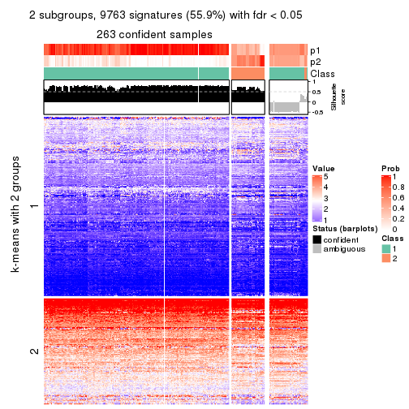</p>

</div>
<div id='tab-MAD-hclust-get-signatures-no-scale-2'>
<pre><code class="r">get_signatures(res, k = 3, scale_rows = FALSE)
</code></pre>

<p></p>

</div>
<div id='tab-MAD-hclust-get-signatures-no-scale-3'>
<pre><code class="r">get_signatures(res, k = 4, scale_rows = FALSE)
</code></pre>

<p></p>

</div>
<div id='tab-MAD-hclust-get-signatures-no-scale-4'>
<pre><code class="r">get_signatures(res, k = 5, scale_rows = FALSE)
</code></pre>

<p></p>

</div>
<div id='tab-MAD-hclust-get-signatures-no-scale-5'>
<pre><code class="r">get_signatures(res, k = 6, scale_rows = FALSE)
</code></pre>

<p></p>

</div>
</div>


Compare the overlap of signatures from different k:

```r
compare_signatures(res)
```


`get_signature()` returns a data frame invisibly. TO get the list of signatures, the function
call should be assigned to a variable explicitly. In following code, if `plot` argument is set
to `FALSE`, no heatmap is plotted while only the differential analysis is performed.

```r
# code only for demonstration
tb = get_signature(res, k = ..., plot = FALSE)
```

An example of the output of `tb` is:

```
#>   which_row         fdr    mean_1    mean_2 scaled_mean_1 scaled_mean_2 km
#> 1        38 0.042760348  8.373488  9.131774    -0.5533452     0.5164555  1
#> 2        40 0.018707592  7.106213  8.469186    -0.6173731     0.5762149  1
#> 3        55 0.019134737 10.221463 11.207825    -0.6159697     0.5749050  1
#> 4        59 0.006059896  5.921854  7.869574    -0.6899429     0.6439467  1
#> 5        60 0.018055526  8.928898 10.211722    -0.6204761     0.5791110  1
#> 6        98 0.009384629 15.714769 14.887706     0.6635654    -0.6193277  2
...
```

The columns in `tb` are:

1. `which_row`: row indices corresponding to the input matrix.
2. `fdr`: FDR for the differential test. 
3. `mean_x`: The mean value in group x.
4. `scaled_mean_x`: The mean value in group x after rows are scaled.
5. `km`: Row groups if k-means clustering is applied to rows.


UMAP plot which shows how samples are separated.


<script>
$( function() {
	$( '#tabs-MAD-hclust-dimension-reduction' ).tabs();
} );
</script>
<div id='tabs-MAD-hclust-dimension-reduction'>
<ul>
<li><a href='#tab-MAD-hclust-dimension-reduction-1'>k = 2</a></li>
<li><a href='#tab-MAD-hclust-dimension-reduction-2'>k = 3</a></li>
<li><a href='#tab-MAD-hclust-dimension-reduction-3'>k = 4</a></li>
<li><a href='#tab-MAD-hclust-dimension-reduction-4'>k = 5</a></li>
<li><a href='#tab-MAD-hclust-dimension-reduction-5'>k = 6</a></li>
</ul>
<div id='tab-MAD-hclust-dimension-reduction-1'>
<pre><code class="r">dimension_reduction(res, k = 2, method = &quot;UMAP&quot;)
</code></pre>

<p></p>

</div>
<div id='tab-MAD-hclust-dimension-reduction-2'>
<pre><code class="r">dimension_reduction(res, k = 3, method = &quot;UMAP&quot;)
</code></pre>

<p></p>

</div>
<div id='tab-MAD-hclust-dimension-reduction-3'>
<pre><code class="r">dimension_reduction(res, k = 4, method = &quot;UMAP&quot;)
</code></pre>

<p></p>

</div>
<div id='tab-MAD-hclust-dimension-reduction-4'>
<pre><code class="r">dimension_reduction(res, k = 5, method = &quot;UMAP&quot;)
</code></pre>

<p></p>

</div>
<div id='tab-MAD-hclust-dimension-reduction-5'>
<pre><code class="r">dimension_reduction(res, k = 6, method = &quot;UMAP&quot;)
</code></pre>

<p>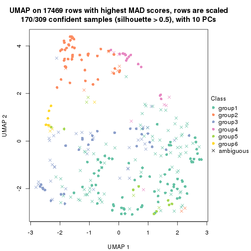</p>

</div>
</div>


Following heatmap shows how subgroups are split when increasing `k`:

```r
collect_classes(res)
```


If matrix rows can be associated to genes, consider to use `GO_Enrichment(res,
...)` to perform function enrichment for the signature genes.


 

---------------------------------------------------


### MAD:kmeans**


The object with results only for a single top-value method and a single partition method 
can be extracted as:

```r
res = res_list["MAD", "kmeans"]
# you can also extract it by
# res = res_list["MAD:kmeans"]
```

A summary of `res` and all the functions that can be applied to it:

```r
res
```

```
#> A 'ConsensusPartition' object with k = 2, 3, 4, 5, 6.
#>   On a matrix with 17469 rows and 309 columns.
#>   Top rows (1000, 2000, 3000, 4000, 5000) are extracted by 'MAD' method.
#>   Subgroups are detected by 'kmeans' method.
#>   Performed in total 1250 partitions by row resampling.
#>   Best k for subgroups seems to be 2.
#> 
#> Following methods can be applied to this 'ConsensusPartition' object:
#>  [1] "cola_report"             "collect_classes"         "collect_plots"          
#>  [4] "collect_stats"           "colnames"                "compare_signatures"     
#>  [7] "consensus_heatmap"       "dimension_reduction"     "functional_enrichment"  
#> [10] "get_anno_col"            "get_anno"                "get_classes"            
#> [13] "get_consensus"           "get_matrix"              "get_membership"         
#> [16] "get_param"               "get_signatures"          "get_stats"              
#> [19] "is_best_k"               "is_stable_k"             "membership_heatmap"     
#> [22] "ncol"                    "nrow"                    "plot_ecdf"              
#> [25] "rownames"                "select_partition_number" "show"                   
#> [28] "suggest_best_k"          "test_to_known_factors"
```

`collect_plots()` function collects all the plots made from `res` for all `k` (number of partitions)
into one single page to provide an easy and fast comparison between different `k`.

```r
collect_plots(res)
```


The plots are:

- The first row: a plot of the ECDF (Empirical cumulative distribution
  function) curves of the consensus matrix for each `k` and the heatmap of
  predicted classes for each `k`.
- The second row: heatmaps of the consensus matrix for each `k`.
- The third row: heatmaps of the membership matrix for each `k`.
- The fouth row: heatmaps of the signatures for each `k`.

All the plots in panels can be made by individual functions and they are
plotted later in this section.

`select_partition_number()` produces several plots showing different
statistics for choosing "optimized" `k`. There are following statistics:

- ECDF curves of the consensus matrix for each `k`;
- 1-PAC. [The PAC
  score](https://en.wikipedia.org/wiki/Consensus_clustering#Over-interpretation_potential_of_consensus_clustering)
  measures the proportion of the ambiguous subgrouping.
- Mean silhouette score.
- Concordance. The mean probability of fiting the consensus class ids in all
  partitions.
- Area increased. Denote $A_k$ as the area under the ECDF curve for current
  `k`, the area increased is defined as $A_k - A_{k-1}$.
- Rand index. The percent of pairs of samples that are both in a same cluster
  or both are not in a same cluster in the partition of k and k-1.
- Jaccard index. The ratio of pairs of samples are both in a same cluster in
  the partition of k and k-1 and the pairs of samples are both in a same
  cluster in the partition k or k-1.

The detailed explanations of these statistics can be found in [the cola
vignette](http://bioconductor.org/packages/devel/bioc/vignettes/cola/inst/doc/cola.html#toc_13).

Generally speaking, lower PAC score, higher mean silhouette score or higher
concordance corresponds to better partition. Rand index and Jaccard index
measure how similar the current partition is compared to partition with `k-1`.
If they are too similar, we won't accept `k` is better than `k-1`.

```r
select_partition_number(res)
```


The numeric values for all these statistics can be obtained by `get_stats()`.

```r
get_stats(res)
```

```
#>   k 1-PAC mean_silhouette concordance area_increased  Rand Jaccard
#> 2 2 1.000           0.990       0.996         0.3970 0.603   0.603
#> 3 3 0.602           0.750       0.875         0.5796 0.750   0.592
#> 4 4 0.617           0.691       0.780         0.1441 0.800   0.519
#> 5 5 0.729           0.730       0.796         0.0832 0.908   0.684
#> 6 6 0.716           0.670       0.794         0.0505 0.933   0.723
```

`suggest_best_k()` suggests the best $k$ based on these statistics. The rules are as follows:

- All $k$ with Jaccard index larger than 0.95 are removed because the increase of
  the partition number does not provides enough extra information. If all $k$ are removed,
  the best $k$ is assigned by `NA`.
- For $k$ with 1-PAC larger than 0.9, the maximal $k$ is taken as the "best k". Other $k$ is called "optional k".
- If it does not fit the second rule. The $k$ with the highest vote of highest
  1-PAC, mean silhouette and concordance is taken as the "best k".

```r
suggest_best_k(res)
```

```
#> [1] 2
```


Following shows the table of the partitions (You need to click the **show/hide
code output** link to see it). The membership matrix (columns with name `p*`)
is inferred by
[`clue::cl_consensus()`](https://www.rdocumentation.org/link/cl_consensus?package=clue)
function with the `SE` method. Basically the value in the membership matrix
represents the probability to belong to a certain group. The finall class
label for an item is determined with the group with highest probability it
belongs to.

In `get_classes()` function, the entropy is calculated from the membership
matrix and the silhouette score is calculated from the consensus matrix.


<script>
$( function() {
	$( '#tabs-MAD-kmeans-get-classes' ).tabs();
} );
</script>
<div id='tabs-MAD-kmeans-get-classes'>
<ul>
<li><a href='#tab-MAD-kmeans-get-classes-1'>k = 2</a></li>
<li><a href='#tab-MAD-kmeans-get-classes-2'>k = 3</a></li>
<li><a href='#tab-MAD-kmeans-get-classes-3'>k = 4</a></li>
<li><a href='#tab-MAD-kmeans-get-classes-4'>k = 5</a></li>
<li><a href='#tab-MAD-kmeans-get-classes-5'>k = 6</a></li>
</ul>

<div id='tab-MAD-kmeans-get-classes-1'>
<p><a id='tab-MAD-kmeans-get-classes-1-a' style='color:#0366d6' href='#'>show/hide code output</a></p>
<pre><code class="r">cbind(get_classes(res, k = 2), get_membership(res, k = 2))
</code></pre>

<pre><code>#&gt;                                      class entropy silhouette    p1    p2
#&gt; 7826AE44-B03A-4528-9CB5-7421E592AE36     1  0.8608      0.600 0.716 0.284
#&gt; 0DC2197B-2FEA-48EB-953E-8E44E1933757     1  0.0000      0.998 1.000 0.000
#&gt; 87ABB098-8C1E-4677-8C31-48B71EFE41C7     1  0.0000      0.998 1.000 0.000
#&gt; EC0154E7-7A27-4535-83AE-6B379E99A93C     1  0.0000      0.998 1.000 0.000
#&gt; 78F79407-D49F-4FA2-B09F-0665C502827C     1  0.0000      0.998 1.000 0.000
#&gt; 03E81178-E971-4E91-8BED-D8273EA1425C     1  0.0000      0.998 1.000 0.000
#&gt; 62FCAEFF-16D8-4019-84B6-18EC3A88BC32     2  0.0000      0.991 0.000 1.000
#&gt; 722C1284-5983-4CC1-B19C-214C2DE6F8A6     2  0.0000      0.991 0.000 1.000
#&gt; 54E42A64-B350-4A94-8FED-C9BC1872660E     1  0.0000      0.998 1.000 0.000
#&gt; 53062969-D209-490B-9C9B-5D297625E2AE     1  0.0000      0.998 1.000 0.000
#&gt; B710293C-41D3-4A2E-8104-5402F91DD859     1  0.0000      0.998 1.000 0.000
#&gt; 73CB1D05-7AE4-457D-B4EF-25AC5C1F2132     1  0.0000      0.998 1.000 0.000
#&gt; B055A70B-3003-47CB-BDAA-6378C000BF24     1  0.0000      0.998 1.000 0.000
#&gt; 46C3A870-E37A-42CB-8C0C-6ACACEAC1ADC     2  0.0000      0.991 0.000 1.000
#&gt; E8E6270E-F26D-4F2E-A63E-7885BDE05FDB     1  0.0000      0.998 1.000 0.000
#&gt; C4A5EBA2-9091-4D12-BDC8-B84B122022B9     1  0.0000      0.998 1.000 0.000
#&gt; 5B1839C4-549D-41D1-B559-3C6D2A1528CE     1  0.0000      0.998 1.000 0.000
#&gt; A0DF05EB-DC44-4492-9A8A-F278F7B0C266     1  0.0000      0.998 1.000 0.000
#&gt; B5182F49-70F2-45B7-82DE-C6DA68145EEA     1  0.0000      0.998 1.000 0.000
#&gt; C204D355-B876-4341-A111-36D48CBDD2A8     1  0.0000      0.998 1.000 0.000
#&gt; 7B070AAA-EF97-4D3B-AA19-EEC170C7927D     2  0.0000      0.991 0.000 1.000
#&gt; 05A8A881-F8EE-48A2-B11C-A08D7D80CE18     1  0.0000      0.998 1.000 0.000
#&gt; BA59EF50-CFE9-456D-B1B6-67D0945004F6     1  0.0000      0.998 1.000 0.000
#&gt; AD97B334-E034-4D33-A4D5-48C32D5D521C     1  0.0000      0.998 1.000 0.000
#&gt; 51DA2568-32EA-4668-9876-4B6E7CA68860     1  0.0000      0.998 1.000 0.000
#&gt; 78C26A05-2084-494D-83D3-C52C1B800F4C     1  0.0000      0.998 1.000 0.000
#&gt; 2B5DD791-7692-4721-9519-7D7D49B52570     1  0.0000      0.998 1.000 0.000
#&gt; C0BBE26A-79C8-4392-9978-7C420B3786B5     1  0.0000      0.998 1.000 0.000
#&gt; F35A8359-3A7A-414F-8A5C-D278F3B45387     2  0.0000      0.991 0.000 1.000
#&gt; 8C9BA49C-1270-491D-A234-AE1B1C0609BA     2  0.0000      0.991 0.000 1.000
#&gt; CA104B57-B160-4148-8A0A-D34BB3E8D88A     1  0.0000      0.998 1.000 0.000
#&gt; 877E18A5-6A7A-4E29-9871-DC7EA14A5F27     1  0.0000      0.998 1.000 0.000
#&gt; 904EDF2E-411E-43BD-901D-46129AFA283A     1  0.0000      0.998 1.000 0.000
#&gt; FD9F5A9B-2BEB-4D31-9A2D-8D4B4ECBB478     1  0.0000      0.998 1.000 0.000
#&gt; 2E206314-9928-456E-B7C6-893DC0E3C7C2     2  0.0000      0.991 0.000 1.000
#&gt; 913DB655-2C7F-4369-83DE-9257F04CF39B     1  0.0000      0.998 1.000 0.000
#&gt; 72B5B724-FEB5-43BD-83F6-2E2152DDD800     1  0.0000      0.998 1.000 0.000
#&gt; 920B547C-6898-446C-AAAF-F4ED96E40AAB     2  0.0000      0.991 0.000 1.000
#&gt; 847F796A-8CD6-4013-A0FB-26F4FC3EAF0D     1  0.0000      0.998 1.000 0.000
#&gt; C4D64E7A-33F7-4CFC-9FD3-D6AA3D8EFAA7     1  0.0000      0.998 1.000 0.000
#&gt; EABA0B17-8E19-48C5-BF62-2A45C9632807     2  0.0000      0.991 0.000 1.000
#&gt; 7263CBA8-CE37-4531-A795-9324C6D2A672     1  0.0000      0.998 1.000 0.000
#&gt; 6D3CC3AC-618B-414A-B640-169C735A6568     1  0.0000      0.998 1.000 0.000
#&gt; 710C05C7-F9CE-45FA-A8CC-29DE2903E04F     1  0.0000      0.998 1.000 0.000
#&gt; 3D631A56-2C55-48EA-A667-BA46023C9D50     1  0.0000      0.998 1.000 0.000
#&gt; F1C65F64-AF05-4875-B7E4-60FFF56A3F46     1  0.0000      0.998 1.000 0.000
#&gt; E5DF76E7-A765-4E07-B87A-06168BF66C5F     1  0.0000      0.998 1.000 0.000
#&gt; 5C8C8A6E-40D4-4F82-AC3D-90CFDEE15C0A     2  0.0000      0.991 0.000 1.000
#&gt; 0117CBB9-1BF9-48B1-BE6E-A9A770FF8721     1  0.0000      0.998 1.000 0.000
#&gt; 31EF66E5-419A-44C3-BB2A-B69B52FFCECC     2  0.0000      0.991 0.000 1.000
#&gt; C149CEF5-61F3-4B53-B8A9-8244B673EBD0     1  0.0000      0.998 1.000 0.000
#&gt; 0AF351D0-4EC5-4275-AA0A-4FA2AF8A9C85     2  0.0000      0.991 0.000 1.000
#&gt; B507E82F-6680-497B-A014-033EDD7A2E03     1  0.0000      0.998 1.000 0.000
#&gt; F941890E-AB33-478F-8C97-1C785DD9428F     1  0.0000      0.998 1.000 0.000
#&gt; 7987E019-8FED-469B-A6C1-34EE430A60C3     1  0.0000      0.998 1.000 0.000
#&gt; 76084AA6-19BF-4605-B6A1-73F1D4BADAF9     1  0.0000      0.998 1.000 0.000
#&gt; 329807F7-E0D4-4F53-94E8-E4080E90CB47     1  0.0000      0.998 1.000 0.000
#&gt; 1B6505FF-C1A7-4DD0-9827-41A0A3A28F3E     1  0.0000      0.998 1.000 0.000
#&gt; 49778E92-B5D3-4AD9-A1AF-3B722D631B96     2  0.0000      0.991 0.000 1.000
#&gt; A22892DE-0AF4-4B63-9513-1D6825059040     1  0.0000      0.998 1.000 0.000
#&gt; 6D77ECAE-A715-4ADD-97D8-A916DC31A4EA     1  0.0000      0.998 1.000 0.000
#&gt; 09758B6F-1B2D-4AED-8913-696097069409     1  0.0000      0.998 1.000 0.000
#&gt; 8B709DB4-0B28-42F1-A7C5-106F5809BEA2     1  0.0000      0.998 1.000 0.000
#&gt; F2B356FA-79CD-4867-8ABF-84C90A493A75     1  0.0000      0.998 1.000 0.000
#&gt; 131213AD-0313-4DF1-B013-CE67ED262C37     2  0.0000      0.991 0.000 1.000
#&gt; D94F7E81-0F60-473B-AD4A-0AC13508BDE2     1  0.0000      0.998 1.000 0.000
#&gt; 29C17355-D646-48DA-9E54-7B6DD85DD610     1  0.0000      0.998 1.000 0.000
#&gt; B8BD866A-2A7C-45C3-96BB-9AB892D26AE5     1  0.0000      0.998 1.000 0.000
#&gt; 13EFD045-AD61-41EE-9896-67BFA4FC8C09     1  0.0000      0.998 1.000 0.000
#&gt; 2655F609-B3BB-4D01-B421-D5F4B1232EC8     2  0.0000      0.991 0.000 1.000
#&gt; 04BC7A52-C67F-42CB-8672-D3C51A20F2BA     1  0.0000      0.998 1.000 0.000
#&gt; 45472BD4-DBDB-41FE-B0E3-2440880E1DE6     1  0.0000      0.998 1.000 0.000
#&gt; B87FFFCD-CB57-4ACD-9C74-AB188984BBB2     1  0.0000      0.998 1.000 0.000
#&gt; 5271374C-13CD-4BFE-AC6D-C95AFE491322     1  0.0000      0.998 1.000 0.000
#&gt; E3372ACE-C7C8-43E5-B30A-1F2D662D8170     1  0.0000      0.998 1.000 0.000
#&gt; B08DF564-E4D0-4540-8160-93B3981DF1D8     1  0.0000      0.998 1.000 0.000
#&gt; 61A7D1B9-FC5A-4B9C-989F-936CDA948C27     1  0.0000      0.998 1.000 0.000
#&gt; 74E768C1-8766-46AC-AAB4-D79E5049F76A     2  0.0000      0.991 0.000 1.000
#&gt; 0CEA28F0-D7F0-4EB7-A23F-0C5CA6245971     1  0.0000      0.998 1.000 0.000
#&gt; 95C4EFF6-147C-48EC-A2C1-16B8F12AEEF2     2  0.0000      0.991 0.000 1.000
#&gt; C9A78BEA-D455-4F5E-8B7B-19BCB42887E7     1  0.0000      0.998 1.000 0.000
#&gt; DB970740-9AC1-4C10-9658-8A77B1C390DD     2  0.0000      0.991 0.000 1.000
#&gt; 883FBD37-0CA0-4562-8925-72ACC1EE93D9     1  0.0000      0.998 1.000 0.000
#&gt; 9FE1D006-49F2-471E-91E6-AF0414C24479     1  0.0000      0.998 1.000 0.000
#&gt; 11816CC6-8C8B-49C0-99EE-896377BCFCCD     1  0.0000      0.998 1.000 0.000
#&gt; 063FC5C8-4318-4ECC-9CA0-1976CBC8ACB6     1  0.0000      0.998 1.000 0.000
#&gt; E0F085CC-B90D-4FDE-B60E-C613971BAA00     1  0.0000      0.998 1.000 0.000
#&gt; 62361DA2-E4EE-46DA-BB1F-C51DCA9307CC     2  0.0000      0.991 0.000 1.000
#&gt; 1BA16D48-B09E-4699-A1AD-2FFECE4F3CDB     2  0.0000      0.991 0.000 1.000
#&gt; 3E4F14E9-60AE-4F17-9BA7-2A02E908204A     1  0.0000      0.998 1.000 0.000
#&gt; 79226DD7-BC85-4B8E-BFF8-B1E073129D34     1  0.0000      0.998 1.000 0.000
#&gt; D47D0936-826F-4D54-9225-F71B95357438     1  0.0000      0.998 1.000 0.000
#&gt; 0AE02B91-574C-4165-BA39-E9D7C1A870A2     2  0.0000      0.991 0.000 1.000
#&gt; DED8E9DF-CEFE-45ED-9374-EF9925A135C4     1  0.0000      0.998 1.000 0.000
#&gt; D587A993-3C47-4D4C-B744-59169D4F7451     1  0.0000      0.998 1.000 0.000
#&gt; 6BCA24E6-440F-42C5-ABE5-66C37B713A39     1  0.0000      0.998 1.000 0.000
#&gt; 86A5EDFB-9D06-4FED-BF57-F8D74A68E156     1  0.0000      0.998 1.000 0.000
#&gt; B9BD5134-2F6A-4454-8F83-69B63F9AE114     1  0.0000      0.998 1.000 0.000
#&gt; 082DA9E1-A40D-482B-8E21-A93BA97185F0     1  0.0000      0.998 1.000 0.000
#&gt; 16A8343A-1203-44FB-9F03-05CC7C71B4CC     1  0.0000      0.998 1.000 0.000
#&gt; 00439565-02CE-4BF5-956D-7078B51C0947     1  0.0000      0.998 1.000 0.000
#&gt; 7B2BD361-2BF1-4E97-BC08-457F5A9C2682     2  0.0000      0.991 0.000 1.000
#&gt; C1D8439A-D527-47F6-ADC1-25867B65DA21     2  0.0000      0.991 0.000 1.000
#&gt; D9096909-1439-462D-B69C-CAD1BF4F420C     1  0.0000      0.998 1.000 0.000
#&gt; 7822EA86-35A1-4285-9429-2B63111B9885     1  0.0000      0.998 1.000 0.000
#&gt; 6FD0CFC8-AC8D-4CF1-8C33-833AD98A30EF     2  0.0000      0.991 0.000 1.000
#&gt; A451F278-5E83-4BC6-9B15-3AA2117B99B6     2  0.6343      0.810 0.160 0.840
#&gt; 6EC25686-4547-459C-9E01-7EDF8DAECE35     1  0.0000      0.998 1.000 0.000
#&gt; 5D2F1EEA-2BA8-4C3A-8436-544EE1D23E7E     1  0.0000      0.998 1.000 0.000
#&gt; 675A4293-A4CE-4307-B00B-DFC4D44A87C6     2  0.0000      0.991 0.000 1.000
#&gt; 6FBE0AEF-476A-42B2-A857-846CF1ED92B6     2  0.0000      0.991 0.000 1.000
#&gt; 7139D616-1A15-4288-A9AE-411856A4A76D     1  0.0000      0.998 1.000 0.000
#&gt; 46D7F8C1-D5C5-40CC-BEF5-2E590A847BD9     1  0.0000      0.998 1.000 0.000
#&gt; 984C44D3-4F5F-44C9-BCD9-C991EBC1FCB8     1  0.0000      0.998 1.000 0.000
#&gt; 83FE52E0-2DC2-4580-8BB2-FBCBEE4AC240     1  0.0000      0.998 1.000 0.000
#&gt; 0923F9CB-DF6F-4BAA-A5F8-0F83CE60D1ED     1  0.0000      0.998 1.000 0.000
#&gt; 1DEB5206-78CC-4EB5-BCD5-85A6A5B4E273     1  0.0000      0.998 1.000 0.000
#&gt; E4DB18DA-EB0C-4B2F-9566-7F72222B16D4     1  0.0000      0.998 1.000 0.000
#&gt; F7456312-1309-4B2F-875D-0F90CDF3EC35     1  0.0000      0.998 1.000 0.000
#&gt; 9A25E5D8-0706-4960-A76B-BCD0AC93E4FA     1  0.0000      0.998 1.000 0.000
#&gt; 5A41FE8F-FFB3-4B87-BF11-A570C184096D     1  0.0000      0.998 1.000 0.000
#&gt; 33F84E63-3F6C-4867-ADB1-A0DF39F1295B     1  0.0000      0.998 1.000 0.000
#&gt; D6A644F5-D1D0-4A8D-94C4-EE6C3ECE7430     1  0.0000      0.998 1.000 0.000
#&gt; 2A5848CC-A9A2-4AA8-A752-321273E62CF0     1  0.0000      0.998 1.000 0.000
#&gt; 7CA6358B-FC8A-4675-B092-9E061038FC83     1  0.0000      0.998 1.000 0.000
#&gt; A4C2F4BC-5C62-4B1F-9AB8-46D9468EF523     2  0.0000      0.991 0.000 1.000
#&gt; 8AF4EB7F-418D-4CC9-A9B8-A93A4C1A173B     2  0.0000      0.991 0.000 1.000
#&gt; E5048887-70C8-468F-881E-2EC55F6E6F3B     1  0.0000      0.998 1.000 0.000
#&gt; 1BADCC7C-C4D8-4C34-9534-59D622C7A2A2     1  0.0000      0.998 1.000 0.000
#&gt; 02CE7DF7-64BD-4297-A240-A5B9EE8771D3     1  0.0000      0.998 1.000 0.000
#&gt; CBF6E96A-F56C-4C87-B851-D319930BAAB8     1  0.0000      0.998 1.000 0.000
#&gt; 48F6B774-CFD2-4DDF-B7A2-696596413C3F     1  0.0000      0.998 1.000 0.000
#&gt; 41D88C3E-5848-4B09-8A77-EAE6AC4EC6B0     2  0.0000      0.991 0.000 1.000
#&gt; BDF79CC0-00C7-49C1-900B-AB065A733B17     1  0.0000      0.998 1.000 0.000
#&gt; A894D686-BFC7-4AEE-A794-DBE718C6B6F6     2  0.0000      0.991 0.000 1.000
#&gt; 0712029E-3765-4272-BE5B-B6C8BCCC0F0F     2  0.0000      0.991 0.000 1.000
#&gt; 7B051855-9B09-4887-9BC0-9F077537938E     1  0.0000      0.998 1.000 0.000
#&gt; EF357C46-5C3C-4F51-9383-FF7694D07B97     2  0.0000      0.991 0.000 1.000
#&gt; 9492A322-37CA-4582-AC68-66B5D80778AF     2  0.0000      0.991 0.000 1.000
#&gt; 993399A4-1B9F-4258-B2D0-155AD58A2E82     1  0.0000      0.998 1.000 0.000
#&gt; 7B7DC93D-5494-4E69-BE07-2967887182F9     1  0.0000      0.998 1.000 0.000
#&gt; 29BCBA51-2580-473D-9CF7-BEDBD0DBAD1B     2  0.0000      0.991 0.000 1.000
#&gt; 40855647-E942-4F32-90B7-BEB921929BFB     1  0.0000      0.998 1.000 0.000
#&gt; 0DC723D0-7C68-4495-A4B9-2DF2FF19AB14     2  0.0000      0.991 0.000 1.000
#&gt; 7540005F-57E0-4E2E-A8A2-BEF2B0F333B1     2  0.0000      0.991 0.000 1.000
#&gt; EB1DDB14-4076-4C2C-B911-390C17C21486     1  0.0000      0.998 1.000 0.000
#&gt; 9EA70EC4-8BA0-4E3D-B3CB-A68D19E89868     1  0.0000      0.998 1.000 0.000
#&gt; B04E2E50-0A6E-4224-A825-1714D12E5669     2  0.0000      0.991 0.000 1.000
#&gt; B0BF5E01-536D-40FF-9C24-CBBD611E2FC2     1  0.0000      0.998 1.000 0.000
#&gt; 7B6B1788-B297-4442-B6BE-B7CE8754491E     1  0.0000      0.998 1.000 0.000
#&gt; A090D00C-34DF-4906-A517-4803C4C9A332     1  0.0000      0.998 1.000 0.000
#&gt; 340D44A6-9BEA-412C-9973-D9ABD6692255     1  0.0000      0.998 1.000 0.000
#&gt; E8D0D1E7-E5A8-4014-80C1-0245F90F4358     2  0.0000      0.991 0.000 1.000
#&gt; 19EA1494-8572-40E1-B9BB-3739F47B607D     1  0.0000      0.998 1.000 0.000
#&gt; 1C1B4793-8DAF-4763-BA4D-C4E869A4ED35     1  0.0000      0.998 1.000 0.000
#&gt; 45BF59B3-95BD-4196-ABAA-4C4F0DB38572     2  0.0000      0.991 0.000 1.000
#&gt; 47B5A2A7-7E13-4558-99D2-067F5075C6A4     1  0.0000      0.998 1.000 0.000
#&gt; E94638E8-CB51-4FBB-8BCB-4BFD7A812291     1  0.0000      0.998 1.000 0.000
#&gt; A17352A8-0D3C-4545-8136-7DAE2FB0E102     2  0.0000      0.991 0.000 1.000
#&gt; B18A6F95-D4ED-416B-B5A1-9A4934865D0D     2  0.0000      0.991 0.000 1.000
#&gt; 33E92C5F-0C42-4549-AD5B-0A064182A272     1  0.0000      0.998 1.000 0.000
#&gt; E041B375-3E60-4F18-A6EF-D1C249E3B8EE     1  0.0000      0.998 1.000 0.000
#&gt; EDF90AF6-6C64-4BD2-AADF-8D7D188650B2     2  0.0000      0.991 0.000 1.000
#&gt; 569320D2-316C-4E2D-B7B3-D7D5C4DAD42D     1  0.0000      0.998 1.000 0.000
#&gt; AFFB223D-DAE9-4567-9EF2-8E4DF9D8782D     2  0.0000      0.991 0.000 1.000
#&gt; 56FC9454-0A6A-4CC3-95C4-BE0E0D0BAFCE     2  0.0000      0.991 0.000 1.000
#&gt; 43226365-FAEF-46C5-AF1B-5C6C2BED84FF     1  0.0000      0.998 1.000 0.000
#&gt; 1536110A-B42A-4A84-9474-9895321FDCE9     2  0.0000      0.991 0.000 1.000
#&gt; 812255DD-536B-4216-90B1-27D5AB339BE2     1  0.0000      0.998 1.000 0.000
#&gt; 5D4563D6-68B7-4C9D-A3F4-AA7D45D5112C     2  0.0000      0.991 0.000 1.000
#&gt; BAA39781-DB94-473C-98B1-FA6CD3E1C67A     1  0.0000      0.998 1.000 0.000
#&gt; C1411CDA-814D-4E21-8929-C0F77858828F     1  0.0000      0.998 1.000 0.000
#&gt; EFE2F248-C13E-4E8D-9153-8C903848AC4A     1  0.0000      0.998 1.000 0.000
#&gt; D3939C84-D1D6-4060-9F91-AEB222A9BDD5     1  0.0000      0.998 1.000 0.000
#&gt; EABD2987-8C1E-49E5-94AF-C0BDE5335A48     1  0.0000      0.998 1.000 0.000
#&gt; F4BE2ABE-2CEB-4A6A-B8EC-0355F8C63B9B     1  0.0000      0.998 1.000 0.000
#&gt; 627BC251-D217-4955-B718-6B9D6DEA1756     1  0.0000      0.998 1.000 0.000
#&gt; 31B54613-A20E-4039-BB8B-9B52104CE418     1  0.0000      0.998 1.000 0.000
#&gt; 3F292B7C-A535-4DBD-BC20-CB4F85A1C94B     1  0.0000      0.998 1.000 0.000
#&gt; BEA2A5EB-EEA9-4F31-AC38-810E04CE124B     2  0.0000      0.991 0.000 1.000
#&gt; 99D84D46-19DA-43F1-B639-DCE9953F1529     2  0.0000      0.991 0.000 1.000
#&gt; 4588817E-1068-4A78-86B6-4674A0112DDA     1  0.0000      0.998 1.000 0.000
#&gt; 6AC633BD-BEC1-4750-94E3-378972DAB6B3     2  0.0000      0.991 0.000 1.000
#&gt; 09E17C6E-7EDE-4DDF-B5ED-2521AF870C9A     1  0.0000      0.998 1.000 0.000
#&gt; 58D9C750-26A2-4B7C-84C4-13D7AFB4C5EA     1  0.0000      0.998 1.000 0.000
#&gt; DF28E138-E222-4F77-9B61-69E601CA7E60     2  0.0000      0.991 0.000 1.000
#&gt; FEA489A8-E423-4266-AADA-9BAAB29AB94B     1  0.0000      0.998 1.000 0.000
#&gt; F3FCC207-15CD-41EA-A3EF-F5D2C12AC373     1  0.0000      0.998 1.000 0.000
#&gt; 53DD7AFB-A258-4643-A501-BACC95D17A50     2  0.0000      0.991 0.000 1.000
#&gt; D850B2A1-1F8A-4A44-A0CF-8D9DD4A1889A     2  0.0000      0.991 0.000 1.000
#&gt; B3F746DC-E487-4305-9F30-825D1520E8FD     2  0.0000      0.991 0.000 1.000
#&gt; BE38240A-F7C2-439F-9AAE-51C8A340F310     1  0.0000      0.998 1.000 0.000
#&gt; A9022D9E-1D30-49EE-8552-1364A8027F34     1  0.0000      0.998 1.000 0.000
#&gt; 0E8A56EE-D9A2-48A5-B793-A358BE1E4EFA     1  0.0000      0.998 1.000 0.000
#&gt; 51667574-318E-4BDB-8F42-8512A4C1B84F     1  0.0000      0.998 1.000 0.000
#&gt; B0A442C9-67E4-4534-8A5C-D6D73F42358C     1  0.0000      0.998 1.000 0.000
#&gt; 25A5BC09-0D88-4385-87AF-997F9018522D     2  0.0000      0.991 0.000 1.000
#&gt; 344B9631-AAA5-4302-8747-D584345D9131     1  0.0000      0.998 1.000 0.000
#&gt; 1C3795AD-6306-4892-95F5-92DF3375D46A     1  0.0000      0.998 1.000 0.000
#&gt; 17BB221D-8BF9-4391-83DD-423AE1E03651     1  0.7219      0.748 0.800 0.200
#&gt; 297611E9-9555-4BCA-A723-02E846ACC23A     1  0.0000      0.998 1.000 0.000
#&gt; AD7FF180-1EAC-4783-8A62-E9626B96DD9F     2  0.0000      0.991 0.000 1.000
#&gt; FD544083-9BD5-4036-BD81-0352B67CC45C     1  0.0000      0.998 1.000 0.000
#&gt; 879A74D5-5B29-418D-A0F4-8E88D6384008     1  0.0000      0.998 1.000 0.000
#&gt; 43CD982C-13C0-4A52-803A-9A3A3FAE09BC     1  0.0000      0.998 1.000 0.000
#&gt; DCD0313D-5206-4111-8743-A8A0227257D9     1  0.0000      0.998 1.000 0.000
#&gt; 331A9160-D730-45DD-A985-C6CAC03035ED     1  0.0000      0.998 1.000 0.000
#&gt; 9EEECA0E-530D-4724-B016-A716F0782148     1  0.0000      0.998 1.000 0.000
#&gt; B3073976-CA3F-4115-9243-8C2D9E1B975D     1  0.0000      0.998 1.000 0.000
#&gt; 77B3C9B4-1A7F-41BB-A37D-01EF80E933CC     2  0.0000      0.991 0.000 1.000
#&gt; C0C26822-2E9F-4FB0-81D4-575027C8B71C     2  0.0000      0.991 0.000 1.000
#&gt; F1FCE328-2B3B-499A-888D-0E66A017E8B0     1  0.0000      0.998 1.000 0.000
#&gt; F069DAD6-F1EB-42F7-8252-F3F6EC46CC3E     1  0.0000      0.998 1.000 0.000
#&gt; 99CC822E-8C98-4EEC-BB58-AEF76A0B5332     1  0.0000      0.998 1.000 0.000
#&gt; C86EBD08-53F2-4972-801A-74970FDD6A62     1  0.0000      0.998 1.000 0.000
#&gt; F07326F2-C1D6-4D5A-9693-25C3A04B0EC2     1  0.0000      0.998 1.000 0.000
#&gt; 8ACBD428-7713-48D9-810A-43C9CD191A73     2  0.0000      0.991 0.000 1.000
#&gt; 3D3501B4-1A43-4FA7-90A2-CCEBF66BFD4A     1  0.0000      0.998 1.000 0.000
#&gt; DD51C17C-300F-44A4-955A-C9BC85417842     1  0.1414      0.977 0.980 0.020
#&gt; 58FF391C-1D83-426C-8F92-C15F78F56C95     1  0.0000      0.998 1.000 0.000
#&gt; ACE65C6E-2B10-4972-91B4-9199DD4B179D     1  0.0000      0.998 1.000 0.000
#&gt; B2088466-FA5D-491C-9982-99B33683E66F     2  0.0000      0.991 0.000 1.000
#&gt; D47AF416-1687-4FE0-A235-8815B6E8EB0B     1  0.0000      0.998 1.000 0.000
#&gt; 4DCAD07F-CC43-46F6-B2F3-EDBF3EDD1045     2  0.0000      0.991 0.000 1.000
#&gt; AAAE0BD9-63FC-4A0E-A27E-447B634BAD99     2  0.0000      0.991 0.000 1.000
#&gt; BC471AA1-52CF-4CEE-9866-34CE91404F45     2  0.0000      0.991 0.000 1.000
#&gt; 81D3EE3F-AC11-404F-8092-307F0DC12198     1  0.0000      0.998 1.000 0.000
#&gt; 8C02026C-C25E-406B-B8B8-A1A82362AE79     2  0.9732      0.327 0.404 0.596
#&gt; 6A005F2A-A0C1-4CA4-B15B-96B08F013874     1  0.0000      0.998 1.000 0.000
#&gt; B55743F2-4D63-4375-85D3-F58281CFD852     1  0.0000      0.998 1.000 0.000
#&gt; 24F98393-C817-4D0E-A7DB-05D2B5C71F40     1  0.0000      0.998 1.000 0.000
#&gt; 2C2AEF1D-4112-4EC7-9027-5E3FD26E8802     1  0.0000      0.998 1.000 0.000
#&gt; 8BAC3CB5-2987-4349-8AE8-B83DDD16CA3C     1  0.0000      0.998 1.000 0.000
#&gt; ED9C74E6-92FC-4E58-8FCE-1761DEA0C977     1  0.0000      0.998 1.000 0.000
#&gt; BA732ED4-F6BA-404E-BA3C-CA558FAD866A     1  0.0000      0.998 1.000 0.000
#&gt; E750385A-12D9-4A88-B4DF-C1306B5EF3B7     2  0.0000      0.991 0.000 1.000
#&gt; 6B1DC5E4-5F82-4395-913F-6AEDB5B63188     1  0.0000      0.998 1.000 0.000
#&gt; A7C12D37-FD50-4674-A054-1774F4E5C3B3     1  0.0000      0.998 1.000 0.000
#&gt; 2155C764-2063-4D9C-9ACD-96AA73475F5E     1  0.0000      0.998 1.000 0.000
#&gt; DE23CC15-A95E-4119-9B3C-8EEC45900D11     2  0.0000      0.991 0.000 1.000
#&gt; 5DB1DCAD-638E-48A4-9F40-3D6268FDEC33     2  0.0000      0.991 0.000 1.000
#&gt; 34AF0341-73D7-4080-AAEB-4C1541C2569F     1  0.0000      0.998 1.000 0.000
#&gt; B60D4235-44AF-4BA4-98C0-BCCDC28E90B9     2  0.0000      0.991 0.000 1.000
#&gt; CF463D89-2C9F-4257-BF04-8BC1CD40EA7D     2  0.0000      0.991 0.000 1.000
#&gt; EF6C8165-484A-4530-AEDF-93DCC4A8455D     1  0.0000      0.998 1.000 0.000
#&gt; B9F6B5E4-4D10-49B8-A8FE-8F33C5A62CBF     1  0.0000      0.998 1.000 0.000
#&gt; CE539000-92D7-4622-9C8D-BC6E01310681     2  0.0000      0.991 0.000 1.000
#&gt; D3BBC405-A22A-4009-ABF6-96FEEE653051     2  0.0000      0.991 0.000 1.000
#&gt; 0B3C86BD-0D20-4408-9BE3-05658729505F     2  0.5842      0.837 0.140 0.860
#&gt; 9B9C5071-7C3F-416C-B91C-6F5966747F54     1  0.0000      0.998 1.000 0.000
#&gt; A9469A4A-C5F9-4681-A916-A26F0B4307BA     1  0.0000      0.998 1.000 0.000
#&gt; A31B57E4-E30B-4A1B-829D-1B47D9CEC041     2  0.0000      0.991 0.000 1.000
#&gt; 647255CE-F84A-4070-B3FD-D8ACA32C4D09     1  0.0000      0.998 1.000 0.000
#&gt; 8F5E9F02-51D7-410E-B8B7-22737F2F095A     2  0.0000      0.991 0.000 1.000
#&gt; 8074A7F6-2FDE-4578-B71C-01C542D468FE     1  0.0000      0.998 1.000 0.000
#&gt; 2A946F17-F245-409E-A019-C60CDA18DC7D     1  0.0000      0.998 1.000 0.000
#&gt; 0878C381-47F9-4786-82C2-94AC840BEDCB     1  0.0000      0.998 1.000 0.000
#&gt; 54504893-92C5-4328-85A8-2A882680B5E0     1  0.0000      0.998 1.000 0.000
#&gt; 0A27D1BE-E5DD-459A-A51F-6D8AAF7CFEB4     1  0.0000      0.998 1.000 0.000
#&gt; 89ED5A3E-CAC0-4AB4-B858-A3CD8F34DBD5     2  0.0000      0.991 0.000 1.000
#&gt; ACEEB0A5-AADB-4EF9-8710-4BAF95522CEA     1  0.0000      0.998 1.000 0.000
#&gt; 02C74D81-5976-4252-BC6C-B10E934DECA2     1  0.0000      0.998 1.000 0.000
#&gt; D365A238-4739-4B54-9608-DC548F21C04E     1  0.0000      0.998 1.000 0.000
#&gt; F70F7ED5-A3B7-4210-95AD-DEFA0A565F06     1  0.0000      0.998 1.000 0.000
#&gt; A92C23A9-BC25-4025-9501-6D5FF8E2A502     1  0.0000      0.998 1.000 0.000
#&gt; ECE9BBF4-840E-47A6-8378-0B6C4A2369D3     1  0.0000      0.998 1.000 0.000
#&gt; 38749490-0FCF-4B33-9EBC-8F86C2D9E4AF     1  0.0000      0.998 1.000 0.000
#&gt; 02ABB64E-768B-4999-A899-EEE573D5F186     1  0.0000      0.998 1.000 0.000
#&gt; C1C467A8-18B1-4C3F-AC45-33359ED6FDC4     1  0.0000      0.998 1.000 0.000
#&gt; 78B2E4A1-9DAE-404F-AB47-1896450EF254     1  0.0000      0.998 1.000 0.000
#&gt; CCDB0290-91DA-4089-84A6-4434BA028D30     1  0.0000      0.998 1.000 0.000
#&gt; D5041E80-20A0-4C1A-9AC1-2394F6DB6E92     1  0.0000      0.998 1.000 0.000
#&gt; 20EB9CC6-EABB-438A-9030-E766459996D1     2  0.0000      0.991 0.000 1.000
#&gt; 73E99110-9A7C-4F73-98C5-79D22CB06230     1  0.0000      0.998 1.000 0.000
#&gt; FAD8A464-9BC3-4ED9-9517-B18D36514325     1  0.0000      0.998 1.000 0.000
#&gt; 9AF0E82E-E621-437A-8D19-700532B95090     1  0.0000      0.998 1.000 0.000
#&gt; 27DA48F3-4FC1-41A3-8E49-5B25F1CCFF07     1  0.0000      0.998 1.000 0.000
#&gt; EFE5A302-D138-4044-A301-5C5FD1C24836     1  0.0000      0.998 1.000 0.000
#&gt; D3E866AC-D66A-4C07-9F47-89AF460320DE     2  0.0000      0.991 0.000 1.000
#&gt; 89C45456-9392-4EB3-9A82-A130B6702AAF     1  0.0000      0.998 1.000 0.000
#&gt; 8FF5C8FC-2565-49BE-9EE0-91A84A85AB2A     2  0.0000      0.991 0.000 1.000
#&gt; 846DF088-75D5-49CF-BDDC-27E735A08DCA     1  0.0000      0.998 1.000 0.000
#&gt; EA3A19E1-7ADE-47B6-A35A-71290967147A     2  0.0376      0.987 0.004 0.996
#&gt; B2C43D0C-732B-4C54-938F-D3C9FDA880DA     1  0.0000      0.998 1.000 0.000
#&gt; EEC856B5-9B7F-488D-975E-CE2FF7072879     1  0.0000      0.998 1.000 0.000
#&gt; 8A68C417-09CC-4FA1-BFEB-EB4B738853A4     1  0.0000      0.998 1.000 0.000
#&gt; C5DF1A0D-952C-44E2-BF83-ED57177EF60E     1  0.0000      0.998 1.000 0.000
#&gt; B5C9EA22-F758-4BD2-BD1F-282EC1078AED     2  0.0000      0.991 0.000 1.000
#&gt; 3F08AE92-3EFD-4D7F-8C5C-BFB3621F0CD6     1  0.0000      0.998 1.000 0.000
#&gt; 8F0D43F1-2199-4DBB-9B16-1E5F2CED2FEC     2  0.0000      0.991 0.000 1.000
#&gt; 54BABD8B-EA9F-4875-8594-2179B38C73BD     1  0.0000      0.998 1.000 0.000
#&gt; C149B6F8-03DC-4907-920A-F3318B8D2A1E     1  0.0000      0.998 1.000 0.000
#&gt; F93D26E2-4B45-495D-BC8E-5B592F8FDABF     1  0.0000      0.998 1.000 0.000
#&gt; C98275CD-C39A-4E14-A731-4F3EB7396665     2  0.2603      0.948 0.044 0.956
#&gt; 354DC705-216E-42F0-B29E-C1F8D6C9489A     1  0.0000      0.998 1.000 0.000
#&gt; 6752EED9-7990-433F-A206-D5398C396471     1  0.0000      0.998 1.000 0.000
#&gt; C3E94C5D-68C4-400C-B7CB-38C42E9D5FFF     1  0.0000      0.998 1.000 0.000
#&gt; CE6B6871-3ED3-44DE-A777-7558D4429057     1  0.0000      0.998 1.000 0.000
#&gt; A06E7D1E-E432-4A4C-8BB0-314304F96EDF     1  0.0000      0.998 1.000 0.000
#&gt; 1ABBEF80-508F-4247-B43D-3E549372113B     1  0.0000      0.998 1.000 0.000
#&gt; 835AAE7F-F873-4D11-8845-232D261A38DF     1  0.0000      0.998 1.000 0.000
#&gt; E98A0460-6529-4DBA-8542-1B98801D7A7D     1  0.0000      0.998 1.000 0.000
#&gt; 06A9CBF8-01D0-4720-BCE8-83F0E77C862F     1  0.0000      0.998 1.000 0.000
#&gt; 206865A9-A67C-49A6-93AD-55D06E777559     2  0.0000      0.991 0.000 1.000
#&gt; 26DABC83-DB30-452F-9BE2-366760CB138E     2  0.0000      0.991 0.000 1.000
#&gt; 9DD5272A-2D6E-4774-83E3-0CD761EDE926     1  0.0000      0.998 1.000 0.000
#&gt; 4938E366-C740-4C9C-9358-FF37997DC9EF     1  0.0000      0.998 1.000 0.000
#&gt; E2DA59C4-A47C-41E3-BC55-2D00C6EC17FB     1  0.0000      0.998 1.000 0.000
#&gt; 37349E62-0BFB-4FEA-81D0-2AB7E7625B0D     1  0.0000      0.998 1.000 0.000
</code></pre>

<script>
$('#tab-MAD-kmeans-get-classes-1-a').parent().next().next().hide();
$('#tab-MAD-kmeans-get-classes-1-a').click(function(){
  $('#tab-MAD-kmeans-get-classes-1-a').parent().next().next().toggle();
  return(false);
});
</script>
</div>

<div id='tab-MAD-kmeans-get-classes-2'>
<p><a id='tab-MAD-kmeans-get-classes-2-a' style='color:#0366d6' href='#'>show/hide code output</a></p>
<pre><code class="r">cbind(get_classes(res, k = 3), get_membership(res, k = 3))
</code></pre>

<pre><code>#&gt;                                      class entropy silhouette    p1    p2    p3
#&gt; 7826AE44-B03A-4528-9CB5-7421E592AE36     3  0.4921     0.7323 0.084 0.072 0.844
#&gt; 0DC2197B-2FEA-48EB-953E-8E44E1933757     3  0.2261     0.8040 0.068 0.000 0.932
#&gt; 87ABB098-8C1E-4677-8C31-48B71EFE41C7     3  0.2165     0.8044 0.064 0.000 0.936
#&gt; EC0154E7-7A27-4535-83AE-6B379E99A93C     1  0.4452     0.7412 0.808 0.000 0.192
#&gt; 78F79407-D49F-4FA2-B09F-0665C502827C     1  0.1753     0.8136 0.952 0.000 0.048
#&gt; 03E81178-E971-4E91-8BED-D8273EA1425C     1  0.0592     0.8134 0.988 0.000 0.012
#&gt; 62FCAEFF-16D8-4019-84B6-18EC3A88BC32     3  0.5397     0.4897 0.000 0.280 0.720
#&gt; 722C1284-5983-4CC1-B19C-214C2DE6F8A6     2  0.0000     0.9630 0.000 1.000 0.000
#&gt; 54E42A64-B350-4A94-8FED-C9BC1872660E     1  0.3116     0.7604 0.892 0.000 0.108
#&gt; 53062969-D209-490B-9C9B-5D297625E2AE     1  0.4750     0.7164 0.784 0.000 0.216
#&gt; B710293C-41D3-4A2E-8104-5402F91DD859     1  0.0000     0.8154 1.000 0.000 0.000
#&gt; 73CB1D05-7AE4-457D-B4EF-25AC5C1F2132     1  0.4504     0.7376 0.804 0.000 0.196
#&gt; B055A70B-3003-47CB-BDAA-6378C000BF24     3  0.2261     0.8040 0.068 0.000 0.932
#&gt; 46C3A870-E37A-42CB-8C0C-6ACACEAC1ADC     2  0.1753     0.9579 0.000 0.952 0.048
#&gt; E8E6270E-F26D-4F2E-A63E-7885BDE05FDB     3  0.3340     0.7796 0.120 0.000 0.880
#&gt; C4A5EBA2-9091-4D12-BDC8-B84B122022B9     3  0.2261     0.8040 0.068 0.000 0.932
#&gt; 5B1839C4-549D-41D1-B559-3C6D2A1528CE     3  0.5948     0.4998 0.360 0.000 0.640
#&gt; A0DF05EB-DC44-4492-9A8A-F278F7B0C266     1  0.4399     0.7445 0.812 0.000 0.188
#&gt; B5182F49-70F2-45B7-82DE-C6DA68145EEA     1  0.0237     0.8148 0.996 0.000 0.004
#&gt; C204D355-B876-4341-A111-36D48CBDD2A8     1  0.6168     0.1344 0.588 0.000 0.412
#&gt; 7B070AAA-EF97-4D3B-AA19-EEC170C7927D     2  0.0000     0.9630 0.000 1.000 0.000
#&gt; 05A8A881-F8EE-48A2-B11C-A08D7D80CE18     1  0.1860     0.8129 0.948 0.000 0.052
#&gt; BA59EF50-CFE9-456D-B1B6-67D0945004F6     1  0.4346     0.7482 0.816 0.000 0.184
#&gt; AD97B334-E034-4D33-A4D5-48C32D5D521C     1  0.4974     0.6912 0.764 0.000 0.236
#&gt; 51DA2568-32EA-4668-9876-4B6E7CA68860     3  0.2261     0.8040 0.068 0.000 0.932
#&gt; 78C26A05-2084-494D-83D3-C52C1B800F4C     1  0.4702     0.6354 0.788 0.000 0.212
#&gt; 2B5DD791-7692-4721-9519-7D7D49B52570     3  0.1860     0.8003 0.052 0.000 0.948
#&gt; C0BBE26A-79C8-4392-9978-7C420B3786B5     3  0.2165     0.8044 0.064 0.000 0.936
#&gt; F35A8359-3A7A-414F-8A5C-D278F3B45387     2  0.0000     0.9630 0.000 1.000 0.000
#&gt; 8C9BA49C-1270-491D-A234-AE1B1C0609BA     2  0.0000     0.9630 0.000 1.000 0.000
#&gt; CA104B57-B160-4148-8A0A-D34BB3E8D88A     1  0.0000     0.8154 1.000 0.000 0.000
#&gt; 877E18A5-6A7A-4E29-9871-DC7EA14A5F27     1  0.0592     0.8134 0.988 0.000 0.012
#&gt; 904EDF2E-411E-43BD-901D-46129AFA283A     1  0.4452     0.7412 0.808 0.000 0.192
#&gt; FD9F5A9B-2BEB-4D31-9A2D-8D4B4ECBB478     1  0.0592     0.8134 0.988 0.000 0.012
#&gt; 2E206314-9928-456E-B7C6-893DC0E3C7C2     2  0.0000     0.9630 0.000 1.000 0.000
#&gt; 913DB655-2C7F-4369-83DE-9257F04CF39B     3  0.6008     0.4587 0.372 0.000 0.628
#&gt; 72B5B724-FEB5-43BD-83F6-2E2152DDD800     1  0.6509    -0.1095 0.524 0.004 0.472
#&gt; 920B547C-6898-446C-AAAF-F4ED96E40AAB     2  0.0000     0.9630 0.000 1.000 0.000
#&gt; 847F796A-8CD6-4013-A0FB-26F4FC3EAF0D     1  0.4452     0.7412 0.808 0.000 0.192
#&gt; C4D64E7A-33F7-4CFC-9FD3-D6AA3D8EFAA7     1  0.1529     0.8157 0.960 0.000 0.040
#&gt; EABA0B17-8E19-48C5-BF62-2A45C9632807     2  0.1753     0.9579 0.000 0.952 0.048
#&gt; 7263CBA8-CE37-4531-A795-9324C6D2A672     3  0.4291     0.7409 0.180 0.000 0.820
#&gt; 6D3CC3AC-618B-414A-B640-169C735A6568     3  0.0892     0.7743 0.020 0.000 0.980
#&gt; 710C05C7-F9CE-45FA-A8CC-29DE2903E04F     1  0.4504     0.7376 0.804 0.000 0.196
#&gt; 3D631A56-2C55-48EA-A667-BA46023C9D50     1  0.5058     0.5624 0.756 0.000 0.244
#&gt; F1C65F64-AF05-4875-B7E4-60FFF56A3F46     1  0.5591     0.4937 0.696 0.000 0.304
#&gt; E5DF76E7-A765-4E07-B87A-06168BF66C5F     1  0.0000     0.8154 1.000 0.000 0.000
#&gt; 5C8C8A6E-40D4-4F82-AC3D-90CFDEE15C0A     2  0.0000     0.9630 0.000 1.000 0.000
#&gt; 0117CBB9-1BF9-48B1-BE6E-A9A770FF8721     3  0.2261     0.8040 0.068 0.000 0.932
#&gt; 31EF66E5-419A-44C3-BB2A-B69B52FFCECC     2  0.1753     0.9579 0.000 0.952 0.048
#&gt; C149CEF5-61F3-4B53-B8A9-8244B673EBD0     1  0.4291     0.7506 0.820 0.000 0.180
#&gt; 0AF351D0-4EC5-4275-AA0A-4FA2AF8A9C85     2  0.1289     0.9599 0.000 0.968 0.032
#&gt; B507E82F-6680-497B-A014-033EDD7A2E03     3  0.2165     0.8044 0.064 0.000 0.936
#&gt; F941890E-AB33-478F-8C97-1C785DD9428F     3  0.5905     0.5025 0.352 0.000 0.648
#&gt; 7987E019-8FED-469B-A6C1-34EE430A60C3     1  0.5650     0.5637 0.688 0.000 0.312
#&gt; 76084AA6-19BF-4605-B6A1-73F1D4BADAF9     3  0.1411     0.7958 0.036 0.000 0.964
#&gt; 329807F7-E0D4-4F53-94E8-E4080E90CB47     3  0.2165     0.8044 0.064 0.000 0.936
#&gt; 1B6505FF-C1A7-4DD0-9827-41A0A3A28F3E     1  0.1031     0.8064 0.976 0.000 0.024
#&gt; 49778E92-B5D3-4AD9-A1AF-3B722D631B96     2  0.0000     0.9630 0.000 1.000 0.000
#&gt; A22892DE-0AF4-4B63-9513-1D6825059040     1  0.4452     0.7412 0.808 0.000 0.192
#&gt; 6D77ECAE-A715-4ADD-97D8-A916DC31A4EA     1  0.0592     0.8134 0.988 0.000 0.012
#&gt; 09758B6F-1B2D-4AED-8913-696097069409     1  0.2066     0.8117 0.940 0.000 0.060
#&gt; 8B709DB4-0B28-42F1-A7C5-106F5809BEA2     1  0.5178     0.5334 0.744 0.000 0.256
#&gt; F2B356FA-79CD-4867-8ABF-84C90A493A75     1  0.4504     0.7376 0.804 0.000 0.196
#&gt; 131213AD-0313-4DF1-B013-CE67ED262C37     2  0.0000     0.9630 0.000 1.000 0.000
#&gt; D94F7E81-0F60-473B-AD4A-0AC13508BDE2     3  0.2165     0.8044 0.064 0.000 0.936
#&gt; 29C17355-D646-48DA-9E54-7B6DD85DD610     1  0.3879     0.7696 0.848 0.000 0.152
#&gt; B8BD866A-2A7C-45C3-96BB-9AB892D26AE5     1  0.3192     0.7377 0.888 0.000 0.112
#&gt; 13EFD045-AD61-41EE-9896-67BFA4FC8C09     3  0.2261     0.8040 0.068 0.000 0.932
#&gt; 2655F609-B3BB-4D01-B421-D5F4B1232EC8     2  0.1753     0.9579 0.000 0.952 0.048
#&gt; 04BC7A52-C67F-42CB-8672-D3C51A20F2BA     1  0.0592     0.8134 0.988 0.000 0.012
#&gt; 45472BD4-DBDB-41FE-B0E3-2440880E1DE6     1  0.1289     0.8052 0.968 0.000 0.032
#&gt; B87FFFCD-CB57-4ACD-9C74-AB188984BBB2     1  0.6260     0.0253 0.552 0.000 0.448
#&gt; 5271374C-13CD-4BFE-AC6D-C95AFE491322     1  0.4452     0.7412 0.808 0.000 0.192
#&gt; E3372ACE-C7C8-43E5-B30A-1F2D662D8170     1  0.4887     0.7014 0.772 0.000 0.228
#&gt; B08DF564-E4D0-4540-8160-93B3981DF1D8     1  0.0592     0.8134 0.988 0.000 0.012
#&gt; 61A7D1B9-FC5A-4B9C-989F-936CDA948C27     1  0.0592     0.8134 0.988 0.000 0.012
#&gt; 74E768C1-8766-46AC-AAB4-D79E5049F76A     2  0.0000     0.9630 0.000 1.000 0.000
#&gt; 0CEA28F0-D7F0-4EB7-A23F-0C5CA6245971     3  0.1529     0.7891 0.040 0.000 0.960
#&gt; 95C4EFF6-147C-48EC-A2C1-16B8F12AEEF2     2  0.1753     0.9579 0.000 0.952 0.048
#&gt; C9A78BEA-D455-4F5E-8B7B-19BCB42887E7     1  0.1643     0.8150 0.956 0.000 0.044
#&gt; DB970740-9AC1-4C10-9658-8A77B1C390DD     3  0.6180     0.3380 0.008 0.332 0.660
#&gt; 883FBD37-0CA0-4562-8925-72ACC1EE93D9     1  0.1753     0.7964 0.952 0.000 0.048
#&gt; 9FE1D006-49F2-471E-91E6-AF0414C24479     1  0.0592     0.8134 0.988 0.000 0.012
#&gt; 11816CC6-8C8B-49C0-99EE-896377BCFCCD     1  0.2165     0.8101 0.936 0.000 0.064
#&gt; 063FC5C8-4318-4ECC-9CA0-1976CBC8ACB6     1  0.0237     0.8153 0.996 0.000 0.004
#&gt; E0F085CC-B90D-4FDE-B60E-C613971BAA00     1  0.4121     0.7582 0.832 0.000 0.168
#&gt; 62361DA2-E4EE-46DA-BB1F-C51DCA9307CC     2  0.1753     0.9579 0.000 0.952 0.048
#&gt; 1BA16D48-B09E-4699-A1AD-2FFECE4F3CDB     2  0.1529     0.9589 0.000 0.960 0.040
#&gt; 3E4F14E9-60AE-4F17-9BA7-2A02E908204A     3  0.5016     0.6513 0.240 0.000 0.760
#&gt; 79226DD7-BC85-4B8E-BFF8-B1E073129D34     1  0.0424     0.8142 0.992 0.000 0.008
#&gt; D47D0936-826F-4D54-9225-F71B95357438     1  0.5216     0.5356 0.740 0.000 0.260
#&gt; 0AE02B91-574C-4165-BA39-E9D7C1A870A2     2  0.1753     0.9579 0.000 0.952 0.048
#&gt; DED8E9DF-CEFE-45ED-9374-EF9925A135C4     3  0.6204     0.3716 0.424 0.000 0.576
#&gt; D587A993-3C47-4D4C-B744-59169D4F7451     1  0.0237     0.8148 0.996 0.000 0.004
#&gt; 6BCA24E6-440F-42C5-ABE5-66C37B713A39     1  0.0000     0.8154 1.000 0.000 0.000
#&gt; 86A5EDFB-9D06-4FED-BF57-F8D74A68E156     3  0.6008     0.4499 0.372 0.000 0.628
#&gt; B9BD5134-2F6A-4454-8F83-69B63F9AE114     1  0.4750     0.7236 0.784 0.000 0.216
#&gt; 082DA9E1-A40D-482B-8E21-A93BA97185F0     1  0.0000     0.8154 1.000 0.000 0.000
#&gt; 16A8343A-1203-44FB-9F03-05CC7C71B4CC     3  0.2261     0.8040 0.068 0.000 0.932
#&gt; 00439565-02CE-4BF5-956D-7078B51C0947     3  0.3816     0.7632 0.148 0.000 0.852
#&gt; 7B2BD361-2BF1-4E97-BC08-457F5A9C2682     2  0.0000     0.9630 0.000 1.000 0.000
#&gt; C1D8439A-D527-47F6-ADC1-25867B65DA21     2  0.0000     0.9630 0.000 1.000 0.000
#&gt; D9096909-1439-462D-B69C-CAD1BF4F420C     1  0.0424     0.8150 0.992 0.000 0.008
#&gt; 7822EA86-35A1-4285-9429-2B63111B9885     1  0.0000     0.8154 1.000 0.000 0.000
#&gt; 6FD0CFC8-AC8D-4CF1-8C33-833AD98A30EF     2  0.0000     0.9630 0.000 1.000 0.000
#&gt; A451F278-5E83-4BC6-9B15-3AA2117B99B6     1  0.4645     0.6545 0.816 0.176 0.008
#&gt; 6EC25686-4547-459C-9E01-7EDF8DAECE35     3  0.2261     0.8040 0.068 0.000 0.932
#&gt; 5D2F1EEA-2BA8-4C3A-8436-544EE1D23E7E     1  0.0592     0.8134 0.988 0.000 0.012
#&gt; 675A4293-A4CE-4307-B00B-DFC4D44A87C6     2  0.1753     0.9579 0.000 0.952 0.048
#&gt; 6FBE0AEF-476A-42B2-A857-846CF1ED92B6     2  0.0000     0.9630 0.000 1.000 0.000
#&gt; 7139D616-1A15-4288-A9AE-411856A4A76D     1  0.0000     0.8154 1.000 0.000 0.000
#&gt; 46D7F8C1-D5C5-40CC-BEF5-2E590A847BD9     3  0.2165     0.8044 0.064 0.000 0.936
#&gt; 984C44D3-4F5F-44C9-BCD9-C991EBC1FCB8     3  0.1860     0.8003 0.052 0.000 0.948
#&gt; 83FE52E0-2DC2-4580-8BB2-FBCBEE4AC240     3  0.6225     0.2992 0.432 0.000 0.568
#&gt; 0923F9CB-DF6F-4BAA-A5F8-0F83CE60D1ED     1  0.0592     0.8134 0.988 0.000 0.012
#&gt; 1DEB5206-78CC-4EB5-BCD5-85A6A5B4E273     1  0.1643     0.7985 0.956 0.000 0.044
#&gt; E4DB18DA-EB0C-4B2F-9566-7F72222B16D4     1  0.0000     0.8154 1.000 0.000 0.000
#&gt; F7456312-1309-4B2F-875D-0F90CDF3EC35     1  0.4504     0.7381 0.804 0.000 0.196
#&gt; 9A25E5D8-0706-4960-A76B-BCD0AC93E4FA     1  0.2165     0.8101 0.936 0.000 0.064
#&gt; 5A41FE8F-FFB3-4B87-BF11-A570C184096D     1  0.5988     0.4911 0.632 0.000 0.368
#&gt; 33F84E63-3F6C-4867-ADB1-A0DF39F1295B     1  0.6026     0.4405 0.624 0.000 0.376
#&gt; D6A644F5-D1D0-4A8D-94C4-EE6C3ECE7430     3  0.4504     0.7272 0.196 0.000 0.804
#&gt; 2A5848CC-A9A2-4AA8-A752-321273E62CF0     1  0.4504     0.7376 0.804 0.000 0.196
#&gt; 7CA6358B-FC8A-4675-B092-9E061038FC83     3  0.5760     0.4642 0.328 0.000 0.672
#&gt; A4C2F4BC-5C62-4B1F-9AB8-46D9468EF523     2  0.1753     0.9579 0.000 0.952 0.048
#&gt; 8AF4EB7F-418D-4CC9-A9B8-A93A4C1A173B     2  0.1411     0.9594 0.000 0.964 0.036
#&gt; E5048887-70C8-468F-881E-2EC55F6E6F3B     1  0.0892     0.8138 0.980 0.000 0.020
#&gt; 1BADCC7C-C4D8-4C34-9534-59D622C7A2A2     3  0.5621     0.5832 0.308 0.000 0.692
#&gt; 02CE7DF7-64BD-4297-A240-A5B9EE8771D3     3  0.6111     0.3484 0.396 0.000 0.604
#&gt; CBF6E96A-F56C-4C87-B851-D319930BAAB8     1  0.3816     0.7769 0.852 0.000 0.148
#&gt; 48F6B774-CFD2-4DDF-B7A2-696596413C3F     1  0.0892     0.8138 0.980 0.000 0.020
#&gt; 41D88C3E-5848-4B09-8A77-EAE6AC4EC6B0     2  0.0000     0.9630 0.000 1.000 0.000
#&gt; BDF79CC0-00C7-49C1-900B-AB065A733B17     1  0.5968     0.3019 0.636 0.000 0.364
#&gt; A894D686-BFC7-4AEE-A794-DBE718C6B6F6     2  0.0237     0.9628 0.000 0.996 0.004
#&gt; 0712029E-3765-4272-BE5B-B6C8BCCC0F0F     2  0.0000     0.9630 0.000 1.000 0.000
#&gt; 7B051855-9B09-4887-9BC0-9F077537938E     1  0.4504     0.7376 0.804 0.000 0.196
#&gt; EF357C46-5C3C-4F51-9383-FF7694D07B97     2  0.0000     0.9630 0.000 1.000 0.000
#&gt; 9492A322-37CA-4582-AC68-66B5D80778AF     2  0.1753     0.9579 0.000 0.952 0.048
#&gt; 993399A4-1B9F-4258-B2D0-155AD58A2E82     1  0.3879     0.7696 0.848 0.000 0.152
#&gt; 7B7DC93D-5494-4E69-BE07-2967887182F9     1  0.6244     0.2557 0.560 0.000 0.440
#&gt; 29BCBA51-2580-473D-9CF7-BEDBD0DBAD1B     2  0.1753     0.9579 0.000 0.952 0.048
#&gt; 40855647-E942-4F32-90B7-BEB921929BFB     3  0.4974     0.6639 0.236 0.000 0.764
#&gt; 0DC723D0-7C68-4495-A4B9-2DF2FF19AB14     2  0.1753     0.9579 0.000 0.952 0.048
#&gt; 7540005F-57E0-4E2E-A8A2-BEF2B0F333B1     2  0.1753     0.9579 0.000 0.952 0.048
#&gt; EB1DDB14-4076-4C2C-B911-390C17C21486     3  0.5016     0.6741 0.240 0.000 0.760
#&gt; 9EA70EC4-8BA0-4E3D-B3CB-A68D19E89868     1  0.5216     0.6555 0.740 0.000 0.260
#&gt; B04E2E50-0A6E-4224-A825-1714D12E5669     2  0.4654     0.7290 0.000 0.792 0.208
#&gt; B0BF5E01-536D-40FF-9C24-CBBD611E2FC2     1  0.5591     0.4308 0.696 0.000 0.304
#&gt; 7B6B1788-B297-4442-B6BE-B7CE8754491E     1  0.6302     0.0879 0.520 0.000 0.480
#&gt; A090D00C-34DF-4906-A517-4803C4C9A332     1  0.4452     0.7412 0.808 0.000 0.192
#&gt; 340D44A6-9BEA-412C-9973-D9ABD6692255     1  0.1753     0.7964 0.952 0.000 0.048
#&gt; E8D0D1E7-E5A8-4014-80C1-0245F90F4358     2  0.1753     0.9579 0.000 0.952 0.048
#&gt; 19EA1494-8572-40E1-B9BB-3739F47B607D     1  0.4121     0.6783 0.832 0.000 0.168
#&gt; 1C1B4793-8DAF-4763-BA4D-C4E869A4ED35     1  0.4555     0.7440 0.800 0.000 0.200
#&gt; 45BF59B3-95BD-4196-ABAA-4C4F0DB38572     2  0.5016     0.7338 0.000 0.760 0.240
#&gt; 47B5A2A7-7E13-4558-99D2-067F5075C6A4     1  0.4702     0.7209 0.788 0.000 0.212
#&gt; E94638E8-CB51-4FBB-8BCB-4BFD7A812291     1  0.0424     0.8150 0.992 0.000 0.008
#&gt; A17352A8-0D3C-4545-8136-7DAE2FB0E102     2  0.1753     0.9579 0.000 0.952 0.048
#&gt; B18A6F95-D4ED-416B-B5A1-9A4934865D0D     2  0.0000     0.9630 0.000 1.000 0.000
#&gt; 33E92C5F-0C42-4549-AD5B-0A064182A272     1  0.5529     0.4624 0.704 0.000 0.296
#&gt; E041B375-3E60-4F18-A6EF-D1C249E3B8EE     3  0.3412     0.7710 0.124 0.000 0.876
#&gt; EDF90AF6-6C64-4BD2-AADF-8D7D188650B2     2  0.0000     0.9630 0.000 1.000 0.000
#&gt; 569320D2-316C-4E2D-B7B3-D7D5C4DAD42D     1  0.2066     0.8115 0.940 0.000 0.060
#&gt; AFFB223D-DAE9-4567-9EF2-8E4DF9D8782D     2  0.1753     0.9579 0.000 0.952 0.048
#&gt; 56FC9454-0A6A-4CC3-95C4-BE0E0D0BAFCE     2  0.1753     0.9579 0.000 0.952 0.048
#&gt; 43226365-FAEF-46C5-AF1B-5C6C2BED84FF     1  0.1753     0.8136 0.952 0.000 0.048
#&gt; 1536110A-B42A-4A84-9474-9895321FDCE9     2  0.1753     0.9579 0.000 0.952 0.048
#&gt; 812255DD-536B-4216-90B1-27D5AB339BE2     1  0.4399     0.7445 0.812 0.000 0.188
#&gt; 5D4563D6-68B7-4C9D-A3F4-AA7D45D5112C     2  0.1753     0.9579 0.000 0.952 0.048
#&gt; BAA39781-DB94-473C-98B1-FA6CD3E1C67A     1  0.0237     0.8148 0.996 0.000 0.004
#&gt; C1411CDA-814D-4E21-8929-C0F77858828F     3  0.5591     0.5879 0.304 0.000 0.696
#&gt; EFE2F248-C13E-4E8D-9153-8C903848AC4A     1  0.4750     0.7163 0.784 0.000 0.216
#&gt; D3939C84-D1D6-4060-9F91-AEB222A9BDD5     3  0.6267     0.2329 0.452 0.000 0.548
#&gt; EABD2987-8C1E-49E5-94AF-C0BDE5335A48     1  0.3038     0.7465 0.896 0.000 0.104
#&gt; F4BE2ABE-2CEB-4A6A-B8EC-0355F8C63B9B     1  0.0892     0.8107 0.980 0.000 0.020
#&gt; 627BC251-D217-4955-B718-6B9D6DEA1756     1  0.1964     0.8120 0.944 0.000 0.056
#&gt; 31B54613-A20E-4039-BB8B-9B52104CE418     1  0.0424     0.8142 0.992 0.000 0.008
#&gt; 3F292B7C-A535-4DBD-BC20-CB4F85A1C94B     3  0.5327     0.6365 0.272 0.000 0.728
#&gt; BEA2A5EB-EEA9-4F31-AC38-810E04CE124B     2  0.1753     0.9579 0.000 0.952 0.048
#&gt; 99D84D46-19DA-43F1-B639-DCE9953F1529     2  0.0000     0.9630 0.000 1.000 0.000
#&gt; 4588817E-1068-4A78-86B6-4674A0112DDA     1  0.2066     0.7830 0.940 0.000 0.060
#&gt; 6AC633BD-BEC1-4750-94E3-378972DAB6B3     2  0.0000     0.9630 0.000 1.000 0.000
#&gt; 09E17C6E-7EDE-4DDF-B5ED-2521AF870C9A     1  0.1964     0.8120 0.944 0.000 0.056
#&gt; 58D9C750-26A2-4B7C-84C4-13D7AFB4C5EA     1  0.4504     0.7376 0.804 0.000 0.196
#&gt; DF28E138-E222-4F77-9B61-69E601CA7E60     2  0.0000     0.9630 0.000 1.000 0.000
#&gt; FEA489A8-E423-4266-AADA-9BAAB29AB94B     1  0.4452     0.7412 0.808 0.000 0.192
#&gt; F3FCC207-15CD-41EA-A3EF-F5D2C12AC373     1  0.5968     0.3003 0.636 0.000 0.364
#&gt; 53DD7AFB-A258-4643-A501-BACC95D17A50     2  0.1529     0.9591 0.000 0.960 0.040
#&gt; D850B2A1-1F8A-4A44-A0CF-8D9DD4A1889A     2  0.0000     0.9630 0.000 1.000 0.000
#&gt; B3F746DC-E487-4305-9F30-825D1520E8FD     2  0.5431     0.6731 0.000 0.716 0.284
#&gt; BE38240A-F7C2-439F-9AAE-51C8A340F310     1  0.4504     0.7376 0.804 0.000 0.196
#&gt; A9022D9E-1D30-49EE-8552-1364A8027F34     1  0.6008     0.3272 0.628 0.000 0.372
#&gt; 0E8A56EE-D9A2-48A5-B793-A358BE1E4EFA     1  0.0892     0.8173 0.980 0.000 0.020
#&gt; 51667574-318E-4BDB-8F42-8512A4C1B84F     1  0.5948     0.4602 0.640 0.000 0.360
#&gt; B0A442C9-67E4-4534-8A5C-D6D73F42358C     1  0.0892     0.8138 0.980 0.000 0.020
#&gt; 25A5BC09-0D88-4385-87AF-997F9018522D     2  0.0000     0.9630 0.000 1.000 0.000
#&gt; 344B9631-AAA5-4302-8747-D584345D9131     1  0.6154     0.1608 0.592 0.000 0.408
#&gt; 1C3795AD-6306-4892-95F5-92DF3375D46A     1  0.0000     0.8154 1.000 0.000 0.000
#&gt; 17BB221D-8BF9-4391-83DD-423AE1E03651     1  0.3791     0.7459 0.892 0.048 0.060
#&gt; 297611E9-9555-4BCA-A723-02E846ACC23A     1  0.0237     0.8153 0.996 0.000 0.004
#&gt; AD7FF180-1EAC-4783-8A62-E9626B96DD9F     2  0.4269     0.8856 0.076 0.872 0.052
#&gt; FD544083-9BD5-4036-BD81-0352B67CC45C     3  0.6026     0.4708 0.376 0.000 0.624
#&gt; 879A74D5-5B29-418D-A0F4-8E88D6384008     1  0.1163     0.8145 0.972 0.000 0.028
#&gt; 43CD982C-13C0-4A52-803A-9A3A3FAE09BC     1  0.4504     0.7376 0.804 0.000 0.196
#&gt; DCD0313D-5206-4111-8743-A8A0227257D9     1  0.4062     0.6826 0.836 0.000 0.164
#&gt; 331A9160-D730-45DD-A985-C6CAC03035ED     1  0.2066     0.8115 0.940 0.000 0.060
#&gt; 9EEECA0E-530D-4724-B016-A716F0782148     3  0.5905     0.4484 0.352 0.000 0.648
#&gt; B3073976-CA3F-4115-9243-8C2D9E1B975D     3  0.2356     0.8035 0.072 0.000 0.928
#&gt; 77B3C9B4-1A7F-41BB-A37D-01EF80E933CC     2  0.0000     0.9630 0.000 1.000 0.000
#&gt; C0C26822-2E9F-4FB0-81D4-575027C8B71C     2  0.1753     0.9579 0.000 0.952 0.048
#&gt; F1FCE328-2B3B-499A-888D-0E66A017E8B0     3  0.3816     0.7632 0.148 0.000 0.852
#&gt; F069DAD6-F1EB-42F7-8252-F3F6EC46CC3E     3  0.6286     0.1903 0.464 0.000 0.536
#&gt; 99CC822E-8C98-4EEC-BB58-AEF76A0B5332     1  0.0592     0.8134 0.988 0.000 0.012
#&gt; C86EBD08-53F2-4972-801A-74970FDD6A62     1  0.4346     0.6554 0.816 0.000 0.184
#&gt; F07326F2-C1D6-4D5A-9693-25C3A04B0EC2     1  0.1753     0.8136 0.952 0.000 0.048
#&gt; 8ACBD428-7713-48D9-810A-43C9CD191A73     2  0.5291     0.6323 0.000 0.732 0.268
#&gt; 3D3501B4-1A43-4FA7-90A2-CCEBF66BFD4A     3  0.3816     0.7632 0.148 0.000 0.852
#&gt; DD51C17C-300F-44A4-955A-C9BC85417842     3  0.1289     0.7834 0.032 0.000 0.968
#&gt; 58FF391C-1D83-426C-8F92-C15F78F56C95     1  0.0892     0.8138 0.980 0.000 0.020
#&gt; ACE65C6E-2B10-4972-91B4-9199DD4B179D     1  0.0592     0.8134 0.988 0.000 0.012
#&gt; B2088466-FA5D-491C-9982-99B33683E66F     2  0.1753     0.9579 0.000 0.952 0.048
#&gt; D47AF416-1687-4FE0-A235-8815B6E8EB0B     3  0.2261     0.8040 0.068 0.000 0.932
#&gt; 4DCAD07F-CC43-46F6-B2F3-EDBF3EDD1045     2  0.0000     0.9630 0.000 1.000 0.000
#&gt; AAAE0BD9-63FC-4A0E-A27E-447B634BAD99     2  0.0000     0.9630 0.000 1.000 0.000
#&gt; BC471AA1-52CF-4CEE-9866-34CE91404F45     2  0.0000     0.9630 0.000 1.000 0.000
#&gt; 81D3EE3F-AC11-404F-8092-307F0DC12198     3  0.6140     0.4127 0.404 0.000 0.596
#&gt; 8C02026C-C25E-406B-B8B8-A1A82362AE79     3  0.2681     0.7798 0.028 0.040 0.932
#&gt; 6A005F2A-A0C1-4CA4-B15B-96B08F013874     1  0.2066     0.7884 0.940 0.000 0.060
#&gt; B55743F2-4D63-4375-85D3-F58281CFD852     1  0.0592     0.8134 0.988 0.000 0.012
#&gt; 24F98393-C817-4D0E-A7DB-05D2B5C71F40     1  0.0592     0.8134 0.988 0.000 0.012
#&gt; 2C2AEF1D-4112-4EC7-9027-5E3FD26E8802     3  0.2261     0.8040 0.068 0.000 0.932
#&gt; 8BAC3CB5-2987-4349-8AE8-B83DDD16CA3C     3  0.1860     0.8003 0.052 0.000 0.948
#&gt; ED9C74E6-92FC-4E58-8FCE-1761DEA0C977     1  0.0000     0.8154 1.000 0.000 0.000
#&gt; BA732ED4-F6BA-404E-BA3C-CA558FAD866A     1  0.0592     0.8134 0.988 0.000 0.012
#&gt; E750385A-12D9-4A88-B4DF-C1306B5EF3B7     2  0.0000     0.9630 0.000 1.000 0.000
#&gt; 6B1DC5E4-5F82-4395-913F-6AEDB5B63188     1  0.4702     0.7209 0.788 0.000 0.212
#&gt; A7C12D37-FD50-4674-A054-1774F4E5C3B3     3  0.2165     0.8044 0.064 0.000 0.936
#&gt; 2155C764-2063-4D9C-9ACD-96AA73475F5E     3  0.3482     0.7824 0.128 0.000 0.872
#&gt; DE23CC15-A95E-4119-9B3C-8EEC45900D11     2  0.1753     0.9579 0.000 0.952 0.048
#&gt; 5DB1DCAD-638E-48A4-9F40-3D6268FDEC33     2  0.0237     0.9627 0.000 0.996 0.004
#&gt; 34AF0341-73D7-4080-AAEB-4C1541C2569F     1  0.0892     0.8138 0.980 0.000 0.020
#&gt; B60D4235-44AF-4BA4-98C0-BCCDC28E90B9     2  0.1753     0.9579 0.000 0.952 0.048
#&gt; CF463D89-2C9F-4257-BF04-8BC1CD40EA7D     2  0.0000     0.9630 0.000 1.000 0.000
#&gt; EF6C8165-484A-4530-AEDF-93DCC4A8455D     3  0.6305     0.0565 0.484 0.000 0.516
#&gt; B9F6B5E4-4D10-49B8-A8FE-8F33C5A62CBF     1  0.5678     0.5628 0.684 0.000 0.316
#&gt; CE539000-92D7-4622-9C8D-BC6E01310681     2  0.0000     0.9630 0.000 1.000 0.000
#&gt; D3BBC405-A22A-4009-ABF6-96FEEE653051     2  0.0000     0.9630 0.000 1.000 0.000
#&gt; 0B3C86BD-0D20-4408-9BE3-05658729505F     3  0.3987     0.6774 0.020 0.108 0.872
#&gt; 9B9C5071-7C3F-416C-B91C-6F5966747F54     1  0.0592     0.8134 0.988 0.000 0.012
#&gt; A9469A4A-C5F9-4681-A916-A26F0B4307BA     1  0.3686     0.7100 0.860 0.000 0.140
#&gt; A31B57E4-E30B-4A1B-829D-1B47D9CEC041     2  0.0000     0.9630 0.000 1.000 0.000
#&gt; 647255CE-F84A-4070-B3FD-D8ACA32C4D09     1  0.0592     0.8134 0.988 0.000 0.012
#&gt; 8F5E9F02-51D7-410E-B8B7-22737F2F095A     2  0.1753     0.9579 0.000 0.952 0.048
#&gt; 8074A7F6-2FDE-4578-B71C-01C542D468FE     1  0.0592     0.8134 0.988 0.000 0.012
#&gt; 2A946F17-F245-409E-A019-C60CDA18DC7D     1  0.0892     0.8107 0.980 0.000 0.020
#&gt; 0878C381-47F9-4786-82C2-94AC840BEDCB     3  0.5591     0.5870 0.304 0.000 0.696
#&gt; 54504893-92C5-4328-85A8-2A882680B5E0     3  0.6280     0.2714 0.460 0.000 0.540
#&gt; 0A27D1BE-E5DD-459A-A51F-6D8AAF7CFEB4     1  0.0000     0.8154 1.000 0.000 0.000
#&gt; 89ED5A3E-CAC0-4AB4-B858-A3CD8F34DBD5     2  0.0000     0.9630 0.000 1.000 0.000
#&gt; ACEEB0A5-AADB-4EF9-8710-4BAF95522CEA     1  0.4346     0.6560 0.816 0.000 0.184
#&gt; 02C74D81-5976-4252-BC6C-B10E934DECA2     1  0.5706     0.4638 0.680 0.000 0.320
#&gt; D365A238-4739-4B54-9608-DC548F21C04E     1  0.0592     0.8134 0.988 0.000 0.012
#&gt; F70F7ED5-A3B7-4210-95AD-DEFA0A565F06     3  0.2066     0.8039 0.060 0.000 0.940
#&gt; A92C23A9-BC25-4025-9501-6D5FF8E2A502     1  0.4555     0.7336 0.800 0.000 0.200
#&gt; ECE9BBF4-840E-47A6-8378-0B6C4A2369D3     1  0.1753     0.8136 0.952 0.000 0.048
#&gt; 38749490-0FCF-4B33-9EBC-8F86C2D9E4AF     3  0.5138     0.6600 0.252 0.000 0.748
#&gt; 02ABB64E-768B-4999-A899-EEE573D5F186     1  0.6308     0.1073 0.508 0.000 0.492
#&gt; C1C467A8-18B1-4C3F-AC45-33359ED6FDC4     1  0.3941     0.7672 0.844 0.000 0.156
#&gt; 78B2E4A1-9DAE-404F-AB47-1896450EF254     1  0.4605     0.7328 0.796 0.000 0.204
#&gt; CCDB0290-91DA-4089-84A6-4434BA028D30     3  0.3619     0.7708 0.136 0.000 0.864
#&gt; D5041E80-20A0-4C1A-9AC1-2394F6DB6E92     1  0.4842     0.7116 0.776 0.000 0.224
#&gt; 20EB9CC6-EABB-438A-9030-E766459996D1     2  0.0000     0.9630 0.000 1.000 0.000
#&gt; 73E99110-9A7C-4F73-98C5-79D22CB06230     1  0.6291     0.0834 0.532 0.000 0.468
#&gt; FAD8A464-9BC3-4ED9-9517-B18D36514325     1  0.4842     0.7307 0.776 0.000 0.224
#&gt; 9AF0E82E-E621-437A-8D19-700532B95090     1  0.0237     0.8148 0.996 0.000 0.004
#&gt; 27DA48F3-4FC1-41A3-8E49-5B25F1CCFF07     1  0.2165     0.8131 0.936 0.000 0.064
#&gt; EFE5A302-D138-4044-A301-5C5FD1C24836     1  0.0000     0.8154 1.000 0.000 0.000
#&gt; D3E866AC-D66A-4C07-9F47-89AF460320DE     2  0.0000     0.9630 0.000 1.000 0.000
#&gt; 89C45456-9392-4EB3-9A82-A130B6702AAF     3  0.5650     0.5263 0.312 0.000 0.688
#&gt; 8FF5C8FC-2565-49BE-9EE0-91A84A85AB2A     3  0.2796     0.7345 0.000 0.092 0.908
#&gt; 846DF088-75D5-49CF-BDDC-27E735A08DCA     3  0.4504     0.7253 0.196 0.000 0.804
#&gt; EA3A19E1-7ADE-47B6-A35A-71290967147A     2  0.5285     0.6617 0.244 0.752 0.004
#&gt; B2C43D0C-732B-4C54-938F-D3C9FDA880DA     3  0.2711     0.7996 0.088 0.000 0.912
#&gt; EEC856B5-9B7F-488D-975E-CE2FF7072879     3  0.4605     0.6843 0.204 0.000 0.796
#&gt; 8A68C417-09CC-4FA1-BFEB-EB4B738853A4     1  0.3412     0.7854 0.876 0.000 0.124
#&gt; C5DF1A0D-952C-44E2-BF83-ED57177EF60E     1  0.0592     0.8134 0.988 0.000 0.012
#&gt; B5C9EA22-F758-4BD2-BD1F-282EC1078AED     2  0.1753     0.9579 0.000 0.952 0.048
#&gt; 3F08AE92-3EFD-4D7F-8C5C-BFB3621F0CD6     1  0.4504     0.7376 0.804 0.000 0.196
#&gt; 8F0D43F1-2199-4DBB-9B16-1E5F2CED2FEC     2  0.1753     0.9579 0.000 0.952 0.048
#&gt; 54BABD8B-EA9F-4875-8594-2179B38C73BD     1  0.5098     0.6732 0.752 0.000 0.248
#&gt; C149B6F8-03DC-4907-920A-F3318B8D2A1E     3  0.2066     0.8039 0.060 0.000 0.940
#&gt; F93D26E2-4B45-495D-BC8E-5B592F8FDABF     3  0.1643     0.7946 0.044 0.000 0.956
#&gt; C98275CD-C39A-4E14-A731-4F3EB7396665     2  0.5610     0.6694 0.028 0.776 0.196
#&gt; 354DC705-216E-42F0-B29E-C1F8D6C9489A     3  0.6244     0.2735 0.440 0.000 0.560
#&gt; 6752EED9-7990-433F-A206-D5398C396471     1  0.6308     0.0808 0.508 0.000 0.492
#&gt; C3E94C5D-68C4-400C-B7CB-38C42E9D5FFF     1  0.5254     0.6501 0.736 0.000 0.264
#&gt; CE6B6871-3ED3-44DE-A777-7558D4429057     3  0.2261     0.8040 0.068 0.000 0.932
#&gt; A06E7D1E-E432-4A4C-8BB0-314304F96EDF     1  0.6305    -0.1073 0.516 0.000 0.484
#&gt; 1ABBEF80-508F-4247-B43D-3E549372113B     3  0.3879     0.7588 0.152 0.000 0.848
#&gt; 835AAE7F-F873-4D11-8845-232D261A38DF     3  0.1860     0.8003 0.052 0.000 0.948
#&gt; E98A0460-6529-4DBA-8542-1B98801D7A7D     1  0.4399     0.7445 0.812 0.000 0.188
#&gt; 06A9CBF8-01D0-4720-BCE8-83F0E77C862F     1  0.4002     0.6882 0.840 0.000 0.160
#&gt; 206865A9-A67C-49A6-93AD-55D06E777559     2  0.0000     0.9630 0.000 1.000 0.000
#&gt; 26DABC83-DB30-452F-9BE2-366760CB138E     2  0.0000     0.9630 0.000 1.000 0.000
#&gt; 9DD5272A-2D6E-4774-83E3-0CD761EDE926     3  0.2165     0.8027 0.064 0.000 0.936
#&gt; 4938E366-C740-4C9C-9358-FF37997DC9EF     3  0.6126     0.3903 0.400 0.000 0.600
#&gt; E2DA59C4-A47C-41E3-BC55-2D00C6EC17FB     1  0.0237     0.8148 0.996 0.000 0.004
#&gt; 37349E62-0BFB-4FEA-81D0-2AB7E7625B0D     1  0.1753     0.8136 0.952 0.000 0.048
</code></pre>

<script>
$('#tab-MAD-kmeans-get-classes-2-a').parent().next().next().hide();
$('#tab-MAD-kmeans-get-classes-2-a').click(function(){
  $('#tab-MAD-kmeans-get-classes-2-a').parent().next().next().toggle();
  return(false);
});
</script>
</div>

<div id='tab-MAD-kmeans-get-classes-3'>
<p><a id='tab-MAD-kmeans-get-classes-3-a' style='color:#0366d6' href='#'>show/hide code output</a></p>
<pre><code class="r">cbind(get_classes(res, k = 4), get_membership(res, k = 4))
</code></pre>

<pre><code>#&gt;                                      class entropy silhouette    p1    p2    p3    p4
#&gt; 7826AE44-B03A-4528-9CB5-7421E592AE36     4  0.4883    -0.0197 0.000 0.016 0.288 0.696
#&gt; 0DC2197B-2FEA-48EB-953E-8E44E1933757     3  0.0672     0.8639 0.008 0.000 0.984 0.008
#&gt; 87ABB098-8C1E-4677-8C31-48B71EFE41C7     3  0.3428     0.8058 0.012 0.000 0.844 0.144
#&gt; EC0154E7-7A27-4535-83AE-6B379E99A93C     4  0.6007     0.7893 0.340 0.000 0.056 0.604
#&gt; 78F79407-D49F-4FA2-B09F-0665C502827C     4  0.4961     0.6749 0.448 0.000 0.000 0.552
#&gt; 03E81178-E971-4E91-8BED-D8273EA1425C     1  0.0188     0.7742 0.996 0.000 0.000 0.004
#&gt; 62FCAEFF-16D8-4019-84B6-18EC3A88BC32     3  0.2635     0.8215 0.000 0.076 0.904 0.020
#&gt; 722C1284-5983-4CC1-B19C-214C2DE6F8A6     2  0.0000     0.8658 0.000 1.000 0.000 0.000
#&gt; 54E42A64-B350-4A94-8FED-C9BC1872660E     1  0.4453     0.5995 0.744 0.000 0.012 0.244
#&gt; 53062969-D209-490B-9C9B-5D297625E2AE     4  0.5926     0.7853 0.308 0.000 0.060 0.632
#&gt; B710293C-41D3-4A2E-8104-5402F91DD859     1  0.0707     0.7659 0.980 0.000 0.000 0.020
#&gt; 73CB1D05-7AE4-457D-B4EF-25AC5C1F2132     4  0.6069     0.7859 0.356 0.000 0.056 0.588
#&gt; B055A70B-3003-47CB-BDAA-6378C000BF24     3  0.0657     0.8637 0.004 0.000 0.984 0.012
#&gt; 46C3A870-E37A-42CB-8C0C-6ACACEAC1ADC     2  0.4857     0.8333 0.000 0.700 0.016 0.284
#&gt; E8E6270E-F26D-4F2E-A63E-7885BDE05FDB     4  0.5409    -0.0836 0.012 0.000 0.492 0.496
#&gt; C4A5EBA2-9091-4D12-BDC8-B84B122022B9     3  0.0657     0.8626 0.012 0.000 0.984 0.004
#&gt; 5B1839C4-549D-41D1-B559-3C6D2A1528CE     3  0.3074     0.7430 0.152 0.000 0.848 0.000
#&gt; A0DF05EB-DC44-4492-9A8A-F278F7B0C266     4  0.5769     0.7707 0.376 0.000 0.036 0.588
#&gt; B5182F49-70F2-45B7-82DE-C6DA68145EEA     1  0.1022     0.7687 0.968 0.000 0.000 0.032
#&gt; C204D355-B876-4341-A111-36D48CBDD2A8     1  0.4994     0.0863 0.520 0.000 0.480 0.000
#&gt; 7B070AAA-EF97-4D3B-AA19-EEC170C7927D     2  0.0000     0.8658 0.000 1.000 0.000 0.000
#&gt; 05A8A881-F8EE-48A2-B11C-A08D7D80CE18     4  0.4961     0.6798 0.448 0.000 0.000 0.552
#&gt; BA59EF50-CFE9-456D-B1B6-67D0945004F6     4  0.5884     0.7805 0.364 0.000 0.044 0.592
#&gt; AD97B334-E034-4D33-A4D5-48C32D5D521C     4  0.5905     0.7843 0.304 0.000 0.060 0.636
#&gt; 51DA2568-32EA-4668-9876-4B6E7CA68860     3  0.0657     0.8626 0.012 0.000 0.984 0.004
#&gt; 78C26A05-2084-494D-83D3-C52C1B800F4C     1  0.4986     0.5922 0.740 0.000 0.044 0.216
#&gt; 2B5DD791-7692-4721-9519-7D7D49B52570     3  0.0657     0.8637 0.004 0.000 0.984 0.012
#&gt; C0BBE26A-79C8-4392-9978-7C420B3786B5     3  0.3402     0.7365 0.004 0.000 0.832 0.164
#&gt; F35A8359-3A7A-414F-8A5C-D278F3B45387     2  0.0000     0.8658 0.000 1.000 0.000 0.000
#&gt; 8C9BA49C-1270-491D-A234-AE1B1C0609BA     2  0.0000     0.8658 0.000 1.000 0.000 0.000
#&gt; CA104B57-B160-4148-8A0A-D34BB3E8D88A     1  0.0336     0.7728 0.992 0.000 0.000 0.008
#&gt; 877E18A5-6A7A-4E29-9871-DC7EA14A5F27     1  0.0336     0.7736 0.992 0.000 0.000 0.008
#&gt; 904EDF2E-411E-43BD-901D-46129AFA283A     4  0.6000     0.7857 0.356 0.000 0.052 0.592
#&gt; FD9F5A9B-2BEB-4D31-9A2D-8D4B4ECBB478     1  0.0469     0.7719 0.988 0.000 0.000 0.012
#&gt; 2E206314-9928-456E-B7C6-893DC0E3C7C2     2  0.0000     0.8658 0.000 1.000 0.000 0.000
#&gt; 913DB655-2C7F-4369-83DE-9257F04CF39B     4  0.6585     0.7238 0.188 0.000 0.180 0.632
#&gt; 72B5B724-FEB5-43BD-83F6-2E2152DDD800     1  0.5949     0.4773 0.644 0.000 0.068 0.288
#&gt; 920B547C-6898-446C-AAAF-F4ED96E40AAB     2  0.0000     0.8658 0.000 1.000 0.000 0.000
#&gt; 847F796A-8CD6-4013-A0FB-26F4FC3EAF0D     4  0.5986     0.7871 0.320 0.000 0.060 0.620
#&gt; C4D64E7A-33F7-4CFC-9FD3-D6AA3D8EFAA7     1  0.4967    -0.4490 0.548 0.000 0.000 0.452
#&gt; EABA0B17-8E19-48C5-BF62-2A45C9632807     2  0.4857     0.8333 0.000 0.700 0.016 0.284
#&gt; 7263CBA8-CE37-4531-A795-9324C6D2A672     3  0.2773     0.7906 0.116 0.000 0.880 0.004
#&gt; 6D3CC3AC-618B-414A-B640-169C735A6568     3  0.0376     0.8597 0.004 0.000 0.992 0.004
#&gt; 710C05C7-F9CE-45FA-A8CC-29DE2903E04F     4  0.6069     0.7859 0.356 0.000 0.056 0.588
#&gt; 3D631A56-2C55-48EA-A667-BA46023C9D50     1  0.4819     0.4514 0.652 0.000 0.344 0.004
#&gt; F1C65F64-AF05-4875-B7E4-60FFF56A3F46     1  0.6106     0.2138 0.604 0.000 0.064 0.332
#&gt; E5DF76E7-A765-4E07-B87A-06168BF66C5F     1  0.0469     0.7716 0.988 0.000 0.000 0.012
#&gt; 5C8C8A6E-40D4-4F82-AC3D-90CFDEE15C0A     2  0.0000     0.8658 0.000 1.000 0.000 0.000
#&gt; 0117CBB9-1BF9-48B1-BE6E-A9A770FF8721     3  0.0779     0.8622 0.016 0.000 0.980 0.004
#&gt; 31EF66E5-419A-44C3-BB2A-B69B52FFCECC     2  0.4883     0.8317 0.000 0.696 0.016 0.288
#&gt; C149CEF5-61F3-4B53-B8A9-8244B673EBD0     4  0.5626     0.7628 0.384 0.000 0.028 0.588
#&gt; 0AF351D0-4EC5-4275-AA0A-4FA2AF8A9C85     2  0.4831     0.8341 0.000 0.704 0.016 0.280
#&gt; B507E82F-6680-497B-A014-033EDD7A2E03     3  0.0657     0.8637 0.004 0.000 0.984 0.012
#&gt; F941890E-AB33-478F-8C97-1C785DD9428F     4  0.6739     0.6902 0.172 0.000 0.216 0.612
#&gt; 7987E019-8FED-469B-A6C1-34EE430A60C3     4  0.6036     0.7816 0.292 0.000 0.072 0.636
#&gt; 76084AA6-19BF-4605-B6A1-73F1D4BADAF9     3  0.0657     0.8637 0.004 0.000 0.984 0.012
#&gt; 329807F7-E0D4-4F53-94E8-E4080E90CB47     3  0.1661     0.8535 0.004 0.000 0.944 0.052
#&gt; 1B6505FF-C1A7-4DD0-9827-41A0A3A28F3E     1  0.0469     0.7741 0.988 0.000 0.000 0.012
#&gt; 49778E92-B5D3-4AD9-A1AF-3B722D631B96     2  0.0000     0.8658 0.000 1.000 0.000 0.000
#&gt; A22892DE-0AF4-4B63-9513-1D6825059040     4  0.6069     0.7859 0.356 0.000 0.056 0.588
#&gt; 6D77ECAE-A715-4ADD-97D8-A916DC31A4EA     1  0.0000     0.7744 1.000 0.000 0.000 0.000
#&gt; 09758B6F-1B2D-4AED-8913-696097069409     1  0.4866    -0.2629 0.596 0.000 0.000 0.404
#&gt; 8B709DB4-0B28-42F1-A7C5-106F5809BEA2     1  0.4328     0.5956 0.748 0.000 0.244 0.008
#&gt; F2B356FA-79CD-4867-8ABF-84C90A493A75     4  0.5973     0.7890 0.332 0.000 0.056 0.612
#&gt; 131213AD-0313-4DF1-B013-CE67ED262C37     2  0.0000     0.8658 0.000 1.000 0.000 0.000
#&gt; D94F7E81-0F60-473B-AD4A-0AC13508BDE2     3  0.1743     0.8521 0.004 0.000 0.940 0.056
#&gt; 29C17355-D646-48DA-9E54-7B6DD85DD610     4  0.5279     0.7443 0.400 0.000 0.012 0.588
#&gt; B8BD866A-2A7C-45C3-96BB-9AB892D26AE5     1  0.2944     0.7154 0.868 0.000 0.128 0.004
#&gt; 13EFD045-AD61-41EE-9896-67BFA4FC8C09     3  0.0657     0.8637 0.004 0.000 0.984 0.012
#&gt; 2655F609-B3BB-4D01-B421-D5F4B1232EC8     2  0.4857     0.8333 0.000 0.700 0.016 0.284
#&gt; 04BC7A52-C67F-42CB-8672-D3C51A20F2BA     1  0.1022     0.7687 0.968 0.000 0.000 0.032
#&gt; 45472BD4-DBDB-41FE-B0E3-2440880E1DE6     1  0.0921     0.7700 0.972 0.000 0.028 0.000
#&gt; B87FFFCD-CB57-4ACD-9C74-AB188984BBB2     1  0.5039     0.2871 0.592 0.000 0.404 0.004
#&gt; 5271374C-13CD-4BFE-AC6D-C95AFE491322     4  0.6069     0.7859 0.356 0.000 0.056 0.588
#&gt; E3372ACE-C7C8-43E5-B30A-1F2D662D8170     4  0.6069     0.7859 0.356 0.000 0.056 0.588
#&gt; B08DF564-E4D0-4540-8160-93B3981DF1D8     1  0.0188     0.7741 0.996 0.000 0.000 0.004
#&gt; 61A7D1B9-FC5A-4B9C-989F-936CDA948C27     1  0.0336     0.7736 0.992 0.000 0.000 0.008
#&gt; 74E768C1-8766-46AC-AAB4-D79E5049F76A     2  0.0000     0.8658 0.000 1.000 0.000 0.000
#&gt; 0CEA28F0-D7F0-4EB7-A23F-0C5CA6245971     3  0.0376     0.8624 0.004 0.000 0.992 0.004
#&gt; 95C4EFF6-147C-48EC-A2C1-16B8F12AEEF2     2  0.5113     0.8252 0.000 0.684 0.024 0.292
#&gt; C9A78BEA-D455-4F5E-8B7B-19BCB42887E7     1  0.4776    -0.1282 0.624 0.000 0.000 0.376
#&gt; DB970740-9AC1-4C10-9658-8A77B1C390DD     3  0.7140     0.4539 0.008 0.240 0.588 0.164
#&gt; 883FBD37-0CA0-4562-8925-72ACC1EE93D9     1  0.1743     0.7565 0.940 0.000 0.004 0.056
#&gt; 9FE1D006-49F2-471E-91E6-AF0414C24479     1  0.0336     0.7736 0.992 0.000 0.000 0.008
#&gt; 11816CC6-8C8B-49C0-99EE-896377BCFCCD     4  0.4888     0.7308 0.412 0.000 0.000 0.588
#&gt; 063FC5C8-4318-4ECC-9CA0-1976CBC8ACB6     1  0.3726     0.4503 0.788 0.000 0.000 0.212
#&gt; E0F085CC-B90D-4FDE-B60E-C613971BAA00     4  0.5571     0.7544 0.396 0.000 0.024 0.580
#&gt; 62361DA2-E4EE-46DA-BB1F-C51DCA9307CC     2  0.4857     0.8333 0.000 0.700 0.016 0.284
#&gt; 1BA16D48-B09E-4699-A1AD-2FFECE4F3CDB     2  0.4831     0.8341 0.000 0.704 0.016 0.280
#&gt; 3E4F14E9-60AE-4F17-9BA7-2A02E908204A     3  0.2480     0.8017 0.088 0.000 0.904 0.008
#&gt; 79226DD7-BC85-4B8E-BFF8-B1E073129D34     1  0.0336     0.7734 0.992 0.000 0.000 0.008
#&gt; D47D0936-826F-4D54-9225-F71B95357438     1  0.4431     0.5150 0.696 0.000 0.304 0.000
#&gt; 0AE02B91-574C-4165-BA39-E9D7C1A870A2     2  0.4857     0.8333 0.000 0.700 0.016 0.284
#&gt; DED8E9DF-CEFE-45ED-9374-EF9925A135C4     3  0.4040     0.6015 0.248 0.000 0.752 0.000
#&gt; D587A993-3C47-4D4C-B744-59169D4F7451     1  0.0336     0.7736 0.992 0.000 0.000 0.008
#&gt; 6BCA24E6-440F-42C5-ABE5-66C37B713A39     1  0.0707     0.7659 0.980 0.000 0.000 0.020
#&gt; 86A5EDFB-9D06-4FED-BF57-F8D74A68E156     4  0.6933     0.6595 0.172 0.000 0.244 0.584
#&gt; B9BD5134-2F6A-4454-8F83-69B63F9AE114     4  0.6007     0.7892 0.340 0.000 0.056 0.604
#&gt; 082DA9E1-A40D-482B-8E21-A93BA97185F0     1  0.0469     0.7716 0.988 0.000 0.000 0.012
#&gt; 16A8343A-1203-44FB-9F03-05CC7C71B4CC     3  0.0672     0.8639 0.008 0.000 0.984 0.008
#&gt; 00439565-02CE-4BF5-956D-7078B51C0947     4  0.5861    -0.0546 0.032 0.000 0.480 0.488
#&gt; 7B2BD361-2BF1-4E97-BC08-457F5A9C2682     2  0.0000     0.8658 0.000 1.000 0.000 0.000
#&gt; C1D8439A-D527-47F6-ADC1-25867B65DA21     2  0.0000     0.8658 0.000 1.000 0.000 0.000
#&gt; D9096909-1439-462D-B69C-CAD1BF4F420C     1  0.1302     0.7421 0.956 0.000 0.000 0.044
#&gt; 7822EA86-35A1-4285-9429-2B63111B9885     1  0.0469     0.7716 0.988 0.000 0.000 0.012
#&gt; 6FD0CFC8-AC8D-4CF1-8C33-833AD98A30EF     2  0.0000     0.8658 0.000 1.000 0.000 0.000
#&gt; A451F278-5E83-4BC6-9B15-3AA2117B99B6     1  0.3625     0.6521 0.828 0.160 0.000 0.012
#&gt; 6EC25686-4547-459C-9E01-7EDF8DAECE35     3  0.0672     0.8639 0.008 0.000 0.984 0.008
#&gt; 5D2F1EEA-2BA8-4C3A-8436-544EE1D23E7E     1  0.0336     0.7736 0.992 0.000 0.000 0.008
#&gt; 675A4293-A4CE-4307-B00B-DFC4D44A87C6     2  0.4908     0.8299 0.000 0.692 0.016 0.292
#&gt; 6FBE0AEF-476A-42B2-A857-846CF1ED92B6     2  0.0000     0.8658 0.000 1.000 0.000 0.000
#&gt; 7139D616-1A15-4288-A9AE-411856A4A76D     1  0.0469     0.7716 0.988 0.000 0.000 0.012
#&gt; 46D7F8C1-D5C5-40CC-BEF5-2E590A847BD9     3  0.0657     0.8637 0.004 0.000 0.984 0.012
#&gt; 984C44D3-4F5F-44C9-BCD9-C991EBC1FCB8     3  0.1902     0.8471 0.004 0.000 0.932 0.064
#&gt; 83FE52E0-2DC2-4580-8BB2-FBCBEE4AC240     4  0.6534     0.7466 0.220 0.000 0.148 0.632
#&gt; 0923F9CB-DF6F-4BAA-A5F8-0F83CE60D1ED     1  0.0336     0.7736 0.992 0.000 0.000 0.008
#&gt; 1DEB5206-78CC-4EB5-BCD5-85A6A5B4E273     1  0.1209     0.7676 0.964 0.000 0.004 0.032
#&gt; E4DB18DA-EB0C-4B2F-9566-7F72222B16D4     1  0.0469     0.7716 0.988 0.000 0.000 0.012
#&gt; F7456312-1309-4B2F-875D-0F90CDF3EC35     4  0.6039     0.7885 0.348 0.000 0.056 0.596
#&gt; 9A25E5D8-0706-4960-A76B-BCD0AC93E4FA     4  0.4888     0.7275 0.412 0.000 0.000 0.588
#&gt; 5A41FE8F-FFB3-4B87-BF11-A570C184096D     4  0.6674     0.7720 0.300 0.000 0.116 0.584
#&gt; 33F84E63-3F6C-4867-ADB1-A0DF39F1295B     4  0.5784     0.7283 0.200 0.000 0.100 0.700
#&gt; D6A644F5-D1D0-4A8D-94C4-EE6C3ECE7430     4  0.6535     0.5380 0.100 0.000 0.312 0.588
#&gt; 2A5848CC-A9A2-4AA8-A752-321273E62CF0     4  0.6069     0.7859 0.356 0.000 0.056 0.588
#&gt; 7CA6358B-FC8A-4675-B092-9E061038FC83     3  0.5924     0.4758 0.040 0.000 0.556 0.404
#&gt; A4C2F4BC-5C62-4B1F-9AB8-46D9468EF523     2  0.4908     0.8299 0.000 0.692 0.016 0.292
#&gt; 8AF4EB7F-418D-4CC9-A9B8-A93A4C1A173B     2  0.5167     0.7988 0.000 0.644 0.016 0.340
#&gt; E5048887-70C8-468F-881E-2EC55F6E6F3B     1  0.4564     0.0571 0.672 0.000 0.000 0.328
#&gt; 1BADCC7C-C4D8-4C34-9534-59D622C7A2A2     3  0.7497     0.3310 0.224 0.000 0.496 0.280
#&gt; 02CE7DF7-64BD-4297-A240-A5B9EE8771D3     4  0.6855     0.5178 0.144 0.000 0.276 0.580
#&gt; CBF6E96A-F56C-4C87-B851-D319930BAAB8     1  0.5256    -0.0284 0.596 0.000 0.012 0.392
#&gt; 48F6B774-CFD2-4DDF-B7A2-696596413C3F     1  0.4804    -0.1991 0.616 0.000 0.000 0.384
#&gt; 41D88C3E-5848-4B09-8A77-EAE6AC4EC6B0     2  0.0000     0.8658 0.000 1.000 0.000 0.000
#&gt; BDF79CC0-00C7-49C1-900B-AB065A733B17     1  0.4511     0.5485 0.724 0.000 0.268 0.008
#&gt; A894D686-BFC7-4AEE-A794-DBE718C6B6F6     2  0.2149     0.8589 0.000 0.912 0.000 0.088
#&gt; 0712029E-3765-4272-BE5B-B6C8BCCC0F0F     2  0.0000     0.8658 0.000 1.000 0.000 0.000
#&gt; 7B051855-9B09-4887-9BC0-9F077537938E     4  0.6023     0.7890 0.344 0.000 0.056 0.600
#&gt; EF357C46-5C3C-4F51-9383-FF7694D07B97     2  0.0000     0.8658 0.000 1.000 0.000 0.000
#&gt; 9492A322-37CA-4582-AC68-66B5D80778AF     2  0.4857     0.8333 0.000 0.700 0.016 0.284
#&gt; 993399A4-1B9F-4258-B2D0-155AD58A2E82     4  0.5290     0.7407 0.404 0.000 0.012 0.584
#&gt; 7B7DC93D-5494-4E69-BE07-2967887182F9     4  0.7062     0.5819 0.204 0.000 0.224 0.572
#&gt; 29BCBA51-2580-473D-9CF7-BEDBD0DBAD1B     2  0.4857     0.8333 0.000 0.700 0.016 0.284
#&gt; 40855647-E942-4F32-90B7-BEB921929BFB     3  0.6668     0.0146 0.092 0.000 0.528 0.380
#&gt; 0DC723D0-7C68-4495-A4B9-2DF2FF19AB14     2  0.4908     0.8299 0.000 0.692 0.016 0.292
#&gt; 7540005F-57E0-4E2E-A8A2-BEF2B0F333B1     2  0.4857     0.8333 0.000 0.700 0.016 0.284
#&gt; EB1DDB14-4076-4C2C-B911-390C17C21486     4  0.6603     0.4352 0.104 0.000 0.316 0.580
#&gt; 9EA70EC4-8BA0-4E3D-B3CB-A68D19E89868     4  0.5993     0.7872 0.308 0.000 0.064 0.628
#&gt; B04E2E50-0A6E-4224-A825-1714D12E5669     2  0.5229     0.6280 0.000 0.748 0.168 0.084
#&gt; B0BF5E01-536D-40FF-9C24-CBBD611E2FC2     1  0.5647     0.5796 0.720 0.000 0.164 0.116
#&gt; 7B6B1788-B297-4442-B6BE-B7CE8754491E     4  0.5972     0.7170 0.176 0.000 0.132 0.692
#&gt; A090D00C-34DF-4906-A517-4803C4C9A332     4  0.6054     0.7872 0.352 0.000 0.056 0.592
#&gt; 340D44A6-9BEA-412C-9973-D9ABD6692255     1  0.1209     0.7676 0.964 0.000 0.004 0.032
#&gt; E8D0D1E7-E5A8-4014-80C1-0245F90F4358     2  0.4857     0.8333 0.000 0.700 0.016 0.284
#&gt; 19EA1494-8572-40E1-B9BB-3739F47B607D     1  0.3219     0.6891 0.836 0.000 0.164 0.000
#&gt; 1C1B4793-8DAF-4763-BA4D-C4E869A4ED35     4  0.5482     0.7668 0.368 0.000 0.024 0.608
#&gt; 45BF59B3-95BD-4196-ABAA-4C4F0DB38572     2  0.7296     0.6005 0.000 0.508 0.172 0.320
#&gt; 47B5A2A7-7E13-4558-99D2-067F5075C6A4     4  0.6091     0.7889 0.344 0.000 0.060 0.596
#&gt; E94638E8-CB51-4FBB-8BCB-4BFD7A812291     1  0.2704     0.6299 0.876 0.000 0.000 0.124
#&gt; A17352A8-0D3C-4545-8136-7DAE2FB0E102     2  0.4883     0.8316 0.000 0.696 0.016 0.288
#&gt; B18A6F95-D4ED-416B-B5A1-9A4934865D0D     2  0.0000     0.8658 0.000 1.000 0.000 0.000
#&gt; 33E92C5F-0C42-4549-AD5B-0A064182A272     1  0.4713     0.4012 0.640 0.000 0.360 0.000
#&gt; E041B375-3E60-4F18-A6EF-D1C249E3B8EE     3  0.0895     0.8590 0.020 0.000 0.976 0.004
#&gt; EDF90AF6-6C64-4BD2-AADF-8D7D188650B2     2  0.0000     0.8658 0.000 1.000 0.000 0.000
#&gt; 569320D2-316C-4E2D-B7B3-D7D5C4DAD42D     4  0.4888     0.7275 0.412 0.000 0.000 0.588
#&gt; AFFB223D-DAE9-4567-9EF2-8E4DF9D8782D     2  0.4908     0.8299 0.000 0.692 0.016 0.292
#&gt; 56FC9454-0A6A-4CC3-95C4-BE0E0D0BAFCE     2  0.4857     0.8333 0.000 0.700 0.016 0.284
#&gt; 43226365-FAEF-46C5-AF1B-5C6C2BED84FF     4  0.4933     0.7006 0.432 0.000 0.000 0.568
#&gt; 1536110A-B42A-4A84-9474-9895321FDCE9     2  0.4857     0.8333 0.000 0.700 0.016 0.284
#&gt; 812255DD-536B-4216-90B1-27D5AB339BE2     4  0.5781     0.7682 0.380 0.000 0.036 0.584
#&gt; 5D4563D6-68B7-4C9D-A3F4-AA7D45D5112C     2  0.4883     0.8317 0.000 0.696 0.016 0.288
#&gt; BAA39781-DB94-473C-98B1-FA6CD3E1C67A     1  0.0336     0.7735 0.992 0.000 0.000 0.008
#&gt; C1411CDA-814D-4E21-8929-C0F77858828F     4  0.6476     0.7165 0.176 0.000 0.180 0.644
#&gt; EFE2F248-C13E-4E8D-9153-8C903848AC4A     4  0.6054     0.7877 0.352 0.000 0.056 0.592
#&gt; D3939C84-D1D6-4060-9F91-AEB222A9BDD5     4  0.6522     0.7491 0.224 0.000 0.144 0.632
#&gt; EABD2987-8C1E-49E5-94AF-C0BDE5335A48     1  0.2593     0.7305 0.892 0.000 0.104 0.004
#&gt; F4BE2ABE-2CEB-4A6A-B8EC-0355F8C63B9B     1  0.1022     0.7687 0.968 0.000 0.000 0.032
#&gt; 627BC251-D217-4955-B718-6B9D6DEA1756     4  0.4941     0.6913 0.436 0.000 0.000 0.564
#&gt; 31B54613-A20E-4039-BB8B-9B52104CE418     1  0.0336     0.7736 0.992 0.000 0.000 0.008
#&gt; 3F292B7C-A535-4DBD-BC20-CB4F85A1C94B     4  0.5759     0.5900 0.080 0.000 0.232 0.688
#&gt; BEA2A5EB-EEA9-4F31-AC38-810E04CE124B     2  0.4883     0.8317 0.000 0.696 0.016 0.288
#&gt; 99D84D46-19DA-43F1-B639-DCE9953F1529     2  0.0000     0.8658 0.000 1.000 0.000 0.000
#&gt; 4588817E-1068-4A78-86B6-4674A0112DDA     1  0.4103     0.5899 0.744 0.000 0.000 0.256
#&gt; 6AC633BD-BEC1-4750-94E3-378972DAB6B3     2  0.0707     0.8549 0.000 0.980 0.000 0.020
#&gt; 09E17C6E-7EDE-4DDF-B5ED-2521AF870C9A     4  0.4955     0.6812 0.444 0.000 0.000 0.556
#&gt; 58D9C750-26A2-4B7C-84C4-13D7AFB4C5EA     4  0.6039     0.7883 0.348 0.000 0.056 0.596
#&gt; DF28E138-E222-4F77-9B61-69E601CA7E60     2  0.0000     0.8658 0.000 1.000 0.000 0.000
#&gt; FEA489A8-E423-4266-AADA-9BAAB29AB94B     4  0.6069     0.7859 0.356 0.000 0.056 0.588
#&gt; F3FCC207-15CD-41EA-A3EF-F5D2C12AC373     1  0.4981     0.1574 0.536 0.000 0.464 0.000
#&gt; 53DD7AFB-A258-4643-A501-BACC95D17A50     2  0.4857     0.8333 0.000 0.700 0.016 0.284
#&gt; D850B2A1-1F8A-4A44-A0CF-8D9DD4A1889A     2  0.0000     0.8658 0.000 1.000 0.000 0.000
#&gt; B3F746DC-E487-4305-9F30-825D1520E8FD     2  0.6202     0.7660 0.000 0.612 0.076 0.312
#&gt; BE38240A-F7C2-439F-9AAE-51C8A340F310     4  0.6054     0.7872 0.352 0.000 0.056 0.592
#&gt; A9022D9E-1D30-49EE-8552-1364A8027F34     1  0.6843    -0.1045 0.460 0.000 0.100 0.440
#&gt; 0E8A56EE-D9A2-48A5-B793-A358BE1E4EFA     1  0.3610     0.4745 0.800 0.000 0.000 0.200
#&gt; 51667574-318E-4BDB-8F42-8512A4C1B84F     4  0.6248     0.7689 0.260 0.000 0.100 0.640
#&gt; B0A442C9-67E4-4534-8A5C-D6D73F42358C     1  0.4817    -0.2115 0.612 0.000 0.000 0.388
#&gt; 25A5BC09-0D88-4385-87AF-997F9018522D     2  0.0000     0.8658 0.000 1.000 0.000 0.000
#&gt; 344B9631-AAA5-4302-8747-D584345D9131     1  0.4990     0.3916 0.640 0.000 0.352 0.008
#&gt; 1C3795AD-6306-4892-95F5-92DF3375D46A     1  0.0592     0.7692 0.984 0.000 0.000 0.016
#&gt; 17BB221D-8BF9-4391-83DD-423AE1E03651     1  0.4808     0.5831 0.736 0.028 0.000 0.236
#&gt; 297611E9-9555-4BCA-A723-02E846ACC23A     1  0.0707     0.7659 0.980 0.000 0.000 0.020
#&gt; AD7FF180-1EAC-4783-8A62-E9626B96DD9F     1  0.6691     0.4023 0.604 0.096 0.008 0.292
#&gt; FD544083-9BD5-4036-BD81-0352B67CC45C     3  0.4262     0.6219 0.236 0.000 0.756 0.008
#&gt; 879A74D5-5B29-418D-A0F4-8E88D6384008     4  0.4888     0.7275 0.412 0.000 0.000 0.588
#&gt; 43CD982C-13C0-4A52-803A-9A3A3FAE09BC     4  0.6069     0.7859 0.356 0.000 0.056 0.588
#&gt; DCD0313D-5206-4111-8743-A8A0227257D9     1  0.2983     0.7300 0.892 0.000 0.040 0.068
#&gt; 331A9160-D730-45DD-A985-C6CAC03035ED     4  0.4888     0.7275 0.412 0.000 0.000 0.588
#&gt; 9EEECA0E-530D-4724-B016-A716F0782148     4  0.5556     0.3748 0.092 0.000 0.188 0.720
#&gt; B3073976-CA3F-4115-9243-8C2D9E1B975D     3  0.3279     0.8202 0.032 0.000 0.872 0.096
#&gt; 77B3C9B4-1A7F-41BB-A37D-01EF80E933CC     2  0.1211     0.8421 0.000 0.960 0.000 0.040
#&gt; C0C26822-2E9F-4FB0-81D4-575027C8B71C     2  0.5113     0.8252 0.000 0.684 0.024 0.292
#&gt; F1FCE328-2B3B-499A-888D-0E66A017E8B0     4  0.5861    -0.0546 0.032 0.000 0.480 0.488
#&gt; F069DAD6-F1EB-42F7-8252-F3F6EC46CC3E     4  0.6538     0.7537 0.232 0.000 0.140 0.628
#&gt; 99CC822E-8C98-4EEC-BB58-AEF76A0B5332     1  0.0592     0.7692 0.984 0.000 0.000 0.016
#&gt; C86EBD08-53F2-4972-801A-74970FDD6A62     1  0.3383     0.7138 0.872 0.000 0.052 0.076
#&gt; F07326F2-C1D6-4D5A-9693-25C3A04B0EC2     4  0.4916     0.7126 0.424 0.000 0.000 0.576
#&gt; 8ACBD428-7713-48D9-810A-43C9CD191A73     2  0.5170     0.5811 0.000 0.724 0.228 0.048
#&gt; 3D3501B4-1A43-4FA7-90A2-CCEBF66BFD4A     4  0.5792     0.1915 0.032 0.000 0.416 0.552
#&gt; DD51C17C-300F-44A4-955A-C9BC85417842     3  0.0188     0.8608 0.004 0.000 0.996 0.000
#&gt; 58FF391C-1D83-426C-8F92-C15F78F56C95     1  0.4985    -0.4959 0.532 0.000 0.000 0.468
#&gt; ACE65C6E-2B10-4972-91B4-9199DD4B179D     1  0.0336     0.7736 0.992 0.000 0.000 0.008
#&gt; B2088466-FA5D-491C-9982-99B33683E66F     2  0.4857     0.8333 0.000 0.700 0.016 0.284
#&gt; D47AF416-1687-4FE0-A235-8815B6E8EB0B     3  0.2222     0.8491 0.016 0.000 0.924 0.060
#&gt; 4DCAD07F-CC43-46F6-B2F3-EDBF3EDD1045     2  0.0000     0.8658 0.000 1.000 0.000 0.000
#&gt; AAAE0BD9-63FC-4A0E-A27E-447B634BAD99     2  0.0000     0.8658 0.000 1.000 0.000 0.000
#&gt; BC471AA1-52CF-4CEE-9866-34CE91404F45     2  0.0000     0.8658 0.000 1.000 0.000 0.000
#&gt; 81D3EE3F-AC11-404F-8092-307F0DC12198     3  0.5007     0.3964 0.356 0.000 0.636 0.008
#&gt; 8C02026C-C25E-406B-B8B8-A1A82362AE79     3  0.0712     0.8634 0.004 0.004 0.984 0.008
#&gt; 6A005F2A-A0C1-4CA4-B15B-96B08F013874     1  0.1488     0.7646 0.956 0.000 0.012 0.032
#&gt; B55743F2-4D63-4375-85D3-F58281CFD852     1  0.0188     0.7742 0.996 0.000 0.000 0.004
#&gt; 24F98393-C817-4D0E-A7DB-05D2B5C71F40     1  0.0707     0.7717 0.980 0.000 0.000 0.020
#&gt; 2C2AEF1D-4112-4EC7-9027-5E3FD26E8802     3  0.0657     0.8637 0.004 0.000 0.984 0.012
#&gt; 8BAC3CB5-2987-4349-8AE8-B83DDD16CA3C     3  0.0657     0.8637 0.004 0.000 0.984 0.012
#&gt; ED9C74E6-92FC-4E58-8FCE-1761DEA0C977     1  0.0336     0.7728 0.992 0.000 0.000 0.008
#&gt; BA732ED4-F6BA-404E-BA3C-CA558FAD866A     1  0.0000     0.7744 1.000 0.000 0.000 0.000
#&gt; E750385A-12D9-4A88-B4DF-C1306B5EF3B7     2  0.0000     0.8658 0.000 1.000 0.000 0.000
#&gt; 6B1DC5E4-5F82-4395-913F-6AEDB5B63188     4  0.6074     0.7892 0.340 0.000 0.060 0.600
#&gt; A7C12D37-FD50-4674-A054-1774F4E5C3B3     3  0.0657     0.8637 0.004 0.000 0.984 0.012
#&gt; 2155C764-2063-4D9C-9ACD-96AA73475F5E     3  0.5571     0.3797 0.024 0.000 0.580 0.396
#&gt; DE23CC15-A95E-4119-9B3C-8EEC45900D11     2  0.4883     0.8317 0.000 0.696 0.016 0.288
#&gt; 5DB1DCAD-638E-48A4-9F40-3D6268FDEC33     2  0.0000     0.8658 0.000 1.000 0.000 0.000
#&gt; 34AF0341-73D7-4080-AAEB-4C1541C2569F     1  0.3444     0.5856 0.816 0.000 0.000 0.184
#&gt; B60D4235-44AF-4BA4-98C0-BCCDC28E90B9     2  0.4857     0.8333 0.000 0.700 0.016 0.284
#&gt; CF463D89-2C9F-4257-BF04-8BC1CD40EA7D     2  0.0000     0.8658 0.000 1.000 0.000 0.000
#&gt; EF6C8165-484A-4530-AEDF-93DCC4A8455D     3  0.6836     0.2986 0.140 0.000 0.580 0.280
#&gt; B9F6B5E4-4D10-49B8-A8FE-8F33C5A62CBF     4  0.6252     0.7797 0.288 0.000 0.088 0.624
#&gt; CE539000-92D7-4622-9C8D-BC6E01310681     2  0.0592     0.8652 0.000 0.984 0.000 0.016
#&gt; D3BBC405-A22A-4009-ABF6-96FEEE653051     2  0.0000     0.8658 0.000 1.000 0.000 0.000
#&gt; 0B3C86BD-0D20-4408-9BE3-05658729505F     3  0.0376     0.8592 0.004 0.000 0.992 0.004
#&gt; 9B9C5071-7C3F-416C-B91C-6F5966747F54     1  0.0336     0.7736 0.992 0.000 0.000 0.008
#&gt; A9469A4A-C5F9-4681-A916-A26F0B4307BA     1  0.3105     0.7079 0.856 0.000 0.140 0.004
#&gt; A31B57E4-E30B-4A1B-829D-1B47D9CEC041     2  0.1022     0.8642 0.000 0.968 0.000 0.032
#&gt; 647255CE-F84A-4070-B3FD-D8ACA32C4D09     1  0.0336     0.7736 0.992 0.000 0.000 0.008
#&gt; 8F5E9F02-51D7-410E-B8B7-22737F2F095A     2  0.4857     0.8333 0.000 0.700 0.016 0.284
#&gt; 8074A7F6-2FDE-4578-B71C-01C542D468FE     1  0.0188     0.7742 0.996 0.000 0.000 0.004
#&gt; 2A946F17-F245-409E-A019-C60CDA18DC7D     1  0.1022     0.7687 0.968 0.000 0.000 0.032
#&gt; 0878C381-47F9-4786-82C2-94AC840BEDCB     4  0.5982     0.6419 0.112 0.000 0.204 0.684
#&gt; 54504893-92C5-4328-85A8-2A882680B5E0     1  0.5292     0.0505 0.512 0.000 0.480 0.008
#&gt; 0A27D1BE-E5DD-459A-A51F-6D8AAF7CFEB4     1  0.0469     0.7716 0.988 0.000 0.000 0.012
#&gt; 89ED5A3E-CAC0-4AB4-B858-A3CD8F34DBD5     2  0.0000     0.8658 0.000 1.000 0.000 0.000
#&gt; ACEEB0A5-AADB-4EF9-8710-4BAF95522CEA     1  0.4483     0.5582 0.712 0.000 0.284 0.004
#&gt; 02C74D81-5976-4252-BC6C-B10E934DECA2     1  0.7119    -0.1673 0.444 0.000 0.128 0.428
#&gt; D365A238-4739-4B54-9608-DC548F21C04E     1  0.0592     0.7725 0.984 0.000 0.000 0.016
#&gt; F70F7ED5-A3B7-4210-95AD-DEFA0A565F06     3  0.3978     0.7605 0.012 0.000 0.796 0.192
#&gt; A92C23A9-BC25-4025-9501-6D5FF8E2A502     4  0.6054     0.7873 0.352 0.000 0.056 0.592
#&gt; ECE9BBF4-840E-47A6-8378-0B6C4A2369D3     4  0.4933     0.7012 0.432 0.000 0.000 0.568
#&gt; 38749490-0FCF-4B33-9EBC-8F86C2D9E4AF     4  0.6602     0.4073 0.092 0.000 0.356 0.552
#&gt; 02ABB64E-768B-4999-A899-EEE573D5F186     3  0.6198     0.4880 0.152 0.000 0.672 0.176
#&gt; C1C467A8-18B1-4C3F-AC45-33359ED6FDC4     4  0.5387     0.7460 0.400 0.000 0.016 0.584
#&gt; 78B2E4A1-9DAE-404F-AB47-1896450EF254     4  0.5821     0.7772 0.368 0.000 0.040 0.592
#&gt; CCDB0290-91DA-4089-84A6-4434BA028D30     4  0.5938    -0.0704 0.036 0.000 0.480 0.484
#&gt; D5041E80-20A0-4C1A-9AC1-2394F6DB6E92     4  0.6013     0.7717 0.312 0.000 0.064 0.624
#&gt; 20EB9CC6-EABB-438A-9030-E766459996D1     2  0.0000     0.8658 0.000 1.000 0.000 0.000
#&gt; 73E99110-9A7C-4F73-98C5-79D22CB06230     4  0.6478     0.7558 0.236 0.000 0.132 0.632
#&gt; FAD8A464-9BC3-4ED9-9517-B18D36514325     4  0.4248     0.6147 0.220 0.000 0.012 0.768
#&gt; 9AF0E82E-E621-437A-8D19-700532B95090     1  0.0188     0.7742 0.996 0.000 0.000 0.004
#&gt; 27DA48F3-4FC1-41A3-8E49-5B25F1CCFF07     4  0.5137     0.6719 0.452 0.000 0.004 0.544
#&gt; EFE5A302-D138-4044-A301-5C5FD1C24836     1  0.0469     0.7719 0.988 0.000 0.000 0.012
#&gt; D3E866AC-D66A-4C07-9F47-89AF460320DE     2  0.0000     0.8658 0.000 1.000 0.000 0.000
#&gt; 89C45456-9392-4EB3-9A82-A130B6702AAF     4  0.5953     0.4626 0.076 0.000 0.268 0.656
#&gt; 8FF5C8FC-2565-49BE-9EE0-91A84A85AB2A     3  0.2773     0.8126 0.000 0.004 0.880 0.116
#&gt; 846DF088-75D5-49CF-BDDC-27E735A08DCA     4  0.6123     0.4363 0.064 0.000 0.336 0.600
#&gt; EA3A19E1-7ADE-47B6-A35A-71290967147A     1  0.4967     0.1958 0.548 0.452 0.000 0.000
#&gt; B2C43D0C-732B-4C54-938F-D3C9FDA880DA     3  0.2480     0.8177 0.008 0.000 0.904 0.088
#&gt; EEC856B5-9B7F-488D-975E-CE2FF7072879     3  0.5705     0.6563 0.092 0.000 0.704 0.204
#&gt; 8A68C417-09CC-4FA1-BFEB-EB4B738853A4     4  0.5172     0.7391 0.404 0.000 0.008 0.588
#&gt; C5DF1A0D-952C-44E2-BF83-ED57177EF60E     1  0.0188     0.7741 0.996 0.000 0.000 0.004
#&gt; B5C9EA22-F758-4BD2-BD1F-282EC1078AED     2  0.4857     0.8333 0.000 0.700 0.016 0.284
#&gt; 3F08AE92-3EFD-4D7F-8C5C-BFB3621F0CD6     4  0.6023     0.7890 0.344 0.000 0.056 0.600
#&gt; 8F0D43F1-2199-4DBB-9B16-1E5F2CED2FEC     2  0.5113     0.8252 0.000 0.684 0.024 0.292
#&gt; 54BABD8B-EA9F-4875-8594-2179B38C73BD     4  0.6106     0.7884 0.348 0.000 0.060 0.592
#&gt; C149B6F8-03DC-4907-920A-F3318B8D2A1E     3  0.3852     0.7790 0.012 0.000 0.808 0.180
#&gt; F93D26E2-4B45-495D-BC8E-5B592F8FDABF     3  0.2408     0.8210 0.000 0.000 0.896 0.104
#&gt; C98275CD-C39A-4E14-A731-4F3EB7396665     4  0.7542     0.5771 0.096 0.256 0.056 0.592
#&gt; 354DC705-216E-42F0-B29E-C1F8D6C9489A     4  0.6534     0.7466 0.220 0.000 0.148 0.632
#&gt; 6752EED9-7990-433F-A206-D5398C396471     4  0.6922     0.5547 0.168 0.000 0.248 0.584
#&gt; C3E94C5D-68C4-400C-B7CB-38C42E9D5FFF     4  0.6036     0.7816 0.292 0.000 0.072 0.636
#&gt; CE6B6871-3ED3-44DE-A777-7558D4429057     3  0.0672     0.8639 0.008 0.000 0.984 0.008
#&gt; A06E7D1E-E432-4A4C-8BB0-314304F96EDF     1  0.4792     0.4569 0.680 0.000 0.312 0.008
#&gt; 1ABBEF80-508F-4247-B43D-3E549372113B     4  0.5842     0.0815 0.032 0.000 0.448 0.520
#&gt; 835AAE7F-F873-4D11-8845-232D261A38DF     3  0.4872     0.4420 0.004 0.000 0.640 0.356
#&gt; E98A0460-6529-4DBA-8542-1B98801D7A7D     4  0.5699     0.7669 0.380 0.000 0.032 0.588
#&gt; 06A9CBF8-01D0-4720-BCE8-83F0E77C862F     1  0.3037     0.7259 0.888 0.000 0.036 0.076
#&gt; 206865A9-A67C-49A6-93AD-55D06E777559     2  0.0000     0.8658 0.000 1.000 0.000 0.000
#&gt; 26DABC83-DB30-452F-9BE2-366760CB138E     2  0.0000     0.8658 0.000 1.000 0.000 0.000
#&gt; 9DD5272A-2D6E-4774-83E3-0CD761EDE926     3  0.0672     0.8639 0.008 0.000 0.984 0.008
#&gt; 4938E366-C740-4C9C-9358-FF37997DC9EF     4  0.6583     0.7269 0.192 0.000 0.176 0.632
#&gt; E2DA59C4-A47C-41E3-BC55-2D00C6EC17FB     1  0.1118     0.7685 0.964 0.000 0.000 0.036
#&gt; 37349E62-0BFB-4FEA-81D0-2AB7E7625B0D     4  0.4907     0.7180 0.420 0.000 0.000 0.580
</code></pre>

<script>
$('#tab-MAD-kmeans-get-classes-3-a').parent().next().next().hide();
$('#tab-MAD-kmeans-get-classes-3-a').click(function(){
  $('#tab-MAD-kmeans-get-classes-3-a').parent().next().next().toggle();
  return(false);
});
</script>
</div>

<div id='tab-MAD-kmeans-get-classes-4'>
<p><a id='tab-MAD-kmeans-get-classes-4-a' style='color:#0366d6' href='#'>show/hide code output</a></p>
<pre><code class="r">cbind(get_classes(res, k = 5), get_membership(res, k = 5))
</code></pre>

<pre><code>#&gt;                                      class entropy silhouette    p1    p2    p3    p4    p5
#&gt; 7826AE44-B03A-4528-9CB5-7421E592AE36     4  0.5085     0.2411 0.128 0.012 0.120 0.736 0.004
#&gt; 0DC2197B-2FEA-48EB-953E-8E44E1933757     3  0.0324     0.8449 0.004 0.000 0.992 0.000 0.004
#&gt; 87ABB098-8C1E-4677-8C31-48B71EFE41C7     3  0.5730     0.5753 0.032 0.000 0.580 0.348 0.040
#&gt; EC0154E7-7A27-4535-83AE-6B379E99A93C     1  0.2144     0.8173 0.912 0.000 0.000 0.068 0.020
#&gt; 78F79407-D49F-4FA2-B09F-0665C502827C     1  0.3569     0.7998 0.828 0.000 0.000 0.068 0.104
#&gt; 03E81178-E971-4E91-8BED-D8273EA1425C     5  0.1872     0.8625 0.052 0.000 0.000 0.020 0.928
#&gt; 62FCAEFF-16D8-4019-84B6-18EC3A88BC32     3  0.3651     0.7571 0.000 0.060 0.828 0.108 0.004
#&gt; 722C1284-5983-4CC1-B19C-214C2DE6F8A6     2  0.0000     0.9524 0.000 1.000 0.000 0.000 0.000
#&gt; 54E42A64-B350-4A94-8FED-C9BC1872660E     5  0.1671     0.8279 0.000 0.000 0.000 0.076 0.924
#&gt; 53062969-D209-490B-9C9B-5D297625E2AE     1  0.1106     0.8228 0.964 0.000 0.000 0.024 0.012
#&gt; B710293C-41D3-4A2E-8104-5402F91DD859     5  0.2438     0.8602 0.060 0.000 0.000 0.040 0.900
#&gt; 73CB1D05-7AE4-457D-B4EF-25AC5C1F2132     1  0.1992     0.8185 0.924 0.000 0.000 0.044 0.032
#&gt; B055A70B-3003-47CB-BDAA-6378C000BF24     3  0.0324     0.8449 0.004 0.000 0.992 0.000 0.004
#&gt; 46C3A870-E37A-42CB-8C0C-6ACACEAC1ADC     4  0.4446     0.7242 0.000 0.476 0.000 0.520 0.004
#&gt; E8E6270E-F26D-4F2E-A63E-7885BDE05FDB     1  0.7276     0.2449 0.400 0.000 0.208 0.360 0.032
#&gt; C4A5EBA2-9091-4D12-BDC8-B84B122022B9     3  0.0613     0.8434 0.004 0.000 0.984 0.008 0.004
#&gt; 5B1839C4-549D-41D1-B559-3C6D2A1528CE     3  0.2568     0.7967 0.004 0.000 0.888 0.016 0.092
#&gt; A0DF05EB-DC44-4492-9A8A-F278F7B0C266     1  0.1082     0.8228 0.964 0.000 0.000 0.008 0.028
#&gt; B5182F49-70F2-45B7-82DE-C6DA68145EEA     5  0.1364     0.8602 0.036 0.000 0.000 0.012 0.952
#&gt; C204D355-B876-4341-A111-36D48CBDD2A8     3  0.5028     0.1488 0.008 0.000 0.552 0.020 0.420
#&gt; 7B070AAA-EF97-4D3B-AA19-EEC170C7927D     2  0.0000     0.9524 0.000 1.000 0.000 0.000 0.000
#&gt; 05A8A881-F8EE-48A2-B11C-A08D7D80CE18     1  0.3401     0.8037 0.840 0.000 0.000 0.064 0.096
#&gt; BA59EF50-CFE9-456D-B1B6-67D0945004F6     1  0.2074     0.8219 0.920 0.000 0.000 0.044 0.036
#&gt; AD97B334-E034-4D33-A4D5-48C32D5D521C     1  0.1851     0.8066 0.912 0.000 0.000 0.088 0.000
#&gt; 51DA2568-32EA-4668-9876-4B6E7CA68860     3  0.0324     0.8449 0.004 0.000 0.992 0.000 0.004
#&gt; 78C26A05-2084-494D-83D3-C52C1B800F4C     5  0.4933     0.6059 0.200 0.000 0.000 0.096 0.704
#&gt; 2B5DD791-7692-4721-9519-7D7D49B52570     3  0.0771     0.8413 0.004 0.000 0.976 0.020 0.000
#&gt; C0BBE26A-79C8-4392-9978-7C420B3786B5     3  0.4921     0.6706 0.172 0.000 0.728 0.092 0.008
#&gt; F35A8359-3A7A-414F-8A5C-D278F3B45387     2  0.0000     0.9524 0.000 1.000 0.000 0.000 0.000
#&gt; 8C9BA49C-1270-491D-A234-AE1B1C0609BA     2  0.0000     0.9524 0.000 1.000 0.000 0.000 0.000
#&gt; CA104B57-B160-4148-8A0A-D34BB3E8D88A     5  0.1943     0.8624 0.056 0.000 0.000 0.020 0.924
#&gt; 877E18A5-6A7A-4E29-9871-DC7EA14A5F27     5  0.2376     0.8613 0.044 0.000 0.000 0.052 0.904
#&gt; 904EDF2E-411E-43BD-901D-46129AFA283A     1  0.1041     0.8226 0.964 0.000 0.000 0.004 0.032
#&gt; FD9F5A9B-2BEB-4D31-9A2D-8D4B4ECBB478     5  0.3090     0.8320 0.104 0.000 0.000 0.040 0.856
#&gt; 2E206314-9928-456E-B7C6-893DC0E3C7C2     2  0.0162     0.9472 0.000 0.996 0.000 0.004 0.000
#&gt; 913DB655-2C7F-4369-83DE-9257F04CF39B     1  0.3013     0.7820 0.832 0.000 0.008 0.160 0.000
#&gt; 72B5B724-FEB5-43BD-83F6-2E2152DDD800     5  0.4245     0.6796 0.024 0.000 0.008 0.224 0.744
#&gt; 920B547C-6898-446C-AAAF-F4ED96E40AAB     2  0.0000     0.9524 0.000 1.000 0.000 0.000 0.000
#&gt; 847F796A-8CD6-4013-A0FB-26F4FC3EAF0D     1  0.2286     0.8033 0.888 0.000 0.000 0.108 0.004
#&gt; C4D64E7A-33F7-4CFC-9FD3-D6AA3D8EFAA7     1  0.4758     0.6035 0.676 0.000 0.000 0.048 0.276
#&gt; EABA0B17-8E19-48C5-BF62-2A45C9632807     4  0.4300     0.7252 0.000 0.476 0.000 0.524 0.000
#&gt; 7263CBA8-CE37-4531-A795-9324C6D2A672     3  0.1928     0.8103 0.004 0.000 0.920 0.004 0.072
#&gt; 6D3CC3AC-618B-414A-B640-169C735A6568     3  0.0486     0.8448 0.004 0.000 0.988 0.004 0.004
#&gt; 710C05C7-F9CE-45FA-A8CC-29DE2903E04F     1  0.1981     0.8181 0.924 0.000 0.000 0.048 0.028
#&gt; 3D631A56-2C55-48EA-A667-BA46023C9D50     5  0.5192     0.1156 0.004 0.000 0.472 0.032 0.492
#&gt; F1C65F64-AF05-4875-B7E4-60FFF56A3F46     5  0.6202     0.0656 0.372 0.000 0.000 0.144 0.484
#&gt; E5DF76E7-A765-4E07-B87A-06168BF66C5F     5  0.2291     0.8611 0.056 0.000 0.000 0.036 0.908
#&gt; 5C8C8A6E-40D4-4F82-AC3D-90CFDEE15C0A     2  0.0000     0.9524 0.000 1.000 0.000 0.000 0.000
#&gt; 0117CBB9-1BF9-48B1-BE6E-A9A770FF8721     3  0.0727     0.8425 0.004 0.000 0.980 0.004 0.012
#&gt; 31EF66E5-419A-44C3-BB2A-B69B52FFCECC     4  0.4294     0.7289 0.000 0.468 0.000 0.532 0.000
#&gt; C149CEF5-61F3-4B53-B8A9-8244B673EBD0     1  0.2221     0.8142 0.912 0.000 0.000 0.052 0.036
#&gt; 0AF351D0-4EC5-4275-AA0A-4FA2AF8A9C85     4  0.4542     0.7239 0.000 0.456 0.000 0.536 0.008
#&gt; B507E82F-6680-497B-A014-033EDD7A2E03     3  0.0324     0.8449 0.004 0.000 0.992 0.000 0.004
#&gt; F941890E-AB33-478F-8C97-1C785DD9428F     1  0.3835     0.7531 0.796 0.000 0.048 0.156 0.000
#&gt; 7987E019-8FED-469B-A6C1-34EE430A60C3     1  0.1851     0.8065 0.912 0.000 0.000 0.088 0.000
#&gt; 76084AA6-19BF-4605-B6A1-73F1D4BADAF9     3  0.1041     0.8377 0.004 0.000 0.964 0.032 0.000
#&gt; 329807F7-E0D4-4F53-94E8-E4080E90CB47     3  0.3319     0.7635 0.000 0.000 0.820 0.160 0.020
#&gt; 1B6505FF-C1A7-4DD0-9827-41A0A3A28F3E     5  0.2588     0.8570 0.048 0.000 0.000 0.060 0.892
#&gt; 49778E92-B5D3-4AD9-A1AF-3B722D631B96     2  0.0000     0.9524 0.000 1.000 0.000 0.000 0.000
#&gt; A22892DE-0AF4-4B63-9513-1D6825059040     1  0.1281     0.8226 0.956 0.000 0.000 0.012 0.032
#&gt; 6D77ECAE-A715-4ADD-97D8-A916DC31A4EA     5  0.1893     0.8631 0.048 0.000 0.000 0.024 0.928
#&gt; 09758B6F-1B2D-4AED-8913-696097069409     1  0.5187     0.5182 0.656 0.000 0.000 0.084 0.260
#&gt; 8B709DB4-0B28-42F1-A7C5-106F5809BEA2     5  0.5585     0.6212 0.016 0.000 0.232 0.092 0.660
#&gt; F2B356FA-79CD-4867-8ABF-84C90A493A75     1  0.0703     0.8231 0.976 0.000 0.000 0.000 0.024
#&gt; 131213AD-0313-4DF1-B013-CE67ED262C37     2  0.0000     0.9524 0.000 1.000 0.000 0.000 0.000
#&gt; D94F7E81-0F60-473B-AD4A-0AC13508BDE2     3  0.3586     0.7455 0.000 0.000 0.792 0.188 0.020
#&gt; 29C17355-D646-48DA-9E54-7B6DD85DD610     1  0.2300     0.8134 0.908 0.000 0.000 0.052 0.040
#&gt; B8BD866A-2A7C-45C3-96BB-9AB892D26AE5     5  0.3011     0.8209 0.012 0.000 0.076 0.036 0.876
#&gt; 13EFD045-AD61-41EE-9896-67BFA4FC8C09     3  0.0162     0.8440 0.000 0.000 0.996 0.004 0.000
#&gt; 2655F609-B3BB-4D01-B421-D5F4B1232EC8     4  0.4446     0.7242 0.000 0.476 0.000 0.520 0.004
#&gt; 04BC7A52-C67F-42CB-8672-D3C51A20F2BA     5  0.1251     0.8599 0.036 0.000 0.000 0.008 0.956
#&gt; 45472BD4-DBDB-41FE-B0E3-2440880E1DE6     5  0.2152     0.8592 0.044 0.000 0.004 0.032 0.920
#&gt; B87FFFCD-CB57-4ACD-9C74-AB188984BBB2     5  0.5201     0.2371 0.008 0.000 0.432 0.028 0.532
#&gt; 5271374C-13CD-4BFE-AC6D-C95AFE491322     1  0.1281     0.8220 0.956 0.000 0.000 0.012 0.032
#&gt; E3372ACE-C7C8-43E5-B30A-1F2D662D8170     1  0.2054     0.8171 0.920 0.000 0.000 0.052 0.028
#&gt; B08DF564-E4D0-4540-8160-93B3981DF1D8     5  0.1121     0.8624 0.044 0.000 0.000 0.000 0.956
#&gt; 61A7D1B9-FC5A-4B9C-989F-936CDA948C27     5  0.1907     0.8642 0.044 0.000 0.000 0.028 0.928
#&gt; 74E768C1-8766-46AC-AAB4-D79E5049F76A     2  0.0000     0.9524 0.000 1.000 0.000 0.000 0.000
#&gt; 0CEA28F0-D7F0-4EB7-A23F-0C5CA6245971     3  0.0162     0.8440 0.000 0.000 0.996 0.004 0.000
#&gt; 95C4EFF6-147C-48EC-A2C1-16B8F12AEEF2     4  0.5213     0.6861 0.000 0.396 0.048 0.556 0.000
#&gt; C9A78BEA-D455-4F5E-8B7B-19BCB42887E7     1  0.6028     0.1694 0.468 0.000 0.000 0.116 0.416
#&gt; DB970740-9AC1-4C10-9658-8A77B1C390DD     4  0.7330    -0.2333 0.016 0.120 0.400 0.424 0.040
#&gt; 883FBD37-0CA0-4562-8925-72ACC1EE93D9     5  0.0693     0.8490 0.012 0.000 0.000 0.008 0.980
#&gt; 9FE1D006-49F2-471E-91E6-AF0414C24479     5  0.2036     0.8605 0.056 0.000 0.000 0.024 0.920
#&gt; 11816CC6-8C8B-49C0-99EE-896377BCFCCD     1  0.2149     0.8214 0.916 0.000 0.000 0.048 0.036
#&gt; 063FC5C8-4318-4ECC-9CA0-1976CBC8ACB6     1  0.5626     0.0801 0.504 0.000 0.000 0.076 0.420
#&gt; E0F085CC-B90D-4FDE-B60E-C613971BAA00     1  0.2751     0.8091 0.888 0.000 0.004 0.056 0.052
#&gt; 62361DA2-E4EE-46DA-BB1F-C51DCA9307CC     4  0.4297     0.7277 0.000 0.472 0.000 0.528 0.000
#&gt; 1BA16D48-B09E-4699-A1AD-2FFECE4F3CDB     4  0.4297     0.7275 0.000 0.472 0.000 0.528 0.000
#&gt; 3E4F14E9-60AE-4F17-9BA7-2A02E908204A     3  0.2189     0.8097 0.000 0.000 0.904 0.012 0.084
#&gt; 79226DD7-BC85-4B8E-BFF8-B1E073129D34     5  0.1697     0.8626 0.060 0.000 0.000 0.008 0.932
#&gt; D47D0936-826F-4D54-9225-F71B95357438     5  0.5130     0.2920 0.004 0.000 0.412 0.032 0.552
#&gt; 0AE02B91-574C-4165-BA39-E9D7C1A870A2     4  0.4443     0.7266 0.000 0.472 0.000 0.524 0.004
#&gt; DED8E9DF-CEFE-45ED-9374-EF9925A135C4     3  0.3155     0.7559 0.008 0.000 0.848 0.016 0.128
#&gt; D587A993-3C47-4D4C-B744-59169D4F7451     5  0.2149     0.8607 0.048 0.000 0.000 0.036 0.916
#&gt; 6BCA24E6-440F-42C5-ABE5-66C37B713A39     5  0.1809     0.8620 0.060 0.000 0.000 0.012 0.928
#&gt; 86A5EDFB-9D06-4FED-BF57-F8D74A68E156     1  0.3859     0.7502 0.816 0.000 0.084 0.096 0.004
#&gt; B9BD5134-2F6A-4454-8F83-69B63F9AE114     1  0.2570     0.8118 0.888 0.000 0.000 0.084 0.028
#&gt; 082DA9E1-A40D-482B-8E21-A93BA97185F0     5  0.2661     0.8560 0.056 0.000 0.000 0.056 0.888
#&gt; 16A8343A-1203-44FB-9F03-05CC7C71B4CC     3  0.0324     0.8449 0.004 0.000 0.992 0.000 0.004
#&gt; 00439565-02CE-4BF5-956D-7078B51C0947     1  0.7420     0.1887 0.372 0.000 0.232 0.360 0.036
#&gt; 7B2BD361-2BF1-4E97-BC08-457F5A9C2682     2  0.0000     0.9524 0.000 1.000 0.000 0.000 0.000
#&gt; C1D8439A-D527-47F6-ADC1-25867B65DA21     2  0.0000     0.9524 0.000 1.000 0.000 0.000 0.000
#&gt; D9096909-1439-462D-B69C-CAD1BF4F420C     5  0.2597     0.8475 0.092 0.000 0.000 0.024 0.884
#&gt; 7822EA86-35A1-4285-9429-2B63111B9885     5  0.2450     0.8573 0.048 0.000 0.000 0.052 0.900
#&gt; 6FD0CFC8-AC8D-4CF1-8C33-833AD98A30EF     2  0.0000     0.9524 0.000 1.000 0.000 0.000 0.000
#&gt; A451F278-5E83-4BC6-9B15-3AA2117B99B6     5  0.5382     0.7093 0.068 0.160 0.000 0.052 0.720
#&gt; 6EC25686-4547-459C-9E01-7EDF8DAECE35     3  0.0324     0.8449 0.004 0.000 0.992 0.000 0.004
#&gt; 5D2F1EEA-2BA8-4C3A-8436-544EE1D23E7E     5  0.2149     0.8603 0.048 0.000 0.000 0.036 0.916
#&gt; 675A4293-A4CE-4307-B00B-DFC4D44A87C6     4  0.4688     0.7280 0.000 0.456 0.008 0.532 0.004
#&gt; 6FBE0AEF-476A-42B2-A857-846CF1ED92B6     2  0.0000     0.9524 0.000 1.000 0.000 0.000 0.000
#&gt; 7139D616-1A15-4288-A9AE-411856A4A76D     5  0.2228     0.8604 0.048 0.000 0.000 0.040 0.912
#&gt; 46D7F8C1-D5C5-40CC-BEF5-2E590A847BD9     3  0.0162     0.8445 0.004 0.000 0.996 0.000 0.000
#&gt; 984C44D3-4F5F-44C9-BCD9-C991EBC1FCB8     3  0.2972     0.7899 0.024 0.000 0.864 0.108 0.004
#&gt; 83FE52E0-2DC2-4580-8BB2-FBCBEE4AC240     1  0.2358     0.7982 0.888 0.000 0.008 0.104 0.000
#&gt; 0923F9CB-DF6F-4BAA-A5F8-0F83CE60D1ED     5  0.3003     0.8392 0.092 0.000 0.000 0.044 0.864
#&gt; 1DEB5206-78CC-4EB5-BCD5-85A6A5B4E273     5  0.1485     0.8591 0.032 0.000 0.000 0.020 0.948
#&gt; E4DB18DA-EB0C-4B2F-9566-7F72222B16D4     5  0.2228     0.8604 0.048 0.000 0.000 0.040 0.912
#&gt; F7456312-1309-4B2F-875D-0F90CDF3EC35     1  0.2171     0.8192 0.912 0.000 0.000 0.064 0.024
#&gt; 9A25E5D8-0706-4960-A76B-BCD0AC93E4FA     1  0.1549     0.8223 0.944 0.000 0.000 0.016 0.040
#&gt; 5A41FE8F-FFB3-4B87-BF11-A570C184096D     1  0.2529     0.8213 0.900 0.000 0.004 0.056 0.040
#&gt; 33F84E63-3F6C-4867-ADB1-A0DF39F1295B     1  0.4050     0.7484 0.784 0.000 0.008 0.172 0.036
#&gt; D6A644F5-D1D0-4A8D-94C4-EE6C3ECE7430     1  0.4254     0.7330 0.772 0.000 0.080 0.148 0.000
#&gt; 2A5848CC-A9A2-4AA8-A752-321273E62CF0     1  0.1386     0.8215 0.952 0.000 0.000 0.016 0.032
#&gt; 7CA6358B-FC8A-4675-B092-9E061038FC83     4  0.6721    -0.0910 0.168 0.000 0.380 0.440 0.012
#&gt; A4C2F4BC-5C62-4B1F-9AB8-46D9468EF523     4  0.4688     0.7280 0.000 0.456 0.008 0.532 0.004
#&gt; 8AF4EB7F-418D-4CC9-A9B8-A93A4C1A173B     4  0.5134     0.5220 0.008 0.284 0.008 0.664 0.036
#&gt; E5048887-70C8-468F-881E-2EC55F6E6F3B     1  0.4594     0.5481 0.680 0.000 0.000 0.036 0.284
#&gt; 1BADCC7C-C4D8-4C34-9534-59D622C7A2A2     4  0.8446    -0.3487 0.212 0.000 0.304 0.308 0.176
#&gt; 02CE7DF7-64BD-4297-A240-A5B9EE8771D3     1  0.6222     0.5376 0.568 0.000 0.076 0.320 0.036
#&gt; CBF6E96A-F56C-4C87-B851-D319930BAAB8     1  0.6976     0.1319 0.444 0.000 0.020 0.192 0.344
#&gt; 48F6B774-CFD2-4DDF-B7A2-696596413C3F     1  0.4977     0.0585 0.500 0.000 0.000 0.028 0.472
#&gt; 41D88C3E-5848-4B09-8A77-EAE6AC4EC6B0     2  0.0000     0.9524 0.000 1.000 0.000 0.000 0.000
#&gt; BDF79CC0-00C7-49C1-900B-AB065A733B17     5  0.4955     0.4882 0.004 0.000 0.328 0.036 0.632
#&gt; A894D686-BFC7-4AEE-A794-DBE718C6B6F6     2  0.2249     0.7748 0.000 0.896 0.000 0.096 0.008
#&gt; 0712029E-3765-4272-BE5B-B6C8BCCC0F0F     2  0.0000     0.9524 0.000 1.000 0.000 0.000 0.000
#&gt; 7B051855-9B09-4887-9BC0-9F077537938E     1  0.0703     0.8229 0.976 0.000 0.000 0.000 0.024
#&gt; EF357C46-5C3C-4F51-9383-FF7694D07B97     2  0.0000     0.9524 0.000 1.000 0.000 0.000 0.000
#&gt; 9492A322-37CA-4582-AC68-66B5D80778AF     4  0.4300     0.7252 0.000 0.476 0.000 0.524 0.000
#&gt; 993399A4-1B9F-4258-B2D0-155AD58A2E82     1  0.2580     0.8096 0.892 0.000 0.000 0.064 0.044
#&gt; 7B7DC93D-5494-4E69-BE07-2967887182F9     1  0.6343     0.5913 0.596 0.000 0.072 0.272 0.060
#&gt; 29BCBA51-2580-473D-9CF7-BEDBD0DBAD1B     4  0.4300     0.7252 0.000 0.476 0.000 0.524 0.000
#&gt; 40855647-E942-4F32-90B7-BEB921929BFB     1  0.5803     0.0831 0.480 0.000 0.448 0.060 0.012
#&gt; 0DC723D0-7C68-4495-A4B9-2DF2FF19AB14     4  0.4688     0.7280 0.000 0.456 0.008 0.532 0.004
#&gt; 7540005F-57E0-4E2E-A8A2-BEF2B0F333B1     4  0.4446     0.7242 0.000 0.476 0.000 0.520 0.004
#&gt; EB1DDB14-4076-4C2C-B911-390C17C21486     1  0.6250     0.5286 0.560 0.000 0.076 0.328 0.036
#&gt; 9EA70EC4-8BA0-4E3D-B3CB-A68D19E89868     1  0.2331     0.8127 0.900 0.000 0.000 0.080 0.020
#&gt; B04E2E50-0A6E-4224-A825-1714D12E5669     2  0.6267     0.3851 0.012 0.648 0.084 0.212 0.044
#&gt; B0BF5E01-536D-40FF-9C24-CBBD611E2FC2     5  0.5387     0.5769 0.020 0.000 0.072 0.228 0.680
#&gt; 7B6B1788-B297-4442-B6BE-B7CE8754491E     1  0.3563     0.7704 0.824 0.000 0.008 0.140 0.028
#&gt; A090D00C-34DF-4906-A517-4803C4C9A332     1  0.1981     0.8211 0.924 0.000 0.000 0.048 0.028
#&gt; 340D44A6-9BEA-412C-9973-D9ABD6692255     5  0.1281     0.8593 0.032 0.000 0.000 0.012 0.956
#&gt; E8D0D1E7-E5A8-4014-80C1-0245F90F4358     4  0.4446     0.7242 0.000 0.476 0.000 0.520 0.004
#&gt; 19EA1494-8572-40E1-B9BB-3739F47B607D     5  0.3495     0.7828 0.008 0.000 0.120 0.036 0.836
#&gt; 1C1B4793-8DAF-4763-BA4D-C4E869A4ED35     1  0.2694     0.8097 0.884 0.000 0.000 0.076 0.040
#&gt; 45BF59B3-95BD-4196-ABAA-4C4F0DB38572     4  0.6272     0.4317 0.008 0.248 0.080 0.624 0.040
#&gt; 47B5A2A7-7E13-4558-99D2-067F5075C6A4     1  0.1310     0.8226 0.956 0.000 0.000 0.024 0.020
#&gt; E94638E8-CB51-4FBB-8BCB-4BFD7A812291     5  0.5289     0.5250 0.312 0.000 0.000 0.072 0.616
#&gt; A17352A8-0D3C-4545-8136-7DAE2FB0E102     4  0.4437     0.7282 0.000 0.464 0.000 0.532 0.004
#&gt; B18A6F95-D4ED-416B-B5A1-9A4934865D0D     2  0.0000     0.9524 0.000 1.000 0.000 0.000 0.000
#&gt; 33E92C5F-0C42-4549-AD5B-0A064182A272     5  0.5166     0.2295 0.004 0.000 0.436 0.032 0.528
#&gt; E041B375-3E60-4F18-A6EF-D1C249E3B8EE     3  0.0693     0.8418 0.000 0.000 0.980 0.008 0.012
#&gt; EDF90AF6-6C64-4BD2-AADF-8D7D188650B2     2  0.0000     0.9524 0.000 1.000 0.000 0.000 0.000
#&gt; 569320D2-316C-4E2D-B7B3-D7D5C4DAD42D     1  0.1725     0.8213 0.936 0.000 0.000 0.020 0.044
#&gt; AFFB223D-DAE9-4567-9EF2-8E4DF9D8782D     4  0.4688     0.7280 0.000 0.456 0.008 0.532 0.004
#&gt; 56FC9454-0A6A-4CC3-95C4-BE0E0D0BAFCE     4  0.4446     0.7242 0.000 0.476 0.000 0.520 0.004
#&gt; 43226365-FAEF-46C5-AF1B-5C6C2BED84FF     1  0.3182     0.7924 0.844 0.000 0.000 0.032 0.124
#&gt; 1536110A-B42A-4A84-9474-9895321FDCE9     4  0.4446     0.7242 0.000 0.476 0.000 0.520 0.004
#&gt; 812255DD-536B-4216-90B1-27D5AB339BE2     1  0.2491     0.8121 0.896 0.000 0.000 0.068 0.036
#&gt; 5D4563D6-68B7-4C9D-A3F4-AA7D45D5112C     4  0.4546     0.7292 0.000 0.460 0.008 0.532 0.000
#&gt; BAA39781-DB94-473C-98B1-FA6CD3E1C67A     5  0.1800     0.8632 0.048 0.000 0.000 0.020 0.932
#&gt; C1411CDA-814D-4E21-8929-C0F77858828F     1  0.3211     0.7751 0.824 0.000 0.008 0.164 0.004
#&gt; EFE2F248-C13E-4E8D-9153-8C903848AC4A     1  0.2535     0.8127 0.892 0.000 0.000 0.076 0.032
#&gt; D3939C84-D1D6-4060-9F91-AEB222A9BDD5     1  0.2707     0.7907 0.860 0.000 0.008 0.132 0.000
#&gt; EABD2987-8C1E-49E5-94AF-C0BDE5335A48     5  0.2390     0.8404 0.012 0.000 0.044 0.032 0.912
#&gt; F4BE2ABE-2CEB-4A6A-B8EC-0355F8C63B9B     5  0.1106     0.8555 0.024 0.000 0.000 0.012 0.964
#&gt; 627BC251-D217-4955-B718-6B9D6DEA1756     1  0.3682     0.8025 0.820 0.000 0.000 0.108 0.072
#&gt; 31B54613-A20E-4039-BB8B-9B52104CE418     5  0.2438     0.8585 0.060 0.000 0.000 0.040 0.900
#&gt; 3F292B7C-A535-4DBD-BC20-CB4F85A1C94B     1  0.4261     0.7353 0.764 0.000 0.012 0.192 0.032
#&gt; BEA2A5EB-EEA9-4F31-AC38-810E04CE124B     4  0.4437     0.7282 0.000 0.464 0.000 0.532 0.004
#&gt; 99D84D46-19DA-43F1-B639-DCE9953F1529     2  0.0000     0.9524 0.000 1.000 0.000 0.000 0.000
#&gt; 4588817E-1068-4A78-86B6-4674A0112DDA     5  0.2127     0.8186 0.000 0.000 0.000 0.108 0.892
#&gt; 6AC633BD-BEC1-4750-94E3-378972DAB6B3     2  0.2124     0.7976 0.000 0.900 0.000 0.096 0.004
#&gt; 09E17C6E-7EDE-4DDF-B5ED-2521AF870C9A     1  0.3226     0.8077 0.852 0.000 0.000 0.060 0.088
#&gt; 58D9C750-26A2-4B7C-84C4-13D7AFB4C5EA     1  0.0703     0.8234 0.976 0.000 0.000 0.000 0.024
#&gt; DF28E138-E222-4F77-9B61-69E601CA7E60     2  0.0000     0.9524 0.000 1.000 0.000 0.000 0.000
#&gt; FEA489A8-E423-4266-AADA-9BAAB29AB94B     1  0.1168     0.8229 0.960 0.000 0.000 0.008 0.032
#&gt; F3FCC207-15CD-41EA-A3EF-F5D2C12AC373     3  0.5161     0.0957 0.004 0.000 0.532 0.032 0.432
#&gt; 53DD7AFB-A258-4643-A501-BACC95D17A50     4  0.4300     0.7252 0.000 0.476 0.000 0.524 0.000
#&gt; D850B2A1-1F8A-4A44-A0CF-8D9DD4A1889A     2  0.0000     0.9524 0.000 1.000 0.000 0.000 0.000
#&gt; B3F746DC-E487-4305-9F30-825D1520E8FD     4  0.5156     0.6290 0.004 0.328 0.048 0.620 0.000
#&gt; BE38240A-F7C2-439F-9AAE-51C8A340F310     1  0.1300     0.8224 0.956 0.000 0.000 0.016 0.028
#&gt; A9022D9E-1D30-49EE-8552-1364A8027F34     1  0.7069     0.3211 0.404 0.000 0.012 0.304 0.280
#&gt; 0E8A56EE-D9A2-48A5-B793-A358BE1E4EFA     5  0.4029     0.5410 0.316 0.000 0.000 0.004 0.680
#&gt; 51667574-318E-4BDB-8F42-8512A4C1B84F     1  0.2329     0.7965 0.876 0.000 0.000 0.124 0.000
#&gt; B0A442C9-67E4-4534-8A5C-D6D73F42358C     1  0.4350     0.6212 0.704 0.000 0.000 0.028 0.268
#&gt; 25A5BC09-0D88-4385-87AF-997F9018522D     2  0.0000     0.9524 0.000 1.000 0.000 0.000 0.000
#&gt; 344B9631-AAA5-4302-8747-D584345D9131     5  0.5061     0.3384 0.008 0.000 0.396 0.024 0.572
#&gt; 1C3795AD-6306-4892-95F5-92DF3375D46A     5  0.3479     0.8363 0.080 0.000 0.000 0.084 0.836
#&gt; 17BB221D-8BF9-4391-83DD-423AE1E03651     5  0.1965     0.8257 0.000 0.000 0.000 0.096 0.904
#&gt; 297611E9-9555-4BCA-A723-02E846ACC23A     5  0.1809     0.8621 0.060 0.000 0.000 0.012 0.928
#&gt; AD7FF180-1EAC-4783-8A62-E9626B96DD9F     5  0.3203     0.7463 0.000 0.012 0.000 0.168 0.820
#&gt; FD544083-9BD5-4036-BD81-0352B67CC45C     3  0.3812     0.6822 0.004 0.000 0.780 0.020 0.196
#&gt; 879A74D5-5B29-418D-A0F4-8E88D6384008     1  0.1965     0.8190 0.924 0.000 0.000 0.024 0.052
#&gt; 43CD982C-13C0-4A52-803A-9A3A3FAE09BC     1  0.1907     0.8174 0.928 0.000 0.000 0.044 0.028
#&gt; DCD0313D-5206-4111-8743-A8A0227257D9     5  0.2124     0.8286 0.028 0.000 0.000 0.056 0.916
#&gt; 331A9160-D730-45DD-A985-C6CAC03035ED     1  0.2376     0.8126 0.904 0.000 0.000 0.044 0.052
#&gt; 9EEECA0E-530D-4724-B016-A716F0782148     4  0.5857     0.1564 0.272 0.000 0.088 0.620 0.020
#&gt; B3073976-CA3F-4115-9243-8C2D9E1B975D     3  0.5232     0.7437 0.060 0.000 0.744 0.112 0.084
#&gt; 77B3C9B4-1A7F-41BB-A37D-01EF80E933CC     2  0.2488     0.7494 0.000 0.872 0.000 0.124 0.004
#&gt; C0C26822-2E9F-4FB0-81D4-575027C8B71C     4  0.5204     0.6836 0.000 0.392 0.048 0.560 0.000
#&gt; F1FCE328-2B3B-499A-888D-0E66A017E8B0     1  0.7432     0.1753 0.368 0.000 0.236 0.360 0.036
#&gt; F069DAD6-F1EB-42F7-8252-F3F6EC46CC3E     1  0.2011     0.8113 0.908 0.000 0.004 0.088 0.000
#&gt; 99CC822E-8C98-4EEC-BB58-AEF76A0B5332     5  0.3921     0.7731 0.172 0.000 0.000 0.044 0.784
#&gt; C86EBD08-53F2-4972-801A-74970FDD6A62     5  0.2005     0.8242 0.016 0.000 0.004 0.056 0.924
#&gt; F07326F2-C1D6-4D5A-9693-25C3A04B0EC2     1  0.1670     0.8216 0.936 0.000 0.000 0.012 0.052
#&gt; 8ACBD428-7713-48D9-810A-43C9CD191A73     2  0.5888     0.3814 0.000 0.652 0.144 0.184 0.020
#&gt; 3D3501B4-1A43-4FA7-90A2-CCEBF66BFD4A     1  0.6012     0.5748 0.628 0.000 0.092 0.248 0.032
#&gt; DD51C17C-300F-44A4-955A-C9BC85417842     3  0.0880     0.8371 0.000 0.000 0.968 0.032 0.000
#&gt; 58FF391C-1D83-426C-8F92-C15F78F56C95     1  0.4276     0.6609 0.724 0.000 0.000 0.032 0.244
#&gt; ACE65C6E-2B10-4972-91B4-9199DD4B179D     5  0.2149     0.8607 0.048 0.000 0.000 0.036 0.916
#&gt; B2088466-FA5D-491C-9982-99B33683E66F     4  0.4443     0.7271 0.000 0.472 0.000 0.524 0.004
#&gt; D47AF416-1687-4FE0-A235-8815B6E8EB0B     3  0.3085     0.7895 0.000 0.000 0.852 0.116 0.032
#&gt; 4DCAD07F-CC43-46F6-B2F3-EDBF3EDD1045     2  0.0162     0.9493 0.000 0.996 0.000 0.000 0.004
#&gt; AAAE0BD9-63FC-4A0E-A27E-447B634BAD99     2  0.0000     0.9524 0.000 1.000 0.000 0.000 0.000
#&gt; BC471AA1-52CF-4CEE-9866-34CE91404F45     2  0.0000     0.9524 0.000 1.000 0.000 0.000 0.000
#&gt; 81D3EE3F-AC11-404F-8092-307F0DC12198     3  0.4492     0.5119 0.004 0.000 0.680 0.020 0.296
#&gt; 8C02026C-C25E-406B-B8B8-A1A82362AE79     3  0.0162     0.8440 0.000 0.000 0.996 0.004 0.000
#&gt; 6A005F2A-A0C1-4CA4-B15B-96B08F013874     5  0.2171     0.8585 0.024 0.000 0.000 0.064 0.912
#&gt; B55743F2-4D63-4375-85D3-F58281CFD852     5  0.1270     0.8623 0.052 0.000 0.000 0.000 0.948
#&gt; 24F98393-C817-4D0E-A7DB-05D2B5C71F40     5  0.1597     0.8625 0.048 0.000 0.000 0.012 0.940
#&gt; 2C2AEF1D-4112-4EC7-9027-5E3FD26E8802     3  0.0324     0.8449 0.004 0.000 0.992 0.000 0.004
#&gt; 8BAC3CB5-2987-4349-8AE8-B83DDD16CA3C     3  0.0771     0.8413 0.004 0.000 0.976 0.020 0.000
#&gt; ED9C74E6-92FC-4E58-8FCE-1761DEA0C977     5  0.1845     0.8623 0.056 0.000 0.000 0.016 0.928
#&gt; BA732ED4-F6BA-404E-BA3C-CA558FAD866A     5  0.2221     0.8610 0.052 0.000 0.000 0.036 0.912
#&gt; E750385A-12D9-4A88-B4DF-C1306B5EF3B7     2  0.0162     0.9493 0.000 0.996 0.000 0.000 0.004
#&gt; 6B1DC5E4-5F82-4395-913F-6AEDB5B63188     1  0.0865     0.8229 0.972 0.000 0.000 0.004 0.024
#&gt; A7C12D37-FD50-4674-A054-1774F4E5C3B3     3  0.0703     0.8398 0.000 0.000 0.976 0.024 0.000
#&gt; 2155C764-2063-4D9C-9ACD-96AA73475F5E     4  0.7559    -0.3101 0.276 0.000 0.320 0.364 0.040
#&gt; DE23CC15-A95E-4119-9B3C-8EEC45900D11     4  0.4546     0.7292 0.000 0.460 0.008 0.532 0.000
#&gt; 5DB1DCAD-638E-48A4-9F40-3D6268FDEC33     2  0.0324     0.9434 0.000 0.992 0.000 0.004 0.004
#&gt; 34AF0341-73D7-4080-AAEB-4C1541C2569F     5  0.4342     0.6241 0.232 0.000 0.000 0.040 0.728
#&gt; B60D4235-44AF-4BA4-98C0-BCCDC28E90B9     4  0.4300     0.7252 0.000 0.476 0.000 0.524 0.000
#&gt; CF463D89-2C9F-4257-BF04-8BC1CD40EA7D     2  0.0000     0.9524 0.000 1.000 0.000 0.000 0.000
#&gt; EF6C8165-484A-4530-AEDF-93DCC4A8455D     3  0.5544     0.5028 0.288 0.000 0.636 0.048 0.028
#&gt; B9F6B5E4-4D10-49B8-A8FE-8F33C5A62CBF     1  0.2230     0.7991 0.884 0.000 0.000 0.116 0.000
#&gt; CE539000-92D7-4622-9C8D-BC6E01310681     2  0.1197     0.8785 0.000 0.952 0.000 0.048 0.000
#&gt; D3BBC405-A22A-4009-ABF6-96FEEE653051     2  0.0000     0.9524 0.000 1.000 0.000 0.000 0.000
#&gt; 0B3C86BD-0D20-4408-9BE3-05658729505F     3  0.0162     0.8442 0.000 0.000 0.996 0.000 0.004
#&gt; 9B9C5071-7C3F-416C-B91C-6F5966747F54     5  0.2139     0.8593 0.052 0.000 0.000 0.032 0.916
#&gt; A9469A4A-C5F9-4681-A916-A26F0B4307BA     5  0.4043     0.7339 0.012 0.000 0.168 0.032 0.788
#&gt; A31B57E4-E30B-4A1B-829D-1B47D9CEC041     2  0.0955     0.9085 0.000 0.968 0.000 0.028 0.004
#&gt; 647255CE-F84A-4070-B3FD-D8ACA32C4D09     5  0.2304     0.8631 0.048 0.000 0.000 0.044 0.908
#&gt; 8F5E9F02-51D7-410E-B8B7-22737F2F095A     4  0.4300     0.7252 0.000 0.476 0.000 0.524 0.000
#&gt; 8074A7F6-2FDE-4578-B71C-01C542D468FE     5  0.1270     0.8623 0.052 0.000 0.000 0.000 0.948
#&gt; 2A946F17-F245-409E-A019-C60CDA18DC7D     5  0.1281     0.8590 0.032 0.000 0.000 0.012 0.956
#&gt; 0878C381-47F9-4786-82C2-94AC840BEDCB     1  0.4455     0.7262 0.740 0.000 0.012 0.216 0.032
#&gt; 54504893-92C5-4328-85A8-2A882680B5E0     5  0.5157     0.1173 0.008 0.000 0.468 0.024 0.500
#&gt; 0A27D1BE-E5DD-459A-A51F-6D8AAF7CFEB4     5  0.2104     0.8624 0.060 0.000 0.000 0.024 0.916
#&gt; 89ED5A3E-CAC0-4AB4-B858-A3CD8F34DBD5     2  0.0000     0.9524 0.000 1.000 0.000 0.000 0.000
#&gt; ACEEB0A5-AADB-4EF9-8710-4BAF95522CEA     5  0.5517     0.2708 0.020 0.000 0.412 0.032 0.536
#&gt; 02C74D81-5976-4252-BC6C-B10E934DECA2     1  0.7446     0.2424 0.396 0.000 0.044 0.208 0.352
#&gt; D365A238-4739-4B54-9608-DC548F21C04E     5  0.1522     0.8623 0.044 0.000 0.000 0.012 0.944
#&gt; F70F7ED5-A3B7-4210-95AD-DEFA0A565F06     3  0.6563     0.6033 0.108 0.000 0.592 0.244 0.056
#&gt; A92C23A9-BC25-4025-9501-6D5FF8E2A502     1  0.1836     0.8185 0.932 0.000 0.000 0.036 0.032
#&gt; ECE9BBF4-840E-47A6-8378-0B6C4A2369D3     1  0.1872     0.8203 0.928 0.000 0.000 0.020 0.052
#&gt; 38749490-0FCF-4B33-9EBC-8F86C2D9E4AF     1  0.4919     0.7076 0.744 0.000 0.100 0.140 0.016
#&gt; 02ABB64E-768B-4999-A899-EEE573D5F186     3  0.5174     0.6722 0.180 0.000 0.724 0.040 0.056
#&gt; C1C467A8-18B1-4C3F-AC45-33359ED6FDC4     1  0.2438     0.8116 0.900 0.000 0.000 0.060 0.040
#&gt; 78B2E4A1-9DAE-404F-AB47-1896450EF254     1  0.2153     0.8246 0.916 0.000 0.000 0.044 0.040
#&gt; CCDB0290-91DA-4089-84A6-4434BA028D30     1  0.7409     0.1942 0.372 0.000 0.228 0.364 0.036
#&gt; D5041E80-20A0-4C1A-9AC1-2394F6DB6E92     1  0.3368     0.7811 0.820 0.000 0.000 0.156 0.024
#&gt; 20EB9CC6-EABB-438A-9030-E766459996D1     2  0.0000     0.9524 0.000 1.000 0.000 0.000 0.000
#&gt; 73E99110-9A7C-4F73-98C5-79D22CB06230     1  0.2249     0.8010 0.896 0.000 0.008 0.096 0.000
#&gt; FAD8A464-9BC3-4ED9-9517-B18D36514325     1  0.4942     0.3682 0.540 0.000 0.000 0.432 0.028
#&gt; 9AF0E82E-E621-437A-8D19-700532B95090     5  0.1557     0.8630 0.052 0.000 0.000 0.008 0.940
#&gt; 27DA48F3-4FC1-41A3-8E49-5B25F1CCFF07     1  0.4234     0.7570 0.780 0.000 0.004 0.068 0.148
#&gt; EFE5A302-D138-4044-A301-5C5FD1C24836     5  0.2740     0.8423 0.096 0.000 0.000 0.028 0.876
#&gt; D3E866AC-D66A-4C07-9F47-89AF460320DE     2  0.0000     0.9524 0.000 1.000 0.000 0.000 0.000
#&gt; 89C45456-9392-4EB3-9A82-A130B6702AAF     1  0.5225     0.6654 0.684 0.000 0.100 0.212 0.004
#&gt; 8FF5C8FC-2565-49BE-9EE0-91A84A85AB2A     3  0.5246     0.6254 0.024 0.000 0.644 0.300 0.032
#&gt; 846DF088-75D5-49CF-BDDC-27E735A08DCA     1  0.5165     0.6829 0.708 0.000 0.092 0.188 0.012
#&gt; EA3A19E1-7ADE-47B6-A35A-71290967147A     5  0.4119     0.6869 0.000 0.212 0.000 0.036 0.752
#&gt; B2C43D0C-732B-4C54-938F-D3C9FDA880DA     3  0.4151     0.7376 0.156 0.000 0.788 0.044 0.012
#&gt; EEC856B5-9B7F-488D-975E-CE2FF7072879     3  0.5541     0.3953 0.000 0.000 0.552 0.372 0.076
#&gt; 8A68C417-09CC-4FA1-BFEB-EB4B738853A4     1  0.1485     0.8218 0.948 0.000 0.000 0.020 0.032
#&gt; C5DF1A0D-952C-44E2-BF83-ED57177EF60E     5  0.1270     0.8623 0.052 0.000 0.000 0.000 0.948
#&gt; B5C9EA22-F758-4BD2-BD1F-282EC1078AED     4  0.4446     0.7242 0.000 0.476 0.000 0.520 0.004
#&gt; 3F08AE92-3EFD-4D7F-8C5C-BFB3621F0CD6     1  0.0880     0.8226 0.968 0.000 0.000 0.000 0.032
#&gt; 8F0D43F1-2199-4DBB-9B16-1E5F2CED2FEC     4  0.5195     0.6806 0.000 0.388 0.048 0.564 0.000
#&gt; 54BABD8B-EA9F-4875-8594-2179B38C73BD     1  0.2124     0.8163 0.916 0.000 0.000 0.056 0.028
#&gt; C149B6F8-03DC-4907-920A-F3318B8D2A1E     3  0.6376     0.5194 0.072 0.000 0.520 0.368 0.040
#&gt; F93D26E2-4B45-495D-BC8E-5B592F8FDABF     3  0.5163     0.6420 0.156 0.000 0.692 0.152 0.000
#&gt; C98275CD-C39A-4E14-A731-4F3EB7396665     1  0.2661     0.8020 0.896 0.052 0.000 0.044 0.008
#&gt; 354DC705-216E-42F0-B29E-C1F8D6C9489A     1  0.2798     0.7862 0.852 0.000 0.008 0.140 0.000
#&gt; 6752EED9-7990-433F-A206-D5398C396471     1  0.6196     0.5603 0.588 0.000 0.076 0.296 0.040
#&gt; C3E94C5D-68C4-400C-B7CB-38C42E9D5FFF     1  0.1628     0.8174 0.936 0.000 0.000 0.056 0.008
#&gt; CE6B6871-3ED3-44DE-A777-7558D4429057     3  0.0324     0.8449 0.004 0.000 0.992 0.000 0.004
#&gt; A06E7D1E-E432-4A4C-8BB0-314304F96EDF     5  0.4468     0.5914 0.004 0.000 0.276 0.024 0.696
#&gt; 1ABBEF80-508F-4247-B43D-3E549372113B     1  0.7038     0.3633 0.452 0.000 0.152 0.360 0.036
#&gt; 835AAE7F-F873-4D11-8845-232D261A38DF     1  0.6577     0.0880 0.424 0.000 0.396 0.176 0.004
#&gt; E98A0460-6529-4DBA-8542-1B98801D7A7D     1  0.1992     0.8170 0.924 0.000 0.000 0.044 0.032
#&gt; 06A9CBF8-01D0-4720-BCE8-83F0E77C862F     5  0.1965     0.8253 0.024 0.000 0.000 0.052 0.924
#&gt; 206865A9-A67C-49A6-93AD-55D06E777559     2  0.0000     0.9524 0.000 1.000 0.000 0.000 0.000
#&gt; 26DABC83-DB30-452F-9BE2-366760CB138E     2  0.0162     0.9493 0.000 0.996 0.000 0.000 0.004
#&gt; 9DD5272A-2D6E-4774-83E3-0CD761EDE926     3  0.0324     0.8449 0.004 0.000 0.992 0.000 0.004
#&gt; 4938E366-C740-4C9C-9358-FF37997DC9EF     1  0.2660     0.7912 0.864 0.000 0.008 0.128 0.000
#&gt; E2DA59C4-A47C-41E3-BC55-2D00C6EC17FB     5  0.1469     0.8600 0.036 0.000 0.000 0.016 0.948
#&gt; 37349E62-0BFB-4FEA-81D0-2AB7E7625B0D     1  0.1725     0.8218 0.936 0.000 0.000 0.020 0.044
</code></pre>

<script>
$('#tab-MAD-kmeans-get-classes-4-a').parent().next().next().hide();
$('#tab-MAD-kmeans-get-classes-4-a').click(function(){
  $('#tab-MAD-kmeans-get-classes-4-a').parent().next().next().toggle();
  return(false);
});
</script>
</div>

<div id='tab-MAD-kmeans-get-classes-5'>
<p><a id='tab-MAD-kmeans-get-classes-5-a' style='color:#0366d6' href='#'>show/hide code output</a></p>
<pre><code class="r">cbind(get_classes(res, k = 6), get_membership(res, k = 6))
</code></pre>

<pre><code>#&gt;                                      class entropy silhouette    p1    p2    p3    p4    p5    p6
#&gt; 7826AE44-B03A-4528-9CB5-7421E592AE36     4  0.5836     0.3358 0.124 0.000 0.040 0.588 0.000 0.248
#&gt; 0DC2197B-2FEA-48EB-953E-8E44E1933757     3  0.0405     0.7643 0.000 0.000 0.988 0.008 0.000 0.004
#&gt; 87ABB098-8C1E-4677-8C31-48B71EFE41C7     6  0.3602     0.5261 0.000 0.000 0.208 0.032 0.000 0.760
#&gt; EC0154E7-7A27-4535-83AE-6B379E99A93C     1  0.3668     0.4753 0.668 0.000 0.000 0.004 0.000 0.328
#&gt; 78F79407-D49F-4FA2-B09F-0665C502827C     1  0.4908     0.5047 0.644 0.000 0.000 0.020 0.056 0.280
#&gt; 03E81178-E971-4E91-8BED-D8273EA1425C     5  0.1296     0.8492 0.004 0.000 0.000 0.032 0.952 0.012
#&gt; 62FCAEFF-16D8-4019-84B6-18EC3A88BC32     3  0.3592     0.6551 0.000 0.044 0.812 0.020 0.000 0.124
#&gt; 722C1284-5983-4CC1-B19C-214C2DE6F8A6     2  0.0146     0.9572 0.000 0.996 0.000 0.000 0.000 0.004
#&gt; 54E42A64-B350-4A94-8FED-C9BC1872660E     5  0.1780     0.8435 0.000 0.000 0.000 0.028 0.924 0.048
#&gt; 53062969-D209-490B-9C9B-5D297625E2AE     1  0.2070     0.6886 0.892 0.000 0.000 0.008 0.000 0.100
#&gt; B710293C-41D3-4A2E-8104-5402F91DD859     5  0.2471     0.8469 0.044 0.000 0.000 0.040 0.896 0.020
#&gt; 73CB1D05-7AE4-457D-B4EF-25AC5C1F2132     1  0.0790     0.6866 0.968 0.000 0.000 0.032 0.000 0.000
#&gt; B055A70B-3003-47CB-BDAA-6378C000BF24     3  0.0405     0.7643 0.000 0.000 0.988 0.008 0.000 0.004
#&gt; 46C3A870-E37A-42CB-8C0C-6ACACEAC1ADC     4  0.3827     0.8731 0.000 0.256 0.000 0.720 0.004 0.020
#&gt; E8E6270E-F26D-4F2E-A63E-7885BDE05FDB     6  0.3465     0.6630 0.096 0.000 0.056 0.020 0.000 0.828
#&gt; C4A5EBA2-9091-4D12-BDC8-B84B122022B9     3  0.0937     0.7618 0.000 0.000 0.960 0.040 0.000 0.000
#&gt; 5B1839C4-549D-41D1-B559-3C6D2A1528CE     3  0.3497     0.7275 0.000 0.000 0.832 0.084 0.048 0.036
#&gt; A0DF05EB-DC44-4492-9A8A-F278F7B0C266     1  0.1434     0.6953 0.940 0.000 0.000 0.012 0.000 0.048
#&gt; B5182F49-70F2-45B7-82DE-C6DA68145EEA     5  0.1269     0.8491 0.012 0.000 0.000 0.012 0.956 0.020
#&gt; C204D355-B876-4341-A111-36D48CBDD2A8     3  0.5290     0.5965 0.000 0.000 0.648 0.084 0.232 0.036
#&gt; 7B070AAA-EF97-4D3B-AA19-EEC170C7927D     2  0.0000     0.9585 0.000 1.000 0.000 0.000 0.000 0.000
#&gt; 05A8A881-F8EE-48A2-B11C-A08D7D80CE18     1  0.4850     0.4929 0.640 0.000 0.000 0.020 0.048 0.292
#&gt; BA59EF50-CFE9-456D-B1B6-67D0945004F6     1  0.3616     0.6249 0.780 0.000 0.000 0.012 0.024 0.184
#&gt; AD97B334-E034-4D33-A4D5-48C32D5D521C     1  0.3769     0.4088 0.640 0.000 0.000 0.004 0.000 0.356
#&gt; 51DA2568-32EA-4668-9876-4B6E7CA68860     3  0.0000     0.7657 0.000 0.000 1.000 0.000 0.000 0.000
#&gt; 78C26A05-2084-494D-83D3-C52C1B800F4C     5  0.5474     0.1179 0.088 0.000 0.000 0.012 0.496 0.404
#&gt; 2B5DD791-7692-4721-9519-7D7D49B52570     3  0.1151     0.7524 0.000 0.000 0.956 0.012 0.000 0.032
#&gt; C0BBE26A-79C8-4392-9978-7C420B3786B5     3  0.6025     0.2006 0.068 0.000 0.524 0.044 0.012 0.352
#&gt; F35A8359-3A7A-414F-8A5C-D278F3B45387     2  0.0000     0.9585 0.000 1.000 0.000 0.000 0.000 0.000
#&gt; 8C9BA49C-1270-491D-A234-AE1B1C0609BA     2  0.0748     0.9419 0.000 0.976 0.000 0.004 0.004 0.016
#&gt; CA104B57-B160-4148-8A0A-D34BB3E8D88A     5  0.2016     0.8480 0.016 0.000 0.000 0.040 0.920 0.024
#&gt; 877E18A5-6A7A-4E29-9871-DC7EA14A5F27     5  0.2736     0.8460 0.020 0.000 0.000 0.048 0.880 0.052
#&gt; 904EDF2E-411E-43BD-901D-46129AFA283A     1  0.1812     0.6897 0.912 0.000 0.000 0.008 0.000 0.080
#&gt; FD9F5A9B-2BEB-4D31-9A2D-8D4B4ECBB478     5  0.5132     0.7342 0.148 0.000 0.008 0.096 0.708 0.040
#&gt; 2E206314-9928-456E-B7C6-893DC0E3C7C2     2  0.0146     0.9572 0.000 0.996 0.000 0.000 0.000 0.004
#&gt; 913DB655-2C7F-4369-83DE-9257F04CF39B     1  0.4263     0.1445 0.504 0.000 0.000 0.016 0.000 0.480
#&gt; 72B5B724-FEB5-43BD-83F6-2E2152DDD800     5  0.4445     0.4199 0.000 0.000 0.000 0.032 0.572 0.396
#&gt; 920B547C-6898-446C-AAAF-F4ED96E40AAB     2  0.0146     0.9572 0.000 0.996 0.000 0.000 0.000 0.004
#&gt; 847F796A-8CD6-4013-A0FB-26F4FC3EAF0D     1  0.3789     0.3024 0.584 0.000 0.000 0.000 0.000 0.416
#&gt; C4D64E7A-33F7-4CFC-9FD3-D6AA3D8EFAA7     1  0.5559     0.4767 0.632 0.000 0.000 0.032 0.144 0.192
#&gt; EABA0B17-8E19-48C5-BF62-2A45C9632807     4  0.3314     0.8742 0.000 0.256 0.000 0.740 0.000 0.004
#&gt; 7263CBA8-CE37-4531-A795-9324C6D2A672     3  0.1555     0.7600 0.000 0.000 0.940 0.040 0.012 0.008
#&gt; 6D3CC3AC-618B-414A-B640-169C735A6568     3  0.0820     0.7616 0.000 0.000 0.972 0.012 0.000 0.016
#&gt; 710C05C7-F9CE-45FA-A8CC-29DE2903E04F     1  0.1124     0.6836 0.956 0.000 0.000 0.036 0.000 0.008
#&gt; 3D631A56-2C55-48EA-A667-BA46023C9D50     3  0.6086     0.5042 0.020 0.000 0.576 0.092 0.276 0.036
#&gt; F1C65F64-AF05-4875-B7E4-60FFF56A3F46     6  0.5407     0.4070 0.108 0.000 0.000 0.008 0.324 0.560
#&gt; E5DF76E7-A765-4E07-B87A-06168BF66C5F     5  0.2171     0.8441 0.016 0.000 0.000 0.040 0.912 0.032
#&gt; 5C8C8A6E-40D4-4F82-AC3D-90CFDEE15C0A     2  0.0000     0.9585 0.000 1.000 0.000 0.000 0.000 0.000
#&gt; 0117CBB9-1BF9-48B1-BE6E-A9A770FF8721     3  0.1340     0.7604 0.000 0.000 0.948 0.040 0.004 0.008
#&gt; 31EF66E5-419A-44C3-BB2A-B69B52FFCECC     4  0.3217     0.8729 0.000 0.224 0.000 0.768 0.000 0.008
#&gt; C149CEF5-61F3-4B53-B8A9-8244B673EBD0     1  0.1624     0.6780 0.936 0.000 0.000 0.044 0.008 0.012
#&gt; 0AF351D0-4EC5-4275-AA0A-4FA2AF8A9C85     4  0.3794     0.8570 0.000 0.216 0.000 0.744 0.000 0.040
#&gt; B507E82F-6680-497B-A014-033EDD7A2E03     3  0.0000     0.7657 0.000 0.000 1.000 0.000 0.000 0.000
#&gt; F941890E-AB33-478F-8C97-1C785DD9428F     1  0.4396     0.1827 0.520 0.000 0.000 0.024 0.000 0.456
#&gt; 7987E019-8FED-469B-A6C1-34EE430A60C3     1  0.3684     0.3873 0.628 0.000 0.000 0.000 0.000 0.372
#&gt; 76084AA6-19BF-4605-B6A1-73F1D4BADAF9     3  0.1334     0.7488 0.000 0.000 0.948 0.020 0.000 0.032
#&gt; 329807F7-E0D4-4F53-94E8-E4080E90CB47     3  0.3558     0.5856 0.000 0.000 0.760 0.028 0.000 0.212
#&gt; 1B6505FF-C1A7-4DD0-9827-41A0A3A28F3E     5  0.3593     0.8083 0.068 0.000 0.000 0.064 0.828 0.040
#&gt; 49778E92-B5D3-4AD9-A1AF-3B722D631B96     2  0.0291     0.9538 0.000 0.992 0.000 0.004 0.000 0.004
#&gt; A22892DE-0AF4-4B63-9513-1D6825059040     1  0.1866     0.6878 0.908 0.000 0.000 0.008 0.000 0.084
#&gt; 6D77ECAE-A715-4ADD-97D8-A916DC31A4EA     5  0.1116     0.8495 0.004 0.000 0.000 0.028 0.960 0.008
#&gt; 09758B6F-1B2D-4AED-8913-696097069409     1  0.4175     0.5798 0.788 0.000 0.000 0.080 0.060 0.072
#&gt; 8B709DB4-0B28-42F1-A7C5-106F5809BEA2     5  0.7296     0.5151 0.080 0.000 0.176 0.128 0.536 0.080
#&gt; F2B356FA-79CD-4867-8ABF-84C90A493A75     1  0.1588     0.6912 0.924 0.000 0.000 0.004 0.000 0.072
#&gt; 131213AD-0313-4DF1-B013-CE67ED262C37     2  0.0000     0.9585 0.000 1.000 0.000 0.000 0.000 0.000
#&gt; D94F7E81-0F60-473B-AD4A-0AC13508BDE2     3  0.3694     0.5630 0.000 0.000 0.740 0.028 0.000 0.232
#&gt; 29C17355-D646-48DA-9E54-7B6DD85DD610     1  0.1974     0.6741 0.920 0.000 0.000 0.048 0.020 0.012
#&gt; B8BD866A-2A7C-45C3-96BB-9AB892D26AE5     5  0.4699     0.7465 0.024 0.000 0.080 0.096 0.764 0.036
#&gt; 13EFD045-AD61-41EE-9896-67BFA4FC8C09     3  0.0508     0.7634 0.000 0.000 0.984 0.012 0.000 0.004
#&gt; 2655F609-B3BB-4D01-B421-D5F4B1232EC8     4  0.3744     0.8736 0.000 0.256 0.000 0.724 0.004 0.016
#&gt; 04BC7A52-C67F-42CB-8672-D3C51A20F2BA     5  0.1448     0.8492 0.012 0.000 0.000 0.016 0.948 0.024
#&gt; 45472BD4-DBDB-41FE-B0E3-2440880E1DE6     5  0.3720     0.8075 0.032 0.000 0.008 0.104 0.820 0.036
#&gt; B87FFFCD-CB57-4ACD-9C74-AB188984BBB2     3  0.5764     0.4150 0.000 0.000 0.540 0.088 0.336 0.036
#&gt; 5271374C-13CD-4BFE-AC6D-C95AFE491322     1  0.0865     0.6953 0.964 0.000 0.000 0.000 0.000 0.036
#&gt; E3372ACE-C7C8-43E5-B30A-1F2D662D8170     1  0.1408     0.6806 0.944 0.000 0.000 0.036 0.000 0.020
#&gt; B08DF564-E4D0-4540-8160-93B3981DF1D8     5  0.0767     0.8514 0.012 0.000 0.000 0.004 0.976 0.008
#&gt; 61A7D1B9-FC5A-4B9C-989F-936CDA948C27     5  0.1952     0.8525 0.012 0.000 0.000 0.052 0.920 0.016
#&gt; 74E768C1-8766-46AC-AAB4-D79E5049F76A     2  0.0000     0.9585 0.000 1.000 0.000 0.000 0.000 0.000
#&gt; 0CEA28F0-D7F0-4EB7-A23F-0C5CA6245971     3  0.0725     0.7609 0.000 0.000 0.976 0.012 0.000 0.012
#&gt; 95C4EFF6-147C-48EC-A2C1-16B8F12AEEF2     4  0.4138     0.8205 0.004 0.156 0.036 0.772 0.000 0.032
#&gt; C9A78BEA-D455-4F5E-8B7B-19BCB42887E7     6  0.6041     0.3301 0.200 0.000 0.000 0.008 0.328 0.464
#&gt; DB970740-9AC1-4C10-9658-8A77B1C390DD     6  0.6496     0.2441 0.000 0.084 0.200 0.172 0.000 0.544
#&gt; 883FBD37-0CA0-4562-8925-72ACC1EE93D9     5  0.1251     0.8488 0.012 0.000 0.000 0.008 0.956 0.024
#&gt; 9FE1D006-49F2-471E-91E6-AF0414C24479     5  0.2484     0.8423 0.036 0.000 0.000 0.044 0.896 0.024
#&gt; 11816CC6-8C8B-49C0-99EE-896377BCFCCD     1  0.3858     0.6105 0.760 0.000 0.000 0.012 0.032 0.196
#&gt; 063FC5C8-4318-4ECC-9CA0-1976CBC8ACB6     1  0.4639     0.5245 0.748 0.000 0.004 0.076 0.132 0.040
#&gt; E0F085CC-B90D-4FDE-B60E-C613971BAA00     1  0.3278     0.6359 0.852 0.000 0.004 0.072 0.036 0.036
#&gt; 62361DA2-E4EE-46DA-BB1F-C51DCA9307CC     4  0.3744     0.8736 0.000 0.256 0.000 0.724 0.004 0.016
#&gt; 1BA16D48-B09E-4699-A1AD-2FFECE4F3CDB     4  0.3582     0.8747 0.000 0.252 0.000 0.732 0.000 0.016
#&gt; 3E4F14E9-60AE-4F17-9BA7-2A02E908204A     3  0.3039     0.7335 0.000 0.000 0.852 0.056 0.084 0.008
#&gt; 79226DD7-BC85-4B8E-BFF8-B1E073129D34     5  0.2400     0.8425 0.064 0.000 0.000 0.024 0.896 0.016
#&gt; D47D0936-826F-4D54-9225-F71B95357438     3  0.6351     0.3793 0.024 0.000 0.512 0.092 0.336 0.036
#&gt; 0AE02B91-574C-4165-BA39-E9D7C1A870A2     4  0.3314     0.8745 0.000 0.256 0.000 0.740 0.000 0.004
#&gt; DED8E9DF-CEFE-45ED-9374-EF9925A135C4     3  0.2992     0.7395 0.000 0.000 0.864 0.072 0.032 0.032
#&gt; D587A993-3C47-4D4C-B744-59169D4F7451     5  0.1867     0.8451 0.004 0.000 0.000 0.036 0.924 0.036
#&gt; 6BCA24E6-440F-42C5-ABE5-66C37B713A39     5  0.2507     0.8446 0.056 0.000 0.000 0.036 0.892 0.016
#&gt; 86A5EDFB-9D06-4FED-BF57-F8D74A68E156     1  0.4322     0.5526 0.736 0.000 0.020 0.052 0.000 0.192
#&gt; B9BD5134-2F6A-4454-8F83-69B63F9AE114     1  0.2999     0.6354 0.856 0.000 0.000 0.068 0.008 0.068
#&gt; 082DA9E1-A40D-482B-8E21-A93BA97185F0     5  0.4109     0.7845 0.100 0.000 0.000 0.072 0.788 0.040
#&gt; 16A8343A-1203-44FB-9F03-05CC7C71B4CC     3  0.0146     0.7655 0.000 0.000 0.996 0.004 0.000 0.000
#&gt; 00439565-02CE-4BF5-956D-7078B51C0947     6  0.3504     0.6659 0.076 0.000 0.060 0.032 0.000 0.832
#&gt; 7B2BD361-2BF1-4E97-BC08-457F5A9C2682     2  0.0000     0.9585 0.000 1.000 0.000 0.000 0.000 0.000
#&gt; C1D8439A-D527-47F6-ADC1-25867B65DA21     2  0.0000     0.9585 0.000 1.000 0.000 0.000 0.000 0.000
#&gt; D9096909-1439-462D-B69C-CAD1BF4F420C     5  0.3535     0.7860 0.140 0.000 0.000 0.036 0.808 0.016
#&gt; 7822EA86-35A1-4285-9429-2B63111B9885     5  0.2911     0.8287 0.040 0.000 0.000 0.052 0.872 0.036
#&gt; 6FD0CFC8-AC8D-4CF1-8C33-833AD98A30EF     2  0.0000     0.9585 0.000 1.000 0.000 0.000 0.000 0.000
#&gt; A451F278-5E83-4BC6-9B15-3AA2117B99B6     5  0.5583     0.6896 0.120 0.064 0.000 0.056 0.704 0.056
#&gt; 6EC25686-4547-459C-9E01-7EDF8DAECE35     3  0.0000     0.7657 0.000 0.000 1.000 0.000 0.000 0.000
#&gt; 5D2F1EEA-2BA8-4C3A-8436-544EE1D23E7E     5  0.3271     0.8209 0.032 0.000 0.004 0.088 0.848 0.028
#&gt; 675A4293-A4CE-4307-B00B-DFC4D44A87C6     4  0.3314     0.8741 0.000 0.224 0.000 0.764 0.000 0.012
#&gt; 6FBE0AEF-476A-42B2-A857-846CF1ED92B6     2  0.0000     0.9585 0.000 1.000 0.000 0.000 0.000 0.000
#&gt; 7139D616-1A15-4288-A9AE-411856A4A76D     5  0.2843     0.8307 0.032 0.000 0.000 0.044 0.876 0.048
#&gt; 46D7F8C1-D5C5-40CC-BEF5-2E590A847BD9     3  0.0405     0.7643 0.000 0.000 0.988 0.008 0.000 0.004
#&gt; 984C44D3-4F5F-44C9-BCD9-C991EBC1FCB8     3  0.3558     0.5585 0.000 0.000 0.760 0.028 0.000 0.212
#&gt; 83FE52E0-2DC2-4580-8BB2-FBCBEE4AC240     1  0.4212     0.2565 0.560 0.000 0.000 0.016 0.000 0.424
#&gt; 0923F9CB-DF6F-4BAA-A5F8-0F83CE60D1ED     5  0.4989     0.7266 0.168 0.000 0.000 0.096 0.700 0.036
#&gt; 1DEB5206-78CC-4EB5-BCD5-85A6A5B4E273     5  0.1716     0.8474 0.004 0.000 0.000 0.028 0.932 0.036
#&gt; E4DB18DA-EB0C-4B2F-9566-7F72222B16D4     5  0.2777     0.8300 0.032 0.000 0.000 0.044 0.880 0.044
#&gt; F7456312-1309-4B2F-875D-0F90CDF3EC35     1  0.3468     0.5344 0.712 0.000 0.000 0.004 0.000 0.284
#&gt; 9A25E5D8-0706-4960-A76B-BCD0AC93E4FA     1  0.2215     0.6901 0.900 0.000 0.000 0.012 0.012 0.076
#&gt; 5A41FE8F-FFB3-4B87-BF11-A570C184096D     1  0.4082     0.6087 0.748 0.000 0.000 0.056 0.008 0.188
#&gt; 33F84E63-3F6C-4867-ADB1-A0DF39F1295B     6  0.3937     0.1887 0.424 0.000 0.000 0.004 0.000 0.572
#&gt; D6A644F5-D1D0-4A8D-94C4-EE6C3ECE7430     1  0.4638     0.1777 0.520 0.000 0.012 0.020 0.000 0.448
#&gt; 2A5848CC-A9A2-4AA8-A752-321273E62CF0     1  0.1471     0.6934 0.932 0.000 0.000 0.004 0.000 0.064
#&gt; 7CA6358B-FC8A-4675-B092-9E061038FC83     4  0.6911     0.1654 0.188 0.000 0.272 0.468 0.008 0.064
#&gt; A4C2F4BC-5C62-4B1F-9AB8-46D9468EF523     4  0.3314     0.8741 0.000 0.224 0.000 0.764 0.000 0.012
#&gt; 8AF4EB7F-418D-4CC9-A9B8-A93A4C1A173B     4  0.5642     0.5110 0.000 0.160 0.000 0.488 0.000 0.352
#&gt; E5048887-70C8-468F-881E-2EC55F6E6F3B     1  0.3550     0.6127 0.812 0.000 0.000 0.032 0.132 0.024
#&gt; 1BADCC7C-C4D8-4C34-9534-59D622C7A2A2     6  0.6620     0.5231 0.192 0.000 0.092 0.044 0.080 0.592
#&gt; 02CE7DF7-64BD-4297-A240-A5B9EE8771D3     6  0.3178     0.6266 0.176 0.000 0.016 0.004 0.000 0.804
#&gt; CBF6E96A-F56C-4C87-B851-D319930BAAB8     1  0.5995     0.3526 0.608 0.000 0.000 0.200 0.100 0.092
#&gt; 48F6B774-CFD2-4DDF-B7A2-696596413C3F     1  0.4792     0.0182 0.508 0.000 0.000 0.024 0.452 0.016
#&gt; 41D88C3E-5848-4B09-8A77-EAE6AC4EC6B0     2  0.0000     0.9585 0.000 1.000 0.000 0.000 0.000 0.000
#&gt; BDF79CC0-00C7-49C1-900B-AB065A733B17     5  0.6400     0.0176 0.020 0.000 0.384 0.096 0.464 0.036
#&gt; A894D686-BFC7-4AEE-A794-DBE718C6B6F6     2  0.2581     0.7769 0.000 0.856 0.000 0.128 0.000 0.016
#&gt; 0712029E-3765-4272-BE5B-B6C8BCCC0F0F     2  0.0000     0.9585 0.000 1.000 0.000 0.000 0.000 0.000
#&gt; 7B051855-9B09-4887-9BC0-9F077537938E     1  0.1267     0.6937 0.940 0.000 0.000 0.000 0.000 0.060
#&gt; EF357C46-5C3C-4F51-9383-FF7694D07B97     2  0.0000     0.9585 0.000 1.000 0.000 0.000 0.000 0.000
#&gt; 9492A322-37CA-4582-AC68-66B5D80778AF     4  0.3518     0.8747 0.000 0.256 0.000 0.732 0.000 0.012
#&gt; 993399A4-1B9F-4258-B2D0-155AD58A2E82     1  0.2604     0.6580 0.888 0.000 0.000 0.056 0.032 0.024
#&gt; 7B7DC93D-5494-4E69-BE07-2967887182F9     6  0.4753     0.4586 0.324 0.000 0.016 0.024 0.008 0.628
#&gt; 29BCBA51-2580-473D-9CF7-BEDBD0DBAD1B     4  0.3905     0.8722 0.000 0.256 0.000 0.716 0.004 0.024
#&gt; 40855647-E942-4F32-90B7-BEB921929BFB     3  0.6449     0.2469 0.400 0.000 0.436 0.112 0.012 0.040
#&gt; 0DC723D0-7C68-4495-A4B9-2DF2FF19AB14     4  0.3217     0.8729 0.000 0.224 0.000 0.768 0.000 0.008
#&gt; 7540005F-57E0-4E2E-A8A2-BEF2B0F333B1     4  0.3518     0.8746 0.000 0.256 0.000 0.732 0.000 0.012
#&gt; EB1DDB14-4076-4C2C-B911-390C17C21486     6  0.3144     0.6293 0.172 0.000 0.016 0.004 0.000 0.808
#&gt; 9EA70EC4-8BA0-4E3D-B3CB-A68D19E89868     1  0.2883     0.6412 0.864 0.000 0.000 0.068 0.008 0.060
#&gt; B04E2E50-0A6E-4224-A825-1714D12E5669     2  0.4941     0.4086 0.000 0.576 0.032 0.024 0.000 0.368
#&gt; B0BF5E01-536D-40FF-9C24-CBBD611E2FC2     5  0.4935     0.3275 0.000 0.000 0.012 0.040 0.524 0.424
#&gt; 7B6B1788-B297-4442-B6BE-B7CE8754491E     1  0.3862     0.1285 0.524 0.000 0.000 0.000 0.000 0.476
#&gt; A090D00C-34DF-4906-A517-4803C4C9A332     1  0.3103     0.6135 0.784 0.000 0.000 0.008 0.000 0.208
#&gt; 340D44A6-9BEA-412C-9973-D9ABD6692255     5  0.2202     0.8423 0.012 0.000 0.000 0.052 0.908 0.028
#&gt; E8D0D1E7-E5A8-4014-80C1-0245F90F4358     4  0.3905     0.8722 0.000 0.256 0.000 0.716 0.004 0.024
#&gt; 19EA1494-8572-40E1-B9BB-3739F47B607D     5  0.4950     0.7088 0.016 0.000 0.112 0.100 0.736 0.036
#&gt; 1C1B4793-8DAF-4763-BA4D-C4E869A4ED35     1  0.3335     0.6320 0.844 0.000 0.000 0.056 0.032 0.068
#&gt; 45BF59B3-95BD-4196-ABAA-4C4F0DB38572     4  0.6115     0.4350 0.000 0.136 0.028 0.464 0.000 0.372
#&gt; 47B5A2A7-7E13-4558-99D2-067F5075C6A4     1  0.1633     0.6905 0.932 0.000 0.000 0.024 0.000 0.044
#&gt; E94638E8-CB51-4FBB-8BCB-4BFD7A812291     1  0.5747    -0.0410 0.496 0.000 0.000 0.056 0.396 0.052
#&gt; A17352A8-0D3C-4545-8136-7DAE2FB0E102     4  0.3633     0.8755 0.000 0.252 0.000 0.732 0.004 0.012
#&gt; B18A6F95-D4ED-416B-B5A1-9A4934865D0D     2  0.0000     0.9585 0.000 1.000 0.000 0.000 0.000 0.000
#&gt; 33E92C5F-0C42-4549-AD5B-0A064182A272     3  0.6125     0.4676 0.016 0.000 0.556 0.096 0.296 0.036
#&gt; E041B375-3E60-4F18-A6EF-D1C249E3B8EE     3  0.1082     0.7617 0.000 0.000 0.956 0.040 0.004 0.000
#&gt; EDF90AF6-6C64-4BD2-AADF-8D7D188650B2     2  0.0508     0.9481 0.000 0.984 0.000 0.004 0.000 0.012
#&gt; 569320D2-316C-4E2D-B7B3-D7D5C4DAD42D     1  0.2478     0.6882 0.888 0.000 0.000 0.012 0.024 0.076
#&gt; AFFB223D-DAE9-4567-9EF2-8E4DF9D8782D     4  0.3217     0.8729 0.000 0.224 0.000 0.768 0.000 0.008
#&gt; 56FC9454-0A6A-4CC3-95C4-BE0E0D0BAFCE     4  0.3421     0.8745 0.000 0.256 0.000 0.736 0.000 0.008
#&gt; 43226365-FAEF-46C5-AF1B-5C6C2BED84FF     1  0.5028     0.5266 0.688 0.000 0.000 0.048 0.200 0.064
#&gt; 1536110A-B42A-4A84-9474-9895321FDCE9     4  0.3827     0.8731 0.000 0.256 0.000 0.720 0.004 0.020
#&gt; 812255DD-536B-4216-90B1-27D5AB339BE2     1  0.2445     0.6653 0.896 0.000 0.000 0.056 0.028 0.020
#&gt; 5D4563D6-68B7-4C9D-A3F4-AA7D45D5112C     4  0.3217     0.8729 0.000 0.224 0.000 0.768 0.000 0.008
#&gt; BAA39781-DB94-473C-98B1-FA6CD3E1C67A     5  0.1401     0.8477 0.004 0.000 0.000 0.028 0.948 0.020
#&gt; C1411CDA-814D-4E21-8929-C0F77858828F     6  0.3999    -0.1045 0.496 0.000 0.000 0.004 0.000 0.500
#&gt; EFE2F248-C13E-4E8D-9153-8C903848AC4A     1  0.2456     0.6640 0.892 0.000 0.000 0.048 0.008 0.052
#&gt; D3939C84-D1D6-4060-9F91-AEB222A9BDD5     1  0.4175     0.1748 0.524 0.000 0.000 0.012 0.000 0.464
#&gt; EABD2987-8C1E-49E5-94AF-C0BDE5335A48     5  0.3908     0.7966 0.028 0.000 0.024 0.096 0.816 0.036
#&gt; F4BE2ABE-2CEB-4A6A-B8EC-0355F8C63B9B     5  0.1251     0.8493 0.008 0.000 0.000 0.012 0.956 0.024
#&gt; 627BC251-D217-4955-B718-6B9D6DEA1756     1  0.4664     0.3260 0.572 0.000 0.000 0.008 0.032 0.388
#&gt; 31B54613-A20E-4039-BB8B-9B52104CE418     5  0.3830     0.8099 0.076 0.000 0.000 0.084 0.808 0.032
#&gt; 3F292B7C-A535-4DBD-BC20-CB4F85A1C94B     6  0.4294     0.1338 0.428 0.000 0.000 0.020 0.000 0.552
#&gt; BEA2A5EB-EEA9-4F31-AC38-810E04CE124B     4  0.3314     0.8733 0.000 0.224 0.000 0.764 0.000 0.012
#&gt; 99D84D46-19DA-43F1-B639-DCE9953F1529     2  0.0000     0.9585 0.000 1.000 0.000 0.000 0.000 0.000
#&gt; 4588817E-1068-4A78-86B6-4674A0112DDA     5  0.1575     0.8446 0.000 0.000 0.000 0.032 0.936 0.032
#&gt; 6AC633BD-BEC1-4750-94E3-378972DAB6B3     2  0.2006     0.8597 0.000 0.904 0.000 0.016 0.000 0.080
#&gt; 09E17C6E-7EDE-4DDF-B5ED-2521AF870C9A     1  0.5064     0.5216 0.648 0.000 0.000 0.028 0.064 0.260
#&gt; 58D9C750-26A2-4B7C-84C4-13D7AFB4C5EA     1  0.1285     0.6946 0.944 0.000 0.000 0.004 0.000 0.052
#&gt; DF28E138-E222-4F77-9B61-69E601CA7E60     2  0.0146     0.9572 0.000 0.996 0.000 0.000 0.000 0.004
#&gt; FEA489A8-E423-4266-AADA-9BAAB29AB94B     1  0.1918     0.6867 0.904 0.000 0.000 0.008 0.000 0.088
#&gt; F3FCC207-15CD-41EA-A3EF-F5D2C12AC373     3  0.5979     0.5459 0.020 0.000 0.600 0.092 0.252 0.036
#&gt; 53DD7AFB-A258-4643-A501-BACC95D17A50     4  0.3518     0.8744 0.000 0.256 0.000 0.732 0.000 0.012
#&gt; D850B2A1-1F8A-4A44-A0CF-8D9DD4A1889A     2  0.0000     0.9585 0.000 1.000 0.000 0.000 0.000 0.000
#&gt; B3F746DC-E487-4305-9F30-825D1520E8FD     4  0.4203     0.7655 0.012 0.092 0.044 0.796 0.000 0.056
#&gt; BE38240A-F7C2-439F-9AAE-51C8A340F310     1  0.1411     0.6952 0.936 0.000 0.000 0.004 0.000 0.060
#&gt; A9022D9E-1D30-49EE-8552-1364A8027F34     6  0.3614     0.6453 0.096 0.000 0.004 0.008 0.076 0.816
#&gt; 0E8A56EE-D9A2-48A5-B793-A358BE1E4EFA     5  0.4471     0.5906 0.256 0.000 0.000 0.016 0.688 0.040
#&gt; 51667574-318E-4BDB-8F42-8512A4C1B84F     1  0.3857     0.1839 0.532 0.000 0.000 0.000 0.000 0.468
#&gt; B0A442C9-67E4-4534-8A5C-D6D73F42358C     1  0.4588     0.5656 0.728 0.000 0.000 0.020 0.160 0.092
#&gt; 25A5BC09-0D88-4385-87AF-997F9018522D     2  0.0748     0.9419 0.000 0.976 0.000 0.004 0.004 0.016
#&gt; 344B9631-AAA5-4302-8747-D584345D9131     3  0.5923     0.2052 0.000 0.000 0.464 0.092 0.408 0.036
#&gt; 1C3795AD-6306-4892-95F5-92DF3375D46A     5  0.5115     0.7249 0.168 0.000 0.000 0.076 0.696 0.060
#&gt; 17BB221D-8BF9-4391-83DD-423AE1E03651     5  0.1575     0.8446 0.000 0.000 0.000 0.032 0.936 0.032
#&gt; 297611E9-9555-4BCA-A723-02E846ACC23A     5  0.2058     0.8457 0.048 0.000 0.000 0.024 0.916 0.012
#&gt; AD7FF180-1EAC-4783-8A62-E9626B96DD9F     5  0.3473     0.7769 0.000 0.004 0.000 0.144 0.804 0.048
#&gt; FD544083-9BD5-4036-BD81-0352B67CC45C     3  0.4444     0.6897 0.000 0.000 0.756 0.080 0.128 0.036
#&gt; 879A74D5-5B29-418D-A0F4-8E88D6384008     1  0.2152     0.6900 0.912 0.000 0.000 0.012 0.036 0.040
#&gt; 43CD982C-13C0-4A52-803A-9A3A3FAE09BC     1  0.1225     0.6817 0.952 0.000 0.000 0.036 0.000 0.012
#&gt; DCD0313D-5206-4111-8743-A8A0227257D9     5  0.3066     0.7954 0.016 0.000 0.000 0.016 0.836 0.132
#&gt; 331A9160-D730-45DD-A985-C6CAC03035ED     1  0.1922     0.6757 0.924 0.000 0.000 0.040 0.024 0.012
#&gt; 9EEECA0E-530D-4724-B016-A716F0782148     4  0.6539     0.1453 0.148 0.000 0.020 0.496 0.028 0.308
#&gt; B3073976-CA3F-4115-9243-8C2D9E1B975D     3  0.6401     0.2070 0.032 0.000 0.500 0.052 0.060 0.356
#&gt; 77B3C9B4-1A7F-41BB-A37D-01EF80E933CC     2  0.2450     0.8187 0.000 0.868 0.000 0.016 0.000 0.116
#&gt; C0C26822-2E9F-4FB0-81D4-575027C8B71C     4  0.4138     0.8205 0.004 0.156 0.036 0.772 0.000 0.032
#&gt; F1FCE328-2B3B-499A-888D-0E66A017E8B0     6  0.3516     0.6615 0.076 0.000 0.056 0.036 0.000 0.832
#&gt; F069DAD6-F1EB-42F7-8252-F3F6EC46CC3E     1  0.3615     0.5165 0.700 0.000 0.000 0.008 0.000 0.292
#&gt; 99CC822E-8C98-4EEC-BB58-AEF76A0B5332     5  0.6031     0.4706 0.320 0.000 0.008 0.096 0.540 0.036
#&gt; C86EBD08-53F2-4972-801A-74970FDD6A62     5  0.2942     0.8054 0.000 0.000 0.000 0.032 0.836 0.132
#&gt; F07326F2-C1D6-4D5A-9693-25C3A04B0EC2     1  0.2934     0.6886 0.868 0.000 0.000 0.024 0.044 0.064
#&gt; 8ACBD428-7713-48D9-810A-43C9CD191A73     2  0.4510     0.6153 0.000 0.712 0.048 0.024 0.000 0.216
#&gt; 3D3501B4-1A43-4FA7-90A2-CCEBF66BFD4A     6  0.5248     0.1641 0.456 0.000 0.028 0.040 0.000 0.476
#&gt; DD51C17C-300F-44A4-955A-C9BC85417842     3  0.1074     0.7544 0.000 0.000 0.960 0.012 0.000 0.028
#&gt; 58FF391C-1D83-426C-8F92-C15F78F56C95     1  0.5519     0.3577 0.584 0.000 0.000 0.024 0.296 0.096
#&gt; ACE65C6E-2B10-4972-91B4-9199DD4B179D     5  0.1867     0.8451 0.004 0.000 0.000 0.036 0.924 0.036
#&gt; B2088466-FA5D-491C-9982-99B33683E66F     4  0.3905     0.8719 0.000 0.256 0.000 0.716 0.004 0.024
#&gt; D47AF416-1687-4FE0-A235-8815B6E8EB0B     3  0.3247     0.6629 0.000 0.000 0.808 0.036 0.000 0.156
#&gt; 4DCAD07F-CC43-46F6-B2F3-EDBF3EDD1045     2  0.0260     0.9559 0.000 0.992 0.000 0.000 0.000 0.008
#&gt; AAAE0BD9-63FC-4A0E-A27E-447B634BAD99     2  0.0000     0.9585 0.000 1.000 0.000 0.000 0.000 0.000
#&gt; BC471AA1-52CF-4CEE-9866-34CE91404F45     2  0.0000     0.9585 0.000 1.000 0.000 0.000 0.000 0.000
#&gt; 81D3EE3F-AC11-404F-8092-307F0DC12198     3  0.5219     0.6132 0.000 0.000 0.660 0.084 0.220 0.036
#&gt; 8C02026C-C25E-406B-B8B8-A1A82362AE79     3  0.0508     0.7634 0.000 0.000 0.984 0.012 0.000 0.004
#&gt; 6A005F2A-A0C1-4CA4-B15B-96B08F013874     5  0.2763     0.8518 0.028 0.000 0.000 0.040 0.880 0.052
#&gt; B55743F2-4D63-4375-85D3-F58281CFD852     5  0.0725     0.8512 0.012 0.000 0.000 0.012 0.976 0.000
#&gt; 24F98393-C817-4D0E-A7DB-05D2B5C71F40     5  0.0984     0.8508 0.012 0.000 0.000 0.008 0.968 0.012
#&gt; 2C2AEF1D-4112-4EC7-9027-5E3FD26E8802     3  0.0000     0.7657 0.000 0.000 1.000 0.000 0.000 0.000
#&gt; 8BAC3CB5-2987-4349-8AE8-B83DDD16CA3C     3  0.1334     0.7488 0.000 0.000 0.948 0.020 0.000 0.032
#&gt; ED9C74E6-92FC-4E58-8FCE-1761DEA0C977     5  0.1710     0.8516 0.020 0.000 0.000 0.028 0.936 0.016
#&gt; BA732ED4-F6BA-404E-BA3C-CA558FAD866A     5  0.2411     0.8452 0.032 0.000 0.000 0.044 0.900 0.024
#&gt; E750385A-12D9-4A88-B4DF-C1306B5EF3B7     2  0.0146     0.9570 0.000 0.996 0.000 0.000 0.000 0.004
#&gt; 6B1DC5E4-5F82-4395-913F-6AEDB5B63188     1  0.2070     0.6832 0.892 0.000 0.000 0.008 0.000 0.100
#&gt; A7C12D37-FD50-4674-A054-1774F4E5C3B3     3  0.1225     0.7508 0.000 0.000 0.952 0.012 0.000 0.036
#&gt; 2155C764-2063-4D9C-9ACD-96AA73475F5E     6  0.3467     0.6658 0.068 0.000 0.076 0.024 0.000 0.832
#&gt; DE23CC15-A95E-4119-9B3C-8EEC45900D11     4  0.3217     0.8729 0.000 0.224 0.000 0.768 0.000 0.008
#&gt; 5DB1DCAD-638E-48A4-9F40-3D6268FDEC33     2  0.1036     0.9327 0.000 0.964 0.000 0.008 0.004 0.024
#&gt; 34AF0341-73D7-4080-AAEB-4C1541C2569F     5  0.4434     0.6827 0.112 0.000 0.000 0.016 0.744 0.128
#&gt; B60D4235-44AF-4BA4-98C0-BCCDC28E90B9     4  0.3744     0.8736 0.000 0.256 0.000 0.724 0.004 0.016
#&gt; CF463D89-2C9F-4257-BF04-8BC1CD40EA7D     2  0.0000     0.9585 0.000 1.000 0.000 0.000 0.000 0.000
#&gt; EF6C8165-484A-4530-AEDF-93DCC4A8455D     3  0.5875     0.5642 0.092 0.000 0.652 0.084 0.012 0.160
#&gt; B9F6B5E4-4D10-49B8-A8FE-8F33C5A62CBF     1  0.3961     0.2474 0.556 0.000 0.000 0.004 0.000 0.440
#&gt; CE539000-92D7-4622-9C8D-BC6E01310681     2  0.1967     0.8531 0.000 0.904 0.000 0.084 0.000 0.012
#&gt; D3BBC405-A22A-4009-ABF6-96FEEE653051     2  0.0000     0.9585 0.000 1.000 0.000 0.000 0.000 0.000
#&gt; 0B3C86BD-0D20-4408-9BE3-05658729505F     3  0.0363     0.7645 0.000 0.000 0.988 0.012 0.000 0.000
#&gt; 9B9C5071-7C3F-416C-B91C-6F5966747F54     5  0.3412     0.8188 0.040 0.000 0.004 0.088 0.840 0.028
#&gt; A9469A4A-C5F9-4681-A916-A26F0B4307BA     5  0.5265     0.6792 0.024 0.000 0.132 0.096 0.712 0.036
#&gt; A31B57E4-E30B-4A1B-829D-1B47D9CEC041     2  0.1478     0.9146 0.000 0.944 0.000 0.032 0.004 0.020
#&gt; 647255CE-F84A-4070-B3FD-D8ACA32C4D09     5  0.3072     0.8304 0.024 0.000 0.000 0.084 0.856 0.036
#&gt; 8F5E9F02-51D7-410E-B8B7-22737F2F095A     4  0.3744     0.8736 0.000 0.256 0.000 0.724 0.004 0.016
#&gt; 8074A7F6-2FDE-4578-B71C-01C542D468FE     5  0.1353     0.8511 0.012 0.000 0.000 0.024 0.952 0.012
#&gt; 2A946F17-F245-409E-A019-C60CDA18DC7D     5  0.1269     0.8498 0.012 0.000 0.000 0.012 0.956 0.020
#&gt; 0878C381-47F9-4786-82C2-94AC840BEDCB     6  0.4219     0.2361 0.388 0.000 0.000 0.020 0.000 0.592
#&gt; 54504893-92C5-4328-85A8-2A882680B5E0     3  0.5746     0.2533 0.000 0.000 0.484 0.080 0.404 0.032
#&gt; 0A27D1BE-E5DD-459A-A51F-6D8AAF7CFEB4     5  0.3286     0.8116 0.116 0.000 0.000 0.036 0.832 0.016
#&gt; 89ED5A3E-CAC0-4AB4-B858-A3CD8F34DBD5     2  0.0146     0.9572 0.000 0.996 0.000 0.000 0.000 0.004
#&gt; ACEEB0A5-AADB-4EF9-8710-4BAF95522CEA     3  0.6479     0.4582 0.036 0.000 0.540 0.100 0.288 0.036
#&gt; 02C74D81-5976-4252-BC6C-B10E934DECA2     6  0.4881     0.5747 0.152 0.000 0.004 0.008 0.140 0.696
#&gt; D365A238-4739-4B54-9608-DC548F21C04E     5  0.1364     0.8494 0.012 0.000 0.000 0.020 0.952 0.016
#&gt; F70F7ED5-A3B7-4210-95AD-DEFA0A565F06     6  0.4708     0.5843 0.064 0.000 0.212 0.012 0.008 0.704
#&gt; A92C23A9-BC25-4025-9501-6D5FF8E2A502     1  0.1049     0.6844 0.960 0.000 0.000 0.032 0.000 0.008
#&gt; ECE9BBF4-840E-47A6-8378-0B6C4A2369D3     1  0.2815     0.6879 0.876 0.000 0.000 0.024 0.044 0.056
#&gt; 38749490-0FCF-4B33-9EBC-8F86C2D9E4AF     1  0.4394     0.0279 0.496 0.000 0.016 0.004 0.000 0.484
#&gt; 02ABB64E-768B-4999-A899-EEE573D5F186     3  0.5833     0.5804 0.184 0.000 0.652 0.096 0.032 0.036
#&gt; C1C467A8-18B1-4C3F-AC45-33359ED6FDC4     1  0.2466     0.6630 0.896 0.000 0.000 0.052 0.028 0.024
#&gt; 78B2E4A1-9DAE-404F-AB47-1896450EF254     1  0.4125     0.6241 0.740 0.000 0.000 0.028 0.024 0.208
#&gt; CCDB0290-91DA-4089-84A6-4434BA028D30     6  0.3376     0.6663 0.072 0.000 0.060 0.028 0.000 0.840
#&gt; D5041E80-20A0-4C1A-9AC1-2394F6DB6E92     6  0.4478     0.0323 0.452 0.000 0.000 0.008 0.016 0.524
#&gt; 20EB9CC6-EABB-438A-9030-E766459996D1     2  0.0146     0.9572 0.000 0.996 0.000 0.000 0.000 0.004
#&gt; 73E99110-9A7C-4F73-98C5-79D22CB06230     1  0.4110     0.3492 0.608 0.000 0.000 0.016 0.000 0.376
#&gt; FAD8A464-9BC3-4ED9-9517-B18D36514325     1  0.5873     0.2130 0.528 0.000 0.000 0.340 0.040 0.092
#&gt; 9AF0E82E-E621-437A-8D19-700532B95090     5  0.0820     0.8519 0.012 0.000 0.000 0.016 0.972 0.000
#&gt; 27DA48F3-4FC1-41A3-8E49-5B25F1CCFF07     1  0.5799     0.5177 0.656 0.000 0.012 0.088 0.076 0.168
#&gt; EFE5A302-D138-4044-A301-5C5FD1C24836     5  0.4478     0.7552 0.152 0.000 0.000 0.056 0.748 0.044
#&gt; D3E866AC-D66A-4C07-9F47-89AF460320DE     2  0.0000     0.9585 0.000 1.000 0.000 0.000 0.000 0.000
#&gt; 89C45456-9392-4EB3-9A82-A130B6702AAF     1  0.5925     0.1399 0.496 0.000 0.032 0.088 0.004 0.380
#&gt; 8FF5C8FC-2565-49BE-9EE0-91A84A85AB2A     6  0.4715     0.0749 0.000 0.000 0.416 0.048 0.000 0.536
#&gt; 846DF088-75D5-49CF-BDDC-27E735A08DCA     1  0.5126     0.1172 0.512 0.000 0.016 0.048 0.000 0.424
#&gt; EA3A19E1-7ADE-47B6-A35A-71290967147A     5  0.3889     0.7698 0.000 0.100 0.000 0.044 0.804 0.052
#&gt; B2C43D0C-732B-4C54-938F-D3C9FDA880DA     3  0.5663     0.5401 0.244 0.000 0.628 0.080 0.016 0.032
#&gt; EEC856B5-9B7F-488D-975E-CE2FF7072879     3  0.5890     0.1876 0.048 0.000 0.460 0.436 0.012 0.044
#&gt; 8A68C417-09CC-4FA1-BFEB-EB4B738853A4     1  0.2076     0.6944 0.912 0.000 0.000 0.016 0.012 0.060
#&gt; C5DF1A0D-952C-44E2-BF83-ED57177EF60E     5  0.1679     0.8479 0.012 0.000 0.000 0.036 0.936 0.016
#&gt; B5C9EA22-F758-4BD2-BD1F-282EC1078AED     4  0.3905     0.8722 0.000 0.256 0.000 0.716 0.004 0.024
#&gt; 3F08AE92-3EFD-4D7F-8C5C-BFB3621F0CD6     1  0.1501     0.6903 0.924 0.000 0.000 0.000 0.000 0.076
#&gt; 8F0D43F1-2199-4DBB-9B16-1E5F2CED2FEC     4  0.4138     0.8205 0.004 0.156 0.036 0.772 0.000 0.032
#&gt; 54BABD8B-EA9F-4875-8594-2179B38C73BD     1  0.1760     0.6752 0.928 0.000 0.000 0.048 0.004 0.020
#&gt; C149B6F8-03DC-4907-920A-F3318B8D2A1E     6  0.3353     0.5914 0.008 0.000 0.156 0.028 0.000 0.808
#&gt; F93D26E2-4B45-495D-BC8E-5B592F8FDABF     3  0.6032     0.2186 0.136 0.000 0.572 0.048 0.000 0.244
#&gt; C98275CD-C39A-4E14-A731-4F3EB7396665     1  0.2945     0.6620 0.872 0.032 0.000 0.028 0.004 0.064
#&gt; 354DC705-216E-42F0-B29E-C1F8D6C9489A     1  0.4310     0.2181 0.540 0.000 0.000 0.020 0.000 0.440
#&gt; 6752EED9-7990-433F-A206-D5398C396471     6  0.3970     0.5576 0.260 0.000 0.016 0.012 0.000 0.712
#&gt; C3E94C5D-68C4-400C-B7CB-38C42E9D5FFF     1  0.2504     0.6740 0.880 0.000 0.000 0.028 0.004 0.088
#&gt; CE6B6871-3ED3-44DE-A777-7558D4429057     3  0.0000     0.7657 0.000 0.000 1.000 0.000 0.000 0.000
#&gt; A06E7D1E-E432-4A4C-8BB0-314304F96EDF     5  0.5467     0.3599 0.000 0.000 0.304 0.088 0.584 0.024
#&gt; 1ABBEF80-508F-4247-B43D-3E549372113B     6  0.3263     0.6539 0.112 0.000 0.028 0.024 0.000 0.836
#&gt; 835AAE7F-F873-4D11-8845-232D261A38DF     6  0.6067     0.4868 0.172 0.000 0.284 0.016 0.004 0.524
#&gt; E98A0460-6529-4DBA-8542-1B98801D7A7D     1  0.0972     0.6853 0.964 0.000 0.000 0.028 0.000 0.008
#&gt; 06A9CBF8-01D0-4720-BCE8-83F0E77C862F     5  0.2755     0.8077 0.012 0.000 0.000 0.012 0.856 0.120
#&gt; 206865A9-A67C-49A6-93AD-55D06E777559     2  0.0000     0.9585 0.000 1.000 0.000 0.000 0.000 0.000
#&gt; 26DABC83-DB30-452F-9BE2-366760CB138E     2  0.0260     0.9559 0.000 0.992 0.000 0.000 0.000 0.008
#&gt; 9DD5272A-2D6E-4774-83E3-0CD761EDE926     3  0.0260     0.7649 0.000 0.000 0.992 0.008 0.000 0.000
#&gt; 4938E366-C740-4C9C-9358-FF37997DC9EF     1  0.4229     0.2378 0.548 0.000 0.000 0.016 0.000 0.436
#&gt; E2DA59C4-A47C-41E3-BC55-2D00C6EC17FB     5  0.1780     0.8506 0.012 0.000 0.000 0.028 0.932 0.028
#&gt; 37349E62-0BFB-4FEA-81D0-2AB7E7625B0D     1  0.2833     0.6878 0.876 0.000 0.000 0.028 0.048 0.048
</code></pre>

<script>
$('#tab-MAD-kmeans-get-classes-5-a').parent().next().next().hide();
$('#tab-MAD-kmeans-get-classes-5-a').click(function(){
  $('#tab-MAD-kmeans-get-classes-5-a').parent().next().next().toggle();
  return(false);
});
</script>
</div>
</div>

Heatmaps for the consensus matrix. It visualizes the probability of two
samples to be in a same group.


<script>
$( function() {
	$( '#tabs-MAD-kmeans-consensus-heatmap' ).tabs();
} );
</script>
<div id='tabs-MAD-kmeans-consensus-heatmap'>
<ul>
<li><a href='#tab-MAD-kmeans-consensus-heatmap-1'>k = 2</a></li>
<li><a href='#tab-MAD-kmeans-consensus-heatmap-2'>k = 3</a></li>
<li><a href='#tab-MAD-kmeans-consensus-heatmap-3'>k = 4</a></li>
<li><a href='#tab-MAD-kmeans-consensus-heatmap-4'>k = 5</a></li>
<li><a href='#tab-MAD-kmeans-consensus-heatmap-5'>k = 6</a></li>
</ul>
<div id='tab-MAD-kmeans-consensus-heatmap-1'>
<pre><code class="r">consensus_heatmap(res, k = 2)
</code></pre>

<p></p>

</div>
<div id='tab-MAD-kmeans-consensus-heatmap-2'>
<pre><code class="r">consensus_heatmap(res, k = 3)
</code></pre>

<p></p>

</div>
<div id='tab-MAD-kmeans-consensus-heatmap-3'>
<pre><code class="r">consensus_heatmap(res, k = 4)
</code></pre>

<p></p>

</div>
<div id='tab-MAD-kmeans-consensus-heatmap-4'>
<pre><code class="r">consensus_heatmap(res, k = 5)
</code></pre>

<p></p>

</div>
<div id='tab-MAD-kmeans-consensus-heatmap-5'>
<pre><code class="r">consensus_heatmap(res, k = 6)
</code></pre>

<p></p>

</div>
</div>

Heatmaps for the membership of samples in all partitions to see how consistent they are:


<script>
$( function() {
	$( '#tabs-MAD-kmeans-membership-heatmap' ).tabs();
} );
</script>
<div id='tabs-MAD-kmeans-membership-heatmap'>
<ul>
<li><a href='#tab-MAD-kmeans-membership-heatmap-1'>k = 2</a></li>
<li><a href='#tab-MAD-kmeans-membership-heatmap-2'>k = 3</a></li>
<li><a href='#tab-MAD-kmeans-membership-heatmap-3'>k = 4</a></li>
<li><a href='#tab-MAD-kmeans-membership-heatmap-4'>k = 5</a></li>
<li><a href='#tab-MAD-kmeans-membership-heatmap-5'>k = 6</a></li>
</ul>
<div id='tab-MAD-kmeans-membership-heatmap-1'>
<pre><code class="r">membership_heatmap(res, k = 2)
</code></pre>

<p></p>

</div>
<div id='tab-MAD-kmeans-membership-heatmap-2'>
<pre><code class="r">membership_heatmap(res, k = 3)
</code></pre>

<p></p>

</div>
<div id='tab-MAD-kmeans-membership-heatmap-3'>
<pre><code class="r">membership_heatmap(res, k = 4)
</code></pre>

<p></p>

</div>
<div id='tab-MAD-kmeans-membership-heatmap-4'>
<pre><code class="r">membership_heatmap(res, k = 5)
</code></pre>

<p></p>

</div>
<div id='tab-MAD-kmeans-membership-heatmap-5'>
<pre><code class="r">membership_heatmap(res, k = 6)
</code></pre>

<p></p>

</div>
</div>

As soon as we have had the classes for columns, we can look for signatures
which are significantly different between classes which can be candidate marks
for certain classes. Following are the heatmaps for signatures.


Signature heatmaps where rows are scaled:


<script>
$( function() {
	$( '#tabs-MAD-kmeans-get-signatures' ).tabs();
} );
</script>
<div id='tabs-MAD-kmeans-get-signatures'>
<ul>
<li><a href='#tab-MAD-kmeans-get-signatures-1'>k = 2</a></li>
<li><a href='#tab-MAD-kmeans-get-signatures-2'>k = 3</a></li>
<li><a href='#tab-MAD-kmeans-get-signatures-3'>k = 4</a></li>
<li><a href='#tab-MAD-kmeans-get-signatures-4'>k = 5</a></li>
<li><a href='#tab-MAD-kmeans-get-signatures-5'>k = 6</a></li>
</ul>
<div id='tab-MAD-kmeans-get-signatures-1'>
<pre><code class="r">get_signatures(res, k = 2)
</code></pre>

<pre><code>#&gt; Error in mat[ceiling(1:nr/h_ratio), ceiling(1:nc/w_ratio), drop = FALSE]: subscript out of bounds
</code></pre>

<p></p>

</div>
<div id='tab-MAD-kmeans-get-signatures-2'>
<pre><code class="r">get_signatures(res, k = 3)
</code></pre>

<p></p>

</div>
<div id='tab-MAD-kmeans-get-signatures-3'>
<pre><code class="r">get_signatures(res, k = 4)
</code></pre>

<p>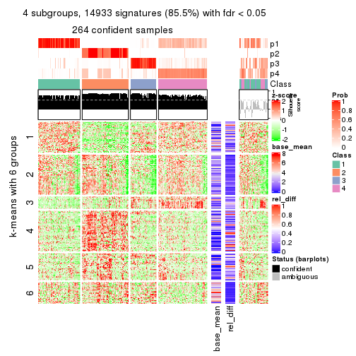</p>

</div>
<div id='tab-MAD-kmeans-get-signatures-4'>
<pre><code class="r">get_signatures(res, k = 5)
</code></pre>

<p></p>

</div>
<div id='tab-MAD-kmeans-get-signatures-5'>
<pre><code class="r">get_signatures(res, k = 6)
</code></pre>

<p></p>

</div>
</div>


Signature heatmaps where rows are not scaled:


<script>
$( function() {
	$( '#tabs-MAD-kmeans-get-signatures-no-scale' ).tabs();
} );
</script>
<div id='tabs-MAD-kmeans-get-signatures-no-scale'>
<ul>
<li><a href='#tab-MAD-kmeans-get-signatures-no-scale-1'>k = 2</a></li>
<li><a href='#tab-MAD-kmeans-get-signatures-no-scale-2'>k = 3</a></li>
<li><a href='#tab-MAD-kmeans-get-signatures-no-scale-3'>k = 4</a></li>
<li><a href='#tab-MAD-kmeans-get-signatures-no-scale-4'>k = 5</a></li>
<li><a href='#tab-MAD-kmeans-get-signatures-no-scale-5'>k = 6</a></li>
</ul>
<div id='tab-MAD-kmeans-get-signatures-no-scale-1'>
<pre><code class="r">get_signatures(res, k = 2, scale_rows = FALSE)
</code></pre>

<p></p>

</div>
<div id='tab-MAD-kmeans-get-signatures-no-scale-2'>
<pre><code class="r">get_signatures(res, k = 3, scale_rows = FALSE)
</code></pre>

<p></p>

</div>
<div id='tab-MAD-kmeans-get-signatures-no-scale-3'>
<pre><code class="r">get_signatures(res, k = 4, scale_rows = FALSE)
</code></pre>

<p></p>

</div>
<div id='tab-MAD-kmeans-get-signatures-no-scale-4'>
<pre><code class="r">get_signatures(res, k = 5, scale_rows = FALSE)
</code></pre>

<p></p>

</div>
<div id='tab-MAD-kmeans-get-signatures-no-scale-5'>
<pre><code class="r">get_signatures(res, k = 6, scale_rows = FALSE)
</code></pre>

<p></p>

</div>
</div>


Compare the overlap of signatures from different k:

```r
compare_signatures(res)
```


`get_signature()` returns a data frame invisibly. TO get the list of signatures, the function
call should be assigned to a variable explicitly. In following code, if `plot` argument is set
to `FALSE`, no heatmap is plotted while only the differential analysis is performed.

```r
# code only for demonstration
tb = get_signature(res, k = ..., plot = FALSE)
```

An example of the output of `tb` is:

```
#>   which_row         fdr    mean_1    mean_2 scaled_mean_1 scaled_mean_2 km
#> 1        38 0.042760348  8.373488  9.131774    -0.5533452     0.5164555  1
#> 2        40 0.018707592  7.106213  8.469186    -0.6173731     0.5762149  1
#> 3        55 0.019134737 10.221463 11.207825    -0.6159697     0.5749050  1
#> 4        59 0.006059896  5.921854  7.869574    -0.6899429     0.6439467  1
#> 5        60 0.018055526  8.928898 10.211722    -0.6204761     0.5791110  1
#> 6        98 0.009384629 15.714769 14.887706     0.6635654    -0.6193277  2
...
```

The columns in `tb` are:

1. `which_row`: row indices corresponding to the input matrix.
2. `fdr`: FDR for the differential test. 
3. `mean_x`: The mean value in group x.
4. `scaled_mean_x`: The mean value in group x after rows are scaled.
5. `km`: Row groups if k-means clustering is applied to rows.


UMAP plot which shows how samples are separated.


<script>
$( function() {
	$( '#tabs-MAD-kmeans-dimension-reduction' ).tabs();
} );
</script>
<div id='tabs-MAD-kmeans-dimension-reduction'>
<ul>
<li><a href='#tab-MAD-kmeans-dimension-reduction-1'>k = 2</a></li>
<li><a href='#tab-MAD-kmeans-dimension-reduction-2'>k = 3</a></li>
<li><a href='#tab-MAD-kmeans-dimension-reduction-3'>k = 4</a></li>
<li><a href='#tab-MAD-kmeans-dimension-reduction-4'>k = 5</a></li>
<li><a href='#tab-MAD-kmeans-dimension-reduction-5'>k = 6</a></li>
</ul>
<div id='tab-MAD-kmeans-dimension-reduction-1'>
<pre><code class="r">dimension_reduction(res, k = 2, method = &quot;UMAP&quot;)
</code></pre>

<p></p>

</div>
<div id='tab-MAD-kmeans-dimension-reduction-2'>
<pre><code class="r">dimension_reduction(res, k = 3, method = &quot;UMAP&quot;)
</code></pre>

<p></p>

</div>
<div id='tab-MAD-kmeans-dimension-reduction-3'>
<pre><code class="r">dimension_reduction(res, k = 4, method = &quot;UMAP&quot;)
</code></pre>

<p></p>

</div>
<div id='tab-MAD-kmeans-dimension-reduction-4'>
<pre><code class="r">dimension_reduction(res, k = 5, method = &quot;UMAP&quot;)
</code></pre>

<p></p>

</div>
<div id='tab-MAD-kmeans-dimension-reduction-5'>
<pre><code class="r">dimension_reduction(res, k = 6, method = &quot;UMAP&quot;)
</code></pre>

<p></p>

</div>
</div>


Following heatmap shows how subgroups are split when increasing `k`:

```r
collect_classes(res)
```


If matrix rows can be associated to genes, consider to use `GO_Enrichment(res,
...)` to perform function enrichment for the signature genes.


 

---------------------------------------------------


### MAD:skmeans**


The object with results only for a single top-value method and a single partition method 
can be extracted as:

```r
res = res_list["MAD", "skmeans"]
# you can also extract it by
# res = res_list["MAD:skmeans"]
```

A summary of `res` and all the functions that can be applied to it:

```r
res
```

```
#> A 'ConsensusPartition' object with k = 2, 3, 4, 5, 6.
#>   On a matrix with 17469 rows and 309 columns.
#>   Top rows (1000, 2000, 3000, 4000, 5000) are extracted by 'MAD' method.
#>   Subgroups are detected by 'skmeans' method.
#>   Performed in total 1250 partitions by row resampling.
#>   Best k for subgroups seems to be 2.
#> 
#> Following methods can be applied to this 'ConsensusPartition' object:
#>  [1] "cola_report"             "collect_classes"         "collect_plots"          
#>  [4] "collect_stats"           "colnames"                "compare_signatures"     
#>  [7] "consensus_heatmap"       "dimension_reduction"     "functional_enrichment"  
#> [10] "get_anno_col"            "get_anno"                "get_classes"            
#> [13] "get_consensus"           "get_matrix"              "get_membership"         
#> [16] "get_param"               "get_signatures"          "get_stats"              
#> [19] "is_best_k"               "is_stable_k"             "membership_heatmap"     
#> [22] "ncol"                    "nrow"                    "plot_ecdf"              
#> [25] "rownames"                "select_partition_number" "show"                   
#> [28] "suggest_best_k"          "test_to_known_factors"
```

`collect_plots()` function collects all the plots made from `res` for all `k` (number of partitions)
into one single page to provide an easy and fast comparison between different `k`.

```r
collect_plots(res)
```

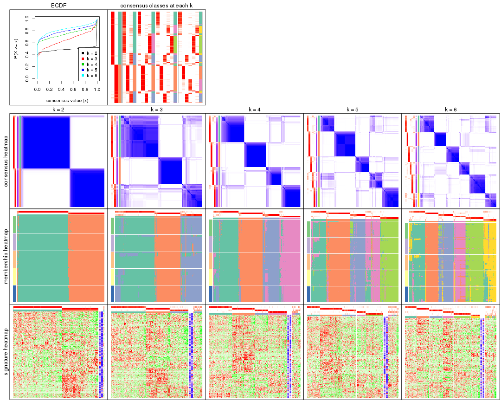

The plots are:

- The first row: a plot of the ECDF (Empirical cumulative distribution
  function) curves of the consensus matrix for each `k` and the heatmap of
  predicted classes for each `k`.
- The second row: heatmaps of the consensus matrix for each `k`.
- The third row: heatmaps of the membership matrix for each `k`.
- The fouth row: heatmaps of the signatures for each `k`.

All the plots in panels can be made by individual functions and they are
plotted later in this section.

`select_partition_number()` produces several plots showing different
statistics for choosing "optimized" `k`. There are following statistics:

- ECDF curves of the consensus matrix for each `k`;
- 1-PAC. [The PAC
  score](https://en.wikipedia.org/wiki/Consensus_clustering#Over-interpretation_potential_of_consensus_clustering)
  measures the proportion of the ambiguous subgrouping.
- Mean silhouette score.
- Concordance. The mean probability of fiting the consensus class ids in all
  partitions.
- Area increased. Denote $A_k$ as the area under the ECDF curve for current
  `k`, the area increased is defined as $A_k - A_{k-1}$.
- Rand index. The percent of pairs of samples that are both in a same cluster
  or both are not in a same cluster in the partition of k and k-1.
- Jaccard index. The ratio of pairs of samples are both in a same cluster in
  the partition of k and k-1 and the pairs of samples are both in a same
  cluster in the partition k or k-1.

The detailed explanations of these statistics can be found in [the cola
vignette](http://bioconductor.org/packages/devel/bioc/vignettes/cola/inst/doc/cola.html#toc_13).

Generally speaking, lower PAC score, higher mean silhouette score or higher
concordance corresponds to better partition. Rand index and Jaccard index
measure how similar the current partition is compared to partition with `k-1`.
If they are too similar, we won't accept `k` is better than `k-1`.

```r
select_partition_number(res)
```


The numeric values for all these statistics can be obtained by `get_stats()`.

```r
get_stats(res)
```

```
#>   k 1-PAC mean_silhouette concordance area_increased  Rand Jaccard
#> 2 2 1.000           0.971       0.988         0.4898 0.511   0.511
#> 3 3 0.742           0.804       0.905         0.3300 0.765   0.573
#> 4 4 0.838           0.821       0.925         0.1473 0.822   0.546
#> 5 5 0.827           0.784       0.896         0.0614 0.901   0.646
#> 6 6 0.813           0.759       0.874         0.0461 0.933   0.694
```

`suggest_best_k()` suggests the best $k$ based on these statistics. The rules are as follows:

- All $k$ with Jaccard index larger than 0.95 are removed because the increase of
  the partition number does not provides enough extra information. If all $k$ are removed,
  the best $k$ is assigned by `NA`.
- For $k$ with 1-PAC larger than 0.9, the maximal $k$ is taken as the "best k". Other $k$ is called "optional k".
- If it does not fit the second rule. The $k$ with the highest vote of highest
  1-PAC, mean silhouette and concordance is taken as the "best k".

```r
suggest_best_k(res)
```

```
#> [1] 2
```


Following shows the table of the partitions (You need to click the **show/hide
code output** link to see it). The membership matrix (columns with name `p*`)
is inferred by
[`clue::cl_consensus()`](https://www.rdocumentation.org/link/cl_consensus?package=clue)
function with the `SE` method. Basically the value in the membership matrix
represents the probability to belong to a certain group. The finall class
label for an item is determined with the group with highest probability it
belongs to.

In `get_classes()` function, the entropy is calculated from the membership
matrix and the silhouette score is calculated from the consensus matrix.


<script>
$( function() {
	$( '#tabs-MAD-skmeans-get-classes' ).tabs();
} );
</script>
<div id='tabs-MAD-skmeans-get-classes'>
<ul>
<li><a href='#tab-MAD-skmeans-get-classes-1'>k = 2</a></li>
<li><a href='#tab-MAD-skmeans-get-classes-2'>k = 3</a></li>
<li><a href='#tab-MAD-skmeans-get-classes-3'>k = 4</a></li>
<li><a href='#tab-MAD-skmeans-get-classes-4'>k = 5</a></li>
<li><a href='#tab-MAD-skmeans-get-classes-5'>k = 6</a></li>
</ul>

<div id='tab-MAD-skmeans-get-classes-1'>
<p><a id='tab-MAD-skmeans-get-classes-1-a' style='color:#0366d6' href='#'>show/hide code output</a></p>
<pre><code class="r">cbind(get_classes(res, k = 2), get_membership(res, k = 2))
</code></pre>

<pre><code>#&gt;                                      class entropy silhouette    p1    p2
#&gt; 7826AE44-B03A-4528-9CB5-7421E592AE36     2  0.0000      0.987 0.000 1.000
#&gt; 0DC2197B-2FEA-48EB-953E-8E44E1933757     2  0.0376      0.984 0.004 0.996
#&gt; 87ABB098-8C1E-4677-8C31-48B71EFE41C7     2  0.0000      0.987 0.000 1.000
#&gt; EC0154E7-7A27-4535-83AE-6B379E99A93C     1  0.0000      0.988 1.000 0.000
#&gt; 78F79407-D49F-4FA2-B09F-0665C502827C     1  0.0000      0.988 1.000 0.000
#&gt; 03E81178-E971-4E91-8BED-D8273EA1425C     1  0.0000      0.988 1.000 0.000
#&gt; 62FCAEFF-16D8-4019-84B6-18EC3A88BC32     2  0.0000      0.987 0.000 1.000
#&gt; 722C1284-5983-4CC1-B19C-214C2DE6F8A6     2  0.0000      0.987 0.000 1.000
#&gt; 54E42A64-B350-4A94-8FED-C9BC1872660E     1  0.2043      0.957 0.968 0.032
#&gt; 53062969-D209-490B-9C9B-5D297625E2AE     1  0.0000      0.988 1.000 0.000
#&gt; B710293C-41D3-4A2E-8104-5402F91DD859     1  0.0000      0.988 1.000 0.000
#&gt; 73CB1D05-7AE4-457D-B4EF-25AC5C1F2132     1  0.0000      0.988 1.000 0.000
#&gt; B055A70B-3003-47CB-BDAA-6378C000BF24     2  0.5737      0.842 0.136 0.864
#&gt; 46C3A870-E37A-42CB-8C0C-6ACACEAC1ADC     2  0.0000      0.987 0.000 1.000
#&gt; E8E6270E-F26D-4F2E-A63E-7885BDE05FDB     1  0.0000      0.988 1.000 0.000
#&gt; C4A5EBA2-9091-4D12-BDC8-B84B122022B9     2  0.3431      0.926 0.064 0.936
#&gt; 5B1839C4-549D-41D1-B559-3C6D2A1528CE     1  0.0000      0.988 1.000 0.000
#&gt; A0DF05EB-DC44-4492-9A8A-F278F7B0C266     1  0.0000      0.988 1.000 0.000
#&gt; B5182F49-70F2-45B7-82DE-C6DA68145EEA     1  0.0000      0.988 1.000 0.000
#&gt; C204D355-B876-4341-A111-36D48CBDD2A8     1  0.5178      0.863 0.884 0.116
#&gt; 7B070AAA-EF97-4D3B-AA19-EEC170C7927D     2  0.0000      0.987 0.000 1.000
#&gt; 05A8A881-F8EE-48A2-B11C-A08D7D80CE18     1  0.0000      0.988 1.000 0.000
#&gt; BA59EF50-CFE9-456D-B1B6-67D0945004F6     1  0.0000      0.988 1.000 0.000
#&gt; AD97B334-E034-4D33-A4D5-48C32D5D521C     1  0.0000      0.988 1.000 0.000
#&gt; 51DA2568-32EA-4668-9876-4B6E7CA68860     2  0.0376      0.984 0.004 0.996
#&gt; 78C26A05-2084-494D-83D3-C52C1B800F4C     1  0.0000      0.988 1.000 0.000
#&gt; 2B5DD791-7692-4721-9519-7D7D49B52570     2  0.2043      0.958 0.032 0.968
#&gt; C0BBE26A-79C8-4392-9978-7C420B3786B5     1  0.0000      0.988 1.000 0.000
#&gt; F35A8359-3A7A-414F-8A5C-D278F3B45387     2  0.0000      0.987 0.000 1.000
#&gt; 8C9BA49C-1270-491D-A234-AE1B1C0609BA     2  0.0000      0.987 0.000 1.000
#&gt; CA104B57-B160-4148-8A0A-D34BB3E8D88A     1  0.0000      0.988 1.000 0.000
#&gt; 877E18A5-6A7A-4E29-9871-DC7EA14A5F27     1  0.0000      0.988 1.000 0.000
#&gt; 904EDF2E-411E-43BD-901D-46129AFA283A     1  0.0000      0.988 1.000 0.000
#&gt; FD9F5A9B-2BEB-4D31-9A2D-8D4B4ECBB478     1  0.0000      0.988 1.000 0.000
#&gt; 2E206314-9928-456E-B7C6-893DC0E3C7C2     2  0.0000      0.987 0.000 1.000
#&gt; 913DB655-2C7F-4369-83DE-9257F04CF39B     2  0.0000      0.987 0.000 1.000
#&gt; 72B5B724-FEB5-43BD-83F6-2E2152DDD800     2  0.0000      0.987 0.000 1.000
#&gt; 920B547C-6898-446C-AAAF-F4ED96E40AAB     2  0.0000      0.987 0.000 1.000
#&gt; 847F796A-8CD6-4013-A0FB-26F4FC3EAF0D     1  0.0000      0.988 1.000 0.000
#&gt; C4D64E7A-33F7-4CFC-9FD3-D6AA3D8EFAA7     1  0.0000      0.988 1.000 0.000
#&gt; EABA0B17-8E19-48C5-BF62-2A45C9632807     2  0.0000      0.987 0.000 1.000
#&gt; 7263CBA8-CE37-4531-A795-9324C6D2A672     1  0.7745      0.703 0.772 0.228
#&gt; 6D3CC3AC-618B-414A-B640-169C735A6568     2  0.0000      0.987 0.000 1.000
#&gt; 710C05C7-F9CE-45FA-A8CC-29DE2903E04F     1  0.0000      0.988 1.000 0.000
#&gt; 3D631A56-2C55-48EA-A667-BA46023C9D50     1  0.0000      0.988 1.000 0.000
#&gt; F1C65F64-AF05-4875-B7E4-60FFF56A3F46     1  0.0000      0.988 1.000 0.000
#&gt; E5DF76E7-A765-4E07-B87A-06168BF66C5F     1  0.0000      0.988 1.000 0.000
#&gt; 5C8C8A6E-40D4-4F82-AC3D-90CFDEE15C0A     2  0.0000      0.987 0.000 1.000
#&gt; 0117CBB9-1BF9-48B1-BE6E-A9A770FF8721     1  0.9209      0.492 0.664 0.336
#&gt; 31EF66E5-419A-44C3-BB2A-B69B52FFCECC     2  0.0000      0.987 0.000 1.000
#&gt; C149CEF5-61F3-4B53-B8A9-8244B673EBD0     1  0.0000      0.988 1.000 0.000
#&gt; 0AF351D0-4EC5-4275-AA0A-4FA2AF8A9C85     2  0.0000      0.987 0.000 1.000
#&gt; B507E82F-6680-497B-A014-033EDD7A2E03     1  0.0000      0.988 1.000 0.000
#&gt; F941890E-AB33-478F-8C97-1C785DD9428F     1  0.0000      0.988 1.000 0.000
#&gt; 7987E019-8FED-469B-A6C1-34EE430A60C3     1  0.0000      0.988 1.000 0.000
#&gt; 76084AA6-19BF-4605-B6A1-73F1D4BADAF9     2  0.0000      0.987 0.000 1.000
#&gt; 329807F7-E0D4-4F53-94E8-E4080E90CB47     2  0.0000      0.987 0.000 1.000
#&gt; 1B6505FF-C1A7-4DD0-9827-41A0A3A28F3E     1  0.0000      0.988 1.000 0.000
#&gt; 49778E92-B5D3-4AD9-A1AF-3B722D631B96     2  0.0000      0.987 0.000 1.000
#&gt; A22892DE-0AF4-4B63-9513-1D6825059040     1  0.0000      0.988 1.000 0.000
#&gt; 6D77ECAE-A715-4ADD-97D8-A916DC31A4EA     1  0.0000      0.988 1.000 0.000
#&gt; 09758B6F-1B2D-4AED-8913-696097069409     1  0.0000      0.988 1.000 0.000
#&gt; 8B709DB4-0B28-42F1-A7C5-106F5809BEA2     1  0.0000      0.988 1.000 0.000
#&gt; F2B356FA-79CD-4867-8ABF-84C90A493A75     1  0.0000      0.988 1.000 0.000
#&gt; 131213AD-0313-4DF1-B013-CE67ED262C37     2  0.0000      0.987 0.000 1.000
#&gt; D94F7E81-0F60-473B-AD4A-0AC13508BDE2     2  0.0000      0.987 0.000 1.000
#&gt; 29C17355-D646-48DA-9E54-7B6DD85DD610     1  0.0000      0.988 1.000 0.000
#&gt; B8BD866A-2A7C-45C3-96BB-9AB892D26AE5     1  0.0000      0.988 1.000 0.000
#&gt; 13EFD045-AD61-41EE-9896-67BFA4FC8C09     2  0.0000      0.987 0.000 1.000
#&gt; 2655F609-B3BB-4D01-B421-D5F4B1232EC8     2  0.0000      0.987 0.000 1.000
#&gt; 04BC7A52-C67F-42CB-8672-D3C51A20F2BA     1  0.0000      0.988 1.000 0.000
#&gt; 45472BD4-DBDB-41FE-B0E3-2440880E1DE6     1  0.0000      0.988 1.000 0.000
#&gt; B87FFFCD-CB57-4ACD-9C74-AB188984BBB2     1  0.0000      0.988 1.000 0.000
#&gt; 5271374C-13CD-4BFE-AC6D-C95AFE491322     1  0.0000      0.988 1.000 0.000
#&gt; E3372ACE-C7C8-43E5-B30A-1F2D662D8170     1  0.0000      0.988 1.000 0.000
#&gt; B08DF564-E4D0-4540-8160-93B3981DF1D8     1  0.0000      0.988 1.000 0.000
#&gt; 61A7D1B9-FC5A-4B9C-989F-936CDA948C27     1  0.0000      0.988 1.000 0.000
#&gt; 74E768C1-8766-46AC-AAB4-D79E5049F76A     2  0.0000      0.987 0.000 1.000
#&gt; 0CEA28F0-D7F0-4EB7-A23F-0C5CA6245971     2  0.0000      0.987 0.000 1.000
#&gt; 95C4EFF6-147C-48EC-A2C1-16B8F12AEEF2     2  0.0000      0.987 0.000 1.000
#&gt; C9A78BEA-D455-4F5E-8B7B-19BCB42887E7     1  0.0000      0.988 1.000 0.000
#&gt; DB970740-9AC1-4C10-9658-8A77B1C390DD     2  0.0000      0.987 0.000 1.000
#&gt; 883FBD37-0CA0-4562-8925-72ACC1EE93D9     1  0.0000      0.988 1.000 0.000
#&gt; 9FE1D006-49F2-471E-91E6-AF0414C24479     1  0.0000      0.988 1.000 0.000
#&gt; 11816CC6-8C8B-49C0-99EE-896377BCFCCD     1  0.0000      0.988 1.000 0.000
#&gt; 063FC5C8-4318-4ECC-9CA0-1976CBC8ACB6     1  0.0000      0.988 1.000 0.000
#&gt; E0F085CC-B90D-4FDE-B60E-C613971BAA00     1  0.0000      0.988 1.000 0.000
#&gt; 62361DA2-E4EE-46DA-BB1F-C51DCA9307CC     2  0.0000      0.987 0.000 1.000
#&gt; 1BA16D48-B09E-4699-A1AD-2FFECE4F3CDB     2  0.0000      0.987 0.000 1.000
#&gt; 3E4F14E9-60AE-4F17-9BA7-2A02E908204A     2  0.2043      0.959 0.032 0.968
#&gt; 79226DD7-BC85-4B8E-BFF8-B1E073129D34     1  0.0000      0.988 1.000 0.000
#&gt; D47D0936-826F-4D54-9225-F71B95357438     1  0.0000      0.988 1.000 0.000
#&gt; 0AE02B91-574C-4165-BA39-E9D7C1A870A2     2  0.0000      0.987 0.000 1.000
#&gt; DED8E9DF-CEFE-45ED-9374-EF9925A135C4     2  0.9170      0.510 0.332 0.668
#&gt; D587A993-3C47-4D4C-B744-59169D4F7451     1  0.0000      0.988 1.000 0.000
#&gt; 6BCA24E6-440F-42C5-ABE5-66C37B713A39     1  0.0000      0.988 1.000 0.000
#&gt; 86A5EDFB-9D06-4FED-BF57-F8D74A68E156     2  0.0000      0.987 0.000 1.000
#&gt; B9BD5134-2F6A-4454-8F83-69B63F9AE114     1  0.0000      0.988 1.000 0.000
#&gt; 082DA9E1-A40D-482B-8E21-A93BA97185F0     1  0.0000      0.988 1.000 0.000
#&gt; 16A8343A-1203-44FB-9F03-05CC7C71B4CC     2  0.8081      0.676 0.248 0.752
#&gt; 00439565-02CE-4BF5-956D-7078B51C0947     2  0.0000      0.987 0.000 1.000
#&gt; 7B2BD361-2BF1-4E97-BC08-457F5A9C2682     2  0.0000      0.987 0.000 1.000
#&gt; C1D8439A-D527-47F6-ADC1-25867B65DA21     2  0.0000      0.987 0.000 1.000
#&gt; D9096909-1439-462D-B69C-CAD1BF4F420C     1  0.0000      0.988 1.000 0.000
#&gt; 7822EA86-35A1-4285-9429-2B63111B9885     1  0.0000      0.988 1.000 0.000
#&gt; 6FD0CFC8-AC8D-4CF1-8C33-833AD98A30EF     2  0.0000      0.987 0.000 1.000
#&gt; A451F278-5E83-4BC6-9B15-3AA2117B99B6     2  0.0000      0.987 0.000 1.000
#&gt; 6EC25686-4547-459C-9E01-7EDF8DAECE35     2  0.8713      0.594 0.292 0.708
#&gt; 5D2F1EEA-2BA8-4C3A-8436-544EE1D23E7E     1  0.0000      0.988 1.000 0.000
#&gt; 675A4293-A4CE-4307-B00B-DFC4D44A87C6     2  0.0000      0.987 0.000 1.000
#&gt; 6FBE0AEF-476A-42B2-A857-846CF1ED92B6     2  0.0000      0.987 0.000 1.000
#&gt; 7139D616-1A15-4288-A9AE-411856A4A76D     1  0.0000      0.988 1.000 0.000
#&gt; 46D7F8C1-D5C5-40CC-BEF5-2E590A847BD9     2  0.0376      0.984 0.004 0.996
#&gt; 984C44D3-4F5F-44C9-BCD9-C991EBC1FCB8     1  0.0000      0.988 1.000 0.000
#&gt; 83FE52E0-2DC2-4580-8BB2-FBCBEE4AC240     1  0.0000      0.988 1.000 0.000
#&gt; 0923F9CB-DF6F-4BAA-A5F8-0F83CE60D1ED     1  0.0000      0.988 1.000 0.000
#&gt; 1DEB5206-78CC-4EB5-BCD5-85A6A5B4E273     1  0.0000      0.988 1.000 0.000
#&gt; E4DB18DA-EB0C-4B2F-9566-7F72222B16D4     1  0.0000      0.988 1.000 0.000
#&gt; F7456312-1309-4B2F-875D-0F90CDF3EC35     1  0.0000      0.988 1.000 0.000
#&gt; 9A25E5D8-0706-4960-A76B-BCD0AC93E4FA     1  0.0000      0.988 1.000 0.000
#&gt; 5A41FE8F-FFB3-4B87-BF11-A570C184096D     1  0.0000      0.988 1.000 0.000
#&gt; 33F84E63-3F6C-4867-ADB1-A0DF39F1295B     1  0.0000      0.988 1.000 0.000
#&gt; D6A644F5-D1D0-4A8D-94C4-EE6C3ECE7430     1  0.0000      0.988 1.000 0.000
#&gt; 2A5848CC-A9A2-4AA8-A752-321273E62CF0     1  0.0000      0.988 1.000 0.000
#&gt; 7CA6358B-FC8A-4675-B092-9E061038FC83     2  0.0000      0.987 0.000 1.000
#&gt; A4C2F4BC-5C62-4B1F-9AB8-46D9468EF523     2  0.0000      0.987 0.000 1.000
#&gt; 8AF4EB7F-418D-4CC9-A9B8-A93A4C1A173B     2  0.0000      0.987 0.000 1.000
#&gt; E5048887-70C8-468F-881E-2EC55F6E6F3B     1  0.0000      0.988 1.000 0.000
#&gt; 1BADCC7C-C4D8-4C34-9534-59D622C7A2A2     2  0.1184      0.973 0.016 0.984
#&gt; 02CE7DF7-64BD-4297-A240-A5B9EE8771D3     1  0.0000      0.988 1.000 0.000
#&gt; CBF6E96A-F56C-4C87-B851-D319930BAAB8     1  0.7883      0.689 0.764 0.236
#&gt; 48F6B774-CFD2-4DDF-B7A2-696596413C3F     1  0.0000      0.988 1.000 0.000
#&gt; 41D88C3E-5848-4B09-8A77-EAE6AC4EC6B0     2  0.0000      0.987 0.000 1.000
#&gt; BDF79CC0-00C7-49C1-900B-AB065A733B17     1  0.0000      0.988 1.000 0.000
#&gt; A894D686-BFC7-4AEE-A794-DBE718C6B6F6     2  0.0000      0.987 0.000 1.000
#&gt; 0712029E-3765-4272-BE5B-B6C8BCCC0F0F     2  0.0000      0.987 0.000 1.000
#&gt; 7B051855-9B09-4887-9BC0-9F077537938E     1  0.0000      0.988 1.000 0.000
#&gt; EF357C46-5C3C-4F51-9383-FF7694D07B97     2  0.0000      0.987 0.000 1.000
#&gt; 9492A322-37CA-4582-AC68-66B5D80778AF     2  0.0000      0.987 0.000 1.000
#&gt; 993399A4-1B9F-4258-B2D0-155AD58A2E82     1  0.0000      0.988 1.000 0.000
#&gt; 7B7DC93D-5494-4E69-BE07-2967887182F9     1  0.0000      0.988 1.000 0.000
#&gt; 29BCBA51-2580-473D-9CF7-BEDBD0DBAD1B     2  0.0000      0.987 0.000 1.000
#&gt; 40855647-E942-4F32-90B7-BEB921929BFB     1  0.0000      0.988 1.000 0.000
#&gt; 0DC723D0-7C68-4495-A4B9-2DF2FF19AB14     2  0.0000      0.987 0.000 1.000
#&gt; 7540005F-57E0-4E2E-A8A2-BEF2B0F333B1     2  0.0000      0.987 0.000 1.000
#&gt; EB1DDB14-4076-4C2C-B911-390C17C21486     1  0.0000      0.988 1.000 0.000
#&gt; 9EA70EC4-8BA0-4E3D-B3CB-A68D19E89868     1  0.0376      0.985 0.996 0.004
#&gt; B04E2E50-0A6E-4224-A825-1714D12E5669     2  0.0000      0.987 0.000 1.000
#&gt; B0BF5E01-536D-40FF-9C24-CBBD611E2FC2     1  0.0000      0.988 1.000 0.000
#&gt; 7B6B1788-B297-4442-B6BE-B7CE8754491E     1  0.0000      0.988 1.000 0.000
#&gt; A090D00C-34DF-4906-A517-4803C4C9A332     1  0.0000      0.988 1.000 0.000
#&gt; 340D44A6-9BEA-412C-9973-D9ABD6692255     1  0.0000      0.988 1.000 0.000
#&gt; E8D0D1E7-E5A8-4014-80C1-0245F90F4358     2  0.0000      0.987 0.000 1.000
#&gt; 19EA1494-8572-40E1-B9BB-3739F47B607D     1  0.0000      0.988 1.000 0.000
#&gt; 1C1B4793-8DAF-4763-BA4D-C4E869A4ED35     2  0.0000      0.987 0.000 1.000
#&gt; 45BF59B3-95BD-4196-ABAA-4C4F0DB38572     2  0.0000      0.987 0.000 1.000
#&gt; 47B5A2A7-7E13-4558-99D2-067F5075C6A4     1  0.0000      0.988 1.000 0.000
#&gt; E94638E8-CB51-4FBB-8BCB-4BFD7A812291     1  0.0000      0.988 1.000 0.000
#&gt; A17352A8-0D3C-4545-8136-7DAE2FB0E102     2  0.0000      0.987 0.000 1.000
#&gt; B18A6F95-D4ED-416B-B5A1-9A4934865D0D     2  0.0000      0.987 0.000 1.000
#&gt; 33E92C5F-0C42-4549-AD5B-0A064182A272     1  0.0000      0.988 1.000 0.000
#&gt; E041B375-3E60-4F18-A6EF-D1C249E3B8EE     2  0.0376      0.984 0.004 0.996
#&gt; EDF90AF6-6C64-4BD2-AADF-8D7D188650B2     2  0.0000      0.987 0.000 1.000
#&gt; 569320D2-316C-4E2D-B7B3-D7D5C4DAD42D     1  0.0000      0.988 1.000 0.000
#&gt; AFFB223D-DAE9-4567-9EF2-8E4DF9D8782D     2  0.0000      0.987 0.000 1.000
#&gt; 56FC9454-0A6A-4CC3-95C4-BE0E0D0BAFCE     2  0.0000      0.987 0.000 1.000
#&gt; 43226365-FAEF-46C5-AF1B-5C6C2BED84FF     1  0.9933      0.179 0.548 0.452
#&gt; 1536110A-B42A-4A84-9474-9895321FDCE9     2  0.0000      0.987 0.000 1.000
#&gt; 812255DD-536B-4216-90B1-27D5AB339BE2     1  0.0000      0.988 1.000 0.000
#&gt; 5D4563D6-68B7-4C9D-A3F4-AA7D45D5112C     2  0.0000      0.987 0.000 1.000
#&gt; BAA39781-DB94-473C-98B1-FA6CD3E1C67A     1  0.0000      0.988 1.000 0.000
#&gt; C1411CDA-814D-4E21-8929-C0F77858828F     1  0.0000      0.988 1.000 0.000
#&gt; EFE2F248-C13E-4E8D-9153-8C903848AC4A     1  0.7139      0.754 0.804 0.196
#&gt; D3939C84-D1D6-4060-9F91-AEB222A9BDD5     1  0.0000      0.988 1.000 0.000
#&gt; EABD2987-8C1E-49E5-94AF-C0BDE5335A48     1  0.0000      0.988 1.000 0.000
#&gt; F4BE2ABE-2CEB-4A6A-B8EC-0355F8C63B9B     1  0.0000      0.988 1.000 0.000
#&gt; 627BC251-D217-4955-B718-6B9D6DEA1756     1  0.0000      0.988 1.000 0.000
#&gt; 31B54613-A20E-4039-BB8B-9B52104CE418     1  0.0000      0.988 1.000 0.000
#&gt; 3F292B7C-A535-4DBD-BC20-CB4F85A1C94B     1  0.0376      0.985 0.996 0.004
#&gt; BEA2A5EB-EEA9-4F31-AC38-810E04CE124B     2  0.0000      0.987 0.000 1.000
#&gt; 99D84D46-19DA-43F1-B639-DCE9953F1529     2  0.0000      0.987 0.000 1.000
#&gt; 4588817E-1068-4A78-86B6-4674A0112DDA     2  0.0376      0.984 0.004 0.996
#&gt; 6AC633BD-BEC1-4750-94E3-378972DAB6B3     2  0.0000      0.987 0.000 1.000
#&gt; 09E17C6E-7EDE-4DDF-B5ED-2521AF870C9A     1  0.0000      0.988 1.000 0.000
#&gt; 58D9C750-26A2-4B7C-84C4-13D7AFB4C5EA     1  0.0000      0.988 1.000 0.000
#&gt; DF28E138-E222-4F77-9B61-69E601CA7E60     2  0.0000      0.987 0.000 1.000
#&gt; FEA489A8-E423-4266-AADA-9BAAB29AB94B     1  0.0000      0.988 1.000 0.000
#&gt; F3FCC207-15CD-41EA-A3EF-F5D2C12AC373     1  0.0000      0.988 1.000 0.000
#&gt; 53DD7AFB-A258-4643-A501-BACC95D17A50     2  0.0000      0.987 0.000 1.000
#&gt; D850B2A1-1F8A-4A44-A0CF-8D9DD4A1889A     2  0.0000      0.987 0.000 1.000
#&gt; B3F746DC-E487-4305-9F30-825D1520E8FD     2  0.0000      0.987 0.000 1.000
#&gt; BE38240A-F7C2-439F-9AAE-51C8A340F310     1  0.0000      0.988 1.000 0.000
#&gt; A9022D9E-1D30-49EE-8552-1364A8027F34     1  0.0000      0.988 1.000 0.000
#&gt; 0E8A56EE-D9A2-48A5-B793-A358BE1E4EFA     1  0.0000      0.988 1.000 0.000
#&gt; 51667574-318E-4BDB-8F42-8512A4C1B84F     1  0.0000      0.988 1.000 0.000
#&gt; B0A442C9-67E4-4534-8A5C-D6D73F42358C     1  0.0000      0.988 1.000 0.000
#&gt; 25A5BC09-0D88-4385-87AF-997F9018522D     2  0.0000      0.987 0.000 1.000
#&gt; 344B9631-AAA5-4302-8747-D584345D9131     1  0.0000      0.988 1.000 0.000
#&gt; 1C3795AD-6306-4892-95F5-92DF3375D46A     1  0.0000      0.988 1.000 0.000
#&gt; 17BB221D-8BF9-4391-83DD-423AE1E03651     2  0.5059      0.871 0.112 0.888
#&gt; 297611E9-9555-4BCA-A723-02E846ACC23A     1  0.0000      0.988 1.000 0.000
#&gt; AD7FF180-1EAC-4783-8A62-E9626B96DD9F     2  0.0000      0.987 0.000 1.000
#&gt; FD544083-9BD5-4036-BD81-0352B67CC45C     1  0.0000      0.988 1.000 0.000
#&gt; 879A74D5-5B29-418D-A0F4-8E88D6384008     1  0.0000      0.988 1.000 0.000
#&gt; 43CD982C-13C0-4A52-803A-9A3A3FAE09BC     1  0.0000      0.988 1.000 0.000
#&gt; DCD0313D-5206-4111-8743-A8A0227257D9     1  0.0000      0.988 1.000 0.000
#&gt; 331A9160-D730-45DD-A985-C6CAC03035ED     1  0.0000      0.988 1.000 0.000
#&gt; 9EEECA0E-530D-4724-B016-A716F0782148     2  0.0000      0.987 0.000 1.000
#&gt; B3073976-CA3F-4115-9243-8C2D9E1B975D     1  0.0000      0.988 1.000 0.000
#&gt; 77B3C9B4-1A7F-41BB-A37D-01EF80E933CC     2  0.0000      0.987 0.000 1.000
#&gt; C0C26822-2E9F-4FB0-81D4-575027C8B71C     2  0.0000      0.987 0.000 1.000
#&gt; F1FCE328-2B3B-499A-888D-0E66A017E8B0     2  0.0000      0.987 0.000 1.000
#&gt; F069DAD6-F1EB-42F7-8252-F3F6EC46CC3E     1  0.0000      0.988 1.000 0.000
#&gt; 99CC822E-8C98-4EEC-BB58-AEF76A0B5332     1  0.0000      0.988 1.000 0.000
#&gt; C86EBD08-53F2-4972-801A-74970FDD6A62     1  0.0000      0.988 1.000 0.000
#&gt; F07326F2-C1D6-4D5A-9693-25C3A04B0EC2     1  0.0000      0.988 1.000 0.000
#&gt; 8ACBD428-7713-48D9-810A-43C9CD191A73     2  0.0000      0.987 0.000 1.000
#&gt; 3D3501B4-1A43-4FA7-90A2-CCEBF66BFD4A     2  0.0000      0.987 0.000 1.000
#&gt; DD51C17C-300F-44A4-955A-C9BC85417842     2  0.0000      0.987 0.000 1.000
#&gt; 58FF391C-1D83-426C-8F92-C15F78F56C95     1  0.0000      0.988 1.000 0.000
#&gt; ACE65C6E-2B10-4972-91B4-9199DD4B179D     1  0.0000      0.988 1.000 0.000
#&gt; B2088466-FA5D-491C-9982-99B33683E66F     2  0.0000      0.987 0.000 1.000
#&gt; D47AF416-1687-4FE0-A235-8815B6E8EB0B     2  0.1414      0.970 0.020 0.980
#&gt; 4DCAD07F-CC43-46F6-B2F3-EDBF3EDD1045     2  0.0000      0.987 0.000 1.000
#&gt; AAAE0BD9-63FC-4A0E-A27E-447B634BAD99     2  0.0000      0.987 0.000 1.000
#&gt; BC471AA1-52CF-4CEE-9866-34CE91404F45     2  0.0000      0.987 0.000 1.000
#&gt; 81D3EE3F-AC11-404F-8092-307F0DC12198     1  0.0000      0.988 1.000 0.000
#&gt; 8C02026C-C25E-406B-B8B8-A1A82362AE79     2  0.0000      0.987 0.000 1.000
#&gt; 6A005F2A-A0C1-4CA4-B15B-96B08F013874     1  0.0000      0.988 1.000 0.000
#&gt; B55743F2-4D63-4375-85D3-F58281CFD852     1  0.0000      0.988 1.000 0.000
#&gt; 24F98393-C817-4D0E-A7DB-05D2B5C71F40     1  0.0000      0.988 1.000 0.000
#&gt; 2C2AEF1D-4112-4EC7-9027-5E3FD26E8802     2  0.1184      0.974 0.016 0.984
#&gt; 8BAC3CB5-2987-4349-8AE8-B83DDD16CA3C     2  0.0000      0.987 0.000 1.000
#&gt; ED9C74E6-92FC-4E58-8FCE-1761DEA0C977     1  0.0000      0.988 1.000 0.000
#&gt; BA732ED4-F6BA-404E-BA3C-CA558FAD866A     1  0.0000      0.988 1.000 0.000
#&gt; E750385A-12D9-4A88-B4DF-C1306B5EF3B7     2  0.0000      0.987 0.000 1.000
#&gt; 6B1DC5E4-5F82-4395-913F-6AEDB5B63188     1  0.0672      0.981 0.992 0.008
#&gt; A7C12D37-FD50-4674-A054-1774F4E5C3B3     2  0.0000      0.987 0.000 1.000
#&gt; 2155C764-2063-4D9C-9ACD-96AA73475F5E     1  0.0000      0.988 1.000 0.000
#&gt; DE23CC15-A95E-4119-9B3C-8EEC45900D11     2  0.0000      0.987 0.000 1.000
#&gt; 5DB1DCAD-638E-48A4-9F40-3D6268FDEC33     2  0.0000      0.987 0.000 1.000
#&gt; 34AF0341-73D7-4080-AAEB-4C1541C2569F     1  0.0000      0.988 1.000 0.000
#&gt; B60D4235-44AF-4BA4-98C0-BCCDC28E90B9     2  0.0000      0.987 0.000 1.000
#&gt; CF463D89-2C9F-4257-BF04-8BC1CD40EA7D     2  0.0000      0.987 0.000 1.000
#&gt; EF6C8165-484A-4530-AEDF-93DCC4A8455D     1  0.0000      0.988 1.000 0.000
#&gt; B9F6B5E4-4D10-49B8-A8FE-8F33C5A62CBF     1  0.0000      0.988 1.000 0.000
#&gt; CE539000-92D7-4622-9C8D-BC6E01310681     2  0.0000      0.987 0.000 1.000
#&gt; D3BBC405-A22A-4009-ABF6-96FEEE653051     2  0.0000      0.987 0.000 1.000
#&gt; 0B3C86BD-0D20-4408-9BE3-05658729505F     2  0.0000      0.987 0.000 1.000
#&gt; 9B9C5071-7C3F-416C-B91C-6F5966747F54     1  0.0000      0.988 1.000 0.000
#&gt; A9469A4A-C5F9-4681-A916-A26F0B4307BA     1  0.0000      0.988 1.000 0.000
#&gt; A31B57E4-E30B-4A1B-829D-1B47D9CEC041     2  0.0000      0.987 0.000 1.000
#&gt; 647255CE-F84A-4070-B3FD-D8ACA32C4D09     1  0.0000      0.988 1.000 0.000
#&gt; 8F5E9F02-51D7-410E-B8B7-22737F2F095A     2  0.0000      0.987 0.000 1.000
#&gt; 8074A7F6-2FDE-4578-B71C-01C542D468FE     1  0.0000      0.988 1.000 0.000
#&gt; 2A946F17-F245-409E-A019-C60CDA18DC7D     1  0.0000      0.988 1.000 0.000
#&gt; 0878C381-47F9-4786-82C2-94AC840BEDCB     1  0.0000      0.988 1.000 0.000
#&gt; 54504893-92C5-4328-85A8-2A882680B5E0     1  0.0000      0.988 1.000 0.000
#&gt; 0A27D1BE-E5DD-459A-A51F-6D8AAF7CFEB4     1  0.0000      0.988 1.000 0.000
#&gt; 89ED5A3E-CAC0-4AB4-B858-A3CD8F34DBD5     2  0.0000      0.987 0.000 1.000
#&gt; ACEEB0A5-AADB-4EF9-8710-4BAF95522CEA     1  0.0000      0.988 1.000 0.000
#&gt; 02C74D81-5976-4252-BC6C-B10E934DECA2     1  0.0000      0.988 1.000 0.000
#&gt; D365A238-4739-4B54-9608-DC548F21C04E     1  0.0000      0.988 1.000 0.000
#&gt; F70F7ED5-A3B7-4210-95AD-DEFA0A565F06     1  0.0000      0.988 1.000 0.000
#&gt; A92C23A9-BC25-4025-9501-6D5FF8E2A502     1  0.0000      0.988 1.000 0.000
#&gt; ECE9BBF4-840E-47A6-8378-0B6C4A2369D3     1  0.0000      0.988 1.000 0.000
#&gt; 38749490-0FCF-4B33-9EBC-8F86C2D9E4AF     1  0.0000      0.988 1.000 0.000
#&gt; 02ABB64E-768B-4999-A899-EEE573D5F186     1  0.0000      0.988 1.000 0.000
#&gt; C1C467A8-18B1-4C3F-AC45-33359ED6FDC4     1  0.0000      0.988 1.000 0.000
#&gt; 78B2E4A1-9DAE-404F-AB47-1896450EF254     1  0.0000      0.988 1.000 0.000
#&gt; CCDB0290-91DA-4089-84A6-4434BA028D30     1  0.0000      0.988 1.000 0.000
#&gt; D5041E80-20A0-4C1A-9AC1-2394F6DB6E92     1  0.0000      0.988 1.000 0.000
#&gt; 20EB9CC6-EABB-438A-9030-E766459996D1     2  0.0000      0.987 0.000 1.000
#&gt; 73E99110-9A7C-4F73-98C5-79D22CB06230     1  0.0000      0.988 1.000 0.000
#&gt; FAD8A464-9BC3-4ED9-9517-B18D36514325     2  0.2603      0.947 0.044 0.956
#&gt; 9AF0E82E-E621-437A-8D19-700532B95090     1  0.0000      0.988 1.000 0.000
#&gt; 27DA48F3-4FC1-41A3-8E49-5B25F1CCFF07     1  0.0000      0.988 1.000 0.000
#&gt; EFE5A302-D138-4044-A301-5C5FD1C24836     1  0.0000      0.988 1.000 0.000
#&gt; D3E866AC-D66A-4C07-9F47-89AF460320DE     2  0.0000      0.987 0.000 1.000
#&gt; 89C45456-9392-4EB3-9A82-A130B6702AAF     2  0.0000      0.987 0.000 1.000
#&gt; 8FF5C8FC-2565-49BE-9EE0-91A84A85AB2A     2  0.0000      0.987 0.000 1.000
#&gt; 846DF088-75D5-49CF-BDDC-27E735A08DCA     2  0.0000      0.987 0.000 1.000
#&gt; EA3A19E1-7ADE-47B6-A35A-71290967147A     2  0.0000      0.987 0.000 1.000
#&gt; B2C43D0C-732B-4C54-938F-D3C9FDA880DA     1  0.0000      0.988 1.000 0.000
#&gt; EEC856B5-9B7F-488D-975E-CE2FF7072879     2  0.1184      0.973 0.016 0.984
#&gt; 8A68C417-09CC-4FA1-BFEB-EB4B738853A4     1  0.0000      0.988 1.000 0.000
#&gt; C5DF1A0D-952C-44E2-BF83-ED57177EF60E     1  0.0000      0.988 1.000 0.000
#&gt; B5C9EA22-F758-4BD2-BD1F-282EC1078AED     2  0.0000      0.987 0.000 1.000
#&gt; 3F08AE92-3EFD-4D7F-8C5C-BFB3621F0CD6     1  0.0000      0.988 1.000 0.000
#&gt; 8F0D43F1-2199-4DBB-9B16-1E5F2CED2FEC     2  0.0000      0.987 0.000 1.000
#&gt; 54BABD8B-EA9F-4875-8594-2179B38C73BD     1  0.0000      0.988 1.000 0.000
#&gt; C149B6F8-03DC-4907-920A-F3318B8D2A1E     1  0.9866      0.237 0.568 0.432
#&gt; F93D26E2-4B45-495D-BC8E-5B592F8FDABF     2  0.0000      0.987 0.000 1.000
#&gt; C98275CD-C39A-4E14-A731-4F3EB7396665     2  0.0000      0.987 0.000 1.000
#&gt; 354DC705-216E-42F0-B29E-C1F8D6C9489A     1  0.0000      0.988 1.000 0.000
#&gt; 6752EED9-7990-433F-A206-D5398C396471     1  0.0000      0.988 1.000 0.000
#&gt; C3E94C5D-68C4-400C-B7CB-38C42E9D5FFF     2  0.9044      0.531 0.320 0.680
#&gt; CE6B6871-3ED3-44DE-A777-7558D4429057     2  0.0376      0.984 0.004 0.996
#&gt; A06E7D1E-E432-4A4C-8BB0-314304F96EDF     2  0.0000      0.987 0.000 1.000
#&gt; 1ABBEF80-508F-4247-B43D-3E549372113B     2  0.0000      0.987 0.000 1.000
#&gt; 835AAE7F-F873-4D11-8845-232D261A38DF     1  0.0000      0.988 1.000 0.000
#&gt; E98A0460-6529-4DBA-8542-1B98801D7A7D     1  0.0000      0.988 1.000 0.000
#&gt; 06A9CBF8-01D0-4720-BCE8-83F0E77C862F     1  0.0000      0.988 1.000 0.000
#&gt; 206865A9-A67C-49A6-93AD-55D06E777559     2  0.0000      0.987 0.000 1.000
#&gt; 26DABC83-DB30-452F-9BE2-366760CB138E     2  0.0000      0.987 0.000 1.000
#&gt; 9DD5272A-2D6E-4774-83E3-0CD761EDE926     2  0.0376      0.984 0.004 0.996
#&gt; 4938E366-C740-4C9C-9358-FF37997DC9EF     1  0.0000      0.988 1.000 0.000
#&gt; E2DA59C4-A47C-41E3-BC55-2D00C6EC17FB     1  0.0000      0.988 1.000 0.000
#&gt; 37349E62-0BFB-4FEA-81D0-2AB7E7625B0D     1  0.0000      0.988 1.000 0.000
</code></pre>

<script>
$('#tab-MAD-skmeans-get-classes-1-a').parent().next().next().hide();
$('#tab-MAD-skmeans-get-classes-1-a').click(function(){
  $('#tab-MAD-skmeans-get-classes-1-a').parent().next().next().toggle();
  return(false);
});
</script>
</div>

<div id='tab-MAD-skmeans-get-classes-2'>
<p><a id='tab-MAD-skmeans-get-classes-2-a' style='color:#0366d6' href='#'>show/hide code output</a></p>
<pre><code class="r">cbind(get_classes(res, k = 3), get_membership(res, k = 3))
</code></pre>

<pre><code>#&gt;                                      class entropy silhouette    p1    p2    p3
#&gt; 7826AE44-B03A-4528-9CB5-7421E592AE36     2  0.4702     0.6946 0.000 0.788 0.212
#&gt; 0DC2197B-2FEA-48EB-953E-8E44E1933757     3  0.0592     0.8453 0.012 0.000 0.988
#&gt; 87ABB098-8C1E-4677-8C31-48B71EFE41C7     3  0.1636     0.8452 0.016 0.020 0.964
#&gt; EC0154E7-7A27-4535-83AE-6B379E99A93C     1  0.1643     0.8700 0.956 0.000 0.044
#&gt; 78F79407-D49F-4FA2-B09F-0665C502827C     1  0.0000     0.8756 1.000 0.000 0.000
#&gt; 03E81178-E971-4E91-8BED-D8273EA1425C     1  0.1289     0.8737 0.968 0.000 0.032
#&gt; 62FCAEFF-16D8-4019-84B6-18EC3A88BC32     3  0.6252     0.2544 0.000 0.444 0.556
#&gt; 722C1284-5983-4CC1-B19C-214C2DE6F8A6     2  0.0000     0.9575 0.000 1.000 0.000
#&gt; 54E42A64-B350-4A94-8FED-C9BC1872660E     2  0.9877    -0.0938 0.352 0.388 0.260
#&gt; 53062969-D209-490B-9C9B-5D297625E2AE     1  0.1753     0.8682 0.952 0.000 0.048
#&gt; B710293C-41D3-4A2E-8104-5402F91DD859     1  0.1289     0.8737 0.968 0.000 0.032
#&gt; 73CB1D05-7AE4-457D-B4EF-25AC5C1F2132     1  0.1643     0.8700 0.956 0.000 0.044
#&gt; B055A70B-3003-47CB-BDAA-6378C000BF24     3  0.1289     0.8449 0.032 0.000 0.968
#&gt; 46C3A870-E37A-42CB-8C0C-6ACACEAC1ADC     2  0.0000     0.9575 0.000 1.000 0.000
#&gt; E8E6270E-F26D-4F2E-A63E-7885BDE05FDB     3  0.1289     0.8449 0.032 0.000 0.968
#&gt; C4A5EBA2-9091-4D12-BDC8-B84B122022B9     3  0.1529     0.8393 0.040 0.000 0.960
#&gt; 5B1839C4-549D-41D1-B559-3C6D2A1528CE     3  0.1753     0.8368 0.048 0.000 0.952
#&gt; A0DF05EB-DC44-4492-9A8A-F278F7B0C266     1  0.1643     0.8700 0.956 0.000 0.044
#&gt; B5182F49-70F2-45B7-82DE-C6DA68145EEA     1  0.1289     0.8737 0.968 0.000 0.032
#&gt; C204D355-B876-4341-A111-36D48CBDD2A8     3  0.2796     0.8171 0.092 0.000 0.908
#&gt; 7B070AAA-EF97-4D3B-AA19-EEC170C7927D     2  0.0000     0.9575 0.000 1.000 0.000
#&gt; 05A8A881-F8EE-48A2-B11C-A08D7D80CE18     1  0.0000     0.8756 1.000 0.000 0.000
#&gt; BA59EF50-CFE9-456D-B1B6-67D0945004F6     1  0.1643     0.8700 0.956 0.000 0.044
#&gt; AD97B334-E034-4D33-A4D5-48C32D5D521C     1  0.2165     0.8600 0.936 0.000 0.064
#&gt; 51DA2568-32EA-4668-9876-4B6E7CA68860     3  0.1529     0.8390 0.040 0.000 0.960
#&gt; 78C26A05-2084-494D-83D3-C52C1B800F4C     1  0.6180     0.3353 0.584 0.000 0.416
#&gt; 2B5DD791-7692-4721-9519-7D7D49B52570     3  0.1289     0.8449 0.032 0.000 0.968
#&gt; C0BBE26A-79C8-4392-9978-7C420B3786B5     3  0.1289     0.8449 0.032 0.000 0.968
#&gt; F35A8359-3A7A-414F-8A5C-D278F3B45387     2  0.0000     0.9575 0.000 1.000 0.000
#&gt; 8C9BA49C-1270-491D-A234-AE1B1C0609BA     2  0.0000     0.9575 0.000 1.000 0.000
#&gt; CA104B57-B160-4148-8A0A-D34BB3E8D88A     1  0.1289     0.8737 0.968 0.000 0.032
#&gt; 877E18A5-6A7A-4E29-9871-DC7EA14A5F27     1  0.1289     0.8737 0.968 0.000 0.032
#&gt; 904EDF2E-411E-43BD-901D-46129AFA283A     1  0.1643     0.8700 0.956 0.000 0.044
#&gt; FD9F5A9B-2BEB-4D31-9A2D-8D4B4ECBB478     1  0.1289     0.8737 0.968 0.000 0.032
#&gt; 2E206314-9928-456E-B7C6-893DC0E3C7C2     2  0.0000     0.9575 0.000 1.000 0.000
#&gt; 913DB655-2C7F-4369-83DE-9257F04CF39B     2  0.9120     0.3105 0.256 0.544 0.200
#&gt; 72B5B724-FEB5-43BD-83F6-2E2152DDD800     2  0.5402     0.7004 0.028 0.792 0.180
#&gt; 920B547C-6898-446C-AAAF-F4ED96E40AAB     2  0.0000     0.9575 0.000 1.000 0.000
#&gt; 847F796A-8CD6-4013-A0FB-26F4FC3EAF0D     1  0.1643     0.8700 0.956 0.000 0.044
#&gt; C4D64E7A-33F7-4CFC-9FD3-D6AA3D8EFAA7     1  0.0000     0.8756 1.000 0.000 0.000
#&gt; EABA0B17-8E19-48C5-BF62-2A45C9632807     2  0.0000     0.9575 0.000 1.000 0.000
#&gt; 7263CBA8-CE37-4531-A795-9324C6D2A672     3  0.1643     0.8378 0.044 0.000 0.956
#&gt; 6D3CC3AC-618B-414A-B640-169C735A6568     3  0.2356     0.8238 0.000 0.072 0.928
#&gt; 710C05C7-F9CE-45FA-A8CC-29DE2903E04F     1  0.1643     0.8700 0.956 0.000 0.044
#&gt; 3D631A56-2C55-48EA-A667-BA46023C9D50     3  0.5397     0.6082 0.280 0.000 0.720
#&gt; F1C65F64-AF05-4875-B7E4-60FFF56A3F46     3  0.6225     0.1608 0.432 0.000 0.568
#&gt; E5DF76E7-A765-4E07-B87A-06168BF66C5F     1  0.1289     0.8737 0.968 0.000 0.032
#&gt; 5C8C8A6E-40D4-4F82-AC3D-90CFDEE15C0A     2  0.0000     0.9575 0.000 1.000 0.000
#&gt; 0117CBB9-1BF9-48B1-BE6E-A9A770FF8721     3  0.1643     0.8378 0.044 0.000 0.956
#&gt; 31EF66E5-419A-44C3-BB2A-B69B52FFCECC     2  0.0000     0.9575 0.000 1.000 0.000
#&gt; C149CEF5-61F3-4B53-B8A9-8244B673EBD0     1  0.1529     0.8710 0.960 0.000 0.040
#&gt; 0AF351D0-4EC5-4275-AA0A-4FA2AF8A9C85     2  0.0000     0.9575 0.000 1.000 0.000
#&gt; B507E82F-6680-497B-A014-033EDD7A2E03     3  0.1289     0.8449 0.032 0.000 0.968
#&gt; F941890E-AB33-478F-8C97-1C785DD9428F     3  0.5968     0.3990 0.364 0.000 0.636
#&gt; 7987E019-8FED-469B-A6C1-34EE430A60C3     1  0.3116     0.8292 0.892 0.000 0.108
#&gt; 76084AA6-19BF-4605-B6A1-73F1D4BADAF9     3  0.1289     0.8449 0.032 0.000 0.968
#&gt; 329807F7-E0D4-4F53-94E8-E4080E90CB47     3  0.1289     0.8449 0.032 0.000 0.968
#&gt; 1B6505FF-C1A7-4DD0-9827-41A0A3A28F3E     1  0.1289     0.8737 0.968 0.000 0.032
#&gt; 49778E92-B5D3-4AD9-A1AF-3B722D631B96     2  0.0000     0.9575 0.000 1.000 0.000
#&gt; A22892DE-0AF4-4B63-9513-1D6825059040     1  0.1643     0.8700 0.956 0.000 0.044
#&gt; 6D77ECAE-A715-4ADD-97D8-A916DC31A4EA     1  0.1289     0.8737 0.968 0.000 0.032
#&gt; 09758B6F-1B2D-4AED-8913-696097069409     1  0.1411     0.8742 0.964 0.000 0.036
#&gt; 8B709DB4-0B28-42F1-A7C5-106F5809BEA2     3  0.5529     0.5954 0.296 0.000 0.704
#&gt; F2B356FA-79CD-4867-8ABF-84C90A493A75     1  0.1643     0.8700 0.956 0.000 0.044
#&gt; 131213AD-0313-4DF1-B013-CE67ED262C37     2  0.0000     0.9575 0.000 1.000 0.000
#&gt; D94F7E81-0F60-473B-AD4A-0AC13508BDE2     3  0.1399     0.8453 0.028 0.004 0.968
#&gt; 29C17355-D646-48DA-9E54-7B6DD85DD610     1  0.1529     0.8710 0.960 0.000 0.040
#&gt; B8BD866A-2A7C-45C3-96BB-9AB892D26AE5     3  0.6204     0.2947 0.424 0.000 0.576
#&gt; 13EFD045-AD61-41EE-9896-67BFA4FC8C09     3  0.1399     0.8453 0.028 0.004 0.968
#&gt; 2655F609-B3BB-4D01-B421-D5F4B1232EC8     2  0.0000     0.9575 0.000 1.000 0.000
#&gt; 04BC7A52-C67F-42CB-8672-D3C51A20F2BA     1  0.2165     0.8575 0.936 0.000 0.064
#&gt; 45472BD4-DBDB-41FE-B0E3-2440880E1DE6     1  0.5058     0.6597 0.756 0.000 0.244
#&gt; B87FFFCD-CB57-4ACD-9C74-AB188984BBB2     3  0.2959     0.8125 0.100 0.000 0.900
#&gt; 5271374C-13CD-4BFE-AC6D-C95AFE491322     1  0.1643     0.8700 0.956 0.000 0.044
#&gt; E3372ACE-C7C8-43E5-B30A-1F2D662D8170     1  0.1753     0.8682 0.952 0.000 0.048
#&gt; B08DF564-E4D0-4540-8160-93B3981DF1D8     1  0.1289     0.8737 0.968 0.000 0.032
#&gt; 61A7D1B9-FC5A-4B9C-989F-936CDA948C27     1  0.1289     0.8737 0.968 0.000 0.032
#&gt; 74E768C1-8766-46AC-AAB4-D79E5049F76A     2  0.0000     0.9575 0.000 1.000 0.000
#&gt; 0CEA28F0-D7F0-4EB7-A23F-0C5CA6245971     3  0.1529     0.8411 0.000 0.040 0.960
#&gt; 95C4EFF6-147C-48EC-A2C1-16B8F12AEEF2     2  0.0000     0.9575 0.000 1.000 0.000
#&gt; C9A78BEA-D455-4F5E-8B7B-19BCB42887E7     1  0.0000     0.8756 1.000 0.000 0.000
#&gt; DB970740-9AC1-4C10-9658-8A77B1C390DD     2  0.6111     0.2677 0.000 0.604 0.396
#&gt; 883FBD37-0CA0-4562-8925-72ACC1EE93D9     1  0.5098     0.6550 0.752 0.000 0.248
#&gt; 9FE1D006-49F2-471E-91E6-AF0414C24479     1  0.1289     0.8737 0.968 0.000 0.032
#&gt; 11816CC6-8C8B-49C0-99EE-896377BCFCCD     1  0.1529     0.8710 0.960 0.000 0.040
#&gt; 063FC5C8-4318-4ECC-9CA0-1976CBC8ACB6     1  0.1289     0.8737 0.968 0.000 0.032
#&gt; E0F085CC-B90D-4FDE-B60E-C613971BAA00     1  0.3340     0.8434 0.880 0.000 0.120
#&gt; 62361DA2-E4EE-46DA-BB1F-C51DCA9307CC     2  0.0000     0.9575 0.000 1.000 0.000
#&gt; 1BA16D48-B09E-4699-A1AD-2FFECE4F3CDB     2  0.0000     0.9575 0.000 1.000 0.000
#&gt; 3E4F14E9-60AE-4F17-9BA7-2A02E908204A     3  0.1643     0.8378 0.044 0.000 0.956
#&gt; 79226DD7-BC85-4B8E-BFF8-B1E073129D34     1  0.1289     0.8737 0.968 0.000 0.032
#&gt; D47D0936-826F-4D54-9225-F71B95357438     3  0.5098     0.6584 0.248 0.000 0.752
#&gt; 0AE02B91-574C-4165-BA39-E9D7C1A870A2     2  0.0000     0.9575 0.000 1.000 0.000
#&gt; DED8E9DF-CEFE-45ED-9374-EF9925A135C4     3  0.2356     0.8278 0.072 0.000 0.928
#&gt; D587A993-3C47-4D4C-B744-59169D4F7451     1  0.1289     0.8737 0.968 0.000 0.032
#&gt; 6BCA24E6-440F-42C5-ABE5-66C37B713A39     1  0.1289     0.8737 0.968 0.000 0.032
#&gt; 86A5EDFB-9D06-4FED-BF57-F8D74A68E156     2  0.8175     0.4821 0.236 0.632 0.132
#&gt; B9BD5134-2F6A-4454-8F83-69B63F9AE114     1  0.1753     0.8682 0.952 0.000 0.048
#&gt; 082DA9E1-A40D-482B-8E21-A93BA97185F0     1  0.1289     0.8737 0.968 0.000 0.032
#&gt; 16A8343A-1203-44FB-9F03-05CC7C71B4CC     3  0.0592     0.8453 0.012 0.000 0.988
#&gt; 00439565-02CE-4BF5-956D-7078B51C0947     3  0.4137     0.8034 0.032 0.096 0.872
#&gt; 7B2BD361-2BF1-4E97-BC08-457F5A9C2682     2  0.0000     0.9575 0.000 1.000 0.000
#&gt; C1D8439A-D527-47F6-ADC1-25867B65DA21     2  0.0000     0.9575 0.000 1.000 0.000
#&gt; D9096909-1439-462D-B69C-CAD1BF4F420C     1  0.1289     0.8737 0.968 0.000 0.032
#&gt; 7822EA86-35A1-4285-9429-2B63111B9885     1  0.1289     0.8737 0.968 0.000 0.032
#&gt; 6FD0CFC8-AC8D-4CF1-8C33-833AD98A30EF     2  0.0000     0.9575 0.000 1.000 0.000
#&gt; A451F278-5E83-4BC6-9B15-3AA2117B99B6     2  0.0000     0.9575 0.000 1.000 0.000
#&gt; 6EC25686-4547-459C-9E01-7EDF8DAECE35     3  0.0592     0.8453 0.012 0.000 0.988
#&gt; 5D2F1EEA-2BA8-4C3A-8436-544EE1D23E7E     1  0.1289     0.8737 0.968 0.000 0.032
#&gt; 675A4293-A4CE-4307-B00B-DFC4D44A87C6     2  0.0000     0.9575 0.000 1.000 0.000
#&gt; 6FBE0AEF-476A-42B2-A857-846CF1ED92B6     2  0.0000     0.9575 0.000 1.000 0.000
#&gt; 7139D616-1A15-4288-A9AE-411856A4A76D     1  0.1289     0.8737 0.968 0.000 0.032
#&gt; 46D7F8C1-D5C5-40CC-BEF5-2E590A847BD9     3  0.1289     0.8449 0.032 0.000 0.968
#&gt; 984C44D3-4F5F-44C9-BCD9-C991EBC1FCB8     3  0.1289     0.8449 0.032 0.000 0.968
#&gt; 83FE52E0-2DC2-4580-8BB2-FBCBEE4AC240     1  0.6008     0.4465 0.628 0.000 0.372
#&gt; 0923F9CB-DF6F-4BAA-A5F8-0F83CE60D1ED     1  0.4750     0.6999 0.784 0.000 0.216
#&gt; 1DEB5206-78CC-4EB5-BCD5-85A6A5B4E273     1  0.5098     0.6550 0.752 0.000 0.248
#&gt; E4DB18DA-EB0C-4B2F-9566-7F72222B16D4     1  0.1289     0.8737 0.968 0.000 0.032
#&gt; F7456312-1309-4B2F-875D-0F90CDF3EC35     1  0.1643     0.8700 0.956 0.000 0.044
#&gt; 9A25E5D8-0706-4960-A76B-BCD0AC93E4FA     1  0.1529     0.8710 0.960 0.000 0.040
#&gt; 5A41FE8F-FFB3-4B87-BF11-A570C184096D     1  0.6192     0.3468 0.580 0.000 0.420
#&gt; 33F84E63-3F6C-4867-ADB1-A0DF39F1295B     1  0.3686     0.8044 0.860 0.000 0.140
#&gt; D6A644F5-D1D0-4A8D-94C4-EE6C3ECE7430     3  0.4974     0.6362 0.236 0.000 0.764
#&gt; 2A5848CC-A9A2-4AA8-A752-321273E62CF0     1  0.1643     0.8700 0.956 0.000 0.044
#&gt; 7CA6358B-FC8A-4675-B092-9E061038FC83     3  0.7658     0.3667 0.056 0.356 0.588
#&gt; A4C2F4BC-5C62-4B1F-9AB8-46D9468EF523     2  0.0000     0.9575 0.000 1.000 0.000
#&gt; 8AF4EB7F-418D-4CC9-A9B8-A93A4C1A173B     2  0.0000     0.9575 0.000 1.000 0.000
#&gt; E5048887-70C8-468F-881E-2EC55F6E6F3B     1  0.1289     0.8737 0.968 0.000 0.032
#&gt; 1BADCC7C-C4D8-4C34-9534-59D622C7A2A2     3  0.7043     0.2300 0.020 0.448 0.532
#&gt; 02CE7DF7-64BD-4297-A240-A5B9EE8771D3     1  0.6291     0.2171 0.532 0.000 0.468
#&gt; CBF6E96A-F56C-4C87-B851-D319930BAAB8     1  0.3967     0.8554 0.884 0.044 0.072
#&gt; 48F6B774-CFD2-4DDF-B7A2-696596413C3F     1  0.1289     0.8737 0.968 0.000 0.032
#&gt; 41D88C3E-5848-4B09-8A77-EAE6AC4EC6B0     2  0.0000     0.9575 0.000 1.000 0.000
#&gt; BDF79CC0-00C7-49C1-900B-AB065A733B17     3  0.5216     0.6382 0.260 0.000 0.740
#&gt; A894D686-BFC7-4AEE-A794-DBE718C6B6F6     2  0.0000     0.9575 0.000 1.000 0.000
#&gt; 0712029E-3765-4272-BE5B-B6C8BCCC0F0F     2  0.0000     0.9575 0.000 1.000 0.000
#&gt; 7B051855-9B09-4887-9BC0-9F077537938E     1  0.1643     0.8700 0.956 0.000 0.044
#&gt; EF357C46-5C3C-4F51-9383-FF7694D07B97     2  0.0000     0.9575 0.000 1.000 0.000
#&gt; 9492A322-37CA-4582-AC68-66B5D80778AF     2  0.0000     0.9575 0.000 1.000 0.000
#&gt; 993399A4-1B9F-4258-B2D0-155AD58A2E82     1  0.1529     0.8710 0.960 0.000 0.040
#&gt; 7B7DC93D-5494-4E69-BE07-2967887182F9     1  0.6225     0.3146 0.568 0.000 0.432
#&gt; 29BCBA51-2580-473D-9CF7-BEDBD0DBAD1B     2  0.0000     0.9575 0.000 1.000 0.000
#&gt; 40855647-E942-4F32-90B7-BEB921929BFB     3  0.3686     0.7854 0.140 0.000 0.860
#&gt; 0DC723D0-7C68-4495-A4B9-2DF2FF19AB14     2  0.0000     0.9575 0.000 1.000 0.000
#&gt; 7540005F-57E0-4E2E-A8A2-BEF2B0F333B1     2  0.0000     0.9575 0.000 1.000 0.000
#&gt; EB1DDB14-4076-4C2C-B911-390C17C21486     3  0.6008     0.3182 0.372 0.000 0.628
#&gt; 9EA70EC4-8BA0-4E3D-B3CB-A68D19E89868     1  0.1860     0.8665 0.948 0.000 0.052
#&gt; B04E2E50-0A6E-4224-A825-1714D12E5669     2  0.3038     0.8429 0.000 0.896 0.104
#&gt; B0BF5E01-536D-40FF-9C24-CBBD611E2FC2     1  0.6215     0.3028 0.572 0.000 0.428
#&gt; 7B6B1788-B297-4442-B6BE-B7CE8754491E     1  0.3752     0.8007 0.856 0.000 0.144
#&gt; A090D00C-34DF-4906-A517-4803C4C9A332     1  0.1643     0.8700 0.956 0.000 0.044
#&gt; 340D44A6-9BEA-412C-9973-D9ABD6692255     1  0.5465     0.5905 0.712 0.000 0.288
#&gt; E8D0D1E7-E5A8-4014-80C1-0245F90F4358     2  0.0000     0.9575 0.000 1.000 0.000
#&gt; 19EA1494-8572-40E1-B9BB-3739F47B607D     3  0.5591     0.5717 0.304 0.000 0.696
#&gt; 1C1B4793-8DAF-4763-BA4D-C4E869A4ED35     2  0.3941     0.7761 0.156 0.844 0.000
#&gt; 45BF59B3-95BD-4196-ABAA-4C4F0DB38572     2  0.0424     0.9503 0.000 0.992 0.008
#&gt; 47B5A2A7-7E13-4558-99D2-067F5075C6A4     1  0.1753     0.8682 0.952 0.000 0.048
#&gt; E94638E8-CB51-4FBB-8BCB-4BFD7A812291     1  0.1289     0.8737 0.968 0.000 0.032
#&gt; A17352A8-0D3C-4545-8136-7DAE2FB0E102     2  0.0000     0.9575 0.000 1.000 0.000
#&gt; B18A6F95-D4ED-416B-B5A1-9A4934865D0D     2  0.0000     0.9575 0.000 1.000 0.000
#&gt; 33E92C5F-0C42-4549-AD5B-0A064182A272     3  0.4002     0.7654 0.160 0.000 0.840
#&gt; E041B375-3E60-4F18-A6EF-D1C249E3B8EE     3  0.1643     0.8378 0.044 0.000 0.956
#&gt; EDF90AF6-6C64-4BD2-AADF-8D7D188650B2     2  0.0000     0.9575 0.000 1.000 0.000
#&gt; 569320D2-316C-4E2D-B7B3-D7D5C4DAD42D     1  0.1529     0.8710 0.960 0.000 0.040
#&gt; AFFB223D-DAE9-4567-9EF2-8E4DF9D8782D     2  0.0000     0.9575 0.000 1.000 0.000
#&gt; 56FC9454-0A6A-4CC3-95C4-BE0E0D0BAFCE     2  0.0000     0.9575 0.000 1.000 0.000
#&gt; 43226365-FAEF-46C5-AF1B-5C6C2BED84FF     2  0.6126     0.3315 0.400 0.600 0.000
#&gt; 1536110A-B42A-4A84-9474-9895321FDCE9     2  0.0000     0.9575 0.000 1.000 0.000
#&gt; 812255DD-536B-4216-90B1-27D5AB339BE2     1  0.1643     0.8700 0.956 0.000 0.044
#&gt; 5D4563D6-68B7-4C9D-A3F4-AA7D45D5112C     2  0.0000     0.9575 0.000 1.000 0.000
#&gt; BAA39781-DB94-473C-98B1-FA6CD3E1C67A     1  0.1289     0.8737 0.968 0.000 0.032
#&gt; C1411CDA-814D-4E21-8929-C0F77858828F     1  0.6168     0.3539 0.588 0.000 0.412
#&gt; EFE2F248-C13E-4E8D-9153-8C903848AC4A     1  0.2096     0.8661 0.944 0.004 0.052
#&gt; D3939C84-D1D6-4060-9F91-AEB222A9BDD5     1  0.5760     0.5404 0.672 0.000 0.328
#&gt; EABD2987-8C1E-49E5-94AF-C0BDE5335A48     1  0.5591     0.5638 0.696 0.000 0.304
#&gt; F4BE2ABE-2CEB-4A6A-B8EC-0355F8C63B9B     1  0.4842     0.6886 0.776 0.000 0.224
#&gt; 627BC251-D217-4955-B718-6B9D6DEA1756     1  0.0000     0.8756 1.000 0.000 0.000
#&gt; 31B54613-A20E-4039-BB8B-9B52104CE418     1  0.1289     0.8737 0.968 0.000 0.032
#&gt; 3F292B7C-A535-4DBD-BC20-CB4F85A1C94B     1  0.6168     0.3531 0.588 0.000 0.412
#&gt; BEA2A5EB-EEA9-4F31-AC38-810E04CE124B     2  0.0000     0.9575 0.000 1.000 0.000
#&gt; 99D84D46-19DA-43F1-B639-DCE9953F1529     2  0.0000     0.9575 0.000 1.000 0.000
#&gt; 4588817E-1068-4A78-86B6-4674A0112DDA     2  0.2918     0.8778 0.044 0.924 0.032
#&gt; 6AC633BD-BEC1-4750-94E3-378972DAB6B3     2  0.0000     0.9575 0.000 1.000 0.000
#&gt; 09E17C6E-7EDE-4DDF-B5ED-2521AF870C9A     1  0.0000     0.8756 1.000 0.000 0.000
#&gt; 58D9C750-26A2-4B7C-84C4-13D7AFB4C5EA     1  0.1643     0.8700 0.956 0.000 0.044
#&gt; DF28E138-E222-4F77-9B61-69E601CA7E60     2  0.0000     0.9575 0.000 1.000 0.000
#&gt; FEA489A8-E423-4266-AADA-9BAAB29AB94B     1  0.1643     0.8700 0.956 0.000 0.044
#&gt; F3FCC207-15CD-41EA-A3EF-F5D2C12AC373     3  0.4121     0.7575 0.168 0.000 0.832
#&gt; 53DD7AFB-A258-4643-A501-BACC95D17A50     2  0.0000     0.9575 0.000 1.000 0.000
#&gt; D850B2A1-1F8A-4A44-A0CF-8D9DD4A1889A     2  0.0000     0.9575 0.000 1.000 0.000
#&gt; B3F746DC-E487-4305-9F30-825D1520E8FD     2  0.0237     0.9540 0.000 0.996 0.004
#&gt; BE38240A-F7C2-439F-9AAE-51C8A340F310     1  0.1643     0.8700 0.956 0.000 0.044
#&gt; A9022D9E-1D30-49EE-8552-1364A8027F34     1  0.6274     0.1444 0.544 0.000 0.456
#&gt; 0E8A56EE-D9A2-48A5-B793-A358BE1E4EFA     1  0.0424     0.8755 0.992 0.000 0.008
#&gt; 51667574-318E-4BDB-8F42-8512A4C1B84F     1  0.5621     0.5725 0.692 0.000 0.308
#&gt; B0A442C9-67E4-4534-8A5C-D6D73F42358C     1  0.0892     0.8750 0.980 0.000 0.020
#&gt; 25A5BC09-0D88-4385-87AF-997F9018522D     2  0.0000     0.9575 0.000 1.000 0.000
#&gt; 344B9631-AAA5-4302-8747-D584345D9131     3  0.2959     0.8123 0.100 0.000 0.900
#&gt; 1C3795AD-6306-4892-95F5-92DF3375D46A     1  0.1289     0.8737 0.968 0.000 0.032
#&gt; 17BB221D-8BF9-4391-83DD-423AE1E03651     2  0.2918     0.8778 0.044 0.924 0.032
#&gt; 297611E9-9555-4BCA-A723-02E846ACC23A     1  0.1289     0.8737 0.968 0.000 0.032
#&gt; AD7FF180-1EAC-4783-8A62-E9626B96DD9F     2  0.0000     0.9575 0.000 1.000 0.000
#&gt; FD544083-9BD5-4036-BD81-0352B67CC45C     3  0.1753     0.8368 0.048 0.000 0.952
#&gt; 879A74D5-5B29-418D-A0F4-8E88D6384008     1  0.0592     0.8750 0.988 0.000 0.012
#&gt; 43CD982C-13C0-4A52-803A-9A3A3FAE09BC     1  0.1643     0.8700 0.956 0.000 0.044
#&gt; DCD0313D-5206-4111-8743-A8A0227257D9     1  0.5254     0.6311 0.736 0.000 0.264
#&gt; 331A9160-D730-45DD-A985-C6CAC03035ED     1  0.1163     0.8731 0.972 0.000 0.028
#&gt; 9EEECA0E-530D-4724-B016-A716F0782148     2  0.1643     0.9151 0.000 0.956 0.044
#&gt; B3073976-CA3F-4115-9243-8C2D9E1B975D     3  0.2066     0.8442 0.060 0.000 0.940
#&gt; 77B3C9B4-1A7F-41BB-A37D-01EF80E933CC     2  0.0000     0.9575 0.000 1.000 0.000
#&gt; C0C26822-2E9F-4FB0-81D4-575027C8B71C     2  0.0000     0.9575 0.000 1.000 0.000
#&gt; F1FCE328-2B3B-499A-888D-0E66A017E8B0     3  0.4137     0.8034 0.032 0.096 0.872
#&gt; F069DAD6-F1EB-42F7-8252-F3F6EC46CC3E     1  0.6079     0.4086 0.612 0.000 0.388
#&gt; 99CC822E-8C98-4EEC-BB58-AEF76A0B5332     1  0.1289     0.8737 0.968 0.000 0.032
#&gt; C86EBD08-53F2-4972-801A-74970FDD6A62     1  0.5988     0.4342 0.632 0.000 0.368
#&gt; F07326F2-C1D6-4D5A-9693-25C3A04B0EC2     1  0.0592     0.8750 0.988 0.000 0.012
#&gt; 8ACBD428-7713-48D9-810A-43C9CD191A73     2  0.0424     0.9503 0.000 0.992 0.008
#&gt; 3D3501B4-1A43-4FA7-90A2-CCEBF66BFD4A     3  0.4371     0.7942 0.032 0.108 0.860
#&gt; DD51C17C-300F-44A4-955A-C9BC85417842     3  0.2356     0.8238 0.000 0.072 0.928
#&gt; 58FF391C-1D83-426C-8F92-C15F78F56C95     1  0.0000     0.8756 1.000 0.000 0.000
#&gt; ACE65C6E-2B10-4972-91B4-9199DD4B179D     1  0.1289     0.8737 0.968 0.000 0.032
#&gt; B2088466-FA5D-491C-9982-99B33683E66F     2  0.0000     0.9575 0.000 1.000 0.000
#&gt; D47AF416-1687-4FE0-A235-8815B6E8EB0B     3  0.1529     0.8390 0.040 0.000 0.960
#&gt; 4DCAD07F-CC43-46F6-B2F3-EDBF3EDD1045     2  0.0000     0.9575 0.000 1.000 0.000
#&gt; AAAE0BD9-63FC-4A0E-A27E-447B634BAD99     2  0.0000     0.9575 0.000 1.000 0.000
#&gt; BC471AA1-52CF-4CEE-9866-34CE91404F45     2  0.0000     0.9575 0.000 1.000 0.000
#&gt; 81D3EE3F-AC11-404F-8092-307F0DC12198     3  0.1753     0.8368 0.048 0.000 0.952
#&gt; 8C02026C-C25E-406B-B8B8-A1A82362AE79     3  0.2448     0.8211 0.000 0.076 0.924
#&gt; 6A005F2A-A0C1-4CA4-B15B-96B08F013874     1  0.5138     0.6492 0.748 0.000 0.252
#&gt; B55743F2-4D63-4375-85D3-F58281CFD852     1  0.1289     0.8737 0.968 0.000 0.032
#&gt; 24F98393-C817-4D0E-A7DB-05D2B5C71F40     1  0.1289     0.8737 0.968 0.000 0.032
#&gt; 2C2AEF1D-4112-4EC7-9027-5E3FD26E8802     3  0.1289     0.8449 0.032 0.000 0.968
#&gt; 8BAC3CB5-2987-4349-8AE8-B83DDD16CA3C     3  0.1289     0.8449 0.032 0.000 0.968
#&gt; ED9C74E6-92FC-4E58-8FCE-1761DEA0C977     1  0.1289     0.8737 0.968 0.000 0.032
#&gt; BA732ED4-F6BA-404E-BA3C-CA558FAD866A     1  0.1289     0.8737 0.968 0.000 0.032
#&gt; E750385A-12D9-4A88-B4DF-C1306B5EF3B7     2  0.0000     0.9575 0.000 1.000 0.000
#&gt; 6B1DC5E4-5F82-4395-913F-6AEDB5B63188     1  0.2384     0.8619 0.936 0.008 0.056
#&gt; A7C12D37-FD50-4674-A054-1774F4E5C3B3     3  0.1711     0.8435 0.008 0.032 0.960
#&gt; 2155C764-2063-4D9C-9ACD-96AA73475F5E     3  0.1289     0.8449 0.032 0.000 0.968
#&gt; DE23CC15-A95E-4119-9B3C-8EEC45900D11     2  0.0000     0.9575 0.000 1.000 0.000
#&gt; 5DB1DCAD-638E-48A4-9F40-3D6268FDEC33     2  0.0000     0.9575 0.000 1.000 0.000
#&gt; 34AF0341-73D7-4080-AAEB-4C1541C2569F     1  0.0000     0.8756 1.000 0.000 0.000
#&gt; B60D4235-44AF-4BA4-98C0-BCCDC28E90B9     2  0.0000     0.9575 0.000 1.000 0.000
#&gt; CF463D89-2C9F-4257-BF04-8BC1CD40EA7D     2  0.0000     0.9575 0.000 1.000 0.000
#&gt; EF6C8165-484A-4530-AEDF-93DCC4A8455D     3  0.5254     0.6316 0.264 0.000 0.736
#&gt; B9F6B5E4-4D10-49B8-A8FE-8F33C5A62CBF     1  0.5621     0.5727 0.692 0.000 0.308
#&gt; CE539000-92D7-4622-9C8D-BC6E01310681     2  0.0000     0.9575 0.000 1.000 0.000
#&gt; D3BBC405-A22A-4009-ABF6-96FEEE653051     2  0.0000     0.9575 0.000 1.000 0.000
#&gt; 0B3C86BD-0D20-4408-9BE3-05658729505F     3  0.3340     0.7918 0.000 0.120 0.880
#&gt; 9B9C5071-7C3F-416C-B91C-6F5966747F54     1  0.1289     0.8737 0.968 0.000 0.032
#&gt; A9469A4A-C5F9-4681-A916-A26F0B4307BA     3  0.6225     0.2706 0.432 0.000 0.568
#&gt; A31B57E4-E30B-4A1B-829D-1B47D9CEC041     2  0.0000     0.9575 0.000 1.000 0.000
#&gt; 647255CE-F84A-4070-B3FD-D8ACA32C4D09     1  0.1289     0.8737 0.968 0.000 0.032
#&gt; 8F5E9F02-51D7-410E-B8B7-22737F2F095A     2  0.0000     0.9575 0.000 1.000 0.000
#&gt; 8074A7F6-2FDE-4578-B71C-01C542D468FE     1  0.1289     0.8737 0.968 0.000 0.032
#&gt; 2A946F17-F245-409E-A019-C60CDA18DC7D     1  0.4702     0.7054 0.788 0.000 0.212
#&gt; 0878C381-47F9-4786-82C2-94AC840BEDCB     1  0.6154     0.3639 0.592 0.000 0.408
#&gt; 54504893-92C5-4328-85A8-2A882680B5E0     3  0.1964     0.8344 0.056 0.000 0.944
#&gt; 0A27D1BE-E5DD-459A-A51F-6D8AAF7CFEB4     1  0.1289     0.8737 0.968 0.000 0.032
#&gt; 89ED5A3E-CAC0-4AB4-B858-A3CD8F34DBD5     2  0.0000     0.9575 0.000 1.000 0.000
#&gt; ACEEB0A5-AADB-4EF9-8710-4BAF95522CEA     3  0.5859     0.4892 0.344 0.000 0.656
#&gt; 02C74D81-5976-4252-BC6C-B10E934DECA2     1  0.6140     0.3065 0.596 0.000 0.404
#&gt; D365A238-4739-4B54-9608-DC548F21C04E     1  0.3686     0.7920 0.860 0.000 0.140
#&gt; F70F7ED5-A3B7-4210-95AD-DEFA0A565F06     3  0.1289     0.8449 0.032 0.000 0.968
#&gt; A92C23A9-BC25-4025-9501-6D5FF8E2A502     1  0.1643     0.8700 0.956 0.000 0.044
#&gt; ECE9BBF4-840E-47A6-8378-0B6C4A2369D3     1  0.0592     0.8750 0.988 0.000 0.012
#&gt; 38749490-0FCF-4B33-9EBC-8F86C2D9E4AF     3  0.4121     0.7466 0.168 0.000 0.832
#&gt; 02ABB64E-768B-4999-A899-EEE573D5F186     3  0.5291     0.6238 0.268 0.000 0.732
#&gt; C1C467A8-18B1-4C3F-AC45-33359ED6FDC4     1  0.1529     0.8710 0.960 0.000 0.040
#&gt; 78B2E4A1-9DAE-404F-AB47-1896450EF254     1  0.3340     0.8116 0.880 0.000 0.120
#&gt; CCDB0290-91DA-4089-84A6-4434BA028D30     3  0.1289     0.8449 0.032 0.000 0.968
#&gt; D5041E80-20A0-4C1A-9AC1-2394F6DB6E92     1  0.4399     0.7534 0.812 0.000 0.188
#&gt; 20EB9CC6-EABB-438A-9030-E766459996D1     2  0.0000     0.9575 0.000 1.000 0.000
#&gt; 73E99110-9A7C-4F73-98C5-79D22CB06230     1  0.3619     0.8059 0.864 0.000 0.136
#&gt; FAD8A464-9BC3-4ED9-9517-B18D36514325     2  0.4796     0.6857 0.220 0.780 0.000
#&gt; 9AF0E82E-E621-437A-8D19-700532B95090     1  0.1289     0.8737 0.968 0.000 0.032
#&gt; 27DA48F3-4FC1-41A3-8E49-5B25F1CCFF07     1  0.1289     0.8737 0.968 0.000 0.032
#&gt; EFE5A302-D138-4044-A301-5C5FD1C24836     1  0.1289     0.8737 0.968 0.000 0.032
#&gt; D3E866AC-D66A-4C07-9F47-89AF460320DE     2  0.0000     0.9575 0.000 1.000 0.000
#&gt; 89C45456-9392-4EB3-9A82-A130B6702AAF     3  0.8941     0.4357 0.160 0.292 0.548
#&gt; 8FF5C8FC-2565-49BE-9EE0-91A84A85AB2A     3  0.4235     0.7410 0.000 0.176 0.824
#&gt; 846DF088-75D5-49CF-BDDC-27E735A08DCA     3  0.8024     0.5908 0.132 0.220 0.648
#&gt; EA3A19E1-7ADE-47B6-A35A-71290967147A     2  0.0000     0.9575 0.000 1.000 0.000
#&gt; B2C43D0C-732B-4C54-938F-D3C9FDA880DA     3  0.1289     0.8449 0.032 0.000 0.968
#&gt; EEC856B5-9B7F-488D-975E-CE2FF7072879     3  0.6467     0.3503 0.008 0.388 0.604
#&gt; 8A68C417-09CC-4FA1-BFEB-EB4B738853A4     1  0.1529     0.8710 0.960 0.000 0.040
#&gt; C5DF1A0D-952C-44E2-BF83-ED57177EF60E     1  0.1289     0.8737 0.968 0.000 0.032
#&gt; B5C9EA22-F758-4BD2-BD1F-282EC1078AED     2  0.0000     0.9575 0.000 1.000 0.000
#&gt; 3F08AE92-3EFD-4D7F-8C5C-BFB3621F0CD6     1  0.1643     0.8700 0.956 0.000 0.044
#&gt; 8F0D43F1-2199-4DBB-9B16-1E5F2CED2FEC     2  0.0000     0.9575 0.000 1.000 0.000
#&gt; 54BABD8B-EA9F-4875-8594-2179B38C73BD     1  0.1860     0.8670 0.948 0.000 0.052
#&gt; C149B6F8-03DC-4907-920A-F3318B8D2A1E     3  0.1289     0.8449 0.032 0.000 0.968
#&gt; F93D26E2-4B45-495D-BC8E-5B592F8FDABF     3  0.1289     0.8449 0.032 0.000 0.968
#&gt; C98275CD-C39A-4E14-A731-4F3EB7396665     2  0.0000     0.9575 0.000 1.000 0.000
#&gt; 354DC705-216E-42F0-B29E-C1F8D6C9489A     1  0.5650     0.5658 0.688 0.000 0.312
#&gt; 6752EED9-7990-433F-A206-D5398C396471     1  0.6225     0.3185 0.568 0.000 0.432
#&gt; C3E94C5D-68C4-400C-B7CB-38C42E9D5FFF     1  0.7301     0.4923 0.640 0.308 0.052
#&gt; CE6B6871-3ED3-44DE-A777-7558D4429057     3  0.0000     0.8460 0.000 0.000 1.000
#&gt; A06E7D1E-E432-4A4C-8BB0-314304F96EDF     3  0.7570     0.2986 0.044 0.404 0.552
#&gt; 1ABBEF80-508F-4247-B43D-3E549372113B     3  0.4137     0.8034 0.032 0.096 0.872
#&gt; 835AAE7F-F873-4D11-8845-232D261A38DF     3  0.1289     0.8449 0.032 0.000 0.968
#&gt; E98A0460-6529-4DBA-8542-1B98801D7A7D     1  0.1643     0.8700 0.956 0.000 0.044
#&gt; 06A9CBF8-01D0-4720-BCE8-83F0E77C862F     1  0.5178     0.6429 0.744 0.000 0.256
#&gt; 206865A9-A67C-49A6-93AD-55D06E777559     2  0.0000     0.9575 0.000 1.000 0.000
#&gt; 26DABC83-DB30-452F-9BE2-366760CB138E     2  0.0000     0.9575 0.000 1.000 0.000
#&gt; 9DD5272A-2D6E-4774-83E3-0CD761EDE926     3  0.0000     0.8460 0.000 0.000 1.000
#&gt; 4938E366-C740-4C9C-9358-FF37997DC9EF     1  0.5733     0.5434 0.676 0.000 0.324
#&gt; E2DA59C4-A47C-41E3-BC55-2D00C6EC17FB     1  0.1411     0.8723 0.964 0.000 0.036
#&gt; 37349E62-0BFB-4FEA-81D0-2AB7E7625B0D     1  0.0592     0.8750 0.988 0.000 0.012
</code></pre>

<script>
$('#tab-MAD-skmeans-get-classes-2-a').parent().next().next().hide();
$('#tab-MAD-skmeans-get-classes-2-a').click(function(){
  $('#tab-MAD-skmeans-get-classes-2-a').parent().next().next().toggle();
  return(false);
});
</script>
</div>

<div id='tab-MAD-skmeans-get-classes-3'>
<p><a id='tab-MAD-skmeans-get-classes-3-a' style='color:#0366d6' href='#'>show/hide code output</a></p>
<pre><code class="r">cbind(get_classes(res, k = 4), get_membership(res, k = 4))
</code></pre>

<pre><code>#&gt;                                      class entropy silhouette    p1    p2    p3    p4
#&gt; 7826AE44-B03A-4528-9CB5-7421E592AE36     2  0.2149     0.8825 0.000 0.912 0.088 0.000
#&gt; 0DC2197B-2FEA-48EB-953E-8E44E1933757     3  0.0000     0.8652 0.000 0.000 1.000 0.000
#&gt; 87ABB098-8C1E-4677-8C31-48B71EFE41C7     3  0.0000     0.8652 0.000 0.000 1.000 0.000
#&gt; EC0154E7-7A27-4535-83AE-6B379E99A93C     1  0.0000     0.8973 1.000 0.000 0.000 0.000
#&gt; 78F79407-D49F-4FA2-B09F-0665C502827C     1  0.2921     0.7872 0.860 0.000 0.000 0.140
#&gt; 03E81178-E971-4E91-8BED-D8273EA1425C     4  0.0000     0.9180 0.000 0.000 0.000 1.000
#&gt; 62FCAEFF-16D8-4019-84B6-18EC3A88BC32     3  0.4916     0.1964 0.000 0.424 0.576 0.000
#&gt; 722C1284-5983-4CC1-B19C-214C2DE6F8A6     2  0.0000     0.9660 0.000 1.000 0.000 0.000
#&gt; 54E42A64-B350-4A94-8FED-C9BC1872660E     4  0.0000     0.9180 0.000 0.000 0.000 1.000
#&gt; 53062969-D209-490B-9C9B-5D297625E2AE     1  0.0000     0.8973 1.000 0.000 0.000 0.000
#&gt; B710293C-41D3-4A2E-8104-5402F91DD859     4  0.0188     0.9153 0.004 0.000 0.000 0.996
#&gt; 73CB1D05-7AE4-457D-B4EF-25AC5C1F2132     1  0.0000     0.8973 1.000 0.000 0.000 0.000
#&gt; B055A70B-3003-47CB-BDAA-6378C000BF24     3  0.0000     0.8652 0.000 0.000 1.000 0.000
#&gt; 46C3A870-E37A-42CB-8C0C-6ACACEAC1ADC     2  0.0000     0.9660 0.000 1.000 0.000 0.000
#&gt; E8E6270E-F26D-4F2E-A63E-7885BDE05FDB     1  0.4679     0.5117 0.648 0.000 0.352 0.000
#&gt; C4A5EBA2-9091-4D12-BDC8-B84B122022B9     3  0.0000     0.8652 0.000 0.000 1.000 0.000
#&gt; 5B1839C4-549D-41D1-B559-3C6D2A1528CE     3  0.0592     0.8572 0.000 0.000 0.984 0.016
#&gt; A0DF05EB-DC44-4492-9A8A-F278F7B0C266     1  0.0000     0.8973 1.000 0.000 0.000 0.000
#&gt; B5182F49-70F2-45B7-82DE-C6DA68145EEA     4  0.0000     0.9180 0.000 0.000 0.000 1.000
#&gt; C204D355-B876-4341-A111-36D48CBDD2A8     3  0.4585     0.5279 0.000 0.000 0.668 0.332
#&gt; 7B070AAA-EF97-4D3B-AA19-EEC170C7927D     2  0.0000     0.9660 0.000 1.000 0.000 0.000
#&gt; 05A8A881-F8EE-48A2-B11C-A08D7D80CE18     1  0.2530     0.8158 0.888 0.000 0.000 0.112
#&gt; BA59EF50-CFE9-456D-B1B6-67D0945004F6     1  0.0000     0.8973 1.000 0.000 0.000 0.000
#&gt; AD97B334-E034-4D33-A4D5-48C32D5D521C     1  0.0000     0.8973 1.000 0.000 0.000 0.000
#&gt; 51DA2568-32EA-4668-9876-4B6E7CA68860     3  0.0000     0.8652 0.000 0.000 1.000 0.000
#&gt; 78C26A05-2084-494D-83D3-C52C1B800F4C     4  0.3356     0.7424 0.176 0.000 0.000 0.824
#&gt; 2B5DD791-7692-4721-9519-7D7D49B52570     3  0.0000     0.8652 0.000 0.000 1.000 0.000
#&gt; C0BBE26A-79C8-4392-9978-7C420B3786B5     3  0.0000     0.8652 0.000 0.000 1.000 0.000
#&gt; F35A8359-3A7A-414F-8A5C-D278F3B45387     2  0.0000     0.9660 0.000 1.000 0.000 0.000
#&gt; 8C9BA49C-1270-491D-A234-AE1B1C0609BA     2  0.0000     0.9660 0.000 1.000 0.000 0.000
#&gt; CA104B57-B160-4148-8A0A-D34BB3E8D88A     4  0.0000     0.9180 0.000 0.000 0.000 1.000
#&gt; 877E18A5-6A7A-4E29-9871-DC7EA14A5F27     4  0.0000     0.9180 0.000 0.000 0.000 1.000
#&gt; 904EDF2E-411E-43BD-901D-46129AFA283A     1  0.0000     0.8973 1.000 0.000 0.000 0.000
#&gt; FD9F5A9B-2BEB-4D31-9A2D-8D4B4ECBB478     4  0.0000     0.9180 0.000 0.000 0.000 1.000
#&gt; 2E206314-9928-456E-B7C6-893DC0E3C7C2     2  0.0000     0.9660 0.000 1.000 0.000 0.000
#&gt; 913DB655-2C7F-4369-83DE-9257F04CF39B     1  0.1888     0.8582 0.940 0.044 0.016 0.000
#&gt; 72B5B724-FEB5-43BD-83F6-2E2152DDD800     4  0.4830     0.3359 0.000 0.392 0.000 0.608
#&gt; 920B547C-6898-446C-AAAF-F4ED96E40AAB     2  0.0000     0.9660 0.000 1.000 0.000 0.000
#&gt; 847F796A-8CD6-4013-A0FB-26F4FC3EAF0D     1  0.0000     0.8973 1.000 0.000 0.000 0.000
#&gt; C4D64E7A-33F7-4CFC-9FD3-D6AA3D8EFAA7     1  0.4998     0.0561 0.512 0.000 0.000 0.488
#&gt; EABA0B17-8E19-48C5-BF62-2A45C9632807     2  0.0000     0.9660 0.000 1.000 0.000 0.000
#&gt; 7263CBA8-CE37-4531-A795-9324C6D2A672     3  0.0000     0.8652 0.000 0.000 1.000 0.000
#&gt; 6D3CC3AC-618B-414A-B640-169C735A6568     3  0.0000     0.8652 0.000 0.000 1.000 0.000
#&gt; 710C05C7-F9CE-45FA-A8CC-29DE2903E04F     1  0.0000     0.8973 1.000 0.000 0.000 0.000
#&gt; 3D631A56-2C55-48EA-A667-BA46023C9D50     3  0.4977     0.2842 0.000 0.000 0.540 0.460
#&gt; F1C65F64-AF05-4875-B7E4-60FFF56A3F46     4  0.5035     0.6660 0.196 0.000 0.056 0.748
#&gt; E5DF76E7-A765-4E07-B87A-06168BF66C5F     4  0.0000     0.9180 0.000 0.000 0.000 1.000
#&gt; 5C8C8A6E-40D4-4F82-AC3D-90CFDEE15C0A     2  0.0000     0.9660 0.000 1.000 0.000 0.000
#&gt; 0117CBB9-1BF9-48B1-BE6E-A9A770FF8721     3  0.0000     0.8652 0.000 0.000 1.000 0.000
#&gt; 31EF66E5-419A-44C3-BB2A-B69B52FFCECC     2  0.0000     0.9660 0.000 1.000 0.000 0.000
#&gt; C149CEF5-61F3-4B53-B8A9-8244B673EBD0     1  0.0000     0.8973 1.000 0.000 0.000 0.000
#&gt; 0AF351D0-4EC5-4275-AA0A-4FA2AF8A9C85     2  0.0000     0.9660 0.000 1.000 0.000 0.000
#&gt; B507E82F-6680-497B-A014-033EDD7A2E03     3  0.0000     0.8652 0.000 0.000 1.000 0.000
#&gt; F941890E-AB33-478F-8C97-1C785DD9428F     1  0.0921     0.8813 0.972 0.000 0.028 0.000
#&gt; 7987E019-8FED-469B-A6C1-34EE430A60C3     1  0.0000     0.8973 1.000 0.000 0.000 0.000
#&gt; 76084AA6-19BF-4605-B6A1-73F1D4BADAF9     3  0.0000     0.8652 0.000 0.000 1.000 0.000
#&gt; 329807F7-E0D4-4F53-94E8-E4080E90CB47     3  0.0000     0.8652 0.000 0.000 1.000 0.000
#&gt; 1B6505FF-C1A7-4DD0-9827-41A0A3A28F3E     4  0.0000     0.9180 0.000 0.000 0.000 1.000
#&gt; 49778E92-B5D3-4AD9-A1AF-3B722D631B96     2  0.0000     0.9660 0.000 1.000 0.000 0.000
#&gt; A22892DE-0AF4-4B63-9513-1D6825059040     1  0.0000     0.8973 1.000 0.000 0.000 0.000
#&gt; 6D77ECAE-A715-4ADD-97D8-A916DC31A4EA     4  0.0000     0.9180 0.000 0.000 0.000 1.000
#&gt; 09758B6F-1B2D-4AED-8913-696097069409     4  0.4989     0.1198 0.472 0.000 0.000 0.528
#&gt; 8B709DB4-0B28-42F1-A7C5-106F5809BEA2     4  0.4998    -0.1315 0.000 0.000 0.488 0.512
#&gt; F2B356FA-79CD-4867-8ABF-84C90A493A75     1  0.0000     0.8973 1.000 0.000 0.000 0.000
#&gt; 131213AD-0313-4DF1-B013-CE67ED262C37     2  0.0000     0.9660 0.000 1.000 0.000 0.000
#&gt; D94F7E81-0F60-473B-AD4A-0AC13508BDE2     3  0.0000     0.8652 0.000 0.000 1.000 0.000
#&gt; 29C17355-D646-48DA-9E54-7B6DD85DD610     1  0.0000     0.8973 1.000 0.000 0.000 0.000
#&gt; B8BD866A-2A7C-45C3-96BB-9AB892D26AE5     4  0.0336     0.9114 0.000 0.000 0.008 0.992
#&gt; 13EFD045-AD61-41EE-9896-67BFA4FC8C09     3  0.0000     0.8652 0.000 0.000 1.000 0.000
#&gt; 2655F609-B3BB-4D01-B421-D5F4B1232EC8     2  0.0000     0.9660 0.000 1.000 0.000 0.000
#&gt; 04BC7A52-C67F-42CB-8672-D3C51A20F2BA     4  0.0000     0.9180 0.000 0.000 0.000 1.000
#&gt; 45472BD4-DBDB-41FE-B0E3-2440880E1DE6     4  0.0000     0.9180 0.000 0.000 0.000 1.000
#&gt; B87FFFCD-CB57-4ACD-9C74-AB188984BBB2     3  0.4855     0.4148 0.000 0.000 0.600 0.400
#&gt; 5271374C-13CD-4BFE-AC6D-C95AFE491322     1  0.0000     0.8973 1.000 0.000 0.000 0.000
#&gt; E3372ACE-C7C8-43E5-B30A-1F2D662D8170     1  0.0000     0.8973 1.000 0.000 0.000 0.000
#&gt; B08DF564-E4D0-4540-8160-93B3981DF1D8     4  0.0000     0.9180 0.000 0.000 0.000 1.000
#&gt; 61A7D1B9-FC5A-4B9C-989F-936CDA948C27     4  0.0000     0.9180 0.000 0.000 0.000 1.000
#&gt; 74E768C1-8766-46AC-AAB4-D79E5049F76A     2  0.0000     0.9660 0.000 1.000 0.000 0.000
#&gt; 0CEA28F0-D7F0-4EB7-A23F-0C5CA6245971     3  0.0000     0.8652 0.000 0.000 1.000 0.000
#&gt; 95C4EFF6-147C-48EC-A2C1-16B8F12AEEF2     2  0.0000     0.9660 0.000 1.000 0.000 0.000
#&gt; C9A78BEA-D455-4F5E-8B7B-19BCB42887E7     4  0.4843     0.3200 0.396 0.000 0.000 0.604
#&gt; DB970740-9AC1-4C10-9658-8A77B1C390DD     2  0.4843     0.3635 0.000 0.604 0.396 0.000
#&gt; 883FBD37-0CA0-4562-8925-72ACC1EE93D9     4  0.0000     0.9180 0.000 0.000 0.000 1.000
#&gt; 9FE1D006-49F2-471E-91E6-AF0414C24479     4  0.0000     0.9180 0.000 0.000 0.000 1.000
#&gt; 11816CC6-8C8B-49C0-99EE-896377BCFCCD     1  0.0000     0.8973 1.000 0.000 0.000 0.000
#&gt; 063FC5C8-4318-4ECC-9CA0-1976CBC8ACB6     4  0.4500     0.5272 0.316 0.000 0.000 0.684
#&gt; E0F085CC-B90D-4FDE-B60E-C613971BAA00     1  0.5240     0.6433 0.740 0.000 0.188 0.072
#&gt; 62361DA2-E4EE-46DA-BB1F-C51DCA9307CC     2  0.0000     0.9660 0.000 1.000 0.000 0.000
#&gt; 1BA16D48-B09E-4699-A1AD-2FFECE4F3CDB     2  0.0000     0.9660 0.000 1.000 0.000 0.000
#&gt; 3E4F14E9-60AE-4F17-9BA7-2A02E908204A     3  0.0000     0.8652 0.000 0.000 1.000 0.000
#&gt; 79226DD7-BC85-4B8E-BFF8-B1E073129D34     4  0.0000     0.9180 0.000 0.000 0.000 1.000
#&gt; D47D0936-826F-4D54-9225-F71B95357438     3  0.4989     0.2512 0.000 0.000 0.528 0.472
#&gt; 0AE02B91-574C-4165-BA39-E9D7C1A870A2     2  0.0000     0.9660 0.000 1.000 0.000 0.000
#&gt; DED8E9DF-CEFE-45ED-9374-EF9925A135C4     3  0.3074     0.7526 0.000 0.000 0.848 0.152
#&gt; D587A993-3C47-4D4C-B744-59169D4F7451     4  0.0000     0.9180 0.000 0.000 0.000 1.000
#&gt; 6BCA24E6-440F-42C5-ABE5-66C37B713A39     4  0.0000     0.9180 0.000 0.000 0.000 1.000
#&gt; 86A5EDFB-9D06-4FED-BF57-F8D74A68E156     1  0.4104     0.7226 0.808 0.164 0.028 0.000
#&gt; B9BD5134-2F6A-4454-8F83-69B63F9AE114     1  0.0000     0.8973 1.000 0.000 0.000 0.000
#&gt; 082DA9E1-A40D-482B-8E21-A93BA97185F0     4  0.0000     0.9180 0.000 0.000 0.000 1.000
#&gt; 16A8343A-1203-44FB-9F03-05CC7C71B4CC     3  0.0000     0.8652 0.000 0.000 1.000 0.000
#&gt; 00439565-02CE-4BF5-956D-7078B51C0947     1  0.4679     0.5117 0.648 0.000 0.352 0.000
#&gt; 7B2BD361-2BF1-4E97-BC08-457F5A9C2682     2  0.0000     0.9660 0.000 1.000 0.000 0.000
#&gt; C1D8439A-D527-47F6-ADC1-25867B65DA21     2  0.0000     0.9660 0.000 1.000 0.000 0.000
#&gt; D9096909-1439-462D-B69C-CAD1BF4F420C     4  0.0469     0.9087 0.012 0.000 0.000 0.988
#&gt; 7822EA86-35A1-4285-9429-2B63111B9885     4  0.0000     0.9180 0.000 0.000 0.000 1.000
#&gt; 6FD0CFC8-AC8D-4CF1-8C33-833AD98A30EF     2  0.0000     0.9660 0.000 1.000 0.000 0.000
#&gt; A451F278-5E83-4BC6-9B15-3AA2117B99B6     2  0.2081     0.8821 0.000 0.916 0.000 0.084
#&gt; 6EC25686-4547-459C-9E01-7EDF8DAECE35     3  0.0000     0.8652 0.000 0.000 1.000 0.000
#&gt; 5D2F1EEA-2BA8-4C3A-8436-544EE1D23E7E     4  0.0000     0.9180 0.000 0.000 0.000 1.000
#&gt; 675A4293-A4CE-4307-B00B-DFC4D44A87C6     2  0.0000     0.9660 0.000 1.000 0.000 0.000
#&gt; 6FBE0AEF-476A-42B2-A857-846CF1ED92B6     2  0.0000     0.9660 0.000 1.000 0.000 0.000
#&gt; 7139D616-1A15-4288-A9AE-411856A4A76D     4  0.0000     0.9180 0.000 0.000 0.000 1.000
#&gt; 46D7F8C1-D5C5-40CC-BEF5-2E590A847BD9     3  0.0000     0.8652 0.000 0.000 1.000 0.000
#&gt; 984C44D3-4F5F-44C9-BCD9-C991EBC1FCB8     3  0.0000     0.8652 0.000 0.000 1.000 0.000
#&gt; 83FE52E0-2DC2-4580-8BB2-FBCBEE4AC240     1  0.0000     0.8973 1.000 0.000 0.000 0.000
#&gt; 0923F9CB-DF6F-4BAA-A5F8-0F83CE60D1ED     4  0.0000     0.9180 0.000 0.000 0.000 1.000
#&gt; 1DEB5206-78CC-4EB5-BCD5-85A6A5B4E273     4  0.0000     0.9180 0.000 0.000 0.000 1.000
#&gt; E4DB18DA-EB0C-4B2F-9566-7F72222B16D4     4  0.0000     0.9180 0.000 0.000 0.000 1.000
#&gt; F7456312-1309-4B2F-875D-0F90CDF3EC35     1  0.0000     0.8973 1.000 0.000 0.000 0.000
#&gt; 9A25E5D8-0706-4960-A76B-BCD0AC93E4FA     1  0.0000     0.8973 1.000 0.000 0.000 0.000
#&gt; 5A41FE8F-FFB3-4B87-BF11-A570C184096D     1  0.4134     0.6506 0.740 0.000 0.260 0.000
#&gt; 33F84E63-3F6C-4867-ADB1-A0DF39F1295B     1  0.0000     0.8973 1.000 0.000 0.000 0.000
#&gt; D6A644F5-D1D0-4A8D-94C4-EE6C3ECE7430     1  0.1022     0.8788 0.968 0.000 0.032 0.000
#&gt; 2A5848CC-A9A2-4AA8-A752-321273E62CF0     1  0.0000     0.8973 1.000 0.000 0.000 0.000
#&gt; 7CA6358B-FC8A-4675-B092-9E061038FC83     3  0.6351     0.4906 0.268 0.104 0.628 0.000
#&gt; A4C2F4BC-5C62-4B1F-9AB8-46D9468EF523     2  0.0000     0.9660 0.000 1.000 0.000 0.000
#&gt; 8AF4EB7F-418D-4CC9-A9B8-A93A4C1A173B     2  0.0000     0.9660 0.000 1.000 0.000 0.000
#&gt; E5048887-70C8-468F-881E-2EC55F6E6F3B     4  0.4713     0.4297 0.360 0.000 0.000 0.640
#&gt; 1BADCC7C-C4D8-4C34-9534-59D622C7A2A2     2  0.5607     0.0367 0.020 0.492 0.488 0.000
#&gt; 02CE7DF7-64BD-4297-A240-A5B9EE8771D3     1  0.4193     0.6397 0.732 0.000 0.268 0.000
#&gt; CBF6E96A-F56C-4C87-B851-D319930BAAB8     1  0.5781    -0.0167 0.492 0.028 0.000 0.480
#&gt; 48F6B774-CFD2-4DDF-B7A2-696596413C3F     4  0.3266     0.7608 0.168 0.000 0.000 0.832
#&gt; 41D88C3E-5848-4B09-8A77-EAE6AC4EC6B0     2  0.0000     0.9660 0.000 1.000 0.000 0.000
#&gt; BDF79CC0-00C7-49C1-900B-AB065A733B17     3  0.4972     0.2905 0.000 0.000 0.544 0.456
#&gt; A894D686-BFC7-4AEE-A794-DBE718C6B6F6     2  0.0000     0.9660 0.000 1.000 0.000 0.000
#&gt; 0712029E-3765-4272-BE5B-B6C8BCCC0F0F     2  0.0000     0.9660 0.000 1.000 0.000 0.000
#&gt; 7B051855-9B09-4887-9BC0-9F077537938E     1  0.0000     0.8973 1.000 0.000 0.000 0.000
#&gt; EF357C46-5C3C-4F51-9383-FF7694D07B97     2  0.0000     0.9660 0.000 1.000 0.000 0.000
#&gt; 9492A322-37CA-4582-AC68-66B5D80778AF     2  0.0000     0.9660 0.000 1.000 0.000 0.000
#&gt; 993399A4-1B9F-4258-B2D0-155AD58A2E82     1  0.2081     0.8350 0.916 0.000 0.000 0.084
#&gt; 7B7DC93D-5494-4E69-BE07-2967887182F9     1  0.5256     0.6186 0.700 0.000 0.260 0.040
#&gt; 29BCBA51-2580-473D-9CF7-BEDBD0DBAD1B     2  0.0000     0.9660 0.000 1.000 0.000 0.000
#&gt; 40855647-E942-4F32-90B7-BEB921929BFB     3  0.2647     0.7668 0.120 0.000 0.880 0.000
#&gt; 0DC723D0-7C68-4495-A4B9-2DF2FF19AB14     2  0.0000     0.9660 0.000 1.000 0.000 0.000
#&gt; 7540005F-57E0-4E2E-A8A2-BEF2B0F333B1     2  0.0000     0.9660 0.000 1.000 0.000 0.000
#&gt; EB1DDB14-4076-4C2C-B911-390C17C21486     1  0.4193     0.6397 0.732 0.000 0.268 0.000
#&gt; 9EA70EC4-8BA0-4E3D-B3CB-A68D19E89868     1  0.0000     0.8973 1.000 0.000 0.000 0.000
#&gt; B04E2E50-0A6E-4224-A825-1714D12E5669     2  0.3610     0.7372 0.000 0.800 0.200 0.000
#&gt; B0BF5E01-536D-40FF-9C24-CBBD611E2FC2     4  0.3569     0.6784 0.000 0.000 0.196 0.804
#&gt; 7B6B1788-B297-4442-B6BE-B7CE8754491E     1  0.0188     0.8953 0.996 0.000 0.004 0.000
#&gt; A090D00C-34DF-4906-A517-4803C4C9A332     1  0.0000     0.8973 1.000 0.000 0.000 0.000
#&gt; 340D44A6-9BEA-412C-9973-D9ABD6692255     4  0.0000     0.9180 0.000 0.000 0.000 1.000
#&gt; E8D0D1E7-E5A8-4014-80C1-0245F90F4358     2  0.0000     0.9660 0.000 1.000 0.000 0.000
#&gt; 19EA1494-8572-40E1-B9BB-3739F47B607D     4  0.2760     0.7795 0.000 0.000 0.128 0.872
#&gt; 1C1B4793-8DAF-4763-BA4D-C4E869A4ED35     2  0.4193     0.6308 0.268 0.732 0.000 0.000
#&gt; 45BF59B3-95BD-4196-ABAA-4C4F0DB38572     2  0.3610     0.7372 0.000 0.800 0.200 0.000
#&gt; 47B5A2A7-7E13-4558-99D2-067F5075C6A4     1  0.0000     0.8973 1.000 0.000 0.000 0.000
#&gt; E94638E8-CB51-4FBB-8BCB-4BFD7A812291     4  0.3975     0.6565 0.240 0.000 0.000 0.760
#&gt; A17352A8-0D3C-4545-8136-7DAE2FB0E102     2  0.0000     0.9660 0.000 1.000 0.000 0.000
#&gt; B18A6F95-D4ED-416B-B5A1-9A4934865D0D     2  0.0000     0.9660 0.000 1.000 0.000 0.000
#&gt; 33E92C5F-0C42-4549-AD5B-0A064182A272     3  0.4961     0.3134 0.000 0.000 0.552 0.448
#&gt; E041B375-3E60-4F18-A6EF-D1C249E3B8EE     3  0.0000     0.8652 0.000 0.000 1.000 0.000
#&gt; EDF90AF6-6C64-4BD2-AADF-8D7D188650B2     2  0.0000     0.9660 0.000 1.000 0.000 0.000
#&gt; 569320D2-316C-4E2D-B7B3-D7D5C4DAD42D     1  0.0000     0.8973 1.000 0.000 0.000 0.000
#&gt; AFFB223D-DAE9-4567-9EF2-8E4DF9D8782D     2  0.0000     0.9660 0.000 1.000 0.000 0.000
#&gt; 56FC9454-0A6A-4CC3-95C4-BE0E0D0BAFCE     2  0.0000     0.9660 0.000 1.000 0.000 0.000
#&gt; 43226365-FAEF-46C5-AF1B-5C6C2BED84FF     1  0.6451     0.0330 0.476 0.456 0.000 0.068
#&gt; 1536110A-B42A-4A84-9474-9895321FDCE9     2  0.0000     0.9660 0.000 1.000 0.000 0.000
#&gt; 812255DD-536B-4216-90B1-27D5AB339BE2     1  0.0000     0.8973 1.000 0.000 0.000 0.000
#&gt; 5D4563D6-68B7-4C9D-A3F4-AA7D45D5112C     2  0.0000     0.9660 0.000 1.000 0.000 0.000
#&gt; BAA39781-DB94-473C-98B1-FA6CD3E1C67A     4  0.0000     0.9180 0.000 0.000 0.000 1.000
#&gt; C1411CDA-814D-4E21-8929-C0F77858828F     1  0.0000     0.8973 1.000 0.000 0.000 0.000
#&gt; EFE2F248-C13E-4E8D-9153-8C903848AC4A     1  0.0000     0.8973 1.000 0.000 0.000 0.000
#&gt; D3939C84-D1D6-4060-9F91-AEB222A9BDD5     1  0.0000     0.8973 1.000 0.000 0.000 0.000
#&gt; EABD2987-8C1E-49E5-94AF-C0BDE5335A48     4  0.0000     0.9180 0.000 0.000 0.000 1.000
#&gt; F4BE2ABE-2CEB-4A6A-B8EC-0355F8C63B9B     4  0.0000     0.9180 0.000 0.000 0.000 1.000
#&gt; 627BC251-D217-4955-B718-6B9D6DEA1756     1  0.2589     0.8111 0.884 0.000 0.000 0.116
#&gt; 31B54613-A20E-4039-BB8B-9B52104CE418     4  0.0000     0.9180 0.000 0.000 0.000 1.000
#&gt; 3F292B7C-A535-4DBD-BC20-CB4F85A1C94B     1  0.0188     0.8953 0.996 0.000 0.004 0.000
#&gt; BEA2A5EB-EEA9-4F31-AC38-810E04CE124B     2  0.0000     0.9660 0.000 1.000 0.000 0.000
#&gt; 99D84D46-19DA-43F1-B639-DCE9953F1529     2  0.0000     0.9660 0.000 1.000 0.000 0.000
#&gt; 4588817E-1068-4A78-86B6-4674A0112DDA     4  0.0000     0.9180 0.000 0.000 0.000 1.000
#&gt; 6AC633BD-BEC1-4750-94E3-378972DAB6B3     2  0.0000     0.9660 0.000 1.000 0.000 0.000
#&gt; 09E17C6E-7EDE-4DDF-B5ED-2521AF870C9A     1  0.2469     0.8195 0.892 0.000 0.000 0.108
#&gt; 58D9C750-26A2-4B7C-84C4-13D7AFB4C5EA     1  0.0000     0.8973 1.000 0.000 0.000 0.000
#&gt; DF28E138-E222-4F77-9B61-69E601CA7E60     2  0.0000     0.9660 0.000 1.000 0.000 0.000
#&gt; FEA489A8-E423-4266-AADA-9BAAB29AB94B     1  0.0000     0.8973 1.000 0.000 0.000 0.000
#&gt; F3FCC207-15CD-41EA-A3EF-F5D2C12AC373     3  0.4643     0.5110 0.000 0.000 0.656 0.344
#&gt; 53DD7AFB-A258-4643-A501-BACC95D17A50     2  0.0000     0.9660 0.000 1.000 0.000 0.000
#&gt; D850B2A1-1F8A-4A44-A0CF-8D9DD4A1889A     2  0.0000     0.9660 0.000 1.000 0.000 0.000
#&gt; B3F746DC-E487-4305-9F30-825D1520E8FD     2  0.0000     0.9660 0.000 1.000 0.000 0.000
#&gt; BE38240A-F7C2-439F-9AAE-51C8A340F310     1  0.0000     0.8973 1.000 0.000 0.000 0.000
#&gt; A9022D9E-1D30-49EE-8552-1364A8027F34     1  0.7523     0.0553 0.412 0.000 0.184 0.404
#&gt; 0E8A56EE-D9A2-48A5-B793-A358BE1E4EFA     4  0.3610     0.7141 0.200 0.000 0.000 0.800
#&gt; 51667574-318E-4BDB-8F42-8512A4C1B84F     1  0.0000     0.8973 1.000 0.000 0.000 0.000
#&gt; B0A442C9-67E4-4534-8A5C-D6D73F42358C     4  0.4855     0.3315 0.400 0.000 0.000 0.600
#&gt; 25A5BC09-0D88-4385-87AF-997F9018522D     2  0.0000     0.9660 0.000 1.000 0.000 0.000
#&gt; 344B9631-AAA5-4302-8747-D584345D9131     3  0.4933     0.3435 0.000 0.000 0.568 0.432
#&gt; 1C3795AD-6306-4892-95F5-92DF3375D46A     4  0.0188     0.9153 0.004 0.000 0.000 0.996
#&gt; 17BB221D-8BF9-4391-83DD-423AE1E03651     4  0.0000     0.9180 0.000 0.000 0.000 1.000
#&gt; 297611E9-9555-4BCA-A723-02E846ACC23A     4  0.0188     0.9153 0.004 0.000 0.000 0.996
#&gt; AD7FF180-1EAC-4783-8A62-E9626B96DD9F     2  0.3074     0.7994 0.000 0.848 0.000 0.152
#&gt; FD544083-9BD5-4036-BD81-0352B67CC45C     3  0.0592     0.8575 0.000 0.000 0.984 0.016
#&gt; 879A74D5-5B29-418D-A0F4-8E88D6384008     1  0.0188     0.8954 0.996 0.000 0.000 0.004
#&gt; 43CD982C-13C0-4A52-803A-9A3A3FAE09BC     1  0.0000     0.8973 1.000 0.000 0.000 0.000
#&gt; DCD0313D-5206-4111-8743-A8A0227257D9     4  0.0000     0.9180 0.000 0.000 0.000 1.000
#&gt; 331A9160-D730-45DD-A985-C6CAC03035ED     1  0.0707     0.8862 0.980 0.000 0.000 0.020
#&gt; 9EEECA0E-530D-4724-B016-A716F0782148     2  0.0921     0.9417 0.000 0.972 0.028 0.000
#&gt; B3073976-CA3F-4115-9243-8C2D9E1B975D     3  0.0000     0.8652 0.000 0.000 1.000 0.000
#&gt; 77B3C9B4-1A7F-41BB-A37D-01EF80E933CC     2  0.0000     0.9660 0.000 1.000 0.000 0.000
#&gt; C0C26822-2E9F-4FB0-81D4-575027C8B71C     2  0.0000     0.9660 0.000 1.000 0.000 0.000
#&gt; F1FCE328-2B3B-499A-888D-0E66A017E8B0     1  0.4697     0.5048 0.644 0.000 0.356 0.000
#&gt; F069DAD6-F1EB-42F7-8252-F3F6EC46CC3E     1  0.0000     0.8973 1.000 0.000 0.000 0.000
#&gt; 99CC822E-8C98-4EEC-BB58-AEF76A0B5332     4  0.0188     0.9153 0.004 0.000 0.000 0.996
#&gt; C86EBD08-53F2-4972-801A-74970FDD6A62     4  0.0000     0.9180 0.000 0.000 0.000 1.000
#&gt; F07326F2-C1D6-4D5A-9693-25C3A04B0EC2     1  0.0188     0.8953 0.996 0.000 0.000 0.004
#&gt; 8ACBD428-7713-48D9-810A-43C9CD191A73     2  0.3688     0.7260 0.000 0.792 0.208 0.000
#&gt; 3D3501B4-1A43-4FA7-90A2-CCEBF66BFD4A     1  0.4454     0.5847 0.692 0.000 0.308 0.000
#&gt; DD51C17C-300F-44A4-955A-C9BC85417842     3  0.0000     0.8652 0.000 0.000 1.000 0.000
#&gt; 58FF391C-1D83-426C-8F92-C15F78F56C95     1  0.4998     0.0253 0.512 0.000 0.000 0.488
#&gt; ACE65C6E-2B10-4972-91B4-9199DD4B179D     4  0.0000     0.9180 0.000 0.000 0.000 1.000
#&gt; B2088466-FA5D-491C-9982-99B33683E66F     2  0.0000     0.9660 0.000 1.000 0.000 0.000
#&gt; D47AF416-1687-4FE0-A235-8815B6E8EB0B     3  0.0000     0.8652 0.000 0.000 1.000 0.000
#&gt; 4DCAD07F-CC43-46F6-B2F3-EDBF3EDD1045     2  0.0000     0.9660 0.000 1.000 0.000 0.000
#&gt; AAAE0BD9-63FC-4A0E-A27E-447B634BAD99     2  0.0000     0.9660 0.000 1.000 0.000 0.000
#&gt; BC471AA1-52CF-4CEE-9866-34CE91404F45     2  0.0000     0.9660 0.000 1.000 0.000 0.000
#&gt; 81D3EE3F-AC11-404F-8092-307F0DC12198     3  0.1867     0.8230 0.000 0.000 0.928 0.072
#&gt; 8C02026C-C25E-406B-B8B8-A1A82362AE79     3  0.0000     0.8652 0.000 0.000 1.000 0.000
#&gt; 6A005F2A-A0C1-4CA4-B15B-96B08F013874     4  0.0000     0.9180 0.000 0.000 0.000 1.000
#&gt; B55743F2-4D63-4375-85D3-F58281CFD852     4  0.0000     0.9180 0.000 0.000 0.000 1.000
#&gt; 24F98393-C817-4D0E-A7DB-05D2B5C71F40     4  0.0000     0.9180 0.000 0.000 0.000 1.000
#&gt; 2C2AEF1D-4112-4EC7-9027-5E3FD26E8802     3  0.0000     0.8652 0.000 0.000 1.000 0.000
#&gt; 8BAC3CB5-2987-4349-8AE8-B83DDD16CA3C     3  0.0000     0.8652 0.000 0.000 1.000 0.000
#&gt; ED9C74E6-92FC-4E58-8FCE-1761DEA0C977     4  0.0000     0.9180 0.000 0.000 0.000 1.000
#&gt; BA732ED4-F6BA-404E-BA3C-CA558FAD866A     4  0.0000     0.9180 0.000 0.000 0.000 1.000
#&gt; E750385A-12D9-4A88-B4DF-C1306B5EF3B7     2  0.0000     0.9660 0.000 1.000 0.000 0.000
#&gt; 6B1DC5E4-5F82-4395-913F-6AEDB5B63188     1  0.0000     0.8973 1.000 0.000 0.000 0.000
#&gt; A7C12D37-FD50-4674-A054-1774F4E5C3B3     3  0.0000     0.8652 0.000 0.000 1.000 0.000
#&gt; 2155C764-2063-4D9C-9ACD-96AA73475F5E     3  0.4790     0.2566 0.380 0.000 0.620 0.000
#&gt; DE23CC15-A95E-4119-9B3C-8EEC45900D11     2  0.0000     0.9660 0.000 1.000 0.000 0.000
#&gt; 5DB1DCAD-638E-48A4-9F40-3D6268FDEC33     2  0.0000     0.9660 0.000 1.000 0.000 0.000
#&gt; 34AF0341-73D7-4080-AAEB-4C1541C2569F     4  0.1389     0.8768 0.048 0.000 0.000 0.952
#&gt; B60D4235-44AF-4BA4-98C0-BCCDC28E90B9     2  0.0000     0.9660 0.000 1.000 0.000 0.000
#&gt; CF463D89-2C9F-4257-BF04-8BC1CD40EA7D     2  0.0000     0.9660 0.000 1.000 0.000 0.000
#&gt; EF6C8165-484A-4530-AEDF-93DCC4A8455D     3  0.4720     0.6691 0.188 0.000 0.768 0.044
#&gt; B9F6B5E4-4D10-49B8-A8FE-8F33C5A62CBF     1  0.0000     0.8973 1.000 0.000 0.000 0.000
#&gt; CE539000-92D7-4622-9C8D-BC6E01310681     2  0.0000     0.9660 0.000 1.000 0.000 0.000
#&gt; D3BBC405-A22A-4009-ABF6-96FEEE653051     2  0.0000     0.9660 0.000 1.000 0.000 0.000
#&gt; 0B3C86BD-0D20-4408-9BE3-05658729505F     3  0.0000     0.8652 0.000 0.000 1.000 0.000
#&gt; 9B9C5071-7C3F-416C-B91C-6F5966747F54     4  0.0000     0.9180 0.000 0.000 0.000 1.000
#&gt; A9469A4A-C5F9-4681-A916-A26F0B4307BA     4  0.0707     0.9005 0.000 0.000 0.020 0.980
#&gt; A31B57E4-E30B-4A1B-829D-1B47D9CEC041     2  0.0000     0.9660 0.000 1.000 0.000 0.000
#&gt; 647255CE-F84A-4070-B3FD-D8ACA32C4D09     4  0.0000     0.9180 0.000 0.000 0.000 1.000
#&gt; 8F5E9F02-51D7-410E-B8B7-22737F2F095A     2  0.0000     0.9660 0.000 1.000 0.000 0.000
#&gt; 8074A7F6-2FDE-4578-B71C-01C542D468FE     4  0.0000     0.9180 0.000 0.000 0.000 1.000
#&gt; 2A946F17-F245-409E-A019-C60CDA18DC7D     4  0.0000     0.9180 0.000 0.000 0.000 1.000
#&gt; 0878C381-47F9-4786-82C2-94AC840BEDCB     1  0.0000     0.8973 1.000 0.000 0.000 0.000
#&gt; 54504893-92C5-4328-85A8-2A882680B5E0     3  0.4776     0.4552 0.000 0.000 0.624 0.376
#&gt; 0A27D1BE-E5DD-459A-A51F-6D8AAF7CFEB4     4  0.0000     0.9180 0.000 0.000 0.000 1.000
#&gt; 89ED5A3E-CAC0-4AB4-B858-A3CD8F34DBD5     2  0.0000     0.9660 0.000 1.000 0.000 0.000
#&gt; ACEEB0A5-AADB-4EF9-8710-4BAF95522CEA     3  0.4981     0.2737 0.000 0.000 0.536 0.464
#&gt; 02C74D81-5976-4252-BC6C-B10E934DECA2     4  0.7613     0.0383 0.368 0.000 0.204 0.428
#&gt; D365A238-4739-4B54-9608-DC548F21C04E     4  0.0000     0.9180 0.000 0.000 0.000 1.000
#&gt; F70F7ED5-A3B7-4210-95AD-DEFA0A565F06     3  0.0000     0.8652 0.000 0.000 1.000 0.000
#&gt; A92C23A9-BC25-4025-9501-6D5FF8E2A502     1  0.0000     0.8973 1.000 0.000 0.000 0.000
#&gt; ECE9BBF4-840E-47A6-8378-0B6C4A2369D3     1  0.0707     0.8859 0.980 0.000 0.000 0.020
#&gt; 38749490-0FCF-4B33-9EBC-8F86C2D9E4AF     1  0.4193     0.6397 0.732 0.000 0.268 0.000
#&gt; 02ABB64E-768B-4999-A899-EEE573D5F186     3  0.3082     0.8017 0.032 0.000 0.884 0.084
#&gt; C1C467A8-18B1-4C3F-AC45-33359ED6FDC4     1  0.0000     0.8973 1.000 0.000 0.000 0.000
#&gt; 78B2E4A1-9DAE-404F-AB47-1896450EF254     1  0.1174     0.8816 0.968 0.000 0.020 0.012
#&gt; CCDB0290-91DA-4089-84A6-4434BA028D30     1  0.4817     0.4396 0.612 0.000 0.388 0.000
#&gt; D5041E80-20A0-4C1A-9AC1-2394F6DB6E92     1  0.2973     0.7846 0.856 0.000 0.000 0.144
#&gt; 20EB9CC6-EABB-438A-9030-E766459996D1     2  0.0000     0.9660 0.000 1.000 0.000 0.000
#&gt; 73E99110-9A7C-4F73-98C5-79D22CB06230     1  0.0000     0.8973 1.000 0.000 0.000 0.000
#&gt; FAD8A464-9BC3-4ED9-9517-B18D36514325     2  0.6701     0.3671 0.328 0.564 0.000 0.108
#&gt; 9AF0E82E-E621-437A-8D19-700532B95090     4  0.0000     0.9180 0.000 0.000 0.000 1.000
#&gt; 27DA48F3-4FC1-41A3-8E49-5B25F1CCFF07     1  0.7582     0.1558 0.456 0.000 0.208 0.336
#&gt; EFE5A302-D138-4044-A301-5C5FD1C24836     4  0.0000     0.9180 0.000 0.000 0.000 1.000
#&gt; D3E866AC-D66A-4C07-9F47-89AF460320DE     2  0.0000     0.9660 0.000 1.000 0.000 0.000
#&gt; 89C45456-9392-4EB3-9A82-A130B6702AAF     1  0.3448     0.7523 0.828 0.004 0.168 0.000
#&gt; 8FF5C8FC-2565-49BE-9EE0-91A84A85AB2A     3  0.4661     0.3921 0.000 0.348 0.652 0.000
#&gt; 846DF088-75D5-49CF-BDDC-27E735A08DCA     1  0.1118     0.8769 0.964 0.000 0.036 0.000
#&gt; EA3A19E1-7ADE-47B6-A35A-71290967147A     2  0.2216     0.8742 0.000 0.908 0.000 0.092
#&gt; B2C43D0C-732B-4C54-938F-D3C9FDA880DA     3  0.0000     0.8652 0.000 0.000 1.000 0.000
#&gt; EEC856B5-9B7F-488D-975E-CE2FF7072879     3  0.4922     0.6406 0.000 0.228 0.736 0.036
#&gt; 8A68C417-09CC-4FA1-BFEB-EB4B738853A4     1  0.0000     0.8973 1.000 0.000 0.000 0.000
#&gt; C5DF1A0D-952C-44E2-BF83-ED57177EF60E     4  0.0000     0.9180 0.000 0.000 0.000 1.000
#&gt; B5C9EA22-F758-4BD2-BD1F-282EC1078AED     2  0.0000     0.9660 0.000 1.000 0.000 0.000
#&gt; 3F08AE92-3EFD-4D7F-8C5C-BFB3621F0CD6     1  0.0000     0.8973 1.000 0.000 0.000 0.000
#&gt; 8F0D43F1-2199-4DBB-9B16-1E5F2CED2FEC     2  0.0000     0.9660 0.000 1.000 0.000 0.000
#&gt; 54BABD8B-EA9F-4875-8594-2179B38C73BD     1  0.0000     0.8973 1.000 0.000 0.000 0.000
#&gt; C149B6F8-03DC-4907-920A-F3318B8D2A1E     3  0.0000     0.8652 0.000 0.000 1.000 0.000
#&gt; F93D26E2-4B45-495D-BC8E-5B592F8FDABF     3  0.1389     0.8300 0.048 0.000 0.952 0.000
#&gt; C98275CD-C39A-4E14-A731-4F3EB7396665     2  0.0000     0.9660 0.000 1.000 0.000 0.000
#&gt; 354DC705-216E-42F0-B29E-C1F8D6C9489A     1  0.0000     0.8973 1.000 0.000 0.000 0.000
#&gt; 6752EED9-7990-433F-A206-D5398C396471     1  0.4452     0.6449 0.732 0.000 0.260 0.008
#&gt; C3E94C5D-68C4-400C-B7CB-38C42E9D5FFF     1  0.0000     0.8973 1.000 0.000 0.000 0.000
#&gt; CE6B6871-3ED3-44DE-A777-7558D4429057     3  0.0000     0.8652 0.000 0.000 1.000 0.000
#&gt; A06E7D1E-E432-4A4C-8BB0-314304F96EDF     3  0.5337     0.3504 0.000 0.012 0.564 0.424
#&gt; 1ABBEF80-508F-4247-B43D-3E549372113B     1  0.4250     0.6357 0.724 0.000 0.276 0.000
#&gt; 835AAE7F-F873-4D11-8845-232D261A38DF     3  0.2973     0.7385 0.144 0.000 0.856 0.000
#&gt; E98A0460-6529-4DBA-8542-1B98801D7A7D     1  0.0000     0.8973 1.000 0.000 0.000 0.000
#&gt; 06A9CBF8-01D0-4720-BCE8-83F0E77C862F     4  0.0000     0.9180 0.000 0.000 0.000 1.000
#&gt; 206865A9-A67C-49A6-93AD-55D06E777559     2  0.0000     0.9660 0.000 1.000 0.000 0.000
#&gt; 26DABC83-DB30-452F-9BE2-366760CB138E     2  0.0000     0.9660 0.000 1.000 0.000 0.000
#&gt; 9DD5272A-2D6E-4774-83E3-0CD761EDE926     3  0.0000     0.8652 0.000 0.000 1.000 0.000
#&gt; 4938E366-C740-4C9C-9358-FF37997DC9EF     1  0.0000     0.8973 1.000 0.000 0.000 0.000
#&gt; E2DA59C4-A47C-41E3-BC55-2D00C6EC17FB     4  0.0000     0.9180 0.000 0.000 0.000 1.000
#&gt; 37349E62-0BFB-4FEA-81D0-2AB7E7625B0D     1  0.0188     0.8953 0.996 0.000 0.000 0.004
</code></pre>

<script>
$('#tab-MAD-skmeans-get-classes-3-a').parent().next().next().hide();
$('#tab-MAD-skmeans-get-classes-3-a').click(function(){
  $('#tab-MAD-skmeans-get-classes-3-a').parent().next().next().toggle();
  return(false);
});
</script>
</div>

<div id='tab-MAD-skmeans-get-classes-4'>
<p><a id='tab-MAD-skmeans-get-classes-4-a' style='color:#0366d6' href='#'>show/hide code output</a></p>
<pre><code class="r">cbind(get_classes(res, k = 5), get_membership(res, k = 5))
</code></pre>

<pre><code>#&gt;                                      class entropy silhouette    p1    p2    p3    p4    p5
#&gt; 7826AE44-B03A-4528-9CB5-7421E592AE36     2  0.6539     0.5653 0.144 0.632 0.084 0.140 0.000
#&gt; 0DC2197B-2FEA-48EB-953E-8E44E1933757     3  0.0000     0.8852 0.000 0.000 1.000 0.000 0.000
#&gt; 87ABB098-8C1E-4677-8C31-48B71EFE41C7     4  0.3636     0.4574 0.000 0.000 0.272 0.728 0.000
#&gt; EC0154E7-7A27-4535-83AE-6B379E99A93C     4  0.4201     0.3425 0.408 0.000 0.000 0.592 0.000
#&gt; 78F79407-D49F-4FA2-B09F-0665C502827C     4  0.6335     0.3918 0.204 0.000 0.000 0.520 0.276
#&gt; 03E81178-E971-4E91-8BED-D8273EA1425C     5  0.0000     0.9294 0.000 0.000 0.000 0.000 1.000
#&gt; 62FCAEFF-16D8-4019-84B6-18EC3A88BC32     2  0.5775     0.0180 0.000 0.472 0.440 0.088 0.000
#&gt; 722C1284-5983-4CC1-B19C-214C2DE6F8A6     2  0.0000     0.9532 0.000 1.000 0.000 0.000 0.000
#&gt; 54E42A64-B350-4A94-8FED-C9BC1872660E     5  0.0290     0.9274 0.000 0.000 0.000 0.008 0.992
#&gt; 53062969-D209-490B-9C9B-5D297625E2AE     1  0.2074     0.8214 0.896 0.000 0.000 0.104 0.000
#&gt; B710293C-41D3-4A2E-8104-5402F91DD859     5  0.0290     0.9276 0.008 0.000 0.000 0.000 0.992
#&gt; 73CB1D05-7AE4-457D-B4EF-25AC5C1F2132     1  0.0162     0.8423 0.996 0.000 0.000 0.004 0.000
#&gt; B055A70B-3003-47CB-BDAA-6378C000BF24     3  0.0000     0.8852 0.000 0.000 1.000 0.000 0.000
#&gt; 46C3A870-E37A-42CB-8C0C-6ACACEAC1ADC     2  0.0771     0.9503 0.004 0.976 0.000 0.020 0.000
#&gt; E8E6270E-F26D-4F2E-A63E-7885BDE05FDB     4  0.1041     0.7299 0.032 0.000 0.004 0.964 0.000
#&gt; C4A5EBA2-9091-4D12-BDC8-B84B122022B9     3  0.0000     0.8852 0.000 0.000 1.000 0.000 0.000
#&gt; 5B1839C4-549D-41D1-B559-3C6D2A1528CE     3  0.0000     0.8852 0.000 0.000 1.000 0.000 0.000
#&gt; A0DF05EB-DC44-4492-9A8A-F278F7B0C266     1  0.1732     0.8336 0.920 0.000 0.000 0.080 0.000
#&gt; B5182F49-70F2-45B7-82DE-C6DA68145EEA     5  0.0404     0.9261 0.000 0.000 0.000 0.012 0.988
#&gt; C204D355-B876-4341-A111-36D48CBDD2A8     3  0.0404     0.8815 0.000 0.000 0.988 0.000 0.012
#&gt; 7B070AAA-EF97-4D3B-AA19-EEC170C7927D     2  0.0000     0.9532 0.000 1.000 0.000 0.000 0.000
#&gt; 05A8A881-F8EE-48A2-B11C-A08D7D80CE18     4  0.6303     0.3812 0.268 0.000 0.000 0.528 0.204
#&gt; BA59EF50-CFE9-456D-B1B6-67D0945004F6     1  0.4150     0.3086 0.612 0.000 0.000 0.388 0.000
#&gt; AD97B334-E034-4D33-A4D5-48C32D5D521C     4  0.4268     0.2686 0.444 0.000 0.000 0.556 0.000
#&gt; 51DA2568-32EA-4668-9876-4B6E7CA68860     3  0.0000     0.8852 0.000 0.000 1.000 0.000 0.000
#&gt; 78C26A05-2084-494D-83D3-C52C1B800F4C     4  0.3906     0.5623 0.016 0.000 0.000 0.744 0.240
#&gt; 2B5DD791-7692-4721-9519-7D7D49B52570     3  0.0000     0.8852 0.000 0.000 1.000 0.000 0.000
#&gt; C0BBE26A-79C8-4392-9978-7C420B3786B5     3  0.3143     0.7148 0.000 0.000 0.796 0.204 0.000
#&gt; F35A8359-3A7A-414F-8A5C-D278F3B45387     2  0.0000     0.9532 0.000 1.000 0.000 0.000 0.000
#&gt; 8C9BA49C-1270-491D-A234-AE1B1C0609BA     2  0.0000     0.9532 0.000 1.000 0.000 0.000 0.000
#&gt; CA104B57-B160-4148-8A0A-D34BB3E8D88A     5  0.0000     0.9294 0.000 0.000 0.000 0.000 1.000
#&gt; 877E18A5-6A7A-4E29-9871-DC7EA14A5F27     5  0.0510     0.9249 0.016 0.000 0.000 0.000 0.984
#&gt; 904EDF2E-411E-43BD-901D-46129AFA283A     1  0.2127     0.8190 0.892 0.000 0.000 0.108 0.000
#&gt; FD9F5A9B-2BEB-4D31-9A2D-8D4B4ECBB478     5  0.1732     0.8808 0.080 0.000 0.000 0.000 0.920
#&gt; 2E206314-9928-456E-B7C6-893DC0E3C7C2     2  0.0000     0.9532 0.000 1.000 0.000 0.000 0.000
#&gt; 913DB655-2C7F-4369-83DE-9257F04CF39B     4  0.3563     0.6282 0.208 0.012 0.000 0.780 0.000
#&gt; 72B5B724-FEB5-43BD-83F6-2E2152DDD800     4  0.6680     0.0339 0.000 0.236 0.000 0.400 0.364
#&gt; 920B547C-6898-446C-AAAF-F4ED96E40AAB     2  0.0000     0.9532 0.000 1.000 0.000 0.000 0.000
#&gt; 847F796A-8CD6-4013-A0FB-26F4FC3EAF0D     4  0.3561     0.5867 0.260 0.000 0.000 0.740 0.000
#&gt; C4D64E7A-33F7-4CFC-9FD3-D6AA3D8EFAA7     4  0.6314     0.3516 0.180 0.000 0.000 0.508 0.312
#&gt; EABA0B17-8E19-48C5-BF62-2A45C9632807     2  0.0771     0.9503 0.004 0.976 0.000 0.020 0.000
#&gt; 7263CBA8-CE37-4531-A795-9324C6D2A672     3  0.0000     0.8852 0.000 0.000 1.000 0.000 0.000
#&gt; 6D3CC3AC-618B-414A-B640-169C735A6568     3  0.0000     0.8852 0.000 0.000 1.000 0.000 0.000
#&gt; 710C05C7-F9CE-45FA-A8CC-29DE2903E04F     1  0.0162     0.8423 0.996 0.000 0.000 0.004 0.000
#&gt; 3D631A56-2C55-48EA-A667-BA46023C9D50     3  0.2891     0.7844 0.000 0.000 0.824 0.000 0.176
#&gt; F1C65F64-AF05-4875-B7E4-60FFF56A3F46     4  0.1628     0.7095 0.008 0.000 0.000 0.936 0.056
#&gt; E5DF76E7-A765-4E07-B87A-06168BF66C5F     5  0.0162     0.9286 0.004 0.000 0.000 0.000 0.996
#&gt; 5C8C8A6E-40D4-4F82-AC3D-90CFDEE15C0A     2  0.0000     0.9532 0.000 1.000 0.000 0.000 0.000
#&gt; 0117CBB9-1BF9-48B1-BE6E-A9A770FF8721     3  0.0000     0.8852 0.000 0.000 1.000 0.000 0.000
#&gt; 31EF66E5-419A-44C3-BB2A-B69B52FFCECC     2  0.0771     0.9503 0.004 0.976 0.000 0.020 0.000
#&gt; C149CEF5-61F3-4B53-B8A9-8244B673EBD0     1  0.0451     0.8414 0.988 0.000 0.000 0.004 0.008
#&gt; 0AF351D0-4EC5-4275-AA0A-4FA2AF8A9C85     2  0.0404     0.9520 0.000 0.988 0.000 0.012 0.000
#&gt; B507E82F-6680-497B-A014-033EDD7A2E03     3  0.0000     0.8852 0.000 0.000 1.000 0.000 0.000
#&gt; F941890E-AB33-478F-8C97-1C785DD9428F     4  0.4088     0.4353 0.368 0.000 0.000 0.632 0.000
#&gt; 7987E019-8FED-469B-A6C1-34EE430A60C3     4  0.4201     0.3471 0.408 0.000 0.000 0.592 0.000
#&gt; 76084AA6-19BF-4605-B6A1-73F1D4BADAF9     3  0.0000     0.8852 0.000 0.000 1.000 0.000 0.000
#&gt; 329807F7-E0D4-4F53-94E8-E4080E90CB47     3  0.3336     0.6910 0.000 0.000 0.772 0.228 0.000
#&gt; 1B6505FF-C1A7-4DD0-9827-41A0A3A28F3E     5  0.1704     0.8910 0.068 0.000 0.000 0.004 0.928
#&gt; 49778E92-B5D3-4AD9-A1AF-3B722D631B96     2  0.0000     0.9532 0.000 1.000 0.000 0.000 0.000
#&gt; A22892DE-0AF4-4B63-9513-1D6825059040     1  0.2020     0.8245 0.900 0.000 0.000 0.100 0.000
#&gt; 6D77ECAE-A715-4ADD-97D8-A916DC31A4EA     5  0.0000     0.9294 0.000 0.000 0.000 0.000 1.000
#&gt; 09758B6F-1B2D-4AED-8913-696097069409     1  0.1041     0.8215 0.964 0.000 0.000 0.004 0.032
#&gt; 8B709DB4-0B28-42F1-A7C5-106F5809BEA2     3  0.5137     0.6387 0.076 0.000 0.676 0.004 0.244
#&gt; F2B356FA-79CD-4867-8ABF-84C90A493A75     1  0.2127     0.8194 0.892 0.000 0.000 0.108 0.000
#&gt; 131213AD-0313-4DF1-B013-CE67ED262C37     2  0.0000     0.9532 0.000 1.000 0.000 0.000 0.000
#&gt; D94F7E81-0F60-473B-AD4A-0AC13508BDE2     3  0.3336     0.6910 0.000 0.000 0.772 0.228 0.000
#&gt; 29C17355-D646-48DA-9E54-7B6DD85DD610     1  0.0451     0.8414 0.988 0.000 0.000 0.004 0.008
#&gt; B8BD866A-2A7C-45C3-96BB-9AB892D26AE5     5  0.2127     0.8426 0.000 0.000 0.108 0.000 0.892
#&gt; 13EFD045-AD61-41EE-9896-67BFA4FC8C09     3  0.0000     0.8852 0.000 0.000 1.000 0.000 0.000
#&gt; 2655F609-B3BB-4D01-B421-D5F4B1232EC8     2  0.0771     0.9503 0.004 0.976 0.000 0.020 0.000
#&gt; 04BC7A52-C67F-42CB-8672-D3C51A20F2BA     5  0.0404     0.9261 0.000 0.000 0.000 0.012 0.988
#&gt; 45472BD4-DBDB-41FE-B0E3-2440880E1DE6     5  0.0000     0.9294 0.000 0.000 0.000 0.000 1.000
#&gt; B87FFFCD-CB57-4ACD-9C74-AB188984BBB2     3  0.2929     0.7818 0.000 0.000 0.820 0.000 0.180
#&gt; 5271374C-13CD-4BFE-AC6D-C95AFE491322     1  0.1732     0.8339 0.920 0.000 0.000 0.080 0.000
#&gt; E3372ACE-C7C8-43E5-B30A-1F2D662D8170     1  0.0162     0.8423 0.996 0.000 0.000 0.004 0.000
#&gt; B08DF564-E4D0-4540-8160-93B3981DF1D8     5  0.0000     0.9294 0.000 0.000 0.000 0.000 1.000
#&gt; 61A7D1B9-FC5A-4B9C-989F-936CDA948C27     5  0.0000     0.9294 0.000 0.000 0.000 0.000 1.000
#&gt; 74E768C1-8766-46AC-AAB4-D79E5049F76A     2  0.0000     0.9532 0.000 1.000 0.000 0.000 0.000
#&gt; 0CEA28F0-D7F0-4EB7-A23F-0C5CA6245971     3  0.0000     0.8852 0.000 0.000 1.000 0.000 0.000
#&gt; 95C4EFF6-147C-48EC-A2C1-16B8F12AEEF2     2  0.0771     0.9503 0.004 0.976 0.000 0.020 0.000
#&gt; C9A78BEA-D455-4F5E-8B7B-19BCB42887E7     4  0.4400     0.5072 0.020 0.000 0.000 0.672 0.308
#&gt; DB970740-9AC1-4C10-9658-8A77B1C390DD     2  0.4455     0.3870 0.000 0.588 0.008 0.404 0.000
#&gt; 883FBD37-0CA0-4562-8925-72ACC1EE93D9     5  0.0404     0.9261 0.000 0.000 0.000 0.012 0.988
#&gt; 9FE1D006-49F2-471E-91E6-AF0414C24479     5  0.0000     0.9294 0.000 0.000 0.000 0.000 1.000
#&gt; 11816CC6-8C8B-49C0-99EE-896377BCFCCD     1  0.5153     0.0892 0.524 0.000 0.000 0.436 0.040
#&gt; 063FC5C8-4318-4ECC-9CA0-1976CBC8ACB6     1  0.1121     0.8171 0.956 0.000 0.000 0.000 0.044
#&gt; E0F085CC-B90D-4FDE-B60E-C613971BAA00     1  0.1914     0.8096 0.928 0.000 0.008 0.008 0.056
#&gt; 62361DA2-E4EE-46DA-BB1F-C51DCA9307CC     2  0.0771     0.9503 0.004 0.976 0.000 0.020 0.000
#&gt; 1BA16D48-B09E-4699-A1AD-2FFECE4F3CDB     2  0.0771     0.9503 0.004 0.976 0.000 0.020 0.000
#&gt; 3E4F14E9-60AE-4F17-9BA7-2A02E908204A     3  0.0000     0.8852 0.000 0.000 1.000 0.000 0.000
#&gt; 79226DD7-BC85-4B8E-BFF8-B1E073129D34     5  0.0000     0.9294 0.000 0.000 0.000 0.000 1.000
#&gt; D47D0936-826F-4D54-9225-F71B95357438     3  0.3177     0.7497 0.000 0.000 0.792 0.000 0.208
#&gt; 0AE02B91-574C-4165-BA39-E9D7C1A870A2     2  0.0771     0.9503 0.004 0.976 0.000 0.020 0.000
#&gt; DED8E9DF-CEFE-45ED-9374-EF9925A135C4     3  0.0000     0.8852 0.000 0.000 1.000 0.000 0.000
#&gt; D587A993-3C47-4D4C-B744-59169D4F7451     5  0.0000     0.9294 0.000 0.000 0.000 0.000 1.000
#&gt; 6BCA24E6-440F-42C5-ABE5-66C37B713A39     5  0.0290     0.9276 0.008 0.000 0.000 0.000 0.992
#&gt; 86A5EDFB-9D06-4FED-BF57-F8D74A68E156     1  0.4561     0.5789 0.760 0.164 0.012 0.064 0.000
#&gt; B9BD5134-2F6A-4454-8F83-69B63F9AE114     1  0.0162     0.8393 0.996 0.000 0.000 0.004 0.000
#&gt; 082DA9E1-A40D-482B-8E21-A93BA97185F0     5  0.2179     0.8573 0.112 0.000 0.000 0.000 0.888
#&gt; 16A8343A-1203-44FB-9F03-05CC7C71B4CC     3  0.0000     0.8852 0.000 0.000 1.000 0.000 0.000
#&gt; 00439565-02CE-4BF5-956D-7078B51C0947     4  0.0703     0.7295 0.024 0.000 0.000 0.976 0.000
#&gt; 7B2BD361-2BF1-4E97-BC08-457F5A9C2682     2  0.0000     0.9532 0.000 1.000 0.000 0.000 0.000
#&gt; C1D8439A-D527-47F6-ADC1-25867B65DA21     2  0.0000     0.9532 0.000 1.000 0.000 0.000 0.000
#&gt; D9096909-1439-462D-B69C-CAD1BF4F420C     5  0.0794     0.9170 0.028 0.000 0.000 0.000 0.972
#&gt; 7822EA86-35A1-4285-9429-2B63111B9885     5  0.0510     0.9251 0.016 0.000 0.000 0.000 0.984
#&gt; 6FD0CFC8-AC8D-4CF1-8C33-833AD98A30EF     2  0.0000     0.9532 0.000 1.000 0.000 0.000 0.000
#&gt; A451F278-5E83-4BC6-9B15-3AA2117B99B6     2  0.2753     0.8108 0.008 0.856 0.000 0.000 0.136
#&gt; 6EC25686-4547-459C-9E01-7EDF8DAECE35     3  0.0000     0.8852 0.000 0.000 1.000 0.000 0.000
#&gt; 5D2F1EEA-2BA8-4C3A-8436-544EE1D23E7E     5  0.0000     0.9294 0.000 0.000 0.000 0.000 1.000
#&gt; 675A4293-A4CE-4307-B00B-DFC4D44A87C6     2  0.0771     0.9503 0.004 0.976 0.000 0.020 0.000
#&gt; 6FBE0AEF-476A-42B2-A857-846CF1ED92B6     2  0.0000     0.9532 0.000 1.000 0.000 0.000 0.000
#&gt; 7139D616-1A15-4288-A9AE-411856A4A76D     5  0.0162     0.9288 0.004 0.000 0.000 0.000 0.996
#&gt; 46D7F8C1-D5C5-40CC-BEF5-2E590A847BD9     3  0.0000     0.8852 0.000 0.000 1.000 0.000 0.000
#&gt; 984C44D3-4F5F-44C9-BCD9-C991EBC1FCB8     3  0.3966     0.5173 0.000 0.000 0.664 0.336 0.000
#&gt; 83FE52E0-2DC2-4580-8BB2-FBCBEE4AC240     4  0.4210     0.3481 0.412 0.000 0.000 0.588 0.000
#&gt; 0923F9CB-DF6F-4BAA-A5F8-0F83CE60D1ED     5  0.1965     0.8698 0.096 0.000 0.000 0.000 0.904
#&gt; 1DEB5206-78CC-4EB5-BCD5-85A6A5B4E273     5  0.0404     0.9261 0.000 0.000 0.000 0.012 0.988
#&gt; E4DB18DA-EB0C-4B2F-9566-7F72222B16D4     5  0.0290     0.9280 0.008 0.000 0.000 0.000 0.992
#&gt; F7456312-1309-4B2F-875D-0F90CDF3EC35     4  0.4306     0.0961 0.492 0.000 0.000 0.508 0.000
#&gt; 9A25E5D8-0706-4960-A76B-BCD0AC93E4FA     1  0.2411     0.8217 0.884 0.000 0.000 0.108 0.008
#&gt; 5A41FE8F-FFB3-4B87-BF11-A570C184096D     4  0.4166     0.4033 0.348 0.000 0.004 0.648 0.000
#&gt; 33F84E63-3F6C-4867-ADB1-A0DF39F1295B     4  0.0703     0.7295 0.024 0.000 0.000 0.976 0.000
#&gt; D6A644F5-D1D0-4A8D-94C4-EE6C3ECE7430     4  0.3752     0.5492 0.292 0.000 0.000 0.708 0.000
#&gt; 2A5848CC-A9A2-4AA8-A752-321273E62CF0     1  0.1851     0.8310 0.912 0.000 0.000 0.088 0.000
#&gt; 7CA6358B-FC8A-4675-B092-9E061038FC83     1  0.4752     0.2375 0.568 0.000 0.412 0.020 0.000
#&gt; A4C2F4BC-5C62-4B1F-9AB8-46D9468EF523     2  0.0771     0.9503 0.004 0.976 0.000 0.020 0.000
#&gt; 8AF4EB7F-418D-4CC9-A9B8-A93A4C1A173B     2  0.0609     0.9508 0.000 0.980 0.000 0.020 0.000
#&gt; E5048887-70C8-468F-881E-2EC55F6E6F3B     1  0.3916     0.5781 0.732 0.000 0.000 0.012 0.256
#&gt; 1BADCC7C-C4D8-4C34-9534-59D622C7A2A2     4  0.6732     0.1558 0.108 0.384 0.028 0.476 0.004
#&gt; 02CE7DF7-64BD-4297-A240-A5B9EE8771D3     4  0.0609     0.7295 0.020 0.000 0.000 0.980 0.000
#&gt; CBF6E96A-F56C-4C87-B851-D319930BAAB8     1  0.1082     0.8223 0.964 0.000 0.000 0.008 0.028
#&gt; 48F6B774-CFD2-4DDF-B7A2-696596413C3F     5  0.3010     0.7838 0.172 0.000 0.000 0.004 0.824
#&gt; 41D88C3E-5848-4B09-8A77-EAE6AC4EC6B0     2  0.0000     0.9532 0.000 1.000 0.000 0.000 0.000
#&gt; BDF79CC0-00C7-49C1-900B-AB065A733B17     3  0.3395     0.7123 0.000 0.000 0.764 0.000 0.236
#&gt; A894D686-BFC7-4AEE-A794-DBE718C6B6F6     2  0.0000     0.9532 0.000 1.000 0.000 0.000 0.000
#&gt; 0712029E-3765-4272-BE5B-B6C8BCCC0F0F     2  0.0000     0.9532 0.000 1.000 0.000 0.000 0.000
#&gt; 7B051855-9B09-4887-9BC0-9F077537938E     1  0.1851     0.8309 0.912 0.000 0.000 0.088 0.000
#&gt; EF357C46-5C3C-4F51-9383-FF7694D07B97     2  0.0000     0.9532 0.000 1.000 0.000 0.000 0.000
#&gt; 9492A322-37CA-4582-AC68-66B5D80778AF     2  0.0771     0.9503 0.004 0.976 0.000 0.020 0.000
#&gt; 993399A4-1B9F-4258-B2D0-155AD58A2E82     1  0.0451     0.8414 0.988 0.000 0.000 0.004 0.008
#&gt; 7B7DC93D-5494-4E69-BE07-2967887182F9     4  0.3177     0.5990 0.208 0.000 0.000 0.792 0.000
#&gt; 29BCBA51-2580-473D-9CF7-BEDBD0DBAD1B     2  0.0771     0.9503 0.004 0.976 0.000 0.020 0.000
#&gt; 40855647-E942-4F32-90B7-BEB921929BFB     3  0.3612     0.6649 0.268 0.000 0.732 0.000 0.000
#&gt; 0DC723D0-7C68-4495-A4B9-2DF2FF19AB14     2  0.0771     0.9503 0.004 0.976 0.000 0.020 0.000
#&gt; 7540005F-57E0-4E2E-A8A2-BEF2B0F333B1     2  0.0510     0.9514 0.000 0.984 0.000 0.016 0.000
#&gt; EB1DDB14-4076-4C2C-B911-390C17C21486     4  0.0609     0.7295 0.020 0.000 0.000 0.980 0.000
#&gt; 9EA70EC4-8BA0-4E3D-B3CB-A68D19E89868     1  0.0162     0.8393 0.996 0.000 0.000 0.004 0.000
#&gt; B04E2E50-0A6E-4224-A825-1714D12E5669     2  0.4074     0.4650 0.000 0.636 0.000 0.364 0.000
#&gt; B0BF5E01-536D-40FF-9C24-CBBD611E2FC2     5  0.4210     0.3712 0.000 0.000 0.000 0.412 0.588
#&gt; 7B6B1788-B297-4442-B6BE-B7CE8754491E     4  0.0963     0.7296 0.036 0.000 0.000 0.964 0.000
#&gt; A090D00C-34DF-4906-A517-4803C4C9A332     1  0.4192     0.2616 0.596 0.000 0.000 0.404 0.000
#&gt; 340D44A6-9BEA-412C-9973-D9ABD6692255     5  0.0404     0.9261 0.000 0.000 0.000 0.012 0.988
#&gt; E8D0D1E7-E5A8-4014-80C1-0245F90F4358     2  0.0609     0.9510 0.000 0.980 0.000 0.020 0.000
#&gt; 19EA1494-8572-40E1-B9BB-3739F47B607D     5  0.3452     0.6488 0.000 0.000 0.244 0.000 0.756
#&gt; 1C1B4793-8DAF-4763-BA4D-C4E869A4ED35     1  0.1173     0.8192 0.964 0.012 0.000 0.020 0.004
#&gt; 45BF59B3-95BD-4196-ABAA-4C4F0DB38572     2  0.3876     0.5844 0.000 0.684 0.000 0.316 0.000
#&gt; 47B5A2A7-7E13-4558-99D2-067F5075C6A4     1  0.1121     0.8409 0.956 0.000 0.000 0.044 0.000
#&gt; E94638E8-CB51-4FBB-8BCB-4BFD7A812291     1  0.3730     0.5082 0.712 0.000 0.000 0.000 0.288
#&gt; A17352A8-0D3C-4545-8136-7DAE2FB0E102     2  0.0771     0.9503 0.004 0.976 0.000 0.020 0.000
#&gt; B18A6F95-D4ED-416B-B5A1-9A4934865D0D     2  0.0000     0.9532 0.000 1.000 0.000 0.000 0.000
#&gt; 33E92C5F-0C42-4549-AD5B-0A064182A272     3  0.2852     0.7879 0.000 0.000 0.828 0.000 0.172
#&gt; E041B375-3E60-4F18-A6EF-D1C249E3B8EE     3  0.0000     0.8852 0.000 0.000 1.000 0.000 0.000
#&gt; EDF90AF6-6C64-4BD2-AADF-8D7D188650B2     2  0.0000     0.9532 0.000 1.000 0.000 0.000 0.000
#&gt; 569320D2-316C-4E2D-B7B3-D7D5C4DAD42D     1  0.2358     0.8235 0.888 0.000 0.000 0.104 0.008
#&gt; AFFB223D-DAE9-4567-9EF2-8E4DF9D8782D     2  0.0771     0.9503 0.004 0.976 0.000 0.020 0.000
#&gt; 56FC9454-0A6A-4CC3-95C4-BE0E0D0BAFCE     2  0.0771     0.9503 0.004 0.976 0.000 0.020 0.000
#&gt; 43226365-FAEF-46C5-AF1B-5C6C2BED84FF     2  0.7140     0.1671 0.264 0.480 0.000 0.032 0.224
#&gt; 1536110A-B42A-4A84-9474-9895321FDCE9     2  0.0771     0.9503 0.004 0.976 0.000 0.020 0.000
#&gt; 812255DD-536B-4216-90B1-27D5AB339BE2     1  0.0324     0.8421 0.992 0.000 0.000 0.004 0.004
#&gt; 5D4563D6-68B7-4C9D-A3F4-AA7D45D5112C     2  0.0771     0.9503 0.004 0.976 0.000 0.020 0.000
#&gt; BAA39781-DB94-473C-98B1-FA6CD3E1C67A     5  0.0000     0.9294 0.000 0.000 0.000 0.000 1.000
#&gt; C1411CDA-814D-4E21-8929-C0F77858828F     4  0.0880     0.7298 0.032 0.000 0.000 0.968 0.000
#&gt; EFE2F248-C13E-4E8D-9153-8C903848AC4A     1  0.0162     0.8393 0.996 0.000 0.000 0.004 0.000
#&gt; D3939C84-D1D6-4060-9F91-AEB222A9BDD5     4  0.3774     0.5400 0.296 0.000 0.000 0.704 0.000
#&gt; EABD2987-8C1E-49E5-94AF-C0BDE5335A48     5  0.0000     0.9294 0.000 0.000 0.000 0.000 1.000
#&gt; F4BE2ABE-2CEB-4A6A-B8EC-0355F8C63B9B     5  0.0404     0.9261 0.000 0.000 0.000 0.012 0.988
#&gt; 627BC251-D217-4955-B718-6B9D6DEA1756     4  0.4787     0.5957 0.208 0.000 0.000 0.712 0.080
#&gt; 31B54613-A20E-4039-BB8B-9B52104CE418     5  0.1043     0.9100 0.040 0.000 0.000 0.000 0.960
#&gt; 3F292B7C-A535-4DBD-BC20-CB4F85A1C94B     4  0.1544     0.7210 0.068 0.000 0.000 0.932 0.000
#&gt; BEA2A5EB-EEA9-4F31-AC38-810E04CE124B     2  0.0771     0.9503 0.004 0.976 0.000 0.020 0.000
#&gt; 99D84D46-19DA-43F1-B639-DCE9953F1529     2  0.0000     0.9532 0.000 1.000 0.000 0.000 0.000
#&gt; 4588817E-1068-4A78-86B6-4674A0112DDA     5  0.0000     0.9294 0.000 0.000 0.000 0.000 1.000
#&gt; 6AC633BD-BEC1-4750-94E3-378972DAB6B3     2  0.0000     0.9532 0.000 1.000 0.000 0.000 0.000
#&gt; 09E17C6E-7EDE-4DDF-B5ED-2521AF870C9A     4  0.6107     0.2465 0.372 0.000 0.000 0.496 0.132
#&gt; 58D9C750-26A2-4B7C-84C4-13D7AFB4C5EA     1  0.1908     0.8292 0.908 0.000 0.000 0.092 0.000
#&gt; DF28E138-E222-4F77-9B61-69E601CA7E60     2  0.0000     0.9532 0.000 1.000 0.000 0.000 0.000
#&gt; FEA489A8-E423-4266-AADA-9BAAB29AB94B     1  0.2280     0.8087 0.880 0.000 0.000 0.120 0.000
#&gt; F3FCC207-15CD-41EA-A3EF-F5D2C12AC373     3  0.1341     0.8622 0.000 0.000 0.944 0.000 0.056
#&gt; 53DD7AFB-A258-4643-A501-BACC95D17A50     2  0.0510     0.9514 0.000 0.984 0.000 0.016 0.000
#&gt; D850B2A1-1F8A-4A44-A0CF-8D9DD4A1889A     2  0.0000     0.9532 0.000 1.000 0.000 0.000 0.000
#&gt; B3F746DC-E487-4305-9F30-825D1520E8FD     2  0.0898     0.9483 0.008 0.972 0.000 0.020 0.000
#&gt; BE38240A-F7C2-439F-9AAE-51C8A340F310     1  0.1671     0.8359 0.924 0.000 0.000 0.076 0.000
#&gt; A9022D9E-1D30-49EE-8552-1364A8027F34     4  0.0671     0.7288 0.016 0.000 0.000 0.980 0.004
#&gt; 0E8A56EE-D9A2-48A5-B793-A358BE1E4EFA     5  0.3639     0.7369 0.184 0.000 0.000 0.024 0.792
#&gt; 51667574-318E-4BDB-8F42-8512A4C1B84F     4  0.0880     0.7298 0.032 0.000 0.000 0.968 0.000
#&gt; B0A442C9-67E4-4534-8A5C-D6D73F42358C     5  0.5544     0.4259 0.292 0.000 0.000 0.100 0.608
#&gt; 25A5BC09-0D88-4385-87AF-997F9018522D     2  0.0000     0.9532 0.000 1.000 0.000 0.000 0.000
#&gt; 344B9631-AAA5-4302-8747-D584345D9131     3  0.3143     0.7554 0.000 0.000 0.796 0.000 0.204
#&gt; 1C3795AD-6306-4892-95F5-92DF3375D46A     5  0.3336     0.7314 0.228 0.000 0.000 0.000 0.772
#&gt; 17BB221D-8BF9-4391-83DD-423AE1E03651     5  0.0162     0.9285 0.000 0.000 0.000 0.004 0.996
#&gt; 297611E9-9555-4BCA-A723-02E846ACC23A     5  0.0290     0.9276 0.008 0.000 0.000 0.000 0.992
#&gt; AD7FF180-1EAC-4783-8A62-E9626B96DD9F     2  0.2921     0.8294 0.000 0.856 0.000 0.020 0.124
#&gt; FD544083-9BD5-4036-BD81-0352B67CC45C     3  0.0162     0.8840 0.000 0.000 0.996 0.000 0.004
#&gt; 879A74D5-5B29-418D-A0F4-8E88D6384008     1  0.3181     0.7973 0.856 0.000 0.000 0.072 0.072
#&gt; 43CD982C-13C0-4A52-803A-9A3A3FAE09BC     1  0.0162     0.8423 0.996 0.000 0.000 0.004 0.000
#&gt; DCD0313D-5206-4111-8743-A8A0227257D9     5  0.3932     0.5438 0.000 0.000 0.000 0.328 0.672
#&gt; 331A9160-D730-45DD-A985-C6CAC03035ED     1  0.0579     0.8418 0.984 0.000 0.000 0.008 0.008
#&gt; 9EEECA0E-530D-4724-B016-A716F0782148     2  0.2201     0.9096 0.032 0.920 0.008 0.040 0.000
#&gt; B3073976-CA3F-4115-9243-8C2D9E1B975D     3  0.4268     0.3075 0.000 0.000 0.556 0.444 0.000
#&gt; 77B3C9B4-1A7F-41BB-A37D-01EF80E933CC     2  0.0290     0.9494 0.000 0.992 0.000 0.008 0.000
#&gt; C0C26822-2E9F-4FB0-81D4-575027C8B71C     2  0.0771     0.9503 0.004 0.976 0.000 0.020 0.000
#&gt; F1FCE328-2B3B-499A-888D-0E66A017E8B0     4  0.0609     0.7287 0.020 0.000 0.000 0.980 0.000
#&gt; F069DAD6-F1EB-42F7-8252-F3F6EC46CC3E     1  0.4249     0.0823 0.568 0.000 0.000 0.432 0.000
#&gt; 99CC822E-8C98-4EEC-BB58-AEF76A0B5332     5  0.3039     0.7697 0.192 0.000 0.000 0.000 0.808
#&gt; C86EBD08-53F2-4972-801A-74970FDD6A62     5  0.3039     0.7508 0.000 0.000 0.000 0.192 0.808
#&gt; F07326F2-C1D6-4D5A-9693-25C3A04B0EC2     1  0.3192     0.8024 0.848 0.000 0.000 0.112 0.040
#&gt; 8ACBD428-7713-48D9-810A-43C9CD191A73     2  0.1197     0.9173 0.000 0.952 0.000 0.048 0.000
#&gt; 3D3501B4-1A43-4FA7-90A2-CCEBF66BFD4A     4  0.3816     0.4990 0.304 0.000 0.000 0.696 0.000
#&gt; DD51C17C-300F-44A4-955A-C9BC85417842     3  0.0000     0.8852 0.000 0.000 1.000 0.000 0.000
#&gt; 58FF391C-1D83-426C-8F92-C15F78F56C95     5  0.4923     0.6048 0.212 0.000 0.000 0.088 0.700
#&gt; ACE65C6E-2B10-4972-91B4-9199DD4B179D     5  0.0000     0.9294 0.000 0.000 0.000 0.000 1.000
#&gt; B2088466-FA5D-491C-9982-99B33683E66F     2  0.0771     0.9503 0.004 0.976 0.000 0.020 0.000
#&gt; D47AF416-1687-4FE0-A235-8815B6E8EB0B     3  0.3074     0.7290 0.000 0.000 0.804 0.196 0.000
#&gt; 4DCAD07F-CC43-46F6-B2F3-EDBF3EDD1045     2  0.0000     0.9532 0.000 1.000 0.000 0.000 0.000
#&gt; AAAE0BD9-63FC-4A0E-A27E-447B634BAD99     2  0.0000     0.9532 0.000 1.000 0.000 0.000 0.000
#&gt; BC471AA1-52CF-4CEE-9866-34CE91404F45     2  0.0000     0.9532 0.000 1.000 0.000 0.000 0.000
#&gt; 81D3EE3F-AC11-404F-8092-307F0DC12198     3  0.0880     0.8737 0.000 0.000 0.968 0.000 0.032
#&gt; 8C02026C-C25E-406B-B8B8-A1A82362AE79     3  0.0000     0.8852 0.000 0.000 1.000 0.000 0.000
#&gt; 6A005F2A-A0C1-4CA4-B15B-96B08F013874     5  0.1106     0.9201 0.024 0.000 0.000 0.012 0.964
#&gt; B55743F2-4D63-4375-85D3-F58281CFD852     5  0.0000     0.9294 0.000 0.000 0.000 0.000 1.000
#&gt; 24F98393-C817-4D0E-A7DB-05D2B5C71F40     5  0.0162     0.9285 0.000 0.000 0.000 0.004 0.996
#&gt; 2C2AEF1D-4112-4EC7-9027-5E3FD26E8802     3  0.0000     0.8852 0.000 0.000 1.000 0.000 0.000
#&gt; 8BAC3CB5-2987-4349-8AE8-B83DDD16CA3C     3  0.0000     0.8852 0.000 0.000 1.000 0.000 0.000
#&gt; ED9C74E6-92FC-4E58-8FCE-1761DEA0C977     5  0.0000     0.9294 0.000 0.000 0.000 0.000 1.000
#&gt; BA732ED4-F6BA-404E-BA3C-CA558FAD866A     5  0.0290     0.9281 0.008 0.000 0.000 0.000 0.992
#&gt; E750385A-12D9-4A88-B4DF-C1306B5EF3B7     2  0.0000     0.9532 0.000 1.000 0.000 0.000 0.000
#&gt; 6B1DC5E4-5F82-4395-913F-6AEDB5B63188     1  0.2966     0.7360 0.816 0.000 0.000 0.184 0.000
#&gt; A7C12D37-FD50-4674-A054-1774F4E5C3B3     3  0.0000     0.8852 0.000 0.000 1.000 0.000 0.000
#&gt; 2155C764-2063-4D9C-9ACD-96AA73475F5E     4  0.0771     0.7292 0.020 0.000 0.004 0.976 0.000
#&gt; DE23CC15-A95E-4119-9B3C-8EEC45900D11     2  0.0771     0.9503 0.004 0.976 0.000 0.020 0.000
#&gt; 5DB1DCAD-638E-48A4-9F40-3D6268FDEC33     2  0.0000     0.9532 0.000 1.000 0.000 0.000 0.000
#&gt; 34AF0341-73D7-4080-AAEB-4C1541C2569F     5  0.1768     0.8835 0.004 0.000 0.000 0.072 0.924
#&gt; B60D4235-44AF-4BA4-98C0-BCCDC28E90B9     2  0.0771     0.9503 0.004 0.976 0.000 0.020 0.000
#&gt; CF463D89-2C9F-4257-BF04-8BC1CD40EA7D     2  0.0000     0.9532 0.000 1.000 0.000 0.000 0.000
#&gt; EF6C8165-484A-4530-AEDF-93DCC4A8455D     3  0.2068     0.8299 0.004 0.000 0.904 0.092 0.000
#&gt; B9F6B5E4-4D10-49B8-A8FE-8F33C5A62CBF     4  0.3210     0.6322 0.212 0.000 0.000 0.788 0.000
#&gt; CE539000-92D7-4622-9C8D-BC6E01310681     2  0.0000     0.9532 0.000 1.000 0.000 0.000 0.000
#&gt; D3BBC405-A22A-4009-ABF6-96FEEE653051     2  0.0000     0.9532 0.000 1.000 0.000 0.000 0.000
#&gt; 0B3C86BD-0D20-4408-9BE3-05658729505F     3  0.0000     0.8852 0.000 0.000 1.000 0.000 0.000
#&gt; 9B9C5071-7C3F-416C-B91C-6F5966747F54     5  0.0162     0.9289 0.004 0.000 0.000 0.000 0.996
#&gt; A9469A4A-C5F9-4681-A916-A26F0B4307BA     5  0.3684     0.5825 0.000 0.000 0.280 0.000 0.720
#&gt; A31B57E4-E30B-4A1B-829D-1B47D9CEC041     2  0.0000     0.9532 0.000 1.000 0.000 0.000 0.000
#&gt; 647255CE-F84A-4070-B3FD-D8ACA32C4D09     5  0.0000     0.9294 0.000 0.000 0.000 0.000 1.000
#&gt; 8F5E9F02-51D7-410E-B8B7-22737F2F095A     2  0.0771     0.9503 0.004 0.976 0.000 0.020 0.000
#&gt; 8074A7F6-2FDE-4578-B71C-01C542D468FE     5  0.0000     0.9294 0.000 0.000 0.000 0.000 1.000
#&gt; 2A946F17-F245-409E-A019-C60CDA18DC7D     5  0.0290     0.9274 0.000 0.000 0.000 0.008 0.992
#&gt; 0878C381-47F9-4786-82C2-94AC840BEDCB     4  0.0963     0.7298 0.036 0.000 0.000 0.964 0.000
#&gt; 54504893-92C5-4328-85A8-2A882680B5E0     3  0.2732     0.7987 0.000 0.000 0.840 0.000 0.160
#&gt; 0A27D1BE-E5DD-459A-A51F-6D8AAF7CFEB4     5  0.0404     0.9269 0.012 0.000 0.000 0.000 0.988
#&gt; 89ED5A3E-CAC0-4AB4-B858-A3CD8F34DBD5     2  0.0000     0.9532 0.000 1.000 0.000 0.000 0.000
#&gt; ACEEB0A5-AADB-4EF9-8710-4BAF95522CEA     3  0.3123     0.7751 0.004 0.000 0.812 0.000 0.184
#&gt; 02C74D81-5976-4252-BC6C-B10E934DECA2     4  0.1012     0.7274 0.020 0.000 0.000 0.968 0.012
#&gt; D365A238-4739-4B54-9608-DC548F21C04E     5  0.0290     0.9274 0.000 0.000 0.000 0.008 0.992
#&gt; F70F7ED5-A3B7-4210-95AD-DEFA0A565F06     4  0.0794     0.7177 0.000 0.000 0.028 0.972 0.000
#&gt; A92C23A9-BC25-4025-9501-6D5FF8E2A502     1  0.0162     0.8423 0.996 0.000 0.000 0.004 0.000
#&gt; ECE9BBF4-840E-47A6-8378-0B6C4A2369D3     1  0.3691     0.7612 0.820 0.000 0.000 0.076 0.104
#&gt; 38749490-0FCF-4B33-9EBC-8F86C2D9E4AF     4  0.1043     0.7292 0.040 0.000 0.000 0.960 0.000
#&gt; 02ABB64E-768B-4999-A899-EEE573D5F186     3  0.3280     0.7548 0.176 0.000 0.812 0.000 0.012
#&gt; C1C467A8-18B1-4C3F-AC45-33359ED6FDC4     1  0.0566     0.8398 0.984 0.000 0.000 0.004 0.012
#&gt; 78B2E4A1-9DAE-404F-AB47-1896450EF254     1  0.5623     0.1008 0.520 0.000 0.056 0.416 0.008
#&gt; CCDB0290-91DA-4089-84A6-4434BA028D30     4  0.0771     0.7292 0.020 0.000 0.004 0.976 0.000
#&gt; D5041E80-20A0-4C1A-9AC1-2394F6DB6E92     4  0.0609     0.7295 0.020 0.000 0.000 0.980 0.000
#&gt; 20EB9CC6-EABB-438A-9030-E766459996D1     2  0.0000     0.9532 0.000 1.000 0.000 0.000 0.000
#&gt; 73E99110-9A7C-4F73-98C5-79D22CB06230     4  0.4219     0.3421 0.416 0.000 0.000 0.584 0.000
#&gt; FAD8A464-9BC3-4ED9-9517-B18D36514325     1  0.1173     0.8192 0.964 0.012 0.000 0.020 0.004
#&gt; 9AF0E82E-E621-437A-8D19-700532B95090     5  0.0000     0.9294 0.000 0.000 0.000 0.000 1.000
#&gt; 27DA48F3-4FC1-41A3-8E49-5B25F1CCFF07     3  0.8562    -0.0749 0.244 0.000 0.304 0.216 0.236
#&gt; EFE5A302-D138-4044-A301-5C5FD1C24836     5  0.1410     0.8954 0.060 0.000 0.000 0.000 0.940
#&gt; D3E866AC-D66A-4C07-9F47-89AF460320DE     2  0.0000     0.9532 0.000 1.000 0.000 0.000 0.000
#&gt; 89C45456-9392-4EB3-9A82-A130B6702AAF     1  0.4787     0.0184 0.548 0.000 0.020 0.432 0.000
#&gt; 8FF5C8FC-2565-49BE-9EE0-91A84A85AB2A     4  0.6555     0.1925 0.000 0.320 0.220 0.460 0.000
#&gt; 846DF088-75D5-49CF-BDDC-27E735A08DCA     4  0.4210     0.3770 0.412 0.000 0.000 0.588 0.000
#&gt; EA3A19E1-7ADE-47B6-A35A-71290967147A     2  0.3534     0.6505 0.000 0.744 0.000 0.000 0.256
#&gt; B2C43D0C-732B-4C54-938F-D3C9FDA880DA     3  0.1608     0.8479 0.072 0.000 0.928 0.000 0.000
#&gt; EEC856B5-9B7F-488D-975E-CE2FF7072879     3  0.1644     0.8603 0.048 0.000 0.940 0.008 0.004
#&gt; 8A68C417-09CC-4FA1-BFEB-EB4B738853A4     1  0.1792     0.8331 0.916 0.000 0.000 0.084 0.000
#&gt; C5DF1A0D-952C-44E2-BF83-ED57177EF60E     5  0.0000     0.9294 0.000 0.000 0.000 0.000 1.000
#&gt; B5C9EA22-F758-4BD2-BD1F-282EC1078AED     2  0.0771     0.9503 0.004 0.976 0.000 0.020 0.000
#&gt; 3F08AE92-3EFD-4D7F-8C5C-BFB3621F0CD6     1  0.2074     0.8215 0.896 0.000 0.000 0.104 0.000
#&gt; 8F0D43F1-2199-4DBB-9B16-1E5F2CED2FEC     2  0.0771     0.9503 0.004 0.976 0.000 0.020 0.000
#&gt; 54BABD8B-EA9F-4875-8594-2179B38C73BD     1  0.0162     0.8423 0.996 0.000 0.000 0.004 0.000
#&gt; C149B6F8-03DC-4907-920A-F3318B8D2A1E     4  0.1851     0.6799 0.000 0.000 0.088 0.912 0.000
#&gt; F93D26E2-4B45-495D-BC8E-5B592F8FDABF     3  0.6329     0.2669 0.240 0.000 0.528 0.232 0.000
#&gt; C98275CD-C39A-4E14-A731-4F3EB7396665     2  0.0162     0.9515 0.004 0.996 0.000 0.000 0.000
#&gt; 354DC705-216E-42F0-B29E-C1F8D6C9489A     4  0.4182     0.3748 0.400 0.000 0.000 0.600 0.000
#&gt; 6752EED9-7990-433F-A206-D5398C396471     4  0.1608     0.7121 0.072 0.000 0.000 0.928 0.000
#&gt; C3E94C5D-68C4-400C-B7CB-38C42E9D5FFF     1  0.1908     0.8174 0.908 0.000 0.000 0.092 0.000
#&gt; CE6B6871-3ED3-44DE-A777-7558D4429057     3  0.0000     0.8852 0.000 0.000 1.000 0.000 0.000
#&gt; A06E7D1E-E432-4A4C-8BB0-314304F96EDF     3  0.3266     0.7547 0.000 0.004 0.796 0.000 0.200
#&gt; 1ABBEF80-508F-4247-B43D-3E549372113B     4  0.0963     0.7298 0.036 0.000 0.000 0.964 0.000
#&gt; 835AAE7F-F873-4D11-8845-232D261A38DF     4  0.1485     0.7223 0.020 0.000 0.032 0.948 0.000
#&gt; E98A0460-6529-4DBA-8542-1B98801D7A7D     1  0.0162     0.8423 0.996 0.000 0.000 0.004 0.000
#&gt; 06A9CBF8-01D0-4720-BCE8-83F0E77C862F     5  0.3730     0.6118 0.000 0.000 0.000 0.288 0.712
#&gt; 206865A9-A67C-49A6-93AD-55D06E777559     2  0.0000     0.9532 0.000 1.000 0.000 0.000 0.000
#&gt; 26DABC83-DB30-452F-9BE2-366760CB138E     2  0.0000     0.9532 0.000 1.000 0.000 0.000 0.000
#&gt; 9DD5272A-2D6E-4774-83E3-0CD761EDE926     3  0.0000     0.8852 0.000 0.000 1.000 0.000 0.000
#&gt; 4938E366-C740-4C9C-9358-FF37997DC9EF     4  0.4182     0.3748 0.400 0.000 0.000 0.600 0.000
#&gt; E2DA59C4-A47C-41E3-BC55-2D00C6EC17FB     5  0.0404     0.9261 0.000 0.000 0.000 0.012 0.988
#&gt; 37349E62-0BFB-4FEA-81D0-2AB7E7625B0D     1  0.2388     0.8328 0.900 0.000 0.000 0.072 0.028
</code></pre>

<script>
$('#tab-MAD-skmeans-get-classes-4-a').parent().next().next().hide();
$('#tab-MAD-skmeans-get-classes-4-a').click(function(){
  $('#tab-MAD-skmeans-get-classes-4-a').parent().next().next().toggle();
  return(false);
});
</script>
</div>

<div id='tab-MAD-skmeans-get-classes-5'>
<p><a id='tab-MAD-skmeans-get-classes-5-a' style='color:#0366d6' href='#'>show/hide code output</a></p>
<pre><code class="r">cbind(get_classes(res, k = 6), get_membership(res, k = 6))
</code></pre>

<pre><code>#&gt;                                      class entropy silhouette    p1    p2    p3    p4    p5    p6
#&gt; 7826AE44-B03A-4528-9CB5-7421E592AE36     4  0.1015    0.80859 0.012 0.004 0.004 0.968 0.000 0.012
#&gt; 0DC2197B-2FEA-48EB-953E-8E44E1933757     3  0.0146    0.88957 0.000 0.000 0.996 0.004 0.000 0.000
#&gt; 87ABB098-8C1E-4677-8C31-48B71EFE41C7     6  0.3398    0.48073 0.000 0.000 0.252 0.008 0.000 0.740
#&gt; EC0154E7-7A27-4535-83AE-6B379E99A93C     1  0.3866   -0.12773 0.516 0.000 0.000 0.000 0.000 0.484
#&gt; 78F79407-D49F-4FA2-B09F-0665C502827C     6  0.5360    0.12355 0.436 0.000 0.000 0.000 0.108 0.456
#&gt; 03E81178-E971-4E91-8BED-D8273EA1425C     5  0.0146    0.92488 0.000 0.000 0.000 0.004 0.996 0.000
#&gt; 62FCAEFF-16D8-4019-84B6-18EC3A88BC32     3  0.5516    0.30359 0.000 0.360 0.528 0.012 0.000 0.100
#&gt; 722C1284-5983-4CC1-B19C-214C2DE6F8A6     2  0.0000    0.97009 0.000 1.000 0.000 0.000 0.000 0.000
#&gt; 54E42A64-B350-4A94-8FED-C9BC1872660E     5  0.1408    0.90958 0.000 0.000 0.000 0.036 0.944 0.020
#&gt; 53062969-D209-490B-9C9B-5D297625E2AE     1  0.2060    0.75807 0.900 0.000 0.000 0.016 0.000 0.084
#&gt; B710293C-41D3-4A2E-8104-5402F91DD859     5  0.0806    0.92122 0.020 0.000 0.000 0.008 0.972 0.000
#&gt; 73CB1D05-7AE4-457D-B4EF-25AC5C1F2132     1  0.1075    0.76798 0.952 0.000 0.000 0.048 0.000 0.000
#&gt; B055A70B-3003-47CB-BDAA-6378C000BF24     3  0.0146    0.88957 0.000 0.000 0.996 0.004 0.000 0.000
#&gt; 46C3A870-E37A-42CB-8C0C-6ACACEAC1ADC     4  0.2300    0.85561 0.000 0.144 0.000 0.856 0.000 0.000
#&gt; E8E6270E-F26D-4F2E-A63E-7885BDE05FDB     6  0.0806    0.74368 0.020 0.000 0.000 0.008 0.000 0.972
#&gt; C4A5EBA2-9091-4D12-BDC8-B84B122022B9     3  0.0000    0.88930 0.000 0.000 1.000 0.000 0.000 0.000
#&gt; 5B1839C4-549D-41D1-B559-3C6D2A1528CE     3  0.0260    0.88764 0.000 0.000 0.992 0.008 0.000 0.000
#&gt; A0DF05EB-DC44-4492-9A8A-F278F7B0C266     1  0.1398    0.77329 0.940 0.000 0.000 0.008 0.000 0.052
#&gt; B5182F49-70F2-45B7-82DE-C6DA68145EEA     5  0.0632    0.92049 0.000 0.000 0.000 0.000 0.976 0.024
#&gt; C204D355-B876-4341-A111-36D48CBDD2A8     3  0.0405    0.88720 0.000 0.000 0.988 0.008 0.004 0.000
#&gt; 7B070AAA-EF97-4D3B-AA19-EEC170C7927D     2  0.0000    0.97009 0.000 1.000 0.000 0.000 0.000 0.000
#&gt; 05A8A881-F8EE-48A2-B11C-A08D7D80CE18     6  0.5114    0.11445 0.452 0.000 0.000 0.000 0.080 0.468
#&gt; BA59EF50-CFE9-456D-B1B6-67D0945004F6     1  0.3636    0.39522 0.676 0.000 0.000 0.000 0.004 0.320
#&gt; AD97B334-E034-4D33-A4D5-48C32D5D521C     6  0.4341    0.37521 0.412 0.000 0.000 0.024 0.000 0.564
#&gt; 51DA2568-32EA-4668-9876-4B6E7CA68860     3  0.0146    0.88957 0.000 0.000 0.996 0.004 0.000 0.000
#&gt; 78C26A05-2084-494D-83D3-C52C1B800F4C     6  0.3014    0.61531 0.012 0.000 0.000 0.000 0.184 0.804
#&gt; 2B5DD791-7692-4721-9519-7D7D49B52570     3  0.0405    0.88770 0.000 0.000 0.988 0.008 0.000 0.004
#&gt; C0BBE26A-79C8-4392-9978-7C420B3786B5     3  0.3023    0.70142 0.000 0.000 0.784 0.004 0.000 0.212
#&gt; F35A8359-3A7A-414F-8A5C-D278F3B45387     2  0.0000    0.97009 0.000 1.000 0.000 0.000 0.000 0.000
#&gt; 8C9BA49C-1270-491D-A234-AE1B1C0609BA     2  0.0000    0.97009 0.000 1.000 0.000 0.000 0.000 0.000
#&gt; CA104B57-B160-4148-8A0A-D34BB3E8D88A     5  0.0146    0.92488 0.000 0.000 0.000 0.004 0.996 0.000
#&gt; 877E18A5-6A7A-4E29-9871-DC7EA14A5F27     5  0.0820    0.92235 0.012 0.000 0.000 0.016 0.972 0.000
#&gt; 904EDF2E-411E-43BD-901D-46129AFA283A     1  0.1556    0.75802 0.920 0.000 0.000 0.000 0.000 0.080
#&gt; FD9F5A9B-2BEB-4D31-9A2D-8D4B4ECBB478     5  0.2833    0.81174 0.148 0.000 0.004 0.012 0.836 0.000
#&gt; 2E206314-9928-456E-B7C6-893DC0E3C7C2     2  0.0000    0.97009 0.000 1.000 0.000 0.000 0.000 0.000
#&gt; 913DB655-2C7F-4369-83DE-9257F04CF39B     6  0.5535    0.49001 0.300 0.132 0.000 0.008 0.000 0.560
#&gt; 72B5B724-FEB5-43BD-83F6-2E2152DDD800     4  0.6014    0.28600 0.000 0.008 0.000 0.448 0.184 0.360
#&gt; 920B547C-6898-446C-AAAF-F4ED96E40AAB     2  0.0000    0.97009 0.000 1.000 0.000 0.000 0.000 0.000
#&gt; 847F796A-8CD6-4013-A0FB-26F4FC3EAF0D     6  0.3795    0.49809 0.364 0.000 0.000 0.000 0.004 0.632
#&gt; C4D64E7A-33F7-4CFC-9FD3-D6AA3D8EFAA7     6  0.6176    0.05031 0.364 0.000 0.000 0.004 0.256 0.376
#&gt; EABA0B17-8E19-48C5-BF62-2A45C9632807     4  0.2092    0.86044 0.000 0.124 0.000 0.876 0.000 0.000
#&gt; 7263CBA8-CE37-4531-A795-9324C6D2A672     3  0.0000    0.88930 0.000 0.000 1.000 0.000 0.000 0.000
#&gt; 6D3CC3AC-618B-414A-B640-169C735A6568     3  0.0260    0.88890 0.000 0.000 0.992 0.008 0.000 0.000
#&gt; 710C05C7-F9CE-45FA-A8CC-29DE2903E04F     1  0.1141    0.76653 0.948 0.000 0.000 0.052 0.000 0.000
#&gt; 3D631A56-2C55-48EA-A667-BA46023C9D50     3  0.2573    0.81160 0.004 0.000 0.856 0.008 0.132 0.000
#&gt; F1C65F64-AF05-4875-B7E4-60FFF56A3F46     6  0.1082    0.73120 0.004 0.000 0.000 0.000 0.040 0.956
#&gt; E5DF76E7-A765-4E07-B87A-06168BF66C5F     5  0.0405    0.92503 0.004 0.000 0.000 0.008 0.988 0.000
#&gt; 5C8C8A6E-40D4-4F82-AC3D-90CFDEE15C0A     2  0.0000    0.97009 0.000 1.000 0.000 0.000 0.000 0.000
#&gt; 0117CBB9-1BF9-48B1-BE6E-A9A770FF8721     3  0.0000    0.88930 0.000 0.000 1.000 0.000 0.000 0.000
#&gt; 31EF66E5-419A-44C3-BB2A-B69B52FFCECC     4  0.1610    0.86045 0.000 0.084 0.000 0.916 0.000 0.000
#&gt; C149CEF5-61F3-4B53-B8A9-8244B673EBD0     1  0.1151    0.77164 0.956 0.000 0.000 0.032 0.012 0.000
#&gt; 0AF351D0-4EC5-4275-AA0A-4FA2AF8A9C85     4  0.3695    0.55896 0.000 0.376 0.000 0.624 0.000 0.000
#&gt; B507E82F-6680-497B-A014-033EDD7A2E03     3  0.0146    0.88957 0.000 0.000 0.996 0.004 0.000 0.000
#&gt; F941890E-AB33-478F-8C97-1C785DD9428F     6  0.4210    0.56925 0.288 0.000 0.000 0.040 0.000 0.672
#&gt; 7987E019-8FED-469B-A6C1-34EE430A60C3     6  0.3950    0.35398 0.432 0.000 0.000 0.004 0.000 0.564
#&gt; 76084AA6-19BF-4605-B6A1-73F1D4BADAF9     3  0.0405    0.88770 0.000 0.000 0.988 0.008 0.000 0.004
#&gt; 329807F7-E0D4-4F53-94E8-E4080E90CB47     3  0.3109    0.70447 0.000 0.000 0.772 0.004 0.000 0.224
#&gt; 1B6505FF-C1A7-4DD0-9827-41A0A3A28F3E     5  0.2647    0.86153 0.044 0.000 0.000 0.088 0.868 0.000
#&gt; 49778E92-B5D3-4AD9-A1AF-3B722D631B96     2  0.0000    0.97009 0.000 1.000 0.000 0.000 0.000 0.000
#&gt; A22892DE-0AF4-4B63-9513-1D6825059040     1  0.1141    0.77298 0.948 0.000 0.000 0.000 0.000 0.052
#&gt; 6D77ECAE-A715-4ADD-97D8-A916DC31A4EA     5  0.0146    0.92488 0.000 0.000 0.000 0.004 0.996 0.000
#&gt; 09758B6F-1B2D-4AED-8913-696097069409     1  0.3802    0.51214 0.676 0.000 0.000 0.312 0.012 0.000
#&gt; 8B709DB4-0B28-42F1-A7C5-106F5809BEA2     3  0.6909    0.10093 0.048 0.000 0.332 0.304 0.316 0.000
#&gt; F2B356FA-79CD-4867-8ABF-84C90A493A75     1  0.1327    0.76813 0.936 0.000 0.000 0.000 0.000 0.064
#&gt; 131213AD-0313-4DF1-B013-CE67ED262C37     2  0.0000    0.97009 0.000 1.000 0.000 0.000 0.000 0.000
#&gt; D94F7E81-0F60-473B-AD4A-0AC13508BDE2     3  0.3349    0.67712 0.000 0.000 0.748 0.008 0.000 0.244
#&gt; 29C17355-D646-48DA-9E54-7B6DD85DD610     1  0.1151    0.77164 0.956 0.000 0.000 0.032 0.012 0.000
#&gt; B8BD866A-2A7C-45C3-96BB-9AB892D26AE5     5  0.2531    0.82987 0.004 0.000 0.128 0.008 0.860 0.000
#&gt; 13EFD045-AD61-41EE-9896-67BFA4FC8C09     3  0.0146    0.88957 0.000 0.000 0.996 0.004 0.000 0.000
#&gt; 2655F609-B3BB-4D01-B421-D5F4B1232EC8     4  0.2003    0.86120 0.000 0.116 0.000 0.884 0.000 0.000
#&gt; 04BC7A52-C67F-42CB-8672-D3C51A20F2BA     5  0.0713    0.91934 0.000 0.000 0.000 0.000 0.972 0.028
#&gt; 45472BD4-DBDB-41FE-B0E3-2440880E1DE6     5  0.0862    0.92083 0.004 0.000 0.016 0.008 0.972 0.000
#&gt; B87FFFCD-CB57-4ACD-9C74-AB188984BBB2     3  0.2513    0.80674 0.000 0.000 0.852 0.008 0.140 0.000
#&gt; 5271374C-13CD-4BFE-AC6D-C95AFE491322     1  0.0937    0.77612 0.960 0.000 0.000 0.000 0.000 0.040
#&gt; E3372ACE-C7C8-43E5-B30A-1F2D662D8170     1  0.1141    0.76653 0.948 0.000 0.000 0.052 0.000 0.000
#&gt; B08DF564-E4D0-4540-8160-93B3981DF1D8     5  0.0000    0.92483 0.000 0.000 0.000 0.000 1.000 0.000
#&gt; 61A7D1B9-FC5A-4B9C-989F-936CDA948C27     5  0.0146    0.92488 0.000 0.000 0.000 0.004 0.996 0.000
#&gt; 74E768C1-8766-46AC-AAB4-D79E5049F76A     2  0.0000    0.97009 0.000 1.000 0.000 0.000 0.000 0.000
#&gt; 0CEA28F0-D7F0-4EB7-A23F-0C5CA6245971     3  0.0146    0.88957 0.000 0.000 0.996 0.004 0.000 0.000
#&gt; 95C4EFF6-147C-48EC-A2C1-16B8F12AEEF2     4  0.1141    0.84564 0.000 0.052 0.000 0.948 0.000 0.000
#&gt; C9A78BEA-D455-4F5E-8B7B-19BCB42887E7     6  0.4532    0.49577 0.056 0.000 0.000 0.000 0.308 0.636
#&gt; DB970740-9AC1-4C10-9658-8A77B1C390DD     4  0.5422    0.29414 0.000 0.116 0.000 0.448 0.000 0.436
#&gt; 883FBD37-0CA0-4562-8925-72ACC1EE93D9     5  0.0713    0.91934 0.000 0.000 0.000 0.000 0.972 0.028
#&gt; 9FE1D006-49F2-471E-91E6-AF0414C24479     5  0.0692    0.92114 0.020 0.000 0.000 0.004 0.976 0.000
#&gt; 11816CC6-8C8B-49C0-99EE-896377BCFCCD     1  0.4109    0.36079 0.648 0.000 0.000 0.000 0.024 0.328
#&gt; 063FC5C8-4318-4ECC-9CA0-1976CBC8ACB6     1  0.1984    0.75150 0.912 0.000 0.000 0.032 0.056 0.000
#&gt; E0F085CC-B90D-4FDE-B60E-C613971BAA00     1  0.2209    0.75477 0.904 0.000 0.004 0.040 0.052 0.000
#&gt; 62361DA2-E4EE-46DA-BB1F-C51DCA9307CC     4  0.2092    0.86051 0.000 0.124 0.000 0.876 0.000 0.000
#&gt; 1BA16D48-B09E-4699-A1AD-2FFECE4F3CDB     4  0.2527    0.83950 0.000 0.168 0.000 0.832 0.000 0.000
#&gt; 3E4F14E9-60AE-4F17-9BA7-2A02E908204A     3  0.0000    0.88930 0.000 0.000 1.000 0.000 0.000 0.000
#&gt; 79226DD7-BC85-4B8E-BFF8-B1E073129D34     5  0.0146    0.92490 0.004 0.000 0.000 0.000 0.996 0.000
#&gt; D47D0936-826F-4D54-9225-F71B95357438     3  0.2955    0.77512 0.004 0.000 0.816 0.008 0.172 0.000
#&gt; 0AE02B91-574C-4165-BA39-E9D7C1A870A2     4  0.2260    0.85712 0.000 0.140 0.000 0.860 0.000 0.000
#&gt; DED8E9DF-CEFE-45ED-9374-EF9925A135C4     3  0.0146    0.88852 0.000 0.000 0.996 0.004 0.000 0.000
#&gt; D587A993-3C47-4D4C-B744-59169D4F7451     5  0.0458    0.92439 0.000 0.000 0.000 0.016 0.984 0.000
#&gt; 6BCA24E6-440F-42C5-ABE5-66C37B713A39     5  0.0632    0.91964 0.024 0.000 0.000 0.000 0.976 0.000
#&gt; 86A5EDFB-9D06-4FED-BF57-F8D74A68E156     1  0.5005    0.44287 0.612 0.004 0.004 0.308 0.000 0.072
#&gt; B9BD5134-2F6A-4454-8F83-69B63F9AE114     1  0.3244    0.58046 0.732 0.000 0.000 0.268 0.000 0.000
#&gt; 082DA9E1-A40D-482B-8E21-A93BA97185F0     5  0.2030    0.88734 0.064 0.000 0.000 0.028 0.908 0.000
#&gt; 16A8343A-1203-44FB-9F03-05CC7C71B4CC     3  0.0146    0.88957 0.000 0.000 0.996 0.004 0.000 0.000
#&gt; 00439565-02CE-4BF5-956D-7078B51C0947     6  0.0260    0.74120 0.000 0.000 0.000 0.008 0.000 0.992
#&gt; 7B2BD361-2BF1-4E97-BC08-457F5A9C2682     2  0.0000    0.97009 0.000 1.000 0.000 0.000 0.000 0.000
#&gt; C1D8439A-D527-47F6-ADC1-25867B65DA21     2  0.0000    0.97009 0.000 1.000 0.000 0.000 0.000 0.000
#&gt; D9096909-1439-462D-B69C-CAD1BF4F420C     5  0.2146    0.84723 0.116 0.000 0.000 0.004 0.880 0.000
#&gt; 7822EA86-35A1-4285-9429-2B63111B9885     5  0.1267    0.90447 0.000 0.000 0.000 0.060 0.940 0.000
#&gt; 6FD0CFC8-AC8D-4CF1-8C33-833AD98A30EF     2  0.0000    0.97009 0.000 1.000 0.000 0.000 0.000 0.000
#&gt; A451F278-5E83-4BC6-9B15-3AA2117B99B6     2  0.1296    0.91723 0.004 0.948 0.000 0.004 0.044 0.000
#&gt; 6EC25686-4547-459C-9E01-7EDF8DAECE35     3  0.0146    0.88957 0.000 0.000 0.996 0.004 0.000 0.000
#&gt; 5D2F1EEA-2BA8-4C3A-8436-544EE1D23E7E     5  0.0551    0.92356 0.004 0.000 0.004 0.008 0.984 0.000
#&gt; 675A4293-A4CE-4307-B00B-DFC4D44A87C6     4  0.1610    0.86045 0.000 0.084 0.000 0.916 0.000 0.000
#&gt; 6FBE0AEF-476A-42B2-A857-846CF1ED92B6     2  0.0000    0.97009 0.000 1.000 0.000 0.000 0.000 0.000
#&gt; 7139D616-1A15-4288-A9AE-411856A4A76D     5  0.0458    0.92439 0.000 0.000 0.000 0.016 0.984 0.000
#&gt; 46D7F8C1-D5C5-40CC-BEF5-2E590A847BD9     3  0.0146    0.88957 0.000 0.000 0.996 0.004 0.000 0.000
#&gt; 984C44D3-4F5F-44C9-BCD9-C991EBC1FCB8     3  0.4116    0.33891 0.000 0.000 0.572 0.012 0.000 0.416
#&gt; 83FE52E0-2DC2-4580-8BB2-FBCBEE4AC240     6  0.4362    0.42266 0.388 0.000 0.000 0.028 0.000 0.584
#&gt; 0923F9CB-DF6F-4BAA-A5F8-0F83CE60D1ED     5  0.2711    0.84753 0.116 0.000 0.012 0.012 0.860 0.000
#&gt; 1DEB5206-78CC-4EB5-BCD5-85A6A5B4E273     5  0.0692    0.92167 0.000 0.000 0.000 0.004 0.976 0.020
#&gt; E4DB18DA-EB0C-4B2F-9566-7F72222B16D4     5  0.0603    0.92411 0.004 0.000 0.000 0.016 0.980 0.000
#&gt; F7456312-1309-4B2F-875D-0F90CDF3EC35     1  0.3851   -0.04416 0.540 0.000 0.000 0.000 0.000 0.460
#&gt; 9A25E5D8-0706-4960-A76B-BCD0AC93E4FA     1  0.1686    0.77066 0.924 0.000 0.000 0.000 0.012 0.064
#&gt; 5A41FE8F-FFB3-4B87-BF11-A570C184096D     1  0.4269    0.38019 0.636 0.000 0.016 0.004 0.004 0.340
#&gt; 33F84E63-3F6C-4867-ADB1-A0DF39F1295B     6  0.0632    0.74445 0.024 0.000 0.000 0.000 0.000 0.976
#&gt; D6A644F5-D1D0-4A8D-94C4-EE6C3ECE7430     6  0.3898    0.58092 0.296 0.000 0.000 0.020 0.000 0.684
#&gt; 2A5848CC-A9A2-4AA8-A752-321273E62CF0     1  0.1007    0.77531 0.956 0.000 0.000 0.000 0.000 0.044
#&gt; 7CA6358B-FC8A-4675-B092-9E061038FC83     4  0.2197    0.76971 0.056 0.000 0.044 0.900 0.000 0.000
#&gt; A4C2F4BC-5C62-4B1F-9AB8-46D9468EF523     4  0.1610    0.86045 0.000 0.084 0.000 0.916 0.000 0.000
#&gt; 8AF4EB7F-418D-4CC9-A9B8-A93A4C1A173B     4  0.5361    0.59023 0.000 0.268 0.000 0.576 0.000 0.156
#&gt; E5048887-70C8-468F-881E-2EC55F6E6F3B     1  0.2053    0.72665 0.888 0.000 0.000 0.004 0.108 0.000
#&gt; 1BADCC7C-C4D8-4C34-9534-59D622C7A2A2     2  0.4157    0.29188 0.012 0.544 0.000 0.000 0.000 0.444
#&gt; 02CE7DF7-64BD-4297-A240-A5B9EE8771D3     6  0.0146    0.74226 0.004 0.000 0.000 0.000 0.000 0.996
#&gt; CBF6E96A-F56C-4C87-B851-D319930BAAB8     4  0.4089    0.00437 0.468 0.000 0.000 0.524 0.008 0.000
#&gt; 48F6B774-CFD2-4DDF-B7A2-696596413C3F     5  0.3468    0.59451 0.284 0.000 0.000 0.004 0.712 0.000
#&gt; 41D88C3E-5848-4B09-8A77-EAE6AC4EC6B0     2  0.0000    0.97009 0.000 1.000 0.000 0.000 0.000 0.000
#&gt; BDF79CC0-00C7-49C1-900B-AB065A733B17     3  0.3012    0.74711 0.000 0.000 0.796 0.008 0.196 0.000
#&gt; A894D686-BFC7-4AEE-A794-DBE718C6B6F6     2  0.0632    0.94600 0.000 0.976 0.000 0.024 0.000 0.000
#&gt; 0712029E-3765-4272-BE5B-B6C8BCCC0F0F     2  0.0000    0.97009 0.000 1.000 0.000 0.000 0.000 0.000
#&gt; 7B051855-9B09-4887-9BC0-9F077537938E     1  0.1204    0.77156 0.944 0.000 0.000 0.000 0.000 0.056
#&gt; EF357C46-5C3C-4F51-9383-FF7694D07B97     2  0.0000    0.97009 0.000 1.000 0.000 0.000 0.000 0.000
#&gt; 9492A322-37CA-4582-AC68-66B5D80778AF     4  0.2300    0.85561 0.000 0.144 0.000 0.856 0.000 0.000
#&gt; 993399A4-1B9F-4258-B2D0-155AD58A2E82     1  0.1418    0.76820 0.944 0.000 0.000 0.032 0.024 0.000
#&gt; 7B7DC93D-5494-4E69-BE07-2967887182F9     6  0.2823    0.58916 0.204 0.000 0.000 0.000 0.000 0.796
#&gt; 29BCBA51-2580-473D-9CF7-BEDBD0DBAD1B     4  0.2219    0.85824 0.000 0.136 0.000 0.864 0.000 0.000
#&gt; 40855647-E942-4F32-90B7-BEB921929BFB     3  0.3470    0.66427 0.248 0.000 0.740 0.012 0.000 0.000
#&gt; 0DC723D0-7C68-4495-A4B9-2DF2FF19AB14     4  0.1610    0.86045 0.000 0.084 0.000 0.916 0.000 0.000
#&gt; 7540005F-57E0-4E2E-A8A2-BEF2B0F333B1     4  0.3634    0.59429 0.000 0.356 0.000 0.644 0.000 0.000
#&gt; EB1DDB14-4076-4C2C-B911-390C17C21486     6  0.0146    0.74226 0.004 0.000 0.000 0.000 0.000 0.996
#&gt; 9EA70EC4-8BA0-4E3D-B3CB-A68D19E89868     1  0.3288    0.57211 0.724 0.000 0.000 0.276 0.000 0.000
#&gt; B04E2E50-0A6E-4224-A825-1714D12E5669     2  0.3727    0.43931 0.000 0.612 0.000 0.000 0.000 0.388
#&gt; B0BF5E01-536D-40FF-9C24-CBBD611E2FC2     5  0.3955    0.35499 0.000 0.000 0.000 0.004 0.560 0.436
#&gt; 7B6B1788-B297-4442-B6BE-B7CE8754491E     6  0.1714    0.73766 0.092 0.000 0.000 0.000 0.000 0.908
#&gt; A090D00C-34DF-4906-A517-4803C4C9A332     1  0.3515    0.38858 0.676 0.000 0.000 0.000 0.000 0.324
#&gt; 340D44A6-9BEA-412C-9973-D9ABD6692255     5  0.0777    0.92088 0.000 0.000 0.000 0.004 0.972 0.024
#&gt; E8D0D1E7-E5A8-4014-80C1-0245F90F4358     4  0.2730    0.82145 0.000 0.192 0.000 0.808 0.000 0.000
#&gt; 19EA1494-8572-40E1-B9BB-3739F47B607D     5  0.3217    0.70105 0.000 0.000 0.224 0.008 0.768 0.000
#&gt; 1C1B4793-8DAF-4763-BA4D-C4E869A4ED35     1  0.3854    0.16197 0.536 0.000 0.000 0.464 0.000 0.000
#&gt; 45BF59B3-95BD-4196-ABAA-4C4F0DB38572     4  0.4737    0.48161 0.000 0.056 0.000 0.572 0.000 0.372
#&gt; 47B5A2A7-7E13-4558-99D2-067F5075C6A4     1  0.1575    0.77376 0.936 0.000 0.000 0.032 0.000 0.032
#&gt; E94638E8-CB51-4FBB-8BCB-4BFD7A812291     1  0.4152    0.46642 0.664 0.000 0.000 0.032 0.304 0.000
#&gt; A17352A8-0D3C-4545-8136-7DAE2FB0E102     4  0.2260    0.85712 0.000 0.140 0.000 0.860 0.000 0.000
#&gt; B18A6F95-D4ED-416B-B5A1-9A4934865D0D     2  0.0000    0.97009 0.000 1.000 0.000 0.000 0.000 0.000
#&gt; 33E92C5F-0C42-4549-AD5B-0A064182A272     3  0.2431    0.81309 0.000 0.000 0.860 0.008 0.132 0.000
#&gt; E041B375-3E60-4F18-A6EF-D1C249E3B8EE     3  0.0000    0.88930 0.000 0.000 1.000 0.000 0.000 0.000
#&gt; EDF90AF6-6C64-4BD2-AADF-8D7D188650B2     2  0.0000    0.97009 0.000 1.000 0.000 0.000 0.000 0.000
#&gt; 569320D2-316C-4E2D-B7B3-D7D5C4DAD42D     1  0.1528    0.77525 0.936 0.000 0.000 0.000 0.016 0.048
#&gt; AFFB223D-DAE9-4567-9EF2-8E4DF9D8782D     4  0.1610    0.86045 0.000 0.084 0.000 0.916 0.000 0.000
#&gt; 56FC9454-0A6A-4CC3-95C4-BE0E0D0BAFCE     4  0.2260    0.85712 0.000 0.140 0.000 0.860 0.000 0.000
#&gt; 43226365-FAEF-46C5-AF1B-5C6C2BED84FF     2  0.1749    0.90204 0.036 0.932 0.000 0.008 0.024 0.000
#&gt; 1536110A-B42A-4A84-9474-9895321FDCE9     4  0.2260    0.85712 0.000 0.140 0.000 0.860 0.000 0.000
#&gt; 812255DD-536B-4216-90B1-27D5AB339BE2     1  0.1411    0.76436 0.936 0.000 0.000 0.060 0.004 0.000
#&gt; 5D4563D6-68B7-4C9D-A3F4-AA7D45D5112C     4  0.1610    0.86045 0.000 0.084 0.000 0.916 0.000 0.000
#&gt; BAA39781-DB94-473C-98B1-FA6CD3E1C67A     5  0.0146    0.92488 0.000 0.000 0.000 0.004 0.996 0.000
#&gt; C1411CDA-814D-4E21-8929-C0F77858828F     6  0.2562    0.69849 0.172 0.000 0.000 0.000 0.000 0.828
#&gt; EFE2F248-C13E-4E8D-9153-8C903848AC4A     1  0.1663    0.74996 0.912 0.000 0.000 0.088 0.000 0.000
#&gt; D3939C84-D1D6-4060-9F91-AEB222A9BDD5     6  0.4028    0.55966 0.308 0.000 0.000 0.024 0.000 0.668
#&gt; EABD2987-8C1E-49E5-94AF-C0BDE5335A48     5  0.0862    0.92024 0.004 0.000 0.016 0.008 0.972 0.000
#&gt; F4BE2ABE-2CEB-4A6A-B8EC-0355F8C63B9B     5  0.0632    0.92049 0.000 0.000 0.000 0.000 0.976 0.024
#&gt; 627BC251-D217-4955-B718-6B9D6DEA1756     6  0.4703    0.49946 0.312 0.000 0.000 0.000 0.068 0.620
#&gt; 31B54613-A20E-4039-BB8B-9B52104CE418     5  0.2308    0.85795 0.108 0.000 0.004 0.008 0.880 0.000
#&gt; 3F292B7C-A535-4DBD-BC20-CB4F85A1C94B     6  0.1926    0.73903 0.068 0.000 0.000 0.020 0.000 0.912
#&gt; BEA2A5EB-EEA9-4F31-AC38-810E04CE124B     4  0.1610    0.86045 0.000 0.084 0.000 0.916 0.000 0.000
#&gt; 99D84D46-19DA-43F1-B639-DCE9953F1529     2  0.0000    0.97009 0.000 1.000 0.000 0.000 0.000 0.000
#&gt; 4588817E-1068-4A78-86B6-4674A0112DDA     5  0.1387    0.89581 0.000 0.000 0.000 0.068 0.932 0.000
#&gt; 6AC633BD-BEC1-4750-94E3-378972DAB6B3     2  0.0260    0.96260 0.000 0.992 0.000 0.000 0.000 0.008
#&gt; 09E17C6E-7EDE-4DDF-B5ED-2521AF870C9A     1  0.5238   -0.01928 0.492 0.000 0.004 0.004 0.068 0.432
#&gt; 58D9C750-26A2-4B7C-84C4-13D7AFB4C5EA     1  0.1411    0.77009 0.936 0.000 0.000 0.004 0.000 0.060
#&gt; DF28E138-E222-4F77-9B61-69E601CA7E60     2  0.0000    0.97009 0.000 1.000 0.000 0.000 0.000 0.000
#&gt; FEA489A8-E423-4266-AADA-9BAAB29AB94B     1  0.1267    0.76999 0.940 0.000 0.000 0.000 0.000 0.060
#&gt; F3FCC207-15CD-41EA-A3EF-F5D2C12AC373     3  0.1124    0.87429 0.000 0.000 0.956 0.008 0.036 0.000
#&gt; 53DD7AFB-A258-4643-A501-BACC95D17A50     4  0.2664    0.82821 0.000 0.184 0.000 0.816 0.000 0.000
#&gt; D850B2A1-1F8A-4A44-A0CF-8D9DD4A1889A     2  0.0000    0.97009 0.000 1.000 0.000 0.000 0.000 0.000
#&gt; B3F746DC-E487-4305-9F30-825D1520E8FD     4  0.0777    0.82790 0.000 0.024 0.000 0.972 0.000 0.004
#&gt; BE38240A-F7C2-439F-9AAE-51C8A340F310     1  0.1007    0.77531 0.956 0.000 0.000 0.000 0.000 0.044
#&gt; A9022D9E-1D30-49EE-8552-1364A8027F34     6  0.0146    0.74226 0.004 0.000 0.000 0.000 0.000 0.996
#&gt; 0E8A56EE-D9A2-48A5-B793-A358BE1E4EFA     5  0.3189    0.73860 0.184 0.000 0.000 0.000 0.796 0.020
#&gt; 51667574-318E-4BDB-8F42-8512A4C1B84F     6  0.2219    0.71905 0.136 0.000 0.000 0.000 0.000 0.864
#&gt; B0A442C9-67E4-4534-8A5C-D6D73F42358C     1  0.4602    0.07764 0.492 0.000 0.000 0.004 0.476 0.028
#&gt; 25A5BC09-0D88-4385-87AF-997F9018522D     2  0.0000    0.97009 0.000 1.000 0.000 0.000 0.000 0.000
#&gt; 344B9631-AAA5-4302-8747-D584345D9131     3  0.2743    0.78550 0.000 0.000 0.828 0.008 0.164 0.000
#&gt; 1C3795AD-6306-4892-95F5-92DF3375D46A     5  0.3108    0.82029 0.128 0.000 0.000 0.044 0.828 0.000
#&gt; 17BB221D-8BF9-4391-83DD-423AE1E03651     5  0.1327    0.89850 0.000 0.000 0.000 0.064 0.936 0.000
#&gt; 297611E9-9555-4BCA-A723-02E846ACC23A     5  0.0632    0.91964 0.024 0.000 0.000 0.000 0.976 0.000
#&gt; AD7FF180-1EAC-4783-8A62-E9626B96DD9F     4  0.5137    0.58490 0.000 0.084 0.000 0.628 0.272 0.016
#&gt; FD544083-9BD5-4036-BD81-0352B67CC45C     3  0.0260    0.88764 0.000 0.000 0.992 0.008 0.000 0.000
#&gt; 879A74D5-5B29-418D-A0F4-8E88D6384008     1  0.1984    0.76325 0.912 0.000 0.000 0.000 0.056 0.032
#&gt; 43CD982C-13C0-4A52-803A-9A3A3FAE09BC     1  0.0790    0.77222 0.968 0.000 0.000 0.032 0.000 0.000
#&gt; DCD0313D-5206-4111-8743-A8A0227257D9     5  0.3198    0.68756 0.000 0.000 0.000 0.000 0.740 0.260
#&gt; 331A9160-D730-45DD-A985-C6CAC03035ED     1  0.1092    0.77320 0.960 0.000 0.000 0.020 0.020 0.000
#&gt; 9EEECA0E-530D-4724-B016-A716F0782148     4  0.0603    0.82196 0.000 0.016 0.000 0.980 0.000 0.004
#&gt; B3073976-CA3F-4115-9243-8C2D9E1B975D     3  0.3547    0.60396 0.000 0.000 0.696 0.004 0.000 0.300
#&gt; 77B3C9B4-1A7F-41BB-A37D-01EF80E933CC     2  0.0713    0.94271 0.000 0.972 0.000 0.000 0.000 0.028
#&gt; C0C26822-2E9F-4FB0-81D4-575027C8B71C     4  0.1075    0.84332 0.000 0.048 0.000 0.952 0.000 0.000
#&gt; F1FCE328-2B3B-499A-888D-0E66A017E8B0     6  0.0260    0.74120 0.000 0.000 0.000 0.008 0.000 0.992
#&gt; F069DAD6-F1EB-42F7-8252-F3F6EC46CC3E     1  0.4705   -0.18952 0.480 0.000 0.000 0.044 0.000 0.476
#&gt; 99CC822E-8C98-4EEC-BB58-AEF76A0B5332     5  0.4008    0.55796 0.308 0.000 0.004 0.016 0.672 0.000
#&gt; C86EBD08-53F2-4972-801A-74970FDD6A62     5  0.2933    0.76413 0.000 0.000 0.000 0.004 0.796 0.200
#&gt; F07326F2-C1D6-4D5A-9693-25C3A04B0EC2     1  0.2474    0.75470 0.880 0.000 0.000 0.000 0.040 0.080
#&gt; 8ACBD428-7713-48D9-810A-43C9CD191A73     2  0.1075    0.92311 0.000 0.952 0.000 0.000 0.000 0.048
#&gt; 3D3501B4-1A43-4FA7-90A2-CCEBF66BFD4A     6  0.3558    0.54012 0.248 0.000 0.000 0.016 0.000 0.736
#&gt; DD51C17C-300F-44A4-955A-C9BC85417842     3  0.0405    0.88770 0.000 0.000 0.988 0.008 0.000 0.004
#&gt; 58FF391C-1D83-426C-8F92-C15F78F56C95     1  0.4948    0.08677 0.472 0.000 0.000 0.000 0.464 0.064
#&gt; ACE65C6E-2B10-4972-91B4-9199DD4B179D     5  0.0458    0.92439 0.000 0.000 0.000 0.016 0.984 0.000
#&gt; B2088466-FA5D-491C-9982-99B33683E66F     4  0.2527    0.84134 0.000 0.168 0.000 0.832 0.000 0.000
#&gt; D47AF416-1687-4FE0-A235-8815B6E8EB0B     3  0.2902    0.73932 0.000 0.000 0.800 0.004 0.000 0.196
#&gt; 4DCAD07F-CC43-46F6-B2F3-EDBF3EDD1045     2  0.0000    0.97009 0.000 1.000 0.000 0.000 0.000 0.000
#&gt; AAAE0BD9-63FC-4A0E-A27E-447B634BAD99     2  0.0000    0.97009 0.000 1.000 0.000 0.000 0.000 0.000
#&gt; BC471AA1-52CF-4CEE-9866-34CE91404F45     2  0.0000    0.97009 0.000 1.000 0.000 0.000 0.000 0.000
#&gt; 81D3EE3F-AC11-404F-8092-307F0DC12198     3  0.0717    0.88275 0.000 0.000 0.976 0.008 0.016 0.000
#&gt; 8C02026C-C25E-406B-B8B8-A1A82362AE79     3  0.0146    0.88957 0.000 0.000 0.996 0.004 0.000 0.000
#&gt; 6A005F2A-A0C1-4CA4-B15B-96B08F013874     5  0.1679    0.91342 0.028 0.000 0.000 0.008 0.936 0.028
#&gt; B55743F2-4D63-4375-85D3-F58281CFD852     5  0.0000    0.92483 0.000 0.000 0.000 0.000 1.000 0.000
#&gt; 24F98393-C817-4D0E-A7DB-05D2B5C71F40     5  0.0000    0.92483 0.000 0.000 0.000 0.000 1.000 0.000
#&gt; 2C2AEF1D-4112-4EC7-9027-5E3FD26E8802     3  0.0146    0.88957 0.000 0.000 0.996 0.004 0.000 0.000
#&gt; 8BAC3CB5-2987-4349-8AE8-B83DDD16CA3C     3  0.0405    0.88770 0.000 0.000 0.988 0.008 0.000 0.004
#&gt; ED9C74E6-92FC-4E58-8FCE-1761DEA0C977     5  0.0000    0.92483 0.000 0.000 0.000 0.000 1.000 0.000
#&gt; BA732ED4-F6BA-404E-BA3C-CA558FAD866A     5  0.0291    0.92479 0.004 0.000 0.000 0.004 0.992 0.000
#&gt; E750385A-12D9-4A88-B4DF-C1306B5EF3B7     2  0.0000    0.97009 0.000 1.000 0.000 0.000 0.000 0.000
#&gt; 6B1DC5E4-5F82-4395-913F-6AEDB5B63188     1  0.2219    0.70868 0.864 0.000 0.000 0.000 0.000 0.136
#&gt; A7C12D37-FD50-4674-A054-1774F4E5C3B3     3  0.0405    0.88770 0.000 0.000 0.988 0.008 0.000 0.004
#&gt; 2155C764-2063-4D9C-9ACD-96AA73475F5E     6  0.0000    0.74185 0.000 0.000 0.000 0.000 0.000 1.000
#&gt; DE23CC15-A95E-4119-9B3C-8EEC45900D11     4  0.1501    0.85724 0.000 0.076 0.000 0.924 0.000 0.000
#&gt; 5DB1DCAD-638E-48A4-9F40-3D6268FDEC33     2  0.0000    0.97009 0.000 1.000 0.000 0.000 0.000 0.000
#&gt; 34AF0341-73D7-4080-AAEB-4C1541C2569F     5  0.1391    0.91067 0.016 0.000 0.000 0.000 0.944 0.040
#&gt; B60D4235-44AF-4BA4-98C0-BCCDC28E90B9     4  0.2300    0.85561 0.000 0.144 0.000 0.856 0.000 0.000
#&gt; CF463D89-2C9F-4257-BF04-8BC1CD40EA7D     2  0.0000    0.97009 0.000 1.000 0.000 0.000 0.000 0.000
#&gt; EF6C8165-484A-4530-AEDF-93DCC4A8455D     3  0.1812    0.84206 0.000 0.000 0.912 0.008 0.000 0.080
#&gt; B9F6B5E4-4D10-49B8-A8FE-8F33C5A62CBF     6  0.3742    0.52107 0.348 0.000 0.000 0.000 0.004 0.648
#&gt; CE539000-92D7-4622-9C8D-BC6E01310681     2  0.0146    0.96648 0.000 0.996 0.000 0.004 0.000 0.000
#&gt; D3BBC405-A22A-4009-ABF6-96FEEE653051     2  0.0000    0.97009 0.000 1.000 0.000 0.000 0.000 0.000
#&gt; 0B3C86BD-0D20-4408-9BE3-05658729505F     3  0.0146    0.88957 0.000 0.000 0.996 0.004 0.000 0.000
#&gt; 9B9C5071-7C3F-416C-B91C-6F5966747F54     5  0.0767    0.92210 0.012 0.000 0.004 0.008 0.976 0.000
#&gt; A9469A4A-C5F9-4681-A916-A26F0B4307BA     5  0.3152    0.74452 0.004 0.000 0.196 0.008 0.792 0.000
#&gt; A31B57E4-E30B-4A1B-829D-1B47D9CEC041     2  0.0000    0.97009 0.000 1.000 0.000 0.000 0.000 0.000
#&gt; 647255CE-F84A-4070-B3FD-D8ACA32C4D09     5  0.0508    0.92524 0.000 0.000 0.004 0.012 0.984 0.000
#&gt; 8F5E9F02-51D7-410E-B8B7-22737F2F095A     4  0.2300    0.85561 0.000 0.144 0.000 0.856 0.000 0.000
#&gt; 8074A7F6-2FDE-4578-B71C-01C542D468FE     5  0.0146    0.92484 0.000 0.000 0.000 0.004 0.996 0.000
#&gt; 2A946F17-F245-409E-A019-C60CDA18DC7D     5  0.0547    0.92195 0.000 0.000 0.000 0.000 0.980 0.020
#&gt; 0878C381-47F9-4786-82C2-94AC840BEDCB     6  0.1807    0.74159 0.060 0.000 0.000 0.020 0.000 0.920
#&gt; 54504893-92C5-4328-85A8-2A882680B5E0     3  0.2473    0.81217 0.000 0.000 0.856 0.008 0.136 0.000
#&gt; 0A27D1BE-E5DD-459A-A51F-6D8AAF7CFEB4     5  0.0000    0.92483 0.000 0.000 0.000 0.000 1.000 0.000
#&gt; 89ED5A3E-CAC0-4AB4-B858-A3CD8F34DBD5     2  0.0000    0.97009 0.000 1.000 0.000 0.000 0.000 0.000
#&gt; ACEEB0A5-AADB-4EF9-8710-4BAF95522CEA     3  0.2742    0.81169 0.012 0.000 0.852 0.008 0.128 0.000
#&gt; 02C74D81-5976-4252-BC6C-B10E934DECA2     6  0.0405    0.74226 0.008 0.000 0.000 0.000 0.004 0.988
#&gt; D365A238-4739-4B54-9608-DC548F21C04E     5  0.0547    0.92186 0.000 0.000 0.000 0.000 0.980 0.020
#&gt; F70F7ED5-A3B7-4210-95AD-DEFA0A565F06     6  0.0146    0.74171 0.000 0.000 0.004 0.000 0.000 0.996
#&gt; A92C23A9-BC25-4025-9501-6D5FF8E2A502     1  0.0713    0.77303 0.972 0.000 0.000 0.028 0.000 0.000
#&gt; ECE9BBF4-840E-47A6-8378-0B6C4A2369D3     1  0.2190    0.76011 0.900 0.000 0.000 0.000 0.060 0.040
#&gt; 38749490-0FCF-4B33-9EBC-8F86C2D9E4AF     6  0.1556    0.74215 0.080 0.000 0.000 0.000 0.000 0.920
#&gt; 02ABB64E-768B-4999-A899-EEE573D5F186     3  0.2989    0.75241 0.176 0.000 0.812 0.008 0.004 0.000
#&gt; C1C467A8-18B1-4C3F-AC45-33359ED6FDC4     1  0.1225    0.77055 0.952 0.000 0.000 0.036 0.012 0.000
#&gt; 78B2E4A1-9DAE-404F-AB47-1896450EF254     1  0.5159    0.05926 0.528 0.000 0.032 0.004 0.024 0.412
#&gt; CCDB0290-91DA-4089-84A6-4434BA028D30     6  0.0260    0.74120 0.000 0.000 0.000 0.008 0.000 0.992
#&gt; D5041E80-20A0-4C1A-9AC1-2394F6DB6E92     6  0.1152    0.74453 0.044 0.000 0.000 0.000 0.004 0.952
#&gt; 20EB9CC6-EABB-438A-9030-E766459996D1     2  0.0000    0.97009 0.000 1.000 0.000 0.000 0.000 0.000
#&gt; 73E99110-9A7C-4F73-98C5-79D22CB06230     6  0.4388    0.39807 0.400 0.000 0.000 0.028 0.000 0.572
#&gt; FAD8A464-9BC3-4ED9-9517-B18D36514325     4  0.2730    0.65062 0.192 0.000 0.000 0.808 0.000 0.000
#&gt; 9AF0E82E-E621-437A-8D19-700532B95090     5  0.0000    0.92483 0.000 0.000 0.000 0.000 1.000 0.000
#&gt; 27DA48F3-4FC1-41A3-8E49-5B25F1CCFF07     1  0.7081    0.27739 0.500 0.000 0.152 0.008 0.140 0.200
#&gt; EFE5A302-D138-4044-A301-5C5FD1C24836     5  0.2362    0.82676 0.136 0.000 0.000 0.004 0.860 0.000
#&gt; D3E866AC-D66A-4C07-9F47-89AF460320DE     2  0.0000    0.97009 0.000 1.000 0.000 0.000 0.000 0.000
#&gt; 89C45456-9392-4EB3-9A82-A130B6702AAF     4  0.2886    0.72629 0.064 0.000 0.004 0.860 0.000 0.072
#&gt; 8FF5C8FC-2565-49BE-9EE0-91A84A85AB2A     6  0.5448    0.02303 0.000 0.000 0.132 0.352 0.000 0.516
#&gt; 846DF088-75D5-49CF-BDDC-27E735A08DCA     6  0.4946    0.59263 0.220 0.000 0.004 0.120 0.000 0.656
#&gt; EA3A19E1-7ADE-47B6-A35A-71290967147A     2  0.1858    0.86050 0.000 0.904 0.000 0.004 0.092 0.000
#&gt; B2C43D0C-732B-4C54-938F-D3C9FDA880DA     3  0.1471    0.85600 0.064 0.000 0.932 0.004 0.000 0.000
#&gt; EEC856B5-9B7F-488D-975E-CE2FF7072879     4  0.3940    0.37664 0.012 0.000 0.348 0.640 0.000 0.000
#&gt; 8A68C417-09CC-4FA1-BFEB-EB4B738853A4     1  0.1007    0.77531 0.956 0.000 0.000 0.000 0.000 0.044
#&gt; C5DF1A0D-952C-44E2-BF83-ED57177EF60E     5  0.0146    0.92484 0.000 0.000 0.000 0.004 0.996 0.000
#&gt; B5C9EA22-F758-4BD2-BD1F-282EC1078AED     4  0.2300    0.85561 0.000 0.144 0.000 0.856 0.000 0.000
#&gt; 3F08AE92-3EFD-4D7F-8C5C-BFB3621F0CD6     1  0.1267    0.76982 0.940 0.000 0.000 0.000 0.000 0.060
#&gt; 8F0D43F1-2199-4DBB-9B16-1E5F2CED2FEC     4  0.0937    0.83873 0.000 0.040 0.000 0.960 0.000 0.000
#&gt; 54BABD8B-EA9F-4875-8594-2179B38C73BD     1  0.1204    0.76539 0.944 0.000 0.000 0.056 0.000 0.000
#&gt; C149B6F8-03DC-4907-920A-F3318B8D2A1E     6  0.1049    0.72485 0.000 0.000 0.032 0.008 0.000 0.960
#&gt; F93D26E2-4B45-495D-BC8E-5B592F8FDABF     3  0.6951    0.21281 0.088 0.000 0.456 0.216 0.000 0.240
#&gt; C98275CD-C39A-4E14-A731-4F3EB7396665     2  0.0000    0.97009 0.000 1.000 0.000 0.000 0.000 0.000
#&gt; 354DC705-216E-42F0-B29E-C1F8D6C9489A     6  0.4166    0.53765 0.324 0.000 0.000 0.028 0.000 0.648
#&gt; 6752EED9-7990-433F-A206-D5398C396471     6  0.0713    0.74018 0.028 0.000 0.000 0.000 0.000 0.972
#&gt; C3E94C5D-68C4-400C-B7CB-38C42E9D5FFF     1  0.2842    0.71911 0.852 0.000 0.000 0.044 0.000 0.104
#&gt; CE6B6871-3ED3-44DE-A777-7558D4429057     3  0.0146    0.88957 0.000 0.000 0.996 0.004 0.000 0.000
#&gt; A06E7D1E-E432-4A4C-8BB0-314304F96EDF     3  0.2586    0.83982 0.000 0.032 0.880 0.008 0.080 0.000
#&gt; 1ABBEF80-508F-4247-B43D-3E549372113B     6  0.0909    0.74369 0.020 0.000 0.000 0.012 0.000 0.968
#&gt; 835AAE7F-F873-4D11-8845-232D261A38DF     6  0.1500    0.72843 0.012 0.000 0.052 0.000 0.000 0.936
#&gt; E98A0460-6529-4DBA-8542-1B98801D7A7D     1  0.0713    0.77303 0.972 0.000 0.000 0.028 0.000 0.000
#&gt; 06A9CBF8-01D0-4720-BCE8-83F0E77C862F     5  0.3076    0.71408 0.000 0.000 0.000 0.000 0.760 0.240
#&gt; 206865A9-A67C-49A6-93AD-55D06E777559     2  0.0000    0.97009 0.000 1.000 0.000 0.000 0.000 0.000
#&gt; 26DABC83-DB30-452F-9BE2-366760CB138E     2  0.0000    0.97009 0.000 1.000 0.000 0.000 0.000 0.000
#&gt; 9DD5272A-2D6E-4774-83E3-0CD761EDE926     3  0.0146    0.88957 0.000 0.000 0.996 0.004 0.000 0.000
#&gt; 4938E366-C740-4C9C-9358-FF37997DC9EF     6  0.4264    0.49230 0.352 0.000 0.000 0.028 0.000 0.620
#&gt; E2DA59C4-A47C-41E3-BC55-2D00C6EC17FB     5  0.0858    0.91903 0.000 0.000 0.000 0.004 0.968 0.028
#&gt; 37349E62-0BFB-4FEA-81D0-2AB7E7625B0D     1  0.1644    0.77487 0.932 0.000 0.000 0.000 0.028 0.040
</code></pre>

<script>
$('#tab-MAD-skmeans-get-classes-5-a').parent().next().next().hide();
$('#tab-MAD-skmeans-get-classes-5-a').click(function(){
  $('#tab-MAD-skmeans-get-classes-5-a').parent().next().next().toggle();
  return(false);
});
</script>
</div>
</div>

Heatmaps for the consensus matrix. It visualizes the probability of two
samples to be in a same group.


<script>
$( function() {
	$( '#tabs-MAD-skmeans-consensus-heatmap' ).tabs();
} );
</script>
<div id='tabs-MAD-skmeans-consensus-heatmap'>
<ul>
<li><a href='#tab-MAD-skmeans-consensus-heatmap-1'>k = 2</a></li>
<li><a href='#tab-MAD-skmeans-consensus-heatmap-2'>k = 3</a></li>
<li><a href='#tab-MAD-skmeans-consensus-heatmap-3'>k = 4</a></li>
<li><a href='#tab-MAD-skmeans-consensus-heatmap-4'>k = 5</a></li>
<li><a href='#tab-MAD-skmeans-consensus-heatmap-5'>k = 6</a></li>
</ul>
<div id='tab-MAD-skmeans-consensus-heatmap-1'>
<pre><code class="r">consensus_heatmap(res, k = 2)
</code></pre>

<p></p>

</div>
<div id='tab-MAD-skmeans-consensus-heatmap-2'>
<pre><code class="r">consensus_heatmap(res, k = 3)
</code></pre>

<p></p>

</div>
<div id='tab-MAD-skmeans-consensus-heatmap-3'>
<pre><code class="r">consensus_heatmap(res, k = 4)
</code></pre>

<p></p>

</div>
<div id='tab-MAD-skmeans-consensus-heatmap-4'>
<pre><code class="r">consensus_heatmap(res, k = 5)
</code></pre>

<p></p>

</div>
<div id='tab-MAD-skmeans-consensus-heatmap-5'>
<pre><code class="r">consensus_heatmap(res, k = 6)
</code></pre>

<p></p>

</div>
</div>

Heatmaps for the membership of samples in all partitions to see how consistent they are:


<script>
$( function() {
	$( '#tabs-MAD-skmeans-membership-heatmap' ).tabs();
} );
</script>
<div id='tabs-MAD-skmeans-membership-heatmap'>
<ul>
<li><a href='#tab-MAD-skmeans-membership-heatmap-1'>k = 2</a></li>
<li><a href='#tab-MAD-skmeans-membership-heatmap-2'>k = 3</a></li>
<li><a href='#tab-MAD-skmeans-membership-heatmap-3'>k = 4</a></li>
<li><a href='#tab-MAD-skmeans-membership-heatmap-4'>k = 5</a></li>
<li><a href='#tab-MAD-skmeans-membership-heatmap-5'>k = 6</a></li>
</ul>
<div id='tab-MAD-skmeans-membership-heatmap-1'>
<pre><code class="r">membership_heatmap(res, k = 2)
</code></pre>

<p></p>

</div>
<div id='tab-MAD-skmeans-membership-heatmap-2'>
<pre><code class="r">membership_heatmap(res, k = 3)
</code></pre>

<p></p>

</div>
<div id='tab-MAD-skmeans-membership-heatmap-3'>
<pre><code class="r">membership_heatmap(res, k = 4)
</code></pre>

<p></p>

</div>
<div id='tab-MAD-skmeans-membership-heatmap-4'>
<pre><code class="r">membership_heatmap(res, k = 5)
</code></pre>

<p></p>

</div>
<div id='tab-MAD-skmeans-membership-heatmap-5'>
<pre><code class="r">membership_heatmap(res, k = 6)
</code></pre>

<p></p>

</div>
</div>

As soon as we have had the classes for columns, we can look for signatures
which are significantly different between classes which can be candidate marks
for certain classes. Following are the heatmaps for signatures.


Signature heatmaps where rows are scaled:


<script>
$( function() {
	$( '#tabs-MAD-skmeans-get-signatures' ).tabs();
} );
</script>
<div id='tabs-MAD-skmeans-get-signatures'>
<ul>
<li><a href='#tab-MAD-skmeans-get-signatures-1'>k = 2</a></li>
<li><a href='#tab-MAD-skmeans-get-signatures-2'>k = 3</a></li>
<li><a href='#tab-MAD-skmeans-get-signatures-3'>k = 4</a></li>
<li><a href='#tab-MAD-skmeans-get-signatures-4'>k = 5</a></li>
<li><a href='#tab-MAD-skmeans-get-signatures-5'>k = 6</a></li>
</ul>
<div id='tab-MAD-skmeans-get-signatures-1'>
<pre><code class="r">get_signatures(res, k = 2)
</code></pre>

<p></p>

</div>
<div id='tab-MAD-skmeans-get-signatures-2'>
<pre><code class="r">get_signatures(res, k = 3)
</code></pre>

<p></p>

</div>
<div id='tab-MAD-skmeans-get-signatures-3'>
<pre><code class="r">get_signatures(res, k = 4)
</code></pre>

<p></p>

</div>
<div id='tab-MAD-skmeans-get-signatures-4'>
<pre><code class="r">get_signatures(res, k = 5)
</code></pre>

<p></p>

</div>
<div id='tab-MAD-skmeans-get-signatures-5'>
<pre><code class="r">get_signatures(res, k = 6)
</code></pre>

<p></p>

</div>
</div>


Signature heatmaps where rows are not scaled:


<script>
$( function() {
	$( '#tabs-MAD-skmeans-get-signatures-no-scale' ).tabs();
} );
</script>
<div id='tabs-MAD-skmeans-get-signatures-no-scale'>
<ul>
<li><a href='#tab-MAD-skmeans-get-signatures-no-scale-1'>k = 2</a></li>
<li><a href='#tab-MAD-skmeans-get-signatures-no-scale-2'>k = 3</a></li>
<li><a href='#tab-MAD-skmeans-get-signatures-no-scale-3'>k = 4</a></li>
<li><a href='#tab-MAD-skmeans-get-signatures-no-scale-4'>k = 5</a></li>
<li><a href='#tab-MAD-skmeans-get-signatures-no-scale-5'>k = 6</a></li>
</ul>
<div id='tab-MAD-skmeans-get-signatures-no-scale-1'>
<pre><code class="r">get_signatures(res, k = 2, scale_rows = FALSE)
</code></pre>

<p></p>

</div>
<div id='tab-MAD-skmeans-get-signatures-no-scale-2'>
<pre><code class="r">get_signatures(res, k = 3, scale_rows = FALSE)
</code></pre>

<p></p>

</div>
<div id='tab-MAD-skmeans-get-signatures-no-scale-3'>
<pre><code class="r">get_signatures(res, k = 4, scale_rows = FALSE)
</code></pre>

<p></p>

</div>
<div id='tab-MAD-skmeans-get-signatures-no-scale-4'>
<pre><code class="r">get_signatures(res, k = 5, scale_rows = FALSE)
</code></pre>

<p></p>

</div>
<div id='tab-MAD-skmeans-get-signatures-no-scale-5'>
<pre><code class="r">get_signatures(res, k = 6, scale_rows = FALSE)
</code></pre>

<p></p>

</div>
</div>


Compare the overlap of signatures from different k:

```r
compare_signatures(res)
```


`get_signature()` returns a data frame invisibly. TO get the list of signatures, the function
call should be assigned to a variable explicitly. In following code, if `plot` argument is set
to `FALSE`, no heatmap is plotted while only the differential analysis is performed.

```r
# code only for demonstration
tb = get_signature(res, k = ..., plot = FALSE)
```

An example of the output of `tb` is:

```
#>   which_row         fdr    mean_1    mean_2 scaled_mean_1 scaled_mean_2 km
#> 1        38 0.042760348  8.373488  9.131774    -0.5533452     0.5164555  1
#> 2        40 0.018707592  7.106213  8.469186    -0.6173731     0.5762149  1
#> 3        55 0.019134737 10.221463 11.207825    -0.6159697     0.5749050  1
#> 4        59 0.006059896  5.921854  7.869574    -0.6899429     0.6439467  1
#> 5        60 0.018055526  8.928898 10.211722    -0.6204761     0.5791110  1
#> 6        98 0.009384629 15.714769 14.887706     0.6635654    -0.6193277  2
...
```

The columns in `tb` are:

1. `which_row`: row indices corresponding to the input matrix.
2. `fdr`: FDR for the differential test. 
3. `mean_x`: The mean value in group x.
4. `scaled_mean_x`: The mean value in group x after rows are scaled.
5. `km`: Row groups if k-means clustering is applied to rows.


UMAP plot which shows how samples are separated.


<script>
$( function() {
	$( '#tabs-MAD-skmeans-dimension-reduction' ).tabs();
} );
</script>
<div id='tabs-MAD-skmeans-dimension-reduction'>
<ul>
<li><a href='#tab-MAD-skmeans-dimension-reduction-1'>k = 2</a></li>
<li><a href='#tab-MAD-skmeans-dimension-reduction-2'>k = 3</a></li>
<li><a href='#tab-MAD-skmeans-dimension-reduction-3'>k = 4</a></li>
<li><a href='#tab-MAD-skmeans-dimension-reduction-4'>k = 5</a></li>
<li><a href='#tab-MAD-skmeans-dimension-reduction-5'>k = 6</a></li>
</ul>
<div id='tab-MAD-skmeans-dimension-reduction-1'>
<pre><code class="r">dimension_reduction(res, k = 2, method = &quot;UMAP&quot;)
</code></pre>

<p></p>

</div>
<div id='tab-MAD-skmeans-dimension-reduction-2'>
<pre><code class="r">dimension_reduction(res, k = 3, method = &quot;UMAP&quot;)
</code></pre>

<p></p>

</div>
<div id='tab-MAD-skmeans-dimension-reduction-3'>
<pre><code class="r">dimension_reduction(res, k = 4, method = &quot;UMAP&quot;)
</code></pre>

<p></p>

</div>
<div id='tab-MAD-skmeans-dimension-reduction-4'>
<pre><code class="r">dimension_reduction(res, k = 5, method = &quot;UMAP&quot;)
</code></pre>

<p></p>

</div>
<div id='tab-MAD-skmeans-dimension-reduction-5'>
<pre><code class="r">dimension_reduction(res, k = 6, method = &quot;UMAP&quot;)
</code></pre>

<p></p>

</div>
</div>


Following heatmap shows how subgroups are split when increasing `k`:

```r
collect_classes(res)
```


If matrix rows can be associated to genes, consider to use `GO_Enrichment(res,
...)` to perform function enrichment for the signature genes.


 

---------------------------------------------------


### MAD:pam**


The object with results only for a single top-value method and a single partition method 
can be extracted as:

```r
res = res_list["MAD", "pam"]
# you can also extract it by
# res = res_list["MAD:pam"]
```

A summary of `res` and all the functions that can be applied to it:

```r
res
```

```
#> A 'ConsensusPartition' object with k = 2, 3, 4, 5, 6.
#>   On a matrix with 17469 rows and 309 columns.
#>   Top rows (1000, 2000, 3000, 4000, 5000) are extracted by 'MAD' method.
#>   Subgroups are detected by 'pam' method.
#>   Performed in total 1250 partitions by row resampling.
#>   Best k for subgroups seems to be 2.
#> 
#> Following methods can be applied to this 'ConsensusPartition' object:
#>  [1] "cola_report"             "collect_classes"         "collect_plots"          
#>  [4] "collect_stats"           "colnames"                "compare_signatures"     
#>  [7] "consensus_heatmap"       "dimension_reduction"     "functional_enrichment"  
#> [10] "get_anno_col"            "get_anno"                "get_classes"            
#> [13] "get_consensus"           "get_matrix"              "get_membership"         
#> [16] "get_param"               "get_signatures"          "get_stats"              
#> [19] "is_best_k"               "is_stable_k"             "membership_heatmap"     
#> [22] "ncol"                    "nrow"                    "plot_ecdf"              
#> [25] "rownames"                "select_partition_number" "show"                   
#> [28] "suggest_best_k"          "test_to_known_factors"
```

`collect_plots()` function collects all the plots made from `res` for all `k` (number of partitions)
into one single page to provide an easy and fast comparison between different `k`.

```r
collect_plots(res)
```


The plots are:

- The first row: a plot of the ECDF (Empirical cumulative distribution
  function) curves of the consensus matrix for each `k` and the heatmap of
  predicted classes for each `k`.
- The second row: heatmaps of the consensus matrix for each `k`.
- The third row: heatmaps of the membership matrix for each `k`.
- The fouth row: heatmaps of the signatures for each `k`.

All the plots in panels can be made by individual functions and they are
plotted later in this section.

`select_partition_number()` produces several plots showing different
statistics for choosing "optimized" `k`. There are following statistics:

- ECDF curves of the consensus matrix for each `k`;
- 1-PAC. [The PAC
  score](https://en.wikipedia.org/wiki/Consensus_clustering#Over-interpretation_potential_of_consensus_clustering)
  measures the proportion of the ambiguous subgrouping.
- Mean silhouette score.
- Concordance. The mean probability of fiting the consensus class ids in all
  partitions.
- Area increased. Denote $A_k$ as the area under the ECDF curve for current
  `k`, the area increased is defined as $A_k - A_{k-1}$.
- Rand index. The percent of pairs of samples that are both in a same cluster
  or both are not in a same cluster in the partition of k and k-1.
- Jaccard index. The ratio of pairs of samples are both in a same cluster in
  the partition of k and k-1 and the pairs of samples are both in a same
  cluster in the partition k or k-1.

The detailed explanations of these statistics can be found in [the cola
vignette](http://bioconductor.org/packages/devel/bioc/vignettes/cola/inst/doc/cola.html#toc_13).

Generally speaking, lower PAC score, higher mean silhouette score or higher
concordance corresponds to better partition. Rand index and Jaccard index
measure how similar the current partition is compared to partition with `k-1`.
If they are too similar, we won't accept `k` is better than `k-1`.

```r
select_partition_number(res)
```


The numeric values for all these statistics can be obtained by `get_stats()`.

```r
get_stats(res)
```

```
#>   k 1-PAC mean_silhouette concordance area_increased  Rand Jaccard
#> 2 2 1.000           0.983       0.993         0.3742 0.628   0.628
#> 3 3 0.674           0.669       0.854         0.6305 0.797   0.676
#> 4 4 0.749           0.717       0.862         0.1611 0.807   0.570
#> 5 5 0.667           0.603       0.787         0.0774 0.948   0.822
#> 6 6 0.697           0.619       0.783         0.0699 0.877   0.556
```

`suggest_best_k()` suggests the best $k$ based on these statistics. The rules are as follows:

- All $k$ with Jaccard index larger than 0.95 are removed because the increase of
  the partition number does not provides enough extra information. If all $k$ are removed,
  the best $k$ is assigned by `NA`.
- For $k$ with 1-PAC larger than 0.9, the maximal $k$ is taken as the "best k". Other $k$ is called "optional k".
- If it does not fit the second rule. The $k$ with the highest vote of highest
  1-PAC, mean silhouette and concordance is taken as the "best k".

```r
suggest_best_k(res)
```

```
#> [1] 2
```


Following shows the table of the partitions (You need to click the **show/hide
code output** link to see it). The membership matrix (columns with name `p*`)
is inferred by
[`clue::cl_consensus()`](https://www.rdocumentation.org/link/cl_consensus?package=clue)
function with the `SE` method. Basically the value in the membership matrix
represents the probability to belong to a certain group. The finall class
label for an item is determined with the group with highest probability it
belongs to.

In `get_classes()` function, the entropy is calculated from the membership
matrix and the silhouette score is calculated from the consensus matrix.


<script>
$( function() {
	$( '#tabs-MAD-pam-get-classes' ).tabs();
} );
</script>
<div id='tabs-MAD-pam-get-classes'>
<ul>
<li><a href='#tab-MAD-pam-get-classes-1'>k = 2</a></li>
<li><a href='#tab-MAD-pam-get-classes-2'>k = 3</a></li>
<li><a href='#tab-MAD-pam-get-classes-3'>k = 4</a></li>
<li><a href='#tab-MAD-pam-get-classes-4'>k = 5</a></li>
<li><a href='#tab-MAD-pam-get-classes-5'>k = 6</a></li>
</ul>

<div id='tab-MAD-pam-get-classes-1'>
<p><a id='tab-MAD-pam-get-classes-1-a' style='color:#0366d6' href='#'>show/hide code output</a></p>
<pre><code class="r">cbind(get_classes(res, k = 2), get_membership(res, k = 2))
</code></pre>

<pre><code>#&gt;                                      class entropy silhouette    p1    p2
#&gt; 7826AE44-B03A-4528-9CB5-7421E592AE36     1  0.0000      0.994 1.000 0.000
#&gt; 0DC2197B-2FEA-48EB-953E-8E44E1933757     1  0.0000      0.994 1.000 0.000
#&gt; 87ABB098-8C1E-4677-8C31-48B71EFE41C7     1  0.0000      0.994 1.000 0.000
#&gt; EC0154E7-7A27-4535-83AE-6B379E99A93C     1  0.0000      0.994 1.000 0.000
#&gt; 78F79407-D49F-4FA2-B09F-0665C502827C     1  0.0000      0.994 1.000 0.000
#&gt; 03E81178-E971-4E91-8BED-D8273EA1425C     1  0.0000      0.994 1.000 0.000
#&gt; 62FCAEFF-16D8-4019-84B6-18EC3A88BC32     1  0.9881      0.222 0.564 0.436
#&gt; 722C1284-5983-4CC1-B19C-214C2DE6F8A6     2  0.0000      0.988 0.000 1.000
#&gt; 54E42A64-B350-4A94-8FED-C9BC1872660E     1  0.0000      0.994 1.000 0.000
#&gt; 53062969-D209-490B-9C9B-5D297625E2AE     1  0.0000      0.994 1.000 0.000
#&gt; B710293C-41D3-4A2E-8104-5402F91DD859     1  0.0000      0.994 1.000 0.000
#&gt; 73CB1D05-7AE4-457D-B4EF-25AC5C1F2132     1  0.0000      0.994 1.000 0.000
#&gt; B055A70B-3003-47CB-BDAA-6378C000BF24     1  0.0000      0.994 1.000 0.000
#&gt; 46C3A870-E37A-42CB-8C0C-6ACACEAC1ADC     2  0.0000      0.988 0.000 1.000
#&gt; E8E6270E-F26D-4F2E-A63E-7885BDE05FDB     1  0.0000      0.994 1.000 0.000
#&gt; C4A5EBA2-9091-4D12-BDC8-B84B122022B9     1  0.0000      0.994 1.000 0.000
#&gt; 5B1839C4-549D-41D1-B559-3C6D2A1528CE     1  0.0000      0.994 1.000 0.000
#&gt; A0DF05EB-DC44-4492-9A8A-F278F7B0C266     1  0.0000      0.994 1.000 0.000
#&gt; B5182F49-70F2-45B7-82DE-C6DA68145EEA     1  0.0000      0.994 1.000 0.000
#&gt; C204D355-B876-4341-A111-36D48CBDD2A8     1  0.0000      0.994 1.000 0.000
#&gt; 7B070AAA-EF97-4D3B-AA19-EEC170C7927D     2  0.0000      0.988 0.000 1.000
#&gt; 05A8A881-F8EE-48A2-B11C-A08D7D80CE18     1  0.0000      0.994 1.000 0.000
#&gt; BA59EF50-CFE9-456D-B1B6-67D0945004F6     1  0.0000      0.994 1.000 0.000
#&gt; AD97B334-E034-4D33-A4D5-48C32D5D521C     1  0.0000      0.994 1.000 0.000
#&gt; 51DA2568-32EA-4668-9876-4B6E7CA68860     1  0.0000      0.994 1.000 0.000
#&gt; 78C26A05-2084-494D-83D3-C52C1B800F4C     1  0.0000      0.994 1.000 0.000
#&gt; 2B5DD791-7692-4721-9519-7D7D49B52570     1  0.0000      0.994 1.000 0.000
#&gt; C0BBE26A-79C8-4392-9978-7C420B3786B5     1  0.0000      0.994 1.000 0.000
#&gt; F35A8359-3A7A-414F-8A5C-D278F3B45387     2  0.0000      0.988 0.000 1.000
#&gt; 8C9BA49C-1270-491D-A234-AE1B1C0609BA     2  0.0376      0.985 0.004 0.996
#&gt; CA104B57-B160-4148-8A0A-D34BB3E8D88A     1  0.0000      0.994 1.000 0.000
#&gt; 877E18A5-6A7A-4E29-9871-DC7EA14A5F27     1  0.0000      0.994 1.000 0.000
#&gt; 904EDF2E-411E-43BD-901D-46129AFA283A     1  0.0000      0.994 1.000 0.000
#&gt; FD9F5A9B-2BEB-4D31-9A2D-8D4B4ECBB478     1  0.0000      0.994 1.000 0.000
#&gt; 2E206314-9928-456E-B7C6-893DC0E3C7C2     2  0.0000      0.988 0.000 1.000
#&gt; 913DB655-2C7F-4369-83DE-9257F04CF39B     1  0.0000      0.994 1.000 0.000
#&gt; 72B5B724-FEB5-43BD-83F6-2E2152DDD800     1  0.0000      0.994 1.000 0.000
#&gt; 920B547C-6898-446C-AAAF-F4ED96E40AAB     2  0.0000      0.988 0.000 1.000
#&gt; 847F796A-8CD6-4013-A0FB-26F4FC3EAF0D     1  0.0000      0.994 1.000 0.000
#&gt; C4D64E7A-33F7-4CFC-9FD3-D6AA3D8EFAA7     1  0.0000      0.994 1.000 0.000
#&gt; EABA0B17-8E19-48C5-BF62-2A45C9632807     2  0.0000      0.988 0.000 1.000
#&gt; 7263CBA8-CE37-4531-A795-9324C6D2A672     1  0.0000      0.994 1.000 0.000
#&gt; 6D3CC3AC-618B-414A-B640-169C735A6568     1  0.0000      0.994 1.000 0.000
#&gt; 710C05C7-F9CE-45FA-A8CC-29DE2903E04F     1  0.0000      0.994 1.000 0.000
#&gt; 3D631A56-2C55-48EA-A667-BA46023C9D50     1  0.0000      0.994 1.000 0.000
#&gt; F1C65F64-AF05-4875-B7E4-60FFF56A3F46     1  0.0000      0.994 1.000 0.000
#&gt; E5DF76E7-A765-4E07-B87A-06168BF66C5F     1  0.0000      0.994 1.000 0.000
#&gt; 5C8C8A6E-40D4-4F82-AC3D-90CFDEE15C0A     2  0.0000      0.988 0.000 1.000
#&gt; 0117CBB9-1BF9-48B1-BE6E-A9A770FF8721     1  0.0000      0.994 1.000 0.000
#&gt; 31EF66E5-419A-44C3-BB2A-B69B52FFCECC     2  0.0000      0.988 0.000 1.000
#&gt; C149CEF5-61F3-4B53-B8A9-8244B673EBD0     1  0.0000      0.994 1.000 0.000
#&gt; 0AF351D0-4EC5-4275-AA0A-4FA2AF8A9C85     2  0.0000      0.988 0.000 1.000
#&gt; B507E82F-6680-497B-A014-033EDD7A2E03     1  0.0000      0.994 1.000 0.000
#&gt; F941890E-AB33-478F-8C97-1C785DD9428F     1  0.0000      0.994 1.000 0.000
#&gt; 7987E019-8FED-469B-A6C1-34EE430A60C3     1  0.0000      0.994 1.000 0.000
#&gt; 76084AA6-19BF-4605-B6A1-73F1D4BADAF9     1  0.0000      0.994 1.000 0.000
#&gt; 329807F7-E0D4-4F53-94E8-E4080E90CB47     1  0.0000      0.994 1.000 0.000
#&gt; 1B6505FF-C1A7-4DD0-9827-41A0A3A28F3E     1  0.0000      0.994 1.000 0.000
#&gt; 49778E92-B5D3-4AD9-A1AF-3B722D631B96     2  0.0000      0.988 0.000 1.000
#&gt; A22892DE-0AF4-4B63-9513-1D6825059040     1  0.0000      0.994 1.000 0.000
#&gt; 6D77ECAE-A715-4ADD-97D8-A916DC31A4EA     1  0.0000      0.994 1.000 0.000
#&gt; 09758B6F-1B2D-4AED-8913-696097069409     1  0.0000      0.994 1.000 0.000
#&gt; 8B709DB4-0B28-42F1-A7C5-106F5809BEA2     1  0.0000      0.994 1.000 0.000
#&gt; F2B356FA-79CD-4867-8ABF-84C90A493A75     1  0.0000      0.994 1.000 0.000
#&gt; 131213AD-0313-4DF1-B013-CE67ED262C37     2  0.0000      0.988 0.000 1.000
#&gt; D94F7E81-0F60-473B-AD4A-0AC13508BDE2     1  0.0000      0.994 1.000 0.000
#&gt; 29C17355-D646-48DA-9E54-7B6DD85DD610     1  0.0000      0.994 1.000 0.000
#&gt; B8BD866A-2A7C-45C3-96BB-9AB892D26AE5     1  0.0000      0.994 1.000 0.000
#&gt; 13EFD045-AD61-41EE-9896-67BFA4FC8C09     1  0.0000      0.994 1.000 0.000
#&gt; 2655F609-B3BB-4D01-B421-D5F4B1232EC8     2  0.0000      0.988 0.000 1.000
#&gt; 04BC7A52-C67F-42CB-8672-D3C51A20F2BA     1  0.0000      0.994 1.000 0.000
#&gt; 45472BD4-DBDB-41FE-B0E3-2440880E1DE6     1  0.0000      0.994 1.000 0.000
#&gt; B87FFFCD-CB57-4ACD-9C74-AB188984BBB2     1  0.0000      0.994 1.000 0.000
#&gt; 5271374C-13CD-4BFE-AC6D-C95AFE491322     1  0.0000      0.994 1.000 0.000
#&gt; E3372ACE-C7C8-43E5-B30A-1F2D662D8170     1  0.0000      0.994 1.000 0.000
#&gt; B08DF564-E4D0-4540-8160-93B3981DF1D8     1  0.0000      0.994 1.000 0.000
#&gt; 61A7D1B9-FC5A-4B9C-989F-936CDA948C27     1  0.0000      0.994 1.000 0.000
#&gt; 74E768C1-8766-46AC-AAB4-D79E5049F76A     2  0.0000      0.988 0.000 1.000
#&gt; 0CEA28F0-D7F0-4EB7-A23F-0C5CA6245971     1  0.0376      0.990 0.996 0.004
#&gt; 95C4EFF6-147C-48EC-A2C1-16B8F12AEEF2     2  0.0000      0.988 0.000 1.000
#&gt; C9A78BEA-D455-4F5E-8B7B-19BCB42887E7     1  0.0000      0.994 1.000 0.000
#&gt; DB970740-9AC1-4C10-9658-8A77B1C390DD     1  0.5059      0.872 0.888 0.112
#&gt; 883FBD37-0CA0-4562-8925-72ACC1EE93D9     1  0.0000      0.994 1.000 0.000
#&gt; 9FE1D006-49F2-471E-91E6-AF0414C24479     1  0.0000      0.994 1.000 0.000
#&gt; 11816CC6-8C8B-49C0-99EE-896377BCFCCD     1  0.0000      0.994 1.000 0.000
#&gt; 063FC5C8-4318-4ECC-9CA0-1976CBC8ACB6     1  0.0000      0.994 1.000 0.000
#&gt; E0F085CC-B90D-4FDE-B60E-C613971BAA00     1  0.0000      0.994 1.000 0.000
#&gt; 62361DA2-E4EE-46DA-BB1F-C51DCA9307CC     2  0.0000      0.988 0.000 1.000
#&gt; 1BA16D48-B09E-4699-A1AD-2FFECE4F3CDB     2  0.0000      0.988 0.000 1.000
#&gt; 3E4F14E9-60AE-4F17-9BA7-2A02E908204A     1  0.0000      0.994 1.000 0.000
#&gt; 79226DD7-BC85-4B8E-BFF8-B1E073129D34     1  0.0000      0.994 1.000 0.000
#&gt; D47D0936-826F-4D54-9225-F71B95357438     1  0.0000      0.994 1.000 0.000
#&gt; 0AE02B91-574C-4165-BA39-E9D7C1A870A2     2  0.0000      0.988 0.000 1.000
#&gt; DED8E9DF-CEFE-45ED-9374-EF9925A135C4     1  0.0000      0.994 1.000 0.000
#&gt; D587A993-3C47-4D4C-B744-59169D4F7451     1  0.0000      0.994 1.000 0.000
#&gt; 6BCA24E6-440F-42C5-ABE5-66C37B713A39     1  0.0000      0.994 1.000 0.000
#&gt; 86A5EDFB-9D06-4FED-BF57-F8D74A68E156     1  0.0000      0.994 1.000 0.000
#&gt; B9BD5134-2F6A-4454-8F83-69B63F9AE114     1  0.0000      0.994 1.000 0.000
#&gt; 082DA9E1-A40D-482B-8E21-A93BA97185F0     1  0.0000      0.994 1.000 0.000
#&gt; 16A8343A-1203-44FB-9F03-05CC7C71B4CC     1  0.0000      0.994 1.000 0.000
#&gt; 00439565-02CE-4BF5-956D-7078B51C0947     1  0.0000      0.994 1.000 0.000
#&gt; 7B2BD361-2BF1-4E97-BC08-457F5A9C2682     2  0.0000      0.988 0.000 1.000
#&gt; C1D8439A-D527-47F6-ADC1-25867B65DA21     2  0.0000      0.988 0.000 1.000
#&gt; D9096909-1439-462D-B69C-CAD1BF4F420C     1  0.0000      0.994 1.000 0.000
#&gt; 7822EA86-35A1-4285-9429-2B63111B9885     1  0.0000      0.994 1.000 0.000
#&gt; 6FD0CFC8-AC8D-4CF1-8C33-833AD98A30EF     2  0.0000      0.988 0.000 1.000
#&gt; A451F278-5E83-4BC6-9B15-3AA2117B99B6     2  0.6712      0.793 0.176 0.824
#&gt; 6EC25686-4547-459C-9E01-7EDF8DAECE35     1  0.0000      0.994 1.000 0.000
#&gt; 5D2F1EEA-2BA8-4C3A-8436-544EE1D23E7E     1  0.0000      0.994 1.000 0.000
#&gt; 675A4293-A4CE-4307-B00B-DFC4D44A87C6     2  0.0376      0.985 0.004 0.996
#&gt; 6FBE0AEF-476A-42B2-A857-846CF1ED92B6     2  0.0000      0.988 0.000 1.000
#&gt; 7139D616-1A15-4288-A9AE-411856A4A76D     1  0.0000      0.994 1.000 0.000
#&gt; 46D7F8C1-D5C5-40CC-BEF5-2E590A847BD9     1  0.0000      0.994 1.000 0.000
#&gt; 984C44D3-4F5F-44C9-BCD9-C991EBC1FCB8     1  0.0000      0.994 1.000 0.000
#&gt; 83FE52E0-2DC2-4580-8BB2-FBCBEE4AC240     1  0.0000      0.994 1.000 0.000
#&gt; 0923F9CB-DF6F-4BAA-A5F8-0F83CE60D1ED     1  0.0000      0.994 1.000 0.000
#&gt; 1DEB5206-78CC-4EB5-BCD5-85A6A5B4E273     1  0.0000      0.994 1.000 0.000
#&gt; E4DB18DA-EB0C-4B2F-9566-7F72222B16D4     1  0.0000      0.994 1.000 0.000
#&gt; F7456312-1309-4B2F-875D-0F90CDF3EC35     1  0.0000      0.994 1.000 0.000
#&gt; 9A25E5D8-0706-4960-A76B-BCD0AC93E4FA     1  0.0000      0.994 1.000 0.000
#&gt; 5A41FE8F-FFB3-4B87-BF11-A570C184096D     1  0.0000      0.994 1.000 0.000
#&gt; 33F84E63-3F6C-4867-ADB1-A0DF39F1295B     1  0.0000      0.994 1.000 0.000
#&gt; D6A644F5-D1D0-4A8D-94C4-EE6C3ECE7430     1  0.0000      0.994 1.000 0.000
#&gt; 2A5848CC-A9A2-4AA8-A752-321273E62CF0     1  0.0000      0.994 1.000 0.000
#&gt; 7CA6358B-FC8A-4675-B092-9E061038FC83     1  0.0000      0.994 1.000 0.000
#&gt; A4C2F4BC-5C62-4B1F-9AB8-46D9468EF523     1  0.9635      0.363 0.612 0.388
#&gt; 8AF4EB7F-418D-4CC9-A9B8-A93A4C1A173B     2  0.0938      0.978 0.012 0.988
#&gt; E5048887-70C8-468F-881E-2EC55F6E6F3B     1  0.0000      0.994 1.000 0.000
#&gt; 1BADCC7C-C4D8-4C34-9534-59D622C7A2A2     1  0.0376      0.990 0.996 0.004
#&gt; 02CE7DF7-64BD-4297-A240-A5B9EE8771D3     1  0.0000      0.994 1.000 0.000
#&gt; CBF6E96A-F56C-4C87-B851-D319930BAAB8     1  0.0000      0.994 1.000 0.000
#&gt; 48F6B774-CFD2-4DDF-B7A2-696596413C3F     1  0.0000      0.994 1.000 0.000
#&gt; 41D88C3E-5848-4B09-8A77-EAE6AC4EC6B0     2  0.0000      0.988 0.000 1.000
#&gt; BDF79CC0-00C7-49C1-900B-AB065A733B17     1  0.0000      0.994 1.000 0.000
#&gt; A894D686-BFC7-4AEE-A794-DBE718C6B6F6     2  0.0000      0.988 0.000 1.000
#&gt; 0712029E-3765-4272-BE5B-B6C8BCCC0F0F     2  0.0000      0.988 0.000 1.000
#&gt; 7B051855-9B09-4887-9BC0-9F077537938E     1  0.0000      0.994 1.000 0.000
#&gt; EF357C46-5C3C-4F51-9383-FF7694D07B97     2  0.0000      0.988 0.000 1.000
#&gt; 9492A322-37CA-4582-AC68-66B5D80778AF     2  0.0000      0.988 0.000 1.000
#&gt; 993399A4-1B9F-4258-B2D0-155AD58A2E82     1  0.0000      0.994 1.000 0.000
#&gt; 7B7DC93D-5494-4E69-BE07-2967887182F9     1  0.0000      0.994 1.000 0.000
#&gt; 29BCBA51-2580-473D-9CF7-BEDBD0DBAD1B     2  0.0000      0.988 0.000 1.000
#&gt; 40855647-E942-4F32-90B7-BEB921929BFB     1  0.0000      0.994 1.000 0.000
#&gt; 0DC723D0-7C68-4495-A4B9-2DF2FF19AB14     2  0.0376      0.985 0.004 0.996
#&gt; 7540005F-57E0-4E2E-A8A2-BEF2B0F333B1     2  0.0000      0.988 0.000 1.000
#&gt; EB1DDB14-4076-4C2C-B911-390C17C21486     1  0.0000      0.994 1.000 0.000
#&gt; 9EA70EC4-8BA0-4E3D-B3CB-A68D19E89868     1  0.0000      0.994 1.000 0.000
#&gt; B04E2E50-0A6E-4224-A825-1714D12E5669     2  0.0000      0.988 0.000 1.000
#&gt; B0BF5E01-536D-40FF-9C24-CBBD611E2FC2     1  0.0000      0.994 1.000 0.000
#&gt; 7B6B1788-B297-4442-B6BE-B7CE8754491E     1  0.0000      0.994 1.000 0.000
#&gt; A090D00C-34DF-4906-A517-4803C4C9A332     1  0.0000      0.994 1.000 0.000
#&gt; 340D44A6-9BEA-412C-9973-D9ABD6692255     1  0.0000      0.994 1.000 0.000
#&gt; E8D0D1E7-E5A8-4014-80C1-0245F90F4358     2  0.0000      0.988 0.000 1.000
#&gt; 19EA1494-8572-40E1-B9BB-3739F47B607D     1  0.0000      0.994 1.000 0.000
#&gt; 1C1B4793-8DAF-4763-BA4D-C4E869A4ED35     1  0.0000      0.994 1.000 0.000
#&gt; 45BF59B3-95BD-4196-ABAA-4C4F0DB38572     2  0.8443      0.632 0.272 0.728
#&gt; 47B5A2A7-7E13-4558-99D2-067F5075C6A4     1  0.0000      0.994 1.000 0.000
#&gt; E94638E8-CB51-4FBB-8BCB-4BFD7A812291     1  0.0000      0.994 1.000 0.000
#&gt; A17352A8-0D3C-4545-8136-7DAE2FB0E102     2  0.5519      0.856 0.128 0.872
#&gt; B18A6F95-D4ED-416B-B5A1-9A4934865D0D     2  0.0000      0.988 0.000 1.000
#&gt; 33E92C5F-0C42-4549-AD5B-0A064182A272     1  0.0000      0.994 1.000 0.000
#&gt; E041B375-3E60-4F18-A6EF-D1C249E3B8EE     1  0.0000      0.994 1.000 0.000
#&gt; EDF90AF6-6C64-4BD2-AADF-8D7D188650B2     2  0.0000      0.988 0.000 1.000
#&gt; 569320D2-316C-4E2D-B7B3-D7D5C4DAD42D     1  0.0000      0.994 1.000 0.000
#&gt; AFFB223D-DAE9-4567-9EF2-8E4DF9D8782D     2  0.0000      0.988 0.000 1.000
#&gt; 56FC9454-0A6A-4CC3-95C4-BE0E0D0BAFCE     2  0.0000      0.988 0.000 1.000
#&gt; 43226365-FAEF-46C5-AF1B-5C6C2BED84FF     1  0.0000      0.994 1.000 0.000
#&gt; 1536110A-B42A-4A84-9474-9895321FDCE9     2  0.0000      0.988 0.000 1.000
#&gt; 812255DD-536B-4216-90B1-27D5AB339BE2     1  0.0000      0.994 1.000 0.000
#&gt; 5D4563D6-68B7-4C9D-A3F4-AA7D45D5112C     2  0.0000      0.988 0.000 1.000
#&gt; BAA39781-DB94-473C-98B1-FA6CD3E1C67A     1  0.0000      0.994 1.000 0.000
#&gt; C1411CDA-814D-4E21-8929-C0F77858828F     1  0.0000      0.994 1.000 0.000
#&gt; EFE2F248-C13E-4E8D-9153-8C903848AC4A     1  0.0000      0.994 1.000 0.000
#&gt; D3939C84-D1D6-4060-9F91-AEB222A9BDD5     1  0.0000      0.994 1.000 0.000
#&gt; EABD2987-8C1E-49E5-94AF-C0BDE5335A48     1  0.0000      0.994 1.000 0.000
#&gt; F4BE2ABE-2CEB-4A6A-B8EC-0355F8C63B9B     1  0.0000      0.994 1.000 0.000
#&gt; 627BC251-D217-4955-B718-6B9D6DEA1756     1  0.0000      0.994 1.000 0.000
#&gt; 31B54613-A20E-4039-BB8B-9B52104CE418     1  0.0000      0.994 1.000 0.000
#&gt; 3F292B7C-A535-4DBD-BC20-CB4F85A1C94B     1  0.0000      0.994 1.000 0.000
#&gt; BEA2A5EB-EEA9-4F31-AC38-810E04CE124B     2  0.0000      0.988 0.000 1.000
#&gt; 99D84D46-19DA-43F1-B639-DCE9953F1529     2  0.0000      0.988 0.000 1.000
#&gt; 4588817E-1068-4A78-86B6-4674A0112DDA     1  0.0000      0.994 1.000 0.000
#&gt; 6AC633BD-BEC1-4750-94E3-378972DAB6B3     2  0.0000      0.988 0.000 1.000
#&gt; 09E17C6E-7EDE-4DDF-B5ED-2521AF870C9A     1  0.0000      0.994 1.000 0.000
#&gt; 58D9C750-26A2-4B7C-84C4-13D7AFB4C5EA     1  0.0000      0.994 1.000 0.000
#&gt; DF28E138-E222-4F77-9B61-69E601CA7E60     2  0.0000      0.988 0.000 1.000
#&gt; FEA489A8-E423-4266-AADA-9BAAB29AB94B     1  0.0000      0.994 1.000 0.000
#&gt; F3FCC207-15CD-41EA-A3EF-F5D2C12AC373     1  0.0000      0.994 1.000 0.000
#&gt; 53DD7AFB-A258-4643-A501-BACC95D17A50     2  0.0000      0.988 0.000 1.000
#&gt; D850B2A1-1F8A-4A44-A0CF-8D9DD4A1889A     2  0.0000      0.988 0.000 1.000
#&gt; B3F746DC-E487-4305-9F30-825D1520E8FD     2  0.3274      0.933 0.060 0.940
#&gt; BE38240A-F7C2-439F-9AAE-51C8A340F310     1  0.0000      0.994 1.000 0.000
#&gt; A9022D9E-1D30-49EE-8552-1364A8027F34     1  0.0000      0.994 1.000 0.000
#&gt; 0E8A56EE-D9A2-48A5-B793-A358BE1E4EFA     1  0.0000      0.994 1.000 0.000
#&gt; 51667574-318E-4BDB-8F42-8512A4C1B84F     1  0.0000      0.994 1.000 0.000
#&gt; B0A442C9-67E4-4534-8A5C-D6D73F42358C     1  0.0000      0.994 1.000 0.000
#&gt; 25A5BC09-0D88-4385-87AF-997F9018522D     2  0.0000      0.988 0.000 1.000
#&gt; 344B9631-AAA5-4302-8747-D584345D9131     1  0.0000      0.994 1.000 0.000
#&gt; 1C3795AD-6306-4892-95F5-92DF3375D46A     1  0.0000      0.994 1.000 0.000
#&gt; 17BB221D-8BF9-4391-83DD-423AE1E03651     1  0.0000      0.994 1.000 0.000
#&gt; 297611E9-9555-4BCA-A723-02E846ACC23A     1  0.0000      0.994 1.000 0.000
#&gt; AD7FF180-1EAC-4783-8A62-E9626B96DD9F     1  0.4815      0.882 0.896 0.104
#&gt; FD544083-9BD5-4036-BD81-0352B67CC45C     1  0.0000      0.994 1.000 0.000
#&gt; 879A74D5-5B29-418D-A0F4-8E88D6384008     1  0.0000      0.994 1.000 0.000
#&gt; 43CD982C-13C0-4A52-803A-9A3A3FAE09BC     1  0.0000      0.994 1.000 0.000
#&gt; DCD0313D-5206-4111-8743-A8A0227257D9     1  0.0000      0.994 1.000 0.000
#&gt; 331A9160-D730-45DD-A985-C6CAC03035ED     1  0.0000      0.994 1.000 0.000
#&gt; 9EEECA0E-530D-4724-B016-A716F0782148     1  0.0000      0.994 1.000 0.000
#&gt; B3073976-CA3F-4115-9243-8C2D9E1B975D     1  0.0000      0.994 1.000 0.000
#&gt; 77B3C9B4-1A7F-41BB-A37D-01EF80E933CC     2  0.0000      0.988 0.000 1.000
#&gt; C0C26822-2E9F-4FB0-81D4-575027C8B71C     2  0.0000      0.988 0.000 1.000
#&gt; F1FCE328-2B3B-499A-888D-0E66A017E8B0     1  0.0000      0.994 1.000 0.000
#&gt; F069DAD6-F1EB-42F7-8252-F3F6EC46CC3E     1  0.0000      0.994 1.000 0.000
#&gt; 99CC822E-8C98-4EEC-BB58-AEF76A0B5332     1  0.0000      0.994 1.000 0.000
#&gt; C86EBD08-53F2-4972-801A-74970FDD6A62     1  0.0000      0.994 1.000 0.000
#&gt; F07326F2-C1D6-4D5A-9693-25C3A04B0EC2     1  0.0000      0.994 1.000 0.000
#&gt; 8ACBD428-7713-48D9-810A-43C9CD191A73     2  0.0000      0.988 0.000 1.000
#&gt; 3D3501B4-1A43-4FA7-90A2-CCEBF66BFD4A     1  0.0000      0.994 1.000 0.000
#&gt; DD51C17C-300F-44A4-955A-C9BC85417842     1  0.0000      0.994 1.000 0.000
#&gt; 58FF391C-1D83-426C-8F92-C15F78F56C95     1  0.0000      0.994 1.000 0.000
#&gt; ACE65C6E-2B10-4972-91B4-9199DD4B179D     1  0.0000      0.994 1.000 0.000
#&gt; B2088466-FA5D-491C-9982-99B33683E66F     2  0.3584      0.925 0.068 0.932
#&gt; D47AF416-1687-4FE0-A235-8815B6E8EB0B     1  0.0000      0.994 1.000 0.000
#&gt; 4DCAD07F-CC43-46F6-B2F3-EDBF3EDD1045     2  0.0000      0.988 0.000 1.000
#&gt; AAAE0BD9-63FC-4A0E-A27E-447B634BAD99     2  0.0000      0.988 0.000 1.000
#&gt; BC471AA1-52CF-4CEE-9866-34CE91404F45     2  0.0000      0.988 0.000 1.000
#&gt; 81D3EE3F-AC11-404F-8092-307F0DC12198     1  0.0000      0.994 1.000 0.000
#&gt; 8C02026C-C25E-406B-B8B8-A1A82362AE79     1  0.3733      0.920 0.928 0.072
#&gt; 6A005F2A-A0C1-4CA4-B15B-96B08F013874     1  0.0000      0.994 1.000 0.000
#&gt; B55743F2-4D63-4375-85D3-F58281CFD852     1  0.0000      0.994 1.000 0.000
#&gt; 24F98393-C817-4D0E-A7DB-05D2B5C71F40     1  0.0000      0.994 1.000 0.000
#&gt; 2C2AEF1D-4112-4EC7-9027-5E3FD26E8802     1  0.0000      0.994 1.000 0.000
#&gt; 8BAC3CB5-2987-4349-8AE8-B83DDD16CA3C     1  0.0000      0.994 1.000 0.000
#&gt; ED9C74E6-92FC-4E58-8FCE-1761DEA0C977     1  0.0000      0.994 1.000 0.000
#&gt; BA732ED4-F6BA-404E-BA3C-CA558FAD866A     1  0.0000      0.994 1.000 0.000
#&gt; E750385A-12D9-4A88-B4DF-C1306B5EF3B7     2  0.0000      0.988 0.000 1.000
#&gt; 6B1DC5E4-5F82-4395-913F-6AEDB5B63188     1  0.0376      0.990 0.996 0.004
#&gt; A7C12D37-FD50-4674-A054-1774F4E5C3B3     1  0.0000      0.994 1.000 0.000
#&gt; 2155C764-2063-4D9C-9ACD-96AA73475F5E     1  0.0000      0.994 1.000 0.000
#&gt; DE23CC15-A95E-4119-9B3C-8EEC45900D11     2  0.0000      0.988 0.000 1.000
#&gt; 5DB1DCAD-638E-48A4-9F40-3D6268FDEC33     2  0.0376      0.985 0.004 0.996
#&gt; 34AF0341-73D7-4080-AAEB-4C1541C2569F     1  0.0000      0.994 1.000 0.000
#&gt; B60D4235-44AF-4BA4-98C0-BCCDC28E90B9     2  0.0000      0.988 0.000 1.000
#&gt; CF463D89-2C9F-4257-BF04-8BC1CD40EA7D     2  0.0000      0.988 0.000 1.000
#&gt; EF6C8165-484A-4530-AEDF-93DCC4A8455D     1  0.0000      0.994 1.000 0.000
#&gt; B9F6B5E4-4D10-49B8-A8FE-8F33C5A62CBF     1  0.0000      0.994 1.000 0.000
#&gt; CE539000-92D7-4622-9C8D-BC6E01310681     2  0.0000      0.988 0.000 1.000
#&gt; D3BBC405-A22A-4009-ABF6-96FEEE653051     2  0.0000      0.988 0.000 1.000
#&gt; 0B3C86BD-0D20-4408-9BE3-05658729505F     1  0.1633      0.971 0.976 0.024
#&gt; 9B9C5071-7C3F-416C-B91C-6F5966747F54     1  0.0000      0.994 1.000 0.000
#&gt; A9469A4A-C5F9-4681-A916-A26F0B4307BA     1  0.0000      0.994 1.000 0.000
#&gt; A31B57E4-E30B-4A1B-829D-1B47D9CEC041     2  0.0000      0.988 0.000 1.000
#&gt; 647255CE-F84A-4070-B3FD-D8ACA32C4D09     1  0.0000      0.994 1.000 0.000
#&gt; 8F5E9F02-51D7-410E-B8B7-22737F2F095A     2  0.0000      0.988 0.000 1.000
#&gt; 8074A7F6-2FDE-4578-B71C-01C542D468FE     1  0.0000      0.994 1.000 0.000
#&gt; 2A946F17-F245-409E-A019-C60CDA18DC7D     1  0.0000      0.994 1.000 0.000
#&gt; 0878C381-47F9-4786-82C2-94AC840BEDCB     1  0.0000      0.994 1.000 0.000
#&gt; 54504893-92C5-4328-85A8-2A882680B5E0     1  0.0000      0.994 1.000 0.000
#&gt; 0A27D1BE-E5DD-459A-A51F-6D8AAF7CFEB4     1  0.0000      0.994 1.000 0.000
#&gt; 89ED5A3E-CAC0-4AB4-B858-A3CD8F34DBD5     2  0.0000      0.988 0.000 1.000
#&gt; ACEEB0A5-AADB-4EF9-8710-4BAF95522CEA     1  0.0000      0.994 1.000 0.000
#&gt; 02C74D81-5976-4252-BC6C-B10E934DECA2     1  0.0000      0.994 1.000 0.000
#&gt; D365A238-4739-4B54-9608-DC548F21C04E     1  0.0000      0.994 1.000 0.000
#&gt; F70F7ED5-A3B7-4210-95AD-DEFA0A565F06     1  0.0000      0.994 1.000 0.000
#&gt; A92C23A9-BC25-4025-9501-6D5FF8E2A502     1  0.0000      0.994 1.000 0.000
#&gt; ECE9BBF4-840E-47A6-8378-0B6C4A2369D3     1  0.0000      0.994 1.000 0.000
#&gt; 38749490-0FCF-4B33-9EBC-8F86C2D9E4AF     1  0.0000      0.994 1.000 0.000
#&gt; 02ABB64E-768B-4999-A899-EEE573D5F186     1  0.0376      0.990 0.996 0.004
#&gt; C1C467A8-18B1-4C3F-AC45-33359ED6FDC4     1  0.0000      0.994 1.000 0.000
#&gt; 78B2E4A1-9DAE-404F-AB47-1896450EF254     1  0.0000      0.994 1.000 0.000
#&gt; CCDB0290-91DA-4089-84A6-4434BA028D30     1  0.0000      0.994 1.000 0.000
#&gt; D5041E80-20A0-4C1A-9AC1-2394F6DB6E92     1  0.0000      0.994 1.000 0.000
#&gt; 20EB9CC6-EABB-438A-9030-E766459996D1     2  0.0000      0.988 0.000 1.000
#&gt; 73E99110-9A7C-4F73-98C5-79D22CB06230     1  0.0000      0.994 1.000 0.000
#&gt; FAD8A464-9BC3-4ED9-9517-B18D36514325     1  0.0000      0.994 1.000 0.000
#&gt; 9AF0E82E-E621-437A-8D19-700532B95090     1  0.0000      0.994 1.000 0.000
#&gt; 27DA48F3-4FC1-41A3-8E49-5B25F1CCFF07     1  0.0000      0.994 1.000 0.000
#&gt; EFE5A302-D138-4044-A301-5C5FD1C24836     1  0.0000      0.994 1.000 0.000
#&gt; D3E866AC-D66A-4C07-9F47-89AF460320DE     2  0.0000      0.988 0.000 1.000
#&gt; 89C45456-9392-4EB3-9A82-A130B6702AAF     1  0.0000      0.994 1.000 0.000
#&gt; 8FF5C8FC-2565-49BE-9EE0-91A84A85AB2A     1  0.6343      0.808 0.840 0.160
#&gt; 846DF088-75D5-49CF-BDDC-27E735A08DCA     1  0.0000      0.994 1.000 0.000
#&gt; EA3A19E1-7ADE-47B6-A35A-71290967147A     2  0.5842      0.842 0.140 0.860
#&gt; B2C43D0C-732B-4C54-938F-D3C9FDA880DA     1  0.0000      0.994 1.000 0.000
#&gt; EEC856B5-9B7F-488D-975E-CE2FF7072879     1  0.0000      0.994 1.000 0.000
#&gt; 8A68C417-09CC-4FA1-BFEB-EB4B738853A4     1  0.0000      0.994 1.000 0.000
#&gt; C5DF1A0D-952C-44E2-BF83-ED57177EF60E     1  0.0000      0.994 1.000 0.000
#&gt; B5C9EA22-F758-4BD2-BD1F-282EC1078AED     2  0.0000      0.988 0.000 1.000
#&gt; 3F08AE92-3EFD-4D7F-8C5C-BFB3621F0CD6     1  0.0000      0.994 1.000 0.000
#&gt; 8F0D43F1-2199-4DBB-9B16-1E5F2CED2FEC     2  0.0376      0.985 0.004 0.996
#&gt; 54BABD8B-EA9F-4875-8594-2179B38C73BD     1  0.0000      0.994 1.000 0.000
#&gt; C149B6F8-03DC-4907-920A-F3318B8D2A1E     1  0.0000      0.994 1.000 0.000
#&gt; F93D26E2-4B45-495D-BC8E-5B592F8FDABF     1  0.0000      0.994 1.000 0.000
#&gt; C98275CD-C39A-4E14-A731-4F3EB7396665     1  0.0376      0.990 0.996 0.004
#&gt; 354DC705-216E-42F0-B29E-C1F8D6C9489A     1  0.0000      0.994 1.000 0.000
#&gt; 6752EED9-7990-433F-A206-D5398C396471     1  0.0000      0.994 1.000 0.000
#&gt; C3E94C5D-68C4-400C-B7CB-38C42E9D5FFF     1  0.0000      0.994 1.000 0.000
#&gt; CE6B6871-3ED3-44DE-A777-7558D4429057     1  0.0000      0.994 1.000 0.000
#&gt; A06E7D1E-E432-4A4C-8BB0-314304F96EDF     1  0.1414      0.975 0.980 0.020
#&gt; 1ABBEF80-508F-4247-B43D-3E549372113B     1  0.0000      0.994 1.000 0.000
#&gt; 835AAE7F-F873-4D11-8845-232D261A38DF     1  0.0000      0.994 1.000 0.000
#&gt; E98A0460-6529-4DBA-8542-1B98801D7A7D     1  0.0000      0.994 1.000 0.000
#&gt; 06A9CBF8-01D0-4720-BCE8-83F0E77C862F     1  0.0000      0.994 1.000 0.000
#&gt; 206865A9-A67C-49A6-93AD-55D06E777559     2  0.0000      0.988 0.000 1.000
#&gt; 26DABC83-DB30-452F-9BE2-366760CB138E     2  0.0000      0.988 0.000 1.000
#&gt; 9DD5272A-2D6E-4774-83E3-0CD761EDE926     1  0.0000      0.994 1.000 0.000
#&gt; 4938E366-C740-4C9C-9358-FF37997DC9EF     1  0.0000      0.994 1.000 0.000
#&gt; E2DA59C4-A47C-41E3-BC55-2D00C6EC17FB     1  0.0000      0.994 1.000 0.000
#&gt; 37349E62-0BFB-4FEA-81D0-2AB7E7625B0D     1  0.0000      0.994 1.000 0.000
</code></pre>

<script>
$('#tab-MAD-pam-get-classes-1-a').parent().next().next().hide();
$('#tab-MAD-pam-get-classes-1-a').click(function(){
  $('#tab-MAD-pam-get-classes-1-a').parent().next().next().toggle();
  return(false);
});
</script>
</div>

<div id='tab-MAD-pam-get-classes-2'>
<p><a id='tab-MAD-pam-get-classes-2-a' style='color:#0366d6' href='#'>show/hide code output</a></p>
<pre><code class="r">cbind(get_classes(res, k = 3), get_membership(res, k = 3))
</code></pre>

<pre><code>#&gt;                                      class entropy silhouette    p1    p2    p3
#&gt; 7826AE44-B03A-4528-9CB5-7421E592AE36     1  0.6062     0.7564 0.616 0.000 0.384
#&gt; 0DC2197B-2FEA-48EB-953E-8E44E1933757     3  0.6079     0.7169 0.388 0.000 0.612
#&gt; 87ABB098-8C1E-4677-8C31-48B71EFE41C7     1  0.2796     0.5064 0.908 0.000 0.092
#&gt; EC0154E7-7A27-4535-83AE-6B379E99A93C     1  0.6079     0.7571 0.612 0.000 0.388
#&gt; 78F79407-D49F-4FA2-B09F-0665C502827C     1  0.6079     0.7571 0.612 0.000 0.388
#&gt; 03E81178-E971-4E91-8BED-D8273EA1425C     1  0.1163     0.4694 0.972 0.000 0.028
#&gt; 62FCAEFF-16D8-4019-84B6-18EC3A88BC32     1  0.9627     0.2654 0.460 0.312 0.228
#&gt; 722C1284-5983-4CC1-B19C-214C2DE6F8A6     2  0.0000     0.9756 0.000 1.000 0.000
#&gt; 54E42A64-B350-4A94-8FED-C9BC1872660E     1  0.6307    -0.6041 0.512 0.000 0.488
#&gt; 53062969-D209-490B-9C9B-5D297625E2AE     1  0.5968     0.7484 0.636 0.000 0.364
#&gt; B710293C-41D3-4A2E-8104-5402F91DD859     1  0.6062     0.7563 0.616 0.000 0.384
#&gt; 73CB1D05-7AE4-457D-B4EF-25AC5C1F2132     1  0.6045     0.7551 0.620 0.000 0.380
#&gt; B055A70B-3003-47CB-BDAA-6378C000BF24     3  0.0000     0.5180 0.000 0.000 1.000
#&gt; 46C3A870-E37A-42CB-8C0C-6ACACEAC1ADC     2  0.0000     0.9756 0.000 1.000 0.000
#&gt; E8E6270E-F26D-4F2E-A63E-7885BDE05FDB     1  0.6095     0.7558 0.608 0.000 0.392
#&gt; C4A5EBA2-9091-4D12-BDC8-B84B122022B9     3  0.6079     0.7169 0.388 0.000 0.612
#&gt; 5B1839C4-549D-41D1-B559-3C6D2A1528CE     3  0.6079     0.7169 0.388 0.000 0.612
#&gt; A0DF05EB-DC44-4492-9A8A-F278F7B0C266     1  0.6079     0.7571 0.612 0.000 0.388
#&gt; B5182F49-70F2-45B7-82DE-C6DA68145EEA     1  0.0000     0.5099 1.000 0.000 0.000
#&gt; C204D355-B876-4341-A111-36D48CBDD2A8     3  0.5835     0.7066 0.340 0.000 0.660
#&gt; 7B070AAA-EF97-4D3B-AA19-EEC170C7927D     2  0.0000     0.9756 0.000 1.000 0.000
#&gt; 05A8A881-F8EE-48A2-B11C-A08D7D80CE18     1  0.6095     0.7558 0.608 0.000 0.392
#&gt; BA59EF50-CFE9-456D-B1B6-67D0945004F6     1  0.0424     0.5175 0.992 0.000 0.008
#&gt; AD97B334-E034-4D33-A4D5-48C32D5D521C     1  0.6079     0.7571 0.612 0.000 0.388
#&gt; 51DA2568-32EA-4668-9876-4B6E7CA68860     3  0.6079     0.7169 0.388 0.000 0.612
#&gt; 78C26A05-2084-494D-83D3-C52C1B800F4C     1  0.6095     0.7558 0.608 0.000 0.392
#&gt; 2B5DD791-7692-4721-9519-7D7D49B52570     3  0.6307    -0.6187 0.488 0.000 0.512
#&gt; C0BBE26A-79C8-4392-9978-7C420B3786B5     1  0.6095     0.7558 0.608 0.000 0.392
#&gt; F35A8359-3A7A-414F-8A5C-D278F3B45387     2  0.0000     0.9756 0.000 1.000 0.000
#&gt; 8C9BA49C-1270-491D-A234-AE1B1C0609BA     2  0.0000     0.9756 0.000 1.000 0.000
#&gt; CA104B57-B160-4148-8A0A-D34BB3E8D88A     1  0.6026     0.7534 0.624 0.000 0.376
#&gt; 877E18A5-6A7A-4E29-9871-DC7EA14A5F27     1  0.0592     0.4941 0.988 0.000 0.012
#&gt; 904EDF2E-411E-43BD-901D-46129AFA283A     1  0.6079     0.7571 0.612 0.000 0.388
#&gt; FD9F5A9B-2BEB-4D31-9A2D-8D4B4ECBB478     1  0.6045     0.7552 0.620 0.000 0.380
#&gt; 2E206314-9928-456E-B7C6-893DC0E3C7C2     2  0.0000     0.9756 0.000 1.000 0.000
#&gt; 913DB655-2C7F-4369-83DE-9257F04CF39B     1  0.6079     0.7571 0.612 0.000 0.388
#&gt; 72B5B724-FEB5-43BD-83F6-2E2152DDD800     1  0.0237     0.5077 0.996 0.000 0.004
#&gt; 920B547C-6898-446C-AAAF-F4ED96E40AAB     2  0.0000     0.9756 0.000 1.000 0.000
#&gt; 847F796A-8CD6-4013-A0FB-26F4FC3EAF0D     1  0.6095     0.7558 0.608 0.000 0.392
#&gt; C4D64E7A-33F7-4CFC-9FD3-D6AA3D8EFAA7     1  0.0592     0.5211 0.988 0.000 0.012
#&gt; EABA0B17-8E19-48C5-BF62-2A45C9632807     2  0.0000     0.9756 0.000 1.000 0.000
#&gt; 7263CBA8-CE37-4531-A795-9324C6D2A672     3  0.4504     0.6492 0.196 0.000 0.804
#&gt; 6D3CC3AC-618B-414A-B640-169C735A6568     3  0.5926     0.7108 0.356 0.000 0.644
#&gt; 710C05C7-F9CE-45FA-A8CC-29DE2903E04F     1  0.6079     0.7571 0.612 0.000 0.388
#&gt; 3D631A56-2C55-48EA-A667-BA46023C9D50     3  0.6079     0.7169 0.388 0.000 0.612
#&gt; F1C65F64-AF05-4875-B7E4-60FFF56A3F46     1  0.0237     0.5077 0.996 0.000 0.004
#&gt; E5DF76E7-A765-4E07-B87A-06168BF66C5F     1  0.6079     0.7571 0.612 0.000 0.388
#&gt; 5C8C8A6E-40D4-4F82-AC3D-90CFDEE15C0A     2  0.0000     0.9756 0.000 1.000 0.000
#&gt; 0117CBB9-1BF9-48B1-BE6E-A9A770FF8721     3  0.6079     0.7169 0.388 0.000 0.612
#&gt; 31EF66E5-419A-44C3-BB2A-B69B52FFCECC     2  0.0000     0.9756 0.000 1.000 0.000
#&gt; C149CEF5-61F3-4B53-B8A9-8244B673EBD0     1  0.6079     0.7571 0.612 0.000 0.388
#&gt; 0AF351D0-4EC5-4275-AA0A-4FA2AF8A9C85     2  0.0000     0.9756 0.000 1.000 0.000
#&gt; B507E82F-6680-497B-A014-033EDD7A2E03     3  0.0000     0.5180 0.000 0.000 1.000
#&gt; F941890E-AB33-478F-8C97-1C785DD9428F     1  0.6095     0.7558 0.608 0.000 0.392
#&gt; 7987E019-8FED-469B-A6C1-34EE430A60C3     1  0.6079     0.7571 0.612 0.000 0.388
#&gt; 76084AA6-19BF-4605-B6A1-73F1D4BADAF9     3  0.0000     0.5180 0.000 0.000 1.000
#&gt; 329807F7-E0D4-4F53-94E8-E4080E90CB47     3  0.0000     0.5180 0.000 0.000 1.000
#&gt; 1B6505FF-C1A7-4DD0-9827-41A0A3A28F3E     1  0.0000     0.5099 1.000 0.000 0.000
#&gt; 49778E92-B5D3-4AD9-A1AF-3B722D631B96     2  0.0000     0.9756 0.000 1.000 0.000
#&gt; A22892DE-0AF4-4B63-9513-1D6825059040     1  0.6079     0.7571 0.612 0.000 0.388
#&gt; 6D77ECAE-A715-4ADD-97D8-A916DC31A4EA     1  0.1163     0.4696 0.972 0.000 0.028
#&gt; 09758B6F-1B2D-4AED-8913-696097069409     1  0.6079     0.7571 0.612 0.000 0.388
#&gt; 8B709DB4-0B28-42F1-A7C5-106F5809BEA2     1  0.0424     0.5028 0.992 0.000 0.008
#&gt; F2B356FA-79CD-4867-8ABF-84C90A493A75     1  0.6079     0.7571 0.612 0.000 0.388
#&gt; 131213AD-0313-4DF1-B013-CE67ED262C37     2  0.0000     0.9756 0.000 1.000 0.000
#&gt; D94F7E81-0F60-473B-AD4A-0AC13508BDE2     3  0.0000     0.5180 0.000 0.000 1.000
#&gt; 29C17355-D646-48DA-9E54-7B6DD85DD610     1  0.6079     0.7571 0.612 0.000 0.388
#&gt; B8BD866A-2A7C-45C3-96BB-9AB892D26AE5     3  0.6095     0.7147 0.392 0.000 0.608
#&gt; 13EFD045-AD61-41EE-9896-67BFA4FC8C09     3  0.5882     0.7089 0.348 0.000 0.652
#&gt; 2655F609-B3BB-4D01-B421-D5F4B1232EC8     2  0.0000     0.9756 0.000 1.000 0.000
#&gt; 04BC7A52-C67F-42CB-8672-D3C51A20F2BA     1  0.0000     0.5099 1.000 0.000 0.000
#&gt; 45472BD4-DBDB-41FE-B0E3-2440880E1DE6     3  0.6204     0.6930 0.424 0.000 0.576
#&gt; B87FFFCD-CB57-4ACD-9C74-AB188984BBB2     3  0.6079     0.7169 0.388 0.000 0.612
#&gt; 5271374C-13CD-4BFE-AC6D-C95AFE491322     1  0.6079     0.7571 0.612 0.000 0.388
#&gt; E3372ACE-C7C8-43E5-B30A-1F2D662D8170     1  0.6079     0.7571 0.612 0.000 0.388
#&gt; B08DF564-E4D0-4540-8160-93B3981DF1D8     1  0.5178    -0.1347 0.744 0.000 0.256
#&gt; 61A7D1B9-FC5A-4B9C-989F-936CDA948C27     1  0.0000     0.5099 1.000 0.000 0.000
#&gt; 74E768C1-8766-46AC-AAB4-D79E5049F76A     2  0.0000     0.9756 0.000 1.000 0.000
#&gt; 0CEA28F0-D7F0-4EB7-A23F-0C5CA6245971     3  0.6079     0.7169 0.388 0.000 0.612
#&gt; 95C4EFF6-147C-48EC-A2C1-16B8F12AEEF2     2  0.0000     0.9756 0.000 1.000 0.000
#&gt; C9A78BEA-D455-4F5E-8B7B-19BCB42887E7     1  0.6095     0.7558 0.608 0.000 0.392
#&gt; DB970740-9AC1-4C10-9658-8A77B1C390DD     1  0.6359    -0.4798 0.592 0.004 0.404
#&gt; 883FBD37-0CA0-4562-8925-72ACC1EE93D9     1  0.3267     0.2900 0.884 0.000 0.116
#&gt; 9FE1D006-49F2-471E-91E6-AF0414C24479     1  0.0000     0.5099 1.000 0.000 0.000
#&gt; 11816CC6-8C8B-49C0-99EE-896377BCFCCD     1  0.5988     0.7501 0.632 0.000 0.368
#&gt; 063FC5C8-4318-4ECC-9CA0-1976CBC8ACB6     1  0.5327     0.6990 0.728 0.000 0.272
#&gt; E0F085CC-B90D-4FDE-B60E-C613971BAA00     1  0.0000     0.5099 1.000 0.000 0.000
#&gt; 62361DA2-E4EE-46DA-BB1F-C51DCA9307CC     2  0.0000     0.9756 0.000 1.000 0.000
#&gt; 1BA16D48-B09E-4699-A1AD-2FFECE4F3CDB     2  0.0000     0.9756 0.000 1.000 0.000
#&gt; 3E4F14E9-60AE-4F17-9BA7-2A02E908204A     3  0.6079     0.7169 0.388 0.000 0.612
#&gt; 79226DD7-BC85-4B8E-BFF8-B1E073129D34     1  0.3116     0.5932 0.892 0.000 0.108
#&gt; D47D0936-826F-4D54-9225-F71B95357438     1  0.6309    -0.6070 0.504 0.000 0.496
#&gt; 0AE02B91-574C-4165-BA39-E9D7C1A870A2     2  0.0000     0.9756 0.000 1.000 0.000
#&gt; DED8E9DF-CEFE-45ED-9374-EF9925A135C4     3  0.6079     0.7169 0.388 0.000 0.612
#&gt; D587A993-3C47-4D4C-B744-59169D4F7451     1  0.0592     0.5210 0.988 0.000 0.012
#&gt; 6BCA24E6-440F-42C5-ABE5-66C37B713A39     1  0.0000     0.5099 1.000 0.000 0.000
#&gt; 86A5EDFB-9D06-4FED-BF57-F8D74A68E156     1  0.6079     0.7571 0.612 0.000 0.388
#&gt; B9BD5134-2F6A-4454-8F83-69B63F9AE114     1  0.6079     0.7571 0.612 0.000 0.388
#&gt; 082DA9E1-A40D-482B-8E21-A93BA97185F0     1  0.3686     0.6137 0.860 0.000 0.140
#&gt; 16A8343A-1203-44FB-9F03-05CC7C71B4CC     3  0.2537     0.5835 0.080 0.000 0.920
#&gt; 00439565-02CE-4BF5-956D-7078B51C0947     1  0.6095     0.7558 0.608 0.000 0.392
#&gt; 7B2BD361-2BF1-4E97-BC08-457F5A9C2682     2  0.0000     0.9756 0.000 1.000 0.000
#&gt; C1D8439A-D527-47F6-ADC1-25867B65DA21     2  0.0000     0.9756 0.000 1.000 0.000
#&gt; D9096909-1439-462D-B69C-CAD1BF4F420C     1  0.1163     0.5338 0.972 0.000 0.028
#&gt; 7822EA86-35A1-4285-9429-2B63111B9885     1  0.3412     0.6025 0.876 0.000 0.124
#&gt; 6FD0CFC8-AC8D-4CF1-8C33-833AD98A30EF     2  0.0000     0.9756 0.000 1.000 0.000
#&gt; A451F278-5E83-4BC6-9B15-3AA2117B99B6     2  0.5241     0.7455 0.048 0.820 0.132
#&gt; 6EC25686-4547-459C-9E01-7EDF8DAECE35     3  0.4002     0.6289 0.160 0.000 0.840
#&gt; 5D2F1EEA-2BA8-4C3A-8436-544EE1D23E7E     1  0.6307    -0.6041 0.512 0.000 0.488
#&gt; 675A4293-A4CE-4307-B00B-DFC4D44A87C6     2  0.6721     0.3496 0.380 0.604 0.016
#&gt; 6FBE0AEF-476A-42B2-A857-846CF1ED92B6     2  0.0000     0.9756 0.000 1.000 0.000
#&gt; 7139D616-1A15-4288-A9AE-411856A4A76D     1  0.0000     0.5099 1.000 0.000 0.000
#&gt; 46D7F8C1-D5C5-40CC-BEF5-2E590A847BD9     3  0.0000     0.5180 0.000 0.000 1.000
#&gt; 984C44D3-4F5F-44C9-BCD9-C991EBC1FCB8     1  0.6244     0.7075 0.560 0.000 0.440
#&gt; 83FE52E0-2DC2-4580-8BB2-FBCBEE4AC240     1  0.6079     0.7571 0.612 0.000 0.388
#&gt; 0923F9CB-DF6F-4BAA-A5F8-0F83CE60D1ED     1  0.0000     0.5099 1.000 0.000 0.000
#&gt; 1DEB5206-78CC-4EB5-BCD5-85A6A5B4E273     1  0.6095     0.7558 0.608 0.000 0.392
#&gt; E4DB18DA-EB0C-4B2F-9566-7F72222B16D4     1  0.6079     0.7571 0.612 0.000 0.388
#&gt; F7456312-1309-4B2F-875D-0F90CDF3EC35     1  0.4842     0.6638 0.776 0.000 0.224
#&gt; 9A25E5D8-0706-4960-A76B-BCD0AC93E4FA     1  0.6079     0.7571 0.612 0.000 0.388
#&gt; 5A41FE8F-FFB3-4B87-BF11-A570C184096D     1  0.6095     0.7558 0.608 0.000 0.392
#&gt; 33F84E63-3F6C-4867-ADB1-A0DF39F1295B     1  0.6095     0.7558 0.608 0.000 0.392
#&gt; D6A644F5-D1D0-4A8D-94C4-EE6C3ECE7430     1  0.6095     0.7558 0.608 0.000 0.392
#&gt; 2A5848CC-A9A2-4AA8-A752-321273E62CF0     1  0.6079     0.7571 0.612 0.000 0.388
#&gt; 7CA6358B-FC8A-4675-B092-9E061038FC83     1  0.3879     0.3100 0.848 0.000 0.152
#&gt; A4C2F4BC-5C62-4B1F-9AB8-46D9468EF523     1  0.3686     0.3253 0.860 0.140 0.000
#&gt; 8AF4EB7F-418D-4CC9-A9B8-A93A4C1A173B     2  0.0592     0.9625 0.012 0.988 0.000
#&gt; E5048887-70C8-468F-881E-2EC55F6E6F3B     1  0.6079     0.7571 0.612 0.000 0.388
#&gt; 1BADCC7C-C4D8-4C34-9534-59D622C7A2A2     3  0.5327     0.3972 0.272 0.000 0.728
#&gt; 02CE7DF7-64BD-4297-A240-A5B9EE8771D3     1  0.6095     0.7558 0.608 0.000 0.392
#&gt; CBF6E96A-F56C-4C87-B851-D319930BAAB8     1  0.6079     0.7571 0.612 0.000 0.388
#&gt; 48F6B774-CFD2-4DDF-B7A2-696596413C3F     1  0.0892     0.5227 0.980 0.000 0.020
#&gt; 41D88C3E-5848-4B09-8A77-EAE6AC4EC6B0     2  0.0000     0.9756 0.000 1.000 0.000
#&gt; BDF79CC0-00C7-49C1-900B-AB065A733B17     3  0.6079     0.7169 0.388 0.000 0.612
#&gt; A894D686-BFC7-4AEE-A794-DBE718C6B6F6     2  0.0000     0.9756 0.000 1.000 0.000
#&gt; 0712029E-3765-4272-BE5B-B6C8BCCC0F0F     2  0.0000     0.9756 0.000 1.000 0.000
#&gt; 7B051855-9B09-4887-9BC0-9F077537938E     1  0.6079     0.7571 0.612 0.000 0.388
#&gt; EF357C46-5C3C-4F51-9383-FF7694D07B97     2  0.0000     0.9756 0.000 1.000 0.000
#&gt; 9492A322-37CA-4582-AC68-66B5D80778AF     2  0.0000     0.9756 0.000 1.000 0.000
#&gt; 993399A4-1B9F-4258-B2D0-155AD58A2E82     1  0.6079     0.7571 0.612 0.000 0.388
#&gt; 7B7DC93D-5494-4E69-BE07-2967887182F9     1  0.6095     0.7558 0.608 0.000 0.392
#&gt; 29BCBA51-2580-473D-9CF7-BEDBD0DBAD1B     2  0.0000     0.9756 0.000 1.000 0.000
#&gt; 40855647-E942-4F32-90B7-BEB921929BFB     3  0.4605     0.3944 0.204 0.000 0.796
#&gt; 0DC723D0-7C68-4495-A4B9-2DF2FF19AB14     2  0.0747     0.9611 0.016 0.984 0.000
#&gt; 7540005F-57E0-4E2E-A8A2-BEF2B0F333B1     2  0.0000     0.9756 0.000 1.000 0.000
#&gt; EB1DDB14-4076-4C2C-B911-390C17C21486     1  0.6095     0.7558 0.608 0.000 0.392
#&gt; 9EA70EC4-8BA0-4E3D-B3CB-A68D19E89868     1  0.6026     0.7538 0.624 0.000 0.376
#&gt; B04E2E50-0A6E-4224-A825-1714D12E5669     2  0.0000     0.9756 0.000 1.000 0.000
#&gt; B0BF5E01-536D-40FF-9C24-CBBD611E2FC2     1  0.6111    -0.4421 0.604 0.000 0.396
#&gt; 7B6B1788-B297-4442-B6BE-B7CE8754491E     1  0.6079     0.7571 0.612 0.000 0.388
#&gt; A090D00C-34DF-4906-A517-4803C4C9A332     1  0.6079     0.7571 0.612 0.000 0.388
#&gt; 340D44A6-9BEA-412C-9973-D9ABD6692255     1  0.6308    -0.6069 0.508 0.000 0.492
#&gt; E8D0D1E7-E5A8-4014-80C1-0245F90F4358     2  0.0000     0.9756 0.000 1.000 0.000
#&gt; 19EA1494-8572-40E1-B9BB-3739F47B607D     3  0.6079     0.7169 0.388 0.000 0.612
#&gt; 1C1B4793-8DAF-4763-BA4D-C4E869A4ED35     1  0.3941     0.6262 0.844 0.000 0.156
#&gt; 45BF59B3-95BD-4196-ABAA-4C4F0DB38572     2  0.5553     0.5405 0.272 0.724 0.004
#&gt; 47B5A2A7-7E13-4558-99D2-067F5075C6A4     1  0.6079     0.7571 0.612 0.000 0.388
#&gt; E94638E8-CB51-4FBB-8BCB-4BFD7A812291     1  0.0892     0.5273 0.980 0.000 0.020
#&gt; A17352A8-0D3C-4545-8136-7DAE2FB0E102     2  0.5138     0.6482 0.252 0.748 0.000
#&gt; B18A6F95-D4ED-416B-B5A1-9A4934865D0D     2  0.0000     0.9756 0.000 1.000 0.000
#&gt; 33E92C5F-0C42-4549-AD5B-0A064182A272     3  0.6079     0.7169 0.388 0.000 0.612
#&gt; E041B375-3E60-4F18-A6EF-D1C249E3B8EE     3  0.6079     0.7169 0.388 0.000 0.612
#&gt; EDF90AF6-6C64-4BD2-AADF-8D7D188650B2     2  0.0000     0.9756 0.000 1.000 0.000
#&gt; 569320D2-316C-4E2D-B7B3-D7D5C4DAD42D     1  0.5948     0.7463 0.640 0.000 0.360
#&gt; AFFB223D-DAE9-4567-9EF2-8E4DF9D8782D     2  0.0000     0.9756 0.000 1.000 0.000
#&gt; 56FC9454-0A6A-4CC3-95C4-BE0E0D0BAFCE     2  0.0000     0.9756 0.000 1.000 0.000
#&gt; 43226365-FAEF-46C5-AF1B-5C6C2BED84FF     1  0.6079     0.7571 0.612 0.000 0.388
#&gt; 1536110A-B42A-4A84-9474-9895321FDCE9     2  0.0000     0.9756 0.000 1.000 0.000
#&gt; 812255DD-536B-4216-90B1-27D5AB339BE2     1  0.6079     0.7571 0.612 0.000 0.388
#&gt; 5D4563D6-68B7-4C9D-A3F4-AA7D45D5112C     2  0.0000     0.9756 0.000 1.000 0.000
#&gt; BAA39781-DB94-473C-98B1-FA6CD3E1C67A     1  0.0747     0.5193 0.984 0.000 0.016
#&gt; C1411CDA-814D-4E21-8929-C0F77858828F     1  0.6095     0.7558 0.608 0.000 0.392
#&gt; EFE2F248-C13E-4E8D-9153-8C903848AC4A     1  0.6079     0.7571 0.612 0.000 0.388
#&gt; D3939C84-D1D6-4060-9F91-AEB222A9BDD5     1  0.6095     0.7558 0.608 0.000 0.392
#&gt; EABD2987-8C1E-49E5-94AF-C0BDE5335A48     3  0.6126     0.7099 0.400 0.000 0.600
#&gt; F4BE2ABE-2CEB-4A6A-B8EC-0355F8C63B9B     1  0.0237     0.5077 0.996 0.000 0.004
#&gt; 627BC251-D217-4955-B718-6B9D6DEA1756     1  0.6095     0.7558 0.608 0.000 0.392
#&gt; 31B54613-A20E-4039-BB8B-9B52104CE418     1  0.6079     0.7571 0.612 0.000 0.388
#&gt; 3F292B7C-A535-4DBD-BC20-CB4F85A1C94B     1  0.6079     0.7571 0.612 0.000 0.388
#&gt; BEA2A5EB-EEA9-4F31-AC38-810E04CE124B     2  0.0000     0.9756 0.000 1.000 0.000
#&gt; 99D84D46-19DA-43F1-B639-DCE9953F1529     2  0.0000     0.9756 0.000 1.000 0.000
#&gt; 4588817E-1068-4A78-86B6-4674A0112DDA     1  0.0424     0.5028 0.992 0.000 0.008
#&gt; 6AC633BD-BEC1-4750-94E3-378972DAB6B3     2  0.0000     0.9756 0.000 1.000 0.000
#&gt; 09E17C6E-7EDE-4DDF-B5ED-2521AF870C9A     1  0.5988     0.7474 0.632 0.000 0.368
#&gt; 58D9C750-26A2-4B7C-84C4-13D7AFB4C5EA     1  0.6079     0.7571 0.612 0.000 0.388
#&gt; DF28E138-E222-4F77-9B61-69E601CA7E60     2  0.0747     0.9621 0.000 0.984 0.016
#&gt; FEA489A8-E423-4266-AADA-9BAAB29AB94B     1  0.6079     0.7571 0.612 0.000 0.388
#&gt; F3FCC207-15CD-41EA-A3EF-F5D2C12AC373     3  0.6079     0.7169 0.388 0.000 0.612
#&gt; 53DD7AFB-A258-4643-A501-BACC95D17A50     2  0.0000     0.9756 0.000 1.000 0.000
#&gt; D850B2A1-1F8A-4A44-A0CF-8D9DD4A1889A     2  0.0000     0.9756 0.000 1.000 0.000
#&gt; B3F746DC-E487-4305-9F30-825D1520E8FD     2  0.2200     0.9038 0.056 0.940 0.004
#&gt; BE38240A-F7C2-439F-9AAE-51C8A340F310     1  0.6079     0.7571 0.612 0.000 0.388
#&gt; A9022D9E-1D30-49EE-8552-1364A8027F34     1  0.6095     0.7558 0.608 0.000 0.392
#&gt; 0E8A56EE-D9A2-48A5-B793-A358BE1E4EFA     1  0.6079     0.7571 0.612 0.000 0.388
#&gt; 51667574-318E-4BDB-8F42-8512A4C1B84F     1  0.6095     0.7558 0.608 0.000 0.392
#&gt; B0A442C9-67E4-4534-8A5C-D6D73F42358C     1  0.0000     0.5099 1.000 0.000 0.000
#&gt; 25A5BC09-0D88-4385-87AF-997F9018522D     2  0.0000     0.9756 0.000 1.000 0.000
#&gt; 344B9631-AAA5-4302-8747-D584345D9131     3  0.6079     0.7169 0.388 0.000 0.612
#&gt; 1C3795AD-6306-4892-95F5-92DF3375D46A     1  0.0000     0.5099 1.000 0.000 0.000
#&gt; 17BB221D-8BF9-4391-83DD-423AE1E03651     1  0.4702     0.0131 0.788 0.000 0.212
#&gt; 297611E9-9555-4BCA-A723-02E846ACC23A     1  0.6045     0.7553 0.620 0.000 0.380
#&gt; AD7FF180-1EAC-4783-8A62-E9626B96DD9F     1  0.7075    -0.6225 0.492 0.020 0.488
#&gt; FD544083-9BD5-4036-BD81-0352B67CC45C     3  0.6079     0.7169 0.388 0.000 0.612
#&gt; 879A74D5-5B29-418D-A0F4-8E88D6384008     1  0.6079     0.7571 0.612 0.000 0.388
#&gt; 43CD982C-13C0-4A52-803A-9A3A3FAE09BC     1  0.6079     0.7571 0.612 0.000 0.388
#&gt; DCD0313D-5206-4111-8743-A8A0227257D9     1  0.0237     0.5077 0.996 0.000 0.004
#&gt; 331A9160-D730-45DD-A985-C6CAC03035ED     1  0.1753     0.5497 0.952 0.000 0.048
#&gt; 9EEECA0E-530D-4724-B016-A716F0782148     1  0.6079     0.7571 0.612 0.000 0.388
#&gt; B3073976-CA3F-4115-9243-8C2D9E1B975D     1  0.6095     0.7558 0.608 0.000 0.392
#&gt; 77B3C9B4-1A7F-41BB-A37D-01EF80E933CC     2  0.0000     0.9756 0.000 1.000 0.000
#&gt; C0C26822-2E9F-4FB0-81D4-575027C8B71C     2  0.0237     0.9721 0.004 0.996 0.000
#&gt; F1FCE328-2B3B-499A-888D-0E66A017E8B0     1  0.6095     0.7558 0.608 0.000 0.392
#&gt; F069DAD6-F1EB-42F7-8252-F3F6EC46CC3E     1  0.6095     0.7558 0.608 0.000 0.392
#&gt; 99CC822E-8C98-4EEC-BB58-AEF76A0B5332     1  0.0000     0.5099 1.000 0.000 0.000
#&gt; C86EBD08-53F2-4972-801A-74970FDD6A62     1  0.3619     0.2461 0.864 0.000 0.136
#&gt; F07326F2-C1D6-4D5A-9693-25C3A04B0EC2     1  0.6079     0.7571 0.612 0.000 0.388
#&gt; 8ACBD428-7713-48D9-810A-43C9CD191A73     2  0.0000     0.9756 0.000 1.000 0.000
#&gt; 3D3501B4-1A43-4FA7-90A2-CCEBF66BFD4A     1  0.6079     0.7571 0.612 0.000 0.388
#&gt; DD51C17C-300F-44A4-955A-C9BC85417842     3  0.4974     0.6326 0.236 0.000 0.764
#&gt; 58FF391C-1D83-426C-8F92-C15F78F56C95     1  0.6079     0.7571 0.612 0.000 0.388
#&gt; ACE65C6E-2B10-4972-91B4-9199DD4B179D     1  0.0000     0.5099 1.000 0.000 0.000
#&gt; B2088466-FA5D-491C-9982-99B33683E66F     2  0.2356     0.8866 0.072 0.928 0.000
#&gt; D47AF416-1687-4FE0-A235-8815B6E8EB0B     3  0.0892     0.5358 0.020 0.000 0.980
#&gt; 4DCAD07F-CC43-46F6-B2F3-EDBF3EDD1045     2  0.0000     0.9756 0.000 1.000 0.000
#&gt; AAAE0BD9-63FC-4A0E-A27E-447B634BAD99     2  0.0000     0.9756 0.000 1.000 0.000
#&gt; BC471AA1-52CF-4CEE-9866-34CE91404F45     2  0.0000     0.9756 0.000 1.000 0.000
#&gt; 81D3EE3F-AC11-404F-8092-307F0DC12198     3  0.6079     0.7169 0.388 0.000 0.612
#&gt; 8C02026C-C25E-406B-B8B8-A1A82362AE79     3  0.1964     0.5438 0.000 0.056 0.944
#&gt; 6A005F2A-A0C1-4CA4-B15B-96B08F013874     1  0.0000     0.5099 1.000 0.000 0.000
#&gt; B55743F2-4D63-4375-85D3-F58281CFD852     1  0.0000     0.5099 1.000 0.000 0.000
#&gt; 24F98393-C817-4D0E-A7DB-05D2B5C71F40     1  0.0000     0.5099 1.000 0.000 0.000
#&gt; 2C2AEF1D-4112-4EC7-9027-5E3FD26E8802     3  0.0000     0.5180 0.000 0.000 1.000
#&gt; 8BAC3CB5-2987-4349-8AE8-B83DDD16CA3C     3  0.6302    -0.6085 0.480 0.000 0.520
#&gt; ED9C74E6-92FC-4E58-8FCE-1761DEA0C977     1  0.3116     0.5938 0.892 0.000 0.108
#&gt; BA732ED4-F6BA-404E-BA3C-CA558FAD866A     1  0.0000     0.5099 1.000 0.000 0.000
#&gt; E750385A-12D9-4A88-B4DF-C1306B5EF3B7     2  0.0000     0.9756 0.000 1.000 0.000
#&gt; 6B1DC5E4-5F82-4395-913F-6AEDB5B63188     1  0.6079     0.7571 0.612 0.000 0.388
#&gt; A7C12D37-FD50-4674-A054-1774F4E5C3B3     3  0.6307    -0.6187 0.488 0.000 0.512
#&gt; 2155C764-2063-4D9C-9ACD-96AA73475F5E     1  0.5968     0.7455 0.636 0.000 0.364
#&gt; DE23CC15-A95E-4119-9B3C-8EEC45900D11     2  0.0000     0.9756 0.000 1.000 0.000
#&gt; 5DB1DCAD-638E-48A4-9F40-3D6268FDEC33     2  0.0000     0.9756 0.000 1.000 0.000
#&gt; 34AF0341-73D7-4080-AAEB-4C1541C2569F     1  0.0000     0.5099 1.000 0.000 0.000
#&gt; B60D4235-44AF-4BA4-98C0-BCCDC28E90B9     2  0.0000     0.9756 0.000 1.000 0.000
#&gt; CF463D89-2C9F-4257-BF04-8BC1CD40EA7D     2  0.0000     0.9756 0.000 1.000 0.000
#&gt; EF6C8165-484A-4530-AEDF-93DCC4A8455D     3  0.6299    -0.6031 0.476 0.000 0.524
#&gt; B9F6B5E4-4D10-49B8-A8FE-8F33C5A62CBF     1  0.6095     0.7558 0.608 0.000 0.392
#&gt; CE539000-92D7-4622-9C8D-BC6E01310681     2  0.0000     0.9756 0.000 1.000 0.000
#&gt; D3BBC405-A22A-4009-ABF6-96FEEE653051     2  0.0000     0.9756 0.000 1.000 0.000
#&gt; 0B3C86BD-0D20-4408-9BE3-05658729505F     3  0.6062     0.7166 0.384 0.000 0.616
#&gt; 9B9C5071-7C3F-416C-B91C-6F5966747F54     3  0.6168    -0.4954 0.412 0.000 0.588
#&gt; A9469A4A-C5F9-4681-A916-A26F0B4307BA     3  0.6244     0.6767 0.440 0.000 0.560
#&gt; A31B57E4-E30B-4A1B-829D-1B47D9CEC041     2  0.0000     0.9756 0.000 1.000 0.000
#&gt; 647255CE-F84A-4070-B3FD-D8ACA32C4D09     1  0.1411     0.5222 0.964 0.000 0.036
#&gt; 8F5E9F02-51D7-410E-B8B7-22737F2F095A     2  0.0000     0.9756 0.000 1.000 0.000
#&gt; 8074A7F6-2FDE-4578-B71C-01C542D468FE     1  0.4654     0.0246 0.792 0.000 0.208
#&gt; 2A946F17-F245-409E-A019-C60CDA18DC7D     1  0.0000     0.5099 1.000 0.000 0.000
#&gt; 0878C381-47F9-4786-82C2-94AC840BEDCB     1  0.6079     0.7571 0.612 0.000 0.388
#&gt; 54504893-92C5-4328-85A8-2A882680B5E0     3  0.6079     0.7169 0.388 0.000 0.612
#&gt; 0A27D1BE-E5DD-459A-A51F-6D8AAF7CFEB4     1  0.0000     0.5099 1.000 0.000 0.000
#&gt; 89ED5A3E-CAC0-4AB4-B858-A3CD8F34DBD5     2  0.0000     0.9756 0.000 1.000 0.000
#&gt; ACEEB0A5-AADB-4EF9-8710-4BAF95522CEA     3  0.1860     0.5619 0.052 0.000 0.948
#&gt; 02C74D81-5976-4252-BC6C-B10E934DECA2     1  0.6079     0.7571 0.612 0.000 0.388
#&gt; D365A238-4739-4B54-9608-DC548F21C04E     1  0.0237     0.5050 0.996 0.000 0.004
#&gt; F70F7ED5-A3B7-4210-95AD-DEFA0A565F06     1  0.6154     0.7419 0.592 0.000 0.408
#&gt; A92C23A9-BC25-4025-9501-6D5FF8E2A502     1  0.6079     0.7571 0.612 0.000 0.388
#&gt; ECE9BBF4-840E-47A6-8378-0B6C4A2369D3     1  0.6079     0.7571 0.612 0.000 0.388
#&gt; 38749490-0FCF-4B33-9EBC-8F86C2D9E4AF     1  0.6252     0.3449 0.556 0.000 0.444
#&gt; 02ABB64E-768B-4999-A899-EEE573D5F186     3  0.0747     0.5026 0.016 0.000 0.984
#&gt; C1C467A8-18B1-4C3F-AC45-33359ED6FDC4     1  0.6079     0.7571 0.612 0.000 0.388
#&gt; 78B2E4A1-9DAE-404F-AB47-1896450EF254     1  0.6095     0.7558 0.608 0.000 0.392
#&gt; CCDB0290-91DA-4089-84A6-4434BA028D30     1  0.6095     0.7558 0.608 0.000 0.392
#&gt; D5041E80-20A0-4C1A-9AC1-2394F6DB6E92     1  0.6095     0.7558 0.608 0.000 0.392
#&gt; 20EB9CC6-EABB-438A-9030-E766459996D1     2  0.0000     0.9756 0.000 1.000 0.000
#&gt; 73E99110-9A7C-4F73-98C5-79D22CB06230     1  0.6079     0.7571 0.612 0.000 0.388
#&gt; FAD8A464-9BC3-4ED9-9517-B18D36514325     1  0.3116     0.5944 0.892 0.000 0.108
#&gt; 9AF0E82E-E621-437A-8D19-700532B95090     1  0.0000     0.5099 1.000 0.000 0.000
#&gt; 27DA48F3-4FC1-41A3-8E49-5B25F1CCFF07     1  0.6095     0.7558 0.608 0.000 0.392
#&gt; EFE5A302-D138-4044-A301-5C5FD1C24836     1  0.1643     0.5460 0.956 0.000 0.044
#&gt; D3E866AC-D66A-4C07-9F47-89AF460320DE     2  0.0000     0.9756 0.000 1.000 0.000
#&gt; 89C45456-9392-4EB3-9A82-A130B6702AAF     1  0.6026     0.7513 0.624 0.000 0.376
#&gt; 8FF5C8FC-2565-49BE-9EE0-91A84A85AB2A     3  0.7348     0.3079 0.176 0.120 0.704
#&gt; 846DF088-75D5-49CF-BDDC-27E735A08DCA     1  0.6079     0.7571 0.612 0.000 0.388
#&gt; EA3A19E1-7ADE-47B6-A35A-71290967147A     2  0.4505     0.8053 0.048 0.860 0.092
#&gt; B2C43D0C-732B-4C54-938F-D3C9FDA880DA     1  0.6095     0.7558 0.608 0.000 0.392
#&gt; EEC856B5-9B7F-488D-975E-CE2FF7072879     3  0.6095     0.7147 0.392 0.000 0.608
#&gt; 8A68C417-09CC-4FA1-BFEB-EB4B738853A4     1  0.0000     0.5099 1.000 0.000 0.000
#&gt; C5DF1A0D-952C-44E2-BF83-ED57177EF60E     1  0.4504     0.0627 0.804 0.000 0.196
#&gt; B5C9EA22-F758-4BD2-BD1F-282EC1078AED     2  0.0000     0.9756 0.000 1.000 0.000
#&gt; 3F08AE92-3EFD-4D7F-8C5C-BFB3621F0CD6     1  0.6079     0.7571 0.612 0.000 0.388
#&gt; 8F0D43F1-2199-4DBB-9B16-1E5F2CED2FEC     2  0.2356     0.9007 0.072 0.928 0.000
#&gt; 54BABD8B-EA9F-4875-8594-2179B38C73BD     1  0.6079     0.7571 0.612 0.000 0.388
#&gt; C149B6F8-03DC-4907-920A-F3318B8D2A1E     1  0.6079    -0.4530 0.612 0.000 0.388
#&gt; F93D26E2-4B45-495D-BC8E-5B592F8FDABF     1  0.6095     0.7558 0.608 0.000 0.392
#&gt; C98275CD-C39A-4E14-A731-4F3EB7396665     1  0.6079     0.7571 0.612 0.000 0.388
#&gt; 354DC705-216E-42F0-B29E-C1F8D6C9489A     1  0.6079     0.7571 0.612 0.000 0.388
#&gt; 6752EED9-7990-433F-A206-D5398C396471     1  0.6079     0.7571 0.612 0.000 0.388
#&gt; C3E94C5D-68C4-400C-B7CB-38C42E9D5FFF     1  0.6079     0.7571 0.612 0.000 0.388
#&gt; CE6B6871-3ED3-44DE-A777-7558D4429057     3  0.0000     0.5180 0.000 0.000 1.000
#&gt; A06E7D1E-E432-4A4C-8BB0-314304F96EDF     3  0.6079     0.7169 0.388 0.000 0.612
#&gt; 1ABBEF80-508F-4247-B43D-3E549372113B     1  0.6095     0.7558 0.608 0.000 0.392
#&gt; 835AAE7F-F873-4D11-8845-232D261A38DF     1  0.5254     0.6877 0.736 0.000 0.264
#&gt; E98A0460-6529-4DBA-8542-1B98801D7A7D     1  0.6079     0.7571 0.612 0.000 0.388
#&gt; 06A9CBF8-01D0-4720-BCE8-83F0E77C862F     1  0.4887    -0.0443 0.772 0.000 0.228
#&gt; 206865A9-A67C-49A6-93AD-55D06E777559     2  0.0000     0.9756 0.000 1.000 0.000
#&gt; 26DABC83-DB30-452F-9BE2-366760CB138E     2  0.0000     0.9756 0.000 1.000 0.000
#&gt; 9DD5272A-2D6E-4774-83E3-0CD761EDE926     3  0.2261     0.5753 0.068 0.000 0.932
#&gt; 4938E366-C740-4C9C-9358-FF37997DC9EF     1  0.6095     0.7558 0.608 0.000 0.392
#&gt; E2DA59C4-A47C-41E3-BC55-2D00C6EC17FB     1  0.5254     0.6915 0.736 0.000 0.264
#&gt; 37349E62-0BFB-4FEA-81D0-2AB7E7625B0D     1  0.6079     0.7571 0.612 0.000 0.388
</code></pre>

<script>
$('#tab-MAD-pam-get-classes-2-a').parent().next().next().hide();
$('#tab-MAD-pam-get-classes-2-a').click(function(){
  $('#tab-MAD-pam-get-classes-2-a').parent().next().next().toggle();
  return(false);
});
</script>
</div>

<div id='tab-MAD-pam-get-classes-3'>
<p><a id='tab-MAD-pam-get-classes-3-a' style='color:#0366d6' href='#'>show/hide code output</a></p>
<pre><code class="r">cbind(get_classes(res, k = 4), get_membership(res, k = 4))
</code></pre>

<pre><code>#&gt;                                      class entropy silhouette    p1    p2    p3    p4
#&gt; 7826AE44-B03A-4528-9CB5-7421E592AE36     1  0.0672    0.86026 0.984 0.000 0.008 0.008
#&gt; 0DC2197B-2FEA-48EB-953E-8E44E1933757     3  0.0000    0.84492 0.000 0.000 1.000 0.000
#&gt; 87ABB098-8C1E-4677-8C31-48B71EFE41C7     4  0.5646    0.18153 0.088 0.000 0.204 0.708
#&gt; EC0154E7-7A27-4535-83AE-6B379E99A93C     1  0.0817    0.86336 0.976 0.000 0.000 0.024
#&gt; 78F79407-D49F-4FA2-B09F-0665C502827C     1  0.0817    0.86336 0.976 0.000 0.000 0.024
#&gt; 03E81178-E971-4E91-8BED-D8273EA1425C     4  0.5174    0.63505 0.368 0.000 0.012 0.620
#&gt; 62FCAEFF-16D8-4019-84B6-18EC3A88BC32     3  0.4978    0.26402 0.384 0.004 0.612 0.000
#&gt; 722C1284-5983-4CC1-B19C-214C2DE6F8A6     2  0.0000    0.96093 0.000 1.000 0.000 0.000
#&gt; 54E42A64-B350-4A94-8FED-C9BC1872660E     4  0.5125    0.31776 0.008 0.000 0.388 0.604
#&gt; 53062969-D209-490B-9C9B-5D297625E2AE     1  0.1118    0.83967 0.964 0.000 0.000 0.036
#&gt; B710293C-41D3-4A2E-8104-5402F91DD859     1  0.0469    0.86602 0.988 0.000 0.000 0.012
#&gt; 73CB1D05-7AE4-457D-B4EF-25AC5C1F2132     1  0.0469    0.86150 0.988 0.000 0.000 0.012
#&gt; B055A70B-3003-47CB-BDAA-6378C000BF24     3  0.0000    0.84492 0.000 0.000 1.000 0.000
#&gt; 46C3A870-E37A-42CB-8C0C-6ACACEAC1ADC     2  0.0000    0.96093 0.000 1.000 0.000 0.000
#&gt; E8E6270E-F26D-4F2E-A63E-7885BDE05FDB     1  0.4790    0.43244 0.620 0.000 0.000 0.380
#&gt; C4A5EBA2-9091-4D12-BDC8-B84B122022B9     3  0.0000    0.84492 0.000 0.000 1.000 0.000
#&gt; 5B1839C4-549D-41D1-B559-3C6D2A1528CE     3  0.1211    0.82241 0.000 0.000 0.960 0.040
#&gt; A0DF05EB-DC44-4492-9A8A-F278F7B0C266     1  0.0000    0.86726 1.000 0.000 0.000 0.000
#&gt; B5182F49-70F2-45B7-82DE-C6DA68145EEA     4  0.0000    0.50147 0.000 0.000 0.000 1.000
#&gt; C204D355-B876-4341-A111-36D48CBDD2A8     3  0.1022    0.82762 0.000 0.000 0.968 0.032
#&gt; 7B070AAA-EF97-4D3B-AA19-EEC170C7927D     2  0.0000    0.96093 0.000 1.000 0.000 0.000
#&gt; 05A8A881-F8EE-48A2-B11C-A08D7D80CE18     1  0.0817    0.86336 0.976 0.000 0.000 0.024
#&gt; BA59EF50-CFE9-456D-B1B6-67D0945004F6     4  0.4916    0.59325 0.424 0.000 0.000 0.576
#&gt; AD97B334-E034-4D33-A4D5-48C32D5D521C     1  0.0000    0.86726 1.000 0.000 0.000 0.000
#&gt; 51DA2568-32EA-4668-9876-4B6E7CA68860     3  0.0000    0.84492 0.000 0.000 1.000 0.000
#&gt; 78C26A05-2084-494D-83D3-C52C1B800F4C     1  0.4866    0.42312 0.596 0.000 0.000 0.404
#&gt; 2B5DD791-7692-4721-9519-7D7D49B52570     3  0.4804    0.26639 0.384 0.000 0.616 0.000
#&gt; C0BBE26A-79C8-4392-9978-7C420B3786B5     1  0.0779    0.86501 0.980 0.000 0.004 0.016
#&gt; F35A8359-3A7A-414F-8A5C-D278F3B45387     2  0.0000    0.96093 0.000 1.000 0.000 0.000
#&gt; 8C9BA49C-1270-491D-A234-AE1B1C0609BA     2  0.0000    0.96093 0.000 1.000 0.000 0.000
#&gt; CA104B57-B160-4148-8A0A-D34BB3E8D88A     1  0.1118    0.85618 0.964 0.000 0.000 0.036
#&gt; 877E18A5-6A7A-4E29-9871-DC7EA14A5F27     4  0.5028    0.62390 0.400 0.000 0.004 0.596
#&gt; 904EDF2E-411E-43BD-901D-46129AFA283A     1  0.0817    0.86336 0.976 0.000 0.000 0.024
#&gt; FD9F5A9B-2BEB-4D31-9A2D-8D4B4ECBB478     1  0.1004    0.86100 0.972 0.000 0.004 0.024
#&gt; 2E206314-9928-456E-B7C6-893DC0E3C7C2     2  0.0000    0.96093 0.000 1.000 0.000 0.000
#&gt; 913DB655-2C7F-4369-83DE-9257F04CF39B     1  0.0707    0.86458 0.980 0.000 0.000 0.020
#&gt; 72B5B724-FEB5-43BD-83F6-2E2152DDD800     4  0.4406    0.64987 0.300 0.000 0.000 0.700
#&gt; 920B547C-6898-446C-AAAF-F4ED96E40AAB     2  0.0000    0.96093 0.000 1.000 0.000 0.000
#&gt; 847F796A-8CD6-4013-A0FB-26F4FC3EAF0D     1  0.0707    0.86458 0.980 0.000 0.000 0.020
#&gt; C4D64E7A-33F7-4CFC-9FD3-D6AA3D8EFAA7     4  0.4790    0.60775 0.380 0.000 0.000 0.620
#&gt; EABA0B17-8E19-48C5-BF62-2A45C9632807     2  0.0000    0.96093 0.000 1.000 0.000 0.000
#&gt; 7263CBA8-CE37-4531-A795-9324C6D2A672     3  0.0000    0.84492 0.000 0.000 1.000 0.000
#&gt; 6D3CC3AC-618B-414A-B640-169C735A6568     3  0.0000    0.84492 0.000 0.000 1.000 0.000
#&gt; 710C05C7-F9CE-45FA-A8CC-29DE2903E04F     1  0.0000    0.86726 1.000 0.000 0.000 0.000
#&gt; 3D631A56-2C55-48EA-A667-BA46023C9D50     3  0.2921    0.71673 0.000 0.000 0.860 0.140
#&gt; F1C65F64-AF05-4875-B7E4-60FFF56A3F46     4  0.4790    0.62820 0.380 0.000 0.000 0.620
#&gt; E5DF76E7-A765-4E07-B87A-06168BF66C5F     1  0.0817    0.86336 0.976 0.000 0.000 0.024
#&gt; 5C8C8A6E-40D4-4F82-AC3D-90CFDEE15C0A     2  0.0000    0.96093 0.000 1.000 0.000 0.000
#&gt; 0117CBB9-1BF9-48B1-BE6E-A9A770FF8721     3  0.0469    0.83981 0.000 0.000 0.988 0.012
#&gt; 31EF66E5-419A-44C3-BB2A-B69B52FFCECC     2  0.0188    0.95832 0.000 0.996 0.004 0.000
#&gt; C149CEF5-61F3-4B53-B8A9-8244B673EBD0     1  0.0000    0.86726 1.000 0.000 0.000 0.000
#&gt; 0AF351D0-4EC5-4275-AA0A-4FA2AF8A9C85     2  0.4713    0.57940 0.000 0.640 0.000 0.360
#&gt; B507E82F-6680-497B-A014-033EDD7A2E03     3  0.1211    0.81727 0.040 0.000 0.960 0.000
#&gt; F941890E-AB33-478F-8C97-1C785DD9428F     1  0.0000    0.86726 1.000 0.000 0.000 0.000
#&gt; 7987E019-8FED-469B-A6C1-34EE430A60C3     1  0.0000    0.86726 1.000 0.000 0.000 0.000
#&gt; 76084AA6-19BF-4605-B6A1-73F1D4BADAF9     3  0.0000    0.84492 0.000 0.000 1.000 0.000
#&gt; 329807F7-E0D4-4F53-94E8-E4080E90CB47     3  0.0000    0.84492 0.000 0.000 1.000 0.000
#&gt; 1B6505FF-C1A7-4DD0-9827-41A0A3A28F3E     4  0.4866    0.62159 0.404 0.000 0.000 0.596
#&gt; 49778E92-B5D3-4AD9-A1AF-3B722D631B96     2  0.0000    0.96093 0.000 1.000 0.000 0.000
#&gt; A22892DE-0AF4-4B63-9513-1D6825059040     1  0.0336    0.86707 0.992 0.000 0.000 0.008
#&gt; 6D77ECAE-A715-4ADD-97D8-A916DC31A4EA     4  0.4950    0.63082 0.376 0.000 0.004 0.620
#&gt; 09758B6F-1B2D-4AED-8913-696097069409     1  0.0000    0.86726 1.000 0.000 0.000 0.000
#&gt; 8B709DB4-0B28-42F1-A7C5-106F5809BEA2     4  0.4866    0.62159 0.404 0.000 0.000 0.596
#&gt; F2B356FA-79CD-4867-8ABF-84C90A493A75     1  0.0000    0.86726 1.000 0.000 0.000 0.000
#&gt; 131213AD-0313-4DF1-B013-CE67ED262C37     2  0.0000    0.96093 0.000 1.000 0.000 0.000
#&gt; D94F7E81-0F60-473B-AD4A-0AC13508BDE2     3  0.4790    0.48563 0.000 0.000 0.620 0.380
#&gt; 29C17355-D646-48DA-9E54-7B6DD85DD610     1  0.0000    0.86726 1.000 0.000 0.000 0.000
#&gt; B8BD866A-2A7C-45C3-96BB-9AB892D26AE5     4  0.4866    0.29396 0.000 0.000 0.404 0.596
#&gt; 13EFD045-AD61-41EE-9896-67BFA4FC8C09     3  0.0000    0.84492 0.000 0.000 1.000 0.000
#&gt; 2655F609-B3BB-4D01-B421-D5F4B1232EC8     2  0.0000    0.96093 0.000 1.000 0.000 0.000
#&gt; 04BC7A52-C67F-42CB-8672-D3C51A20F2BA     4  0.0000    0.50147 0.000 0.000 0.000 1.000
#&gt; 45472BD4-DBDB-41FE-B0E3-2440880E1DE6     4  0.4790    0.32906 0.000 0.000 0.380 0.620
#&gt; B87FFFCD-CB57-4ACD-9C74-AB188984BBB2     4  0.4866    0.29396 0.000 0.000 0.404 0.596
#&gt; 5271374C-13CD-4BFE-AC6D-C95AFE491322     1  0.0000    0.86726 1.000 0.000 0.000 0.000
#&gt; E3372ACE-C7C8-43E5-B30A-1F2D662D8170     1  0.0000    0.86726 1.000 0.000 0.000 0.000
#&gt; B08DF564-E4D0-4540-8160-93B3981DF1D8     4  0.6690    0.57416 0.188 0.000 0.192 0.620
#&gt; 61A7D1B9-FC5A-4B9C-989F-936CDA948C27     4  0.4804    0.62802 0.384 0.000 0.000 0.616
#&gt; 74E768C1-8766-46AC-AAB4-D79E5049F76A     2  0.0000    0.96093 0.000 1.000 0.000 0.000
#&gt; 0CEA28F0-D7F0-4EB7-A23F-0C5CA6245971     3  0.0000    0.84492 0.000 0.000 1.000 0.000
#&gt; 95C4EFF6-147C-48EC-A2C1-16B8F12AEEF2     2  0.1209    0.93678 0.004 0.964 0.032 0.000
#&gt; C9A78BEA-D455-4F5E-8B7B-19BCB42887E7     1  0.0707    0.86458 0.980 0.000 0.000 0.020
#&gt; DB970740-9AC1-4C10-9658-8A77B1C390DD     4  0.2593    0.41178 0.004 0.000 0.104 0.892
#&gt; 883FBD37-0CA0-4562-8925-72ACC1EE93D9     4  0.0000    0.50147 0.000 0.000 0.000 1.000
#&gt; 9FE1D006-49F2-471E-91E6-AF0414C24479     4  0.4790    0.62820 0.380 0.000 0.000 0.620
#&gt; 11816CC6-8C8B-49C0-99EE-896377BCFCCD     1  0.3907    0.65261 0.768 0.000 0.000 0.232
#&gt; 063FC5C8-4318-4ECC-9CA0-1976CBC8ACB6     1  0.3074    0.66458 0.848 0.000 0.000 0.152
#&gt; E0F085CC-B90D-4FDE-B60E-C613971BAA00     4  0.4866    0.62159 0.404 0.000 0.000 0.596
#&gt; 62361DA2-E4EE-46DA-BB1F-C51DCA9307CC     2  0.0000    0.96093 0.000 1.000 0.000 0.000
#&gt; 1BA16D48-B09E-4699-A1AD-2FFECE4F3CDB     2  0.0000    0.96093 0.000 1.000 0.000 0.000
#&gt; 3E4F14E9-60AE-4F17-9BA7-2A02E908204A     3  0.0817    0.83324 0.000 0.000 0.976 0.024
#&gt; 79226DD7-BC85-4B8E-BFF8-B1E073129D34     1  0.4907   -0.13134 0.580 0.000 0.000 0.420
#&gt; D47D0936-826F-4D54-9225-F71B95357438     4  0.5638    0.30730 0.028 0.000 0.388 0.584
#&gt; 0AE02B91-574C-4165-BA39-E9D7C1A870A2     2  0.0000    0.96093 0.000 1.000 0.000 0.000
#&gt; DED8E9DF-CEFE-45ED-9374-EF9925A135C4     3  0.0000    0.84492 0.000 0.000 1.000 0.000
#&gt; D587A993-3C47-4D4C-B744-59169D4F7451     4  0.4916    0.57536 0.424 0.000 0.000 0.576
#&gt; 6BCA24E6-440F-42C5-ABE5-66C37B713A39     4  0.4790    0.62820 0.380 0.000 0.000 0.620
#&gt; 86A5EDFB-9D06-4FED-BF57-F8D74A68E156     1  0.0336    0.86414 0.992 0.000 0.008 0.000
#&gt; B9BD5134-2F6A-4454-8F83-69B63F9AE114     1  0.0000    0.86726 1.000 0.000 0.000 0.000
#&gt; 082DA9E1-A40D-482B-8E21-A93BA97185F0     1  0.4817   -0.08860 0.612 0.000 0.000 0.388
#&gt; 16A8343A-1203-44FB-9F03-05CC7C71B4CC     3  0.0000    0.84492 0.000 0.000 1.000 0.000
#&gt; 00439565-02CE-4BF5-956D-7078B51C0947     1  0.4843    0.42714 0.604 0.000 0.000 0.396
#&gt; 7B2BD361-2BF1-4E97-BC08-457F5A9C2682     2  0.0000    0.96093 0.000 1.000 0.000 0.000
#&gt; C1D8439A-D527-47F6-ADC1-25867B65DA21     2  0.0000    0.96093 0.000 1.000 0.000 0.000
#&gt; D9096909-1439-462D-B69C-CAD1BF4F420C     4  0.4961    0.54701 0.448 0.000 0.000 0.552
#&gt; 7822EA86-35A1-4285-9429-2B63111B9885     1  0.4790   -0.03688 0.620 0.000 0.000 0.380
#&gt; 6FD0CFC8-AC8D-4CF1-8C33-833AD98A30EF     2  0.0000    0.96093 0.000 1.000 0.000 0.000
#&gt; A451F278-5E83-4BC6-9B15-3AA2117B99B6     2  0.3583    0.74003 0.180 0.816 0.000 0.004
#&gt; 6EC25686-4547-459C-9E01-7EDF8DAECE35     3  0.0000    0.84492 0.000 0.000 1.000 0.000
#&gt; 5D2F1EEA-2BA8-4C3A-8436-544EE1D23E7E     4  0.4790    0.32906 0.000 0.000 0.380 0.620
#&gt; 675A4293-A4CE-4307-B00B-DFC4D44A87C6     4  0.5498    0.25158 0.000 0.404 0.020 0.576
#&gt; 6FBE0AEF-476A-42B2-A857-846CF1ED92B6     2  0.0000    0.96093 0.000 1.000 0.000 0.000
#&gt; 7139D616-1A15-4288-A9AE-411856A4A76D     4  0.4843    0.62509 0.396 0.000 0.000 0.604
#&gt; 46D7F8C1-D5C5-40CC-BEF5-2E590A847BD9     3  0.0000    0.84492 0.000 0.000 1.000 0.000
#&gt; 984C44D3-4F5F-44C9-BCD9-C991EBC1FCB8     1  0.7740    0.13633 0.432 0.000 0.248 0.320
#&gt; 83FE52E0-2DC2-4580-8BB2-FBCBEE4AC240     1  0.0000    0.86726 1.000 0.000 0.000 0.000
#&gt; 0923F9CB-DF6F-4BAA-A5F8-0F83CE60D1ED     4  0.4866    0.62159 0.404 0.000 0.000 0.596
#&gt; 1DEB5206-78CC-4EB5-BCD5-85A6A5B4E273     1  0.0817    0.86336 0.976 0.000 0.000 0.024
#&gt; E4DB18DA-EB0C-4B2F-9566-7F72222B16D4     1  0.0000    0.86726 1.000 0.000 0.000 0.000
#&gt; F7456312-1309-4B2F-875D-0F90CDF3EC35     1  0.3649    0.55735 0.796 0.000 0.000 0.204
#&gt; 9A25E5D8-0706-4960-A76B-BCD0AC93E4FA     1  0.0817    0.86336 0.976 0.000 0.000 0.024
#&gt; 5A41FE8F-FFB3-4B87-BF11-A570C184096D     1  0.0707    0.86458 0.980 0.000 0.000 0.020
#&gt; 33F84E63-3F6C-4867-ADB1-A0DF39F1295B     1  0.4866    0.42312 0.596 0.000 0.000 0.404
#&gt; D6A644F5-D1D0-4A8D-94C4-EE6C3ECE7430     1  0.0469    0.86460 0.988 0.000 0.012 0.000
#&gt; 2A5848CC-A9A2-4AA8-A752-321273E62CF0     1  0.0000    0.86726 1.000 0.000 0.000 0.000
#&gt; 7CA6358B-FC8A-4675-B092-9E061038FC83     4  0.5716    0.58977 0.420 0.000 0.028 0.552
#&gt; A4C2F4BC-5C62-4B1F-9AB8-46D9468EF523     4  0.6127    0.61532 0.228 0.040 0.040 0.692
#&gt; 8AF4EB7F-418D-4CC9-A9B8-A93A4C1A173B     2  0.4790    0.55257 0.000 0.620 0.000 0.380
#&gt; E5048887-70C8-468F-881E-2EC55F6E6F3B     1  0.0336    0.86683 0.992 0.000 0.000 0.008
#&gt; 1BADCC7C-C4D8-4C34-9534-59D622C7A2A2     4  0.5775   -0.05880 0.408 0.000 0.032 0.560
#&gt; 02CE7DF7-64BD-4297-A240-A5B9EE8771D3     1  0.4866    0.42312 0.596 0.000 0.000 0.404
#&gt; CBF6E96A-F56C-4C87-B851-D319930BAAB8     1  0.0000    0.86726 1.000 0.000 0.000 0.000
#&gt; 48F6B774-CFD2-4DDF-B7A2-696596413C3F     4  0.4843    0.61151 0.396 0.000 0.000 0.604
#&gt; 41D88C3E-5848-4B09-8A77-EAE6AC4EC6B0     2  0.0000    0.96093 0.000 1.000 0.000 0.000
#&gt; BDF79CC0-00C7-49C1-900B-AB065A733B17     4  0.4843    0.30670 0.000 0.000 0.396 0.604
#&gt; A894D686-BFC7-4AEE-A794-DBE718C6B6F6     2  0.0000    0.96093 0.000 1.000 0.000 0.000
#&gt; 0712029E-3765-4272-BE5B-B6C8BCCC0F0F     2  0.0000    0.96093 0.000 1.000 0.000 0.000
#&gt; 7B051855-9B09-4887-9BC0-9F077537938E     1  0.0000    0.86726 1.000 0.000 0.000 0.000
#&gt; EF357C46-5C3C-4F51-9383-FF7694D07B97     2  0.0000    0.96093 0.000 1.000 0.000 0.000
#&gt; 9492A322-37CA-4582-AC68-66B5D80778AF     2  0.0000    0.96093 0.000 1.000 0.000 0.000
#&gt; 993399A4-1B9F-4258-B2D0-155AD58A2E82     1  0.0000    0.86726 1.000 0.000 0.000 0.000
#&gt; 7B7DC93D-5494-4E69-BE07-2967887182F9     1  0.4804    0.43125 0.616 0.000 0.000 0.384
#&gt; 29BCBA51-2580-473D-9CF7-BEDBD0DBAD1B     2  0.0000    0.96093 0.000 1.000 0.000 0.000
#&gt; 40855647-E942-4F32-90B7-BEB921929BFB     1  0.6648    0.15861 0.536 0.000 0.372 0.092
#&gt; 0DC723D0-7C68-4495-A4B9-2DF2FF19AB14     2  0.1545    0.92823 0.000 0.952 0.040 0.008
#&gt; 7540005F-57E0-4E2E-A8A2-BEF2B0F333B1     2  0.0000    0.96093 0.000 1.000 0.000 0.000
#&gt; EB1DDB14-4076-4C2C-B911-390C17C21486     1  0.4855    0.42563 0.600 0.000 0.000 0.400
#&gt; 9EA70EC4-8BA0-4E3D-B3CB-A68D19E89868     1  0.0707    0.85544 0.980 0.000 0.000 0.020
#&gt; B04E2E50-0A6E-4224-A825-1714D12E5669     2  0.5613    0.52283 0.000 0.592 0.028 0.380
#&gt; B0BF5E01-536D-40FF-9C24-CBBD611E2FC2     4  0.0817    0.49621 0.024 0.000 0.000 0.976
#&gt; 7B6B1788-B297-4442-B6BE-B7CE8754491E     1  0.0707    0.86458 0.980 0.000 0.000 0.020
#&gt; A090D00C-34DF-4906-A517-4803C4C9A332     1  0.0707    0.86458 0.980 0.000 0.000 0.020
#&gt; 340D44A6-9BEA-412C-9973-D9ABD6692255     4  0.4790    0.32906 0.000 0.000 0.380 0.620
#&gt; E8D0D1E7-E5A8-4014-80C1-0245F90F4358     2  0.0000    0.96093 0.000 1.000 0.000 0.000
#&gt; 19EA1494-8572-40E1-B9BB-3739F47B607D     4  0.4817    0.31838 0.000 0.000 0.388 0.612
#&gt; 1C1B4793-8DAF-4763-BA4D-C4E869A4ED35     1  0.4746    0.00983 0.632 0.000 0.000 0.368
#&gt; 45BF59B3-95BD-4196-ABAA-4C4F0DB38572     2  0.5699    0.51815 0.000 0.588 0.032 0.380
#&gt; 47B5A2A7-7E13-4558-99D2-067F5075C6A4     1  0.0000    0.86726 1.000 0.000 0.000 0.000
#&gt; E94638E8-CB51-4FBB-8BCB-4BFD7A812291     4  0.4925    0.58999 0.428 0.000 0.000 0.572
#&gt; A17352A8-0D3C-4545-8136-7DAE2FB0E102     4  0.5212   -0.19013 0.000 0.420 0.008 0.572
#&gt; B18A6F95-D4ED-416B-B5A1-9A4934865D0D     2  0.0000    0.96093 0.000 1.000 0.000 0.000
#&gt; 33E92C5F-0C42-4549-AD5B-0A064182A272     3  0.4925    0.13410 0.000 0.000 0.572 0.428
#&gt; E041B375-3E60-4F18-A6EF-D1C249E3B8EE     3  0.0000    0.84492 0.000 0.000 1.000 0.000
#&gt; EDF90AF6-6C64-4BD2-AADF-8D7D188650B2     2  0.0000    0.96093 0.000 1.000 0.000 0.000
#&gt; 569320D2-316C-4E2D-B7B3-D7D5C4DAD42D     1  0.1118    0.84343 0.964 0.000 0.000 0.036
#&gt; AFFB223D-DAE9-4567-9EF2-8E4DF9D8782D     2  0.1022    0.93856 0.000 0.968 0.032 0.000
#&gt; 56FC9454-0A6A-4CC3-95C4-BE0E0D0BAFCE     2  0.0000    0.96093 0.000 1.000 0.000 0.000
#&gt; 43226365-FAEF-46C5-AF1B-5C6C2BED84FF     1  0.0336    0.86683 0.992 0.000 0.000 0.008
#&gt; 1536110A-B42A-4A84-9474-9895321FDCE9     2  0.0000    0.96093 0.000 1.000 0.000 0.000
#&gt; 812255DD-536B-4216-90B1-27D5AB339BE2     1  0.0000    0.86726 1.000 0.000 0.000 0.000
#&gt; 5D4563D6-68B7-4C9D-A3F4-AA7D45D5112C     2  0.0000    0.96093 0.000 1.000 0.000 0.000
#&gt; BAA39781-DB94-473C-98B1-FA6CD3E1C67A     4  0.4866    0.60181 0.404 0.000 0.000 0.596
#&gt; C1411CDA-814D-4E21-8929-C0F77858828F     1  0.0817    0.86336 0.976 0.000 0.000 0.024
#&gt; EFE2F248-C13E-4E8D-9153-8C903848AC4A     1  0.0000    0.86726 1.000 0.000 0.000 0.000
#&gt; D3939C84-D1D6-4060-9F91-AEB222A9BDD5     1  0.0592    0.86551 0.984 0.000 0.000 0.016
#&gt; EABD2987-8C1E-49E5-94AF-C0BDE5335A48     4  0.4817    0.31838 0.000 0.000 0.388 0.612
#&gt; F4BE2ABE-2CEB-4A6A-B8EC-0355F8C63B9B     4  0.0000    0.50147 0.000 0.000 0.000 1.000
#&gt; 627BC251-D217-4955-B718-6B9D6DEA1756     1  0.0817    0.86336 0.976 0.000 0.000 0.024
#&gt; 31B54613-A20E-4039-BB8B-9B52104CE418     1  0.0817    0.86336 0.976 0.000 0.000 0.024
#&gt; 3F292B7C-A535-4DBD-BC20-CB4F85A1C94B     1  0.0000    0.86726 1.000 0.000 0.000 0.000
#&gt; BEA2A5EB-EEA9-4F31-AC38-810E04CE124B     2  0.0000    0.96093 0.000 1.000 0.000 0.000
#&gt; 99D84D46-19DA-43F1-B639-DCE9953F1529     2  0.0000    0.96093 0.000 1.000 0.000 0.000
#&gt; 4588817E-1068-4A78-86B6-4674A0112DDA     4  0.4817    0.62647 0.388 0.000 0.000 0.612
#&gt; 6AC633BD-BEC1-4750-94E3-378972DAB6B3     2  0.0000    0.96093 0.000 1.000 0.000 0.000
#&gt; 09E17C6E-7EDE-4DDF-B5ED-2521AF870C9A     1  0.1474    0.84182 0.948 0.000 0.000 0.052
#&gt; 58D9C750-26A2-4B7C-84C4-13D7AFB4C5EA     1  0.0921    0.86255 0.972 0.000 0.000 0.028
#&gt; DF28E138-E222-4F77-9B61-69E601CA7E60     2  0.0592    0.94926 0.000 0.984 0.016 0.000
#&gt; FEA489A8-E423-4266-AADA-9BAAB29AB94B     1  0.0188    0.86734 0.996 0.000 0.000 0.004
#&gt; F3FCC207-15CD-41EA-A3EF-F5D2C12AC373     3  0.4898    0.17317 0.000 0.000 0.584 0.416
#&gt; 53DD7AFB-A258-4643-A501-BACC95D17A50     2  0.0000    0.96093 0.000 1.000 0.000 0.000
#&gt; D850B2A1-1F8A-4A44-A0CF-8D9DD4A1889A     2  0.0000    0.96093 0.000 1.000 0.000 0.000
#&gt; B3F746DC-E487-4305-9F30-825D1520E8FD     2  0.2830    0.87230 0.060 0.900 0.040 0.000
#&gt; BE38240A-F7C2-439F-9AAE-51C8A340F310     1  0.0000    0.86726 1.000 0.000 0.000 0.000
#&gt; A9022D9E-1D30-49EE-8552-1364A8027F34     1  0.4855    0.42563 0.600 0.000 0.000 0.400
#&gt; 0E8A56EE-D9A2-48A5-B793-A358BE1E4EFA     1  0.0817    0.86336 0.976 0.000 0.000 0.024
#&gt; 51667574-318E-4BDB-8F42-8512A4C1B84F     1  0.0817    0.86336 0.976 0.000 0.000 0.024
#&gt; B0A442C9-67E4-4534-8A5C-D6D73F42358C     4  0.4790    0.62820 0.380 0.000 0.000 0.620
#&gt; 25A5BC09-0D88-4385-87AF-997F9018522D     2  0.0000    0.96093 0.000 1.000 0.000 0.000
#&gt; 344B9631-AAA5-4302-8747-D584345D9131     4  0.4866    0.29396 0.000 0.000 0.404 0.596
#&gt; 1C3795AD-6306-4892-95F5-92DF3375D46A     4  0.4866    0.62159 0.404 0.000 0.000 0.596
#&gt; 17BB221D-8BF9-4391-83DD-423AE1E03651     4  0.6055    0.63784 0.240 0.000 0.096 0.664
#&gt; 297611E9-9555-4BCA-A723-02E846ACC23A     1  0.1022    0.85950 0.968 0.000 0.000 0.032
#&gt; AD7FF180-1EAC-4783-8A62-E9626B96DD9F     4  0.0000    0.50147 0.000 0.000 0.000 1.000
#&gt; FD544083-9BD5-4036-BD81-0352B67CC45C     3  0.1211    0.82241 0.000 0.000 0.960 0.040
#&gt; 879A74D5-5B29-418D-A0F4-8E88D6384008     1  0.0592    0.86576 0.984 0.000 0.000 0.016
#&gt; 43CD982C-13C0-4A52-803A-9A3A3FAE09BC     1  0.0000    0.86726 1.000 0.000 0.000 0.000
#&gt; DCD0313D-5206-4111-8743-A8A0227257D9     4  0.0000    0.50147 0.000 0.000 0.000 1.000
#&gt; 331A9160-D730-45DD-A985-C6CAC03035ED     4  0.4999    0.46070 0.492 0.000 0.000 0.508
#&gt; 9EEECA0E-530D-4724-B016-A716F0782148     1  0.0000    0.86726 1.000 0.000 0.000 0.000
#&gt; B3073976-CA3F-4115-9243-8C2D9E1B975D     1  0.0707    0.86458 0.980 0.000 0.000 0.020
#&gt; 77B3C9B4-1A7F-41BB-A37D-01EF80E933CC     2  0.4008    0.72539 0.000 0.756 0.000 0.244
#&gt; C0C26822-2E9F-4FB0-81D4-575027C8B71C     2  0.1398    0.93077 0.004 0.956 0.040 0.000
#&gt; F1FCE328-2B3B-499A-888D-0E66A017E8B0     1  0.4790    0.43244 0.620 0.000 0.000 0.380
#&gt; F069DAD6-F1EB-42F7-8252-F3F6EC46CC3E     1  0.0000    0.86726 1.000 0.000 0.000 0.000
#&gt; 99CC822E-8C98-4EEC-BB58-AEF76A0B5332     4  0.4790    0.62820 0.380 0.000 0.000 0.620
#&gt; C86EBD08-53F2-4972-801A-74970FDD6A62     4  0.0188    0.50120 0.004 0.000 0.000 0.996
#&gt; F07326F2-C1D6-4D5A-9693-25C3A04B0EC2     1  0.0817    0.86336 0.976 0.000 0.000 0.024
#&gt; 8ACBD428-7713-48D9-810A-43C9CD191A73     2  0.2773    0.88773 0.000 0.900 0.028 0.072
#&gt; 3D3501B4-1A43-4FA7-90A2-CCEBF66BFD4A     1  0.4790    0.43244 0.620 0.000 0.000 0.380
#&gt; DD51C17C-300F-44A4-955A-C9BC85417842     3  0.0707    0.83106 0.020 0.000 0.980 0.000
#&gt; 58FF391C-1D83-426C-8F92-C15F78F56C95     1  0.0817    0.86336 0.976 0.000 0.000 0.024
#&gt; ACE65C6E-2B10-4972-91B4-9199DD4B179D     4  0.4843    0.62509 0.396 0.000 0.000 0.604
#&gt; B2088466-FA5D-491C-9982-99B33683E66F     2  0.2563    0.86679 0.072 0.908 0.020 0.000
#&gt; D47AF416-1687-4FE0-A235-8815B6E8EB0B     3  0.0000    0.84492 0.000 0.000 1.000 0.000
#&gt; 4DCAD07F-CC43-46F6-B2F3-EDBF3EDD1045     2  0.0000    0.96093 0.000 1.000 0.000 0.000
#&gt; AAAE0BD9-63FC-4A0E-A27E-447B634BAD99     2  0.0000    0.96093 0.000 1.000 0.000 0.000
#&gt; BC471AA1-52CF-4CEE-9866-34CE91404F45     2  0.0000    0.96093 0.000 1.000 0.000 0.000
#&gt; 81D3EE3F-AC11-404F-8092-307F0DC12198     3  0.1211    0.82241 0.000 0.000 0.960 0.040
#&gt; 8C02026C-C25E-406B-B8B8-A1A82362AE79     3  0.0000    0.84492 0.000 0.000 1.000 0.000
#&gt; 6A005F2A-A0C1-4CA4-B15B-96B08F013874     4  0.5050    0.61637 0.408 0.000 0.004 0.588
#&gt; B55743F2-4D63-4375-85D3-F58281CFD852     4  0.4790    0.62820 0.380 0.000 0.000 0.620
#&gt; 24F98393-C817-4D0E-A7DB-05D2B5C71F40     4  0.4790    0.62820 0.380 0.000 0.000 0.620
#&gt; 2C2AEF1D-4112-4EC7-9027-5E3FD26E8802     3  0.0000    0.84492 0.000 0.000 1.000 0.000
#&gt; 8BAC3CB5-2987-4349-8AE8-B83DDD16CA3C     3  0.4817    0.26168 0.388 0.000 0.612 0.000
#&gt; ED9C74E6-92FC-4E58-8FCE-1761DEA0C977     1  0.4888   -0.10408 0.588 0.000 0.000 0.412
#&gt; BA732ED4-F6BA-404E-BA3C-CA558FAD866A     4  0.4830    0.62637 0.392 0.000 0.000 0.608
#&gt; E750385A-12D9-4A88-B4DF-C1306B5EF3B7     2  0.0000    0.96093 0.000 1.000 0.000 0.000
#&gt; 6B1DC5E4-5F82-4395-913F-6AEDB5B63188     1  0.0336    0.86683 0.992 0.000 0.000 0.008
#&gt; A7C12D37-FD50-4674-A054-1774F4E5C3B3     3  0.4804    0.26639 0.384 0.000 0.616 0.000
#&gt; 2155C764-2063-4D9C-9ACD-96AA73475F5E     1  0.4925    0.38562 0.572 0.000 0.000 0.428
#&gt; DE23CC15-A95E-4119-9B3C-8EEC45900D11     2  0.0469    0.95319 0.000 0.988 0.012 0.000
#&gt; 5DB1DCAD-638E-48A4-9F40-3D6268FDEC33     2  0.0000    0.96093 0.000 1.000 0.000 0.000
#&gt; 34AF0341-73D7-4080-AAEB-4C1541C2569F     4  0.0000    0.50147 0.000 0.000 0.000 1.000
#&gt; B60D4235-44AF-4BA4-98C0-BCCDC28E90B9     2  0.0000    0.96093 0.000 1.000 0.000 0.000
#&gt; CF463D89-2C9F-4257-BF04-8BC1CD40EA7D     2  0.0336    0.95464 0.000 0.992 0.000 0.008
#&gt; EF6C8165-484A-4530-AEDF-93DCC4A8455D     3  0.4989    0.09957 0.472 0.000 0.528 0.000
#&gt; B9F6B5E4-4D10-49B8-A8FE-8F33C5A62CBF     1  0.0817    0.86336 0.976 0.000 0.000 0.024
#&gt; CE539000-92D7-4622-9C8D-BC6E01310681     2  0.0000    0.96093 0.000 1.000 0.000 0.000
#&gt; D3BBC405-A22A-4009-ABF6-96FEEE653051     2  0.0000    0.96093 0.000 1.000 0.000 0.000
#&gt; 0B3C86BD-0D20-4408-9BE3-05658729505F     3  0.0000    0.84492 0.000 0.000 1.000 0.000
#&gt; 9B9C5071-7C3F-416C-B91C-6F5966747F54     1  0.3015    0.77278 0.884 0.000 0.092 0.024
#&gt; A9469A4A-C5F9-4681-A916-A26F0B4307BA     4  0.5244    0.31647 0.012 0.000 0.388 0.600
#&gt; A31B57E4-E30B-4A1B-829D-1B47D9CEC041     2  0.0000    0.96093 0.000 1.000 0.000 0.000
#&gt; 647255CE-F84A-4070-B3FD-D8ACA32C4D09     4  0.5105    0.55675 0.432 0.000 0.004 0.564
#&gt; 8F5E9F02-51D7-410E-B8B7-22737F2F095A     2  0.0000    0.96093 0.000 1.000 0.000 0.000
#&gt; 8074A7F6-2FDE-4578-B71C-01C542D468FE     4  0.6635    0.60916 0.228 0.000 0.152 0.620
#&gt; 2A946F17-F245-409E-A019-C60CDA18DC7D     4  0.0000    0.50147 0.000 0.000 0.000 1.000
#&gt; 0878C381-47F9-4786-82C2-94AC840BEDCB     1  0.0000    0.86726 1.000 0.000 0.000 0.000
#&gt; 54504893-92C5-4328-85A8-2A882680B5E0     4  0.4866    0.29396 0.000 0.000 0.404 0.596
#&gt; 0A27D1BE-E5DD-459A-A51F-6D8AAF7CFEB4     4  0.4866    0.62159 0.404 0.000 0.000 0.596
#&gt; 89ED5A3E-CAC0-4AB4-B858-A3CD8F34DBD5     2  0.0000    0.96093 0.000 1.000 0.000 0.000
#&gt; ACEEB0A5-AADB-4EF9-8710-4BAF95522CEA     3  0.2300    0.79717 0.048 0.000 0.924 0.028
#&gt; 02C74D81-5976-4252-BC6C-B10E934DECA2     1  0.1022    0.86016 0.968 0.000 0.000 0.032
#&gt; D365A238-4739-4B54-9608-DC548F21C04E     4  0.3907    0.64679 0.232 0.000 0.000 0.768
#&gt; F70F7ED5-A3B7-4210-95AD-DEFA0A565F06     1  0.2125    0.80802 0.920 0.000 0.076 0.004
#&gt; A92C23A9-BC25-4025-9501-6D5FF8E2A502     1  0.0000    0.86726 1.000 0.000 0.000 0.000
#&gt; ECE9BBF4-840E-47A6-8378-0B6C4A2369D3     1  0.0817    0.86336 0.976 0.000 0.000 0.024
#&gt; 38749490-0FCF-4B33-9EBC-8F86C2D9E4AF     4  0.6599   -0.05398 0.432 0.000 0.080 0.488
#&gt; 02ABB64E-768B-4999-A899-EEE573D5F186     3  0.1716    0.79608 0.064 0.000 0.936 0.000
#&gt; C1C467A8-18B1-4C3F-AC45-33359ED6FDC4     1  0.0000    0.86726 1.000 0.000 0.000 0.000
#&gt; 78B2E4A1-9DAE-404F-AB47-1896450EF254     1  0.0707    0.86458 0.980 0.000 0.000 0.020
#&gt; CCDB0290-91DA-4089-84A6-4434BA028D30     1  0.4855    0.42563 0.600 0.000 0.000 0.400
#&gt; D5041E80-20A0-4C1A-9AC1-2394F6DB6E92     1  0.1716    0.83510 0.936 0.000 0.000 0.064
#&gt; 20EB9CC6-EABB-438A-9030-E766459996D1     2  0.0000    0.96093 0.000 1.000 0.000 0.000
#&gt; 73E99110-9A7C-4F73-98C5-79D22CB06230     1  0.0000    0.86726 1.000 0.000 0.000 0.000
#&gt; FAD8A464-9BC3-4ED9-9517-B18D36514325     1  0.4713    0.05242 0.640 0.000 0.000 0.360
#&gt; 9AF0E82E-E621-437A-8D19-700532B95090     4  0.4193    0.65308 0.268 0.000 0.000 0.732
#&gt; 27DA48F3-4FC1-41A3-8E49-5B25F1CCFF07     1  0.0707    0.86116 0.980 0.000 0.020 0.000
#&gt; EFE5A302-D138-4044-A301-5C5FD1C24836     4  0.4996    0.44214 0.484 0.000 0.000 0.516
#&gt; D3E866AC-D66A-4C07-9F47-89AF460320DE     2  0.0000    0.96093 0.000 1.000 0.000 0.000
#&gt; 89C45456-9392-4EB3-9A82-A130B6702AAF     1  0.1042    0.85094 0.972 0.000 0.008 0.020
#&gt; 8FF5C8FC-2565-49BE-9EE0-91A84A85AB2A     3  0.6903    0.37919 0.112 0.000 0.508 0.380
#&gt; 846DF088-75D5-49CF-BDDC-27E735A08DCA     1  0.0000    0.86726 1.000 0.000 0.000 0.000
#&gt; EA3A19E1-7ADE-47B6-A35A-71290967147A     2  0.3542    0.79495 0.120 0.852 0.000 0.028
#&gt; B2C43D0C-732B-4C54-938F-D3C9FDA880DA     1  0.4855    0.46586 0.644 0.000 0.004 0.352
#&gt; EEC856B5-9B7F-488D-975E-CE2FF7072879     4  0.5435    0.25774 0.016 0.000 0.420 0.564
#&gt; 8A68C417-09CC-4FA1-BFEB-EB4B738853A4     4  0.4855    0.62359 0.400 0.000 0.000 0.600
#&gt; C5DF1A0D-952C-44E2-BF83-ED57177EF60E     4  0.0000    0.50147 0.000 0.000 0.000 1.000
#&gt; B5C9EA22-F758-4BD2-BD1F-282EC1078AED     2  0.0000    0.96093 0.000 1.000 0.000 0.000
#&gt; 3F08AE92-3EFD-4D7F-8C5C-BFB3621F0CD6     1  0.0000    0.86726 1.000 0.000 0.000 0.000
#&gt; 8F0D43F1-2199-4DBB-9B16-1E5F2CED2FEC     2  0.3241    0.86362 0.004 0.884 0.040 0.072
#&gt; 54BABD8B-EA9F-4875-8594-2179B38C73BD     1  0.0000    0.86726 1.000 0.000 0.000 0.000
#&gt; C149B6F8-03DC-4907-920A-F3318B8D2A1E     4  0.1820    0.47714 0.020 0.000 0.036 0.944
#&gt; F93D26E2-4B45-495D-BC8E-5B592F8FDABF     1  0.1118    0.84856 0.964 0.000 0.036 0.000
#&gt; C98275CD-C39A-4E14-A731-4F3EB7396665     1  0.0000    0.86726 1.000 0.000 0.000 0.000
#&gt; 354DC705-216E-42F0-B29E-C1F8D6C9489A     1  0.0000    0.86726 1.000 0.000 0.000 0.000
#&gt; 6752EED9-7990-433F-A206-D5398C396471     1  0.4866    0.42312 0.596 0.000 0.000 0.404
#&gt; C3E94C5D-68C4-400C-B7CB-38C42E9D5FFF     1  0.0000    0.86726 1.000 0.000 0.000 0.000
#&gt; CE6B6871-3ED3-44DE-A777-7558D4429057     3  0.0000    0.84492 0.000 0.000 1.000 0.000
#&gt; A06E7D1E-E432-4A4C-8BB0-314304F96EDF     3  0.4761    0.28975 0.000 0.000 0.628 0.372
#&gt; 1ABBEF80-508F-4247-B43D-3E549372113B     1  0.2760    0.74812 0.872 0.000 0.000 0.128
#&gt; 835AAE7F-F873-4D11-8845-232D261A38DF     1  0.2973    0.67947 0.856 0.000 0.000 0.144
#&gt; E98A0460-6529-4DBA-8542-1B98801D7A7D     1  0.0000    0.86726 1.000 0.000 0.000 0.000
#&gt; 06A9CBF8-01D0-4720-BCE8-83F0E77C862F     4  0.0000    0.50147 0.000 0.000 0.000 1.000
#&gt; 206865A9-A67C-49A6-93AD-55D06E777559     2  0.0000    0.96093 0.000 1.000 0.000 0.000
#&gt; 26DABC83-DB30-452F-9BE2-366760CB138E     2  0.0000    0.96093 0.000 1.000 0.000 0.000
#&gt; 9DD5272A-2D6E-4774-83E3-0CD761EDE926     3  0.0000    0.84492 0.000 0.000 1.000 0.000
#&gt; 4938E366-C740-4C9C-9358-FF37997DC9EF     1  0.0469    0.86642 0.988 0.000 0.000 0.012
#&gt; E2DA59C4-A47C-41E3-BC55-2D00C6EC17FB     4  0.4898   -0.05552 0.416 0.000 0.000 0.584
#&gt; 37349E62-0BFB-4FEA-81D0-2AB7E7625B0D     1  0.0188    0.86687 0.996 0.000 0.000 0.004
</code></pre>

<script>
$('#tab-MAD-pam-get-classes-3-a').parent().next().next().hide();
$('#tab-MAD-pam-get-classes-3-a').click(function(){
  $('#tab-MAD-pam-get-classes-3-a').parent().next().next().toggle();
  return(false);
});
</script>
</div>

<div id='tab-MAD-pam-get-classes-4'>
<p><a id='tab-MAD-pam-get-classes-4-a' style='color:#0366d6' href='#'>show/hide code output</a></p>
<pre><code class="r">cbind(get_classes(res, k = 5), get_membership(res, k = 5))
</code></pre>

<pre><code>#&gt;                                      class entropy silhouette    p1    p2    p3    p4    p5
#&gt; 7826AE44-B03A-4528-9CB5-7421E592AE36     1  0.2612     0.6640 0.868 0.000 0.000 0.124 0.008
#&gt; 0DC2197B-2FEA-48EB-953E-8E44E1933757     3  0.0000     0.8876 0.000 0.000 1.000 0.000 0.000
#&gt; 87ABB098-8C1E-4677-8C31-48B71EFE41C7     5  0.7875     0.2172 0.088 0.000 0.204 0.308 0.400
#&gt; EC0154E7-7A27-4535-83AE-6B379E99A93C     1  0.3999     0.6132 0.656 0.000 0.000 0.000 0.344
#&gt; 78F79407-D49F-4FA2-B09F-0665C502827C     1  0.3999     0.6132 0.656 0.000 0.000 0.000 0.344
#&gt; 03E81178-E971-4E91-8BED-D8273EA1425C     5  0.1768     0.7118 0.072 0.000 0.004 0.000 0.924
#&gt; 62FCAEFF-16D8-4019-84B6-18EC3A88BC32     3  0.4276     0.4013 0.380 0.000 0.616 0.004 0.000
#&gt; 722C1284-5983-4CC1-B19C-214C2DE6F8A6     2  0.1544     0.7349 0.000 0.932 0.000 0.068 0.000
#&gt; 54E42A64-B350-4A94-8FED-C9BC1872660E     5  0.4846     0.3918 0.000 0.000 0.384 0.028 0.588
#&gt; 53062969-D209-490B-9C9B-5D297625E2AE     1  0.1750     0.7069 0.936 0.000 0.000 0.036 0.028
#&gt; B710293C-41D3-4A2E-8104-5402F91DD859     1  0.3876     0.6254 0.684 0.000 0.000 0.000 0.316
#&gt; 73CB1D05-7AE4-457D-B4EF-25AC5C1F2132     1  0.1251     0.7187 0.956 0.000 0.000 0.036 0.008
#&gt; B055A70B-3003-47CB-BDAA-6378C000BF24     3  0.0000     0.8876 0.000 0.000 1.000 0.000 0.000
#&gt; 46C3A870-E37A-42CB-8C0C-6ACACEAC1ADC     2  0.4268    -0.0555 0.000 0.556 0.000 0.444 0.000
#&gt; E8E6270E-F26D-4F2E-A63E-7885BDE05FDB     1  0.5325     0.5606 0.616 0.000 0.000 0.308 0.076
#&gt; C4A5EBA2-9091-4D12-BDC8-B84B122022B9     3  0.0000     0.8876 0.000 0.000 1.000 0.000 0.000
#&gt; 5B1839C4-549D-41D1-B559-3C6D2A1528CE     3  0.0510     0.8804 0.000 0.000 0.984 0.000 0.016
#&gt; A0DF05EB-DC44-4492-9A8A-F278F7B0C266     1  0.0963     0.7275 0.964 0.000 0.000 0.000 0.036
#&gt; B5182F49-70F2-45B7-82DE-C6DA68145EEA     5  0.1341     0.6906 0.000 0.000 0.000 0.056 0.944
#&gt; C204D355-B876-4341-A111-36D48CBDD2A8     3  0.0510     0.8804 0.000 0.000 0.984 0.000 0.016
#&gt; 7B070AAA-EF97-4D3B-AA19-EEC170C7927D     2  0.0000     0.7842 0.000 1.000 0.000 0.000 0.000
#&gt; 05A8A881-F8EE-48A2-B11C-A08D7D80CE18     1  0.3999     0.6132 0.656 0.000 0.000 0.000 0.344
#&gt; BA59EF50-CFE9-456D-B1B6-67D0945004F6     5  0.5092     0.4053 0.440 0.000 0.000 0.036 0.524
#&gt; AD97B334-E034-4D33-A4D5-48C32D5D521C     1  0.0000     0.7268 1.000 0.000 0.000 0.000 0.000
#&gt; 51DA2568-32EA-4668-9876-4B6E7CA68860     3  0.0000     0.8876 0.000 0.000 1.000 0.000 0.000
#&gt; 78C26A05-2084-494D-83D3-C52C1B800F4C     1  0.6009     0.5640 0.580 0.000 0.000 0.240 0.180
#&gt; 2B5DD791-7692-4721-9519-7D7D49B52570     3  0.3999     0.4592 0.344 0.000 0.656 0.000 0.000
#&gt; C0BBE26A-79C8-4392-9978-7C420B3786B5     1  0.4717     0.5377 0.660 0.000 0.308 0.004 0.028
#&gt; F35A8359-3A7A-414F-8A5C-D278F3B45387     2  0.0000     0.7842 0.000 1.000 0.000 0.000 0.000
#&gt; 8C9BA49C-1270-491D-A234-AE1B1C0609BA     2  0.0000     0.7842 0.000 1.000 0.000 0.000 0.000
#&gt; CA104B57-B160-4148-8A0A-D34BB3E8D88A     1  0.4045     0.6034 0.644 0.000 0.000 0.000 0.356
#&gt; 877E18A5-6A7A-4E29-9871-DC7EA14A5F27     5  0.5983     0.5551 0.252 0.000 0.168 0.000 0.580
#&gt; 904EDF2E-411E-43BD-901D-46129AFA283A     1  0.3999     0.6132 0.656 0.000 0.000 0.000 0.344
#&gt; FD9F5A9B-2BEB-4D31-9A2D-8D4B4ECBB478     1  0.3983     0.6130 0.660 0.000 0.000 0.000 0.340
#&gt; 2E206314-9928-456E-B7C6-893DC0E3C7C2     2  0.0000     0.7842 0.000 1.000 0.000 0.000 0.000
#&gt; 913DB655-2C7F-4369-83DE-9257F04CF39B     1  0.3983     0.6158 0.660 0.000 0.000 0.000 0.340
#&gt; 72B5B724-FEB5-43BD-83F6-2E2152DDD800     5  0.2376     0.7163 0.044 0.000 0.000 0.052 0.904
#&gt; 920B547C-6898-446C-AAAF-F4ED96E40AAB     2  0.0000     0.7842 0.000 1.000 0.000 0.000 0.000
#&gt; 847F796A-8CD6-4013-A0FB-26F4FC3EAF0D     1  0.3983     0.6158 0.660 0.000 0.000 0.000 0.340
#&gt; C4D64E7A-33F7-4CFC-9FD3-D6AA3D8EFAA7     5  0.2020     0.6910 0.100 0.000 0.000 0.000 0.900
#&gt; EABA0B17-8E19-48C5-BF62-2A45C9632807     2  0.4294    -0.1405 0.000 0.532 0.000 0.468 0.000
#&gt; 7263CBA8-CE37-4531-A795-9324C6D2A672     3  0.0000     0.8876 0.000 0.000 1.000 0.000 0.000
#&gt; 6D3CC3AC-618B-414A-B640-169C735A6568     3  0.0000     0.8876 0.000 0.000 1.000 0.000 0.000
#&gt; 710C05C7-F9CE-45FA-A8CC-29DE2903E04F     1  0.0963     0.7220 0.964 0.000 0.000 0.036 0.000
#&gt; 3D631A56-2C55-48EA-A667-BA46023C9D50     3  0.2230     0.7717 0.000 0.000 0.884 0.000 0.116
#&gt; F1C65F64-AF05-4875-B7E4-60FFF56A3F46     5  0.1831     0.7114 0.076 0.000 0.000 0.004 0.920
#&gt; E5DF76E7-A765-4E07-B87A-06168BF66C5F     1  0.3999     0.6132 0.656 0.000 0.000 0.000 0.344
#&gt; 5C8C8A6E-40D4-4F82-AC3D-90CFDEE15C0A     2  0.0000     0.7842 0.000 1.000 0.000 0.000 0.000
#&gt; 0117CBB9-1BF9-48B1-BE6E-A9A770FF8721     3  0.0404     0.8830 0.000 0.000 0.988 0.000 0.012
#&gt; 31EF66E5-419A-44C3-BB2A-B69B52FFCECC     4  0.3999     0.6077 0.000 0.344 0.000 0.656 0.000
#&gt; C149CEF5-61F3-4B53-B8A9-8244B673EBD0     1  0.0963     0.7220 0.964 0.000 0.000 0.036 0.000
#&gt; 0AF351D0-4EC5-4275-AA0A-4FA2AF8A9C85     2  0.4549     0.1377 0.000 0.528 0.000 0.464 0.008
#&gt; B507E82F-6680-497B-A014-033EDD7A2E03     3  0.0510     0.8782 0.016 0.000 0.984 0.000 0.000
#&gt; F941890E-AB33-478F-8C97-1C785DD9428F     1  0.0000     0.7268 1.000 0.000 0.000 0.000 0.000
#&gt; 7987E019-8FED-469B-A6C1-34EE430A60C3     1  0.0000     0.7268 1.000 0.000 0.000 0.000 0.000
#&gt; 76084AA6-19BF-4605-B6A1-73F1D4BADAF9     3  0.0000     0.8876 0.000 0.000 1.000 0.000 0.000
#&gt; 329807F7-E0D4-4F53-94E8-E4080E90CB47     3  0.0162     0.8858 0.000 0.000 0.996 0.004 0.000
#&gt; 1B6505FF-C1A7-4DD0-9827-41A0A3A28F3E     5  0.4227     0.4804 0.420 0.000 0.000 0.000 0.580
#&gt; 49778E92-B5D3-4AD9-A1AF-3B722D631B96     2  0.0000     0.7842 0.000 1.000 0.000 0.000 0.000
#&gt; A22892DE-0AF4-4B63-9513-1D6825059040     1  0.1469     0.7243 0.948 0.000 0.000 0.036 0.016
#&gt; 6D77ECAE-A715-4ADD-97D8-A916DC31A4EA     5  0.1671     0.7099 0.076 0.000 0.000 0.000 0.924
#&gt; 09758B6F-1B2D-4AED-8913-696097069409     1  0.0963     0.7220 0.964 0.000 0.000 0.036 0.000
#&gt; 8B709DB4-0B28-42F1-A7C5-106F5809BEA2     5  0.4227     0.4804 0.420 0.000 0.000 0.000 0.580
#&gt; F2B356FA-79CD-4867-8ABF-84C90A493A75     1  0.0000     0.7268 1.000 0.000 0.000 0.000 0.000
#&gt; 131213AD-0313-4DF1-B013-CE67ED262C37     2  0.0000     0.7842 0.000 1.000 0.000 0.000 0.000
#&gt; D94F7E81-0F60-473B-AD4A-0AC13508BDE2     3  0.5308     0.4518 0.000 0.000 0.620 0.304 0.076
#&gt; 29C17355-D646-48DA-9E54-7B6DD85DD610     1  0.0963     0.7220 0.964 0.000 0.000 0.036 0.000
#&gt; B8BD866A-2A7C-45C3-96BB-9AB892D26AE5     5  0.4192     0.3834 0.000 0.000 0.404 0.000 0.596
#&gt; 13EFD045-AD61-41EE-9896-67BFA4FC8C09     3  0.0000     0.8876 0.000 0.000 1.000 0.000 0.000
#&gt; 2655F609-B3BB-4D01-B421-D5F4B1232EC8     2  0.4297    -0.1560 0.000 0.528 0.000 0.472 0.000
#&gt; 04BC7A52-C67F-42CB-8672-D3C51A20F2BA     5  0.0000     0.7030 0.000 0.000 0.000 0.000 1.000
#&gt; 45472BD4-DBDB-41FE-B0E3-2440880E1DE6     5  0.1671     0.6976 0.000 0.000 0.076 0.000 0.924
#&gt; B87FFFCD-CB57-4ACD-9C74-AB188984BBB2     5  0.4227     0.3536 0.000 0.000 0.420 0.000 0.580
#&gt; 5271374C-13CD-4BFE-AC6D-C95AFE491322     1  0.0880     0.7231 0.968 0.000 0.000 0.032 0.000
#&gt; E3372ACE-C7C8-43E5-B30A-1F2D662D8170     1  0.0963     0.7220 0.964 0.000 0.000 0.036 0.000
#&gt; B08DF564-E4D0-4540-8160-93B3981DF1D8     5  0.1943     0.7094 0.020 0.000 0.056 0.000 0.924
#&gt; 61A7D1B9-FC5A-4B9C-989F-936CDA948C27     5  0.1792     0.7103 0.084 0.000 0.000 0.000 0.916
#&gt; 74E768C1-8766-46AC-AAB4-D79E5049F76A     2  0.0000     0.7842 0.000 1.000 0.000 0.000 0.000
#&gt; 0CEA28F0-D7F0-4EB7-A23F-0C5CA6245971     3  0.0000     0.8876 0.000 0.000 1.000 0.000 0.000
#&gt; 95C4EFF6-147C-48EC-A2C1-16B8F12AEEF2     4  0.4867     0.4657 0.308 0.036 0.004 0.652 0.000
#&gt; C9A78BEA-D455-4F5E-8B7B-19BCB42887E7     1  0.3983     0.6158 0.660 0.000 0.000 0.000 0.340
#&gt; DB970740-9AC1-4C10-9658-8A77B1C390DD     5  0.5986     0.4616 0.004 0.016 0.080 0.308 0.592
#&gt; 883FBD37-0CA0-4562-8925-72ACC1EE93D9     5  0.1197     0.6934 0.000 0.000 0.000 0.048 0.952
#&gt; 9FE1D006-49F2-471E-91E6-AF0414C24479     5  0.1671     0.7099 0.076 0.000 0.000 0.000 0.924
#&gt; 11816CC6-8C8B-49C0-99EE-896377BCFCCD     1  0.4803     0.5347 0.536 0.000 0.000 0.020 0.444
#&gt; 063FC5C8-4318-4ECC-9CA0-1976CBC8ACB6     1  0.3445     0.5855 0.824 0.000 0.000 0.036 0.140
#&gt; E0F085CC-B90D-4FDE-B60E-C613971BAA00     5  0.4848     0.4553 0.420 0.000 0.000 0.024 0.556
#&gt; 62361DA2-E4EE-46DA-BB1F-C51DCA9307CC     2  0.4294    -0.1405 0.000 0.532 0.000 0.468 0.000
#&gt; 1BA16D48-B09E-4699-A1AD-2FFECE4F3CDB     2  0.4171     0.1234 0.000 0.604 0.000 0.396 0.000
#&gt; 3E4F14E9-60AE-4F17-9BA7-2A02E908204A     3  0.0510     0.8808 0.000 0.000 0.984 0.000 0.016
#&gt; 79226DD7-BC85-4B8E-BFF8-B1E073129D34     5  0.3636     0.4106 0.272 0.000 0.000 0.000 0.728
#&gt; D47D0936-826F-4D54-9225-F71B95357438     5  0.4779     0.4025 0.024 0.000 0.388 0.000 0.588
#&gt; 0AE02B91-574C-4165-BA39-E9D7C1A870A2     4  0.4060     0.5833 0.000 0.360 0.000 0.640 0.000
#&gt; DED8E9DF-CEFE-45ED-9374-EF9925A135C4     3  0.0000     0.8876 0.000 0.000 1.000 0.000 0.000
#&gt; D587A993-3C47-4D4C-B744-59169D4F7451     5  0.2230     0.6839 0.116 0.000 0.000 0.000 0.884
#&gt; 6BCA24E6-440F-42C5-ABE5-66C37B713A39     5  0.1671     0.7099 0.076 0.000 0.000 0.000 0.924
#&gt; 86A5EDFB-9D06-4FED-BF57-F8D74A68E156     1  0.0963     0.7220 0.964 0.000 0.000 0.036 0.000
#&gt; B9BD5134-2F6A-4454-8F83-69B63F9AE114     1  0.0963     0.7220 0.964 0.000 0.000 0.036 0.000
#&gt; 082DA9E1-A40D-482B-8E21-A93BA97185F0     1  0.4626     0.0385 0.616 0.000 0.000 0.020 0.364
#&gt; 16A8343A-1203-44FB-9F03-05CC7C71B4CC     3  0.0000     0.8876 0.000 0.000 1.000 0.000 0.000
#&gt; 00439565-02CE-4BF5-956D-7078B51C0947     1  0.5699     0.5484 0.584 0.000 0.000 0.308 0.108
#&gt; 7B2BD361-2BF1-4E97-BC08-457F5A9C2682     2  0.0000     0.7842 0.000 1.000 0.000 0.000 0.000
#&gt; C1D8439A-D527-47F6-ADC1-25867B65DA21     2  0.0000     0.7842 0.000 1.000 0.000 0.000 0.000
#&gt; D9096909-1439-462D-B69C-CAD1BF4F420C     5  0.3489     0.6560 0.144 0.000 0.000 0.036 0.820
#&gt; 7822EA86-35A1-4285-9429-2B63111B9885     1  0.4444     0.0400 0.624 0.000 0.000 0.012 0.364
#&gt; 6FD0CFC8-AC8D-4CF1-8C33-833AD98A30EF     2  0.0000     0.7842 0.000 1.000 0.000 0.000 0.000
#&gt; A451F278-5E83-4BC6-9B15-3AA2117B99B6     1  0.6277     0.2879 0.632 0.148 0.000 0.180 0.040
#&gt; 6EC25686-4547-459C-9E01-7EDF8DAECE35     3  0.0000     0.8876 0.000 0.000 1.000 0.000 0.000
#&gt; 5D2F1EEA-2BA8-4C3A-8436-544EE1D23E7E     5  0.1732     0.6968 0.000 0.000 0.080 0.000 0.920
#&gt; 675A4293-A4CE-4307-B00B-DFC4D44A87C6     4  0.5031     0.5958 0.000 0.296 0.012 0.656 0.036
#&gt; 6FBE0AEF-476A-42B2-A857-846CF1ED92B6     2  0.0000     0.7842 0.000 1.000 0.000 0.000 0.000
#&gt; 7139D616-1A15-4288-A9AE-411856A4A76D     5  0.2127     0.7064 0.108 0.000 0.000 0.000 0.892
#&gt; 46D7F8C1-D5C5-40CC-BEF5-2E590A847BD9     3  0.0000     0.8876 0.000 0.000 1.000 0.000 0.000
#&gt; 984C44D3-4F5F-44C9-BCD9-C991EBC1FCB8     1  0.7672     0.2938 0.404 0.000 0.228 0.308 0.060
#&gt; 83FE52E0-2DC2-4580-8BB2-FBCBEE4AC240     1  0.0963     0.7220 0.964 0.000 0.000 0.036 0.000
#&gt; 0923F9CB-DF6F-4BAA-A5F8-0F83CE60D1ED     5  0.4227     0.4804 0.420 0.000 0.000 0.000 0.580
#&gt; 1DEB5206-78CC-4EB5-BCD5-85A6A5B4E273     1  0.3999     0.6132 0.656 0.000 0.000 0.000 0.344
#&gt; E4DB18DA-EB0C-4B2F-9566-7F72222B16D4     1  0.3949     0.6341 0.696 0.000 0.000 0.004 0.300
#&gt; F7456312-1309-4B2F-875D-0F90CDF3EC35     1  0.3003     0.5297 0.812 0.000 0.000 0.000 0.188
#&gt; 9A25E5D8-0706-4960-A76B-BCD0AC93E4FA     1  0.3999     0.6132 0.656 0.000 0.000 0.000 0.344
#&gt; 5A41FE8F-FFB3-4B87-BF11-A570C184096D     1  0.3983     0.6158 0.660 0.000 0.000 0.000 0.340
#&gt; 33F84E63-3F6C-4867-ADB1-A0DF39F1295B     1  0.5740     0.5464 0.580 0.000 0.000 0.308 0.112
#&gt; D6A644F5-D1D0-4A8D-94C4-EE6C3ECE7430     1  0.0703     0.7247 0.976 0.000 0.024 0.000 0.000
#&gt; 2A5848CC-A9A2-4AA8-A752-321273E62CF0     1  0.0963     0.7220 0.964 0.000 0.000 0.036 0.000
#&gt; 7CA6358B-FC8A-4675-B092-9E061038FC83     5  0.6861     0.2677 0.340 0.000 0.004 0.256 0.400
#&gt; A4C2F4BC-5C62-4B1F-9AB8-46D9468EF523     4  0.1485     0.4776 0.000 0.000 0.032 0.948 0.020
#&gt; 8AF4EB7F-418D-4CC9-A9B8-A93A4C1A173B     4  0.5579    -0.0231 0.000 0.420 0.000 0.508 0.072
#&gt; E5048887-70C8-468F-881E-2EC55F6E6F3B     1  0.4572     0.6460 0.684 0.000 0.000 0.036 0.280
#&gt; 1BADCC7C-C4D8-4C34-9534-59D622C7A2A2     1  0.7159     0.2546 0.396 0.000 0.016 0.308 0.280
#&gt; 02CE7DF7-64BD-4297-A240-A5B9EE8771D3     1  0.5740     0.5464 0.580 0.000 0.000 0.308 0.112
#&gt; CBF6E96A-F56C-4C87-B851-D319930BAAB8     1  0.0963     0.7220 0.964 0.000 0.000 0.036 0.000
#&gt; 48F6B774-CFD2-4DDF-B7A2-696596413C3F     5  0.1908     0.7022 0.092 0.000 0.000 0.000 0.908
#&gt; 41D88C3E-5848-4B09-8A77-EAE6AC4EC6B0     2  0.0000     0.7842 0.000 1.000 0.000 0.000 0.000
#&gt; BDF79CC0-00C7-49C1-900B-AB065A733B17     5  0.4201     0.3761 0.000 0.000 0.408 0.000 0.592
#&gt; A894D686-BFC7-4AEE-A794-DBE718C6B6F6     2  0.3177     0.5757 0.000 0.792 0.000 0.208 0.000
#&gt; 0712029E-3765-4272-BE5B-B6C8BCCC0F0F     2  0.0000     0.7842 0.000 1.000 0.000 0.000 0.000
#&gt; 7B051855-9B09-4887-9BC0-9F077537938E     1  0.0963     0.7220 0.964 0.000 0.000 0.036 0.000
#&gt; EF357C46-5C3C-4F51-9383-FF7694D07B97     2  0.0000     0.7842 0.000 1.000 0.000 0.000 0.000
#&gt; 9492A322-37CA-4582-AC68-66B5D80778AF     4  0.3999     0.6077 0.000 0.344 0.000 0.656 0.000
#&gt; 993399A4-1B9F-4258-B2D0-155AD58A2E82     1  0.0794     0.7238 0.972 0.000 0.000 0.028 0.000
#&gt; 7B7DC93D-5494-4E69-BE07-2967887182F9     1  0.5325     0.5606 0.616 0.000 0.000 0.308 0.076
#&gt; 29BCBA51-2580-473D-9CF7-BEDBD0DBAD1B     4  0.4015     0.6026 0.000 0.348 0.000 0.652 0.000
#&gt; 40855647-E942-4F32-90B7-BEB921929BFB     1  0.4286     0.6130 0.808 0.000 0.076 0.036 0.080
#&gt; 0DC723D0-7C68-4495-A4B9-2DF2FF19AB14     4  0.4669     0.6109 0.004 0.320 0.016 0.656 0.004
#&gt; 7540005F-57E0-4E2E-A8A2-BEF2B0F333B1     2  0.4235     0.0124 0.000 0.576 0.000 0.424 0.000
#&gt; EB1DDB14-4076-4C2C-B911-390C17C21486     1  0.5699     0.5484 0.584 0.000 0.000 0.308 0.108
#&gt; 9EA70EC4-8BA0-4E3D-B3CB-A68D19E89868     1  0.1568     0.7121 0.944 0.000 0.000 0.036 0.020
#&gt; B04E2E50-0A6E-4224-A825-1714D12E5669     2  0.5786     0.2395 0.000 0.600 0.016 0.308 0.076
#&gt; B0BF5E01-536D-40FF-9C24-CBBD611E2FC2     5  0.4484     0.5191 0.024 0.000 0.000 0.308 0.668
#&gt; 7B6B1788-B297-4442-B6BE-B7CE8754491E     1  0.4642     0.6126 0.660 0.000 0.000 0.308 0.032
#&gt; A090D00C-34DF-4906-A517-4803C4C9A332     1  0.3983     0.6158 0.660 0.000 0.000 0.000 0.340
#&gt; 340D44A6-9BEA-412C-9973-D9ABD6692255     5  0.1732     0.6968 0.000 0.000 0.080 0.000 0.920
#&gt; E8D0D1E7-E5A8-4014-80C1-0245F90F4358     2  0.4171     0.1238 0.000 0.604 0.000 0.396 0.000
#&gt; 19EA1494-8572-40E1-B9BB-3739F47B607D     5  0.4138     0.4156 0.000 0.000 0.384 0.000 0.616
#&gt; 1C1B4793-8DAF-4763-BA4D-C4E869A4ED35     1  0.5306     0.1141 0.612 0.000 0.000 0.072 0.316
#&gt; 45BF59B3-95BD-4196-ABAA-4C4F0DB38572     4  0.4761     0.3713 0.000 0.156 0.016 0.752 0.076
#&gt; 47B5A2A7-7E13-4558-99D2-067F5075C6A4     1  0.0000     0.7268 1.000 0.000 0.000 0.000 0.000
#&gt; E94638E8-CB51-4FBB-8BCB-4BFD7A812291     5  0.5077     0.4290 0.428 0.000 0.000 0.036 0.536
#&gt; A17352A8-0D3C-4545-8136-7DAE2FB0E102     4  0.3123     0.4159 0.000 0.012 0.000 0.828 0.160
#&gt; B18A6F95-D4ED-416B-B5A1-9A4934865D0D     2  0.0000     0.7842 0.000 1.000 0.000 0.000 0.000
#&gt; 33E92C5F-0C42-4549-AD5B-0A064182A272     3  0.4192     0.1317 0.000 0.000 0.596 0.000 0.404
#&gt; E041B375-3E60-4F18-A6EF-D1C249E3B8EE     3  0.0000     0.8876 0.000 0.000 1.000 0.000 0.000
#&gt; EDF90AF6-6C64-4BD2-AADF-8D7D188650B2     2  0.0000     0.7842 0.000 1.000 0.000 0.000 0.000
#&gt; 569320D2-316C-4E2D-B7B3-D7D5C4DAD42D     1  0.1918     0.7049 0.928 0.000 0.000 0.036 0.036
#&gt; AFFB223D-DAE9-4567-9EF2-8E4DF9D8782D     4  0.4401     0.6089 0.000 0.328 0.016 0.656 0.000
#&gt; 56FC9454-0A6A-4CC3-95C4-BE0E0D0BAFCE     4  0.3999     0.6077 0.000 0.344 0.000 0.656 0.000
#&gt; 43226365-FAEF-46C5-AF1B-5C6C2BED84FF     1  0.0693     0.7285 0.980 0.000 0.000 0.008 0.012
#&gt; 1536110A-B42A-4A84-9474-9895321FDCE9     2  0.4940     0.0483 0.032 0.576 0.000 0.392 0.000
#&gt; 812255DD-536B-4216-90B1-27D5AB339BE2     1  0.0000     0.7268 1.000 0.000 0.000 0.000 0.000
#&gt; 5D4563D6-68B7-4C9D-A3F4-AA7D45D5112C     4  0.3999     0.6077 0.000 0.344 0.000 0.656 0.000
#&gt; BAA39781-DB94-473C-98B1-FA6CD3E1C67A     5  0.2020     0.6950 0.100 0.000 0.000 0.000 0.900
#&gt; C1411CDA-814D-4E21-8929-C0F77858828F     1  0.3999     0.6132 0.656 0.000 0.000 0.000 0.344
#&gt; EFE2F248-C13E-4E8D-9153-8C903848AC4A     1  0.0963     0.7220 0.964 0.000 0.000 0.036 0.000
#&gt; D3939C84-D1D6-4060-9F91-AEB222A9BDD5     1  0.0880     0.7253 0.968 0.000 0.000 0.000 0.032
#&gt; EABD2987-8C1E-49E5-94AF-C0BDE5335A48     5  0.4138     0.4156 0.000 0.000 0.384 0.000 0.616
#&gt; F4BE2ABE-2CEB-4A6A-B8EC-0355F8C63B9B     5  0.3796     0.5343 0.000 0.000 0.000 0.300 0.700
#&gt; 627BC251-D217-4955-B718-6B9D6DEA1756     1  0.3999     0.6132 0.656 0.000 0.000 0.000 0.344
#&gt; 31B54613-A20E-4039-BB8B-9B52104CE418     1  0.3999     0.6132 0.656 0.000 0.000 0.000 0.344
#&gt; 3F292B7C-A535-4DBD-BC20-CB4F85A1C94B     1  0.0963     0.7220 0.964 0.000 0.000 0.036 0.000
#&gt; BEA2A5EB-EEA9-4F31-AC38-810E04CE124B     4  0.3999     0.6077 0.000 0.344 0.000 0.656 0.000
#&gt; 99D84D46-19DA-43F1-B639-DCE9953F1529     2  0.0000     0.7842 0.000 1.000 0.000 0.000 0.000
#&gt; 4588817E-1068-4A78-86B6-4674A0112DDA     5  0.6524     0.6000 0.080 0.000 0.140 0.148 0.632
#&gt; 6AC633BD-BEC1-4750-94E3-378972DAB6B3     2  0.0000     0.7842 0.000 1.000 0.000 0.000 0.000
#&gt; 09E17C6E-7EDE-4DDF-B5ED-2521AF870C9A     1  0.4088     0.5863 0.632 0.000 0.000 0.000 0.368
#&gt; 58D9C750-26A2-4B7C-84C4-13D7AFB4C5EA     1  0.3596     0.6813 0.776 0.000 0.000 0.012 0.212
#&gt; DF28E138-E222-4F77-9B61-69E601CA7E60     2  0.0510     0.7681 0.000 0.984 0.016 0.000 0.000
#&gt; FEA489A8-E423-4266-AADA-9BAAB29AB94B     1  0.1124     0.7230 0.960 0.000 0.000 0.036 0.004
#&gt; F3FCC207-15CD-41EA-A3EF-F5D2C12AC373     3  0.4210     0.1122 0.000 0.000 0.588 0.000 0.412
#&gt; 53DD7AFB-A258-4643-A501-BACC95D17A50     4  0.4219     0.4659 0.000 0.416 0.000 0.584 0.000
#&gt; D850B2A1-1F8A-4A44-A0CF-8D9DD4A1889A     2  0.0000     0.7842 0.000 1.000 0.000 0.000 0.000
#&gt; B3F746DC-E487-4305-9F30-825D1520E8FD     4  0.3990     0.4742 0.308 0.004 0.000 0.688 0.000
#&gt; BE38240A-F7C2-439F-9AAE-51C8A340F310     1  0.0880     0.7231 0.968 0.000 0.000 0.032 0.000
#&gt; A9022D9E-1D30-49EE-8552-1364A8027F34     1  0.5699     0.5484 0.584 0.000 0.000 0.308 0.108
#&gt; 0E8A56EE-D9A2-48A5-B793-A358BE1E4EFA     1  0.3999     0.6132 0.656 0.000 0.000 0.000 0.344
#&gt; 51667574-318E-4BDB-8F42-8512A4C1B84F     1  0.3999     0.6132 0.656 0.000 0.000 0.000 0.344
#&gt; B0A442C9-67E4-4534-8A5C-D6D73F42358C     5  0.4227     0.5869 0.292 0.000 0.000 0.016 0.692
#&gt; 25A5BC09-0D88-4385-87AF-997F9018522D     2  0.0000     0.7842 0.000 1.000 0.000 0.000 0.000
#&gt; 344B9631-AAA5-4302-8747-D584345D9131     5  0.4227     0.3536 0.000 0.000 0.420 0.000 0.580
#&gt; 1C3795AD-6306-4892-95F5-92DF3375D46A     5  0.5065     0.4414 0.420 0.000 0.000 0.036 0.544
#&gt; 17BB221D-8BF9-4391-83DD-423AE1E03651     5  0.1648     0.7136 0.020 0.000 0.040 0.000 0.940
#&gt; 297611E9-9555-4BCA-A723-02E846ACC23A     1  0.4030     0.6066 0.648 0.000 0.000 0.000 0.352
#&gt; AD7FF180-1EAC-4783-8A62-E9626B96DD9F     5  0.4291     0.3339 0.000 0.000 0.000 0.464 0.536
#&gt; FD544083-9BD5-4036-BD81-0352B67CC45C     3  0.0510     0.8804 0.000 0.000 0.984 0.000 0.016
#&gt; 879A74D5-5B29-418D-A0F4-8E88D6384008     1  0.2329     0.7102 0.876 0.000 0.000 0.000 0.124
#&gt; 43CD982C-13C0-4A52-803A-9A3A3FAE09BC     1  0.0963     0.7220 0.964 0.000 0.000 0.036 0.000
#&gt; DCD0313D-5206-4111-8743-A8A0227257D9     5  0.0000     0.7030 0.000 0.000 0.000 0.000 1.000
#&gt; 331A9160-D730-45DD-A985-C6CAC03035ED     1  0.5114    -0.3114 0.492 0.000 0.000 0.036 0.472
#&gt; 9EEECA0E-530D-4724-B016-A716F0782148     1  0.0000     0.7268 1.000 0.000 0.000 0.000 0.000
#&gt; B3073976-CA3F-4115-9243-8C2D9E1B975D     1  0.4118     0.6169 0.660 0.000 0.004 0.000 0.336
#&gt; 77B3C9B4-1A7F-41BB-A37D-01EF80E933CC     2  0.3491     0.4787 0.000 0.768 0.000 0.228 0.004
#&gt; C0C26822-2E9F-4FB0-81D4-575027C8B71C     4  0.3837     0.4747 0.308 0.000 0.000 0.692 0.000
#&gt; F1FCE328-2B3B-499A-888D-0E66A017E8B0     1  0.5325     0.5606 0.616 0.000 0.000 0.308 0.076
#&gt; F069DAD6-F1EB-42F7-8252-F3F6EC46CC3E     1  0.0000     0.7268 1.000 0.000 0.000 0.000 0.000
#&gt; 99CC822E-8C98-4EEC-BB58-AEF76A0B5332     5  0.1671     0.7099 0.076 0.000 0.000 0.000 0.924
#&gt; C86EBD08-53F2-4972-801A-74970FDD6A62     5  0.3990     0.5255 0.004 0.000 0.000 0.308 0.688
#&gt; F07326F2-C1D6-4D5A-9693-25C3A04B0EC2     1  0.3999     0.6132 0.656 0.000 0.000 0.000 0.344
#&gt; 8ACBD428-7713-48D9-810A-43C9CD191A73     2  0.3055     0.6606 0.000 0.840 0.016 0.144 0.000
#&gt; 3D3501B4-1A43-4FA7-90A2-CCEBF66BFD4A     1  0.5213     0.5971 0.640 0.000 0.000 0.284 0.076
#&gt; DD51C17C-300F-44A4-955A-C9BC85417842     3  0.0404     0.8789 0.012 0.000 0.988 0.000 0.000
#&gt; 58FF391C-1D83-426C-8F92-C15F78F56C95     1  0.3999     0.6132 0.656 0.000 0.000 0.000 0.344
#&gt; ACE65C6E-2B10-4972-91B4-9199DD4B179D     5  0.2127     0.7064 0.108 0.000 0.000 0.000 0.892
#&gt; B2088466-FA5D-491C-9982-99B33683E66F     2  0.4644    -0.1475 0.000 0.528 0.012 0.460 0.000
#&gt; D47AF416-1687-4FE0-A235-8815B6E8EB0B     3  0.0000     0.8876 0.000 0.000 1.000 0.000 0.000
#&gt; 4DCAD07F-CC43-46F6-B2F3-EDBF3EDD1045     2  0.1608     0.7320 0.000 0.928 0.000 0.072 0.000
#&gt; AAAE0BD9-63FC-4A0E-A27E-447B634BAD99     2  0.0000     0.7842 0.000 1.000 0.000 0.000 0.000
#&gt; BC471AA1-52CF-4CEE-9866-34CE91404F45     2  0.0000     0.7842 0.000 1.000 0.000 0.000 0.000
#&gt; 81D3EE3F-AC11-404F-8092-307F0DC12198     3  0.0510     0.8804 0.000 0.000 0.984 0.000 0.016
#&gt; 8C02026C-C25E-406B-B8B8-A1A82362AE79     3  0.0000     0.8876 0.000 0.000 1.000 0.000 0.000
#&gt; 6A005F2A-A0C1-4CA4-B15B-96B08F013874     5  0.7060     0.5618 0.120 0.000 0.200 0.108 0.572
#&gt; B55743F2-4D63-4375-85D3-F58281CFD852     5  0.1671     0.7099 0.076 0.000 0.000 0.000 0.924
#&gt; 24F98393-C817-4D0E-A7DB-05D2B5C71F40     5  0.1671     0.7099 0.076 0.000 0.000 0.000 0.924
#&gt; 2C2AEF1D-4112-4EC7-9027-5E3FD26E8802     3  0.0000     0.8876 0.000 0.000 1.000 0.000 0.000
#&gt; 8BAC3CB5-2987-4349-8AE8-B83DDD16CA3C     3  0.4138     0.4004 0.384 0.000 0.616 0.000 0.000
#&gt; ED9C74E6-92FC-4E58-8FCE-1761DEA0C977     5  0.3661     0.3909 0.276 0.000 0.000 0.000 0.724
#&gt; BA732ED4-F6BA-404E-BA3C-CA558FAD866A     5  0.1908     0.7096 0.092 0.000 0.000 0.000 0.908
#&gt; E750385A-12D9-4A88-B4DF-C1306B5EF3B7     2  0.0000     0.7842 0.000 1.000 0.000 0.000 0.000
#&gt; 6B1DC5E4-5F82-4395-913F-6AEDB5B63188     1  0.4677     0.6346 0.664 0.000 0.000 0.036 0.300
#&gt; A7C12D37-FD50-4674-A054-1774F4E5C3B3     3  0.1732     0.8001 0.080 0.000 0.920 0.000 0.000
#&gt; 2155C764-2063-4D9C-9ACD-96AA73475F5E     1  0.5932     0.5295 0.560 0.000 0.000 0.308 0.132
#&gt; DE23CC15-A95E-4119-9B3C-8EEC45900D11     4  0.4135     0.6093 0.004 0.340 0.000 0.656 0.000
#&gt; 5DB1DCAD-638E-48A4-9F40-3D6268FDEC33     2  0.0000     0.7842 0.000 1.000 0.000 0.000 0.000
#&gt; 34AF0341-73D7-4080-AAEB-4C1541C2569F     5  0.0000     0.7030 0.000 0.000 0.000 0.000 1.000
#&gt; B60D4235-44AF-4BA4-98C0-BCCDC28E90B9     2  0.4219     0.0565 0.000 0.584 0.000 0.416 0.000
#&gt; CF463D89-2C9F-4257-BF04-8BC1CD40EA7D     2  0.3837     0.3308 0.000 0.692 0.000 0.000 0.308
#&gt; EF6C8165-484A-4530-AEDF-93DCC4A8455D     3  0.2605     0.7306 0.148 0.000 0.852 0.000 0.000
#&gt; B9F6B5E4-4D10-49B8-A8FE-8F33C5A62CBF     1  0.3999     0.6132 0.656 0.000 0.000 0.000 0.344
#&gt; CE539000-92D7-4622-9C8D-BC6E01310681     2  0.3796     0.3863 0.000 0.700 0.000 0.300 0.000
#&gt; D3BBC405-A22A-4009-ABF6-96FEEE653051     2  0.0000     0.7842 0.000 1.000 0.000 0.000 0.000
#&gt; 0B3C86BD-0D20-4408-9BE3-05658729505F     3  0.0000     0.8876 0.000 0.000 1.000 0.000 0.000
#&gt; 9B9C5071-7C3F-416C-B91C-6F5966747F54     1  0.4794     0.5915 0.624 0.000 0.032 0.000 0.344
#&gt; A9469A4A-C5F9-4681-A916-A26F0B4307BA     5  0.4686     0.4079 0.020 0.000 0.384 0.000 0.596
#&gt; A31B57E4-E30B-4A1B-829D-1B47D9CEC041     2  0.2561     0.6425 0.000 0.856 0.000 0.144 0.000
#&gt; 647255CE-F84A-4070-B3FD-D8ACA32C4D09     5  0.3060     0.6810 0.128 0.000 0.024 0.000 0.848
#&gt; 8F5E9F02-51D7-410E-B8B7-22737F2F095A     2  0.4291    -0.1247 0.000 0.536 0.000 0.464 0.000
#&gt; 8074A7F6-2FDE-4578-B71C-01C542D468FE     5  0.1965     0.7113 0.024 0.000 0.052 0.000 0.924
#&gt; 2A946F17-F245-409E-A019-C60CDA18DC7D     5  0.3684     0.5514 0.000 0.000 0.000 0.280 0.720
#&gt; 0878C381-47F9-4786-82C2-94AC840BEDCB     1  0.3039     0.6830 0.808 0.000 0.000 0.192 0.000
#&gt; 54504893-92C5-4328-85A8-2A882680B5E0     5  0.4227     0.3536 0.000 0.000 0.420 0.000 0.580
#&gt; 0A27D1BE-E5DD-459A-A51F-6D8AAF7CFEB4     5  0.3039     0.6761 0.192 0.000 0.000 0.000 0.808
#&gt; 89ED5A3E-CAC0-4AB4-B858-A3CD8F34DBD5     2  0.0404     0.7773 0.000 0.988 0.000 0.012 0.000
#&gt; ACEEB0A5-AADB-4EF9-8710-4BAF95522CEA     3  0.1818     0.8388 0.024 0.000 0.932 0.000 0.044
#&gt; 02C74D81-5976-4252-BC6C-B10E934DECA2     1  0.4642     0.6126 0.660 0.000 0.000 0.308 0.032
#&gt; D365A238-4739-4B54-9608-DC548F21C04E     5  0.0703     0.7129 0.024 0.000 0.000 0.000 0.976
#&gt; F70F7ED5-A3B7-4210-95AD-DEFA0A565F06     1  0.5811     0.5197 0.604 0.000 0.272 0.120 0.004
#&gt; A92C23A9-BC25-4025-9501-6D5FF8E2A502     1  0.0963     0.7220 0.964 0.000 0.000 0.036 0.000
#&gt; ECE9BBF4-840E-47A6-8378-0B6C4A2369D3     1  0.3999     0.6132 0.656 0.000 0.000 0.000 0.344
#&gt; 38749490-0FCF-4B33-9EBC-8F86C2D9E4AF     1  0.7752     0.2807 0.440 0.000 0.080 0.228 0.252
#&gt; 02ABB64E-768B-4999-A899-EEE573D5F186     3  0.1121     0.8556 0.044 0.000 0.956 0.000 0.000
#&gt; C1C467A8-18B1-4C3F-AC45-33359ED6FDC4     1  0.0963     0.7220 0.964 0.000 0.000 0.036 0.000
#&gt; 78B2E4A1-9DAE-404F-AB47-1896450EF254     1  0.3983     0.6158 0.660 0.000 0.000 0.000 0.340
#&gt; CCDB0290-91DA-4089-84A6-4434BA028D30     1  0.5699     0.5484 0.584 0.000 0.000 0.308 0.108
#&gt; D5041E80-20A0-4C1A-9AC1-2394F6DB6E92     1  0.4060     0.6054 0.640 0.000 0.000 0.000 0.360
#&gt; 20EB9CC6-EABB-438A-9030-E766459996D1     2  0.2516     0.6598 0.000 0.860 0.000 0.140 0.000
#&gt; 73E99110-9A7C-4F73-98C5-79D22CB06230     1  0.0963     0.7220 0.964 0.000 0.000 0.036 0.000
#&gt; FAD8A464-9BC3-4ED9-9517-B18D36514325     1  0.4836     0.1279 0.628 0.000 0.000 0.036 0.336
#&gt; 9AF0E82E-E621-437A-8D19-700532B95090     5  0.0794     0.7141 0.028 0.000 0.000 0.000 0.972
#&gt; 27DA48F3-4FC1-41A3-8E49-5B25F1CCFF07     1  0.4843     0.6199 0.660 0.000 0.048 0.000 0.292
#&gt; EFE5A302-D138-4044-A301-5C5FD1C24836     5  0.2929     0.6064 0.180 0.000 0.000 0.000 0.820
#&gt; D3E866AC-D66A-4C07-9F47-89AF460320DE     2  0.0000     0.7842 0.000 1.000 0.000 0.000 0.000
#&gt; 89C45456-9392-4EB3-9A82-A130B6702AAF     1  0.1485     0.7145 0.948 0.000 0.000 0.032 0.020
#&gt; 8FF5C8FC-2565-49BE-9EE0-91A84A85AB2A     3  0.7243     0.2572 0.112 0.000 0.460 0.352 0.076
#&gt; 846DF088-75D5-49CF-BDDC-27E735A08DCA     1  0.0162     0.7266 0.996 0.000 0.000 0.004 0.000
#&gt; EA3A19E1-7ADE-47B6-A35A-71290967147A     2  0.4443     0.4303 0.028 0.744 0.000 0.016 0.212
#&gt; B2C43D0C-732B-4C54-938F-D3C9FDA880DA     1  0.5272     0.5645 0.620 0.000 0.000 0.308 0.072
#&gt; EEC856B5-9B7F-488D-975E-CE2FF7072879     5  0.5816     0.3154 0.036 0.000 0.416 0.032 0.516
#&gt; 8A68C417-09CC-4FA1-BFEB-EB4B738853A4     5  0.5059     0.4460 0.416 0.000 0.000 0.036 0.548
#&gt; C5DF1A0D-952C-44E2-BF83-ED57177EF60E     5  0.0000     0.7030 0.000 0.000 0.000 0.000 1.000
#&gt; B5C9EA22-F758-4BD2-BD1F-282EC1078AED     4  0.4256     0.4170 0.000 0.436 0.000 0.564 0.000
#&gt; 3F08AE92-3EFD-4D7F-8C5C-BFB3621F0CD6     1  0.0000     0.7268 1.000 0.000 0.000 0.000 0.000
#&gt; 8F0D43F1-2199-4DBB-9B16-1E5F2CED2FEC     4  0.3837     0.4747 0.308 0.000 0.000 0.692 0.000
#&gt; 54BABD8B-EA9F-4875-8594-2179B38C73BD     1  0.0963     0.7220 0.964 0.000 0.000 0.036 0.000
#&gt; C149B6F8-03DC-4907-920A-F3318B8D2A1E     5  0.5183     0.5052 0.036 0.000 0.016 0.308 0.640
#&gt; F93D26E2-4B45-495D-BC8E-5B592F8FDABF     1  0.0880     0.7228 0.968 0.000 0.032 0.000 0.000
#&gt; C98275CD-C39A-4E14-A731-4F3EB7396665     1  0.0963     0.7220 0.964 0.000 0.000 0.036 0.000
#&gt; 354DC705-216E-42F0-B29E-C1F8D6C9489A     1  0.0510     0.7255 0.984 0.000 0.000 0.016 0.000
#&gt; 6752EED9-7990-433F-A206-D5398C396471     1  0.5740     0.5464 0.580 0.000 0.000 0.308 0.112
#&gt; C3E94C5D-68C4-400C-B7CB-38C42E9D5FFF     1  0.0880     0.7230 0.968 0.000 0.000 0.032 0.000
#&gt; CE6B6871-3ED3-44DE-A777-7558D4429057     3  0.0000     0.8876 0.000 0.000 1.000 0.000 0.000
#&gt; A06E7D1E-E432-4A4C-8BB0-314304F96EDF     5  0.4278     0.2125 0.000 0.000 0.452 0.000 0.548
#&gt; 1ABBEF80-508F-4247-B43D-3E549372113B     1  0.4565     0.6025 0.664 0.000 0.000 0.308 0.028
#&gt; 835AAE7F-F873-4D11-8845-232D261A38DF     1  0.6958     0.4172 0.572 0.000 0.216 0.080 0.132
#&gt; E98A0460-6529-4DBA-8542-1B98801D7A7D     1  0.0963     0.7220 0.964 0.000 0.000 0.036 0.000
#&gt; 06A9CBF8-01D0-4720-BCE8-83F0E77C862F     5  0.3837     0.5266 0.000 0.000 0.000 0.308 0.692
#&gt; 206865A9-A67C-49A6-93AD-55D06E777559     2  0.0000     0.7842 0.000 1.000 0.000 0.000 0.000
#&gt; 26DABC83-DB30-452F-9BE2-366760CB138E     2  0.1478     0.7392 0.000 0.936 0.000 0.064 0.000
#&gt; 9DD5272A-2D6E-4774-83E3-0CD761EDE926     3  0.0000     0.8876 0.000 0.000 1.000 0.000 0.000
#&gt; 4938E366-C740-4C9C-9358-FF37997DC9EF     1  0.0510     0.7272 0.984 0.000 0.000 0.000 0.016
#&gt; E2DA59C4-A47C-41E3-BC55-2D00C6EC17FB     5  0.5861    -0.2424 0.400 0.000 0.000 0.100 0.500
#&gt; 37349E62-0BFB-4FEA-81D0-2AB7E7625B0D     1  0.2325     0.7226 0.904 0.000 0.000 0.028 0.068
</code></pre>

<script>
$('#tab-MAD-pam-get-classes-4-a').parent().next().next().hide();
$('#tab-MAD-pam-get-classes-4-a').click(function(){
  $('#tab-MAD-pam-get-classes-4-a').parent().next().next().toggle();
  return(false);
});
</script>
</div>

<div id='tab-MAD-pam-get-classes-5'>
<p><a id='tab-MAD-pam-get-classes-5-a' style='color:#0366d6' href='#'>show/hide code output</a></p>
<pre><code class="r">cbind(get_classes(res, k = 6), get_membership(res, k = 6))
</code></pre>

<pre><code>#&gt;                                      class entropy silhouette    p1    p2    p3    p4    p5    p6
#&gt; 7826AE44-B03A-4528-9CB5-7421E592AE36     1  0.1226     0.7632 0.952 0.000 0.000 0.040 0.004 0.004
#&gt; 0DC2197B-2FEA-48EB-953E-8E44E1933757     3  0.0000     0.9242 0.000 0.000 1.000 0.000 0.000 0.000
#&gt; 87ABB098-8C1E-4677-8C31-48B71EFE41C7     5  0.6994     0.1822 0.004 0.000 0.200 0.116 0.496 0.184
#&gt; EC0154E7-7A27-4535-83AE-6B379E99A93C     6  0.1610     0.6846 0.084 0.000 0.000 0.000 0.000 0.916
#&gt; 78F79407-D49F-4FA2-B09F-0665C502827C     6  0.1610     0.6845 0.084 0.000 0.000 0.000 0.000 0.916
#&gt; 03E81178-E971-4E91-8BED-D8273EA1425C     5  0.3847     0.5264 0.000 0.000 0.000 0.000 0.544 0.456
#&gt; 62FCAEFF-16D8-4019-84B6-18EC3A88BC32     3  0.2912     0.6720 0.216 0.000 0.784 0.000 0.000 0.000
#&gt; 722C1284-5983-4CC1-B19C-214C2DE6F8A6     2  0.3118     0.7217 0.072 0.836 0.000 0.092 0.000 0.000
#&gt; 54E42A64-B350-4A94-8FED-C9BC1872660E     5  0.2823     0.6372 0.000 0.000 0.204 0.000 0.796 0.000
#&gt; 53062969-D209-490B-9C9B-5D297625E2AE     1  0.0146     0.7776 0.996 0.000 0.000 0.000 0.000 0.004
#&gt; B710293C-41D3-4A2E-8104-5402F91DD859     6  0.3582     0.5092 0.252 0.000 0.000 0.000 0.016 0.732
#&gt; 73CB1D05-7AE4-457D-B4EF-25AC5C1F2132     1  0.0363     0.7769 0.988 0.000 0.000 0.000 0.000 0.012
#&gt; B055A70B-3003-47CB-BDAA-6378C000BF24     3  0.0000     0.9242 0.000 0.000 1.000 0.000 0.000 0.000
#&gt; 46C3A870-E37A-42CB-8C0C-6ACACEAC1ADC     4  0.3851     0.3785 0.000 0.460 0.000 0.540 0.000 0.000
#&gt; E8E6270E-F26D-4F2E-A63E-7885BDE05FDB     6  0.7260     0.3012 0.240 0.000 0.000 0.132 0.208 0.420
#&gt; C4A5EBA2-9091-4D12-BDC8-B84B122022B9     3  0.0000     0.9242 0.000 0.000 1.000 0.000 0.000 0.000
#&gt; 5B1839C4-549D-41D1-B559-3C6D2A1528CE     3  0.0000     0.9242 0.000 0.000 1.000 0.000 0.000 0.000
#&gt; A0DF05EB-DC44-4492-9A8A-F278F7B0C266     1  0.3867     0.0994 0.512 0.000 0.000 0.000 0.000 0.488
#&gt; B5182F49-70F2-45B7-82DE-C6DA68145EEA     5  0.2697     0.7013 0.000 0.000 0.000 0.000 0.812 0.188
#&gt; C204D355-B876-4341-A111-36D48CBDD2A8     3  0.0000     0.9242 0.000 0.000 1.000 0.000 0.000 0.000
#&gt; 7B070AAA-EF97-4D3B-AA19-EEC170C7927D     2  0.0000     0.8870 0.000 1.000 0.000 0.000 0.000 0.000
#&gt; 05A8A881-F8EE-48A2-B11C-A08D7D80CE18     6  0.1556     0.6833 0.080 0.000 0.000 0.000 0.000 0.920
#&gt; BA59EF50-CFE9-456D-B1B6-67D0945004F6     1  0.2201     0.7217 0.900 0.000 0.000 0.000 0.052 0.048
#&gt; AD97B334-E034-4D33-A4D5-48C32D5D521C     1  0.3854     0.1699 0.536 0.000 0.000 0.000 0.000 0.464
#&gt; 51DA2568-32EA-4668-9876-4B6E7CA68860     3  0.0000     0.9242 0.000 0.000 1.000 0.000 0.000 0.000
#&gt; 78C26A05-2084-494D-83D3-C52C1B800F4C     6  0.4336     0.5444 0.000 0.000 0.000 0.116 0.160 0.724
#&gt; 2B5DD791-7692-4721-9519-7D7D49B52570     3  0.2946     0.7136 0.176 0.000 0.812 0.000 0.000 0.012
#&gt; C0BBE26A-79C8-4392-9978-7C420B3786B5     6  0.6909     0.4242 0.116 0.000 0.224 0.000 0.172 0.488
#&gt; F35A8359-3A7A-414F-8A5C-D278F3B45387     2  0.0000     0.8870 0.000 1.000 0.000 0.000 0.000 0.000
#&gt; 8C9BA49C-1270-491D-A234-AE1B1C0609BA     2  0.0146     0.8845 0.000 0.996 0.000 0.004 0.000 0.000
#&gt; CA104B57-B160-4148-8A0A-D34BB3E8D88A     6  0.1983     0.6687 0.072 0.000 0.000 0.000 0.020 0.908
#&gt; 877E18A5-6A7A-4E29-9871-DC7EA14A5F27     5  0.3655     0.6516 0.112 0.000 0.096 0.000 0.792 0.000
#&gt; 904EDF2E-411E-43BD-901D-46129AFA283A     6  0.1814     0.6791 0.100 0.000 0.000 0.000 0.000 0.900
#&gt; FD9F5A9B-2BEB-4D31-9A2D-8D4B4ECBB478     6  0.4001     0.6107 0.128 0.000 0.000 0.000 0.112 0.760
#&gt; 2E206314-9928-456E-B7C6-893DC0E3C7C2     2  0.0146     0.8844 0.004 0.996 0.000 0.000 0.000 0.000
#&gt; 913DB655-2C7F-4369-83DE-9257F04CF39B     6  0.2048     0.6799 0.120 0.000 0.000 0.000 0.000 0.880
#&gt; 72B5B724-FEB5-43BD-83F6-2E2152DDD800     5  0.3052     0.6999 0.004 0.000 0.000 0.000 0.780 0.216
#&gt; 920B547C-6898-446C-AAAF-F4ED96E40AAB     2  0.0000     0.8870 0.000 1.000 0.000 0.000 0.000 0.000
#&gt; 847F796A-8CD6-4013-A0FB-26F4FC3EAF0D     6  0.2003     0.6785 0.116 0.000 0.000 0.000 0.000 0.884
#&gt; C4D64E7A-33F7-4CFC-9FD3-D6AA3D8EFAA7     6  0.4097    -0.4658 0.008 0.000 0.000 0.000 0.492 0.500
#&gt; EABA0B17-8E19-48C5-BF62-2A45C9632807     4  0.3409     0.6533 0.000 0.300 0.000 0.700 0.000 0.000
#&gt; 7263CBA8-CE37-4531-A795-9324C6D2A672     3  0.0000     0.9242 0.000 0.000 1.000 0.000 0.000 0.000
#&gt; 6D3CC3AC-618B-414A-B640-169C735A6568     3  0.0000     0.9242 0.000 0.000 1.000 0.000 0.000 0.000
#&gt; 710C05C7-F9CE-45FA-A8CC-29DE2903E04F     1  0.0146     0.7776 0.996 0.000 0.000 0.000 0.000 0.004
#&gt; 3D631A56-2C55-48EA-A667-BA46023C9D50     3  0.2092     0.8040 0.000 0.000 0.876 0.000 0.124 0.000
#&gt; F1C65F64-AF05-4875-B7E4-60FFF56A3F46     5  0.3161     0.6991 0.008 0.000 0.000 0.000 0.776 0.216
#&gt; E5DF76E7-A765-4E07-B87A-06168BF66C5F     6  0.2003     0.6785 0.116 0.000 0.000 0.000 0.000 0.884
#&gt; 5C8C8A6E-40D4-4F82-AC3D-90CFDEE15C0A     2  0.0000     0.8870 0.000 1.000 0.000 0.000 0.000 0.000
#&gt; 0117CBB9-1BF9-48B1-BE6E-A9A770FF8721     3  0.0458     0.9148 0.000 0.000 0.984 0.000 0.016 0.000
#&gt; 31EF66E5-419A-44C3-BB2A-B69B52FFCECC     4  0.2178     0.7515 0.000 0.132 0.000 0.868 0.000 0.000
#&gt; C149CEF5-61F3-4B53-B8A9-8244B673EBD0     1  0.0603     0.7754 0.980 0.000 0.000 0.000 0.016 0.004
#&gt; 0AF351D0-4EC5-4275-AA0A-4FA2AF8A9C85     2  0.4297     0.5064 0.004 0.680 0.000 0.284 0.024 0.008
#&gt; B507E82F-6680-497B-A014-033EDD7A2E03     3  0.0000     0.9242 0.000 0.000 1.000 0.000 0.000 0.000
#&gt; F941890E-AB33-478F-8C97-1C785DD9428F     1  0.3854     0.1699 0.536 0.000 0.000 0.000 0.000 0.464
#&gt; 7987E019-8FED-469B-A6C1-34EE430A60C3     1  0.3838     0.2062 0.552 0.000 0.000 0.000 0.000 0.448
#&gt; 76084AA6-19BF-4605-B6A1-73F1D4BADAF9     3  0.0000     0.9242 0.000 0.000 1.000 0.000 0.000 0.000
#&gt; 329807F7-E0D4-4F53-94E8-E4080E90CB47     3  0.3726     0.7452 0.000 0.000 0.792 0.124 0.004 0.080
#&gt; 1B6505FF-C1A7-4DD0-9827-41A0A3A28F3E     5  0.2883     0.5971 0.212 0.000 0.000 0.000 0.788 0.000
#&gt; 49778E92-B5D3-4AD9-A1AF-3B722D631B96     2  0.0000     0.8870 0.000 1.000 0.000 0.000 0.000 0.000
#&gt; A22892DE-0AF4-4B63-9513-1D6825059040     1  0.2092     0.7114 0.876 0.000 0.000 0.000 0.000 0.124
#&gt; 6D77ECAE-A715-4ADD-97D8-A916DC31A4EA     5  0.3828     0.5373 0.000 0.000 0.000 0.000 0.560 0.440
#&gt; 09758B6F-1B2D-4AED-8913-696097069409     1  0.0603     0.7754 0.980 0.000 0.000 0.000 0.016 0.004
#&gt; 8B709DB4-0B28-42F1-A7C5-106F5809BEA2     5  0.2994     0.5980 0.208 0.000 0.000 0.000 0.788 0.004
#&gt; F2B356FA-79CD-4867-8ABF-84C90A493A75     1  0.3854     0.1699 0.536 0.000 0.000 0.000 0.000 0.464
#&gt; 131213AD-0313-4DF1-B013-CE67ED262C37     2  0.0000     0.8870 0.000 1.000 0.000 0.000 0.000 0.000
#&gt; D94F7E81-0F60-473B-AD4A-0AC13508BDE2     3  0.3213     0.7110 0.004 0.000 0.784 0.008 0.204 0.000
#&gt; 29C17355-D646-48DA-9E54-7B6DD85DD610     1  0.0458     0.7761 0.984 0.000 0.000 0.000 0.000 0.016
#&gt; B8BD866A-2A7C-45C3-96BB-9AB892D26AE5     5  0.3110     0.6465 0.000 0.000 0.196 0.000 0.792 0.012
#&gt; 13EFD045-AD61-41EE-9896-67BFA4FC8C09     3  0.0000     0.9242 0.000 0.000 1.000 0.000 0.000 0.000
#&gt; 2655F609-B3BB-4D01-B421-D5F4B1232EC8     4  0.3390     0.6573 0.000 0.296 0.000 0.704 0.000 0.000
#&gt; 04BC7A52-C67F-42CB-8672-D3C51A20F2BA     5  0.3847     0.5264 0.000 0.000 0.000 0.000 0.544 0.456
#&gt; 45472BD4-DBDB-41FE-B0E3-2440880E1DE6     5  0.3847     0.5264 0.000 0.000 0.000 0.000 0.544 0.456
#&gt; B87FFFCD-CB57-4ACD-9C74-AB188984BBB2     5  0.3050     0.6176 0.000 0.000 0.236 0.000 0.764 0.000
#&gt; 5271374C-13CD-4BFE-AC6D-C95AFE491322     1  0.1501     0.7466 0.924 0.000 0.000 0.000 0.000 0.076
#&gt; E3372ACE-C7C8-43E5-B30A-1F2D662D8170     1  0.0146     0.7776 0.996 0.000 0.000 0.000 0.000 0.004
#&gt; B08DF564-E4D0-4540-8160-93B3981DF1D8     5  0.3823     0.5467 0.000 0.000 0.000 0.000 0.564 0.436
#&gt; 61A7D1B9-FC5A-4B9C-989F-936CDA948C27     5  0.2994     0.6996 0.004 0.000 0.000 0.000 0.788 0.208
#&gt; 74E768C1-8766-46AC-AAB4-D79E5049F76A     2  0.0000     0.8870 0.000 1.000 0.000 0.000 0.000 0.000
#&gt; 0CEA28F0-D7F0-4EB7-A23F-0C5CA6245971     3  0.0000     0.9242 0.000 0.000 1.000 0.000 0.000 0.000
#&gt; 95C4EFF6-147C-48EC-A2C1-16B8F12AEEF2     4  0.3956     0.5752 0.264 0.032 0.000 0.704 0.000 0.000
#&gt; C9A78BEA-D455-4F5E-8B7B-19BCB42887E7     6  0.1753     0.6847 0.084 0.000 0.000 0.000 0.004 0.912
#&gt; DB970740-9AC1-4C10-9658-8A77B1C390DD     5  0.5305     0.4446 0.004 0.016 0.052 0.132 0.716 0.080
#&gt; 883FBD37-0CA0-4562-8925-72ACC1EE93D9     5  0.4199     0.5271 0.000 0.000 0.000 0.016 0.568 0.416
#&gt; 9FE1D006-49F2-471E-91E6-AF0414C24479     5  0.3101     0.6930 0.000 0.000 0.000 0.000 0.756 0.244
#&gt; 11816CC6-8C8B-49C0-99EE-896377BCFCCD     6  0.4764     0.1210 0.384 0.000 0.000 0.056 0.000 0.560
#&gt; 063FC5C8-4318-4ECC-9CA0-1976CBC8ACB6     1  0.0692     0.7741 0.976 0.000 0.000 0.000 0.020 0.004
#&gt; E0F085CC-B90D-4FDE-B60E-C613971BAA00     5  0.3864     0.1108 0.480 0.000 0.000 0.000 0.520 0.000
#&gt; 62361DA2-E4EE-46DA-BB1F-C51DCA9307CC     4  0.3409     0.6533 0.000 0.300 0.000 0.700 0.000 0.000
#&gt; 1BA16D48-B09E-4699-A1AD-2FFECE4F3CDB     4  0.3999     0.2781 0.004 0.496 0.000 0.500 0.000 0.000
#&gt; 3E4F14E9-60AE-4F17-9BA7-2A02E908204A     3  0.1075     0.8880 0.000 0.000 0.952 0.000 0.048 0.000
#&gt; 79226DD7-BC85-4B8E-BFF8-B1E073129D34     6  0.4668     0.1369 0.064 0.000 0.000 0.000 0.316 0.620
#&gt; D47D0936-826F-4D54-9225-F71B95357438     5  0.3460     0.6263 0.000 0.000 0.220 0.000 0.760 0.020
#&gt; 0AE02B91-574C-4165-BA39-E9D7C1A870A2     4  0.2260     0.7510 0.000 0.140 0.000 0.860 0.000 0.000
#&gt; DED8E9DF-CEFE-45ED-9374-EF9925A135C4     3  0.0000     0.9242 0.000 0.000 1.000 0.000 0.000 0.000
#&gt; D587A993-3C47-4D4C-B744-59169D4F7451     5  0.3652     0.6748 0.016 0.000 0.000 0.000 0.720 0.264
#&gt; 6BCA24E6-440F-42C5-ABE5-66C37B713A39     6  0.3996    -0.4560 0.004 0.000 0.000 0.000 0.484 0.512
#&gt; 86A5EDFB-9D06-4FED-BF57-F8D74A68E156     1  0.0146     0.7776 0.996 0.000 0.000 0.000 0.000 0.004
#&gt; B9BD5134-2F6A-4454-8F83-69B63F9AE114     1  0.0603     0.7754 0.980 0.000 0.000 0.000 0.016 0.004
#&gt; 082DA9E1-A40D-482B-8E21-A93BA97185F0     1  0.3771     0.6308 0.764 0.000 0.000 0.000 0.180 0.056
#&gt; 16A8343A-1203-44FB-9F03-05CC7C71B4CC     3  0.0000     0.9242 0.000 0.000 1.000 0.000 0.000 0.000
#&gt; 00439565-02CE-4BF5-956D-7078B51C0947     6  0.5560     0.5257 0.032 0.000 0.000 0.132 0.208 0.628
#&gt; 7B2BD361-2BF1-4E97-BC08-457F5A9C2682     2  0.0000     0.8870 0.000 1.000 0.000 0.000 0.000 0.000
#&gt; C1D8439A-D527-47F6-ADC1-25867B65DA21     2  0.0000     0.8870 0.000 1.000 0.000 0.000 0.000 0.000
#&gt; D9096909-1439-462D-B69C-CAD1BF4F420C     1  0.3629     0.4701 0.724 0.000 0.000 0.000 0.016 0.260
#&gt; 7822EA86-35A1-4285-9429-2B63111B9885     5  0.6097    -0.1451 0.320 0.000 0.000 0.000 0.384 0.296
#&gt; 6FD0CFC8-AC8D-4CF1-8C33-833AD98A30EF     2  0.0000     0.8870 0.000 1.000 0.000 0.000 0.000 0.000
#&gt; A451F278-5E83-4BC6-9B15-3AA2117B99B6     1  0.1369     0.7633 0.952 0.016 0.000 0.000 0.016 0.016
#&gt; 6EC25686-4547-459C-9E01-7EDF8DAECE35     3  0.0000     0.9242 0.000 0.000 1.000 0.000 0.000 0.000
#&gt; 5D2F1EEA-2BA8-4C3A-8436-544EE1D23E7E     5  0.3774     0.5708 0.000 0.000 0.000 0.000 0.592 0.408
#&gt; 675A4293-A4CE-4307-B00B-DFC4D44A87C6     4  0.2178     0.6741 0.000 0.000 0.000 0.868 0.132 0.000
#&gt; 6FBE0AEF-476A-42B2-A857-846CF1ED92B6     2  0.0000     0.8870 0.000 1.000 0.000 0.000 0.000 0.000
#&gt; 7139D616-1A15-4288-A9AE-411856A4A76D     5  0.2994     0.6996 0.004 0.000 0.000 0.000 0.788 0.208
#&gt; 46D7F8C1-D5C5-40CC-BEF5-2E590A847BD9     3  0.0000     0.9242 0.000 0.000 1.000 0.000 0.000 0.000
#&gt; 984C44D3-4F5F-44C9-BCD9-C991EBC1FCB8     6  0.7863     0.3414 0.040 0.000 0.244 0.112 0.204 0.400
#&gt; 83FE52E0-2DC2-4580-8BB2-FBCBEE4AC240     1  0.2631     0.6526 0.820 0.000 0.000 0.000 0.000 0.180
#&gt; 0923F9CB-DF6F-4BAA-A5F8-0F83CE60D1ED     5  0.2941     0.5939 0.220 0.000 0.000 0.000 0.780 0.000
#&gt; 1DEB5206-78CC-4EB5-BCD5-85A6A5B4E273     6  0.1610     0.6847 0.084 0.000 0.000 0.000 0.000 0.916
#&gt; E4DB18DA-EB0C-4B2F-9566-7F72222B16D4     6  0.4563     0.4386 0.284 0.000 0.000 0.004 0.056 0.656
#&gt; F7456312-1309-4B2F-875D-0F90CDF3EC35     6  0.5947     0.2118 0.312 0.000 0.000 0.000 0.240 0.448
#&gt; 9A25E5D8-0706-4960-A76B-BCD0AC93E4FA     6  0.1663     0.6847 0.088 0.000 0.000 0.000 0.000 0.912
#&gt; 5A41FE8F-FFB3-4B87-BF11-A570C184096D     6  0.1863     0.6835 0.104 0.000 0.000 0.000 0.000 0.896
#&gt; 33F84E63-3F6C-4867-ADB1-A0DF39F1295B     6  0.4845     0.5202 0.000 0.000 0.000 0.132 0.208 0.660
#&gt; D6A644F5-D1D0-4A8D-94C4-EE6C3ECE7430     6  0.5472     0.0455 0.412 0.000 0.124 0.000 0.000 0.464
#&gt; 2A5848CC-A9A2-4AA8-A752-321273E62CF0     1  0.0146     0.7776 0.996 0.000 0.000 0.000 0.000 0.004
#&gt; 7CA6358B-FC8A-4675-B092-9E061038FC83     1  0.4159     0.5443 0.736 0.000 0.000 0.088 0.176 0.000
#&gt; A4C2F4BC-5C62-4B1F-9AB8-46D9468EF523     4  0.2178     0.6741 0.000 0.000 0.000 0.868 0.132 0.000
#&gt; 8AF4EB7F-418D-4CC9-A9B8-A93A4C1A173B     4  0.7177     0.0753 0.004 0.352 0.000 0.356 0.208 0.080
#&gt; E5048887-70C8-468F-881E-2EC55F6E6F3B     1  0.3819     0.4271 0.672 0.000 0.000 0.000 0.012 0.316
#&gt; 1BADCC7C-C4D8-4C34-9534-59D622C7A2A2     6  0.5710     0.2972 0.004 0.000 0.004 0.132 0.352 0.508
#&gt; 02CE7DF7-64BD-4297-A240-A5B9EE8771D3     6  0.4845     0.5202 0.000 0.000 0.000 0.132 0.208 0.660
#&gt; CBF6E96A-F56C-4C87-B851-D319930BAAB8     1  0.0603     0.7754 0.980 0.000 0.000 0.000 0.016 0.004
#&gt; 48F6B774-CFD2-4DDF-B7A2-696596413C3F     5  0.4703     0.5199 0.052 0.000 0.000 0.000 0.568 0.380
#&gt; 41D88C3E-5848-4B09-8A77-EAE6AC4EC6B0     2  0.0000     0.8870 0.000 1.000 0.000 0.000 0.000 0.000
#&gt; BDF79CC0-00C7-49C1-900B-AB065A733B17     5  0.2941     0.6273 0.000 0.000 0.220 0.000 0.780 0.000
#&gt; A894D686-BFC7-4AEE-A794-DBE718C6B6F6     2  0.3240     0.5690 0.004 0.752 0.000 0.244 0.000 0.000
#&gt; 0712029E-3765-4272-BE5B-B6C8BCCC0F0F     2  0.0000     0.8870 0.000 1.000 0.000 0.000 0.000 0.000
#&gt; 7B051855-9B09-4887-9BC0-9F077537938E     1  0.0146     0.7776 0.996 0.000 0.000 0.000 0.000 0.004
#&gt; EF357C46-5C3C-4F51-9383-FF7694D07B97     2  0.0000     0.8870 0.000 1.000 0.000 0.000 0.000 0.000
#&gt; 9492A322-37CA-4582-AC68-66B5D80778AF     4  0.2416     0.7450 0.000 0.156 0.000 0.844 0.000 0.000
#&gt; 993399A4-1B9F-4258-B2D0-155AD58A2E82     1  0.3050     0.5918 0.764 0.000 0.000 0.000 0.000 0.236
#&gt; 7B7DC93D-5494-4E69-BE07-2967887182F9     6  0.7178     0.3445 0.192 0.000 0.000 0.132 0.236 0.440
#&gt; 29BCBA51-2580-473D-9CF7-BEDBD0DBAD1B     4  0.2300     0.7501 0.000 0.144 0.000 0.856 0.000 0.000
#&gt; 40855647-E942-4F32-90B7-BEB921929BFB     1  0.0260     0.7759 0.992 0.000 0.008 0.000 0.000 0.000
#&gt; 0DC723D0-7C68-4495-A4B9-2DF2FF19AB14     4  0.2558     0.7410 0.000 0.104 0.000 0.868 0.028 0.000
#&gt; 7540005F-57E0-4E2E-A8A2-BEF2B0F333B1     2  0.3817    -0.0260 0.000 0.568 0.000 0.432 0.000 0.000
#&gt; EB1DDB14-4076-4C2C-B911-390C17C21486     6  0.4845     0.5202 0.000 0.000 0.000 0.132 0.208 0.660
#&gt; 9EA70EC4-8BA0-4E3D-B3CB-A68D19E89868     1  0.0603     0.7754 0.980 0.000 0.000 0.000 0.016 0.004
#&gt; B04E2E50-0A6E-4224-A825-1714D12E5669     2  0.6339     0.3039 0.004 0.576 0.000 0.132 0.208 0.080
#&gt; B0BF5E01-536D-40FF-9C24-CBBD611E2FC2     5  0.5315     0.2658 0.000 0.000 0.000 0.132 0.564 0.304
#&gt; 7B6B1788-B297-4442-B6BE-B7CE8754491E     6  0.5172     0.5935 0.116 0.000 0.000 0.020 0.204 0.660
#&gt; A090D00C-34DF-4906-A517-4803C4C9A332     6  0.1610     0.6845 0.084 0.000 0.000 0.000 0.000 0.916
#&gt; 340D44A6-9BEA-412C-9973-D9ABD6692255     5  0.2969     0.6976 0.000 0.000 0.000 0.000 0.776 0.224
#&gt; E8D0D1E7-E5A8-4014-80C1-0245F90F4358     2  0.3867    -0.2435 0.000 0.512 0.000 0.488 0.000 0.000
#&gt; 19EA1494-8572-40E1-B9BB-3739F47B607D     5  0.2994     0.6373 0.000 0.000 0.208 0.000 0.788 0.004
#&gt; 1C1B4793-8DAF-4763-BA4D-C4E869A4ED35     1  0.0937     0.7642 0.960 0.000 0.000 0.000 0.040 0.000
#&gt; 45BF59B3-95BD-4196-ABAA-4C4F0DB38572     4  0.5918     0.4633 0.004 0.092 0.000 0.620 0.208 0.076
#&gt; 47B5A2A7-7E13-4558-99D2-067F5075C6A4     1  0.3854     0.1699 0.536 0.000 0.000 0.000 0.000 0.464
#&gt; E94638E8-CB51-4FBB-8BCB-4BFD7A812291     1  0.1075     0.7597 0.952 0.000 0.000 0.000 0.048 0.000
#&gt; A17352A8-0D3C-4545-8136-7DAE2FB0E102     4  0.3695     0.4905 0.000 0.000 0.000 0.624 0.376 0.000
#&gt; B18A6F95-D4ED-416B-B5A1-9A4934865D0D     2  0.0000     0.8870 0.000 1.000 0.000 0.000 0.000 0.000
#&gt; 33E92C5F-0C42-4549-AD5B-0A064182A272     5  0.3867     0.1263 0.000 0.000 0.488 0.000 0.512 0.000
#&gt; E041B375-3E60-4F18-A6EF-D1C249E3B8EE     3  0.0000     0.9242 0.000 0.000 1.000 0.000 0.000 0.000
#&gt; EDF90AF6-6C64-4BD2-AADF-8D7D188650B2     2  0.0000     0.8870 0.000 1.000 0.000 0.000 0.000 0.000
#&gt; 569320D2-316C-4E2D-B7B3-D7D5C4DAD42D     1  0.0937     0.7650 0.960 0.000 0.000 0.000 0.000 0.040
#&gt; AFFB223D-DAE9-4567-9EF2-8E4DF9D8782D     4  0.2178     0.7515 0.000 0.132 0.000 0.868 0.000 0.000
#&gt; 56FC9454-0A6A-4CC3-95C4-BE0E0D0BAFCE     4  0.2260     0.7505 0.000 0.140 0.000 0.860 0.000 0.000
#&gt; 43226365-FAEF-46C5-AF1B-5C6C2BED84FF     1  0.3737     0.3230 0.608 0.000 0.000 0.000 0.000 0.392
#&gt; 1536110A-B42A-4A84-9474-9895321FDCE9     4  0.5659     0.4680 0.168 0.336 0.000 0.496 0.000 0.000
#&gt; 812255DD-536B-4216-90B1-27D5AB339BE2     1  0.3854     0.1699 0.536 0.000 0.000 0.000 0.000 0.464
#&gt; 5D4563D6-68B7-4C9D-A3F4-AA7D45D5112C     4  0.2178     0.7515 0.000 0.132 0.000 0.868 0.000 0.000
#&gt; BAA39781-DB94-473C-98B1-FA6CD3E1C67A     5  0.3514     0.6921 0.020 0.000 0.000 0.000 0.752 0.228
#&gt; C1411CDA-814D-4E21-8929-C0F77858828F     6  0.1610     0.6845 0.084 0.000 0.000 0.000 0.000 0.916
#&gt; EFE2F248-C13E-4E8D-9153-8C903848AC4A     1  0.0146     0.7776 0.996 0.000 0.000 0.000 0.000 0.004
#&gt; D3939C84-D1D6-4060-9F91-AEB222A9BDD5     6  0.3672     0.3211 0.368 0.000 0.000 0.000 0.000 0.632
#&gt; EABD2987-8C1E-49E5-94AF-C0BDE5335A48     5  0.3052     0.6317 0.000 0.000 0.216 0.000 0.780 0.004
#&gt; F4BE2ABE-2CEB-4A6A-B8EC-0355F8C63B9B     5  0.0458     0.6380 0.000 0.000 0.000 0.000 0.984 0.016
#&gt; 627BC251-D217-4955-B718-6B9D6DEA1756     6  0.1556     0.6833 0.080 0.000 0.000 0.000 0.000 0.920
#&gt; 31B54613-A20E-4039-BB8B-9B52104CE418     6  0.1556     0.6833 0.080 0.000 0.000 0.000 0.000 0.920
#&gt; 3F292B7C-A535-4DBD-BC20-CB4F85A1C94B     1  0.0260     0.7774 0.992 0.000 0.000 0.000 0.000 0.008
#&gt; BEA2A5EB-EEA9-4F31-AC38-810E04CE124B     4  0.2178     0.7515 0.000 0.132 0.000 0.868 0.000 0.000
#&gt; 99D84D46-19DA-43F1-B639-DCE9953F1529     2  0.0000     0.8870 0.000 1.000 0.000 0.000 0.000 0.000
#&gt; 4588817E-1068-4A78-86B6-4674A0112DDA     5  0.5871     0.6127 0.004 0.000 0.060 0.168 0.632 0.136
#&gt; 6AC633BD-BEC1-4750-94E3-378972DAB6B3     2  0.0000     0.8870 0.000 1.000 0.000 0.000 0.000 0.000
#&gt; 09E17C6E-7EDE-4DDF-B5ED-2521AF870C9A     6  0.1556     0.6833 0.080 0.000 0.000 0.000 0.000 0.920
#&gt; 58D9C750-26A2-4B7C-84C4-13D7AFB4C5EA     6  0.3541     0.5353 0.260 0.000 0.000 0.000 0.012 0.728
#&gt; DF28E138-E222-4F77-9B61-69E601CA7E60     2  0.0291     0.8816 0.004 0.992 0.004 0.000 0.000 0.000
#&gt; FEA489A8-E423-4266-AADA-9BAAB29AB94B     1  0.1075     0.7620 0.952 0.000 0.000 0.000 0.000 0.048
#&gt; F3FCC207-15CD-41EA-A3EF-F5D2C12AC373     5  0.3810     0.3494 0.000 0.000 0.428 0.000 0.572 0.000
#&gt; 53DD7AFB-A258-4643-A501-BACC95D17A50     4  0.2527     0.7416 0.000 0.168 0.000 0.832 0.000 0.000
#&gt; D850B2A1-1F8A-4A44-A0CF-8D9DD4A1889A     2  0.0146     0.8844 0.004 0.996 0.000 0.000 0.000 0.000
#&gt; B3F746DC-E487-4305-9F30-825D1520E8FD     4  0.3653     0.5168 0.300 0.008 0.000 0.692 0.000 0.000
#&gt; BE38240A-F7C2-439F-9AAE-51C8A340F310     1  0.0260     0.7776 0.992 0.000 0.000 0.000 0.000 0.008
#&gt; A9022D9E-1D30-49EE-8552-1364A8027F34     6  0.5584     0.5243 0.032 0.000 0.000 0.132 0.212 0.624
#&gt; 0E8A56EE-D9A2-48A5-B793-A358BE1E4EFA     6  0.1556     0.6833 0.080 0.000 0.000 0.000 0.000 0.920
#&gt; 51667574-318E-4BDB-8F42-8512A4C1B84F     6  0.1663     0.6852 0.088 0.000 0.000 0.000 0.000 0.912
#&gt; B0A442C9-67E4-4534-8A5C-D6D73F42358C     5  0.6050     0.3507 0.312 0.000 0.000 0.000 0.412 0.276
#&gt; 25A5BC09-0D88-4385-87AF-997F9018522D     2  0.0000     0.8870 0.000 1.000 0.000 0.000 0.000 0.000
#&gt; 344B9631-AAA5-4302-8747-D584345D9131     5  0.3050     0.6176 0.000 0.000 0.236 0.000 0.764 0.000
#&gt; 1C3795AD-6306-4892-95F5-92DF3375D46A     1  0.2003     0.6936 0.884 0.000 0.000 0.000 0.116 0.000
#&gt; 17BB221D-8BF9-4391-83DD-423AE1E03651     5  0.2964     0.7003 0.000 0.000 0.000 0.004 0.792 0.204
#&gt; 297611E9-9555-4BCA-A723-02E846ACC23A     6  0.1700     0.6811 0.080 0.000 0.000 0.000 0.004 0.916
#&gt; AD7FF180-1EAC-4783-8A62-E9626B96DD9F     5  0.2378     0.5479 0.000 0.000 0.000 0.152 0.848 0.000
#&gt; FD544083-9BD5-4036-BD81-0352B67CC45C     3  0.0146     0.9222 0.000 0.000 0.996 0.000 0.004 0.000
#&gt; 879A74D5-5B29-418D-A0F4-8E88D6384008     6  0.3198     0.5182 0.260 0.000 0.000 0.000 0.000 0.740
#&gt; 43CD982C-13C0-4A52-803A-9A3A3FAE09BC     1  0.0146     0.7776 0.996 0.000 0.000 0.000 0.000 0.004
#&gt; DCD0313D-5206-4111-8743-A8A0227257D9     5  0.4753     0.4926 0.000 0.000 0.000 0.048 0.496 0.456
#&gt; 331A9160-D730-45DD-A985-C6CAC03035ED     1  0.1327     0.7507 0.936 0.000 0.000 0.000 0.064 0.000
#&gt; 9EEECA0E-530D-4724-B016-A716F0782148     1  0.4531     0.1398 0.504 0.000 0.000 0.000 0.032 0.464
#&gt; B3073976-CA3F-4115-9243-8C2D9E1B975D     6  0.1908     0.6866 0.096 0.000 0.004 0.000 0.000 0.900
#&gt; 77B3C9B4-1A7F-41BB-A37D-01EF80E933CC     2  0.2182     0.7762 0.000 0.900 0.000 0.076 0.020 0.004
#&gt; C0C26822-2E9F-4FB0-81D4-575027C8B71C     4  0.2597     0.6544 0.176 0.000 0.000 0.824 0.000 0.000
#&gt; F1FCE328-2B3B-499A-888D-0E66A017E8B0     6  0.7220     0.3035 0.228 0.000 0.000 0.132 0.208 0.432
#&gt; F069DAD6-F1EB-42F7-8252-F3F6EC46CC3E     1  0.4401     0.1276 0.512 0.000 0.000 0.000 0.024 0.464
#&gt; 99CC822E-8C98-4EEC-BB58-AEF76A0B5332     5  0.2883     0.6993 0.000 0.000 0.000 0.000 0.788 0.212
#&gt; C86EBD08-53F2-4972-801A-74970FDD6A62     5  0.3667     0.4769 0.000 0.000 0.000 0.132 0.788 0.080
#&gt; F07326F2-C1D6-4D5A-9693-25C3A04B0EC2     6  0.1556     0.6833 0.080 0.000 0.000 0.000 0.000 0.920
#&gt; 8ACBD428-7713-48D9-810A-43C9CD191A73     2  0.3053     0.7673 0.004 0.852 0.036 0.100 0.008 0.000
#&gt; 3D3501B4-1A43-4FA7-90A2-CCEBF66BFD4A     1  0.5676     0.4382 0.648 0.000 0.000 0.096 0.172 0.084
#&gt; DD51C17C-300F-44A4-955A-C9BC85417842     3  0.0260     0.9206 0.008 0.000 0.992 0.000 0.000 0.000
#&gt; 58FF391C-1D83-426C-8F92-C15F78F56C95     6  0.1556     0.6833 0.080 0.000 0.000 0.000 0.000 0.920
#&gt; ACE65C6E-2B10-4972-91B4-9199DD4B179D     5  0.2854     0.6996 0.000 0.000 0.000 0.000 0.792 0.208
#&gt; B2088466-FA5D-491C-9982-99B33683E66F     4  0.4057     0.4247 0.000 0.436 0.000 0.556 0.000 0.008
#&gt; D47AF416-1687-4FE0-A235-8815B6E8EB0B     3  0.1152     0.8939 0.000 0.000 0.952 0.044 0.000 0.004
#&gt; 4DCAD07F-CC43-46F6-B2F3-EDBF3EDD1045     2  0.1806     0.8047 0.004 0.908 0.000 0.088 0.000 0.000
#&gt; AAAE0BD9-63FC-4A0E-A27E-447B634BAD99     2  0.0000     0.8870 0.000 1.000 0.000 0.000 0.000 0.000
#&gt; BC471AA1-52CF-4CEE-9866-34CE91404F45     2  0.0000     0.8870 0.000 1.000 0.000 0.000 0.000 0.000
#&gt; 81D3EE3F-AC11-404F-8092-307F0DC12198     3  0.0146     0.9222 0.000 0.000 0.996 0.000 0.004 0.000
#&gt; 8C02026C-C25E-406B-B8B8-A1A82362AE79     3  0.0146     0.9226 0.004 0.000 0.996 0.000 0.000 0.000
#&gt; 6A005F2A-A0C1-4CA4-B15B-96B08F013874     5  0.2766     0.6636 0.008 0.000 0.140 0.000 0.844 0.008
#&gt; B55743F2-4D63-4375-85D3-F58281CFD852     5  0.3847     0.5264 0.000 0.000 0.000 0.000 0.544 0.456
#&gt; 24F98393-C817-4D0E-A7DB-05D2B5C71F40     5  0.3847     0.5264 0.000 0.000 0.000 0.000 0.544 0.456
#&gt; 2C2AEF1D-4112-4EC7-9027-5E3FD26E8802     3  0.0000     0.9242 0.000 0.000 1.000 0.000 0.000 0.000
#&gt; 8BAC3CB5-2987-4349-8AE8-B83DDD16CA3C     3  0.3141     0.6792 0.200 0.000 0.788 0.000 0.000 0.012
#&gt; ED9C74E6-92FC-4E58-8FCE-1761DEA0C977     6  0.3797    -0.2933 0.000 0.000 0.000 0.000 0.420 0.580
#&gt; BA732ED4-F6BA-404E-BA3C-CA558FAD866A     5  0.2854     0.6996 0.000 0.000 0.000 0.000 0.792 0.208
#&gt; E750385A-12D9-4A88-B4DF-C1306B5EF3B7     2  0.0000     0.8870 0.000 1.000 0.000 0.000 0.000 0.000
#&gt; 6B1DC5E4-5F82-4395-913F-6AEDB5B63188     1  0.3371     0.4345 0.708 0.000 0.000 0.000 0.000 0.292
#&gt; A7C12D37-FD50-4674-A054-1774F4E5C3B3     3  0.0520     0.9156 0.008 0.000 0.984 0.000 0.000 0.008
#&gt; 2155C764-2063-4D9C-9ACD-96AA73475F5E     6  0.6174     0.3441 0.032 0.000 0.000 0.132 0.404 0.432
#&gt; DE23CC15-A95E-4119-9B3C-8EEC45900D11     4  0.2178     0.7515 0.000 0.132 0.000 0.868 0.000 0.000
#&gt; 5DB1DCAD-638E-48A4-9F40-3D6268FDEC33     2  0.0000     0.8870 0.000 1.000 0.000 0.000 0.000 0.000
#&gt; 34AF0341-73D7-4080-AAEB-4C1541C2569F     5  0.3151     0.6901 0.000 0.000 0.000 0.000 0.748 0.252
#&gt; B60D4235-44AF-4BA4-98C0-BCCDC28E90B9     4  0.3789     0.4805 0.000 0.416 0.000 0.584 0.000 0.000
#&gt; CF463D89-2C9F-4257-BF04-8BC1CD40EA7D     2  0.1141     0.8272 0.000 0.948 0.000 0.000 0.000 0.052
#&gt; EF6C8165-484A-4530-AEDF-93DCC4A8455D     3  0.3247     0.7210 0.036 0.000 0.808 0.000 0.000 0.156
#&gt; B9F6B5E4-4D10-49B8-A8FE-8F33C5A62CBF     6  0.1700     0.6835 0.080 0.000 0.000 0.000 0.004 0.916
#&gt; CE539000-92D7-4622-9C8D-BC6E01310681     2  0.3890     0.0766 0.004 0.596 0.000 0.400 0.000 0.000
#&gt; D3BBC405-A22A-4009-ABF6-96FEEE653051     2  0.0000     0.8870 0.000 1.000 0.000 0.000 0.000 0.000
#&gt; 0B3C86BD-0D20-4408-9BE3-05658729505F     3  0.0146     0.9226 0.004 0.000 0.996 0.000 0.000 0.000
#&gt; 9B9C5071-7C3F-416C-B91C-6F5966747F54     6  0.1700     0.6817 0.080 0.000 0.004 0.000 0.000 0.916
#&gt; A9469A4A-C5F9-4681-A916-A26F0B4307BA     5  0.3052     0.6317 0.000 0.000 0.216 0.000 0.780 0.004
#&gt; A31B57E4-E30B-4A1B-829D-1B47D9CEC041     2  0.2912     0.5946 0.000 0.784 0.000 0.216 0.000 0.000
#&gt; 647255CE-F84A-4070-B3FD-D8ACA32C4D09     5  0.4749     0.5392 0.048 0.000 0.008 0.000 0.612 0.332
#&gt; 8F5E9F02-51D7-410E-B8B7-22737F2F095A     4  0.3789     0.4704 0.000 0.416 0.000 0.584 0.000 0.000
#&gt; 8074A7F6-2FDE-4578-B71C-01C542D468FE     5  0.3847     0.5264 0.000 0.000 0.000 0.000 0.544 0.456
#&gt; 2A946F17-F245-409E-A019-C60CDA18DC7D     5  0.2941     0.5587 0.000 0.000 0.000 0.000 0.780 0.220
#&gt; 0878C381-47F9-4786-82C2-94AC840BEDCB     6  0.5796     0.1341 0.404 0.000 0.000 0.016 0.116 0.464
#&gt; 54504893-92C5-4328-85A8-2A882680B5E0     5  0.2969     0.6267 0.000 0.000 0.224 0.000 0.776 0.000
#&gt; 0A27D1BE-E5DD-459A-A51F-6D8AAF7CFEB4     5  0.3679     0.6961 0.052 0.000 0.000 0.000 0.772 0.176
#&gt; 89ED5A3E-CAC0-4AB4-B858-A3CD8F34DBD5     2  0.0363     0.8786 0.000 0.988 0.000 0.012 0.000 0.000
#&gt; ACEEB0A5-AADB-4EF9-8710-4BAF95522CEA     3  0.3163     0.6416 0.004 0.000 0.764 0.000 0.000 0.232
#&gt; 02C74D81-5976-4252-BC6C-B10E934DECA2     6  0.5172     0.5935 0.116 0.000 0.000 0.020 0.204 0.660
#&gt; D365A238-4739-4B54-9608-DC548F21C04E     5  0.2969     0.6976 0.000 0.000 0.000 0.000 0.776 0.224
#&gt; F70F7ED5-A3B7-4210-95AD-DEFA0A565F06     6  0.6752     0.4291 0.112 0.000 0.308 0.020 0.064 0.496
#&gt; A92C23A9-BC25-4025-9501-6D5FF8E2A502     1  0.0146     0.7776 0.996 0.000 0.000 0.000 0.000 0.004
#&gt; ECE9BBF4-840E-47A6-8378-0B6C4A2369D3     6  0.1765     0.6858 0.096 0.000 0.000 0.000 0.000 0.904
#&gt; 38749490-0FCF-4B33-9EBC-8F86C2D9E4AF     6  0.6965     0.3444 0.024 0.000 0.060 0.132 0.324 0.460
#&gt; 02ABB64E-768B-4999-A899-EEE573D5F186     3  0.1075     0.8843 0.048 0.000 0.952 0.000 0.000 0.000
#&gt; C1C467A8-18B1-4C3F-AC45-33359ED6FDC4     1  0.0713     0.7718 0.972 0.000 0.000 0.000 0.000 0.028
#&gt; 78B2E4A1-9DAE-404F-AB47-1896450EF254     6  0.2003     0.6785 0.116 0.000 0.000 0.000 0.000 0.884
#&gt; CCDB0290-91DA-4089-84A6-4434BA028D30     6  0.5584     0.5243 0.032 0.000 0.000 0.132 0.212 0.624
#&gt; D5041E80-20A0-4C1A-9AC1-2394F6DB6E92     6  0.1219     0.6678 0.048 0.000 0.000 0.004 0.000 0.948
#&gt; 20EB9CC6-EABB-438A-9030-E766459996D1     2  0.2562     0.6858 0.000 0.828 0.000 0.172 0.000 0.000
#&gt; 73E99110-9A7C-4F73-98C5-79D22CB06230     1  0.1501     0.7451 0.924 0.000 0.000 0.000 0.000 0.076
#&gt; FAD8A464-9BC3-4ED9-9517-B18D36514325     1  0.0865     0.7667 0.964 0.000 0.000 0.000 0.036 0.000
#&gt; 9AF0E82E-E621-437A-8D19-700532B95090     5  0.2912     0.6990 0.000 0.000 0.000 0.000 0.784 0.216
#&gt; 27DA48F3-4FC1-41A3-8E49-5B25F1CCFF07     6  0.4232     0.5999 0.116 0.000 0.148 0.000 0.000 0.736
#&gt; EFE5A302-D138-4044-A301-5C5FD1C24836     5  0.5136     0.3190 0.084 0.000 0.000 0.000 0.496 0.420
#&gt; D3E866AC-D66A-4C07-9F47-89AF460320DE     2  0.0000     0.8870 0.000 1.000 0.000 0.000 0.000 0.000
#&gt; 89C45456-9392-4EB3-9A82-A130B6702AAF     1  0.4641     0.5373 0.684 0.000 0.000 0.000 0.116 0.200
#&gt; 8FF5C8FC-2565-49BE-9EE0-91A84A85AB2A     3  0.7492     0.2488 0.004 0.000 0.412 0.192 0.208 0.184
#&gt; 846DF088-75D5-49CF-BDDC-27E735A08DCA     1  0.3782     0.2802 0.588 0.000 0.000 0.000 0.000 0.412
#&gt; EA3A19E1-7ADE-47B6-A35A-71290967147A     2  0.4498     0.3518 0.000 0.640 0.000 0.024 0.016 0.320
#&gt; B2C43D0C-732B-4C54-938F-D3C9FDA880DA     6  0.7210     0.3184 0.220 0.000 0.000 0.128 0.220 0.432
#&gt; EEC856B5-9B7F-488D-975E-CE2FF7072879     5  0.6856     0.3348 0.256 0.000 0.228 0.068 0.448 0.000
#&gt; 8A68C417-09CC-4FA1-BFEB-EB4B738853A4     1  0.2398     0.6913 0.876 0.000 0.000 0.000 0.104 0.020
#&gt; C5DF1A0D-952C-44E2-BF83-ED57177EF60E     5  0.3499     0.6513 0.000 0.000 0.000 0.000 0.680 0.320
#&gt; B5C9EA22-F758-4BD2-BD1F-282EC1078AED     4  0.3464     0.6291 0.000 0.312 0.000 0.688 0.000 0.000
#&gt; 3F08AE92-3EFD-4D7F-8C5C-BFB3621F0CD6     1  0.3854     0.1699 0.536 0.000 0.000 0.000 0.000 0.464
#&gt; 8F0D43F1-2199-4DBB-9B16-1E5F2CED2FEC     4  0.3221     0.5672 0.264 0.000 0.000 0.736 0.000 0.000
#&gt; 54BABD8B-EA9F-4875-8594-2179B38C73BD     1  0.0146     0.7776 0.996 0.000 0.000 0.000 0.000 0.004
#&gt; C149B6F8-03DC-4907-920A-F3318B8D2A1E     5  0.4104     0.4666 0.016 0.000 0.000 0.132 0.772 0.080
#&gt; F93D26E2-4B45-495D-BC8E-5B592F8FDABF     1  0.5745    -0.0265 0.416 0.000 0.168 0.000 0.000 0.416
#&gt; C98275CD-C39A-4E14-A731-4F3EB7396665     1  0.0547     0.7747 0.980 0.000 0.000 0.000 0.000 0.020
#&gt; 354DC705-216E-42F0-B29E-C1F8D6C9489A     1  0.3695     0.3463 0.624 0.000 0.000 0.000 0.000 0.376
#&gt; 6752EED9-7990-433F-A206-D5398C396471     6  0.5492     0.5253 0.028 0.000 0.000 0.132 0.208 0.632
#&gt; C3E94C5D-68C4-400C-B7CB-38C42E9D5FFF     1  0.2562     0.6631 0.828 0.000 0.000 0.000 0.000 0.172
#&gt; CE6B6871-3ED3-44DE-A777-7558D4429057     3  0.0000     0.9242 0.000 0.000 1.000 0.000 0.000 0.000
#&gt; A06E7D1E-E432-4A4C-8BB0-314304F96EDF     5  0.5580     0.5042 0.000 0.000 0.324 0.000 0.516 0.160
#&gt; 1ABBEF80-508F-4247-B43D-3E549372113B     6  0.6770     0.3093 0.292 0.000 0.000 0.060 0.204 0.444
#&gt; 835AAE7F-F873-4D11-8845-232D261A38DF     6  0.7454     0.4114 0.144 0.000 0.160 0.020 0.212 0.464
#&gt; E98A0460-6529-4DBA-8542-1B98801D7A7D     1  0.0146     0.7776 0.996 0.000 0.000 0.000 0.000 0.004
#&gt; 06A9CBF8-01D0-4720-BCE8-83F0E77C862F     5  0.5328     0.2622 0.000 0.000 0.000 0.132 0.560 0.308
#&gt; 206865A9-A67C-49A6-93AD-55D06E777559     2  0.0000     0.8870 0.000 1.000 0.000 0.000 0.000 0.000
#&gt; 26DABC83-DB30-452F-9BE2-366760CB138E     2  0.1556     0.8149 0.000 0.920 0.000 0.080 0.000 0.000
#&gt; 9DD5272A-2D6E-4774-83E3-0CD761EDE926     3  0.0000     0.9242 0.000 0.000 1.000 0.000 0.000 0.000
#&gt; 4938E366-C740-4C9C-9358-FF37997DC9EF     6  0.3828     0.1256 0.440 0.000 0.000 0.000 0.000 0.560
#&gt; E2DA59C4-A47C-41E3-BC55-2D00C6EC17FB     6  0.4707     0.3162 0.000 0.000 0.000 0.112 0.216 0.672
#&gt; 37349E62-0BFB-4FEA-81D0-2AB7E7625B0D     1  0.2730     0.6606 0.808 0.000 0.000 0.000 0.000 0.192
</code></pre>

<script>
$('#tab-MAD-pam-get-classes-5-a').parent().next().next().hide();
$('#tab-MAD-pam-get-classes-5-a').click(function(){
  $('#tab-MAD-pam-get-classes-5-a').parent().next().next().toggle();
  return(false);
});
</script>
</div>
</div>

Heatmaps for the consensus matrix. It visualizes the probability of two
samples to be in a same group.


<script>
$( function() {
	$( '#tabs-MAD-pam-consensus-heatmap' ).tabs();
} );
</script>
<div id='tabs-MAD-pam-consensus-heatmap'>
<ul>
<li><a href='#tab-MAD-pam-consensus-heatmap-1'>k = 2</a></li>
<li><a href='#tab-MAD-pam-consensus-heatmap-2'>k = 3</a></li>
<li><a href='#tab-MAD-pam-consensus-heatmap-3'>k = 4</a></li>
<li><a href='#tab-MAD-pam-consensus-heatmap-4'>k = 5</a></li>
<li><a href='#tab-MAD-pam-consensus-heatmap-5'>k = 6</a></li>
</ul>
<div id='tab-MAD-pam-consensus-heatmap-1'>
<pre><code class="r">consensus_heatmap(res, k = 2)
</code></pre>

<p></p>

</div>
<div id='tab-MAD-pam-consensus-heatmap-2'>
<pre><code class="r">consensus_heatmap(res, k = 3)
</code></pre>

<p></p>

</div>
<div id='tab-MAD-pam-consensus-heatmap-3'>
<pre><code class="r">consensus_heatmap(res, k = 4)
</code></pre>

<p></p>

</div>
<div id='tab-MAD-pam-consensus-heatmap-4'>
<pre><code class="r">consensus_heatmap(res, k = 5)
</code></pre>

<p></p>

</div>
<div id='tab-MAD-pam-consensus-heatmap-5'>
<pre><code class="r">consensus_heatmap(res, k = 6)
</code></pre>

<p></p>

</div>
</div>

Heatmaps for the membership of samples in all partitions to see how consistent they are:


<script>
$( function() {
	$( '#tabs-MAD-pam-membership-heatmap' ).tabs();
} );
</script>
<div id='tabs-MAD-pam-membership-heatmap'>
<ul>
<li><a href='#tab-MAD-pam-membership-heatmap-1'>k = 2</a></li>
<li><a href='#tab-MAD-pam-membership-heatmap-2'>k = 3</a></li>
<li><a href='#tab-MAD-pam-membership-heatmap-3'>k = 4</a></li>
<li><a href='#tab-MAD-pam-membership-heatmap-4'>k = 5</a></li>
<li><a href='#tab-MAD-pam-membership-heatmap-5'>k = 6</a></li>
</ul>
<div id='tab-MAD-pam-membership-heatmap-1'>
<pre><code class="r">membership_heatmap(res, k = 2)
</code></pre>

<p></p>

</div>
<div id='tab-MAD-pam-membership-heatmap-2'>
<pre><code class="r">membership_heatmap(res, k = 3)
</code></pre>

<p></p>

</div>
<div id='tab-MAD-pam-membership-heatmap-3'>
<pre><code class="r">membership_heatmap(res, k = 4)
</code></pre>

<p></p>

</div>
<div id='tab-MAD-pam-membership-heatmap-4'>
<pre><code class="r">membership_heatmap(res, k = 5)
</code></pre>

<p></p>

</div>
<div id='tab-MAD-pam-membership-heatmap-5'>
<pre><code class="r">membership_heatmap(res, k = 6)
</code></pre>

<p></p>

</div>
</div>

As soon as we have had the classes for columns, we can look for signatures
which are significantly different between classes which can be candidate marks
for certain classes. Following are the heatmaps for signatures.


Signature heatmaps where rows are scaled:


<script>
$( function() {
	$( '#tabs-MAD-pam-get-signatures' ).tabs();
} );
</script>
<div id='tabs-MAD-pam-get-signatures'>
<ul>
<li><a href='#tab-MAD-pam-get-signatures-1'>k = 2</a></li>
<li><a href='#tab-MAD-pam-get-signatures-2'>k = 3</a></li>
<li><a href='#tab-MAD-pam-get-signatures-3'>k = 4</a></li>
<li><a href='#tab-MAD-pam-get-signatures-4'>k = 5</a></li>
<li><a href='#tab-MAD-pam-get-signatures-5'>k = 6</a></li>
</ul>
<div id='tab-MAD-pam-get-signatures-1'>
<pre><code class="r">get_signatures(res, k = 2)
</code></pre>

<p></p>

</div>
<div id='tab-MAD-pam-get-signatures-2'>
<pre><code class="r">get_signatures(res, k = 3)
</code></pre>

<p></p>

</div>
<div id='tab-MAD-pam-get-signatures-3'>
<pre><code class="r">get_signatures(res, k = 4)
</code></pre>

<p></p>

</div>
<div id='tab-MAD-pam-get-signatures-4'>
<pre><code class="r">get_signatures(res, k = 5)
</code></pre>

<p></p>

</div>
<div id='tab-MAD-pam-get-signatures-5'>
<pre><code class="r">get_signatures(res, k = 6)
</code></pre>

<p></p>

</div>
</div>


Signature heatmaps where rows are not scaled:


<script>
$( function() {
	$( '#tabs-MAD-pam-get-signatures-no-scale' ).tabs();
} );
</script>
<div id='tabs-MAD-pam-get-signatures-no-scale'>
<ul>
<li><a href='#tab-MAD-pam-get-signatures-no-scale-1'>k = 2</a></li>
<li><a href='#tab-MAD-pam-get-signatures-no-scale-2'>k = 3</a></li>
<li><a href='#tab-MAD-pam-get-signatures-no-scale-3'>k = 4</a></li>
<li><a href='#tab-MAD-pam-get-signatures-no-scale-4'>k = 5</a></li>
<li><a href='#tab-MAD-pam-get-signatures-no-scale-5'>k = 6</a></li>
</ul>
<div id='tab-MAD-pam-get-signatures-no-scale-1'>
<pre><code class="r">get_signatures(res, k = 2, scale_rows = FALSE)
</code></pre>

<p></p>

</div>
<div id='tab-MAD-pam-get-signatures-no-scale-2'>
<pre><code class="r">get_signatures(res, k = 3, scale_rows = FALSE)
</code></pre>

<p></p>

</div>
<div id='tab-MAD-pam-get-signatures-no-scale-3'>
<pre><code class="r">get_signatures(res, k = 4, scale_rows = FALSE)
</code></pre>

<p></p>

</div>
<div id='tab-MAD-pam-get-signatures-no-scale-4'>
<pre><code class="r">get_signatures(res, k = 5, scale_rows = FALSE)
</code></pre>

<p></p>

</div>
<div id='tab-MAD-pam-get-signatures-no-scale-5'>
<pre><code class="r">get_signatures(res, k = 6, scale_rows = FALSE)
</code></pre>

<p></p>

</div>
</div>


Compare the overlap of signatures from different k:

```r
compare_signatures(res)
```


`get_signature()` returns a data frame invisibly. TO get the list of signatures, the function
call should be assigned to a variable explicitly. In following code, if `plot` argument is set
to `FALSE`, no heatmap is plotted while only the differential analysis is performed.

```r
# code only for demonstration
tb = get_signature(res, k = ..., plot = FALSE)
```

An example of the output of `tb` is:

```
#>   which_row         fdr    mean_1    mean_2 scaled_mean_1 scaled_mean_2 km
#> 1        38 0.042760348  8.373488  9.131774    -0.5533452     0.5164555  1
#> 2        40 0.018707592  7.106213  8.469186    -0.6173731     0.5762149  1
#> 3        55 0.019134737 10.221463 11.207825    -0.6159697     0.5749050  1
#> 4        59 0.006059896  5.921854  7.869574    -0.6899429     0.6439467  1
#> 5        60 0.018055526  8.928898 10.211722    -0.6204761     0.5791110  1
#> 6        98 0.009384629 15.714769 14.887706     0.6635654    -0.6193277  2
...
```

The columns in `tb` are:

1. `which_row`: row indices corresponding to the input matrix.
2. `fdr`: FDR for the differential test. 
3. `mean_x`: The mean value in group x.
4. `scaled_mean_x`: The mean value in group x after rows are scaled.
5. `km`: Row groups if k-means clustering is applied to rows.


UMAP plot which shows how samples are separated.


<script>
$( function() {
	$( '#tabs-MAD-pam-dimension-reduction' ).tabs();
} );
</script>
<div id='tabs-MAD-pam-dimension-reduction'>
<ul>
<li><a href='#tab-MAD-pam-dimension-reduction-1'>k = 2</a></li>
<li><a href='#tab-MAD-pam-dimension-reduction-2'>k = 3</a></li>
<li><a href='#tab-MAD-pam-dimension-reduction-3'>k = 4</a></li>
<li><a href='#tab-MAD-pam-dimension-reduction-4'>k = 5</a></li>
<li><a href='#tab-MAD-pam-dimension-reduction-5'>k = 6</a></li>
</ul>
<div id='tab-MAD-pam-dimension-reduction-1'>
<pre><code class="r">dimension_reduction(res, k = 2, method = &quot;UMAP&quot;)
</code></pre>

<p></p>

</div>
<div id='tab-MAD-pam-dimension-reduction-2'>
<pre><code class="r">dimension_reduction(res, k = 3, method = &quot;UMAP&quot;)
</code></pre>

<p></p>

</div>
<div id='tab-MAD-pam-dimension-reduction-3'>
<pre><code class="r">dimension_reduction(res, k = 4, method = &quot;UMAP&quot;)
</code></pre>

<p></p>

</div>
<div id='tab-MAD-pam-dimension-reduction-4'>
<pre><code class="r">dimension_reduction(res, k = 5, method = &quot;UMAP&quot;)
</code></pre>

<p></p>

</div>
<div id='tab-MAD-pam-dimension-reduction-5'>
<pre><code class="r">dimension_reduction(res, k = 6, method = &quot;UMAP&quot;)
</code></pre>

<p></p>

</div>
</div>


Following heatmap shows how subgroups are split when increasing `k`:

```r
collect_classes(res)
```


If matrix rows can be associated to genes, consider to use `GO_Enrichment(res,
...)` to perform function enrichment for the signature genes.


 

---------------------------------------------------


### MAD:mclust**


The object with results only for a single top-value method and a single partition method 
can be extracted as:

```r
res = res_list["MAD", "mclust"]
# you can also extract it by
# res = res_list["MAD:mclust"]
```

A summary of `res` and all the functions that can be applied to it:

```r
res
```

```
#> A 'ConsensusPartition' object with k = 2, 3, 4, 5, 6.
#>   On a matrix with 17469 rows and 309 columns.
#>   Top rows (1000, 2000, 3000, 4000, 5000) are extracted by 'MAD' method.
#>   Subgroups are detected by 'mclust' method.
#>   Performed in total 1250 partitions by row resampling.
#>   Best k for subgroups seems to be 2.
#> 
#> Following methods can be applied to this 'ConsensusPartition' object:
#>  [1] "cola_report"             "collect_classes"         "collect_plots"          
#>  [4] "collect_stats"           "colnames"                "compare_signatures"     
#>  [7] "consensus_heatmap"       "dimension_reduction"     "functional_enrichment"  
#> [10] "get_anno_col"            "get_anno"                "get_classes"            
#> [13] "get_consensus"           "get_matrix"              "get_membership"         
#> [16] "get_param"               "get_signatures"          "get_stats"              
#> [19] "is_best_k"               "is_stable_k"             "membership_heatmap"     
#> [22] "ncol"                    "nrow"                    "plot_ecdf"              
#> [25] "rownames"                "select_partition_number" "show"                   
#> [28] "suggest_best_k"          "test_to_known_factors"
```

`collect_plots()` function collects all the plots made from `res` for all `k` (number of partitions)
into one single page to provide an easy and fast comparison between different `k`.

```r
collect_plots(res)
```


The plots are:

- The first row: a plot of the ECDF (Empirical cumulative distribution
  function) curves of the consensus matrix for each `k` and the heatmap of
  predicted classes for each `k`.
- The second row: heatmaps of the consensus matrix for each `k`.
- The third row: heatmaps of the membership matrix for each `k`.
- The fouth row: heatmaps of the signatures for each `k`.

All the plots in panels can be made by individual functions and they are
plotted later in this section.

`select_partition_number()` produces several plots showing different
statistics for choosing "optimized" `k`. There are following statistics:

- ECDF curves of the consensus matrix for each `k`;
- 1-PAC. [The PAC
  score](https://en.wikipedia.org/wiki/Consensus_clustering#Over-interpretation_potential_of_consensus_clustering)
  measures the proportion of the ambiguous subgrouping.
- Mean silhouette score.
- Concordance. The mean probability of fiting the consensus class ids in all
  partitions.
- Area increased. Denote $A_k$ as the area under the ECDF curve for current
  `k`, the area increased is defined as $A_k - A_{k-1}$.
- Rand index. The percent of pairs of samples that are both in a same cluster
  or both are not in a same cluster in the partition of k and k-1.
- Jaccard index. The ratio of pairs of samples are both in a same cluster in
  the partition of k and k-1 and the pairs of samples are both in a same
  cluster in the partition k or k-1.

The detailed explanations of these statistics can be found in [the cola
vignette](http://bioconductor.org/packages/devel/bioc/vignettes/cola/inst/doc/cola.html#toc_13).

Generally speaking, lower PAC score, higher mean silhouette score or higher
concordance corresponds to better partition. Rand index and Jaccard index
measure how similar the current partition is compared to partition with `k-1`.
If they are too similar, we won't accept `k` is better than `k-1`.

```r
select_partition_number(res)
```


The numeric values for all these statistics can be obtained by `get_stats()`.

```r
get_stats(res)
```

```
#>   k 1-PAC mean_silhouette concordance area_increased  Rand Jaccard
#> 2 2 1.000           0.975       0.991         0.3825 0.625   0.625
#> 3 3 0.817           0.858       0.942         0.6543 0.736   0.580
#> 4 4 0.671           0.700       0.792         0.1343 0.851   0.614
#> 5 5 0.628           0.650       0.751         0.0370 0.907   0.678
#> 6 6 0.609           0.495       0.702         0.0492 0.951   0.807
```

`suggest_best_k()` suggests the best $k$ based on these statistics. The rules are as follows:

- All $k$ with Jaccard index larger than 0.95 are removed because the increase of
  the partition number does not provides enough extra information. If all $k$ are removed,
  the best $k$ is assigned by `NA`.
- For $k$ with 1-PAC larger than 0.9, the maximal $k$ is taken as the "best k". Other $k$ is called "optional k".
- If it does not fit the second rule. The $k$ with the highest vote of highest
  1-PAC, mean silhouette and concordance is taken as the "best k".

```r
suggest_best_k(res)
```

```
#> [1] 2
```


Following shows the table of the partitions (You need to click the **show/hide
code output** link to see it). The membership matrix (columns with name `p*`)
is inferred by
[`clue::cl_consensus()`](https://www.rdocumentation.org/link/cl_consensus?package=clue)
function with the `SE` method. Basically the value in the membership matrix
represents the probability to belong to a certain group. The finall class
label for an item is determined with the group with highest probability it
belongs to.

In `get_classes()` function, the entropy is calculated from the membership
matrix and the silhouette score is calculated from the consensus matrix.


<script>
$( function() {
	$( '#tabs-MAD-mclust-get-classes' ).tabs();
} );
</script>
<div id='tabs-MAD-mclust-get-classes'>
<ul>
<li><a href='#tab-MAD-mclust-get-classes-1'>k = 2</a></li>
<li><a href='#tab-MAD-mclust-get-classes-2'>k = 3</a></li>
<li><a href='#tab-MAD-mclust-get-classes-3'>k = 4</a></li>
<li><a href='#tab-MAD-mclust-get-classes-4'>k = 5</a></li>
<li><a href='#tab-MAD-mclust-get-classes-5'>k = 6</a></li>
</ul>

<div id='tab-MAD-mclust-get-classes-1'>
<p><a id='tab-MAD-mclust-get-classes-1-a' style='color:#0366d6' href='#'>show/hide code output</a></p>
<pre><code class="r">cbind(get_classes(res, k = 2), get_membership(res, k = 2))
</code></pre>

<pre><code>#&gt;                                      class entropy silhouette    p1    p2
#&gt; 7826AE44-B03A-4528-9CB5-7421E592AE36     1  0.6887     0.7711 0.816 0.184
#&gt; 0DC2197B-2FEA-48EB-953E-8E44E1933757     1  0.0000     0.9890 1.000 0.000
#&gt; 87ABB098-8C1E-4677-8C31-48B71EFE41C7     1  0.0000     0.9890 1.000 0.000
#&gt; EC0154E7-7A27-4535-83AE-6B379E99A93C     1  0.0000     0.9890 1.000 0.000
#&gt; 78F79407-D49F-4FA2-B09F-0665C502827C     1  0.0000     0.9890 1.000 0.000
#&gt; 03E81178-E971-4E91-8BED-D8273EA1425C     1  0.0000     0.9890 1.000 0.000
#&gt; 62FCAEFF-16D8-4019-84B6-18EC3A88BC32     2  0.6048     0.8233 0.148 0.852
#&gt; 722C1284-5983-4CC1-B19C-214C2DE6F8A6     2  0.0000     0.9944 0.000 1.000
#&gt; 54E42A64-B350-4A94-8FED-C9BC1872660E     1  0.0000     0.9890 1.000 0.000
#&gt; 53062969-D209-490B-9C9B-5D297625E2AE     1  0.0000     0.9890 1.000 0.000
#&gt; B710293C-41D3-4A2E-8104-5402F91DD859     1  0.0000     0.9890 1.000 0.000
#&gt; 73CB1D05-7AE4-457D-B4EF-25AC5C1F2132     1  0.0000     0.9890 1.000 0.000
#&gt; B055A70B-3003-47CB-BDAA-6378C000BF24     1  0.0000     0.9890 1.000 0.000
#&gt; 46C3A870-E37A-42CB-8C0C-6ACACEAC1ADC     2  0.0000     0.9944 0.000 1.000
#&gt; E8E6270E-F26D-4F2E-A63E-7885BDE05FDB     1  0.0000     0.9890 1.000 0.000
#&gt; C4A5EBA2-9091-4D12-BDC8-B84B122022B9     1  0.0000     0.9890 1.000 0.000
#&gt; 5B1839C4-549D-41D1-B559-3C6D2A1528CE     1  0.0000     0.9890 1.000 0.000
#&gt; A0DF05EB-DC44-4492-9A8A-F278F7B0C266     1  0.0000     0.9890 1.000 0.000
#&gt; B5182F49-70F2-45B7-82DE-C6DA68145EEA     1  0.0000     0.9890 1.000 0.000
#&gt; C204D355-B876-4341-A111-36D48CBDD2A8     1  0.0000     0.9890 1.000 0.000
#&gt; 7B070AAA-EF97-4D3B-AA19-EEC170C7927D     2  0.0000     0.9944 0.000 1.000
#&gt; 05A8A881-F8EE-48A2-B11C-A08D7D80CE18     1  0.0000     0.9890 1.000 0.000
#&gt; BA59EF50-CFE9-456D-B1B6-67D0945004F6     1  0.0000     0.9890 1.000 0.000
#&gt; AD97B334-E034-4D33-A4D5-48C32D5D521C     1  0.0000     0.9890 1.000 0.000
#&gt; 51DA2568-32EA-4668-9876-4B6E7CA68860     1  0.0000     0.9890 1.000 0.000
#&gt; 78C26A05-2084-494D-83D3-C52C1B800F4C     1  0.0000     0.9890 1.000 0.000
#&gt; 2B5DD791-7692-4721-9519-7D7D49B52570     1  0.0000     0.9890 1.000 0.000
#&gt; C0BBE26A-79C8-4392-9978-7C420B3786B5     1  0.0000     0.9890 1.000 0.000
#&gt; F35A8359-3A7A-414F-8A5C-D278F3B45387     2  0.0000     0.9944 0.000 1.000
#&gt; 8C9BA49C-1270-491D-A234-AE1B1C0609BA     2  0.0000     0.9944 0.000 1.000
#&gt; CA104B57-B160-4148-8A0A-D34BB3E8D88A     1  0.0000     0.9890 1.000 0.000
#&gt; 877E18A5-6A7A-4E29-9871-DC7EA14A5F27     1  0.0000     0.9890 1.000 0.000
#&gt; 904EDF2E-411E-43BD-901D-46129AFA283A     1  0.0000     0.9890 1.000 0.000
#&gt; FD9F5A9B-2BEB-4D31-9A2D-8D4B4ECBB478     1  0.0000     0.9890 1.000 0.000
#&gt; 2E206314-9928-456E-B7C6-893DC0E3C7C2     2  0.0000     0.9944 0.000 1.000
#&gt; 913DB655-2C7F-4369-83DE-9257F04CF39B     1  0.0000     0.9890 1.000 0.000
#&gt; 72B5B724-FEB5-43BD-83F6-2E2152DDD800     1  0.0000     0.9890 1.000 0.000
#&gt; 920B547C-6898-446C-AAAF-F4ED96E40AAB     2  0.0000     0.9944 0.000 1.000
#&gt; 847F796A-8CD6-4013-A0FB-26F4FC3EAF0D     1  0.0000     0.9890 1.000 0.000
#&gt; C4D64E7A-33F7-4CFC-9FD3-D6AA3D8EFAA7     1  0.0000     0.9890 1.000 0.000
#&gt; EABA0B17-8E19-48C5-BF62-2A45C9632807     2  0.0000     0.9944 0.000 1.000
#&gt; 7263CBA8-CE37-4531-A795-9324C6D2A672     1  0.0000     0.9890 1.000 0.000
#&gt; 6D3CC3AC-618B-414A-B640-169C735A6568     1  0.0000     0.9890 1.000 0.000
#&gt; 710C05C7-F9CE-45FA-A8CC-29DE2903E04F     1  0.0000     0.9890 1.000 0.000
#&gt; 3D631A56-2C55-48EA-A667-BA46023C9D50     1  0.0000     0.9890 1.000 0.000
#&gt; F1C65F64-AF05-4875-B7E4-60FFF56A3F46     1  0.0000     0.9890 1.000 0.000
#&gt; E5DF76E7-A765-4E07-B87A-06168BF66C5F     1  0.0000     0.9890 1.000 0.000
#&gt; 5C8C8A6E-40D4-4F82-AC3D-90CFDEE15C0A     2  0.0000     0.9944 0.000 1.000
#&gt; 0117CBB9-1BF9-48B1-BE6E-A9A770FF8721     1  0.0000     0.9890 1.000 0.000
#&gt; 31EF66E5-419A-44C3-BB2A-B69B52FFCECC     2  0.0000     0.9944 0.000 1.000
#&gt; C149CEF5-61F3-4B53-B8A9-8244B673EBD0     1  0.0000     0.9890 1.000 0.000
#&gt; 0AF351D0-4EC5-4275-AA0A-4FA2AF8A9C85     2  0.0000     0.9944 0.000 1.000
#&gt; B507E82F-6680-497B-A014-033EDD7A2E03     1  0.0000     0.9890 1.000 0.000
#&gt; F941890E-AB33-478F-8C97-1C785DD9428F     1  0.0000     0.9890 1.000 0.000
#&gt; 7987E019-8FED-469B-A6C1-34EE430A60C3     1  0.0000     0.9890 1.000 0.000
#&gt; 76084AA6-19BF-4605-B6A1-73F1D4BADAF9     1  0.0000     0.9890 1.000 0.000
#&gt; 329807F7-E0D4-4F53-94E8-E4080E90CB47     1  0.0000     0.9890 1.000 0.000
#&gt; 1B6505FF-C1A7-4DD0-9827-41A0A3A28F3E     1  0.0000     0.9890 1.000 0.000
#&gt; 49778E92-B5D3-4AD9-A1AF-3B722D631B96     2  0.0000     0.9944 0.000 1.000
#&gt; A22892DE-0AF4-4B63-9513-1D6825059040     1  0.0000     0.9890 1.000 0.000
#&gt; 6D77ECAE-A715-4ADD-97D8-A916DC31A4EA     1  0.0000     0.9890 1.000 0.000
#&gt; 09758B6F-1B2D-4AED-8913-696097069409     1  0.0000     0.9890 1.000 0.000
#&gt; 8B709DB4-0B28-42F1-A7C5-106F5809BEA2     1  0.0000     0.9890 1.000 0.000
#&gt; F2B356FA-79CD-4867-8ABF-84C90A493A75     1  0.0000     0.9890 1.000 0.000
#&gt; 131213AD-0313-4DF1-B013-CE67ED262C37     2  0.0000     0.9944 0.000 1.000
#&gt; D94F7E81-0F60-473B-AD4A-0AC13508BDE2     1  0.0000     0.9890 1.000 0.000
#&gt; 29C17355-D646-48DA-9E54-7B6DD85DD610     1  0.0000     0.9890 1.000 0.000
#&gt; B8BD866A-2A7C-45C3-96BB-9AB892D26AE5     1  0.0000     0.9890 1.000 0.000
#&gt; 13EFD045-AD61-41EE-9896-67BFA4FC8C09     1  0.0000     0.9890 1.000 0.000
#&gt; 2655F609-B3BB-4D01-B421-D5F4B1232EC8     2  0.0000     0.9944 0.000 1.000
#&gt; 04BC7A52-C67F-42CB-8672-D3C51A20F2BA     1  0.0000     0.9890 1.000 0.000
#&gt; 45472BD4-DBDB-41FE-B0E3-2440880E1DE6     1  0.0000     0.9890 1.000 0.000
#&gt; B87FFFCD-CB57-4ACD-9C74-AB188984BBB2     1  0.0000     0.9890 1.000 0.000
#&gt; 5271374C-13CD-4BFE-AC6D-C95AFE491322     1  0.0000     0.9890 1.000 0.000
#&gt; E3372ACE-C7C8-43E5-B30A-1F2D662D8170     1  0.0000     0.9890 1.000 0.000
#&gt; B08DF564-E4D0-4540-8160-93B3981DF1D8     1  0.0000     0.9890 1.000 0.000
#&gt; 61A7D1B9-FC5A-4B9C-989F-936CDA948C27     1  0.0000     0.9890 1.000 0.000
#&gt; 74E768C1-8766-46AC-AAB4-D79E5049F76A     2  0.0000     0.9944 0.000 1.000
#&gt; 0CEA28F0-D7F0-4EB7-A23F-0C5CA6245971     1  0.0000     0.9890 1.000 0.000
#&gt; 95C4EFF6-147C-48EC-A2C1-16B8F12AEEF2     2  0.0000     0.9944 0.000 1.000
#&gt; C9A78BEA-D455-4F5E-8B7B-19BCB42887E7     1  0.0000     0.9890 1.000 0.000
#&gt; DB970740-9AC1-4C10-9658-8A77B1C390DD     2  0.8327     0.6368 0.264 0.736
#&gt; 883FBD37-0CA0-4562-8925-72ACC1EE93D9     1  0.0000     0.9890 1.000 0.000
#&gt; 9FE1D006-49F2-471E-91E6-AF0414C24479     1  0.0000     0.9890 1.000 0.000
#&gt; 11816CC6-8C8B-49C0-99EE-896377BCFCCD     1  0.0000     0.9890 1.000 0.000
#&gt; 063FC5C8-4318-4ECC-9CA0-1976CBC8ACB6     1  0.0000     0.9890 1.000 0.000
#&gt; E0F085CC-B90D-4FDE-B60E-C613971BAA00     1  0.0000     0.9890 1.000 0.000
#&gt; 62361DA2-E4EE-46DA-BB1F-C51DCA9307CC     2  0.0000     0.9944 0.000 1.000
#&gt; 1BA16D48-B09E-4699-A1AD-2FFECE4F3CDB     2  0.0000     0.9944 0.000 1.000
#&gt; 3E4F14E9-60AE-4F17-9BA7-2A02E908204A     1  0.0000     0.9890 1.000 0.000
#&gt; 79226DD7-BC85-4B8E-BFF8-B1E073129D34     1  0.0000     0.9890 1.000 0.000
#&gt; D47D0936-826F-4D54-9225-F71B95357438     1  0.0000     0.9890 1.000 0.000
#&gt; 0AE02B91-574C-4165-BA39-E9D7C1A870A2     2  0.0000     0.9944 0.000 1.000
#&gt; DED8E9DF-CEFE-45ED-9374-EF9925A135C4     1  0.0000     0.9890 1.000 0.000
#&gt; D587A993-3C47-4D4C-B744-59169D4F7451     1  0.0000     0.9890 1.000 0.000
#&gt; 6BCA24E6-440F-42C5-ABE5-66C37B713A39     1  0.0000     0.9890 1.000 0.000
#&gt; 86A5EDFB-9D06-4FED-BF57-F8D74A68E156     1  0.0000     0.9890 1.000 0.000
#&gt; B9BD5134-2F6A-4454-8F83-69B63F9AE114     1  0.0000     0.9890 1.000 0.000
#&gt; 082DA9E1-A40D-482B-8E21-A93BA97185F0     1  0.0000     0.9890 1.000 0.000
#&gt; 16A8343A-1203-44FB-9F03-05CC7C71B4CC     1  0.0000     0.9890 1.000 0.000
#&gt; 00439565-02CE-4BF5-956D-7078B51C0947     1  0.0000     0.9890 1.000 0.000
#&gt; 7B2BD361-2BF1-4E97-BC08-457F5A9C2682     2  0.0000     0.9944 0.000 1.000
#&gt; C1D8439A-D527-47F6-ADC1-25867B65DA21     2  0.0000     0.9944 0.000 1.000
#&gt; D9096909-1439-462D-B69C-CAD1BF4F420C     1  0.0000     0.9890 1.000 0.000
#&gt; 7822EA86-35A1-4285-9429-2B63111B9885     1  0.0000     0.9890 1.000 0.000
#&gt; 6FD0CFC8-AC8D-4CF1-8C33-833AD98A30EF     2  0.0000     0.9944 0.000 1.000
#&gt; A451F278-5E83-4BC6-9B15-3AA2117B99B6     1  0.7674     0.7092 0.776 0.224
#&gt; 6EC25686-4547-459C-9E01-7EDF8DAECE35     1  0.0000     0.9890 1.000 0.000
#&gt; 5D2F1EEA-2BA8-4C3A-8436-544EE1D23E7E     1  0.0000     0.9890 1.000 0.000
#&gt; 675A4293-A4CE-4307-B00B-DFC4D44A87C6     2  0.0000     0.9944 0.000 1.000
#&gt; 6FBE0AEF-476A-42B2-A857-846CF1ED92B6     2  0.0000     0.9944 0.000 1.000
#&gt; 7139D616-1A15-4288-A9AE-411856A4A76D     1  0.0000     0.9890 1.000 0.000
#&gt; 46D7F8C1-D5C5-40CC-BEF5-2E590A847BD9     1  0.0000     0.9890 1.000 0.000
#&gt; 984C44D3-4F5F-44C9-BCD9-C991EBC1FCB8     1  0.0000     0.9890 1.000 0.000
#&gt; 83FE52E0-2DC2-4580-8BB2-FBCBEE4AC240     1  0.0000     0.9890 1.000 0.000
#&gt; 0923F9CB-DF6F-4BAA-A5F8-0F83CE60D1ED     1  0.0000     0.9890 1.000 0.000
#&gt; 1DEB5206-78CC-4EB5-BCD5-85A6A5B4E273     1  0.0000     0.9890 1.000 0.000
#&gt; E4DB18DA-EB0C-4B2F-9566-7F72222B16D4     1  0.0000     0.9890 1.000 0.000
#&gt; F7456312-1309-4B2F-875D-0F90CDF3EC35     1  0.0000     0.9890 1.000 0.000
#&gt; 9A25E5D8-0706-4960-A76B-BCD0AC93E4FA     1  0.0000     0.9890 1.000 0.000
#&gt; 5A41FE8F-FFB3-4B87-BF11-A570C184096D     1  0.0000     0.9890 1.000 0.000
#&gt; 33F84E63-3F6C-4867-ADB1-A0DF39F1295B     1  0.0000     0.9890 1.000 0.000
#&gt; D6A644F5-D1D0-4A8D-94C4-EE6C3ECE7430     1  0.0000     0.9890 1.000 0.000
#&gt; 2A5848CC-A9A2-4AA8-A752-321273E62CF0     1  0.0000     0.9890 1.000 0.000
#&gt; 7CA6358B-FC8A-4675-B092-9E061038FC83     1  0.0000     0.9890 1.000 0.000
#&gt; A4C2F4BC-5C62-4B1F-9AB8-46D9468EF523     2  0.0000     0.9944 0.000 1.000
#&gt; 8AF4EB7F-418D-4CC9-A9B8-A93A4C1A173B     2  0.0000     0.9944 0.000 1.000
#&gt; E5048887-70C8-468F-881E-2EC55F6E6F3B     1  0.0000     0.9890 1.000 0.000
#&gt; 1BADCC7C-C4D8-4C34-9534-59D622C7A2A2     1  0.0000     0.9890 1.000 0.000
#&gt; 02CE7DF7-64BD-4297-A240-A5B9EE8771D3     1  0.0000     0.9890 1.000 0.000
#&gt; CBF6E96A-F56C-4C87-B851-D319930BAAB8     1  0.0000     0.9890 1.000 0.000
#&gt; 48F6B774-CFD2-4DDF-B7A2-696596413C3F     1  0.0000     0.9890 1.000 0.000
#&gt; 41D88C3E-5848-4B09-8A77-EAE6AC4EC6B0     2  0.0000     0.9944 0.000 1.000
#&gt; BDF79CC0-00C7-49C1-900B-AB065A733B17     1  0.0000     0.9890 1.000 0.000
#&gt; A894D686-BFC7-4AEE-A794-DBE718C6B6F6     2  0.0000     0.9944 0.000 1.000
#&gt; 0712029E-3765-4272-BE5B-B6C8BCCC0F0F     2  0.0000     0.9944 0.000 1.000
#&gt; 7B051855-9B09-4887-9BC0-9F077537938E     1  0.0000     0.9890 1.000 0.000
#&gt; EF357C46-5C3C-4F51-9383-FF7694D07B97     2  0.0000     0.9944 0.000 1.000
#&gt; 9492A322-37CA-4582-AC68-66B5D80778AF     2  0.0000     0.9944 0.000 1.000
#&gt; 993399A4-1B9F-4258-B2D0-155AD58A2E82     1  0.0000     0.9890 1.000 0.000
#&gt; 7B7DC93D-5494-4E69-BE07-2967887182F9     1  0.0000     0.9890 1.000 0.000
#&gt; 29BCBA51-2580-473D-9CF7-BEDBD0DBAD1B     2  0.0000     0.9944 0.000 1.000
#&gt; 40855647-E942-4F32-90B7-BEB921929BFB     1  0.0000     0.9890 1.000 0.000
#&gt; 0DC723D0-7C68-4495-A4B9-2DF2FF19AB14     2  0.0000     0.9944 0.000 1.000
#&gt; 7540005F-57E0-4E2E-A8A2-BEF2B0F333B1     2  0.0000     0.9944 0.000 1.000
#&gt; EB1DDB14-4076-4C2C-B911-390C17C21486     1  0.0000     0.9890 1.000 0.000
#&gt; 9EA70EC4-8BA0-4E3D-B3CB-A68D19E89868     1  0.0000     0.9890 1.000 0.000
#&gt; B04E2E50-0A6E-4224-A825-1714D12E5669     2  0.0000     0.9944 0.000 1.000
#&gt; B0BF5E01-536D-40FF-9C24-CBBD611E2FC2     1  0.0000     0.9890 1.000 0.000
#&gt; 7B6B1788-B297-4442-B6BE-B7CE8754491E     1  0.0000     0.9890 1.000 0.000
#&gt; A090D00C-34DF-4906-A517-4803C4C9A332     1  0.0000     0.9890 1.000 0.000
#&gt; 340D44A6-9BEA-412C-9973-D9ABD6692255     1  0.0000     0.9890 1.000 0.000
#&gt; E8D0D1E7-E5A8-4014-80C1-0245F90F4358     2  0.0000     0.9944 0.000 1.000
#&gt; 19EA1494-8572-40E1-B9BB-3739F47B607D     1  0.0000     0.9890 1.000 0.000
#&gt; 1C1B4793-8DAF-4763-BA4D-C4E869A4ED35     1  0.0000     0.9890 1.000 0.000
#&gt; 45BF59B3-95BD-4196-ABAA-4C4F0DB38572     2  0.0000     0.9944 0.000 1.000
#&gt; 47B5A2A7-7E13-4558-99D2-067F5075C6A4     1  0.0000     0.9890 1.000 0.000
#&gt; E94638E8-CB51-4FBB-8BCB-4BFD7A812291     1  0.0000     0.9890 1.000 0.000
#&gt; A17352A8-0D3C-4545-8136-7DAE2FB0E102     2  0.0000     0.9944 0.000 1.000
#&gt; B18A6F95-D4ED-416B-B5A1-9A4934865D0D     2  0.0000     0.9944 0.000 1.000
#&gt; 33E92C5F-0C42-4549-AD5B-0A064182A272     1  0.0000     0.9890 1.000 0.000
#&gt; E041B375-3E60-4F18-A6EF-D1C249E3B8EE     1  0.0000     0.9890 1.000 0.000
#&gt; EDF90AF6-6C64-4BD2-AADF-8D7D188650B2     2  0.0000     0.9944 0.000 1.000
#&gt; 569320D2-316C-4E2D-B7B3-D7D5C4DAD42D     1  0.0000     0.9890 1.000 0.000
#&gt; AFFB223D-DAE9-4567-9EF2-8E4DF9D8782D     2  0.0000     0.9944 0.000 1.000
#&gt; 56FC9454-0A6A-4CC3-95C4-BE0E0D0BAFCE     2  0.0000     0.9944 0.000 1.000
#&gt; 43226365-FAEF-46C5-AF1B-5C6C2BED84FF     1  0.0000     0.9890 1.000 0.000
#&gt; 1536110A-B42A-4A84-9474-9895321FDCE9     2  0.0000     0.9944 0.000 1.000
#&gt; 812255DD-536B-4216-90B1-27D5AB339BE2     1  0.0000     0.9890 1.000 0.000
#&gt; 5D4563D6-68B7-4C9D-A3F4-AA7D45D5112C     2  0.0000     0.9944 0.000 1.000
#&gt; BAA39781-DB94-473C-98B1-FA6CD3E1C67A     1  0.0000     0.9890 1.000 0.000
#&gt; C1411CDA-814D-4E21-8929-C0F77858828F     1  0.0000     0.9890 1.000 0.000
#&gt; EFE2F248-C13E-4E8D-9153-8C903848AC4A     1  0.0000     0.9890 1.000 0.000
#&gt; D3939C84-D1D6-4060-9F91-AEB222A9BDD5     1  0.0000     0.9890 1.000 0.000
#&gt; EABD2987-8C1E-49E5-94AF-C0BDE5335A48     1  0.0000     0.9890 1.000 0.000
#&gt; F4BE2ABE-2CEB-4A6A-B8EC-0355F8C63B9B     1  0.0000     0.9890 1.000 0.000
#&gt; 627BC251-D217-4955-B718-6B9D6DEA1756     1  0.0000     0.9890 1.000 0.000
#&gt; 31B54613-A20E-4039-BB8B-9B52104CE418     1  0.0000     0.9890 1.000 0.000
#&gt; 3F292B7C-A535-4DBD-BC20-CB4F85A1C94B     1  0.0000     0.9890 1.000 0.000
#&gt; BEA2A5EB-EEA9-4F31-AC38-810E04CE124B     2  0.0000     0.9944 0.000 1.000
#&gt; 99D84D46-19DA-43F1-B639-DCE9953F1529     2  0.0000     0.9944 0.000 1.000
#&gt; 4588817E-1068-4A78-86B6-4674A0112DDA     1  0.0000     0.9890 1.000 0.000
#&gt; 6AC633BD-BEC1-4750-94E3-378972DAB6B3     2  0.0000     0.9944 0.000 1.000
#&gt; 09E17C6E-7EDE-4DDF-B5ED-2521AF870C9A     1  0.0000     0.9890 1.000 0.000
#&gt; 58D9C750-26A2-4B7C-84C4-13D7AFB4C5EA     1  0.0000     0.9890 1.000 0.000
#&gt; DF28E138-E222-4F77-9B61-69E601CA7E60     2  0.0000     0.9944 0.000 1.000
#&gt; FEA489A8-E423-4266-AADA-9BAAB29AB94B     1  0.0000     0.9890 1.000 0.000
#&gt; F3FCC207-15CD-41EA-A3EF-F5D2C12AC373     1  0.0000     0.9890 1.000 0.000
#&gt; 53DD7AFB-A258-4643-A501-BACC95D17A50     2  0.0000     0.9944 0.000 1.000
#&gt; D850B2A1-1F8A-4A44-A0CF-8D9DD4A1889A     2  0.0000     0.9944 0.000 1.000
#&gt; B3F746DC-E487-4305-9F30-825D1520E8FD     2  0.0000     0.9944 0.000 1.000
#&gt; BE38240A-F7C2-439F-9AAE-51C8A340F310     1  0.0000     0.9890 1.000 0.000
#&gt; A9022D9E-1D30-49EE-8552-1364A8027F34     1  0.0000     0.9890 1.000 0.000
#&gt; 0E8A56EE-D9A2-48A5-B793-A358BE1E4EFA     1  0.0000     0.9890 1.000 0.000
#&gt; 51667574-318E-4BDB-8F42-8512A4C1B84F     1  0.0000     0.9890 1.000 0.000
#&gt; B0A442C9-67E4-4534-8A5C-D6D73F42358C     1  0.0000     0.9890 1.000 0.000
#&gt; 25A5BC09-0D88-4385-87AF-997F9018522D     2  0.0000     0.9944 0.000 1.000
#&gt; 344B9631-AAA5-4302-8747-D584345D9131     1  0.0000     0.9890 1.000 0.000
#&gt; 1C3795AD-6306-4892-95F5-92DF3375D46A     1  0.0000     0.9890 1.000 0.000
#&gt; 17BB221D-8BF9-4391-83DD-423AE1E03651     1  0.0672     0.9813 0.992 0.008
#&gt; 297611E9-9555-4BCA-A723-02E846ACC23A     1  0.0000     0.9890 1.000 0.000
#&gt; AD7FF180-1EAC-4783-8A62-E9626B96DD9F     1  0.9977     0.1153 0.528 0.472
#&gt; FD544083-9BD5-4036-BD81-0352B67CC45C     1  0.0000     0.9890 1.000 0.000
#&gt; 879A74D5-5B29-418D-A0F4-8E88D6384008     1  0.0000     0.9890 1.000 0.000
#&gt; 43CD982C-13C0-4A52-803A-9A3A3FAE09BC     1  0.0000     0.9890 1.000 0.000
#&gt; DCD0313D-5206-4111-8743-A8A0227257D9     1  0.0000     0.9890 1.000 0.000
#&gt; 331A9160-D730-45DD-A985-C6CAC03035ED     1  0.0000     0.9890 1.000 0.000
#&gt; 9EEECA0E-530D-4724-B016-A716F0782148     1  0.0000     0.9890 1.000 0.000
#&gt; B3073976-CA3F-4115-9243-8C2D9E1B975D     1  0.0000     0.9890 1.000 0.000
#&gt; 77B3C9B4-1A7F-41BB-A37D-01EF80E933CC     2  0.0000     0.9944 0.000 1.000
#&gt; C0C26822-2E9F-4FB0-81D4-575027C8B71C     2  0.0000     0.9944 0.000 1.000
#&gt; F1FCE328-2B3B-499A-888D-0E66A017E8B0     1  0.0000     0.9890 1.000 0.000
#&gt; F069DAD6-F1EB-42F7-8252-F3F6EC46CC3E     1  0.0000     0.9890 1.000 0.000
#&gt; 99CC822E-8C98-4EEC-BB58-AEF76A0B5332     1  0.0000     0.9890 1.000 0.000
#&gt; C86EBD08-53F2-4972-801A-74970FDD6A62     1  0.0000     0.9890 1.000 0.000
#&gt; F07326F2-C1D6-4D5A-9693-25C3A04B0EC2     1  0.0000     0.9890 1.000 0.000
#&gt; 8ACBD428-7713-48D9-810A-43C9CD191A73     2  0.0000     0.9944 0.000 1.000
#&gt; 3D3501B4-1A43-4FA7-90A2-CCEBF66BFD4A     1  0.0000     0.9890 1.000 0.000
#&gt; DD51C17C-300F-44A4-955A-C9BC85417842     1  0.0000     0.9890 1.000 0.000
#&gt; 58FF391C-1D83-426C-8F92-C15F78F56C95     1  0.0000     0.9890 1.000 0.000
#&gt; ACE65C6E-2B10-4972-91B4-9199DD4B179D     1  0.0000     0.9890 1.000 0.000
#&gt; B2088466-FA5D-491C-9982-99B33683E66F     2  0.0000     0.9944 0.000 1.000
#&gt; D47AF416-1687-4FE0-A235-8815B6E8EB0B     1  0.0000     0.9890 1.000 0.000
#&gt; 4DCAD07F-CC43-46F6-B2F3-EDBF3EDD1045     2  0.0000     0.9944 0.000 1.000
#&gt; AAAE0BD9-63FC-4A0E-A27E-447B634BAD99     2  0.0000     0.9944 0.000 1.000
#&gt; BC471AA1-52CF-4CEE-9866-34CE91404F45     2  0.0000     0.9944 0.000 1.000
#&gt; 81D3EE3F-AC11-404F-8092-307F0DC12198     1  0.0000     0.9890 1.000 0.000
#&gt; 8C02026C-C25E-406B-B8B8-A1A82362AE79     1  0.0938     0.9774 0.988 0.012
#&gt; 6A005F2A-A0C1-4CA4-B15B-96B08F013874     1  0.0000     0.9890 1.000 0.000
#&gt; B55743F2-4D63-4375-85D3-F58281CFD852     1  0.0000     0.9890 1.000 0.000
#&gt; 24F98393-C817-4D0E-A7DB-05D2B5C71F40     1  0.0000     0.9890 1.000 0.000
#&gt; 2C2AEF1D-4112-4EC7-9027-5E3FD26E8802     1  0.0000     0.9890 1.000 0.000
#&gt; 8BAC3CB5-2987-4349-8AE8-B83DDD16CA3C     1  0.0000     0.9890 1.000 0.000
#&gt; ED9C74E6-92FC-4E58-8FCE-1761DEA0C977     1  0.0000     0.9890 1.000 0.000
#&gt; BA732ED4-F6BA-404E-BA3C-CA558FAD866A     1  0.0000     0.9890 1.000 0.000
#&gt; E750385A-12D9-4A88-B4DF-C1306B5EF3B7     2  0.0000     0.9944 0.000 1.000
#&gt; 6B1DC5E4-5F82-4395-913F-6AEDB5B63188     1  0.0000     0.9890 1.000 0.000
#&gt; A7C12D37-FD50-4674-A054-1774F4E5C3B3     1  0.0000     0.9890 1.000 0.000
#&gt; 2155C764-2063-4D9C-9ACD-96AA73475F5E     1  0.0000     0.9890 1.000 0.000
#&gt; DE23CC15-A95E-4119-9B3C-8EEC45900D11     2  0.0000     0.9944 0.000 1.000
#&gt; 5DB1DCAD-638E-48A4-9F40-3D6268FDEC33     2  0.0000     0.9944 0.000 1.000
#&gt; 34AF0341-73D7-4080-AAEB-4C1541C2569F     1  0.0000     0.9890 1.000 0.000
#&gt; B60D4235-44AF-4BA4-98C0-BCCDC28E90B9     2  0.0000     0.9944 0.000 1.000
#&gt; CF463D89-2C9F-4257-BF04-8BC1CD40EA7D     2  0.0672     0.9866 0.008 0.992
#&gt; EF6C8165-484A-4530-AEDF-93DCC4A8455D     1  0.0000     0.9890 1.000 0.000
#&gt; B9F6B5E4-4D10-49B8-A8FE-8F33C5A62CBF     1  0.0000     0.9890 1.000 0.000
#&gt; CE539000-92D7-4622-9C8D-BC6E01310681     2  0.0000     0.9944 0.000 1.000
#&gt; D3BBC405-A22A-4009-ABF6-96FEEE653051     2  0.0000     0.9944 0.000 1.000
#&gt; 0B3C86BD-0D20-4408-9BE3-05658729505F     1  0.7376     0.7348 0.792 0.208
#&gt; 9B9C5071-7C3F-416C-B91C-6F5966747F54     1  0.0000     0.9890 1.000 0.000
#&gt; A9469A4A-C5F9-4681-A916-A26F0B4307BA     1  0.0000     0.9890 1.000 0.000
#&gt; A31B57E4-E30B-4A1B-829D-1B47D9CEC041     2  0.0000     0.9944 0.000 1.000
#&gt; 647255CE-F84A-4070-B3FD-D8ACA32C4D09     1  0.0000     0.9890 1.000 0.000
#&gt; 8F5E9F02-51D7-410E-B8B7-22737F2F095A     2  0.0000     0.9944 0.000 1.000
#&gt; 8074A7F6-2FDE-4578-B71C-01C542D468FE     1  0.0000     0.9890 1.000 0.000
#&gt; 2A946F17-F245-409E-A019-C60CDA18DC7D     1  0.0000     0.9890 1.000 0.000
#&gt; 0878C381-47F9-4786-82C2-94AC840BEDCB     1  0.0000     0.9890 1.000 0.000
#&gt; 54504893-92C5-4328-85A8-2A882680B5E0     1  0.0000     0.9890 1.000 0.000
#&gt; 0A27D1BE-E5DD-459A-A51F-6D8AAF7CFEB4     1  0.0000     0.9890 1.000 0.000
#&gt; 89ED5A3E-CAC0-4AB4-B858-A3CD8F34DBD5     2  0.0000     0.9944 0.000 1.000
#&gt; ACEEB0A5-AADB-4EF9-8710-4BAF95522CEA     1  0.0000     0.9890 1.000 0.000
#&gt; 02C74D81-5976-4252-BC6C-B10E934DECA2     1  0.0000     0.9890 1.000 0.000
#&gt; D365A238-4739-4B54-9608-DC548F21C04E     1  0.0000     0.9890 1.000 0.000
#&gt; F70F7ED5-A3B7-4210-95AD-DEFA0A565F06     1  0.0000     0.9890 1.000 0.000
#&gt; A92C23A9-BC25-4025-9501-6D5FF8E2A502     1  0.0000     0.9890 1.000 0.000
#&gt; ECE9BBF4-840E-47A6-8378-0B6C4A2369D3     1  0.0000     0.9890 1.000 0.000
#&gt; 38749490-0FCF-4B33-9EBC-8F86C2D9E4AF     1  0.0000     0.9890 1.000 0.000
#&gt; 02ABB64E-768B-4999-A899-EEE573D5F186     1  0.0000     0.9890 1.000 0.000
#&gt; C1C467A8-18B1-4C3F-AC45-33359ED6FDC4     1  0.0000     0.9890 1.000 0.000
#&gt; 78B2E4A1-9DAE-404F-AB47-1896450EF254     1  0.0000     0.9890 1.000 0.000
#&gt; CCDB0290-91DA-4089-84A6-4434BA028D30     1  0.0000     0.9890 1.000 0.000
#&gt; D5041E80-20A0-4C1A-9AC1-2394F6DB6E92     1  0.0000     0.9890 1.000 0.000
#&gt; 20EB9CC6-EABB-438A-9030-E766459996D1     2  0.0000     0.9944 0.000 1.000
#&gt; 73E99110-9A7C-4F73-98C5-79D22CB06230     1  0.0000     0.9890 1.000 0.000
#&gt; FAD8A464-9BC3-4ED9-9517-B18D36514325     1  0.0000     0.9890 1.000 0.000
#&gt; 9AF0E82E-E621-437A-8D19-700532B95090     1  0.0000     0.9890 1.000 0.000
#&gt; 27DA48F3-4FC1-41A3-8E49-5B25F1CCFF07     1  0.0000     0.9890 1.000 0.000
#&gt; EFE5A302-D138-4044-A301-5C5FD1C24836     1  0.0000     0.9890 1.000 0.000
#&gt; D3E866AC-D66A-4C07-9F47-89AF460320DE     2  0.0000     0.9944 0.000 1.000
#&gt; 89C45456-9392-4EB3-9A82-A130B6702AAF     1  0.0000     0.9890 1.000 0.000
#&gt; 8FF5C8FC-2565-49BE-9EE0-91A84A85AB2A     1  0.9996     0.0563 0.512 0.488
#&gt; 846DF088-75D5-49CF-BDDC-27E735A08DCA     1  0.0000     0.9890 1.000 0.000
#&gt; EA3A19E1-7ADE-47B6-A35A-71290967147A     1  0.9988     0.0870 0.520 0.480
#&gt; B2C43D0C-732B-4C54-938F-D3C9FDA880DA     1  0.0000     0.9890 1.000 0.000
#&gt; EEC856B5-9B7F-488D-975E-CE2FF7072879     1  0.0000     0.9890 1.000 0.000
#&gt; 8A68C417-09CC-4FA1-BFEB-EB4B738853A4     1  0.0000     0.9890 1.000 0.000
#&gt; C5DF1A0D-952C-44E2-BF83-ED57177EF60E     1  0.0000     0.9890 1.000 0.000
#&gt; B5C9EA22-F758-4BD2-BD1F-282EC1078AED     2  0.0000     0.9944 0.000 1.000
#&gt; 3F08AE92-3EFD-4D7F-8C5C-BFB3621F0CD6     1  0.0000     0.9890 1.000 0.000
#&gt; 8F0D43F1-2199-4DBB-9B16-1E5F2CED2FEC     2  0.0000     0.9944 0.000 1.000
#&gt; 54BABD8B-EA9F-4875-8594-2179B38C73BD     1  0.0000     0.9890 1.000 0.000
#&gt; C149B6F8-03DC-4907-920A-F3318B8D2A1E     1  0.0000     0.9890 1.000 0.000
#&gt; F93D26E2-4B45-495D-BC8E-5B592F8FDABF     1  0.0000     0.9890 1.000 0.000
#&gt; C98275CD-C39A-4E14-A731-4F3EB7396665     1  0.9850     0.2583 0.572 0.428
#&gt; 354DC705-216E-42F0-B29E-C1F8D6C9489A     1  0.0000     0.9890 1.000 0.000
#&gt; 6752EED9-7990-433F-A206-D5398C396471     1  0.0000     0.9890 1.000 0.000
#&gt; C3E94C5D-68C4-400C-B7CB-38C42E9D5FFF     1  0.0000     0.9890 1.000 0.000
#&gt; CE6B6871-3ED3-44DE-A777-7558D4429057     1  0.0000     0.9890 1.000 0.000
#&gt; A06E7D1E-E432-4A4C-8BB0-314304F96EDF     1  0.0000     0.9890 1.000 0.000
#&gt; 1ABBEF80-508F-4247-B43D-3E549372113B     1  0.0000     0.9890 1.000 0.000
#&gt; 835AAE7F-F873-4D11-8845-232D261A38DF     1  0.0000     0.9890 1.000 0.000
#&gt; E98A0460-6529-4DBA-8542-1B98801D7A7D     1  0.0000     0.9890 1.000 0.000
#&gt; 06A9CBF8-01D0-4720-BCE8-83F0E77C862F     1  0.0000     0.9890 1.000 0.000
#&gt; 206865A9-A67C-49A6-93AD-55D06E777559     2  0.0000     0.9944 0.000 1.000
#&gt; 26DABC83-DB30-452F-9BE2-366760CB138E     2  0.0000     0.9944 0.000 1.000
#&gt; 9DD5272A-2D6E-4774-83E3-0CD761EDE926     1  0.0000     0.9890 1.000 0.000
#&gt; 4938E366-C740-4C9C-9358-FF37997DC9EF     1  0.0000     0.9890 1.000 0.000
#&gt; E2DA59C4-A47C-41E3-BC55-2D00C6EC17FB     1  0.0000     0.9890 1.000 0.000
#&gt; 37349E62-0BFB-4FEA-81D0-2AB7E7625B0D     1  0.0000     0.9890 1.000 0.000
</code></pre>

<script>
$('#tab-MAD-mclust-get-classes-1-a').parent().next().next().hide();
$('#tab-MAD-mclust-get-classes-1-a').click(function(){
  $('#tab-MAD-mclust-get-classes-1-a').parent().next().next().toggle();
  return(false);
});
</script>
</div>

<div id='tab-MAD-mclust-get-classes-2'>
<p><a id='tab-MAD-mclust-get-classes-2-a' style='color:#0366d6' href='#'>show/hide code output</a></p>
<pre><code class="r">cbind(get_classes(res, k = 3), get_membership(res, k = 3))
</code></pre>

<pre><code>#&gt;                                      class entropy silhouette    p1    p2    p3
#&gt; 7826AE44-B03A-4528-9CB5-7421E592AE36     3  0.0000     0.8904 0.000 0.000 1.000
#&gt; 0DC2197B-2FEA-48EB-953E-8E44E1933757     3  0.0000     0.8904 0.000 0.000 1.000
#&gt; 87ABB098-8C1E-4677-8C31-48B71EFE41C7     3  0.0000     0.8904 0.000 0.000 1.000
#&gt; EC0154E7-7A27-4535-83AE-6B379E99A93C     1  0.0000     0.9344 1.000 0.000 0.000
#&gt; 78F79407-D49F-4FA2-B09F-0665C502827C     1  0.0000     0.9344 1.000 0.000 0.000
#&gt; 03E81178-E971-4E91-8BED-D8273EA1425C     1  0.0000     0.9344 1.000 0.000 0.000
#&gt; 62FCAEFF-16D8-4019-84B6-18EC3A88BC32     3  0.6235     0.1712 0.000 0.436 0.564
#&gt; 722C1284-5983-4CC1-B19C-214C2DE6F8A6     2  0.0000     0.9736 0.000 1.000 0.000
#&gt; 54E42A64-B350-4A94-8FED-C9BC1872660E     3  0.0424     0.8882 0.008 0.000 0.992
#&gt; 53062969-D209-490B-9C9B-5D297625E2AE     1  0.0000     0.9344 1.000 0.000 0.000
#&gt; B710293C-41D3-4A2E-8104-5402F91DD859     1  0.0000     0.9344 1.000 0.000 0.000
#&gt; 73CB1D05-7AE4-457D-B4EF-25AC5C1F2132     1  0.0000     0.9344 1.000 0.000 0.000
#&gt; B055A70B-3003-47CB-BDAA-6378C000BF24     3  0.1031     0.8810 0.024 0.000 0.976
#&gt; 46C3A870-E37A-42CB-8C0C-6ACACEAC1ADC     2  0.0000     0.9736 0.000 1.000 0.000
#&gt; E8E6270E-F26D-4F2E-A63E-7885BDE05FDB     3  0.5254     0.6546 0.264 0.000 0.736
#&gt; C4A5EBA2-9091-4D12-BDC8-B84B122022B9     3  0.1529     0.8719 0.040 0.000 0.960
#&gt; 5B1839C4-549D-41D1-B559-3C6D2A1528CE     1  0.1964     0.8940 0.944 0.000 0.056
#&gt; A0DF05EB-DC44-4492-9A8A-F278F7B0C266     1  0.0000     0.9344 1.000 0.000 0.000
#&gt; B5182F49-70F2-45B7-82DE-C6DA68145EEA     1  0.0000     0.9344 1.000 0.000 0.000
#&gt; C204D355-B876-4341-A111-36D48CBDD2A8     3  0.4931     0.6901 0.232 0.000 0.768
#&gt; 7B070AAA-EF97-4D3B-AA19-EEC170C7927D     2  0.0000     0.9736 0.000 1.000 0.000
#&gt; 05A8A881-F8EE-48A2-B11C-A08D7D80CE18     1  0.0000     0.9344 1.000 0.000 0.000
#&gt; BA59EF50-CFE9-456D-B1B6-67D0945004F6     1  0.0000     0.9344 1.000 0.000 0.000
#&gt; AD97B334-E034-4D33-A4D5-48C32D5D521C     1  0.0000     0.9344 1.000 0.000 0.000
#&gt; 51DA2568-32EA-4668-9876-4B6E7CA68860     3  0.0000     0.8904 0.000 0.000 1.000
#&gt; 78C26A05-2084-494D-83D3-C52C1B800F4C     1  0.0000     0.9344 1.000 0.000 0.000
#&gt; 2B5DD791-7692-4721-9519-7D7D49B52570     3  0.0000     0.8904 0.000 0.000 1.000
#&gt; C0BBE26A-79C8-4392-9978-7C420B3786B5     1  0.0000     0.9344 1.000 0.000 0.000
#&gt; F35A8359-3A7A-414F-8A5C-D278F3B45387     2  0.0000     0.9736 0.000 1.000 0.000
#&gt; 8C9BA49C-1270-491D-A234-AE1B1C0609BA     2  0.0000     0.9736 0.000 1.000 0.000
#&gt; CA104B57-B160-4148-8A0A-D34BB3E8D88A     1  0.2625     0.8659 0.916 0.000 0.084
#&gt; 877E18A5-6A7A-4E29-9871-DC7EA14A5F27     1  0.6126     0.3289 0.600 0.000 0.400
#&gt; 904EDF2E-411E-43BD-901D-46129AFA283A     1  0.0000     0.9344 1.000 0.000 0.000
#&gt; FD9F5A9B-2BEB-4D31-9A2D-8D4B4ECBB478     1  0.0000     0.9344 1.000 0.000 0.000
#&gt; 2E206314-9928-456E-B7C6-893DC0E3C7C2     2  0.0592     0.9640 0.000 0.988 0.012
#&gt; 913DB655-2C7F-4369-83DE-9257F04CF39B     3  0.0000     0.8904 0.000 0.000 1.000
#&gt; 72B5B724-FEB5-43BD-83F6-2E2152DDD800     3  0.0000     0.8904 0.000 0.000 1.000
#&gt; 920B547C-6898-446C-AAAF-F4ED96E40AAB     2  0.0000     0.9736 0.000 1.000 0.000
#&gt; 847F796A-8CD6-4013-A0FB-26F4FC3EAF0D     1  0.0000     0.9344 1.000 0.000 0.000
#&gt; C4D64E7A-33F7-4CFC-9FD3-D6AA3D8EFAA7     1  0.0000     0.9344 1.000 0.000 0.000
#&gt; EABA0B17-8E19-48C5-BF62-2A45C9632807     2  0.0000     0.9736 0.000 1.000 0.000
#&gt; 7263CBA8-CE37-4531-A795-9324C6D2A672     3  0.6079     0.3641 0.388 0.000 0.612
#&gt; 6D3CC3AC-618B-414A-B640-169C735A6568     3  0.0000     0.8904 0.000 0.000 1.000
#&gt; 710C05C7-F9CE-45FA-A8CC-29DE2903E04F     1  0.0424     0.9296 0.992 0.000 0.008
#&gt; 3D631A56-2C55-48EA-A667-BA46023C9D50     1  0.1031     0.9189 0.976 0.000 0.024
#&gt; F1C65F64-AF05-4875-B7E4-60FFF56A3F46     1  0.1643     0.9042 0.956 0.000 0.044
#&gt; E5DF76E7-A765-4E07-B87A-06168BF66C5F     1  0.0000     0.9344 1.000 0.000 0.000
#&gt; 5C8C8A6E-40D4-4F82-AC3D-90CFDEE15C0A     2  0.0000     0.9736 0.000 1.000 0.000
#&gt; 0117CBB9-1BF9-48B1-BE6E-A9A770FF8721     3  0.5216     0.6431 0.260 0.000 0.740
#&gt; 31EF66E5-419A-44C3-BB2A-B69B52FFCECC     2  0.0000     0.9736 0.000 1.000 0.000
#&gt; C149CEF5-61F3-4B53-B8A9-8244B673EBD0     1  0.0000     0.9344 1.000 0.000 0.000
#&gt; 0AF351D0-4EC5-4275-AA0A-4FA2AF8A9C85     2  0.0000     0.9736 0.000 1.000 0.000
#&gt; B507E82F-6680-497B-A014-033EDD7A2E03     1  0.6154     0.3074 0.592 0.000 0.408
#&gt; F941890E-AB33-478F-8C97-1C785DD9428F     3  0.6235     0.2742 0.436 0.000 0.564
#&gt; 7987E019-8FED-469B-A6C1-34EE430A60C3     1  0.0000     0.9344 1.000 0.000 0.000
#&gt; 76084AA6-19BF-4605-B6A1-73F1D4BADAF9     3  0.0000     0.8904 0.000 0.000 1.000
#&gt; 329807F7-E0D4-4F53-94E8-E4080E90CB47     3  0.0000     0.8904 0.000 0.000 1.000
#&gt; 1B6505FF-C1A7-4DD0-9827-41A0A3A28F3E     3  0.6286     0.1444 0.464 0.000 0.536
#&gt; 49778E92-B5D3-4AD9-A1AF-3B722D631B96     2  0.0000     0.9736 0.000 1.000 0.000
#&gt; A22892DE-0AF4-4B63-9513-1D6825059040     1  0.0000     0.9344 1.000 0.000 0.000
#&gt; 6D77ECAE-A715-4ADD-97D8-A916DC31A4EA     1  0.5138     0.6551 0.748 0.000 0.252
#&gt; 09758B6F-1B2D-4AED-8913-696097069409     3  0.4399     0.7597 0.188 0.000 0.812
#&gt; 8B709DB4-0B28-42F1-A7C5-106F5809BEA2     3  0.6307     0.0488 0.488 0.000 0.512
#&gt; F2B356FA-79CD-4867-8ABF-84C90A493A75     1  0.0000     0.9344 1.000 0.000 0.000
#&gt; 131213AD-0313-4DF1-B013-CE67ED262C37     2  0.0000     0.9736 0.000 1.000 0.000
#&gt; D94F7E81-0F60-473B-AD4A-0AC13508BDE2     3  0.0000     0.8904 0.000 0.000 1.000
#&gt; 29C17355-D646-48DA-9E54-7B6DD85DD610     1  0.0000     0.9344 1.000 0.000 0.000
#&gt; B8BD866A-2A7C-45C3-96BB-9AB892D26AE5     1  0.0592     0.9270 0.988 0.000 0.012
#&gt; 13EFD045-AD61-41EE-9896-67BFA4FC8C09     3  0.0000     0.8904 0.000 0.000 1.000
#&gt; 2655F609-B3BB-4D01-B421-D5F4B1232EC8     2  0.0000     0.9736 0.000 1.000 0.000
#&gt; 04BC7A52-C67F-42CB-8672-D3C51A20F2BA     1  0.0237     0.9321 0.996 0.000 0.004
#&gt; 45472BD4-DBDB-41FE-B0E3-2440880E1DE6     1  0.0000     0.9344 1.000 0.000 0.000
#&gt; B87FFFCD-CB57-4ACD-9C74-AB188984BBB2     1  0.5905     0.4558 0.648 0.000 0.352
#&gt; 5271374C-13CD-4BFE-AC6D-C95AFE491322     1  0.0000     0.9344 1.000 0.000 0.000
#&gt; E3372ACE-C7C8-43E5-B30A-1F2D662D8170     1  0.6244     0.1654 0.560 0.000 0.440
#&gt; B08DF564-E4D0-4540-8160-93B3981DF1D8     1  0.0000     0.9344 1.000 0.000 0.000
#&gt; 61A7D1B9-FC5A-4B9C-989F-936CDA948C27     1  0.5785     0.5003 0.668 0.000 0.332
#&gt; 74E768C1-8766-46AC-AAB4-D79E5049F76A     2  0.0000     0.9736 0.000 1.000 0.000
#&gt; 0CEA28F0-D7F0-4EB7-A23F-0C5CA6245971     3  0.0000     0.8904 0.000 0.000 1.000
#&gt; 95C4EFF6-147C-48EC-A2C1-16B8F12AEEF2     2  0.0747     0.9605 0.000 0.984 0.016
#&gt; C9A78BEA-D455-4F5E-8B7B-19BCB42887E7     1  0.0000     0.9344 1.000 0.000 0.000
#&gt; DB970740-9AC1-4C10-9658-8A77B1C390DD     3  0.6126     0.2697 0.000 0.400 0.600
#&gt; 883FBD37-0CA0-4562-8925-72ACC1EE93D9     1  0.0424     0.9292 0.992 0.000 0.008
#&gt; 9FE1D006-49F2-471E-91E6-AF0414C24479     1  0.0000     0.9344 1.000 0.000 0.000
#&gt; 11816CC6-8C8B-49C0-99EE-896377BCFCCD     1  0.0000     0.9344 1.000 0.000 0.000
#&gt; 063FC5C8-4318-4ECC-9CA0-1976CBC8ACB6     1  0.5363     0.6129 0.724 0.000 0.276
#&gt; E0F085CC-B90D-4FDE-B60E-C613971BAA00     1  0.0000     0.9344 1.000 0.000 0.000
#&gt; 62361DA2-E4EE-46DA-BB1F-C51DCA9307CC     2  0.0000     0.9736 0.000 1.000 0.000
#&gt; 1BA16D48-B09E-4699-A1AD-2FFECE4F3CDB     2  0.0000     0.9736 0.000 1.000 0.000
#&gt; 3E4F14E9-60AE-4F17-9BA7-2A02E908204A     3  0.0237     0.8893 0.004 0.000 0.996
#&gt; 79226DD7-BC85-4B8E-BFF8-B1E073129D34     1  0.5254     0.6325 0.736 0.000 0.264
#&gt; D47D0936-826F-4D54-9225-F71B95357438     1  0.0000     0.9344 1.000 0.000 0.000
#&gt; 0AE02B91-574C-4165-BA39-E9D7C1A870A2     2  0.0000     0.9736 0.000 1.000 0.000
#&gt; DED8E9DF-CEFE-45ED-9374-EF9925A135C4     3  0.5926     0.4470 0.356 0.000 0.644
#&gt; D587A993-3C47-4D4C-B744-59169D4F7451     1  0.2356     0.8788 0.928 0.000 0.072
#&gt; 6BCA24E6-440F-42C5-ABE5-66C37B713A39     1  0.0000     0.9344 1.000 0.000 0.000
#&gt; 86A5EDFB-9D06-4FED-BF57-F8D74A68E156     3  0.0000     0.8904 0.000 0.000 1.000
#&gt; B9BD5134-2F6A-4454-8F83-69B63F9AE114     3  0.0592     0.8868 0.012 0.000 0.988
#&gt; 082DA9E1-A40D-482B-8E21-A93BA97185F0     3  0.4555     0.7459 0.200 0.000 0.800
#&gt; 16A8343A-1203-44FB-9F03-05CC7C71B4CC     3  0.4291     0.7580 0.180 0.000 0.820
#&gt; 00439565-02CE-4BF5-956D-7078B51C0947     3  0.0000     0.8904 0.000 0.000 1.000
#&gt; 7B2BD361-2BF1-4E97-BC08-457F5A9C2682     2  0.0000     0.9736 0.000 1.000 0.000
#&gt; C1D8439A-D527-47F6-ADC1-25867B65DA21     2  0.0000     0.9736 0.000 1.000 0.000
#&gt; D9096909-1439-462D-B69C-CAD1BF4F420C     1  0.0000     0.9344 1.000 0.000 0.000
#&gt; 7822EA86-35A1-4285-9429-2B63111B9885     1  0.5431     0.5985 0.716 0.000 0.284
#&gt; 6FD0CFC8-AC8D-4CF1-8C33-833AD98A30EF     2  0.0000     0.9736 0.000 1.000 0.000
#&gt; A451F278-5E83-4BC6-9B15-3AA2117B99B6     3  0.0000     0.8904 0.000 0.000 1.000
#&gt; 6EC25686-4547-459C-9E01-7EDF8DAECE35     3  0.5327     0.6230 0.272 0.000 0.728
#&gt; 5D2F1EEA-2BA8-4C3A-8436-544EE1D23E7E     1  0.0000     0.9344 1.000 0.000 0.000
#&gt; 675A4293-A4CE-4307-B00B-DFC4D44A87C6     2  0.0000     0.9736 0.000 1.000 0.000
#&gt; 6FBE0AEF-476A-42B2-A857-846CF1ED92B6     2  0.0000     0.9736 0.000 1.000 0.000
#&gt; 7139D616-1A15-4288-A9AE-411856A4A76D     3  0.1031     0.8821 0.024 0.000 0.976
#&gt; 46D7F8C1-D5C5-40CC-BEF5-2E590A847BD9     3  0.0000     0.8904 0.000 0.000 1.000
#&gt; 984C44D3-4F5F-44C9-BCD9-C991EBC1FCB8     3  0.2959     0.8346 0.100 0.000 0.900
#&gt; 83FE52E0-2DC2-4580-8BB2-FBCBEE4AC240     1  0.3686     0.8098 0.860 0.000 0.140
#&gt; 0923F9CB-DF6F-4BAA-A5F8-0F83CE60D1ED     1  0.0000     0.9344 1.000 0.000 0.000
#&gt; 1DEB5206-78CC-4EB5-BCD5-85A6A5B4E273     1  0.0424     0.9297 0.992 0.000 0.008
#&gt; E4DB18DA-EB0C-4B2F-9566-7F72222B16D4     3  0.3192     0.8281 0.112 0.000 0.888
#&gt; F7456312-1309-4B2F-875D-0F90CDF3EC35     1  0.0000     0.9344 1.000 0.000 0.000
#&gt; 9A25E5D8-0706-4960-A76B-BCD0AC93E4FA     1  0.0000     0.9344 1.000 0.000 0.000
#&gt; 5A41FE8F-FFB3-4B87-BF11-A570C184096D     1  0.0000     0.9344 1.000 0.000 0.000
#&gt; 33F84E63-3F6C-4867-ADB1-A0DF39F1295B     1  0.0000     0.9344 1.000 0.000 0.000
#&gt; D6A644F5-D1D0-4A8D-94C4-EE6C3ECE7430     3  0.4931     0.7045 0.232 0.000 0.768
#&gt; 2A5848CC-A9A2-4AA8-A752-321273E62CF0     1  0.0000     0.9344 1.000 0.000 0.000
#&gt; 7CA6358B-FC8A-4675-B092-9E061038FC83     3  0.0000     0.8904 0.000 0.000 1.000
#&gt; A4C2F4BC-5C62-4B1F-9AB8-46D9468EF523     2  0.0000     0.9736 0.000 1.000 0.000
#&gt; 8AF4EB7F-418D-4CC9-A9B8-A93A4C1A173B     2  0.0592     0.9641 0.000 0.988 0.012
#&gt; E5048887-70C8-468F-881E-2EC55F6E6F3B     1  0.0000     0.9344 1.000 0.000 0.000
#&gt; 1BADCC7C-C4D8-4C34-9534-59D622C7A2A2     3  0.0000     0.8904 0.000 0.000 1.000
#&gt; 02CE7DF7-64BD-4297-A240-A5B9EE8771D3     1  0.0000     0.9344 1.000 0.000 0.000
#&gt; CBF6E96A-F56C-4C87-B851-D319930BAAB8     3  0.1031     0.8814 0.024 0.000 0.976
#&gt; 48F6B774-CFD2-4DDF-B7A2-696596413C3F     1  0.0000     0.9344 1.000 0.000 0.000
#&gt; 41D88C3E-5848-4B09-8A77-EAE6AC4EC6B0     2  0.0000     0.9736 0.000 1.000 0.000
#&gt; BDF79CC0-00C7-49C1-900B-AB065A733B17     1  0.3038     0.8485 0.896 0.000 0.104
#&gt; A894D686-BFC7-4AEE-A794-DBE718C6B6F6     2  0.0000     0.9736 0.000 1.000 0.000
#&gt; 0712029E-3765-4272-BE5B-B6C8BCCC0F0F     2  0.0000     0.9736 0.000 1.000 0.000
#&gt; 7B051855-9B09-4887-9BC0-9F077537938E     1  0.0000     0.9344 1.000 0.000 0.000
#&gt; EF357C46-5C3C-4F51-9383-FF7694D07B97     2  0.0000     0.9736 0.000 1.000 0.000
#&gt; 9492A322-37CA-4582-AC68-66B5D80778AF     2  0.0000     0.9736 0.000 1.000 0.000
#&gt; 993399A4-1B9F-4258-B2D0-155AD58A2E82     1  0.0000     0.9344 1.000 0.000 0.000
#&gt; 7B7DC93D-5494-4E69-BE07-2967887182F9     1  0.0000     0.9344 1.000 0.000 0.000
#&gt; 29BCBA51-2580-473D-9CF7-BEDBD0DBAD1B     2  0.0000     0.9736 0.000 1.000 0.000
#&gt; 40855647-E942-4F32-90B7-BEB921929BFB     1  0.2066     0.8897 0.940 0.000 0.060
#&gt; 0DC723D0-7C68-4495-A4B9-2DF2FF19AB14     2  0.0000     0.9736 0.000 1.000 0.000
#&gt; 7540005F-57E0-4E2E-A8A2-BEF2B0F333B1     2  0.0000     0.9736 0.000 1.000 0.000
#&gt; EB1DDB14-4076-4C2C-B911-390C17C21486     1  0.0000     0.9344 1.000 0.000 0.000
#&gt; 9EA70EC4-8BA0-4E3D-B3CB-A68D19E89868     3  0.0747     0.8852 0.016 0.000 0.984
#&gt; B04E2E50-0A6E-4224-A825-1714D12E5669     2  0.5810     0.5222 0.000 0.664 0.336
#&gt; B0BF5E01-536D-40FF-9C24-CBBD611E2FC2     1  0.6307    -0.0150 0.512 0.000 0.488
#&gt; 7B6B1788-B297-4442-B6BE-B7CE8754491E     1  0.0000     0.9344 1.000 0.000 0.000
#&gt; A090D00C-34DF-4906-A517-4803C4C9A332     1  0.0000     0.9344 1.000 0.000 0.000
#&gt; 340D44A6-9BEA-412C-9973-D9ABD6692255     1  0.0000     0.9344 1.000 0.000 0.000
#&gt; E8D0D1E7-E5A8-4014-80C1-0245F90F4358     2  0.0000     0.9736 0.000 1.000 0.000
#&gt; 19EA1494-8572-40E1-B9BB-3739F47B607D     1  0.1411     0.9091 0.964 0.000 0.036
#&gt; 1C1B4793-8DAF-4763-BA4D-C4E869A4ED35     3  0.0000     0.8904 0.000 0.000 1.000
#&gt; 45BF59B3-95BD-4196-ABAA-4C4F0DB38572     2  0.5363     0.6357 0.000 0.724 0.276
#&gt; 47B5A2A7-7E13-4558-99D2-067F5075C6A4     1  0.5397     0.6034 0.720 0.000 0.280
#&gt; E94638E8-CB51-4FBB-8BCB-4BFD7A812291     1  0.0000     0.9344 1.000 0.000 0.000
#&gt; A17352A8-0D3C-4545-8136-7DAE2FB0E102     2  0.0000     0.9736 0.000 1.000 0.000
#&gt; B18A6F95-D4ED-416B-B5A1-9A4934865D0D     2  0.0000     0.9736 0.000 1.000 0.000
#&gt; 33E92C5F-0C42-4549-AD5B-0A064182A272     1  0.5968     0.4248 0.636 0.000 0.364
#&gt; E041B375-3E60-4F18-A6EF-D1C249E3B8EE     3  0.0000     0.8904 0.000 0.000 1.000
#&gt; EDF90AF6-6C64-4BD2-AADF-8D7D188650B2     2  0.0000     0.9736 0.000 1.000 0.000
#&gt; 569320D2-316C-4E2D-B7B3-D7D5C4DAD42D     1  0.0000     0.9344 1.000 0.000 0.000
#&gt; AFFB223D-DAE9-4567-9EF2-8E4DF9D8782D     2  0.0000     0.9736 0.000 1.000 0.000
#&gt; 56FC9454-0A6A-4CC3-95C4-BE0E0D0BAFCE     2  0.0000     0.9736 0.000 1.000 0.000
#&gt; 43226365-FAEF-46C5-AF1B-5C6C2BED84FF     3  0.0000     0.8904 0.000 0.000 1.000
#&gt; 1536110A-B42A-4A84-9474-9895321FDCE9     2  0.0000     0.9736 0.000 1.000 0.000
#&gt; 812255DD-536B-4216-90B1-27D5AB339BE2     1  0.5216     0.6374 0.740 0.000 0.260
#&gt; 5D4563D6-68B7-4C9D-A3F4-AA7D45D5112C     2  0.0000     0.9736 0.000 1.000 0.000
#&gt; BAA39781-DB94-473C-98B1-FA6CD3E1C67A     1  0.0000     0.9344 1.000 0.000 0.000
#&gt; C1411CDA-814D-4E21-8929-C0F77858828F     1  0.1163     0.9153 0.972 0.000 0.028
#&gt; EFE2F248-C13E-4E8D-9153-8C903848AC4A     3  0.0000     0.8904 0.000 0.000 1.000
#&gt; D3939C84-D1D6-4060-9F91-AEB222A9BDD5     1  0.0237     0.9320 0.996 0.000 0.004
#&gt; EABD2987-8C1E-49E5-94AF-C0BDE5335A48     1  0.0000     0.9344 1.000 0.000 0.000
#&gt; F4BE2ABE-2CEB-4A6A-B8EC-0355F8C63B9B     1  0.0000     0.9344 1.000 0.000 0.000
#&gt; 627BC251-D217-4955-B718-6B9D6DEA1756     1  0.0000     0.9344 1.000 0.000 0.000
#&gt; 31B54613-A20E-4039-BB8B-9B52104CE418     1  0.0000     0.9344 1.000 0.000 0.000
#&gt; 3F292B7C-A535-4DBD-BC20-CB4F85A1C94B     3  0.1529     0.8726 0.040 0.000 0.960
#&gt; BEA2A5EB-EEA9-4F31-AC38-810E04CE124B     2  0.0000     0.9736 0.000 1.000 0.000
#&gt; 99D84D46-19DA-43F1-B639-DCE9953F1529     2  0.0000     0.9736 0.000 1.000 0.000
#&gt; 4588817E-1068-4A78-86B6-4674A0112DDA     3  0.0000     0.8904 0.000 0.000 1.000
#&gt; 6AC633BD-BEC1-4750-94E3-378972DAB6B3     2  0.0000     0.9736 0.000 1.000 0.000
#&gt; 09E17C6E-7EDE-4DDF-B5ED-2521AF870C9A     1  0.0000     0.9344 1.000 0.000 0.000
#&gt; 58D9C750-26A2-4B7C-84C4-13D7AFB4C5EA     1  0.0892     0.9219 0.980 0.000 0.020
#&gt; DF28E138-E222-4F77-9B61-69E601CA7E60     2  0.0000     0.9736 0.000 1.000 0.000
#&gt; FEA489A8-E423-4266-AADA-9BAAB29AB94B     1  0.0000     0.9344 1.000 0.000 0.000
#&gt; F3FCC207-15CD-41EA-A3EF-F5D2C12AC373     1  0.0000     0.9344 1.000 0.000 0.000
#&gt; 53DD7AFB-A258-4643-A501-BACC95D17A50     2  0.0000     0.9736 0.000 1.000 0.000
#&gt; D850B2A1-1F8A-4A44-A0CF-8D9DD4A1889A     2  0.0000     0.9736 0.000 1.000 0.000
#&gt; B3F746DC-E487-4305-9F30-825D1520E8FD     2  0.6126     0.3697 0.000 0.600 0.400
#&gt; BE38240A-F7C2-439F-9AAE-51C8A340F310     1  0.0000     0.9344 1.000 0.000 0.000
#&gt; A9022D9E-1D30-49EE-8552-1364A8027F34     1  0.0747     0.9240 0.984 0.000 0.016
#&gt; 0E8A56EE-D9A2-48A5-B793-A358BE1E4EFA     1  0.0000     0.9344 1.000 0.000 0.000
#&gt; 51667574-318E-4BDB-8F42-8512A4C1B84F     1  0.0000     0.9344 1.000 0.000 0.000
#&gt; B0A442C9-67E4-4534-8A5C-D6D73F42358C     1  0.0000     0.9344 1.000 0.000 0.000
#&gt; 25A5BC09-0D88-4385-87AF-997F9018522D     2  0.0000     0.9736 0.000 1.000 0.000
#&gt; 344B9631-AAA5-4302-8747-D584345D9131     1  0.6126     0.3296 0.600 0.000 0.400
#&gt; 1C3795AD-6306-4892-95F5-92DF3375D46A     1  0.5733     0.5183 0.676 0.000 0.324
#&gt; 17BB221D-8BF9-4391-83DD-423AE1E03651     3  0.0000     0.8904 0.000 0.000 1.000
#&gt; 297611E9-9555-4BCA-A723-02E846ACC23A     1  0.0000     0.9344 1.000 0.000 0.000
#&gt; AD7FF180-1EAC-4783-8A62-E9626B96DD9F     3  0.2356     0.8388 0.000 0.072 0.928
#&gt; FD544083-9BD5-4036-BD81-0352B67CC45C     1  0.0592     0.9272 0.988 0.000 0.012
#&gt; 879A74D5-5B29-418D-A0F4-8E88D6384008     1  0.0000     0.9344 1.000 0.000 0.000
#&gt; 43CD982C-13C0-4A52-803A-9A3A3FAE09BC     1  0.0000     0.9344 1.000 0.000 0.000
#&gt; DCD0313D-5206-4111-8743-A8A0227257D9     1  0.0000     0.9344 1.000 0.000 0.000
#&gt; 331A9160-D730-45DD-A985-C6CAC03035ED     1  0.0000     0.9344 1.000 0.000 0.000
#&gt; 9EEECA0E-530D-4724-B016-A716F0782148     3  0.0000     0.8904 0.000 0.000 1.000
#&gt; B3073976-CA3F-4115-9243-8C2D9E1B975D     1  0.1031     0.9184 0.976 0.000 0.024
#&gt; 77B3C9B4-1A7F-41BB-A37D-01EF80E933CC     2  0.0237     0.9706 0.000 0.996 0.004
#&gt; C0C26822-2E9F-4FB0-81D4-575027C8B71C     2  0.0000     0.9736 0.000 1.000 0.000
#&gt; F1FCE328-2B3B-499A-888D-0E66A017E8B0     3  0.0000     0.8904 0.000 0.000 1.000
#&gt; F069DAD6-F1EB-42F7-8252-F3F6EC46CC3E     1  0.0000     0.9344 1.000 0.000 0.000
#&gt; 99CC822E-8C98-4EEC-BB58-AEF76A0B5332     1  0.0000     0.9344 1.000 0.000 0.000
#&gt; C86EBD08-53F2-4972-801A-74970FDD6A62     3  0.4399     0.7549 0.188 0.000 0.812
#&gt; F07326F2-C1D6-4D5A-9693-25C3A04B0EC2     1  0.0000     0.9344 1.000 0.000 0.000
#&gt; 8ACBD428-7713-48D9-810A-43C9CD191A73     2  0.5760     0.5389 0.000 0.672 0.328
#&gt; 3D3501B4-1A43-4FA7-90A2-CCEBF66BFD4A     3  0.0000     0.8904 0.000 0.000 1.000
#&gt; DD51C17C-300F-44A4-955A-C9BC85417842     3  0.0000     0.8904 0.000 0.000 1.000
#&gt; 58FF391C-1D83-426C-8F92-C15F78F56C95     1  0.0000     0.9344 1.000 0.000 0.000
#&gt; ACE65C6E-2B10-4972-91B4-9199DD4B179D     1  0.4452     0.7455 0.808 0.000 0.192
#&gt; B2088466-FA5D-491C-9982-99B33683E66F     2  0.0000     0.9736 0.000 1.000 0.000
#&gt; D47AF416-1687-4FE0-A235-8815B6E8EB0B     3  0.0000     0.8904 0.000 0.000 1.000
#&gt; 4DCAD07F-CC43-46F6-B2F3-EDBF3EDD1045     2  0.0000     0.9736 0.000 1.000 0.000
#&gt; AAAE0BD9-63FC-4A0E-A27E-447B634BAD99     2  0.0000     0.9736 0.000 1.000 0.000
#&gt; BC471AA1-52CF-4CEE-9866-34CE91404F45     2  0.0000     0.9736 0.000 1.000 0.000
#&gt; 81D3EE3F-AC11-404F-8092-307F0DC12198     1  0.0000     0.9344 1.000 0.000 0.000
#&gt; 8C02026C-C25E-406B-B8B8-A1A82362AE79     3  0.0000     0.8904 0.000 0.000 1.000
#&gt; 6A005F2A-A0C1-4CA4-B15B-96B08F013874     1  0.0000     0.9344 1.000 0.000 0.000
#&gt; B55743F2-4D63-4375-85D3-F58281CFD852     1  0.0000     0.9344 1.000 0.000 0.000
#&gt; 24F98393-C817-4D0E-A7DB-05D2B5C71F40     1  0.0000     0.9344 1.000 0.000 0.000
#&gt; 2C2AEF1D-4112-4EC7-9027-5E3FD26E8802     3  0.0237     0.8893 0.004 0.000 0.996
#&gt; 8BAC3CB5-2987-4349-8AE8-B83DDD16CA3C     3  0.0000     0.8904 0.000 0.000 1.000
#&gt; ED9C74E6-92FC-4E58-8FCE-1761DEA0C977     3  0.5178     0.6663 0.256 0.000 0.744
#&gt; BA732ED4-F6BA-404E-BA3C-CA558FAD866A     1  0.0000     0.9344 1.000 0.000 0.000
#&gt; E750385A-12D9-4A88-B4DF-C1306B5EF3B7     2  0.0000     0.9736 0.000 1.000 0.000
#&gt; 6B1DC5E4-5F82-4395-913F-6AEDB5B63188     3  0.4062     0.7839 0.164 0.000 0.836
#&gt; A7C12D37-FD50-4674-A054-1774F4E5C3B3     3  0.0000     0.8904 0.000 0.000 1.000
#&gt; 2155C764-2063-4D9C-9ACD-96AA73475F5E     1  0.6252     0.1383 0.556 0.000 0.444
#&gt; DE23CC15-A95E-4119-9B3C-8EEC45900D11     2  0.0000     0.9736 0.000 1.000 0.000
#&gt; 5DB1DCAD-638E-48A4-9F40-3D6268FDEC33     2  0.0237     0.9702 0.000 0.996 0.004
#&gt; 34AF0341-73D7-4080-AAEB-4C1541C2569F     1  0.0000     0.9344 1.000 0.000 0.000
#&gt; B60D4235-44AF-4BA4-98C0-BCCDC28E90B9     2  0.0000     0.9736 0.000 1.000 0.000
#&gt; CF463D89-2C9F-4257-BF04-8BC1CD40EA7D     2  0.5497     0.6068 0.000 0.708 0.292
#&gt; EF6C8165-484A-4530-AEDF-93DCC4A8455D     1  0.0000     0.9344 1.000 0.000 0.000
#&gt; B9F6B5E4-4D10-49B8-A8FE-8F33C5A62CBF     1  0.0000     0.9344 1.000 0.000 0.000
#&gt; CE539000-92D7-4622-9C8D-BC6E01310681     2  0.0000     0.9736 0.000 1.000 0.000
#&gt; D3BBC405-A22A-4009-ABF6-96FEEE653051     2  0.0000     0.9736 0.000 1.000 0.000
#&gt; 0B3C86BD-0D20-4408-9BE3-05658729505F     3  0.0000     0.8904 0.000 0.000 1.000
#&gt; 9B9C5071-7C3F-416C-B91C-6F5966747F54     1  0.0000     0.9344 1.000 0.000 0.000
#&gt; A9469A4A-C5F9-4681-A916-A26F0B4307BA     1  0.0000     0.9344 1.000 0.000 0.000
#&gt; A31B57E4-E30B-4A1B-829D-1B47D9CEC041     2  0.0000     0.9736 0.000 1.000 0.000
#&gt; 647255CE-F84A-4070-B3FD-D8ACA32C4D09     1  0.0000     0.9344 1.000 0.000 0.000
#&gt; 8F5E9F02-51D7-410E-B8B7-22737F2F095A     2  0.0000     0.9736 0.000 1.000 0.000
#&gt; 8074A7F6-2FDE-4578-B71C-01C542D468FE     1  0.0000     0.9344 1.000 0.000 0.000
#&gt; 2A946F17-F245-409E-A019-C60CDA18DC7D     1  0.0000     0.9344 1.000 0.000 0.000
#&gt; 0878C381-47F9-4786-82C2-94AC840BEDCB     1  0.5497     0.5736 0.708 0.000 0.292
#&gt; 54504893-92C5-4328-85A8-2A882680B5E0     1  0.3879     0.7959 0.848 0.000 0.152
#&gt; 0A27D1BE-E5DD-459A-A51F-6D8AAF7CFEB4     1  0.2711     0.8655 0.912 0.000 0.088
#&gt; 89ED5A3E-CAC0-4AB4-B858-A3CD8F34DBD5     2  0.0000     0.9736 0.000 1.000 0.000
#&gt; ACEEB0A5-AADB-4EF9-8710-4BAF95522CEA     1  0.0000     0.9344 1.000 0.000 0.000
#&gt; 02C74D81-5976-4252-BC6C-B10E934DECA2     1  0.0000     0.9344 1.000 0.000 0.000
#&gt; D365A238-4739-4B54-9608-DC548F21C04E     1  0.1643     0.9036 0.956 0.000 0.044
#&gt; F70F7ED5-A3B7-4210-95AD-DEFA0A565F06     1  0.0237     0.9320 0.996 0.000 0.004
#&gt; A92C23A9-BC25-4025-9501-6D5FF8E2A502     3  0.6244     0.2577 0.440 0.000 0.560
#&gt; ECE9BBF4-840E-47A6-8378-0B6C4A2369D3     1  0.0000     0.9344 1.000 0.000 0.000
#&gt; 38749490-0FCF-4B33-9EBC-8F86C2D9E4AF     1  0.0000     0.9344 1.000 0.000 0.000
#&gt; 02ABB64E-768B-4999-A899-EEE573D5F186     1  0.4002     0.7827 0.840 0.000 0.160
#&gt; C1C467A8-18B1-4C3F-AC45-33359ED6FDC4     1  0.6305     0.0182 0.516 0.000 0.484
#&gt; 78B2E4A1-9DAE-404F-AB47-1896450EF254     1  0.0000     0.9344 1.000 0.000 0.000
#&gt; CCDB0290-91DA-4089-84A6-4434BA028D30     3  0.5529     0.6011 0.296 0.000 0.704
#&gt; D5041E80-20A0-4C1A-9AC1-2394F6DB6E92     1  0.0000     0.9344 1.000 0.000 0.000
#&gt; 20EB9CC6-EABB-438A-9030-E766459996D1     2  0.0000     0.9736 0.000 1.000 0.000
#&gt; 73E99110-9A7C-4F73-98C5-79D22CB06230     1  0.6215     0.2164 0.572 0.000 0.428
#&gt; FAD8A464-9BC3-4ED9-9517-B18D36514325     3  0.0000     0.8904 0.000 0.000 1.000
#&gt; 9AF0E82E-E621-437A-8D19-700532B95090     1  0.0000     0.9344 1.000 0.000 0.000
#&gt; 27DA48F3-4FC1-41A3-8E49-5B25F1CCFF07     1  0.0000     0.9344 1.000 0.000 0.000
#&gt; EFE5A302-D138-4044-A301-5C5FD1C24836     1  0.0000     0.9344 1.000 0.000 0.000
#&gt; D3E866AC-D66A-4C07-9F47-89AF460320DE     2  0.0000     0.9736 0.000 1.000 0.000
#&gt; 89C45456-9392-4EB3-9A82-A130B6702AAF     3  0.0000     0.8904 0.000 0.000 1.000
#&gt; 8FF5C8FC-2565-49BE-9EE0-91A84A85AB2A     3  0.2261     0.8428 0.000 0.068 0.932
#&gt; 846DF088-75D5-49CF-BDDC-27E735A08DCA     3  0.0000     0.8904 0.000 0.000 1.000
#&gt; EA3A19E1-7ADE-47B6-A35A-71290967147A     3  0.2959     0.8142 0.000 0.100 0.900
#&gt; B2C43D0C-732B-4C54-938F-D3C9FDA880DA     3  0.5560     0.5775 0.300 0.000 0.700
#&gt; EEC856B5-9B7F-488D-975E-CE2FF7072879     3  0.0000     0.8904 0.000 0.000 1.000
#&gt; 8A68C417-09CC-4FA1-BFEB-EB4B738853A4     1  0.0000     0.9344 1.000 0.000 0.000
#&gt; C5DF1A0D-952C-44E2-BF83-ED57177EF60E     1  0.0000     0.9344 1.000 0.000 0.000
#&gt; B5C9EA22-F758-4BD2-BD1F-282EC1078AED     2  0.0000     0.9736 0.000 1.000 0.000
#&gt; 3F08AE92-3EFD-4D7F-8C5C-BFB3621F0CD6     1  0.0000     0.9344 1.000 0.000 0.000
#&gt; 8F0D43F1-2199-4DBB-9B16-1E5F2CED2FEC     2  0.4605     0.7454 0.000 0.796 0.204
#&gt; 54BABD8B-EA9F-4875-8594-2179B38C73BD     1  0.6225     0.2024 0.568 0.000 0.432
#&gt; C149B6F8-03DC-4907-920A-F3318B8D2A1E     3  0.0592     0.8869 0.012 0.000 0.988
#&gt; F93D26E2-4B45-495D-BC8E-5B592F8FDABF     3  0.0000     0.8904 0.000 0.000 1.000
#&gt; C98275CD-C39A-4E14-A731-4F3EB7396665     3  0.0000     0.8904 0.000 0.000 1.000
#&gt; 354DC705-216E-42F0-B29E-C1F8D6C9489A     3  0.5363     0.6387 0.276 0.000 0.724
#&gt; 6752EED9-7990-433F-A206-D5398C396471     1  0.0892     0.9208 0.980 0.000 0.020
#&gt; C3E94C5D-68C4-400C-B7CB-38C42E9D5FFF     3  0.0000     0.8904 0.000 0.000 1.000
#&gt; CE6B6871-3ED3-44DE-A777-7558D4429057     3  0.0424     0.8880 0.008 0.000 0.992
#&gt; A06E7D1E-E432-4A4C-8BB0-314304F96EDF     3  0.0000     0.8904 0.000 0.000 1.000
#&gt; 1ABBEF80-508F-4247-B43D-3E549372113B     3  0.0000     0.8904 0.000 0.000 1.000
#&gt; 835AAE7F-F873-4D11-8845-232D261A38DF     1  0.0000     0.9344 1.000 0.000 0.000
#&gt; E98A0460-6529-4DBA-8542-1B98801D7A7D     1  0.0000     0.9344 1.000 0.000 0.000
#&gt; 06A9CBF8-01D0-4720-BCE8-83F0E77C862F     1  0.0000     0.9344 1.000 0.000 0.000
#&gt; 206865A9-A67C-49A6-93AD-55D06E777559     2  0.0000     0.9736 0.000 1.000 0.000
#&gt; 26DABC83-DB30-452F-9BE2-366760CB138E     2  0.0000     0.9736 0.000 1.000 0.000
#&gt; 9DD5272A-2D6E-4774-83E3-0CD761EDE926     3  0.0000     0.8904 0.000 0.000 1.000
#&gt; 4938E366-C740-4C9C-9358-FF37997DC9EF     1  0.3816     0.7984 0.852 0.000 0.148
#&gt; E2DA59C4-A47C-41E3-BC55-2D00C6EC17FB     1  0.0000     0.9344 1.000 0.000 0.000
#&gt; 37349E62-0BFB-4FEA-81D0-2AB7E7625B0D     1  0.0000     0.9344 1.000 0.000 0.000
</code></pre>

<script>
$('#tab-MAD-mclust-get-classes-2-a').parent().next().next().hide();
$('#tab-MAD-mclust-get-classes-2-a').click(function(){
  $('#tab-MAD-mclust-get-classes-2-a').parent().next().next().toggle();
  return(false);
});
</script>
</div>

<div id='tab-MAD-mclust-get-classes-3'>
<p><a id='tab-MAD-mclust-get-classes-3-a' style='color:#0366d6' href='#'>show/hide code output</a></p>
<pre><code class="r">cbind(get_classes(res, k = 4), get_membership(res, k = 4))
</code></pre>

<pre><code>#&gt;                                      class entropy silhouette    p1    p2    p3    p4
#&gt; 7826AE44-B03A-4528-9CB5-7421E592AE36     3  0.0592    0.81520 0.000 0.000 0.984 0.016
#&gt; 0DC2197B-2FEA-48EB-953E-8E44E1933757     3  0.0188    0.81443 0.000 0.000 0.996 0.004
#&gt; 87ABB098-8C1E-4677-8C31-48B71EFE41C7     3  0.0188    0.81443 0.000 0.000 0.996 0.004
#&gt; EC0154E7-7A27-4535-83AE-6B379E99A93C     4  0.4907    0.77632 0.420 0.000 0.000 0.580
#&gt; 78F79407-D49F-4FA2-B09F-0665C502827C     4  0.4941    0.76001 0.436 0.000 0.000 0.564
#&gt; 03E81178-E971-4E91-8BED-D8273EA1425C     1  0.0188    0.76104 0.996 0.000 0.000 0.004
#&gt; 62FCAEFF-16D8-4019-84B6-18EC3A88BC32     3  0.5464    0.55699 0.000 0.228 0.708 0.064
#&gt; 722C1284-5983-4CC1-B19C-214C2DE6F8A6     2  0.0000    0.96085 0.000 1.000 0.000 0.000
#&gt; 54E42A64-B350-4A94-8FED-C9BC1872660E     3  0.5620    0.66501 0.208 0.000 0.708 0.084
#&gt; 53062969-D209-490B-9C9B-5D297625E2AE     4  0.4643    0.78796 0.344 0.000 0.000 0.656
#&gt; B710293C-41D3-4A2E-8104-5402F91DD859     1  0.0817    0.75752 0.976 0.000 0.000 0.024
#&gt; 73CB1D05-7AE4-457D-B4EF-25AC5C1F2132     4  0.4643    0.78796 0.344 0.000 0.000 0.656
#&gt; B055A70B-3003-47CB-BDAA-6378C000BF24     3  0.4053    0.78892 0.004 0.000 0.768 0.228
#&gt; 46C3A870-E37A-42CB-8C0C-6ACACEAC1ADC     2  0.0000    0.96085 0.000 1.000 0.000 0.000
#&gt; E8E6270E-F26D-4F2E-A63E-7885BDE05FDB     3  0.2089    0.80405 0.048 0.000 0.932 0.020
#&gt; C4A5EBA2-9091-4D12-BDC8-B84B122022B9     3  0.4767    0.77794 0.020 0.000 0.724 0.256
#&gt; 5B1839C4-549D-41D1-B559-3C6D2A1528CE     1  0.1356    0.75150 0.960 0.000 0.008 0.032
#&gt; A0DF05EB-DC44-4492-9A8A-F278F7B0C266     4  0.4697    0.79371 0.356 0.000 0.000 0.644
#&gt; B5182F49-70F2-45B7-82DE-C6DA68145EEA     1  0.0000    0.76195 1.000 0.000 0.000 0.000
#&gt; C204D355-B876-4341-A111-36D48CBDD2A8     1  0.6197   -0.02140 0.508 0.000 0.440 0.052
#&gt; 7B070AAA-EF97-4D3B-AA19-EEC170C7927D     2  0.0000    0.96085 0.000 1.000 0.000 0.000
#&gt; 05A8A881-F8EE-48A2-B11C-A08D7D80CE18     4  0.4941    0.76001 0.436 0.000 0.000 0.564
#&gt; BA59EF50-CFE9-456D-B1B6-67D0945004F6     4  0.4830    0.79368 0.392 0.000 0.000 0.608
#&gt; AD97B334-E034-4D33-A4D5-48C32D5D521C     4  0.4643    0.78796 0.344 0.000 0.000 0.656
#&gt; 51DA2568-32EA-4668-9876-4B6E7CA68860     3  0.1557    0.82034 0.000 0.000 0.944 0.056
#&gt; 78C26A05-2084-494D-83D3-C52C1B800F4C     1  0.4804   -0.29767 0.616 0.000 0.000 0.384
#&gt; 2B5DD791-7692-4721-9519-7D7D49B52570     3  0.3907    0.78852 0.000 0.000 0.768 0.232
#&gt; C0BBE26A-79C8-4392-9978-7C420B3786B5     4  0.5861    0.64191 0.480 0.000 0.032 0.488
#&gt; F35A8359-3A7A-414F-8A5C-D278F3B45387     2  0.0707    0.95594 0.000 0.980 0.000 0.020
#&gt; 8C9BA49C-1270-491D-A234-AE1B1C0609BA     2  0.0000    0.96085 0.000 1.000 0.000 0.000
#&gt; CA104B57-B160-4148-8A0A-D34BB3E8D88A     1  0.1406    0.75969 0.960 0.000 0.016 0.024
#&gt; 877E18A5-6A7A-4E29-9871-DC7EA14A5F27     1  0.3245    0.70459 0.880 0.000 0.056 0.064
#&gt; 904EDF2E-411E-43BD-901D-46129AFA283A     4  0.4679    0.79191 0.352 0.000 0.000 0.648
#&gt; FD9F5A9B-2BEB-4D31-9A2D-8D4B4ECBB478     1  0.1302    0.74439 0.956 0.000 0.000 0.044
#&gt; 2E206314-9928-456E-B7C6-893DC0E3C7C2     2  0.2644    0.90490 0.000 0.908 0.032 0.060
#&gt; 913DB655-2C7F-4369-83DE-9257F04CF39B     3  0.3801    0.80015 0.000 0.000 0.780 0.220
#&gt; 72B5B724-FEB5-43BD-83F6-2E2152DDD800     3  0.2521    0.80778 0.024 0.000 0.912 0.064
#&gt; 920B547C-6898-446C-AAAF-F4ED96E40AAB     2  0.0000    0.96085 0.000 1.000 0.000 0.000
#&gt; 847F796A-8CD6-4013-A0FB-26F4FC3EAF0D     4  0.4925    0.76944 0.428 0.000 0.000 0.572
#&gt; C4D64E7A-33F7-4CFC-9FD3-D6AA3D8EFAA7     4  0.4961    0.74749 0.448 0.000 0.000 0.552
#&gt; EABA0B17-8E19-48C5-BF62-2A45C9632807     2  0.0000    0.96085 0.000 1.000 0.000 0.000
#&gt; 7263CBA8-CE37-4531-A795-9324C6D2A672     3  0.6098    0.46125 0.292 0.000 0.632 0.076
#&gt; 6D3CC3AC-618B-414A-B640-169C735A6568     3  0.2814    0.81472 0.000 0.000 0.868 0.132
#&gt; 710C05C7-F9CE-45FA-A8CC-29DE2903E04F     4  0.4467    0.56659 0.172 0.000 0.040 0.788
#&gt; 3D631A56-2C55-48EA-A667-BA46023C9D50     1  0.0707    0.76096 0.980 0.000 0.000 0.020
#&gt; F1C65F64-AF05-4875-B7E4-60FFF56A3F46     1  0.2408    0.71943 0.920 0.000 0.036 0.044
#&gt; E5DF76E7-A765-4E07-B87A-06168BF66C5F     1  0.0921    0.75580 0.972 0.000 0.000 0.028
#&gt; 5C8C8A6E-40D4-4F82-AC3D-90CFDEE15C0A     2  0.0707    0.95594 0.000 0.980 0.000 0.020
#&gt; 0117CBB9-1BF9-48B1-BE6E-A9A770FF8721     3  0.4706    0.59063 0.248 0.000 0.732 0.020
#&gt; 31EF66E5-419A-44C3-BB2A-B69B52FFCECC     2  0.0000    0.96085 0.000 1.000 0.000 0.000
#&gt; C149CEF5-61F3-4B53-B8A9-8244B673EBD0     1  0.4981   -0.39623 0.536 0.000 0.000 0.464
#&gt; 0AF351D0-4EC5-4275-AA0A-4FA2AF8A9C85     2  0.0000    0.96085 0.000 1.000 0.000 0.000
#&gt; B507E82F-6680-497B-A014-033EDD7A2E03     3  0.6748    0.23826 0.328 0.000 0.560 0.112
#&gt; F941890E-AB33-478F-8C97-1C785DD9428F     3  0.6300    0.66878 0.084 0.000 0.608 0.308
#&gt; 7987E019-8FED-469B-A6C1-34EE430A60C3     4  0.4643    0.78796 0.344 0.000 0.000 0.656
#&gt; 76084AA6-19BF-4605-B6A1-73F1D4BADAF9     3  0.2149    0.81912 0.000 0.000 0.912 0.088
#&gt; 329807F7-E0D4-4F53-94E8-E4080E90CB47     3  0.0336    0.81361 0.000 0.000 0.992 0.008
#&gt; 1B6505FF-C1A7-4DD0-9827-41A0A3A28F3E     1  0.6728    0.33860 0.596 0.000 0.268 0.136
#&gt; 49778E92-B5D3-4AD9-A1AF-3B722D631B96     2  0.0336    0.95910 0.000 0.992 0.000 0.008
#&gt; A22892DE-0AF4-4B63-9513-1D6825059040     4  0.4776    0.79695 0.376 0.000 0.000 0.624
#&gt; 6D77ECAE-A715-4ADD-97D8-A916DC31A4EA     1  0.1706    0.72913 0.948 0.000 0.016 0.036
#&gt; 09758B6F-1B2D-4AED-8913-696097069409     3  0.7763    0.54559 0.264 0.000 0.432 0.304
#&gt; 8B709DB4-0B28-42F1-A7C5-106F5809BEA2     1  0.7214    0.07234 0.476 0.000 0.380 0.144
#&gt; F2B356FA-79CD-4867-8ABF-84C90A493A75     4  0.4697    0.79352 0.356 0.000 0.000 0.644
#&gt; 131213AD-0313-4DF1-B013-CE67ED262C37     2  0.0707    0.95594 0.000 0.980 0.000 0.020
#&gt; D94F7E81-0F60-473B-AD4A-0AC13508BDE2     3  0.0336    0.81361 0.000 0.000 0.992 0.008
#&gt; 29C17355-D646-48DA-9E54-7B6DD85DD610     1  0.4830   -0.08795 0.608 0.000 0.000 0.392
#&gt; B8BD866A-2A7C-45C3-96BB-9AB892D26AE5     1  0.0817    0.75111 0.976 0.000 0.000 0.024
#&gt; 13EFD045-AD61-41EE-9896-67BFA4FC8C09     3  0.0188    0.81443 0.000 0.000 0.996 0.004
#&gt; 2655F609-B3BB-4D01-B421-D5F4B1232EC8     2  0.0000    0.96085 0.000 1.000 0.000 0.000
#&gt; 04BC7A52-C67F-42CB-8672-D3C51A20F2BA     1  0.0188    0.76208 0.996 0.000 0.000 0.004
#&gt; 45472BD4-DBDB-41FE-B0E3-2440880E1DE6     1  0.0188    0.76208 0.996 0.000 0.000 0.004
#&gt; B87FFFCD-CB57-4ACD-9C74-AB188984BBB2     1  0.3015    0.68257 0.884 0.000 0.092 0.024
#&gt; 5271374C-13CD-4BFE-AC6D-C95AFE491322     4  0.4643    0.78796 0.344 0.000 0.000 0.656
#&gt; E3372ACE-C7C8-43E5-B30A-1F2D662D8170     4  0.6587   -0.10326 0.100 0.000 0.324 0.576
#&gt; B08DF564-E4D0-4540-8160-93B3981DF1D8     1  0.0000    0.76195 1.000 0.000 0.000 0.000
#&gt; 61A7D1B9-FC5A-4B9C-989F-936CDA948C27     1  0.2759    0.71544 0.904 0.000 0.052 0.044
#&gt; 74E768C1-8766-46AC-AAB4-D79E5049F76A     2  0.0707    0.95594 0.000 0.980 0.000 0.020
#&gt; 0CEA28F0-D7F0-4EB7-A23F-0C5CA6245971     3  0.0000    0.81468 0.000 0.000 1.000 0.000
#&gt; 95C4EFF6-147C-48EC-A2C1-16B8F12AEEF2     2  0.4227    0.82155 0.000 0.820 0.120 0.060
#&gt; C9A78BEA-D455-4F5E-8B7B-19BCB42887E7     4  0.4955    0.75296 0.444 0.000 0.000 0.556
#&gt; DB970740-9AC1-4C10-9658-8A77B1C390DD     3  0.6078    0.36902 0.000 0.312 0.620 0.068
#&gt; 883FBD37-0CA0-4562-8925-72ACC1EE93D9     1  0.0000    0.76195 1.000 0.000 0.000 0.000
#&gt; 9FE1D006-49F2-471E-91E6-AF0414C24479     1  0.0817    0.75752 0.976 0.000 0.000 0.024
#&gt; 11816CC6-8C8B-49C0-99EE-896377BCFCCD     4  0.4933    0.76491 0.432 0.000 0.000 0.568
#&gt; 063FC5C8-4318-4ECC-9CA0-1976CBC8ACB6     1  0.4499    0.61027 0.804 0.000 0.072 0.124
#&gt; E0F085CC-B90D-4FDE-B60E-C613971BAA00     1  0.3569    0.56306 0.804 0.000 0.000 0.196
#&gt; 62361DA2-E4EE-46DA-BB1F-C51DCA9307CC     2  0.0000    0.96085 0.000 1.000 0.000 0.000
#&gt; 1BA16D48-B09E-4699-A1AD-2FFECE4F3CDB     2  0.0000    0.96085 0.000 1.000 0.000 0.000
#&gt; 3E4F14E9-60AE-4F17-9BA7-2A02E908204A     3  0.1661    0.81087 0.052 0.000 0.944 0.004
#&gt; 79226DD7-BC85-4B8E-BFF8-B1E073129D34     1  0.3453    0.69781 0.868 0.000 0.080 0.052
#&gt; D47D0936-826F-4D54-9225-F71B95357438     1  0.0817    0.75713 0.976 0.000 0.000 0.024
#&gt; 0AE02B91-574C-4165-BA39-E9D7C1A870A2     2  0.0000    0.96085 0.000 1.000 0.000 0.000
#&gt; DED8E9DF-CEFE-45ED-9374-EF9925A135C4     1  0.6380   -0.02707 0.500 0.000 0.436 0.064
#&gt; D587A993-3C47-4D4C-B744-59169D4F7451     1  0.1854    0.75036 0.940 0.000 0.012 0.048
#&gt; 6BCA24E6-440F-42C5-ABE5-66C37B713A39     1  0.0921    0.75580 0.972 0.000 0.000 0.028
#&gt; 86A5EDFB-9D06-4FED-BF57-F8D74A68E156     3  0.3801    0.80357 0.000 0.000 0.780 0.220
#&gt; B9BD5134-2F6A-4454-8F83-69B63F9AE114     3  0.5754    0.75804 0.048 0.000 0.636 0.316
#&gt; 082DA9E1-A40D-482B-8E21-A93BA97185F0     1  0.6898    0.10407 0.524 0.000 0.360 0.116
#&gt; 16A8343A-1203-44FB-9F03-05CC7C71B4CC     3  0.5374    0.75321 0.052 0.000 0.704 0.244
#&gt; 00439565-02CE-4BF5-956D-7078B51C0947     3  0.0188    0.81443 0.000 0.000 0.996 0.004
#&gt; 7B2BD361-2BF1-4E97-BC08-457F5A9C2682     2  0.0707    0.95594 0.000 0.980 0.000 0.020
#&gt; C1D8439A-D527-47F6-ADC1-25867B65DA21     2  0.0707    0.95594 0.000 0.980 0.000 0.020
#&gt; D9096909-1439-462D-B69C-CAD1BF4F420C     1  0.1118    0.75219 0.964 0.000 0.000 0.036
#&gt; 7822EA86-35A1-4285-9429-2B63111B9885     1  0.3398    0.69813 0.872 0.000 0.060 0.068
#&gt; 6FD0CFC8-AC8D-4CF1-8C33-833AD98A30EF     2  0.0188    0.96006 0.000 0.996 0.000 0.004
#&gt; A451F278-5E83-4BC6-9B15-3AA2117B99B6     3  0.6071    0.67151 0.196 0.012 0.700 0.092
#&gt; 6EC25686-4547-459C-9E01-7EDF8DAECE35     3  0.5783    0.62551 0.188 0.000 0.704 0.108
#&gt; 5D2F1EEA-2BA8-4C3A-8436-544EE1D23E7E     1  0.0000    0.76195 1.000 0.000 0.000 0.000
#&gt; 675A4293-A4CE-4307-B00B-DFC4D44A87C6     2  0.0000    0.96085 0.000 1.000 0.000 0.000
#&gt; 6FBE0AEF-476A-42B2-A857-846CF1ED92B6     2  0.0707    0.95594 0.000 0.980 0.000 0.020
#&gt; 7139D616-1A15-4288-A9AE-411856A4A76D     3  0.5655    0.66301 0.212 0.000 0.704 0.084
#&gt; 46D7F8C1-D5C5-40CC-BEF5-2E590A847BD9     3  0.1389    0.82011 0.000 0.000 0.952 0.048
#&gt; 984C44D3-4F5F-44C9-BCD9-C991EBC1FCB8     3  0.0817    0.81882 0.000 0.000 0.976 0.024
#&gt; 83FE52E0-2DC2-4580-8BB2-FBCBEE4AC240     4  0.7072   -0.01757 0.140 0.000 0.336 0.524
#&gt; 0923F9CB-DF6F-4BAA-A5F8-0F83CE60D1ED     1  0.1118    0.75831 0.964 0.000 0.000 0.036
#&gt; 1DEB5206-78CC-4EB5-BCD5-85A6A5B4E273     1  0.0000    0.76195 1.000 0.000 0.000 0.000
#&gt; E4DB18DA-EB0C-4B2F-9566-7F72222B16D4     3  0.6022    0.60024 0.260 0.000 0.656 0.084
#&gt; F7456312-1309-4B2F-875D-0F90CDF3EC35     4  0.4776    0.79695 0.376 0.000 0.000 0.624
#&gt; 9A25E5D8-0706-4960-A76B-BCD0AC93E4FA     4  0.4830    0.79368 0.392 0.000 0.000 0.608
#&gt; 5A41FE8F-FFB3-4B87-BF11-A570C184096D     4  0.4925    0.76944 0.428 0.000 0.000 0.572
#&gt; 33F84E63-3F6C-4867-ADB1-A0DF39F1295B     4  0.4925    0.76944 0.428 0.000 0.000 0.572
#&gt; D6A644F5-D1D0-4A8D-94C4-EE6C3ECE7430     3  0.5366    0.74208 0.040 0.000 0.684 0.276
#&gt; 2A5848CC-A9A2-4AA8-A752-321273E62CF0     4  0.4643    0.78796 0.344 0.000 0.000 0.656
#&gt; 7CA6358B-FC8A-4675-B092-9E061038FC83     3  0.3444    0.81311 0.000 0.000 0.816 0.184
#&gt; A4C2F4BC-5C62-4B1F-9AB8-46D9468EF523     2  0.2222    0.91755 0.000 0.924 0.016 0.060
#&gt; 8AF4EB7F-418D-4CC9-A9B8-A93A4C1A173B     2  0.3004    0.89132 0.000 0.892 0.048 0.060
#&gt; E5048887-70C8-468F-881E-2EC55F6E6F3B     1  0.1474    0.74267 0.948 0.000 0.000 0.052
#&gt; 1BADCC7C-C4D8-4C34-9534-59D622C7A2A2     3  0.1209    0.81218 0.004 0.000 0.964 0.032
#&gt; 02CE7DF7-64BD-4297-A240-A5B9EE8771D3     4  0.5571    0.78609 0.396 0.000 0.024 0.580
#&gt; CBF6E96A-F56C-4C87-B851-D319930BAAB8     3  0.7252    0.68073 0.180 0.000 0.528 0.292
#&gt; 48F6B774-CFD2-4DDF-B7A2-696596413C3F     1  0.3764    0.44781 0.784 0.000 0.000 0.216
#&gt; 41D88C3E-5848-4B09-8A77-EAE6AC4EC6B0     2  0.0707    0.95594 0.000 0.980 0.000 0.020
#&gt; BDF79CC0-00C7-49C1-900B-AB065A733B17     1  0.0592    0.75642 0.984 0.000 0.000 0.016
#&gt; A894D686-BFC7-4AEE-A794-DBE718C6B6F6     2  0.0000    0.96085 0.000 1.000 0.000 0.000
#&gt; 0712029E-3765-4272-BE5B-B6C8BCCC0F0F     2  0.0707    0.95594 0.000 0.980 0.000 0.020
#&gt; 7B051855-9B09-4887-9BC0-9F077537938E     4  0.4643    0.78796 0.344 0.000 0.000 0.656
#&gt; EF357C46-5C3C-4F51-9383-FF7694D07B97     2  0.0707    0.95594 0.000 0.980 0.000 0.020
#&gt; 9492A322-37CA-4582-AC68-66B5D80778AF     2  0.0000    0.96085 0.000 1.000 0.000 0.000
#&gt; 993399A4-1B9F-4258-B2D0-155AD58A2E82     1  0.4761   -0.00342 0.628 0.000 0.000 0.372
#&gt; 7B7DC93D-5494-4E69-BE07-2967887182F9     4  0.4955    0.74945 0.444 0.000 0.000 0.556
#&gt; 29BCBA51-2580-473D-9CF7-BEDBD0DBAD1B     2  0.0000    0.96085 0.000 1.000 0.000 0.000
#&gt; 40855647-E942-4F32-90B7-BEB921929BFB     1  0.7717   -0.12852 0.444 0.000 0.252 0.304
#&gt; 0DC723D0-7C68-4495-A4B9-2DF2FF19AB14     2  0.0000    0.96085 0.000 1.000 0.000 0.000
#&gt; 7540005F-57E0-4E2E-A8A2-BEF2B0F333B1     2  0.0000    0.96085 0.000 1.000 0.000 0.000
#&gt; EB1DDB14-4076-4C2C-B911-390C17C21486     4  0.5723    0.78460 0.388 0.000 0.032 0.580
#&gt; 9EA70EC4-8BA0-4E3D-B3CB-A68D19E89868     3  0.5152    0.75787 0.020 0.000 0.664 0.316
#&gt; B04E2E50-0A6E-4224-A825-1714D12E5669     2  0.5901    0.59465 0.000 0.652 0.280 0.068
#&gt; B0BF5E01-536D-40FF-9C24-CBBD611E2FC2     1  0.4990    0.31076 0.640 0.000 0.352 0.008
#&gt; 7B6B1788-B297-4442-B6BE-B7CE8754491E     4  0.4790    0.79709 0.380 0.000 0.000 0.620
#&gt; A090D00C-34DF-4906-A517-4803C4C9A332     4  0.4830    0.79368 0.392 0.000 0.000 0.608
#&gt; 340D44A6-9BEA-412C-9973-D9ABD6692255     1  0.0592    0.75811 0.984 0.000 0.000 0.016
#&gt; E8D0D1E7-E5A8-4014-80C1-0245F90F4358     2  0.0000    0.96085 0.000 1.000 0.000 0.000
#&gt; 19EA1494-8572-40E1-B9BB-3739F47B607D     1  0.1256    0.74865 0.964 0.000 0.008 0.028
#&gt; 1C1B4793-8DAF-4763-BA4D-C4E869A4ED35     3  0.5288    0.79828 0.056 0.000 0.720 0.224
#&gt; 45BF59B3-95BD-4196-ABAA-4C4F0DB38572     2  0.5901    0.59465 0.000 0.652 0.280 0.068
#&gt; 47B5A2A7-7E13-4558-99D2-067F5075C6A4     4  0.6990   -0.31981 0.116 0.000 0.408 0.476
#&gt; E94638E8-CB51-4FBB-8BCB-4BFD7A812291     1  0.1557    0.74007 0.944 0.000 0.000 0.056
#&gt; A17352A8-0D3C-4545-8136-7DAE2FB0E102     2  0.0188    0.95923 0.000 0.996 0.004 0.000
#&gt; B18A6F95-D4ED-416B-B5A1-9A4934865D0D     2  0.0592    0.95704 0.000 0.984 0.000 0.016
#&gt; 33E92C5F-0C42-4549-AD5B-0A064182A272     1  0.1629    0.73812 0.952 0.000 0.024 0.024
#&gt; E041B375-3E60-4F18-A6EF-D1C249E3B8EE     3  0.1635    0.82181 0.008 0.000 0.948 0.044
#&gt; EDF90AF6-6C64-4BD2-AADF-8D7D188650B2     2  0.0000    0.96085 0.000 1.000 0.000 0.000
#&gt; 569320D2-316C-4E2D-B7B3-D7D5C4DAD42D     4  0.4877    0.78510 0.408 0.000 0.000 0.592
#&gt; AFFB223D-DAE9-4567-9EF2-8E4DF9D8782D     2  0.0000    0.96085 0.000 1.000 0.000 0.000
#&gt; 56FC9454-0A6A-4CC3-95C4-BE0E0D0BAFCE     2  0.0000    0.96085 0.000 1.000 0.000 0.000
#&gt; 43226365-FAEF-46C5-AF1B-5C6C2BED84FF     3  0.5063    0.75482 0.124 0.000 0.768 0.108
#&gt; 1536110A-B42A-4A84-9474-9895321FDCE9     2  0.0188    0.95954 0.000 0.996 0.000 0.004
#&gt; 812255DD-536B-4216-90B1-27D5AB339BE2     4  0.7798   -0.25919 0.256 0.000 0.336 0.408
#&gt; 5D4563D6-68B7-4C9D-A3F4-AA7D45D5112C     2  0.0000    0.96085 0.000 1.000 0.000 0.000
#&gt; BAA39781-DB94-473C-98B1-FA6CD3E1C67A     1  0.0336    0.76149 0.992 0.000 0.000 0.008
#&gt; C1411CDA-814D-4E21-8929-C0F77858828F     4  0.6163    0.74845 0.364 0.000 0.060 0.576
#&gt; EFE2F248-C13E-4E8D-9153-8C903848AC4A     3  0.4632    0.77095 0.004 0.000 0.688 0.308
#&gt; D3939C84-D1D6-4060-9F91-AEB222A9BDD5     4  0.4800    0.78456 0.340 0.000 0.004 0.656
#&gt; EABD2987-8C1E-49E5-94AF-C0BDE5335A48     1  0.0707    0.75384 0.980 0.000 0.000 0.020
#&gt; F4BE2ABE-2CEB-4A6A-B8EC-0355F8C63B9B     1  0.0592    0.75623 0.984 0.000 0.000 0.016
#&gt; 627BC251-D217-4955-B718-6B9D6DEA1756     4  0.4948    0.75700 0.440 0.000 0.000 0.560
#&gt; 31B54613-A20E-4039-BB8B-9B52104CE418     1  0.0921    0.75580 0.972 0.000 0.000 0.028
#&gt; 3F292B7C-A535-4DBD-BC20-CB4F85A1C94B     3  0.3801    0.79343 0.000 0.000 0.780 0.220
#&gt; BEA2A5EB-EEA9-4F31-AC38-810E04CE124B     2  0.0000    0.96085 0.000 1.000 0.000 0.000
#&gt; 99D84D46-19DA-43F1-B639-DCE9953F1529     2  0.0707    0.95594 0.000 0.980 0.000 0.020
#&gt; 4588817E-1068-4A78-86B6-4674A0112DDA     3  0.5681    0.66330 0.208 0.000 0.704 0.088
#&gt; 6AC633BD-BEC1-4750-94E3-378972DAB6B3     2  0.0707    0.95594 0.000 0.980 0.000 0.020
#&gt; 09E17C6E-7EDE-4DDF-B5ED-2521AF870C9A     4  0.4925    0.76944 0.428 0.000 0.000 0.572
#&gt; 58D9C750-26A2-4B7C-84C4-13D7AFB4C5EA     4  0.7218    0.57550 0.316 0.000 0.164 0.520
#&gt; DF28E138-E222-4F77-9B61-69E601CA7E60     2  0.1557    0.93039 0.000 0.944 0.000 0.056
#&gt; FEA489A8-E423-4266-AADA-9BAAB29AB94B     4  0.4713    0.79482 0.360 0.000 0.000 0.640
#&gt; F3FCC207-15CD-41EA-A3EF-F5D2C12AC373     1  0.2281    0.67048 0.904 0.000 0.000 0.096
#&gt; 53DD7AFB-A258-4643-A501-BACC95D17A50     2  0.0000    0.96085 0.000 1.000 0.000 0.000
#&gt; D850B2A1-1F8A-4A44-A0CF-8D9DD4A1889A     2  0.0707    0.95594 0.000 0.980 0.000 0.020
#&gt; B3F746DC-E487-4305-9F30-825D1520E8FD     2  0.6380    0.21146 0.000 0.500 0.436 0.064
#&gt; BE38240A-F7C2-439F-9AAE-51C8A340F310     4  0.4776    0.79717 0.376 0.000 0.000 0.624
#&gt; A9022D9E-1D30-49EE-8552-1364A8027F34     1  0.6799   -0.54679 0.464 0.000 0.096 0.440
#&gt; 0E8A56EE-D9A2-48A5-B793-A358BE1E4EFA     1  0.4730   -0.19766 0.636 0.000 0.000 0.364
#&gt; 51667574-318E-4BDB-8F42-8512A4C1B84F     4  0.4907    0.77713 0.420 0.000 0.000 0.580
#&gt; B0A442C9-67E4-4534-8A5C-D6D73F42358C     1  0.4941   -0.45319 0.564 0.000 0.000 0.436
#&gt; 25A5BC09-0D88-4385-87AF-997F9018522D     2  0.0000    0.96085 0.000 1.000 0.000 0.000
#&gt; 344B9631-AAA5-4302-8747-D584345D9131     1  0.3497    0.64494 0.852 0.000 0.124 0.024
#&gt; 1C3795AD-6306-4892-95F5-92DF3375D46A     1  0.3505    0.69342 0.864 0.000 0.048 0.088
#&gt; 17BB221D-8BF9-4391-83DD-423AE1E03651     3  0.5681    0.66330 0.208 0.000 0.704 0.088
#&gt; 297611E9-9555-4BCA-A723-02E846ACC23A     1  0.0921    0.75580 0.972 0.000 0.000 0.028
#&gt; AD7FF180-1EAC-4783-8A62-E9626B96DD9F     3  0.6684    0.59640 0.020 0.204 0.660 0.116
#&gt; FD544083-9BD5-4036-BD81-0352B67CC45C     1  0.1510    0.74783 0.956 0.000 0.016 0.028
#&gt; 879A74D5-5B29-418D-A0F4-8E88D6384008     4  0.4916    0.77306 0.424 0.000 0.000 0.576
#&gt; 43CD982C-13C0-4A52-803A-9A3A3FAE09BC     4  0.4697    0.78532 0.356 0.000 0.000 0.644
#&gt; DCD0313D-5206-4111-8743-A8A0227257D9     1  0.0469    0.76125 0.988 0.000 0.000 0.012
#&gt; 331A9160-D730-45DD-A985-C6CAC03035ED     1  0.3356    0.59854 0.824 0.000 0.000 0.176
#&gt; 9EEECA0E-530D-4724-B016-A716F0782148     3  0.3208    0.81867 0.004 0.000 0.848 0.148
#&gt; B3073976-CA3F-4115-9243-8C2D9E1B975D     1  0.7170   -0.01309 0.548 0.000 0.268 0.184
#&gt; 77B3C9B4-1A7F-41BB-A37D-01EF80E933CC     2  0.3970    0.85923 0.000 0.840 0.076 0.084
#&gt; C0C26822-2E9F-4FB0-81D4-575027C8B71C     2  0.0336    0.95794 0.000 0.992 0.000 0.008
#&gt; F1FCE328-2B3B-499A-888D-0E66A017E8B0     3  0.0336    0.81361 0.000 0.000 0.992 0.008
#&gt; F069DAD6-F1EB-42F7-8252-F3F6EC46CC3E     4  0.5730    0.76095 0.344 0.000 0.040 0.616
#&gt; 99CC822E-8C98-4EEC-BB58-AEF76A0B5332     1  0.1474    0.73802 0.948 0.000 0.000 0.052
#&gt; C86EBD08-53F2-4972-801A-74970FDD6A62     1  0.6009    0.17114 0.572 0.000 0.380 0.048
#&gt; F07326F2-C1D6-4D5A-9693-25C3A04B0EC2     1  0.4679   -0.07061 0.648 0.000 0.000 0.352
#&gt; 8ACBD428-7713-48D9-810A-43C9CD191A73     2  0.5835    0.59945 0.000 0.656 0.280 0.064
#&gt; 3D3501B4-1A43-4FA7-90A2-CCEBF66BFD4A     3  0.2345    0.81835 0.000 0.000 0.900 0.100
#&gt; DD51C17C-300F-44A4-955A-C9BC85417842     3  0.0188    0.81413 0.000 0.000 0.996 0.004
#&gt; 58FF391C-1D83-426C-8F92-C15F78F56C95     1  0.4992   -0.57822 0.524 0.000 0.000 0.476
#&gt; ACE65C6E-2B10-4972-91B4-9199DD4B179D     1  0.1888    0.74715 0.940 0.000 0.016 0.044
#&gt; B2088466-FA5D-491C-9982-99B33683E66F     2  0.0000    0.96085 0.000 1.000 0.000 0.000
#&gt; D47AF416-1687-4FE0-A235-8815B6E8EB0B     3  0.0336    0.81361 0.000 0.000 0.992 0.008
#&gt; 4DCAD07F-CC43-46F6-B2F3-EDBF3EDD1045     2  0.0000    0.96085 0.000 1.000 0.000 0.000
#&gt; AAAE0BD9-63FC-4A0E-A27E-447B634BAD99     2  0.0707    0.95594 0.000 0.980 0.000 0.020
#&gt; BC471AA1-52CF-4CEE-9866-34CE91404F45     2  0.0000    0.96085 0.000 1.000 0.000 0.000
#&gt; 81D3EE3F-AC11-404F-8092-307F0DC12198     1  0.1109    0.75080 0.968 0.000 0.004 0.028
#&gt; 8C02026C-C25E-406B-B8B8-A1A82362AE79     3  0.0188    0.81413 0.000 0.000 0.996 0.004
#&gt; 6A005F2A-A0C1-4CA4-B15B-96B08F013874     1  0.0592    0.75623 0.984 0.000 0.000 0.016
#&gt; B55743F2-4D63-4375-85D3-F58281CFD852     1  0.0188    0.76208 0.996 0.000 0.000 0.004
#&gt; 24F98393-C817-4D0E-A7DB-05D2B5C71F40     1  0.0000    0.76195 1.000 0.000 0.000 0.000
#&gt; 2C2AEF1D-4112-4EC7-9027-5E3FD26E8802     3  0.3837    0.79176 0.000 0.000 0.776 0.224
#&gt; 8BAC3CB5-2987-4349-8AE8-B83DDD16CA3C     3  0.3444    0.80454 0.000 0.000 0.816 0.184
#&gt; ED9C74E6-92FC-4E58-8FCE-1761DEA0C977     3  0.6491    0.25066 0.432 0.000 0.496 0.072
#&gt; BA732ED4-F6BA-404E-BA3C-CA558FAD866A     1  0.0188    0.76221 0.996 0.000 0.000 0.004
#&gt; E750385A-12D9-4A88-B4DF-C1306B5EF3B7     2  0.0000    0.96085 0.000 1.000 0.000 0.000
#&gt; 6B1DC5E4-5F82-4395-913F-6AEDB5B63188     3  0.5578    0.72583 0.040 0.000 0.648 0.312
#&gt; A7C12D37-FD50-4674-A054-1774F4E5C3B3     3  0.3123    0.81048 0.000 0.000 0.844 0.156
#&gt; 2155C764-2063-4D9C-9ACD-96AA73475F5E     3  0.5791    0.45634 0.060 0.000 0.656 0.284
#&gt; DE23CC15-A95E-4119-9B3C-8EEC45900D11     2  0.0000    0.96085 0.000 1.000 0.000 0.000
#&gt; 5DB1DCAD-638E-48A4-9F40-3D6268FDEC33     2  0.0000    0.96085 0.000 1.000 0.000 0.000
#&gt; 34AF0341-73D7-4080-AAEB-4C1541C2569F     1  0.5000   -0.64368 0.504 0.000 0.000 0.496
#&gt; B60D4235-44AF-4BA4-98C0-BCCDC28E90B9     2  0.0000    0.96085 0.000 1.000 0.000 0.000
#&gt; CF463D89-2C9F-4257-BF04-8BC1CD40EA7D     2  0.5520    0.66108 0.000 0.696 0.244 0.060
#&gt; EF6C8165-484A-4530-AEDF-93DCC4A8455D     1  0.3569    0.51556 0.804 0.000 0.000 0.196
#&gt; B9F6B5E4-4D10-49B8-A8FE-8F33C5A62CBF     4  0.4925    0.76944 0.428 0.000 0.000 0.572
#&gt; CE539000-92D7-4622-9C8D-BC6E01310681     2  0.0000    0.96085 0.000 1.000 0.000 0.000
#&gt; D3BBC405-A22A-4009-ABF6-96FEEE653051     2  0.0707    0.95594 0.000 0.980 0.000 0.020
#&gt; 0B3C86BD-0D20-4408-9BE3-05658729505F     3  0.0188    0.81486 0.000 0.004 0.996 0.000
#&gt; 9B9C5071-7C3F-416C-B91C-6F5966747F54     1  0.0469    0.76121 0.988 0.000 0.000 0.012
#&gt; A9469A4A-C5F9-4681-A916-A26F0B4307BA     1  0.0336    0.75977 0.992 0.000 0.000 0.008
#&gt; A31B57E4-E30B-4A1B-829D-1B47D9CEC041     2  0.0000    0.96085 0.000 1.000 0.000 0.000
#&gt; 647255CE-F84A-4070-B3FD-D8ACA32C4D09     1  0.0707    0.76223 0.980 0.000 0.000 0.020
#&gt; 8F5E9F02-51D7-410E-B8B7-22737F2F095A     2  0.0000    0.96085 0.000 1.000 0.000 0.000
#&gt; 8074A7F6-2FDE-4578-B71C-01C542D468FE     1  0.0188    0.76208 0.996 0.000 0.000 0.004
#&gt; 2A946F17-F245-409E-A019-C60CDA18DC7D     1  0.0000    0.76195 1.000 0.000 0.000 0.000
#&gt; 0878C381-47F9-4786-82C2-94AC840BEDCB     4  0.7876    0.33862 0.280 0.000 0.352 0.368
#&gt; 54504893-92C5-4328-85A8-2A882680B5E0     1  0.2227    0.73979 0.928 0.000 0.036 0.036
#&gt; 0A27D1BE-E5DD-459A-A51F-6D8AAF7CFEB4     1  0.1545    0.75763 0.952 0.000 0.008 0.040
#&gt; 89ED5A3E-CAC0-4AB4-B858-A3CD8F34DBD5     2  0.0000    0.96085 0.000 1.000 0.000 0.000
#&gt; ACEEB0A5-AADB-4EF9-8710-4BAF95522CEA     1  0.2704    0.63874 0.876 0.000 0.000 0.124
#&gt; 02C74D81-5976-4252-BC6C-B10E934DECA2     4  0.4981    0.72165 0.464 0.000 0.000 0.536
#&gt; D365A238-4739-4B54-9608-DC548F21C04E     1  0.1151    0.74597 0.968 0.000 0.008 0.024
#&gt; F70F7ED5-A3B7-4210-95AD-DEFA0A565F06     4  0.6792    0.67149 0.428 0.000 0.096 0.476
#&gt; A92C23A9-BC25-4025-9501-6D5FF8E2A502     3  0.6751    0.53181 0.096 0.000 0.508 0.396
#&gt; ECE9BBF4-840E-47A6-8378-0B6C4A2369D3     1  0.4996   -0.59193 0.516 0.000 0.000 0.484
#&gt; 38749490-0FCF-4B33-9EBC-8F86C2D9E4AF     4  0.4804    0.79657 0.384 0.000 0.000 0.616
#&gt; 02ABB64E-768B-4999-A899-EEE573D5F186     1  0.7369    0.12780 0.524 0.000 0.228 0.248
#&gt; C1C467A8-18B1-4C3F-AC45-33359ED6FDC4     4  0.7914   -0.36196 0.344 0.000 0.308 0.348
#&gt; 78B2E4A1-9DAE-404F-AB47-1896450EF254     1  0.3942    0.46661 0.764 0.000 0.000 0.236
#&gt; CCDB0290-91DA-4089-84A6-4434BA028D30     3  0.2300    0.79620 0.048 0.000 0.924 0.028
#&gt; D5041E80-20A0-4C1A-9AC1-2394F6DB6E92     4  0.4941    0.76001 0.436 0.000 0.000 0.564
#&gt; 20EB9CC6-EABB-438A-9030-E766459996D1     2  0.0000    0.96085 0.000 1.000 0.000 0.000
#&gt; 73E99110-9A7C-4F73-98C5-79D22CB06230     3  0.7595    0.10301 0.200 0.000 0.428 0.372
#&gt; FAD8A464-9BC3-4ED9-9517-B18D36514325     3  0.4104    0.78203 0.080 0.000 0.832 0.088
#&gt; 9AF0E82E-E621-437A-8D19-700532B95090     1  0.0188    0.76104 0.996 0.000 0.000 0.004
#&gt; 27DA48F3-4FC1-41A3-8E49-5B25F1CCFF07     1  0.4500    0.07542 0.684 0.000 0.000 0.316
#&gt; EFE5A302-D138-4044-A301-5C5FD1C24836     1  0.1118    0.75096 0.964 0.000 0.000 0.036
#&gt; D3E866AC-D66A-4C07-9F47-89AF460320DE     2  0.0707    0.95594 0.000 0.980 0.000 0.020
#&gt; 89C45456-9392-4EB3-9A82-A130B6702AAF     3  0.3837    0.80172 0.000 0.000 0.776 0.224
#&gt; 8FF5C8FC-2565-49BE-9EE0-91A84A85AB2A     3  0.2124    0.79036 0.000 0.008 0.924 0.068
#&gt; 846DF088-75D5-49CF-BDDC-27E735A08DCA     3  0.3356    0.80638 0.000 0.000 0.824 0.176
#&gt; EA3A19E1-7ADE-47B6-A35A-71290967147A     3  0.7024    0.67636 0.088 0.132 0.680 0.100
#&gt; B2C43D0C-732B-4C54-938F-D3C9FDA880DA     3  0.6248    0.53562 0.224 0.000 0.656 0.120
#&gt; EEC856B5-9B7F-488D-975E-CE2FF7072879     3  0.5397    0.79514 0.068 0.000 0.720 0.212
#&gt; 8A68C417-09CC-4FA1-BFEB-EB4B738853A4     4  0.4804    0.79620 0.384 0.000 0.000 0.616
#&gt; C5DF1A0D-952C-44E2-BF83-ED57177EF60E     1  0.0188    0.76208 0.996 0.000 0.000 0.004
#&gt; B5C9EA22-F758-4BD2-BD1F-282EC1078AED     2  0.0000    0.96085 0.000 1.000 0.000 0.000
#&gt; 3F08AE92-3EFD-4D7F-8C5C-BFB3621F0CD6     4  0.4643    0.78796 0.344 0.000 0.000 0.656
#&gt; 8F0D43F1-2199-4DBB-9B16-1E5F2CED2FEC     2  0.5394    0.68720 0.000 0.712 0.228 0.060
#&gt; 54BABD8B-EA9F-4875-8594-2179B38C73BD     3  0.6837    0.46026 0.100 0.000 0.472 0.428
#&gt; C149B6F8-03DC-4907-920A-F3318B8D2A1E     3  0.0336    0.81361 0.000 0.000 0.992 0.008
#&gt; F93D26E2-4B45-495D-BC8E-5B592F8FDABF     3  0.1389    0.82045 0.000 0.000 0.952 0.048
#&gt; C98275CD-C39A-4E14-A731-4F3EB7396665     3  0.1890    0.81524 0.000 0.008 0.936 0.056
#&gt; 354DC705-216E-42F0-B29E-C1F8D6C9489A     3  0.5906    0.70901 0.064 0.000 0.644 0.292
#&gt; 6752EED9-7990-433F-A206-D5398C396471     4  0.5435    0.77052 0.420 0.000 0.016 0.564
#&gt; C3E94C5D-68C4-400C-B7CB-38C42E9D5FFF     3  0.4283    0.79584 0.004 0.000 0.740 0.256
#&gt; CE6B6871-3ED3-44DE-A777-7558D4429057     3  0.4103    0.78712 0.000 0.000 0.744 0.256
#&gt; A06E7D1E-E432-4A4C-8BB0-314304F96EDF     3  0.5417    0.69372 0.180 0.000 0.732 0.088
#&gt; 1ABBEF80-508F-4247-B43D-3E549372113B     3  0.0921    0.81874 0.000 0.000 0.972 0.028
#&gt; 835AAE7F-F873-4D11-8845-232D261A38DF     4  0.6233    0.75014 0.388 0.000 0.060 0.552
#&gt; E98A0460-6529-4DBA-8542-1B98801D7A7D     4  0.4661    0.78764 0.348 0.000 0.000 0.652
#&gt; 06A9CBF8-01D0-4720-BCE8-83F0E77C862F     1  0.1022    0.75159 0.968 0.000 0.000 0.032
#&gt; 206865A9-A67C-49A6-93AD-55D06E777559     2  0.0707    0.95594 0.000 0.980 0.000 0.020
#&gt; 26DABC83-DB30-452F-9BE2-366760CB138E     2  0.0707    0.95594 0.000 0.980 0.000 0.020
#&gt; 9DD5272A-2D6E-4774-83E3-0CD761EDE926     3  0.3311    0.80736 0.000 0.000 0.828 0.172
#&gt; 4938E366-C740-4C9C-9358-FF37997DC9EF     4  0.7651    0.49854 0.320 0.000 0.228 0.452
#&gt; E2DA59C4-A47C-41E3-BC55-2D00C6EC17FB     1  0.0188    0.76208 0.996 0.000 0.000 0.004
#&gt; 37349E62-0BFB-4FEA-81D0-2AB7E7625B0D     1  0.3873    0.44567 0.772 0.000 0.000 0.228
</code></pre>

<script>
$('#tab-MAD-mclust-get-classes-3-a').parent().next().next().hide();
$('#tab-MAD-mclust-get-classes-3-a').click(function(){
  $('#tab-MAD-mclust-get-classes-3-a').parent().next().next().toggle();
  return(false);
});
</script>
</div>

<div id='tab-MAD-mclust-get-classes-4'>
<p><a id='tab-MAD-mclust-get-classes-4-a' style='color:#0366d6' href='#'>show/hide code output</a></p>
<pre><code class="r">cbind(get_classes(res, k = 5), get_membership(res, k = 5))
</code></pre>

<pre><code>#&gt;                                      class entropy silhouette    p1    p2    p3    p4    p5
#&gt; 7826AE44-B03A-4528-9CB5-7421E592AE36     3  0.2927   0.544398 0.000 0.000 0.868 0.092 0.040
#&gt; 0DC2197B-2FEA-48EB-953E-8E44E1933757     3  0.5398   0.420066 0.000 0.000 0.648 0.112 0.240
#&gt; 87ABB098-8C1E-4677-8C31-48B71EFE41C7     3  0.5564   0.464085 0.016 0.000 0.676 0.112 0.196
#&gt; EC0154E7-7A27-4535-83AE-6B379E99A93C     1  0.1341   0.746965 0.944 0.000 0.000 0.000 0.056
#&gt; 78F79407-D49F-4FA2-B09F-0665C502827C     1  0.1908   0.723711 0.908 0.000 0.000 0.000 0.092
#&gt; 03E81178-E971-4E91-8BED-D8273EA1425C     5  0.4065   0.861442 0.264 0.000 0.000 0.016 0.720
#&gt; 62FCAEFF-16D8-4019-84B6-18EC3A88BC32     3  0.7838   0.127943 0.000 0.180 0.476 0.140 0.204
#&gt; 722C1284-5983-4CC1-B19C-214C2DE6F8A6     2  0.0162   0.905333 0.000 0.996 0.000 0.004 0.000
#&gt; 54E42A64-B350-4A94-8FED-C9BC1872660E     4  0.5689   0.797205 0.000 0.000 0.248 0.616 0.136
#&gt; 53062969-D209-490B-9C9B-5D297625E2AE     1  0.0981   0.736917 0.972 0.000 0.012 0.008 0.008
#&gt; B710293C-41D3-4A2E-8104-5402F91DD859     5  0.4626   0.798457 0.364 0.000 0.000 0.020 0.616
#&gt; 73CB1D05-7AE4-457D-B4EF-25AC5C1F2132     1  0.1041   0.749042 0.964 0.000 0.004 0.000 0.032
#&gt; B055A70B-3003-47CB-BDAA-6378C000BF24     3  0.1281   0.580222 0.032 0.000 0.956 0.000 0.012
#&gt; 46C3A870-E37A-42CB-8C0C-6ACACEAC1ADC     2  0.1671   0.901371 0.000 0.924 0.000 0.076 0.000
#&gt; E8E6270E-F26D-4F2E-A63E-7885BDE05FDB     3  0.7499   0.283321 0.252 0.000 0.500 0.100 0.148
#&gt; C4A5EBA2-9091-4D12-BDC8-B84B122022B9     3  0.1314   0.572319 0.012 0.000 0.960 0.012 0.016
#&gt; 5B1839C4-549D-41D1-B559-3C6D2A1528CE     5  0.4483   0.834053 0.308 0.000 0.008 0.012 0.672
#&gt; A0DF05EB-DC44-4492-9A8A-F278F7B0C266     1  0.1410   0.747290 0.940 0.000 0.000 0.000 0.060
#&gt; B5182F49-70F2-45B7-82DE-C6DA68145EEA     5  0.4106   0.858837 0.256 0.000 0.000 0.020 0.724
#&gt; C204D355-B876-4341-A111-36D48CBDD2A8     5  0.7879   0.365654 0.252 0.000 0.240 0.088 0.420
#&gt; 7B070AAA-EF97-4D3B-AA19-EEC170C7927D     2  0.0000   0.905355 0.000 1.000 0.000 0.000 0.000
#&gt; 05A8A881-F8EE-48A2-B11C-A08D7D80CE18     1  0.2074   0.721772 0.896 0.000 0.000 0.000 0.104
#&gt; BA59EF50-CFE9-456D-B1B6-67D0945004F6     1  0.0703   0.747467 0.976 0.000 0.000 0.000 0.024
#&gt; AD97B334-E034-4D33-A4D5-48C32D5D521C     1  0.0854   0.742269 0.976 0.000 0.004 0.008 0.012
#&gt; 51DA2568-32EA-4668-9876-4B6E7CA68860     3  0.3477   0.553404 0.000 0.000 0.824 0.040 0.136
#&gt; 78C26A05-2084-494D-83D3-C52C1B800F4C     1  0.4150   0.179131 0.612 0.000 0.000 0.000 0.388
#&gt; 2B5DD791-7692-4721-9519-7D7D49B52570     3  0.0000   0.575629 0.000 0.000 1.000 0.000 0.000
#&gt; C0BBE26A-79C8-4392-9978-7C420B3786B5     1  0.3575   0.667285 0.824 0.000 0.056 0.000 0.120
#&gt; F35A8359-3A7A-414F-8A5C-D278F3B45387     2  0.0703   0.901180 0.000 0.976 0.000 0.024 0.000
#&gt; 8C9BA49C-1270-491D-A234-AE1B1C0609BA     2  0.0162   0.905333 0.000 0.996 0.000 0.004 0.000
#&gt; CA104B57-B160-4148-8A0A-D34BB3E8D88A     5  0.4486   0.857875 0.256 0.000 0.020 0.012 0.712
#&gt; 877E18A5-6A7A-4E29-9871-DC7EA14A5F27     5  0.5811   0.808519 0.272 0.000 0.052 0.044 0.632
#&gt; 904EDF2E-411E-43BD-901D-46129AFA283A     1  0.0794   0.747684 0.972 0.000 0.000 0.000 0.028
#&gt; FD9F5A9B-2BEB-4D31-9A2D-8D4B4ECBB478     5  0.4219   0.744066 0.416 0.000 0.000 0.000 0.584
#&gt; 2E206314-9928-456E-B7C6-893DC0E3C7C2     2  0.0963   0.895872 0.000 0.964 0.000 0.036 0.000
#&gt; 913DB655-2C7F-4369-83DE-9257F04CF39B     3  0.1471   0.570349 0.024 0.000 0.952 0.020 0.004
#&gt; 72B5B724-FEB5-43BD-83F6-2E2152DDD800     4  0.5204   0.570726 0.000 0.000 0.368 0.580 0.052
#&gt; 920B547C-6898-446C-AAAF-F4ED96E40AAB     2  0.0000   0.905355 0.000 1.000 0.000 0.000 0.000
#&gt; 847F796A-8CD6-4013-A0FB-26F4FC3EAF0D     1  0.1121   0.749095 0.956 0.000 0.000 0.000 0.044
#&gt; C4D64E7A-33F7-4CFC-9FD3-D6AA3D8EFAA7     1  0.3074   0.652980 0.804 0.000 0.000 0.000 0.196
#&gt; EABA0B17-8E19-48C5-BF62-2A45C9632807     2  0.2690   0.882367 0.000 0.844 0.000 0.156 0.000
#&gt; 7263CBA8-CE37-4531-A795-9324C6D2A672     3  0.5525   0.127527 0.240 0.000 0.636 0.000 0.124
#&gt; 6D3CC3AC-618B-414A-B640-169C735A6568     3  0.1493   0.577145 0.000 0.000 0.948 0.024 0.028
#&gt; 710C05C7-F9CE-45FA-A8CC-29DE2903E04F     1  0.4288   0.508698 0.720 0.000 0.256 0.008 0.016
#&gt; 3D631A56-2C55-48EA-A667-BA46023C9D50     5  0.4387   0.818650 0.348 0.000 0.000 0.012 0.640
#&gt; F1C65F64-AF05-4875-B7E4-60FFF56A3F46     5  0.5351   0.636838 0.380 0.000 0.060 0.000 0.560
#&gt; E5DF76E7-A765-4E07-B87A-06168BF66C5F     5  0.4366   0.839948 0.320 0.000 0.000 0.016 0.664
#&gt; 5C8C8A6E-40D4-4F82-AC3D-90CFDEE15C0A     2  0.0404   0.903835 0.000 0.988 0.000 0.012 0.000
#&gt; 0117CBB9-1BF9-48B1-BE6E-A9A770FF8721     3  0.5288   0.165490 0.244 0.000 0.656 0.000 0.100
#&gt; 31EF66E5-419A-44C3-BB2A-B69B52FFCECC     2  0.3242   0.860687 0.000 0.784 0.000 0.216 0.000
#&gt; C149CEF5-61F3-4B53-B8A9-8244B673EBD0     1  0.3424   0.483140 0.760 0.000 0.000 0.000 0.240
#&gt; 0AF351D0-4EC5-4275-AA0A-4FA2AF8A9C85     2  0.0000   0.905355 0.000 1.000 0.000 0.000 0.000
#&gt; B507E82F-6680-497B-A014-033EDD7A2E03     1  0.4481   0.166296 0.576 0.000 0.416 0.000 0.008
#&gt; F941890E-AB33-478F-8C97-1C785DD9428F     3  0.5071   0.324950 0.272 0.000 0.672 0.040 0.016
#&gt; 7987E019-8FED-469B-A6C1-34EE430A60C3     1  0.0000   0.742383 1.000 0.000 0.000 0.000 0.000
#&gt; 76084AA6-19BF-4605-B6A1-73F1D4BADAF9     3  0.2597   0.571283 0.000 0.000 0.884 0.024 0.092
#&gt; 329807F7-E0D4-4F53-94E8-E4080E90CB47     3  0.5398   0.416810 0.000 0.000 0.648 0.112 0.240
#&gt; 1B6505FF-C1A7-4DD0-9827-41A0A3A28F3E     5  0.7362   0.603315 0.264 0.000 0.172 0.068 0.496
#&gt; 49778E92-B5D3-4AD9-A1AF-3B722D631B96     2  0.0000   0.905355 0.000 1.000 0.000 0.000 0.000
#&gt; A22892DE-0AF4-4B63-9513-1D6825059040     1  0.0703   0.746894 0.976 0.000 0.000 0.000 0.024
#&gt; 6D77ECAE-A715-4ADD-97D8-A916DC31A4EA     5  0.4167   0.853289 0.252 0.000 0.000 0.024 0.724
#&gt; 09758B6F-1B2D-4AED-8913-696097069409     3  0.6064  -0.185360 0.032 0.000 0.496 0.052 0.420
#&gt; 8B709DB4-0B28-42F1-A7C5-106F5809BEA2     3  0.7016  -0.299257 0.304 0.000 0.388 0.008 0.300
#&gt; F2B356FA-79CD-4867-8ABF-84C90A493A75     1  0.0510   0.746395 0.984 0.000 0.000 0.000 0.016
#&gt; 131213AD-0313-4DF1-B013-CE67ED262C37     2  0.0510   0.903020 0.000 0.984 0.000 0.016 0.000
#&gt; D94F7E81-0F60-473B-AD4A-0AC13508BDE2     3  0.5398   0.416810 0.000 0.000 0.648 0.112 0.240
#&gt; 29C17355-D646-48DA-9E54-7B6DD85DD610     1  0.3932   0.176761 0.672 0.000 0.000 0.000 0.328
#&gt; B8BD866A-2A7C-45C3-96BB-9AB892D26AE5     5  0.3861   0.861965 0.264 0.000 0.000 0.008 0.728
#&gt; 13EFD045-AD61-41EE-9896-67BFA4FC8C09     3  0.5167   0.440716 0.000 0.000 0.668 0.092 0.240
#&gt; 2655F609-B3BB-4D01-B421-D5F4B1232EC8     2  0.2074   0.895448 0.000 0.896 0.000 0.104 0.000
#&gt; 04BC7A52-C67F-42CB-8672-D3C51A20F2BA     5  0.3689   0.859420 0.256 0.000 0.000 0.004 0.740
#&gt; 45472BD4-DBDB-41FE-B0E3-2440880E1DE6     5  0.3766   0.861003 0.268 0.000 0.000 0.004 0.728
#&gt; B87FFFCD-CB57-4ACD-9C74-AB188984BBB2     5  0.5451   0.799804 0.256 0.000 0.064 0.020 0.660
#&gt; 5271374C-13CD-4BFE-AC6D-C95AFE491322     1  0.0794   0.750405 0.972 0.000 0.000 0.000 0.028
#&gt; E3372ACE-C7C8-43E5-B30A-1F2D662D8170     3  0.4994   0.124810 0.464 0.000 0.512 0.008 0.016
#&gt; B08DF564-E4D0-4540-8160-93B3981DF1D8     5  0.4106   0.858837 0.256 0.000 0.000 0.020 0.724
#&gt; 61A7D1B9-FC5A-4B9C-989F-936CDA948C27     5  0.4896   0.841333 0.252 0.000 0.032 0.020 0.696
#&gt; 74E768C1-8766-46AC-AAB4-D79E5049F76A     2  0.0703   0.901180 0.000 0.976 0.000 0.024 0.000
#&gt; 0CEA28F0-D7F0-4EB7-A23F-0C5CA6245971     3  0.5205   0.440256 0.000 0.000 0.672 0.104 0.224
#&gt; 95C4EFF6-147C-48EC-A2C1-16B8F12AEEF2     2  0.3837   0.789889 0.000 0.692 0.000 0.308 0.000
#&gt; C9A78BEA-D455-4F5E-8B7B-19BCB42887E7     1  0.2127   0.723340 0.892 0.000 0.000 0.000 0.108
#&gt; DB970740-9AC1-4C10-9658-8A77B1C390DD     3  0.8264  -0.022564 0.000 0.236 0.380 0.144 0.240
#&gt; 883FBD37-0CA0-4562-8925-72ACC1EE93D9     5  0.3689   0.859420 0.256 0.000 0.000 0.004 0.740
#&gt; 9FE1D006-49F2-471E-91E6-AF0414C24479     5  0.4238   0.801373 0.368 0.000 0.000 0.004 0.628
#&gt; 11816CC6-8C8B-49C0-99EE-896377BCFCCD     1  0.1671   0.740772 0.924 0.000 0.000 0.000 0.076
#&gt; 063FC5C8-4318-4ECC-9CA0-1976CBC8ACB6     5  0.6198   0.739705 0.272 0.000 0.128 0.016 0.584
#&gt; E0F085CC-B90D-4FDE-B60E-C613971BAA00     1  0.4268  -0.372071 0.556 0.000 0.000 0.000 0.444
#&gt; 62361DA2-E4EE-46DA-BB1F-C51DCA9307CC     2  0.1544   0.902748 0.000 0.932 0.000 0.068 0.000
#&gt; 1BA16D48-B09E-4699-A1AD-2FFECE4F3CDB     2  0.2471   0.887874 0.000 0.864 0.000 0.136 0.000
#&gt; 3E4F14E9-60AE-4F17-9BA7-2A02E908204A     3  0.6881   0.138529 0.168 0.000 0.588 0.076 0.168
#&gt; 79226DD7-BC85-4B8E-BFF8-B1E073129D34     5  0.5929   0.673354 0.308 0.000 0.116 0.004 0.572
#&gt; D47D0936-826F-4D54-9225-F71B95357438     5  0.4218   0.831398 0.332 0.000 0.000 0.008 0.660
#&gt; 0AE02B91-574C-4165-BA39-E9D7C1A870A2     2  0.3242   0.860687 0.000 0.784 0.000 0.216 0.000
#&gt; DED8E9DF-CEFE-45ED-9374-EF9925A135C4     3  0.7997  -0.184227 0.252 0.000 0.388 0.092 0.268
#&gt; D587A993-3C47-4D4C-B744-59169D4F7451     5  0.3942   0.861438 0.260 0.000 0.012 0.000 0.728
#&gt; 6BCA24E6-440F-42C5-ABE5-66C37B713A39     5  0.4626   0.798457 0.364 0.000 0.000 0.020 0.616
#&gt; 86A5EDFB-9D06-4FED-BF57-F8D74A68E156     3  0.0613   0.573178 0.004 0.000 0.984 0.008 0.004
#&gt; B9BD5134-2F6A-4454-8F83-69B63F9AE114     3  0.3189   0.506327 0.056 0.000 0.868 0.012 0.064
#&gt; 082DA9E1-A40D-482B-8E21-A93BA97185F0     5  0.8171   0.388414 0.224 0.000 0.160 0.200 0.416
#&gt; 16A8343A-1203-44FB-9F03-05CC7C71B4CC     3  0.2452   0.534148 0.084 0.000 0.896 0.004 0.016
#&gt; 00439565-02CE-4BF5-956D-7078B51C0947     3  0.6060   0.414914 0.020 0.000 0.616 0.120 0.244
#&gt; 7B2BD361-2BF1-4E97-BC08-457F5A9C2682     2  0.0703   0.901180 0.000 0.976 0.000 0.024 0.000
#&gt; C1D8439A-D527-47F6-ADC1-25867B65DA21     2  0.0703   0.901180 0.000 0.976 0.000 0.024 0.000
#&gt; D9096909-1439-462D-B69C-CAD1BF4F420C     5  0.4651   0.790814 0.372 0.000 0.000 0.020 0.608
#&gt; 7822EA86-35A1-4285-9429-2B63111B9885     5  0.5439   0.807577 0.276 0.000 0.076 0.008 0.640
#&gt; 6FD0CFC8-AC8D-4CF1-8C33-833AD98A30EF     2  0.0000   0.905355 0.000 1.000 0.000 0.000 0.000
#&gt; A451F278-5E83-4BC6-9B15-3AA2117B99B6     4  0.5778   0.788385 0.000 0.016 0.256 0.632 0.096
#&gt; 6EC25686-4547-459C-9E01-7EDF8DAECE35     3  0.3213   0.459272 0.144 0.000 0.836 0.004 0.016
#&gt; 5D2F1EEA-2BA8-4C3A-8436-544EE1D23E7E     5  0.3861   0.861360 0.264 0.000 0.000 0.008 0.728
#&gt; 675A4293-A4CE-4307-B00B-DFC4D44A87C6     2  0.3242   0.860687 0.000 0.784 0.000 0.216 0.000
#&gt; 6FBE0AEF-476A-42B2-A857-846CF1ED92B6     2  0.0609   0.902199 0.000 0.980 0.000 0.020 0.000
#&gt; 7139D616-1A15-4288-A9AE-411856A4A76D     4  0.6727   0.729115 0.024 0.000 0.260 0.536 0.180
#&gt; 46D7F8C1-D5C5-40CC-BEF5-2E590A847BD9     3  0.4028   0.525789 0.000 0.000 0.776 0.048 0.176
#&gt; 984C44D3-4F5F-44C9-BCD9-C991EBC1FCB8     3  0.3642   0.554689 0.004 0.000 0.824 0.048 0.124
#&gt; 83FE52E0-2DC2-4580-8BB2-FBCBEE4AC240     1  0.5567   0.105149 0.532 0.000 0.412 0.040 0.016
#&gt; 0923F9CB-DF6F-4BAA-A5F8-0F83CE60D1ED     5  0.4135   0.830381 0.340 0.000 0.004 0.000 0.656
#&gt; 1DEB5206-78CC-4EB5-BCD5-85A6A5B4E273     5  0.3689   0.859420 0.256 0.000 0.000 0.004 0.740
#&gt; E4DB18DA-EB0C-4B2F-9566-7F72222B16D4     4  0.6744   0.616170 0.016 0.000 0.184 0.500 0.300
#&gt; F7456312-1309-4B2F-875D-0F90CDF3EC35     1  0.0609   0.746819 0.980 0.000 0.000 0.000 0.020
#&gt; 9A25E5D8-0706-4960-A76B-BCD0AC93E4FA     1  0.1478   0.735846 0.936 0.000 0.000 0.000 0.064
#&gt; 5A41FE8F-FFB3-4B87-BF11-A570C184096D     1  0.0963   0.749735 0.964 0.000 0.000 0.000 0.036
#&gt; 33F84E63-3F6C-4867-ADB1-A0DF39F1295B     1  0.2568   0.719507 0.888 0.000 0.016 0.004 0.092
#&gt; D6A644F5-D1D0-4A8D-94C4-EE6C3ECE7430     3  0.3967   0.483354 0.136 0.000 0.808 0.040 0.016
#&gt; 2A5848CC-A9A2-4AA8-A752-321273E62CF0     1  0.0404   0.745033 0.988 0.000 0.000 0.000 0.012
#&gt; 7CA6358B-FC8A-4675-B092-9E061038FC83     3  0.1282   0.572499 0.000 0.000 0.952 0.044 0.004
#&gt; A4C2F4BC-5C62-4B1F-9AB8-46D9468EF523     2  0.3480   0.846371 0.000 0.752 0.000 0.248 0.000
#&gt; 8AF4EB7F-418D-4CC9-A9B8-A93A4C1A173B     2  0.0963   0.895443 0.000 0.964 0.000 0.036 0.000
#&gt; E5048887-70C8-468F-881E-2EC55F6E6F3B     5  0.4440   0.642915 0.468 0.000 0.000 0.004 0.528
#&gt; 1BADCC7C-C4D8-4C34-9534-59D622C7A2A2     3  0.6646   0.387001 0.048 0.000 0.576 0.124 0.252
#&gt; 02CE7DF7-64BD-4297-A240-A5B9EE8771D3     1  0.3023   0.709638 0.868 0.000 0.028 0.008 0.096
#&gt; CBF6E96A-F56C-4C87-B851-D319930BAAB8     3  0.4094   0.338518 0.000 0.000 0.788 0.084 0.128
#&gt; 48F6B774-CFD2-4DDF-B7A2-696596413C3F     1  0.4278  -0.415488 0.548 0.000 0.000 0.000 0.452
#&gt; 41D88C3E-5848-4B09-8A77-EAE6AC4EC6B0     2  0.0703   0.901180 0.000 0.976 0.000 0.024 0.000
#&gt; BDF79CC0-00C7-49C1-900B-AB065A733B17     5  0.3835   0.856964 0.260 0.000 0.008 0.000 0.732
#&gt; A894D686-BFC7-4AEE-A794-DBE718C6B6F6     2  0.3210   0.862715 0.000 0.788 0.000 0.212 0.000
#&gt; 0712029E-3765-4272-BE5B-B6C8BCCC0F0F     2  0.0703   0.901180 0.000 0.976 0.000 0.024 0.000
#&gt; 7B051855-9B09-4887-9BC0-9F077537938E     1  0.0740   0.740623 0.980 0.000 0.008 0.008 0.004
#&gt; EF357C46-5C3C-4F51-9383-FF7694D07B97     2  0.0609   0.902199 0.000 0.980 0.000 0.020 0.000
#&gt; 9492A322-37CA-4582-AC68-66B5D80778AF     2  0.3242   0.860687 0.000 0.784 0.000 0.216 0.000
#&gt; 993399A4-1B9F-4258-B2D0-155AD58A2E82     1  0.4074   0.007634 0.636 0.000 0.000 0.000 0.364
#&gt; 7B7DC93D-5494-4E69-BE07-2967887182F9     1  0.3565   0.666335 0.800 0.000 0.024 0.000 0.176
#&gt; 29BCBA51-2580-473D-9CF7-BEDBD0DBAD1B     2  0.3242   0.860687 0.000 0.784 0.000 0.216 0.000
#&gt; 40855647-E942-4F32-90B7-BEB921929BFB     1  0.6589   0.252488 0.456 0.000 0.312 0.000 0.232
#&gt; 0DC723D0-7C68-4495-A4B9-2DF2FF19AB14     2  0.3242   0.860687 0.000 0.784 0.000 0.216 0.000
#&gt; 7540005F-57E0-4E2E-A8A2-BEF2B0F333B1     2  0.1792   0.899887 0.000 0.916 0.000 0.084 0.000
#&gt; EB1DDB14-4076-4C2C-B911-390C17C21486     1  0.2429   0.727778 0.900 0.000 0.020 0.004 0.076
#&gt; 9EA70EC4-8BA0-4E3D-B3CB-A68D19E89868     3  0.2297   0.549937 0.060 0.000 0.912 0.008 0.020
#&gt; B04E2E50-0A6E-4224-A825-1714D12E5669     2  0.2377   0.821689 0.000 0.872 0.000 0.128 0.000
#&gt; B0BF5E01-536D-40FF-9C24-CBBD611E2FC2     5  0.5780   0.519096 0.140 0.000 0.048 0.120 0.692
#&gt; 7B6B1788-B297-4442-B6BE-B7CE8754491E     1  0.1357   0.745584 0.948 0.000 0.000 0.004 0.048
#&gt; A090D00C-34DF-4906-A517-4803C4C9A332     1  0.0510   0.746221 0.984 0.000 0.000 0.000 0.016
#&gt; 340D44A6-9BEA-412C-9973-D9ABD6692255     5  0.3586   0.860354 0.264 0.000 0.000 0.000 0.736
#&gt; E8D0D1E7-E5A8-4014-80C1-0245F90F4358     2  0.3109   0.867395 0.000 0.800 0.000 0.200 0.000
#&gt; 19EA1494-8572-40E1-B9BB-3739F47B607D     5  0.3992   0.861779 0.268 0.000 0.000 0.012 0.720
#&gt; 1C1B4793-8DAF-4763-BA4D-C4E869A4ED35     3  0.4457   0.304877 0.000 0.000 0.756 0.152 0.092
#&gt; 45BF59B3-95BD-4196-ABAA-4C4F0DB38572     2  0.2732   0.823599 0.000 0.840 0.000 0.160 0.000
#&gt; 47B5A2A7-7E13-4558-99D2-067F5075C6A4     3  0.5002   0.107302 0.484 0.000 0.492 0.016 0.008
#&gt; E94638E8-CB51-4FBB-8BCB-4BFD7A812291     5  0.4726   0.755681 0.400 0.000 0.000 0.020 0.580
#&gt; A17352A8-0D3C-4545-8136-7DAE2FB0E102     2  0.3242   0.860687 0.000 0.784 0.000 0.216 0.000
#&gt; B18A6F95-D4ED-416B-B5A1-9A4934865D0D     2  0.0000   0.905355 0.000 1.000 0.000 0.000 0.000
#&gt; 33E92C5F-0C42-4549-AD5B-0A064182A272     5  0.4843   0.839516 0.256 0.000 0.028 0.020 0.696
#&gt; E041B375-3E60-4F18-A6EF-D1C249E3B8EE     3  0.3373   0.555914 0.004 0.000 0.848 0.056 0.092
#&gt; EDF90AF6-6C64-4BD2-AADF-8D7D188650B2     2  0.0162   0.905333 0.000 0.996 0.000 0.004 0.000
#&gt; 569320D2-316C-4E2D-B7B3-D7D5C4DAD42D     1  0.1544   0.734011 0.932 0.000 0.000 0.000 0.068
#&gt; AFFB223D-DAE9-4567-9EF2-8E4DF9D8782D     2  0.3242   0.860687 0.000 0.784 0.000 0.216 0.000
#&gt; 56FC9454-0A6A-4CC3-95C4-BE0E0D0BAFCE     2  0.3242   0.860687 0.000 0.784 0.000 0.216 0.000
#&gt; 43226365-FAEF-46C5-AF1B-5C6C2BED84FF     3  0.5877   0.054586 0.052 0.000 0.596 0.316 0.036
#&gt; 1536110A-B42A-4A84-9474-9895321FDCE9     2  0.0510   0.906506 0.000 0.984 0.000 0.016 0.000
#&gt; 812255DD-536B-4216-90B1-27D5AB339BE2     3  0.7096  -0.063799 0.276 0.000 0.448 0.020 0.256
#&gt; 5D4563D6-68B7-4C9D-A3F4-AA7D45D5112C     2  0.3242   0.860687 0.000 0.784 0.000 0.216 0.000
#&gt; BAA39781-DB94-473C-98B1-FA6CD3E1C67A     5  0.3741   0.861441 0.264 0.000 0.000 0.004 0.732
#&gt; C1411CDA-814D-4E21-8929-C0F77858828F     1  0.2447   0.735673 0.912 0.000 0.032 0.024 0.032
#&gt; EFE2F248-C13E-4E8D-9153-8C903848AC4A     3  0.2758   0.540132 0.048 0.000 0.896 0.024 0.032
#&gt; D3939C84-D1D6-4060-9F91-AEB222A9BDD5     1  0.2834   0.701643 0.888 0.000 0.060 0.040 0.012
#&gt; EABD2987-8C1E-49E5-94AF-C0BDE5335A48     5  0.3999   0.824016 0.344 0.000 0.000 0.000 0.656
#&gt; F4BE2ABE-2CEB-4A6A-B8EC-0355F8C63B9B     5  0.3534   0.859379 0.256 0.000 0.000 0.000 0.744
#&gt; 627BC251-D217-4955-B718-6B9D6DEA1756     1  0.1965   0.728306 0.904 0.000 0.000 0.000 0.096
#&gt; 31B54613-A20E-4039-BB8B-9B52104CE418     5  0.4482   0.789527 0.376 0.000 0.000 0.012 0.612
#&gt; 3F292B7C-A535-4DBD-BC20-CB4F85A1C94B     3  0.2949   0.538786 0.072 0.000 0.880 0.036 0.012
#&gt; BEA2A5EB-EEA9-4F31-AC38-810E04CE124B     2  0.3242   0.860687 0.000 0.784 0.000 0.216 0.000
#&gt; 99D84D46-19DA-43F1-B639-DCE9953F1529     2  0.0703   0.901180 0.000 0.976 0.000 0.024 0.000
#&gt; 4588817E-1068-4A78-86B6-4674A0112DDA     4  0.5572   0.800607 0.000 0.000 0.248 0.628 0.124
#&gt; 6AC633BD-BEC1-4750-94E3-378972DAB6B3     2  0.0404   0.903835 0.000 0.988 0.000 0.012 0.000
#&gt; 09E17C6E-7EDE-4DDF-B5ED-2521AF870C9A     1  0.1792   0.723618 0.916 0.000 0.000 0.000 0.084
#&gt; 58D9C750-26A2-4B7C-84C4-13D7AFB4C5EA     1  0.4019   0.651775 0.792 0.000 0.152 0.004 0.052
#&gt; DF28E138-E222-4F77-9B61-69E601CA7E60     2  0.1792   0.899731 0.000 0.916 0.000 0.084 0.000
#&gt; FEA489A8-E423-4266-AADA-9BAAB29AB94B     1  0.0609   0.746515 0.980 0.000 0.000 0.000 0.020
#&gt; F3FCC207-15CD-41EA-A3EF-F5D2C12AC373     5  0.4565   0.730133 0.408 0.000 0.000 0.012 0.580
#&gt; 53DD7AFB-A258-4643-A501-BACC95D17A50     2  0.3177   0.864144 0.000 0.792 0.000 0.208 0.000
#&gt; D850B2A1-1F8A-4A44-A0CF-8D9DD4A1889A     2  0.0510   0.903020 0.000 0.984 0.000 0.016 0.000
#&gt; B3F746DC-E487-4305-9F30-825D1520E8FD     2  0.6155   0.459415 0.000 0.560 0.212 0.228 0.000
#&gt; BE38240A-F7C2-439F-9AAE-51C8A340F310     1  0.1121   0.747338 0.956 0.000 0.000 0.000 0.044
#&gt; A9022D9E-1D30-49EE-8552-1364A8027F34     1  0.4618   0.581717 0.724 0.000 0.068 0.000 0.208
#&gt; 0E8A56EE-D9A2-48A5-B793-A358BE1E4EFA     1  0.4126   0.170249 0.620 0.000 0.000 0.000 0.380
#&gt; 51667574-318E-4BDB-8F42-8512A4C1B84F     1  0.2912   0.715441 0.876 0.000 0.028 0.008 0.088
#&gt; B0A442C9-67E4-4534-8A5C-D6D73F42358C     1  0.4060   0.000344 0.640 0.000 0.000 0.000 0.360
#&gt; 25A5BC09-0D88-4385-87AF-997F9018522D     2  0.0000   0.905355 0.000 1.000 0.000 0.000 0.000
#&gt; 344B9631-AAA5-4302-8747-D584345D9131     5  0.5996   0.739534 0.256 0.000 0.100 0.024 0.620
#&gt; 1C3795AD-6306-4892-95F5-92DF3375D46A     5  0.5583   0.803098 0.284 0.000 0.076 0.012 0.628
#&gt; 17BB221D-8BF9-4391-83DD-423AE1E03651     4  0.5572   0.800607 0.000 0.000 0.248 0.628 0.124
#&gt; 297611E9-9555-4BCA-A723-02E846ACC23A     5  0.4015   0.860352 0.284 0.000 0.004 0.004 0.708
#&gt; AD7FF180-1EAC-4783-8A62-E9626B96DD9F     4  0.5519   0.731632 0.000 0.032 0.212 0.684 0.072
#&gt; FD544083-9BD5-4036-BD81-0352B67CC45C     5  0.4895   0.809738 0.316 0.000 0.024 0.012 0.648
#&gt; 879A74D5-5B29-418D-A0F4-8E88D6384008     1  0.2377   0.686725 0.872 0.000 0.000 0.000 0.128
#&gt; 43CD982C-13C0-4A52-803A-9A3A3FAE09BC     1  0.1270   0.742771 0.948 0.000 0.000 0.000 0.052
#&gt; DCD0313D-5206-4111-8743-A8A0227257D9     5  0.3684   0.859725 0.280 0.000 0.000 0.000 0.720
#&gt; 331A9160-D730-45DD-A985-C6CAC03035ED     5  0.4283   0.669139 0.456 0.000 0.000 0.000 0.544
#&gt; 9EEECA0E-530D-4724-B016-A716F0782148     3  0.1251   0.572482 0.000 0.000 0.956 0.036 0.008
#&gt; B3073976-CA3F-4115-9243-8C2D9E1B975D     1  0.6200   0.228549 0.540 0.000 0.180 0.000 0.280
#&gt; 77B3C9B4-1A7F-41BB-A37D-01EF80E933CC     2  0.1671   0.876260 0.000 0.924 0.000 0.076 0.000
#&gt; C0C26822-2E9F-4FB0-81D4-575027C8B71C     2  0.3242   0.860687 0.000 0.784 0.000 0.216 0.000
#&gt; F1FCE328-2B3B-499A-888D-0E66A017E8B0     3  0.5972   0.414615 0.016 0.000 0.620 0.120 0.244
#&gt; F069DAD6-F1EB-42F7-8252-F3F6EC46CC3E     1  0.3299   0.669712 0.848 0.000 0.108 0.004 0.040
#&gt; 99CC822E-8C98-4EEC-BB58-AEF76A0B5332     5  0.4150   0.775022 0.388 0.000 0.000 0.000 0.612
#&gt; C86EBD08-53F2-4972-801A-74970FDD6A62     5  0.6464   0.227058 0.084 0.000 0.044 0.324 0.548
#&gt; F07326F2-C1D6-4D5A-9693-25C3A04B0EC2     1  0.3752   0.426288 0.708 0.000 0.000 0.000 0.292
#&gt; 8ACBD428-7713-48D9-810A-43C9CD191A73     2  0.2771   0.813552 0.000 0.860 0.012 0.128 0.000
#&gt; 3D3501B4-1A43-4FA7-90A2-CCEBF66BFD4A     3  0.2611   0.583079 0.028 0.000 0.904 0.028 0.040
#&gt; DD51C17C-300F-44A4-955A-C9BC85417842     3  0.5195   0.441959 0.000 0.000 0.676 0.108 0.216
#&gt; 58FF391C-1D83-426C-8F92-C15F78F56C95     1  0.3534   0.499614 0.744 0.000 0.000 0.000 0.256
#&gt; ACE65C6E-2B10-4972-91B4-9199DD4B179D     5  0.4193   0.855953 0.256 0.000 0.024 0.000 0.720
#&gt; B2088466-FA5D-491C-9982-99B33683E66F     2  0.3074   0.869260 0.000 0.804 0.000 0.196 0.000
#&gt; D47AF416-1687-4FE0-A235-8815B6E8EB0B     3  0.5423   0.415331 0.000 0.000 0.644 0.112 0.244
#&gt; 4DCAD07F-CC43-46F6-B2F3-EDBF3EDD1045     2  0.0000   0.905355 0.000 1.000 0.000 0.000 0.000
#&gt; AAAE0BD9-63FC-4A0E-A27E-447B634BAD99     2  0.0703   0.901180 0.000 0.976 0.000 0.024 0.000
#&gt; BC471AA1-52CF-4CEE-9866-34CE91404F45     2  0.0000   0.905355 0.000 1.000 0.000 0.000 0.000
#&gt; 81D3EE3F-AC11-404F-8092-307F0DC12198     5  0.4213   0.830231 0.308 0.000 0.000 0.012 0.680
#&gt; 8C02026C-C25E-406B-B8B8-A1A82362AE79     3  0.5223   0.438852 0.000 0.000 0.672 0.108 0.220
#&gt; 6A005F2A-A0C1-4CA4-B15B-96B08F013874     5  0.3534   0.857791 0.256 0.000 0.000 0.000 0.744
#&gt; B55743F2-4D63-4375-85D3-F58281CFD852     5  0.3916   0.859849 0.256 0.000 0.000 0.012 0.732
#&gt; 24F98393-C817-4D0E-A7DB-05D2B5C71F40     5  0.4106   0.858837 0.256 0.000 0.000 0.020 0.724
#&gt; 2C2AEF1D-4112-4EC7-9027-5E3FD26E8802     3  0.0000   0.575629 0.000 0.000 1.000 0.000 0.000
#&gt; 8BAC3CB5-2987-4349-8AE8-B83DDD16CA3C     3  0.0290   0.577303 0.000 0.000 0.992 0.000 0.008
#&gt; ED9C74E6-92FC-4E58-8FCE-1761DEA0C977     4  0.8401   0.398523 0.156 0.000 0.244 0.336 0.264
#&gt; BA732ED4-F6BA-404E-BA3C-CA558FAD866A     5  0.3636   0.860463 0.272 0.000 0.000 0.000 0.728
#&gt; E750385A-12D9-4A88-B4DF-C1306B5EF3B7     2  0.0000   0.905355 0.000 1.000 0.000 0.000 0.000
#&gt; 6B1DC5E4-5F82-4395-913F-6AEDB5B63188     3  0.4097   0.410063 0.216 0.000 0.756 0.020 0.008
#&gt; A7C12D37-FD50-4674-A054-1774F4E5C3B3     3  0.3061   0.559668 0.000 0.000 0.844 0.020 0.136
#&gt; 2155C764-2063-4D9C-9ACD-96AA73475F5E     1  0.8252  -0.330854 0.368 0.000 0.256 0.132 0.244
#&gt; DE23CC15-A95E-4119-9B3C-8EEC45900D11     2  0.3242   0.860687 0.000 0.784 0.000 0.216 0.000
#&gt; 5DB1DCAD-638E-48A4-9F40-3D6268FDEC33     2  0.0162   0.905424 0.000 0.996 0.004 0.000 0.000
#&gt; 34AF0341-73D7-4080-AAEB-4C1541C2569F     1  0.3949   0.314617 0.668 0.000 0.000 0.000 0.332
#&gt; B60D4235-44AF-4BA4-98C0-BCCDC28E90B9     2  0.2605   0.885039 0.000 0.852 0.000 0.148 0.000
#&gt; CF463D89-2C9F-4257-BF04-8BC1CD40EA7D     2  0.3165   0.806098 0.000 0.848 0.036 0.116 0.000
#&gt; EF6C8165-484A-4530-AEDF-93DCC4A8455D     1  0.4671   0.113376 0.640 0.000 0.028 0.000 0.332
#&gt; B9F6B5E4-4D10-49B8-A8FE-8F33C5A62CBF     1  0.0703   0.748784 0.976 0.000 0.000 0.000 0.024
#&gt; CE539000-92D7-4622-9C8D-BC6E01310681     2  0.2891   0.876267 0.000 0.824 0.000 0.176 0.000
#&gt; D3BBC405-A22A-4009-ABF6-96FEEE653051     2  0.0510   0.903020 0.000 0.984 0.000 0.016 0.000
#&gt; 0B3C86BD-0D20-4408-9BE3-05658729505F     3  0.4171   0.517092 0.000 0.000 0.784 0.112 0.104
#&gt; 9B9C5071-7C3F-416C-B91C-6F5966747F54     5  0.4380   0.848780 0.304 0.000 0.000 0.020 0.676
#&gt; A9469A4A-C5F9-4681-A916-A26F0B4307BA     5  0.4067   0.854036 0.300 0.000 0.000 0.008 0.692
#&gt; A31B57E4-E30B-4A1B-829D-1B47D9CEC041     2  0.0000   0.905355 0.000 1.000 0.000 0.000 0.000
#&gt; 647255CE-F84A-4070-B3FD-D8ACA32C4D09     5  0.3730   0.857603 0.288 0.000 0.000 0.000 0.712
#&gt; 8F5E9F02-51D7-410E-B8B7-22737F2F095A     2  0.3210   0.862520 0.000 0.788 0.000 0.212 0.000
#&gt; 8074A7F6-2FDE-4578-B71C-01C542D468FE     5  0.4157   0.861113 0.264 0.000 0.000 0.020 0.716
#&gt; 2A946F17-F245-409E-A019-C60CDA18DC7D     5  0.3835   0.861122 0.260 0.000 0.000 0.008 0.732
#&gt; 0878C381-47F9-4786-82C2-94AC840BEDCB     1  0.5497   0.291871 0.592 0.000 0.348 0.040 0.020
#&gt; 54504893-92C5-4328-85A8-2A882680B5E0     5  0.4975   0.828870 0.272 0.000 0.040 0.012 0.676
#&gt; 0A27D1BE-E5DD-459A-A51F-6D8AAF7CFEB4     5  0.4616   0.839568 0.288 0.000 0.036 0.000 0.676
#&gt; 89ED5A3E-CAC0-4AB4-B858-A3CD8F34DBD5     2  0.3074   0.868965 0.000 0.804 0.000 0.196 0.000
#&gt; ACEEB0A5-AADB-4EF9-8710-4BAF95522CEA     5  0.4262   0.672659 0.440 0.000 0.000 0.000 0.560
#&gt; 02C74D81-5976-4252-BC6C-B10E934DECA2     1  0.3143   0.642378 0.796 0.000 0.000 0.000 0.204
#&gt; D365A238-4739-4B54-9608-DC548F21C04E     5  0.3534   0.858272 0.256 0.000 0.000 0.000 0.744
#&gt; F70F7ED5-A3B7-4210-95AD-DEFA0A565F06     1  0.4054   0.635116 0.788 0.000 0.140 0.000 0.072
#&gt; A92C23A9-BC25-4025-9501-6D5FF8E2A502     3  0.4906   0.278894 0.316 0.000 0.648 0.020 0.016
#&gt; ECE9BBF4-840E-47A6-8378-0B6C4A2369D3     1  0.3336   0.540847 0.772 0.000 0.000 0.000 0.228
#&gt; 38749490-0FCF-4B33-9EBC-8F86C2D9E4AF     1  0.0510   0.747692 0.984 0.000 0.000 0.000 0.016
#&gt; 02ABB64E-768B-4999-A899-EEE573D5F186     5  0.6786   0.239175 0.384 0.000 0.224 0.004 0.388
#&gt; C1C467A8-18B1-4C3F-AC45-33359ED6FDC4     3  0.6596  -0.150192 0.100 0.000 0.472 0.032 0.396
#&gt; 78B2E4A1-9DAE-404F-AB47-1896450EF254     1  0.5289   0.108256 0.596 0.000 0.064 0.000 0.340
#&gt; CCDB0290-91DA-4089-84A6-4434BA028D30     3  0.8389   0.096975 0.268 0.000 0.328 0.148 0.256
#&gt; D5041E80-20A0-4C1A-9AC1-2394F6DB6E92     1  0.1908   0.730708 0.908 0.000 0.000 0.000 0.092
#&gt; 20EB9CC6-EABB-438A-9030-E766459996D1     2  0.1197   0.904271 0.000 0.952 0.000 0.048 0.000
#&gt; 73E99110-9A7C-4F73-98C5-79D22CB06230     1  0.5439   0.147614 0.556 0.000 0.392 0.040 0.012
#&gt; FAD8A464-9BC3-4ED9-9517-B18D36514325     3  0.4951   0.240559 0.000 0.000 0.704 0.196 0.100
#&gt; 9AF0E82E-E621-437A-8D19-700532B95090     5  0.4157   0.861113 0.264 0.000 0.000 0.020 0.716
#&gt; 27DA48F3-4FC1-41A3-8E49-5B25F1CCFF07     1  0.3796   0.328437 0.700 0.000 0.000 0.000 0.300
#&gt; EFE5A302-D138-4044-A301-5C5FD1C24836     5  0.4331   0.765874 0.400 0.000 0.000 0.004 0.596
#&gt; D3E866AC-D66A-4C07-9F47-89AF460320DE     2  0.0703   0.901180 0.000 0.976 0.000 0.024 0.000
#&gt; 89C45456-9392-4EB3-9A82-A130B6702AAF     3  0.0162   0.574308 0.000 0.000 0.996 0.004 0.000
#&gt; 8FF5C8FC-2565-49BE-9EE0-91A84A85AB2A     3  0.6084   0.362805 0.000 0.012 0.604 0.144 0.240
#&gt; 846DF088-75D5-49CF-BDDC-27E735A08DCA     3  0.0854   0.577807 0.004 0.000 0.976 0.008 0.012
#&gt; EA3A19E1-7ADE-47B6-A35A-71290967147A     4  0.5951   0.752942 0.000 0.044 0.228 0.648 0.080
#&gt; B2C43D0C-732B-4C54-938F-D3C9FDA880DA     3  0.4305   0.377747 0.200 0.000 0.748 0.000 0.052
#&gt; EEC856B5-9B7F-488D-975E-CE2FF7072879     3  0.2946   0.508327 0.000 0.000 0.868 0.088 0.044
#&gt; 8A68C417-09CC-4FA1-BFEB-EB4B738853A4     1  0.1270   0.741827 0.948 0.000 0.000 0.000 0.052
#&gt; C5DF1A0D-952C-44E2-BF83-ED57177EF60E     5  0.4157   0.861113 0.264 0.000 0.000 0.020 0.716
#&gt; B5C9EA22-F758-4BD2-BD1F-282EC1078AED     2  0.3143   0.866050 0.000 0.796 0.000 0.204 0.000
#&gt; 3F08AE92-3EFD-4D7F-8C5C-BFB3621F0CD6     1  0.0510   0.746395 0.984 0.000 0.000 0.000 0.016
#&gt; 8F0D43F1-2199-4DBB-9B16-1E5F2CED2FEC     2  0.4508   0.743037 0.000 0.648 0.020 0.332 0.000
#&gt; 54BABD8B-EA9F-4875-8594-2179B38C73BD     3  0.4852   0.211990 0.380 0.000 0.596 0.008 0.016
#&gt; C149B6F8-03DC-4907-920A-F3318B8D2A1E     3  0.5550   0.416591 0.004 0.000 0.644 0.112 0.240
#&gt; F93D26E2-4B45-495D-BC8E-5B592F8FDABF     3  0.2067   0.571057 0.000 0.000 0.920 0.048 0.032
#&gt; C98275CD-C39A-4E14-A731-4F3EB7396665     3  0.3758   0.513191 0.000 0.056 0.824 0.112 0.008
#&gt; 354DC705-216E-42F0-B29E-C1F8D6C9489A     3  0.5046   0.335090 0.256 0.000 0.684 0.044 0.016
#&gt; 6752EED9-7990-433F-A206-D5398C396471     1  0.3257   0.693000 0.844 0.000 0.028 0.004 0.124
#&gt; C3E94C5D-68C4-400C-B7CB-38C42E9D5FFF     3  0.2251   0.555973 0.052 0.000 0.916 0.024 0.008
#&gt; CE6B6871-3ED3-44DE-A777-7558D4429057     3  0.0404   0.572551 0.000 0.000 0.988 0.012 0.000
#&gt; A06E7D1E-E432-4A4C-8BB0-314304F96EDF     4  0.5446   0.772141 0.000 0.000 0.272 0.628 0.100
#&gt; 1ABBEF80-508F-4247-B43D-3E549372113B     3  0.4532   0.542079 0.020 0.000 0.764 0.048 0.168
#&gt; 835AAE7F-F873-4D11-8845-232D261A38DF     1  0.3882   0.605727 0.788 0.000 0.168 0.000 0.044
#&gt; E98A0460-6529-4DBA-8542-1B98801D7A7D     1  0.1121   0.743339 0.956 0.000 0.000 0.000 0.044
#&gt; 06A9CBF8-01D0-4720-BCE8-83F0E77C862F     5  0.4047   0.823119 0.320 0.000 0.000 0.004 0.676
#&gt; 206865A9-A67C-49A6-93AD-55D06E777559     2  0.0609   0.902199 0.000 0.980 0.000 0.020 0.000
#&gt; 26DABC83-DB30-452F-9BE2-366760CB138E     2  0.0162   0.905030 0.000 0.996 0.000 0.004 0.000
#&gt; 9DD5272A-2D6E-4774-83E3-0CD761EDE926     3  0.1557   0.580364 0.000 0.000 0.940 0.008 0.052
#&gt; 4938E366-C740-4C9C-9358-FF37997DC9EF     1  0.5436   0.298918 0.588 0.000 0.356 0.040 0.016
#&gt; E2DA59C4-A47C-41E3-BC55-2D00C6EC17FB     5  0.3715   0.859371 0.260 0.000 0.000 0.004 0.736
#&gt; 37349E62-0BFB-4FEA-81D0-2AB7E7625B0D     1  0.3990   0.317670 0.688 0.000 0.000 0.004 0.308
</code></pre>

<script>
$('#tab-MAD-mclust-get-classes-4-a').parent().next().next().hide();
$('#tab-MAD-mclust-get-classes-4-a').click(function(){
  $('#tab-MAD-mclust-get-classes-4-a').parent().next().next().toggle();
  return(false);
});
</script>
</div>

<div id='tab-MAD-mclust-get-classes-5'>
<p><a id='tab-MAD-mclust-get-classes-5-a' style='color:#0366d6' href='#'>show/hide code output</a></p>
<pre><code class="r">cbind(get_classes(res, k = 6), get_membership(res, k = 6))
</code></pre>

<pre><code>#&gt;                                      class entropy silhouette    p1    p2    p3    p4    p5    p6
#&gt; 7826AE44-B03A-4528-9CB5-7421E592AE36     3  0.0146   0.436763 0.000 0.000 0.996 0.004 0.000 0.000
#&gt; 0DC2197B-2FEA-48EB-953E-8E44E1933757     3  0.4780   0.047663 0.012 0.000 0.644 0.056 0.000 0.288
#&gt; 87ABB098-8C1E-4677-8C31-48B71EFE41C7     3  0.5566  -0.082079 0.096 0.000 0.552 0.020 0.000 0.332
#&gt; EC0154E7-7A27-4535-83AE-6B379E99A93C     1  0.3528   0.705277 0.700 0.000 0.000 0.000 0.296 0.004
#&gt; 78F79407-D49F-4FA2-B09F-0665C502827C     1  0.3728   0.671454 0.652 0.000 0.000 0.000 0.344 0.004
#&gt; 03E81178-E971-4E91-8BED-D8273EA1425C     5  0.2605   0.650319 0.028 0.000 0.000 0.108 0.864 0.000
#&gt; 62FCAEFF-16D8-4019-84B6-18EC3A88BC32     3  0.6150  -0.215701 0.020 0.188 0.528 0.004 0.000 0.260
#&gt; 722C1284-5983-4CC1-B19C-214C2DE6F8A6     2  0.0146   0.807442 0.000 0.996 0.000 0.000 0.000 0.004
#&gt; 54E42A64-B350-4A94-8FED-C9BC1872660E     4  0.5402   0.658928 0.060 0.000 0.128 0.676 0.136 0.000
#&gt; 53062969-D209-490B-9C9B-5D297625E2AE     1  0.3733   0.692563 0.764 0.000 0.004 0.008 0.204 0.020
#&gt; B710293C-41D3-4A2E-8104-5402F91DD859     5  0.4302   0.560255 0.156 0.000 0.000 0.116 0.728 0.000
#&gt; 73CB1D05-7AE4-457D-B4EF-25AC5C1F2132     1  0.3288   0.701409 0.724 0.000 0.000 0.000 0.276 0.000
#&gt; B055A70B-3003-47CB-BDAA-6378C000BF24     3  0.2231   0.440347 0.028 0.000 0.908 0.048 0.000 0.016
#&gt; 46C3A870-E37A-42CB-8C0C-6ACACEAC1ADC     2  0.1957   0.795359 0.000 0.888 0.000 0.000 0.000 0.112
#&gt; E8E6270E-F26D-4F2E-A63E-7885BDE05FDB     3  0.6201  -0.115863 0.308 0.000 0.488 0.024 0.000 0.180
#&gt; C4A5EBA2-9091-4D12-BDC8-B84B122022B9     3  0.3698   0.442994 0.028 0.000 0.788 0.164 0.020 0.000
#&gt; 5B1839C4-549D-41D1-B559-3C6D2A1528CE     5  0.5173   0.540399 0.172 0.000 0.000 0.188 0.636 0.004
#&gt; A0DF05EB-DC44-4492-9A8A-F278F7B0C266     1  0.3288   0.707686 0.724 0.000 0.000 0.000 0.276 0.000
#&gt; B5182F49-70F2-45B7-82DE-C6DA68145EEA     5  0.2398   0.648867 0.020 0.000 0.000 0.104 0.876 0.000
#&gt; C204D355-B876-4341-A111-36D48CBDD2A8     5  0.5825   0.070788 0.056 0.000 0.064 0.356 0.524 0.000
#&gt; 7B070AAA-EF97-4D3B-AA19-EEC170C7927D     2  0.0000   0.807583 0.000 1.000 0.000 0.000 0.000 0.000
#&gt; 05A8A881-F8EE-48A2-B11C-A08D7D80CE18     1  0.3986   0.636277 0.608 0.000 0.000 0.004 0.384 0.004
#&gt; BA59EF50-CFE9-456D-B1B6-67D0945004F6     1  0.3508   0.700528 0.704 0.000 0.000 0.000 0.292 0.004
#&gt; AD97B334-E034-4D33-A4D5-48C32D5D521C     1  0.3259   0.699562 0.772 0.000 0.000 0.000 0.216 0.012
#&gt; 51DA2568-32EA-4668-9876-4B6E7CA68860     3  0.3295   0.339655 0.000 0.000 0.816 0.056 0.000 0.128
#&gt; 78C26A05-2084-494D-83D3-C52C1B800F4C     1  0.3995   0.267611 0.516 0.000 0.000 0.000 0.480 0.004
#&gt; 2B5DD791-7692-4721-9519-7D7D49B52570     3  0.0508   0.443599 0.012 0.000 0.984 0.004 0.000 0.000
#&gt; C0BBE26A-79C8-4392-9978-7C420B3786B5     1  0.5260   0.472053 0.640 0.000 0.044 0.048 0.264 0.004
#&gt; F35A8359-3A7A-414F-8A5C-D278F3B45387     2  0.0713   0.799589 0.000 0.972 0.000 0.000 0.000 0.028
#&gt; 8C9BA49C-1270-491D-A234-AE1B1C0609BA     2  0.0000   0.807583 0.000 1.000 0.000 0.000 0.000 0.000
#&gt; CA104B57-B160-4148-8A0A-D34BB3E8D88A     5  0.2737   0.662703 0.024 0.000 0.060 0.036 0.880 0.000
#&gt; 877E18A5-6A7A-4E29-9871-DC7EA14A5F27     5  0.4824   0.517936 0.060 0.000 0.016 0.268 0.656 0.000
#&gt; 904EDF2E-411E-43BD-901D-46129AFA283A     1  0.3221   0.707300 0.736 0.000 0.000 0.000 0.264 0.000
#&gt; FD9F5A9B-2BEB-4D31-9A2D-8D4B4ECBB478     5  0.3457   0.494560 0.232 0.000 0.000 0.016 0.752 0.000
#&gt; 2E206314-9928-456E-B7C6-893DC0E3C7C2     2  0.0146   0.806997 0.000 0.996 0.000 0.004 0.000 0.000
#&gt; 913DB655-2C7F-4369-83DE-9257F04CF39B     3  0.5354   0.359702 0.160 0.000 0.680 0.084 0.000 0.076
#&gt; 72B5B724-FEB5-43BD-83F6-2E2152DDD800     4  0.4832   0.459142 0.008 0.000 0.324 0.612 0.056 0.000
#&gt; 920B547C-6898-446C-AAAF-F4ED96E40AAB     2  0.0000   0.807583 0.000 1.000 0.000 0.000 0.000 0.000
#&gt; 847F796A-8CD6-4013-A0FB-26F4FC3EAF0D     1  0.3619   0.694558 0.680 0.000 0.000 0.000 0.316 0.004
#&gt; C4D64E7A-33F7-4CFC-9FD3-D6AA3D8EFAA7     1  0.3961   0.489491 0.556 0.000 0.000 0.000 0.440 0.004
#&gt; EABA0B17-8E19-48C5-BF62-2A45C9632807     2  0.3428   0.732690 0.000 0.696 0.000 0.000 0.000 0.304
#&gt; 7263CBA8-CE37-4531-A795-9324C6D2A672     3  0.7651  -0.167206 0.168 0.000 0.348 0.212 0.268 0.004
#&gt; 6D3CC3AC-618B-414A-B640-169C735A6568     3  0.0790   0.441479 0.000 0.000 0.968 0.032 0.000 0.000
#&gt; 710C05C7-F9CE-45FA-A8CC-29DE2903E04F     1  0.4826   0.644243 0.724 0.000 0.036 0.076 0.160 0.004
#&gt; 3D631A56-2C55-48EA-A667-BA46023C9D50     5  0.4286   0.627362 0.108 0.000 0.000 0.164 0.728 0.000
#&gt; F1C65F64-AF05-4875-B7E4-60FFF56A3F46     5  0.4296   0.312535 0.348 0.000 0.004 0.016 0.628 0.004
#&gt; E5DF76E7-A765-4E07-B87A-06168BF66C5F     5  0.3612   0.615558 0.100 0.000 0.000 0.104 0.796 0.000
#&gt; 5C8C8A6E-40D4-4F82-AC3D-90CFDEE15C0A     2  0.0363   0.806192 0.000 0.988 0.000 0.000 0.000 0.012
#&gt; 0117CBB9-1BF9-48B1-BE6E-A9A770FF8721     3  0.7026  -0.035589 0.128 0.000 0.452 0.148 0.272 0.000
#&gt; 31EF66E5-419A-44C3-BB2A-B69B52FFCECC     2  0.3843   0.656127 0.000 0.548 0.000 0.000 0.000 0.452
#&gt; C149CEF5-61F3-4B53-B8A9-8244B673EBD0     1  0.4204   0.435035 0.540 0.000 0.000 0.008 0.448 0.004
#&gt; 0AF351D0-4EC5-4275-AA0A-4FA2AF8A9C85     2  0.0363   0.808601 0.000 0.988 0.000 0.000 0.000 0.012
#&gt; B507E82F-6680-497B-A014-033EDD7A2E03     1  0.6049  -0.035055 0.508 0.000 0.364 0.044 0.076 0.008
#&gt; F941890E-AB33-478F-8C97-1C785DD9428F     3  0.6755   0.065251 0.356 0.000 0.428 0.096 0.000 0.120
#&gt; 7987E019-8FED-469B-A6C1-34EE430A60C3     1  0.3245   0.703747 0.764 0.000 0.000 0.000 0.228 0.008
#&gt; 76084AA6-19BF-4605-B6A1-73F1D4BADAF9     3  0.0363   0.433899 0.000 0.000 0.988 0.000 0.000 0.012
#&gt; 329807F7-E0D4-4F53-94E8-E4080E90CB47     3  0.3646   0.056769 0.004 0.000 0.700 0.004 0.000 0.292
#&gt; 1B6505FF-C1A7-4DD0-9827-41A0A3A28F3E     5  0.6293   0.208850 0.096 0.000 0.076 0.316 0.512 0.000
#&gt; 49778E92-B5D3-4AD9-A1AF-3B722D631B96     2  0.0000   0.807583 0.000 1.000 0.000 0.000 0.000 0.000
#&gt; A22892DE-0AF4-4B63-9513-1D6825059040     1  0.3405   0.706290 0.724 0.000 0.000 0.000 0.272 0.004
#&gt; 6D77ECAE-A715-4ADD-97D8-A916DC31A4EA     5  0.2502   0.672304 0.020 0.000 0.012 0.084 0.884 0.000
#&gt; 09758B6F-1B2D-4AED-8913-696097069409     3  0.7037  -0.223949 0.080 0.000 0.376 0.204 0.340 0.000
#&gt; 8B709DB4-0B28-42F1-A7C5-106F5809BEA2     4  0.7558   0.232627 0.224 0.000 0.164 0.332 0.280 0.000
#&gt; F2B356FA-79CD-4867-8ABF-84C90A493A75     1  0.3244   0.707193 0.732 0.000 0.000 0.000 0.268 0.000
#&gt; 131213AD-0313-4DF1-B013-CE67ED262C37     2  0.0260   0.807001 0.000 0.992 0.000 0.000 0.000 0.008
#&gt; D94F7E81-0F60-473B-AD4A-0AC13508BDE2     3  0.3508   0.060823 0.000 0.000 0.704 0.004 0.000 0.292
#&gt; 29C17355-D646-48DA-9E54-7B6DD85DD610     5  0.3989  -0.199641 0.468 0.000 0.000 0.000 0.528 0.004
#&gt; B8BD866A-2A7C-45C3-96BB-9AB892D26AE5     5  0.3278   0.651766 0.040 0.000 0.000 0.152 0.808 0.000
#&gt; 13EFD045-AD61-41EE-9896-67BFA4FC8C09     3  0.4045   0.102020 0.000 0.000 0.696 0.036 0.000 0.268
#&gt; 2655F609-B3BB-4D01-B421-D5F4B1232EC8     2  0.3101   0.755133 0.000 0.756 0.000 0.000 0.000 0.244
#&gt; 04BC7A52-C67F-42CB-8672-D3C51A20F2BA     5  0.2655   0.662835 0.096 0.000 0.012 0.020 0.872 0.000
#&gt; 45472BD4-DBDB-41FE-B0E3-2440880E1DE6     5  0.1176   0.667383 0.024 0.000 0.000 0.020 0.956 0.000
#&gt; B87FFFCD-CB57-4ACD-9C74-AB188984BBB2     5  0.4798   0.493507 0.096 0.000 0.000 0.236 0.664 0.004
#&gt; 5271374C-13CD-4BFE-AC6D-C95AFE491322     1  0.3266   0.706884 0.728 0.000 0.000 0.000 0.272 0.000
#&gt; E3372ACE-C7C8-43E5-B30A-1F2D662D8170     1  0.6782  -0.285392 0.416 0.000 0.380 0.144 0.044 0.016
#&gt; B08DF564-E4D0-4540-8160-93B3981DF1D8     5  0.2480   0.648703 0.024 0.000 0.000 0.104 0.872 0.000
#&gt; 61A7D1B9-FC5A-4B9C-989F-936CDA948C27     5  0.2920   0.606943 0.008 0.000 0.004 0.168 0.820 0.000
#&gt; 74E768C1-8766-46AC-AAB4-D79E5049F76A     2  0.0713   0.799589 0.000 0.972 0.000 0.000 0.000 0.028
#&gt; 0CEA28F0-D7F0-4EB7-A23F-0C5CA6245971     3  0.2909   0.331423 0.000 0.000 0.836 0.028 0.000 0.136
#&gt; 95C4EFF6-147C-48EC-A2C1-16B8F12AEEF2     2  0.3937   0.672001 0.000 0.572 0.004 0.000 0.000 0.424
#&gt; C9A78BEA-D455-4F5E-8B7B-19BCB42887E7     1  0.3955   0.566179 0.560 0.000 0.000 0.000 0.436 0.004
#&gt; DB970740-9AC1-4C10-9658-8A77B1C390DD     6  0.6433   0.095837 0.020 0.172 0.400 0.008 0.000 0.400
#&gt; 883FBD37-0CA0-4562-8925-72ACC1EE93D9     5  0.2875   0.654374 0.096 0.000 0.000 0.052 0.852 0.000
#&gt; 9FE1D006-49F2-471E-91E6-AF0414C24479     5  0.2930   0.617392 0.124 0.000 0.000 0.036 0.840 0.000
#&gt; 11816CC6-8C8B-49C0-99EE-896377BCFCCD     1  0.3769   0.665032 0.640 0.000 0.000 0.000 0.356 0.004
#&gt; 063FC5C8-4318-4ECC-9CA0-1976CBC8ACB6     5  0.6096   0.437864 0.208 0.000 0.060 0.148 0.584 0.000
#&gt; E0F085CC-B90D-4FDE-B60E-C613971BAA00     5  0.4709   0.007693 0.412 0.000 0.000 0.048 0.540 0.000
#&gt; 62361DA2-E4EE-46DA-BB1F-C51DCA9307CC     2  0.1327   0.804624 0.000 0.936 0.000 0.000 0.000 0.064
#&gt; 1BA16D48-B09E-4699-A1AD-2FFECE4F3CDB     2  0.3221   0.748253 0.000 0.736 0.000 0.000 0.000 0.264
#&gt; 3E4F14E9-60AE-4F17-9BA7-2A02E908204A     3  0.7612  -0.100653 0.104 0.000 0.404 0.172 0.292 0.028
#&gt; 79226DD7-BC85-4B8E-BFF8-B1E073129D34     5  0.5229   0.478020 0.244 0.000 0.040 0.068 0.648 0.000
#&gt; D47D0936-826F-4D54-9225-F71B95357438     5  0.3869   0.654735 0.100 0.000 0.000 0.128 0.772 0.000
#&gt; 0AE02B91-574C-4165-BA39-E9D7C1A870A2     2  0.3838   0.657906 0.000 0.552 0.000 0.000 0.000 0.448
#&gt; DED8E9DF-CEFE-45ED-9374-EF9925A135C4     5  0.7260  -0.383134 0.092 0.000 0.264 0.320 0.324 0.000
#&gt; D587A993-3C47-4D4C-B744-59169D4F7451     5  0.2510   0.675272 0.028 0.000 0.000 0.100 0.872 0.000
#&gt; 6BCA24E6-440F-42C5-ABE5-66C37B713A39     5  0.3977   0.580995 0.144 0.000 0.000 0.096 0.760 0.000
#&gt; 86A5EDFB-9D06-4FED-BF57-F8D74A68E156     3  0.4736   0.402306 0.112 0.000 0.736 0.108 0.000 0.044
#&gt; B9BD5134-2F6A-4454-8F83-69B63F9AE114     3  0.6755   0.274305 0.188 0.000 0.536 0.204 0.028 0.044
#&gt; 082DA9E1-A40D-482B-8E21-A93BA97185F0     4  0.6335   0.294875 0.040 0.000 0.140 0.416 0.404 0.000
#&gt; 16A8343A-1203-44FB-9F03-05CC7C71B4CC     3  0.4200   0.406112 0.092 0.000 0.780 0.092 0.036 0.000
#&gt; 00439565-02CE-4BF5-956D-7078B51C0947     3  0.5794  -0.158490 0.104 0.000 0.504 0.024 0.000 0.368
#&gt; 7B2BD361-2BF1-4E97-BC08-457F5A9C2682     2  0.0713   0.799589 0.000 0.972 0.000 0.000 0.000 0.028
#&gt; C1D8439A-D527-47F6-ADC1-25867B65DA21     2  0.0713   0.799589 0.000 0.972 0.000 0.000 0.000 0.028
#&gt; D9096909-1439-462D-B69C-CAD1BF4F420C     5  0.4668   0.490853 0.204 0.000 0.000 0.116 0.680 0.000
#&gt; 7822EA86-35A1-4285-9429-2B63111B9885     5  0.4536   0.559009 0.076 0.000 0.012 0.200 0.712 0.000
#&gt; 6FD0CFC8-AC8D-4CF1-8C33-833AD98A30EF     2  0.0146   0.807442 0.000 0.996 0.000 0.000 0.000 0.004
#&gt; A451F278-5E83-4BC6-9B15-3AA2117B99B6     4  0.4240   0.699920 0.008 0.012 0.152 0.764 0.064 0.000
#&gt; 6EC25686-4547-459C-9E01-7EDF8DAECE35     3  0.5597   0.169204 0.232 0.000 0.628 0.064 0.076 0.000
#&gt; 5D2F1EEA-2BA8-4C3A-8436-544EE1D23E7E     5  0.2263   0.662487 0.048 0.000 0.000 0.056 0.896 0.000
#&gt; 675A4293-A4CE-4307-B00B-DFC4D44A87C6     2  0.3838   0.657906 0.000 0.552 0.000 0.000 0.000 0.448
#&gt; 6FBE0AEF-476A-42B2-A857-846CF1ED92B6     2  0.0458   0.803792 0.000 0.984 0.000 0.000 0.000 0.016
#&gt; 7139D616-1A15-4288-A9AE-411856A4A76D     4  0.5297   0.678403 0.016 0.000 0.192 0.644 0.148 0.000
#&gt; 46D7F8C1-D5C5-40CC-BEF5-2E590A847BD9     3  0.2282   0.378651 0.000 0.000 0.888 0.024 0.000 0.088
#&gt; 984C44D3-4F5F-44C9-BCD9-C991EBC1FCB8     3  0.1983   0.408911 0.020 0.000 0.908 0.000 0.000 0.072
#&gt; 83FE52E0-2DC2-4580-8BB2-FBCBEE4AC240     1  0.5464   0.358521 0.716 0.000 0.072 0.092 0.040 0.080
#&gt; 0923F9CB-DF6F-4BAA-A5F8-0F83CE60D1ED     5  0.4261   0.640785 0.156 0.000 0.000 0.112 0.732 0.000
#&gt; 1DEB5206-78CC-4EB5-BCD5-85A6A5B4E273     5  0.2199   0.664077 0.088 0.000 0.000 0.020 0.892 0.000
#&gt; E4DB18DA-EB0C-4B2F-9566-7F72222B16D4     4  0.5172   0.646998 0.008 0.000 0.128 0.636 0.228 0.000
#&gt; F7456312-1309-4B2F-875D-0F90CDF3EC35     1  0.3405   0.706863 0.724 0.000 0.000 0.000 0.272 0.004
#&gt; 9A25E5D8-0706-4960-A76B-BCD0AC93E4FA     1  0.3547   0.692415 0.696 0.000 0.000 0.000 0.300 0.004
#&gt; 5A41FE8F-FFB3-4B87-BF11-A570C184096D     1  0.3619   0.696642 0.680 0.000 0.000 0.000 0.316 0.004
#&gt; 33F84E63-3F6C-4867-ADB1-A0DF39F1295B     1  0.3725   0.580176 0.676 0.000 0.000 0.000 0.316 0.008
#&gt; D6A644F5-D1D0-4A8D-94C4-EE6C3ECE7430     3  0.6318   0.261998 0.200 0.000 0.584 0.092 0.004 0.120
#&gt; 2A5848CC-A9A2-4AA8-A752-321273E62CF0     1  0.3337   0.706149 0.736 0.000 0.000 0.000 0.260 0.004
#&gt; 7CA6358B-FC8A-4675-B092-9E061038FC83     3  0.2988   0.447202 0.024 0.000 0.824 0.152 0.000 0.000
#&gt; A4C2F4BC-5C62-4B1F-9AB8-46D9468EF523     2  0.3838   0.657906 0.000 0.552 0.000 0.000 0.000 0.448
#&gt; 8AF4EB7F-418D-4CC9-A9B8-A93A4C1A173B     2  0.0146   0.808162 0.000 0.996 0.000 0.000 0.000 0.004
#&gt; E5048887-70C8-468F-881E-2EC55F6E6F3B     5  0.4138   0.306667 0.320 0.000 0.000 0.020 0.656 0.004
#&gt; 1BADCC7C-C4D8-4C34-9534-59D622C7A2A2     3  0.7187  -0.345306 0.220 0.000 0.384 0.060 0.012 0.324
#&gt; 02CE7DF7-64BD-4297-A240-A5B9EE8771D3     1  0.4349   0.505527 0.632 0.000 0.004 0.004 0.340 0.020
#&gt; CBF6E96A-F56C-4C87-B851-D319930BAAB8     3  0.5703   0.056208 0.028 0.000 0.520 0.364 0.088 0.000
#&gt; 48F6B774-CFD2-4DDF-B7A2-696596413C3F     5  0.3966  -0.131110 0.444 0.000 0.000 0.000 0.552 0.004
#&gt; 41D88C3E-5848-4B09-8A77-EAE6AC4EC6B0     2  0.0713   0.799589 0.000 0.972 0.000 0.000 0.000 0.028
#&gt; BDF79CC0-00C7-49C1-900B-AB065A733B17     5  0.4373   0.545499 0.100 0.000 0.004 0.152 0.740 0.004
#&gt; A894D686-BFC7-4AEE-A794-DBE718C6B6F6     2  0.3695   0.696622 0.000 0.624 0.000 0.000 0.000 0.376
#&gt; 0712029E-3765-4272-BE5B-B6C8BCCC0F0F     2  0.0713   0.799589 0.000 0.972 0.000 0.000 0.000 0.028
#&gt; 7B051855-9B09-4887-9BC0-9F077537938E     1  0.3076   0.703035 0.760 0.000 0.000 0.000 0.240 0.000
#&gt; EF357C46-5C3C-4F51-9383-FF7694D07B97     2  0.0632   0.802456 0.000 0.976 0.000 0.000 0.000 0.024
#&gt; 9492A322-37CA-4582-AC68-66B5D80778AF     2  0.3838   0.657906 0.000 0.552 0.000 0.000 0.000 0.448
#&gt; 993399A4-1B9F-4258-B2D0-155AD58A2E82     5  0.3955  -0.086840 0.436 0.000 0.000 0.000 0.560 0.004
#&gt; 7B7DC93D-5494-4E69-BE07-2967887182F9     1  0.3955   0.402304 0.560 0.000 0.000 0.000 0.436 0.004
#&gt; 29BCBA51-2580-473D-9CF7-BEDBD0DBAD1B     2  0.3838   0.657906 0.000 0.552 0.000 0.000 0.000 0.448
#&gt; 40855647-E942-4F32-90B7-BEB921929BFB     1  0.6198   0.087672 0.524 0.000 0.060 0.108 0.308 0.000
#&gt; 0DC723D0-7C68-4495-A4B9-2DF2FF19AB14     2  0.3838   0.657906 0.000 0.552 0.000 0.000 0.000 0.448
#&gt; 7540005F-57E0-4E2E-A8A2-BEF2B0F333B1     2  0.1387   0.803074 0.000 0.932 0.000 0.000 0.000 0.068
#&gt; EB1DDB14-4076-4C2C-B911-390C17C21486     1  0.4138   0.600777 0.692 0.000 0.012 0.000 0.276 0.020
#&gt; 9EA70EC4-8BA0-4E3D-B3CB-A68D19E89868     3  0.6382   0.306129 0.180 0.000 0.580 0.180 0.032 0.028
#&gt; B04E2E50-0A6E-4224-A825-1714D12E5669     2  0.3184   0.674975 0.020 0.828 0.004 0.008 0.000 0.140
#&gt; B0BF5E01-536D-40FF-9C24-CBBD611E2FC2     5  0.5875   0.436745 0.136 0.000 0.028 0.032 0.648 0.156
#&gt; 7B6B1788-B297-4442-B6BE-B7CE8754491E     1  0.3502   0.674173 0.780 0.000 0.008 0.000 0.192 0.020
#&gt; A090D00C-34DF-4906-A517-4803C4C9A332     1  0.3448   0.705902 0.716 0.000 0.000 0.000 0.280 0.004
#&gt; 340D44A6-9BEA-412C-9973-D9ABD6692255     5  0.1552   0.672127 0.036 0.000 0.000 0.020 0.940 0.004
#&gt; E8D0D1E7-E5A8-4014-80C1-0245F90F4358     2  0.3634   0.707269 0.000 0.644 0.000 0.000 0.000 0.356
#&gt; 19EA1494-8572-40E1-B9BB-3739F47B607D     5  0.4131   0.626936 0.088 0.000 0.000 0.156 0.752 0.004
#&gt; 1C1B4793-8DAF-4763-BA4D-C4E869A4ED35     3  0.5540   0.025234 0.036 0.000 0.504 0.404 0.056 0.000
#&gt; 45BF59B3-95BD-4196-ABAA-4C4F0DB38572     2  0.3642   0.699500 0.020 0.776 0.004 0.008 0.000 0.192
#&gt; 47B5A2A7-7E13-4558-99D2-067F5075C6A4     1  0.6099  -0.002529 0.588 0.000 0.248 0.112 0.024 0.028
#&gt; E94638E8-CB51-4FBB-8BCB-4BFD7A812291     5  0.4085   0.486228 0.232 0.000 0.000 0.052 0.716 0.000
#&gt; A17352A8-0D3C-4545-8136-7DAE2FB0E102     2  0.3838   0.657906 0.000 0.552 0.000 0.000 0.000 0.448
#&gt; B18A6F95-D4ED-416B-B5A1-9A4934865D0D     2  0.0000   0.807583 0.000 1.000 0.000 0.000 0.000 0.000
#&gt; 33E92C5F-0C42-4549-AD5B-0A064182A272     5  0.4158   0.528533 0.052 0.000 0.000 0.244 0.704 0.000
#&gt; E041B375-3E60-4F18-A6EF-D1C249E3B8EE     3  0.5701   0.355582 0.020 0.000 0.656 0.200 0.060 0.064
#&gt; EDF90AF6-6C64-4BD2-AADF-8D7D188650B2     2  0.0000   0.807583 0.000 1.000 0.000 0.000 0.000 0.000
#&gt; 569320D2-316C-4E2D-B7B3-D7D5C4DAD42D     1  0.3668   0.669940 0.668 0.000 0.000 0.000 0.328 0.004
#&gt; AFFB223D-DAE9-4567-9EF2-8E4DF9D8782D     2  0.3838   0.657906 0.000 0.552 0.000 0.000 0.000 0.448
#&gt; 56FC9454-0A6A-4CC3-95C4-BE0E0D0BAFCE     2  0.3838   0.657906 0.000 0.552 0.000 0.000 0.000 0.448
#&gt; 43226365-FAEF-46C5-AF1B-5C6C2BED84FF     3  0.6169   0.066835 0.164 0.000 0.428 0.388 0.020 0.000
#&gt; 1536110A-B42A-4A84-9474-9895321FDCE9     2  0.0458   0.808339 0.000 0.984 0.000 0.000 0.000 0.016
#&gt; 812255DD-536B-4216-90B1-27D5AB339BE2     1  0.7554  -0.245629 0.316 0.000 0.304 0.164 0.216 0.000
#&gt; 5D4563D6-68B7-4C9D-A3F4-AA7D45D5112C     2  0.3843   0.656127 0.000 0.548 0.000 0.000 0.000 0.452
#&gt; BAA39781-DB94-473C-98B1-FA6CD3E1C67A     5  0.1411   0.654434 0.060 0.000 0.000 0.004 0.936 0.000
#&gt; C1411CDA-814D-4E21-8929-C0F77858828F     1  0.3916   0.662865 0.780 0.000 0.012 0.008 0.164 0.036
#&gt; EFE2F248-C13E-4E8D-9153-8C903848AC4A     3  0.6110   0.339866 0.156 0.000 0.600 0.196 0.024 0.024
#&gt; D3939C84-D1D6-4060-9F91-AEB222A9BDD5     1  0.3444   0.594732 0.840 0.000 0.008 0.020 0.084 0.048
#&gt; EABD2987-8C1E-49E5-94AF-C0BDE5335A48     5  0.2499   0.672547 0.048 0.000 0.000 0.072 0.880 0.000
#&gt; F4BE2ABE-2CEB-4A6A-B8EC-0355F8C63B9B     5  0.2510   0.654591 0.100 0.000 0.000 0.028 0.872 0.000
#&gt; 627BC251-D217-4955-B718-6B9D6DEA1756     1  0.3841   0.645945 0.616 0.000 0.000 0.000 0.380 0.004
#&gt; 31B54613-A20E-4039-BB8B-9B52104CE418     5  0.3790   0.604905 0.116 0.000 0.000 0.104 0.780 0.000
#&gt; 3F292B7C-A535-4DBD-BC20-CB4F85A1C94B     3  0.4884   0.294299 0.148 0.000 0.712 0.032 0.000 0.108
#&gt; BEA2A5EB-EEA9-4F31-AC38-810E04CE124B     2  0.3838   0.657906 0.000 0.552 0.000 0.000 0.000 0.448
#&gt; 99D84D46-19DA-43F1-B639-DCE9953F1529     2  0.0713   0.799589 0.000 0.972 0.000 0.000 0.000 0.028
#&gt; 4588817E-1068-4A78-86B6-4674A0112DDA     4  0.3703   0.715461 0.004 0.000 0.132 0.792 0.072 0.000
#&gt; 6AC633BD-BEC1-4750-94E3-378972DAB6B3     2  0.1700   0.757989 0.000 0.916 0.000 0.004 0.000 0.080
#&gt; 09E17C6E-7EDE-4DDF-B5ED-2521AF870C9A     1  0.3684   0.672150 0.664 0.000 0.000 0.000 0.332 0.004
#&gt; 58D9C750-26A2-4B7C-84C4-13D7AFB4C5EA     1  0.5505   0.624005 0.648 0.000 0.056 0.092 0.204 0.000
#&gt; DF28E138-E222-4F77-9B61-69E601CA7E60     2  0.2442   0.785487 0.000 0.852 0.004 0.000 0.000 0.144
#&gt; FEA489A8-E423-4266-AADA-9BAAB29AB94B     1  0.3489   0.699772 0.708 0.000 0.000 0.000 0.288 0.004
#&gt; F3FCC207-15CD-41EA-A3EF-F5D2C12AC373     5  0.3842   0.585841 0.156 0.000 0.000 0.076 0.768 0.000
#&gt; 53DD7AFB-A258-4643-A501-BACC95D17A50     2  0.3823   0.665784 0.000 0.564 0.000 0.000 0.000 0.436
#&gt; D850B2A1-1F8A-4A44-A0CF-8D9DD4A1889A     2  0.0146   0.806907 0.000 0.996 0.000 0.000 0.000 0.004
#&gt; B3F746DC-E487-4305-9F30-825D1520E8FD     2  0.6149  -0.024238 0.000 0.380 0.372 0.004 0.000 0.244
#&gt; BE38240A-F7C2-439F-9AAE-51C8A340F310     1  0.3266   0.710708 0.728 0.000 0.000 0.000 0.272 0.000
#&gt; A9022D9E-1D30-49EE-8552-1364A8027F34     1  0.4393   0.373642 0.564 0.000 0.004 0.008 0.416 0.008
#&gt; 0E8A56EE-D9A2-48A5-B793-A358BE1E4EFA     5  0.3862  -0.425415 0.476 0.000 0.000 0.000 0.524 0.000
#&gt; 51667574-318E-4BDB-8F42-8512A4C1B84F     1  0.3855   0.616810 0.704 0.000 0.000 0.004 0.276 0.016
#&gt; B0A442C9-67E4-4534-8A5C-D6D73F42358C     5  0.4124  -0.263749 0.476 0.000 0.000 0.004 0.516 0.004
#&gt; 25A5BC09-0D88-4385-87AF-997F9018522D     2  0.0000   0.807583 0.000 1.000 0.000 0.000 0.000 0.000
#&gt; 344B9631-AAA5-4302-8747-D584345D9131     5  0.4796   0.473314 0.084 0.000 0.000 0.260 0.652 0.004
#&gt; 1C3795AD-6306-4892-95F5-92DF3375D46A     5  0.4732   0.603544 0.136 0.000 0.004 0.168 0.692 0.000
#&gt; 17BB221D-8BF9-4391-83DD-423AE1E03651     4  0.4049   0.718400 0.004 0.004 0.148 0.768 0.076 0.000
#&gt; 297611E9-9555-4BCA-A723-02E846ACC23A     5  0.2058   0.665829 0.048 0.000 0.012 0.024 0.916 0.000
#&gt; AD7FF180-1EAC-4783-8A62-E9626B96DD9F     4  0.4963   0.650472 0.004 0.016 0.180 0.720 0.048 0.032
#&gt; FD544083-9BD5-4036-BD81-0352B67CC45C     5  0.5223   0.524225 0.200 0.000 0.000 0.168 0.628 0.004
#&gt; 879A74D5-5B29-418D-A0F4-8E88D6384008     1  0.3862   0.612056 0.608 0.000 0.000 0.000 0.388 0.004
#&gt; 43CD982C-13C0-4A52-803A-9A3A3FAE09BC     1  0.3565   0.687722 0.692 0.000 0.000 0.000 0.304 0.004
#&gt; DCD0313D-5206-4111-8743-A8A0227257D9     5  0.3109   0.623016 0.168 0.000 0.000 0.016 0.812 0.004
#&gt; 331A9160-D730-45DD-A985-C6CAC03035ED     5  0.3721   0.354397 0.308 0.000 0.000 0.004 0.684 0.004
#&gt; 9EEECA0E-530D-4724-B016-A716F0782148     3  0.3129   0.447998 0.024 0.000 0.820 0.152 0.004 0.000
#&gt; B3073976-CA3F-4115-9243-8C2D9E1B975D     5  0.6078   0.181426 0.372 0.000 0.056 0.056 0.504 0.012
#&gt; 77B3C9B4-1A7F-41BB-A37D-01EF80E933CC     2  0.2592   0.714812 0.016 0.864 0.000 0.004 0.000 0.116
#&gt; C0C26822-2E9F-4FB0-81D4-575027C8B71C     2  0.3843   0.656127 0.000 0.548 0.000 0.000 0.000 0.452
#&gt; F1FCE328-2B3B-499A-888D-0E66A017E8B0     3  0.5643  -0.136922 0.096 0.000 0.520 0.020 0.000 0.364
#&gt; F069DAD6-F1EB-42F7-8252-F3F6EC46CC3E     1  0.5058   0.588102 0.696 0.000 0.052 0.056 0.192 0.004
#&gt; 99CC822E-8C98-4EEC-BB58-AEF76A0B5332     5  0.3376   0.513573 0.220 0.000 0.000 0.016 0.764 0.000
#&gt; C86EBD08-53F2-4972-801A-74970FDD6A62     5  0.5722   0.240269 0.116 0.000 0.036 0.252 0.596 0.000
#&gt; F07326F2-C1D6-4D5A-9693-25C3A04B0EC2     1  0.3817   0.574205 0.568 0.000 0.000 0.000 0.432 0.000
#&gt; 8ACBD428-7713-48D9-810A-43C9CD191A73     2  0.3377   0.702299 0.020 0.836 0.036 0.004 0.000 0.104
#&gt; 3D3501B4-1A43-4FA7-90A2-CCEBF66BFD4A     3  0.4044   0.353939 0.128 0.000 0.780 0.020 0.000 0.072
#&gt; DD51C17C-300F-44A4-955A-C9BC85417842     3  0.2302   0.346390 0.000 0.000 0.872 0.008 0.000 0.120
#&gt; 58FF391C-1D83-426C-8F92-C15F78F56C95     1  0.4279   0.550060 0.548 0.000 0.000 0.012 0.436 0.004
#&gt; ACE65C6E-2B10-4972-91B4-9199DD4B179D     5  0.2706   0.619172 0.008 0.000 0.000 0.160 0.832 0.000
#&gt; B2088466-FA5D-491C-9982-99B33683E66F     2  0.3717   0.695615 0.000 0.616 0.000 0.000 0.000 0.384
#&gt; D47AF416-1687-4FE0-A235-8815B6E8EB0B     3  0.5894   0.000405 0.008 0.000 0.548 0.140 0.012 0.292
#&gt; 4DCAD07F-CC43-46F6-B2F3-EDBF3EDD1045     2  0.0146   0.808273 0.000 0.996 0.000 0.000 0.000 0.004
#&gt; AAAE0BD9-63FC-4A0E-A27E-447B634BAD99     2  0.0713   0.799589 0.000 0.972 0.000 0.000 0.000 0.028
#&gt; BC471AA1-52CF-4CEE-9866-34CE91404F45     2  0.0000   0.807583 0.000 1.000 0.000 0.000 0.000 0.000
#&gt; 81D3EE3F-AC11-404F-8092-307F0DC12198     5  0.4651   0.576474 0.172 0.000 0.000 0.124 0.700 0.004
#&gt; 8C02026C-C25E-406B-B8B8-A1A82362AE79     3  0.2520   0.305522 0.000 0.000 0.844 0.004 0.000 0.152
#&gt; 6A005F2A-A0C1-4CA4-B15B-96B08F013874     5  0.3525   0.610960 0.068 0.000 0.000 0.120 0.808 0.004
#&gt; B55743F2-4D63-4375-85D3-F58281CFD852     5  0.2066   0.662414 0.024 0.000 0.000 0.072 0.904 0.000
#&gt; 24F98393-C817-4D0E-A7DB-05D2B5C71F40     5  0.2398   0.648867 0.020 0.000 0.000 0.104 0.876 0.000
#&gt; 2C2AEF1D-4112-4EC7-9027-5E3FD26E8802     3  0.1657   0.448540 0.016 0.000 0.928 0.056 0.000 0.000
#&gt; 8BAC3CB5-2987-4349-8AE8-B83DDD16CA3C     3  0.0405   0.442800 0.008 0.000 0.988 0.004 0.000 0.000
#&gt; ED9C74E6-92FC-4E58-8FCE-1761DEA0C977     5  0.5868  -0.015207 0.020 0.000 0.124 0.356 0.500 0.000
#&gt; BA732ED4-F6BA-404E-BA3C-CA558FAD866A     5  0.1549   0.666598 0.044 0.000 0.000 0.020 0.936 0.000
#&gt; E750385A-12D9-4A88-B4DF-C1306B5EF3B7     2  0.0000   0.807583 0.000 1.000 0.000 0.000 0.000 0.000
#&gt; 6B1DC5E4-5F82-4395-913F-6AEDB5B63188     3  0.6787   0.184704 0.308 0.000 0.480 0.120 0.008 0.084
#&gt; A7C12D37-FD50-4674-A054-1774F4E5C3B3     3  0.2118   0.366043 0.000 0.000 0.888 0.008 0.000 0.104
#&gt; 2155C764-2063-4D9C-9ACD-96AA73475F5E     1  0.6588  -0.509560 0.448 0.000 0.192 0.028 0.008 0.324
#&gt; DE23CC15-A95E-4119-9B3C-8EEC45900D11     2  0.3843   0.656127 0.000 0.548 0.000 0.000 0.000 0.452
#&gt; 5DB1DCAD-638E-48A4-9F40-3D6268FDEC33     2  0.0146   0.807326 0.000 0.996 0.004 0.000 0.000 0.000
#&gt; 34AF0341-73D7-4080-AAEB-4C1541C2569F     5  0.3872  -0.139230 0.392 0.000 0.000 0.000 0.604 0.004
#&gt; B60D4235-44AF-4BA4-98C0-BCCDC28E90B9     2  0.3288   0.744395 0.000 0.724 0.000 0.000 0.000 0.276
#&gt; CF463D89-2C9F-4257-BF04-8BC1CD40EA7D     2  0.1152   0.785737 0.000 0.952 0.044 0.004 0.000 0.000
#&gt; EF6C8165-484A-4530-AEDF-93DCC4A8455D     5  0.5121  -0.091066 0.440 0.000 0.008 0.060 0.492 0.000
#&gt; B9F6B5E4-4D10-49B8-A8FE-8F33C5A62CBF     1  0.3565   0.702651 0.692 0.000 0.000 0.000 0.304 0.004
#&gt; CE539000-92D7-4622-9C8D-BC6E01310681     2  0.3151   0.753668 0.000 0.748 0.000 0.000 0.000 0.252
#&gt; D3BBC405-A22A-4009-ABF6-96FEEE653051     2  0.0260   0.806110 0.000 0.992 0.000 0.000 0.000 0.008
#&gt; 0B3C86BD-0D20-4408-9BE3-05658729505F     3  0.2619   0.392051 0.000 0.008 0.880 0.040 0.000 0.072
#&gt; 9B9C5071-7C3F-416C-B91C-6F5966747F54     5  0.3297   0.637388 0.068 0.000 0.000 0.112 0.820 0.000
#&gt; A9469A4A-C5F9-4681-A916-A26F0B4307BA     5  0.2888   0.670153 0.056 0.000 0.000 0.092 0.852 0.000
#&gt; A31B57E4-E30B-4A1B-829D-1B47D9CEC041     2  0.0000   0.807583 0.000 1.000 0.000 0.000 0.000 0.000
#&gt; 647255CE-F84A-4070-B3FD-D8ACA32C4D09     5  0.2846   0.669229 0.060 0.000 0.000 0.084 0.856 0.000
#&gt; 8F5E9F02-51D7-410E-B8B7-22737F2F095A     2  0.3838   0.657906 0.000 0.552 0.000 0.000 0.000 0.448
#&gt; 8074A7F6-2FDE-4578-B71C-01C542D468FE     5  0.2726   0.647491 0.032 0.000 0.000 0.112 0.856 0.000
#&gt; 2A946F17-F245-409E-A019-C60CDA18DC7D     5  0.2030   0.660691 0.028 0.000 0.000 0.064 0.908 0.000
#&gt; 0878C381-47F9-4786-82C2-94AC840BEDCB     1  0.4669   0.399275 0.772 0.000 0.072 0.036 0.036 0.084
#&gt; 54504893-92C5-4328-85A8-2A882680B5E0     5  0.4765   0.517137 0.112 0.000 0.000 0.204 0.680 0.004
#&gt; 0A27D1BE-E5DD-459A-A51F-6D8AAF7CFEB4     5  0.3635   0.659067 0.068 0.000 0.008 0.120 0.804 0.000
#&gt; 89ED5A3E-CAC0-4AB4-B858-A3CD8F34DBD5     2  0.3782   0.681026 0.000 0.588 0.000 0.000 0.000 0.412
#&gt; ACEEB0A5-AADB-4EF9-8710-4BAF95522CEA     5  0.3104   0.551633 0.184 0.000 0.000 0.016 0.800 0.000
#&gt; 02C74D81-5976-4252-BC6C-B10E934DECA2     1  0.3982   0.354121 0.536 0.000 0.000 0.000 0.460 0.004
#&gt; D365A238-4739-4B54-9608-DC548F21C04E     5  0.3297   0.608470 0.068 0.000 0.000 0.112 0.820 0.000
#&gt; F70F7ED5-A3B7-4210-95AD-DEFA0A565F06     1  0.4675   0.527399 0.616 0.000 0.036 0.000 0.336 0.012
#&gt; A92C23A9-BC25-4025-9501-6D5FF8E2A502     3  0.6578   0.086382 0.396 0.000 0.420 0.128 0.008 0.048
#&gt; ECE9BBF4-840E-47A6-8378-0B6C4A2369D3     1  0.3728   0.671402 0.652 0.000 0.000 0.000 0.344 0.004
#&gt; 38749490-0FCF-4B33-9EBC-8F86C2D9E4AF     1  0.3071   0.680628 0.804 0.000 0.016 0.000 0.180 0.000
#&gt; 02ABB64E-768B-4999-A899-EEE573D5F186     5  0.6650   0.209462 0.376 0.000 0.092 0.108 0.424 0.000
#&gt; C1C467A8-18B1-4C3F-AC45-33359ED6FDC4     3  0.7625  -0.167695 0.244 0.000 0.312 0.176 0.268 0.000
#&gt; 78B2E4A1-9DAE-404F-AB47-1896450EF254     1  0.5513   0.149844 0.472 0.000 0.024 0.056 0.444 0.004
#&gt; CCDB0290-91DA-4089-84A6-4434BA028D30     6  0.6750   0.167197 0.320 0.000 0.248 0.032 0.004 0.396
#&gt; D5041E80-20A0-4C1A-9AC1-2394F6DB6E92     1  0.3684   0.564715 0.664 0.000 0.000 0.000 0.332 0.004
#&gt; 20EB9CC6-EABB-438A-9030-E766459996D1     2  0.2178   0.789609 0.000 0.868 0.000 0.000 0.000 0.132
#&gt; 73E99110-9A7C-4F73-98C5-79D22CB06230     1  0.6088   0.200952 0.656 0.000 0.120 0.092 0.032 0.100
#&gt; FAD8A464-9BC3-4ED9-9517-B18D36514325     3  0.5398   0.050129 0.028 0.000 0.524 0.392 0.056 0.000
#&gt; 9AF0E82E-E621-437A-8D19-700532B95090     5  0.2771   0.646449 0.032 0.000 0.000 0.116 0.852 0.000
#&gt; 27DA48F3-4FC1-41A3-8E49-5B25F1CCFF07     5  0.3864  -0.305689 0.480 0.000 0.000 0.000 0.520 0.000
#&gt; EFE5A302-D138-4044-A301-5C5FD1C24836     5  0.3572   0.525283 0.204 0.000 0.000 0.032 0.764 0.000
#&gt; D3E866AC-D66A-4C07-9F47-89AF460320DE     2  0.0713   0.799589 0.000 0.972 0.000 0.000 0.000 0.028
#&gt; 89C45456-9392-4EB3-9A82-A130B6702AAF     3  0.2575   0.449783 0.024 0.000 0.872 0.100 0.000 0.004
#&gt; 8FF5C8FC-2565-49BE-9EE0-91A84A85AB2A     3  0.4622  -0.138999 0.020 0.004 0.564 0.008 0.000 0.404
#&gt; 846DF088-75D5-49CF-BDDC-27E735A08DCA     3  0.3726   0.373185 0.092 0.000 0.812 0.024 0.000 0.072
#&gt; EA3A19E1-7ADE-47B6-A35A-71290967147A     4  0.4189   0.687096 0.004 0.028 0.148 0.772 0.048 0.000
#&gt; B2C43D0C-732B-4C54-938F-D3C9FDA880DA     3  0.7380   0.044372 0.224 0.000 0.432 0.172 0.168 0.004
#&gt; EEC856B5-9B7F-488D-975E-CE2FF7072879     3  0.4380   0.349464 0.024 0.000 0.652 0.312 0.012 0.000
#&gt; 8A68C417-09CC-4FA1-BFEB-EB4B738853A4     1  0.3565   0.690140 0.692 0.000 0.000 0.000 0.304 0.004
#&gt; C5DF1A0D-952C-44E2-BF83-ED57177EF60E     5  0.2558   0.648533 0.028 0.000 0.000 0.104 0.868 0.000
#&gt; B5C9EA22-F758-4BD2-BD1F-282EC1078AED     2  0.3620   0.707064 0.000 0.648 0.000 0.000 0.000 0.352
#&gt; 3F08AE92-3EFD-4D7F-8C5C-BFB3621F0CD6     1  0.3198   0.707491 0.740 0.000 0.000 0.000 0.260 0.000
#&gt; 8F0D43F1-2199-4DBB-9B16-1E5F2CED2FEC     2  0.4389   0.630948 0.000 0.528 0.024 0.000 0.000 0.448
#&gt; 54BABD8B-EA9F-4875-8594-2179B38C73BD     3  0.6992   0.141776 0.320 0.000 0.452 0.156 0.036 0.036
#&gt; C149B6F8-03DC-4907-920A-F3318B8D2A1E     3  0.4556   0.021906 0.032 0.000 0.652 0.016 0.000 0.300
#&gt; F93D26E2-4B45-495D-BC8E-5B592F8FDABF     3  0.0000   0.438417 0.000 0.000 1.000 0.000 0.000 0.000
#&gt; C98275CD-C39A-4E14-A731-4F3EB7396665     3  0.5860   0.361983 0.120 0.036 0.664 0.140 0.000 0.040
#&gt; 354DC705-216E-42F0-B29E-C1F8D6C9489A     3  0.6837   0.121627 0.308 0.000 0.456 0.116 0.000 0.120
#&gt; 6752EED9-7990-433F-A206-D5398C396471     1  0.4046   0.464674 0.620 0.000 0.000 0.004 0.368 0.008
#&gt; C3E94C5D-68C4-400C-B7CB-38C42E9D5FFF     3  0.6155   0.307418 0.208 0.000 0.596 0.116 0.004 0.076
#&gt; CE6B6871-3ED3-44DE-A777-7558D4429057     3  0.2988   0.447332 0.024 0.000 0.824 0.152 0.000 0.000
#&gt; A06E7D1E-E432-4A4C-8BB0-314304F96EDF     4  0.3841   0.702322 0.000 0.000 0.168 0.764 0.068 0.000
#&gt; 1ABBEF80-508F-4247-B43D-3E549372113B     3  0.4447   0.306905 0.092 0.000 0.744 0.020 0.000 0.144
#&gt; 835AAE7F-F873-4D11-8845-232D261A38DF     1  0.5241   0.551505 0.648 0.000 0.140 0.008 0.200 0.004
#&gt; E98A0460-6529-4DBA-8542-1B98801D7A7D     1  0.3508   0.696122 0.704 0.000 0.000 0.000 0.292 0.004
#&gt; 06A9CBF8-01D0-4720-BCE8-83F0E77C862F     5  0.3342   0.549866 0.228 0.000 0.000 0.012 0.760 0.000
#&gt; 206865A9-A67C-49A6-93AD-55D06E777559     2  0.0547   0.802426 0.000 0.980 0.000 0.000 0.000 0.020
#&gt; 26DABC83-DB30-452F-9BE2-366760CB138E     2  0.0000   0.807583 0.000 1.000 0.000 0.000 0.000 0.000
#&gt; 9DD5272A-2D6E-4774-83E3-0CD761EDE926     3  0.1398   0.435689 0.000 0.000 0.940 0.052 0.000 0.008
#&gt; 4938E366-C740-4C9C-9358-FF37997DC9EF     1  0.4794   0.474606 0.760 0.000 0.020 0.088 0.060 0.072
#&gt; E2DA59C4-A47C-41E3-BC55-2D00C6EC17FB     5  0.2095   0.665607 0.076 0.000 0.004 0.016 0.904 0.000
#&gt; 37349E62-0BFB-4FEA-81D0-2AB7E7625B0D     1  0.3727   0.609553 0.612 0.000 0.000 0.000 0.388 0.000
</code></pre>

<script>
$('#tab-MAD-mclust-get-classes-5-a').parent().next().next().hide();
$('#tab-MAD-mclust-get-classes-5-a').click(function(){
  $('#tab-MAD-mclust-get-classes-5-a').parent().next().next().toggle();
  return(false);
});
</script>
</div>
</div>

Heatmaps for the consensus matrix. It visualizes the probability of two
samples to be in a same group.


<script>
$( function() {
	$( '#tabs-MAD-mclust-consensus-heatmap' ).tabs();
} );
</script>
<div id='tabs-MAD-mclust-consensus-heatmap'>
<ul>
<li><a href='#tab-MAD-mclust-consensus-heatmap-1'>k = 2</a></li>
<li><a href='#tab-MAD-mclust-consensus-heatmap-2'>k = 3</a></li>
<li><a href='#tab-MAD-mclust-consensus-heatmap-3'>k = 4</a></li>
<li><a href='#tab-MAD-mclust-consensus-heatmap-4'>k = 5</a></li>
<li><a href='#tab-MAD-mclust-consensus-heatmap-5'>k = 6</a></li>
</ul>
<div id='tab-MAD-mclust-consensus-heatmap-1'>
<pre><code class="r">consensus_heatmap(res, k = 2)
</code></pre>

<p></p>

</div>
<div id='tab-MAD-mclust-consensus-heatmap-2'>
<pre><code class="r">consensus_heatmap(res, k = 3)
</code></pre>

<p></p>

</div>
<div id='tab-MAD-mclust-consensus-heatmap-3'>
<pre><code class="r">consensus_heatmap(res, k = 4)
</code></pre>

<p></p>

</div>
<div id='tab-MAD-mclust-consensus-heatmap-4'>
<pre><code class="r">consensus_heatmap(res, k = 5)
</code></pre>

<p></p>

</div>
<div id='tab-MAD-mclust-consensus-heatmap-5'>
<pre><code class="r">consensus_heatmap(res, k = 6)
</code></pre>

<p></p>

</div>
</div>

Heatmaps for the membership of samples in all partitions to see how consistent they are:


<script>
$( function() {
	$( '#tabs-MAD-mclust-membership-heatmap' ).tabs();
} );
</script>
<div id='tabs-MAD-mclust-membership-heatmap'>
<ul>
<li><a href='#tab-MAD-mclust-membership-heatmap-1'>k = 2</a></li>
<li><a href='#tab-MAD-mclust-membership-heatmap-2'>k = 3</a></li>
<li><a href='#tab-MAD-mclust-membership-heatmap-3'>k = 4</a></li>
<li><a href='#tab-MAD-mclust-membership-heatmap-4'>k = 5</a></li>
<li><a href='#tab-MAD-mclust-membership-heatmap-5'>k = 6</a></li>
</ul>
<div id='tab-MAD-mclust-membership-heatmap-1'>
<pre><code class="r">membership_heatmap(res, k = 2)
</code></pre>

<p></p>

</div>
<div id='tab-MAD-mclust-membership-heatmap-2'>
<pre><code class="r">membership_heatmap(res, k = 3)
</code></pre>

<p></p>

</div>
<div id='tab-MAD-mclust-membership-heatmap-3'>
<pre><code class="r">membership_heatmap(res, k = 4)
</code></pre>

<p></p>

</div>
<div id='tab-MAD-mclust-membership-heatmap-4'>
<pre><code class="r">membership_heatmap(res, k = 5)
</code></pre>

<p></p>

</div>
<div id='tab-MAD-mclust-membership-heatmap-5'>
<pre><code class="r">membership_heatmap(res, k = 6)
</code></pre>

<p></p>

</div>
</div>

As soon as we have had the classes for columns, we can look for signatures
which are significantly different between classes which can be candidate marks
for certain classes. Following are the heatmaps for signatures.


Signature heatmaps where rows are scaled:


<script>
$( function() {
	$( '#tabs-MAD-mclust-get-signatures' ).tabs();
} );
</script>
<div id='tabs-MAD-mclust-get-signatures'>
<ul>
<li><a href='#tab-MAD-mclust-get-signatures-1'>k = 2</a></li>
<li><a href='#tab-MAD-mclust-get-signatures-2'>k = 3</a></li>
<li><a href='#tab-MAD-mclust-get-signatures-3'>k = 4</a></li>
<li><a href='#tab-MAD-mclust-get-signatures-4'>k = 5</a></li>
<li><a href='#tab-MAD-mclust-get-signatures-5'>k = 6</a></li>
</ul>
<div id='tab-MAD-mclust-get-signatures-1'>
<pre><code class="r">get_signatures(res, k = 2)
</code></pre>

<p></p>

</div>
<div id='tab-MAD-mclust-get-signatures-2'>
<pre><code class="r">get_signatures(res, k = 3)
</code></pre>

<p></p>

</div>
<div id='tab-MAD-mclust-get-signatures-3'>
<pre><code class="r">get_signatures(res, k = 4)
</code></pre>

<p></p>

</div>
<div id='tab-MAD-mclust-get-signatures-4'>
<pre><code class="r">get_signatures(res, k = 5)
</code></pre>

<p></p>

</div>
<div id='tab-MAD-mclust-get-signatures-5'>
<pre><code class="r">get_signatures(res, k = 6)
</code></pre>

<p></p>

</div>
</div>


Signature heatmaps where rows are not scaled:


<script>
$( function() {
	$( '#tabs-MAD-mclust-get-signatures-no-scale' ).tabs();
} );
</script>
<div id='tabs-MAD-mclust-get-signatures-no-scale'>
<ul>
<li><a href='#tab-MAD-mclust-get-signatures-no-scale-1'>k = 2</a></li>
<li><a href='#tab-MAD-mclust-get-signatures-no-scale-2'>k = 3</a></li>
<li><a href='#tab-MAD-mclust-get-signatures-no-scale-3'>k = 4</a></li>
<li><a href='#tab-MAD-mclust-get-signatures-no-scale-4'>k = 5</a></li>
<li><a href='#tab-MAD-mclust-get-signatures-no-scale-5'>k = 6</a></li>
</ul>
<div id='tab-MAD-mclust-get-signatures-no-scale-1'>
<pre><code class="r">get_signatures(res, k = 2, scale_rows = FALSE)
</code></pre>

<p></p>

</div>
<div id='tab-MAD-mclust-get-signatures-no-scale-2'>
<pre><code class="r">get_signatures(res, k = 3, scale_rows = FALSE)
</code></pre>

<p></p>

</div>
<div id='tab-MAD-mclust-get-signatures-no-scale-3'>
<pre><code class="r">get_signatures(res, k = 4, scale_rows = FALSE)
</code></pre>

<p></p>

</div>
<div id='tab-MAD-mclust-get-signatures-no-scale-4'>
<pre><code class="r">get_signatures(res, k = 5, scale_rows = FALSE)
</code></pre>

<p></p>

</div>
<div id='tab-MAD-mclust-get-signatures-no-scale-5'>
<pre><code class="r">get_signatures(res, k = 6, scale_rows = FALSE)
</code></pre>

<p></p>

</div>
</div>


Compare the overlap of signatures from different k:

```r
compare_signatures(res)
```


`get_signature()` returns a data frame invisibly. TO get the list of signatures, the function
call should be assigned to a variable explicitly. In following code, if `plot` argument is set
to `FALSE`, no heatmap is plotted while only the differential analysis is performed.

```r
# code only for demonstration
tb = get_signature(res, k = ..., plot = FALSE)
```

An example of the output of `tb` is:

```
#>   which_row         fdr    mean_1    mean_2 scaled_mean_1 scaled_mean_2 km
#> 1        38 0.042760348  8.373488  9.131774    -0.5533452     0.5164555  1
#> 2        40 0.018707592  7.106213  8.469186    -0.6173731     0.5762149  1
#> 3        55 0.019134737 10.221463 11.207825    -0.6159697     0.5749050  1
#> 4        59 0.006059896  5.921854  7.869574    -0.6899429     0.6439467  1
#> 5        60 0.018055526  8.928898 10.211722    -0.6204761     0.5791110  1
#> 6        98 0.009384629 15.714769 14.887706     0.6635654    -0.6193277  2
...
```

The columns in `tb` are:

1. `which_row`: row indices corresponding to the input matrix.
2. `fdr`: FDR for the differential test. 
3. `mean_x`: The mean value in group x.
4. `scaled_mean_x`: The mean value in group x after rows are scaled.
5. `km`: Row groups if k-means clustering is applied to rows.


UMAP plot which shows how samples are separated.


<script>
$( function() {
	$( '#tabs-MAD-mclust-dimension-reduction' ).tabs();
} );
</script>
<div id='tabs-MAD-mclust-dimension-reduction'>
<ul>
<li><a href='#tab-MAD-mclust-dimension-reduction-1'>k = 2</a></li>
<li><a href='#tab-MAD-mclust-dimension-reduction-2'>k = 3</a></li>
<li><a href='#tab-MAD-mclust-dimension-reduction-3'>k = 4</a></li>
<li><a href='#tab-MAD-mclust-dimension-reduction-4'>k = 5</a></li>
<li><a href='#tab-MAD-mclust-dimension-reduction-5'>k = 6</a></li>
</ul>
<div id='tab-MAD-mclust-dimension-reduction-1'>
<pre><code class="r">dimension_reduction(res, k = 2, method = &quot;UMAP&quot;)
</code></pre>

<p></p>

</div>
<div id='tab-MAD-mclust-dimension-reduction-2'>
<pre><code class="r">dimension_reduction(res, k = 3, method = &quot;UMAP&quot;)
</code></pre>

<p></p>

</div>
<div id='tab-MAD-mclust-dimension-reduction-3'>
<pre><code class="r">dimension_reduction(res, k = 4, method = &quot;UMAP&quot;)
</code></pre>

<p></p>

</div>
<div id='tab-MAD-mclust-dimension-reduction-4'>
<pre><code class="r">dimension_reduction(res, k = 5, method = &quot;UMAP&quot;)
</code></pre>

<p></p>

</div>
<div id='tab-MAD-mclust-dimension-reduction-5'>
<pre><code class="r">dimension_reduction(res, k = 6, method = &quot;UMAP&quot;)
</code></pre>

<p></p>

</div>
</div>


Following heatmap shows how subgroups are split when increasing `k`:

```r
collect_classes(res)
```


If matrix rows can be associated to genes, consider to use `GO_Enrichment(res,
...)` to perform function enrichment for the signature genes.


 

---------------------------------------------------


### MAD:NMF*


The object with results only for a single top-value method and a single partition method 
can be extracted as:

```r
res = res_list["MAD", "NMF"]
# you can also extract it by
# res = res_list["MAD:NMF"]
```

A summary of `res` and all the functions that can be applied to it:

```r
res
```

```
#> A 'ConsensusPartition' object with k = 2, 3, 4, 5, 6.
#>   On a matrix with 17469 rows and 309 columns.
#>   Top rows (1000, 2000, 3000, 4000, 5000) are extracted by 'MAD' method.
#>   Subgroups are detected by 'NMF' method.
#>   Performed in total 1250 partitions by row resampling.
#>   Best k for subgroups seems to be 2.
#> 
#> Following methods can be applied to this 'ConsensusPartition' object:
#>  [1] "cola_report"             "collect_classes"         "collect_plots"          
#>  [4] "collect_stats"           "colnames"                "compare_signatures"     
#>  [7] "consensus_heatmap"       "dimension_reduction"     "functional_enrichment"  
#> [10] "get_anno_col"            "get_anno"                "get_classes"            
#> [13] "get_consensus"           "get_matrix"              "get_membership"         
#> [16] "get_param"               "get_signatures"          "get_stats"              
#> [19] "is_best_k"               "is_stable_k"             "membership_heatmap"     
#> [22] "ncol"                    "nrow"                    "plot_ecdf"              
#> [25] "rownames"                "select_partition_number" "show"                   
#> [28] "suggest_best_k"          "test_to_known_factors"
```

`collect_plots()` function collects all the plots made from `res` for all `k` (number of partitions)
into one single page to provide an easy and fast comparison between different `k`.

```r
collect_plots(res)
```

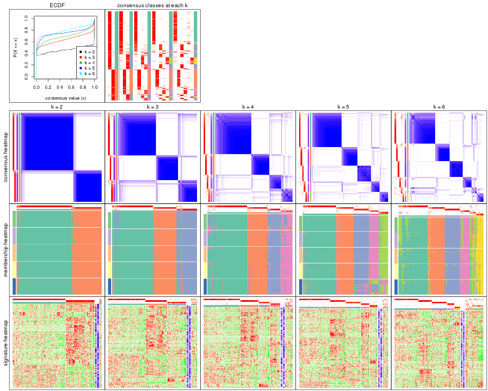

The plots are:

- The first row: a plot of the ECDF (Empirical cumulative distribution
  function) curves of the consensus matrix for each `k` and the heatmap of
  predicted classes for each `k`.
- The second row: heatmaps of the consensus matrix for each `k`.
- The third row: heatmaps of the membership matrix for each `k`.
- The fouth row: heatmaps of the signatures for each `k`.

All the plots in panels can be made by individual functions and they are
plotted later in this section.

`select_partition_number()` produces several plots showing different
statistics for choosing "optimized" `k`. There are following statistics:

- ECDF curves of the consensus matrix for each `k`;
- 1-PAC. [The PAC
  score](https://en.wikipedia.org/wiki/Consensus_clustering#Over-interpretation_potential_of_consensus_clustering)
  measures the proportion of the ambiguous subgrouping.
- Mean silhouette score.
- Concordance. The mean probability of fiting the consensus class ids in all
  partitions.
- Area increased. Denote $A_k$ as the area under the ECDF curve for current
  `k`, the area increased is defined as $A_k - A_{k-1}$.
- Rand index. The percent of pairs of samples that are both in a same cluster
  or both are not in a same cluster in the partition of k and k-1.
- Jaccard index. The ratio of pairs of samples are both in a same cluster in
  the partition of k and k-1 and the pairs of samples are both in a same
  cluster in the partition k or k-1.

The detailed explanations of these statistics can be found in [the cola
vignette](http://bioconductor.org/packages/devel/bioc/vignettes/cola/inst/doc/cola.html#toc_13).

Generally speaking, lower PAC score, higher mean silhouette score or higher
concordance corresponds to better partition. Rand index and Jaccard index
measure how similar the current partition is compared to partition with `k-1`.
If they are too similar, we won't accept `k` is better than `k-1`.

```r
select_partition_number(res)
```


The numeric values for all these statistics can be obtained by `get_stats()`.

```r
get_stats(res)
```

```
#>   k 1-PAC mean_silhouette concordance area_increased  Rand Jaccard
#> 2 2 0.946           0.948       0.979         0.4589 0.542   0.542
#> 3 3 0.827           0.861       0.942         0.3917 0.767   0.590
#> 4 4 0.777           0.813       0.912         0.0855 0.886   0.712
#> 5 5 0.851           0.839       0.898         0.0860 0.856   0.594
#> 6 6 0.827           0.724       0.882         0.0527 0.949   0.802
```

`suggest_best_k()` suggests the best $k$ based on these statistics. The rules are as follows:

- All $k$ with Jaccard index larger than 0.95 are removed because the increase of
  the partition number does not provides enough extra information. If all $k$ are removed,
  the best $k$ is assigned by `NA`.
- For $k$ with 1-PAC larger than 0.9, the maximal $k$ is taken as the "best k". Other $k$ is called "optional k".
- If it does not fit the second rule. The $k$ with the highest vote of highest
  1-PAC, mean silhouette and concordance is taken as the "best k".

```r
suggest_best_k(res)
```

```
#> [1] 2
```


Following shows the table of the partitions (You need to click the **show/hide
code output** link to see it). The membership matrix (columns with name `p*`)
is inferred by
[`clue::cl_consensus()`](https://www.rdocumentation.org/link/cl_consensus?package=clue)
function with the `SE` method. Basically the value in the membership matrix
represents the probability to belong to a certain group. The finall class
label for an item is determined with the group with highest probability it
belongs to.

In `get_classes()` function, the entropy is calculated from the membership
matrix and the silhouette score is calculated from the consensus matrix.


<script>
$( function() {
	$( '#tabs-MAD-NMF-get-classes' ).tabs();
} );
</script>
<div id='tabs-MAD-NMF-get-classes'>
<ul>
<li><a href='#tab-MAD-NMF-get-classes-1'>k = 2</a></li>
<li><a href='#tab-MAD-NMF-get-classes-2'>k = 3</a></li>
<li><a href='#tab-MAD-NMF-get-classes-3'>k = 4</a></li>
<li><a href='#tab-MAD-NMF-get-classes-4'>k = 5</a></li>
<li><a href='#tab-MAD-NMF-get-classes-5'>k = 6</a></li>
</ul>

<div id='tab-MAD-NMF-get-classes-1'>
<p><a id='tab-MAD-NMF-get-classes-1-a' style='color:#0366d6' href='#'>show/hide code output</a></p>
<pre><code class="r">cbind(get_classes(res, k = 2), get_membership(res, k = 2))
</code></pre>

<pre><code>#&gt;                                      class entropy silhouette    p1    p2
#&gt; 7826AE44-B03A-4528-9CB5-7421E592AE36     2  0.0000    0.96994 0.000 1.000
#&gt; 0DC2197B-2FEA-48EB-953E-8E44E1933757     1  0.0000    0.98178 1.000 0.000
#&gt; 87ABB098-8C1E-4677-8C31-48B71EFE41C7     1  0.6343    0.80877 0.840 0.160
#&gt; EC0154E7-7A27-4535-83AE-6B379E99A93C     1  0.0000    0.98178 1.000 0.000
#&gt; 78F79407-D49F-4FA2-B09F-0665C502827C     1  0.0000    0.98178 1.000 0.000
#&gt; 03E81178-E971-4E91-8BED-D8273EA1425C     1  0.0000    0.98178 1.000 0.000
#&gt; 62FCAEFF-16D8-4019-84B6-18EC3A88BC32     2  0.0000    0.96994 0.000 1.000
#&gt; 722C1284-5983-4CC1-B19C-214C2DE6F8A6     2  0.0000    0.96994 0.000 1.000
#&gt; 54E42A64-B350-4A94-8FED-C9BC1872660E     1  0.0000    0.98178 1.000 0.000
#&gt; 53062969-D209-490B-9C9B-5D297625E2AE     1  0.0000    0.98178 1.000 0.000
#&gt; B710293C-41D3-4A2E-8104-5402F91DD859     1  0.0000    0.98178 1.000 0.000
#&gt; 73CB1D05-7AE4-457D-B4EF-25AC5C1F2132     1  0.0000    0.98178 1.000 0.000
#&gt; B055A70B-3003-47CB-BDAA-6378C000BF24     1  0.0000    0.98178 1.000 0.000
#&gt; 46C3A870-E37A-42CB-8C0C-6ACACEAC1ADC     2  0.0000    0.96994 0.000 1.000
#&gt; E8E6270E-F26D-4F2E-A63E-7885BDE05FDB     1  0.0000    0.98178 1.000 0.000
#&gt; C4A5EBA2-9091-4D12-BDC8-B84B122022B9     1  0.0938    0.97135 0.988 0.012
#&gt; 5B1839C4-549D-41D1-B559-3C6D2A1528CE     1  0.0000    0.98178 1.000 0.000
#&gt; A0DF05EB-DC44-4492-9A8A-F278F7B0C266     1  0.0000    0.98178 1.000 0.000
#&gt; B5182F49-70F2-45B7-82DE-C6DA68145EEA     1  0.0000    0.98178 1.000 0.000
#&gt; C204D355-B876-4341-A111-36D48CBDD2A8     1  0.0000    0.98178 1.000 0.000
#&gt; 7B070AAA-EF97-4D3B-AA19-EEC170C7927D     2  0.0000    0.96994 0.000 1.000
#&gt; 05A8A881-F8EE-48A2-B11C-A08D7D80CE18     1  0.0000    0.98178 1.000 0.000
#&gt; BA59EF50-CFE9-456D-B1B6-67D0945004F6     1  0.0000    0.98178 1.000 0.000
#&gt; AD97B334-E034-4D33-A4D5-48C32D5D521C     1  0.0000    0.98178 1.000 0.000
#&gt; 51DA2568-32EA-4668-9876-4B6E7CA68860     1  0.0000    0.98178 1.000 0.000
#&gt; 78C26A05-2084-494D-83D3-C52C1B800F4C     1  0.0000    0.98178 1.000 0.000
#&gt; 2B5DD791-7692-4721-9519-7D7D49B52570     1  0.6247    0.81064 0.844 0.156
#&gt; C0BBE26A-79C8-4392-9978-7C420B3786B5     1  0.0000    0.98178 1.000 0.000
#&gt; F35A8359-3A7A-414F-8A5C-D278F3B45387     2  0.0000    0.96994 0.000 1.000
#&gt; 8C9BA49C-1270-491D-A234-AE1B1C0609BA     2  0.0000    0.96994 0.000 1.000
#&gt; CA104B57-B160-4148-8A0A-D34BB3E8D88A     1  0.0000    0.98178 1.000 0.000
#&gt; 877E18A5-6A7A-4E29-9871-DC7EA14A5F27     1  0.0000    0.98178 1.000 0.000
#&gt; 904EDF2E-411E-43BD-901D-46129AFA283A     1  0.0000    0.98178 1.000 0.000
#&gt; FD9F5A9B-2BEB-4D31-9A2D-8D4B4ECBB478     1  0.0000    0.98178 1.000 0.000
#&gt; 2E206314-9928-456E-B7C6-893DC0E3C7C2     2  0.0000    0.96994 0.000 1.000
#&gt; 913DB655-2C7F-4369-83DE-9257F04CF39B     2  0.9552    0.40895 0.376 0.624
#&gt; 72B5B724-FEB5-43BD-83F6-2E2152DDD800     1  0.9286    0.46459 0.656 0.344
#&gt; 920B547C-6898-446C-AAAF-F4ED96E40AAB     2  0.0000    0.96994 0.000 1.000
#&gt; 847F796A-8CD6-4013-A0FB-26F4FC3EAF0D     1  0.0000    0.98178 1.000 0.000
#&gt; C4D64E7A-33F7-4CFC-9FD3-D6AA3D8EFAA7     1  0.0000    0.98178 1.000 0.000
#&gt; EABA0B17-8E19-48C5-BF62-2A45C9632807     2  0.0000    0.96994 0.000 1.000
#&gt; 7263CBA8-CE37-4531-A795-9324C6D2A672     1  0.0000    0.98178 1.000 0.000
#&gt; 6D3CC3AC-618B-414A-B640-169C735A6568     2  0.0000    0.96994 0.000 1.000
#&gt; 710C05C7-F9CE-45FA-A8CC-29DE2903E04F     1  0.0000    0.98178 1.000 0.000
#&gt; 3D631A56-2C55-48EA-A667-BA46023C9D50     1  0.0000    0.98178 1.000 0.000
#&gt; F1C65F64-AF05-4875-B7E4-60FFF56A3F46     1  0.0000    0.98178 1.000 0.000
#&gt; E5DF76E7-A765-4E07-B87A-06168BF66C5F     1  0.0000    0.98178 1.000 0.000
#&gt; 5C8C8A6E-40D4-4F82-AC3D-90CFDEE15C0A     2  0.0000    0.96994 0.000 1.000
#&gt; 0117CBB9-1BF9-48B1-BE6E-A9A770FF8721     1  0.0000    0.98178 1.000 0.000
#&gt; 31EF66E5-419A-44C3-BB2A-B69B52FFCECC     2  0.0000    0.96994 0.000 1.000
#&gt; C149CEF5-61F3-4B53-B8A9-8244B673EBD0     1  0.0000    0.98178 1.000 0.000
#&gt; 0AF351D0-4EC5-4275-AA0A-4FA2AF8A9C85     2  0.0000    0.96994 0.000 1.000
#&gt; B507E82F-6680-497B-A014-033EDD7A2E03     1  0.0000    0.98178 1.000 0.000
#&gt; F941890E-AB33-478F-8C97-1C785DD9428F     1  0.0000    0.98178 1.000 0.000
#&gt; 7987E019-8FED-469B-A6C1-34EE430A60C3     1  0.0000    0.98178 1.000 0.000
#&gt; 76084AA6-19BF-4605-B6A1-73F1D4BADAF9     2  0.0000    0.96994 0.000 1.000
#&gt; 329807F7-E0D4-4F53-94E8-E4080E90CB47     1  0.6343    0.80592 0.840 0.160
#&gt; 1B6505FF-C1A7-4DD0-9827-41A0A3A28F3E     1  0.0000    0.98178 1.000 0.000
#&gt; 49778E92-B5D3-4AD9-A1AF-3B722D631B96     2  0.0000    0.96994 0.000 1.000
#&gt; A22892DE-0AF4-4B63-9513-1D6825059040     1  0.0000    0.98178 1.000 0.000
#&gt; 6D77ECAE-A715-4ADD-97D8-A916DC31A4EA     1  0.0000    0.98178 1.000 0.000
#&gt; 09758B6F-1B2D-4AED-8913-696097069409     1  0.7453    0.72564 0.788 0.212
#&gt; 8B709DB4-0B28-42F1-A7C5-106F5809BEA2     1  0.0000    0.98178 1.000 0.000
#&gt; F2B356FA-79CD-4867-8ABF-84C90A493A75     1  0.0000    0.98178 1.000 0.000
#&gt; 131213AD-0313-4DF1-B013-CE67ED262C37     2  0.0000    0.96994 0.000 1.000
#&gt; D94F7E81-0F60-473B-AD4A-0AC13508BDE2     2  0.9661    0.36523 0.392 0.608
#&gt; 29C17355-D646-48DA-9E54-7B6DD85DD610     1  0.0000    0.98178 1.000 0.000
#&gt; B8BD866A-2A7C-45C3-96BB-9AB892D26AE5     1  0.0000    0.98178 1.000 0.000
#&gt; 13EFD045-AD61-41EE-9896-67BFA4FC8C09     1  0.6343    0.80581 0.840 0.160
#&gt; 2655F609-B3BB-4D01-B421-D5F4B1232EC8     2  0.0000    0.96994 0.000 1.000
#&gt; 04BC7A52-C67F-42CB-8672-D3C51A20F2BA     1  0.0000    0.98178 1.000 0.000
#&gt; 45472BD4-DBDB-41FE-B0E3-2440880E1DE6     1  0.0000    0.98178 1.000 0.000
#&gt; B87FFFCD-CB57-4ACD-9C74-AB188984BBB2     1  0.0000    0.98178 1.000 0.000
#&gt; 5271374C-13CD-4BFE-AC6D-C95AFE491322     1  0.0000    0.98178 1.000 0.000
#&gt; E3372ACE-C7C8-43E5-B30A-1F2D662D8170     1  0.0000    0.98178 1.000 0.000
#&gt; B08DF564-E4D0-4540-8160-93B3981DF1D8     1  0.0000    0.98178 1.000 0.000
#&gt; 61A7D1B9-FC5A-4B9C-989F-936CDA948C27     1  0.0000    0.98178 1.000 0.000
#&gt; 74E768C1-8766-46AC-AAB4-D79E5049F76A     2  0.0000    0.96994 0.000 1.000
#&gt; 0CEA28F0-D7F0-4EB7-A23F-0C5CA6245971     2  0.0000    0.96994 0.000 1.000
#&gt; 95C4EFF6-147C-48EC-A2C1-16B8F12AEEF2     2  0.0000    0.96994 0.000 1.000
#&gt; C9A78BEA-D455-4F5E-8B7B-19BCB42887E7     1  0.0000    0.98178 1.000 0.000
#&gt; DB970740-9AC1-4C10-9658-8A77B1C390DD     2  0.0000    0.96994 0.000 1.000
#&gt; 883FBD37-0CA0-4562-8925-72ACC1EE93D9     1  0.0000    0.98178 1.000 0.000
#&gt; 9FE1D006-49F2-471E-91E6-AF0414C24479     1  0.0000    0.98178 1.000 0.000
#&gt; 11816CC6-8C8B-49C0-99EE-896377BCFCCD     1  0.0000    0.98178 1.000 0.000
#&gt; 063FC5C8-4318-4ECC-9CA0-1976CBC8ACB6     1  0.0000    0.98178 1.000 0.000
#&gt; E0F085CC-B90D-4FDE-B60E-C613971BAA00     1  0.0000    0.98178 1.000 0.000
#&gt; 62361DA2-E4EE-46DA-BB1F-C51DCA9307CC     2  0.0000    0.96994 0.000 1.000
#&gt; 1BA16D48-B09E-4699-A1AD-2FFECE4F3CDB     2  0.0000    0.96994 0.000 1.000
#&gt; 3E4F14E9-60AE-4F17-9BA7-2A02E908204A     1  0.0000    0.98178 1.000 0.000
#&gt; 79226DD7-BC85-4B8E-BFF8-B1E073129D34     1  0.0000    0.98178 1.000 0.000
#&gt; D47D0936-826F-4D54-9225-F71B95357438     1  0.0000    0.98178 1.000 0.000
#&gt; 0AE02B91-574C-4165-BA39-E9D7C1A870A2     2  0.0000    0.96994 0.000 1.000
#&gt; DED8E9DF-CEFE-45ED-9374-EF9925A135C4     1  0.0000    0.98178 1.000 0.000
#&gt; D587A993-3C47-4D4C-B744-59169D4F7451     1  0.0000    0.98178 1.000 0.000
#&gt; 6BCA24E6-440F-42C5-ABE5-66C37B713A39     1  0.0000    0.98178 1.000 0.000
#&gt; 86A5EDFB-9D06-4FED-BF57-F8D74A68E156     2  0.0000    0.96994 0.000 1.000
#&gt; B9BD5134-2F6A-4454-8F83-69B63F9AE114     1  0.8608    0.59805 0.716 0.284
#&gt; 082DA9E1-A40D-482B-8E21-A93BA97185F0     1  0.1414    0.96402 0.980 0.020
#&gt; 16A8343A-1203-44FB-9F03-05CC7C71B4CC     1  0.0000    0.98178 1.000 0.000
#&gt; 00439565-02CE-4BF5-956D-7078B51C0947     1  0.1184    0.96803 0.984 0.016
#&gt; 7B2BD361-2BF1-4E97-BC08-457F5A9C2682     2  0.0000    0.96994 0.000 1.000
#&gt; C1D8439A-D527-47F6-ADC1-25867B65DA21     2  0.0000    0.96994 0.000 1.000
#&gt; D9096909-1439-462D-B69C-CAD1BF4F420C     1  0.0000    0.98178 1.000 0.000
#&gt; 7822EA86-35A1-4285-9429-2B63111B9885     1  0.0000    0.98178 1.000 0.000
#&gt; 6FD0CFC8-AC8D-4CF1-8C33-833AD98A30EF     2  0.0000    0.96994 0.000 1.000
#&gt; A451F278-5E83-4BC6-9B15-3AA2117B99B6     2  0.0000    0.96994 0.000 1.000
#&gt; 6EC25686-4547-459C-9E01-7EDF8DAECE35     1  0.0000    0.98178 1.000 0.000
#&gt; 5D2F1EEA-2BA8-4C3A-8436-544EE1D23E7E     1  0.0000    0.98178 1.000 0.000
#&gt; 675A4293-A4CE-4307-B00B-DFC4D44A87C6     2  0.0000    0.96994 0.000 1.000
#&gt; 6FBE0AEF-476A-42B2-A857-846CF1ED92B6     2  0.0000    0.96994 0.000 1.000
#&gt; 7139D616-1A15-4288-A9AE-411856A4A76D     1  0.9580    0.37304 0.620 0.380
#&gt; 46D7F8C1-D5C5-40CC-BEF5-2E590A847BD9     1  0.5629    0.84340 0.868 0.132
#&gt; 984C44D3-4F5F-44C9-BCD9-C991EBC1FCB8     1  0.0000    0.98178 1.000 0.000
#&gt; 83FE52E0-2DC2-4580-8BB2-FBCBEE4AC240     1  0.0000    0.98178 1.000 0.000
#&gt; 0923F9CB-DF6F-4BAA-A5F8-0F83CE60D1ED     1  0.0000    0.98178 1.000 0.000
#&gt; 1DEB5206-78CC-4EB5-BCD5-85A6A5B4E273     1  0.0000    0.98178 1.000 0.000
#&gt; E4DB18DA-EB0C-4B2F-9566-7F72222B16D4     1  0.6438    0.79764 0.836 0.164
#&gt; F7456312-1309-4B2F-875D-0F90CDF3EC35     1  0.0000    0.98178 1.000 0.000
#&gt; 9A25E5D8-0706-4960-A76B-BCD0AC93E4FA     1  0.0000    0.98178 1.000 0.000
#&gt; 5A41FE8F-FFB3-4B87-BF11-A570C184096D     1  0.0000    0.98178 1.000 0.000
#&gt; 33F84E63-3F6C-4867-ADB1-A0DF39F1295B     1  0.0000    0.98178 1.000 0.000
#&gt; D6A644F5-D1D0-4A8D-94C4-EE6C3ECE7430     1  0.0000    0.98178 1.000 0.000
#&gt; 2A5848CC-A9A2-4AA8-A752-321273E62CF0     1  0.0000    0.98178 1.000 0.000
#&gt; 7CA6358B-FC8A-4675-B092-9E061038FC83     2  0.4022    0.89785 0.080 0.920
#&gt; A4C2F4BC-5C62-4B1F-9AB8-46D9468EF523     2  0.0000    0.96994 0.000 1.000
#&gt; 8AF4EB7F-418D-4CC9-A9B8-A93A4C1A173B     2  0.0000    0.96994 0.000 1.000
#&gt; E5048887-70C8-468F-881E-2EC55F6E6F3B     1  0.0000    0.98178 1.000 0.000
#&gt; 1BADCC7C-C4D8-4C34-9534-59D622C7A2A2     2  0.7376    0.74135 0.208 0.792
#&gt; 02CE7DF7-64BD-4297-A240-A5B9EE8771D3     1  0.0000    0.98178 1.000 0.000
#&gt; CBF6E96A-F56C-4C87-B851-D319930BAAB8     2  0.9732    0.34370 0.404 0.596
#&gt; 48F6B774-CFD2-4DDF-B7A2-696596413C3F     1  0.0000    0.98178 1.000 0.000
#&gt; 41D88C3E-5848-4B09-8A77-EAE6AC4EC6B0     2  0.0000    0.96994 0.000 1.000
#&gt; BDF79CC0-00C7-49C1-900B-AB065A733B17     1  0.0000    0.98178 1.000 0.000
#&gt; A894D686-BFC7-4AEE-A794-DBE718C6B6F6     2  0.0000    0.96994 0.000 1.000
#&gt; 0712029E-3765-4272-BE5B-B6C8BCCC0F0F     2  0.0000    0.96994 0.000 1.000
#&gt; 7B051855-9B09-4887-9BC0-9F077537938E     1  0.0000    0.98178 1.000 0.000
#&gt; EF357C46-5C3C-4F51-9383-FF7694D07B97     2  0.0000    0.96994 0.000 1.000
#&gt; 9492A322-37CA-4582-AC68-66B5D80778AF     2  0.0000    0.96994 0.000 1.000
#&gt; 993399A4-1B9F-4258-B2D0-155AD58A2E82     1  0.0000    0.98178 1.000 0.000
#&gt; 7B7DC93D-5494-4E69-BE07-2967887182F9     1  0.0000    0.98178 1.000 0.000
#&gt; 29BCBA51-2580-473D-9CF7-BEDBD0DBAD1B     2  0.0000    0.96994 0.000 1.000
#&gt; 40855647-E942-4F32-90B7-BEB921929BFB     1  0.0000    0.98178 1.000 0.000
#&gt; 0DC723D0-7C68-4495-A4B9-2DF2FF19AB14     2  0.0000    0.96994 0.000 1.000
#&gt; 7540005F-57E0-4E2E-A8A2-BEF2B0F333B1     2  0.0000    0.96994 0.000 1.000
#&gt; EB1DDB14-4076-4C2C-B911-390C17C21486     1  0.0000    0.98178 1.000 0.000
#&gt; 9EA70EC4-8BA0-4E3D-B3CB-A68D19E89868     1  0.1184    0.96785 0.984 0.016
#&gt; B04E2E50-0A6E-4224-A825-1714D12E5669     2  0.0000    0.96994 0.000 1.000
#&gt; B0BF5E01-536D-40FF-9C24-CBBD611E2FC2     1  0.0000    0.98178 1.000 0.000
#&gt; 7B6B1788-B297-4442-B6BE-B7CE8754491E     1  0.0000    0.98178 1.000 0.000
#&gt; A090D00C-34DF-4906-A517-4803C4C9A332     1  0.0000    0.98178 1.000 0.000
#&gt; 340D44A6-9BEA-412C-9973-D9ABD6692255     1  0.0000    0.98178 1.000 0.000
#&gt; E8D0D1E7-E5A8-4014-80C1-0245F90F4358     2  0.0000    0.96994 0.000 1.000
#&gt; 19EA1494-8572-40E1-B9BB-3739F47B607D     1  0.0000    0.98178 1.000 0.000
#&gt; 1C1B4793-8DAF-4763-BA4D-C4E869A4ED35     2  0.0000    0.96994 0.000 1.000
#&gt; 45BF59B3-95BD-4196-ABAA-4C4F0DB38572     2  0.0000    0.96994 0.000 1.000
#&gt; 47B5A2A7-7E13-4558-99D2-067F5075C6A4     1  0.0000    0.98178 1.000 0.000
#&gt; E94638E8-CB51-4FBB-8BCB-4BFD7A812291     1  0.0000    0.98178 1.000 0.000
#&gt; A17352A8-0D3C-4545-8136-7DAE2FB0E102     2  0.0000    0.96994 0.000 1.000
#&gt; B18A6F95-D4ED-416B-B5A1-9A4934865D0D     2  0.0000    0.96994 0.000 1.000
#&gt; 33E92C5F-0C42-4549-AD5B-0A064182A272     1  0.0000    0.98178 1.000 0.000
#&gt; E041B375-3E60-4F18-A6EF-D1C249E3B8EE     1  0.0376    0.97833 0.996 0.004
#&gt; EDF90AF6-6C64-4BD2-AADF-8D7D188650B2     2  0.0000    0.96994 0.000 1.000
#&gt; 569320D2-316C-4E2D-B7B3-D7D5C4DAD42D     1  0.0000    0.98178 1.000 0.000
#&gt; AFFB223D-DAE9-4567-9EF2-8E4DF9D8782D     2  0.0000    0.96994 0.000 1.000
#&gt; 56FC9454-0A6A-4CC3-95C4-BE0E0D0BAFCE     2  0.0000    0.96994 0.000 1.000
#&gt; 43226365-FAEF-46C5-AF1B-5C6C2BED84FF     2  0.3879    0.90167 0.076 0.924
#&gt; 1536110A-B42A-4A84-9474-9895321FDCE9     2  0.0000    0.96994 0.000 1.000
#&gt; 812255DD-536B-4216-90B1-27D5AB339BE2     1  0.0000    0.98178 1.000 0.000
#&gt; 5D4563D6-68B7-4C9D-A3F4-AA7D45D5112C     2  0.0000    0.96994 0.000 1.000
#&gt; BAA39781-DB94-473C-98B1-FA6CD3E1C67A     1  0.0000    0.98178 1.000 0.000
#&gt; C1411CDA-814D-4E21-8929-C0F77858828F     1  0.0000    0.98178 1.000 0.000
#&gt; EFE2F248-C13E-4E8D-9153-8C903848AC4A     2  0.4161    0.89451 0.084 0.916
#&gt; D3939C84-D1D6-4060-9F91-AEB222A9BDD5     1  0.0000    0.98178 1.000 0.000
#&gt; EABD2987-8C1E-49E5-94AF-C0BDE5335A48     1  0.0000    0.98178 1.000 0.000
#&gt; F4BE2ABE-2CEB-4A6A-B8EC-0355F8C63B9B     1  0.0000    0.98178 1.000 0.000
#&gt; 627BC251-D217-4955-B718-6B9D6DEA1756     1  0.0000    0.98178 1.000 0.000
#&gt; 31B54613-A20E-4039-BB8B-9B52104CE418     1  0.0000    0.98178 1.000 0.000
#&gt; 3F292B7C-A535-4DBD-BC20-CB4F85A1C94B     1  0.0000    0.98178 1.000 0.000
#&gt; BEA2A5EB-EEA9-4F31-AC38-810E04CE124B     2  0.0000    0.96994 0.000 1.000
#&gt; 99D84D46-19DA-43F1-B639-DCE9953F1529     2  0.0000    0.96994 0.000 1.000
#&gt; 4588817E-1068-4A78-86B6-4674A0112DDA     1  0.9998   -0.00254 0.508 0.492
#&gt; 6AC633BD-BEC1-4750-94E3-378972DAB6B3     2  0.0000    0.96994 0.000 1.000
#&gt; 09E17C6E-7EDE-4DDF-B5ED-2521AF870C9A     1  0.0000    0.98178 1.000 0.000
#&gt; 58D9C750-26A2-4B7C-84C4-13D7AFB4C5EA     1  0.0000    0.98178 1.000 0.000
#&gt; DF28E138-E222-4F77-9B61-69E601CA7E60     2  0.0000    0.96994 0.000 1.000
#&gt; FEA489A8-E423-4266-AADA-9BAAB29AB94B     1  0.0000    0.98178 1.000 0.000
#&gt; F3FCC207-15CD-41EA-A3EF-F5D2C12AC373     1  0.0000    0.98178 1.000 0.000
#&gt; 53DD7AFB-A258-4643-A501-BACC95D17A50     2  0.0000    0.96994 0.000 1.000
#&gt; D850B2A1-1F8A-4A44-A0CF-8D9DD4A1889A     2  0.0000    0.96994 0.000 1.000
#&gt; B3F746DC-E487-4305-9F30-825D1520E8FD     2  0.0000    0.96994 0.000 1.000
#&gt; BE38240A-F7C2-439F-9AAE-51C8A340F310     1  0.0000    0.98178 1.000 0.000
#&gt; A9022D9E-1D30-49EE-8552-1364A8027F34     1  0.0000    0.98178 1.000 0.000
#&gt; 0E8A56EE-D9A2-48A5-B793-A358BE1E4EFA     1  0.0000    0.98178 1.000 0.000
#&gt; 51667574-318E-4BDB-8F42-8512A4C1B84F     1  0.0000    0.98178 1.000 0.000
#&gt; B0A442C9-67E4-4534-8A5C-D6D73F42358C     1  0.0000    0.98178 1.000 0.000
#&gt; 25A5BC09-0D88-4385-87AF-997F9018522D     2  0.0000    0.96994 0.000 1.000
#&gt; 344B9631-AAA5-4302-8747-D584345D9131     1  0.0000    0.98178 1.000 0.000
#&gt; 1C3795AD-6306-4892-95F5-92DF3375D46A     1  0.0000    0.98178 1.000 0.000
#&gt; 17BB221D-8BF9-4391-83DD-423AE1E03651     2  0.9850    0.27431 0.428 0.572
#&gt; 297611E9-9555-4BCA-A723-02E846ACC23A     1  0.0000    0.98178 1.000 0.000
#&gt; AD7FF180-1EAC-4783-8A62-E9626B96DD9F     2  0.0000    0.96994 0.000 1.000
#&gt; FD544083-9BD5-4036-BD81-0352B67CC45C     1  0.0000    0.98178 1.000 0.000
#&gt; 879A74D5-5B29-418D-A0F4-8E88D6384008     1  0.0000    0.98178 1.000 0.000
#&gt; 43CD982C-13C0-4A52-803A-9A3A3FAE09BC     1  0.0000    0.98178 1.000 0.000
#&gt; DCD0313D-5206-4111-8743-A8A0227257D9     1  0.0000    0.98178 1.000 0.000
#&gt; 331A9160-D730-45DD-A985-C6CAC03035ED     1  0.0000    0.98178 1.000 0.000
#&gt; 9EEECA0E-530D-4724-B016-A716F0782148     2  0.7299    0.74751 0.204 0.796
#&gt; B3073976-CA3F-4115-9243-8C2D9E1B975D     1  0.0000    0.98178 1.000 0.000
#&gt; 77B3C9B4-1A7F-41BB-A37D-01EF80E933CC     2  0.0000    0.96994 0.000 1.000
#&gt; C0C26822-2E9F-4FB0-81D4-575027C8B71C     2  0.0000    0.96994 0.000 1.000
#&gt; F1FCE328-2B3B-499A-888D-0E66A017E8B0     1  0.1633    0.96036 0.976 0.024
#&gt; F069DAD6-F1EB-42F7-8252-F3F6EC46CC3E     1  0.0000    0.98178 1.000 0.000
#&gt; 99CC822E-8C98-4EEC-BB58-AEF76A0B5332     1  0.0000    0.98178 1.000 0.000
#&gt; C86EBD08-53F2-4972-801A-74970FDD6A62     1  0.0000    0.98178 1.000 0.000
#&gt; F07326F2-C1D6-4D5A-9693-25C3A04B0EC2     1  0.0000    0.98178 1.000 0.000
#&gt; 8ACBD428-7713-48D9-810A-43C9CD191A73     2  0.0000    0.96994 0.000 1.000
#&gt; 3D3501B4-1A43-4FA7-90A2-CCEBF66BFD4A     2  0.0000    0.96994 0.000 1.000
#&gt; DD51C17C-300F-44A4-955A-C9BC85417842     2  0.0000    0.96994 0.000 1.000
#&gt; 58FF391C-1D83-426C-8F92-C15F78F56C95     1  0.0000    0.98178 1.000 0.000
#&gt; ACE65C6E-2B10-4972-91B4-9199DD4B179D     1  0.0000    0.98178 1.000 0.000
#&gt; B2088466-FA5D-491C-9982-99B33683E66F     2  0.0000    0.96994 0.000 1.000
#&gt; D47AF416-1687-4FE0-A235-8815B6E8EB0B     1  0.0000    0.98178 1.000 0.000
#&gt; 4DCAD07F-CC43-46F6-B2F3-EDBF3EDD1045     2  0.0000    0.96994 0.000 1.000
#&gt; AAAE0BD9-63FC-4A0E-A27E-447B634BAD99     2  0.0000    0.96994 0.000 1.000
#&gt; BC471AA1-52CF-4CEE-9866-34CE91404F45     2  0.0000    0.96994 0.000 1.000
#&gt; 81D3EE3F-AC11-404F-8092-307F0DC12198     1  0.0000    0.98178 1.000 0.000
#&gt; 8C02026C-C25E-406B-B8B8-A1A82362AE79     2  0.0000    0.96994 0.000 1.000
#&gt; 6A005F2A-A0C1-4CA4-B15B-96B08F013874     1  0.0000    0.98178 1.000 0.000
#&gt; B55743F2-4D63-4375-85D3-F58281CFD852     1  0.0000    0.98178 1.000 0.000
#&gt; 24F98393-C817-4D0E-A7DB-05D2B5C71F40     1  0.0000    0.98178 1.000 0.000
#&gt; 2C2AEF1D-4112-4EC7-9027-5E3FD26E8802     1  0.0000    0.98178 1.000 0.000
#&gt; 8BAC3CB5-2987-4349-8AE8-B83DDD16CA3C     2  0.9209    0.50230 0.336 0.664
#&gt; ED9C74E6-92FC-4E58-8FCE-1761DEA0C977     1  0.0000    0.98178 1.000 0.000
#&gt; BA732ED4-F6BA-404E-BA3C-CA558FAD866A     1  0.0000    0.98178 1.000 0.000
#&gt; E750385A-12D9-4A88-B4DF-C1306B5EF3B7     2  0.0000    0.96994 0.000 1.000
#&gt; 6B1DC5E4-5F82-4395-913F-6AEDB5B63188     1  0.0000    0.98178 1.000 0.000
#&gt; A7C12D37-FD50-4674-A054-1774F4E5C3B3     1  0.1414    0.96394 0.980 0.020
#&gt; 2155C764-2063-4D9C-9ACD-96AA73475F5E     1  0.0000    0.98178 1.000 0.000
#&gt; DE23CC15-A95E-4119-9B3C-8EEC45900D11     2  0.0000    0.96994 0.000 1.000
#&gt; 5DB1DCAD-638E-48A4-9F40-3D6268FDEC33     2  0.0000    0.96994 0.000 1.000
#&gt; 34AF0341-73D7-4080-AAEB-4C1541C2569F     1  0.0000    0.98178 1.000 0.000
#&gt; B60D4235-44AF-4BA4-98C0-BCCDC28E90B9     2  0.0000    0.96994 0.000 1.000
#&gt; CF463D89-2C9F-4257-BF04-8BC1CD40EA7D     2  0.0000    0.96994 0.000 1.000
#&gt; EF6C8165-484A-4530-AEDF-93DCC4A8455D     1  0.0000    0.98178 1.000 0.000
#&gt; B9F6B5E4-4D10-49B8-A8FE-8F33C5A62CBF     1  0.0000    0.98178 1.000 0.000
#&gt; CE539000-92D7-4622-9C8D-BC6E01310681     2  0.0000    0.96994 0.000 1.000
#&gt; D3BBC405-A22A-4009-ABF6-96FEEE653051     2  0.0000    0.96994 0.000 1.000
#&gt; 0B3C86BD-0D20-4408-9BE3-05658729505F     2  0.0000    0.96994 0.000 1.000
#&gt; 9B9C5071-7C3F-416C-B91C-6F5966747F54     1  0.0000    0.98178 1.000 0.000
#&gt; A9469A4A-C5F9-4681-A916-A26F0B4307BA     1  0.0000    0.98178 1.000 0.000
#&gt; A31B57E4-E30B-4A1B-829D-1B47D9CEC041     2  0.0000    0.96994 0.000 1.000
#&gt; 647255CE-F84A-4070-B3FD-D8ACA32C4D09     1  0.0000    0.98178 1.000 0.000
#&gt; 8F5E9F02-51D7-410E-B8B7-22737F2F095A     2  0.0000    0.96994 0.000 1.000
#&gt; 8074A7F6-2FDE-4578-B71C-01C542D468FE     1  0.0000    0.98178 1.000 0.000
#&gt; 2A946F17-F245-409E-A019-C60CDA18DC7D     1  0.0000    0.98178 1.000 0.000
#&gt; 0878C381-47F9-4786-82C2-94AC840BEDCB     1  0.0000    0.98178 1.000 0.000
#&gt; 54504893-92C5-4328-85A8-2A882680B5E0     1  0.0000    0.98178 1.000 0.000
#&gt; 0A27D1BE-E5DD-459A-A51F-6D8AAF7CFEB4     1  0.0000    0.98178 1.000 0.000
#&gt; 89ED5A3E-CAC0-4AB4-B858-A3CD8F34DBD5     2  0.0000    0.96994 0.000 1.000
#&gt; ACEEB0A5-AADB-4EF9-8710-4BAF95522CEA     1  0.0000    0.98178 1.000 0.000
#&gt; 02C74D81-5976-4252-BC6C-B10E934DECA2     1  0.0000    0.98178 1.000 0.000
#&gt; D365A238-4739-4B54-9608-DC548F21C04E     1  0.0000    0.98178 1.000 0.000
#&gt; F70F7ED5-A3B7-4210-95AD-DEFA0A565F06     1  0.0000    0.98178 1.000 0.000
#&gt; A92C23A9-BC25-4025-9501-6D5FF8E2A502     1  0.0672    0.97483 0.992 0.008
#&gt; ECE9BBF4-840E-47A6-8378-0B6C4A2369D3     1  0.0000    0.98178 1.000 0.000
#&gt; 38749490-0FCF-4B33-9EBC-8F86C2D9E4AF     1  0.0000    0.98178 1.000 0.000
#&gt; 02ABB64E-768B-4999-A899-EEE573D5F186     1  0.0000    0.98178 1.000 0.000
#&gt; C1C467A8-18B1-4C3F-AC45-33359ED6FDC4     1  0.0000    0.98178 1.000 0.000
#&gt; 78B2E4A1-9DAE-404F-AB47-1896450EF254     1  0.0000    0.98178 1.000 0.000
#&gt; CCDB0290-91DA-4089-84A6-4434BA028D30     1  0.0000    0.98178 1.000 0.000
#&gt; D5041E80-20A0-4C1A-9AC1-2394F6DB6E92     1  0.0000    0.98178 1.000 0.000
#&gt; 20EB9CC6-EABB-438A-9030-E766459996D1     2  0.0000    0.96994 0.000 1.000
#&gt; 73E99110-9A7C-4F73-98C5-79D22CB06230     1  0.0000    0.98178 1.000 0.000
#&gt; FAD8A464-9BC3-4ED9-9517-B18D36514325     2  0.0938    0.96005 0.012 0.988
#&gt; 9AF0E82E-E621-437A-8D19-700532B95090     1  0.0000    0.98178 1.000 0.000
#&gt; 27DA48F3-4FC1-41A3-8E49-5B25F1CCFF07     1  0.0000    0.98178 1.000 0.000
#&gt; EFE5A302-D138-4044-A301-5C5FD1C24836     1  0.0000    0.98178 1.000 0.000
#&gt; D3E866AC-D66A-4C07-9F47-89AF460320DE     2  0.0000    0.96994 0.000 1.000
#&gt; 89C45456-9392-4EB3-9A82-A130B6702AAF     2  0.6438    0.80225 0.164 0.836
#&gt; 8FF5C8FC-2565-49BE-9EE0-91A84A85AB2A     2  0.0000    0.96994 0.000 1.000
#&gt; 846DF088-75D5-49CF-BDDC-27E735A08DCA     2  0.0000    0.96994 0.000 1.000
#&gt; EA3A19E1-7ADE-47B6-A35A-71290967147A     2  0.0000    0.96994 0.000 1.000
#&gt; B2C43D0C-732B-4C54-938F-D3C9FDA880DA     1  0.0000    0.98178 1.000 0.000
#&gt; EEC856B5-9B7F-488D-975E-CE2FF7072879     2  0.7815    0.70528 0.232 0.768
#&gt; 8A68C417-09CC-4FA1-BFEB-EB4B738853A4     1  0.0000    0.98178 1.000 0.000
#&gt; C5DF1A0D-952C-44E2-BF83-ED57177EF60E     1  0.0000    0.98178 1.000 0.000
#&gt; B5C9EA22-F758-4BD2-BD1F-282EC1078AED     2  0.0000    0.96994 0.000 1.000
#&gt; 3F08AE92-3EFD-4D7F-8C5C-BFB3621F0CD6     1  0.0000    0.98178 1.000 0.000
#&gt; 8F0D43F1-2199-4DBB-9B16-1E5F2CED2FEC     2  0.0000    0.96994 0.000 1.000
#&gt; 54BABD8B-EA9F-4875-8594-2179B38C73BD     1  0.0000    0.98178 1.000 0.000
#&gt; C149B6F8-03DC-4907-920A-F3318B8D2A1E     1  0.0000    0.98178 1.000 0.000
#&gt; F93D26E2-4B45-495D-BC8E-5B592F8FDABF     2  0.0000    0.96994 0.000 1.000
#&gt; C98275CD-C39A-4E14-A731-4F3EB7396665     2  0.0000    0.96994 0.000 1.000
#&gt; 354DC705-216E-42F0-B29E-C1F8D6C9489A     1  0.0000    0.98178 1.000 0.000
#&gt; 6752EED9-7990-433F-A206-D5398C396471     1  0.0000    0.98178 1.000 0.000
#&gt; C3E94C5D-68C4-400C-B7CB-38C42E9D5FFF     2  0.0000    0.96994 0.000 1.000
#&gt; CE6B6871-3ED3-44DE-A777-7558D4429057     1  0.9635    0.36076 0.612 0.388
#&gt; A06E7D1E-E432-4A4C-8BB0-314304F96EDF     2  0.6343    0.80755 0.160 0.840
#&gt; 1ABBEF80-508F-4247-B43D-3E549372113B     1  0.6531    0.79466 0.832 0.168
#&gt; 835AAE7F-F873-4D11-8845-232D261A38DF     1  0.0000    0.98178 1.000 0.000
#&gt; E98A0460-6529-4DBA-8542-1B98801D7A7D     1  0.0000    0.98178 1.000 0.000
#&gt; 06A9CBF8-01D0-4720-BCE8-83F0E77C862F     1  0.0000    0.98178 1.000 0.000
#&gt; 206865A9-A67C-49A6-93AD-55D06E777559     2  0.0000    0.96994 0.000 1.000
#&gt; 26DABC83-DB30-452F-9BE2-366760CB138E     2  0.0000    0.96994 0.000 1.000
#&gt; 9DD5272A-2D6E-4774-83E3-0CD761EDE926     1  0.6343    0.80463 0.840 0.160
#&gt; 4938E366-C740-4C9C-9358-FF37997DC9EF     1  0.0000    0.98178 1.000 0.000
#&gt; E2DA59C4-A47C-41E3-BC55-2D00C6EC17FB     1  0.0000    0.98178 1.000 0.000
#&gt; 37349E62-0BFB-4FEA-81D0-2AB7E7625B0D     1  0.0000    0.98178 1.000 0.000
</code></pre>

<script>
$('#tab-MAD-NMF-get-classes-1-a').parent().next().next().hide();
$('#tab-MAD-NMF-get-classes-1-a').click(function(){
  $('#tab-MAD-NMF-get-classes-1-a').parent().next().next().toggle();
  return(false);
});
</script>
</div>

<div id='tab-MAD-NMF-get-classes-2'>
<p><a id='tab-MAD-NMF-get-classes-2-a' style='color:#0366d6' href='#'>show/hide code output</a></p>
<pre><code class="r">cbind(get_classes(res, k = 3), get_membership(res, k = 3))
</code></pre>

<pre><code>#&gt;                                      class entropy silhouette    p1    p2    p3
#&gt; 7826AE44-B03A-4528-9CB5-7421E592AE36     3  0.2448     0.8412 0.000 0.076 0.924
#&gt; 0DC2197B-2FEA-48EB-953E-8E44E1933757     3  0.0000     0.8937 0.000 0.000 1.000
#&gt; 87ABB098-8C1E-4677-8C31-48B71EFE41C7     3  0.0475     0.8947 0.004 0.004 0.992
#&gt; EC0154E7-7A27-4535-83AE-6B379E99A93C     1  0.0000     0.9401 1.000 0.000 0.000
#&gt; 78F79407-D49F-4FA2-B09F-0665C502827C     1  0.0000     0.9401 1.000 0.000 0.000
#&gt; 03E81178-E971-4E91-8BED-D8273EA1425C     1  0.0000     0.9401 1.000 0.000 0.000
#&gt; 62FCAEFF-16D8-4019-84B6-18EC3A88BC32     3  0.0424     0.8926 0.000 0.008 0.992
#&gt; 722C1284-5983-4CC1-B19C-214C2DE6F8A6     2  0.0000     0.9568 0.000 1.000 0.000
#&gt; 54E42A64-B350-4A94-8FED-C9BC1872660E     1  0.1525     0.9116 0.964 0.032 0.004
#&gt; 53062969-D209-490B-9C9B-5D297625E2AE     1  0.6308    -0.0504 0.508 0.000 0.492
#&gt; B710293C-41D3-4A2E-8104-5402F91DD859     1  0.0000     0.9401 1.000 0.000 0.000
#&gt; 73CB1D05-7AE4-457D-B4EF-25AC5C1F2132     1  0.0000     0.9401 1.000 0.000 0.000
#&gt; B055A70B-3003-47CB-BDAA-6378C000BF24     3  0.0237     0.8949 0.004 0.000 0.996
#&gt; 46C3A870-E37A-42CB-8C0C-6ACACEAC1ADC     2  0.0000     0.9568 0.000 1.000 0.000
#&gt; E8E6270E-F26D-4F2E-A63E-7885BDE05FDB     3  0.0424     0.8952 0.008 0.000 0.992
#&gt; C4A5EBA2-9091-4D12-BDC8-B84B122022B9     3  0.1529     0.8801 0.040 0.000 0.960
#&gt; 5B1839C4-549D-41D1-B559-3C6D2A1528CE     1  0.5835     0.4664 0.660 0.000 0.340
#&gt; A0DF05EB-DC44-4492-9A8A-F278F7B0C266     1  0.0000     0.9401 1.000 0.000 0.000
#&gt; B5182F49-70F2-45B7-82DE-C6DA68145EEA     1  0.0000     0.9401 1.000 0.000 0.000
#&gt; C204D355-B876-4341-A111-36D48CBDD2A8     1  0.3412     0.8279 0.876 0.000 0.124
#&gt; 7B070AAA-EF97-4D3B-AA19-EEC170C7927D     2  0.0000     0.9568 0.000 1.000 0.000
#&gt; 05A8A881-F8EE-48A2-B11C-A08D7D80CE18     1  0.0000     0.9401 1.000 0.000 0.000
#&gt; BA59EF50-CFE9-456D-B1B6-67D0945004F6     1  0.0000     0.9401 1.000 0.000 0.000
#&gt; AD97B334-E034-4D33-A4D5-48C32D5D521C     1  0.3038     0.8521 0.896 0.000 0.104
#&gt; 51DA2568-32EA-4668-9876-4B6E7CA68860     3  0.0000     0.8937 0.000 0.000 1.000
#&gt; 78C26A05-2084-494D-83D3-C52C1B800F4C     1  0.0000     0.9401 1.000 0.000 0.000
#&gt; 2B5DD791-7692-4721-9519-7D7D49B52570     3  0.0237     0.8936 0.000 0.004 0.996
#&gt; C0BBE26A-79C8-4392-9978-7C420B3786B5     3  0.5785     0.5376 0.332 0.000 0.668
#&gt; F35A8359-3A7A-414F-8A5C-D278F3B45387     2  0.0000     0.9568 0.000 1.000 0.000
#&gt; 8C9BA49C-1270-491D-A234-AE1B1C0609BA     2  0.0000     0.9568 0.000 1.000 0.000
#&gt; CA104B57-B160-4148-8A0A-D34BB3E8D88A     1  0.0000     0.9401 1.000 0.000 0.000
#&gt; 877E18A5-6A7A-4E29-9871-DC7EA14A5F27     1  0.0237     0.9374 0.996 0.000 0.004
#&gt; 904EDF2E-411E-43BD-901D-46129AFA283A     1  0.0000     0.9401 1.000 0.000 0.000
#&gt; FD9F5A9B-2BEB-4D31-9A2D-8D4B4ECBB478     1  0.0000     0.9401 1.000 0.000 0.000
#&gt; 2E206314-9928-456E-B7C6-893DC0E3C7C2     2  0.0424     0.9516 0.000 0.992 0.008
#&gt; 913DB655-2C7F-4369-83DE-9257F04CF39B     3  0.1031     0.8855 0.000 0.024 0.976
#&gt; 72B5B724-FEB5-43BD-83F6-2E2152DDD800     1  0.5926     0.4483 0.644 0.356 0.000
#&gt; 920B547C-6898-446C-AAAF-F4ED96E40AAB     2  0.0000     0.9568 0.000 1.000 0.000
#&gt; 847F796A-8CD6-4013-A0FB-26F4FC3EAF0D     1  0.0000     0.9401 1.000 0.000 0.000
#&gt; C4D64E7A-33F7-4CFC-9FD3-D6AA3D8EFAA7     1  0.0000     0.9401 1.000 0.000 0.000
#&gt; EABA0B17-8E19-48C5-BF62-2A45C9632807     2  0.0000     0.9568 0.000 1.000 0.000
#&gt; 7263CBA8-CE37-4531-A795-9324C6D2A672     3  0.6140     0.3657 0.404 0.000 0.596
#&gt; 6D3CC3AC-618B-414A-B640-169C735A6568     3  0.0000     0.8937 0.000 0.000 1.000
#&gt; 710C05C7-F9CE-45FA-A8CC-29DE2903E04F     1  0.0237     0.9377 0.996 0.000 0.004
#&gt; 3D631A56-2C55-48EA-A667-BA46023C9D50     1  0.0000     0.9401 1.000 0.000 0.000
#&gt; F1C65F64-AF05-4875-B7E4-60FFF56A3F46     1  0.1643     0.9080 0.956 0.000 0.044
#&gt; E5DF76E7-A765-4E07-B87A-06168BF66C5F     1  0.0000     0.9401 1.000 0.000 0.000
#&gt; 5C8C8A6E-40D4-4F82-AC3D-90CFDEE15C0A     2  0.0000     0.9568 0.000 1.000 0.000
#&gt; 0117CBB9-1BF9-48B1-BE6E-A9A770FF8721     3  0.3340     0.8301 0.120 0.000 0.880
#&gt; 31EF66E5-419A-44C3-BB2A-B69B52FFCECC     2  0.0424     0.9532 0.000 0.992 0.008
#&gt; C149CEF5-61F3-4B53-B8A9-8244B673EBD0     1  0.0000     0.9401 1.000 0.000 0.000
#&gt; 0AF351D0-4EC5-4275-AA0A-4FA2AF8A9C85     2  0.0000     0.9568 0.000 1.000 0.000
#&gt; B507E82F-6680-497B-A014-033EDD7A2E03     3  0.0747     0.8927 0.016 0.000 0.984
#&gt; F941890E-AB33-478F-8C97-1C785DD9428F     3  0.0424     0.8952 0.008 0.000 0.992
#&gt; 7987E019-8FED-469B-A6C1-34EE430A60C3     3  0.5621     0.5877 0.308 0.000 0.692
#&gt; 76084AA6-19BF-4605-B6A1-73F1D4BADAF9     3  0.0000     0.8937 0.000 0.000 1.000
#&gt; 329807F7-E0D4-4F53-94E8-E4080E90CB47     3  0.0237     0.8936 0.000 0.004 0.996
#&gt; 1B6505FF-C1A7-4DD0-9827-41A0A3A28F3E     1  0.0237     0.9374 0.996 0.000 0.004
#&gt; 49778E92-B5D3-4AD9-A1AF-3B722D631B96     2  0.0000     0.9568 0.000 1.000 0.000
#&gt; A22892DE-0AF4-4B63-9513-1D6825059040     1  0.0000     0.9401 1.000 0.000 0.000
#&gt; 6D77ECAE-A715-4ADD-97D8-A916DC31A4EA     1  0.0000     0.9401 1.000 0.000 0.000
#&gt; 09758B6F-1B2D-4AED-8913-696097069409     1  0.4702     0.7117 0.788 0.212 0.000
#&gt; 8B709DB4-0B28-42F1-A7C5-106F5809BEA2     1  0.5058     0.6622 0.756 0.000 0.244
#&gt; F2B356FA-79CD-4867-8ABF-84C90A493A75     1  0.0000     0.9401 1.000 0.000 0.000
#&gt; 131213AD-0313-4DF1-B013-CE67ED262C37     2  0.0000     0.9568 0.000 1.000 0.000
#&gt; D94F7E81-0F60-473B-AD4A-0AC13508BDE2     3  0.0237     0.8936 0.000 0.004 0.996
#&gt; 29C17355-D646-48DA-9E54-7B6DD85DD610     1  0.0000     0.9401 1.000 0.000 0.000
#&gt; B8BD866A-2A7C-45C3-96BB-9AB892D26AE5     1  0.0000     0.9401 1.000 0.000 0.000
#&gt; 13EFD045-AD61-41EE-9896-67BFA4FC8C09     3  0.0000     0.8937 0.000 0.000 1.000
#&gt; 2655F609-B3BB-4D01-B421-D5F4B1232EC8     2  0.0000     0.9568 0.000 1.000 0.000
#&gt; 04BC7A52-C67F-42CB-8672-D3C51A20F2BA     1  0.0000     0.9401 1.000 0.000 0.000
#&gt; 45472BD4-DBDB-41FE-B0E3-2440880E1DE6     1  0.0000     0.9401 1.000 0.000 0.000
#&gt; B87FFFCD-CB57-4ACD-9C74-AB188984BBB2     1  0.0747     0.9298 0.984 0.000 0.016
#&gt; 5271374C-13CD-4BFE-AC6D-C95AFE491322     1  0.0000     0.9401 1.000 0.000 0.000
#&gt; E3372ACE-C7C8-43E5-B30A-1F2D662D8170     3  0.5363     0.6486 0.276 0.000 0.724
#&gt; B08DF564-E4D0-4540-8160-93B3981DF1D8     1  0.0000     0.9401 1.000 0.000 0.000
#&gt; 61A7D1B9-FC5A-4B9C-989F-936CDA948C27     1  0.0000     0.9401 1.000 0.000 0.000
#&gt; 74E768C1-8766-46AC-AAB4-D79E5049F76A     2  0.0000     0.9568 0.000 1.000 0.000
#&gt; 0CEA28F0-D7F0-4EB7-A23F-0C5CA6245971     3  0.0000     0.8937 0.000 0.000 1.000
#&gt; 95C4EFF6-147C-48EC-A2C1-16B8F12AEEF2     2  0.6140     0.3554 0.000 0.596 0.404
#&gt; C9A78BEA-D455-4F5E-8B7B-19BCB42887E7     1  0.0000     0.9401 1.000 0.000 0.000
#&gt; DB970740-9AC1-4C10-9658-8A77B1C390DD     3  0.3116     0.8088 0.000 0.108 0.892
#&gt; 883FBD37-0CA0-4562-8925-72ACC1EE93D9     1  0.0000     0.9401 1.000 0.000 0.000
#&gt; 9FE1D006-49F2-471E-91E6-AF0414C24479     1  0.0000     0.9401 1.000 0.000 0.000
#&gt; 11816CC6-8C8B-49C0-99EE-896377BCFCCD     1  0.0000     0.9401 1.000 0.000 0.000
#&gt; 063FC5C8-4318-4ECC-9CA0-1976CBC8ACB6     1  0.0000     0.9401 1.000 0.000 0.000
#&gt; E0F085CC-B90D-4FDE-B60E-C613971BAA00     1  0.4235     0.7634 0.824 0.000 0.176
#&gt; 62361DA2-E4EE-46DA-BB1F-C51DCA9307CC     2  0.0000     0.9568 0.000 1.000 0.000
#&gt; 1BA16D48-B09E-4699-A1AD-2FFECE4F3CDB     2  0.0000     0.9568 0.000 1.000 0.000
#&gt; 3E4F14E9-60AE-4F17-9BA7-2A02E908204A     3  0.6308     0.0745 0.492 0.000 0.508
#&gt; 79226DD7-BC85-4B8E-BFF8-B1E073129D34     1  0.0000     0.9401 1.000 0.000 0.000
#&gt; D47D0936-826F-4D54-9225-F71B95357438     1  0.0000     0.9401 1.000 0.000 0.000
#&gt; 0AE02B91-574C-4165-BA39-E9D7C1A870A2     2  0.0000     0.9568 0.000 1.000 0.000
#&gt; DED8E9DF-CEFE-45ED-9374-EF9925A135C4     1  0.6154     0.2872 0.592 0.000 0.408
#&gt; D587A993-3C47-4D4C-B744-59169D4F7451     1  0.0000     0.9401 1.000 0.000 0.000
#&gt; 6BCA24E6-440F-42C5-ABE5-66C37B713A39     1  0.0000     0.9401 1.000 0.000 0.000
#&gt; 86A5EDFB-9D06-4FED-BF57-F8D74A68E156     3  0.1031     0.8853 0.000 0.024 0.976
#&gt; B9BD5134-2F6A-4454-8F83-69B63F9AE114     1  0.7091     0.4329 0.640 0.040 0.320
#&gt; 082DA9E1-A40D-482B-8E21-A93BA97185F0     1  0.2448     0.8740 0.924 0.076 0.000
#&gt; 16A8343A-1203-44FB-9F03-05CC7C71B4CC     3  0.0424     0.8950 0.008 0.000 0.992
#&gt; 00439565-02CE-4BF5-956D-7078B51C0947     3  0.0475     0.8947 0.004 0.004 0.992
#&gt; 7B2BD361-2BF1-4E97-BC08-457F5A9C2682     2  0.0000     0.9568 0.000 1.000 0.000
#&gt; C1D8439A-D527-47F6-ADC1-25867B65DA21     2  0.0000     0.9568 0.000 1.000 0.000
#&gt; D9096909-1439-462D-B69C-CAD1BF4F420C     1  0.0000     0.9401 1.000 0.000 0.000
#&gt; 7822EA86-35A1-4285-9429-2B63111B9885     1  0.0000     0.9401 1.000 0.000 0.000
#&gt; 6FD0CFC8-AC8D-4CF1-8C33-833AD98A30EF     2  0.0000     0.9568 0.000 1.000 0.000
#&gt; A451F278-5E83-4BC6-9B15-3AA2117B99B6     2  0.0000     0.9568 0.000 1.000 0.000
#&gt; 6EC25686-4547-459C-9E01-7EDF8DAECE35     3  0.0000     0.8937 0.000 0.000 1.000
#&gt; 5D2F1EEA-2BA8-4C3A-8436-544EE1D23E7E     1  0.0000     0.9401 1.000 0.000 0.000
#&gt; 675A4293-A4CE-4307-B00B-DFC4D44A87C6     2  0.0424     0.9532 0.000 0.992 0.008
#&gt; 6FBE0AEF-476A-42B2-A857-846CF1ED92B6     2  0.0000     0.9568 0.000 1.000 0.000
#&gt; 7139D616-1A15-4288-A9AE-411856A4A76D     1  0.6154     0.3163 0.592 0.408 0.000
#&gt; 46D7F8C1-D5C5-40CC-BEF5-2E590A847BD9     3  0.0000     0.8937 0.000 0.000 1.000
#&gt; 984C44D3-4F5F-44C9-BCD9-C991EBC1FCB8     3  0.0237     0.8949 0.004 0.000 0.996
#&gt; 83FE52E0-2DC2-4580-8BB2-FBCBEE4AC240     3  0.2959     0.8448 0.100 0.000 0.900
#&gt; 0923F9CB-DF6F-4BAA-A5F8-0F83CE60D1ED     1  0.0000     0.9401 1.000 0.000 0.000
#&gt; 1DEB5206-78CC-4EB5-BCD5-85A6A5B4E273     1  0.0000     0.9401 1.000 0.000 0.000
#&gt; E4DB18DA-EB0C-4B2F-9566-7F72222B16D4     1  0.4178     0.7621 0.828 0.172 0.000
#&gt; F7456312-1309-4B2F-875D-0F90CDF3EC35     1  0.1163     0.9210 0.972 0.000 0.028
#&gt; 9A25E5D8-0706-4960-A76B-BCD0AC93E4FA     1  0.0000     0.9401 1.000 0.000 0.000
#&gt; 5A41FE8F-FFB3-4B87-BF11-A570C184096D     1  0.0892     0.9277 0.980 0.000 0.020
#&gt; 33F84E63-3F6C-4867-ADB1-A0DF39F1295B     1  0.2165     0.8941 0.936 0.000 0.064
#&gt; D6A644F5-D1D0-4A8D-94C4-EE6C3ECE7430     3  0.0424     0.8952 0.008 0.000 0.992
#&gt; 2A5848CC-A9A2-4AA8-A752-321273E62CF0     1  0.1031     0.9245 0.976 0.000 0.024
#&gt; 7CA6358B-FC8A-4675-B092-9E061038FC83     3  0.5497     0.5636 0.000 0.292 0.708
#&gt; A4C2F4BC-5C62-4B1F-9AB8-46D9468EF523     2  0.0424     0.9532 0.000 0.992 0.008
#&gt; 8AF4EB7F-418D-4CC9-A9B8-A93A4C1A173B     2  0.0000     0.9568 0.000 1.000 0.000
#&gt; E5048887-70C8-468F-881E-2EC55F6E6F3B     1  0.0000     0.9401 1.000 0.000 0.000
#&gt; 1BADCC7C-C4D8-4C34-9534-59D622C7A2A2     2  0.7634     0.1796 0.044 0.524 0.432
#&gt; 02CE7DF7-64BD-4297-A240-A5B9EE8771D3     3  0.6079     0.3697 0.388 0.000 0.612
#&gt; CBF6E96A-F56C-4C87-B851-D319930BAAB8     1  0.7001     0.4411 0.628 0.340 0.032
#&gt; 48F6B774-CFD2-4DDF-B7A2-696596413C3F     1  0.0000     0.9401 1.000 0.000 0.000
#&gt; 41D88C3E-5848-4B09-8A77-EAE6AC4EC6B0     2  0.0000     0.9568 0.000 1.000 0.000
#&gt; BDF79CC0-00C7-49C1-900B-AB065A733B17     1  0.0000     0.9401 1.000 0.000 0.000
#&gt; A894D686-BFC7-4AEE-A794-DBE718C6B6F6     2  0.0000     0.9568 0.000 1.000 0.000
#&gt; 0712029E-3765-4272-BE5B-B6C8BCCC0F0F     2  0.0000     0.9568 0.000 1.000 0.000
#&gt; 7B051855-9B09-4887-9BC0-9F077537938E     1  0.0000     0.9401 1.000 0.000 0.000
#&gt; EF357C46-5C3C-4F51-9383-FF7694D07B97     2  0.0000     0.9568 0.000 1.000 0.000
#&gt; 9492A322-37CA-4582-AC68-66B5D80778AF     2  0.0424     0.9532 0.000 0.992 0.008
#&gt; 993399A4-1B9F-4258-B2D0-155AD58A2E82     1  0.0000     0.9401 1.000 0.000 0.000
#&gt; 7B7DC93D-5494-4E69-BE07-2967887182F9     1  0.4291     0.7555 0.820 0.000 0.180
#&gt; 29BCBA51-2580-473D-9CF7-BEDBD0DBAD1B     2  0.0237     0.9548 0.000 0.996 0.004
#&gt; 40855647-E942-4F32-90B7-BEB921929BFB     3  0.5465     0.6239 0.288 0.000 0.712
#&gt; 0DC723D0-7C68-4495-A4B9-2DF2FF19AB14     2  0.0424     0.9532 0.000 0.992 0.008
#&gt; 7540005F-57E0-4E2E-A8A2-BEF2B0F333B1     2  0.0000     0.9568 0.000 1.000 0.000
#&gt; EB1DDB14-4076-4C2C-B911-390C17C21486     3  0.4750     0.7154 0.216 0.000 0.784
#&gt; 9EA70EC4-8BA0-4E3D-B3CB-A68D19E89868     3  0.0592     0.8921 0.012 0.000 0.988
#&gt; B04E2E50-0A6E-4224-A825-1714D12E5669     2  0.5988     0.4288 0.000 0.632 0.368
#&gt; B0BF5E01-536D-40FF-9C24-CBBD611E2FC2     1  0.4555     0.7272 0.800 0.000 0.200
#&gt; 7B6B1788-B297-4442-B6BE-B7CE8754491E     3  0.6111     0.3584 0.396 0.000 0.604
#&gt; A090D00C-34DF-4906-A517-4803C4C9A332     1  0.0000     0.9401 1.000 0.000 0.000
#&gt; 340D44A6-9BEA-412C-9973-D9ABD6692255     1  0.0000     0.9401 1.000 0.000 0.000
#&gt; E8D0D1E7-E5A8-4014-80C1-0245F90F4358     2  0.0000     0.9568 0.000 1.000 0.000
#&gt; 19EA1494-8572-40E1-B9BB-3739F47B607D     1  0.0000     0.9401 1.000 0.000 0.000
#&gt; 1C1B4793-8DAF-4763-BA4D-C4E869A4ED35     2  0.0424     0.9532 0.000 0.992 0.008
#&gt; 45BF59B3-95BD-4196-ABAA-4C4F0DB38572     2  0.6079     0.3845 0.000 0.612 0.388
#&gt; 47B5A2A7-7E13-4558-99D2-067F5075C6A4     1  0.1289     0.9186 0.968 0.000 0.032
#&gt; E94638E8-CB51-4FBB-8BCB-4BFD7A812291     1  0.0000     0.9401 1.000 0.000 0.000
#&gt; A17352A8-0D3C-4545-8136-7DAE2FB0E102     2  0.0424     0.9532 0.000 0.992 0.008
#&gt; B18A6F95-D4ED-416B-B5A1-9A4934865D0D     2  0.0000     0.9568 0.000 1.000 0.000
#&gt; 33E92C5F-0C42-4549-AD5B-0A064182A272     1  0.0000     0.9401 1.000 0.000 0.000
#&gt; E041B375-3E60-4F18-A6EF-D1C249E3B8EE     3  0.0424     0.8950 0.008 0.000 0.992
#&gt; EDF90AF6-6C64-4BD2-AADF-8D7D188650B2     2  0.0000     0.9568 0.000 1.000 0.000
#&gt; 569320D2-316C-4E2D-B7B3-D7D5C4DAD42D     1  0.0000     0.9401 1.000 0.000 0.000
#&gt; AFFB223D-DAE9-4567-9EF2-8E4DF9D8782D     2  0.0424     0.9532 0.000 0.992 0.008
#&gt; 56FC9454-0A6A-4CC3-95C4-BE0E0D0BAFCE     2  0.0000     0.9568 0.000 1.000 0.000
#&gt; 43226365-FAEF-46C5-AF1B-5C6C2BED84FF     2  0.1860     0.9026 0.052 0.948 0.000
#&gt; 1536110A-B42A-4A84-9474-9895321FDCE9     2  0.0000     0.9568 0.000 1.000 0.000
#&gt; 812255DD-536B-4216-90B1-27D5AB339BE2     1  0.0000     0.9401 1.000 0.000 0.000
#&gt; 5D4563D6-68B7-4C9D-A3F4-AA7D45D5112C     2  0.0424     0.9532 0.000 0.992 0.008
#&gt; BAA39781-DB94-473C-98B1-FA6CD3E1C67A     1  0.0000     0.9401 1.000 0.000 0.000
#&gt; C1411CDA-814D-4E21-8929-C0F77858828F     3  0.4062     0.7962 0.164 0.000 0.836
#&gt; EFE2F248-C13E-4E8D-9153-8C903848AC4A     2  0.2152     0.9125 0.036 0.948 0.016
#&gt; D3939C84-D1D6-4060-9F91-AEB222A9BDD5     3  0.4178     0.7855 0.172 0.000 0.828
#&gt; EABD2987-8C1E-49E5-94AF-C0BDE5335A48     1  0.0000     0.9401 1.000 0.000 0.000
#&gt; F4BE2ABE-2CEB-4A6A-B8EC-0355F8C63B9B     1  0.0000     0.9401 1.000 0.000 0.000
#&gt; 627BC251-D217-4955-B718-6B9D6DEA1756     1  0.0000     0.9401 1.000 0.000 0.000
#&gt; 31B54613-A20E-4039-BB8B-9B52104CE418     1  0.0000     0.9401 1.000 0.000 0.000
#&gt; 3F292B7C-A535-4DBD-BC20-CB4F85A1C94B     3  0.0424     0.8952 0.008 0.000 0.992
#&gt; BEA2A5EB-EEA9-4F31-AC38-810E04CE124B     2  0.0424     0.9532 0.000 0.992 0.008
#&gt; 99D84D46-19DA-43F1-B639-DCE9953F1529     2  0.0000     0.9568 0.000 1.000 0.000
#&gt; 4588817E-1068-4A78-86B6-4674A0112DDA     1  0.6516     0.0748 0.516 0.480 0.004
#&gt; 6AC633BD-BEC1-4750-94E3-378972DAB6B3     2  0.1643     0.9203 0.000 0.956 0.044
#&gt; 09E17C6E-7EDE-4DDF-B5ED-2521AF870C9A     1  0.0000     0.9401 1.000 0.000 0.000
#&gt; 58D9C750-26A2-4B7C-84C4-13D7AFB4C5EA     1  0.0000     0.9401 1.000 0.000 0.000
#&gt; DF28E138-E222-4F77-9B61-69E601CA7E60     2  0.0000     0.9568 0.000 1.000 0.000
#&gt; FEA489A8-E423-4266-AADA-9BAAB29AB94B     1  0.0000     0.9401 1.000 0.000 0.000
#&gt; F3FCC207-15CD-41EA-A3EF-F5D2C12AC373     1  0.3551     0.8193 0.868 0.000 0.132
#&gt; 53DD7AFB-A258-4643-A501-BACC95D17A50     2  0.0000     0.9568 0.000 1.000 0.000
#&gt; D850B2A1-1F8A-4A44-A0CF-8D9DD4A1889A     2  0.0000     0.9568 0.000 1.000 0.000
#&gt; B3F746DC-E487-4305-9F30-825D1520E8FD     3  0.5560     0.5441 0.000 0.300 0.700
#&gt; BE38240A-F7C2-439F-9AAE-51C8A340F310     1  0.0000     0.9401 1.000 0.000 0.000
#&gt; A9022D9E-1D30-49EE-8552-1364A8027F34     1  0.0237     0.9377 0.996 0.000 0.004
#&gt; 0E8A56EE-D9A2-48A5-B793-A358BE1E4EFA     1  0.0000     0.9401 1.000 0.000 0.000
#&gt; 51667574-318E-4BDB-8F42-8512A4C1B84F     1  0.5058     0.6605 0.756 0.000 0.244
#&gt; B0A442C9-67E4-4534-8A5C-D6D73F42358C     1  0.0000     0.9401 1.000 0.000 0.000
#&gt; 25A5BC09-0D88-4385-87AF-997F9018522D     2  0.0000     0.9568 0.000 1.000 0.000
#&gt; 344B9631-AAA5-4302-8747-D584345D9131     1  0.0000     0.9401 1.000 0.000 0.000
#&gt; 1C3795AD-6306-4892-95F5-92DF3375D46A     1  0.0000     0.9401 1.000 0.000 0.000
#&gt; 17BB221D-8BF9-4391-83DD-423AE1E03651     2  0.6286     0.1105 0.464 0.536 0.000
#&gt; 297611E9-9555-4BCA-A723-02E846ACC23A     1  0.0000     0.9401 1.000 0.000 0.000
#&gt; AD7FF180-1EAC-4783-8A62-E9626B96DD9F     2  0.0237     0.9534 0.004 0.996 0.000
#&gt; FD544083-9BD5-4036-BD81-0352B67CC45C     1  0.5058     0.6597 0.756 0.000 0.244
#&gt; 879A74D5-5B29-418D-A0F4-8E88D6384008     1  0.0000     0.9401 1.000 0.000 0.000
#&gt; 43CD982C-13C0-4A52-803A-9A3A3FAE09BC     1  0.0000     0.9401 1.000 0.000 0.000
#&gt; DCD0313D-5206-4111-8743-A8A0227257D9     1  0.0000     0.9401 1.000 0.000 0.000
#&gt; 331A9160-D730-45DD-A985-C6CAC03035ED     1  0.0000     0.9401 1.000 0.000 0.000
#&gt; 9EEECA0E-530D-4724-B016-A716F0782148     2  0.6516     0.0368 0.004 0.516 0.480
#&gt; B3073976-CA3F-4115-9243-8C2D9E1B975D     1  0.5926     0.4283 0.644 0.000 0.356
#&gt; 77B3C9B4-1A7F-41BB-A37D-01EF80E933CC     2  0.2448     0.8882 0.000 0.924 0.076
#&gt; C0C26822-2E9F-4FB0-81D4-575027C8B71C     2  0.1753     0.9202 0.000 0.952 0.048
#&gt; F1FCE328-2B3B-499A-888D-0E66A017E8B0     3  0.0424     0.8952 0.008 0.000 0.992
#&gt; F069DAD6-F1EB-42F7-8252-F3F6EC46CC3E     3  0.4605     0.7469 0.204 0.000 0.796
#&gt; 99CC822E-8C98-4EEC-BB58-AEF76A0B5332     1  0.0000     0.9401 1.000 0.000 0.000
#&gt; C86EBD08-53F2-4972-801A-74970FDD6A62     1  0.0000     0.9401 1.000 0.000 0.000
#&gt; F07326F2-C1D6-4D5A-9693-25C3A04B0EC2     1  0.0000     0.9401 1.000 0.000 0.000
#&gt; 8ACBD428-7713-48D9-810A-43C9CD191A73     3  0.5497     0.5403 0.000 0.292 0.708
#&gt; 3D3501B4-1A43-4FA7-90A2-CCEBF66BFD4A     3  0.0424     0.8926 0.000 0.008 0.992
#&gt; DD51C17C-300F-44A4-955A-C9BC85417842     3  0.0000     0.8937 0.000 0.000 1.000
#&gt; 58FF391C-1D83-426C-8F92-C15F78F56C95     1  0.0000     0.9401 1.000 0.000 0.000
#&gt; ACE65C6E-2B10-4972-91B4-9199DD4B179D     1  0.0000     0.9401 1.000 0.000 0.000
#&gt; B2088466-FA5D-491C-9982-99B33683E66F     2  0.0000     0.9568 0.000 1.000 0.000
#&gt; D47AF416-1687-4FE0-A235-8815B6E8EB0B     3  0.0424     0.8952 0.008 0.000 0.992
#&gt; 4DCAD07F-CC43-46F6-B2F3-EDBF3EDD1045     2  0.0000     0.9568 0.000 1.000 0.000
#&gt; AAAE0BD9-63FC-4A0E-A27E-447B634BAD99     2  0.0000     0.9568 0.000 1.000 0.000
#&gt; BC471AA1-52CF-4CEE-9866-34CE91404F45     2  0.0000     0.9568 0.000 1.000 0.000
#&gt; 81D3EE3F-AC11-404F-8092-307F0DC12198     1  0.3619     0.8145 0.864 0.000 0.136
#&gt; 8C02026C-C25E-406B-B8B8-A1A82362AE79     3  0.0237     0.8936 0.000 0.004 0.996
#&gt; 6A005F2A-A0C1-4CA4-B15B-96B08F013874     1  0.0000     0.9401 1.000 0.000 0.000
#&gt; B55743F2-4D63-4375-85D3-F58281CFD852     1  0.0000     0.9401 1.000 0.000 0.000
#&gt; 24F98393-C817-4D0E-A7DB-05D2B5C71F40     1  0.0000     0.9401 1.000 0.000 0.000
#&gt; 2C2AEF1D-4112-4EC7-9027-5E3FD26E8802     3  0.0237     0.8949 0.004 0.000 0.996
#&gt; 8BAC3CB5-2987-4349-8AE8-B83DDD16CA3C     3  0.0237     0.8936 0.000 0.004 0.996
#&gt; ED9C74E6-92FC-4E58-8FCE-1761DEA0C977     1  0.0237     0.9372 0.996 0.004 0.000
#&gt; BA732ED4-F6BA-404E-BA3C-CA558FAD866A     1  0.0000     0.9401 1.000 0.000 0.000
#&gt; E750385A-12D9-4A88-B4DF-C1306B5EF3B7     2  0.0000     0.9568 0.000 1.000 0.000
#&gt; 6B1DC5E4-5F82-4395-913F-6AEDB5B63188     1  0.6654     0.0923 0.536 0.008 0.456
#&gt; A7C12D37-FD50-4674-A054-1774F4E5C3B3     3  0.0475     0.8947 0.004 0.004 0.992
#&gt; 2155C764-2063-4D9C-9ACD-96AA73475F5E     3  0.0424     0.8952 0.008 0.000 0.992
#&gt; DE23CC15-A95E-4119-9B3C-8EEC45900D11     2  0.0424     0.9532 0.000 0.992 0.008
#&gt; 5DB1DCAD-638E-48A4-9F40-3D6268FDEC33     2  0.0000     0.9568 0.000 1.000 0.000
#&gt; 34AF0341-73D7-4080-AAEB-4C1541C2569F     1  0.0000     0.9401 1.000 0.000 0.000
#&gt; B60D4235-44AF-4BA4-98C0-BCCDC28E90B9     2  0.0000     0.9568 0.000 1.000 0.000
#&gt; CF463D89-2C9F-4257-BF04-8BC1CD40EA7D     2  0.0000     0.9568 0.000 1.000 0.000
#&gt; EF6C8165-484A-4530-AEDF-93DCC4A8455D     1  0.6095     0.3266 0.608 0.000 0.392
#&gt; B9F6B5E4-4D10-49B8-A8FE-8F33C5A62CBF     1  0.4452     0.7407 0.808 0.000 0.192
#&gt; CE539000-92D7-4622-9C8D-BC6E01310681     2  0.0000     0.9568 0.000 1.000 0.000
#&gt; D3BBC405-A22A-4009-ABF6-96FEEE653051     2  0.0000     0.9568 0.000 1.000 0.000
#&gt; 0B3C86BD-0D20-4408-9BE3-05658729505F     3  0.5363     0.5928 0.000 0.276 0.724
#&gt; 9B9C5071-7C3F-416C-B91C-6F5966747F54     1  0.0000     0.9401 1.000 0.000 0.000
#&gt; A9469A4A-C5F9-4681-A916-A26F0B4307BA     1  0.0000     0.9401 1.000 0.000 0.000
#&gt; A31B57E4-E30B-4A1B-829D-1B47D9CEC041     2  0.0000     0.9568 0.000 1.000 0.000
#&gt; 647255CE-F84A-4070-B3FD-D8ACA32C4D09     1  0.0000     0.9401 1.000 0.000 0.000
#&gt; 8F5E9F02-51D7-410E-B8B7-22737F2F095A     2  0.0000     0.9568 0.000 1.000 0.000
#&gt; 8074A7F6-2FDE-4578-B71C-01C542D468FE     1  0.0000     0.9401 1.000 0.000 0.000
#&gt; 2A946F17-F245-409E-A019-C60CDA18DC7D     1  0.0000     0.9401 1.000 0.000 0.000
#&gt; 0878C381-47F9-4786-82C2-94AC840BEDCB     3  0.0424     0.8952 0.008 0.000 0.992
#&gt; 54504893-92C5-4328-85A8-2A882680B5E0     1  0.2625     0.8715 0.916 0.000 0.084
#&gt; 0A27D1BE-E5DD-459A-A51F-6D8AAF7CFEB4     1  0.0000     0.9401 1.000 0.000 0.000
#&gt; 89ED5A3E-CAC0-4AB4-B858-A3CD8F34DBD5     2  0.0000     0.9568 0.000 1.000 0.000
#&gt; ACEEB0A5-AADB-4EF9-8710-4BAF95522CEA     1  0.0000     0.9401 1.000 0.000 0.000
#&gt; 02C74D81-5976-4252-BC6C-B10E934DECA2     1  0.0237     0.9377 0.996 0.000 0.004
#&gt; D365A238-4739-4B54-9608-DC548F21C04E     1  0.0000     0.9401 1.000 0.000 0.000
#&gt; F70F7ED5-A3B7-4210-95AD-DEFA0A565F06     3  0.3816     0.8106 0.148 0.000 0.852
#&gt; A92C23A9-BC25-4025-9501-6D5FF8E2A502     1  0.5631     0.7357 0.792 0.044 0.164
#&gt; ECE9BBF4-840E-47A6-8378-0B6C4A2369D3     1  0.0000     0.9401 1.000 0.000 0.000
#&gt; 38749490-0FCF-4B33-9EBC-8F86C2D9E4AF     3  0.2066     0.8694 0.060 0.000 0.940
#&gt; 02ABB64E-768B-4999-A899-EEE573D5F186     1  0.1860     0.9018 0.948 0.000 0.052
#&gt; C1C467A8-18B1-4C3F-AC45-33359ED6FDC4     1  0.0237     0.9375 0.996 0.004 0.000
#&gt; 78B2E4A1-9DAE-404F-AB47-1896450EF254     1  0.1289     0.9182 0.968 0.000 0.032
#&gt; CCDB0290-91DA-4089-84A6-4434BA028D30     3  0.0424     0.8952 0.008 0.000 0.992
#&gt; D5041E80-20A0-4C1A-9AC1-2394F6DB6E92     1  0.1964     0.8977 0.944 0.000 0.056
#&gt; 20EB9CC6-EABB-438A-9030-E766459996D1     2  0.0000     0.9568 0.000 1.000 0.000
#&gt; 73E99110-9A7C-4F73-98C5-79D22CB06230     3  0.0424     0.8952 0.008 0.000 0.992
#&gt; FAD8A464-9BC3-4ED9-9517-B18D36514325     2  0.0424     0.9532 0.000 0.992 0.008
#&gt; 9AF0E82E-E621-437A-8D19-700532B95090     1  0.0000     0.9401 1.000 0.000 0.000
#&gt; 27DA48F3-4FC1-41A3-8E49-5B25F1CCFF07     1  0.0592     0.9326 0.988 0.000 0.012
#&gt; EFE5A302-D138-4044-A301-5C5FD1C24836     1  0.0000     0.9401 1.000 0.000 0.000
#&gt; D3E866AC-D66A-4C07-9F47-89AF460320DE     2  0.0000     0.9568 0.000 1.000 0.000
#&gt; 89C45456-9392-4EB3-9A82-A130B6702AAF     3  0.1411     0.8755 0.000 0.036 0.964
#&gt; 8FF5C8FC-2565-49BE-9EE0-91A84A85AB2A     3  0.0237     0.8936 0.000 0.004 0.996
#&gt; 846DF088-75D5-49CF-BDDC-27E735A08DCA     3  0.0000     0.8937 0.000 0.000 1.000
#&gt; EA3A19E1-7ADE-47B6-A35A-71290967147A     2  0.0000     0.9568 0.000 1.000 0.000
#&gt; B2C43D0C-732B-4C54-938F-D3C9FDA880DA     3  0.2625     0.8563 0.084 0.000 0.916
#&gt; EEC856B5-9B7F-488D-975E-CE2FF7072879     3  0.9322     0.1457 0.164 0.392 0.444
#&gt; 8A68C417-09CC-4FA1-BFEB-EB4B738853A4     1  0.0000     0.9401 1.000 0.000 0.000
#&gt; C5DF1A0D-952C-44E2-BF83-ED57177EF60E     1  0.0000     0.9401 1.000 0.000 0.000
#&gt; B5C9EA22-F758-4BD2-BD1F-282EC1078AED     2  0.0000     0.9568 0.000 1.000 0.000
#&gt; 3F08AE92-3EFD-4D7F-8C5C-BFB3621F0CD6     1  0.0000     0.9401 1.000 0.000 0.000
#&gt; 8F0D43F1-2199-4DBB-9B16-1E5F2CED2FEC     2  0.5706     0.5183 0.000 0.680 0.320
#&gt; 54BABD8B-EA9F-4875-8594-2179B38C73BD     3  0.4931     0.7105 0.232 0.000 0.768
#&gt; C149B6F8-03DC-4907-920A-F3318B8D2A1E     3  0.0424     0.8952 0.008 0.000 0.992
#&gt; F93D26E2-4B45-495D-BC8E-5B592F8FDABF     3  0.0000     0.8937 0.000 0.000 1.000
#&gt; C98275CD-C39A-4E14-A731-4F3EB7396665     2  0.0000     0.9568 0.000 1.000 0.000
#&gt; 354DC705-216E-42F0-B29E-C1F8D6C9489A     3  0.0424     0.8952 0.008 0.000 0.992
#&gt; 6752EED9-7990-433F-A206-D5398C396471     1  0.5058     0.6612 0.756 0.000 0.244
#&gt; C3E94C5D-68C4-400C-B7CB-38C42E9D5FFF     2  0.2356     0.8915 0.000 0.928 0.072
#&gt; CE6B6871-3ED3-44DE-A777-7558D4429057     3  0.0000     0.8937 0.000 0.000 1.000
#&gt; A06E7D1E-E432-4A4C-8BB0-314304F96EDF     2  0.1529     0.9172 0.040 0.960 0.000
#&gt; 1ABBEF80-508F-4247-B43D-3E549372113B     3  0.0475     0.8947 0.004 0.004 0.992
#&gt; 835AAE7F-F873-4D11-8845-232D261A38DF     3  0.1031     0.8893 0.024 0.000 0.976
#&gt; E98A0460-6529-4DBA-8542-1B98801D7A7D     1  0.0000     0.9401 1.000 0.000 0.000
#&gt; 06A9CBF8-01D0-4720-BCE8-83F0E77C862F     1  0.0000     0.9401 1.000 0.000 0.000
#&gt; 206865A9-A67C-49A6-93AD-55D06E777559     2  0.0000     0.9568 0.000 1.000 0.000
#&gt; 26DABC83-DB30-452F-9BE2-366760CB138E     2  0.0000     0.9568 0.000 1.000 0.000
#&gt; 9DD5272A-2D6E-4774-83E3-0CD761EDE926     3  0.0000     0.8937 0.000 0.000 1.000
#&gt; 4938E366-C740-4C9C-9358-FF37997DC9EF     3  0.3752     0.8132 0.144 0.000 0.856
#&gt; E2DA59C4-A47C-41E3-BC55-2D00C6EC17FB     1  0.0000     0.9401 1.000 0.000 0.000
#&gt; 37349E62-0BFB-4FEA-81D0-2AB7E7625B0D     1  0.0000     0.9401 1.000 0.000 0.000
</code></pre>

<script>
$('#tab-MAD-NMF-get-classes-2-a').parent().next().next().hide();
$('#tab-MAD-NMF-get-classes-2-a').click(function(){
  $('#tab-MAD-NMF-get-classes-2-a').parent().next().next().toggle();
  return(false);
});
</script>
</div>

<div id='tab-MAD-NMF-get-classes-3'>
<p><a id='tab-MAD-NMF-get-classes-3-a' style='color:#0366d6' href='#'>show/hide code output</a></p>
<pre><code class="r">cbind(get_classes(res, k = 4), get_membership(res, k = 4))
</code></pre>

<pre><code>#&gt;                                      class entropy silhouette    p1    p2    p3    p4
#&gt; 7826AE44-B03A-4528-9CB5-7421E592AE36     4  0.2799     0.7433 0.000 0.008 0.108 0.884
#&gt; 0DC2197B-2FEA-48EB-953E-8E44E1933757     4  0.4761     0.3957 0.000 0.000 0.372 0.628
#&gt; 87ABB098-8C1E-4677-8C31-48B71EFE41C7     3  0.0000     0.8429 0.000 0.000 1.000 0.000
#&gt; EC0154E7-7A27-4535-83AE-6B379E99A93C     1  0.0336     0.9257 0.992 0.000 0.008 0.000
#&gt; 78F79407-D49F-4FA2-B09F-0665C502827C     1  0.0000     0.9284 1.000 0.000 0.000 0.000
#&gt; 03E81178-E971-4E91-8BED-D8273EA1425C     1  0.0000     0.9284 1.000 0.000 0.000 0.000
#&gt; 62FCAEFF-16D8-4019-84B6-18EC3A88BC32     3  0.0707     0.8435 0.000 0.000 0.980 0.020
#&gt; 722C1284-5983-4CC1-B19C-214C2DE6F8A6     2  0.0000     0.9428 0.000 1.000 0.000 0.000
#&gt; 54E42A64-B350-4A94-8FED-C9BC1872660E     1  0.3626     0.7645 0.812 0.000 0.004 0.184
#&gt; 53062969-D209-490B-9C9B-5D297625E2AE     3  0.5453     0.3620 0.388 0.000 0.592 0.020
#&gt; B710293C-41D3-4A2E-8104-5402F91DD859     1  0.0000     0.9284 1.000 0.000 0.000 0.000
#&gt; 73CB1D05-7AE4-457D-B4EF-25AC5C1F2132     1  0.0188     0.9273 0.996 0.000 0.000 0.004
#&gt; B055A70B-3003-47CB-BDAA-6378C000BF24     4  0.4679     0.4137 0.000 0.000 0.352 0.648
#&gt; 46C3A870-E37A-42CB-8C0C-6ACACEAC1ADC     2  0.0000     0.9428 0.000 1.000 0.000 0.000
#&gt; E8E6270E-F26D-4F2E-A63E-7885BDE05FDB     3  0.0469     0.8439 0.000 0.000 0.988 0.012
#&gt; C4A5EBA2-9091-4D12-BDC8-B84B122022B9     4  0.2888     0.7258 0.004 0.000 0.124 0.872
#&gt; 5B1839C4-549D-41D1-B559-3C6D2A1528CE     1  0.5356     0.6751 0.728 0.000 0.072 0.200
#&gt; A0DF05EB-DC44-4492-9A8A-F278F7B0C266     1  0.0000     0.9284 1.000 0.000 0.000 0.000
#&gt; B5182F49-70F2-45B7-82DE-C6DA68145EEA     1  0.0188     0.9272 0.996 0.000 0.004 0.000
#&gt; C204D355-B876-4341-A111-36D48CBDD2A8     1  0.3813     0.7991 0.828 0.000 0.024 0.148
#&gt; 7B070AAA-EF97-4D3B-AA19-EEC170C7927D     2  0.0000     0.9428 0.000 1.000 0.000 0.000
#&gt; 05A8A881-F8EE-48A2-B11C-A08D7D80CE18     1  0.0000     0.9284 1.000 0.000 0.000 0.000
#&gt; BA59EF50-CFE9-456D-B1B6-67D0945004F6     1  0.0000     0.9284 1.000 0.000 0.000 0.000
#&gt; AD97B334-E034-4D33-A4D5-48C32D5D521C     1  0.4837     0.4474 0.648 0.000 0.348 0.004
#&gt; 51DA2568-32EA-4668-9876-4B6E7CA68860     4  0.2704     0.7287 0.000 0.000 0.124 0.876
#&gt; 78C26A05-2084-494D-83D3-C52C1B800F4C     1  0.0188     0.9272 0.996 0.000 0.004 0.000
#&gt; 2B5DD791-7692-4721-9519-7D7D49B52570     3  0.4522     0.5480 0.000 0.000 0.680 0.320
#&gt; C0BBE26A-79C8-4392-9978-7C420B3786B5     1  0.6124     0.4951 0.640 0.000 0.276 0.084
#&gt; F35A8359-3A7A-414F-8A5C-D278F3B45387     2  0.0000     0.9428 0.000 1.000 0.000 0.000
#&gt; 8C9BA49C-1270-491D-A234-AE1B1C0609BA     2  0.0000     0.9428 0.000 1.000 0.000 0.000
#&gt; CA104B57-B160-4148-8A0A-D34BB3E8D88A     1  0.0188     0.9271 0.996 0.004 0.000 0.000
#&gt; 877E18A5-6A7A-4E29-9871-DC7EA14A5F27     1  0.4933     0.2531 0.568 0.000 0.000 0.432
#&gt; 904EDF2E-411E-43BD-901D-46129AFA283A     1  0.0000     0.9284 1.000 0.000 0.000 0.000
#&gt; FD9F5A9B-2BEB-4D31-9A2D-8D4B4ECBB478     1  0.0000     0.9284 1.000 0.000 0.000 0.000
#&gt; 2E206314-9928-456E-B7C6-893DC0E3C7C2     2  0.0188     0.9411 0.000 0.996 0.004 0.000
#&gt; 913DB655-2C7F-4369-83DE-9257F04CF39B     3  0.3737     0.7188 0.004 0.136 0.840 0.020
#&gt; 72B5B724-FEB5-43BD-83F6-2E2152DDD800     2  0.5628     0.2348 0.420 0.556 0.024 0.000
#&gt; 920B547C-6898-446C-AAAF-F4ED96E40AAB     2  0.0469     0.9364 0.000 0.988 0.012 0.000
#&gt; 847F796A-8CD6-4013-A0FB-26F4FC3EAF0D     1  0.0336     0.9257 0.992 0.000 0.008 0.000
#&gt; C4D64E7A-33F7-4CFC-9FD3-D6AA3D8EFAA7     1  0.0000     0.9284 1.000 0.000 0.000 0.000
#&gt; EABA0B17-8E19-48C5-BF62-2A45C9632807     2  0.1211     0.9192 0.000 0.960 0.000 0.040
#&gt; 7263CBA8-CE37-4531-A795-9324C6D2A672     4  0.7526     0.2009 0.372 0.000 0.188 0.440
#&gt; 6D3CC3AC-618B-414A-B640-169C735A6568     4  0.2345     0.7402 0.000 0.000 0.100 0.900
#&gt; 710C05C7-F9CE-45FA-A8CC-29DE2903E04F     1  0.0707     0.9204 0.980 0.000 0.000 0.020
#&gt; 3D631A56-2C55-48EA-A667-BA46023C9D50     1  0.3801     0.7353 0.780 0.000 0.000 0.220
#&gt; F1C65F64-AF05-4875-B7E4-60FFF56A3F46     1  0.1792     0.8853 0.932 0.000 0.068 0.000
#&gt; E5DF76E7-A765-4E07-B87A-06168BF66C5F     1  0.0000     0.9284 1.000 0.000 0.000 0.000
#&gt; 5C8C8A6E-40D4-4F82-AC3D-90CFDEE15C0A     2  0.0000     0.9428 0.000 1.000 0.000 0.000
#&gt; 0117CBB9-1BF9-48B1-BE6E-A9A770FF8721     4  0.4423     0.6703 0.036 0.000 0.176 0.788
#&gt; 31EF66E5-419A-44C3-BB2A-B69B52FFCECC     4  0.3649     0.6759 0.000 0.204 0.000 0.796
#&gt; C149CEF5-61F3-4B53-B8A9-8244B673EBD0     1  0.0188     0.9273 0.996 0.000 0.000 0.004
#&gt; 0AF351D0-4EC5-4275-AA0A-4FA2AF8A9C85     2  0.0592     0.9339 0.000 0.984 0.016 0.000
#&gt; B507E82F-6680-497B-A014-033EDD7A2E03     3  0.4972     0.1982 0.000 0.000 0.544 0.456
#&gt; F941890E-AB33-478F-8C97-1C785DD9428F     3  0.0817     0.8434 0.000 0.000 0.976 0.024
#&gt; 7987E019-8FED-469B-A6C1-34EE430A60C3     3  0.4163     0.6401 0.188 0.000 0.792 0.020
#&gt; 76084AA6-19BF-4605-B6A1-73F1D4BADAF9     4  0.4994     0.0153 0.000 0.000 0.480 0.520
#&gt; 329807F7-E0D4-4F53-94E8-E4080E90CB47     3  0.2011     0.8130 0.000 0.000 0.920 0.080
#&gt; 1B6505FF-C1A7-4DD0-9827-41A0A3A28F3E     4  0.2973     0.6888 0.144 0.000 0.000 0.856
#&gt; 49778E92-B5D3-4AD9-A1AF-3B722D631B96     2  0.0469     0.9364 0.000 0.988 0.012 0.000
#&gt; A22892DE-0AF4-4B63-9513-1D6825059040     1  0.0000     0.9284 1.000 0.000 0.000 0.000
#&gt; 6D77ECAE-A715-4ADD-97D8-A916DC31A4EA     1  0.0000     0.9284 1.000 0.000 0.000 0.000
#&gt; 09758B6F-1B2D-4AED-8913-696097069409     1  0.4459     0.7184 0.780 0.032 0.000 0.188
#&gt; 8B709DB4-0B28-42F1-A7C5-106F5809BEA2     4  0.0469     0.7652 0.012 0.000 0.000 0.988
#&gt; F2B356FA-79CD-4867-8ABF-84C90A493A75     1  0.0000     0.9284 1.000 0.000 0.000 0.000
#&gt; 131213AD-0313-4DF1-B013-CE67ED262C37     2  0.0000     0.9428 0.000 1.000 0.000 0.000
#&gt; D94F7E81-0F60-473B-AD4A-0AC13508BDE2     3  0.1940     0.8208 0.000 0.000 0.924 0.076
#&gt; 29C17355-D646-48DA-9E54-7B6DD85DD610     1  0.0000     0.9284 1.000 0.000 0.000 0.000
#&gt; B8BD866A-2A7C-45C3-96BB-9AB892D26AE5     1  0.2149     0.8740 0.912 0.000 0.000 0.088
#&gt; 13EFD045-AD61-41EE-9896-67BFA4FC8C09     3  0.4830     0.3524 0.000 0.000 0.608 0.392
#&gt; 2655F609-B3BB-4D01-B421-D5F4B1232EC8     2  0.1118     0.9219 0.000 0.964 0.000 0.036
#&gt; 04BC7A52-C67F-42CB-8672-D3C51A20F2BA     1  0.0000     0.9284 1.000 0.000 0.000 0.000
#&gt; 45472BD4-DBDB-41FE-B0E3-2440880E1DE6     1  0.0188     0.9273 0.996 0.000 0.000 0.004
#&gt; B87FFFCD-CB57-4ACD-9C74-AB188984BBB2     1  0.4677     0.5649 0.680 0.000 0.004 0.316
#&gt; 5271374C-13CD-4BFE-AC6D-C95AFE491322     1  0.0000     0.9284 1.000 0.000 0.000 0.000
#&gt; E3372ACE-C7C8-43E5-B30A-1F2D662D8170     4  0.5444     0.2680 0.424 0.000 0.016 0.560
#&gt; B08DF564-E4D0-4540-8160-93B3981DF1D8     1  0.0000     0.9284 1.000 0.000 0.000 0.000
#&gt; 61A7D1B9-FC5A-4B9C-989F-936CDA948C27     1  0.0188     0.9273 0.996 0.000 0.000 0.004
#&gt; 74E768C1-8766-46AC-AAB4-D79E5049F76A     2  0.0000     0.9428 0.000 1.000 0.000 0.000
#&gt; 0CEA28F0-D7F0-4EB7-A23F-0C5CA6245971     4  0.4790     0.3726 0.000 0.000 0.380 0.620
#&gt; 95C4EFF6-147C-48EC-A2C1-16B8F12AEEF2     4  0.2412     0.7558 0.000 0.084 0.008 0.908
#&gt; C9A78BEA-D455-4F5E-8B7B-19BCB42887E7     1  0.0000     0.9284 1.000 0.000 0.000 0.000
#&gt; DB970740-9AC1-4C10-9658-8A77B1C390DD     3  0.2973     0.7050 0.000 0.144 0.856 0.000
#&gt; 883FBD37-0CA0-4562-8925-72ACC1EE93D9     1  0.0188     0.9272 0.996 0.000 0.004 0.000
#&gt; 9FE1D006-49F2-471E-91E6-AF0414C24479     1  0.0000     0.9284 1.000 0.000 0.000 0.000
#&gt; 11816CC6-8C8B-49C0-99EE-896377BCFCCD     1  0.0000     0.9284 1.000 0.000 0.000 0.000
#&gt; 063FC5C8-4318-4ECC-9CA0-1976CBC8ACB6     1  0.0921     0.9164 0.972 0.000 0.000 0.028
#&gt; E0F085CC-B90D-4FDE-B60E-C613971BAA00     1  0.1661     0.8981 0.944 0.000 0.004 0.052
#&gt; 62361DA2-E4EE-46DA-BB1F-C51DCA9307CC     2  0.0707     0.9328 0.000 0.980 0.000 0.020
#&gt; 1BA16D48-B09E-4699-A1AD-2FFECE4F3CDB     2  0.0188     0.9412 0.000 0.996 0.000 0.004
#&gt; 3E4F14E9-60AE-4F17-9BA7-2A02E908204A     1  0.6626     0.5027 0.624 0.000 0.216 0.160
#&gt; 79226DD7-BC85-4B8E-BFF8-B1E073129D34     1  0.0000     0.9284 1.000 0.000 0.000 0.000
#&gt; D47D0936-826F-4D54-9225-F71B95357438     1  0.1389     0.9039 0.952 0.000 0.000 0.048
#&gt; 0AE02B91-574C-4165-BA39-E9D7C1A870A2     2  0.1211     0.9182 0.000 0.960 0.000 0.040
#&gt; DED8E9DF-CEFE-45ED-9374-EF9925A135C4     4  0.1820     0.7611 0.036 0.000 0.020 0.944
#&gt; D587A993-3C47-4D4C-B744-59169D4F7451     1  0.0000     0.9284 1.000 0.000 0.000 0.000
#&gt; 6BCA24E6-440F-42C5-ABE5-66C37B713A39     1  0.0000     0.9284 1.000 0.000 0.000 0.000
#&gt; 86A5EDFB-9D06-4FED-BF57-F8D74A68E156     3  0.1474     0.8341 0.000 0.000 0.948 0.052
#&gt; B9BD5134-2F6A-4454-8F83-69B63F9AE114     4  0.2466     0.7264 0.096 0.004 0.000 0.900
#&gt; 082DA9E1-A40D-482B-8E21-A93BA97185F0     1  0.0469     0.9231 0.988 0.012 0.000 0.000
#&gt; 16A8343A-1203-44FB-9F03-05CC7C71B4CC     4  0.3726     0.6434 0.000 0.000 0.212 0.788
#&gt; 00439565-02CE-4BF5-956D-7078B51C0947     3  0.0000     0.8429 0.000 0.000 1.000 0.000
#&gt; 7B2BD361-2BF1-4E97-BC08-457F5A9C2682     2  0.0000     0.9428 0.000 1.000 0.000 0.000
#&gt; C1D8439A-D527-47F6-ADC1-25867B65DA21     2  0.0000     0.9428 0.000 1.000 0.000 0.000
#&gt; D9096909-1439-462D-B69C-CAD1BF4F420C     1  0.0000     0.9284 1.000 0.000 0.000 0.000
#&gt; 7822EA86-35A1-4285-9429-2B63111B9885     1  0.0336     0.9258 0.992 0.000 0.000 0.008
#&gt; 6FD0CFC8-AC8D-4CF1-8C33-833AD98A30EF     2  0.0000     0.9428 0.000 1.000 0.000 0.000
#&gt; A451F278-5E83-4BC6-9B15-3AA2117B99B6     2  0.0336     0.9366 0.008 0.992 0.000 0.000
#&gt; 6EC25686-4547-459C-9E01-7EDF8DAECE35     4  0.3837     0.6283 0.000 0.000 0.224 0.776
#&gt; 5D2F1EEA-2BA8-4C3A-8436-544EE1D23E7E     1  0.0188     0.9273 0.996 0.000 0.000 0.004
#&gt; 675A4293-A4CE-4307-B00B-DFC4D44A87C6     4  0.2345     0.7553 0.000 0.100 0.000 0.900
#&gt; 6FBE0AEF-476A-42B2-A857-846CF1ED92B6     2  0.0000     0.9428 0.000 1.000 0.000 0.000
#&gt; 7139D616-1A15-4288-A9AE-411856A4A76D     1  0.3123     0.7846 0.844 0.156 0.000 0.000
#&gt; 46D7F8C1-D5C5-40CC-BEF5-2E590A847BD9     4  0.4804     0.3645 0.000 0.000 0.384 0.616
#&gt; 984C44D3-4F5F-44C9-BCD9-C991EBC1FCB8     3  0.1867     0.8258 0.000 0.000 0.928 0.072
#&gt; 83FE52E0-2DC2-4580-8BB2-FBCBEE4AC240     3  0.2174     0.8187 0.052 0.000 0.928 0.020
#&gt; 0923F9CB-DF6F-4BAA-A5F8-0F83CE60D1ED     1  0.0707     0.9207 0.980 0.000 0.000 0.020
#&gt; 1DEB5206-78CC-4EB5-BCD5-85A6A5B4E273     1  0.0000     0.9284 1.000 0.000 0.000 0.000
#&gt; E4DB18DA-EB0C-4B2F-9566-7F72222B16D4     1  0.2647     0.8254 0.880 0.120 0.000 0.000
#&gt; F7456312-1309-4B2F-875D-0F90CDF3EC35     1  0.0817     0.9172 0.976 0.000 0.024 0.000
#&gt; 9A25E5D8-0706-4960-A76B-BCD0AC93E4FA     1  0.0000     0.9284 1.000 0.000 0.000 0.000
#&gt; 5A41FE8F-FFB3-4B87-BF11-A570C184096D     1  0.1637     0.8920 0.940 0.000 0.060 0.000
#&gt; 33F84E63-3F6C-4867-ADB1-A0DF39F1295B     3  0.3266     0.6821 0.168 0.000 0.832 0.000
#&gt; D6A644F5-D1D0-4A8D-94C4-EE6C3ECE7430     3  0.0817     0.8434 0.000 0.000 0.976 0.024
#&gt; 2A5848CC-A9A2-4AA8-A752-321273E62CF0     1  0.0657     0.9229 0.984 0.000 0.004 0.012
#&gt; 7CA6358B-FC8A-4675-B092-9E061038FC83     4  0.0336     0.7659 0.000 0.008 0.000 0.992
#&gt; A4C2F4BC-5C62-4B1F-9AB8-46D9468EF523     4  0.2647     0.7430 0.000 0.120 0.000 0.880
#&gt; 8AF4EB7F-418D-4CC9-A9B8-A93A4C1A173B     2  0.0592     0.9339 0.000 0.984 0.016 0.000
#&gt; E5048887-70C8-468F-881E-2EC55F6E6F3B     1  0.0000     0.9284 1.000 0.000 0.000 0.000
#&gt; 1BADCC7C-C4D8-4C34-9534-59D622C7A2A2     2  0.5193     0.3350 0.008 0.580 0.412 0.000
#&gt; 02CE7DF7-64BD-4297-A240-A5B9EE8771D3     3  0.0592     0.8426 0.016 0.000 0.984 0.000
#&gt; CBF6E96A-F56C-4C87-B851-D319930BAAB8     4  0.1284     0.7678 0.024 0.012 0.000 0.964
#&gt; 48F6B774-CFD2-4DDF-B7A2-696596413C3F     1  0.0000     0.9284 1.000 0.000 0.000 0.000
#&gt; 41D88C3E-5848-4B09-8A77-EAE6AC4EC6B0     2  0.0336     0.9388 0.000 0.992 0.008 0.000
#&gt; BDF79CC0-00C7-49C1-900B-AB065A733B17     1  0.2198     0.8836 0.920 0.000 0.008 0.072
#&gt; A894D686-BFC7-4AEE-A794-DBE718C6B6F6     2  0.0000     0.9428 0.000 1.000 0.000 0.000
#&gt; 0712029E-3765-4272-BE5B-B6C8BCCC0F0F     2  0.0000     0.9428 0.000 1.000 0.000 0.000
#&gt; 7B051855-9B09-4887-9BC0-9F077537938E     1  0.2334     0.8670 0.908 0.000 0.088 0.004
#&gt; EF357C46-5C3C-4F51-9383-FF7694D07B97     2  0.0000     0.9428 0.000 1.000 0.000 0.000
#&gt; 9492A322-37CA-4582-AC68-66B5D80778AF     2  0.3801     0.7129 0.000 0.780 0.000 0.220
#&gt; 993399A4-1B9F-4258-B2D0-155AD58A2E82     1  0.0000     0.9284 1.000 0.000 0.000 0.000
#&gt; 7B7DC93D-5494-4E69-BE07-2967887182F9     1  0.3837     0.7139 0.776 0.000 0.224 0.000
#&gt; 29BCBA51-2580-473D-9CF7-BEDBD0DBAD1B     2  0.3528     0.7575 0.000 0.808 0.000 0.192
#&gt; 40855647-E942-4F32-90B7-BEB921929BFB     1  0.5165     0.7183 0.752 0.000 0.080 0.168
#&gt; 0DC723D0-7C68-4495-A4B9-2DF2FF19AB14     4  0.2149     0.7588 0.000 0.088 0.000 0.912
#&gt; 7540005F-57E0-4E2E-A8A2-BEF2B0F333B1     2  0.0000     0.9428 0.000 1.000 0.000 0.000
#&gt; EB1DDB14-4076-4C2C-B911-390C17C21486     3  0.0469     0.8425 0.012 0.000 0.988 0.000
#&gt; 9EA70EC4-8BA0-4E3D-B3CB-A68D19E89868     4  0.0937     0.7668 0.012 0.000 0.012 0.976
#&gt; B04E2E50-0A6E-4224-A825-1714D12E5669     2  0.4817     0.4082 0.000 0.612 0.388 0.000
#&gt; B0BF5E01-536D-40FF-9C24-CBBD611E2FC2     1  0.3751     0.7486 0.800 0.004 0.196 0.000
#&gt; 7B6B1788-B297-4442-B6BE-B7CE8754491E     3  0.1389     0.8273 0.048 0.000 0.952 0.000
#&gt; A090D00C-34DF-4906-A517-4803C4C9A332     1  0.0188     0.9273 0.996 0.000 0.000 0.004
#&gt; 340D44A6-9BEA-412C-9973-D9ABD6692255     1  0.0000     0.9284 1.000 0.000 0.000 0.000
#&gt; E8D0D1E7-E5A8-4014-80C1-0245F90F4358     2  0.0000     0.9428 0.000 1.000 0.000 0.000
#&gt; 19EA1494-8572-40E1-B9BB-3739F47B607D     1  0.1792     0.8894 0.932 0.000 0.000 0.068
#&gt; 1C1B4793-8DAF-4763-BA4D-C4E869A4ED35     4  0.3801     0.6606 0.000 0.220 0.000 0.780
#&gt; 45BF59B3-95BD-4196-ABAA-4C4F0DB38572     2  0.4933     0.2960 0.000 0.568 0.432 0.000
#&gt; 47B5A2A7-7E13-4558-99D2-067F5075C6A4     1  0.2125     0.8780 0.920 0.000 0.076 0.004
#&gt; E94638E8-CB51-4FBB-8BCB-4BFD7A812291     1  0.0000     0.9284 1.000 0.000 0.000 0.000
#&gt; A17352A8-0D3C-4545-8136-7DAE2FB0E102     2  0.3123     0.8024 0.000 0.844 0.000 0.156
#&gt; B18A6F95-D4ED-416B-B5A1-9A4934865D0D     2  0.0000     0.9428 0.000 1.000 0.000 0.000
#&gt; 33E92C5F-0C42-4549-AD5B-0A064182A272     1  0.3444     0.7800 0.816 0.000 0.000 0.184
#&gt; E041B375-3E60-4F18-A6EF-D1C249E3B8EE     4  0.6883     0.4259 0.156 0.000 0.260 0.584
#&gt; EDF90AF6-6C64-4BD2-AADF-8D7D188650B2     2  0.0000     0.9428 0.000 1.000 0.000 0.000
#&gt; 569320D2-316C-4E2D-B7B3-D7D5C4DAD42D     1  0.0000     0.9284 1.000 0.000 0.000 0.000
#&gt; AFFB223D-DAE9-4567-9EF2-8E4DF9D8782D     4  0.3649     0.6755 0.000 0.204 0.000 0.796
#&gt; 56FC9454-0A6A-4CC3-95C4-BE0E0D0BAFCE     2  0.1792     0.8951 0.000 0.932 0.000 0.068
#&gt; 43226365-FAEF-46C5-AF1B-5C6C2BED84FF     2  0.0000     0.9428 0.000 1.000 0.000 0.000
#&gt; 1536110A-B42A-4A84-9474-9895321FDCE9     2  0.0336     0.9394 0.000 0.992 0.000 0.008
#&gt; 812255DD-536B-4216-90B1-27D5AB339BE2     1  0.0000     0.9284 1.000 0.000 0.000 0.000
#&gt; 5D4563D6-68B7-4C9D-A3F4-AA7D45D5112C     4  0.2530     0.7469 0.000 0.112 0.000 0.888
#&gt; BAA39781-DB94-473C-98B1-FA6CD3E1C67A     1  0.0188     0.9272 0.996 0.000 0.004 0.000
#&gt; C1411CDA-814D-4E21-8929-C0F77858828F     3  0.1297     0.8422 0.020 0.000 0.964 0.016
#&gt; EFE2F248-C13E-4E8D-9153-8C903848AC4A     4  0.6275     0.5771 0.204 0.136 0.000 0.660
#&gt; D3939C84-D1D6-4060-9F91-AEB222A9BDD5     3  0.2775     0.7873 0.084 0.000 0.896 0.020
#&gt; EABD2987-8C1E-49E5-94AF-C0BDE5335A48     1  0.0707     0.9206 0.980 0.000 0.000 0.020
#&gt; F4BE2ABE-2CEB-4A6A-B8EC-0355F8C63B9B     1  0.0188     0.9272 0.996 0.000 0.004 0.000
#&gt; 627BC251-D217-4955-B718-6B9D6DEA1756     1  0.0000     0.9284 1.000 0.000 0.000 0.000
#&gt; 31B54613-A20E-4039-BB8B-9B52104CE418     1  0.0000     0.9284 1.000 0.000 0.000 0.000
#&gt; 3F292B7C-A535-4DBD-BC20-CB4F85A1C94B     3  0.0592     0.8441 0.000 0.000 0.984 0.016
#&gt; BEA2A5EB-EEA9-4F31-AC38-810E04CE124B     4  0.4477     0.5158 0.000 0.312 0.000 0.688
#&gt; 99D84D46-19DA-43F1-B639-DCE9953F1529     2  0.0000     0.9428 0.000 1.000 0.000 0.000
#&gt; 4588817E-1068-4A78-86B6-4674A0112DDA     1  0.6407     0.2046 0.544 0.072 0.000 0.384
#&gt; 6AC633BD-BEC1-4750-94E3-378972DAB6B3     2  0.1302     0.9139 0.000 0.956 0.044 0.000
#&gt; 09E17C6E-7EDE-4DDF-B5ED-2521AF870C9A     1  0.0000     0.9284 1.000 0.000 0.000 0.000
#&gt; 58D9C750-26A2-4B7C-84C4-13D7AFB4C5EA     1  0.0000     0.9284 1.000 0.000 0.000 0.000
#&gt; DF28E138-E222-4F77-9B61-69E601CA7E60     2  0.0000     0.9428 0.000 1.000 0.000 0.000
#&gt; FEA489A8-E423-4266-AADA-9BAAB29AB94B     1  0.0000     0.9284 1.000 0.000 0.000 0.000
#&gt; F3FCC207-15CD-41EA-A3EF-F5D2C12AC373     1  0.3634     0.8287 0.856 0.000 0.048 0.096
#&gt; 53DD7AFB-A258-4643-A501-BACC95D17A50     2  0.0188     0.9412 0.000 0.996 0.000 0.004
#&gt; D850B2A1-1F8A-4A44-A0CF-8D9DD4A1889A     2  0.0000     0.9428 0.000 1.000 0.000 0.000
#&gt; B3F746DC-E487-4305-9F30-825D1520E8FD     4  0.2988     0.7301 0.000 0.012 0.112 0.876
#&gt; BE38240A-F7C2-439F-9AAE-51C8A340F310     1  0.0000     0.9284 1.000 0.000 0.000 0.000
#&gt; A9022D9E-1D30-49EE-8552-1364A8027F34     1  0.2589     0.8482 0.884 0.000 0.116 0.000
#&gt; 0E8A56EE-D9A2-48A5-B793-A358BE1E4EFA     1  0.0000     0.9284 1.000 0.000 0.000 0.000
#&gt; 51667574-318E-4BDB-8F42-8512A4C1B84F     1  0.4776     0.3970 0.624 0.000 0.376 0.000
#&gt; B0A442C9-67E4-4534-8A5C-D6D73F42358C     1  0.0000     0.9284 1.000 0.000 0.000 0.000
#&gt; 25A5BC09-0D88-4385-87AF-997F9018522D     2  0.0000     0.9428 0.000 1.000 0.000 0.000
#&gt; 344B9631-AAA5-4302-8747-D584345D9131     1  0.4222     0.6532 0.728 0.000 0.000 0.272
#&gt; 1C3795AD-6306-4892-95F5-92DF3375D46A     1  0.1302     0.9060 0.956 0.000 0.000 0.044
#&gt; 17BB221D-8BF9-4391-83DD-423AE1E03651     1  0.4920     0.4294 0.628 0.368 0.004 0.000
#&gt; 297611E9-9555-4BCA-A723-02E846ACC23A     1  0.0000     0.9284 1.000 0.000 0.000 0.000
#&gt; AD7FF180-1EAC-4783-8A62-E9626B96DD9F     2  0.2843     0.8295 0.088 0.892 0.020 0.000
#&gt; FD544083-9BD5-4036-BD81-0352B67CC45C     1  0.4931     0.7393 0.776 0.000 0.132 0.092
#&gt; 879A74D5-5B29-418D-A0F4-8E88D6384008     1  0.0000     0.9284 1.000 0.000 0.000 0.000
#&gt; 43CD982C-13C0-4A52-803A-9A3A3FAE09BC     1  0.0469     0.9244 0.988 0.000 0.000 0.012
#&gt; DCD0313D-5206-4111-8743-A8A0227257D9     1  0.0000     0.9284 1.000 0.000 0.000 0.000
#&gt; 331A9160-D730-45DD-A985-C6CAC03035ED     1  0.0000     0.9284 1.000 0.000 0.000 0.000
#&gt; 9EEECA0E-530D-4724-B016-A716F0782148     4  0.2883     0.7654 0.016 0.048 0.028 0.908
#&gt; B3073976-CA3F-4115-9243-8C2D9E1B975D     1  0.4882     0.6078 0.708 0.000 0.272 0.020
#&gt; 77B3C9B4-1A7F-41BB-A37D-01EF80E933CC     2  0.1474     0.9072 0.000 0.948 0.052 0.000
#&gt; C0C26822-2E9F-4FB0-81D4-575027C8B71C     4  0.1867     0.7631 0.000 0.072 0.000 0.928
#&gt; F1FCE328-2B3B-499A-888D-0E66A017E8B0     3  0.0000     0.8429 0.000 0.000 1.000 0.000
#&gt; F069DAD6-F1EB-42F7-8252-F3F6EC46CC3E     3  0.6737     0.2167 0.420 0.000 0.488 0.092
#&gt; 99CC822E-8C98-4EEC-BB58-AEF76A0B5332     1  0.0000     0.9284 1.000 0.000 0.000 0.000
#&gt; C86EBD08-53F2-4972-801A-74970FDD6A62     1  0.0895     0.9185 0.976 0.004 0.020 0.000
#&gt; F07326F2-C1D6-4D5A-9693-25C3A04B0EC2     1  0.0000     0.9284 1.000 0.000 0.000 0.000
#&gt; 8ACBD428-7713-48D9-810A-43C9CD191A73     2  0.4509     0.6077 0.000 0.708 0.288 0.004
#&gt; 3D3501B4-1A43-4FA7-90A2-CCEBF66BFD4A     3  0.0188     0.8431 0.000 0.000 0.996 0.004
#&gt; DD51C17C-300F-44A4-955A-C9BC85417842     3  0.4948     0.2245 0.000 0.000 0.560 0.440
#&gt; 58FF391C-1D83-426C-8F92-C15F78F56C95     1  0.0000     0.9284 1.000 0.000 0.000 0.000
#&gt; ACE65C6E-2B10-4972-91B4-9199DD4B179D     1  0.0000     0.9284 1.000 0.000 0.000 0.000
#&gt; B2088466-FA5D-491C-9982-99B33683E66F     2  0.0336     0.9398 0.000 0.992 0.000 0.008
#&gt; D47AF416-1687-4FE0-A235-8815B6E8EB0B     3  0.4405     0.7091 0.048 0.000 0.800 0.152
#&gt; 4DCAD07F-CC43-46F6-B2F3-EDBF3EDD1045     2  0.0000     0.9428 0.000 1.000 0.000 0.000
#&gt; AAAE0BD9-63FC-4A0E-A27E-447B634BAD99     2  0.0000     0.9428 0.000 1.000 0.000 0.000
#&gt; BC471AA1-52CF-4CEE-9866-34CE91404F45     2  0.0000     0.9428 0.000 1.000 0.000 0.000
#&gt; 81D3EE3F-AC11-404F-8092-307F0DC12198     1  0.3758     0.8166 0.848 0.000 0.104 0.048
#&gt; 8C02026C-C25E-406B-B8B8-A1A82362AE79     3  0.3942     0.6640 0.000 0.000 0.764 0.236
#&gt; 6A005F2A-A0C1-4CA4-B15B-96B08F013874     1  0.0895     0.9193 0.976 0.000 0.004 0.020
#&gt; B55743F2-4D63-4375-85D3-F58281CFD852     1  0.0000     0.9284 1.000 0.000 0.000 0.000
#&gt; 24F98393-C817-4D0E-A7DB-05D2B5C71F40     1  0.0000     0.9284 1.000 0.000 0.000 0.000
#&gt; 2C2AEF1D-4112-4EC7-9027-5E3FD26E8802     4  0.4406     0.5149 0.000 0.000 0.300 0.700
#&gt; 8BAC3CB5-2987-4349-8AE8-B83DDD16CA3C     3  0.4697     0.4654 0.000 0.000 0.644 0.356
#&gt; ED9C74E6-92FC-4E58-8FCE-1761DEA0C977     1  0.2469     0.8392 0.892 0.108 0.000 0.000
#&gt; BA732ED4-F6BA-404E-BA3C-CA558FAD866A     1  0.0000     0.9284 1.000 0.000 0.000 0.000
#&gt; E750385A-12D9-4A88-B4DF-C1306B5EF3B7     2  0.0000     0.9428 0.000 1.000 0.000 0.000
#&gt; 6B1DC5E4-5F82-4395-913F-6AEDB5B63188     3  0.5290     0.4436 0.324 0.012 0.656 0.008
#&gt; A7C12D37-FD50-4674-A054-1774F4E5C3B3     3  0.2408     0.8046 0.000 0.000 0.896 0.104
#&gt; 2155C764-2063-4D9C-9ACD-96AA73475F5E     3  0.0000     0.8429 0.000 0.000 1.000 0.000
#&gt; DE23CC15-A95E-4119-9B3C-8EEC45900D11     4  0.2530     0.7465 0.000 0.112 0.000 0.888
#&gt; 5DB1DCAD-638E-48A4-9F40-3D6268FDEC33     2  0.0000     0.9428 0.000 1.000 0.000 0.000
#&gt; 34AF0341-73D7-4080-AAEB-4C1541C2569F     1  0.0000     0.9284 1.000 0.000 0.000 0.000
#&gt; B60D4235-44AF-4BA4-98C0-BCCDC28E90B9     2  0.0336     0.9394 0.000 0.992 0.000 0.008
#&gt; CF463D89-2C9F-4257-BF04-8BC1CD40EA7D     2  0.0000     0.9428 0.000 1.000 0.000 0.000
#&gt; EF6C8165-484A-4530-AEDF-93DCC4A8455D     1  0.5670     0.6630 0.720 0.000 0.152 0.128
#&gt; B9F6B5E4-4D10-49B8-A8FE-8F33C5A62CBF     1  0.3486     0.7542 0.812 0.000 0.188 0.000
#&gt; CE539000-92D7-4622-9C8D-BC6E01310681     2  0.0000     0.9428 0.000 1.000 0.000 0.000
#&gt; D3BBC405-A22A-4009-ABF6-96FEEE653051     2  0.0000     0.9428 0.000 1.000 0.000 0.000
#&gt; 0B3C86BD-0D20-4408-9BE3-05658729505F     4  0.3032     0.7295 0.000 0.008 0.124 0.868
#&gt; 9B9C5071-7C3F-416C-B91C-6F5966747F54     1  0.0000     0.9284 1.000 0.000 0.000 0.000
#&gt; A9469A4A-C5F9-4681-A916-A26F0B4307BA     1  0.2081     0.8773 0.916 0.000 0.000 0.084
#&gt; A31B57E4-E30B-4A1B-829D-1B47D9CEC041     2  0.0000     0.9428 0.000 1.000 0.000 0.000
#&gt; 647255CE-F84A-4070-B3FD-D8ACA32C4D09     1  0.0336     0.9258 0.992 0.000 0.000 0.008
#&gt; 8F5E9F02-51D7-410E-B8B7-22737F2F095A     2  0.0188     0.9412 0.000 0.996 0.000 0.004
#&gt; 8074A7F6-2FDE-4578-B71C-01C542D468FE     1  0.0000     0.9284 1.000 0.000 0.000 0.000
#&gt; 2A946F17-F245-409E-A019-C60CDA18DC7D     1  0.0188     0.9272 0.996 0.000 0.004 0.000
#&gt; 0878C381-47F9-4786-82C2-94AC840BEDCB     3  0.0592     0.8441 0.000 0.000 0.984 0.016
#&gt; 54504893-92C5-4328-85A8-2A882680B5E0     1  0.4046     0.8010 0.828 0.000 0.048 0.124
#&gt; 0A27D1BE-E5DD-459A-A51F-6D8AAF7CFEB4     1  0.0000     0.9284 1.000 0.000 0.000 0.000
#&gt; 89ED5A3E-CAC0-4AB4-B858-A3CD8F34DBD5     2  0.2704     0.8256 0.000 0.876 0.000 0.124
#&gt; ACEEB0A5-AADB-4EF9-8710-4BAF95522CEA     1  0.0707     0.9205 0.980 0.000 0.000 0.020
#&gt; 02C74D81-5976-4252-BC6C-B10E934DECA2     1  0.0000     0.9284 1.000 0.000 0.000 0.000
#&gt; D365A238-4739-4B54-9608-DC548F21C04E     1  0.0000     0.9284 1.000 0.000 0.000 0.000
#&gt; F70F7ED5-A3B7-4210-95AD-DEFA0A565F06     3  0.0817     0.8411 0.024 0.000 0.976 0.000
#&gt; A92C23A9-BC25-4025-9501-6D5FF8E2A502     1  0.2094     0.8987 0.940 0.024 0.012 0.024
#&gt; ECE9BBF4-840E-47A6-8378-0B6C4A2369D3     1  0.0000     0.9284 1.000 0.000 0.000 0.000
#&gt; 38749490-0FCF-4B33-9EBC-8F86C2D9E4AF     3  0.3224     0.7478 0.120 0.000 0.864 0.016
#&gt; 02ABB64E-768B-4999-A899-EEE573D5F186     1  0.2149     0.8776 0.912 0.000 0.000 0.088
#&gt; C1C467A8-18B1-4C3F-AC45-33359ED6FDC4     1  0.0469     0.9230 0.988 0.012 0.000 0.000
#&gt; 78B2E4A1-9DAE-404F-AB47-1896450EF254     1  0.0469     0.9240 0.988 0.000 0.012 0.000
#&gt; CCDB0290-91DA-4089-84A6-4434BA028D30     3  0.0000     0.8429 0.000 0.000 1.000 0.000
#&gt; D5041E80-20A0-4C1A-9AC1-2394F6DB6E92     1  0.2530     0.8448 0.888 0.000 0.112 0.000
#&gt; 20EB9CC6-EABB-438A-9030-E766459996D1     2  0.0188     0.9412 0.000 0.996 0.000 0.004
#&gt; 73E99110-9A7C-4F73-98C5-79D22CB06230     3  0.1042     0.8446 0.008 0.000 0.972 0.020
#&gt; FAD8A464-9BC3-4ED9-9517-B18D36514325     4  0.2466     0.7559 0.004 0.096 0.000 0.900
#&gt; 9AF0E82E-E621-437A-8D19-700532B95090     1  0.0000     0.9284 1.000 0.000 0.000 0.000
#&gt; 27DA48F3-4FC1-41A3-8E49-5B25F1CCFF07     1  0.0188     0.9273 0.996 0.000 0.004 0.000
#&gt; EFE5A302-D138-4044-A301-5C5FD1C24836     1  0.0000     0.9284 1.000 0.000 0.000 0.000
#&gt; D3E866AC-D66A-4C07-9F47-89AF460320DE     2  0.0000     0.9428 0.000 1.000 0.000 0.000
#&gt; 89C45456-9392-4EB3-9A82-A130B6702AAF     4  0.2973     0.7129 0.000 0.000 0.144 0.856
#&gt; 8FF5C8FC-2565-49BE-9EE0-91A84A85AB2A     3  0.0188     0.8431 0.000 0.000 0.996 0.004
#&gt; 846DF088-75D5-49CF-BDDC-27E735A08DCA     3  0.0817     0.8434 0.000 0.000 0.976 0.024
#&gt; EA3A19E1-7ADE-47B6-A35A-71290967147A     2  0.0000     0.9428 0.000 1.000 0.000 0.000
#&gt; B2C43D0C-732B-4C54-938F-D3C9FDA880DA     1  0.7498     0.2046 0.492 0.000 0.292 0.216
#&gt; EEC856B5-9B7F-488D-975E-CE2FF7072879     4  0.0469     0.7665 0.000 0.012 0.000 0.988
#&gt; 8A68C417-09CC-4FA1-BFEB-EB4B738853A4     1  0.0000     0.9284 1.000 0.000 0.000 0.000
#&gt; C5DF1A0D-952C-44E2-BF83-ED57177EF60E     1  0.0000     0.9284 1.000 0.000 0.000 0.000
#&gt; B5C9EA22-F758-4BD2-BD1F-282EC1078AED     2  0.0921     0.9271 0.000 0.972 0.000 0.028
#&gt; 3F08AE92-3EFD-4D7F-8C5C-BFB3621F0CD6     1  0.0000     0.9284 1.000 0.000 0.000 0.000
#&gt; 8F0D43F1-2199-4DBB-9B16-1E5F2CED2FEC     4  0.0592     0.7677 0.000 0.016 0.000 0.984
#&gt; 54BABD8B-EA9F-4875-8594-2179B38C73BD     4  0.4663     0.6525 0.148 0.000 0.064 0.788
#&gt; C149B6F8-03DC-4907-920A-F3318B8D2A1E     3  0.0000     0.8429 0.000 0.000 1.000 0.000
#&gt; F93D26E2-4B45-495D-BC8E-5B592F8FDABF     3  0.3610     0.7157 0.000 0.000 0.800 0.200
#&gt; C98275CD-C39A-4E14-A731-4F3EB7396665     2  0.0000     0.9428 0.000 1.000 0.000 0.000
#&gt; 354DC705-216E-42F0-B29E-C1F8D6C9489A     3  0.0817     0.8434 0.000 0.000 0.976 0.024
#&gt; 6752EED9-7990-433F-A206-D5398C396471     1  0.4961     0.1976 0.552 0.000 0.448 0.000
#&gt; C3E94C5D-68C4-400C-B7CB-38C42E9D5FFF     2  0.3128     0.8288 0.004 0.864 0.128 0.004
#&gt; CE6B6871-3ED3-44DE-A777-7558D4429057     4  0.2149     0.7459 0.000 0.000 0.088 0.912
#&gt; A06E7D1E-E432-4A4C-8BB0-314304F96EDF     2  0.4999     0.7101 0.100 0.792 0.012 0.096
#&gt; 1ABBEF80-508F-4247-B43D-3E549372113B     3  0.0592     0.8441 0.000 0.000 0.984 0.016
#&gt; 835AAE7F-F873-4D11-8845-232D261A38DF     3  0.2222     0.8295 0.016 0.000 0.924 0.060
#&gt; E98A0460-6529-4DBA-8542-1B98801D7A7D     1  0.0188     0.9273 0.996 0.000 0.000 0.004
#&gt; 06A9CBF8-01D0-4720-BCE8-83F0E77C862F     1  0.0188     0.9272 0.996 0.000 0.004 0.000
#&gt; 206865A9-A67C-49A6-93AD-55D06E777559     2  0.0000     0.9428 0.000 1.000 0.000 0.000
#&gt; 26DABC83-DB30-452F-9BE2-366760CB138E     2  0.0000     0.9428 0.000 1.000 0.000 0.000
#&gt; 9DD5272A-2D6E-4774-83E3-0CD761EDE926     4  0.2281     0.7422 0.000 0.000 0.096 0.904
#&gt; 4938E366-C740-4C9C-9358-FF37997DC9EF     3  0.1520     0.8397 0.024 0.000 0.956 0.020
#&gt; E2DA59C4-A47C-41E3-BC55-2D00C6EC17FB     1  0.0188     0.9272 0.996 0.000 0.004 0.000
#&gt; 37349E62-0BFB-4FEA-81D0-2AB7E7625B0D     1  0.0000     0.9284 1.000 0.000 0.000 0.000
</code></pre>

<script>
$('#tab-MAD-NMF-get-classes-3-a').parent().next().next().hide();
$('#tab-MAD-NMF-get-classes-3-a').click(function(){
  $('#tab-MAD-NMF-get-classes-3-a').parent().next().next().toggle();
  return(false);
});
</script>
</div>

<div id='tab-MAD-NMF-get-classes-4'>
<p><a id='tab-MAD-NMF-get-classes-4-a' style='color:#0366d6' href='#'>show/hide code output</a></p>
<pre><code class="r">cbind(get_classes(res, k = 5), get_membership(res, k = 5))
</code></pre>

<pre><code>#&gt;                                      class entropy silhouette    p1    p2    p3    p4    p5
#&gt; 7826AE44-B03A-4528-9CB5-7421E592AE36     4  0.1117    0.82783 0.000 0.016 0.000 0.964 0.020
#&gt; 0DC2197B-2FEA-48EB-953E-8E44E1933757     3  0.0671    0.91661 0.000 0.000 0.980 0.016 0.004
#&gt; 87ABB098-8C1E-4677-8C31-48B71EFE41C7     5  0.5253    0.61509 0.000 0.020 0.304 0.036 0.640
#&gt; EC0154E7-7A27-4535-83AE-6B379E99A93C     1  0.0000    0.94425 1.000 0.000 0.000 0.000 0.000
#&gt; 78F79407-D49F-4FA2-B09F-0665C502827C     1  0.0000    0.94425 1.000 0.000 0.000 0.000 0.000
#&gt; 03E81178-E971-4E91-8BED-D8273EA1425C     1  0.0000    0.94425 1.000 0.000 0.000 0.000 0.000
#&gt; 62FCAEFF-16D8-4019-84B6-18EC3A88BC32     5  0.4402    0.58341 0.000 0.008 0.292 0.012 0.688
#&gt; 722C1284-5983-4CC1-B19C-214C2DE6F8A6     2  0.0000    0.91613 0.000 1.000 0.000 0.000 0.000
#&gt; 54E42A64-B350-4A94-8FED-C9BC1872660E     4  0.5492    0.47855 0.312 0.000 0.076 0.608 0.004
#&gt; 53062969-D209-490B-9C9B-5D297625E2AE     1  0.4576    0.39800 0.608 0.000 0.000 0.016 0.376
#&gt; B710293C-41D3-4A2E-8104-5402F91DD859     1  0.0000    0.94425 1.000 0.000 0.000 0.000 0.000
#&gt; 73CB1D05-7AE4-457D-B4EF-25AC5C1F2132     1  0.0290    0.94127 0.992 0.000 0.000 0.000 0.008
#&gt; B055A70B-3003-47CB-BDAA-6378C000BF24     3  0.1270    0.91939 0.000 0.000 0.948 0.052 0.000
#&gt; 46C3A870-E37A-42CB-8C0C-6ACACEAC1ADC     2  0.4383    0.22540 0.000 0.572 0.004 0.424 0.000
#&gt; E8E6270E-F26D-4F2E-A63E-7885BDE05FDB     5  0.1205    0.84069 0.000 0.000 0.040 0.004 0.956
#&gt; C4A5EBA2-9091-4D12-BDC8-B84B122022B9     3  0.1732    0.91374 0.000 0.000 0.920 0.080 0.000
#&gt; 5B1839C4-549D-41D1-B559-3C6D2A1528CE     3  0.0798    0.92037 0.016 0.000 0.976 0.008 0.000
#&gt; A0DF05EB-DC44-4492-9A8A-F278F7B0C266     1  0.0451    0.93987 0.988 0.000 0.000 0.004 0.008
#&gt; B5182F49-70F2-45B7-82DE-C6DA68145EEA     1  0.0000    0.94425 1.000 0.000 0.000 0.000 0.000
#&gt; C204D355-B876-4341-A111-36D48CBDD2A8     3  0.1965    0.88760 0.096 0.000 0.904 0.000 0.000
#&gt; 7B070AAA-EF97-4D3B-AA19-EEC170C7927D     2  0.0000    0.91613 0.000 1.000 0.000 0.000 0.000
#&gt; 05A8A881-F8EE-48A2-B11C-A08D7D80CE18     1  0.0000    0.94425 1.000 0.000 0.000 0.000 0.000
#&gt; BA59EF50-CFE9-456D-B1B6-67D0945004F6     1  0.0162    0.94285 0.996 0.000 0.000 0.000 0.004
#&gt; AD97B334-E034-4D33-A4D5-48C32D5D521C     1  0.2536    0.83953 0.868 0.000 0.000 0.004 0.128
#&gt; 51DA2568-32EA-4668-9876-4B6E7CA68860     3  0.1478    0.91847 0.000 0.000 0.936 0.064 0.000
#&gt; 78C26A05-2084-494D-83D3-C52C1B800F4C     1  0.0963    0.92498 0.964 0.000 0.036 0.000 0.000
#&gt; 2B5DD791-7692-4721-9519-7D7D49B52570     3  0.2426    0.90770 0.000 0.000 0.900 0.064 0.036
#&gt; C0BBE26A-79C8-4392-9978-7C420B3786B5     3  0.2020    0.88401 0.100 0.000 0.900 0.000 0.000
#&gt; F35A8359-3A7A-414F-8A5C-D278F3B45387     2  0.0000    0.91613 0.000 1.000 0.000 0.000 0.000
#&gt; 8C9BA49C-1270-491D-A234-AE1B1C0609BA     2  0.0000    0.91613 0.000 1.000 0.000 0.000 0.000
#&gt; CA104B57-B160-4148-8A0A-D34BB3E8D88A     1  0.0000    0.94425 1.000 0.000 0.000 0.000 0.000
#&gt; 877E18A5-6A7A-4E29-9871-DC7EA14A5F27     4  0.4503    0.57110 0.256 0.000 0.040 0.704 0.000
#&gt; 904EDF2E-411E-43BD-901D-46129AFA283A     1  0.0000    0.94425 1.000 0.000 0.000 0.000 0.000
#&gt; FD9F5A9B-2BEB-4D31-9A2D-8D4B4ECBB478     1  0.0510    0.93718 0.984 0.000 0.016 0.000 0.000
#&gt; 2E206314-9928-456E-B7C6-893DC0E3C7C2     2  0.0000    0.91613 0.000 1.000 0.000 0.000 0.000
#&gt; 913DB655-2C7F-4369-83DE-9257F04CF39B     5  0.4632    0.37743 0.004 0.376 0.000 0.012 0.608
#&gt; 72B5B724-FEB5-43BD-83F6-2E2152DDD800     1  0.6137    0.51926 0.644 0.240 0.064 0.036 0.016
#&gt; 920B547C-6898-446C-AAAF-F4ED96E40AAB     2  0.1412    0.88968 0.000 0.952 0.008 0.036 0.004
#&gt; 847F796A-8CD6-4013-A0FB-26F4FC3EAF0D     1  0.0000    0.94425 1.000 0.000 0.000 0.000 0.000
#&gt; C4D64E7A-33F7-4CFC-9FD3-D6AA3D8EFAA7     1  0.0162    0.94276 0.996 0.000 0.004 0.000 0.000
#&gt; EABA0B17-8E19-48C5-BF62-2A45C9632807     4  0.3177    0.72424 0.000 0.208 0.000 0.792 0.000
#&gt; 7263CBA8-CE37-4531-A795-9324C6D2A672     3  0.2079    0.91955 0.020 0.000 0.916 0.064 0.000
#&gt; 6D3CC3AC-618B-414A-B640-169C735A6568     3  0.2179    0.89681 0.000 0.000 0.888 0.112 0.000
#&gt; 710C05C7-F9CE-45FA-A8CC-29DE2903E04F     1  0.3535    0.80817 0.832 0.000 0.000 0.080 0.088
#&gt; 3D631A56-2C55-48EA-A667-BA46023C9D50     3  0.2300    0.91730 0.040 0.000 0.908 0.052 0.000
#&gt; F1C65F64-AF05-4875-B7E4-60FFF56A3F46     1  0.0162    0.94276 0.996 0.000 0.004 0.000 0.000
#&gt; E5DF76E7-A765-4E07-B87A-06168BF66C5F     1  0.0000    0.94425 1.000 0.000 0.000 0.000 0.000
#&gt; 5C8C8A6E-40D4-4F82-AC3D-90CFDEE15C0A     2  0.0000    0.91613 0.000 1.000 0.000 0.000 0.000
#&gt; 0117CBB9-1BF9-48B1-BE6E-A9A770FF8721     3  0.0794    0.91876 0.000 0.000 0.972 0.028 0.000
#&gt; 31EF66E5-419A-44C3-BB2A-B69B52FFCECC     4  0.1357    0.83583 0.000 0.048 0.004 0.948 0.000
#&gt; C149CEF5-61F3-4B53-B8A9-8244B673EBD0     1  0.0000    0.94425 1.000 0.000 0.000 0.000 0.000
#&gt; 0AF351D0-4EC5-4275-AA0A-4FA2AF8A9C85     2  0.2316    0.86423 0.000 0.916 0.036 0.036 0.012
#&gt; B507E82F-6680-497B-A014-033EDD7A2E03     3  0.2110    0.91360 0.000 0.000 0.912 0.072 0.016
#&gt; F941890E-AB33-478F-8C97-1C785DD9428F     5  0.0566    0.84147 0.000 0.000 0.004 0.012 0.984
#&gt; 7987E019-8FED-469B-A6C1-34EE430A60C3     5  0.2956    0.73133 0.140 0.000 0.004 0.008 0.848
#&gt; 76084AA6-19BF-4605-B6A1-73F1D4BADAF9     3  0.2561    0.90065 0.000 0.000 0.884 0.096 0.020
#&gt; 329807F7-E0D4-4F53-94E8-E4080E90CB47     3  0.1915    0.86996 0.000 0.000 0.928 0.032 0.040
#&gt; 1B6505FF-C1A7-4DD0-9827-41A0A3A28F3E     4  0.1282    0.81376 0.044 0.004 0.000 0.952 0.000
#&gt; 49778E92-B5D3-4AD9-A1AF-3B722D631B96     2  0.0740    0.90761 0.000 0.980 0.008 0.008 0.004
#&gt; A22892DE-0AF4-4B63-9513-1D6825059040     1  0.0000    0.94425 1.000 0.000 0.000 0.000 0.000
#&gt; 6D77ECAE-A715-4ADD-97D8-A916DC31A4EA     1  0.0000    0.94425 1.000 0.000 0.000 0.000 0.000
#&gt; 09758B6F-1B2D-4AED-8913-696097069409     1  0.5353   -0.11094 0.476 0.052 0.000 0.472 0.000
#&gt; 8B709DB4-0B28-42F1-A7C5-106F5809BEA2     4  0.1341    0.80813 0.000 0.000 0.056 0.944 0.000
#&gt; F2B356FA-79CD-4867-8ABF-84C90A493A75     1  0.0000    0.94425 1.000 0.000 0.000 0.000 0.000
#&gt; 131213AD-0313-4DF1-B013-CE67ED262C37     2  0.0000    0.91613 0.000 1.000 0.000 0.000 0.000
#&gt; D94F7E81-0F60-473B-AD4A-0AC13508BDE2     3  0.2260    0.85076 0.000 0.000 0.908 0.028 0.064
#&gt; 29C17355-D646-48DA-9E54-7B6DD85DD610     1  0.0000    0.94425 1.000 0.000 0.000 0.000 0.000
#&gt; B8BD866A-2A7C-45C3-96BB-9AB892D26AE5     3  0.2280    0.86226 0.120 0.000 0.880 0.000 0.000
#&gt; 13EFD045-AD61-41EE-9896-67BFA4FC8C09     3  0.0566    0.91557 0.000 0.000 0.984 0.012 0.004
#&gt; 2655F609-B3BB-4D01-B421-D5F4B1232EC8     4  0.2648    0.77536 0.000 0.152 0.000 0.848 0.000
#&gt; 04BC7A52-C67F-42CB-8672-D3C51A20F2BA     1  0.0000    0.94425 1.000 0.000 0.000 0.000 0.000
#&gt; 45472BD4-DBDB-41FE-B0E3-2440880E1DE6     1  0.4304    0.00762 0.516 0.000 0.484 0.000 0.000
#&gt; B87FFFCD-CB57-4ACD-9C74-AB188984BBB2     3  0.1997    0.92050 0.040 0.000 0.924 0.036 0.000
#&gt; 5271374C-13CD-4BFE-AC6D-C95AFE491322     1  0.0000    0.94425 1.000 0.000 0.000 0.000 0.000
#&gt; E3372ACE-C7C8-43E5-B30A-1F2D662D8170     4  0.5941    0.36187 0.332 0.000 0.000 0.544 0.124
#&gt; B08DF564-E4D0-4540-8160-93B3981DF1D8     1  0.0000    0.94425 1.000 0.000 0.000 0.000 0.000
#&gt; 61A7D1B9-FC5A-4B9C-989F-936CDA948C27     1  0.0609    0.93504 0.980 0.000 0.020 0.000 0.000
#&gt; 74E768C1-8766-46AC-AAB4-D79E5049F76A     2  0.0000    0.91613 0.000 1.000 0.000 0.000 0.000
#&gt; 0CEA28F0-D7F0-4EB7-A23F-0C5CA6245971     3  0.0671    0.91661 0.000 0.000 0.980 0.016 0.004
#&gt; 95C4EFF6-147C-48EC-A2C1-16B8F12AEEF2     4  0.1299    0.82484 0.000 0.012 0.008 0.960 0.020
#&gt; C9A78BEA-D455-4F5E-8B7B-19BCB42887E7     1  0.0000    0.94425 1.000 0.000 0.000 0.000 0.000
#&gt; DB970740-9AC1-4C10-9658-8A77B1C390DD     2  0.6587    0.18254 0.000 0.524 0.104 0.036 0.336
#&gt; 883FBD37-0CA0-4562-8925-72ACC1EE93D9     1  0.0290    0.94154 0.992 0.000 0.008 0.000 0.000
#&gt; 9FE1D006-49F2-471E-91E6-AF0414C24479     1  0.0000    0.94425 1.000 0.000 0.000 0.000 0.000
#&gt; 11816CC6-8C8B-49C0-99EE-896377BCFCCD     1  0.0000    0.94425 1.000 0.000 0.000 0.000 0.000
#&gt; 063FC5C8-4318-4ECC-9CA0-1976CBC8ACB6     1  0.1638    0.89644 0.932 0.004 0.064 0.000 0.000
#&gt; E0F085CC-B90D-4FDE-B60E-C613971BAA00     1  0.3336    0.68232 0.772 0.000 0.228 0.000 0.000
#&gt; 62361DA2-E4EE-46DA-BB1F-C51DCA9307CC     4  0.3550    0.68273 0.000 0.236 0.004 0.760 0.000
#&gt; 1BA16D48-B09E-4699-A1AD-2FFECE4F3CDB     2  0.2707    0.79674 0.000 0.860 0.008 0.132 0.000
#&gt; 3E4F14E9-60AE-4F17-9BA7-2A02E908204A     3  0.0740    0.90697 0.004 0.000 0.980 0.008 0.008
#&gt; 79226DD7-BC85-4B8E-BFF8-B1E073129D34     1  0.0000    0.94425 1.000 0.000 0.000 0.000 0.000
#&gt; D47D0936-826F-4D54-9225-F71B95357438     3  0.2074    0.88016 0.104 0.000 0.896 0.000 0.000
#&gt; 0AE02B91-574C-4165-BA39-E9D7C1A870A2     2  0.4450    0.00421 0.000 0.508 0.004 0.488 0.000
#&gt; DED8E9DF-CEFE-45ED-9374-EF9925A135C4     3  0.1908    0.90941 0.000 0.000 0.908 0.092 0.000
#&gt; D587A993-3C47-4D4C-B744-59169D4F7451     1  0.0000    0.94425 1.000 0.000 0.000 0.000 0.000
#&gt; 6BCA24E6-440F-42C5-ABE5-66C37B713A39     1  0.0000    0.94425 1.000 0.000 0.000 0.000 0.000
#&gt; 86A5EDFB-9D06-4FED-BF57-F8D74A68E156     5  0.3196    0.68767 0.000 0.000 0.004 0.192 0.804
#&gt; B9BD5134-2F6A-4454-8F83-69B63F9AE114     4  0.1444    0.82064 0.000 0.012 0.000 0.948 0.040
#&gt; 082DA9E1-A40D-482B-8E21-A93BA97185F0     1  0.0693    0.93488 0.980 0.008 0.000 0.012 0.000
#&gt; 16A8343A-1203-44FB-9F03-05CC7C71B4CC     3  0.1732    0.91374 0.000 0.000 0.920 0.080 0.000
#&gt; 00439565-02CE-4BF5-956D-7078B51C0947     5  0.2344    0.82925 0.000 0.000 0.064 0.032 0.904
#&gt; 7B2BD361-2BF1-4E97-BC08-457F5A9C2682     2  0.0000    0.91613 0.000 1.000 0.000 0.000 0.000
#&gt; C1D8439A-D527-47F6-ADC1-25867B65DA21     2  0.0000    0.91613 0.000 1.000 0.000 0.000 0.000
#&gt; D9096909-1439-462D-B69C-CAD1BF4F420C     1  0.0000    0.94425 1.000 0.000 0.000 0.000 0.000
#&gt; 7822EA86-35A1-4285-9429-2B63111B9885     4  0.4150    0.40591 0.388 0.000 0.000 0.612 0.000
#&gt; 6FD0CFC8-AC8D-4CF1-8C33-833AD98A30EF     2  0.0000    0.91613 0.000 1.000 0.000 0.000 0.000
#&gt; A451F278-5E83-4BC6-9B15-3AA2117B99B6     2  0.0693    0.90682 0.008 0.980 0.000 0.012 0.000
#&gt; 6EC25686-4547-459C-9E01-7EDF8DAECE35     3  0.1544    0.91721 0.000 0.000 0.932 0.068 0.000
#&gt; 5D2F1EEA-2BA8-4C3A-8436-544EE1D23E7E     1  0.0963    0.92337 0.964 0.000 0.036 0.000 0.000
#&gt; 675A4293-A4CE-4307-B00B-DFC4D44A87C6     4  0.1408    0.83609 0.000 0.044 0.008 0.948 0.000
#&gt; 6FBE0AEF-476A-42B2-A857-846CF1ED92B6     2  0.0000    0.91613 0.000 1.000 0.000 0.000 0.000
#&gt; 7139D616-1A15-4288-A9AE-411856A4A76D     1  0.2361    0.84991 0.892 0.096 0.000 0.012 0.000
#&gt; 46D7F8C1-D5C5-40CC-BEF5-2E590A847BD9     3  0.0609    0.91730 0.000 0.000 0.980 0.020 0.000
#&gt; 984C44D3-4F5F-44C9-BCD9-C991EBC1FCB8     3  0.3242    0.78496 0.000 0.000 0.816 0.012 0.172
#&gt; 83FE52E0-2DC2-4580-8BB2-FBCBEE4AC240     5  0.1173    0.83534 0.020 0.000 0.004 0.012 0.964
#&gt; 0923F9CB-DF6F-4BAA-A5F8-0F83CE60D1ED     1  0.0510    0.93747 0.984 0.000 0.016 0.000 0.000
#&gt; 1DEB5206-78CC-4EB5-BCD5-85A6A5B4E273     1  0.0000    0.94425 1.000 0.000 0.000 0.000 0.000
#&gt; E4DB18DA-EB0C-4B2F-9566-7F72222B16D4     1  0.1484    0.90413 0.944 0.048 0.000 0.008 0.000
#&gt; F7456312-1309-4B2F-875D-0F90CDF3EC35     1  0.0000    0.94425 1.000 0.000 0.000 0.000 0.000
#&gt; 9A25E5D8-0706-4960-A76B-BCD0AC93E4FA     1  0.0000    0.94425 1.000 0.000 0.000 0.000 0.000
#&gt; 5A41FE8F-FFB3-4B87-BF11-A570C184096D     1  0.1792    0.88101 0.916 0.000 0.084 0.000 0.000
#&gt; 33F84E63-3F6C-4867-ADB1-A0DF39F1295B     1  0.3957    0.60641 0.712 0.000 0.008 0.000 0.280
#&gt; D6A644F5-D1D0-4A8D-94C4-EE6C3ECE7430     5  0.0566    0.84147 0.000 0.000 0.004 0.012 0.984
#&gt; 2A5848CC-A9A2-4AA8-A752-321273E62CF0     1  0.0609    0.93467 0.980 0.000 0.000 0.000 0.020
#&gt; 7CA6358B-FC8A-4675-B092-9E061038FC83     4  0.1408    0.81786 0.000 0.008 0.044 0.948 0.000
#&gt; A4C2F4BC-5C62-4B1F-9AB8-46D9468EF523     4  0.1408    0.83609 0.000 0.044 0.008 0.948 0.000
#&gt; 8AF4EB7F-418D-4CC9-A9B8-A93A4C1A173B     2  0.3564    0.77625 0.000 0.820 0.008 0.024 0.148
#&gt; E5048887-70C8-468F-881E-2EC55F6E6F3B     1  0.0000    0.94425 1.000 0.000 0.000 0.000 0.000
#&gt; 1BADCC7C-C4D8-4C34-9534-59D622C7A2A2     2  0.5267    0.65657 0.000 0.732 0.120 0.036 0.112
#&gt; 02CE7DF7-64BD-4297-A240-A5B9EE8771D3     5  0.1106    0.84001 0.024 0.000 0.012 0.000 0.964
#&gt; CBF6E96A-F56C-4C87-B851-D319930BAAB8     4  0.1408    0.81786 0.000 0.008 0.044 0.948 0.000
#&gt; 48F6B774-CFD2-4DDF-B7A2-696596413C3F     1  0.0000    0.94425 1.000 0.000 0.000 0.000 0.000
#&gt; 41D88C3E-5848-4B09-8A77-EAE6AC4EC6B0     2  0.1243    0.89512 0.000 0.960 0.008 0.028 0.004
#&gt; BDF79CC0-00C7-49C1-900B-AB065A733B17     3  0.1168    0.91453 0.032 0.000 0.960 0.000 0.008
#&gt; A894D686-BFC7-4AEE-A794-DBE718C6B6F6     2  0.0000    0.91613 0.000 1.000 0.000 0.000 0.000
#&gt; 0712029E-3765-4272-BE5B-B6C8BCCC0F0F     2  0.0000    0.91613 0.000 1.000 0.000 0.000 0.000
#&gt; 7B051855-9B09-4887-9BC0-9F077537938E     1  0.2052    0.88176 0.912 0.004 0.000 0.004 0.080
#&gt; EF357C46-5C3C-4F51-9383-FF7694D07B97     2  0.0000    0.91613 0.000 1.000 0.000 0.000 0.000
#&gt; 9492A322-37CA-4582-AC68-66B5D80778AF     2  0.1831    0.86146 0.000 0.920 0.004 0.076 0.000
#&gt; 993399A4-1B9F-4258-B2D0-155AD58A2E82     1  0.0000    0.94425 1.000 0.000 0.000 0.000 0.000
#&gt; 7B7DC93D-5494-4E69-BE07-2967887182F9     1  0.4287    0.77075 0.804 0.000 0.096 0.028 0.072
#&gt; 29BCBA51-2580-473D-9CF7-BEDBD0DBAD1B     4  0.3508    0.66108 0.000 0.252 0.000 0.748 0.000
#&gt; 40855647-E942-4F32-90B7-BEB921929BFB     3  0.0898    0.92075 0.020 0.000 0.972 0.008 0.000
#&gt; 0DC723D0-7C68-4495-A4B9-2DF2FF19AB14     4  0.1408    0.83609 0.000 0.044 0.008 0.948 0.000
#&gt; 7540005F-57E0-4E2E-A8A2-BEF2B0F333B1     2  0.0404    0.91090 0.000 0.988 0.000 0.012 0.000
#&gt; EB1DDB14-4076-4C2C-B911-390C17C21486     5  0.2400    0.83749 0.020 0.000 0.048 0.020 0.912
#&gt; 9EA70EC4-8BA0-4E3D-B3CB-A68D19E89868     4  0.1478    0.80558 0.000 0.000 0.000 0.936 0.064
#&gt; B04E2E50-0A6E-4224-A825-1714D12E5669     2  0.5767    0.54711 0.000 0.672 0.092 0.036 0.200
#&gt; B0BF5E01-536D-40FF-9C24-CBBD611E2FC2     1  0.5036    0.73270 0.772 0.016 0.104 0.036 0.072
#&gt; 7B6B1788-B297-4442-B6BE-B7CE8754491E     5  0.2629    0.74268 0.136 0.000 0.004 0.000 0.860
#&gt; A090D00C-34DF-4906-A517-4803C4C9A332     1  0.0609    0.93479 0.980 0.000 0.000 0.000 0.020
#&gt; 340D44A6-9BEA-412C-9973-D9ABD6692255     1  0.0703    0.93226 0.976 0.000 0.024 0.000 0.000
#&gt; E8D0D1E7-E5A8-4014-80C1-0245F90F4358     2  0.0671    0.90843 0.000 0.980 0.004 0.016 0.000
#&gt; 19EA1494-8572-40E1-B9BB-3739F47B607D     3  0.2230    0.86719 0.116 0.000 0.884 0.000 0.000
#&gt; 1C1B4793-8DAF-4763-BA4D-C4E869A4ED35     4  0.2280    0.79844 0.000 0.120 0.000 0.880 0.000
#&gt; 45BF59B3-95BD-4196-ABAA-4C4F0DB38572     5  0.6497    0.48797 0.000 0.288 0.088 0.052 0.572
#&gt; 47B5A2A7-7E13-4558-99D2-067F5075C6A4     1  0.0932    0.93068 0.972 0.004 0.000 0.004 0.020
#&gt; E94638E8-CB51-4FBB-8BCB-4BFD7A812291     1  0.0000    0.94425 1.000 0.000 0.000 0.000 0.000
#&gt; A17352A8-0D3C-4545-8136-7DAE2FB0E102     4  0.5114    0.23401 0.000 0.404 0.032 0.560 0.004
#&gt; B18A6F95-D4ED-416B-B5A1-9A4934865D0D     2  0.0000    0.91613 0.000 1.000 0.000 0.000 0.000
#&gt; 33E92C5F-0C42-4549-AD5B-0A064182A272     3  0.2171    0.91008 0.064 0.000 0.912 0.024 0.000
#&gt; E041B375-3E60-4F18-A6EF-D1C249E3B8EE     3  0.0324    0.91505 0.004 0.000 0.992 0.004 0.000
#&gt; EDF90AF6-6C64-4BD2-AADF-8D7D188650B2     2  0.0000    0.91613 0.000 1.000 0.000 0.000 0.000
#&gt; 569320D2-316C-4E2D-B7B3-D7D5C4DAD42D     1  0.0000    0.94425 1.000 0.000 0.000 0.000 0.000
#&gt; AFFB223D-DAE9-4567-9EF2-8E4DF9D8782D     4  0.1270    0.83499 0.000 0.052 0.000 0.948 0.000
#&gt; 56FC9454-0A6A-4CC3-95C4-BE0E0D0BAFCE     2  0.4403    0.19666 0.000 0.560 0.004 0.436 0.000
#&gt; 43226365-FAEF-46C5-AF1B-5C6C2BED84FF     2  0.1502    0.86033 0.056 0.940 0.000 0.004 0.000
#&gt; 1536110A-B42A-4A84-9474-9895321FDCE9     2  0.4138    0.34331 0.000 0.616 0.000 0.384 0.000
#&gt; 812255DD-536B-4216-90B1-27D5AB339BE2     1  0.0451    0.93849 0.988 0.008 0.000 0.004 0.000
#&gt; 5D4563D6-68B7-4C9D-A3F4-AA7D45D5112C     4  0.1408    0.83609 0.000 0.044 0.008 0.948 0.000
#&gt; BAA39781-DB94-473C-98B1-FA6CD3E1C67A     1  0.0000    0.94425 1.000 0.000 0.000 0.000 0.000
#&gt; C1411CDA-814D-4E21-8929-C0F77858828F     5  0.1202    0.83500 0.032 0.000 0.004 0.004 0.960
#&gt; EFE2F248-C13E-4E8D-9153-8C903848AC4A     4  0.3439    0.77552 0.092 0.060 0.000 0.844 0.004
#&gt; D3939C84-D1D6-4060-9F91-AEB222A9BDD5     5  0.2037    0.80767 0.064 0.000 0.004 0.012 0.920
#&gt; EABD2987-8C1E-49E5-94AF-C0BDE5335A48     3  0.2732    0.80560 0.160 0.000 0.840 0.000 0.000
#&gt; F4BE2ABE-2CEB-4A6A-B8EC-0355F8C63B9B     1  0.0451    0.94035 0.988 0.000 0.008 0.000 0.004
#&gt; 627BC251-D217-4955-B718-6B9D6DEA1756     1  0.0000    0.94425 1.000 0.000 0.000 0.000 0.000
#&gt; 31B54613-A20E-4039-BB8B-9B52104CE418     1  0.0000    0.94425 1.000 0.000 0.000 0.000 0.000
#&gt; 3F292B7C-A535-4DBD-BC20-CB4F85A1C94B     5  0.0566    0.84147 0.000 0.000 0.004 0.012 0.984
#&gt; BEA2A5EB-EEA9-4F31-AC38-810E04CE124B     4  0.2513    0.80303 0.000 0.116 0.008 0.876 0.000
#&gt; 99D84D46-19DA-43F1-B639-DCE9953F1529     2  0.0000    0.91613 0.000 1.000 0.000 0.000 0.000
#&gt; 4588817E-1068-4A78-86B6-4674A0112DDA     4  0.3317    0.78303 0.088 0.056 0.004 0.852 0.000
#&gt; 6AC633BD-BEC1-4750-94E3-378972DAB6B3     2  0.2575    0.85406 0.000 0.904 0.044 0.036 0.016
#&gt; 09E17C6E-7EDE-4DDF-B5ED-2521AF870C9A     1  0.0000    0.94425 1.000 0.000 0.000 0.000 0.000
#&gt; 58D9C750-26A2-4B7C-84C4-13D7AFB4C5EA     1  0.0000    0.94425 1.000 0.000 0.000 0.000 0.000
#&gt; DF28E138-E222-4F77-9B61-69E601CA7E60     2  0.0579    0.90913 0.000 0.984 0.008 0.008 0.000
#&gt; FEA489A8-E423-4266-AADA-9BAAB29AB94B     1  0.0290    0.94120 0.992 0.000 0.000 0.000 0.008
#&gt; F3FCC207-15CD-41EA-A3EF-F5D2C12AC373     3  0.1732    0.90007 0.080 0.000 0.920 0.000 0.000
#&gt; 53DD7AFB-A258-4643-A501-BACC95D17A50     2  0.0510    0.90869 0.000 0.984 0.000 0.016 0.000
#&gt; D850B2A1-1F8A-4A44-A0CF-8D9DD4A1889A     2  0.0000    0.91613 0.000 1.000 0.000 0.000 0.000
#&gt; B3F746DC-E487-4305-9F30-825D1520E8FD     4  0.1502    0.81112 0.000 0.004 0.000 0.940 0.056
#&gt; BE38240A-F7C2-439F-9AAE-51C8A340F310     1  0.0162    0.94296 0.996 0.000 0.000 0.000 0.004
#&gt; A9022D9E-1D30-49EE-8552-1364A8027F34     1  0.3216    0.84042 0.868 0.000 0.068 0.016 0.048
#&gt; 0E8A56EE-D9A2-48A5-B793-A358BE1E4EFA     1  0.0000    0.94425 1.000 0.000 0.000 0.000 0.000
#&gt; 51667574-318E-4BDB-8F42-8512A4C1B84F     1  0.2179    0.85172 0.888 0.000 0.000 0.000 0.112
#&gt; B0A442C9-67E4-4534-8A5C-D6D73F42358C     1  0.0000    0.94425 1.000 0.000 0.000 0.000 0.000
#&gt; 25A5BC09-0D88-4385-87AF-997F9018522D     2  0.0000    0.91613 0.000 1.000 0.000 0.000 0.000
#&gt; 344B9631-AAA5-4302-8747-D584345D9131     3  0.2209    0.91949 0.032 0.000 0.912 0.056 0.000
#&gt; 1C3795AD-6306-4892-95F5-92DF3375D46A     1  0.3480    0.64498 0.752 0.000 0.000 0.248 0.000
#&gt; 17BB221D-8BF9-4391-83DD-423AE1E03651     1  0.3631    0.72106 0.792 0.192 0.004 0.008 0.004
#&gt; 297611E9-9555-4BCA-A723-02E846ACC23A     1  0.0000    0.94425 1.000 0.000 0.000 0.000 0.000
#&gt; AD7FF180-1EAC-4783-8A62-E9626B96DD9F     2  0.4987    0.72273 0.100 0.776 0.052 0.060 0.012
#&gt; FD544083-9BD5-4036-BD81-0352B67CC45C     3  0.1270    0.91324 0.052 0.000 0.948 0.000 0.000
#&gt; 879A74D5-5B29-418D-A0F4-8E88D6384008     1  0.0000    0.94425 1.000 0.000 0.000 0.000 0.000
#&gt; 43CD982C-13C0-4A52-803A-9A3A3FAE09BC     1  0.0290    0.94120 0.992 0.000 0.000 0.000 0.008
#&gt; DCD0313D-5206-4111-8743-A8A0227257D9     1  0.0000    0.94425 1.000 0.000 0.000 0.000 0.000
#&gt; 331A9160-D730-45DD-A985-C6CAC03035ED     1  0.0000    0.94425 1.000 0.000 0.000 0.000 0.000
#&gt; 9EEECA0E-530D-4724-B016-A716F0782148     4  0.1410    0.83226 0.000 0.060 0.000 0.940 0.000
#&gt; B3073976-CA3F-4115-9243-8C2D9E1B975D     3  0.1988    0.90279 0.048 0.000 0.928 0.016 0.008
#&gt; 77B3C9B4-1A7F-41BB-A37D-01EF80E933CC     2  0.2989    0.83199 0.000 0.880 0.068 0.036 0.016
#&gt; C0C26822-2E9F-4FB0-81D4-575027C8B71C     4  0.1331    0.83555 0.000 0.040 0.008 0.952 0.000
#&gt; F1FCE328-2B3B-499A-888D-0E66A017E8B0     5  0.2511    0.82647 0.000 0.000 0.080 0.028 0.892
#&gt; F069DAD6-F1EB-42F7-8252-F3F6EC46CC3E     5  0.4857    0.44701 0.324 0.000 0.000 0.040 0.636
#&gt; 99CC822E-8C98-4EEC-BB58-AEF76A0B5332     1  0.1671    0.88413 0.924 0.000 0.076 0.000 0.000
#&gt; C86EBD08-53F2-4972-801A-74970FDD6A62     1  0.3478    0.82601 0.852 0.004 0.096 0.032 0.016
#&gt; F07326F2-C1D6-4D5A-9693-25C3A04B0EC2     1  0.0000    0.94425 1.000 0.000 0.000 0.000 0.000
#&gt; 8ACBD428-7713-48D9-810A-43C9CD191A73     2  0.3232    0.82283 0.000 0.872 0.056 0.036 0.036
#&gt; 3D3501B4-1A43-4FA7-90A2-CCEBF66BFD4A     5  0.2554    0.82877 0.000 0.000 0.072 0.036 0.892
#&gt; DD51C17C-300F-44A4-955A-C9BC85417842     3  0.1205    0.91937 0.000 0.000 0.956 0.040 0.004
#&gt; 58FF391C-1D83-426C-8F92-C15F78F56C95     1  0.0000    0.94425 1.000 0.000 0.000 0.000 0.000
#&gt; ACE65C6E-2B10-4972-91B4-9199DD4B179D     1  0.0000    0.94425 1.000 0.000 0.000 0.000 0.000
#&gt; B2088466-FA5D-491C-9982-99B33683E66F     2  0.1267    0.89693 0.000 0.960 0.012 0.024 0.004
#&gt; D47AF416-1687-4FE0-A235-8815B6E8EB0B     3  0.1630    0.88378 0.000 0.004 0.944 0.036 0.016
#&gt; 4DCAD07F-CC43-46F6-B2F3-EDBF3EDD1045     2  0.0000    0.91613 0.000 1.000 0.000 0.000 0.000
#&gt; AAAE0BD9-63FC-4A0E-A27E-447B634BAD99     2  0.0000    0.91613 0.000 1.000 0.000 0.000 0.000
#&gt; BC471AA1-52CF-4CEE-9866-34CE91404F45     2  0.0000    0.91613 0.000 1.000 0.000 0.000 0.000
#&gt; 81D3EE3F-AC11-404F-8092-307F0DC12198     3  0.1608    0.90426 0.072 0.000 0.928 0.000 0.000
#&gt; 8C02026C-C25E-406B-B8B8-A1A82362AE79     3  0.0324    0.90991 0.000 0.000 0.992 0.004 0.004
#&gt; 6A005F2A-A0C1-4CA4-B15B-96B08F013874     1  0.1205    0.92068 0.956 0.000 0.040 0.000 0.004
#&gt; B55743F2-4D63-4375-85D3-F58281CFD852     1  0.0000    0.94425 1.000 0.000 0.000 0.000 0.000
#&gt; 24F98393-C817-4D0E-A7DB-05D2B5C71F40     1  0.0000    0.94425 1.000 0.000 0.000 0.000 0.000
#&gt; 2C2AEF1D-4112-4EC7-9027-5E3FD26E8802     3  0.1732    0.91374 0.000 0.000 0.920 0.080 0.000
#&gt; 8BAC3CB5-2987-4349-8AE8-B83DDD16CA3C     3  0.2331    0.90829 0.000 0.000 0.900 0.080 0.020
#&gt; ED9C74E6-92FC-4E58-8FCE-1761DEA0C977     1  0.1121    0.91341 0.956 0.044 0.000 0.000 0.000
#&gt; BA732ED4-F6BA-404E-BA3C-CA558FAD866A     1  0.0162    0.94276 0.996 0.000 0.004 0.000 0.000
#&gt; E750385A-12D9-4A88-B4DF-C1306B5EF3B7     2  0.0000    0.91613 0.000 1.000 0.000 0.000 0.000
#&gt; 6B1DC5E4-5F82-4395-913F-6AEDB5B63188     1  0.4546    0.52754 0.668 0.028 0.000 0.000 0.304
#&gt; A7C12D37-FD50-4674-A054-1774F4E5C3B3     3  0.1668    0.91751 0.000 0.000 0.940 0.032 0.028
#&gt; 2155C764-2063-4D9C-9ACD-96AA73475F5E     5  0.2959    0.81684 0.000 0.000 0.100 0.036 0.864
#&gt; DE23CC15-A95E-4119-9B3C-8EEC45900D11     4  0.1197    0.83555 0.000 0.048 0.000 0.952 0.000
#&gt; 5DB1DCAD-638E-48A4-9F40-3D6268FDEC33     2  0.0162    0.91474 0.000 0.996 0.004 0.000 0.000
#&gt; 34AF0341-73D7-4080-AAEB-4C1541C2569F     1  0.0000    0.94425 1.000 0.000 0.000 0.000 0.000
#&gt; B60D4235-44AF-4BA4-98C0-BCCDC28E90B9     2  0.0794    0.90184 0.000 0.972 0.000 0.028 0.000
#&gt; CF463D89-2C9F-4257-BF04-8BC1CD40EA7D     2  0.0000    0.91613 0.000 1.000 0.000 0.000 0.000
#&gt; EF6C8165-484A-4530-AEDF-93DCC4A8455D     3  0.2230    0.86710 0.116 0.000 0.884 0.000 0.000
#&gt; B9F6B5E4-4D10-49B8-A8FE-8F33C5A62CBF     1  0.0290    0.94137 0.992 0.000 0.008 0.000 0.000
#&gt; CE539000-92D7-4622-9C8D-BC6E01310681     2  0.0000    0.91613 0.000 1.000 0.000 0.000 0.000
#&gt; D3BBC405-A22A-4009-ABF6-96FEEE653051     2  0.0000    0.91613 0.000 1.000 0.000 0.000 0.000
#&gt; 0B3C86BD-0D20-4408-9BE3-05658729505F     3  0.1851    0.91075 0.000 0.000 0.912 0.088 0.000
#&gt; 9B9C5071-7C3F-416C-B91C-6F5966747F54     1  0.0609    0.93445 0.980 0.000 0.020 0.000 0.000
#&gt; A9469A4A-C5F9-4681-A916-A26F0B4307BA     3  0.1965    0.88760 0.096 0.000 0.904 0.000 0.000
#&gt; A31B57E4-E30B-4A1B-829D-1B47D9CEC041     2  0.0162    0.91455 0.000 0.996 0.000 0.004 0.000
#&gt; 647255CE-F84A-4070-B3FD-D8ACA32C4D09     1  0.0510    0.93743 0.984 0.000 0.016 0.000 0.000
#&gt; 8F5E9F02-51D7-410E-B8B7-22737F2F095A     2  0.2605    0.78863 0.000 0.852 0.000 0.148 0.000
#&gt; 8074A7F6-2FDE-4578-B71C-01C542D468FE     1  0.0000    0.94425 1.000 0.000 0.000 0.000 0.000
#&gt; 2A946F17-F245-409E-A019-C60CDA18DC7D     1  0.0162    0.94276 0.996 0.000 0.004 0.000 0.000
#&gt; 0878C381-47F9-4786-82C2-94AC840BEDCB     5  0.0566    0.84147 0.000 0.000 0.004 0.012 0.984
#&gt; 54504893-92C5-4328-85A8-2A882680B5E0     3  0.1732    0.90007 0.080 0.000 0.920 0.000 0.000
#&gt; 0A27D1BE-E5DD-459A-A51F-6D8AAF7CFEB4     1  0.0000    0.94425 1.000 0.000 0.000 0.000 0.000
#&gt; 89ED5A3E-CAC0-4AB4-B858-A3CD8F34DBD5     2  0.0955    0.90094 0.000 0.968 0.004 0.028 0.000
#&gt; ACEEB0A5-AADB-4EF9-8710-4BAF95522CEA     3  0.2280    0.86301 0.120 0.000 0.880 0.000 0.000
#&gt; 02C74D81-5976-4252-BC6C-B10E934DECA2     1  0.0579    0.93844 0.984 0.000 0.008 0.000 0.008
#&gt; D365A238-4739-4B54-9608-DC548F21C04E     1  0.0000    0.94425 1.000 0.000 0.000 0.000 0.000
#&gt; F70F7ED5-A3B7-4210-95AD-DEFA0A565F06     5  0.5181    0.60559 0.080 0.000 0.268 0.000 0.652
#&gt; A92C23A9-BC25-4025-9501-6D5FF8E2A502     1  0.1748    0.91152 0.944 0.016 0.004 0.008 0.028
#&gt; ECE9BBF4-840E-47A6-8378-0B6C4A2369D3     1  0.0000    0.94425 1.000 0.000 0.000 0.000 0.000
#&gt; 38749490-0FCF-4B33-9EBC-8F86C2D9E4AF     5  0.5921    0.12422 0.088 0.000 0.452 0.004 0.456
#&gt; 02ABB64E-768B-4999-A899-EEE573D5F186     3  0.1792    0.89775 0.084 0.000 0.916 0.000 0.000
#&gt; C1C467A8-18B1-4C3F-AC45-33359ED6FDC4     1  0.0992    0.92566 0.968 0.024 0.000 0.008 0.000
#&gt; 78B2E4A1-9DAE-404F-AB47-1896450EF254     1  0.0963    0.92212 0.964 0.000 0.036 0.000 0.000
#&gt; CCDB0290-91DA-4089-84A6-4434BA028D30     5  0.2850    0.81964 0.000 0.000 0.092 0.036 0.872
#&gt; D5041E80-20A0-4C1A-9AC1-2394F6DB6E92     1  0.0000    0.94425 1.000 0.000 0.000 0.000 0.000
#&gt; 20EB9CC6-EABB-438A-9030-E766459996D1     2  0.0000    0.91613 0.000 1.000 0.000 0.000 0.000
#&gt; 73E99110-9A7C-4F73-98C5-79D22CB06230     5  0.0566    0.84147 0.000 0.000 0.004 0.012 0.984
#&gt; FAD8A464-9BC3-4ED9-9517-B18D36514325     4  0.1478    0.83065 0.000 0.064 0.000 0.936 0.000
#&gt; 9AF0E82E-E621-437A-8D19-700532B95090     1  0.0000    0.94425 1.000 0.000 0.000 0.000 0.000
#&gt; 27DA48F3-4FC1-41A3-8E49-5B25F1CCFF07     1  0.4294    0.04489 0.532 0.000 0.468 0.000 0.000
#&gt; EFE5A302-D138-4044-A301-5C5FD1C24836     1  0.0000    0.94425 1.000 0.000 0.000 0.000 0.000
#&gt; D3E866AC-D66A-4C07-9F47-89AF460320DE     2  0.0162    0.91446 0.000 0.996 0.000 0.004 0.000
#&gt; 89C45456-9392-4EB3-9A82-A130B6702AAF     4  0.1732    0.79656 0.000 0.000 0.000 0.920 0.080
#&gt; 8FF5C8FC-2565-49BE-9EE0-91A84A85AB2A     5  0.2793    0.82129 0.000 0.000 0.088 0.036 0.876
#&gt; 846DF088-75D5-49CF-BDDC-27E735A08DCA     5  0.0566    0.84147 0.000 0.000 0.004 0.012 0.984
#&gt; EA3A19E1-7ADE-47B6-A35A-71290967147A     2  0.0324    0.91281 0.004 0.992 0.000 0.004 0.000
#&gt; B2C43D0C-732B-4C54-938F-D3C9FDA880DA     3  0.0981    0.90911 0.012 0.000 0.972 0.008 0.008
#&gt; EEC856B5-9B7F-488D-975E-CE2FF7072879     4  0.3612    0.55550 0.000 0.000 0.268 0.732 0.000
#&gt; 8A68C417-09CC-4FA1-BFEB-EB4B738853A4     1  0.0000    0.94425 1.000 0.000 0.000 0.000 0.000
#&gt; C5DF1A0D-952C-44E2-BF83-ED57177EF60E     1  0.0000    0.94425 1.000 0.000 0.000 0.000 0.000
#&gt; B5C9EA22-F758-4BD2-BD1F-282EC1078AED     2  0.4440    0.08086 0.000 0.528 0.004 0.468 0.000
#&gt; 3F08AE92-3EFD-4D7F-8C5C-BFB3621F0CD6     1  0.0609    0.93479 0.980 0.000 0.000 0.000 0.020
#&gt; 8F0D43F1-2199-4DBB-9B16-1E5F2CED2FEC     4  0.1267    0.83114 0.000 0.024 0.012 0.960 0.004
#&gt; 54BABD8B-EA9F-4875-8594-2179B38C73BD     4  0.5324    0.46924 0.304 0.000 0.040 0.636 0.020
#&gt; C149B6F8-03DC-4907-920A-F3318B8D2A1E     5  0.2959    0.81684 0.000 0.000 0.100 0.036 0.864
#&gt; F93D26E2-4B45-495D-BC8E-5B592F8FDABF     5  0.2863    0.80380 0.000 0.000 0.064 0.060 0.876
#&gt; C98275CD-C39A-4E14-A731-4F3EB7396665     2  0.0162    0.91455 0.000 0.996 0.000 0.004 0.000
#&gt; 354DC705-216E-42F0-B29E-C1F8D6C9489A     5  0.0566    0.84147 0.000 0.000 0.004 0.012 0.984
#&gt; 6752EED9-7990-433F-A206-D5398C396471     1  0.6212    0.40461 0.600 0.000 0.092 0.036 0.272
#&gt; C3E94C5D-68C4-400C-B7CB-38C42E9D5FFF     5  0.3394    0.73615 0.020 0.152 0.000 0.004 0.824
#&gt; CE6B6871-3ED3-44DE-A777-7558D4429057     3  0.2020    0.90430 0.000 0.000 0.900 0.100 0.000
#&gt; A06E7D1E-E432-4A4C-8BB0-314304F96EDF     3  0.1934    0.88795 0.004 0.052 0.928 0.016 0.000
#&gt; 1ABBEF80-508F-4247-B43D-3E549372113B     5  0.0566    0.84147 0.000 0.000 0.004 0.012 0.984
#&gt; 835AAE7F-F873-4D11-8845-232D261A38DF     3  0.3705    0.75258 0.012 0.000 0.788 0.008 0.192
#&gt; E98A0460-6529-4DBA-8542-1B98801D7A7D     1  0.0162    0.94285 0.996 0.000 0.000 0.000 0.004
#&gt; 06A9CBF8-01D0-4720-BCE8-83F0E77C862F     1  0.0703    0.93304 0.976 0.000 0.024 0.000 0.000
#&gt; 206865A9-A67C-49A6-93AD-55D06E777559     2  0.0000    0.91613 0.000 1.000 0.000 0.000 0.000
#&gt; 26DABC83-DB30-452F-9BE2-366760CB138E     2  0.0000    0.91613 0.000 1.000 0.000 0.000 0.000
#&gt; 9DD5272A-2D6E-4774-83E3-0CD761EDE926     3  0.1965    0.90667 0.000 0.000 0.904 0.096 0.000
#&gt; 4938E366-C740-4C9C-9358-FF37997DC9EF     5  0.0566    0.84147 0.000 0.000 0.004 0.012 0.984
#&gt; E2DA59C4-A47C-41E3-BC55-2D00C6EC17FB     1  0.0000    0.94425 1.000 0.000 0.000 0.000 0.000
#&gt; 37349E62-0BFB-4FEA-81D0-2AB7E7625B0D     1  0.0000    0.94425 1.000 0.000 0.000 0.000 0.000
</code></pre>

<script>
$('#tab-MAD-NMF-get-classes-4-a').parent().next().next().hide();
$('#tab-MAD-NMF-get-classes-4-a').click(function(){
  $('#tab-MAD-NMF-get-classes-4-a').parent().next().next().toggle();
  return(false);
});
</script>
</div>

<div id='tab-MAD-NMF-get-classes-5'>
<p><a id='tab-MAD-NMF-get-classes-5-a' style='color:#0366d6' href='#'>show/hide code output</a></p>
<pre><code class="r">cbind(get_classes(res, k = 6), get_membership(res, k = 6))
</code></pre>

<pre><code>#&gt;                                      class entropy silhouette    p1    p2    p3    p4    p5    p6
#&gt; 7826AE44-B03A-4528-9CB5-7421E592AE36     4  0.2941    0.68374 0.000 0.000 0.000 0.780 0.220 0.000
#&gt; 0DC2197B-2FEA-48EB-953E-8E44E1933757     3  0.0260    0.97489 0.000 0.000 0.992 0.000 0.008 0.000
#&gt; 87ABB098-8C1E-4677-8C31-48B71EFE41C7     5  0.5877   -0.24677 0.000 0.000 0.200 0.000 0.428 0.372
#&gt; EC0154E7-7A27-4535-83AE-6B379E99A93C     1  0.0000    0.86105 1.000 0.000 0.000 0.000 0.000 0.000
#&gt; 78F79407-D49F-4FA2-B09F-0665C502827C     1  0.1957    0.79513 0.888 0.000 0.000 0.000 0.112 0.000
#&gt; 03E81178-E971-4E91-8BED-D8273EA1425C     1  0.3782    0.33295 0.588 0.000 0.000 0.000 0.412 0.000
#&gt; 62FCAEFF-16D8-4019-84B6-18EC3A88BC32     6  0.4977    0.42623 0.000 0.084 0.300 0.000 0.004 0.612
#&gt; 722C1284-5983-4CC1-B19C-214C2DE6F8A6     2  0.0000    0.89841 0.000 1.000 0.000 0.000 0.000 0.000
#&gt; 54E42A64-B350-4A94-8FED-C9BC1872660E     5  0.3404    0.25167 0.016 0.000 0.000 0.224 0.760 0.000
#&gt; 53062969-D209-490B-9C9B-5D297625E2AE     1  0.3098    0.73979 0.836 0.000 0.000 0.040 0.004 0.120
#&gt; B710293C-41D3-4A2E-8104-5402F91DD859     1  0.3136    0.65959 0.768 0.000 0.000 0.004 0.228 0.000
#&gt; 73CB1D05-7AE4-457D-B4EF-25AC5C1F2132     1  0.0146    0.86106 0.996 0.000 0.000 0.000 0.004 0.000
#&gt; B055A70B-3003-47CB-BDAA-6378C000BF24     3  0.0000    0.97651 0.000 0.000 1.000 0.000 0.000 0.000
#&gt; 46C3A870-E37A-42CB-8C0C-6ACACEAC1ADC     2  0.4052    0.41304 0.000 0.628 0.000 0.356 0.016 0.000
#&gt; E8E6270E-F26D-4F2E-A63E-7885BDE05FDB     6  0.0146    0.75314 0.000 0.000 0.000 0.000 0.004 0.996
#&gt; C4A5EBA2-9091-4D12-BDC8-B84B122022B9     3  0.0000    0.97651 0.000 0.000 1.000 0.000 0.000 0.000
#&gt; 5B1839C4-549D-41D1-B559-3C6D2A1528CE     3  0.0146    0.97628 0.004 0.000 0.996 0.000 0.000 0.000
#&gt; A0DF05EB-DC44-4492-9A8A-F278F7B0C266     1  0.2234    0.78022 0.872 0.000 0.000 0.004 0.124 0.000
#&gt; B5182F49-70F2-45B7-82DE-C6DA68145EEA     1  0.2219    0.77932 0.864 0.000 0.000 0.000 0.136 0.000
#&gt; C204D355-B876-4341-A111-36D48CBDD2A8     3  0.0260    0.97504 0.008 0.000 0.992 0.000 0.000 0.000
#&gt; 7B070AAA-EF97-4D3B-AA19-EEC170C7927D     2  0.0000    0.89841 0.000 1.000 0.000 0.000 0.000 0.000
#&gt; 05A8A881-F8EE-48A2-B11C-A08D7D80CE18     1  0.0260    0.86101 0.992 0.000 0.000 0.000 0.008 0.000
#&gt; BA59EF50-CFE9-456D-B1B6-67D0945004F6     1  0.0146    0.86106 0.996 0.000 0.000 0.000 0.004 0.000
#&gt; AD97B334-E034-4D33-A4D5-48C32D5D521C     1  0.4764    0.42935 0.628 0.000 0.000 0.000 0.080 0.292
#&gt; 51DA2568-32EA-4668-9876-4B6E7CA68860     3  0.0260    0.97489 0.000 0.000 0.992 0.000 0.008 0.000
#&gt; 78C26A05-2084-494D-83D3-C52C1B800F4C     1  0.1267    0.84238 0.940 0.000 0.000 0.000 0.060 0.000
#&gt; 2B5DD791-7692-4721-9519-7D7D49B52570     3  0.0260    0.97508 0.000 0.000 0.992 0.000 0.000 0.008
#&gt; C0BBE26A-79C8-4392-9978-7C420B3786B5     3  0.0363    0.97264 0.012 0.000 0.988 0.000 0.000 0.000
#&gt; F35A8359-3A7A-414F-8A5C-D278F3B45387     2  0.0000    0.89841 0.000 1.000 0.000 0.000 0.000 0.000
#&gt; 8C9BA49C-1270-491D-A234-AE1B1C0609BA     2  0.0146    0.89694 0.000 0.996 0.000 0.000 0.004 0.000
#&gt; CA104B57-B160-4148-8A0A-D34BB3E8D88A     1  0.3081    0.67169 0.776 0.000 0.000 0.004 0.220 0.000
#&gt; 877E18A5-6A7A-4E29-9871-DC7EA14A5F27     4  0.4930    0.22432 0.052 0.000 0.004 0.496 0.448 0.000
#&gt; 904EDF2E-411E-43BD-901D-46129AFA283A     1  0.0000    0.86105 1.000 0.000 0.000 0.000 0.000 0.000
#&gt; FD9F5A9B-2BEB-4D31-9A2D-8D4B4ECBB478     1  0.0692    0.85543 0.976 0.000 0.020 0.000 0.004 0.000
#&gt; 2E206314-9928-456E-B7C6-893DC0E3C7C2     2  0.0000    0.89841 0.000 1.000 0.000 0.000 0.000 0.000
#&gt; 913DB655-2C7F-4369-83DE-9257F04CF39B     2  0.3403    0.66719 0.020 0.768 0.000 0.000 0.000 0.212
#&gt; 72B5B724-FEB5-43BD-83F6-2E2152DDD800     5  0.0405    0.42755 0.008 0.000 0.000 0.000 0.988 0.004
#&gt; 920B547C-6898-446C-AAAF-F4ED96E40AAB     2  0.0000    0.89841 0.000 1.000 0.000 0.000 0.000 0.000
#&gt; 847F796A-8CD6-4013-A0FB-26F4FC3EAF0D     1  0.0405    0.86066 0.988 0.000 0.000 0.000 0.004 0.008
#&gt; C4D64E7A-33F7-4CFC-9FD3-D6AA3D8EFAA7     1  0.0146    0.86106 0.996 0.000 0.000 0.000 0.004 0.000
#&gt; EABA0B17-8E19-48C5-BF62-2A45C9632807     4  0.1556    0.75726 0.000 0.080 0.000 0.920 0.000 0.000
#&gt; 7263CBA8-CE37-4531-A795-9324C6D2A672     3  0.0260    0.97504 0.008 0.000 0.992 0.000 0.000 0.000
#&gt; 6D3CC3AC-618B-414A-B640-169C735A6568     3  0.0260    0.97391 0.000 0.000 0.992 0.008 0.000 0.000
#&gt; 710C05C7-F9CE-45FA-A8CC-29DE2903E04F     1  0.1313    0.84234 0.952 0.000 0.000 0.028 0.004 0.016
#&gt; 3D631A56-2C55-48EA-A667-BA46023C9D50     3  0.0260    0.97504 0.008 0.000 0.992 0.000 0.000 0.000
#&gt; F1C65F64-AF05-4875-B7E4-60FFF56A3F46     1  0.0260    0.86101 0.992 0.000 0.000 0.000 0.008 0.000
#&gt; E5DF76E7-A765-4E07-B87A-06168BF66C5F     1  0.3950    0.26310 0.564 0.000 0.000 0.004 0.432 0.000
#&gt; 5C8C8A6E-40D4-4F82-AC3D-90CFDEE15C0A     2  0.0000    0.89841 0.000 1.000 0.000 0.000 0.000 0.000
#&gt; 0117CBB9-1BF9-48B1-BE6E-A9A770FF8721     3  0.0260    0.97489 0.000 0.000 0.992 0.000 0.008 0.000
#&gt; 31EF66E5-419A-44C3-BB2A-B69B52FFCECC     4  0.0405    0.81104 0.000 0.000 0.004 0.988 0.008 0.000
#&gt; C149CEF5-61F3-4B53-B8A9-8244B673EBD0     1  0.0551    0.85762 0.984 0.000 0.004 0.008 0.004 0.000
#&gt; 0AF351D0-4EC5-4275-AA0A-4FA2AF8A9C85     2  0.3975    0.31038 0.000 0.544 0.000 0.000 0.452 0.004
#&gt; B507E82F-6680-497B-A014-033EDD7A2E03     3  0.0146    0.97602 0.004 0.000 0.996 0.000 0.000 0.000
#&gt; F941890E-AB33-478F-8C97-1C785DD9428F     6  0.0000    0.75367 0.000 0.000 0.000 0.000 0.000 1.000
#&gt; 7987E019-8FED-469B-A6C1-34EE430A60C3     1  0.3695    0.36484 0.624 0.000 0.000 0.000 0.000 0.376
#&gt; 76084AA6-19BF-4605-B6A1-73F1D4BADAF9     3  0.0692    0.96660 0.000 0.000 0.976 0.004 0.000 0.020
#&gt; 329807F7-E0D4-4F53-94E8-E4080E90CB47     3  0.2199    0.88986 0.000 0.000 0.892 0.000 0.088 0.020
#&gt; 1B6505FF-C1A7-4DD0-9827-41A0A3A28F3E     4  0.3634    0.48394 0.000 0.000 0.000 0.644 0.356 0.000
#&gt; 49778E92-B5D3-4AD9-A1AF-3B722D631B96     2  0.0260    0.89490 0.000 0.992 0.000 0.000 0.008 0.000
#&gt; A22892DE-0AF4-4B63-9513-1D6825059040     1  0.0291    0.85988 0.992 0.000 0.004 0.000 0.004 0.000
#&gt; 6D77ECAE-A715-4ADD-97D8-A916DC31A4EA     1  0.2178    0.78777 0.868 0.000 0.000 0.000 0.132 0.000
#&gt; 09758B6F-1B2D-4AED-8913-696097069409     4  0.4873    0.27568 0.060 0.000 0.000 0.520 0.420 0.000
#&gt; 8B709DB4-0B28-42F1-A7C5-106F5809BEA2     4  0.0458    0.80672 0.000 0.000 0.016 0.984 0.000 0.000
#&gt; F2B356FA-79CD-4867-8ABF-84C90A493A75     1  0.1333    0.84179 0.944 0.000 0.000 0.000 0.048 0.008
#&gt; 131213AD-0313-4DF1-B013-CE67ED262C37     2  0.0000    0.89841 0.000 1.000 0.000 0.000 0.000 0.000
#&gt; D94F7E81-0F60-473B-AD4A-0AC13508BDE2     3  0.1498    0.93887 0.000 0.000 0.940 0.000 0.028 0.032
#&gt; 29C17355-D646-48DA-9E54-7B6DD85DD610     1  0.0291    0.85988 0.992 0.000 0.004 0.000 0.004 0.000
#&gt; B8BD866A-2A7C-45C3-96BB-9AB892D26AE5     3  0.1444    0.90174 0.072 0.000 0.928 0.000 0.000 0.000
#&gt; 13EFD045-AD61-41EE-9896-67BFA4FC8C09     3  0.0260    0.97489 0.000 0.000 0.992 0.000 0.008 0.000
#&gt; 2655F609-B3BB-4D01-B421-D5F4B1232EC8     4  0.0777    0.80253 0.000 0.024 0.000 0.972 0.004 0.000
#&gt; 04BC7A52-C67F-42CB-8672-D3C51A20F2BA     1  0.0260    0.86099 0.992 0.000 0.000 0.000 0.008 0.000
#&gt; 45472BD4-DBDB-41FE-B0E3-2440880E1DE6     1  0.3847    0.16660 0.544 0.000 0.456 0.000 0.000 0.000
#&gt; B87FFFCD-CB57-4ACD-9C74-AB188984BBB2     3  0.0000    0.97651 0.000 0.000 1.000 0.000 0.000 0.000
#&gt; 5271374C-13CD-4BFE-AC6D-C95AFE491322     1  0.0000    0.86105 1.000 0.000 0.000 0.000 0.000 0.000
#&gt; E3372ACE-C7C8-43E5-B30A-1F2D662D8170     4  0.4441    0.30352 0.344 0.000 0.000 0.620 0.004 0.032
#&gt; B08DF564-E4D0-4540-8160-93B3981DF1D8     1  0.2048    0.79610 0.880 0.000 0.000 0.000 0.120 0.000
#&gt; 61A7D1B9-FC5A-4B9C-989F-936CDA948C27     1  0.1285    0.84224 0.944 0.000 0.004 0.000 0.052 0.000
#&gt; 74E768C1-8766-46AC-AAB4-D79E5049F76A     2  0.0000    0.89841 0.000 1.000 0.000 0.000 0.000 0.000
#&gt; 0CEA28F0-D7F0-4EB7-A23F-0C5CA6245971     3  0.0405    0.97346 0.000 0.000 0.988 0.000 0.008 0.004
#&gt; 95C4EFF6-147C-48EC-A2C1-16B8F12AEEF2     4  0.0146    0.81114 0.000 0.000 0.004 0.996 0.000 0.000
#&gt; C9A78BEA-D455-4F5E-8B7B-19BCB42887E7     1  0.1910    0.80282 0.892 0.000 0.000 0.000 0.108 0.000
#&gt; DB970740-9AC1-4C10-9658-8A77B1C390DD     5  0.5886    0.05341 0.000 0.272 0.004 0.000 0.504 0.220
#&gt; 883FBD37-0CA0-4562-8925-72ACC1EE93D9     1  0.1910    0.80576 0.892 0.000 0.000 0.000 0.108 0.000
#&gt; 9FE1D006-49F2-471E-91E6-AF0414C24479     1  0.0146    0.86106 0.996 0.000 0.000 0.000 0.004 0.000
#&gt; 11816CC6-8C8B-49C0-99EE-896377BCFCCD     1  0.0000    0.86105 1.000 0.000 0.000 0.000 0.000 0.000
#&gt; 063FC5C8-4318-4ECC-9CA0-1976CBC8ACB6     1  0.1714    0.79209 0.908 0.000 0.092 0.000 0.000 0.000
#&gt; E0F085CC-B90D-4FDE-B60E-C613971BAA00     1  0.0547    0.85635 0.980 0.000 0.020 0.000 0.000 0.000
#&gt; 62361DA2-E4EE-46DA-BB1F-C51DCA9307CC     4  0.1845    0.78891 0.000 0.028 0.000 0.920 0.052 0.000
#&gt; 1BA16D48-B09E-4699-A1AD-2FFECE4F3CDB     2  0.3737    0.35739 0.000 0.608 0.000 0.392 0.000 0.000
#&gt; 3E4F14E9-60AE-4F17-9BA7-2A02E908204A     3  0.0405    0.97565 0.004 0.000 0.988 0.000 0.008 0.000
#&gt; 79226DD7-BC85-4B8E-BFF8-B1E073129D34     1  0.0146    0.86106 0.996 0.000 0.000 0.000 0.004 0.000
#&gt; D47D0936-826F-4D54-9225-F71B95357438     3  0.0363    0.97264 0.012 0.000 0.988 0.000 0.000 0.000
#&gt; 0AE02B91-574C-4165-BA39-E9D7C1A870A2     4  0.4127    0.49021 0.000 0.284 0.000 0.680 0.036 0.000
#&gt; DED8E9DF-CEFE-45ED-9374-EF9925A135C4     3  0.0000    0.97651 0.000 0.000 1.000 0.000 0.000 0.000
#&gt; D587A993-3C47-4D4C-B744-59169D4F7451     5  0.4086    0.00566 0.464 0.000 0.000 0.008 0.528 0.000
#&gt; 6BCA24E6-440F-42C5-ABE5-66C37B713A39     1  0.0146    0.86106 0.996 0.000 0.000 0.000 0.004 0.000
#&gt; 86A5EDFB-9D06-4FED-BF57-F8D74A68E156     6  0.3923    0.23460 0.000 0.000 0.000 0.416 0.004 0.580
#&gt; B9BD5134-2F6A-4454-8F83-69B63F9AE114     4  0.0000    0.81095 0.000 0.000 0.000 1.000 0.000 0.000
#&gt; 082DA9E1-A40D-482B-8E21-A93BA97185F0     5  0.4893    0.19325 0.400 0.000 0.000 0.064 0.536 0.000
#&gt; 16A8343A-1203-44FB-9F03-05CC7C71B4CC     3  0.0000    0.97651 0.000 0.000 1.000 0.000 0.000 0.000
#&gt; 00439565-02CE-4BF5-956D-7078B51C0947     6  0.3446    0.55503 0.000 0.000 0.000 0.000 0.308 0.692
#&gt; 7B2BD361-2BF1-4E97-BC08-457F5A9C2682     2  0.0000    0.89841 0.000 1.000 0.000 0.000 0.000 0.000
#&gt; C1D8439A-D527-47F6-ADC1-25867B65DA21     2  0.0000    0.89841 0.000 1.000 0.000 0.000 0.000 0.000
#&gt; D9096909-1439-462D-B69C-CAD1BF4F420C     1  0.0000    0.86105 1.000 0.000 0.000 0.000 0.000 0.000
#&gt; 7822EA86-35A1-4285-9429-2B63111B9885     5  0.4469   -0.23483 0.028 0.000 0.000 0.468 0.504 0.000
#&gt; 6FD0CFC8-AC8D-4CF1-8C33-833AD98A30EF     2  0.0000    0.89841 0.000 1.000 0.000 0.000 0.000 0.000
#&gt; A451F278-5E83-4BC6-9B15-3AA2117B99B6     2  0.0260    0.89386 0.000 0.992 0.000 0.008 0.000 0.000
#&gt; 6EC25686-4547-459C-9E01-7EDF8DAECE35     3  0.0000    0.97651 0.000 0.000 1.000 0.000 0.000 0.000
#&gt; 5D2F1EEA-2BA8-4C3A-8436-544EE1D23E7E     1  0.1196    0.84433 0.952 0.000 0.040 0.000 0.008 0.000
#&gt; 675A4293-A4CE-4307-B00B-DFC4D44A87C6     4  0.1219    0.80057 0.000 0.000 0.004 0.948 0.048 0.000
#&gt; 6FBE0AEF-476A-42B2-A857-846CF1ED92B6     2  0.0000    0.89841 0.000 1.000 0.000 0.000 0.000 0.000
#&gt; 7139D616-1A15-4288-A9AE-411856A4A76D     1  0.4594    0.00888 0.484 0.000 0.000 0.036 0.480 0.000
#&gt; 46D7F8C1-D5C5-40CC-BEF5-2E590A847BD9     3  0.0260    0.97489 0.000 0.000 0.992 0.000 0.008 0.000
#&gt; 984C44D3-4F5F-44C9-BCD9-C991EBC1FCB8     3  0.1267    0.93540 0.000 0.000 0.940 0.000 0.000 0.060
#&gt; 83FE52E0-2DC2-4580-8BB2-FBCBEE4AC240     6  0.0972    0.74719 0.028 0.000 0.000 0.000 0.008 0.964
#&gt; 0923F9CB-DF6F-4BAA-A5F8-0F83CE60D1ED     1  0.0291    0.86114 0.992 0.000 0.004 0.000 0.004 0.000
#&gt; 1DEB5206-78CC-4EB5-BCD5-85A6A5B4E273     1  0.3695    0.41040 0.624 0.000 0.000 0.000 0.376 0.000
#&gt; E4DB18DA-EB0C-4B2F-9566-7F72222B16D4     5  0.4018    0.17312 0.412 0.000 0.000 0.008 0.580 0.000
#&gt; F7456312-1309-4B2F-875D-0F90CDF3EC35     1  0.0146    0.86106 0.996 0.000 0.000 0.000 0.004 0.000
#&gt; 9A25E5D8-0706-4960-A76B-BCD0AC93E4FA     1  0.0000    0.86105 1.000 0.000 0.000 0.000 0.000 0.000
#&gt; 5A41FE8F-FFB3-4B87-BF11-A570C184096D     1  0.1141    0.83183 0.948 0.000 0.052 0.000 0.000 0.000
#&gt; 33F84E63-3F6C-4867-ADB1-A0DF39F1295B     1  0.3886    0.54089 0.708 0.000 0.000 0.000 0.028 0.264
#&gt; D6A644F5-D1D0-4A8D-94C4-EE6C3ECE7430     6  0.0000    0.75367 0.000 0.000 0.000 0.000 0.000 1.000
#&gt; 2A5848CC-A9A2-4AA8-A752-321273E62CF0     1  0.1194    0.84292 0.956 0.000 0.008 0.000 0.004 0.032
#&gt; 7CA6358B-FC8A-4675-B092-9E061038FC83     4  0.0146    0.81114 0.000 0.000 0.004 0.996 0.000 0.000
#&gt; A4C2F4BC-5C62-4B1F-9AB8-46D9468EF523     4  0.1858    0.78094 0.000 0.000 0.004 0.904 0.092 0.000
#&gt; 8AF4EB7F-418D-4CC9-A9B8-A93A4C1A173B     2  0.6041    0.01793 0.000 0.400 0.000 0.000 0.344 0.256
#&gt; E5048887-70C8-468F-881E-2EC55F6E6F3B     1  0.0000    0.86105 1.000 0.000 0.000 0.000 0.000 0.000
#&gt; 1BADCC7C-C4D8-4C34-9534-59D622C7A2A2     5  0.4274   -0.08748 0.000 0.432 0.004 0.000 0.552 0.012
#&gt; 02CE7DF7-64BD-4297-A240-A5B9EE8771D3     6  0.3351    0.41159 0.288 0.000 0.000 0.000 0.000 0.712
#&gt; CBF6E96A-F56C-4C87-B851-D319930BAAB8     4  0.0146    0.81114 0.000 0.000 0.004 0.996 0.000 0.000
#&gt; 48F6B774-CFD2-4DDF-B7A2-696596413C3F     1  0.0146    0.86106 0.996 0.000 0.000 0.000 0.004 0.000
#&gt; 41D88C3E-5848-4B09-8A77-EAE6AC4EC6B0     2  0.0146    0.89694 0.000 0.996 0.000 0.000 0.004 0.000
#&gt; BDF79CC0-00C7-49C1-900B-AB065A733B17     3  0.0405    0.97565 0.004 0.000 0.988 0.000 0.008 0.000
#&gt; A894D686-BFC7-4AEE-A794-DBE718C6B6F6     2  0.0146    0.89694 0.000 0.996 0.000 0.000 0.004 0.000
#&gt; 0712029E-3765-4272-BE5B-B6C8BCCC0F0F     2  0.0000    0.89841 0.000 1.000 0.000 0.000 0.000 0.000
#&gt; 7B051855-9B09-4887-9BC0-9F077537938E     1  0.1082    0.84239 0.956 0.000 0.000 0.000 0.004 0.040
#&gt; EF357C46-5C3C-4F51-9383-FF7694D07B97     2  0.0000    0.89841 0.000 1.000 0.000 0.000 0.000 0.000
#&gt; 9492A322-37CA-4582-AC68-66B5D80778AF     2  0.1895    0.83550 0.000 0.912 0.000 0.072 0.016 0.000
#&gt; 993399A4-1B9F-4258-B2D0-155AD58A2E82     1  0.0547    0.85802 0.980 0.000 0.000 0.000 0.020 0.000
#&gt; 7B7DC93D-5494-4E69-BE07-2967887182F9     1  0.4177    0.08739 0.520 0.000 0.000 0.000 0.468 0.012
#&gt; 29BCBA51-2580-473D-9CF7-BEDBD0DBAD1B     4  0.3493    0.70504 0.000 0.056 0.000 0.796 0.148 0.000
#&gt; 40855647-E942-4F32-90B7-BEB921929BFB     3  0.0363    0.97352 0.000 0.000 0.988 0.000 0.012 0.000
#&gt; 0DC723D0-7C68-4495-A4B9-2DF2FF19AB14     4  0.0405    0.81104 0.000 0.000 0.004 0.988 0.008 0.000
#&gt; 7540005F-57E0-4E2E-A8A2-BEF2B0F333B1     2  0.0146    0.89694 0.000 0.996 0.000 0.000 0.004 0.000
#&gt; EB1DDB14-4076-4C2C-B911-390C17C21486     6  0.1075    0.74118 0.000 0.000 0.000 0.000 0.048 0.952
#&gt; 9EA70EC4-8BA0-4E3D-B3CB-A68D19E89868     4  0.0000    0.81095 0.000 0.000 0.000 1.000 0.000 0.000
#&gt; B04E2E50-0A6E-4224-A825-1714D12E5669     2  0.5310    0.17278 0.000 0.480 0.004 0.000 0.428 0.088
#&gt; B0BF5E01-536D-40FF-9C24-CBBD611E2FC2     5  0.0291    0.42339 0.004 0.000 0.000 0.000 0.992 0.004
#&gt; 7B6B1788-B297-4442-B6BE-B7CE8754491E     6  0.3647    0.31440 0.360 0.000 0.000 0.000 0.000 0.640
#&gt; A090D00C-34DF-4906-A517-4803C4C9A332     1  0.0692    0.85331 0.976 0.000 0.000 0.000 0.004 0.020
#&gt; 340D44A6-9BEA-412C-9973-D9ABD6692255     1  0.3314    0.63424 0.740 0.000 0.004 0.000 0.256 0.000
#&gt; E8D0D1E7-E5A8-4014-80C1-0245F90F4358     2  0.0146    0.89694 0.000 0.996 0.000 0.000 0.004 0.000
#&gt; 19EA1494-8572-40E1-B9BB-3739F47B607D     3  0.1387    0.90690 0.068 0.000 0.932 0.000 0.000 0.000
#&gt; 1C1B4793-8DAF-4763-BA4D-C4E869A4ED35     4  0.0146    0.81045 0.000 0.000 0.000 0.996 0.004 0.000
#&gt; 45BF59B3-95BD-4196-ABAA-4C4F0DB38572     5  0.6749   -0.05507 0.000 0.192 0.004 0.052 0.460 0.292
#&gt; 47B5A2A7-7E13-4558-99D2-067F5075C6A4     1  0.1958    0.80141 0.896 0.000 0.000 0.004 0.000 0.100
#&gt; E94638E8-CB51-4FBB-8BCB-4BFD7A812291     1  0.0000    0.86105 1.000 0.000 0.000 0.000 0.000 0.000
#&gt; A17352A8-0D3C-4545-8136-7DAE2FB0E102     5  0.5030    0.09559 0.000 0.096 0.000 0.316 0.588 0.000
#&gt; B18A6F95-D4ED-416B-B5A1-9A4934865D0D     2  0.0000    0.89841 0.000 1.000 0.000 0.000 0.000 0.000
#&gt; 33E92C5F-0C42-4549-AD5B-0A064182A272     3  0.0260    0.97504 0.008 0.000 0.992 0.000 0.000 0.000
#&gt; E041B375-3E60-4F18-A6EF-D1C249E3B8EE     3  0.0146    0.97589 0.000 0.000 0.996 0.000 0.004 0.000
#&gt; EDF90AF6-6C64-4BD2-AADF-8D7D188650B2     2  0.0146    0.89694 0.000 0.996 0.000 0.000 0.004 0.000
#&gt; 569320D2-316C-4E2D-B7B3-D7D5C4DAD42D     1  0.0000    0.86105 1.000 0.000 0.000 0.000 0.000 0.000
#&gt; AFFB223D-DAE9-4567-9EF2-8E4DF9D8782D     4  0.0405    0.81104 0.000 0.000 0.004 0.988 0.008 0.000
#&gt; 56FC9454-0A6A-4CC3-95C4-BE0E0D0BAFCE     4  0.4603    0.19061 0.000 0.416 0.000 0.544 0.040 0.000
#&gt; 43226365-FAEF-46C5-AF1B-5C6C2BED84FF     2  0.3684    0.46621 0.000 0.664 0.000 0.004 0.332 0.000
#&gt; 1536110A-B42A-4A84-9474-9895321FDCE9     2  0.3861    0.44435 0.000 0.640 0.000 0.352 0.008 0.000
#&gt; 812255DD-536B-4216-90B1-27D5AB339BE2     1  0.4002    0.31360 0.588 0.000 0.000 0.008 0.404 0.000
#&gt; 5D4563D6-68B7-4C9D-A3F4-AA7D45D5112C     4  0.0146    0.81114 0.000 0.000 0.004 0.996 0.000 0.000
#&gt; BAA39781-DB94-473C-98B1-FA6CD3E1C67A     1  0.3868    0.10113 0.508 0.000 0.000 0.000 0.492 0.000
#&gt; C1411CDA-814D-4E21-8929-C0F77858828F     6  0.1267    0.73209 0.060 0.000 0.000 0.000 0.000 0.940
#&gt; EFE2F248-C13E-4E8D-9153-8C903848AC4A     4  0.3316    0.69906 0.028 0.004 0.000 0.804 0.164 0.000
#&gt; D3939C84-D1D6-4060-9F91-AEB222A9BDD5     6  0.1010    0.74392 0.036 0.000 0.000 0.000 0.004 0.960
#&gt; EABD2987-8C1E-49E5-94AF-C0BDE5335A48     3  0.1765    0.86624 0.096 0.000 0.904 0.000 0.000 0.000
#&gt; F4BE2ABE-2CEB-4A6A-B8EC-0355F8C63B9B     1  0.3672    0.39262 0.632 0.000 0.000 0.000 0.368 0.000
#&gt; 627BC251-D217-4955-B718-6B9D6DEA1756     1  0.0146    0.86106 0.996 0.000 0.000 0.000 0.004 0.000
#&gt; 31B54613-A20E-4039-BB8B-9B52104CE418     1  0.0146    0.86055 0.996 0.000 0.004 0.000 0.000 0.000
#&gt; 3F292B7C-A535-4DBD-BC20-CB4F85A1C94B     6  0.0291    0.75299 0.000 0.000 0.000 0.004 0.004 0.992
#&gt; BEA2A5EB-EEA9-4F31-AC38-810E04CE124B     4  0.0692    0.80821 0.000 0.000 0.004 0.976 0.020 0.000
#&gt; 99D84D46-19DA-43F1-B639-DCE9953F1529     2  0.0000    0.89841 0.000 1.000 0.000 0.000 0.000 0.000
#&gt; 4588817E-1068-4A78-86B6-4674A0112DDA     5  0.3714    0.02164 0.004 0.000 0.000 0.340 0.656 0.000
#&gt; 6AC633BD-BEC1-4750-94E3-378972DAB6B3     2  0.2003    0.80859 0.000 0.884 0.000 0.000 0.116 0.000
#&gt; 09E17C6E-7EDE-4DDF-B5ED-2521AF870C9A     1  0.0260    0.85954 0.992 0.000 0.008 0.000 0.000 0.000
#&gt; 58D9C750-26A2-4B7C-84C4-13D7AFB4C5EA     1  0.0146    0.86099 0.996 0.000 0.000 0.000 0.000 0.004
#&gt; DF28E138-E222-4F77-9B61-69E601CA7E60     2  0.0000    0.89841 0.000 1.000 0.000 0.000 0.000 0.000
#&gt; FEA489A8-E423-4266-AADA-9BAAB29AB94B     1  0.0000    0.86105 1.000 0.000 0.000 0.000 0.000 0.000
#&gt; F3FCC207-15CD-41EA-A3EF-F5D2C12AC373     3  0.0146    0.97628 0.004 0.000 0.996 0.000 0.000 0.000
#&gt; 53DD7AFB-A258-4643-A501-BACC95D17A50     2  0.0000    0.89841 0.000 1.000 0.000 0.000 0.000 0.000
#&gt; D850B2A1-1F8A-4A44-A0CF-8D9DD4A1889A     2  0.0000    0.89841 0.000 1.000 0.000 0.000 0.000 0.000
#&gt; B3F746DC-E487-4305-9F30-825D1520E8FD     4  0.0146    0.81040 0.000 0.000 0.000 0.996 0.000 0.004
#&gt; BE38240A-F7C2-439F-9AAE-51C8A340F310     1  0.0291    0.86034 0.992 0.000 0.000 0.000 0.004 0.004
#&gt; A9022D9E-1D30-49EE-8552-1364A8027F34     5  0.3834    0.41716 0.268 0.000 0.000 0.000 0.708 0.024
#&gt; 0E8A56EE-D9A2-48A5-B793-A358BE1E4EFA     1  0.3076    0.65432 0.760 0.000 0.000 0.000 0.240 0.000
#&gt; 51667574-318E-4BDB-8F42-8512A4C1B84F     1  0.3843    0.20206 0.548 0.000 0.000 0.000 0.000 0.452
#&gt; B0A442C9-67E4-4534-8A5C-D6D73F42358C     1  0.0000    0.86105 1.000 0.000 0.000 0.000 0.000 0.000
#&gt; 25A5BC09-0D88-4385-87AF-997F9018522D     2  0.0000    0.89841 0.000 1.000 0.000 0.000 0.000 0.000
#&gt; 344B9631-AAA5-4302-8747-D584345D9131     3  0.0000    0.97651 0.000 0.000 1.000 0.000 0.000 0.000
#&gt; 1C3795AD-6306-4892-95F5-92DF3375D46A     4  0.5157    0.04824 0.404 0.000 0.000 0.508 0.088 0.000
#&gt; 17BB221D-8BF9-4391-83DD-423AE1E03651     5  0.2361    0.46236 0.088 0.000 0.000 0.028 0.884 0.000
#&gt; 297611E9-9555-4BCA-A723-02E846ACC23A     1  0.0000    0.86105 1.000 0.000 0.000 0.000 0.000 0.000
#&gt; AD7FF180-1EAC-4783-8A62-E9626B96DD9F     5  0.5278    0.30246 0.172 0.188 0.000 0.008 0.632 0.000
#&gt; FD544083-9BD5-4036-BD81-0352B67CC45C     3  0.0146    0.97628 0.004 0.000 0.996 0.000 0.000 0.000
#&gt; 879A74D5-5B29-418D-A0F4-8E88D6384008     1  0.0146    0.86106 0.996 0.000 0.000 0.000 0.004 0.000
#&gt; 43CD982C-13C0-4A52-803A-9A3A3FAE09BC     1  0.0436    0.85907 0.988 0.000 0.004 0.004 0.004 0.000
#&gt; DCD0313D-5206-4111-8743-A8A0227257D9     1  0.0000    0.86105 1.000 0.000 0.000 0.000 0.000 0.000
#&gt; 331A9160-D730-45DD-A985-C6CAC03035ED     1  0.0000    0.86105 1.000 0.000 0.000 0.000 0.000 0.000
#&gt; 9EEECA0E-530D-4724-B016-A716F0782148     4  0.3620    0.50768 0.000 0.000 0.000 0.648 0.352 0.000
#&gt; B3073976-CA3F-4115-9243-8C2D9E1B975D     3  0.0405    0.97432 0.008 0.000 0.988 0.000 0.000 0.004
#&gt; 77B3C9B4-1A7F-41BB-A37D-01EF80E933CC     2  0.3217    0.68160 0.000 0.768 0.000 0.000 0.224 0.008
#&gt; C0C26822-2E9F-4FB0-81D4-575027C8B71C     4  0.0146    0.81114 0.000 0.000 0.004 0.996 0.000 0.000
#&gt; F1FCE328-2B3B-499A-888D-0E66A017E8B0     5  0.3868   -0.31936 0.000 0.000 0.000 0.000 0.508 0.492
#&gt; F069DAD6-F1EB-42F7-8252-F3F6EC46CC3E     6  0.5894    0.11384 0.288 0.000 0.000 0.012 0.176 0.524
#&gt; 99CC822E-8C98-4EEC-BB58-AEF76A0B5332     1  0.2048    0.77226 0.880 0.000 0.120 0.000 0.000 0.000
#&gt; C86EBD08-53F2-4972-801A-74970FDD6A62     5  0.0632    0.43727 0.024 0.000 0.000 0.000 0.976 0.000
#&gt; F07326F2-C1D6-4D5A-9693-25C3A04B0EC2     1  0.3244    0.60302 0.732 0.000 0.000 0.000 0.268 0.000
#&gt; 8ACBD428-7713-48D9-810A-43C9CD191A73     2  0.0363    0.89077 0.000 0.988 0.000 0.000 0.000 0.012
#&gt; 3D3501B4-1A43-4FA7-90A2-CCEBF66BFD4A     6  0.1556    0.72827 0.000 0.000 0.000 0.000 0.080 0.920
#&gt; DD51C17C-300F-44A4-955A-C9BC85417842     3  0.0260    0.97489 0.000 0.000 0.992 0.000 0.008 0.000
#&gt; 58FF391C-1D83-426C-8F92-C15F78F56C95     1  0.0146    0.86106 0.996 0.000 0.000 0.000 0.004 0.000
#&gt; ACE65C6E-2B10-4972-91B4-9199DD4B179D     5  0.4123    0.14847 0.420 0.000 0.000 0.012 0.568 0.000
#&gt; B2088466-FA5D-491C-9982-99B33683E66F     2  0.3897    0.70790 0.000 0.776 0.004 0.136 0.084 0.000
#&gt; D47AF416-1687-4FE0-A235-8815B6E8EB0B     3  0.1957    0.88045 0.000 0.000 0.888 0.000 0.112 0.000
#&gt; 4DCAD07F-CC43-46F6-B2F3-EDBF3EDD1045     2  0.0000    0.89841 0.000 1.000 0.000 0.000 0.000 0.000
#&gt; AAAE0BD9-63FC-4A0E-A27E-447B634BAD99     2  0.0000    0.89841 0.000 1.000 0.000 0.000 0.000 0.000
#&gt; BC471AA1-52CF-4CEE-9866-34CE91404F45     2  0.0000    0.89841 0.000 1.000 0.000 0.000 0.000 0.000
#&gt; 81D3EE3F-AC11-404F-8092-307F0DC12198     3  0.0363    0.97258 0.012 0.000 0.988 0.000 0.000 0.000
#&gt; 8C02026C-C25E-406B-B8B8-A1A82362AE79     3  0.0291    0.97541 0.000 0.004 0.992 0.000 0.004 0.000
#&gt; 6A005F2A-A0C1-4CA4-B15B-96B08F013874     5  0.2912    0.45347 0.216 0.000 0.000 0.000 0.784 0.000
#&gt; B55743F2-4D63-4375-85D3-F58281CFD852     1  0.0363    0.86028 0.988 0.000 0.000 0.000 0.012 0.000
#&gt; 24F98393-C817-4D0E-A7DB-05D2B5C71F40     1  0.1501    0.83230 0.924 0.000 0.000 0.000 0.076 0.000
#&gt; 2C2AEF1D-4112-4EC7-9027-5E3FD26E8802     3  0.0000    0.97651 0.000 0.000 1.000 0.000 0.000 0.000
#&gt; 8BAC3CB5-2987-4349-8AE8-B83DDD16CA3C     3  0.0000    0.97651 0.000 0.000 1.000 0.000 0.000 0.000
#&gt; ED9C74E6-92FC-4E58-8FCE-1761DEA0C977     1  0.1555    0.82361 0.932 0.060 0.000 0.004 0.004 0.000
#&gt; BA732ED4-F6BA-404E-BA3C-CA558FAD866A     1  0.0790    0.85291 0.968 0.000 0.000 0.000 0.032 0.000
#&gt; E750385A-12D9-4A88-B4DF-C1306B5EF3B7     2  0.0000    0.89841 0.000 1.000 0.000 0.000 0.000 0.000
#&gt; 6B1DC5E4-5F82-4395-913F-6AEDB5B63188     1  0.4329    0.46746 0.700 0.240 0.000 0.000 0.004 0.056
#&gt; A7C12D37-FD50-4674-A054-1774F4E5C3B3     3  0.0291    0.97608 0.004 0.000 0.992 0.000 0.000 0.004
#&gt; 2155C764-2063-4D9C-9ACD-96AA73475F5E     6  0.3684    0.52344 0.000 0.000 0.004 0.000 0.332 0.664
#&gt; DE23CC15-A95E-4119-9B3C-8EEC45900D11     4  0.0146    0.81114 0.000 0.000 0.004 0.996 0.000 0.000
#&gt; 5DB1DCAD-638E-48A4-9F40-3D6268FDEC33     2  0.3807    0.44010 0.000 0.628 0.000 0.004 0.368 0.000
#&gt; 34AF0341-73D7-4080-AAEB-4C1541C2569F     1  0.0458    0.85972 0.984 0.000 0.000 0.000 0.016 0.000
#&gt; B60D4235-44AF-4BA4-98C0-BCCDC28E90B9     2  0.0458    0.88955 0.000 0.984 0.000 0.016 0.000 0.000
#&gt; CF463D89-2C9F-4257-BF04-8BC1CD40EA7D     2  0.0000    0.89841 0.000 1.000 0.000 0.000 0.000 0.000
#&gt; EF6C8165-484A-4530-AEDF-93DCC4A8455D     3  0.0363    0.97264 0.012 0.000 0.988 0.000 0.000 0.000
#&gt; B9F6B5E4-4D10-49B8-A8FE-8F33C5A62CBF     1  0.0405    0.86131 0.988 0.000 0.000 0.000 0.004 0.008
#&gt; CE539000-92D7-4622-9C8D-BC6E01310681     2  0.0000    0.89841 0.000 1.000 0.000 0.000 0.000 0.000
#&gt; D3BBC405-A22A-4009-ABF6-96FEEE653051     2  0.0000    0.89841 0.000 1.000 0.000 0.000 0.000 0.000
#&gt; 0B3C86BD-0D20-4408-9BE3-05658729505F     3  0.0000    0.97651 0.000 0.000 1.000 0.000 0.000 0.000
#&gt; 9B9C5071-7C3F-416C-B91C-6F5966747F54     1  0.1010    0.84606 0.960 0.000 0.036 0.000 0.004 0.000
#&gt; A9469A4A-C5F9-4681-A916-A26F0B4307BA     3  0.0363    0.97264 0.012 0.000 0.988 0.000 0.000 0.000
#&gt; A31B57E4-E30B-4A1B-829D-1B47D9CEC041     2  0.0000    0.89841 0.000 1.000 0.000 0.000 0.000 0.000
#&gt; 647255CE-F84A-4070-B3FD-D8ACA32C4D09     1  0.4294    0.23641 0.552 0.000 0.020 0.000 0.428 0.000
#&gt; 8F5E9F02-51D7-410E-B8B7-22737F2F095A     2  0.2402    0.79602 0.000 0.868 0.000 0.120 0.012 0.000
#&gt; 8074A7F6-2FDE-4578-B71C-01C542D468FE     1  0.0146    0.86106 0.996 0.000 0.000 0.000 0.004 0.000
#&gt; 2A946F17-F245-409E-A019-C60CDA18DC7D     1  0.3833    0.26385 0.556 0.000 0.000 0.000 0.444 0.000
#&gt; 0878C381-47F9-4786-82C2-94AC840BEDCB     6  0.0000    0.75367 0.000 0.000 0.000 0.000 0.000 1.000
#&gt; 54504893-92C5-4328-85A8-2A882680B5E0     3  0.0260    0.97504 0.008 0.000 0.992 0.000 0.000 0.000
#&gt; 0A27D1BE-E5DD-459A-A51F-6D8AAF7CFEB4     1  0.0508    0.85983 0.984 0.000 0.000 0.004 0.012 0.000
#&gt; 89ED5A3E-CAC0-4AB4-B858-A3CD8F34DBD5     2  0.0000    0.89841 0.000 1.000 0.000 0.000 0.000 0.000
#&gt; ACEEB0A5-AADB-4EF9-8710-4BAF95522CEA     3  0.0458    0.96936 0.016 0.000 0.984 0.000 0.000 0.000
#&gt; 02C74D81-5976-4252-BC6C-B10E934DECA2     1  0.4047    0.38576 0.604 0.000 0.000 0.000 0.384 0.012
#&gt; D365A238-4739-4B54-9608-DC548F21C04E     1  0.0632    0.85635 0.976 0.000 0.000 0.000 0.024 0.000
#&gt; F70F7ED5-A3B7-4210-95AD-DEFA0A565F06     6  0.4617    0.44353 0.044 0.000 0.312 0.000 0.008 0.636
#&gt; A92C23A9-BC25-4025-9501-6D5FF8E2A502     1  0.1699    0.82953 0.936 0.012 0.008 0.000 0.004 0.040
#&gt; ECE9BBF4-840E-47A6-8378-0B6C4A2369D3     1  0.0260    0.86091 0.992 0.000 0.000 0.000 0.008 0.000
#&gt; 38749490-0FCF-4B33-9EBC-8F86C2D9E4AF     6  0.6148    0.16642 0.372 0.000 0.192 0.000 0.012 0.424
#&gt; 02ABB64E-768B-4999-A899-EEE573D5F186     3  0.2260    0.79356 0.140 0.000 0.860 0.000 0.000 0.000
#&gt; C1C467A8-18B1-4C3F-AC45-33359ED6FDC4     1  0.2805    0.70960 0.812 0.004 0.000 0.000 0.184 0.000
#&gt; 78B2E4A1-9DAE-404F-AB47-1896450EF254     1  0.5266    0.22820 0.544 0.000 0.344 0.000 0.112 0.000
#&gt; CCDB0290-91DA-4089-84A6-4434BA028D30     6  0.3446    0.55416 0.000 0.000 0.000 0.000 0.308 0.692
#&gt; D5041E80-20A0-4C1A-9AC1-2394F6DB6E92     1  0.0717    0.85862 0.976 0.000 0.000 0.000 0.008 0.016
#&gt; 20EB9CC6-EABB-438A-9030-E766459996D1     2  0.0000    0.89841 0.000 1.000 0.000 0.000 0.000 0.000
#&gt; 73E99110-9A7C-4F73-98C5-79D22CB06230     6  0.2051    0.69601 0.096 0.000 0.000 0.004 0.004 0.896
#&gt; FAD8A464-9BC3-4ED9-9517-B18D36514325     4  0.0632    0.80754 0.000 0.000 0.000 0.976 0.024 0.000
#&gt; 9AF0E82E-E621-437A-8D19-700532B95090     1  0.0363    0.86051 0.988 0.000 0.000 0.000 0.012 0.000
#&gt; 27DA48F3-4FC1-41A3-8E49-5B25F1CCFF07     1  0.3547    0.39743 0.668 0.000 0.332 0.000 0.000 0.000
#&gt; EFE5A302-D138-4044-A301-5C5FD1C24836     1  0.0146    0.86055 0.996 0.000 0.004 0.000 0.000 0.000
#&gt; D3E866AC-D66A-4C07-9F47-89AF460320DE     2  0.0146    0.89694 0.000 0.996 0.000 0.000 0.004 0.000
#&gt; 89C45456-9392-4EB3-9A82-A130B6702AAF     4  0.4092    0.48418 0.000 0.000 0.000 0.636 0.344 0.020
#&gt; 8FF5C8FC-2565-49BE-9EE0-91A84A85AB2A     6  0.3163    0.62472 0.000 0.000 0.004 0.000 0.232 0.764
#&gt; 846DF088-75D5-49CF-BDDC-27E735A08DCA     6  0.0000    0.75367 0.000 0.000 0.000 0.000 0.000 1.000
#&gt; EA3A19E1-7ADE-47B6-A35A-71290967147A     2  0.3852    0.36208 0.000 0.612 0.000 0.004 0.384 0.000
#&gt; B2C43D0C-732B-4C54-938F-D3C9FDA880DA     3  0.0508    0.97459 0.004 0.000 0.984 0.000 0.012 0.000
#&gt; EEC856B5-9B7F-488D-975E-CE2FF7072879     4  0.2092    0.71180 0.000 0.000 0.124 0.876 0.000 0.000
#&gt; 8A68C417-09CC-4FA1-BFEB-EB4B738853A4     1  0.0000    0.86105 1.000 0.000 0.000 0.000 0.000 0.000
#&gt; C5DF1A0D-952C-44E2-BF83-ED57177EF60E     1  0.0146    0.86106 0.996 0.000 0.000 0.000 0.004 0.000
#&gt; B5C9EA22-F758-4BD2-BD1F-282EC1078AED     2  0.5803    0.01529 0.000 0.444 0.000 0.372 0.184 0.000
#&gt; 3F08AE92-3EFD-4D7F-8C5C-BFB3621F0CD6     1  0.0000    0.86105 1.000 0.000 0.000 0.000 0.000 0.000
#&gt; 8F0D43F1-2199-4DBB-9B16-1E5F2CED2FEC     4  0.0146    0.81114 0.000 0.000 0.004 0.996 0.000 0.000
#&gt; 54BABD8B-EA9F-4875-8594-2179B38C73BD     4  0.4072    0.40153 0.292 0.000 0.004 0.684 0.004 0.016
#&gt; C149B6F8-03DC-4907-920A-F3318B8D2A1E     6  0.4062    0.37927 0.000 0.000 0.008 0.000 0.440 0.552
#&gt; F93D26E2-4B45-495D-BC8E-5B592F8FDABF     6  0.1780    0.72845 0.000 0.000 0.048 0.028 0.000 0.924
#&gt; C98275CD-C39A-4E14-A731-4F3EB7396665     2  0.0000    0.89841 0.000 1.000 0.000 0.000 0.000 0.000
#&gt; 354DC705-216E-42F0-B29E-C1F8D6C9489A     6  0.0405    0.75313 0.008 0.000 0.000 0.000 0.004 0.988
#&gt; 6752EED9-7990-433F-A206-D5398C396471     5  0.5696    0.11721 0.396 0.000 0.000 0.000 0.444 0.160
#&gt; C3E94C5D-68C4-400C-B7CB-38C42E9D5FFF     6  0.2842    0.70855 0.040 0.048 0.000 0.004 0.028 0.880
#&gt; CE6B6871-3ED3-44DE-A777-7558D4429057     3  0.0000    0.97651 0.000 0.000 1.000 0.000 0.000 0.000
#&gt; A06E7D1E-E432-4A4C-8BB0-314304F96EDF     3  0.0622    0.96964 0.000 0.012 0.980 0.000 0.008 0.000
#&gt; 1ABBEF80-508F-4247-B43D-3E549372113B     6  0.0000    0.75367 0.000 0.000 0.000 0.000 0.000 1.000
#&gt; 835AAE7F-F873-4D11-8845-232D261A38DF     3  0.1082    0.95166 0.004 0.000 0.956 0.000 0.000 0.040
#&gt; E98A0460-6529-4DBA-8542-1B98801D7A7D     1  0.0146    0.86062 0.996 0.000 0.000 0.000 0.004 0.000
#&gt; 06A9CBF8-01D0-4720-BCE8-83F0E77C862F     1  0.1204    0.84305 0.944 0.000 0.000 0.000 0.056 0.000
#&gt; 206865A9-A67C-49A6-93AD-55D06E777559     2  0.0000    0.89841 0.000 1.000 0.000 0.000 0.000 0.000
#&gt; 26DABC83-DB30-452F-9BE2-366760CB138E     2  0.0000    0.89841 0.000 1.000 0.000 0.000 0.000 0.000
#&gt; 9DD5272A-2D6E-4774-83E3-0CD761EDE926     3  0.0000    0.97651 0.000 0.000 1.000 0.000 0.000 0.000
#&gt; 4938E366-C740-4C9C-9358-FF37997DC9EF     6  0.1564    0.73361 0.024 0.000 0.000 0.000 0.040 0.936
#&gt; E2DA59C4-A47C-41E3-BC55-2D00C6EC17FB     1  0.3607    0.47807 0.652 0.000 0.000 0.000 0.348 0.000
#&gt; 37349E62-0BFB-4FEA-81D0-2AB7E7625B0D     1  0.1082    0.84596 0.956 0.000 0.000 0.004 0.040 0.000
</code></pre>

<script>
$('#tab-MAD-NMF-get-classes-5-a').parent().next().next().hide();
$('#tab-MAD-NMF-get-classes-5-a').click(function(){
  $('#tab-MAD-NMF-get-classes-5-a').parent().next().next().toggle();
  return(false);
});
</script>
</div>
</div>

Heatmaps for the consensus matrix. It visualizes the probability of two
samples to be in a same group.


<script>
$( function() {
	$( '#tabs-MAD-NMF-consensus-heatmap' ).tabs();
} );
</script>
<div id='tabs-MAD-NMF-consensus-heatmap'>
<ul>
<li><a href='#tab-MAD-NMF-consensus-heatmap-1'>k = 2</a></li>
<li><a href='#tab-MAD-NMF-consensus-heatmap-2'>k = 3</a></li>
<li><a href='#tab-MAD-NMF-consensus-heatmap-3'>k = 4</a></li>
<li><a href='#tab-MAD-NMF-consensus-heatmap-4'>k = 5</a></li>
<li><a href='#tab-MAD-NMF-consensus-heatmap-5'>k = 6</a></li>
</ul>
<div id='tab-MAD-NMF-consensus-heatmap-1'>
<pre><code class="r">consensus_heatmap(res, k = 2)
</code></pre>

<p></p>

</div>
<div id='tab-MAD-NMF-consensus-heatmap-2'>
<pre><code class="r">consensus_heatmap(res, k = 3)
</code></pre>

<p></p>

</div>
<div id='tab-MAD-NMF-consensus-heatmap-3'>
<pre><code class="r">consensus_heatmap(res, k = 4)
</code></pre>

<p></p>

</div>
<div id='tab-MAD-NMF-consensus-heatmap-4'>
<pre><code class="r">consensus_heatmap(res, k = 5)
</code></pre>

<p>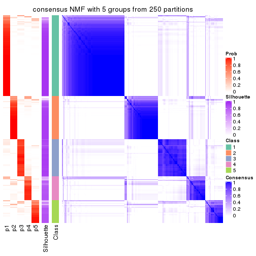</p>

</div>
<div id='tab-MAD-NMF-consensus-heatmap-5'>
<pre><code class="r">consensus_heatmap(res, k = 6)
</code></pre>

<p></p>

</div>
</div>

Heatmaps for the membership of samples in all partitions to see how consistent they are:


<script>
$( function() {
	$( '#tabs-MAD-NMF-membership-heatmap' ).tabs();
} );
</script>
<div id='tabs-MAD-NMF-membership-heatmap'>
<ul>
<li><a href='#tab-MAD-NMF-membership-heatmap-1'>k = 2</a></li>
<li><a href='#tab-MAD-NMF-membership-heatmap-2'>k = 3</a></li>
<li><a href='#tab-MAD-NMF-membership-heatmap-3'>k = 4</a></li>
<li><a href='#tab-MAD-NMF-membership-heatmap-4'>k = 5</a></li>
<li><a href='#tab-MAD-NMF-membership-heatmap-5'>k = 6</a></li>
</ul>
<div id='tab-MAD-NMF-membership-heatmap-1'>
<pre><code class="r">membership_heatmap(res, k = 2)
</code></pre>

<p></p>

</div>
<div id='tab-MAD-NMF-membership-heatmap-2'>
<pre><code class="r">membership_heatmap(res, k = 3)
</code></pre>

<p></p>

</div>
<div id='tab-MAD-NMF-membership-heatmap-3'>
<pre><code class="r">membership_heatmap(res, k = 4)
</code></pre>

<p></p>

</div>
<div id='tab-MAD-NMF-membership-heatmap-4'>
<pre><code class="r">membership_heatmap(res, k = 5)
</code></pre>

<p></p>

</div>
<div id='tab-MAD-NMF-membership-heatmap-5'>
<pre><code class="r">membership_heatmap(res, k = 6)
</code></pre>

<p></p>

</div>
</div>

As soon as we have had the classes for columns, we can look for signatures
which are significantly different between classes which can be candidate marks
for certain classes. Following are the heatmaps for signatures.


Signature heatmaps where rows are scaled:


<script>
$( function() {
	$( '#tabs-MAD-NMF-get-signatures' ).tabs();
} );
</script>
<div id='tabs-MAD-NMF-get-signatures'>
<ul>
<li><a href='#tab-MAD-NMF-get-signatures-1'>k = 2</a></li>
<li><a href='#tab-MAD-NMF-get-signatures-2'>k = 3</a></li>
<li><a href='#tab-MAD-NMF-get-signatures-3'>k = 4</a></li>
<li><a href='#tab-MAD-NMF-get-signatures-4'>k = 5</a></li>
<li><a href='#tab-MAD-NMF-get-signatures-5'>k = 6</a></li>
</ul>
<div id='tab-MAD-NMF-get-signatures-1'>
<pre><code class="r">get_signatures(res, k = 2)
</code></pre>

<p></p>

</div>
<div id='tab-MAD-NMF-get-signatures-2'>
<pre><code class="r">get_signatures(res, k = 3)
</code></pre>

<p></p>

</div>
<div id='tab-MAD-NMF-get-signatures-3'>
<pre><code class="r">get_signatures(res, k = 4)
</code></pre>

<p></p>

</div>
<div id='tab-MAD-NMF-get-signatures-4'>
<pre><code class="r">get_signatures(res, k = 5)
</code></pre>

<p></p>

</div>
<div id='tab-MAD-NMF-get-signatures-5'>
<pre><code class="r">get_signatures(res, k = 6)
</code></pre>

<p></p>

</div>
</div>


Signature heatmaps where rows are not scaled:


<script>
$( function() {
	$( '#tabs-MAD-NMF-get-signatures-no-scale' ).tabs();
} );
</script>
<div id='tabs-MAD-NMF-get-signatures-no-scale'>
<ul>
<li><a href='#tab-MAD-NMF-get-signatures-no-scale-1'>k = 2</a></li>
<li><a href='#tab-MAD-NMF-get-signatures-no-scale-2'>k = 3</a></li>
<li><a href='#tab-MAD-NMF-get-signatures-no-scale-3'>k = 4</a></li>
<li><a href='#tab-MAD-NMF-get-signatures-no-scale-4'>k = 5</a></li>
<li><a href='#tab-MAD-NMF-get-signatures-no-scale-5'>k = 6</a></li>
</ul>
<div id='tab-MAD-NMF-get-signatures-no-scale-1'>
<pre><code class="r">get_signatures(res, k = 2, scale_rows = FALSE)
</code></pre>

<p>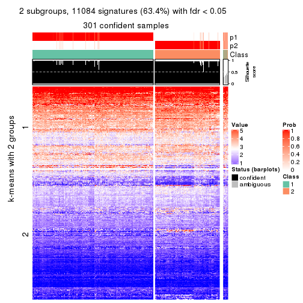</p>

</div>
<div id='tab-MAD-NMF-get-signatures-no-scale-2'>
<pre><code class="r">get_signatures(res, k = 3, scale_rows = FALSE)
</code></pre>

<p></p>

</div>
<div id='tab-MAD-NMF-get-signatures-no-scale-3'>
<pre><code class="r">get_signatures(res, k = 4, scale_rows = FALSE)
</code></pre>

<p></p>

</div>
<div id='tab-MAD-NMF-get-signatures-no-scale-4'>
<pre><code class="r">get_signatures(res, k = 5, scale_rows = FALSE)
</code></pre>

<p></p>

</div>
<div id='tab-MAD-NMF-get-signatures-no-scale-5'>
<pre><code class="r">get_signatures(res, k = 6, scale_rows = FALSE)
</code></pre>

<p></p>

</div>
</div>


Compare the overlap of signatures from different k:

```r
compare_signatures(res)
```


`get_signature()` returns a data frame invisibly. TO get the list of signatures, the function
call should be assigned to a variable explicitly. In following code, if `plot` argument is set
to `FALSE`, no heatmap is plotted while only the differential analysis is performed.

```r
# code only for demonstration
tb = get_signature(res, k = ..., plot = FALSE)
```

An example of the output of `tb` is:

```
#>   which_row         fdr    mean_1    mean_2 scaled_mean_1 scaled_mean_2 km
#> 1        38 0.042760348  8.373488  9.131774    -0.5533452     0.5164555  1
#> 2        40 0.018707592  7.106213  8.469186    -0.6173731     0.5762149  1
#> 3        55 0.019134737 10.221463 11.207825    -0.6159697     0.5749050  1
#> 4        59 0.006059896  5.921854  7.869574    -0.6899429     0.6439467  1
#> 5        60 0.018055526  8.928898 10.211722    -0.6204761     0.5791110  1
#> 6        98 0.009384629 15.714769 14.887706     0.6635654    -0.6193277  2
...
```

The columns in `tb` are:

1. `which_row`: row indices corresponding to the input matrix.
2. `fdr`: FDR for the differential test. 
3. `mean_x`: The mean value in group x.
4. `scaled_mean_x`: The mean value in group x after rows are scaled.
5. `km`: Row groups if k-means clustering is applied to rows.


UMAP plot which shows how samples are separated.


<script>
$( function() {
	$( '#tabs-MAD-NMF-dimension-reduction' ).tabs();
} );
</script>
<div id='tabs-MAD-NMF-dimension-reduction'>
<ul>
<li><a href='#tab-MAD-NMF-dimension-reduction-1'>k = 2</a></li>
<li><a href='#tab-MAD-NMF-dimension-reduction-2'>k = 3</a></li>
<li><a href='#tab-MAD-NMF-dimension-reduction-3'>k = 4</a></li>
<li><a href='#tab-MAD-NMF-dimension-reduction-4'>k = 5</a></li>
<li><a href='#tab-MAD-NMF-dimension-reduction-5'>k = 6</a></li>
</ul>
<div id='tab-MAD-NMF-dimension-reduction-1'>
<pre><code class="r">dimension_reduction(res, k = 2, method = &quot;UMAP&quot;)
</code></pre>

<p></p>

</div>
<div id='tab-MAD-NMF-dimension-reduction-2'>
<pre><code class="r">dimension_reduction(res, k = 3, method = &quot;UMAP&quot;)
</code></pre>

<p></p>

</div>
<div id='tab-MAD-NMF-dimension-reduction-3'>
<pre><code class="r">dimension_reduction(res, k = 4, method = &quot;UMAP&quot;)
</code></pre>

<p></p>

</div>
<div id='tab-MAD-NMF-dimension-reduction-4'>
<pre><code class="r">dimension_reduction(res, k = 5, method = &quot;UMAP&quot;)
</code></pre>

<p></p>

</div>
<div id='tab-MAD-NMF-dimension-reduction-5'>
<pre><code class="r">dimension_reduction(res, k = 6, method = &quot;UMAP&quot;)
</code></pre>

<p></p>

</div>
</div>


Following heatmap shows how subgroups are split when increasing `k`:

```r
collect_classes(res)
```


If matrix rows can be associated to genes, consider to use `GO_Enrichment(res,
...)` to perform function enrichment for the signature genes.


 

---------------------------------------------------


### ATC:hclust


The object with results only for a single top-value method and a single partition method 
can be extracted as:

```r
res = res_list["ATC", "hclust"]
# you can also extract it by
# res = res_list["ATC:hclust"]
```

A summary of `res` and all the functions that can be applied to it:

```r
res
```

```
#> A 'ConsensusPartition' object with k = 2, 3, 4, 5, 6.
#>   On a matrix with 17469 rows and 309 columns.
#>   Top rows (1000, 2000, 3000, 4000, 5000) are extracted by 'ATC' method.
#>   Subgroups are detected by 'hclust' method.
#>   Performed in total 1250 partitions by row resampling.
#>   Best k for subgroups seems to be 3.
#> 
#> Following methods can be applied to this 'ConsensusPartition' object:
#>  [1] "cola_report"             "collect_classes"         "collect_plots"          
#>  [4] "collect_stats"           "colnames"                "compare_signatures"     
#>  [7] "consensus_heatmap"       "dimension_reduction"     "functional_enrichment"  
#> [10] "get_anno_col"            "get_anno"                "get_classes"            
#> [13] "get_consensus"           "get_matrix"              "get_membership"         
#> [16] "get_param"               "get_signatures"          "get_stats"              
#> [19] "is_best_k"               "is_stable_k"             "membership_heatmap"     
#> [22] "ncol"                    "nrow"                    "plot_ecdf"              
#> [25] "rownames"                "select_partition_number" "show"                   
#> [28] "suggest_best_k"          "test_to_known_factors"
```

`collect_plots()` function collects all the plots made from `res` for all `k` (number of partitions)
into one single page to provide an easy and fast comparison between different `k`.

```r
collect_plots(res)
```


The plots are:

- The first row: a plot of the ECDF (Empirical cumulative distribution
  function) curves of the consensus matrix for each `k` and the heatmap of
  predicted classes for each `k`.
- The second row: heatmaps of the consensus matrix for each `k`.
- The third row: heatmaps of the membership matrix for each `k`.
- The fouth row: heatmaps of the signatures for each `k`.

All the plots in panels can be made by individual functions and they are
plotted later in this section.

`select_partition_number()` produces several plots showing different
statistics for choosing "optimized" `k`. There are following statistics:

- ECDF curves of the consensus matrix for each `k`;
- 1-PAC. [The PAC
  score](https://en.wikipedia.org/wiki/Consensus_clustering#Over-interpretation_potential_of_consensus_clustering)
  measures the proportion of the ambiguous subgrouping.
- Mean silhouette score.
- Concordance. The mean probability of fiting the consensus class ids in all
  partitions.
- Area increased. Denote $A_k$ as the area under the ECDF curve for current
  `k`, the area increased is defined as $A_k - A_{k-1}$.
- Rand index. The percent of pairs of samples that are both in a same cluster
  or both are not in a same cluster in the partition of k and k-1.
- Jaccard index. The ratio of pairs of samples are both in a same cluster in
  the partition of k and k-1 and the pairs of samples are both in a same
  cluster in the partition k or k-1.

The detailed explanations of these statistics can be found in [the cola
vignette](http://bioconductor.org/packages/devel/bioc/vignettes/cola/inst/doc/cola.html#toc_13).

Generally speaking, lower PAC score, higher mean silhouette score or higher
concordance corresponds to better partition. Rand index and Jaccard index
measure how similar the current partition is compared to partition with `k-1`.
If they are too similar, we won't accept `k` is better than `k-1`.

```r
select_partition_number(res)
```


The numeric values for all these statistics can be obtained by `get_stats()`.

```r
get_stats(res)
```

```
#>   k 1-PAC mean_silhouette concordance area_increased  Rand Jaccard
#> 2 2 0.407           0.742       0.867         0.3639 0.667   0.667
#> 3 3 0.291           0.531       0.749         0.5793 0.617   0.467
#> 4 4 0.345           0.478       0.693         0.1365 0.772   0.522
#> 5 5 0.452           0.473       0.674         0.0834 0.759   0.446
#> 6 6 0.522           0.452       0.674         0.0455 0.882   0.684
```

`suggest_best_k()` suggests the best $k$ based on these statistics. The rules are as follows:

- All $k$ with Jaccard index larger than 0.95 are removed because the increase of
  the partition number does not provides enough extra information. If all $k$ are removed,
  the best $k$ is assigned by `NA`.
- For $k$ with 1-PAC larger than 0.9, the maximal $k$ is taken as the "best k". Other $k$ is called "optional k".
- If it does not fit the second rule. The $k$ with the highest vote of highest
  1-PAC, mean silhouette and concordance is taken as the "best k".

```r
suggest_best_k(res)
```

```
#> [1] 3
```


Following shows the table of the partitions (You need to click the **show/hide
code output** link to see it). The membership matrix (columns with name `p*`)
is inferred by
[`clue::cl_consensus()`](https://www.rdocumentation.org/link/cl_consensus?package=clue)
function with the `SE` method. Basically the value in the membership matrix
represents the probability to belong to a certain group. The finall class
label for an item is determined with the group with highest probability it
belongs to.

In `get_classes()` function, the entropy is calculated from the membership
matrix and the silhouette score is calculated from the consensus matrix.


<script>
$( function() {
	$( '#tabs-ATC-hclust-get-classes' ).tabs();
} );
</script>
<div id='tabs-ATC-hclust-get-classes'>
<ul>
<li><a href='#tab-ATC-hclust-get-classes-1'>k = 2</a></li>
<li><a href='#tab-ATC-hclust-get-classes-2'>k = 3</a></li>
<li><a href='#tab-ATC-hclust-get-classes-3'>k = 4</a></li>
<li><a href='#tab-ATC-hclust-get-classes-4'>k = 5</a></li>
<li><a href='#tab-ATC-hclust-get-classes-5'>k = 6</a></li>
</ul>

<div id='tab-ATC-hclust-get-classes-1'>
<p><a id='tab-ATC-hclust-get-classes-1-a' style='color:#0366d6' href='#'>show/hide code output</a></p>
<pre><code class="r">cbind(get_classes(res, k = 2), get_membership(res, k = 2))
</code></pre>

<pre><code>#&gt;                                      class entropy silhouette    p1    p2
#&gt; 7826AE44-B03A-4528-9CB5-7421E592AE36     1  0.9922     0.3143 0.552 0.448
#&gt; 0DC2197B-2FEA-48EB-953E-8E44E1933757     2  0.0376     0.8310 0.004 0.996
#&gt; 87ABB098-8C1E-4677-8C31-48B71EFE41C7     1  0.9129     0.6191 0.672 0.328
#&gt; EC0154E7-7A27-4535-83AE-6B379E99A93C     1  0.1633     0.8429 0.976 0.024
#&gt; 78F79407-D49F-4FA2-B09F-0665C502827C     1  0.1184     0.8417 0.984 0.016
#&gt; 03E81178-E971-4E91-8BED-D8273EA1425C     1  0.7219     0.7680 0.800 0.200
#&gt; 62FCAEFF-16D8-4019-84B6-18EC3A88BC32     1  0.9358     0.5645 0.648 0.352
#&gt; 722C1284-5983-4CC1-B19C-214C2DE6F8A6     1  0.0000     0.8376 1.000 0.000
#&gt; 54E42A64-B350-4A94-8FED-C9BC1872660E     1  0.9323     0.5851 0.652 0.348
#&gt; 53062969-D209-490B-9C9B-5D297625E2AE     1  0.7219     0.7697 0.800 0.200
#&gt; B710293C-41D3-4A2E-8104-5402F91DD859     1  0.3274     0.8429 0.940 0.060
#&gt; 73CB1D05-7AE4-457D-B4EF-25AC5C1F2132     1  0.4939     0.8312 0.892 0.108
#&gt; B055A70B-3003-47CB-BDAA-6378C000BF24     1  0.5842     0.8128 0.860 0.140
#&gt; 46C3A870-E37A-42CB-8C0C-6ACACEAC1ADC     1  0.0000     0.8376 1.000 0.000
#&gt; E8E6270E-F26D-4F2E-A63E-7885BDE05FDB     2  0.0000     0.8313 0.000 1.000
#&gt; C4A5EBA2-9091-4D12-BDC8-B84B122022B9     1  0.9580     0.5212 0.620 0.380
#&gt; 5B1839C4-549D-41D1-B559-3C6D2A1528CE     2  0.6973     0.7488 0.188 0.812
#&gt; A0DF05EB-DC44-4492-9A8A-F278F7B0C266     1  0.2778     0.8438 0.952 0.048
#&gt; B5182F49-70F2-45B7-82DE-C6DA68145EEA     2  0.9775     0.2551 0.412 0.588
#&gt; C204D355-B876-4341-A111-36D48CBDD2A8     1  0.1184     0.8415 0.984 0.016
#&gt; 7B070AAA-EF97-4D3B-AA19-EEC170C7927D     1  0.0000     0.8376 1.000 0.000
#&gt; 05A8A881-F8EE-48A2-B11C-A08D7D80CE18     1  0.5408     0.8236 0.876 0.124
#&gt; BA59EF50-CFE9-456D-B1B6-67D0945004F6     1  0.4562     0.8352 0.904 0.096
#&gt; AD97B334-E034-4D33-A4D5-48C32D5D521C     1  0.3733     0.8412 0.928 0.072
#&gt; 51DA2568-32EA-4668-9876-4B6E7CA68860     1  0.9996     0.2018 0.512 0.488
#&gt; 78C26A05-2084-494D-83D3-C52C1B800F4C     2  0.6531     0.7645 0.168 0.832
#&gt; 2B5DD791-7692-4721-9519-7D7D49B52570     1  0.9460     0.5542 0.636 0.364
#&gt; C0BBE26A-79C8-4392-9978-7C420B3786B5     1  0.9795     0.4376 0.584 0.416
#&gt; F35A8359-3A7A-414F-8A5C-D278F3B45387     1  0.0000     0.8376 1.000 0.000
#&gt; 8C9BA49C-1270-491D-A234-AE1B1C0609BA     1  0.0000     0.8376 1.000 0.000
#&gt; CA104B57-B160-4148-8A0A-D34BB3E8D88A     1  0.0000     0.8376 1.000 0.000
#&gt; 877E18A5-6A7A-4E29-9871-DC7EA14A5F27     1  0.0000     0.8376 1.000 0.000
#&gt; 904EDF2E-411E-43BD-901D-46129AFA283A     1  0.0000     0.8376 1.000 0.000
#&gt; FD9F5A9B-2BEB-4D31-9A2D-8D4B4ECBB478     1  0.9881     0.3814 0.564 0.436
#&gt; 2E206314-9928-456E-B7C6-893DC0E3C7C2     1  0.7674     0.7398 0.776 0.224
#&gt; 913DB655-2C7F-4369-83DE-9257F04CF39B     1  0.2603     0.8439 0.956 0.044
#&gt; 72B5B724-FEB5-43BD-83F6-2E2152DDD800     1  0.9393     0.5634 0.644 0.356
#&gt; 920B547C-6898-446C-AAAF-F4ED96E40AAB     2  0.7815     0.6952 0.232 0.768
#&gt; 847F796A-8CD6-4013-A0FB-26F4FC3EAF0D     1  0.5737     0.8153 0.864 0.136
#&gt; C4D64E7A-33F7-4CFC-9FD3-D6AA3D8EFAA7     1  0.9983     0.2443 0.524 0.476
#&gt; EABA0B17-8E19-48C5-BF62-2A45C9632807     1  0.0000     0.8376 1.000 0.000
#&gt; 7263CBA8-CE37-4531-A795-9324C6D2A672     1  0.2948     0.8437 0.948 0.052
#&gt; 6D3CC3AC-618B-414A-B640-169C735A6568     1  0.9608     0.5136 0.616 0.384
#&gt; 710C05C7-F9CE-45FA-A8CC-29DE2903E04F     1  0.4690     0.8344 0.900 0.100
#&gt; 3D631A56-2C55-48EA-A667-BA46023C9D50     1  0.9522     0.5387 0.628 0.372
#&gt; F1C65F64-AF05-4875-B7E4-60FFF56A3F46     1  0.9580     0.5216 0.620 0.380
#&gt; E5DF76E7-A765-4E07-B87A-06168BF66C5F     1  0.2948     0.8433 0.948 0.052
#&gt; 5C8C8A6E-40D4-4F82-AC3D-90CFDEE15C0A     1  0.0000     0.8376 1.000 0.000
#&gt; 0117CBB9-1BF9-48B1-BE6E-A9A770FF8721     1  0.9427     0.5617 0.640 0.360
#&gt; 31EF66E5-419A-44C3-BB2A-B69B52FFCECC     1  0.0000     0.8376 1.000 0.000
#&gt; C149CEF5-61F3-4B53-B8A9-8244B673EBD0     1  0.3114     0.8435 0.944 0.056
#&gt; 0AF351D0-4EC5-4275-AA0A-4FA2AF8A9C85     2  0.7815     0.6952 0.232 0.768
#&gt; B507E82F-6680-497B-A014-033EDD7A2E03     1  0.9491     0.5457 0.632 0.368
#&gt; F941890E-AB33-478F-8C97-1C785DD9428F     1  0.2236     0.8439 0.964 0.036
#&gt; 7987E019-8FED-469B-A6C1-34EE430A60C3     1  0.5737     0.8153 0.864 0.136
#&gt; 76084AA6-19BF-4605-B6A1-73F1D4BADAF9     1  0.3879     0.8419 0.924 0.076
#&gt; 329807F7-E0D4-4F53-94E8-E4080E90CB47     2  0.0000     0.8313 0.000 1.000
#&gt; 1B6505FF-C1A7-4DD0-9827-41A0A3A28F3E     1  0.0000     0.8376 1.000 0.000
#&gt; 49778E92-B5D3-4AD9-A1AF-3B722D631B96     1  0.9977     0.2153 0.528 0.472
#&gt; A22892DE-0AF4-4B63-9513-1D6825059040     1  0.3114     0.8429 0.944 0.056
#&gt; 6D77ECAE-A715-4ADD-97D8-A916DC31A4EA     1  0.3879     0.8407 0.924 0.076
#&gt; 09758B6F-1B2D-4AED-8913-696097069409     1  0.0000     0.8376 1.000 0.000
#&gt; 8B709DB4-0B28-42F1-A7C5-106F5809BEA2     1  0.3274     0.8426 0.940 0.060
#&gt; F2B356FA-79CD-4867-8ABF-84C90A493A75     1  0.4161     0.8390 0.916 0.084
#&gt; 131213AD-0313-4DF1-B013-CE67ED262C37     1  0.0000     0.8376 1.000 0.000
#&gt; D94F7E81-0F60-473B-AD4A-0AC13508BDE2     2  0.0000     0.8313 0.000 1.000
#&gt; 29C17355-D646-48DA-9E54-7B6DD85DD610     1  0.3584     0.8414 0.932 0.068
#&gt; B8BD866A-2A7C-45C3-96BB-9AB892D26AE5     1  0.6148     0.8067 0.848 0.152
#&gt; 13EFD045-AD61-41EE-9896-67BFA4FC8C09     2  0.0376     0.8310 0.004 0.996
#&gt; 2655F609-B3BB-4D01-B421-D5F4B1232EC8     1  0.0000     0.8376 1.000 0.000
#&gt; 04BC7A52-C67F-42CB-8672-D3C51A20F2BA     2  0.4690     0.8048 0.100 0.900
#&gt; 45472BD4-DBDB-41FE-B0E3-2440880E1DE6     2  0.8386     0.6379 0.268 0.732
#&gt; B87FFFCD-CB57-4ACD-9C74-AB188984BBB2     1  0.9522     0.5375 0.628 0.372
#&gt; 5271374C-13CD-4BFE-AC6D-C95AFE491322     1  0.6048     0.8108 0.852 0.148
#&gt; E3372ACE-C7C8-43E5-B30A-1F2D662D8170     1  0.4939     0.8312 0.892 0.108
#&gt; B08DF564-E4D0-4540-8160-93B3981DF1D8     1  0.8327     0.7026 0.736 0.264
#&gt; 61A7D1B9-FC5A-4B9C-989F-936CDA948C27     1  0.3879     0.8406 0.924 0.076
#&gt; 74E768C1-8766-46AC-AAB4-D79E5049F76A     1  0.0000     0.8376 1.000 0.000
#&gt; 0CEA28F0-D7F0-4EB7-A23F-0C5CA6245971     2  0.4431     0.8079 0.092 0.908
#&gt; 95C4EFF6-147C-48EC-A2C1-16B8F12AEEF2     2  0.9775     0.2937 0.412 0.588
#&gt; C9A78BEA-D455-4F5E-8B7B-19BCB42887E7     1  0.9087     0.6211 0.676 0.324
#&gt; DB970740-9AC1-4C10-9658-8A77B1C390DD     2  0.0000     0.8313 0.000 1.000
#&gt; 883FBD37-0CA0-4562-8925-72ACC1EE93D9     2  0.5294     0.7946 0.120 0.880
#&gt; 9FE1D006-49F2-471E-91E6-AF0414C24479     1  0.5519     0.8194 0.872 0.128
#&gt; 11816CC6-8C8B-49C0-99EE-896377BCFCCD     1  0.5519     0.8194 0.872 0.128
#&gt; 063FC5C8-4318-4ECC-9CA0-1976CBC8ACB6     1  0.0000     0.8376 1.000 0.000
#&gt; E0F085CC-B90D-4FDE-B60E-C613971BAA00     1  0.0376     0.8389 0.996 0.004
#&gt; 62361DA2-E4EE-46DA-BB1F-C51DCA9307CC     1  0.0000     0.8376 1.000 0.000
#&gt; 1BA16D48-B09E-4699-A1AD-2FFECE4F3CDB     2  0.7815     0.6952 0.232 0.768
#&gt; 3E4F14E9-60AE-4F17-9BA7-2A02E908204A     1  0.9087     0.6255 0.676 0.324
#&gt; 79226DD7-BC85-4B8E-BFF8-B1E073129D34     1  0.8144     0.7179 0.748 0.252
#&gt; D47D0936-826F-4D54-9225-F71B95357438     1  0.8386     0.6997 0.732 0.268
#&gt; 0AE02B91-574C-4165-BA39-E9D7C1A870A2     1  0.0000     0.8376 1.000 0.000
#&gt; DED8E9DF-CEFE-45ED-9374-EF9925A135C4     1  0.9580     0.5209 0.620 0.380
#&gt; D587A993-3C47-4D4C-B744-59169D4F7451     1  0.0000     0.8376 1.000 0.000
#&gt; 6BCA24E6-440F-42C5-ABE5-66C37B713A39     1  0.0000     0.8376 1.000 0.000
#&gt; 86A5EDFB-9D06-4FED-BF57-F8D74A68E156     1  0.2603     0.8439 0.956 0.044
#&gt; B9BD5134-2F6A-4454-8F83-69B63F9AE114     1  0.2603     0.8438 0.956 0.044
#&gt; 082DA9E1-A40D-482B-8E21-A93BA97185F0     1  0.6148     0.8071 0.848 0.152
#&gt; 16A8343A-1203-44FB-9F03-05CC7C71B4CC     1  0.9460     0.5542 0.636 0.364
#&gt; 00439565-02CE-4BF5-956D-7078B51C0947     2  0.0376     0.8307 0.004 0.996
#&gt; 7B2BD361-2BF1-4E97-BC08-457F5A9C2682     1  0.0000     0.8376 1.000 0.000
#&gt; C1D8439A-D527-47F6-ADC1-25867B65DA21     1  0.0000     0.8376 1.000 0.000
#&gt; D9096909-1439-462D-B69C-CAD1BF4F420C     1  0.0938     0.8405 0.988 0.012
#&gt; 7822EA86-35A1-4285-9429-2B63111B9885     1  0.7883     0.7324 0.764 0.236
#&gt; 6FD0CFC8-AC8D-4CF1-8C33-833AD98A30EF     1  0.0000     0.8376 1.000 0.000
#&gt; A451F278-5E83-4BC6-9B15-3AA2117B99B6     1  0.0000     0.8376 1.000 0.000
#&gt; 6EC25686-4547-459C-9E01-7EDF8DAECE35     1  0.9970     0.2761 0.532 0.468
#&gt; 5D2F1EEA-2BA8-4C3A-8436-544EE1D23E7E     1  0.4161     0.8389 0.916 0.084
#&gt; 675A4293-A4CE-4307-B00B-DFC4D44A87C6     1  0.1414     0.8406 0.980 0.020
#&gt; 6FBE0AEF-476A-42B2-A857-846CF1ED92B6     1  0.0000     0.8376 1.000 0.000
#&gt; 7139D616-1A15-4288-A9AE-411856A4A76D     1  0.0000     0.8376 1.000 0.000
#&gt; 46D7F8C1-D5C5-40CC-BEF5-2E590A847BD9     2  0.0376     0.8310 0.004 0.996
#&gt; 984C44D3-4F5F-44C9-BCD9-C991EBC1FCB8     2  0.0376     0.8310 0.004 0.996
#&gt; 83FE52E0-2DC2-4580-8BB2-FBCBEE4AC240     1  0.3274     0.8437 0.940 0.060
#&gt; 0923F9CB-DF6F-4BAA-A5F8-0F83CE60D1ED     1  0.9710     0.4792 0.600 0.400
#&gt; 1DEB5206-78CC-4EB5-BCD5-85A6A5B4E273     2  0.2603     0.8224 0.044 0.956
#&gt; E4DB18DA-EB0C-4B2F-9566-7F72222B16D4     1  0.0672     0.8399 0.992 0.008
#&gt; F7456312-1309-4B2F-875D-0F90CDF3EC35     1  0.0376     0.8384 0.996 0.004
#&gt; 9A25E5D8-0706-4960-A76B-BCD0AC93E4FA     1  0.0000     0.8376 1.000 0.000
#&gt; 5A41FE8F-FFB3-4B87-BF11-A570C184096D     2  0.6973     0.7486 0.188 0.812
#&gt; 33F84E63-3F6C-4867-ADB1-A0DF39F1295B     2  0.7815     0.6967 0.232 0.768
#&gt; D6A644F5-D1D0-4A8D-94C4-EE6C3ECE7430     1  0.8267     0.7093 0.740 0.260
#&gt; 2A5848CC-A9A2-4AA8-A752-321273E62CF0     1  0.5629     0.8181 0.868 0.132
#&gt; 7CA6358B-FC8A-4675-B092-9E061038FC83     1  0.1633     0.8431 0.976 0.024
#&gt; A4C2F4BC-5C62-4B1F-9AB8-46D9468EF523     1  0.1414     0.8406 0.980 0.020
#&gt; 8AF4EB7F-418D-4CC9-A9B8-A93A4C1A173B     1  0.9909     0.3141 0.556 0.444
#&gt; E5048887-70C8-468F-881E-2EC55F6E6F3B     1  0.3584     0.8414 0.932 0.068
#&gt; 1BADCC7C-C4D8-4C34-9534-59D622C7A2A2     2  0.0000     0.8313 0.000 1.000
#&gt; 02CE7DF7-64BD-4297-A240-A5B9EE8771D3     2  0.0000     0.8313 0.000 1.000
#&gt; CBF6E96A-F56C-4C87-B851-D319930BAAB8     1  0.4562     0.8357 0.904 0.096
#&gt; 48F6B774-CFD2-4DDF-B7A2-696596413C3F     1  0.0000     0.8376 1.000 0.000
#&gt; 41D88C3E-5848-4B09-8A77-EAE6AC4EC6B0     2  0.7815     0.6952 0.232 0.768
#&gt; BDF79CC0-00C7-49C1-900B-AB065A733B17     2  0.7745     0.7026 0.228 0.772
#&gt; A894D686-BFC7-4AEE-A794-DBE718C6B6F6     1  0.7376     0.7557 0.792 0.208
#&gt; 0712029E-3765-4272-BE5B-B6C8BCCC0F0F     1  0.0000     0.8376 1.000 0.000
#&gt; 7B051855-9B09-4887-9BC0-9F077537938E     1  0.2603     0.8433 0.956 0.044
#&gt; EF357C46-5C3C-4F51-9383-FF7694D07B97     1  0.0000     0.8376 1.000 0.000
#&gt; 9492A322-37CA-4582-AC68-66B5D80778AF     1  0.0000     0.8376 1.000 0.000
#&gt; 993399A4-1B9F-4258-B2D0-155AD58A2E82     1  0.2948     0.8433 0.948 0.052
#&gt; 7B7DC93D-5494-4E69-BE07-2967887182F9     2  0.0000     0.8313 0.000 1.000
#&gt; 29BCBA51-2580-473D-9CF7-BEDBD0DBAD1B     1  0.0000     0.8376 1.000 0.000
#&gt; 40855647-E942-4F32-90B7-BEB921929BFB     1  0.9661     0.4976 0.608 0.392
#&gt; 0DC723D0-7C68-4495-A4B9-2DF2FF19AB14     1  0.1414     0.8406 0.980 0.020
#&gt; 7540005F-57E0-4E2E-A8A2-BEF2B0F333B1     1  0.0000     0.8376 1.000 0.000
#&gt; EB1DDB14-4076-4C2C-B911-390C17C21486     2  0.0000     0.8313 0.000 1.000
#&gt; 9EA70EC4-8BA0-4E3D-B3CB-A68D19E89868     2  0.7883     0.6918 0.236 0.764
#&gt; B04E2E50-0A6E-4224-A825-1714D12E5669     2  0.0000     0.8313 0.000 1.000
#&gt; B0BF5E01-536D-40FF-9C24-CBBD611E2FC2     2  0.0000     0.8313 0.000 1.000
#&gt; 7B6B1788-B297-4442-B6BE-B7CE8754491E     2  0.9358     0.4415 0.352 0.648
#&gt; A090D00C-34DF-4906-A517-4803C4C9A332     1  0.9732     0.4682 0.596 0.404
#&gt; 340D44A6-9BEA-412C-9973-D9ABD6692255     1  0.8861     0.6520 0.696 0.304
#&gt; E8D0D1E7-E5A8-4014-80C1-0245F90F4358     1  0.0000     0.8376 1.000 0.000
#&gt; 19EA1494-8572-40E1-B9BB-3739F47B607D     1  0.6148     0.8067 0.848 0.152
#&gt; 1C1B4793-8DAF-4763-BA4D-C4E869A4ED35     1  0.0672     0.8399 0.992 0.008
#&gt; 45BF59B3-95BD-4196-ABAA-4C4F0DB38572     2  0.0000     0.8313 0.000 1.000
#&gt; 47B5A2A7-7E13-4558-99D2-067F5075C6A4     1  0.3114     0.8430 0.944 0.056
#&gt; E94638E8-CB51-4FBB-8BCB-4BFD7A812291     1  0.0000     0.8376 1.000 0.000
#&gt; A17352A8-0D3C-4545-8136-7DAE2FB0E102     2  0.9896     0.1679 0.440 0.560
#&gt; B18A6F95-D4ED-416B-B5A1-9A4934865D0D     1  0.0000     0.8376 1.000 0.000
#&gt; 33E92C5F-0C42-4549-AD5B-0A064182A272     1  0.4161     0.8389 0.916 0.084
#&gt; E041B375-3E60-4F18-A6EF-D1C249E3B8EE     1  0.9286     0.5891 0.656 0.344
#&gt; EDF90AF6-6C64-4BD2-AADF-8D7D188650B2     1  0.4161     0.8345 0.916 0.084
#&gt; 569320D2-316C-4E2D-B7B3-D7D5C4DAD42D     1  0.6623     0.7909 0.828 0.172
#&gt; AFFB223D-DAE9-4567-9EF2-8E4DF9D8782D     1  0.8443     0.6913 0.728 0.272
#&gt; 56FC9454-0A6A-4CC3-95C4-BE0E0D0BAFCE     1  0.0000     0.8376 1.000 0.000
#&gt; 43226365-FAEF-46C5-AF1B-5C6C2BED84FF     1  0.0000     0.8376 1.000 0.000
#&gt; 1536110A-B42A-4A84-9474-9895321FDCE9     1  0.0000     0.8376 1.000 0.000
#&gt; 812255DD-536B-4216-90B1-27D5AB339BE2     1  0.2603     0.8436 0.956 0.044
#&gt; 5D4563D6-68B7-4C9D-A3F4-AA7D45D5112C     1  0.0000     0.8376 1.000 0.000
#&gt; BAA39781-DB94-473C-98B1-FA6CD3E1C67A     1  0.3733     0.8418 0.928 0.072
#&gt; C1411CDA-814D-4E21-8929-C0F77858828F     1  0.5842     0.8131 0.860 0.140
#&gt; EFE2F248-C13E-4E8D-9153-8C903848AC4A     1  0.0000     0.8376 1.000 0.000
#&gt; D3939C84-D1D6-4060-9F91-AEB222A9BDD5     1  0.3431     0.8432 0.936 0.064
#&gt; EABD2987-8C1E-49E5-94AF-C0BDE5335A48     1  0.9608     0.5151 0.616 0.384
#&gt; F4BE2ABE-2CEB-4A6A-B8EC-0355F8C63B9B     1  0.9552     0.5334 0.624 0.376
#&gt; 627BC251-D217-4955-B718-6B9D6DEA1756     1  0.5519     0.8194 0.872 0.128
#&gt; 31B54613-A20E-4039-BB8B-9B52104CE418     1  0.4161     0.8389 0.916 0.084
#&gt; 3F292B7C-A535-4DBD-BC20-CB4F85A1C94B     2  0.9522     0.4032 0.372 0.628
#&gt; BEA2A5EB-EEA9-4F31-AC38-810E04CE124B     1  0.8443     0.6913 0.728 0.272
#&gt; 99D84D46-19DA-43F1-B639-DCE9953F1529     1  0.0000     0.8376 1.000 0.000
#&gt; 4588817E-1068-4A78-86B6-4674A0112DDA     1  0.0672     0.8399 0.992 0.008
#&gt; 6AC633BD-BEC1-4750-94E3-378972DAB6B3     2  0.0000     0.8313 0.000 1.000
#&gt; 09E17C6E-7EDE-4DDF-B5ED-2521AF870C9A     1  0.1633     0.8424 0.976 0.024
#&gt; 58D9C750-26A2-4B7C-84C4-13D7AFB4C5EA     1  0.5737     0.8182 0.864 0.136
#&gt; DF28E138-E222-4F77-9B61-69E601CA7E60     1  0.0000     0.8376 1.000 0.000
#&gt; FEA489A8-E423-4266-AADA-9BAAB29AB94B     1  0.5737     0.8161 0.864 0.136
#&gt; F3FCC207-15CD-41EA-A3EF-F5D2C12AC373     1  0.9993     0.2172 0.516 0.484
#&gt; 53DD7AFB-A258-4643-A501-BACC95D17A50     1  0.0000     0.8376 1.000 0.000
#&gt; D850B2A1-1F8A-4A44-A0CF-8D9DD4A1889A     1  0.0000     0.8376 1.000 0.000
#&gt; B3F746DC-E487-4305-9F30-825D1520E8FD     1  0.0938     0.8404 0.988 0.012
#&gt; BE38240A-F7C2-439F-9AAE-51C8A340F310     2  0.9993    -0.0722 0.484 0.516
#&gt; A9022D9E-1D30-49EE-8552-1364A8027F34     2  0.0000     0.8313 0.000 1.000
#&gt; 0E8A56EE-D9A2-48A5-B793-A358BE1E4EFA     2  0.9732     0.2799 0.404 0.596
#&gt; 51667574-318E-4BDB-8F42-8512A4C1B84F     1  0.8207     0.7133 0.744 0.256
#&gt; B0A442C9-67E4-4534-8A5C-D6D73F42358C     1  0.5408     0.8215 0.876 0.124
#&gt; 25A5BC09-0D88-4385-87AF-997F9018522D     1  0.0000     0.8376 1.000 0.000
#&gt; 344B9631-AAA5-4302-8747-D584345D9131     1  0.9580     0.5209 0.620 0.380
#&gt; 1C3795AD-6306-4892-95F5-92DF3375D46A     1  0.1843     0.8432 0.972 0.028
#&gt; 17BB221D-8BF9-4391-83DD-423AE1E03651     1  0.0672     0.8399 0.992 0.008
#&gt; 297611E9-9555-4BCA-A723-02E846ACC23A     1  0.1184     0.8412 0.984 0.016
#&gt; AD7FF180-1EAC-4783-8A62-E9626B96DD9F     2  0.9896     0.1679 0.440 0.560
#&gt; FD544083-9BD5-4036-BD81-0352B67CC45C     1  0.9323     0.5831 0.652 0.348
#&gt; 879A74D5-5B29-418D-A0F4-8E88D6384008     2  0.8661     0.5988 0.288 0.712
#&gt; 43CD982C-13C0-4A52-803A-9A3A3FAE09BC     1  0.3584     0.8421 0.932 0.068
#&gt; DCD0313D-5206-4111-8743-A8A0227257D9     2  0.0000     0.8313 0.000 1.000
#&gt; 331A9160-D730-45DD-A985-C6CAC03035ED     1  0.3114     0.8433 0.944 0.056
#&gt; 9EEECA0E-530D-4724-B016-A716F0782148     1  0.0000     0.8376 1.000 0.000
#&gt; B3073976-CA3F-4115-9243-8C2D9E1B975D     1  0.9393     0.5688 0.644 0.356
#&gt; 77B3C9B4-1A7F-41BB-A37D-01EF80E933CC     2  0.0000     0.8313 0.000 1.000
#&gt; C0C26822-2E9F-4FB0-81D4-575027C8B71C     1  0.3584     0.8392 0.932 0.068
#&gt; F1FCE328-2B3B-499A-888D-0E66A017E8B0     2  0.0000     0.8313 0.000 1.000
#&gt; F069DAD6-F1EB-42F7-8252-F3F6EC46CC3E     1  0.9608     0.5132 0.616 0.384
#&gt; 99CC822E-8C98-4EEC-BB58-AEF76A0B5332     1  0.2948     0.8449 0.948 0.052
#&gt; C86EBD08-53F2-4972-801A-74970FDD6A62     2  0.0000     0.8313 0.000 1.000
#&gt; F07326F2-C1D6-4D5A-9693-25C3A04B0EC2     1  0.2778     0.8432 0.952 0.048
#&gt; 8ACBD428-7713-48D9-810A-43C9CD191A73     1  0.9358     0.5645 0.648 0.352
#&gt; 3D3501B4-1A43-4FA7-90A2-CCEBF66BFD4A     2  0.7815     0.6967 0.232 0.768
#&gt; DD51C17C-300F-44A4-955A-C9BC85417842     1  0.9732     0.4671 0.596 0.404
#&gt; 58FF391C-1D83-426C-8F92-C15F78F56C95     1  0.2043     0.8437 0.968 0.032
#&gt; ACE65C6E-2B10-4972-91B4-9199DD4B179D     1  0.3879     0.8418 0.924 0.076
#&gt; B2088466-FA5D-491C-9982-99B33683E66F     1  0.9998     0.1281 0.508 0.492
#&gt; D47AF416-1687-4FE0-A235-8815B6E8EB0B     2  0.0000     0.8313 0.000 1.000
#&gt; 4DCAD07F-CC43-46F6-B2F3-EDBF3EDD1045     1  0.7950     0.7244 0.760 0.240
#&gt; AAAE0BD9-63FC-4A0E-A27E-447B634BAD99     1  0.0000     0.8376 1.000 0.000
#&gt; BC471AA1-52CF-4CEE-9866-34CE91404F45     1  0.0000     0.8376 1.000 0.000
#&gt; 81D3EE3F-AC11-404F-8092-307F0DC12198     1  0.9323     0.5831 0.652 0.348
#&gt; 8C02026C-C25E-406B-B8B8-A1A82362AE79     1  0.9358     0.5653 0.648 0.352
#&gt; 6A005F2A-A0C1-4CA4-B15B-96B08F013874     2  0.0000     0.8313 0.000 1.000
#&gt; B55743F2-4D63-4375-85D3-F58281CFD852     1  0.4298     0.8372 0.912 0.088
#&gt; 24F98393-C817-4D0E-A7DB-05D2B5C71F40     1  0.3879     0.8407 0.924 0.076
#&gt; 2C2AEF1D-4112-4EC7-9027-5E3FD26E8802     1  0.9000     0.6290 0.684 0.316
#&gt; 8BAC3CB5-2987-4349-8AE8-B83DDD16CA3C     1  0.3274     0.8443 0.940 0.060
#&gt; ED9C74E6-92FC-4E58-8FCE-1761DEA0C977     1  0.0000     0.8376 1.000 0.000
#&gt; BA732ED4-F6BA-404E-BA3C-CA558FAD866A     1  0.8386     0.7014 0.732 0.268
#&gt; E750385A-12D9-4A88-B4DF-C1306B5EF3B7     1  0.0672     0.8402 0.992 0.008
#&gt; 6B1DC5E4-5F82-4395-913F-6AEDB5B63188     1  0.5737     0.8160 0.864 0.136
#&gt; A7C12D37-FD50-4674-A054-1774F4E5C3B3     1  0.9710     0.4780 0.600 0.400
#&gt; 2155C764-2063-4D9C-9ACD-96AA73475F5E     2  0.0000     0.8313 0.000 1.000
#&gt; DE23CC15-A95E-4119-9B3C-8EEC45900D11     1  0.0000     0.8376 1.000 0.000
#&gt; 5DB1DCAD-638E-48A4-9F40-3D6268FDEC33     1  0.5629     0.8105 0.868 0.132
#&gt; 34AF0341-73D7-4080-AAEB-4C1541C2569F     2  0.9775     0.2551 0.412 0.588
#&gt; B60D4235-44AF-4BA4-98C0-BCCDC28E90B9     1  0.0000     0.8376 1.000 0.000
#&gt; CF463D89-2C9F-4257-BF04-8BC1CD40EA7D     1  0.0000     0.8376 1.000 0.000
#&gt; EF6C8165-484A-4530-AEDF-93DCC4A8455D     1  0.4690     0.8348 0.900 0.100
#&gt; B9F6B5E4-4D10-49B8-A8FE-8F33C5A62CBF     1  0.9909     0.3553 0.556 0.444
#&gt; CE539000-92D7-4622-9C8D-BC6E01310681     1  0.7950     0.7238 0.760 0.240
#&gt; D3BBC405-A22A-4009-ABF6-96FEEE653051     1  0.0000     0.8376 1.000 0.000
#&gt; 0B3C86BD-0D20-4408-9BE3-05658729505F     1  0.9661     0.4953 0.608 0.392
#&gt; 9B9C5071-7C3F-416C-B91C-6F5966747F54     1  0.1843     0.8430 0.972 0.028
#&gt; A9469A4A-C5F9-4681-A916-A26F0B4307BA     1  0.9850     0.4029 0.572 0.428
#&gt; A31B57E4-E30B-4A1B-829D-1B47D9CEC041     1  0.0376     0.8388 0.996 0.004
#&gt; 647255CE-F84A-4070-B3FD-D8ACA32C4D09     1  0.9661     0.4949 0.608 0.392
#&gt; 8F5E9F02-51D7-410E-B8B7-22737F2F095A     1  0.0000     0.8376 1.000 0.000
#&gt; 8074A7F6-2FDE-4578-B71C-01C542D468FE     1  0.1184     0.8417 0.984 0.016
#&gt; 2A946F17-F245-409E-A019-C60CDA18DC7D     2  0.0000     0.8313 0.000 1.000
#&gt; 0878C381-47F9-4786-82C2-94AC840BEDCB     2  0.6887     0.7504 0.184 0.816
#&gt; 54504893-92C5-4328-85A8-2A882680B5E0     1  0.9427     0.5612 0.640 0.360
#&gt; 0A27D1BE-E5DD-459A-A51F-6D8AAF7CFEB4     1  0.1843     0.8428 0.972 0.028
#&gt; 89ED5A3E-CAC0-4AB4-B858-A3CD8F34DBD5     1  0.0000     0.8376 1.000 0.000
#&gt; ACEEB0A5-AADB-4EF9-8710-4BAF95522CEA     1  0.9954     0.3053 0.540 0.460
#&gt; 02C74D81-5976-4252-BC6C-B10E934DECA2     2  0.0000     0.8313 0.000 1.000
#&gt; D365A238-4739-4B54-9608-DC548F21C04E     1  0.8813     0.6569 0.700 0.300
#&gt; F70F7ED5-A3B7-4210-95AD-DEFA0A565F06     1  0.9323     0.5832 0.652 0.348
#&gt; A92C23A9-BC25-4025-9501-6D5FF8E2A502     1  0.0376     0.8388 0.996 0.004
#&gt; ECE9BBF4-840E-47A6-8378-0B6C4A2369D3     1  0.2236     0.8440 0.964 0.036
#&gt; 38749490-0FCF-4B33-9EBC-8F86C2D9E4AF     2  0.4161     0.8109 0.084 0.916
#&gt; 02ABB64E-768B-4999-A899-EEE573D5F186     1  0.9491     0.5430 0.632 0.368
#&gt; C1C467A8-18B1-4C3F-AC45-33359ED6FDC4     1  0.0938     0.8411 0.988 0.012
#&gt; 78B2E4A1-9DAE-404F-AB47-1896450EF254     1  0.0000     0.8376 1.000 0.000
#&gt; CCDB0290-91DA-4089-84A6-4434BA028D30     2  0.0000     0.8313 0.000 1.000
#&gt; D5041E80-20A0-4C1A-9AC1-2394F6DB6E92     1  0.9491     0.5465 0.632 0.368
#&gt; 20EB9CC6-EABB-438A-9030-E766459996D1     1  0.7883     0.7270 0.764 0.236
#&gt; 73E99110-9A7C-4F73-98C5-79D22CB06230     1  0.5737     0.8161 0.864 0.136
#&gt; FAD8A464-9BC3-4ED9-9517-B18D36514325     1  0.0000     0.8376 1.000 0.000
#&gt; 9AF0E82E-E621-437A-8D19-700532B95090     1  0.4431     0.8356 0.908 0.092
#&gt; 27DA48F3-4FC1-41A3-8E49-5B25F1CCFF07     1  0.4298     0.8376 0.912 0.088
#&gt; EFE5A302-D138-4044-A301-5C5FD1C24836     1  0.5178     0.8253 0.884 0.116
#&gt; D3E866AC-D66A-4C07-9F47-89AF460320DE     1  0.0000     0.8376 1.000 0.000
#&gt; 89C45456-9392-4EB3-9A82-A130B6702AAF     1  0.0000     0.8376 1.000 0.000
#&gt; 8FF5C8FC-2565-49BE-9EE0-91A84A85AB2A     2  0.0000     0.8313 0.000 1.000
#&gt; 846DF088-75D5-49CF-BDDC-27E735A08DCA     1  0.5178     0.8258 0.884 0.116
#&gt; EA3A19E1-7ADE-47B6-A35A-71290967147A     1  0.0000     0.8376 1.000 0.000
#&gt; B2C43D0C-732B-4C54-938F-D3C9FDA880DA     2  0.6973     0.7489 0.188 0.812
#&gt; EEC856B5-9B7F-488D-975E-CE2FF7072879     1  0.5842     0.8076 0.860 0.140
#&gt; 8A68C417-09CC-4FA1-BFEB-EB4B738853A4     1  0.0376     0.8384 0.996 0.004
#&gt; C5DF1A0D-952C-44E2-BF83-ED57177EF60E     1  0.8909     0.6462 0.692 0.308
#&gt; B5C9EA22-F758-4BD2-BD1F-282EC1078AED     1  0.0000     0.8376 1.000 0.000
#&gt; 3F08AE92-3EFD-4D7F-8C5C-BFB3621F0CD6     1  0.5408     0.8233 0.876 0.124
#&gt; 8F0D43F1-2199-4DBB-9B16-1E5F2CED2FEC     1  0.3584     0.8392 0.932 0.068
#&gt; 54BABD8B-EA9F-4875-8594-2179B38C73BD     1  0.4562     0.8357 0.904 0.096
#&gt; C149B6F8-03DC-4907-920A-F3318B8D2A1E     2  0.0000     0.8313 0.000 1.000
#&gt; F93D26E2-4B45-495D-BC8E-5B592F8FDABF     1  0.5737     0.8153 0.864 0.136
#&gt; C98275CD-C39A-4E14-A731-4F3EB7396665     1  0.0000     0.8376 1.000 0.000
#&gt; 354DC705-216E-42F0-B29E-C1F8D6C9489A     1  0.0672     0.8399 0.992 0.008
#&gt; 6752EED9-7990-433F-A206-D5398C396471     2  0.0000     0.8313 0.000 1.000
#&gt; C3E94C5D-68C4-400C-B7CB-38C42E9D5FFF     1  0.2778     0.8434 0.952 0.048
#&gt; CE6B6871-3ED3-44DE-A777-7558D4429057     1  0.9635     0.5043 0.612 0.388
#&gt; A06E7D1E-E432-4A4C-8BB0-314304F96EDF     1  0.8327     0.7043 0.736 0.264
#&gt; 1ABBEF80-508F-4247-B43D-3E549372113B     2  0.8081     0.6783 0.248 0.752
#&gt; 835AAE7F-F873-4D11-8845-232D261A38DF     2  0.4431     0.8079 0.092 0.908
#&gt; E98A0460-6529-4DBA-8542-1B98801D7A7D     1  0.0376     0.8384 0.996 0.004
#&gt; 06A9CBF8-01D0-4720-BCE8-83F0E77C862F     2  0.0000     0.8313 0.000 1.000
#&gt; 206865A9-A67C-49A6-93AD-55D06E777559     1  0.1184     0.8411 0.984 0.016
#&gt; 26DABC83-DB30-452F-9BE2-366760CB138E     1  0.6048     0.8019 0.852 0.148
#&gt; 9DD5272A-2D6E-4774-83E3-0CD761EDE926     2  0.7219     0.7357 0.200 0.800
#&gt; 4938E366-C740-4C9C-9358-FF37997DC9EF     1  0.2603     0.8436 0.956 0.044
#&gt; E2DA59C4-A47C-41E3-BC55-2D00C6EC17FB     2  0.8386     0.6425 0.268 0.732
#&gt; 37349E62-0BFB-4FEA-81D0-2AB7E7625B0D     1  0.0000     0.8376 1.000 0.000
</code></pre>

<script>
$('#tab-ATC-hclust-get-classes-1-a').parent().next().next().hide();
$('#tab-ATC-hclust-get-classes-1-a').click(function(){
  $('#tab-ATC-hclust-get-classes-1-a').parent().next().next().toggle();
  return(false);
});
</script>
</div>

<div id='tab-ATC-hclust-get-classes-2'>
<p><a id='tab-ATC-hclust-get-classes-2-a' style='color:#0366d6' href='#'>show/hide code output</a></p>
<pre><code class="r">cbind(get_classes(res, k = 3), get_membership(res, k = 3))
</code></pre>

<pre><code>#&gt;                                      class entropy silhouette    p1    p2    p3
#&gt; 7826AE44-B03A-4528-9CB5-7421E592AE36     1  0.6954    0.41058 0.720 0.084 0.196
#&gt; 0DC2197B-2FEA-48EB-953E-8E44E1933757     3  0.4796    0.82504 0.220 0.000 0.780
#&gt; 87ABB098-8C1E-4677-8C31-48B71EFE41C7     1  0.4636    0.65920 0.848 0.116 0.036
#&gt; EC0154E7-7A27-4535-83AE-6B379E99A93C     2  0.5988    0.53358 0.368 0.632 0.000
#&gt; 78F79407-D49F-4FA2-B09F-0665C502827C     2  0.5431    0.65834 0.284 0.716 0.000
#&gt; 03E81178-E971-4E91-8BED-D8273EA1425C     1  0.5138    0.53118 0.748 0.252 0.000
#&gt; 62FCAEFF-16D8-4019-84B6-18EC3A88BC32     1  0.4807    0.61209 0.848 0.060 0.092
#&gt; 722C1284-5983-4CC1-B19C-214C2DE6F8A6     2  0.2496    0.74153 0.068 0.928 0.004
#&gt; 54E42A64-B350-4A94-8FED-C9BC1872660E     1  0.3370    0.67117 0.904 0.072 0.024
#&gt; 53062969-D209-490B-9C9B-5D297625E2AE     1  0.5692    0.50723 0.724 0.268 0.008
#&gt; B710293C-41D3-4A2E-8104-5402F91DD859     2  0.6302    0.22290 0.480 0.520 0.000
#&gt; 73CB1D05-7AE4-457D-B4EF-25AC5C1F2132     1  0.6140    0.23200 0.596 0.404 0.000
#&gt; B055A70B-3003-47CB-BDAA-6378C000BF24     1  0.6359    0.35032 0.628 0.364 0.008
#&gt; 46C3A870-E37A-42CB-8C0C-6ACACEAC1ADC     2  0.0237    0.72909 0.004 0.996 0.000
#&gt; E8E6270E-F26D-4F2E-A63E-7885BDE05FDB     3  0.4062    0.83803 0.164 0.000 0.836
#&gt; C4A5EBA2-9091-4D12-BDC8-B84B122022B9     1  0.2187    0.64906 0.948 0.028 0.024
#&gt; 5B1839C4-549D-41D1-B559-3C6D2A1528CE     1  0.6302   -0.41740 0.520 0.000 0.480
#&gt; A0DF05EB-DC44-4492-9A8A-F278F7B0C266     2  0.6140    0.44754 0.404 0.596 0.000
#&gt; B5182F49-70F2-45B7-82DE-C6DA68145EEA     1  0.5803    0.32693 0.736 0.016 0.248
#&gt; C204D355-B876-4341-A111-36D48CBDD2A8     2  0.5529    0.64103 0.296 0.704 0.000
#&gt; 7B070AAA-EF97-4D3B-AA19-EEC170C7927D     2  0.3965    0.75065 0.132 0.860 0.008
#&gt; 05A8A881-F8EE-48A2-B11C-A08D7D80CE18     1  0.6180    0.19209 0.584 0.416 0.000
#&gt; BA59EF50-CFE9-456D-B1B6-67D0945004F6     1  0.6244    0.10430 0.560 0.440 0.000
#&gt; AD97B334-E034-4D33-A4D5-48C32D5D521C     1  0.6267    0.05186 0.548 0.452 0.000
#&gt; 51DA2568-32EA-4668-9876-4B6E7CA68860     1  0.4059    0.53416 0.860 0.012 0.128
#&gt; 78C26A05-2084-494D-83D3-C52C1B800F4C     3  0.6305    0.49398 0.484 0.000 0.516
#&gt; 2B5DD791-7692-4721-9519-7D7D49B52570     1  0.2527    0.66228 0.936 0.044 0.020
#&gt; C0BBE26A-79C8-4392-9978-7C420B3786B5     1  0.2651    0.61549 0.928 0.012 0.060
#&gt; F35A8359-3A7A-414F-8A5C-D278F3B45387     2  0.1643    0.74028 0.044 0.956 0.000
#&gt; 8C9BA49C-1270-491D-A234-AE1B1C0609BA     2  0.0424    0.73117 0.008 0.992 0.000
#&gt; CA104B57-B160-4148-8A0A-D34BB3E8D88A     2  0.4002    0.74949 0.160 0.840 0.000
#&gt; 877E18A5-6A7A-4E29-9871-DC7EA14A5F27     2  0.3686    0.75109 0.140 0.860 0.000
#&gt; 904EDF2E-411E-43BD-901D-46129AFA283A     2  0.3816    0.74936 0.148 0.852 0.000
#&gt; FD9F5A9B-2BEB-4D31-9A2D-8D4B4ECBB478     1  0.2866    0.60438 0.916 0.008 0.076
#&gt; 2E206314-9928-456E-B7C6-893DC0E3C7C2     1  0.5524    0.59459 0.796 0.164 0.040
#&gt; 913DB655-2C7F-4369-83DE-9257F04CF39B     2  0.6307    0.20234 0.488 0.512 0.000
#&gt; 72B5B724-FEB5-43BD-83F6-2E2152DDD800     1  0.4479    0.66240 0.860 0.096 0.044
#&gt; 920B547C-6898-446C-AAAF-F4ED96E40AAB     3  0.7919    0.56250 0.380 0.064 0.556
#&gt; 847F796A-8CD6-4013-A0FB-26F4FC3EAF0D     1  0.5810    0.39302 0.664 0.336 0.000
#&gt; C4D64E7A-33F7-4CFC-9FD3-D6AA3D8EFAA7     1  0.4209    0.55521 0.860 0.020 0.120
#&gt; EABA0B17-8E19-48C5-BF62-2A45C9632807     2  0.0000    0.72660 0.000 1.000 0.000
#&gt; 7263CBA8-CE37-4531-A795-9324C6D2A672     2  0.6274    0.30650 0.456 0.544 0.000
#&gt; 6D3CC3AC-618B-414A-B640-169C735A6568     1  0.2318    0.64701 0.944 0.028 0.028
#&gt; 710C05C7-F9CE-45FA-A8CC-29DE2903E04F     1  0.6192    0.18370 0.580 0.420 0.000
#&gt; 3D631A56-2C55-48EA-A667-BA46023C9D50     1  0.2434    0.65639 0.940 0.036 0.024
#&gt; F1C65F64-AF05-4875-B7E4-60FFF56A3F46     1  0.1905    0.65114 0.956 0.028 0.016
#&gt; E5DF76E7-A765-4E07-B87A-06168BF66C5F     2  0.6274    0.30108 0.456 0.544 0.000
#&gt; 5C8C8A6E-40D4-4F82-AC3D-90CFDEE15C0A     2  0.0000    0.72660 0.000 1.000 0.000
#&gt; 0117CBB9-1BF9-48B1-BE6E-A9A770FF8721     1  0.2846    0.66672 0.924 0.056 0.020
#&gt; 31EF66E5-419A-44C3-BB2A-B69B52FFCECC     2  0.1529    0.73944 0.040 0.960 0.000
#&gt; C149CEF5-61F3-4B53-B8A9-8244B673EBD0     2  0.6274    0.30817 0.456 0.544 0.000
#&gt; 0AF351D0-4EC5-4275-AA0A-4FA2AF8A9C85     3  0.7919    0.56250 0.380 0.064 0.556
#&gt; B507E82F-6680-497B-A014-033EDD7A2E03     1  0.2031    0.65746 0.952 0.032 0.016
#&gt; F941890E-AB33-478F-8C97-1C785DD9428F     2  0.6079    0.48788 0.388 0.612 0.000
#&gt; 7987E019-8FED-469B-A6C1-34EE430A60C3     1  0.5810    0.39302 0.664 0.336 0.000
#&gt; 76084AA6-19BF-4605-B6A1-73F1D4BADAF9     1  0.6267    0.05014 0.548 0.452 0.000
#&gt; 329807F7-E0D4-4F53-94E8-E4080E90CB47     3  0.1529    0.82261 0.040 0.000 0.960
#&gt; 1B6505FF-C1A7-4DD0-9827-41A0A3A28F3E     2  0.3686    0.75109 0.140 0.860 0.000
#&gt; 49778E92-B5D3-4AD9-A1AF-3B722D631B96     1  0.7596    0.33695 0.672 0.100 0.228
#&gt; A22892DE-0AF4-4B63-9513-1D6825059040     2  0.6280    0.28706 0.460 0.540 0.000
#&gt; 6D77ECAE-A715-4ADD-97D8-A916DC31A4EA     1  0.6260    0.06571 0.552 0.448 0.000
#&gt; 09758B6F-1B2D-4AED-8913-696097069409     2  0.3941    0.75034 0.156 0.844 0.000
#&gt; 8B709DB4-0B28-42F1-A7C5-106F5809BEA2     2  0.6308    0.17505 0.492 0.508 0.000
#&gt; F2B356FA-79CD-4867-8ABF-84C90A493A75     1  0.6225    0.13355 0.568 0.432 0.000
#&gt; 131213AD-0313-4DF1-B013-CE67ED262C37     2  0.1529    0.74064 0.040 0.960 0.000
#&gt; D94F7E81-0F60-473B-AD4A-0AC13508BDE2     3  0.1529    0.82261 0.040 0.000 0.960
#&gt; 29C17355-D646-48DA-9E54-7B6DD85DD610     2  0.6305    0.20334 0.484 0.516 0.000
#&gt; B8BD866A-2A7C-45C3-96BB-9AB892D26AE5     1  0.5650    0.44121 0.688 0.312 0.000
#&gt; 13EFD045-AD61-41EE-9896-67BFA4FC8C09     3  0.4931    0.81840 0.232 0.000 0.768
#&gt; 2655F609-B3BB-4D01-B421-D5F4B1232EC8     2  0.0237    0.72909 0.004 0.996 0.000
#&gt; 04BC7A52-C67F-42CB-8672-D3C51A20F2BA     3  0.6180    0.62922 0.416 0.000 0.584
#&gt; 45472BD4-DBDB-41FE-B0E3-2440880E1DE6     1  0.6111   -0.17065 0.604 0.000 0.396
#&gt; B87FFFCD-CB57-4ACD-9C74-AB188984BBB2     1  0.2176    0.65497 0.948 0.032 0.020
#&gt; 5271374C-13CD-4BFE-AC6D-C95AFE491322     1  0.6275    0.36961 0.644 0.348 0.008
#&gt; E3372ACE-C7C8-43E5-B30A-1F2D662D8170     1  0.6154    0.22359 0.592 0.408 0.000
#&gt; B08DF564-E4D0-4540-8160-93B3981DF1D8     1  0.4110    0.62775 0.844 0.152 0.004
#&gt; 61A7D1B9-FC5A-4B9C-989F-936CDA948C27     1  0.6260    0.06225 0.552 0.448 0.000
#&gt; 74E768C1-8766-46AC-AAB4-D79E5049F76A     2  0.3030    0.73139 0.092 0.904 0.004
#&gt; 0CEA28F0-D7F0-4EB7-A23F-0C5CA6245971     3  0.5926    0.71674 0.356 0.000 0.644
#&gt; 95C4EFF6-147C-48EC-A2C1-16B8F12AEEF2     1  0.8440   -0.18099 0.492 0.088 0.420
#&gt; C9A78BEA-D455-4F5E-8B7B-19BCB42887E7     1  0.3293    0.66390 0.900 0.088 0.012
#&gt; DB970740-9AC1-4C10-9658-8A77B1C390DD     3  0.1529    0.82261 0.040 0.000 0.960
#&gt; 883FBD37-0CA0-4562-8925-72ACC1EE93D9     3  0.6168    0.63076 0.412 0.000 0.588
#&gt; 9FE1D006-49F2-471E-91E6-AF0414C24479     1  0.5859    0.37639 0.656 0.344 0.000
#&gt; 11816CC6-8C8B-49C0-99EE-896377BCFCCD     1  0.5859    0.37639 0.656 0.344 0.000
#&gt; 063FC5C8-4318-4ECC-9CA0-1976CBC8ACB6     2  0.4235    0.74198 0.176 0.824 0.000
#&gt; E0F085CC-B90D-4FDE-B60E-C613971BAA00     2  0.4887    0.71222 0.228 0.772 0.000
#&gt; 62361DA2-E4EE-46DA-BB1F-C51DCA9307CC     2  0.0237    0.72909 0.004 0.996 0.000
#&gt; 1BA16D48-B09E-4699-A1AD-2FFECE4F3CDB     3  0.7919    0.56250 0.380 0.064 0.556
#&gt; 3E4F14E9-60AE-4F17-9BA7-2A02E908204A     1  0.4519    0.65802 0.852 0.116 0.032
#&gt; 79226DD7-BC85-4B8E-BFF8-B1E073129D34     1  0.4968    0.60800 0.800 0.188 0.012
#&gt; D47D0936-826F-4D54-9225-F71B95357438     1  0.4047    0.63104 0.848 0.148 0.004
#&gt; 0AE02B91-574C-4165-BA39-E9D7C1A870A2     2  0.1289    0.73608 0.032 0.968 0.000
#&gt; DED8E9DF-CEFE-45ED-9374-EF9925A135C4     1  0.1919    0.64802 0.956 0.024 0.020
#&gt; D587A993-3C47-4D4C-B744-59169D4F7451     2  0.3686    0.75109 0.140 0.860 0.000
#&gt; 6BCA24E6-440F-42C5-ABE5-66C37B713A39     2  0.3816    0.74936 0.148 0.852 0.000
#&gt; 86A5EDFB-9D06-4FED-BF57-F8D74A68E156     2  0.6307    0.20234 0.488 0.512 0.000
#&gt; B9BD5134-2F6A-4454-8F83-69B63F9AE114     2  0.6154    0.43523 0.408 0.592 0.000
#&gt; 082DA9E1-A40D-482B-8E21-A93BA97185F0     1  0.5859    0.38663 0.656 0.344 0.000
#&gt; 16A8343A-1203-44FB-9F03-05CC7C71B4CC     1  0.2527    0.66228 0.936 0.044 0.020
#&gt; 00439565-02CE-4BF5-956D-7078B51C0947     3  0.3619    0.83746 0.136 0.000 0.864
#&gt; 7B2BD361-2BF1-4E97-BC08-457F5A9C2682     2  0.1643    0.74028 0.044 0.956 0.000
#&gt; C1D8439A-D527-47F6-ADC1-25867B65DA21     2  0.2496    0.74153 0.068 0.928 0.004
#&gt; D9096909-1439-462D-B69C-CAD1BF4F420C     2  0.5785    0.59258 0.332 0.668 0.000
#&gt; 7822EA86-35A1-4285-9429-2B63111B9885     1  0.5012    0.58922 0.788 0.204 0.008
#&gt; 6FD0CFC8-AC8D-4CF1-8C33-833AD98A30EF     2  0.1753    0.74035 0.048 0.952 0.000
#&gt; A451F278-5E83-4BC6-9B15-3AA2117B99B6     2  0.2878    0.75376 0.096 0.904 0.000
#&gt; 6EC25686-4547-459C-9E01-7EDF8DAECE35     1  0.4342    0.56539 0.856 0.024 0.120
#&gt; 5D2F1EEA-2BA8-4C3A-8436-544EE1D23E7E     1  0.6225    0.12487 0.568 0.432 0.000
#&gt; 675A4293-A4CE-4307-B00B-DFC4D44A87C6     2  0.6849    0.49615 0.380 0.600 0.020
#&gt; 6FBE0AEF-476A-42B2-A857-846CF1ED92B6     2  0.0000    0.72660 0.000 1.000 0.000
#&gt; 7139D616-1A15-4288-A9AE-411856A4A76D     2  0.1643    0.74482 0.044 0.956 0.000
#&gt; 46D7F8C1-D5C5-40CC-BEF5-2E590A847BD9     3  0.4796    0.82504 0.220 0.000 0.780
#&gt; 984C44D3-4F5F-44C9-BCD9-C991EBC1FCB8     3  0.4750    0.82652 0.216 0.000 0.784
#&gt; 83FE52E0-2DC2-4580-8BB2-FBCBEE4AC240     2  0.6260    0.34097 0.448 0.552 0.000
#&gt; 0923F9CB-DF6F-4BAA-A5F8-0F83CE60D1ED     1  0.2527    0.63986 0.936 0.020 0.044
#&gt; 1DEB5206-78CC-4EB5-BCD5-85A6A5B4E273     3  0.5706    0.74670 0.320 0.000 0.680
#&gt; E4DB18DA-EB0C-4B2F-9566-7F72222B16D4     2  0.5016    0.70174 0.240 0.760 0.000
#&gt; F7456312-1309-4B2F-875D-0F90CDF3EC35     2  0.4504    0.73230 0.196 0.804 0.000
#&gt; 9A25E5D8-0706-4960-A76B-BCD0AC93E4FA     2  0.3816    0.74936 0.148 0.852 0.000
#&gt; 5A41FE8F-FFB3-4B87-BF11-A570C184096D     3  0.6309    0.45896 0.496 0.000 0.504
#&gt; 33F84E63-3F6C-4867-ADB1-A0DF39F1295B     1  0.6460   -0.32129 0.556 0.004 0.440
#&gt; D6A644F5-D1D0-4A8D-94C4-EE6C3ECE7430     1  0.5115    0.61070 0.796 0.188 0.016
#&gt; 2A5848CC-A9A2-4AA8-A752-321273E62CF0     1  0.5905    0.36406 0.648 0.352 0.000
#&gt; 7CA6358B-FC8A-4675-B092-9E061038FC83     2  0.6082    0.64396 0.296 0.692 0.012
#&gt; A4C2F4BC-5C62-4B1F-9AB8-46D9468EF523     2  0.6849    0.49615 0.380 0.600 0.020
#&gt; 8AF4EB7F-418D-4CC9-A9B8-A93A4C1A173B     1  0.7388    0.39658 0.692 0.100 0.208
#&gt; E5048887-70C8-468F-881E-2EC55F6E6F3B     1  0.6302   -0.07349 0.520 0.480 0.000
#&gt; 1BADCC7C-C4D8-4C34-9534-59D622C7A2A2     3  0.1529    0.82261 0.040 0.000 0.960
#&gt; 02CE7DF7-64BD-4297-A240-A5B9EE8771D3     3  0.3816    0.83916 0.148 0.000 0.852
#&gt; CBF6E96A-F56C-4C87-B851-D319930BAAB8     1  0.6235    0.12609 0.564 0.436 0.000
#&gt; 48F6B774-CFD2-4DDF-B7A2-696596413C3F     2  0.3816    0.74936 0.148 0.852 0.000
#&gt; 41D88C3E-5848-4B09-8A77-EAE6AC4EC6B0     3  0.7919    0.56250 0.380 0.064 0.556
#&gt; BDF79CC0-00C7-49C1-900B-AB065A733B17     1  0.6267   -0.33610 0.548 0.000 0.452
#&gt; A894D686-BFC7-4AEE-A794-DBE718C6B6F6     1  0.5573    0.59636 0.796 0.160 0.044
#&gt; 0712029E-3765-4272-BE5B-B6C8BCCC0F0F     2  0.0000    0.72660 0.000 1.000 0.000
#&gt; 7B051855-9B09-4887-9BC0-9F077537938E     2  0.6244    0.35192 0.440 0.560 0.000
#&gt; EF357C46-5C3C-4F51-9383-FF7694D07B97     2  0.0000    0.72660 0.000 1.000 0.000
#&gt; 9492A322-37CA-4582-AC68-66B5D80778AF     2  0.0000    0.72660 0.000 1.000 0.000
#&gt; 993399A4-1B9F-4258-B2D0-155AD58A2E82     2  0.6267    0.31340 0.452 0.548 0.000
#&gt; 7B7DC93D-5494-4E69-BE07-2967887182F9     3  0.4062    0.83803 0.164 0.000 0.836
#&gt; 29BCBA51-2580-473D-9CF7-BEDBD0DBAD1B     2  0.0000    0.72660 0.000 1.000 0.000
#&gt; 40855647-E942-4F32-90B7-BEB921929BFB     1  0.2414    0.63982 0.940 0.020 0.040
#&gt; 0DC723D0-7C68-4495-A4B9-2DF2FF19AB14     2  0.6849    0.49615 0.380 0.600 0.020
#&gt; 7540005F-57E0-4E2E-A8A2-BEF2B0F333B1     2  0.2486    0.74013 0.060 0.932 0.008
#&gt; EB1DDB14-4076-4C2C-B911-390C17C21486     3  0.3816    0.83916 0.148 0.000 0.852
#&gt; 9EA70EC4-8BA0-4E3D-B3CB-A68D19E89868     1  0.6451   -0.31078 0.560 0.004 0.436
#&gt; B04E2E50-0A6E-4224-A825-1714D12E5669     3  0.1529    0.82261 0.040 0.000 0.960
#&gt; B0BF5E01-536D-40FF-9C24-CBBD611E2FC2     3  0.1529    0.82261 0.040 0.000 0.960
#&gt; 7B6B1788-B297-4442-B6BE-B7CE8754491E     1  0.6333    0.09775 0.656 0.012 0.332
#&gt; A090D00C-34DF-4906-A517-4803C4C9A332     1  0.2063    0.62987 0.948 0.008 0.044
#&gt; 340D44A6-9BEA-412C-9973-D9ABD6692255     1  0.3349    0.65153 0.888 0.108 0.004
#&gt; E8D0D1E7-E5A8-4014-80C1-0245F90F4358     2  0.0237    0.72909 0.004 0.996 0.000
#&gt; 19EA1494-8572-40E1-B9BB-3739F47B607D     1  0.5650    0.44121 0.688 0.312 0.000
#&gt; 1C1B4793-8DAF-4763-BA4D-C4E869A4ED35     2  0.4002    0.75086 0.160 0.840 0.000
#&gt; 45BF59B3-95BD-4196-ABAA-4C4F0DB38572     3  0.1529    0.82261 0.040 0.000 0.960
#&gt; 47B5A2A7-7E13-4558-99D2-067F5075C6A4     2  0.6274    0.29596 0.456 0.544 0.000
#&gt; E94638E8-CB51-4FBB-8BCB-4BFD7A812291     2  0.3752    0.75002 0.144 0.856 0.000
#&gt; A17352A8-0D3C-4545-8136-7DAE2FB0E102     1  0.7944    0.14613 0.616 0.088 0.296
#&gt; B18A6F95-D4ED-416B-B5A1-9A4934865D0D     2  0.3965    0.75065 0.132 0.860 0.008
#&gt; 33E92C5F-0C42-4549-AD5B-0A064182A272     1  0.6215    0.13905 0.572 0.428 0.000
#&gt; E041B375-3E60-4F18-A6EF-D1C249E3B8EE     1  0.2998    0.67022 0.916 0.068 0.016
#&gt; EDF90AF6-6C64-4BD2-AADF-8D7D188650B2     2  0.6529    0.35464 0.368 0.620 0.012
#&gt; 569320D2-316C-4E2D-B7B3-D7D5C4DAD42D     1  0.5529    0.46461 0.704 0.296 0.000
#&gt; AFFB223D-DAE9-4567-9EF2-8E4DF9D8782D     1  0.5791    0.60001 0.792 0.148 0.060
#&gt; 56FC9454-0A6A-4CC3-95C4-BE0E0D0BAFCE     2  0.0000    0.72660 0.000 1.000 0.000
#&gt; 43226365-FAEF-46C5-AF1B-5C6C2BED84FF     2  0.3340    0.75452 0.120 0.880 0.000
#&gt; 1536110A-B42A-4A84-9474-9895321FDCE9     2  0.0000    0.72660 0.000 1.000 0.000
#&gt; 812255DD-536B-4216-90B1-27D5AB339BE2     2  0.6079    0.48568 0.388 0.612 0.000
#&gt; 5D4563D6-68B7-4C9D-A3F4-AA7D45D5112C     2  0.1529    0.73944 0.040 0.960 0.000
#&gt; BAA39781-DB94-473C-98B1-FA6CD3E1C67A     1  0.6274    0.02955 0.544 0.456 0.000
#&gt; C1411CDA-814D-4E21-8929-C0F77858828F     1  0.5678    0.42854 0.684 0.316 0.000
#&gt; EFE2F248-C13E-4E8D-9153-8C903848AC4A     2  0.3038    0.75359 0.104 0.896 0.000
#&gt; D3939C84-D1D6-4060-9F91-AEB222A9BDD5     2  0.6291    0.27252 0.468 0.532 0.000
#&gt; EABD2987-8C1E-49E5-94AF-C0BDE5335A48     1  0.2550    0.64907 0.936 0.024 0.040
#&gt; F4BE2ABE-2CEB-4A6A-B8EC-0355F8C63B9B     1  0.3028    0.66111 0.920 0.048 0.032
#&gt; 627BC251-D217-4955-B718-6B9D6DEA1756     1  0.5859    0.37639 0.656 0.344 0.000
#&gt; 31B54613-A20E-4039-BB8B-9B52104CE418     1  0.6225    0.12487 0.568 0.432 0.000
#&gt; 3F292B7C-A535-4DBD-BC20-CB4F85A1C94B     1  0.6570    0.16924 0.680 0.028 0.292
#&gt; BEA2A5EB-EEA9-4F31-AC38-810E04CE124B     1  0.5791    0.60001 0.792 0.148 0.060
#&gt; 99D84D46-19DA-43F1-B639-DCE9953F1529     2  0.0000    0.72660 0.000 1.000 0.000
#&gt; 4588817E-1068-4A78-86B6-4674A0112DDA     2  0.5098    0.69118 0.248 0.752 0.000
#&gt; 6AC633BD-BEC1-4750-94E3-378972DAB6B3     3  0.1529    0.82261 0.040 0.000 0.960
#&gt; 09E17C6E-7EDE-4DDF-B5ED-2521AF870C9A     2  0.5926    0.54928 0.356 0.644 0.000
#&gt; 58D9C750-26A2-4B7C-84C4-13D7AFB4C5EA     1  0.6470    0.36538 0.632 0.356 0.012
#&gt; DF28E138-E222-4F77-9B61-69E601CA7E60     2  0.3965    0.75065 0.132 0.860 0.008
#&gt; FEA489A8-E423-4266-AADA-9BAAB29AB94B     1  0.5810    0.39497 0.664 0.336 0.000
#&gt; F3FCC207-15CD-41EA-A3EF-F5D2C12AC373     1  0.3482    0.53941 0.872 0.000 0.128
#&gt; 53DD7AFB-A258-4643-A501-BACC95D17A50     2  0.0000    0.72660 0.000 1.000 0.000
#&gt; D850B2A1-1F8A-4A44-A0CF-8D9DD4A1889A     2  0.3112    0.73291 0.096 0.900 0.004
#&gt; B3F746DC-E487-4305-9F30-825D1520E8FD     2  0.6113    0.62218 0.300 0.688 0.012
#&gt; BE38240A-F7C2-439F-9AAE-51C8A340F310     1  0.5581    0.49615 0.788 0.036 0.176
#&gt; A9022D9E-1D30-49EE-8552-1364A8027F34     3  0.4750    0.82576 0.216 0.000 0.784
#&gt; 0E8A56EE-D9A2-48A5-B793-A358BE1E4EFA     1  0.5698    0.30832 0.736 0.012 0.252
#&gt; 51667574-318E-4BDB-8F42-8512A4C1B84F     1  0.4915    0.61136 0.804 0.184 0.012
#&gt; B0A442C9-67E4-4534-8A5C-D6D73F42358C     1  0.5882    0.36702 0.652 0.348 0.000
#&gt; 25A5BC09-0D88-4385-87AF-997F9018522D     2  0.0000    0.72660 0.000 1.000 0.000
#&gt; 344B9631-AAA5-4302-8747-D584345D9131     1  0.1919    0.64802 0.956 0.024 0.020
#&gt; 1C3795AD-6306-4892-95F5-92DF3375D46A     2  0.5733    0.60285 0.324 0.676 0.000
#&gt; 17BB221D-8BF9-4391-83DD-423AE1E03651     2  0.4702    0.72027 0.212 0.788 0.000
#&gt; 297611E9-9555-4BCA-A723-02E846ACC23A     2  0.5431    0.65629 0.284 0.716 0.000
#&gt; AD7FF180-1EAC-4783-8A62-E9626B96DD9F     1  0.7944    0.14613 0.616 0.088 0.296
#&gt; FD544083-9BD5-4036-BD81-0352B67CC45C     1  0.2651    0.66956 0.928 0.060 0.012
#&gt; 879A74D5-5B29-418D-A0F4-8E88D6384008     1  0.5926   -0.02811 0.644 0.000 0.356
#&gt; 43CD982C-13C0-4A52-803A-9A3A3FAE09BC     1  0.6286   -0.00544 0.536 0.464 0.000
#&gt; DCD0313D-5206-4111-8743-A8A0227257D9     3  0.3816    0.83916 0.148 0.000 0.852
#&gt; 331A9160-D730-45DD-A985-C6CAC03035ED     2  0.6267    0.31773 0.452 0.548 0.000
#&gt; 9EEECA0E-530D-4724-B016-A716F0782148     2  0.3340    0.75441 0.120 0.880 0.000
#&gt; B3073976-CA3F-4115-9243-8C2D9E1B975D     1  0.2703    0.66846 0.928 0.056 0.016
#&gt; 77B3C9B4-1A7F-41BB-A37D-01EF80E933CC     3  0.1529    0.82261 0.040 0.000 0.960
#&gt; C0C26822-2E9F-4FB0-81D4-575027C8B71C     2  0.7566    0.21555 0.448 0.512 0.040
#&gt; F1FCE328-2B3B-499A-888D-0E66A017E8B0     3  0.2066    0.82764 0.060 0.000 0.940
#&gt; F069DAD6-F1EB-42F7-8252-F3F6EC46CC3E     1  0.2443    0.64764 0.940 0.028 0.032
#&gt; 99CC822E-8C98-4EEC-BB58-AEF76A0B5332     2  0.6180    0.42362 0.416 0.584 0.000
#&gt; C86EBD08-53F2-4972-801A-74970FDD6A62     3  0.2356    0.82949 0.072 0.000 0.928
#&gt; F07326F2-C1D6-4D5A-9693-25C3A04B0EC2     2  0.6267    0.31377 0.452 0.548 0.000
#&gt; 8ACBD428-7713-48D9-810A-43C9CD191A73     1  0.4807    0.61209 0.848 0.060 0.092
#&gt; 3D3501B4-1A43-4FA7-90A2-CCEBF66BFD4A     1  0.6460   -0.32129 0.556 0.004 0.440
#&gt; DD51C17C-300F-44A4-955A-C9BC85417842     1  0.3134    0.63268 0.916 0.032 0.052
#&gt; 58FF391C-1D83-426C-8F92-C15F78F56C95     2  0.6008    0.52022 0.372 0.628 0.000
#&gt; ACE65C6E-2B10-4972-91B4-9199DD4B179D     1  0.6302   -0.07749 0.520 0.480 0.000
#&gt; B2088466-FA5D-491C-9982-99B33683E66F     1  0.7748    0.29819 0.652 0.096 0.252
#&gt; D47AF416-1687-4FE0-A235-8815B6E8EB0B     3  0.1529    0.82261 0.040 0.000 0.960
#&gt; 4DCAD07F-CC43-46F6-B2F3-EDBF3EDD1045     1  0.4930    0.62232 0.836 0.120 0.044
#&gt; AAAE0BD9-63FC-4A0E-A27E-447B634BAD99     2  0.0000    0.72660 0.000 1.000 0.000
#&gt; BC471AA1-52CF-4CEE-9866-34CE91404F45     2  0.0000    0.72660 0.000 1.000 0.000
#&gt; 81D3EE3F-AC11-404F-8092-307F0DC12198     1  0.2651    0.66956 0.928 0.060 0.012
#&gt; 8C02026C-C25E-406B-B8B8-A1A82362AE79     1  0.4914    0.62624 0.844 0.068 0.088
#&gt; 6A005F2A-A0C1-4CA4-B15B-96B08F013874     3  0.4654    0.82910 0.208 0.000 0.792
#&gt; B55743F2-4D63-4375-85D3-F58281CFD852     1  0.6154    0.21089 0.592 0.408 0.000
#&gt; 24F98393-C817-4D0E-A7DB-05D2B5C71F40     1  0.6260    0.06571 0.552 0.448 0.000
#&gt; 2C2AEF1D-4112-4EC7-9027-5E3FD26E8802     1  0.3129    0.66329 0.904 0.088 0.008
#&gt; 8BAC3CB5-2987-4349-8AE8-B83DDD16CA3C     1  0.6305   -0.10257 0.516 0.484 0.000
#&gt; ED9C74E6-92FC-4E58-8FCE-1761DEA0C977     2  0.3116    0.75372 0.108 0.892 0.000
#&gt; BA732ED4-F6BA-404E-BA3C-CA558FAD866A     1  0.4723    0.62473 0.824 0.160 0.016
#&gt; E750385A-12D9-4A88-B4DF-C1306B5EF3B7     2  0.4782    0.72946 0.164 0.820 0.016
#&gt; 6B1DC5E4-5F82-4395-913F-6AEDB5B63188     1  0.5926    0.35563 0.644 0.356 0.000
#&gt; A7C12D37-FD50-4674-A054-1774F4E5C3B3     1  0.2434    0.63626 0.940 0.024 0.036
#&gt; 2155C764-2063-4D9C-9ACD-96AA73475F5E     3  0.1529    0.82261 0.040 0.000 0.960
#&gt; DE23CC15-A95E-4119-9B3C-8EEC45900D11     2  0.0000    0.72660 0.000 1.000 0.000
#&gt; 5DB1DCAD-638E-48A4-9F40-3D6268FDEC33     2  0.6912    0.08731 0.444 0.540 0.016
#&gt; 34AF0341-73D7-4080-AAEB-4C1541C2569F     1  0.5803    0.32693 0.736 0.016 0.248
#&gt; B60D4235-44AF-4BA4-98C0-BCCDC28E90B9     2  0.0000    0.72660 0.000 1.000 0.000
#&gt; CF463D89-2C9F-4257-BF04-8BC1CD40EA7D     2  0.3213    0.75127 0.092 0.900 0.008
#&gt; EF6C8165-484A-4530-AEDF-93DCC4A8455D     1  0.6302   -0.09707 0.520 0.480 0.000
#&gt; B9F6B5E4-4D10-49B8-A8FE-8F33C5A62CBF     1  0.3293    0.59823 0.900 0.012 0.088
#&gt; CE539000-92D7-4622-9C8D-BC6E01310681     1  0.5136    0.61801 0.824 0.132 0.044
#&gt; D3BBC405-A22A-4009-ABF6-96FEEE653051     2  0.0000    0.72660 0.000 1.000 0.000
#&gt; 0B3C86BD-0D20-4408-9BE3-05658729505F     1  0.2564    0.64003 0.936 0.028 0.036
#&gt; 9B9C5071-7C3F-416C-B91C-6F5966747F54     2  0.5810    0.58742 0.336 0.664 0.000
#&gt; A9469A4A-C5F9-4681-A916-A26F0B4307BA     1  0.2496    0.61118 0.928 0.004 0.068
#&gt; A31B57E4-E30B-4A1B-829D-1B47D9CEC041     2  0.4062    0.73105 0.164 0.836 0.000
#&gt; 647255CE-F84A-4070-B3FD-D8ACA32C4D09     1  0.2434    0.64047 0.940 0.024 0.036
#&gt; 8F5E9F02-51D7-410E-B8B7-22737F2F095A     2  0.0000    0.72660 0.000 1.000 0.000
#&gt; 8074A7F6-2FDE-4578-B71C-01C542D468FE     2  0.5431    0.65834 0.284 0.716 0.000
#&gt; 2A946F17-F245-409E-A019-C60CDA18DC7D     3  0.4796    0.82446 0.220 0.000 0.780
#&gt; 0878C381-47F9-4786-82C2-94AC840BEDCB     1  0.6520   -0.45231 0.508 0.004 0.488
#&gt; 54504893-92C5-4328-85A8-2A882680B5E0     1  0.2339    0.66536 0.940 0.048 0.012
#&gt; 0A27D1BE-E5DD-459A-A51F-6D8AAF7CFEB4     2  0.6062    0.48739 0.384 0.616 0.000
#&gt; 89ED5A3E-CAC0-4AB4-B858-A3CD8F34DBD5     2  0.3129    0.75153 0.088 0.904 0.008
#&gt; ACEEB0A5-AADB-4EF9-8710-4BAF95522CEA     1  0.2878    0.57340 0.904 0.000 0.096
#&gt; 02C74D81-5976-4252-BC6C-B10E934DECA2     3  0.4654    0.82910 0.208 0.000 0.792
#&gt; D365A238-4739-4B54-9608-DC548F21C04E     1  0.3272    0.65237 0.892 0.104 0.004
#&gt; F70F7ED5-A3B7-4210-95AD-DEFA0A565F06     1  0.2651    0.66983 0.928 0.060 0.012
#&gt; A92C23A9-BC25-4025-9501-6D5FF8E2A502     2  0.4504    0.73307 0.196 0.804 0.000
#&gt; ECE9BBF4-840E-47A6-8378-0B6C4A2369D3     2  0.6008    0.52016 0.372 0.628 0.000
#&gt; 38749490-0FCF-4B33-9EBC-8F86C2D9E4AF     3  0.6062    0.67098 0.384 0.000 0.616
#&gt; 02ABB64E-768B-4999-A899-EEE573D5F186     1  0.2773    0.65519 0.928 0.048 0.024
#&gt; C1C467A8-18B1-4C3F-AC45-33359ED6FDC4     2  0.4887    0.71413 0.228 0.772 0.000
#&gt; 78B2E4A1-9DAE-404F-AB47-1896450EF254     2  0.4452    0.73443 0.192 0.808 0.000
#&gt; CCDB0290-91DA-4089-84A6-4434BA028D30     3  0.4121    0.83744 0.168 0.000 0.832
#&gt; D5041E80-20A0-4C1A-9AC1-2394F6DB6E92     1  0.2269    0.66033 0.944 0.040 0.016
#&gt; 20EB9CC6-EABB-438A-9030-E766459996D1     1  0.6142    0.57122 0.748 0.212 0.040
#&gt; 73E99110-9A7C-4F73-98C5-79D22CB06230     1  0.5785    0.40182 0.668 0.332 0.000
#&gt; FAD8A464-9BC3-4ED9-9517-B18D36514325     2  0.0592    0.73294 0.012 0.988 0.000
#&gt; 9AF0E82E-E621-437A-8D19-700532B95090     1  0.6126    0.23555 0.600 0.400 0.000
#&gt; 27DA48F3-4FC1-41A3-8E49-5B25F1CCFF07     1  0.6252    0.08629 0.556 0.444 0.000
#&gt; EFE5A302-D138-4044-A301-5C5FD1C24836     1  0.5948    0.34108 0.640 0.360 0.000
#&gt; D3E866AC-D66A-4C07-9F47-89AF460320DE     2  0.3193    0.73338 0.100 0.896 0.004
#&gt; 89C45456-9392-4EB3-9A82-A130B6702AAF     2  0.3340    0.75441 0.120 0.880 0.000
#&gt; 8FF5C8FC-2565-49BE-9EE0-91A84A85AB2A     3  0.1529    0.82261 0.040 0.000 0.960
#&gt; 846DF088-75D5-49CF-BDDC-27E735A08DCA     1  0.6553    0.21060 0.580 0.412 0.008
#&gt; EA3A19E1-7ADE-47B6-A35A-71290967147A     2  0.1643    0.74482 0.044 0.956 0.000
#&gt; B2C43D0C-732B-4C54-938F-D3C9FDA880DA     3  0.6305    0.48393 0.484 0.000 0.516
#&gt; EEC856B5-9B7F-488D-975E-CE2FF7072879     1  0.6950   -0.08588 0.508 0.476 0.016
#&gt; 8A68C417-09CC-4FA1-BFEB-EB4B738853A4     2  0.4399    0.73601 0.188 0.812 0.000
#&gt; C5DF1A0D-952C-44E2-BF83-ED57177EF60E     1  0.3272    0.65342 0.892 0.104 0.004
#&gt; B5C9EA22-F758-4BD2-BD1F-282EC1078AED     2  0.0000    0.72660 0.000 1.000 0.000
#&gt; 3F08AE92-3EFD-4D7F-8C5C-BFB3621F0CD6     1  0.5968    0.33535 0.636 0.364 0.000
#&gt; 8F0D43F1-2199-4DBB-9B16-1E5F2CED2FEC     2  0.7566    0.21555 0.448 0.512 0.040
#&gt; 54BABD8B-EA9F-4875-8594-2179B38C73BD     1  0.6204    0.16615 0.576 0.424 0.000
#&gt; C149B6F8-03DC-4907-920A-F3318B8D2A1E     3  0.1529    0.82261 0.040 0.000 0.960
#&gt; F93D26E2-4B45-495D-BC8E-5B592F8FDABF     1  0.6632    0.27772 0.596 0.392 0.012
#&gt; C98275CD-C39A-4E14-A731-4F3EB7396665     2  0.3340    0.75593 0.120 0.880 0.000
#&gt; 354DC705-216E-42F0-B29E-C1F8D6C9489A     2  0.4452    0.73401 0.192 0.808 0.000
#&gt; 6752EED9-7990-433F-A206-D5398C396471     3  0.2066    0.82740 0.060 0.000 0.940
#&gt; C3E94C5D-68C4-400C-B7CB-38C42E9D5FFF     2  0.6252    0.34044 0.444 0.556 0.000
#&gt; CE6B6871-3ED3-44DE-A777-7558D4429057     1  0.2187    0.64368 0.948 0.024 0.028
#&gt; A06E7D1E-E432-4A4C-8BB0-314304F96EDF     1  0.5008    0.61634 0.804 0.180 0.016
#&gt; 1ABBEF80-508F-4247-B43D-3E549372113B     1  0.6587   -0.28022 0.568 0.008 0.424
#&gt; 835AAE7F-F873-4D11-8845-232D261A38DF     3  0.6154    0.64224 0.408 0.000 0.592
#&gt; E98A0460-6529-4DBA-8542-1B98801D7A7D     2  0.4002    0.74575 0.160 0.840 0.000
#&gt; 06A9CBF8-01D0-4720-BCE8-83F0E77C862F     3  0.4452    0.83323 0.192 0.000 0.808
#&gt; 206865A9-A67C-49A6-93AD-55D06E777559     2  0.2537    0.73282 0.080 0.920 0.000
#&gt; 26DABC83-DB30-452F-9BE2-366760CB138E     1  0.6906    0.39950 0.644 0.324 0.032
#&gt; 9DD5272A-2D6E-4774-83E3-0CD761EDE926     1  0.6286   -0.40315 0.536 0.000 0.464
#&gt; 4938E366-C740-4C9C-9358-FF37997DC9EF     2  0.6079    0.48568 0.388 0.612 0.000
#&gt; E2DA59C4-A47C-41E3-BC55-2D00C6EC17FB     1  0.6675   -0.18606 0.584 0.012 0.404
#&gt; 37349E62-0BFB-4FEA-81D0-2AB7E7625B0D     2  0.3941    0.74782 0.156 0.844 0.000
</code></pre>

<script>
$('#tab-ATC-hclust-get-classes-2-a').parent().next().next().hide();
$('#tab-ATC-hclust-get-classes-2-a').click(function(){
  $('#tab-ATC-hclust-get-classes-2-a').parent().next().next().toggle();
  return(false);
});
</script>
</div>

<div id='tab-ATC-hclust-get-classes-3'>
<p><a id='tab-ATC-hclust-get-classes-3-a' style='color:#0366d6' href='#'>show/hide code output</a></p>
<pre><code class="r">cbind(get_classes(res, k = 4), get_membership(res, k = 4))
</code></pre>

<pre><code>#&gt;                                      class entropy silhouette    p1    p2    p3    p4
#&gt; 7826AE44-B03A-4528-9CB5-7421E592AE36     4  0.5228     0.5732 0.120 0.000 0.124 0.756
#&gt; 0DC2197B-2FEA-48EB-953E-8E44E1933757     3  0.5186     0.6701 0.164 0.000 0.752 0.084
#&gt; 87ABB098-8C1E-4677-8C31-48B71EFE41C7     1  0.5397     0.4630 0.708 0.044 0.004 0.244
#&gt; EC0154E7-7A27-4535-83AE-6B379E99A93C     1  0.5326     0.1635 0.604 0.380 0.000 0.016
#&gt; 78F79407-D49F-4FA2-B09F-0665C502827C     1  0.5682    -0.1586 0.520 0.456 0.000 0.024
#&gt; 03E81178-E971-4E91-8BED-D8273EA1425C     1  0.4901     0.5862 0.780 0.108 0.000 0.112
#&gt; 62FCAEFF-16D8-4019-84B6-18EC3A88BC32     4  0.5421     0.5372 0.308 0.008 0.020 0.664
#&gt; 722C1284-5983-4CC1-B19C-214C2DE6F8A6     2  0.2670     0.6987 0.052 0.908 0.000 0.040
#&gt; 54E42A64-B350-4A94-8FED-C9BC1872660E     1  0.5692     0.4187 0.680 0.036 0.012 0.272
#&gt; 53062969-D209-490B-9C9B-5D297625E2AE     1  0.4793     0.5993 0.800 0.112 0.008 0.080
#&gt; B710293C-41D3-4A2E-8104-5402F91DD859     1  0.4826     0.4499 0.716 0.264 0.000 0.020
#&gt; 73CB1D05-7AE4-457D-B4EF-25AC5C1F2132     1  0.4755     0.5741 0.760 0.200 0.000 0.040
#&gt; B055A70B-3003-47CB-BDAA-6378C000BF24     1  0.5775     0.5845 0.696 0.212 0.000 0.092
#&gt; 46C3A870-E37A-42CB-8C0C-6ACACEAC1ADC     2  0.0188     0.7044 0.004 0.996 0.000 0.000
#&gt; E8E6270E-F26D-4F2E-A63E-7885BDE05FDB     3  0.4224     0.6786 0.144 0.000 0.812 0.044
#&gt; C4A5EBA2-9091-4D12-BDC8-B84B122022B9     1  0.4508     0.4120 0.744 0.004 0.008 0.244
#&gt; 5B1839C4-549D-41D1-B559-3C6D2A1528CE     3  0.7714     0.3184 0.332 0.000 0.432 0.236
#&gt; A0DF05EB-DC44-4492-9A8A-F278F7B0C266     1  0.5543     0.2625 0.612 0.360 0.000 0.028
#&gt; B5182F49-70F2-45B7-82DE-C6DA68145EEA     1  0.7591    -0.0822 0.500 0.004 0.204 0.292
#&gt; C204D355-B876-4341-A111-36D48CBDD2A8     1  0.5493    -0.1163 0.528 0.456 0.000 0.016
#&gt; 7B070AAA-EF97-4D3B-AA19-EEC170C7927D     2  0.4181     0.6947 0.128 0.820 0.000 0.052
#&gt; 05A8A881-F8EE-48A2-B11C-A08D7D80CE18     1  0.5325     0.5677 0.728 0.204 0.000 0.068
#&gt; BA59EF50-CFE9-456D-B1B6-67D0945004F6     1  0.4137     0.5552 0.780 0.208 0.000 0.012
#&gt; AD97B334-E034-4D33-A4D5-48C32D5D521C     1  0.4678     0.5335 0.744 0.232 0.000 0.024
#&gt; 51DA2568-32EA-4668-9876-4B6E7CA68860     1  0.6285     0.1917 0.624 0.000 0.092 0.284
#&gt; 78C26A05-2084-494D-83D3-C52C1B800F4C     3  0.7634     0.3894 0.300 0.000 0.464 0.236
#&gt; 2B5DD791-7692-4721-9519-7D7D49B52570     1  0.5024     0.4305 0.724 0.020 0.008 0.248
#&gt; C0BBE26A-79C8-4392-9978-7C420B3786B5     1  0.5427     0.3522 0.704 0.004 0.044 0.248
#&gt; F35A8359-3A7A-414F-8A5C-D278F3B45387     2  0.1833     0.7054 0.032 0.944 0.000 0.024
#&gt; 8C9BA49C-1270-491D-A234-AE1B1C0609BA     2  0.0469     0.7077 0.012 0.988 0.000 0.000
#&gt; CA104B57-B160-4148-8A0A-D34BB3E8D88A     2  0.5536     0.5102 0.384 0.592 0.000 0.024
#&gt; 877E18A5-6A7A-4E29-9871-DC7EA14A5F27     2  0.5482     0.5302 0.368 0.608 0.000 0.024
#&gt; 904EDF2E-411E-43BD-901D-46129AFA283A     2  0.5510     0.5173 0.376 0.600 0.000 0.024
#&gt; FD9F5A9B-2BEB-4D31-9A2D-8D4B4ECBB478     1  0.5498     0.3133 0.680 0.000 0.048 0.272
#&gt; 2E206314-9928-456E-B7C6-893DC0E3C7C2     4  0.5021     0.6541 0.180 0.064 0.000 0.756
#&gt; 913DB655-2C7F-4369-83DE-9257F04CF39B     1  0.5062     0.4485 0.692 0.284 0.000 0.024
#&gt; 72B5B724-FEB5-43BD-83F6-2E2152DDD800     1  0.6582     0.2466 0.560 0.052 0.016 0.372
#&gt; 920B547C-6898-446C-AAAF-F4ED96E40AAB     3  0.5600     0.1938 0.020 0.000 0.512 0.468
#&gt; 847F796A-8CD6-4013-A0FB-26F4FC3EAF0D     1  0.3749     0.6165 0.840 0.128 0.000 0.032
#&gt; C4D64E7A-33F7-4CFC-9FD3-D6AA3D8EFAA7     1  0.6104     0.2598 0.664 0.000 0.104 0.232
#&gt; EABA0B17-8E19-48C5-BF62-2A45C9632807     2  0.0000     0.7022 0.000 1.000 0.000 0.000
#&gt; 7263CBA8-CE37-4531-A795-9324C6D2A672     1  0.5003     0.3992 0.676 0.308 0.000 0.016
#&gt; 6D3CC3AC-618B-414A-B640-169C735A6568     1  0.4664     0.4023 0.736 0.004 0.012 0.248
#&gt; 710C05C7-F9CE-45FA-A8CC-29DE2903E04F     1  0.4655     0.5644 0.760 0.208 0.000 0.032
#&gt; 3D631A56-2C55-48EA-A667-BA46023C9D50     1  0.4429     0.4333 0.764 0.004 0.012 0.220
#&gt; F1C65F64-AF05-4875-B7E4-60FFF56A3F46     1  0.4302     0.4244 0.756 0.004 0.004 0.236
#&gt; E5DF76E7-A765-4E07-B87A-06168BF66C5F     1  0.4988     0.4072 0.692 0.288 0.000 0.020
#&gt; 5C8C8A6E-40D4-4F82-AC3D-90CFDEE15C0A     2  0.0000     0.7022 0.000 1.000 0.000 0.000
#&gt; 0117CBB9-1BF9-48B1-BE6E-A9A770FF8721     1  0.4862     0.4526 0.744 0.020 0.008 0.228
#&gt; 31EF66E5-419A-44C3-BB2A-B69B52FFCECC     2  0.1733     0.7051 0.028 0.948 0.000 0.024
#&gt; C149CEF5-61F3-4B53-B8A9-8244B673EBD0     1  0.4908     0.4108 0.692 0.292 0.000 0.016
#&gt; 0AF351D0-4EC5-4275-AA0A-4FA2AF8A9C85     3  0.5600     0.1938 0.020 0.000 0.512 0.468
#&gt; B507E82F-6680-497B-A014-033EDD7A2E03     1  0.4374     0.4362 0.760 0.008 0.004 0.228
#&gt; F941890E-AB33-478F-8C97-1C785DD9428F     1  0.5523     0.1912 0.596 0.380 0.000 0.024
#&gt; 7987E019-8FED-469B-A6C1-34EE430A60C3     1  0.3749     0.6165 0.840 0.128 0.000 0.032
#&gt; 76084AA6-19BF-4605-B6A1-73F1D4BADAF9     1  0.5227     0.5195 0.704 0.256 0.000 0.040
#&gt; 329807F7-E0D4-4F53-94E8-E4080E90CB47     3  0.0000     0.6266 0.000 0.000 1.000 0.000
#&gt; 1B6505FF-C1A7-4DD0-9827-41A0A3A28F3E     2  0.5482     0.5302 0.368 0.608 0.000 0.024
#&gt; 49778E92-B5D3-4AD9-A1AF-3B722D631B96     4  0.4849     0.5223 0.064 0.000 0.164 0.772
#&gt; A22892DE-0AF4-4B63-9513-1D6825059040     1  0.4963     0.4110 0.696 0.284 0.000 0.020
#&gt; 6D77ECAE-A715-4ADD-97D8-A916DC31A4EA     1  0.5170     0.5353 0.724 0.228 0.000 0.048
#&gt; 09758B6F-1B2D-4AED-8913-696097069409     2  0.5523     0.5187 0.380 0.596 0.000 0.024
#&gt; 8B709DB4-0B28-42F1-A7C5-106F5809BEA2     1  0.4868     0.4686 0.720 0.256 0.000 0.024
#&gt; F2B356FA-79CD-4867-8ABF-84C90A493A75     1  0.4764     0.5533 0.748 0.220 0.000 0.032
#&gt; 131213AD-0313-4DF1-B013-CE67ED262C37     2  0.1724     0.7054 0.032 0.948 0.000 0.020
#&gt; D94F7E81-0F60-473B-AD4A-0AC13508BDE2     3  0.0000     0.6266 0.000 0.000 1.000 0.000
#&gt; 29C17355-D646-48DA-9E54-7B6DD85DD610     1  0.4720     0.4538 0.720 0.264 0.000 0.016
#&gt; B8BD866A-2A7C-45C3-96BB-9AB892D26AE5     1  0.4440     0.6180 0.804 0.136 0.000 0.060
#&gt; 13EFD045-AD61-41EE-9896-67BFA4FC8C09     3  0.5334     0.6646 0.172 0.000 0.740 0.088
#&gt; 2655F609-B3BB-4D01-B421-D5F4B1232EC8     2  0.0188     0.7044 0.004 0.996 0.000 0.000
#&gt; 04BC7A52-C67F-42CB-8672-D3C51A20F2BA     3  0.7324     0.4952 0.240 0.000 0.532 0.228
#&gt; 45472BD4-DBDB-41FE-B0E3-2440880E1DE6     1  0.7843    -0.4243 0.388 0.000 0.344 0.268
#&gt; B87FFFCD-CB57-4ACD-9C74-AB188984BBB2     1  0.4582     0.4254 0.748 0.008 0.008 0.236
#&gt; 5271374C-13CD-4BFE-AC6D-C95AFE491322     1  0.3880     0.6130 0.836 0.136 0.008 0.020
#&gt; E3372ACE-C7C8-43E5-B30A-1F2D662D8170     1  0.4669     0.5729 0.764 0.200 0.000 0.036
#&gt; B08DF564-E4D0-4540-8160-93B3981DF1D8     1  0.5160     0.5359 0.748 0.072 0.000 0.180
#&gt; 61A7D1B9-FC5A-4B9C-989F-936CDA948C27     1  0.4635     0.5381 0.756 0.216 0.000 0.028
#&gt; 74E768C1-8766-46AC-AAB4-D79E5049F76A     2  0.3463     0.6583 0.040 0.864 0.000 0.096
#&gt; 0CEA28F0-D7F0-4EB7-A23F-0C5CA6245971     3  0.6834     0.5629 0.224 0.000 0.600 0.176
#&gt; 95C4EFF6-147C-48EC-A2C1-16B8F12AEEF2     4  0.5331     0.1919 0.024 0.000 0.332 0.644
#&gt; C9A78BEA-D455-4F5E-8B7B-19BCB42887E7     1  0.4540     0.4921 0.772 0.032 0.000 0.196
#&gt; DB970740-9AC1-4C10-9658-8A77B1C390DD     3  0.0000     0.6266 0.000 0.000 1.000 0.000
#&gt; 883FBD37-0CA0-4562-8925-72ACC1EE93D9     3  0.7267     0.5007 0.248 0.000 0.540 0.212
#&gt; 9FE1D006-49F2-471E-91E6-AF0414C24479     1  0.3552     0.6136 0.848 0.128 0.000 0.024
#&gt; 11816CC6-8C8B-49C0-99EE-896377BCFCCD     1  0.3552     0.6136 0.848 0.128 0.000 0.024
#&gt; 063FC5C8-4318-4ECC-9CA0-1976CBC8ACB6     2  0.5592     0.4712 0.404 0.572 0.000 0.024
#&gt; E0F085CC-B90D-4FDE-B60E-C613971BAA00     2  0.5597     0.3384 0.464 0.516 0.000 0.020
#&gt; 62361DA2-E4EE-46DA-BB1F-C51DCA9307CC     2  0.0188     0.7044 0.004 0.996 0.000 0.000
#&gt; 1BA16D48-B09E-4699-A1AD-2FFECE4F3CDB     3  0.5600     0.1938 0.020 0.000 0.512 0.468
#&gt; 3E4F14E9-60AE-4F17-9BA7-2A02E908204A     1  0.5366     0.4667 0.712 0.044 0.004 0.240
#&gt; 79226DD7-BC85-4B8E-BFF8-B1E073129D34     1  0.5869     0.5350 0.704 0.096 0.004 0.196
#&gt; D47D0936-826F-4D54-9225-F71B95357438     1  0.4037     0.5409 0.824 0.040 0.000 0.136
#&gt; 0AE02B91-574C-4165-BA39-E9D7C1A870A2     2  0.1411     0.7027 0.020 0.960 0.000 0.020
#&gt; DED8E9DF-CEFE-45ED-9374-EF9925A135C4     1  0.4508     0.4119 0.744 0.004 0.008 0.244
#&gt; D587A993-3C47-4D4C-B744-59169D4F7451     2  0.5482     0.5302 0.368 0.608 0.000 0.024
#&gt; 6BCA24E6-440F-42C5-ABE5-66C37B713A39     2  0.5510     0.5173 0.376 0.600 0.000 0.024
#&gt; 86A5EDFB-9D06-4FED-BF57-F8D74A68E156     1  0.5062     0.4485 0.692 0.284 0.000 0.024
#&gt; B9BD5134-2F6A-4454-8F83-69B63F9AE114     1  0.5436     0.2673 0.620 0.356 0.000 0.024
#&gt; 082DA9E1-A40D-482B-8E21-A93BA97185F0     1  0.5292     0.6076 0.744 0.168 0.000 0.088
#&gt; 16A8343A-1203-44FB-9F03-05CC7C71B4CC     1  0.5024     0.4305 0.724 0.020 0.008 0.248
#&gt; 00439565-02CE-4BF5-956D-7078B51C0947     3  0.3547     0.6611 0.064 0.000 0.864 0.072
#&gt; 7B2BD361-2BF1-4E97-BC08-457F5A9C2682     2  0.1833     0.7054 0.032 0.944 0.000 0.024
#&gt; C1D8439A-D527-47F6-ADC1-25867B65DA21     2  0.2670     0.6987 0.052 0.908 0.000 0.040
#&gt; D9096909-1439-462D-B69C-CAD1BF4F420C     1  0.5611     0.0430 0.564 0.412 0.000 0.024
#&gt; 7822EA86-35A1-4285-9429-2B63111B9885     1  0.5183     0.5565 0.764 0.084 0.004 0.148
#&gt; 6FD0CFC8-AC8D-4CF1-8C33-833AD98A30EF     2  0.1936     0.7038 0.032 0.940 0.000 0.028
#&gt; A451F278-5E83-4BC6-9B15-3AA2117B99B6     2  0.4936     0.6207 0.280 0.700 0.000 0.020
#&gt; 6EC25686-4547-459C-9E01-7EDF8DAECE35     1  0.6381     0.2353 0.628 0.004 0.088 0.280
#&gt; 5D2F1EEA-2BA8-4C3A-8436-544EE1D23E7E     1  0.4540     0.5560 0.772 0.196 0.000 0.032
#&gt; 675A4293-A4CE-4307-B00B-DFC4D44A87C6     2  0.7550     0.3008 0.204 0.464 0.000 0.332
#&gt; 6FBE0AEF-476A-42B2-A857-846CF1ED92B6     2  0.0000     0.7022 0.000 1.000 0.000 0.000
#&gt; 7139D616-1A15-4288-A9AE-411856A4A76D     2  0.4284     0.6783 0.200 0.780 0.000 0.020
#&gt; 46D7F8C1-D5C5-40CC-BEF5-2E590A847BD9     3  0.5186     0.6701 0.164 0.000 0.752 0.084
#&gt; 984C44D3-4F5F-44C9-BCD9-C991EBC1FCB8     3  0.5165     0.6707 0.168 0.000 0.752 0.080
#&gt; 83FE52E0-2DC2-4580-8BB2-FBCBEE4AC240     1  0.5206     0.3875 0.668 0.308 0.000 0.024
#&gt; 0923F9CB-DF6F-4BAA-A5F8-0F83CE60D1ED     1  0.4854     0.4005 0.732 0.004 0.020 0.244
#&gt; 1DEB5206-78CC-4EB5-BCD5-85A6A5B4E273     3  0.6583     0.5936 0.192 0.000 0.632 0.176
#&gt; E4DB18DA-EB0C-4B2F-9566-7F72222B16D4     2  0.5774     0.3217 0.464 0.508 0.000 0.028
#&gt; F7456312-1309-4B2F-875D-0F90CDF3EC35     2  0.5643     0.4276 0.428 0.548 0.000 0.024
#&gt; 9A25E5D8-0706-4960-A76B-BCD0AC93E4FA     2  0.5510     0.5173 0.376 0.600 0.000 0.024
#&gt; 5A41FE8F-FFB3-4B87-BF11-A570C184096D     3  0.7641     0.3630 0.324 0.000 0.452 0.224
#&gt; 33F84E63-3F6C-4867-ADB1-A0DF39F1295B     3  0.7867     0.2751 0.316 0.000 0.392 0.292
#&gt; D6A644F5-D1D0-4A8D-94C4-EE6C3ECE7430     1  0.5950     0.5390 0.708 0.100 0.008 0.184
#&gt; 2A5848CC-A9A2-4AA8-A752-321273E62CF0     1  0.3606     0.6117 0.844 0.132 0.000 0.024
#&gt; 7CA6358B-FC8A-4675-B092-9E061038FC83     2  0.7002     0.4404 0.352 0.520 0.000 0.128
#&gt; A4C2F4BC-5C62-4B1F-9AB8-46D9468EF523     2  0.7550     0.3008 0.204 0.464 0.000 0.332
#&gt; 8AF4EB7F-418D-4CC9-A9B8-A93A4C1A173B     4  0.5253     0.5672 0.092 0.008 0.132 0.768
#&gt; E5048887-70C8-468F-881E-2EC55F6E6F3B     1  0.4434     0.5064 0.756 0.228 0.000 0.016
#&gt; 1BADCC7C-C4D8-4C34-9534-59D622C7A2A2     3  0.0000     0.6266 0.000 0.000 1.000 0.000
#&gt; 02CE7DF7-64BD-4297-A240-A5B9EE8771D3     3  0.3658     0.6765 0.144 0.000 0.836 0.020
#&gt; CBF6E96A-F56C-4C87-B851-D319930BAAB8     1  0.5279     0.5403 0.716 0.232 0.000 0.052
#&gt; 48F6B774-CFD2-4DDF-B7A2-696596413C3F     2  0.5510     0.5173 0.376 0.600 0.000 0.024
#&gt; 41D88C3E-5848-4B09-8A77-EAE6AC4EC6B0     3  0.5600     0.1938 0.020 0.000 0.512 0.468
#&gt; BDF79CC0-00C7-49C1-900B-AB065A733B17     3  0.7816     0.2813 0.340 0.000 0.400 0.260
#&gt; A894D686-BFC7-4AEE-A794-DBE718C6B6F6     4  0.4874     0.6550 0.180 0.056 0.000 0.764
#&gt; 0712029E-3765-4272-BE5B-B6C8BCCC0F0F     2  0.0000     0.7022 0.000 1.000 0.000 0.000
#&gt; 7B051855-9B09-4887-9BC0-9F077537938E     1  0.5161     0.3738 0.676 0.300 0.000 0.024
#&gt; EF357C46-5C3C-4F51-9383-FF7694D07B97     2  0.0000     0.7022 0.000 1.000 0.000 0.000
#&gt; 9492A322-37CA-4582-AC68-66B5D80778AF     2  0.0000     0.7022 0.000 1.000 0.000 0.000
#&gt; 993399A4-1B9F-4258-B2D0-155AD58A2E82     1  0.5013     0.3988 0.688 0.292 0.000 0.020
#&gt; 7B7DC93D-5494-4E69-BE07-2967887182F9     3  0.4224     0.6786 0.144 0.000 0.812 0.044
#&gt; 29BCBA51-2580-473D-9CF7-BEDBD0DBAD1B     2  0.0000     0.7022 0.000 1.000 0.000 0.000
#&gt; 40855647-E942-4F32-90B7-BEB921929BFB     1  0.4987     0.3960 0.732 0.004 0.028 0.236
#&gt; 0DC723D0-7C68-4495-A4B9-2DF2FF19AB14     2  0.7550     0.3008 0.204 0.464 0.000 0.332
#&gt; 7540005F-57E0-4E2E-A8A2-BEF2B0F333B1     2  0.2408     0.6974 0.036 0.920 0.000 0.044
#&gt; EB1DDB14-4076-4C2C-B911-390C17C21486     3  0.3658     0.6765 0.144 0.000 0.836 0.020
#&gt; 9EA70EC4-8BA0-4E3D-B3CB-A68D19E89868     3  0.7873     0.2668 0.320 0.000 0.388 0.292
#&gt; B04E2E50-0A6E-4224-A825-1714D12E5669     3  0.0000     0.6266 0.000 0.000 1.000 0.000
#&gt; B0BF5E01-536D-40FF-9C24-CBBD611E2FC2     3  0.0000     0.6266 0.000 0.000 1.000 0.000
#&gt; 7B6B1788-B297-4442-B6BE-B7CE8754491E     1  0.7613    -0.1785 0.472 0.000 0.288 0.240
#&gt; A090D00C-34DF-4906-A517-4803C4C9A332     1  0.4706     0.3839 0.732 0.000 0.020 0.248
#&gt; 340D44A6-9BEA-412C-9973-D9ABD6692255     1  0.4332     0.5116 0.792 0.032 0.000 0.176
#&gt; E8D0D1E7-E5A8-4014-80C1-0245F90F4358     2  0.0188     0.7044 0.004 0.996 0.000 0.000
#&gt; 19EA1494-8572-40E1-B9BB-3739F47B607D     1  0.4440     0.6180 0.804 0.136 0.000 0.060
#&gt; 1C1B4793-8DAF-4763-BA4D-C4E869A4ED35     2  0.5253     0.5479 0.360 0.624 0.000 0.016
#&gt; 45BF59B3-95BD-4196-ABAA-4C4F0DB38572     3  0.0000     0.6266 0.000 0.000 1.000 0.000
#&gt; 47B5A2A7-7E13-4558-99D2-067F5075C6A4     1  0.5003     0.4042 0.676 0.308 0.000 0.016
#&gt; E94638E8-CB51-4FBB-8BCB-4BFD7A812291     2  0.5496     0.5236 0.372 0.604 0.000 0.024
#&gt; A17352A8-0D3C-4545-8136-7DAE2FB0E102     4  0.6231     0.4075 0.096 0.004 0.240 0.660
#&gt; B18A6F95-D4ED-416B-B5A1-9A4934865D0D     2  0.4181     0.6947 0.128 0.820 0.000 0.052
#&gt; 33E92C5F-0C42-4549-AD5B-0A064182A272     1  0.4446     0.5586 0.776 0.196 0.000 0.028
#&gt; E041B375-3E60-4F18-A6EF-D1C249E3B8EE     1  0.4872     0.4691 0.760 0.024 0.012 0.204
#&gt; EDF90AF6-6C64-4BD2-AADF-8D7D188650B2     2  0.6637     0.1986 0.104 0.572 0.000 0.324
#&gt; 569320D2-316C-4E2D-B7B3-D7D5C4DAD42D     1  0.4188     0.6099 0.824 0.112 0.000 0.064
#&gt; AFFB223D-DAE9-4567-9EF2-8E4DF9D8782D     4  0.3182     0.6357 0.096 0.028 0.000 0.876
#&gt; 56FC9454-0A6A-4CC3-95C4-BE0E0D0BAFCE     2  0.0000     0.7022 0.000 1.000 0.000 0.000
#&gt; 43226365-FAEF-46C5-AF1B-5C6C2BED84FF     2  0.5193     0.5805 0.324 0.656 0.000 0.020
#&gt; 1536110A-B42A-4A84-9474-9895321FDCE9     2  0.0000     0.7022 0.000 1.000 0.000 0.000
#&gt; 812255DD-536B-4216-90B1-27D5AB339BE2     1  0.5600     0.2144 0.596 0.376 0.000 0.028
#&gt; 5D4563D6-68B7-4C9D-A3F4-AA7D45D5112C     2  0.1733     0.7051 0.028 0.948 0.000 0.024
#&gt; BAA39781-DB94-473C-98B1-FA6CD3E1C67A     1  0.5235     0.5261 0.716 0.236 0.000 0.048
#&gt; C1411CDA-814D-4E21-8929-C0F77858828F     1  0.3674     0.6170 0.848 0.116 0.000 0.036
#&gt; EFE2F248-C13E-4E8D-9153-8C903848AC4A     2  0.5013     0.6115 0.292 0.688 0.000 0.020
#&gt; D3939C84-D1D6-4060-9F91-AEB222A9BDD5     1  0.5013     0.4279 0.688 0.292 0.000 0.020
#&gt; EABD2987-8C1E-49E5-94AF-C0BDE5335A48     1  0.4827     0.4215 0.748 0.008 0.020 0.224
#&gt; F4BE2ABE-2CEB-4A6A-B8EC-0355F8C63B9B     1  0.5168     0.4381 0.736 0.016 0.024 0.224
#&gt; 627BC251-D217-4955-B718-6B9D6DEA1756     1  0.3552     0.6136 0.848 0.128 0.000 0.024
#&gt; 31B54613-A20E-4039-BB8B-9B52104CE418     1  0.4540     0.5560 0.772 0.196 0.000 0.032
#&gt; 3F292B7C-A535-4DBD-BC20-CB4F85A1C94B     4  0.8274     0.0504 0.352 0.016 0.248 0.384
#&gt; BEA2A5EB-EEA9-4F31-AC38-810E04CE124B     4  0.3182     0.6357 0.096 0.028 0.000 0.876
#&gt; 99D84D46-19DA-43F1-B639-DCE9953F1529     2  0.0000     0.7022 0.000 1.000 0.000 0.000
#&gt; 4588817E-1068-4A78-86B6-4674A0112DDA     2  0.6060     0.3400 0.440 0.516 0.000 0.044
#&gt; 6AC633BD-BEC1-4750-94E3-378972DAB6B3     3  0.0000     0.6266 0.000 0.000 1.000 0.000
#&gt; 09E17C6E-7EDE-4DDF-B5ED-2521AF870C9A     1  0.5536     0.1410 0.592 0.384 0.000 0.024
#&gt; 58D9C750-26A2-4B7C-84C4-13D7AFB4C5EA     1  0.4805     0.6096 0.780 0.164 0.004 0.052
#&gt; DF28E138-E222-4F77-9B61-69E601CA7E60     2  0.4181     0.6947 0.128 0.820 0.000 0.052
#&gt; FEA489A8-E423-4266-AADA-9BAAB29AB94B     1  0.3497     0.6168 0.852 0.124 0.000 0.024
#&gt; F3FCC207-15CD-41EA-A3EF-F5D2C12AC373     1  0.6269     0.2182 0.632 0.000 0.096 0.272
#&gt; 53DD7AFB-A258-4643-A501-BACC95D17A50     2  0.0000     0.7022 0.000 1.000 0.000 0.000
#&gt; D850B2A1-1F8A-4A44-A0CF-8D9DD4A1889A     2  0.3525     0.6570 0.040 0.860 0.000 0.100
#&gt; B3F746DC-E487-4305-9F30-825D1520E8FD     2  0.6811     0.5147 0.180 0.604 0.000 0.216
#&gt; BE38240A-F7C2-439F-9AAE-51C8A340F310     1  0.7216     0.1294 0.572 0.012 0.136 0.280
#&gt; A9022D9E-1D30-49EE-8552-1364A8027F34     3  0.5334     0.6657 0.172 0.000 0.740 0.088
#&gt; 0E8A56EE-D9A2-48A5-B793-A358BE1E4EFA     1  0.7425    -0.0908 0.508 0.000 0.212 0.280
#&gt; 51667574-318E-4BDB-8F42-8512A4C1B84F     1  0.5905     0.5320 0.700 0.096 0.004 0.200
#&gt; B0A442C9-67E4-4534-8A5C-D6D73F42358C     1  0.3447     0.6119 0.852 0.128 0.000 0.020
#&gt; 25A5BC09-0D88-4385-87AF-997F9018522D     2  0.0000     0.7022 0.000 1.000 0.000 0.000
#&gt; 344B9631-AAA5-4302-8747-D584345D9131     1  0.4442     0.4203 0.752 0.004 0.008 0.236
#&gt; 1C3795AD-6306-4892-95F5-92DF3375D46A     1  0.5550    -0.0111 0.552 0.428 0.000 0.020
#&gt; 17BB221D-8BF9-4391-83DD-423AE1E03651     2  0.5933     0.4287 0.408 0.552 0.000 0.040
#&gt; 297611E9-9555-4BCA-A723-02E846ACC23A     1  0.5682    -0.1474 0.520 0.456 0.000 0.024
#&gt; AD7FF180-1EAC-4783-8A62-E9626B96DD9F     4  0.6231     0.4075 0.096 0.004 0.240 0.660
#&gt; FD544083-9BD5-4036-BD81-0352B67CC45C     1  0.4789     0.4642 0.748 0.024 0.004 0.224
#&gt; 879A74D5-5B29-418D-A0F4-8E88D6384008     1  0.7728    -0.2669 0.440 0.000 0.308 0.252
#&gt; 43CD982C-13C0-4A52-803A-9A3A3FAE09BC     1  0.4327     0.5296 0.768 0.216 0.000 0.016
#&gt; DCD0313D-5206-4111-8743-A8A0227257D9     3  0.3597     0.6770 0.148 0.000 0.836 0.016
#&gt; 331A9160-D730-45DD-A985-C6CAC03035ED     1  0.5013     0.3985 0.688 0.292 0.000 0.020
#&gt; 9EEECA0E-530D-4724-B016-A716F0782148     2  0.5343     0.5866 0.316 0.656 0.000 0.028
#&gt; B3073976-CA3F-4115-9243-8C2D9E1B975D     1  0.4756     0.4545 0.744 0.020 0.004 0.232
#&gt; 77B3C9B4-1A7F-41BB-A37D-01EF80E933CC     3  0.0000     0.6266 0.000 0.000 1.000 0.000
#&gt; C0C26822-2E9F-4FB0-81D4-575027C8B71C     4  0.6928     0.1836 0.116 0.372 0.000 0.512
#&gt; F1FCE328-2B3B-499A-888D-0E66A017E8B0     3  0.1022     0.6414 0.032 0.000 0.968 0.000
#&gt; F069DAD6-F1EB-42F7-8252-F3F6EC46CC3E     1  0.4600     0.4143 0.744 0.004 0.012 0.240
#&gt; 99CC822E-8C98-4EEC-BB58-AEF76A0B5332     1  0.4936     0.3004 0.652 0.340 0.000 0.008
#&gt; C86EBD08-53F2-4972-801A-74970FDD6A62     3  0.1452     0.6452 0.036 0.000 0.956 0.008
#&gt; F07326F2-C1D6-4D5A-9693-25C3A04B0EC2     1  0.5013     0.3991 0.688 0.292 0.000 0.020
#&gt; 8ACBD428-7713-48D9-810A-43C9CD191A73     4  0.5421     0.5372 0.308 0.008 0.020 0.664
#&gt; 3D3501B4-1A43-4FA7-90A2-CCEBF66BFD4A     3  0.7867     0.2751 0.316 0.000 0.392 0.292
#&gt; DD51C17C-300F-44A4-955A-C9BC85417842     1  0.5607     0.0728 0.560 0.004 0.016 0.420
#&gt; 58FF391C-1D83-426C-8F92-C15F78F56C95     1  0.5400     0.1903 0.608 0.372 0.000 0.020
#&gt; ACE65C6E-2B10-4972-91B4-9199DD4B179D     1  0.4606     0.4939 0.724 0.264 0.000 0.012
#&gt; B2088466-FA5D-491C-9982-99B33683E66F     4  0.5170     0.4974 0.060 0.004 0.184 0.752
#&gt; D47AF416-1687-4FE0-A235-8815B6E8EB0B     3  0.0000     0.6266 0.000 0.000 1.000 0.000
#&gt; 4DCAD07F-CC43-46F6-B2F3-EDBF3EDD1045     4  0.4079     0.6585 0.180 0.020 0.000 0.800
#&gt; AAAE0BD9-63FC-4A0E-A27E-447B634BAD99     2  0.0000     0.7022 0.000 1.000 0.000 0.000
#&gt; BC471AA1-52CF-4CEE-9866-34CE91404F45     2  0.0000     0.7022 0.000 1.000 0.000 0.000
#&gt; 81D3EE3F-AC11-404F-8092-307F0DC12198     1  0.4789     0.4642 0.748 0.024 0.004 0.224
#&gt; 8C02026C-C25E-406B-B8B8-A1A82362AE79     4  0.5598     0.4783 0.344 0.008 0.020 0.628
#&gt; 6A005F2A-A0C1-4CA4-B15B-96B08F013874     3  0.5076     0.6713 0.172 0.000 0.756 0.072
#&gt; B55743F2-4D63-4375-85D3-F58281CFD852     1  0.4035     0.5767 0.804 0.176 0.000 0.020
#&gt; 24F98393-C817-4D0E-A7DB-05D2B5C71F40     1  0.5170     0.5353 0.724 0.228 0.000 0.048
#&gt; 2C2AEF1D-4112-4EC7-9027-5E3FD26E8802     1  0.5057     0.4882 0.748 0.044 0.004 0.204
#&gt; 8BAC3CB5-2987-4349-8AE8-B83DDD16CA3C     1  0.5392     0.4734 0.680 0.280 0.000 0.040
#&gt; ED9C74E6-92FC-4E58-8FCE-1761DEA0C977     2  0.5108     0.5972 0.308 0.672 0.000 0.020
#&gt; BA732ED4-F6BA-404E-BA3C-CA558FAD866A     1  0.5409     0.5357 0.752 0.068 0.012 0.168
#&gt; E750385A-12D9-4A88-B4DF-C1306B5EF3B7     2  0.4966     0.6056 0.076 0.768 0.000 0.156
#&gt; 6B1DC5E4-5F82-4395-913F-6AEDB5B63188     1  0.4057     0.6085 0.816 0.152 0.000 0.032
#&gt; A7C12D37-FD50-4674-A054-1774F4E5C3B3     1  0.5202     0.3113 0.668 0.004 0.016 0.312
#&gt; 2155C764-2063-4D9C-9ACD-96AA73475F5E     3  0.0000     0.6266 0.000 0.000 1.000 0.000
#&gt; DE23CC15-A95E-4119-9B3C-8EEC45900D11     2  0.0000     0.7022 0.000 1.000 0.000 0.000
#&gt; 5DB1DCAD-638E-48A4-9F40-3D6268FDEC33     2  0.6857    -0.0724 0.104 0.492 0.000 0.404
#&gt; 34AF0341-73D7-4080-AAEB-4C1541C2569F     1  0.7591    -0.0822 0.500 0.004 0.204 0.292
#&gt; B60D4235-44AF-4BA4-98C0-BCCDC28E90B9     2  0.0000     0.7022 0.000 1.000 0.000 0.000
#&gt; CF463D89-2C9F-4257-BF04-8BC1CD40EA7D     2  0.3308     0.7048 0.092 0.872 0.000 0.036
#&gt; EF6C8165-484A-4530-AEDF-93DCC4A8455D     1  0.4840     0.4968 0.732 0.240 0.000 0.028
#&gt; B9F6B5E4-4D10-49B8-A8FE-8F33C5A62CBF     1  0.6071     0.3067 0.660 0.008 0.064 0.268
#&gt; CE539000-92D7-4622-9C8D-BC6E01310681     4  0.4375     0.6591 0.180 0.032 0.000 0.788
#&gt; D3BBC405-A22A-4009-ABF6-96FEEE653051     2  0.0000     0.7022 0.000 1.000 0.000 0.000
#&gt; 0B3C86BD-0D20-4408-9BE3-05658729505F     1  0.4898     0.3721 0.716 0.004 0.016 0.264
#&gt; 9B9C5071-7C3F-416C-B91C-6F5966747F54     1  0.5620     0.0442 0.560 0.416 0.000 0.024
#&gt; A9469A4A-C5F9-4681-A916-A26F0B4307BA     1  0.5669     0.3316 0.684 0.004 0.052 0.260
#&gt; A31B57E4-E30B-4A1B-829D-1B47D9CEC041     2  0.4793     0.6569 0.204 0.756 0.000 0.040
#&gt; 647255CE-F84A-4070-B3FD-D8ACA32C4D09     1  0.4664     0.4036 0.736 0.004 0.012 0.248
#&gt; 8F5E9F02-51D7-410E-B8B7-22737F2F095A     2  0.0000     0.7022 0.000 1.000 0.000 0.000
#&gt; 8074A7F6-2FDE-4578-B71C-01C542D468FE     1  0.5682    -0.1586 0.520 0.456 0.000 0.024
#&gt; 2A946F17-F245-409E-A019-C60CDA18DC7D     3  0.5436     0.6630 0.176 0.000 0.732 0.092
#&gt; 0878C381-47F9-4786-82C2-94AC840BEDCB     3  0.7738     0.3586 0.300 0.000 0.440 0.260
#&gt; 54504893-92C5-4328-85A8-2A882680B5E0     1  0.4614     0.4491 0.752 0.016 0.004 0.228
#&gt; 0A27D1BE-E5DD-459A-A51F-6D8AAF7CFEB4     1  0.5436     0.2394 0.620 0.356 0.000 0.024
#&gt; 89ED5A3E-CAC0-4AB4-B858-A3CD8F34DBD5     2  0.3215     0.7055 0.092 0.876 0.000 0.032
#&gt; ACEEB0A5-AADB-4EF9-8710-4BAF95522CEA     1  0.5851     0.2768 0.660 0.000 0.068 0.272
#&gt; 02C74D81-5976-4252-BC6C-B10E934DECA2     3  0.5076     0.6713 0.172 0.000 0.756 0.072
#&gt; D365A238-4739-4B54-9608-DC548F21C04E     1  0.4375     0.5086 0.788 0.032 0.000 0.180
#&gt; F70F7ED5-A3B7-4210-95AD-DEFA0A565F06     1  0.4687     0.4619 0.752 0.020 0.004 0.224
#&gt; A92C23A9-BC25-4025-9501-6D5FF8E2A502     2  0.5636     0.4272 0.424 0.552 0.000 0.024
#&gt; ECE9BBF4-840E-47A6-8378-0B6C4A2369D3     1  0.5400     0.1914 0.608 0.372 0.000 0.020
#&gt; 38749490-0FCF-4B33-9EBC-8F86C2D9E4AF     3  0.7110     0.5279 0.236 0.000 0.564 0.200
#&gt; 02ABB64E-768B-4999-A899-EEE573D5F186     1  0.4955     0.2474 0.648 0.000 0.008 0.344
#&gt; C1C467A8-18B1-4C3F-AC45-33359ED6FDC4     2  0.5678     0.3538 0.452 0.524 0.000 0.024
#&gt; 78B2E4A1-9DAE-404F-AB47-1896450EF254     2  0.5636     0.4295 0.424 0.552 0.000 0.024
#&gt; CCDB0290-91DA-4089-84A6-4434BA028D30     3  0.4307     0.6784 0.144 0.000 0.808 0.048
#&gt; D5041E80-20A0-4C1A-9AC1-2394F6DB6E92     1  0.4234     0.4369 0.764 0.004 0.004 0.228
#&gt; 20EB9CC6-EABB-438A-9030-E766459996D1     4  0.5581     0.6423 0.140 0.132 0.000 0.728
#&gt; 73E99110-9A7C-4F73-98C5-79D22CB06230     1  0.3441     0.6180 0.856 0.120 0.000 0.024
#&gt; FAD8A464-9BC3-4ED9-9517-B18D36514325     2  0.3501     0.7092 0.132 0.848 0.000 0.020
#&gt; 9AF0E82E-E621-437A-8D19-700532B95090     1  0.4281     0.5827 0.792 0.180 0.000 0.028
#&gt; 27DA48F3-4FC1-41A3-8E49-5B25F1CCFF07     1  0.4245     0.5490 0.784 0.196 0.000 0.020
#&gt; EFE5A302-D138-4044-A301-5C5FD1C24836     1  0.3659     0.6070 0.840 0.136 0.000 0.024
#&gt; D3E866AC-D66A-4C07-9F47-89AF460320DE     2  0.3612     0.6575 0.044 0.856 0.000 0.100
#&gt; 89C45456-9392-4EB3-9A82-A130B6702AAF     2  0.5343     0.5866 0.316 0.656 0.000 0.028
#&gt; 8FF5C8FC-2565-49BE-9EE0-91A84A85AB2A     3  0.0000     0.6266 0.000 0.000 1.000 0.000
#&gt; 846DF088-75D5-49CF-BDDC-27E735A08DCA     1  0.6823     0.4814 0.596 0.244 0.000 0.160
#&gt; EA3A19E1-7ADE-47B6-A35A-71290967147A     2  0.4284     0.6783 0.200 0.780 0.000 0.020
#&gt; B2C43D0C-732B-4C54-938F-D3C9FDA880DA     3  0.7531     0.3885 0.316 0.000 0.476 0.208
#&gt; EEC856B5-9B7F-488D-975E-CE2FF7072879     1  0.7489     0.1045 0.452 0.364 0.000 0.184
#&gt; 8A68C417-09CC-4FA1-BFEB-EB4B738853A4     2  0.5628     0.4455 0.420 0.556 0.000 0.024
#&gt; C5DF1A0D-952C-44E2-BF83-ED57177EF60E     1  0.4375     0.5085 0.788 0.032 0.000 0.180
#&gt; B5C9EA22-F758-4BD2-BD1F-282EC1078AED     2  0.0000     0.7022 0.000 1.000 0.000 0.000
#&gt; 3F08AE92-3EFD-4D7F-8C5C-BFB3621F0CD6     1  0.4713     0.6021 0.776 0.172 0.000 0.052
#&gt; 8F0D43F1-2199-4DBB-9B16-1E5F2CED2FEC     4  0.6928     0.1836 0.116 0.372 0.000 0.512
#&gt; 54BABD8B-EA9F-4875-8594-2179B38C73BD     1  0.4728     0.5589 0.752 0.216 0.000 0.032
#&gt; C149B6F8-03DC-4907-920A-F3318B8D2A1E     3  0.0000     0.6266 0.000 0.000 1.000 0.000
#&gt; F93D26E2-4B45-495D-BC8E-5B592F8FDABF     1  0.6797     0.5157 0.616 0.232 0.004 0.148
#&gt; C98275CD-C39A-4E14-A731-4F3EB7396665     2  0.4857     0.6221 0.284 0.700 0.000 0.016
#&gt; 354DC705-216E-42F0-B29E-C1F8D6C9489A     2  0.5716     0.4360 0.420 0.552 0.000 0.028
#&gt; 6752EED9-7990-433F-A206-D5398C396471     3  0.1004     0.6395 0.024 0.000 0.972 0.004
#&gt; C3E94C5D-68C4-400C-B7CB-38C42E9D5FFF     1  0.5110     0.3506 0.656 0.328 0.000 0.016
#&gt; CE6B6871-3ED3-44DE-A777-7558D4429057     1  0.4747     0.4018 0.736 0.004 0.016 0.244
#&gt; A06E7D1E-E432-4A4C-8BB0-314304F96EDF     1  0.5883     0.5284 0.700 0.092 0.004 0.204
#&gt; 1ABBEF80-508F-4247-B43D-3E549372113B     3  0.7896     0.2431 0.312 0.000 0.376 0.312
#&gt; 835AAE7F-F873-4D11-8845-232D261A38DF     3  0.7274     0.4990 0.240 0.000 0.540 0.220
#&gt; E98A0460-6529-4DBA-8542-1B98801D7A7D     2  0.5548     0.4970 0.388 0.588 0.000 0.024
#&gt; 06A9CBF8-01D0-4720-BCE8-83F0E77C862F     3  0.4701     0.6755 0.164 0.000 0.780 0.056
#&gt; 206865A9-A67C-49A6-93AD-55D06E777559     2  0.2660     0.6875 0.036 0.908 0.000 0.056
#&gt; 26DABC83-DB30-452F-9BE2-366760CB138E     4  0.6635     0.5364 0.152 0.228 0.000 0.620
#&gt; 9DD5272A-2D6E-4774-83E3-0CD761EDE926     3  0.7814     0.3073 0.304 0.000 0.416 0.280
#&gt; 4938E366-C740-4C9C-9358-FF37997DC9EF     1  0.5600     0.2144 0.596 0.376 0.000 0.028
#&gt; E2DA59C4-A47C-41E3-BC55-2D00C6EC17FB     1  0.7869    -0.4432 0.368 0.000 0.356 0.276
#&gt; 37349E62-0BFB-4FEA-81D0-2AB7E7625B0D     2  0.5536     0.5027 0.384 0.592 0.000 0.024
</code></pre>

<script>
$('#tab-ATC-hclust-get-classes-3-a').parent().next().next().hide();
$('#tab-ATC-hclust-get-classes-3-a').click(function(){
  $('#tab-ATC-hclust-get-classes-3-a').parent().next().next().toggle();
  return(false);
});
</script>
</div>

<div id='tab-ATC-hclust-get-classes-4'>
<p><a id='tab-ATC-hclust-get-classes-4-a' style='color:#0366d6' href='#'>show/hide code output</a></p>
<pre><code class="r">cbind(get_classes(res, k = 5), get_membership(res, k = 5))
</code></pre>

<pre><code>#&gt;                                      class entropy silhouette    p1    p2    p3    p4    p5
#&gt; 7826AE44-B03A-4528-9CB5-7421E592AE36     4  0.5544   0.508060 0.028 0.000 0.204 0.684 0.084
#&gt; 0DC2197B-2FEA-48EB-953E-8E44E1933757     5  0.4595   0.546267 0.004 0.000 0.488 0.004 0.504
#&gt; 87ABB098-8C1E-4677-8C31-48B71EFE41C7     1  0.5121  -0.248675 0.500 0.004 0.468 0.028 0.000
#&gt; EC0154E7-7A27-4535-83AE-6B379E99A93C     1  0.3387   0.634201 0.836 0.132 0.024 0.008 0.000
#&gt; 78F79407-D49F-4FA2-B09F-0665C502827C     1  0.4419   0.602541 0.760 0.188 0.032 0.020 0.000
#&gt; 03E81178-E971-4E91-8BED-D8273EA1425C     1  0.3944   0.328365 0.720 0.004 0.272 0.004 0.000
#&gt; 62FCAEFF-16D8-4019-84B6-18EC3A88BC32     4  0.6538   0.192983 0.152 0.000 0.396 0.444 0.008
#&gt; 722C1284-5983-4CC1-B19C-214C2DE6F8A6     2  0.2610   0.839480 0.028 0.892 0.004 0.076 0.000
#&gt; 54E42A64-B350-4A94-8FED-C9BC1872660E     3  0.5184   0.402556 0.456 0.004 0.508 0.032 0.000
#&gt; 53062969-D209-490B-9C9B-5D297625E2AE     1  0.4164   0.403569 0.728 0.012 0.252 0.008 0.000
#&gt; B710293C-41D3-4A2E-8104-5402F91DD859     1  0.2589   0.636568 0.900 0.048 0.044 0.008 0.000
#&gt; 73CB1D05-7AE4-457D-B4EF-25AC5C1F2132     1  0.3646   0.581608 0.816 0.036 0.144 0.004 0.000
#&gt; B055A70B-3003-47CB-BDAA-6378C000BF24     1  0.4882   0.516077 0.736 0.048 0.188 0.028 0.000
#&gt; 46C3A870-E37A-42CB-8C0C-6ACACEAC1ADC     2  0.0324   0.874270 0.004 0.992 0.004 0.000 0.000
#&gt; E8E6270E-F26D-4F2E-A63E-7885BDE05FDB     5  0.4219   0.627280 0.000 0.000 0.416 0.000 0.584
#&gt; C4A5EBA2-9091-4D12-BDC8-B84B122022B9     3  0.4648   0.437157 0.464 0.000 0.524 0.012 0.000
#&gt; 5B1839C4-549D-41D1-B559-3C6D2A1528CE     3  0.5537   0.307185 0.112 0.000 0.660 0.008 0.220
#&gt; A0DF05EB-DC44-4492-9A8A-F278F7B0C266     1  0.3976   0.636103 0.812 0.124 0.048 0.016 0.000
#&gt; B5182F49-70F2-45B7-82DE-C6DA68145EEA     3  0.4782   0.575943 0.236 0.000 0.708 0.008 0.048
#&gt; C204D355-B876-4341-A111-36D48CBDD2A8     1  0.4405   0.609490 0.752 0.200 0.036 0.012 0.000
#&gt; 7B070AAA-EF97-4D3B-AA19-EEC170C7927D     2  0.4716   0.728933 0.112 0.772 0.028 0.088 0.000
#&gt; 05A8A881-F8EE-48A2-B11C-A08D7D80CE18     1  0.3635   0.595248 0.824 0.036 0.132 0.008 0.000
#&gt; BA59EF50-CFE9-456D-B1B6-67D0945004F6     1  0.3192   0.615261 0.848 0.040 0.112 0.000 0.000
#&gt; AD97B334-E034-4D33-A4D5-48C32D5D521C     1  0.2850   0.619317 0.872 0.036 0.092 0.000 0.000
#&gt; 51DA2568-32EA-4668-9876-4B6E7CA68860     3  0.5192   0.561266 0.324 0.000 0.628 0.020 0.028
#&gt; 78C26A05-2084-494D-83D3-C52C1B800F4C     3  0.5386   0.210551 0.088 0.000 0.664 0.008 0.240
#&gt; 2B5DD791-7692-4721-9519-7D7D49B52570     3  0.4907   0.394736 0.484 0.000 0.492 0.024 0.000
#&gt; C0BBE26A-79C8-4392-9978-7C420B3786B5     3  0.4574   0.507350 0.412 0.000 0.576 0.012 0.000
#&gt; F35A8359-3A7A-414F-8A5C-D278F3B45387     2  0.1774   0.857092 0.016 0.932 0.000 0.052 0.000
#&gt; 8C9BA49C-1270-491D-A234-AE1B1C0609BA     2  0.0671   0.868358 0.016 0.980 0.004 0.000 0.000
#&gt; CA104B57-B160-4148-8A0A-D34BB3E8D88A     1  0.5146   0.436885 0.636 0.316 0.032 0.016 0.000
#&gt; 877E18A5-6A7A-4E29-9871-DC7EA14A5F27     1  0.5299   0.410895 0.616 0.332 0.032 0.020 0.000
#&gt; 904EDF2E-411E-43BD-901D-46129AFA283A     1  0.5251   0.433391 0.628 0.320 0.032 0.020 0.000
#&gt; FD9F5A9B-2BEB-4D31-9A2D-8D4B4ECBB478     3  0.4527   0.517345 0.392 0.000 0.596 0.012 0.000
#&gt; 2E206314-9928-456E-B7C6-893DC0E3C7C2     4  0.4869   0.612229 0.084 0.044 0.104 0.768 0.000
#&gt; 913DB655-2C7F-4369-83DE-9257F04CF39B     1  0.3759   0.637612 0.828 0.084 0.080 0.008 0.000
#&gt; 72B5B724-FEB5-43BD-83F6-2E2152DDD800     3  0.6493   0.414542 0.380 0.016 0.480 0.124 0.000
#&gt; 920B547C-6898-446C-AAAF-F4ED96E40AAB     5  0.6219   0.131315 0.000 0.000 0.144 0.384 0.472
#&gt; 847F796A-8CD6-4013-A0FB-26F4FC3EAF0D     1  0.2852   0.521589 0.828 0.000 0.172 0.000 0.000
#&gt; C4D64E7A-33F7-4CFC-9FD3-D6AA3D8EFAA7     3  0.4789   0.542791 0.368 0.000 0.608 0.004 0.020
#&gt; EABA0B17-8E19-48C5-BF62-2A45C9632807     2  0.0162   0.874845 0.004 0.996 0.000 0.000 0.000
#&gt; 7263CBA8-CE37-4531-A795-9324C6D2A672     1  0.3384   0.644236 0.852 0.084 0.056 0.008 0.000
#&gt; 6D3CC3AC-618B-414A-B640-169C735A6568     3  0.4894   0.449134 0.456 0.000 0.520 0.024 0.000
#&gt; 710C05C7-F9CE-45FA-A8CC-29DE2903E04F     1  0.3467   0.593544 0.832 0.036 0.128 0.004 0.000
#&gt; 3D631A56-2C55-48EA-A667-BA46023C9D50     3  0.4659   0.397125 0.488 0.000 0.500 0.012 0.000
#&gt; F1C65F64-AF05-4875-B7E4-60FFF56A3F46     3  0.4656   0.411150 0.480 0.000 0.508 0.012 0.000
#&gt; E5DF76E7-A765-4E07-B87A-06168BF66C5F     1  0.2838   0.641300 0.884 0.072 0.036 0.008 0.000
#&gt; 5C8C8A6E-40D4-4F82-AC3D-90CFDEE15C0A     2  0.0162   0.874845 0.004 0.996 0.000 0.000 0.000
#&gt; 0117CBB9-1BF9-48B1-BE6E-A9A770FF8721     1  0.4658  -0.361531 0.504 0.000 0.484 0.012 0.000
#&gt; 31EF66E5-419A-44C3-BB2A-B69B52FFCECC     2  0.1862   0.859437 0.016 0.932 0.004 0.048 0.000
#&gt; C149CEF5-61F3-4B53-B8A9-8244B673EBD0     1  0.2900   0.641817 0.884 0.064 0.040 0.012 0.000
#&gt; 0AF351D0-4EC5-4275-AA0A-4FA2AF8A9C85     5  0.6219   0.131315 0.000 0.000 0.144 0.384 0.472
#&gt; B507E82F-6680-497B-A014-033EDD7A2E03     1  0.4659  -0.393651 0.496 0.000 0.492 0.012 0.000
#&gt; F941890E-AB33-478F-8C97-1C785DD9428F     1  0.4509   0.627090 0.772 0.152 0.056 0.020 0.000
#&gt; 7987E019-8FED-469B-A6C1-34EE430A60C3     1  0.2852   0.521589 0.828 0.000 0.172 0.000 0.000
#&gt; 76084AA6-19BF-4605-B6A1-73F1D4BADAF9     1  0.4537   0.612074 0.784 0.072 0.116 0.028 0.000
#&gt; 329807F7-E0D4-4F53-94E8-E4080E90CB47     5  0.0162   0.697487 0.000 0.000 0.000 0.004 0.996
#&gt; 1B6505FF-C1A7-4DD0-9827-41A0A3A28F3E     1  0.5299   0.410895 0.616 0.332 0.032 0.020 0.000
#&gt; 49778E92-B5D3-4AD9-A1AF-3B722D631B96     4  0.5226   0.479230 0.008 0.000 0.164 0.704 0.124
#&gt; A22892DE-0AF4-4B63-9513-1D6825059040     1  0.2339   0.637997 0.912 0.052 0.028 0.008 0.000
#&gt; 6D77ECAE-A715-4ADD-97D8-A916DC31A4EA     1  0.2854   0.619109 0.880 0.028 0.084 0.008 0.000
#&gt; 09758B6F-1B2D-4AED-8913-696097069409     1  0.5224   0.410035 0.620 0.332 0.028 0.020 0.000
#&gt; 8B709DB4-0B28-42F1-A7C5-106F5809BEA2     1  0.2772   0.637703 0.892 0.044 0.052 0.012 0.000
#&gt; F2B356FA-79CD-4867-8ABF-84C90A493A75     1  0.2984   0.610143 0.860 0.032 0.108 0.000 0.000
#&gt; 131213AD-0313-4DF1-B013-CE67ED262C37     2  0.1701   0.859186 0.016 0.936 0.000 0.048 0.000
#&gt; D94F7E81-0F60-473B-AD4A-0AC13508BDE2     5  0.0162   0.697487 0.000 0.000 0.000 0.004 0.996
#&gt; 29C17355-D646-48DA-9E54-7B6DD85DD610     1  0.2362   0.634628 0.912 0.040 0.040 0.008 0.000
#&gt; B8BD866A-2A7C-45C3-96BB-9AB892D26AE5     1  0.3422   0.481012 0.792 0.004 0.200 0.004 0.000
#&gt; 13EFD045-AD61-41EE-9896-67BFA4FC8C09     3  0.4596  -0.544498 0.004 0.000 0.500 0.004 0.492
#&gt; 2655F609-B3BB-4D01-B421-D5F4B1232EC8     2  0.0324   0.874270 0.004 0.992 0.004 0.000 0.000
#&gt; 04BC7A52-C67F-42CB-8672-D3C51A20F2BA     3  0.4622  -0.045495 0.024 0.000 0.700 0.012 0.264
#&gt; 45472BD4-DBDB-41FE-B0E3-2440880E1DE6     3  0.4799   0.424531 0.120 0.000 0.756 0.016 0.108
#&gt; B87FFFCD-CB57-4ACD-9C74-AB188984BBB2     3  0.4656   0.406661 0.480 0.000 0.508 0.012 0.000
#&gt; 5271374C-13CD-4BFE-AC6D-C95AFE491322     1  0.3280   0.537548 0.812 0.012 0.176 0.000 0.000
#&gt; E3372ACE-C7C8-43E5-B30A-1F2D662D8170     1  0.3602   0.585006 0.820 0.036 0.140 0.004 0.000
#&gt; B08DF564-E4D0-4540-8160-93B3981DF1D8     1  0.4288   0.016605 0.612 0.000 0.384 0.004 0.000
#&gt; 61A7D1B9-FC5A-4B9C-989F-936CDA948C27     1  0.2206   0.615908 0.912 0.016 0.068 0.004 0.000
#&gt; 74E768C1-8766-46AC-AAB4-D79E5049F76A     2  0.2881   0.802892 0.012 0.860 0.004 0.124 0.000
#&gt; 0CEA28F0-D7F0-4EB7-A23F-0C5CA6245971     3  0.5037  -0.242378 0.024 0.000 0.612 0.012 0.352
#&gt; 95C4EFF6-147C-48EC-A2C1-16B8F12AEEF2     4  0.6040   0.177816 0.000 0.000 0.152 0.556 0.292
#&gt; C9A78BEA-D455-4F5E-8B7B-19BCB42887E7     1  0.4610  -0.214385 0.556 0.000 0.432 0.012 0.000
#&gt; DB970740-9AC1-4C10-9658-8A77B1C390DD     5  0.0162   0.697487 0.000 0.000 0.000 0.004 0.996
#&gt; 883FBD37-0CA0-4562-8925-72ACC1EE93D9     3  0.4864  -0.039195 0.036 0.000 0.672 0.008 0.284
#&gt; 9FE1D006-49F2-471E-91E6-AF0414C24479     1  0.2773   0.530445 0.836 0.000 0.164 0.000 0.000
#&gt; 11816CC6-8C8B-49C0-99EE-896377BCFCCD     1  0.2773   0.530445 0.836 0.000 0.164 0.000 0.000
#&gt; 063FC5C8-4318-4ECC-9CA0-1976CBC8ACB6     1  0.5025   0.481643 0.664 0.288 0.028 0.020 0.000
#&gt; E0F085CC-B90D-4FDE-B60E-C613971BAA00     1  0.4565   0.552172 0.720 0.240 0.024 0.016 0.000
#&gt; 62361DA2-E4EE-46DA-BB1F-C51DCA9307CC     2  0.0324   0.874270 0.004 0.992 0.004 0.000 0.000
#&gt; 1BA16D48-B09E-4699-A1AD-2FFECE4F3CDB     5  0.6219   0.131315 0.000 0.000 0.144 0.384 0.472
#&gt; 3E4F14E9-60AE-4F17-9BA7-2A02E908204A     1  0.5119  -0.235758 0.504 0.004 0.464 0.028 0.000
#&gt; 79226DD7-BC85-4B8E-BFF8-B1E073129D34     1  0.4841   0.069813 0.600 0.008 0.376 0.016 0.000
#&gt; D47D0936-826F-4D54-9225-F71B95357438     1  0.4288   0.008496 0.612 0.000 0.384 0.004 0.000
#&gt; 0AE02B91-574C-4165-BA39-E9D7C1A870A2     2  0.1525   0.864598 0.012 0.948 0.004 0.036 0.000
#&gt; DED8E9DF-CEFE-45ED-9374-EF9925A135C4     3  0.4650   0.431733 0.468 0.000 0.520 0.012 0.000
#&gt; D587A993-3C47-4D4C-B744-59169D4F7451     1  0.5299   0.410895 0.616 0.332 0.032 0.020 0.000
#&gt; 6BCA24E6-440F-42C5-ABE5-66C37B713A39     1  0.5251   0.433391 0.628 0.320 0.032 0.020 0.000
#&gt; 86A5EDFB-9D06-4FED-BF57-F8D74A68E156     1  0.3759   0.637612 0.828 0.084 0.080 0.008 0.000
#&gt; B9BD5134-2F6A-4454-8F83-69B63F9AE114     1  0.4410   0.629224 0.792 0.124 0.044 0.040 0.000
#&gt; 082DA9E1-A40D-482B-8E21-A93BA97185F0     1  0.4141   0.490458 0.768 0.020 0.196 0.016 0.000
#&gt; 16A8343A-1203-44FB-9F03-05CC7C71B4CC     3  0.4907   0.394736 0.484 0.000 0.492 0.024 0.000
#&gt; 00439565-02CE-4BF5-956D-7078B51C0947     5  0.3756   0.664756 0.000 0.000 0.248 0.008 0.744
#&gt; 7B2BD361-2BF1-4E97-BC08-457F5A9C2682     2  0.1774   0.857092 0.016 0.932 0.000 0.052 0.000
#&gt; C1D8439A-D527-47F6-ADC1-25867B65DA21     2  0.2610   0.839480 0.028 0.892 0.004 0.076 0.000
#&gt; D9096909-1439-462D-B69C-CAD1BF4F420C     1  0.3716   0.622794 0.812 0.152 0.024 0.012 0.000
#&gt; 7822EA86-35A1-4285-9429-2B63111B9885     1  0.4353   0.168557 0.660 0.004 0.328 0.008 0.000
#&gt; 6FD0CFC8-AC8D-4CF1-8C33-833AD98A30EF     2  0.1943   0.855577 0.020 0.924 0.000 0.056 0.000
#&gt; A451F278-5E83-4BC6-9B15-3AA2117B99B6     1  0.5497   0.126947 0.488 0.464 0.028 0.020 0.000
#&gt; 6EC25686-4547-459C-9E01-7EDF8DAECE35     3  0.5560   0.538679 0.364 0.000 0.576 0.024 0.036
#&gt; 5D2F1EEA-2BA8-4C3A-8436-544EE1D23E7E     1  0.2116   0.606570 0.912 0.008 0.076 0.004 0.000
#&gt; 675A4293-A4CE-4307-B00B-DFC4D44A87C6     4  0.7249   0.076080 0.204 0.348 0.032 0.416 0.000
#&gt; 6FBE0AEF-476A-42B2-A857-846CF1ED92B6     2  0.0162   0.874845 0.004 0.996 0.000 0.000 0.000
#&gt; 7139D616-1A15-4288-A9AE-411856A4A76D     2  0.5383   0.322122 0.356 0.592 0.032 0.020 0.000
#&gt; 46D7F8C1-D5C5-40CC-BEF5-2E590A847BD9     5  0.4595   0.546267 0.004 0.000 0.488 0.004 0.504
#&gt; 984C44D3-4F5F-44C9-BCD9-C991EBC1FCB8     5  0.4596   0.545175 0.004 0.000 0.492 0.004 0.500
#&gt; 83FE52E0-2DC2-4580-8BB2-FBCBEE4AC240     1  0.3745   0.641172 0.832 0.088 0.068 0.012 0.000
#&gt; 0923F9CB-DF6F-4BAA-A5F8-0F83CE60D1ED     3  0.4637   0.451448 0.452 0.000 0.536 0.012 0.000
#&gt; 1DEB5206-78CC-4EB5-BCD5-85A6A5B4E273     3  0.4657  -0.328524 0.008 0.000 0.604 0.008 0.380
#&gt; E4DB18DA-EB0C-4B2F-9566-7F72222B16D4     1  0.5139   0.547312 0.692 0.240 0.036 0.032 0.000
#&gt; F7456312-1309-4B2F-875D-0F90CDF3EC35     1  0.4681   0.508029 0.692 0.272 0.020 0.016 0.000
#&gt; 9A25E5D8-0706-4960-A76B-BCD0AC93E4FA     1  0.5251   0.433391 0.628 0.320 0.032 0.020 0.000
#&gt; 5A41FE8F-FFB3-4B87-BF11-A570C184096D     3  0.5821   0.250445 0.120 0.000 0.620 0.008 0.252
#&gt; 33F84E63-3F6C-4867-ADB1-A0DF39F1295B     3  0.5647   0.296280 0.084 0.000 0.696 0.048 0.172
#&gt; D6A644F5-D1D0-4A8D-94C4-EE6C3ECE7430     1  0.4837   0.090594 0.604 0.012 0.372 0.012 0.000
#&gt; 2A5848CC-A9A2-4AA8-A752-321273E62CF0     1  0.2848   0.544687 0.840 0.004 0.156 0.000 0.000
#&gt; 7CA6358B-FC8A-4675-B092-9E061038FC83     1  0.7409   0.115334 0.456 0.324 0.068 0.152 0.000
#&gt; A4C2F4BC-5C62-4B1F-9AB8-46D9468EF523     4  0.7249   0.076080 0.204 0.348 0.032 0.416 0.000
#&gt; 8AF4EB7F-418D-4CC9-A9B8-A93A4C1A173B     4  0.5593   0.509898 0.020 0.008 0.184 0.696 0.092
#&gt; E5048887-70C8-468F-881E-2EC55F6E6F3B     1  0.2032   0.625796 0.924 0.020 0.052 0.004 0.000
#&gt; 1BADCC7C-C4D8-4C34-9534-59D622C7A2A2     5  0.0162   0.697487 0.000 0.000 0.000 0.004 0.996
#&gt; 02CE7DF7-64BD-4297-A240-A5B9EE8771D3     5  0.4088   0.648753 0.000 0.000 0.368 0.000 0.632
#&gt; CBF6E96A-F56C-4C87-B851-D319930BAAB8     1  0.3904   0.597066 0.816 0.044 0.124 0.016 0.000
#&gt; 48F6B774-CFD2-4DDF-B7A2-696596413C3F     1  0.5251   0.433391 0.628 0.320 0.032 0.020 0.000
#&gt; 41D88C3E-5848-4B09-8A77-EAE6AC4EC6B0     5  0.6219   0.131315 0.000 0.000 0.144 0.384 0.472
#&gt; BDF79CC0-00C7-49C1-900B-AB065A733B17     3  0.5029   0.332307 0.096 0.000 0.732 0.016 0.156
#&gt; A894D686-BFC7-4AEE-A794-DBE718C6B6F6     4  0.4797   0.612538 0.084 0.040 0.104 0.772 0.000
#&gt; 0712029E-3765-4272-BE5B-B6C8BCCC0F0F     2  0.0162   0.874845 0.004 0.996 0.000 0.000 0.000
#&gt; 7B051855-9B09-4887-9BC0-9F077537938E     1  0.2673   0.640490 0.892 0.072 0.028 0.008 0.000
#&gt; EF357C46-5C3C-4F51-9383-FF7694D07B97     2  0.0162   0.874845 0.004 0.996 0.000 0.000 0.000
#&gt; 9492A322-37CA-4582-AC68-66B5D80778AF     2  0.0324   0.873663 0.004 0.992 0.004 0.000 0.000
#&gt; 993399A4-1B9F-4258-B2D0-155AD58A2E82     1  0.2757   0.641023 0.888 0.072 0.032 0.008 0.000
#&gt; 7B7DC93D-5494-4E69-BE07-2967887182F9     5  0.4219   0.627280 0.000 0.000 0.416 0.000 0.584
#&gt; 29BCBA51-2580-473D-9CF7-BEDBD0DBAD1B     2  0.0162   0.874845 0.004 0.996 0.000 0.000 0.000
#&gt; 40855647-E942-4F32-90B7-BEB921929BFB     3  0.4632   0.464241 0.448 0.000 0.540 0.012 0.000
#&gt; 0DC723D0-7C68-4495-A4B9-2DF2FF19AB14     4  0.7249   0.076080 0.204 0.348 0.032 0.416 0.000
#&gt; 7540005F-57E0-4E2E-A8A2-BEF2B0F333B1     2  0.2332   0.847006 0.016 0.904 0.004 0.076 0.000
#&gt; EB1DDB14-4076-4C2C-B911-390C17C21486     5  0.4088   0.648753 0.000 0.000 0.368 0.000 0.632
#&gt; 9EA70EC4-8BA0-4E3D-B3CB-A68D19E89868     3  0.5699   0.303514 0.088 0.000 0.692 0.048 0.172
#&gt; B04E2E50-0A6E-4224-A825-1714D12E5669     5  0.0162   0.697487 0.000 0.000 0.000 0.004 0.996
#&gt; B0BF5E01-536D-40FF-9C24-CBBD611E2FC2     5  0.0162   0.697487 0.000 0.000 0.000 0.004 0.996
#&gt; 7B6B1788-B297-4442-B6BE-B7CE8754491E     3  0.5885   0.523639 0.224 0.000 0.624 0.008 0.144
#&gt; A090D00C-34DF-4906-A517-4803C4C9A332     3  0.4627   0.468213 0.444 0.000 0.544 0.012 0.000
#&gt; 340D44A6-9BEA-412C-9973-D9ABD6692255     1  0.4504  -0.157086 0.564 0.000 0.428 0.008 0.000
#&gt; E8D0D1E7-E5A8-4014-80C1-0245F90F4358     2  0.0324   0.874270 0.004 0.992 0.004 0.000 0.000
#&gt; 19EA1494-8572-40E1-B9BB-3739F47B607D     1  0.3422   0.481012 0.792 0.004 0.200 0.004 0.000
#&gt; 1C1B4793-8DAF-4763-BA4D-C4E869A4ED35     1  0.5493   0.354975 0.580 0.364 0.028 0.028 0.000
#&gt; 45BF59B3-95BD-4196-ABAA-4C4F0DB38572     5  0.0162   0.697487 0.000 0.000 0.000 0.004 0.996
#&gt; 47B5A2A7-7E13-4558-99D2-067F5075C6A4     1  0.3626   0.643224 0.840 0.084 0.064 0.012 0.000
#&gt; E94638E8-CB51-4FBB-8BCB-4BFD7A812291     1  0.5251   0.429845 0.628 0.320 0.032 0.020 0.000
#&gt; A17352A8-0D3C-4545-8136-7DAE2FB0E102     4  0.6624   0.379452 0.016 0.004 0.248 0.556 0.176
#&gt; B18A6F95-D4ED-416B-B5A1-9A4934865D0D     2  0.4716   0.728933 0.112 0.772 0.028 0.088 0.000
#&gt; 33E92C5F-0C42-4549-AD5B-0A064182A272     1  0.2177   0.604681 0.908 0.008 0.080 0.004 0.000
#&gt; E041B375-3E60-4F18-A6EF-D1C249E3B8EE     1  0.4655  -0.341781 0.512 0.000 0.476 0.012 0.000
#&gt; EDF90AF6-6C64-4BD2-AADF-8D7D188650B2     2  0.5368   0.200220 0.028 0.540 0.016 0.416 0.000
#&gt; 569320D2-316C-4E2D-B7B3-D7D5C4DAD42D     1  0.3398   0.454608 0.780 0.000 0.216 0.004 0.000
#&gt; AFFB223D-DAE9-4567-9EF2-8E4DF9D8782D     4  0.1956   0.568127 0.008 0.012 0.052 0.928 0.000
#&gt; 56FC9454-0A6A-4CC3-95C4-BE0E0D0BAFCE     2  0.0162   0.874845 0.004 0.996 0.000 0.000 0.000
#&gt; 43226365-FAEF-46C5-AF1B-5C6C2BED84FF     1  0.5517   0.266980 0.536 0.412 0.032 0.020 0.000
#&gt; 1536110A-B42A-4A84-9474-9895321FDCE9     2  0.0162   0.874845 0.004 0.996 0.000 0.000 0.000
#&gt; 812255DD-536B-4216-90B1-27D5AB339BE2     1  0.4067   0.632548 0.804 0.132 0.048 0.016 0.000
#&gt; 5D4563D6-68B7-4C9D-A3F4-AA7D45D5112C     2  0.1862   0.859437 0.016 0.932 0.004 0.048 0.000
#&gt; BAA39781-DB94-473C-98B1-FA6CD3E1C67A     1  0.2879   0.623093 0.880 0.032 0.080 0.008 0.000
#&gt; C1411CDA-814D-4E21-8929-C0F77858828F     1  0.3039   0.495116 0.808 0.000 0.192 0.000 0.000
#&gt; EFE2F248-C13E-4E8D-9153-8C903848AC4A     1  0.5562   0.160236 0.496 0.452 0.032 0.020 0.000
#&gt; D3939C84-D1D6-4060-9F91-AEB222A9BDD5     1  0.3693   0.640957 0.836 0.080 0.072 0.012 0.000
#&gt; EABD2987-8C1E-49E5-94AF-C0BDE5335A48     3  0.4655   0.421421 0.476 0.000 0.512 0.012 0.000
#&gt; F4BE2ABE-2CEB-4A6A-B8EC-0355F8C63B9B     3  0.4705   0.388212 0.484 0.000 0.504 0.008 0.004
#&gt; 627BC251-D217-4955-B718-6B9D6DEA1756     1  0.2773   0.530445 0.836 0.000 0.164 0.000 0.000
#&gt; 31B54613-A20E-4039-BB8B-9B52104CE418     1  0.2116   0.606570 0.912 0.008 0.076 0.004 0.000
#&gt; 3F292B7C-A535-4DBD-BC20-CB4F85A1C94B     3  0.7052   0.293650 0.140 0.008 0.592 0.180 0.080
#&gt; BEA2A5EB-EEA9-4F31-AC38-810E04CE124B     4  0.1956   0.568127 0.008 0.012 0.052 0.928 0.000
#&gt; 99D84D46-19DA-43F1-B639-DCE9953F1529     2  0.0162   0.874845 0.004 0.996 0.000 0.000 0.000
#&gt; 4588817E-1068-4A78-86B6-4674A0112DDA     1  0.5758   0.494756 0.644 0.252 0.028 0.076 0.000
#&gt; 6AC633BD-BEC1-4750-94E3-378972DAB6B3     5  0.0162   0.697487 0.000 0.000 0.000 0.004 0.996
#&gt; 09E17C6E-7EDE-4DDF-B5ED-2521AF870C9A     1  0.3629   0.628389 0.824 0.136 0.028 0.012 0.000
#&gt; 58D9C750-26A2-4B7C-84C4-13D7AFB4C5EA     1  0.3660   0.541508 0.800 0.016 0.176 0.008 0.000
#&gt; DF28E138-E222-4F77-9B61-69E601CA7E60     2  0.4716   0.728933 0.112 0.772 0.028 0.088 0.000
#&gt; FEA489A8-E423-4266-AADA-9BAAB29AB94B     1  0.2930   0.527708 0.832 0.000 0.164 0.004 0.000
#&gt; F3FCC207-15CD-41EA-A3EF-F5D2C12AC373     3  0.5371   0.554873 0.352 0.000 0.596 0.020 0.032
#&gt; 53DD7AFB-A258-4643-A501-BACC95D17A50     2  0.0324   0.873663 0.004 0.992 0.004 0.000 0.000
#&gt; D850B2A1-1F8A-4A44-A0CF-8D9DD4A1889A     2  0.2929   0.800391 0.012 0.856 0.004 0.128 0.000
#&gt; B3F746DC-E487-4305-9F30-825D1520E8FD     2  0.7314   0.231822 0.180 0.472 0.052 0.296 0.000
#&gt; BE38240A-F7C2-439F-9AAE-51C8A340F310     3  0.5020   0.556763 0.316 0.000 0.640 0.008 0.036
#&gt; A9022D9E-1D30-49EE-8552-1364A8027F34     3  0.4451  -0.535503 0.000 0.000 0.504 0.004 0.492
#&gt; 0E8A56EE-D9A2-48A5-B793-A358BE1E4EFA     3  0.4726   0.575168 0.228 0.000 0.716 0.008 0.048
#&gt; 51667574-318E-4BDB-8F42-8512A4C1B84F     1  0.4852   0.054259 0.596 0.008 0.380 0.016 0.000
#&gt; B0A442C9-67E4-4534-8A5C-D6D73F42358C     1  0.2773   0.530827 0.836 0.000 0.164 0.000 0.000
#&gt; 25A5BC09-0D88-4385-87AF-997F9018522D     2  0.0162   0.874845 0.004 0.996 0.000 0.000 0.000
#&gt; 344B9631-AAA5-4302-8747-D584345D9131     3  0.4656   0.414961 0.480 0.000 0.508 0.012 0.000
#&gt; 1C3795AD-6306-4892-95F5-92DF3375D46A     1  0.4088   0.620623 0.780 0.176 0.036 0.008 0.000
#&gt; 17BB221D-8BF9-4391-83DD-423AE1E03651     1  0.5911   0.449321 0.620 0.276 0.032 0.072 0.000
#&gt; 297611E9-9555-4BCA-A723-02E846ACC23A     1  0.3879   0.603785 0.784 0.188 0.016 0.012 0.000
#&gt; AD7FF180-1EAC-4783-8A62-E9626B96DD9F     4  0.6624   0.379452 0.016 0.004 0.248 0.556 0.176
#&gt; FD544083-9BD5-4036-BD81-0352B67CC45C     1  0.4655  -0.327815 0.512 0.000 0.476 0.012 0.000
#&gt; 879A74D5-5B29-418D-A0F4-8E88D6384008     3  0.5587   0.497599 0.188 0.000 0.656 0.004 0.152
#&gt; 43CD982C-13C0-4A52-803A-9A3A3FAE09BC     1  0.2522   0.623955 0.896 0.024 0.076 0.004 0.000
#&gt; DCD0313D-5206-4111-8743-A8A0227257D9     5  0.4074   0.649506 0.000 0.000 0.364 0.000 0.636
#&gt; 331A9160-D730-45DD-A985-C6CAC03035ED     1  0.2775   0.640585 0.888 0.068 0.036 0.008 0.000
#&gt; 9EEECA0E-530D-4724-B016-A716F0782148     1  0.5623   0.206588 0.512 0.432 0.032 0.024 0.000
#&gt; B3073976-CA3F-4115-9243-8C2D9E1B975D     1  0.4659  -0.359872 0.500 0.000 0.488 0.012 0.000
#&gt; 77B3C9B4-1A7F-41BB-A37D-01EF80E933CC     5  0.0162   0.697487 0.000 0.000 0.000 0.004 0.996
#&gt; C0C26822-2E9F-4FB0-81D4-575027C8B71C     4  0.6143   0.329766 0.076 0.284 0.040 0.600 0.000
#&gt; F1FCE328-2B3B-499A-888D-0E66A017E8B0     5  0.1908   0.701052 0.000 0.000 0.092 0.000 0.908
#&gt; F069DAD6-F1EB-42F7-8252-F3F6EC46CC3E     3  0.4650   0.432647 0.468 0.000 0.520 0.012 0.000
#&gt; 99CC822E-8C98-4EEC-BB58-AEF76A0B5332     1  0.3641   0.641874 0.820 0.120 0.060 0.000 0.000
#&gt; C86EBD08-53F2-4972-801A-74970FDD6A62     5  0.2179   0.699106 0.000 0.000 0.112 0.000 0.888
#&gt; F07326F2-C1D6-4D5A-9693-25C3A04B0EC2     1  0.2757   0.641043 0.888 0.072 0.032 0.008 0.000
#&gt; 8ACBD428-7713-48D9-810A-43C9CD191A73     4  0.6538   0.192983 0.152 0.000 0.396 0.444 0.008
#&gt; 3D3501B4-1A43-4FA7-90A2-CCEBF66BFD4A     3  0.5647   0.296280 0.084 0.000 0.696 0.048 0.172
#&gt; DD51C17C-300F-44A4-955A-C9BC85417842     3  0.6261   0.490372 0.296 0.000 0.524 0.180 0.000
#&gt; 58FF391C-1D83-426C-8F92-C15F78F56C95     1  0.3538   0.633328 0.832 0.128 0.028 0.012 0.000
#&gt; ACE65C6E-2B10-4972-91B4-9199DD4B179D     1  0.4201   0.628728 0.808 0.072 0.096 0.024 0.000
#&gt; B2088466-FA5D-491C-9982-99B33683E66F     4  0.5834   0.457012 0.008 0.004 0.200 0.648 0.140
#&gt; D47AF416-1687-4FE0-A235-8815B6E8EB0B     5  0.0162   0.697487 0.000 0.000 0.000 0.004 0.996
#&gt; 4DCAD07F-CC43-46F6-B2F3-EDBF3EDD1045     4  0.4006   0.604330 0.080 0.004 0.112 0.804 0.000
#&gt; AAAE0BD9-63FC-4A0E-A27E-447B634BAD99     2  0.0162   0.874845 0.004 0.996 0.000 0.000 0.000
#&gt; BC471AA1-52CF-4CEE-9866-34CE91404F45     2  0.0162   0.874845 0.004 0.996 0.000 0.000 0.000
#&gt; 81D3EE3F-AC11-404F-8092-307F0DC12198     1  0.4655  -0.327815 0.512 0.000 0.476 0.012 0.000
#&gt; 8C02026C-C25E-406B-B8B8-A1A82362AE79     4  0.6725   0.080328 0.184 0.000 0.396 0.412 0.008
#&gt; 6A005F2A-A0C1-4CA4-B15B-96B08F013874     5  0.4306   0.539703 0.000 0.000 0.492 0.000 0.508
#&gt; B55743F2-4D63-4375-85D3-F58281CFD852     1  0.2886   0.594041 0.864 0.016 0.116 0.004 0.000
#&gt; 24F98393-C817-4D0E-A7DB-05D2B5C71F40     1  0.2854   0.619109 0.880 0.028 0.084 0.008 0.000
#&gt; 2C2AEF1D-4112-4EC7-9027-5E3FD26E8802     1  0.4764  -0.236135 0.548 0.004 0.436 0.012 0.000
#&gt; 8BAC3CB5-2987-4349-8AE8-B83DDD16CA3C     1  0.4346   0.623759 0.800 0.076 0.096 0.028 0.000
#&gt; ED9C74E6-92FC-4E58-8FCE-1761DEA0C977     1  0.5545   0.217296 0.516 0.432 0.032 0.020 0.000
#&gt; BA732ED4-F6BA-404E-BA3C-CA558FAD866A     1  0.4449   0.016736 0.604 0.000 0.388 0.004 0.004
#&gt; E750385A-12D9-4A88-B4DF-C1306B5EF3B7     2  0.4799   0.687133 0.056 0.752 0.028 0.164 0.000
#&gt; 6B1DC5E4-5F82-4395-913F-6AEDB5B63188     1  0.2971   0.548252 0.836 0.008 0.156 0.000 0.000
#&gt; A7C12D37-FD50-4674-A054-1774F4E5C3B3     3  0.5415   0.505306 0.384 0.000 0.552 0.064 0.000
#&gt; 2155C764-2063-4D9C-9ACD-96AA73475F5E     5  0.0162   0.697487 0.000 0.000 0.000 0.004 0.996
#&gt; DE23CC15-A95E-4119-9B3C-8EEC45900D11     2  0.0324   0.873663 0.004 0.992 0.004 0.000 0.000
#&gt; 5DB1DCAD-638E-48A4-9F40-3D6268FDEC33     4  0.5715   0.000516 0.028 0.460 0.032 0.480 0.000
#&gt; 34AF0341-73D7-4080-AAEB-4C1541C2569F     3  0.4782   0.575943 0.236 0.000 0.708 0.008 0.048
#&gt; B60D4235-44AF-4BA4-98C0-BCCDC28E90B9     2  0.0162   0.874845 0.004 0.996 0.000 0.000 0.000
#&gt; CF463D89-2C9F-4257-BF04-8BC1CD40EA7D     2  0.3880   0.749796 0.112 0.824 0.028 0.036 0.000
#&gt; EF6C8165-484A-4530-AEDF-93DCC4A8455D     1  0.3038   0.625094 0.872 0.040 0.080 0.008 0.000
#&gt; B9F6B5E4-4D10-49B8-A8FE-8F33C5A62CBF     3  0.4689   0.517800 0.392 0.000 0.592 0.008 0.008
#&gt; CE539000-92D7-4622-9C8D-BC6E01310681     4  0.4394   0.607789 0.084 0.016 0.112 0.788 0.000
#&gt; D3BBC405-A22A-4009-ABF6-96FEEE653051     2  0.0162   0.874845 0.004 0.996 0.000 0.000 0.000
#&gt; 0B3C86BD-0D20-4408-9BE3-05658729505F     3  0.5088   0.472735 0.436 0.000 0.528 0.036 0.000
#&gt; 9B9C5071-7C3F-416C-B91C-6F5966747F54     1  0.4305   0.621196 0.784 0.152 0.044 0.020 0.000
#&gt; A9469A4A-C5F9-4681-A916-A26F0B4307BA     3  0.4920   0.515568 0.404 0.000 0.572 0.012 0.012
#&gt; A31B57E4-E30B-4A1B-829D-1B47D9CEC041     2  0.5438   0.562919 0.204 0.684 0.016 0.096 0.000
#&gt; 647255CE-F84A-4070-B3FD-D8ACA32C4D09     3  0.4644   0.446455 0.460 0.000 0.528 0.012 0.000
#&gt; 8F5E9F02-51D7-410E-B8B7-22737F2F095A     2  0.0162   0.874845 0.004 0.996 0.000 0.000 0.000
#&gt; 8074A7F6-2FDE-4578-B71C-01C542D468FE     1  0.4419   0.602541 0.760 0.188 0.032 0.020 0.000
#&gt; 2A946F17-F245-409E-A019-C60CDA18DC7D     3  0.4448  -0.523257 0.000 0.000 0.516 0.004 0.480
#&gt; 0878C381-47F9-4786-82C2-94AC840BEDCB     3  0.4907   0.245980 0.064 0.000 0.720 0.012 0.204
#&gt; 54504893-92C5-4328-85A8-2A882680B5E0     1  0.4659  -0.374044 0.500 0.000 0.488 0.012 0.000
#&gt; 0A27D1BE-E5DD-459A-A51F-6D8AAF7CFEB4     1  0.3332   0.636796 0.844 0.120 0.028 0.008 0.000
#&gt; 89ED5A3E-CAC0-4AB4-B858-A3CD8F34DBD5     2  0.3801   0.750690 0.112 0.828 0.028 0.032 0.000
#&gt; ACEEB0A5-AADB-4EF9-8710-4BAF95522CEA     3  0.4825   0.540301 0.368 0.000 0.608 0.012 0.012
#&gt; 02C74D81-5976-4252-BC6C-B10E934DECA2     5  0.4306   0.539703 0.000 0.000 0.492 0.000 0.508
#&gt; D365A238-4739-4B54-9608-DC548F21C04E     1  0.4582  -0.143360 0.572 0.000 0.416 0.012 0.000
#&gt; F70F7ED5-A3B7-4210-95AD-DEFA0A565F06     1  0.4656  -0.338539 0.508 0.000 0.480 0.012 0.000
#&gt; A92C23A9-BC25-4025-9501-6D5FF8E2A502     1  0.5067   0.498948 0.668 0.280 0.028 0.024 0.000
#&gt; ECE9BBF4-840E-47A6-8378-0B6C4A2369D3     1  0.3538   0.633447 0.832 0.128 0.028 0.012 0.000
#&gt; 38749490-0FCF-4B33-9EBC-8F86C2D9E4AF     3  0.4921  -0.118210 0.036 0.000 0.640 0.004 0.320
#&gt; 02ABB64E-768B-4999-A899-EEE573D5F186     3  0.6088   0.465964 0.380 0.000 0.492 0.128 0.000
#&gt; C1C467A8-18B1-4C3F-AC45-33359ED6FDC4     1  0.4945   0.534073 0.688 0.260 0.032 0.020 0.000
#&gt; 78B2E4A1-9DAE-404F-AB47-1896450EF254     1  0.4915   0.510873 0.684 0.268 0.028 0.020 0.000
#&gt; CCDB0290-91DA-4089-84A6-4434BA028D30     5  0.4227   0.622351 0.000 0.000 0.420 0.000 0.580
#&gt; D5041E80-20A0-4C1A-9AC1-2394F6DB6E92     3  0.4659   0.385036 0.488 0.000 0.500 0.012 0.000
#&gt; 20EB9CC6-EABB-438A-9030-E766459996D1     4  0.4936   0.607302 0.068 0.092 0.072 0.768 0.000
#&gt; 73E99110-9A7C-4F73-98C5-79D22CB06230     1  0.2970   0.523226 0.828 0.000 0.168 0.004 0.000
#&gt; FAD8A464-9BC3-4ED9-9517-B18D36514325     2  0.4792   0.516740 0.248 0.704 0.028 0.020 0.000
#&gt; 9AF0E82E-E621-437A-8D19-700532B95090     1  0.3106   0.587649 0.844 0.024 0.132 0.000 0.000
#&gt; 27DA48F3-4FC1-41A3-8E49-5B25F1CCFF07     1  0.2237   0.610021 0.904 0.008 0.084 0.004 0.000
#&gt; EFE5A302-D138-4044-A301-5C5FD1C24836     1  0.2648   0.543916 0.848 0.000 0.152 0.000 0.000
#&gt; D3E866AC-D66A-4C07-9F47-89AF460320DE     2  0.2976   0.797126 0.012 0.852 0.004 0.132 0.000
#&gt; 89C45456-9392-4EB3-9A82-A130B6702AAF     1  0.5623   0.206588 0.512 0.432 0.032 0.024 0.000
#&gt; 8FF5C8FC-2565-49BE-9EE0-91A84A85AB2A     5  0.0162   0.697487 0.000 0.000 0.000 0.004 0.996
#&gt; 846DF088-75D5-49CF-BDDC-27E735A08DCA     1  0.6338   0.492592 0.648 0.076 0.160 0.116 0.000
#&gt; EA3A19E1-7ADE-47B6-A35A-71290967147A     2  0.5383   0.322122 0.356 0.592 0.032 0.020 0.000
#&gt; B2C43D0C-732B-4C54-938F-D3C9FDA880DA     3  0.5713   0.193550 0.100 0.000 0.620 0.008 0.272
#&gt; EEC856B5-9B7F-488D-975E-CE2FF7072879     1  0.8164   0.145936 0.408 0.240 0.208 0.144 0.000
#&gt; 8A68C417-09CC-4FA1-BFEB-EB4B738853A4     1  0.4848   0.499446 0.684 0.272 0.028 0.016 0.000
#&gt; C5DF1A0D-952C-44E2-BF83-ED57177EF60E     1  0.4510  -0.171834 0.560 0.000 0.432 0.008 0.000
#&gt; B5C9EA22-F758-4BD2-BD1F-282EC1078AED     2  0.0162   0.874845 0.004 0.996 0.000 0.000 0.000
#&gt; 3F08AE92-3EFD-4D7F-8C5C-BFB3621F0CD6     1  0.3277   0.556746 0.832 0.012 0.148 0.008 0.000
#&gt; 8F0D43F1-2199-4DBB-9B16-1E5F2CED2FEC     4  0.6143   0.329766 0.076 0.284 0.040 0.600 0.000
#&gt; 54BABD8B-EA9F-4875-8594-2179B38C73BD     1  0.3420   0.598068 0.836 0.036 0.124 0.004 0.000
#&gt; C149B6F8-03DC-4907-920A-F3318B8D2A1E     5  0.0162   0.697487 0.000 0.000 0.000 0.004 0.996
#&gt; F93D26E2-4B45-495D-BC8E-5B592F8FDABF     1  0.6191   0.482671 0.652 0.072 0.188 0.088 0.000
#&gt; C98275CD-C39A-4E14-A731-4F3EB7396665     1  0.5715   0.125248 0.480 0.460 0.032 0.028 0.000
#&gt; 354DC705-216E-42F0-B29E-C1F8D6C9489A     1  0.5008   0.493468 0.668 0.284 0.024 0.024 0.000
#&gt; 6752EED9-7990-433F-A206-D5398C396471     5  0.1671   0.701246 0.000 0.000 0.076 0.000 0.924
#&gt; C3E94C5D-68C4-400C-B7CB-38C42E9D5FFF     1  0.4247   0.632144 0.808 0.100 0.056 0.036 0.000
#&gt; CE6B6871-3ED3-44DE-A777-7558D4429057     3  0.4641   0.449432 0.456 0.000 0.532 0.012 0.000
#&gt; A06E7D1E-E432-4A4C-8BB0-314304F96EDF     1  0.4893   0.016129 0.580 0.008 0.396 0.016 0.000
#&gt; 1ABBEF80-508F-4247-B43D-3E549372113B     3  0.5842   0.308336 0.088 0.000 0.688 0.064 0.160
#&gt; 835AAE7F-F873-4D11-8845-232D261A38DF     3  0.4906  -0.041104 0.036 0.000 0.664 0.008 0.292
#&gt; E98A0460-6529-4DBA-8542-1B98801D7A7D     1  0.5104   0.455048 0.648 0.304 0.028 0.020 0.000
#&gt; 06A9CBF8-01D0-4720-BCE8-83F0E77C862F     5  0.4278   0.583953 0.000 0.000 0.452 0.000 0.548
#&gt; 206865A9-A67C-49A6-93AD-55D06E777559     2  0.2452   0.839293 0.016 0.896 0.004 0.084 0.000
#&gt; 26DABC83-DB30-452F-9BE2-366760CB138E     4  0.5739   0.548099 0.076 0.188 0.052 0.684 0.000
#&gt; 9DD5272A-2D6E-4774-83E3-0CD761EDE926     3  0.4899   0.276943 0.064 0.000 0.736 0.020 0.180
#&gt; 4938E366-C740-4C9C-9358-FF37997DC9EF     1  0.4067   0.632548 0.804 0.132 0.048 0.016 0.000
#&gt; E2DA59C4-A47C-41E3-BC55-2D00C6EC17FB     3  0.5504   0.403018 0.132 0.000 0.704 0.028 0.136
#&gt; 37349E62-0BFB-4FEA-81D0-2AB7E7625B0D     1  0.5180   0.455389 0.644 0.304 0.032 0.020 0.000
</code></pre>

<script>
$('#tab-ATC-hclust-get-classes-4-a').parent().next().next().hide();
$('#tab-ATC-hclust-get-classes-4-a').click(function(){
  $('#tab-ATC-hclust-get-classes-4-a').parent().next().next().toggle();
  return(false);
});
</script>
</div>

<div id='tab-ATC-hclust-get-classes-5'>
<p><a id='tab-ATC-hclust-get-classes-5-a' style='color:#0366d6' href='#'>show/hide code output</a></p>
<pre><code class="r">cbind(get_classes(res, k = 6), get_membership(res, k = 6))
</code></pre>

<pre><code>#&gt;                                      class entropy silhouette    p1    p2    p3    p4    p5    p6
#&gt; 7826AE44-B03A-4528-9CB5-7421E592AE36     5  0.4584    0.54456 0.032 0.000 0.104 0.028 0.772 0.064
#&gt; 0DC2197B-2FEA-48EB-953E-8E44E1933757     3  0.4754    0.08906 0.004 0.000 0.576 0.020 0.016 0.384
#&gt; 87ABB098-8C1E-4677-8C31-48B71EFE41C7     1  0.5296    0.29086 0.588 0.000 0.324 0.056 0.032 0.000
#&gt; EC0154E7-7A27-4535-83AE-6B379E99A93C     1  0.3794    0.52046 0.744 0.040 0.000 0.216 0.000 0.000
#&gt; 78F79407-D49F-4FA2-B09F-0665C502827C     1  0.4499    0.43095 0.652 0.060 0.000 0.288 0.000 0.000
#&gt; 03E81178-E971-4E91-8BED-D8273EA1425C     1  0.4046    0.53802 0.752 0.000 0.176 0.068 0.004 0.000
#&gt; 62FCAEFF-16D8-4019-84B6-18EC3A88BC32     5  0.6992    0.21671 0.144 0.000 0.304 0.116 0.436 0.000
#&gt; 722C1284-5983-4CC1-B19C-214C2DE6F8A6     2  0.2487    0.78514 0.004 0.892 0.008 0.068 0.028 0.000
#&gt; 54E42A64-B350-4A94-8FED-C9BC1872660E     1  0.5451    0.19464 0.540 0.000 0.368 0.064 0.028 0.000
#&gt; 53062969-D209-490B-9C9B-5D297625E2AE     1  0.3293    0.55613 0.812 0.000 0.140 0.048 0.000 0.000
#&gt; B710293C-41D3-4A2E-8104-5402F91DD859     1  0.2685    0.59169 0.852 0.008 0.008 0.132 0.000 0.000
#&gt; 73CB1D05-7AE4-457D-B4EF-25AC5C1F2132     1  0.3292    0.60910 0.844 0.008 0.056 0.084 0.008 0.000
#&gt; B055A70B-3003-47CB-BDAA-6378C000BF24     1  0.4470    0.58869 0.752 0.008 0.108 0.120 0.012 0.000
#&gt; 46C3A870-E37A-42CB-8C0C-6ACACEAC1ADC     2  0.0146    0.82933 0.000 0.996 0.000 0.004 0.000 0.000
#&gt; E8E6270E-F26D-4F2E-A63E-7885BDE05FDB     3  0.4459   -0.13296 0.000 0.000 0.516 0.020 0.004 0.460
#&gt; C4A5EBA2-9091-4D12-BDC8-B84B122022B9     1  0.5049    0.18460 0.548 0.000 0.384 0.060 0.008 0.000
#&gt; 5B1839C4-549D-41D1-B559-3C6D2A1528CE     3  0.4984    0.57962 0.124 0.000 0.728 0.020 0.024 0.104
#&gt; A0DF05EB-DC44-4492-9A8A-F278F7B0C266     1  0.4081    0.52918 0.740 0.028 0.008 0.216 0.008 0.000
#&gt; B5182F49-70F2-45B7-82DE-C6DA68145EEA     3  0.4138    0.46422 0.276 0.000 0.692 0.020 0.012 0.000
#&gt; C204D355-B876-4341-A111-36D48CBDD2A8     1  0.4579    0.45249 0.660 0.060 0.004 0.276 0.000 0.000
#&gt; 7B070AAA-EF97-4D3B-AA19-EEC170C7927D     2  0.4647    0.60142 0.044 0.740 0.012 0.168 0.036 0.000
#&gt; 05A8A881-F8EE-48A2-B11C-A08D7D80CE18     1  0.3670    0.61799 0.808 0.012 0.080 0.100 0.000 0.000
#&gt; BA59EF50-CFE9-456D-B1B6-67D0945004F6     1  0.2452    0.61951 0.884 0.004 0.028 0.084 0.000 0.000
#&gt; AD97B334-E034-4D33-A4D5-48C32D5D521C     1  0.2476    0.61196 0.880 0.004 0.024 0.092 0.000 0.000
#&gt; 51DA2568-32EA-4668-9876-4B6E7CA68860     3  0.5220    0.22160 0.388 0.000 0.540 0.048 0.024 0.000
#&gt; 78C26A05-2084-494D-83D3-C52C1B800F4C     3  0.4873    0.56687 0.092 0.000 0.740 0.016 0.032 0.120
#&gt; 2B5DD791-7692-4721-9519-7D7D49B52570     1  0.5096    0.23399 0.568 0.000 0.364 0.048 0.020 0.000
#&gt; C0BBE26A-79C8-4392-9978-7C420B3786B5     1  0.5124    0.02874 0.488 0.000 0.444 0.060 0.008 0.000
#&gt; F35A8359-3A7A-414F-8A5C-D278F3B45387     2  0.1672    0.80641 0.000 0.932 0.004 0.048 0.016 0.000
#&gt; 8C9BA49C-1270-491D-A234-AE1B1C0609BA     2  0.0806    0.81095 0.008 0.972 0.000 0.020 0.000 0.000
#&gt; CA104B57-B160-4148-8A0A-D34BB3E8D88A     1  0.5432    0.20160 0.480 0.120 0.000 0.400 0.000 0.000
#&gt; 877E18A5-6A7A-4E29-9871-DC7EA14A5F27     1  0.5458    0.18969 0.480 0.124 0.000 0.396 0.000 0.000
#&gt; 904EDF2E-411E-43BD-901D-46129AFA283A     1  0.5358    0.21923 0.496 0.112 0.000 0.392 0.000 0.000
#&gt; FD9F5A9B-2BEB-4D31-9A2D-8D4B4ECBB478     1  0.5035   -0.01702 0.472 0.000 0.468 0.052 0.008 0.000
#&gt; 2E206314-9928-456E-B7C6-893DC0E3C7C2     5  0.5279    0.35350 0.048 0.036 0.020 0.224 0.672 0.000
#&gt; 913DB655-2C7F-4369-83DE-9257F04CF39B     1  0.3223    0.58896 0.824 0.020 0.008 0.144 0.004 0.000
#&gt; 72B5B724-FEB5-43BD-83F6-2E2152DDD800     1  0.6570    0.02403 0.452 0.000 0.344 0.064 0.140 0.000
#&gt; 920B547C-6898-446C-AAAF-F4ED96E40AAB     5  0.5608    0.22487 0.000 0.000 0.092 0.016 0.468 0.424
#&gt; 847F796A-8CD6-4013-A0FB-26F4FC3EAF0D     1  0.1779    0.60666 0.920 0.000 0.064 0.016 0.000 0.000
#&gt; C4D64E7A-33F7-4CFC-9FD3-D6AA3D8EFAA7     3  0.4816    0.11433 0.436 0.000 0.516 0.044 0.004 0.000
#&gt; EABA0B17-8E19-48C5-BF62-2A45C9632807     2  0.0000    0.83017 0.000 1.000 0.000 0.000 0.000 0.000
#&gt; 7263CBA8-CE37-4531-A795-9324C6D2A672     1  0.3229    0.58025 0.804 0.020 0.004 0.172 0.000 0.000
#&gt; 6D3CC3AC-618B-414A-B640-169C735A6568     1  0.5202    0.17404 0.540 0.000 0.388 0.052 0.020 0.000
#&gt; 710C05C7-F9CE-45FA-A8CC-29DE2903E04F     1  0.3269    0.60921 0.844 0.008 0.048 0.092 0.008 0.000
#&gt; 3D631A56-2C55-48EA-A667-BA46023C9D50     1  0.4851    0.22870 0.576 0.000 0.364 0.056 0.004 0.000
#&gt; F1C65F64-AF05-4875-B7E4-60FFF56A3F46     1  0.4880    0.20612 0.564 0.000 0.376 0.056 0.004 0.000
#&gt; E5DF76E7-A765-4E07-B87A-06168BF66C5F     1  0.2830    0.57757 0.836 0.020 0.000 0.144 0.000 0.000
#&gt; 5C8C8A6E-40D4-4F82-AC3D-90CFDEE15C0A     2  0.0000    0.83017 0.000 1.000 0.000 0.000 0.000 0.000
#&gt; 0117CBB9-1BF9-48B1-BE6E-A9A770FF8721     1  0.4776    0.25361 0.588 0.000 0.356 0.052 0.004 0.000
#&gt; 31EF66E5-419A-44C3-BB2A-B69B52FFCECC     2  0.1707    0.80805 0.000 0.928 0.004 0.056 0.012 0.000
#&gt; C149CEF5-61F3-4B53-B8A9-8244B673EBD0     1  0.2958    0.58650 0.824 0.008 0.008 0.160 0.000 0.000
#&gt; 0AF351D0-4EC5-4275-AA0A-4FA2AF8A9C85     5  0.5608    0.22487 0.000 0.000 0.092 0.016 0.468 0.424
#&gt; B507E82F-6680-497B-A014-033EDD7A2E03     1  0.4818    0.24685 0.588 0.000 0.352 0.056 0.004 0.000
#&gt; F941890E-AB33-478F-8C97-1C785DD9428F     1  0.4720    0.49764 0.704 0.056 0.012 0.216 0.012 0.000
#&gt; 7987E019-8FED-469B-A6C1-34EE430A60C3     1  0.1779    0.60666 0.920 0.000 0.064 0.016 0.000 0.000
#&gt; 76084AA6-19BF-4605-B6A1-73F1D4BADAF9     1  0.3816    0.59546 0.796 0.016 0.028 0.148 0.012 0.000
#&gt; 329807F7-E0D4-4F53-94E8-E4080E90CB47     6  0.0000    0.83624 0.000 0.000 0.000 0.000 0.000 1.000
#&gt; 1B6505FF-C1A7-4DD0-9827-41A0A3A28F3E     1  0.5458    0.18969 0.480 0.124 0.000 0.396 0.000 0.000
#&gt; 49778E92-B5D3-4AD9-A1AF-3B722D631B96     5  0.3796    0.54518 0.000 0.000 0.068 0.028 0.808 0.096
#&gt; A22892DE-0AF4-4B63-9513-1D6825059040     1  0.2692    0.57962 0.840 0.012 0.000 0.148 0.000 0.000
#&gt; 6D77ECAE-A715-4ADD-97D8-A916DC31A4EA     1  0.2540    0.61594 0.872 0.004 0.020 0.104 0.000 0.000
#&gt; 09758B6F-1B2D-4AED-8913-696097069409     1  0.5537    0.18929 0.476 0.136 0.000 0.388 0.000 0.000
#&gt; 8B709DB4-0B28-42F1-A7C5-106F5809BEA2     1  0.2825    0.59868 0.844 0.008 0.012 0.136 0.000 0.000
#&gt; F2B356FA-79CD-4867-8ABF-84C90A493A75     1  0.2670    0.61655 0.872 0.004 0.040 0.084 0.000 0.000
#&gt; 131213AD-0313-4DF1-B013-CE67ED262C37     2  0.1605    0.80922 0.000 0.936 0.004 0.044 0.016 0.000
#&gt; D94F7E81-0F60-473B-AD4A-0AC13508BDE2     6  0.0000    0.83624 0.000 0.000 0.000 0.000 0.000 1.000
#&gt; 29C17355-D646-48DA-9E54-7B6DD85DD610     1  0.2573    0.59371 0.856 0.004 0.008 0.132 0.000 0.000
#&gt; B8BD866A-2A7C-45C3-96BB-9AB892D26AE5     1  0.2595    0.59434 0.872 0.000 0.084 0.044 0.000 0.000
#&gt; 13EFD045-AD61-41EE-9896-67BFA4FC8C09     3  0.4866    0.12132 0.004 0.000 0.584 0.020 0.024 0.368
#&gt; 2655F609-B3BB-4D01-B421-D5F4B1232EC8     2  0.0146    0.82933 0.000 0.996 0.000 0.004 0.000 0.000
#&gt; 04BC7A52-C67F-42CB-8672-D3C51A20F2BA     3  0.4145    0.49612 0.024 0.000 0.800 0.036 0.036 0.104
#&gt; 45472BD4-DBDB-41FE-B0E3-2440880E1DE6     3  0.4086    0.55578 0.144 0.000 0.784 0.024 0.036 0.012
#&gt; B87FFFCD-CB57-4ACD-9C74-AB188984BBB2     1  0.4963    0.22033 0.568 0.000 0.368 0.056 0.008 0.000
#&gt; 5271374C-13CD-4BFE-AC6D-C95AFE491322     1  0.2384    0.61080 0.884 0.000 0.084 0.032 0.000 0.000
#&gt; E3372ACE-C7C8-43E5-B30A-1F2D662D8170     1  0.3231    0.60945 0.848 0.008 0.052 0.084 0.008 0.000
#&gt; B08DF564-E4D0-4540-8160-93B3981DF1D8     1  0.4159    0.42925 0.704 0.000 0.252 0.040 0.004 0.000
#&gt; 61A7D1B9-FC5A-4B9C-989F-936CDA948C27     1  0.1866    0.61348 0.908 0.000 0.008 0.084 0.000 0.000
#&gt; 74E768C1-8766-46AC-AAB4-D79E5049F76A     2  0.2998    0.75049 0.000 0.852 0.004 0.076 0.068 0.000
#&gt; 0CEA28F0-D7F0-4EB7-A23F-0C5CA6245971     3  0.5288    0.40473 0.040 0.000 0.668 0.028 0.032 0.232
#&gt; 95C4EFF6-147C-48EC-A2C1-16B8F12AEEF2     5  0.7181    0.35743 0.000 0.000 0.124 0.196 0.432 0.248
#&gt; C9A78BEA-D455-4F5E-8B7B-19BCB42887E7     1  0.4596    0.33475 0.640 0.000 0.304 0.052 0.004 0.000
#&gt; DB970740-9AC1-4C10-9658-8A77B1C390DD     6  0.0000    0.83624 0.000 0.000 0.000 0.000 0.000 1.000
#&gt; 883FBD37-0CA0-4562-8925-72ACC1EE93D9     3  0.4415    0.49707 0.036 0.000 0.772 0.028 0.028 0.136
#&gt; 9FE1D006-49F2-471E-91E6-AF0414C24479     1  0.1594    0.61003 0.932 0.000 0.052 0.016 0.000 0.000
#&gt; 11816CC6-8C8B-49C0-99EE-896377BCFCCD     1  0.1594    0.61003 0.932 0.000 0.052 0.016 0.000 0.000
#&gt; 063FC5C8-4318-4ECC-9CA0-1976CBC8ACB6     1  0.5144    0.27721 0.536 0.092 0.000 0.372 0.000 0.000
#&gt; E0F085CC-B90D-4FDE-B60E-C613971BAA00     1  0.4724    0.35498 0.592 0.060 0.000 0.348 0.000 0.000
#&gt; 62361DA2-E4EE-46DA-BB1F-C51DCA9307CC     2  0.0146    0.82933 0.000 0.996 0.000 0.004 0.000 0.000
#&gt; 1BA16D48-B09E-4699-A1AD-2FFECE4F3CDB     5  0.5608    0.22487 0.000 0.000 0.092 0.016 0.468 0.424
#&gt; 3E4F14E9-60AE-4F17-9BA7-2A02E908204A     1  0.5243    0.29702 0.592 0.000 0.324 0.052 0.032 0.000
#&gt; 79226DD7-BC85-4B8E-BFF8-B1E073129D34     1  0.4772    0.43043 0.672 0.000 0.248 0.064 0.016 0.000
#&gt; D47D0936-826F-4D54-9225-F71B95357438     1  0.4088    0.42835 0.716 0.000 0.240 0.040 0.004 0.000
#&gt; 0AE02B91-574C-4165-BA39-E9D7C1A870A2     2  0.1442    0.81523 0.000 0.944 0.004 0.040 0.012 0.000
#&gt; DED8E9DF-CEFE-45ED-9374-EF9925A135C4     1  0.4998    0.18678 0.552 0.000 0.384 0.056 0.008 0.000
#&gt; D587A993-3C47-4D4C-B744-59169D4F7451     1  0.5458    0.18969 0.480 0.124 0.000 0.396 0.000 0.000
#&gt; 6BCA24E6-440F-42C5-ABE5-66C37B713A39     1  0.5358    0.21923 0.496 0.112 0.000 0.392 0.000 0.000
#&gt; 86A5EDFB-9D06-4FED-BF57-F8D74A68E156     1  0.3223    0.58896 0.824 0.020 0.008 0.144 0.004 0.000
#&gt; B9BD5134-2F6A-4454-8F83-69B63F9AE114     1  0.4334    0.50993 0.716 0.032 0.004 0.232 0.016 0.000
#&gt; 082DA9E1-A40D-482B-8E21-A93BA97185F0     1  0.4117    0.59285 0.764 0.000 0.128 0.100 0.008 0.000
#&gt; 16A8343A-1203-44FB-9F03-05CC7C71B4CC     1  0.5096    0.23399 0.568 0.000 0.364 0.048 0.020 0.000
#&gt; 00439565-02CE-4BF5-956D-7078B51C0947     6  0.4406    0.52249 0.000 0.000 0.324 0.008 0.028 0.640
#&gt; 7B2BD361-2BF1-4E97-BC08-457F5A9C2682     2  0.1672    0.80641 0.000 0.932 0.004 0.048 0.016 0.000
#&gt; C1D8439A-D527-47F6-ADC1-25867B65DA21     2  0.2487    0.78514 0.004 0.892 0.008 0.068 0.028 0.000
#&gt; D9096909-1439-462D-B69C-CAD1BF4F420C     1  0.4002    0.48885 0.704 0.036 0.000 0.260 0.000 0.000
#&gt; 7822EA86-35A1-4285-9429-2B63111B9885     1  0.4447    0.48030 0.704 0.000 0.224 0.064 0.008 0.000
#&gt; 6FD0CFC8-AC8D-4CF1-8C33-833AD98A30EF     2  0.1826    0.80449 0.000 0.924 0.004 0.052 0.020 0.000
#&gt; A451F278-5E83-4BC6-9B15-3AA2117B99B6     1  0.6083   -0.12343 0.364 0.272 0.000 0.364 0.000 0.000
#&gt; 6EC25686-4547-459C-9E01-7EDF8DAECE35     3  0.5630    0.10914 0.432 0.000 0.484 0.040 0.028 0.016
#&gt; 5D2F1EEA-2BA8-4C3A-8436-544EE1D23E7E     1  0.2163    0.61626 0.892 0.000 0.016 0.092 0.000 0.000
#&gt; 675A4293-A4CE-4307-B00B-DFC4D44A87C6     4  0.7551    0.68206 0.108 0.220 0.012 0.372 0.288 0.000
#&gt; 6FBE0AEF-476A-42B2-A857-846CF1ED92B6     2  0.0000    0.83017 0.000 1.000 0.000 0.000 0.000 0.000
#&gt; 7139D616-1A15-4288-A9AE-411856A4A76D     2  0.5983   -0.31367 0.232 0.412 0.000 0.356 0.000 0.000
#&gt; 46D7F8C1-D5C5-40CC-BEF5-2E590A847BD9     3  0.4754    0.08906 0.004 0.000 0.576 0.020 0.016 0.384
#&gt; 984C44D3-4F5F-44C9-BCD9-C991EBC1FCB8     3  0.4813    0.09814 0.004 0.000 0.580 0.020 0.020 0.376
#&gt; 83FE52E0-2DC2-4580-8BB2-FBCBEE4AC240     1  0.3582    0.57995 0.776 0.008 0.024 0.192 0.000 0.000
#&gt; 0923F9CB-DF6F-4BAA-A5F8-0F83CE60D1ED     1  0.4933    0.15592 0.536 0.000 0.404 0.056 0.004 0.000
#&gt; 1DEB5206-78CC-4EB5-BCD5-85A6A5B4E273     3  0.4390    0.36430 0.004 0.000 0.724 0.032 0.024 0.216
#&gt; E4DB18DA-EB0C-4B2F-9566-7F72222B16D4     1  0.5259    0.31098 0.564 0.088 0.000 0.340 0.008 0.000
#&gt; F7456312-1309-4B2F-875D-0F90CDF3EC35     1  0.4855    0.30876 0.556 0.064 0.000 0.380 0.000 0.000
#&gt; 9A25E5D8-0706-4960-A76B-BCD0AC93E4FA     1  0.5358    0.21923 0.496 0.112 0.000 0.392 0.000 0.000
#&gt; 5A41FE8F-FFB3-4B87-BF11-A570C184096D     3  0.5030    0.57066 0.124 0.000 0.716 0.016 0.020 0.124
#&gt; 33F84E63-3F6C-4867-ADB1-A0DF39F1295B     3  0.4645    0.55564 0.088 0.000 0.768 0.016 0.076 0.052
#&gt; D6A644F5-D1D0-4A8D-94C4-EE6C3ECE7430     1  0.4643    0.44465 0.676 0.000 0.248 0.068 0.008 0.000
#&gt; 2A5848CC-A9A2-4AA8-A752-321273E62CF0     1  0.1616    0.61552 0.932 0.000 0.048 0.020 0.000 0.000
#&gt; 7CA6358B-FC8A-4675-B092-9E061038FC83     4  0.7013    0.38186 0.328 0.184 0.008 0.416 0.064 0.000
#&gt; A4C2F4BC-5C62-4B1F-9AB8-46D9468EF523     4  0.7551    0.68206 0.108 0.220 0.012 0.372 0.288 0.000
#&gt; 8AF4EB7F-418D-4CC9-A9B8-A93A4C1A173B     5  0.4252    0.54968 0.016 0.000 0.096 0.032 0.792 0.064
#&gt; E5048887-70C8-468F-881E-2EC55F6E6F3B     1  0.2313    0.60598 0.884 0.004 0.012 0.100 0.000 0.000
#&gt; 1BADCC7C-C4D8-4C34-9534-59D622C7A2A2     6  0.0000    0.83624 0.000 0.000 0.000 0.000 0.000 1.000
#&gt; 02CE7DF7-64BD-4297-A240-A5B9EE8771D3     6  0.4591    0.24411 0.000 0.000 0.452 0.028 0.004 0.516
#&gt; CBF6E96A-F56C-4C87-B851-D319930BAAB8     1  0.3751    0.60132 0.808 0.008 0.052 0.120 0.012 0.000
#&gt; 48F6B774-CFD2-4DDF-B7A2-696596413C3F     1  0.5358    0.21923 0.496 0.112 0.000 0.392 0.000 0.000
#&gt; 41D88C3E-5848-4B09-8A77-EAE6AC4EC6B0     5  0.5608    0.22487 0.000 0.000 0.092 0.016 0.468 0.424
#&gt; BDF79CC0-00C7-49C1-900B-AB065A733B17     3  0.4444    0.56952 0.112 0.000 0.780 0.028 0.044 0.036
#&gt; A894D686-BFC7-4AEE-A794-DBE718C6B6F6     5  0.5143    0.36169 0.044 0.036 0.020 0.212 0.688 0.000
#&gt; 0712029E-3765-4272-BE5B-B6C8BCCC0F0F     2  0.0000    0.83017 0.000 1.000 0.000 0.000 0.000 0.000
#&gt; 7B051855-9B09-4887-9BC0-9F077537938E     1  0.2932    0.56830 0.820 0.016 0.000 0.164 0.000 0.000
#&gt; EF357C46-5C3C-4F51-9383-FF7694D07B97     2  0.0000    0.83017 0.000 1.000 0.000 0.000 0.000 0.000
#&gt; 9492A322-37CA-4582-AC68-66B5D80778AF     2  0.0260    0.82776 0.000 0.992 0.000 0.008 0.000 0.000
#&gt; 993399A4-1B9F-4258-B2D0-155AD58A2E82     1  0.2869    0.57500 0.832 0.020 0.000 0.148 0.000 0.000
#&gt; 7B7DC93D-5494-4E69-BE07-2967887182F9     3  0.4459   -0.13296 0.000 0.000 0.516 0.020 0.004 0.460
#&gt; 29BCBA51-2580-473D-9CF7-BEDBD0DBAD1B     2  0.0000    0.83017 0.000 1.000 0.000 0.000 0.000 0.000
#&gt; 40855647-E942-4F32-90B7-BEB921929BFB     1  0.5089    0.12445 0.524 0.000 0.408 0.060 0.008 0.000
#&gt; 0DC723D0-7C68-4495-A4B9-2DF2FF19AB14     4  0.7551    0.68206 0.108 0.220 0.012 0.372 0.288 0.000
#&gt; 7540005F-57E0-4E2E-A8A2-BEF2B0F333B1     2  0.2164    0.79388 0.000 0.900 0.000 0.068 0.032 0.000
#&gt; EB1DDB14-4076-4C2C-B911-390C17C21486     6  0.4591    0.24411 0.000 0.000 0.452 0.028 0.004 0.516
#&gt; 9EA70EC4-8BA0-4E3D-B3CB-A68D19E89868     3  0.4693    0.55606 0.092 0.000 0.764 0.016 0.076 0.052
#&gt; B04E2E50-0A6E-4224-A825-1714D12E5669     6  0.0000    0.83624 0.000 0.000 0.000 0.000 0.000 1.000
#&gt; B0BF5E01-536D-40FF-9C24-CBBD611E2FC2     6  0.0000    0.83624 0.000 0.000 0.000 0.000 0.000 1.000
#&gt; 7B6B1788-B297-4442-B6BE-B7CE8754491E     3  0.5610    0.51624 0.264 0.000 0.620 0.024 0.020 0.072
#&gt; A090D00C-34DF-4906-A517-4803C4C9A332     1  0.5034    0.13459 0.532 0.000 0.404 0.056 0.008 0.000
#&gt; 340D44A6-9BEA-412C-9973-D9ABD6692255     1  0.4468    0.36366 0.660 0.000 0.288 0.048 0.004 0.000
#&gt; E8D0D1E7-E5A8-4014-80C1-0245F90F4358     2  0.0146    0.82933 0.000 0.996 0.000 0.004 0.000 0.000
#&gt; 19EA1494-8572-40E1-B9BB-3739F47B607D     1  0.2595    0.59434 0.872 0.000 0.084 0.044 0.000 0.000
#&gt; 1C1B4793-8DAF-4763-BA4D-C4E869A4ED35     1  0.6043    0.09485 0.448 0.192 0.000 0.352 0.008 0.000
#&gt; 45BF59B3-95BD-4196-ABAA-4C4F0DB38572     6  0.0000    0.83624 0.000 0.000 0.000 0.000 0.000 1.000
#&gt; 47B5A2A7-7E13-4558-99D2-067F5075C6A4     1  0.3203    0.58485 0.812 0.024 0.004 0.160 0.000 0.000
#&gt; E94638E8-CB51-4FBB-8BCB-4BFD7A812291     1  0.5363    0.21004 0.492 0.112 0.000 0.396 0.000 0.000
#&gt; A17352A8-0D3C-4545-8136-7DAE2FB0E102     5  0.5374    0.54276 0.012 0.000 0.180 0.016 0.664 0.128
#&gt; B18A6F95-D4ED-416B-B5A1-9A4934865D0D     2  0.4551    0.60457 0.044 0.744 0.008 0.168 0.036 0.000
#&gt; 33E92C5F-0C42-4549-AD5B-0A064182A272     1  0.2112    0.61669 0.896 0.000 0.016 0.088 0.000 0.000
#&gt; E041B375-3E60-4F18-A6EF-D1C249E3B8EE     1  0.4806    0.25824 0.592 0.000 0.348 0.056 0.004 0.000
#&gt; EDF90AF6-6C64-4BD2-AADF-8D7D188650B2     2  0.5679    0.07358 0.000 0.532 0.012 0.128 0.328 0.000
#&gt; 569320D2-316C-4E2D-B7B3-D7D5C4DAD42D     1  0.2604    0.58039 0.872 0.000 0.096 0.028 0.004 0.000
#&gt; AFFB223D-DAE9-4567-9EF2-8E4DF9D8782D     5  0.2784    0.44897 0.000 0.008 0.012 0.132 0.848 0.000
#&gt; 56FC9454-0A6A-4CC3-95C4-BE0E0D0BAFCE     2  0.0000    0.83017 0.000 1.000 0.000 0.000 0.000 0.000
#&gt; 43226365-FAEF-46C5-AF1B-5C6C2BED84FF     1  0.5959    0.00706 0.416 0.224 0.000 0.360 0.000 0.000
#&gt; 1536110A-B42A-4A84-9474-9895321FDCE9     2  0.0000    0.83017 0.000 1.000 0.000 0.000 0.000 0.000
#&gt; 812255DD-536B-4216-90B1-27D5AB339BE2     1  0.4187    0.51654 0.724 0.028 0.008 0.232 0.008 0.000
#&gt; 5D4563D6-68B7-4C9D-A3F4-AA7D45D5112C     2  0.1707    0.80805 0.000 0.928 0.004 0.056 0.012 0.000
#&gt; BAA39781-DB94-473C-98B1-FA6CD3E1C67A     1  0.2633    0.61389 0.864 0.004 0.020 0.112 0.000 0.000
#&gt; C1411CDA-814D-4E21-8929-C0F77858828F     1  0.2006    0.59568 0.904 0.000 0.080 0.016 0.000 0.000
#&gt; EFE2F248-C13E-4E8D-9153-8C903848AC4A     1  0.6068   -0.10019 0.372 0.264 0.000 0.364 0.000 0.000
#&gt; D3939C84-D1D6-4060-9F91-AEB222A9BDD5     1  0.3349    0.59269 0.804 0.008 0.024 0.164 0.000 0.000
#&gt; EABD2987-8C1E-49E5-94AF-C0BDE5335A48     1  0.4870    0.20574 0.568 0.000 0.372 0.056 0.004 0.000
#&gt; F4BE2ABE-2CEB-4A6A-B8EC-0355F8C63B9B     1  0.4782    0.21717 0.568 0.000 0.380 0.048 0.004 0.000
#&gt; 627BC251-D217-4955-B718-6B9D6DEA1756     1  0.1594    0.61003 0.932 0.000 0.052 0.016 0.000 0.000
#&gt; 31B54613-A20E-4039-BB8B-9B52104CE418     1  0.2163    0.61626 0.892 0.000 0.016 0.092 0.000 0.000
#&gt; 3F292B7C-A535-4DBD-BC20-CB4F85A1C94B     3  0.6465    0.37112 0.164 0.004 0.556 0.032 0.228 0.016
#&gt; BEA2A5EB-EEA9-4F31-AC38-810E04CE124B     5  0.2784    0.44897 0.000 0.008 0.012 0.132 0.848 0.000
#&gt; 99D84D46-19DA-43F1-B639-DCE9953F1529     2  0.0000    0.83017 0.000 1.000 0.000 0.000 0.000 0.000
#&gt; 4588817E-1068-4A78-86B6-4674A0112DDA     1  0.5776    0.18774 0.500 0.068 0.008 0.396 0.028 0.000
#&gt; 6AC633BD-BEC1-4750-94E3-378972DAB6B3     6  0.0000    0.83624 0.000 0.000 0.000 0.000 0.000 1.000
#&gt; 09E17C6E-7EDE-4DDF-B5ED-2521AF870C9A     1  0.3834    0.51150 0.732 0.036 0.000 0.232 0.000 0.000
#&gt; 58D9C750-26A2-4B7C-84C4-13D7AFB4C5EA     1  0.2856    0.61523 0.856 0.000 0.076 0.068 0.000 0.000
#&gt; DF28E138-E222-4F77-9B61-69E601CA7E60     2  0.4551    0.60457 0.044 0.744 0.008 0.168 0.036 0.000
#&gt; FEA489A8-E423-4266-AADA-9BAAB29AB94B     1  0.1616    0.60950 0.932 0.000 0.048 0.020 0.000 0.000
#&gt; F3FCC207-15CD-41EA-A3EF-F5D2C12AC373     3  0.5294    0.15164 0.416 0.000 0.516 0.044 0.016 0.008
#&gt; 53DD7AFB-A258-4643-A501-BACC95D17A50     2  0.0260    0.82776 0.000 0.992 0.000 0.008 0.000 0.000
#&gt; D850B2A1-1F8A-4A44-A0CF-8D9DD4A1889A     2  0.3052    0.74732 0.000 0.848 0.004 0.080 0.068 0.000
#&gt; B3F746DC-E487-4305-9F30-825D1520E8FD     4  0.6900    0.54644 0.068 0.332 0.016 0.456 0.128 0.000
#&gt; BE38240A-F7C2-439F-9AAE-51C8A340F310     3  0.4581    0.27434 0.372 0.000 0.592 0.024 0.012 0.000
#&gt; A9022D9E-1D30-49EE-8552-1364A8027F34     3  0.4945    0.16891 0.000 0.000 0.612 0.032 0.032 0.324
#&gt; 0E8A56EE-D9A2-48A5-B793-A358BE1E4EFA     3  0.4281    0.47028 0.272 0.000 0.688 0.024 0.016 0.000
#&gt; 51667574-318E-4BDB-8F42-8512A4C1B84F     1  0.4794    0.42507 0.668 0.000 0.252 0.064 0.016 0.000
#&gt; B0A442C9-67E4-4534-8A5C-D6D73F42358C     1  0.1594    0.61052 0.932 0.000 0.052 0.016 0.000 0.000
#&gt; 25A5BC09-0D88-4385-87AF-997F9018522D     2  0.0000    0.83017 0.000 1.000 0.000 0.000 0.000 0.000
#&gt; 344B9631-AAA5-4302-8747-D584345D9131     1  0.4880    0.20629 0.564 0.000 0.376 0.056 0.004 0.000
#&gt; 1C3795AD-6306-4892-95F5-92DF3375D46A     1  0.4386    0.47347 0.684 0.052 0.004 0.260 0.000 0.000
#&gt; 17BB221D-8BF9-4391-83DD-423AE1E03651     1  0.5896    0.14127 0.468 0.084 0.008 0.416 0.024 0.000
#&gt; 297611E9-9555-4BCA-A723-02E846ACC23A     1  0.4481    0.43092 0.648 0.056 0.000 0.296 0.000 0.000
#&gt; AD7FF180-1EAC-4783-8A62-E9626B96DD9F     5  0.5374    0.54276 0.012 0.000 0.180 0.016 0.664 0.128
#&gt; FD544083-9BD5-4036-BD81-0352B67CC45C     1  0.4782    0.27677 0.600 0.000 0.340 0.056 0.004 0.000
#&gt; 879A74D5-5B29-418D-A0F4-8E88D6384008     3  0.4627    0.53445 0.216 0.000 0.704 0.024 0.000 0.056
#&gt; 43CD982C-13C0-4A52-803A-9A3A3FAE09BC     1  0.2536    0.61224 0.880 0.004 0.020 0.092 0.004 0.000
#&gt; DCD0313D-5206-4111-8743-A8A0227257D9     6  0.4456    0.25872 0.000 0.000 0.448 0.028 0.000 0.524
#&gt; 331A9160-D730-45DD-A985-C6CAC03035ED     1  0.3020    0.57888 0.824 0.012 0.008 0.156 0.000 0.000
#&gt; 9EEECA0E-530D-4724-B016-A716F0782148     1  0.6129   -0.05475 0.384 0.236 0.000 0.376 0.004 0.000
#&gt; B3073976-CA3F-4115-9243-8C2D9E1B975D     1  0.4881    0.24765 0.580 0.000 0.356 0.060 0.004 0.000
#&gt; 77B3C9B4-1A7F-41BB-A37D-01EF80E933CC     6  0.0000    0.83624 0.000 0.000 0.000 0.000 0.000 1.000
#&gt; C0C26822-2E9F-4FB0-81D4-575027C8B71C     4  0.6755    0.43862 0.016 0.172 0.048 0.504 0.260 0.000
#&gt; F1FCE328-2B3B-499A-888D-0E66A017E8B0     6  0.2420    0.76223 0.000 0.000 0.128 0.004 0.004 0.864
#&gt; F069DAD6-F1EB-42F7-8252-F3F6EC46CC3E     1  0.4913    0.18153 0.548 0.000 0.392 0.056 0.004 0.000
#&gt; 99CC822E-8C98-4EEC-BB58-AEF76A0B5332     1  0.3725    0.54601 0.776 0.048 0.004 0.172 0.000 0.000
#&gt; C86EBD08-53F2-4972-801A-74970FDD6A62     6  0.2662    0.74401 0.000 0.000 0.152 0.004 0.004 0.840
#&gt; F07326F2-C1D6-4D5A-9693-25C3A04B0EC2     1  0.2869    0.57549 0.832 0.020 0.000 0.148 0.000 0.000
#&gt; 8ACBD428-7713-48D9-810A-43C9CD191A73     5  0.6992    0.21671 0.144 0.000 0.304 0.116 0.436 0.000
#&gt; 3D3501B4-1A43-4FA7-90A2-CCEBF66BFD4A     3  0.4645    0.55564 0.088 0.000 0.768 0.016 0.076 0.052
#&gt; DD51C17C-300F-44A4-955A-C9BC85417842     3  0.6784    0.18263 0.356 0.000 0.404 0.064 0.176 0.000
#&gt; 58FF391C-1D83-426C-8F92-C15F78F56C95     1  0.3755    0.52179 0.744 0.036 0.000 0.220 0.000 0.000
#&gt; ACE65C6E-2B10-4972-91B4-9199DD4B179D     1  0.3603    0.59445 0.808 0.016 0.024 0.144 0.008 0.000
#&gt; B2088466-FA5D-491C-9982-99B33683E66F     5  0.4258    0.55274 0.000 0.000 0.108 0.024 0.768 0.100
#&gt; D47AF416-1687-4FE0-A235-8815B6E8EB0B     6  0.0000    0.83624 0.000 0.000 0.000 0.000 0.000 1.000
#&gt; 4DCAD07F-CC43-46F6-B2F3-EDBF3EDD1045     5  0.4398    0.40181 0.044 0.000 0.020 0.220 0.716 0.000
#&gt; AAAE0BD9-63FC-4A0E-A27E-447B634BAD99     2  0.0000    0.83017 0.000 1.000 0.000 0.000 0.000 0.000
#&gt; BC471AA1-52CF-4CEE-9866-34CE91404F45     2  0.0000    0.83017 0.000 1.000 0.000 0.000 0.000 0.000
#&gt; 81D3EE3F-AC11-404F-8092-307F0DC12198     1  0.4782    0.27677 0.600 0.000 0.340 0.056 0.004 0.000
#&gt; 8C02026C-C25E-406B-B8B8-A1A82362AE79     5  0.7090    0.12581 0.176 0.000 0.312 0.104 0.408 0.000
#&gt; 6A005F2A-A0C1-4CA4-B15B-96B08F013874     3  0.4734    0.14120 0.000 0.000 0.604 0.032 0.016 0.348
#&gt; B55743F2-4D63-4375-85D3-F58281CFD852     1  0.2000    0.62024 0.916 0.004 0.032 0.048 0.000 0.000
#&gt; 24F98393-C817-4D0E-A7DB-05D2B5C71F40     1  0.2492    0.61604 0.876 0.004 0.020 0.100 0.000 0.000
#&gt; 2C2AEF1D-4112-4EC7-9027-5E3FD26E8802     1  0.4736    0.32224 0.624 0.000 0.312 0.060 0.004 0.000
#&gt; 8BAC3CB5-2987-4349-8AE8-B83DDD16CA3C     1  0.3874    0.58437 0.780 0.016 0.020 0.172 0.012 0.000
#&gt; ED9C74E6-92FC-4E58-8FCE-1761DEA0C977     1  0.6004   -0.03863 0.392 0.236 0.000 0.372 0.000 0.000
#&gt; BA732ED4-F6BA-404E-BA3C-CA558FAD866A     1  0.4139    0.42705 0.700 0.000 0.260 0.036 0.004 0.000
#&gt; E750385A-12D9-4A88-B4DF-C1306B5EF3B7     2  0.4601    0.60385 0.020 0.748 0.008 0.116 0.108 0.000
#&gt; 6B1DC5E4-5F82-4395-913F-6AEDB5B63188     1  0.1616    0.61847 0.932 0.000 0.048 0.020 0.000 0.000
#&gt; A7C12D37-FD50-4674-A054-1774F4E5C3B3     1  0.5956   -0.00572 0.456 0.000 0.420 0.064 0.060 0.000
#&gt; 2155C764-2063-4D9C-9ACD-96AA73475F5E     6  0.0000    0.83624 0.000 0.000 0.000 0.000 0.000 1.000
#&gt; DE23CC15-A95E-4119-9B3C-8EEC45900D11     2  0.0260    0.82776 0.000 0.992 0.000 0.008 0.000 0.000
#&gt; 5DB1DCAD-638E-48A4-9F40-3D6268FDEC33     2  0.5863   -0.11827 0.000 0.456 0.008 0.152 0.384 0.000
#&gt; 34AF0341-73D7-4080-AAEB-4C1541C2569F     3  0.4138    0.46422 0.276 0.000 0.692 0.020 0.012 0.000
#&gt; B60D4235-44AF-4BA4-98C0-BCCDC28E90B9     2  0.0000    0.83017 0.000 1.000 0.000 0.000 0.000 0.000
#&gt; CF463D89-2C9F-4257-BF04-8BC1CD40EA7D     2  0.3935    0.63385 0.044 0.792 0.004 0.136 0.024 0.000
#&gt; EF6C8165-484A-4530-AEDF-93DCC4A8455D     1  0.3254    0.60626 0.816 0.000 0.048 0.136 0.000 0.000
#&gt; B9F6B5E4-4D10-49B8-A8FE-8F33C5A62CBF     3  0.4886    0.00263 0.468 0.000 0.480 0.048 0.004 0.000
#&gt; CE539000-92D7-4622-9C8D-BC6E01310681     5  0.4656    0.39063 0.044 0.012 0.016 0.220 0.708 0.000
#&gt; D3BBC405-A22A-4009-ABF6-96FEEE653051     2  0.0000    0.83017 0.000 1.000 0.000 0.000 0.000 0.000
#&gt; 0B3C86BD-0D20-4408-9BE3-05658729505F     1  0.5523    0.12371 0.516 0.000 0.392 0.056 0.036 0.000
#&gt; 9B9C5071-7C3F-416C-B91C-6F5966747F54     1  0.4107    0.48681 0.700 0.044 0.000 0.256 0.000 0.000
#&gt; A9469A4A-C5F9-4681-A916-A26F0B4307BA     1  0.5035   -0.00409 0.472 0.000 0.468 0.052 0.008 0.000
#&gt; A31B57E4-E30B-4A1B-829D-1B47D9CEC041     2  0.5724    0.23138 0.160 0.648 0.008 0.140 0.044 0.000
#&gt; 647255CE-F84A-4070-B3FD-D8ACA32C4D09     1  0.4920    0.17167 0.544 0.000 0.396 0.056 0.004 0.000
#&gt; 8F5E9F02-51D7-410E-B8B7-22737F2F095A     2  0.0000    0.83017 0.000 1.000 0.000 0.000 0.000 0.000
#&gt; 8074A7F6-2FDE-4578-B71C-01C542D468FE     1  0.4499    0.43095 0.652 0.060 0.000 0.288 0.000 0.000
#&gt; 2A946F17-F245-409E-A019-C60CDA18DC7D     3  0.4915    0.18955 0.000 0.000 0.620 0.032 0.032 0.316
#&gt; 0878C381-47F9-4786-82C2-94AC840BEDCB     3  0.4283    0.57211 0.072 0.000 0.796 0.020 0.040 0.072
#&gt; 54504893-92C5-4328-85A8-2A882680B5E0     1  0.4776    0.25020 0.588 0.000 0.356 0.052 0.004 0.000
#&gt; 0A27D1BE-E5DD-459A-A51F-6D8AAF7CFEB4     1  0.3709    0.53653 0.756 0.040 0.000 0.204 0.000 0.000
#&gt; 89ED5A3E-CAC0-4AB4-B858-A3CD8F34DBD5     2  0.3813    0.64467 0.044 0.804 0.004 0.124 0.024 0.000
#&gt; ACEEB0A5-AADB-4EF9-8710-4BAF95522CEA     3  0.5024    0.06571 0.440 0.000 0.500 0.052 0.008 0.000
#&gt; 02C74D81-5976-4252-BC6C-B10E934DECA2     3  0.4734    0.14120 0.000 0.000 0.604 0.032 0.016 0.348
#&gt; D365A238-4739-4B54-9608-DC548F21C04E     1  0.4513    0.37955 0.676 0.000 0.264 0.052 0.008 0.000
#&gt; F70F7ED5-A3B7-4210-95AD-DEFA0A565F06     1  0.4806    0.26574 0.592 0.000 0.348 0.056 0.004 0.000
#&gt; A92C23A9-BC25-4025-9501-6D5FF8E2A502     1  0.5407    0.28417 0.536 0.112 0.000 0.348 0.004 0.000
#&gt; ECE9BBF4-840E-47A6-8378-0B6C4A2369D3     1  0.3727    0.52348 0.748 0.036 0.000 0.216 0.000 0.000
#&gt; 38749490-0FCF-4B33-9EBC-8F86C2D9E4AF     3  0.4599    0.47573 0.028 0.000 0.748 0.028 0.032 0.164
#&gt; 02ABB64E-768B-4999-A899-EEE573D5F186     1  0.6670   -0.03027 0.436 0.000 0.360 0.096 0.108 0.000
#&gt; C1C467A8-18B1-4C3F-AC45-33359ED6FDC4     1  0.5375    0.32713 0.564 0.100 0.004 0.328 0.004 0.000
#&gt; 78B2E4A1-9DAE-404F-AB47-1896450EF254     1  0.5025    0.31483 0.560 0.084 0.000 0.356 0.000 0.000
#&gt; CCDB0290-91DA-4089-84A6-4434BA028D30     3  0.4456   -0.12543 0.000 0.000 0.520 0.020 0.004 0.456
#&gt; D5041E80-20A0-4C1A-9AC1-2394F6DB6E92     1  0.4851    0.23348 0.576 0.000 0.364 0.056 0.004 0.000
#&gt; 20EB9CC6-EABB-438A-9030-E766459996D1     5  0.5422    0.30054 0.028 0.088 0.016 0.200 0.668 0.000
#&gt; 73E99110-9A7C-4F73-98C5-79D22CB06230     1  0.1682    0.60769 0.928 0.000 0.052 0.020 0.000 0.000
#&gt; FAD8A464-9BC3-4ED9-9517-B18D36514325     2  0.5467   -0.17722 0.152 0.544 0.000 0.304 0.000 0.000
#&gt; 9AF0E82E-E621-437A-8D19-700532B95090     1  0.2278    0.62098 0.900 0.004 0.044 0.052 0.000 0.000
#&gt; 27DA48F3-4FC1-41A3-8E49-5B25F1CCFF07     1  0.2176    0.61709 0.896 0.000 0.024 0.080 0.000 0.000
#&gt; EFE5A302-D138-4044-A301-5C5FD1C24836     1  0.1549    0.61555 0.936 0.000 0.044 0.020 0.000 0.000
#&gt; D3E866AC-D66A-4C07-9F47-89AF460320DE     2  0.3104    0.74360 0.000 0.844 0.004 0.084 0.068 0.000
#&gt; 89C45456-9392-4EB3-9A82-A130B6702AAF     1  0.6129   -0.05475 0.384 0.236 0.000 0.376 0.004 0.000
#&gt; 8FF5C8FC-2565-49BE-9EE0-91A84A85AB2A     6  0.0000    0.83624 0.000 0.000 0.000 0.000 0.000 1.000
#&gt; 846DF088-75D5-49CF-BDDC-27E735A08DCA     1  0.6097    0.46251 0.640 0.028 0.076 0.172 0.084 0.000
#&gt; EA3A19E1-7ADE-47B6-A35A-71290967147A     2  0.5983   -0.31367 0.232 0.412 0.000 0.356 0.000 0.000
#&gt; B2C43D0C-732B-4C54-938F-D3C9FDA880DA     3  0.5172    0.55816 0.104 0.000 0.708 0.020 0.024 0.144
#&gt; EEC856B5-9B7F-488D-975E-CE2FF7072879     1  0.8006   -0.27387 0.356 0.136 0.120 0.324 0.064 0.000
#&gt; 8A68C417-09CC-4FA1-BFEB-EB4B738853A4     1  0.4879    0.29343 0.544 0.064 0.000 0.392 0.000 0.000
#&gt; C5DF1A0D-952C-44E2-BF83-ED57177EF60E     1  0.4486    0.35887 0.656 0.000 0.292 0.048 0.004 0.000
#&gt; B5C9EA22-F758-4BD2-BD1F-282EC1078AED     2  0.0000    0.83017 0.000 1.000 0.000 0.000 0.000 0.000
#&gt; 3F08AE92-3EFD-4D7F-8C5C-BFB3621F0CD6     1  0.2629    0.62296 0.872 0.000 0.068 0.060 0.000 0.000
#&gt; 8F0D43F1-2199-4DBB-9B16-1E5F2CED2FEC     4  0.6755    0.43862 0.016 0.172 0.048 0.504 0.260 0.000
#&gt; 54BABD8B-EA9F-4875-8594-2179B38C73BD     1  0.3190    0.61002 0.844 0.008 0.044 0.100 0.004 0.000
#&gt; C149B6F8-03DC-4907-920A-F3318B8D2A1E     6  0.0000    0.83624 0.000 0.000 0.000 0.000 0.000 1.000
#&gt; F93D26E2-4B45-495D-BC8E-5B592F8FDABF     1  0.5913    0.49386 0.656 0.028 0.096 0.164 0.056 0.000
#&gt; C98275CD-C39A-4E14-A731-4F3EB7396665     1  0.6217   -0.14214 0.364 0.280 0.000 0.352 0.004 0.000
#&gt; 354DC705-216E-42F0-B29E-C1F8D6C9489A     1  0.5508    0.26033 0.520 0.108 0.000 0.364 0.008 0.000
#&gt; 6752EED9-7990-433F-A206-D5398C396471     6  0.1908    0.78418 0.000 0.000 0.096 0.004 0.000 0.900
#&gt; C3E94C5D-68C4-400C-B7CB-38C42E9D5FFF     1  0.4092    0.53849 0.756 0.028 0.008 0.192 0.016 0.000
#&gt; CE6B6871-3ED3-44DE-A777-7558D4429057     1  0.5021    0.16838 0.540 0.000 0.396 0.056 0.008 0.000
#&gt; A06E7D1E-E432-4A4C-8BB0-314304F96EDF     1  0.4804    0.41682 0.660 0.000 0.264 0.060 0.016 0.000
#&gt; 1ABBEF80-508F-4247-B43D-3E549372113B     3  0.4882    0.54480 0.092 0.000 0.752 0.024 0.088 0.044
#&gt; 835AAE7F-F873-4D11-8845-232D261A38DF     3  0.4383    0.50332 0.032 0.000 0.772 0.028 0.028 0.140
#&gt; E98A0460-6529-4DBA-8542-1B98801D7A7D     1  0.5211    0.25011 0.516 0.096 0.000 0.388 0.000 0.000
#&gt; 06A9CBF8-01D0-4720-BCE8-83F0E77C862F     3  0.4734   -0.00621 0.000 0.000 0.548 0.028 0.012 0.412
#&gt; 206865A9-A67C-49A6-93AD-55D06E777559     2  0.2340    0.79187 0.000 0.896 0.004 0.056 0.044 0.000
#&gt; 26DABC83-DB30-452F-9BE2-366760CB138E     5  0.6475    0.04799 0.028 0.176 0.024 0.224 0.548 0.000
#&gt; 9DD5272A-2D6E-4774-83E3-0CD761EDE926     3  0.4605    0.56524 0.084 0.000 0.772 0.024 0.036 0.084
#&gt; 4938E366-C740-4C9C-9358-FF37997DC9EF     1  0.4187    0.51654 0.724 0.028 0.008 0.232 0.008 0.000
#&gt; E2DA59C4-A47C-41E3-BC55-2D00C6EC17FB     3  0.4329    0.55912 0.148 0.000 0.768 0.016 0.048 0.020
#&gt; 37349E62-0BFB-4FEA-81D0-2AB7E7625B0D     1  0.5290    0.23652 0.504 0.104 0.000 0.392 0.000 0.000
</code></pre>

<script>
$('#tab-ATC-hclust-get-classes-5-a').parent().next().next().hide();
$('#tab-ATC-hclust-get-classes-5-a').click(function(){
  $('#tab-ATC-hclust-get-classes-5-a').parent().next().next().toggle();
  return(false);
});
</script>
</div>
</div>

Heatmaps for the consensus matrix. It visualizes the probability of two
samples to be in a same group.


<script>
$( function() {
	$( '#tabs-ATC-hclust-consensus-heatmap' ).tabs();
} );
</script>
<div id='tabs-ATC-hclust-consensus-heatmap'>
<ul>
<li><a href='#tab-ATC-hclust-consensus-heatmap-1'>k = 2</a></li>
<li><a href='#tab-ATC-hclust-consensus-heatmap-2'>k = 3</a></li>
<li><a href='#tab-ATC-hclust-consensus-heatmap-3'>k = 4</a></li>
<li><a href='#tab-ATC-hclust-consensus-heatmap-4'>k = 5</a></li>
<li><a href='#tab-ATC-hclust-consensus-heatmap-5'>k = 6</a></li>
</ul>
<div id='tab-ATC-hclust-consensus-heatmap-1'>
<pre><code class="r">consensus_heatmap(res, k = 2)
</code></pre>

<p></p>

</div>
<div id='tab-ATC-hclust-consensus-heatmap-2'>
<pre><code class="r">consensus_heatmap(res, k = 3)
</code></pre>

<p></p>

</div>
<div id='tab-ATC-hclust-consensus-heatmap-3'>
<pre><code class="r">consensus_heatmap(res, k = 4)
</code></pre>

<p></p>

</div>
<div id='tab-ATC-hclust-consensus-heatmap-4'>
<pre><code class="r">consensus_heatmap(res, k = 5)
</code></pre>

<p></p>

</div>
<div id='tab-ATC-hclust-consensus-heatmap-5'>
<pre><code class="r">consensus_heatmap(res, k = 6)
</code></pre>

<p></p>

</div>
</div>

Heatmaps for the membership of samples in all partitions to see how consistent they are:


<script>
$( function() {
	$( '#tabs-ATC-hclust-membership-heatmap' ).tabs();
} );
</script>
<div id='tabs-ATC-hclust-membership-heatmap'>
<ul>
<li><a href='#tab-ATC-hclust-membership-heatmap-1'>k = 2</a></li>
<li><a href='#tab-ATC-hclust-membership-heatmap-2'>k = 3</a></li>
<li><a href='#tab-ATC-hclust-membership-heatmap-3'>k = 4</a></li>
<li><a href='#tab-ATC-hclust-membership-heatmap-4'>k = 5</a></li>
<li><a href='#tab-ATC-hclust-membership-heatmap-5'>k = 6</a></li>
</ul>
<div id='tab-ATC-hclust-membership-heatmap-1'>
<pre><code class="r">membership_heatmap(res, k = 2)
</code></pre>

<p></p>

</div>
<div id='tab-ATC-hclust-membership-heatmap-2'>
<pre><code class="r">membership_heatmap(res, k = 3)
</code></pre>

<p></p>

</div>
<div id='tab-ATC-hclust-membership-heatmap-3'>
<pre><code class="r">membership_heatmap(res, k = 4)
</code></pre>

<p></p>

</div>
<div id='tab-ATC-hclust-membership-heatmap-4'>
<pre><code class="r">membership_heatmap(res, k = 5)
</code></pre>

<p></p>

</div>
<div id='tab-ATC-hclust-membership-heatmap-5'>
<pre><code class="r">membership_heatmap(res, k = 6)
</code></pre>

<p></p>

</div>
</div>

As soon as we have had the classes for columns, we can look for signatures
which are significantly different between classes which can be candidate marks
for certain classes. Following are the heatmaps for signatures.


Signature heatmaps where rows are scaled:


<script>
$( function() {
	$( '#tabs-ATC-hclust-get-signatures' ).tabs();
} );
</script>
<div id='tabs-ATC-hclust-get-signatures'>
<ul>
<li><a href='#tab-ATC-hclust-get-signatures-1'>k = 2</a></li>
<li><a href='#tab-ATC-hclust-get-signatures-2'>k = 3</a></li>
<li><a href='#tab-ATC-hclust-get-signatures-3'>k = 4</a></li>
<li><a href='#tab-ATC-hclust-get-signatures-4'>k = 5</a></li>
<li><a href='#tab-ATC-hclust-get-signatures-5'>k = 6</a></li>
</ul>
<div id='tab-ATC-hclust-get-signatures-1'>
<pre><code class="r">get_signatures(res, k = 2)
</code></pre>

<p></p>

</div>
<div id='tab-ATC-hclust-get-signatures-2'>
<pre><code class="r">get_signatures(res, k = 3)
</code></pre>

<p></p>

</div>
<div id='tab-ATC-hclust-get-signatures-3'>
<pre><code class="r">get_signatures(res, k = 4)
</code></pre>

<p></p>

</div>
<div id='tab-ATC-hclust-get-signatures-4'>
<pre><code class="r">get_signatures(res, k = 5)
</code></pre>

<p></p>

</div>
<div id='tab-ATC-hclust-get-signatures-5'>
<pre><code class="r">get_signatures(res, k = 6)
</code></pre>

<p></p>

</div>
</div>


Signature heatmaps where rows are not scaled:


<script>
$( function() {
	$( '#tabs-ATC-hclust-get-signatures-no-scale' ).tabs();
} );
</script>
<div id='tabs-ATC-hclust-get-signatures-no-scale'>
<ul>
<li><a href='#tab-ATC-hclust-get-signatures-no-scale-1'>k = 2</a></li>
<li><a href='#tab-ATC-hclust-get-signatures-no-scale-2'>k = 3</a></li>
<li><a href='#tab-ATC-hclust-get-signatures-no-scale-3'>k = 4</a></li>
<li><a href='#tab-ATC-hclust-get-signatures-no-scale-4'>k = 5</a></li>
<li><a href='#tab-ATC-hclust-get-signatures-no-scale-5'>k = 6</a></li>
</ul>
<div id='tab-ATC-hclust-get-signatures-no-scale-1'>
<pre><code class="r">get_signatures(res, k = 2, scale_rows = FALSE)
</code></pre>

<p></p>

</div>
<div id='tab-ATC-hclust-get-signatures-no-scale-2'>
<pre><code class="r">get_signatures(res, k = 3, scale_rows = FALSE)
</code></pre>

<p></p>

</div>
<div id='tab-ATC-hclust-get-signatures-no-scale-3'>
<pre><code class="r">get_signatures(res, k = 4, scale_rows = FALSE)
</code></pre>

<p></p>

</div>
<div id='tab-ATC-hclust-get-signatures-no-scale-4'>
<pre><code class="r">get_signatures(res, k = 5, scale_rows = FALSE)
</code></pre>

<p></p>

</div>
<div id='tab-ATC-hclust-get-signatures-no-scale-5'>
<pre><code class="r">get_signatures(res, k = 6, scale_rows = FALSE)
</code></pre>

<p></p>

</div>
</div>


Compare the overlap of signatures from different k:

```r
compare_signatures(res)
```


`get_signature()` returns a data frame invisibly. TO get the list of signatures, the function
call should be assigned to a variable explicitly. In following code, if `plot` argument is set
to `FALSE`, no heatmap is plotted while only the differential analysis is performed.

```r
# code only for demonstration
tb = get_signature(res, k = ..., plot = FALSE)
```

An example of the output of `tb` is:

```
#>   which_row         fdr    mean_1    mean_2 scaled_mean_1 scaled_mean_2 km
#> 1        38 0.042760348  8.373488  9.131774    -0.5533452     0.5164555  1
#> 2        40 0.018707592  7.106213  8.469186    -0.6173731     0.5762149  1
#> 3        55 0.019134737 10.221463 11.207825    -0.6159697     0.5749050  1
#> 4        59 0.006059896  5.921854  7.869574    -0.6899429     0.6439467  1
#> 5        60 0.018055526  8.928898 10.211722    -0.6204761     0.5791110  1
#> 6        98 0.009384629 15.714769 14.887706     0.6635654    -0.6193277  2
...
```

The columns in `tb` are:

1. `which_row`: row indices corresponding to the input matrix.
2. `fdr`: FDR for the differential test. 
3. `mean_x`: The mean value in group x.
4. `scaled_mean_x`: The mean value in group x after rows are scaled.
5. `km`: Row groups if k-means clustering is applied to rows.


UMAP plot which shows how samples are separated.


<script>
$( function() {
	$( '#tabs-ATC-hclust-dimension-reduction' ).tabs();
} );
</script>
<div id='tabs-ATC-hclust-dimension-reduction'>
<ul>
<li><a href='#tab-ATC-hclust-dimension-reduction-1'>k = 2</a></li>
<li><a href='#tab-ATC-hclust-dimension-reduction-2'>k = 3</a></li>
<li><a href='#tab-ATC-hclust-dimension-reduction-3'>k = 4</a></li>
<li><a href='#tab-ATC-hclust-dimension-reduction-4'>k = 5</a></li>
<li><a href='#tab-ATC-hclust-dimension-reduction-5'>k = 6</a></li>
</ul>
<div id='tab-ATC-hclust-dimension-reduction-1'>
<pre><code class="r">dimension_reduction(res, k = 2, method = &quot;UMAP&quot;)
</code></pre>

<p></p>

</div>
<div id='tab-ATC-hclust-dimension-reduction-2'>
<pre><code class="r">dimension_reduction(res, k = 3, method = &quot;UMAP&quot;)
</code></pre>

<p></p>

</div>
<div id='tab-ATC-hclust-dimension-reduction-3'>
<pre><code class="r">dimension_reduction(res, k = 4, method = &quot;UMAP&quot;)
</code></pre>

<p>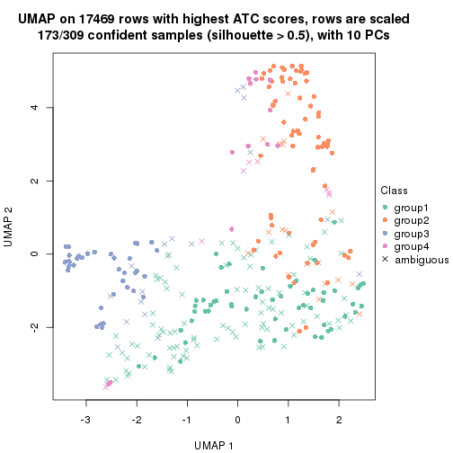</p>

</div>
<div id='tab-ATC-hclust-dimension-reduction-4'>
<pre><code class="r">dimension_reduction(res, k = 5, method = &quot;UMAP&quot;)
</code></pre>

<p></p>

</div>
<div id='tab-ATC-hclust-dimension-reduction-5'>
<pre><code class="r">dimension_reduction(res, k = 6, method = &quot;UMAP&quot;)
</code></pre>

<p></p>

</div>
</div>


Following heatmap shows how subgroups are split when increasing `k`:

```r
collect_classes(res)
```


If matrix rows can be associated to genes, consider to use `GO_Enrichment(res,
...)` to perform function enrichment for the signature genes.


 

---------------------------------------------------


### ATC:kmeans**


The object with results only for a single top-value method and a single partition method 
can be extracted as:

```r
res = res_list["ATC", "kmeans"]
# you can also extract it by
# res = res_list["ATC:kmeans"]
```

A summary of `res` and all the functions that can be applied to it:

```r
res
```

```
#> A 'ConsensusPartition' object with k = 2, 3, 4, 5, 6.
#>   On a matrix with 17469 rows and 309 columns.
#>   Top rows (1000, 2000, 3000, 4000, 5000) are extracted by 'ATC' method.
#>   Subgroups are detected by 'kmeans' method.
#>   Performed in total 1250 partitions by row resampling.
#>   Best k for subgroups seems to be 3.
#> 
#> Following methods can be applied to this 'ConsensusPartition' object:
#>  [1] "cola_report"             "collect_classes"         "collect_plots"          
#>  [4] "collect_stats"           "colnames"                "compare_signatures"     
#>  [7] "consensus_heatmap"       "dimension_reduction"     "functional_enrichment"  
#> [10] "get_anno_col"            "get_anno"                "get_classes"            
#> [13] "get_consensus"           "get_matrix"              "get_membership"         
#> [16] "get_param"               "get_signatures"          "get_stats"              
#> [19] "is_best_k"               "is_stable_k"             "membership_heatmap"     
#> [22] "ncol"                    "nrow"                    "plot_ecdf"              
#> [25] "rownames"                "select_partition_number" "show"                   
#> [28] "suggest_best_k"          "test_to_known_factors"
```

`collect_plots()` function collects all the plots made from `res` for all `k` (number of partitions)
into one single page to provide an easy and fast comparison between different `k`.

```r
collect_plots(res)
```


The plots are:

- The first row: a plot of the ECDF (Empirical cumulative distribution
  function) curves of the consensus matrix for each `k` and the heatmap of
  predicted classes for each `k`.
- The second row: heatmaps of the consensus matrix for each `k`.
- The third row: heatmaps of the membership matrix for each `k`.
- The fouth row: heatmaps of the signatures for each `k`.

All the plots in panels can be made by individual functions and they are
plotted later in this section.

`select_partition_number()` produces several plots showing different
statistics for choosing "optimized" `k`. There are following statistics:

- ECDF curves of the consensus matrix for each `k`;
- 1-PAC. [The PAC
  score](https://en.wikipedia.org/wiki/Consensus_clustering#Over-interpretation_potential_of_consensus_clustering)
  measures the proportion of the ambiguous subgrouping.
- Mean silhouette score.
- Concordance. The mean probability of fiting the consensus class ids in all
  partitions.
- Area increased. Denote $A_k$ as the area under the ECDF curve for current
  `k`, the area increased is defined as $A_k - A_{k-1}$.
- Rand index. The percent of pairs of samples that are both in a same cluster
  or both are not in a same cluster in the partition of k and k-1.
- Jaccard index. The ratio of pairs of samples are both in a same cluster in
  the partition of k and k-1 and the pairs of samples are both in a same
  cluster in the partition k or k-1.

The detailed explanations of these statistics can be found in [the cola
vignette](http://bioconductor.org/packages/devel/bioc/vignettes/cola/inst/doc/cola.html#toc_13).

Generally speaking, lower PAC score, higher mean silhouette score or higher
concordance corresponds to better partition. Rand index and Jaccard index
measure how similar the current partition is compared to partition with `k-1`.
If they are too similar, we won't accept `k` is better than `k-1`.

```r
select_partition_number(res)
```


The numeric values for all these statistics can be obtained by `get_stats()`.

```r
get_stats(res)
```

```
#>   k 1-PAC mean_silhouette concordance area_increased  Rand Jaccard
#> 2 2 0.734           0.924       0.962         0.4667 0.526   0.526
#> 3 3 0.984           0.958       0.983         0.2779 0.627   0.424
#> 4 4 0.735           0.858       0.902         0.1988 0.768   0.484
#> 5 5 0.812           0.831       0.902         0.0691 0.947   0.812
#> 6 6 0.746           0.591       0.789         0.0471 0.984   0.936
```

`suggest_best_k()` suggests the best $k$ based on these statistics. The rules are as follows:

- All $k$ with Jaccard index larger than 0.95 are removed because the increase of
  the partition number does not provides enough extra information. If all $k$ are removed,
  the best $k$ is assigned by `NA`.
- For $k$ with 1-PAC larger than 0.9, the maximal $k$ is taken as the "best k". Other $k$ is called "optional k".
- If it does not fit the second rule. The $k$ with the highest vote of highest
  1-PAC, mean silhouette and concordance is taken as the "best k".

```r
suggest_best_k(res)
```

```
#> [1] 3
```


Following shows the table of the partitions (You need to click the **show/hide
code output** link to see it). The membership matrix (columns with name `p*`)
is inferred by
[`clue::cl_consensus()`](https://www.rdocumentation.org/link/cl_consensus?package=clue)
function with the `SE` method. Basically the value in the membership matrix
represents the probability to belong to a certain group. The finall class
label for an item is determined with the group with highest probability it
belongs to.

In `get_classes()` function, the entropy is calculated from the membership
matrix and the silhouette score is calculated from the consensus matrix.


<script>
$( function() {
	$( '#tabs-ATC-kmeans-get-classes' ).tabs();
} );
</script>
<div id='tabs-ATC-kmeans-get-classes'>
<ul>
<li><a href='#tab-ATC-kmeans-get-classes-1'>k = 2</a></li>
<li><a href='#tab-ATC-kmeans-get-classes-2'>k = 3</a></li>
<li><a href='#tab-ATC-kmeans-get-classes-3'>k = 4</a></li>
<li><a href='#tab-ATC-kmeans-get-classes-4'>k = 5</a></li>
<li><a href='#tab-ATC-kmeans-get-classes-5'>k = 6</a></li>
</ul>

<div id='tab-ATC-kmeans-get-classes-1'>
<p><a id='tab-ATC-kmeans-get-classes-1-a' style='color:#0366d6' href='#'>show/hide code output</a></p>
<pre><code class="r">cbind(get_classes(res, k = 2), get_membership(res, k = 2))
</code></pre>

<pre><code>#&gt;                                      class entropy silhouette    p1    p2
#&gt; 7826AE44-B03A-4528-9CB5-7421E592AE36     1  0.0000     0.9429 1.000 0.000
#&gt; 0DC2197B-2FEA-48EB-953E-8E44E1933757     1  0.0000     0.9429 1.000 0.000
#&gt; 87ABB098-8C1E-4677-8C31-48B71EFE41C7     2  0.9393     0.4301 0.356 0.644
#&gt; EC0154E7-7A27-4535-83AE-6B379E99A93C     2  0.0000     0.9695 0.000 1.000
#&gt; 78F79407-D49F-4FA2-B09F-0665C502827C     2  0.0000     0.9695 0.000 1.000
#&gt; 03E81178-E971-4E91-8BED-D8273EA1425C     2  0.1843     0.9473 0.028 0.972
#&gt; 62FCAEFF-16D8-4019-84B6-18EC3A88BC32     1  0.0000     0.9429 1.000 0.000
#&gt; 722C1284-5983-4CC1-B19C-214C2DE6F8A6     2  0.0376     0.9684 0.004 0.996
#&gt; 54E42A64-B350-4A94-8FED-C9BC1872660E     1  0.5946     0.8688 0.856 0.144
#&gt; 53062969-D209-490B-9C9B-5D297625E2AE     2  0.6343     0.8072 0.160 0.840
#&gt; B710293C-41D3-4A2E-8104-5402F91DD859     2  0.0000     0.9695 0.000 1.000
#&gt; 73CB1D05-7AE4-457D-B4EF-25AC5C1F2132     2  0.2043     0.9438 0.032 0.968
#&gt; B055A70B-3003-47CB-BDAA-6378C000BF24     2  0.7674     0.7123 0.224 0.776
#&gt; 46C3A870-E37A-42CB-8C0C-6ACACEAC1ADC     2  0.0376     0.9684 0.004 0.996
#&gt; E8E6270E-F26D-4F2E-A63E-7885BDE05FDB     1  0.0000     0.9429 1.000 0.000
#&gt; C4A5EBA2-9091-4D12-BDC8-B84B122022B9     1  0.5946     0.8688 0.856 0.144
#&gt; 5B1839C4-549D-41D1-B559-3C6D2A1528CE     1  0.0376     0.9430 0.996 0.004
#&gt; A0DF05EB-DC44-4492-9A8A-F278F7B0C266     2  0.0000     0.9695 0.000 1.000
#&gt; B5182F49-70F2-45B7-82DE-C6DA68145EEA     1  0.0376     0.9430 0.996 0.004
#&gt; C204D355-B876-4341-A111-36D48CBDD2A8     2  0.0000     0.9695 0.000 1.000
#&gt; 7B070AAA-EF97-4D3B-AA19-EEC170C7927D     2  0.0376     0.9684 0.004 0.996
#&gt; 05A8A881-F8EE-48A2-B11C-A08D7D80CE18     2  0.0000     0.9695 0.000 1.000
#&gt; BA59EF50-CFE9-456D-B1B6-67D0945004F6     2  0.0000     0.9695 0.000 1.000
#&gt; AD97B334-E034-4D33-A4D5-48C32D5D521C     2  0.0000     0.9695 0.000 1.000
#&gt; 51DA2568-32EA-4668-9876-4B6E7CA68860     1  0.0376     0.9430 0.996 0.004
#&gt; 78C26A05-2084-494D-83D3-C52C1B800F4C     1  0.0376     0.9430 0.996 0.004
#&gt; 2B5DD791-7692-4721-9519-7D7D49B52570     2  0.0000     0.9695 0.000 1.000
#&gt; C0BBE26A-79C8-4392-9978-7C420B3786B5     1  0.5946     0.8688 0.856 0.144
#&gt; F35A8359-3A7A-414F-8A5C-D278F3B45387     2  0.0376     0.9684 0.004 0.996
#&gt; 8C9BA49C-1270-491D-A234-AE1B1C0609BA     2  0.0376     0.9684 0.004 0.996
#&gt; CA104B57-B160-4148-8A0A-D34BB3E8D88A     2  0.0000     0.9695 0.000 1.000
#&gt; 877E18A5-6A7A-4E29-9871-DC7EA14A5F27     2  0.0000     0.9695 0.000 1.000
#&gt; 904EDF2E-411E-43BD-901D-46129AFA283A     2  0.0000     0.9695 0.000 1.000
#&gt; FD9F5A9B-2BEB-4D31-9A2D-8D4B4ECBB478     1  0.2778     0.9260 0.952 0.048
#&gt; 2E206314-9928-456E-B7C6-893DC0E3C7C2     2  0.0376     0.9684 0.004 0.996
#&gt; 913DB655-2C7F-4369-83DE-9257F04CF39B     2  0.0000     0.9695 0.000 1.000
#&gt; 72B5B724-FEB5-43BD-83F6-2E2152DDD800     1  0.8813     0.6331 0.700 0.300
#&gt; 920B547C-6898-446C-AAAF-F4ED96E40AAB     1  0.0000     0.9429 1.000 0.000
#&gt; 847F796A-8CD6-4013-A0FB-26F4FC3EAF0D     2  0.6623     0.7909 0.172 0.828
#&gt; C4D64E7A-33F7-4CFC-9FD3-D6AA3D8EFAA7     1  0.0938     0.9411 0.988 0.012
#&gt; EABA0B17-8E19-48C5-BF62-2A45C9632807     2  0.0376     0.9684 0.004 0.996
#&gt; 7263CBA8-CE37-4531-A795-9324C6D2A672     2  0.0000     0.9695 0.000 1.000
#&gt; 6D3CC3AC-618B-414A-B640-169C735A6568     1  0.5946     0.8688 0.856 0.144
#&gt; 710C05C7-F9CE-45FA-A8CC-29DE2903E04F     2  0.0000     0.9695 0.000 1.000
#&gt; 3D631A56-2C55-48EA-A667-BA46023C9D50     1  1.0000     0.0733 0.504 0.496
#&gt; F1C65F64-AF05-4875-B7E4-60FFF56A3F46     1  0.5519     0.8812 0.872 0.128
#&gt; E5DF76E7-A765-4E07-B87A-06168BF66C5F     2  0.0000     0.9695 0.000 1.000
#&gt; 5C8C8A6E-40D4-4F82-AC3D-90CFDEE15C0A     2  0.0376     0.9684 0.004 0.996
#&gt; 0117CBB9-1BF9-48B1-BE6E-A9A770FF8721     1  0.5946     0.8688 0.856 0.144
#&gt; 31EF66E5-419A-44C3-BB2A-B69B52FFCECC     2  0.0376     0.9684 0.004 0.996
#&gt; C149CEF5-61F3-4B53-B8A9-8244B673EBD0     2  0.0000     0.9695 0.000 1.000
#&gt; 0AF351D0-4EC5-4275-AA0A-4FA2AF8A9C85     1  0.0000     0.9429 1.000 0.000
#&gt; B507E82F-6680-497B-A014-033EDD7A2E03     1  0.5946     0.8688 0.856 0.144
#&gt; F941890E-AB33-478F-8C97-1C785DD9428F     2  0.0000     0.9695 0.000 1.000
#&gt; 7987E019-8FED-469B-A6C1-34EE430A60C3     2  0.6048     0.8224 0.148 0.852
#&gt; 76084AA6-19BF-4605-B6A1-73F1D4BADAF9     2  0.0000     0.9695 0.000 1.000
#&gt; 329807F7-E0D4-4F53-94E8-E4080E90CB47     1  0.0000     0.9429 1.000 0.000
#&gt; 1B6505FF-C1A7-4DD0-9827-41A0A3A28F3E     2  0.0000     0.9695 0.000 1.000
#&gt; 49778E92-B5D3-4AD9-A1AF-3B722D631B96     1  0.0000     0.9429 1.000 0.000
#&gt; A22892DE-0AF4-4B63-9513-1D6825059040     2  0.0000     0.9695 0.000 1.000
#&gt; 6D77ECAE-A715-4ADD-97D8-A916DC31A4EA     2  0.0000     0.9695 0.000 1.000
#&gt; 09758B6F-1B2D-4AED-8913-696097069409     2  0.0000     0.9695 0.000 1.000
#&gt; 8B709DB4-0B28-42F1-A7C5-106F5809BEA2     2  0.0000     0.9695 0.000 1.000
#&gt; F2B356FA-79CD-4867-8ABF-84C90A493A75     2  0.2043     0.9438 0.032 0.968
#&gt; 131213AD-0313-4DF1-B013-CE67ED262C37     2  0.0376     0.9684 0.004 0.996
#&gt; D94F7E81-0F60-473B-AD4A-0AC13508BDE2     1  0.0000     0.9429 1.000 0.000
#&gt; 29C17355-D646-48DA-9E54-7B6DD85DD610     2  0.0000     0.9695 0.000 1.000
#&gt; B8BD866A-2A7C-45C3-96BB-9AB892D26AE5     2  0.4939     0.8691 0.108 0.892
#&gt; 13EFD045-AD61-41EE-9896-67BFA4FC8C09     1  0.0000     0.9429 1.000 0.000
#&gt; 2655F609-B3BB-4D01-B421-D5F4B1232EC8     2  0.0376     0.9684 0.004 0.996
#&gt; 04BC7A52-C67F-42CB-8672-D3C51A20F2BA     1  0.0376     0.9430 0.996 0.004
#&gt; 45472BD4-DBDB-41FE-B0E3-2440880E1DE6     1  0.4690     0.8986 0.900 0.100
#&gt; B87FFFCD-CB57-4ACD-9C74-AB188984BBB2     1  0.5519     0.8812 0.872 0.128
#&gt; 5271374C-13CD-4BFE-AC6D-C95AFE491322     2  0.1184     0.9575 0.016 0.984
#&gt; E3372ACE-C7C8-43E5-B30A-1F2D662D8170     2  0.0000     0.9695 0.000 1.000
#&gt; B08DF564-E4D0-4540-8160-93B3981DF1D8     1  0.5946     0.8688 0.856 0.144
#&gt; 61A7D1B9-FC5A-4B9C-989F-936CDA948C27     2  0.0000     0.9695 0.000 1.000
#&gt; 74E768C1-8766-46AC-AAB4-D79E5049F76A     2  0.0376     0.9684 0.004 0.996
#&gt; 0CEA28F0-D7F0-4EB7-A23F-0C5CA6245971     1  0.0000     0.9429 1.000 0.000
#&gt; 95C4EFF6-147C-48EC-A2C1-16B8F12AEEF2     1  0.0000     0.9429 1.000 0.000
#&gt; C9A78BEA-D455-4F5E-8B7B-19BCB42887E7     2  0.8861     0.5612 0.304 0.696
#&gt; DB970740-9AC1-4C10-9658-8A77B1C390DD     1  0.0000     0.9429 1.000 0.000
#&gt; 883FBD37-0CA0-4562-8925-72ACC1EE93D9     1  0.0376     0.9430 0.996 0.004
#&gt; 9FE1D006-49F2-471E-91E6-AF0414C24479     2  0.5842     0.8322 0.140 0.860
#&gt; 11816CC6-8C8B-49C0-99EE-896377BCFCCD     2  0.6048     0.8224 0.148 0.852
#&gt; 063FC5C8-4318-4ECC-9CA0-1976CBC8ACB6     2  0.0000     0.9695 0.000 1.000
#&gt; E0F085CC-B90D-4FDE-B60E-C613971BAA00     2  0.0000     0.9695 0.000 1.000
#&gt; 62361DA2-E4EE-46DA-BB1F-C51DCA9307CC     2  0.0376     0.9684 0.004 0.996
#&gt; 1BA16D48-B09E-4699-A1AD-2FFECE4F3CDB     1  0.0000     0.9429 1.000 0.000
#&gt; 3E4F14E9-60AE-4F17-9BA7-2A02E908204A     1  0.5946     0.8688 0.856 0.144
#&gt; 79226DD7-BC85-4B8E-BFF8-B1E073129D34     2  0.0000     0.9695 0.000 1.000
#&gt; D47D0936-826F-4D54-9225-F71B95357438     2  0.6048     0.8224 0.148 0.852
#&gt; 0AE02B91-574C-4165-BA39-E9D7C1A870A2     2  0.0376     0.9684 0.004 0.996
#&gt; DED8E9DF-CEFE-45ED-9374-EF9925A135C4     1  0.7745     0.7575 0.772 0.228
#&gt; D587A993-3C47-4D4C-B744-59169D4F7451     2  0.0000     0.9695 0.000 1.000
#&gt; 6BCA24E6-440F-42C5-ABE5-66C37B713A39     2  0.0000     0.9695 0.000 1.000
#&gt; 86A5EDFB-9D06-4FED-BF57-F8D74A68E156     2  0.0000     0.9695 0.000 1.000
#&gt; B9BD5134-2F6A-4454-8F83-69B63F9AE114     2  0.0000     0.9695 0.000 1.000
#&gt; 082DA9E1-A40D-482B-8E21-A93BA97185F0     2  0.0000     0.9695 0.000 1.000
#&gt; 16A8343A-1203-44FB-9F03-05CC7C71B4CC     2  0.5408     0.8507 0.124 0.876
#&gt; 00439565-02CE-4BF5-956D-7078B51C0947     1  0.0000     0.9429 1.000 0.000
#&gt; 7B2BD361-2BF1-4E97-BC08-457F5A9C2682     2  0.0376     0.9684 0.004 0.996
#&gt; C1D8439A-D527-47F6-ADC1-25867B65DA21     2  0.0376     0.9684 0.004 0.996
#&gt; D9096909-1439-462D-B69C-CAD1BF4F420C     2  0.0000     0.9695 0.000 1.000
#&gt; 7822EA86-35A1-4285-9429-2B63111B9885     2  0.9323     0.4530 0.348 0.652
#&gt; 6FD0CFC8-AC8D-4CF1-8C33-833AD98A30EF     2  0.0376     0.9684 0.004 0.996
#&gt; A451F278-5E83-4BC6-9B15-3AA2117B99B6     2  0.0000     0.9695 0.000 1.000
#&gt; 6EC25686-4547-459C-9E01-7EDF8DAECE35     1  0.0376     0.9430 0.996 0.004
#&gt; 5D2F1EEA-2BA8-4C3A-8436-544EE1D23E7E     2  0.0000     0.9695 0.000 1.000
#&gt; 675A4293-A4CE-4307-B00B-DFC4D44A87C6     2  0.0376     0.9684 0.004 0.996
#&gt; 6FBE0AEF-476A-42B2-A857-846CF1ED92B6     2  0.0376     0.9684 0.004 0.996
#&gt; 7139D616-1A15-4288-A9AE-411856A4A76D     2  0.0000     0.9695 0.000 1.000
#&gt; 46D7F8C1-D5C5-40CC-BEF5-2E590A847BD9     1  0.0000     0.9429 1.000 0.000
#&gt; 984C44D3-4F5F-44C9-BCD9-C991EBC1FCB8     1  0.0000     0.9429 1.000 0.000
#&gt; 83FE52E0-2DC2-4580-8BB2-FBCBEE4AC240     2  0.0000     0.9695 0.000 1.000
#&gt; 0923F9CB-DF6F-4BAA-A5F8-0F83CE60D1ED     1  0.5519     0.8812 0.872 0.128
#&gt; 1DEB5206-78CC-4EB5-BCD5-85A6A5B4E273     1  0.0376     0.9430 0.996 0.004
#&gt; E4DB18DA-EB0C-4B2F-9566-7F72222B16D4     2  0.0000     0.9695 0.000 1.000
#&gt; F7456312-1309-4B2F-875D-0F90CDF3EC35     2  0.0000     0.9695 0.000 1.000
#&gt; 9A25E5D8-0706-4960-A76B-BCD0AC93E4FA     2  0.0000     0.9695 0.000 1.000
#&gt; 5A41FE8F-FFB3-4B87-BF11-A570C184096D     1  0.0376     0.9430 0.996 0.004
#&gt; 33F84E63-3F6C-4867-ADB1-A0DF39F1295B     1  0.0376     0.9430 0.996 0.004
#&gt; D6A644F5-D1D0-4A8D-94C4-EE6C3ECE7430     2  0.8713     0.5865 0.292 0.708
#&gt; 2A5848CC-A9A2-4AA8-A752-321273E62CF0     2  0.0000     0.9695 0.000 1.000
#&gt; 7CA6358B-FC8A-4675-B092-9E061038FC83     2  0.0000     0.9695 0.000 1.000
#&gt; A4C2F4BC-5C62-4B1F-9AB8-46D9468EF523     2  0.0376     0.9684 0.004 0.996
#&gt; 8AF4EB7F-418D-4CC9-A9B8-A93A4C1A173B     1  0.2423     0.9285 0.960 0.040
#&gt; E5048887-70C8-468F-881E-2EC55F6E6F3B     2  0.0000     0.9695 0.000 1.000
#&gt; 1BADCC7C-C4D8-4C34-9534-59D622C7A2A2     1  0.0000     0.9429 1.000 0.000
#&gt; 02CE7DF7-64BD-4297-A240-A5B9EE8771D3     1  0.0000     0.9429 1.000 0.000
#&gt; CBF6E96A-F56C-4C87-B851-D319930BAAB8     2  0.0000     0.9695 0.000 1.000
#&gt; 48F6B774-CFD2-4DDF-B7A2-696596413C3F     2  0.0000     0.9695 0.000 1.000
#&gt; 41D88C3E-5848-4B09-8A77-EAE6AC4EC6B0     1  0.0000     0.9429 1.000 0.000
#&gt; BDF79CC0-00C7-49C1-900B-AB065A733B17     1  0.0376     0.9430 0.996 0.004
#&gt; A894D686-BFC7-4AEE-A794-DBE718C6B6F6     2  0.0376     0.9684 0.004 0.996
#&gt; 0712029E-3765-4272-BE5B-B6C8BCCC0F0F     2  0.0376     0.9684 0.004 0.996
#&gt; 7B051855-9B09-4887-9BC0-9F077537938E     2  0.0000     0.9695 0.000 1.000
#&gt; EF357C46-5C3C-4F51-9383-FF7694D07B97     2  0.0376     0.9684 0.004 0.996
#&gt; 9492A322-37CA-4582-AC68-66B5D80778AF     2  0.0376     0.9684 0.004 0.996
#&gt; 993399A4-1B9F-4258-B2D0-155AD58A2E82     2  0.0000     0.9695 0.000 1.000
#&gt; 7B7DC93D-5494-4E69-BE07-2967887182F9     1  0.0000     0.9429 1.000 0.000
#&gt; 29BCBA51-2580-473D-9CF7-BEDBD0DBAD1B     2  0.0376     0.9684 0.004 0.996
#&gt; 40855647-E942-4F32-90B7-BEB921929BFB     1  0.0938     0.9411 0.988 0.012
#&gt; 0DC723D0-7C68-4495-A4B9-2DF2FF19AB14     2  0.0376     0.9684 0.004 0.996
#&gt; 7540005F-57E0-4E2E-A8A2-BEF2B0F333B1     2  0.0376     0.9684 0.004 0.996
#&gt; EB1DDB14-4076-4C2C-B911-390C17C21486     1  0.0376     0.9430 0.996 0.004
#&gt; 9EA70EC4-8BA0-4E3D-B3CB-A68D19E89868     1  0.0376     0.9430 0.996 0.004
#&gt; B04E2E50-0A6E-4224-A825-1714D12E5669     1  0.0000     0.9429 1.000 0.000
#&gt; B0BF5E01-536D-40FF-9C24-CBBD611E2FC2     1  0.0000     0.9429 1.000 0.000
#&gt; 7B6B1788-B297-4442-B6BE-B7CE8754491E     1  0.0376     0.9430 0.996 0.004
#&gt; A090D00C-34DF-4906-A517-4803C4C9A332     1  0.3431     0.9182 0.936 0.064
#&gt; 340D44A6-9BEA-412C-9973-D9ABD6692255     2  0.9922     0.1385 0.448 0.552
#&gt; E8D0D1E7-E5A8-4014-80C1-0245F90F4358     2  0.0376     0.9684 0.004 0.996
#&gt; 19EA1494-8572-40E1-B9BB-3739F47B607D     2  0.0000     0.9695 0.000 1.000
#&gt; 1C1B4793-8DAF-4763-BA4D-C4E869A4ED35     2  0.0000     0.9695 0.000 1.000
#&gt; 45BF59B3-95BD-4196-ABAA-4C4F0DB38572     1  0.0000     0.9429 1.000 0.000
#&gt; 47B5A2A7-7E13-4558-99D2-067F5075C6A4     2  0.0000     0.9695 0.000 1.000
#&gt; E94638E8-CB51-4FBB-8BCB-4BFD7A812291     2  0.0000     0.9695 0.000 1.000
#&gt; A17352A8-0D3C-4545-8136-7DAE2FB0E102     1  0.0000     0.9429 1.000 0.000
#&gt; B18A6F95-D4ED-416B-B5A1-9A4934865D0D     2  0.0376     0.9684 0.004 0.996
#&gt; 33E92C5F-0C42-4549-AD5B-0A064182A272     2  0.0000     0.9695 0.000 1.000
#&gt; E041B375-3E60-4F18-A6EF-D1C249E3B8EE     1  0.6531     0.8407 0.832 0.168
#&gt; EDF90AF6-6C64-4BD2-AADF-8D7D188650B2     2  0.0376     0.9684 0.004 0.996
#&gt; 569320D2-316C-4E2D-B7B3-D7D5C4DAD42D     2  0.4431     0.8860 0.092 0.908
#&gt; AFFB223D-DAE9-4567-9EF2-8E4DF9D8782D     2  0.0376     0.9684 0.004 0.996
#&gt; 56FC9454-0A6A-4CC3-95C4-BE0E0D0BAFCE     2  0.0376     0.9684 0.004 0.996
#&gt; 43226365-FAEF-46C5-AF1B-5C6C2BED84FF     2  0.0000     0.9695 0.000 1.000
#&gt; 1536110A-B42A-4A84-9474-9895321FDCE9     2  0.0000     0.9695 0.000 1.000
#&gt; 812255DD-536B-4216-90B1-27D5AB339BE2     2  0.0000     0.9695 0.000 1.000
#&gt; 5D4563D6-68B7-4C9D-A3F4-AA7D45D5112C     2  0.0376     0.9684 0.004 0.996
#&gt; BAA39781-DB94-473C-98B1-FA6CD3E1C67A     2  0.0000     0.9695 0.000 1.000
#&gt; C1411CDA-814D-4E21-8929-C0F77858828F     2  0.6247     0.8121 0.156 0.844
#&gt; EFE2F248-C13E-4E8D-9153-8C903848AC4A     2  0.0000     0.9695 0.000 1.000
#&gt; D3939C84-D1D6-4060-9F91-AEB222A9BDD5     2  0.0000     0.9695 0.000 1.000
#&gt; EABD2987-8C1E-49E5-94AF-C0BDE5335A48     1  0.5946     0.8688 0.856 0.144
#&gt; F4BE2ABE-2CEB-4A6A-B8EC-0355F8C63B9B     1  0.0376     0.9430 0.996 0.004
#&gt; 627BC251-D217-4955-B718-6B9D6DEA1756     2  0.4939     0.8691 0.108 0.892
#&gt; 31B54613-A20E-4039-BB8B-9B52104CE418     2  0.0000     0.9695 0.000 1.000
#&gt; 3F292B7C-A535-4DBD-BC20-CB4F85A1C94B     1  0.3114     0.9223 0.944 0.056
#&gt; BEA2A5EB-EEA9-4F31-AC38-810E04CE124B     1  0.0672     0.9405 0.992 0.008
#&gt; 99D84D46-19DA-43F1-B639-DCE9953F1529     2  0.0376     0.9684 0.004 0.996
#&gt; 4588817E-1068-4A78-86B6-4674A0112DDA     2  0.0000     0.9695 0.000 1.000
#&gt; 6AC633BD-BEC1-4750-94E3-378972DAB6B3     1  0.0000     0.9429 1.000 0.000
#&gt; 09E17C6E-7EDE-4DDF-B5ED-2521AF870C9A     2  0.0000     0.9695 0.000 1.000
#&gt; 58D9C750-26A2-4B7C-84C4-13D7AFB4C5EA     2  0.0000     0.9695 0.000 1.000
#&gt; DF28E138-E222-4F77-9B61-69E601CA7E60     2  0.0376     0.9684 0.004 0.996
#&gt; FEA489A8-E423-4266-AADA-9BAAB29AB94B     2  0.0000     0.9695 0.000 1.000
#&gt; F3FCC207-15CD-41EA-A3EF-F5D2C12AC373     1  0.0376     0.9430 0.996 0.004
#&gt; 53DD7AFB-A258-4643-A501-BACC95D17A50     2  0.0376     0.9684 0.004 0.996
#&gt; D850B2A1-1F8A-4A44-A0CF-8D9DD4A1889A     2  0.0376     0.9684 0.004 0.996
#&gt; B3F746DC-E487-4305-9F30-825D1520E8FD     2  0.0376     0.9684 0.004 0.996
#&gt; BE38240A-F7C2-439F-9AAE-51C8A340F310     1  0.0376     0.9430 0.996 0.004
#&gt; A9022D9E-1D30-49EE-8552-1364A8027F34     1  0.0376     0.9430 0.996 0.004
#&gt; 0E8A56EE-D9A2-48A5-B793-A358BE1E4EFA     1  0.1184     0.9397 0.984 0.016
#&gt; 51667574-318E-4BDB-8F42-8512A4C1B84F     2  0.8144     0.6639 0.252 0.748
#&gt; B0A442C9-67E4-4534-8A5C-D6D73F42358C     2  0.6048     0.8224 0.148 0.852
#&gt; 25A5BC09-0D88-4385-87AF-997F9018522D     2  0.0376     0.9684 0.004 0.996
#&gt; 344B9631-AAA5-4302-8747-D584345D9131     1  0.6148     0.8599 0.848 0.152
#&gt; 1C3795AD-6306-4892-95F5-92DF3375D46A     2  0.0000     0.9695 0.000 1.000
#&gt; 17BB221D-8BF9-4391-83DD-423AE1E03651     2  0.0000     0.9695 0.000 1.000
#&gt; 297611E9-9555-4BCA-A723-02E846ACC23A     2  0.0000     0.9695 0.000 1.000
#&gt; AD7FF180-1EAC-4783-8A62-E9626B96DD9F     1  0.0000     0.9429 1.000 0.000
#&gt; FD544083-9BD5-4036-BD81-0352B67CC45C     1  0.5408     0.8838 0.876 0.124
#&gt; 879A74D5-5B29-418D-A0F4-8E88D6384008     1  0.0376     0.9430 0.996 0.004
#&gt; 43CD982C-13C0-4A52-803A-9A3A3FAE09BC     2  0.0000     0.9695 0.000 1.000
#&gt; DCD0313D-5206-4111-8743-A8A0227257D9     1  0.0376     0.9430 0.996 0.004
#&gt; 331A9160-D730-45DD-A985-C6CAC03035ED     2  0.0000     0.9695 0.000 1.000
#&gt; 9EEECA0E-530D-4724-B016-A716F0782148     2  0.0000     0.9695 0.000 1.000
#&gt; B3073976-CA3F-4115-9243-8C2D9E1B975D     1  0.4939     0.8938 0.892 0.108
#&gt; 77B3C9B4-1A7F-41BB-A37D-01EF80E933CC     1  0.0000     0.9429 1.000 0.000
#&gt; C0C26822-2E9F-4FB0-81D4-575027C8B71C     2  0.0376     0.9684 0.004 0.996
#&gt; F1FCE328-2B3B-499A-888D-0E66A017E8B0     1  0.0000     0.9429 1.000 0.000
#&gt; F069DAD6-F1EB-42F7-8252-F3F6EC46CC3E     1  0.5946     0.8688 0.856 0.144
#&gt; 99CC822E-8C98-4EEC-BB58-AEF76A0B5332     2  0.0000     0.9695 0.000 1.000
#&gt; C86EBD08-53F2-4972-801A-74970FDD6A62     1  0.0000     0.9429 1.000 0.000
#&gt; F07326F2-C1D6-4D5A-9693-25C3A04B0EC2     2  0.0000     0.9695 0.000 1.000
#&gt; 8ACBD428-7713-48D9-810A-43C9CD191A73     1  0.0000     0.9429 1.000 0.000
#&gt; 3D3501B4-1A43-4FA7-90A2-CCEBF66BFD4A     1  0.0000     0.9429 1.000 0.000
#&gt; DD51C17C-300F-44A4-955A-C9BC85417842     1  0.5629     0.8763 0.868 0.132
#&gt; 58FF391C-1D83-426C-8F92-C15F78F56C95     2  0.0000     0.9695 0.000 1.000
#&gt; ACE65C6E-2B10-4972-91B4-9199DD4B179D     2  0.0000     0.9695 0.000 1.000
#&gt; B2088466-FA5D-491C-9982-99B33683E66F     1  0.0000     0.9429 1.000 0.000
#&gt; D47AF416-1687-4FE0-A235-8815B6E8EB0B     1  0.0000     0.9429 1.000 0.000
#&gt; 4DCAD07F-CC43-46F6-B2F3-EDBF3EDD1045     1  0.0376     0.9426 0.996 0.004
#&gt; AAAE0BD9-63FC-4A0E-A27E-447B634BAD99     2  0.0376     0.9684 0.004 0.996
#&gt; BC471AA1-52CF-4CEE-9866-34CE91404F45     2  0.0376     0.9684 0.004 0.996
#&gt; 81D3EE3F-AC11-404F-8092-307F0DC12198     1  0.5946     0.8688 0.856 0.144
#&gt; 8C02026C-C25E-406B-B8B8-A1A82362AE79     1  0.0000     0.9429 1.000 0.000
#&gt; 6A005F2A-A0C1-4CA4-B15B-96B08F013874     1  0.0376     0.9430 0.996 0.004
#&gt; B55743F2-4D63-4375-85D3-F58281CFD852     2  0.0000     0.9695 0.000 1.000
#&gt; 24F98393-C817-4D0E-A7DB-05D2B5C71F40     2  0.0000     0.9695 0.000 1.000
#&gt; 2C2AEF1D-4112-4EC7-9027-5E3FD26E8802     2  0.0000     0.9695 0.000 1.000
#&gt; 8BAC3CB5-2987-4349-8AE8-B83DDD16CA3C     2  0.0000     0.9695 0.000 1.000
#&gt; ED9C74E6-92FC-4E58-8FCE-1761DEA0C977     2  0.0000     0.9695 0.000 1.000
#&gt; BA732ED4-F6BA-404E-BA3C-CA558FAD866A     1  0.5946     0.8688 0.856 0.144
#&gt; E750385A-12D9-4A88-B4DF-C1306B5EF3B7     2  0.0376     0.9684 0.004 0.996
#&gt; 6B1DC5E4-5F82-4395-913F-6AEDB5B63188     2  0.0000     0.9695 0.000 1.000
#&gt; A7C12D37-FD50-4674-A054-1774F4E5C3B3     1  0.5946     0.8688 0.856 0.144
#&gt; 2155C764-2063-4D9C-9ACD-96AA73475F5E     1  0.0000     0.9429 1.000 0.000
#&gt; DE23CC15-A95E-4119-9B3C-8EEC45900D11     2  0.0376     0.9684 0.004 0.996
#&gt; 5DB1DCAD-638E-48A4-9F40-3D6268FDEC33     2  0.0376     0.9684 0.004 0.996
#&gt; 34AF0341-73D7-4080-AAEB-4C1541C2569F     1  0.1184     0.9397 0.984 0.016
#&gt; B60D4235-44AF-4BA4-98C0-BCCDC28E90B9     2  0.0376     0.9684 0.004 0.996
#&gt; CF463D89-2C9F-4257-BF04-8BC1CD40EA7D     2  0.0000     0.9695 0.000 1.000
#&gt; EF6C8165-484A-4530-AEDF-93DCC4A8455D     2  0.0000     0.9695 0.000 1.000
#&gt; B9F6B5E4-4D10-49B8-A8FE-8F33C5A62CBF     1  0.5629     0.8783 0.868 0.132
#&gt; CE539000-92D7-4622-9C8D-BC6E01310681     1  0.6887     0.8146 0.816 0.184
#&gt; D3BBC405-A22A-4009-ABF6-96FEEE653051     2  0.0376     0.9684 0.004 0.996
#&gt; 0B3C86BD-0D20-4408-9BE3-05658729505F     2  0.7139     0.7561 0.196 0.804
#&gt; 9B9C5071-7C3F-416C-B91C-6F5966747F54     2  0.0000     0.9695 0.000 1.000
#&gt; A9469A4A-C5F9-4681-A916-A26F0B4307BA     1  0.0376     0.9430 0.996 0.004
#&gt; A31B57E4-E30B-4A1B-829D-1B47D9CEC041     2  0.0376     0.9684 0.004 0.996
#&gt; 647255CE-F84A-4070-B3FD-D8ACA32C4D09     1  0.5842     0.8721 0.860 0.140
#&gt; 8F5E9F02-51D7-410E-B8B7-22737F2F095A     2  0.0376     0.9684 0.004 0.996
#&gt; 8074A7F6-2FDE-4578-B71C-01C542D468FE     2  0.0000     0.9695 0.000 1.000
#&gt; 2A946F17-F245-409E-A019-C60CDA18DC7D     1  0.0376     0.9430 0.996 0.004
#&gt; 0878C381-47F9-4786-82C2-94AC840BEDCB     1  0.0376     0.9430 0.996 0.004
#&gt; 54504893-92C5-4328-85A8-2A882680B5E0     1  0.5519     0.8812 0.872 0.128
#&gt; 0A27D1BE-E5DD-459A-A51F-6D8AAF7CFEB4     2  0.0000     0.9695 0.000 1.000
#&gt; 89ED5A3E-CAC0-4AB4-B858-A3CD8F34DBD5     2  0.0376     0.9684 0.004 0.996
#&gt; ACEEB0A5-AADB-4EF9-8710-4BAF95522CEA     1  0.5629     0.8783 0.868 0.132
#&gt; 02C74D81-5976-4252-BC6C-B10E934DECA2     1  0.0376     0.9430 0.996 0.004
#&gt; D365A238-4739-4B54-9608-DC548F21C04E     1  0.9988     0.1437 0.520 0.480
#&gt; F70F7ED5-A3B7-4210-95AD-DEFA0A565F06     1  0.5946     0.8688 0.856 0.144
#&gt; A92C23A9-BC25-4025-9501-6D5FF8E2A502     2  0.0000     0.9695 0.000 1.000
#&gt; ECE9BBF4-840E-47A6-8378-0B6C4A2369D3     2  0.0000     0.9695 0.000 1.000
#&gt; 38749490-0FCF-4B33-9EBC-8F86C2D9E4AF     1  0.0376     0.9430 0.996 0.004
#&gt; 02ABB64E-768B-4999-A899-EEE573D5F186     1  0.5946     0.8688 0.856 0.144
#&gt; C1C467A8-18B1-4C3F-AC45-33359ED6FDC4     2  0.0000     0.9695 0.000 1.000
#&gt; 78B2E4A1-9DAE-404F-AB47-1896450EF254     2  0.0000     0.9695 0.000 1.000
#&gt; CCDB0290-91DA-4089-84A6-4434BA028D30     1  0.0000     0.9429 1.000 0.000
#&gt; D5041E80-20A0-4C1A-9AC1-2394F6DB6E92     1  0.5946     0.8688 0.856 0.144
#&gt; 20EB9CC6-EABB-438A-9030-E766459996D1     2  0.0376     0.9684 0.004 0.996
#&gt; 73E99110-9A7C-4F73-98C5-79D22CB06230     2  0.6247     0.8121 0.156 0.844
#&gt; FAD8A464-9BC3-4ED9-9517-B18D36514325     2  0.0000     0.9695 0.000 1.000
#&gt; 9AF0E82E-E621-437A-8D19-700532B95090     2  0.0000     0.9695 0.000 1.000
#&gt; 27DA48F3-4FC1-41A3-8E49-5B25F1CCFF07     2  0.0000     0.9695 0.000 1.000
#&gt; EFE5A302-D138-4044-A301-5C5FD1C24836     2  0.0000     0.9695 0.000 1.000
#&gt; D3E866AC-D66A-4C07-9F47-89AF460320DE     2  0.0376     0.9684 0.004 0.996
#&gt; 89C45456-9392-4EB3-9A82-A130B6702AAF     2  0.0000     0.9695 0.000 1.000
#&gt; 8FF5C8FC-2565-49BE-9EE0-91A84A85AB2A     1  0.0000     0.9429 1.000 0.000
#&gt; 846DF088-75D5-49CF-BDDC-27E735A08DCA     2  0.0376     0.9684 0.004 0.996
#&gt; EA3A19E1-7ADE-47B6-A35A-71290967147A     2  0.0000     0.9695 0.000 1.000
#&gt; B2C43D0C-732B-4C54-938F-D3C9FDA880DA     1  0.0376     0.9430 0.996 0.004
#&gt; EEC856B5-9B7F-488D-975E-CE2FF7072879     2  0.5059     0.8689 0.112 0.888
#&gt; 8A68C417-09CC-4FA1-BFEB-EB4B738853A4     2  0.0000     0.9695 0.000 1.000
#&gt; C5DF1A0D-952C-44E2-BF83-ED57177EF60E     1  0.5946     0.8688 0.856 0.144
#&gt; B5C9EA22-F758-4BD2-BD1F-282EC1078AED     2  0.0376     0.9684 0.004 0.996
#&gt; 3F08AE92-3EFD-4D7F-8C5C-BFB3621F0CD6     2  0.5946     0.8274 0.144 0.856
#&gt; 8F0D43F1-2199-4DBB-9B16-1E5F2CED2FEC     2  0.0376     0.9684 0.004 0.996
#&gt; 54BABD8B-EA9F-4875-8594-2179B38C73BD     2  0.0000     0.9695 0.000 1.000
#&gt; C149B6F8-03DC-4907-920A-F3318B8D2A1E     1  0.0000     0.9429 1.000 0.000
#&gt; F93D26E2-4B45-495D-BC8E-5B592F8FDABF     2  0.9358     0.4553 0.352 0.648
#&gt; C98275CD-C39A-4E14-A731-4F3EB7396665     2  0.0376     0.9684 0.004 0.996
#&gt; 354DC705-216E-42F0-B29E-C1F8D6C9489A     2  0.0000     0.9695 0.000 1.000
#&gt; 6752EED9-7990-433F-A206-D5398C396471     1  0.0000     0.9429 1.000 0.000
#&gt; C3E94C5D-68C4-400C-B7CB-38C42E9D5FFF     2  0.0000     0.9695 0.000 1.000
#&gt; CE6B6871-3ED3-44DE-A777-7558D4429057     1  0.5946     0.8688 0.856 0.144
#&gt; A06E7D1E-E432-4A4C-8BB0-314304F96EDF     2  0.6247     0.8121 0.156 0.844
#&gt; 1ABBEF80-508F-4247-B43D-3E549372113B     1  0.0000     0.9429 1.000 0.000
#&gt; 835AAE7F-F873-4D11-8845-232D261A38DF     1  0.0376     0.9430 0.996 0.004
#&gt; E98A0460-6529-4DBA-8542-1B98801D7A7D     2  0.0000     0.9695 0.000 1.000
#&gt; 06A9CBF8-01D0-4720-BCE8-83F0E77C862F     1  0.0376     0.9430 0.996 0.004
#&gt; 206865A9-A67C-49A6-93AD-55D06E777559     2  0.0376     0.9684 0.004 0.996
#&gt; 26DABC83-DB30-452F-9BE2-366760CB138E     2  0.0376     0.9684 0.004 0.996
#&gt; 9DD5272A-2D6E-4774-83E3-0CD761EDE926     1  0.0000     0.9429 1.000 0.000
#&gt; 4938E366-C740-4C9C-9358-FF37997DC9EF     2  0.0000     0.9695 0.000 1.000
#&gt; E2DA59C4-A47C-41E3-BC55-2D00C6EC17FB     1  0.0376     0.9430 0.996 0.004
#&gt; 37349E62-0BFB-4FEA-81D0-2AB7E7625B0D     2  0.0000     0.9695 0.000 1.000
</code></pre>

<script>
$('#tab-ATC-kmeans-get-classes-1-a').parent().next().next().hide();
$('#tab-ATC-kmeans-get-classes-1-a').click(function(){
  $('#tab-ATC-kmeans-get-classes-1-a').parent().next().next().toggle();
  return(false);
});
</script>
</div>

<div id='tab-ATC-kmeans-get-classes-2'>
<p><a id='tab-ATC-kmeans-get-classes-2-a' style='color:#0366d6' href='#'>show/hide code output</a></p>
<pre><code class="r">cbind(get_classes(res, k = 3), get_membership(res, k = 3))
</code></pre>

<pre><code>#&gt;                                      class entropy silhouette    p1    p2    p3
#&gt; 7826AE44-B03A-4528-9CB5-7421E592AE36     3  0.0000      0.965 0.000 0.000 1.000
#&gt; 0DC2197B-2FEA-48EB-953E-8E44E1933757     3  0.0000      0.965 0.000 0.000 1.000
#&gt; 87ABB098-8C1E-4677-8C31-48B71EFE41C7     1  0.0000      0.994 1.000 0.000 0.000
#&gt; EC0154E7-7A27-4535-83AE-6B379E99A93C     1  0.0000      0.994 1.000 0.000 0.000
#&gt; 78F79407-D49F-4FA2-B09F-0665C502827C     1  0.0000      0.994 1.000 0.000 0.000
#&gt; 03E81178-E971-4E91-8BED-D8273EA1425C     1  0.0000      0.994 1.000 0.000 0.000
#&gt; 62FCAEFF-16D8-4019-84B6-18EC3A88BC32     3  0.2625      0.874 0.084 0.000 0.916
#&gt; 722C1284-5983-4CC1-B19C-214C2DE6F8A6     2  0.0000      0.959 0.000 1.000 0.000
#&gt; 54E42A64-B350-4A94-8FED-C9BC1872660E     1  0.0000      0.994 1.000 0.000 0.000
#&gt; 53062969-D209-490B-9C9B-5D297625E2AE     1  0.0000      0.994 1.000 0.000 0.000
#&gt; B710293C-41D3-4A2E-8104-5402F91DD859     1  0.0000      0.994 1.000 0.000 0.000
#&gt; 73CB1D05-7AE4-457D-B4EF-25AC5C1F2132     1  0.0000      0.994 1.000 0.000 0.000
#&gt; B055A70B-3003-47CB-BDAA-6378C000BF24     1  0.0000      0.994 1.000 0.000 0.000
#&gt; 46C3A870-E37A-42CB-8C0C-6ACACEAC1ADC     2  0.0000      0.959 0.000 1.000 0.000
#&gt; E8E6270E-F26D-4F2E-A63E-7885BDE05FDB     3  0.0000      0.965 0.000 0.000 1.000
#&gt; C4A5EBA2-9091-4D12-BDC8-B84B122022B9     1  0.0000      0.994 1.000 0.000 0.000
#&gt; 5B1839C4-549D-41D1-B559-3C6D2A1528CE     3  0.4654      0.718 0.208 0.000 0.792
#&gt; A0DF05EB-DC44-4492-9A8A-F278F7B0C266     1  0.0000      0.994 1.000 0.000 0.000
#&gt; B5182F49-70F2-45B7-82DE-C6DA68145EEA     3  0.4842      0.697 0.224 0.000 0.776
#&gt; C204D355-B876-4341-A111-36D48CBDD2A8     1  0.0000      0.994 1.000 0.000 0.000
#&gt; 7B070AAA-EF97-4D3B-AA19-EEC170C7927D     2  0.0000      0.959 0.000 1.000 0.000
#&gt; 05A8A881-F8EE-48A2-B11C-A08D7D80CE18     1  0.0000      0.994 1.000 0.000 0.000
#&gt; BA59EF50-CFE9-456D-B1B6-67D0945004F6     1  0.0000      0.994 1.000 0.000 0.000
#&gt; AD97B334-E034-4D33-A4D5-48C32D5D521C     1  0.0000      0.994 1.000 0.000 0.000
#&gt; 51DA2568-32EA-4668-9876-4B6E7CA68860     3  0.5291      0.641 0.268 0.000 0.732
#&gt; 78C26A05-2084-494D-83D3-C52C1B800F4C     3  0.0000      0.965 0.000 0.000 1.000
#&gt; 2B5DD791-7692-4721-9519-7D7D49B52570     1  0.0000      0.994 1.000 0.000 0.000
#&gt; C0BBE26A-79C8-4392-9978-7C420B3786B5     1  0.0000      0.994 1.000 0.000 0.000
#&gt; F35A8359-3A7A-414F-8A5C-D278F3B45387     2  0.0000      0.959 0.000 1.000 0.000
#&gt; 8C9BA49C-1270-491D-A234-AE1B1C0609BA     2  0.0000      0.959 0.000 1.000 0.000
#&gt; CA104B57-B160-4148-8A0A-D34BB3E8D88A     1  0.0000      0.994 1.000 0.000 0.000
#&gt; 877E18A5-6A7A-4E29-9871-DC7EA14A5F27     1  0.0000      0.994 1.000 0.000 0.000
#&gt; 904EDF2E-411E-43BD-901D-46129AFA283A     1  0.0000      0.994 1.000 0.000 0.000
#&gt; FD9F5A9B-2BEB-4D31-9A2D-8D4B4ECBB478     1  0.0000      0.994 1.000 0.000 0.000
#&gt; 2E206314-9928-456E-B7C6-893DC0E3C7C2     2  0.0000      0.959 0.000 1.000 0.000
#&gt; 913DB655-2C7F-4369-83DE-9257F04CF39B     1  0.0000      0.994 1.000 0.000 0.000
#&gt; 72B5B724-FEB5-43BD-83F6-2E2152DDD800     1  0.0000      0.994 1.000 0.000 0.000
#&gt; 920B547C-6898-446C-AAAF-F4ED96E40AAB     3  0.0000      0.965 0.000 0.000 1.000
#&gt; 847F796A-8CD6-4013-A0FB-26F4FC3EAF0D     1  0.0000      0.994 1.000 0.000 0.000
#&gt; C4D64E7A-33F7-4CFC-9FD3-D6AA3D8EFAA7     1  0.0000      0.994 1.000 0.000 0.000
#&gt; EABA0B17-8E19-48C5-BF62-2A45C9632807     2  0.0000      0.959 0.000 1.000 0.000
#&gt; 7263CBA8-CE37-4531-A795-9324C6D2A672     1  0.0000      0.994 1.000 0.000 0.000
#&gt; 6D3CC3AC-618B-414A-B640-169C735A6568     1  0.0000      0.994 1.000 0.000 0.000
#&gt; 710C05C7-F9CE-45FA-A8CC-29DE2903E04F     1  0.0000      0.994 1.000 0.000 0.000
#&gt; 3D631A56-2C55-48EA-A667-BA46023C9D50     1  0.0000      0.994 1.000 0.000 0.000
#&gt; F1C65F64-AF05-4875-B7E4-60FFF56A3F46     1  0.0000      0.994 1.000 0.000 0.000
#&gt; E5DF76E7-A765-4E07-B87A-06168BF66C5F     1  0.0000      0.994 1.000 0.000 0.000
#&gt; 5C8C8A6E-40D4-4F82-AC3D-90CFDEE15C0A     2  0.0000      0.959 0.000 1.000 0.000
#&gt; 0117CBB9-1BF9-48B1-BE6E-A9A770FF8721     1  0.0000      0.994 1.000 0.000 0.000
#&gt; 31EF66E5-419A-44C3-BB2A-B69B52FFCECC     2  0.0000      0.959 0.000 1.000 0.000
#&gt; C149CEF5-61F3-4B53-B8A9-8244B673EBD0     1  0.0000      0.994 1.000 0.000 0.000
#&gt; 0AF351D0-4EC5-4275-AA0A-4FA2AF8A9C85     3  0.0000      0.965 0.000 0.000 1.000
#&gt; B507E82F-6680-497B-A014-033EDD7A2E03     1  0.0000      0.994 1.000 0.000 0.000
#&gt; F941890E-AB33-478F-8C97-1C785DD9428F     1  0.0000      0.994 1.000 0.000 0.000
#&gt; 7987E019-8FED-469B-A6C1-34EE430A60C3     1  0.0000      0.994 1.000 0.000 0.000
#&gt; 76084AA6-19BF-4605-B6A1-73F1D4BADAF9     1  0.0000      0.994 1.000 0.000 0.000
#&gt; 329807F7-E0D4-4F53-94E8-E4080E90CB47     3  0.0000      0.965 0.000 0.000 1.000
#&gt; 1B6505FF-C1A7-4DD0-9827-41A0A3A28F3E     1  0.0000      0.994 1.000 0.000 0.000
#&gt; 49778E92-B5D3-4AD9-A1AF-3B722D631B96     3  0.0000      0.965 0.000 0.000 1.000
#&gt; A22892DE-0AF4-4B63-9513-1D6825059040     1  0.0000      0.994 1.000 0.000 0.000
#&gt; 6D77ECAE-A715-4ADD-97D8-A916DC31A4EA     1  0.0000      0.994 1.000 0.000 0.000
#&gt; 09758B6F-1B2D-4AED-8913-696097069409     2  0.4605      0.724 0.204 0.796 0.000
#&gt; 8B709DB4-0B28-42F1-A7C5-106F5809BEA2     1  0.0000      0.994 1.000 0.000 0.000
#&gt; F2B356FA-79CD-4867-8ABF-84C90A493A75     1  0.0000      0.994 1.000 0.000 0.000
#&gt; 131213AD-0313-4DF1-B013-CE67ED262C37     2  0.0000      0.959 0.000 1.000 0.000
#&gt; D94F7E81-0F60-473B-AD4A-0AC13508BDE2     3  0.0000      0.965 0.000 0.000 1.000
#&gt; 29C17355-D646-48DA-9E54-7B6DD85DD610     1  0.0000      0.994 1.000 0.000 0.000
#&gt; B8BD866A-2A7C-45C3-96BB-9AB892D26AE5     1  0.0000      0.994 1.000 0.000 0.000
#&gt; 13EFD045-AD61-41EE-9896-67BFA4FC8C09     3  0.0000      0.965 0.000 0.000 1.000
#&gt; 2655F609-B3BB-4D01-B421-D5F4B1232EC8     2  0.0000      0.959 0.000 1.000 0.000
#&gt; 04BC7A52-C67F-42CB-8672-D3C51A20F2BA     3  0.0000      0.965 0.000 0.000 1.000
#&gt; 45472BD4-DBDB-41FE-B0E3-2440880E1DE6     1  0.0000      0.994 1.000 0.000 0.000
#&gt; B87FFFCD-CB57-4ACD-9C74-AB188984BBB2     1  0.0000      0.994 1.000 0.000 0.000
#&gt; 5271374C-13CD-4BFE-AC6D-C95AFE491322     1  0.0000      0.994 1.000 0.000 0.000
#&gt; E3372ACE-C7C8-43E5-B30A-1F2D662D8170     1  0.0000      0.994 1.000 0.000 0.000
#&gt; B08DF564-E4D0-4540-8160-93B3981DF1D8     1  0.0000      0.994 1.000 0.000 0.000
#&gt; 61A7D1B9-FC5A-4B9C-989F-936CDA948C27     1  0.0000      0.994 1.000 0.000 0.000
#&gt; 74E768C1-8766-46AC-AAB4-D79E5049F76A     2  0.0000      0.959 0.000 1.000 0.000
#&gt; 0CEA28F0-D7F0-4EB7-A23F-0C5CA6245971     3  0.0000      0.965 0.000 0.000 1.000
#&gt; 95C4EFF6-147C-48EC-A2C1-16B8F12AEEF2     3  0.0000      0.965 0.000 0.000 1.000
#&gt; C9A78BEA-D455-4F5E-8B7B-19BCB42887E7     1  0.0000      0.994 1.000 0.000 0.000
#&gt; DB970740-9AC1-4C10-9658-8A77B1C390DD     3  0.0000      0.965 0.000 0.000 1.000
#&gt; 883FBD37-0CA0-4562-8925-72ACC1EE93D9     3  0.0000      0.965 0.000 0.000 1.000
#&gt; 9FE1D006-49F2-471E-91E6-AF0414C24479     1  0.0000      0.994 1.000 0.000 0.000
#&gt; 11816CC6-8C8B-49C0-99EE-896377BCFCCD     1  0.0000      0.994 1.000 0.000 0.000
#&gt; 063FC5C8-4318-4ECC-9CA0-1976CBC8ACB6     1  0.0237      0.990 0.996 0.004 0.000
#&gt; E0F085CC-B90D-4FDE-B60E-C613971BAA00     1  0.0000      0.994 1.000 0.000 0.000
#&gt; 62361DA2-E4EE-46DA-BB1F-C51DCA9307CC     2  0.0000      0.959 0.000 1.000 0.000
#&gt; 1BA16D48-B09E-4699-A1AD-2FFECE4F3CDB     3  0.0000      0.965 0.000 0.000 1.000
#&gt; 3E4F14E9-60AE-4F17-9BA7-2A02E908204A     1  0.0000      0.994 1.000 0.000 0.000
#&gt; 79226DD7-BC85-4B8E-BFF8-B1E073129D34     1  0.0000      0.994 1.000 0.000 0.000
#&gt; D47D0936-826F-4D54-9225-F71B95357438     1  0.0000      0.994 1.000 0.000 0.000
#&gt; 0AE02B91-574C-4165-BA39-E9D7C1A870A2     2  0.0000      0.959 0.000 1.000 0.000
#&gt; DED8E9DF-CEFE-45ED-9374-EF9925A135C4     1  0.0000      0.994 1.000 0.000 0.000
#&gt; D587A993-3C47-4D4C-B744-59169D4F7451     1  0.0000      0.994 1.000 0.000 0.000
#&gt; 6BCA24E6-440F-42C5-ABE5-66C37B713A39     1  0.0000      0.994 1.000 0.000 0.000
#&gt; 86A5EDFB-9D06-4FED-BF57-F8D74A68E156     1  0.0000      0.994 1.000 0.000 0.000
#&gt; B9BD5134-2F6A-4454-8F83-69B63F9AE114     1  0.0000      0.994 1.000 0.000 0.000
#&gt; 082DA9E1-A40D-482B-8E21-A93BA97185F0     1  0.0000      0.994 1.000 0.000 0.000
#&gt; 16A8343A-1203-44FB-9F03-05CC7C71B4CC     1  0.0000      0.994 1.000 0.000 0.000
#&gt; 00439565-02CE-4BF5-956D-7078B51C0947     3  0.0000      0.965 0.000 0.000 1.000
#&gt; 7B2BD361-2BF1-4E97-BC08-457F5A9C2682     2  0.0000      0.959 0.000 1.000 0.000
#&gt; C1D8439A-D527-47F6-ADC1-25867B65DA21     2  0.0000      0.959 0.000 1.000 0.000
#&gt; D9096909-1439-462D-B69C-CAD1BF4F420C     1  0.0000      0.994 1.000 0.000 0.000
#&gt; 7822EA86-35A1-4285-9429-2B63111B9885     1  0.0000      0.994 1.000 0.000 0.000
#&gt; 6FD0CFC8-AC8D-4CF1-8C33-833AD98A30EF     2  0.0000      0.959 0.000 1.000 0.000
#&gt; A451F278-5E83-4BC6-9B15-3AA2117B99B6     2  0.0000      0.959 0.000 1.000 0.000
#&gt; 6EC25686-4547-459C-9E01-7EDF8DAECE35     3  0.3879      0.791 0.152 0.000 0.848
#&gt; 5D2F1EEA-2BA8-4C3A-8436-544EE1D23E7E     1  0.0000      0.994 1.000 0.000 0.000
#&gt; 675A4293-A4CE-4307-B00B-DFC4D44A87C6     2  0.0000      0.959 0.000 1.000 0.000
#&gt; 6FBE0AEF-476A-42B2-A857-846CF1ED92B6     2  0.0000      0.959 0.000 1.000 0.000
#&gt; 7139D616-1A15-4288-A9AE-411856A4A76D     2  0.4931      0.690 0.232 0.768 0.000
#&gt; 46D7F8C1-D5C5-40CC-BEF5-2E590A847BD9     3  0.0000      0.965 0.000 0.000 1.000
#&gt; 984C44D3-4F5F-44C9-BCD9-C991EBC1FCB8     3  0.0000      0.965 0.000 0.000 1.000
#&gt; 83FE52E0-2DC2-4580-8BB2-FBCBEE4AC240     1  0.0000      0.994 1.000 0.000 0.000
#&gt; 0923F9CB-DF6F-4BAA-A5F8-0F83CE60D1ED     1  0.0000      0.994 1.000 0.000 0.000
#&gt; 1DEB5206-78CC-4EB5-BCD5-85A6A5B4E273     3  0.0000      0.965 0.000 0.000 1.000
#&gt; E4DB18DA-EB0C-4B2F-9566-7F72222B16D4     1  0.0000      0.994 1.000 0.000 0.000
#&gt; F7456312-1309-4B2F-875D-0F90CDF3EC35     1  0.0000      0.994 1.000 0.000 0.000
#&gt; 9A25E5D8-0706-4960-A76B-BCD0AC93E4FA     1  0.0000      0.994 1.000 0.000 0.000
#&gt; 5A41FE8F-FFB3-4B87-BF11-A570C184096D     3  0.0000      0.965 0.000 0.000 1.000
#&gt; 33F84E63-3F6C-4867-ADB1-A0DF39F1295B     3  0.0000      0.965 0.000 0.000 1.000
#&gt; D6A644F5-D1D0-4A8D-94C4-EE6C3ECE7430     1  0.0000      0.994 1.000 0.000 0.000
#&gt; 2A5848CC-A9A2-4AA8-A752-321273E62CF0     1  0.0000      0.994 1.000 0.000 0.000
#&gt; 7CA6358B-FC8A-4675-B092-9E061038FC83     1  0.0424      0.986 0.992 0.008 0.000
#&gt; A4C2F4BC-5C62-4B1F-9AB8-46D9468EF523     2  0.0747      0.942 0.016 0.984 0.000
#&gt; 8AF4EB7F-418D-4CC9-A9B8-A93A4C1A173B     3  0.9183      0.212 0.156 0.360 0.484
#&gt; E5048887-70C8-468F-881E-2EC55F6E6F3B     1  0.0000      0.994 1.000 0.000 0.000
#&gt; 1BADCC7C-C4D8-4C34-9534-59D622C7A2A2     3  0.0000      0.965 0.000 0.000 1.000
#&gt; 02CE7DF7-64BD-4297-A240-A5B9EE8771D3     3  0.0000      0.965 0.000 0.000 1.000
#&gt; CBF6E96A-F56C-4C87-B851-D319930BAAB8     1  0.0000      0.994 1.000 0.000 0.000
#&gt; 48F6B774-CFD2-4DDF-B7A2-696596413C3F     1  0.0000      0.994 1.000 0.000 0.000
#&gt; 41D88C3E-5848-4B09-8A77-EAE6AC4EC6B0     3  0.0000      0.965 0.000 0.000 1.000
#&gt; BDF79CC0-00C7-49C1-900B-AB065A733B17     3  0.0000      0.965 0.000 0.000 1.000
#&gt; A894D686-BFC7-4AEE-A794-DBE718C6B6F6     2  0.0000      0.959 0.000 1.000 0.000
#&gt; 0712029E-3765-4272-BE5B-B6C8BCCC0F0F     2  0.0000      0.959 0.000 1.000 0.000
#&gt; 7B051855-9B09-4887-9BC0-9F077537938E     1  0.0000      0.994 1.000 0.000 0.000
#&gt; EF357C46-5C3C-4F51-9383-FF7694D07B97     2  0.0000      0.959 0.000 1.000 0.000
#&gt; 9492A322-37CA-4582-AC68-66B5D80778AF     2  0.0000      0.959 0.000 1.000 0.000
#&gt; 993399A4-1B9F-4258-B2D0-155AD58A2E82     1  0.0000      0.994 1.000 0.000 0.000
#&gt; 7B7DC93D-5494-4E69-BE07-2967887182F9     3  0.0000      0.965 0.000 0.000 1.000
#&gt; 29BCBA51-2580-473D-9CF7-BEDBD0DBAD1B     2  0.0000      0.959 0.000 1.000 0.000
#&gt; 40855647-E942-4F32-90B7-BEB921929BFB     1  0.0000      0.994 1.000 0.000 0.000
#&gt; 0DC723D0-7C68-4495-A4B9-2DF2FF19AB14     2  0.0000      0.959 0.000 1.000 0.000
#&gt; 7540005F-57E0-4E2E-A8A2-BEF2B0F333B1     2  0.0000      0.959 0.000 1.000 0.000
#&gt; EB1DDB14-4076-4C2C-B911-390C17C21486     3  0.0000      0.965 0.000 0.000 1.000
#&gt; 9EA70EC4-8BA0-4E3D-B3CB-A68D19E89868     3  0.0000      0.965 0.000 0.000 1.000
#&gt; B04E2E50-0A6E-4224-A825-1714D12E5669     3  0.0000      0.965 0.000 0.000 1.000
#&gt; B0BF5E01-536D-40FF-9C24-CBBD611E2FC2     3  0.0000      0.965 0.000 0.000 1.000
#&gt; 7B6B1788-B297-4442-B6BE-B7CE8754491E     3  0.0000      0.965 0.000 0.000 1.000
#&gt; A090D00C-34DF-4906-A517-4803C4C9A332     1  0.0000      0.994 1.000 0.000 0.000
#&gt; 340D44A6-9BEA-412C-9973-D9ABD6692255     1  0.0000      0.994 1.000 0.000 0.000
#&gt; E8D0D1E7-E5A8-4014-80C1-0245F90F4358     2  0.0000      0.959 0.000 1.000 0.000
#&gt; 19EA1494-8572-40E1-B9BB-3739F47B607D     1  0.0000      0.994 1.000 0.000 0.000
#&gt; 1C1B4793-8DAF-4763-BA4D-C4E869A4ED35     2  0.6267      0.225 0.452 0.548 0.000
#&gt; 45BF59B3-95BD-4196-ABAA-4C4F0DB38572     3  0.0000      0.965 0.000 0.000 1.000
#&gt; 47B5A2A7-7E13-4558-99D2-067F5075C6A4     1  0.0000      0.994 1.000 0.000 0.000
#&gt; E94638E8-CB51-4FBB-8BCB-4BFD7A812291     1  0.0000      0.994 1.000 0.000 0.000
#&gt; A17352A8-0D3C-4545-8136-7DAE2FB0E102     3  0.0000      0.965 0.000 0.000 1.000
#&gt; B18A6F95-D4ED-416B-B5A1-9A4934865D0D     2  0.0000      0.959 0.000 1.000 0.000
#&gt; 33E92C5F-0C42-4549-AD5B-0A064182A272     1  0.0000      0.994 1.000 0.000 0.000
#&gt; E041B375-3E60-4F18-A6EF-D1C249E3B8EE     1  0.0000      0.994 1.000 0.000 0.000
#&gt; EDF90AF6-6C64-4BD2-AADF-8D7D188650B2     2  0.0000      0.959 0.000 1.000 0.000
#&gt; 569320D2-316C-4E2D-B7B3-D7D5C4DAD42D     1  0.0000      0.994 1.000 0.000 0.000
#&gt; AFFB223D-DAE9-4567-9EF2-8E4DF9D8782D     2  0.0000      0.959 0.000 1.000 0.000
#&gt; 56FC9454-0A6A-4CC3-95C4-BE0E0D0BAFCE     2  0.0000      0.959 0.000 1.000 0.000
#&gt; 43226365-FAEF-46C5-AF1B-5C6C2BED84FF     2  0.5733      0.554 0.324 0.676 0.000
#&gt; 1536110A-B42A-4A84-9474-9895321FDCE9     2  0.0000      0.959 0.000 1.000 0.000
#&gt; 812255DD-536B-4216-90B1-27D5AB339BE2     1  0.0000      0.994 1.000 0.000 0.000
#&gt; 5D4563D6-68B7-4C9D-A3F4-AA7D45D5112C     2  0.0000      0.959 0.000 1.000 0.000
#&gt; BAA39781-DB94-473C-98B1-FA6CD3E1C67A     1  0.0000      0.994 1.000 0.000 0.000
#&gt; C1411CDA-814D-4E21-8929-C0F77858828F     1  0.0000      0.994 1.000 0.000 0.000
#&gt; EFE2F248-C13E-4E8D-9153-8C903848AC4A     2  0.5058      0.674 0.244 0.756 0.000
#&gt; D3939C84-D1D6-4060-9F91-AEB222A9BDD5     1  0.0000      0.994 1.000 0.000 0.000
#&gt; EABD2987-8C1E-49E5-94AF-C0BDE5335A48     1  0.0000      0.994 1.000 0.000 0.000
#&gt; F4BE2ABE-2CEB-4A6A-B8EC-0355F8C63B9B     1  0.0000      0.994 1.000 0.000 0.000
#&gt; 627BC251-D217-4955-B718-6B9D6DEA1756     1  0.0000      0.994 1.000 0.000 0.000
#&gt; 31B54613-A20E-4039-BB8B-9B52104CE418     1  0.0000      0.994 1.000 0.000 0.000
#&gt; 3F292B7C-A535-4DBD-BC20-CB4F85A1C94B     1  0.0000      0.994 1.000 0.000 0.000
#&gt; BEA2A5EB-EEA9-4F31-AC38-810E04CE124B     2  0.0000      0.959 0.000 1.000 0.000
#&gt; 99D84D46-19DA-43F1-B639-DCE9953F1529     2  0.0000      0.959 0.000 1.000 0.000
#&gt; 4588817E-1068-4A78-86B6-4674A0112DDA     1  0.0000      0.994 1.000 0.000 0.000
#&gt; 6AC633BD-BEC1-4750-94E3-378972DAB6B3     3  0.0000      0.965 0.000 0.000 1.000
#&gt; 09E17C6E-7EDE-4DDF-B5ED-2521AF870C9A     1  0.0000      0.994 1.000 0.000 0.000
#&gt; 58D9C750-26A2-4B7C-84C4-13D7AFB4C5EA     1  0.0000      0.994 1.000 0.000 0.000
#&gt; DF28E138-E222-4F77-9B61-69E601CA7E60     2  0.0000      0.959 0.000 1.000 0.000
#&gt; FEA489A8-E423-4266-AADA-9BAAB29AB94B     1  0.0000      0.994 1.000 0.000 0.000
#&gt; F3FCC207-15CD-41EA-A3EF-F5D2C12AC373     3  0.5785      0.522 0.332 0.000 0.668
#&gt; 53DD7AFB-A258-4643-A501-BACC95D17A50     2  0.0000      0.959 0.000 1.000 0.000
#&gt; D850B2A1-1F8A-4A44-A0CF-8D9DD4A1889A     2  0.0000      0.959 0.000 1.000 0.000
#&gt; B3F746DC-E487-4305-9F30-825D1520E8FD     2  0.0000      0.959 0.000 1.000 0.000
#&gt; BE38240A-F7C2-439F-9AAE-51C8A340F310     1  0.0424      0.986 0.992 0.000 0.008
#&gt; A9022D9E-1D30-49EE-8552-1364A8027F34     3  0.0000      0.965 0.000 0.000 1.000
#&gt; 0E8A56EE-D9A2-48A5-B793-A358BE1E4EFA     1  0.0000      0.994 1.000 0.000 0.000
#&gt; 51667574-318E-4BDB-8F42-8512A4C1B84F     1  0.0000      0.994 1.000 0.000 0.000
#&gt; B0A442C9-67E4-4534-8A5C-D6D73F42358C     1  0.0000      0.994 1.000 0.000 0.000
#&gt; 25A5BC09-0D88-4385-87AF-997F9018522D     2  0.0000      0.959 0.000 1.000 0.000
#&gt; 344B9631-AAA5-4302-8747-D584345D9131     1  0.0000      0.994 1.000 0.000 0.000
#&gt; 1C3795AD-6306-4892-95F5-92DF3375D46A     1  0.0000      0.994 1.000 0.000 0.000
#&gt; 17BB221D-8BF9-4391-83DD-423AE1E03651     1  0.3340      0.856 0.880 0.120 0.000
#&gt; 297611E9-9555-4BCA-A723-02E846ACC23A     1  0.0000      0.994 1.000 0.000 0.000
#&gt; AD7FF180-1EAC-4783-8A62-E9626B96DD9F     3  0.0000      0.965 0.000 0.000 1.000
#&gt; FD544083-9BD5-4036-BD81-0352B67CC45C     1  0.0000      0.994 1.000 0.000 0.000
#&gt; 879A74D5-5B29-418D-A0F4-8E88D6384008     1  0.5678      0.526 0.684 0.000 0.316
#&gt; 43CD982C-13C0-4A52-803A-9A3A3FAE09BC     1  0.0000      0.994 1.000 0.000 0.000
#&gt; DCD0313D-5206-4111-8743-A8A0227257D9     3  0.0000      0.965 0.000 0.000 1.000
#&gt; 331A9160-D730-45DD-A985-C6CAC03035ED     1  0.0000      0.994 1.000 0.000 0.000
#&gt; 9EEECA0E-530D-4724-B016-A716F0782148     2  0.4842      0.700 0.224 0.776 0.000
#&gt; B3073976-CA3F-4115-9243-8C2D9E1B975D     1  0.0000      0.994 1.000 0.000 0.000
#&gt; 77B3C9B4-1A7F-41BB-A37D-01EF80E933CC     3  0.0000      0.965 0.000 0.000 1.000
#&gt; C0C26822-2E9F-4FB0-81D4-575027C8B71C     2  0.0000      0.959 0.000 1.000 0.000
#&gt; F1FCE328-2B3B-499A-888D-0E66A017E8B0     3  0.0000      0.965 0.000 0.000 1.000
#&gt; F069DAD6-F1EB-42F7-8252-F3F6EC46CC3E     1  0.0000      0.994 1.000 0.000 0.000
#&gt; 99CC822E-8C98-4EEC-BB58-AEF76A0B5332     1  0.0000      0.994 1.000 0.000 0.000
#&gt; C86EBD08-53F2-4972-801A-74970FDD6A62     3  0.0000      0.965 0.000 0.000 1.000
#&gt; F07326F2-C1D6-4D5A-9693-25C3A04B0EC2     1  0.0000      0.994 1.000 0.000 0.000
#&gt; 8ACBD428-7713-48D9-810A-43C9CD191A73     3  0.0000      0.965 0.000 0.000 1.000
#&gt; 3D3501B4-1A43-4FA7-90A2-CCEBF66BFD4A     3  0.0000      0.965 0.000 0.000 1.000
#&gt; DD51C17C-300F-44A4-955A-C9BC85417842     1  0.0000      0.994 1.000 0.000 0.000
#&gt; 58FF391C-1D83-426C-8F92-C15F78F56C95     1  0.0000      0.994 1.000 0.000 0.000
#&gt; ACE65C6E-2B10-4972-91B4-9199DD4B179D     1  0.0000      0.994 1.000 0.000 0.000
#&gt; B2088466-FA5D-491C-9982-99B33683E66F     3  0.0000      0.965 0.000 0.000 1.000
#&gt; D47AF416-1687-4FE0-A235-8815B6E8EB0B     3  0.0000      0.965 0.000 0.000 1.000
#&gt; 4DCAD07F-CC43-46F6-B2F3-EDBF3EDD1045     3  0.4483      0.807 0.128 0.024 0.848
#&gt; AAAE0BD9-63FC-4A0E-A27E-447B634BAD99     2  0.0000      0.959 0.000 1.000 0.000
#&gt; BC471AA1-52CF-4CEE-9866-34CE91404F45     2  0.0000      0.959 0.000 1.000 0.000
#&gt; 81D3EE3F-AC11-404F-8092-307F0DC12198     1  0.0000      0.994 1.000 0.000 0.000
#&gt; 8C02026C-C25E-406B-B8B8-A1A82362AE79     1  0.5882      0.440 0.652 0.000 0.348
#&gt; 6A005F2A-A0C1-4CA4-B15B-96B08F013874     3  0.0000      0.965 0.000 0.000 1.000
#&gt; B55743F2-4D63-4375-85D3-F58281CFD852     1  0.0000      0.994 1.000 0.000 0.000
#&gt; 24F98393-C817-4D0E-A7DB-05D2B5C71F40     1  0.0000      0.994 1.000 0.000 0.000
#&gt; 2C2AEF1D-4112-4EC7-9027-5E3FD26E8802     1  0.0000      0.994 1.000 0.000 0.000
#&gt; 8BAC3CB5-2987-4349-8AE8-B83DDD16CA3C     1  0.0000      0.994 1.000 0.000 0.000
#&gt; ED9C74E6-92FC-4E58-8FCE-1761DEA0C977     2  0.4887      0.695 0.228 0.772 0.000
#&gt; BA732ED4-F6BA-404E-BA3C-CA558FAD866A     1  0.0000      0.994 1.000 0.000 0.000
#&gt; E750385A-12D9-4A88-B4DF-C1306B5EF3B7     2  0.0000      0.959 0.000 1.000 0.000
#&gt; 6B1DC5E4-5F82-4395-913F-6AEDB5B63188     1  0.0000      0.994 1.000 0.000 0.000
#&gt; A7C12D37-FD50-4674-A054-1774F4E5C3B3     1  0.0000      0.994 1.000 0.000 0.000
#&gt; 2155C764-2063-4D9C-9ACD-96AA73475F5E     3  0.0000      0.965 0.000 0.000 1.000
#&gt; DE23CC15-A95E-4119-9B3C-8EEC45900D11     2  0.0000      0.959 0.000 1.000 0.000
#&gt; 5DB1DCAD-638E-48A4-9F40-3D6268FDEC33     2  0.0000      0.959 0.000 1.000 0.000
#&gt; 34AF0341-73D7-4080-AAEB-4C1541C2569F     1  0.0000      0.994 1.000 0.000 0.000
#&gt; B60D4235-44AF-4BA4-98C0-BCCDC28E90B9     2  0.0000      0.959 0.000 1.000 0.000
#&gt; CF463D89-2C9F-4257-BF04-8BC1CD40EA7D     2  0.0000      0.959 0.000 1.000 0.000
#&gt; EF6C8165-484A-4530-AEDF-93DCC4A8455D     1  0.0000      0.994 1.000 0.000 0.000
#&gt; B9F6B5E4-4D10-49B8-A8FE-8F33C5A62CBF     1  0.0000      0.994 1.000 0.000 0.000
#&gt; CE539000-92D7-4622-9C8D-BC6E01310681     2  0.0000      0.959 0.000 1.000 0.000
#&gt; D3BBC405-A22A-4009-ABF6-96FEEE653051     2  0.0000      0.959 0.000 1.000 0.000
#&gt; 0B3C86BD-0D20-4408-9BE3-05658729505F     1  0.0000      0.994 1.000 0.000 0.000
#&gt; 9B9C5071-7C3F-416C-B91C-6F5966747F54     1  0.0000      0.994 1.000 0.000 0.000
#&gt; A9469A4A-C5F9-4681-A916-A26F0B4307BA     1  0.0000      0.994 1.000 0.000 0.000
#&gt; A31B57E4-E30B-4A1B-829D-1B47D9CEC041     2  0.0000      0.959 0.000 1.000 0.000
#&gt; 647255CE-F84A-4070-B3FD-D8ACA32C4D09     1  0.0000      0.994 1.000 0.000 0.000
#&gt; 8F5E9F02-51D7-410E-B8B7-22737F2F095A     2  0.0000      0.959 0.000 1.000 0.000
#&gt; 8074A7F6-2FDE-4578-B71C-01C542D468FE     1  0.0000      0.994 1.000 0.000 0.000
#&gt; 2A946F17-F245-409E-A019-C60CDA18DC7D     3  0.0000      0.965 0.000 0.000 1.000
#&gt; 0878C381-47F9-4786-82C2-94AC840BEDCB     3  0.0000      0.965 0.000 0.000 1.000
#&gt; 54504893-92C5-4328-85A8-2A882680B5E0     1  0.0000      0.994 1.000 0.000 0.000
#&gt; 0A27D1BE-E5DD-459A-A51F-6D8AAF7CFEB4     1  0.0000      0.994 1.000 0.000 0.000
#&gt; 89ED5A3E-CAC0-4AB4-B858-A3CD8F34DBD5     2  0.0000      0.959 0.000 1.000 0.000
#&gt; ACEEB0A5-AADB-4EF9-8710-4BAF95522CEA     1  0.0000      0.994 1.000 0.000 0.000
#&gt; 02C74D81-5976-4252-BC6C-B10E934DECA2     3  0.0000      0.965 0.000 0.000 1.000
#&gt; D365A238-4739-4B54-9608-DC548F21C04E     1  0.0000      0.994 1.000 0.000 0.000
#&gt; F70F7ED5-A3B7-4210-95AD-DEFA0A565F06     1  0.0000      0.994 1.000 0.000 0.000
#&gt; A92C23A9-BC25-4025-9501-6D5FF8E2A502     1  0.0000      0.994 1.000 0.000 0.000
#&gt; ECE9BBF4-840E-47A6-8378-0B6C4A2369D3     1  0.0000      0.994 1.000 0.000 0.000
#&gt; 38749490-0FCF-4B33-9EBC-8F86C2D9E4AF     3  0.0000      0.965 0.000 0.000 1.000
#&gt; 02ABB64E-768B-4999-A899-EEE573D5F186     1  0.0000      0.994 1.000 0.000 0.000
#&gt; C1C467A8-18B1-4C3F-AC45-33359ED6FDC4     1  0.0000      0.994 1.000 0.000 0.000
#&gt; 78B2E4A1-9DAE-404F-AB47-1896450EF254     1  0.0000      0.994 1.000 0.000 0.000
#&gt; CCDB0290-91DA-4089-84A6-4434BA028D30     3  0.0000      0.965 0.000 0.000 1.000
#&gt; D5041E80-20A0-4C1A-9AC1-2394F6DB6E92     1  0.0000      0.994 1.000 0.000 0.000
#&gt; 20EB9CC6-EABB-438A-9030-E766459996D1     2  0.0000      0.959 0.000 1.000 0.000
#&gt; 73E99110-9A7C-4F73-98C5-79D22CB06230     1  0.0000      0.994 1.000 0.000 0.000
#&gt; FAD8A464-9BC3-4ED9-9517-B18D36514325     2  0.0000      0.959 0.000 1.000 0.000
#&gt; 9AF0E82E-E621-437A-8D19-700532B95090     1  0.0000      0.994 1.000 0.000 0.000
#&gt; 27DA48F3-4FC1-41A3-8E49-5B25F1CCFF07     1  0.0000      0.994 1.000 0.000 0.000
#&gt; EFE5A302-D138-4044-A301-5C5FD1C24836     1  0.0000      0.994 1.000 0.000 0.000
#&gt; D3E866AC-D66A-4C07-9F47-89AF460320DE     2  0.0000      0.959 0.000 1.000 0.000
#&gt; 89C45456-9392-4EB3-9A82-A130B6702AAF     2  0.5216      0.653 0.260 0.740 0.000
#&gt; 8FF5C8FC-2565-49BE-9EE0-91A84A85AB2A     3  0.0000      0.965 0.000 0.000 1.000
#&gt; 846DF088-75D5-49CF-BDDC-27E735A08DCA     1  0.0000      0.994 1.000 0.000 0.000
#&gt; EA3A19E1-7ADE-47B6-A35A-71290967147A     2  0.0000      0.959 0.000 1.000 0.000
#&gt; B2C43D0C-732B-4C54-938F-D3C9FDA880DA     3  0.0000      0.965 0.000 0.000 1.000
#&gt; EEC856B5-9B7F-488D-975E-CE2FF7072879     1  0.0000      0.994 1.000 0.000 0.000
#&gt; 8A68C417-09CC-4FA1-BFEB-EB4B738853A4     1  0.0000      0.994 1.000 0.000 0.000
#&gt; C5DF1A0D-952C-44E2-BF83-ED57177EF60E     1  0.0000      0.994 1.000 0.000 0.000
#&gt; B5C9EA22-F758-4BD2-BD1F-282EC1078AED     2  0.0000      0.959 0.000 1.000 0.000
#&gt; 3F08AE92-3EFD-4D7F-8C5C-BFB3621F0CD6     1  0.0000      0.994 1.000 0.000 0.000
#&gt; 8F0D43F1-2199-4DBB-9B16-1E5F2CED2FEC     2  0.0000      0.959 0.000 1.000 0.000
#&gt; 54BABD8B-EA9F-4875-8594-2179B38C73BD     1  0.0000      0.994 1.000 0.000 0.000
#&gt; C149B6F8-03DC-4907-920A-F3318B8D2A1E     3  0.0000      0.965 0.000 0.000 1.000
#&gt; F93D26E2-4B45-495D-BC8E-5B592F8FDABF     1  0.0000      0.994 1.000 0.000 0.000
#&gt; C98275CD-C39A-4E14-A731-4F3EB7396665     2  0.0000      0.959 0.000 1.000 0.000
#&gt; 354DC705-216E-42F0-B29E-C1F8D6C9489A     1  0.4002      0.800 0.840 0.160 0.000
#&gt; 6752EED9-7990-433F-A206-D5398C396471     3  0.0000      0.965 0.000 0.000 1.000
#&gt; C3E94C5D-68C4-400C-B7CB-38C42E9D5FFF     1  0.0000      0.994 1.000 0.000 0.000
#&gt; CE6B6871-3ED3-44DE-A777-7558D4429057     1  0.0000      0.994 1.000 0.000 0.000
#&gt; A06E7D1E-E432-4A4C-8BB0-314304F96EDF     1  0.0000      0.994 1.000 0.000 0.000
#&gt; 1ABBEF80-508F-4247-B43D-3E549372113B     3  0.0000      0.965 0.000 0.000 1.000
#&gt; 835AAE7F-F873-4D11-8845-232D261A38DF     3  0.0000      0.965 0.000 0.000 1.000
#&gt; E98A0460-6529-4DBA-8542-1B98801D7A7D     1  0.0000      0.994 1.000 0.000 0.000
#&gt; 06A9CBF8-01D0-4720-BCE8-83F0E77C862F     3  0.0000      0.965 0.000 0.000 1.000
#&gt; 206865A9-A67C-49A6-93AD-55D06E777559     2  0.0000      0.959 0.000 1.000 0.000
#&gt; 26DABC83-DB30-452F-9BE2-366760CB138E     2  0.0000      0.959 0.000 1.000 0.000
#&gt; 9DD5272A-2D6E-4774-83E3-0CD761EDE926     3  0.0000      0.965 0.000 0.000 1.000
#&gt; 4938E366-C740-4C9C-9358-FF37997DC9EF     1  0.0000      0.994 1.000 0.000 0.000
#&gt; E2DA59C4-A47C-41E3-BC55-2D00C6EC17FB     3  0.1860      0.910 0.052 0.000 0.948
#&gt; 37349E62-0BFB-4FEA-81D0-2AB7E7625B0D     1  0.0000      0.994 1.000 0.000 0.000
</code></pre>

<script>
$('#tab-ATC-kmeans-get-classes-2-a').parent().next().next().hide();
$('#tab-ATC-kmeans-get-classes-2-a').click(function(){
  $('#tab-ATC-kmeans-get-classes-2-a').parent().next().next().toggle();
  return(false);
});
</script>
</div>

<div id='tab-ATC-kmeans-get-classes-3'>
<p><a id='tab-ATC-kmeans-get-classes-3-a' style='color:#0366d6' href='#'>show/hide code output</a></p>
<pre><code class="r">cbind(get_classes(res, k = 4), get_membership(res, k = 4))
</code></pre>

<pre><code>#&gt;                                      class entropy silhouette    p1    p2    p3    p4
#&gt; 7826AE44-B03A-4528-9CB5-7421E592AE36     3  0.2892     0.6963 0.000 0.036 0.896 0.068
#&gt; 0DC2197B-2FEA-48EB-953E-8E44E1933757     4  0.0000     0.9162 0.000 0.000 0.000 1.000
#&gt; 87ABB098-8C1E-4677-8C31-48B71EFE41C7     3  0.1118     0.8200 0.036 0.000 0.964 0.000
#&gt; EC0154E7-7A27-4535-83AE-6B379E99A93C     1  0.1302     0.9553 0.956 0.000 0.044 0.000
#&gt; 78F79407-D49F-4FA2-B09F-0665C502827C     1  0.1302     0.9553 0.956 0.000 0.044 0.000
#&gt; 03E81178-E971-4E91-8BED-D8273EA1425C     3  0.4855     0.5365 0.400 0.000 0.600 0.000
#&gt; 62FCAEFF-16D8-4019-84B6-18EC3A88BC32     3  0.1356     0.7640 0.000 0.008 0.960 0.032
#&gt; 722C1284-5983-4CC1-B19C-214C2DE6F8A6     2  0.0707     0.9497 0.000 0.980 0.020 0.000
#&gt; 54E42A64-B350-4A94-8FED-C9BC1872660E     3  0.2530     0.8708 0.112 0.000 0.888 0.000
#&gt; 53062969-D209-490B-9C9B-5D297625E2AE     3  0.3610     0.8333 0.200 0.000 0.800 0.000
#&gt; B710293C-41D3-4A2E-8104-5402F91DD859     1  0.1302     0.9553 0.956 0.000 0.044 0.000
#&gt; 73CB1D05-7AE4-457D-B4EF-25AC5C1F2132     3  0.4164     0.7633 0.264 0.000 0.736 0.000
#&gt; B055A70B-3003-47CB-BDAA-6378C000BF24     3  0.2868     0.8809 0.136 0.000 0.864 0.000
#&gt; 46C3A870-E37A-42CB-8C0C-6ACACEAC1ADC     2  0.1489     0.9531 0.044 0.952 0.004 0.000
#&gt; E8E6270E-F26D-4F2E-A63E-7885BDE05FDB     4  0.0000     0.9162 0.000 0.000 0.000 1.000
#&gt; C4A5EBA2-9091-4D12-BDC8-B84B122022B9     3  0.2868     0.8809 0.136 0.000 0.864 0.000
#&gt; 5B1839C4-549D-41D1-B559-3C6D2A1528CE     3  0.3243     0.8505 0.088 0.000 0.876 0.036
#&gt; A0DF05EB-DC44-4492-9A8A-F278F7B0C266     1  0.1302     0.9553 0.956 0.000 0.044 0.000
#&gt; B5182F49-70F2-45B7-82DE-C6DA68145EEA     3  0.3439     0.8361 0.084 0.000 0.868 0.048
#&gt; C204D355-B876-4341-A111-36D48CBDD2A8     1  0.1302     0.9553 0.956 0.000 0.044 0.000
#&gt; 7B070AAA-EF97-4D3B-AA19-EEC170C7927D     2  0.0707     0.9497 0.000 0.980 0.020 0.000
#&gt; 05A8A881-F8EE-48A2-B11C-A08D7D80CE18     1  0.1302     0.9553 0.956 0.000 0.044 0.000
#&gt; BA59EF50-CFE9-456D-B1B6-67D0945004F6     1  0.1302     0.9553 0.956 0.000 0.044 0.000
#&gt; AD97B334-E034-4D33-A4D5-48C32D5D521C     1  0.1302     0.9553 0.956 0.000 0.044 0.000
#&gt; 51DA2568-32EA-4668-9876-4B6E7CA68860     3  0.1182     0.8019 0.016 0.000 0.968 0.016
#&gt; 78C26A05-2084-494D-83D3-C52C1B800F4C     3  0.4994    -0.0397 0.000 0.000 0.520 0.480
#&gt; 2B5DD791-7692-4721-9519-7D7D49B52570     1  0.5000    -0.2410 0.504 0.000 0.496 0.000
#&gt; C0BBE26A-79C8-4392-9978-7C420B3786B5     3  0.2868     0.8809 0.136 0.000 0.864 0.000
#&gt; F35A8359-3A7A-414F-8A5C-D278F3B45387     2  0.0707     0.9497 0.000 0.980 0.020 0.000
#&gt; 8C9BA49C-1270-491D-A234-AE1B1C0609BA     2  0.1489     0.9531 0.044 0.952 0.004 0.000
#&gt; CA104B57-B160-4148-8A0A-D34BB3E8D88A     1  0.1211     0.9534 0.960 0.000 0.040 0.000
#&gt; 877E18A5-6A7A-4E29-9871-DC7EA14A5F27     1  0.0592     0.9387 0.984 0.000 0.016 0.000
#&gt; 904EDF2E-411E-43BD-901D-46129AFA283A     1  0.0336     0.9327 0.992 0.000 0.008 0.000
#&gt; FD9F5A9B-2BEB-4D31-9A2D-8D4B4ECBB478     3  0.2868     0.8809 0.136 0.000 0.864 0.000
#&gt; 2E206314-9928-456E-B7C6-893DC0E3C7C2     2  0.0817     0.9484 0.000 0.976 0.024 0.000
#&gt; 913DB655-2C7F-4369-83DE-9257F04CF39B     1  0.1302     0.9553 0.956 0.000 0.044 0.000
#&gt; 72B5B724-FEB5-43BD-83F6-2E2152DDD800     3  0.1022     0.8166 0.032 0.000 0.968 0.000
#&gt; 920B547C-6898-446C-AAAF-F4ED96E40AAB     4  0.2714     0.8629 0.000 0.004 0.112 0.884
#&gt; 847F796A-8CD6-4013-A0FB-26F4FC3EAF0D     3  0.2921     0.8793 0.140 0.000 0.860 0.000
#&gt; C4D64E7A-33F7-4CFC-9FD3-D6AA3D8EFAA7     3  0.2868     0.8809 0.136 0.000 0.864 0.000
#&gt; EABA0B17-8E19-48C5-BF62-2A45C9632807     2  0.1489     0.9531 0.044 0.952 0.004 0.000
#&gt; 7263CBA8-CE37-4531-A795-9324C6D2A672     1  0.1302     0.9553 0.956 0.000 0.044 0.000
#&gt; 6D3CC3AC-618B-414A-B640-169C735A6568     3  0.1022     0.8166 0.032 0.000 0.968 0.000
#&gt; 710C05C7-F9CE-45FA-A8CC-29DE2903E04F     1  0.1302     0.9553 0.956 0.000 0.044 0.000
#&gt; 3D631A56-2C55-48EA-A667-BA46023C9D50     3  0.2868     0.8809 0.136 0.000 0.864 0.000
#&gt; F1C65F64-AF05-4875-B7E4-60FFF56A3F46     3  0.2868     0.8809 0.136 0.000 0.864 0.000
#&gt; E5DF76E7-A765-4E07-B87A-06168BF66C5F     1  0.1302     0.9553 0.956 0.000 0.044 0.000
#&gt; 5C8C8A6E-40D4-4F82-AC3D-90CFDEE15C0A     2  0.1118     0.9542 0.036 0.964 0.000 0.000
#&gt; 0117CBB9-1BF9-48B1-BE6E-A9A770FF8721     3  0.2868     0.8809 0.136 0.000 0.864 0.000
#&gt; 31EF66E5-419A-44C3-BB2A-B69B52FFCECC     2  0.0707     0.9509 0.000 0.980 0.020 0.000
#&gt; C149CEF5-61F3-4B53-B8A9-8244B673EBD0     1  0.1302     0.9553 0.956 0.000 0.044 0.000
#&gt; 0AF351D0-4EC5-4275-AA0A-4FA2AF8A9C85     4  0.2469     0.8667 0.000 0.000 0.108 0.892
#&gt; B507E82F-6680-497B-A014-033EDD7A2E03     3  0.2868     0.8809 0.136 0.000 0.864 0.000
#&gt; F941890E-AB33-478F-8C97-1C785DD9428F     1  0.1302     0.9553 0.956 0.000 0.044 0.000
#&gt; 7987E019-8FED-469B-A6C1-34EE430A60C3     3  0.4331     0.7325 0.288 0.000 0.712 0.000
#&gt; 76084AA6-19BF-4605-B6A1-73F1D4BADAF9     1  0.4103     0.6220 0.744 0.000 0.256 0.000
#&gt; 329807F7-E0D4-4F53-94E8-E4080E90CB47     4  0.0000     0.9162 0.000 0.000 0.000 1.000
#&gt; 1B6505FF-C1A7-4DD0-9827-41A0A3A28F3E     1  0.0592     0.9387 0.984 0.000 0.016 0.000
#&gt; 49778E92-B5D3-4AD9-A1AF-3B722D631B96     3  0.6949    -0.1123 0.000 0.408 0.480 0.112
#&gt; A22892DE-0AF4-4B63-9513-1D6825059040     1  0.1302     0.9553 0.956 0.000 0.044 0.000
#&gt; 6D77ECAE-A715-4ADD-97D8-A916DC31A4EA     1  0.1302     0.9553 0.956 0.000 0.044 0.000
#&gt; 09758B6F-1B2D-4AED-8913-696097069409     1  0.2976     0.7846 0.872 0.120 0.008 0.000
#&gt; 8B709DB4-0B28-42F1-A7C5-106F5809BEA2     1  0.1302     0.9553 0.956 0.000 0.044 0.000
#&gt; F2B356FA-79CD-4867-8ABF-84C90A493A75     3  0.4830     0.5542 0.392 0.000 0.608 0.000
#&gt; 131213AD-0313-4DF1-B013-CE67ED262C37     2  0.0592     0.9505 0.000 0.984 0.016 0.000
#&gt; D94F7E81-0F60-473B-AD4A-0AC13508BDE2     4  0.0000     0.9162 0.000 0.000 0.000 1.000
#&gt; 29C17355-D646-48DA-9E54-7B6DD85DD610     1  0.1302     0.9553 0.956 0.000 0.044 0.000
#&gt; B8BD866A-2A7C-45C3-96BB-9AB892D26AE5     3  0.3569     0.8368 0.196 0.000 0.804 0.000
#&gt; 13EFD045-AD61-41EE-9896-67BFA4FC8C09     4  0.0000     0.9162 0.000 0.000 0.000 1.000
#&gt; 2655F609-B3BB-4D01-B421-D5F4B1232EC8     2  0.1489     0.9531 0.044 0.952 0.004 0.000
#&gt; 04BC7A52-C67F-42CB-8672-D3C51A20F2BA     3  0.2011     0.7293 0.000 0.000 0.920 0.080
#&gt; 45472BD4-DBDB-41FE-B0E3-2440880E1DE6     3  0.2868     0.8809 0.136 0.000 0.864 0.000
#&gt; B87FFFCD-CB57-4ACD-9C74-AB188984BBB2     3  0.2868     0.8809 0.136 0.000 0.864 0.000
#&gt; 5271374C-13CD-4BFE-AC6D-C95AFE491322     3  0.4817     0.5640 0.388 0.000 0.612 0.000
#&gt; E3372ACE-C7C8-43E5-B30A-1F2D662D8170     3  0.4855     0.5365 0.400 0.000 0.600 0.000
#&gt; B08DF564-E4D0-4540-8160-93B3981DF1D8     3  0.2868     0.8809 0.136 0.000 0.864 0.000
#&gt; 61A7D1B9-FC5A-4B9C-989F-936CDA948C27     1  0.1302     0.9553 0.956 0.000 0.044 0.000
#&gt; 74E768C1-8766-46AC-AAB4-D79E5049F76A     2  0.0707     0.9497 0.000 0.980 0.020 0.000
#&gt; 0CEA28F0-D7F0-4EB7-A23F-0C5CA6245971     4  0.0000     0.9162 0.000 0.000 0.000 1.000
#&gt; 95C4EFF6-147C-48EC-A2C1-16B8F12AEEF2     4  0.2469     0.8667 0.000 0.000 0.108 0.892
#&gt; C9A78BEA-D455-4F5E-8B7B-19BCB42887E7     3  0.2921     0.8793 0.140 0.000 0.860 0.000
#&gt; DB970740-9AC1-4C10-9658-8A77B1C390DD     4  0.0000     0.9162 0.000 0.000 0.000 1.000
#&gt; 883FBD37-0CA0-4562-8925-72ACC1EE93D9     4  0.2281     0.8630 0.000 0.000 0.096 0.904
#&gt; 9FE1D006-49F2-471E-91E6-AF0414C24479     3  0.4804     0.5728 0.384 0.000 0.616 0.000
#&gt; 11816CC6-8C8B-49C0-99EE-896377BCFCCD     3  0.4679     0.6334 0.352 0.000 0.648 0.000
#&gt; 063FC5C8-4318-4ECC-9CA0-1976CBC8ACB6     1  0.0336     0.9327 0.992 0.000 0.008 0.000
#&gt; E0F085CC-B90D-4FDE-B60E-C613971BAA00     1  0.1302     0.9553 0.956 0.000 0.044 0.000
#&gt; 62361DA2-E4EE-46DA-BB1F-C51DCA9307CC     2  0.1489     0.9531 0.044 0.952 0.004 0.000
#&gt; 1BA16D48-B09E-4699-A1AD-2FFECE4F3CDB     4  0.2773     0.8617 0.000 0.004 0.116 0.880
#&gt; 3E4F14E9-60AE-4F17-9BA7-2A02E908204A     3  0.2149     0.8572 0.088 0.000 0.912 0.000
#&gt; 79226DD7-BC85-4B8E-BFF8-B1E073129D34     3  0.4761     0.5972 0.372 0.000 0.628 0.000
#&gt; D47D0936-826F-4D54-9225-F71B95357438     3  0.2921     0.8794 0.140 0.000 0.860 0.000
#&gt; 0AE02B91-574C-4165-BA39-E9D7C1A870A2     2  0.1398     0.9538 0.040 0.956 0.004 0.000
#&gt; DED8E9DF-CEFE-45ED-9374-EF9925A135C4     3  0.2868     0.8809 0.136 0.000 0.864 0.000
#&gt; D587A993-3C47-4D4C-B744-59169D4F7451     1  0.0000     0.9259 1.000 0.000 0.000 0.000
#&gt; 6BCA24E6-440F-42C5-ABE5-66C37B713A39     1  0.0592     0.9387 0.984 0.000 0.016 0.000
#&gt; 86A5EDFB-9D06-4FED-BF57-F8D74A68E156     1  0.1389     0.9531 0.952 0.000 0.048 0.000
#&gt; B9BD5134-2F6A-4454-8F83-69B63F9AE114     1  0.1211     0.9496 0.960 0.000 0.040 0.000
#&gt; 082DA9E1-A40D-482B-8E21-A93BA97185F0     1  0.1792     0.9313 0.932 0.000 0.068 0.000
#&gt; 16A8343A-1203-44FB-9F03-05CC7C71B4CC     3  0.2921     0.8794 0.140 0.000 0.860 0.000
#&gt; 00439565-02CE-4BF5-956D-7078B51C0947     4  0.0000     0.9162 0.000 0.000 0.000 1.000
#&gt; 7B2BD361-2BF1-4E97-BC08-457F5A9C2682     2  0.0592     0.9505 0.000 0.984 0.016 0.000
#&gt; C1D8439A-D527-47F6-ADC1-25867B65DA21     2  0.0707     0.9497 0.000 0.980 0.020 0.000
#&gt; D9096909-1439-462D-B69C-CAD1BF4F420C     1  0.1302     0.9553 0.956 0.000 0.044 0.000
#&gt; 7822EA86-35A1-4285-9429-2B63111B9885     3  0.2868     0.8809 0.136 0.000 0.864 0.000
#&gt; 6FD0CFC8-AC8D-4CF1-8C33-833AD98A30EF     2  0.0707     0.9497 0.000 0.980 0.020 0.000
#&gt; A451F278-5E83-4BC6-9B15-3AA2117B99B6     1  0.4188     0.6038 0.752 0.244 0.004 0.000
#&gt; 6EC25686-4547-459C-9E01-7EDF8DAECE35     3  0.3611     0.8247 0.080 0.000 0.860 0.060
#&gt; 5D2F1EEA-2BA8-4C3A-8436-544EE1D23E7E     1  0.1302     0.9553 0.956 0.000 0.044 0.000
#&gt; 675A4293-A4CE-4307-B00B-DFC4D44A87C6     2  0.1489     0.9531 0.044 0.952 0.004 0.000
#&gt; 6FBE0AEF-476A-42B2-A857-846CF1ED92B6     2  0.1118     0.9542 0.036 0.964 0.000 0.000
#&gt; 7139D616-1A15-4288-A9AE-411856A4A76D     1  0.2888     0.7830 0.872 0.124 0.004 0.000
#&gt; 46D7F8C1-D5C5-40CC-BEF5-2E590A847BD9     4  0.0000     0.9162 0.000 0.000 0.000 1.000
#&gt; 984C44D3-4F5F-44C9-BCD9-C991EBC1FCB8     4  0.0000     0.9162 0.000 0.000 0.000 1.000
#&gt; 83FE52E0-2DC2-4580-8BB2-FBCBEE4AC240     1  0.1302     0.9553 0.956 0.000 0.044 0.000
#&gt; 0923F9CB-DF6F-4BAA-A5F8-0F83CE60D1ED     3  0.2868     0.8809 0.136 0.000 0.864 0.000
#&gt; 1DEB5206-78CC-4EB5-BCD5-85A6A5B4E273     4  0.3837     0.7283 0.000 0.000 0.224 0.776
#&gt; E4DB18DA-EB0C-4B2F-9566-7F72222B16D4     1  0.1211     0.9446 0.960 0.000 0.040 0.000
#&gt; F7456312-1309-4B2F-875D-0F90CDF3EC35     1  0.1302     0.9553 0.956 0.000 0.044 0.000
#&gt; 9A25E5D8-0706-4960-A76B-BCD0AC93E4FA     1  0.0592     0.9387 0.984 0.000 0.016 0.000
#&gt; 5A41FE8F-FFB3-4B87-BF11-A570C184096D     4  0.4992     0.1761 0.000 0.000 0.476 0.524
#&gt; 33F84E63-3F6C-4867-ADB1-A0DF39F1295B     3  0.2081     0.7286 0.000 0.000 0.916 0.084
#&gt; D6A644F5-D1D0-4A8D-94C4-EE6C3ECE7430     3  0.2868     0.8809 0.136 0.000 0.864 0.000
#&gt; 2A5848CC-A9A2-4AA8-A752-321273E62CF0     1  0.1302     0.9553 0.956 0.000 0.044 0.000
#&gt; 7CA6358B-FC8A-4675-B092-9E061038FC83     1  0.0336     0.9200 0.992 0.000 0.008 0.000
#&gt; A4C2F4BC-5C62-4B1F-9AB8-46D9468EF523     2  0.4920     0.5517 0.004 0.628 0.368 0.000
#&gt; 8AF4EB7F-418D-4CC9-A9B8-A93A4C1A173B     3  0.4304     0.4500 0.000 0.284 0.716 0.000
#&gt; E5048887-70C8-468F-881E-2EC55F6E6F3B     1  0.1302     0.9553 0.956 0.000 0.044 0.000
#&gt; 1BADCC7C-C4D8-4C34-9534-59D622C7A2A2     4  0.0000     0.9162 0.000 0.000 0.000 1.000
#&gt; 02CE7DF7-64BD-4297-A240-A5B9EE8771D3     4  0.0000     0.9162 0.000 0.000 0.000 1.000
#&gt; CBF6E96A-F56C-4C87-B851-D319930BAAB8     3  0.4605     0.6598 0.336 0.000 0.664 0.000
#&gt; 48F6B774-CFD2-4DDF-B7A2-696596413C3F     1  0.0336     0.9327 0.992 0.000 0.008 0.000
#&gt; 41D88C3E-5848-4B09-8A77-EAE6AC4EC6B0     4  0.2469     0.8667 0.000 0.000 0.108 0.892
#&gt; BDF79CC0-00C7-49C1-900B-AB065A733B17     4  0.4277     0.6462 0.000 0.000 0.280 0.720
#&gt; A894D686-BFC7-4AEE-A794-DBE718C6B6F6     2  0.0817     0.9484 0.000 0.976 0.024 0.000
#&gt; 0712029E-3765-4272-BE5B-B6C8BCCC0F0F     2  0.1118     0.9542 0.036 0.964 0.000 0.000
#&gt; 7B051855-9B09-4887-9BC0-9F077537938E     1  0.1302     0.9553 0.956 0.000 0.044 0.000
#&gt; EF357C46-5C3C-4F51-9383-FF7694D07B97     2  0.1118     0.9542 0.036 0.964 0.000 0.000
#&gt; 9492A322-37CA-4582-AC68-66B5D80778AF     2  0.1489     0.9531 0.044 0.952 0.004 0.000
#&gt; 993399A4-1B9F-4258-B2D0-155AD58A2E82     1  0.1302     0.9553 0.956 0.000 0.044 0.000
#&gt; 7B7DC93D-5494-4E69-BE07-2967887182F9     4  0.0000     0.9162 0.000 0.000 0.000 1.000
#&gt; 29BCBA51-2580-473D-9CF7-BEDBD0DBAD1B     2  0.1489     0.9531 0.044 0.952 0.004 0.000
#&gt; 40855647-E942-4F32-90B7-BEB921929BFB     3  0.1940     0.8495 0.076 0.000 0.924 0.000
#&gt; 0DC723D0-7C68-4495-A4B9-2DF2FF19AB14     2  0.1151     0.9503 0.008 0.968 0.024 0.000
#&gt; 7540005F-57E0-4E2E-A8A2-BEF2B0F333B1     2  0.1488     0.9540 0.032 0.956 0.012 0.000
#&gt; EB1DDB14-4076-4C2C-B911-390C17C21486     4  0.0000     0.9162 0.000 0.000 0.000 1.000
#&gt; 9EA70EC4-8BA0-4E3D-B3CB-A68D19E89868     3  0.1716     0.7374 0.000 0.000 0.936 0.064
#&gt; B04E2E50-0A6E-4224-A825-1714D12E5669     4  0.0000     0.9162 0.000 0.000 0.000 1.000
#&gt; B0BF5E01-536D-40FF-9C24-CBBD611E2FC2     4  0.0000     0.9162 0.000 0.000 0.000 1.000
#&gt; 7B6B1788-B297-4442-B6BE-B7CE8754491E     3  0.5000    -0.1007 0.000 0.000 0.504 0.496
#&gt; A090D00C-34DF-4906-A517-4803C4C9A332     3  0.2868     0.8809 0.136 0.000 0.864 0.000
#&gt; 340D44A6-9BEA-412C-9973-D9ABD6692255     3  0.2921     0.8794 0.140 0.000 0.860 0.000
#&gt; E8D0D1E7-E5A8-4014-80C1-0245F90F4358     2  0.1489     0.9531 0.044 0.952 0.004 0.000
#&gt; 19EA1494-8572-40E1-B9BB-3739F47B607D     3  0.4661     0.6421 0.348 0.000 0.652 0.000
#&gt; 1C1B4793-8DAF-4763-BA4D-C4E869A4ED35     1  0.2546     0.8220 0.900 0.092 0.008 0.000
#&gt; 45BF59B3-95BD-4196-ABAA-4C4F0DB38572     4  0.0000     0.9162 0.000 0.000 0.000 1.000
#&gt; 47B5A2A7-7E13-4558-99D2-067F5075C6A4     1  0.1302     0.9553 0.956 0.000 0.044 0.000
#&gt; E94638E8-CB51-4FBB-8BCB-4BFD7A812291     1  0.0336     0.9327 0.992 0.000 0.008 0.000
#&gt; A17352A8-0D3C-4545-8136-7DAE2FB0E102     4  0.3486     0.8290 0.000 0.000 0.188 0.812
#&gt; B18A6F95-D4ED-416B-B5A1-9A4934865D0D     2  0.0707     0.9497 0.000 0.980 0.020 0.000
#&gt; 33E92C5F-0C42-4549-AD5B-0A064182A272     1  0.1302     0.9553 0.956 0.000 0.044 0.000
#&gt; E041B375-3E60-4F18-A6EF-D1C249E3B8EE     3  0.2868     0.8809 0.136 0.000 0.864 0.000
#&gt; EDF90AF6-6C64-4BD2-AADF-8D7D188650B2     2  0.0707     0.9497 0.000 0.980 0.020 0.000
#&gt; 569320D2-316C-4E2D-B7B3-D7D5C4DAD42D     3  0.4972     0.3897 0.456 0.000 0.544 0.000
#&gt; AFFB223D-DAE9-4567-9EF2-8E4DF9D8782D     2  0.2814     0.8651 0.000 0.868 0.132 0.000
#&gt; 56FC9454-0A6A-4CC3-95C4-BE0E0D0BAFCE     2  0.1489     0.9531 0.044 0.952 0.004 0.000
#&gt; 43226365-FAEF-46C5-AF1B-5C6C2BED84FF     1  0.2530     0.8164 0.896 0.100 0.004 0.000
#&gt; 1536110A-B42A-4A84-9474-9895321FDCE9     2  0.1489     0.9531 0.044 0.952 0.004 0.000
#&gt; 812255DD-536B-4216-90B1-27D5AB339BE2     1  0.1302     0.9553 0.956 0.000 0.044 0.000
#&gt; 5D4563D6-68B7-4C9D-A3F4-AA7D45D5112C     2  0.0707     0.9497 0.000 0.980 0.020 0.000
#&gt; BAA39781-DB94-473C-98B1-FA6CD3E1C67A     1  0.1302     0.9553 0.956 0.000 0.044 0.000
#&gt; C1411CDA-814D-4E21-8929-C0F77858828F     3  0.2921     0.8794 0.140 0.000 0.860 0.000
#&gt; EFE2F248-C13E-4E8D-9153-8C903848AC4A     1  0.2888     0.7830 0.872 0.124 0.004 0.000
#&gt; D3939C84-D1D6-4060-9F91-AEB222A9BDD5     1  0.1302     0.9553 0.956 0.000 0.044 0.000
#&gt; EABD2987-8C1E-49E5-94AF-C0BDE5335A48     3  0.2868     0.8809 0.136 0.000 0.864 0.000
#&gt; F4BE2ABE-2CEB-4A6A-B8EC-0355F8C63B9B     3  0.2868     0.8809 0.136 0.000 0.864 0.000
#&gt; 627BC251-D217-4955-B718-6B9D6DEA1756     3  0.4605     0.6607 0.336 0.000 0.664 0.000
#&gt; 31B54613-A20E-4039-BB8B-9B52104CE418     1  0.1302     0.9553 0.956 0.000 0.044 0.000
#&gt; 3F292B7C-A535-4DBD-BC20-CB4F85A1C94B     3  0.0817     0.8096 0.024 0.000 0.976 0.000
#&gt; BEA2A5EB-EEA9-4F31-AC38-810E04CE124B     2  0.2814     0.8651 0.000 0.868 0.132 0.000
#&gt; 99D84D46-19DA-43F1-B639-DCE9953F1529     2  0.1118     0.9542 0.036 0.964 0.000 0.000
#&gt; 4588817E-1068-4A78-86B6-4674A0112DDA     1  0.1389     0.9531 0.952 0.000 0.048 0.000
#&gt; 6AC633BD-BEC1-4750-94E3-378972DAB6B3     4  0.0336     0.9130 0.000 0.000 0.008 0.992
#&gt; 09E17C6E-7EDE-4DDF-B5ED-2521AF870C9A     1  0.1302     0.9553 0.956 0.000 0.044 0.000
#&gt; 58D9C750-26A2-4B7C-84C4-13D7AFB4C5EA     3  0.4972     0.3928 0.456 0.000 0.544 0.000
#&gt; DF28E138-E222-4F77-9B61-69E601CA7E60     2  0.0817     0.9484 0.000 0.976 0.024 0.000
#&gt; FEA489A8-E423-4266-AADA-9BAAB29AB94B     1  0.1302     0.9553 0.956 0.000 0.044 0.000
#&gt; F3FCC207-15CD-41EA-A3EF-F5D2C12AC373     3  0.4010     0.8383 0.100 0.000 0.836 0.064
#&gt; 53DD7AFB-A258-4643-A501-BACC95D17A50     2  0.1398     0.9536 0.040 0.956 0.004 0.000
#&gt; D850B2A1-1F8A-4A44-A0CF-8D9DD4A1889A     2  0.0707     0.9497 0.000 0.980 0.020 0.000
#&gt; B3F746DC-E487-4305-9F30-825D1520E8FD     2  0.1635     0.9524 0.044 0.948 0.008 0.000
#&gt; BE38240A-F7C2-439F-9AAE-51C8A340F310     3  0.2814     0.8795 0.132 0.000 0.868 0.000
#&gt; A9022D9E-1D30-49EE-8552-1364A8027F34     4  0.0000     0.9162 0.000 0.000 0.000 1.000
#&gt; 0E8A56EE-D9A2-48A5-B793-A358BE1E4EFA     3  0.2868     0.8809 0.136 0.000 0.864 0.000
#&gt; 51667574-318E-4BDB-8F42-8512A4C1B84F     3  0.2868     0.8809 0.136 0.000 0.864 0.000
#&gt; B0A442C9-67E4-4534-8A5C-D6D73F42358C     3  0.4713     0.6190 0.360 0.000 0.640 0.000
#&gt; 25A5BC09-0D88-4385-87AF-997F9018522D     2  0.1489     0.9531 0.044 0.952 0.004 0.000
#&gt; 344B9631-AAA5-4302-8747-D584345D9131     3  0.2868     0.8809 0.136 0.000 0.864 0.000
#&gt; 1C3795AD-6306-4892-95F5-92DF3375D46A     1  0.1302     0.9553 0.956 0.000 0.044 0.000
#&gt; 17BB221D-8BF9-4391-83DD-423AE1E03651     1  0.0336     0.9200 0.992 0.000 0.008 0.000
#&gt; 297611E9-9555-4BCA-A723-02E846ACC23A     1  0.1211     0.9534 0.960 0.000 0.040 0.000
#&gt; AD7FF180-1EAC-4783-8A62-E9626B96DD9F     3  0.2530     0.6878 0.000 0.000 0.888 0.112
#&gt; FD544083-9BD5-4036-BD81-0352B67CC45C     3  0.2868     0.8809 0.136 0.000 0.864 0.000
#&gt; 879A74D5-5B29-418D-A0F4-8E88D6384008     3  0.3217     0.8753 0.128 0.000 0.860 0.012
#&gt; 43CD982C-13C0-4A52-803A-9A3A3FAE09BC     1  0.1302     0.9553 0.956 0.000 0.044 0.000
#&gt; DCD0313D-5206-4111-8743-A8A0227257D9     4  0.0000     0.9162 0.000 0.000 0.000 1.000
#&gt; 331A9160-D730-45DD-A985-C6CAC03035ED     1  0.1302     0.9553 0.956 0.000 0.044 0.000
#&gt; 9EEECA0E-530D-4724-B016-A716F0782148     1  0.2918     0.7905 0.876 0.116 0.008 0.000
#&gt; B3073976-CA3F-4115-9243-8C2D9E1B975D     3  0.2868     0.8809 0.136 0.000 0.864 0.000
#&gt; 77B3C9B4-1A7F-41BB-A37D-01EF80E933CC     4  0.0000     0.9162 0.000 0.000 0.000 1.000
#&gt; C0C26822-2E9F-4FB0-81D4-575027C8B71C     2  0.1545     0.9447 0.008 0.952 0.040 0.000
#&gt; F1FCE328-2B3B-499A-888D-0E66A017E8B0     4  0.0000     0.9162 0.000 0.000 0.000 1.000
#&gt; F069DAD6-F1EB-42F7-8252-F3F6EC46CC3E     3  0.2868     0.8809 0.136 0.000 0.864 0.000
#&gt; 99CC822E-8C98-4EEC-BB58-AEF76A0B5332     1  0.1302     0.9553 0.956 0.000 0.044 0.000
#&gt; C86EBD08-53F2-4972-801A-74970FDD6A62     4  0.0000     0.9162 0.000 0.000 0.000 1.000
#&gt; F07326F2-C1D6-4D5A-9693-25C3A04B0EC2     1  0.1302     0.9553 0.956 0.000 0.044 0.000
#&gt; 8ACBD428-7713-48D9-810A-43C9CD191A73     4  0.4804     0.5439 0.000 0.000 0.384 0.616
#&gt; 3D3501B4-1A43-4FA7-90A2-CCEBF66BFD4A     4  0.3649     0.8167 0.000 0.000 0.204 0.796
#&gt; DD51C17C-300F-44A4-955A-C9BC85417842     3  0.0817     0.8096 0.024 0.000 0.976 0.000
#&gt; 58FF391C-1D83-426C-8F92-C15F78F56C95     1  0.1302     0.9553 0.956 0.000 0.044 0.000
#&gt; ACE65C6E-2B10-4972-91B4-9199DD4B179D     1  0.1302     0.9553 0.956 0.000 0.044 0.000
#&gt; B2088466-FA5D-491C-9982-99B33683E66F     3  0.2214     0.7213 0.000 0.044 0.928 0.028
#&gt; D47AF416-1687-4FE0-A235-8815B6E8EB0B     4  0.0000     0.9162 0.000 0.000 0.000 1.000
#&gt; 4DCAD07F-CC43-46F6-B2F3-EDBF3EDD1045     3  0.1557     0.7339 0.000 0.056 0.944 0.000
#&gt; AAAE0BD9-63FC-4A0E-A27E-447B634BAD99     2  0.1118     0.9542 0.036 0.964 0.000 0.000
#&gt; BC471AA1-52CF-4CEE-9866-34CE91404F45     2  0.1118     0.9542 0.036 0.964 0.000 0.000
#&gt; 81D3EE3F-AC11-404F-8092-307F0DC12198     3  0.2868     0.8809 0.136 0.000 0.864 0.000
#&gt; 8C02026C-C25E-406B-B8B8-A1A82362AE79     3  0.0895     0.8059 0.020 0.000 0.976 0.004
#&gt; 6A005F2A-A0C1-4CA4-B15B-96B08F013874     4  0.0000     0.9162 0.000 0.000 0.000 1.000
#&gt; B55743F2-4D63-4375-85D3-F58281CFD852     1  0.1716     0.9357 0.936 0.000 0.064 0.000
#&gt; 24F98393-C817-4D0E-A7DB-05D2B5C71F40     1  0.1389     0.9519 0.952 0.000 0.048 0.000
#&gt; 2C2AEF1D-4112-4EC7-9027-5E3FD26E8802     3  0.2921     0.8794 0.140 0.000 0.860 0.000
#&gt; 8BAC3CB5-2987-4349-8AE8-B83DDD16CA3C     1  0.1302     0.9553 0.956 0.000 0.044 0.000
#&gt; ED9C74E6-92FC-4E58-8FCE-1761DEA0C977     1  0.2888     0.7830 0.872 0.124 0.004 0.000
#&gt; BA732ED4-F6BA-404E-BA3C-CA558FAD866A     3  0.2868     0.8809 0.136 0.000 0.864 0.000
#&gt; E750385A-12D9-4A88-B4DF-C1306B5EF3B7     2  0.0592     0.9505 0.000 0.984 0.016 0.000
#&gt; 6B1DC5E4-5F82-4395-913F-6AEDB5B63188     1  0.3837     0.6815 0.776 0.000 0.224 0.000
#&gt; A7C12D37-FD50-4674-A054-1774F4E5C3B3     3  0.2589     0.8723 0.116 0.000 0.884 0.000
#&gt; 2155C764-2063-4D9C-9ACD-96AA73475F5E     4  0.0000     0.9162 0.000 0.000 0.000 1.000
#&gt; DE23CC15-A95E-4119-9B3C-8EEC45900D11     2  0.1489     0.9531 0.044 0.952 0.004 0.000
#&gt; 5DB1DCAD-638E-48A4-9F40-3D6268FDEC33     2  0.0707     0.9497 0.000 0.980 0.020 0.000
#&gt; 34AF0341-73D7-4080-AAEB-4C1541C2569F     3  0.2868     0.8809 0.136 0.000 0.864 0.000
#&gt; B60D4235-44AF-4BA4-98C0-BCCDC28E90B9     2  0.1489     0.9531 0.044 0.952 0.004 0.000
#&gt; CF463D89-2C9F-4257-BF04-8BC1CD40EA7D     2  0.1489     0.9531 0.044 0.952 0.004 0.000
#&gt; EF6C8165-484A-4530-AEDF-93DCC4A8455D     1  0.1302     0.9553 0.956 0.000 0.044 0.000
#&gt; B9F6B5E4-4D10-49B8-A8FE-8F33C5A62CBF     3  0.2868     0.8809 0.136 0.000 0.864 0.000
#&gt; CE539000-92D7-4622-9C8D-BC6E01310681     2  0.4382     0.6584 0.000 0.704 0.296 0.000
#&gt; D3BBC405-A22A-4009-ABF6-96FEEE653051     2  0.1118     0.9542 0.036 0.964 0.000 0.000
#&gt; 0B3C86BD-0D20-4408-9BE3-05658729505F     3  0.2760     0.8782 0.128 0.000 0.872 0.000
#&gt; 9B9C5071-7C3F-416C-B91C-6F5966747F54     1  0.1302     0.9553 0.956 0.000 0.044 0.000
#&gt; A9469A4A-C5F9-4681-A916-A26F0B4307BA     3  0.2868     0.8809 0.136 0.000 0.864 0.000
#&gt; A31B57E4-E30B-4A1B-829D-1B47D9CEC041     2  0.0817     0.9484 0.000 0.976 0.024 0.000
#&gt; 647255CE-F84A-4070-B3FD-D8ACA32C4D09     3  0.2868     0.8809 0.136 0.000 0.864 0.000
#&gt; 8F5E9F02-51D7-410E-B8B7-22737F2F095A     2  0.1489     0.9531 0.044 0.952 0.004 0.000
#&gt; 8074A7F6-2FDE-4578-B71C-01C542D468FE     1  0.1302     0.9553 0.956 0.000 0.044 0.000
#&gt; 2A946F17-F245-409E-A019-C60CDA18DC7D     4  0.2281     0.8629 0.000 0.000 0.096 0.904
#&gt; 0878C381-47F9-4786-82C2-94AC840BEDCB     4  0.4941     0.3111 0.000 0.000 0.436 0.564
#&gt; 54504893-92C5-4328-85A8-2A882680B5E0     3  0.2868     0.8809 0.136 0.000 0.864 0.000
#&gt; 0A27D1BE-E5DD-459A-A51F-6D8AAF7CFEB4     1  0.1302     0.9553 0.956 0.000 0.044 0.000
#&gt; 89ED5A3E-CAC0-4AB4-B858-A3CD8F34DBD5     2  0.1118     0.9542 0.036 0.964 0.000 0.000
#&gt; ACEEB0A5-AADB-4EF9-8710-4BAF95522CEA     3  0.2868     0.8809 0.136 0.000 0.864 0.000
#&gt; 02C74D81-5976-4252-BC6C-B10E934DECA2     4  0.0817     0.9054 0.000 0.000 0.024 0.976
#&gt; D365A238-4739-4B54-9608-DC548F21C04E     3  0.2921     0.8794 0.140 0.000 0.860 0.000
#&gt; F70F7ED5-A3B7-4210-95AD-DEFA0A565F06     3  0.2868     0.8809 0.136 0.000 0.864 0.000
#&gt; A92C23A9-BC25-4025-9501-6D5FF8E2A502     1  0.0336     0.9327 0.992 0.000 0.008 0.000
#&gt; ECE9BBF4-840E-47A6-8378-0B6C4A2369D3     1  0.1302     0.9553 0.956 0.000 0.044 0.000
#&gt; 38749490-0FCF-4B33-9EBC-8F86C2D9E4AF     4  0.3688     0.7486 0.000 0.000 0.208 0.792
#&gt; 02ABB64E-768B-4999-A899-EEE573D5F186     3  0.2868     0.8809 0.136 0.000 0.864 0.000
#&gt; C1C467A8-18B1-4C3F-AC45-33359ED6FDC4     1  0.1302     0.9553 0.956 0.000 0.044 0.000
#&gt; 78B2E4A1-9DAE-404F-AB47-1896450EF254     1  0.0336     0.9327 0.992 0.000 0.008 0.000
#&gt; CCDB0290-91DA-4089-84A6-4434BA028D30     4  0.0000     0.9162 0.000 0.000 0.000 1.000
#&gt; D5041E80-20A0-4C1A-9AC1-2394F6DB6E92     3  0.2868     0.8809 0.136 0.000 0.864 0.000
#&gt; 20EB9CC6-EABB-438A-9030-E766459996D1     2  0.2814     0.8651 0.000 0.868 0.132 0.000
#&gt; 73E99110-9A7C-4F73-98C5-79D22CB06230     3  0.2921     0.8794 0.140 0.000 0.860 0.000
#&gt; FAD8A464-9BC3-4ED9-9517-B18D36514325     2  0.3448     0.8167 0.168 0.828 0.004 0.000
#&gt; 9AF0E82E-E621-437A-8D19-700532B95090     1  0.1302     0.9553 0.956 0.000 0.044 0.000
#&gt; 27DA48F3-4FC1-41A3-8E49-5B25F1CCFF07     1  0.1302     0.9553 0.956 0.000 0.044 0.000
#&gt; EFE5A302-D138-4044-A301-5C5FD1C24836     1  0.2589     0.8705 0.884 0.000 0.116 0.000
#&gt; D3E866AC-D66A-4C07-9F47-89AF460320DE     2  0.0707     0.9497 0.000 0.980 0.020 0.000
#&gt; 89C45456-9392-4EB3-9A82-A130B6702AAF     1  0.2859     0.7963 0.880 0.112 0.008 0.000
#&gt; 8FF5C8FC-2565-49BE-9EE0-91A84A85AB2A     4  0.0000     0.9162 0.000 0.000 0.000 1.000
#&gt; 846DF088-75D5-49CF-BDDC-27E735A08DCA     3  0.4328     0.6635 0.244 0.008 0.748 0.000
#&gt; EA3A19E1-7ADE-47B6-A35A-71290967147A     2  0.1489     0.9531 0.044 0.952 0.004 0.000
#&gt; B2C43D0C-732B-4C54-938F-D3C9FDA880DA     3  0.4998    -0.0881 0.000 0.000 0.512 0.488
#&gt; EEC856B5-9B7F-488D-975E-CE2FF7072879     3  0.1118     0.8200 0.036 0.000 0.964 0.000
#&gt; 8A68C417-09CC-4FA1-BFEB-EB4B738853A4     1  0.1302     0.9553 0.956 0.000 0.044 0.000
#&gt; C5DF1A0D-952C-44E2-BF83-ED57177EF60E     3  0.2868     0.8809 0.136 0.000 0.864 0.000
#&gt; B5C9EA22-F758-4BD2-BD1F-282EC1078AED     2  0.1489     0.9531 0.044 0.952 0.004 0.000
#&gt; 3F08AE92-3EFD-4D7F-8C5C-BFB3621F0CD6     3  0.4277     0.7433 0.280 0.000 0.720 0.000
#&gt; 8F0D43F1-2199-4DBB-9B16-1E5F2CED2FEC     2  0.3196     0.8666 0.008 0.856 0.136 0.000
#&gt; 54BABD8B-EA9F-4875-8594-2179B38C73BD     1  0.1302     0.9553 0.956 0.000 0.044 0.000
#&gt; C149B6F8-03DC-4907-920A-F3318B8D2A1E     4  0.0000     0.9162 0.000 0.000 0.000 1.000
#&gt; F93D26E2-4B45-495D-BC8E-5B592F8FDABF     3  0.1022     0.8166 0.032 0.000 0.968 0.000
#&gt; C98275CD-C39A-4E14-A731-4F3EB7396665     2  0.1489     0.9531 0.044 0.952 0.004 0.000
#&gt; 354DC705-216E-42F0-B29E-C1F8D6C9489A     1  0.0336     0.9200 0.992 0.000 0.008 0.000
#&gt; 6752EED9-7990-433F-A206-D5398C396471     4  0.0000     0.9162 0.000 0.000 0.000 1.000
#&gt; C3E94C5D-68C4-400C-B7CB-38C42E9D5FFF     1  0.1389     0.9531 0.952 0.000 0.048 0.000
#&gt; CE6B6871-3ED3-44DE-A777-7558D4429057     3  0.2868     0.8809 0.136 0.000 0.864 0.000
#&gt; A06E7D1E-E432-4A4C-8BB0-314304F96EDF     3  0.2081     0.8553 0.084 0.000 0.916 0.000
#&gt; 1ABBEF80-508F-4247-B43D-3E549372113B     4  0.3569     0.8189 0.000 0.000 0.196 0.804
#&gt; 835AAE7F-F873-4D11-8845-232D261A38DF     4  0.4992     0.1761 0.000 0.000 0.476 0.524
#&gt; E98A0460-6529-4DBA-8542-1B98801D7A7D     1  0.0592     0.9387 0.984 0.000 0.016 0.000
#&gt; 06A9CBF8-01D0-4720-BCE8-83F0E77C862F     4  0.0000     0.9162 0.000 0.000 0.000 1.000
#&gt; 206865A9-A67C-49A6-93AD-55D06E777559     2  0.0707     0.9497 0.000 0.980 0.020 0.000
#&gt; 26DABC83-DB30-452F-9BE2-366760CB138E     2  0.0707     0.9497 0.000 0.980 0.020 0.000
#&gt; 9DD5272A-2D6E-4774-83E3-0CD761EDE926     3  0.2281     0.7142 0.000 0.000 0.904 0.096
#&gt; 4938E366-C740-4C9C-9358-FF37997DC9EF     1  0.1302     0.9553 0.956 0.000 0.044 0.000
#&gt; E2DA59C4-A47C-41E3-BC55-2D00C6EC17FB     3  0.1452     0.7839 0.008 0.000 0.956 0.036
#&gt; 37349E62-0BFB-4FEA-81D0-2AB7E7625B0D     1  0.1302     0.9553 0.956 0.000 0.044 0.000
</code></pre>

<script>
$('#tab-ATC-kmeans-get-classes-3-a').parent().next().next().hide();
$('#tab-ATC-kmeans-get-classes-3-a').click(function(){
  $('#tab-ATC-kmeans-get-classes-3-a').parent().next().next().toggle();
  return(false);
});
</script>
</div>

<div id='tab-ATC-kmeans-get-classes-4'>
<p><a id='tab-ATC-kmeans-get-classes-4-a' style='color:#0366d6' href='#'>show/hide code output</a></p>
<pre><code class="r">cbind(get_classes(res, k = 5), get_membership(res, k = 5))
</code></pre>

<pre><code>#&gt;                                      class entropy silhouette    p1    p2    p3    p4    p5
#&gt; 7826AE44-B03A-4528-9CB5-7421E592AE36     4  0.2773     0.7684 0.000 0.000 0.164 0.836 0.000
#&gt; 0DC2197B-2FEA-48EB-953E-8E44E1933757     5  0.0510     0.9283 0.000 0.000 0.000 0.016 0.984
#&gt; 87ABB098-8C1E-4677-8C31-48B71EFE41C7     3  0.2813     0.7266 0.000 0.000 0.832 0.168 0.000
#&gt; EC0154E7-7A27-4535-83AE-6B379E99A93C     1  0.2358     0.9125 0.888 0.000 0.008 0.104 0.000
#&gt; 78F79407-D49F-4FA2-B09F-0665C502827C     1  0.1331     0.9280 0.952 0.000 0.008 0.040 0.000
#&gt; 03E81178-E971-4E91-8BED-D8273EA1425C     3  0.4855     0.6510 0.168 0.000 0.720 0.112 0.000
#&gt; 62FCAEFF-16D8-4019-84B6-18EC3A88BC32     4  0.3177     0.7314 0.000 0.000 0.208 0.792 0.000
#&gt; 722C1284-5983-4CC1-B19C-214C2DE6F8A6     2  0.1851     0.9251 0.000 0.912 0.000 0.088 0.000
#&gt; 54E42A64-B350-4A94-8FED-C9BC1872660E     3  0.0290     0.8423 0.000 0.000 0.992 0.008 0.000
#&gt; 53062969-D209-490B-9C9B-5D297625E2AE     3  0.3477     0.7708 0.056 0.000 0.832 0.112 0.000
#&gt; B710293C-41D3-4A2E-8104-5402F91DD859     1  0.2522     0.9089 0.880 0.000 0.012 0.108 0.000
#&gt; 73CB1D05-7AE4-457D-B4EF-25AC5C1F2132     3  0.3849     0.7503 0.080 0.000 0.808 0.112 0.000
#&gt; B055A70B-3003-47CB-BDAA-6378C000BF24     3  0.0290     0.8423 0.000 0.000 0.992 0.008 0.000
#&gt; 46C3A870-E37A-42CB-8C0C-6ACACEAC1ADC     2  0.0290     0.9397 0.008 0.992 0.000 0.000 0.000
#&gt; E8E6270E-F26D-4F2E-A63E-7885BDE05FDB     5  0.0510     0.9283 0.000 0.000 0.000 0.016 0.984
#&gt; C4A5EBA2-9091-4D12-BDC8-B84B122022B9     3  0.0290     0.8423 0.000 0.000 0.992 0.008 0.000
#&gt; 5B1839C4-549D-41D1-B559-3C6D2A1528CE     3  0.0162     0.8422 0.000 0.000 0.996 0.004 0.000
#&gt; A0DF05EB-DC44-4492-9A8A-F278F7B0C266     1  0.1331     0.9285 0.952 0.000 0.008 0.040 0.000
#&gt; B5182F49-70F2-45B7-82DE-C6DA68145EEA     3  0.1478     0.8101 0.000 0.000 0.936 0.064 0.000
#&gt; C204D355-B876-4341-A111-36D48CBDD2A8     1  0.0579     0.9260 0.984 0.000 0.008 0.008 0.000
#&gt; 7B070AAA-EF97-4D3B-AA19-EEC170C7927D     2  0.2020     0.9190 0.000 0.900 0.000 0.100 0.000
#&gt; 05A8A881-F8EE-48A2-B11C-A08D7D80CE18     1  0.3427     0.8760 0.836 0.000 0.056 0.108 0.000
#&gt; BA59EF50-CFE9-456D-B1B6-67D0945004F6     1  0.2358     0.9126 0.888 0.000 0.008 0.104 0.000
#&gt; AD97B334-E034-4D33-A4D5-48C32D5D521C     1  0.2522     0.9089 0.880 0.000 0.012 0.108 0.000
#&gt; 51DA2568-32EA-4668-9876-4B6E7CA68860     3  0.1908     0.7872 0.000 0.000 0.908 0.092 0.000
#&gt; 78C26A05-2084-494D-83D3-C52C1B800F4C     3  0.5600     0.3270 0.000 0.000 0.588 0.096 0.316
#&gt; 2B5DD791-7692-4721-9519-7D7D49B52570     3  0.5122     0.6127 0.200 0.000 0.688 0.112 0.000
#&gt; C0BBE26A-79C8-4392-9978-7C420B3786B5     3  0.0290     0.8431 0.000 0.000 0.992 0.008 0.000
#&gt; F35A8359-3A7A-414F-8A5C-D278F3B45387     2  0.1410     0.9353 0.000 0.940 0.000 0.060 0.000
#&gt; 8C9BA49C-1270-491D-A234-AE1B1C0609BA     2  0.0290     0.9397 0.008 0.992 0.000 0.000 0.000
#&gt; CA104B57-B160-4148-8A0A-D34BB3E8D88A     1  0.0579     0.9260 0.984 0.000 0.008 0.008 0.000
#&gt; 877E18A5-6A7A-4E29-9871-DC7EA14A5F27     1  0.0579     0.9260 0.984 0.000 0.008 0.008 0.000
#&gt; 904EDF2E-411E-43BD-901D-46129AFA283A     1  0.0451     0.9270 0.988 0.000 0.008 0.004 0.000
#&gt; FD9F5A9B-2BEB-4D31-9A2D-8D4B4ECBB478     3  0.0162     0.8432 0.000 0.000 0.996 0.004 0.000
#&gt; 2E206314-9928-456E-B7C6-893DC0E3C7C2     2  0.2471     0.8920 0.000 0.864 0.000 0.136 0.000
#&gt; 913DB655-2C7F-4369-83DE-9257F04CF39B     1  0.1408     0.9282 0.948 0.000 0.008 0.044 0.000
#&gt; 72B5B724-FEB5-43BD-83F6-2E2152DDD800     3  0.1270     0.8222 0.000 0.000 0.948 0.052 0.000
#&gt; 920B547C-6898-446C-AAAF-F4ED96E40AAB     4  0.3274     0.6901 0.000 0.000 0.000 0.780 0.220
#&gt; 847F796A-8CD6-4013-A0FB-26F4FC3EAF0D     3  0.2574     0.8009 0.012 0.000 0.876 0.112 0.000
#&gt; C4D64E7A-33F7-4CFC-9FD3-D6AA3D8EFAA7     3  0.0162     0.8422 0.000 0.000 0.996 0.004 0.000
#&gt; EABA0B17-8E19-48C5-BF62-2A45C9632807     2  0.0000     0.9402 0.000 1.000 0.000 0.000 0.000
#&gt; 7263CBA8-CE37-4531-A795-9324C6D2A672     1  0.0451     0.9288 0.988 0.000 0.008 0.004 0.000
#&gt; 6D3CC3AC-618B-414A-B640-169C735A6568     3  0.0609     0.8372 0.000 0.000 0.980 0.020 0.000
#&gt; 710C05C7-F9CE-45FA-A8CC-29DE2903E04F     1  0.0798     0.9296 0.976 0.000 0.008 0.016 0.000
#&gt; 3D631A56-2C55-48EA-A667-BA46023C9D50     3  0.1608     0.8282 0.000 0.000 0.928 0.072 0.000
#&gt; F1C65F64-AF05-4875-B7E4-60FFF56A3F46     3  0.0000     0.8429 0.000 0.000 1.000 0.000 0.000
#&gt; E5DF76E7-A765-4E07-B87A-06168BF66C5F     1  0.2522     0.9089 0.880 0.000 0.012 0.108 0.000
#&gt; 5C8C8A6E-40D4-4F82-AC3D-90CFDEE15C0A     2  0.0609     0.9411 0.000 0.980 0.000 0.020 0.000
#&gt; 0117CBB9-1BF9-48B1-BE6E-A9A770FF8721     3  0.0290     0.8423 0.000 0.000 0.992 0.008 0.000
#&gt; 31EF66E5-419A-44C3-BB2A-B69B52FFCECC     2  0.1478     0.9321 0.000 0.936 0.000 0.064 0.000
#&gt; C149CEF5-61F3-4B53-B8A9-8244B673EBD0     1  0.2249     0.9155 0.896 0.000 0.008 0.096 0.000
#&gt; 0AF351D0-4EC5-4275-AA0A-4FA2AF8A9C85     4  0.3424     0.6750 0.000 0.000 0.000 0.760 0.240
#&gt; B507E82F-6680-497B-A014-033EDD7A2E03     3  0.0880     0.8390 0.000 0.000 0.968 0.032 0.000
#&gt; F941890E-AB33-478F-8C97-1C785DD9428F     1  0.1557     0.9276 0.940 0.000 0.008 0.052 0.000
#&gt; 7987E019-8FED-469B-A6C1-34EE430A60C3     3  0.3670     0.7609 0.068 0.000 0.820 0.112 0.000
#&gt; 76084AA6-19BF-4605-B6A1-73F1D4BADAF9     1  0.3055     0.8810 0.864 0.000 0.072 0.064 0.000
#&gt; 329807F7-E0D4-4F53-94E8-E4080E90CB47     5  0.0000     0.9288 0.000 0.000 0.000 0.000 1.000
#&gt; 1B6505FF-C1A7-4DD0-9827-41A0A3A28F3E     1  0.0693     0.9245 0.980 0.000 0.008 0.012 0.000
#&gt; 49778E92-B5D3-4AD9-A1AF-3B722D631B96     4  0.2685     0.7914 0.000 0.028 0.092 0.880 0.000
#&gt; A22892DE-0AF4-4B63-9513-1D6825059040     1  0.2522     0.9089 0.880 0.000 0.012 0.108 0.000
#&gt; 6D77ECAE-A715-4ADD-97D8-A916DC31A4EA     1  0.2358     0.9125 0.888 0.000 0.008 0.104 0.000
#&gt; 09758B6F-1B2D-4AED-8913-696097069409     1  0.0693     0.9159 0.980 0.008 0.000 0.012 0.000
#&gt; 8B709DB4-0B28-42F1-A7C5-106F5809BEA2     1  0.3141     0.8899 0.852 0.000 0.040 0.108 0.000
#&gt; F2B356FA-79CD-4867-8ABF-84C90A493A75     3  0.4406     0.7014 0.128 0.000 0.764 0.108 0.000
#&gt; 131213AD-0313-4DF1-B013-CE67ED262C37     2  0.1270     0.9372 0.000 0.948 0.000 0.052 0.000
#&gt; D94F7E81-0F60-473B-AD4A-0AC13508BDE2     5  0.0000     0.9288 0.000 0.000 0.000 0.000 1.000
#&gt; 29C17355-D646-48DA-9E54-7B6DD85DD610     1  0.2411     0.9108 0.884 0.000 0.008 0.108 0.000
#&gt; B8BD866A-2A7C-45C3-96BB-9AB892D26AE5     3  0.2574     0.8009 0.012 0.000 0.876 0.112 0.000
#&gt; 13EFD045-AD61-41EE-9896-67BFA4FC8C09     5  0.1478     0.9006 0.000 0.000 0.000 0.064 0.936
#&gt; 2655F609-B3BB-4D01-B421-D5F4B1232EC8     2  0.0290     0.9397 0.008 0.992 0.000 0.000 0.000
#&gt; 04BC7A52-C67F-42CB-8672-D3C51A20F2BA     3  0.2179     0.7709 0.000 0.000 0.888 0.112 0.000
#&gt; 45472BD4-DBDB-41FE-B0E3-2440880E1DE6     3  0.0609     0.8365 0.000 0.000 0.980 0.020 0.000
#&gt; B87FFFCD-CB57-4ACD-9C74-AB188984BBB2     3  0.0162     0.8422 0.000 0.000 0.996 0.004 0.000
#&gt; 5271374C-13CD-4BFE-AC6D-C95AFE491322     3  0.5578     0.5044 0.272 0.000 0.616 0.112 0.000
#&gt; E3372ACE-C7C8-43E5-B30A-1F2D662D8170     3  0.5578     0.5017 0.272 0.000 0.616 0.112 0.000
#&gt; B08DF564-E4D0-4540-8160-93B3981DF1D8     3  0.1478     0.8301 0.000 0.000 0.936 0.064 0.000
#&gt; 61A7D1B9-FC5A-4B9C-989F-936CDA948C27     1  0.3682     0.8600 0.820 0.000 0.072 0.108 0.000
#&gt; 74E768C1-8766-46AC-AAB4-D79E5049F76A     2  0.1851     0.9251 0.000 0.912 0.000 0.088 0.000
#&gt; 0CEA28F0-D7F0-4EB7-A23F-0C5CA6245971     5  0.1608     0.8941 0.000 0.000 0.000 0.072 0.928
#&gt; 95C4EFF6-147C-48EC-A2C1-16B8F12AEEF2     4  0.3480     0.6624 0.000 0.000 0.000 0.752 0.248
#&gt; C9A78BEA-D455-4F5E-8B7B-19BCB42887E7     3  0.2304     0.8093 0.008 0.000 0.892 0.100 0.000
#&gt; DB970740-9AC1-4C10-9658-8A77B1C390DD     5  0.0000     0.9288 0.000 0.000 0.000 0.000 1.000
#&gt; 883FBD37-0CA0-4562-8925-72ACC1EE93D9     5  0.4334     0.6860 0.000 0.000 0.140 0.092 0.768
#&gt; 9FE1D006-49F2-471E-91E6-AF0414C24479     3  0.4072     0.7325 0.100 0.000 0.792 0.108 0.000
#&gt; 11816CC6-8C8B-49C0-99EE-896377BCFCCD     3  0.4123     0.7283 0.104 0.000 0.788 0.108 0.000
#&gt; 063FC5C8-4318-4ECC-9CA0-1976CBC8ACB6     1  0.0579     0.9260 0.984 0.000 0.008 0.008 0.000
#&gt; E0F085CC-B90D-4FDE-B60E-C613971BAA00     1  0.0451     0.9288 0.988 0.000 0.008 0.004 0.000
#&gt; 62361DA2-E4EE-46DA-BB1F-C51DCA9307CC     2  0.0290     0.9397 0.008 0.992 0.000 0.000 0.000
#&gt; 1BA16D48-B09E-4699-A1AD-2FFECE4F3CDB     4  0.3848     0.7346 0.000 0.000 0.040 0.788 0.172
#&gt; 3E4F14E9-60AE-4F17-9BA7-2A02E908204A     3  0.0703     0.8369 0.000 0.000 0.976 0.024 0.000
#&gt; 79226DD7-BC85-4B8E-BFF8-B1E073129D34     3  0.5211     0.5913 0.212 0.000 0.676 0.112 0.000
#&gt; D47D0936-826F-4D54-9225-F71B95357438     3  0.2233     0.8102 0.004 0.000 0.892 0.104 0.000
#&gt; 0AE02B91-574C-4165-BA39-E9D7C1A870A2     2  0.0290     0.9397 0.008 0.992 0.000 0.000 0.000
#&gt; DED8E9DF-CEFE-45ED-9374-EF9925A135C4     3  0.0510     0.8426 0.000 0.000 0.984 0.016 0.000
#&gt; D587A993-3C47-4D4C-B744-59169D4F7451     1  0.0404     0.9200 0.988 0.000 0.000 0.012 0.000
#&gt; 6BCA24E6-440F-42C5-ABE5-66C37B713A39     1  0.0579     0.9279 0.984 0.000 0.008 0.008 0.000
#&gt; 86A5EDFB-9D06-4FED-BF57-F8D74A68E156     1  0.0798     0.9282 0.976 0.000 0.008 0.016 0.000
#&gt; B9BD5134-2F6A-4454-8F83-69B63F9AE114     1  0.0693     0.9245 0.980 0.000 0.008 0.012 0.000
#&gt; 082DA9E1-A40D-482B-8E21-A93BA97185F0     1  0.2470     0.9114 0.884 0.000 0.012 0.104 0.000
#&gt; 16A8343A-1203-44FB-9F03-05CC7C71B4CC     3  0.1831     0.8244 0.004 0.000 0.920 0.076 0.000
#&gt; 00439565-02CE-4BF5-956D-7078B51C0947     5  0.1671     0.8906 0.000 0.000 0.000 0.076 0.924
#&gt; 7B2BD361-2BF1-4E97-BC08-457F5A9C2682     2  0.1270     0.9372 0.000 0.948 0.000 0.052 0.000
#&gt; C1D8439A-D527-47F6-ADC1-25867B65DA21     2  0.1851     0.9251 0.000 0.912 0.000 0.088 0.000
#&gt; D9096909-1439-462D-B69C-CAD1BF4F420C     1  0.1082     0.9287 0.964 0.000 0.008 0.028 0.000
#&gt; 7822EA86-35A1-4285-9429-2B63111B9885     3  0.1410     0.8326 0.000 0.000 0.940 0.060 0.000
#&gt; 6FD0CFC8-AC8D-4CF1-8C33-833AD98A30EF     2  0.1851     0.9251 0.000 0.912 0.000 0.088 0.000
#&gt; A451F278-5E83-4BC6-9B15-3AA2117B99B6     1  0.3890     0.6034 0.736 0.252 0.000 0.012 0.000
#&gt; 6EC25686-4547-459C-9E01-7EDF8DAECE35     3  0.0162     0.8422 0.000 0.000 0.996 0.004 0.000
#&gt; 5D2F1EEA-2BA8-4C3A-8436-544EE1D23E7E     1  0.3493     0.8720 0.832 0.000 0.060 0.108 0.000
#&gt; 675A4293-A4CE-4307-B00B-DFC4D44A87C6     2  0.0451     0.9381 0.008 0.988 0.000 0.004 0.000
#&gt; 6FBE0AEF-476A-42B2-A857-846CF1ED92B6     2  0.0609     0.9411 0.000 0.980 0.000 0.020 0.000
#&gt; 7139D616-1A15-4288-A9AE-411856A4A76D     1  0.0693     0.9159 0.980 0.008 0.000 0.012 0.000
#&gt; 46D7F8C1-D5C5-40CC-BEF5-2E590A847BD9     5  0.1478     0.9005 0.000 0.000 0.000 0.064 0.936
#&gt; 984C44D3-4F5F-44C9-BCD9-C991EBC1FCB8     5  0.1341     0.9059 0.000 0.000 0.000 0.056 0.944
#&gt; 83FE52E0-2DC2-4580-8BB2-FBCBEE4AC240     1  0.0451     0.9270 0.988 0.000 0.008 0.004 0.000
#&gt; 0923F9CB-DF6F-4BAA-A5F8-0F83CE60D1ED     3  0.0000     0.8429 0.000 0.000 1.000 0.000 0.000
#&gt; 1DEB5206-78CC-4EB5-BCD5-85A6A5B4E273     5  0.5505     0.3900 0.000 0.000 0.304 0.092 0.604
#&gt; E4DB18DA-EB0C-4B2F-9566-7F72222B16D4     1  0.0404     0.9200 0.988 0.000 0.000 0.012 0.000
#&gt; F7456312-1309-4B2F-875D-0F90CDF3EC35     1  0.1331     0.9277 0.952 0.000 0.008 0.040 0.000
#&gt; 9A25E5D8-0706-4960-A76B-BCD0AC93E4FA     1  0.0579     0.9279 0.984 0.000 0.008 0.008 0.000
#&gt; 5A41FE8F-FFB3-4B87-BF11-A570C184096D     3  0.5717     0.1982 0.000 0.000 0.540 0.092 0.368
#&gt; 33F84E63-3F6C-4867-ADB1-A0DF39F1295B     3  0.2462     0.7647 0.000 0.000 0.880 0.112 0.008
#&gt; D6A644F5-D1D0-4A8D-94C4-EE6C3ECE7430     3  0.0162     0.8429 0.000 0.000 0.996 0.004 0.000
#&gt; 2A5848CC-A9A2-4AA8-A752-321273E62CF0     1  0.3427     0.8757 0.836 0.000 0.056 0.108 0.000
#&gt; 7CA6358B-FC8A-4675-B092-9E061038FC83     1  0.0693     0.9159 0.980 0.008 0.000 0.012 0.000
#&gt; A4C2F4BC-5C62-4B1F-9AB8-46D9468EF523     4  0.3829     0.6919 0.000 0.196 0.028 0.776 0.000
#&gt; 8AF4EB7F-418D-4CC9-A9B8-A93A4C1A173B     4  0.2411     0.7917 0.000 0.008 0.108 0.884 0.000
#&gt; E5048887-70C8-468F-881E-2EC55F6E6F3B     1  0.2522     0.9089 0.880 0.000 0.012 0.108 0.000
#&gt; 1BADCC7C-C4D8-4C34-9534-59D622C7A2A2     5  0.0000     0.9288 0.000 0.000 0.000 0.000 1.000
#&gt; 02CE7DF7-64BD-4297-A240-A5B9EE8771D3     5  0.0290     0.9287 0.000 0.000 0.000 0.008 0.992
#&gt; CBF6E96A-F56C-4C87-B851-D319930BAAB8     3  0.5357     0.4345 0.344 0.000 0.588 0.068 0.000
#&gt; 48F6B774-CFD2-4DDF-B7A2-696596413C3F     1  0.0579     0.9260 0.984 0.000 0.008 0.008 0.000
#&gt; 41D88C3E-5848-4B09-8A77-EAE6AC4EC6B0     4  0.3534     0.6572 0.000 0.000 0.000 0.744 0.256
#&gt; BDF79CC0-00C7-49C1-900B-AB065A733B17     3  0.5853    -0.0506 0.000 0.000 0.472 0.096 0.432
#&gt; A894D686-BFC7-4AEE-A794-DBE718C6B6F6     2  0.3684     0.7026 0.000 0.720 0.000 0.280 0.000
#&gt; 0712029E-3765-4272-BE5B-B6C8BCCC0F0F     2  0.0609     0.9411 0.000 0.980 0.000 0.020 0.000
#&gt; 7B051855-9B09-4887-9BC0-9F077537938E     1  0.2522     0.9089 0.880 0.000 0.012 0.108 0.000
#&gt; EF357C46-5C3C-4F51-9383-FF7694D07B97     2  0.0609     0.9411 0.000 0.980 0.000 0.020 0.000
#&gt; 9492A322-37CA-4582-AC68-66B5D80778AF     2  0.0290     0.9397 0.008 0.992 0.000 0.000 0.000
#&gt; 993399A4-1B9F-4258-B2D0-155AD58A2E82     1  0.0290     0.9281 0.992 0.000 0.008 0.000 0.000
#&gt; 7B7DC93D-5494-4E69-BE07-2967887182F9     5  0.0510     0.9283 0.000 0.000 0.000 0.016 0.984
#&gt; 29BCBA51-2580-473D-9CF7-BEDBD0DBAD1B     2  0.0290     0.9397 0.008 0.992 0.000 0.000 0.000
#&gt; 40855647-E942-4F32-90B7-BEB921929BFB     3  0.0609     0.8387 0.000 0.000 0.980 0.020 0.000
#&gt; 0DC723D0-7C68-4495-A4B9-2DF2FF19AB14     2  0.1956     0.9267 0.008 0.916 0.000 0.076 0.000
#&gt; 7540005F-57E0-4E2E-A8A2-BEF2B0F333B1     2  0.0963     0.9400 0.000 0.964 0.000 0.036 0.000
#&gt; EB1DDB14-4076-4C2C-B911-390C17C21486     5  0.0510     0.9283 0.000 0.000 0.000 0.016 0.984
#&gt; 9EA70EC4-8BA0-4E3D-B3CB-A68D19E89868     3  0.3480     0.6245 0.000 0.000 0.752 0.248 0.000
#&gt; B04E2E50-0A6E-4224-A825-1714D12E5669     5  0.0000     0.9288 0.000 0.000 0.000 0.000 1.000
#&gt; B0BF5E01-536D-40FF-9C24-CBBD611E2FC2     5  0.0000     0.9288 0.000 0.000 0.000 0.000 1.000
#&gt; 7B6B1788-B297-4442-B6BE-B7CE8754491E     3  0.5584     0.3349 0.000 0.000 0.592 0.096 0.312
#&gt; A090D00C-34DF-4906-A517-4803C4C9A332     3  0.1478     0.8303 0.000 0.000 0.936 0.064 0.000
#&gt; 340D44A6-9BEA-412C-9973-D9ABD6692255     3  0.2179     0.8124 0.004 0.000 0.896 0.100 0.000
#&gt; E8D0D1E7-E5A8-4014-80C1-0245F90F4358     2  0.0290     0.9397 0.008 0.992 0.000 0.000 0.000
#&gt; 19EA1494-8572-40E1-B9BB-3739F47B607D     3  0.3849     0.7506 0.080 0.000 0.808 0.112 0.000
#&gt; 1C1B4793-8DAF-4763-BA4D-C4E869A4ED35     1  0.0404     0.9200 0.988 0.000 0.000 0.012 0.000
#&gt; 45BF59B3-95BD-4196-ABAA-4C4F0DB38572     5  0.0000     0.9288 0.000 0.000 0.000 0.000 1.000
#&gt; 47B5A2A7-7E13-4558-99D2-067F5075C6A4     1  0.0798     0.9291 0.976 0.000 0.008 0.016 0.000
#&gt; E94638E8-CB51-4FBB-8BCB-4BFD7A812291     1  0.0579     0.9260 0.984 0.000 0.008 0.008 0.000
#&gt; A17352A8-0D3C-4545-8136-7DAE2FB0E102     4  0.4073     0.7653 0.000 0.000 0.104 0.792 0.104
#&gt; B18A6F95-D4ED-416B-B5A1-9A4934865D0D     2  0.1851     0.9251 0.000 0.912 0.000 0.088 0.000
#&gt; 33E92C5F-0C42-4549-AD5B-0A064182A272     1  0.3741     0.8559 0.816 0.000 0.076 0.108 0.000
#&gt; E041B375-3E60-4F18-A6EF-D1C249E3B8EE     3  0.0290     0.8423 0.000 0.000 0.992 0.008 0.000
#&gt; EDF90AF6-6C64-4BD2-AADF-8D7D188650B2     2  0.2074     0.9166 0.000 0.896 0.000 0.104 0.000
#&gt; 569320D2-316C-4E2D-B7B3-D7D5C4DAD42D     3  0.4450     0.6967 0.132 0.000 0.760 0.108 0.000
#&gt; AFFB223D-DAE9-4567-9EF2-8E4DF9D8782D     4  0.3242     0.6425 0.000 0.216 0.000 0.784 0.000
#&gt; 56FC9454-0A6A-4CC3-95C4-BE0E0D0BAFCE     2  0.0290     0.9397 0.008 0.992 0.000 0.000 0.000
#&gt; 43226365-FAEF-46C5-AF1B-5C6C2BED84FF     1  0.0404     0.9200 0.988 0.000 0.000 0.012 0.000
#&gt; 1536110A-B42A-4A84-9474-9895321FDCE9     2  0.0579     0.9363 0.008 0.984 0.000 0.008 0.000
#&gt; 812255DD-536B-4216-90B1-27D5AB339BE2     1  0.0798     0.9282 0.976 0.000 0.008 0.016 0.000
#&gt; 5D4563D6-68B7-4C9D-A3F4-AA7D45D5112C     2  0.1544     0.9305 0.000 0.932 0.000 0.068 0.000
#&gt; BAA39781-DB94-473C-98B1-FA6CD3E1C67A     1  0.1830     0.9237 0.924 0.000 0.008 0.068 0.000
#&gt; C1411CDA-814D-4E21-8929-C0F77858828F     3  0.2462     0.8033 0.008 0.000 0.880 0.112 0.000
#&gt; EFE2F248-C13E-4E8D-9153-8C903848AC4A     1  0.0693     0.9159 0.980 0.008 0.000 0.012 0.000
#&gt; D3939C84-D1D6-4060-9F91-AEB222A9BDD5     1  0.2522     0.9089 0.880 0.000 0.012 0.108 0.000
#&gt; EABD2987-8C1E-49E5-94AF-C0BDE5335A48     3  0.1410     0.8315 0.000 0.000 0.940 0.060 0.000
#&gt; F4BE2ABE-2CEB-4A6A-B8EC-0355F8C63B9B     3  0.0404     0.8398 0.000 0.000 0.988 0.012 0.000
#&gt; 627BC251-D217-4955-B718-6B9D6DEA1756     3  0.4016     0.7390 0.092 0.000 0.796 0.112 0.000
#&gt; 31B54613-A20E-4039-BB8B-9B52104CE418     1  0.3493     0.8720 0.832 0.000 0.060 0.108 0.000
#&gt; 3F292B7C-A535-4DBD-BC20-CB4F85A1C94B     3  0.3636     0.5916 0.000 0.000 0.728 0.272 0.000
#&gt; BEA2A5EB-EEA9-4F31-AC38-810E04CE124B     4  0.3039     0.6763 0.000 0.192 0.000 0.808 0.000
#&gt; 99D84D46-19DA-43F1-B639-DCE9953F1529     2  0.0609     0.9411 0.000 0.980 0.000 0.020 0.000
#&gt; 4588817E-1068-4A78-86B6-4674A0112DDA     1  0.0693     0.9245 0.980 0.000 0.008 0.012 0.000
#&gt; 6AC633BD-BEC1-4750-94E3-378972DAB6B3     5  0.1908     0.8448 0.000 0.000 0.000 0.092 0.908
#&gt; 09E17C6E-7EDE-4DDF-B5ED-2521AF870C9A     1  0.2017     0.9201 0.912 0.000 0.008 0.080 0.000
#&gt; 58D9C750-26A2-4B7C-84C4-13D7AFB4C5EA     3  0.5874     0.3099 0.364 0.000 0.528 0.108 0.000
#&gt; DF28E138-E222-4F77-9B61-69E601CA7E60     2  0.2020     0.9190 0.000 0.900 0.000 0.100 0.000
#&gt; FEA489A8-E423-4266-AADA-9BAAB29AB94B     1  0.2722     0.9041 0.872 0.000 0.020 0.108 0.000
#&gt; F3FCC207-15CD-41EA-A3EF-F5D2C12AC373     3  0.0162     0.8422 0.000 0.000 0.996 0.004 0.000
#&gt; 53DD7AFB-A258-4643-A501-BACC95D17A50     2  0.0000     0.9402 0.000 1.000 0.000 0.000 0.000
#&gt; D850B2A1-1F8A-4A44-A0CF-8D9DD4A1889A     2  0.1965     0.9211 0.000 0.904 0.000 0.096 0.000
#&gt; B3F746DC-E487-4305-9F30-825D1520E8FD     2  0.0451     0.9381 0.008 0.988 0.000 0.004 0.000
#&gt; BE38240A-F7C2-439F-9AAE-51C8A340F310     3  0.1043     0.8266 0.000 0.000 0.960 0.040 0.000
#&gt; A9022D9E-1D30-49EE-8552-1364A8027F34     5  0.2011     0.8771 0.000 0.000 0.004 0.088 0.908
#&gt; 0E8A56EE-D9A2-48A5-B793-A358BE1E4EFA     3  0.0609     0.8365 0.000 0.000 0.980 0.020 0.000
#&gt; 51667574-318E-4BDB-8F42-8512A4C1B84F     3  0.0865     0.8379 0.004 0.000 0.972 0.024 0.000
#&gt; B0A442C9-67E4-4534-8A5C-D6D73F42358C     3  0.4072     0.7325 0.100 0.000 0.792 0.108 0.000
#&gt; 25A5BC09-0D88-4385-87AF-997F9018522D     2  0.0290     0.9397 0.008 0.992 0.000 0.000 0.000
#&gt; 344B9631-AAA5-4302-8747-D584345D9131     3  0.0510     0.8426 0.000 0.000 0.984 0.016 0.000
#&gt; 1C3795AD-6306-4892-95F5-92DF3375D46A     1  0.0579     0.9260 0.984 0.000 0.008 0.008 0.000
#&gt; 17BB221D-8BF9-4391-83DD-423AE1E03651     1  0.0566     0.9182 0.984 0.004 0.000 0.012 0.000
#&gt; 297611E9-9555-4BCA-A723-02E846ACC23A     1  0.0798     0.9287 0.976 0.000 0.008 0.016 0.000
#&gt; AD7FF180-1EAC-4783-8A62-E9626B96DD9F     4  0.3177     0.7314 0.000 0.000 0.208 0.792 0.000
#&gt; FD544083-9BD5-4036-BD81-0352B67CC45C     3  0.0162     0.8422 0.000 0.000 0.996 0.004 0.000
#&gt; 879A74D5-5B29-418D-A0F4-8E88D6384008     3  0.0000     0.8429 0.000 0.000 1.000 0.000 0.000
#&gt; 43CD982C-13C0-4A52-803A-9A3A3FAE09BC     1  0.2522     0.9089 0.880 0.000 0.012 0.108 0.000
#&gt; DCD0313D-5206-4111-8743-A8A0227257D9     5  0.0510     0.9283 0.000 0.000 0.000 0.016 0.984
#&gt; 331A9160-D730-45DD-A985-C6CAC03035ED     1  0.2522     0.9089 0.880 0.000 0.012 0.108 0.000
#&gt; 9EEECA0E-530D-4724-B016-A716F0782148     1  0.0912     0.9104 0.972 0.016 0.000 0.012 0.000
#&gt; B3073976-CA3F-4115-9243-8C2D9E1B975D     3  0.0162     0.8422 0.000 0.000 0.996 0.004 0.000
#&gt; 77B3C9B4-1A7F-41BB-A37D-01EF80E933CC     5  0.0000     0.9288 0.000 0.000 0.000 0.000 1.000
#&gt; C0C26822-2E9F-4FB0-81D4-575027C8B71C     2  0.3756     0.7160 0.008 0.744 0.000 0.248 0.000
#&gt; F1FCE328-2B3B-499A-888D-0E66A017E8B0     5  0.0000     0.9288 0.000 0.000 0.000 0.000 1.000
#&gt; F069DAD6-F1EB-42F7-8252-F3F6EC46CC3E     3  0.0162     0.8432 0.000 0.000 0.996 0.004 0.000
#&gt; 99CC822E-8C98-4EEC-BB58-AEF76A0B5332     1  0.2358     0.9125 0.888 0.000 0.008 0.104 0.000
#&gt; C86EBD08-53F2-4972-801A-74970FDD6A62     5  0.0000     0.9288 0.000 0.000 0.000 0.000 1.000
#&gt; F07326F2-C1D6-4D5A-9693-25C3A04B0EC2     1  0.1557     0.9272 0.940 0.000 0.008 0.052 0.000
#&gt; 8ACBD428-7713-48D9-810A-43C9CD191A73     4  0.4057     0.7687 0.000 0.000 0.120 0.792 0.088
#&gt; 3D3501B4-1A43-4FA7-90A2-CCEBF66BFD4A     4  0.4316     0.7535 0.000 0.000 0.108 0.772 0.120
#&gt; DD51C17C-300F-44A4-955A-C9BC85417842     3  0.4256     0.1692 0.000 0.000 0.564 0.436 0.000
#&gt; 58FF391C-1D83-426C-8F92-C15F78F56C95     1  0.2411     0.9108 0.884 0.000 0.008 0.108 0.000
#&gt; ACE65C6E-2B10-4972-91B4-9199DD4B179D     1  0.1956     0.9228 0.916 0.000 0.008 0.076 0.000
#&gt; B2088466-FA5D-491C-9982-99B33683E66F     4  0.2471     0.7834 0.000 0.000 0.136 0.864 0.000
#&gt; D47AF416-1687-4FE0-A235-8815B6E8EB0B     5  0.0000     0.9288 0.000 0.000 0.000 0.000 1.000
#&gt; 4DCAD07F-CC43-46F6-B2F3-EDBF3EDD1045     4  0.2280     0.7891 0.000 0.000 0.120 0.880 0.000
#&gt; AAAE0BD9-63FC-4A0E-A27E-447B634BAD99     2  0.0609     0.9411 0.000 0.980 0.000 0.020 0.000
#&gt; BC471AA1-52CF-4CEE-9866-34CE91404F45     2  0.0510     0.9411 0.000 0.984 0.000 0.016 0.000
#&gt; 81D3EE3F-AC11-404F-8092-307F0DC12198     3  0.0162     0.8422 0.000 0.000 0.996 0.004 0.000
#&gt; 8C02026C-C25E-406B-B8B8-A1A82362AE79     3  0.4088     0.3740 0.000 0.000 0.632 0.368 0.000
#&gt; 6A005F2A-A0C1-4CA4-B15B-96B08F013874     5  0.0510     0.9283 0.000 0.000 0.000 0.016 0.984
#&gt; B55743F2-4D63-4375-85D3-F58281CFD852     1  0.5250     0.6429 0.668 0.000 0.224 0.108 0.000
#&gt; 24F98393-C817-4D0E-A7DB-05D2B5C71F40     1  0.5076     0.6807 0.692 0.000 0.200 0.108 0.000
#&gt; 2C2AEF1D-4112-4EC7-9027-5E3FD26E8802     3  0.1768     0.8261 0.004 0.000 0.924 0.072 0.000
#&gt; 8BAC3CB5-2987-4349-8AE8-B83DDD16CA3C     1  0.0693     0.9245 0.980 0.000 0.008 0.012 0.000
#&gt; ED9C74E6-92FC-4E58-8FCE-1761DEA0C977     1  0.1106     0.9074 0.964 0.024 0.000 0.012 0.000
#&gt; BA732ED4-F6BA-404E-BA3C-CA558FAD866A     3  0.1478     0.8301 0.000 0.000 0.936 0.064 0.000
#&gt; E750385A-12D9-4A88-B4DF-C1306B5EF3B7     2  0.1410     0.9354 0.000 0.940 0.000 0.060 0.000
#&gt; 6B1DC5E4-5F82-4395-913F-6AEDB5B63188     1  0.5578     0.5441 0.616 0.000 0.272 0.112 0.000
#&gt; A7C12D37-FD50-4674-A054-1774F4E5C3B3     3  0.0290     0.8423 0.000 0.000 0.992 0.008 0.000
#&gt; 2155C764-2063-4D9C-9ACD-96AA73475F5E     5  0.0000     0.9288 0.000 0.000 0.000 0.000 1.000
#&gt; DE23CC15-A95E-4119-9B3C-8EEC45900D11     2  0.0290     0.9397 0.008 0.992 0.000 0.000 0.000
#&gt; 5DB1DCAD-638E-48A4-9F40-3D6268FDEC33     2  0.3210     0.8082 0.000 0.788 0.000 0.212 0.000
#&gt; 34AF0341-73D7-4080-AAEB-4C1541C2569F     3  0.0609     0.8365 0.000 0.000 0.980 0.020 0.000
#&gt; B60D4235-44AF-4BA4-98C0-BCCDC28E90B9     2  0.0290     0.9397 0.008 0.992 0.000 0.000 0.000
#&gt; CF463D89-2C9F-4257-BF04-8BC1CD40EA7D     2  0.0566     0.9395 0.012 0.984 0.000 0.004 0.000
#&gt; EF6C8165-484A-4530-AEDF-93DCC4A8455D     1  0.3558     0.8685 0.828 0.000 0.064 0.108 0.000
#&gt; B9F6B5E4-4D10-49B8-A8FE-8F33C5A62CBF     3  0.0703     0.8408 0.000 0.000 0.976 0.024 0.000
#&gt; CE539000-92D7-4622-9C8D-BC6E01310681     4  0.3043     0.7846 0.000 0.056 0.080 0.864 0.000
#&gt; D3BBC405-A22A-4009-ABF6-96FEEE653051     2  0.0609     0.9411 0.000 0.980 0.000 0.020 0.000
#&gt; 0B3C86BD-0D20-4408-9BE3-05658729505F     3  0.0290     0.8423 0.000 0.000 0.992 0.008 0.000
#&gt; 9B9C5071-7C3F-416C-B91C-6F5966747F54     1  0.1331     0.9278 0.952 0.000 0.008 0.040 0.000
#&gt; A9469A4A-C5F9-4681-A916-A26F0B4307BA     3  0.0000     0.8429 0.000 0.000 1.000 0.000 0.000
#&gt; A31B57E4-E30B-4A1B-829D-1B47D9CEC041     2  0.2843     0.8864 0.008 0.848 0.000 0.144 0.000
#&gt; 647255CE-F84A-4070-B3FD-D8ACA32C4D09     3  0.0000     0.8429 0.000 0.000 1.000 0.000 0.000
#&gt; 8F5E9F02-51D7-410E-B8B7-22737F2F095A     2  0.0290     0.9397 0.008 0.992 0.000 0.000 0.000
#&gt; 8074A7F6-2FDE-4578-B71C-01C542D468FE     1  0.1331     0.9280 0.952 0.000 0.008 0.040 0.000
#&gt; 2A946F17-F245-409E-A019-C60CDA18DC7D     5  0.3702     0.7659 0.000 0.000 0.096 0.084 0.820
#&gt; 0878C381-47F9-4786-82C2-94AC840BEDCB     3  0.5696     0.2576 0.000 0.000 0.560 0.096 0.344
#&gt; 54504893-92C5-4328-85A8-2A882680B5E0     3  0.0000     0.8429 0.000 0.000 1.000 0.000 0.000
#&gt; 0A27D1BE-E5DD-459A-A51F-6D8AAF7CFEB4     1  0.0579     0.9260 0.984 0.000 0.008 0.008 0.000
#&gt; 89ED5A3E-CAC0-4AB4-B858-A3CD8F34DBD5     2  0.0609     0.9411 0.000 0.980 0.000 0.020 0.000
#&gt; ACEEB0A5-AADB-4EF9-8710-4BAF95522CEA     3  0.0000     0.8429 0.000 0.000 1.000 0.000 0.000
#&gt; 02C74D81-5976-4252-BC6C-B10E934DECA2     5  0.2351     0.8652 0.000 0.000 0.016 0.088 0.896
#&gt; D365A238-4739-4B54-9608-DC548F21C04E     3  0.2011     0.8189 0.004 0.000 0.908 0.088 0.000
#&gt; F70F7ED5-A3B7-4210-95AD-DEFA0A565F06     3  0.0000     0.8429 0.000 0.000 1.000 0.000 0.000
#&gt; A92C23A9-BC25-4025-9501-6D5FF8E2A502     1  0.0579     0.9260 0.984 0.000 0.008 0.008 0.000
#&gt; ECE9BBF4-840E-47A6-8378-0B6C4A2369D3     1  0.2411     0.9108 0.884 0.000 0.008 0.108 0.000
#&gt; 38749490-0FCF-4B33-9EBC-8F86C2D9E4AF     5  0.5433     0.4194 0.000 0.000 0.288 0.092 0.620
#&gt; 02ABB64E-768B-4999-A899-EEE573D5F186     3  0.0162     0.8429 0.000 0.000 0.996 0.004 0.000
#&gt; C1C467A8-18B1-4C3F-AC45-33359ED6FDC4     1  0.0898     0.9297 0.972 0.000 0.008 0.020 0.000
#&gt; 78B2E4A1-9DAE-404F-AB47-1896450EF254     1  0.0579     0.9260 0.984 0.000 0.008 0.008 0.000
#&gt; CCDB0290-91DA-4089-84A6-4434BA028D30     5  0.0510     0.9283 0.000 0.000 0.000 0.016 0.984
#&gt; D5041E80-20A0-4C1A-9AC1-2394F6DB6E92     3  0.0404     0.8429 0.000 0.000 0.988 0.012 0.000
#&gt; 20EB9CC6-EABB-438A-9030-E766459996D1     4  0.3242     0.6425 0.000 0.216 0.000 0.784 0.000
#&gt; 73E99110-9A7C-4F73-98C5-79D22CB06230     3  0.2574     0.8009 0.012 0.000 0.876 0.112 0.000
#&gt; FAD8A464-9BC3-4ED9-9517-B18D36514325     2  0.3318     0.7126 0.180 0.808 0.000 0.012 0.000
#&gt; 9AF0E82E-E621-437A-8D19-700532B95090     1  0.2522     0.9096 0.880 0.000 0.012 0.108 0.000
#&gt; 27DA48F3-4FC1-41A3-8E49-5B25F1CCFF07     1  0.3912     0.8424 0.804 0.000 0.088 0.108 0.000
#&gt; EFE5A302-D138-4044-A301-5C5FD1C24836     3  0.5535     0.5054 0.272 0.000 0.620 0.108 0.000
#&gt; D3E866AC-D66A-4C07-9F47-89AF460320DE     2  0.2074     0.9166 0.000 0.896 0.000 0.104 0.000
#&gt; 89C45456-9392-4EB3-9A82-A130B6702AAF     1  0.0807     0.9133 0.976 0.012 0.000 0.012 0.000
#&gt; 8FF5C8FC-2565-49BE-9EE0-91A84A85AB2A     5  0.0000     0.9288 0.000 0.000 0.000 0.000 1.000
#&gt; 846DF088-75D5-49CF-BDDC-27E735A08DCA     4  0.5312     0.5517 0.248 0.000 0.100 0.652 0.000
#&gt; EA3A19E1-7ADE-47B6-A35A-71290967147A     2  0.2248     0.8511 0.088 0.900 0.000 0.012 0.000
#&gt; B2C43D0C-732B-4C54-938F-D3C9FDA880DA     3  0.5584     0.3350 0.000 0.000 0.592 0.096 0.312
#&gt; EEC856B5-9B7F-488D-975E-CE2FF7072879     3  0.2424     0.7581 0.000 0.000 0.868 0.132 0.000
#&gt; 8A68C417-09CC-4FA1-BFEB-EB4B738853A4     1  0.1331     0.9280 0.952 0.000 0.008 0.040 0.000
#&gt; C5DF1A0D-952C-44E2-BF83-ED57177EF60E     3  0.1410     0.8315 0.000 0.000 0.940 0.060 0.000
#&gt; B5C9EA22-F758-4BD2-BD1F-282EC1078AED     2  0.0290     0.9397 0.008 0.992 0.000 0.000 0.000
#&gt; 3F08AE92-3EFD-4D7F-8C5C-BFB3621F0CD6     3  0.4016     0.7390 0.092 0.000 0.796 0.112 0.000
#&gt; 8F0D43F1-2199-4DBB-9B16-1E5F2CED2FEC     4  0.3424     0.6342 0.000 0.240 0.000 0.760 0.000
#&gt; 54BABD8B-EA9F-4875-8594-2179B38C73BD     1  0.2361     0.9139 0.892 0.000 0.012 0.096 0.000
#&gt; C149B6F8-03DC-4907-920A-F3318B8D2A1E     5  0.0000     0.9288 0.000 0.000 0.000 0.000 1.000
#&gt; F93D26E2-4B45-495D-BC8E-5B592F8FDABF     3  0.3966     0.4529 0.000 0.000 0.664 0.336 0.000
#&gt; C98275CD-C39A-4E14-A731-4F3EB7396665     2  0.1408     0.9081 0.044 0.948 0.000 0.008 0.000
#&gt; 354DC705-216E-42F0-B29E-C1F8D6C9489A     1  0.0404     0.9200 0.988 0.000 0.000 0.012 0.000
#&gt; 6752EED9-7990-433F-A206-D5398C396471     5  0.0000     0.9288 0.000 0.000 0.000 0.000 1.000
#&gt; C3E94C5D-68C4-400C-B7CB-38C42E9D5FFF     1  0.1764     0.9257 0.928 0.000 0.008 0.064 0.000
#&gt; CE6B6871-3ED3-44DE-A777-7558D4429057     3  0.0162     0.8429 0.000 0.000 0.996 0.004 0.000
#&gt; A06E7D1E-E432-4A4C-8BB0-314304F96EDF     3  0.0794     0.8345 0.000 0.000 0.972 0.028 0.000
#&gt; 1ABBEF80-508F-4247-B43D-3E549372113B     4  0.6041     0.3629 0.000 0.000 0.128 0.516 0.356
#&gt; 835AAE7F-F873-4D11-8845-232D261A38DF     3  0.5616     0.2220 0.000 0.000 0.552 0.084 0.364
#&gt; E98A0460-6529-4DBA-8542-1B98801D7A7D     1  0.0579     0.9279 0.984 0.000 0.008 0.008 0.000
#&gt; 06A9CBF8-01D0-4720-BCE8-83F0E77C862F     5  0.0510     0.9283 0.000 0.000 0.000 0.016 0.984
#&gt; 206865A9-A67C-49A6-93AD-55D06E777559     2  0.2074     0.9166 0.000 0.896 0.000 0.104 0.000
#&gt; 26DABC83-DB30-452F-9BE2-366760CB138E     2  0.3210     0.8082 0.000 0.788 0.000 0.212 0.000
#&gt; 9DD5272A-2D6E-4774-83E3-0CD761EDE926     3  0.3262     0.7279 0.000 0.000 0.840 0.124 0.036
#&gt; 4938E366-C740-4C9C-9358-FF37997DC9EF     1  0.0579     0.9283 0.984 0.000 0.008 0.008 0.000
#&gt; E2DA59C4-A47C-41E3-BC55-2D00C6EC17FB     3  0.2074     0.7774 0.000 0.000 0.896 0.104 0.000
#&gt; 37349E62-0BFB-4FEA-81D0-2AB7E7625B0D     1  0.0451     0.9270 0.988 0.000 0.008 0.004 0.000
</code></pre>

<script>
$('#tab-ATC-kmeans-get-classes-4-a').parent().next().next().hide();
$('#tab-ATC-kmeans-get-classes-4-a').click(function(){
  $('#tab-ATC-kmeans-get-classes-4-a').parent().next().next().toggle();
  return(false);
});
</script>
</div>

<div id='tab-ATC-kmeans-get-classes-5'>
<p><a id='tab-ATC-kmeans-get-classes-5-a' style='color:#0366d6' href='#'>show/hide code output</a></p>
<pre><code class="r">cbind(get_classes(res, k = 6), get_membership(res, k = 6))
</code></pre>

<pre><code>#&gt;                                      class entropy silhouette    p1    p2    p3    p4    p5    p6
#&gt; 7826AE44-B03A-4528-9CB5-7421E592AE36     4  0.1003    0.84630 0.000 0.000 0.016 0.964 0.020 0.000
#&gt; 0DC2197B-2FEA-48EB-953E-8E44E1933757     6  0.2312    0.84095 0.000 0.000 0.000 0.012 0.112 0.876
#&gt; 87ABB098-8C1E-4677-8C31-48B71EFE41C7     3  0.3962    0.63547 0.000 0.000 0.764 0.116 0.120 0.000
#&gt; EC0154E7-7A27-4535-83AE-6B379E99A93C     1  0.3659    0.46319 0.636 0.000 0.000 0.000 0.364 0.000
#&gt; 78F79407-D49F-4FA2-B09F-0665C502827C     1  0.3448    0.55491 0.716 0.000 0.000 0.004 0.280 0.000
#&gt; 03E81178-E971-4E91-8BED-D8273EA1425C     3  0.5479   -0.57284 0.108 0.000 0.472 0.004 0.416 0.000
#&gt; 62FCAEFF-16D8-4019-84B6-18EC3A88BC32     4  0.2325    0.81719 0.000 0.000 0.048 0.892 0.060 0.000
#&gt; 722C1284-5983-4CC1-B19C-214C2DE6F8A6     2  0.2954    0.82985 0.000 0.844 0.000 0.048 0.108 0.000
#&gt; 54E42A64-B350-4A94-8FED-C9BC1872660E     3  0.1007    0.69909 0.000 0.000 0.956 0.000 0.044 0.000
#&gt; 53062969-D209-490B-9C9B-5D297625E2AE     3  0.4410   -0.24585 0.028 0.000 0.560 0.000 0.412 0.000
#&gt; B710293C-41D3-4A2E-8104-5402F91DD859     1  0.3737    0.41316 0.608 0.000 0.000 0.000 0.392 0.000
#&gt; 73CB1D05-7AE4-457D-B4EF-25AC5C1F2132     3  0.4829   -0.39854 0.056 0.000 0.520 0.000 0.424 0.000
#&gt; B055A70B-3003-47CB-BDAA-6378C000BF24     3  0.1327    0.69549 0.000 0.000 0.936 0.000 0.064 0.000
#&gt; 46C3A870-E37A-42CB-8C0C-6ACACEAC1ADC     2  0.1910    0.84725 0.000 0.892 0.000 0.000 0.108 0.000
#&gt; E8E6270E-F26D-4F2E-A63E-7885BDE05FDB     6  0.2218    0.84216 0.000 0.000 0.000 0.012 0.104 0.884
#&gt; C4A5EBA2-9091-4D12-BDC8-B84B122022B9     3  0.1075    0.69840 0.000 0.000 0.952 0.000 0.048 0.000
#&gt; 5B1839C4-549D-41D1-B559-3C6D2A1528CE     3  0.2320    0.67475 0.000 0.000 0.864 0.004 0.132 0.000
#&gt; A0DF05EB-DC44-4492-9A8A-F278F7B0C266     1  0.2178    0.67011 0.868 0.000 0.000 0.000 0.132 0.000
#&gt; B5182F49-70F2-45B7-82DE-C6DA68145EEA     3  0.4271    0.57893 0.000 0.000 0.696 0.060 0.244 0.000
#&gt; C204D355-B876-4341-A111-36D48CBDD2A8     1  0.0291    0.69358 0.992 0.000 0.000 0.004 0.004 0.000
#&gt; 7B070AAA-EF97-4D3B-AA19-EEC170C7927D     2  0.3196    0.82206 0.000 0.828 0.000 0.064 0.108 0.000
#&gt; 05A8A881-F8EE-48A2-B11C-A08D7D80CE18     1  0.5587   -0.18443 0.476 0.000 0.124 0.004 0.396 0.000
#&gt; BA59EF50-CFE9-456D-B1B6-67D0945004F6     1  0.3717    0.43076 0.616 0.000 0.000 0.000 0.384 0.000
#&gt; AD97B334-E034-4D33-A4D5-48C32D5D521C     1  0.4494    0.26139 0.544 0.000 0.032 0.000 0.424 0.000
#&gt; 51DA2568-32EA-4668-9876-4B6E7CA68860     3  0.3481    0.64989 0.000 0.000 0.792 0.048 0.160 0.000
#&gt; 78C26A05-2084-494D-83D3-C52C1B800F4C     3  0.6589    0.32431 0.000 0.000 0.528 0.104 0.236 0.132
#&gt; 2B5DD791-7692-4721-9519-7D7D49B52570     3  0.5478   -0.57108 0.124 0.000 0.452 0.000 0.424 0.000
#&gt; C0BBE26A-79C8-4392-9978-7C420B3786B5     3  0.0547    0.70119 0.000 0.000 0.980 0.000 0.020 0.000
#&gt; F35A8359-3A7A-414F-8A5C-D278F3B45387     2  0.2558    0.83953 0.000 0.868 0.000 0.028 0.104 0.000
#&gt; 8C9BA49C-1270-491D-A234-AE1B1C0609BA     2  0.1910    0.84725 0.000 0.892 0.000 0.000 0.108 0.000
#&gt; CA104B57-B160-4148-8A0A-D34BB3E8D88A     1  0.0260    0.69040 0.992 0.000 0.000 0.000 0.008 0.000
#&gt; 877E18A5-6A7A-4E29-9871-DC7EA14A5F27     1  0.0632    0.69313 0.976 0.000 0.000 0.000 0.024 0.000
#&gt; 904EDF2E-411E-43BD-901D-46129AFA283A     1  0.1075    0.69357 0.952 0.000 0.000 0.000 0.048 0.000
#&gt; FD9F5A9B-2BEB-4D31-9A2D-8D4B4ECBB478     3  0.1267    0.69799 0.000 0.000 0.940 0.000 0.060 0.000
#&gt; 2E206314-9928-456E-B7C6-893DC0E3C7C2     2  0.4277    0.74569 0.000 0.732 0.000 0.144 0.124 0.000
#&gt; 913DB655-2C7F-4369-83DE-9257F04CF39B     1  0.2562    0.66030 0.828 0.000 0.000 0.000 0.172 0.000
#&gt; 72B5B724-FEB5-43BD-83F6-2E2152DDD800     3  0.2954    0.68328 0.000 0.000 0.844 0.048 0.108 0.000
#&gt; 920B547C-6898-446C-AAAF-F4ED96E40AAB     4  0.1049    0.84749 0.000 0.000 0.000 0.960 0.008 0.032
#&gt; 847F796A-8CD6-4013-A0FB-26F4FC3EAF0D     3  0.4018   -0.17567 0.008 0.000 0.580 0.000 0.412 0.000
#&gt; C4D64E7A-33F7-4CFC-9FD3-D6AA3D8EFAA7     3  0.1556    0.69541 0.000 0.000 0.920 0.000 0.080 0.000
#&gt; EABA0B17-8E19-48C5-BF62-2A45C9632807     2  0.1910    0.84725 0.000 0.892 0.000 0.000 0.108 0.000
#&gt; 7263CBA8-CE37-4531-A795-9324C6D2A672     1  0.1285    0.69661 0.944 0.000 0.000 0.004 0.052 0.000
#&gt; 6D3CC3AC-618B-414A-B640-169C735A6568     3  0.1890    0.69236 0.000 0.000 0.916 0.024 0.060 0.000
#&gt; 710C05C7-F9CE-45FA-A8CC-29DE2903E04F     1  0.2003    0.68760 0.884 0.000 0.000 0.000 0.116 0.000
#&gt; 3D631A56-2C55-48EA-A667-BA46023C9D50     3  0.1285    0.69622 0.000 0.000 0.944 0.004 0.052 0.000
#&gt; F1C65F64-AF05-4875-B7E4-60FFF56A3F46     3  0.0547    0.69873 0.000 0.000 0.980 0.000 0.020 0.000
#&gt; E5DF76E7-A765-4E07-B87A-06168BF66C5F     1  0.3862    0.41578 0.608 0.000 0.000 0.004 0.388 0.000
#&gt; 5C8C8A6E-40D4-4F82-AC3D-90CFDEE15C0A     2  0.0146    0.85689 0.000 0.996 0.000 0.000 0.004 0.000
#&gt; 0117CBB9-1BF9-48B1-BE6E-A9A770FF8721     3  0.0865    0.70005 0.000 0.000 0.964 0.000 0.036 0.000
#&gt; 31EF66E5-419A-44C3-BB2A-B69B52FFCECC     2  0.3253    0.84939 0.000 0.788 0.000 0.020 0.192 0.000
#&gt; C149CEF5-61F3-4B53-B8A9-8244B673EBD0     1  0.3695    0.44487 0.624 0.000 0.000 0.000 0.376 0.000
#&gt; 0AF351D0-4EC5-4275-AA0A-4FA2AF8A9C85     4  0.1285    0.83901 0.000 0.000 0.000 0.944 0.004 0.052
#&gt; B507E82F-6680-497B-A014-033EDD7A2E03     3  0.1075    0.69818 0.000 0.000 0.952 0.000 0.048 0.000
#&gt; F941890E-AB33-478F-8C97-1C785DD9428F     1  0.2562    0.65974 0.828 0.000 0.000 0.000 0.172 0.000
#&gt; 7987E019-8FED-469B-A6C1-34EE430A60C3     3  0.4916   -0.41898 0.064 0.000 0.520 0.000 0.416 0.000
#&gt; 76084AA6-19BF-4605-B6A1-73F1D4BADAF9     1  0.5693    0.10778 0.564 0.000 0.196 0.008 0.232 0.000
#&gt; 329807F7-E0D4-4F53-94E8-E4080E90CB47     6  0.0000    0.84058 0.000 0.000 0.000 0.000 0.000 1.000
#&gt; 1B6505FF-C1A7-4DD0-9827-41A0A3A28F3E     1  0.0260    0.69000 0.992 0.000 0.000 0.000 0.008 0.000
#&gt; 49778E92-B5D3-4AD9-A1AF-3B722D631B96     4  0.0922    0.84969 0.000 0.004 0.004 0.968 0.024 0.000
#&gt; A22892DE-0AF4-4B63-9513-1D6825059040     1  0.3756    0.39442 0.600 0.000 0.000 0.000 0.400 0.000
#&gt; 6D77ECAE-A715-4ADD-97D8-A916DC31A4EA     1  0.4265    0.38247 0.596 0.000 0.016 0.004 0.384 0.000
#&gt; 09758B6F-1B2D-4AED-8913-696097069409     1  0.1714    0.65300 0.908 0.000 0.000 0.000 0.092 0.000
#&gt; 8B709DB4-0B28-42F1-A7C5-106F5809BEA2     1  0.5297    0.07841 0.520 0.000 0.092 0.004 0.384 0.000
#&gt; F2B356FA-79CD-4867-8ABF-84C90A493A75     3  0.5319   -0.56429 0.104 0.000 0.476 0.000 0.420 0.000
#&gt; 131213AD-0313-4DF1-B013-CE67ED262C37     2  0.2301    0.84437 0.000 0.884 0.000 0.020 0.096 0.000
#&gt; D94F7E81-0F60-473B-AD4A-0AC13508BDE2     6  0.0000    0.84058 0.000 0.000 0.000 0.000 0.000 1.000
#&gt; 29C17355-D646-48DA-9E54-7B6DD85DD610     1  0.3706    0.43754 0.620 0.000 0.000 0.000 0.380 0.000
#&gt; B8BD866A-2A7C-45C3-96BB-9AB892D26AE5     3  0.3872   -0.05378 0.004 0.000 0.604 0.000 0.392 0.000
#&gt; 13EFD045-AD61-41EE-9896-67BFA4FC8C09     6  0.3772    0.78999 0.000 0.000 0.000 0.068 0.160 0.772
#&gt; 2655F609-B3BB-4D01-B421-D5F4B1232EC8     2  0.1910    0.84725 0.000 0.892 0.000 0.000 0.108 0.000
#&gt; 04BC7A52-C67F-42CB-8672-D3C51A20F2BA     3  0.4813    0.52485 0.000 0.000 0.648 0.104 0.248 0.000
#&gt; 45472BD4-DBDB-41FE-B0E3-2440880E1DE6     3  0.1267    0.70089 0.000 0.000 0.940 0.000 0.060 0.000
#&gt; B87FFFCD-CB57-4ACD-9C74-AB188984BBB2     3  0.0790    0.70060 0.000 0.000 0.968 0.000 0.032 0.000
#&gt; 5271374C-13CD-4BFE-AC6D-C95AFE491322     5  0.5634    0.67291 0.148 0.000 0.416 0.000 0.436 0.000
#&gt; E3372ACE-C7C8-43E5-B30A-1F2D662D8170     5  0.5432    0.63722 0.120 0.000 0.400 0.000 0.480 0.000
#&gt; B08DF564-E4D0-4540-8160-93B3981DF1D8     3  0.1387    0.68148 0.000 0.000 0.932 0.000 0.068 0.000
#&gt; 61A7D1B9-FC5A-4B9C-989F-936CDA948C27     1  0.5773   -0.32050 0.452 0.000 0.152 0.004 0.392 0.000
#&gt; 74E768C1-8766-46AC-AAB4-D79E5049F76A     2  0.2752    0.83510 0.000 0.856 0.000 0.036 0.108 0.000
#&gt; 0CEA28F0-D7F0-4EB7-A23F-0C5CA6245971     6  0.3877    0.78341 0.000 0.000 0.000 0.076 0.160 0.764
#&gt; 95C4EFF6-147C-48EC-A2C1-16B8F12AEEF2     4  0.1812    0.82002 0.000 0.000 0.000 0.912 0.008 0.080
#&gt; C9A78BEA-D455-4F5E-8B7B-19BCB42887E7     3  0.3446    0.25512 0.000 0.000 0.692 0.000 0.308 0.000
#&gt; DB970740-9AC1-4C10-9658-8A77B1C390DD     6  0.0000    0.84058 0.000 0.000 0.000 0.000 0.000 1.000
#&gt; 883FBD37-0CA0-4562-8925-72ACC1EE93D9     6  0.6998    0.40014 0.000 0.000 0.240 0.088 0.228 0.444
#&gt; 9FE1D006-49F2-471E-91E6-AF0414C24479     3  0.5249   -0.53439 0.096 0.000 0.484 0.000 0.420 0.000
#&gt; 11816CC6-8C8B-49C0-99EE-896377BCFCCD     3  0.5136   -0.49831 0.084 0.000 0.496 0.000 0.420 0.000
#&gt; 063FC5C8-4318-4ECC-9CA0-1976CBC8ACB6     1  0.0363    0.69103 0.988 0.000 0.000 0.000 0.012 0.000
#&gt; E0F085CC-B90D-4FDE-B60E-C613971BAA00     1  0.1411    0.69561 0.936 0.000 0.000 0.004 0.060 0.000
#&gt; 62361DA2-E4EE-46DA-BB1F-C51DCA9307CC     2  0.1910    0.84725 0.000 0.892 0.000 0.000 0.108 0.000
#&gt; 1BA16D48-B09E-4699-A1AD-2FFECE4F3CDB     4  0.1074    0.84814 0.000 0.000 0.000 0.960 0.012 0.028
#&gt; 3E4F14E9-60AE-4F17-9BA7-2A02E908204A     3  0.1970    0.69812 0.000 0.000 0.900 0.008 0.092 0.000
#&gt; 79226DD7-BC85-4B8E-BFF8-B1E073129D34     3  0.5603   -0.61405 0.124 0.000 0.456 0.004 0.416 0.000
#&gt; D47D0936-826F-4D54-9225-F71B95357438     3  0.3175    0.41732 0.000 0.000 0.744 0.000 0.256 0.000
#&gt; 0AE02B91-574C-4165-BA39-E9D7C1A870A2     2  0.2300    0.85228 0.000 0.856 0.000 0.000 0.144 0.000
#&gt; DED8E9DF-CEFE-45ED-9374-EF9925A135C4     3  0.1349    0.69655 0.000 0.000 0.940 0.004 0.056 0.000
#&gt; D587A993-3C47-4D4C-B744-59169D4F7451     1  0.0547    0.68691 0.980 0.000 0.000 0.000 0.020 0.000
#&gt; 6BCA24E6-440F-42C5-ABE5-66C37B713A39     1  0.1556    0.68695 0.920 0.000 0.000 0.000 0.080 0.000
#&gt; 86A5EDFB-9D06-4FED-BF57-F8D74A68E156     1  0.1714    0.67749 0.908 0.000 0.000 0.000 0.092 0.000
#&gt; B9BD5134-2F6A-4454-8F83-69B63F9AE114     1  0.1327    0.67087 0.936 0.000 0.000 0.000 0.064 0.000
#&gt; 082DA9E1-A40D-482B-8E21-A93BA97185F0     1  0.4902    0.29898 0.572 0.000 0.060 0.004 0.364 0.000
#&gt; 16A8343A-1203-44FB-9F03-05CC7C71B4CC     3  0.2491    0.61099 0.000 0.000 0.836 0.000 0.164 0.000
#&gt; 00439565-02CE-4BF5-956D-7078B51C0947     6  0.3686    0.79856 0.000 0.000 0.000 0.088 0.124 0.788
#&gt; 7B2BD361-2BF1-4E97-BC08-457F5A9C2682     2  0.2301    0.84437 0.000 0.884 0.000 0.020 0.096 0.000
#&gt; C1D8439A-D527-47F6-ADC1-25867B65DA21     2  0.2752    0.83510 0.000 0.856 0.000 0.036 0.108 0.000
#&gt; D9096909-1439-462D-B69C-CAD1BF4F420C     1  0.2941    0.59822 0.780 0.000 0.000 0.000 0.220 0.000
#&gt; 7822EA86-35A1-4285-9429-2B63111B9885     3  0.1753    0.67929 0.000 0.000 0.912 0.004 0.084 0.000
#&gt; 6FD0CFC8-AC8D-4CF1-8C33-833AD98A30EF     2  0.2680    0.83664 0.000 0.860 0.000 0.032 0.108 0.000
#&gt; A451F278-5E83-4BC6-9B15-3AA2117B99B6     1  0.4830    0.38033 0.668 0.172 0.000 0.000 0.160 0.000
#&gt; 6EC25686-4547-459C-9E01-7EDF8DAECE35     3  0.2664    0.66972 0.000 0.000 0.848 0.016 0.136 0.000
#&gt; 5D2F1EEA-2BA8-4C3A-8436-544EE1D23E7E     1  0.5617   -0.20905 0.472 0.000 0.128 0.004 0.396 0.000
#&gt; 675A4293-A4CE-4307-B00B-DFC4D44A87C6     2  0.2378    0.84953 0.000 0.848 0.000 0.000 0.152 0.000
#&gt; 6FBE0AEF-476A-42B2-A857-846CF1ED92B6     2  0.0146    0.85689 0.000 0.996 0.000 0.000 0.004 0.000
#&gt; 7139D616-1A15-4288-A9AE-411856A4A76D     1  0.1714    0.65068 0.908 0.000 0.000 0.000 0.092 0.000
#&gt; 46D7F8C1-D5C5-40CC-BEF5-2E590A847BD9     6  0.3435    0.81012 0.000 0.000 0.000 0.060 0.136 0.804
#&gt; 984C44D3-4F5F-44C9-BCD9-C991EBC1FCB8     6  0.3445    0.80775 0.000 0.000 0.000 0.048 0.156 0.796
#&gt; 83FE52E0-2DC2-4580-8BB2-FBCBEE4AC240     1  0.0790    0.69387 0.968 0.000 0.000 0.000 0.032 0.000
#&gt; 0923F9CB-DF6F-4BAA-A5F8-0F83CE60D1ED     3  0.0547    0.69873 0.000 0.000 0.980 0.000 0.020 0.000
#&gt; 1DEB5206-78CC-4EB5-BCD5-85A6A5B4E273     6  0.7166    0.26272 0.000 0.000 0.324 0.088 0.228 0.360
#&gt; E4DB18DA-EB0C-4B2F-9566-7F72222B16D4     1  0.1267    0.67240 0.940 0.000 0.000 0.000 0.060 0.000
#&gt; F7456312-1309-4B2F-875D-0F90CDF3EC35     1  0.3221    0.56964 0.736 0.000 0.000 0.000 0.264 0.000
#&gt; 9A25E5D8-0706-4960-A76B-BCD0AC93E4FA     1  0.1556    0.68695 0.920 0.000 0.000 0.000 0.080 0.000
#&gt; 5A41FE8F-FFB3-4B87-BF11-A570C184096D     3  0.6671    0.26436 0.000 0.000 0.512 0.088 0.232 0.168
#&gt; 33F84E63-3F6C-4867-ADB1-A0DF39F1295B     3  0.4813    0.52219 0.000 0.000 0.648 0.104 0.248 0.000
#&gt; D6A644F5-D1D0-4A8D-94C4-EE6C3ECE7430     3  0.1075    0.69688 0.000 0.000 0.952 0.000 0.048 0.000
#&gt; 2A5848CC-A9A2-4AA8-A752-321273E62CF0     1  0.5157    0.00585 0.508 0.000 0.088 0.000 0.404 0.000
#&gt; 7CA6358B-FC8A-4675-B092-9E061038FC83     1  0.1387    0.66927 0.932 0.000 0.000 0.000 0.068 0.000
#&gt; A4C2F4BC-5C62-4B1F-9AB8-46D9468EF523     4  0.3834    0.76204 0.000 0.048 0.008 0.772 0.172 0.000
#&gt; 8AF4EB7F-418D-4CC9-A9B8-A93A4C1A173B     4  0.1003    0.84877 0.000 0.004 0.004 0.964 0.028 0.000
#&gt; E5048887-70C8-468F-881E-2EC55F6E6F3B     1  0.3737    0.41316 0.608 0.000 0.000 0.000 0.392 0.000
#&gt; 1BADCC7C-C4D8-4C34-9534-59D622C7A2A2     6  0.0000    0.84058 0.000 0.000 0.000 0.000 0.000 1.000
#&gt; 02CE7DF7-64BD-4297-A240-A5B9EE8771D3     6  0.2019    0.84355 0.000 0.000 0.000 0.012 0.088 0.900
#&gt; CBF6E96A-F56C-4C87-B851-D319930BAAB8     3  0.6161   -0.20046 0.284 0.000 0.472 0.012 0.232 0.000
#&gt; 48F6B774-CFD2-4DDF-B7A2-696596413C3F     1  0.0790    0.69387 0.968 0.000 0.000 0.000 0.032 0.000
#&gt; 41D88C3E-5848-4B09-8A77-EAE6AC4EC6B0     4  0.1806    0.81479 0.000 0.000 0.000 0.908 0.004 0.088
#&gt; BDF79CC0-00C7-49C1-900B-AB065A733B17     3  0.6752    0.26472 0.000 0.000 0.508 0.104 0.228 0.160
#&gt; A894D686-BFC7-4AEE-A794-DBE718C6B6F6     2  0.5153    0.52430 0.000 0.592 0.000 0.288 0.120 0.000
#&gt; 0712029E-3765-4272-BE5B-B6C8BCCC0F0F     2  0.0146    0.85689 0.000 0.996 0.000 0.000 0.004 0.000
#&gt; 7B051855-9B09-4887-9BC0-9F077537938E     1  0.3727    0.42195 0.612 0.000 0.000 0.000 0.388 0.000
#&gt; EF357C46-5C3C-4F51-9383-FF7694D07B97     2  0.0260    0.85711 0.000 0.992 0.000 0.000 0.008 0.000
#&gt; 9492A322-37CA-4582-AC68-66B5D80778AF     2  0.1910    0.84725 0.000 0.892 0.000 0.000 0.108 0.000
#&gt; 993399A4-1B9F-4258-B2D0-155AD58A2E82     1  0.1411    0.69543 0.936 0.000 0.000 0.004 0.060 0.000
#&gt; 7B7DC93D-5494-4E69-BE07-2967887182F9     6  0.2218    0.84216 0.000 0.000 0.000 0.012 0.104 0.884
#&gt; 29BCBA51-2580-473D-9CF7-BEDBD0DBAD1B     2  0.1910    0.84725 0.000 0.892 0.000 0.000 0.108 0.000
#&gt; 40855647-E942-4F32-90B7-BEB921929BFB     3  0.1444    0.69904 0.000 0.000 0.928 0.000 0.072 0.000
#&gt; 0DC723D0-7C68-4495-A4B9-2DF2FF19AB14     2  0.3974    0.83260 0.000 0.728 0.000 0.048 0.224 0.000
#&gt; 7540005F-57E0-4E2E-A8A2-BEF2B0F333B1     2  0.1967    0.84936 0.000 0.904 0.000 0.012 0.084 0.000
#&gt; EB1DDB14-4076-4C2C-B911-390C17C21486     6  0.2446    0.83857 0.000 0.000 0.000 0.012 0.124 0.864
#&gt; 9EA70EC4-8BA0-4E3D-B3CB-A68D19E89868     3  0.5336    0.46247 0.000 0.000 0.592 0.180 0.228 0.000
#&gt; B04E2E50-0A6E-4224-A825-1714D12E5669     6  0.0000    0.84058 0.000 0.000 0.000 0.000 0.000 1.000
#&gt; B0BF5E01-536D-40FF-9C24-CBBD611E2FC2     6  0.0000    0.84058 0.000 0.000 0.000 0.000 0.000 1.000
#&gt; 7B6B1788-B297-4442-B6BE-B7CE8754491E     3  0.6477    0.35378 0.000 0.000 0.540 0.104 0.240 0.116
#&gt; A090D00C-34DF-4906-A517-4803C4C9A332     3  0.1556    0.67600 0.000 0.000 0.920 0.000 0.080 0.000
#&gt; 340D44A6-9BEA-412C-9973-D9ABD6692255     3  0.2416    0.58646 0.000 0.000 0.844 0.000 0.156 0.000
#&gt; E8D0D1E7-E5A8-4014-80C1-0245F90F4358     2  0.1910    0.84725 0.000 0.892 0.000 0.000 0.108 0.000
#&gt; 19EA1494-8572-40E1-B9BB-3739F47B607D     3  0.5154   -0.39618 0.076 0.000 0.524 0.004 0.396 0.000
#&gt; 1C1B4793-8DAF-4763-BA4D-C4E869A4ED35     1  0.1267    0.67258 0.940 0.000 0.000 0.000 0.060 0.000
#&gt; 45BF59B3-95BD-4196-ABAA-4C4F0DB38572     6  0.0000    0.84058 0.000 0.000 0.000 0.000 0.000 1.000
#&gt; 47B5A2A7-7E13-4558-99D2-067F5075C6A4     1  0.1663    0.68535 0.912 0.000 0.000 0.000 0.088 0.000
#&gt; E94638E8-CB51-4FBB-8BCB-4BFD7A812291     1  0.0790    0.69387 0.968 0.000 0.000 0.000 0.032 0.000
#&gt; A17352A8-0D3C-4545-8136-7DAE2FB0E102     4  0.1426    0.84027 0.000 0.000 0.016 0.948 0.028 0.008
#&gt; B18A6F95-D4ED-416B-B5A1-9A4934865D0D     2  0.2889    0.83172 0.000 0.848 0.000 0.044 0.108 0.000
#&gt; 33E92C5F-0C42-4549-AD5B-0A064182A272     1  0.6022   -0.47395 0.416 0.000 0.204 0.004 0.376 0.000
#&gt; E041B375-3E60-4F18-A6EF-D1C249E3B8EE     3  0.1141    0.69749 0.000 0.000 0.948 0.000 0.052 0.000
#&gt; EDF90AF6-6C64-4BD2-AADF-8D7D188650B2     2  0.3252    0.81988 0.000 0.824 0.000 0.068 0.108 0.000
#&gt; 569320D2-316C-4E2D-B7B3-D7D5C4DAD42D     3  0.5447   -0.60754 0.120 0.000 0.460 0.000 0.420 0.000
#&gt; AFFB223D-DAE9-4567-9EF2-8E4DF9D8782D     4  0.2512    0.80412 0.000 0.060 0.000 0.880 0.060 0.000
#&gt; 56FC9454-0A6A-4CC3-95C4-BE0E0D0BAFCE     2  0.1910    0.84725 0.000 0.892 0.000 0.000 0.108 0.000
#&gt; 43226365-FAEF-46C5-AF1B-5C6C2BED84FF     1  0.1327    0.67051 0.936 0.000 0.000 0.000 0.064 0.000
#&gt; 1536110A-B42A-4A84-9474-9895321FDCE9     2  0.1910    0.84725 0.000 0.892 0.000 0.000 0.108 0.000
#&gt; 812255DD-536B-4216-90B1-27D5AB339BE2     1  0.1714    0.67965 0.908 0.000 0.000 0.000 0.092 0.000
#&gt; 5D4563D6-68B7-4C9D-A3F4-AA7D45D5112C     2  0.3236    0.84857 0.000 0.796 0.000 0.024 0.180 0.000
#&gt; BAA39781-DB94-473C-98B1-FA6CD3E1C67A     1  0.2595    0.64581 0.836 0.000 0.000 0.004 0.160 0.000
#&gt; C1411CDA-814D-4E21-8929-C0F77858828F     3  0.3756   -0.04867 0.000 0.000 0.600 0.000 0.400 0.000
#&gt; EFE2F248-C13E-4E8D-9153-8C903848AC4A     1  0.1765    0.64836 0.904 0.000 0.000 0.000 0.096 0.000
#&gt; D3939C84-D1D6-4060-9F91-AEB222A9BDD5     1  0.3727    0.42195 0.612 0.000 0.000 0.000 0.388 0.000
#&gt; EABD2987-8C1E-49E5-94AF-C0BDE5335A48     3  0.0865    0.69299 0.000 0.000 0.964 0.000 0.036 0.000
#&gt; F4BE2ABE-2CEB-4A6A-B8EC-0355F8C63B9B     3  0.1556    0.69567 0.000 0.000 0.920 0.000 0.080 0.000
#&gt; 627BC251-D217-4955-B718-6B9D6DEA1756     3  0.5095   -0.48403 0.080 0.000 0.500 0.000 0.420 0.000
#&gt; 31B54613-A20E-4039-BB8B-9B52104CE418     1  0.5335   -0.09750 0.492 0.000 0.108 0.000 0.400 0.000
#&gt; 3F292B7C-A535-4DBD-BC20-CB4F85A1C94B     3  0.4721    0.56111 0.000 0.000 0.672 0.212 0.116 0.000
#&gt; BEA2A5EB-EEA9-4F31-AC38-810E04CE124B     4  0.2328    0.81376 0.000 0.052 0.000 0.892 0.056 0.000
#&gt; 99D84D46-19DA-43F1-B639-DCE9953F1529     2  0.0363    0.85714 0.000 0.988 0.000 0.000 0.012 0.000
#&gt; 4588817E-1068-4A78-86B6-4674A0112DDA     1  0.1471    0.67130 0.932 0.000 0.000 0.004 0.064 0.000
#&gt; 6AC633BD-BEC1-4750-94E3-378972DAB6B3     6  0.2871    0.63225 0.000 0.000 0.000 0.192 0.004 0.804
#&gt; 09E17C6E-7EDE-4DDF-B5ED-2521AF870C9A     1  0.3659    0.46139 0.636 0.000 0.000 0.000 0.364 0.000
#&gt; 58D9C750-26A2-4B7C-84C4-13D7AFB4C5EA     5  0.6152    0.73314 0.248 0.000 0.352 0.004 0.396 0.000
#&gt; DF28E138-E222-4F77-9B61-69E601CA7E60     2  0.3563    0.80675 0.000 0.796 0.000 0.072 0.132 0.000
#&gt; FEA489A8-E423-4266-AADA-9BAAB29AB94B     1  0.4176    0.33847 0.580 0.000 0.016 0.000 0.404 0.000
#&gt; F3FCC207-15CD-41EA-A3EF-F5D2C12AC373     3  0.2473    0.66569 0.000 0.000 0.856 0.008 0.136 0.000
#&gt; 53DD7AFB-A258-4643-A501-BACC95D17A50     2  0.1863    0.84814 0.000 0.896 0.000 0.000 0.104 0.000
#&gt; D850B2A1-1F8A-4A44-A0CF-8D9DD4A1889A     2  0.3196    0.82206 0.000 0.828 0.000 0.064 0.108 0.000
#&gt; B3F746DC-E487-4305-9F30-825D1520E8FD     2  0.2730    0.84110 0.000 0.808 0.000 0.000 0.192 0.000
#&gt; BE38240A-F7C2-439F-9AAE-51C8A340F310     3  0.3950    0.59715 0.000 0.000 0.720 0.040 0.240 0.000
#&gt; A9022D9E-1D30-49EE-8552-1364A8027F34     6  0.4722    0.71175 0.000 0.000 0.008 0.084 0.228 0.680
#&gt; 0E8A56EE-D9A2-48A5-B793-A358BE1E4EFA     3  0.2538    0.67808 0.000 0.000 0.860 0.016 0.124 0.000
#&gt; 51667574-318E-4BDB-8F42-8512A4C1B84F     3  0.2121    0.69127 0.000 0.000 0.892 0.012 0.096 0.000
#&gt; B0A442C9-67E4-4534-8A5C-D6D73F42358C     3  0.5249   -0.53439 0.096 0.000 0.484 0.000 0.420 0.000
#&gt; 25A5BC09-0D88-4385-87AF-997F9018522D     2  0.1910    0.84725 0.000 0.892 0.000 0.000 0.108 0.000
#&gt; 344B9631-AAA5-4302-8747-D584345D9131     3  0.1141    0.69793 0.000 0.000 0.948 0.000 0.052 0.000
#&gt; 1C3795AD-6306-4892-95F5-92DF3375D46A     1  0.0458    0.69478 0.984 0.000 0.000 0.000 0.016 0.000
#&gt; 17BB221D-8BF9-4391-83DD-423AE1E03651     1  0.1700    0.66302 0.916 0.000 0.000 0.004 0.080 0.000
#&gt; 297611E9-9555-4BCA-A723-02E846ACC23A     1  0.2416    0.65117 0.844 0.000 0.000 0.000 0.156 0.000
#&gt; AD7FF180-1EAC-4783-8A62-E9626B96DD9F     4  0.1934    0.81665 0.000 0.000 0.040 0.916 0.044 0.000
#&gt; FD544083-9BD5-4036-BD81-0352B67CC45C     3  0.0547    0.70143 0.000 0.000 0.980 0.000 0.020 0.000
#&gt; 879A74D5-5B29-418D-A0F4-8E88D6384008     3  0.3432    0.61789 0.000 0.000 0.764 0.020 0.216 0.000
#&gt; 43CD982C-13C0-4A52-803A-9A3A3FAE09BC     1  0.3737    0.41316 0.608 0.000 0.000 0.000 0.392 0.000
#&gt; DCD0313D-5206-4111-8743-A8A0227257D9     6  0.2402    0.83961 0.000 0.000 0.000 0.012 0.120 0.868
#&gt; 331A9160-D730-45DD-A985-C6CAC03035ED     1  0.3737    0.41316 0.608 0.000 0.000 0.000 0.392 0.000
#&gt; 9EEECA0E-530D-4724-B016-A716F0782148     1  0.1863    0.64415 0.896 0.000 0.000 0.000 0.104 0.000
#&gt; B3073976-CA3F-4115-9243-8C2D9E1B975D     3  0.0363    0.70054 0.000 0.000 0.988 0.000 0.012 0.000
#&gt; 77B3C9B4-1A7F-41BB-A37D-01EF80E933CC     6  0.0146    0.83895 0.000 0.000 0.000 0.000 0.004 0.996
#&gt; C0C26822-2E9F-4FB0-81D4-575027C8B71C     2  0.5938    0.60541 0.012 0.524 0.000 0.196 0.268 0.000
#&gt; F1FCE328-2B3B-499A-888D-0E66A017E8B0     6  0.0000    0.84058 0.000 0.000 0.000 0.000 0.000 1.000
#&gt; F069DAD6-F1EB-42F7-8252-F3F6EC46CC3E     3  0.0713    0.69624 0.000 0.000 0.972 0.000 0.028 0.000
#&gt; 99CC822E-8C98-4EEC-BB58-AEF76A0B5332     1  0.3684    0.45055 0.628 0.000 0.000 0.000 0.372 0.000
#&gt; C86EBD08-53F2-4972-801A-74970FDD6A62     6  0.0000    0.84058 0.000 0.000 0.000 0.000 0.000 1.000
#&gt; F07326F2-C1D6-4D5A-9693-25C3A04B0EC2     1  0.3756    0.47701 0.644 0.000 0.000 0.004 0.352 0.000
#&gt; 8ACBD428-7713-48D9-810A-43C9CD191A73     4  0.1426    0.84027 0.000 0.000 0.016 0.948 0.028 0.008
#&gt; 3D3501B4-1A43-4FA7-90A2-CCEBF66BFD4A     4  0.4159    0.63845 0.000 0.000 0.036 0.732 0.216 0.016
#&gt; DD51C17C-300F-44A4-955A-C9BC85417842     3  0.4526    0.53367 0.000 0.000 0.676 0.244 0.080 0.000
#&gt; 58FF391C-1D83-426C-8F92-C15F78F56C95     1  0.3684    0.45055 0.628 0.000 0.000 0.000 0.372 0.000
#&gt; ACE65C6E-2B10-4972-91B4-9199DD4B179D     1  0.3074    0.63784 0.792 0.000 0.004 0.004 0.200 0.000
#&gt; B2088466-FA5D-491C-9982-99B33683E66F     4  0.0291    0.85078 0.000 0.000 0.004 0.992 0.004 0.000
#&gt; D47AF416-1687-4FE0-A235-8815B6E8EB0B     6  0.0000    0.84058 0.000 0.000 0.000 0.000 0.000 1.000
#&gt; 4DCAD07F-CC43-46F6-B2F3-EDBF3EDD1045     4  0.1296    0.84700 0.000 0.004 0.012 0.952 0.032 0.000
#&gt; AAAE0BD9-63FC-4A0E-A27E-447B634BAD99     2  0.0146    0.85689 0.000 0.996 0.000 0.000 0.004 0.000
#&gt; BC471AA1-52CF-4CEE-9866-34CE91404F45     2  0.0260    0.85711 0.000 0.992 0.000 0.000 0.008 0.000
#&gt; 81D3EE3F-AC11-404F-8092-307F0DC12198     3  0.0547    0.70143 0.000 0.000 0.980 0.000 0.020 0.000
#&gt; 8C02026C-C25E-406B-B8B8-A1A82362AE79     3  0.4215    0.59311 0.000 0.000 0.724 0.196 0.080 0.000
#&gt; 6A005F2A-A0C1-4CA4-B15B-96B08F013874     6  0.2572    0.83458 0.000 0.000 0.000 0.012 0.136 0.852
#&gt; B55743F2-4D63-4375-85D3-F58281CFD852     5  0.6130    0.66906 0.340 0.000 0.244 0.004 0.412 0.000
#&gt; 24F98393-C817-4D0E-A7DB-05D2B5C71F40     5  0.6051    0.58895 0.372 0.000 0.212 0.004 0.412 0.000
#&gt; 2C2AEF1D-4112-4EC7-9027-5E3FD26E8802     3  0.2871    0.57580 0.000 0.000 0.804 0.004 0.192 0.000
#&gt; 8BAC3CB5-2987-4349-8AE8-B83DDD16CA3C     1  0.1444    0.66690 0.928 0.000 0.000 0.000 0.072 0.000
#&gt; ED9C74E6-92FC-4E58-8FCE-1761DEA0C977     1  0.2129    0.63918 0.904 0.040 0.000 0.000 0.056 0.000
#&gt; BA732ED4-F6BA-404E-BA3C-CA558FAD866A     3  0.1267    0.68593 0.000 0.000 0.940 0.000 0.060 0.000
#&gt; E750385A-12D9-4A88-B4DF-C1306B5EF3B7     2  0.2510    0.84112 0.000 0.872 0.000 0.028 0.100 0.000
#&gt; 6B1DC5E4-5F82-4395-913F-6AEDB5B63188     5  0.5969    0.77017 0.244 0.000 0.316 0.000 0.440 0.000
#&gt; A7C12D37-FD50-4674-A054-1774F4E5C3B3     3  0.1204    0.69711 0.000 0.000 0.944 0.000 0.056 0.000
#&gt; 2155C764-2063-4D9C-9ACD-96AA73475F5E     6  0.0000    0.84058 0.000 0.000 0.000 0.000 0.000 1.000
#&gt; DE23CC15-A95E-4119-9B3C-8EEC45900D11     2  0.1957    0.84722 0.000 0.888 0.000 0.000 0.112 0.000
#&gt; 5DB1DCAD-638E-48A4-9F40-3D6268FDEC33     2  0.4614    0.68223 0.000 0.684 0.000 0.208 0.108 0.000
#&gt; 34AF0341-73D7-4080-AAEB-4C1541C2569F     3  0.2704    0.67222 0.000 0.000 0.844 0.016 0.140 0.000
#&gt; B60D4235-44AF-4BA4-98C0-BCCDC28E90B9     2  0.1910    0.84725 0.000 0.892 0.000 0.000 0.108 0.000
#&gt; CF463D89-2C9F-4257-BF04-8BC1CD40EA7D     2  0.1644    0.86165 0.004 0.920 0.000 0.000 0.076 0.000
#&gt; EF6C8165-484A-4530-AEDF-93DCC4A8455D     1  0.5185    0.01977 0.512 0.000 0.092 0.000 0.396 0.000
#&gt; B9F6B5E4-4D10-49B8-A8FE-8F33C5A62CBF     3  0.1387    0.69661 0.000 0.000 0.932 0.000 0.068 0.000
#&gt; CE539000-92D7-4622-9C8D-BC6E01310681     4  0.1320    0.84174 0.000 0.016 0.000 0.948 0.036 0.000
#&gt; D3BBC405-A22A-4009-ABF6-96FEEE653051     2  0.0363    0.85707 0.000 0.988 0.000 0.000 0.012 0.000
#&gt; 0B3C86BD-0D20-4408-9BE3-05658729505F     3  0.1387    0.69489 0.000 0.000 0.932 0.000 0.068 0.000
#&gt; 9B9C5071-7C3F-416C-B91C-6F5966747F54     1  0.3215    0.58191 0.756 0.000 0.000 0.004 0.240 0.000
#&gt; A9469A4A-C5F9-4681-A916-A26F0B4307BA     3  0.1007    0.70100 0.000 0.000 0.956 0.000 0.044 0.000
#&gt; A31B57E4-E30B-4A1B-829D-1B47D9CEC041     2  0.4672    0.70546 0.000 0.684 0.000 0.188 0.128 0.000
#&gt; 647255CE-F84A-4070-B3FD-D8ACA32C4D09     3  0.0547    0.69847 0.000 0.000 0.980 0.000 0.020 0.000
#&gt; 8F5E9F02-51D7-410E-B8B7-22737F2F095A     2  0.1910    0.84725 0.000 0.892 0.000 0.000 0.108 0.000
#&gt; 8074A7F6-2FDE-4578-B71C-01C542D468FE     1  0.3405    0.56219 0.724 0.000 0.000 0.004 0.272 0.000
#&gt; 2A946F17-F245-409E-A019-C60CDA18DC7D     6  0.6070    0.60535 0.000 0.000 0.100 0.084 0.228 0.588
#&gt; 0878C381-47F9-4786-82C2-94AC840BEDCB     3  0.6632    0.30859 0.000 0.000 0.524 0.104 0.232 0.140
#&gt; 54504893-92C5-4328-85A8-2A882680B5E0     3  0.0547    0.70118 0.000 0.000 0.980 0.000 0.020 0.000
#&gt; 0A27D1BE-E5DD-459A-A51F-6D8AAF7CFEB4     1  0.0790    0.69387 0.968 0.000 0.000 0.000 0.032 0.000
#&gt; 89ED5A3E-CAC0-4AB4-B858-A3CD8F34DBD5     2  0.1075    0.85590 0.000 0.952 0.000 0.000 0.048 0.000
#&gt; ACEEB0A5-AADB-4EF9-8710-4BAF95522CEA     3  0.0260    0.69999 0.000 0.000 0.992 0.000 0.008 0.000
#&gt; 02C74D81-5976-4252-BC6C-B10E934DECA2     6  0.4674    0.71607 0.000 0.000 0.008 0.080 0.228 0.684
#&gt; D365A238-4739-4B54-9608-DC548F21C04E     3  0.2697    0.54202 0.000 0.000 0.812 0.000 0.188 0.000
#&gt; F70F7ED5-A3B7-4210-95AD-DEFA0A565F06     3  0.0790    0.69611 0.000 0.000 0.968 0.000 0.032 0.000
#&gt; A92C23A9-BC25-4025-9501-6D5FF8E2A502     1  0.0260    0.69000 0.992 0.000 0.000 0.000 0.008 0.000
#&gt; ECE9BBF4-840E-47A6-8378-0B6C4A2369D3     1  0.3819    0.44694 0.624 0.000 0.000 0.004 0.372 0.000
#&gt; 38749490-0FCF-4B33-9EBC-8F86C2D9E4AF     6  0.7089    0.33709 0.000 0.000 0.288 0.084 0.228 0.400
#&gt; 02ABB64E-768B-4999-A899-EEE573D5F186     3  0.1267    0.69636 0.000 0.000 0.940 0.000 0.060 0.000
#&gt; C1C467A8-18B1-4C3F-AC45-33359ED6FDC4     1  0.1141    0.69619 0.948 0.000 0.000 0.000 0.052 0.000
#&gt; 78B2E4A1-9DAE-404F-AB47-1896450EF254     1  0.0363    0.69103 0.988 0.000 0.000 0.000 0.012 0.000
#&gt; CCDB0290-91DA-4089-84A6-4434BA028D30     6  0.2019    0.84355 0.000 0.000 0.000 0.012 0.088 0.900
#&gt; D5041E80-20A0-4C1A-9AC1-2394F6DB6E92     3  0.1007    0.69299 0.000 0.000 0.956 0.000 0.044 0.000
#&gt; 20EB9CC6-EABB-438A-9030-E766459996D1     4  0.2905    0.78469 0.000 0.064 0.000 0.852 0.084 0.000
#&gt; 73E99110-9A7C-4F73-98C5-79D22CB06230     3  0.4025   -0.17721 0.008 0.000 0.576 0.000 0.416 0.000
#&gt; FAD8A464-9BC3-4ED9-9517-B18D36514325     2  0.5657    0.25071 0.412 0.436 0.000 0.000 0.152 0.000
#&gt; 9AF0E82E-E621-437A-8D19-700532B95090     1  0.4301    0.34115 0.580 0.000 0.016 0.004 0.400 0.000
#&gt; 27DA48F3-4FC1-41A3-8E49-5B25F1CCFF07     5  0.5917    0.52525 0.392 0.000 0.208 0.000 0.400 0.000
#&gt; EFE5A302-D138-4044-A301-5C5FD1C24836     5  0.5909    0.75299 0.208 0.000 0.372 0.000 0.420 0.000
#&gt; D3E866AC-D66A-4C07-9F47-89AF460320DE     2  0.3252    0.81988 0.000 0.824 0.000 0.068 0.108 0.000
#&gt; 89C45456-9392-4EB3-9A82-A130B6702AAF     1  0.1863    0.64415 0.896 0.000 0.000 0.000 0.104 0.000
#&gt; 8FF5C8FC-2565-49BE-9EE0-91A84A85AB2A     6  0.0000    0.84058 0.000 0.000 0.000 0.000 0.000 1.000
#&gt; 846DF088-75D5-49CF-BDDC-27E735A08DCA     4  0.7059    0.28141 0.324 0.000 0.084 0.388 0.204 0.000
#&gt; EA3A19E1-7ADE-47B6-A35A-71290967147A     2  0.5205    0.50712 0.268 0.596 0.000 0.000 0.136 0.000
#&gt; B2C43D0C-732B-4C54-938F-D3C9FDA880DA     3  0.6474    0.34489 0.000 0.000 0.544 0.104 0.232 0.120
#&gt; EEC856B5-9B7F-488D-975E-CE2FF7072879     3  0.3268    0.64455 0.000 0.000 0.824 0.076 0.100 0.000
#&gt; 8A68C417-09CC-4FA1-BFEB-EB4B738853A4     1  0.3244    0.56708 0.732 0.000 0.000 0.000 0.268 0.000
#&gt; C5DF1A0D-952C-44E2-BF83-ED57177EF60E     3  0.1327    0.68378 0.000 0.000 0.936 0.000 0.064 0.000
#&gt; B5C9EA22-F758-4BD2-BD1F-282EC1078AED     2  0.1910    0.84725 0.000 0.892 0.000 0.000 0.108 0.000
#&gt; 3F08AE92-3EFD-4D7F-8C5C-BFB3621F0CD6     3  0.4962   -0.42968 0.068 0.000 0.516 0.000 0.416 0.000
#&gt; 8F0D43F1-2199-4DBB-9B16-1E5F2CED2FEC     4  0.5007    0.69971 0.024 0.068 0.008 0.688 0.212 0.000
#&gt; 54BABD8B-EA9F-4875-8594-2179B38C73BD     1  0.4102    0.46254 0.628 0.000 0.012 0.004 0.356 0.000
#&gt; C149B6F8-03DC-4907-920A-F3318B8D2A1E     6  0.0000    0.84058 0.000 0.000 0.000 0.000 0.000 1.000
#&gt; F93D26E2-4B45-495D-BC8E-5B592F8FDABF     3  0.4532    0.55677 0.000 0.000 0.696 0.196 0.108 0.000
#&gt; C98275CD-C39A-4E14-A731-4F3EB7396665     2  0.5444    0.57803 0.212 0.576 0.000 0.000 0.212 0.000
#&gt; 354DC705-216E-42F0-B29E-C1F8D6C9489A     1  0.1387    0.66920 0.932 0.000 0.000 0.000 0.068 0.000
#&gt; 6752EED9-7990-433F-A206-D5398C396471     6  0.0000    0.84058 0.000 0.000 0.000 0.000 0.000 1.000
#&gt; C3E94C5D-68C4-400C-B7CB-38C42E9D5FFF     1  0.2762    0.64587 0.804 0.000 0.000 0.000 0.196 0.000
#&gt; CE6B6871-3ED3-44DE-A777-7558D4429057     3  0.1204    0.69724 0.000 0.000 0.944 0.000 0.056 0.000
#&gt; A06E7D1E-E432-4A4C-8BB0-314304F96EDF     3  0.1967    0.69492 0.000 0.000 0.904 0.012 0.084 0.000
#&gt; 1ABBEF80-508F-4247-B43D-3E549372113B     4  0.7482    0.11183 0.000 0.000 0.240 0.372 0.228 0.160
#&gt; 835AAE7F-F873-4D11-8845-232D261A38DF     3  0.6153    0.31198 0.000 0.000 0.552 0.040 0.228 0.180
#&gt; E98A0460-6529-4DBA-8542-1B98801D7A7D     1  0.1556    0.68695 0.920 0.000 0.000 0.000 0.080 0.000
#&gt; 06A9CBF8-01D0-4720-BCE8-83F0E77C862F     6  0.2531    0.83603 0.000 0.000 0.000 0.012 0.132 0.856
#&gt; 206865A9-A67C-49A6-93AD-55D06E777559     2  0.3252    0.81988 0.000 0.824 0.000 0.068 0.108 0.000
#&gt; 26DABC83-DB30-452F-9BE2-366760CB138E     2  0.4587    0.68580 0.000 0.688 0.000 0.204 0.108 0.000
#&gt; 9DD5272A-2D6E-4774-83E3-0CD761EDE926     3  0.4592    0.54449 0.000 0.000 0.664 0.080 0.256 0.000
#&gt; 4938E366-C740-4C9C-9358-FF37997DC9EF     1  0.0865    0.69675 0.964 0.000 0.000 0.000 0.036 0.000
#&gt; E2DA59C4-A47C-41E3-BC55-2D00C6EC17FB     3  0.4769    0.53183 0.000 0.000 0.656 0.104 0.240 0.000
#&gt; 37349E62-0BFB-4FEA-81D0-2AB7E7625B0D     1  0.1007    0.69430 0.956 0.000 0.000 0.000 0.044 0.000
</code></pre>

<script>
$('#tab-ATC-kmeans-get-classes-5-a').parent().next().next().hide();
$('#tab-ATC-kmeans-get-classes-5-a').click(function(){
  $('#tab-ATC-kmeans-get-classes-5-a').parent().next().next().toggle();
  return(false);
});
</script>
</div>
</div>

Heatmaps for the consensus matrix. It visualizes the probability of two
samples to be in a same group.


<script>
$( function() {
	$( '#tabs-ATC-kmeans-consensus-heatmap' ).tabs();
} );
</script>
<div id='tabs-ATC-kmeans-consensus-heatmap'>
<ul>
<li><a href='#tab-ATC-kmeans-consensus-heatmap-1'>k = 2</a></li>
<li><a href='#tab-ATC-kmeans-consensus-heatmap-2'>k = 3</a></li>
<li><a href='#tab-ATC-kmeans-consensus-heatmap-3'>k = 4</a></li>
<li><a href='#tab-ATC-kmeans-consensus-heatmap-4'>k = 5</a></li>
<li><a href='#tab-ATC-kmeans-consensus-heatmap-5'>k = 6</a></li>
</ul>
<div id='tab-ATC-kmeans-consensus-heatmap-1'>
<pre><code class="r">consensus_heatmap(res, k = 2)
</code></pre>

<p></p>

</div>
<div id='tab-ATC-kmeans-consensus-heatmap-2'>
<pre><code class="r">consensus_heatmap(res, k = 3)
</code></pre>

<p>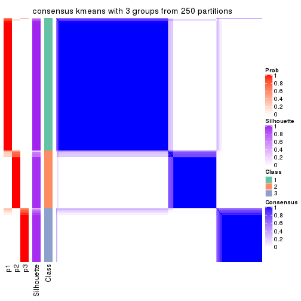</p>

</div>
<div id='tab-ATC-kmeans-consensus-heatmap-3'>
<pre><code class="r">consensus_heatmap(res, k = 4)
</code></pre>

<p>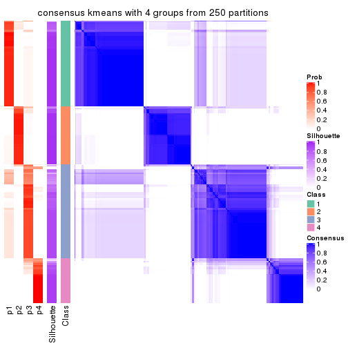</p>

</div>
<div id='tab-ATC-kmeans-consensus-heatmap-4'>
<pre><code class="r">consensus_heatmap(res, k = 5)
</code></pre>

<p></p>

</div>
<div id='tab-ATC-kmeans-consensus-heatmap-5'>
<pre><code class="r">consensus_heatmap(res, k = 6)
</code></pre>

<p></p>

</div>
</div>

Heatmaps for the membership of samples in all partitions to see how consistent they are:


<script>
$( function() {
	$( '#tabs-ATC-kmeans-membership-heatmap' ).tabs();
} );
</script>
<div id='tabs-ATC-kmeans-membership-heatmap'>
<ul>
<li><a href='#tab-ATC-kmeans-membership-heatmap-1'>k = 2</a></li>
<li><a href='#tab-ATC-kmeans-membership-heatmap-2'>k = 3</a></li>
<li><a href='#tab-ATC-kmeans-membership-heatmap-3'>k = 4</a></li>
<li><a href='#tab-ATC-kmeans-membership-heatmap-4'>k = 5</a></li>
<li><a href='#tab-ATC-kmeans-membership-heatmap-5'>k = 6</a></li>
</ul>
<div id='tab-ATC-kmeans-membership-heatmap-1'>
<pre><code class="r">membership_heatmap(res, k = 2)
</code></pre>

<p></p>

</div>
<div id='tab-ATC-kmeans-membership-heatmap-2'>
<pre><code class="r">membership_heatmap(res, k = 3)
</code></pre>

<p></p>

</div>
<div id='tab-ATC-kmeans-membership-heatmap-3'>
<pre><code class="r">membership_heatmap(res, k = 4)
</code></pre>

<p></p>

</div>
<div id='tab-ATC-kmeans-membership-heatmap-4'>
<pre><code class="r">membership_heatmap(res, k = 5)
</code></pre>

<p></p>

</div>
<div id='tab-ATC-kmeans-membership-heatmap-5'>
<pre><code class="r">membership_heatmap(res, k = 6)
</code></pre>

<p></p>

</div>
</div>

As soon as we have had the classes for columns, we can look for signatures
which are significantly different between classes which can be candidate marks
for certain classes. Following are the heatmaps for signatures.


Signature heatmaps where rows are scaled:


<script>
$( function() {
	$( '#tabs-ATC-kmeans-get-signatures' ).tabs();
} );
</script>
<div id='tabs-ATC-kmeans-get-signatures'>
<ul>
<li><a href='#tab-ATC-kmeans-get-signatures-1'>k = 2</a></li>
<li><a href='#tab-ATC-kmeans-get-signatures-2'>k = 3</a></li>
<li><a href='#tab-ATC-kmeans-get-signatures-3'>k = 4</a></li>
<li><a href='#tab-ATC-kmeans-get-signatures-4'>k = 5</a></li>
<li><a href='#tab-ATC-kmeans-get-signatures-5'>k = 6</a></li>
</ul>
<div id='tab-ATC-kmeans-get-signatures-1'>
<pre><code class="r">get_signatures(res, k = 2)
</code></pre>

<p></p>

</div>
<div id='tab-ATC-kmeans-get-signatures-2'>
<pre><code class="r">get_signatures(res, k = 3)
</code></pre>

<p></p>

</div>
<div id='tab-ATC-kmeans-get-signatures-3'>
<pre><code class="r">get_signatures(res, k = 4)
</code></pre>

<p></p>

</div>
<div id='tab-ATC-kmeans-get-signatures-4'>
<pre><code class="r">get_signatures(res, k = 5)
</code></pre>

<p></p>

</div>
<div id='tab-ATC-kmeans-get-signatures-5'>
<pre><code class="r">get_signatures(res, k = 6)
</code></pre>

<p></p>

</div>
</div>


Signature heatmaps where rows are not scaled:


<script>
$( function() {
	$( '#tabs-ATC-kmeans-get-signatures-no-scale' ).tabs();
} );
</script>
<div id='tabs-ATC-kmeans-get-signatures-no-scale'>
<ul>
<li><a href='#tab-ATC-kmeans-get-signatures-no-scale-1'>k = 2</a></li>
<li><a href='#tab-ATC-kmeans-get-signatures-no-scale-2'>k = 3</a></li>
<li><a href='#tab-ATC-kmeans-get-signatures-no-scale-3'>k = 4</a></li>
<li><a href='#tab-ATC-kmeans-get-signatures-no-scale-4'>k = 5</a></li>
<li><a href='#tab-ATC-kmeans-get-signatures-no-scale-5'>k = 6</a></li>
</ul>
<div id='tab-ATC-kmeans-get-signatures-no-scale-1'>
<pre><code class="r">get_signatures(res, k = 2, scale_rows = FALSE)
</code></pre>

<p></p>

</div>
<div id='tab-ATC-kmeans-get-signatures-no-scale-2'>
<pre><code class="r">get_signatures(res, k = 3, scale_rows = FALSE)
</code></pre>

<p></p>

</div>
<div id='tab-ATC-kmeans-get-signatures-no-scale-3'>
<pre><code class="r">get_signatures(res, k = 4, scale_rows = FALSE)
</code></pre>

<p></p>

</div>
<div id='tab-ATC-kmeans-get-signatures-no-scale-4'>
<pre><code class="r">get_signatures(res, k = 5, scale_rows = FALSE)
</code></pre>

<p></p>

</div>
<div id='tab-ATC-kmeans-get-signatures-no-scale-5'>
<pre><code class="r">get_signatures(res, k = 6, scale_rows = FALSE)
</code></pre>

<p></p>

</div>
</div>


Compare the overlap of signatures from different k:

```r
compare_signatures(res)
```


`get_signature()` returns a data frame invisibly. TO get the list of signatures, the function
call should be assigned to a variable explicitly. In following code, if `plot` argument is set
to `FALSE`, no heatmap is plotted while only the differential analysis is performed.

```r
# code only for demonstration
tb = get_signature(res, k = ..., plot = FALSE)
```

An example of the output of `tb` is:

```
#>   which_row         fdr    mean_1    mean_2 scaled_mean_1 scaled_mean_2 km
#> 1        38 0.042760348  8.373488  9.131774    -0.5533452     0.5164555  1
#> 2        40 0.018707592  7.106213  8.469186    -0.6173731     0.5762149  1
#> 3        55 0.019134737 10.221463 11.207825    -0.6159697     0.5749050  1
#> 4        59 0.006059896  5.921854  7.869574    -0.6899429     0.6439467  1
#> 5        60 0.018055526  8.928898 10.211722    -0.6204761     0.5791110  1
#> 6        98 0.009384629 15.714769 14.887706     0.6635654    -0.6193277  2
...
```

The columns in `tb` are:

1. `which_row`: row indices corresponding to the input matrix.
2. `fdr`: FDR for the differential test. 
3. `mean_x`: The mean value in group x.
4. `scaled_mean_x`: The mean value in group x after rows are scaled.
5. `km`: Row groups if k-means clustering is applied to rows.


UMAP plot which shows how samples are separated.


<script>
$( function() {
	$( '#tabs-ATC-kmeans-dimension-reduction' ).tabs();
} );
</script>
<div id='tabs-ATC-kmeans-dimension-reduction'>
<ul>
<li><a href='#tab-ATC-kmeans-dimension-reduction-1'>k = 2</a></li>
<li><a href='#tab-ATC-kmeans-dimension-reduction-2'>k = 3</a></li>
<li><a href='#tab-ATC-kmeans-dimension-reduction-3'>k = 4</a></li>
<li><a href='#tab-ATC-kmeans-dimension-reduction-4'>k = 5</a></li>
<li><a href='#tab-ATC-kmeans-dimension-reduction-5'>k = 6</a></li>
</ul>
<div id='tab-ATC-kmeans-dimension-reduction-1'>
<pre><code class="r">dimension_reduction(res, k = 2, method = &quot;UMAP&quot;)
</code></pre>

<p></p>

</div>
<div id='tab-ATC-kmeans-dimension-reduction-2'>
<pre><code class="r">dimension_reduction(res, k = 3, method = &quot;UMAP&quot;)
</code></pre>

<p></p>

</div>
<div id='tab-ATC-kmeans-dimension-reduction-3'>
<pre><code class="r">dimension_reduction(res, k = 4, method = &quot;UMAP&quot;)
</code></pre>

<p></p>

</div>
<div id='tab-ATC-kmeans-dimension-reduction-4'>
<pre><code class="r">dimension_reduction(res, k = 5, method = &quot;UMAP&quot;)
</code></pre>

<p></p>

</div>
<div id='tab-ATC-kmeans-dimension-reduction-5'>
<pre><code class="r">dimension_reduction(res, k = 6, method = &quot;UMAP&quot;)
</code></pre>

<p></p>

</div>
</div>


Following heatmap shows how subgroups are split when increasing `k`:

```r
collect_classes(res)
```


If matrix rows can be associated to genes, consider to use `GO_Enrichment(res,
...)` to perform function enrichment for the signature genes.


 

---------------------------------------------------


### ATC:skmeans**


The object with results only for a single top-value method and a single partition method 
can be extracted as:

```r
res = res_list["ATC", "skmeans"]
# you can also extract it by
# res = res_list["ATC:skmeans"]
```

A summary of `res` and all the functions that can be applied to it:

```r
res
```

```
#> A 'ConsensusPartition' object with k = 2, 3, 4, 5, 6.
#>   On a matrix with 17469 rows and 309 columns.
#>   Top rows (1000, 2000, 3000, 4000, 5000) are extracted by 'ATC' method.
#>   Subgroups are detected by 'skmeans' method.
#>   Performed in total 1250 partitions by row resampling.
#>   Best k for subgroups seems to be 4.
#> 
#> Following methods can be applied to this 'ConsensusPartition' object:
#>  [1] "cola_report"             "collect_classes"         "collect_plots"          
#>  [4] "collect_stats"           "colnames"                "compare_signatures"     
#>  [7] "consensus_heatmap"       "dimension_reduction"     "functional_enrichment"  
#> [10] "get_anno_col"            "get_anno"                "get_classes"            
#> [13] "get_consensus"           "get_matrix"              "get_membership"         
#> [16] "get_param"               "get_signatures"          "get_stats"              
#> [19] "is_best_k"               "is_stable_k"             "membership_heatmap"     
#> [22] "ncol"                    "nrow"                    "plot_ecdf"              
#> [25] "rownames"                "select_partition_number" "show"                   
#> [28] "suggest_best_k"          "test_to_known_factors"
```

`collect_plots()` function collects all the plots made from `res` for all `k` (number of partitions)
into one single page to provide an easy and fast comparison between different `k`.

```r
collect_plots(res)
```


The plots are:

- The first row: a plot of the ECDF (Empirical cumulative distribution
  function) curves of the consensus matrix for each `k` and the heatmap of
  predicted classes for each `k`.
- The second row: heatmaps of the consensus matrix for each `k`.
- The third row: heatmaps of the membership matrix for each `k`.
- The fouth row: heatmaps of the signatures for each `k`.

All the plots in panels can be made by individual functions and they are
plotted later in this section.

`select_partition_number()` produces several plots showing different
statistics for choosing "optimized" `k`. There are following statistics:

- ECDF curves of the consensus matrix for each `k`;
- 1-PAC. [The PAC
  score](https://en.wikipedia.org/wiki/Consensus_clustering#Over-interpretation_potential_of_consensus_clustering)
  measures the proportion of the ambiguous subgrouping.
- Mean silhouette score.
- Concordance. The mean probability of fiting the consensus class ids in all
  partitions.
- Area increased. Denote $A_k$ as the area under the ECDF curve for current
  `k`, the area increased is defined as $A_k - A_{k-1}$.
- Rand index. The percent of pairs of samples that are both in a same cluster
  or both are not in a same cluster in the partition of k and k-1.
- Jaccard index. The ratio of pairs of samples are both in a same cluster in
  the partition of k and k-1 and the pairs of samples are both in a same
  cluster in the partition k or k-1.

The detailed explanations of these statistics can be found in [the cola
vignette](http://bioconductor.org/packages/devel/bioc/vignettes/cola/inst/doc/cola.html#toc_13).

Generally speaking, lower PAC score, higher mean silhouette score or higher
concordance corresponds to better partition. Rand index and Jaccard index
measure how similar the current partition is compared to partition with `k-1`.
If they are too similar, we won't accept `k` is better than `k-1`.

```r
select_partition_number(res)
```


The numeric values for all these statistics can be obtained by `get_stats()`.

```r
get_stats(res)
```

```
#>   k 1-PAC mean_silhouette concordance area_increased  Rand Jaccard
#> 2 2 1.000           0.988       0.995         0.5011 0.499   0.499
#> 3 3 0.968           0.929       0.973         0.3233 0.741   0.527
#> 4 4 0.963           0.938       0.974         0.1280 0.809   0.511
#> 5 5 0.892           0.877       0.930         0.0656 0.892   0.615
#> 6 6 0.827           0.805       0.880         0.0351 0.952   0.772
```

`suggest_best_k()` suggests the best $k$ based on these statistics. The rules are as follows:

- All $k$ with Jaccard index larger than 0.95 are removed because the increase of
  the partition number does not provides enough extra information. If all $k$ are removed,
  the best $k$ is assigned by `NA`.
- For $k$ with 1-PAC larger than 0.9, the maximal $k$ is taken as the "best k". Other $k$ is called "optional k".
- If it does not fit the second rule. The $k$ with the highest vote of highest
  1-PAC, mean silhouette and concordance is taken as the "best k".

```r
suggest_best_k(res)
```

```
#> [1] 4
#> attr(,"optional")
#> [1] 2 3
```

There is also optional best $k$ = 2 3 that is worth to check.

Following shows the table of the partitions (You need to click the **show/hide
code output** link to see it). The membership matrix (columns with name `p*`)
is inferred by
[`clue::cl_consensus()`](https://www.rdocumentation.org/link/cl_consensus?package=clue)
function with the `SE` method. Basically the value in the membership matrix
represents the probability to belong to a certain group. The finall class
label for an item is determined with the group with highest probability it
belongs to.

In `get_classes()` function, the entropy is calculated from the membership
matrix and the silhouette score is calculated from the consensus matrix.


<script>
$( function() {
	$( '#tabs-ATC-skmeans-get-classes' ).tabs();
} );
</script>
<div id='tabs-ATC-skmeans-get-classes'>
<ul>
<li><a href='#tab-ATC-skmeans-get-classes-1'>k = 2</a></li>
<li><a href='#tab-ATC-skmeans-get-classes-2'>k = 3</a></li>
<li><a href='#tab-ATC-skmeans-get-classes-3'>k = 4</a></li>
<li><a href='#tab-ATC-skmeans-get-classes-4'>k = 5</a></li>
<li><a href='#tab-ATC-skmeans-get-classes-5'>k = 6</a></li>
</ul>

<div id='tab-ATC-skmeans-get-classes-1'>
<p><a id='tab-ATC-skmeans-get-classes-1-a' style='color:#0366d6' href='#'>show/hide code output</a></p>
<pre><code class="r">cbind(get_classes(res, k = 2), get_membership(res, k = 2))
</code></pre>

<pre><code>#&gt;                                      class entropy silhouette    p1    p2
#&gt; 7826AE44-B03A-4528-9CB5-7421E592AE36     1  0.0000      0.993 1.000 0.000
#&gt; 0DC2197B-2FEA-48EB-953E-8E44E1933757     1  0.0000      0.993 1.000 0.000
#&gt; 87ABB098-8C1E-4677-8C31-48B71EFE41C7     1  0.0000      0.993 1.000 0.000
#&gt; EC0154E7-7A27-4535-83AE-6B379E99A93C     2  0.0000      0.997 0.000 1.000
#&gt; 78F79407-D49F-4FA2-B09F-0665C502827C     2  0.0000      0.997 0.000 1.000
#&gt; 03E81178-E971-4E91-8BED-D8273EA1425C     1  0.7219      0.749 0.800 0.200
#&gt; 62FCAEFF-16D8-4019-84B6-18EC3A88BC32     1  0.0000      0.993 1.000 0.000
#&gt; 722C1284-5983-4CC1-B19C-214C2DE6F8A6     2  0.0000      0.997 0.000 1.000
#&gt; 54E42A64-B350-4A94-8FED-C9BC1872660E     1  0.0000      0.993 1.000 0.000
#&gt; 53062969-D209-490B-9C9B-5D297625E2AE     1  0.0000      0.993 1.000 0.000
#&gt; B710293C-41D3-4A2E-8104-5402F91DD859     2  0.0000      0.997 0.000 1.000
#&gt; 73CB1D05-7AE4-457D-B4EF-25AC5C1F2132     1  0.0000      0.993 1.000 0.000
#&gt; B055A70B-3003-47CB-BDAA-6378C000BF24     1  0.0000      0.993 1.000 0.000
#&gt; 46C3A870-E37A-42CB-8C0C-6ACACEAC1ADC     2  0.0000      0.997 0.000 1.000
#&gt; E8E6270E-F26D-4F2E-A63E-7885BDE05FDB     1  0.0000      0.993 1.000 0.000
#&gt; C4A5EBA2-9091-4D12-BDC8-B84B122022B9     1  0.0000      0.993 1.000 0.000
#&gt; 5B1839C4-549D-41D1-B559-3C6D2A1528CE     1  0.0000      0.993 1.000 0.000
#&gt; A0DF05EB-DC44-4492-9A8A-F278F7B0C266     2  0.0000      0.997 0.000 1.000
#&gt; B5182F49-70F2-45B7-82DE-C6DA68145EEA     1  0.0000      0.993 1.000 0.000
#&gt; C204D355-B876-4341-A111-36D48CBDD2A8     2  0.0000      0.997 0.000 1.000
#&gt; 7B070AAA-EF97-4D3B-AA19-EEC170C7927D     2  0.0000      0.997 0.000 1.000
#&gt; 05A8A881-F8EE-48A2-B11C-A08D7D80CE18     2  0.0000      0.997 0.000 1.000
#&gt; BA59EF50-CFE9-456D-B1B6-67D0945004F6     2  0.0000      0.997 0.000 1.000
#&gt; AD97B334-E034-4D33-A4D5-48C32D5D521C     2  0.0000      0.997 0.000 1.000
#&gt; 51DA2568-32EA-4668-9876-4B6E7CA68860     1  0.0000      0.993 1.000 0.000
#&gt; 78C26A05-2084-494D-83D3-C52C1B800F4C     1  0.0000      0.993 1.000 0.000
#&gt; 2B5DD791-7692-4721-9519-7D7D49B52570     2  0.0000      0.997 0.000 1.000
#&gt; C0BBE26A-79C8-4392-9978-7C420B3786B5     1  0.0000      0.993 1.000 0.000
#&gt; F35A8359-3A7A-414F-8A5C-D278F3B45387     2  0.0000      0.997 0.000 1.000
#&gt; 8C9BA49C-1270-491D-A234-AE1B1C0609BA     2  0.0000      0.997 0.000 1.000
#&gt; CA104B57-B160-4148-8A0A-D34BB3E8D88A     2  0.0000      0.997 0.000 1.000
#&gt; 877E18A5-6A7A-4E29-9871-DC7EA14A5F27     2  0.0000      0.997 0.000 1.000
#&gt; 904EDF2E-411E-43BD-901D-46129AFA283A     2  0.0000      0.997 0.000 1.000
#&gt; FD9F5A9B-2BEB-4D31-9A2D-8D4B4ECBB478     1  0.0000      0.993 1.000 0.000
#&gt; 2E206314-9928-456E-B7C6-893DC0E3C7C2     2  0.0000      0.997 0.000 1.000
#&gt; 913DB655-2C7F-4369-83DE-9257F04CF39B     2  0.0000      0.997 0.000 1.000
#&gt; 72B5B724-FEB5-43BD-83F6-2E2152DDD800     1  0.0000      0.993 1.000 0.000
#&gt; 920B547C-6898-446C-AAAF-F4ED96E40AAB     1  0.0000      0.993 1.000 0.000
#&gt; 847F796A-8CD6-4013-A0FB-26F4FC3EAF0D     1  0.0000      0.993 1.000 0.000
#&gt; C4D64E7A-33F7-4CFC-9FD3-D6AA3D8EFAA7     1  0.0000      0.993 1.000 0.000
#&gt; EABA0B17-8E19-48C5-BF62-2A45C9632807     2  0.0000      0.997 0.000 1.000
#&gt; 7263CBA8-CE37-4531-A795-9324C6D2A672     2  0.0000      0.997 0.000 1.000
#&gt; 6D3CC3AC-618B-414A-B640-169C735A6568     1  0.0000      0.993 1.000 0.000
#&gt; 710C05C7-F9CE-45FA-A8CC-29DE2903E04F     2  0.0000      0.997 0.000 1.000
#&gt; 3D631A56-2C55-48EA-A667-BA46023C9D50     1  0.0000      0.993 1.000 0.000
#&gt; F1C65F64-AF05-4875-B7E4-60FFF56A3F46     1  0.0000      0.993 1.000 0.000
#&gt; E5DF76E7-A765-4E07-B87A-06168BF66C5F     2  0.0000      0.997 0.000 1.000
#&gt; 5C8C8A6E-40D4-4F82-AC3D-90CFDEE15C0A     2  0.0000      0.997 0.000 1.000
#&gt; 0117CBB9-1BF9-48B1-BE6E-A9A770FF8721     1  0.0000      0.993 1.000 0.000
#&gt; 31EF66E5-419A-44C3-BB2A-B69B52FFCECC     2  0.0000      0.997 0.000 1.000
#&gt; C149CEF5-61F3-4B53-B8A9-8244B673EBD0     2  0.0000      0.997 0.000 1.000
#&gt; 0AF351D0-4EC5-4275-AA0A-4FA2AF8A9C85     1  0.0000      0.993 1.000 0.000
#&gt; B507E82F-6680-497B-A014-033EDD7A2E03     1  0.0000      0.993 1.000 0.000
#&gt; F941890E-AB33-478F-8C97-1C785DD9428F     2  0.0000      0.997 0.000 1.000
#&gt; 7987E019-8FED-469B-A6C1-34EE430A60C3     1  0.0000      0.993 1.000 0.000
#&gt; 76084AA6-19BF-4605-B6A1-73F1D4BADAF9     2  0.0000      0.997 0.000 1.000
#&gt; 329807F7-E0D4-4F53-94E8-E4080E90CB47     1  0.0000      0.993 1.000 0.000
#&gt; 1B6505FF-C1A7-4DD0-9827-41A0A3A28F3E     2  0.0000      0.997 0.000 1.000
#&gt; 49778E92-B5D3-4AD9-A1AF-3B722D631B96     1  0.0000      0.993 1.000 0.000
#&gt; A22892DE-0AF4-4B63-9513-1D6825059040     2  0.0000      0.997 0.000 1.000
#&gt; 6D77ECAE-A715-4ADD-97D8-A916DC31A4EA     2  0.0000      0.997 0.000 1.000
#&gt; 09758B6F-1B2D-4AED-8913-696097069409     2  0.0000      0.997 0.000 1.000
#&gt; 8B709DB4-0B28-42F1-A7C5-106F5809BEA2     2  0.0000      0.997 0.000 1.000
#&gt; F2B356FA-79CD-4867-8ABF-84C90A493A75     1  0.0000      0.993 1.000 0.000
#&gt; 131213AD-0313-4DF1-B013-CE67ED262C37     2  0.0000      0.997 0.000 1.000
#&gt; D94F7E81-0F60-473B-AD4A-0AC13508BDE2     1  0.0000      0.993 1.000 0.000
#&gt; 29C17355-D646-48DA-9E54-7B6DD85DD610     2  0.0000      0.997 0.000 1.000
#&gt; B8BD866A-2A7C-45C3-96BB-9AB892D26AE5     1  0.0000      0.993 1.000 0.000
#&gt; 13EFD045-AD61-41EE-9896-67BFA4FC8C09     1  0.0000      0.993 1.000 0.000
#&gt; 2655F609-B3BB-4D01-B421-D5F4B1232EC8     2  0.0000      0.997 0.000 1.000
#&gt; 04BC7A52-C67F-42CB-8672-D3C51A20F2BA     1  0.0000      0.993 1.000 0.000
#&gt; 45472BD4-DBDB-41FE-B0E3-2440880E1DE6     1  0.0000      0.993 1.000 0.000
#&gt; B87FFFCD-CB57-4ACD-9C74-AB188984BBB2     1  0.0000      0.993 1.000 0.000
#&gt; 5271374C-13CD-4BFE-AC6D-C95AFE491322     2  0.8763      0.577 0.296 0.704
#&gt; E3372ACE-C7C8-43E5-B30A-1F2D662D8170     2  0.0000      0.997 0.000 1.000
#&gt; B08DF564-E4D0-4540-8160-93B3981DF1D8     1  0.0000      0.993 1.000 0.000
#&gt; 61A7D1B9-FC5A-4B9C-989F-936CDA948C27     2  0.0000      0.997 0.000 1.000
#&gt; 74E768C1-8766-46AC-AAB4-D79E5049F76A     2  0.0000      0.997 0.000 1.000
#&gt; 0CEA28F0-D7F0-4EB7-A23F-0C5CA6245971     1  0.0000      0.993 1.000 0.000
#&gt; 95C4EFF6-147C-48EC-A2C1-16B8F12AEEF2     1  0.0000      0.993 1.000 0.000
#&gt; C9A78BEA-D455-4F5E-8B7B-19BCB42887E7     1  0.0000      0.993 1.000 0.000
#&gt; DB970740-9AC1-4C10-9658-8A77B1C390DD     1  0.0000      0.993 1.000 0.000
#&gt; 883FBD37-0CA0-4562-8925-72ACC1EE93D9     1  0.0000      0.993 1.000 0.000
#&gt; 9FE1D006-49F2-471E-91E6-AF0414C24479     1  0.0000      0.993 1.000 0.000
#&gt; 11816CC6-8C8B-49C0-99EE-896377BCFCCD     1  0.0000      0.993 1.000 0.000
#&gt; 063FC5C8-4318-4ECC-9CA0-1976CBC8ACB6     2  0.0000      0.997 0.000 1.000
#&gt; E0F085CC-B90D-4FDE-B60E-C613971BAA00     2  0.0000      0.997 0.000 1.000
#&gt; 62361DA2-E4EE-46DA-BB1F-C51DCA9307CC     2  0.0000      0.997 0.000 1.000
#&gt; 1BA16D48-B09E-4699-A1AD-2FFECE4F3CDB     1  0.0000      0.993 1.000 0.000
#&gt; 3E4F14E9-60AE-4F17-9BA7-2A02E908204A     1  0.0000      0.993 1.000 0.000
#&gt; 79226DD7-BC85-4B8E-BFF8-B1E073129D34     2  0.0672      0.989 0.008 0.992
#&gt; D47D0936-826F-4D54-9225-F71B95357438     1  0.0000      0.993 1.000 0.000
#&gt; 0AE02B91-574C-4165-BA39-E9D7C1A870A2     2  0.0000      0.997 0.000 1.000
#&gt; DED8E9DF-CEFE-45ED-9374-EF9925A135C4     1  0.0000      0.993 1.000 0.000
#&gt; D587A993-3C47-4D4C-B744-59169D4F7451     2  0.0000      0.997 0.000 1.000
#&gt; 6BCA24E6-440F-42C5-ABE5-66C37B713A39     2  0.0000      0.997 0.000 1.000
#&gt; 86A5EDFB-9D06-4FED-BF57-F8D74A68E156     2  0.0000      0.997 0.000 1.000
#&gt; B9BD5134-2F6A-4454-8F83-69B63F9AE114     2  0.0000      0.997 0.000 1.000
#&gt; 082DA9E1-A40D-482B-8E21-A93BA97185F0     2  0.0000      0.997 0.000 1.000
#&gt; 16A8343A-1203-44FB-9F03-05CC7C71B4CC     1  0.1184      0.977 0.984 0.016
#&gt; 00439565-02CE-4BF5-956D-7078B51C0947     1  0.0000      0.993 1.000 0.000
#&gt; 7B2BD361-2BF1-4E97-BC08-457F5A9C2682     2  0.0000      0.997 0.000 1.000
#&gt; C1D8439A-D527-47F6-ADC1-25867B65DA21     2  0.0000      0.997 0.000 1.000
#&gt; D9096909-1439-462D-B69C-CAD1BF4F420C     2  0.0000      0.997 0.000 1.000
#&gt; 7822EA86-35A1-4285-9429-2B63111B9885     1  0.0000      0.993 1.000 0.000
#&gt; 6FD0CFC8-AC8D-4CF1-8C33-833AD98A30EF     2  0.0000      0.997 0.000 1.000
#&gt; A451F278-5E83-4BC6-9B15-3AA2117B99B6     2  0.0000      0.997 0.000 1.000
#&gt; 6EC25686-4547-459C-9E01-7EDF8DAECE35     1  0.0000      0.993 1.000 0.000
#&gt; 5D2F1EEA-2BA8-4C3A-8436-544EE1D23E7E     2  0.0000      0.997 0.000 1.000
#&gt; 675A4293-A4CE-4307-B00B-DFC4D44A87C6     2  0.0000      0.997 0.000 1.000
#&gt; 6FBE0AEF-476A-42B2-A857-846CF1ED92B6     2  0.0000      0.997 0.000 1.000
#&gt; 7139D616-1A15-4288-A9AE-411856A4A76D     2  0.0000      0.997 0.000 1.000
#&gt; 46D7F8C1-D5C5-40CC-BEF5-2E590A847BD9     1  0.0000      0.993 1.000 0.000
#&gt; 984C44D3-4F5F-44C9-BCD9-C991EBC1FCB8     1  0.0000      0.993 1.000 0.000
#&gt; 83FE52E0-2DC2-4580-8BB2-FBCBEE4AC240     2  0.0000      0.997 0.000 1.000
#&gt; 0923F9CB-DF6F-4BAA-A5F8-0F83CE60D1ED     1  0.0000      0.993 1.000 0.000
#&gt; 1DEB5206-78CC-4EB5-BCD5-85A6A5B4E273     1  0.0000      0.993 1.000 0.000
#&gt; E4DB18DA-EB0C-4B2F-9566-7F72222B16D4     2  0.0000      0.997 0.000 1.000
#&gt; F7456312-1309-4B2F-875D-0F90CDF3EC35     2  0.0000      0.997 0.000 1.000
#&gt; 9A25E5D8-0706-4960-A76B-BCD0AC93E4FA     2  0.0000      0.997 0.000 1.000
#&gt; 5A41FE8F-FFB3-4B87-BF11-A570C184096D     1  0.0000      0.993 1.000 0.000
#&gt; 33F84E63-3F6C-4867-ADB1-A0DF39F1295B     1  0.0000      0.993 1.000 0.000
#&gt; D6A644F5-D1D0-4A8D-94C4-EE6C3ECE7430     1  0.0000      0.993 1.000 0.000
#&gt; 2A5848CC-A9A2-4AA8-A752-321273E62CF0     2  0.0000      0.997 0.000 1.000
#&gt; 7CA6358B-FC8A-4675-B092-9E061038FC83     2  0.0000      0.997 0.000 1.000
#&gt; A4C2F4BC-5C62-4B1F-9AB8-46D9468EF523     2  0.0000      0.997 0.000 1.000
#&gt; 8AF4EB7F-418D-4CC9-A9B8-A93A4C1A173B     1  0.0000      0.993 1.000 0.000
#&gt; E5048887-70C8-468F-881E-2EC55F6E6F3B     2  0.0000      0.997 0.000 1.000
#&gt; 1BADCC7C-C4D8-4C34-9534-59D622C7A2A2     1  0.0000      0.993 1.000 0.000
#&gt; 02CE7DF7-64BD-4297-A240-A5B9EE8771D3     1  0.0000      0.993 1.000 0.000
#&gt; CBF6E96A-F56C-4C87-B851-D319930BAAB8     2  0.0000      0.997 0.000 1.000
#&gt; 48F6B774-CFD2-4DDF-B7A2-696596413C3F     2  0.0000      0.997 0.000 1.000
#&gt; 41D88C3E-5848-4B09-8A77-EAE6AC4EC6B0     1  0.0000      0.993 1.000 0.000
#&gt; BDF79CC0-00C7-49C1-900B-AB065A733B17     1  0.0000      0.993 1.000 0.000
#&gt; A894D686-BFC7-4AEE-A794-DBE718C6B6F6     2  0.0000      0.997 0.000 1.000
#&gt; 0712029E-3765-4272-BE5B-B6C8BCCC0F0F     2  0.0000      0.997 0.000 1.000
#&gt; 7B051855-9B09-4887-9BC0-9F077537938E     2  0.0000      0.997 0.000 1.000
#&gt; EF357C46-5C3C-4F51-9383-FF7694D07B97     2  0.0000      0.997 0.000 1.000
#&gt; 9492A322-37CA-4582-AC68-66B5D80778AF     2  0.0000      0.997 0.000 1.000
#&gt; 993399A4-1B9F-4258-B2D0-155AD58A2E82     2  0.0000      0.997 0.000 1.000
#&gt; 7B7DC93D-5494-4E69-BE07-2967887182F9     1  0.0000      0.993 1.000 0.000
#&gt; 29BCBA51-2580-473D-9CF7-BEDBD0DBAD1B     2  0.0000      0.997 0.000 1.000
#&gt; 40855647-E942-4F32-90B7-BEB921929BFB     1  0.0000      0.993 1.000 0.000
#&gt; 0DC723D0-7C68-4495-A4B9-2DF2FF19AB14     2  0.0000      0.997 0.000 1.000
#&gt; 7540005F-57E0-4E2E-A8A2-BEF2B0F333B1     2  0.0000      0.997 0.000 1.000
#&gt; EB1DDB14-4076-4C2C-B911-390C17C21486     1  0.0000      0.993 1.000 0.000
#&gt; 9EA70EC4-8BA0-4E3D-B3CB-A68D19E89868     1  0.0000      0.993 1.000 0.000
#&gt; B04E2E50-0A6E-4224-A825-1714D12E5669     1  0.0000      0.993 1.000 0.000
#&gt; B0BF5E01-536D-40FF-9C24-CBBD611E2FC2     1  0.0000      0.993 1.000 0.000
#&gt; 7B6B1788-B297-4442-B6BE-B7CE8754491E     1  0.0000      0.993 1.000 0.000
#&gt; A090D00C-34DF-4906-A517-4803C4C9A332     1  0.0000      0.993 1.000 0.000
#&gt; 340D44A6-9BEA-412C-9973-D9ABD6692255     1  0.0000      0.993 1.000 0.000
#&gt; E8D0D1E7-E5A8-4014-80C1-0245F90F4358     2  0.0000      0.997 0.000 1.000
#&gt; 19EA1494-8572-40E1-B9BB-3739F47B607D     1  0.9833      0.268 0.576 0.424
#&gt; 1C1B4793-8DAF-4763-BA4D-C4E869A4ED35     2  0.0000      0.997 0.000 1.000
#&gt; 45BF59B3-95BD-4196-ABAA-4C4F0DB38572     1  0.0000      0.993 1.000 0.000
#&gt; 47B5A2A7-7E13-4558-99D2-067F5075C6A4     2  0.0000      0.997 0.000 1.000
#&gt; E94638E8-CB51-4FBB-8BCB-4BFD7A812291     2  0.0000      0.997 0.000 1.000
#&gt; A17352A8-0D3C-4545-8136-7DAE2FB0E102     1  0.0000      0.993 1.000 0.000
#&gt; B18A6F95-D4ED-416B-B5A1-9A4934865D0D     2  0.0000      0.997 0.000 1.000
#&gt; 33E92C5F-0C42-4549-AD5B-0A064182A272     2  0.0000      0.997 0.000 1.000
#&gt; E041B375-3E60-4F18-A6EF-D1C249E3B8EE     1  0.0000      0.993 1.000 0.000
#&gt; EDF90AF6-6C64-4BD2-AADF-8D7D188650B2     2  0.0000      0.997 0.000 1.000
#&gt; 569320D2-316C-4E2D-B7B3-D7D5C4DAD42D     1  0.0000      0.993 1.000 0.000
#&gt; AFFB223D-DAE9-4567-9EF2-8E4DF9D8782D     2  0.5178      0.868 0.116 0.884
#&gt; 56FC9454-0A6A-4CC3-95C4-BE0E0D0BAFCE     2  0.0000      0.997 0.000 1.000
#&gt; 43226365-FAEF-46C5-AF1B-5C6C2BED84FF     2  0.0000      0.997 0.000 1.000
#&gt; 1536110A-B42A-4A84-9474-9895321FDCE9     2  0.0000      0.997 0.000 1.000
#&gt; 812255DD-536B-4216-90B1-27D5AB339BE2     2  0.0000      0.997 0.000 1.000
#&gt; 5D4563D6-68B7-4C9D-A3F4-AA7D45D5112C     2  0.0000      0.997 0.000 1.000
#&gt; BAA39781-DB94-473C-98B1-FA6CD3E1C67A     2  0.0000      0.997 0.000 1.000
#&gt; C1411CDA-814D-4E21-8929-C0F77858828F     1  0.0000      0.993 1.000 0.000
#&gt; EFE2F248-C13E-4E8D-9153-8C903848AC4A     2  0.0000      0.997 0.000 1.000
#&gt; D3939C84-D1D6-4060-9F91-AEB222A9BDD5     2  0.0000      0.997 0.000 1.000
#&gt; EABD2987-8C1E-49E5-94AF-C0BDE5335A48     1  0.0000      0.993 1.000 0.000
#&gt; F4BE2ABE-2CEB-4A6A-B8EC-0355F8C63B9B     1  0.0000      0.993 1.000 0.000
#&gt; 627BC251-D217-4955-B718-6B9D6DEA1756     1  0.0000      0.993 1.000 0.000
#&gt; 31B54613-A20E-4039-BB8B-9B52104CE418     2  0.0000      0.997 0.000 1.000
#&gt; 3F292B7C-A535-4DBD-BC20-CB4F85A1C94B     1  0.0000      0.993 1.000 0.000
#&gt; BEA2A5EB-EEA9-4F31-AC38-810E04CE124B     1  0.0000      0.993 1.000 0.000
#&gt; 99D84D46-19DA-43F1-B639-DCE9953F1529     2  0.0000      0.997 0.000 1.000
#&gt; 4588817E-1068-4A78-86B6-4674A0112DDA     2  0.0000      0.997 0.000 1.000
#&gt; 6AC633BD-BEC1-4750-94E3-378972DAB6B3     1  0.0000      0.993 1.000 0.000
#&gt; 09E17C6E-7EDE-4DDF-B5ED-2521AF870C9A     2  0.0000      0.997 0.000 1.000
#&gt; 58D9C750-26A2-4B7C-84C4-13D7AFB4C5EA     2  0.1633      0.973 0.024 0.976
#&gt; DF28E138-E222-4F77-9B61-69E601CA7E60     2  0.0000      0.997 0.000 1.000
#&gt; FEA489A8-E423-4266-AADA-9BAAB29AB94B     2  0.0000      0.997 0.000 1.000
#&gt; F3FCC207-15CD-41EA-A3EF-F5D2C12AC373     1  0.0000      0.993 1.000 0.000
#&gt; 53DD7AFB-A258-4643-A501-BACC95D17A50     2  0.0000      0.997 0.000 1.000
#&gt; D850B2A1-1F8A-4A44-A0CF-8D9DD4A1889A     2  0.0000      0.997 0.000 1.000
#&gt; B3F746DC-E487-4305-9F30-825D1520E8FD     2  0.0000      0.997 0.000 1.000
#&gt; BE38240A-F7C2-439F-9AAE-51C8A340F310     1  0.0000      0.993 1.000 0.000
#&gt; A9022D9E-1D30-49EE-8552-1364A8027F34     1  0.0000      0.993 1.000 0.000
#&gt; 0E8A56EE-D9A2-48A5-B793-A358BE1E4EFA     1  0.0000      0.993 1.000 0.000
#&gt; 51667574-318E-4BDB-8F42-8512A4C1B84F     1  0.0000      0.993 1.000 0.000
#&gt; B0A442C9-67E4-4534-8A5C-D6D73F42358C     1  0.0000      0.993 1.000 0.000
#&gt; 25A5BC09-0D88-4385-87AF-997F9018522D     2  0.0000      0.997 0.000 1.000
#&gt; 344B9631-AAA5-4302-8747-D584345D9131     1  0.0000      0.993 1.000 0.000
#&gt; 1C3795AD-6306-4892-95F5-92DF3375D46A     2  0.0000      0.997 0.000 1.000
#&gt; 17BB221D-8BF9-4391-83DD-423AE1E03651     2  0.0000      0.997 0.000 1.000
#&gt; 297611E9-9555-4BCA-A723-02E846ACC23A     2  0.0000      0.997 0.000 1.000
#&gt; AD7FF180-1EAC-4783-8A62-E9626B96DD9F     1  0.0000      0.993 1.000 0.000
#&gt; FD544083-9BD5-4036-BD81-0352B67CC45C     1  0.0000      0.993 1.000 0.000
#&gt; 879A74D5-5B29-418D-A0F4-8E88D6384008     1  0.0000      0.993 1.000 0.000
#&gt; 43CD982C-13C0-4A52-803A-9A3A3FAE09BC     2  0.0000      0.997 0.000 1.000
#&gt; DCD0313D-5206-4111-8743-A8A0227257D9     1  0.0000      0.993 1.000 0.000
#&gt; 331A9160-D730-45DD-A985-C6CAC03035ED     2  0.0000      0.997 0.000 1.000
#&gt; 9EEECA0E-530D-4724-B016-A716F0782148     2  0.0000      0.997 0.000 1.000
#&gt; B3073976-CA3F-4115-9243-8C2D9E1B975D     1  0.0000      0.993 1.000 0.000
#&gt; 77B3C9B4-1A7F-41BB-A37D-01EF80E933CC     1  0.0000      0.993 1.000 0.000
#&gt; C0C26822-2E9F-4FB0-81D4-575027C8B71C     2  0.0000      0.997 0.000 1.000
#&gt; F1FCE328-2B3B-499A-888D-0E66A017E8B0     1  0.0000      0.993 1.000 0.000
#&gt; F069DAD6-F1EB-42F7-8252-F3F6EC46CC3E     1  0.0000      0.993 1.000 0.000
#&gt; 99CC822E-8C98-4EEC-BB58-AEF76A0B5332     2  0.0000      0.997 0.000 1.000
#&gt; C86EBD08-53F2-4972-801A-74970FDD6A62     1  0.0000      0.993 1.000 0.000
#&gt; F07326F2-C1D6-4D5A-9693-25C3A04B0EC2     2  0.0000      0.997 0.000 1.000
#&gt; 8ACBD428-7713-48D9-810A-43C9CD191A73     1  0.0000      0.993 1.000 0.000
#&gt; 3D3501B4-1A43-4FA7-90A2-CCEBF66BFD4A     1  0.0000      0.993 1.000 0.000
#&gt; DD51C17C-300F-44A4-955A-C9BC85417842     1  0.0000      0.993 1.000 0.000
#&gt; 58FF391C-1D83-426C-8F92-C15F78F56C95     2  0.0000      0.997 0.000 1.000
#&gt; ACE65C6E-2B10-4972-91B4-9199DD4B179D     2  0.0000      0.997 0.000 1.000
#&gt; B2088466-FA5D-491C-9982-99B33683E66F     1  0.0000      0.993 1.000 0.000
#&gt; D47AF416-1687-4FE0-A235-8815B6E8EB0B     1  0.0000      0.993 1.000 0.000
#&gt; 4DCAD07F-CC43-46F6-B2F3-EDBF3EDD1045     1  0.0000      0.993 1.000 0.000
#&gt; AAAE0BD9-63FC-4A0E-A27E-447B634BAD99     2  0.0000      0.997 0.000 1.000
#&gt; BC471AA1-52CF-4CEE-9866-34CE91404F45     2  0.0000      0.997 0.000 1.000
#&gt; 81D3EE3F-AC11-404F-8092-307F0DC12198     1  0.0000      0.993 1.000 0.000
#&gt; 8C02026C-C25E-406B-B8B8-A1A82362AE79     1  0.0000      0.993 1.000 0.000
#&gt; 6A005F2A-A0C1-4CA4-B15B-96B08F013874     1  0.0000      0.993 1.000 0.000
#&gt; B55743F2-4D63-4375-85D3-F58281CFD852     2  0.0000      0.997 0.000 1.000
#&gt; 24F98393-C817-4D0E-A7DB-05D2B5C71F40     2  0.0000      0.997 0.000 1.000
#&gt; 2C2AEF1D-4112-4EC7-9027-5E3FD26E8802     1  0.9460      0.431 0.636 0.364
#&gt; 8BAC3CB5-2987-4349-8AE8-B83DDD16CA3C     2  0.0000      0.997 0.000 1.000
#&gt; ED9C74E6-92FC-4E58-8FCE-1761DEA0C977     2  0.0000      0.997 0.000 1.000
#&gt; BA732ED4-F6BA-404E-BA3C-CA558FAD866A     1  0.0000      0.993 1.000 0.000
#&gt; E750385A-12D9-4A88-B4DF-C1306B5EF3B7     2  0.0000      0.997 0.000 1.000
#&gt; 6B1DC5E4-5F82-4395-913F-6AEDB5B63188     2  0.0000      0.997 0.000 1.000
#&gt; A7C12D37-FD50-4674-A054-1774F4E5C3B3     1  0.0000      0.993 1.000 0.000
#&gt; 2155C764-2063-4D9C-9ACD-96AA73475F5E     1  0.0000      0.993 1.000 0.000
#&gt; DE23CC15-A95E-4119-9B3C-8EEC45900D11     2  0.0000      0.997 0.000 1.000
#&gt; 5DB1DCAD-638E-48A4-9F40-3D6268FDEC33     2  0.0000      0.997 0.000 1.000
#&gt; 34AF0341-73D7-4080-AAEB-4C1541C2569F     1  0.0000      0.993 1.000 0.000
#&gt; B60D4235-44AF-4BA4-98C0-BCCDC28E90B9     2  0.0000      0.997 0.000 1.000
#&gt; CF463D89-2C9F-4257-BF04-8BC1CD40EA7D     2  0.0000      0.997 0.000 1.000
#&gt; EF6C8165-484A-4530-AEDF-93DCC4A8455D     2  0.0000      0.997 0.000 1.000
#&gt; B9F6B5E4-4D10-49B8-A8FE-8F33C5A62CBF     1  0.0000      0.993 1.000 0.000
#&gt; CE539000-92D7-4622-9C8D-BC6E01310681     1  0.0000      0.993 1.000 0.000
#&gt; D3BBC405-A22A-4009-ABF6-96FEEE653051     2  0.0000      0.997 0.000 1.000
#&gt; 0B3C86BD-0D20-4408-9BE3-05658729505F     1  0.0000      0.993 1.000 0.000
#&gt; 9B9C5071-7C3F-416C-B91C-6F5966747F54     2  0.0000      0.997 0.000 1.000
#&gt; A9469A4A-C5F9-4681-A916-A26F0B4307BA     1  0.0000      0.993 1.000 0.000
#&gt; A31B57E4-E30B-4A1B-829D-1B47D9CEC041     2  0.0000      0.997 0.000 1.000
#&gt; 647255CE-F84A-4070-B3FD-D8ACA32C4D09     1  0.0000      0.993 1.000 0.000
#&gt; 8F5E9F02-51D7-410E-B8B7-22737F2F095A     2  0.0000      0.997 0.000 1.000
#&gt; 8074A7F6-2FDE-4578-B71C-01C542D468FE     2  0.0000      0.997 0.000 1.000
#&gt; 2A946F17-F245-409E-A019-C60CDA18DC7D     1  0.0000      0.993 1.000 0.000
#&gt; 0878C381-47F9-4786-82C2-94AC840BEDCB     1  0.0000      0.993 1.000 0.000
#&gt; 54504893-92C5-4328-85A8-2A882680B5E0     1  0.0000      0.993 1.000 0.000
#&gt; 0A27D1BE-E5DD-459A-A51F-6D8AAF7CFEB4     2  0.0000      0.997 0.000 1.000
#&gt; 89ED5A3E-CAC0-4AB4-B858-A3CD8F34DBD5     2  0.0000      0.997 0.000 1.000
#&gt; ACEEB0A5-AADB-4EF9-8710-4BAF95522CEA     1  0.0000      0.993 1.000 0.000
#&gt; 02C74D81-5976-4252-BC6C-B10E934DECA2     1  0.0000      0.993 1.000 0.000
#&gt; D365A238-4739-4B54-9608-DC548F21C04E     1  0.0000      0.993 1.000 0.000
#&gt; F70F7ED5-A3B7-4210-95AD-DEFA0A565F06     1  0.0000      0.993 1.000 0.000
#&gt; A92C23A9-BC25-4025-9501-6D5FF8E2A502     2  0.0000      0.997 0.000 1.000
#&gt; ECE9BBF4-840E-47A6-8378-0B6C4A2369D3     2  0.0000      0.997 0.000 1.000
#&gt; 38749490-0FCF-4B33-9EBC-8F86C2D9E4AF     1  0.0000      0.993 1.000 0.000
#&gt; 02ABB64E-768B-4999-A899-EEE573D5F186     1  0.0000      0.993 1.000 0.000
#&gt; C1C467A8-18B1-4C3F-AC45-33359ED6FDC4     2  0.0000      0.997 0.000 1.000
#&gt; 78B2E4A1-9DAE-404F-AB47-1896450EF254     2  0.0000      0.997 0.000 1.000
#&gt; CCDB0290-91DA-4089-84A6-4434BA028D30     1  0.0000      0.993 1.000 0.000
#&gt; D5041E80-20A0-4C1A-9AC1-2394F6DB6E92     1  0.0000      0.993 1.000 0.000
#&gt; 20EB9CC6-EABB-438A-9030-E766459996D1     2  0.0000      0.997 0.000 1.000
#&gt; 73E99110-9A7C-4F73-98C5-79D22CB06230     1  0.0000      0.993 1.000 0.000
#&gt; FAD8A464-9BC3-4ED9-9517-B18D36514325     2  0.0000      0.997 0.000 1.000
#&gt; 9AF0E82E-E621-437A-8D19-700532B95090     2  0.0000      0.997 0.000 1.000
#&gt; 27DA48F3-4FC1-41A3-8E49-5B25F1CCFF07     2  0.0000      0.997 0.000 1.000
#&gt; EFE5A302-D138-4044-A301-5C5FD1C24836     2  0.4298      0.902 0.088 0.912
#&gt; D3E866AC-D66A-4C07-9F47-89AF460320DE     2  0.0000      0.997 0.000 1.000
#&gt; 89C45456-9392-4EB3-9A82-A130B6702AAF     2  0.0000      0.997 0.000 1.000
#&gt; 8FF5C8FC-2565-49BE-9EE0-91A84A85AB2A     1  0.0000      0.993 1.000 0.000
#&gt; 846DF088-75D5-49CF-BDDC-27E735A08DCA     2  0.0000      0.997 0.000 1.000
#&gt; EA3A19E1-7ADE-47B6-A35A-71290967147A     2  0.0000      0.997 0.000 1.000
#&gt; B2C43D0C-732B-4C54-938F-D3C9FDA880DA     1  0.0000      0.993 1.000 0.000
#&gt; EEC856B5-9B7F-488D-975E-CE2FF7072879     1  0.0000      0.993 1.000 0.000
#&gt; 8A68C417-09CC-4FA1-BFEB-EB4B738853A4     2  0.0000      0.997 0.000 1.000
#&gt; C5DF1A0D-952C-44E2-BF83-ED57177EF60E     1  0.0000      0.993 1.000 0.000
#&gt; B5C9EA22-F758-4BD2-BD1F-282EC1078AED     2  0.0000      0.997 0.000 1.000
#&gt; 3F08AE92-3EFD-4D7F-8C5C-BFB3621F0CD6     1  0.0000      0.993 1.000 0.000
#&gt; 8F0D43F1-2199-4DBB-9B16-1E5F2CED2FEC     2  0.0000      0.997 0.000 1.000
#&gt; 54BABD8B-EA9F-4875-8594-2179B38C73BD     2  0.0000      0.997 0.000 1.000
#&gt; C149B6F8-03DC-4907-920A-F3318B8D2A1E     1  0.0000      0.993 1.000 0.000
#&gt; F93D26E2-4B45-495D-BC8E-5B592F8FDABF     1  0.0000      0.993 1.000 0.000
#&gt; C98275CD-C39A-4E14-A731-4F3EB7396665     2  0.0000      0.997 0.000 1.000
#&gt; 354DC705-216E-42F0-B29E-C1F8D6C9489A     2  0.0000      0.997 0.000 1.000
#&gt; 6752EED9-7990-433F-A206-D5398C396471     1  0.0000      0.993 1.000 0.000
#&gt; C3E94C5D-68C4-400C-B7CB-38C42E9D5FFF     2  0.0000      0.997 0.000 1.000
#&gt; CE6B6871-3ED3-44DE-A777-7558D4429057     1  0.0000      0.993 1.000 0.000
#&gt; A06E7D1E-E432-4A4C-8BB0-314304F96EDF     1  0.0000      0.993 1.000 0.000
#&gt; 1ABBEF80-508F-4247-B43D-3E549372113B     1  0.0000      0.993 1.000 0.000
#&gt; 835AAE7F-F873-4D11-8845-232D261A38DF     1  0.0000      0.993 1.000 0.000
#&gt; E98A0460-6529-4DBA-8542-1B98801D7A7D     2  0.0000      0.997 0.000 1.000
#&gt; 06A9CBF8-01D0-4720-BCE8-83F0E77C862F     1  0.0000      0.993 1.000 0.000
#&gt; 206865A9-A67C-49A6-93AD-55D06E777559     2  0.0000      0.997 0.000 1.000
#&gt; 26DABC83-DB30-452F-9BE2-366760CB138E     2  0.0000      0.997 0.000 1.000
#&gt; 9DD5272A-2D6E-4774-83E3-0CD761EDE926     1  0.0000      0.993 1.000 0.000
#&gt; 4938E366-C740-4C9C-9358-FF37997DC9EF     2  0.0000      0.997 0.000 1.000
#&gt; E2DA59C4-A47C-41E3-BC55-2D00C6EC17FB     1  0.0000      0.993 1.000 0.000
#&gt; 37349E62-0BFB-4FEA-81D0-2AB7E7625B0D     2  0.0000      0.997 0.000 1.000
</code></pre>

<script>
$('#tab-ATC-skmeans-get-classes-1-a').parent().next().next().hide();
$('#tab-ATC-skmeans-get-classes-1-a').click(function(){
  $('#tab-ATC-skmeans-get-classes-1-a').parent().next().next().toggle();
  return(false);
});
</script>
</div>

<div id='tab-ATC-skmeans-get-classes-2'>
<p><a id='tab-ATC-skmeans-get-classes-2-a' style='color:#0366d6' href='#'>show/hide code output</a></p>
<pre><code class="r">cbind(get_classes(res, k = 3), get_membership(res, k = 3))
</code></pre>

<pre><code>#&gt;                                      class entropy silhouette    p1    p2    p3
#&gt; 7826AE44-B03A-4528-9CB5-7421E592AE36     3  0.0000   0.960315 0.000 0.000 1.000
#&gt; 0DC2197B-2FEA-48EB-953E-8E44E1933757     3  0.0000   0.960315 0.000 0.000 1.000
#&gt; 87ABB098-8C1E-4677-8C31-48B71EFE41C7     3  0.0424   0.953183 0.000 0.008 0.992
#&gt; EC0154E7-7A27-4535-83AE-6B379E99A93C     1  0.0000   0.976032 1.000 0.000 0.000
#&gt; 78F79407-D49F-4FA2-B09F-0665C502827C     1  0.0000   0.976032 1.000 0.000 0.000
#&gt; 03E81178-E971-4E91-8BED-D8273EA1425C     1  0.0000   0.976032 1.000 0.000 0.000
#&gt; 62FCAEFF-16D8-4019-84B6-18EC3A88BC32     3  0.0000   0.960315 0.000 0.000 1.000
#&gt; 722C1284-5983-4CC1-B19C-214C2DE6F8A6     2  0.0000   0.978877 0.000 1.000 0.000
#&gt; 54E42A64-B350-4A94-8FED-C9BC1872660E     3  0.0000   0.960315 0.000 0.000 1.000
#&gt; 53062969-D209-490B-9C9B-5D297625E2AE     1  0.0000   0.976032 1.000 0.000 0.000
#&gt; B710293C-41D3-4A2E-8104-5402F91DD859     1  0.0000   0.976032 1.000 0.000 0.000
#&gt; 73CB1D05-7AE4-457D-B4EF-25AC5C1F2132     1  0.0000   0.976032 1.000 0.000 0.000
#&gt; B055A70B-3003-47CB-BDAA-6378C000BF24     3  0.5968   0.450511 0.364 0.000 0.636
#&gt; 46C3A870-E37A-42CB-8C0C-6ACACEAC1ADC     2  0.0000   0.978877 0.000 1.000 0.000
#&gt; E8E6270E-F26D-4F2E-A63E-7885BDE05FDB     3  0.0000   0.960315 0.000 0.000 1.000
#&gt; C4A5EBA2-9091-4D12-BDC8-B84B122022B9     3  0.0000   0.960315 0.000 0.000 1.000
#&gt; 5B1839C4-549D-41D1-B559-3C6D2A1528CE     3  0.0000   0.960315 0.000 0.000 1.000
#&gt; A0DF05EB-DC44-4492-9A8A-F278F7B0C266     1  0.0000   0.976032 1.000 0.000 0.000
#&gt; B5182F49-70F2-45B7-82DE-C6DA68145EEA     3  0.0000   0.960315 0.000 0.000 1.000
#&gt; C204D355-B876-4341-A111-36D48CBDD2A8     1  0.0000   0.976032 1.000 0.000 0.000
#&gt; 7B070AAA-EF97-4D3B-AA19-EEC170C7927D     2  0.0000   0.978877 0.000 1.000 0.000
#&gt; 05A8A881-F8EE-48A2-B11C-A08D7D80CE18     1  0.0000   0.976032 1.000 0.000 0.000
#&gt; BA59EF50-CFE9-456D-B1B6-67D0945004F6     1  0.0000   0.976032 1.000 0.000 0.000
#&gt; AD97B334-E034-4D33-A4D5-48C32D5D521C     1  0.0000   0.976032 1.000 0.000 0.000
#&gt; 51DA2568-32EA-4668-9876-4B6E7CA68860     3  0.0000   0.960315 0.000 0.000 1.000
#&gt; 78C26A05-2084-494D-83D3-C52C1B800F4C     3  0.0000   0.960315 0.000 0.000 1.000
#&gt; 2B5DD791-7692-4721-9519-7D7D49B52570     1  0.0000   0.976032 1.000 0.000 0.000
#&gt; C0BBE26A-79C8-4392-9978-7C420B3786B5     3  0.0000   0.960315 0.000 0.000 1.000
#&gt; F35A8359-3A7A-414F-8A5C-D278F3B45387     2  0.0000   0.978877 0.000 1.000 0.000
#&gt; 8C9BA49C-1270-491D-A234-AE1B1C0609BA     2  0.0000   0.978877 0.000 1.000 0.000
#&gt; CA104B57-B160-4148-8A0A-D34BB3E8D88A     1  0.0000   0.976032 1.000 0.000 0.000
#&gt; 877E18A5-6A7A-4E29-9871-DC7EA14A5F27     1  0.0000   0.976032 1.000 0.000 0.000
#&gt; 904EDF2E-411E-43BD-901D-46129AFA283A     1  0.0000   0.976032 1.000 0.000 0.000
#&gt; FD9F5A9B-2BEB-4D31-9A2D-8D4B4ECBB478     3  0.4555   0.740389 0.200 0.000 0.800
#&gt; 2E206314-9928-456E-B7C6-893DC0E3C7C2     2  0.0000   0.978877 0.000 1.000 0.000
#&gt; 913DB655-2C7F-4369-83DE-9257F04CF39B     2  0.6062   0.385929 0.384 0.616 0.000
#&gt; 72B5B724-FEB5-43BD-83F6-2E2152DDD800     3  0.0000   0.960315 0.000 0.000 1.000
#&gt; 920B547C-6898-446C-AAAF-F4ED96E40AAB     3  0.0000   0.960315 0.000 0.000 1.000
#&gt; 847F796A-8CD6-4013-A0FB-26F4FC3EAF0D     1  0.0000   0.976032 1.000 0.000 0.000
#&gt; C4D64E7A-33F7-4CFC-9FD3-D6AA3D8EFAA7     3  0.0000   0.960315 0.000 0.000 1.000
#&gt; EABA0B17-8E19-48C5-BF62-2A45C9632807     2  0.0000   0.978877 0.000 1.000 0.000
#&gt; 7263CBA8-CE37-4531-A795-9324C6D2A672     1  0.0000   0.976032 1.000 0.000 0.000
#&gt; 6D3CC3AC-618B-414A-B640-169C735A6568     3  0.0000   0.960315 0.000 0.000 1.000
#&gt; 710C05C7-F9CE-45FA-A8CC-29DE2903E04F     1  0.0000   0.976032 1.000 0.000 0.000
#&gt; 3D631A56-2C55-48EA-A667-BA46023C9D50     1  0.4452   0.739198 0.808 0.000 0.192
#&gt; F1C65F64-AF05-4875-B7E4-60FFF56A3F46     3  0.0000   0.960315 0.000 0.000 1.000
#&gt; E5DF76E7-A765-4E07-B87A-06168BF66C5F     1  0.0000   0.976032 1.000 0.000 0.000
#&gt; 5C8C8A6E-40D4-4F82-AC3D-90CFDEE15C0A     2  0.0000   0.978877 0.000 1.000 0.000
#&gt; 0117CBB9-1BF9-48B1-BE6E-A9A770FF8721     3  0.0000   0.960315 0.000 0.000 1.000
#&gt; 31EF66E5-419A-44C3-BB2A-B69B52FFCECC     2  0.0000   0.978877 0.000 1.000 0.000
#&gt; C149CEF5-61F3-4B53-B8A9-8244B673EBD0     1  0.0000   0.976032 1.000 0.000 0.000
#&gt; 0AF351D0-4EC5-4275-AA0A-4FA2AF8A9C85     3  0.0000   0.960315 0.000 0.000 1.000
#&gt; B507E82F-6680-497B-A014-033EDD7A2E03     3  0.6126   0.363475 0.400 0.000 0.600
#&gt; F941890E-AB33-478F-8C97-1C785DD9428F     1  0.0000   0.976032 1.000 0.000 0.000
#&gt; 7987E019-8FED-469B-A6C1-34EE430A60C3     1  0.0000   0.976032 1.000 0.000 0.000
#&gt; 76084AA6-19BF-4605-B6A1-73F1D4BADAF9     2  0.0000   0.978877 0.000 1.000 0.000
#&gt; 329807F7-E0D4-4F53-94E8-E4080E90CB47     3  0.0000   0.960315 0.000 0.000 1.000
#&gt; 1B6505FF-C1A7-4DD0-9827-41A0A3A28F3E     1  0.0000   0.976032 1.000 0.000 0.000
#&gt; 49778E92-B5D3-4AD9-A1AF-3B722D631B96     2  0.6309  -0.010731 0.000 0.504 0.496
#&gt; A22892DE-0AF4-4B63-9513-1D6825059040     1  0.0000   0.976032 1.000 0.000 0.000
#&gt; 6D77ECAE-A715-4ADD-97D8-A916DC31A4EA     1  0.0000   0.976032 1.000 0.000 0.000
#&gt; 09758B6F-1B2D-4AED-8913-696097069409     2  0.0000   0.978877 0.000 1.000 0.000
#&gt; 8B709DB4-0B28-42F1-A7C5-106F5809BEA2     1  0.0000   0.976032 1.000 0.000 0.000
#&gt; F2B356FA-79CD-4867-8ABF-84C90A493A75     1  0.0000   0.976032 1.000 0.000 0.000
#&gt; 131213AD-0313-4DF1-B013-CE67ED262C37     2  0.0000   0.978877 0.000 1.000 0.000
#&gt; D94F7E81-0F60-473B-AD4A-0AC13508BDE2     3  0.0000   0.960315 0.000 0.000 1.000
#&gt; 29C17355-D646-48DA-9E54-7B6DD85DD610     1  0.0000   0.976032 1.000 0.000 0.000
#&gt; B8BD866A-2A7C-45C3-96BB-9AB892D26AE5     1  0.0000   0.976032 1.000 0.000 0.000
#&gt; 13EFD045-AD61-41EE-9896-67BFA4FC8C09     3  0.0000   0.960315 0.000 0.000 1.000
#&gt; 2655F609-B3BB-4D01-B421-D5F4B1232EC8     2  0.0000   0.978877 0.000 1.000 0.000
#&gt; 04BC7A52-C67F-42CB-8672-D3C51A20F2BA     3  0.0000   0.960315 0.000 0.000 1.000
#&gt; 45472BD4-DBDB-41FE-B0E3-2440880E1DE6     3  0.0000   0.960315 0.000 0.000 1.000
#&gt; B87FFFCD-CB57-4ACD-9C74-AB188984BBB2     3  0.0000   0.960315 0.000 0.000 1.000
#&gt; 5271374C-13CD-4BFE-AC6D-C95AFE491322     1  0.0000   0.976032 1.000 0.000 0.000
#&gt; E3372ACE-C7C8-43E5-B30A-1F2D662D8170     1  0.0000   0.976032 1.000 0.000 0.000
#&gt; B08DF564-E4D0-4540-8160-93B3981DF1D8     1  0.6274   0.108033 0.544 0.000 0.456
#&gt; 61A7D1B9-FC5A-4B9C-989F-936CDA948C27     1  0.0000   0.976032 1.000 0.000 0.000
#&gt; 74E768C1-8766-46AC-AAB4-D79E5049F76A     2  0.0000   0.978877 0.000 1.000 0.000
#&gt; 0CEA28F0-D7F0-4EB7-A23F-0C5CA6245971     3  0.0000   0.960315 0.000 0.000 1.000
#&gt; 95C4EFF6-147C-48EC-A2C1-16B8F12AEEF2     3  0.0000   0.960315 0.000 0.000 1.000
#&gt; C9A78BEA-D455-4F5E-8B7B-19BCB42887E7     1  0.1289   0.943519 0.968 0.000 0.032
#&gt; DB970740-9AC1-4C10-9658-8A77B1C390DD     3  0.0000   0.960315 0.000 0.000 1.000
#&gt; 883FBD37-0CA0-4562-8925-72ACC1EE93D9     3  0.0000   0.960315 0.000 0.000 1.000
#&gt; 9FE1D006-49F2-471E-91E6-AF0414C24479     1  0.0000   0.976032 1.000 0.000 0.000
#&gt; 11816CC6-8C8B-49C0-99EE-896377BCFCCD     1  0.0000   0.976032 1.000 0.000 0.000
#&gt; 063FC5C8-4318-4ECC-9CA0-1976CBC8ACB6     1  0.0000   0.976032 1.000 0.000 0.000
#&gt; E0F085CC-B90D-4FDE-B60E-C613971BAA00     1  0.0000   0.976032 1.000 0.000 0.000
#&gt; 62361DA2-E4EE-46DA-BB1F-C51DCA9307CC     2  0.0000   0.978877 0.000 1.000 0.000
#&gt; 1BA16D48-B09E-4699-A1AD-2FFECE4F3CDB     3  0.0000   0.960315 0.000 0.000 1.000
#&gt; 3E4F14E9-60AE-4F17-9BA7-2A02E908204A     3  0.0000   0.960315 0.000 0.000 1.000
#&gt; 79226DD7-BC85-4B8E-BFF8-B1E073129D34     1  0.0000   0.976032 1.000 0.000 0.000
#&gt; D47D0936-826F-4D54-9225-F71B95357438     1  0.0000   0.976032 1.000 0.000 0.000
#&gt; 0AE02B91-574C-4165-BA39-E9D7C1A870A2     2  0.0000   0.978877 0.000 1.000 0.000
#&gt; DED8E9DF-CEFE-45ED-9374-EF9925A135C4     3  0.6154   0.342590 0.408 0.000 0.592
#&gt; D587A993-3C47-4D4C-B744-59169D4F7451     1  0.0000   0.976032 1.000 0.000 0.000
#&gt; 6BCA24E6-440F-42C5-ABE5-66C37B713A39     1  0.0000   0.976032 1.000 0.000 0.000
#&gt; 86A5EDFB-9D06-4FED-BF57-F8D74A68E156     2  0.0592   0.969338 0.012 0.988 0.000
#&gt; B9BD5134-2F6A-4454-8F83-69B63F9AE114     2  0.2625   0.902443 0.084 0.916 0.000
#&gt; 082DA9E1-A40D-482B-8E21-A93BA97185F0     1  0.0000   0.976032 1.000 0.000 0.000
#&gt; 16A8343A-1203-44FB-9F03-05CC7C71B4CC     1  0.0000   0.976032 1.000 0.000 0.000
#&gt; 00439565-02CE-4BF5-956D-7078B51C0947     3  0.0000   0.960315 0.000 0.000 1.000
#&gt; 7B2BD361-2BF1-4E97-BC08-457F5A9C2682     2  0.0000   0.978877 0.000 1.000 0.000
#&gt; C1D8439A-D527-47F6-ADC1-25867B65DA21     2  0.0000   0.978877 0.000 1.000 0.000
#&gt; D9096909-1439-462D-B69C-CAD1BF4F420C     1  0.0000   0.976032 1.000 0.000 0.000
#&gt; 7822EA86-35A1-4285-9429-2B63111B9885     3  0.6302   0.114236 0.480 0.000 0.520
#&gt; 6FD0CFC8-AC8D-4CF1-8C33-833AD98A30EF     2  0.0000   0.978877 0.000 1.000 0.000
#&gt; A451F278-5E83-4BC6-9B15-3AA2117B99B6     2  0.0000   0.978877 0.000 1.000 0.000
#&gt; 6EC25686-4547-459C-9E01-7EDF8DAECE35     3  0.0000   0.960315 0.000 0.000 1.000
#&gt; 5D2F1EEA-2BA8-4C3A-8436-544EE1D23E7E     1  0.0000   0.976032 1.000 0.000 0.000
#&gt; 675A4293-A4CE-4307-B00B-DFC4D44A87C6     2  0.0000   0.978877 0.000 1.000 0.000
#&gt; 6FBE0AEF-476A-42B2-A857-846CF1ED92B6     2  0.0000   0.978877 0.000 1.000 0.000
#&gt; 7139D616-1A15-4288-A9AE-411856A4A76D     2  0.1860   0.934867 0.052 0.948 0.000
#&gt; 46D7F8C1-D5C5-40CC-BEF5-2E590A847BD9     3  0.0000   0.960315 0.000 0.000 1.000
#&gt; 984C44D3-4F5F-44C9-BCD9-C991EBC1FCB8     3  0.0000   0.960315 0.000 0.000 1.000
#&gt; 83FE52E0-2DC2-4580-8BB2-FBCBEE4AC240     1  0.0000   0.976032 1.000 0.000 0.000
#&gt; 0923F9CB-DF6F-4BAA-A5F8-0F83CE60D1ED     3  0.0000   0.960315 0.000 0.000 1.000
#&gt; 1DEB5206-78CC-4EB5-BCD5-85A6A5B4E273     3  0.0000   0.960315 0.000 0.000 1.000
#&gt; E4DB18DA-EB0C-4B2F-9566-7F72222B16D4     2  0.2066   0.927407 0.060 0.940 0.000
#&gt; F7456312-1309-4B2F-875D-0F90CDF3EC35     1  0.0000   0.976032 1.000 0.000 0.000
#&gt; 9A25E5D8-0706-4960-A76B-BCD0AC93E4FA     1  0.0000   0.976032 1.000 0.000 0.000
#&gt; 5A41FE8F-FFB3-4B87-BF11-A570C184096D     3  0.0000   0.960315 0.000 0.000 1.000
#&gt; 33F84E63-3F6C-4867-ADB1-A0DF39F1295B     3  0.0000   0.960315 0.000 0.000 1.000
#&gt; D6A644F5-D1D0-4A8D-94C4-EE6C3ECE7430     3  0.3412   0.837184 0.124 0.000 0.876
#&gt; 2A5848CC-A9A2-4AA8-A752-321273E62CF0     1  0.0000   0.976032 1.000 0.000 0.000
#&gt; 7CA6358B-FC8A-4675-B092-9E061038FC83     2  0.0000   0.978877 0.000 1.000 0.000
#&gt; A4C2F4BC-5C62-4B1F-9AB8-46D9468EF523     2  0.0000   0.978877 0.000 1.000 0.000
#&gt; 8AF4EB7F-418D-4CC9-A9B8-A93A4C1A173B     2  0.4346   0.761170 0.000 0.816 0.184
#&gt; E5048887-70C8-468F-881E-2EC55F6E6F3B     1  0.0000   0.976032 1.000 0.000 0.000
#&gt; 1BADCC7C-C4D8-4C34-9534-59D622C7A2A2     3  0.0000   0.960315 0.000 0.000 1.000
#&gt; 02CE7DF7-64BD-4297-A240-A5B9EE8771D3     3  0.0000   0.960315 0.000 0.000 1.000
#&gt; CBF6E96A-F56C-4C87-B851-D319930BAAB8     2  0.4121   0.795942 0.168 0.832 0.000
#&gt; 48F6B774-CFD2-4DDF-B7A2-696596413C3F     1  0.0000   0.976032 1.000 0.000 0.000
#&gt; 41D88C3E-5848-4B09-8A77-EAE6AC4EC6B0     3  0.0000   0.960315 0.000 0.000 1.000
#&gt; BDF79CC0-00C7-49C1-900B-AB065A733B17     3  0.0000   0.960315 0.000 0.000 1.000
#&gt; A894D686-BFC7-4AEE-A794-DBE718C6B6F6     2  0.0000   0.978877 0.000 1.000 0.000
#&gt; 0712029E-3765-4272-BE5B-B6C8BCCC0F0F     2  0.0000   0.978877 0.000 1.000 0.000
#&gt; 7B051855-9B09-4887-9BC0-9F077537938E     1  0.0000   0.976032 1.000 0.000 0.000
#&gt; EF357C46-5C3C-4F51-9383-FF7694D07B97     2  0.0000   0.978877 0.000 1.000 0.000
#&gt; 9492A322-37CA-4582-AC68-66B5D80778AF     2  0.0000   0.978877 0.000 1.000 0.000
#&gt; 993399A4-1B9F-4258-B2D0-155AD58A2E82     1  0.0000   0.976032 1.000 0.000 0.000
#&gt; 7B7DC93D-5494-4E69-BE07-2967887182F9     3  0.0000   0.960315 0.000 0.000 1.000
#&gt; 29BCBA51-2580-473D-9CF7-BEDBD0DBAD1B     2  0.0000   0.978877 0.000 1.000 0.000
#&gt; 40855647-E942-4F32-90B7-BEB921929BFB     3  0.0000   0.960315 0.000 0.000 1.000
#&gt; 0DC723D0-7C68-4495-A4B9-2DF2FF19AB14     2  0.0000   0.978877 0.000 1.000 0.000
#&gt; 7540005F-57E0-4E2E-A8A2-BEF2B0F333B1     2  0.0000   0.978877 0.000 1.000 0.000
#&gt; EB1DDB14-4076-4C2C-B911-390C17C21486     3  0.0000   0.960315 0.000 0.000 1.000
#&gt; 9EA70EC4-8BA0-4E3D-B3CB-A68D19E89868     3  0.0000   0.960315 0.000 0.000 1.000
#&gt; B04E2E50-0A6E-4224-A825-1714D12E5669     3  0.0000   0.960315 0.000 0.000 1.000
#&gt; B0BF5E01-536D-40FF-9C24-CBBD611E2FC2     3  0.0000   0.960315 0.000 0.000 1.000
#&gt; 7B6B1788-B297-4442-B6BE-B7CE8754491E     3  0.0000   0.960315 0.000 0.000 1.000
#&gt; A090D00C-34DF-4906-A517-4803C4C9A332     3  0.5988   0.441491 0.368 0.000 0.632
#&gt; 340D44A6-9BEA-412C-9973-D9ABD6692255     1  0.0000   0.976032 1.000 0.000 0.000
#&gt; E8D0D1E7-E5A8-4014-80C1-0245F90F4358     2  0.0000   0.978877 0.000 1.000 0.000
#&gt; 19EA1494-8572-40E1-B9BB-3739F47B607D     1  0.0000   0.976032 1.000 0.000 0.000
#&gt; 1C1B4793-8DAF-4763-BA4D-C4E869A4ED35     2  0.0000   0.978877 0.000 1.000 0.000
#&gt; 45BF59B3-95BD-4196-ABAA-4C4F0DB38572     3  0.0000   0.960315 0.000 0.000 1.000
#&gt; 47B5A2A7-7E13-4558-99D2-067F5075C6A4     1  0.0000   0.976032 1.000 0.000 0.000
#&gt; E94638E8-CB51-4FBB-8BCB-4BFD7A812291     1  0.0000   0.976032 1.000 0.000 0.000
#&gt; A17352A8-0D3C-4545-8136-7DAE2FB0E102     3  0.0000   0.960315 0.000 0.000 1.000
#&gt; B18A6F95-D4ED-416B-B5A1-9A4934865D0D     2  0.0000   0.978877 0.000 1.000 0.000
#&gt; 33E92C5F-0C42-4549-AD5B-0A064182A272     1  0.0000   0.976032 1.000 0.000 0.000
#&gt; E041B375-3E60-4F18-A6EF-D1C249E3B8EE     3  0.0000   0.960315 0.000 0.000 1.000
#&gt; EDF90AF6-6C64-4BD2-AADF-8D7D188650B2     2  0.0000   0.978877 0.000 1.000 0.000
#&gt; 569320D2-316C-4E2D-B7B3-D7D5C4DAD42D     1  0.0000   0.976032 1.000 0.000 0.000
#&gt; AFFB223D-DAE9-4567-9EF2-8E4DF9D8782D     2  0.0000   0.978877 0.000 1.000 0.000
#&gt; 56FC9454-0A6A-4CC3-95C4-BE0E0D0BAFCE     2  0.0000   0.978877 0.000 1.000 0.000
#&gt; 43226365-FAEF-46C5-AF1B-5C6C2BED84FF     2  0.0000   0.978877 0.000 1.000 0.000
#&gt; 1536110A-B42A-4A84-9474-9895321FDCE9     2  0.0000   0.978877 0.000 1.000 0.000
#&gt; 812255DD-536B-4216-90B1-27D5AB339BE2     1  0.5882   0.433176 0.652 0.348 0.000
#&gt; 5D4563D6-68B7-4C9D-A3F4-AA7D45D5112C     2  0.0000   0.978877 0.000 1.000 0.000
#&gt; BAA39781-DB94-473C-98B1-FA6CD3E1C67A     1  0.0000   0.976032 1.000 0.000 0.000
#&gt; C1411CDA-814D-4E21-8929-C0F77858828F     1  0.0000   0.976032 1.000 0.000 0.000
#&gt; EFE2F248-C13E-4E8D-9153-8C903848AC4A     2  0.1964   0.931244 0.056 0.944 0.000
#&gt; D3939C84-D1D6-4060-9F91-AEB222A9BDD5     1  0.0000   0.976032 1.000 0.000 0.000
#&gt; EABD2987-8C1E-49E5-94AF-C0BDE5335A48     1  0.6305   0.000576 0.516 0.000 0.484
#&gt; F4BE2ABE-2CEB-4A6A-B8EC-0355F8C63B9B     3  0.0000   0.960315 0.000 0.000 1.000
#&gt; 627BC251-D217-4955-B718-6B9D6DEA1756     1  0.0000   0.976032 1.000 0.000 0.000
#&gt; 31B54613-A20E-4039-BB8B-9B52104CE418     1  0.0000   0.976032 1.000 0.000 0.000
#&gt; 3F292B7C-A535-4DBD-BC20-CB4F85A1C94B     3  0.0000   0.960315 0.000 0.000 1.000
#&gt; BEA2A5EB-EEA9-4F31-AC38-810E04CE124B     2  0.0000   0.978877 0.000 1.000 0.000
#&gt; 99D84D46-19DA-43F1-B639-DCE9953F1529     2  0.0000   0.978877 0.000 1.000 0.000
#&gt; 4588817E-1068-4A78-86B6-4674A0112DDA     2  0.1860   0.935079 0.052 0.948 0.000
#&gt; 6AC633BD-BEC1-4750-94E3-378972DAB6B3     3  0.0000   0.960315 0.000 0.000 1.000
#&gt; 09E17C6E-7EDE-4DDF-B5ED-2521AF870C9A     1  0.0000   0.976032 1.000 0.000 0.000
#&gt; 58D9C750-26A2-4B7C-84C4-13D7AFB4C5EA     1  0.0000   0.976032 1.000 0.000 0.000
#&gt; DF28E138-E222-4F77-9B61-69E601CA7E60     2  0.0000   0.978877 0.000 1.000 0.000
#&gt; FEA489A8-E423-4266-AADA-9BAAB29AB94B     1  0.0000   0.976032 1.000 0.000 0.000
#&gt; F3FCC207-15CD-41EA-A3EF-F5D2C12AC373     3  0.0000   0.960315 0.000 0.000 1.000
#&gt; 53DD7AFB-A258-4643-A501-BACC95D17A50     2  0.0000   0.978877 0.000 1.000 0.000
#&gt; D850B2A1-1F8A-4A44-A0CF-8D9DD4A1889A     2  0.0000   0.978877 0.000 1.000 0.000
#&gt; B3F746DC-E487-4305-9F30-825D1520E8FD     2  0.0000   0.978877 0.000 1.000 0.000
#&gt; BE38240A-F7C2-439F-9AAE-51C8A340F310     3  0.0000   0.960315 0.000 0.000 1.000
#&gt; A9022D9E-1D30-49EE-8552-1364A8027F34     3  0.0000   0.960315 0.000 0.000 1.000
#&gt; 0E8A56EE-D9A2-48A5-B793-A358BE1E4EFA     3  0.0000   0.960315 0.000 0.000 1.000
#&gt; 51667574-318E-4BDB-8F42-8512A4C1B84F     3  0.0000   0.960315 0.000 0.000 1.000
#&gt; B0A442C9-67E4-4534-8A5C-D6D73F42358C     1  0.0000   0.976032 1.000 0.000 0.000
#&gt; 25A5BC09-0D88-4385-87AF-997F9018522D     2  0.0000   0.978877 0.000 1.000 0.000
#&gt; 344B9631-AAA5-4302-8747-D584345D9131     3  0.0000   0.960315 0.000 0.000 1.000
#&gt; 1C3795AD-6306-4892-95F5-92DF3375D46A     1  0.0000   0.976032 1.000 0.000 0.000
#&gt; 17BB221D-8BF9-4391-83DD-423AE1E03651     2  0.0000   0.978877 0.000 1.000 0.000
#&gt; 297611E9-9555-4BCA-A723-02E846ACC23A     1  0.0000   0.976032 1.000 0.000 0.000
#&gt; AD7FF180-1EAC-4783-8A62-E9626B96DD9F     3  0.0000   0.960315 0.000 0.000 1.000
#&gt; FD544083-9BD5-4036-BD81-0352B67CC45C     3  0.0000   0.960315 0.000 0.000 1.000
#&gt; 879A74D5-5B29-418D-A0F4-8E88D6384008     3  0.0000   0.960315 0.000 0.000 1.000
#&gt; 43CD982C-13C0-4A52-803A-9A3A3FAE09BC     1  0.0000   0.976032 1.000 0.000 0.000
#&gt; DCD0313D-5206-4111-8743-A8A0227257D9     3  0.0000   0.960315 0.000 0.000 1.000
#&gt; 331A9160-D730-45DD-A985-C6CAC03035ED     1  0.0000   0.976032 1.000 0.000 0.000
#&gt; 9EEECA0E-530D-4724-B016-A716F0782148     2  0.0000   0.978877 0.000 1.000 0.000
#&gt; B3073976-CA3F-4115-9243-8C2D9E1B975D     3  0.0000   0.960315 0.000 0.000 1.000
#&gt; 77B3C9B4-1A7F-41BB-A37D-01EF80E933CC     3  0.0000   0.960315 0.000 0.000 1.000
#&gt; C0C26822-2E9F-4FB0-81D4-575027C8B71C     2  0.0000   0.978877 0.000 1.000 0.000
#&gt; F1FCE328-2B3B-499A-888D-0E66A017E8B0     3  0.0000   0.960315 0.000 0.000 1.000
#&gt; F069DAD6-F1EB-42F7-8252-F3F6EC46CC3E     3  0.5650   0.557734 0.312 0.000 0.688
#&gt; 99CC822E-8C98-4EEC-BB58-AEF76A0B5332     1  0.0000   0.976032 1.000 0.000 0.000
#&gt; C86EBD08-53F2-4972-801A-74970FDD6A62     3  0.0000   0.960315 0.000 0.000 1.000
#&gt; F07326F2-C1D6-4D5A-9693-25C3A04B0EC2     1  0.0000   0.976032 1.000 0.000 0.000
#&gt; 8ACBD428-7713-48D9-810A-43C9CD191A73     3  0.0000   0.960315 0.000 0.000 1.000
#&gt; 3D3501B4-1A43-4FA7-90A2-CCEBF66BFD4A     3  0.0000   0.960315 0.000 0.000 1.000
#&gt; DD51C17C-300F-44A4-955A-C9BC85417842     3  0.0000   0.960315 0.000 0.000 1.000
#&gt; 58FF391C-1D83-426C-8F92-C15F78F56C95     1  0.0000   0.976032 1.000 0.000 0.000
#&gt; ACE65C6E-2B10-4972-91B4-9199DD4B179D     1  0.0000   0.976032 1.000 0.000 0.000
#&gt; B2088466-FA5D-491C-9982-99B33683E66F     3  0.0000   0.960315 0.000 0.000 1.000
#&gt; D47AF416-1687-4FE0-A235-8815B6E8EB0B     3  0.0000   0.960315 0.000 0.000 1.000
#&gt; 4DCAD07F-CC43-46F6-B2F3-EDBF3EDD1045     3  0.1753   0.915324 0.000 0.048 0.952
#&gt; AAAE0BD9-63FC-4A0E-A27E-447B634BAD99     2  0.0000   0.978877 0.000 1.000 0.000
#&gt; BC471AA1-52CF-4CEE-9866-34CE91404F45     2  0.0000   0.978877 0.000 1.000 0.000
#&gt; 81D3EE3F-AC11-404F-8092-307F0DC12198     3  0.0000   0.960315 0.000 0.000 1.000
#&gt; 8C02026C-C25E-406B-B8B8-A1A82362AE79     3  0.0000   0.960315 0.000 0.000 1.000
#&gt; 6A005F2A-A0C1-4CA4-B15B-96B08F013874     3  0.0000   0.960315 0.000 0.000 1.000
#&gt; B55743F2-4D63-4375-85D3-F58281CFD852     1  0.0000   0.976032 1.000 0.000 0.000
#&gt; 24F98393-C817-4D0E-A7DB-05D2B5C71F40     1  0.0000   0.976032 1.000 0.000 0.000
#&gt; 2C2AEF1D-4112-4EC7-9027-5E3FD26E8802     1  0.0000   0.976032 1.000 0.000 0.000
#&gt; 8BAC3CB5-2987-4349-8AE8-B83DDD16CA3C     1  0.5968   0.423406 0.636 0.364 0.000
#&gt; ED9C74E6-92FC-4E58-8FCE-1761DEA0C977     2  0.3752   0.831010 0.144 0.856 0.000
#&gt; BA732ED4-F6BA-404E-BA3C-CA558FAD866A     3  0.6307   0.091361 0.488 0.000 0.512
#&gt; E750385A-12D9-4A88-B4DF-C1306B5EF3B7     2  0.0000   0.978877 0.000 1.000 0.000
#&gt; 6B1DC5E4-5F82-4395-913F-6AEDB5B63188     1  0.0000   0.976032 1.000 0.000 0.000
#&gt; A7C12D37-FD50-4674-A054-1774F4E5C3B3     3  0.0000   0.960315 0.000 0.000 1.000
#&gt; 2155C764-2063-4D9C-9ACD-96AA73475F5E     3  0.0000   0.960315 0.000 0.000 1.000
#&gt; DE23CC15-A95E-4119-9B3C-8EEC45900D11     2  0.0000   0.978877 0.000 1.000 0.000
#&gt; 5DB1DCAD-638E-48A4-9F40-3D6268FDEC33     2  0.0000   0.978877 0.000 1.000 0.000
#&gt; 34AF0341-73D7-4080-AAEB-4C1541C2569F     3  0.0000   0.960315 0.000 0.000 1.000
#&gt; B60D4235-44AF-4BA4-98C0-BCCDC28E90B9     2  0.0000   0.978877 0.000 1.000 0.000
#&gt; CF463D89-2C9F-4257-BF04-8BC1CD40EA7D     2  0.0000   0.978877 0.000 1.000 0.000
#&gt; EF6C8165-484A-4530-AEDF-93DCC4A8455D     1  0.0000   0.976032 1.000 0.000 0.000
#&gt; B9F6B5E4-4D10-49B8-A8FE-8F33C5A62CBF     3  0.5926   0.468292 0.356 0.000 0.644
#&gt; CE539000-92D7-4622-9C8D-BC6E01310681     2  0.0000   0.978877 0.000 1.000 0.000
#&gt; D3BBC405-A22A-4009-ABF6-96FEEE653051     2  0.0000   0.978877 0.000 1.000 0.000
#&gt; 0B3C86BD-0D20-4408-9BE3-05658729505F     3  0.0000   0.960315 0.000 0.000 1.000
#&gt; 9B9C5071-7C3F-416C-B91C-6F5966747F54     1  0.0000   0.976032 1.000 0.000 0.000
#&gt; A9469A4A-C5F9-4681-A916-A26F0B4307BA     3  0.0000   0.960315 0.000 0.000 1.000
#&gt; A31B57E4-E30B-4A1B-829D-1B47D9CEC041     2  0.0000   0.978877 0.000 1.000 0.000
#&gt; 647255CE-F84A-4070-B3FD-D8ACA32C4D09     3  0.0000   0.960315 0.000 0.000 1.000
#&gt; 8F5E9F02-51D7-410E-B8B7-22737F2F095A     2  0.0000   0.978877 0.000 1.000 0.000
#&gt; 8074A7F6-2FDE-4578-B71C-01C542D468FE     1  0.0000   0.976032 1.000 0.000 0.000
#&gt; 2A946F17-F245-409E-A019-C60CDA18DC7D     3  0.0000   0.960315 0.000 0.000 1.000
#&gt; 0878C381-47F9-4786-82C2-94AC840BEDCB     3  0.0000   0.960315 0.000 0.000 1.000
#&gt; 54504893-92C5-4328-85A8-2A882680B5E0     3  0.0000   0.960315 0.000 0.000 1.000
#&gt; 0A27D1BE-E5DD-459A-A51F-6D8AAF7CFEB4     1  0.0000   0.976032 1.000 0.000 0.000
#&gt; 89ED5A3E-CAC0-4AB4-B858-A3CD8F34DBD5     2  0.0000   0.978877 0.000 1.000 0.000
#&gt; ACEEB0A5-AADB-4EF9-8710-4BAF95522CEA     3  0.0000   0.960315 0.000 0.000 1.000
#&gt; 02C74D81-5976-4252-BC6C-B10E934DECA2     3  0.0000   0.960315 0.000 0.000 1.000
#&gt; D365A238-4739-4B54-9608-DC548F21C04E     1  0.6079   0.345046 0.612 0.000 0.388
#&gt; F70F7ED5-A3B7-4210-95AD-DEFA0A565F06     3  0.0000   0.960315 0.000 0.000 1.000
#&gt; A92C23A9-BC25-4025-9501-6D5FF8E2A502     1  0.0747   0.960431 0.984 0.016 0.000
#&gt; ECE9BBF4-840E-47A6-8378-0B6C4A2369D3     1  0.0000   0.976032 1.000 0.000 0.000
#&gt; 38749490-0FCF-4B33-9EBC-8F86C2D9E4AF     3  0.0000   0.960315 0.000 0.000 1.000
#&gt; 02ABB64E-768B-4999-A899-EEE573D5F186     3  0.0000   0.960315 0.000 0.000 1.000
#&gt; C1C467A8-18B1-4C3F-AC45-33359ED6FDC4     1  0.0000   0.976032 1.000 0.000 0.000
#&gt; 78B2E4A1-9DAE-404F-AB47-1896450EF254     1  0.0000   0.976032 1.000 0.000 0.000
#&gt; CCDB0290-91DA-4089-84A6-4434BA028D30     3  0.0000   0.960315 0.000 0.000 1.000
#&gt; D5041E80-20A0-4C1A-9AC1-2394F6DB6E92     3  0.0000   0.960315 0.000 0.000 1.000
#&gt; 20EB9CC6-EABB-438A-9030-E766459996D1     2  0.0000   0.978877 0.000 1.000 0.000
#&gt; 73E99110-9A7C-4F73-98C5-79D22CB06230     1  0.0000   0.976032 1.000 0.000 0.000
#&gt; FAD8A464-9BC3-4ED9-9517-B18D36514325     2  0.0000   0.978877 0.000 1.000 0.000
#&gt; 9AF0E82E-E621-437A-8D19-700532B95090     1  0.0000   0.976032 1.000 0.000 0.000
#&gt; 27DA48F3-4FC1-41A3-8E49-5B25F1CCFF07     1  0.0000   0.976032 1.000 0.000 0.000
#&gt; EFE5A302-D138-4044-A301-5C5FD1C24836     1  0.0000   0.976032 1.000 0.000 0.000
#&gt; D3E866AC-D66A-4C07-9F47-89AF460320DE     2  0.0000   0.978877 0.000 1.000 0.000
#&gt; 89C45456-9392-4EB3-9A82-A130B6702AAF     2  0.0000   0.978877 0.000 1.000 0.000
#&gt; 8FF5C8FC-2565-49BE-9EE0-91A84A85AB2A     3  0.0000   0.960315 0.000 0.000 1.000
#&gt; 846DF088-75D5-49CF-BDDC-27E735A08DCA     2  0.0000   0.978877 0.000 1.000 0.000
#&gt; EA3A19E1-7ADE-47B6-A35A-71290967147A     2  0.0000   0.978877 0.000 1.000 0.000
#&gt; B2C43D0C-732B-4C54-938F-D3C9FDA880DA     3  0.0000   0.960315 0.000 0.000 1.000
#&gt; EEC856B5-9B7F-488D-975E-CE2FF7072879     3  0.6111   0.343244 0.000 0.396 0.604
#&gt; 8A68C417-09CC-4FA1-BFEB-EB4B738853A4     1  0.0000   0.976032 1.000 0.000 0.000
#&gt; C5DF1A0D-952C-44E2-BF83-ED57177EF60E     3  0.6274   0.201437 0.456 0.000 0.544
#&gt; B5C9EA22-F758-4BD2-BD1F-282EC1078AED     2  0.0000   0.978877 0.000 1.000 0.000
#&gt; 3F08AE92-3EFD-4D7F-8C5C-BFB3621F0CD6     1  0.0000   0.976032 1.000 0.000 0.000
#&gt; 8F0D43F1-2199-4DBB-9B16-1E5F2CED2FEC     2  0.0000   0.978877 0.000 1.000 0.000
#&gt; 54BABD8B-EA9F-4875-8594-2179B38C73BD     1  0.0000   0.976032 1.000 0.000 0.000
#&gt; C149B6F8-03DC-4907-920A-F3318B8D2A1E     3  0.0000   0.960315 0.000 0.000 1.000
#&gt; F93D26E2-4B45-495D-BC8E-5B592F8FDABF     3  0.0892   0.942752 0.000 0.020 0.980
#&gt; C98275CD-C39A-4E14-A731-4F3EB7396665     2  0.0000   0.978877 0.000 1.000 0.000
#&gt; 354DC705-216E-42F0-B29E-C1F8D6C9489A     2  0.1753   0.938529 0.048 0.952 0.000
#&gt; 6752EED9-7990-433F-A206-D5398C396471     3  0.0000   0.960315 0.000 0.000 1.000
#&gt; C3E94C5D-68C4-400C-B7CB-38C42E9D5FFF     2  0.0000   0.978877 0.000 1.000 0.000
#&gt; CE6B6871-3ED3-44DE-A777-7558D4429057     3  0.0000   0.960315 0.000 0.000 1.000
#&gt; A06E7D1E-E432-4A4C-8BB0-314304F96EDF     3  0.0000   0.960315 0.000 0.000 1.000
#&gt; 1ABBEF80-508F-4247-B43D-3E549372113B     3  0.0000   0.960315 0.000 0.000 1.000
#&gt; 835AAE7F-F873-4D11-8845-232D261A38DF     3  0.0000   0.960315 0.000 0.000 1.000
#&gt; E98A0460-6529-4DBA-8542-1B98801D7A7D     1  0.0000   0.976032 1.000 0.000 0.000
#&gt; 06A9CBF8-01D0-4720-BCE8-83F0E77C862F     3  0.0000   0.960315 0.000 0.000 1.000
#&gt; 206865A9-A67C-49A6-93AD-55D06E777559     2  0.0000   0.978877 0.000 1.000 0.000
#&gt; 26DABC83-DB30-452F-9BE2-366760CB138E     2  0.0000   0.978877 0.000 1.000 0.000
#&gt; 9DD5272A-2D6E-4774-83E3-0CD761EDE926     3  0.0000   0.960315 0.000 0.000 1.000
#&gt; 4938E366-C740-4C9C-9358-FF37997DC9EF     1  0.0000   0.976032 1.000 0.000 0.000
#&gt; E2DA59C4-A47C-41E3-BC55-2D00C6EC17FB     3  0.0000   0.960315 0.000 0.000 1.000
#&gt; 37349E62-0BFB-4FEA-81D0-2AB7E7625B0D     1  0.0000   0.976032 1.000 0.000 0.000
</code></pre>

<script>
$('#tab-ATC-skmeans-get-classes-2-a').parent().next().next().hide();
$('#tab-ATC-skmeans-get-classes-2-a').click(function(){
  $('#tab-ATC-skmeans-get-classes-2-a').parent().next().next().toggle();
  return(false);
});
</script>
</div>

<div id='tab-ATC-skmeans-get-classes-3'>
<p><a id='tab-ATC-skmeans-get-classes-3-a' style='color:#0366d6' href='#'>show/hide code output</a></p>
<pre><code class="r">cbind(get_classes(res, k = 4), get_membership(res, k = 4))
</code></pre>

<pre><code>#&gt;                                      class entropy silhouette    p1    p2    p3    p4
#&gt; 7826AE44-B03A-4528-9CB5-7421E592AE36     3  0.0000      0.993 0.000 0.000 1.000 0.000
#&gt; 0DC2197B-2FEA-48EB-953E-8E44E1933757     3  0.0000      0.993 0.000 0.000 1.000 0.000
#&gt; 87ABB098-8C1E-4677-8C31-48B71EFE41C7     3  0.0000      0.993 0.000 0.000 1.000 0.000
#&gt; EC0154E7-7A27-4535-83AE-6B379E99A93C     1  0.0000      0.948 1.000 0.000 0.000 0.000
#&gt; 78F79407-D49F-4FA2-B09F-0665C502827C     1  0.0000      0.948 1.000 0.000 0.000 0.000
#&gt; 03E81178-E971-4E91-8BED-D8273EA1425C     1  0.4941      0.227 0.564 0.000 0.000 0.436
#&gt; 62FCAEFF-16D8-4019-84B6-18EC3A88BC32     3  0.0000      0.993 0.000 0.000 1.000 0.000
#&gt; 722C1284-5983-4CC1-B19C-214C2DE6F8A6     2  0.0000      0.978 0.000 1.000 0.000 0.000
#&gt; 54E42A64-B350-4A94-8FED-C9BC1872660E     4  0.3172      0.807 0.000 0.000 0.160 0.840
#&gt; 53062969-D209-490B-9C9B-5D297625E2AE     4  0.3444      0.772 0.184 0.000 0.000 0.816
#&gt; B710293C-41D3-4A2E-8104-5402F91DD859     1  0.0000      0.948 1.000 0.000 0.000 0.000
#&gt; 73CB1D05-7AE4-457D-B4EF-25AC5C1F2132     4  0.2921      0.831 0.140 0.000 0.000 0.860
#&gt; B055A70B-3003-47CB-BDAA-6378C000BF24     4  0.1118      0.945 0.000 0.000 0.036 0.964
#&gt; 46C3A870-E37A-42CB-8C0C-6ACACEAC1ADC     2  0.0000      0.978 0.000 1.000 0.000 0.000
#&gt; E8E6270E-F26D-4F2E-A63E-7885BDE05FDB     3  0.0000      0.993 0.000 0.000 1.000 0.000
#&gt; C4A5EBA2-9091-4D12-BDC8-B84B122022B9     4  0.0000      0.975 0.000 0.000 0.000 1.000
#&gt; 5B1839C4-549D-41D1-B559-3C6D2A1528CE     4  0.0469      0.966 0.000 0.000 0.012 0.988
#&gt; A0DF05EB-DC44-4492-9A8A-F278F7B0C266     1  0.0000      0.948 1.000 0.000 0.000 0.000
#&gt; B5182F49-70F2-45B7-82DE-C6DA68145EEA     3  0.0000      0.993 0.000 0.000 1.000 0.000
#&gt; C204D355-B876-4341-A111-36D48CBDD2A8     1  0.0000      0.948 1.000 0.000 0.000 0.000
#&gt; 7B070AAA-EF97-4D3B-AA19-EEC170C7927D     2  0.0000      0.978 0.000 1.000 0.000 0.000
#&gt; 05A8A881-F8EE-48A2-B11C-A08D7D80CE18     1  0.0336      0.943 0.992 0.000 0.000 0.008
#&gt; BA59EF50-CFE9-456D-B1B6-67D0945004F6     1  0.0000      0.948 1.000 0.000 0.000 0.000
#&gt; AD97B334-E034-4D33-A4D5-48C32D5D521C     1  0.0000      0.948 1.000 0.000 0.000 0.000
#&gt; 51DA2568-32EA-4668-9876-4B6E7CA68860     3  0.0188      0.989 0.000 0.000 0.996 0.004
#&gt; 78C26A05-2084-494D-83D3-C52C1B800F4C     3  0.0000      0.993 0.000 0.000 1.000 0.000
#&gt; 2B5DD791-7692-4721-9519-7D7D49B52570     4  0.4500      0.512 0.316 0.000 0.000 0.684
#&gt; C0BBE26A-79C8-4392-9978-7C420B3786B5     4  0.0000      0.975 0.000 0.000 0.000 1.000
#&gt; F35A8359-3A7A-414F-8A5C-D278F3B45387     2  0.0000      0.978 0.000 1.000 0.000 0.000
#&gt; 8C9BA49C-1270-491D-A234-AE1B1C0609BA     2  0.0000      0.978 0.000 1.000 0.000 0.000
#&gt; CA104B57-B160-4148-8A0A-D34BB3E8D88A     1  0.0000      0.948 1.000 0.000 0.000 0.000
#&gt; 877E18A5-6A7A-4E29-9871-DC7EA14A5F27     1  0.0000      0.948 1.000 0.000 0.000 0.000
#&gt; 904EDF2E-411E-43BD-901D-46129AFA283A     1  0.0000      0.948 1.000 0.000 0.000 0.000
#&gt; FD9F5A9B-2BEB-4D31-9A2D-8D4B4ECBB478     4  0.0000      0.975 0.000 0.000 0.000 1.000
#&gt; 2E206314-9928-456E-B7C6-893DC0E3C7C2     2  0.0000      0.978 0.000 1.000 0.000 0.000
#&gt; 913DB655-2C7F-4369-83DE-9257F04CF39B     1  0.0000      0.948 1.000 0.000 0.000 0.000
#&gt; 72B5B724-FEB5-43BD-83F6-2E2152DDD800     3  0.0000      0.993 0.000 0.000 1.000 0.000
#&gt; 920B547C-6898-446C-AAAF-F4ED96E40AAB     3  0.0000      0.993 0.000 0.000 1.000 0.000
#&gt; 847F796A-8CD6-4013-A0FB-26F4FC3EAF0D     4  0.0000      0.975 0.000 0.000 0.000 1.000
#&gt; C4D64E7A-33F7-4CFC-9FD3-D6AA3D8EFAA7     4  0.0188      0.972 0.000 0.000 0.004 0.996
#&gt; EABA0B17-8E19-48C5-BF62-2A45C9632807     2  0.0000      0.978 0.000 1.000 0.000 0.000
#&gt; 7263CBA8-CE37-4531-A795-9324C6D2A672     1  0.0000      0.948 1.000 0.000 0.000 0.000
#&gt; 6D3CC3AC-618B-414A-B640-169C735A6568     3  0.0188      0.989 0.000 0.000 0.996 0.004
#&gt; 710C05C7-F9CE-45FA-A8CC-29DE2903E04F     1  0.0000      0.948 1.000 0.000 0.000 0.000
#&gt; 3D631A56-2C55-48EA-A667-BA46023C9D50     4  0.0000      0.975 0.000 0.000 0.000 1.000
#&gt; F1C65F64-AF05-4875-B7E4-60FFF56A3F46     4  0.0000      0.975 0.000 0.000 0.000 1.000
#&gt; E5DF76E7-A765-4E07-B87A-06168BF66C5F     1  0.0000      0.948 1.000 0.000 0.000 0.000
#&gt; 5C8C8A6E-40D4-4F82-AC3D-90CFDEE15C0A     2  0.0000      0.978 0.000 1.000 0.000 0.000
#&gt; 0117CBB9-1BF9-48B1-BE6E-A9A770FF8721     4  0.0000      0.975 0.000 0.000 0.000 1.000
#&gt; 31EF66E5-419A-44C3-BB2A-B69B52FFCECC     2  0.0000      0.978 0.000 1.000 0.000 0.000
#&gt; C149CEF5-61F3-4B53-B8A9-8244B673EBD0     1  0.0000      0.948 1.000 0.000 0.000 0.000
#&gt; 0AF351D0-4EC5-4275-AA0A-4FA2AF8A9C85     3  0.0000      0.993 0.000 0.000 1.000 0.000
#&gt; B507E82F-6680-497B-A014-033EDD7A2E03     4  0.0000      0.975 0.000 0.000 0.000 1.000
#&gt; F941890E-AB33-478F-8C97-1C785DD9428F     1  0.0000      0.948 1.000 0.000 0.000 0.000
#&gt; 7987E019-8FED-469B-A6C1-34EE430A60C3     4  0.0188      0.972 0.004 0.000 0.000 0.996
#&gt; 76084AA6-19BF-4605-B6A1-73F1D4BADAF9     1  0.4985      0.150 0.532 0.468 0.000 0.000
#&gt; 329807F7-E0D4-4F53-94E8-E4080E90CB47     3  0.0000      0.993 0.000 0.000 1.000 0.000
#&gt; 1B6505FF-C1A7-4DD0-9827-41A0A3A28F3E     1  0.0000      0.948 1.000 0.000 0.000 0.000
#&gt; 49778E92-B5D3-4AD9-A1AF-3B722D631B96     3  0.0000      0.993 0.000 0.000 1.000 0.000
#&gt; A22892DE-0AF4-4B63-9513-1D6825059040     1  0.0000      0.948 1.000 0.000 0.000 0.000
#&gt; 6D77ECAE-A715-4ADD-97D8-A916DC31A4EA     1  0.0000      0.948 1.000 0.000 0.000 0.000
#&gt; 09758B6F-1B2D-4AED-8913-696097069409     2  0.4941      0.186 0.436 0.564 0.000 0.000
#&gt; 8B709DB4-0B28-42F1-A7C5-106F5809BEA2     1  0.0000      0.948 1.000 0.000 0.000 0.000
#&gt; F2B356FA-79CD-4867-8ABF-84C90A493A75     4  0.0188      0.972 0.004 0.000 0.000 0.996
#&gt; 131213AD-0313-4DF1-B013-CE67ED262C37     2  0.0000      0.978 0.000 1.000 0.000 0.000
#&gt; D94F7E81-0F60-473B-AD4A-0AC13508BDE2     3  0.0000      0.993 0.000 0.000 1.000 0.000
#&gt; 29C17355-D646-48DA-9E54-7B6DD85DD610     1  0.0000      0.948 1.000 0.000 0.000 0.000
#&gt; B8BD866A-2A7C-45C3-96BB-9AB892D26AE5     4  0.0000      0.975 0.000 0.000 0.000 1.000
#&gt; 13EFD045-AD61-41EE-9896-67BFA4FC8C09     3  0.0000      0.993 0.000 0.000 1.000 0.000
#&gt; 2655F609-B3BB-4D01-B421-D5F4B1232EC8     2  0.0000      0.978 0.000 1.000 0.000 0.000
#&gt; 04BC7A52-C67F-42CB-8672-D3C51A20F2BA     3  0.0000      0.993 0.000 0.000 1.000 0.000
#&gt; 45472BD4-DBDB-41FE-B0E3-2440880E1DE6     3  0.0188      0.989 0.000 0.000 0.996 0.004
#&gt; B87FFFCD-CB57-4ACD-9C74-AB188984BBB2     4  0.0000      0.975 0.000 0.000 0.000 1.000
#&gt; 5271374C-13CD-4BFE-AC6D-C95AFE491322     1  0.3172      0.790 0.840 0.000 0.000 0.160
#&gt; E3372ACE-C7C8-43E5-B30A-1F2D662D8170     1  0.0000      0.948 1.000 0.000 0.000 0.000
#&gt; B08DF564-E4D0-4540-8160-93B3981DF1D8     4  0.0000      0.975 0.000 0.000 0.000 1.000
#&gt; 61A7D1B9-FC5A-4B9C-989F-936CDA948C27     1  0.0469      0.940 0.988 0.000 0.000 0.012
#&gt; 74E768C1-8766-46AC-AAB4-D79E5049F76A     2  0.0000      0.978 0.000 1.000 0.000 0.000
#&gt; 0CEA28F0-D7F0-4EB7-A23F-0C5CA6245971     3  0.0000      0.993 0.000 0.000 1.000 0.000
#&gt; 95C4EFF6-147C-48EC-A2C1-16B8F12AEEF2     3  0.0000      0.993 0.000 0.000 1.000 0.000
#&gt; C9A78BEA-D455-4F5E-8B7B-19BCB42887E7     4  0.0000      0.975 0.000 0.000 0.000 1.000
#&gt; DB970740-9AC1-4C10-9658-8A77B1C390DD     3  0.0000      0.993 0.000 0.000 1.000 0.000
#&gt; 883FBD37-0CA0-4562-8925-72ACC1EE93D9     3  0.0000      0.993 0.000 0.000 1.000 0.000
#&gt; 9FE1D006-49F2-471E-91E6-AF0414C24479     4  0.0000      0.975 0.000 0.000 0.000 1.000
#&gt; 11816CC6-8C8B-49C0-99EE-896377BCFCCD     4  0.3764      0.724 0.216 0.000 0.000 0.784
#&gt; 063FC5C8-4318-4ECC-9CA0-1976CBC8ACB6     1  0.0000      0.948 1.000 0.000 0.000 0.000
#&gt; E0F085CC-B90D-4FDE-B60E-C613971BAA00     1  0.0000      0.948 1.000 0.000 0.000 0.000
#&gt; 62361DA2-E4EE-46DA-BB1F-C51DCA9307CC     2  0.0000      0.978 0.000 1.000 0.000 0.000
#&gt; 1BA16D48-B09E-4699-A1AD-2FFECE4F3CDB     3  0.0000      0.993 0.000 0.000 1.000 0.000
#&gt; 3E4F14E9-60AE-4F17-9BA7-2A02E908204A     3  0.0592      0.978 0.000 0.000 0.984 0.016
#&gt; 79226DD7-BC85-4B8E-BFF8-B1E073129D34     1  0.1637      0.901 0.940 0.000 0.000 0.060
#&gt; D47D0936-826F-4D54-9225-F71B95357438     4  0.0000      0.975 0.000 0.000 0.000 1.000
#&gt; 0AE02B91-574C-4165-BA39-E9D7C1A870A2     2  0.0000      0.978 0.000 1.000 0.000 0.000
#&gt; DED8E9DF-CEFE-45ED-9374-EF9925A135C4     4  0.0000      0.975 0.000 0.000 0.000 1.000
#&gt; D587A993-3C47-4D4C-B744-59169D4F7451     1  0.0000      0.948 1.000 0.000 0.000 0.000
#&gt; 6BCA24E6-440F-42C5-ABE5-66C37B713A39     1  0.0000      0.948 1.000 0.000 0.000 0.000
#&gt; 86A5EDFB-9D06-4FED-BF57-F8D74A68E156     1  0.2011      0.881 0.920 0.080 0.000 0.000
#&gt; B9BD5134-2F6A-4454-8F83-69B63F9AE114     1  0.0000      0.948 1.000 0.000 0.000 0.000
#&gt; 082DA9E1-A40D-482B-8E21-A93BA97185F0     1  0.0000      0.948 1.000 0.000 0.000 0.000
#&gt; 16A8343A-1203-44FB-9F03-05CC7C71B4CC     4  0.0000      0.975 0.000 0.000 0.000 1.000
#&gt; 00439565-02CE-4BF5-956D-7078B51C0947     3  0.0000      0.993 0.000 0.000 1.000 0.000
#&gt; 7B2BD361-2BF1-4E97-BC08-457F5A9C2682     2  0.0000      0.978 0.000 1.000 0.000 0.000
#&gt; C1D8439A-D527-47F6-ADC1-25867B65DA21     2  0.0000      0.978 0.000 1.000 0.000 0.000
#&gt; D9096909-1439-462D-B69C-CAD1BF4F420C     1  0.0000      0.948 1.000 0.000 0.000 0.000
#&gt; 7822EA86-35A1-4285-9429-2B63111B9885     4  0.0000      0.975 0.000 0.000 0.000 1.000
#&gt; 6FD0CFC8-AC8D-4CF1-8C33-833AD98A30EF     2  0.0000      0.978 0.000 1.000 0.000 0.000
#&gt; A451F278-5E83-4BC6-9B15-3AA2117B99B6     1  0.3942      0.689 0.764 0.236 0.000 0.000
#&gt; 6EC25686-4547-459C-9E01-7EDF8DAECE35     4  0.1389      0.934 0.000 0.000 0.048 0.952
#&gt; 5D2F1EEA-2BA8-4C3A-8436-544EE1D23E7E     1  0.4406      0.589 0.700 0.000 0.000 0.300
#&gt; 675A4293-A4CE-4307-B00B-DFC4D44A87C6     2  0.0000      0.978 0.000 1.000 0.000 0.000
#&gt; 6FBE0AEF-476A-42B2-A857-846CF1ED92B6     2  0.0000      0.978 0.000 1.000 0.000 0.000
#&gt; 7139D616-1A15-4288-A9AE-411856A4A76D     1  0.0000      0.948 1.000 0.000 0.000 0.000
#&gt; 46D7F8C1-D5C5-40CC-BEF5-2E590A847BD9     3  0.0000      0.993 0.000 0.000 1.000 0.000
#&gt; 984C44D3-4F5F-44C9-BCD9-C991EBC1FCB8     3  0.0000      0.993 0.000 0.000 1.000 0.000
#&gt; 83FE52E0-2DC2-4580-8BB2-FBCBEE4AC240     1  0.0000      0.948 1.000 0.000 0.000 0.000
#&gt; 0923F9CB-DF6F-4BAA-A5F8-0F83CE60D1ED     4  0.0000      0.975 0.000 0.000 0.000 1.000
#&gt; 1DEB5206-78CC-4EB5-BCD5-85A6A5B4E273     3  0.0000      0.993 0.000 0.000 1.000 0.000
#&gt; E4DB18DA-EB0C-4B2F-9566-7F72222B16D4     1  0.0000      0.948 1.000 0.000 0.000 0.000
#&gt; F7456312-1309-4B2F-875D-0F90CDF3EC35     1  0.0000      0.948 1.000 0.000 0.000 0.000
#&gt; 9A25E5D8-0706-4960-A76B-BCD0AC93E4FA     1  0.0000      0.948 1.000 0.000 0.000 0.000
#&gt; 5A41FE8F-FFB3-4B87-BF11-A570C184096D     3  0.0000      0.993 0.000 0.000 1.000 0.000
#&gt; 33F84E63-3F6C-4867-ADB1-A0DF39F1295B     3  0.0000      0.993 0.000 0.000 1.000 0.000
#&gt; D6A644F5-D1D0-4A8D-94C4-EE6C3ECE7430     4  0.0000      0.975 0.000 0.000 0.000 1.000
#&gt; 2A5848CC-A9A2-4AA8-A752-321273E62CF0     1  0.2973      0.812 0.856 0.000 0.000 0.144
#&gt; 7CA6358B-FC8A-4675-B092-9E061038FC83     1  0.3311      0.779 0.828 0.172 0.000 0.000
#&gt; A4C2F4BC-5C62-4B1F-9AB8-46D9468EF523     2  0.0000      0.978 0.000 1.000 0.000 0.000
#&gt; 8AF4EB7F-418D-4CC9-A9B8-A93A4C1A173B     3  0.0592      0.978 0.000 0.016 0.984 0.000
#&gt; E5048887-70C8-468F-881E-2EC55F6E6F3B     1  0.0000      0.948 1.000 0.000 0.000 0.000
#&gt; 1BADCC7C-C4D8-4C34-9534-59D622C7A2A2     3  0.0000      0.993 0.000 0.000 1.000 0.000
#&gt; 02CE7DF7-64BD-4297-A240-A5B9EE8771D3     3  0.0000      0.993 0.000 0.000 1.000 0.000
#&gt; CBF6E96A-F56C-4C87-B851-D319930BAAB8     1  0.4543      0.532 0.676 0.324 0.000 0.000
#&gt; 48F6B774-CFD2-4DDF-B7A2-696596413C3F     1  0.0000      0.948 1.000 0.000 0.000 0.000
#&gt; 41D88C3E-5848-4B09-8A77-EAE6AC4EC6B0     3  0.0000      0.993 0.000 0.000 1.000 0.000
#&gt; BDF79CC0-00C7-49C1-900B-AB065A733B17     3  0.0000      0.993 0.000 0.000 1.000 0.000
#&gt; A894D686-BFC7-4AEE-A794-DBE718C6B6F6     2  0.0000      0.978 0.000 1.000 0.000 0.000
#&gt; 0712029E-3765-4272-BE5B-B6C8BCCC0F0F     2  0.0000      0.978 0.000 1.000 0.000 0.000
#&gt; 7B051855-9B09-4887-9BC0-9F077537938E     1  0.0000      0.948 1.000 0.000 0.000 0.000
#&gt; EF357C46-5C3C-4F51-9383-FF7694D07B97     2  0.0000      0.978 0.000 1.000 0.000 0.000
#&gt; 9492A322-37CA-4582-AC68-66B5D80778AF     2  0.0000      0.978 0.000 1.000 0.000 0.000
#&gt; 993399A4-1B9F-4258-B2D0-155AD58A2E82     1  0.0000      0.948 1.000 0.000 0.000 0.000
#&gt; 7B7DC93D-5494-4E69-BE07-2967887182F9     3  0.0000      0.993 0.000 0.000 1.000 0.000
#&gt; 29BCBA51-2580-473D-9CF7-BEDBD0DBAD1B     2  0.0000      0.978 0.000 1.000 0.000 0.000
#&gt; 40855647-E942-4F32-90B7-BEB921929BFB     3  0.0000      0.993 0.000 0.000 1.000 0.000
#&gt; 0DC723D0-7C68-4495-A4B9-2DF2FF19AB14     2  0.0000      0.978 0.000 1.000 0.000 0.000
#&gt; 7540005F-57E0-4E2E-A8A2-BEF2B0F333B1     2  0.0000      0.978 0.000 1.000 0.000 0.000
#&gt; EB1DDB14-4076-4C2C-B911-390C17C21486     3  0.0000      0.993 0.000 0.000 1.000 0.000
#&gt; 9EA70EC4-8BA0-4E3D-B3CB-A68D19E89868     3  0.0000      0.993 0.000 0.000 1.000 0.000
#&gt; B04E2E50-0A6E-4224-A825-1714D12E5669     3  0.0000      0.993 0.000 0.000 1.000 0.000
#&gt; B0BF5E01-536D-40FF-9C24-CBBD611E2FC2     3  0.0000      0.993 0.000 0.000 1.000 0.000
#&gt; 7B6B1788-B297-4442-B6BE-B7CE8754491E     3  0.0000      0.993 0.000 0.000 1.000 0.000
#&gt; A090D00C-34DF-4906-A517-4803C4C9A332     4  0.0000      0.975 0.000 0.000 0.000 1.000
#&gt; 340D44A6-9BEA-412C-9973-D9ABD6692255     4  0.0000      0.975 0.000 0.000 0.000 1.000
#&gt; E8D0D1E7-E5A8-4014-80C1-0245F90F4358     2  0.0000      0.978 0.000 1.000 0.000 0.000
#&gt; 19EA1494-8572-40E1-B9BB-3739F47B607D     4  0.0000      0.975 0.000 0.000 0.000 1.000
#&gt; 1C1B4793-8DAF-4763-BA4D-C4E869A4ED35     2  0.3074      0.804 0.152 0.848 0.000 0.000
#&gt; 45BF59B3-95BD-4196-ABAA-4C4F0DB38572     3  0.0000      0.993 0.000 0.000 1.000 0.000
#&gt; 47B5A2A7-7E13-4558-99D2-067F5075C6A4     1  0.0000      0.948 1.000 0.000 0.000 0.000
#&gt; E94638E8-CB51-4FBB-8BCB-4BFD7A812291     1  0.0000      0.948 1.000 0.000 0.000 0.000
#&gt; A17352A8-0D3C-4545-8136-7DAE2FB0E102     3  0.0000      0.993 0.000 0.000 1.000 0.000
#&gt; B18A6F95-D4ED-416B-B5A1-9A4934865D0D     2  0.0000      0.978 0.000 1.000 0.000 0.000
#&gt; 33E92C5F-0C42-4549-AD5B-0A064182A272     1  0.4830      0.392 0.608 0.000 0.000 0.392
#&gt; E041B375-3E60-4F18-A6EF-D1C249E3B8EE     4  0.0000      0.975 0.000 0.000 0.000 1.000
#&gt; EDF90AF6-6C64-4BD2-AADF-8D7D188650B2     2  0.0000      0.978 0.000 1.000 0.000 0.000
#&gt; 569320D2-316C-4E2D-B7B3-D7D5C4DAD42D     4  0.0188      0.972 0.004 0.000 0.000 0.996
#&gt; AFFB223D-DAE9-4567-9EF2-8E4DF9D8782D     2  0.0000      0.978 0.000 1.000 0.000 0.000
#&gt; 56FC9454-0A6A-4CC3-95C4-BE0E0D0BAFCE     2  0.0000      0.978 0.000 1.000 0.000 0.000
#&gt; 43226365-FAEF-46C5-AF1B-5C6C2BED84FF     1  0.0188      0.945 0.996 0.004 0.000 0.000
#&gt; 1536110A-B42A-4A84-9474-9895321FDCE9     2  0.0000      0.978 0.000 1.000 0.000 0.000
#&gt; 812255DD-536B-4216-90B1-27D5AB339BE2     1  0.0000      0.948 1.000 0.000 0.000 0.000
#&gt; 5D4563D6-68B7-4C9D-A3F4-AA7D45D5112C     2  0.0000      0.978 0.000 1.000 0.000 0.000
#&gt; BAA39781-DB94-473C-98B1-FA6CD3E1C67A     1  0.0000      0.948 1.000 0.000 0.000 0.000
#&gt; C1411CDA-814D-4E21-8929-C0F77858828F     4  0.0000      0.975 0.000 0.000 0.000 1.000
#&gt; EFE2F248-C13E-4E8D-9153-8C903848AC4A     1  0.0000      0.948 1.000 0.000 0.000 0.000
#&gt; D3939C84-D1D6-4060-9F91-AEB222A9BDD5     1  0.0000      0.948 1.000 0.000 0.000 0.000
#&gt; EABD2987-8C1E-49E5-94AF-C0BDE5335A48     4  0.0000      0.975 0.000 0.000 0.000 1.000
#&gt; F4BE2ABE-2CEB-4A6A-B8EC-0355F8C63B9B     4  0.4134      0.648 0.000 0.000 0.260 0.740
#&gt; 627BC251-D217-4955-B718-6B9D6DEA1756     4  0.0188      0.972 0.004 0.000 0.000 0.996
#&gt; 31B54613-A20E-4039-BB8B-9B52104CE418     1  0.4072      0.668 0.748 0.000 0.000 0.252
#&gt; 3F292B7C-A535-4DBD-BC20-CB4F85A1C94B     3  0.0000      0.993 0.000 0.000 1.000 0.000
#&gt; BEA2A5EB-EEA9-4F31-AC38-810E04CE124B     2  0.0000      0.978 0.000 1.000 0.000 0.000
#&gt; 99D84D46-19DA-43F1-B639-DCE9953F1529     2  0.0000      0.978 0.000 1.000 0.000 0.000
#&gt; 4588817E-1068-4A78-86B6-4674A0112DDA     1  0.0000      0.948 1.000 0.000 0.000 0.000
#&gt; 6AC633BD-BEC1-4750-94E3-378972DAB6B3     3  0.0000      0.993 0.000 0.000 1.000 0.000
#&gt; 09E17C6E-7EDE-4DDF-B5ED-2521AF870C9A     1  0.0000      0.948 1.000 0.000 0.000 0.000
#&gt; 58D9C750-26A2-4B7C-84C4-13D7AFB4C5EA     1  0.1557      0.903 0.944 0.000 0.000 0.056
#&gt; DF28E138-E222-4F77-9B61-69E601CA7E60     2  0.0000      0.978 0.000 1.000 0.000 0.000
#&gt; FEA489A8-E423-4266-AADA-9BAAB29AB94B     1  0.0000      0.948 1.000 0.000 0.000 0.000
#&gt; F3FCC207-15CD-41EA-A3EF-F5D2C12AC373     4  0.0000      0.975 0.000 0.000 0.000 1.000
#&gt; 53DD7AFB-A258-4643-A501-BACC95D17A50     2  0.0000      0.978 0.000 1.000 0.000 0.000
#&gt; D850B2A1-1F8A-4A44-A0CF-8D9DD4A1889A     2  0.0000      0.978 0.000 1.000 0.000 0.000
#&gt; B3F746DC-E487-4305-9F30-825D1520E8FD     2  0.0000      0.978 0.000 1.000 0.000 0.000
#&gt; BE38240A-F7C2-439F-9AAE-51C8A340F310     3  0.0000      0.993 0.000 0.000 1.000 0.000
#&gt; A9022D9E-1D30-49EE-8552-1364A8027F34     3  0.0000      0.993 0.000 0.000 1.000 0.000
#&gt; 0E8A56EE-D9A2-48A5-B793-A358BE1E4EFA     3  0.0921      0.966 0.000 0.000 0.972 0.028
#&gt; 51667574-318E-4BDB-8F42-8512A4C1B84F     3  0.0000      0.993 0.000 0.000 1.000 0.000
#&gt; B0A442C9-67E4-4534-8A5C-D6D73F42358C     4  0.0188      0.972 0.004 0.000 0.000 0.996
#&gt; 25A5BC09-0D88-4385-87AF-997F9018522D     2  0.0000      0.978 0.000 1.000 0.000 0.000
#&gt; 344B9631-AAA5-4302-8747-D584345D9131     4  0.0000      0.975 0.000 0.000 0.000 1.000
#&gt; 1C3795AD-6306-4892-95F5-92DF3375D46A     1  0.0000      0.948 1.000 0.000 0.000 0.000
#&gt; 17BB221D-8BF9-4391-83DD-423AE1E03651     1  0.4134      0.650 0.740 0.260 0.000 0.000
#&gt; 297611E9-9555-4BCA-A723-02E846ACC23A     1  0.0000      0.948 1.000 0.000 0.000 0.000
#&gt; AD7FF180-1EAC-4783-8A62-E9626B96DD9F     3  0.0000      0.993 0.000 0.000 1.000 0.000
#&gt; FD544083-9BD5-4036-BD81-0352B67CC45C     4  0.0000      0.975 0.000 0.000 0.000 1.000
#&gt; 879A74D5-5B29-418D-A0F4-8E88D6384008     4  0.2149      0.894 0.000 0.000 0.088 0.912
#&gt; 43CD982C-13C0-4A52-803A-9A3A3FAE09BC     1  0.0000      0.948 1.000 0.000 0.000 0.000
#&gt; DCD0313D-5206-4111-8743-A8A0227257D9     3  0.0000      0.993 0.000 0.000 1.000 0.000
#&gt; 331A9160-D730-45DD-A985-C6CAC03035ED     1  0.0000      0.948 1.000 0.000 0.000 0.000
#&gt; 9EEECA0E-530D-4724-B016-A716F0782148     2  0.0188      0.974 0.004 0.996 0.000 0.000
#&gt; B3073976-CA3F-4115-9243-8C2D9E1B975D     4  0.0000      0.975 0.000 0.000 0.000 1.000
#&gt; 77B3C9B4-1A7F-41BB-A37D-01EF80E933CC     3  0.0000      0.993 0.000 0.000 1.000 0.000
#&gt; C0C26822-2E9F-4FB0-81D4-575027C8B71C     2  0.0000      0.978 0.000 1.000 0.000 0.000
#&gt; F1FCE328-2B3B-499A-888D-0E66A017E8B0     3  0.0000      0.993 0.000 0.000 1.000 0.000
#&gt; F069DAD6-F1EB-42F7-8252-F3F6EC46CC3E     4  0.0000      0.975 0.000 0.000 0.000 1.000
#&gt; 99CC822E-8C98-4EEC-BB58-AEF76A0B5332     1  0.0000      0.948 1.000 0.000 0.000 0.000
#&gt; C86EBD08-53F2-4972-801A-74970FDD6A62     3  0.0000      0.993 0.000 0.000 1.000 0.000
#&gt; F07326F2-C1D6-4D5A-9693-25C3A04B0EC2     1  0.0000      0.948 1.000 0.000 0.000 0.000
#&gt; 8ACBD428-7713-48D9-810A-43C9CD191A73     3  0.0000      0.993 0.000 0.000 1.000 0.000
#&gt; 3D3501B4-1A43-4FA7-90A2-CCEBF66BFD4A     3  0.0000      0.993 0.000 0.000 1.000 0.000
#&gt; DD51C17C-300F-44A4-955A-C9BC85417842     3  0.0000      0.993 0.000 0.000 1.000 0.000
#&gt; 58FF391C-1D83-426C-8F92-C15F78F56C95     1  0.0000      0.948 1.000 0.000 0.000 0.000
#&gt; ACE65C6E-2B10-4972-91B4-9199DD4B179D     1  0.0000      0.948 1.000 0.000 0.000 0.000
#&gt; B2088466-FA5D-491C-9982-99B33683E66F     3  0.0000      0.993 0.000 0.000 1.000 0.000
#&gt; D47AF416-1687-4FE0-A235-8815B6E8EB0B     3  0.0000      0.993 0.000 0.000 1.000 0.000
#&gt; 4DCAD07F-CC43-46F6-B2F3-EDBF3EDD1045     3  0.2408      0.881 0.000 0.104 0.896 0.000
#&gt; AAAE0BD9-63FC-4A0E-A27E-447B634BAD99     2  0.0000      0.978 0.000 1.000 0.000 0.000
#&gt; BC471AA1-52CF-4CEE-9866-34CE91404F45     2  0.0000      0.978 0.000 1.000 0.000 0.000
#&gt; 81D3EE3F-AC11-404F-8092-307F0DC12198     4  0.0000      0.975 0.000 0.000 0.000 1.000
#&gt; 8C02026C-C25E-406B-B8B8-A1A82362AE79     3  0.0000      0.993 0.000 0.000 1.000 0.000
#&gt; 6A005F2A-A0C1-4CA4-B15B-96B08F013874     3  0.0000      0.993 0.000 0.000 1.000 0.000
#&gt; B55743F2-4D63-4375-85D3-F58281CFD852     1  0.0469      0.940 0.988 0.000 0.000 0.012
#&gt; 24F98393-C817-4D0E-A7DB-05D2B5C71F40     1  0.0921      0.928 0.972 0.000 0.000 0.028
#&gt; 2C2AEF1D-4112-4EC7-9027-5E3FD26E8802     4  0.0188      0.972 0.004 0.000 0.000 0.996
#&gt; 8BAC3CB5-2987-4349-8AE8-B83DDD16CA3C     1  0.0000      0.948 1.000 0.000 0.000 0.000
#&gt; ED9C74E6-92FC-4E58-8FCE-1761DEA0C977     1  0.0000      0.948 1.000 0.000 0.000 0.000
#&gt; BA732ED4-F6BA-404E-BA3C-CA558FAD866A     4  0.0000      0.975 0.000 0.000 0.000 1.000
#&gt; E750385A-12D9-4A88-B4DF-C1306B5EF3B7     2  0.0000      0.978 0.000 1.000 0.000 0.000
#&gt; 6B1DC5E4-5F82-4395-913F-6AEDB5B63188     1  0.0000      0.948 1.000 0.000 0.000 0.000
#&gt; A7C12D37-FD50-4674-A054-1774F4E5C3B3     4  0.0000      0.975 0.000 0.000 0.000 1.000
#&gt; 2155C764-2063-4D9C-9ACD-96AA73475F5E     3  0.0000      0.993 0.000 0.000 1.000 0.000
#&gt; DE23CC15-A95E-4119-9B3C-8EEC45900D11     2  0.0000      0.978 0.000 1.000 0.000 0.000
#&gt; 5DB1DCAD-638E-48A4-9F40-3D6268FDEC33     2  0.0000      0.978 0.000 1.000 0.000 0.000
#&gt; 34AF0341-73D7-4080-AAEB-4C1541C2569F     3  0.4585      0.494 0.000 0.000 0.668 0.332
#&gt; B60D4235-44AF-4BA4-98C0-BCCDC28E90B9     2  0.0000      0.978 0.000 1.000 0.000 0.000
#&gt; CF463D89-2C9F-4257-BF04-8BC1CD40EA7D     2  0.0000      0.978 0.000 1.000 0.000 0.000
#&gt; EF6C8165-484A-4530-AEDF-93DCC4A8455D     1  0.4761      0.440 0.628 0.000 0.000 0.372
#&gt; B9F6B5E4-4D10-49B8-A8FE-8F33C5A62CBF     4  0.0000      0.975 0.000 0.000 0.000 1.000
#&gt; CE539000-92D7-4622-9C8D-BC6E01310681     2  0.0188      0.974 0.000 0.996 0.004 0.000
#&gt; D3BBC405-A22A-4009-ABF6-96FEEE653051     2  0.0000      0.978 0.000 1.000 0.000 0.000
#&gt; 0B3C86BD-0D20-4408-9BE3-05658729505F     4  0.0000      0.975 0.000 0.000 0.000 1.000
#&gt; 9B9C5071-7C3F-416C-B91C-6F5966747F54     1  0.0000      0.948 1.000 0.000 0.000 0.000
#&gt; A9469A4A-C5F9-4681-A916-A26F0B4307BA     4  0.0000      0.975 0.000 0.000 0.000 1.000
#&gt; A31B57E4-E30B-4A1B-829D-1B47D9CEC041     2  0.0000      0.978 0.000 1.000 0.000 0.000
#&gt; 647255CE-F84A-4070-B3FD-D8ACA32C4D09     4  0.0000      0.975 0.000 0.000 0.000 1.000
#&gt; 8F5E9F02-51D7-410E-B8B7-22737F2F095A     2  0.0000      0.978 0.000 1.000 0.000 0.000
#&gt; 8074A7F6-2FDE-4578-B71C-01C542D468FE     1  0.0000      0.948 1.000 0.000 0.000 0.000
#&gt; 2A946F17-F245-409E-A019-C60CDA18DC7D     3  0.0000      0.993 0.000 0.000 1.000 0.000
#&gt; 0878C381-47F9-4786-82C2-94AC840BEDCB     3  0.0000      0.993 0.000 0.000 1.000 0.000
#&gt; 54504893-92C5-4328-85A8-2A882680B5E0     4  0.0000      0.975 0.000 0.000 0.000 1.000
#&gt; 0A27D1BE-E5DD-459A-A51F-6D8AAF7CFEB4     1  0.0000      0.948 1.000 0.000 0.000 0.000
#&gt; 89ED5A3E-CAC0-4AB4-B858-A3CD8F34DBD5     2  0.0000      0.978 0.000 1.000 0.000 0.000
#&gt; ACEEB0A5-AADB-4EF9-8710-4BAF95522CEA     4  0.0000      0.975 0.000 0.000 0.000 1.000
#&gt; 02C74D81-5976-4252-BC6C-B10E934DECA2     3  0.0000      0.993 0.000 0.000 1.000 0.000
#&gt; D365A238-4739-4B54-9608-DC548F21C04E     4  0.0000      0.975 0.000 0.000 0.000 1.000
#&gt; F70F7ED5-A3B7-4210-95AD-DEFA0A565F06     4  0.0000      0.975 0.000 0.000 0.000 1.000
#&gt; A92C23A9-BC25-4025-9501-6D5FF8E2A502     1  0.0000      0.948 1.000 0.000 0.000 0.000
#&gt; ECE9BBF4-840E-47A6-8378-0B6C4A2369D3     1  0.0000      0.948 1.000 0.000 0.000 0.000
#&gt; 38749490-0FCF-4B33-9EBC-8F86C2D9E4AF     3  0.0000      0.993 0.000 0.000 1.000 0.000
#&gt; 02ABB64E-768B-4999-A899-EEE573D5F186     4  0.0000      0.975 0.000 0.000 0.000 1.000
#&gt; C1C467A8-18B1-4C3F-AC45-33359ED6FDC4     1  0.0000      0.948 1.000 0.000 0.000 0.000
#&gt; 78B2E4A1-9DAE-404F-AB47-1896450EF254     1  0.0000      0.948 1.000 0.000 0.000 0.000
#&gt; CCDB0290-91DA-4089-84A6-4434BA028D30     3  0.0000      0.993 0.000 0.000 1.000 0.000
#&gt; D5041E80-20A0-4C1A-9AC1-2394F6DB6E92     4  0.0000      0.975 0.000 0.000 0.000 1.000
#&gt; 20EB9CC6-EABB-438A-9030-E766459996D1     2  0.0000      0.978 0.000 1.000 0.000 0.000
#&gt; 73E99110-9A7C-4F73-98C5-79D22CB06230     4  0.0000      0.975 0.000 0.000 0.000 1.000
#&gt; FAD8A464-9BC3-4ED9-9517-B18D36514325     1  0.4898      0.310 0.584 0.416 0.000 0.000
#&gt; 9AF0E82E-E621-437A-8D19-700532B95090     1  0.0000      0.948 1.000 0.000 0.000 0.000
#&gt; 27DA48F3-4FC1-41A3-8E49-5B25F1CCFF07     1  0.4250      0.629 0.724 0.000 0.000 0.276
#&gt; EFE5A302-D138-4044-A301-5C5FD1C24836     4  0.0188      0.972 0.004 0.000 0.000 0.996
#&gt; D3E866AC-D66A-4C07-9F47-89AF460320DE     2  0.0000      0.978 0.000 1.000 0.000 0.000
#&gt; 89C45456-9392-4EB3-9A82-A130B6702AAF     1  0.3726      0.725 0.788 0.212 0.000 0.000
#&gt; 8FF5C8FC-2565-49BE-9EE0-91A84A85AB2A     3  0.0000      0.993 0.000 0.000 1.000 0.000
#&gt; 846DF088-75D5-49CF-BDDC-27E735A08DCA     2  0.0000      0.978 0.000 1.000 0.000 0.000
#&gt; EA3A19E1-7ADE-47B6-A35A-71290967147A     2  0.0000      0.978 0.000 1.000 0.000 0.000
#&gt; B2C43D0C-732B-4C54-938F-D3C9FDA880DA     3  0.0000      0.993 0.000 0.000 1.000 0.000
#&gt; EEC856B5-9B7F-488D-975E-CE2FF7072879     2  0.4977      0.151 0.000 0.540 0.460 0.000
#&gt; 8A68C417-09CC-4FA1-BFEB-EB4B738853A4     1  0.0000      0.948 1.000 0.000 0.000 0.000
#&gt; C5DF1A0D-952C-44E2-BF83-ED57177EF60E     4  0.0000      0.975 0.000 0.000 0.000 1.000
#&gt; B5C9EA22-F758-4BD2-BD1F-282EC1078AED     2  0.0000      0.978 0.000 1.000 0.000 0.000
#&gt; 3F08AE92-3EFD-4D7F-8C5C-BFB3621F0CD6     4  0.0188      0.972 0.004 0.000 0.000 0.996
#&gt; 8F0D43F1-2199-4DBB-9B16-1E5F2CED2FEC     2  0.0000      0.978 0.000 1.000 0.000 0.000
#&gt; 54BABD8B-EA9F-4875-8594-2179B38C73BD     1  0.0000      0.948 1.000 0.000 0.000 0.000
#&gt; C149B6F8-03DC-4907-920A-F3318B8D2A1E     3  0.0000      0.993 0.000 0.000 1.000 0.000
#&gt; F93D26E2-4B45-495D-BC8E-5B592F8FDABF     3  0.0000      0.993 0.000 0.000 1.000 0.000
#&gt; C98275CD-C39A-4E14-A731-4F3EB7396665     2  0.0000      0.978 0.000 1.000 0.000 0.000
#&gt; 354DC705-216E-42F0-B29E-C1F8D6C9489A     1  0.0000      0.948 1.000 0.000 0.000 0.000
#&gt; 6752EED9-7990-433F-A206-D5398C396471     3  0.0000      0.993 0.000 0.000 1.000 0.000
#&gt; C3E94C5D-68C4-400C-B7CB-38C42E9D5FFF     2  0.4250      0.602 0.276 0.724 0.000 0.000
#&gt; CE6B6871-3ED3-44DE-A777-7558D4429057     4  0.0000      0.975 0.000 0.000 0.000 1.000
#&gt; A06E7D1E-E432-4A4C-8BB0-314304F96EDF     3  0.0000      0.993 0.000 0.000 1.000 0.000
#&gt; 1ABBEF80-508F-4247-B43D-3E549372113B     3  0.0000      0.993 0.000 0.000 1.000 0.000
#&gt; 835AAE7F-F873-4D11-8845-232D261A38DF     3  0.1716      0.928 0.000 0.000 0.936 0.064
#&gt; E98A0460-6529-4DBA-8542-1B98801D7A7D     1  0.0000      0.948 1.000 0.000 0.000 0.000
#&gt; 06A9CBF8-01D0-4720-BCE8-83F0E77C862F     3  0.0000      0.993 0.000 0.000 1.000 0.000
#&gt; 206865A9-A67C-49A6-93AD-55D06E777559     2  0.0000      0.978 0.000 1.000 0.000 0.000
#&gt; 26DABC83-DB30-452F-9BE2-366760CB138E     2  0.0000      0.978 0.000 1.000 0.000 0.000
#&gt; 9DD5272A-2D6E-4774-83E3-0CD761EDE926     3  0.0000      0.993 0.000 0.000 1.000 0.000
#&gt; 4938E366-C740-4C9C-9358-FF37997DC9EF     1  0.0000      0.948 1.000 0.000 0.000 0.000
#&gt; E2DA59C4-A47C-41E3-BC55-2D00C6EC17FB     3  0.0000      0.993 0.000 0.000 1.000 0.000
#&gt; 37349E62-0BFB-4FEA-81D0-2AB7E7625B0D     1  0.0000      0.948 1.000 0.000 0.000 0.000
</code></pre>

<script>
$('#tab-ATC-skmeans-get-classes-3-a').parent().next().next().hide();
$('#tab-ATC-skmeans-get-classes-3-a').click(function(){
  $('#tab-ATC-skmeans-get-classes-3-a').parent().next().next().toggle();
  return(false);
});
</script>
</div>

<div id='tab-ATC-skmeans-get-classes-4'>
<p><a id='tab-ATC-skmeans-get-classes-4-a' style='color:#0366d6' href='#'>show/hide code output</a></p>
<pre><code class="r">cbind(get_classes(res, k = 5), get_membership(res, k = 5))
</code></pre>

<pre><code>#&gt;                                      class entropy silhouette    p1    p2    p3    p4    p5
#&gt; 7826AE44-B03A-4528-9CB5-7421E592AE36     5  0.1341     0.9425 0.056 0.000 0.000 0.000 0.944
#&gt; 0DC2197B-2FEA-48EB-953E-8E44E1933757     5  0.0000     0.9628 0.000 0.000 0.000 0.000 1.000
#&gt; 87ABB098-8C1E-4677-8C31-48B71EFE41C7     5  0.1502     0.9409 0.056 0.000 0.004 0.000 0.940
#&gt; EC0154E7-7A27-4535-83AE-6B379E99A93C     1  0.4161     0.5458 0.608 0.000 0.000 0.392 0.000
#&gt; 78F79407-D49F-4FA2-B09F-0665C502827C     1  0.3684     0.7299 0.720 0.000 0.000 0.280 0.000
#&gt; 03E81178-E971-4E91-8BED-D8273EA1425C     1  0.2074     0.8429 0.920 0.000 0.036 0.044 0.000
#&gt; 62FCAEFF-16D8-4019-84B6-18EC3A88BC32     5  0.1341     0.9425 0.056 0.000 0.000 0.000 0.944
#&gt; 722C1284-5983-4CC1-B19C-214C2DE6F8A6     2  0.0000     0.9928 0.000 1.000 0.000 0.000 0.000
#&gt; 54E42A64-B350-4A94-8FED-C9BC1872660E     3  0.1197     0.8805 0.000 0.000 0.952 0.000 0.048
#&gt; 53062969-D209-490B-9C9B-5D297625E2AE     1  0.1628     0.8231 0.936 0.000 0.056 0.008 0.000
#&gt; B710293C-41D3-4A2E-8104-5402F91DD859     1  0.2929     0.8282 0.820 0.000 0.000 0.180 0.000
#&gt; 73CB1D05-7AE4-457D-B4EF-25AC5C1F2132     1  0.1628     0.8231 0.936 0.000 0.056 0.008 0.000
#&gt; B055A70B-3003-47CB-BDAA-6378C000BF24     3  0.0000     0.9010 0.000 0.000 1.000 0.000 0.000
#&gt; 46C3A870-E37A-42CB-8C0C-6ACACEAC1ADC     2  0.0162     0.9918 0.000 0.996 0.000 0.004 0.000
#&gt; E8E6270E-F26D-4F2E-A63E-7885BDE05FDB     5  0.0000     0.9628 0.000 0.000 0.000 0.000 1.000
#&gt; C4A5EBA2-9091-4D12-BDC8-B84B122022B9     3  0.0000     0.9010 0.000 0.000 1.000 0.000 0.000
#&gt; 5B1839C4-549D-41D1-B559-3C6D2A1528CE     3  0.0794     0.8894 0.000 0.000 0.972 0.000 0.028
#&gt; A0DF05EB-DC44-4492-9A8A-F278F7B0C266     4  0.0290     0.9305 0.008 0.000 0.000 0.992 0.000
#&gt; B5182F49-70F2-45B7-82DE-C6DA68145EEA     5  0.0000     0.9628 0.000 0.000 0.000 0.000 1.000
#&gt; C204D355-B876-4341-A111-36D48CBDD2A8     4  0.0290     0.9305 0.008 0.000 0.000 0.992 0.000
#&gt; 7B070AAA-EF97-4D3B-AA19-EEC170C7927D     2  0.0000     0.9928 0.000 1.000 0.000 0.000 0.000
#&gt; 05A8A881-F8EE-48A2-B11C-A08D7D80CE18     1  0.1341     0.8501 0.944 0.000 0.000 0.056 0.000
#&gt; BA59EF50-CFE9-456D-B1B6-67D0945004F6     1  0.2891     0.8308 0.824 0.000 0.000 0.176 0.000
#&gt; AD97B334-E034-4D33-A4D5-48C32D5D521C     1  0.2813     0.8335 0.832 0.000 0.000 0.168 0.000
#&gt; 51DA2568-32EA-4668-9876-4B6E7CA68860     3  0.2329     0.8208 0.000 0.000 0.876 0.000 0.124
#&gt; 78C26A05-2084-494D-83D3-C52C1B800F4C     5  0.0000     0.9628 0.000 0.000 0.000 0.000 1.000
#&gt; 2B5DD791-7692-4721-9519-7D7D49B52570     1  0.4836     0.5083 0.628 0.000 0.336 0.036 0.000
#&gt; C0BBE26A-79C8-4392-9978-7C420B3786B5     3  0.0000     0.9010 0.000 0.000 1.000 0.000 0.000
#&gt; F35A8359-3A7A-414F-8A5C-D278F3B45387     2  0.0000     0.9928 0.000 1.000 0.000 0.000 0.000
#&gt; 8C9BA49C-1270-491D-A234-AE1B1C0609BA     2  0.0290     0.9906 0.000 0.992 0.000 0.008 0.000
#&gt; CA104B57-B160-4148-8A0A-D34BB3E8D88A     4  0.0290     0.9305 0.008 0.000 0.000 0.992 0.000
#&gt; 877E18A5-6A7A-4E29-9871-DC7EA14A5F27     4  0.0290     0.9305 0.008 0.000 0.000 0.992 0.000
#&gt; 904EDF2E-411E-43BD-901D-46129AFA283A     4  0.1851     0.8548 0.088 0.000 0.000 0.912 0.000
#&gt; FD9F5A9B-2BEB-4D31-9A2D-8D4B4ECBB478     3  0.1792     0.8772 0.084 0.000 0.916 0.000 0.000
#&gt; 2E206314-9928-456E-B7C6-893DC0E3C7C2     2  0.0000     0.9928 0.000 1.000 0.000 0.000 0.000
#&gt; 913DB655-2C7F-4369-83DE-9257F04CF39B     4  0.0000     0.9305 0.000 0.000 0.000 1.000 0.000
#&gt; 72B5B724-FEB5-43BD-83F6-2E2152DDD800     5  0.1270     0.9442 0.052 0.000 0.000 0.000 0.948
#&gt; 920B547C-6898-446C-AAAF-F4ED96E40AAB     5  0.1341     0.9425 0.056 0.000 0.000 0.000 0.944
#&gt; 847F796A-8CD6-4013-A0FB-26F4FC3EAF0D     1  0.1478     0.8167 0.936 0.000 0.064 0.000 0.000
#&gt; C4D64E7A-33F7-4CFC-9FD3-D6AA3D8EFAA7     3  0.3201     0.8458 0.052 0.000 0.852 0.000 0.096
#&gt; EABA0B17-8E19-48C5-BF62-2A45C9632807     2  0.0000     0.9928 0.000 1.000 0.000 0.000 0.000
#&gt; 7263CBA8-CE37-4531-A795-9324C6D2A672     4  0.0290     0.9305 0.008 0.000 0.000 0.992 0.000
#&gt; 6D3CC3AC-618B-414A-B640-169C735A6568     3  0.1965     0.8637 0.052 0.000 0.924 0.000 0.024
#&gt; 710C05C7-F9CE-45FA-A8CC-29DE2903E04F     4  0.0880     0.9136 0.032 0.000 0.000 0.968 0.000
#&gt; 3D631A56-2C55-48EA-A667-BA46023C9D50     3  0.0000     0.9010 0.000 0.000 1.000 0.000 0.000
#&gt; F1C65F64-AF05-4875-B7E4-60FFF56A3F46     3  0.1341     0.8888 0.056 0.000 0.944 0.000 0.000
#&gt; E5DF76E7-A765-4E07-B87A-06168BF66C5F     1  0.3109     0.8145 0.800 0.000 0.000 0.200 0.000
#&gt; 5C8C8A6E-40D4-4F82-AC3D-90CFDEE15C0A     2  0.0000     0.9928 0.000 1.000 0.000 0.000 0.000
#&gt; 0117CBB9-1BF9-48B1-BE6E-A9A770FF8721     3  0.0000     0.9010 0.000 0.000 1.000 0.000 0.000
#&gt; 31EF66E5-419A-44C3-BB2A-B69B52FFCECC     2  0.0000     0.9928 0.000 1.000 0.000 0.000 0.000
#&gt; C149CEF5-61F3-4B53-B8A9-8244B673EBD0     1  0.2929     0.8282 0.820 0.000 0.000 0.180 0.000
#&gt; 0AF351D0-4EC5-4275-AA0A-4FA2AF8A9C85     5  0.1341     0.9425 0.056 0.000 0.000 0.000 0.944
#&gt; B507E82F-6680-497B-A014-033EDD7A2E03     3  0.0000     0.9010 0.000 0.000 1.000 0.000 0.000
#&gt; F941890E-AB33-478F-8C97-1C785DD9428F     4  0.0162     0.9306 0.004 0.000 0.000 0.996 0.000
#&gt; 7987E019-8FED-469B-A6C1-34EE430A60C3     1  0.1478     0.8167 0.936 0.000 0.064 0.000 0.000
#&gt; 76084AA6-19BF-4605-B6A1-73F1D4BADAF9     4  0.2770     0.8377 0.000 0.044 0.076 0.880 0.000
#&gt; 329807F7-E0D4-4F53-94E8-E4080E90CB47     5  0.0000     0.9628 0.000 0.000 0.000 0.000 1.000
#&gt; 1B6505FF-C1A7-4DD0-9827-41A0A3A28F3E     4  0.0290     0.9305 0.008 0.000 0.000 0.992 0.000
#&gt; 49778E92-B5D3-4AD9-A1AF-3B722D631B96     5  0.2124     0.9246 0.056 0.028 0.000 0.000 0.916
#&gt; A22892DE-0AF4-4B63-9513-1D6825059040     1  0.1792     0.8523 0.916 0.000 0.000 0.084 0.000
#&gt; 6D77ECAE-A715-4ADD-97D8-A916DC31A4EA     1  0.4283     0.3922 0.544 0.000 0.000 0.456 0.000
#&gt; 09758B6F-1B2D-4AED-8913-696097069409     4  0.1043     0.9032 0.000 0.040 0.000 0.960 0.000
#&gt; 8B709DB4-0B28-42F1-A7C5-106F5809BEA2     4  0.4371     0.2958 0.344 0.000 0.012 0.644 0.000
#&gt; F2B356FA-79CD-4867-8ABF-84C90A493A75     1  0.1478     0.8167 0.936 0.000 0.064 0.000 0.000
#&gt; 131213AD-0313-4DF1-B013-CE67ED262C37     2  0.0000     0.9928 0.000 1.000 0.000 0.000 0.000
#&gt; D94F7E81-0F60-473B-AD4A-0AC13508BDE2     5  0.0000     0.9628 0.000 0.000 0.000 0.000 1.000
#&gt; 29C17355-D646-48DA-9E54-7B6DD85DD610     1  0.2929     0.8282 0.820 0.000 0.000 0.180 0.000
#&gt; B8BD866A-2A7C-45C3-96BB-9AB892D26AE5     3  0.3983     0.5568 0.340 0.000 0.660 0.000 0.000
#&gt; 13EFD045-AD61-41EE-9896-67BFA4FC8C09     5  0.0000     0.9628 0.000 0.000 0.000 0.000 1.000
#&gt; 2655F609-B3BB-4D01-B421-D5F4B1232EC8     2  0.0290     0.9906 0.000 0.992 0.000 0.008 0.000
#&gt; 04BC7A52-C67F-42CB-8672-D3C51A20F2BA     5  0.0000     0.9628 0.000 0.000 0.000 0.000 1.000
#&gt; 45472BD4-DBDB-41FE-B0E3-2440880E1DE6     5  0.3177     0.7231 0.000 0.000 0.208 0.000 0.792
#&gt; B87FFFCD-CB57-4ACD-9C74-AB188984BBB2     3  0.0000     0.9010 0.000 0.000 1.000 0.000 0.000
#&gt; 5271374C-13CD-4BFE-AC6D-C95AFE491322     1  0.1648     0.8435 0.940 0.000 0.020 0.040 0.000
#&gt; E3372ACE-C7C8-43E5-B30A-1F2D662D8170     1  0.2127     0.8493 0.892 0.000 0.000 0.108 0.000
#&gt; B08DF564-E4D0-4540-8160-93B3981DF1D8     3  0.3003     0.8064 0.188 0.000 0.812 0.000 0.000
#&gt; 61A7D1B9-FC5A-4B9C-989F-936CDA948C27     1  0.4183     0.6589 0.668 0.000 0.008 0.324 0.000
#&gt; 74E768C1-8766-46AC-AAB4-D79E5049F76A     2  0.0000     0.9928 0.000 1.000 0.000 0.000 0.000
#&gt; 0CEA28F0-D7F0-4EB7-A23F-0C5CA6245971     5  0.0000     0.9628 0.000 0.000 0.000 0.000 1.000
#&gt; 95C4EFF6-147C-48EC-A2C1-16B8F12AEEF2     5  0.1341     0.9425 0.056 0.000 0.000 0.000 0.944
#&gt; C9A78BEA-D455-4F5E-8B7B-19BCB42887E7     1  0.4182     0.2595 0.600 0.000 0.400 0.000 0.000
#&gt; DB970740-9AC1-4C10-9658-8A77B1C390DD     5  0.0000     0.9628 0.000 0.000 0.000 0.000 1.000
#&gt; 883FBD37-0CA0-4562-8925-72ACC1EE93D9     5  0.0000     0.9628 0.000 0.000 0.000 0.000 1.000
#&gt; 9FE1D006-49F2-471E-91E6-AF0414C24479     1  0.1478     0.8167 0.936 0.000 0.064 0.000 0.000
#&gt; 11816CC6-8C8B-49C0-99EE-896377BCFCCD     1  0.1725     0.8311 0.936 0.000 0.044 0.020 0.000
#&gt; 063FC5C8-4318-4ECC-9CA0-1976CBC8ACB6     4  0.0290     0.9305 0.008 0.000 0.000 0.992 0.000
#&gt; E0F085CC-B90D-4FDE-B60E-C613971BAA00     4  0.0404     0.9288 0.012 0.000 0.000 0.988 0.000
#&gt; 62361DA2-E4EE-46DA-BB1F-C51DCA9307CC     2  0.0290     0.9906 0.000 0.992 0.000 0.008 0.000
#&gt; 1BA16D48-B09E-4699-A1AD-2FFECE4F3CDB     5  0.1341     0.9425 0.056 0.000 0.000 0.000 0.944
#&gt; 3E4F14E9-60AE-4F17-9BA7-2A02E908204A     5  0.4235     0.2353 0.000 0.000 0.424 0.000 0.576
#&gt; 79226DD7-BC85-4B8E-BFF8-B1E073129D34     1  0.1502     0.8504 0.940 0.000 0.004 0.056 0.000
#&gt; D47D0936-826F-4D54-9225-F71B95357438     3  0.3395     0.7364 0.236 0.000 0.764 0.000 0.000
#&gt; 0AE02B91-574C-4165-BA39-E9D7C1A870A2     2  0.0000     0.9928 0.000 1.000 0.000 0.000 0.000
#&gt; DED8E9DF-CEFE-45ED-9374-EF9925A135C4     3  0.0000     0.9010 0.000 0.000 1.000 0.000 0.000
#&gt; D587A993-3C47-4D4C-B744-59169D4F7451     4  0.0000     0.9305 0.000 0.000 0.000 1.000 0.000
#&gt; 6BCA24E6-440F-42C5-ABE5-66C37B713A39     4  0.2732     0.7570 0.160 0.000 0.000 0.840 0.000
#&gt; 86A5EDFB-9D06-4FED-BF57-F8D74A68E156     4  0.0703     0.9167 0.000 0.024 0.000 0.976 0.000
#&gt; B9BD5134-2F6A-4454-8F83-69B63F9AE114     4  0.0162     0.9291 0.000 0.004 0.000 0.996 0.000
#&gt; 082DA9E1-A40D-482B-8E21-A93BA97185F0     4  0.0510     0.9266 0.016 0.000 0.000 0.984 0.000
#&gt; 16A8343A-1203-44FB-9F03-05CC7C71B4CC     3  0.0000     0.9010 0.000 0.000 1.000 0.000 0.000
#&gt; 00439565-02CE-4BF5-956D-7078B51C0947     5  0.0000     0.9628 0.000 0.000 0.000 0.000 1.000
#&gt; 7B2BD361-2BF1-4E97-BC08-457F5A9C2682     2  0.0000     0.9928 0.000 1.000 0.000 0.000 0.000
#&gt; C1D8439A-D527-47F6-ADC1-25867B65DA21     2  0.0000     0.9928 0.000 1.000 0.000 0.000 0.000
#&gt; D9096909-1439-462D-B69C-CAD1BF4F420C     1  0.4114     0.5730 0.624 0.000 0.000 0.376 0.000
#&gt; 7822EA86-35A1-4285-9429-2B63111B9885     3  0.1121     0.8933 0.044 0.000 0.956 0.000 0.000
#&gt; 6FD0CFC8-AC8D-4CF1-8C33-833AD98A30EF     2  0.0000     0.9928 0.000 1.000 0.000 0.000 0.000
#&gt; A451F278-5E83-4BC6-9B15-3AA2117B99B6     4  0.0963     0.9066 0.000 0.036 0.000 0.964 0.000
#&gt; 6EC25686-4547-459C-9E01-7EDF8DAECE35     3  0.0794     0.8894 0.000 0.000 0.972 0.000 0.028
#&gt; 5D2F1EEA-2BA8-4C3A-8436-544EE1D23E7E     1  0.1648     0.8452 0.940 0.000 0.020 0.040 0.000
#&gt; 675A4293-A4CE-4307-B00B-DFC4D44A87C6     2  0.0290     0.9906 0.000 0.992 0.000 0.008 0.000
#&gt; 6FBE0AEF-476A-42B2-A857-846CF1ED92B6     2  0.0000     0.9928 0.000 1.000 0.000 0.000 0.000
#&gt; 7139D616-1A15-4288-A9AE-411856A4A76D     4  0.0000     0.9305 0.000 0.000 0.000 1.000 0.000
#&gt; 46D7F8C1-D5C5-40CC-BEF5-2E590A847BD9     5  0.0000     0.9628 0.000 0.000 0.000 0.000 1.000
#&gt; 984C44D3-4F5F-44C9-BCD9-C991EBC1FCB8     5  0.0000     0.9628 0.000 0.000 0.000 0.000 1.000
#&gt; 83FE52E0-2DC2-4580-8BB2-FBCBEE4AC240     4  0.0510     0.9262 0.016 0.000 0.000 0.984 0.000
#&gt; 0923F9CB-DF6F-4BAA-A5F8-0F83CE60D1ED     3  0.0963     0.8951 0.036 0.000 0.964 0.000 0.000
#&gt; 1DEB5206-78CC-4EB5-BCD5-85A6A5B4E273     5  0.0000     0.9628 0.000 0.000 0.000 0.000 1.000
#&gt; E4DB18DA-EB0C-4B2F-9566-7F72222B16D4     4  0.0000     0.9305 0.000 0.000 0.000 1.000 0.000
#&gt; F7456312-1309-4B2F-875D-0F90CDF3EC35     1  0.2929     0.8282 0.820 0.000 0.000 0.180 0.000
#&gt; 9A25E5D8-0706-4960-A76B-BCD0AC93E4FA     4  0.2852     0.7373 0.172 0.000 0.000 0.828 0.000
#&gt; 5A41FE8F-FFB3-4B87-BF11-A570C184096D     5  0.0000     0.9628 0.000 0.000 0.000 0.000 1.000
#&gt; 33F84E63-3F6C-4867-ADB1-A0DF39F1295B     5  0.0000     0.9628 0.000 0.000 0.000 0.000 1.000
#&gt; D6A644F5-D1D0-4A8D-94C4-EE6C3ECE7430     1  0.4886     0.0205 0.528 0.000 0.448 0.000 0.024
#&gt; 2A5848CC-A9A2-4AA8-A752-321273E62CF0     1  0.1670     0.8496 0.936 0.000 0.012 0.052 0.000
#&gt; 7CA6358B-FC8A-4675-B092-9E061038FC83     4  0.0510     0.9223 0.000 0.016 0.000 0.984 0.000
#&gt; A4C2F4BC-5C62-4B1F-9AB8-46D9468EF523     2  0.0963     0.9658 0.036 0.964 0.000 0.000 0.000
#&gt; 8AF4EB7F-418D-4CC9-A9B8-A93A4C1A173B     5  0.2592     0.9031 0.056 0.052 0.000 0.000 0.892
#&gt; E5048887-70C8-468F-881E-2EC55F6E6F3B     1  0.2605     0.8405 0.852 0.000 0.000 0.148 0.000
#&gt; 1BADCC7C-C4D8-4C34-9534-59D622C7A2A2     5  0.0000     0.9628 0.000 0.000 0.000 0.000 1.000
#&gt; 02CE7DF7-64BD-4297-A240-A5B9EE8771D3     5  0.0000     0.9628 0.000 0.000 0.000 0.000 1.000
#&gt; CBF6E96A-F56C-4C87-B851-D319930BAAB8     4  0.0727     0.9217 0.004 0.012 0.004 0.980 0.000
#&gt; 48F6B774-CFD2-4DDF-B7A2-696596413C3F     4  0.0290     0.9305 0.008 0.000 0.000 0.992 0.000
#&gt; 41D88C3E-5848-4B09-8A77-EAE6AC4EC6B0     5  0.1341     0.9425 0.056 0.000 0.000 0.000 0.944
#&gt; BDF79CC0-00C7-49C1-900B-AB065A733B17     5  0.0000     0.9628 0.000 0.000 0.000 0.000 1.000
#&gt; A894D686-BFC7-4AEE-A794-DBE718C6B6F6     2  0.0000     0.9928 0.000 1.000 0.000 0.000 0.000
#&gt; 0712029E-3765-4272-BE5B-B6C8BCCC0F0F     2  0.0000     0.9928 0.000 1.000 0.000 0.000 0.000
#&gt; 7B051855-9B09-4887-9BC0-9F077537938E     1  0.2929     0.8282 0.820 0.000 0.000 0.180 0.000
#&gt; EF357C46-5C3C-4F51-9383-FF7694D07B97     2  0.0000     0.9928 0.000 1.000 0.000 0.000 0.000
#&gt; 9492A322-37CA-4582-AC68-66B5D80778AF     2  0.0290     0.9906 0.000 0.992 0.000 0.008 0.000
#&gt; 993399A4-1B9F-4258-B2D0-155AD58A2E82     4  0.0290     0.9305 0.008 0.000 0.000 0.992 0.000
#&gt; 7B7DC93D-5494-4E69-BE07-2967887182F9     5  0.0000     0.9628 0.000 0.000 0.000 0.000 1.000
#&gt; 29BCBA51-2580-473D-9CF7-BEDBD0DBAD1B     2  0.0290     0.9906 0.000 0.992 0.000 0.008 0.000
#&gt; 40855647-E942-4F32-90B7-BEB921929BFB     3  0.1851     0.8502 0.000 0.000 0.912 0.000 0.088
#&gt; 0DC723D0-7C68-4495-A4B9-2DF2FF19AB14     2  0.0162     0.9918 0.000 0.996 0.000 0.004 0.000
#&gt; 7540005F-57E0-4E2E-A8A2-BEF2B0F333B1     2  0.0000     0.9928 0.000 1.000 0.000 0.000 0.000
#&gt; EB1DDB14-4076-4C2C-B911-390C17C21486     5  0.0000     0.9628 0.000 0.000 0.000 0.000 1.000
#&gt; 9EA70EC4-8BA0-4E3D-B3CB-A68D19E89868     5  0.0000     0.9628 0.000 0.000 0.000 0.000 1.000
#&gt; B04E2E50-0A6E-4224-A825-1714D12E5669     5  0.0000     0.9628 0.000 0.000 0.000 0.000 1.000
#&gt; B0BF5E01-536D-40FF-9C24-CBBD611E2FC2     5  0.0000     0.9628 0.000 0.000 0.000 0.000 1.000
#&gt; 7B6B1788-B297-4442-B6BE-B7CE8754491E     5  0.0000     0.9628 0.000 0.000 0.000 0.000 1.000
#&gt; A090D00C-34DF-4906-A517-4803C4C9A332     3  0.3305     0.7647 0.224 0.000 0.776 0.000 0.000
#&gt; 340D44A6-9BEA-412C-9973-D9ABD6692255     3  0.2891     0.8163 0.176 0.000 0.824 0.000 0.000
#&gt; E8D0D1E7-E5A8-4014-80C1-0245F90F4358     2  0.0290     0.9906 0.000 0.992 0.000 0.008 0.000
#&gt; 19EA1494-8572-40E1-B9BB-3739F47B607D     3  0.4306     0.1469 0.492 0.000 0.508 0.000 0.000
#&gt; 1C1B4793-8DAF-4763-BA4D-C4E869A4ED35     4  0.2230     0.8254 0.000 0.116 0.000 0.884 0.000
#&gt; 45BF59B3-95BD-4196-ABAA-4C4F0DB38572     5  0.1043     0.9491 0.040 0.000 0.000 0.000 0.960
#&gt; 47B5A2A7-7E13-4558-99D2-067F5075C6A4     4  0.0000     0.9305 0.000 0.000 0.000 1.000 0.000
#&gt; E94638E8-CB51-4FBB-8BCB-4BFD7A812291     4  0.0290     0.9305 0.008 0.000 0.000 0.992 0.000
#&gt; A17352A8-0D3C-4545-8136-7DAE2FB0E102     5  0.1341     0.9425 0.056 0.000 0.000 0.000 0.944
#&gt; B18A6F95-D4ED-416B-B5A1-9A4934865D0D     2  0.0000     0.9928 0.000 1.000 0.000 0.000 0.000
#&gt; 33E92C5F-0C42-4549-AD5B-0A064182A272     3  0.5747     0.0230 0.408 0.000 0.504 0.088 0.000
#&gt; E041B375-3E60-4F18-A6EF-D1C249E3B8EE     3  0.0000     0.9010 0.000 0.000 1.000 0.000 0.000
#&gt; EDF90AF6-6C64-4BD2-AADF-8D7D188650B2     2  0.0000     0.9928 0.000 1.000 0.000 0.000 0.000
#&gt; 569320D2-316C-4E2D-B7B3-D7D5C4DAD42D     1  0.1478     0.8167 0.936 0.000 0.064 0.000 0.000
#&gt; AFFB223D-DAE9-4567-9EF2-8E4DF9D8782D     2  0.1341     0.9489 0.056 0.944 0.000 0.000 0.000
#&gt; 56FC9454-0A6A-4CC3-95C4-BE0E0D0BAFCE     2  0.0290     0.9906 0.000 0.992 0.000 0.008 0.000
#&gt; 43226365-FAEF-46C5-AF1B-5C6C2BED84FF     4  0.0404     0.9249 0.000 0.012 0.000 0.988 0.000
#&gt; 1536110A-B42A-4A84-9474-9895321FDCE9     4  0.4161     0.3553 0.000 0.392 0.000 0.608 0.000
#&gt; 812255DD-536B-4216-90B1-27D5AB339BE2     4  0.0000     0.9305 0.000 0.000 0.000 1.000 0.000
#&gt; 5D4563D6-68B7-4C9D-A3F4-AA7D45D5112C     2  0.0000     0.9928 0.000 1.000 0.000 0.000 0.000
#&gt; BAA39781-DB94-473C-98B1-FA6CD3E1C67A     4  0.0609     0.9240 0.020 0.000 0.000 0.980 0.000
#&gt; C1411CDA-814D-4E21-8929-C0F77858828F     1  0.2424     0.7520 0.868 0.000 0.132 0.000 0.000
#&gt; EFE2F248-C13E-4E8D-9153-8C903848AC4A     4  0.0162     0.9291 0.000 0.004 0.000 0.996 0.000
#&gt; D3939C84-D1D6-4060-9F91-AEB222A9BDD5     1  0.3003     0.8238 0.812 0.000 0.000 0.188 0.000
#&gt; EABD2987-8C1E-49E5-94AF-C0BDE5335A48     3  0.0880     0.8961 0.032 0.000 0.968 0.000 0.000
#&gt; F4BE2ABE-2CEB-4A6A-B8EC-0355F8C63B9B     3  0.4921     0.4615 0.036 0.000 0.604 0.000 0.360
#&gt; 627BC251-D217-4955-B718-6B9D6DEA1756     1  0.1478     0.8167 0.936 0.000 0.064 0.000 0.000
#&gt; 31B54613-A20E-4039-BB8B-9B52104CE418     1  0.1740     0.8508 0.932 0.000 0.012 0.056 0.000
#&gt; 3F292B7C-A535-4DBD-BC20-CB4F85A1C94B     5  0.0000     0.9628 0.000 0.000 0.000 0.000 1.000
#&gt; BEA2A5EB-EEA9-4F31-AC38-810E04CE124B     2  0.1341     0.9489 0.056 0.944 0.000 0.000 0.000
#&gt; 99D84D46-19DA-43F1-B639-DCE9953F1529     2  0.0000     0.9928 0.000 1.000 0.000 0.000 0.000
#&gt; 4588817E-1068-4A78-86B6-4674A0112DDA     4  0.0000     0.9305 0.000 0.000 0.000 1.000 0.000
#&gt; 6AC633BD-BEC1-4750-94E3-378972DAB6B3     5  0.1341     0.9425 0.056 0.000 0.000 0.000 0.944
#&gt; 09E17C6E-7EDE-4DDF-B5ED-2521AF870C9A     1  0.2966     0.8258 0.816 0.000 0.000 0.184 0.000
#&gt; 58D9C750-26A2-4B7C-84C4-13D7AFB4C5EA     1  0.3551     0.7721 0.772 0.000 0.008 0.220 0.000
#&gt; DF28E138-E222-4F77-9B61-69E601CA7E60     2  0.0000     0.9928 0.000 1.000 0.000 0.000 0.000
#&gt; FEA489A8-E423-4266-AADA-9BAAB29AB94B     1  0.1478     0.8518 0.936 0.000 0.000 0.064 0.000
#&gt; F3FCC207-15CD-41EA-A3EF-F5D2C12AC373     3  0.0693     0.8989 0.008 0.000 0.980 0.000 0.012
#&gt; 53DD7AFB-A258-4643-A501-BACC95D17A50     2  0.0000     0.9928 0.000 1.000 0.000 0.000 0.000
#&gt; D850B2A1-1F8A-4A44-A0CF-8D9DD4A1889A     2  0.0000     0.9928 0.000 1.000 0.000 0.000 0.000
#&gt; B3F746DC-E487-4305-9F30-825D1520E8FD     2  0.0290     0.9906 0.000 0.992 0.000 0.008 0.000
#&gt; BE38240A-F7C2-439F-9AAE-51C8A340F310     5  0.0162     0.9607 0.004 0.000 0.000 0.000 0.996
#&gt; A9022D9E-1D30-49EE-8552-1364A8027F34     5  0.0000     0.9628 0.000 0.000 0.000 0.000 1.000
#&gt; 0E8A56EE-D9A2-48A5-B793-A358BE1E4EFA     5  0.1648     0.9212 0.020 0.000 0.040 0.000 0.940
#&gt; 51667574-318E-4BDB-8F42-8512A4C1B84F     5  0.0794     0.9464 0.028 0.000 0.000 0.000 0.972
#&gt; B0A442C9-67E4-4534-8A5C-D6D73F42358C     1  0.1410     0.8188 0.940 0.000 0.060 0.000 0.000
#&gt; 25A5BC09-0D88-4385-87AF-997F9018522D     2  0.0290     0.9906 0.000 0.992 0.000 0.008 0.000
#&gt; 344B9631-AAA5-4302-8747-D584345D9131     3  0.0000     0.9010 0.000 0.000 1.000 0.000 0.000
#&gt; 1C3795AD-6306-4892-95F5-92DF3375D46A     4  0.0290     0.9305 0.008 0.000 0.000 0.992 0.000
#&gt; 17BB221D-8BF9-4391-83DD-423AE1E03651     4  0.0703     0.9166 0.000 0.024 0.000 0.976 0.000
#&gt; 297611E9-9555-4BCA-A723-02E846ACC23A     1  0.4201     0.5080 0.592 0.000 0.000 0.408 0.000
#&gt; AD7FF180-1EAC-4783-8A62-E9626B96DD9F     5  0.1043     0.9491 0.040 0.000 0.000 0.000 0.960
#&gt; FD544083-9BD5-4036-BD81-0352B67CC45C     3  0.0000     0.9010 0.000 0.000 1.000 0.000 0.000
#&gt; 879A74D5-5B29-418D-A0F4-8E88D6384008     3  0.4266     0.7977 0.104 0.000 0.776 0.000 0.120
#&gt; 43CD982C-13C0-4A52-803A-9A3A3FAE09BC     1  0.2929     0.8282 0.820 0.000 0.000 0.180 0.000
#&gt; DCD0313D-5206-4111-8743-A8A0227257D9     5  0.0000     0.9628 0.000 0.000 0.000 0.000 1.000
#&gt; 331A9160-D730-45DD-A985-C6CAC03035ED     1  0.2813     0.8337 0.832 0.000 0.000 0.168 0.000
#&gt; 9EEECA0E-530D-4724-B016-A716F0782148     4  0.2690     0.7772 0.000 0.156 0.000 0.844 0.000
#&gt; B3073976-CA3F-4115-9243-8C2D9E1B975D     3  0.0955     0.8986 0.028 0.000 0.968 0.000 0.004
#&gt; 77B3C9B4-1A7F-41BB-A37D-01EF80E933CC     5  0.1043     0.9491 0.040 0.000 0.000 0.000 0.960
#&gt; C0C26822-2E9F-4FB0-81D4-575027C8B71C     2  0.0290     0.9906 0.000 0.992 0.000 0.008 0.000
#&gt; F1FCE328-2B3B-499A-888D-0E66A017E8B0     5  0.0000     0.9628 0.000 0.000 0.000 0.000 1.000
#&gt; F069DAD6-F1EB-42F7-8252-F3F6EC46CC3E     3  0.1478     0.8865 0.064 0.000 0.936 0.000 0.000
#&gt; 99CC822E-8C98-4EEC-BB58-AEF76A0B5332     1  0.3366     0.7850 0.768 0.000 0.000 0.232 0.000
#&gt; C86EBD08-53F2-4972-801A-74970FDD6A62     5  0.0000     0.9628 0.000 0.000 0.000 0.000 1.000
#&gt; F07326F2-C1D6-4D5A-9693-25C3A04B0EC2     1  0.4300     0.3271 0.524 0.000 0.000 0.476 0.000
#&gt; 8ACBD428-7713-48D9-810A-43C9CD191A73     5  0.1341     0.9425 0.056 0.000 0.000 0.000 0.944
#&gt; 3D3501B4-1A43-4FA7-90A2-CCEBF66BFD4A     5  0.0000     0.9628 0.000 0.000 0.000 0.000 1.000
#&gt; DD51C17C-300F-44A4-955A-C9BC85417842     5  0.2209     0.9253 0.056 0.000 0.032 0.000 0.912
#&gt; 58FF391C-1D83-426C-8F92-C15F78F56C95     1  0.3039     0.8204 0.808 0.000 0.000 0.192 0.000
#&gt; ACE65C6E-2B10-4972-91B4-9199DD4B179D     4  0.0000     0.9305 0.000 0.000 0.000 1.000 0.000
#&gt; B2088466-FA5D-491C-9982-99B33683E66F     5  0.1341     0.9425 0.056 0.000 0.000 0.000 0.944
#&gt; D47AF416-1687-4FE0-A235-8815B6E8EB0B     5  0.0000     0.9628 0.000 0.000 0.000 0.000 1.000
#&gt; 4DCAD07F-CC43-46F6-B2F3-EDBF3EDD1045     5  0.5160     0.4596 0.056 0.336 0.000 0.000 0.608
#&gt; AAAE0BD9-63FC-4A0E-A27E-447B634BAD99     2  0.0000     0.9928 0.000 1.000 0.000 0.000 0.000
#&gt; BC471AA1-52CF-4CEE-9866-34CE91404F45     2  0.0000     0.9928 0.000 1.000 0.000 0.000 0.000
#&gt; 81D3EE3F-AC11-404F-8092-307F0DC12198     3  0.0000     0.9010 0.000 0.000 1.000 0.000 0.000
#&gt; 8C02026C-C25E-406B-B8B8-A1A82362AE79     5  0.2291     0.9225 0.056 0.000 0.036 0.000 0.908
#&gt; 6A005F2A-A0C1-4CA4-B15B-96B08F013874     5  0.0000     0.9628 0.000 0.000 0.000 0.000 1.000
#&gt; B55743F2-4D63-4375-85D3-F58281CFD852     1  0.1341     0.8501 0.944 0.000 0.000 0.056 0.000
#&gt; 24F98393-C817-4D0E-A7DB-05D2B5C71F40     1  0.1608     0.8527 0.928 0.000 0.000 0.072 0.000
#&gt; 2C2AEF1D-4112-4EC7-9027-5E3FD26E8802     3  0.0000     0.9010 0.000 0.000 1.000 0.000 0.000
#&gt; 8BAC3CB5-2987-4349-8AE8-B83DDD16CA3C     4  0.0000     0.9305 0.000 0.000 0.000 1.000 0.000
#&gt; ED9C74E6-92FC-4E58-8FCE-1761DEA0C977     4  0.0000     0.9305 0.000 0.000 0.000 1.000 0.000
#&gt; BA732ED4-F6BA-404E-BA3C-CA558FAD866A     3  0.2690     0.8333 0.156 0.000 0.844 0.000 0.000
#&gt; E750385A-12D9-4A88-B4DF-C1306B5EF3B7     2  0.0000     0.9928 0.000 1.000 0.000 0.000 0.000
#&gt; 6B1DC5E4-5F82-4395-913F-6AEDB5B63188     1  0.1965     0.8512 0.904 0.000 0.000 0.096 0.000
#&gt; A7C12D37-FD50-4674-A054-1774F4E5C3B3     3  0.0000     0.9010 0.000 0.000 1.000 0.000 0.000
#&gt; 2155C764-2063-4D9C-9ACD-96AA73475F5E     5  0.0000     0.9628 0.000 0.000 0.000 0.000 1.000
#&gt; DE23CC15-A95E-4119-9B3C-8EEC45900D11     2  0.0290     0.9906 0.000 0.992 0.000 0.008 0.000
#&gt; 5DB1DCAD-638E-48A4-9F40-3D6268FDEC33     2  0.0000     0.9928 0.000 1.000 0.000 0.000 0.000
#&gt; 34AF0341-73D7-4080-AAEB-4C1541C2569F     5  0.3946     0.7639 0.080 0.000 0.120 0.000 0.800
#&gt; B60D4235-44AF-4BA4-98C0-BCCDC28E90B9     2  0.0290     0.9906 0.000 0.992 0.000 0.008 0.000
#&gt; CF463D89-2C9F-4257-BF04-8BC1CD40EA7D     2  0.0290     0.9906 0.000 0.992 0.000 0.008 0.000
#&gt; EF6C8165-484A-4530-AEDF-93DCC4A8455D     1  0.2124     0.8504 0.916 0.000 0.028 0.056 0.000
#&gt; B9F6B5E4-4D10-49B8-A8FE-8F33C5A62CBF     3  0.2605     0.8356 0.148 0.000 0.852 0.000 0.000
#&gt; CE539000-92D7-4622-9C8D-BC6E01310681     2  0.1341     0.9489 0.056 0.944 0.000 0.000 0.000
#&gt; D3BBC405-A22A-4009-ABF6-96FEEE653051     2  0.0000     0.9928 0.000 1.000 0.000 0.000 0.000
#&gt; 0B3C86BD-0D20-4408-9BE3-05658729505F     3  0.0000     0.9010 0.000 0.000 1.000 0.000 0.000
#&gt; 9B9C5071-7C3F-416C-B91C-6F5966747F54     1  0.4235     0.4707 0.576 0.000 0.000 0.424 0.000
#&gt; A9469A4A-C5F9-4681-A916-A26F0B4307BA     3  0.0290     0.9005 0.008 0.000 0.992 0.000 0.000
#&gt; A31B57E4-E30B-4A1B-829D-1B47D9CEC041     2  0.0000     0.9928 0.000 1.000 0.000 0.000 0.000
#&gt; 647255CE-F84A-4070-B3FD-D8ACA32C4D09     3  0.0865     0.8988 0.024 0.000 0.972 0.000 0.004
#&gt; 8F5E9F02-51D7-410E-B8B7-22737F2F095A     2  0.0290     0.9906 0.000 0.992 0.000 0.008 0.000
#&gt; 8074A7F6-2FDE-4578-B71C-01C542D468FE     4  0.4249    -0.0108 0.432 0.000 0.000 0.568 0.000
#&gt; 2A946F17-F245-409E-A019-C60CDA18DC7D     5  0.0000     0.9628 0.000 0.000 0.000 0.000 1.000
#&gt; 0878C381-47F9-4786-82C2-94AC840BEDCB     5  0.0000     0.9628 0.000 0.000 0.000 0.000 1.000
#&gt; 54504893-92C5-4328-85A8-2A882680B5E0     3  0.0404     0.9001 0.012 0.000 0.988 0.000 0.000
#&gt; 0A27D1BE-E5DD-459A-A51F-6D8AAF7CFEB4     4  0.0290     0.9305 0.008 0.000 0.000 0.992 0.000
#&gt; 89ED5A3E-CAC0-4AB4-B858-A3CD8F34DBD5     2  0.0000     0.9928 0.000 1.000 0.000 0.000 0.000
#&gt; ACEEB0A5-AADB-4EF9-8710-4BAF95522CEA     3  0.0404     0.9001 0.012 0.000 0.988 0.000 0.000
#&gt; 02C74D81-5976-4252-BC6C-B10E934DECA2     5  0.0000     0.9628 0.000 0.000 0.000 0.000 1.000
#&gt; D365A238-4739-4B54-9608-DC548F21C04E     3  0.3452     0.7395 0.244 0.000 0.756 0.000 0.000
#&gt; F70F7ED5-A3B7-4210-95AD-DEFA0A565F06     3  0.1478     0.8857 0.064 0.000 0.936 0.000 0.000
#&gt; A92C23A9-BC25-4025-9501-6D5FF8E2A502     4  0.0290     0.9305 0.008 0.000 0.000 0.992 0.000
#&gt; ECE9BBF4-840E-47A6-8378-0B6C4A2369D3     1  0.3336     0.7883 0.772 0.000 0.000 0.228 0.000
#&gt; 38749490-0FCF-4B33-9EBC-8F86C2D9E4AF     5  0.0000     0.9628 0.000 0.000 0.000 0.000 1.000
#&gt; 02ABB64E-768B-4999-A899-EEE573D5F186     3  0.0000     0.9010 0.000 0.000 1.000 0.000 0.000
#&gt; C1C467A8-18B1-4C3F-AC45-33359ED6FDC4     4  0.0290     0.9305 0.008 0.000 0.000 0.992 0.000
#&gt; 78B2E4A1-9DAE-404F-AB47-1896450EF254     4  0.0290     0.9305 0.008 0.000 0.000 0.992 0.000
#&gt; CCDB0290-91DA-4089-84A6-4434BA028D30     5  0.0000     0.9628 0.000 0.000 0.000 0.000 1.000
#&gt; D5041E80-20A0-4C1A-9AC1-2394F6DB6E92     3  0.2329     0.8539 0.124 0.000 0.876 0.000 0.000
#&gt; 20EB9CC6-EABB-438A-9030-E766459996D1     2  0.1270     0.9524 0.052 0.948 0.000 0.000 0.000
#&gt; 73E99110-9A7C-4F73-98C5-79D22CB06230     1  0.1544     0.8129 0.932 0.000 0.068 0.000 0.000
#&gt; FAD8A464-9BC3-4ED9-9517-B18D36514325     4  0.1197     0.8951 0.000 0.048 0.000 0.952 0.000
#&gt; 9AF0E82E-E621-437A-8D19-700532B95090     1  0.2179     0.8489 0.888 0.000 0.000 0.112 0.000
#&gt; 27DA48F3-4FC1-41A3-8E49-5B25F1CCFF07     1  0.1725     0.8469 0.936 0.000 0.020 0.044 0.000
#&gt; EFE5A302-D138-4044-A301-5C5FD1C24836     1  0.1341     0.8216 0.944 0.000 0.056 0.000 0.000
#&gt; D3E866AC-D66A-4C07-9F47-89AF460320DE     2  0.0000     0.9928 0.000 1.000 0.000 0.000 0.000
#&gt; 89C45456-9392-4EB3-9A82-A130B6702AAF     4  0.0880     0.9100 0.000 0.032 0.000 0.968 0.000
#&gt; 8FF5C8FC-2565-49BE-9EE0-91A84A85AB2A     5  0.0000     0.9628 0.000 0.000 0.000 0.000 1.000
#&gt; 846DF088-75D5-49CF-BDDC-27E735A08DCA     2  0.1522     0.9522 0.012 0.944 0.000 0.044 0.000
#&gt; EA3A19E1-7ADE-47B6-A35A-71290967147A     4  0.3143     0.7171 0.000 0.204 0.000 0.796 0.000
#&gt; B2C43D0C-732B-4C54-938F-D3C9FDA880DA     5  0.0000     0.9628 0.000 0.000 0.000 0.000 1.000
#&gt; EEC856B5-9B7F-488D-975E-CE2FF7072879     3  0.4087     0.7824 0.056 0.100 0.816 0.000 0.028
#&gt; 8A68C417-09CC-4FA1-BFEB-EB4B738853A4     1  0.3039     0.8204 0.808 0.000 0.000 0.192 0.000
#&gt; C5DF1A0D-952C-44E2-BF83-ED57177EF60E     3  0.3109     0.7944 0.200 0.000 0.800 0.000 0.000
#&gt; B5C9EA22-F758-4BD2-BD1F-282EC1078AED     2  0.0290     0.9906 0.000 0.992 0.000 0.008 0.000
#&gt; 3F08AE92-3EFD-4D7F-8C5C-BFB3621F0CD6     1  0.1478     0.8167 0.936 0.000 0.064 0.000 0.000
#&gt; 8F0D43F1-2199-4DBB-9B16-1E5F2CED2FEC     2  0.0324     0.9907 0.004 0.992 0.000 0.004 0.000
#&gt; 54BABD8B-EA9F-4875-8594-2179B38C73BD     4  0.0404     0.9288 0.012 0.000 0.000 0.988 0.000
#&gt; C149B6F8-03DC-4907-920A-F3318B8D2A1E     5  0.0000     0.9628 0.000 0.000 0.000 0.000 1.000
#&gt; F93D26E2-4B45-495D-BC8E-5B592F8FDABF     5  0.2576     0.9171 0.056 0.008 0.036 0.000 0.900
#&gt; C98275CD-C39A-4E14-A731-4F3EB7396665     2  0.0290     0.9906 0.000 0.992 0.000 0.008 0.000
#&gt; 354DC705-216E-42F0-B29E-C1F8D6C9489A     4  0.0000     0.9305 0.000 0.000 0.000 1.000 0.000
#&gt; 6752EED9-7990-433F-A206-D5398C396471     5  0.0000     0.9628 0.000 0.000 0.000 0.000 1.000
#&gt; C3E94C5D-68C4-400C-B7CB-38C42E9D5FFF     4  0.2020     0.8432 0.000 0.100 0.000 0.900 0.000
#&gt; CE6B6871-3ED3-44DE-A777-7558D4429057     3  0.0000     0.9010 0.000 0.000 1.000 0.000 0.000
#&gt; A06E7D1E-E432-4A4C-8BB0-314304F96EDF     5  0.3846     0.8091 0.056 0.000 0.144 0.000 0.800
#&gt; 1ABBEF80-508F-4247-B43D-3E549372113B     5  0.0000     0.9628 0.000 0.000 0.000 0.000 1.000
#&gt; 835AAE7F-F873-4D11-8845-232D261A38DF     3  0.4182     0.3828 0.000 0.000 0.600 0.000 0.400
#&gt; E98A0460-6529-4DBA-8542-1B98801D7A7D     4  0.3242     0.6595 0.216 0.000 0.000 0.784 0.000
#&gt; 06A9CBF8-01D0-4720-BCE8-83F0E77C862F     5  0.0000     0.9628 0.000 0.000 0.000 0.000 1.000
#&gt; 206865A9-A67C-49A6-93AD-55D06E777559     2  0.0000     0.9928 0.000 1.000 0.000 0.000 0.000
#&gt; 26DABC83-DB30-452F-9BE2-366760CB138E     2  0.0000     0.9928 0.000 1.000 0.000 0.000 0.000
#&gt; 9DD5272A-2D6E-4774-83E3-0CD761EDE926     5  0.2516     0.8338 0.000 0.000 0.140 0.000 0.860
#&gt; 4938E366-C740-4C9C-9358-FF37997DC9EF     4  0.0290     0.9305 0.008 0.000 0.000 0.992 0.000
#&gt; E2DA59C4-A47C-41E3-BC55-2D00C6EC17FB     5  0.0000     0.9628 0.000 0.000 0.000 0.000 1.000
#&gt; 37349E62-0BFB-4FEA-81D0-2AB7E7625B0D     4  0.2020     0.8403 0.100 0.000 0.000 0.900 0.000
</code></pre>

<script>
$('#tab-ATC-skmeans-get-classes-4-a').parent().next().next().hide();
$('#tab-ATC-skmeans-get-classes-4-a').click(function(){
  $('#tab-ATC-skmeans-get-classes-4-a').parent().next().next().toggle();
  return(false);
});
</script>
</div>

<div id='tab-ATC-skmeans-get-classes-5'>
<p><a id='tab-ATC-skmeans-get-classes-5-a' style='color:#0366d6' href='#'>show/hide code output</a></p>
<pre><code class="r">cbind(get_classes(res, k = 6), get_membership(res, k = 6))
</code></pre>

<pre><code>#&gt;                                      class entropy silhouette    p1    p2    p3    p4    p5    p6
#&gt; 7826AE44-B03A-4528-9CB5-7421E592AE36     4  0.2996     0.8557 0.000 0.000 0.000 0.772 0.000 0.228
#&gt; 0DC2197B-2FEA-48EB-953E-8E44E1933757     6  0.0632     0.9290 0.000 0.000 0.000 0.024 0.000 0.976
#&gt; 87ABB098-8C1E-4677-8C31-48B71EFE41C7     4  0.3122     0.8314 0.000 0.000 0.020 0.804 0.000 0.176
#&gt; EC0154E7-7A27-4535-83AE-6B379E99A93C     1  0.4039     0.3352 0.568 0.000 0.000 0.008 0.424 0.000
#&gt; 78F79407-D49F-4FA2-B09F-0665C502827C     1  0.3883     0.5460 0.656 0.000 0.000 0.012 0.332 0.000
#&gt; 03E81178-E971-4E91-8BED-D8273EA1425C     1  0.2545     0.7846 0.892 0.000 0.028 0.052 0.028 0.000
#&gt; 62FCAEFF-16D8-4019-84B6-18EC3A88BC32     4  0.2854     0.8540 0.000 0.000 0.000 0.792 0.000 0.208
#&gt; 722C1284-5983-4CC1-B19C-214C2DE6F8A6     2  0.0000     0.9816 0.000 1.000 0.000 0.000 0.000 0.000
#&gt; 54E42A64-B350-4A94-8FED-C9BC1872660E     3  0.2979     0.7840 0.004 0.000 0.852 0.056 0.000 0.088
#&gt; 53062969-D209-490B-9C9B-5D297625E2AE     1  0.2679     0.7290 0.864 0.000 0.040 0.096 0.000 0.000
#&gt; B710293C-41D3-4A2E-8104-5402F91DD859     1  0.2300     0.7783 0.856 0.000 0.000 0.000 0.144 0.000
#&gt; 73CB1D05-7AE4-457D-B4EF-25AC5C1F2132     1  0.2122     0.7537 0.900 0.000 0.024 0.076 0.000 0.000
#&gt; B055A70B-3003-47CB-BDAA-6378C000BF24     3  0.1349     0.8025 0.000 0.000 0.940 0.056 0.000 0.004
#&gt; 46C3A870-E37A-42CB-8C0C-6ACACEAC1ADC     2  0.0291     0.9789 0.000 0.992 0.000 0.004 0.004 0.000
#&gt; E8E6270E-F26D-4F2E-A63E-7885BDE05FDB     6  0.0632     0.9290 0.000 0.000 0.000 0.024 0.000 0.976
#&gt; C4A5EBA2-9091-4D12-BDC8-B84B122022B9     3  0.1141     0.8047 0.000 0.000 0.948 0.052 0.000 0.000
#&gt; 5B1839C4-549D-41D1-B559-3C6D2A1528CE     3  0.1285     0.8067 0.000 0.000 0.944 0.004 0.000 0.052
#&gt; A0DF05EB-DC44-4492-9A8A-F278F7B0C266     5  0.0458     0.8822 0.016 0.000 0.000 0.000 0.984 0.000
#&gt; B5182F49-70F2-45B7-82DE-C6DA68145EEA     6  0.2609     0.8286 0.000 0.000 0.036 0.096 0.000 0.868
#&gt; C204D355-B876-4341-A111-36D48CBDD2A8     5  0.1196     0.8785 0.040 0.000 0.000 0.008 0.952 0.000
#&gt; 7B070AAA-EF97-4D3B-AA19-EEC170C7927D     2  0.0000     0.9816 0.000 1.000 0.000 0.000 0.000 0.000
#&gt; 05A8A881-F8EE-48A2-B11C-A08D7D80CE18     1  0.0972     0.8039 0.964 0.000 0.000 0.008 0.028 0.000
#&gt; BA59EF50-CFE9-456D-B1B6-67D0945004F6     1  0.2750     0.7908 0.844 0.000 0.000 0.020 0.136 0.000
#&gt; AD97B334-E034-4D33-A4D5-48C32D5D521C     1  0.2234     0.7900 0.872 0.000 0.000 0.004 0.124 0.000
#&gt; 51DA2568-32EA-4668-9876-4B6E7CA68860     3  0.3523     0.6662 0.000 0.000 0.780 0.040 0.000 0.180
#&gt; 78C26A05-2084-494D-83D3-C52C1B800F4C     6  0.0777     0.9133 0.000 0.000 0.004 0.024 0.000 0.972
#&gt; 2B5DD791-7692-4721-9519-7D7D49B52570     3  0.4895     0.4844 0.316 0.000 0.616 0.056 0.012 0.000
#&gt; C0BBE26A-79C8-4392-9978-7C420B3786B5     3  0.0622     0.8159 0.012 0.000 0.980 0.008 0.000 0.000
#&gt; F35A8359-3A7A-414F-8A5C-D278F3B45387     2  0.0000     0.9816 0.000 1.000 0.000 0.000 0.000 0.000
#&gt; 8C9BA49C-1270-491D-A234-AE1B1C0609BA     2  0.0291     0.9789 0.000 0.992 0.000 0.004 0.004 0.000
#&gt; CA104B57-B160-4148-8A0A-D34BB3E8D88A     5  0.0692     0.8818 0.020 0.000 0.000 0.004 0.976 0.000
#&gt; 877E18A5-6A7A-4E29-9871-DC7EA14A5F27     5  0.1462     0.8744 0.056 0.000 0.000 0.008 0.936 0.000
#&gt; 904EDF2E-411E-43BD-901D-46129AFA283A     5  0.2743     0.7842 0.164 0.000 0.000 0.008 0.828 0.000
#&gt; FD9F5A9B-2BEB-4D31-9A2D-8D4B4ECBB478     3  0.3425     0.7968 0.084 0.000 0.836 0.048 0.000 0.032
#&gt; 2E206314-9928-456E-B7C6-893DC0E3C7C2     2  0.0000     0.9816 0.000 1.000 0.000 0.000 0.000 0.000
#&gt; 913DB655-2C7F-4369-83DE-9257F04CF39B     5  0.0436     0.8825 0.004 0.004 0.000 0.004 0.988 0.000
#&gt; 72B5B724-FEB5-43BD-83F6-2E2152DDD800     4  0.3163     0.8171 0.000 0.000 0.004 0.764 0.000 0.232
#&gt; 920B547C-6898-446C-AAAF-F4ED96E40AAB     4  0.2996     0.8557 0.000 0.000 0.000 0.772 0.000 0.228
#&gt; 847F796A-8CD6-4013-A0FB-26F4FC3EAF0D     1  0.2404     0.7394 0.884 0.000 0.036 0.080 0.000 0.000
#&gt; C4D64E7A-33F7-4CFC-9FD3-D6AA3D8EFAA7     6  0.4124     0.6900 0.000 0.000 0.120 0.132 0.000 0.748
#&gt; EABA0B17-8E19-48C5-BF62-2A45C9632807     2  0.0000     0.9816 0.000 1.000 0.000 0.000 0.000 0.000
#&gt; 7263CBA8-CE37-4531-A795-9324C6D2A672     5  0.1918     0.8598 0.088 0.000 0.000 0.008 0.904 0.000
#&gt; 6D3CC3AC-618B-414A-B640-169C735A6568     3  0.3383     0.5916 0.000 0.000 0.728 0.268 0.000 0.004
#&gt; 710C05C7-F9CE-45FA-A8CC-29DE2903E04F     5  0.2558     0.8042 0.156 0.000 0.000 0.004 0.840 0.000
#&gt; 3D631A56-2C55-48EA-A667-BA46023C9D50     3  0.1010     0.8095 0.004 0.000 0.960 0.036 0.000 0.000
#&gt; F1C65F64-AF05-4875-B7E4-60FFF56A3F46     3  0.3821     0.7783 0.024 0.000 0.804 0.100 0.000 0.072
#&gt; E5DF76E7-A765-4E07-B87A-06168BF66C5F     1  0.3259     0.7165 0.772 0.000 0.000 0.012 0.216 0.000
#&gt; 5C8C8A6E-40D4-4F82-AC3D-90CFDEE15C0A     2  0.0000     0.9816 0.000 1.000 0.000 0.000 0.000 0.000
#&gt; 0117CBB9-1BF9-48B1-BE6E-A9A770FF8721     3  0.1914     0.8149 0.016 0.000 0.920 0.056 0.000 0.008
#&gt; 31EF66E5-419A-44C3-BB2A-B69B52FFCECC     2  0.0000     0.9816 0.000 1.000 0.000 0.000 0.000 0.000
#&gt; C149CEF5-61F3-4B53-B8A9-8244B673EBD0     1  0.2416     0.7709 0.844 0.000 0.000 0.000 0.156 0.000
#&gt; 0AF351D0-4EC5-4275-AA0A-4FA2AF8A9C85     4  0.2996     0.8557 0.000 0.000 0.000 0.772 0.000 0.228
#&gt; B507E82F-6680-497B-A014-033EDD7A2E03     3  0.1049     0.8115 0.008 0.000 0.960 0.032 0.000 0.000
#&gt; F941890E-AB33-478F-8C97-1C785DD9428F     5  0.0291     0.8816 0.004 0.000 0.000 0.004 0.992 0.000
#&gt; 7987E019-8FED-469B-A6C1-34EE430A60C3     1  0.2039     0.7547 0.904 0.000 0.020 0.076 0.000 0.000
#&gt; 76084AA6-19BF-4605-B6A1-73F1D4BADAF9     5  0.3683     0.7079 0.000 0.004 0.160 0.052 0.784 0.000
#&gt; 329807F7-E0D4-4F53-94E8-E4080E90CB47     6  0.0632     0.9290 0.000 0.000 0.000 0.024 0.000 0.976
#&gt; 1B6505FF-C1A7-4DD0-9827-41A0A3A28F3E     5  0.0692     0.8820 0.020 0.000 0.000 0.004 0.976 0.000
#&gt; 49778E92-B5D3-4AD9-A1AF-3B722D631B96     4  0.3190     0.8558 0.000 0.008 0.000 0.772 0.000 0.220
#&gt; A22892DE-0AF4-4B63-9513-1D6825059040     1  0.0790     0.8038 0.968 0.000 0.000 0.000 0.032 0.000
#&gt; 6D77ECAE-A715-4ADD-97D8-A916DC31A4EA     1  0.4229     0.2881 0.548 0.000 0.000 0.016 0.436 0.000
#&gt; 09758B6F-1B2D-4AED-8913-696097069409     5  0.1349     0.8460 0.000 0.056 0.000 0.004 0.940 0.000
#&gt; 8B709DB4-0B28-42F1-A7C5-106F5809BEA2     5  0.5328     0.2471 0.368 0.000 0.072 0.016 0.544 0.000
#&gt; F2B356FA-79CD-4867-8ABF-84C90A493A75     1  0.1838     0.7622 0.916 0.000 0.016 0.068 0.000 0.000
#&gt; 131213AD-0313-4DF1-B013-CE67ED262C37     2  0.0000     0.9816 0.000 1.000 0.000 0.000 0.000 0.000
#&gt; D94F7E81-0F60-473B-AD4A-0AC13508BDE2     6  0.0632     0.9290 0.000 0.000 0.000 0.024 0.000 0.976
#&gt; 29C17355-D646-48DA-9E54-7B6DD85DD610     1  0.2416     0.7709 0.844 0.000 0.000 0.000 0.156 0.000
#&gt; B8BD866A-2A7C-45C3-96BB-9AB892D26AE5     3  0.5086     0.4780 0.364 0.000 0.548 0.088 0.000 0.000
#&gt; 13EFD045-AD61-41EE-9896-67BFA4FC8C09     6  0.0632     0.9290 0.000 0.000 0.000 0.024 0.000 0.976
#&gt; 2655F609-B3BB-4D01-B421-D5F4B1232EC8     2  0.0405     0.9767 0.000 0.988 0.000 0.004 0.008 0.000
#&gt; 04BC7A52-C67F-42CB-8672-D3C51A20F2BA     6  0.1124     0.9032 0.000 0.000 0.008 0.036 0.000 0.956
#&gt; 45472BD4-DBDB-41FE-B0E3-2440880E1DE6     6  0.2563     0.8382 0.000 0.000 0.052 0.072 0.000 0.876
#&gt; B87FFFCD-CB57-4ACD-9C74-AB188984BBB2     3  0.0692     0.8121 0.004 0.000 0.976 0.020 0.000 0.000
#&gt; 5271374C-13CD-4BFE-AC6D-C95AFE491322     1  0.2039     0.7670 0.908 0.000 0.016 0.072 0.004 0.000
#&gt; E3372ACE-C7C8-43E5-B30A-1F2D662D8170     1  0.2003     0.8016 0.912 0.000 0.000 0.044 0.044 0.000
#&gt; B08DF564-E4D0-4540-8160-93B3981DF1D8     3  0.5792     0.6182 0.240 0.000 0.580 0.156 0.000 0.024
#&gt; 61A7D1B9-FC5A-4B9C-989F-936CDA948C27     1  0.4224     0.5617 0.660 0.000 0.016 0.012 0.312 0.000
#&gt; 74E768C1-8766-46AC-AAB4-D79E5049F76A     2  0.0000     0.9816 0.000 1.000 0.000 0.000 0.000 0.000
#&gt; 0CEA28F0-D7F0-4EB7-A23F-0C5CA6245971     6  0.0632     0.9290 0.000 0.000 0.000 0.024 0.000 0.976
#&gt; 95C4EFF6-147C-48EC-A2C1-16B8F12AEEF2     4  0.2996     0.8557 0.000 0.000 0.000 0.772 0.000 0.228
#&gt; C9A78BEA-D455-4F5E-8B7B-19BCB42887E7     1  0.5103    -0.0286 0.532 0.000 0.392 0.072 0.000 0.004
#&gt; DB970740-9AC1-4C10-9658-8A77B1C390DD     6  0.0632     0.9290 0.000 0.000 0.000 0.024 0.000 0.976
#&gt; 883FBD37-0CA0-4562-8925-72ACC1EE93D9     6  0.0260     0.9233 0.000 0.000 0.000 0.008 0.000 0.992
#&gt; 9FE1D006-49F2-471E-91E6-AF0414C24479     1  0.1895     0.7600 0.912 0.000 0.016 0.072 0.000 0.000
#&gt; 11816CC6-8C8B-49C0-99EE-896377BCFCCD     1  0.2006     0.7556 0.904 0.000 0.016 0.080 0.000 0.000
#&gt; 063FC5C8-4318-4ECC-9CA0-1976CBC8ACB6     5  0.1398     0.8756 0.052 0.000 0.000 0.008 0.940 0.000
#&gt; E0F085CC-B90D-4FDE-B60E-C613971BAA00     5  0.2389     0.8307 0.128 0.000 0.000 0.008 0.864 0.000
#&gt; 62361DA2-E4EE-46DA-BB1F-C51DCA9307CC     2  0.0291     0.9789 0.000 0.992 0.000 0.004 0.004 0.000
#&gt; 1BA16D48-B09E-4699-A1AD-2FFECE4F3CDB     4  0.2996     0.8557 0.000 0.000 0.000 0.772 0.000 0.228
#&gt; 3E4F14E9-60AE-4F17-9BA7-2A02E908204A     6  0.5070     0.3616 0.000 0.000 0.316 0.100 0.000 0.584
#&gt; 79226DD7-BC85-4B8E-BFF8-B1E073129D34     1  0.3370     0.7768 0.828 0.000 0.008 0.092 0.072 0.000
#&gt; D47D0936-826F-4D54-9225-F71B95357438     3  0.4595     0.6633 0.248 0.000 0.668 0.084 0.000 0.000
#&gt; 0AE02B91-574C-4165-BA39-E9D7C1A870A2     2  0.0000     0.9816 0.000 1.000 0.000 0.000 0.000 0.000
#&gt; DED8E9DF-CEFE-45ED-9374-EF9925A135C4     3  0.1075     0.8059 0.000 0.000 0.952 0.048 0.000 0.000
#&gt; D587A993-3C47-4D4C-B744-59169D4F7451     5  0.0146     0.8820 0.004 0.000 0.000 0.000 0.996 0.000
#&gt; 6BCA24E6-440F-42C5-ABE5-66C37B713A39     5  0.3445     0.6434 0.260 0.000 0.000 0.008 0.732 0.000
#&gt; 86A5EDFB-9D06-4FED-BF57-F8D74A68E156     5  0.0603     0.8742 0.000 0.016 0.000 0.004 0.980 0.000
#&gt; B9BD5134-2F6A-4454-8F83-69B63F9AE114     5  0.0260     0.8805 0.000 0.000 0.000 0.008 0.992 0.000
#&gt; 082DA9E1-A40D-482B-8E21-A93BA97185F0     5  0.2346     0.8356 0.124 0.000 0.000 0.008 0.868 0.000
#&gt; 16A8343A-1203-44FB-9F03-05CC7C71B4CC     3  0.1204     0.8034 0.000 0.000 0.944 0.056 0.000 0.000
#&gt; 00439565-02CE-4BF5-956D-7078B51C0947     6  0.0632     0.9290 0.000 0.000 0.000 0.024 0.000 0.976
#&gt; 7B2BD361-2BF1-4E97-BC08-457F5A9C2682     2  0.0000     0.9816 0.000 1.000 0.000 0.000 0.000 0.000
#&gt; C1D8439A-D527-47F6-ADC1-25867B65DA21     2  0.0000     0.9816 0.000 1.000 0.000 0.000 0.000 0.000
#&gt; D9096909-1439-462D-B69C-CAD1BF4F420C     1  0.3945     0.4367 0.612 0.000 0.000 0.008 0.380 0.000
#&gt; 7822EA86-35A1-4285-9429-2B63111B9885     3  0.2074     0.8158 0.048 0.000 0.912 0.036 0.000 0.004
#&gt; 6FD0CFC8-AC8D-4CF1-8C33-833AD98A30EF     2  0.0000     0.9816 0.000 1.000 0.000 0.000 0.000 0.000
#&gt; A451F278-5E83-4BC6-9B15-3AA2117B99B6     5  0.0777     0.8680 0.000 0.024 0.000 0.004 0.972 0.000
#&gt; 6EC25686-4547-459C-9E01-7EDF8DAECE35     3  0.1863     0.8035 0.000 0.000 0.920 0.036 0.000 0.044
#&gt; 5D2F1EEA-2BA8-4C3A-8436-544EE1D23E7E     1  0.1218     0.8033 0.956 0.000 0.004 0.012 0.028 0.000
#&gt; 675A4293-A4CE-4307-B00B-DFC4D44A87C6     2  0.0405     0.9767 0.000 0.988 0.000 0.004 0.008 0.000
#&gt; 6FBE0AEF-476A-42B2-A857-846CF1ED92B6     2  0.0000     0.9816 0.000 1.000 0.000 0.000 0.000 0.000
#&gt; 7139D616-1A15-4288-A9AE-411856A4A76D     5  0.0146     0.8806 0.000 0.000 0.000 0.004 0.996 0.000
#&gt; 46D7F8C1-D5C5-40CC-BEF5-2E590A847BD9     6  0.0632     0.9290 0.000 0.000 0.000 0.024 0.000 0.976
#&gt; 984C44D3-4F5F-44C9-BCD9-C991EBC1FCB8     6  0.0632     0.9290 0.000 0.000 0.000 0.024 0.000 0.976
#&gt; 83FE52E0-2DC2-4580-8BB2-FBCBEE4AC240     5  0.2513     0.8186 0.140 0.000 0.000 0.008 0.852 0.000
#&gt; 0923F9CB-DF6F-4BAA-A5F8-0F83CE60D1ED     3  0.2891     0.8056 0.032 0.000 0.872 0.060 0.000 0.036
#&gt; 1DEB5206-78CC-4EB5-BCD5-85A6A5B4E273     6  0.0692     0.9156 0.000 0.000 0.004 0.020 0.000 0.976
#&gt; E4DB18DA-EB0C-4B2F-9566-7F72222B16D4     5  0.0146     0.8806 0.000 0.000 0.000 0.004 0.996 0.000
#&gt; F7456312-1309-4B2F-875D-0F90CDF3EC35     1  0.2882     0.7503 0.812 0.000 0.000 0.008 0.180 0.000
#&gt; 9A25E5D8-0706-4960-A76B-BCD0AC93E4FA     5  0.3512     0.6202 0.272 0.000 0.000 0.008 0.720 0.000
#&gt; 5A41FE8F-FFB3-4B87-BF11-A570C184096D     6  0.1088     0.9052 0.000 0.000 0.016 0.024 0.000 0.960
#&gt; 33F84E63-3F6C-4867-ADB1-A0DF39F1295B     6  0.0547     0.9288 0.000 0.000 0.000 0.020 0.000 0.980
#&gt; D6A644F5-D1D0-4A8D-94C4-EE6C3ECE7430     1  0.7309    -0.0654 0.392 0.000 0.236 0.120 0.000 0.252
#&gt; 2A5848CC-A9A2-4AA8-A752-321273E62CF0     1  0.0692     0.8006 0.976 0.000 0.000 0.004 0.020 0.000
#&gt; 7CA6358B-FC8A-4675-B092-9E061038FC83     5  0.0622     0.8765 0.000 0.012 0.000 0.008 0.980 0.000
#&gt; A4C2F4BC-5C62-4B1F-9AB8-46D9468EF523     4  0.3868     0.1058 0.000 0.492 0.000 0.508 0.000 0.000
#&gt; 8AF4EB7F-418D-4CC9-A9B8-A93A4C1A173B     4  0.3470     0.8522 0.000 0.028 0.000 0.772 0.000 0.200
#&gt; E5048887-70C8-468F-881E-2EC55F6E6F3B     1  0.1957     0.7931 0.888 0.000 0.000 0.000 0.112 0.000
#&gt; 1BADCC7C-C4D8-4C34-9534-59D622C7A2A2     6  0.0632     0.9290 0.000 0.000 0.000 0.024 0.000 0.976
#&gt; 02CE7DF7-64BD-4297-A240-A5B9EE8771D3     6  0.0458     0.9284 0.000 0.000 0.000 0.016 0.000 0.984
#&gt; CBF6E96A-F56C-4C87-B851-D319930BAAB8     5  0.1515     0.8597 0.000 0.008 0.028 0.020 0.944 0.000
#&gt; 48F6B774-CFD2-4DDF-B7A2-696596413C3F     5  0.1643     0.8698 0.068 0.000 0.000 0.008 0.924 0.000
#&gt; 41D88C3E-5848-4B09-8A77-EAE6AC4EC6B0     4  0.2996     0.8557 0.000 0.000 0.000 0.772 0.000 0.228
#&gt; BDF79CC0-00C7-49C1-900B-AB065A733B17     6  0.0146     0.9247 0.000 0.000 0.000 0.004 0.000 0.996
#&gt; A894D686-BFC7-4AEE-A794-DBE718C6B6F6     2  0.0000     0.9816 0.000 1.000 0.000 0.000 0.000 0.000
#&gt; 0712029E-3765-4272-BE5B-B6C8BCCC0F0F     2  0.0000     0.9816 0.000 1.000 0.000 0.000 0.000 0.000
#&gt; 7B051855-9B09-4887-9BC0-9F077537938E     1  0.2378     0.7736 0.848 0.000 0.000 0.000 0.152 0.000
#&gt; EF357C46-5C3C-4F51-9383-FF7694D07B97     2  0.0000     0.9816 0.000 1.000 0.000 0.000 0.000 0.000
#&gt; 9492A322-37CA-4582-AC68-66B5D80778AF     2  0.0291     0.9789 0.000 0.992 0.000 0.004 0.004 0.000
#&gt; 993399A4-1B9F-4258-B2D0-155AD58A2E82     5  0.2302     0.8376 0.120 0.000 0.000 0.008 0.872 0.000
#&gt; 7B7DC93D-5494-4E69-BE07-2967887182F9     6  0.0632     0.9290 0.000 0.000 0.000 0.024 0.000 0.976
#&gt; 29BCBA51-2580-473D-9CF7-BEDBD0DBAD1B     2  0.0777     0.9625 0.000 0.972 0.000 0.004 0.024 0.000
#&gt; 40855647-E942-4F32-90B7-BEB921929BFB     3  0.4097    -0.0403 0.000 0.000 0.504 0.008 0.000 0.488
#&gt; 0DC723D0-7C68-4495-A4B9-2DF2FF19AB14     2  0.0146     0.9801 0.000 0.996 0.000 0.000 0.004 0.000
#&gt; 7540005F-57E0-4E2E-A8A2-BEF2B0F333B1     2  0.0000     0.9816 0.000 1.000 0.000 0.000 0.000 0.000
#&gt; EB1DDB14-4076-4C2C-B911-390C17C21486     6  0.0146     0.9247 0.000 0.000 0.000 0.004 0.000 0.996
#&gt; 9EA70EC4-8BA0-4E3D-B3CB-A68D19E89868     6  0.0632     0.9290 0.000 0.000 0.000 0.024 0.000 0.976
#&gt; B04E2E50-0A6E-4224-A825-1714D12E5669     6  0.1141     0.9051 0.000 0.000 0.000 0.052 0.000 0.948
#&gt; B0BF5E01-536D-40FF-9C24-CBBD611E2FC2     6  0.0632     0.9290 0.000 0.000 0.000 0.024 0.000 0.976
#&gt; 7B6B1788-B297-4442-B6BE-B7CE8754491E     6  0.0603     0.9178 0.000 0.000 0.004 0.016 0.000 0.980
#&gt; A090D00C-34DF-4906-A517-4803C4C9A332     3  0.5736     0.4654 0.356 0.000 0.516 0.108 0.000 0.020
#&gt; 340D44A6-9BEA-412C-9973-D9ABD6692255     3  0.5462     0.6832 0.184 0.000 0.636 0.156 0.000 0.024
#&gt; E8D0D1E7-E5A8-4014-80C1-0245F90F4358     2  0.0291     0.9789 0.000 0.992 0.000 0.004 0.004 0.000
#&gt; 19EA1494-8572-40E1-B9BB-3739F47B607D     3  0.5295     0.2843 0.440 0.000 0.460 0.100 0.000 0.000
#&gt; 1C1B4793-8DAF-4763-BA4D-C4E869A4ED35     5  0.3528     0.5427 0.000 0.296 0.000 0.004 0.700 0.000
#&gt; 45BF59B3-95BD-4196-ABAA-4C4F0DB38572     4  0.3717     0.6481 0.000 0.000 0.000 0.616 0.000 0.384
#&gt; 47B5A2A7-7E13-4558-99D2-067F5075C6A4     5  0.0146     0.8820 0.004 0.000 0.000 0.000 0.996 0.000
#&gt; E94638E8-CB51-4FBB-8BCB-4BFD7A812291     5  0.1866     0.8620 0.084 0.000 0.000 0.008 0.908 0.000
#&gt; A17352A8-0D3C-4545-8136-7DAE2FB0E102     4  0.2996     0.8557 0.000 0.000 0.000 0.772 0.000 0.228
#&gt; B18A6F95-D4ED-416B-B5A1-9A4934865D0D     2  0.0000     0.9816 0.000 1.000 0.000 0.000 0.000 0.000
#&gt; 33E92C5F-0C42-4549-AD5B-0A064182A272     3  0.5349     0.3072 0.340 0.000 0.560 0.012 0.088 0.000
#&gt; E041B375-3E60-4F18-A6EF-D1C249E3B8EE     3  0.1556     0.8061 0.000 0.000 0.920 0.080 0.000 0.000
#&gt; EDF90AF6-6C64-4BD2-AADF-8D7D188650B2     2  0.0000     0.9816 0.000 1.000 0.000 0.000 0.000 0.000
#&gt; 569320D2-316C-4E2D-B7B3-D7D5C4DAD42D     1  0.1983     0.7574 0.908 0.000 0.020 0.072 0.000 0.000
#&gt; AFFB223D-DAE9-4567-9EF2-8E4DF9D8782D     4  0.3151     0.6377 0.000 0.252 0.000 0.748 0.000 0.000
#&gt; 56FC9454-0A6A-4CC3-95C4-BE0E0D0BAFCE     2  0.0291     0.9789 0.000 0.992 0.000 0.004 0.004 0.000
#&gt; 43226365-FAEF-46C5-AF1B-5C6C2BED84FF     5  0.0405     0.8778 0.000 0.008 0.000 0.004 0.988 0.000
#&gt; 1536110A-B42A-4A84-9474-9895321FDCE9     2  0.3699     0.5071 0.000 0.660 0.000 0.004 0.336 0.000
#&gt; 812255DD-536B-4216-90B1-27D5AB339BE2     5  0.0146     0.8806 0.000 0.000 0.000 0.004 0.996 0.000
#&gt; 5D4563D6-68B7-4C9D-A3F4-AA7D45D5112C     2  0.0000     0.9816 0.000 1.000 0.000 0.000 0.000 0.000
#&gt; BAA39781-DB94-473C-98B1-FA6CD3E1C67A     5  0.1895     0.8670 0.072 0.000 0.000 0.016 0.912 0.000
#&gt; C1411CDA-814D-4E21-8929-C0F77858828F     1  0.4012     0.5571 0.752 0.000 0.164 0.084 0.000 0.000
#&gt; EFE2F248-C13E-4E8D-9153-8C903848AC4A     5  0.0146     0.8806 0.000 0.000 0.000 0.004 0.996 0.000
#&gt; D3939C84-D1D6-4060-9F91-AEB222A9BDD5     1  0.2664     0.7518 0.816 0.000 0.000 0.000 0.184 0.000
#&gt; EABD2987-8C1E-49E5-94AF-C0BDE5335A48     3  0.1644     0.8162 0.040 0.000 0.932 0.028 0.000 0.000
#&gt; F4BE2ABE-2CEB-4A6A-B8EC-0355F8C63B9B     6  0.4141     0.7105 0.012 0.000 0.084 0.140 0.000 0.764
#&gt; 627BC251-D217-4955-B718-6B9D6DEA1756     1  0.1895     0.7600 0.912 0.000 0.016 0.072 0.000 0.000
#&gt; 31B54613-A20E-4039-BB8B-9B52104CE418     1  0.0935     0.8044 0.964 0.000 0.000 0.004 0.032 0.000
#&gt; 3F292B7C-A535-4DBD-BC20-CB4F85A1C94B     6  0.1267     0.8974 0.000 0.000 0.000 0.060 0.000 0.940
#&gt; BEA2A5EB-EEA9-4F31-AC38-810E04CE124B     4  0.3151     0.6377 0.000 0.252 0.000 0.748 0.000 0.000
#&gt; 99D84D46-19DA-43F1-B639-DCE9953F1529     2  0.0000     0.9816 0.000 1.000 0.000 0.000 0.000 0.000
#&gt; 4588817E-1068-4A78-86B6-4674A0112DDA     5  0.0000     0.8813 0.000 0.000 0.000 0.000 1.000 0.000
#&gt; 6AC633BD-BEC1-4750-94E3-378972DAB6B3     4  0.2996     0.8557 0.000 0.000 0.000 0.772 0.000 0.228
#&gt; 09E17C6E-7EDE-4DDF-B5ED-2521AF870C9A     1  0.2743     0.7630 0.828 0.000 0.000 0.008 0.164 0.000
#&gt; 58D9C750-26A2-4B7C-84C4-13D7AFB4C5EA     1  0.4358     0.7205 0.728 0.000 0.004 0.096 0.172 0.000
#&gt; DF28E138-E222-4F77-9B61-69E601CA7E60     2  0.0000     0.9816 0.000 1.000 0.000 0.000 0.000 0.000
#&gt; FEA489A8-E423-4266-AADA-9BAAB29AB94B     1  0.0692     0.8006 0.976 0.000 0.000 0.004 0.020 0.000
#&gt; F3FCC207-15CD-41EA-A3EF-F5D2C12AC373     3  0.2380     0.8007 0.004 0.000 0.892 0.036 0.000 0.068
#&gt; 53DD7AFB-A258-4643-A501-BACC95D17A50     2  0.0000     0.9816 0.000 1.000 0.000 0.000 0.000 0.000
#&gt; D850B2A1-1F8A-4A44-A0CF-8D9DD4A1889A     2  0.0000     0.9816 0.000 1.000 0.000 0.000 0.000 0.000
#&gt; B3F746DC-E487-4305-9F30-825D1520E8FD     2  0.0520     0.9747 0.000 0.984 0.000 0.008 0.008 0.000
#&gt; BE38240A-F7C2-439F-9AAE-51C8A340F310     6  0.2308     0.8501 0.000 0.000 0.040 0.068 0.000 0.892
#&gt; A9022D9E-1D30-49EE-8552-1364A8027F34     6  0.0547     0.9288 0.000 0.000 0.000 0.020 0.000 0.980
#&gt; 0E8A56EE-D9A2-48A5-B793-A358BE1E4EFA     6  0.2488     0.8393 0.000 0.000 0.044 0.076 0.000 0.880
#&gt; 51667574-318E-4BDB-8F42-8512A4C1B84F     6  0.2588     0.8232 0.004 0.000 0.012 0.124 0.000 0.860
#&gt; B0A442C9-67E4-4534-8A5C-D6D73F42358C     1  0.1895     0.7600 0.912 0.000 0.016 0.072 0.000 0.000
#&gt; 25A5BC09-0D88-4385-87AF-997F9018522D     2  0.0291     0.9789 0.000 0.992 0.000 0.004 0.004 0.000
#&gt; 344B9631-AAA5-4302-8747-D584345D9131     3  0.1049     0.8111 0.008 0.000 0.960 0.032 0.000 0.000
#&gt; 1C3795AD-6306-4892-95F5-92DF3375D46A     5  0.1531     0.8720 0.068 0.000 0.000 0.004 0.928 0.000
#&gt; 17BB221D-8BF9-4391-83DD-423AE1E03651     5  0.0508     0.8760 0.000 0.012 0.000 0.004 0.984 0.000
#&gt; 297611E9-9555-4BCA-A723-02E846ACC23A     1  0.4057     0.2924 0.556 0.000 0.000 0.008 0.436 0.000
#&gt; AD7FF180-1EAC-4783-8A62-E9626B96DD9F     4  0.3578     0.7257 0.000 0.000 0.000 0.660 0.000 0.340
#&gt; FD544083-9BD5-4036-BD81-0352B67CC45C     3  0.1434     0.8155 0.012 0.000 0.940 0.048 0.000 0.000
#&gt; 879A74D5-5B29-418D-A0F4-8E88D6384008     6  0.4032     0.7404 0.028 0.000 0.112 0.072 0.000 0.788
#&gt; 43CD982C-13C0-4A52-803A-9A3A3FAE09BC     1  0.2378     0.7737 0.848 0.000 0.000 0.000 0.152 0.000
#&gt; DCD0313D-5206-4111-8743-A8A0227257D9     6  0.0603     0.9178 0.000 0.000 0.004 0.016 0.000 0.980
#&gt; 331A9160-D730-45DD-A985-C6CAC03035ED     1  0.2178     0.7848 0.868 0.000 0.000 0.000 0.132 0.000
#&gt; 9EEECA0E-530D-4724-B016-A716F0782148     5  0.2805     0.7004 0.000 0.184 0.000 0.004 0.812 0.000
#&gt; B3073976-CA3F-4115-9243-8C2D9E1B975D     3  0.3380     0.7901 0.016 0.000 0.832 0.096 0.000 0.056
#&gt; 77B3C9B4-1A7F-41BB-A37D-01EF80E933CC     4  0.3672     0.6778 0.000 0.000 0.000 0.632 0.000 0.368
#&gt; C0C26822-2E9F-4FB0-81D4-575027C8B71C     2  0.0520     0.9739 0.000 0.984 0.000 0.008 0.008 0.000
#&gt; F1FCE328-2B3B-499A-888D-0E66A017E8B0     6  0.0632     0.9290 0.000 0.000 0.000 0.024 0.000 0.976
#&gt; F069DAD6-F1EB-42F7-8252-F3F6EC46CC3E     3  0.2796     0.8063 0.080 0.000 0.868 0.044 0.000 0.008
#&gt; 99CC822E-8C98-4EEC-BB58-AEF76A0B5332     1  0.3555     0.6350 0.712 0.000 0.000 0.008 0.280 0.000
#&gt; C86EBD08-53F2-4972-801A-74970FDD6A62     6  0.0632     0.9290 0.000 0.000 0.000 0.024 0.000 0.976
#&gt; F07326F2-C1D6-4D5A-9693-25C3A04B0EC2     1  0.4093     0.1533 0.516 0.000 0.000 0.008 0.476 0.000
#&gt; 8ACBD428-7713-48D9-810A-43C9CD191A73     4  0.2996     0.8557 0.000 0.000 0.000 0.772 0.000 0.228
#&gt; 3D3501B4-1A43-4FA7-90A2-CCEBF66BFD4A     6  0.0713     0.9263 0.000 0.000 0.000 0.028 0.000 0.972
#&gt; DD51C17C-300F-44A4-955A-C9BC85417842     4  0.3268     0.8205 0.000 0.000 0.044 0.812 0.000 0.144
#&gt; 58FF391C-1D83-426C-8F92-C15F78F56C95     1  0.2778     0.7610 0.824 0.000 0.000 0.008 0.168 0.000
#&gt; ACE65C6E-2B10-4972-91B4-9199DD4B179D     5  0.0146     0.8818 0.004 0.000 0.000 0.000 0.996 0.000
#&gt; B2088466-FA5D-491C-9982-99B33683E66F     4  0.2996     0.8557 0.000 0.000 0.000 0.772 0.000 0.228
#&gt; D47AF416-1687-4FE0-A235-8815B6E8EB0B     6  0.0632     0.9290 0.000 0.000 0.000 0.024 0.000 0.976
#&gt; 4DCAD07F-CC43-46F6-B2F3-EDBF3EDD1045     4  0.3679     0.8413 0.000 0.052 0.000 0.772 0.000 0.176
#&gt; AAAE0BD9-63FC-4A0E-A27E-447B634BAD99     2  0.0000     0.9816 0.000 1.000 0.000 0.000 0.000 0.000
#&gt; BC471AA1-52CF-4CEE-9866-34CE91404F45     2  0.0000     0.9816 0.000 1.000 0.000 0.000 0.000 0.000
#&gt; 81D3EE3F-AC11-404F-8092-307F0DC12198     3  0.1500     0.8153 0.012 0.000 0.936 0.052 0.000 0.000
#&gt; 8C02026C-C25E-406B-B8B8-A1A82362AE79     4  0.3667     0.7931 0.000 0.000 0.080 0.788 0.000 0.132
#&gt; 6A005F2A-A0C1-4CA4-B15B-96B08F013874     6  0.0146     0.9247 0.000 0.000 0.000 0.004 0.000 0.996
#&gt; B55743F2-4D63-4375-85D3-F58281CFD852     1  0.1829     0.7940 0.920 0.000 0.000 0.056 0.024 0.000
#&gt; 24F98393-C817-4D0E-A7DB-05D2B5C71F40     1  0.2822     0.7842 0.864 0.000 0.004 0.076 0.056 0.000
#&gt; 2C2AEF1D-4112-4EC7-9027-5E3FD26E8802     3  0.1204     0.8034 0.000 0.000 0.944 0.056 0.000 0.000
#&gt; 8BAC3CB5-2987-4349-8AE8-B83DDD16CA3C     5  0.0405     0.8789 0.000 0.004 0.000 0.008 0.988 0.000
#&gt; ED9C74E6-92FC-4E58-8FCE-1761DEA0C977     5  0.0291     0.8823 0.004 0.000 0.000 0.004 0.992 0.000
#&gt; BA732ED4-F6BA-404E-BA3C-CA558FAD866A     3  0.5709     0.6377 0.224 0.000 0.596 0.156 0.000 0.024
#&gt; E750385A-12D9-4A88-B4DF-C1306B5EF3B7     2  0.0000     0.9816 0.000 1.000 0.000 0.000 0.000 0.000
#&gt; 6B1DC5E4-5F82-4395-913F-6AEDB5B63188     1  0.1856     0.7968 0.920 0.000 0.000 0.048 0.032 0.000
#&gt; A7C12D37-FD50-4674-A054-1774F4E5C3B3     3  0.1141     0.8047 0.000 0.000 0.948 0.052 0.000 0.000
#&gt; 2155C764-2063-4D9C-9ACD-96AA73475F5E     6  0.0632     0.9290 0.000 0.000 0.000 0.024 0.000 0.976
#&gt; DE23CC15-A95E-4119-9B3C-8EEC45900D11     2  0.0405     0.9767 0.000 0.988 0.000 0.004 0.008 0.000
#&gt; 5DB1DCAD-638E-48A4-9F40-3D6268FDEC33     2  0.0000     0.9816 0.000 1.000 0.000 0.000 0.000 0.000
#&gt; 34AF0341-73D7-4080-AAEB-4C1541C2569F     6  0.3939     0.7361 0.020 0.000 0.056 0.140 0.000 0.784
#&gt; B60D4235-44AF-4BA4-98C0-BCCDC28E90B9     2  0.0405     0.9767 0.000 0.988 0.000 0.004 0.008 0.000
#&gt; CF463D89-2C9F-4257-BF04-8BC1CD40EA7D     2  0.0291     0.9789 0.000 0.992 0.000 0.004 0.004 0.000
#&gt; EF6C8165-484A-4530-AEDF-93DCC4A8455D     1  0.0937     0.8051 0.960 0.000 0.000 0.000 0.040 0.000
#&gt; B9F6B5E4-4D10-49B8-A8FE-8F33C5A62CBF     3  0.5861     0.6469 0.216 0.000 0.600 0.140 0.000 0.044
#&gt; CE539000-92D7-4622-9C8D-BC6E01310681     4  0.3101     0.6498 0.000 0.244 0.000 0.756 0.000 0.000
#&gt; D3BBC405-A22A-4009-ABF6-96FEEE653051     2  0.0000     0.9816 0.000 1.000 0.000 0.000 0.000 0.000
#&gt; 0B3C86BD-0D20-4408-9BE3-05658729505F     3  0.1204     0.8034 0.000 0.000 0.944 0.056 0.000 0.000
#&gt; 9B9C5071-7C3F-416C-B91C-6F5966747F54     1  0.4072     0.2541 0.544 0.000 0.000 0.008 0.448 0.000
#&gt; A9469A4A-C5F9-4681-A916-A26F0B4307BA     3  0.1269     0.8166 0.012 0.000 0.956 0.020 0.000 0.012
#&gt; A31B57E4-E30B-4A1B-829D-1B47D9CEC041     2  0.0000     0.9816 0.000 1.000 0.000 0.000 0.000 0.000
#&gt; 647255CE-F84A-4070-B3FD-D8ACA32C4D09     3  0.2222     0.8098 0.012 0.000 0.908 0.040 0.000 0.040
#&gt; 8F5E9F02-51D7-410E-B8B7-22737F2F095A     2  0.0405     0.9767 0.000 0.988 0.000 0.004 0.008 0.000
#&gt; 8074A7F6-2FDE-4578-B71C-01C542D468FE     5  0.4136     0.1676 0.428 0.000 0.000 0.012 0.560 0.000
#&gt; 2A946F17-F245-409E-A019-C60CDA18DC7D     6  0.0891     0.9107 0.000 0.000 0.008 0.024 0.000 0.968
#&gt; 0878C381-47F9-4786-82C2-94AC840BEDCB     6  0.0632     0.9290 0.000 0.000 0.000 0.024 0.000 0.976
#&gt; 54504893-92C5-4328-85A8-2A882680B5E0     3  0.2404     0.8119 0.020 0.000 0.896 0.064 0.000 0.020
#&gt; 0A27D1BE-E5DD-459A-A51F-6D8AAF7CFEB4     5  0.2165     0.8466 0.108 0.000 0.000 0.008 0.884 0.000
#&gt; 89ED5A3E-CAC0-4AB4-B858-A3CD8F34DBD5     2  0.0000     0.9816 0.000 1.000 0.000 0.000 0.000 0.000
#&gt; ACEEB0A5-AADB-4EF9-8710-4BAF95522CEA     3  0.1950     0.8162 0.032 0.000 0.924 0.028 0.000 0.016
#&gt; 02C74D81-5976-4252-BC6C-B10E934DECA2     6  0.0146     0.9247 0.000 0.000 0.000 0.004 0.000 0.996
#&gt; D365A238-4739-4B54-9608-DC548F21C04E     3  0.5884     0.5948 0.260 0.000 0.560 0.156 0.000 0.024
#&gt; F70F7ED5-A3B7-4210-95AD-DEFA0A565F06     3  0.4344     0.7657 0.084 0.000 0.764 0.120 0.000 0.032
#&gt; A92C23A9-BC25-4025-9501-6D5FF8E2A502     5  0.1701     0.8682 0.072 0.000 0.000 0.008 0.920 0.000
#&gt; ECE9BBF4-840E-47A6-8378-0B6C4A2369D3     1  0.3534     0.6393 0.716 0.000 0.000 0.008 0.276 0.000
#&gt; 38749490-0FCF-4B33-9EBC-8F86C2D9E4AF     6  0.0291     0.9235 0.000 0.000 0.004 0.004 0.000 0.992
#&gt; 02ABB64E-768B-4999-A899-EEE573D5F186     3  0.1141     0.8047 0.000 0.000 0.948 0.052 0.000 0.000
#&gt; C1C467A8-18B1-4C3F-AC45-33359ED6FDC4     5  0.2053     0.8498 0.108 0.000 0.000 0.004 0.888 0.000
#&gt; 78B2E4A1-9DAE-404F-AB47-1896450EF254     5  0.1196     0.8785 0.040 0.000 0.000 0.008 0.952 0.000
#&gt; CCDB0290-91DA-4089-84A6-4434BA028D30     6  0.0632     0.9290 0.000 0.000 0.000 0.024 0.000 0.976
#&gt; D5041E80-20A0-4C1A-9AC1-2394F6DB6E92     3  0.5368     0.6947 0.184 0.000 0.652 0.136 0.000 0.028
#&gt; 20EB9CC6-EABB-438A-9030-E766459996D1     4  0.3515     0.5266 0.000 0.324 0.000 0.676 0.000 0.000
#&gt; 73E99110-9A7C-4F73-98C5-79D22CB06230     1  0.2618     0.7302 0.872 0.000 0.052 0.076 0.000 0.000
#&gt; FAD8A464-9BC3-4ED9-9517-B18D36514325     5  0.0935     0.8619 0.000 0.032 0.000 0.004 0.964 0.000
#&gt; 9AF0E82E-E621-437A-8D19-700532B95090     1  0.2197     0.8062 0.900 0.000 0.000 0.044 0.056 0.000
#&gt; 27DA48F3-4FC1-41A3-8E49-5B25F1CCFF07     1  0.0935     0.8042 0.964 0.000 0.000 0.004 0.032 0.000
#&gt; EFE5A302-D138-4044-A301-5C5FD1C24836     1  0.1082     0.7798 0.956 0.000 0.004 0.040 0.000 0.000
#&gt; D3E866AC-D66A-4C07-9F47-89AF460320DE     2  0.0000     0.9816 0.000 1.000 0.000 0.000 0.000 0.000
#&gt; 89C45456-9392-4EB3-9A82-A130B6702AAF     5  0.0858     0.8651 0.000 0.028 0.000 0.004 0.968 0.000
#&gt; 8FF5C8FC-2565-49BE-9EE0-91A84A85AB2A     6  0.0632     0.9290 0.000 0.000 0.000 0.024 0.000 0.976
#&gt; 846DF088-75D5-49CF-BDDC-27E735A08DCA     2  0.4931     0.5258 0.000 0.648 0.000 0.216 0.136 0.000
#&gt; EA3A19E1-7ADE-47B6-A35A-71290967147A     5  0.3890     0.2757 0.000 0.400 0.000 0.004 0.596 0.000
#&gt; B2C43D0C-732B-4C54-938F-D3C9FDA880DA     6  0.0632     0.9290 0.000 0.000 0.000 0.024 0.000 0.976
#&gt; EEC856B5-9B7F-488D-975E-CE2FF7072879     3  0.3868     0.0743 0.000 0.000 0.508 0.492 0.000 0.000
#&gt; 8A68C417-09CC-4FA1-BFEB-EB4B738853A4     1  0.3073     0.7275 0.788 0.000 0.000 0.008 0.204 0.000
#&gt; C5DF1A0D-952C-44E2-BF83-ED57177EF60E     3  0.5884     0.5919 0.260 0.000 0.560 0.156 0.000 0.024
#&gt; B5C9EA22-F758-4BD2-BD1F-282EC1078AED     2  0.0692     0.9664 0.000 0.976 0.000 0.004 0.020 0.000
#&gt; 3F08AE92-3EFD-4D7F-8C5C-BFB3621F0CD6     1  0.2680     0.7275 0.868 0.000 0.056 0.076 0.000 0.000
#&gt; 8F0D43F1-2199-4DBB-9B16-1E5F2CED2FEC     2  0.1333     0.9363 0.000 0.944 0.000 0.048 0.008 0.000
#&gt; 54BABD8B-EA9F-4875-8594-2179B38C73BD     5  0.2053     0.8510 0.108 0.000 0.000 0.004 0.888 0.000
#&gt; C149B6F8-03DC-4907-920A-F3318B8D2A1E     6  0.0632     0.9290 0.000 0.000 0.000 0.024 0.000 0.976
#&gt; F93D26E2-4B45-495D-BC8E-5B592F8FDABF     4  0.3496     0.8214 0.000 0.000 0.052 0.804 0.004 0.140
#&gt; C98275CD-C39A-4E14-A731-4F3EB7396665     2  0.0508     0.9737 0.000 0.984 0.000 0.004 0.012 0.000
#&gt; 354DC705-216E-42F0-B29E-C1F8D6C9489A     5  0.0146     0.8806 0.000 0.000 0.000 0.004 0.996 0.000
#&gt; 6752EED9-7990-433F-A206-D5398C396471     6  0.0632     0.9290 0.000 0.000 0.000 0.024 0.000 0.976
#&gt; C3E94C5D-68C4-400C-B7CB-38C42E9D5FFF     5  0.1958     0.7960 0.000 0.100 0.000 0.004 0.896 0.000
#&gt; CE6B6871-3ED3-44DE-A777-7558D4429057     3  0.1141     0.8047 0.000 0.000 0.948 0.052 0.000 0.000
#&gt; A06E7D1E-E432-4A4C-8BB0-314304F96EDF     4  0.3352     0.7403 0.000 0.000 0.072 0.816 0.000 0.112
#&gt; 1ABBEF80-508F-4247-B43D-3E549372113B     6  0.0632     0.9290 0.000 0.000 0.000 0.024 0.000 0.976
#&gt; 835AAE7F-F873-4D11-8845-232D261A38DF     6  0.2309     0.8446 0.000 0.000 0.084 0.028 0.000 0.888
#&gt; E98A0460-6529-4DBA-8542-1B98801D7A7D     5  0.3804     0.4898 0.336 0.000 0.000 0.008 0.656 0.000
#&gt; 06A9CBF8-01D0-4720-BCE8-83F0E77C862F     6  0.0260     0.9233 0.000 0.000 0.000 0.008 0.000 0.992
#&gt; 206865A9-A67C-49A6-93AD-55D06E777559     2  0.0000     0.9816 0.000 1.000 0.000 0.000 0.000 0.000
#&gt; 26DABC83-DB30-452F-9BE2-366760CB138E     2  0.0000     0.9816 0.000 1.000 0.000 0.000 0.000 0.000
#&gt; 9DD5272A-2D6E-4774-83E3-0CD761EDE926     6  0.3200     0.7174 0.000 0.000 0.196 0.016 0.000 0.788
#&gt; 4938E366-C740-4C9C-9358-FF37997DC9EF     5  0.1398     0.8759 0.052 0.000 0.000 0.008 0.940 0.000
#&gt; E2DA59C4-A47C-41E3-BC55-2D00C6EC17FB     6  0.0146     0.9248 0.000 0.000 0.000 0.004 0.000 0.996
#&gt; 37349E62-0BFB-4FEA-81D0-2AB7E7625B0D     5  0.3271     0.6914 0.232 0.000 0.000 0.008 0.760 0.000
</code></pre>

<script>
$('#tab-ATC-skmeans-get-classes-5-a').parent().next().next().hide();
$('#tab-ATC-skmeans-get-classes-5-a').click(function(){
  $('#tab-ATC-skmeans-get-classes-5-a').parent().next().next().toggle();
  return(false);
});
</script>
</div>
</div>

Heatmaps for the consensus matrix. It visualizes the probability of two
samples to be in a same group.


<script>
$( function() {
	$( '#tabs-ATC-skmeans-consensus-heatmap' ).tabs();
} );
</script>
<div id='tabs-ATC-skmeans-consensus-heatmap'>
<ul>
<li><a href='#tab-ATC-skmeans-consensus-heatmap-1'>k = 2</a></li>
<li><a href='#tab-ATC-skmeans-consensus-heatmap-2'>k = 3</a></li>
<li><a href='#tab-ATC-skmeans-consensus-heatmap-3'>k = 4</a></li>
<li><a href='#tab-ATC-skmeans-consensus-heatmap-4'>k = 5</a></li>
<li><a href='#tab-ATC-skmeans-consensus-heatmap-5'>k = 6</a></li>
</ul>
<div id='tab-ATC-skmeans-consensus-heatmap-1'>
<pre><code class="r">consensus_heatmap(res, k = 2)
</code></pre>

<p></p>

</div>
<div id='tab-ATC-skmeans-consensus-heatmap-2'>
<pre><code class="r">consensus_heatmap(res, k = 3)
</code></pre>

<p></p>

</div>
<div id='tab-ATC-skmeans-consensus-heatmap-3'>
<pre><code class="r">consensus_heatmap(res, k = 4)
</code></pre>

<p></p>

</div>
<div id='tab-ATC-skmeans-consensus-heatmap-4'>
<pre><code class="r">consensus_heatmap(res, k = 5)
</code></pre>

<p></p>

</div>
<div id='tab-ATC-skmeans-consensus-heatmap-5'>
<pre><code class="r">consensus_heatmap(res, k = 6)
</code></pre>

<p></p>

</div>
</div>

Heatmaps for the membership of samples in all partitions to see how consistent they are:


<script>
$( function() {
	$( '#tabs-ATC-skmeans-membership-heatmap' ).tabs();
} );
</script>
<div id='tabs-ATC-skmeans-membership-heatmap'>
<ul>
<li><a href='#tab-ATC-skmeans-membership-heatmap-1'>k = 2</a></li>
<li><a href='#tab-ATC-skmeans-membership-heatmap-2'>k = 3</a></li>
<li><a href='#tab-ATC-skmeans-membership-heatmap-3'>k = 4</a></li>
<li><a href='#tab-ATC-skmeans-membership-heatmap-4'>k = 5</a></li>
<li><a href='#tab-ATC-skmeans-membership-heatmap-5'>k = 6</a></li>
</ul>
<div id='tab-ATC-skmeans-membership-heatmap-1'>
<pre><code class="r">membership_heatmap(res, k = 2)
</code></pre>

<p></p>

</div>
<div id='tab-ATC-skmeans-membership-heatmap-2'>
<pre><code class="r">membership_heatmap(res, k = 3)
</code></pre>

<p></p>

</div>
<div id='tab-ATC-skmeans-membership-heatmap-3'>
<pre><code class="r">membership_heatmap(res, k = 4)
</code></pre>

<p></p>

</div>
<div id='tab-ATC-skmeans-membership-heatmap-4'>
<pre><code class="r">membership_heatmap(res, k = 5)
</code></pre>

<p></p>

</div>
<div id='tab-ATC-skmeans-membership-heatmap-5'>
<pre><code class="r">membership_heatmap(res, k = 6)
</code></pre>

<p></p>

</div>
</div>

As soon as we have had the classes for columns, we can look for signatures
which are significantly different between classes which can be candidate marks
for certain classes. Following are the heatmaps for signatures.


Signature heatmaps where rows are scaled:


<script>
$( function() {
	$( '#tabs-ATC-skmeans-get-signatures' ).tabs();
} );
</script>
<div id='tabs-ATC-skmeans-get-signatures'>
<ul>
<li><a href='#tab-ATC-skmeans-get-signatures-1'>k = 2</a></li>
<li><a href='#tab-ATC-skmeans-get-signatures-2'>k = 3</a></li>
<li><a href='#tab-ATC-skmeans-get-signatures-3'>k = 4</a></li>
<li><a href='#tab-ATC-skmeans-get-signatures-4'>k = 5</a></li>
<li><a href='#tab-ATC-skmeans-get-signatures-5'>k = 6</a></li>
</ul>
<div id='tab-ATC-skmeans-get-signatures-1'>
<pre><code class="r">get_signatures(res, k = 2)
</code></pre>

<p></p>

</div>
<div id='tab-ATC-skmeans-get-signatures-2'>
<pre><code class="r">get_signatures(res, k = 3)
</code></pre>

<p></p>

</div>
<div id='tab-ATC-skmeans-get-signatures-3'>
<pre><code class="r">get_signatures(res, k = 4)
</code></pre>

<p></p>

</div>
<div id='tab-ATC-skmeans-get-signatures-4'>
<pre><code class="r">get_signatures(res, k = 5)
</code></pre>

<p></p>

</div>
<div id='tab-ATC-skmeans-get-signatures-5'>
<pre><code class="r">get_signatures(res, k = 6)
</code></pre>

<p>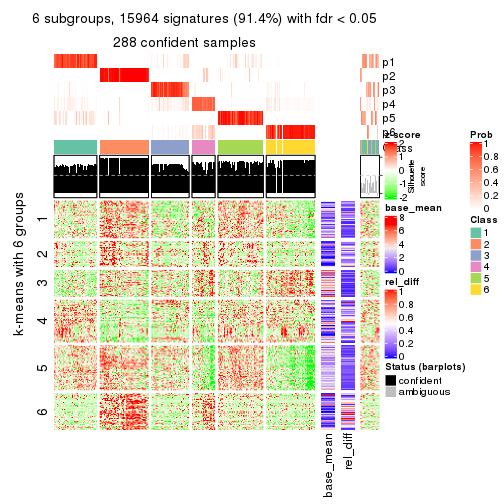</p>

</div>
</div>


Signature heatmaps where rows are not scaled:


<script>
$( function() {
	$( '#tabs-ATC-skmeans-get-signatures-no-scale' ).tabs();
} );
</script>
<div id='tabs-ATC-skmeans-get-signatures-no-scale'>
<ul>
<li><a href='#tab-ATC-skmeans-get-signatures-no-scale-1'>k = 2</a></li>
<li><a href='#tab-ATC-skmeans-get-signatures-no-scale-2'>k = 3</a></li>
<li><a href='#tab-ATC-skmeans-get-signatures-no-scale-3'>k = 4</a></li>
<li><a href='#tab-ATC-skmeans-get-signatures-no-scale-4'>k = 5</a></li>
<li><a href='#tab-ATC-skmeans-get-signatures-no-scale-5'>k = 6</a></li>
</ul>
<div id='tab-ATC-skmeans-get-signatures-no-scale-1'>
<pre><code class="r">get_signatures(res, k = 2, scale_rows = FALSE)
</code></pre>

<p></p>

</div>
<div id='tab-ATC-skmeans-get-signatures-no-scale-2'>
<pre><code class="r">get_signatures(res, k = 3, scale_rows = FALSE)
</code></pre>

<p></p>

</div>
<div id='tab-ATC-skmeans-get-signatures-no-scale-3'>
<pre><code class="r">get_signatures(res, k = 4, scale_rows = FALSE)
</code></pre>

<p></p>

</div>
<div id='tab-ATC-skmeans-get-signatures-no-scale-4'>
<pre><code class="r">get_signatures(res, k = 5, scale_rows = FALSE)
</code></pre>

<p></p>

</div>
<div id='tab-ATC-skmeans-get-signatures-no-scale-5'>
<pre><code class="r">get_signatures(res, k = 6, scale_rows = FALSE)
</code></pre>

<p></p>

</div>
</div>


Compare the overlap of signatures from different k:

```r
compare_signatures(res)
```


`get_signature()` returns a data frame invisibly. TO get the list of signatures, the function
call should be assigned to a variable explicitly. In following code, if `plot` argument is set
to `FALSE`, no heatmap is plotted while only the differential analysis is performed.

```r
# code only for demonstration
tb = get_signature(res, k = ..., plot = FALSE)
```

An example of the output of `tb` is:

```
#>   which_row         fdr    mean_1    mean_2 scaled_mean_1 scaled_mean_2 km
#> 1        38 0.042760348  8.373488  9.131774    -0.5533452     0.5164555  1
#> 2        40 0.018707592  7.106213  8.469186    -0.6173731     0.5762149  1
#> 3        55 0.019134737 10.221463 11.207825    -0.6159697     0.5749050  1
#> 4        59 0.006059896  5.921854  7.869574    -0.6899429     0.6439467  1
#> 5        60 0.018055526  8.928898 10.211722    -0.6204761     0.5791110  1
#> 6        98 0.009384629 15.714769 14.887706     0.6635654    -0.6193277  2
...
```

The columns in `tb` are:

1. `which_row`: row indices corresponding to the input matrix.
2. `fdr`: FDR for the differential test. 
3. `mean_x`: The mean value in group x.
4. `scaled_mean_x`: The mean value in group x after rows are scaled.
5. `km`: Row groups if k-means clustering is applied to rows.


UMAP plot which shows how samples are separated.


<script>
$( function() {
	$( '#tabs-ATC-skmeans-dimension-reduction' ).tabs();
} );
</script>
<div id='tabs-ATC-skmeans-dimension-reduction'>
<ul>
<li><a href='#tab-ATC-skmeans-dimension-reduction-1'>k = 2</a></li>
<li><a href='#tab-ATC-skmeans-dimension-reduction-2'>k = 3</a></li>
<li><a href='#tab-ATC-skmeans-dimension-reduction-3'>k = 4</a></li>
<li><a href='#tab-ATC-skmeans-dimension-reduction-4'>k = 5</a></li>
<li><a href='#tab-ATC-skmeans-dimension-reduction-5'>k = 6</a></li>
</ul>
<div id='tab-ATC-skmeans-dimension-reduction-1'>
<pre><code class="r">dimension_reduction(res, k = 2, method = &quot;UMAP&quot;)
</code></pre>

<p></p>

</div>
<div id='tab-ATC-skmeans-dimension-reduction-2'>
<pre><code class="r">dimension_reduction(res, k = 3, method = &quot;UMAP&quot;)
</code></pre>

<p></p>

</div>
<div id='tab-ATC-skmeans-dimension-reduction-3'>
<pre><code class="r">dimension_reduction(res, k = 4, method = &quot;UMAP&quot;)
</code></pre>

<p></p>

</div>
<div id='tab-ATC-skmeans-dimension-reduction-4'>
<pre><code class="r">dimension_reduction(res, k = 5, method = &quot;UMAP&quot;)
</code></pre>

<p></p>

</div>
<div id='tab-ATC-skmeans-dimension-reduction-5'>
<pre><code class="r">dimension_reduction(res, k = 6, method = &quot;UMAP&quot;)
</code></pre>

<p></p>

</div>
</div>


Following heatmap shows how subgroups are split when increasing `k`:

```r
collect_classes(res)
```


If matrix rows can be associated to genes, consider to use `GO_Enrichment(res,
...)` to perform function enrichment for the signature genes.


 

---------------------------------------------------


### ATC:pam


The object with results only for a single top-value method and a single partition method 
can be extracted as:

```r
res = res_list["ATC", "pam"]
# you can also extract it by
# res = res_list["ATC:pam"]
```

A summary of `res` and all the functions that can be applied to it:

```r
res
```

```
#> A 'ConsensusPartition' object with k = 2, 3, 4, 5, 6.
#>   On a matrix with 17469 rows and 309 columns.
#>   Top rows (1000, 2000, 3000, 4000, 5000) are extracted by 'ATC' method.
#>   Subgroups are detected by 'pam' method.
#>   Performed in total 1250 partitions by row resampling.
#>   Best k for subgroups seems to be 2.
#> 
#> Following methods can be applied to this 'ConsensusPartition' object:
#>  [1] "cola_report"             "collect_classes"         "collect_plots"          
#>  [4] "collect_stats"           "colnames"                "compare_signatures"     
#>  [7] "consensus_heatmap"       "dimension_reduction"     "functional_enrichment"  
#> [10] "get_anno_col"            "get_anno"                "get_classes"            
#> [13] "get_consensus"           "get_matrix"              "get_membership"         
#> [16] "get_param"               "get_signatures"          "get_stats"              
#> [19] "is_best_k"               "is_stable_k"             "membership_heatmap"     
#> [22] "ncol"                    "nrow"                    "plot_ecdf"              
#> [25] "rownames"                "select_partition_number" "show"                   
#> [28] "suggest_best_k"          "test_to_known_factors"
```

`collect_plots()` function collects all the plots made from `res` for all `k` (number of partitions)
into one single page to provide an easy and fast comparison between different `k`.

```r
collect_plots(res)
```


The plots are:

- The first row: a plot of the ECDF (Empirical cumulative distribution
  function) curves of the consensus matrix for each `k` and the heatmap of
  predicted classes for each `k`.
- The second row: heatmaps of the consensus matrix for each `k`.
- The third row: heatmaps of the membership matrix for each `k`.
- The fouth row: heatmaps of the signatures for each `k`.

All the plots in panels can be made by individual functions and they are
plotted later in this section.

`select_partition_number()` produces several plots showing different
statistics for choosing "optimized" `k`. There are following statistics:

- ECDF curves of the consensus matrix for each `k`;
- 1-PAC. [The PAC
  score](https://en.wikipedia.org/wiki/Consensus_clustering#Over-interpretation_potential_of_consensus_clustering)
  measures the proportion of the ambiguous subgrouping.
- Mean silhouette score.
- Concordance. The mean probability of fiting the consensus class ids in all
  partitions.
- Area increased. Denote $A_k$ as the area under the ECDF curve for current
  `k`, the area increased is defined as $A_k - A_{k-1}$.
- Rand index. The percent of pairs of samples that are both in a same cluster
  or both are not in a same cluster in the partition of k and k-1.
- Jaccard index. The ratio of pairs of samples are both in a same cluster in
  the partition of k and k-1 and the pairs of samples are both in a same
  cluster in the partition k or k-1.

The detailed explanations of these statistics can be found in [the cola
vignette](http://bioconductor.org/packages/devel/bioc/vignettes/cola/inst/doc/cola.html#toc_13).

Generally speaking, lower PAC score, higher mean silhouette score or higher
concordance corresponds to better partition. Rand index and Jaccard index
measure how similar the current partition is compared to partition with `k-1`.
If they are too similar, we won't accept `k` is better than `k-1`.

```r
select_partition_number(res)
```


The numeric values for all these statistics can be obtained by `get_stats()`.

```r
get_stats(res)
```

```
#>   k 1-PAC mean_silhouette concordance area_increased  Rand Jaccard
#> 2 2 0.490           0.888       0.898         0.4421 0.544   0.544
#> 3 3 0.690           0.857       0.920         0.3486 0.824   0.681
#> 4 4 0.641           0.677       0.865         0.1741 0.815   0.570
#> 5 5 0.688           0.707       0.840         0.1039 0.852   0.554
#> 6 6 0.697           0.642       0.804         0.0274 0.972   0.877
```

`suggest_best_k()` suggests the best $k$ based on these statistics. The rules are as follows:

- All $k$ with Jaccard index larger than 0.95 are removed because the increase of
  the partition number does not provides enough extra information. If all $k$ are removed,
  the best $k$ is assigned by `NA`.
- For $k$ with 1-PAC larger than 0.9, the maximal $k$ is taken as the "best k". Other $k$ is called "optional k".
- If it does not fit the second rule. The $k$ with the highest vote of highest
  1-PAC, mean silhouette and concordance is taken as the "best k".

```r
suggest_best_k(res)
```

```
#> [1] 2
```


Following shows the table of the partitions (You need to click the **show/hide
code output** link to see it). The membership matrix (columns with name `p*`)
is inferred by
[`clue::cl_consensus()`](https://www.rdocumentation.org/link/cl_consensus?package=clue)
function with the `SE` method. Basically the value in the membership matrix
represents the probability to belong to a certain group. The finall class
label for an item is determined with the group with highest probability it
belongs to.

In `get_classes()` function, the entropy is calculated from the membership
matrix and the silhouette score is calculated from the consensus matrix.


<script>
$( function() {
	$( '#tabs-ATC-pam-get-classes' ).tabs();
} );
</script>
<div id='tabs-ATC-pam-get-classes'>
<ul>
<li><a href='#tab-ATC-pam-get-classes-1'>k = 2</a></li>
<li><a href='#tab-ATC-pam-get-classes-2'>k = 3</a></li>
<li><a href='#tab-ATC-pam-get-classes-3'>k = 4</a></li>
<li><a href='#tab-ATC-pam-get-classes-4'>k = 5</a></li>
<li><a href='#tab-ATC-pam-get-classes-5'>k = 6</a></li>
</ul>

<div id='tab-ATC-pam-get-classes-1'>
<p><a id='tab-ATC-pam-get-classes-1-a' style='color:#0366d6' href='#'>show/hide code output</a></p>
<pre><code class="r">cbind(get_classes(res, k = 2), get_membership(res, k = 2))
</code></pre>

<pre><code>#&gt;                                      class entropy silhouette    p1    p2
#&gt; 7826AE44-B03A-4528-9CB5-7421E592AE36     2  0.0000      0.952 0.000 1.000
#&gt; 0DC2197B-2FEA-48EB-953E-8E44E1933757     2  0.0000      0.952 0.000 1.000
#&gt; 87ABB098-8C1E-4677-8C31-48B71EFE41C7     1  0.7056      0.913 0.808 0.192
#&gt; EC0154E7-7A27-4535-83AE-6B379E99A93C     1  0.7056      0.913 0.808 0.192
#&gt; 78F79407-D49F-4FA2-B09F-0665C502827C     1  0.7056      0.913 0.808 0.192
#&gt; 03E81178-E971-4E91-8BED-D8273EA1425C     1  0.7056      0.913 0.808 0.192
#&gt; 62FCAEFF-16D8-4019-84B6-18EC3A88BC32     2  0.7056      0.782 0.192 0.808
#&gt; 722C1284-5983-4CC1-B19C-214C2DE6F8A6     1  0.0000      0.837 1.000 0.000
#&gt; 54E42A64-B350-4A94-8FED-C9BC1872660E     2  0.2423      0.912 0.040 0.960
#&gt; 53062969-D209-490B-9C9B-5D297625E2AE     1  0.7056      0.913 0.808 0.192
#&gt; B710293C-41D3-4A2E-8104-5402F91DD859     1  0.7056      0.913 0.808 0.192
#&gt; 73CB1D05-7AE4-457D-B4EF-25AC5C1F2132     1  0.7056      0.913 0.808 0.192
#&gt; B055A70B-3003-47CB-BDAA-6378C000BF24     1  0.7056      0.913 0.808 0.192
#&gt; 46C3A870-E37A-42CB-8C0C-6ACACEAC1ADC     1  0.0000      0.837 1.000 0.000
#&gt; E8E6270E-F26D-4F2E-A63E-7885BDE05FDB     2  0.0000      0.952 0.000 1.000
#&gt; C4A5EBA2-9091-4D12-BDC8-B84B122022B9     2  0.0000      0.952 0.000 1.000
#&gt; 5B1839C4-549D-41D1-B559-3C6D2A1528CE     2  0.0000      0.952 0.000 1.000
#&gt; A0DF05EB-DC44-4492-9A8A-F278F7B0C266     1  0.7056      0.913 0.808 0.192
#&gt; B5182F49-70F2-45B7-82DE-C6DA68145EEA     2  0.0000      0.952 0.000 1.000
#&gt; C204D355-B876-4341-A111-36D48CBDD2A8     1  0.7056      0.913 0.808 0.192
#&gt; 7B070AAA-EF97-4D3B-AA19-EEC170C7927D     1  0.0000      0.837 1.000 0.000
#&gt; 05A8A881-F8EE-48A2-B11C-A08D7D80CE18     1  0.7056      0.913 0.808 0.192
#&gt; BA59EF50-CFE9-456D-B1B6-67D0945004F6     1  0.7056      0.913 0.808 0.192
#&gt; AD97B334-E034-4D33-A4D5-48C32D5D521C     1  0.7056      0.913 0.808 0.192
#&gt; 51DA2568-32EA-4668-9876-4B6E7CA68860     2  0.0000      0.952 0.000 1.000
#&gt; 78C26A05-2084-494D-83D3-C52C1B800F4C     2  0.0000      0.952 0.000 1.000
#&gt; 2B5DD791-7692-4721-9519-7D7D49B52570     1  0.7056      0.913 0.808 0.192
#&gt; C0BBE26A-79C8-4392-9978-7C420B3786B5     2  0.1414      0.934 0.020 0.980
#&gt; F35A8359-3A7A-414F-8A5C-D278F3B45387     1  0.0000      0.837 1.000 0.000
#&gt; 8C9BA49C-1270-491D-A234-AE1B1C0609BA     1  0.0000      0.837 1.000 0.000
#&gt; CA104B57-B160-4148-8A0A-D34BB3E8D88A     1  0.7056      0.913 0.808 0.192
#&gt; 877E18A5-6A7A-4E29-9871-DC7EA14A5F27     1  0.7056      0.913 0.808 0.192
#&gt; 904EDF2E-411E-43BD-901D-46129AFA283A     1  0.7056      0.913 0.808 0.192
#&gt; FD9F5A9B-2BEB-4D31-9A2D-8D4B4ECBB478     2  0.0000      0.952 0.000 1.000
#&gt; 2E206314-9928-456E-B7C6-893DC0E3C7C2     1  0.0000      0.837 1.000 0.000
#&gt; 913DB655-2C7F-4369-83DE-9257F04CF39B     1  0.7056      0.913 0.808 0.192
#&gt; 72B5B724-FEB5-43BD-83F6-2E2152DDD800     2  0.6247      0.745 0.156 0.844
#&gt; 920B547C-6898-446C-AAAF-F4ED96E40AAB     2  0.7056      0.782 0.192 0.808
#&gt; 847F796A-8CD6-4013-A0FB-26F4FC3EAF0D     1  0.7056      0.913 0.808 0.192
#&gt; C4D64E7A-33F7-4CFC-9FD3-D6AA3D8EFAA7     2  0.0000      0.952 0.000 1.000
#&gt; EABA0B17-8E19-48C5-BF62-2A45C9632807     1  0.0000      0.837 1.000 0.000
#&gt; 7263CBA8-CE37-4531-A795-9324C6D2A672     1  0.7056      0.913 0.808 0.192
#&gt; 6D3CC3AC-618B-414A-B640-169C735A6568     1  0.8813      0.790 0.700 0.300
#&gt; 710C05C7-F9CE-45FA-A8CC-29DE2903E04F     1  0.7056      0.913 0.808 0.192
#&gt; 3D631A56-2C55-48EA-A667-BA46023C9D50     1  0.7056      0.913 0.808 0.192
#&gt; F1C65F64-AF05-4875-B7E4-60FFF56A3F46     2  0.0000      0.952 0.000 1.000
#&gt; E5DF76E7-A765-4E07-B87A-06168BF66C5F     1  0.7056      0.913 0.808 0.192
#&gt; 5C8C8A6E-40D4-4F82-AC3D-90CFDEE15C0A     1  0.0000      0.837 1.000 0.000
#&gt; 0117CBB9-1BF9-48B1-BE6E-A9A770FF8721     2  0.9996     -0.312 0.488 0.512
#&gt; 31EF66E5-419A-44C3-BB2A-B69B52FFCECC     1  0.0000      0.837 1.000 0.000
#&gt; C149CEF5-61F3-4B53-B8A9-8244B673EBD0     1  0.7056      0.913 0.808 0.192
#&gt; 0AF351D0-4EC5-4275-AA0A-4FA2AF8A9C85     2  0.7056      0.782 0.192 0.808
#&gt; B507E82F-6680-497B-A014-033EDD7A2E03     2  0.0672      0.945 0.008 0.992
#&gt; F941890E-AB33-478F-8C97-1C785DD9428F     1  0.7056      0.913 0.808 0.192
#&gt; 7987E019-8FED-469B-A6C1-34EE430A60C3     1  0.7056      0.913 0.808 0.192
#&gt; 76084AA6-19BF-4605-B6A1-73F1D4BADAF9     1  0.7056      0.913 0.808 0.192
#&gt; 329807F7-E0D4-4F53-94E8-E4080E90CB47     2  0.0000      0.952 0.000 1.000
#&gt; 1B6505FF-C1A7-4DD0-9827-41A0A3A28F3E     1  0.7056      0.913 0.808 0.192
#&gt; 49778E92-B5D3-4AD9-A1AF-3B722D631B96     2  0.7056      0.782 0.192 0.808
#&gt; A22892DE-0AF4-4B63-9513-1D6825059040     1  0.7056      0.913 0.808 0.192
#&gt; 6D77ECAE-A715-4ADD-97D8-A916DC31A4EA     1  0.7056      0.913 0.808 0.192
#&gt; 09758B6F-1B2D-4AED-8913-696097069409     1  0.1414      0.845 0.980 0.020
#&gt; 8B709DB4-0B28-42F1-A7C5-106F5809BEA2     1  0.7056      0.913 0.808 0.192
#&gt; F2B356FA-79CD-4867-8ABF-84C90A493A75     1  0.7056      0.913 0.808 0.192
#&gt; 131213AD-0313-4DF1-B013-CE67ED262C37     1  0.0000      0.837 1.000 0.000
#&gt; D94F7E81-0F60-473B-AD4A-0AC13508BDE2     2  0.0000      0.952 0.000 1.000
#&gt; 29C17355-D646-48DA-9E54-7B6DD85DD610     1  0.7056      0.913 0.808 0.192
#&gt; B8BD866A-2A7C-45C3-96BB-9AB892D26AE5     1  0.7056      0.913 0.808 0.192
#&gt; 13EFD045-AD61-41EE-9896-67BFA4FC8C09     2  0.0000      0.952 0.000 1.000
#&gt; 2655F609-B3BB-4D01-B421-D5F4B1232EC8     1  0.0000      0.837 1.000 0.000
#&gt; 04BC7A52-C67F-42CB-8672-D3C51A20F2BA     2  0.0000      0.952 0.000 1.000
#&gt; 45472BD4-DBDB-41FE-B0E3-2440880E1DE6     2  0.0000      0.952 0.000 1.000
#&gt; B87FFFCD-CB57-4ACD-9C74-AB188984BBB2     2  0.0000      0.952 0.000 1.000
#&gt; 5271374C-13CD-4BFE-AC6D-C95AFE491322     1  0.7056      0.913 0.808 0.192
#&gt; E3372ACE-C7C8-43E5-B30A-1F2D662D8170     1  0.7056      0.913 0.808 0.192
#&gt; B08DF564-E4D0-4540-8160-93B3981DF1D8     1  0.8016      0.862 0.756 0.244
#&gt; 61A7D1B9-FC5A-4B9C-989F-936CDA948C27     1  0.7056      0.913 0.808 0.192
#&gt; 74E768C1-8766-46AC-AAB4-D79E5049F76A     1  0.0000      0.837 1.000 0.000
#&gt; 0CEA28F0-D7F0-4EB7-A23F-0C5CA6245971     2  0.0000      0.952 0.000 1.000
#&gt; 95C4EFF6-147C-48EC-A2C1-16B8F12AEEF2     2  0.7056      0.782 0.192 0.808
#&gt; C9A78BEA-D455-4F5E-8B7B-19BCB42887E7     2  0.2043      0.921 0.032 0.968
#&gt; DB970740-9AC1-4C10-9658-8A77B1C390DD     2  0.0000      0.952 0.000 1.000
#&gt; 883FBD37-0CA0-4562-8925-72ACC1EE93D9     2  0.0000      0.952 0.000 1.000
#&gt; 9FE1D006-49F2-471E-91E6-AF0414C24479     1  0.7056      0.913 0.808 0.192
#&gt; 11816CC6-8C8B-49C0-99EE-896377BCFCCD     1  0.7056      0.913 0.808 0.192
#&gt; 063FC5C8-4318-4ECC-9CA0-1976CBC8ACB6     1  0.7056      0.913 0.808 0.192
#&gt; E0F085CC-B90D-4FDE-B60E-C613971BAA00     1  0.7056      0.913 0.808 0.192
#&gt; 62361DA2-E4EE-46DA-BB1F-C51DCA9307CC     1  0.0000      0.837 1.000 0.000
#&gt; 1BA16D48-B09E-4699-A1AD-2FFECE4F3CDB     2  0.7056      0.782 0.192 0.808
#&gt; 3E4F14E9-60AE-4F17-9BA7-2A02E908204A     2  0.1843      0.926 0.028 0.972
#&gt; 79226DD7-BC85-4B8E-BFF8-B1E073129D34     1  0.7056      0.913 0.808 0.192
#&gt; D47D0936-826F-4D54-9225-F71B95357438     1  0.7056      0.913 0.808 0.192
#&gt; 0AE02B91-574C-4165-BA39-E9D7C1A870A2     1  0.0000      0.837 1.000 0.000
#&gt; DED8E9DF-CEFE-45ED-9374-EF9925A135C4     1  0.7602      0.887 0.780 0.220
#&gt; D587A993-3C47-4D4C-B744-59169D4F7451     1  0.7056      0.913 0.808 0.192
#&gt; 6BCA24E6-440F-42C5-ABE5-66C37B713A39     1  0.7056      0.913 0.808 0.192
#&gt; 86A5EDFB-9D06-4FED-BF57-F8D74A68E156     1  0.7056      0.913 0.808 0.192
#&gt; B9BD5134-2F6A-4454-8F83-69B63F9AE114     1  0.7056      0.913 0.808 0.192
#&gt; 082DA9E1-A40D-482B-8E21-A93BA97185F0     1  0.7056      0.913 0.808 0.192
#&gt; 16A8343A-1203-44FB-9F03-05CC7C71B4CC     1  0.7056      0.913 0.808 0.192
#&gt; 00439565-02CE-4BF5-956D-7078B51C0947     2  0.0000      0.952 0.000 1.000
#&gt; 7B2BD361-2BF1-4E97-BC08-457F5A9C2682     1  0.0000      0.837 1.000 0.000
#&gt; C1D8439A-D527-47F6-ADC1-25867B65DA21     1  0.0000      0.837 1.000 0.000
#&gt; D9096909-1439-462D-B69C-CAD1BF4F420C     1  0.7056      0.913 0.808 0.192
#&gt; 7822EA86-35A1-4285-9429-2B63111B9885     1  0.7139      0.910 0.804 0.196
#&gt; 6FD0CFC8-AC8D-4CF1-8C33-833AD98A30EF     1  0.0000      0.837 1.000 0.000
#&gt; A451F278-5E83-4BC6-9B15-3AA2117B99B6     1  0.0000      0.837 1.000 0.000
#&gt; 6EC25686-4547-459C-9E01-7EDF8DAECE35     2  0.0000      0.952 0.000 1.000
#&gt; 5D2F1EEA-2BA8-4C3A-8436-544EE1D23E7E     1  0.7056      0.913 0.808 0.192
#&gt; 675A4293-A4CE-4307-B00B-DFC4D44A87C6     1  0.0000      0.837 1.000 0.000
#&gt; 6FBE0AEF-476A-42B2-A857-846CF1ED92B6     1  0.0000      0.837 1.000 0.000
#&gt; 7139D616-1A15-4288-A9AE-411856A4A76D     1  0.7056      0.913 0.808 0.192
#&gt; 46D7F8C1-D5C5-40CC-BEF5-2E590A847BD9     2  0.0000      0.952 0.000 1.000
#&gt; 984C44D3-4F5F-44C9-BCD9-C991EBC1FCB8     2  0.0000      0.952 0.000 1.000
#&gt; 83FE52E0-2DC2-4580-8BB2-FBCBEE4AC240     1  0.7056      0.913 0.808 0.192
#&gt; 0923F9CB-DF6F-4BAA-A5F8-0F83CE60D1ED     2  0.0000      0.952 0.000 1.000
#&gt; 1DEB5206-78CC-4EB5-BCD5-85A6A5B4E273     2  0.0000      0.952 0.000 1.000
#&gt; E4DB18DA-EB0C-4B2F-9566-7F72222B16D4     1  0.7056      0.913 0.808 0.192
#&gt; F7456312-1309-4B2F-875D-0F90CDF3EC35     1  0.7056      0.913 0.808 0.192
#&gt; 9A25E5D8-0706-4960-A76B-BCD0AC93E4FA     1  0.7056      0.913 0.808 0.192
#&gt; 5A41FE8F-FFB3-4B87-BF11-A570C184096D     2  0.0000      0.952 0.000 1.000
#&gt; 33F84E63-3F6C-4867-ADB1-A0DF39F1295B     2  0.0000      0.952 0.000 1.000
#&gt; D6A644F5-D1D0-4A8D-94C4-EE6C3ECE7430     1  0.7056      0.913 0.808 0.192
#&gt; 2A5848CC-A9A2-4AA8-A752-321273E62CF0     1  0.7056      0.913 0.808 0.192
#&gt; 7CA6358B-FC8A-4675-B092-9E061038FC83     1  0.7056      0.913 0.808 0.192
#&gt; A4C2F4BC-5C62-4B1F-9AB8-46D9468EF523     1  0.0000      0.837 1.000 0.000
#&gt; 8AF4EB7F-418D-4CC9-A9B8-A93A4C1A173B     2  0.7299      0.781 0.204 0.796
#&gt; E5048887-70C8-468F-881E-2EC55F6E6F3B     1  0.7056      0.913 0.808 0.192
#&gt; 1BADCC7C-C4D8-4C34-9534-59D622C7A2A2     2  0.0000      0.952 0.000 1.000
#&gt; 02CE7DF7-64BD-4297-A240-A5B9EE8771D3     2  0.0000      0.952 0.000 1.000
#&gt; CBF6E96A-F56C-4C87-B851-D319930BAAB8     1  0.7056      0.913 0.808 0.192
#&gt; 48F6B774-CFD2-4DDF-B7A2-696596413C3F     1  0.7056      0.913 0.808 0.192
#&gt; 41D88C3E-5848-4B09-8A77-EAE6AC4EC6B0     2  0.7056      0.782 0.192 0.808
#&gt; BDF79CC0-00C7-49C1-900B-AB065A733B17     2  0.0000      0.952 0.000 1.000
#&gt; A894D686-BFC7-4AEE-A794-DBE718C6B6F6     1  0.0000      0.837 1.000 0.000
#&gt; 0712029E-3765-4272-BE5B-B6C8BCCC0F0F     1  0.0000      0.837 1.000 0.000
#&gt; 7B051855-9B09-4887-9BC0-9F077537938E     1  0.7056      0.913 0.808 0.192
#&gt; EF357C46-5C3C-4F51-9383-FF7694D07B97     1  0.0000      0.837 1.000 0.000
#&gt; 9492A322-37CA-4582-AC68-66B5D80778AF     1  0.0000      0.837 1.000 0.000
#&gt; 993399A4-1B9F-4258-B2D0-155AD58A2E82     1  0.7056      0.913 0.808 0.192
#&gt; 7B7DC93D-5494-4E69-BE07-2967887182F9     2  0.0000      0.952 0.000 1.000
#&gt; 29BCBA51-2580-473D-9CF7-BEDBD0DBAD1B     1  0.0000      0.837 1.000 0.000
#&gt; 40855647-E942-4F32-90B7-BEB921929BFB     2  0.0672      0.945 0.008 0.992
#&gt; 0DC723D0-7C68-4495-A4B9-2DF2FF19AB14     1  0.0000      0.837 1.000 0.000
#&gt; 7540005F-57E0-4E2E-A8A2-BEF2B0F333B1     1  0.0000      0.837 1.000 0.000
#&gt; EB1DDB14-4076-4C2C-B911-390C17C21486     2  0.0000      0.952 0.000 1.000
#&gt; 9EA70EC4-8BA0-4E3D-B3CB-A68D19E89868     2  0.1184      0.938 0.016 0.984
#&gt; B04E2E50-0A6E-4224-A825-1714D12E5669     2  0.0000      0.952 0.000 1.000
#&gt; B0BF5E01-536D-40FF-9C24-CBBD611E2FC2     2  0.0000      0.952 0.000 1.000
#&gt; 7B6B1788-B297-4442-B6BE-B7CE8754491E     2  0.0000      0.952 0.000 1.000
#&gt; A090D00C-34DF-4906-A517-4803C4C9A332     2  0.0000      0.952 0.000 1.000
#&gt; 340D44A6-9BEA-412C-9973-D9ABD6692255     1  0.7139      0.910 0.804 0.196
#&gt; E8D0D1E7-E5A8-4014-80C1-0245F90F4358     1  0.0000      0.837 1.000 0.000
#&gt; 19EA1494-8572-40E1-B9BB-3739F47B607D     1  0.7056      0.913 0.808 0.192
#&gt; 1C1B4793-8DAF-4763-BA4D-C4E869A4ED35     1  0.7056      0.913 0.808 0.192
#&gt; 45BF59B3-95BD-4196-ABAA-4C4F0DB38572     2  0.0000      0.952 0.000 1.000
#&gt; 47B5A2A7-7E13-4558-99D2-067F5075C6A4     1  0.7056      0.913 0.808 0.192
#&gt; E94638E8-CB51-4FBB-8BCB-4BFD7A812291     1  0.7056      0.913 0.808 0.192
#&gt; A17352A8-0D3C-4545-8136-7DAE2FB0E102     2  0.0000      0.952 0.000 1.000
#&gt; B18A6F95-D4ED-416B-B5A1-9A4934865D0D     1  0.0000      0.837 1.000 0.000
#&gt; 33E92C5F-0C42-4549-AD5B-0A064182A272     1  0.7056      0.913 0.808 0.192
#&gt; E041B375-3E60-4F18-A6EF-D1C249E3B8EE     1  0.7056      0.913 0.808 0.192
#&gt; EDF90AF6-6C64-4BD2-AADF-8D7D188650B2     1  0.0000      0.837 1.000 0.000
#&gt; 569320D2-316C-4E2D-B7B3-D7D5C4DAD42D     1  0.7056      0.913 0.808 0.192
#&gt; AFFB223D-DAE9-4567-9EF2-8E4DF9D8782D     1  0.0000      0.837 1.000 0.000
#&gt; 56FC9454-0A6A-4CC3-95C4-BE0E0D0BAFCE     1  0.0000      0.837 1.000 0.000
#&gt; 43226365-FAEF-46C5-AF1B-5C6C2BED84FF     1  0.3733      0.865 0.928 0.072
#&gt; 1536110A-B42A-4A84-9474-9895321FDCE9     1  0.0000      0.837 1.000 0.000
#&gt; 812255DD-536B-4216-90B1-27D5AB339BE2     1  0.7056      0.913 0.808 0.192
#&gt; 5D4563D6-68B7-4C9D-A3F4-AA7D45D5112C     1  0.0000      0.837 1.000 0.000
#&gt; BAA39781-DB94-473C-98B1-FA6CD3E1C67A     1  0.7056      0.913 0.808 0.192
#&gt; C1411CDA-814D-4E21-8929-C0F77858828F     1  0.7056      0.913 0.808 0.192
#&gt; EFE2F248-C13E-4E8D-9153-8C903848AC4A     1  0.7056      0.913 0.808 0.192
#&gt; D3939C84-D1D6-4060-9F91-AEB222A9BDD5     1  0.7056      0.913 0.808 0.192
#&gt; EABD2987-8C1E-49E5-94AF-C0BDE5335A48     2  0.0938      0.942 0.012 0.988
#&gt; F4BE2ABE-2CEB-4A6A-B8EC-0355F8C63B9B     2  0.0000      0.952 0.000 1.000
#&gt; 627BC251-D217-4955-B718-6B9D6DEA1756     1  0.7056      0.913 0.808 0.192
#&gt; 31B54613-A20E-4039-BB8B-9B52104CE418     1  0.7056      0.913 0.808 0.192
#&gt; 3F292B7C-A535-4DBD-BC20-CB4F85A1C94B     2  0.0000      0.952 0.000 1.000
#&gt; BEA2A5EB-EEA9-4F31-AC38-810E04CE124B     2  0.7056      0.782 0.192 0.808
#&gt; 99D84D46-19DA-43F1-B639-DCE9953F1529     1  0.0000      0.837 1.000 0.000
#&gt; 4588817E-1068-4A78-86B6-4674A0112DDA     1  0.7056      0.913 0.808 0.192
#&gt; 6AC633BD-BEC1-4750-94E3-378972DAB6B3     2  0.7056      0.782 0.192 0.808
#&gt; 09E17C6E-7EDE-4DDF-B5ED-2521AF870C9A     1  0.7056      0.913 0.808 0.192
#&gt; 58D9C750-26A2-4B7C-84C4-13D7AFB4C5EA     1  0.7056      0.913 0.808 0.192
#&gt; DF28E138-E222-4F77-9B61-69E601CA7E60     1  0.0000      0.837 1.000 0.000
#&gt; FEA489A8-E423-4266-AADA-9BAAB29AB94B     1  0.7056      0.913 0.808 0.192
#&gt; F3FCC207-15CD-41EA-A3EF-F5D2C12AC373     2  0.0000      0.952 0.000 1.000
#&gt; 53DD7AFB-A258-4643-A501-BACC95D17A50     1  0.0000      0.837 1.000 0.000
#&gt; D850B2A1-1F8A-4A44-A0CF-8D9DD4A1889A     1  0.0000      0.837 1.000 0.000
#&gt; B3F746DC-E487-4305-9F30-825D1520E8FD     1  0.0000      0.837 1.000 0.000
#&gt; BE38240A-F7C2-439F-9AAE-51C8A340F310     2  0.0000      0.952 0.000 1.000
#&gt; A9022D9E-1D30-49EE-8552-1364A8027F34     2  0.0000      0.952 0.000 1.000
#&gt; 0E8A56EE-D9A2-48A5-B793-A358BE1E4EFA     2  0.0000      0.952 0.000 1.000
#&gt; 51667574-318E-4BDB-8F42-8512A4C1B84F     2  0.9996     -0.306 0.488 0.512
#&gt; B0A442C9-67E4-4534-8A5C-D6D73F42358C     1  0.7056      0.913 0.808 0.192
#&gt; 25A5BC09-0D88-4385-87AF-997F9018522D     1  0.0000      0.837 1.000 0.000
#&gt; 344B9631-AAA5-4302-8747-D584345D9131     1  0.8763      0.795 0.704 0.296
#&gt; 1C3795AD-6306-4892-95F5-92DF3375D46A     1  0.7056      0.913 0.808 0.192
#&gt; 17BB221D-8BF9-4391-83DD-423AE1E03651     1  0.7056      0.913 0.808 0.192
#&gt; 297611E9-9555-4BCA-A723-02E846ACC23A     1  0.7056      0.913 0.808 0.192
#&gt; AD7FF180-1EAC-4783-8A62-E9626B96DD9F     2  0.0000      0.952 0.000 1.000
#&gt; FD544083-9BD5-4036-BD81-0352B67CC45C     2  0.0000      0.952 0.000 1.000
#&gt; 879A74D5-5B29-418D-A0F4-8E88D6384008     2  0.0000      0.952 0.000 1.000
#&gt; 43CD982C-13C0-4A52-803A-9A3A3FAE09BC     1  0.7056      0.913 0.808 0.192
#&gt; DCD0313D-5206-4111-8743-A8A0227257D9     2  0.0000      0.952 0.000 1.000
#&gt; 331A9160-D730-45DD-A985-C6CAC03035ED     1  0.7056      0.913 0.808 0.192
#&gt; 9EEECA0E-530D-4724-B016-A716F0782148     1  0.7056      0.913 0.808 0.192
#&gt; B3073976-CA3F-4115-9243-8C2D9E1B975D     2  0.0000      0.952 0.000 1.000
#&gt; 77B3C9B4-1A7F-41BB-A37D-01EF80E933CC     2  0.7056      0.782 0.192 0.808
#&gt; C0C26822-2E9F-4FB0-81D4-575027C8B71C     1  0.0000      0.837 1.000 0.000
#&gt; F1FCE328-2B3B-499A-888D-0E66A017E8B0     2  0.0000      0.952 0.000 1.000
#&gt; F069DAD6-F1EB-42F7-8252-F3F6EC46CC3E     2  0.1414      0.934 0.020 0.980
#&gt; 99CC822E-8C98-4EEC-BB58-AEF76A0B5332     1  0.7056      0.913 0.808 0.192
#&gt; C86EBD08-53F2-4972-801A-74970FDD6A62     2  0.0000      0.952 0.000 1.000
#&gt; F07326F2-C1D6-4D5A-9693-25C3A04B0EC2     1  0.7056      0.913 0.808 0.192
#&gt; 8ACBD428-7713-48D9-810A-43C9CD191A73     2  0.7056      0.782 0.192 0.808
#&gt; 3D3501B4-1A43-4FA7-90A2-CCEBF66BFD4A     2  0.0000      0.952 0.000 1.000
#&gt; DD51C17C-300F-44A4-955A-C9BC85417842     1  0.9988      0.400 0.520 0.480
#&gt; 58FF391C-1D83-426C-8F92-C15F78F56C95     1  0.7056      0.913 0.808 0.192
#&gt; ACE65C6E-2B10-4972-91B4-9199DD4B179D     1  0.7056      0.913 0.808 0.192
#&gt; B2088466-FA5D-491C-9982-99B33683E66F     2  0.7056      0.782 0.192 0.808
#&gt; D47AF416-1687-4FE0-A235-8815B6E8EB0B     2  0.0000      0.952 0.000 1.000
#&gt; 4DCAD07F-CC43-46F6-B2F3-EDBF3EDD1045     2  0.8499      0.725 0.276 0.724
#&gt; AAAE0BD9-63FC-4A0E-A27E-447B634BAD99     1  0.0000      0.837 1.000 0.000
#&gt; BC471AA1-52CF-4CEE-9866-34CE91404F45     1  0.0000      0.837 1.000 0.000
#&gt; 81D3EE3F-AC11-404F-8092-307F0DC12198     2  0.0000      0.952 0.000 1.000
#&gt; 8C02026C-C25E-406B-B8B8-A1A82362AE79     2  0.2423      0.919 0.040 0.960
#&gt; 6A005F2A-A0C1-4CA4-B15B-96B08F013874     2  0.0000      0.952 0.000 1.000
#&gt; B55743F2-4D63-4375-85D3-F58281CFD852     1  0.7056      0.913 0.808 0.192
#&gt; 24F98393-C817-4D0E-A7DB-05D2B5C71F40     1  0.7056      0.913 0.808 0.192
#&gt; 2C2AEF1D-4112-4EC7-9027-5E3FD26E8802     1  0.7056      0.913 0.808 0.192
#&gt; 8BAC3CB5-2987-4349-8AE8-B83DDD16CA3C     1  0.7056      0.913 0.808 0.192
#&gt; ED9C74E6-92FC-4E58-8FCE-1761DEA0C977     1  0.7056      0.913 0.808 0.192
#&gt; BA732ED4-F6BA-404E-BA3C-CA558FAD866A     1  0.9775      0.583 0.588 0.412
#&gt; E750385A-12D9-4A88-B4DF-C1306B5EF3B7     1  0.0000      0.837 1.000 0.000
#&gt; 6B1DC5E4-5F82-4395-913F-6AEDB5B63188     1  0.7056      0.913 0.808 0.192
#&gt; A7C12D37-FD50-4674-A054-1774F4E5C3B3     2  0.3733      0.872 0.072 0.928
#&gt; 2155C764-2063-4D9C-9ACD-96AA73475F5E     2  0.0000      0.952 0.000 1.000
#&gt; DE23CC15-A95E-4119-9B3C-8EEC45900D11     1  0.0000      0.837 1.000 0.000
#&gt; 5DB1DCAD-638E-48A4-9F40-3D6268FDEC33     1  0.0000      0.837 1.000 0.000
#&gt; 34AF0341-73D7-4080-AAEB-4C1541C2569F     2  0.0000      0.952 0.000 1.000
#&gt; B60D4235-44AF-4BA4-98C0-BCCDC28E90B9     1  0.0000      0.837 1.000 0.000
#&gt; CF463D89-2C9F-4257-BF04-8BC1CD40EA7D     1  0.0000      0.837 1.000 0.000
#&gt; EF6C8165-484A-4530-AEDF-93DCC4A8455D     1  0.7056      0.913 0.808 0.192
#&gt; B9F6B5E4-4D10-49B8-A8FE-8F33C5A62CBF     2  0.0000      0.952 0.000 1.000
#&gt; CE539000-92D7-4622-9C8D-BC6E01310681     1  0.0672      0.833 0.992 0.008
#&gt; D3BBC405-A22A-4009-ABF6-96FEEE653051     1  0.0000      0.837 1.000 0.000
#&gt; 0B3C86BD-0D20-4408-9BE3-05658729505F     1  0.7056      0.913 0.808 0.192
#&gt; 9B9C5071-7C3F-416C-B91C-6F5966747F54     1  0.7056      0.913 0.808 0.192
#&gt; A9469A4A-C5F9-4681-A916-A26F0B4307BA     2  0.0000      0.952 0.000 1.000
#&gt; A31B57E4-E30B-4A1B-829D-1B47D9CEC041     1  0.0000      0.837 1.000 0.000
#&gt; 647255CE-F84A-4070-B3FD-D8ACA32C4D09     2  0.0000      0.952 0.000 1.000
#&gt; 8F5E9F02-51D7-410E-B8B7-22737F2F095A     1  0.0000      0.837 1.000 0.000
#&gt; 8074A7F6-2FDE-4578-B71C-01C542D468FE     1  0.7056      0.913 0.808 0.192
#&gt; 2A946F17-F245-409E-A019-C60CDA18DC7D     2  0.0000      0.952 0.000 1.000
#&gt; 0878C381-47F9-4786-82C2-94AC840BEDCB     2  0.0000      0.952 0.000 1.000
#&gt; 54504893-92C5-4328-85A8-2A882680B5E0     2  0.0000      0.952 0.000 1.000
#&gt; 0A27D1BE-E5DD-459A-A51F-6D8AAF7CFEB4     1  0.7056      0.913 0.808 0.192
#&gt; 89ED5A3E-CAC0-4AB4-B858-A3CD8F34DBD5     1  0.0000      0.837 1.000 0.000
#&gt; ACEEB0A5-AADB-4EF9-8710-4BAF95522CEA     2  0.0000      0.952 0.000 1.000
#&gt; 02C74D81-5976-4252-BC6C-B10E934DECA2     2  0.0000      0.952 0.000 1.000
#&gt; D365A238-4739-4B54-9608-DC548F21C04E     1  0.7056      0.913 0.808 0.192
#&gt; F70F7ED5-A3B7-4210-95AD-DEFA0A565F06     2  0.0000      0.952 0.000 1.000
#&gt; A92C23A9-BC25-4025-9501-6D5FF8E2A502     1  0.0376      0.838 0.996 0.004
#&gt; ECE9BBF4-840E-47A6-8378-0B6C4A2369D3     1  0.7056      0.913 0.808 0.192
#&gt; 38749490-0FCF-4B33-9EBC-8F86C2D9E4AF     2  0.0000      0.952 0.000 1.000
#&gt; 02ABB64E-768B-4999-A899-EEE573D5F186     1  0.9552      0.660 0.624 0.376
#&gt; C1C467A8-18B1-4C3F-AC45-33359ED6FDC4     1  0.7056      0.913 0.808 0.192
#&gt; 78B2E4A1-9DAE-404F-AB47-1896450EF254     1  0.7056      0.913 0.808 0.192
#&gt; CCDB0290-91DA-4089-84A6-4434BA028D30     2  0.0000      0.952 0.000 1.000
#&gt; D5041E80-20A0-4C1A-9AC1-2394F6DB6E92     2  0.0000      0.952 0.000 1.000
#&gt; 20EB9CC6-EABB-438A-9030-E766459996D1     1  0.0000      0.837 1.000 0.000
#&gt; 73E99110-9A7C-4F73-98C5-79D22CB06230     1  0.7056      0.913 0.808 0.192
#&gt; FAD8A464-9BC3-4ED9-9517-B18D36514325     1  0.0000      0.837 1.000 0.000
#&gt; 9AF0E82E-E621-437A-8D19-700532B95090     1  0.7056      0.913 0.808 0.192
#&gt; 27DA48F3-4FC1-41A3-8E49-5B25F1CCFF07     1  0.7056      0.913 0.808 0.192
#&gt; EFE5A302-D138-4044-A301-5C5FD1C24836     1  0.7056      0.913 0.808 0.192
#&gt; D3E866AC-D66A-4C07-9F47-89AF460320DE     1  0.0000      0.837 1.000 0.000
#&gt; 89C45456-9392-4EB3-9A82-A130B6702AAF     1  0.7056      0.913 0.808 0.192
#&gt; 8FF5C8FC-2565-49BE-9EE0-91A84A85AB2A     2  0.0000      0.952 0.000 1.000
#&gt; 846DF088-75D5-49CF-BDDC-27E735A08DCA     1  0.7056      0.913 0.808 0.192
#&gt; EA3A19E1-7ADE-47B6-A35A-71290967147A     1  0.0000      0.837 1.000 0.000
#&gt; B2C43D0C-732B-4C54-938F-D3C9FDA880DA     2  0.0000      0.952 0.000 1.000
#&gt; EEC856B5-9B7F-488D-975E-CE2FF7072879     1  0.7056      0.913 0.808 0.192
#&gt; 8A68C417-09CC-4FA1-BFEB-EB4B738853A4     1  0.7056      0.913 0.808 0.192
#&gt; C5DF1A0D-952C-44E2-BF83-ED57177EF60E     2  0.0000      0.952 0.000 1.000
#&gt; B5C9EA22-F758-4BD2-BD1F-282EC1078AED     1  0.0000      0.837 1.000 0.000
#&gt; 3F08AE92-3EFD-4D7F-8C5C-BFB3621F0CD6     1  0.7056      0.913 0.808 0.192
#&gt; 8F0D43F1-2199-4DBB-9B16-1E5F2CED2FEC     1  0.0000      0.837 1.000 0.000
#&gt; 54BABD8B-EA9F-4875-8594-2179B38C73BD     1  0.7056      0.913 0.808 0.192
#&gt; C149B6F8-03DC-4907-920A-F3318B8D2A1E     2  0.0000      0.952 0.000 1.000
#&gt; F93D26E2-4B45-495D-BC8E-5B592F8FDABF     1  0.7139      0.910 0.804 0.196
#&gt; C98275CD-C39A-4E14-A731-4F3EB7396665     1  0.0000      0.837 1.000 0.000
#&gt; 354DC705-216E-42F0-B29E-C1F8D6C9489A     1  0.7056      0.913 0.808 0.192
#&gt; 6752EED9-7990-433F-A206-D5398C396471     2  0.0000      0.952 0.000 1.000
#&gt; C3E94C5D-68C4-400C-B7CB-38C42E9D5FFF     1  0.7056      0.913 0.808 0.192
#&gt; CE6B6871-3ED3-44DE-A777-7558D4429057     1  0.8763      0.796 0.704 0.296
#&gt; A06E7D1E-E432-4A4C-8BB0-314304F96EDF     1  0.7602      0.887 0.780 0.220
#&gt; 1ABBEF80-508F-4247-B43D-3E549372113B     2  0.0000      0.952 0.000 1.000
#&gt; 835AAE7F-F873-4D11-8845-232D261A38DF     2  0.0000      0.952 0.000 1.000
#&gt; E98A0460-6529-4DBA-8542-1B98801D7A7D     1  0.7056      0.913 0.808 0.192
#&gt; 06A9CBF8-01D0-4720-BCE8-83F0E77C862F     2  0.0000      0.952 0.000 1.000
#&gt; 206865A9-A67C-49A6-93AD-55D06E777559     1  0.0000      0.837 1.000 0.000
#&gt; 26DABC83-DB30-452F-9BE2-366760CB138E     1  0.0000      0.837 1.000 0.000
#&gt; 9DD5272A-2D6E-4774-83E3-0CD761EDE926     2  0.0000      0.952 0.000 1.000
#&gt; 4938E366-C740-4C9C-9358-FF37997DC9EF     1  0.7056      0.913 0.808 0.192
#&gt; E2DA59C4-A47C-41E3-BC55-2D00C6EC17FB     2  0.0000      0.952 0.000 1.000
#&gt; 37349E62-0BFB-4FEA-81D0-2AB7E7625B0D     1  0.7056      0.913 0.808 0.192
</code></pre>

<script>
$('#tab-ATC-pam-get-classes-1-a').parent().next().next().hide();
$('#tab-ATC-pam-get-classes-1-a').click(function(){
  $('#tab-ATC-pam-get-classes-1-a').parent().next().next().toggle();
  return(false);
});
</script>
</div>

<div id='tab-ATC-pam-get-classes-2'>
<p><a id='tab-ATC-pam-get-classes-2-a' style='color:#0366d6' href='#'>show/hide code output</a></p>
<pre><code class="r">cbind(get_classes(res, k = 3), get_membership(res, k = 3))
</code></pre>

<pre><code>#&gt;                                      class entropy silhouette    p1    p2    p3
#&gt; 7826AE44-B03A-4528-9CB5-7421E592AE36     3  0.5397     0.7971 0.280 0.000 0.720
#&gt; 0DC2197B-2FEA-48EB-953E-8E44E1933757     3  0.0000     0.7843 0.000 0.000 1.000
#&gt; 87ABB098-8C1E-4677-8C31-48B71EFE41C7     1  0.0424     0.9400 0.992 0.000 0.008
#&gt; EC0154E7-7A27-4535-83AE-6B379E99A93C     1  0.0000     0.9473 1.000 0.000 0.000
#&gt; 78F79407-D49F-4FA2-B09F-0665C502827C     1  0.0000     0.9473 1.000 0.000 0.000
#&gt; 03E81178-E971-4E91-8BED-D8273EA1425C     1  0.0000     0.9473 1.000 0.000 0.000
#&gt; 62FCAEFF-16D8-4019-84B6-18EC3A88BC32     3  0.6226     0.6268 0.028 0.252 0.720
#&gt; 722C1284-5983-4CC1-B19C-214C2DE6F8A6     2  0.3116     0.8767 0.108 0.892 0.000
#&gt; 54E42A64-B350-4A94-8FED-C9BC1872660E     3  0.5760     0.7360 0.328 0.000 0.672
#&gt; 53062969-D209-490B-9C9B-5D297625E2AE     1  0.0000     0.9473 1.000 0.000 0.000
#&gt; B710293C-41D3-4A2E-8104-5402F91DD859     1  0.0000     0.9473 1.000 0.000 0.000
#&gt; 73CB1D05-7AE4-457D-B4EF-25AC5C1F2132     1  0.0000     0.9473 1.000 0.000 0.000
#&gt; B055A70B-3003-47CB-BDAA-6378C000BF24     1  0.0000     0.9473 1.000 0.000 0.000
#&gt; 46C3A870-E37A-42CB-8C0C-6ACACEAC1ADC     2  0.0000     0.9671 0.000 1.000 0.000
#&gt; E8E6270E-F26D-4F2E-A63E-7885BDE05FDB     3  0.0000     0.7843 0.000 0.000 1.000
#&gt; C4A5EBA2-9091-4D12-BDC8-B84B122022B9     3  0.5397     0.7971 0.280 0.000 0.720
#&gt; 5B1839C4-549D-41D1-B559-3C6D2A1528CE     3  0.5397     0.7971 0.280 0.000 0.720
#&gt; A0DF05EB-DC44-4492-9A8A-F278F7B0C266     1  0.0000     0.9473 1.000 0.000 0.000
#&gt; B5182F49-70F2-45B7-82DE-C6DA68145EEA     3  0.5397     0.7971 0.280 0.000 0.720
#&gt; C204D355-B876-4341-A111-36D48CBDD2A8     1  0.0000     0.9473 1.000 0.000 0.000
#&gt; 7B070AAA-EF97-4D3B-AA19-EEC170C7927D     2  0.2356     0.9125 0.072 0.928 0.000
#&gt; 05A8A881-F8EE-48A2-B11C-A08D7D80CE18     1  0.0000     0.9473 1.000 0.000 0.000
#&gt; BA59EF50-CFE9-456D-B1B6-67D0945004F6     1  0.0000     0.9473 1.000 0.000 0.000
#&gt; AD97B334-E034-4D33-A4D5-48C32D5D521C     1  0.0000     0.9473 1.000 0.000 0.000
#&gt; 51DA2568-32EA-4668-9876-4B6E7CA68860     3  0.5397     0.7971 0.280 0.000 0.720
#&gt; 78C26A05-2084-494D-83D3-C52C1B800F4C     3  0.4002     0.8038 0.160 0.000 0.840
#&gt; 2B5DD791-7692-4721-9519-7D7D49B52570     1  0.0000     0.9473 1.000 0.000 0.000
#&gt; C0BBE26A-79C8-4392-9978-7C420B3786B5     3  0.5560     0.7750 0.300 0.000 0.700
#&gt; F35A8359-3A7A-414F-8A5C-D278F3B45387     2  0.0000     0.9671 0.000 1.000 0.000
#&gt; 8C9BA49C-1270-491D-A234-AE1B1C0609BA     2  0.0000     0.9671 0.000 1.000 0.000
#&gt; CA104B57-B160-4148-8A0A-D34BB3E8D88A     1  0.0000     0.9473 1.000 0.000 0.000
#&gt; 877E18A5-6A7A-4E29-9871-DC7EA14A5F27     1  0.0000     0.9473 1.000 0.000 0.000
#&gt; 904EDF2E-411E-43BD-901D-46129AFA283A     1  0.0000     0.9473 1.000 0.000 0.000
#&gt; FD9F5A9B-2BEB-4D31-9A2D-8D4B4ECBB478     3  0.5397     0.7971 0.280 0.000 0.720
#&gt; 2E206314-9928-456E-B7C6-893DC0E3C7C2     2  0.4452     0.7729 0.192 0.808 0.000
#&gt; 913DB655-2C7F-4369-83DE-9257F04CF39B     1  0.0000     0.9473 1.000 0.000 0.000
#&gt; 72B5B724-FEB5-43BD-83F6-2E2152DDD800     3  0.6252     0.5058 0.444 0.000 0.556
#&gt; 920B547C-6898-446C-AAAF-F4ED96E40AAB     3  0.5138     0.6157 0.000 0.252 0.748
#&gt; 847F796A-8CD6-4013-A0FB-26F4FC3EAF0D     1  0.0237     0.9437 0.996 0.000 0.004
#&gt; C4D64E7A-33F7-4CFC-9FD3-D6AA3D8EFAA7     3  0.5397     0.7971 0.280 0.000 0.720
#&gt; EABA0B17-8E19-48C5-BF62-2A45C9632807     2  0.0000     0.9671 0.000 1.000 0.000
#&gt; 7263CBA8-CE37-4531-A795-9324C6D2A672     1  0.0000     0.9473 1.000 0.000 0.000
#&gt; 6D3CC3AC-618B-414A-B640-169C735A6568     1  0.3267     0.8088 0.884 0.000 0.116
#&gt; 710C05C7-F9CE-45FA-A8CC-29DE2903E04F     1  0.0000     0.9473 1.000 0.000 0.000
#&gt; 3D631A56-2C55-48EA-A667-BA46023C9D50     1  0.0000     0.9473 1.000 0.000 0.000
#&gt; F1C65F64-AF05-4875-B7E4-60FFF56A3F46     3  0.5397     0.7971 0.280 0.000 0.720
#&gt; E5DF76E7-A765-4E07-B87A-06168BF66C5F     1  0.0000     0.9473 1.000 0.000 0.000
#&gt; 5C8C8A6E-40D4-4F82-AC3D-90CFDEE15C0A     2  0.0000     0.9671 0.000 1.000 0.000
#&gt; 0117CBB9-1BF9-48B1-BE6E-A9A770FF8721     1  0.5465     0.4504 0.712 0.000 0.288
#&gt; 31EF66E5-419A-44C3-BB2A-B69B52FFCECC     2  0.0000     0.9671 0.000 1.000 0.000
#&gt; C149CEF5-61F3-4B53-B8A9-8244B673EBD0     1  0.0000     0.9473 1.000 0.000 0.000
#&gt; 0AF351D0-4EC5-4275-AA0A-4FA2AF8A9C85     3  0.0000     0.7843 0.000 0.000 1.000
#&gt; B507E82F-6680-497B-A014-033EDD7A2E03     3  0.5529     0.7802 0.296 0.000 0.704
#&gt; F941890E-AB33-478F-8C97-1C785DD9428F     1  0.0000     0.9473 1.000 0.000 0.000
#&gt; 7987E019-8FED-469B-A6C1-34EE430A60C3     1  0.0000     0.9473 1.000 0.000 0.000
#&gt; 76084AA6-19BF-4605-B6A1-73F1D4BADAF9     1  0.0000     0.9473 1.000 0.000 0.000
#&gt; 329807F7-E0D4-4F53-94E8-E4080E90CB47     3  0.0000     0.7843 0.000 0.000 1.000
#&gt; 1B6505FF-C1A7-4DD0-9827-41A0A3A28F3E     1  0.0000     0.9473 1.000 0.000 0.000
#&gt; 49778E92-B5D3-4AD9-A1AF-3B722D631B96     3  0.6274     0.2129 0.000 0.456 0.544
#&gt; A22892DE-0AF4-4B63-9513-1D6825059040     1  0.0000     0.9473 1.000 0.000 0.000
#&gt; 6D77ECAE-A715-4ADD-97D8-A916DC31A4EA     1  0.0000     0.9473 1.000 0.000 0.000
#&gt; 09758B6F-1B2D-4AED-8913-696097069409     1  0.4931     0.6577 0.768 0.232 0.000
#&gt; 8B709DB4-0B28-42F1-A7C5-106F5809BEA2     1  0.0000     0.9473 1.000 0.000 0.000
#&gt; F2B356FA-79CD-4867-8ABF-84C90A493A75     1  0.0000     0.9473 1.000 0.000 0.000
#&gt; 131213AD-0313-4DF1-B013-CE67ED262C37     2  0.0000     0.9671 0.000 1.000 0.000
#&gt; D94F7E81-0F60-473B-AD4A-0AC13508BDE2     3  0.0000     0.7843 0.000 0.000 1.000
#&gt; 29C17355-D646-48DA-9E54-7B6DD85DD610     1  0.0000     0.9473 1.000 0.000 0.000
#&gt; B8BD866A-2A7C-45C3-96BB-9AB892D26AE5     1  0.0000     0.9473 1.000 0.000 0.000
#&gt; 13EFD045-AD61-41EE-9896-67BFA4FC8C09     3  0.0000     0.7843 0.000 0.000 1.000
#&gt; 2655F609-B3BB-4D01-B421-D5F4B1232EC8     2  0.0000     0.9671 0.000 1.000 0.000
#&gt; 04BC7A52-C67F-42CB-8672-D3C51A20F2BA     3  0.5397     0.7971 0.280 0.000 0.720
#&gt; 45472BD4-DBDB-41FE-B0E3-2440880E1DE6     3  0.5397     0.7971 0.280 0.000 0.720
#&gt; B87FFFCD-CB57-4ACD-9C74-AB188984BBB2     3  0.5465     0.7894 0.288 0.000 0.712
#&gt; 5271374C-13CD-4BFE-AC6D-C95AFE491322     1  0.0000     0.9473 1.000 0.000 0.000
#&gt; E3372ACE-C7C8-43E5-B30A-1F2D662D8170     1  0.0000     0.9473 1.000 0.000 0.000
#&gt; B08DF564-E4D0-4540-8160-93B3981DF1D8     1  0.2066     0.8835 0.940 0.000 0.060
#&gt; 61A7D1B9-FC5A-4B9C-989F-936CDA948C27     1  0.0000     0.9473 1.000 0.000 0.000
#&gt; 74E768C1-8766-46AC-AAB4-D79E5049F76A     2  0.0000     0.9671 0.000 1.000 0.000
#&gt; 0CEA28F0-D7F0-4EB7-A23F-0C5CA6245971     3  0.0000     0.7843 0.000 0.000 1.000
#&gt; 95C4EFF6-147C-48EC-A2C1-16B8F12AEEF2     3  0.0000     0.7843 0.000 0.000 1.000
#&gt; C9A78BEA-D455-4F5E-8B7B-19BCB42887E7     3  0.5706     0.7477 0.320 0.000 0.680
#&gt; DB970740-9AC1-4C10-9658-8A77B1C390DD     3  0.0000     0.7843 0.000 0.000 1.000
#&gt; 883FBD37-0CA0-4562-8925-72ACC1EE93D9     3  0.0000     0.7843 0.000 0.000 1.000
#&gt; 9FE1D006-49F2-471E-91E6-AF0414C24479     1  0.0000     0.9473 1.000 0.000 0.000
#&gt; 11816CC6-8C8B-49C0-99EE-896377BCFCCD     1  0.0000     0.9473 1.000 0.000 0.000
#&gt; 063FC5C8-4318-4ECC-9CA0-1976CBC8ACB6     1  0.0000     0.9473 1.000 0.000 0.000
#&gt; E0F085CC-B90D-4FDE-B60E-C613971BAA00     1  0.0000     0.9473 1.000 0.000 0.000
#&gt; 62361DA2-E4EE-46DA-BB1F-C51DCA9307CC     2  0.0000     0.9671 0.000 1.000 0.000
#&gt; 1BA16D48-B09E-4699-A1AD-2FFECE4F3CDB     3  0.5138     0.6157 0.000 0.252 0.748
#&gt; 3E4F14E9-60AE-4F17-9BA7-2A02E908204A     3  0.5621     0.7648 0.308 0.000 0.692
#&gt; 79226DD7-BC85-4B8E-BFF8-B1E073129D34     1  0.0000     0.9473 1.000 0.000 0.000
#&gt; D47D0936-826F-4D54-9225-F71B95357438     1  0.0000     0.9473 1.000 0.000 0.000
#&gt; 0AE02B91-574C-4165-BA39-E9D7C1A870A2     2  0.0000     0.9671 0.000 1.000 0.000
#&gt; DED8E9DF-CEFE-45ED-9374-EF9925A135C4     1  0.1031     0.9237 0.976 0.000 0.024
#&gt; D587A993-3C47-4D4C-B744-59169D4F7451     1  0.0000     0.9473 1.000 0.000 0.000
#&gt; 6BCA24E6-440F-42C5-ABE5-66C37B713A39     1  0.0000     0.9473 1.000 0.000 0.000
#&gt; 86A5EDFB-9D06-4FED-BF57-F8D74A68E156     1  0.0000     0.9473 1.000 0.000 0.000
#&gt; B9BD5134-2F6A-4454-8F83-69B63F9AE114     1  0.0000     0.9473 1.000 0.000 0.000
#&gt; 082DA9E1-A40D-482B-8E21-A93BA97185F0     1  0.0000     0.9473 1.000 0.000 0.000
#&gt; 16A8343A-1203-44FB-9F03-05CC7C71B4CC     1  0.0000     0.9473 1.000 0.000 0.000
#&gt; 00439565-02CE-4BF5-956D-7078B51C0947     3  0.0000     0.7843 0.000 0.000 1.000
#&gt; 7B2BD361-2BF1-4E97-BC08-457F5A9C2682     2  0.0000     0.9671 0.000 1.000 0.000
#&gt; C1D8439A-D527-47F6-ADC1-25867B65DA21     2  0.0000     0.9671 0.000 1.000 0.000
#&gt; D9096909-1439-462D-B69C-CAD1BF4F420C     1  0.0000     0.9473 1.000 0.000 0.000
#&gt; 7822EA86-35A1-4285-9429-2B63111B9885     1  0.0000     0.9473 1.000 0.000 0.000
#&gt; 6FD0CFC8-AC8D-4CF1-8C33-833AD98A30EF     2  0.0000     0.9671 0.000 1.000 0.000
#&gt; A451F278-5E83-4BC6-9B15-3AA2117B99B6     1  0.5397     0.5709 0.720 0.280 0.000
#&gt; 6EC25686-4547-459C-9E01-7EDF8DAECE35     3  0.5397     0.7971 0.280 0.000 0.720
#&gt; 5D2F1EEA-2BA8-4C3A-8436-544EE1D23E7E     1  0.0000     0.9473 1.000 0.000 0.000
#&gt; 675A4293-A4CE-4307-B00B-DFC4D44A87C6     1  0.6302     0.0931 0.520 0.480 0.000
#&gt; 6FBE0AEF-476A-42B2-A857-846CF1ED92B6     2  0.0000     0.9671 0.000 1.000 0.000
#&gt; 7139D616-1A15-4288-A9AE-411856A4A76D     1  0.0000     0.9473 1.000 0.000 0.000
#&gt; 46D7F8C1-D5C5-40CC-BEF5-2E590A847BD9     3  0.0000     0.7843 0.000 0.000 1.000
#&gt; 984C44D3-4F5F-44C9-BCD9-C991EBC1FCB8     3  0.0000     0.7843 0.000 0.000 1.000
#&gt; 83FE52E0-2DC2-4580-8BB2-FBCBEE4AC240     1  0.0000     0.9473 1.000 0.000 0.000
#&gt; 0923F9CB-DF6F-4BAA-A5F8-0F83CE60D1ED     3  0.5397     0.7971 0.280 0.000 0.720
#&gt; 1DEB5206-78CC-4EB5-BCD5-85A6A5B4E273     3  0.5138     0.8044 0.252 0.000 0.748
#&gt; E4DB18DA-EB0C-4B2F-9566-7F72222B16D4     1  0.0000     0.9473 1.000 0.000 0.000
#&gt; F7456312-1309-4B2F-875D-0F90CDF3EC35     1  0.0000     0.9473 1.000 0.000 0.000
#&gt; 9A25E5D8-0706-4960-A76B-BCD0AC93E4FA     1  0.0000     0.9473 1.000 0.000 0.000
#&gt; 5A41FE8F-FFB3-4B87-BF11-A570C184096D     3  0.4452     0.8055 0.192 0.000 0.808
#&gt; 33F84E63-3F6C-4867-ADB1-A0DF39F1295B     3  0.2878     0.7979 0.096 0.000 0.904
#&gt; D6A644F5-D1D0-4A8D-94C4-EE6C3ECE7430     1  0.0424     0.9400 0.992 0.000 0.008
#&gt; 2A5848CC-A9A2-4AA8-A752-321273E62CF0     1  0.0000     0.9473 1.000 0.000 0.000
#&gt; 7CA6358B-FC8A-4675-B092-9E061038FC83     1  0.0000     0.9473 1.000 0.000 0.000
#&gt; A4C2F4BC-5C62-4B1F-9AB8-46D9468EF523     1  0.5138     0.6227 0.748 0.252 0.000
#&gt; 8AF4EB7F-418D-4CC9-A9B8-A93A4C1A173B     3  0.6927     0.6342 0.060 0.240 0.700
#&gt; E5048887-70C8-468F-881E-2EC55F6E6F3B     1  0.0000     0.9473 1.000 0.000 0.000
#&gt; 1BADCC7C-C4D8-4C34-9534-59D622C7A2A2     3  0.0000     0.7843 0.000 0.000 1.000
#&gt; 02CE7DF7-64BD-4297-A240-A5B9EE8771D3     3  0.0000     0.7843 0.000 0.000 1.000
#&gt; CBF6E96A-F56C-4C87-B851-D319930BAAB8     1  0.0000     0.9473 1.000 0.000 0.000
#&gt; 48F6B774-CFD2-4DDF-B7A2-696596413C3F     1  0.0000     0.9473 1.000 0.000 0.000
#&gt; 41D88C3E-5848-4B09-8A77-EAE6AC4EC6B0     3  0.0000     0.7843 0.000 0.000 1.000
#&gt; BDF79CC0-00C7-49C1-900B-AB065A733B17     3  0.0000     0.7843 0.000 0.000 1.000
#&gt; A894D686-BFC7-4AEE-A794-DBE718C6B6F6     2  0.3038     0.8809 0.104 0.896 0.000
#&gt; 0712029E-3765-4272-BE5B-B6C8BCCC0F0F     2  0.0000     0.9671 0.000 1.000 0.000
#&gt; 7B051855-9B09-4887-9BC0-9F077537938E     1  0.0000     0.9473 1.000 0.000 0.000
#&gt; EF357C46-5C3C-4F51-9383-FF7694D07B97     2  0.0000     0.9671 0.000 1.000 0.000
#&gt; 9492A322-37CA-4582-AC68-66B5D80778AF     2  0.0892     0.9540 0.020 0.980 0.000
#&gt; 993399A4-1B9F-4258-B2D0-155AD58A2E82     1  0.0000     0.9473 1.000 0.000 0.000
#&gt; 7B7DC93D-5494-4E69-BE07-2967887182F9     3  0.0000     0.7843 0.000 0.000 1.000
#&gt; 29BCBA51-2580-473D-9CF7-BEDBD0DBAD1B     2  0.0592     0.9596 0.012 0.988 0.000
#&gt; 40855647-E942-4F32-90B7-BEB921929BFB     3  0.5431     0.7933 0.284 0.000 0.716
#&gt; 0DC723D0-7C68-4495-A4B9-2DF2FF19AB14     1  0.5497     0.5508 0.708 0.292 0.000
#&gt; 7540005F-57E0-4E2E-A8A2-BEF2B0F333B1     2  0.0000     0.9671 0.000 1.000 0.000
#&gt; EB1DDB14-4076-4C2C-B911-390C17C21486     3  0.0000     0.7843 0.000 0.000 1.000
#&gt; 9EA70EC4-8BA0-4E3D-B3CB-A68D19E89868     3  0.5465     0.7891 0.288 0.000 0.712
#&gt; B04E2E50-0A6E-4224-A825-1714D12E5669     3  0.0000     0.7843 0.000 0.000 1.000
#&gt; B0BF5E01-536D-40FF-9C24-CBBD611E2FC2     3  0.0000     0.7843 0.000 0.000 1.000
#&gt; 7B6B1788-B297-4442-B6BE-B7CE8754491E     3  0.5397     0.7971 0.280 0.000 0.720
#&gt; A090D00C-34DF-4906-A517-4803C4C9A332     3  0.5397     0.7971 0.280 0.000 0.720
#&gt; 340D44A6-9BEA-412C-9973-D9ABD6692255     1  0.0000     0.9473 1.000 0.000 0.000
#&gt; E8D0D1E7-E5A8-4014-80C1-0245F90F4358     2  0.0000     0.9671 0.000 1.000 0.000
#&gt; 19EA1494-8572-40E1-B9BB-3739F47B607D     1  0.0000     0.9473 1.000 0.000 0.000
#&gt; 1C1B4793-8DAF-4763-BA4D-C4E869A4ED35     1  0.0000     0.9473 1.000 0.000 0.000
#&gt; 45BF59B3-95BD-4196-ABAA-4C4F0DB38572     3  0.0000     0.7843 0.000 0.000 1.000
#&gt; 47B5A2A7-7E13-4558-99D2-067F5075C6A4     1  0.0000     0.9473 1.000 0.000 0.000
#&gt; E94638E8-CB51-4FBB-8BCB-4BFD7A812291     1  0.0000     0.9473 1.000 0.000 0.000
#&gt; A17352A8-0D3C-4545-8136-7DAE2FB0E102     3  0.0000     0.7843 0.000 0.000 1.000
#&gt; B18A6F95-D4ED-416B-B5A1-9A4934865D0D     2  0.1860     0.9300 0.052 0.948 0.000
#&gt; 33E92C5F-0C42-4549-AD5B-0A064182A272     1  0.0000     0.9473 1.000 0.000 0.000
#&gt; E041B375-3E60-4F18-A6EF-D1C249E3B8EE     1  0.0000     0.9473 1.000 0.000 0.000
#&gt; EDF90AF6-6C64-4BD2-AADF-8D7D188650B2     2  0.2356     0.9125 0.072 0.928 0.000
#&gt; 569320D2-316C-4E2D-B7B3-D7D5C4DAD42D     1  0.0000     0.9473 1.000 0.000 0.000
#&gt; AFFB223D-DAE9-4567-9EF2-8E4DF9D8782D     1  0.6308     0.0168 0.508 0.492 0.000
#&gt; 56FC9454-0A6A-4CC3-95C4-BE0E0D0BAFCE     2  0.0000     0.9671 0.000 1.000 0.000
#&gt; 43226365-FAEF-46C5-AF1B-5C6C2BED84FF     1  0.4235     0.7456 0.824 0.176 0.000
#&gt; 1536110A-B42A-4A84-9474-9895321FDCE9     2  0.4842     0.7115 0.224 0.776 0.000
#&gt; 812255DD-536B-4216-90B1-27D5AB339BE2     1  0.0000     0.9473 1.000 0.000 0.000
#&gt; 5D4563D6-68B7-4C9D-A3F4-AA7D45D5112C     2  0.0000     0.9671 0.000 1.000 0.000
#&gt; BAA39781-DB94-473C-98B1-FA6CD3E1C67A     1  0.0000     0.9473 1.000 0.000 0.000
#&gt; C1411CDA-814D-4E21-8929-C0F77858828F     1  0.0000     0.9473 1.000 0.000 0.000
#&gt; EFE2F248-C13E-4E8D-9153-8C903848AC4A     1  0.0000     0.9473 1.000 0.000 0.000
#&gt; D3939C84-D1D6-4060-9F91-AEB222A9BDD5     1  0.0000     0.9473 1.000 0.000 0.000
#&gt; EABD2987-8C1E-49E5-94AF-C0BDE5335A48     3  0.5529     0.7802 0.296 0.000 0.704
#&gt; F4BE2ABE-2CEB-4A6A-B8EC-0355F8C63B9B     3  0.5397     0.7971 0.280 0.000 0.720
#&gt; 627BC251-D217-4955-B718-6B9D6DEA1756     1  0.0000     0.9473 1.000 0.000 0.000
#&gt; 31B54613-A20E-4039-BB8B-9B52104CE418     1  0.0000     0.9473 1.000 0.000 0.000
#&gt; 3F292B7C-A535-4DBD-BC20-CB4F85A1C94B     3  0.5397     0.7971 0.280 0.000 0.720
#&gt; BEA2A5EB-EEA9-4F31-AC38-810E04CE124B     2  0.2959     0.8712 0.000 0.900 0.100
#&gt; 99D84D46-19DA-43F1-B639-DCE9953F1529     2  0.0000     0.9671 0.000 1.000 0.000
#&gt; 4588817E-1068-4A78-86B6-4674A0112DDA     1  0.0000     0.9473 1.000 0.000 0.000
#&gt; 6AC633BD-BEC1-4750-94E3-378972DAB6B3     3  0.0000     0.7843 0.000 0.000 1.000
#&gt; 09E17C6E-7EDE-4DDF-B5ED-2521AF870C9A     1  0.0000     0.9473 1.000 0.000 0.000
#&gt; 58D9C750-26A2-4B7C-84C4-13D7AFB4C5EA     1  0.0000     0.9473 1.000 0.000 0.000
#&gt; DF28E138-E222-4F77-9B61-69E601CA7E60     2  0.3116     0.8767 0.108 0.892 0.000
#&gt; FEA489A8-E423-4266-AADA-9BAAB29AB94B     1  0.0000     0.9473 1.000 0.000 0.000
#&gt; F3FCC207-15CD-41EA-A3EF-F5D2C12AC373     3  0.5397     0.7971 0.280 0.000 0.720
#&gt; 53DD7AFB-A258-4643-A501-BACC95D17A50     2  0.0000     0.9671 0.000 1.000 0.000
#&gt; D850B2A1-1F8A-4A44-A0CF-8D9DD4A1889A     2  0.0000     0.9671 0.000 1.000 0.000
#&gt; B3F746DC-E487-4305-9F30-825D1520E8FD     1  0.5465     0.5586 0.712 0.288 0.000
#&gt; BE38240A-F7C2-439F-9AAE-51C8A340F310     3  0.5397     0.7971 0.280 0.000 0.720
#&gt; A9022D9E-1D30-49EE-8552-1364A8027F34     3  0.0000     0.7843 0.000 0.000 1.000
#&gt; 0E8A56EE-D9A2-48A5-B793-A358BE1E4EFA     3  0.5397     0.7971 0.280 0.000 0.720
#&gt; 51667574-318E-4BDB-8F42-8512A4C1B84F     1  0.5016     0.5686 0.760 0.000 0.240
#&gt; B0A442C9-67E4-4534-8A5C-D6D73F42358C     1  0.0237     0.9437 0.996 0.000 0.004
#&gt; 25A5BC09-0D88-4385-87AF-997F9018522D     2  0.0000     0.9671 0.000 1.000 0.000
#&gt; 344B9631-AAA5-4302-8747-D584345D9131     1  0.2165     0.8774 0.936 0.000 0.064
#&gt; 1C3795AD-6306-4892-95F5-92DF3375D46A     1  0.0000     0.9473 1.000 0.000 0.000
#&gt; 17BB221D-8BF9-4391-83DD-423AE1E03651     1  0.0000     0.9473 1.000 0.000 0.000
#&gt; 297611E9-9555-4BCA-A723-02E846ACC23A     1  0.0000     0.9473 1.000 0.000 0.000
#&gt; AD7FF180-1EAC-4783-8A62-E9626B96DD9F     3  0.1964     0.7925 0.056 0.000 0.944
#&gt; FD544083-9BD5-4036-BD81-0352B67CC45C     3  0.5397     0.7971 0.280 0.000 0.720
#&gt; 879A74D5-5B29-418D-A0F4-8E88D6384008     3  0.5397     0.7971 0.280 0.000 0.720
#&gt; 43CD982C-13C0-4A52-803A-9A3A3FAE09BC     1  0.0000     0.9473 1.000 0.000 0.000
#&gt; DCD0313D-5206-4111-8743-A8A0227257D9     3  0.0000     0.7843 0.000 0.000 1.000
#&gt; 331A9160-D730-45DD-A985-C6CAC03035ED     1  0.0000     0.9473 1.000 0.000 0.000
#&gt; 9EEECA0E-530D-4724-B016-A716F0782148     1  0.0000     0.9473 1.000 0.000 0.000
#&gt; B3073976-CA3F-4115-9243-8C2D9E1B975D     3  0.5397     0.7971 0.280 0.000 0.720
#&gt; 77B3C9B4-1A7F-41BB-A37D-01EF80E933CC     3  0.0000     0.7843 0.000 0.000 1.000
#&gt; C0C26822-2E9F-4FB0-81D4-575027C8B71C     1  0.5397     0.5709 0.720 0.280 0.000
#&gt; F1FCE328-2B3B-499A-888D-0E66A017E8B0     3  0.0000     0.7843 0.000 0.000 1.000
#&gt; F069DAD6-F1EB-42F7-8252-F3F6EC46CC3E     3  0.5591     0.7701 0.304 0.000 0.696
#&gt; 99CC822E-8C98-4EEC-BB58-AEF76A0B5332     1  0.0000     0.9473 1.000 0.000 0.000
#&gt; C86EBD08-53F2-4972-801A-74970FDD6A62     3  0.0000     0.7843 0.000 0.000 1.000
#&gt; F07326F2-C1D6-4D5A-9693-25C3A04B0EC2     1  0.0000     0.9473 1.000 0.000 0.000
#&gt; 8ACBD428-7713-48D9-810A-43C9CD191A73     3  0.5098     0.6197 0.000 0.248 0.752
#&gt; 3D3501B4-1A43-4FA7-90A2-CCEBF66BFD4A     3  0.0000     0.7843 0.000 0.000 1.000
#&gt; DD51C17C-300F-44A4-955A-C9BC85417842     1  0.4702     0.6341 0.788 0.000 0.212
#&gt; 58FF391C-1D83-426C-8F92-C15F78F56C95     1  0.0000     0.9473 1.000 0.000 0.000
#&gt; ACE65C6E-2B10-4972-91B4-9199DD4B179D     1  0.0000     0.9473 1.000 0.000 0.000
#&gt; B2088466-FA5D-491C-9982-99B33683E66F     3  0.6226     0.6268 0.028 0.252 0.720
#&gt; D47AF416-1687-4FE0-A235-8815B6E8EB0B     3  0.0000     0.7843 0.000 0.000 1.000
#&gt; 4DCAD07F-CC43-46F6-B2F3-EDBF3EDD1045     2  0.3425     0.8555 0.004 0.884 0.112
#&gt; AAAE0BD9-63FC-4A0E-A27E-447B634BAD99     2  0.0000     0.9671 0.000 1.000 0.000
#&gt; BC471AA1-52CF-4CEE-9866-34CE91404F45     2  0.0000     0.9671 0.000 1.000 0.000
#&gt; 81D3EE3F-AC11-404F-8092-307F0DC12198     3  0.5465     0.7894 0.288 0.000 0.712
#&gt; 8C02026C-C25E-406B-B8B8-A1A82362AE79     3  0.6443     0.7965 0.240 0.040 0.720
#&gt; 6A005F2A-A0C1-4CA4-B15B-96B08F013874     3  0.0000     0.7843 0.000 0.000 1.000
#&gt; B55743F2-4D63-4375-85D3-F58281CFD852     1  0.0000     0.9473 1.000 0.000 0.000
#&gt; 24F98393-C817-4D0E-A7DB-05D2B5C71F40     1  0.0000     0.9473 1.000 0.000 0.000
#&gt; 2C2AEF1D-4112-4EC7-9027-5E3FD26E8802     1  0.0000     0.9473 1.000 0.000 0.000
#&gt; 8BAC3CB5-2987-4349-8AE8-B83DDD16CA3C     1  0.0000     0.9473 1.000 0.000 0.000
#&gt; ED9C74E6-92FC-4E58-8FCE-1761DEA0C977     1  0.0000     0.9473 1.000 0.000 0.000
#&gt; BA732ED4-F6BA-404E-BA3C-CA558FAD866A     1  0.4235     0.7082 0.824 0.000 0.176
#&gt; E750385A-12D9-4A88-B4DF-C1306B5EF3B7     2  0.0000     0.9671 0.000 1.000 0.000
#&gt; 6B1DC5E4-5F82-4395-913F-6AEDB5B63188     1  0.0000     0.9473 1.000 0.000 0.000
#&gt; A7C12D37-FD50-4674-A054-1774F4E5C3B3     3  0.5905     0.6944 0.352 0.000 0.648
#&gt; 2155C764-2063-4D9C-9ACD-96AA73475F5E     3  0.0000     0.7843 0.000 0.000 1.000
#&gt; DE23CC15-A95E-4119-9B3C-8EEC45900D11     2  0.1289     0.9447 0.032 0.968 0.000
#&gt; 5DB1DCAD-638E-48A4-9F40-3D6268FDEC33     2  0.0237     0.9648 0.004 0.996 0.000
#&gt; 34AF0341-73D7-4080-AAEB-4C1541C2569F     3  0.5397     0.7971 0.280 0.000 0.720
#&gt; B60D4235-44AF-4BA4-98C0-BCCDC28E90B9     2  0.0000     0.9671 0.000 1.000 0.000
#&gt; CF463D89-2C9F-4257-BF04-8BC1CD40EA7D     1  0.5882     0.4431 0.652 0.348 0.000
#&gt; EF6C8165-484A-4530-AEDF-93DCC4A8455D     1  0.0000     0.9473 1.000 0.000 0.000
#&gt; B9F6B5E4-4D10-49B8-A8FE-8F33C5A62CBF     3  0.5397     0.7971 0.280 0.000 0.720
#&gt; CE539000-92D7-4622-9C8D-BC6E01310681     2  0.3116     0.8767 0.108 0.892 0.000
#&gt; D3BBC405-A22A-4009-ABF6-96FEEE653051     2  0.0000     0.9671 0.000 1.000 0.000
#&gt; 0B3C86BD-0D20-4408-9BE3-05658729505F     1  0.0000     0.9473 1.000 0.000 0.000
#&gt; 9B9C5071-7C3F-416C-B91C-6F5966747F54     1  0.0000     0.9473 1.000 0.000 0.000
#&gt; A9469A4A-C5F9-4681-A916-A26F0B4307BA     3  0.5397     0.7971 0.280 0.000 0.720
#&gt; A31B57E4-E30B-4A1B-829D-1B47D9CEC041     1  0.5905     0.4348 0.648 0.352 0.000
#&gt; 647255CE-F84A-4070-B3FD-D8ACA32C4D09     3  0.5465     0.7894 0.288 0.000 0.712
#&gt; 8F5E9F02-51D7-410E-B8B7-22737F2F095A     2  0.0000     0.9671 0.000 1.000 0.000
#&gt; 8074A7F6-2FDE-4578-B71C-01C542D468FE     1  0.0000     0.9473 1.000 0.000 0.000
#&gt; 2A946F17-F245-409E-A019-C60CDA18DC7D     3  0.0000     0.7843 0.000 0.000 1.000
#&gt; 0878C381-47F9-4786-82C2-94AC840BEDCB     3  0.0000     0.7843 0.000 0.000 1.000
#&gt; 54504893-92C5-4328-85A8-2A882680B5E0     3  0.5431     0.7933 0.284 0.000 0.716
#&gt; 0A27D1BE-E5DD-459A-A51F-6D8AAF7CFEB4     1  0.0000     0.9473 1.000 0.000 0.000
#&gt; 89ED5A3E-CAC0-4AB4-B858-A3CD8F34DBD5     2  0.0000     0.9671 0.000 1.000 0.000
#&gt; ACEEB0A5-AADB-4EF9-8710-4BAF95522CEA     3  0.5397     0.7971 0.280 0.000 0.720
#&gt; 02C74D81-5976-4252-BC6C-B10E934DECA2     3  0.0000     0.7843 0.000 0.000 1.000
#&gt; D365A238-4739-4B54-9608-DC548F21C04E     1  0.0000     0.9473 1.000 0.000 0.000
#&gt; F70F7ED5-A3B7-4210-95AD-DEFA0A565F06     3  0.5397     0.7971 0.280 0.000 0.720
#&gt; A92C23A9-BC25-4025-9501-6D5FF8E2A502     1  0.5058     0.6370 0.756 0.244 0.000
#&gt; ECE9BBF4-840E-47A6-8378-0B6C4A2369D3     1  0.0000     0.9473 1.000 0.000 0.000
#&gt; 38749490-0FCF-4B33-9EBC-8F86C2D9E4AF     3  0.0000     0.7843 0.000 0.000 1.000
#&gt; 02ABB64E-768B-4999-A899-EEE573D5F186     1  0.4291     0.7034 0.820 0.000 0.180
#&gt; C1C467A8-18B1-4C3F-AC45-33359ED6FDC4     1  0.0000     0.9473 1.000 0.000 0.000
#&gt; 78B2E4A1-9DAE-404F-AB47-1896450EF254     1  0.0000     0.9473 1.000 0.000 0.000
#&gt; CCDB0290-91DA-4089-84A6-4434BA028D30     3  0.0000     0.7843 0.000 0.000 1.000
#&gt; D5041E80-20A0-4C1A-9AC1-2394F6DB6E92     3  0.5397     0.7971 0.280 0.000 0.720
#&gt; 20EB9CC6-EABB-438A-9030-E766459996D1     2  0.2066     0.9238 0.060 0.940 0.000
#&gt; 73E99110-9A7C-4F73-98C5-79D22CB06230     1  0.0424     0.9400 0.992 0.000 0.008
#&gt; FAD8A464-9BC3-4ED9-9517-B18D36514325     1  0.5988     0.4131 0.632 0.368 0.000
#&gt; 9AF0E82E-E621-437A-8D19-700532B95090     1  0.0000     0.9473 1.000 0.000 0.000
#&gt; 27DA48F3-4FC1-41A3-8E49-5B25F1CCFF07     1  0.0000     0.9473 1.000 0.000 0.000
#&gt; EFE5A302-D138-4044-A301-5C5FD1C24836     1  0.0000     0.9473 1.000 0.000 0.000
#&gt; D3E866AC-D66A-4C07-9F47-89AF460320DE     2  0.0000     0.9671 0.000 1.000 0.000
#&gt; 89C45456-9392-4EB3-9A82-A130B6702AAF     1  0.0000     0.9473 1.000 0.000 0.000
#&gt; 8FF5C8FC-2565-49BE-9EE0-91A84A85AB2A     3  0.0000     0.7843 0.000 0.000 1.000
#&gt; 846DF088-75D5-49CF-BDDC-27E735A08DCA     1  0.0000     0.9473 1.000 0.000 0.000
#&gt; EA3A19E1-7ADE-47B6-A35A-71290967147A     1  0.6126     0.3350 0.600 0.400 0.000
#&gt; B2C43D0C-732B-4C54-938F-D3C9FDA880DA     3  0.5291     0.8007 0.268 0.000 0.732
#&gt; EEC856B5-9B7F-488D-975E-CE2FF7072879     1  0.0000     0.9473 1.000 0.000 0.000
#&gt; 8A68C417-09CC-4FA1-BFEB-EB4B738853A4     1  0.0000     0.9473 1.000 0.000 0.000
#&gt; C5DF1A0D-952C-44E2-BF83-ED57177EF60E     3  0.5397     0.7971 0.280 0.000 0.720
#&gt; B5C9EA22-F758-4BD2-BD1F-282EC1078AED     2  0.0000     0.9671 0.000 1.000 0.000
#&gt; 3F08AE92-3EFD-4D7F-8C5C-BFB3621F0CD6     1  0.0000     0.9473 1.000 0.000 0.000
#&gt; 8F0D43F1-2199-4DBB-9B16-1E5F2CED2FEC     1  0.5178     0.6157 0.744 0.256 0.000
#&gt; 54BABD8B-EA9F-4875-8594-2179B38C73BD     1  0.0000     0.9473 1.000 0.000 0.000
#&gt; C149B6F8-03DC-4907-920A-F3318B8D2A1E     3  0.0000     0.7843 0.000 0.000 1.000
#&gt; F93D26E2-4B45-495D-BC8E-5B592F8FDABF     1  0.0237     0.9437 0.996 0.000 0.004
#&gt; C98275CD-C39A-4E14-A731-4F3EB7396665     1  0.5178     0.6157 0.744 0.256 0.000
#&gt; 354DC705-216E-42F0-B29E-C1F8D6C9489A     1  0.0000     0.9473 1.000 0.000 0.000
#&gt; 6752EED9-7990-433F-A206-D5398C396471     3  0.0000     0.7843 0.000 0.000 1.000
#&gt; C3E94C5D-68C4-400C-B7CB-38C42E9D5FFF     1  0.0000     0.9473 1.000 0.000 0.000
#&gt; CE6B6871-3ED3-44DE-A777-7558D4429057     1  0.2959     0.8309 0.900 0.000 0.100
#&gt; A06E7D1E-E432-4A4C-8BB0-314304F96EDF     1  0.0424     0.9397 0.992 0.000 0.008
#&gt; 1ABBEF80-508F-4247-B43D-3E549372113B     3  0.0592     0.7860 0.012 0.000 0.988
#&gt; 835AAE7F-F873-4D11-8845-232D261A38DF     3  0.5178     0.8035 0.256 0.000 0.744
#&gt; E98A0460-6529-4DBA-8542-1B98801D7A7D     1  0.0000     0.9473 1.000 0.000 0.000
#&gt; 06A9CBF8-01D0-4720-BCE8-83F0E77C862F     3  0.0000     0.7843 0.000 0.000 1.000
#&gt; 206865A9-A67C-49A6-93AD-55D06E777559     2  0.0000     0.9671 0.000 1.000 0.000
#&gt; 26DABC83-DB30-452F-9BE2-366760CB138E     2  0.0000     0.9671 0.000 1.000 0.000
#&gt; 9DD5272A-2D6E-4774-83E3-0CD761EDE926     3  0.5397     0.7971 0.280 0.000 0.720
#&gt; 4938E366-C740-4C9C-9358-FF37997DC9EF     1  0.0000     0.9473 1.000 0.000 0.000
#&gt; E2DA59C4-A47C-41E3-BC55-2D00C6EC17FB     3  0.5397     0.7971 0.280 0.000 0.720
#&gt; 37349E62-0BFB-4FEA-81D0-2AB7E7625B0D     1  0.0000     0.9473 1.000 0.000 0.000
</code></pre>

<script>
$('#tab-ATC-pam-get-classes-2-a').parent().next().next().hide();
$('#tab-ATC-pam-get-classes-2-a').click(function(){
  $('#tab-ATC-pam-get-classes-2-a').parent().next().next().toggle();
  return(false);
});
</script>
</div>

<div id='tab-ATC-pam-get-classes-3'>
<p><a id='tab-ATC-pam-get-classes-3-a' style='color:#0366d6' href='#'>show/hide code output</a></p>
<pre><code class="r">cbind(get_classes(res, k = 4), get_membership(res, k = 4))
</code></pre>

<pre><code>#&gt;                                      class entropy silhouette    p1    p2    p3    p4
#&gt; 7826AE44-B03A-4528-9CB5-7421E592AE36     1  0.4761     0.4067 0.628 0.000 0.372 0.000
#&gt; 0DC2197B-2FEA-48EB-953E-8E44E1933757     4  0.0000     0.8694 0.000 0.000 0.000 1.000
#&gt; 87ABB098-8C1E-4677-8C31-48B71EFE41C7     1  0.3569     0.7121 0.804 0.000 0.196 0.000
#&gt; EC0154E7-7A27-4535-83AE-6B379E99A93C     1  0.0000     0.7951 1.000 0.000 0.000 0.000
#&gt; 78F79407-D49F-4FA2-B09F-0665C502827C     1  0.4855     0.3605 0.600 0.000 0.400 0.000
#&gt; 03E81178-E971-4E91-8BED-D8273EA1425C     1  0.4916     0.3782 0.576 0.000 0.424 0.000
#&gt; 62FCAEFF-16D8-4019-84B6-18EC3A88BC32     3  0.4012     0.5637 0.204 0.004 0.788 0.004
#&gt; 722C1284-5983-4CC1-B19C-214C2DE6F8A6     2  0.3323     0.8443 0.064 0.876 0.060 0.000
#&gt; 54E42A64-B350-4A94-8FED-C9BC1872660E     3  0.1389     0.7523 0.048 0.000 0.952 0.000
#&gt; 53062969-D209-490B-9C9B-5D297625E2AE     1  0.4977     0.2810 0.540 0.000 0.460 0.000
#&gt; B710293C-41D3-4A2E-8104-5402F91DD859     1  0.3610     0.6729 0.800 0.000 0.200 0.000
#&gt; 73CB1D05-7AE4-457D-B4EF-25AC5C1F2132     1  0.2149     0.7684 0.912 0.000 0.088 0.000
#&gt; B055A70B-3003-47CB-BDAA-6378C000BF24     3  0.2921     0.7022 0.140 0.000 0.860 0.000
#&gt; 46C3A870-E37A-42CB-8C0C-6ACACEAC1ADC     2  0.0000     0.9326 0.000 1.000 0.000 0.000
#&gt; E8E6270E-F26D-4F2E-A63E-7885BDE05FDB     4  0.1389     0.8689 0.000 0.000 0.048 0.952
#&gt; C4A5EBA2-9091-4D12-BDC8-B84B122022B9     3  0.0000     0.7641 0.000 0.000 1.000 0.000
#&gt; 5B1839C4-549D-41D1-B559-3C6D2A1528CE     3  0.0000     0.7641 0.000 0.000 1.000 0.000
#&gt; A0DF05EB-DC44-4492-9A8A-F278F7B0C266     1  0.2530     0.7480 0.888 0.000 0.112 0.000
#&gt; B5182F49-70F2-45B7-82DE-C6DA68145EEA     3  0.1211     0.7367 0.000 0.000 0.960 0.040
#&gt; C204D355-B876-4341-A111-36D48CBDD2A8     1  0.3649     0.6670 0.796 0.000 0.204 0.000
#&gt; 7B070AAA-EF97-4D3B-AA19-EEC170C7927D     2  0.2675     0.8742 0.044 0.908 0.048 0.000
#&gt; 05A8A881-F8EE-48A2-B11C-A08D7D80CE18     1  0.4996     0.1465 0.516 0.000 0.484 0.000
#&gt; BA59EF50-CFE9-456D-B1B6-67D0945004F6     1  0.2081     0.7698 0.916 0.000 0.084 0.000
#&gt; AD97B334-E034-4D33-A4D5-48C32D5D521C     1  0.4977     0.2349 0.540 0.000 0.460 0.000
#&gt; 51DA2568-32EA-4668-9876-4B6E7CA68860     3  0.0000     0.7641 0.000 0.000 1.000 0.000
#&gt; 78C26A05-2084-494D-83D3-C52C1B800F4C     3  0.4679     0.1312 0.000 0.000 0.648 0.352
#&gt; 2B5DD791-7692-4721-9519-7D7D49B52570     1  0.2973     0.7490 0.856 0.000 0.144 0.000
#&gt; C0BBE26A-79C8-4392-9978-7C420B3786B5     3  0.0188     0.7648 0.004 0.000 0.996 0.000
#&gt; F35A8359-3A7A-414F-8A5C-D278F3B45387     2  0.0000     0.9326 0.000 1.000 0.000 0.000
#&gt; 8C9BA49C-1270-491D-A234-AE1B1C0609BA     2  0.0000     0.9326 0.000 1.000 0.000 0.000
#&gt; CA104B57-B160-4148-8A0A-D34BB3E8D88A     1  0.0000     0.7951 1.000 0.000 0.000 0.000
#&gt; 877E18A5-6A7A-4E29-9871-DC7EA14A5F27     1  0.0000     0.7951 1.000 0.000 0.000 0.000
#&gt; 904EDF2E-411E-43BD-901D-46129AFA283A     1  0.0000     0.7951 1.000 0.000 0.000 0.000
#&gt; FD9F5A9B-2BEB-4D31-9A2D-8D4B4ECBB478     3  0.0000     0.7641 0.000 0.000 1.000 0.000
#&gt; 2E206314-9928-456E-B7C6-893DC0E3C7C2     2  0.4731     0.7380 0.160 0.780 0.060 0.000
#&gt; 913DB655-2C7F-4369-83DE-9257F04CF39B     1  0.0188     0.7946 0.996 0.000 0.004 0.000
#&gt; 72B5B724-FEB5-43BD-83F6-2E2152DDD800     3  0.1302     0.7618 0.044 0.000 0.956 0.000
#&gt; 920B547C-6898-446C-AAAF-F4ED96E40AAB     4  0.6193     0.6853 0.000 0.180 0.148 0.672
#&gt; 847F796A-8CD6-4013-A0FB-26F4FC3EAF0D     3  0.4981    -0.0706 0.464 0.000 0.536 0.000
#&gt; C4D64E7A-33F7-4CFC-9FD3-D6AA3D8EFAA7     3  0.0000     0.7641 0.000 0.000 1.000 0.000
#&gt; EABA0B17-8E19-48C5-BF62-2A45C9632807     2  0.0000     0.9326 0.000 1.000 0.000 0.000
#&gt; 7263CBA8-CE37-4531-A795-9324C6D2A672     1  0.4776     0.4087 0.624 0.000 0.376 0.000
#&gt; 6D3CC3AC-618B-414A-B640-169C735A6568     3  0.2704     0.7273 0.124 0.000 0.876 0.000
#&gt; 710C05C7-F9CE-45FA-A8CC-29DE2903E04F     1  0.2081     0.7698 0.916 0.000 0.084 0.000
#&gt; 3D631A56-2C55-48EA-A667-BA46023C9D50     3  0.3486     0.6732 0.188 0.000 0.812 0.000
#&gt; F1C65F64-AF05-4875-B7E4-60FFF56A3F46     3  0.0000     0.7641 0.000 0.000 1.000 0.000
#&gt; E5DF76E7-A765-4E07-B87A-06168BF66C5F     1  0.4955     0.2661 0.556 0.000 0.444 0.000
#&gt; 5C8C8A6E-40D4-4F82-AC3D-90CFDEE15C0A     2  0.0000     0.9326 0.000 1.000 0.000 0.000
#&gt; 0117CBB9-1BF9-48B1-BE6E-A9A770FF8721     3  0.1302     0.7620 0.044 0.000 0.956 0.000
#&gt; 31EF66E5-419A-44C3-BB2A-B69B52FFCECC     2  0.0000     0.9326 0.000 1.000 0.000 0.000
#&gt; C149CEF5-61F3-4B53-B8A9-8244B673EBD0     1  0.3074     0.7198 0.848 0.000 0.152 0.000
#&gt; 0AF351D0-4EC5-4275-AA0A-4FA2AF8A9C85     4  0.2216     0.8626 0.000 0.000 0.092 0.908
#&gt; B507E82F-6680-497B-A014-033EDD7A2E03     3  0.0000     0.7641 0.000 0.000 1.000 0.000
#&gt; F941890E-AB33-478F-8C97-1C785DD9428F     1  0.0817     0.7916 0.976 0.000 0.024 0.000
#&gt; 7987E019-8FED-469B-A6C1-34EE430A60C3     3  0.4985    -0.0841 0.468 0.000 0.532 0.000
#&gt; 76084AA6-19BF-4605-B6A1-73F1D4BADAF9     1  0.1792     0.7773 0.932 0.000 0.068 0.000
#&gt; 329807F7-E0D4-4F53-94E8-E4080E90CB47     4  0.0000     0.8694 0.000 0.000 0.000 1.000
#&gt; 1B6505FF-C1A7-4DD0-9827-41A0A3A28F3E     1  0.0000     0.7951 1.000 0.000 0.000 0.000
#&gt; 49778E92-B5D3-4AD9-A1AF-3B722D631B96     2  0.3907     0.7055 0.000 0.768 0.232 0.000
#&gt; A22892DE-0AF4-4B63-9513-1D6825059040     1  0.2647     0.7435 0.880 0.000 0.120 0.000
#&gt; 6D77ECAE-A715-4ADD-97D8-A916DC31A4EA     1  0.4955     0.2661 0.556 0.000 0.444 0.000
#&gt; 09758B6F-1B2D-4AED-8913-696097069409     1  0.0000     0.7951 1.000 0.000 0.000 0.000
#&gt; 8B709DB4-0B28-42F1-A7C5-106F5809BEA2     1  0.3801     0.6499 0.780 0.000 0.220 0.000
#&gt; F2B356FA-79CD-4867-8ABF-84C90A493A75     1  0.4998     0.1731 0.512 0.000 0.488 0.000
#&gt; 131213AD-0313-4DF1-B013-CE67ED262C37     2  0.0000     0.9326 0.000 1.000 0.000 0.000
#&gt; D94F7E81-0F60-473B-AD4A-0AC13508BDE2     4  0.0000     0.8694 0.000 0.000 0.000 1.000
#&gt; 29C17355-D646-48DA-9E54-7B6DD85DD610     1  0.3610     0.6729 0.800 0.000 0.200 0.000
#&gt; B8BD866A-2A7C-45C3-96BB-9AB892D26AE5     1  0.4977     0.2349 0.540 0.000 0.460 0.000
#&gt; 13EFD045-AD61-41EE-9896-67BFA4FC8C09     4  0.4855     0.5686 0.000 0.000 0.400 0.600
#&gt; 2655F609-B3BB-4D01-B421-D5F4B1232EC8     2  0.0000     0.9326 0.000 1.000 0.000 0.000
#&gt; 04BC7A52-C67F-42CB-8672-D3C51A20F2BA     3  0.1389     0.7293 0.000 0.000 0.952 0.048
#&gt; 45472BD4-DBDB-41FE-B0E3-2440880E1DE6     1  0.4948     0.2951 0.560 0.000 0.440 0.000
#&gt; B87FFFCD-CB57-4ACD-9C74-AB188984BBB2     3  0.0188     0.7636 0.004 0.000 0.996 0.000
#&gt; 5271374C-13CD-4BFE-AC6D-C95AFE491322     1  0.2868     0.7440 0.864 0.000 0.136 0.000
#&gt; E3372ACE-C7C8-43E5-B30A-1F2D662D8170     1  0.2081     0.7698 0.916 0.000 0.084 0.000
#&gt; B08DF564-E4D0-4540-8160-93B3981DF1D8     3  0.2814     0.7100 0.132 0.000 0.868 0.000
#&gt; 61A7D1B9-FC5A-4B9C-989F-936CDA948C27     1  0.4955     0.2661 0.556 0.000 0.444 0.000
#&gt; 74E768C1-8766-46AC-AAB4-D79E5049F76A     2  0.0000     0.9326 0.000 1.000 0.000 0.000
#&gt; 0CEA28F0-D7F0-4EB7-A23F-0C5CA6245971     4  0.4804     0.5969 0.000 0.000 0.384 0.616
#&gt; 95C4EFF6-147C-48EC-A2C1-16B8F12AEEF2     4  0.2760     0.8495 0.000 0.000 0.128 0.872
#&gt; C9A78BEA-D455-4F5E-8B7B-19BCB42887E7     3  0.4746     0.3047 0.368 0.000 0.632 0.000
#&gt; DB970740-9AC1-4C10-9658-8A77B1C390DD     4  0.0000     0.8694 0.000 0.000 0.000 1.000
#&gt; 883FBD37-0CA0-4562-8925-72ACC1EE93D9     4  0.3569     0.8065 0.000 0.000 0.196 0.804
#&gt; 9FE1D006-49F2-471E-91E6-AF0414C24479     3  0.4985    -0.0841 0.468 0.000 0.532 0.000
#&gt; 11816CC6-8C8B-49C0-99EE-896377BCFCCD     1  0.3024     0.7359 0.852 0.000 0.148 0.000
#&gt; 063FC5C8-4318-4ECC-9CA0-1976CBC8ACB6     1  0.0000     0.7951 1.000 0.000 0.000 0.000
#&gt; E0F085CC-B90D-4FDE-B60E-C613971BAA00     1  0.0000     0.7951 1.000 0.000 0.000 0.000
#&gt; 62361DA2-E4EE-46DA-BB1F-C51DCA9307CC     2  0.0000     0.9326 0.000 1.000 0.000 0.000
#&gt; 1BA16D48-B09E-4699-A1AD-2FFECE4F3CDB     3  0.7790    -0.3058 0.024 0.132 0.468 0.376
#&gt; 3E4F14E9-60AE-4F17-9BA7-2A02E908204A     3  0.0592     0.7650 0.016 0.000 0.984 0.000
#&gt; 79226DD7-BC85-4B8E-BFF8-B1E073129D34     1  0.5000     0.1040 0.500 0.000 0.500 0.000
#&gt; D47D0936-826F-4D54-9225-F71B95357438     3  0.4304     0.5304 0.284 0.000 0.716 0.000
#&gt; 0AE02B91-574C-4165-BA39-E9D7C1A870A2     2  0.0000     0.9326 0.000 1.000 0.000 0.000
#&gt; DED8E9DF-CEFE-45ED-9374-EF9925A135C4     3  0.2921     0.7092 0.140 0.000 0.860 0.000
#&gt; D587A993-3C47-4D4C-B744-59169D4F7451     1  0.0000     0.7951 1.000 0.000 0.000 0.000
#&gt; 6BCA24E6-440F-42C5-ABE5-66C37B713A39     1  0.4730     0.4311 0.636 0.000 0.364 0.000
#&gt; 86A5EDFB-9D06-4FED-BF57-F8D74A68E156     1  0.0000     0.7951 1.000 0.000 0.000 0.000
#&gt; B9BD5134-2F6A-4454-8F83-69B63F9AE114     1  0.0592     0.7930 0.984 0.000 0.016 0.000
#&gt; 082DA9E1-A40D-482B-8E21-A93BA97185F0     1  0.3219     0.7106 0.836 0.000 0.164 0.000
#&gt; 16A8343A-1203-44FB-9F03-05CC7C71B4CC     3  0.3528     0.6476 0.192 0.000 0.808 0.000
#&gt; 00439565-02CE-4BF5-956D-7078B51C0947     4  0.2281     0.8616 0.000 0.000 0.096 0.904
#&gt; 7B2BD361-2BF1-4E97-BC08-457F5A9C2682     2  0.0000     0.9326 0.000 1.000 0.000 0.000
#&gt; C1D8439A-D527-47F6-ADC1-25867B65DA21     2  0.0000     0.9326 0.000 1.000 0.000 0.000
#&gt; D9096909-1439-462D-B69C-CAD1BF4F420C     1  0.0000     0.7951 1.000 0.000 0.000 0.000
#&gt; 7822EA86-35A1-4285-9429-2B63111B9885     3  0.4985    -0.0388 0.468 0.000 0.532 0.000
#&gt; 6FD0CFC8-AC8D-4CF1-8C33-833AD98A30EF     2  0.0000     0.9326 0.000 1.000 0.000 0.000
#&gt; A451F278-5E83-4BC6-9B15-3AA2117B99B6     1  0.0000     0.7951 1.000 0.000 0.000 0.000
#&gt; 6EC25686-4547-459C-9E01-7EDF8DAECE35     3  0.0000     0.7641 0.000 0.000 1.000 0.000
#&gt; 5D2F1EEA-2BA8-4C3A-8436-544EE1D23E7E     1  0.4977     0.2202 0.540 0.000 0.460 0.000
#&gt; 675A4293-A4CE-4307-B00B-DFC4D44A87C6     1  0.3610     0.6478 0.800 0.200 0.000 0.000
#&gt; 6FBE0AEF-476A-42B2-A857-846CF1ED92B6     2  0.0000     0.9326 0.000 1.000 0.000 0.000
#&gt; 7139D616-1A15-4288-A9AE-411856A4A76D     1  0.0000     0.7951 1.000 0.000 0.000 0.000
#&gt; 46D7F8C1-D5C5-40CC-BEF5-2E590A847BD9     4  0.4624     0.6434 0.000 0.000 0.340 0.660
#&gt; 984C44D3-4F5F-44C9-BCD9-C991EBC1FCB8     4  0.2149     0.8635 0.000 0.000 0.088 0.912
#&gt; 83FE52E0-2DC2-4580-8BB2-FBCBEE4AC240     1  0.0000     0.7951 1.000 0.000 0.000 0.000
#&gt; 0923F9CB-DF6F-4BAA-A5F8-0F83CE60D1ED     3  0.0000     0.7641 0.000 0.000 1.000 0.000
#&gt; 1DEB5206-78CC-4EB5-BCD5-85A6A5B4E273     3  0.3528     0.5599 0.000 0.000 0.808 0.192
#&gt; E4DB18DA-EB0C-4B2F-9566-7F72222B16D4     1  0.0000     0.7951 1.000 0.000 0.000 0.000
#&gt; F7456312-1309-4B2F-875D-0F90CDF3EC35     1  0.0000     0.7951 1.000 0.000 0.000 0.000
#&gt; 9A25E5D8-0706-4960-A76B-BCD0AC93E4FA     1  0.2647     0.7422 0.880 0.000 0.120 0.000
#&gt; 5A41FE8F-FFB3-4B87-BF11-A570C184096D     3  0.4500     0.2544 0.000 0.000 0.684 0.316
#&gt; 33F84E63-3F6C-4867-ADB1-A0DF39F1295B     3  0.4916    -0.1602 0.000 0.000 0.576 0.424
#&gt; D6A644F5-D1D0-4A8D-94C4-EE6C3ECE7430     3  0.4916     0.0720 0.424 0.000 0.576 0.000
#&gt; 2A5848CC-A9A2-4AA8-A752-321273E62CF0     1  0.4697     0.4602 0.644 0.000 0.356 0.000
#&gt; 7CA6358B-FC8A-4675-B092-9E061038FC83     1  0.1557     0.7815 0.944 0.000 0.056 0.000
#&gt; A4C2F4BC-5C62-4B1F-9AB8-46D9468EF523     1  0.2401     0.7680 0.904 0.004 0.092 0.000
#&gt; 8AF4EB7F-418D-4CC9-A9B8-A93A4C1A173B     3  0.4535     0.4581 0.292 0.004 0.704 0.000
#&gt; E5048887-70C8-468F-881E-2EC55F6E6F3B     1  0.0000     0.7951 1.000 0.000 0.000 0.000
#&gt; 1BADCC7C-C4D8-4C34-9534-59D622C7A2A2     4  0.0000     0.8694 0.000 0.000 0.000 1.000
#&gt; 02CE7DF7-64BD-4297-A240-A5B9EE8771D3     4  0.0000     0.8694 0.000 0.000 0.000 1.000
#&gt; CBF6E96A-F56C-4C87-B851-D319930BAAB8     1  0.2081     0.7698 0.916 0.000 0.084 0.000
#&gt; 48F6B774-CFD2-4DDF-B7A2-696596413C3F     1  0.0000     0.7951 1.000 0.000 0.000 0.000
#&gt; 41D88C3E-5848-4B09-8A77-EAE6AC4EC6B0     4  0.2868     0.8451 0.000 0.000 0.136 0.864
#&gt; BDF79CC0-00C7-49C1-900B-AB065A733B17     4  0.4985     0.4533 0.000 0.000 0.468 0.532
#&gt; A894D686-BFC7-4AEE-A794-DBE718C6B6F6     2  0.3474     0.8374 0.064 0.868 0.068 0.000
#&gt; 0712029E-3765-4272-BE5B-B6C8BCCC0F0F     2  0.0000     0.9326 0.000 1.000 0.000 0.000
#&gt; 7B051855-9B09-4887-9BC0-9F077537938E     1  0.2081     0.7709 0.916 0.000 0.084 0.000
#&gt; EF357C46-5C3C-4F51-9383-FF7694D07B97     2  0.0000     0.9326 0.000 1.000 0.000 0.000
#&gt; 9492A322-37CA-4582-AC68-66B5D80778AF     2  0.3074     0.7945 0.152 0.848 0.000 0.000
#&gt; 993399A4-1B9F-4258-B2D0-155AD58A2E82     1  0.0000     0.7951 1.000 0.000 0.000 0.000
#&gt; 7B7DC93D-5494-4E69-BE07-2967887182F9     4  0.0000     0.8694 0.000 0.000 0.000 1.000
#&gt; 29BCBA51-2580-473D-9CF7-BEDBD0DBAD1B     2  0.2704     0.8267 0.124 0.876 0.000 0.000
#&gt; 40855647-E942-4F32-90B7-BEB921929BFB     3  0.0921     0.7520 0.028 0.000 0.972 0.000
#&gt; 0DC723D0-7C68-4495-A4B9-2DF2FF19AB14     1  0.2775     0.7630 0.896 0.020 0.084 0.000
#&gt; 7540005F-57E0-4E2E-A8A2-BEF2B0F333B1     2  0.0000     0.9326 0.000 1.000 0.000 0.000
#&gt; EB1DDB14-4076-4C2C-B911-390C17C21486     4  0.2345     0.8607 0.000 0.000 0.100 0.900
#&gt; 9EA70EC4-8BA0-4E3D-B3CB-A68D19E89868     3  0.4916     0.1766 0.424 0.000 0.576 0.000
#&gt; B04E2E50-0A6E-4224-A825-1714D12E5669     4  0.0000     0.8694 0.000 0.000 0.000 1.000
#&gt; B0BF5E01-536D-40FF-9C24-CBBD611E2FC2     4  0.0000     0.8694 0.000 0.000 0.000 1.000
#&gt; 7B6B1788-B297-4442-B6BE-B7CE8754491E     3  0.3024     0.6161 0.000 0.000 0.852 0.148
#&gt; A090D00C-34DF-4906-A517-4803C4C9A332     3  0.0000     0.7641 0.000 0.000 1.000 0.000
#&gt; 340D44A6-9BEA-412C-9973-D9ABD6692255     3  0.3907     0.6257 0.232 0.000 0.768 0.000
#&gt; E8D0D1E7-E5A8-4014-80C1-0245F90F4358     2  0.0000     0.9326 0.000 1.000 0.000 0.000
#&gt; 19EA1494-8572-40E1-B9BB-3739F47B607D     3  0.4948     0.0271 0.440 0.000 0.560 0.000
#&gt; 1C1B4793-8DAF-4763-BA4D-C4E869A4ED35     1  0.0000     0.7951 1.000 0.000 0.000 0.000
#&gt; 45BF59B3-95BD-4196-ABAA-4C4F0DB38572     4  0.0000     0.8694 0.000 0.000 0.000 1.000
#&gt; 47B5A2A7-7E13-4558-99D2-067F5075C6A4     1  0.0000     0.7951 1.000 0.000 0.000 0.000
#&gt; E94638E8-CB51-4FBB-8BCB-4BFD7A812291     1  0.0000     0.7951 1.000 0.000 0.000 0.000
#&gt; A17352A8-0D3C-4545-8136-7DAE2FB0E102     4  0.3907     0.7779 0.000 0.000 0.232 0.768
#&gt; B18A6F95-D4ED-416B-B5A1-9A4934865D0D     2  0.2227     0.8896 0.036 0.928 0.036 0.000
#&gt; 33E92C5F-0C42-4549-AD5B-0A064182A272     1  0.4955     0.2661 0.556 0.000 0.444 0.000
#&gt; E041B375-3E60-4F18-A6EF-D1C249E3B8EE     3  0.2921     0.7042 0.140 0.000 0.860 0.000
#&gt; EDF90AF6-6C64-4BD2-AADF-8D7D188650B2     2  0.2675     0.8742 0.044 0.908 0.048 0.000
#&gt; 569320D2-316C-4E2D-B7B3-D7D5C4DAD42D     1  0.4977     0.2238 0.540 0.000 0.460 0.000
#&gt; AFFB223D-DAE9-4567-9EF2-8E4DF9D8782D     1  0.5473     0.6010 0.724 0.192 0.084 0.000
#&gt; 56FC9454-0A6A-4CC3-95C4-BE0E0D0BAFCE     2  0.0000     0.9326 0.000 1.000 0.000 0.000
#&gt; 43226365-FAEF-46C5-AF1B-5C6C2BED84FF     1  0.0000     0.7951 1.000 0.000 0.000 0.000
#&gt; 1536110A-B42A-4A84-9474-9895321FDCE9     2  0.5000     0.1439 0.496 0.504 0.000 0.000
#&gt; 812255DD-536B-4216-90B1-27D5AB339BE2     1  0.0000     0.7951 1.000 0.000 0.000 0.000
#&gt; 5D4563D6-68B7-4C9D-A3F4-AA7D45D5112C     2  0.0000     0.9326 0.000 1.000 0.000 0.000
#&gt; BAA39781-DB94-473C-98B1-FA6CD3E1C67A     1  0.4955     0.2661 0.556 0.000 0.444 0.000
#&gt; C1411CDA-814D-4E21-8929-C0F77858828F     3  0.4985    -0.0841 0.468 0.000 0.532 0.000
#&gt; EFE2F248-C13E-4E8D-9153-8C903848AC4A     1  0.0000     0.7951 1.000 0.000 0.000 0.000
#&gt; D3939C84-D1D6-4060-9F91-AEB222A9BDD5     1  0.4406     0.5448 0.700 0.000 0.300 0.000
#&gt; EABD2987-8C1E-49E5-94AF-C0BDE5335A48     3  0.0188     0.7638 0.004 0.000 0.996 0.000
#&gt; F4BE2ABE-2CEB-4A6A-B8EC-0355F8C63B9B     3  0.0000     0.7641 0.000 0.000 1.000 0.000
#&gt; 627BC251-D217-4955-B718-6B9D6DEA1756     1  0.4981     0.2780 0.536 0.000 0.464 0.000
#&gt; 31B54613-A20E-4039-BB8B-9B52104CE418     1  0.4955     0.2661 0.556 0.000 0.444 0.000
#&gt; 3F292B7C-A535-4DBD-BC20-CB4F85A1C94B     1  0.4730     0.4277 0.636 0.000 0.364 0.000
#&gt; BEA2A5EB-EEA9-4F31-AC38-810E04CE124B     2  0.3032     0.8350 0.008 0.868 0.124 0.000
#&gt; 99D84D46-19DA-43F1-B639-DCE9953F1529     2  0.0000     0.9326 0.000 1.000 0.000 0.000
#&gt; 4588817E-1068-4A78-86B6-4674A0112DDA     1  0.4898     0.3275 0.584 0.000 0.416 0.000
#&gt; 6AC633BD-BEC1-4750-94E3-378972DAB6B3     4  0.0000     0.8694 0.000 0.000 0.000 1.000
#&gt; 09E17C6E-7EDE-4DDF-B5ED-2521AF870C9A     1  0.0000     0.7951 1.000 0.000 0.000 0.000
#&gt; 58D9C750-26A2-4B7C-84C4-13D7AFB4C5EA     1  0.2704     0.7515 0.876 0.000 0.124 0.000
#&gt; DF28E138-E222-4F77-9B61-69E601CA7E60     2  0.2988     0.8364 0.112 0.876 0.012 0.000
#&gt; FEA489A8-E423-4266-AADA-9BAAB29AB94B     1  0.0188     0.7945 0.996 0.000 0.004 0.000
#&gt; F3FCC207-15CD-41EA-A3EF-F5D2C12AC373     3  0.0921     0.7458 0.000 0.000 0.972 0.028
#&gt; 53DD7AFB-A258-4643-A501-BACC95D17A50     2  0.0000     0.9326 0.000 1.000 0.000 0.000
#&gt; D850B2A1-1F8A-4A44-A0CF-8D9DD4A1889A     2  0.0000     0.9326 0.000 1.000 0.000 0.000
#&gt; B3F746DC-E487-4305-9F30-825D1520E8FD     1  0.2660     0.7693 0.908 0.036 0.056 0.000
#&gt; BE38240A-F7C2-439F-9AAE-51C8A340F310     3  0.0000     0.7641 0.000 0.000 1.000 0.000
#&gt; A9022D9E-1D30-49EE-8552-1364A8027F34     4  0.3219     0.8292 0.000 0.000 0.164 0.836
#&gt; 0E8A56EE-D9A2-48A5-B793-A358BE1E4EFA     3  0.0000     0.7641 0.000 0.000 1.000 0.000
#&gt; 51667574-318E-4BDB-8F42-8512A4C1B84F     3  0.4925     0.0470 0.428 0.000 0.572 0.000
#&gt; B0A442C9-67E4-4534-8A5C-D6D73F42358C     3  0.4994    -0.1240 0.480 0.000 0.520 0.000
#&gt; 25A5BC09-0D88-4385-87AF-997F9018522D     2  0.0000     0.9326 0.000 1.000 0.000 0.000
#&gt; 344B9631-AAA5-4302-8747-D584345D9131     3  0.2814     0.7100 0.132 0.000 0.868 0.000
#&gt; 1C3795AD-6306-4892-95F5-92DF3375D46A     1  0.0000     0.7951 1.000 0.000 0.000 0.000
#&gt; 17BB221D-8BF9-4391-83DD-423AE1E03651     1  0.0592     0.7924 0.984 0.000 0.016 0.000
#&gt; 297611E9-9555-4BCA-A723-02E846ACC23A     1  0.0000     0.7951 1.000 0.000 0.000 0.000
#&gt; AD7FF180-1EAC-4783-8A62-E9626B96DD9F     3  0.4713     0.0471 0.000 0.000 0.640 0.360
#&gt; FD544083-9BD5-4036-BD81-0352B67CC45C     3  0.0000     0.7641 0.000 0.000 1.000 0.000
#&gt; 879A74D5-5B29-418D-A0F4-8E88D6384008     3  0.1211     0.7360 0.000 0.000 0.960 0.040
#&gt; 43CD982C-13C0-4A52-803A-9A3A3FAE09BC     1  0.2081     0.7698 0.916 0.000 0.084 0.000
#&gt; DCD0313D-5206-4111-8743-A8A0227257D9     4  0.0592     0.8698 0.000 0.000 0.016 0.984
#&gt; 331A9160-D730-45DD-A985-C6CAC03035ED     1  0.0000     0.7951 1.000 0.000 0.000 0.000
#&gt; 9EEECA0E-530D-4724-B016-A716F0782148     1  0.0000     0.7951 1.000 0.000 0.000 0.000
#&gt; B3073976-CA3F-4115-9243-8C2D9E1B975D     3  0.0000     0.7641 0.000 0.000 1.000 0.000
#&gt; 77B3C9B4-1A7F-41BB-A37D-01EF80E933CC     4  0.0000     0.8694 0.000 0.000 0.000 1.000
#&gt; C0C26822-2E9F-4FB0-81D4-575027C8B71C     1  0.2266     0.7686 0.912 0.004 0.084 0.000
#&gt; F1FCE328-2B3B-499A-888D-0E66A017E8B0     4  0.0000     0.8694 0.000 0.000 0.000 1.000
#&gt; F069DAD6-F1EB-42F7-8252-F3F6EC46CC3E     3  0.0336     0.7645 0.008 0.000 0.992 0.000
#&gt; 99CC822E-8C98-4EEC-BB58-AEF76A0B5332     1  0.0000     0.7951 1.000 0.000 0.000 0.000
#&gt; C86EBD08-53F2-4972-801A-74970FDD6A62     4  0.0000     0.8694 0.000 0.000 0.000 1.000
#&gt; F07326F2-C1D6-4D5A-9693-25C3A04B0EC2     1  0.0000     0.7951 1.000 0.000 0.000 0.000
#&gt; 8ACBD428-7713-48D9-810A-43C9CD191A73     3  0.5147    -0.3113 0.000 0.004 0.536 0.460
#&gt; 3D3501B4-1A43-4FA7-90A2-CCEBF66BFD4A     4  0.4888     0.5575 0.000 0.000 0.412 0.588
#&gt; DD51C17C-300F-44A4-955A-C9BC85417842     3  0.2868     0.7058 0.136 0.000 0.864 0.000
#&gt; 58FF391C-1D83-426C-8F92-C15F78F56C95     1  0.3569     0.6752 0.804 0.000 0.196 0.000
#&gt; ACE65C6E-2B10-4972-91B4-9199DD4B179D     1  0.0000     0.7951 1.000 0.000 0.000 0.000
#&gt; B2088466-FA5D-491C-9982-99B33683E66F     3  0.0779     0.7534 0.000 0.004 0.980 0.016
#&gt; D47AF416-1687-4FE0-A235-8815B6E8EB0B     4  0.0000     0.8694 0.000 0.000 0.000 1.000
#&gt; 4DCAD07F-CC43-46F6-B2F3-EDBF3EDD1045     2  0.4252     0.6782 0.004 0.744 0.252 0.000
#&gt; AAAE0BD9-63FC-4A0E-A27E-447B634BAD99     2  0.0000     0.9326 0.000 1.000 0.000 0.000
#&gt; BC471AA1-52CF-4CEE-9866-34CE91404F45     2  0.0000     0.9326 0.000 1.000 0.000 0.000
#&gt; 81D3EE3F-AC11-404F-8092-307F0DC12198     3  0.0336     0.7633 0.008 0.000 0.992 0.000
#&gt; 8C02026C-C25E-406B-B8B8-A1A82362AE79     3  0.0000     0.7641 0.000 0.000 1.000 0.000
#&gt; 6A005F2A-A0C1-4CA4-B15B-96B08F013874     4  0.1637     0.8679 0.000 0.000 0.060 0.940
#&gt; B55743F2-4D63-4375-85D3-F58281CFD852     1  0.4961     0.2579 0.552 0.000 0.448 0.000
#&gt; 24F98393-C817-4D0E-A7DB-05D2B5C71F40     1  0.4955     0.2661 0.556 0.000 0.444 0.000
#&gt; 2C2AEF1D-4112-4EC7-9027-5E3FD26E8802     3  0.4222     0.5403 0.272 0.000 0.728 0.000
#&gt; 8BAC3CB5-2987-4349-8AE8-B83DDD16CA3C     1  0.0000     0.7951 1.000 0.000 0.000 0.000
#&gt; ED9C74E6-92FC-4E58-8FCE-1761DEA0C977     1  0.0000     0.7951 1.000 0.000 0.000 0.000
#&gt; BA732ED4-F6BA-404E-BA3C-CA558FAD866A     3  0.2408     0.7347 0.104 0.000 0.896 0.000
#&gt; E750385A-12D9-4A88-B4DF-C1306B5EF3B7     2  0.0000     0.9326 0.000 1.000 0.000 0.000
#&gt; 6B1DC5E4-5F82-4395-913F-6AEDB5B63188     1  0.2149     0.7684 0.912 0.000 0.088 0.000
#&gt; A7C12D37-FD50-4674-A054-1774F4E5C3B3     3  0.1302     0.7620 0.044 0.000 0.956 0.000
#&gt; 2155C764-2063-4D9C-9ACD-96AA73475F5E     4  0.0000     0.8694 0.000 0.000 0.000 1.000
#&gt; DE23CC15-A95E-4119-9B3C-8EEC45900D11     2  0.4008     0.6776 0.244 0.756 0.000 0.000
#&gt; 5DB1DCAD-638E-48A4-9F40-3D6268FDEC33     2  0.0921     0.9148 0.000 0.972 0.028 0.000
#&gt; 34AF0341-73D7-4080-AAEB-4C1541C2569F     3  0.0000     0.7641 0.000 0.000 1.000 0.000
#&gt; B60D4235-44AF-4BA4-98C0-BCCDC28E90B9     2  0.0000     0.9326 0.000 1.000 0.000 0.000
#&gt; CF463D89-2C9F-4257-BF04-8BC1CD40EA7D     1  0.1637     0.7668 0.940 0.060 0.000 0.000
#&gt; EF6C8165-484A-4530-AEDF-93DCC4A8455D     1  0.4955     0.2677 0.556 0.000 0.444 0.000
#&gt; B9F6B5E4-4D10-49B8-A8FE-8F33C5A62CBF     3  0.0000     0.7641 0.000 0.000 1.000 0.000
#&gt; CE539000-92D7-4622-9C8D-BC6E01310681     2  0.3754     0.8212 0.064 0.852 0.084 0.000
#&gt; D3BBC405-A22A-4009-ABF6-96FEEE653051     2  0.0000     0.9326 0.000 1.000 0.000 0.000
#&gt; 0B3C86BD-0D20-4408-9BE3-05658729505F     3  0.3688     0.6368 0.208 0.000 0.792 0.000
#&gt; 9B9C5071-7C3F-416C-B91C-6F5966747F54     1  0.4477     0.5230 0.688 0.000 0.312 0.000
#&gt; A9469A4A-C5F9-4681-A916-A26F0B4307BA     3  0.0000     0.7641 0.000 0.000 1.000 0.000
#&gt; A31B57E4-E30B-4A1B-829D-1B47D9CEC041     1  0.3996     0.7168 0.836 0.104 0.060 0.000
#&gt; 647255CE-F84A-4070-B3FD-D8ACA32C4D09     3  0.1022     0.7540 0.032 0.000 0.968 0.000
#&gt; 8F5E9F02-51D7-410E-B8B7-22737F2F095A     2  0.0000     0.9326 0.000 1.000 0.000 0.000
#&gt; 8074A7F6-2FDE-4578-B71C-01C542D468FE     1  0.0000     0.7951 1.000 0.000 0.000 0.000
#&gt; 2A946F17-F245-409E-A019-C60CDA18DC7D     4  0.4331     0.7234 0.000 0.000 0.288 0.712
#&gt; 0878C381-47F9-4786-82C2-94AC840BEDCB     4  0.4454     0.7015 0.000 0.000 0.308 0.692
#&gt; 54504893-92C5-4328-85A8-2A882680B5E0     3  0.0000     0.7641 0.000 0.000 1.000 0.000
#&gt; 0A27D1BE-E5DD-459A-A51F-6D8AAF7CFEB4     1  0.0000     0.7951 1.000 0.000 0.000 0.000
#&gt; 89ED5A3E-CAC0-4AB4-B858-A3CD8F34DBD5     2  0.0000     0.9326 0.000 1.000 0.000 0.000
#&gt; ACEEB0A5-AADB-4EF9-8710-4BAF95522CEA     3  0.0000     0.7641 0.000 0.000 1.000 0.000
#&gt; 02C74D81-5976-4252-BC6C-B10E934DECA2     4  0.2647     0.8539 0.000 0.000 0.120 0.880
#&gt; D365A238-4739-4B54-9608-DC548F21C04E     3  0.4992    -0.1085 0.476 0.000 0.524 0.000
#&gt; F70F7ED5-A3B7-4210-95AD-DEFA0A565F06     3  0.0000     0.7641 0.000 0.000 1.000 0.000
#&gt; A92C23A9-BC25-4025-9501-6D5FF8E2A502     1  0.1022     0.7880 0.968 0.000 0.032 0.000
#&gt; ECE9BBF4-840E-47A6-8378-0B6C4A2369D3     1  0.4804     0.3924 0.616 0.000 0.384 0.000
#&gt; 38749490-0FCF-4B33-9EBC-8F86C2D9E4AF     4  0.4925     0.5298 0.000 0.000 0.428 0.572
#&gt; 02ABB64E-768B-4999-A899-EEE573D5F186     3  0.2281     0.7403 0.096 0.000 0.904 0.000
#&gt; C1C467A8-18B1-4C3F-AC45-33359ED6FDC4     1  0.0000     0.7951 1.000 0.000 0.000 0.000
#&gt; 78B2E4A1-9DAE-404F-AB47-1896450EF254     1  0.4730     0.4311 0.636 0.000 0.364 0.000
#&gt; CCDB0290-91DA-4089-84A6-4434BA028D30     4  0.0000     0.8694 0.000 0.000 0.000 1.000
#&gt; D5041E80-20A0-4C1A-9AC1-2394F6DB6E92     3  0.0000     0.7641 0.000 0.000 1.000 0.000
#&gt; 20EB9CC6-EABB-438A-9030-E766459996D1     2  0.2919     0.8632 0.044 0.896 0.060 0.000
#&gt; 73E99110-9A7C-4F73-98C5-79D22CB06230     1  0.2589     0.7563 0.884 0.000 0.116 0.000
#&gt; FAD8A464-9BC3-4ED9-9517-B18D36514325     1  0.2469     0.7348 0.892 0.108 0.000 0.000
#&gt; 9AF0E82E-E621-437A-8D19-700532B95090     1  0.4406     0.5852 0.700 0.000 0.300 0.000
#&gt; 27DA48F3-4FC1-41A3-8E49-5B25F1CCFF07     1  0.4961     0.2579 0.552 0.000 0.448 0.000
#&gt; EFE5A302-D138-4044-A301-5C5FD1C24836     3  0.4985    -0.0841 0.468 0.000 0.532 0.000
#&gt; D3E866AC-D66A-4C07-9F47-89AF460320DE     2  0.0000     0.9326 0.000 1.000 0.000 0.000
#&gt; 89C45456-9392-4EB3-9A82-A130B6702AAF     1  0.0000     0.7951 1.000 0.000 0.000 0.000
#&gt; 8FF5C8FC-2565-49BE-9EE0-91A84A85AB2A     4  0.0000     0.8694 0.000 0.000 0.000 1.000
#&gt; 846DF088-75D5-49CF-BDDC-27E735A08DCA     1  0.2081     0.7698 0.916 0.000 0.084 0.000
#&gt; EA3A19E1-7ADE-47B6-A35A-71290967147A     1  0.2704     0.7225 0.876 0.124 0.000 0.000
#&gt; B2C43D0C-732B-4C54-938F-D3C9FDA880DA     3  0.3024     0.6160 0.000 0.000 0.852 0.148
#&gt; EEC856B5-9B7F-488D-975E-CE2FF7072879     1  0.2081     0.7698 0.916 0.000 0.084 0.000
#&gt; 8A68C417-09CC-4FA1-BFEB-EB4B738853A4     1  0.0000     0.7951 1.000 0.000 0.000 0.000
#&gt; C5DF1A0D-952C-44E2-BF83-ED57177EF60E     3  0.0000     0.7641 0.000 0.000 1.000 0.000
#&gt; B5C9EA22-F758-4BD2-BD1F-282EC1078AED     2  0.0000     0.9326 0.000 1.000 0.000 0.000
#&gt; 3F08AE92-3EFD-4D7F-8C5C-BFB3621F0CD6     3  0.4981    -0.0706 0.464 0.000 0.536 0.000
#&gt; 8F0D43F1-2199-4DBB-9B16-1E5F2CED2FEC     1  0.2266     0.7686 0.912 0.004 0.084 0.000
#&gt; 54BABD8B-EA9F-4875-8594-2179B38C73BD     1  0.1867     0.7757 0.928 0.000 0.072 0.000
#&gt; C149B6F8-03DC-4907-920A-F3318B8D2A1E     4  0.0000     0.8694 0.000 0.000 0.000 1.000
#&gt; F93D26E2-4B45-495D-BC8E-5B592F8FDABF     3  0.4999    -0.1563 0.492 0.000 0.508 0.000
#&gt; C98275CD-C39A-4E14-A731-4F3EB7396665     1  0.2266     0.7686 0.912 0.004 0.084 0.000
#&gt; 354DC705-216E-42F0-B29E-C1F8D6C9489A     1  0.0000     0.7951 1.000 0.000 0.000 0.000
#&gt; 6752EED9-7990-433F-A206-D5398C396471     4  0.0000     0.8694 0.000 0.000 0.000 1.000
#&gt; C3E94C5D-68C4-400C-B7CB-38C42E9D5FFF     1  0.4977     0.2848 0.540 0.000 0.460 0.000
#&gt; CE6B6871-3ED3-44DE-A777-7558D4429057     3  0.2589     0.7245 0.116 0.000 0.884 0.000
#&gt; A06E7D1E-E432-4A4C-8BB0-314304F96EDF     3  0.3764     0.6030 0.216 0.000 0.784 0.000
#&gt; 1ABBEF80-508F-4247-B43D-3E549372113B     4  0.4948     0.5076 0.000 0.000 0.440 0.560
#&gt; 835AAE7F-F873-4D11-8845-232D261A38DF     3  0.3123     0.6047 0.000 0.000 0.844 0.156
#&gt; E98A0460-6529-4DBA-8542-1B98801D7A7D     1  0.0000     0.7951 1.000 0.000 0.000 0.000
#&gt; 06A9CBF8-01D0-4720-BCE8-83F0E77C862F     4  0.1792     0.8670 0.000 0.000 0.068 0.932
#&gt; 206865A9-A67C-49A6-93AD-55D06E777559     2  0.0000     0.9326 0.000 1.000 0.000 0.000
#&gt; 26DABC83-DB30-452F-9BE2-366760CB138E     2  0.1489     0.9019 0.004 0.952 0.044 0.000
#&gt; 9DD5272A-2D6E-4774-83E3-0CD761EDE926     3  0.2814     0.6373 0.000 0.000 0.868 0.132
#&gt; 4938E366-C740-4C9C-9358-FF37997DC9EF     1  0.4679     0.4543 0.648 0.000 0.352 0.000
#&gt; E2DA59C4-A47C-41E3-BC55-2D00C6EC17FB     3  0.0000     0.7641 0.000 0.000 1.000 0.000
#&gt; 37349E62-0BFB-4FEA-81D0-2AB7E7625B0D     1  0.0000     0.7951 1.000 0.000 0.000 0.000
</code></pre>

<script>
$('#tab-ATC-pam-get-classes-3-a').parent().next().next().hide();
$('#tab-ATC-pam-get-classes-3-a').click(function(){
  $('#tab-ATC-pam-get-classes-3-a').parent().next().next().toggle();
  return(false);
});
</script>
</div>

<div id='tab-ATC-pam-get-classes-4'>
<p><a id='tab-ATC-pam-get-classes-4-a' style='color:#0366d6' href='#'>show/hide code output</a></p>
<pre><code class="r">cbind(get_classes(res, k = 5), get_membership(res, k = 5))
</code></pre>

<pre><code>#&gt;                                      class entropy silhouette    p1    p2    p3    p4    p5
#&gt; 7826AE44-B03A-4528-9CB5-7421E592AE36     4  0.4404    0.51015 0.252 0.000 0.036 0.712 0.000
#&gt; 0DC2197B-2FEA-48EB-953E-8E44E1933757     5  0.0162    0.88827 0.000 0.000 0.000 0.004 0.996
#&gt; 87ABB098-8C1E-4677-8C31-48B71EFE41C7     1  0.2583    0.75829 0.864 0.000 0.132 0.004 0.000
#&gt; EC0154E7-7A27-4535-83AE-6B379E99A93C     1  0.0404    0.81607 0.988 0.000 0.012 0.000 0.000
#&gt; 78F79407-D49F-4FA2-B09F-0665C502827C     3  0.3612    0.46097 0.268 0.000 0.732 0.000 0.000
#&gt; 03E81178-E971-4E91-8BED-D8273EA1425C     3  0.4287   -0.37341 0.460 0.000 0.540 0.000 0.000
#&gt; 62FCAEFF-16D8-4019-84B6-18EC3A88BC32     4  0.0880    0.74336 0.000 0.000 0.032 0.968 0.000
#&gt; 722C1284-5983-4CC1-B19C-214C2DE6F8A6     2  0.3579    0.82362 0.084 0.840 0.068 0.008 0.000
#&gt; 54E42A64-B350-4A94-8FED-C9BC1872660E     3  0.1597    0.70844 0.048 0.000 0.940 0.012 0.000
#&gt; 53062969-D209-490B-9C9B-5D297625E2AE     3  0.3730    0.61422 0.288 0.000 0.712 0.000 0.000
#&gt; B710293C-41D3-4A2E-8104-5402F91DD859     1  0.2230    0.80667 0.884 0.000 0.116 0.000 0.000
#&gt; 73CB1D05-7AE4-457D-B4EF-25AC5C1F2132     1  0.2020    0.77578 0.900 0.000 0.100 0.000 0.000
#&gt; B055A70B-3003-47CB-BDAA-6378C000BF24     3  0.3635    0.67460 0.004 0.000 0.748 0.248 0.000
#&gt; 46C3A870-E37A-42CB-8C0C-6ACACEAC1ADC     2  0.0000    0.92962 0.000 1.000 0.000 0.000 0.000
#&gt; E8E6270E-F26D-4F2E-A63E-7885BDE05FDB     5  0.4060    0.45801 0.000 0.000 0.000 0.360 0.640
#&gt; C4A5EBA2-9091-4D12-BDC8-B84B122022B9     3  0.3480    0.67265 0.000 0.000 0.752 0.248 0.000
#&gt; 5B1839C4-549D-41D1-B559-3C6D2A1528CE     4  0.0880    0.74859 0.000 0.000 0.032 0.968 0.000
#&gt; A0DF05EB-DC44-4492-9A8A-F278F7B0C266     1  0.0963    0.81413 0.964 0.000 0.036 0.000 0.000
#&gt; B5182F49-70F2-45B7-82DE-C6DA68145EEA     4  0.1121    0.74735 0.000 0.000 0.044 0.956 0.000
#&gt; C204D355-B876-4341-A111-36D48CBDD2A8     1  0.3508    0.74843 0.748 0.000 0.252 0.000 0.000
#&gt; 7B070AAA-EF97-4D3B-AA19-EEC170C7927D     2  0.2899    0.86113 0.036 0.880 0.076 0.008 0.000
#&gt; 05A8A881-F8EE-48A2-B11C-A08D7D80CE18     3  0.1965    0.69065 0.096 0.000 0.904 0.000 0.000
#&gt; BA59EF50-CFE9-456D-B1B6-67D0945004F6     1  0.1732    0.78720 0.920 0.000 0.080 0.000 0.000
#&gt; AD97B334-E034-4D33-A4D5-48C32D5D521C     3  0.3895    0.64402 0.320 0.000 0.680 0.000 0.000
#&gt; 51DA2568-32EA-4668-9876-4B6E7CA68860     4  0.0880    0.74859 0.000 0.000 0.032 0.968 0.000
#&gt; 78C26A05-2084-494D-83D3-C52C1B800F4C     4  0.0992    0.74739 0.000 0.000 0.024 0.968 0.008
#&gt; 2B5DD791-7692-4721-9519-7D7D49B52570     1  0.2127    0.77298 0.892 0.000 0.108 0.000 0.000
#&gt; C0BBE26A-79C8-4392-9978-7C420B3786B5     3  0.3336    0.68386 0.000 0.000 0.772 0.228 0.000
#&gt; F35A8359-3A7A-414F-8A5C-D278F3B45387     2  0.0000    0.92962 0.000 1.000 0.000 0.000 0.000
#&gt; 8C9BA49C-1270-491D-A234-AE1B1C0609BA     2  0.0000    0.92962 0.000 1.000 0.000 0.000 0.000
#&gt; CA104B57-B160-4148-8A0A-D34BB3E8D88A     1  0.2605    0.79438 0.852 0.000 0.148 0.000 0.000
#&gt; 877E18A5-6A7A-4E29-9871-DC7EA14A5F27     1  0.3274    0.76776 0.780 0.000 0.220 0.000 0.000
#&gt; 904EDF2E-411E-43BD-901D-46129AFA283A     1  0.0000    0.81580 1.000 0.000 0.000 0.000 0.000
#&gt; FD9F5A9B-2BEB-4D31-9A2D-8D4B4ECBB478     3  0.3895    0.61321 0.000 0.000 0.680 0.320 0.000
#&gt; 2E206314-9928-456E-B7C6-893DC0E3C7C2     2  0.4724    0.71117 0.168 0.744 0.080 0.008 0.000
#&gt; 913DB655-2C7F-4369-83DE-9257F04CF39B     1  0.3305    0.76589 0.776 0.000 0.224 0.000 0.000
#&gt; 72B5B724-FEB5-43BD-83F6-2E2152DDD800     3  0.3336    0.68386 0.000 0.000 0.772 0.228 0.000
#&gt; 920B547C-6898-446C-AAAF-F4ED96E40AAB     4  0.4641    0.53234 0.000 0.172 0.004 0.744 0.080
#&gt; 847F796A-8CD6-4013-A0FB-26F4FC3EAF0D     3  0.3395    0.64815 0.236 0.000 0.764 0.000 0.000
#&gt; C4D64E7A-33F7-4CFC-9FD3-D6AA3D8EFAA7     4  0.1121    0.74729 0.000 0.000 0.044 0.956 0.000
#&gt; EABA0B17-8E19-48C5-BF62-2A45C9632807     2  0.0510    0.92868 0.000 0.984 0.000 0.016 0.000
#&gt; 7263CBA8-CE37-4531-A795-9324C6D2A672     3  0.4297   -0.21115 0.472 0.000 0.528 0.000 0.000
#&gt; 6D3CC3AC-618B-414A-B640-169C735A6568     3  0.3635    0.67306 0.004 0.000 0.748 0.248 0.000
#&gt; 710C05C7-F9CE-45FA-A8CC-29DE2903E04F     1  0.1732    0.78720 0.920 0.000 0.080 0.000 0.000
#&gt; 3D631A56-2C55-48EA-A667-BA46023C9D50     3  0.3359    0.71592 0.052 0.000 0.840 0.108 0.000
#&gt; F1C65F64-AF05-4875-B7E4-60FFF56A3F46     4  0.4273   -0.02634 0.000 0.000 0.448 0.552 0.000
#&gt; E5DF76E7-A765-4E07-B87A-06168BF66C5F     3  0.2230    0.68461 0.116 0.000 0.884 0.000 0.000
#&gt; 5C8C8A6E-40D4-4F82-AC3D-90CFDEE15C0A     2  0.0000    0.92962 0.000 1.000 0.000 0.000 0.000
#&gt; 0117CBB9-1BF9-48B1-BE6E-A9A770FF8721     3  0.3336    0.68386 0.000 0.000 0.772 0.228 0.000
#&gt; 31EF66E5-419A-44C3-BB2A-B69B52FFCECC     2  0.0290    0.92833 0.000 0.992 0.000 0.008 0.000
#&gt; C149CEF5-61F3-4B53-B8A9-8244B673EBD0     1  0.1121    0.80619 0.956 0.000 0.044 0.000 0.000
#&gt; 0AF351D0-4EC5-4275-AA0A-4FA2AF8A9C85     5  0.4182    0.49775 0.000 0.000 0.004 0.352 0.644
#&gt; B507E82F-6680-497B-A014-033EDD7A2E03     3  0.3480    0.67265 0.000 0.000 0.752 0.248 0.000
#&gt; F941890E-AB33-478F-8C97-1C785DD9428F     1  0.0963    0.80835 0.964 0.000 0.036 0.000 0.000
#&gt; 7987E019-8FED-469B-A6C1-34EE430A60C3     3  0.3480    0.64561 0.248 0.000 0.752 0.000 0.000
#&gt; 76084AA6-19BF-4605-B6A1-73F1D4BADAF9     1  0.1270    0.80543 0.948 0.000 0.052 0.000 0.000
#&gt; 329807F7-E0D4-4F53-94E8-E4080E90CB47     5  0.0000    0.88981 0.000 0.000 0.000 0.000 1.000
#&gt; 1B6505FF-C1A7-4DD0-9827-41A0A3A28F3E     1  0.3210    0.77075 0.788 0.000 0.212 0.000 0.000
#&gt; 49778E92-B5D3-4AD9-A1AF-3B722D631B96     4  0.5201    0.17178 0.000 0.424 0.044 0.532 0.000
#&gt; A22892DE-0AF4-4B63-9513-1D6825059040     1  0.1608    0.81022 0.928 0.000 0.072 0.000 0.000
#&gt; 6D77ECAE-A715-4ADD-97D8-A916DC31A4EA     3  0.2230    0.68461 0.116 0.000 0.884 0.000 0.000
#&gt; 09758B6F-1B2D-4AED-8913-696097069409     1  0.0000    0.81580 1.000 0.000 0.000 0.000 0.000
#&gt; 8B709DB4-0B28-42F1-A7C5-106F5809BEA2     1  0.3612    0.73214 0.732 0.000 0.268 0.000 0.000
#&gt; F2B356FA-79CD-4867-8ABF-84C90A493A75     3  0.3177    0.68679 0.208 0.000 0.792 0.000 0.000
#&gt; 131213AD-0313-4DF1-B013-CE67ED262C37     2  0.0290    0.92914 0.000 0.992 0.000 0.008 0.000
#&gt; D94F7E81-0F60-473B-AD4A-0AC13508BDE2     5  0.0000    0.88981 0.000 0.000 0.000 0.000 1.000
#&gt; 29C17355-D646-48DA-9E54-7B6DD85DD610     1  0.0794    0.81129 0.972 0.000 0.028 0.000 0.000
#&gt; B8BD866A-2A7C-45C3-96BB-9AB892D26AE5     3  0.1908    0.69810 0.092 0.000 0.908 0.000 0.000
#&gt; 13EFD045-AD61-41EE-9896-67BFA4FC8C09     4  0.3612    0.51260 0.000 0.000 0.000 0.732 0.268
#&gt; 2655F609-B3BB-4D01-B421-D5F4B1232EC8     2  0.0000    0.92962 0.000 1.000 0.000 0.000 0.000
#&gt; 04BC7A52-C67F-42CB-8672-D3C51A20F2BA     4  0.1478    0.74373 0.000 0.000 0.064 0.936 0.000
#&gt; 45472BD4-DBDB-41FE-B0E3-2440880E1DE6     4  0.4114    0.61729 0.164 0.000 0.060 0.776 0.000
#&gt; B87FFFCD-CB57-4ACD-9C74-AB188984BBB2     3  0.4268    0.58972 0.008 0.000 0.648 0.344 0.000
#&gt; 5271374C-13CD-4BFE-AC6D-C95AFE491322     1  0.3684    0.57636 0.720 0.000 0.280 0.000 0.000
#&gt; E3372ACE-C7C8-43E5-B30A-1F2D662D8170     1  0.1908    0.78052 0.908 0.000 0.092 0.000 0.000
#&gt; B08DF564-E4D0-4540-8160-93B3981DF1D8     3  0.3336    0.68386 0.000 0.000 0.772 0.228 0.000
#&gt; 61A7D1B9-FC5A-4B9C-989F-936CDA948C27     3  0.2179    0.68654 0.112 0.000 0.888 0.000 0.000
#&gt; 74E768C1-8766-46AC-AAB4-D79E5049F76A     2  0.0290    0.92914 0.000 0.992 0.000 0.008 0.000
#&gt; 0CEA28F0-D7F0-4EB7-A23F-0C5CA6245971     4  0.3837    0.44873 0.000 0.000 0.000 0.692 0.308
#&gt; 95C4EFF6-147C-48EC-A2C1-16B8F12AEEF2     4  0.4118    0.36618 0.000 0.000 0.004 0.660 0.336
#&gt; C9A78BEA-D455-4F5E-8B7B-19BCB42887E7     3  0.2069    0.69420 0.076 0.000 0.912 0.012 0.000
#&gt; DB970740-9AC1-4C10-9658-8A77B1C390DD     5  0.0000    0.88981 0.000 0.000 0.000 0.000 1.000
#&gt; 883FBD37-0CA0-4562-8925-72ACC1EE93D9     4  0.3612    0.48503 0.000 0.000 0.000 0.732 0.268
#&gt; 9FE1D006-49F2-471E-91E6-AF0414C24479     3  0.3508    0.64541 0.252 0.000 0.748 0.000 0.000
#&gt; 11816CC6-8C8B-49C0-99EE-896377BCFCCD     1  0.4045    0.37906 0.644 0.000 0.356 0.000 0.000
#&gt; 063FC5C8-4318-4ECC-9CA0-1976CBC8ACB6     1  0.3305    0.76589 0.776 0.000 0.224 0.000 0.000
#&gt; E0F085CC-B90D-4FDE-B60E-C613971BAA00     1  0.3210    0.77075 0.788 0.000 0.212 0.000 0.000
#&gt; 62361DA2-E4EE-46DA-BB1F-C51DCA9307CC     2  0.0290    0.92833 0.000 0.992 0.000 0.008 0.000
#&gt; 1BA16D48-B09E-4699-A1AD-2FFECE4F3CDB     4  0.4952    0.56106 0.020 0.116 0.004 0.756 0.104
#&gt; 3E4F14E9-60AE-4F17-9BA7-2A02E908204A     4  0.3242    0.67333 0.012 0.000 0.172 0.816 0.000
#&gt; 79226DD7-BC85-4B8E-BFF8-B1E073129D34     3  0.1608    0.69992 0.072 0.000 0.928 0.000 0.000
#&gt; D47D0936-826F-4D54-9225-F71B95357438     3  0.4678    0.69931 0.064 0.000 0.712 0.224 0.000
#&gt; 0AE02B91-574C-4165-BA39-E9D7C1A870A2     2  0.0510    0.92868 0.000 0.984 0.000 0.016 0.000
#&gt; DED8E9DF-CEFE-45ED-9374-EF9925A135C4     3  0.3756    0.67619 0.008 0.000 0.744 0.248 0.000
#&gt; D587A993-3C47-4D4C-B744-59169D4F7451     1  0.3305    0.76589 0.776 0.000 0.224 0.000 0.000
#&gt; 6BCA24E6-440F-42C5-ABE5-66C37B713A39     1  0.4192    0.53349 0.596 0.000 0.404 0.000 0.000
#&gt; 86A5EDFB-9D06-4FED-BF57-F8D74A68E156     1  0.0000    0.81580 1.000 0.000 0.000 0.000 0.000
#&gt; B9BD5134-2F6A-4454-8F83-69B63F9AE114     1  0.0404    0.81385 0.988 0.000 0.012 0.000 0.000
#&gt; 082DA9E1-A40D-482B-8E21-A93BA97185F0     1  0.3730    0.71770 0.712 0.000 0.288 0.000 0.000
#&gt; 16A8343A-1203-44FB-9F03-05CC7C71B4CC     3  0.6135    0.54305 0.192 0.000 0.560 0.248 0.000
#&gt; 00439565-02CE-4BF5-956D-7078B51C0947     5  0.3983    0.51409 0.000 0.000 0.000 0.340 0.660
#&gt; 7B2BD361-2BF1-4E97-BC08-457F5A9C2682     2  0.0162    0.92961 0.000 0.996 0.000 0.004 0.000
#&gt; C1D8439A-D527-47F6-ADC1-25867B65DA21     2  0.0290    0.92914 0.000 0.992 0.000 0.008 0.000
#&gt; D9096909-1439-462D-B69C-CAD1BF4F420C     1  0.3305    0.76589 0.776 0.000 0.224 0.000 0.000
#&gt; 7822EA86-35A1-4285-9429-2B63111B9885     3  0.0963    0.70883 0.036 0.000 0.964 0.000 0.000
#&gt; 6FD0CFC8-AC8D-4CF1-8C33-833AD98A30EF     2  0.0290    0.92914 0.000 0.992 0.000 0.008 0.000
#&gt; A451F278-5E83-4BC6-9B15-3AA2117B99B6     1  0.0000    0.81580 1.000 0.000 0.000 0.000 0.000
#&gt; 6EC25686-4547-459C-9E01-7EDF8DAECE35     4  0.3336    0.55175 0.000 0.000 0.228 0.772 0.000
#&gt; 5D2F1EEA-2BA8-4C3A-8436-544EE1D23E7E     3  0.2074    0.68721 0.104 0.000 0.896 0.000 0.000
#&gt; 675A4293-A4CE-4307-B00B-DFC4D44A87C6     1  0.6168    0.63371 0.592 0.204 0.196 0.008 0.000
#&gt; 6FBE0AEF-476A-42B2-A857-846CF1ED92B6     2  0.0000    0.92962 0.000 1.000 0.000 0.000 0.000
#&gt; 7139D616-1A15-4288-A9AE-411856A4A76D     1  0.3305    0.76589 0.776 0.000 0.224 0.000 0.000
#&gt; 46D7F8C1-D5C5-40CC-BEF5-2E590A847BD9     4  0.3684    0.48829 0.000 0.000 0.000 0.720 0.280
#&gt; 984C44D3-4F5F-44C9-BCD9-C991EBC1FCB8     5  0.3876    0.55803 0.000 0.000 0.000 0.316 0.684
#&gt; 83FE52E0-2DC2-4580-8BB2-FBCBEE4AC240     1  0.0000    0.81580 1.000 0.000 0.000 0.000 0.000
#&gt; 0923F9CB-DF6F-4BAA-A5F8-0F83CE60D1ED     4  0.4182    0.13873 0.000 0.000 0.400 0.600 0.000
#&gt; 1DEB5206-78CC-4EB5-BCD5-85A6A5B4E273     4  0.0880    0.74859 0.000 0.000 0.032 0.968 0.000
#&gt; E4DB18DA-EB0C-4B2F-9566-7F72222B16D4     1  0.3305    0.76589 0.776 0.000 0.224 0.000 0.000
#&gt; F7456312-1309-4B2F-875D-0F90CDF3EC35     1  0.3210    0.77265 0.788 0.000 0.212 0.000 0.000
#&gt; 9A25E5D8-0706-4960-A76B-BCD0AC93E4FA     1  0.3395    0.75928 0.764 0.000 0.236 0.000 0.000
#&gt; 5A41FE8F-FFB3-4B87-BF11-A570C184096D     4  0.0955    0.74825 0.000 0.000 0.028 0.968 0.004
#&gt; 33F84E63-3F6C-4867-ADB1-A0DF39F1295B     4  0.0579    0.74497 0.000 0.000 0.008 0.984 0.008
#&gt; D6A644F5-D1D0-4A8D-94C4-EE6C3ECE7430     3  0.3274    0.65353 0.220 0.000 0.780 0.000 0.000
#&gt; 2A5848CC-A9A2-4AA8-A752-321273E62CF0     1  0.3774    0.43479 0.704 0.000 0.296 0.000 0.000
#&gt; 7CA6358B-FC8A-4675-B092-9E061038FC83     1  0.1197    0.80338 0.952 0.000 0.048 0.000 0.000
#&gt; A4C2F4BC-5C62-4B1F-9AB8-46D9468EF523     1  0.4067    0.74992 0.692 0.000 0.300 0.008 0.000
#&gt; 8AF4EB7F-418D-4CC9-A9B8-A93A4C1A173B     4  0.5158    0.55724 0.100 0.000 0.224 0.676 0.000
#&gt; E5048887-70C8-468F-881E-2EC55F6E6F3B     1  0.0963    0.81661 0.964 0.000 0.036 0.000 0.000
#&gt; 1BADCC7C-C4D8-4C34-9534-59D622C7A2A2     5  0.0000    0.88981 0.000 0.000 0.000 0.000 1.000
#&gt; 02CE7DF7-64BD-4297-A240-A5B9EE8771D3     5  0.0510    0.88129 0.000 0.000 0.000 0.016 0.984
#&gt; CBF6E96A-F56C-4C87-B851-D319930BAAB8     1  0.2230    0.78945 0.884 0.000 0.116 0.000 0.000
#&gt; 48F6B774-CFD2-4DDF-B7A2-696596413C3F     1  0.3242    0.76936 0.784 0.000 0.216 0.000 0.000
#&gt; 41D88C3E-5848-4B09-8A77-EAE6AC4EC6B0     4  0.4450   -0.07317 0.000 0.000 0.004 0.508 0.488
#&gt; BDF79CC0-00C7-49C1-900B-AB065A733B17     4  0.0510    0.74086 0.000 0.000 0.000 0.984 0.016
#&gt; A894D686-BFC7-4AEE-A794-DBE718C6B6F6     2  0.3643    0.82142 0.076 0.836 0.080 0.008 0.000
#&gt; 0712029E-3765-4272-BE5B-B6C8BCCC0F0F     2  0.0000    0.92962 0.000 1.000 0.000 0.000 0.000
#&gt; 7B051855-9B09-4887-9BC0-9F077537938E     1  0.1792    0.78597 0.916 0.000 0.084 0.000 0.000
#&gt; EF357C46-5C3C-4F51-9383-FF7694D07B97     2  0.0000    0.92962 0.000 1.000 0.000 0.000 0.000
#&gt; 9492A322-37CA-4582-AC68-66B5D80778AF     2  0.2909    0.80321 0.140 0.848 0.000 0.012 0.000
#&gt; 993399A4-1B9F-4258-B2D0-155AD58A2E82     1  0.3305    0.76589 0.776 0.000 0.224 0.000 0.000
#&gt; 7B7DC93D-5494-4E69-BE07-2967887182F9     5  0.0162    0.88826 0.000 0.000 0.000 0.004 0.996
#&gt; 29BCBA51-2580-473D-9CF7-BEDBD0DBAD1B     2  0.3558    0.75514 0.020 0.816 0.156 0.008 0.000
#&gt; 40855647-E942-4F32-90B7-BEB921929BFB     4  0.3707    0.52236 0.000 0.000 0.284 0.716 0.000
#&gt; 0DC723D0-7C68-4495-A4B9-2DF2FF19AB14     1  0.2692    0.77194 0.884 0.008 0.092 0.016 0.000
#&gt; 7540005F-57E0-4E2E-A8A2-BEF2B0F333B1     2  0.0162    0.92961 0.000 0.996 0.000 0.004 0.000
#&gt; EB1DDB14-4076-4C2C-B911-390C17C21486     4  0.4219    0.21264 0.000 0.000 0.000 0.584 0.416
#&gt; 9EA70EC4-8BA0-4E3D-B3CB-A68D19E89868     4  0.5116    0.48974 0.248 0.000 0.084 0.668 0.000
#&gt; B04E2E50-0A6E-4224-A825-1714D12E5669     5  0.0000    0.88981 0.000 0.000 0.000 0.000 1.000
#&gt; B0BF5E01-536D-40FF-9C24-CBBD611E2FC2     5  0.0000    0.88981 0.000 0.000 0.000 0.000 1.000
#&gt; 7B6B1788-B297-4442-B6BE-B7CE8754491E     4  0.0880    0.74859 0.000 0.000 0.032 0.968 0.000
#&gt; A090D00C-34DF-4906-A517-4803C4C9A332     3  0.3876    0.61656 0.000 0.000 0.684 0.316 0.000
#&gt; 340D44A6-9BEA-412C-9973-D9ABD6692255     3  0.4757    0.69489 0.080 0.000 0.716 0.204 0.000
#&gt; E8D0D1E7-E5A8-4014-80C1-0245F90F4358     2  0.0290    0.92833 0.000 0.992 0.000 0.008 0.000
#&gt; 19EA1494-8572-40E1-B9BB-3739F47B607D     3  0.5555    0.64293 0.132 0.000 0.636 0.232 0.000
#&gt; 1C1B4793-8DAF-4763-BA4D-C4E869A4ED35     1  0.0000    0.81580 1.000 0.000 0.000 0.000 0.000
#&gt; 45BF59B3-95BD-4196-ABAA-4C4F0DB38572     5  0.0000    0.88981 0.000 0.000 0.000 0.000 1.000
#&gt; 47B5A2A7-7E13-4558-99D2-067F5075C6A4     1  0.3274    0.76776 0.780 0.000 0.220 0.000 0.000
#&gt; E94638E8-CB51-4FBB-8BCB-4BFD7A812291     1  0.0000    0.81580 1.000 0.000 0.000 0.000 0.000
#&gt; A17352A8-0D3C-4545-8136-7DAE2FB0E102     4  0.3715    0.49068 0.000 0.000 0.004 0.736 0.260
#&gt; B18A6F95-D4ED-416B-B5A1-9A4934865D0D     2  0.2409    0.88253 0.028 0.908 0.056 0.008 0.000
#&gt; 33E92C5F-0C42-4549-AD5B-0A064182A272     3  0.2230    0.68461 0.116 0.000 0.884 0.000 0.000
#&gt; E041B375-3E60-4F18-A6EF-D1C249E3B8EE     3  0.3756    0.67619 0.008 0.000 0.744 0.248 0.000
#&gt; EDF90AF6-6C64-4BD2-AADF-8D7D188650B2     2  0.2775    0.86208 0.036 0.884 0.076 0.004 0.000
#&gt; 569320D2-316C-4E2D-B7B3-D7D5C4DAD42D     3  0.3895    0.64713 0.320 0.000 0.680 0.000 0.000
#&gt; AFFB223D-DAE9-4567-9EF2-8E4DF9D8782D     1  0.5519    0.60206 0.704 0.164 0.096 0.036 0.000
#&gt; 56FC9454-0A6A-4CC3-95C4-BE0E0D0BAFCE     2  0.0290    0.92833 0.000 0.992 0.000 0.008 0.000
#&gt; 43226365-FAEF-46C5-AF1B-5C6C2BED84FF     1  0.0000    0.81580 1.000 0.000 0.000 0.000 0.000
#&gt; 1536110A-B42A-4A84-9474-9895321FDCE9     2  0.6589    0.23223 0.264 0.516 0.212 0.008 0.000
#&gt; 812255DD-536B-4216-90B1-27D5AB339BE2     1  0.0000    0.81580 1.000 0.000 0.000 0.000 0.000
#&gt; 5D4563D6-68B7-4C9D-A3F4-AA7D45D5112C     2  0.0510    0.92868 0.000 0.984 0.000 0.016 0.000
#&gt; BAA39781-DB94-473C-98B1-FA6CD3E1C67A     3  0.2230    0.68461 0.116 0.000 0.884 0.000 0.000
#&gt; C1411CDA-814D-4E21-8929-C0F77858828F     3  0.3395    0.64815 0.236 0.000 0.764 0.000 0.000
#&gt; EFE2F248-C13E-4E8D-9153-8C903848AC4A     1  0.2813    0.78816 0.832 0.000 0.168 0.000 0.000
#&gt; D3939C84-D1D6-4060-9F91-AEB222A9BDD5     1  0.2329    0.74108 0.876 0.000 0.124 0.000 0.000
#&gt; EABD2987-8C1E-49E5-94AF-C0BDE5335A48     3  0.4165    0.62010 0.008 0.000 0.672 0.320 0.000
#&gt; F4BE2ABE-2CEB-4A6A-B8EC-0355F8C63B9B     3  0.3895    0.61321 0.000 0.000 0.680 0.320 0.000
#&gt; 627BC251-D217-4955-B718-6B9D6DEA1756     1  0.4161    0.29741 0.608 0.000 0.392 0.000 0.000
#&gt; 31B54613-A20E-4039-BB8B-9B52104CE418     3  0.2230    0.68512 0.116 0.000 0.884 0.000 0.000
#&gt; 3F292B7C-A535-4DBD-BC20-CB4F85A1C94B     4  0.6268    0.41078 0.260 0.000 0.204 0.536 0.000
#&gt; BEA2A5EB-EEA9-4F31-AC38-810E04CE124B     2  0.3866    0.80781 0.000 0.808 0.096 0.096 0.000
#&gt; 99D84D46-19DA-43F1-B639-DCE9953F1529     2  0.0162    0.92962 0.000 0.996 0.000 0.004 0.000
#&gt; 4588817E-1068-4A78-86B6-4674A0112DDA     3  0.3305    0.54708 0.224 0.000 0.776 0.000 0.000
#&gt; 6AC633BD-BEC1-4750-94E3-378972DAB6B3     5  0.0671    0.87842 0.000 0.000 0.004 0.016 0.980
#&gt; 09E17C6E-7EDE-4DDF-B5ED-2521AF870C9A     1  0.3305    0.76589 0.776 0.000 0.224 0.000 0.000
#&gt; 58D9C750-26A2-4B7C-84C4-13D7AFB4C5EA     1  0.3143    0.67714 0.796 0.000 0.204 0.000 0.000
#&gt; DF28E138-E222-4F77-9B61-69E601CA7E60     2  0.3556    0.79847 0.132 0.828 0.032 0.008 0.000
#&gt; FEA489A8-E423-4266-AADA-9BAAB29AB94B     1  0.0290    0.81421 0.992 0.000 0.008 0.000 0.000
#&gt; F3FCC207-15CD-41EA-A3EF-F5D2C12AC373     4  0.0880    0.74859 0.000 0.000 0.032 0.968 0.000
#&gt; 53DD7AFB-A258-4643-A501-BACC95D17A50     2  0.0404    0.92878 0.000 0.988 0.000 0.012 0.000
#&gt; D850B2A1-1F8A-4A44-A0CF-8D9DD4A1889A     2  0.0290    0.92914 0.000 0.992 0.000 0.008 0.000
#&gt; B3F746DC-E487-4305-9F30-825D1520E8FD     1  0.2339    0.78916 0.912 0.028 0.052 0.008 0.000
#&gt; BE38240A-F7C2-439F-9AAE-51C8A340F310     4  0.2291    0.73682 0.036 0.000 0.056 0.908 0.000
#&gt; A9022D9E-1D30-49EE-8552-1364A8027F34     4  0.3684    0.47364 0.000 0.000 0.000 0.720 0.280
#&gt; 0E8A56EE-D9A2-48A5-B793-A358BE1E4EFA     3  0.3999    0.57900 0.000 0.000 0.656 0.344 0.000
#&gt; 51667574-318E-4BDB-8F42-8512A4C1B84F     3  0.0703    0.70732 0.024 0.000 0.976 0.000 0.000
#&gt; B0A442C9-67E4-4534-8A5C-D6D73F42358C     3  0.4291    0.23633 0.464 0.000 0.536 0.000 0.000
#&gt; 25A5BC09-0D88-4385-87AF-997F9018522D     2  0.0290    0.92833 0.000 0.992 0.000 0.008 0.000
#&gt; 344B9631-AAA5-4302-8747-D584345D9131     3  0.3336    0.68386 0.000 0.000 0.772 0.228 0.000
#&gt; 1C3795AD-6306-4892-95F5-92DF3375D46A     1  0.0000    0.81580 1.000 0.000 0.000 0.000 0.000
#&gt; 17BB221D-8BF9-4391-83DD-423AE1E03651     1  0.3336    0.76405 0.772 0.000 0.228 0.000 0.000
#&gt; 297611E9-9555-4BCA-A723-02E846ACC23A     1  0.3305    0.76589 0.776 0.000 0.224 0.000 0.000
#&gt; AD7FF180-1EAC-4783-8A62-E9626B96DD9F     4  0.0510    0.74086 0.000 0.000 0.000 0.984 0.016
#&gt; FD544083-9BD5-4036-BD81-0352B67CC45C     4  0.3684    0.52889 0.000 0.000 0.280 0.720 0.000
#&gt; 879A74D5-5B29-418D-A0F4-8E88D6384008     4  0.3074    0.62466 0.000 0.000 0.196 0.804 0.000
#&gt; 43CD982C-13C0-4A52-803A-9A3A3FAE09BC     1  0.1732    0.78720 0.920 0.000 0.080 0.000 0.000
#&gt; DCD0313D-5206-4111-8743-A8A0227257D9     5  0.3003    0.73331 0.000 0.000 0.000 0.188 0.812
#&gt; 331A9160-D730-45DD-A985-C6CAC03035ED     1  0.0000    0.81580 1.000 0.000 0.000 0.000 0.000
#&gt; 9EEECA0E-530D-4724-B016-A716F0782148     1  0.3074    0.77811 0.804 0.000 0.196 0.000 0.000
#&gt; B3073976-CA3F-4115-9243-8C2D9E1B975D     3  0.3895    0.61321 0.000 0.000 0.680 0.320 0.000
#&gt; 77B3C9B4-1A7F-41BB-A37D-01EF80E933CC     5  0.0000    0.88981 0.000 0.000 0.000 0.000 1.000
#&gt; C0C26822-2E9F-4FB0-81D4-575027C8B71C     1  0.2017    0.78479 0.912 0.000 0.080 0.008 0.000
#&gt; F1FCE328-2B3B-499A-888D-0E66A017E8B0     5  0.0000    0.88981 0.000 0.000 0.000 0.000 1.000
#&gt; F069DAD6-F1EB-42F7-8252-F3F6EC46CC3E     3  0.1197    0.70917 0.000 0.000 0.952 0.048 0.000
#&gt; 99CC822E-8C98-4EEC-BB58-AEF76A0B5332     1  0.3210    0.77075 0.788 0.000 0.212 0.000 0.000
#&gt; C86EBD08-53F2-4972-801A-74970FDD6A62     5  0.0000    0.88981 0.000 0.000 0.000 0.000 1.000
#&gt; F07326F2-C1D6-4D5A-9693-25C3A04B0EC2     1  0.3305    0.76589 0.776 0.000 0.224 0.000 0.000
#&gt; 8ACBD428-7713-48D9-810A-43C9CD191A73     4  0.0451    0.74106 0.000 0.000 0.004 0.988 0.008
#&gt; 3D3501B4-1A43-4FA7-90A2-CCEBF66BFD4A     4  0.3508    0.50932 0.000 0.000 0.000 0.748 0.252
#&gt; DD51C17C-300F-44A4-955A-C9BC85417842     3  0.3612    0.66562 0.000 0.000 0.732 0.268 0.000
#&gt; 58FF391C-1D83-426C-8F92-C15F78F56C95     1  0.3452    0.75414 0.756 0.000 0.244 0.000 0.000
#&gt; ACE65C6E-2B10-4972-91B4-9199DD4B179D     1  0.3039    0.77973 0.808 0.000 0.192 0.000 0.000
#&gt; B2088466-FA5D-491C-9982-99B33683E66F     4  0.0794    0.74471 0.000 0.000 0.028 0.972 0.000
#&gt; D47AF416-1687-4FE0-A235-8815B6E8EB0B     5  0.0000    0.88981 0.000 0.000 0.000 0.000 1.000
#&gt; 4DCAD07F-CC43-46F6-B2F3-EDBF3EDD1045     2  0.4020    0.78833 0.000 0.796 0.096 0.108 0.000
#&gt; AAAE0BD9-63FC-4A0E-A27E-447B634BAD99     2  0.0000    0.92962 0.000 1.000 0.000 0.000 0.000
#&gt; BC471AA1-52CF-4CEE-9866-34CE91404F45     2  0.0000    0.92962 0.000 1.000 0.000 0.000 0.000
#&gt; 81D3EE3F-AC11-404F-8092-307F0DC12198     4  0.4455    0.17664 0.008 0.000 0.404 0.588 0.000
#&gt; 8C02026C-C25E-406B-B8B8-A1A82362AE79     4  0.2127    0.70589 0.000 0.000 0.108 0.892 0.000
#&gt; 6A005F2A-A0C1-4CA4-B15B-96B08F013874     5  0.3366    0.68445 0.000 0.000 0.000 0.232 0.768
#&gt; B55743F2-4D63-4375-85D3-F58281CFD852     3  0.2127    0.68837 0.108 0.000 0.892 0.000 0.000
#&gt; 24F98393-C817-4D0E-A7DB-05D2B5C71F40     3  0.2230    0.68461 0.116 0.000 0.884 0.000 0.000
#&gt; 2C2AEF1D-4112-4EC7-9027-5E3FD26E8802     1  0.6709   -0.14481 0.400 0.000 0.352 0.248 0.000
#&gt; 8BAC3CB5-2987-4349-8AE8-B83DDD16CA3C     1  0.3210    0.77075 0.788 0.000 0.212 0.000 0.000
#&gt; ED9C74E6-92FC-4E58-8FCE-1761DEA0C977     1  0.3242    0.76936 0.784 0.000 0.216 0.000 0.000
#&gt; BA732ED4-F6BA-404E-BA3C-CA558FAD866A     3  0.3336    0.68386 0.000 0.000 0.772 0.228 0.000
#&gt; E750385A-12D9-4A88-B4DF-C1306B5EF3B7     2  0.0290    0.92914 0.000 0.992 0.000 0.008 0.000
#&gt; 6B1DC5E4-5F82-4395-913F-6AEDB5B63188     1  0.2020    0.77578 0.900 0.000 0.100 0.000 0.000
#&gt; A7C12D37-FD50-4674-A054-1774F4E5C3B3     3  0.3336    0.68386 0.000 0.000 0.772 0.228 0.000
#&gt; 2155C764-2063-4D9C-9ACD-96AA73475F5E     5  0.0000    0.88981 0.000 0.000 0.000 0.000 1.000
#&gt; DE23CC15-A95E-4119-9B3C-8EEC45900D11     2  0.3642    0.68116 0.232 0.760 0.000 0.008 0.000
#&gt; 5DB1DCAD-638E-48A4-9F40-3D6268FDEC33     2  0.1121    0.90546 0.000 0.956 0.044 0.000 0.000
#&gt; 34AF0341-73D7-4080-AAEB-4C1541C2569F     4  0.3550    0.59354 0.004 0.000 0.236 0.760 0.000
#&gt; B60D4235-44AF-4BA4-98C0-BCCDC28E90B9     2  0.0290    0.92833 0.000 0.992 0.000 0.008 0.000
#&gt; CF463D89-2C9F-4257-BF04-8BC1CD40EA7D     1  0.4828    0.73172 0.712 0.056 0.224 0.008 0.000
#&gt; EF6C8165-484A-4530-AEDF-93DCC4A8455D     3  0.2329    0.68011 0.124 0.000 0.876 0.000 0.000
#&gt; B9F6B5E4-4D10-49B8-A8FE-8F33C5A62CBF     4  0.4307   -0.23257 0.000 0.000 0.496 0.504 0.000
#&gt; CE539000-92D7-4622-9C8D-BC6E01310681     2  0.4100    0.81272 0.060 0.816 0.096 0.028 0.000
#&gt; D3BBC405-A22A-4009-ABF6-96FEEE653051     2  0.0162    0.92962 0.000 0.996 0.000 0.004 0.000
#&gt; 0B3C86BD-0D20-4408-9BE3-05658729505F     3  0.2624    0.71952 0.012 0.000 0.872 0.116 0.000
#&gt; 9B9C5071-7C3F-416C-B91C-6F5966747F54     1  0.3999    0.64095 0.656 0.000 0.344 0.000 0.000
#&gt; A9469A4A-C5F9-4681-A916-A26F0B4307BA     4  0.0963    0.74783 0.000 0.000 0.036 0.964 0.000
#&gt; A31B57E4-E30B-4A1B-829D-1B47D9CEC041     1  0.3745    0.73399 0.828 0.096 0.068 0.008 0.000
#&gt; 647255CE-F84A-4070-B3FD-D8ACA32C4D09     3  0.3074    0.65879 0.000 0.000 0.804 0.196 0.000
#&gt; 8F5E9F02-51D7-410E-B8B7-22737F2F095A     2  0.0290    0.92833 0.000 0.992 0.000 0.008 0.000
#&gt; 8074A7F6-2FDE-4578-B71C-01C542D468FE     1  0.3305    0.76589 0.776 0.000 0.224 0.000 0.000
#&gt; 2A946F17-F245-409E-A019-C60CDA18DC7D     4  0.2773    0.63983 0.000 0.000 0.000 0.836 0.164
#&gt; 0878C381-47F9-4786-82C2-94AC840BEDCB     4  0.3534    0.50244 0.000 0.000 0.000 0.744 0.256
#&gt; 54504893-92C5-4328-85A8-2A882680B5E0     3  0.3932    0.60893 0.000 0.000 0.672 0.328 0.000
#&gt; 0A27D1BE-E5DD-459A-A51F-6D8AAF7CFEB4     1  0.3305    0.76589 0.776 0.000 0.224 0.000 0.000
#&gt; 89ED5A3E-CAC0-4AB4-B858-A3CD8F34DBD5     2  0.0290    0.92914 0.000 0.992 0.000 0.008 0.000
#&gt; ACEEB0A5-AADB-4EF9-8710-4BAF95522CEA     4  0.3707    0.47070 0.000 0.000 0.284 0.716 0.000
#&gt; 02C74D81-5976-4252-BC6C-B10E934DECA2     5  0.4060    0.47026 0.000 0.000 0.000 0.360 0.640
#&gt; D365A238-4739-4B54-9608-DC548F21C04E     3  0.3895    0.57597 0.320 0.000 0.680 0.000 0.000
#&gt; F70F7ED5-A3B7-4210-95AD-DEFA0A565F06     3  0.3636    0.65830 0.000 0.000 0.728 0.272 0.000
#&gt; A92C23A9-BC25-4025-9501-6D5FF8E2A502     1  0.0290    0.81462 0.992 0.000 0.008 0.000 0.000
#&gt; ECE9BBF4-840E-47A6-8378-0B6C4A2369D3     3  0.4219    0.00426 0.416 0.000 0.584 0.000 0.000
#&gt; 38749490-0FCF-4B33-9EBC-8F86C2D9E4AF     4  0.0794    0.73956 0.000 0.000 0.000 0.972 0.028
#&gt; 02ABB64E-768B-4999-A899-EEE573D5F186     3  0.3480    0.67265 0.000 0.000 0.752 0.248 0.000
#&gt; C1C467A8-18B1-4C3F-AC45-33359ED6FDC4     1  0.0290    0.81684 0.992 0.000 0.008 0.000 0.000
#&gt; 78B2E4A1-9DAE-404F-AB47-1896450EF254     1  0.4201    0.52566 0.592 0.000 0.408 0.000 0.000
#&gt; CCDB0290-91DA-4089-84A6-4434BA028D30     5  0.0000    0.88981 0.000 0.000 0.000 0.000 1.000
#&gt; D5041E80-20A0-4C1A-9AC1-2394F6DB6E92     3  0.3305    0.68593 0.000 0.000 0.776 0.224 0.000
#&gt; 20EB9CC6-EABB-438A-9030-E766459996D1     2  0.3282    0.84847 0.044 0.860 0.084 0.012 0.000
#&gt; 73E99110-9A7C-4F73-98C5-79D22CB06230     1  0.2773    0.72433 0.836 0.000 0.164 0.000 0.000
#&gt; FAD8A464-9BC3-4ED9-9517-B18D36514325     1  0.2377    0.75228 0.872 0.128 0.000 0.000 0.000
#&gt; 9AF0E82E-E621-437A-8D19-700532B95090     1  0.3707    0.55720 0.716 0.000 0.284 0.000 0.000
#&gt; 27DA48F3-4FC1-41A3-8E49-5B25F1CCFF07     3  0.1965    0.69315 0.096 0.000 0.904 0.000 0.000
#&gt; EFE5A302-D138-4044-A301-5C5FD1C24836     3  0.3366    0.65231 0.232 0.000 0.768 0.000 0.000
#&gt; D3E866AC-D66A-4C07-9F47-89AF460320DE     2  0.0290    0.92914 0.000 0.992 0.000 0.008 0.000
#&gt; 89C45456-9392-4EB3-9A82-A130B6702AAF     1  0.0000    0.81580 1.000 0.000 0.000 0.000 0.000
#&gt; 8FF5C8FC-2565-49BE-9EE0-91A84A85AB2A     5  0.0000    0.88981 0.000 0.000 0.000 0.000 1.000
#&gt; 846DF088-75D5-49CF-BDDC-27E735A08DCA     1  0.1732    0.78720 0.920 0.000 0.080 0.000 0.000
#&gt; EA3A19E1-7ADE-47B6-A35A-71290967147A     1  0.5500    0.69408 0.648 0.140 0.212 0.000 0.000
#&gt; B2C43D0C-732B-4C54-938F-D3C9FDA880DA     4  0.0510    0.74760 0.000 0.000 0.016 0.984 0.000
#&gt; EEC856B5-9B7F-488D-975E-CE2FF7072879     1  0.1908    0.78052 0.908 0.000 0.092 0.000 0.000
#&gt; 8A68C417-09CC-4FA1-BFEB-EB4B738853A4     1  0.0000    0.81580 1.000 0.000 0.000 0.000 0.000
#&gt; C5DF1A0D-952C-44E2-BF83-ED57177EF60E     3  0.3424    0.67762 0.000 0.000 0.760 0.240 0.000
#&gt; B5C9EA22-F758-4BD2-BD1F-282EC1078AED     2  0.0290    0.92833 0.000 0.992 0.000 0.008 0.000
#&gt; 3F08AE92-3EFD-4D7F-8C5C-BFB3621F0CD6     3  0.1043    0.71328 0.040 0.000 0.960 0.000 0.000
#&gt; 8F0D43F1-2199-4DBB-9B16-1E5F2CED2FEC     1  0.2193    0.77765 0.900 0.000 0.092 0.008 0.000
#&gt; 54BABD8B-EA9F-4875-8594-2179B38C73BD     1  0.1544    0.79417 0.932 0.000 0.068 0.000 0.000
#&gt; C149B6F8-03DC-4907-920A-F3318B8D2A1E     5  0.0000    0.88981 0.000 0.000 0.000 0.000 1.000
#&gt; F93D26E2-4B45-495D-BC8E-5B592F8FDABF     3  0.3561    0.63443 0.260 0.000 0.740 0.000 0.000
#&gt; C98275CD-C39A-4E14-A731-4F3EB7396665     1  0.1732    0.78720 0.920 0.000 0.080 0.000 0.000
#&gt; 354DC705-216E-42F0-B29E-C1F8D6C9489A     1  0.0000    0.81580 1.000 0.000 0.000 0.000 0.000
#&gt; 6752EED9-7990-433F-A206-D5398C396471     5  0.0000    0.88981 0.000 0.000 0.000 0.000 1.000
#&gt; C3E94C5D-68C4-400C-B7CB-38C42E9D5FFF     1  0.4283    0.02979 0.544 0.000 0.456 0.000 0.000
#&gt; CE6B6871-3ED3-44DE-A777-7558D4429057     3  0.3480    0.67265 0.000 0.000 0.752 0.248 0.000
#&gt; A06E7D1E-E432-4A4C-8BB0-314304F96EDF     3  0.0324    0.71054 0.004 0.000 0.992 0.004 0.000
#&gt; 1ABBEF80-508F-4247-B43D-3E549372113B     4  0.3508    0.50932 0.000 0.000 0.000 0.748 0.252
#&gt; 835AAE7F-F873-4D11-8845-232D261A38DF     4  0.0880    0.74859 0.000 0.000 0.032 0.968 0.000
#&gt; E98A0460-6529-4DBA-8542-1B98801D7A7D     1  0.0000    0.81580 1.000 0.000 0.000 0.000 0.000
#&gt; 06A9CBF8-01D0-4720-BCE8-83F0E77C862F     5  0.3661    0.62456 0.000 0.000 0.000 0.276 0.724
#&gt; 206865A9-A67C-49A6-93AD-55D06E777559     2  0.0000    0.92962 0.000 1.000 0.000 0.000 0.000
#&gt; 26DABC83-DB30-452F-9BE2-366760CB138E     2  0.1894    0.88324 0.000 0.920 0.072 0.008 0.000
#&gt; 9DD5272A-2D6E-4774-83E3-0CD761EDE926     4  0.0510    0.74760 0.000 0.000 0.016 0.984 0.000
#&gt; 4938E366-C740-4C9C-9358-FF37997DC9EF     1  0.4150    0.56567 0.612 0.000 0.388 0.000 0.000
#&gt; E2DA59C4-A47C-41E3-BC55-2D00C6EC17FB     4  0.0510    0.74760 0.000 0.000 0.016 0.984 0.000
#&gt; 37349E62-0BFB-4FEA-81D0-2AB7E7625B0D     1  0.0404    0.81607 0.988 0.000 0.012 0.000 0.000
</code></pre>

<script>
$('#tab-ATC-pam-get-classes-4-a').parent().next().next().hide();
$('#tab-ATC-pam-get-classes-4-a').click(function(){
  $('#tab-ATC-pam-get-classes-4-a').parent().next().next().toggle();
  return(false);
});
</script>
</div>

<div id='tab-ATC-pam-get-classes-5'>
<p><a id='tab-ATC-pam-get-classes-5-a' style='color:#0366d6' href='#'>show/hide code output</a></p>
<pre><code class="r">cbind(get_classes(res, k = 6), get_membership(res, k = 6))
</code></pre>

<pre><code>#&gt;                                      class entropy silhouette    p1    p2    p3    p4    p5    p6
#&gt; 7826AE44-B03A-4528-9CB5-7421E592AE36     3  0.5942    0.36560 0.260 0.220 0.512 0.000 0.008 0.000
#&gt; 0DC2197B-2FEA-48EB-953E-8E44E1933757     6  0.0146    0.86098 0.000 0.000 0.004 0.000 0.000 0.996
#&gt; 87ABB098-8C1E-4677-8C31-48B71EFE41C7     1  0.1714    0.78134 0.908 0.000 0.000 0.000 0.092 0.000
#&gt; EC0154E7-7A27-4535-83AE-6B379E99A93C     1  0.0363    0.81514 0.988 0.000 0.000 0.000 0.012 0.000
#&gt; 78F79407-D49F-4FA2-B09F-0665C502827C     5  0.3244    0.42740 0.268 0.000 0.000 0.000 0.732 0.000
#&gt; 03E81178-E971-4E91-8BED-D8273EA1425C     5  0.3864   -0.39692 0.480 0.000 0.000 0.000 0.520 0.000
#&gt; 62FCAEFF-16D8-4019-84B6-18EC3A88BC32     3  0.2346    0.69157 0.000 0.124 0.868 0.000 0.008 0.000
#&gt; 722C1284-5983-4CC1-B19C-214C2DE6F8A6     2  0.3590    0.49167 0.188 0.776 0.000 0.004 0.032 0.000
#&gt; 54E42A64-B350-4A94-8FED-C9BC1872660E     5  0.0993    0.73145 0.024 0.000 0.012 0.000 0.964 0.000
#&gt; 53062969-D209-490B-9C9B-5D297625E2AE     5  0.3309    0.63648 0.280 0.000 0.000 0.000 0.720 0.000
#&gt; B710293C-41D3-4A2E-8104-5402F91DD859     1  0.2092    0.80891 0.876 0.000 0.000 0.000 0.124 0.000
#&gt; 73CB1D05-7AE4-457D-B4EF-25AC5C1F2132     1  0.1204    0.79297 0.944 0.000 0.000 0.000 0.056 0.000
#&gt; B055A70B-3003-47CB-BDAA-6378C000BF24     5  0.3221    0.68924 0.000 0.000 0.264 0.000 0.736 0.000
#&gt; 46C3A870-E37A-42CB-8C0C-6ACACEAC1ADC     2  0.3851    0.58007 0.000 0.540 0.000 0.460 0.000 0.000
#&gt; E8E6270E-F26D-4F2E-A63E-7885BDE05FDB     6  0.3747    0.38810 0.000 0.000 0.396 0.000 0.000 0.604
#&gt; C4A5EBA2-9091-4D12-BDC8-B84B122022B9     5  0.3244    0.68637 0.000 0.000 0.268 0.000 0.732 0.000
#&gt; 5B1839C4-549D-41D1-B559-3C6D2A1528CE     3  0.0260    0.72876 0.000 0.000 0.992 0.000 0.008 0.000
#&gt; A0DF05EB-DC44-4492-9A8A-F278F7B0C266     1  0.0790    0.81534 0.968 0.000 0.000 0.000 0.032 0.000
#&gt; B5182F49-70F2-45B7-82DE-C6DA68145EEA     3  0.0865    0.72426 0.000 0.000 0.964 0.000 0.036 0.000
#&gt; C204D355-B876-4341-A111-36D48CBDD2A8     1  0.3151    0.76148 0.748 0.000 0.000 0.000 0.252 0.000
#&gt; 7B070AAA-EF97-4D3B-AA19-EEC170C7927D     2  0.4038    0.65650 0.060 0.780 0.000 0.136 0.024 0.000
#&gt; 05A8A881-F8EE-48A2-B11C-A08D7D80CE18     5  0.1204    0.71998 0.056 0.000 0.000 0.000 0.944 0.000
#&gt; BA59EF50-CFE9-456D-B1B6-67D0945004F6     1  0.1141    0.79489 0.948 0.000 0.000 0.000 0.052 0.000
#&gt; AD97B334-E034-4D33-A4D5-48C32D5D521C     5  0.3330    0.66756 0.284 0.000 0.000 0.000 0.716 0.000
#&gt; 51DA2568-32EA-4668-9876-4B6E7CA68860     3  0.0260    0.72876 0.000 0.000 0.992 0.000 0.008 0.000
#&gt; 78C26A05-2084-494D-83D3-C52C1B800F4C     3  0.0260    0.72876 0.000 0.000 0.992 0.000 0.008 0.000
#&gt; 2B5DD791-7692-4721-9519-7D7D49B52570     1  0.1327    0.79203 0.936 0.000 0.000 0.000 0.064 0.000
#&gt; C0BBE26A-79C8-4392-9978-7C420B3786B5     5  0.2996    0.71133 0.000 0.000 0.228 0.000 0.772 0.000
#&gt; F35A8359-3A7A-414F-8A5C-D278F3B45387     2  0.3843    0.58792 0.000 0.548 0.000 0.452 0.000 0.000
#&gt; 8C9BA49C-1270-491D-A234-AE1B1C0609BA     2  0.3847    0.58498 0.000 0.544 0.000 0.456 0.000 0.000
#&gt; CA104B57-B160-4148-8A0A-D34BB3E8D88A     1  0.2378    0.79816 0.848 0.000 0.000 0.000 0.152 0.000
#&gt; 877E18A5-6A7A-4E29-9871-DC7EA14A5F27     1  0.2912    0.77858 0.784 0.000 0.000 0.000 0.216 0.000
#&gt; 904EDF2E-411E-43BD-901D-46129AFA283A     1  0.0000    0.81419 1.000 0.000 0.000 0.000 0.000 0.000
#&gt; FD9F5A9B-2BEB-4D31-9A2D-8D4B4ECBB478     5  0.3288    0.68360 0.000 0.000 0.276 0.000 0.724 0.000
#&gt; 2E206314-9928-456E-B7C6-893DC0E3C7C2     2  0.3978    0.37407 0.268 0.700 0.000 0.000 0.032 0.000
#&gt; 913DB655-2C7F-4369-83DE-9257F04CF39B     1  0.2941    0.77697 0.780 0.000 0.000 0.000 0.220 0.000
#&gt; 72B5B724-FEB5-43BD-83F6-2E2152DDD800     5  0.2969    0.71224 0.000 0.000 0.224 0.000 0.776 0.000
#&gt; 920B547C-6898-446C-AAAF-F4ED96E40AAB     3  0.5088    0.36251 0.000 0.412 0.516 0.000 0.004 0.068
#&gt; 847F796A-8CD6-4013-A0FB-26F4FC3EAF0D     5  0.2996    0.67178 0.228 0.000 0.000 0.000 0.772 0.000
#&gt; C4D64E7A-33F7-4CFC-9FD3-D6AA3D8EFAA7     3  0.0790    0.72542 0.000 0.000 0.968 0.000 0.032 0.000
#&gt; EABA0B17-8E19-48C5-BF62-2A45C9632807     4  0.2664    0.56955 0.000 0.184 0.000 0.816 0.000 0.000
#&gt; 7263CBA8-CE37-4531-A795-9324C6D2A672     5  0.3857   -0.24927 0.468 0.000 0.000 0.000 0.532 0.000
#&gt; 6D3CC3AC-618B-414A-B640-169C735A6568     5  0.3360    0.68940 0.004 0.000 0.264 0.000 0.732 0.000
#&gt; 710C05C7-F9CE-45FA-A8CC-29DE2903E04F     1  0.1141    0.79489 0.948 0.000 0.000 0.000 0.052 0.000
#&gt; 3D631A56-2C55-48EA-A667-BA46023C9D50     5  0.2983    0.73090 0.032 0.000 0.136 0.000 0.832 0.000
#&gt; F1C65F64-AF05-4875-B7E4-60FFF56A3F46     3  0.3860   -0.13562 0.000 0.000 0.528 0.000 0.472 0.000
#&gt; E5DF76E7-A765-4E07-B87A-06168BF66C5F     5  0.1387    0.71693 0.068 0.000 0.000 0.000 0.932 0.000
#&gt; 5C8C8A6E-40D4-4F82-AC3D-90CFDEE15C0A     2  0.3847    0.58498 0.000 0.544 0.000 0.456 0.000 0.000
#&gt; 0117CBB9-1BF9-48B1-BE6E-A9A770FF8721     5  0.2969    0.71224 0.000 0.000 0.224 0.000 0.776 0.000
#&gt; 31EF66E5-419A-44C3-BB2A-B69B52FFCECC     4  0.0146    0.68235 0.000 0.004 0.000 0.996 0.000 0.000
#&gt; C149CEF5-61F3-4B53-B8A9-8244B673EBD0     1  0.0865    0.81002 0.964 0.000 0.000 0.000 0.036 0.000
#&gt; 0AF351D0-4EC5-4275-AA0A-4FA2AF8A9C85     6  0.5426    0.56240 0.000 0.220 0.180 0.000 0.004 0.596
#&gt; B507E82F-6680-497B-A014-033EDD7A2E03     5  0.3244    0.68821 0.000 0.000 0.268 0.000 0.732 0.000
#&gt; F941890E-AB33-478F-8C97-1C785DD9428F     1  0.0458    0.81109 0.984 0.000 0.000 0.000 0.016 0.000
#&gt; 7987E019-8FED-469B-A6C1-34EE430A60C3     5  0.3023    0.66926 0.232 0.000 0.000 0.000 0.768 0.000
#&gt; 76084AA6-19BF-4605-B6A1-73F1D4BADAF9     1  0.1075    0.80529 0.952 0.000 0.000 0.000 0.048 0.000
#&gt; 329807F7-E0D4-4F53-94E8-E4080E90CB47     6  0.0000    0.86208 0.000 0.000 0.000 0.000 0.000 1.000
#&gt; 1B6505FF-C1A7-4DD0-9827-41A0A3A28F3E     1  0.2854    0.78090 0.792 0.000 0.000 0.000 0.208 0.000
#&gt; 49778E92-B5D3-4AD9-A1AF-3B722D631B96     2  0.3699    0.09204 0.000 0.660 0.336 0.000 0.004 0.000
#&gt; A22892DE-0AF4-4B63-9513-1D6825059040     1  0.1387    0.81475 0.932 0.000 0.000 0.000 0.068 0.000
#&gt; 6D77ECAE-A715-4ADD-97D8-A916DC31A4EA     5  0.1387    0.71693 0.068 0.000 0.000 0.000 0.932 0.000
#&gt; 09758B6F-1B2D-4AED-8913-696097069409     1  0.0000    0.81419 1.000 0.000 0.000 0.000 0.000 0.000
#&gt; 8B709DB4-0B28-42F1-A7C5-106F5809BEA2     1  0.3244    0.74907 0.732 0.000 0.000 0.000 0.268 0.000
#&gt; F2B356FA-79CD-4867-8ABF-84C90A493A75     5  0.2697    0.70856 0.188 0.000 0.000 0.000 0.812 0.000
#&gt; 131213AD-0313-4DF1-B013-CE67ED262C37     2  0.2941    0.69926 0.000 0.780 0.000 0.220 0.000 0.000
#&gt; D94F7E81-0F60-473B-AD4A-0AC13508BDE2     6  0.0000    0.86208 0.000 0.000 0.000 0.000 0.000 1.000
#&gt; 29C17355-D646-48DA-9E54-7B6DD85DD610     1  0.0713    0.81159 0.972 0.000 0.000 0.000 0.028 0.000
#&gt; B8BD866A-2A7C-45C3-96BB-9AB892D26AE5     5  0.1327    0.72145 0.064 0.000 0.000 0.000 0.936 0.000
#&gt; 13EFD045-AD61-41EE-9896-67BFA4FC8C09     3  0.3076    0.51922 0.000 0.000 0.760 0.000 0.000 0.240
#&gt; 2655F609-B3BB-4D01-B421-D5F4B1232EC8     4  0.3857   -0.48599 0.000 0.468 0.000 0.532 0.000 0.000
#&gt; 04BC7A52-C67F-42CB-8672-D3C51A20F2BA     3  0.1267    0.71803 0.000 0.000 0.940 0.000 0.060 0.000
#&gt; 45472BD4-DBDB-41FE-B0E3-2440880E1DE6     3  0.3516    0.59502 0.164 0.000 0.788 0.000 0.048 0.000
#&gt; B87FFFCD-CB57-4ACD-9C74-AB188984BBB2     5  0.3684    0.62623 0.004 0.000 0.332 0.000 0.664 0.000
#&gt; 5271374C-13CD-4BFE-AC6D-C95AFE491322     1  0.3330    0.53872 0.716 0.000 0.000 0.000 0.284 0.000
#&gt; E3372ACE-C7C8-43E5-B30A-1F2D662D8170     1  0.1141    0.79489 0.948 0.000 0.000 0.000 0.052 0.000
#&gt; B08DF564-E4D0-4540-8160-93B3981DF1D8     5  0.2969    0.71224 0.000 0.000 0.224 0.000 0.776 0.000
#&gt; 61A7D1B9-FC5A-4B9C-989F-936CDA948C27     5  0.1387    0.71693 0.068 0.000 0.000 0.000 0.932 0.000
#&gt; 74E768C1-8766-46AC-AAB4-D79E5049F76A     2  0.2941    0.69926 0.000 0.780 0.000 0.220 0.000 0.000
#&gt; 0CEA28F0-D7F0-4EB7-A23F-0C5CA6245971     3  0.3428    0.42003 0.000 0.000 0.696 0.000 0.000 0.304
#&gt; 95C4EFF6-147C-48EC-A2C1-16B8F12AEEF2     3  0.6024    0.09274 0.000 0.220 0.452 0.000 0.004 0.324
#&gt; C9A78BEA-D455-4F5E-8B7B-19BCB42887E7     5  0.1367    0.72154 0.044 0.000 0.012 0.000 0.944 0.000
#&gt; DB970740-9AC1-4C10-9658-8A77B1C390DD     6  0.0000    0.86208 0.000 0.000 0.000 0.000 0.000 1.000
#&gt; 883FBD37-0CA0-4562-8925-72ACC1EE93D9     3  0.3221    0.45248 0.000 0.000 0.736 0.000 0.000 0.264
#&gt; 9FE1D006-49F2-471E-91E6-AF0414C24479     5  0.3023    0.66926 0.232 0.000 0.000 0.000 0.768 0.000
#&gt; 11816CC6-8C8B-49C0-99EE-896377BCFCCD     1  0.3620    0.34999 0.648 0.000 0.000 0.000 0.352 0.000
#&gt; 063FC5C8-4318-4ECC-9CA0-1976CBC8ACB6     1  0.2941    0.77697 0.780 0.000 0.000 0.000 0.220 0.000
#&gt; E0F085CC-B90D-4FDE-B60E-C613971BAA00     1  0.2854    0.78090 0.792 0.000 0.000 0.000 0.208 0.000
#&gt; 62361DA2-E4EE-46DA-BB1F-C51DCA9307CC     4  0.0000    0.68332 0.000 0.000 0.000 1.000 0.000 0.000
#&gt; 1BA16D48-B09E-4699-A1AD-2FFECE4F3CDB     3  0.5026    0.38461 0.004 0.412 0.528 0.000 0.004 0.052
#&gt; 3E4F14E9-60AE-4F17-9BA7-2A02E908204A     3  0.2402    0.68554 0.012 0.000 0.868 0.000 0.120 0.000
#&gt; 79226DD7-BC85-4B8E-BFF8-B1E073129D34     5  0.1075    0.72351 0.048 0.000 0.000 0.000 0.952 0.000
#&gt; D47D0936-826F-4D54-9225-F71B95357438     5  0.3821    0.72381 0.040 0.000 0.220 0.000 0.740 0.000
#&gt; 0AE02B91-574C-4165-BA39-E9D7C1A870A2     4  0.2664    0.56930 0.000 0.184 0.000 0.816 0.000 0.000
#&gt; DED8E9DF-CEFE-45ED-9374-EF9925A135C4     5  0.3360    0.69037 0.004 0.000 0.264 0.000 0.732 0.000
#&gt; D587A993-3C47-4D4C-B744-59169D4F7451     1  0.2941    0.77697 0.780 0.000 0.000 0.000 0.220 0.000
#&gt; 6BCA24E6-440F-42C5-ABE5-66C37B713A39     1  0.3774    0.55457 0.592 0.000 0.000 0.000 0.408 0.000
#&gt; 86A5EDFB-9D06-4FED-BF57-F8D74A68E156     1  0.0000    0.81419 1.000 0.000 0.000 0.000 0.000 0.000
#&gt; B9BD5134-2F6A-4454-8F83-69B63F9AE114     1  0.0146    0.81363 0.996 0.000 0.000 0.000 0.004 0.000
#&gt; 082DA9E1-A40D-482B-8E21-A93BA97185F0     1  0.3351    0.73569 0.712 0.000 0.000 0.000 0.288 0.000
#&gt; 16A8343A-1203-44FB-9F03-05CC7C71B4CC     5  0.5624    0.52670 0.200 0.000 0.264 0.000 0.536 0.000
#&gt; 00439565-02CE-4BF5-956D-7078B51C0947     6  0.3672    0.47927 0.000 0.000 0.368 0.000 0.000 0.632
#&gt; 7B2BD361-2BF1-4E97-BC08-457F5A9C2682     2  0.3023    0.69707 0.000 0.768 0.000 0.232 0.000 0.000
#&gt; C1D8439A-D527-47F6-ADC1-25867B65DA21     2  0.2941    0.69926 0.000 0.780 0.000 0.220 0.000 0.000
#&gt; D9096909-1439-462D-B69C-CAD1BF4F420C     1  0.2941    0.77697 0.780 0.000 0.000 0.000 0.220 0.000
#&gt; 7822EA86-35A1-4285-9429-2B63111B9885     5  0.0632    0.72940 0.024 0.000 0.000 0.000 0.976 0.000
#&gt; 6FD0CFC8-AC8D-4CF1-8C33-833AD98A30EF     2  0.2941    0.69926 0.000 0.780 0.000 0.220 0.000 0.000
#&gt; A451F278-5E83-4BC6-9B15-3AA2117B99B6     1  0.0000    0.81419 1.000 0.000 0.000 0.000 0.000 0.000
#&gt; 6EC25686-4547-459C-9E01-7EDF8DAECE35     3  0.2883    0.55266 0.000 0.000 0.788 0.000 0.212 0.000
#&gt; 5D2F1EEA-2BA8-4C3A-8436-544EE1D23E7E     5  0.1267    0.71843 0.060 0.000 0.000 0.000 0.940 0.000
#&gt; 675A4293-A4CE-4307-B00B-DFC4D44A87C6     4  0.4536    0.48953 0.104 0.016 0.000 0.732 0.148 0.000
#&gt; 6FBE0AEF-476A-42B2-A857-846CF1ED92B6     2  0.3847    0.58498 0.000 0.544 0.000 0.456 0.000 0.000
#&gt; 7139D616-1A15-4288-A9AE-411856A4A76D     1  0.2941    0.77697 0.780 0.000 0.000 0.000 0.220 0.000
#&gt; 46D7F8C1-D5C5-40CC-BEF5-2E590A847BD9     3  0.3076    0.52586 0.000 0.000 0.760 0.000 0.000 0.240
#&gt; 984C44D3-4F5F-44C9-BCD9-C991EBC1FCB8     6  0.3592    0.52310 0.000 0.000 0.344 0.000 0.000 0.656
#&gt; 83FE52E0-2DC2-4580-8BB2-FBCBEE4AC240     1  0.0000    0.81419 1.000 0.000 0.000 0.000 0.000 0.000
#&gt; 0923F9CB-DF6F-4BAA-A5F8-0F83CE60D1ED     3  0.3765    0.09690 0.000 0.000 0.596 0.000 0.404 0.000
#&gt; 1DEB5206-78CC-4EB5-BCD5-85A6A5B4E273     3  0.0260    0.72876 0.000 0.000 0.992 0.000 0.008 0.000
#&gt; E4DB18DA-EB0C-4B2F-9566-7F72222B16D4     1  0.2941    0.77697 0.780 0.000 0.000 0.000 0.220 0.000
#&gt; F7456312-1309-4B2F-875D-0F90CDF3EC35     1  0.2883    0.78119 0.788 0.000 0.000 0.000 0.212 0.000
#&gt; 9A25E5D8-0706-4960-A76B-BCD0AC93E4FA     1  0.3023    0.77185 0.768 0.000 0.000 0.000 0.232 0.000
#&gt; 5A41FE8F-FFB3-4B87-BF11-A570C184096D     3  0.0260    0.72876 0.000 0.000 0.992 0.000 0.008 0.000
#&gt; 33F84E63-3F6C-4867-ADB1-A0DF39F1295B     3  0.0000    0.72823 0.000 0.000 1.000 0.000 0.000 0.000
#&gt; D6A644F5-D1D0-4A8D-94C4-EE6C3ECE7430     5  0.3052    0.67744 0.216 0.000 0.004 0.000 0.780 0.000
#&gt; 2A5848CC-A9A2-4AA8-A752-321273E62CF0     1  0.3563    0.35038 0.664 0.000 0.000 0.000 0.336 0.000
#&gt; 7CA6358B-FC8A-4675-B092-9E061038FC83     1  0.0790    0.80455 0.968 0.000 0.000 0.000 0.032 0.000
#&gt; A4C2F4BC-5C62-4B1F-9AB8-46D9468EF523     1  0.4974    0.62053 0.660 0.232 0.000 0.012 0.096 0.000
#&gt; 8AF4EB7F-418D-4CC9-A9B8-A93A4C1A173B     3  0.6160    0.36131 0.068 0.404 0.452 0.000 0.076 0.000
#&gt; E5048887-70C8-468F-881E-2EC55F6E6F3B     1  0.0865    0.81660 0.964 0.000 0.000 0.000 0.036 0.000
#&gt; 1BADCC7C-C4D8-4C34-9534-59D622C7A2A2     6  0.0000    0.86208 0.000 0.000 0.000 0.000 0.000 1.000
#&gt; 02CE7DF7-64BD-4297-A240-A5B9EE8771D3     6  0.0547    0.85422 0.000 0.000 0.020 0.000 0.000 0.980
#&gt; CBF6E96A-F56C-4C87-B851-D319930BAAB8     1  0.1444    0.80324 0.928 0.000 0.000 0.000 0.072 0.000
#&gt; 48F6B774-CFD2-4DDF-B7A2-696596413C3F     1  0.2883    0.77989 0.788 0.000 0.000 0.000 0.212 0.000
#&gt; 41D88C3E-5848-4B09-8A77-EAE6AC4EC6B0     6  0.5937    0.35200 0.000 0.220 0.288 0.000 0.004 0.488
#&gt; BDF79CC0-00C7-49C1-900B-AB065A733B17     3  0.0000    0.72823 0.000 0.000 1.000 0.000 0.000 0.000
#&gt; A894D686-BFC7-4AEE-A794-DBE718C6B6F6     2  0.3699    0.49046 0.188 0.772 0.000 0.008 0.032 0.000
#&gt; 0712029E-3765-4272-BE5B-B6C8BCCC0F0F     2  0.3847    0.58498 0.000 0.544 0.000 0.456 0.000 0.000
#&gt; 7B051855-9B09-4887-9BC0-9F077537938E     1  0.1141    0.79570 0.948 0.000 0.000 0.000 0.052 0.000
#&gt; EF357C46-5C3C-4F51-9383-FF7694D07B97     2  0.3866    0.54185 0.000 0.516 0.000 0.484 0.000 0.000
#&gt; 9492A322-37CA-4582-AC68-66B5D80778AF     4  0.2527    0.58195 0.000 0.168 0.000 0.832 0.000 0.000
#&gt; 993399A4-1B9F-4258-B2D0-155AD58A2E82     1  0.2941    0.77697 0.780 0.000 0.000 0.000 0.220 0.000
#&gt; 7B7DC93D-5494-4E69-BE07-2967887182F9     6  0.0146    0.86098 0.000 0.000 0.004 0.000 0.000 0.996
#&gt; 29BCBA51-2580-473D-9CF7-BEDBD0DBAD1B     4  0.0000    0.68332 0.000 0.000 0.000 1.000 0.000 0.000
#&gt; 40855647-E942-4F32-90B7-BEB921929BFB     3  0.3050    0.57102 0.000 0.000 0.764 0.000 0.236 0.000
#&gt; 0DC723D0-7C68-4495-A4B9-2DF2FF19AB14     4  0.6123    0.35538 0.192 0.232 0.000 0.544 0.032 0.000
#&gt; 7540005F-57E0-4E2E-A8A2-BEF2B0F333B1     2  0.3351    0.67272 0.000 0.712 0.000 0.288 0.000 0.000
#&gt; EB1DDB14-4076-4C2C-B911-390C17C21486     3  0.3782    0.18370 0.000 0.000 0.588 0.000 0.000 0.412
#&gt; 9EA70EC4-8BA0-4E3D-B3CB-A68D19E89868     3  0.4107    0.48725 0.256 0.000 0.700 0.000 0.044 0.000
#&gt; B04E2E50-0A6E-4224-A825-1714D12E5669     6  0.0000    0.86208 0.000 0.000 0.000 0.000 0.000 1.000
#&gt; B0BF5E01-536D-40FF-9C24-CBBD611E2FC2     6  0.0000    0.86208 0.000 0.000 0.000 0.000 0.000 1.000
#&gt; 7B6B1788-B297-4442-B6BE-B7CE8754491E     3  0.0260    0.72876 0.000 0.000 0.992 0.000 0.008 0.000
#&gt; A090D00C-34DF-4906-A517-4803C4C9A332     5  0.3266    0.68639 0.000 0.000 0.272 0.000 0.728 0.000
#&gt; 340D44A6-9BEA-412C-9973-D9ABD6692255     5  0.3837    0.72593 0.052 0.000 0.196 0.000 0.752 0.000
#&gt; E8D0D1E7-E5A8-4014-80C1-0245F90F4358     4  0.0632    0.67793 0.000 0.024 0.000 0.976 0.000 0.000
#&gt; 19EA1494-8572-40E1-B9BB-3739F47B607D     5  0.4984    0.64993 0.124 0.000 0.244 0.000 0.632 0.000
#&gt; 1C1B4793-8DAF-4763-BA4D-C4E869A4ED35     1  0.0000    0.81419 1.000 0.000 0.000 0.000 0.000 0.000
#&gt; 45BF59B3-95BD-4196-ABAA-4C4F0DB38572     6  0.0000    0.86208 0.000 0.000 0.000 0.000 0.000 1.000
#&gt; 47B5A2A7-7E13-4558-99D2-067F5075C6A4     1  0.2912    0.77856 0.784 0.000 0.000 0.000 0.216 0.000
#&gt; E94638E8-CB51-4FBB-8BCB-4BFD7A812291     1  0.0000    0.81419 1.000 0.000 0.000 0.000 0.000 0.000
#&gt; A17352A8-0D3C-4545-8136-7DAE2FB0E102     3  0.5843    0.25351 0.000 0.220 0.516 0.000 0.004 0.260
#&gt; B18A6F95-D4ED-416B-B5A1-9A4934865D0D     2  0.3853    0.66990 0.052 0.780 0.000 0.156 0.012 0.000
#&gt; 33E92C5F-0C42-4549-AD5B-0A064182A272     5  0.1387    0.71693 0.068 0.000 0.000 0.000 0.932 0.000
#&gt; E041B375-3E60-4F18-A6EF-D1C249E3B8EE     5  0.3360    0.69037 0.004 0.000 0.264 0.000 0.732 0.000
#&gt; EDF90AF6-6C64-4BD2-AADF-8D7D188650B2     2  0.4187    0.65132 0.068 0.768 0.000 0.140 0.024 0.000
#&gt; 569320D2-316C-4E2D-B7B3-D7D5C4DAD42D     5  0.3266    0.67564 0.272 0.000 0.000 0.000 0.728 0.000
#&gt; AFFB223D-DAE9-4567-9EF2-8E4DF9D8782D     4  0.5031    0.31239 0.000 0.452 0.008 0.488 0.052 0.000
#&gt; 56FC9454-0A6A-4CC3-95C4-BE0E0D0BAFCE     4  0.0000    0.68332 0.000 0.000 0.000 1.000 0.000 0.000
#&gt; 43226365-FAEF-46C5-AF1B-5C6C2BED84FF     1  0.0000    0.81419 1.000 0.000 0.000 0.000 0.000 0.000
#&gt; 1536110A-B42A-4A84-9474-9895321FDCE9     4  0.2520    0.56671 0.004 0.000 0.000 0.844 0.152 0.000
#&gt; 812255DD-536B-4216-90B1-27D5AB339BE2     1  0.0000    0.81419 1.000 0.000 0.000 0.000 0.000 0.000
#&gt; 5D4563D6-68B7-4C9D-A3F4-AA7D45D5112C     4  0.2969    0.52392 0.000 0.224 0.000 0.776 0.000 0.000
#&gt; BAA39781-DB94-473C-98B1-FA6CD3E1C67A     5  0.1387    0.71693 0.068 0.000 0.000 0.000 0.932 0.000
#&gt; C1411CDA-814D-4E21-8929-C0F77858828F     5  0.2996    0.67178 0.228 0.000 0.000 0.000 0.772 0.000
#&gt; EFE2F248-C13E-4E8D-9153-8C903848AC4A     1  0.2527    0.79410 0.832 0.000 0.000 0.000 0.168 0.000
#&gt; D3939C84-D1D6-4060-9F91-AEB222A9BDD5     1  0.2092    0.74978 0.876 0.000 0.000 0.000 0.124 0.000
#&gt; EABD2987-8C1E-49E5-94AF-C0BDE5335A48     5  0.3547    0.66843 0.004 0.000 0.300 0.000 0.696 0.000
#&gt; F4BE2ABE-2CEB-4A6A-B8EC-0355F8C63B9B     5  0.3288    0.68360 0.000 0.000 0.276 0.000 0.724 0.000
#&gt; 627BC251-D217-4955-B718-6B9D6DEA1756     1  0.3706    0.29810 0.620 0.000 0.000 0.000 0.380 0.000
#&gt; 31B54613-A20E-4039-BB8B-9B52104CE418     5  0.1444    0.71516 0.072 0.000 0.000 0.000 0.928 0.000
#&gt; 3F292B7C-A535-4DBD-BC20-CB4F85A1C94B     3  0.5646    0.40239 0.264 0.000 0.532 0.000 0.204 0.000
#&gt; BEA2A5EB-EEA9-4F31-AC38-810E04CE124B     2  0.4195   -0.04203 0.000 0.648 0.008 0.328 0.016 0.000
#&gt; 99D84D46-19DA-43F1-B639-DCE9953F1529     2  0.3833    0.59481 0.000 0.556 0.000 0.444 0.000 0.000
#&gt; 4588817E-1068-4A78-86B6-4674A0112DDA     5  0.2854    0.55292 0.208 0.000 0.000 0.000 0.792 0.000
#&gt; 6AC633BD-BEC1-4750-94E3-378972DAB6B3     6  0.3329    0.72124 0.000 0.220 0.008 0.000 0.004 0.768
#&gt; 09E17C6E-7EDE-4DDF-B5ED-2521AF870C9A     1  0.2941    0.77697 0.780 0.000 0.000 0.000 0.220 0.000
#&gt; 58D9C750-26A2-4B7C-84C4-13D7AFB4C5EA     1  0.2793    0.66338 0.800 0.000 0.000 0.000 0.200 0.000
#&gt; DF28E138-E222-4F77-9B61-69E601CA7E60     2  0.3081    0.47190 0.220 0.776 0.000 0.000 0.004 0.000
#&gt; FEA489A8-E423-4266-AADA-9BAAB29AB94B     1  0.0146    0.81363 0.996 0.000 0.000 0.000 0.004 0.000
#&gt; F3FCC207-15CD-41EA-A3EF-F5D2C12AC373     3  0.0260    0.72876 0.000 0.000 0.992 0.000 0.008 0.000
#&gt; 53DD7AFB-A258-4643-A501-BACC95D17A50     4  0.0363    0.68069 0.000 0.012 0.000 0.988 0.000 0.000
#&gt; D850B2A1-1F8A-4A44-A0CF-8D9DD4A1889A     2  0.2941    0.69926 0.000 0.780 0.000 0.220 0.000 0.000
#&gt; B3F746DC-E487-4305-9F30-825D1520E8FD     4  0.4123    0.28099 0.420 0.000 0.000 0.568 0.012 0.000
#&gt; BE38240A-F7C2-439F-9AAE-51C8A340F310     3  0.2001    0.70962 0.040 0.000 0.912 0.000 0.048 0.000
#&gt; A9022D9E-1D30-49EE-8552-1364A8027F34     3  0.3266    0.44441 0.000 0.000 0.728 0.000 0.000 0.272
#&gt; 0E8A56EE-D9A2-48A5-B793-A358BE1E4EFA     5  0.3390    0.66374 0.000 0.000 0.296 0.000 0.704 0.000
#&gt; 51667574-318E-4BDB-8F42-8512A4C1B84F     5  0.0458    0.72940 0.016 0.000 0.000 0.000 0.984 0.000
#&gt; B0A442C9-67E4-4534-8A5C-D6D73F42358C     5  0.3828    0.33006 0.440 0.000 0.000 0.000 0.560 0.000
#&gt; 25A5BC09-0D88-4385-87AF-997F9018522D     4  0.0632    0.67834 0.000 0.024 0.000 0.976 0.000 0.000
#&gt; 344B9631-AAA5-4302-8747-D584345D9131     5  0.2969    0.71224 0.000 0.000 0.224 0.000 0.776 0.000
#&gt; 1C3795AD-6306-4892-95F5-92DF3375D46A     1  0.0000    0.81419 1.000 0.000 0.000 0.000 0.000 0.000
#&gt; 17BB221D-8BF9-4391-83DD-423AE1E03651     1  0.2941    0.77697 0.780 0.000 0.000 0.000 0.220 0.000
#&gt; 297611E9-9555-4BCA-A723-02E846ACC23A     1  0.2941    0.77697 0.780 0.000 0.000 0.000 0.220 0.000
#&gt; AD7FF180-1EAC-4783-8A62-E9626B96DD9F     3  0.0000    0.72823 0.000 0.000 1.000 0.000 0.000 0.000
#&gt; FD544083-9BD5-4036-BD81-0352B67CC45C     3  0.3023    0.57347 0.000 0.000 0.768 0.000 0.232 0.000
#&gt; 879A74D5-5B29-418D-A0F4-8E88D6384008     3  0.2730    0.61586 0.000 0.000 0.808 0.000 0.192 0.000
#&gt; 43CD982C-13C0-4A52-803A-9A3A3FAE09BC     1  0.1141    0.79489 0.948 0.000 0.000 0.000 0.052 0.000
#&gt; DCD0313D-5206-4111-8743-A8A0227257D9     6  0.2762    0.71092 0.000 0.000 0.196 0.000 0.000 0.804
#&gt; 331A9160-D730-45DD-A985-C6CAC03035ED     1  0.0000    0.81419 1.000 0.000 0.000 0.000 0.000 0.000
#&gt; 9EEECA0E-530D-4724-B016-A716F0782148     1  0.2762    0.78576 0.804 0.000 0.000 0.000 0.196 0.000
#&gt; B3073976-CA3F-4115-9243-8C2D9E1B975D     5  0.3288    0.68360 0.000 0.000 0.276 0.000 0.724 0.000
#&gt; 77B3C9B4-1A7F-41BB-A37D-01EF80E933CC     6  0.0000    0.86208 0.000 0.000 0.000 0.000 0.000 1.000
#&gt; C0C26822-2E9F-4FB0-81D4-575027C8B71C     4  0.4494    0.23879 0.424 0.000 0.000 0.544 0.032 0.000
#&gt; F1FCE328-2B3B-499A-888D-0E66A017E8B0     6  0.0000    0.86208 0.000 0.000 0.000 0.000 0.000 1.000
#&gt; F069DAD6-F1EB-42F7-8252-F3F6EC46CC3E     5  0.0937    0.73216 0.000 0.000 0.040 0.000 0.960 0.000
#&gt; 99CC822E-8C98-4EEC-BB58-AEF76A0B5332     1  0.2854    0.78090 0.792 0.000 0.000 0.000 0.208 0.000
#&gt; C86EBD08-53F2-4972-801A-74970FDD6A62     6  0.0000    0.86208 0.000 0.000 0.000 0.000 0.000 1.000
#&gt; F07326F2-C1D6-4D5A-9693-25C3A04B0EC2     1  0.2941    0.77697 0.780 0.000 0.000 0.000 0.220 0.000
#&gt; 8ACBD428-7713-48D9-810A-43C9CD191A73     3  0.3081    0.62719 0.000 0.220 0.776 0.000 0.004 0.000
#&gt; 3D3501B4-1A43-4FA7-90A2-CCEBF66BFD4A     3  0.3290    0.47270 0.000 0.004 0.744 0.000 0.000 0.252
#&gt; DD51C17C-300F-44A4-955A-C9BC85417842     5  0.3266    0.68826 0.000 0.000 0.272 0.000 0.728 0.000
#&gt; 58FF391C-1D83-426C-8F92-C15F78F56C95     1  0.3101    0.76566 0.756 0.000 0.000 0.000 0.244 0.000
#&gt; ACE65C6E-2B10-4972-91B4-9199DD4B179D     1  0.2730    0.78709 0.808 0.000 0.000 0.000 0.192 0.000
#&gt; B2088466-FA5D-491C-9982-99B33683E66F     3  0.3890    0.46715 0.000 0.400 0.596 0.000 0.004 0.000
#&gt; D47AF416-1687-4FE0-A235-8815B6E8EB0B     6  0.0000    0.86208 0.000 0.000 0.000 0.000 0.000 1.000
#&gt; 4DCAD07F-CC43-46F6-B2F3-EDBF3EDD1045     2  0.1176    0.53381 0.000 0.956 0.020 0.000 0.024 0.000
#&gt; AAAE0BD9-63FC-4A0E-A27E-447B634BAD99     2  0.3847    0.58498 0.000 0.544 0.000 0.456 0.000 0.000
#&gt; BC471AA1-52CF-4CEE-9866-34CE91404F45     4  0.3868   -0.54147 0.000 0.496 0.000 0.504 0.000 0.000
#&gt; 81D3EE3F-AC11-404F-8092-307F0DC12198     3  0.3862    0.18994 0.004 0.000 0.608 0.000 0.388 0.000
#&gt; 8C02026C-C25E-406B-B8B8-A1A82362AE79     3  0.1141    0.71297 0.000 0.000 0.948 0.000 0.052 0.000
#&gt; 6A005F2A-A0C1-4CA4-B15B-96B08F013874     6  0.3175    0.65408 0.000 0.000 0.256 0.000 0.000 0.744
#&gt; B55743F2-4D63-4375-85D3-F58281CFD852     5  0.1327    0.71854 0.064 0.000 0.000 0.000 0.936 0.000
#&gt; 24F98393-C817-4D0E-A7DB-05D2B5C71F40     5  0.1387    0.71693 0.068 0.000 0.000 0.000 0.932 0.000
#&gt; 2C2AEF1D-4112-4EC7-9027-5E3FD26E8802     1  0.5990   -0.00358 0.440 0.000 0.264 0.000 0.296 0.000
#&gt; 8BAC3CB5-2987-4349-8AE8-B83DDD16CA3C     1  0.2854    0.78090 0.792 0.000 0.000 0.000 0.208 0.000
#&gt; ED9C74E6-92FC-4E58-8FCE-1761DEA0C977     1  0.2883    0.77989 0.788 0.000 0.000 0.000 0.212 0.000
#&gt; BA732ED4-F6BA-404E-BA3C-CA558FAD866A     5  0.2969    0.71224 0.000 0.000 0.224 0.000 0.776 0.000
#&gt; E750385A-12D9-4A88-B4DF-C1306B5EF3B7     2  0.2969    0.69870 0.000 0.776 0.000 0.224 0.000 0.000
#&gt; 6B1DC5E4-5F82-4395-913F-6AEDB5B63188     1  0.1204    0.79297 0.944 0.000 0.000 0.000 0.056 0.000
#&gt; A7C12D37-FD50-4674-A054-1774F4E5C3B3     5  0.2969    0.71224 0.000 0.000 0.224 0.000 0.776 0.000
#&gt; 2155C764-2063-4D9C-9ACD-96AA73475F5E     6  0.0000    0.86208 0.000 0.000 0.000 0.000 0.000 1.000
#&gt; DE23CC15-A95E-4119-9B3C-8EEC45900D11     4  0.0000    0.68332 0.000 0.000 0.000 1.000 0.000 0.000
#&gt; 5DB1DCAD-638E-48A4-9F40-3D6268FDEC33     2  0.4100    0.62802 0.004 0.600 0.000 0.388 0.008 0.000
#&gt; 34AF0341-73D7-4080-AAEB-4C1541C2569F     3  0.3136    0.56600 0.004 0.000 0.768 0.000 0.228 0.000
#&gt; B60D4235-44AF-4BA4-98C0-BCCDC28E90B9     4  0.0000    0.68332 0.000 0.000 0.000 1.000 0.000 0.000
#&gt; CF463D89-2C9F-4257-BF04-8BC1CD40EA7D     1  0.4945    0.69838 0.668 0.100 0.000 0.012 0.220 0.000
#&gt; EF6C8165-484A-4530-AEDF-93DCC4A8455D     5  0.1663    0.70455 0.088 0.000 0.000 0.000 0.912 0.000
#&gt; B9F6B5E4-4D10-49B8-A8FE-8F33C5A62CBF     3  0.3867   -0.23438 0.000 0.000 0.512 0.000 0.488 0.000
#&gt; CE539000-92D7-4622-9C8D-BC6E01310681     2  0.0891    0.54314 0.000 0.968 0.008 0.000 0.024 0.000
#&gt; D3BBC405-A22A-4009-ABF6-96FEEE653051     2  0.3828    0.59792 0.000 0.560 0.000 0.440 0.000 0.000
#&gt; 0B3C86BD-0D20-4408-9BE3-05658729505F     5  0.2312    0.74299 0.012 0.000 0.112 0.000 0.876 0.000
#&gt; 9B9C5071-7C3F-416C-B91C-6F5966747F54     1  0.3592    0.66305 0.656 0.000 0.000 0.000 0.344 0.000
#&gt; A9469A4A-C5F9-4681-A916-A26F0B4307BA     3  0.0260    0.72876 0.000 0.000 0.992 0.000 0.008 0.000
#&gt; A31B57E4-E30B-4A1B-829D-1B47D9CEC041     1  0.4134    0.53399 0.656 0.316 0.000 0.000 0.028 0.000
#&gt; 647255CE-F84A-4070-B3FD-D8ACA32C4D09     5  0.2300    0.71364 0.000 0.000 0.144 0.000 0.856 0.000
#&gt; 8F5E9F02-51D7-410E-B8B7-22737F2F095A     4  0.0000    0.68332 0.000 0.000 0.000 1.000 0.000 0.000
#&gt; 8074A7F6-2FDE-4578-B71C-01C542D468FE     1  0.2941    0.77697 0.780 0.000 0.000 0.000 0.220 0.000
#&gt; 2A946F17-F245-409E-A019-C60CDA18DC7D     3  0.2416    0.61855 0.000 0.000 0.844 0.000 0.000 0.156
#&gt; 0878C381-47F9-4786-82C2-94AC840BEDCB     3  0.3175    0.46785 0.000 0.000 0.744 0.000 0.000 0.256
#&gt; 54504893-92C5-4328-85A8-2A882680B5E0     5  0.3428    0.66382 0.000 0.000 0.304 0.000 0.696 0.000
#&gt; 0A27D1BE-E5DD-459A-A51F-6D8AAF7CFEB4     1  0.2941    0.77697 0.780 0.000 0.000 0.000 0.220 0.000
#&gt; 89ED5A3E-CAC0-4AB4-B858-A3CD8F34DBD5     2  0.2969    0.69870 0.000 0.776 0.000 0.224 0.000 0.000
#&gt; ACEEB0A5-AADB-4EF9-8710-4BAF95522CEA     3  0.3330    0.43766 0.000 0.000 0.716 0.000 0.284 0.000
#&gt; 02C74D81-5976-4252-BC6C-B10E934DECA2     6  0.3717    0.44541 0.000 0.000 0.384 0.000 0.000 0.616
#&gt; D365A238-4739-4B54-9608-DC548F21C04E     5  0.3515    0.59479 0.324 0.000 0.000 0.000 0.676 0.000
#&gt; F70F7ED5-A3B7-4210-95AD-DEFA0A565F06     5  0.3076    0.70652 0.000 0.000 0.240 0.000 0.760 0.000
#&gt; A92C23A9-BC25-4025-9501-6D5FF8E2A502     1  0.0363    0.81128 0.988 0.000 0.000 0.000 0.012 0.000
#&gt; ECE9BBF4-840E-47A6-8378-0B6C4A2369D3     5  0.3782   -0.04580 0.412 0.000 0.000 0.000 0.588 0.000
#&gt; 38749490-0FCF-4B33-9EBC-8F86C2D9E4AF     3  0.0260    0.72702 0.000 0.000 0.992 0.000 0.000 0.008
#&gt; 02ABB64E-768B-4999-A899-EEE573D5F186     5  0.3221    0.68924 0.000 0.000 0.264 0.000 0.736 0.000
#&gt; C1C467A8-18B1-4C3F-AC45-33359ED6FDC4     1  0.0260    0.81560 0.992 0.000 0.000 0.000 0.008 0.000
#&gt; 78B2E4A1-9DAE-404F-AB47-1896450EF254     1  0.3782    0.54719 0.588 0.000 0.000 0.000 0.412 0.000
#&gt; CCDB0290-91DA-4089-84A6-4434BA028D30     6  0.0000    0.86208 0.000 0.000 0.000 0.000 0.000 1.000
#&gt; D5041E80-20A0-4C1A-9AC1-2394F6DB6E92     5  0.2969    0.71367 0.000 0.000 0.224 0.000 0.776 0.000
#&gt; 20EB9CC6-EABB-438A-9030-E766459996D1     2  0.0146    0.56130 0.000 0.996 0.000 0.000 0.004 0.000
#&gt; 73E99110-9A7C-4F73-98C5-79D22CB06230     1  0.2340    0.72936 0.852 0.000 0.000 0.000 0.148 0.000
#&gt; FAD8A464-9BC3-4ED9-9517-B18D36514325     1  0.3866   -0.11168 0.516 0.000 0.000 0.484 0.000 0.000
#&gt; 9AF0E82E-E621-437A-8D19-700532B95090     1  0.3330    0.53537 0.716 0.000 0.000 0.000 0.284 0.000
#&gt; 27DA48F3-4FC1-41A3-8E49-5B25F1CCFF07     5  0.1387    0.71713 0.068 0.000 0.000 0.000 0.932 0.000
#&gt; EFE5A302-D138-4044-A301-5C5FD1C24836     5  0.2941    0.67561 0.220 0.000 0.000 0.000 0.780 0.000
#&gt; D3E866AC-D66A-4C07-9F47-89AF460320DE     2  0.2941    0.69926 0.000 0.780 0.000 0.220 0.000 0.000
#&gt; 89C45456-9392-4EB3-9A82-A130B6702AAF     1  0.0000    0.81419 1.000 0.000 0.000 0.000 0.000 0.000
#&gt; 8FF5C8FC-2565-49BE-9EE0-91A84A85AB2A     6  0.0000    0.86208 0.000 0.000 0.000 0.000 0.000 1.000
#&gt; 846DF088-75D5-49CF-BDDC-27E735A08DCA     1  0.1141    0.79489 0.948 0.000 0.000 0.000 0.052 0.000
#&gt; EA3A19E1-7ADE-47B6-A35A-71290967147A     1  0.5190    0.65467 0.640 0.008 0.000 0.144 0.208 0.000
#&gt; B2C43D0C-732B-4C54-938F-D3C9FDA880DA     3  0.0000    0.72823 0.000 0.000 1.000 0.000 0.000 0.000
#&gt; EEC856B5-9B7F-488D-975E-CE2FF7072879     1  0.1141    0.79489 0.948 0.000 0.000 0.000 0.052 0.000
#&gt; 8A68C417-09CC-4FA1-BFEB-EB4B738853A4     1  0.0000    0.81419 1.000 0.000 0.000 0.000 0.000 0.000
#&gt; C5DF1A0D-952C-44E2-BF83-ED57177EF60E     5  0.3198    0.69430 0.000 0.000 0.260 0.000 0.740 0.000
#&gt; B5C9EA22-F758-4BD2-BD1F-282EC1078AED     4  0.0000    0.68332 0.000 0.000 0.000 1.000 0.000 0.000
#&gt; 3F08AE92-3EFD-4D7F-8C5C-BFB3621F0CD6     5  0.0790    0.73396 0.032 0.000 0.000 0.000 0.968 0.000
#&gt; 8F0D43F1-2199-4DBB-9B16-1E5F2CED2FEC     1  0.1285    0.79304 0.944 0.000 0.000 0.004 0.052 0.000
#&gt; 54BABD8B-EA9F-4875-8594-2179B38C73BD     1  0.1075    0.79718 0.952 0.000 0.000 0.000 0.048 0.000
#&gt; C149B6F8-03DC-4907-920A-F3318B8D2A1E     6  0.0000    0.86208 0.000 0.000 0.000 0.000 0.000 1.000
#&gt; F93D26E2-4B45-495D-BC8E-5B592F8FDABF     5  0.3151    0.65746 0.252 0.000 0.000 0.000 0.748 0.000
#&gt; C98275CD-C39A-4E14-A731-4F3EB7396665     1  0.1141    0.79489 0.948 0.000 0.000 0.000 0.052 0.000
#&gt; 354DC705-216E-42F0-B29E-C1F8D6C9489A     1  0.0000    0.81419 1.000 0.000 0.000 0.000 0.000 0.000
#&gt; 6752EED9-7990-433F-A206-D5398C396471     6  0.0000    0.86208 0.000 0.000 0.000 0.000 0.000 1.000
#&gt; C3E94C5D-68C4-400C-B7CB-38C42E9D5FFF     1  0.3823    0.08602 0.564 0.000 0.000 0.000 0.436 0.000
#&gt; CE6B6871-3ED3-44DE-A777-7558D4429057     5  0.3244    0.68821 0.000 0.000 0.268 0.000 0.732 0.000
#&gt; A06E7D1E-E432-4A4C-8BB0-314304F96EDF     5  0.0291    0.73210 0.004 0.000 0.004 0.000 0.992 0.000
#&gt; 1ABBEF80-508F-4247-B43D-3E549372113B     3  0.3151    0.47519 0.000 0.000 0.748 0.000 0.000 0.252
#&gt; 835AAE7F-F873-4D11-8845-232D261A38DF     3  0.0260    0.72876 0.000 0.000 0.992 0.000 0.008 0.000
#&gt; E98A0460-6529-4DBA-8542-1B98801D7A7D     1  0.0000    0.81419 1.000 0.000 0.000 0.000 0.000 0.000
#&gt; 06A9CBF8-01D0-4720-BCE8-83F0E77C862F     6  0.3409    0.59541 0.000 0.000 0.300 0.000 0.000 0.700
#&gt; 206865A9-A67C-49A6-93AD-55D06E777559     2  0.3765    0.62227 0.000 0.596 0.000 0.404 0.000 0.000
#&gt; 26DABC83-DB30-452F-9BE2-366760CB138E     2  0.2513    0.66872 0.000 0.852 0.000 0.140 0.008 0.000
#&gt; 9DD5272A-2D6E-4774-83E3-0CD761EDE926     3  0.0000    0.72823 0.000 0.000 1.000 0.000 0.000 0.000
#&gt; 4938E366-C740-4C9C-9358-FF37997DC9EF     1  0.3737    0.58538 0.608 0.000 0.000 0.000 0.392 0.000
#&gt; E2DA59C4-A47C-41E3-BC55-2D00C6EC17FB     3  0.0000    0.72823 0.000 0.000 1.000 0.000 0.000 0.000
#&gt; 37349E62-0BFB-4FEA-81D0-2AB7E7625B0D     1  0.0363    0.81514 0.988 0.000 0.000 0.000 0.012 0.000
</code></pre>

<script>
$('#tab-ATC-pam-get-classes-5-a').parent().next().next().hide();
$('#tab-ATC-pam-get-classes-5-a').click(function(){
  $('#tab-ATC-pam-get-classes-5-a').parent().next().next().toggle();
  return(false);
});
</script>
</div>
</div>

Heatmaps for the consensus matrix. It visualizes the probability of two
samples to be in a same group.


<script>
$( function() {
	$( '#tabs-ATC-pam-consensus-heatmap' ).tabs();
} );
</script>
<div id='tabs-ATC-pam-consensus-heatmap'>
<ul>
<li><a href='#tab-ATC-pam-consensus-heatmap-1'>k = 2</a></li>
<li><a href='#tab-ATC-pam-consensus-heatmap-2'>k = 3</a></li>
<li><a href='#tab-ATC-pam-consensus-heatmap-3'>k = 4</a></li>
<li><a href='#tab-ATC-pam-consensus-heatmap-4'>k = 5</a></li>
<li><a href='#tab-ATC-pam-consensus-heatmap-5'>k = 6</a></li>
</ul>
<div id='tab-ATC-pam-consensus-heatmap-1'>
<pre><code class="r">consensus_heatmap(res, k = 2)
</code></pre>

<p>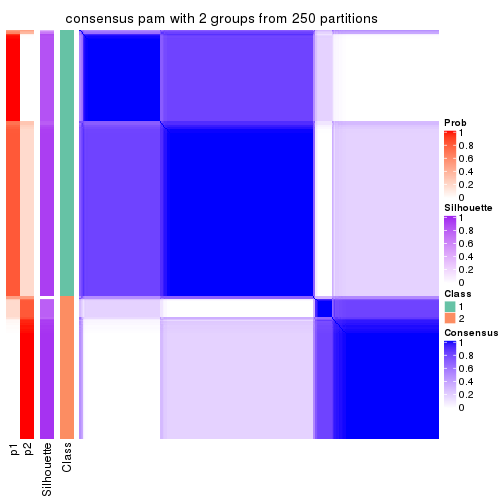</p>

</div>
<div id='tab-ATC-pam-consensus-heatmap-2'>
<pre><code class="r">consensus_heatmap(res, k = 3)
</code></pre>

<p></p>

</div>
<div id='tab-ATC-pam-consensus-heatmap-3'>
<pre><code class="r">consensus_heatmap(res, k = 4)
</code></pre>

<p></p>

</div>
<div id='tab-ATC-pam-consensus-heatmap-4'>
<pre><code class="r">consensus_heatmap(res, k = 5)
</code></pre>

<p></p>

</div>
<div id='tab-ATC-pam-consensus-heatmap-5'>
<pre><code class="r">consensus_heatmap(res, k = 6)
</code></pre>

<p></p>

</div>
</div>

Heatmaps for the membership of samples in all partitions to see how consistent they are:


<script>
$( function() {
	$( '#tabs-ATC-pam-membership-heatmap' ).tabs();
} );
</script>
<div id='tabs-ATC-pam-membership-heatmap'>
<ul>
<li><a href='#tab-ATC-pam-membership-heatmap-1'>k = 2</a></li>
<li><a href='#tab-ATC-pam-membership-heatmap-2'>k = 3</a></li>
<li><a href='#tab-ATC-pam-membership-heatmap-3'>k = 4</a></li>
<li><a href='#tab-ATC-pam-membership-heatmap-4'>k = 5</a></li>
<li><a href='#tab-ATC-pam-membership-heatmap-5'>k = 6</a></li>
</ul>
<div id='tab-ATC-pam-membership-heatmap-1'>
<pre><code class="r">membership_heatmap(res, k = 2)
</code></pre>

<p></p>

</div>
<div id='tab-ATC-pam-membership-heatmap-2'>
<pre><code class="r">membership_heatmap(res, k = 3)
</code></pre>

<p></p>

</div>
<div id='tab-ATC-pam-membership-heatmap-3'>
<pre><code class="r">membership_heatmap(res, k = 4)
</code></pre>

<p></p>

</div>
<div id='tab-ATC-pam-membership-heatmap-4'>
<pre><code class="r">membership_heatmap(res, k = 5)
</code></pre>

<p></p>

</div>
<div id='tab-ATC-pam-membership-heatmap-5'>
<pre><code class="r">membership_heatmap(res, k = 6)
</code></pre>

<p></p>

</div>
</div>

As soon as we have had the classes for columns, we can look for signatures
which are significantly different between classes which can be candidate marks
for certain classes. Following are the heatmaps for signatures.


Signature heatmaps where rows are scaled:


<script>
$( function() {
	$( '#tabs-ATC-pam-get-signatures' ).tabs();
} );
</script>
<div id='tabs-ATC-pam-get-signatures'>
<ul>
<li><a href='#tab-ATC-pam-get-signatures-1'>k = 2</a></li>
<li><a href='#tab-ATC-pam-get-signatures-2'>k = 3</a></li>
<li><a href='#tab-ATC-pam-get-signatures-3'>k = 4</a></li>
<li><a href='#tab-ATC-pam-get-signatures-4'>k = 5</a></li>
<li><a href='#tab-ATC-pam-get-signatures-5'>k = 6</a></li>
</ul>
<div id='tab-ATC-pam-get-signatures-1'>
<pre><code class="r">get_signatures(res, k = 2)
</code></pre>

<p></p>

</div>
<div id='tab-ATC-pam-get-signatures-2'>
<pre><code class="r">get_signatures(res, k = 3)
</code></pre>

<p></p>

</div>
<div id='tab-ATC-pam-get-signatures-3'>
<pre><code class="r">get_signatures(res, k = 4)
</code></pre>

<p></p>

</div>
<div id='tab-ATC-pam-get-signatures-4'>
<pre><code class="r">get_signatures(res, k = 5)
</code></pre>

<p></p>

</div>
<div id='tab-ATC-pam-get-signatures-5'>
<pre><code class="r">get_signatures(res, k = 6)
</code></pre>

<p></p>

</div>
</div>


Signature heatmaps where rows are not scaled:


<script>
$( function() {
	$( '#tabs-ATC-pam-get-signatures-no-scale' ).tabs();
} );
</script>
<div id='tabs-ATC-pam-get-signatures-no-scale'>
<ul>
<li><a href='#tab-ATC-pam-get-signatures-no-scale-1'>k = 2</a></li>
<li><a href='#tab-ATC-pam-get-signatures-no-scale-2'>k = 3</a></li>
<li><a href='#tab-ATC-pam-get-signatures-no-scale-3'>k = 4</a></li>
<li><a href='#tab-ATC-pam-get-signatures-no-scale-4'>k = 5</a></li>
<li><a href='#tab-ATC-pam-get-signatures-no-scale-5'>k = 6</a></li>
</ul>
<div id='tab-ATC-pam-get-signatures-no-scale-1'>
<pre><code class="r">get_signatures(res, k = 2, scale_rows = FALSE)
</code></pre>

<p></p>

</div>
<div id='tab-ATC-pam-get-signatures-no-scale-2'>
<pre><code class="r">get_signatures(res, k = 3, scale_rows = FALSE)
</code></pre>

<p></p>

</div>
<div id='tab-ATC-pam-get-signatures-no-scale-3'>
<pre><code class="r">get_signatures(res, k = 4, scale_rows = FALSE)
</code></pre>

<p></p>

</div>
<div id='tab-ATC-pam-get-signatures-no-scale-4'>
<pre><code class="r">get_signatures(res, k = 5, scale_rows = FALSE)
</code></pre>

<p>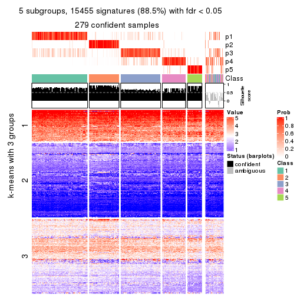</p>

</div>
<div id='tab-ATC-pam-get-signatures-no-scale-5'>
<pre><code class="r">get_signatures(res, k = 6, scale_rows = FALSE)
</code></pre>

<p></p>

</div>
</div>


Compare the overlap of signatures from different k:

```r
compare_signatures(res)
```


`get_signature()` returns a data frame invisibly. TO get the list of signatures, the function
call should be assigned to a variable explicitly. In following code, if `plot` argument is set
to `FALSE`, no heatmap is plotted while only the differential analysis is performed.

```r
# code only for demonstration
tb = get_signature(res, k = ..., plot = FALSE)
```

An example of the output of `tb` is:

```
#>   which_row         fdr    mean_1    mean_2 scaled_mean_1 scaled_mean_2 km
#> 1        38 0.042760348  8.373488  9.131774    -0.5533452     0.5164555  1
#> 2        40 0.018707592  7.106213  8.469186    -0.6173731     0.5762149  1
#> 3        55 0.019134737 10.221463 11.207825    -0.6159697     0.5749050  1
#> 4        59 0.006059896  5.921854  7.869574    -0.6899429     0.6439467  1
#> 5        60 0.018055526  8.928898 10.211722    -0.6204761     0.5791110  1
#> 6        98 0.009384629 15.714769 14.887706     0.6635654    -0.6193277  2
...
```

The columns in `tb` are:

1. `which_row`: row indices corresponding to the input matrix.
2. `fdr`: FDR for the differential test. 
3. `mean_x`: The mean value in group x.
4. `scaled_mean_x`: The mean value in group x after rows are scaled.
5. `km`: Row groups if k-means clustering is applied to rows.


UMAP plot which shows how samples are separated.


<script>
$( function() {
	$( '#tabs-ATC-pam-dimension-reduction' ).tabs();
} );
</script>
<div id='tabs-ATC-pam-dimension-reduction'>
<ul>
<li><a href='#tab-ATC-pam-dimension-reduction-1'>k = 2</a></li>
<li><a href='#tab-ATC-pam-dimension-reduction-2'>k = 3</a></li>
<li><a href='#tab-ATC-pam-dimension-reduction-3'>k = 4</a></li>
<li><a href='#tab-ATC-pam-dimension-reduction-4'>k = 5</a></li>
<li><a href='#tab-ATC-pam-dimension-reduction-5'>k = 6</a></li>
</ul>
<div id='tab-ATC-pam-dimension-reduction-1'>
<pre><code class="r">dimension_reduction(res, k = 2, method = &quot;UMAP&quot;)
</code></pre>

<p></p>

</div>
<div id='tab-ATC-pam-dimension-reduction-2'>
<pre><code class="r">dimension_reduction(res, k = 3, method = &quot;UMAP&quot;)
</code></pre>

<p></p>

</div>
<div id='tab-ATC-pam-dimension-reduction-3'>
<pre><code class="r">dimension_reduction(res, k = 4, method = &quot;UMAP&quot;)
</code></pre>

<p></p>

</div>
<div id='tab-ATC-pam-dimension-reduction-4'>
<pre><code class="r">dimension_reduction(res, k = 5, method = &quot;UMAP&quot;)
</code></pre>

<p></p>

</div>
<div id='tab-ATC-pam-dimension-reduction-5'>
<pre><code class="r">dimension_reduction(res, k = 6, method = &quot;UMAP&quot;)
</code></pre>

<p></p>

</div>
</div>


Following heatmap shows how subgroups are split when increasing `k`:

```r
collect_classes(res)
```


If matrix rows can be associated to genes, consider to use `GO_Enrichment(res,
...)` to perform function enrichment for the signature genes.


 

---------------------------------------------------


### ATC:mclust**


The object with results only for a single top-value method and a single partition method 
can be extracted as:

```r
res = res_list["ATC", "mclust"]
# you can also extract it by
# res = res_list["ATC:mclust"]
```

A summary of `res` and all the functions that can be applied to it:

```r
res
```

```
#> A 'ConsensusPartition' object with k = 2, 3, 4, 5, 6.
#>   On a matrix with 17469 rows and 309 columns.
#>   Top rows (1000, 2000, 3000, 4000, 5000) are extracted by 'ATC' method.
#>   Subgroups are detected by 'mclust' method.
#>   Performed in total 1250 partitions by row resampling.
#>   Best k for subgroups seems to be 2.
#> 
#> Following methods can be applied to this 'ConsensusPartition' object:
#>  [1] "cola_report"             "collect_classes"         "collect_plots"          
#>  [4] "collect_stats"           "colnames"                "compare_signatures"     
#>  [7] "consensus_heatmap"       "dimension_reduction"     "functional_enrichment"  
#> [10] "get_anno_col"            "get_anno"                "get_classes"            
#> [13] "get_consensus"           "get_matrix"              "get_membership"         
#> [16] "get_param"               "get_signatures"          "get_stats"              
#> [19] "is_best_k"               "is_stable_k"             "membership_heatmap"     
#> [22] "ncol"                    "nrow"                    "plot_ecdf"              
#> [25] "rownames"                "select_partition_number" "show"                   
#> [28] "suggest_best_k"          "test_to_known_factors"
```

`collect_plots()` function collects all the plots made from `res` for all `k` (number of partitions)
into one single page to provide an easy and fast comparison between different `k`.

```r
collect_plots(res)
```


The plots are:

- The first row: a plot of the ECDF (Empirical cumulative distribution
  function) curves of the consensus matrix for each `k` and the heatmap of
  predicted classes for each `k`.
- The second row: heatmaps of the consensus matrix for each `k`.
- The third row: heatmaps of the membership matrix for each `k`.
- The fouth row: heatmaps of the signatures for each `k`.

All the plots in panels can be made by individual functions and they are
plotted later in this section.

`select_partition_number()` produces several plots showing different
statistics for choosing "optimized" `k`. There are following statistics:

- ECDF curves of the consensus matrix for each `k`;
- 1-PAC. [The PAC
  score](https://en.wikipedia.org/wiki/Consensus_clustering#Over-interpretation_potential_of_consensus_clustering)
  measures the proportion of the ambiguous subgrouping.
- Mean silhouette score.
- Concordance. The mean probability of fiting the consensus class ids in all
  partitions.
- Area increased. Denote $A_k$ as the area under the ECDF curve for current
  `k`, the area increased is defined as $A_k - A_{k-1}$.
- Rand index. The percent of pairs of samples that are both in a same cluster
  or both are not in a same cluster in the partition of k and k-1.
- Jaccard index. The ratio of pairs of samples are both in a same cluster in
  the partition of k and k-1 and the pairs of samples are both in a same
  cluster in the partition k or k-1.

The detailed explanations of these statistics can be found in [the cola
vignette](http://bioconductor.org/packages/devel/bioc/vignettes/cola/inst/doc/cola.html#toc_13).

Generally speaking, lower PAC score, higher mean silhouette score or higher
concordance corresponds to better partition. Rand index and Jaccard index
measure how similar the current partition is compared to partition with `k-1`.
If they are too similar, we won't accept `k` is better than `k-1`.

```r
select_partition_number(res)
```


The numeric values for all these statistics can be obtained by `get_stats()`.

```r
get_stats(res)
```

```
#>   k 1-PAC mean_silhouette concordance area_increased  Rand Jaccard
#> 2 2 1.000           0.985       0.994         0.3808 0.621   0.621
#> 3 3 0.583           0.737       0.867         0.4920 0.847   0.754
#> 4 4 0.628           0.689       0.838         0.0804 0.859   0.722
#> 5 5 0.694           0.785       0.868         0.1170 0.910   0.783
#> 6 6 0.647           0.638       0.807         0.0741 0.924   0.781
```

`suggest_best_k()` suggests the best $k$ based on these statistics. The rules are as follows:

- All $k$ with Jaccard index larger than 0.95 are removed because the increase of
  the partition number does not provides enough extra information. If all $k$ are removed,
  the best $k$ is assigned by `NA`.
- For $k$ with 1-PAC larger than 0.9, the maximal $k$ is taken as the "best k". Other $k$ is called "optional k".
- If it does not fit the second rule. The $k$ with the highest vote of highest
  1-PAC, mean silhouette and concordance is taken as the "best k".

```r
suggest_best_k(res)
```

```
#> [1] 2
```


Following shows the table of the partitions (You need to click the **show/hide
code output** link to see it). The membership matrix (columns with name `p*`)
is inferred by
[`clue::cl_consensus()`](https://www.rdocumentation.org/link/cl_consensus?package=clue)
function with the `SE` method. Basically the value in the membership matrix
represents the probability to belong to a certain group. The finall class
label for an item is determined with the group with highest probability it
belongs to.

In `get_classes()` function, the entropy is calculated from the membership
matrix and the silhouette score is calculated from the consensus matrix.


<script>
$( function() {
	$( '#tabs-ATC-mclust-get-classes' ).tabs();
} );
</script>
<div id='tabs-ATC-mclust-get-classes'>
<ul>
<li><a href='#tab-ATC-mclust-get-classes-1'>k = 2</a></li>
<li><a href='#tab-ATC-mclust-get-classes-2'>k = 3</a></li>
<li><a href='#tab-ATC-mclust-get-classes-3'>k = 4</a></li>
<li><a href='#tab-ATC-mclust-get-classes-4'>k = 5</a></li>
<li><a href='#tab-ATC-mclust-get-classes-5'>k = 6</a></li>
</ul>

<div id='tab-ATC-mclust-get-classes-1'>
<p><a id='tab-ATC-mclust-get-classes-1-a' style='color:#0366d6' href='#'>show/hide code output</a></p>
<pre><code class="r">cbind(get_classes(res, k = 2), get_membership(res, k = 2))
</code></pre>

<pre><code>#&gt;                                      class entropy silhouette    p1    p2
#&gt; 7826AE44-B03A-4528-9CB5-7421E592AE36     2   0.242      0.953 0.040 0.960
#&gt; 0DC2197B-2FEA-48EB-953E-8E44E1933757     1   0.000      0.995 1.000 0.000
#&gt; 87ABB098-8C1E-4677-8C31-48B71EFE41C7     1   0.000      0.995 1.000 0.000
#&gt; EC0154E7-7A27-4535-83AE-6B379E99A93C     1   0.000      0.995 1.000 0.000
#&gt; 78F79407-D49F-4FA2-B09F-0665C502827C     1   0.000      0.995 1.000 0.000
#&gt; 03E81178-E971-4E91-8BED-D8273EA1425C     1   0.000      0.995 1.000 0.000
#&gt; 62FCAEFF-16D8-4019-84B6-18EC3A88BC32     2   0.993      0.172 0.452 0.548
#&gt; 722C1284-5983-4CC1-B19C-214C2DE6F8A6     2   0.000      0.992 0.000 1.000
#&gt; 54E42A64-B350-4A94-8FED-C9BC1872660E     1   0.000      0.995 1.000 0.000
#&gt; 53062969-D209-490B-9C9B-5D297625E2AE     1   0.000      0.995 1.000 0.000
#&gt; B710293C-41D3-4A2E-8104-5402F91DD859     1   0.000      0.995 1.000 0.000
#&gt; 73CB1D05-7AE4-457D-B4EF-25AC5C1F2132     1   0.000      0.995 1.000 0.000
#&gt; B055A70B-3003-47CB-BDAA-6378C000BF24     1   0.000      0.995 1.000 0.000
#&gt; 46C3A870-E37A-42CB-8C0C-6ACACEAC1ADC     2   0.000      0.992 0.000 1.000
#&gt; E8E6270E-F26D-4F2E-A63E-7885BDE05FDB     1   0.000      0.995 1.000 0.000
#&gt; C4A5EBA2-9091-4D12-BDC8-B84B122022B9     1   0.000      0.995 1.000 0.000
#&gt; 5B1839C4-549D-41D1-B559-3C6D2A1528CE     1   0.000      0.995 1.000 0.000
#&gt; A0DF05EB-DC44-4492-9A8A-F278F7B0C266     1   0.000      0.995 1.000 0.000
#&gt; B5182F49-70F2-45B7-82DE-C6DA68145EEA     1   0.000      0.995 1.000 0.000
#&gt; C204D355-B876-4341-A111-36D48CBDD2A8     1   0.000      0.995 1.000 0.000
#&gt; 7B070AAA-EF97-4D3B-AA19-EEC170C7927D     2   0.000      0.992 0.000 1.000
#&gt; 05A8A881-F8EE-48A2-B11C-A08D7D80CE18     1   0.000      0.995 1.000 0.000
#&gt; BA59EF50-CFE9-456D-B1B6-67D0945004F6     1   0.000      0.995 1.000 0.000
#&gt; AD97B334-E034-4D33-A4D5-48C32D5D521C     1   0.000      0.995 1.000 0.000
#&gt; 51DA2568-32EA-4668-9876-4B6E7CA68860     1   0.000      0.995 1.000 0.000
#&gt; 78C26A05-2084-494D-83D3-C52C1B800F4C     1   0.000      0.995 1.000 0.000
#&gt; 2B5DD791-7692-4721-9519-7D7D49B52570     1   0.000      0.995 1.000 0.000
#&gt; C0BBE26A-79C8-4392-9978-7C420B3786B5     1   0.000      0.995 1.000 0.000
#&gt; F35A8359-3A7A-414F-8A5C-D278F3B45387     2   0.000      0.992 0.000 1.000
#&gt; 8C9BA49C-1270-491D-A234-AE1B1C0609BA     2   0.000      0.992 0.000 1.000
#&gt; CA104B57-B160-4148-8A0A-D34BB3E8D88A     1   0.000      0.995 1.000 0.000
#&gt; 877E18A5-6A7A-4E29-9871-DC7EA14A5F27     1   0.000      0.995 1.000 0.000
#&gt; 904EDF2E-411E-43BD-901D-46129AFA283A     1   0.000      0.995 1.000 0.000
#&gt; FD9F5A9B-2BEB-4D31-9A2D-8D4B4ECBB478     1   0.000      0.995 1.000 0.000
#&gt; 2E206314-9928-456E-B7C6-893DC0E3C7C2     2   0.000      0.992 0.000 1.000
#&gt; 913DB655-2C7F-4369-83DE-9257F04CF39B     1   0.000      0.995 1.000 0.000
#&gt; 72B5B724-FEB5-43BD-83F6-2E2152DDD800     1   0.000      0.995 1.000 0.000
#&gt; 920B547C-6898-446C-AAAF-F4ED96E40AAB     2   0.000      0.992 0.000 1.000
#&gt; 847F796A-8CD6-4013-A0FB-26F4FC3EAF0D     1   0.000      0.995 1.000 0.000
#&gt; C4D64E7A-33F7-4CFC-9FD3-D6AA3D8EFAA7     1   0.000      0.995 1.000 0.000
#&gt; EABA0B17-8E19-48C5-BF62-2A45C9632807     2   0.000      0.992 0.000 1.000
#&gt; 7263CBA8-CE37-4531-A795-9324C6D2A672     1   0.000      0.995 1.000 0.000
#&gt; 6D3CC3AC-618B-414A-B640-169C735A6568     1   0.000      0.995 1.000 0.000
#&gt; 710C05C7-F9CE-45FA-A8CC-29DE2903E04F     1   0.000      0.995 1.000 0.000
#&gt; 3D631A56-2C55-48EA-A667-BA46023C9D50     1   0.000      0.995 1.000 0.000
#&gt; F1C65F64-AF05-4875-B7E4-60FFF56A3F46     1   0.000      0.995 1.000 0.000
#&gt; E5DF76E7-A765-4E07-B87A-06168BF66C5F     1   0.000      0.995 1.000 0.000
#&gt; 5C8C8A6E-40D4-4F82-AC3D-90CFDEE15C0A     2   0.000      0.992 0.000 1.000
#&gt; 0117CBB9-1BF9-48B1-BE6E-A9A770FF8721     1   0.000      0.995 1.000 0.000
#&gt; 31EF66E5-419A-44C3-BB2A-B69B52FFCECC     2   0.000      0.992 0.000 1.000
#&gt; C149CEF5-61F3-4B53-B8A9-8244B673EBD0     1   0.000      0.995 1.000 0.000
#&gt; 0AF351D0-4EC5-4275-AA0A-4FA2AF8A9C85     2   0.000      0.992 0.000 1.000
#&gt; B507E82F-6680-497B-A014-033EDD7A2E03     1   0.000      0.995 1.000 0.000
#&gt; F941890E-AB33-478F-8C97-1C785DD9428F     1   0.000      0.995 1.000 0.000
#&gt; 7987E019-8FED-469B-A6C1-34EE430A60C3     1   0.000      0.995 1.000 0.000
#&gt; 76084AA6-19BF-4605-B6A1-73F1D4BADAF9     1   0.000      0.995 1.000 0.000
#&gt; 329807F7-E0D4-4F53-94E8-E4080E90CB47     1   0.000      0.995 1.000 0.000
#&gt; 1B6505FF-C1A7-4DD0-9827-41A0A3A28F3E     1   0.000      0.995 1.000 0.000
#&gt; 49778E92-B5D3-4AD9-A1AF-3B722D631B96     2   0.000      0.992 0.000 1.000
#&gt; A22892DE-0AF4-4B63-9513-1D6825059040     1   0.000      0.995 1.000 0.000
#&gt; 6D77ECAE-A715-4ADD-97D8-A916DC31A4EA     1   0.000      0.995 1.000 0.000
#&gt; 09758B6F-1B2D-4AED-8913-696097069409     1   0.000      0.995 1.000 0.000
#&gt; 8B709DB4-0B28-42F1-A7C5-106F5809BEA2     1   0.000      0.995 1.000 0.000
#&gt; F2B356FA-79CD-4867-8ABF-84C90A493A75     1   0.000      0.995 1.000 0.000
#&gt; 131213AD-0313-4DF1-B013-CE67ED262C37     2   0.000      0.992 0.000 1.000
#&gt; D94F7E81-0F60-473B-AD4A-0AC13508BDE2     1   0.000      0.995 1.000 0.000
#&gt; 29C17355-D646-48DA-9E54-7B6DD85DD610     1   0.000      0.995 1.000 0.000
#&gt; B8BD866A-2A7C-45C3-96BB-9AB892D26AE5     1   0.000      0.995 1.000 0.000
#&gt; 13EFD045-AD61-41EE-9896-67BFA4FC8C09     1   0.000      0.995 1.000 0.000
#&gt; 2655F609-B3BB-4D01-B421-D5F4B1232EC8     2   0.000      0.992 0.000 1.000
#&gt; 04BC7A52-C67F-42CB-8672-D3C51A20F2BA     1   0.000      0.995 1.000 0.000
#&gt; 45472BD4-DBDB-41FE-B0E3-2440880E1DE6     1   0.000      0.995 1.000 0.000
#&gt; B87FFFCD-CB57-4ACD-9C74-AB188984BBB2     1   0.000      0.995 1.000 0.000
#&gt; 5271374C-13CD-4BFE-AC6D-C95AFE491322     1   0.000      0.995 1.000 0.000
#&gt; E3372ACE-C7C8-43E5-B30A-1F2D662D8170     1   0.000      0.995 1.000 0.000
#&gt; B08DF564-E4D0-4540-8160-93B3981DF1D8     1   0.000      0.995 1.000 0.000
#&gt; 61A7D1B9-FC5A-4B9C-989F-936CDA948C27     1   0.000      0.995 1.000 0.000
#&gt; 74E768C1-8766-46AC-AAB4-D79E5049F76A     2   0.000      0.992 0.000 1.000
#&gt; 0CEA28F0-D7F0-4EB7-A23F-0C5CA6245971     1   0.000      0.995 1.000 0.000
#&gt; 95C4EFF6-147C-48EC-A2C1-16B8F12AEEF2     2   0.000      0.992 0.000 1.000
#&gt; C9A78BEA-D455-4F5E-8B7B-19BCB42887E7     1   0.000      0.995 1.000 0.000
#&gt; DB970740-9AC1-4C10-9658-8A77B1C390DD     1   0.000      0.995 1.000 0.000
#&gt; 883FBD37-0CA0-4562-8925-72ACC1EE93D9     1   0.000      0.995 1.000 0.000
#&gt; 9FE1D006-49F2-471E-91E6-AF0414C24479     1   0.000      0.995 1.000 0.000
#&gt; 11816CC6-8C8B-49C0-99EE-896377BCFCCD     1   0.000      0.995 1.000 0.000
#&gt; 063FC5C8-4318-4ECC-9CA0-1976CBC8ACB6     1   0.000      0.995 1.000 0.000
#&gt; E0F085CC-B90D-4FDE-B60E-C613971BAA00     1   0.000      0.995 1.000 0.000
#&gt; 62361DA2-E4EE-46DA-BB1F-C51DCA9307CC     2   0.000      0.992 0.000 1.000
#&gt; 1BA16D48-B09E-4699-A1AD-2FFECE4F3CDB     2   0.000      0.992 0.000 1.000
#&gt; 3E4F14E9-60AE-4F17-9BA7-2A02E908204A     1   0.000      0.995 1.000 0.000
#&gt; 79226DD7-BC85-4B8E-BFF8-B1E073129D34     1   0.000      0.995 1.000 0.000
#&gt; D47D0936-826F-4D54-9225-F71B95357438     1   0.000      0.995 1.000 0.000
#&gt; 0AE02B91-574C-4165-BA39-E9D7C1A870A2     2   0.000      0.992 0.000 1.000
#&gt; DED8E9DF-CEFE-45ED-9374-EF9925A135C4     1   0.000      0.995 1.000 0.000
#&gt; D587A993-3C47-4D4C-B744-59169D4F7451     1   0.000      0.995 1.000 0.000
#&gt; 6BCA24E6-440F-42C5-ABE5-66C37B713A39     1   0.000      0.995 1.000 0.000
#&gt; 86A5EDFB-9D06-4FED-BF57-F8D74A68E156     1   0.000      0.995 1.000 0.000
#&gt; B9BD5134-2F6A-4454-8F83-69B63F9AE114     1   0.000      0.995 1.000 0.000
#&gt; 082DA9E1-A40D-482B-8E21-A93BA97185F0     1   0.000      0.995 1.000 0.000
#&gt; 16A8343A-1203-44FB-9F03-05CC7C71B4CC     1   0.000      0.995 1.000 0.000
#&gt; 00439565-02CE-4BF5-956D-7078B51C0947     1   0.000      0.995 1.000 0.000
#&gt; 7B2BD361-2BF1-4E97-BC08-457F5A9C2682     2   0.000      0.992 0.000 1.000
#&gt; C1D8439A-D527-47F6-ADC1-25867B65DA21     2   0.000      0.992 0.000 1.000
#&gt; D9096909-1439-462D-B69C-CAD1BF4F420C     1   0.000      0.995 1.000 0.000
#&gt; 7822EA86-35A1-4285-9429-2B63111B9885     1   0.000      0.995 1.000 0.000
#&gt; 6FD0CFC8-AC8D-4CF1-8C33-833AD98A30EF     2   0.000      0.992 0.000 1.000
#&gt; A451F278-5E83-4BC6-9B15-3AA2117B99B6     1   0.000      0.995 1.000 0.000
#&gt; 6EC25686-4547-459C-9E01-7EDF8DAECE35     1   0.000      0.995 1.000 0.000
#&gt; 5D2F1EEA-2BA8-4C3A-8436-544EE1D23E7E     1   0.000      0.995 1.000 0.000
#&gt; 675A4293-A4CE-4307-B00B-DFC4D44A87C6     2   0.000      0.992 0.000 1.000
#&gt; 6FBE0AEF-476A-42B2-A857-846CF1ED92B6     2   0.000      0.992 0.000 1.000
#&gt; 7139D616-1A15-4288-A9AE-411856A4A76D     1   0.000      0.995 1.000 0.000
#&gt; 46D7F8C1-D5C5-40CC-BEF5-2E590A847BD9     1   0.000      0.995 1.000 0.000
#&gt; 984C44D3-4F5F-44C9-BCD9-C991EBC1FCB8     1   0.000      0.995 1.000 0.000
#&gt; 83FE52E0-2DC2-4580-8BB2-FBCBEE4AC240     1   0.000      0.995 1.000 0.000
#&gt; 0923F9CB-DF6F-4BAA-A5F8-0F83CE60D1ED     1   0.000      0.995 1.000 0.000
#&gt; 1DEB5206-78CC-4EB5-BCD5-85A6A5B4E273     1   0.000      0.995 1.000 0.000
#&gt; E4DB18DA-EB0C-4B2F-9566-7F72222B16D4     1   0.000      0.995 1.000 0.000
#&gt; F7456312-1309-4B2F-875D-0F90CDF3EC35     1   0.000      0.995 1.000 0.000
#&gt; 9A25E5D8-0706-4960-A76B-BCD0AC93E4FA     1   0.000      0.995 1.000 0.000
#&gt; 5A41FE8F-FFB3-4B87-BF11-A570C184096D     1   0.000      0.995 1.000 0.000
#&gt; 33F84E63-3F6C-4867-ADB1-A0DF39F1295B     1   0.000      0.995 1.000 0.000
#&gt; D6A644F5-D1D0-4A8D-94C4-EE6C3ECE7430     1   0.000      0.995 1.000 0.000
#&gt; 2A5848CC-A9A2-4AA8-A752-321273E62CF0     1   0.000      0.995 1.000 0.000
#&gt; 7CA6358B-FC8A-4675-B092-9E061038FC83     1   0.000      0.995 1.000 0.000
#&gt; A4C2F4BC-5C62-4B1F-9AB8-46D9468EF523     2   0.000      0.992 0.000 1.000
#&gt; 8AF4EB7F-418D-4CC9-A9B8-A93A4C1A173B     2   0.000      0.992 0.000 1.000
#&gt; E5048887-70C8-468F-881E-2EC55F6E6F3B     1   0.000      0.995 1.000 0.000
#&gt; 1BADCC7C-C4D8-4C34-9534-59D622C7A2A2     1   0.000      0.995 1.000 0.000
#&gt; 02CE7DF7-64BD-4297-A240-A5B9EE8771D3     1   0.000      0.995 1.000 0.000
#&gt; CBF6E96A-F56C-4C87-B851-D319930BAAB8     1   0.000      0.995 1.000 0.000
#&gt; 48F6B774-CFD2-4DDF-B7A2-696596413C3F     1   0.000      0.995 1.000 0.000
#&gt; 41D88C3E-5848-4B09-8A77-EAE6AC4EC6B0     2   0.000      0.992 0.000 1.000
#&gt; BDF79CC0-00C7-49C1-900B-AB065A733B17     1   0.000      0.995 1.000 0.000
#&gt; A894D686-BFC7-4AEE-A794-DBE718C6B6F6     2   0.000      0.992 0.000 1.000
#&gt; 0712029E-3765-4272-BE5B-B6C8BCCC0F0F     2   0.000      0.992 0.000 1.000
#&gt; 7B051855-9B09-4887-9BC0-9F077537938E     1   0.000      0.995 1.000 0.000
#&gt; EF357C46-5C3C-4F51-9383-FF7694D07B97     2   0.000      0.992 0.000 1.000
#&gt; 9492A322-37CA-4582-AC68-66B5D80778AF     2   0.000      0.992 0.000 1.000
#&gt; 993399A4-1B9F-4258-B2D0-155AD58A2E82     1   0.000      0.995 1.000 0.000
#&gt; 7B7DC93D-5494-4E69-BE07-2967887182F9     1   0.000      0.995 1.000 0.000
#&gt; 29BCBA51-2580-473D-9CF7-BEDBD0DBAD1B     2   0.000      0.992 0.000 1.000
#&gt; 40855647-E942-4F32-90B7-BEB921929BFB     1   0.000      0.995 1.000 0.000
#&gt; 0DC723D0-7C68-4495-A4B9-2DF2FF19AB14     2   0.000      0.992 0.000 1.000
#&gt; 7540005F-57E0-4E2E-A8A2-BEF2B0F333B1     2   0.000      0.992 0.000 1.000
#&gt; EB1DDB14-4076-4C2C-B911-390C17C21486     1   0.000      0.995 1.000 0.000
#&gt; 9EA70EC4-8BA0-4E3D-B3CB-A68D19E89868     1   0.000      0.995 1.000 0.000
#&gt; B04E2E50-0A6E-4224-A825-1714D12E5669     2   0.000      0.992 0.000 1.000
#&gt; B0BF5E01-536D-40FF-9C24-CBBD611E2FC2     1   0.000      0.995 1.000 0.000
#&gt; 7B6B1788-B297-4442-B6BE-B7CE8754491E     1   0.000      0.995 1.000 0.000
#&gt; A090D00C-34DF-4906-A517-4803C4C9A332     1   0.000      0.995 1.000 0.000
#&gt; 340D44A6-9BEA-412C-9973-D9ABD6692255     1   0.000      0.995 1.000 0.000
#&gt; E8D0D1E7-E5A8-4014-80C1-0245F90F4358     2   0.000      0.992 0.000 1.000
#&gt; 19EA1494-8572-40E1-B9BB-3739F47B607D     1   0.000      0.995 1.000 0.000
#&gt; 1C1B4793-8DAF-4763-BA4D-C4E869A4ED35     1   0.000      0.995 1.000 0.000
#&gt; 45BF59B3-95BD-4196-ABAA-4C4F0DB38572     2   0.000      0.992 0.000 1.000
#&gt; 47B5A2A7-7E13-4558-99D2-067F5075C6A4     1   0.000      0.995 1.000 0.000
#&gt; E94638E8-CB51-4FBB-8BCB-4BFD7A812291     1   0.000      0.995 1.000 0.000
#&gt; A17352A8-0D3C-4545-8136-7DAE2FB0E102     2   0.327      0.932 0.060 0.940
#&gt; B18A6F95-D4ED-416B-B5A1-9A4934865D0D     2   0.000      0.992 0.000 1.000
#&gt; 33E92C5F-0C42-4549-AD5B-0A064182A272     1   0.000      0.995 1.000 0.000
#&gt; E041B375-3E60-4F18-A6EF-D1C249E3B8EE     1   0.000      0.995 1.000 0.000
#&gt; EDF90AF6-6C64-4BD2-AADF-8D7D188650B2     2   0.000      0.992 0.000 1.000
#&gt; 569320D2-316C-4E2D-B7B3-D7D5C4DAD42D     1   0.000      0.995 1.000 0.000
#&gt; AFFB223D-DAE9-4567-9EF2-8E4DF9D8782D     2   0.000      0.992 0.000 1.000
#&gt; 56FC9454-0A6A-4CC3-95C4-BE0E0D0BAFCE     2   0.000      0.992 0.000 1.000
#&gt; 43226365-FAEF-46C5-AF1B-5C6C2BED84FF     1   0.000      0.995 1.000 0.000
#&gt; 1536110A-B42A-4A84-9474-9895321FDCE9     2   0.000      0.992 0.000 1.000
#&gt; 812255DD-536B-4216-90B1-27D5AB339BE2     1   0.000      0.995 1.000 0.000
#&gt; 5D4563D6-68B7-4C9D-A3F4-AA7D45D5112C     2   0.000      0.992 0.000 1.000
#&gt; BAA39781-DB94-473C-98B1-FA6CD3E1C67A     1   0.000      0.995 1.000 0.000
#&gt; C1411CDA-814D-4E21-8929-C0F77858828F     1   0.000      0.995 1.000 0.000
#&gt; EFE2F248-C13E-4E8D-9153-8C903848AC4A     1   0.000      0.995 1.000 0.000
#&gt; D3939C84-D1D6-4060-9F91-AEB222A9BDD5     1   0.000      0.995 1.000 0.000
#&gt; EABD2987-8C1E-49E5-94AF-C0BDE5335A48     1   0.000      0.995 1.000 0.000
#&gt; F4BE2ABE-2CEB-4A6A-B8EC-0355F8C63B9B     1   0.000      0.995 1.000 0.000
#&gt; 627BC251-D217-4955-B718-6B9D6DEA1756     1   0.000      0.995 1.000 0.000
#&gt; 31B54613-A20E-4039-BB8B-9B52104CE418     1   0.000      0.995 1.000 0.000
#&gt; 3F292B7C-A535-4DBD-BC20-CB4F85A1C94B     1   0.000      0.995 1.000 0.000
#&gt; BEA2A5EB-EEA9-4F31-AC38-810E04CE124B     2   0.000      0.992 0.000 1.000
#&gt; 99D84D46-19DA-43F1-B639-DCE9953F1529     2   0.000      0.992 0.000 1.000
#&gt; 4588817E-1068-4A78-86B6-4674A0112DDA     1   0.000      0.995 1.000 0.000
#&gt; 6AC633BD-BEC1-4750-94E3-378972DAB6B3     2   0.000      0.992 0.000 1.000
#&gt; 09E17C6E-7EDE-4DDF-B5ED-2521AF870C9A     1   0.000      0.995 1.000 0.000
#&gt; 58D9C750-26A2-4B7C-84C4-13D7AFB4C5EA     1   0.000      0.995 1.000 0.000
#&gt; DF28E138-E222-4F77-9B61-69E601CA7E60     2   0.000      0.992 0.000 1.000
#&gt; FEA489A8-E423-4266-AADA-9BAAB29AB94B     1   0.000      0.995 1.000 0.000
#&gt; F3FCC207-15CD-41EA-A3EF-F5D2C12AC373     1   0.000      0.995 1.000 0.000
#&gt; 53DD7AFB-A258-4643-A501-BACC95D17A50     2   0.000      0.992 0.000 1.000
#&gt; D850B2A1-1F8A-4A44-A0CF-8D9DD4A1889A     2   0.000      0.992 0.000 1.000
#&gt; B3F746DC-E487-4305-9F30-825D1520E8FD     2   0.000      0.992 0.000 1.000
#&gt; BE38240A-F7C2-439F-9AAE-51C8A340F310     1   0.000      0.995 1.000 0.000
#&gt; A9022D9E-1D30-49EE-8552-1364A8027F34     1   0.000      0.995 1.000 0.000
#&gt; 0E8A56EE-D9A2-48A5-B793-A358BE1E4EFA     1   0.000      0.995 1.000 0.000
#&gt; 51667574-318E-4BDB-8F42-8512A4C1B84F     1   0.000      0.995 1.000 0.000
#&gt; B0A442C9-67E4-4534-8A5C-D6D73F42358C     1   0.000      0.995 1.000 0.000
#&gt; 25A5BC09-0D88-4385-87AF-997F9018522D     2   0.000      0.992 0.000 1.000
#&gt; 344B9631-AAA5-4302-8747-D584345D9131     1   0.000      0.995 1.000 0.000
#&gt; 1C3795AD-6306-4892-95F5-92DF3375D46A     1   0.000      0.995 1.000 0.000
#&gt; 17BB221D-8BF9-4391-83DD-423AE1E03651     1   0.000      0.995 1.000 0.000
#&gt; 297611E9-9555-4BCA-A723-02E846ACC23A     1   0.000      0.995 1.000 0.000
#&gt; AD7FF180-1EAC-4783-8A62-E9626B96DD9F     1   0.000      0.995 1.000 0.000
#&gt; FD544083-9BD5-4036-BD81-0352B67CC45C     1   0.000      0.995 1.000 0.000
#&gt; 879A74D5-5B29-418D-A0F4-8E88D6384008     1   0.000      0.995 1.000 0.000
#&gt; 43CD982C-13C0-4A52-803A-9A3A3FAE09BC     1   0.000      0.995 1.000 0.000
#&gt; DCD0313D-5206-4111-8743-A8A0227257D9     1   0.000      0.995 1.000 0.000
#&gt; 331A9160-D730-45DD-A985-C6CAC03035ED     1   0.000      0.995 1.000 0.000
#&gt; 9EEECA0E-530D-4724-B016-A716F0782148     1   0.000      0.995 1.000 0.000
#&gt; B3073976-CA3F-4115-9243-8C2D9E1B975D     1   0.000      0.995 1.000 0.000
#&gt; 77B3C9B4-1A7F-41BB-A37D-01EF80E933CC     2   0.000      0.992 0.000 1.000
#&gt; C0C26822-2E9F-4FB0-81D4-575027C8B71C     2   0.000      0.992 0.000 1.000
#&gt; F1FCE328-2B3B-499A-888D-0E66A017E8B0     1   0.000      0.995 1.000 0.000
#&gt; F069DAD6-F1EB-42F7-8252-F3F6EC46CC3E     1   0.000      0.995 1.000 0.000
#&gt; 99CC822E-8C98-4EEC-BB58-AEF76A0B5332     1   0.000      0.995 1.000 0.000
#&gt; C86EBD08-53F2-4972-801A-74970FDD6A62     1   0.000      0.995 1.000 0.000
#&gt; F07326F2-C1D6-4D5A-9693-25C3A04B0EC2     1   0.000      0.995 1.000 0.000
#&gt; 8ACBD428-7713-48D9-810A-43C9CD191A73     2   0.000      0.992 0.000 1.000
#&gt; 3D3501B4-1A43-4FA7-90A2-CCEBF66BFD4A     1   0.000      0.995 1.000 0.000
#&gt; DD51C17C-300F-44A4-955A-C9BC85417842     1   0.000      0.995 1.000 0.000
#&gt; 58FF391C-1D83-426C-8F92-C15F78F56C95     1   0.000      0.995 1.000 0.000
#&gt; ACE65C6E-2B10-4972-91B4-9199DD4B179D     1   0.000      0.995 1.000 0.000
#&gt; B2088466-FA5D-491C-9982-99B33683E66F     2   0.000      0.992 0.000 1.000
#&gt; D47AF416-1687-4FE0-A235-8815B6E8EB0B     1   0.000      0.995 1.000 0.000
#&gt; 4DCAD07F-CC43-46F6-B2F3-EDBF3EDD1045     2   0.000      0.992 0.000 1.000
#&gt; AAAE0BD9-63FC-4A0E-A27E-447B634BAD99     2   0.000      0.992 0.000 1.000
#&gt; BC471AA1-52CF-4CEE-9866-34CE91404F45     2   0.000      0.992 0.000 1.000
#&gt; 81D3EE3F-AC11-404F-8092-307F0DC12198     1   0.000      0.995 1.000 0.000
#&gt; 8C02026C-C25E-406B-B8B8-A1A82362AE79     1   0.000      0.995 1.000 0.000
#&gt; 6A005F2A-A0C1-4CA4-B15B-96B08F013874     1   0.000      0.995 1.000 0.000
#&gt; B55743F2-4D63-4375-85D3-F58281CFD852     1   0.000      0.995 1.000 0.000
#&gt; 24F98393-C817-4D0E-A7DB-05D2B5C71F40     1   0.000      0.995 1.000 0.000
#&gt; 2C2AEF1D-4112-4EC7-9027-5E3FD26E8802     1   0.000      0.995 1.000 0.000
#&gt; 8BAC3CB5-2987-4349-8AE8-B83DDD16CA3C     1   0.000      0.995 1.000 0.000
#&gt; ED9C74E6-92FC-4E58-8FCE-1761DEA0C977     1   0.000      0.995 1.000 0.000
#&gt; BA732ED4-F6BA-404E-BA3C-CA558FAD866A     1   0.000      0.995 1.000 0.000
#&gt; E750385A-12D9-4A88-B4DF-C1306B5EF3B7     2   0.000      0.992 0.000 1.000
#&gt; 6B1DC5E4-5F82-4395-913F-6AEDB5B63188     1   0.000      0.995 1.000 0.000
#&gt; A7C12D37-FD50-4674-A054-1774F4E5C3B3     1   0.000      0.995 1.000 0.000
#&gt; 2155C764-2063-4D9C-9ACD-96AA73475F5E     1   0.000      0.995 1.000 0.000
#&gt; DE23CC15-A95E-4119-9B3C-8EEC45900D11     2   0.000      0.992 0.000 1.000
#&gt; 5DB1DCAD-638E-48A4-9F40-3D6268FDEC33     2   0.000      0.992 0.000 1.000
#&gt; 34AF0341-73D7-4080-AAEB-4C1541C2569F     1   0.000      0.995 1.000 0.000
#&gt; B60D4235-44AF-4BA4-98C0-BCCDC28E90B9     2   0.000      0.992 0.000 1.000
#&gt; CF463D89-2C9F-4257-BF04-8BC1CD40EA7D     2   0.000      0.992 0.000 1.000
#&gt; EF6C8165-484A-4530-AEDF-93DCC4A8455D     1   0.000      0.995 1.000 0.000
#&gt; B9F6B5E4-4D10-49B8-A8FE-8F33C5A62CBF     1   0.000      0.995 1.000 0.000
#&gt; CE539000-92D7-4622-9C8D-BC6E01310681     2   0.000      0.992 0.000 1.000
#&gt; D3BBC405-A22A-4009-ABF6-96FEEE653051     2   0.000      0.992 0.000 1.000
#&gt; 0B3C86BD-0D20-4408-9BE3-05658729505F     1   0.000      0.995 1.000 0.000
#&gt; 9B9C5071-7C3F-416C-B91C-6F5966747F54     1   0.000      0.995 1.000 0.000
#&gt; A9469A4A-C5F9-4681-A916-A26F0B4307BA     1   0.000      0.995 1.000 0.000
#&gt; A31B57E4-E30B-4A1B-829D-1B47D9CEC041     2   0.000      0.992 0.000 1.000
#&gt; 647255CE-F84A-4070-B3FD-D8ACA32C4D09     1   0.000      0.995 1.000 0.000
#&gt; 8F5E9F02-51D7-410E-B8B7-22737F2F095A     2   0.000      0.992 0.000 1.000
#&gt; 8074A7F6-2FDE-4578-B71C-01C542D468FE     1   0.000      0.995 1.000 0.000
#&gt; 2A946F17-F245-409E-A019-C60CDA18DC7D     1   0.000      0.995 1.000 0.000
#&gt; 0878C381-47F9-4786-82C2-94AC840BEDCB     1   0.000      0.995 1.000 0.000
#&gt; 54504893-92C5-4328-85A8-2A882680B5E0     1   0.000      0.995 1.000 0.000
#&gt; 0A27D1BE-E5DD-459A-A51F-6D8AAF7CFEB4     1   0.000      0.995 1.000 0.000
#&gt; 89ED5A3E-CAC0-4AB4-B858-A3CD8F34DBD5     2   0.000      0.992 0.000 1.000
#&gt; ACEEB0A5-AADB-4EF9-8710-4BAF95522CEA     1   0.000      0.995 1.000 0.000
#&gt; 02C74D81-5976-4252-BC6C-B10E934DECA2     1   0.000      0.995 1.000 0.000
#&gt; D365A238-4739-4B54-9608-DC548F21C04E     1   0.000      0.995 1.000 0.000
#&gt; F70F7ED5-A3B7-4210-95AD-DEFA0A565F06     1   0.000      0.995 1.000 0.000
#&gt; A92C23A9-BC25-4025-9501-6D5FF8E2A502     1   0.000      0.995 1.000 0.000
#&gt; ECE9BBF4-840E-47A6-8378-0B6C4A2369D3     1   0.000      0.995 1.000 0.000
#&gt; 38749490-0FCF-4B33-9EBC-8F86C2D9E4AF     1   0.000      0.995 1.000 0.000
#&gt; 02ABB64E-768B-4999-A899-EEE573D5F186     1   0.000      0.995 1.000 0.000
#&gt; C1C467A8-18B1-4C3F-AC45-33359ED6FDC4     1   0.000      0.995 1.000 0.000
#&gt; 78B2E4A1-9DAE-404F-AB47-1896450EF254     1   0.000      0.995 1.000 0.000
#&gt; CCDB0290-91DA-4089-84A6-4434BA028D30     1   0.000      0.995 1.000 0.000
#&gt; D5041E80-20A0-4C1A-9AC1-2394F6DB6E92     1   0.000      0.995 1.000 0.000
#&gt; 20EB9CC6-EABB-438A-9030-E766459996D1     2   0.000      0.992 0.000 1.000
#&gt; 73E99110-9A7C-4F73-98C5-79D22CB06230     1   0.000      0.995 1.000 0.000
#&gt; FAD8A464-9BC3-4ED9-9517-B18D36514325     1   0.994      0.153 0.544 0.456
#&gt; 9AF0E82E-E621-437A-8D19-700532B95090     1   0.000      0.995 1.000 0.000
#&gt; 27DA48F3-4FC1-41A3-8E49-5B25F1CCFF07     1   0.000      0.995 1.000 0.000
#&gt; EFE5A302-D138-4044-A301-5C5FD1C24836     1   0.000      0.995 1.000 0.000
#&gt; D3E866AC-D66A-4C07-9F47-89AF460320DE     2   0.000      0.992 0.000 1.000
#&gt; 89C45456-9392-4EB3-9A82-A130B6702AAF     1   0.000      0.995 1.000 0.000
#&gt; 8FF5C8FC-2565-49BE-9EE0-91A84A85AB2A     1   0.891      0.551 0.692 0.308
#&gt; 846DF088-75D5-49CF-BDDC-27E735A08DCA     1   0.000      0.995 1.000 0.000
#&gt; EA3A19E1-7ADE-47B6-A35A-71290967147A     1   0.932      0.462 0.652 0.348
#&gt; B2C43D0C-732B-4C54-938F-D3C9FDA880DA     1   0.000      0.995 1.000 0.000
#&gt; EEC856B5-9B7F-488D-975E-CE2FF7072879     1   0.000      0.995 1.000 0.000
#&gt; 8A68C417-09CC-4FA1-BFEB-EB4B738853A4     1   0.000      0.995 1.000 0.000
#&gt; C5DF1A0D-952C-44E2-BF83-ED57177EF60E     1   0.000      0.995 1.000 0.000
#&gt; B5C9EA22-F758-4BD2-BD1F-282EC1078AED     2   0.000      0.992 0.000 1.000
#&gt; 3F08AE92-3EFD-4D7F-8C5C-BFB3621F0CD6     1   0.000      0.995 1.000 0.000
#&gt; 8F0D43F1-2199-4DBB-9B16-1E5F2CED2FEC     2   0.000      0.992 0.000 1.000
#&gt; 54BABD8B-EA9F-4875-8594-2179B38C73BD     1   0.000      0.995 1.000 0.000
#&gt; C149B6F8-03DC-4907-920A-F3318B8D2A1E     1   0.000      0.995 1.000 0.000
#&gt; F93D26E2-4B45-495D-BC8E-5B592F8FDABF     1   0.000      0.995 1.000 0.000
#&gt; C98275CD-C39A-4E14-A731-4F3EB7396665     2   0.358      0.923 0.068 0.932
#&gt; 354DC705-216E-42F0-B29E-C1F8D6C9489A     1   0.000      0.995 1.000 0.000
#&gt; 6752EED9-7990-433F-A206-D5398C396471     1   0.000      0.995 1.000 0.000
#&gt; C3E94C5D-68C4-400C-B7CB-38C42E9D5FFF     1   0.000      0.995 1.000 0.000
#&gt; CE6B6871-3ED3-44DE-A777-7558D4429057     1   0.000      0.995 1.000 0.000
#&gt; A06E7D1E-E432-4A4C-8BB0-314304F96EDF     1   0.000      0.995 1.000 0.000
#&gt; 1ABBEF80-508F-4247-B43D-3E549372113B     1   0.000      0.995 1.000 0.000
#&gt; 835AAE7F-F873-4D11-8845-232D261A38DF     1   0.000      0.995 1.000 0.000
#&gt; E98A0460-6529-4DBA-8542-1B98801D7A7D     1   0.000      0.995 1.000 0.000
#&gt; 06A9CBF8-01D0-4720-BCE8-83F0E77C862F     1   0.000      0.995 1.000 0.000
#&gt; 206865A9-A67C-49A6-93AD-55D06E777559     2   0.000      0.992 0.000 1.000
#&gt; 26DABC83-DB30-452F-9BE2-366760CB138E     2   0.000      0.992 0.000 1.000
#&gt; 9DD5272A-2D6E-4774-83E3-0CD761EDE926     1   0.000      0.995 1.000 0.000
#&gt; 4938E366-C740-4C9C-9358-FF37997DC9EF     1   0.000      0.995 1.000 0.000
#&gt; E2DA59C4-A47C-41E3-BC55-2D00C6EC17FB     1   0.000      0.995 1.000 0.000
#&gt; 37349E62-0BFB-4FEA-81D0-2AB7E7625B0D     1   0.000      0.995 1.000 0.000
</code></pre>

<script>
$('#tab-ATC-mclust-get-classes-1-a').parent().next().next().hide();
$('#tab-ATC-mclust-get-classes-1-a').click(function(){
  $('#tab-ATC-mclust-get-classes-1-a').parent().next().next().toggle();
  return(false);
});
</script>
</div>

<div id='tab-ATC-mclust-get-classes-2'>
<p><a id='tab-ATC-mclust-get-classes-2-a' style='color:#0366d6' href='#'>show/hide code output</a></p>
<pre><code class="r">cbind(get_classes(res, k = 3), get_membership(res, k = 3))
</code></pre>

<pre><code>#&gt;                                      class entropy silhouette    p1    p2    p3
#&gt; 7826AE44-B03A-4528-9CB5-7421E592AE36     2  0.7075     0.1446 0.020 0.496 0.484
#&gt; 0DC2197B-2FEA-48EB-953E-8E44E1933757     3  0.4002     0.7196 0.160 0.000 0.840
#&gt; 87ABB098-8C1E-4677-8C31-48B71EFE41C7     1  0.5835     0.5732 0.660 0.000 0.340
#&gt; EC0154E7-7A27-4535-83AE-6B379E99A93C     1  0.0000     0.8104 1.000 0.000 0.000
#&gt; 78F79407-D49F-4FA2-B09F-0665C502827C     1  0.1289     0.8006 0.968 0.000 0.032
#&gt; 03E81178-E971-4E91-8BED-D8273EA1425C     1  0.0592     0.8080 0.988 0.000 0.012
#&gt; 62FCAEFF-16D8-4019-84B6-18EC3A88BC32     3  0.9247     0.2085 0.156 0.392 0.452
#&gt; 722C1284-5983-4CC1-B19C-214C2DE6F8A6     2  0.0000     0.9208 0.000 1.000 0.000
#&gt; 54E42A64-B350-4A94-8FED-C9BC1872660E     1  0.5363     0.6740 0.724 0.000 0.276
#&gt; 53062969-D209-490B-9C9B-5D297625E2AE     1  0.2356     0.7749 0.928 0.000 0.072
#&gt; B710293C-41D3-4A2E-8104-5402F91DD859     1  0.0000     0.8104 1.000 0.000 0.000
#&gt; 73CB1D05-7AE4-457D-B4EF-25AC5C1F2132     1  0.0592     0.8114 0.988 0.000 0.012
#&gt; B055A70B-3003-47CB-BDAA-6378C000BF24     1  0.5733     0.6179 0.676 0.000 0.324
#&gt; 46C3A870-E37A-42CB-8C0C-6ACACEAC1ADC     2  0.0000     0.9208 0.000 1.000 0.000
#&gt; E8E6270E-F26D-4F2E-A63E-7885BDE05FDB     3  0.1289     0.7648 0.032 0.000 0.968
#&gt; C4A5EBA2-9091-4D12-BDC8-B84B122022B9     1  0.5926     0.5685 0.644 0.000 0.356
#&gt; 5B1839C4-549D-41D1-B559-3C6D2A1528CE     1  0.4504     0.7362 0.804 0.000 0.196
#&gt; A0DF05EB-DC44-4492-9A8A-F278F7B0C266     1  0.3619     0.7721 0.864 0.000 0.136
#&gt; B5182F49-70F2-45B7-82DE-C6DA68145EEA     1  0.6062     0.3956 0.616 0.000 0.384
#&gt; C204D355-B876-4341-A111-36D48CBDD2A8     1  0.3116     0.7846 0.892 0.000 0.108
#&gt; 7B070AAA-EF97-4D3B-AA19-EEC170C7927D     2  0.0000     0.9208 0.000 1.000 0.000
#&gt; 05A8A881-F8EE-48A2-B11C-A08D7D80CE18     1  0.0892     0.8055 0.980 0.000 0.020
#&gt; BA59EF50-CFE9-456D-B1B6-67D0945004F6     1  0.0000     0.8104 1.000 0.000 0.000
#&gt; AD97B334-E034-4D33-A4D5-48C32D5D521C     1  0.0000     0.8104 1.000 0.000 0.000
#&gt; 51DA2568-32EA-4668-9876-4B6E7CA68860     1  0.6079     0.5043 0.612 0.000 0.388
#&gt; 78C26A05-2084-494D-83D3-C52C1B800F4C     1  0.6026     0.3902 0.624 0.000 0.376
#&gt; 2B5DD791-7692-4721-9519-7D7D49B52570     1  0.5926     0.5685 0.644 0.000 0.356
#&gt; C0BBE26A-79C8-4392-9978-7C420B3786B5     1  0.0000     0.8104 1.000 0.000 0.000
#&gt; F35A8359-3A7A-414F-8A5C-D278F3B45387     2  0.0000     0.9208 0.000 1.000 0.000
#&gt; 8C9BA49C-1270-491D-A234-AE1B1C0609BA     2  0.0000     0.9208 0.000 1.000 0.000
#&gt; CA104B57-B160-4148-8A0A-D34BB3E8D88A     1  0.3941     0.7600 0.844 0.000 0.156
#&gt; 877E18A5-6A7A-4E29-9871-DC7EA14A5F27     1  0.0000     0.8104 1.000 0.000 0.000
#&gt; 904EDF2E-411E-43BD-901D-46129AFA283A     1  0.1411     0.8087 0.964 0.000 0.036
#&gt; FD9F5A9B-2BEB-4D31-9A2D-8D4B4ECBB478     1  0.0000     0.8104 1.000 0.000 0.000
#&gt; 2E206314-9928-456E-B7C6-893DC0E3C7C2     2  0.0237     0.9193 0.000 0.996 0.004
#&gt; 913DB655-2C7F-4369-83DE-9257F04CF39B     1  0.5138     0.6942 0.748 0.000 0.252
#&gt; 72B5B724-FEB5-43BD-83F6-2E2152DDD800     1  0.5733     0.6096 0.676 0.000 0.324
#&gt; 920B547C-6898-446C-AAAF-F4ED96E40AAB     2  0.4750     0.7730 0.000 0.784 0.216
#&gt; 847F796A-8CD6-4013-A0FB-26F4FC3EAF0D     1  0.2165     0.7810 0.936 0.000 0.064
#&gt; C4D64E7A-33F7-4CFC-9FD3-D6AA3D8EFAA7     1  0.2448     0.7715 0.924 0.000 0.076
#&gt; EABA0B17-8E19-48C5-BF62-2A45C9632807     2  0.0000     0.9208 0.000 1.000 0.000
#&gt; 7263CBA8-CE37-4531-A795-9324C6D2A672     1  0.4702     0.7277 0.788 0.000 0.212
#&gt; 6D3CC3AC-618B-414A-B640-169C735A6568     1  0.6204     0.4174 0.576 0.000 0.424
#&gt; 710C05C7-F9CE-45FA-A8CC-29DE2903E04F     1  0.3038     0.7868 0.896 0.000 0.104
#&gt; 3D631A56-2C55-48EA-A667-BA46023C9D50     1  0.5560     0.6379 0.700 0.000 0.300
#&gt; F1C65F64-AF05-4875-B7E4-60FFF56A3F46     1  0.2261     0.7780 0.932 0.000 0.068
#&gt; E5DF76E7-A765-4E07-B87A-06168BF66C5F     1  0.0237     0.8097 0.996 0.000 0.004
#&gt; 5C8C8A6E-40D4-4F82-AC3D-90CFDEE15C0A     2  0.0000     0.9208 0.000 1.000 0.000
#&gt; 0117CBB9-1BF9-48B1-BE6E-A9A770FF8721     1  0.3482     0.7801 0.872 0.000 0.128
#&gt; 31EF66E5-419A-44C3-BB2A-B69B52FFCECC     2  0.0000     0.9208 0.000 1.000 0.000
#&gt; C149CEF5-61F3-4B53-B8A9-8244B673EBD0     1  0.0000     0.8104 1.000 0.000 0.000
#&gt; 0AF351D0-4EC5-4275-AA0A-4FA2AF8A9C85     2  0.4974     0.7536 0.000 0.764 0.236
#&gt; B507E82F-6680-497B-A014-033EDD7A2E03     1  0.5529     0.6401 0.704 0.000 0.296
#&gt; F941890E-AB33-478F-8C97-1C785DD9428F     1  0.4346     0.7469 0.816 0.000 0.184
#&gt; 7987E019-8FED-469B-A6C1-34EE430A60C3     1  0.1860     0.7896 0.948 0.000 0.052
#&gt; 76084AA6-19BF-4605-B6A1-73F1D4BADAF9     1  0.5926     0.5685 0.644 0.000 0.356
#&gt; 329807F7-E0D4-4F53-94E8-E4080E90CB47     3  0.0000     0.7429 0.000 0.000 1.000
#&gt; 1B6505FF-C1A7-4DD0-9827-41A0A3A28F3E     1  0.0237     0.8109 0.996 0.000 0.004
#&gt; 49778E92-B5D3-4AD9-A1AF-3B722D631B96     2  0.4235     0.8088 0.000 0.824 0.176
#&gt; A22892DE-0AF4-4B63-9513-1D6825059040     1  0.1163     0.8024 0.972 0.000 0.028
#&gt; 6D77ECAE-A715-4ADD-97D8-A916DC31A4EA     1  0.0000     0.8104 1.000 0.000 0.000
#&gt; 09758B6F-1B2D-4AED-8913-696097069409     1  0.5431     0.6618 0.716 0.000 0.284
#&gt; 8B709DB4-0B28-42F1-A7C5-106F5809BEA2     1  0.2711     0.7871 0.912 0.000 0.088
#&gt; F2B356FA-79CD-4867-8ABF-84C90A493A75     1  0.0892     0.8055 0.980 0.000 0.020
#&gt; 131213AD-0313-4DF1-B013-CE67ED262C37     2  0.0000     0.9208 0.000 1.000 0.000
#&gt; D94F7E81-0F60-473B-AD4A-0AC13508BDE2     3  0.0000     0.7429 0.000 0.000 1.000
#&gt; 29C17355-D646-48DA-9E54-7B6DD85DD610     1  0.0000     0.8104 1.000 0.000 0.000
#&gt; B8BD866A-2A7C-45C3-96BB-9AB892D26AE5     1  0.0000     0.8104 1.000 0.000 0.000
#&gt; 13EFD045-AD61-41EE-9896-67BFA4FC8C09     3  0.5058     0.6171 0.244 0.000 0.756
#&gt; 2655F609-B3BB-4D01-B421-D5F4B1232EC8     2  0.0000     0.9208 0.000 1.000 0.000
#&gt; 04BC7A52-C67F-42CB-8672-D3C51A20F2BA     1  0.5882     0.4857 0.652 0.000 0.348
#&gt; 45472BD4-DBDB-41FE-B0E3-2440880E1DE6     1  0.3816     0.7608 0.852 0.000 0.148
#&gt; B87FFFCD-CB57-4ACD-9C74-AB188984BBB2     1  0.4002     0.7549 0.840 0.000 0.160
#&gt; 5271374C-13CD-4BFE-AC6D-C95AFE491322     1  0.3551     0.7748 0.868 0.000 0.132
#&gt; E3372ACE-C7C8-43E5-B30A-1F2D662D8170     1  0.5098     0.6975 0.752 0.000 0.248
#&gt; B08DF564-E4D0-4540-8160-93B3981DF1D8     1  0.2165     0.7810 0.936 0.000 0.064
#&gt; 61A7D1B9-FC5A-4B9C-989F-936CDA948C27     1  0.0237     0.8105 0.996 0.000 0.004
#&gt; 74E768C1-8766-46AC-AAB4-D79E5049F76A     2  0.0000     0.9208 0.000 1.000 0.000
#&gt; 0CEA28F0-D7F0-4EB7-A23F-0C5CA6245971     3  0.3482     0.7397 0.128 0.000 0.872
#&gt; 95C4EFF6-147C-48EC-A2C1-16B8F12AEEF2     2  0.4346     0.8038 0.000 0.816 0.184
#&gt; C9A78BEA-D455-4F5E-8B7B-19BCB42887E7     1  0.1529     0.7969 0.960 0.000 0.040
#&gt; DB970740-9AC1-4C10-9658-8A77B1C390DD     3  0.0000     0.7429 0.000 0.000 1.000
#&gt; 883FBD37-0CA0-4562-8925-72ACC1EE93D9     3  0.6079     0.4893 0.388 0.000 0.612
#&gt; 9FE1D006-49F2-471E-91E6-AF0414C24479     1  0.0000     0.8104 1.000 0.000 0.000
#&gt; 11816CC6-8C8B-49C0-99EE-896377BCFCCD     1  0.2356     0.7749 0.928 0.000 0.072
#&gt; 063FC5C8-4318-4ECC-9CA0-1976CBC8ACB6     1  0.3192     0.7842 0.888 0.000 0.112
#&gt; E0F085CC-B90D-4FDE-B60E-C613971BAA00     1  0.0000     0.8104 1.000 0.000 0.000
#&gt; 62361DA2-E4EE-46DA-BB1F-C51DCA9307CC     2  0.0000     0.9208 0.000 1.000 0.000
#&gt; 1BA16D48-B09E-4699-A1AD-2FFECE4F3CDB     2  0.4121     0.8149 0.000 0.832 0.168
#&gt; 3E4F14E9-60AE-4F17-9BA7-2A02E908204A     1  0.5291     0.6899 0.732 0.000 0.268
#&gt; 79226DD7-BC85-4B8E-BFF8-B1E073129D34     1  0.1753     0.8062 0.952 0.000 0.048
#&gt; D47D0936-826F-4D54-9225-F71B95357438     1  0.0000     0.8104 1.000 0.000 0.000
#&gt; 0AE02B91-574C-4165-BA39-E9D7C1A870A2     2  0.0000     0.9208 0.000 1.000 0.000
#&gt; DED8E9DF-CEFE-45ED-9374-EF9925A135C4     1  0.5810     0.5962 0.664 0.000 0.336
#&gt; D587A993-3C47-4D4C-B744-59169D4F7451     1  0.2878     0.7917 0.904 0.000 0.096
#&gt; 6BCA24E6-440F-42C5-ABE5-66C37B713A39     1  0.1753     0.7920 0.952 0.000 0.048
#&gt; 86A5EDFB-9D06-4FED-BF57-F8D74A68E156     1  0.5291     0.6805 0.732 0.000 0.268
#&gt; B9BD5134-2F6A-4454-8F83-69B63F9AE114     1  0.5178     0.6928 0.744 0.000 0.256
#&gt; 082DA9E1-A40D-482B-8E21-A93BA97185F0     1  0.4399     0.7457 0.812 0.000 0.188
#&gt; 16A8343A-1203-44FB-9F03-05CC7C71B4CC     1  0.5926     0.5685 0.644 0.000 0.356
#&gt; 00439565-02CE-4BF5-956D-7078B51C0947     3  0.0892     0.7577 0.020 0.000 0.980
#&gt; 7B2BD361-2BF1-4E97-BC08-457F5A9C2682     2  0.0000     0.9208 0.000 1.000 0.000
#&gt; C1D8439A-D527-47F6-ADC1-25867B65DA21     2  0.0000     0.9208 0.000 1.000 0.000
#&gt; D9096909-1439-462D-B69C-CAD1BF4F420C     1  0.0000     0.8104 1.000 0.000 0.000
#&gt; 7822EA86-35A1-4285-9429-2B63111B9885     1  0.4291     0.7484 0.820 0.000 0.180
#&gt; 6FD0CFC8-AC8D-4CF1-8C33-833AD98A30EF     2  0.0000     0.9208 0.000 1.000 0.000
#&gt; A451F278-5E83-4BC6-9B15-3AA2117B99B6     1  0.5465     0.6568 0.712 0.000 0.288
#&gt; 6EC25686-4547-459C-9E01-7EDF8DAECE35     1  0.5988     0.5461 0.632 0.000 0.368
#&gt; 5D2F1EEA-2BA8-4C3A-8436-544EE1D23E7E     1  0.0000     0.8104 1.000 0.000 0.000
#&gt; 675A4293-A4CE-4307-B00B-DFC4D44A87C6     2  0.0000     0.9208 0.000 1.000 0.000
#&gt; 6FBE0AEF-476A-42B2-A857-846CF1ED92B6     2  0.0000     0.9208 0.000 1.000 0.000
#&gt; 7139D616-1A15-4288-A9AE-411856A4A76D     1  0.5291     0.6805 0.732 0.000 0.268
#&gt; 46D7F8C1-D5C5-40CC-BEF5-2E590A847BD9     3  0.2537     0.7611 0.080 0.000 0.920
#&gt; 984C44D3-4F5F-44C9-BCD9-C991EBC1FCB8     3  0.5216     0.5874 0.260 0.000 0.740
#&gt; 83FE52E0-2DC2-4580-8BB2-FBCBEE4AC240     1  0.0000     0.8104 1.000 0.000 0.000
#&gt; 0923F9CB-DF6F-4BAA-A5F8-0F83CE60D1ED     1  0.1289     0.8010 0.968 0.000 0.032
#&gt; 1DEB5206-78CC-4EB5-BCD5-85A6A5B4E273     1  0.6308    -0.1005 0.508 0.000 0.492
#&gt; E4DB18DA-EB0C-4B2F-9566-7F72222B16D4     1  0.4796     0.7226 0.780 0.000 0.220
#&gt; F7456312-1309-4B2F-875D-0F90CDF3EC35     1  0.0237     0.8097 0.996 0.000 0.004
#&gt; 9A25E5D8-0706-4960-A76B-BCD0AC93E4FA     1  0.1964     0.7868 0.944 0.000 0.056
#&gt; 5A41FE8F-FFB3-4B87-BF11-A570C184096D     1  0.4452     0.7140 0.808 0.000 0.192
#&gt; 33F84E63-3F6C-4867-ADB1-A0DF39F1295B     3  0.6126     0.3337 0.400 0.000 0.600
#&gt; D6A644F5-D1D0-4A8D-94C4-EE6C3ECE7430     1  0.4291     0.7528 0.820 0.000 0.180
#&gt; 2A5848CC-A9A2-4AA8-A752-321273E62CF0     1  0.0000     0.8104 1.000 0.000 0.000
#&gt; 7CA6358B-FC8A-4675-B092-9E061038FC83     1  0.5810     0.6000 0.664 0.000 0.336
#&gt; A4C2F4BC-5C62-4B1F-9AB8-46D9468EF523     2  0.2261     0.8859 0.000 0.932 0.068
#&gt; 8AF4EB7F-418D-4CC9-A9B8-A93A4C1A173B     2  0.4452     0.7920 0.000 0.808 0.192
#&gt; E5048887-70C8-468F-881E-2EC55F6E6F3B     1  0.0424     0.8089 0.992 0.000 0.008
#&gt; 1BADCC7C-C4D8-4C34-9534-59D622C7A2A2     3  0.0000     0.7429 0.000 0.000 1.000
#&gt; 02CE7DF7-64BD-4297-A240-A5B9EE8771D3     3  0.3038     0.7738 0.104 0.000 0.896
#&gt; CBF6E96A-F56C-4C87-B851-D319930BAAB8     1  0.5733     0.6172 0.676 0.000 0.324
#&gt; 48F6B774-CFD2-4DDF-B7A2-696596413C3F     1  0.1411     0.7987 0.964 0.000 0.036
#&gt; 41D88C3E-5848-4B09-8A77-EAE6AC4EC6B0     2  0.4974     0.7536 0.000 0.764 0.236
#&gt; BDF79CC0-00C7-49C1-900B-AB065A733B17     3  0.5905     0.5026 0.352 0.000 0.648
#&gt; A894D686-BFC7-4AEE-A794-DBE718C6B6F6     2  0.0000     0.9208 0.000 1.000 0.000
#&gt; 0712029E-3765-4272-BE5B-B6C8BCCC0F0F     2  0.0000     0.9208 0.000 1.000 0.000
#&gt; 7B051855-9B09-4887-9BC0-9F077537938E     1  0.0000     0.8104 1.000 0.000 0.000
#&gt; EF357C46-5C3C-4F51-9383-FF7694D07B97     2  0.0000     0.9208 0.000 1.000 0.000
#&gt; 9492A322-37CA-4582-AC68-66B5D80778AF     2  0.0000     0.9208 0.000 1.000 0.000
#&gt; 993399A4-1B9F-4258-B2D0-155AD58A2E82     1  0.0000     0.8104 1.000 0.000 0.000
#&gt; 7B7DC93D-5494-4E69-BE07-2967887182F9     3  0.2625     0.7794 0.084 0.000 0.916
#&gt; 29BCBA51-2580-473D-9CF7-BEDBD0DBAD1B     2  0.0000     0.9208 0.000 1.000 0.000
#&gt; 40855647-E942-4F32-90B7-BEB921929BFB     1  0.5529     0.6523 0.704 0.000 0.296
#&gt; 0DC723D0-7C68-4495-A4B9-2DF2FF19AB14     2  0.0000     0.9208 0.000 1.000 0.000
#&gt; 7540005F-57E0-4E2E-A8A2-BEF2B0F333B1     2  0.0000     0.9208 0.000 1.000 0.000
#&gt; EB1DDB14-4076-4C2C-B911-390C17C21486     3  0.5760     0.5981 0.328 0.000 0.672
#&gt; 9EA70EC4-8BA0-4E3D-B3CB-A68D19E89868     1  0.6286     0.3091 0.536 0.000 0.464
#&gt; B04E2E50-0A6E-4224-A825-1714D12E5669     2  0.6305     0.3829 0.000 0.516 0.484
#&gt; B0BF5E01-536D-40FF-9C24-CBBD611E2FC2     3  0.1643     0.7701 0.044 0.000 0.956
#&gt; 7B6B1788-B297-4442-B6BE-B7CE8754491E     1  0.5650     0.5555 0.688 0.000 0.312
#&gt; A090D00C-34DF-4906-A517-4803C4C9A332     1  0.0424     0.8091 0.992 0.000 0.008
#&gt; 340D44A6-9BEA-412C-9973-D9ABD6692255     1  0.0000     0.8104 1.000 0.000 0.000
#&gt; E8D0D1E7-E5A8-4014-80C1-0245F90F4358     2  0.0000     0.9208 0.000 1.000 0.000
#&gt; 19EA1494-8572-40E1-B9BB-3739F47B607D     1  0.0000     0.8104 1.000 0.000 0.000
#&gt; 1C1B4793-8DAF-4763-BA4D-C4E869A4ED35     1  0.5363     0.6713 0.724 0.000 0.276
#&gt; 45BF59B3-95BD-4196-ABAA-4C4F0DB38572     2  0.6192     0.5067 0.000 0.580 0.420
#&gt; 47B5A2A7-7E13-4558-99D2-067F5075C6A4     1  0.3686     0.7682 0.860 0.000 0.140
#&gt; E94638E8-CB51-4FBB-8BCB-4BFD7A812291     1  0.2066     0.7839 0.940 0.000 0.060
#&gt; A17352A8-0D3C-4545-8136-7DAE2FB0E102     2  0.6305     0.3513 0.000 0.516 0.484
#&gt; B18A6F95-D4ED-416B-B5A1-9A4934865D0D     2  0.0000     0.9208 0.000 1.000 0.000
#&gt; 33E92C5F-0C42-4549-AD5B-0A064182A272     1  0.1163     0.8077 0.972 0.000 0.028
#&gt; E041B375-3E60-4F18-A6EF-D1C249E3B8EE     1  0.5810     0.6003 0.664 0.000 0.336
#&gt; EDF90AF6-6C64-4BD2-AADF-8D7D188650B2     2  0.0000     0.9208 0.000 1.000 0.000
#&gt; 569320D2-316C-4E2D-B7B3-D7D5C4DAD42D     1  0.0000     0.8104 1.000 0.000 0.000
#&gt; AFFB223D-DAE9-4567-9EF2-8E4DF9D8782D     2  0.0000     0.9208 0.000 1.000 0.000
#&gt; 56FC9454-0A6A-4CC3-95C4-BE0E0D0BAFCE     2  0.0000     0.9208 0.000 1.000 0.000
#&gt; 43226365-FAEF-46C5-AF1B-5C6C2BED84FF     1  0.5291     0.6805 0.732 0.000 0.268
#&gt; 1536110A-B42A-4A84-9474-9895321FDCE9     2  0.0237     0.9187 0.000 0.996 0.004
#&gt; 812255DD-536B-4216-90B1-27D5AB339BE2     1  0.5098     0.7003 0.752 0.000 0.248
#&gt; 5D4563D6-68B7-4C9D-A3F4-AA7D45D5112C     2  0.0000     0.9208 0.000 1.000 0.000
#&gt; BAA39781-DB94-473C-98B1-FA6CD3E1C67A     1  0.2796     0.7918 0.908 0.000 0.092
#&gt; C1411CDA-814D-4E21-8929-C0F77858828F     1  0.0000     0.8104 1.000 0.000 0.000
#&gt; EFE2F248-C13E-4E8D-9153-8C903848AC4A     1  0.5216     0.6872 0.740 0.000 0.260
#&gt; D3939C84-D1D6-4060-9F91-AEB222A9BDD5     1  0.0000     0.8104 1.000 0.000 0.000
#&gt; EABD2987-8C1E-49E5-94AF-C0BDE5335A48     1  0.0000     0.8104 1.000 0.000 0.000
#&gt; F4BE2ABE-2CEB-4A6A-B8EC-0355F8C63B9B     1  0.3412     0.7683 0.876 0.000 0.124
#&gt; 627BC251-D217-4955-B718-6B9D6DEA1756     1  0.1964     0.7870 0.944 0.000 0.056
#&gt; 31B54613-A20E-4039-BB8B-9B52104CE418     1  0.0000     0.8104 1.000 0.000 0.000
#&gt; 3F292B7C-A535-4DBD-BC20-CB4F85A1C94B     1  0.6299     0.2648 0.524 0.000 0.476
#&gt; BEA2A5EB-EEA9-4F31-AC38-810E04CE124B     2  0.3267     0.8559 0.000 0.884 0.116
#&gt; 99D84D46-19DA-43F1-B639-DCE9953F1529     2  0.0000     0.9208 0.000 1.000 0.000
#&gt; 4588817E-1068-4A78-86B6-4674A0112DDA     1  0.5254     0.6851 0.736 0.000 0.264
#&gt; 6AC633BD-BEC1-4750-94E3-378972DAB6B3     2  0.5098     0.7399 0.000 0.752 0.248
#&gt; 09E17C6E-7EDE-4DDF-B5ED-2521AF870C9A     1  0.1163     0.8024 0.972 0.000 0.028
#&gt; 58D9C750-26A2-4B7C-84C4-13D7AFB4C5EA     1  0.3686     0.7702 0.860 0.000 0.140
#&gt; DF28E138-E222-4F77-9B61-69E601CA7E60     2  0.1289     0.9060 0.000 0.968 0.032
#&gt; FEA489A8-E423-4266-AADA-9BAAB29AB94B     1  0.0000     0.8104 1.000 0.000 0.000
#&gt; F3FCC207-15CD-41EA-A3EF-F5D2C12AC373     1  0.0000     0.8104 1.000 0.000 0.000
#&gt; 53DD7AFB-A258-4643-A501-BACC95D17A50     2  0.0000     0.9208 0.000 1.000 0.000
#&gt; D850B2A1-1F8A-4A44-A0CF-8D9DD4A1889A     2  0.0000     0.9208 0.000 1.000 0.000
#&gt; B3F746DC-E487-4305-9F30-825D1520E8FD     2  0.2066     0.8907 0.000 0.940 0.060
#&gt; BE38240A-F7C2-439F-9AAE-51C8A340F310     1  0.4504     0.7108 0.804 0.000 0.196
#&gt; A9022D9E-1D30-49EE-8552-1364A8027F34     3  0.5988     0.5309 0.368 0.000 0.632
#&gt; 0E8A56EE-D9A2-48A5-B793-A358BE1E4EFA     1  0.3752     0.7623 0.856 0.000 0.144
#&gt; 51667574-318E-4BDB-8F42-8512A4C1B84F     1  0.5431     0.6313 0.716 0.000 0.284
#&gt; B0A442C9-67E4-4534-8A5C-D6D73F42358C     1  0.0000     0.8104 1.000 0.000 0.000
#&gt; 25A5BC09-0D88-4385-87AF-997F9018522D     2  0.0000     0.9208 0.000 1.000 0.000
#&gt; 344B9631-AAA5-4302-8747-D584345D9131     1  0.4887     0.7074 0.772 0.000 0.228
#&gt; 1C3795AD-6306-4892-95F5-92DF3375D46A     1  0.0000     0.8104 1.000 0.000 0.000
#&gt; 17BB221D-8BF9-4391-83DD-423AE1E03651     1  0.5254     0.6838 0.736 0.000 0.264
#&gt; 297611E9-9555-4BCA-A723-02E846ACC23A     1  0.0000     0.8104 1.000 0.000 0.000
#&gt; AD7FF180-1EAC-4783-8A62-E9626B96DD9F     3  0.2313     0.7342 0.024 0.032 0.944
#&gt; FD544083-9BD5-4036-BD81-0352B67CC45C     1  0.1031     0.8085 0.976 0.000 0.024
#&gt; 879A74D5-5B29-418D-A0F4-8E88D6384008     1  0.2537     0.7679 0.920 0.000 0.080
#&gt; 43CD982C-13C0-4A52-803A-9A3A3FAE09BC     1  0.0000     0.8104 1.000 0.000 0.000
#&gt; DCD0313D-5206-4111-8743-A8A0227257D9     3  0.6062     0.5018 0.384 0.000 0.616
#&gt; 331A9160-D730-45DD-A985-C6CAC03035ED     1  0.0000     0.8104 1.000 0.000 0.000
#&gt; 9EEECA0E-530D-4724-B016-A716F0782148     1  0.5529     0.6501 0.704 0.000 0.296
#&gt; B3073976-CA3F-4115-9243-8C2D9E1B975D     1  0.1529     0.7968 0.960 0.000 0.040
#&gt; 77B3C9B4-1A7F-41BB-A37D-01EF80E933CC     2  0.6111     0.5492 0.000 0.604 0.396
#&gt; C0C26822-2E9F-4FB0-81D4-575027C8B71C     2  0.0000     0.9208 0.000 1.000 0.000
#&gt; F1FCE328-2B3B-499A-888D-0E66A017E8B0     3  0.2066     0.7755 0.060 0.000 0.940
#&gt; F069DAD6-F1EB-42F7-8252-F3F6EC46CC3E     1  0.0000     0.8104 1.000 0.000 0.000
#&gt; 99CC822E-8C98-4EEC-BB58-AEF76A0B5332     1  0.0000     0.8104 1.000 0.000 0.000
#&gt; C86EBD08-53F2-4972-801A-74970FDD6A62     3  0.2537     0.7793 0.080 0.000 0.920
#&gt; F07326F2-C1D6-4D5A-9693-25C3A04B0EC2     1  0.0747     0.8112 0.984 0.000 0.016
#&gt; 8ACBD428-7713-48D9-810A-43C9CD191A73     2  0.4178     0.8110 0.000 0.828 0.172
#&gt; 3D3501B4-1A43-4FA7-90A2-CCEBF66BFD4A     3  0.0237     0.7462 0.004 0.000 0.996
#&gt; DD51C17C-300F-44A4-955A-C9BC85417842     1  0.6235     0.3829 0.564 0.000 0.436
#&gt; 58FF391C-1D83-426C-8F92-C15F78F56C95     1  0.0237     0.8097 0.996 0.000 0.004
#&gt; ACE65C6E-2B10-4972-91B4-9199DD4B179D     1  0.3816     0.7651 0.852 0.000 0.148
#&gt; B2088466-FA5D-491C-9982-99B33683E66F     2  0.3192     0.8568 0.000 0.888 0.112
#&gt; D47AF416-1687-4FE0-A235-8815B6E8EB0B     3  0.0000     0.7429 0.000 0.000 1.000
#&gt; 4DCAD07F-CC43-46F6-B2F3-EDBF3EDD1045     2  0.2959     0.8652 0.000 0.900 0.100
#&gt; AAAE0BD9-63FC-4A0E-A27E-447B634BAD99     2  0.0000     0.9208 0.000 1.000 0.000
#&gt; BC471AA1-52CF-4CEE-9866-34CE91404F45     2  0.0000     0.9208 0.000 1.000 0.000
#&gt; 81D3EE3F-AC11-404F-8092-307F0DC12198     1  0.0000     0.8104 1.000 0.000 0.000
#&gt; 8C02026C-C25E-406B-B8B8-A1A82362AE79     1  0.6252     0.3594 0.556 0.000 0.444
#&gt; 6A005F2A-A0C1-4CA4-B15B-96B08F013874     3  0.6026     0.5182 0.376 0.000 0.624
#&gt; B55743F2-4D63-4375-85D3-F58281CFD852     1  0.0892     0.8055 0.980 0.000 0.020
#&gt; 24F98393-C817-4D0E-A7DB-05D2B5C71F40     1  0.1964     0.7868 0.944 0.000 0.056
#&gt; 2C2AEF1D-4112-4EC7-9027-5E3FD26E8802     1  0.5905     0.5754 0.648 0.000 0.352
#&gt; 8BAC3CB5-2987-4349-8AE8-B83DDD16CA3C     1  0.5905     0.5754 0.648 0.000 0.352
#&gt; ED9C74E6-92FC-4E58-8FCE-1761DEA0C977     1  0.4452     0.7410 0.808 0.000 0.192
#&gt; BA732ED4-F6BA-404E-BA3C-CA558FAD866A     1  0.2356     0.7749 0.928 0.000 0.072
#&gt; E750385A-12D9-4A88-B4DF-C1306B5EF3B7     2  0.0000     0.9208 0.000 1.000 0.000
#&gt; 6B1DC5E4-5F82-4395-913F-6AEDB5B63188     1  0.5058     0.7013 0.756 0.000 0.244
#&gt; A7C12D37-FD50-4674-A054-1774F4E5C3B3     1  0.6095     0.4952 0.608 0.000 0.392
#&gt; 2155C764-2063-4D9C-9ACD-96AA73475F5E     3  0.2261     0.7773 0.068 0.000 0.932
#&gt; DE23CC15-A95E-4119-9B3C-8EEC45900D11     2  0.0000     0.9208 0.000 1.000 0.000
#&gt; 5DB1DCAD-638E-48A4-9F40-3D6268FDEC33     2  0.1031     0.9098 0.000 0.976 0.024
#&gt; 34AF0341-73D7-4080-AAEB-4C1541C2569F     1  0.5560     0.6055 0.700 0.000 0.300
#&gt; B60D4235-44AF-4BA4-98C0-BCCDC28E90B9     2  0.0000     0.9208 0.000 1.000 0.000
#&gt; CF463D89-2C9F-4257-BF04-8BC1CD40EA7D     2  0.8556     0.2260 0.256 0.596 0.148
#&gt; EF6C8165-484A-4530-AEDF-93DCC4A8455D     1  0.0000     0.8104 1.000 0.000 0.000
#&gt; B9F6B5E4-4D10-49B8-A8FE-8F33C5A62CBF     1  0.2356     0.7749 0.928 0.000 0.072
#&gt; CE539000-92D7-4622-9C8D-BC6E01310681     2  0.2448     0.8816 0.000 0.924 0.076
#&gt; D3BBC405-A22A-4009-ABF6-96FEEE653051     2  0.0000     0.9208 0.000 1.000 0.000
#&gt; 0B3C86BD-0D20-4408-9BE3-05658729505F     1  0.5926     0.5685 0.644 0.000 0.356
#&gt; 9B9C5071-7C3F-416C-B91C-6F5966747F54     1  0.0000     0.8104 1.000 0.000 0.000
#&gt; A9469A4A-C5F9-4681-A916-A26F0B4307BA     1  0.0000     0.8104 1.000 0.000 0.000
#&gt; A31B57E4-E30B-4A1B-829D-1B47D9CEC041     2  0.0892     0.9116 0.000 0.980 0.020
#&gt; 647255CE-F84A-4070-B3FD-D8ACA32C4D09     1  0.1289     0.8013 0.968 0.000 0.032
#&gt; 8F5E9F02-51D7-410E-B8B7-22737F2F095A     2  0.0000     0.9208 0.000 1.000 0.000
#&gt; 8074A7F6-2FDE-4578-B71C-01C542D468FE     1  0.0000     0.8104 1.000 0.000 0.000
#&gt; 2A946F17-F245-409E-A019-C60CDA18DC7D     3  0.6244     0.3526 0.440 0.000 0.560
#&gt; 0878C381-47F9-4786-82C2-94AC840BEDCB     3  0.6126     0.3517 0.400 0.000 0.600
#&gt; 54504893-92C5-4328-85A8-2A882680B5E0     1  0.0000     0.8104 1.000 0.000 0.000
#&gt; 0A27D1BE-E5DD-459A-A51F-6D8AAF7CFEB4     1  0.0000     0.8104 1.000 0.000 0.000
#&gt; 89ED5A3E-CAC0-4AB4-B858-A3CD8F34DBD5     2  0.2261     0.8861 0.000 0.932 0.068
#&gt; ACEEB0A5-AADB-4EF9-8710-4BAF95522CEA     1  0.0000     0.8104 1.000 0.000 0.000
#&gt; 02C74D81-5976-4252-BC6C-B10E934DECA2     3  0.5926     0.5313 0.356 0.000 0.644
#&gt; D365A238-4739-4B54-9608-DC548F21C04E     1  0.0237     0.8097 0.996 0.000 0.004
#&gt; F70F7ED5-A3B7-4210-95AD-DEFA0A565F06     1  0.1529     0.7970 0.960 0.000 0.040
#&gt; A92C23A9-BC25-4025-9501-6D5FF8E2A502     1  0.5098     0.6975 0.752 0.000 0.248
#&gt; ECE9BBF4-840E-47A6-8378-0B6C4A2369D3     1  0.0000     0.8104 1.000 0.000 0.000
#&gt; 38749490-0FCF-4B33-9EBC-8F86C2D9E4AF     3  0.6305     0.0102 0.484 0.000 0.516
#&gt; 02ABB64E-768B-4999-A899-EEE573D5F186     1  0.5926     0.5685 0.644 0.000 0.356
#&gt; C1C467A8-18B1-4C3F-AC45-33359ED6FDC4     1  0.5098     0.6975 0.752 0.000 0.248
#&gt; 78B2E4A1-9DAE-404F-AB47-1896450EF254     1  0.0424     0.8112 0.992 0.000 0.008
#&gt; CCDB0290-91DA-4089-84A6-4434BA028D30     3  0.2625     0.7794 0.084 0.000 0.916
#&gt; D5041E80-20A0-4C1A-9AC1-2394F6DB6E92     1  0.2165     0.7810 0.936 0.000 0.064
#&gt; 20EB9CC6-EABB-438A-9030-E766459996D1     2  0.0424     0.9176 0.000 0.992 0.008
#&gt; 73E99110-9A7C-4F73-98C5-79D22CB06230     1  0.2356     0.7979 0.928 0.000 0.072
#&gt; FAD8A464-9BC3-4ED9-9517-B18D36514325     1  0.6420     0.6342 0.688 0.024 0.288
#&gt; 9AF0E82E-E621-437A-8D19-700532B95090     1  0.1860     0.7894 0.948 0.000 0.052
#&gt; 27DA48F3-4FC1-41A3-8E49-5B25F1CCFF07     1  0.0000     0.8104 1.000 0.000 0.000
#&gt; EFE5A302-D138-4044-A301-5C5FD1C24836     1  0.0000     0.8104 1.000 0.000 0.000
#&gt; D3E866AC-D66A-4C07-9F47-89AF460320DE     2  0.0000     0.9208 0.000 1.000 0.000
#&gt; 89C45456-9392-4EB3-9A82-A130B6702AAF     1  0.5216     0.6874 0.740 0.000 0.260
#&gt; 8FF5C8FC-2565-49BE-9EE0-91A84A85AB2A     3  0.1289     0.7125 0.000 0.032 0.968
#&gt; 846DF088-75D5-49CF-BDDC-27E735A08DCA     1  0.5988     0.5212 0.632 0.000 0.368
#&gt; EA3A19E1-7ADE-47B6-A35A-71290967147A     1  0.7250     0.5894 0.656 0.056 0.288
#&gt; B2C43D0C-732B-4C54-938F-D3C9FDA880DA     1  0.6291     0.3110 0.532 0.000 0.468
#&gt; EEC856B5-9B7F-488D-975E-CE2FF7072879     1  0.6204     0.4174 0.576 0.000 0.424
#&gt; 8A68C417-09CC-4FA1-BFEB-EB4B738853A4     1  0.1411     0.7987 0.964 0.000 0.036
#&gt; C5DF1A0D-952C-44E2-BF83-ED57177EF60E     1  0.2356     0.7749 0.928 0.000 0.072
#&gt; B5C9EA22-F758-4BD2-BD1F-282EC1078AED     2  0.0000     0.9208 0.000 1.000 0.000
#&gt; 3F08AE92-3EFD-4D7F-8C5C-BFB3621F0CD6     1  0.0747     0.8069 0.984 0.000 0.016
#&gt; 8F0D43F1-2199-4DBB-9B16-1E5F2CED2FEC     2  0.2959     0.8652 0.000 0.900 0.100
#&gt; 54BABD8B-EA9F-4875-8594-2179B38C73BD     1  0.5098     0.6975 0.752 0.000 0.248
#&gt; C149B6F8-03DC-4907-920A-F3318B8D2A1E     3  0.0000     0.7429 0.000 0.000 1.000
#&gt; F93D26E2-4B45-495D-BC8E-5B592F8FDABF     1  0.6215     0.4109 0.572 0.000 0.428
#&gt; C98275CD-C39A-4E14-A731-4F3EB7396665     2  0.9851    -0.2558 0.296 0.420 0.284
#&gt; 354DC705-216E-42F0-B29E-C1F8D6C9489A     1  0.5291     0.6805 0.732 0.000 0.268
#&gt; 6752EED9-7990-433F-A206-D5398C396471     3  0.2625     0.7794 0.084 0.000 0.916
#&gt; C3E94C5D-68C4-400C-B7CB-38C42E9D5FFF     1  0.5291     0.6805 0.732 0.000 0.268
#&gt; CE6B6871-3ED3-44DE-A777-7558D4429057     1  0.6180     0.4357 0.584 0.000 0.416
#&gt; A06E7D1E-E432-4A4C-8BB0-314304F96EDF     1  0.5291     0.6805 0.732 0.000 0.268
#&gt; 1ABBEF80-508F-4247-B43D-3E549372113B     3  0.3482     0.7689 0.128 0.000 0.872
#&gt; 835AAE7F-F873-4D11-8845-232D261A38DF     1  0.3551     0.7648 0.868 0.000 0.132
#&gt; E98A0460-6529-4DBA-8542-1B98801D7A7D     1  0.2165     0.7810 0.936 0.000 0.064
#&gt; 06A9CBF8-01D0-4720-BCE8-83F0E77C862F     3  0.4931     0.6891 0.232 0.000 0.768
#&gt; 206865A9-A67C-49A6-93AD-55D06E777559     2  0.0000     0.9208 0.000 1.000 0.000
#&gt; 26DABC83-DB30-452F-9BE2-366760CB138E     2  0.0000     0.9208 0.000 1.000 0.000
#&gt; 9DD5272A-2D6E-4774-83E3-0CD761EDE926     1  0.6308     0.1934 0.508 0.000 0.492
#&gt; 4938E366-C740-4C9C-9358-FF37997DC9EF     1  0.0000     0.8104 1.000 0.000 0.000
#&gt; E2DA59C4-A47C-41E3-BC55-2D00C6EC17FB     1  0.5968     0.4634 0.636 0.000 0.364
#&gt; 37349E62-0BFB-4FEA-81D0-2AB7E7625B0D     1  0.0000     0.8104 1.000 0.000 0.000
</code></pre>

<script>
$('#tab-ATC-mclust-get-classes-2-a').parent().next().next().hide();
$('#tab-ATC-mclust-get-classes-2-a').click(function(){
  $('#tab-ATC-mclust-get-classes-2-a').parent().next().next().toggle();
  return(false);
});
</script>
</div>

<div id='tab-ATC-mclust-get-classes-3'>
<p><a id='tab-ATC-mclust-get-classes-3-a' style='color:#0366d6' href='#'>show/hide code output</a></p>
<pre><code class="r">cbind(get_classes(res, k = 4), get_membership(res, k = 4))
</code></pre>

<pre><code>#&gt;                                      class entropy silhouette    p1    p2    p3    p4
#&gt; 7826AE44-B03A-4528-9CB5-7421E592AE36     2  0.6795   -0.07554 0.000 0.472 0.096 0.432
#&gt; 0DC2197B-2FEA-48EB-953E-8E44E1933757     3  0.2944   -0.14146 0.004 0.000 0.868 0.128
#&gt; 87ABB098-8C1E-4677-8C31-48B71EFE41C7     1  0.4852    0.68818 0.776 0.000 0.152 0.072
#&gt; EC0154E7-7A27-4535-83AE-6B379E99A93C     1  0.1256    0.82786 0.964 0.000 0.008 0.028
#&gt; 78F79407-D49F-4FA2-B09F-0665C502827C     1  0.0927    0.83005 0.976 0.000 0.008 0.016
#&gt; 03E81178-E971-4E91-8BED-D8273EA1425C     1  0.0779    0.83211 0.980 0.000 0.004 0.016
#&gt; 62FCAEFF-16D8-4019-84B6-18EC3A88BC32     3  0.5840   -0.02729 0.044 0.144 0.748 0.064
#&gt; 722C1284-5983-4CC1-B19C-214C2DE6F8A6     2  0.0000    0.92099 0.000 1.000 0.000 0.000
#&gt; 54E42A64-B350-4A94-8FED-C9BC1872660E     1  0.4964    0.51108 0.716 0.000 0.256 0.028
#&gt; 53062969-D209-490B-9C9B-5D297625E2AE     1  0.0188    0.83108 0.996 0.000 0.000 0.004
#&gt; B710293C-41D3-4A2E-8104-5402F91DD859     1  0.0000    0.83049 1.000 0.000 0.000 0.000
#&gt; 73CB1D05-7AE4-457D-B4EF-25AC5C1F2132     1  0.0817    0.82782 0.976 0.000 0.024 0.000
#&gt; B055A70B-3003-47CB-BDAA-6378C000BF24     1  0.5137   -0.33411 0.544 0.000 0.452 0.004
#&gt; 46C3A870-E37A-42CB-8C0C-6ACACEAC1ADC     2  0.0000    0.92099 0.000 1.000 0.000 0.000
#&gt; E8E6270E-F26D-4F2E-A63E-7885BDE05FDB     4  0.4898    0.70789 0.000 0.000 0.416 0.584
#&gt; C4A5EBA2-9091-4D12-BDC8-B84B122022B9     3  0.4888    0.63182 0.412 0.000 0.588 0.000
#&gt; 5B1839C4-549D-41D1-B559-3C6D2A1528CE     1  0.4331    0.34471 0.712 0.000 0.288 0.000
#&gt; A0DF05EB-DC44-4492-9A8A-F278F7B0C266     1  0.4093    0.75919 0.832 0.000 0.072 0.096
#&gt; B5182F49-70F2-45B7-82DE-C6DA68145EEA     1  0.6834    0.28878 0.600 0.000 0.176 0.224
#&gt; C204D355-B876-4341-A111-36D48CBDD2A8     1  0.1798    0.82414 0.944 0.000 0.040 0.016
#&gt; 7B070AAA-EF97-4D3B-AA19-EEC170C7927D     2  0.0000    0.92099 0.000 1.000 0.000 0.000
#&gt; 05A8A881-F8EE-48A2-B11C-A08D7D80CE18     1  0.0672    0.83115 0.984 0.000 0.008 0.008
#&gt; BA59EF50-CFE9-456D-B1B6-67D0945004F6     1  0.1635    0.82222 0.948 0.000 0.008 0.044
#&gt; AD97B334-E034-4D33-A4D5-48C32D5D521C     1  0.0000    0.83049 1.000 0.000 0.000 0.000
#&gt; 51DA2568-32EA-4668-9876-4B6E7CA68860     3  0.4543    0.66938 0.324 0.000 0.676 0.000
#&gt; 78C26A05-2084-494D-83D3-C52C1B800F4C     1  0.6889    0.26727 0.592 0.000 0.232 0.176
#&gt; 2B5DD791-7692-4721-9519-7D7D49B52570     3  0.4898    0.62758 0.416 0.000 0.584 0.000
#&gt; C0BBE26A-79C8-4392-9978-7C420B3786B5     1  0.0336    0.82978 0.992 0.000 0.008 0.000
#&gt; F35A8359-3A7A-414F-8A5C-D278F3B45387     2  0.0000    0.92099 0.000 1.000 0.000 0.000
#&gt; 8C9BA49C-1270-491D-A234-AE1B1C0609BA     2  0.0188    0.91917 0.000 0.996 0.004 0.000
#&gt; CA104B57-B160-4148-8A0A-D34BB3E8D88A     1  0.4297    0.74780 0.820 0.000 0.084 0.096
#&gt; 877E18A5-6A7A-4E29-9871-DC7EA14A5F27     1  0.1398    0.82047 0.956 0.000 0.040 0.004
#&gt; 904EDF2E-411E-43BD-901D-46129AFA283A     1  0.1059    0.83065 0.972 0.000 0.012 0.016
#&gt; FD9F5A9B-2BEB-4D31-9A2D-8D4B4ECBB478     1  0.0336    0.82901 0.992 0.000 0.008 0.000
#&gt; 2E206314-9928-456E-B7C6-893DC0E3C7C2     2  0.1716    0.87512 0.000 0.936 0.064 0.000
#&gt; 913DB655-2C7F-4369-83DE-9257F04CF39B     1  0.2775    0.79736 0.896 0.000 0.084 0.020
#&gt; 72B5B724-FEB5-43BD-83F6-2E2152DDD800     1  0.5576    0.61859 0.720 0.000 0.184 0.096
#&gt; 920B547C-6898-446C-AAAF-F4ED96E40AAB     4  0.6650    0.08022 0.000 0.432 0.084 0.484
#&gt; 847F796A-8CD6-4013-A0FB-26F4FC3EAF0D     1  0.0000    0.83049 1.000 0.000 0.000 0.000
#&gt; C4D64E7A-33F7-4CFC-9FD3-D6AA3D8EFAA7     1  0.1256    0.82732 0.964 0.000 0.028 0.008
#&gt; EABA0B17-8E19-48C5-BF62-2A45C9632807     2  0.0000    0.92099 0.000 1.000 0.000 0.000
#&gt; 7263CBA8-CE37-4531-A795-9324C6D2A672     1  0.4406    0.34146 0.700 0.000 0.300 0.000
#&gt; 6D3CC3AC-618B-414A-B640-169C735A6568     3  0.4500    0.66418 0.316 0.000 0.684 0.000
#&gt; 710C05C7-F9CE-45FA-A8CC-29DE2903E04F     1  0.1109    0.82628 0.968 0.000 0.028 0.004
#&gt; 3D631A56-2C55-48EA-A667-BA46023C9D50     3  0.4996    0.53955 0.484 0.000 0.516 0.000
#&gt; F1C65F64-AF05-4875-B7E4-60FFF56A3F46     1  0.0188    0.83127 0.996 0.000 0.004 0.000
#&gt; E5DF76E7-A765-4E07-B87A-06168BF66C5F     1  0.0927    0.83005 0.976 0.000 0.008 0.016
#&gt; 5C8C8A6E-40D4-4F82-AC3D-90CFDEE15C0A     2  0.0000    0.92099 0.000 1.000 0.000 0.000
#&gt; 0117CBB9-1BF9-48B1-BE6E-A9A770FF8721     1  0.2266    0.79610 0.912 0.000 0.084 0.004
#&gt; 31EF66E5-419A-44C3-BB2A-B69B52FFCECC     2  0.0000    0.92099 0.000 1.000 0.000 0.000
#&gt; C149CEF5-61F3-4B53-B8A9-8244B673EBD0     1  0.0000    0.83049 1.000 0.000 0.000 0.000
#&gt; 0AF351D0-4EC5-4275-AA0A-4FA2AF8A9C85     4  0.6646    0.09559 0.000 0.428 0.084 0.488
#&gt; B507E82F-6680-497B-A014-033EDD7A2E03     3  0.5168    0.51507 0.496 0.000 0.500 0.004
#&gt; F941890E-AB33-478F-8C97-1C785DD9428F     1  0.2578    0.81005 0.912 0.000 0.052 0.036
#&gt; 7987E019-8FED-469B-A6C1-34EE430A60C3     1  0.0000    0.83049 1.000 0.000 0.000 0.000
#&gt; 76084AA6-19BF-4605-B6A1-73F1D4BADAF9     3  0.4866    0.63286 0.404 0.000 0.596 0.000
#&gt; 329807F7-E0D4-4F53-94E8-E4080E90CB47     4  0.4804    0.72748 0.000 0.000 0.384 0.616
#&gt; 1B6505FF-C1A7-4DD0-9827-41A0A3A28F3E     1  0.1182    0.83086 0.968 0.000 0.016 0.016
#&gt; 49778E92-B5D3-4AD9-A1AF-3B722D631B96     2  0.6194    0.41590 0.000 0.628 0.084 0.288
#&gt; A22892DE-0AF4-4B63-9513-1D6825059040     1  0.0000    0.83049 1.000 0.000 0.000 0.000
#&gt; 6D77ECAE-A715-4ADD-97D8-A916DC31A4EA     1  0.2271    0.80453 0.916 0.000 0.008 0.076
#&gt; 09758B6F-1B2D-4AED-8913-696097069409     1  0.3117    0.79150 0.880 0.000 0.092 0.028
#&gt; 8B709DB4-0B28-42F1-A7C5-106F5809BEA2     1  0.1389    0.80414 0.952 0.000 0.048 0.000
#&gt; F2B356FA-79CD-4867-8ABF-84C90A493A75     1  0.0000    0.83049 1.000 0.000 0.000 0.000
#&gt; 131213AD-0313-4DF1-B013-CE67ED262C37     2  0.0000    0.92099 0.000 1.000 0.000 0.000
#&gt; D94F7E81-0F60-473B-AD4A-0AC13508BDE2     4  0.4661    0.74404 0.000 0.000 0.348 0.652
#&gt; 29C17355-D646-48DA-9E54-7B6DD85DD610     1  0.0000    0.83049 1.000 0.000 0.000 0.000
#&gt; B8BD866A-2A7C-45C3-96BB-9AB892D26AE5     1  0.0817    0.82309 0.976 0.000 0.024 0.000
#&gt; 13EFD045-AD61-41EE-9896-67BFA4FC8C09     3  0.2742    0.01135 0.024 0.000 0.900 0.076
#&gt; 2655F609-B3BB-4D01-B421-D5F4B1232EC8     2  0.0000    0.92099 0.000 1.000 0.000 0.000
#&gt; 04BC7A52-C67F-42CB-8672-D3C51A20F2BA     1  0.6790    0.36418 0.608 0.000 0.196 0.196
#&gt; 45472BD4-DBDB-41FE-B0E3-2440880E1DE6     1  0.2402    0.80446 0.912 0.000 0.076 0.012
#&gt; B87FFFCD-CB57-4ACD-9C74-AB188984BBB2     1  0.3873    0.48523 0.772 0.000 0.228 0.000
#&gt; 5271374C-13CD-4BFE-AC6D-C95AFE491322     1  0.2300    0.81421 0.924 0.000 0.048 0.028
#&gt; E3372ACE-C7C8-43E5-B30A-1F2D662D8170     1  0.2081    0.80043 0.916 0.000 0.084 0.000
#&gt; B08DF564-E4D0-4540-8160-93B3981DF1D8     1  0.0336    0.83142 0.992 0.000 0.000 0.008
#&gt; 61A7D1B9-FC5A-4B9C-989F-936CDA948C27     1  0.1488    0.82442 0.956 0.000 0.032 0.012
#&gt; 74E768C1-8766-46AC-AAB4-D79E5049F76A     2  0.0000    0.92099 0.000 1.000 0.000 0.000
#&gt; 0CEA28F0-D7F0-4EB7-A23F-0C5CA6245971     3  0.2198   -0.04062 0.008 0.000 0.920 0.072
#&gt; 95C4EFF6-147C-48EC-A2C1-16B8F12AEEF2     2  0.7068    0.13423 0.000 0.492 0.128 0.380
#&gt; C9A78BEA-D455-4F5E-8B7B-19BCB42887E7     1  0.0000    0.83049 1.000 0.000 0.000 0.000
#&gt; DB970740-9AC1-4C10-9658-8A77B1C390DD     4  0.4356    0.76712 0.000 0.000 0.292 0.708
#&gt; 883FBD37-0CA0-4562-8925-72ACC1EE93D9     1  0.7702   -0.19246 0.416 0.000 0.360 0.224
#&gt; 9FE1D006-49F2-471E-91E6-AF0414C24479     1  0.0000    0.83049 1.000 0.000 0.000 0.000
#&gt; 11816CC6-8C8B-49C0-99EE-896377BCFCCD     1  0.1970    0.81536 0.932 0.000 0.008 0.060
#&gt; 063FC5C8-4318-4ECC-9CA0-1976CBC8ACB6     1  0.1610    0.82835 0.952 0.000 0.032 0.016
#&gt; E0F085CC-B90D-4FDE-B60E-C613971BAA00     1  0.0657    0.83205 0.984 0.000 0.012 0.004
#&gt; 62361DA2-E4EE-46DA-BB1F-C51DCA9307CC     2  0.0000    0.92099 0.000 1.000 0.000 0.000
#&gt; 1BA16D48-B09E-4699-A1AD-2FFECE4F3CDB     2  0.6642    0.08663 0.000 0.492 0.084 0.424
#&gt; 3E4F14E9-60AE-4F17-9BA7-2A02E908204A     1  0.4236    0.74799 0.824 0.000 0.088 0.088
#&gt; 79226DD7-BC85-4B8E-BFF8-B1E073129D34     1  0.3439    0.78580 0.868 0.000 0.048 0.084
#&gt; D47D0936-826F-4D54-9225-F71B95357438     1  0.1557    0.79913 0.944 0.000 0.056 0.000
#&gt; 0AE02B91-574C-4165-BA39-E9D7C1A870A2     2  0.0000    0.92099 0.000 1.000 0.000 0.000
#&gt; DED8E9DF-CEFE-45ED-9374-EF9925A135C4     3  0.4941    0.60392 0.436 0.000 0.564 0.000
#&gt; D587A993-3C47-4D4C-B744-59169D4F7451     1  0.2909    0.79557 0.888 0.000 0.020 0.092
#&gt; 6BCA24E6-440F-42C5-ABE5-66C37B713A39     1  0.0927    0.83005 0.976 0.000 0.008 0.016
#&gt; 86A5EDFB-9D06-4FED-BF57-F8D74A68E156     1  0.4236    0.75117 0.824 0.000 0.088 0.088
#&gt; B9BD5134-2F6A-4454-8F83-69B63F9AE114     1  0.3399    0.78679 0.868 0.000 0.092 0.040
#&gt; 082DA9E1-A40D-482B-8E21-A93BA97185F0     1  0.2385    0.81224 0.920 0.000 0.052 0.028
#&gt; 16A8343A-1203-44FB-9F03-05CC7C71B4CC     3  0.4907    0.62236 0.420 0.000 0.580 0.000
#&gt; 00439565-02CE-4BF5-956D-7078B51C0947     4  0.4356    0.76712 0.000 0.000 0.292 0.708
#&gt; 7B2BD361-2BF1-4E97-BC08-457F5A9C2682     2  0.0000    0.92099 0.000 1.000 0.000 0.000
#&gt; C1D8439A-D527-47F6-ADC1-25867B65DA21     2  0.0000    0.92099 0.000 1.000 0.000 0.000
#&gt; D9096909-1439-462D-B69C-CAD1BF4F420C     1  0.0188    0.83100 0.996 0.000 0.004 0.000
#&gt; 7822EA86-35A1-4285-9429-2B63111B9885     1  0.2868    0.74012 0.864 0.000 0.136 0.000
#&gt; 6FD0CFC8-AC8D-4CF1-8C33-833AD98A30EF     2  0.0000    0.92099 0.000 1.000 0.000 0.000
#&gt; A451F278-5E83-4BC6-9B15-3AA2117B99B6     1  0.4764    0.71561 0.788 0.000 0.124 0.088
#&gt; 6EC25686-4547-459C-9E01-7EDF8DAECE35     3  0.4790    0.65517 0.380 0.000 0.620 0.000
#&gt; 5D2F1EEA-2BA8-4C3A-8436-544EE1D23E7E     1  0.0000    0.83049 1.000 0.000 0.000 0.000
#&gt; 675A4293-A4CE-4307-B00B-DFC4D44A87C6     2  0.0000    0.92099 0.000 1.000 0.000 0.000
#&gt; 6FBE0AEF-476A-42B2-A857-846CF1ED92B6     2  0.0000    0.92099 0.000 1.000 0.000 0.000
#&gt; 7139D616-1A15-4288-A9AE-411856A4A76D     1  0.4724    0.71897 0.792 0.000 0.112 0.096
#&gt; 46D7F8C1-D5C5-40CC-BEF5-2E590A847BD9     3  0.2149   -0.08459 0.000 0.000 0.912 0.088
#&gt; 984C44D3-4F5F-44C9-BCD9-C991EBC1FCB8     3  0.2149   -0.08459 0.000 0.000 0.912 0.088
#&gt; 83FE52E0-2DC2-4580-8BB2-FBCBEE4AC240     1  0.0000    0.83049 1.000 0.000 0.000 0.000
#&gt; 0923F9CB-DF6F-4BAA-A5F8-0F83CE60D1ED     1  0.0336    0.82901 0.992 0.000 0.008 0.000
#&gt; 1DEB5206-78CC-4EB5-BCD5-85A6A5B4E273     1  0.7474   -0.00264 0.500 0.000 0.280 0.220
#&gt; E4DB18DA-EB0C-4B2F-9566-7F72222B16D4     1  0.5012    0.69654 0.772 0.000 0.112 0.116
#&gt; F7456312-1309-4B2F-875D-0F90CDF3EC35     1  0.0336    0.83124 0.992 0.000 0.008 0.000
#&gt; 9A25E5D8-0706-4960-A76B-BCD0AC93E4FA     1  0.0927    0.83005 0.976 0.000 0.008 0.016
#&gt; 5A41FE8F-FFB3-4B87-BF11-A570C184096D     1  0.5266    0.58528 0.752 0.000 0.140 0.108
#&gt; 33F84E63-3F6C-4867-ADB1-A0DF39F1295B     1  0.7221    0.08396 0.524 0.000 0.308 0.168
#&gt; D6A644F5-D1D0-4A8D-94C4-EE6C3ECE7430     1  0.1854    0.81311 0.940 0.000 0.048 0.012
#&gt; 2A5848CC-A9A2-4AA8-A752-321273E62CF0     1  0.0000    0.83049 1.000 0.000 0.000 0.000
#&gt; 7CA6358B-FC8A-4675-B092-9E061038FC83     3  0.5070    0.59353 0.416 0.000 0.580 0.004
#&gt; A4C2F4BC-5C62-4B1F-9AB8-46D9468EF523     2  0.2868    0.81658 0.000 0.864 0.136 0.000
#&gt; 8AF4EB7F-418D-4CC9-A9B8-A93A4C1A173B     2  0.5995    0.49316 0.000 0.660 0.084 0.256
#&gt; E5048887-70C8-468F-881E-2EC55F6E6F3B     1  0.0000    0.83049 1.000 0.000 0.000 0.000
#&gt; 1BADCC7C-C4D8-4C34-9534-59D622C7A2A2     4  0.4356    0.76712 0.000 0.000 0.292 0.708
#&gt; 02CE7DF7-64BD-4297-A240-A5B9EE8771D3     4  0.7584    0.36864 0.204 0.000 0.348 0.448
#&gt; CBF6E96A-F56C-4C87-B851-D319930BAAB8     1  0.5110    0.13090 0.636 0.000 0.352 0.012
#&gt; 48F6B774-CFD2-4DDF-B7A2-696596413C3F     1  0.0927    0.83005 0.976 0.000 0.008 0.016
#&gt; 41D88C3E-5848-4B09-8A77-EAE6AC4EC6B0     4  0.6646    0.09559 0.000 0.428 0.084 0.488
#&gt; BDF79CC0-00C7-49C1-900B-AB065A733B17     3  0.7697    0.06534 0.376 0.000 0.404 0.220
#&gt; A894D686-BFC7-4AEE-A794-DBE718C6B6F6     2  0.1211    0.90041 0.000 0.960 0.040 0.000
#&gt; 0712029E-3765-4272-BE5B-B6C8BCCC0F0F     2  0.0000    0.92099 0.000 1.000 0.000 0.000
#&gt; 7B051855-9B09-4887-9BC0-9F077537938E     1  0.0000    0.83049 1.000 0.000 0.000 0.000
#&gt; EF357C46-5C3C-4F51-9383-FF7694D07B97     2  0.0000    0.92099 0.000 1.000 0.000 0.000
#&gt; 9492A322-37CA-4582-AC68-66B5D80778AF     2  0.0000    0.92099 0.000 1.000 0.000 0.000
#&gt; 993399A4-1B9F-4258-B2D0-155AD58A2E82     1  0.0804    0.83070 0.980 0.000 0.008 0.012
#&gt; 7B7DC93D-5494-4E69-BE07-2967887182F9     4  0.7706    0.30141 0.236 0.000 0.328 0.436
#&gt; 29BCBA51-2580-473D-9CF7-BEDBD0DBAD1B     2  0.0000    0.92099 0.000 1.000 0.000 0.000
#&gt; 40855647-E942-4F32-90B7-BEB921929BFB     1  0.4584    0.33995 0.696 0.000 0.300 0.004
#&gt; 0DC723D0-7C68-4495-A4B9-2DF2FF19AB14     2  0.0000    0.92099 0.000 1.000 0.000 0.000
#&gt; 7540005F-57E0-4E2E-A8A2-BEF2B0F333B1     2  0.0000    0.92099 0.000 1.000 0.000 0.000
#&gt; EB1DDB14-4076-4C2C-B911-390C17C21486     1  0.7874   -0.25106 0.380 0.000 0.336 0.284
#&gt; 9EA70EC4-8BA0-4E3D-B3CB-A68D19E89868     1  0.6488    0.31931 0.604 0.000 0.292 0.104
#&gt; B04E2E50-0A6E-4224-A825-1714D12E5669     4  0.2775    0.68571 0.000 0.020 0.084 0.896
#&gt; B0BF5E01-536D-40FF-9C24-CBBD611E2FC2     4  0.4356    0.76712 0.000 0.000 0.292 0.708
#&gt; 7B6B1788-B297-4442-B6BE-B7CE8754491E     1  0.6549    0.33971 0.612 0.000 0.268 0.120
#&gt; A090D00C-34DF-4906-A517-4803C4C9A332     1  0.0000    0.83049 1.000 0.000 0.000 0.000
#&gt; 340D44A6-9BEA-412C-9973-D9ABD6692255     1  0.0469    0.83158 0.988 0.000 0.000 0.012
#&gt; E8D0D1E7-E5A8-4014-80C1-0245F90F4358     2  0.0000    0.92099 0.000 1.000 0.000 0.000
#&gt; 19EA1494-8572-40E1-B9BB-3739F47B607D     1  0.0921    0.81997 0.972 0.000 0.028 0.000
#&gt; 1C1B4793-8DAF-4763-BA4D-C4E869A4ED35     1  0.4236    0.75099 0.824 0.000 0.088 0.088
#&gt; 45BF59B3-95BD-4196-ABAA-4C4F0DB38572     4  0.3761    0.67425 0.000 0.068 0.080 0.852
#&gt; 47B5A2A7-7E13-4558-99D2-067F5075C6A4     1  0.2751    0.80639 0.904 0.000 0.056 0.040
#&gt; E94638E8-CB51-4FBB-8BCB-4BFD7A812291     1  0.0927    0.83005 0.976 0.000 0.008 0.016
#&gt; A17352A8-0D3C-4545-8136-7DAE2FB0E102     4  0.7677    0.50416 0.000 0.296 0.248 0.456
#&gt; B18A6F95-D4ED-416B-B5A1-9A4934865D0D     2  0.0000    0.92099 0.000 1.000 0.000 0.000
#&gt; 33E92C5F-0C42-4549-AD5B-0A064182A272     1  0.2814    0.69527 0.868 0.000 0.132 0.000
#&gt; E041B375-3E60-4F18-A6EF-D1C249E3B8EE     3  0.5168    0.47451 0.492 0.000 0.504 0.004
#&gt; EDF90AF6-6C64-4BD2-AADF-8D7D188650B2     2  0.0188    0.91917 0.000 0.996 0.004 0.000
#&gt; 569320D2-316C-4E2D-B7B3-D7D5C4DAD42D     1  0.0000    0.83049 1.000 0.000 0.000 0.000
#&gt; AFFB223D-DAE9-4567-9EF2-8E4DF9D8782D     2  0.0524    0.91625 0.000 0.988 0.008 0.004
#&gt; 56FC9454-0A6A-4CC3-95C4-BE0E0D0BAFCE     2  0.0000    0.92099 0.000 1.000 0.000 0.000
#&gt; 43226365-FAEF-46C5-AF1B-5C6C2BED84FF     1  0.4171    0.75446 0.828 0.000 0.084 0.088
#&gt; 1536110A-B42A-4A84-9474-9895321FDCE9     2  0.0376    0.91743 0.000 0.992 0.004 0.004
#&gt; 812255DD-536B-4216-90B1-27D5AB339BE2     1  0.3900    0.76928 0.844 0.000 0.072 0.084
#&gt; 5D4563D6-68B7-4C9D-A3F4-AA7D45D5112C     2  0.0817    0.90632 0.000 0.976 0.024 0.000
#&gt; BAA39781-DB94-473C-98B1-FA6CD3E1C67A     1  0.3667    0.76891 0.856 0.000 0.056 0.088
#&gt; C1411CDA-814D-4E21-8929-C0F77858828F     1  0.0188    0.83045 0.996 0.000 0.004 0.000
#&gt; EFE2F248-C13E-4E8D-9153-8C903848AC4A     1  0.3243    0.78933 0.876 0.000 0.088 0.036
#&gt; D3939C84-D1D6-4060-9F91-AEB222A9BDD5     1  0.0000    0.83049 1.000 0.000 0.000 0.000
#&gt; EABD2987-8C1E-49E5-94AF-C0BDE5335A48     1  0.0921    0.82165 0.972 0.000 0.028 0.000
#&gt; F4BE2ABE-2CEB-4A6A-B8EC-0355F8C63B9B     1  0.4724    0.71199 0.792 0.000 0.112 0.096
#&gt; 627BC251-D217-4955-B718-6B9D6DEA1756     1  0.0000    0.83049 1.000 0.000 0.000 0.000
#&gt; 31B54613-A20E-4039-BB8B-9B52104CE418     1  0.0000    0.83049 1.000 0.000 0.000 0.000
#&gt; 3F292B7C-A535-4DBD-BC20-CB4F85A1C94B     1  0.6065    0.41418 0.644 0.000 0.276 0.080
#&gt; BEA2A5EB-EEA9-4F31-AC38-810E04CE124B     2  0.6113    0.46039 0.000 0.636 0.080 0.284
#&gt; 99D84D46-19DA-43F1-B639-DCE9953F1529     2  0.0000    0.92099 0.000 1.000 0.000 0.000
#&gt; 4588817E-1068-4A78-86B6-4674A0112DDA     1  0.5783    0.55337 0.692 0.000 0.220 0.088
#&gt; 6AC633BD-BEC1-4750-94E3-378972DAB6B3     4  0.6646    0.09559 0.000 0.428 0.084 0.488
#&gt; 09E17C6E-7EDE-4DDF-B5ED-2521AF870C9A     1  0.0000    0.83049 1.000 0.000 0.000 0.000
#&gt; 58D9C750-26A2-4B7C-84C4-13D7AFB4C5EA     1  0.4297    0.74780 0.820 0.000 0.084 0.096
#&gt; DF28E138-E222-4F77-9B61-69E601CA7E60     2  0.1474    0.88926 0.000 0.948 0.052 0.000
#&gt; FEA489A8-E423-4266-AADA-9BAAB29AB94B     1  0.0000    0.83049 1.000 0.000 0.000 0.000
#&gt; F3FCC207-15CD-41EA-A3EF-F5D2C12AC373     1  0.1022    0.82072 0.968 0.000 0.032 0.000
#&gt; 53DD7AFB-A258-4643-A501-BACC95D17A50     2  0.0000    0.92099 0.000 1.000 0.000 0.000
#&gt; D850B2A1-1F8A-4A44-A0CF-8D9DD4A1889A     2  0.0000    0.92099 0.000 1.000 0.000 0.000
#&gt; B3F746DC-E487-4305-9F30-825D1520E8FD     2  0.1867    0.86727 0.000 0.928 0.072 0.000
#&gt; BE38240A-F7C2-439F-9AAE-51C8A340F310     1  0.5811    0.56405 0.704 0.000 0.180 0.116
#&gt; A9022D9E-1D30-49EE-8552-1364A8027F34     1  0.7788   -0.25064 0.380 0.000 0.376 0.244
#&gt; 0E8A56EE-D9A2-48A5-B793-A358BE1E4EFA     1  0.3959    0.76166 0.840 0.000 0.092 0.068
#&gt; 51667574-318E-4BDB-8F42-8512A4C1B84F     1  0.6224    0.52609 0.668 0.000 0.188 0.144
#&gt; B0A442C9-67E4-4534-8A5C-D6D73F42358C     1  0.0000    0.83049 1.000 0.000 0.000 0.000
#&gt; 25A5BC09-0D88-4385-87AF-997F9018522D     2  0.0000    0.92099 0.000 1.000 0.000 0.000
#&gt; 344B9631-AAA5-4302-8747-D584345D9131     1  0.4877   -0.22537 0.592 0.000 0.408 0.000
#&gt; 1C3795AD-6306-4892-95F5-92DF3375D46A     1  0.0804    0.83070 0.980 0.000 0.008 0.012
#&gt; 17BB221D-8BF9-4391-83DD-423AE1E03651     1  0.4773    0.71662 0.788 0.000 0.120 0.092
#&gt; 297611E9-9555-4BCA-A723-02E846ACC23A     1  0.0927    0.83005 0.976 0.000 0.008 0.016
#&gt; AD7FF180-1EAC-4783-8A62-E9626B96DD9F     4  0.5201    0.70153 0.004 0.004 0.400 0.592
#&gt; FD544083-9BD5-4036-BD81-0352B67CC45C     1  0.2011    0.77466 0.920 0.000 0.080 0.000
#&gt; 879A74D5-5B29-418D-A0F4-8E88D6384008     1  0.0188    0.83094 0.996 0.000 0.004 0.000
#&gt; 43CD982C-13C0-4A52-803A-9A3A3FAE09BC     1  0.0000    0.83049 1.000 0.000 0.000 0.000
#&gt; DCD0313D-5206-4111-8743-A8A0227257D9     1  0.7849   -0.25206 0.380 0.000 0.352 0.268
#&gt; 331A9160-D730-45DD-A985-C6CAC03035ED     1  0.0000    0.83049 1.000 0.000 0.000 0.000
#&gt; 9EEECA0E-530D-4724-B016-A716F0782148     1  0.5451    0.64417 0.740 0.004 0.172 0.084
#&gt; B3073976-CA3F-4115-9243-8C2D9E1B975D     1  0.0592    0.83023 0.984 0.000 0.016 0.000
#&gt; 77B3C9B4-1A7F-41BB-A37D-01EF80E933CC     4  0.6089    0.45462 0.000 0.280 0.080 0.640
#&gt; C0C26822-2E9F-4FB0-81D4-575027C8B71C     2  0.0592    0.91184 0.000 0.984 0.016 0.000
#&gt; F1FCE328-2B3B-499A-888D-0E66A017E8B0     4  0.4356    0.76712 0.000 0.000 0.292 0.708
#&gt; F069DAD6-F1EB-42F7-8252-F3F6EC46CC3E     1  0.0336    0.82901 0.992 0.000 0.008 0.000
#&gt; 99CC822E-8C98-4EEC-BB58-AEF76A0B5332     1  0.0000    0.83049 1.000 0.000 0.000 0.000
#&gt; C86EBD08-53F2-4972-801A-74970FDD6A62     4  0.4356    0.76712 0.000 0.000 0.292 0.708
#&gt; F07326F2-C1D6-4D5A-9693-25C3A04B0EC2     1  0.0927    0.83005 0.976 0.000 0.008 0.016
#&gt; 8ACBD428-7713-48D9-810A-43C9CD191A73     2  0.6391    0.35837 0.000 0.604 0.304 0.092
#&gt; 3D3501B4-1A43-4FA7-90A2-CCEBF66BFD4A     4  0.4916    0.70715 0.000 0.000 0.424 0.576
#&gt; DD51C17C-300F-44A4-955A-C9BC85417842     3  0.5453    0.64702 0.304 0.000 0.660 0.036
#&gt; 58FF391C-1D83-426C-8F92-C15F78F56C95     1  0.1151    0.82892 0.968 0.000 0.008 0.024
#&gt; ACE65C6E-2B10-4972-91B4-9199DD4B179D     1  0.4362    0.74518 0.816 0.000 0.088 0.096
#&gt; B2088466-FA5D-491C-9982-99B33683E66F     2  0.3754    0.79099 0.000 0.852 0.084 0.064
#&gt; D47AF416-1687-4FE0-A235-8815B6E8EB0B     4  0.4730    0.73760 0.000 0.000 0.364 0.636
#&gt; 4DCAD07F-CC43-46F6-B2F3-EDBF3EDD1045     2  0.3485    0.80140 0.000 0.856 0.116 0.028
#&gt; AAAE0BD9-63FC-4A0E-A27E-447B634BAD99     2  0.0000    0.92099 0.000 1.000 0.000 0.000
#&gt; BC471AA1-52CF-4CEE-9866-34CE91404F45     2  0.0000    0.92099 0.000 1.000 0.000 0.000
#&gt; 81D3EE3F-AC11-404F-8092-307F0DC12198     1  0.0188    0.83008 0.996 0.000 0.004 0.000
#&gt; 8C02026C-C25E-406B-B8B8-A1A82362AE79     3  0.4426    0.49509 0.204 0.000 0.772 0.024
#&gt; 6A005F2A-A0C1-4CA4-B15B-96B08F013874     3  0.7762    0.05977 0.380 0.000 0.384 0.236
#&gt; B55743F2-4D63-4375-85D3-F58281CFD852     1  0.2198    0.80712 0.920 0.000 0.008 0.072
#&gt; 24F98393-C817-4D0E-A7DB-05D2B5C71F40     1  0.2342    0.80294 0.912 0.000 0.008 0.080
#&gt; 2C2AEF1D-4112-4EC7-9027-5E3FD26E8802     3  0.4916    0.61736 0.424 0.000 0.576 0.000
#&gt; 8BAC3CB5-2987-4349-8AE8-B83DDD16CA3C     3  0.4907    0.62087 0.420 0.000 0.580 0.000
#&gt; ED9C74E6-92FC-4E58-8FCE-1761DEA0C977     1  0.4549    0.73179 0.804 0.000 0.100 0.096
#&gt; BA732ED4-F6BA-404E-BA3C-CA558FAD866A     1  0.0592    0.83138 0.984 0.000 0.000 0.016
#&gt; E750385A-12D9-4A88-B4DF-C1306B5EF3B7     2  0.0000    0.92099 0.000 1.000 0.000 0.000
#&gt; 6B1DC5E4-5F82-4395-913F-6AEDB5B63188     1  0.1890    0.80919 0.936 0.000 0.056 0.008
#&gt; A7C12D37-FD50-4674-A054-1774F4E5C3B3     3  0.4624    0.67178 0.340 0.000 0.660 0.000
#&gt; 2155C764-2063-4D9C-9ACD-96AA73475F5E     4  0.4356    0.76712 0.000 0.000 0.292 0.708
#&gt; DE23CC15-A95E-4119-9B3C-8EEC45900D11     2  0.0000    0.92099 0.000 1.000 0.000 0.000
#&gt; 5DB1DCAD-638E-48A4-9F40-3D6268FDEC33     2  0.2593    0.84042 0.000 0.892 0.004 0.104
#&gt; 34AF0341-73D7-4080-AAEB-4C1541C2569F     1  0.6402    0.40468 0.624 0.000 0.108 0.268
#&gt; B60D4235-44AF-4BA4-98C0-BCCDC28E90B9     2  0.0000    0.92099 0.000 1.000 0.000 0.000
#&gt; CF463D89-2C9F-4257-BF04-8BC1CD40EA7D     2  0.5352    0.59232 0.140 0.760 0.092 0.008
#&gt; EF6C8165-484A-4530-AEDF-93DCC4A8455D     1  0.1389    0.80621 0.952 0.000 0.048 0.000
#&gt; B9F6B5E4-4D10-49B8-A8FE-8F33C5A62CBF     1  0.0000    0.83049 1.000 0.000 0.000 0.000
#&gt; CE539000-92D7-4622-9C8D-BC6E01310681     2  0.2342    0.85097 0.000 0.912 0.080 0.008
#&gt; D3BBC405-A22A-4009-ABF6-96FEEE653051     2  0.0000    0.92099 0.000 1.000 0.000 0.000
#&gt; 0B3C86BD-0D20-4408-9BE3-05658729505F     3  0.4877    0.63204 0.408 0.000 0.592 0.000
#&gt; 9B9C5071-7C3F-416C-B91C-6F5966747F54     1  0.0469    0.83047 0.988 0.000 0.012 0.000
#&gt; A9469A4A-C5F9-4681-A916-A26F0B4307BA     1  0.1302    0.81044 0.956 0.000 0.044 0.000
#&gt; A31B57E4-E30B-4A1B-829D-1B47D9CEC041     2  0.1305    0.89838 0.000 0.960 0.004 0.036
#&gt; 647255CE-F84A-4070-B3FD-D8ACA32C4D09     1  0.0469    0.82983 0.988 0.000 0.012 0.000
#&gt; 8F5E9F02-51D7-410E-B8B7-22737F2F095A     2  0.0000    0.92099 0.000 1.000 0.000 0.000
#&gt; 8074A7F6-2FDE-4578-B71C-01C542D468FE     1  0.0927    0.83005 0.976 0.000 0.008 0.016
#&gt; 2A946F17-F245-409E-A019-C60CDA18DC7D     1  0.7450    0.02276 0.508 0.000 0.264 0.228
#&gt; 0878C381-47F9-4786-82C2-94AC840BEDCB     3  0.7344    0.14006 0.380 0.000 0.460 0.160
#&gt; 54504893-92C5-4328-85A8-2A882680B5E0     1  0.1211    0.81252 0.960 0.000 0.040 0.000
#&gt; 0A27D1BE-E5DD-459A-A51F-6D8AAF7CFEB4     1  0.0927    0.83005 0.976 0.000 0.008 0.016
#&gt; 89ED5A3E-CAC0-4AB4-B858-A3CD8F34DBD5     2  0.2081    0.85691 0.000 0.916 0.084 0.000
#&gt; ACEEB0A5-AADB-4EF9-8710-4BAF95522CEA     1  0.0188    0.82995 0.996 0.000 0.004 0.000
#&gt; 02C74D81-5976-4252-BC6C-B10E934DECA2     3  0.7543    0.12220 0.392 0.000 0.420 0.188
#&gt; D365A238-4739-4B54-9608-DC548F21C04E     1  0.0336    0.83123 0.992 0.000 0.008 0.000
#&gt; F70F7ED5-A3B7-4210-95AD-DEFA0A565F06     1  0.0469    0.83158 0.988 0.000 0.000 0.012
#&gt; A92C23A9-BC25-4025-9501-6D5FF8E2A502     1  0.2473    0.80301 0.908 0.000 0.080 0.012
#&gt; ECE9BBF4-840E-47A6-8378-0B6C4A2369D3     1  0.0927    0.83005 0.976 0.000 0.008 0.016
#&gt; 38749490-0FCF-4B33-9EBC-8F86C2D9E4AF     1  0.6621    0.02661 0.508 0.000 0.408 0.084
#&gt; 02ABB64E-768B-4999-A899-EEE573D5F186     3  0.4941    0.59974 0.436 0.000 0.564 0.000
#&gt; C1C467A8-18B1-4C3F-AC45-33359ED6FDC4     1  0.2179    0.80576 0.924 0.000 0.064 0.012
#&gt; 78B2E4A1-9DAE-404F-AB47-1896450EF254     1  0.0937    0.83156 0.976 0.000 0.012 0.012
#&gt; CCDB0290-91DA-4089-84A6-4434BA028D30     4  0.4356    0.76524 0.000 0.000 0.292 0.708
#&gt; D5041E80-20A0-4C1A-9AC1-2394F6DB6E92     1  0.0000    0.83049 1.000 0.000 0.000 0.000
#&gt; 20EB9CC6-EABB-438A-9030-E766459996D1     2  0.1970    0.87567 0.000 0.932 0.060 0.008
#&gt; 73E99110-9A7C-4F73-98C5-79D22CB06230     1  0.1022    0.82573 0.968 0.000 0.032 0.000
#&gt; FAD8A464-9BC3-4ED9-9517-B18D36514325     1  0.6072    0.63478 0.740 0.080 0.128 0.052
#&gt; 9AF0E82E-E621-437A-8D19-700532B95090     1  0.2412    0.80177 0.908 0.000 0.008 0.084
#&gt; 27DA48F3-4FC1-41A3-8E49-5B25F1CCFF07     1  0.0000    0.83049 1.000 0.000 0.000 0.000
#&gt; EFE5A302-D138-4044-A301-5C5FD1C24836     1  0.0000    0.83049 1.000 0.000 0.000 0.000
#&gt; D3E866AC-D66A-4C07-9F47-89AF460320DE     2  0.0000    0.92099 0.000 1.000 0.000 0.000
#&gt; 89C45456-9392-4EB3-9A82-A130B6702AAF     1  0.3876    0.76108 0.836 0.000 0.124 0.040
#&gt; 8FF5C8FC-2565-49BE-9EE0-91A84A85AB2A     4  0.2546    0.68781 0.000 0.008 0.092 0.900
#&gt; 846DF088-75D5-49CF-BDDC-27E735A08DCA     1  0.5337    0.52957 0.696 0.000 0.260 0.044
#&gt; EA3A19E1-7ADE-47B6-A35A-71290967147A     1  0.6197    0.64248 0.732 0.052 0.128 0.088
#&gt; B2C43D0C-732B-4C54-938F-D3C9FDA880DA     1  0.5929    0.40227 0.640 0.000 0.296 0.064
#&gt; EEC856B5-9B7F-488D-975E-CE2FF7072879     3  0.4500    0.66418 0.316 0.000 0.684 0.000
#&gt; 8A68C417-09CC-4FA1-BFEB-EB4B738853A4     1  0.0672    0.83117 0.984 0.000 0.008 0.008
#&gt; C5DF1A0D-952C-44E2-BF83-ED57177EF60E     1  0.0469    0.83158 0.988 0.000 0.000 0.012
#&gt; B5C9EA22-F758-4BD2-BD1F-282EC1078AED     2  0.0000    0.92099 0.000 1.000 0.000 0.000
#&gt; 3F08AE92-3EFD-4D7F-8C5C-BFB3621F0CD6     1  0.0000    0.83049 1.000 0.000 0.000 0.000
#&gt; 8F0D43F1-2199-4DBB-9B16-1E5F2CED2FEC     2  0.3324    0.80250 0.000 0.852 0.136 0.012
#&gt; 54BABD8B-EA9F-4875-8594-2179B38C73BD     1  0.1902    0.80808 0.932 0.000 0.064 0.004
#&gt; C149B6F8-03DC-4907-920A-F3318B8D2A1E     4  0.4356    0.76712 0.000 0.000 0.292 0.708
#&gt; F93D26E2-4B45-495D-BC8E-5B592F8FDABF     3  0.5639    0.65344 0.324 0.000 0.636 0.040
#&gt; C98275CD-C39A-4E14-A731-4F3EB7396665     2  0.4147    0.75944 0.068 0.844 0.076 0.012
#&gt; 354DC705-216E-42F0-B29E-C1F8D6C9489A     1  0.4487    0.73684 0.808 0.000 0.100 0.092
#&gt; 6752EED9-7990-433F-A206-D5398C396471     4  0.4356    0.76712 0.000 0.000 0.292 0.708
#&gt; C3E94C5D-68C4-400C-B7CB-38C42E9D5FFF     1  0.4700    0.71918 0.792 0.000 0.124 0.084
#&gt; CE6B6871-3ED3-44DE-A777-7558D4429057     3  0.4643    0.67015 0.344 0.000 0.656 0.000
#&gt; A06E7D1E-E432-4A4C-8BB0-314304F96EDF     1  0.4700    0.71918 0.792 0.000 0.124 0.084
#&gt; 1ABBEF80-508F-4247-B43D-3E549372113B     3  0.7854   -0.10948 0.304 0.000 0.400 0.296
#&gt; 835AAE7F-F873-4D11-8845-232D261A38DF     1  0.3984    0.70387 0.828 0.000 0.132 0.040
#&gt; E98A0460-6529-4DBA-8542-1B98801D7A7D     1  0.0336    0.83124 0.992 0.000 0.008 0.000
#&gt; 06A9CBF8-01D0-4720-BCE8-83F0E77C862F     1  0.7905   -0.27002 0.368 0.000 0.312 0.320
#&gt; 206865A9-A67C-49A6-93AD-55D06E777559     2  0.0000    0.92099 0.000 1.000 0.000 0.000
#&gt; 26DABC83-DB30-452F-9BE2-366760CB138E     2  0.0000    0.92099 0.000 1.000 0.000 0.000
#&gt; 9DD5272A-2D6E-4774-83E3-0CD761EDE926     3  0.5169    0.61362 0.272 0.000 0.696 0.032
#&gt; 4938E366-C740-4C9C-9358-FF37997DC9EF     1  0.0927    0.83005 0.976 0.000 0.008 0.016
#&gt; E2DA59C4-A47C-41E3-BC55-2D00C6EC17FB     1  0.6301    0.40553 0.636 0.000 0.260 0.104
#&gt; 37349E62-0BFB-4FEA-81D0-2AB7E7625B0D     1  0.1256    0.82786 0.964 0.000 0.008 0.028
</code></pre>

<script>
$('#tab-ATC-mclust-get-classes-3-a').parent().next().next().hide();
$('#tab-ATC-mclust-get-classes-3-a').click(function(){
  $('#tab-ATC-mclust-get-classes-3-a').parent().next().next().toggle();
  return(false);
});
</script>
</div>

<div id='tab-ATC-mclust-get-classes-4'>
<p><a id='tab-ATC-mclust-get-classes-4-a' style='color:#0366d6' href='#'>show/hide code output</a></p>
<pre><code class="r">cbind(get_classes(res, k = 5), get_membership(res, k = 5))
</code></pre>

<pre><code>#&gt;                                      class entropy silhouette    p1    p2    p3    p4    p5
#&gt; 7826AE44-B03A-4528-9CB5-7421E592AE36     4  0.5296    0.79866 0.000 0.180 0.000 0.676 0.144
#&gt; 0DC2197B-2FEA-48EB-953E-8E44E1933757     5  0.4675    0.47996 0.004 0.000 0.248 0.044 0.704
#&gt; 87ABB098-8C1E-4677-8C31-48B71EFE41C7     1  0.5163    0.77325 0.732 0.000 0.024 0.128 0.116
#&gt; EC0154E7-7A27-4535-83AE-6B379E99A93C     1  0.2546    0.85688 0.904 0.000 0.012 0.036 0.048
#&gt; 78F79407-D49F-4FA2-B09F-0665C502827C     1  0.0000    0.86789 1.000 0.000 0.000 0.000 0.000
#&gt; 03E81178-E971-4E91-8BED-D8273EA1425C     1  0.0968    0.87030 0.972 0.000 0.012 0.012 0.004
#&gt; 62FCAEFF-16D8-4019-84B6-18EC3A88BC32     3  0.4404    0.54155 0.000 0.112 0.792 0.024 0.072
#&gt; 722C1284-5983-4CC1-B19C-214C2DE6F8A6     2  0.0000    0.96201 0.000 1.000 0.000 0.000 0.000
#&gt; 54E42A64-B350-4A94-8FED-C9BC1872660E     1  0.6225    0.65975 0.648 0.000 0.184 0.060 0.108
#&gt; 53062969-D209-490B-9C9B-5D297625E2AE     1  0.1153    0.86945 0.964 0.000 0.004 0.008 0.024
#&gt; B710293C-41D3-4A2E-8104-5402F91DD859     1  0.0162    0.86755 0.996 0.000 0.004 0.000 0.000
#&gt; 73CB1D05-7AE4-457D-B4EF-25AC5C1F2132     1  0.1200    0.86920 0.964 0.000 0.016 0.012 0.008
#&gt; B055A70B-3003-47CB-BDAA-6378C000BF24     3  0.6085    0.33280 0.372 0.000 0.528 0.016 0.084
#&gt; 46C3A870-E37A-42CB-8C0C-6ACACEAC1ADC     2  0.0290    0.96161 0.000 0.992 0.000 0.008 0.000
#&gt; E8E6270E-F26D-4F2E-A63E-7885BDE05FDB     5  0.1638    0.71490 0.004 0.000 0.000 0.064 0.932
#&gt; C4A5EBA2-9091-4D12-BDC8-B84B122022B9     3  0.1043    0.73937 0.040 0.000 0.960 0.000 0.000
#&gt; 5B1839C4-549D-41D1-B559-3C6D2A1528CE     1  0.5401    0.17165 0.536 0.000 0.404 0.000 0.060
#&gt; A0DF05EB-DC44-4492-9A8A-F278F7B0C266     1  0.4657    0.79616 0.768 0.000 0.016 0.104 0.112
#&gt; B5182F49-70F2-45B7-82DE-C6DA68145EEA     5  0.5901    0.23751 0.356 0.000 0.016 0.072 0.556
#&gt; C204D355-B876-4341-A111-36D48CBDD2A8     1  0.0609    0.86918 0.980 0.000 0.020 0.000 0.000
#&gt; 7B070AAA-EF97-4D3B-AA19-EEC170C7927D     2  0.0000    0.96201 0.000 1.000 0.000 0.000 0.000
#&gt; 05A8A881-F8EE-48A2-B11C-A08D7D80CE18     1  0.0000    0.86789 1.000 0.000 0.000 0.000 0.000
#&gt; BA59EF50-CFE9-456D-B1B6-67D0945004F6     1  0.3224    0.84373 0.864 0.000 0.012 0.044 0.080
#&gt; AD97B334-E034-4D33-A4D5-48C32D5D521C     1  0.0000    0.86789 1.000 0.000 0.000 0.000 0.000
#&gt; 51DA2568-32EA-4668-9876-4B6E7CA68860     3  0.2228    0.74149 0.044 0.000 0.920 0.016 0.020
#&gt; 78C26A05-2084-494D-83D3-C52C1B800F4C     5  0.4150    0.58016 0.140 0.000 0.004 0.068 0.788
#&gt; 2B5DD791-7692-4721-9519-7D7D49B52570     3  0.0609    0.73026 0.020 0.000 0.980 0.000 0.000
#&gt; C0BBE26A-79C8-4392-9978-7C420B3786B5     1  0.1485    0.85874 0.948 0.000 0.032 0.020 0.000
#&gt; F35A8359-3A7A-414F-8A5C-D278F3B45387     2  0.0510    0.95991 0.000 0.984 0.000 0.016 0.000
#&gt; 8C9BA49C-1270-491D-A234-AE1B1C0609BA     2  0.0290    0.96161 0.000 0.992 0.000 0.008 0.000
#&gt; CA104B57-B160-4148-8A0A-D34BB3E8D88A     1  0.4657    0.79616 0.768 0.000 0.016 0.104 0.112
#&gt; 877E18A5-6A7A-4E29-9871-DC7EA14A5F27     1  0.0290    0.86784 0.992 0.000 0.008 0.000 0.000
#&gt; 904EDF2E-411E-43BD-901D-46129AFA283A     1  0.0000    0.86789 1.000 0.000 0.000 0.000 0.000
#&gt; FD9F5A9B-2BEB-4D31-9A2D-8D4B4ECBB478     1  0.1469    0.85830 0.948 0.000 0.036 0.016 0.000
#&gt; 2E206314-9928-456E-B7C6-893DC0E3C7C2     2  0.0000    0.96201 0.000 1.000 0.000 0.000 0.000
#&gt; 913DB655-2C7F-4369-83DE-9257F04CF39B     1  0.5154    0.78554 0.752 0.000 0.068 0.080 0.100
#&gt; 72B5B724-FEB5-43BD-83F6-2E2152DDD800     1  0.5519    0.76052 0.712 0.000 0.040 0.124 0.124
#&gt; 920B547C-6898-446C-AAAF-F4ED96E40AAB     4  0.4351    0.87558 0.000 0.132 0.000 0.768 0.100
#&gt; 847F796A-8CD6-4013-A0FB-26F4FC3EAF0D     1  0.0566    0.86629 0.984 0.000 0.004 0.012 0.000
#&gt; C4D64E7A-33F7-4CFC-9FD3-D6AA3D8EFAA7     1  0.3299    0.83997 0.848 0.000 0.004 0.040 0.108
#&gt; EABA0B17-8E19-48C5-BF62-2A45C9632807     2  0.0000    0.96201 0.000 1.000 0.000 0.000 0.000
#&gt; 7263CBA8-CE37-4531-A795-9324C6D2A672     1  0.3707    0.55557 0.716 0.000 0.284 0.000 0.000
#&gt; 6D3CC3AC-618B-414A-B640-169C735A6568     3  0.0932    0.73174 0.020 0.000 0.972 0.004 0.004
#&gt; 710C05C7-F9CE-45FA-A8CC-29DE2903E04F     1  0.1471    0.86783 0.952 0.000 0.020 0.004 0.024
#&gt; 3D631A56-2C55-48EA-A667-BA46023C9D50     3  0.3274    0.64461 0.220 0.000 0.780 0.000 0.000
#&gt; F1C65F64-AF05-4875-B7E4-60FFF56A3F46     1  0.2522    0.85584 0.896 0.000 0.004 0.024 0.076
#&gt; E5DF76E7-A765-4E07-B87A-06168BF66C5F     1  0.0693    0.86831 0.980 0.000 0.012 0.008 0.000
#&gt; 5C8C8A6E-40D4-4F82-AC3D-90CFDEE15C0A     2  0.0510    0.95991 0.000 0.984 0.000 0.016 0.000
#&gt; 0117CBB9-1BF9-48B1-BE6E-A9A770FF8721     1  0.3495    0.84710 0.852 0.000 0.020 0.048 0.080
#&gt; 31EF66E5-419A-44C3-BB2A-B69B52FFCECC     2  0.0000    0.96201 0.000 1.000 0.000 0.000 0.000
#&gt; C149CEF5-61F3-4B53-B8A9-8244B673EBD0     1  0.0162    0.86755 0.996 0.000 0.004 0.000 0.000
#&gt; 0AF351D0-4EC5-4275-AA0A-4FA2AF8A9C85     4  0.3810    0.88935 0.000 0.088 0.000 0.812 0.100
#&gt; B507E82F-6680-497B-A014-033EDD7A2E03     3  0.3916    0.60514 0.256 0.000 0.732 0.000 0.012
#&gt; F941890E-AB33-478F-8C97-1C785DD9428F     1  0.4001    0.82500 0.820 0.000 0.024 0.056 0.100
#&gt; 7987E019-8FED-469B-A6C1-34EE430A60C3     1  0.0451    0.86677 0.988 0.000 0.004 0.008 0.000
#&gt; 76084AA6-19BF-4605-B6A1-73F1D4BADAF9     3  0.2439    0.71581 0.120 0.000 0.876 0.004 0.000
#&gt; 329807F7-E0D4-4F53-94E8-E4080E90CB47     5  0.2179    0.68081 0.000 0.000 0.000 0.112 0.888
#&gt; 1B6505FF-C1A7-4DD0-9827-41A0A3A28F3E     1  0.0404    0.86842 0.988 0.000 0.012 0.000 0.000
#&gt; 49778E92-B5D3-4AD9-A1AF-3B722D631B96     4  0.4394    0.87988 0.000 0.136 0.000 0.764 0.100
#&gt; A22892DE-0AF4-4B63-9513-1D6825059040     1  0.0162    0.86755 0.996 0.000 0.004 0.000 0.000
#&gt; 6D77ECAE-A715-4ADD-97D8-A916DC31A4EA     1  0.3947    0.82186 0.816 0.000 0.012 0.064 0.108
#&gt; 09758B6F-1B2D-4AED-8913-696097069409     1  0.5733    0.74421 0.708 0.000 0.112 0.084 0.096
#&gt; 8B709DB4-0B28-42F1-A7C5-106F5809BEA2     1  0.0963    0.85936 0.964 0.000 0.036 0.000 0.000
#&gt; F2B356FA-79CD-4867-8ABF-84C90A493A75     1  0.0451    0.86665 0.988 0.000 0.008 0.004 0.000
#&gt; 131213AD-0313-4DF1-B013-CE67ED262C37     2  0.0510    0.95991 0.000 0.984 0.000 0.016 0.000
#&gt; D94F7E81-0F60-473B-AD4A-0AC13508BDE2     5  0.2179    0.68081 0.000 0.000 0.000 0.112 0.888
#&gt; 29C17355-D646-48DA-9E54-7B6DD85DD610     1  0.0162    0.86755 0.996 0.000 0.004 0.000 0.000
#&gt; B8BD866A-2A7C-45C3-96BB-9AB892D26AE5     1  0.1012    0.86235 0.968 0.000 0.020 0.012 0.000
#&gt; 13EFD045-AD61-41EE-9896-67BFA4FC8C09     3  0.5566    0.32565 0.004 0.000 0.564 0.068 0.364
#&gt; 2655F609-B3BB-4D01-B421-D5F4B1232EC8     2  0.0000    0.96201 0.000 1.000 0.000 0.000 0.000
#&gt; 04BC7A52-C67F-42CB-8672-D3C51A20F2BA     5  0.5689    0.32719 0.320 0.000 0.012 0.072 0.596
#&gt; 45472BD4-DBDB-41FE-B0E3-2440880E1DE6     1  0.3689    0.82677 0.820 0.000 0.004 0.048 0.128
#&gt; B87FFFCD-CB57-4ACD-9C74-AB188984BBB2     1  0.4235    0.39291 0.656 0.000 0.336 0.008 0.000
#&gt; 5271374C-13CD-4BFE-AC6D-C95AFE491322     1  0.3202    0.84303 0.860 0.000 0.004 0.056 0.080
#&gt; E3372ACE-C7C8-43E5-B30A-1F2D662D8170     1  0.4455    0.67055 0.704 0.000 0.260 0.036 0.000
#&gt; B08DF564-E4D0-4540-8160-93B3981DF1D8     1  0.1885    0.86630 0.932 0.000 0.004 0.020 0.044
#&gt; 61A7D1B9-FC5A-4B9C-989F-936CDA948C27     1  0.0404    0.86752 0.988 0.000 0.012 0.000 0.000
#&gt; 74E768C1-8766-46AC-AAB4-D79E5049F76A     2  0.0510    0.95991 0.000 0.984 0.000 0.016 0.000
#&gt; 0CEA28F0-D7F0-4EB7-A23F-0C5CA6245971     3  0.5659    0.40280 0.004 0.000 0.632 0.120 0.244
#&gt; 95C4EFF6-147C-48EC-A2C1-16B8F12AEEF2     4  0.5531    0.78376 0.000 0.240 0.008 0.652 0.100
#&gt; C9A78BEA-D455-4F5E-8B7B-19BCB42887E7     1  0.0579    0.86632 0.984 0.000 0.008 0.008 0.000
#&gt; DB970740-9AC1-4C10-9658-8A77B1C390DD     5  0.2179    0.68081 0.000 0.000 0.000 0.112 0.888
#&gt; 883FBD37-0CA0-4562-8925-72ACC1EE93D9     5  0.1310    0.71867 0.024 0.000 0.000 0.020 0.956
#&gt; 9FE1D006-49F2-471E-91E6-AF0414C24479     1  0.0290    0.86706 0.992 0.000 0.008 0.000 0.000
#&gt; 11816CC6-8C8B-49C0-99EE-896377BCFCCD     1  0.3851    0.82745 0.824 0.000 0.016 0.052 0.108
#&gt; 063FC5C8-4318-4ECC-9CA0-1976CBC8ACB6     1  0.0451    0.86921 0.988 0.000 0.008 0.004 0.000
#&gt; E0F085CC-B90D-4FDE-B60E-C613971BAA00     1  0.0000    0.86789 1.000 0.000 0.000 0.000 0.000
#&gt; 62361DA2-E4EE-46DA-BB1F-C51DCA9307CC     2  0.0290    0.96161 0.000 0.992 0.000 0.008 0.000
#&gt; 1BA16D48-B09E-4699-A1AD-2FFECE4F3CDB     4  0.4886    0.83385 0.000 0.188 0.000 0.712 0.100
#&gt; 3E4F14E9-60AE-4F17-9BA7-2A02E908204A     1  0.4922    0.79671 0.756 0.000 0.028 0.104 0.112
#&gt; 79226DD7-BC85-4B8E-BFF8-B1E073129D34     1  0.4188    0.81379 0.800 0.000 0.012 0.080 0.108
#&gt; D47D0936-826F-4D54-9225-F71B95357438     1  0.1082    0.86134 0.964 0.000 0.028 0.008 0.000
#&gt; 0AE02B91-574C-4165-BA39-E9D7C1A870A2     2  0.0000    0.96201 0.000 1.000 0.000 0.000 0.000
#&gt; DED8E9DF-CEFE-45ED-9374-EF9925A135C4     3  0.2690    0.69728 0.156 0.000 0.844 0.000 0.000
#&gt; D587A993-3C47-4D4C-B744-59169D4F7451     1  0.4400    0.80808 0.788 0.000 0.016 0.088 0.108
#&gt; 6BCA24E6-440F-42C5-ABE5-66C37B713A39     1  0.0000    0.86789 1.000 0.000 0.000 0.000 0.000
#&gt; 86A5EDFB-9D06-4FED-BF57-F8D74A68E156     1  0.5385    0.76788 0.724 0.000 0.040 0.124 0.112
#&gt; B9BD5134-2F6A-4454-8F83-69B63F9AE114     1  0.5368    0.77464 0.736 0.000 0.076 0.080 0.108
#&gt; 082DA9E1-A40D-482B-8E21-A93BA97185F0     1  0.3714    0.82937 0.832 0.000 0.012 0.056 0.100
#&gt; 16A8343A-1203-44FB-9F03-05CC7C71B4CC     3  0.1478    0.73948 0.064 0.000 0.936 0.000 0.000
#&gt; 00439565-02CE-4BF5-956D-7078B51C0947     5  0.2230    0.67788 0.000 0.000 0.000 0.116 0.884
#&gt; 7B2BD361-2BF1-4E97-BC08-457F5A9C2682     2  0.0510    0.95991 0.000 0.984 0.000 0.016 0.000
#&gt; C1D8439A-D527-47F6-ADC1-25867B65DA21     2  0.0510    0.95991 0.000 0.984 0.000 0.016 0.000
#&gt; D9096909-1439-462D-B69C-CAD1BF4F420C     1  0.0162    0.86755 0.996 0.000 0.004 0.000 0.000
#&gt; 7822EA86-35A1-4285-9429-2B63111B9885     1  0.3609    0.83037 0.848 0.000 0.080 0.040 0.032
#&gt; 6FD0CFC8-AC8D-4CF1-8C33-833AD98A30EF     2  0.0510    0.95991 0.000 0.984 0.000 0.016 0.000
#&gt; A451F278-5E83-4BC6-9B15-3AA2117B99B6     1  0.5998    0.72893 0.684 0.000 0.080 0.128 0.108
#&gt; 6EC25686-4547-459C-9E01-7EDF8DAECE35     3  0.2677    0.71809 0.112 0.000 0.872 0.000 0.016
#&gt; 5D2F1EEA-2BA8-4C3A-8436-544EE1D23E7E     1  0.0162    0.86755 0.996 0.000 0.004 0.000 0.000
#&gt; 675A4293-A4CE-4307-B00B-DFC4D44A87C6     2  0.0000    0.96201 0.000 1.000 0.000 0.000 0.000
#&gt; 6FBE0AEF-476A-42B2-A857-846CF1ED92B6     2  0.0510    0.95991 0.000 0.984 0.000 0.016 0.000
#&gt; 7139D616-1A15-4288-A9AE-411856A4A76D     1  0.5199    0.77354 0.732 0.000 0.028 0.128 0.112
#&gt; 46D7F8C1-D5C5-40CC-BEF5-2E590A847BD9     3  0.6211   -0.00449 0.004 0.000 0.440 0.120 0.436
#&gt; 984C44D3-4F5F-44C9-BCD9-C991EBC1FCB8     5  0.5068    0.17370 0.004 0.000 0.384 0.032 0.580
#&gt; 83FE52E0-2DC2-4580-8BB2-FBCBEE4AC240     1  0.0000    0.86789 1.000 0.000 0.000 0.000 0.000
#&gt; 0923F9CB-DF6F-4BAA-A5F8-0F83CE60D1ED     1  0.1399    0.86037 0.952 0.000 0.028 0.020 0.000
#&gt; 1DEB5206-78CC-4EB5-BCD5-85A6A5B4E273     5  0.2899    0.65815 0.100 0.000 0.020 0.008 0.872
#&gt; E4DB18DA-EB0C-4B2F-9566-7F72222B16D4     1  0.5028    0.78121 0.744 0.000 0.024 0.116 0.116
#&gt; F7456312-1309-4B2F-875D-0F90CDF3EC35     1  0.0162    0.86755 0.996 0.000 0.004 0.000 0.000
#&gt; 9A25E5D8-0706-4960-A76B-BCD0AC93E4FA     1  0.0162    0.86854 0.996 0.000 0.004 0.000 0.000
#&gt; 5A41FE8F-FFB3-4B87-BF11-A570C184096D     5  0.5863    0.09601 0.420 0.000 0.048 0.024 0.508
#&gt; 33F84E63-3F6C-4867-ADB1-A0DF39F1295B     5  0.3234    0.64497 0.084 0.000 0.000 0.064 0.852
#&gt; D6A644F5-D1D0-4A8D-94C4-EE6C3ECE7430     1  0.3299    0.83551 0.848 0.000 0.004 0.040 0.108
#&gt; 2A5848CC-A9A2-4AA8-A752-321273E62CF0     1  0.0290    0.86706 0.992 0.000 0.008 0.000 0.000
#&gt; 7CA6358B-FC8A-4675-B092-9E061038FC83     3  0.4806    0.53958 0.252 0.000 0.688 0.060 0.000
#&gt; A4C2F4BC-5C62-4B1F-9AB8-46D9468EF523     2  0.1704    0.89820 0.000 0.928 0.068 0.000 0.004
#&gt; 8AF4EB7F-418D-4CC9-A9B8-A93A4C1A173B     4  0.5487    0.73628 0.000 0.280 0.000 0.620 0.100
#&gt; E5048887-70C8-468F-881E-2EC55F6E6F3B     1  0.0162    0.86755 0.996 0.000 0.004 0.000 0.000
#&gt; 1BADCC7C-C4D8-4C34-9534-59D622C7A2A2     5  0.2179    0.68081 0.000 0.000 0.000 0.112 0.888
#&gt; 02CE7DF7-64BD-4297-A240-A5B9EE8771D3     5  0.1444    0.72256 0.012 0.000 0.000 0.040 0.948
#&gt; CBF6E96A-F56C-4C87-B851-D319930BAAB8     1  0.6881    0.31749 0.516 0.000 0.324 0.064 0.096
#&gt; 48F6B774-CFD2-4DDF-B7A2-696596413C3F     1  0.0290    0.86863 0.992 0.000 0.008 0.000 0.000
#&gt; 41D88C3E-5848-4B09-8A77-EAE6AC4EC6B0     4  0.3918    0.88900 0.000 0.096 0.000 0.804 0.100
#&gt; BDF79CC0-00C7-49C1-900B-AB065A733B17     5  0.1300    0.71970 0.028 0.000 0.000 0.016 0.956
#&gt; A894D686-BFC7-4AEE-A794-DBE718C6B6F6     2  0.0000    0.96201 0.000 1.000 0.000 0.000 0.000
#&gt; 0712029E-3765-4272-BE5B-B6C8BCCC0F0F     2  0.0510    0.95991 0.000 0.984 0.000 0.016 0.000
#&gt; 7B051855-9B09-4887-9BC0-9F077537938E     1  0.0162    0.86755 0.996 0.000 0.004 0.000 0.000
#&gt; EF357C46-5C3C-4F51-9383-FF7694D07B97     2  0.0510    0.95991 0.000 0.984 0.000 0.016 0.000
#&gt; 9492A322-37CA-4582-AC68-66B5D80778AF     2  0.0000    0.96201 0.000 1.000 0.000 0.000 0.000
#&gt; 993399A4-1B9F-4258-B2D0-155AD58A2E82     1  0.0000    0.86789 1.000 0.000 0.000 0.000 0.000
#&gt; 7B7DC93D-5494-4E69-BE07-2967887182F9     5  0.0992    0.72339 0.008 0.000 0.000 0.024 0.968
#&gt; 29BCBA51-2580-473D-9CF7-BEDBD0DBAD1B     2  0.0000    0.96201 0.000 1.000 0.000 0.000 0.000
#&gt; 40855647-E942-4F32-90B7-BEB921929BFB     1  0.6435    0.29219 0.524 0.000 0.344 0.024 0.108
#&gt; 0DC723D0-7C68-4495-A4B9-2DF2FF19AB14     2  0.0000    0.96201 0.000 1.000 0.000 0.000 0.000
#&gt; 7540005F-57E0-4E2E-A8A2-BEF2B0F333B1     2  0.0290    0.96161 0.000 0.992 0.000 0.008 0.000
#&gt; EB1DDB14-4076-4C2C-B911-390C17C21486     5  0.1195    0.72809 0.028 0.000 0.000 0.012 0.960
#&gt; 9EA70EC4-8BA0-4E3D-B3CB-A68D19E89868     5  0.5608    0.05382 0.420 0.000 0.024 0.032 0.524
#&gt; B04E2E50-0A6E-4224-A825-1714D12E5669     4  0.3146    0.84019 0.000 0.028 0.000 0.844 0.128
#&gt; B0BF5E01-536D-40FF-9C24-CBBD611E2FC2     5  0.2179    0.68081 0.000 0.000 0.000 0.112 0.888
#&gt; 7B6B1788-B297-4442-B6BE-B7CE8754491E     5  0.4676    0.49773 0.216 0.000 0.012 0.044 0.728
#&gt; A090D00C-34DF-4906-A517-4803C4C9A332     1  0.1364    0.85988 0.952 0.000 0.036 0.012 0.000
#&gt; 340D44A6-9BEA-412C-9973-D9ABD6692255     1  0.0727    0.86902 0.980 0.000 0.004 0.012 0.004
#&gt; E8D0D1E7-E5A8-4014-80C1-0245F90F4358     2  0.0000    0.96201 0.000 1.000 0.000 0.000 0.000
#&gt; 19EA1494-8572-40E1-B9BB-3739F47B607D     1  0.0798    0.86590 0.976 0.000 0.016 0.008 0.000
#&gt; 1C1B4793-8DAF-4763-BA4D-C4E869A4ED35     1  0.5956    0.73280 0.688 0.000 0.080 0.124 0.108
#&gt; 45BF59B3-95BD-4196-ABAA-4C4F0DB38572     4  0.3237    0.86425 0.000 0.048 0.000 0.848 0.104
#&gt; 47B5A2A7-7E13-4558-99D2-067F5075C6A4     1  0.4067    0.82282 0.816 0.000 0.024 0.060 0.100
#&gt; E94638E8-CB51-4FBB-8BCB-4BFD7A812291     1  0.0000    0.86789 1.000 0.000 0.000 0.000 0.000
#&gt; A17352A8-0D3C-4545-8136-7DAE2FB0E102     4  0.3914    0.83197 0.000 0.048 0.000 0.788 0.164
#&gt; B18A6F95-D4ED-416B-B5A1-9A4934865D0D     2  0.0000    0.96201 0.000 1.000 0.000 0.000 0.000
#&gt; 33E92C5F-0C42-4549-AD5B-0A064182A272     1  0.1965    0.81761 0.904 0.000 0.096 0.000 0.000
#&gt; E041B375-3E60-4F18-A6EF-D1C249E3B8EE     3  0.5544    0.51066 0.280 0.000 0.624 0.004 0.092
#&gt; EDF90AF6-6C64-4BD2-AADF-8D7D188650B2     2  0.0290    0.96161 0.000 0.992 0.000 0.008 0.000
#&gt; 569320D2-316C-4E2D-B7B3-D7D5C4DAD42D     1  0.0290    0.86711 0.992 0.000 0.008 0.000 0.000
#&gt; AFFB223D-DAE9-4567-9EF2-8E4DF9D8782D     2  0.0955    0.94277 0.000 0.968 0.000 0.028 0.004
#&gt; 56FC9454-0A6A-4CC3-95C4-BE0E0D0BAFCE     2  0.0000    0.96201 0.000 1.000 0.000 0.000 0.000
#&gt; 43226365-FAEF-46C5-AF1B-5C6C2BED84FF     1  0.5586    0.75769 0.712 0.000 0.052 0.128 0.108
#&gt; 1536110A-B42A-4A84-9474-9895321FDCE9     2  0.0162    0.96016 0.000 0.996 0.000 0.004 0.000
#&gt; 812255DD-536B-4216-90B1-27D5AB339BE2     1  0.4922    0.79049 0.756 0.000 0.028 0.104 0.112
#&gt; 5D4563D6-68B7-4C9D-A3F4-AA7D45D5112C     2  0.0000    0.96201 0.000 1.000 0.000 0.000 0.000
#&gt; BAA39781-DB94-473C-98B1-FA6CD3E1C67A     1  0.4231    0.81407 0.800 0.000 0.016 0.076 0.108
#&gt; C1411CDA-814D-4E21-8929-C0F77858828F     1  0.0912    0.86327 0.972 0.000 0.012 0.016 0.000
#&gt; EFE2F248-C13E-4E8D-9153-8C903848AC4A     1  0.5325    0.77596 0.740 0.000 0.076 0.084 0.100
#&gt; D3939C84-D1D6-4060-9F91-AEB222A9BDD5     1  0.0162    0.86755 0.996 0.000 0.004 0.000 0.000
#&gt; EABD2987-8C1E-49E5-94AF-C0BDE5335A48     1  0.2338    0.81188 0.884 0.000 0.112 0.004 0.000
#&gt; F4BE2ABE-2CEB-4A6A-B8EC-0355F8C63B9B     1  0.4695    0.80069 0.764 0.000 0.016 0.096 0.124
#&gt; 627BC251-D217-4955-B718-6B9D6DEA1756     1  0.0579    0.86585 0.984 0.000 0.008 0.008 0.000
#&gt; 31B54613-A20E-4039-BB8B-9B52104CE418     1  0.0162    0.86755 0.996 0.000 0.004 0.000 0.000
#&gt; 3F292B7C-A535-4DBD-BC20-CB4F85A1C94B     1  0.6169    0.60491 0.600 0.000 0.024 0.112 0.264
#&gt; BEA2A5EB-EEA9-4F31-AC38-810E04CE124B     2  0.5401   -0.02396 0.000 0.536 0.000 0.404 0.060
#&gt; 99D84D46-19DA-43F1-B639-DCE9953F1529     2  0.0290    0.96161 0.000 0.992 0.000 0.008 0.000
#&gt; 4588817E-1068-4A78-86B6-4674A0112DDA     1  0.6522    0.66490 0.636 0.000 0.152 0.112 0.100
#&gt; 6AC633BD-BEC1-4750-94E3-378972DAB6B3     4  0.3810    0.88935 0.000 0.088 0.000 0.812 0.100
#&gt; 09E17C6E-7EDE-4DDF-B5ED-2521AF870C9A     1  0.0162    0.86755 0.996 0.000 0.004 0.000 0.000
#&gt; 58D9C750-26A2-4B7C-84C4-13D7AFB4C5EA     1  0.4600    0.80112 0.776 0.000 0.020 0.096 0.108
#&gt; DF28E138-E222-4F77-9B61-69E601CA7E60     2  0.1341    0.91173 0.000 0.944 0.056 0.000 0.000
#&gt; FEA489A8-E423-4266-AADA-9BAAB29AB94B     1  0.0162    0.86755 0.996 0.000 0.004 0.000 0.000
#&gt; F3FCC207-15CD-41EA-A3EF-F5D2C12AC373     1  0.3234    0.76459 0.836 0.000 0.144 0.012 0.008
#&gt; 53DD7AFB-A258-4643-A501-BACC95D17A50     2  0.0000    0.96201 0.000 1.000 0.000 0.000 0.000
#&gt; D850B2A1-1F8A-4A44-A0CF-8D9DD4A1889A     2  0.0290    0.96161 0.000 0.992 0.000 0.008 0.000
#&gt; B3F746DC-E487-4305-9F30-825D1520E8FD     2  0.1518    0.91938 0.000 0.944 0.048 0.004 0.004
#&gt; BE38240A-F7C2-439F-9AAE-51C8A340F310     1  0.4878    0.76041 0.724 0.000 0.008 0.076 0.192
#&gt; A9022D9E-1D30-49EE-8552-1364A8027F34     5  0.0794    0.72582 0.028 0.000 0.000 0.000 0.972
#&gt; 0E8A56EE-D9A2-48A5-B793-A358BE1E4EFA     1  0.4285    0.81319 0.792 0.000 0.012 0.080 0.116
#&gt; 51667574-318E-4BDB-8F42-8512A4C1B84F     1  0.5426    0.71202 0.680 0.000 0.016 0.088 0.216
#&gt; B0A442C9-67E4-4534-8A5C-D6D73F42358C     1  0.0693    0.86498 0.980 0.000 0.012 0.008 0.000
#&gt; 25A5BC09-0D88-4385-87AF-997F9018522D     2  0.0000    0.96201 0.000 1.000 0.000 0.000 0.000
#&gt; 344B9631-AAA5-4302-8747-D584345D9131     3  0.4305    0.18966 0.488 0.000 0.512 0.000 0.000
#&gt; 1C3795AD-6306-4892-95F5-92DF3375D46A     1  0.0162    0.86847 0.996 0.000 0.004 0.000 0.000
#&gt; 17BB221D-8BF9-4391-83DD-423AE1E03651     1  0.5152    0.77663 0.736 0.000 0.028 0.128 0.108
#&gt; 297611E9-9555-4BCA-A723-02E846ACC23A     1  0.0290    0.86943 0.992 0.000 0.000 0.008 0.000
#&gt; AD7FF180-1EAC-4783-8A62-E9626B96DD9F     5  0.4668    0.50721 0.000 0.008 0.048 0.220 0.724
#&gt; FD544083-9BD5-4036-BD81-0352B67CC45C     1  0.2513    0.80305 0.876 0.000 0.116 0.008 0.000
#&gt; 879A74D5-5B29-418D-A0F4-8E88D6384008     1  0.1538    0.86160 0.948 0.000 0.036 0.008 0.008
#&gt; 43CD982C-13C0-4A52-803A-9A3A3FAE09BC     1  0.0290    0.86706 0.992 0.000 0.008 0.000 0.000
#&gt; DCD0313D-5206-4111-8743-A8A0227257D9     5  0.1243    0.72798 0.028 0.000 0.004 0.008 0.960
#&gt; 331A9160-D730-45DD-A985-C6CAC03035ED     1  0.0162    0.86755 0.996 0.000 0.004 0.000 0.000
#&gt; 9EEECA0E-530D-4724-B016-A716F0782148     1  0.6623    0.66318 0.628 0.000 0.140 0.128 0.104
#&gt; B3073976-CA3F-4115-9243-8C2D9E1B975D     1  0.2879    0.85362 0.880 0.000 0.008 0.032 0.080
#&gt; 77B3C9B4-1A7F-41BB-A37D-01EF80E933CC     4  0.3631    0.88254 0.000 0.072 0.000 0.824 0.104
#&gt; C0C26822-2E9F-4FB0-81D4-575027C8B71C     2  0.0000    0.96201 0.000 1.000 0.000 0.000 0.000
#&gt; F1FCE328-2B3B-499A-888D-0E66A017E8B0     5  0.2230    0.67788 0.000 0.000 0.000 0.116 0.884
#&gt; F069DAD6-F1EB-42F7-8252-F3F6EC46CC3E     1  0.1568    0.85681 0.944 0.000 0.036 0.020 0.000
#&gt; 99CC822E-8C98-4EEC-BB58-AEF76A0B5332     1  0.0162    0.86755 0.996 0.000 0.004 0.000 0.000
#&gt; C86EBD08-53F2-4972-801A-74970FDD6A62     5  0.2127    0.68272 0.000 0.000 0.000 0.108 0.892
#&gt; F07326F2-C1D6-4D5A-9693-25C3A04B0EC2     1  0.0162    0.86856 0.996 0.000 0.004 0.000 0.000
#&gt; 8ACBD428-7713-48D9-810A-43C9CD191A73     4  0.5355    0.85699 0.000 0.124 0.016 0.704 0.156
#&gt; 3D3501B4-1A43-4FA7-90A2-CCEBF66BFD4A     5  0.2677    0.67746 0.000 0.000 0.016 0.112 0.872
#&gt; DD51C17C-300F-44A4-955A-C9BC85417842     3  0.3118    0.67036 0.008 0.004 0.860 0.016 0.112
#&gt; 58FF391C-1D83-426C-8F92-C15F78F56C95     1  0.1518    0.86565 0.952 0.000 0.012 0.020 0.016
#&gt; ACE65C6E-2B10-4972-91B4-9199DD4B179D     1  0.4657    0.79616 0.768 0.000 0.016 0.104 0.112
#&gt; B2088466-FA5D-491C-9982-99B33683E66F     2  0.5602    0.25820 0.000 0.620 0.008 0.288 0.084
#&gt; D47AF416-1687-4FE0-A235-8815B6E8EB0B     5  0.2179    0.68081 0.000 0.000 0.000 0.112 0.888
#&gt; 4DCAD07F-CC43-46F6-B2F3-EDBF3EDD1045     2  0.2177    0.85985 0.000 0.908 0.008 0.004 0.080
#&gt; AAAE0BD9-63FC-4A0E-A27E-447B634BAD99     2  0.0510    0.95991 0.000 0.984 0.000 0.016 0.000
#&gt; BC471AA1-52CF-4CEE-9866-34CE91404F45     2  0.0510    0.95991 0.000 0.984 0.000 0.016 0.000
#&gt; 81D3EE3F-AC11-404F-8092-307F0DC12198     1  0.1356    0.86632 0.956 0.000 0.012 0.028 0.004
#&gt; 8C02026C-C25E-406B-B8B8-A1A82362AE79     3  0.1412    0.70240 0.004 0.000 0.952 0.008 0.036
#&gt; 6A005F2A-A0C1-4CA4-B15B-96B08F013874     5  0.1195    0.72809 0.028 0.000 0.000 0.012 0.960
#&gt; B55743F2-4D63-4375-85D3-F58281CFD852     1  0.3883    0.82354 0.820 0.000 0.012 0.060 0.108
#&gt; 24F98393-C817-4D0E-A7DB-05D2B5C71F40     1  0.4048    0.82207 0.812 0.000 0.016 0.064 0.108
#&gt; 2C2AEF1D-4112-4EC7-9027-5E3FD26E8802     3  0.1341    0.74289 0.056 0.000 0.944 0.000 0.000
#&gt; 8BAC3CB5-2987-4349-8AE8-B83DDD16CA3C     3  0.2648    0.69676 0.152 0.000 0.848 0.000 0.000
#&gt; ED9C74E6-92FC-4E58-8FCE-1761DEA0C977     1  0.5111    0.77901 0.740 0.000 0.028 0.120 0.112
#&gt; BA732ED4-F6BA-404E-BA3C-CA558FAD866A     1  0.3628    0.83701 0.836 0.000 0.012 0.048 0.104
#&gt; E750385A-12D9-4A88-B4DF-C1306B5EF3B7     2  0.0000    0.96201 0.000 1.000 0.000 0.000 0.000
#&gt; 6B1DC5E4-5F82-4395-913F-6AEDB5B63188     1  0.4473    0.78516 0.772 0.000 0.160 0.024 0.044
#&gt; A7C12D37-FD50-4674-A054-1774F4E5C3B3     3  0.0609    0.73026 0.020 0.000 0.980 0.000 0.000
#&gt; 2155C764-2063-4D9C-9ACD-96AA73475F5E     5  0.2127    0.68272 0.000 0.000 0.000 0.108 0.892
#&gt; DE23CC15-A95E-4119-9B3C-8EEC45900D11     2  0.0000    0.96201 0.000 1.000 0.000 0.000 0.000
#&gt; 5DB1DCAD-638E-48A4-9F40-3D6268FDEC33     2  0.2248    0.87850 0.000 0.900 0.000 0.088 0.012
#&gt; 34AF0341-73D7-4080-AAEB-4C1541C2569F     1  0.5682    0.59863 0.616 0.000 0.016 0.072 0.296
#&gt; B60D4235-44AF-4BA4-98C0-BCCDC28E90B9     2  0.0000    0.96201 0.000 1.000 0.000 0.000 0.000
#&gt; CF463D89-2C9F-4257-BF04-8BC1CD40EA7D     2  0.2426    0.87023 0.008 0.908 0.064 0.016 0.004
#&gt; EF6C8165-484A-4530-AEDF-93DCC4A8455D     1  0.1121    0.86310 0.956 0.000 0.044 0.000 0.000
#&gt; B9F6B5E4-4D10-49B8-A8FE-8F33C5A62CBF     1  0.0968    0.86991 0.972 0.000 0.004 0.012 0.012
#&gt; CE539000-92D7-4622-9C8D-BC6E01310681     2  0.0833    0.94649 0.000 0.976 0.004 0.004 0.016
#&gt; D3BBC405-A22A-4009-ABF6-96FEEE653051     2  0.0290    0.96161 0.000 0.992 0.000 0.008 0.000
#&gt; 0B3C86BD-0D20-4408-9BE3-05658729505F     3  0.0963    0.73830 0.036 0.000 0.964 0.000 0.000
#&gt; 9B9C5071-7C3F-416C-B91C-6F5966747F54     1  0.0290    0.86738 0.992 0.000 0.008 0.000 0.000
#&gt; A9469A4A-C5F9-4681-A916-A26F0B4307BA     1  0.2929    0.76215 0.840 0.000 0.152 0.008 0.000
#&gt; A31B57E4-E30B-4A1B-829D-1B47D9CEC041     2  0.0609    0.95704 0.000 0.980 0.000 0.020 0.000
#&gt; 647255CE-F84A-4070-B3FD-D8ACA32C4D09     1  0.1399    0.86037 0.952 0.000 0.028 0.020 0.000
#&gt; 8F5E9F02-51D7-410E-B8B7-22737F2F095A     2  0.0000    0.96201 0.000 1.000 0.000 0.000 0.000
#&gt; 8074A7F6-2FDE-4578-B71C-01C542D468FE     1  0.0162    0.86847 0.996 0.000 0.004 0.000 0.000
#&gt; 2A946F17-F245-409E-A019-C60CDA18DC7D     5  0.1800    0.70701 0.048 0.000 0.000 0.020 0.932
#&gt; 0878C381-47F9-4786-82C2-94AC840BEDCB     5  0.1753    0.71104 0.032 0.000 0.000 0.032 0.936
#&gt; 54504893-92C5-4328-85A8-2A882680B5E0     1  0.1493    0.85833 0.948 0.000 0.028 0.024 0.000
#&gt; 0A27D1BE-E5DD-459A-A51F-6D8AAF7CFEB4     1  0.0404    0.86842 0.988 0.000 0.012 0.000 0.000
#&gt; 89ED5A3E-CAC0-4AB4-B858-A3CD8F34DBD5     2  0.1862    0.90788 0.000 0.932 0.048 0.004 0.016
#&gt; ACEEB0A5-AADB-4EF9-8710-4BAF95522CEA     1  0.1399    0.86037 0.952 0.000 0.028 0.020 0.000
#&gt; 02C74D81-5976-4252-BC6C-B10E934DECA2     5  0.1300    0.72116 0.028 0.000 0.000 0.016 0.956
#&gt; D365A238-4739-4B54-9608-DC548F21C04E     1  0.1059    0.86972 0.968 0.000 0.008 0.020 0.004
#&gt; F70F7ED5-A3B7-4210-95AD-DEFA0A565F06     1  0.1739    0.86723 0.940 0.000 0.004 0.024 0.032
#&gt; A92C23A9-BC25-4025-9501-6D5FF8E2A502     1  0.4943    0.78691 0.768 0.000 0.088 0.072 0.072
#&gt; ECE9BBF4-840E-47A6-8378-0B6C4A2369D3     1  0.0000    0.86789 1.000 0.000 0.000 0.000 0.000
#&gt; 38749490-0FCF-4B33-9EBC-8F86C2D9E4AF     5  0.4330    0.56665 0.164 0.000 0.044 0.016 0.776
#&gt; 02ABB64E-768B-4999-A899-EEE573D5F186     3  0.0703    0.73322 0.024 0.000 0.976 0.000 0.000
#&gt; C1C467A8-18B1-4C3F-AC45-33359ED6FDC4     1  0.4528    0.75066 0.756 0.000 0.172 0.064 0.008
#&gt; 78B2E4A1-9DAE-404F-AB47-1896450EF254     1  0.0000    0.86789 1.000 0.000 0.000 0.000 0.000
#&gt; CCDB0290-91DA-4089-84A6-4434BA028D30     5  0.1732    0.70002 0.000 0.000 0.000 0.080 0.920
#&gt; D5041E80-20A0-4C1A-9AC1-2394F6DB6E92     1  0.1074    0.86547 0.968 0.000 0.016 0.012 0.004
#&gt; 20EB9CC6-EABB-438A-9030-E766459996D1     2  0.0880    0.94984 0.000 0.968 0.000 0.032 0.000
#&gt; 73E99110-9A7C-4F73-98C5-79D22CB06230     1  0.3663    0.76130 0.776 0.000 0.208 0.016 0.000
#&gt; FAD8A464-9BC3-4ED9-9517-B18D36514325     1  0.8758    0.12488 0.388 0.320 0.080 0.112 0.100
#&gt; 9AF0E82E-E621-437A-8D19-700532B95090     1  0.4048    0.82207 0.812 0.000 0.016 0.064 0.108
#&gt; 27DA48F3-4FC1-41A3-8E49-5B25F1CCFF07     1  0.0162    0.86755 0.996 0.000 0.004 0.000 0.000
#&gt; EFE5A302-D138-4044-A301-5C5FD1C24836     1  0.0703    0.86705 0.976 0.000 0.024 0.000 0.000
#&gt; D3E866AC-D66A-4C07-9F47-89AF460320DE     2  0.0510    0.95991 0.000 0.984 0.000 0.016 0.000
#&gt; 89C45456-9392-4EB3-9A82-A130B6702AAF     1  0.5744    0.75063 0.708 0.000 0.100 0.092 0.100
#&gt; 8FF5C8FC-2565-49BE-9EE0-91A84A85AB2A     4  0.3141    0.81434 0.000 0.016 0.000 0.832 0.152
#&gt; 846DF088-75D5-49CF-BDDC-27E735A08DCA     1  0.6354    0.70900 0.660 0.004 0.076 0.128 0.132
#&gt; EA3A19E1-7ADE-47B6-A35A-71290967147A     1  0.7766    0.59760 0.584 0.100 0.080 0.128 0.108
#&gt; B2C43D0C-732B-4C54-938F-D3C9FDA880DA     5  0.5483    0.30435 0.332 0.000 0.048 0.016 0.604
#&gt; EEC856B5-9B7F-488D-975E-CE2FF7072879     3  0.1278    0.73326 0.020 0.000 0.960 0.016 0.004
#&gt; 8A68C417-09CC-4FA1-BFEB-EB4B738853A4     1  0.0000    0.86789 1.000 0.000 0.000 0.000 0.000
#&gt; C5DF1A0D-952C-44E2-BF83-ED57177EF60E     1  0.3141    0.84556 0.860 0.000 0.004 0.040 0.096
#&gt; B5C9EA22-F758-4BD2-BD1F-282EC1078AED     2  0.0000    0.96201 0.000 1.000 0.000 0.000 0.000
#&gt; 3F08AE92-3EFD-4D7F-8C5C-BFB3621F0CD6     1  0.0579    0.86585 0.984 0.000 0.008 0.008 0.000
#&gt; 8F0D43F1-2199-4DBB-9B16-1E5F2CED2FEC     2  0.2678    0.84442 0.000 0.880 0.100 0.004 0.016
#&gt; 54BABD8B-EA9F-4875-8594-2179B38C73BD     1  0.3629    0.84064 0.848 0.000 0.056 0.028 0.068
#&gt; C149B6F8-03DC-4907-920A-F3318B8D2A1E     5  0.2179    0.68081 0.000 0.000 0.000 0.112 0.888
#&gt; F93D26E2-4B45-495D-BC8E-5B592F8FDABF     3  0.4361    0.64739 0.160 0.000 0.776 0.048 0.016
#&gt; C98275CD-C39A-4E14-A731-4F3EB7396665     2  0.3381    0.81053 0.016 0.864 0.064 0.052 0.004
#&gt; 354DC705-216E-42F0-B29E-C1F8D6C9489A     1  0.5199    0.77354 0.732 0.000 0.028 0.128 0.112
#&gt; 6752EED9-7990-433F-A206-D5398C396471     5  0.2020    0.68837 0.000 0.000 0.000 0.100 0.900
#&gt; C3E94C5D-68C4-400C-B7CB-38C42E9D5FFF     1  0.5325    0.76746 0.724 0.000 0.032 0.128 0.116
#&gt; CE6B6871-3ED3-44DE-A777-7558D4429057     3  0.0609    0.73026 0.020 0.000 0.980 0.000 0.000
#&gt; A06E7D1E-E432-4A4C-8BB0-314304F96EDF     1  0.5116    0.77644 0.736 0.000 0.024 0.128 0.112
#&gt; 1ABBEF80-508F-4247-B43D-3E549372113B     5  0.0404    0.71971 0.000 0.000 0.000 0.012 0.988
#&gt; 835AAE7F-F873-4D11-8845-232D261A38DF     1  0.5203    0.72468 0.708 0.000 0.140 0.008 0.144
#&gt; E98A0460-6529-4DBA-8542-1B98801D7A7D     1  0.0162    0.86755 0.996 0.000 0.004 0.000 0.000
#&gt; 06A9CBF8-01D0-4720-BCE8-83F0E77C862F     5  0.1211    0.72727 0.024 0.000 0.000 0.016 0.960
#&gt; 206865A9-A67C-49A6-93AD-55D06E777559     2  0.0510    0.95991 0.000 0.984 0.000 0.016 0.000
#&gt; 26DABC83-DB30-452F-9BE2-366760CB138E     2  0.0510    0.95991 0.000 0.984 0.000 0.016 0.000
#&gt; 9DD5272A-2D6E-4774-83E3-0CD761EDE926     3  0.1405    0.73270 0.020 0.000 0.956 0.016 0.008
#&gt; 4938E366-C740-4C9C-9358-FF37997DC9EF     1  0.0404    0.86842 0.988 0.000 0.012 0.000 0.000
#&gt; E2DA59C4-A47C-41E3-BC55-2D00C6EC17FB     1  0.6207    0.19930 0.464 0.000 0.016 0.088 0.432
#&gt; 37349E62-0BFB-4FEA-81D0-2AB7E7625B0D     1  0.2149    0.86157 0.924 0.000 0.012 0.028 0.036
</code></pre>

<script>
$('#tab-ATC-mclust-get-classes-4-a').parent().next().next().hide();
$('#tab-ATC-mclust-get-classes-4-a').click(function(){
  $('#tab-ATC-mclust-get-classes-4-a').parent().next().next().toggle();
  return(false);
});
</script>
</div>

<div id='tab-ATC-mclust-get-classes-5'>
<p><a id='tab-ATC-mclust-get-classes-5-a' style='color:#0366d6' href='#'>show/hide code output</a></p>
<pre><code class="r">cbind(get_classes(res, k = 6), get_membership(res, k = 6))
</code></pre>

<pre><code>#&gt;                                      class entropy silhouette    p1    p2    p3    p4    p5    p6
#&gt; 7826AE44-B03A-4528-9CB5-7421E592AE36     4  0.3725    0.76379 0.000 0.128 0.000 0.804 0.040 0.028
#&gt; 0DC2197B-2FEA-48EB-953E-8E44E1933757     6  0.4347    0.47770 0.000 0.000 0.288 0.004 0.040 0.668
#&gt; 87ABB098-8C1E-4677-8C31-48B71EFE41C7     5  0.4195    0.60862 0.440 0.000 0.004 0.000 0.548 0.008
#&gt; EC0154E7-7A27-4535-83AE-6B379E99A93C     1  0.3317    0.66077 0.808 0.000 0.156 0.000 0.032 0.004
#&gt; 78F79407-D49F-4FA2-B09F-0665C502827C     1  0.2669    0.68219 0.836 0.000 0.156 0.000 0.008 0.000
#&gt; 03E81178-E971-4E91-8BED-D8273EA1425C     1  0.0547    0.71516 0.980 0.000 0.000 0.000 0.020 0.000
#&gt; 62FCAEFF-16D8-4019-84B6-18EC3A88BC32     3  0.3364    0.53281 0.024 0.000 0.820 0.140 0.012 0.004
#&gt; 722C1284-5983-4CC1-B19C-214C2DE6F8A6     2  0.0891    0.88976 0.000 0.968 0.000 0.008 0.024 0.000
#&gt; 54E42A64-B350-4A94-8FED-C9BC1872660E     1  0.4393    0.36760 0.704 0.000 0.224 0.000 0.068 0.004
#&gt; 53062969-D209-490B-9C9B-5D297625E2AE     1  0.1714    0.67116 0.908 0.000 0.000 0.000 0.092 0.000
#&gt; B710293C-41D3-4A2E-8104-5402F91DD859     1  0.3025    0.67753 0.820 0.000 0.156 0.000 0.024 0.000
#&gt; 73CB1D05-7AE4-457D-B4EF-25AC5C1F2132     1  0.0291    0.71751 0.992 0.000 0.000 0.004 0.004 0.000
#&gt; B055A70B-3003-47CB-BDAA-6378C000BF24     3  0.4076    0.52922 0.428 0.000 0.564 0.000 0.004 0.004
#&gt; 46C3A870-E37A-42CB-8C0C-6ACACEAC1ADC     2  0.2794    0.88293 0.000 0.860 0.000 0.060 0.080 0.000
#&gt; E8E6270E-F26D-4F2E-A63E-7885BDE05FDB     6  0.1116    0.70160 0.000 0.000 0.008 0.004 0.028 0.960
#&gt; C4A5EBA2-9091-4D12-BDC8-B84B122022B9     3  0.2597    0.76324 0.176 0.000 0.824 0.000 0.000 0.000
#&gt; 5B1839C4-549D-41D1-B559-3C6D2A1528CE     1  0.4174    0.13843 0.628 0.000 0.352 0.000 0.016 0.004
#&gt; A0DF05EB-DC44-4492-9A8A-F278F7B0C266     1  0.5659    0.01834 0.552 0.000 0.156 0.000 0.284 0.008
#&gt; B5182F49-70F2-45B7-82DE-C6DA68145EEA     6  0.6277    0.00868 0.364 0.000 0.008 0.000 0.260 0.368
#&gt; C204D355-B876-4341-A111-36D48CBDD2A8     1  0.2980    0.67429 0.808 0.000 0.180 0.000 0.012 0.000
#&gt; 7B070AAA-EF97-4D3B-AA19-EEC170C7927D     2  0.1398    0.89047 0.000 0.940 0.000 0.008 0.052 0.000
#&gt; 05A8A881-F8EE-48A2-B11C-A08D7D80CE18     1  0.2768    0.67669 0.832 0.000 0.156 0.000 0.012 0.000
#&gt; BA59EF50-CFE9-456D-B1B6-67D0945004F6     1  0.4706    0.51300 0.696 0.000 0.156 0.000 0.144 0.004
#&gt; AD97B334-E034-4D33-A4D5-48C32D5D521C     1  0.0458    0.71633 0.984 0.000 0.000 0.000 0.016 0.000
#&gt; 51DA2568-32EA-4668-9876-4B6E7CA68860     3  0.2527    0.76133 0.168 0.000 0.832 0.000 0.000 0.000
#&gt; 78C26A05-2084-494D-83D3-C52C1B800F4C     6  0.4513    0.58610 0.152 0.000 0.008 0.000 0.116 0.724
#&gt; 2B5DD791-7692-4721-9519-7D7D49B52570     3  0.2562    0.76236 0.172 0.000 0.828 0.000 0.000 0.000
#&gt; C0BBE26A-79C8-4392-9978-7C420B3786B5     1  0.1152    0.71072 0.952 0.000 0.000 0.004 0.044 0.000
#&gt; F35A8359-3A7A-414F-8A5C-D278F3B45387     2  0.2910    0.88017 0.000 0.852 0.000 0.068 0.080 0.000
#&gt; 8C9BA49C-1270-491D-A234-AE1B1C0609BA     2  0.2794    0.88293 0.000 0.860 0.000 0.060 0.080 0.000
#&gt; CA104B57-B160-4148-8A0A-D34BB3E8D88A     1  0.5688   -0.02149 0.544 0.000 0.156 0.000 0.292 0.008
#&gt; 877E18A5-6A7A-4E29-9871-DC7EA14A5F27     1  0.3134    0.67756 0.808 0.000 0.168 0.000 0.024 0.000
#&gt; 904EDF2E-411E-43BD-901D-46129AFA283A     1  0.2945    0.67399 0.824 0.000 0.156 0.000 0.020 0.000
#&gt; FD9F5A9B-2BEB-4D31-9A2D-8D4B4ECBB478     1  0.1728    0.69597 0.924 0.000 0.008 0.004 0.064 0.000
#&gt; 2E206314-9928-456E-B7C6-893DC0E3C7C2     2  0.0405    0.88743 0.000 0.988 0.000 0.008 0.004 0.000
#&gt; 913DB655-2C7F-4369-83DE-9257F04CF39B     1  0.5869   -0.52978 0.452 0.000 0.172 0.000 0.372 0.004
#&gt; 72B5B724-FEB5-43BD-83F6-2E2152DDD800     1  0.4687   -0.45159 0.516 0.000 0.028 0.000 0.448 0.008
#&gt; 920B547C-6898-446C-AAAF-F4ED96E40AAB     4  0.0291    0.81785 0.000 0.004 0.000 0.992 0.000 0.004
#&gt; 847F796A-8CD6-4013-A0FB-26F4FC3EAF0D     1  0.0603    0.71653 0.980 0.000 0.000 0.004 0.016 0.000
#&gt; C4D64E7A-33F7-4CFC-9FD3-D6AA3D8EFAA7     1  0.0748    0.71520 0.976 0.000 0.000 0.004 0.016 0.004
#&gt; EABA0B17-8E19-48C5-BF62-2A45C9632807     2  0.0458    0.88518 0.000 0.984 0.000 0.000 0.016 0.000
#&gt; 7263CBA8-CE37-4531-A795-9324C6D2A672     3  0.4524    0.00135 0.404 0.000 0.560 0.000 0.036 0.000
#&gt; 6D3CC3AC-618B-414A-B640-169C735A6568     3  0.2558    0.75305 0.156 0.000 0.840 0.000 0.004 0.000
#&gt; 710C05C7-F9CE-45FA-A8CC-29DE2903E04F     1  0.3098    0.66797 0.812 0.000 0.164 0.000 0.024 0.000
#&gt; 3D631A56-2C55-48EA-A667-BA46023C9D50     3  0.4057    0.59796 0.388 0.000 0.600 0.000 0.012 0.000
#&gt; F1C65F64-AF05-4875-B7E4-60FFF56A3F46     1  0.0551    0.71717 0.984 0.000 0.000 0.004 0.008 0.004
#&gt; E5DF76E7-A765-4E07-B87A-06168BF66C5F     1  0.2859    0.67482 0.828 0.000 0.156 0.000 0.016 0.000
#&gt; 5C8C8A6E-40D4-4F82-AC3D-90CFDEE15C0A     2  0.2794    0.88318 0.000 0.860 0.000 0.060 0.080 0.000
#&gt; 0117CBB9-1BF9-48B1-BE6E-A9A770FF8721     1  0.1282    0.71288 0.956 0.000 0.012 0.004 0.024 0.004
#&gt; 31EF66E5-419A-44C3-BB2A-B69B52FFCECC     2  0.0858    0.88849 0.000 0.968 0.000 0.004 0.028 0.000
#&gt; C149CEF5-61F3-4B53-B8A9-8244B673EBD0     1  0.2945    0.67740 0.824 0.000 0.156 0.000 0.020 0.000
#&gt; 0AF351D0-4EC5-4275-AA0A-4FA2AF8A9C85     4  0.0291    0.81785 0.000 0.004 0.000 0.992 0.000 0.004
#&gt; B507E82F-6680-497B-A014-033EDD7A2E03     3  0.4262    0.53560 0.424 0.000 0.560 0.000 0.012 0.004
#&gt; F941890E-AB33-478F-8C97-1C785DD9428F     1  0.3930    0.62099 0.768 0.000 0.156 0.000 0.072 0.004
#&gt; 7987E019-8FED-469B-A6C1-34EE430A60C3     1  0.0291    0.71782 0.992 0.000 0.000 0.004 0.004 0.000
#&gt; 76084AA6-19BF-4605-B6A1-73F1D4BADAF9     3  0.3052    0.76034 0.216 0.000 0.780 0.000 0.004 0.000
#&gt; 329807F7-E0D4-4F53-94E8-E4080E90CB47     6  0.3450    0.62651 0.000 0.000 0.000 0.032 0.188 0.780
#&gt; 1B6505FF-C1A7-4DD0-9827-41A0A3A28F3E     1  0.2706    0.68017 0.832 0.000 0.160 0.000 0.008 0.000
#&gt; 49778E92-B5D3-4AD9-A1AF-3B722D631B96     4  0.2173    0.80472 0.000 0.064 0.000 0.904 0.028 0.004
#&gt; A22892DE-0AF4-4B63-9513-1D6825059040     1  0.2859    0.67814 0.828 0.000 0.156 0.000 0.016 0.000
#&gt; 6D77ECAE-A715-4ADD-97D8-A916DC31A4EA     1  0.3388    0.65716 0.804 0.000 0.156 0.000 0.036 0.004
#&gt; 09758B6F-1B2D-4AED-8913-696097069409     5  0.5962    0.66280 0.392 0.000 0.188 0.000 0.416 0.004
#&gt; 8B709DB4-0B28-42F1-A7C5-106F5809BEA2     1  0.3618    0.63460 0.768 0.000 0.192 0.000 0.040 0.000
#&gt; F2B356FA-79CD-4867-8ABF-84C90A493A75     1  0.0291    0.71832 0.992 0.000 0.000 0.004 0.004 0.000
#&gt; 131213AD-0313-4DF1-B013-CE67ED262C37     2  0.2794    0.88318 0.000 0.860 0.000 0.060 0.080 0.000
#&gt; D94F7E81-0F60-473B-AD4A-0AC13508BDE2     6  0.3450    0.62651 0.000 0.000 0.000 0.032 0.188 0.780
#&gt; 29C17355-D646-48DA-9E54-7B6DD85DD610     1  0.3139    0.67543 0.812 0.000 0.160 0.000 0.028 0.000
#&gt; B8BD866A-2A7C-45C3-96BB-9AB892D26AE5     1  0.1082    0.71174 0.956 0.000 0.004 0.000 0.040 0.000
#&gt; 13EFD045-AD61-41EE-9896-67BFA4FC8C09     3  0.3955    0.32007 0.000 0.000 0.648 0.004 0.008 0.340
#&gt; 2655F609-B3BB-4D01-B421-D5F4B1232EC8     2  0.1858    0.89019 0.000 0.912 0.000 0.012 0.076 0.000
#&gt; 04BC7A52-C67F-42CB-8672-D3C51A20F2BA     6  0.6274    0.05943 0.352 0.000 0.008 0.000 0.260 0.380
#&gt; 45472BD4-DBDB-41FE-B0E3-2440880E1DE6     1  0.3141    0.48622 0.788 0.000 0.000 0.000 0.200 0.012
#&gt; B87FFFCD-CB57-4ACD-9C74-AB188984BBB2     1  0.3819    0.35581 0.700 0.000 0.280 0.000 0.020 0.000
#&gt; 5271374C-13CD-4BFE-AC6D-C95AFE491322     1  0.2933    0.50566 0.796 0.000 0.000 0.000 0.200 0.004
#&gt; E3372ACE-C7C8-43E5-B30A-1F2D662D8170     1  0.3315    0.50989 0.804 0.000 0.156 0.000 0.040 0.000
#&gt; B08DF564-E4D0-4540-8160-93B3981DF1D8     1  0.0603    0.71745 0.980 0.000 0.000 0.004 0.016 0.000
#&gt; 61A7D1B9-FC5A-4B9C-989F-936CDA948C27     1  0.2009    0.72221 0.908 0.000 0.068 0.000 0.024 0.000
#&gt; 74E768C1-8766-46AC-AAB4-D79E5049F76A     2  0.2852    0.88157 0.000 0.856 0.000 0.064 0.080 0.000
#&gt; 0CEA28F0-D7F0-4EB7-A23F-0C5CA6245971     3  0.3799    0.39313 0.000 0.000 0.704 0.008 0.008 0.280
#&gt; 95C4EFF6-147C-48EC-A2C1-16B8F12AEEF2     4  0.2044    0.79936 0.000 0.076 0.004 0.908 0.008 0.004
#&gt; C9A78BEA-D455-4F5E-8B7B-19BCB42887E7     1  0.0603    0.71843 0.980 0.000 0.000 0.004 0.016 0.000
#&gt; DB970740-9AC1-4C10-9658-8A77B1C390DD     6  0.3520    0.62312 0.000 0.000 0.000 0.036 0.188 0.776
#&gt; 883FBD37-0CA0-4562-8925-72ACC1EE93D9     6  0.1901    0.70797 0.004 0.000 0.008 0.000 0.076 0.912
#&gt; 9FE1D006-49F2-471E-91E6-AF0414C24479     1  0.1204    0.70819 0.944 0.000 0.000 0.000 0.056 0.000
#&gt; 11816CC6-8C8B-49C0-99EE-896377BCFCCD     1  0.2442    0.60385 0.852 0.000 0.000 0.000 0.144 0.004
#&gt; 063FC5C8-4318-4ECC-9CA0-1976CBC8ACB6     1  0.2768    0.67735 0.832 0.000 0.156 0.000 0.012 0.000
#&gt; E0F085CC-B90D-4FDE-B60E-C613971BAA00     1  0.2768    0.68209 0.832 0.000 0.156 0.000 0.012 0.000
#&gt; 62361DA2-E4EE-46DA-BB1F-C51DCA9307CC     2  0.2794    0.88293 0.000 0.860 0.000 0.060 0.080 0.000
#&gt; 1BA16D48-B09E-4699-A1AD-2FFECE4F3CDB     4  0.0692    0.81988 0.000 0.020 0.000 0.976 0.000 0.004
#&gt; 3E4F14E9-60AE-4F17-9BA7-2A02E908204A     1  0.3065    0.52682 0.812 0.000 0.008 0.000 0.172 0.008
#&gt; 79226DD7-BC85-4B8E-BFF8-B1E073129D34     1  0.2558    0.58186 0.840 0.000 0.000 0.000 0.156 0.004
#&gt; D47D0936-826F-4D54-9225-F71B95357438     1  0.2451    0.65565 0.884 0.000 0.060 0.000 0.056 0.000
#&gt; 0AE02B91-574C-4165-BA39-E9D7C1A870A2     2  0.0458    0.88518 0.000 0.984 0.000 0.000 0.016 0.000
#&gt; DED8E9DF-CEFE-45ED-9374-EF9925A135C4     3  0.3725    0.69380 0.316 0.000 0.676 0.000 0.008 0.000
#&gt; D587A993-3C47-4D4C-B744-59169D4F7451     1  0.5051    0.38821 0.652 0.000 0.156 0.000 0.188 0.004
#&gt; 6BCA24E6-440F-42C5-ABE5-66C37B713A39     1  0.2859    0.67738 0.828 0.000 0.156 0.000 0.016 0.000
#&gt; 86A5EDFB-9D06-4FED-BF57-F8D74A68E156     5  0.5651    0.83490 0.280 0.000 0.172 0.000 0.544 0.004
#&gt; B9BD5134-2F6A-4454-8F83-69B63F9AE114     5  0.5719    0.83166 0.300 0.000 0.172 0.000 0.524 0.004
#&gt; 082DA9E1-A40D-482B-8E21-A93BA97185F0     1  0.2146    0.63669 0.880 0.000 0.000 0.000 0.116 0.004
#&gt; 16A8343A-1203-44FB-9F03-05CC7C71B4CC     3  0.3349    0.74802 0.244 0.000 0.748 0.000 0.008 0.000
#&gt; 00439565-02CE-4BF5-956D-7078B51C0947     6  0.1649    0.68728 0.000 0.000 0.000 0.036 0.032 0.932
#&gt; 7B2BD361-2BF1-4E97-BC08-457F5A9C2682     2  0.2910    0.88017 0.000 0.852 0.000 0.068 0.080 0.000
#&gt; C1D8439A-D527-47F6-ADC1-25867B65DA21     2  0.2852    0.88157 0.000 0.856 0.000 0.064 0.080 0.000
#&gt; D9096909-1439-462D-B69C-CAD1BF4F420C     1  0.2768    0.67785 0.832 0.000 0.156 0.000 0.012 0.000
#&gt; 7822EA86-35A1-4285-9429-2B63111B9885     1  0.2701    0.62801 0.864 0.000 0.104 0.000 0.028 0.004
#&gt; 6FD0CFC8-AC8D-4CF1-8C33-833AD98A30EF     2  0.2910    0.88017 0.000 0.852 0.000 0.068 0.080 0.000
#&gt; A451F278-5E83-4BC6-9B15-3AA2117B99B6     5  0.5636    0.83385 0.276 0.000 0.172 0.000 0.548 0.004
#&gt; 6EC25686-4547-459C-9E01-7EDF8DAECE35     3  0.3330    0.72202 0.284 0.000 0.716 0.000 0.000 0.000
#&gt; 5D2F1EEA-2BA8-4C3A-8436-544EE1D23E7E     1  0.1845    0.72312 0.920 0.000 0.052 0.000 0.028 0.000
#&gt; 675A4293-A4CE-4307-B00B-DFC4D44A87C6     2  0.0458    0.88518 0.000 0.984 0.000 0.000 0.016 0.000
#&gt; 6FBE0AEF-476A-42B2-A857-846CF1ED92B6     2  0.2794    0.88318 0.000 0.860 0.000 0.060 0.080 0.000
#&gt; 7139D616-1A15-4288-A9AE-411856A4A76D     5  0.5587    0.83467 0.292 0.000 0.156 0.000 0.548 0.004
#&gt; 46D7F8C1-D5C5-40CC-BEF5-2E590A847BD9     6  0.4412    0.07166 0.000 0.000 0.480 0.008 0.012 0.500
#&gt; 984C44D3-4F5F-44C9-BCD9-C991EBC1FCB8     6  0.4408    0.25152 0.000 0.000 0.416 0.004 0.020 0.560
#&gt; 83FE52E0-2DC2-4580-8BB2-FBCBEE4AC240     1  0.2768    0.68209 0.832 0.000 0.156 0.000 0.012 0.000
#&gt; 0923F9CB-DF6F-4BAA-A5F8-0F83CE60D1ED     1  0.1152    0.71088 0.952 0.000 0.000 0.004 0.044 0.000
#&gt; 1DEB5206-78CC-4EB5-BCD5-85A6A5B4E273     6  0.3458    0.65861 0.104 0.000 0.008 0.000 0.068 0.820
#&gt; E4DB18DA-EB0C-4B2F-9566-7F72222B16D4     5  0.5900    0.77856 0.336 0.000 0.156 0.000 0.496 0.012
#&gt; F7456312-1309-4B2F-875D-0F90CDF3EC35     1  0.2768    0.67954 0.832 0.000 0.156 0.000 0.012 0.000
#&gt; 9A25E5D8-0706-4960-A76B-BCD0AC93E4FA     1  0.2859    0.67747 0.828 0.000 0.156 0.000 0.016 0.000
#&gt; 5A41FE8F-FFB3-4B87-BF11-A570C184096D     6  0.4802    0.17611 0.404 0.000 0.016 0.000 0.028 0.552
#&gt; 33F84E63-3F6C-4867-ADB1-A0DF39F1295B     6  0.4923    0.53868 0.200 0.000 0.008 0.000 0.120 0.672
#&gt; D6A644F5-D1D0-4A8D-94C4-EE6C3ECE7430     1  0.2146    0.63979 0.880 0.000 0.000 0.000 0.116 0.004
#&gt; 2A5848CC-A9A2-4AA8-A752-321273E62CF0     1  0.1010    0.71546 0.960 0.000 0.004 0.000 0.036 0.000
#&gt; 7CA6358B-FC8A-4675-B092-9E061038FC83     3  0.4425    0.23243 0.112 0.000 0.712 0.000 0.176 0.000
#&gt; A4C2F4BC-5C62-4B1F-9AB8-46D9468EF523     2  0.3873    0.68932 0.000 0.780 0.040 0.160 0.020 0.000
#&gt; 8AF4EB7F-418D-4CC9-A9B8-A93A4C1A173B     4  0.4003    0.67361 0.000 0.208 0.000 0.740 0.048 0.004
#&gt; E5048887-70C8-468F-881E-2EC55F6E6F3B     1  0.2945    0.67736 0.824 0.000 0.156 0.000 0.020 0.000
#&gt; 1BADCC7C-C4D8-4C34-9534-59D622C7A2A2     6  0.3450    0.62651 0.000 0.000 0.000 0.032 0.188 0.780
#&gt; 02CE7DF7-64BD-4297-A240-A5B9EE8771D3     6  0.0665    0.70817 0.004 0.000 0.008 0.000 0.008 0.980
#&gt; CBF6E96A-F56C-4C87-B851-D319930BAAB8     3  0.6139    0.24016 0.372 0.000 0.384 0.000 0.240 0.004
#&gt; 48F6B774-CFD2-4DDF-B7A2-696596413C3F     1  0.3102    0.67337 0.816 0.000 0.156 0.000 0.028 0.000
#&gt; 41D88C3E-5848-4B09-8A77-EAE6AC4EC6B0     4  0.0291    0.81785 0.000 0.004 0.000 0.992 0.000 0.004
#&gt; BDF79CC0-00C7-49C1-900B-AB065A733B17     6  0.1900    0.71104 0.008 0.000 0.008 0.000 0.068 0.916
#&gt; A894D686-BFC7-4AEE-A794-DBE718C6B6F6     2  0.0603    0.88382 0.000 0.980 0.000 0.004 0.016 0.000
#&gt; 0712029E-3765-4272-BE5B-B6C8BCCC0F0F     2  0.2910    0.88017 0.000 0.852 0.000 0.068 0.080 0.000
#&gt; 7B051855-9B09-4887-9BC0-9F077537938E     1  0.2945    0.67201 0.824 0.000 0.156 0.000 0.020 0.000
#&gt; EF357C46-5C3C-4F51-9383-FF7694D07B97     2  0.2910    0.88017 0.000 0.852 0.000 0.068 0.080 0.000
#&gt; 9492A322-37CA-4582-AC68-66B5D80778AF     2  0.0603    0.88382 0.000 0.980 0.000 0.004 0.016 0.000
#&gt; 993399A4-1B9F-4258-B2D0-155AD58A2E82     1  0.2558    0.68123 0.840 0.000 0.156 0.000 0.004 0.000
#&gt; 7B7DC93D-5494-4E69-BE07-2967887182F9     6  0.0508    0.70879 0.004 0.000 0.000 0.000 0.012 0.984
#&gt; 29BCBA51-2580-473D-9CF7-BEDBD0DBAD1B     2  0.0458    0.88518 0.000 0.984 0.000 0.000 0.016 0.000
#&gt; 40855647-E942-4F32-90B7-BEB921929BFB     1  0.4090    0.00547 0.604 0.000 0.384 0.000 0.008 0.004
#&gt; 0DC723D0-7C68-4495-A4B9-2DF2FF19AB14     2  0.0603    0.88382 0.000 0.980 0.000 0.004 0.016 0.000
#&gt; 7540005F-57E0-4E2E-A8A2-BEF2B0F333B1     2  0.2794    0.88293 0.000 0.860 0.000 0.060 0.080 0.000
#&gt; EB1DDB14-4076-4C2C-B911-390C17C21486     6  0.1900    0.71104 0.008 0.000 0.008 0.000 0.068 0.916
#&gt; 9EA70EC4-8BA0-4E3D-B3CB-A68D19E89868     6  0.5908    0.14063 0.408 0.000 0.024 0.000 0.112 0.456
#&gt; B04E2E50-0A6E-4224-A825-1714D12E5669     4  0.3790    0.74287 0.000 0.000 0.000 0.772 0.156 0.072
#&gt; B0BF5E01-536D-40FF-9C24-CBBD611E2FC2     6  0.3377    0.62908 0.000 0.000 0.000 0.028 0.188 0.784
#&gt; 7B6B1788-B297-4442-B6BE-B7CE8754491E     6  0.4647    0.55288 0.196 0.000 0.008 0.000 0.096 0.700
#&gt; A090D00C-34DF-4906-A517-4803C4C9A332     1  0.1606    0.69989 0.932 0.000 0.008 0.004 0.056 0.000
#&gt; 340D44A6-9BEA-412C-9973-D9ABD6692255     1  0.0713    0.71652 0.972 0.000 0.000 0.000 0.028 0.000
#&gt; E8D0D1E7-E5A8-4014-80C1-0245F90F4358     2  0.1983    0.89238 0.000 0.908 0.000 0.020 0.072 0.000
#&gt; 19EA1494-8572-40E1-B9BB-3739F47B607D     1  0.0865    0.71405 0.964 0.000 0.000 0.000 0.036 0.000
#&gt; 1C1B4793-8DAF-4763-BA4D-C4E869A4ED35     5  0.5636    0.83385 0.276 0.000 0.172 0.000 0.548 0.004
#&gt; 45BF59B3-95BD-4196-ABAA-4C4F0DB38572     4  0.3624    0.75255 0.000 0.000 0.000 0.784 0.156 0.060
#&gt; 47B5A2A7-7E13-4558-99D2-067F5075C6A4     1  0.4873    0.46046 0.676 0.000 0.156 0.000 0.164 0.004
#&gt; E94638E8-CB51-4FBB-8BCB-4BFD7A812291     1  0.3102    0.67376 0.816 0.000 0.156 0.000 0.028 0.000
#&gt; A17352A8-0D3C-4545-8136-7DAE2FB0E102     4  0.1858    0.78982 0.000 0.004 0.000 0.904 0.000 0.092
#&gt; B18A6F95-D4ED-416B-B5A1-9A4934865D0D     2  0.0603    0.88382 0.000 0.980 0.000 0.004 0.016 0.000
#&gt; 33E92C5F-0C42-4549-AD5B-0A064182A272     1  0.4110    0.52457 0.712 0.000 0.236 0.000 0.052 0.000
#&gt; E041B375-3E60-4F18-A6EF-D1C249E3B8EE     3  0.3841    0.61027 0.380 0.000 0.616 0.000 0.000 0.004
#&gt; EDF90AF6-6C64-4BD2-AADF-8D7D188650B2     2  0.2794    0.88293 0.000 0.860 0.000 0.060 0.080 0.000
#&gt; 569320D2-316C-4E2D-B7B3-D7D5C4DAD42D     1  0.0790    0.71738 0.968 0.000 0.000 0.000 0.032 0.000
#&gt; AFFB223D-DAE9-4567-9EF2-8E4DF9D8782D     2  0.3357    0.69602 0.000 0.764 0.004 0.224 0.008 0.000
#&gt; 56FC9454-0A6A-4CC3-95C4-BE0E0D0BAFCE     2  0.0458    0.88518 0.000 0.984 0.000 0.000 0.016 0.000
#&gt; 43226365-FAEF-46C5-AF1B-5C6C2BED84FF     5  0.5754    0.81828 0.312 0.000 0.172 0.000 0.512 0.004
#&gt; 1536110A-B42A-4A84-9474-9895321FDCE9     2  0.0865    0.87725 0.000 0.964 0.000 0.000 0.036 0.000
#&gt; 812255DD-536B-4216-90B1-27D5AB339BE2     5  0.5748    0.78047 0.340 0.000 0.160 0.000 0.496 0.004
#&gt; 5D4563D6-68B7-4C9D-A3F4-AA7D45D5112C     2  0.0603    0.88382 0.000 0.980 0.000 0.004 0.016 0.000
#&gt; BAA39781-DB94-473C-98B1-FA6CD3E1C67A     1  0.5299    0.27822 0.612 0.000 0.156 0.000 0.228 0.004
#&gt; C1411CDA-814D-4E21-8929-C0F77858828F     1  0.1082    0.71171 0.956 0.000 0.000 0.004 0.040 0.000
#&gt; EFE2F248-C13E-4E8D-9153-8C903848AC4A     1  0.5891   -0.63367 0.416 0.000 0.172 0.000 0.408 0.004
#&gt; D3939C84-D1D6-4060-9F91-AEB222A9BDD5     1  0.2053    0.70755 0.888 0.000 0.108 0.000 0.004 0.000
#&gt; EABD2987-8C1E-49E5-94AF-C0BDE5335A48     1  0.2331    0.66860 0.888 0.000 0.032 0.000 0.080 0.000
#&gt; F4BE2ABE-2CEB-4A6A-B8EC-0355F8C63B9B     1  0.3236    0.51695 0.796 0.000 0.000 0.000 0.180 0.024
#&gt; 627BC251-D217-4955-B718-6B9D6DEA1756     1  0.0405    0.71717 0.988 0.000 0.000 0.004 0.008 0.000
#&gt; 31B54613-A20E-4039-BB8B-9B52104CE418     1  0.1594    0.71661 0.932 0.000 0.016 0.000 0.052 0.000
#&gt; 3F292B7C-A535-4DBD-BC20-CB4F85A1C94B     1  0.5783   -0.48459 0.436 0.000 0.008 0.000 0.420 0.136
#&gt; BEA2A5EB-EEA9-4F31-AC38-810E04CE124B     4  0.4870    0.41803 0.000 0.296 0.000 0.624 0.076 0.004
#&gt; 99D84D46-19DA-43F1-B639-DCE9953F1529     2  0.2733    0.88384 0.000 0.864 0.000 0.056 0.080 0.000
#&gt; 4588817E-1068-4A78-86B6-4674A0112DDA     1  0.6175   -0.48206 0.412 0.000 0.292 0.000 0.292 0.004
#&gt; 6AC633BD-BEC1-4750-94E3-378972DAB6B3     4  0.2700    0.78368 0.000 0.004 0.000 0.836 0.156 0.004
#&gt; 09E17C6E-7EDE-4DDF-B5ED-2521AF870C9A     1  0.3176    0.67707 0.812 0.000 0.156 0.000 0.032 0.000
#&gt; 58D9C750-26A2-4B7C-84C4-13D7AFB4C5EA     1  0.3081    0.45257 0.776 0.000 0.000 0.000 0.220 0.004
#&gt; DF28E138-E222-4F77-9B61-69E601CA7E60     2  0.1059    0.87778 0.000 0.964 0.016 0.004 0.016 0.000
#&gt; FEA489A8-E423-4266-AADA-9BAAB29AB94B     1  0.1890    0.72164 0.916 0.000 0.060 0.000 0.024 0.000
#&gt; F3FCC207-15CD-41EA-A3EF-F5D2C12AC373     1  0.2506    0.65574 0.880 0.000 0.052 0.000 0.068 0.000
#&gt; 53DD7AFB-A258-4643-A501-BACC95D17A50     2  0.0458    0.88518 0.000 0.984 0.000 0.000 0.016 0.000
#&gt; D850B2A1-1F8A-4A44-A0CF-8D9DD4A1889A     2  0.1765    0.89219 0.000 0.924 0.000 0.024 0.052 0.000
#&gt; B3F746DC-E487-4305-9F30-825D1520E8FD     2  0.0922    0.87930 0.000 0.968 0.004 0.004 0.024 0.000
#&gt; BE38240A-F7C2-439F-9AAE-51C8A340F310     1  0.5923   -0.15295 0.516 0.000 0.008 0.000 0.260 0.216
#&gt; A9022D9E-1D30-49EE-8552-1364A8027F34     6  0.1845    0.70900 0.004 0.000 0.008 0.000 0.072 0.916
#&gt; 0E8A56EE-D9A2-48A5-B793-A358BE1E4EFA     1  0.2989    0.54052 0.812 0.000 0.004 0.000 0.176 0.008
#&gt; 51667574-318E-4BDB-8F42-8512A4C1B84F     1  0.5748   -0.25228 0.496 0.000 0.000 0.000 0.308 0.196
#&gt; B0A442C9-67E4-4534-8A5C-D6D73F42358C     1  0.0790    0.71676 0.968 0.000 0.000 0.000 0.032 0.000
#&gt; 25A5BC09-0D88-4385-87AF-997F9018522D     2  0.0603    0.88382 0.000 0.980 0.000 0.004 0.016 0.000
#&gt; 344B9631-AAA5-4302-8747-D584345D9131     1  0.4331   -0.32897 0.516 0.000 0.464 0.000 0.020 0.000
#&gt; 1C3795AD-6306-4892-95F5-92DF3375D46A     1  0.3102    0.66795 0.816 0.000 0.156 0.000 0.028 0.000
#&gt; 17BB221D-8BF9-4391-83DD-423AE1E03651     5  0.5694    0.82918 0.300 0.000 0.168 0.000 0.528 0.004
#&gt; 297611E9-9555-4BCA-A723-02E846ACC23A     1  0.2859    0.67463 0.828 0.000 0.156 0.000 0.016 0.000
#&gt; AD7FF180-1EAC-4783-8A62-E9626B96DD9F     6  0.6099    0.12679 0.000 0.000 0.068 0.336 0.080 0.516
#&gt; FD544083-9BD5-4036-BD81-0352B67CC45C     1  0.2776    0.62460 0.860 0.000 0.088 0.000 0.052 0.000
#&gt; 879A74D5-5B29-418D-A0F4-8E88D6384008     1  0.0922    0.71787 0.968 0.000 0.004 0.004 0.024 0.000
#&gt; 43CD982C-13C0-4A52-803A-9A3A3FAE09BC     1  0.3102    0.67765 0.816 0.000 0.156 0.000 0.028 0.000
#&gt; DCD0313D-5206-4111-8743-A8A0227257D9     6  0.2036    0.71183 0.028 0.000 0.008 0.000 0.048 0.916
#&gt; 331A9160-D730-45DD-A985-C6CAC03035ED     1  0.2768    0.67669 0.832 0.000 0.156 0.000 0.012 0.000
#&gt; 9EEECA0E-530D-4724-B016-A716F0782148     5  0.6016    0.75278 0.272 0.000 0.252 0.000 0.472 0.004
#&gt; B3073976-CA3F-4115-9243-8C2D9E1B975D     1  0.0748    0.71699 0.976 0.000 0.000 0.004 0.016 0.004
#&gt; 77B3C9B4-1A7F-41BB-A37D-01EF80E933CC     4  0.2768    0.78068 0.000 0.000 0.000 0.832 0.156 0.012
#&gt; C0C26822-2E9F-4FB0-81D4-575027C8B71C     2  0.0603    0.88382 0.000 0.980 0.000 0.004 0.016 0.000
#&gt; F1FCE328-2B3B-499A-888D-0E66A017E8B0     6  0.3450    0.62651 0.000 0.000 0.000 0.032 0.188 0.780
#&gt; F069DAD6-F1EB-42F7-8252-F3F6EC46CC3E     1  0.1410    0.70768 0.944 0.000 0.008 0.004 0.044 0.000
#&gt; 99CC822E-8C98-4EEC-BB58-AEF76A0B5332     1  0.2768    0.67669 0.832 0.000 0.156 0.000 0.012 0.000
#&gt; C86EBD08-53F2-4972-801A-74970FDD6A62     6  0.0935    0.69752 0.000 0.000 0.000 0.004 0.032 0.964
#&gt; F07326F2-C1D6-4D5A-9693-25C3A04B0EC2     1  0.3025    0.66935 0.820 0.000 0.156 0.000 0.024 0.000
#&gt; 8ACBD428-7713-48D9-810A-43C9CD191A73     4  0.4164    0.74517 0.000 0.172 0.012 0.752 0.000 0.064
#&gt; 3D3501B4-1A43-4FA7-90A2-CCEBF66BFD4A     6  0.1382    0.69861 0.000 0.000 0.008 0.008 0.036 0.948
#&gt; DD51C17C-300F-44A4-955A-C9BC85417842     3  0.2946    0.75429 0.160 0.000 0.824 0.000 0.004 0.012
#&gt; 58FF391C-1D83-426C-8F92-C15F78F56C95     1  0.3943    0.61664 0.760 0.000 0.156 0.000 0.084 0.000
#&gt; ACE65C6E-2B10-4972-91B4-9199DD4B179D     1  0.5033    0.13339 0.624 0.000 0.076 0.000 0.288 0.012
#&gt; B2088466-FA5D-491C-9982-99B33683E66F     4  0.4457    0.50260 0.000 0.364 0.012 0.608 0.012 0.004
#&gt; D47AF416-1687-4FE0-A235-8815B6E8EB0B     6  0.3450    0.62651 0.000 0.000 0.000 0.032 0.188 0.780
#&gt; 4DCAD07F-CC43-46F6-B2F3-EDBF3EDD1045     2  0.3422    0.70951 0.000 0.804 0.016 0.164 0.012 0.004
#&gt; AAAE0BD9-63FC-4A0E-A27E-447B634BAD99     2  0.2852    0.88157 0.000 0.856 0.000 0.064 0.080 0.000
#&gt; BC471AA1-52CF-4CEE-9866-34CE91404F45     2  0.2852    0.88157 0.000 0.856 0.000 0.064 0.080 0.000
#&gt; 81D3EE3F-AC11-404F-8092-307F0DC12198     1  0.0858    0.71540 0.968 0.000 0.000 0.004 0.028 0.000
#&gt; 8C02026C-C25E-406B-B8B8-A1A82362AE79     3  0.3051    0.74948 0.156 0.000 0.824 0.004 0.012 0.004
#&gt; 6A005F2A-A0C1-4CA4-B15B-96B08F013874     6  0.1900    0.71104 0.008 0.000 0.008 0.000 0.068 0.916
#&gt; B55743F2-4D63-4375-85D3-F58281CFD852     1  0.2750    0.70083 0.868 0.000 0.080 0.000 0.048 0.004
#&gt; 24F98393-C817-4D0E-A7DB-05D2B5C71F40     1  0.4234    0.59108 0.744 0.000 0.152 0.000 0.100 0.004
#&gt; 2C2AEF1D-4112-4EC7-9027-5E3FD26E8802     3  0.3023    0.75517 0.232 0.000 0.768 0.000 0.000 0.000
#&gt; 8BAC3CB5-2987-4349-8AE8-B83DDD16CA3C     3  0.1753    0.57147 0.084 0.000 0.912 0.000 0.004 0.000
#&gt; ED9C74E6-92FC-4E58-8FCE-1761DEA0C977     5  0.5600    0.83278 0.296 0.000 0.156 0.000 0.544 0.004
#&gt; BA732ED4-F6BA-404E-BA3C-CA558FAD866A     1  0.0837    0.71659 0.972 0.000 0.000 0.004 0.020 0.004
#&gt; E750385A-12D9-4A88-B4DF-C1306B5EF3B7     2  0.0508    0.88508 0.000 0.984 0.000 0.004 0.012 0.000
#&gt; 6B1DC5E4-5F82-4395-913F-6AEDB5B63188     1  0.1829    0.68864 0.920 0.000 0.064 0.000 0.012 0.004
#&gt; A7C12D37-FD50-4674-A054-1774F4E5C3B3     3  0.2416    0.75281 0.156 0.000 0.844 0.000 0.000 0.000
#&gt; 2155C764-2063-4D9C-9ACD-96AA73475F5E     6  0.2948    0.64047 0.000 0.000 0.000 0.008 0.188 0.804
#&gt; DE23CC15-A95E-4119-9B3C-8EEC45900D11     2  0.0603    0.88382 0.000 0.980 0.000 0.004 0.016 0.000
#&gt; 5DB1DCAD-638E-48A4-9F40-3D6268FDEC33     2  0.4094    0.76987 0.000 0.740 0.000 0.180 0.080 0.000
#&gt; 34AF0341-73D7-4080-AAEB-4C1541C2569F     1  0.5875   -0.23284 0.476 0.000 0.000 0.000 0.288 0.236
#&gt; B60D4235-44AF-4BA4-98C0-BCCDC28E90B9     2  0.0603    0.88382 0.000 0.980 0.000 0.004 0.016 0.000
#&gt; CF463D89-2C9F-4257-BF04-8BC1CD40EA7D     2  0.2675    0.80775 0.012 0.880 0.024 0.004 0.080 0.000
#&gt; EF6C8165-484A-4530-AEDF-93DCC4A8455D     1  0.4075    0.64157 0.740 0.000 0.184 0.000 0.076 0.000
#&gt; B9F6B5E4-4D10-49B8-A8FE-8F33C5A62CBF     1  0.0777    0.71630 0.972 0.000 0.000 0.004 0.024 0.000
#&gt; CE539000-92D7-4622-9C8D-BC6E01310681     2  0.3601    0.74042 0.000 0.792 0.008 0.160 0.040 0.000
#&gt; D3BBC405-A22A-4009-ABF6-96FEEE653051     2  0.2474    0.88684 0.000 0.880 0.000 0.040 0.080 0.000
#&gt; 0B3C86BD-0D20-4408-9BE3-05658729505F     3  0.2632    0.75976 0.164 0.000 0.832 0.000 0.004 0.000
#&gt; 9B9C5071-7C3F-416C-B91C-6F5966747F54     1  0.3315    0.67455 0.804 0.000 0.156 0.000 0.040 0.000
#&gt; A9469A4A-C5F9-4681-A916-A26F0B4307BA     1  0.2448    0.65828 0.884 0.000 0.052 0.000 0.064 0.000
#&gt; A31B57E4-E30B-4A1B-829D-1B47D9CEC041     2  0.3073    0.87304 0.000 0.840 0.000 0.080 0.080 0.000
#&gt; 647255CE-F84A-4070-B3FD-D8ACA32C4D09     1  0.1010    0.71390 0.960 0.000 0.000 0.004 0.036 0.000
#&gt; 8F5E9F02-51D7-410E-B8B7-22737F2F095A     2  0.0458    0.88518 0.000 0.984 0.000 0.000 0.016 0.000
#&gt; 8074A7F6-2FDE-4578-B71C-01C542D468FE     1  0.2558    0.68175 0.840 0.000 0.156 0.000 0.004 0.000
#&gt; 2A946F17-F245-409E-A019-C60CDA18DC7D     6  0.2900    0.69072 0.044 0.000 0.008 0.000 0.088 0.860
#&gt; 0878C381-47F9-4786-82C2-94AC840BEDCB     6  0.1900    0.71104 0.008 0.000 0.008 0.000 0.068 0.916
#&gt; 54504893-92C5-4328-85A8-2A882680B5E0     1  0.2000    0.68644 0.916 0.000 0.032 0.004 0.048 0.000
#&gt; 0A27D1BE-E5DD-459A-A51F-6D8AAF7CFEB4     1  0.2768    0.67713 0.832 0.000 0.156 0.000 0.012 0.000
#&gt; 89ED5A3E-CAC0-4AB4-B858-A3CD8F34DBD5     2  0.1972    0.84317 0.000 0.916 0.056 0.004 0.024 0.000
#&gt; ACEEB0A5-AADB-4EF9-8710-4BAF95522CEA     1  0.1219    0.70836 0.948 0.000 0.000 0.004 0.048 0.000
#&gt; 02C74D81-5976-4252-BC6C-B10E934DECA2     6  0.2046    0.71098 0.032 0.000 0.008 0.000 0.044 0.916
#&gt; D365A238-4739-4B54-9608-DC548F21C04E     1  0.0508    0.71730 0.984 0.000 0.000 0.004 0.012 0.000
#&gt; F70F7ED5-A3B7-4210-95AD-DEFA0A565F06     1  0.0551    0.71717 0.984 0.000 0.000 0.004 0.008 0.004
#&gt; A92C23A9-BC25-4025-9501-6D5FF8E2A502     1  0.5620   -0.13813 0.552 0.000 0.172 0.000 0.272 0.004
#&gt; ECE9BBF4-840E-47A6-8378-0B6C4A2369D3     1  0.2768    0.67669 0.832 0.000 0.156 0.000 0.012 0.000
#&gt; 38749490-0FCF-4B33-9EBC-8F86C2D9E4AF     6  0.4490    0.52769 0.216 0.000 0.064 0.000 0.012 0.708
#&gt; 02ABB64E-768B-4999-A899-EEE573D5F186     3  0.2915    0.76311 0.184 0.000 0.808 0.000 0.008 0.000
#&gt; C1C467A8-18B1-4C3F-AC45-33359ED6FDC4     1  0.5477   -0.01450 0.556 0.000 0.276 0.000 0.168 0.000
#&gt; 78B2E4A1-9DAE-404F-AB47-1896450EF254     1  0.2859    0.68110 0.828 0.000 0.156 0.000 0.016 0.000
#&gt; CCDB0290-91DA-4089-84A6-4434BA028D30     6  0.0692    0.70101 0.000 0.000 0.000 0.004 0.020 0.976
#&gt; D5041E80-20A0-4C1A-9AC1-2394F6DB6E92     1  0.0405    0.71741 0.988 0.000 0.000 0.004 0.008 0.000
#&gt; 20EB9CC6-EABB-438A-9030-E766459996D1     2  0.4639    0.66283 0.000 0.660 0.000 0.256 0.084 0.000
#&gt; 73E99110-9A7C-4F73-98C5-79D22CB06230     1  0.1794    0.70015 0.924 0.000 0.036 0.000 0.040 0.000
#&gt; FAD8A464-9BC3-4ED9-9517-B18D36514325     5  0.6300    0.37052 0.204 0.304 0.016 0.000 0.472 0.004
#&gt; 9AF0E82E-E621-437A-8D19-700532B95090     1  0.4671    0.51852 0.700 0.000 0.156 0.000 0.140 0.004
#&gt; 27DA48F3-4FC1-41A3-8E49-5B25F1CCFF07     1  0.1594    0.72306 0.932 0.000 0.052 0.000 0.016 0.000
#&gt; EFE5A302-D138-4044-A301-5C5FD1C24836     1  0.1802    0.68988 0.916 0.000 0.012 0.000 0.072 0.000
#&gt; D3E866AC-D66A-4C07-9F47-89AF460320DE     2  0.2910    0.88017 0.000 0.852 0.000 0.068 0.080 0.000
#&gt; 89C45456-9392-4EB3-9A82-A130B6702AAF     5  0.6057    0.68941 0.360 0.000 0.216 0.000 0.420 0.004
#&gt; 8FF5C8FC-2565-49BE-9EE0-91A84A85AB2A     4  0.4205    0.71242 0.000 0.000 0.000 0.728 0.188 0.084
#&gt; 846DF088-75D5-49CF-BDDC-27E735A08DCA     5  0.4457    0.62088 0.432 0.000 0.016 0.000 0.544 0.008
#&gt; EA3A19E1-7ADE-47B6-A35A-71290967147A     5  0.5925    0.59152 0.232 0.184 0.016 0.000 0.564 0.004
#&gt; B2C43D0C-732B-4C54-938F-D3C9FDA880DA     6  0.4649    0.28139 0.340 0.000 0.020 0.000 0.024 0.616
#&gt; EEC856B5-9B7F-488D-975E-CE2FF7072879     3  0.2768    0.75309 0.156 0.000 0.832 0.000 0.012 0.000
#&gt; 8A68C417-09CC-4FA1-BFEB-EB4B738853A4     1  0.2859    0.67614 0.828 0.000 0.156 0.000 0.016 0.000
#&gt; C5DF1A0D-952C-44E2-BF83-ED57177EF60E     1  0.1003    0.71532 0.964 0.000 0.000 0.004 0.028 0.004
#&gt; B5C9EA22-F758-4BD2-BD1F-282EC1078AED     2  0.2325    0.88850 0.000 0.892 0.000 0.060 0.048 0.000
#&gt; 3F08AE92-3EFD-4D7F-8C5C-BFB3621F0CD6     1  0.0508    0.71752 0.984 0.000 0.000 0.004 0.012 0.000
#&gt; 8F0D43F1-2199-4DBB-9B16-1E5F2CED2FEC     2  0.2575    0.79651 0.000 0.872 0.100 0.004 0.024 0.000
#&gt; 54BABD8B-EA9F-4875-8594-2179B38C73BD     1  0.0870    0.71738 0.972 0.000 0.012 0.000 0.012 0.004
#&gt; C149B6F8-03DC-4907-920A-F3318B8D2A1E     6  0.3450    0.62651 0.000 0.000 0.000 0.032 0.188 0.780
#&gt; F93D26E2-4B45-495D-BC8E-5B592F8FDABF     3  0.4986    0.66783 0.188 0.000 0.660 0.000 0.148 0.004
#&gt; C98275CD-C39A-4E14-A731-4F3EB7396665     2  0.5251    0.31778 0.036 0.532 0.016 0.012 0.404 0.000
#&gt; 354DC705-216E-42F0-B29E-C1F8D6C9489A     5  0.5614    0.83485 0.292 0.000 0.160 0.000 0.544 0.004
#&gt; 6752EED9-7990-433F-A206-D5398C396471     6  0.1411    0.69308 0.000 0.000 0.000 0.004 0.060 0.936
#&gt; C3E94C5D-68C4-400C-B7CB-38C42E9D5FFF     5  0.5498    0.81356 0.320 0.000 0.132 0.000 0.544 0.004
#&gt; CE6B6871-3ED3-44DE-A777-7558D4429057     3  0.2527    0.75995 0.168 0.000 0.832 0.000 0.000 0.000
#&gt; A06E7D1E-E432-4A4C-8BB0-314304F96EDF     1  0.4204   -0.44706 0.540 0.000 0.008 0.000 0.448 0.004
#&gt; 1ABBEF80-508F-4247-B43D-3E549372113B     6  0.1542    0.71119 0.004 0.000 0.008 0.000 0.052 0.936
#&gt; 835AAE7F-F873-4D11-8845-232D261A38DF     1  0.4715    0.46206 0.696 0.000 0.040 0.000 0.040 0.224
#&gt; E98A0460-6529-4DBA-8542-1B98801D7A7D     1  0.2945    0.67740 0.824 0.000 0.156 0.000 0.020 0.000
#&gt; 06A9CBF8-01D0-4720-BCE8-83F0E77C862F     6  0.1845    0.70900 0.004 0.000 0.008 0.000 0.072 0.916
#&gt; 206865A9-A67C-49A6-93AD-55D06E777559     2  0.2910    0.88017 0.000 0.852 0.000 0.068 0.080 0.000
#&gt; 26DABC83-DB30-452F-9BE2-366760CB138E     2  0.2794    0.88318 0.000 0.860 0.000 0.060 0.080 0.000
#&gt; 9DD5272A-2D6E-4774-83E3-0CD761EDE926     3  0.2810    0.75227 0.156 0.000 0.832 0.000 0.008 0.004
#&gt; 4938E366-C740-4C9C-9358-FF37997DC9EF     1  0.3025    0.66935 0.820 0.000 0.156 0.000 0.024 0.000
#&gt; E2DA59C4-A47C-41E3-BC55-2D00C6EC17FB     6  0.6235    0.09354 0.352 0.000 0.008 0.000 0.244 0.396
#&gt; 37349E62-0BFB-4FEA-81D0-2AB7E7625B0D     1  0.4520    0.55256 0.716 0.000 0.156 0.000 0.124 0.004
</code></pre>

<script>
$('#tab-ATC-mclust-get-classes-5-a').parent().next().next().hide();
$('#tab-ATC-mclust-get-classes-5-a').click(function(){
  $('#tab-ATC-mclust-get-classes-5-a').parent().next().next().toggle();
  return(false);
});
</script>
</div>
</div>

Heatmaps for the consensus matrix. It visualizes the probability of two
samples to be in a same group.


<script>
$( function() {
	$( '#tabs-ATC-mclust-consensus-heatmap' ).tabs();
} );
</script>
<div id='tabs-ATC-mclust-consensus-heatmap'>
<ul>
<li><a href='#tab-ATC-mclust-consensus-heatmap-1'>k = 2</a></li>
<li><a href='#tab-ATC-mclust-consensus-heatmap-2'>k = 3</a></li>
<li><a href='#tab-ATC-mclust-consensus-heatmap-3'>k = 4</a></li>
<li><a href='#tab-ATC-mclust-consensus-heatmap-4'>k = 5</a></li>
<li><a href='#tab-ATC-mclust-consensus-heatmap-5'>k = 6</a></li>
</ul>
<div id='tab-ATC-mclust-consensus-heatmap-1'>
<pre><code class="r">consensus_heatmap(res, k = 2)
</code></pre>

<p></p>

</div>
<div id='tab-ATC-mclust-consensus-heatmap-2'>
<pre><code class="r">consensus_heatmap(res, k = 3)
</code></pre>

<p></p>

</div>
<div id='tab-ATC-mclust-consensus-heatmap-3'>
<pre><code class="r">consensus_heatmap(res, k = 4)
</code></pre>

<p></p>

</div>
<div id='tab-ATC-mclust-consensus-heatmap-4'>
<pre><code class="r">consensus_heatmap(res, k = 5)
</code></pre>

<p></p>

</div>
<div id='tab-ATC-mclust-consensus-heatmap-5'>
<pre><code class="r">consensus_heatmap(res, k = 6)
</code></pre>

<p></p>

</div>
</div>

Heatmaps for the membership of samples in all partitions to see how consistent they are:


<script>
$( function() {
	$( '#tabs-ATC-mclust-membership-heatmap' ).tabs();
} );
</script>
<div id='tabs-ATC-mclust-membership-heatmap'>
<ul>
<li><a href='#tab-ATC-mclust-membership-heatmap-1'>k = 2</a></li>
<li><a href='#tab-ATC-mclust-membership-heatmap-2'>k = 3</a></li>
<li><a href='#tab-ATC-mclust-membership-heatmap-3'>k = 4</a></li>
<li><a href='#tab-ATC-mclust-membership-heatmap-4'>k = 5</a></li>
<li><a href='#tab-ATC-mclust-membership-heatmap-5'>k = 6</a></li>
</ul>
<div id='tab-ATC-mclust-membership-heatmap-1'>
<pre><code class="r">membership_heatmap(res, k = 2)
</code></pre>

<p></p>

</div>
<div id='tab-ATC-mclust-membership-heatmap-2'>
<pre><code class="r">membership_heatmap(res, k = 3)
</code></pre>

<p></p>

</div>
<div id='tab-ATC-mclust-membership-heatmap-3'>
<pre><code class="r">membership_heatmap(res, k = 4)
</code></pre>

<p></p>

</div>
<div id='tab-ATC-mclust-membership-heatmap-4'>
<pre><code class="r">membership_heatmap(res, k = 5)
</code></pre>

<p></p>

</div>
<div id='tab-ATC-mclust-membership-heatmap-5'>
<pre><code class="r">membership_heatmap(res, k = 6)
</code></pre>

<p></p>

</div>
</div>

As soon as we have had the classes for columns, we can look for signatures
which are significantly different between classes which can be candidate marks
for certain classes. Following are the heatmaps for signatures.


Signature heatmaps where rows are scaled:


<script>
$( function() {
	$( '#tabs-ATC-mclust-get-signatures' ).tabs();
} );
</script>
<div id='tabs-ATC-mclust-get-signatures'>
<ul>
<li><a href='#tab-ATC-mclust-get-signatures-1'>k = 2</a></li>
<li><a href='#tab-ATC-mclust-get-signatures-2'>k = 3</a></li>
<li><a href='#tab-ATC-mclust-get-signatures-3'>k = 4</a></li>
<li><a href='#tab-ATC-mclust-get-signatures-4'>k = 5</a></li>
<li><a href='#tab-ATC-mclust-get-signatures-5'>k = 6</a></li>
</ul>
<div id='tab-ATC-mclust-get-signatures-1'>
<pre><code class="r">get_signatures(res, k = 2)
</code></pre>

<p></p>

</div>
<div id='tab-ATC-mclust-get-signatures-2'>
<pre><code class="r">get_signatures(res, k = 3)
</code></pre>

<p></p>

</div>
<div id='tab-ATC-mclust-get-signatures-3'>
<pre><code class="r">get_signatures(res, k = 4)
</code></pre>

<p></p>

</div>
<div id='tab-ATC-mclust-get-signatures-4'>
<pre><code class="r">get_signatures(res, k = 5)
</code></pre>

<p></p>

</div>
<div id='tab-ATC-mclust-get-signatures-5'>
<pre><code class="r">get_signatures(res, k = 6)
</code></pre>

<p></p>

</div>
</div>


Signature heatmaps where rows are not scaled:


<script>
$( function() {
	$( '#tabs-ATC-mclust-get-signatures-no-scale' ).tabs();
} );
</script>
<div id='tabs-ATC-mclust-get-signatures-no-scale'>
<ul>
<li><a href='#tab-ATC-mclust-get-signatures-no-scale-1'>k = 2</a></li>
<li><a href='#tab-ATC-mclust-get-signatures-no-scale-2'>k = 3</a></li>
<li><a href='#tab-ATC-mclust-get-signatures-no-scale-3'>k = 4</a></li>
<li><a href='#tab-ATC-mclust-get-signatures-no-scale-4'>k = 5</a></li>
<li><a href='#tab-ATC-mclust-get-signatures-no-scale-5'>k = 6</a></li>
</ul>
<div id='tab-ATC-mclust-get-signatures-no-scale-1'>
<pre><code class="r">get_signatures(res, k = 2, scale_rows = FALSE)
</code></pre>

<p></p>

</div>
<div id='tab-ATC-mclust-get-signatures-no-scale-2'>
<pre><code class="r">get_signatures(res, k = 3, scale_rows = FALSE)
</code></pre>

<p></p>

</div>
<div id='tab-ATC-mclust-get-signatures-no-scale-3'>
<pre><code class="r">get_signatures(res, k = 4, scale_rows = FALSE)
</code></pre>

<p></p>

</div>
<div id='tab-ATC-mclust-get-signatures-no-scale-4'>
<pre><code class="r">get_signatures(res, k = 5, scale_rows = FALSE)
</code></pre>

<p></p>

</div>
<div id='tab-ATC-mclust-get-signatures-no-scale-5'>
<pre><code class="r">get_signatures(res, k = 6, scale_rows = FALSE)
</code></pre>

<p></p>

</div>
</div>


Compare the overlap of signatures from different k:

```r
compare_signatures(res)
```


`get_signature()` returns a data frame invisibly. TO get the list of signatures, the function
call should be assigned to a variable explicitly. In following code, if `plot` argument is set
to `FALSE`, no heatmap is plotted while only the differential analysis is performed.

```r
# code only for demonstration
tb = get_signature(res, k = ..., plot = FALSE)
```

An example of the output of `tb` is:

```
#>   which_row         fdr    mean_1    mean_2 scaled_mean_1 scaled_mean_2 km
#> 1        38 0.042760348  8.373488  9.131774    -0.5533452     0.5164555  1
#> 2        40 0.018707592  7.106213  8.469186    -0.6173731     0.5762149  1
#> 3        55 0.019134737 10.221463 11.207825    -0.6159697     0.5749050  1
#> 4        59 0.006059896  5.921854  7.869574    -0.6899429     0.6439467  1
#> 5        60 0.018055526  8.928898 10.211722    -0.6204761     0.5791110  1
#> 6        98 0.009384629 15.714769 14.887706     0.6635654    -0.6193277  2
...
```

The columns in `tb` are:

1. `which_row`: row indices corresponding to the input matrix.
2. `fdr`: FDR for the differential test. 
3. `mean_x`: The mean value in group x.
4. `scaled_mean_x`: The mean value in group x after rows are scaled.
5. `km`: Row groups if k-means clustering is applied to rows.


UMAP plot which shows how samples are separated.


<script>
$( function() {
	$( '#tabs-ATC-mclust-dimension-reduction' ).tabs();
} );
</script>
<div id='tabs-ATC-mclust-dimension-reduction'>
<ul>
<li><a href='#tab-ATC-mclust-dimension-reduction-1'>k = 2</a></li>
<li><a href='#tab-ATC-mclust-dimension-reduction-2'>k = 3</a></li>
<li><a href='#tab-ATC-mclust-dimension-reduction-3'>k = 4</a></li>
<li><a href='#tab-ATC-mclust-dimension-reduction-4'>k = 5</a></li>
<li><a href='#tab-ATC-mclust-dimension-reduction-5'>k = 6</a></li>
</ul>
<div id='tab-ATC-mclust-dimension-reduction-1'>
<pre><code class="r">dimension_reduction(res, k = 2, method = &quot;UMAP&quot;)
</code></pre>

<p></p>

</div>
<div id='tab-ATC-mclust-dimension-reduction-2'>
<pre><code class="r">dimension_reduction(res, k = 3, method = &quot;UMAP&quot;)
</code></pre>

<p></p>

</div>
<div id='tab-ATC-mclust-dimension-reduction-3'>
<pre><code class="r">dimension_reduction(res, k = 4, method = &quot;UMAP&quot;)
</code></pre>

<p></p>

</div>
<div id='tab-ATC-mclust-dimension-reduction-4'>
<pre><code class="r">dimension_reduction(res, k = 5, method = &quot;UMAP&quot;)
</code></pre>

<p></p>

</div>
<div id='tab-ATC-mclust-dimension-reduction-5'>
<pre><code class="r">dimension_reduction(res, k = 6, method = &quot;UMAP&quot;)
</code></pre>

<p></p>

</div>
</div>


Following heatmap shows how subgroups are split when increasing `k`:

```r
collect_classes(res)
```


If matrix rows can be associated to genes, consider to use `GO_Enrichment(res,
...)` to perform function enrichment for the signature genes.


 

---------------------------------------------------


### ATC:NMF*


The object with results only for a single top-value method and a single partition method 
can be extracted as:

```r
res = res_list["ATC", "NMF"]
# you can also extract it by
# res = res_list["ATC:NMF"]
```

A summary of `res` and all the functions that can be applied to it:

```r
res
```

```
#> A 'ConsensusPartition' object with k = 2, 3, 4, 5, 6.
#>   On a matrix with 17469 rows and 309 columns.
#>   Top rows (1000, 2000, 3000, 4000, 5000) are extracted by 'ATC' method.
#>   Subgroups are detected by 'NMF' method.
#>   Performed in total 1250 partitions by row resampling.
#>   Best k for subgroups seems to be 2.
#> 
#> Following methods can be applied to this 'ConsensusPartition' object:
#>  [1] "cola_report"             "collect_classes"         "collect_plots"          
#>  [4] "collect_stats"           "colnames"                "compare_signatures"     
#>  [7] "consensus_heatmap"       "dimension_reduction"     "functional_enrichment"  
#> [10] "get_anno_col"            "get_anno"                "get_classes"            
#> [13] "get_consensus"           "get_matrix"              "get_membership"         
#> [16] "get_param"               "get_signatures"          "get_stats"              
#> [19] "is_best_k"               "is_stable_k"             "membership_heatmap"     
#> [22] "ncol"                    "nrow"                    "plot_ecdf"              
#> [25] "rownames"                "select_partition_number" "show"                   
#> [28] "suggest_best_k"          "test_to_known_factors"
```

`collect_plots()` function collects all the plots made from `res` for all `k` (number of partitions)
into one single page to provide an easy and fast comparison between different `k`.

```r
collect_plots(res)
```


The plots are:

- The first row: a plot of the ECDF (Empirical cumulative distribution
  function) curves of the consensus matrix for each `k` and the heatmap of
  predicted classes for each `k`.
- The second row: heatmaps of the consensus matrix for each `k`.
- The third row: heatmaps of the membership matrix for each `k`.
- The fouth row: heatmaps of the signatures for each `k`.

All the plots in panels can be made by individual functions and they are
plotted later in this section.

`select_partition_number()` produces several plots showing different
statistics for choosing "optimized" `k`. There are following statistics:

- ECDF curves of the consensus matrix for each `k`;
- 1-PAC. [The PAC
  score](https://en.wikipedia.org/wiki/Consensus_clustering#Over-interpretation_potential_of_consensus_clustering)
  measures the proportion of the ambiguous subgrouping.
- Mean silhouette score.
- Concordance. The mean probability of fiting the consensus class ids in all
  partitions.
- Area increased. Denote $A_k$ as the area under the ECDF curve for current
  `k`, the area increased is defined as $A_k - A_{k-1}$.
- Rand index. The percent of pairs of samples that are both in a same cluster
  or both are not in a same cluster in the partition of k and k-1.
- Jaccard index. The ratio of pairs of samples are both in a same cluster in
  the partition of k and k-1 and the pairs of samples are both in a same
  cluster in the partition k or k-1.

The detailed explanations of these statistics can be found in [the cola
vignette](http://bioconductor.org/packages/devel/bioc/vignettes/cola/inst/doc/cola.html#toc_13).

Generally speaking, lower PAC score, higher mean silhouette score or higher
concordance corresponds to better partition. Rand index and Jaccard index
measure how similar the current partition is compared to partition with `k-1`.
If they are too similar, we won't accept `k` is better than `k-1`.

```r
select_partition_number(res)
```


The numeric values for all these statistics can be obtained by `get_stats()`.

```r
get_stats(res)
```

```
#>   k 1-PAC mean_silhouette concordance area_increased  Rand Jaccard
#> 2 2 0.946           0.943       0.976         0.4424 0.565   0.565
#> 3 3 0.668           0.785       0.899         0.1376 0.889   0.806
#> 4 4 0.520           0.726       0.840         0.3757 0.750   0.507
#> 5 5 0.676           0.729       0.856         0.1038 0.856   0.574
#> 6 6 0.659           0.584       0.785         0.0518 0.927   0.712
```

`suggest_best_k()` suggests the best $k$ based on these statistics. The rules are as follows:

- All $k$ with Jaccard index larger than 0.95 are removed because the increase of
  the partition number does not provides enough extra information. If all $k$ are removed,
  the best $k$ is assigned by `NA`.
- For $k$ with 1-PAC larger than 0.9, the maximal $k$ is taken as the "best k". Other $k$ is called "optional k".
- If it does not fit the second rule. The $k$ with the highest vote of highest
  1-PAC, mean silhouette and concordance is taken as the "best k".

```r
suggest_best_k(res)
```

```
#> [1] 2
```


Following shows the table of the partitions (You need to click the **show/hide
code output** link to see it). The membership matrix (columns with name `p*`)
is inferred by
[`clue::cl_consensus()`](https://www.rdocumentation.org/link/cl_consensus?package=clue)
function with the `SE` method. Basically the value in the membership matrix
represents the probability to belong to a certain group. The finall class
label for an item is determined with the group with highest probability it
belongs to.

In `get_classes()` function, the entropy is calculated from the membership
matrix and the silhouette score is calculated from the consensus matrix.


<script>
$( function() {
	$( '#tabs-ATC-NMF-get-classes' ).tabs();
} );
</script>
<div id='tabs-ATC-NMF-get-classes'>
<ul>
<li><a href='#tab-ATC-NMF-get-classes-1'>k = 2</a></li>
<li><a href='#tab-ATC-NMF-get-classes-2'>k = 3</a></li>
<li><a href='#tab-ATC-NMF-get-classes-3'>k = 4</a></li>
<li><a href='#tab-ATC-NMF-get-classes-4'>k = 5</a></li>
<li><a href='#tab-ATC-NMF-get-classes-5'>k = 6</a></li>
</ul>

<div id='tab-ATC-NMF-get-classes-1'>
<p><a id='tab-ATC-NMF-get-classes-1-a' style='color:#0366d6' href='#'>show/hide code output</a></p>
<pre><code class="r">cbind(get_classes(res, k = 2), get_membership(res, k = 2))
</code></pre>

<pre><code>#&gt;                                      class entropy silhouette    p1    p2
#&gt; 7826AE44-B03A-4528-9CB5-7421E592AE36     2  0.0000     0.9784 0.000 1.000
#&gt; 0DC2197B-2FEA-48EB-953E-8E44E1933757     1  0.0000     0.9739 1.000 0.000
#&gt; 87ABB098-8C1E-4677-8C31-48B71EFE41C7     1  0.2603     0.9358 0.956 0.044
#&gt; EC0154E7-7A27-4535-83AE-6B379E99A93C     1  0.0000     0.9739 1.000 0.000
#&gt; 78F79407-D49F-4FA2-B09F-0665C502827C     1  0.0000     0.9739 1.000 0.000
#&gt; 03E81178-E971-4E91-8BED-D8273EA1425C     1  0.0000     0.9739 1.000 0.000
#&gt; 62FCAEFF-16D8-4019-84B6-18EC3A88BC32     2  0.0000     0.9784 0.000 1.000
#&gt; 722C1284-5983-4CC1-B19C-214C2DE6F8A6     2  0.0000     0.9784 0.000 1.000
#&gt; 54E42A64-B350-4A94-8FED-C9BC1872660E     1  0.0000     0.9739 1.000 0.000
#&gt; 53062969-D209-490B-9C9B-5D297625E2AE     1  0.0000     0.9739 1.000 0.000
#&gt; B710293C-41D3-4A2E-8104-5402F91DD859     1  0.0000     0.9739 1.000 0.000
#&gt; 73CB1D05-7AE4-457D-B4EF-25AC5C1F2132     1  0.0000     0.9739 1.000 0.000
#&gt; B055A70B-3003-47CB-BDAA-6378C000BF24     1  0.0000     0.9739 1.000 0.000
#&gt; 46C3A870-E37A-42CB-8C0C-6ACACEAC1ADC     2  0.0000     0.9784 0.000 1.000
#&gt; E8E6270E-F26D-4F2E-A63E-7885BDE05FDB     1  0.0376     0.9707 0.996 0.004
#&gt; C4A5EBA2-9091-4D12-BDC8-B84B122022B9     1  0.0000     0.9739 1.000 0.000
#&gt; 5B1839C4-549D-41D1-B559-3C6D2A1528CE     1  0.0000     0.9739 1.000 0.000
#&gt; A0DF05EB-DC44-4492-9A8A-F278F7B0C266     1  0.0000     0.9739 1.000 0.000
#&gt; B5182F49-70F2-45B7-82DE-C6DA68145EEA     1  0.0000     0.9739 1.000 0.000
#&gt; C204D355-B876-4341-A111-36D48CBDD2A8     1  0.0000     0.9739 1.000 0.000
#&gt; 7B070AAA-EF97-4D3B-AA19-EEC170C7927D     2  0.0000     0.9784 0.000 1.000
#&gt; 05A8A881-F8EE-48A2-B11C-A08D7D80CE18     1  0.0000     0.9739 1.000 0.000
#&gt; BA59EF50-CFE9-456D-B1B6-67D0945004F6     1  0.0000     0.9739 1.000 0.000
#&gt; AD97B334-E034-4D33-A4D5-48C32D5D521C     1  0.0000     0.9739 1.000 0.000
#&gt; 51DA2568-32EA-4668-9876-4B6E7CA68860     1  0.0000     0.9739 1.000 0.000
#&gt; 78C26A05-2084-494D-83D3-C52C1B800F4C     1  0.0000     0.9739 1.000 0.000
#&gt; 2B5DD791-7692-4721-9519-7D7D49B52570     1  0.0000     0.9739 1.000 0.000
#&gt; C0BBE26A-79C8-4392-9978-7C420B3786B5     1  0.0000     0.9739 1.000 0.000
#&gt; F35A8359-3A7A-414F-8A5C-D278F3B45387     2  0.0000     0.9784 0.000 1.000
#&gt; 8C9BA49C-1270-491D-A234-AE1B1C0609BA     2  0.0000     0.9784 0.000 1.000
#&gt; CA104B57-B160-4148-8A0A-D34BB3E8D88A     1  0.0000     0.9739 1.000 0.000
#&gt; 877E18A5-6A7A-4E29-9871-DC7EA14A5F27     1  0.0000     0.9739 1.000 0.000
#&gt; 904EDF2E-411E-43BD-901D-46129AFA283A     1  0.0000     0.9739 1.000 0.000
#&gt; FD9F5A9B-2BEB-4D31-9A2D-8D4B4ECBB478     1  0.0000     0.9739 1.000 0.000
#&gt; 2E206314-9928-456E-B7C6-893DC0E3C7C2     2  0.0000     0.9784 0.000 1.000
#&gt; 913DB655-2C7F-4369-83DE-9257F04CF39B     1  0.1184     0.9609 0.984 0.016
#&gt; 72B5B724-FEB5-43BD-83F6-2E2152DDD800     1  0.7056     0.7620 0.808 0.192
#&gt; 920B547C-6898-446C-AAAF-F4ED96E40AAB     2  0.0000     0.9784 0.000 1.000
#&gt; 847F796A-8CD6-4013-A0FB-26F4FC3EAF0D     1  0.0000     0.9739 1.000 0.000
#&gt; C4D64E7A-33F7-4CFC-9FD3-D6AA3D8EFAA7     1  0.0000     0.9739 1.000 0.000
#&gt; EABA0B17-8E19-48C5-BF62-2A45C9632807     2  0.0000     0.9784 0.000 1.000
#&gt; 7263CBA8-CE37-4531-A795-9324C6D2A672     1  0.0000     0.9739 1.000 0.000
#&gt; 6D3CC3AC-618B-414A-B640-169C735A6568     1  0.3733     0.9098 0.928 0.072
#&gt; 710C05C7-F9CE-45FA-A8CC-29DE2903E04F     1  0.0000     0.9739 1.000 0.000
#&gt; 3D631A56-2C55-48EA-A667-BA46023C9D50     1  0.0000     0.9739 1.000 0.000
#&gt; F1C65F64-AF05-4875-B7E4-60FFF56A3F46     1  0.0000     0.9739 1.000 0.000
#&gt; E5DF76E7-A765-4E07-B87A-06168BF66C5F     1  0.0000     0.9739 1.000 0.000
#&gt; 5C8C8A6E-40D4-4F82-AC3D-90CFDEE15C0A     2  0.0000     0.9784 0.000 1.000
#&gt; 0117CBB9-1BF9-48B1-BE6E-A9A770FF8721     1  0.0000     0.9739 1.000 0.000
#&gt; 31EF66E5-419A-44C3-BB2A-B69B52FFCECC     2  0.0000     0.9784 0.000 1.000
#&gt; C149CEF5-61F3-4B53-B8A9-8244B673EBD0     1  0.0000     0.9739 1.000 0.000
#&gt; 0AF351D0-4EC5-4275-AA0A-4FA2AF8A9C85     2  0.0000     0.9784 0.000 1.000
#&gt; B507E82F-6680-497B-A014-033EDD7A2E03     1  0.0000     0.9739 1.000 0.000
#&gt; F941890E-AB33-478F-8C97-1C785DD9428F     1  0.0000     0.9739 1.000 0.000
#&gt; 7987E019-8FED-469B-A6C1-34EE430A60C3     1  0.0000     0.9739 1.000 0.000
#&gt; 76084AA6-19BF-4605-B6A1-73F1D4BADAF9     1  0.2603     0.9356 0.956 0.044
#&gt; 329807F7-E0D4-4F53-94E8-E4080E90CB47     1  0.9044     0.5310 0.680 0.320
#&gt; 1B6505FF-C1A7-4DD0-9827-41A0A3A28F3E     1  0.0000     0.9739 1.000 0.000
#&gt; 49778E92-B5D3-4AD9-A1AF-3B722D631B96     2  0.0000     0.9784 0.000 1.000
#&gt; A22892DE-0AF4-4B63-9513-1D6825059040     1  0.0000     0.9739 1.000 0.000
#&gt; 6D77ECAE-A715-4ADD-97D8-A916DC31A4EA     1  0.0000     0.9739 1.000 0.000
#&gt; 09758B6F-1B2D-4AED-8913-696097069409     2  0.6247     0.8100 0.156 0.844
#&gt; 8B709DB4-0B28-42F1-A7C5-106F5809BEA2     1  0.0000     0.9739 1.000 0.000
#&gt; F2B356FA-79CD-4867-8ABF-84C90A493A75     1  0.0000     0.9739 1.000 0.000
#&gt; 131213AD-0313-4DF1-B013-CE67ED262C37     2  0.0000     0.9784 0.000 1.000
#&gt; D94F7E81-0F60-473B-AD4A-0AC13508BDE2     2  0.9286     0.4783 0.344 0.656
#&gt; 29C17355-D646-48DA-9E54-7B6DD85DD610     1  0.0000     0.9739 1.000 0.000
#&gt; B8BD866A-2A7C-45C3-96BB-9AB892D26AE5     1  0.0000     0.9739 1.000 0.000
#&gt; 13EFD045-AD61-41EE-9896-67BFA4FC8C09     1  0.0000     0.9739 1.000 0.000
#&gt; 2655F609-B3BB-4D01-B421-D5F4B1232EC8     2  0.0000     0.9784 0.000 1.000
#&gt; 04BC7A52-C67F-42CB-8672-D3C51A20F2BA     1  0.0000     0.9739 1.000 0.000
#&gt; 45472BD4-DBDB-41FE-B0E3-2440880E1DE6     1  0.0000     0.9739 1.000 0.000
#&gt; B87FFFCD-CB57-4ACD-9C74-AB188984BBB2     1  0.0000     0.9739 1.000 0.000
#&gt; 5271374C-13CD-4BFE-AC6D-C95AFE491322     1  0.0000     0.9739 1.000 0.000
#&gt; E3372ACE-C7C8-43E5-B30A-1F2D662D8170     1  0.0000     0.9739 1.000 0.000
#&gt; B08DF564-E4D0-4540-8160-93B3981DF1D8     1  0.0000     0.9739 1.000 0.000
#&gt; 61A7D1B9-FC5A-4B9C-989F-936CDA948C27     1  0.0000     0.9739 1.000 0.000
#&gt; 74E768C1-8766-46AC-AAB4-D79E5049F76A     2  0.0000     0.9784 0.000 1.000
#&gt; 0CEA28F0-D7F0-4EB7-A23F-0C5CA6245971     1  0.9996     0.0454 0.512 0.488
#&gt; 95C4EFF6-147C-48EC-A2C1-16B8F12AEEF2     2  0.0000     0.9784 0.000 1.000
#&gt; C9A78BEA-D455-4F5E-8B7B-19BCB42887E7     1  0.0000     0.9739 1.000 0.000
#&gt; DB970740-9AC1-4C10-9658-8A77B1C390DD     2  0.6048     0.8213 0.148 0.852
#&gt; 883FBD37-0CA0-4562-8925-72ACC1EE93D9     1  0.0000     0.9739 1.000 0.000
#&gt; 9FE1D006-49F2-471E-91E6-AF0414C24479     1  0.0000     0.9739 1.000 0.000
#&gt; 11816CC6-8C8B-49C0-99EE-896377BCFCCD     1  0.0000     0.9739 1.000 0.000
#&gt; 063FC5C8-4318-4ECC-9CA0-1976CBC8ACB6     1  0.0000     0.9739 1.000 0.000
#&gt; E0F085CC-B90D-4FDE-B60E-C613971BAA00     1  0.0000     0.9739 1.000 0.000
#&gt; 62361DA2-E4EE-46DA-BB1F-C51DCA9307CC     2  0.0000     0.9784 0.000 1.000
#&gt; 1BA16D48-B09E-4699-A1AD-2FFECE4F3CDB     2  0.0000     0.9784 0.000 1.000
#&gt; 3E4F14E9-60AE-4F17-9BA7-2A02E908204A     1  0.0000     0.9739 1.000 0.000
#&gt; 79226DD7-BC85-4B8E-BFF8-B1E073129D34     1  0.0000     0.9739 1.000 0.000
#&gt; D47D0936-826F-4D54-9225-F71B95357438     1  0.0000     0.9739 1.000 0.000
#&gt; 0AE02B91-574C-4165-BA39-E9D7C1A870A2     2  0.0000     0.9784 0.000 1.000
#&gt; DED8E9DF-CEFE-45ED-9374-EF9925A135C4     1  0.0000     0.9739 1.000 0.000
#&gt; D587A993-3C47-4D4C-B744-59169D4F7451     1  0.0000     0.9739 1.000 0.000
#&gt; 6BCA24E6-440F-42C5-ABE5-66C37B713A39     1  0.0000     0.9739 1.000 0.000
#&gt; 86A5EDFB-9D06-4FED-BF57-F8D74A68E156     1  0.8207     0.6620 0.744 0.256
#&gt; B9BD5134-2F6A-4454-8F83-69B63F9AE114     1  0.7056     0.7617 0.808 0.192
#&gt; 082DA9E1-A40D-482B-8E21-A93BA97185F0     1  0.0000     0.9739 1.000 0.000
#&gt; 16A8343A-1203-44FB-9F03-05CC7C71B4CC     1  0.0000     0.9739 1.000 0.000
#&gt; 00439565-02CE-4BF5-956D-7078B51C0947     2  0.0376     0.9754 0.004 0.996
#&gt; 7B2BD361-2BF1-4E97-BC08-457F5A9C2682     2  0.0000     0.9784 0.000 1.000
#&gt; C1D8439A-D527-47F6-ADC1-25867B65DA21     2  0.0000     0.9784 0.000 1.000
#&gt; D9096909-1439-462D-B69C-CAD1BF4F420C     1  0.0000     0.9739 1.000 0.000
#&gt; 7822EA86-35A1-4285-9429-2B63111B9885     1  0.0000     0.9739 1.000 0.000
#&gt; 6FD0CFC8-AC8D-4CF1-8C33-833AD98A30EF     2  0.0000     0.9784 0.000 1.000
#&gt; A451F278-5E83-4BC6-9B15-3AA2117B99B6     2  0.3733     0.9119 0.072 0.928
#&gt; 6EC25686-4547-459C-9E01-7EDF8DAECE35     1  0.0000     0.9739 1.000 0.000
#&gt; 5D2F1EEA-2BA8-4C3A-8436-544EE1D23E7E     1  0.0000     0.9739 1.000 0.000
#&gt; 675A4293-A4CE-4307-B00B-DFC4D44A87C6     2  0.0000     0.9784 0.000 1.000
#&gt; 6FBE0AEF-476A-42B2-A857-846CF1ED92B6     2  0.0000     0.9784 0.000 1.000
#&gt; 7139D616-1A15-4288-A9AE-411856A4A76D     1  0.6343     0.8050 0.840 0.160
#&gt; 46D7F8C1-D5C5-40CC-BEF5-2E590A847BD9     1  0.4690     0.8771 0.900 0.100
#&gt; 984C44D3-4F5F-44C9-BCD9-C991EBC1FCB8     1  0.0000     0.9739 1.000 0.000
#&gt; 83FE52E0-2DC2-4580-8BB2-FBCBEE4AC240     1  0.0000     0.9739 1.000 0.000
#&gt; 0923F9CB-DF6F-4BAA-A5F8-0F83CE60D1ED     1  0.0000     0.9739 1.000 0.000
#&gt; 1DEB5206-78CC-4EB5-BCD5-85A6A5B4E273     1  0.0000     0.9739 1.000 0.000
#&gt; E4DB18DA-EB0C-4B2F-9566-7F72222B16D4     1  0.0376     0.9708 0.996 0.004
#&gt; F7456312-1309-4B2F-875D-0F90CDF3EC35     1  0.0000     0.9739 1.000 0.000
#&gt; 9A25E5D8-0706-4960-A76B-BCD0AC93E4FA     1  0.0000     0.9739 1.000 0.000
#&gt; 5A41FE8F-FFB3-4B87-BF11-A570C184096D     1  0.0000     0.9739 1.000 0.000
#&gt; 33F84E63-3F6C-4867-ADB1-A0DF39F1295B     1  0.0000     0.9739 1.000 0.000
#&gt; D6A644F5-D1D0-4A8D-94C4-EE6C3ECE7430     1  0.0000     0.9739 1.000 0.000
#&gt; 2A5848CC-A9A2-4AA8-A752-321273E62CF0     1  0.0000     0.9739 1.000 0.000
#&gt; 7CA6358B-FC8A-4675-B092-9E061038FC83     2  0.9833     0.2515 0.424 0.576
#&gt; A4C2F4BC-5C62-4B1F-9AB8-46D9468EF523     2  0.0000     0.9784 0.000 1.000
#&gt; 8AF4EB7F-418D-4CC9-A9B8-A93A4C1A173B     2  0.0000     0.9784 0.000 1.000
#&gt; E5048887-70C8-468F-881E-2EC55F6E6F3B     1  0.0000     0.9739 1.000 0.000
#&gt; 1BADCC7C-C4D8-4C34-9534-59D622C7A2A2     2  0.8813     0.5742 0.300 0.700
#&gt; 02CE7DF7-64BD-4297-A240-A5B9EE8771D3     1  0.0000     0.9739 1.000 0.000
#&gt; CBF6E96A-F56C-4C87-B851-D319930BAAB8     1  0.0000     0.9739 1.000 0.000
#&gt; 48F6B774-CFD2-4DDF-B7A2-696596413C3F     1  0.0000     0.9739 1.000 0.000
#&gt; 41D88C3E-5848-4B09-8A77-EAE6AC4EC6B0     2  0.0000     0.9784 0.000 1.000
#&gt; BDF79CC0-00C7-49C1-900B-AB065A733B17     1  0.0000     0.9739 1.000 0.000
#&gt; A894D686-BFC7-4AEE-A794-DBE718C6B6F6     2  0.0000     0.9784 0.000 1.000
#&gt; 0712029E-3765-4272-BE5B-B6C8BCCC0F0F     2  0.0000     0.9784 0.000 1.000
#&gt; 7B051855-9B09-4887-9BC0-9F077537938E     1  0.0000     0.9739 1.000 0.000
#&gt; EF357C46-5C3C-4F51-9383-FF7694D07B97     2  0.0000     0.9784 0.000 1.000
#&gt; 9492A322-37CA-4582-AC68-66B5D80778AF     2  0.0000     0.9784 0.000 1.000
#&gt; 993399A4-1B9F-4258-B2D0-155AD58A2E82     1  0.0000     0.9739 1.000 0.000
#&gt; 7B7DC93D-5494-4E69-BE07-2967887182F9     1  0.0000     0.9739 1.000 0.000
#&gt; 29BCBA51-2580-473D-9CF7-BEDBD0DBAD1B     2  0.0000     0.9784 0.000 1.000
#&gt; 40855647-E942-4F32-90B7-BEB921929BFB     1  0.0000     0.9739 1.000 0.000
#&gt; 0DC723D0-7C68-4495-A4B9-2DF2FF19AB14     2  0.0000     0.9784 0.000 1.000
#&gt; 7540005F-57E0-4E2E-A8A2-BEF2B0F333B1     2  0.0000     0.9784 0.000 1.000
#&gt; EB1DDB14-4076-4C2C-B911-390C17C21486     1  0.0000     0.9739 1.000 0.000
#&gt; 9EA70EC4-8BA0-4E3D-B3CB-A68D19E89868     1  0.0000     0.9739 1.000 0.000
#&gt; B04E2E50-0A6E-4224-A825-1714D12E5669     2  0.0000     0.9784 0.000 1.000
#&gt; B0BF5E01-536D-40FF-9C24-CBBD611E2FC2     1  0.7219     0.7468 0.800 0.200
#&gt; 7B6B1788-B297-4442-B6BE-B7CE8754491E     1  0.0000     0.9739 1.000 0.000
#&gt; A090D00C-34DF-4906-A517-4803C4C9A332     1  0.0000     0.9739 1.000 0.000
#&gt; 340D44A6-9BEA-412C-9973-D9ABD6692255     1  0.0000     0.9739 1.000 0.000
#&gt; E8D0D1E7-E5A8-4014-80C1-0245F90F4358     2  0.0000     0.9784 0.000 1.000
#&gt; 19EA1494-8572-40E1-B9BB-3739F47B607D     1  0.0000     0.9739 1.000 0.000
#&gt; 1C1B4793-8DAF-4763-BA4D-C4E869A4ED35     2  0.2043     0.9516 0.032 0.968
#&gt; 45BF59B3-95BD-4196-ABAA-4C4F0DB38572     2  0.0000     0.9784 0.000 1.000
#&gt; 47B5A2A7-7E13-4558-99D2-067F5075C6A4     1  0.0000     0.9739 1.000 0.000
#&gt; E94638E8-CB51-4FBB-8BCB-4BFD7A812291     1  0.0000     0.9739 1.000 0.000
#&gt; A17352A8-0D3C-4545-8136-7DAE2FB0E102     2  0.0000     0.9784 0.000 1.000
#&gt; B18A6F95-D4ED-416B-B5A1-9A4934865D0D     2  0.0000     0.9784 0.000 1.000
#&gt; 33E92C5F-0C42-4549-AD5B-0A064182A272     1  0.0000     0.9739 1.000 0.000
#&gt; E041B375-3E60-4F18-A6EF-D1C249E3B8EE     1  0.0000     0.9739 1.000 0.000
#&gt; EDF90AF6-6C64-4BD2-AADF-8D7D188650B2     2  0.0000     0.9784 0.000 1.000
#&gt; 569320D2-316C-4E2D-B7B3-D7D5C4DAD42D     1  0.0000     0.9739 1.000 0.000
#&gt; AFFB223D-DAE9-4567-9EF2-8E4DF9D8782D     2  0.0000     0.9784 0.000 1.000
#&gt; 56FC9454-0A6A-4CC3-95C4-BE0E0D0BAFCE     2  0.0000     0.9784 0.000 1.000
#&gt; 43226365-FAEF-46C5-AF1B-5C6C2BED84FF     1  0.9427     0.4494 0.640 0.360
#&gt; 1536110A-B42A-4A84-9474-9895321FDCE9     2  0.0376     0.9755 0.004 0.996
#&gt; 812255DD-536B-4216-90B1-27D5AB339BE2     1  0.0000     0.9739 1.000 0.000
#&gt; 5D4563D6-68B7-4C9D-A3F4-AA7D45D5112C     2  0.0000     0.9784 0.000 1.000
#&gt; BAA39781-DB94-473C-98B1-FA6CD3E1C67A     1  0.0000     0.9739 1.000 0.000
#&gt; C1411CDA-814D-4E21-8929-C0F77858828F     1  0.0000     0.9739 1.000 0.000
#&gt; EFE2F248-C13E-4E8D-9153-8C903848AC4A     1  0.8443     0.6334 0.728 0.272
#&gt; D3939C84-D1D6-4060-9F91-AEB222A9BDD5     1  0.0000     0.9739 1.000 0.000
#&gt; EABD2987-8C1E-49E5-94AF-C0BDE5335A48     1  0.0000     0.9739 1.000 0.000
#&gt; F4BE2ABE-2CEB-4A6A-B8EC-0355F8C63B9B     1  0.0000     0.9739 1.000 0.000
#&gt; 627BC251-D217-4955-B718-6B9D6DEA1756     1  0.0000     0.9739 1.000 0.000
#&gt; 31B54613-A20E-4039-BB8B-9B52104CE418     1  0.0000     0.9739 1.000 0.000
#&gt; 3F292B7C-A535-4DBD-BC20-CB4F85A1C94B     1  0.2603     0.9371 0.956 0.044
#&gt; BEA2A5EB-EEA9-4F31-AC38-810E04CE124B     2  0.0000     0.9784 0.000 1.000
#&gt; 99D84D46-19DA-43F1-B639-DCE9953F1529     2  0.0000     0.9784 0.000 1.000
#&gt; 4588817E-1068-4A78-86B6-4674A0112DDA     1  0.1184     0.9609 0.984 0.016
#&gt; 6AC633BD-BEC1-4750-94E3-378972DAB6B3     2  0.0000     0.9784 0.000 1.000
#&gt; 09E17C6E-7EDE-4DDF-B5ED-2521AF870C9A     1  0.0000     0.9739 1.000 0.000
#&gt; 58D9C750-26A2-4B7C-84C4-13D7AFB4C5EA     1  0.0000     0.9739 1.000 0.000
#&gt; DF28E138-E222-4F77-9B61-69E601CA7E60     2  0.0000     0.9784 0.000 1.000
#&gt; FEA489A8-E423-4266-AADA-9BAAB29AB94B     1  0.0000     0.9739 1.000 0.000
#&gt; F3FCC207-15CD-41EA-A3EF-F5D2C12AC373     1  0.0000     0.9739 1.000 0.000
#&gt; 53DD7AFB-A258-4643-A501-BACC95D17A50     2  0.0000     0.9784 0.000 1.000
#&gt; D850B2A1-1F8A-4A44-A0CF-8D9DD4A1889A     2  0.0000     0.9784 0.000 1.000
#&gt; B3F746DC-E487-4305-9F30-825D1520E8FD     2  0.0000     0.9784 0.000 1.000
#&gt; BE38240A-F7C2-439F-9AAE-51C8A340F310     1  0.0000     0.9739 1.000 0.000
#&gt; A9022D9E-1D30-49EE-8552-1364A8027F34     1  0.0000     0.9739 1.000 0.000
#&gt; 0E8A56EE-D9A2-48A5-B793-A358BE1E4EFA     1  0.0000     0.9739 1.000 0.000
#&gt; 51667574-318E-4BDB-8F42-8512A4C1B84F     1  0.0000     0.9739 1.000 0.000
#&gt; B0A442C9-67E4-4534-8A5C-D6D73F42358C     1  0.0000     0.9739 1.000 0.000
#&gt; 25A5BC09-0D88-4385-87AF-997F9018522D     2  0.0000     0.9784 0.000 1.000
#&gt; 344B9631-AAA5-4302-8747-D584345D9131     1  0.0000     0.9739 1.000 0.000
#&gt; 1C3795AD-6306-4892-95F5-92DF3375D46A     1  0.0000     0.9739 1.000 0.000
#&gt; 17BB221D-8BF9-4391-83DD-423AE1E03651     1  0.7139     0.7563 0.804 0.196
#&gt; 297611E9-9555-4BCA-A723-02E846ACC23A     1  0.0000     0.9739 1.000 0.000
#&gt; AD7FF180-1EAC-4783-8A62-E9626B96DD9F     2  0.0000     0.9784 0.000 1.000
#&gt; FD544083-9BD5-4036-BD81-0352B67CC45C     1  0.0000     0.9739 1.000 0.000
#&gt; 879A74D5-5B29-418D-A0F4-8E88D6384008     1  0.0000     0.9739 1.000 0.000
#&gt; 43CD982C-13C0-4A52-803A-9A3A3FAE09BC     1  0.0000     0.9739 1.000 0.000
#&gt; DCD0313D-5206-4111-8743-A8A0227257D9     1  0.0000     0.9739 1.000 0.000
#&gt; 331A9160-D730-45DD-A985-C6CAC03035ED     1  0.0000     0.9739 1.000 0.000
#&gt; 9EEECA0E-530D-4724-B016-A716F0782148     2  0.8207     0.6524 0.256 0.744
#&gt; B3073976-CA3F-4115-9243-8C2D9E1B975D     1  0.0000     0.9739 1.000 0.000
#&gt; 77B3C9B4-1A7F-41BB-A37D-01EF80E933CC     2  0.0000     0.9784 0.000 1.000
#&gt; C0C26822-2E9F-4FB0-81D4-575027C8B71C     2  0.0000     0.9784 0.000 1.000
#&gt; F1FCE328-2B3B-499A-888D-0E66A017E8B0     2  0.4939     0.8712 0.108 0.892
#&gt; F069DAD6-F1EB-42F7-8252-F3F6EC46CC3E     1  0.0000     0.9739 1.000 0.000
#&gt; 99CC822E-8C98-4EEC-BB58-AEF76A0B5332     1  0.0000     0.9739 1.000 0.000
#&gt; C86EBD08-53F2-4972-801A-74970FDD6A62     1  0.3879     0.9035 0.924 0.076
#&gt; F07326F2-C1D6-4D5A-9693-25C3A04B0EC2     1  0.0000     0.9739 1.000 0.000
#&gt; 8ACBD428-7713-48D9-810A-43C9CD191A73     2  0.0000     0.9784 0.000 1.000
#&gt; 3D3501B4-1A43-4FA7-90A2-CCEBF66BFD4A     2  0.0000     0.9784 0.000 1.000
#&gt; DD51C17C-300F-44A4-955A-C9BC85417842     2  0.0000     0.9784 0.000 1.000
#&gt; 58FF391C-1D83-426C-8F92-C15F78F56C95     1  0.0000     0.9739 1.000 0.000
#&gt; ACE65C6E-2B10-4972-91B4-9199DD4B179D     1  0.0000     0.9739 1.000 0.000
#&gt; B2088466-FA5D-491C-9982-99B33683E66F     2  0.0000     0.9784 0.000 1.000
#&gt; D47AF416-1687-4FE0-A235-8815B6E8EB0B     1  0.7139     0.7528 0.804 0.196
#&gt; 4DCAD07F-CC43-46F6-B2F3-EDBF3EDD1045     2  0.0000     0.9784 0.000 1.000
#&gt; AAAE0BD9-63FC-4A0E-A27E-447B634BAD99     2  0.0000     0.9784 0.000 1.000
#&gt; BC471AA1-52CF-4CEE-9866-34CE91404F45     2  0.0000     0.9784 0.000 1.000
#&gt; 81D3EE3F-AC11-404F-8092-307F0DC12198     1  0.0000     0.9739 1.000 0.000
#&gt; 8C02026C-C25E-406B-B8B8-A1A82362AE79     2  0.1843     0.9549 0.028 0.972
#&gt; 6A005F2A-A0C1-4CA4-B15B-96B08F013874     1  0.0000     0.9739 1.000 0.000
#&gt; B55743F2-4D63-4375-85D3-F58281CFD852     1  0.0000     0.9739 1.000 0.000
#&gt; 24F98393-C817-4D0E-A7DB-05D2B5C71F40     1  0.0000     0.9739 1.000 0.000
#&gt; 2C2AEF1D-4112-4EC7-9027-5E3FD26E8802     1  0.0000     0.9739 1.000 0.000
#&gt; 8BAC3CB5-2987-4349-8AE8-B83DDD16CA3C     1  0.2043     0.9468 0.968 0.032
#&gt; ED9C74E6-92FC-4E58-8FCE-1761DEA0C977     1  0.7056     0.7618 0.808 0.192
#&gt; BA732ED4-F6BA-404E-BA3C-CA558FAD866A     1  0.0000     0.9739 1.000 0.000
#&gt; E750385A-12D9-4A88-B4DF-C1306B5EF3B7     2  0.0000     0.9784 0.000 1.000
#&gt; 6B1DC5E4-5F82-4395-913F-6AEDB5B63188     1  0.0000     0.9739 1.000 0.000
#&gt; A7C12D37-FD50-4674-A054-1774F4E5C3B3     1  0.0000     0.9739 1.000 0.000
#&gt; 2155C764-2063-4D9C-9ACD-96AA73475F5E     1  0.1414     0.9574 0.980 0.020
#&gt; DE23CC15-A95E-4119-9B3C-8EEC45900D11     2  0.0000     0.9784 0.000 1.000
#&gt; 5DB1DCAD-638E-48A4-9F40-3D6268FDEC33     2  0.0000     0.9784 0.000 1.000
#&gt; 34AF0341-73D7-4080-AAEB-4C1541C2569F     1  0.0000     0.9739 1.000 0.000
#&gt; B60D4235-44AF-4BA4-98C0-BCCDC28E90B9     2  0.0000     0.9784 0.000 1.000
#&gt; CF463D89-2C9F-4257-BF04-8BC1CD40EA7D     2  0.0376     0.9755 0.004 0.996
#&gt; EF6C8165-484A-4530-AEDF-93DCC4A8455D     1  0.0000     0.9739 1.000 0.000
#&gt; B9F6B5E4-4D10-49B8-A8FE-8F33C5A62CBF     1  0.0000     0.9739 1.000 0.000
#&gt; CE539000-92D7-4622-9C8D-BC6E01310681     2  0.0000     0.9784 0.000 1.000
#&gt; D3BBC405-A22A-4009-ABF6-96FEEE653051     2  0.0000     0.9784 0.000 1.000
#&gt; 0B3C86BD-0D20-4408-9BE3-05658729505F     1  0.0000     0.9739 1.000 0.000
#&gt; 9B9C5071-7C3F-416C-B91C-6F5966747F54     1  0.0000     0.9739 1.000 0.000
#&gt; A9469A4A-C5F9-4681-A916-A26F0B4307BA     1  0.0000     0.9739 1.000 0.000
#&gt; A31B57E4-E30B-4A1B-829D-1B47D9CEC041     2  0.0000     0.9784 0.000 1.000
#&gt; 647255CE-F84A-4070-B3FD-D8ACA32C4D09     1  0.0000     0.9739 1.000 0.000
#&gt; 8F5E9F02-51D7-410E-B8B7-22737F2F095A     2  0.0000     0.9784 0.000 1.000
#&gt; 8074A7F6-2FDE-4578-B71C-01C542D468FE     1  0.0000     0.9739 1.000 0.000
#&gt; 2A946F17-F245-409E-A019-C60CDA18DC7D     1  0.0000     0.9739 1.000 0.000
#&gt; 0878C381-47F9-4786-82C2-94AC840BEDCB     1  0.0000     0.9739 1.000 0.000
#&gt; 54504893-92C5-4328-85A8-2A882680B5E0     1  0.0000     0.9739 1.000 0.000
#&gt; 0A27D1BE-E5DD-459A-A51F-6D8AAF7CFEB4     1  0.0000     0.9739 1.000 0.000
#&gt; 89ED5A3E-CAC0-4AB4-B858-A3CD8F34DBD5     2  0.0000     0.9784 0.000 1.000
#&gt; ACEEB0A5-AADB-4EF9-8710-4BAF95522CEA     1  0.0000     0.9739 1.000 0.000
#&gt; 02C74D81-5976-4252-BC6C-B10E934DECA2     1  0.0000     0.9739 1.000 0.000
#&gt; D365A238-4739-4B54-9608-DC548F21C04E     1  0.0000     0.9739 1.000 0.000
#&gt; F70F7ED5-A3B7-4210-95AD-DEFA0A565F06     1  0.0000     0.9739 1.000 0.000
#&gt; A92C23A9-BC25-4025-9501-6D5FF8E2A502     1  0.0376     0.9708 0.996 0.004
#&gt; ECE9BBF4-840E-47A6-8378-0B6C4A2369D3     1  0.0000     0.9739 1.000 0.000
#&gt; 38749490-0FCF-4B33-9EBC-8F86C2D9E4AF     1  0.0000     0.9739 1.000 0.000
#&gt; 02ABB64E-768B-4999-A899-EEE573D5F186     1  0.0000     0.9739 1.000 0.000
#&gt; C1C467A8-18B1-4C3F-AC45-33359ED6FDC4     1  0.0000     0.9739 1.000 0.000
#&gt; 78B2E4A1-9DAE-404F-AB47-1896450EF254     1  0.0000     0.9739 1.000 0.000
#&gt; CCDB0290-91DA-4089-84A6-4434BA028D30     1  0.0672     0.9674 0.992 0.008
#&gt; D5041E80-20A0-4C1A-9AC1-2394F6DB6E92     1  0.0000     0.9739 1.000 0.000
#&gt; 20EB9CC6-EABB-438A-9030-E766459996D1     2  0.0000     0.9784 0.000 1.000
#&gt; 73E99110-9A7C-4F73-98C5-79D22CB06230     1  0.0000     0.9739 1.000 0.000
#&gt; FAD8A464-9BC3-4ED9-9517-B18D36514325     2  0.2603     0.9403 0.044 0.956
#&gt; 9AF0E82E-E621-437A-8D19-700532B95090     1  0.0000     0.9739 1.000 0.000
#&gt; 27DA48F3-4FC1-41A3-8E49-5B25F1CCFF07     1  0.0000     0.9739 1.000 0.000
#&gt; EFE5A302-D138-4044-A301-5C5FD1C24836     1  0.0000     0.9739 1.000 0.000
#&gt; D3E866AC-D66A-4C07-9F47-89AF460320DE     2  0.0000     0.9784 0.000 1.000
#&gt; 89C45456-9392-4EB3-9A82-A130B6702AAF     1  0.9988     0.0889 0.520 0.480
#&gt; 8FF5C8FC-2565-49BE-9EE0-91A84A85AB2A     2  0.0000     0.9784 0.000 1.000
#&gt; 846DF088-75D5-49CF-BDDC-27E735A08DCA     2  0.0000     0.9784 0.000 1.000
#&gt; EA3A19E1-7ADE-47B6-A35A-71290967147A     2  0.0938     0.9691 0.012 0.988
#&gt; B2C43D0C-732B-4C54-938F-D3C9FDA880DA     1  0.0000     0.9739 1.000 0.000
#&gt; EEC856B5-9B7F-488D-975E-CE2FF7072879     2  0.3274     0.9265 0.060 0.940
#&gt; 8A68C417-09CC-4FA1-BFEB-EB4B738853A4     1  0.0000     0.9739 1.000 0.000
#&gt; C5DF1A0D-952C-44E2-BF83-ED57177EF60E     1  0.0000     0.9739 1.000 0.000
#&gt; B5C9EA22-F758-4BD2-BD1F-282EC1078AED     2  0.0000     0.9784 0.000 1.000
#&gt; 3F08AE92-3EFD-4D7F-8C5C-BFB3621F0CD6     1  0.0000     0.9739 1.000 0.000
#&gt; 8F0D43F1-2199-4DBB-9B16-1E5F2CED2FEC     2  0.0000     0.9784 0.000 1.000
#&gt; 54BABD8B-EA9F-4875-8594-2179B38C73BD     1  0.0000     0.9739 1.000 0.000
#&gt; C149B6F8-03DC-4907-920A-F3318B8D2A1E     1  0.9522     0.4094 0.628 0.372
#&gt; F93D26E2-4B45-495D-BC8E-5B592F8FDABF     2  0.0938     0.9691 0.012 0.988
#&gt; C98275CD-C39A-4E14-A731-4F3EB7396665     2  0.0376     0.9755 0.004 0.996
#&gt; 354DC705-216E-42F0-B29E-C1F8D6C9489A     1  0.3274     0.9199 0.940 0.060
#&gt; 6752EED9-7990-433F-A206-D5398C396471     1  0.0376     0.9707 0.996 0.004
#&gt; C3E94C5D-68C4-400C-B7CB-38C42E9D5FFF     1  0.9522     0.4221 0.628 0.372
#&gt; CE6B6871-3ED3-44DE-A777-7558D4429057     1  0.0000     0.9739 1.000 0.000
#&gt; A06E7D1E-E432-4A4C-8BB0-314304F96EDF     1  0.0376     0.9708 0.996 0.004
#&gt; 1ABBEF80-508F-4247-B43D-3E549372113B     1  0.9998     0.0290 0.508 0.492
#&gt; 835AAE7F-F873-4D11-8845-232D261A38DF     1  0.0000     0.9739 1.000 0.000
#&gt; E98A0460-6529-4DBA-8542-1B98801D7A7D     1  0.0000     0.9739 1.000 0.000
#&gt; 06A9CBF8-01D0-4720-BCE8-83F0E77C862F     1  0.0000     0.9739 1.000 0.000
#&gt; 206865A9-A67C-49A6-93AD-55D06E777559     2  0.0000     0.9784 0.000 1.000
#&gt; 26DABC83-DB30-452F-9BE2-366760CB138E     2  0.0000     0.9784 0.000 1.000
#&gt; 9DD5272A-2D6E-4774-83E3-0CD761EDE926     1  0.0000     0.9739 1.000 0.000
#&gt; 4938E366-C740-4C9C-9358-FF37997DC9EF     1  0.0000     0.9739 1.000 0.000
#&gt; E2DA59C4-A47C-41E3-BC55-2D00C6EC17FB     1  0.0000     0.9739 1.000 0.000
#&gt; 37349E62-0BFB-4FEA-81D0-2AB7E7625B0D     1  0.0000     0.9739 1.000 0.000
</code></pre>

<script>
$('#tab-ATC-NMF-get-classes-1-a').parent().next().next().hide();
$('#tab-ATC-NMF-get-classes-1-a').click(function(){
  $('#tab-ATC-NMF-get-classes-1-a').parent().next().next().toggle();
  return(false);
});
</script>
</div>

<div id='tab-ATC-NMF-get-classes-2'>
<p><a id='tab-ATC-NMF-get-classes-2-a' style='color:#0366d6' href='#'>show/hide code output</a></p>
<pre><code class="r">cbind(get_classes(res, k = 3), get_membership(res, k = 3))
</code></pre>

<pre><code>#&gt;                                      class entropy silhouette    p1    p2    p3
#&gt; 7826AE44-B03A-4528-9CB5-7421E592AE36     2  0.0237      0.604 0.000 0.996 0.004
#&gt; 0DC2197B-2FEA-48EB-953E-8E44E1933757     3  0.0424      0.837 0.008 0.000 0.992
#&gt; 87ABB098-8C1E-4677-8C31-48B71EFE41C7     1  0.0424      0.939 0.992 0.008 0.000
#&gt; EC0154E7-7A27-4535-83AE-6B379E99A93C     1  0.0000      0.943 1.000 0.000 0.000
#&gt; 78F79407-D49F-4FA2-B09F-0665C502827C     1  0.0000      0.943 1.000 0.000 0.000
#&gt; 03E81178-E971-4E91-8BED-D8273EA1425C     1  0.0000      0.943 1.000 0.000 0.000
#&gt; 62FCAEFF-16D8-4019-84B6-18EC3A88BC32     2  0.5859      0.664 0.344 0.656 0.000
#&gt; 722C1284-5983-4CC1-B19C-214C2DE6F8A6     2  0.4235      0.657 0.176 0.824 0.000
#&gt; 54E42A64-B350-4A94-8FED-C9BC1872660E     1  0.0000      0.943 1.000 0.000 0.000
#&gt; 53062969-D209-490B-9C9B-5D297625E2AE     1  0.0237      0.942 0.996 0.000 0.004
#&gt; B710293C-41D3-4A2E-8104-5402F91DD859     1  0.0237      0.941 0.996 0.004 0.000
#&gt; 73CB1D05-7AE4-457D-B4EF-25AC5C1F2132     1  0.0000      0.943 1.000 0.000 0.000
#&gt; B055A70B-3003-47CB-BDAA-6378C000BF24     1  0.0000      0.943 1.000 0.000 0.000
#&gt; 46C3A870-E37A-42CB-8C0C-6ACACEAC1ADC     2  0.3192      0.642 0.112 0.888 0.000
#&gt; E8E6270E-F26D-4F2E-A63E-7885BDE05FDB     3  0.0237      0.839 0.004 0.000 0.996
#&gt; C4A5EBA2-9091-4D12-BDC8-B84B122022B9     1  0.0000      0.943 1.000 0.000 0.000
#&gt; 5B1839C4-549D-41D1-B559-3C6D2A1528CE     1  0.1860      0.901 0.948 0.000 0.052
#&gt; A0DF05EB-DC44-4492-9A8A-F278F7B0C266     1  0.0000      0.943 1.000 0.000 0.000
#&gt; B5182F49-70F2-45B7-82DE-C6DA68145EEA     1  0.5098      0.658 0.752 0.000 0.248
#&gt; C204D355-B876-4341-A111-36D48CBDD2A8     1  0.0237      0.941 0.996 0.004 0.000
#&gt; 7B070AAA-EF97-4D3B-AA19-EEC170C7927D     2  0.0424      0.613 0.008 0.992 0.000
#&gt; 05A8A881-F8EE-48A2-B11C-A08D7D80CE18     1  0.0237      0.942 0.996 0.000 0.004
#&gt; BA59EF50-CFE9-456D-B1B6-67D0945004F6     1  0.0000      0.943 1.000 0.000 0.000
#&gt; AD97B334-E034-4D33-A4D5-48C32D5D521C     1  0.0000      0.943 1.000 0.000 0.000
#&gt; 51DA2568-32EA-4668-9876-4B6E7CA68860     1  0.0424      0.941 0.992 0.000 0.008
#&gt; 78C26A05-2084-494D-83D3-C52C1B800F4C     1  0.5178      0.644 0.744 0.000 0.256
#&gt; 2B5DD791-7692-4721-9519-7D7D49B52570     1  0.0237      0.941 0.996 0.004 0.000
#&gt; C0BBE26A-79C8-4392-9978-7C420B3786B5     1  0.0237      0.942 0.996 0.000 0.004
#&gt; F35A8359-3A7A-414F-8A5C-D278F3B45387     2  0.0237      0.611 0.004 0.996 0.000
#&gt; 8C9BA49C-1270-491D-A234-AE1B1C0609BA     2  0.5968      0.659 0.364 0.636 0.000
#&gt; CA104B57-B160-4148-8A0A-D34BB3E8D88A     1  0.0237      0.941 0.996 0.004 0.000
#&gt; 877E18A5-6A7A-4E29-9871-DC7EA14A5F27     1  0.0237      0.941 0.996 0.004 0.000
#&gt; 904EDF2E-411E-43BD-901D-46129AFA283A     1  0.0237      0.941 0.996 0.004 0.000
#&gt; FD9F5A9B-2BEB-4D31-9A2D-8D4B4ECBB478     1  0.0424      0.941 0.992 0.000 0.008
#&gt; 2E206314-9928-456E-B7C6-893DC0E3C7C2     2  0.5835      0.665 0.340 0.660 0.000
#&gt; 913DB655-2C7F-4369-83DE-9257F04CF39B     1  0.1411      0.909 0.964 0.036 0.000
#&gt; 72B5B724-FEB5-43BD-83F6-2E2152DDD800     1  0.1031      0.923 0.976 0.024 0.000
#&gt; 920B547C-6898-446C-AAAF-F4ED96E40AAB     2  0.0237      0.604 0.000 0.996 0.004
#&gt; 847F796A-8CD6-4013-A0FB-26F4FC3EAF0D     1  0.0237      0.942 0.996 0.000 0.004
#&gt; C4D64E7A-33F7-4CFC-9FD3-D6AA3D8EFAA7     1  0.0747      0.935 0.984 0.000 0.016
#&gt; EABA0B17-8E19-48C5-BF62-2A45C9632807     2  0.5706      0.667 0.320 0.680 0.000
#&gt; 7263CBA8-CE37-4531-A795-9324C6D2A672     1  0.0237      0.941 0.996 0.004 0.000
#&gt; 6D3CC3AC-618B-414A-B640-169C735A6568     1  0.3192      0.803 0.888 0.112 0.000
#&gt; 710C05C7-F9CE-45FA-A8CC-29DE2903E04F     1  0.0237      0.941 0.996 0.004 0.000
#&gt; 3D631A56-2C55-48EA-A667-BA46023C9D50     1  0.0237      0.942 0.996 0.000 0.004
#&gt; F1C65F64-AF05-4875-B7E4-60FFF56A3F46     1  0.0424      0.941 0.992 0.000 0.008
#&gt; E5DF76E7-A765-4E07-B87A-06168BF66C5F     1  0.0237      0.942 0.996 0.000 0.004
#&gt; 5C8C8A6E-40D4-4F82-AC3D-90CFDEE15C0A     2  0.0592      0.615 0.012 0.988 0.000
#&gt; 0117CBB9-1BF9-48B1-BE6E-A9A770FF8721     1  0.0237      0.942 0.996 0.000 0.004
#&gt; 31EF66E5-419A-44C3-BB2A-B69B52FFCECC     2  0.0237      0.611 0.004 0.996 0.000
#&gt; C149CEF5-61F3-4B53-B8A9-8244B673EBD0     1  0.0237      0.941 0.996 0.004 0.000
#&gt; 0AF351D0-4EC5-4275-AA0A-4FA2AF8A9C85     2  0.0592      0.596 0.000 0.988 0.012
#&gt; B507E82F-6680-497B-A014-033EDD7A2E03     1  0.0424      0.941 0.992 0.000 0.008
#&gt; F941890E-AB33-478F-8C97-1C785DD9428F     1  0.0237      0.941 0.996 0.004 0.000
#&gt; 7987E019-8FED-469B-A6C1-34EE430A60C3     1  0.0237      0.942 0.996 0.000 0.004
#&gt; 76084AA6-19BF-4605-B6A1-73F1D4BADAF9     1  0.0747      0.931 0.984 0.016 0.000
#&gt; 329807F7-E0D4-4F53-94E8-E4080E90CB47     3  0.0237      0.839 0.000 0.004 0.996
#&gt; 1B6505FF-C1A7-4DD0-9827-41A0A3A28F3E     1  0.0237      0.941 0.996 0.004 0.000
#&gt; 49778E92-B5D3-4AD9-A1AF-3B722D631B96     2  0.0237      0.604 0.000 0.996 0.004
#&gt; A22892DE-0AF4-4B63-9513-1D6825059040     1  0.0237      0.942 0.996 0.000 0.004
#&gt; 6D77ECAE-A715-4ADD-97D8-A916DC31A4EA     1  0.0000      0.943 1.000 0.000 0.000
#&gt; 09758B6F-1B2D-4AED-8913-696097069409     2  0.6260      0.547 0.448 0.552 0.000
#&gt; 8B709DB4-0B28-42F1-A7C5-106F5809BEA2     1  0.0237      0.941 0.996 0.004 0.000
#&gt; F2B356FA-79CD-4867-8ABF-84C90A493A75     1  0.0237      0.942 0.996 0.000 0.004
#&gt; 131213AD-0313-4DF1-B013-CE67ED262C37     2  0.0237      0.611 0.004 0.996 0.000
#&gt; D94F7E81-0F60-473B-AD4A-0AC13508BDE2     3  0.4002      0.782 0.000 0.160 0.840
#&gt; 29C17355-D646-48DA-9E54-7B6DD85DD610     1  0.0237      0.941 0.996 0.004 0.000
#&gt; B8BD866A-2A7C-45C3-96BB-9AB892D26AE5     1  0.0237      0.942 0.996 0.000 0.004
#&gt; 13EFD045-AD61-41EE-9896-67BFA4FC8C09     3  0.4654      0.611 0.208 0.000 0.792
#&gt; 2655F609-B3BB-4D01-B421-D5F4B1232EC8     2  0.6111      0.634 0.396 0.604 0.000
#&gt; 04BC7A52-C67F-42CB-8672-D3C51A20F2BA     1  0.0424      0.941 0.992 0.000 0.008
#&gt; 45472BD4-DBDB-41FE-B0E3-2440880E1DE6     1  0.0424      0.941 0.992 0.000 0.008
#&gt; B87FFFCD-CB57-4ACD-9C74-AB188984BBB2     1  0.0424      0.941 0.992 0.000 0.008
#&gt; 5271374C-13CD-4BFE-AC6D-C95AFE491322     1  0.0000      0.943 1.000 0.000 0.000
#&gt; E3372ACE-C7C8-43E5-B30A-1F2D662D8170     1  0.0237      0.941 0.996 0.004 0.000
#&gt; B08DF564-E4D0-4540-8160-93B3981DF1D8     1  0.0424      0.941 0.992 0.000 0.008
#&gt; 61A7D1B9-FC5A-4B9C-989F-936CDA948C27     1  0.0000      0.943 1.000 0.000 0.000
#&gt; 74E768C1-8766-46AC-AAB4-D79E5049F76A     2  0.0237      0.611 0.004 0.996 0.000
#&gt; 0CEA28F0-D7F0-4EB7-A23F-0C5CA6245971     3  0.5360      0.555 0.220 0.012 0.768
#&gt; 95C4EFF6-147C-48EC-A2C1-16B8F12AEEF2     2  0.0237      0.604 0.000 0.996 0.004
#&gt; C9A78BEA-D455-4F5E-8B7B-19BCB42887E7     1  0.0237      0.942 0.996 0.000 0.004
#&gt; DB970740-9AC1-4C10-9658-8A77B1C390DD     3  0.1643      0.828 0.000 0.044 0.956
#&gt; 883FBD37-0CA0-4562-8925-72ACC1EE93D9     1  0.6244      0.224 0.560 0.000 0.440
#&gt; 9FE1D006-49F2-471E-91E6-AF0414C24479     1  0.0237      0.942 0.996 0.000 0.004
#&gt; 11816CC6-8C8B-49C0-99EE-896377BCFCCD     1  0.0424      0.941 0.992 0.000 0.008
#&gt; 063FC5C8-4318-4ECC-9CA0-1976CBC8ACB6     1  0.0237      0.941 0.996 0.004 0.000
#&gt; E0F085CC-B90D-4FDE-B60E-C613971BAA00     1  0.0000      0.943 1.000 0.000 0.000
#&gt; 62361DA2-E4EE-46DA-BB1F-C51DCA9307CC     2  0.5835      0.665 0.340 0.660 0.000
#&gt; 1BA16D48-B09E-4699-A1AD-2FFECE4F3CDB     2  0.0237      0.604 0.000 0.996 0.004
#&gt; 3E4F14E9-60AE-4F17-9BA7-2A02E908204A     1  0.0000      0.943 1.000 0.000 0.000
#&gt; 79226DD7-BC85-4B8E-BFF8-B1E073129D34     1  0.0000      0.943 1.000 0.000 0.000
#&gt; D47D0936-826F-4D54-9225-F71B95357438     1  0.0237      0.942 0.996 0.000 0.004
#&gt; 0AE02B91-574C-4165-BA39-E9D7C1A870A2     2  0.1411      0.622 0.036 0.964 0.000
#&gt; DED8E9DF-CEFE-45ED-9374-EF9925A135C4     1  0.0237      0.942 0.996 0.000 0.004
#&gt; D587A993-3C47-4D4C-B744-59169D4F7451     1  0.0237      0.941 0.996 0.004 0.000
#&gt; 6BCA24E6-440F-42C5-ABE5-66C37B713A39     1  0.0237      0.941 0.996 0.004 0.000
#&gt; 86A5EDFB-9D06-4FED-BF57-F8D74A68E156     1  0.4555      0.639 0.800 0.200 0.000
#&gt; B9BD5134-2F6A-4454-8F83-69B63F9AE114     1  0.3482      0.778 0.872 0.128 0.000
#&gt; 082DA9E1-A40D-482B-8E21-A93BA97185F0     1  0.0237      0.941 0.996 0.004 0.000
#&gt; 16A8343A-1203-44FB-9F03-05CC7C71B4CC     1  0.0000      0.943 1.000 0.000 0.000
#&gt; 00439565-02CE-4BF5-956D-7078B51C0947     3  0.6126      0.624 0.000 0.400 0.600
#&gt; 7B2BD361-2BF1-4E97-BC08-457F5A9C2682     2  0.0237      0.611 0.004 0.996 0.000
#&gt; C1D8439A-D527-47F6-ADC1-25867B65DA21     2  0.0237      0.611 0.004 0.996 0.000
#&gt; D9096909-1439-462D-B69C-CAD1BF4F420C     1  0.0237      0.941 0.996 0.004 0.000
#&gt; 7822EA86-35A1-4285-9429-2B63111B9885     1  0.0237      0.942 0.996 0.000 0.004
#&gt; 6FD0CFC8-AC8D-4CF1-8C33-833AD98A30EF     2  0.0237      0.611 0.004 0.996 0.000
#&gt; A451F278-5E83-4BC6-9B15-3AA2117B99B6     2  0.6252      0.556 0.444 0.556 0.000
#&gt; 6EC25686-4547-459C-9E01-7EDF8DAECE35     1  0.0424      0.941 0.992 0.000 0.008
#&gt; 5D2F1EEA-2BA8-4C3A-8436-544EE1D23E7E     1  0.0237      0.942 0.996 0.000 0.004
#&gt; 675A4293-A4CE-4307-B00B-DFC4D44A87C6     2  0.6111      0.633 0.396 0.604 0.000
#&gt; 6FBE0AEF-476A-42B2-A857-846CF1ED92B6     2  0.0237      0.611 0.004 0.996 0.000
#&gt; 7139D616-1A15-4288-A9AE-411856A4A76D     1  0.1031      0.923 0.976 0.024 0.000
#&gt; 46D7F8C1-D5C5-40CC-BEF5-2E590A847BD9     3  0.0000      0.839 0.000 0.000 1.000
#&gt; 984C44D3-4F5F-44C9-BCD9-C991EBC1FCB8     3  0.3619      0.712 0.136 0.000 0.864
#&gt; 83FE52E0-2DC2-4580-8BB2-FBCBEE4AC240     1  0.0237      0.941 0.996 0.004 0.000
#&gt; 0923F9CB-DF6F-4BAA-A5F8-0F83CE60D1ED     1  0.0424      0.941 0.992 0.000 0.008
#&gt; 1DEB5206-78CC-4EB5-BCD5-85A6A5B4E273     1  0.5363      0.598 0.724 0.000 0.276
#&gt; E4DB18DA-EB0C-4B2F-9566-7F72222B16D4     1  0.0592      0.935 0.988 0.012 0.000
#&gt; F7456312-1309-4B2F-875D-0F90CDF3EC35     1  0.0000      0.943 1.000 0.000 0.000
#&gt; 9A25E5D8-0706-4960-A76B-BCD0AC93E4FA     1  0.0237      0.941 0.996 0.004 0.000
#&gt; 5A41FE8F-FFB3-4B87-BF11-A570C184096D     1  0.6168      0.299 0.588 0.000 0.412
#&gt; 33F84E63-3F6C-4867-ADB1-A0DF39F1295B     1  0.5497      0.586 0.708 0.000 0.292
#&gt; D6A644F5-D1D0-4A8D-94C4-EE6C3ECE7430     1  0.0000      0.943 1.000 0.000 0.000
#&gt; 2A5848CC-A9A2-4AA8-A752-321273E62CF0     1  0.0000      0.943 1.000 0.000 0.000
#&gt; 7CA6358B-FC8A-4675-B092-9E061038FC83     2  0.6280      0.519 0.460 0.540 0.000
#&gt; A4C2F4BC-5C62-4B1F-9AB8-46D9468EF523     2  0.5650      0.668 0.312 0.688 0.000
#&gt; 8AF4EB7F-418D-4CC9-A9B8-A93A4C1A173B     2  0.0475      0.608 0.004 0.992 0.004
#&gt; E5048887-70C8-468F-881E-2EC55F6E6F3B     1  0.0000      0.943 1.000 0.000 0.000
#&gt; 1BADCC7C-C4D8-4C34-9534-59D622C7A2A2     3  0.0747      0.837 0.000 0.016 0.984
#&gt; 02CE7DF7-64BD-4297-A240-A5B9EE8771D3     3  0.0237      0.839 0.004 0.000 0.996
#&gt; CBF6E96A-F56C-4C87-B851-D319930BAAB8     1  0.0237      0.941 0.996 0.004 0.000
#&gt; 48F6B774-CFD2-4DDF-B7A2-696596413C3F     1  0.0237      0.941 0.996 0.004 0.000
#&gt; 41D88C3E-5848-4B09-8A77-EAE6AC4EC6B0     2  0.0592      0.596 0.000 0.988 0.012
#&gt; BDF79CC0-00C7-49C1-900B-AB065A733B17     1  0.5058      0.665 0.756 0.000 0.244
#&gt; A894D686-BFC7-4AEE-A794-DBE718C6B6F6     2  0.4178      0.657 0.172 0.828 0.000
#&gt; 0712029E-3765-4272-BE5B-B6C8BCCC0F0F     2  0.0747      0.616 0.016 0.984 0.000
#&gt; 7B051855-9B09-4887-9BC0-9F077537938E     1  0.0237      0.941 0.996 0.004 0.000
#&gt; EF357C46-5C3C-4F51-9383-FF7694D07B97     2  0.0424      0.613 0.008 0.992 0.000
#&gt; 9492A322-37CA-4582-AC68-66B5D80778AF     2  0.5948      0.660 0.360 0.640 0.000
#&gt; 993399A4-1B9F-4258-B2D0-155AD58A2E82     1  0.0000      0.943 1.000 0.000 0.000
#&gt; 7B7DC93D-5494-4E69-BE07-2967887182F9     3  0.0237      0.839 0.004 0.000 0.996
#&gt; 29BCBA51-2580-473D-9CF7-BEDBD0DBAD1B     2  0.6192      0.599 0.420 0.580 0.000
#&gt; 40855647-E942-4F32-90B7-BEB921929BFB     1  0.0424      0.941 0.992 0.000 0.008
#&gt; 0DC723D0-7C68-4495-A4B9-2DF2FF19AB14     2  0.5560      0.668 0.300 0.700 0.000
#&gt; 7540005F-57E0-4E2E-A8A2-BEF2B0F333B1     2  0.5254      0.668 0.264 0.736 0.000
#&gt; EB1DDB14-4076-4C2C-B911-390C17C21486     3  0.0424      0.837 0.008 0.000 0.992
#&gt; 9EA70EC4-8BA0-4E3D-B3CB-A68D19E89868     1  0.0237      0.942 0.996 0.000 0.004
#&gt; B04E2E50-0A6E-4224-A825-1714D12E5669     3  0.6180      0.607 0.000 0.416 0.584
#&gt; B0BF5E01-536D-40FF-9C24-CBBD611E2FC2     3  0.0237      0.839 0.000 0.004 0.996
#&gt; 7B6B1788-B297-4442-B6BE-B7CE8754491E     1  0.5497      0.577 0.708 0.000 0.292
#&gt; A090D00C-34DF-4906-A517-4803C4C9A332     1  0.0424      0.941 0.992 0.000 0.008
#&gt; 340D44A6-9BEA-412C-9973-D9ABD6692255     1  0.0424      0.941 0.992 0.000 0.008
#&gt; E8D0D1E7-E5A8-4014-80C1-0245F90F4358     2  0.6008      0.656 0.372 0.628 0.000
#&gt; 19EA1494-8572-40E1-B9BB-3739F47B607D     1  0.0237      0.942 0.996 0.000 0.004
#&gt; 1C1B4793-8DAF-4763-BA4D-C4E869A4ED35     2  0.6235      0.573 0.436 0.564 0.000
#&gt; 45BF59B3-95BD-4196-ABAA-4C4F0DB38572     3  0.6215      0.592 0.000 0.428 0.572
#&gt; 47B5A2A7-7E13-4558-99D2-067F5075C6A4     1  0.0237      0.941 0.996 0.004 0.000
#&gt; E94638E8-CB51-4FBB-8BCB-4BFD7A812291     1  0.0237      0.941 0.996 0.004 0.000
#&gt; A17352A8-0D3C-4545-8136-7DAE2FB0E102     2  0.0237      0.604 0.000 0.996 0.004
#&gt; B18A6F95-D4ED-416B-B5A1-9A4934865D0D     2  0.2448      0.632 0.076 0.924 0.000
#&gt; 33E92C5F-0C42-4549-AD5B-0A064182A272     1  0.0000      0.943 1.000 0.000 0.000
#&gt; E041B375-3E60-4F18-A6EF-D1C249E3B8EE     1  0.0000      0.943 1.000 0.000 0.000
#&gt; EDF90AF6-6C64-4BD2-AADF-8D7D188650B2     2  0.0237      0.611 0.004 0.996 0.000
#&gt; 569320D2-316C-4E2D-B7B3-D7D5C4DAD42D     1  0.0237      0.942 0.996 0.000 0.004
#&gt; AFFB223D-DAE9-4567-9EF2-8E4DF9D8782D     2  0.0237      0.604 0.000 0.996 0.004
#&gt; 56FC9454-0A6A-4CC3-95C4-BE0E0D0BAFCE     2  0.5948      0.660 0.360 0.640 0.000
#&gt; 43226365-FAEF-46C5-AF1B-5C6C2BED84FF     1  0.6307     -0.381 0.512 0.488 0.000
#&gt; 1536110A-B42A-4A84-9474-9895321FDCE9     2  0.6215      0.587 0.428 0.572 0.000
#&gt; 812255DD-536B-4216-90B1-27D5AB339BE2     1  0.0237      0.941 0.996 0.004 0.000
#&gt; 5D4563D6-68B7-4C9D-A3F4-AA7D45D5112C     2  0.0237      0.611 0.004 0.996 0.000
#&gt; BAA39781-DB94-473C-98B1-FA6CD3E1C67A     1  0.0237      0.942 0.996 0.000 0.004
#&gt; C1411CDA-814D-4E21-8929-C0F77858828F     1  0.0000      0.943 1.000 0.000 0.000
#&gt; EFE2F248-C13E-4E8D-9153-8C903848AC4A     1  0.6308     -0.394 0.508 0.492 0.000
#&gt; D3939C84-D1D6-4060-9F91-AEB222A9BDD5     1  0.0000      0.943 1.000 0.000 0.000
#&gt; EABD2987-8C1E-49E5-94AF-C0BDE5335A48     1  0.0424      0.941 0.992 0.000 0.008
#&gt; F4BE2ABE-2CEB-4A6A-B8EC-0355F8C63B9B     1  0.0424      0.941 0.992 0.000 0.008
#&gt; 627BC251-D217-4955-B718-6B9D6DEA1756     1  0.0237      0.942 0.996 0.000 0.004
#&gt; 31B54613-A20E-4039-BB8B-9B52104CE418     1  0.0237      0.942 0.996 0.000 0.004
#&gt; 3F292B7C-A535-4DBD-BC20-CB4F85A1C94B     1  0.1129      0.923 0.976 0.020 0.004
#&gt; BEA2A5EB-EEA9-4F31-AC38-810E04CE124B     2  0.0237      0.604 0.000 0.996 0.004
#&gt; 99D84D46-19DA-43F1-B639-DCE9953F1529     2  0.5327      0.669 0.272 0.728 0.000
#&gt; 4588817E-1068-4A78-86B6-4674A0112DDA     1  0.0237      0.941 0.996 0.004 0.000
#&gt; 6AC633BD-BEC1-4750-94E3-378972DAB6B3     3  0.6252      0.571 0.000 0.444 0.556
#&gt; 09E17C6E-7EDE-4DDF-B5ED-2521AF870C9A     1  0.0000      0.943 1.000 0.000 0.000
#&gt; 58D9C750-26A2-4B7C-84C4-13D7AFB4C5EA     1  0.0000      0.943 1.000 0.000 0.000
#&gt; DF28E138-E222-4F77-9B61-69E601CA7E60     2  0.6140      0.623 0.404 0.596 0.000
#&gt; FEA489A8-E423-4266-AADA-9BAAB29AB94B     1  0.0237      0.942 0.996 0.000 0.004
#&gt; F3FCC207-15CD-41EA-A3EF-F5D2C12AC373     1  0.1643      0.908 0.956 0.000 0.044
#&gt; 53DD7AFB-A258-4643-A501-BACC95D17A50     2  0.4452      0.661 0.192 0.808 0.000
#&gt; D850B2A1-1F8A-4A44-A0CF-8D9DD4A1889A     2  0.0237      0.611 0.004 0.996 0.000
#&gt; B3F746DC-E487-4305-9F30-825D1520E8FD     2  0.6079      0.643 0.388 0.612 0.000
#&gt; BE38240A-F7C2-439F-9AAE-51C8A340F310     1  0.1643      0.909 0.956 0.000 0.044
#&gt; A9022D9E-1D30-49EE-8552-1364A8027F34     1  0.6302      0.101 0.520 0.000 0.480
#&gt; 0E8A56EE-D9A2-48A5-B793-A358BE1E4EFA     1  0.0592      0.938 0.988 0.000 0.012
#&gt; 51667574-318E-4BDB-8F42-8512A4C1B84F     1  0.0000      0.943 1.000 0.000 0.000
#&gt; B0A442C9-67E4-4534-8A5C-D6D73F42358C     1  0.0237      0.942 0.996 0.000 0.004
#&gt; 25A5BC09-0D88-4385-87AF-997F9018522D     2  0.6062      0.648 0.384 0.616 0.000
#&gt; 344B9631-AAA5-4302-8747-D584345D9131     1  0.0237      0.942 0.996 0.000 0.004
#&gt; 1C3795AD-6306-4892-95F5-92DF3375D46A     1  0.0237      0.941 0.996 0.004 0.000
#&gt; 17BB221D-8BF9-4391-83DD-423AE1E03651     1  0.1529      0.905 0.960 0.040 0.000
#&gt; 297611E9-9555-4BCA-A723-02E846ACC23A     1  0.0237      0.941 0.996 0.004 0.000
#&gt; AD7FF180-1EAC-4783-8A62-E9626B96DD9F     2  0.5706     -0.053 0.000 0.680 0.320
#&gt; FD544083-9BD5-4036-BD81-0352B67CC45C     1  0.0424      0.941 0.992 0.000 0.008
#&gt; 879A74D5-5B29-418D-A0F4-8E88D6384008     1  0.1163      0.924 0.972 0.000 0.028
#&gt; 43CD982C-13C0-4A52-803A-9A3A3FAE09BC     1  0.0237      0.941 0.996 0.004 0.000
#&gt; DCD0313D-5206-4111-8743-A8A0227257D9     1  0.6235      0.236 0.564 0.000 0.436
#&gt; 331A9160-D730-45DD-A985-C6CAC03035ED     1  0.0000      0.943 1.000 0.000 0.000
#&gt; 9EEECA0E-530D-4724-B016-A716F0782148     2  0.6260      0.547 0.448 0.552 0.000
#&gt; B3073976-CA3F-4115-9243-8C2D9E1B975D     1  0.0424      0.941 0.992 0.000 0.008
#&gt; 77B3C9B4-1A7F-41BB-A37D-01EF80E933CC     3  0.6215      0.592 0.000 0.428 0.572
#&gt; C0C26822-2E9F-4FB0-81D4-575027C8B71C     2  0.5529      0.669 0.296 0.704 0.000
#&gt; F1FCE328-2B3B-499A-888D-0E66A017E8B0     3  0.5733      0.686 0.000 0.324 0.676
#&gt; F069DAD6-F1EB-42F7-8252-F3F6EC46CC3E     1  0.0237      0.942 0.996 0.000 0.004
#&gt; 99CC822E-8C98-4EEC-BB58-AEF76A0B5332     1  0.0000      0.943 1.000 0.000 0.000
#&gt; C86EBD08-53F2-4972-801A-74970FDD6A62     3  0.0237      0.839 0.000 0.004 0.996
#&gt; F07326F2-C1D6-4D5A-9693-25C3A04B0EC2     1  0.0237      0.941 0.996 0.004 0.000
#&gt; 8ACBD428-7713-48D9-810A-43C9CD191A73     2  0.0237      0.604 0.000 0.996 0.004
#&gt; 3D3501B4-1A43-4FA7-90A2-CCEBF66BFD4A     3  0.6260      0.564 0.000 0.448 0.552
#&gt; DD51C17C-300F-44A4-955A-C9BC85417842     2  0.6244      0.565 0.440 0.560 0.000
#&gt; 58FF391C-1D83-426C-8F92-C15F78F56C95     1  0.0000      0.943 1.000 0.000 0.000
#&gt; ACE65C6E-2B10-4972-91B4-9199DD4B179D     1  0.0237      0.941 0.996 0.004 0.000
#&gt; B2088466-FA5D-491C-9982-99B33683E66F     2  0.0237      0.604 0.000 0.996 0.004
#&gt; D47AF416-1687-4FE0-A235-8815B6E8EB0B     3  0.0237      0.839 0.000 0.004 0.996
#&gt; 4DCAD07F-CC43-46F6-B2F3-EDBF3EDD1045     2  0.0237      0.611 0.004 0.996 0.000
#&gt; AAAE0BD9-63FC-4A0E-A27E-447B634BAD99     2  0.0237      0.611 0.004 0.996 0.000
#&gt; BC471AA1-52CF-4CEE-9866-34CE91404F45     2  0.0424      0.613 0.008 0.992 0.000
#&gt; 81D3EE3F-AC11-404F-8092-307F0DC12198     1  0.0424      0.941 0.992 0.000 0.008
#&gt; 8C02026C-C25E-406B-B8B8-A1A82362AE79     2  0.6225      0.580 0.432 0.568 0.000
#&gt; 6A005F2A-A0C1-4CA4-B15B-96B08F013874     3  0.0892      0.829 0.020 0.000 0.980
#&gt; B55743F2-4D63-4375-85D3-F58281CFD852     1  0.0237      0.942 0.996 0.000 0.004
#&gt; 24F98393-C817-4D0E-A7DB-05D2B5C71F40     1  0.0237      0.942 0.996 0.000 0.004
#&gt; 2C2AEF1D-4112-4EC7-9027-5E3FD26E8802     1  0.0237      0.941 0.996 0.004 0.000
#&gt; 8BAC3CB5-2987-4349-8AE8-B83DDD16CA3C     1  0.0237      0.941 0.996 0.004 0.000
#&gt; ED9C74E6-92FC-4E58-8FCE-1761DEA0C977     1  0.1289      0.914 0.968 0.032 0.000
#&gt; BA732ED4-F6BA-404E-BA3C-CA558FAD866A     1  0.0424      0.941 0.992 0.000 0.008
#&gt; E750385A-12D9-4A88-B4DF-C1306B5EF3B7     2  0.5327      0.668 0.272 0.728 0.000
#&gt; 6B1DC5E4-5F82-4395-913F-6AEDB5B63188     1  0.0237      0.941 0.996 0.004 0.000
#&gt; A7C12D37-FD50-4674-A054-1774F4E5C3B3     1  0.0237      0.941 0.996 0.004 0.000
#&gt; 2155C764-2063-4D9C-9ACD-96AA73475F5E     3  0.0000      0.839 0.000 0.000 1.000
#&gt; DE23CC15-A95E-4119-9B3C-8EEC45900D11     2  0.5882      0.663 0.348 0.652 0.000
#&gt; 5DB1DCAD-638E-48A4-9F40-3D6268FDEC33     2  0.0000      0.607 0.000 1.000 0.000
#&gt; 34AF0341-73D7-4080-AAEB-4C1541C2569F     1  0.2261      0.884 0.932 0.000 0.068
#&gt; B60D4235-44AF-4BA4-98C0-BCCDC28E90B9     2  0.6079      0.643 0.388 0.612 0.000
#&gt; CF463D89-2C9F-4257-BF04-8BC1CD40EA7D     2  0.6215      0.587 0.428 0.572 0.000
#&gt; EF6C8165-484A-4530-AEDF-93DCC4A8455D     1  0.0000      0.943 1.000 0.000 0.000
#&gt; B9F6B5E4-4D10-49B8-A8FE-8F33C5A62CBF     1  0.0592      0.938 0.988 0.000 0.012
#&gt; CE539000-92D7-4622-9C8D-BC6E01310681     2  0.0000      0.607 0.000 1.000 0.000
#&gt; D3BBC405-A22A-4009-ABF6-96FEEE653051     2  0.4452      0.660 0.192 0.808 0.000
#&gt; 0B3C86BD-0D20-4408-9BE3-05658729505F     1  0.0237      0.941 0.996 0.004 0.000
#&gt; 9B9C5071-7C3F-416C-B91C-6F5966747F54     1  0.0000      0.943 1.000 0.000 0.000
#&gt; A9469A4A-C5F9-4681-A916-A26F0B4307BA     1  0.0892      0.931 0.980 0.000 0.020
#&gt; A31B57E4-E30B-4A1B-829D-1B47D9CEC041     2  0.4555      0.661 0.200 0.800 0.000
#&gt; 647255CE-F84A-4070-B3FD-D8ACA32C4D09     1  0.0237      0.942 0.996 0.000 0.004
#&gt; 8F5E9F02-51D7-410E-B8B7-22737F2F095A     2  0.6140      0.623 0.404 0.596 0.000
#&gt; 8074A7F6-2FDE-4578-B71C-01C542D468FE     1  0.0000      0.943 1.000 0.000 0.000
#&gt; 2A946F17-F245-409E-A019-C60CDA18DC7D     1  0.6252      0.212 0.556 0.000 0.444
#&gt; 0878C381-47F9-4786-82C2-94AC840BEDCB     1  0.4796      0.701 0.780 0.000 0.220
#&gt; 54504893-92C5-4328-85A8-2A882680B5E0     1  0.0424      0.941 0.992 0.000 0.008
#&gt; 0A27D1BE-E5DD-459A-A51F-6D8AAF7CFEB4     1  0.0000      0.943 1.000 0.000 0.000
#&gt; 89ED5A3E-CAC0-4AB4-B858-A3CD8F34DBD5     2  0.6180      0.606 0.416 0.584 0.000
#&gt; ACEEB0A5-AADB-4EF9-8710-4BAF95522CEA     1  0.0424      0.941 0.992 0.000 0.008
#&gt; 02C74D81-5976-4252-BC6C-B10E934DECA2     1  0.6260      0.201 0.552 0.000 0.448
#&gt; D365A238-4739-4B54-9608-DC548F21C04E     1  0.0000      0.943 1.000 0.000 0.000
#&gt; F70F7ED5-A3B7-4210-95AD-DEFA0A565F06     1  0.0424      0.941 0.992 0.000 0.008
#&gt; A92C23A9-BC25-4025-9501-6D5FF8E2A502     1  0.5138      0.510 0.748 0.252 0.000
#&gt; ECE9BBF4-840E-47A6-8378-0B6C4A2369D3     1  0.0000      0.943 1.000 0.000 0.000
#&gt; 38749490-0FCF-4B33-9EBC-8F86C2D9E4AF     1  0.6252      0.212 0.556 0.000 0.444
#&gt; 02ABB64E-768B-4999-A899-EEE573D5F186     1  0.0237      0.942 0.996 0.000 0.004
#&gt; C1C467A8-18B1-4C3F-AC45-33359ED6FDC4     1  0.4178      0.696 0.828 0.172 0.000
#&gt; 78B2E4A1-9DAE-404F-AB47-1896450EF254     1  0.0237      0.941 0.996 0.004 0.000
#&gt; CCDB0290-91DA-4089-84A6-4434BA028D30     3  0.0237      0.839 0.004 0.000 0.996
#&gt; D5041E80-20A0-4C1A-9AC1-2394F6DB6E92     1  0.0424      0.941 0.992 0.000 0.008
#&gt; 20EB9CC6-EABB-438A-9030-E766459996D1     2  0.0000      0.607 0.000 1.000 0.000
#&gt; 73E99110-9A7C-4F73-98C5-79D22CB06230     1  0.0237      0.941 0.996 0.004 0.000
#&gt; FAD8A464-9BC3-4ED9-9517-B18D36514325     2  0.6244      0.565 0.440 0.560 0.000
#&gt; 9AF0E82E-E621-437A-8D19-700532B95090     1  0.0237      0.942 0.996 0.000 0.004
#&gt; 27DA48F3-4FC1-41A3-8E49-5B25F1CCFF07     1  0.0000      0.943 1.000 0.000 0.000
#&gt; EFE5A302-D138-4044-A301-5C5FD1C24836     1  0.0237      0.942 0.996 0.000 0.004
#&gt; D3E866AC-D66A-4C07-9F47-89AF460320DE     2  0.0000      0.607 0.000 1.000 0.000
#&gt; 89C45456-9392-4EB3-9A82-A130B6702AAF     2  0.6274      0.529 0.456 0.544 0.000
#&gt; 8FF5C8FC-2565-49BE-9EE0-91A84A85AB2A     3  0.6126      0.624 0.000 0.400 0.600
#&gt; 846DF088-75D5-49CF-BDDC-27E735A08DCA     2  0.6225      0.580 0.432 0.568 0.000
#&gt; EA3A19E1-7ADE-47B6-A35A-71290967147A     2  0.6225      0.580 0.432 0.568 0.000
#&gt; B2C43D0C-732B-4C54-938F-D3C9FDA880DA     1  0.4121      0.768 0.832 0.000 0.168
#&gt; EEC856B5-9B7F-488D-975E-CE2FF7072879     2  0.6235      0.573 0.436 0.564 0.000
#&gt; 8A68C417-09CC-4FA1-BFEB-EB4B738853A4     1  0.0237      0.941 0.996 0.004 0.000
#&gt; C5DF1A0D-952C-44E2-BF83-ED57177EF60E     1  0.0424      0.941 0.992 0.000 0.008
#&gt; B5C9EA22-F758-4BD2-BD1F-282EC1078AED     2  0.6079      0.643 0.388 0.612 0.000
#&gt; 3F08AE92-3EFD-4D7F-8C5C-BFB3621F0CD6     1  0.0237      0.942 0.996 0.000 0.004
#&gt; 8F0D43F1-2199-4DBB-9B16-1E5F2CED2FEC     2  0.6062      0.648 0.384 0.616 0.000
#&gt; 54BABD8B-EA9F-4875-8594-2179B38C73BD     1  0.0237      0.941 0.996 0.004 0.000
#&gt; C149B6F8-03DC-4907-920A-F3318B8D2A1E     3  0.0424      0.838 0.000 0.008 0.992
#&gt; F93D26E2-4B45-495D-BC8E-5B592F8FDABF     2  0.6252      0.556 0.444 0.556 0.000
#&gt; C98275CD-C39A-4E14-A731-4F3EB7396665     2  0.6215      0.587 0.428 0.572 0.000
#&gt; 354DC705-216E-42F0-B29E-C1F8D6C9489A     1  0.1643      0.900 0.956 0.044 0.000
#&gt; 6752EED9-7990-433F-A206-D5398C396471     3  0.0000      0.839 0.000 0.000 1.000
#&gt; C3E94C5D-68C4-400C-B7CB-38C42E9D5FFF     1  0.4931      0.563 0.768 0.232 0.000
#&gt; CE6B6871-3ED3-44DE-A777-7558D4429057     1  0.0000      0.943 1.000 0.000 0.000
#&gt; A06E7D1E-E432-4A4C-8BB0-314304F96EDF     1  0.0237      0.941 0.996 0.004 0.000
#&gt; 1ABBEF80-508F-4247-B43D-3E549372113B     3  0.6180      0.222 0.416 0.000 0.584
#&gt; 835AAE7F-F873-4D11-8845-232D261A38DF     1  0.5733      0.511 0.676 0.000 0.324
#&gt; E98A0460-6529-4DBA-8542-1B98801D7A7D     1  0.0237      0.941 0.996 0.004 0.000
#&gt; 06A9CBF8-01D0-4720-BCE8-83F0E77C862F     3  0.0424      0.837 0.008 0.000 0.992
#&gt; 206865A9-A67C-49A6-93AD-55D06E777559     2  0.0000      0.607 0.000 1.000 0.000
#&gt; 26DABC83-DB30-452F-9BE2-366760CB138E     2  0.0237      0.611 0.004 0.996 0.000
#&gt; 9DD5272A-2D6E-4774-83E3-0CD761EDE926     1  0.0424      0.941 0.992 0.000 0.008
#&gt; 4938E366-C740-4C9C-9358-FF37997DC9EF     1  0.0000      0.943 1.000 0.000 0.000
#&gt; E2DA59C4-A47C-41E3-BC55-2D00C6EC17FB     1  0.0892      0.932 0.980 0.000 0.020
#&gt; 37349E62-0BFB-4FEA-81D0-2AB7E7625B0D     1  0.0237      0.941 0.996 0.004 0.000
</code></pre>

<script>
$('#tab-ATC-NMF-get-classes-2-a').parent().next().next().hide();
$('#tab-ATC-NMF-get-classes-2-a').click(function(){
  $('#tab-ATC-NMF-get-classes-2-a').parent().next().next().toggle();
  return(false);
});
</script>
</div>

<div id='tab-ATC-NMF-get-classes-3'>
<p><a id='tab-ATC-NMF-get-classes-3-a' style='color:#0366d6' href='#'>show/hide code output</a></p>
<pre><code class="r">cbind(get_classes(res, k = 4), get_membership(res, k = 4))
</code></pre>

<pre><code>#&gt;                                      class entropy silhouette    p1    p2    p3    p4
#&gt; 7826AE44-B03A-4528-9CB5-7421E592AE36     2  0.5883     0.7120 0.128 0.700 0.172 0.000
#&gt; 0DC2197B-2FEA-48EB-953E-8E44E1933757     4  0.1452     0.8425 0.008 0.000 0.036 0.956
#&gt; 87ABB098-8C1E-4677-8C31-48B71EFE41C7     3  0.4334     0.6773 0.160 0.004 0.804 0.032
#&gt; EC0154E7-7A27-4535-83AE-6B379E99A93C     1  0.1867     0.8237 0.928 0.000 0.072 0.000
#&gt; 78F79407-D49F-4FA2-B09F-0665C502827C     1  0.2814     0.8373 0.868 0.000 0.132 0.000
#&gt; 03E81178-E971-4E91-8BED-D8273EA1425C     1  0.1389     0.8335 0.952 0.000 0.048 0.000
#&gt; 62FCAEFF-16D8-4019-84B6-18EC3A88BC32     3  0.2760     0.7308 0.000 0.128 0.872 0.000
#&gt; 722C1284-5983-4CC1-B19C-214C2DE6F8A6     2  0.0000     0.8152 0.000 1.000 0.000 0.000
#&gt; 54E42A64-B350-4A94-8FED-C9BC1872660E     3  0.2973     0.7285 0.144 0.000 0.856 0.000
#&gt; 53062969-D209-490B-9C9B-5D297625E2AE     1  0.0469     0.8104 0.988 0.000 0.012 0.000
#&gt; B710293C-41D3-4A2E-8104-5402F91DD859     1  0.2704     0.8400 0.876 0.000 0.124 0.000
#&gt; 73CB1D05-7AE4-457D-B4EF-25AC5C1F2132     1  0.2814     0.8378 0.868 0.000 0.132 0.000
#&gt; B055A70B-3003-47CB-BDAA-6378C000BF24     3  0.2011     0.7888 0.080 0.000 0.920 0.000
#&gt; 46C3A870-E37A-42CB-8C0C-6ACACEAC1ADC     2  0.3853     0.7793 0.020 0.820 0.160 0.000
#&gt; E8E6270E-F26D-4F2E-A63E-7885BDE05FDB     4  0.0000     0.8529 0.000 0.000 0.000 1.000
#&gt; C4A5EBA2-9091-4D12-BDC8-B84B122022B9     3  0.3444     0.7368 0.184 0.000 0.816 0.000
#&gt; 5B1839C4-549D-41D1-B559-3C6D2A1528CE     3  0.4248     0.6878 0.220 0.000 0.768 0.012
#&gt; A0DF05EB-DC44-4492-9A8A-F278F7B0C266     1  0.2216     0.7530 0.908 0.000 0.092 0.000
#&gt; B5182F49-70F2-45B7-82DE-C6DA68145EEA     1  0.2401     0.7547 0.904 0.000 0.004 0.092
#&gt; C204D355-B876-4341-A111-36D48CBDD2A8     3  0.0817     0.7793 0.024 0.000 0.976 0.000
#&gt; 7B070AAA-EF97-4D3B-AA19-EEC170C7927D     2  0.0000     0.8152 0.000 1.000 0.000 0.000
#&gt; 05A8A881-F8EE-48A2-B11C-A08D7D80CE18     1  0.2647     0.8408 0.880 0.000 0.120 0.000
#&gt; BA59EF50-CFE9-456D-B1B6-67D0945004F6     1  0.0817     0.8046 0.976 0.000 0.024 0.000
#&gt; AD97B334-E034-4D33-A4D5-48C32D5D521C     1  0.2149     0.8430 0.912 0.000 0.088 0.000
#&gt; 51DA2568-32EA-4668-9876-4B6E7CA68860     3  0.2011     0.7877 0.080 0.000 0.920 0.000
#&gt; 78C26A05-2084-494D-83D3-C52C1B800F4C     1  0.1389     0.8128 0.952 0.000 0.000 0.048
#&gt; 2B5DD791-7692-4721-9519-7D7D49B52570     3  0.2973     0.7706 0.144 0.000 0.856 0.000
#&gt; C0BBE26A-79C8-4392-9978-7C420B3786B5     3  0.4948     0.1541 0.440 0.000 0.560 0.000
#&gt; F35A8359-3A7A-414F-8A5C-D278F3B45387     2  0.0000     0.8152 0.000 1.000 0.000 0.000
#&gt; 8C9BA49C-1270-491D-A234-AE1B1C0609BA     2  0.5346     0.7379 0.076 0.732 0.192 0.000
#&gt; CA104B57-B160-4148-8A0A-D34BB3E8D88A     1  0.2345     0.7449 0.900 0.000 0.100 0.000
#&gt; 877E18A5-6A7A-4E29-9871-DC7EA14A5F27     3  0.1474     0.7871 0.052 0.000 0.948 0.000
#&gt; 904EDF2E-411E-43BD-901D-46129AFA283A     1  0.4643     0.5905 0.656 0.000 0.344 0.000
#&gt; FD9F5A9B-2BEB-4D31-9A2D-8D4B4ECBB478     1  0.2921     0.8344 0.860 0.000 0.140 0.000
#&gt; 2E206314-9928-456E-B7C6-893DC0E3C7C2     2  0.3942     0.6878 0.000 0.764 0.236 0.000
#&gt; 913DB655-2C7F-4369-83DE-9257F04CF39B     3  0.3224     0.7517 0.120 0.016 0.864 0.000
#&gt; 72B5B724-FEB5-43BD-83F6-2E2152DDD800     3  0.3306     0.6910 0.156 0.004 0.840 0.000
#&gt; 920B547C-6898-446C-AAAF-F4ED96E40AAB     2  0.0000     0.8152 0.000 1.000 0.000 0.000
#&gt; 847F796A-8CD6-4013-A0FB-26F4FC3EAF0D     1  0.2704     0.8421 0.876 0.000 0.124 0.000
#&gt; C4D64E7A-33F7-4CFC-9FD3-D6AA3D8EFAA7     1  0.2843     0.8438 0.892 0.000 0.088 0.020
#&gt; EABA0B17-8E19-48C5-BF62-2A45C9632807     2  0.4164     0.7305 0.000 0.736 0.264 0.000
#&gt; 7263CBA8-CE37-4531-A795-9324C6D2A672     3  0.2011     0.7891 0.080 0.000 0.920 0.000
#&gt; 6D3CC3AC-618B-414A-B640-169C735A6568     3  0.2216     0.7866 0.092 0.000 0.908 0.000
#&gt; 710C05C7-F9CE-45FA-A8CC-29DE2903E04F     1  0.1716     0.8394 0.936 0.000 0.064 0.000
#&gt; 3D631A56-2C55-48EA-A667-BA46023C9D50     3  0.3569     0.7241 0.196 0.000 0.804 0.000
#&gt; F1C65F64-AF05-4875-B7E4-60FFF56A3F46     1  0.2704     0.8400 0.876 0.000 0.124 0.000
#&gt; E5DF76E7-A765-4E07-B87A-06168BF66C5F     1  0.1118     0.8299 0.964 0.000 0.036 0.000
#&gt; 5C8C8A6E-40D4-4F82-AC3D-90CFDEE15C0A     2  0.0000     0.8152 0.000 1.000 0.000 0.000
#&gt; 0117CBB9-1BF9-48B1-BE6E-A9A770FF8721     3  0.1211     0.7824 0.040 0.000 0.960 0.000
#&gt; 31EF66E5-419A-44C3-BB2A-B69B52FFCECC     2  0.1474     0.8156 0.000 0.948 0.052 0.000
#&gt; C149CEF5-61F3-4B53-B8A9-8244B673EBD0     1  0.2704     0.8400 0.876 0.000 0.124 0.000
#&gt; 0AF351D0-4EC5-4275-AA0A-4FA2AF8A9C85     2  0.0188     0.8131 0.000 0.996 0.000 0.004
#&gt; B507E82F-6680-497B-A014-033EDD7A2E03     3  0.3649     0.7141 0.204 0.000 0.796 0.000
#&gt; F941890E-AB33-478F-8C97-1C785DD9428F     3  0.3837     0.6951 0.224 0.000 0.776 0.000
#&gt; 7987E019-8FED-469B-A6C1-34EE430A60C3     1  0.2704     0.8400 0.876 0.000 0.124 0.000
#&gt; 76084AA6-19BF-4605-B6A1-73F1D4BADAF9     3  0.0336     0.7731 0.008 0.000 0.992 0.000
#&gt; 329807F7-E0D4-4F53-94E8-E4080E90CB47     4  0.0000     0.8529 0.000 0.000 0.000 1.000
#&gt; 1B6505FF-C1A7-4DD0-9827-41A0A3A28F3E     3  0.1302     0.7811 0.044 0.000 0.956 0.000
#&gt; 49778E92-B5D3-4AD9-A1AF-3B722D631B96     2  0.0000     0.8152 0.000 1.000 0.000 0.000
#&gt; A22892DE-0AF4-4B63-9513-1D6825059040     1  0.2704     0.8400 0.876 0.000 0.124 0.000
#&gt; 6D77ECAE-A715-4ADD-97D8-A916DC31A4EA     1  0.4304     0.7111 0.716 0.000 0.284 0.000
#&gt; 09758B6F-1B2D-4AED-8913-696097069409     3  0.6317     0.3999 0.116 0.240 0.644 0.000
#&gt; 8B709DB4-0B28-42F1-A7C5-106F5809BEA2     3  0.2281     0.7886 0.096 0.000 0.904 0.000
#&gt; F2B356FA-79CD-4867-8ABF-84C90A493A75     1  0.2704     0.8400 0.876 0.000 0.124 0.000
#&gt; 131213AD-0313-4DF1-B013-CE67ED262C37     2  0.0000     0.8152 0.000 1.000 0.000 0.000
#&gt; D94F7E81-0F60-473B-AD4A-0AC13508BDE2     4  0.2281     0.8227 0.000 0.096 0.000 0.904
#&gt; 29C17355-D646-48DA-9E54-7B6DD85DD610     1  0.2704     0.8400 0.876 0.000 0.124 0.000
#&gt; B8BD866A-2A7C-45C3-96BB-9AB892D26AE5     3  0.4008     0.6648 0.244 0.000 0.756 0.000
#&gt; 13EFD045-AD61-41EE-9896-67BFA4FC8C09     4  0.4638     0.6819 0.044 0.000 0.180 0.776
#&gt; 2655F609-B3BB-4D01-B421-D5F4B1232EC8     2  0.6390     0.6774 0.132 0.644 0.224 0.000
#&gt; 04BC7A52-C67F-42CB-8672-D3C51A20F2BA     1  0.1118     0.7978 0.964 0.000 0.036 0.000
#&gt; 45472BD4-DBDB-41FE-B0E3-2440880E1DE6     1  0.0469     0.8104 0.988 0.000 0.012 0.000
#&gt; B87FFFCD-CB57-4ACD-9C74-AB188984BBB2     3  0.3266     0.7536 0.168 0.000 0.832 0.000
#&gt; 5271374C-13CD-4BFE-AC6D-C95AFE491322     1  0.0469     0.8104 0.988 0.000 0.012 0.000
#&gt; E3372ACE-C7C8-43E5-B30A-1F2D662D8170     1  0.4746     0.5070 0.632 0.000 0.368 0.000
#&gt; B08DF564-E4D0-4540-8160-93B3981DF1D8     1  0.2530     0.8425 0.888 0.000 0.112 0.000
#&gt; 61A7D1B9-FC5A-4B9C-989F-936CDA948C27     3  0.2469     0.7906 0.108 0.000 0.892 0.000
#&gt; 74E768C1-8766-46AC-AAB4-D79E5049F76A     2  0.0336     0.8171 0.000 0.992 0.008 0.000
#&gt; 0CEA28F0-D7F0-4EB7-A23F-0C5CA6245971     4  0.3853     0.7306 0.020 0.000 0.160 0.820
#&gt; 95C4EFF6-147C-48EC-A2C1-16B8F12AEEF2     2  0.0188     0.8140 0.000 0.996 0.004 0.000
#&gt; C9A78BEA-D455-4F5E-8B7B-19BCB42887E7     1  0.2704     0.8400 0.876 0.000 0.124 0.000
#&gt; DB970740-9AC1-4C10-9658-8A77B1C390DD     4  0.0707     0.8497 0.000 0.020 0.000 0.980
#&gt; 883FBD37-0CA0-4562-8925-72ACC1EE93D9     1  0.2704     0.7251 0.876 0.000 0.000 0.124
#&gt; 9FE1D006-49F2-471E-91E6-AF0414C24479     1  0.2760     0.8384 0.872 0.000 0.128 0.000
#&gt; 11816CC6-8C8B-49C0-99EE-896377BCFCCD     1  0.0592     0.8085 0.984 0.000 0.016 0.000
#&gt; 063FC5C8-4318-4ECC-9CA0-1976CBC8ACB6     3  0.3688     0.7292 0.208 0.000 0.792 0.000
#&gt; E0F085CC-B90D-4FDE-B60E-C613971BAA00     3  0.3688     0.7327 0.208 0.000 0.792 0.000
#&gt; 62361DA2-E4EE-46DA-BB1F-C51DCA9307CC     2  0.6240     0.6878 0.136 0.664 0.200 0.000
#&gt; 1BA16D48-B09E-4699-A1AD-2FFECE4F3CDB     2  0.0000     0.8152 0.000 1.000 0.000 0.000
#&gt; 3E4F14E9-60AE-4F17-9BA7-2A02E908204A     3  0.3074     0.7337 0.152 0.000 0.848 0.000
#&gt; 79226DD7-BC85-4B8E-BFF8-B1E073129D34     1  0.2345     0.8361 0.900 0.000 0.100 0.000
#&gt; D47D0936-826F-4D54-9225-F71B95357438     3  0.3444     0.7388 0.184 0.000 0.816 0.000
#&gt; 0AE02B91-574C-4165-BA39-E9D7C1A870A2     2  0.4134     0.7297 0.000 0.740 0.260 0.000
#&gt; DED8E9DF-CEFE-45ED-9374-EF9925A135C4     3  0.2973     0.7709 0.144 0.000 0.856 0.000
#&gt; D587A993-3C47-4D4C-B744-59169D4F7451     3  0.4999     0.2088 0.492 0.000 0.508 0.000
#&gt; 6BCA24E6-440F-42C5-ABE5-66C37B713A39     1  0.3907     0.7570 0.768 0.000 0.232 0.000
#&gt; 86A5EDFB-9D06-4FED-BF57-F8D74A68E156     3  0.5432     0.6204 0.216 0.068 0.716 0.000
#&gt; B9BD5134-2F6A-4454-8F83-69B63F9AE114     1  0.4868     0.5672 0.748 0.040 0.212 0.000
#&gt; 082DA9E1-A40D-482B-8E21-A93BA97185F0     1  0.4250     0.6669 0.724 0.000 0.276 0.000
#&gt; 16A8343A-1203-44FB-9F03-05CC7C71B4CC     3  0.2973     0.7711 0.144 0.000 0.856 0.000
#&gt; 00439565-02CE-4BF5-956D-7078B51C0947     4  0.3224     0.8067 0.016 0.120 0.000 0.864
#&gt; 7B2BD361-2BF1-4E97-BC08-457F5A9C2682     2  0.0707     0.8177 0.000 0.980 0.020 0.000
#&gt; C1D8439A-D527-47F6-ADC1-25867B65DA21     2  0.0000     0.8152 0.000 1.000 0.000 0.000
#&gt; D9096909-1439-462D-B69C-CAD1BF4F420C     1  0.2760     0.8389 0.872 0.000 0.128 0.000
#&gt; 7822EA86-35A1-4285-9429-2B63111B9885     3  0.2647     0.7852 0.120 0.000 0.880 0.000
#&gt; 6FD0CFC8-AC8D-4CF1-8C33-833AD98A30EF     2  0.0336     0.8169 0.000 0.992 0.008 0.000
#&gt; A451F278-5E83-4BC6-9B15-3AA2117B99B6     3  0.6673     0.3254 0.140 0.252 0.608 0.000
#&gt; 6EC25686-4547-459C-9E01-7EDF8DAECE35     3  0.3311     0.7482 0.172 0.000 0.828 0.000
#&gt; 5D2F1EEA-2BA8-4C3A-8436-544EE1D23E7E     1  0.3942     0.7560 0.764 0.000 0.236 0.000
#&gt; 675A4293-A4CE-4307-B00B-DFC4D44A87C6     3  0.5940     0.4815 0.120 0.188 0.692 0.000
#&gt; 6FBE0AEF-476A-42B2-A857-846CF1ED92B6     2  0.0592     0.8181 0.000 0.984 0.016 0.000
#&gt; 7139D616-1A15-4288-A9AE-411856A4A76D     3  0.4158     0.6737 0.224 0.008 0.768 0.000
#&gt; 46D7F8C1-D5C5-40CC-BEF5-2E590A847BD9     4  0.2515     0.8233 0.012 0.004 0.072 0.912
#&gt; 984C44D3-4F5F-44C9-BCD9-C991EBC1FCB8     4  0.3117     0.7915 0.092 0.000 0.028 0.880
#&gt; 83FE52E0-2DC2-4580-8BB2-FBCBEE4AC240     3  0.3400     0.7619 0.180 0.000 0.820 0.000
#&gt; 0923F9CB-DF6F-4BAA-A5F8-0F83CE60D1ED     1  0.3123     0.8263 0.844 0.000 0.156 0.000
#&gt; 1DEB5206-78CC-4EB5-BCD5-85A6A5B4E273     1  0.1118     0.8161 0.964 0.000 0.000 0.036
#&gt; E4DB18DA-EB0C-4B2F-9566-7F72222B16D4     3  0.5292     0.2393 0.480 0.008 0.512 0.000
#&gt; F7456312-1309-4B2F-875D-0F90CDF3EC35     1  0.2704     0.8404 0.876 0.000 0.124 0.000
#&gt; 9A25E5D8-0706-4960-A76B-BCD0AC93E4FA     1  0.3801     0.7719 0.780 0.000 0.220 0.000
#&gt; 5A41FE8F-FFB3-4B87-BF11-A570C184096D     1  0.2868     0.7957 0.864 0.000 0.000 0.136
#&gt; 33F84E63-3F6C-4867-ADB1-A0DF39F1295B     1  0.3074     0.6930 0.848 0.000 0.000 0.152
#&gt; D6A644F5-D1D0-4A8D-94C4-EE6C3ECE7430     1  0.2814     0.8386 0.868 0.000 0.132 0.000
#&gt; 2A5848CC-A9A2-4AA8-A752-321273E62CF0     1  0.2760     0.8384 0.872 0.000 0.128 0.000
#&gt; 7CA6358B-FC8A-4675-B092-9E061038FC83     3  0.3088     0.7814 0.060 0.052 0.888 0.000
#&gt; A4C2F4BC-5C62-4B1F-9AB8-46D9468EF523     3  0.2345     0.7254 0.000 0.100 0.900 0.000
#&gt; 8AF4EB7F-418D-4CC9-A9B8-A93A4C1A173B     2  0.4436     0.7544 0.020 0.764 0.216 0.000
#&gt; E5048887-70C8-468F-881E-2EC55F6E6F3B     1  0.2345     0.8434 0.900 0.000 0.100 0.000
#&gt; 1BADCC7C-C4D8-4C34-9534-59D622C7A2A2     4  0.0000     0.8529 0.000 0.000 0.000 1.000
#&gt; 02CE7DF7-64BD-4297-A240-A5B9EE8771D3     4  0.4543     0.4532 0.324 0.000 0.000 0.676
#&gt; CBF6E96A-F56C-4C87-B851-D319930BAAB8     3  0.1902     0.7901 0.064 0.004 0.932 0.000
#&gt; 48F6B774-CFD2-4DDF-B7A2-696596413C3F     1  0.4103     0.6257 0.744 0.000 0.256 0.000
#&gt; 41D88C3E-5848-4B09-8A77-EAE6AC4EC6B0     2  0.0000     0.8152 0.000 1.000 0.000 0.000
#&gt; BDF79CC0-00C7-49C1-900B-AB065A733B17     1  0.1792     0.7942 0.932 0.000 0.000 0.068
#&gt; A894D686-BFC7-4AEE-A794-DBE718C6B6F6     3  0.4933     0.0153 0.000 0.432 0.568 0.000
#&gt; 0712029E-3765-4272-BE5B-B6C8BCCC0F0F     2  0.0707     0.8179 0.000 0.980 0.020 0.000
#&gt; 7B051855-9B09-4887-9BC0-9F077537938E     1  0.2589     0.8427 0.884 0.000 0.116 0.000
#&gt; EF357C46-5C3C-4F51-9383-FF7694D07B97     2  0.0707     0.8183 0.000 0.980 0.020 0.000
#&gt; 9492A322-37CA-4582-AC68-66B5D80778AF     2  0.4643     0.6315 0.000 0.656 0.344 0.000
#&gt; 993399A4-1B9F-4258-B2D0-155AD58A2E82     3  0.4877     0.3471 0.408 0.000 0.592 0.000
#&gt; 7B7DC93D-5494-4E69-BE07-2967887182F9     4  0.0000     0.8529 0.000 0.000 0.000 1.000
#&gt; 29BCBA51-2580-473D-9CF7-BEDBD0DBAD1B     3  0.6976     0.1034 0.136 0.320 0.544 0.000
#&gt; 40855647-E942-4F32-90B7-BEB921929BFB     3  0.2216     0.7878 0.092 0.000 0.908 0.000
#&gt; 0DC723D0-7C68-4495-A4B9-2DF2FF19AB14     3  0.4250     0.4367 0.000 0.276 0.724 0.000
#&gt; 7540005F-57E0-4E2E-A8A2-BEF2B0F333B1     2  0.5470     0.7351 0.100 0.732 0.168 0.000
#&gt; EB1DDB14-4076-4C2C-B911-390C17C21486     1  0.4040     0.6821 0.752 0.000 0.000 0.248
#&gt; 9EA70EC4-8BA0-4E3D-B3CB-A68D19E89868     1  0.1970     0.7811 0.932 0.000 0.060 0.008
#&gt; B04E2E50-0A6E-4224-A825-1714D12E5669     4  0.3024     0.7917 0.000 0.148 0.000 0.852
#&gt; B0BF5E01-536D-40FF-9C24-CBBD611E2FC2     4  0.0000     0.8529 0.000 0.000 0.000 1.000
#&gt; 7B6B1788-B297-4442-B6BE-B7CE8754491E     1  0.2921     0.7938 0.860 0.000 0.000 0.140
#&gt; A090D00C-34DF-4906-A517-4803C4C9A332     1  0.2814     0.8370 0.868 0.000 0.132 0.000
#&gt; 340D44A6-9BEA-412C-9973-D9ABD6692255     1  0.2814     0.8373 0.868 0.000 0.132 0.000
#&gt; E8D0D1E7-E5A8-4014-80C1-0245F90F4358     2  0.5890     0.6850 0.072 0.660 0.268 0.000
#&gt; 19EA1494-8572-40E1-B9BB-3739F47B607D     3  0.3688     0.7251 0.208 0.000 0.792 0.000
#&gt; 1C1B4793-8DAF-4763-BA4D-C4E869A4ED35     2  0.6967     0.6062 0.176 0.580 0.244 0.000
#&gt; 45BF59B3-95BD-4196-ABAA-4C4F0DB38572     4  0.4331     0.6436 0.000 0.288 0.000 0.712
#&gt; 47B5A2A7-7E13-4558-99D2-067F5075C6A4     1  0.4978     0.2752 0.612 0.004 0.384 0.000
#&gt; E94638E8-CB51-4FBB-8BCB-4BFD7A812291     1  0.1867     0.8398 0.928 0.000 0.072 0.000
#&gt; A17352A8-0D3C-4545-8136-7DAE2FB0E102     2  0.7028     0.3961 0.000 0.548 0.148 0.304
#&gt; B18A6F95-D4ED-416B-B5A1-9A4934865D0D     2  0.2345     0.8055 0.000 0.900 0.100 0.000
#&gt; 33E92C5F-0C42-4549-AD5B-0A064182A272     3  0.3266     0.7534 0.168 0.000 0.832 0.000
#&gt; E041B375-3E60-4F18-A6EF-D1C249E3B8EE     3  0.1211     0.7837 0.040 0.000 0.960 0.000
#&gt; EDF90AF6-6C64-4BD2-AADF-8D7D188650B2     2  0.0469     0.8177 0.000 0.988 0.012 0.000
#&gt; 569320D2-316C-4E2D-B7B3-D7D5C4DAD42D     1  0.2704     0.8400 0.876 0.000 0.124 0.000
#&gt; AFFB223D-DAE9-4567-9EF2-8E4DF9D8782D     2  0.2149     0.8081 0.000 0.912 0.088 0.000
#&gt; 56FC9454-0A6A-4CC3-95C4-BE0E0D0BAFCE     2  0.5492     0.6413 0.032 0.640 0.328 0.000
#&gt; 43226365-FAEF-46C5-AF1B-5C6C2BED84FF     3  0.3764     0.7020 0.072 0.076 0.852 0.000
#&gt; 1536110A-B42A-4A84-9474-9895321FDCE9     3  0.3485     0.6967 0.028 0.116 0.856 0.000
#&gt; 812255DD-536B-4216-90B1-27D5AB339BE2     1  0.3583     0.6526 0.816 0.004 0.180 0.000
#&gt; 5D4563D6-68B7-4C9D-A3F4-AA7D45D5112C     2  0.0469     0.8169 0.000 0.988 0.012 0.000
#&gt; BAA39781-DB94-473C-98B1-FA6CD3E1C67A     1  0.4406     0.4608 0.700 0.000 0.300 0.000
#&gt; C1411CDA-814D-4E21-8929-C0F77858828F     1  0.5000     0.0735 0.504 0.000 0.496 0.000
#&gt; EFE2F248-C13E-4E8D-9153-8C903848AC4A     3  0.4411     0.6623 0.108 0.080 0.812 0.000
#&gt; D3939C84-D1D6-4060-9F91-AEB222A9BDD5     1  0.3873     0.7609 0.772 0.000 0.228 0.000
#&gt; EABD2987-8C1E-49E5-94AF-C0BDE5335A48     1  0.4164     0.7255 0.736 0.000 0.264 0.000
#&gt; F4BE2ABE-2CEB-4A6A-B8EC-0355F8C63B9B     1  0.2281     0.7514 0.904 0.000 0.096 0.000
#&gt; 627BC251-D217-4955-B718-6B9D6DEA1756     1  0.2704     0.8400 0.876 0.000 0.124 0.000
#&gt; 31B54613-A20E-4039-BB8B-9B52104CE418     1  0.3024     0.8308 0.852 0.000 0.148 0.000
#&gt; 3F292B7C-A535-4DBD-BC20-CB4F85A1C94B     1  0.7185     0.3839 0.612 0.020 0.216 0.152
#&gt; BEA2A5EB-EEA9-4F31-AC38-810E04CE124B     2  0.0000     0.8152 0.000 1.000 0.000 0.000
#&gt; 99D84D46-19DA-43F1-B639-DCE9953F1529     2  0.2623     0.8082 0.028 0.908 0.064 0.000
#&gt; 4588817E-1068-4A78-86B6-4674A0112DDA     3  0.1302     0.7652 0.044 0.000 0.956 0.000
#&gt; 6AC633BD-BEC1-4750-94E3-378972DAB6B3     2  0.2647     0.6918 0.000 0.880 0.000 0.120
#&gt; 09E17C6E-7EDE-4DDF-B5ED-2521AF870C9A     1  0.2868     0.8357 0.864 0.000 0.136 0.000
#&gt; 58D9C750-26A2-4B7C-84C4-13D7AFB4C5EA     1  0.2704     0.8213 0.876 0.000 0.124 0.000
#&gt; DF28E138-E222-4F77-9B61-69E601CA7E60     3  0.2530     0.7232 0.000 0.112 0.888 0.000
#&gt; FEA489A8-E423-4266-AADA-9BAAB29AB94B     1  0.2704     0.8400 0.876 0.000 0.124 0.000
#&gt; F3FCC207-15CD-41EA-A3EF-F5D2C12AC373     1  0.4040     0.7458 0.752 0.000 0.248 0.000
#&gt; 53DD7AFB-A258-4643-A501-BACC95D17A50     2  0.2814     0.7960 0.000 0.868 0.132 0.000
#&gt; D850B2A1-1F8A-4A44-A0CF-8D9DD4A1889A     2  0.0000     0.8152 0.000 1.000 0.000 0.000
#&gt; B3F746DC-E487-4305-9F30-825D1520E8FD     3  0.4456     0.4692 0.004 0.280 0.716 0.000
#&gt; BE38240A-F7C2-439F-9AAE-51C8A340F310     1  0.0657     0.8123 0.984 0.000 0.004 0.012
#&gt; A9022D9E-1D30-49EE-8552-1364A8027F34     1  0.4933     0.1510 0.568 0.000 0.000 0.432
#&gt; 0E8A56EE-D9A2-48A5-B793-A358BE1E4EFA     1  0.0921     0.8234 0.972 0.000 0.028 0.000
#&gt; 51667574-318E-4BDB-8F42-8512A4C1B84F     1  0.2704     0.7208 0.876 0.000 0.124 0.000
#&gt; B0A442C9-67E4-4534-8A5C-D6D73F42358C     1  0.2760     0.8384 0.872 0.000 0.128 0.000
#&gt; 25A5BC09-0D88-4385-87AF-997F9018522D     2  0.3751     0.7678 0.004 0.800 0.196 0.000
#&gt; 344B9631-AAA5-4302-8747-D584345D9131     3  0.3024     0.7683 0.148 0.000 0.852 0.000
#&gt; 1C3795AD-6306-4892-95F5-92DF3375D46A     1  0.2760     0.7858 0.872 0.000 0.128 0.000
#&gt; 17BB221D-8BF9-4391-83DD-423AE1E03651     3  0.3217     0.7121 0.128 0.012 0.860 0.000
#&gt; 297611E9-9555-4BCA-A723-02E846ACC23A     1  0.2149     0.8423 0.912 0.000 0.088 0.000
#&gt; AD7FF180-1EAC-4783-8A62-E9626B96DD9F     4  0.6259     0.5831 0.000 0.232 0.116 0.652
#&gt; FD544083-9BD5-4036-BD81-0352B67CC45C     3  0.3610     0.7194 0.200 0.000 0.800 0.000
#&gt; 879A74D5-5B29-418D-A0F4-8E88D6384008     1  0.3342     0.8189 0.868 0.000 0.032 0.100
#&gt; 43CD982C-13C0-4A52-803A-9A3A3FAE09BC     1  0.2868     0.8357 0.864 0.000 0.136 0.000
#&gt; DCD0313D-5206-4111-8743-A8A0227257D9     1  0.3074     0.7840 0.848 0.000 0.000 0.152
#&gt; 331A9160-D730-45DD-A985-C6CAC03035ED     1  0.2469     0.8428 0.892 0.000 0.108 0.000
#&gt; 9EEECA0E-530D-4724-B016-A716F0782148     3  0.2759     0.7386 0.044 0.052 0.904 0.000
#&gt; B3073976-CA3F-4115-9243-8C2D9E1B975D     1  0.4972     0.2810 0.544 0.000 0.456 0.000
#&gt; 77B3C9B4-1A7F-41BB-A37D-01EF80E933CC     4  0.4888     0.4573 0.000 0.412 0.000 0.588
#&gt; C0C26822-2E9F-4FB0-81D4-575027C8B71C     2  0.6123     0.7026 0.132 0.676 0.192 0.000
#&gt; F1FCE328-2B3B-499A-888D-0E66A017E8B0     4  0.3279     0.8161 0.032 0.096 0.000 0.872
#&gt; F069DAD6-F1EB-42F7-8252-F3F6EC46CC3E     1  0.3610     0.7958 0.800 0.000 0.200 0.000
#&gt; 99CC822E-8C98-4EEC-BB58-AEF76A0B5332     1  0.0000     0.8158 1.000 0.000 0.000 0.000
#&gt; C86EBD08-53F2-4972-801A-74970FDD6A62     4  0.0000     0.8529 0.000 0.000 0.000 1.000
#&gt; F07326F2-C1D6-4D5A-9693-25C3A04B0EC2     1  0.2530     0.8424 0.888 0.000 0.112 0.000
#&gt; 8ACBD428-7713-48D9-810A-43C9CD191A73     2  0.4513     0.7500 0.000 0.804 0.120 0.076
#&gt; 3D3501B4-1A43-4FA7-90A2-CCEBF66BFD4A     4  0.3975     0.6927 0.000 0.240 0.000 0.760
#&gt; DD51C17C-300F-44A4-955A-C9BC85417842     3  0.0188     0.7704 0.000 0.004 0.996 0.000
#&gt; 58FF391C-1D83-426C-8F92-C15F78F56C95     1  0.0336     0.8124 0.992 0.000 0.008 0.000
#&gt; ACE65C6E-2B10-4972-91B4-9199DD4B179D     1  0.3311     0.6641 0.828 0.000 0.172 0.000
#&gt; B2088466-FA5D-491C-9982-99B33683E66F     2  0.1118     0.8176 0.000 0.964 0.036 0.000
#&gt; D47AF416-1687-4FE0-A235-8815B6E8EB0B     4  0.0000     0.8529 0.000 0.000 0.000 1.000
#&gt; 4DCAD07F-CC43-46F6-B2F3-EDBF3EDD1045     2  0.0000     0.8152 0.000 1.000 0.000 0.000
#&gt; AAAE0BD9-63FC-4A0E-A27E-447B634BAD99     2  0.0000     0.8152 0.000 1.000 0.000 0.000
#&gt; BC471AA1-52CF-4CEE-9866-34CE91404F45     2  0.0817     0.8184 0.000 0.976 0.024 0.000
#&gt; 81D3EE3F-AC11-404F-8092-307F0DC12198     3  0.4643     0.4912 0.344 0.000 0.656 0.000
#&gt; 8C02026C-C25E-406B-B8B8-A1A82362AE79     3  0.1820     0.7753 0.020 0.036 0.944 0.000
#&gt; 6A005F2A-A0C1-4CA4-B15B-96B08F013874     1  0.4431     0.6177 0.696 0.000 0.000 0.304
#&gt; B55743F2-4D63-4375-85D3-F58281CFD852     1  0.1867     0.8377 0.928 0.000 0.072 0.000
#&gt; 24F98393-C817-4D0E-A7DB-05D2B5C71F40     1  0.1211     0.8079 0.960 0.000 0.040 0.000
#&gt; 2C2AEF1D-4112-4EC7-9027-5E3FD26E8802     3  0.1940     0.7879 0.076 0.000 0.924 0.000
#&gt; 8BAC3CB5-2987-4349-8AE8-B83DDD16CA3C     3  0.0707     0.7772 0.020 0.000 0.980 0.000
#&gt; ED9C74E6-92FC-4E58-8FCE-1761DEA0C977     1  0.5057     0.3604 0.648 0.012 0.340 0.000
#&gt; BA732ED4-F6BA-404E-BA3C-CA558FAD866A     1  0.2704     0.8400 0.876 0.000 0.124 0.000
#&gt; E750385A-12D9-4A88-B4DF-C1306B5EF3B7     2  0.2216     0.8008 0.000 0.908 0.092 0.000
#&gt; 6B1DC5E4-5F82-4395-913F-6AEDB5B63188     1  0.4761     0.5407 0.628 0.000 0.372 0.000
#&gt; A7C12D37-FD50-4674-A054-1774F4E5C3B3     3  0.2921     0.7734 0.140 0.000 0.860 0.000
#&gt; 2155C764-2063-4D9C-9ACD-96AA73475F5E     4  0.0000     0.8529 0.000 0.000 0.000 1.000
#&gt; DE23CC15-A95E-4119-9B3C-8EEC45900D11     2  0.4800     0.6393 0.004 0.656 0.340 0.000
#&gt; 5DB1DCAD-638E-48A4-9F40-3D6268FDEC33     2  0.0000     0.8152 0.000 1.000 0.000 0.000
#&gt; 34AF0341-73D7-4080-AAEB-4C1541C2569F     1  0.0592     0.8085 0.984 0.000 0.016 0.000
#&gt; B60D4235-44AF-4BA4-98C0-BCCDC28E90B9     2  0.4999     0.6474 0.012 0.660 0.328 0.000
#&gt; CF463D89-2C9F-4257-BF04-8BC1CD40EA7D     3  0.2469     0.7187 0.000 0.108 0.892 0.000
#&gt; EF6C8165-484A-4530-AEDF-93DCC4A8455D     3  0.4898     0.2332 0.416 0.000 0.584 0.000
#&gt; B9F6B5E4-4D10-49B8-A8FE-8F33C5A62CBF     1  0.2831     0.8410 0.876 0.000 0.120 0.004
#&gt; CE539000-92D7-4622-9C8D-BC6E01310681     2  0.0000     0.8152 0.000 1.000 0.000 0.000
#&gt; D3BBC405-A22A-4009-ABF6-96FEEE653051     2  0.1022     0.8180 0.000 0.968 0.032 0.000
#&gt; 0B3C86BD-0D20-4408-9BE3-05658729505F     3  0.2081     0.7885 0.084 0.000 0.916 0.000
#&gt; 9B9C5071-7C3F-416C-B91C-6F5966747F54     3  0.4164     0.6311 0.264 0.000 0.736 0.000
#&gt; A9469A4A-C5F9-4681-A916-A26F0B4307BA     1  0.4277     0.7031 0.720 0.000 0.280 0.000
#&gt; A31B57E4-E30B-4A1B-829D-1B47D9CEC041     2  0.5891     0.7089 0.132 0.700 0.168 0.000
#&gt; 647255CE-F84A-4070-B3FD-D8ACA32C4D09     1  0.3356     0.8134 0.824 0.000 0.176 0.000
#&gt; 8F5E9F02-51D7-410E-B8B7-22737F2F095A     2  0.6024     0.4505 0.044 0.540 0.416 0.000
#&gt; 8074A7F6-2FDE-4578-B71C-01C542D468FE     1  0.4933     0.3405 0.568 0.000 0.432 0.000
#&gt; 2A946F17-F245-409E-A019-C60CDA18DC7D     1  0.3311     0.7672 0.828 0.000 0.000 0.172
#&gt; 0878C381-47F9-4786-82C2-94AC840BEDCB     1  0.3810     0.7547 0.804 0.000 0.008 0.188
#&gt; 54504893-92C5-4328-85A8-2A882680B5E0     3  0.3975     0.6806 0.240 0.000 0.760 0.000
#&gt; 0A27D1BE-E5DD-459A-A51F-6D8AAF7CFEB4     3  0.4072     0.6559 0.252 0.000 0.748 0.000
#&gt; 89ED5A3E-CAC0-4AB4-B858-A3CD8F34DBD5     2  0.4605     0.5022 0.000 0.664 0.336 0.000
#&gt; ACEEB0A5-AADB-4EF9-8710-4BAF95522CEA     1  0.3649     0.7906 0.796 0.000 0.204 0.000
#&gt; 02C74D81-5976-4252-BC6C-B10E934DECA2     4  0.3486     0.7129 0.188 0.000 0.000 0.812
#&gt; D365A238-4739-4B54-9608-DC548F21C04E     1  0.4277     0.7176 0.720 0.000 0.280 0.000
#&gt; F70F7ED5-A3B7-4210-95AD-DEFA0A565F06     1  0.2408     0.8443 0.896 0.000 0.104 0.000
#&gt; A92C23A9-BC25-4025-9501-6D5FF8E2A502     1  0.6446     0.4471 0.584 0.088 0.328 0.000
#&gt; ECE9BBF4-840E-47A6-8378-0B6C4A2369D3     1  0.2081     0.8425 0.916 0.000 0.084 0.000
#&gt; 38749490-0FCF-4B33-9EBC-8F86C2D9E4AF     1  0.5137     0.2795 0.544 0.000 0.004 0.452
#&gt; 02ABB64E-768B-4999-A899-EEE573D5F186     3  0.4776     0.3695 0.376 0.000 0.624 0.000
#&gt; C1C467A8-18B1-4C3F-AC45-33359ED6FDC4     1  0.5355     0.7410 0.736 0.084 0.180 0.000
#&gt; 78B2E4A1-9DAE-404F-AB47-1896450EF254     3  0.1792     0.7910 0.068 0.000 0.932 0.000
#&gt; CCDB0290-91DA-4089-84A6-4434BA028D30     4  0.0188     0.8520 0.004 0.000 0.000 0.996
#&gt; D5041E80-20A0-4C1A-9AC1-2394F6DB6E92     1  0.2704     0.8400 0.876 0.000 0.124 0.000
#&gt; 20EB9CC6-EABB-438A-9030-E766459996D1     2  0.0000     0.8152 0.000 1.000 0.000 0.000
#&gt; 73E99110-9A7C-4F73-98C5-79D22CB06230     1  0.3123     0.8252 0.844 0.000 0.156 0.000
#&gt; FAD8A464-9BC3-4ED9-9517-B18D36514325     3  0.4215     0.6731 0.072 0.104 0.824 0.000
#&gt; 9AF0E82E-E621-437A-8D19-700532B95090     1  0.1389     0.7906 0.952 0.000 0.048 0.000
#&gt; 27DA48F3-4FC1-41A3-8E49-5B25F1CCFF07     1  0.3444     0.8065 0.816 0.000 0.184 0.000
#&gt; EFE5A302-D138-4044-A301-5C5FD1C24836     1  0.2921     0.8344 0.860 0.000 0.140 0.000
#&gt; D3E866AC-D66A-4C07-9F47-89AF460320DE     2  0.0000     0.8152 0.000 1.000 0.000 0.000
#&gt; 89C45456-9392-4EB3-9A82-A130B6702AAF     3  0.2578     0.7433 0.036 0.052 0.912 0.000
#&gt; 8FF5C8FC-2565-49BE-9EE0-91A84A85AB2A     4  0.2973     0.7939 0.000 0.144 0.000 0.856
#&gt; 846DF088-75D5-49CF-BDDC-27E735A08DCA     2  0.7046     0.5122 0.136 0.524 0.340 0.000
#&gt; EA3A19E1-7ADE-47B6-A35A-71290967147A     2  0.6893     0.5759 0.136 0.564 0.300 0.000
#&gt; B2C43D0C-732B-4C54-938F-D3C9FDA880DA     4  0.6548     0.4646 0.188 0.000 0.176 0.636
#&gt; EEC856B5-9B7F-488D-975E-CE2FF7072879     3  0.2174     0.7845 0.052 0.020 0.928 0.000
#&gt; 8A68C417-09CC-4FA1-BFEB-EB4B738853A4     1  0.1118     0.8321 0.964 0.000 0.036 0.000
#&gt; C5DF1A0D-952C-44E2-BF83-ED57177EF60E     1  0.2281     0.8434 0.904 0.000 0.096 0.000
#&gt; B5C9EA22-F758-4BD2-BD1F-282EC1078AED     2  0.7063     0.4674 0.132 0.508 0.360 0.000
#&gt; 3F08AE92-3EFD-4D7F-8C5C-BFB3621F0CD6     1  0.3024     0.8308 0.852 0.000 0.148 0.000
#&gt; 8F0D43F1-2199-4DBB-9B16-1E5F2CED2FEC     2  0.5597     0.2530 0.020 0.516 0.464 0.000
#&gt; 54BABD8B-EA9F-4875-8594-2179B38C73BD     3  0.2973     0.7784 0.144 0.000 0.856 0.000
#&gt; C149B6F8-03DC-4907-920A-F3318B8D2A1E     4  0.0000     0.8529 0.000 0.000 0.000 1.000
#&gt; F93D26E2-4B45-495D-BC8E-5B592F8FDABF     3  0.3149     0.7491 0.032 0.088 0.880 0.000
#&gt; C98275CD-C39A-4E14-A731-4F3EB7396665     2  0.6897     0.5349 0.124 0.544 0.332 0.000
#&gt; 354DC705-216E-42F0-B29E-C1F8D6C9489A     3  0.4980     0.6145 0.304 0.016 0.680 0.000
#&gt; 6752EED9-7990-433F-A206-D5398C396471     4  0.0000     0.8529 0.000 0.000 0.000 1.000
#&gt; C3E94C5D-68C4-400C-B7CB-38C42E9D5FFF     3  0.5810     0.5930 0.276 0.064 0.660 0.000
#&gt; CE6B6871-3ED3-44DE-A777-7558D4429057     3  0.3172     0.7576 0.160 0.000 0.840 0.000
#&gt; A06E7D1E-E432-4A4C-8BB0-314304F96EDF     3  0.3300     0.6888 0.144 0.008 0.848 0.000
#&gt; 1ABBEF80-508F-4247-B43D-3E549372113B     4  0.4932     0.6843 0.240 0.000 0.032 0.728
#&gt; 835AAE7F-F873-4D11-8845-232D261A38DF     1  0.3552     0.8344 0.848 0.000 0.128 0.024
#&gt; E98A0460-6529-4DBA-8542-1B98801D7A7D     1  0.2216     0.8435 0.908 0.000 0.092 0.000
#&gt; 06A9CBF8-01D0-4720-BCE8-83F0E77C862F     1  0.4477     0.5826 0.688 0.000 0.000 0.312
#&gt; 206865A9-A67C-49A6-93AD-55D06E777559     2  0.0000     0.8152 0.000 1.000 0.000 0.000
#&gt; 26DABC83-DB30-452F-9BE2-366760CB138E     2  0.0000     0.8152 0.000 1.000 0.000 0.000
#&gt; 9DD5272A-2D6E-4774-83E3-0CD761EDE926     3  0.3161     0.7771 0.124 0.000 0.864 0.012
#&gt; 4938E366-C740-4C9C-9358-FF37997DC9EF     3  0.3486     0.7336 0.188 0.000 0.812 0.000
#&gt; E2DA59C4-A47C-41E3-BC55-2D00C6EC17FB     1  0.3464     0.7153 0.860 0.000 0.032 0.108
#&gt; 37349E62-0BFB-4FEA-81D0-2AB7E7625B0D     1  0.0921     0.8025 0.972 0.000 0.028 0.000
</code></pre>

<script>
$('#tab-ATC-NMF-get-classes-3-a').parent().next().next().hide();
$('#tab-ATC-NMF-get-classes-3-a').click(function(){
  $('#tab-ATC-NMF-get-classes-3-a').parent().next().next().toggle();
  return(false);
});
</script>
</div>

<div id='tab-ATC-NMF-get-classes-4'>
<p><a id='tab-ATC-NMF-get-classes-4-a' style='color:#0366d6' href='#'>show/hide code output</a></p>
<pre><code class="r">cbind(get_classes(res, k = 5), get_membership(res, k = 5))
</code></pre>

<pre><code>#&gt;                                      class entropy silhouette    p1    p2    p3    p4    p5
#&gt; 7826AE44-B03A-4528-9CB5-7421E592AE36     4  0.1517     0.8090 0.004 0.028 0.012 0.952 0.004
#&gt; 0DC2197B-2FEA-48EB-953E-8E44E1933757     5  0.3586     0.6193 0.000 0.000 0.264 0.000 0.736
#&gt; 87ABB098-8C1E-4677-8C31-48B71EFE41C7     4  0.1442     0.8115 0.004 0.000 0.032 0.952 0.012
#&gt; EC0154E7-7A27-4535-83AE-6B379E99A93C     1  0.2179     0.8232 0.896 0.000 0.004 0.100 0.000
#&gt; 78F79407-D49F-4FA2-B09F-0665C502827C     1  0.1270     0.8588 0.948 0.000 0.052 0.000 0.000
#&gt; 03E81178-E971-4E91-8BED-D8273EA1425C     1  0.2522     0.8283 0.880 0.000 0.012 0.108 0.000
#&gt; 62FCAEFF-16D8-4019-84B6-18EC3A88BC32     3  0.2193     0.8036 0.044 0.008 0.920 0.028 0.000
#&gt; 722C1284-5983-4CC1-B19C-214C2DE6F8A6     2  0.0451     0.8821 0.008 0.988 0.000 0.004 0.000
#&gt; 54E42A64-B350-4A94-8FED-C9BC1872660E     4  0.4537     0.3967 0.012 0.000 0.396 0.592 0.000
#&gt; 53062969-D209-490B-9C9B-5D297625E2AE     1  0.0880     0.8526 0.968 0.000 0.000 0.032 0.000
#&gt; B710293C-41D3-4A2E-8104-5402F91DD859     1  0.1270     0.8588 0.948 0.000 0.052 0.000 0.000
#&gt; 73CB1D05-7AE4-457D-B4EF-25AC5C1F2132     1  0.0671     0.8604 0.980 0.000 0.016 0.004 0.000
#&gt; B055A70B-3003-47CB-BDAA-6378C000BF24     3  0.0807     0.8167 0.012 0.000 0.976 0.012 0.000
#&gt; 46C3A870-E37A-42CB-8C0C-6ACACEAC1ADC     4  0.3759     0.6955 0.000 0.220 0.016 0.764 0.000
#&gt; E8E6270E-F26D-4F2E-A63E-7885BDE05FDB     5  0.1357     0.8271 0.048 0.000 0.004 0.000 0.948
#&gt; C4A5EBA2-9091-4D12-BDC8-B84B122022B9     3  0.0794     0.8175 0.028 0.000 0.972 0.000 0.000
#&gt; 5B1839C4-549D-41D1-B559-3C6D2A1528CE     3  0.1410     0.8111 0.060 0.000 0.940 0.000 0.000
#&gt; A0DF05EB-DC44-4492-9A8A-F278F7B0C266     4  0.3491     0.6279 0.228 0.000 0.004 0.768 0.000
#&gt; B5182F49-70F2-45B7-82DE-C6DA68145EEA     1  0.3051     0.8047 0.852 0.000 0.000 0.120 0.028
#&gt; C204D355-B876-4341-A111-36D48CBDD2A8     3  0.2753     0.7508 0.008 0.000 0.856 0.136 0.000
#&gt; 7B070AAA-EF97-4D3B-AA19-EEC170C7927D     2  0.0000     0.8846 0.000 1.000 0.000 0.000 0.000
#&gt; 05A8A881-F8EE-48A2-B11C-A08D7D80CE18     1  0.1282     0.8617 0.952 0.000 0.044 0.004 0.000
#&gt; BA59EF50-CFE9-456D-B1B6-67D0945004F6     1  0.1544     0.8402 0.932 0.000 0.000 0.068 0.000
#&gt; AD97B334-E034-4D33-A4D5-48C32D5D521C     1  0.1386     0.8634 0.952 0.000 0.032 0.016 0.000
#&gt; 51DA2568-32EA-4668-9876-4B6E7CA68860     3  0.0290     0.8119 0.000 0.000 0.992 0.008 0.000
#&gt; 78C26A05-2084-494D-83D3-C52C1B800F4C     1  0.2047     0.8485 0.928 0.000 0.012 0.040 0.020
#&gt; 2B5DD791-7692-4721-9519-7D7D49B52570     3  0.1041     0.8189 0.032 0.000 0.964 0.004 0.000
#&gt; C0BBE26A-79C8-4392-9978-7C420B3786B5     3  0.3837     0.5132 0.308 0.000 0.692 0.000 0.000
#&gt; F35A8359-3A7A-414F-8A5C-D278F3B45387     2  0.0162     0.8849 0.000 0.996 0.000 0.004 0.000
#&gt; 8C9BA49C-1270-491D-A234-AE1B1C0609BA     4  0.2624     0.7889 0.000 0.116 0.012 0.872 0.000
#&gt; CA104B57-B160-4148-8A0A-D34BB3E8D88A     4  0.3730     0.5501 0.288 0.000 0.000 0.712 0.000
#&gt; 877E18A5-6A7A-4E29-9871-DC7EA14A5F27     3  0.4213     0.4724 0.012 0.000 0.680 0.308 0.000
#&gt; 904EDF2E-411E-43BD-901D-46129AFA283A     1  0.4386     0.7341 0.764 0.000 0.096 0.140 0.000
#&gt; FD9F5A9B-2BEB-4D31-9A2D-8D4B4ECBB478     1  0.2852     0.7809 0.828 0.000 0.172 0.000 0.000
#&gt; 2E206314-9928-456E-B7C6-893DC0E3C7C2     2  0.4036     0.7530 0.052 0.804 0.132 0.012 0.000
#&gt; 913DB655-2C7F-4369-83DE-9257F04CF39B     4  0.4665     0.6186 0.048 0.000 0.260 0.692 0.000
#&gt; 72B5B724-FEB5-43BD-83F6-2E2152DDD800     4  0.1892     0.8113 0.004 0.000 0.080 0.916 0.000
#&gt; 920B547C-6898-446C-AAAF-F4ED96E40AAB     2  0.0000     0.8846 0.000 1.000 0.000 0.000 0.000
#&gt; 847F796A-8CD6-4013-A0FB-26F4FC3EAF0D     1  0.0794     0.8610 0.972 0.000 0.028 0.000 0.000
#&gt; C4D64E7A-33F7-4CFC-9FD3-D6AA3D8EFAA7     1  0.1082     0.8618 0.964 0.000 0.028 0.000 0.008
#&gt; EABA0B17-8E19-48C5-BF62-2A45C9632807     2  0.6322     0.0768 0.004 0.480 0.140 0.376 0.000
#&gt; 7263CBA8-CE37-4531-A795-9324C6D2A672     3  0.0671     0.8177 0.016 0.000 0.980 0.004 0.000
#&gt; 6D3CC3AC-618B-414A-B640-169C735A6568     3  0.0798     0.8150 0.008 0.000 0.976 0.016 0.000
#&gt; 710C05C7-F9CE-45FA-A8CC-29DE2903E04F     1  0.2677     0.8120 0.872 0.000 0.016 0.112 0.000
#&gt; 3D631A56-2C55-48EA-A667-BA46023C9D50     3  0.1041     0.8173 0.032 0.000 0.964 0.004 0.000
#&gt; F1C65F64-AF05-4875-B7E4-60FFF56A3F46     1  0.1197     0.8611 0.952 0.000 0.048 0.000 0.000
#&gt; E5DF76E7-A765-4E07-B87A-06168BF66C5F     1  0.1877     0.8485 0.924 0.000 0.012 0.064 0.000
#&gt; 5C8C8A6E-40D4-4F82-AC3D-90CFDEE15C0A     2  0.0162     0.8850 0.000 0.996 0.004 0.000 0.000
#&gt; 0117CBB9-1BF9-48B1-BE6E-A9A770FF8721     3  0.2732     0.7260 0.000 0.000 0.840 0.160 0.000
#&gt; 31EF66E5-419A-44C3-BB2A-B69B52FFCECC     2  0.4025     0.5628 0.000 0.700 0.008 0.292 0.000
#&gt; C149CEF5-61F3-4B53-B8A9-8244B673EBD0     1  0.1043     0.8604 0.960 0.000 0.040 0.000 0.000
#&gt; 0AF351D0-4EC5-4275-AA0A-4FA2AF8A9C85     2  0.1251     0.8669 0.000 0.956 0.000 0.008 0.036
#&gt; B507E82F-6680-497B-A014-033EDD7A2E03     3  0.1608     0.8007 0.072 0.000 0.928 0.000 0.000
#&gt; F941890E-AB33-478F-8C97-1C785DD9428F     4  0.2659     0.8086 0.052 0.000 0.060 0.888 0.000
#&gt; 7987E019-8FED-469B-A6C1-34EE430A60C3     1  0.1043     0.8609 0.960 0.000 0.040 0.000 0.000
#&gt; 76084AA6-19BF-4605-B6A1-73F1D4BADAF9     3  0.2513     0.7642 0.008 0.000 0.876 0.116 0.000
#&gt; 329807F7-E0D4-4F53-94E8-E4080E90CB47     5  0.0000     0.8538 0.000 0.000 0.000 0.000 1.000
#&gt; 1B6505FF-C1A7-4DD0-9827-41A0A3A28F3E     4  0.4632     0.2423 0.012 0.000 0.448 0.540 0.000
#&gt; 49778E92-B5D3-4AD9-A1AF-3B722D631B96     2  0.2488     0.8120 0.000 0.872 0.004 0.124 0.000
#&gt; A22892DE-0AF4-4B63-9513-1D6825059040     1  0.0609     0.8608 0.980 0.000 0.020 0.000 0.000
#&gt; 6D77ECAE-A715-4ADD-97D8-A916DC31A4EA     1  0.5663     0.3764 0.548 0.000 0.088 0.364 0.000
#&gt; 09758B6F-1B2D-4AED-8913-696097069409     4  0.3644     0.8005 0.024 0.048 0.084 0.844 0.000
#&gt; 8B709DB4-0B28-42F1-A7C5-106F5809BEA2     3  0.1117     0.8188 0.016 0.000 0.964 0.020 0.000
#&gt; F2B356FA-79CD-4867-8ABF-84C90A493A75     1  0.1043     0.8609 0.960 0.000 0.040 0.000 0.000
#&gt; 131213AD-0313-4DF1-B013-CE67ED262C37     2  0.0000     0.8846 0.000 1.000 0.000 0.000 0.000
#&gt; D94F7E81-0F60-473B-AD4A-0AC13508BDE2     5  0.1205     0.8397 0.000 0.040 0.004 0.000 0.956
#&gt; 29C17355-D646-48DA-9E54-7B6DD85DD610     1  0.1197     0.8596 0.952 0.000 0.048 0.000 0.000
#&gt; B8BD866A-2A7C-45C3-96BB-9AB892D26AE5     3  0.2848     0.7481 0.156 0.000 0.840 0.004 0.000
#&gt; 13EFD045-AD61-41EE-9896-67BFA4FC8C09     5  0.4443     0.1442 0.004 0.000 0.472 0.000 0.524
#&gt; 2655F609-B3BB-4D01-B421-D5F4B1232EC8     4  0.3008     0.8001 0.004 0.092 0.036 0.868 0.000
#&gt; 04BC7A52-C67F-42CB-8672-D3C51A20F2BA     1  0.2891     0.7623 0.824 0.000 0.000 0.176 0.000
#&gt; 45472BD4-DBDB-41FE-B0E3-2440880E1DE6     1  0.2230     0.8192 0.884 0.000 0.000 0.116 0.000
#&gt; B87FFFCD-CB57-4ACD-9C74-AB188984BBB2     3  0.0898     0.8183 0.020 0.000 0.972 0.008 0.000
#&gt; 5271374C-13CD-4BFE-AC6D-C95AFE491322     1  0.0880     0.8532 0.968 0.000 0.000 0.032 0.000
#&gt; E3372ACE-C7C8-43E5-B30A-1F2D662D8170     1  0.5854     0.4216 0.600 0.000 0.240 0.160 0.000
#&gt; B08DF564-E4D0-4540-8160-93B3981DF1D8     1  0.0703     0.8611 0.976 0.000 0.024 0.000 0.000
#&gt; 61A7D1B9-FC5A-4B9C-989F-936CDA948C27     3  0.3420     0.7900 0.076 0.000 0.840 0.084 0.000
#&gt; 74E768C1-8766-46AC-AAB4-D79E5049F76A     2  0.0324     0.8849 0.000 0.992 0.004 0.004 0.000
#&gt; 0CEA28F0-D7F0-4EB7-A23F-0C5CA6245971     3  0.4473     0.1787 0.008 0.000 0.580 0.000 0.412
#&gt; 95C4EFF6-147C-48EC-A2C1-16B8F12AEEF2     2  0.1168     0.8724 0.000 0.960 0.008 0.032 0.000
#&gt; C9A78BEA-D455-4F5E-8B7B-19BCB42887E7     1  0.1478     0.8587 0.936 0.000 0.064 0.000 0.000
#&gt; DB970740-9AC1-4C10-9658-8A77B1C390DD     5  0.0510     0.8497 0.000 0.016 0.000 0.000 0.984
#&gt; 883FBD37-0CA0-4562-8925-72ACC1EE93D9     1  0.4406     0.7137 0.764 0.000 0.000 0.128 0.108
#&gt; 9FE1D006-49F2-471E-91E6-AF0414C24479     1  0.0404     0.8596 0.988 0.000 0.012 0.000 0.000
#&gt; 11816CC6-8C8B-49C0-99EE-896377BCFCCD     1  0.0703     0.8526 0.976 0.000 0.000 0.024 0.000
#&gt; 063FC5C8-4318-4ECC-9CA0-1976CBC8ACB6     3  0.2873     0.7740 0.128 0.000 0.856 0.016 0.000
#&gt; E0F085CC-B90D-4FDE-B60E-C613971BAA00     3  0.3639     0.7627 0.144 0.000 0.812 0.044 0.000
#&gt; 62361DA2-E4EE-46DA-BB1F-C51DCA9307CC     4  0.1124     0.8105 0.000 0.036 0.004 0.960 0.000
#&gt; 1BA16D48-B09E-4699-A1AD-2FFECE4F3CDB     2  0.0000     0.8846 0.000 1.000 0.000 0.000 0.000
#&gt; 3E4F14E9-60AE-4F17-9BA7-2A02E908204A     4  0.4755     0.6461 0.060 0.000 0.244 0.696 0.000
#&gt; 79226DD7-BC85-4B8E-BFF8-B1E073129D34     1  0.3536     0.7887 0.812 0.000 0.032 0.156 0.000
#&gt; D47D0936-826F-4D54-9225-F71B95357438     3  0.1892     0.8030 0.080 0.000 0.916 0.004 0.000
#&gt; 0AE02B91-574C-4165-BA39-E9D7C1A870A2     4  0.5812     0.1846 0.000 0.432 0.092 0.476 0.000
#&gt; DED8E9DF-CEFE-45ED-9374-EF9925A135C4     3  0.0609     0.8178 0.020 0.000 0.980 0.000 0.000
#&gt; D587A993-3C47-4D4C-B744-59169D4F7451     4  0.1331     0.8048 0.040 0.000 0.008 0.952 0.000
#&gt; 6BCA24E6-440F-42C5-ABE5-66C37B713A39     1  0.3242     0.8138 0.844 0.000 0.040 0.116 0.000
#&gt; 86A5EDFB-9D06-4FED-BF57-F8D74A68E156     4  0.0404     0.8089 0.012 0.000 0.000 0.988 0.000
#&gt; B9BD5134-2F6A-4454-8F83-69B63F9AE114     4  0.1901     0.7974 0.056 0.004 0.012 0.928 0.000
#&gt; 082DA9E1-A40D-482B-8E21-A93BA97185F0     1  0.3558     0.8127 0.828 0.000 0.064 0.108 0.000
#&gt; 16A8343A-1203-44FB-9F03-05CC7C71B4CC     3  0.0671     0.8174 0.016 0.000 0.980 0.004 0.000
#&gt; 00439565-02CE-4BF5-956D-7078B51C0947     5  0.2354     0.8175 0.000 0.012 0.008 0.076 0.904
#&gt; 7B2BD361-2BF1-4E97-BC08-457F5A9C2682     2  0.0162     0.8849 0.000 0.996 0.000 0.004 0.000
#&gt; C1D8439A-D527-47F6-ADC1-25867B65DA21     2  0.0000     0.8846 0.000 1.000 0.000 0.000 0.000
#&gt; D9096909-1439-462D-B69C-CAD1BF4F420C     1  0.1121     0.8601 0.956 0.000 0.044 0.000 0.000
#&gt; 7822EA86-35A1-4285-9429-2B63111B9885     3  0.2574     0.7757 0.012 0.000 0.876 0.112 0.000
#&gt; 6FD0CFC8-AC8D-4CF1-8C33-833AD98A30EF     2  0.0162     0.8849 0.000 0.996 0.000 0.004 0.000
#&gt; A451F278-5E83-4BC6-9B15-3AA2117B99B6     4  0.0727     0.8111 0.012 0.004 0.004 0.980 0.000
#&gt; 6EC25686-4547-459C-9E01-7EDF8DAECE35     3  0.0703     0.8176 0.024 0.000 0.976 0.000 0.000
#&gt; 5D2F1EEA-2BA8-4C3A-8436-544EE1D23E7E     1  0.3612     0.6593 0.732 0.000 0.268 0.000 0.000
#&gt; 675A4293-A4CE-4307-B00B-DFC4D44A87C6     4  0.2439     0.7986 0.000 0.004 0.120 0.876 0.000
#&gt; 6FBE0AEF-476A-42B2-A857-846CF1ED92B6     2  0.0807     0.8823 0.000 0.976 0.012 0.012 0.000
#&gt; 7139D616-1A15-4288-A9AE-411856A4A76D     4  0.1211     0.8114 0.016 0.000 0.024 0.960 0.000
#&gt; 46D7F8C1-D5C5-40CC-BEF5-2E590A847BD9     5  0.3480     0.6429 0.000 0.000 0.248 0.000 0.752
#&gt; 984C44D3-4F5F-44C9-BCD9-C991EBC1FCB8     5  0.3452     0.6411 0.000 0.000 0.244 0.000 0.756
#&gt; 83FE52E0-2DC2-4580-8BB2-FBCBEE4AC240     3  0.4996     0.6760 0.128 0.000 0.708 0.164 0.000
#&gt; 0923F9CB-DF6F-4BAA-A5F8-0F83CE60D1ED     1  0.3684     0.6429 0.720 0.000 0.280 0.000 0.000
#&gt; 1DEB5206-78CC-4EB5-BCD5-85A6A5B4E273     1  0.1682     0.8516 0.944 0.000 0.012 0.032 0.012
#&gt; E4DB18DA-EB0C-4B2F-9566-7F72222B16D4     4  0.0898     0.8085 0.020 0.000 0.008 0.972 0.000
#&gt; F7456312-1309-4B2F-875D-0F90CDF3EC35     1  0.0880     0.8608 0.968 0.000 0.032 0.000 0.000
#&gt; 9A25E5D8-0706-4960-A76B-BCD0AC93E4FA     1  0.2304     0.8511 0.908 0.000 0.044 0.048 0.000
#&gt; 5A41FE8F-FFB3-4B87-BF11-A570C184096D     1  0.1341     0.8460 0.944 0.000 0.000 0.000 0.056
#&gt; 33F84E63-3F6C-4867-ADB1-A0DF39F1295B     5  0.6360     0.1576 0.388 0.000 0.000 0.164 0.448
#&gt; D6A644F5-D1D0-4A8D-94C4-EE6C3ECE7430     1  0.1608     0.8535 0.928 0.000 0.072 0.000 0.000
#&gt; 2A5848CC-A9A2-4AA8-A752-321273E62CF0     1  0.1197     0.8596 0.952 0.000 0.048 0.000 0.000
#&gt; 7CA6358B-FC8A-4675-B092-9E061038FC83     3  0.3916     0.5826 0.012 0.000 0.732 0.256 0.000
#&gt; A4C2F4BC-5C62-4B1F-9AB8-46D9468EF523     3  0.4510     0.0688 0.000 0.008 0.560 0.432 0.000
#&gt; 8AF4EB7F-418D-4CC9-A9B8-A93A4C1A173B     4  0.1857     0.8080 0.000 0.060 0.008 0.928 0.004
#&gt; E5048887-70C8-468F-881E-2EC55F6E6F3B     1  0.0290     0.8587 0.992 0.000 0.008 0.000 0.000
#&gt; 1BADCC7C-C4D8-4C34-9534-59D622C7A2A2     5  0.0000     0.8538 0.000 0.000 0.000 0.000 1.000
#&gt; 02CE7DF7-64BD-4297-A240-A5B9EE8771D3     1  0.4101     0.5336 0.664 0.000 0.004 0.000 0.332
#&gt; CBF6E96A-F56C-4C87-B851-D319930BAAB8     3  0.3932     0.4291 0.000 0.000 0.672 0.328 0.000
#&gt; 48F6B774-CFD2-4DDF-B7A2-696596413C3F     1  0.4948     0.2045 0.536 0.000 0.028 0.436 0.000
#&gt; 41D88C3E-5848-4B09-8A77-EAE6AC4EC6B0     2  0.0000     0.8846 0.000 1.000 0.000 0.000 0.000
#&gt; BDF79CC0-00C7-49C1-900B-AB065A733B17     1  0.5697     0.3933 0.580 0.000 0.008 0.076 0.336
#&gt; A894D686-BFC7-4AEE-A794-DBE718C6B6F6     2  0.5976     0.2090 0.004 0.492 0.408 0.096 0.000
#&gt; 0712029E-3765-4272-BE5B-B6C8BCCC0F0F     2  0.0510     0.8839 0.000 0.984 0.000 0.016 0.000
#&gt; 7B051855-9B09-4887-9BC0-9F077537938E     1  0.0963     0.8606 0.964 0.000 0.036 0.000 0.000
#&gt; EF357C46-5C3C-4F51-9383-FF7694D07B97     2  0.1544     0.8633 0.000 0.932 0.000 0.068 0.000
#&gt; 9492A322-37CA-4582-AC68-66B5D80778AF     2  0.6696     0.0826 0.004 0.452 0.216 0.328 0.000
#&gt; 993399A4-1B9F-4258-B2D0-155AD58A2E82     1  0.5948     0.1091 0.484 0.000 0.408 0.108 0.000
#&gt; 7B7DC93D-5494-4E69-BE07-2967887182F9     5  0.0000     0.8538 0.000 0.000 0.000 0.000 1.000
#&gt; 29BCBA51-2580-473D-9CF7-BEDBD0DBAD1B     4  0.1082     0.8141 0.000 0.008 0.028 0.964 0.000
#&gt; 40855647-E942-4F32-90B7-BEB921929BFB     3  0.0912     0.8098 0.000 0.000 0.972 0.016 0.012
#&gt; 0DC723D0-7C68-4495-A4B9-2DF2FF19AB14     4  0.4464     0.6135 0.000 0.028 0.288 0.684 0.000
#&gt; 7540005F-57E0-4E2E-A8A2-BEF2B0F333B1     4  0.3819     0.6819 0.000 0.228 0.016 0.756 0.000
#&gt; EB1DDB14-4076-4C2C-B911-390C17C21486     1  0.2773     0.7703 0.836 0.000 0.000 0.000 0.164
#&gt; 9EA70EC4-8BA0-4E3D-B3CB-A68D19E89868     4  0.4164     0.6012 0.252 0.000 0.008 0.728 0.012
#&gt; B04E2E50-0A6E-4224-A825-1714D12E5669     5  0.2966     0.7247 0.000 0.184 0.000 0.000 0.816
#&gt; B0BF5E01-536D-40FF-9C24-CBBD611E2FC2     5  0.0000     0.8538 0.000 0.000 0.000 0.000 1.000
#&gt; 7B6B1788-B297-4442-B6BE-B7CE8754491E     1  0.1430     0.8469 0.944 0.000 0.000 0.004 0.052
#&gt; A090D00C-34DF-4906-A517-4803C4C9A332     1  0.0794     0.8614 0.972 0.000 0.028 0.000 0.000
#&gt; 340D44A6-9BEA-412C-9973-D9ABD6692255     1  0.1628     0.8596 0.936 0.000 0.056 0.008 0.000
#&gt; E8D0D1E7-E5A8-4014-80C1-0245F90F4358     4  0.2889     0.8044 0.000 0.084 0.044 0.872 0.000
#&gt; 19EA1494-8572-40E1-B9BB-3739F47B607D     3  0.3193     0.7744 0.132 0.000 0.840 0.028 0.000
#&gt; 1C1B4793-8DAF-4763-BA4D-C4E869A4ED35     4  0.2446     0.8061 0.056 0.044 0.000 0.900 0.000
#&gt; 45BF59B3-95BD-4196-ABAA-4C4F0DB38572     5  0.4126     0.3933 0.000 0.380 0.000 0.000 0.620
#&gt; 47B5A2A7-7E13-4558-99D2-067F5075C6A4     4  0.2573     0.7718 0.104 0.000 0.016 0.880 0.000
#&gt; E94638E8-CB51-4FBB-8BCB-4BFD7A812291     1  0.1701     0.8571 0.936 0.000 0.016 0.048 0.000
#&gt; A17352A8-0D3C-4545-8136-7DAE2FB0E102     4  0.3551     0.7715 0.000 0.056 0.012 0.844 0.088
#&gt; B18A6F95-D4ED-416B-B5A1-9A4934865D0D     2  0.1197     0.8677 0.000 0.952 0.048 0.000 0.000
#&gt; 33E92C5F-0C42-4549-AD5B-0A064182A272     3  0.1408     0.8148 0.044 0.000 0.948 0.008 0.000
#&gt; E041B375-3E60-4F18-A6EF-D1C249E3B8EE     3  0.0912     0.8166 0.012 0.000 0.972 0.016 0.000
#&gt; EDF90AF6-6C64-4BD2-AADF-8D7D188650B2     2  0.1121     0.8731 0.000 0.956 0.000 0.044 0.000
#&gt; 569320D2-316C-4E2D-B7B3-D7D5C4DAD42D     1  0.0880     0.8611 0.968 0.000 0.032 0.000 0.000
#&gt; AFFB223D-DAE9-4567-9EF2-8E4DF9D8782D     4  0.4744     0.1083 0.000 0.476 0.016 0.508 0.000
#&gt; 56FC9454-0A6A-4CC3-95C4-BE0E0D0BAFCE     4  0.4137     0.7600 0.004 0.128 0.076 0.792 0.000
#&gt; 43226365-FAEF-46C5-AF1B-5C6C2BED84FF     4  0.2962     0.8037 0.048 0.000 0.084 0.868 0.000
#&gt; 1536110A-B42A-4A84-9474-9895321FDCE9     4  0.3812     0.7249 0.020 0.004 0.196 0.780 0.000
#&gt; 812255DD-536B-4216-90B1-27D5AB339BE2     4  0.1043     0.8054 0.040 0.000 0.000 0.960 0.000
#&gt; 5D4563D6-68B7-4C9D-A3F4-AA7D45D5112C     2  0.2012     0.8581 0.000 0.920 0.020 0.060 0.000
#&gt; BAA39781-DB94-473C-98B1-FA6CD3E1C67A     4  0.2193     0.7737 0.092 0.000 0.008 0.900 0.000
#&gt; C1411CDA-814D-4E21-8929-C0F77858828F     3  0.4740     0.1222 0.468 0.000 0.516 0.016 0.000
#&gt; EFE2F248-C13E-4E8D-9153-8C903848AC4A     4  0.2580     0.8117 0.044 0.000 0.064 0.892 0.000
#&gt; D3939C84-D1D6-4060-9F91-AEB222A9BDD5     1  0.2516     0.8132 0.860 0.000 0.140 0.000 0.000
#&gt; EABD2987-8C1E-49E5-94AF-C0BDE5335A48     1  0.4210     0.3707 0.588 0.000 0.412 0.000 0.000
#&gt; F4BE2ABE-2CEB-4A6A-B8EC-0355F8C63B9B     1  0.4390     0.3234 0.568 0.000 0.004 0.428 0.000
#&gt; 627BC251-D217-4955-B718-6B9D6DEA1756     1  0.0404     0.8597 0.988 0.000 0.012 0.000 0.000
#&gt; 31B54613-A20E-4039-BB8B-9B52104CE418     1  0.2813     0.7847 0.832 0.000 0.168 0.000 0.000
#&gt; 3F292B7C-A535-4DBD-BC20-CB4F85A1C94B     4  0.1281     0.8022 0.012 0.000 0.000 0.956 0.032
#&gt; BEA2A5EB-EEA9-4F31-AC38-810E04CE124B     2  0.0510     0.8837 0.000 0.984 0.000 0.016 0.000
#&gt; 99D84D46-19DA-43F1-B639-DCE9953F1529     2  0.3774     0.7625 0.008 0.808 0.032 0.152 0.000
#&gt; 4588817E-1068-4A78-86B6-4674A0112DDA     4  0.2806     0.7836 0.004 0.000 0.152 0.844 0.000
#&gt; 6AC633BD-BEC1-4750-94E3-378972DAB6B3     2  0.0162     0.8829 0.000 0.996 0.000 0.000 0.004
#&gt; 09E17C6E-7EDE-4DDF-B5ED-2521AF870C9A     1  0.1341     0.8578 0.944 0.000 0.056 0.000 0.000
#&gt; 58D9C750-26A2-4B7C-84C4-13D7AFB4C5EA     1  0.4527     0.6321 0.700 0.000 0.040 0.260 0.000
#&gt; DF28E138-E222-4F77-9B61-69E601CA7E60     3  0.2775     0.7808 0.004 0.036 0.884 0.076 0.000
#&gt; FEA489A8-E423-4266-AADA-9BAAB29AB94B     1  0.0609     0.8607 0.980 0.000 0.020 0.000 0.000
#&gt; F3FCC207-15CD-41EA-A3EF-F5D2C12AC373     1  0.4210     0.3623 0.588 0.000 0.412 0.000 0.000
#&gt; 53DD7AFB-A258-4643-A501-BACC95D17A50     2  0.4162     0.6937 0.000 0.768 0.056 0.176 0.000
#&gt; D850B2A1-1F8A-4A44-A0CF-8D9DD4A1889A     2  0.0451     0.8843 0.000 0.988 0.008 0.004 0.000
#&gt; B3F746DC-E487-4305-9F30-825D1520E8FD     3  0.7025    -0.1312 0.044 0.128 0.420 0.408 0.000
#&gt; BE38240A-F7C2-439F-9AAE-51C8A340F310     1  0.1012     0.8531 0.968 0.000 0.000 0.020 0.012
#&gt; A9022D9E-1D30-49EE-8552-1364A8027F34     5  0.5078     0.4938 0.296 0.000 0.004 0.052 0.648
#&gt; 0E8A56EE-D9A2-48A5-B793-A358BE1E4EFA     1  0.1525     0.8552 0.948 0.000 0.012 0.036 0.004
#&gt; 51667574-318E-4BDB-8F42-8512A4C1B84F     4  0.2929     0.6870 0.180 0.000 0.000 0.820 0.000
#&gt; B0A442C9-67E4-4534-8A5C-D6D73F42358C     1  0.0510     0.8605 0.984 0.000 0.016 0.000 0.000
#&gt; 25A5BC09-0D88-4385-87AF-997F9018522D     2  0.6100     0.5087 0.028 0.628 0.120 0.224 0.000
#&gt; 344B9631-AAA5-4302-8747-D584345D9131     3  0.0898     0.8184 0.020 0.000 0.972 0.008 0.000
#&gt; 1C3795AD-6306-4892-95F5-92DF3375D46A     1  0.4658     0.0503 0.504 0.000 0.012 0.484 0.000
#&gt; 17BB221D-8BF9-4391-83DD-423AE1E03651     4  0.1952     0.8108 0.004 0.000 0.084 0.912 0.000
#&gt; 297611E9-9555-4BCA-A723-02E846ACC23A     1  0.0693     0.8598 0.980 0.000 0.012 0.008 0.000
#&gt; AD7FF180-1EAC-4783-8A62-E9626B96DD9F     5  0.5628     0.5896 0.000 0.048 0.064 0.204 0.684
#&gt; FD544083-9BD5-4036-BD81-0352B67CC45C     3  0.1410     0.8106 0.060 0.000 0.940 0.000 0.000
#&gt; 879A74D5-5B29-418D-A0F4-8E88D6384008     1  0.1493     0.8589 0.948 0.000 0.024 0.000 0.028
#&gt; 43CD982C-13C0-4A52-803A-9A3A3FAE09BC     1  0.1121     0.8611 0.956 0.000 0.044 0.000 0.000
#&gt; DCD0313D-5206-4111-8743-A8A0227257D9     1  0.1478     0.8427 0.936 0.000 0.000 0.000 0.064
#&gt; 331A9160-D730-45DD-A985-C6CAC03035ED     1  0.0794     0.8610 0.972 0.000 0.028 0.000 0.000
#&gt; 9EEECA0E-530D-4724-B016-A716F0782148     4  0.2127     0.8037 0.000 0.000 0.108 0.892 0.000
#&gt; B3073976-CA3F-4115-9243-8C2D9E1B975D     3  0.4415     0.2996 0.388 0.000 0.604 0.008 0.000
#&gt; 77B3C9B4-1A7F-41BB-A37D-01EF80E933CC     2  0.2813     0.7197 0.000 0.832 0.000 0.000 0.168
#&gt; C0C26822-2E9F-4FB0-81D4-575027C8B71C     4  0.4527     0.5699 0.000 0.260 0.040 0.700 0.000
#&gt; F1FCE328-2B3B-499A-888D-0E66A017E8B0     5  0.1626     0.8375 0.000 0.016 0.000 0.044 0.940
#&gt; F069DAD6-F1EB-42F7-8252-F3F6EC46CC3E     1  0.4126     0.4513 0.620 0.000 0.380 0.000 0.000
#&gt; 99CC822E-8C98-4EEC-BB58-AEF76A0B5332     1  0.0510     0.8544 0.984 0.000 0.000 0.016 0.000
#&gt; C86EBD08-53F2-4972-801A-74970FDD6A62     5  0.0000     0.8538 0.000 0.000 0.000 0.000 1.000
#&gt; F07326F2-C1D6-4D5A-9693-25C3A04B0EC2     1  0.1282     0.8613 0.952 0.000 0.044 0.004 0.000
#&gt; 8ACBD428-7713-48D9-810A-43C9CD191A73     2  0.2854     0.8270 0.000 0.880 0.084 0.008 0.028
#&gt; 3D3501B4-1A43-4FA7-90A2-CCEBF66BFD4A     5  0.2236     0.8148 0.000 0.068 0.000 0.024 0.908
#&gt; DD51C17C-300F-44A4-955A-C9BC85417842     3  0.2233     0.7895 0.016 0.000 0.904 0.080 0.000
#&gt; 58FF391C-1D83-426C-8F92-C15F78F56C95     1  0.0703     0.8526 0.976 0.000 0.000 0.024 0.000
#&gt; ACE65C6E-2B10-4972-91B4-9199DD4B179D     4  0.1331     0.8051 0.040 0.000 0.008 0.952 0.000
#&gt; B2088466-FA5D-491C-9982-99B33683E66F     2  0.0566     0.8844 0.000 0.984 0.004 0.012 0.000
#&gt; D47AF416-1687-4FE0-A235-8815B6E8EB0B     5  0.0000     0.8538 0.000 0.000 0.000 0.000 1.000
#&gt; 4DCAD07F-CC43-46F6-B2F3-EDBF3EDD1045     2  0.0162     0.8844 0.000 0.996 0.000 0.004 0.000
#&gt; AAAE0BD9-63FC-4A0E-A27E-447B634BAD99     2  0.0000     0.8846 0.000 1.000 0.000 0.000 0.000
#&gt; BC471AA1-52CF-4CEE-9866-34CE91404F45     2  0.1894     0.8539 0.000 0.920 0.008 0.072 0.000
#&gt; 81D3EE3F-AC11-404F-8092-307F0DC12198     3  0.3141     0.7435 0.152 0.000 0.832 0.016 0.000
#&gt; 8C02026C-C25E-406B-B8B8-A1A82362AE79     3  0.1179     0.8131 0.016 0.004 0.964 0.016 0.000
#&gt; 6A005F2A-A0C1-4CA4-B15B-96B08F013874     1  0.4242     0.3539 0.572 0.000 0.000 0.000 0.428
#&gt; B55743F2-4D63-4375-85D3-F58281CFD852     1  0.2110     0.8489 0.912 0.000 0.016 0.072 0.000
#&gt; 24F98393-C817-4D0E-A7DB-05D2B5C71F40     1  0.3086     0.7736 0.816 0.000 0.004 0.180 0.000
#&gt; 2C2AEF1D-4112-4EC7-9027-5E3FD26E8802     3  0.0451     0.8150 0.008 0.000 0.988 0.004 0.000
#&gt; 8BAC3CB5-2987-4349-8AE8-B83DDD16CA3C     3  0.0912     0.8160 0.012 0.000 0.972 0.016 0.000
#&gt; ED9C74E6-92FC-4E58-8FCE-1761DEA0C977     4  0.1671     0.7944 0.076 0.000 0.000 0.924 0.000
#&gt; BA732ED4-F6BA-404E-BA3C-CA558FAD866A     1  0.1041     0.8618 0.964 0.000 0.032 0.004 0.000
#&gt; E750385A-12D9-4A88-B4DF-C1306B5EF3B7     2  0.2922     0.8271 0.024 0.880 0.080 0.016 0.000
#&gt; 6B1DC5E4-5F82-4395-913F-6AEDB5B63188     1  0.4648     0.6783 0.740 0.000 0.156 0.104 0.000
#&gt; A7C12D37-FD50-4674-A054-1774F4E5C3B3     3  0.0880     0.8188 0.032 0.000 0.968 0.000 0.000
#&gt; 2155C764-2063-4D9C-9ACD-96AA73475F5E     5  0.0000     0.8538 0.000 0.000 0.000 0.000 1.000
#&gt; DE23CC15-A95E-4119-9B3C-8EEC45900D11     4  0.6492     0.3236 0.004 0.324 0.180 0.492 0.000
#&gt; 5DB1DCAD-638E-48A4-9F40-3D6268FDEC33     2  0.1908     0.8408 0.000 0.908 0.000 0.092 0.000
#&gt; 34AF0341-73D7-4080-AAEB-4C1541C2569F     1  0.1732     0.8403 0.920 0.000 0.000 0.080 0.000
#&gt; B60D4235-44AF-4BA4-98C0-BCCDC28E90B9     4  0.6049     0.4613 0.004 0.300 0.132 0.564 0.000
#&gt; CF463D89-2C9F-4257-BF04-8BC1CD40EA7D     3  0.5138     0.4973 0.020 0.040 0.672 0.268 0.000
#&gt; EF6C8165-484A-4530-AEDF-93DCC4A8455D     3  0.3635     0.6419 0.248 0.000 0.748 0.004 0.000
#&gt; B9F6B5E4-4D10-49B8-A8FE-8F33C5A62CBF     1  0.0794     0.8614 0.972 0.000 0.028 0.000 0.000
#&gt; CE539000-92D7-4622-9C8D-BC6E01310681     2  0.0162     0.8844 0.000 0.996 0.000 0.004 0.000
#&gt; D3BBC405-A22A-4009-ABF6-96FEEE653051     2  0.2523     0.8560 0.024 0.908 0.040 0.028 0.000
#&gt; 0B3C86BD-0D20-4408-9BE3-05658729505F     3  0.0566     0.8164 0.012 0.000 0.984 0.004 0.000
#&gt; 9B9C5071-7C3F-416C-B91C-6F5966747F54     3  0.3333     0.6955 0.208 0.000 0.788 0.004 0.000
#&gt; A9469A4A-C5F9-4681-A916-A26F0B4307BA     3  0.4268     0.1316 0.444 0.000 0.556 0.000 0.000
#&gt; A31B57E4-E30B-4A1B-829D-1B47D9CEC041     4  0.2068     0.7995 0.004 0.092 0.000 0.904 0.000
#&gt; 647255CE-F84A-4070-B3FD-D8ACA32C4D09     1  0.3895     0.5859 0.680 0.000 0.320 0.000 0.000
#&gt; 8F5E9F02-51D7-410E-B8B7-22737F2F095A     4  0.4592     0.7508 0.008 0.120 0.108 0.764 0.000
#&gt; 8074A7F6-2FDE-4578-B71C-01C542D468FE     1  0.5216     0.5816 0.660 0.000 0.248 0.092 0.000
#&gt; 2A946F17-F245-409E-A019-C60CDA18DC7D     1  0.2179     0.8195 0.888 0.000 0.000 0.000 0.112
#&gt; 0878C381-47F9-4786-82C2-94AC840BEDCB     1  0.4464     0.4912 0.632 0.000 0.004 0.008 0.356
#&gt; 54504893-92C5-4328-85A8-2A882680B5E0     3  0.3013     0.7342 0.160 0.000 0.832 0.008 0.000
#&gt; 0A27D1BE-E5DD-459A-A51F-6D8AAF7CFEB4     4  0.6110     0.4385 0.216 0.000 0.216 0.568 0.000
#&gt; 89ED5A3E-CAC0-4AB4-B858-A3CD8F34DBD5     2  0.4752     0.2837 0.020 0.568 0.412 0.000 0.000
#&gt; ACEEB0A5-AADB-4EF9-8710-4BAF95522CEA     1  0.3816     0.5996 0.696 0.000 0.304 0.000 0.000
#&gt; 02C74D81-5976-4252-BC6C-B10E934DECA2     5  0.0324     0.8529 0.004 0.000 0.004 0.000 0.992
#&gt; D365A238-4739-4B54-9608-DC548F21C04E     1  0.4428     0.7328 0.760 0.000 0.144 0.096 0.000
#&gt; F70F7ED5-A3B7-4210-95AD-DEFA0A565F06     1  0.3151     0.8038 0.836 0.000 0.144 0.020 0.000
#&gt; A92C23A9-BC25-4025-9501-6D5FF8E2A502     1  0.3320     0.7840 0.828 0.008 0.152 0.012 0.000
#&gt; ECE9BBF4-840E-47A6-8378-0B6C4A2369D3     1  0.1041     0.8622 0.964 0.000 0.032 0.004 0.000
#&gt; 38749490-0FCF-4B33-9EBC-8F86C2D9E4AF     1  0.5043     0.4551 0.600 0.000 0.044 0.000 0.356
#&gt; 02ABB64E-768B-4999-A899-EEE573D5F186     3  0.3086     0.7290 0.180 0.000 0.816 0.004 0.000
#&gt; C1C467A8-18B1-4C3F-AC45-33359ED6FDC4     1  0.2723     0.8204 0.864 0.012 0.124 0.000 0.000
#&gt; 78B2E4A1-9DAE-404F-AB47-1896450EF254     3  0.2674     0.7684 0.012 0.000 0.868 0.120 0.000
#&gt; CCDB0290-91DA-4089-84A6-4434BA028D30     5  0.0609     0.8491 0.000 0.000 0.000 0.020 0.980
#&gt; D5041E80-20A0-4C1A-9AC1-2394F6DB6E92     1  0.1043     0.8604 0.960 0.000 0.040 0.000 0.000
#&gt; 20EB9CC6-EABB-438A-9030-E766459996D1     2  0.0404     0.8844 0.000 0.988 0.000 0.012 0.000
#&gt; 73E99110-9A7C-4F73-98C5-79D22CB06230     1  0.1608     0.8527 0.928 0.000 0.072 0.000 0.000
#&gt; FAD8A464-9BC3-4ED9-9517-B18D36514325     4  0.3007     0.7999 0.028 0.004 0.104 0.864 0.000
#&gt; 9AF0E82E-E621-437A-8D19-700532B95090     1  0.2852     0.7691 0.828 0.000 0.000 0.172 0.000
#&gt; 27DA48F3-4FC1-41A3-8E49-5B25F1CCFF07     1  0.4074     0.4744 0.636 0.000 0.364 0.000 0.000
#&gt; EFE5A302-D138-4044-A301-5C5FD1C24836     1  0.1792     0.8460 0.916 0.000 0.084 0.000 0.000
#&gt; D3E866AC-D66A-4C07-9F47-89AF460320DE     2  0.0000     0.8846 0.000 1.000 0.000 0.000 0.000
#&gt; 89C45456-9392-4EB3-9A82-A130B6702AAF     4  0.3146     0.7777 0.028 0.000 0.128 0.844 0.000
#&gt; 8FF5C8FC-2565-49BE-9EE0-91A84A85AB2A     5  0.1732     0.8165 0.000 0.080 0.000 0.000 0.920
#&gt; 846DF088-75D5-49CF-BDDC-27E735A08DCA     4  0.0613     0.8097 0.004 0.004 0.008 0.984 0.000
#&gt; EA3A19E1-7ADE-47B6-A35A-71290967147A     4  0.1243     0.8111 0.004 0.028 0.008 0.960 0.000
#&gt; B2C43D0C-732B-4C54-938F-D3C9FDA880DA     3  0.6410     0.1579 0.184 0.000 0.476 0.000 0.340
#&gt; EEC856B5-9B7F-488D-975E-CE2FF7072879     3  0.1704     0.7981 0.004 0.000 0.928 0.068 0.000
#&gt; 8A68C417-09CC-4FA1-BFEB-EB4B738853A4     1  0.0324     0.8576 0.992 0.000 0.004 0.004 0.000
#&gt; C5DF1A0D-952C-44E2-BF83-ED57177EF60E     1  0.0162     0.8577 0.996 0.000 0.004 0.000 0.000
#&gt; B5C9EA22-F758-4BD2-BD1F-282EC1078AED     4  0.2278     0.8165 0.008 0.032 0.044 0.916 0.000
#&gt; 3F08AE92-3EFD-4D7F-8C5C-BFB3621F0CD6     1  0.0880     0.8609 0.968 0.000 0.032 0.000 0.000
#&gt; 8F0D43F1-2199-4DBB-9B16-1E5F2CED2FEC     4  0.7270     0.1474 0.020 0.284 0.336 0.360 0.000
#&gt; 54BABD8B-EA9F-4875-8594-2179B38C73BD     3  0.1872     0.8124 0.020 0.000 0.928 0.052 0.000
#&gt; C149B6F8-03DC-4907-920A-F3318B8D2A1E     5  0.0000     0.8538 0.000 0.000 0.000 0.000 1.000
#&gt; F93D26E2-4B45-495D-BC8E-5B592F8FDABF     3  0.3857     0.4715 0.000 0.000 0.688 0.312 0.000
#&gt; C98275CD-C39A-4E14-A731-4F3EB7396665     4  0.2897     0.8120 0.052 0.040 0.020 0.888 0.000
#&gt; 354DC705-216E-42F0-B29E-C1F8D6C9489A     4  0.0404     0.8079 0.012 0.000 0.000 0.988 0.000
#&gt; 6752EED9-7990-433F-A206-D5398C396471     5  0.0000     0.8538 0.000 0.000 0.000 0.000 1.000
#&gt; C3E94C5D-68C4-400C-B7CB-38C42E9D5FFF     4  0.1074     0.8126 0.012 0.004 0.016 0.968 0.000
#&gt; CE6B6871-3ED3-44DE-A777-7558D4429057     3  0.0703     0.8176 0.024 0.000 0.976 0.000 0.000
#&gt; A06E7D1E-E432-4A4C-8BB0-314304F96EDF     4  0.2411     0.7984 0.008 0.000 0.108 0.884 0.000
#&gt; 1ABBEF80-508F-4247-B43D-3E549372113B     4  0.4528     0.1198 0.008 0.000 0.000 0.548 0.444
#&gt; 835AAE7F-F873-4D11-8845-232D261A38DF     1  0.3690     0.7187 0.764 0.000 0.224 0.000 0.012
#&gt; E98A0460-6529-4DBA-8542-1B98801D7A7D     1  0.0404     0.8595 0.988 0.000 0.012 0.000 0.000
#&gt; 06A9CBF8-01D0-4720-BCE8-83F0E77C862F     1  0.4126     0.4350 0.620 0.000 0.000 0.000 0.380
#&gt; 206865A9-A67C-49A6-93AD-55D06E777559     2  0.0000     0.8846 0.000 1.000 0.000 0.000 0.000
#&gt; 26DABC83-DB30-452F-9BE2-366760CB138E     2  0.0000     0.8846 0.000 1.000 0.000 0.000 0.000
#&gt; 9DD5272A-2D6E-4774-83E3-0CD761EDE926     3  0.0854     0.8139 0.012 0.000 0.976 0.004 0.008
#&gt; 4938E366-C740-4C9C-9358-FF37997DC9EF     4  0.5470     0.5205 0.092 0.000 0.296 0.612 0.000
#&gt; E2DA59C4-A47C-41E3-BC55-2D00C6EC17FB     4  0.3612     0.5692 0.268 0.000 0.000 0.732 0.000
#&gt; 37349E62-0BFB-4FEA-81D0-2AB7E7625B0D     1  0.1732     0.8367 0.920 0.000 0.000 0.080 0.000
</code></pre>

<script>
$('#tab-ATC-NMF-get-classes-4-a').parent().next().next().hide();
$('#tab-ATC-NMF-get-classes-4-a').click(function(){
  $('#tab-ATC-NMF-get-classes-4-a').parent().next().next().toggle();
  return(false);
});
</script>
</div>

<div id='tab-ATC-NMF-get-classes-5'>
<p><a id='tab-ATC-NMF-get-classes-5-a' style='color:#0366d6' href='#'>show/hide code output</a></p>
<pre><code class="r">cbind(get_classes(res, k = 6), get_membership(res, k = 6))
</code></pre>

<pre><code>#&gt;                                      class entropy silhouette    p1    p2    p3    p4    p5    p6
#&gt; 7826AE44-B03A-4528-9CB5-7421E592AE36     5  0.3868   -0.22278 0.000 0.000 0.000 0.492 0.508 0.000
#&gt; 0DC2197B-2FEA-48EB-953E-8E44E1933757     3  0.4191    0.29396 0.004 0.000 0.596 0.012 0.000 0.388
#&gt; 87ABB098-8C1E-4677-8C31-48B71EFE41C7     5  0.2884    0.59204 0.000 0.000 0.008 0.164 0.824 0.004
#&gt; EC0154E7-7A27-4535-83AE-6B379E99A93C     1  0.6049    0.20794 0.468 0.000 0.012 0.340 0.180 0.000
#&gt; 78F79407-D49F-4FA2-B09F-0665C502827C     1  0.1059    0.80979 0.964 0.000 0.016 0.004 0.016 0.000
#&gt; 03E81178-E971-4E91-8BED-D8273EA1425C     1  0.1524    0.80036 0.932 0.000 0.000 0.008 0.060 0.000
#&gt; 62FCAEFF-16D8-4019-84B6-18EC3A88BC32     3  0.4941    0.53213 0.008 0.032 0.624 0.316 0.020 0.000
#&gt; 722C1284-5983-4CC1-B19C-214C2DE6F8A6     2  0.0363    0.86366 0.000 0.988 0.000 0.012 0.000 0.000
#&gt; 54E42A64-B350-4A94-8FED-C9BC1872660E     5  0.4227    0.32631 0.004 0.000 0.344 0.020 0.632 0.000
#&gt; 53062969-D209-490B-9C9B-5D297625E2AE     1  0.0508    0.80712 0.984 0.000 0.000 0.012 0.004 0.000
#&gt; B710293C-41D3-4A2E-8104-5402F91DD859     1  0.1080    0.80705 0.960 0.000 0.032 0.004 0.004 0.000
#&gt; 73CB1D05-7AE4-457D-B4EF-25AC5C1F2132     4  0.4328   -0.10005 0.460 0.000 0.020 0.520 0.000 0.000
#&gt; B055A70B-3003-47CB-BDAA-6378C000BF24     3  0.0508    0.73317 0.000 0.000 0.984 0.012 0.004 0.000
#&gt; 46C3A870-E37A-42CB-8C0C-6ACACEAC1ADC     5  0.3328    0.50383 0.000 0.192 0.008 0.012 0.788 0.000
#&gt; E8E6270E-F26D-4F2E-A63E-7885BDE05FDB     6  0.1082    0.82397 0.040 0.000 0.000 0.004 0.000 0.956
#&gt; C4A5EBA2-9091-4D12-BDC8-B84B122022B9     3  0.0820    0.73891 0.016 0.000 0.972 0.012 0.000 0.000
#&gt; 5B1839C4-549D-41D1-B559-3C6D2A1528CE     3  0.1890    0.74096 0.024 0.000 0.924 0.044 0.000 0.008
#&gt; A0DF05EB-DC44-4492-9A8A-F278F7B0C266     5  0.4032    0.22082 0.420 0.000 0.000 0.008 0.572 0.000
#&gt; B5182F49-70F2-45B7-82DE-C6DA68145EEA     1  0.3706    0.68941 0.780 0.000 0.000 0.008 0.172 0.040
#&gt; C204D355-B876-4341-A111-36D48CBDD2A8     3  0.4593    0.56943 0.004 0.000 0.704 0.112 0.180 0.000
#&gt; 7B070AAA-EF97-4D3B-AA19-EEC170C7927D     2  0.0000    0.86575 0.000 1.000 0.000 0.000 0.000 0.000
#&gt; 05A8A881-F8EE-48A2-B11C-A08D7D80CE18     1  0.1592    0.80332 0.940 0.000 0.032 0.008 0.020 0.000
#&gt; BA59EF50-CFE9-456D-B1B6-67D0945004F6     1  0.4181    0.59946 0.700 0.000 0.000 0.248 0.052 0.000
#&gt; AD97B334-E034-4D33-A4D5-48C32D5D521C     1  0.0436    0.80704 0.988 0.000 0.004 0.004 0.004 0.000
#&gt; 51DA2568-32EA-4668-9876-4B6E7CA68860     3  0.1088    0.72440 0.000 0.000 0.960 0.024 0.016 0.000
#&gt; 78C26A05-2084-494D-83D3-C52C1B800F4C     1  0.1881    0.79897 0.928 0.000 0.008 0.020 0.040 0.004
#&gt; 2B5DD791-7692-4721-9519-7D7D49B52570     3  0.3156    0.69124 0.020 0.000 0.800 0.180 0.000 0.000
#&gt; C0BBE26A-79C8-4392-9978-7C420B3786B5     3  0.3341    0.64620 0.208 0.000 0.776 0.012 0.004 0.000
#&gt; F35A8359-3A7A-414F-8A5C-D278F3B45387     2  0.0000    0.86575 0.000 1.000 0.000 0.000 0.000 0.000
#&gt; 8C9BA49C-1270-491D-A234-AE1B1C0609BA     5  0.2531    0.57703 0.004 0.128 0.000 0.008 0.860 0.000
#&gt; CA104B57-B160-4148-8A0A-D34BB3E8D88A     5  0.4631    0.33269 0.352 0.000 0.000 0.052 0.596 0.000
#&gt; 877E18A5-6A7A-4E29-9871-DC7EA14A5F27     3  0.4919    0.37280 0.024 0.000 0.616 0.040 0.320 0.000
#&gt; 904EDF2E-411E-43BD-901D-46129AFA283A     4  0.6816    0.00844 0.360 0.000 0.056 0.380 0.204 0.000
#&gt; FD9F5A9B-2BEB-4D31-9A2D-8D4B4ECBB478     1  0.3725    0.48576 0.676 0.000 0.316 0.008 0.000 0.000
#&gt; 2E206314-9928-456E-B7C6-893DC0E3C7C2     2  0.5465    0.38849 0.020 0.544 0.080 0.356 0.000 0.000
#&gt; 913DB655-2C7F-4369-83DE-9257F04CF39B     5  0.5851    0.33194 0.032 0.004 0.080 0.384 0.500 0.000
#&gt; 72B5B724-FEB5-43BD-83F6-2E2152DDD800     5  0.1821    0.60952 0.008 0.000 0.040 0.024 0.928 0.000
#&gt; 920B547C-6898-446C-AAAF-F4ED96E40AAB     2  0.0000    0.86575 0.000 1.000 0.000 0.000 0.000 0.000
#&gt; 847F796A-8CD6-4013-A0FB-26F4FC3EAF0D     1  0.1578    0.79937 0.936 0.000 0.012 0.048 0.004 0.000
#&gt; C4D64E7A-33F7-4CFC-9FD3-D6AA3D8EFAA7     1  0.0982    0.80929 0.968 0.000 0.004 0.020 0.004 0.004
#&gt; EABA0B17-8E19-48C5-BF62-2A45C9632807     2  0.6544    0.25622 0.000 0.500 0.072 0.144 0.284 0.000
#&gt; 7263CBA8-CE37-4531-A795-9324C6D2A672     3  0.1391    0.73434 0.000 0.000 0.944 0.040 0.016 0.000
#&gt; 6D3CC3AC-618B-414A-B640-169C735A6568     3  0.2762    0.60963 0.000 0.000 0.804 0.196 0.000 0.000
#&gt; 710C05C7-F9CE-45FA-A8CC-29DE2903E04F     4  0.3314    0.37206 0.224 0.000 0.000 0.764 0.012 0.000
#&gt; 3D631A56-2C55-48EA-A667-BA46023C9D50     3  0.0914    0.73418 0.016 0.000 0.968 0.016 0.000 0.000
#&gt; F1C65F64-AF05-4875-B7E4-60FFF56A3F46     1  0.1983    0.79318 0.916 0.000 0.060 0.012 0.012 0.000
#&gt; E5DF76E7-A765-4E07-B87A-06168BF66C5F     1  0.2209    0.78980 0.900 0.000 0.024 0.004 0.072 0.000
#&gt; 5C8C8A6E-40D4-4F82-AC3D-90CFDEE15C0A     2  0.0000    0.86575 0.000 1.000 0.000 0.000 0.000 0.000
#&gt; 0117CBB9-1BF9-48B1-BE6E-A9A770FF8721     3  0.3572    0.61345 0.000 0.000 0.764 0.032 0.204 0.000
#&gt; 31EF66E5-419A-44C3-BB2A-B69B52FFCECC     4  0.6096    0.35619 0.000 0.312 0.008 0.460 0.220 0.000
#&gt; C149CEF5-61F3-4B53-B8A9-8244B673EBD0     1  0.0508    0.80731 0.984 0.000 0.012 0.004 0.000 0.000
#&gt; 0AF351D0-4EC5-4275-AA0A-4FA2AF8A9C85     2  0.3333    0.73421 0.000 0.820 0.000 0.032 0.012 0.136
#&gt; B507E82F-6680-497B-A014-033EDD7A2E03     3  0.1219    0.73908 0.048 0.000 0.948 0.004 0.000 0.000
#&gt; F941890E-AB33-478F-8C97-1C785DD9428F     5  0.4601    0.34650 0.028 0.000 0.004 0.472 0.496 0.000
#&gt; 7987E019-8FED-469B-A6C1-34EE430A60C3     1  0.0622    0.80762 0.980 0.000 0.012 0.008 0.000 0.000
#&gt; 76084AA6-19BF-4605-B6A1-73F1D4BADAF9     3  0.3062    0.67056 0.000 0.000 0.824 0.144 0.032 0.000
#&gt; 329807F7-E0D4-4F53-94E8-E4080E90CB47     6  0.0000    0.84977 0.000 0.000 0.000 0.000 0.000 1.000
#&gt; 1B6505FF-C1A7-4DD0-9827-41A0A3A28F3E     5  0.5001    0.42333 0.040 0.000 0.252 0.048 0.660 0.000
#&gt; 49778E92-B5D3-4AD9-A1AF-3B722D631B96     2  0.4020    0.53568 0.000 0.692 0.000 0.032 0.276 0.000
#&gt; A22892DE-0AF4-4B63-9513-1D6825059040     1  0.0146    0.80663 0.996 0.000 0.004 0.000 0.000 0.000
#&gt; 6D77ECAE-A715-4ADD-97D8-A916DC31A4EA     5  0.5417    0.30579 0.336 0.000 0.068 0.028 0.568 0.000
#&gt; 09758B6F-1B2D-4AED-8913-696097069409     4  0.4914    0.33426 0.004 0.028 0.020 0.588 0.360 0.000
#&gt; 8B709DB4-0B28-42F1-A7C5-106F5809BEA2     3  0.1666    0.73737 0.036 0.000 0.936 0.020 0.008 0.000
#&gt; F2B356FA-79CD-4867-8ABF-84C90A493A75     1  0.0881    0.80743 0.972 0.000 0.012 0.008 0.008 0.000
#&gt; 131213AD-0313-4DF1-B013-CE67ED262C37     2  0.0000    0.86575 0.000 1.000 0.000 0.000 0.000 0.000
#&gt; D94F7E81-0F60-473B-AD4A-0AC13508BDE2     6  0.0405    0.84852 0.000 0.008 0.000 0.000 0.004 0.988
#&gt; 29C17355-D646-48DA-9E54-7B6DD85DD610     1  0.0632    0.80716 0.976 0.000 0.024 0.000 0.000 0.000
#&gt; B8BD866A-2A7C-45C3-96BB-9AB892D26AE5     3  0.4710    0.65801 0.164 0.000 0.708 0.116 0.012 0.000
#&gt; 13EFD045-AD61-41EE-9896-67BFA4FC8C09     3  0.2871    0.63283 0.000 0.000 0.804 0.004 0.000 0.192
#&gt; 2655F609-B3BB-4D01-B421-D5F4B1232EC8     5  0.2745    0.59134 0.004 0.072 0.020 0.024 0.880 0.000
#&gt; 04BC7A52-C67F-42CB-8672-D3C51A20F2BA     1  0.4187    0.63216 0.736 0.000 0.000 0.096 0.168 0.000
#&gt; 45472BD4-DBDB-41FE-B0E3-2440880E1DE6     1  0.3402    0.72137 0.820 0.000 0.004 0.072 0.104 0.000
#&gt; B87FFFCD-CB57-4ACD-9C74-AB188984BBB2     3  0.0725    0.73412 0.012 0.000 0.976 0.012 0.000 0.000
#&gt; 5271374C-13CD-4BFE-AC6D-C95AFE491322     1  0.0891    0.80640 0.968 0.000 0.000 0.024 0.008 0.000
#&gt; E3372ACE-C7C8-43E5-B30A-1F2D662D8170     4  0.2758    0.41136 0.080 0.000 0.036 0.872 0.012 0.000
#&gt; B08DF564-E4D0-4540-8160-93B3981DF1D8     1  0.0820    0.80913 0.972 0.000 0.012 0.016 0.000 0.000
#&gt; 61A7D1B9-FC5A-4B9C-989F-936CDA948C27     3  0.5279    0.64282 0.100 0.000 0.692 0.072 0.136 0.000
#&gt; 74E768C1-8766-46AC-AAB4-D79E5049F76A     2  0.1141    0.84834 0.000 0.948 0.000 0.052 0.000 0.000
#&gt; 0CEA28F0-D7F0-4EB7-A23F-0C5CA6245971     3  0.3647    0.39554 0.000 0.000 0.640 0.000 0.000 0.360
#&gt; 95C4EFF6-147C-48EC-A2C1-16B8F12AEEF2     4  0.4179    0.04716 0.000 0.472 0.000 0.516 0.012 0.000
#&gt; C9A78BEA-D455-4F5E-8B7B-19BCB42887E7     1  0.3025    0.75060 0.844 0.000 0.120 0.016 0.020 0.000
#&gt; DB970740-9AC1-4C10-9658-8A77B1C390DD     6  0.0508    0.84638 0.000 0.012 0.000 0.004 0.000 0.984
#&gt; 883FBD37-0CA0-4562-8925-72ACC1EE93D9     1  0.5346    0.53031 0.652 0.000 0.000 0.024 0.168 0.156
#&gt; 9FE1D006-49F2-471E-91E6-AF0414C24479     1  0.0909    0.80782 0.968 0.000 0.020 0.012 0.000 0.000
#&gt; 11816CC6-8C8B-49C0-99EE-896377BCFCCD     1  0.2581    0.76116 0.860 0.000 0.000 0.120 0.020 0.000
#&gt; 063FC5C8-4318-4ECC-9CA0-1976CBC8ACB6     3  0.5604    0.57434 0.228 0.000 0.624 0.104 0.044 0.000
#&gt; E0F085CC-B90D-4FDE-B60E-C613971BAA00     3  0.5248    0.61718 0.208 0.000 0.668 0.068 0.056 0.000
#&gt; 62361DA2-E4EE-46DA-BB1F-C51DCA9307CC     5  0.2145    0.59843 0.000 0.028 0.000 0.072 0.900 0.000
#&gt; 1BA16D48-B09E-4699-A1AD-2FFECE4F3CDB     2  0.0146    0.86460 0.000 0.996 0.000 0.004 0.000 0.000
#&gt; 3E4F14E9-60AE-4F17-9BA7-2A02E908204A     5  0.5114    0.33911 0.012 0.000 0.052 0.444 0.492 0.000
#&gt; 79226DD7-BC85-4B8E-BFF8-B1E073129D34     5  0.4958    0.15744 0.424 0.000 0.036 0.016 0.524 0.000
#&gt; D47D0936-826F-4D54-9225-F71B95357438     3  0.4553    0.67524 0.072 0.000 0.728 0.176 0.024 0.000
#&gt; 0AE02B91-574C-4165-BA39-E9D7C1A870A2     2  0.5512   -0.06387 0.000 0.460 0.032 0.056 0.452 0.000
#&gt; DED8E9DF-CEFE-45ED-9374-EF9925A135C4     3  0.0000    0.73198 0.000 0.000 1.000 0.000 0.000 0.000
#&gt; D587A993-3C47-4D4C-B744-59169D4F7451     5  0.0964    0.60643 0.016 0.000 0.004 0.012 0.968 0.000
#&gt; 6BCA24E6-440F-42C5-ABE5-66C37B713A39     1  0.4628    0.60976 0.712 0.000 0.024 0.064 0.200 0.000
#&gt; 86A5EDFB-9D06-4FED-BF57-F8D74A68E156     5  0.2266    0.57668 0.012 0.000 0.000 0.108 0.880 0.000
#&gt; B9BD5134-2F6A-4454-8F83-69B63F9AE114     4  0.4580    0.24658 0.028 0.000 0.004 0.528 0.440 0.000
#&gt; 082DA9E1-A40D-482B-8E21-A93BA97185F0     1  0.7223    0.04884 0.440 0.000 0.224 0.152 0.184 0.000
#&gt; 16A8343A-1203-44FB-9F03-05CC7C71B4CC     3  0.1501    0.73134 0.000 0.000 0.924 0.076 0.000 0.000
#&gt; 00439565-02CE-4BF5-956D-7078B51C0947     6  0.2462    0.74557 0.000 0.004 0.000 0.004 0.132 0.860
#&gt; 7B2BD361-2BF1-4E97-BC08-457F5A9C2682     2  0.0000    0.86575 0.000 1.000 0.000 0.000 0.000 0.000
#&gt; C1D8439A-D527-47F6-ADC1-25867B65DA21     2  0.0000    0.86575 0.000 1.000 0.000 0.000 0.000 0.000
#&gt; D9096909-1439-462D-B69C-CAD1BF4F420C     1  0.0363    0.80712 0.988 0.000 0.012 0.000 0.000 0.000
#&gt; 7822EA86-35A1-4285-9429-2B63111B9885     3  0.4750    0.60326 0.140 0.000 0.720 0.024 0.116 0.000
#&gt; 6FD0CFC8-AC8D-4CF1-8C33-833AD98A30EF     2  0.0000    0.86575 0.000 1.000 0.000 0.000 0.000 0.000
#&gt; A451F278-5E83-4BC6-9B15-3AA2117B99B6     5  0.2805    0.59608 0.012 0.000 0.000 0.160 0.828 0.000
#&gt; 6EC25686-4547-459C-9E01-7EDF8DAECE35     3  0.0458    0.73461 0.000 0.000 0.984 0.016 0.000 0.000
#&gt; 5D2F1EEA-2BA8-4C3A-8436-544EE1D23E7E     3  0.4095    0.09646 0.480 0.000 0.512 0.008 0.000 0.000
#&gt; 675A4293-A4CE-4307-B00B-DFC4D44A87C6     5  0.2888    0.57781 0.000 0.000 0.056 0.092 0.852 0.000
#&gt; 6FBE0AEF-476A-42B2-A857-846CF1ED92B6     2  0.0000    0.86575 0.000 1.000 0.000 0.000 0.000 0.000
#&gt; 7139D616-1A15-4288-A9AE-411856A4A76D     5  0.0725    0.60934 0.012 0.000 0.000 0.012 0.976 0.000
#&gt; 46D7F8C1-D5C5-40CC-BEF5-2E590A847BD9     6  0.4279    0.19298 0.000 0.000 0.436 0.012 0.004 0.548
#&gt; 984C44D3-4F5F-44C9-BCD9-C991EBC1FCB8     6  0.3738    0.45833 0.000 0.000 0.312 0.004 0.004 0.680
#&gt; 83FE52E0-2DC2-4580-8BB2-FBCBEE4AC240     4  0.7492   -0.07608 0.280 0.000 0.276 0.312 0.132 0.000
#&gt; 0923F9CB-DF6F-4BAA-A5F8-0F83CE60D1ED     1  0.4325    0.22371 0.568 0.000 0.412 0.016 0.004 0.000
#&gt; 1DEB5206-78CC-4EB5-BCD5-85A6A5B4E273     1  0.1924    0.79804 0.928 0.000 0.012 0.028 0.028 0.004
#&gt; E4DB18DA-EB0C-4B2F-9566-7F72222B16D4     5  0.1151    0.59677 0.012 0.000 0.000 0.032 0.956 0.000
#&gt; F7456312-1309-4B2F-875D-0F90CDF3EC35     1  0.2255    0.77717 0.892 0.000 0.016 0.088 0.004 0.000
#&gt; 9A25E5D8-0706-4960-A76B-BCD0AC93E4FA     1  0.5051    0.59907 0.692 0.000 0.028 0.132 0.148 0.000
#&gt; 5A41FE8F-FFB3-4B87-BF11-A570C184096D     1  0.1495    0.80273 0.948 0.000 0.008 0.020 0.004 0.020
#&gt; 33F84E63-3F6C-4867-ADB1-A0DF39F1295B     6  0.5357    0.42536 0.264 0.000 0.000 0.008 0.128 0.600
#&gt; D6A644F5-D1D0-4A8D-94C4-EE6C3ECE7430     1  0.1364    0.80850 0.952 0.000 0.020 0.016 0.012 0.000
#&gt; 2A5848CC-A9A2-4AA8-A752-321273E62CF0     1  0.0713    0.80664 0.972 0.000 0.028 0.000 0.000 0.000
#&gt; 7CA6358B-FC8A-4675-B092-9E061038FC83     4  0.5838    0.44404 0.020 0.004 0.256 0.576 0.144 0.000
#&gt; A4C2F4BC-5C62-4B1F-9AB8-46D9468EF523     5  0.4644    0.16596 0.000 0.000 0.456 0.040 0.504 0.000
#&gt; 8AF4EB7F-418D-4CC9-A9B8-A93A4C1A173B     5  0.1542    0.60975 0.000 0.008 0.000 0.052 0.936 0.004
#&gt; E5048887-70C8-468F-881E-2EC55F6E6F3B     1  0.0291    0.80669 0.992 0.000 0.004 0.004 0.000 0.000
#&gt; 1BADCC7C-C4D8-4C34-9534-59D622C7A2A2     6  0.0000    0.84977 0.000 0.000 0.000 0.000 0.000 1.000
#&gt; 02CE7DF7-64BD-4297-A240-A5B9EE8771D3     1  0.4549    0.25375 0.552 0.000 0.000 0.028 0.004 0.416
#&gt; CBF6E96A-F56C-4C87-B851-D319930BAAB8     4  0.5628    0.41575 0.004 0.000 0.296 0.540 0.160 0.000
#&gt; 48F6B774-CFD2-4DDF-B7A2-696596413C3F     1  0.5825    0.30282 0.528 0.000 0.008 0.184 0.280 0.000
#&gt; 41D88C3E-5848-4B09-8A77-EAE6AC4EC6B0     2  0.0000    0.86575 0.000 1.000 0.000 0.000 0.000 0.000
#&gt; BDF79CC0-00C7-49C1-900B-AB065A733B17     1  0.6320    0.00619 0.452 0.000 0.016 0.048 0.076 0.408
#&gt; A894D686-BFC7-4AEE-A794-DBE718C6B6F6     2  0.6333    0.41217 0.000 0.564 0.164 0.196 0.076 0.000
#&gt; 0712029E-3765-4272-BE5B-B6C8BCCC0F0F     2  0.0000    0.86575 0.000 1.000 0.000 0.000 0.000 0.000
#&gt; 7B051855-9B09-4887-9BC0-9F077537938E     1  0.0622    0.80722 0.980 0.000 0.012 0.008 0.000 0.000
#&gt; EF357C46-5C3C-4F51-9383-FF7694D07B97     2  0.1074    0.85408 0.000 0.960 0.000 0.028 0.012 0.000
#&gt; 9492A322-37CA-4582-AC68-66B5D80778AF     2  0.7126   -0.08405 0.000 0.368 0.080 0.308 0.244 0.000
#&gt; 993399A4-1B9F-4258-B2D0-155AD58A2E82     1  0.4716    0.55572 0.668 0.000 0.252 0.008 0.072 0.000
#&gt; 7B7DC93D-5494-4E69-BE07-2967887182F9     6  0.0146    0.84890 0.000 0.000 0.000 0.004 0.000 0.996
#&gt; 29BCBA51-2580-473D-9CF7-BEDBD0DBAD1B     5  0.3163    0.56938 0.000 0.012 0.008 0.172 0.808 0.000
#&gt; 40855647-E942-4F32-90B7-BEB921929BFB     3  0.1546    0.72074 0.000 0.000 0.944 0.020 0.020 0.016
#&gt; 0DC723D0-7C68-4495-A4B9-2DF2FF19AB14     5  0.5879    0.02888 0.000 0.008 0.168 0.332 0.492 0.000
#&gt; 7540005F-57E0-4E2E-A8A2-BEF2B0F333B1     5  0.3922    0.37140 0.000 0.320 0.000 0.016 0.664 0.000
#&gt; EB1DDB14-4076-4C2C-B911-390C17C21486     1  0.3571    0.65462 0.760 0.000 0.000 0.020 0.004 0.216
#&gt; 9EA70EC4-8BA0-4E3D-B3CB-A68D19E89868     4  0.5121    0.34307 0.104 0.000 0.000 0.608 0.284 0.004
#&gt; B04E2E50-0A6E-4224-A825-1714D12E5669     6  0.2772    0.71095 0.000 0.180 0.000 0.004 0.000 0.816
#&gt; B0BF5E01-536D-40FF-9C24-CBBD611E2FC2     6  0.0000    0.84977 0.000 0.000 0.000 0.000 0.000 1.000
#&gt; 7B6B1788-B297-4442-B6BE-B7CE8754491E     1  0.0820    0.80522 0.972 0.000 0.000 0.012 0.000 0.016
#&gt; A090D00C-34DF-4906-A517-4803C4C9A332     1  0.0717    0.80764 0.976 0.000 0.016 0.008 0.000 0.000
#&gt; 340D44A6-9BEA-412C-9973-D9ABD6692255     1  0.4805    0.65666 0.732 0.000 0.056 0.084 0.128 0.000
#&gt; E8D0D1E7-E5A8-4014-80C1-0245F90F4358     5  0.2415    0.59040 0.000 0.084 0.016 0.012 0.888 0.000
#&gt; 19EA1494-8572-40E1-B9BB-3739F47B607D     3  0.6551    0.44998 0.104 0.000 0.512 0.276 0.108 0.000
#&gt; 1C1B4793-8DAF-4763-BA4D-C4E869A4ED35     5  0.4849    0.54242 0.108 0.032 0.000 0.144 0.716 0.000
#&gt; 45BF59B3-95BD-4196-ABAA-4C4F0DB38572     6  0.3728    0.46075 0.000 0.344 0.000 0.004 0.000 0.652
#&gt; 47B5A2A7-7E13-4558-99D2-067F5075C6A4     5  0.4675    0.29639 0.360 0.000 0.004 0.044 0.592 0.000
#&gt; E94638E8-CB51-4FBB-8BCB-4BFD7A812291     1  0.1867    0.79311 0.916 0.000 0.000 0.064 0.020 0.000
#&gt; A17352A8-0D3C-4545-8136-7DAE2FB0E102     5  0.3308    0.54418 0.000 0.012 0.016 0.008 0.824 0.140
#&gt; B18A6F95-D4ED-416B-B5A1-9A4934865D0D     2  0.0632    0.85677 0.000 0.976 0.024 0.000 0.000 0.000
#&gt; 33E92C5F-0C42-4549-AD5B-0A064182A272     3  0.0865    0.73926 0.036 0.000 0.964 0.000 0.000 0.000
#&gt; E041B375-3E60-4F18-A6EF-D1C249E3B8EE     3  0.3283    0.69179 0.000 0.000 0.804 0.160 0.036 0.000
#&gt; EDF90AF6-6C64-4BD2-AADF-8D7D188650B2     2  0.0146    0.86460 0.000 0.996 0.000 0.004 0.000 0.000
#&gt; 569320D2-316C-4E2D-B7B3-D7D5C4DAD42D     1  0.0458    0.80755 0.984 0.000 0.016 0.000 0.000 0.000
#&gt; AFFB223D-DAE9-4567-9EF2-8E4DF9D8782D     4  0.5793    0.36854 0.000 0.196 0.004 0.520 0.280 0.000
#&gt; 56FC9454-0A6A-4CC3-95C4-BE0E0D0BAFCE     5  0.5353    0.50139 0.000 0.072 0.064 0.200 0.664 0.000
#&gt; 43226365-FAEF-46C5-AF1B-5C6C2BED84FF     5  0.5150    0.41464 0.020 0.000 0.056 0.344 0.580 0.000
#&gt; 1536110A-B42A-4A84-9474-9895321FDCE9     5  0.3791    0.55915 0.004 0.000 0.116 0.092 0.788 0.000
#&gt; 812255DD-536B-4216-90B1-27D5AB339BE2     5  0.5508    0.00548 0.140 0.000 0.000 0.352 0.508 0.000
#&gt; 5D4563D6-68B7-4C9D-A3F4-AA7D45D5112C     4  0.4336    0.03746 0.000 0.476 0.000 0.504 0.020 0.000
#&gt; BAA39781-DB94-473C-98B1-FA6CD3E1C67A     5  0.1321    0.61232 0.024 0.000 0.004 0.020 0.952 0.000
#&gt; C1411CDA-814D-4E21-8929-C0F77858828F     4  0.7193   -0.14098 0.292 0.000 0.308 0.320 0.080 0.000
#&gt; EFE2F248-C13E-4E8D-9153-8C903848AC4A     5  0.4642    0.37017 0.020 0.000 0.012 0.452 0.516 0.000
#&gt; D3939C84-D1D6-4060-9F91-AEB222A9BDD5     1  0.2146    0.76587 0.880 0.000 0.116 0.004 0.000 0.000
#&gt; EABD2987-8C1E-49E5-94AF-C0BDE5335A48     3  0.4076    0.34771 0.396 0.000 0.592 0.012 0.000 0.000
#&gt; F4BE2ABE-2CEB-4A6A-B8EC-0355F8C63B9B     5  0.4260    0.06431 0.472 0.000 0.000 0.016 0.512 0.000
#&gt; 627BC251-D217-4955-B718-6B9D6DEA1756     1  0.1913    0.78625 0.908 0.000 0.012 0.080 0.000 0.000
#&gt; 31B54613-A20E-4039-BB8B-9B52104CE418     1  0.3528    0.52907 0.700 0.000 0.296 0.004 0.000 0.000
#&gt; 3F292B7C-A535-4DBD-BC20-CB4F85A1C94B     5  0.5340    0.18906 0.012 0.000 0.000 0.300 0.588 0.100
#&gt; BEA2A5EB-EEA9-4F31-AC38-810E04CE124B     2  0.1856    0.82096 0.000 0.920 0.000 0.032 0.048 0.000
#&gt; 99D84D46-19DA-43F1-B639-DCE9953F1529     2  0.2006    0.82076 0.000 0.892 0.000 0.104 0.004 0.000
#&gt; 4588817E-1068-4A78-86B6-4674A0112DDA     5  0.3637    0.51695 0.000 0.000 0.164 0.056 0.780 0.000
#&gt; 6AC633BD-BEC1-4750-94E3-378972DAB6B3     2  0.0520    0.86057 0.000 0.984 0.000 0.008 0.000 0.008
#&gt; 09E17C6E-7EDE-4DDF-B5ED-2521AF870C9A     1  0.1285    0.80028 0.944 0.000 0.052 0.000 0.004 0.000
#&gt; 58D9C750-26A2-4B7C-84C4-13D7AFB4C5EA     1  0.5162    0.52641 0.648 0.000 0.008 0.180 0.164 0.000
#&gt; DF28E138-E222-4F77-9B61-69E601CA7E60     3  0.5368    0.46132 0.000 0.224 0.648 0.044 0.084 0.000
#&gt; FEA489A8-E423-4266-AADA-9BAAB29AB94B     1  0.0603    0.80730 0.980 0.000 0.016 0.004 0.000 0.000
#&gt; F3FCC207-15CD-41EA-A3EF-F5D2C12AC373     3  0.4429    0.25806 0.424 0.000 0.548 0.028 0.000 0.000
#&gt; 53DD7AFB-A258-4643-A501-BACC95D17A50     2  0.2001    0.82993 0.000 0.920 0.044 0.020 0.016 0.000
#&gt; D850B2A1-1F8A-4A44-A0CF-8D9DD4A1889A     2  0.0458    0.86215 0.000 0.984 0.000 0.016 0.000 0.000
#&gt; B3F746DC-E487-4305-9F30-825D1520E8FD     4  0.3811    0.44462 0.008 0.020 0.104 0.812 0.056 0.000
#&gt; BE38240A-F7C2-439F-9AAE-51C8A340F310     1  0.0520    0.80549 0.984 0.000 0.000 0.008 0.008 0.000
#&gt; A9022D9E-1D30-49EE-8552-1364A8027F34     6  0.5736    0.40964 0.260 0.000 0.000 0.012 0.168 0.560
#&gt; 0E8A56EE-D9A2-48A5-B793-A358BE1E4EFA     1  0.1053    0.80549 0.964 0.000 0.004 0.012 0.020 0.000
#&gt; 51667574-318E-4BDB-8F42-8512A4C1B84F     5  0.3110    0.48705 0.196 0.000 0.000 0.012 0.792 0.000
#&gt; B0A442C9-67E4-4534-8A5C-D6D73F42358C     1  0.0458    0.80811 0.984 0.000 0.016 0.000 0.000 0.000
#&gt; 25A5BC09-0D88-4385-87AF-997F9018522D     2  0.5059    0.58350 0.012 0.668 0.056 0.244 0.020 0.000
#&gt; 344B9631-AAA5-4302-8747-D584345D9131     3  0.0603    0.73516 0.016 0.000 0.980 0.004 0.000 0.000
#&gt; 1C3795AD-6306-4892-95F5-92DF3375D46A     1  0.3650    0.70085 0.792 0.000 0.000 0.092 0.116 0.000
#&gt; 17BB221D-8BF9-4391-83DD-423AE1E03651     5  0.1477    0.60482 0.004 0.000 0.048 0.008 0.940 0.000
#&gt; 297611E9-9555-4BCA-A723-02E846ACC23A     1  0.1511    0.79918 0.940 0.000 0.004 0.044 0.012 0.000
#&gt; AD7FF180-1EAC-4783-8A62-E9626B96DD9F     5  0.6084    0.05716 0.000 0.012 0.136 0.008 0.444 0.400
#&gt; FD544083-9BD5-4036-BD81-0352B67CC45C     3  0.2633    0.72984 0.020 0.000 0.864 0.112 0.004 0.000
#&gt; 879A74D5-5B29-418D-A0F4-8E88D6384008     1  0.0912    0.80685 0.972 0.000 0.012 0.008 0.004 0.004
#&gt; 43CD982C-13C0-4A52-803A-9A3A3FAE09BC     1  0.1700    0.80032 0.928 0.000 0.024 0.048 0.000 0.000
#&gt; DCD0313D-5206-4111-8743-A8A0227257D9     1  0.2113    0.78342 0.908 0.000 0.000 0.028 0.004 0.060
#&gt; 331A9160-D730-45DD-A985-C6CAC03035ED     1  0.0622    0.80722 0.980 0.000 0.012 0.008 0.000 0.000
#&gt; 9EEECA0E-530D-4724-B016-A716F0782148     5  0.3920    0.45497 0.000 0.000 0.048 0.216 0.736 0.000
#&gt; B3073976-CA3F-4115-9243-8C2D9E1B975D     3  0.4292    0.65823 0.188 0.000 0.740 0.020 0.052 0.000
#&gt; 77B3C9B4-1A7F-41BB-A37D-01EF80E933CC     2  0.1806    0.80726 0.000 0.908 0.000 0.004 0.000 0.088
#&gt; C0C26822-2E9F-4FB0-81D4-575027C8B71C     4  0.4810    0.33600 0.000 0.040 0.012 0.588 0.360 0.000
#&gt; F1FCE328-2B3B-499A-888D-0E66A017E8B0     6  0.1340    0.82899 0.000 0.008 0.000 0.004 0.040 0.948
#&gt; F069DAD6-F1EB-42F7-8252-F3F6EC46CC3E     1  0.4095    0.01598 0.512 0.000 0.480 0.008 0.000 0.000
#&gt; 99CC822E-8C98-4EEC-BB58-AEF76A0B5332     1  0.1327    0.79894 0.936 0.000 0.000 0.064 0.000 0.000
#&gt; C86EBD08-53F2-4972-801A-74970FDD6A62     6  0.0146    0.84935 0.000 0.000 0.000 0.004 0.000 0.996
#&gt; F07326F2-C1D6-4D5A-9693-25C3A04B0EC2     1  0.0820    0.80888 0.972 0.000 0.012 0.000 0.016 0.000
#&gt; 8ACBD428-7713-48D9-810A-43C9CD191A73     2  0.4152    0.74267 0.000 0.796 0.060 0.100 0.012 0.032
#&gt; 3D3501B4-1A43-4FA7-90A2-CCEBF66BFD4A     6  0.1699    0.82794 0.000 0.040 0.004 0.012 0.008 0.936
#&gt; DD51C17C-300F-44A4-955A-C9BC85417842     3  0.5008    0.52311 0.004 0.000 0.628 0.268 0.100 0.000
#&gt; 58FF391C-1D83-426C-8F92-C15F78F56C95     1  0.1572    0.79942 0.936 0.000 0.000 0.036 0.028 0.000
#&gt; ACE65C6E-2B10-4972-91B4-9199DD4B179D     5  0.3657    0.49080 0.108 0.000 0.000 0.100 0.792 0.000
#&gt; B2088466-FA5D-491C-9982-99B33683E66F     2  0.4227    0.69642 0.000 0.780 0.076 0.044 0.100 0.000
#&gt; D47AF416-1687-4FE0-A235-8815B6E8EB0B     6  0.0000    0.84977 0.000 0.000 0.000 0.000 0.000 1.000
#&gt; 4DCAD07F-CC43-46F6-B2F3-EDBF3EDD1045     2  0.0000    0.86575 0.000 1.000 0.000 0.000 0.000 0.000
#&gt; AAAE0BD9-63FC-4A0E-A27E-447B634BAD99     2  0.0000    0.86575 0.000 1.000 0.000 0.000 0.000 0.000
#&gt; BC471AA1-52CF-4CEE-9866-34CE91404F45     2  0.0363    0.86211 0.000 0.988 0.000 0.000 0.012 0.000
#&gt; 81D3EE3F-AC11-404F-8092-307F0DC12198     3  0.3674    0.72756 0.064 0.000 0.824 0.056 0.056 0.000
#&gt; 8C02026C-C25E-406B-B8B8-A1A82362AE79     3  0.3730    0.64420 0.000 0.008 0.740 0.236 0.016 0.000
#&gt; 6A005F2A-A0C1-4CA4-B15B-96B08F013874     1  0.4784    0.15269 0.512 0.000 0.008 0.020 0.008 0.452
#&gt; B55743F2-4D63-4375-85D3-F58281CFD852     1  0.3933    0.59775 0.716 0.000 0.000 0.036 0.248 0.000
#&gt; 24F98393-C817-4D0E-A7DB-05D2B5C71F40     1  0.4294    0.19725 0.552 0.000 0.000 0.020 0.428 0.000
#&gt; 2C2AEF1D-4112-4EC7-9027-5E3FD26E8802     3  0.0363    0.73179 0.000 0.000 0.988 0.012 0.000 0.000
#&gt; 8BAC3CB5-2987-4349-8AE8-B83DDD16CA3C     3  0.2907    0.70184 0.000 0.000 0.828 0.152 0.020 0.000
#&gt; ED9C74E6-92FC-4E58-8FCE-1761DEA0C977     5  0.3523    0.57576 0.040 0.000 0.000 0.180 0.780 0.000
#&gt; BA732ED4-F6BA-404E-BA3C-CA558FAD866A     1  0.0820    0.80929 0.972 0.000 0.012 0.016 0.000 0.000
#&gt; E750385A-12D9-4A88-B4DF-C1306B5EF3B7     2  0.3567    0.74097 0.008 0.804 0.052 0.136 0.000 0.000
#&gt; 6B1DC5E4-5F82-4395-913F-6AEDB5B63188     4  0.6385   -0.08257 0.408 0.000 0.060 0.420 0.112 0.000
#&gt; A7C12D37-FD50-4674-A054-1774F4E5C3B3     3  0.3037    0.70264 0.016 0.000 0.820 0.160 0.004 0.000
#&gt; 2155C764-2063-4D9C-9ACD-96AA73475F5E     6  0.0146    0.84910 0.000 0.000 0.000 0.000 0.004 0.996
#&gt; DE23CC15-A95E-4119-9B3C-8EEC45900D11     4  0.5266    0.45896 0.000 0.088 0.076 0.692 0.144 0.000
#&gt; 5DB1DCAD-638E-48A4-9F40-3D6268FDEC33     2  0.3201    0.66570 0.000 0.780 0.000 0.012 0.208 0.000
#&gt; 34AF0341-73D7-4080-AAEB-4C1541C2569F     1  0.1616    0.79801 0.932 0.000 0.000 0.020 0.048 0.000
#&gt; B60D4235-44AF-4BA4-98C0-BCCDC28E90B9     4  0.6898    0.29251 0.000 0.180 0.088 0.456 0.276 0.000
#&gt; CF463D89-2C9F-4257-BF04-8BC1CD40EA7D     3  0.7163    0.25776 0.008 0.132 0.484 0.168 0.208 0.000
#&gt; EF6C8165-484A-4530-AEDF-93DCC4A8455D     3  0.3404    0.64531 0.224 0.000 0.760 0.016 0.000 0.000
#&gt; B9F6B5E4-4D10-49B8-A8FE-8F33C5A62CBF     1  0.0717    0.80758 0.976 0.000 0.008 0.016 0.000 0.000
#&gt; CE539000-92D7-4622-9C8D-BC6E01310681     2  0.0260    0.86445 0.000 0.992 0.000 0.008 0.000 0.000
#&gt; D3BBC405-A22A-4009-ABF6-96FEEE653051     2  0.3240    0.75955 0.008 0.820 0.028 0.144 0.000 0.000
#&gt; 0B3C86BD-0D20-4408-9BE3-05658729505F     3  0.0291    0.73194 0.000 0.000 0.992 0.004 0.004 0.000
#&gt; 9B9C5071-7C3F-416C-B91C-6F5966747F54     3  0.3424    0.66812 0.196 0.000 0.780 0.004 0.020 0.000
#&gt; A9469A4A-C5F9-4681-A916-A26F0B4307BA     3  0.4074    0.51650 0.324 0.000 0.656 0.016 0.000 0.004
#&gt; A31B57E4-E30B-4A1B-829D-1B47D9CEC041     5  0.2165    0.58564 0.000 0.108 0.000 0.008 0.884 0.000
#&gt; 647255CE-F84A-4070-B3FD-D8ACA32C4D09     3  0.4729    0.08531 0.464 0.000 0.500 0.016 0.020 0.000
#&gt; 8F5E9F02-51D7-410E-B8B7-22737F2F095A     5  0.5579    0.42991 0.000 0.044 0.084 0.264 0.608 0.000
#&gt; 8074A7F6-2FDE-4578-B71C-01C542D468FE     1  0.7347    0.04721 0.392 0.000 0.132 0.220 0.256 0.000
#&gt; 2A946F17-F245-409E-A019-C60CDA18DC7D     1  0.2698    0.76944 0.872 0.000 0.008 0.020 0.004 0.096
#&gt; 0878C381-47F9-4786-82C2-94AC840BEDCB     1  0.4073    0.62708 0.728 0.000 0.016 0.008 0.012 0.236
#&gt; 54504893-92C5-4328-85A8-2A882680B5E0     3  0.3451    0.68726 0.156 0.000 0.804 0.012 0.028 0.000
#&gt; 0A27D1BE-E5DD-459A-A51F-6D8AAF7CFEB4     5  0.5673    0.29201 0.344 0.000 0.072 0.040 0.544 0.000
#&gt; 89ED5A3E-CAC0-4AB4-B858-A3CD8F34DBD5     2  0.4120    0.64562 0.012 0.748 0.188 0.052 0.000 0.000
#&gt; ACEEB0A5-AADB-4EF9-8710-4BAF95522CEA     1  0.4333    0.01737 0.512 0.000 0.468 0.020 0.000 0.000
#&gt; 02C74D81-5976-4252-BC6C-B10E934DECA2     6  0.1173    0.83885 0.016 0.000 0.000 0.008 0.016 0.960
#&gt; D365A238-4739-4B54-9608-DC548F21C04E     1  0.5978    0.34371 0.536 0.000 0.064 0.324 0.076 0.000
#&gt; F70F7ED5-A3B7-4210-95AD-DEFA0A565F06     1  0.5559    0.25485 0.544 0.000 0.348 0.024 0.084 0.000
#&gt; A92C23A9-BC25-4025-9501-6D5FF8E2A502     1  0.4842    0.54234 0.652 0.000 0.068 0.268 0.012 0.000
#&gt; ECE9BBF4-840E-47A6-8378-0B6C4A2369D3     1  0.0551    0.80731 0.984 0.000 0.004 0.004 0.008 0.000
#&gt; 38749490-0FCF-4B33-9EBC-8F86C2D9E4AF     6  0.4459    0.47306 0.280 0.000 0.024 0.016 0.004 0.676
#&gt; 02ABB64E-768B-4999-A899-EEE573D5F186     3  0.4762    0.63280 0.104 0.004 0.676 0.216 0.000 0.000
#&gt; C1C467A8-18B1-4C3F-AC45-33359ED6FDC4     1  0.2778    0.71570 0.824 0.008 0.168 0.000 0.000 0.000
#&gt; 78B2E4A1-9DAE-404F-AB47-1896450EF254     3  0.2924    0.66959 0.012 0.000 0.840 0.012 0.136 0.000
#&gt; CCDB0290-91DA-4089-84A6-4434BA028D30     6  0.0146    0.84910 0.000 0.000 0.000 0.000 0.004 0.996
#&gt; D5041E80-20A0-4C1A-9AC1-2394F6DB6E92     1  0.0405    0.80687 0.988 0.000 0.004 0.008 0.000 0.000
#&gt; 20EB9CC6-EABB-438A-9030-E766459996D1     2  0.0632    0.85990 0.000 0.976 0.000 0.024 0.000 0.000
#&gt; 73E99110-9A7C-4F73-98C5-79D22CB06230     1  0.4453    0.33446 0.568 0.000 0.032 0.400 0.000 0.000
#&gt; FAD8A464-9BC3-4ED9-9517-B18D36514325     4  0.4540    0.32637 0.008 0.000 0.036 0.632 0.324 0.000
#&gt; 9AF0E82E-E621-437A-8D19-700532B95090     1  0.4719    0.48711 0.644 0.000 0.000 0.084 0.272 0.000
#&gt; 27DA48F3-4FC1-41A3-8E49-5B25F1CCFF07     1  0.4095   -0.01612 0.512 0.000 0.480 0.008 0.000 0.000
#&gt; EFE5A302-D138-4044-A301-5C5FD1C24836     1  0.1858    0.78010 0.904 0.000 0.092 0.004 0.000 0.000
#&gt; D3E866AC-D66A-4C07-9F47-89AF460320DE     2  0.0000    0.86575 0.000 1.000 0.000 0.000 0.000 0.000
#&gt; 89C45456-9392-4EB3-9A82-A130B6702AAF     4  0.5020    0.36489 0.008 0.000 0.080 0.616 0.296 0.000
#&gt; 8FF5C8FC-2565-49BE-9EE0-91A84A85AB2A     6  0.1700    0.80667 0.000 0.080 0.000 0.004 0.000 0.916
#&gt; 846DF088-75D5-49CF-BDDC-27E735A08DCA     4  0.4224    0.18348 0.008 0.000 0.004 0.512 0.476 0.000
#&gt; EA3A19E1-7ADE-47B6-A35A-71290967147A     5  0.0820    0.60647 0.012 0.000 0.000 0.016 0.972 0.000
#&gt; B2C43D0C-732B-4C54-938F-D3C9FDA880DA     3  0.4336    0.65162 0.084 0.000 0.772 0.012 0.016 0.116
#&gt; EEC856B5-9B7F-488D-975E-CE2FF7072879     4  0.4399    0.17795 0.000 0.000 0.460 0.516 0.024 0.000
#&gt; 8A68C417-09CC-4FA1-BFEB-EB4B738853A4     1  0.2513    0.75134 0.852 0.000 0.000 0.140 0.008 0.000
#&gt; C5DF1A0D-952C-44E2-BF83-ED57177EF60E     1  0.0972    0.80888 0.964 0.000 0.008 0.028 0.000 0.000
#&gt; B5C9EA22-F758-4BD2-BD1F-282EC1078AED     5  0.2445    0.59778 0.000 0.004 0.008 0.120 0.868 0.000
#&gt; 3F08AE92-3EFD-4D7F-8C5C-BFB3621F0CD6     1  0.1807    0.79562 0.920 0.000 0.020 0.060 0.000 0.000
#&gt; 8F0D43F1-2199-4DBB-9B16-1E5F2CED2FEC     4  0.5851    0.45785 0.000 0.044 0.180 0.608 0.168 0.000
#&gt; 54BABD8B-EA9F-4875-8594-2179B38C73BD     3  0.4542    0.02816 0.020 0.000 0.532 0.440 0.008 0.000
#&gt; C149B6F8-03DC-4907-920A-F3318B8D2A1E     6  0.0000    0.84977 0.000 0.000 0.000 0.000 0.000 1.000
#&gt; F93D26E2-4B45-495D-BC8E-5B592F8FDABF     4  0.5648    0.40538 0.000 0.000 0.276 0.528 0.196 0.000
#&gt; C98275CD-C39A-4E14-A731-4F3EB7396665     5  0.4722    0.36358 0.012 0.012 0.008 0.460 0.508 0.000
#&gt; 354DC705-216E-42F0-B29E-C1F8D6C9489A     5  0.3629    0.38270 0.012 0.000 0.000 0.276 0.712 0.000
#&gt; 6752EED9-7990-433F-A206-D5398C396471     6  0.0146    0.84935 0.000 0.000 0.000 0.004 0.000 0.996
#&gt; C3E94C5D-68C4-400C-B7CB-38C42E9D5FFF     5  0.1700    0.60367 0.024 0.000 0.000 0.048 0.928 0.000
#&gt; CE6B6871-3ED3-44DE-A777-7558D4429057     3  0.0508    0.73264 0.004 0.000 0.984 0.012 0.000 0.000
#&gt; A06E7D1E-E432-4A4C-8BB0-314304F96EDF     5  0.3331    0.59517 0.004 0.000 0.044 0.136 0.816 0.000
#&gt; 1ABBEF80-508F-4247-B43D-3E549372113B     5  0.6296   -0.12834 0.008 0.000 0.000 0.300 0.392 0.300
#&gt; 835AAE7F-F873-4D11-8845-232D261A38DF     1  0.4437    0.38236 0.620 0.000 0.348 0.020 0.000 0.012
#&gt; E98A0460-6529-4DBA-8542-1B98801D7A7D     1  0.0777    0.80747 0.972 0.000 0.004 0.024 0.000 0.000
#&gt; 06A9CBF8-01D0-4720-BCE8-83F0E77C862F     1  0.4468    0.05447 0.492 0.000 0.000 0.020 0.004 0.484
#&gt; 206865A9-A67C-49A6-93AD-55D06E777559     2  0.0000    0.86575 0.000 1.000 0.000 0.000 0.000 0.000
#&gt; 26DABC83-DB30-452F-9BE2-366760CB138E     2  0.0000    0.86575 0.000 1.000 0.000 0.000 0.000 0.000
#&gt; 9DD5272A-2D6E-4774-83E3-0CD761EDE926     3  0.1265    0.71926 0.000 0.000 0.948 0.044 0.000 0.008
#&gt; 4938E366-C740-4C9C-9358-FF37997DC9EF     5  0.6085    0.44381 0.108 0.000 0.152 0.128 0.612 0.000
#&gt; E2DA59C4-A47C-41E3-BC55-2D00C6EC17FB     5  0.6128    0.32452 0.252 0.000 0.000 0.060 0.564 0.124
#&gt; 37349E62-0BFB-4FEA-81D0-2AB7E7625B0D     1  0.1995    0.79015 0.912 0.000 0.000 0.036 0.052 0.000
</code></pre>

<script>
$('#tab-ATC-NMF-get-classes-5-a').parent().next().next().hide();
$('#tab-ATC-NMF-get-classes-5-a').click(function(){
  $('#tab-ATC-NMF-get-classes-5-a').parent().next().next().toggle();
  return(false);
});
</script>
</div>
</div>

Heatmaps for the consensus matrix. It visualizes the probability of two
samples to be in a same group.


<script>
$( function() {
	$( '#tabs-ATC-NMF-consensus-heatmap' ).tabs();
} );
</script>
<div id='tabs-ATC-NMF-consensus-heatmap'>
<ul>
<li><a href='#tab-ATC-NMF-consensus-heatmap-1'>k = 2</a></li>
<li><a href='#tab-ATC-NMF-consensus-heatmap-2'>k = 3</a></li>
<li><a href='#tab-ATC-NMF-consensus-heatmap-3'>k = 4</a></li>
<li><a href='#tab-ATC-NMF-consensus-heatmap-4'>k = 5</a></li>
<li><a href='#tab-ATC-NMF-consensus-heatmap-5'>k = 6</a></li>
</ul>
<div id='tab-ATC-NMF-consensus-heatmap-1'>
<pre><code class="r">consensus_heatmap(res, k = 2)
</code></pre>

<p>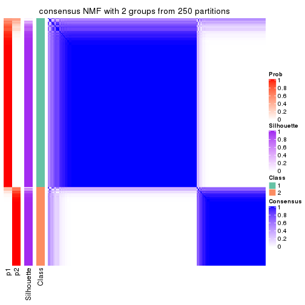</p>

</div>
<div id='tab-ATC-NMF-consensus-heatmap-2'>
<pre><code class="r">consensus_heatmap(res, k = 3)
</code></pre>

<p></p>

</div>
<div id='tab-ATC-NMF-consensus-heatmap-3'>
<pre><code class="r">consensus_heatmap(res, k = 4)
</code></pre>

<p></p>

</div>
<div id='tab-ATC-NMF-consensus-heatmap-4'>
<pre><code class="r">consensus_heatmap(res, k = 5)
</code></pre>

<p></p>

</div>
<div id='tab-ATC-NMF-consensus-heatmap-5'>
<pre><code class="r">consensus_heatmap(res, k = 6)
</code></pre>

<p></p>

</div>
</div>

Heatmaps for the membership of samples in all partitions to see how consistent they are:


<script>
$( function() {
	$( '#tabs-ATC-NMF-membership-heatmap' ).tabs();
} );
</script>
<div id='tabs-ATC-NMF-membership-heatmap'>
<ul>
<li><a href='#tab-ATC-NMF-membership-heatmap-1'>k = 2</a></li>
<li><a href='#tab-ATC-NMF-membership-heatmap-2'>k = 3</a></li>
<li><a href='#tab-ATC-NMF-membership-heatmap-3'>k = 4</a></li>
<li><a href='#tab-ATC-NMF-membership-heatmap-4'>k = 5</a></li>
<li><a href='#tab-ATC-NMF-membership-heatmap-5'>k = 6</a></li>
</ul>
<div id='tab-ATC-NMF-membership-heatmap-1'>
<pre><code class="r">membership_heatmap(res, k = 2)
</code></pre>

<p></p>

</div>
<div id='tab-ATC-NMF-membership-heatmap-2'>
<pre><code class="r">membership_heatmap(res, k = 3)
</code></pre>

<p></p>

</div>
<div id='tab-ATC-NMF-membership-heatmap-3'>
<pre><code class="r">membership_heatmap(res, k = 4)
</code></pre>

<p></p>

</div>
<div id='tab-ATC-NMF-membership-heatmap-4'>
<pre><code class="r">membership_heatmap(res, k = 5)
</code></pre>

<p></p>

</div>
<div id='tab-ATC-NMF-membership-heatmap-5'>
<pre><code class="r">membership_heatmap(res, k = 6)
</code></pre>

<p></p>

</div>
</div>

As soon as we have had the classes for columns, we can look for signatures
which are significantly different between classes which can be candidate marks
for certain classes. Following are the heatmaps for signatures.


Signature heatmaps where rows are scaled:


<script>
$( function() {
	$( '#tabs-ATC-NMF-get-signatures' ).tabs();
} );
</script>
<div id='tabs-ATC-NMF-get-signatures'>
<ul>
<li><a href='#tab-ATC-NMF-get-signatures-1'>k = 2</a></li>
<li><a href='#tab-ATC-NMF-get-signatures-2'>k = 3</a></li>
<li><a href='#tab-ATC-NMF-get-signatures-3'>k = 4</a></li>
<li><a href='#tab-ATC-NMF-get-signatures-4'>k = 5</a></li>
<li><a href='#tab-ATC-NMF-get-signatures-5'>k = 6</a></li>
</ul>
<div id='tab-ATC-NMF-get-signatures-1'>
<pre><code class="r">get_signatures(res, k = 2)
</code></pre>

<p></p>

</div>
<div id='tab-ATC-NMF-get-signatures-2'>
<pre><code class="r">get_signatures(res, k = 3)
</code></pre>

<p></p>

</div>
<div id='tab-ATC-NMF-get-signatures-3'>
<pre><code class="r">get_signatures(res, k = 4)
</code></pre>

<p></p>

</div>
<div id='tab-ATC-NMF-get-signatures-4'>
<pre><code class="r">get_signatures(res, k = 5)
</code></pre>

<p></p>

</div>
<div id='tab-ATC-NMF-get-signatures-5'>
<pre><code class="r">get_signatures(res, k = 6)
</code></pre>

<p></p>

</div>
</div>


Signature heatmaps where rows are not scaled:


<script>
$( function() {
	$( '#tabs-ATC-NMF-get-signatures-no-scale' ).tabs();
} );
</script>
<div id='tabs-ATC-NMF-get-signatures-no-scale'>
<ul>
<li><a href='#tab-ATC-NMF-get-signatures-no-scale-1'>k = 2</a></li>
<li><a href='#tab-ATC-NMF-get-signatures-no-scale-2'>k = 3</a></li>
<li><a href='#tab-ATC-NMF-get-signatures-no-scale-3'>k = 4</a></li>
<li><a href='#tab-ATC-NMF-get-signatures-no-scale-4'>k = 5</a></li>
<li><a href='#tab-ATC-NMF-get-signatures-no-scale-5'>k = 6</a></li>
</ul>
<div id='tab-ATC-NMF-get-signatures-no-scale-1'>
<pre><code class="r">get_signatures(res, k = 2, scale_rows = FALSE)
</code></pre>

<p></p>

</div>
<div id='tab-ATC-NMF-get-signatures-no-scale-2'>
<pre><code class="r">get_signatures(res, k = 3, scale_rows = FALSE)
</code></pre>

<p></p>

</div>
<div id='tab-ATC-NMF-get-signatures-no-scale-3'>
<pre><code class="r">get_signatures(res, k = 4, scale_rows = FALSE)
</code></pre>

<p></p>

</div>
<div id='tab-ATC-NMF-get-signatures-no-scale-4'>
<pre><code class="r">get_signatures(res, k = 5, scale_rows = FALSE)
</code></pre>

<p></p>

</div>
<div id='tab-ATC-NMF-get-signatures-no-scale-5'>
<pre><code class="r">get_signatures(res, k = 6, scale_rows = FALSE)
</code></pre>

<p></p>

</div>
</div>


Compare the overlap of signatures from different k:

```r
compare_signatures(res)
```


`get_signature()` returns a data frame invisibly. TO get the list of signatures, the function
call should be assigned to a variable explicitly. In following code, if `plot` argument is set
to `FALSE`, no heatmap is plotted while only the differential analysis is performed.

```r
# code only for demonstration
tb = get_signature(res, k = ..., plot = FALSE)
```

An example of the output of `tb` is:

```
#>   which_row         fdr    mean_1    mean_2 scaled_mean_1 scaled_mean_2 km
#> 1        38 0.042760348  8.373488  9.131774    -0.5533452     0.5164555  1
#> 2        40 0.018707592  7.106213  8.469186    -0.6173731     0.5762149  1
#> 3        55 0.019134737 10.221463 11.207825    -0.6159697     0.5749050  1
#> 4        59 0.006059896  5.921854  7.869574    -0.6899429     0.6439467  1
#> 5        60 0.018055526  8.928898 10.211722    -0.6204761     0.5791110  1
#> 6        98 0.009384629 15.714769 14.887706     0.6635654    -0.6193277  2
...
```

The columns in `tb` are:

1. `which_row`: row indices corresponding to the input matrix.
2. `fdr`: FDR for the differential test. 
3. `mean_x`: The mean value in group x.
4. `scaled_mean_x`: The mean value in group x after rows are scaled.
5. `km`: Row groups if k-means clustering is applied to rows.


UMAP plot which shows how samples are separated.


<script>
$( function() {
	$( '#tabs-ATC-NMF-dimension-reduction' ).tabs();
} );
</script>
<div id='tabs-ATC-NMF-dimension-reduction'>
<ul>
<li><a href='#tab-ATC-NMF-dimension-reduction-1'>k = 2</a></li>
<li><a href='#tab-ATC-NMF-dimension-reduction-2'>k = 3</a></li>
<li><a href='#tab-ATC-NMF-dimension-reduction-3'>k = 4</a></li>
<li><a href='#tab-ATC-NMF-dimension-reduction-4'>k = 5</a></li>
<li><a href='#tab-ATC-NMF-dimension-reduction-5'>k = 6</a></li>
</ul>
<div id='tab-ATC-NMF-dimension-reduction-1'>
<pre><code class="r">dimension_reduction(res, k = 2, method = &quot;UMAP&quot;)
</code></pre>

<p></p>

</div>
<div id='tab-ATC-NMF-dimension-reduction-2'>
<pre><code class="r">dimension_reduction(res, k = 3, method = &quot;UMAP&quot;)
</code></pre>

<p></p>

</div>
<div id='tab-ATC-NMF-dimension-reduction-3'>
<pre><code class="r">dimension_reduction(res, k = 4, method = &quot;UMAP&quot;)
</code></pre>

<p></p>

</div>
<div id='tab-ATC-NMF-dimension-reduction-4'>
<pre><code class="r">dimension_reduction(res, k = 5, method = &quot;UMAP&quot;)
</code></pre>

<p></p>

</div>
<div id='tab-ATC-NMF-dimension-reduction-5'>
<pre><code class="r">dimension_reduction(res, k = 6, method = &quot;UMAP&quot;)
</code></pre>

<p></p>

</div>
</div>


Following heatmap shows how subgroups are split when increasing `k`:

```r
collect_classes(res)
```


If matrix rows can be associated to genes, consider to use `GO_Enrichment(res,
...)` to perform function enrichment for the signature genes.


 

## Session info


```r
sessionInfo()
```

```
#> R version 3.6.0 (2019-04-26)
#> Platform: x86_64-pc-linux-gnu (64-bit)
#> Running under: CentOS Linux 7 (Core)
#> 
#> Matrix products: default
#> BLAS:   /usr/lib64/libblas.so.3.4.2
#> LAPACK: /usr/lib64/liblapack.so.3.4.2
#> 
#> locale:
#>  [1] LC_CTYPE=en_US.UTF-8       LC_NUMERIC=C               LC_TIME=en_US.UTF-8       
#>  [4] LC_COLLATE=en_US.UTF-8     LC_MONETARY=en_US.UTF-8    LC_MESSAGES=en_US.UTF-8   
#>  [7] LC_PAPER=en_US.UTF-8       LC_NAME=C                  LC_ADDRESS=C              
#> [10] LC_TELEPHONE=C             LC_MEASUREMENT=en_US.UTF-8 LC_IDENTIFICATION=C       
#> 
#> attached base packages:
#>  [1] grid      parallel  stats4    stats     graphics  grDevices utils     datasets  methods  
#> [10] base     
#> 
#> other attached packages:
#>  [1] genefilter_1.66.0           ComplexHeatmap_2.1.1        markdown_1.1               
#>  [4] knitr_1.26                  cola_1.3.2                  SummarizedExperiment_1.14.1
#>  [7] DelayedArray_0.10.0         BiocParallel_1.18.1         matrixStats_0.55.0         
#> [10] Biobase_2.44.0              GenomicRanges_1.36.1        GenomeInfoDb_1.20.0        
#> [13] IRanges_2.18.3              S4Vectors_0.22.1            BiocGenerics_0.30.0        
#> [16] GetoptLong_0.1.7           
#> 
#> loaded via a namespace (and not attached):
#>  [1] bitops_1.0-6           bit64_0.9-7            doParallel_1.0.15      RColorBrewer_1.1-2    
#>  [5] httr_1.4.1             backports_1.1.5        tools_3.6.0            R6_2.4.1              
#>  [9] DBI_1.0.0              lazyeval_0.2.2         colorspace_1.4-1       withr_2.1.2           
#> [13] tidyselect_0.2.5       gridExtra_2.3          bit_1.1-14             compiler_3.6.0        
#> [17] xml2_1.2.2             microbenchmark_1.4-7   pkgmaker_0.28          slam_0.1-46           
#> [21] scales_1.1.0           NMF_0.23.6             stringr_1.4.0          digest_0.6.23         
#> [25] XVector_0.24.0         pkgconfig_2.0.3        bibtex_0.4.2           highr_0.8             
#> [29] rlang_0.4.2            GlobalOptions_0.1.1    RSQLite_2.1.2          impute_1.58.0         
#> [33] shape_1.4.4            mclust_5.4.5           dendextend_1.12.0      dplyr_0.8.3           
#> [37] RCurl_1.95-4.12        magrittr_1.5           GenomeInfoDbData_1.2.1 Matrix_1.2-17         
#> [41] Rcpp_1.0.3             munsell_0.5.0          viridis_0.5.1          lifecycle_0.1.0       
#> [45] stringi_1.4.3          zlibbioc_1.30.0        plyr_1.8.4             blob_1.2.0            
#> [49] crayon_1.3.4           lattice_0.20-38        splines_3.6.0          annotate_1.62.0       
#> [53] circlize_0.4.9         zeallot_0.1.0          pillar_1.4.2           rjson_0.2.20          
#> [57] rngtools_1.4           reshape2_1.4.3         codetools_0.2-16       XML_3.98-1.20         
#> [61] glue_1.3.1             evaluate_0.14          vctrs_0.2.0            png_0.1-7             
#> [65] foreach_1.4.7          polyclip_1.10-0        gtable_0.3.0           purrr_0.3.3           
#> [69] clue_0.3-57            assertthat_0.2.1       ggplot2_3.2.1          xfun_0.11             
#> [73] gridBase_0.4-7         eulerr_6.0.0           xtable_1.8-4           skmeans_0.2-11        
#> [77] survival_2.44-1.1      viridisLite_0.3.0      tibble_2.1.3           iterators_1.0.12      
#> [81] memoise_1.1.0          AnnotationDbi_1.46.1   registry_0.5-1         GTF_0.0.1             
#> [85] cluster_2.1.0          brew_1.0-6
```


